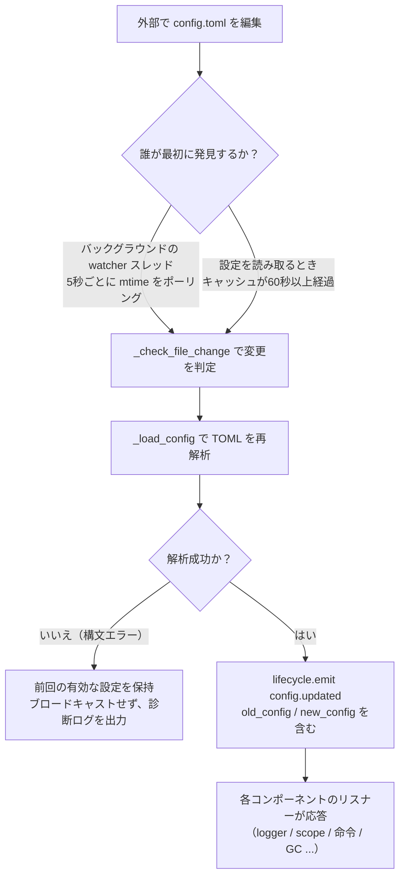

# 設定ファイルの説明
> このドキュメントでは、フレームワークの設定ファイルについて説明します。サードパーティのモジュールに設定が必要な場合は、モジュールのドキュメントを参照してください。

ErisPulse は、`config/config.toml` という TOML 形式の設定ファイルを使用してプロジェクトの設定を管理します。

[**English**](docs/ja/quick-start.md) | [**日本語**](docs/ja/quick-start.md)

## 設定ファイルの位置

設定ファイルはプロジェクトのルートディレクトリの `config/` フォルダにあります：

```
project/
├── config/
│   └── config.toml
├── main.py
```

[**English**](docs/ja/quick-start.md) | [**日本語**](docs/ja/quick-start.md)

## 設定の読み込みエラー処理

フレームワークは `config.toml` を読み込む際に、3 種類のエラー状態を区別し、**操作可能な診断情報を提供**します。デフォルト設定に静かに回復するのではなく、明確なエラー情報を通知します。

| エラー状態 | 発生条件 | フレームワークの動作 |
|---------|---------|---------|
| ファイルが存在しない | `config.toml` が存在しない | 初回起動時は正常に空の設定を静かに使用（警告を出さない） |
| TOML 構文エラー | ファイルは存在するが、形式が不正（例：クォートが欠けている、括弧が閉じられていない） | **行番号/列番号と原因**を出力し、デフォルト設定に回復したことを通知 |
| 権限/その他のエラー | 読み取り権限がない、IO エラーなど | **明確な原因**を出力し、デフォルト設定に回復したことを通知 |

たとえば、誤って設定を `port = 8000`（クォートのない文字列）と記述した場合、ログには次のような内容が表示されます：

```
[ERROR] [Config] 設定ファイル config/config.toml の構文エラー（第 3 行 第 1 列）: ...
[WARNING] [Config] 設定ファイルの読み込みに失敗しました。前回の有効な設定を使用して続行します。今回のファイル変更は有効ではありません。修正後、再読み込みまたは再起動してください。
```

これにより、**INFO レベルのログ**で問題を即座に特定でき、「なぜ設定の変更が有効にならないのか」を混乱することなく把握できます。

> **実行中に設定ファイルを破損させた場合**？ ロボットが実行中、手動で `config.toml` を編集して構文エラーを導入した場合、フレームワークは次回の書き込み（設定のマージ）時に「設定ファイルが破損しました（構文エラー、第 X 行）、マージ書き込みできません。設定ファイルを修正した後に再起動してください」と出力します。混乱を招く「書き込みに失敗しました」ではなく、明確なメッセージを提供します。書き込み保留中の設定項目は保持され、失われることはありません。

## 環境変数による上書き

フレームワークは、環境変数を用いて `ErisPulse.*` の設定項目を**上書き**することをサポートしています（Docker / コンテナ化 / CI 部署に適しており、`config.toml` を変更する必要はありません）。

命名規則：ドット区切りのパス `ErisPulse.<section>.<key>` をすべて大文字にし、`.` を `_` に置き換え、`ERISPULSE_` をプレフィックスに追加します：

| 設定項目 | 環境変数 | 例値 |
|--------|---------|--------|
| `ErisPulse.server.port` | `ERISPULSE_SERVER_PORT` | `9000` |
| `ErisPulse.server.host` | `ERISPULSE_SERVER_HOST` | `0.0.0.0` |
| `ErisPulse.logger.level` | `ERISPULSE_LOGGER_LEVEL` | `DEBUG` |
| `ErisPulse.framework.strict_mode` | `ERISPULSE_FRAMEWORK_STRICT_MODE` | `false` |

動作の説明：
- **優先度が最も高い**：環境変数は「設定ファイル」と「デフォルト値」を上書きし、元の値の型に応じて自動的に変換します（`bool` / `int` / `float` / カンマ区切りの `list` / 文字列）
- **永続化しない**：上書きは実行中にのみ有効であり、`config.toml` には書き戻されません
- **ホット更新をサポート**：実行中に環境変数を変更し、設定監視のリロードを組み合わせることで有効になります

```bash
# Docker 部署の例：config.toml を変更せず、直接ポートを上書き
ERISPULSE_SERVER_PORT=9000 docker compose up -d
```

> 注：`ErisPulse.server.port` のようなフレームワークの設定は、`get_server_config()` などの API で読み取られ、すべて環境変数の上書きの影響を受けます。

## 設定のホットアップデート

2.7.0 以降、フレームワークは設定のホットアップデートを**体系的なサポート**を実装しました。外部で `config.toml` を編集した後（バックグラウンドの watcher が 5 秒ごとに検出）、またはコードで `setConfig()` を呼び出した後、各コンポーネントは自動的に応答します：

| コンポーネント | ホットアップデートがサポートされる設定 | 行動 |
|------|----------------|------|
| **ログ Logger** | `logger.level` / `log_files` / `log_dir`（分割パラメータを含む）/ `memory_limit` / `format` / `exclude_levels` | 自動的に再適用（変更検出付き） |
| **コマンドシステム CommandHandler** | `event.command.prefix` / `case_sensitive` / `allow_space_prefix` / `must_at_bot` | 次のメッセージで即座に有効化 |
| **アダプタの並行処理** | `framework.handler_max_concurrency` | 失効したキャッシュシグナルを再構築、新しい値で再作成 |
| **プロアクティブ GC** | `framework.proactive_gc_*` | 設定変更が即座に GC タスクを再起動し、実行時調整/無効化/再有効化が可能 |
| **マスターシステム Master** | `master.users` | `is_master()` 検査毎にリアルタイム読み取り、再起動不要 |
| **モジュール/アダプタの設定** | 各々の設定項目 | `on_config_update(old, new)` コールバックをトリガー |

**再起動が必要な設定**（安全にホット切り替えできない、変更時に「プロセスを再起動後に有効化」と警告を出力）：

| 設定 | 理由 |
|------|------|
| `router.cors.*` / `router.security.*` | 中間層が FastAPI の起動時に書き込まれており、実行時に安全にホット切り替えできない |
| `storage.use_global_db` | SQLite ファイルハンドルが実行時に既に開かれているため、パスの切り替えは安全ではない |

> **途中で編集保存に失敗した？** `config.toml` を編集する際に一時的な構文エラーが発生した場合、フレームワークは**前回の有効な設定を保持**し、診断ログを出力します。各コンポーネントに空の設定をブロードキャストすることはありません（`on_config_update` が空値を受け取り、誤ってデフォルトに戻るのを防ぐため）。

### ホットアップデートの内部処理の分解

「設定を変更したが、各コンポーネントはどのように知るのか？」——その背後には、検出 → 再ロード → ブロードキャストの処理チェーンがあります：



**2つの検出経路**（どちらか1つで十分、両方ともバックアップになります）：

| 経路 | メカニズム | トリガー |
|------|------|---------|
| バックグラウンド watcher | daemon スレッド `config-watcher` が **5秒**ごとに `wait` でファイル `mtime` をポーリング | 外部でファイルを変更してから最大5秒以内 |
| 慣性検出 | `getConfig()` で読み取るとき、キャッシュが **60秒**以上経過している場合は先にファイルをチェック | 次回設定を読み取るとき |

> **フレームワークは自分自身を誤って傷つけない**：`setConfig()` でファイルに書き込む際、「自身が書き込んだ mtime」を記録し、watcher が比較する際にそれを除外し、**外部編集**のみを変更とみなします。

**2種類の設定変更イベント**：

| イベント | トリガー | データ | 代表的な場面 |
|------|--------|------|---------|
| `config.set` | コード / Dashboard が `setConfig()` を呼び出す | `{key, old_value, new_value}` | 単一キーの書き込み（テンプレート生成、状態記録、実行時設定の変更） |
| `config.updated` | 外部編集後に watcher/慣性検出が捕捉する | `{old_config, new_config, config_file}` | `config.toml` を手動で編集した場合 |

> `setConfig()` はデフォルトで**5秒遅延してファイルに書き込む**（複数回の書き込みを結合）。`immediate=True` は即座に書き込む。watcher が外部変更を検出した後はメモリキャッシュを更新するだけで、**外部の変更をファイルに書き戻すことはない**。

**自動応答するコンポーネント一覧**（2種類のイベントは通常両方をサブスクライブし、応答内容は同一）：

| コンポーネント | 監視 | 応答 |
|------|------|------|
| Logger | `config.set` + `config.updated` | 級別/ファイル/ディレクトリの分割/メモリ上限/フォーマット/非表示レベルを再適用（変更検出付き、変更なしの場合は処理しない） |
| Scope | `config.updated` | スコープバインディングキャッシュを再構築 |
| コマンドシステム | `config.updated` | プレフィックス/大文字小文字/スペースプレフィックス/must_at_bot の解析パラメータを更新、次のメッセージで有効化 |
| アダプタの並行処理 | `config.set` + `config.updated` | `handler_max_concurrency` が失効し、シグナルを再構築 |
| プロアクティブ GC | `config.set` + `config.updated` | `proactive_gc_*` が即座に GC バックグラウンドタスクを再起動 |
| アダプタ | `on_config_update` にルーティング | 各アダプタの `on_config_update(old, new)` コールバック |
| モジュール | `on_config_update` にルーティング | 各モジュールの `on_config_update(old, new)` コールバック |
| ストレージ | `config.updated` | `use_global_db` の変更は**警告のみ**（再起動が必要） |
| ルーティング | `config.updated` | `cors.*` / `security.*` の変更は**警告のみ**（再起動が必要） |

## 完全な設定例

```toml
[ErisPulse.server]
host = "0.0.0.0"
port = 8000
auto_start = true
ssl_certfile = ""
ssl_keyfile = ""

[ErisPulse.master]
# users には2種類の書き方が可能です（どちらか一方を選択してください）：
#   グローバルなオーナー（すべてのプラットフォームに効果）：users = ["123456", "789012"]
#   プラットフォームごとにオーナーを指定：users = { yunhu = ["123456"], telegram = ["789012"] }
users = {}

[ErisPulse.logger]
level = "INFO"
format = "rich"
log_files = []
log_dir = ""
log_rotation = "size"
log_max_size_mb = 10
log_backup_count = 5
log_rotation_when = "midnight"
memory_limit = 1000
exclude_levels = []

[ErisPulse.framework]
enable_lazy_loading = true
uninit_timeout = 30
strict_mode = 0

[ErisPulse.framework.strict_mode_exceptions]
modules = []
adapters = []

[ErisPulse.storage]
use_global_db = false

[ErisPulse.event.command]
prefix = "/"
case_sensitive = true
allow_space_prefix = false
must_at_bot = false

[ErisPulse.event.message]
ignore_self = true

[ErisPulse.i18n]
language = "auto"

## サーバー設定

```toml
[ErisPulse.server]
host = "0.0.0.0"
port = 8000
auto_start = true
ssl_certfile = "/path/to/cert.pem"
ssl_keyfile = "/path/to/key.pem"
```

| 設定項目 | 型 | デフォルト値 | 説明 |
|---------|------|---------|------|
| host | string | 0.0.0.0 | 監視するアドレス。0.0.0.0 はすべてのインターフェースを意味します |
| port | integer | 8000 | 監視するポート番号 |
| auto_start | boolean | true | `sdk.init()` 時にルーティングサーバーを自動的に起動するかどうか。`false` に設定するとルーティングサーバーの起動をスキップできます（純粋なイベント/WebUIなしのシナリオ） |
| ssl_certfile | string | 空 | SSL証明書ファイルのパス |
| ssl_keyfile | string | 空 | SSL秘密鍵ファイルのパス |

[**English**](docs/en/quick-start.md) | [**中文**](docs/ja/quick-start.md) | [**日本語**](docs/ja/quick-start.md)

## 主人システム設定

主人システムは「フレームワークの主人」アカウント（例：Bot管理者）を識別するために使用されます。`master.users` は2つの書式をサポートしています：

```toml
[ErisPulse.master]
# 書式1：グローバルな主人（すべてのプラットフォームに適用）
users = ["123456", "789012"]

# 書式2：プラットフォームごとに主人を指定（dict）
# users = { yunhu = ["123456"], telegram = ["789012"] }
```

| 設定項目 | 型 | デフォルト値 | 説明 |
|---------|------|---------|------|
| users | array / object | 空 | 主人アカウントのリスト。`list` 形式はグローバルな主人（すべてのプラットフォームに適用）；`dict` 形式はプラットフォームごとに指定（キーがプラットフォーム名、値がそのプラットフォームの主人アカウントのリスト） |

コード中では `master.is_master(event)` または `master.is_master(platform, user_id)` を使用してチェックし、各呼び出し時に設定をリアルタイムで読み込みます（ホットアップデートをサポートし、再起動は不要です）：

```python
from ErisPulse.Core import master

if master.is_master(event):
    await event.reply("主人こんにちは")
```

[**English**](docs/ja/quick-start.md)

## ログ設定

```toml
[ErisPulse.logger]
level = "INFO"
log_files = []                # 明示的なログファイルのリスト（log_dir と排他的で、優先度が高くなります）
log_dir = ""                  # ログディレクトリ（設定後、自動的にセグメント分割とローテーションを行います）
log_rotation = "size"         # セグメント分割方法: "size" / "date" / "none"
log_max_size_mb = 10          # size モードの単一ファイルの上限サイズ（MB）
log_backup_count = 5          # 保持する履歴ログファイル数
log_rotation_when = "midnight"  # date モードのローテーション周期: S/M/H/D/midnight
memory_limit = 1000
exclude_levels = ["EVENT"]
```

| 設定項目 | 型 | デフォルト値 | 説明 |
|---------|------|---------|------|
| level | string | INFO | ログレベル: TRACE, DEBUG, INFO, WARNING, ERROR, CRITICAL（TRACE は最低レベルで、フレームワーク内部の詳細なデバッグ情報を出力します） |
| format | string | rich | ログ出力フォーマット: `rich`（カラー表示、デフォルト）、`plain`（純粋なテキスト、色なし、ログの収集/パイプのリダイレクトに適しています）、`json`（JSON形式、ELK 等に適しています） |
| log_files | array | 空 | ログ出力ファイルのリスト（明示的なパス、セグメント分割なし） |
| log_dir | string | 空 | ログ出力ディレクトリ（自動作成）。設定後、ディレクトリ内に `erispulse.log` を書き込み、`log_rotation` に従って自動的にセグメント分割します。`log_files` と排他的で、`log_files` が優先されます |
| log_rotation | string | size | セグメント分割方法: `size`（サイズで分割）/ `date`（日時で分割）/ `none`（分割なし） |
| log_max_size_mb | float | 10 | size モードの単一ファイルのサイズ上限（MB）。上限を超えると `.1`/`.2` などのバックアップにローテーションされます |
| log_backup_count | integer | 5 | 保持する履歴ログファイル数。古いバックアップは自動的に削除されます |
| log_rotation_when | string | midnight | date モードのローテーション周期: `S`/`M`/`H`/`D`/`midnight`（デフォルトは毎日0時） |
| memory_limit | integer | 1000 | メモリに保持するログの件数 |
| exclude_levels | array | 空 | 指定したログレベルを除外します。除外されたレベルのログは**完全に破棄**されます（メモリに書き込まず、Dashboard などのサブスクライバーに送信せず、表示せず、ファイルに書き込まず）。ホットアップデートが可能です |

また、コード内で動的に切り替えることも可能です：

```python
from ErisPulse.Core import logger

# サイズで分割: 単一ファイル10MB、5個保持
logger.set_output_dir("logs", rotation="size", max_size_mb=10, backup_count=5)

# 日時で分割: 毎日0時にローテーション、7個保持
logger.set_output_dir("logs", rotation="date", backup_count=7)
```

> [!NOTE]
> `log_dir` および分割関連の設定は ErisPulse **2.8.0+** が必要です。

> **プライバシー保護**: メッセージの送受信内容は **EVENT** レベル（値21）で記録されます。`exclude_levels = ["EVENT"]` を設定すると、バックエンド（例: Dashboard のログパネル）は各グループ/プライベートチャットのメッセージ内容を表示できなくなりますが、他のログレベルには影響しません。

> [!NOTE]
> `exclude_levels` 機能は ErisPulse **2.8.0+** が必要です。

## 框架設定

```toml
[ErisPulse.framework]
enable_lazy_loading = true
uninit_timeout = 30
strict_mode = 0

[ErisPulse.framework.strict_mode_exceptions]
modules = []
adapters = []
```

| 設定項目 | 型 | デフォルト値 | 説明 |
|---------|------|---------|------|
| enable_lazy_loading | boolean | true | モジュールの遅延ロードを有効にするかどうか |
| uninit_timeout | integer | 30 | エレガントなシャットダウンの合計タイムアウト時間（秒）。これを超えると強制的に終了する。0 はタイムアウトを設定しないことを意味する |
| strict_mode | integer | 0 | 厳格モードのレベル。下記の「厳格モード」の説明を参照 |
| handler_max_concurrency | integer | 64 | イベントハンドラの最大並行タスク数。大きい値に設定するとスループットが向上するが、メモリ使用量が増える |
| offline_bot_expiry | integer | 3600 | 離線 Bot 記録の自動有効期限（秒）。0 は有効期限を設定しないことを意味する |

### プロアクティブ GC 設定

SDK の初期化後、プロアクティブ GC のバックグラウンドタスクが起動し、Python の GC と内部リソースの回収（離線 Bot のクリーンアップなど）を周期的に実行する。すべてのパラメータはホットアップデートが可能で、変更時には即座にタスクを再起動する。

| 設定項目 | 型 | デフォルト値 | 説明 |
|---------|------|---------|------|
| proactive_gc_interval | number | 300 | 回収間隔（秒）。小数もサポート。0 はプロアクティブ GC を無効化することを意味する |
| proactive_gc_generation | integer | 0 | 通常の回収世代（0/1/2、0..2 に制限）。注意: `gc.collect(2)` は全量回収に相当し、デフォルトは 0 で軽量を維持する。深い回収は `proactive_gc_full_every` によって周期的にトリガーされる |
| proactive_gc_full_every | integer | 20 | N ラウンドごとに全量回収を行う。0 は周期的な全量回収を無効化することを意味する。全量回収は `proactive_gc_memory_growth_mb` のしきい値によって制約される |
| proactive_gc_memory_growth_mb | integer | 32 | 全量回収のメモリ増加しきい値（MB）：前回の全量回収後のメモリベースライン（優先的に tracemalloc、次に RSS）と比較し、この値に達した場合にのみ全量回収が実行される。0 はしきい値を設定しないことを意味する |
| proactive_gc_idle_only | boolean | false | 有効にすると、イベントのピーク時（未完了の pending handler がある）にこのラウンドでは Python GC をスキップし、停止とメッセージ処理の競合を回避する。内部リソースの回収には影響しない |
| proactive_gc_gen0_min | integer | 500 | 通常のラウンドで回収をトリガーする gen0 のガベージ量の下限：`gc.get_count()[0]` がこの値より低い場合は直接スキップする（空回りラウンドはほぼゼロコスト）。0 は常に回収することを意味する |

> **2.7.1 変更**：デフォルトの `proactive_gc_generation` は `2` から `0` に変更され、デフォルトの `proactive_gc_full_every` は `0` から `20` に変更された。以前は `generation=2` は毎ラウンドで最も重い全量回収を意味していた。新しいデフォルトでは、回収のカバレッジを維持しつつ、空回りのコストを大幅に低減する。明示的に設定された旧値はそのまま意味に従って動作する。

### 厳格モード

厳格モードは、モジュール/アダプターがロード段階で不正または失敗した場合の処理戦略を制御する。現代のモジュール/アダプターはすべて対応するベースクラス（`BaseModule`/`BaseAdapter`）を継承するべきである。ベースクラスを継承していないコンポーネントは、フレームワークのコンテキストシステムとバックアップクリーンアップに影響を与え、リソースリークを引き起こす可能性がある。

> **2.5.2 変更**：デフォルトレベルは `1`（スキップ）から `0`（緩和）に変更され、新規ユーザーが初めて使用する際のロード問題を減らす。ベースクラスを継承していないコンポーネントは、警告として提示され、直接拒否されずにロードを試みる。旧来の動作を回復したい場合は、`strict_mode = 1` を明示的に設定する。

| レベル | 名称 | 行動 |
|------|------|------|
| 0 | 緩和（デフォルト） | 不正は警告のみ、ベースクラスを継承していないコンポーネントもロードを試みる（旧コンポーネントとの互換性） |
| 1 | 厳格-スキップ | ベースクラスを継承していないコンポーネントを拒否してスキップし、他のコンポーネントは正常に起動する |
| 2 | 厳格-致命 | すべての不正（ベースクラスを継承していない、ロード失敗、登録失敗、初期化失敗など）を致命的に扱い、起動チェックポイントで一括して不正リストを出力し、起動を中止する |

各レベルにおいて、「ロード/登録/初期化段階でのエラー」は、コンポーネント自身のクラッシュは常にスキップされる。違いは以下の通りである：

- **0 → 1**：唯一の動作変化は「ベースクラスを継承していない」が「ロードを試みる」から「スキップ」に変わる点である。
- **1 → 2**：すべての不正（ベースクラスを継承していない、ロード失敗、登録失敗、初期化失敗など）が致命的に扱われ、起動チェックポイントで一括して不正リストを出力し、起動を中止する。

#### 補償リスト

特定のコンポーネントが一時的に移行できない場合（例えば、依存する旧モジュールなど）、そのコンポーネントを補償リストに追加することで、不正であっても緩和モードで扱い、ロードを続けることができる：

```toml
[ErisPulse.framework.strict_mode_exceptions]
modules = ["SeTu", "SomeLegacyModule"]
adapters = ["OldAdapter"]
```

> コンポーネントが厳格モードで拒否された場合、ログには明確にどのようにロードを回復するか（補償リストに追加するか、レベルを下げること）が提示される。

## ストレージ設定

```toml
[ErisPulse.storage]
use_global_db = false
```

| 設定項目 | 型 | デフォルト値 | 説明 |
|---------|------|---------|------|
| use_global_db | boolean | false | プロジェクトデータベースではなく、ErisPulseパッケージ内に含まれるグローバルデータベースを使用するかどうか。`true` の場合、すべてのプロジェクトが ErisPulse パッケージ内の SQLite データベースを共有する。`false`（デフォルト）の場合は、各プロジェクトが `config/` ディレクトリ下に独立したデータベースを使用する。 |

[**English**](docs/en/quick-start.md) | [**日本語**](docs/ja/quick-start.md) | [**简体中文**](docs/ja/quick-start.md)

## イベント設定

### コマンド設定

```toml
[ErisPulse.event.command]
prefix = "/"
case_sensitive = true
allow_space_prefix = false
```

| 設定項目 | 型 | デフォルト値 | 説明 |
|---------|------|---------|------|
| prefix | string | / | コマンドのプレフィックス |
| case_sensitive | boolean | true | 大文字小文字を区別するかどうか（`/Help` と `/help` が異なるコマンドになるかどうか） |
| allow_space_prefix | boolean | false | 空白をプレフィックスとして許可するかどうか |
| must_at_bot | boolean | false | コマンドをトリガーするには必ず@ボットが必要かどうか（プライベートチャットは制限されない） |

### メッセージ設定

```toml
[ErisPulse.event.message]
ignore_self = true
```

| 設定項目 | 型 | デフォルト値 | 説明 |
|---------|------|---------|------|
| ignore_self | boolean | true | ロボット自身のメッセージを無視するかどうか |

[**English**](docs/ja/README.md)

## 国際化設定

```toml
[ErisPulse.i18n]
language = "auto"
```

| 設定項目 | 型 | デフォルト値 | 説明 |
|---------|------|---------|------|
| language | string | auto | フレームワークの内部テキストの表示言語。`auto` に設定するとシステム言語を自動検出し、具体的な言語コード `zh-CN`、`zh-TW`、`en`、`ja`、`ru` を指定することも可能です。 |

[docs/ja/quick-start.md]

## モジュール設定

各モジュールは設定ファイルで独自の設定を定義できます：

```toml
[MyModule]
api_url = "https://api.example.com"
timeout = 30
enabled = true
```

モジュール内で設定を読み取り、書き込みます：

```python
from ErisPulse import sdk

# 設定の読み込み
config = sdk.config.getConfig("MyModule", {})
api_url = config.get("api_url", "https://default.api.com")

# 実行時での設定の書き込み（遅延保存）
sdk.config.setConfig("MyModule.timeout", 60)

# ファイルへの即時保存
sdk.config.setConfig("MyModule.timeout", 60, immediate=True)
```

> `setConfig` はデフォルトで遅延書き込み（約5秒ごとに一括保存）が行われます。`immediate=True` を設定すると即時永続化されます。設定の変更は `config.set` ライフサイクルイベントをトリガーします。

[**English**](docs/en/quick-start.md) | [**中文**](docs/ja/quick-start.md) | [**日本語**](docs/ja/quick-start.md)

## スコープ設定

> [!NOTE]  
> この機能には ErisPulse **2.8.0+** が必要です。

モジュールスコープシステムは、「特定の Bot がどのモジュールを使用できるか」を制御するために使用されます。デフォルトでは、すべてのモジュールはすべての Bot に対して開放されており、設定のバインディング後にフィルタリングが開始されます。モジュールとアダプターは**変更なし**で適応可能です。

```toml
[ErisPulse.scope]
default_allow = true        # デフォルトで全モジュールを許可（false = 隠れ拒否の厳密モード）
cache_size = 1024           # is_allowed の LRU キャッシュサイズ
```

| 設定項目 | 型 | 説明 |
|---------|------|------|
| `scope.default_allow` | boolean | デフォルトで全モジュールを許可（`true`）。`false` = 隠れ拒否の厳密モード、ホワイトリスト内のモジュールのみ使用可能 |
| `scope.cache_size` | integer | `is_allowed` の LRU キャッシュサイズ（デフォルト 1024） |
| `scope.platforms.<platform>.modules` | array | プラットフォームレベルのホワイトリスト：指定されたモジュールのみ使用可能（空 = 制限なし） |
| `scope.platforms.<platform>.blocked` | array | プラットフォームレベルのブラックリスト：指定されたモジュールは無効（空 = 制限なし） |
| `scope.bots.<platform>.<bot_id>.modules` | array | Bot レベルのホワイトリスト、プラットフォームレベルを上書き |
| `scope.bots.<platform>.<bot_id>.blocked` | array | Bot レベルのブラックリスト、プラットフォームレベルを上書き |
| `scope.sessions.<platform>.<session_id>.modules` | array | 会話レベルのホワイトリスト（グループ/チャンネル/プライベートチャット）、優先度が最も高い |
| `scope.sessions.<platform>.<session_id>.blocked` | array | 会話レベルのブラックリスト、優先度が最も高い |

> 解析優先度：**会話レベル > Bot レベル > プラットフォームレベル**。3段階のバインディングの完全な TOML 例、モジュール名の大文字小文字は区別されない、会話識別子はプラットフォーム間で隔離される、実行時 `sdk.scope.bind()` / `unbind()` による動的な追加・削除（`merge=True` で結合可能）などは、[スコープシステム](../advanced/scope.md)を参照してください。

## 次に進む

- [CLI コマンドリファレンス](cli-reference.md) - すべてのコマンドラインコマンドの詳細を確認
- [開発者ガイド](../developer-guide/) - カスタムモジュールの開発方法を学ぶ

リンクの言語バージョンを正しく設定するため、`docs/ja/` は `docs/ja/` に置き換えてください。