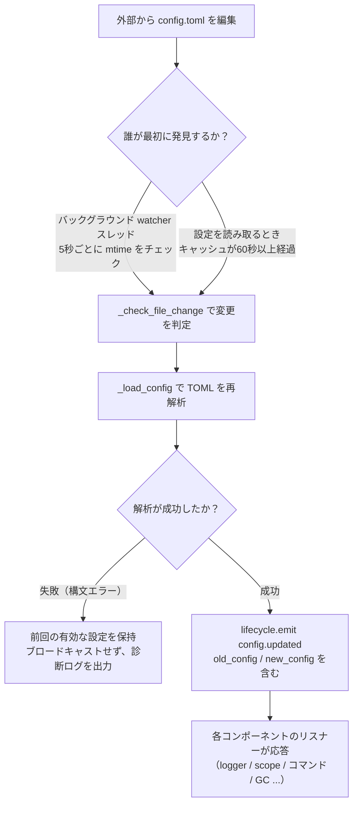

# 設定ファイルの説明
> このドキュメントでは、フレームワークの設定ファイルについて説明します。サードパーティのモジュールに設定が必要な場合は、モジュールのドキュメントを参照してください。

ErisPulse は、プロジェクトの設定を管理するために TOML 形式の設定ファイル `config/config.toml` を使用します。

## 設定ファイルの場所

設定ファイルはプロジェクトのルートディレクトリにある `config/` フォルダにあります：

```
project/
├── config/
│   └── config.toml
├── main.py
```

## 設定の読み込みエラー処理

フレームワークは `config.toml` の読み込み時に、3 種類のエラー状態を区別し、**操作可能な診断情報を提供**します。静かにデフォルト設定に回復するのではなく、明確なエラーメッセージを出力します。

| エラー状態 | 発生条件 | フレームワークの動作 |
|---------|---------|---------|
| ファイルの欠落 | `config.toml` が存在しない | 初回起動時は正常に動作し、空の設定を使用（警告を出さない） |
| TOML 構文エラー | ファイルは存在するが構文が不正（例：引用符が欠けている、括弧が閉じられていない） | **行番号/列番号と原因**を出力し、デフォルト設定に回復する旨を通知 |
| 権限/その他のエラー | 読み取り権限がない、IO エラーなど | **明確な原因**を出力し、デフォルト設定に回復する旨を通知 |

たとえば、誤って設定を `port = 8000`（文字列の引用符が欠けている）と記述した場合、ログには次のような内容が出力されます：

```
[ERROR] [Config] 設定ファイル config/config.toml の構文エラー（第 3 行 第 1 列）: ...
[WARNING] [Config] 設定ファイルの読み込みに失敗しました。前回有効な設定を使用して続行します。今回のファイルの変更は有効になりません。— 設定ファイルを修正して再読み込みまたは再起動してください。
```

このように、**INFO レベルのログ**でも問題をすぐに特定でき、「なぜ設定を変更しても効果がないのか」という困惑を解消します。

> **実行中に設定ファイルを誤って編集した場合**？ ロボットが実行中の間に `config.toml` を手動で編集して構文エラーを含ませた場合、フレームワークは次回の書き込み（設定のマージ）時に「設定ファイルが破損しました（構文エラー、第 X 行）、マージ書き込みできません。— まず設定ファイルを修正して再起動してください」と出力します。不明瞭な「書き込み失敗」ではなく、明確なエラーメッセージになります。書き込み保留中の設定項目は保持され、失われることはありません。

## コメントの保持と最小限の書き込み

`config.toml` 内の**コメントとキーの順序は、フレームワークが書き込んだ後も完全に保持されます**。コード `setConfig()`、CLI 設定ガイドによる保存、またはアダプタ/モジュールの初期設定テンプレート生成においても、フレームワークは対象となるキーのみを変更し、ユーザーが書いたコメントや整理された順序は削除や再配置されることはありません（tomlkit のコメント保持の往復機能を活用）。

フレームワークは書き込み内容に対して抑制的な姿勢をとっています：

- **フレームワークのデフォルト設定は自動的に書き込まれません**：`gc`、`scope`、`transcript` などの組み込みデフォルト値はメモリ内にのみ存在し、`config.toml` にはユーザーが明示的に設定したキーのみが含まれ、最小限に保たれます。完全な設定項目は、プロジェクト内の `config/config.full.example` を参照し、必要に応じて `config.toml` にコピーして編集してください（未設定の項目はすべて組み込みのデフォルト値が適用され、動作に変化はありません）。
- **`config.full.example` は自動的に維持されます**：`epsdk init` を実行したかどうかに関わらず、フレームワークを起動するたびに（`epsdk run` / `main.py`）、`config/config.full.example` が欠落している場合、完全な設定の参考となるファイルが自動生成されます。ファイルの先頭行にはフレームワークが維持管理しているマークが付いており、生成器の内容が更新された場合（新しい設定項目や新規アダプタの追加など）、起動時に一度だけ更新されます。先頭行を削除または変更すると、手動での管理に切り替わり、フレームワークは再び上書きしません。
- **アダプタ/モジュールの設定テンプレート**：初期化時にコメント付きのテンプレートが書き込まれます（フィールドの説明がコメントとして記載されます）。`example` というラベルが付いたフィールドは書き込まれず、`config.full.example` に記録され、参考用としてのみ使用されます。

## 環境変数による上書き

フレームワークは、`ErisPulse.*` の設定項目を環境変数で**上書き**することをサポートしています（Docker / コンテナ化 / CI 部署に適しており、`config.toml` を変更する必要はありません）。

命名規則：ドット区切りのパス `ErisPulse.<section>.<key>` をすべて大文字にし、`.` を `_` に置き換え、`ERISPULSE_` をプレフィックスとして追加します：

| 設定項目 | 環境変数 | 例値 |
|--------|---------|--------|
| `ErisPulse.server.port` | `ERISPULSE_SERVER_PORT` | `9000` |
| `ErisPulse.server.host` | `ERISPULSE_SERVER_HOST` | `0.0.0.0` |
| `ErisPulse.logger.level` | `ERISPULSE_LOGGER_LEVEL` | `DEBUG` |
| `ErisPulse.framework.strict_mode` | `ERISPULSE_FRAMEWORK_STRICT_MODE` | `false` |

動作の説明：
- **優先度が最も高い**：環境変数は「設定ファイル」および「デフォルト値」を上書きし、元の値の型に応じて自動的に変換されます（`bool` / `int` / `float` / カンマ区切りの `list` / 文字列）
- **永続化されない**：上書きは実行時にのみ有効であり、`config.toml` には書き戻されません
- **ホット更新をサポート**：実行中に環境変数を変更し、設定監視のリロードを組み合わせることで、即座に有効になります

```bash
# Docker 部署の例：config.toml を変更せずに、直接ポートを上書き
ERISPULSE_SERVER_PORT=9000 docker compose up -d
```

> 注：`ErisPulse.server.port` のようなフレームワーク設定は `get_server_config()` などの API で読み取られ、いずれも環境変数による上書きの影響を受けます。

## 設定のホットアップデート

2.7.0 以降、フレームワークは設定のホットアップデートに対して**体系的なサポート**を行っています。外部から `config.toml` を変更した場合（バックグラウンドの watcher が 5 秒ごとに検出）、またはコードで `setConfig()` を呼び出した場合、各コンポーネントは自動的に応答します。

| コンポーネント | ホットアップデート可能な設定 | 行動 |
|------|----------------|------|
| **ログ Logger** | `logger.level` / `log_files` / `log_dir`（分割パラメータを含む）/ `memory_limit` / `format` / `exclude_levels` | 変更検出付きで自動的に再適用 |
| **コマンドシステム CommandHandler** | `event.command.prefix` / `case_sensitive` / `allow_space_prefix` / `must_at_bot` | 次のメッセージで即座に有効化 |
| **アダプタの並行処理** | `framework.handler_max_concurrency` | キャッシュされた信号量を無効化し、新しい値で再構築 |
| **プロアクティブ GC** | `framework.proactive_gc_*` | 設定の変更に即座に GC タスクを再起動し、実行時調整/無効化/再有効化が可能 |
| **マスターシステム Master** | `master.users` | `is_master()` 検査のたびにリアルタイムで読み取り、再起動は不要 |
| **モジュール/アダプタの設定** | 各々の設定項目 | `on_config_update(old, new)` コールバックをトリガー |

**再起動が必要な設定**（安全なホット切り替えができないため、変更時に「プロセスを再起動後に有効化」という警告が出力される）：

| 設定 | 理由 |
|------|------|
| `router.cors.*` / `router.security.*` | 中間件が FastAPI の起動時に書き込まれており、実行時に安全なホット切り替えができない |
| `storage.use_global_db` | SQLite ファイルハンドルが既に実行時に開かれているため、パスの切り替えは安全ではない |

> **途中で編集保存に失敗した場合**：`config.toml` を編集する際に一時的な構文エラーが発生した場合、フレームワークは**前回の有効な設定を保持**し、診断ログを出力します。空の設定を各コンポーネントにブロードキャストすることはありません（`on_config_update` が空値を受け取ってデフォルトに戻るのを防ぐため）。

### ホットアップデートの内部処理の詳細

「設定を変更した後、各コンポーネントはどのように知るのか？」——その背後には、検出 → 再読み込み → ブロードキャストの処理チェーンがあります。



**2つの検出経路**（どちらか1つで十分、どちらもバックアップになります）：

| 経路 | 機制 | トリガタイミング |
|------|------|---------|
| バックグラウンド watcher | デーモンスレッド `config-watcher` が **5秒**ごとに `wait` でファイル `mtime` をチェック | 外部でファイルを変更した後、最大5秒以内に |
| 慣性検出 | 任意の `getConfig()` 読取時に、キャッシュが **60秒**以上経過している場合、先にファイルをチェック | 次回の設定読取時 |

> **フレームワークは自分自身を誤って傷つけない**：`setConfig()` でファイルに書き込む際、フレームワークは「自身が書き込んだ mtime」を記録し、watcher が比較する際にそれを除外します。**外部編集のみ**を変更として認識します。

**2種類の設定変更イベント**：

| イベント | トリガ元 | データ | 代表的な場面 |
|------|--------|------|---------|
| `config.set` | コード / Dashboard が `setConfig()` を呼び出す | `{key, old_value, new_value}` | 単一キーの書き込み（テンプレート生成、状態記録、実行時設定変更） |
| `config.updated` | 外部編集後に watcher/慣性検出が捕捉 | `{old_config, new_config, config_file}` | `config.toml` を手動で編集した場合 |

> `setConfig()` はデフォルトで**5秒遅延してファイルに書き込み**（複数回の書き込みをまとめる）、`immediate=True` で即時書き込み。watcher が外部変更を検出した場合、メモリキャッシュのみ更新され、**外部変更はファイルに書き戻されない**。

**自動応答対象一覧**（2種類のイベントは通常両方サブスクライブし、応答内容は同じ）：

| コンポーネント | 監視 | 応答 |
|------|------|------|
| Logger | `config.set` + `config.updated` | レベル/ファイル/ディレクトリの分割/メモリ上限/フォーマット/除外レベルを再適用（変更検出付き、変更がない場合は処理しない） |
| Scope | `config.updated` | スコープバインディングのキャッシュを再構築 |
| コマンドシステム | `config.updated` | プレフィックス/大文字小文字/スペースプレフィックス/must_at_bot のパラメータ解析を更新し、次のメッセージで有効化 |
| アダプタの並行処理 | `config.set` + `config.updated` | `handler_max_concurrency` で無効化し、信号量を再構築 |
| プロアクティブ GC | `config.set` + `config.updated` | `proactive_gc_*` で即時 GC タスクを再起動 |
| アダプタ | `on_config_update` にルーティング | 各アダプタの `on_config_update(old, new)` コールバック |
| モジュール | `on_config_update` にルーティング | 各モジュールの `on_config_update(old, new)` コールバック |
| ストレージ | `config.updated` | `use_global_db` の変更は**警告のみ**（再起動が必要） |
| ルーティング | `config.updated` | `cors.*` / `security.*` の変更は**警告のみ**（再起動が必要） |

## 完全な設定例

```toml
[ErisPulse.server]
host = "0.0.0.0"
port = 8000
auto_start = true
ssl_certfile = ""
ssl_keyfile = ""

[ErisPulse.master]
# users には2つの書式がサポートされています（どちらか一方を選択してください）：
#   グローバルな所有者（すべてのプラットフォームに適用）：users = ["123456", "789012"]
#   プラットフォームごとに所有者を指定：users = { yunhu = ["123456"], telegram = ["789012"] }
users = {}

[ErisPulse.logger]
level = "INFO"
format = "rich"
log_files = []
log_dir = ""
log_rotation = "size"
log_max_size_mb = 10
log_backup_count = 5
log_rotation_when = "midnight"
memory_limit = 1000
exclude_levels = []

[ErisPulse.framework]
enable_lazy_loading = true
uninit_timeout = 30
strict_mode = 0

[ErisPulse.framework.strict_mode_exceptions]
modules = []
adapters = []

[ErisPulse.storage]
backend = "sqlite"
use_global_db = false

[ErisPulse.event.command]
prefix = "/"
case_sensitive = true
allow_space_prefix = false
must_at_bot = false

[ErisPulse.event.message]
ignore_self = true

[ErisPulse.i18n]
language = "auto"
```

## サーバーの設定

```toml
[ErisPulse.server]
host = "0.0.0.0"
port = 8000
auto_start = true
ssl_certfile = "/path/to/cert.pem"
ssl_keyfile = "/path/to/key.pem"
```

| 設定項目 | 型 | デフォルト値 | 説明 |
|---------|------|---------|------|
| host | string | 0.0.0.0 | 監視するアドレス。0.0.0.0 はすべてのインターフェースを意味します |
| port | integer | 8000 | 監視するポート番号 |
| auto_start | boolean | true | `sdk.init()` 時にルーティングサーバーを自動的に起動するかどうか。`false` に設定するとルーティングサーバーの起動をスキップできます（純粋なイベント/WebUI なしの状況） |
| ssl_certfile | string | 空 | SSL 証明書ファイルのパス |
| ssl_keyfile | string | 空 | SSL 秘密鍵ファイルのパス |

## 主人システム設定

主人システムは「フレームワークの所有者」アカウント（Bot管理者など）を識別するために使用されます。`master.users` には2種類の書き方が可能です：

```toml
[ErisPulse.master]
# 書き方1：グローバルな所有者（すべてのプラットフォームに適用）
users = ["123456", "789012"]

# 書き方2：プラットフォームごとに所有者を指定（dict）
# users = { yunhu = ["123456"], telegram = ["789012"] }
```

| 設定項目 | 型 | デフォルト値 | 説明 |
|---------|------|---------|------|
| users | array / object | 空 | 所有者アカウントのリスト。`list` 形式はグローバル所有者（すべてのプラットフォームに適用）；`dict` 形式はプラットフォームごとに指定（キーはプラットフォーム名、値はそのプラットフォームの所有者アカウントのリスト） |

コードでは `master.is_master(event)` または `master.is_master(platform, user_id)` を使用してチェックし、各呼び出し時に設定をリアルタイムで読み込みます（ホットアップデートが可能で、再起動は不要です）：

```python
from ErisPulse.Core import master

if master.is_master(event):
    await event.reply("主人你好")
```

### 判定チェーンと実行時追加・削除

主人の判定チェーンは **設定された所有者 → 実行時記録 → providerチェーン** です：

```python
from ErisPulse.Core import master

master.is_master(event)                      # イベントから判定
master.is_master("yunhu", "123")             # 明示的に判定
master.add("yunhu", "123")                   # 実行時に追加（デフォルトで永続化；persist=False はメモリ内のみ）
master.remove("yunhu", "123")                # 削除（デフォルトで永続化）
master.list()                                # リスト化：{"global": [...], "<platform>": [...]}
```

### 自定义アイデンティティソース（provider）

設定に加えて、独自のアイデンティティソースを登録することも可能です：`fn(platform, user_id) -> bool`。
ビルトインのアイデンティティソース（設定 + 実行時記録）がヒットしなかった場合、順次試行され、いずれかの provider が許可すれば所有者と判定されます。
アダプタの管理者インターフェース、データベースのロールなど、外部のアイデンティティ体系との統合に適しています。

登録エントリポイント `master.provider` はデコレータ / 関数形式の2種類の書き方が可能で、登録解除は登録された関数の `fn.unregister()` を通じて行います：

```python
from ErisPulse.Core import master

# 書き方1：デコレータ（常駐アイデンティティソース、推奨）
@master.provider
def admin_provider(platform, user_id):
    return user_id in {"999"}     # 自己定義の判定ロジック

master.is_master("yunhu", "999")   # True
admin_provider.unregister()        # 不要になった場合に登録解除

# 書き方2：関数形式（モジュールロード時登録 / アンロード時登録解除）
fn = master.provider(admin_provider)
fn.unregister()
```

> provider で発生した例外はキャッチされ、判定チェーンをブロックすることはありません。
> インスタンスメソッドにバインドした場合、`unregister` を設定できません。登録/登録解除が対になって必要な場合は**モジュールレベルの関数**を使用してください。

### ユーザー優先：主人生効果範囲はユーザーが最終決定

コマンドの `master=True` は**開発者のデフォルト**です：ユーザーは
`ErisPulse.event.overrides.command.<module>.<cmd>.master = true/false`
を設定することで、強化または緩和（[統一イベント覆写設定](#統一イベント覆写設定eventoverrides)参照）を覆写できます。ユーザーが明示的に設定した場合、それが有効になります。

## ログ設定

```toml
[ErisPulse.logger]
level = "INFO"
log_files = []                # 明示的なログファイルリスト（log_dir と排他、優先度が高い）
log_dir = ""                  # ログディレクトリ（設定後、自動的に分割ローテーション）
log_rotation = "size"         # 分割方法: "size" / "date" / "none"
log_max_size_mb = 10          # size モードでの単一ファイルの上限サイズ（MB）
log_backup_count = 5          # 保持する履歴ログファイル数
log_rotation_when = "midnight"  # date モードのローテーション周期: S/M/H/D/midnight
memory_limit = 1000
exclude_levels = ["EVENT"]
```

| 設定項目 | 型 | デフォルト値 | 説明 |
|---------|------|---------|------|
| level | string | INFO | ログレベル：TRACE, DEBUG, INFO, WARNING, ERROR, CRITICAL（TRACE は最低レベルで、フレームワーク内部の詳細なデバッグ情報を出力） |
| format | string | rich | ログ出力形式：`rich`（カラー表示、デフォルト）、`plain`（カラーなしのプレーンテキスト、ログ収集/パイプリダイレクトに適している）、`json`（JSON 構造化、ELK などに適している） |
| log_files | array | 空 | ログ出力ファイルリスト（明示的なパス、分割しない） |
| log_dir | string | 空 | ログ出力ディレクトリ（自動作成）。設定後、`erispulse.log` に書き込み、`log_rotation` に従って自動的に分割する。`log_files` と排他で、`log_files` が優先 |
| log_rotation | string | size | 分割方法：`size`（サイズ別）/ `date`（日付別）/ `none`（分割しない） |
| log_max_size_mb | float | 10 | size モードでの単一ファイルのサイズ上限（MB）。上限を超えると `.1`/`.2` などのバックアップにローテーション |
| log_backup_count | integer | 5 | 保持する履歴ログファイル数。古いファイルは自動的に削除される |
| log_rotation_when | string | midnight | date モードのローテーション周期：`S`/`M`/`H`/`D`/`midnight`（デフォルトは毎日0時） |
| memory_limit | integer | 1000 | メモリに保持するログの件数 |
| exclude_levels | array | 空 | 指定されたログレベルを除外。除外されたレベルのログは**完全に破棄**される（メモリに書き込まず、Dashboard などのサブスクライバーに送信せず、表示もファイルへの出力もしない）。ホットアップデートをサポート |

コード内で動的に切り替えることも可能です：

```python
from ErisPulse.Core import logger

# サイズ別分割：単一ファイル 10MB、5 件保持
logger.set_output_dir("logs", rotation="size", max_size_mb=10, backup_count=5)

# 日付別分割：毎日0時ローテーション、7 件保持
logger.set_output_dir("logs", rotation="date", backup_count=7)
```

> [!NOTE]
> `log_dir` および分割関連の設定は ErisPulse **2.8.0+** が必要です。

> **プライバシー保護**：メッセージの送受信内容は **EVENT レベル**（数値 21）で記録されます。`exclude_levels = ["EVENT"]` を設定することで、バックエンド（例：Dashboard のログパネル）が各グループ/プライベートチャットのメッセージ内容を表示できなくなります。ただし、他のレベルのログには影響しません。

> [!NOTE]
> `exclude_levels` の機能は ErisPulse **2.8.0+** が必要です。

## 框架設定

```toml
[ErisPulse.framework]
enable_lazy_loading = true
uninit_timeout = 30
strict_mode = 0

[ErisPulse.framework.strict_mode_exceptions]
modules = []
adapters = []
```

| 設定項目 | 型 | デフォルト値 | 説明 |
|---------|------|---------|------|
| enable_lazy_loading | boolean | true | モジュールの遅延ロードを有効にするかどうか |
| uninit_timeout | integer | 30 | エレガントなシャットダウンの総タイムアウト時間（秒）。これを超えると強制的に終了する。0 はタイムアウトを設定しないことを意味する |
| strict_mode | integer | 0 | 厳格モードのレベル。下記「厳格モード」の説明を参照 |
| handler_max_concurrency | integer | 64 | イベントハンドラの最大並行タスク数。大きい値は処理能力を高めるがメモリ使用量も増加する |
| offline_bot_expiry | integer | 3600 | 離線 Bot 記録の自動期限切れ時間（秒）。0 は期限切れをしないことを意味する |

### プロアクティブGC設定

SDK の初期化完了後にプロアクティブGCのバックグラウンドタスクを起動し、周期的に Python GC と内部リソースの回収（離線 Bot のクリーンアップなど）を実行する。すべてのパラメータはホットアップデートが可能で、変更時に即座にタスクの再起動が行われる。

| 設定項目 | 型 | デフォルト値 | 説明 |
|---------|------|---------|------|
| proactive_gc_interval | number | 300 | 回収間隔（秒）。小数もサポート。0 はプロアクティブGCを無効化することを意味する |
| proactive_gc_generation | integer | 0 | 通常の回収世代（0/1/2、0..2 に制限）。注意：`gc.collect(2)` は全量回収に相当し、デフォルトの 0 は軽量な状態を維持する。深い回収は `proactive_gc_full_every` で周期的にトリガーされる |
| proactive_gc_full_every | integer | 20 | N 回ごとに全量回収を行う。0 は周期的な全量回収を無効化することを意味する。全量回収は `proactive_gc_memory_growth_mb` のしきい値によって制約される |
| proactive_gc_memory_growth_mb | integer | 32 | 全量回収のメモリ増加しきい値（MB）：前回の全量回収後のメモリベースライン（優先的に tracemalloc、次に RSS）と比較し、この値に達した場合に全量回収が実行される。0 はしきい値を設定しないことを意味する |
| proactive_gc_idle_only | boolean | false | 有効化すると、イベントのピーク時（未完了の pending handler がある）に、Python GC をスキップして、内部リソースの回収は影響を受けない |
| proactive_gc_gen0_min | integer | 500 | 通常の回収をトリガーする gen0 のガベージ量の下限：`gc.get_count()[0]` がこの値より小さい場合は、回収をスキップする（空回しのラウンドはほぼオーバーヘッドがゼロ）。0 は常に回収することを意味する |

> **2.7.1 変更**：デフォルトの `proactive_gc_generation` は `2` から `0` に変更され、`proactive_gc_full_every` は `0` から `20` に変更された。以前は `generation=2` は毎回最も重い全量回収を意味していたが、新しいデフォルトでは回収のカバレッジを維持しつつ、空回しのオーバーヘッドを大幅に削減する。明示的に設定された旧値はそのままの意味で動作する。

### 厳格モード

厳格モードは、モジュール/アダプターがロード段階で不正な状態や失敗した場合の処理戦略を制御する。現代のモジュール/アダプターはすべて対応する基底クラス（`BaseModule` / `BaseAdapter`）を継承するべきであり、基底クラスを継承していないコンポーネントはフレームワークのコンテキストシステムとデフォルトのクリーンアップに影響を与え、リソースリークを引き起こす可能性がある。

> **2.5.2 変更**：デフォルトのレベルは `1`（スキップ）から `0`（緩和）に変更され、新規ユーザーが初めて使用する際に遭遇するロードの問題を減らす。基底クラスを継承していないコンポーネントは警告として表示され、ロードを試みる。以前の動作に戻したい場合は、`strict_mode = 1` を明示的に設定する。

| レベル | 名前 | 行動 |
|------|------|------|
| 0 | 緩和（デフォルト） | 不正な状態は警告として扱い、基底クラスを継承していないコンポーネントもロードを試みる（旧コンポーネントの互換性） |
| 1 | 厳格-スキップ | 基底クラスを継承していないコンポーネントを拒否し、スキップする。他のコンポーネントは正常に起動する |
| 2 | 厳格-致命 | すべての不正な状態（基底クラスを継承していない、ロード失敗、登録失敗、初期化失敗など）を致命的なエラーとして扱い、起動チェックポイントで一括して不正なリストを出力して中止する |

各レベルにおいて、「ロード/登録/初期化段階でエラー」のようなコンポーネント自身のクラッシュは常にスキップされる。違いは以下の通りである：

- **0 → 1**：唯一の動作変化は「基底クラスを継承していない」が「ロードをスキップする」に変わる点である。
- **1 → 2**：すべての不正な状態（基底クラスを継承していない、ロード失敗、登録失敗、初期化失敗など）が致命的なエラーに昇格し、起動チェックポイントで一括して不正なリストを出力して中止する。

#### 豁免リスト

もし特定のコンポーネントが一時的に移行できない（例えば依存する旧モジュールなど）場合、そのコンポーネントを豁免リストに追加することで、不正なコンポーネントでも緩和モードで扱い、ロードを続けることができる：

```toml
[ErisPulse.framework.strict_mode_exceptions]
modules = ["SeTu", "SomeLegacyModule"]
adapters = ["OldAdapter"]
```

> コンポーネントが厳格モードで拒否された場合、ログにはロードを回復する方法（豁免リストに追加するか、レベルを下げること）が明確に表示される。

## ストレージ設定

2.8.0 から、ストレージエンジンは3種類の非同期バックエンドをサポートしています。**API は完全に同一で、設定の切り替えはワンクリック**です。

| バックエンド | ドライバー | インストール | 特徴 |
|------|------|------|------|
| SQLite（デフォルト） | aiosqlite | オープン時に即座に使用可能 | 零設定、単一ファイル、WAL による並行処理 |
| MySQL / MariaDB | aiomysql | `pip install ErisPulse[mysql]` | 既存の MySQL インフラストラクチャ、複数インスタンスの共有 |
| PostgreSQL | asyncpg | `pip install ErisPulse[postgres]` | トランザクション能力が高く、高並行処理に対応 |

```toml
[ErisPulse.storage]
backend = "sqlite"        # "sqlite"（デフォルト）/ "mysql" / "postgres"
use_global_db = false     # 仅 SQLite: パッケージ内グローバルデータベース data/config.db を使用するか

[ErisPulse.storage.mysql]      # backend = "mysql" の場合に有効
host = "127.0.0.1"
port = 3306
user = "erispulse"
password = ""
database = "erispulse"
# charset = "utf8mb4"
# pool_min = 1
# pool_max = 10

[ErisPulse.storage.postgres]   # backend = "postgres" の場合に有効
host = "127.0.0.1"
port = 5432
user = "erispulse"
password = ""
database = "erispulse"
# pool_min = 1
# pool_max = 10
```

| 設定項目 | 型 | デフォルト値 | 説明 |
|---------|------|---------|------|
| backend | string | sqlite | ストレージバックエンド: `sqlite` / `mysql` / `postgres`、コード変更なしで切り替え可能 |
| use_global_db | boolean | false | 仅 SQLite: プロジェクト固有のデータベースではなく、パッケージ内グローバルデータベースを使用するか |
| storage.mysql.* | table | 上記参照 | MySQL 接続パラメータ (host / port / user / password / database / charset / pool) |
| storage.postgres.* | table | 上記参照 | PostgreSQL 接続パラメータ (host / port / user / password / database / pool) |

環境変数による上書きもサポートしています（Docker / 12-factor）: `ErisPulse.storage.postgres.host` → `ERISPULSE_STORAGE_POSTGRES_HOST`。

> [!TIP]
> - 接続パラメータの変更後は、フレームワークの再起動が必要です。接続プールの作成が瞬間的に失敗した場合、指数関数的な退避再試行が自動的に行われます。
> - バックエンドの切り替え前に、検証スクリプトで自己チェックが可能です: `python tests/devs/test_storage_backend_verify.py --backend mysql`
> - トランザクション / 方言の違い / 自作バックエンドなど、詳細な説明は[ストレージバックエンド](../advanced/storage-backends.md)をご覧ください。

## イベント設定

### コマンド設定

```toml
[ErisPulse.event.command]
prefix = "/"
case_sensitive = true
allow_space_prefix = false
```

| 設定項目 | 型 | デフォルト値 | 説明 |
|---------|------|---------|------|
| prefix | string | / | コマンドのプレフィックス |
| case_sensitive | boolean | true | 大文字小文字を区別するかどうか（`/Help` と `/help` が異なるコマンドになるかどうか） |
| allow_space_prefix | boolean | false | 空白文字をプレフィックスとして許可するかどうか |
| must_at_bot | boolean | false | コマンドの発動に@機械人を付ける必要があるかどうか（プライベートチャットは制限されない） |

### メッセージ設定

```toml
[ErisPulse.event.message]
ignore_self = true
```

| 設定項目 | 型 | デフォルト値 | 説明 |
|---------|------|---------|------|
| ignore_self | boolean | true | ロボット自身のメッセージを無視するかどうか |

## 国際化設定

```toml
[ErisPulse.i18n]
language = "auto"
```

| 設定項目 | 型 | デフォルト値 | 説明 |
|---------|------|---------|------|
| language | string | auto | フレームワークの内部テキストの表示言語。`auto` に設定するとシステム言語を自動検出します。また、具体的な言語コード `zh-CN`、`zh-TW`、`en`、`ja`、`ru` に設定することも可能です。 |

## モジュールの設定

各モジュールは設定ファイルで独自の設定を定義できます：

```toml
[MyModule]
api_url = "https://api.example.com"
timeout = 30
enabled = true
```

モジュール内で設定を読み取り、書き込みます：

```python
from ErisPulse import sdk

# 設定の読み込み
config = sdk.config.getConfig("MyModule", {})
api_url = config.get("api_url", "https://default.api.com")

# 実行時に設定を書き込む（遅延保存）
sdk.config.setConfig("MyModule.timeout", 60)

# ファイルに即時保存
sdk.config.setConfig("MyModule.timeout", 60, immediate=True)
```

> `setConfig` はデフォルトで遅延書き込み（約5秒ごとに一括保存）を使用します。`immediate=True` を設定すると即時永続化されます。設定の変更は `config.set` ライフサイクルイベントをトリガーします。

## スコープの設定（scope）

> [!NOTE]
> この機能は ErisPulse **2.8.0+** が必要です。

スコープ宣言は「**どの範囲で有効か**」を定義します。具体的には、以下3つの次元で制御されます：

- ① **モジュール次元**：特定のプラットフォーム / Bot / セッションでどのモジュールが利用可能か
- ② **アイデンティティ次元**：特定のユーザー / グループ / Bot / アダプターのイベントを受信するかどうか
- ③ **出力次元**：モジュールがどのような出力呼び出しを行うか

```toml
[ErisPulse.scope]
default_allow = true        # 全局的なデフォルト値（false = 厳格な拒否モード；出力次元には影響しない）
cache_size = 1024           # LRUキャッシュのサイズ

# ① 模塊次元（優先順位：セッション > Bot > プラットフォーム；エントリには正確な一致 / glob / re: 正規表現が使用可能）
[ErisPulse.scope.platforms.onebot11]
modules = ["Chat", "Tool*"]
blocked = ["re:^Danger"]

# 子レベルのバインディングで merge = true を指定すると、優先度の低いレベルとエントリごとに集合をマージする（デフォルトは全体を上書き）
[ErisPulse.scope.bots.onebot11."123456"]
modules = ["Music"]
merge = true

# ② アイデンティティ次元（優先順位：ユーザー > セッション > Bot > アダプター；各レベルでは allow または deny の一方のみを指定可能）
[ErisPulse.scope.identity.adapters.onebot11]
deny = true                 # このプラットフォームのすべてのイベントを入口で破棄
[ErisPulse.scope.identity.users.onebot11]
allow = ["u_admin"]         # ユーザーのキーには glob / re: 正規表現が使用可能
deny = ["u_bad", "spam_*"]

# ③ 出力次元（デフォルトでは全許可；ルールはインラインテーブル、エントリには正確な一致 / glob / re: 正規表現が使用可能）
[ErisPulse.scope.actions.MyModule]
send = { deny = true }                    # 送信を全禁止
api = { allow = ["get_*"] }               # 一部のクエリ系標準APIのみ許可
request = { deny = true }                 # リクエストの処理を禁止
```

| 設定項目 | 型 | 説明 |
|---------|------|------|
| `scope.default_allow` | boolean | 全局的なデフォルト値：ルールに該当しないモジュール/アイデンティティは許可/拒否（`true`） |
| `scope.cache_size` | integer | LRUキャッシュのサイズ（デフォルト 1024） |
| `scope.platforms / bots / sessions` | table | ① モジュールの3段階バインディング：`{modules=[...], blocked=[...], merge=bool?}` |
| `scope.identity.adapters / bots / sessions / users` | table | ② アイデンティティの4段階バインディング：`{allow=true}` / `{deny=true}` |
| `scope.actions.<module>.<アクション>` | table | ③ 出力ルール：`{allow=[...], deny=true|[...]}`（アクションは send / api / request のいずれか） |

> 詳細と実行時API（次元化された `sdk.scope.set_module()` / `set_identity()` /
> `set_action()`、判定用の `is_allowed()` / `is_identity_allowed()` / `is_action_allowed()`、
> および辞書形式のデフォルト値 `get()` / `set()` / `delete()`）は[作用域（scope）](../advanced/scope.md)をご覧ください。

## 統一イベントオーバーライド設定 (event.overrides)

統一オーバーライドシステム：**イベントタイプ**に基づいて、モジュールのコードを変更せずに任意のモジュールハンドラの動作をオーバーライドします。  
OneBot12 標準タイプ（meta / message / notice / request）と拡張タイプ（command）  
それぞれに専用のオーバーライド可能なパラメータがあります：

```toml
[ErisPulse.event.overrides]

# message：テキストトリガー条件（コード内の条件と AND）
[ErisPulse.event.overrides.message.ChatModule]
pattern = "闲聊*"

# notice / request / meta：detail_type ホワイトリスト（エントリは正確 / glob / re: 正規表現に対応）
[ErisPulse.event.overrides.notice.MyModule]
detail_types = ["group_increase"]

# command（拡張タイプ）：パラメータのオーバーライドを実装（ユーザー優先；統一ACL denyを無効化）
[ErisPulse.event.overrides.command.MyModule.restart]
master = true               # オーバーライド：フレームワークのオーナーのみ（falseにすると開発者のオーナー制限を解除）
hidden = true               # ヘルプリストから非表示
aliases = ["rs"]            # 有効なエイリアス

# acl（command専用）：コマンドのユーザーホワイト/ブラックリスト（コマンド名はglob / re: 正規表現に対応、正確なキーが優先）
[ErisPulse.event.overrides.acl."roll*"]
allow = ["onebot11:u_vip"]  # ユーザー識別子 "platform:user_id"
deny = ["onebot11:u_bad"]

# ACLのデフォルト：ACLが設定されていないコマンドを許可（true）/ 严格拒否（false）
acl_default_allow = true
```

| 設定項目 | タイプ | 説明 |
|---------|------|------|
| `event.overrides.message.<module>` | table | テキスト条件：`{pattern="...", regex="..."}` |
| `event.overrides.notice / request.<module>` | table | `{detail_types=[...], pattern, regex}` |
| `event.overrides.meta.<module>` | table | `{detail_types=[...]}` |
| `event.overrides.command.<module>` | table | モジュールレベルのパラメータオーバーライド（`hidden = true` などのスカラー） |
| `event.overrides.command.<module>.<command>` | table | コマンドレベルのオーバーライド（コマンドレベルが優先） |
| `event.overrides.acl.<コマンド名>` | table | ユーザーのホワイト/ブラックリスト：`{allow=[...], deny=[...]}` |
| `event.overrides.acl_default_allow` | boolean | ACLのデフォルト：ACLが設定されていないコマンドを許可（`true`）/ 严格拒否（`false`） |

> 実行時API（`from ErisPulse.Core.Event import overrides`の後、タイプのサブネームスペースを呼び出す：`overrides.message.set()` / `overrides.command.set()` / `overrides.acl.set()` など、または `sdk.Event.overrides` でアクセス）  
> 詳細は [イベント処理入門 · イベントオーバーライド](../getting-started/event-handling.md#イベントオーバーライド不改模块代码覆写任意事件类型的行为) を参照してください。

## コマンド解析の設定（event.command）

## 次に進む

- [CLI コマンドリファレンス](cli-reference.md) - すべてのコマンドラインコマンドについて学ぶ
- [開発者ガイド](../developer-guide/) - カスタムモジュールの開発方法を学ぶ