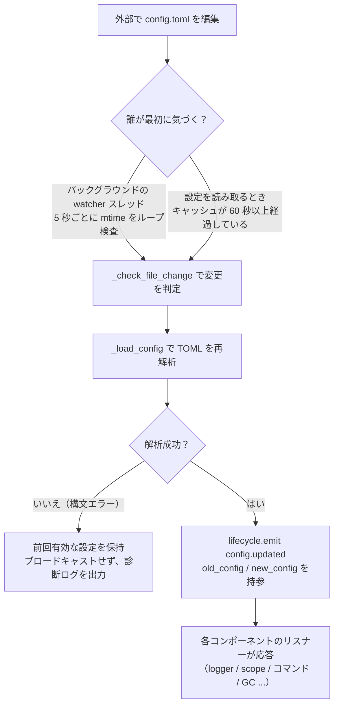

# 設定ファイルの説明
> このドキュメントでは、フレームワークの設定ファイルについて説明します。サードパーティのモジュールに設定が必要な場合は、それぞれのモジュールのドキュメントを参照してください。

ErisPulse は、プロジェクトの設定を管理するために TOML 形式の設定ファイル `config/config.toml` を使用します。

## 設定ファイルの位置

設定ファイルはプロジェクトのルートディレクトリの `config/` フォルダ内にあります：

```
project/
├── config/
│   └── config.toml
├── main.py
```

## 設定ファイルの読み込みエラー処理

フレームワークは `config.toml` の読み込み時に3つのエラー状態を区別し、**操作可能な診断情報を提供**します。静かにデフォルト設定に回帰するのではなく、エラーが発生したことを明示的に通知します。

| エラー状態 | 発生条件 | フレームワークの動作 |
|---------|---------|---------|
| ファイルが存在しない | `config.toml` が存在しない | 初回起動時はデフォルト設定を使用し、警告を出さない |
| TOMLの構文エラー | ファイルは存在するが構文が正しくない（例：引用符が足りない、括弧が閉じられていない） | **エラーの行番号/列番号と原因**を出力し、デフォルト設定に回帰する |
| 権限/その他のエラー | 読み取り権限がない、IOエラーなど | **明確な原因**を出力し、デフォルト設定に回帰する |

たとえば、`port = 8000`（引用符が足りない文字列）と誤って記述した場合、ログには次のような内容が表示されます：

```
[ERROR] [Config] 設定ファイル config/config.toml の構文エラー（第 3 行 第 1 列）: ...
[WARNING] [Config] 設定ファイルの読み込みに失敗しました。前回有効な設定を使用して実行を継続します。今回のファイルの変更は有効になりません。修正後、再読み込みまたは再起動してください。
```

これにより、**INFOレベルのログ**で問題を即座に特定でき、「なぜ設定を変更しても効果がないのか」を混乱させることはありません。

> **実行中に設定ファイルを破損した場合？** ロボットが実行中の間に `config.toml` を手動で編集して構文エラーを導入した場合、フレームワークは次回の書き込み（設定のマージ）時に「設定ファイルが破損しました（構文エラー、第 X 行）、マージ書き込みが失敗しました。設定ファイルを修正してから再起動してください」と出力します。これは「書き込みに失敗しました」という曖昧なメッセージではなく、**明確なエラーメッセージ**です。書き込まれる設定項目は保持され、失われることはありません。

## 環境変数による上書き

フレームワークは、`ErisPulse.*` 配置項目を**環境変数で上書き**することをサポートしています（Docker / コンテナ化 / CI 部署に適しています。`config.toml` を変更する必要はありません）。

命名規則：`ErisPulse.<section>.<key>` の点分区切りパスを、大文字にし、`.` を `_` に置き換え、`ERISPULSE_` を前につける：

| 配置項目 | 環境変数 | 例値 |
|--------|---------|--------|
| `ErisPulse.server.port` | `ERISPULSE_SERVER_PORT` | `9000` |
| `ErisPulse.server.host` | `ERISPULSE_SERVER_HOST` | `0.0.0.0` |
| `ErisPulse.logger.level` | `ERISPULSE_LOGGER_LEVEL` | `DEBUG` |
| `ErisPulse.framework.strict_mode` | `ERISPULSE_FRAMEWORK_STRICT_MODE` | `false` |

動作の説明：
- **優先度が最も高い**：環境変数は「設定ファイル」および「デフォルト値」を上書きし、元の値の型に応じて自動的に変換します（`bool` / `int` / `float` / カンマ区切りの `list` / 文字列）
- **永続化されない**：上書きは実行中にのみ有効で、`config.toml` に書き戻されることはありません
- **ホットアップデートがサポートされている**：実行中に環境変数を変更し、設定監視のリロードを組み合わせることで有効になります

```bash
# Docker 部署の例：config.toml を変更せずに、ポートを上書きする
ERISPULSE_SERVER_PORT=9000 docker compose up -d
```

> 注：`ErisPulse.server.port` などのフレームワーク設定は `get_server_config()` などの API を通じて読み取られ、すべて環境変数の影響を受けます。

## 設定のホットアップデート

2.7.0 以降、フレームワークは設定のホットアップデートを**体系的にサポート**しています。外部で `config.toml` を変更した後（バックグラウンドの watcher が 5 秒ごとに検出）、またはコードで `setConfig()` を呼び出した後、各コンポーネントは自動的に応答します：

| コンポーネント | ホットアップデート対応の設定 | 動作 |
|------|----------------|------|
| **ログ Logger** | `logger.level` / `log_files` / `log_dir`（含む分割パラメータ）/ `memory_limit` / `format` / `exclude_levels` | 変更検出付きで自動的に再適用 |
| **コマンドシステム CommandHandler** | `event.command.prefix` / `case_sensitive` / `allow_space_prefix` / `must_at_bot` | 次のメッセージで即座に有効 |
| **アダプタの並行処理** | `framework.handler_max_concurrency` | 失効したキャッシュシグナルをリセットし、新しい値で再構築 |
| **積極的 GC** | `framework.proactive_gc_*` | 設定変更を即座に再起動し、実行時に調整/無効化/再有効化が可能 |
| **マスターシステム Master** | `master.users` | `is_master()` 検査は毎回リアルタイムで読み取り、再起動は不要 |
| **モジュール/アダプタの設定** | 各々の設定項目 | `on_config_update(old, new)` コールバックをトリガー |

**再起動が必要な設定**（安全にホットスイッチできない、変更時に「プロセスを再起動後に有効」という警告が出力される）：

| 設定 | 原因 |
|------|------|
| `router.cors.*` / `router.security.*` | 中間件はサービス起動時に FastAPI に書き込まれ、実行時に安全にホットスイッチできない |
| `storage.use_global_db` | SQLite ファイルハンドルは実行時に既に開かれているため、パスの変更は安全ではない |

> **途中で編集保存に失敗した場合？** `config.toml` を編集中に一時的な構文エラーが発生した場合、フレームワークは**前回有効な設定を保持**し、診断ログを出力します。各コンポーネントに空の設定をブロードキャストしない（`on_config_update` が空値を受け取って誤ってデフォルトに回帰しない）。

### ホットアップデートの内部フロー分解

「設定を変更した後、各コンポーネントはどのように知るのか？」——背後には検出 → 再ロード → ブロードキャストのチェーンがあります：



**2つの検出経路**（どちらでも構いません、どちらもバックアップになります）：

| 経路 | メカニズム | 発動タイミング |
|------|------|---------|
| バックグラウンド watcher | daemon スレッド `config-watcher` が **5 秒** `wait` でファイル `mtime` をループ検査 | 外部でファイルを変更した後、最大 5 秒以内に |
| 慣性検出 | 任意の `getConfig()` 読取時、キャッシュが **60 秒**以上経過している場合、ファイルを先に検査 | 次回設定を読取るとき |

> **フレームワークは自分自身を誤傷しません**：`setConfig()` でファイルに書き込む際、フレームワークは「自身が書き込んだ mtime」を記録し、watcher はそれを除外して、**外部編集**のみを変更とみなします。

**2種類の設定変更イベント**：

| イベント | 発動者 | データ | 代表的なシナリオ |
|------|--------|------|---------|
| `config.set` | コード / Dashboard が `setConfig()` を呼び出す | `{key, old_value, new_value}` | 単一キーの書き込み（テンプレート生成、状態記録、実行時設定変更） |
| `config.updated` | 外部編集後の watcher/慣性検出で捕獲 | `{old_config, new_config, config_file}` | `config.toml` を手動で編集した場合 |

> `setConfig()` はデフォルトで**5秒の遅延でファイルに落とす**（複数の書き込みをマージ）。`immediate=True` で即時書き込み。watcher は外部編集を検出した後、メモリのキャッシュを更新するだけで、**外部の変更をファイルに書き戻すことはありません**。

**自動応答対象リスト**（2種類のイベントは通常両方をサブスクライブし、応答内容は同じ）：

| コンポーネント | 監視 | 応答 |
|------|------|------|
| Logger | `config.set` + `config.updated` | レベル/ファイル/ディレクトリ分割/メモリ上限/フォーマット/除外レベルを再適用（変更検出付き、変更がない場合は処理しない） |
| Scope | `config.updated` | スコープのバインディングキャッシュを再構築 |
| コマンドシステム | `config.updated` | プレフィックス/大文字小文字/スペースプレフィックス/must_at_bot のパラメータを再解析し、次のメッセージで有効 |
| アダプタの並行処理 | `config.set` + `config.updated` | `handler_max_concurrency` で失効した信号を再構築 |
| 主動的 GC | `config.set` + `config.updated` | `proactive_gc_*` で即時 GC バックグラウンドタスクを再起動 |
| アダプタ | `on_config_update` にルーティング | 各アダプタの `on_config_update(old, new)` コールバック |
| モジュール | `on_config_update` にルーティング | 各モジュールの `on_config_update(old, new)` コールバック |
| ストレージ | `config.updated` | `use_global_db` 変更は**警告のみ**（再起動が必要） |
| ルーティング | `config.updated` | `cors.*` / `security.*` 変更は**警告のみ**（再起動が必要） |

## 完全な設定例

```toml
[ErisPulse.server]
host = "0.0.0.0"
port = 8000
auto_start = true
ssl_certfile = ""
ssl_keyfile = ""

[ErisPulse.master]
# users は2種類の書き方をサポートしています（どちらか1つを選択）：
#   グローバルマスター（すべてのプラットフォームに有効）：users = ["123456", "789012"]
#   プラットフォームごとにマスターを指定：users = { yunhu = ["123456"], telegram = ["789012"] }
users = {}

[ErisPulse.logger]
level = "INFO"
format = "rich"
log_files = []
log_dir = ""
log_rotation = "size"
log_max_size_mb = 10
log_backup_count = 5
log_rotation_when = "midnight"
memory_limit = 1000
exclude_levels = []

[ErisPulse.framework]
enable_lazy_loading = true
uninit_timeout = 30
strict_mode = 0

[ErisPulse.framework.strict_mode_exceptions]
modules = []
adapters = []

[ErisPulse.storage]
use_global_db = false

[ErisPulse.event.command]
prefix = "/"
case_sensitive = true
allow_space_prefix = false
must_at_bot = false

[ErisPulse.event.message]
ignore_self = true

[ErisPulse.i18n]
language = "auto"
```

## サーバー設定

```toml
[ErisPulse.server]
host = "0.0.0.0"
port = 8000
auto_start = true
ssl_certfile = "/path/to/cert.pem"
ssl_keyfile = "/path/to/key.pem"
```

| 設定項目 | タイプ | デフォルト値 | 説明 |
|---------|------|---------|------|
| host | string | 0.0.0.0 | 監聴アドレス。0.0.0.0 はすべてのインターフェースを意味します |
| port | integer | 8000 | 監聴ポート番号 |
| auto_start | boolean | true | `sdk.init()` 時にルーティングサーバーを自動起動するかどうか。false に設定するとルーティングサーバーの起動をスキップ（純イベント/無WebUIの場面） |
| ssl_certfile | string | 空 | SSL証明書ファイルのパス |
| ssl_keyfile | string | 空 | SSL秘密鍵ファイルのパス |

## マスターシステム設定

マスターシステムは「フレームワークマスター」アカウント（例：Bot管理者）を識別するために使用します。`master.users` は2種類の書き方をサポートしています：

```toml
[ErisPulse.master]
# 書き方1：グローバルマスター（すべてのプラットフォームに有効）
users = ["123456", "789012"]

# 書き方2：プラットフォームごとにマスターを指定（dict）
# users = { yunhu = ["123456"], telegram = ["789012"] }
```

| 設定項目 | タイプ | デフォルト値 | 説明 |
|---------|------|---------|------|
| users | array / object | 空 | マスターアカウントリスト。list 形式はグローバルマスター（すべてのプラットフォームに有効）；dict 形式はプラットフォームごとに指定（キーはプラットフォーム名、値はそのプラットフォームのマスターアカウントリスト） |

コードでは `master.is_master(event)` または `master.is_master(platform, user_id)` を使ってチェックし、毎回呼び出し時に設定をリアルタイムで読み取ります（ホットアップデートに対応、再起動は不要）：

```python
from ErisPulse.Core import master

if master.is_master(event):
    await event.reply("主人你好")
```

### 判定チェーンと実行時追加

マスター判定チェーンは **設定マスター → 実行時記録 → providerチェーン** です：

```python
from ErisPulse.Core import master

master.is_master(event)                      # イベントから判定
master.is_master("yunhu", "123")             # 明示的に判定
master.add("yunhu", "123")                   # 実行時に追加（デフォルトで永続化；persist=False はメモリ内のみ）
master.remove("yunhu", "123")                # 削除（デフォルトで永続化）
master.list()                                # マージ：{"global": [...], "<platform>": [...]}
```

### 自定義アイデンティティソース（provider）

設定に加えて、カスタムアイデンティティソースを登録できます：`fn(platform, user_id) -> bool`，
ビルトインアイデンティティソース（設定 + 実行時記録）がヒットしなかった場合、順次試行し、いずれかの provider が許可すればマスターと判定します。
外部アイデンティティ体系（適応器管理者インターフェース、データベースロールなど）に接続するのに適しています。

登録エントリポイント `master.provider` はデコレータ / 関数式の2種類の書き方ができ、
アンマウントは登録された関数の `fn.unregister()` を通じて行います：

```python
from ErisPulse.Core import master

# 書き方1：デコレータ（常駐アイデンティティソース、推奨）
@master.provider
def admin_provider(platform, user_id):
    return user_id in {"999"}     # 自定義判定ロジック

master.is_master("yunhu", "999")   # True
admin_provider.unregister()        # 不要になったらアンマウント

# 書き方2：関数式（モジュールロード期に登録 / アンロード期にアンマウント）
fn = master.provider(admin_provider)
fn.unregister()
```

> provider の例外はキャッチされ、スキップされ、アイデンティティ判定チェーンをブロックしません。
> バインドされたインスタンスメソッドは `unregister` を登録できないため、登録/アンマウントのペアが必要な場面では**モジュールレベルの関数**を使用してください。

### ユーザー優先：マスターの有効範囲はユーザーが最終的に決定

コマンドの `master=True` は**開発者のデフォルト**にすぎません：ユーザーは
`ErisPulse.event.overrides.command.<module>.<cmd>.master = true/false`
を上書きして絞り込むか、緩めることができます（[統一イベント上書き設定](#統一イベント上書き設定eventoverrides)を参照、ユーザーの明示的な設定が有効）。

## ログ設定

```toml
[ErisPulse.logger]
level = "INFO"
log_files = []                # 明示的なログファイルリスト（log_dir と互換性あり、優先度が高い）
log_dir = ""                  # ログ出力ディレクトリ（自動作成）。設定すると、`log_rotation` に従って `erispulse.log` に分段ローテーション。`log_files` と互換性があり、`log_files` が優先）
log_rotation = "size"         # 分段方式: "size" / "date" / "none"
log_max_size_mb = 10          # size 模式単ファイル上限（MB）
log_backup_count = 5          # 保持する履歴ログファイル数
log_rotation_when = "midnight"  # date 模式ローテーション周期: S/M/H/D/midnight
memory_limit = 1000
exclude_levels = ["EVENT"]
```

| 設定項目 | タイプ | デフォルト値 | 説明 |
|---------|------|---------|------|
| level | string | INFO | ログレベル：TRACE, DEBUG, INFO, WARNING, ERROR, CRITICAL（TRACE が最低レベルで、フレームワーク内部の詳細なデバッグ情報を出力） |
| format | string | rich | ログ出力形式：`rich`（カラー、デフォルト）、`plain`（色なしの純文本、ログ収集/パイプリダイレクトに適）、`json`（JSON構造化、ELKなどに適） |
| log_files | array | 空 | ログ出力ファイルリスト（明示的なパス、分段しない） |
| log_dir | string | 空 | ログ出力ディレクトリ（自動作成）。設定すると、`log_rotation` に従って `erispulse.log` に分段ローテーション。`log_files` と互換性があり、`log_files` が優先 |
| log_rotation | string | size | 分段方式：`size`（サイズで）、`date`（日付で）、`none`（分段しない） |
| log_max_size_mb | float | 10 | size 模式単ファイルサイズ上限（MB）、超過するとローテーションされ `.1`/.`.2` にバックアップ |
| log_backup_count | integer | 5 | 保持する履歴ログファイル数、古いバックアップは自動削除 |
| log_rotation_when | string | midnight | date 模式ローテーション周期：`S`/`M`/`H`/`D`/`midnight`（デフォルトは毎日0時） |
| memory_limit | integer | 1000 | メモリに保存するログ行数 |
| exclude_levels | array | 空 | ログレベルの除外。除外されたレベルのログは**完全に破棄**（メモリに書き込まない、ダッシュボードなどのサブスクライバーに送信しない、出力しない、ファイルに書き込まない）。ホットアップデートがサポートされている |

コードでも動的に切り替え可能です：

```python
from ErisPulse.Core import logger

# サイズで分段：単ファイル10MB、5個保持
logger.set_output_dir("logs", rotation="size", max_size_mb=10, backup_count=5)

# 日付で分段：毎日0時にローテーション、7個保持
logger.set_output_dir("logs", rotation="date", backup_count=7)
```

> [!NOTE]
> `log_dir` および分段関連設定は ErisPulse **2.8.0+** が必要です。

> **プライバシー保護**：メッセージの送受信内容は **EVENT** レベル（数値21）で記録されます。`exclude_levels = ["EVENT"]` を設定すると、バックエンド（例：ダッシュボードのログパネル）は各グループ/プライベートチャットのメッセージ内容を見ることができなくなり、他のレベルのログには影響しません。

> [!NOTE]
> `exclude_levels` 本特性は ErisPulse **2.8.0+** が必要です。

## フレームワーク設定

```toml
[ErisPulse.framework]
enable_lazy_loading = true
uninit_timeout = 30
strict_mode = 0

[ErisPulse.framework.strict_mode_exceptions]
modules = []
adapters = []
```

| 設定項目 | タイプ | デフォルト値 | 説明 |
|---------|------|---------|------|
| enable_lazy_loading | boolean | true | モジュールのラジーロードを有効にするかどうか |
| uninit_timeout | integer | 30 | エレガントなシャットダウンの総タイムアウト時間（秒）、超過後は強制終了。0 はタイムアウトを設定しないことを意味します |
| strict_mode | integer | 0 | 严格模式级别，见下方「严格模式」说明 |
| handler_max_concurrency | integer | 64 | 事件ハンドラの最大並行タスク数、大きくすると処理能力は向上しますがメモリ使用量も増加します |
| offline_bot_expiry | integer | 3600 | オフライン Bot 記録の自動期限切れ時間（秒）、0 は期限切れを設定しないことを意味します |

### 主動 GC 設定

SDK の初期化後にバックグラウンドタスクとして主な GC を起動し、定期的に Python の GC と内部リソースの回収（オフライン Bot のクリーンアップなど）を実行します。すべてのパラメータはホットアップデートがサポートされており、変更時に即座にタスクを再起動します。

| 設定項目 | タイプ | デフォルト値 | 説明 |
|---------|------|---------|------|
| proactive_gc_interval | number | 300 | 回収間隔（秒）、小数もサポート。0 は主な GC を無効にします |
| proactive_gc_generation | integer | 0 | 常規の GC ラウンドの世代（0/1/2、0..2 に制限）。注意：`gc.collect(2)` は全量回収に相当し、デフォルトでは 0 で軽量に保ちます。深い回収は `proactive_gc_full_every` で周期的にトリガーされます |
| proactive_gc_full_every | integer | 20 | N ラウンドごとに全量回収を行う。0 は周期的な全量回収を無効にします。全量回収は `proactive_gc_memory_growth_mb` のしきい値に制約されます |
| proactive_gc_memory_growth_mb | integer | 32 | 全量回収のメモリ増加しきい値（MB）：前回の全量回収後のメモリベースライン（優先 tracemalloc、次に RSS）と比較し、この値に達した場合に全量回収を実行します。0 はしきい値を設定しません |
| proactive_gc_idle_only | boolean | false | 有効にすると、イベントのピーク時（未完了の pending handler がある）には、このラウンドは Python GC をスキップし、メッセージ処理との競合を避ける。内部リソース回収には影響しません |
| proactive_gc_gen0_min | integer | 500 | 常規の GC ラウンドの gen0 ゴミ量の下限：`gc.get_count()[0]` がこの値より低い場合、直接スキップ（空回りのラウンドはほぼゼロのオーバーヘッド）。0 は常に回収します |

> **2.7.1 変更**：デフォルト `proactive_gc_generation` は `2` から `0` に変更され、`proactive_gc_full_every` は `0` から `20` に変更されました。以前は `generation=2` は毎ラウンド最重の全量回収を意味していました。新しいデフォルトでは回収のカバレッジを維持しつつ、空回りのオーバーヘッドを大幅に低減します。明示的に設定された旧値はそのままの意味で動作します。

### 严格模式

严格模式控制模块/适配器在加载阶段不合规或失败时的处理策略。现代模块/适配器都应继承对应的基类（`BaseModule`/`BaseAdapter`），未继承基类的组件会影响框架的上下文系统与兜底清理，可能导致资源泄露。

> **2.5.2 変更**：デフォルトレベルは `1`（スキップ）から `0`（緩和）に変更され、新規ユーザーが初めて使用する際に遭遇するロード問題を減少させました。基類を継承していないコンポーネントは、警告として提示され、ロードを試みます。以前の動作に戻すには、`strict_mode = 1` を明示的に設定してください。

| 級別 | 名称 | 行動 |
|------|------|------|
| 0 | 緩和（デフォルト） | 不正な場合、警告のみ、基類を継承していないコンポーネントもロードを試みます（旧コンポーネントの互換性） |
| 1 | 严格-スキップ | 基類を継承していないコンポーネントを拒否してスキップし、他のコンポーネントは正常に起動します |
| 2 | 严格-致命 | すべての不正（基類を継承していない、ロード失敗、登録失敗、初期化失敗など）を致命とし、起動チェックポイントで一括して不正リストを出力し、中止します |

各レベルで、`加载/注册/初始化阶段报错` などのコンポーネント自身のクラッシュは常にスキップされます。違いは以下の通りです：

- **0 → 1**：唯一の行動変化は「基類を継承していない」が「ロードをスキップする」に変わる点です。
- **1 → 2**：すべての不正（基類を継承していない、ロード失敗、登録失敗、初期化失敗など）が致命に昇格し、起動チェックポイントで一括して不正リストを出力し、中止します。

#### 豁免リスト

一部のコンポーネントが一時的に移行できない（依存する旧モジュールなど）場合、そのコンポーネントを豁免リストに追加できます。リストに名前が含まれているコンポーネントは、不正な場合でも緩和モードでロードされます：

```toml
[ErisPulse.framework.strict_mode_exceptions]
modules = ["SeTu", "SomeLegacyModule"]
adapters = ["OldAdapter"]
```

> コンポーネントが strict mode によって拒否された場合、どのようしてロードを回復するか（豁免リストに追加するか、レベルを下げること）を明確にログで提示します。

## ストレージ設定

```toml
[ErisPulse.storage]
use_global_db = false
```

| 設定項目 | タイプ | デフォルト値 | 説明 |
|---------|------|---------|------|
| use_global_db | boolean | false | グローバルデータベース（パッケージ内）を使用するかどうか、またはプロジェクトデータベースを使用するかどうか。`true` の場合、すべてのプロジェクトは ErisPulse パッケージ内の SQLite データベースを共有します。`false`（デフォルト）の場合、各プロジェクトは `config/` ディレクトリ内の独立したデータベースを使用します |

## イベント設定

### コマンド設定

```toml
[ErisPulse.event.command]
prefix = "/"
case_sensitive = true
allow_space_prefix = false
```

| 設定項目 | タイプ | デフォルト値 | 説明 |
|---------|------|---------|------|
| prefix | string | / | コマンドのプレフィックス |
| case_sensitive | boolean | true | 大小文字を区別するかどうか（`/Help` と `/help` は異なるコマンドとして扱う） |
| allow_space_prefix | boolean | false | スペースをプレフィックスとして許可するかどうか |
| must_at_bot | boolean | false | コマンドをトリガーするには必ず@ボットが必要かどうか（プライベートチャットは制限されません） |

### メッセージ設定

```toml
[ErisPulse.event.message]
ignore_self = true
```

| 設定項目 | タイプ | デフォルト値 | 説明 |
|---------|------|---------|------|
| ignore_self | boolean | true | ロボット自身のメッセージを無視するかどうか |

## 国際化設定

```toml
[ErisPulse.i18n]
language = "auto"
```

| 設定項目 | タイプ | デフォルト値 | 説明 |
|---------|------|---------|------|
| language | string | auto | フレームワークに内包されたテキストの表示言語。`auto` に設定するとシステム言語を自動検出します。具体的な言語コード（例：`zh-CN`、`zh-TW`、`en`、`ja`、`ru`）に設定することもできます |

## モジュール設定

各モジュールは設定ファイルで独自の設定を定義できます：

```toml
[MyModule]
api_url = "https://api.example.com"
timeout = 30
enabled = true
```

モジュール内で設定を読み取り、書き込みます：

```python
from ErisPulse import sdk

# 設定の読み取り
config = sdk.config.getConfig("MyModule", {})
api_url = config.get("api_url", "https://default.api.com")

# 実行時に設定を書き込む（遅延保存）
sdk.config.setConfig("MyModule.timeout", 60)

# ファイルに即時保存
sdk.config.setConfig("MyModule.timeout", 60, immediate=True)
```

> `setConfig` はデフォルトで遅延書き込み（約5秒ごとに一括保存）を採用しています。`immediate=True` を設定すると即時永続化されます。設定の変更は `config.set` ライフサイクルイベントをトリガーします。

## スコープ設定（scope）

> [!NOTE]
> 本特性は ErisPulse **2.8.0+** が必要です。

スコープは「**何の範囲で有効か**」を宣言します——あるプラットフォーム / Bot / セッションでどのモジュールが有効か（① モジュール次元）、あるユーザー / グループ / Bot / アダプタのイベントを受信するかしないか（② アイデンティティ次元）、モジュールがどの出力呼び出しを行うか（③ 出力次元）：

```toml
[ErisPulse.scope]
default_allow = true        # グローバルデフォルト（false = 明示的に拒否、厳格モードに影響しない；出力次元には影響しない）
cache_size = 1024           # LRU キャッシュサイズ

# ① モジュール次元（優先度：セッション > Bot > プラットフォーム；項目は正確 / glob / re: 正規表現に対応）
[ErisPulse.scope.platforms.onebot11]
modules = ["Chat", "Tool*"]
blocked = ["re:^Danger"]

# 子レベルのバインディングは merge = true の場合、低優先度の項目と逐次並列（デフォルトは全体の上書き）
[ErisPulse.scope.bots.onebot11."123456"]
modules = ["Music"]
merge = true

# ② アイデンティティ次元（優先度：ユーザー > セッション > Bot > アダプタ；各レベルは allow または deny のどちらかのみを記述）
[ErisPulse.scope.identity.adapters.onebot11]
deny = true                 # このプラットフォームのすべてのイベントはエントリで破棄される
[ErisPulse.scope.identity.users.onebot11]
allow = ["u_admin"]         # ユーザーのキーは glob / re: 正規表現に対応
deny = ["u_bad", "spam_*"]

# ③ 出力次元（デフォルトはすべて許可；ルールはインラインテーブルで、項目は正確 / glob / re: 正規表現に対応）
[ErisPulse.scope.actions.MyModule]
send = { deny = true }                    # 送信を完全に禁止
api = { allow = ["get_*"] }               # クエリ系の標準APIのみ許可
request = { deny = true }                 # リクエストの処理を禁止
```

| 設定項目 | タイプ | 説明 |
|---------|------|------|
| `scope.default_allow` | boolean | グローバルデフォルト：モジュール/アイデンティティがルールにヒットしない場合の許可/拒否（`true`） |
| `scope.cache_size` | integer | LRU キャッシュサイズ（デフォルト 1024） |
| `scope.platforms / bots / sessions` | table | ① モジュールの3段階バインディング：`{modules=[...], blocked=[...], merge=bool?}` |
| `scope.identity.adapters / bots / sessions / users` | table | ② アイデンティティの4段階バインディング：`{allow=true}` / `{deny=true}` |
| `scope.actions.<module>.<action>` | table | ③ 出力のルール：`{allow=[...], deny=true|[...]}`（action は send / api / request） |

> 詳細と実行時の API（次元ごとの `sdk.scope.set_module()` / `set_identity()` / `set_action()`、判定の `is_allowed()` / `is_identity_allowed()` / `is_action_allowed()`、および辞書式のデフォルト `get()` / `set()` / `delete()`）は [作用域（scope）](../advanced/scope.md) を参照してください。

## 統一イベントオーバーライド設定（event.overrides）

イベントのオーバーライドシステム：イベントの種類ごとに任意のモジュールハンドラーの動作をオーバーライドし、モジュールのコードを変更せずに実現します。OneBot12 標準の種類（meta / message / notice / request）と拡張種類（command）それぞれに専用のオーバーライド可能なパラメータがあります：

```toml
[ErisPulse.event.overrides]

# message：テキストのトリガー条件（コード内の条件と AND）
[ErisPulse.event.overrides.message.ChatModule]
pattern = "闲聊*"

# notice / request / meta：detail_type のホワイトリスト（項目は正確 / glob / re: 正規表現に対応）
[ErisPulse.event.overrides.notice.MyModule]
detail_types = ["group_increase"]

# command（拡張種類）：実装のパラメータオーバーライド（ユーザーの優先；無効化は acl deny を通る）
[ErisPulse.event.overrides.command.MyModule.restart]
master = true               # フレームワークマスターのみに限定（false は開発者のマスター制限を解除）
hidden = true               # ヘルプリストから非表示
aliases = ["rs"]            # 生効果のエイリアス

# acl（command専用）：コマンドのユーザーのホワイト/ブラックリスト（コマンド名は glob / re: 正規表現に対応、正確なキーが優先）
[ErisPulse.event.overrides.acl."roll*"]
allow = ["onebot11:u_vip"]  # ユーザー識別子 "platform:user_id"
deny = ["onebot11:u_bad"]

# ACL デフォルト：ACL が設定されていないコマンドを許可（true）/ 厳密に拒否（false）
acl_default_allow = true
```

| 設定項目 | タイプ | 説明 |
|---------|------|------|
| `event.overrides.message.<module>` | table | テキスト条件：`{pattern="...", regex="..."}` |
| `event.overrides.notice / request.<module>` | table | `{detail_types=[...], pattern, regex}` |
| `event.overrides.meta.<module>` | table | `{detail_types=[...]}` |
| `event.overrides.command.<module>` | table | モジュールレベルのパラメータオーバーライド（`hidden = true` などのスカラー値） |
| `event.overrides.command.<module>.<command>` | table | コマンドレベルのオーバーライド（コマンドレベルが優先） |
| `event.overrides.acl.<コマンド名>` | table | ユーザーのホワイト/ブラックリスト：`{allow=[...], deny=[...]}` |
| `event.overrides.acl_default_allow` | boolean | ACL デフォルト：ACL が設定されていないコマンドを許可（`true`）/ 厳密に拒否（`false`） |

> 実行時の API（`from ErisPulse.Core.Event import overrides` の後、タイプごとのサブネームスペースで `overrides.message.set()` / `overrides.command.set()` / `overrides.acl.set()` などを呼び出す、または `sdk.Event.overrides` からアクセス）は [イベント処理入門 · イベントオーバーライド](../getting-started/event-handling.md#イベントオーバーライド不改模块代码覆写任意事件类型的行为) を参照してください。

## コマンド解析設定（event.command）

## 次のステップ

- [CLIコマンドリファレンス](cli-reference.md) - すべてのコマンドラインコマンドを確認
- [開発者ガイド](../developer-guide/) - 自作モジュールの開発方法を学ぶ