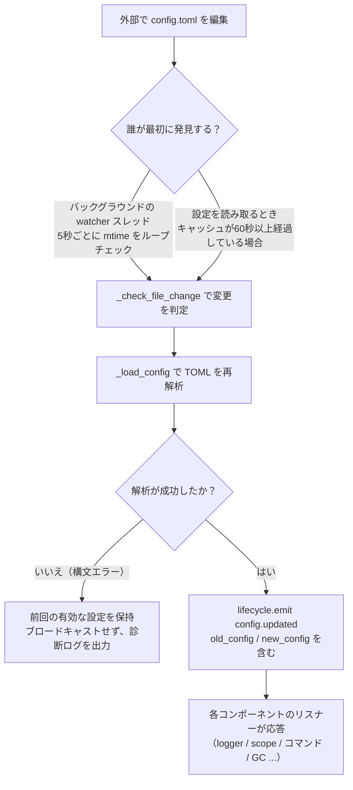

# 設定ファイルの説明
> このドキュメントでは、フレームワークの設定ファイルについて説明します。サードパーティのモジュールに設定が必要な場合は、モジュールのドキュメントを参照してください。

ErisPulse は、プロジェクトの設定を管理するために TOML 形式の設定ファイル `config/config.toml` を使用します。

## 設定ファイルの位置

設定ファイルはプロジェクトのルートディレクトリの `config/` フォルダ内にあります：

```
project/
├── config/
│   └── config.toml
├── main.py
```

## 設定ファイルの読み込みエラー処理

フレームワークは `config.toml` を読み込む際に、3つのエラー状態を区別し、**操作可能な診断情報**を出力します。デフォルト設定に静かに回帰するのではなく、エラーを明示的に通知します。

| エラー状態 | 発生条件 | フレームワークの動作 |
|---------|---------|---------|
| ファイルが存在しない | `config.toml` が存在しない | 初回起動時は静かに空の設定を使用します（警告は出力しません） |
| TOML構文エラー | ファイルは存在するが構文が不正（例：引用符の不足、括弧の未閉じ） | **行番号/列番号と原因**を出力し、デフォルト設定に回帰します |
| 権限/その他のエラー | 読み取り権限がない、IOエラーなど | **明確な原因**を出力し、デフォルト設定に回帰します |

たとえば、`port = 8000`（文字列として引用符を省略した）と誤って記述した場合、ログには次のような出力がされます：

```
[ERROR] [Config] 設定ファイル config/config.toml の構文エラー（第 3 行 第 1 列）: ...
[WARNING] [Config] 設定ファイルの読み込みに失敗しました。前回の有効な設定を使用して実行を継続します。今回のファイルの変更は有効になりません。-- 修正後、再読み込みまたは再起動してください。
```

これにより、**デフォルトの INFO レベル**で問題をすぐに特定でき、「なぜ設定の変更が効かないのか」を混乱することなく理解できます。

> **実行中に設定ファイルを壊してしまった場合**？ ロボットが実行中の間に `config.toml` を手動で編集して構文エラーを導入した場合、フレームワークは次回の書き込み（設定のマージ）時に「設定ファイルが破損しました（構文エラー、第 X 行）、マージ書き込みができないため、設定ファイルを修正してから再起動してください」と出力します。不明瞭な「書き込み失敗」ではなく、明確なエラーメッセージが表示されます。書き込み予定の設定項目は保持され、失われることはありません。

## 環境変数による上書き

フレームワークは、`ErisPulse.*` 設定項目を**環境変数**で上書きすることをサポートしています（Docker / コンテナ化 / CI 部署に適しています。`config.toml` を変更する必要はありません）。

命名規則：`ErisPulse.<セクション>.<キー>` のドット区切りパスを、すべて大文字にし、`.` を `_` に置き換え、`ERISPULSE_` を接頭辞として追加します：

| 設定項目 | 環境変数 | 例値 |
|--------|---------|--------|
| `ErisPulse.server.port` | `ERISPULSE_SERVER_PORT` | `9000` |
| `ErisPulse.server.host` | `ERISPULSE_SERVER_HOST` | `0.0.0.0` |
| `ErisPulse.logger.level` | `ERISPULSE_LOGGER_LEVEL` | `DEBUG` |
| `ErisPulse.framework.strict_mode` | `ERISPULSE_FRAMEWORK_STRICT_MODE` | `false` |

動作の説明：
- **最優先**：環境変数は「設定ファイル」および「デフォルト値」を上書きし、元の値の型に応じて自動的に変換されます（`bool` / `int` / `float` / カンマ区切りの `list` / 文字列）
- **永続化されない**：上書きは実行中のみ有効で、`config.toml` には書き込まれません
- **ホットアップデートが可能**：実行中に環境変数を変更し、設定監視のリロードを組み合わせることで有効になります

```bash
# Docker 部署の例：config.toml を変更せずに、直接ポートを上書き
ERISPULSE_SERVER_PORT=9000 docker compose up -d
```

> 注：`ErisPulse.server.port` のようなフレームワーク設定は `get_server_config()` などの API で読み取る場合、環境変数の影響を受けます。

## 設定のホットアップデート

2.7.0 以降、フレームワークは**体系的な**設定のホットアップデートをサポートしています。外部で `config.toml` を変更した後（バックグラウンドの watcher が 5 秒ごとにチェック）、またはコードで `setConfig()` を呼び出した後、各コンポーネントは自動的に応答します：

| コンポーネント | ホットアップデート可能な設定 | 動作 |
|------|----------------|------|
| **ログ Logger** | `logger.level` / `log_files` / `log_dir`（含む分割パラメータ）/ `memory_limit` / `format` / `exclude_levels` | 変更検出付きで自動的に再適用されます |
| **コマンドシステム CommandHandler** | `event.command.prefix` / `case_sensitive` / `allow_space_prefix` / `must_at_bot` | 次のメッセージで即座に有効になります |
| **アダプタの並行性** | `framework.handler_max_concurrency` | 失効した信号量をリセットし、新しい値で再構築します |
| **プロアクティブ GC** | `framework.proactive_gc_*` | 設定の変更で即座に GC タスクを再起動し、実行時に調整/無効化/再有効化が可能です |
| **マスターシステム Master** | `master.users` | `is_master()` 検査のたびにリアルタイムに読み取り、再起動は不要です |
| **モジュール/アダプタの設定** | 各々の設定項目 | `on_config_update(old, new)` コールバックをトリガーします |

**再起動が必要な設定**（安全にホットスイッチできないため、変更時に「プロセスを再起動後に有効になります」と警告が表示されます）：

| 設定 | 理由 |
|------|------|
| `router.cors.*` / `router.security.*` | ミドルウェアはサービス起動時に FastAPI に書き込まれており、実行時に安全にホットスイッチできません |
| `storage.use_global_db` | SQLite ファイルハンドルは実行時に開かれているため、パスの変更は安全ではありません |

> **途中で編集保存に失敗した場合**？ `config.toml` を編集中に一時的な構文エラーが発生した場合、フレームワークは**前回の有効な設定**を保持し、診断ログを出力します。各コンポーネントに空の設定をブロードキャストすることはありません（`on_config_update` が空値を受け取って誤ってデフォルトに戻るのを防ぎます）。

### ホットアップデートの内部フロー

「設定を変更した後、各コンポーネントはどのように知るのか？」——背後には検出 → 再ロード → ブロードキャストのフローがあります：



**2つの検出経路**（どちらかが機能すれば十分で、両方を網羅します）：

| 経路 | メカニズム | トリガー時刻 |
|------|------|---------|
| バックグラウンド watcher | daemon スレッド `config-watcher` が **5秒**ごとに `wait` でファイル `mtime` をチェック | 外部でファイルを変更した後、最大5秒以内に |
| 慣性検出 | 任意の `getConfig()` 読取時、キャッシュが **60秒**以上経過している場合、ファイルをチェック | 次回の設定読み取り時 |

> **フレームワークは自分自身を誤って傷つけません**：`setConfig()` でファイルに書き込む際、フレームワークは「自身が書き込んだ mtime」を記録し、watcher はそれを除外して、**外部の編集**のみを変更とみなします。

**2種類の設定変更イベント**：

| イベント | トリガー | データ | 代表的な場面 |
|------|--------|------|---------|
| `config.set` | コード / Dashboard が `setConfig()` を呼び出す | `{key, old_value, new_value}` | 単一キーの書き込み（テンプレート生成、状態記録、実行時の設定変更） |
| `config.updated` | 外部編集後に watcher/慣性検出が捕捉 | `{old_config, new_config, config_file}` | 手動で `config.toml` を編集した場合 |

> `setConfig()` はデフォルトで **5秒遅延してファイルに書き込む**（複数の書き込みを1度にまとめます）。`immediate=True` で即時書き込みが可能です。watcher は外部編集を検出しても、**外部の変更をファイルに書き戻すことはありません**。

**自動応答対象リスト**（2種類のイベントは通常両方をサブスクライブし、応答内容は一致します）：

| コンポーネント | 監視 | 応答 |
|------|------|------|
| Logger | `config.set` + `config.updated` | レベル/ファイル/ディレクトリの分割/メモリ上限/フォーマット/除外レベルを再適用（変更検出付き、変更がない場合は動かない） |
| Scope | `config.updated` | スコープバインディングのキャッシュを再構築 |
| コマンドシステム | `config.updated` | プレフィックス/大文字小文字/スペースプレフィックス/must_at_bot の解析パラメータを更新し、次のメッセージで有効になります |
| アダプタの並行性 | `config.set` + `config.updated` | `handler_max_concurrency` が失効し、信号量を再構築します |
| プロアクティブ GC | `config.set` + `config.updated` | `proactive_gc_*` で GC のバックグラウンドタスクを即時再起動します |
| アダプタ | `on_config_update` にルーティング | 各アダプタの `on_config_update(old, new)` コールバック |
| モジュール | `on_config_update` にルーティング | 各モジュールの `on_config_update(old, new)` コールバック |
| ストレージ | `config.updated` | `use_global_db` 変更は**警告のみ**（再起動が必要） |
| ルーティング | `config.updated` | `cors.*` / `security.*` 変更は**警告のみ**（再起動が必要） |

## 完全な設定例

```toml
[ErisPulse.server]
host = "0.0.0.0"
port = 8000
auto_start = true
ssl_certfile = ""
ssl_keyfile = ""

[ErisPulse.master]
# users は2通りの書き方があります（どちらかを選択してください）：
#   グローバルマスター（すべてのプラットフォームに有効）：users = ["123456", "789012"]
#   プラットフォームごとにマスターを指定：users = { yunhu = ["123456"], telegram = ["789012"] }
users = {}

[ErisPulse.logger]
level = "INFO"
format = "rich"
log_files = []
log_dir = ""
log_rotation = "size"
log_max_size_mb = 10
log_backup_count = 5
log_rotation_when = "midnight"
memory_limit = 1000
exclude_levels = []

[ErisPulse.framework]
enable_lazy_loading = true
uninit_timeout = 30
strict_mode = 0

[ErisPulse.framework.strict_mode_exceptions]
modules = []
adapters = []

[ErisPulse.storage]
use_global_db = false

[ErisPulse.event.command]
prefix = "/"
case_sensitive = true
allow_space_prefix = false
must_at_bot = false

[ErisPulse.event.message]
ignore_self = true

[ErisPulse.i18n]
language = "auto"
```

## サーバー設定

```toml
[ErisPulse.server]
host = "0.0.0.0"
port = 8000
auto_start = true
ssl_certfile = "/path/to/cert.pem"
ssl_keyfile = "/path/to/key.pem"
```

| 設定項目 | 型 | デフォルト値 | 説明 |
|---------|------|---------|------|
| host | string | 0.0.0.0 | 監聴アドレス。0.0.0.0 はすべてのインターフェースを意味します |
| port | integer | 8000 | 監聴ポート番号 |
| auto_start | boolean | true | `sdk.init()` 時にルーティングサーバーを自動起動するかどうか。false に設定するとルーティングサーバーの起動をスキップできます（純粋なイベント/WebUI なしのシナリオ） |
| ssl_certfile | string | 空 | SSL 証明書ファイルのパス |
| ssl_keyfile | string | 空 | SSL 秘密鍵ファイルのパス |

## マスターシステム設定

マスターシステムは「フレームワークマスター」アカウント（例：Bot管理者）を識別するために使用されます。`master.users` は2通りの書き方をサポートしています：

```toml
[ErisPulse.master]
# 書き方1：グローバルマスター（すべてのプラットフォームに有効）
users = ["123456", "789012"]

# 書き方2：プラットフォームごとにマスターを指定（dict）
# users = { yunhu = ["123456"], telegram = ["789012"] }
```

| 設定項目 | 型 | デフォルト値 | 説明 |
|---------|------|---------|------|
| users | array / object | 空 | マスターアカウントリスト。`list` 形式はグローバルマスター（すべてのプラットフォームに有効）；`dict` 形式はプラットフォームごとに指定（キーはプラットフォーム名、値はそのプラットフォームのマスターアカウントリスト） |

コードでは `master.is_master(event)` または `master.is_master(platform, user_id)` を使ってチェックし、各呼び出しで設定をリアルタイムに読み取ります（ホットアップデートをサポートし、再起動は不要です）：

```python
from ErisPulse.Core import master

if master.is_master(event):
    await event.reply("主人你好")
```

> アイデンティティ判定の完全な API（実行時に追加/削除、**カスタムアイデンティティソース provider チェーン**）と「ユーザー優先」の
> オーバーライド意味（ユーザーはコントロール面で `master=True` を開放/制限できる）は、
> [統一コントロール面 · マスターアイデンティティとカスタムアイデンティティソース](../advanced/scope.md#主人身份与自定义身份源provider) を参照してください。

## ログ設定

```toml
[ErisPulse.logger]
level = "INFO"
log_files = []                # 明示的なログファイルリスト（log_dir と互換性あり、優先度が高くなります）
log_dir = ""                  # ログ出力ディレクトリ（log_dir を設定すると自動的に分割ローテーションされます）
log_rotation = "size"         # 分割方法: "size" / "date" / "none"
log_max_size_mb = 10          # size モードの単ファイルサイズ上限（MB）
log_backup_count = 5          # 保持する履歴ログファイル数
log_rotation_when = "midnight"  # date モードのローテーション周期: S/M/H/D/midnight
memory_limit = 1000
exclude_levels = ["EVENT"]
```

| 設定項目 | 型 | デフォルト値 | 説明 |
|---------|------|---------|------|
| level | string | INFO | ログレベル：TRACE, DEBUG, INFO, WARNING, ERROR, CRITICAL（TRACE が最低レベルで、フレームワーク内部の詳細なデバッグ情報を出力します） |
| format | string | rich | ログ出力フォーマット：`rich`（カラー、デフォルト）、`plain`（カラーなしの純文本）、`json`（JSON形式、ELKなどに適しています） |
| log_files | array | 空 | ログ出力ファイルリスト（明示的なパス、分割されません） |
| log_dir | string | 空 | ログ出力ディレクトリ（自動作成）。log_dir が設定されると、`erispulse.log` にログを書き込み、`log_rotation` に従って自動的に分割されます。log_files と互換性があり、log_files が優先されます |
| log_rotation | string | size | 分割方法：`size`（サイズで）、`date`（日付で）、`none`（分割なし） |
| log_max_size_mb | float | 10 | size モードの単ファイルサイズ上限（MB）、超過すると `.1`/`.2` などにローテーションされます |
| log_backup_count | integer | 5 | 保持する履歴ログファイル数、古いファイルは自動的に削除されます |
| log_rotation_when | string | midnight | date モードのローテーション周期：`S`/`M`/`H`/`D`/`midnight`（デフォルトは毎日0時） |
| memory_limit | integer | 1000 | メモリに保持するログの件数 |
| exclude_levels | array | 空 | ログレベルの除外。除外されたレベルのログは**完全に破棄**されます（メモリに書き込まれず、ダッシュボードなどのサブスクライバーに送信されず、表示されず、ファイルに書き込まれません）。`exclude_levels` はホットアップデートをサポートしています |

コード内でも動的に切り替え可能です：

```python
from ErisPulse.Core import logger

# サイズで分割：1ファイル10MB、5個保持
logger.set_output_dir("logs", rotation="size", max_size_mb=10, backup_count=5)

# 日付で分割：毎日0時ローテーション、7個保持
logger.set_output_dir("logs", rotation="date", backup_count=7)
```

> [!NOTE]
> `log_dir` およびローテーション関連設定は ErisPulse **2.8.0+** が必要です。

> **プライバシー保護**：メッセージの送受信内容は **EVENT** レベル（数値 21）で記録されます。`exclude_levels = ["EVENT"]` と設定することで、バックエンド（例：ダッシュボードのログパネル）が各グループ/プライベートチャットのメッセージ内容を表示できなくなり、他のレベルのログには影響しません。

> [!NOTE]
> `exclude_levels` のこの機能は ErisPulse **2.8.0+** が必要です。

## フレームワーク設定

```toml
[ErisPulse.framework]
enable_lazy_loading = true
uninit_timeout = 30
strict_mode = 0

[ErisPulse.framework.strict_mode_exceptions]
modules = []
adapters = []
```

| 設定項目 | 型 | デフォルト値 | 説明 |
|---------|------|---------|------|
| enable_lazy_loading | boolean | true | モジュールのラジーローディングを有効にするかどうか |
| uninit_timeout | integer | 30 | エレガントなシャットダウンのタイムアウト時間（秒）、超過すると強制終了します。0はタイムアウトを設定しません |
| strict_mode | integer | 0 | エスカレーションモードのレベル、下記「エスカレーションモード」を参照してください |
| handler_max_concurrency | integer | 64 | イベントハンドラの最大並行タスク数、大きくすると処理能力は向上しますがメモリ使用量も増加します |
| offline_bot_expiry | integer | 3600 | オフライン Bot 記録の自動有効期限（秒）、0は期限切れを設定しません |

### プロアクティブ GC 設定

SDK の初期化後にプロアクティブ GC バックグラウンドタスクが起動し、周期的に Python GC と内部リソースの回収（オフライン Bot のクリーンアップなど）を行います。全パラメータはホットアップデートをサポートし、変更時にタスクを即時再起動します。

| 設定項目 | 型 | デフォルト値 | 説明 |
|---------|------|---------|------|
| proactive_gc_interval | number | 300 | 回収間隔（秒）、小数もサポート。0はプロアクティブ GC を無効にします |
| proactive_gc_generation | integer | 0 | 通常の回収世代（0/1/2、0..2に制限）。`gc.collect(2)` は全量回収に相当し、デフォルトは0で軽量に保ちます。深い回収は `proactive_gc_full_every` で周期的に実行されます |
| proactive_gc_full_every | integer | 20 | Nラウンドごとに全量回収を行う、0は周期的な全量回収を無効にします。全量回収は `proactive_gc_memory_growth_mb` のしきい値によって制約されます |
| proactive_gc_memory_growth_mb | integer | 32 | 全量回収のメモリ増加しきい値（MB）：前回の全量回収後のメモリベースライン（`tracemalloc`を優先、次にRSS）と比較し、この値に達した場合に全量回収を実行します。0はしきい値を設定しません |
| proactive_gc_idle_only | boolean | false | 有効にすると、イベントのピーク時（未完了のpending handlerがある）には、Python GCをスキップして、内部リソースの回収のみが影響を受けません |
| proactive_gc_gen0_min | integer | 500 | 通常の回収がトリガーされるgen0のゴミ量の下限：`gc.get_count()[0]`がこの値より低い場合、スキップされます（空回りはほぼ無駄）。0は常に回収します |

> **2.7.1の変更**：デフォルトの `proactive_gc_generation` は `2` から `0` に調整され、`proactive_gc_full_every` は `0` から `20` に調整されました。以前は `generation=2` で毎回最も重い全量回収が行われていましたが、新しいデフォルトでは回収のカバーを維持しながら、空回りのオーバーヘッドを大幅に低減します。明示的に設定された旧値はそのまま意味通りに動作します。

### エスカレーションモード

エスカレーションモードは、モジュール/アダプターがロード段階で不正な場合や失敗した場合の処理戦略を制御します。現代のモジュール/アダプターは `BaseModule`/`BaseAdapter` を継承するべきですが、基底クラスを継承していないコンポーネントはフレームワークのコンテキストシステムとバックアップクリーンアップに影響し、リソースリークを引き起こす可能性があります。

> **2.5.2の変更**：デフォルトレベルは `1`（スキップ）から `0`（緩和）に調整され、新規ユーザーの初期使用時に遭遇するロードの問題を減らしました。基底クラスを継承していないコンポーネントは警告として提示され、ロードされます。以前の動作を復元するには、`strict_mode = 1` を明示的に設定してください。

| レベル | 名称 | 動作 |
|------|------|------|
| 0 | 緩和（デフォルト） | 不正な場合は警告のみ、基底クラスを継承していないコンポーネントもロードされます（旧コンポーネントの互換性） |
| 1 | エスカレーション-スキップ | 基底クラスを継承していないコンポーネントを拒否してスキップし、他のコンポーネントは正常に起動します |
| 2 | エスカレーション-致命 | すべての不正（基底クラスを継承していない、ロード失敗、登録失敗、初期化失敗など）を致命的に扱い、起動チェックポイントで一括して不正リストを出力して中止します |

各レベルで、「ロード/登録/初期化段階でエラーが発生した」コンポーネント自身のクラッシュは常にスキップされます。違いは以下の通りです：

- **0 → 1**：唯一の動作変化は「基底クラスを継承していない」コンポーネントが「ロードされる」から「スキップされる」ことです。
- **1 → 2**：すべての不正（基底クラスを継承していない、ロード失敗、登録失敗、初期化失敗など）が致命的に扱われ、起動チェックポイントで不正リストを一括して出力して中止されます。

#### 例外リスト

一部のコンポーネントが一時的に移行できない（依存する旧モジュールなど）場合、例外リストに追加することで、不正なコンポーネントでも緩和モードでロードされます：

```toml
[ErisPulse.framework.strict_mode_exceptions]
modules = ["SeTu", "SomeLegacyModule"]
adapters = ["OldAdapter"]
```

> コンポーネントがエスカレーションモードで拒否された場合、ログにはどのようにロードを回復するか（例外リストに追加するか、レベルを下げること）が明確に提示されます。

## ストレージ設定

```toml
[ErisPulse.storage]
use_global_db = false
```

| 設定項目 | 型 | デフォルト値 | 説明 |
|---------|------|---------|------|
| use_global_db | boolean | false | グローバルデータベース（パッケージ内）を使用するかどうか、またはプロジェクトデータベースを使用するかどうか。`true` の場合、すべてのプロジェクトは ErisPulse パッケージ内の SQLite データベースを共有します。`false`（デフォルト）の場合は、`config/` ディレクトリ下の個別のデータベースを使用します |

## イベント設定

### コマンド設定

```toml
[ErisPulse.event.command]
prefix = "/"
case_sensitive = true
allow_space_prefix = false
```

| 設定項目 | 型 | デフォルト値 | 説明 |
|---------|------|---------|------|
| prefix | string | / | コマンドのプレフィックス |
| case_sensitive | boolean | true | 大文字小文字を区別するかどうか（`/Help` と `/help` が異なるコマンドか） |
| allow_space_prefix | boolean | false | プレフィックスにスペースを許可するかどうか |
| must_at_bot | boolean | false | コマンドをトリガーするには必ず@Botが必要かどうか（プライベートチャットは制限されません） |

### メッセージ設定

```toml
[ErisPulse.event.message]
ignore_self = true
```

| 設定項目 | 型 | デフォルト値 | 説明 |
|---------|------|---------|------|
| ignore_self | boolean | true | ロボット自身のメッセージを無視するかどうか |

## 国際化設定

```toml
[ErisPulse.i18n]
language = "auto"
```

| 設定項目 | 型 | デフォルト値 | 説明 |
|---------|------|---------|------|
| language | string | auto | フレームワーク内に含まれるテキストの表示言語。`auto` に設定するとシステム言語を自動検出します。具体的な言語コード（`zh-CN`、`zh-TW`、`en`、`ja`、`ru`）に設定することもできます |

## モジュール設定

各モジュールは設定ファイルで独自の設定を定義できます：

```toml
[MyModule]
api_url = "https://api.example.com"
timeout = 30
enabled = true
```

モジュール内で設定を読み取り、書き込みます：

```python
from ErisPulse import sdk

# 設定を読み取る
config = sdk.config.getConfig("MyModule", {})
api_url = config.get("api_url", "https://default.api.com")

# 実行時で設定を書き込む（遅延保存）
sdk.config.setConfig("MyModule.timeout", 60)

# ファイルに即時保存
sdk.config.setConfig("MyModule.timeout", 60, immediate=True)
```

> `setConfig` はデフォルトで遅延書き込み（約5秒毎にファイルにバッチ保存）されます。`immediate=True` を設定すると即時永続化されます。設定の変更は `config.set` ライフサイクルイベントをトリガーします。

## コントロール面設定（scope）

> [!NOTE]
> この機能は ErisPulse **2.8.0+** が必要です。

統一コントロール面は、権限/アクセス制御の**唯一**のエントリーポイントです。5次元の設定ツリーです：

| 次元 | 制御対象 | 設定パス |
|------|---------|---------|
| ① モジュール | 某プラットフォーム / Bot / セッションでどのモジュールが有効か | `scope.platforms / bots / sessions` |
| ② アイデンティティ | 某ユーザー / グループ / Bot / アダプターのイベントを受信するか | `scope.identity.*` |
| ③ コマンド | どのユーザーが特定のコマンドを実行できるか（コマンド名は glob に対応） | `scope.commands` |
| ④ ハンドラ | 某モジュールのハンドラをテキストでフィルタリングする | `scope.handlers` |
| ⑤ オーバーライド | モジュール/コマンドの実装パラメータをオーバーライドする | `scope.overrides` |

```toml
[ErisPulse.scope]
default_allow = true        # グローバルデフォルト（false = 明示的に拒否する厳格モード）
cache_size = 1024           # LRU キャッシュサイズ

# ① モジュール次元（優先度：セッション > Bot > プラットフォーム；エントリは正確/glob/正規表現に対応）
[ErisPulse.scope.platforms.onebot11]
modules = ["Chat", "Tool*"]
blocked = ["re:^Danger"]

# ② アイデンティティ次元（優先度：ユーザー > セッション > Bot > アダプター；各レベルは allow または deny のどちらか一方のみを書く）
[ErisPulse.scope.identity.adapters.onebot11]
deny = true                 # 該当プラットフォームのすべてのイベントを入口で破棄
[ErisPulse.scope.identity.users.onebot11]
allow = ["u_admin"]         # ユーザー名は glob / 正規表現に対応
deny = ["u_bad", "spam_*"]

# ③ コマンド次元（ユーザー識別子 "platform:user_id"）
[ErisPulse.scope.commands."roll*"]
allow = ["onebot11:u_vip"]
deny = ["onebot11:u_bad"]

# ④ ハンドラ/テキスト次元（コード内の条件とAND）
[ErisPulse.scope.handlers.MyModule]
pattern = "签到*"

# ⑤ 実装パラメータのオーバーライド（統一コマンド deny を使わないで、ここではオーバーライドしない）
[ErisPulse.scope.overrides.MyModule.restart]
master = true
hidden = true
```

| 設定項目 | 型 | 説明 |
|---------|------|------|
| `scope.default_allow` | boolean | グローバルデフォルト：ルールに一致しないものを許可/拒否する（`true`）。モジュール/アイデンティティは「ルールがない場合拒否」、コマンドは「ACLがない場合拒否」 |
| `scope.cache_size` | integer | LRU キャッシュサイズ（デフォルト 1024） |
| `scope.platforms / bots / sessions` | table | ① モジュールの3段階バインディング：`{modules=[...], blocked=[...]}` |
| `scope.identity.adapters / bots / sessions / users` | table | ② アイデンティティの4段階バインディング：`{allow=true}` / `{deny=true}` |
| `scope.commands.<コマンド名>` | table | ③ コマンド ACL：`{allow=[...], deny=[...]}` |
| `scope.handlers.<module>` | table | ④ テキストフィルタリング：`{pattern="...", regex="..."}` |
| `scope.overrides.<module>[.<command>]` | table | ⑤ 実装パラメータのオーバーライド：`master` / `hidden` / `aliases` / `prefix` など |

> マッチするエントリは統一的に書式を使用します：正確な名前 / glob（`*` `?` `[seq]`）/ `re:` 正規表現、大文字小文字は区別されません。
> 5次元の詳細と実行時の API（`sdk.scope.bind_module()` / `bind_identity()` / `block_user()` /
> `allow_user()` / `override()` など）は、[統一コントロール面](../advanced/scope.md)を参照してください。

## 次に進む

- [CLIコマンドリファレンス](cli-reference.md) - すべてのコマンドラインコマンドを確認
- [開発者ガイド](../developer-guide/) - カスタムモジュールの開発方法を学ぶ