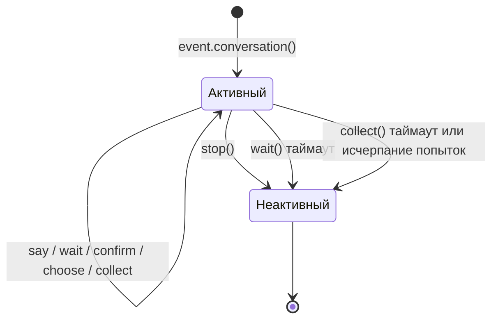

# Conversation Многошаговый диалог

Класс `Conversation` предоставляет удобные методы для многошагового взаимодействия в рамках одного сеанса, что подходит для реализации навигационных операций, сбора информации, диалоговых вопросов и ответов и т.д.

## Создание диалога

Создание с помощью метода `conversation()` объекта `Event`:

```python
from ErisPulse.Core.Event import command

@command("quiz")
async def quiz_handler(event):
    conv = event.conversation(timeout=30)

    await conv.say("🎮 Добро пожаловать в викторину!")

    answer = await conv.choose("Первый вопрос: Кто создатель Python?", [
        "Guido van Rossum",
        "James Gosling",
        "Dennis Ritchie",
    ])

    if answer is None:
        await conv.say("Время вышло, попробуйте в другой раз!")
        return

    if answer == 0:
        await conv.say("Правильно!")
    else:
        await conv.say("Неверно, правильный ответ — Guido van Rossum")

    conv.stop()
```

## Основные API

### say(content, **kwargs)

Отправка сообщения, возвращает `self` для цепочечного вызова:

```python
await conv.say("Первая строка").say("Вторая строка").say("Третья строка")
```

Также можно указать метод отправки:

```python
await conv.say("https://example.com/image.jpg", method="Image")
```

### wait(prompt=None, timeout=None)

Ожидание ответа пользователя, возвращает объект `Event` или `None` (при таймауте):

```python
# Простое ожидание
resp = await conv.wait()
if resp:
    text = resp.get_text()

# Ожидание с отправкой подсказки
resp = await conv.wait(prompt="Пожалуйста, введите ваше имя:")

# Использование пользовательского таймаута (переопределяет таймаут диалога)
resp = await conv.wait(prompt="Пожалуйста, ответьте в течение 10 секунд:", timeout=10)
```

### confirm(prompt=None, **kwargs)

Ожидание подтверждения пользователя (да/нет), возвращает `True` / `False` / `None` (при таймауте):

```python
result = await conv.confirm("Вы уверены, что хотите удалить все данные?")
if result is True:
    await conv.say("Удалено")
elif result is False:
    await conv.say("Отменено")
else:
    await conv.say("Таймаут, ответ не получен")
```

Встроенные слова для подтверждения: `да/yes/y/confirm/confirm/ok/true/правильно/да/хорошо/конечно/можно/согласен/нет проблем/в порядке...`

Встроенные слова для отрицания: `нет/no/n/cancel/отменить/не надо/нельзя/отказаться/не правильно/откажись/отказ...`

### choose(prompt, options, **kwargs)

Ожидание выбора пользователя из списка опций, возвращает индекс (начиная с 0) или `None`:

```python
choice = await conv.choose("Пожалуйста, выберите цвет:", ["красный", "зеленый", "синий"])
if choice is not None:
    colors = ["красный", "зеленый", "синий"]
    await conv.say(f"Вы выбрали {colors[choice]}")
```

Пользователь может выбрать, введя номер (`1`/`2`/`3`) или текст опции (`красный`).

`options_format="auto"` (по умолчанию) автоматически выбирает стиль в зависимости от метода: Markdown→ненумерованный список, Html→нумерованный список, иначе→простой текстовый список.
Также поддерживаются `"list"`、`"inline"`、`"md"`、`"html"` или пользовательская функция.

Поддержка `merge_prompt=True` для объединения в одно сообщение, а также поддержка плейсхолдера для позиционирования списка опций (по умолчанию `{options}`, можно изменить с помощью `placeholder`):

```python
choice = await conv.choose(
    "## Пожалуйста, выберите\n{options}",
    ["Вариант A", "Вариант B"],
    method="Markdown",
    merge_prompt=True,
)

# Пользовательский плейсхолдер
choice = await conv.choose(
    "Выберите: [choices]",
    ["Вариант A", "Вариант B"],
    placeholder="[choices]",
)
```

### collect(fields, **kwargs)

Сбор информации в несколько шагов, возвращает словарь данных или `None`:

```python
data = await conv.collect([
    {"key": "name", "prompt": "Пожалуйста, введите имя"},
    {"key": "age", "prompt": "Пожалуйста, введите возраст",
     "validator": lambda e: e.get("alt_message", "").strip().isdigit(),
     "retry_prompt": "Возраст должен быть числом, пожалуйста, повторите ввод"},
    {"key": "city", "prompt": "Пожалуйста, введите город"},
])

if data:
    await conv.say(f"Регистрация успешна!\nИмя: {data['name']}\nВозраст: {data['age']}\nГород: {data['city']}")
else:
    await conv.say("Процесс регистрации прерван")
```

Конфигурация полей:

| Параметр | Описание | Значение по умолчанию |
|----------|----------|------------------------|
| `key` | Ключ поля (обязательно) | - |
| `prompt` | Подсказка | `"Пожалуйста, введите {key}"` |
| `validator` | Функция валидации, принимает Event, возвращает bool | Нет |
| `retry_prompt` | Подсказка при ошибке валидации | `"Ввод неверен, пожалуйста, повторите ввод"` |
| `max_retries` | Максимальное количество попыток | 3 |
| `condition` | Функция условия, принимает словарь уже собранных данных, возвращает bool | Нет |

**Условные поля**: Использование `condition` позволяет реализовать динамическую форму, поле собирается только при выполнении условия:

```python
data = await conv.collect([
    {"key": "has_car", "prompt": "У вас есть машина? (да/нет)"},
    {"key": "car_brand", "prompt": "Пожалуйста, введите марку автомобиля",
     "condition": lambda d: d.get("has_car", "").lower() in ("да", "yes", "y")},
])
```

### stop()

Ручное завершение диалога, устанавливает `is_active` в `False`:

```python
conv.stop()
```

### is_active

Является ли диалог активным:

```python
if conv.is_active:
    await conv.say("Диалог продолжается")
```

## Управление активным состоянием



Диалог автоматически становится неактивным в следующих случаях:

1. Вызов метода `stop()`
2. `wait()` возвращает `None` по таймауту
3. `collect()` возвращает `None` из-за таймаута или исчерпания попыток

После перехода в неактивное состояние все методы взаимодействия (`wait`/`confirm`/`choose`/`collect`) немедленно возвращают `None`, не ожидая ответа пользователя.

## Ветвление и переходы

### @conv.branch(name) декоратор

Использование `branch()` для регистрации ветви диалога, переход между ветвями с помощью `goto()`:

```python
@command("menu")
async def menu_handler(event):
    conv = event.conversation(timeout=60)

    @conv.branch("main")
    async def main_menu():
        await conv.say("=== Главное меню ===\n1. Личная информация\n2. Настройки\n3. Выход")
        resp = await conv.wait()
        if resp is None:
            return
        text = resp.get_text().strip()
        if text == "1":
            await conv.goto("profile")
        elif text == "2":
            await conv.goto("settings")
        elif text == "3":
            await conv.say("До свидания!")
            conv.stop()

    @conv.branch("profile")
    async def profile():
        await conv.say("=== Личная информация ===\nИмя: Alice\n0. Вернуться")
        resp = await conv.wait()
        if resp and resp.get_text().strip() == "0":
            await conv.goto("main")

    @conv.branch("settings")
    async def settings():
        await conv.say("=== Настройки ===\n1. Переключатель уведомлений\n0. Вернуться")
        resp = await conv.wait()
        if resp and resp.get_text().strip() == "0":
            await conv.goto("main")

    await conv.start()  # Начинаем с первой зарегистрированной ветви
```

### conv.start(name=None)

Запуск диалога, по умолчанию с первой зарегистрированной ветви:

```python
await conv.start()          # Начинаем с первой ветви
await conv.start("settings") # Начинаем с указанной ветви
```

## Контекст и сохранение

### conv.context

Внутренний словарь `context` каждого экземпляра диалога используется для обмена состоянием между ветвями:

```python
@conv.branch("step1")
async def step1():
    conv.context["username"] = resp.get_text().strip()
    await conv.goto("step2")

@conv.branch("step2")
async def step2():
    name = conv.context.get("username", "неизвестный")
    await conv.say(f"Привет, {name}!")
```

### save() / resume() / clear_saved()

Диалог поддерживает сохранение, что позволяет возобновить его после таймаута или прерывания:

```python
# Сохранение состояния диалога (обычно не нужно вызывать вручную, см. "Автоматические контрольные точки")
await conv.save()

# ... позже в том же сеансе ...
conv2 = event.conversation()
if await conv2.resume():
    await conv2.say("Добро пожаловать обратно! Продолжим предыдущий диалог")
else:
    await conv2.say("Нет сохраненного диалога")

# Очистка сохраненного диалога
await conv.clear_saved()
```

Ключ сохранения содержит измерение `target` (`conversation:{platform}:{user_id}:{target_id}`), диалоги одного пользователя в разных сессиях не перезаписываются друг друга; старые архивы без `target` автоматически мигрируются при `resume()`.

## Автоматические контрольные точки и восстановление после перезапуска

### Автоматическое сохранение

Контрольные точки автоматически обновляются в следующих случаях, обычно не нужно вызывать `save()` вручную:

| Случай | Действие |
|--------|----------|
| `goto()` / `start()` переход между ветвями | Автоматически сохранить (текущая ветвь + context) |
| `stop()` / `wait()` таймаут / `collect()` сбой | Автоматически очистить (конечное состояние диалога) |

### TTL контрольных точек

Архивы снабжены временной меткой, архивы, просрочившие `ErisPulse.interaction.checkpoint_ttl` (по умолчанию 24 часа), автоматически удаляются при восстановлении:

```toml
[ErisPulse.interaction]
checkpoint_ttl = 86400  # секунды
```

### Автоматическое восстановление после перезапуска

После перезапуска фреймворка активные диалоги (в ожидании корутины в памяти) теряются, но контрольные точки остаются. Регистрация **фабрики восстановления** с помощью `register_resume_handler` позволяет фреймворку автоматически возобновлять диалог при получении первого сообщения от пользователя:

```python
from ErisPulse.Core.Event.wrapper import Conversation

@Conversation.register_resume_handler()  # Можно указать platform="onebot11" для ограничения платформой
def make_conversation(event) -> Conversation:
    # Фабрика: восстановление диалога и повторная регистрация всех ветвей
    conv = event.conversation(timeout=60)

    @conv.branch("menu")
    async def menu(conv, event):
        ...

    return conv
```

После регистрации, при перезапуске и получении первого сообщения от пользователя, находящегося в ветви `menu`, фреймворк автоматически: восстановит context → примет это сообщение → продолжит диалог из сохраненной ветви. Без регистрации фабрики механизм не влияет на производительность.

### Восстановление — это принятие управления

При успешном `resume()` фреймворк автоматически выполняет две вещи:

1. **Принятие управления сессией**: автоматически захватывает арендный токен сессии — другие модули могут использовать `sdk.interaction.get_owner_of(event)` для определения "этот пользователь занят диалогом"; если сессия уже занята другим модулем, восстановление отменяется (возвращается False), предотвращая конфликт диалогов
2. **Восстановление истории**: из почтового ящика сессии извлекает последние 10 сообщений в `conv.recent_history` (для модулей ИИ восстановление контекста LLM не прерывается); `resume(with_history=0)` отключает это

```python
if await conv.resume(with_history=20):
    for m in conv.recent_history:
        print(m["role"], ":", m["text"])
```

### Ручное восстановление (без автоматического механизма)

```python
@command("continue")
async def continue_handler(event):
    conv = event.conversation()
    # ... регистрация ветвей ...
    if await conv.resume():
        conv.goto(conv.get_current_branch())
```

## Типичные сценарии диалога

### Навигационная регистрация

```python
@command("register")
async def register_handler(event):
    conv = event.conversation(timeout=60)

    await conv.say("Добро пожаловать на регистрацию!")

    data = await conv.collect([
        {"key": "username", "prompt": "Пожалуйста, введите имя пользователя (от 3 до 20 символов)",
         "validator": lambda e: 3 <= len(e.get_text().strip()) <= 20},
        {"key": "email", "prompt": "Пожалуйста, введите адрес электронной почты",
         "validator": lambda e: "@" in e.get_text() and "." in e.get_text(),
         "retry_prompt": "Неверный формат электронной почты, повторите ввод"},
    ])

    if not data:
        await event.reply("Регистрация отменена")
        return

    confirmed = await conv.confirm(
        f"Подтвердите регистрационную информацию?\nИмя пользователя: {data['username']}\nЭлектронная почта: {data['email']}"
    )

    if confirmed:
        await conv.say("✅ Регистрация успешна!")
    else:
        await conv.say("❌ Регистрация отменена")
```

### Циклический диалог

```python
@command("chat")
async def chat_handler(event):
    conv = event.conversation(timeout=120)
    await conv.say("Вход в диалоговый режим, введите «выход» для завершения")

    while conv.is_active:
        resp = await conv.wait()
        if resp is None:
            await conv.say("Таймаут, диалог завершен")
            break

        text = resp.get_text().strip()

        if text == "выход":
            await conv.say("До свидания!")
            conv.stop()
        elif text == "помощь":
            await conv.say("Доступные команды: выход, помощь, статус")
        elif text == "статус":
            await conv.say("Диалог активен")
        else:
            await conv.say(f"Вы сказали: {text}")
```

## Связанная документация

- [Event包装 класс](../developer-guide/modules/event-wrapper.md) - Все методы объекта Event
- [Введение в обработку событий](../getting-started/event-handling.md) - Основы обработки событий