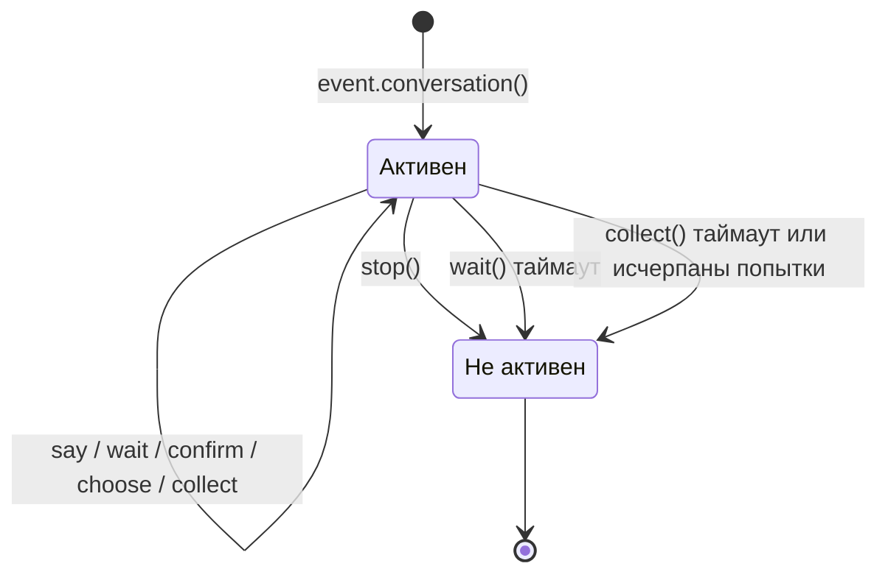

# Conversation 多轮对话

Класс `Conversation` предоставляет удобные методы для многократного взаимодействия в рамках одного диалога, что подходит для реализации навигационных операций, сбора информации, диалоговых опросов и т.д.

## Создание диалога

Создайте диалог с помощью метода `conversation()` объекта `Event`:

```python
from ErisPulse.Core.Event import command

@command("quiz")
async def quiz_handler(event):
    conv = event.conversation(timeout=30)

    await conv.say("🎮 Добро пожаловать в викторину! (知识问答!)")

    answer = await conv.choose("Вопрос 1: Кто создатель Python? (Python 的创造者是谁？)", [
        "Guido van Rossum",
        "James Gosling",
        "Dennis Ritchie",
    ])

    if answer is None:
        await conv.say("Время вышло, приходите в другой раз! (超时了，下次再来吧！)")
        return

    if answer == 0:
        await conv.say("Правильно! (正确！)")
    else:
        await conv.say("Неправильно, правильный ответ — Guido van Rossum (错误了，正确答案是 Guido van Rossum)")

    conv.stop()
```

## Основные API

### say(content, **kwargs)

Отправить сообщение, вернуть `self` для цепочки вызовов:

```python
await conv.say("Первая строка").say("Вторая строка").say("Третья строка")
```

Также можно указать способ отправки:

```python
await conv.say("https://example.com/image.jpg", method="Image")
```

### wait(prompt=None, timeout=None)

Ожидать ответ от пользователя, вернуть объект `Event` или `None` (если таймаут):

```python
# Простое ожидание
resp = await conv.wait()
if resp:
    text = resp.get_text()

# Ожидание с отправкой подсказки
resp = await conv.wait(prompt="Пожалуйста, введите ваше имя")

# Использование пользовательского таймаута (переопределяет таймаут диалога)
resp = await conv.wait(prompt="Пожалуйста, введите ваш возраст", timeout=10)
```

### confirm(prompt=None, **kwargs)

Ожидать подтверждения пользователя (да/нет), вернуть `True` / `False` / `None` (таймаут):

```python
result = await conv.confirm("У вас есть машина? (да/нет)")
if result is True:
    await conv.say("已删除")
elif result is False:
    await conv.say("已取消")
else:
    await conv.say("超时未回复")

Встроенные слова-подтверждения: `是/yes/y/确认/确定/好/ok/true/对/嗯/行/同意/没问题/可以/当然...`

Встроенные слова-отрицания: `否/no/n/取消/不/不要/不行/cancel/false/错/不对/别/拒绝...`
```

### choose(prompt, options, **kwargs)

Ожидать выбора из списка, вернуть индекс (начиная с 0) или `None`:

```python
choice = await conv.choose("Пожалуйста, выберите цвет:", ["красный", "зелёный", "синий"])
if choice is not None:
    colors = ["красный", "зелёный", "синий"]
    await conv.say(f"Вы выбрали {colors[choice]}")
```

Пользователь может выбрать, введя номер (`1`/`2`/`3`) или текст опции (`красный`).

`options_format="auto"` (по умолчанию) автоматически выбирает стиль в зависимости от метода: Markdown → маркированный список, Html → нумерованный список, другие → текстовый список.
Также поддерживаются `"list"`、`"inline"`、`"md"`、`"html"` или пользовательская функция.

Поддержка `merge_prompt=True` для объединения в одно сообщение и использование подстановочных знаков для контроля положения списка (по умолчанию `{options}`, можно изменить с помощью `placeholder`):

```python
choice = await conv.choose(
    "## Выберите\n{options}",
    ["Опция A", "Опция B"],
    method="Markdown",
    merge_prompt=True,
)

# Пользовательский подстановочный знак
choice = await conv.choose(
    "Выберите: [choices]",
    ["Опция A", "Опция B"],
    placeholder="[choices]",
)
```

### collect(fields, **kwargs)

Сбор информации в несколько шагов, вернуть словарь данных или `None`:

```python
data = await conv.collect([
    {"key": "name", "prompt": "Пожалуйста, введите ваше имя"},
    {"key": "age", "prompt": "Пожалуйста, введите ваш возраст",
     "validator": lambda e: e.get("alt_message", "").strip().isdigit(),
     "retry_prompt": "Возраст должен быть числом, пожалуйста, введите снова"},
    {"key": "city", "prompt": "Пожалуйста, введите ваш город"},
])

if data:
    await conv.say(f"Регистрация успешна!\nИмя: {data['name']}\nВозраст: {data['age']}\nГород: {data['city']}")
else:
    await conv.say("Регистрация прервана")
```

Конфигурация полей:

| Параметр | Описание | Значение по умолчанию |
|----------|----------|------------------------|
| `key` | Ключ поля (обязательно) | - |
| `prompt` | Подсказка | `"Пожалуйста, введите {key}"` |
| `validator` | Функция проверки, принимает Event, возвращает bool | Нет |
| `retry_prompt` | Подсказка при неудачной проверке | `"Ввод неверен, пожалуйста, введите снова"` |
| `max_retries` | Максимальное количество попыток | 3 |
| `condition` | Функция условия, принимает словарь собранных данных, возвращает bool | Нет |

**Условные поля**: Использование `condition` позволяет реализовать динамическую форму, поле собирается только при выполнении условия:

```python
data = await conv.collect([
    {"key": "has_car", "prompt": "У вас есть машина? (да/否)"},
    {"key": "car_brand", "prompt": "Пожалуйста, введите марку автомобиля",
     "condition": lambda d: d.get("has_car", "").lower() in ("是", "yes", "y")},
])
```

### stop()

Вручную завершить диалог, установить `is_active` в `False`:

```python
conv.stop()
```

### is_active

Активно ли диалог:

```python
if conv.is_active:
    await conv.say("对话还在进行中")
```

## Управление активным состоянием



Диалог автоматически становится неактивным в следующих случаях:

1. Вызов метода `stop()`
2. `wait()` возвращает `None` по таймауту
3. `collect()` возвращает `None` из-за таймаута или исчерпания попыток

После перехода в неактивное состояние все методы взаимодействия (`wait`/`confirm`/`choose`/`collect`) немедленно возвращают `None`, не ожидая ввода от пользователя.

## Ветвление и переходы

### @conv.branch(name) декоратор

Используйте `branch()` для регистрации ветвей диалога, переход между ними с помощью `goto()`:

```python
@command("menu")
async def menu_handler(event):
    conv = event.conversation(timeout=60)

    @conv.branch("main")
    async def main_menu():
        await conv.say("=== Главное меню ===\n1. Личная информация\n2. Настройки\n3. Выход")
        resp = await conv.wait()
        if resp is None:
            return
        text = resp.get_text().strip()
        if text == "1":
            await conv.goto("profile")
        elif text == "2":
            await conv.goto("settings")
        elif text == "3":
            await conv.say("До свидания!")
            conv.stop()

    @conv.branch("profile")
    async def profile():
        await conv.say("=== Личная информация ===\nИмя: Alice\n0. Назад")
        resp = await conv.wait()
        if resp and resp.get_text().strip() == "0":
            await conv.goto("main")

    @conv.branch("settings")
    async def settings():
        await conv.say("=== Настройки ===\n1. Переключатель уведомлений\n0. Назад")
        resp = await conv.wait()
        if resp and resp.get_text().strip() == "0":
            await conv.goto("main")

    await conv.start()  # Начинаем с первой зарегистрированной ветви
```

### conv.start(name=None)

Запустить диалог, по умолчанию с первой зарегистрированной ветви:

```python
await conv.start()          # Начинаем с первой ветви
await conv.start("settings") # Начинаем с указанной ветви
```

## Контекст и сохранение

### conv.context

Внутренний словарь `context` каждого экземпляра диалога используется для обмена состоянием между ветвями:

```python
@conv.branch("step1")
async def step1():
    conv.context["username"] = resp.get_text().strip()
    await conv.goto("step2")

@conv.branch("step2")
async def step2():
    name = conv.context.get("username", "未知")
    await conv.say(f"你好，{name}！")
```

### save() / resume() / clear_saved()

Диалог поддерживает сохранение, можно восстановить после таймаута или прерывания:

```python
# Сохранить состояние диалога
conv_id = conv.save()
# conv_id = "user_123_group_456"  # Генерируется автоматически на основе пользователя и группы

# ... позже в том же сеансе восстановить ...
conv2 = event.conversation()
if conv2.resume():
    await conv2.say("欢迎回来！继续之前的对话")
else:
    await conv2.say("没有找到之前的对话")

# Очистить сохраненный диалог
conv.clear_saved()
```

## Типичные сценарии

### Регистрация с навигацией

```python
@command("register")
async def register_handler(event):
    conv = event.conversation(timeout=60)

    await conv.say("欢迎注册！")

    data = await conv.collect([
        {"key": "username", "prompt": "请输入用户名（3-20个字符）",
         "validator": lambda e: 3 <= len(e.get_text().strip()) <= 20},
        {"key": "email", "prompt": "请输入邮箱地址",
         "validator": lambda e: "@" in e.get_text() and "." in e.get_text(),
         "retry_prompt": "邮箱格式不正确，请重新输入"},
    ])

    if not data:
        await event.reply("注册已取消")
        return

    confirmed = await conv.confirm(
        f"确认注册信息？\n用户名: {data['username']}\n邮箱: {data['email']}"
    )

    if confirmed:
        await conv.say("✅ 注册成功！")
    else:
        await conv.say("❌ 已取消注册")
```

### Циклический диалог

```python
@command("chat")
async def chat_handler(event):
    conv = event.conversation(timeout=120)
    await conv.say("进入对话模式，输入「退出」结束")

    while conv.is_active:
        resp = await conv.wait()
        if resp is None:
            await conv.say("超时，对话结束")
            break

        text = resp.get_text().strip()

        if text == "退出":
            await conv.say("再见！")
            conv.stop()
        elif text == "帮助":
            await conv.say("可用命令：退出、帮助、状态")
        elif text == "状态":
            await conv.say("对话活跃中")
        else:
            await conv.say(f"你说的是：{text}")
```

## Связанные документы

- [包装 класса Event](../developer-guide/modules/event-wrapper.md) - Все методы объекта Event
- [Введение в обработку событий](../getting-started/event-handling.md) - Основы обработки событий