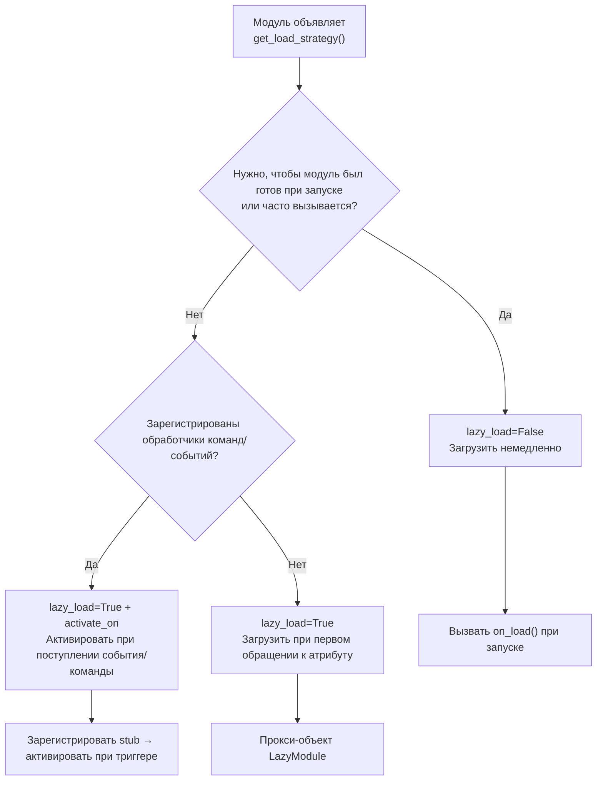

# Система ленивой загрузки модулей

ErisPulse SDK предоставляет мощную систему ленивой загрузки модулей, которая позволяет инициализировать модули только тогда, когда они действительно необходимы, значительно улучшая скорость запуска приложения и эффективность использования памяти.

## Обзор

Система ленивой загрузки модулей является одним из ключевых функциональных возможностей ErisPulse, которая работает следующим образом:

- **Отложенная инициализация**: Модуль загружается и инициализируется только при первом обращении к нему
- **Прозрачное использование**: Для разработчика ленивые модули практически не отличаются от обычных модулей
- **Автоматическое управление зависимостями**: Зависимости модуля автоматически инициализируются при использовании
- **Поддержка жизненного цикла**: Для модулей, унаследованных от `BaseModule`, автоматически вызываются методы жизненного цикла

## Принцип работы

### Класс LazyModule

Основой системы ленивой загрузки является класс `LazyModule`, который является обёрткой, которая фактически инициализирует модуль только при первом обращении.

### Процесс инициализации

При первом обращении к модулю `LazyModule` выполняет следующие действия:

1. Получает информацию о параметрах `__init__` класса модуля
2. Определяет, нужно ли передавать ссылку на `sdk`
3. Устанавливает свойство `moduleInfo` модуля
4. Для модулей, унаследованных от `BaseModule`, вызывает метод `on_load`
5. Запускает событие жизненного цикла `module.init`

## Событийно-ориентированная активация модуля (activate_on)

> [!NOTE]
> Эта функция доступна начиная с ErisPulse **2.8.0+**.

Модули с `lazy_load=True` по умолчанию загружаются только при **первом обращении к атрибуту**. Если модуль регистрирует обработчики команд/событий, традиционный подход требует `lazy_load=False` для немедленной загрузки. `activate_on` предоставляет третий вариант: **объявление триггеров, при поступлении первого соответствующего события/команды модуль автоматически активируется** — он не будет постоянно в памяти, но при этом не потеряет входную точку.

```python
from ErisPulse.loaders import ModuleLoadStrategy

class MyModule(BaseModule):
    @staticmethod
    def get_load_strategy():
        return ModuleLoadStrategy(
            lazy_load=True,
            activate_on=[
                # ---- Событие (пассивное, без участия пользователя)----
                "message",                                    # Тип события: любое сообщение
                {"notice": "group_member_increase"},          # Тип + detail_type
                {"message": ["private", "group"]},            # Тип + несколько detail_type

                # ---- Команда (активное, пользователь вводит)----
                {"command": "roll"},                          # Сокращённая форма: имя команды
                {"command": ["roll", "dice"]},                # Список имён команд
                {"command": {                                 # Форма dict (name обязательна)
                    "name": "dice",
                    "help": "Бросить кубик",
                    "usage": "/dice",
                    "group": "Развлечения",
                    "aliases": ["d"],
                    "hidden": False,
                }},
            ],
        )
```

### Параметры команды в формате dict

Формат dict отражает пользовательские параметры декоратора `@command()`, используется для регистрации заглушки команды до загрузки модуля:

| Параметр | Тип | По умолчанию | Описание |
|------|------|------|------|
| `name` | `str` | **Обязательный** | Имя команды; должно совпадать с `@command(name)` в `on_load`, иначе после активации заглушка будет удалена, команда не будет доступна |
| `help` | `str` | Возвратная цепочка | Описание команды в Help; если не указано, берётся из цепочки возврата (см. ниже) |
| `usage` | `str` | Автоматически | Строка использования, по умолчанию `{prefix}{name}` |
| `group` | `str` | `None` | Группа команды |
| `aliases` | `list[str]` | `[]` | Список псевдонимов, которые также активируют модуль |
| `hidden` | `bool` | `False` | `True` — заглушка будет скрыта (в соответствии с семантикой скрытых команд после активации); пользователь, знающий имя команды, всё равно может активировать |

**Не поддерживаются** `priority` / `permission` / `master`: заглушка команды предназначена только для активации, проверка прав осуществляется после активации реальной команды (блокировка прав на этапе заглушки приведёт к потере возможности активации).

### Цепочка возврата для Help заглушки команды

Описание команды, отображаемое в Help при отсутствии загрузки модуля, берётся по следующему порядку (первое найденное значение):

1. `help` в команде dict (наиболее точное)
2. `description` из `get_meta()`
3. `__description__` атрибут модуля
4. `Summary` из метаданных пакета (краткое описание в PyPI)
5. Общее сообщение: «Эта команда из лениво загружаемого модуля X, первый вызов активирует загрузку модуля»

### Семантика триггеров

- **Заглушка события**: Регистрируется с очень низким приоритетом (`ACTIVATION_STUB_PRIORITY`) в соответствующий менеджер событий, срабатывает как резервный обработчик после всех обычных; после активации событие пересылается к настоящему обработчику модуля
- **Заглушка команды**: Регистрируется как заглушка; после активации заглушка удаляется, настоящая команда обрабатывает текущий вызов
- **Защита от повторного запуска**: `asyncio.Lock` гарантирует, что при одновременном срабатывании триггеров модуль активируется только один раз
- **Фильтрация по области действия**: Заглушка содержит идентификатор владельца модуля, модуль не активируется, если он не включён для данного бота/сессии/платформы
- **Семантика ошибок**: При неудачной активации повторная попытка не производится, заглушка также удаляется
- **Удаление дубликатов**: При смешанном объявлении команды (сокращённо + dict) дубликаты удаляются (dict имеет приоритет); при отсутствии `name` в dict или ошибке `detail_type` в dict выводится предупреждение и объявление игнорируется

> Архитектурная схема и полная семантика см. в [Обзоре архитектуры](../architecture.md#архитектура-событийно-ориентированной-активации-activate_on).

## Конфигурация ленивой загрузки

### Глобальная конфигурация

В конфигурационном файле включите/отключите глобальную ленивую загрузку:

```toml
[ErisPulse.framework]
enable_lazy_loading = true  # true=включить ленивую загрузку (по умолчанию), false=отключить ленивую загрузку
```

### Контроль на уровне модуля

Модуль может контролировать стратегию загрузки, реализовав статический метод `get_load_strategy()`:

```python
from ErisPulse.Core.Bases import BaseModule
from ErisPulse.loaders import ModuleLoadStrategy

class MyModule(BaseModule):
    @staticmethod
    def get_load_strategy():
        """Возвращает стратегию загрузки модуля"""
        return ModuleLoadStrategy(
            lazy_load=False,  # Возвращает False для немедленной загрузки
            priority=100      # Приоритет загрузки, чем больше, тем выше приоритет
        )
```

## Использование лениво загружаемых модулей

### Базовое использование

Для разработчика ленивые модули практически не отличаются от обычных:

```python
# Через SDK обращение к лениво загружаемому модулю
from ErisPulse import sdk

# Следующее обращение вызовет ленивую загрузку модуля
result = await sdk.my_module.my_method()
```

### Единый вход для получения модуля

Независимо от способа получения модуля (через свойство SDK, через менеджер модулей или через `module.get()`), для "зарегистрированного, но не загруженного" лениво загружаемого модуля будет возвращаться один и тот же прокси-объект, инициализация модуля произойдёт только при обращении к его свойствам:

```python
# Все три способа возвращают один и тот же прокси-объект (если модуль не загружен), поведение одинаковое, для пользователя прозрачно
sdk.my_module          # Точка входа для ленивой загрузки
sdk.module.my_module   # Также возвращает прокси-объект
sdk.module.get("my_module")  # Также возвращает прокси-объект, сам по себе не вызывает загрузку

# Только при обращении к свойству прокси-объекта происходит инициализация модуля
result = await sdk.my_module.my_method()
```

`module.get()` — это **интерфейс для поиска**, сам по себе не вызывает загрузку:
- Модуль загружен → возвращается реальный экземпляр
- Модуль зарегистрирован, но не загружен → возвращается прокси-объект (инициализация при обращении к свойству)
- Модуль не зарегистрирован → возвращается `None`

Если необходимо явно вызвать загрузку, используйте `await sdk.load_module("my_module")`.

### Асинхронная инициализация

Для модулей, требующих асинхронной инициализации, рекомендуется сначала явно загрузить модуль:

```python
# Сначала явно загрузите модуль
await sdk.load_module("my_module")

# Затем используйте модуль
result = await sdk.my_module.my_method()
```

### Синхронная инициализация

Для модулей, не требующих асинхронной инициализации, можно обращаться напрямую:

```python
# Прямое обращение автоматически инициализирует модуль синхронно
result = sdk.my_module.some_sync_method()
```

## Рекомендуемые практики

При выборе стратегии загрузки можно использовать следующий алгоритм:



### Рекомендуемые сценарии использования ленивой загрузки (lazy_load=True)

- Инструментальные модули, вызываемые косвенно (например, модули для запроса данных, форматтеры, только при вызове другими модулями)
- Модули, зарегистрировавшие обработчики команд/событий, но не часто используемые — в сочетании с `activate_on`, модуль автоматически активируется при первом соответствующем событии/команде, без отказа от ленивой загрузки

### Рекомендуемые сценарии отключения ленивой загрузки (lazy_load=False)

- Модули, которые должны быть готовы при запуске (например, модули, предоставляющие базовые сервисы другим модулям)
- Обработчики, вызываемые часто (например, обработка каждого сообщения) — `activate_on` имеет небольшую нагрузку при активации, для частых сценариев предпочтительнее немедленная загрузка
- Модули с планировщиком задач
- Модули, которые должны быть инициализированы при запуске приложения

> Параметр `priority` управляет порядком инициализации модулей, загружаемых немедленно. Чем больше значение, тем раньше модуль будет инициализирован. Модули с одинаковым приоритетом загружаются в порядке регистрации.

## Примечания

1. Если ваш модуль использует ленивую загрузку и другие модули никогда не обращались к нему внутри ErisPulse, модуль никогда не будет инициализирован.
2. Если ваш модуль содержит модули, слушающие события, или другие модули, активно слушающие, есть два варианта: объявить триггеры `activate_on` (сохранить ленивую загрузку, модуль активируется при поступлении события), или объявить, что модуль должен быть загружен немедленно (`lazy_load=False`), иначе это повлияет на нормальную работу модуля.
3. Мы не рекомендуем отключать ленивую загрузку, если нет специальных потребностей, иначе это может привести к проблемам с управлением зависимостями и событиями жизненного цикла.
4. В объявлении команды в формате dict для `activate_on`, параметр `name` должен совпадать с именем реальной команды, зарегистрированной в `on_load` с помощью `@command()` — иначе модуль будет активирован, но заглушка будет удалена, и команда с несовпадающим именем не будет доступна.

## Связанные документы

- [Руководство по разработке модулей](../developer-guide/modules/getting-started.md) - Узнайте, как разрабатывать модули
- [Лучшие практики](../developer-guide/modules/best-practices.md) - Узнайте больше о лучших практиках