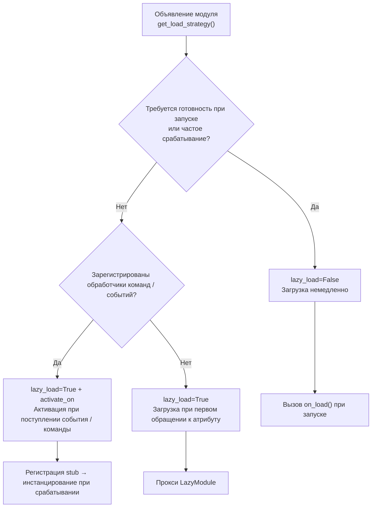

# Система ленивой загрузки модулей

ErisPulse SDK предоставляет мощную систему ленивой загрузки модулей, позволяющую инициализировать модули только тогда, когда они действительно необходимы, что значительно повышает скорость запуска приложения и эффективность использования памяти.

docs/ru/quick-start.md

## Обзор

Система модулей с ленивой загрузкой является одной из ключевых особенностей ErisPulse. Она работает следующим образом:

- **Отложенная инициализация**: Модули фактически загружаются и инициализируются только при первом обращении к ним
- **Прозрачное использование**: Для разработчиков модули с ленивой загрузкой практически не отличаются от обычных модулей в использовании
- **Автоматическое управление зависимостями**: Зависимости модуля автоматически инициализируются при их использовании
- **Поддержка жизненного цикла**: Для модулей, унаследованных от `BaseModule`, автоматически вызываются методы жизненного цикла

Ссылки на документацию должны быть заменены согласно правилу:
- Замените `docs/ru/` на `docs/ru/` в путях к документации
- Например: `docs/ru/quick-start.md` должно быть заменено на `docs/ru/quick-start.md`
- Ссылки на файлы не текущего языка версии (в формате `README.xx.md`) оставляются без изменений

## Принцип работы

### Класс LazyModule

Ядром системы ленивой загрузки является класс `LazyModule`, который является обёрткой, фактически инициализирующей модуль только при первом обращении.

### Процесс инициализации

Когда модуль впервые обращается, `LazyModule` выполняет следующие действия:

1. Получает информацию о параметрах `__init__` класса модуля
2. Определяет, следует ли передавать ссылку на `sdk` в зависимости от параметров
3. Устанавливает свойство `moduleInfo` модуля
4. Для модулей, унаследованных от `BaseModule`, вызывает метод `on_load`
5. Запускает событие жизненного цикла `module.init`

[**中文**](docs/ru/quick-start.md) | [**English**](docs/ru/quick-start.md)

## Активация по событию (activate_on)

> [!NOTE]
> Эта функция требует ErisPulse **2.8.0+**.

Модули с `lazy_load=True` по умолчанию загружаются только при **первом доступе к атрибуту**. Если модуль зарегистрировал обработчики команд/событий, традиционный подход требует `lazy_load=False` для немедленной загрузки. `activate_on` предоставляет третий вариант: **объявить триггер, при первом совпадении события/команды модуль автоматически активируется** — он не будет постоянно в памяти, но при этом не потеряет точку входа по триггеру.

```python
from ErisPulse.loaders import ModuleLoadStrategy

class MyModule(BaseModule):
    @staticmethod
    def get_load_strategy():
        return ModuleLoadStrategy(
            lazy_load=True,
            activate_on=[
                # ---- Триггеры по событию (пассивное поступление, без участия пользователя)----
                "message",                                    # Тип события: любое сообщение
                {"notice": "group_member_increase"},          # Тип + один detail_type
                {"message": ["private", "group"]},            # Тип + несколько detail_type

                # ---- Триггеры по команде (активный ввод, заглушка команды видна в Help)----
                {"command": "roll"},                          # Сокращённая форма: имя команды
                {"command": ["roll", "dice"]},                # Список имён команд
                {"command": {                                 # Форма dict (name обязательный)
                    "name": "dice",
                    "help": "Бросить кубик",
                    "usage": "/dice",
                    "group": "Развлечения",
                    "aliases": ["d"],
                    "hidden": False,
                }},
            ],
        )
```

### Параметры команды в формате dict

Форма dict отражает пользовательские параметры декоратора `@command()`, позволяя зарегистрировать заглушку команды до загрузки модуля:

| Параметр | Тип | По умолчанию | Описание |
|------|------|------|------|
| `name` | `str` | **Обязательный** | Имя команды; должно совпадать с `name` в `@command(name)` в `on_load`, иначе после активации заглушка будет удалена, и команда не будет существовать |
| `help` | `str` | Цепочка возврата | Описание, отображаемое в Help; если не указано, берётся из цепочки возврата (см. ниже) |
| `usage` | `str` | Автоматически | Пример использования, по умолчанию `{prefix}{name}` |
| `group` | `str` | `None` | Группа команды |
| `aliases` | `list[str]` | `[]` | Алиасы, которые также регистрируются, **ввод алиаса также активирует модуль** |
| `hidden` | `bool` | `False` | Если `True`, заглушка команды будет скрыта (согласовано с семантикой скрытия после активации); пользователи, знающие имя команды, всё равно могут её активировать |

**Не поддерживается** `priority` / `permission` / `master`: заглушка команды предназначена только для активации, проверка прав осуществляется после активации настоящей командой (блокировка прав на этапе заглушки приведёт к невозможности активации по команде).

### Цепочка возврата для Help заглушки команды

Описание команды, отображаемое в Help до загрузки модуля, берётся по следующему порядку (первое найденное значение используется):

1. `help` на уровне команды в dict (наиболее точное)
2. `description` из `get_meta()` модуля
3. Атрибут `__description__` модуля
4. `Summary` из метаданных пакета (краткое описание пакета PyPI)
5. Общее сообщение: «Эта команда из модуля с ленивой загрузкой X, при первом использовании модуль будет автоматически загружен»

### Семантика триггеров

- **Событийный stub**: регистрируется с очень низким приоритетом (`ACTIVATION_STUB_PRIORITY`) в соответствующий менеджер событий, срабатывает в качестве резервного обработчика после всех обычных обработчиков; после активации текущее событие пересылается настоящему обработчику модуля
- **Командный stub**: регистрируется заглушка команды; после активации заглушка удаляется, настоящая команда берёт на себя текущий триггер
- **Защита от повторного входа**: `asyncio.Lock` гарантирует, что модуль активируется только один раз при одновременных триггерах
- **Фильтрация по области действия**: stub содержит идентификатор владельца модуля, модуль не активируется, если он не включён для данного бота / сессии / платформы
- **Семантика ошибки**: при неудачной активации повторная попытка не предпринимается, stub также удаляется
- **Удаление дубликатов**: при смешанном объявлении сокращённых и dict-форм имен команды дубликаты удаляются (dict имеет приоритет); при отсутствии `name` в dict или ошибке в `detail_type` события, формируется предупреждение и игнорируется

> Схема архитектуры и полная семантика см. в [Обзоре архитектуры](../architecture.md#архитектура-активации-по-событию-activate_on-триггерная-архитектура).

## Конфигурация ленивой загрузки

### Глобальная конфигурация

В файле конфигурации включите/отключите ленивую загрузку глобально:

```toml
[ErisPulse.framework]
enable_lazy_loading = true  # true=включить ленивую загрузку(по умолчанию), false=отключить ленивую загрузку
```

### Управление на уровне модуля

Модуль может управлять стратегией загрузки, реализовав статический метод `get_load_strategy()`:

```python
from ErisPulse.Core.Bases import BaseModule
from ErisPulse.loaders import ModuleLoadStrategy

class MyModule(BaseModule):
    @staticmethod
    def get_load_strategy():
        """Возвращает стратегию загрузки модуля"""
        return ModuleLoadStrategy(
            lazy_load=False,  # Возвращает False для немедленной загрузки
            priority=100      # Приоритет загрузки, чем больше значение, тем выше приоритет
        )
```

[**中文**](docs/ru/configuration.md) | [**English**](docs/ru/configuration.md)

## Использование модулей с отложенной загрузкой

### Основное использование

Для разработчиков модули с отложенной загрузкой практически не отличаются от обычных модулей:

```python
# Доступ к модулю с отложенной загрузкой через SDK
from ErisPulse import sdk

# Следующий вызов запустит отложенную загрузку модуля
result = await sdk.my_module.my_method()
```

### Единый вход для получения модуля

Независимо от того, получаете ли вы модуль через свойство SDK, свойство менеджера модулей или через `module.get()`, для "зарегистрированных, но еще не загруженных" модулей с отложенной загрузкой будет возвращаться один и тот же прокси-объект отложенной загрузки. Инициализация происходит только при обращении к его свойствам:

```python
# Все три способа возвращают прокси-объект отложенной загрузки (если модуль не загружен), поведение одинаковое и для пользователя прозрачно
sdk.my_module          # Точка входа для запуска загрузки
sdk.module.my_module   # Также возвращает прокси-объект отложенной загрузки
sdk.module.get("my_module")  # Также возвращает прокси-объект отложенной загрузки, сам вызов не запускает загрузку

# Инициализация модуля происходит только при обращении к любому свойству прокси-объекта
result = await sdk.my_module.my_method()
```

`module.get()` — это **интерфейс для запроса**, сам вызов не запускает загрузку:
- Модуль уже загружен → возвращается реальный экземпляр
- Модуль зарегистрирован, но не загружен → возвращается прокси-объект отложенной загрузки (инициализация происходит при обращении к свойствам)
- Модуль не зарегистрирован → возвращается `None`

Если необходимо явно запустить загрузку, используйте `await sdk.load_module("my_module")`.

### Асинхронная инициализация

Для модулей, требующих асинхронной инициализации, рекомендуется сначала явно загрузить модуль:

```python
# Сначала явно загрузите модуль
await sdk.load_module("my_module")

# Затем используйте модуль
result = await sdk.my_module.my_method()
```

### Синхронная инициализация

Для модулей, не требующих асинхронной инициализации, можно обращаться напрямую:

```python
# Прямое обращение автоматически синхронно инициализирует модуль
result = sdk.my_module.some_sync_method()

## Лучшие практики

При выборе стратегии загрузки можно использовать следующий алгоритм принятия решений:



### Рекомендуемые случаи использования ленивой загрузки (lazy_load=True)

- Пассивно вызываемые утилитарные классы (например, модули для запросов данных, конвертеры форматов и т.д., которые требуются только при вызове из других модулей)
- Модули, зарегистрировавшие обработчики команд / событий, но используемые нечасто — в сочетании с объявлением `activate_on`, автоматическая активация происходит при поступлении первого совпадающего события / команды, без отказа от ленивой загрузки

### Рекомендуемые случаи отключения ленивой загрузки (lazy_load=False)

- Модули, которые должны быть готовы при запуске (например, основные модули, предоставляющие базовые сервисы другим модулям)
- Часто срабатывающие слушатели (каждое сообщение должно обрабатываться) — `activate_on` имеет накладные расходы на активацию, в сценариях с частым срабатыванием более целесообразно немедленная загрузка
- Модули с планировщиком задач
- Модули, которые должны инициализироваться при запуске приложения

> Параметр `priority` управляет порядком инициализации модулей, загруженных немедленно. Чем больше значение, тем раньше инициализация. Модули с одинаковым приоритетом загружаются в порядке их регистрации.

## Примечания

1. Если ваш модуль использует ленивую загрузку, и если другие модули никогда не вызывались внутри ErisPulse, ваш модуль никогда не будет инициализирован.
2. Если ваш модуль содержит, например, модули, слушающие события, или другие модули, активно слушающие подобные события, есть два варианта: объявить триггер `activate_on` (сохранить ленивую загрузку, автоматически активировать при поступлении события) или объявить, что он должен быть загружен немедленно (`lazy_load=False`), иначе это повлияет на нормальную работу вашего модуля.
3. Мы не рекомендуем вам отключать ленивую загрузку, если у вас нет особых потребностей, иначе это может привести к проблемам с управлением зависимостями и событиями жизненного цикла.
4. В командном словаре `activate_on` имя `name` должно совпадать с реальным именем команды, зарегистрированной в модуле `on_load` с помощью `@command()` — иначе после активации модуля заполнительная команда будет отменена, и команда с несоответствующим объявленным и реализованным именем не будет существовать.

[**English**](docs/ru/quick-start.md)

## Связанные документы

- [Руководство по разработке модулей](../developer-guide/modules/getting-started.md) - Изучите разработку модулей
- [Лучшие практики](../developer-guide/modules/best-practices.md) - Узнайте больше о лучших практиках