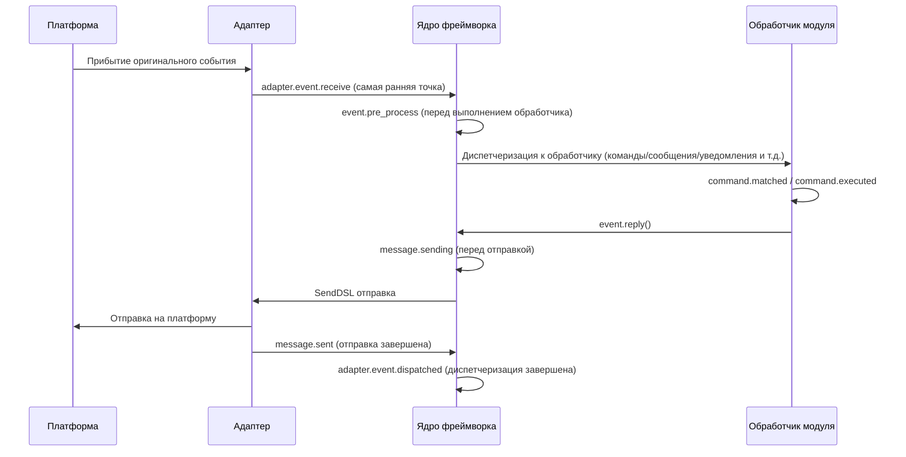

# Управление жизненным циклом

ErisPulse предоставляет единый механизм хуков/жизненного цикла для мониторинга состояния работы компонентов системы, а также реализации расширенных функций, таких как аудит, статистика и пользовательская логика.

Система поддерживает три способа вызова:
- `await lifecycle.emit("event", data)` — упрощённая версия, передача произвольных данных
- `lifecycle.emit_sync("event", data)` — синхронная версия (используется в не-асинхронных контекстах)
- `await lifecycle.submit_event("event", ...)` — совместимая со старой версией, автоматическое построение стандартного формата события

## Механизм обработки событий

### Регистрация обработчиков

```python
from ErisPulse import sdk

# Декораторный стиль
@sdk.lifecycle.on("module.load")
async def on_module_load(data):
    print(f"Загрузка модуля: {data}")

# Программная регистрация
sdk.lifecycle.register("module.load", on_module_load, priority=10)

# Отмена регистрации
sdk.lifecycle.unregister("module.load", on_module_load)

# Массовая отмена по владельцу (автоматически вызывается при выгрузке модуля/адаптера)
removed = sdk.lifecycle.unregister_by_owner("MyModule")
print(f"Удалено {removed} обработчиков жизненного цикла")
```

### Приоритеты

Обработчики поддерживают параметр `priority`, чем больше значение, тем раньше выполняется (аналогично загрузчику модулей):

```python
@sdk.lifecycle.on("adapter.event.receive", priority=10)  # Выполняется первым
async def first_handler(data):
    pass

@sdk.lifecycle.on("adapter.event.receive", priority=0)  # Выполняется позже
async def second_handler(data):
    pass
```

### События с точечной структурой

При срабатывании конкретного события также срабатывают его родительские события:
- При срабатывании `module.load` также срабатывает `module`
- При срабатывании `adapter.event.receive` также срабатывают `adapter.event` и `adapter`

### Подстановочные знаки

Регистрация `*` позволяет перехватывать все события:

```python
@sdk.lifecycle.on("*")
async def on_anything(data):
    print(f"Получено событие: {data}")
```

### Однократная регистрация (once)

Начиная с версии 2.7.0, обработчики, зарегистрированные через `lifecycle.once()`, автоматически отписываются после **одного срабатывания**, что подходит для "одноразовых" триггеров типа "первичной готовности":

```python
@sdk.lifecycle.once("core.init.complete")
async def on_first_ready(data):
    print("Первичная готовность, дальнейшие срабатывания не произойдут")
```

- Имеет ту же семантику параметра приоритета `priority` (чем больше значение, тем раньше выполняется)
- Автоматически отписывается, ручная отмена не требуется
- Поддерживает как синхронные, так и асинхронные обработчики

### Проверка наличия слушателей (has_handlers)

В сценариях с частыми проверками можно использовать `has_handlers()` для определения наличия слушателей, избегая ненужного перебора событий и планирования задач:

```python
if sdk.lifecycle.has_handlers("message.sending"):
    await sdk.lifecycle.emit("message.sending", send_ctx)
```

- Проверяет **точное имя события, подстановочные знаки `*` и родительские события**
- Возвращает `False`, если слушателей нет, что позволяет безопасно пропускать `emit`

## Список точек останова хуков

Типичный цикл событий жизненного цикла сообщения от платформы до завершения обработки:



Фреймворк содержит следующие встроенные точки останова хуков, пользователь может прослушивать любую точку останова с помощью `@sdk.lifecycle.on()` для реализации пользовательской логики.

### Основная инициализация

| Имя хука | Точка срабатывания | Данные |
|---------|---------|------|
| `core.init.start` | Начало инициализации SDK | `{}` |
| `core.init.complete` | Завершение инициализации SDK | `{"duration": float, "success": bool, "adapters": {"enabled": [str], "disabled": [str]}, "modules": {"enabled": [str], "disabled": [str]}, "error": str (только при сбое)}` |
| `core.uninit.complete` | Завершение обратной инициализации SDK | `{"duration": float, "success": bool, "adapters_closed": int, "modules_unloaded": int, "module_properties_cleared": int, "module_properties_to_clear": [str], "error": str (только при сбое)}` |

### Изменения конфигурации

| Имя хука | Точка срабатывания | Данные |
|---------|---------|------|
| `config.set` | Изменение конфигурационного параметра | `{"key": str, "old_value": Any, "new_value": Any}` |
| `config.updated` | Обнаружено изменение всей конфигурации после внешнего редактирования config.toml | `{"old_config": dict, "new_config": dict, "config_file": str}` |

**Пример: аудит конфигурации**

```python
@sdk.lifecycle.on("config.set")
def audit_config(data):
    print(f"[Аудит] {data['key']}: {data['old_value']} -> {data['new_value']}")
```

### Жизненный цикл модуля

| Имя хука | Точка срабатывания | Данные |
|---------|---------|------|
| `module.register` | Регистрация класса модуля в менеджере | `{"module_name": str, "success": bool}` |
| `module.load` | Завершение загрузки модуля (успешное инстанцирование) | `{"module_name": str, "success": bool}` |
| `module.init` | Завершение инициализации модуля (включая ленивую загрузку) | `{"module_name": str, "success": bool}` |
| `module.unload` | Выгрузка модуля | `{"module_name": str, "success": bool}` |

### Жизненный цикл адаптера

| Имя хука | Точка срабатывания | Данные |
|---------|---------|------|
| `adapter.load` | Завершение регистрации адаптера | `{"platform": str, "success": bool}` |
| `adapter.start` | Запуск адаптера | `{"platforms": [str]}` |
| `adapter.status.change` | Изменение статуса адаптера | `{"platform": str, "status": str, "retry_count": int, "error": str (только при сбое)}` |
| `adapter.stop` | Остановка адаптера | `{"platforms": [str]}` |
| `adapter.stopped` | Завершение остановки адаптера | `{"platforms": [str]}` |
| `adapter.bot.online` | Онлайн бота | `{"platform": str, "bot_id": str, "info": dict, "status": str}` |
| `adapter.bot.offline` | Оффлайн бота | `{"platform": str, "bot_id": str, "status": str}` |

### Прием и обработка событий

| Имя хука | Точка срабатывания | Данные |
|---------|---------|------|
| `adapter.event.receive` | Получение события с внешней платформы (самая ранняя точка) | `{"platform": str, "event_type": str, "raw_event_type": str}` |
| `adapter.event.dispatched` | Завершение диспетчеризации события | `{"platform": str, "event_type": str, "raw_event_type": str, "onebot_handlers_count": int}` |
| `event.pre_process` | Начало выполнения обработчика события | `{"event_type": str, "platform": str, "detail_type": str}` |

**Пример: статистика событий**

```python
event_counter = {}

@sdk.lifecycle.on("adapter.event.receive")
def count_events(data):
    platform = data["platform"]
    event_counter[platform] = event_counter.get(platform, 0) + 1

@sdk.lifecycle.on("adapter.event.dispatched")
def log_unhandled(data):
    if data["onebot_handlers_count"] == 0:
        print(f"[Необработано] {data['platform']}/{data['event_type']}")
```

### Отправка сообщений

| Имя хука | Точка срабатывания | Данные |
|---------|---------|------|
| `message.sending` | Сообщение отправляется | `{"platform": str, "method": str, "detail_type": str, "target_id": str, "bot_id": str}` |
| `message.sent` | Сообщение отправлено | `{"platform": str, "method": str, "detail_type": str, "target_id": str, "bot_id": str}` |

**Пример: аудит отправки сообщений**

```python
@sdk.lifecycle.on("message.sending")
def log_sending(data):
    print(f"[Отправка] -> {data['platform']}/{data['detail_type']}/{data['target_id']} через {data['method']}")
```

### Командная система

| Имя хука | Точка срабатывания | Данные |
|---------|---------|------|
| `command.matched` | Команда совпала и готова к исполнению | `{"command": str, "args": list[str], "platform": str, "user_id": str}` |
| `command.executed` | Команда выполнена | `{"command": str, "args": list[str], "platform": str, "user_id": str, "success": bool, "error": str (только при сбое)}` |

**Пример: статистика команд**

```python
@sdk.lifecycle.on("command.matched")
def count_commands(data):
    print(f"[Команда] /{data['command']} от {data['user_id']}@{data['platform']}")
```

### HTTP маршрутизация

| Имя хука | Точка срабатывания | Данные |
|---------|---------|------|
| `server.request` | Получение HTTP-запроса | `{"method": str, "path": str, "client_ip": str}` |
| `server.response` | Отправка HTTP-ответа | `{"method": str, "path": str, "status_code": int, "client_ip": str}` |

**Пример: логирование HTTP-запросов**

```python
@sdk.lifecycle.on("server.response")
def log_http(data):
    print(f"[HTTP] {data['method']} {data['path']} -> {data['status_code']}")
```

### WebSocket

| Имя хука | Точка срабатывания | Данные |
|---------|---------|------|
| `server.start` | Запуск сервера маршрутизации | `{"base_url": str, "host": str, "port": int}` |
| `server.stop` | Остановка сервера маршрутизации | `{}` |
| `server.websocket.connect` | Установление WebSocket-соединения | `{"path": str, "module_name": str, "client_ip": str}` |
| `server.websocket.disconnect` | Разрыв WebSocket-соединения | `{"path": str, "module_name": str, "reason": str, "error": str (только при аномалии)}` |

**Пример: мониторинг WebSocket-соединений**

```python
@sdk.lifecycle.on("server.websocket.connect")
def on_ws_connect(data):
    print(f"[WS] Подключение: {data['path']} от {data['client_ip']}")

@sdk.lifecycle.on("server.websocket.disconnect")
def on_ws_disconnect(data):
    print(f"[WS] Отключение: {data['path']} ({data['reason']})")
```

## Стандартные определения событий

```python
STANDARD_EVENTS = {
    "core": ["init.start", "init.complete", "uninit.complete"],
    "module": ["load", "init", "unload", "register"],
    "adapter": [
        "load", "start", "status.change", "stop", "stopped",
        "event.receive", "event.dispatched",
        "bot.online", "bot.offline",
    ],
    "server": [
        "start", "stop",
        "request", "response",
        "websocket.connect", "websocket.disconnect",
    ],
    "event": ["pre_process"],
    "message": ["sending", "sent"],
    "command": ["matched", "executed"],
    "config": ["set"],
}
```

## Полная справочная документация API

### Регистрация и отмена

| Метод | Описание |
|------|------|
| `@lifecycle.on(event, *, priority=0)` | Декоратор для регистрации обработчика |
| `lifecycle.register(event, handler, *, priority=0)` | Программная регистрация |
| `lifecycle.unregister(event, handler=None)` | Отмена регистрации (при handler=None отменяются все обработчики для данного события) |

### Срабатывание

| Метод | Описание |
|------|------|
| `await lifecycle.emit(event, data=None)` | Асинхронное срабатывание, обработчики могут изменить data, возвращая ненулевое значение |
| `lifecycle.emit_sync(event, data=None)` | Синхронное срабатывание, асинхронные обработчики запускаются с помощью create_task |
| `await lifecycle.submit_event(event_type, *, source, msg, data)` | Совместимость со старыми версиями, автоматическое построение стандартного формата события |

### Инструменты

| Метод | Описание |
|------|------|
| `lifecycle.start_timer(timer_id)` | Начать отсчёт времени |
| `lifecycle.get_duration(timer_id)` | Получить прошедшее время (в секундах) |
| `lifecycle.stop_timer(timer_id)` | Остановить отсчёт времени и вернуть прошедшее время |
| `lifecycle.list_hooks()` | Вывести список всех зарегистрированных хуков и количество обработчиков |
| `lifecycle.clear()` | Очистить все обработчики и таймеры |

## Пример использования в модуле

```python
from ErisPulse.Core.Bases import BaseModule
from ErisPulse import sdk

class Main(BaseModule):
    async def on_load(self, event):
        # Реализация простой статистики сообщений
        self.msg_count = 0
        
        @sdk.lifecycle.on("adapter.event.receive")
        async def count(data):
            if data["event_type"] == "message":
                self.msg_count += 1
        
        # Мониторинг всех команд
        @sdk.lifecycle.on("command.matched")
        async def log_cmd(data):
            sdk.logger.info(f"Команда выполнена: /{data['command']} от {data['user_id']}")
        
        # Аудит изменений конфигурации
        @sdk.lifecycle.on("config.set")
        def audit(data):
            sdk.logger.info(f"Изменение конфигурации: {data['key']} = {data['new_value']}")
```

## Принадлежность и автоматическое отмена фоновых задач

> [!NOTE]
> Эта функция доступна в ErisPulse **2.8.0+**.

Фоновые задачи asyncio, созданные модулем, если не отменены в `on_unload`, будут удерживать ссылку на `self`, что мешает сборке мусора для экземпляра модуля (старые экземпляры остаются после горячей перезагрузки). Рамка предоставляет следующие механизмы по умолчанию:

- **`self.spawn(coro)`** (рекомендуется в модуле): задача автоматически присваивается имени модуля, и при выгрузке модуля рамка в `on_unload` **после** отменяет неоконченные задачи и записывает предупреждение
- **`spawn_background(coro)`** (`ErisPulse.runtime`): автоматически захватывает текущий контекст `owner_scope`; `cancel_owner_tasks(owner)` отменяет задачи по принадлежности, `cancel_all_background_tasks()` используется для `sdk.uninit()` по умолчанию
- **Адаптеры**: при закрытии адаптера также отменяются фоновые задачи, принадлежащие имени платформы

```python
async def on_load(self, event):
    # Рекомендуется: фоновые задачи использовать self.spawn(), при выгрузке рамка автоматически отменяет
    self.spawn(self._poll())

async def on_unload(self, event):
    # В сценариях с тонкой настройкой по-прежнему рекомендуется отменить и дождаться завершения
    if self._poll_task:
        self._poll_task.cancel()
        await asyncio.gather(self._poll_task, return_exceptions=True)

async def _poll(self):
    while True:
        await asyncio.sleep(60)
        ...
```

> [!IMPORTANT]
> Рамка по умолчанию **принудительно отменяет** задачи (`cancel_owner_tasks`), это происходит после возврата из `on_unload`. Поэтому задачи, требующие аккуратного завершения (очистка буфера, сохранение состояния, закрытие соединений), **обязательно** должны быть отменены и завершены в `on_unload` — не рассчитывайте, что по умолчанию сохранится логика завершения. Рамка гарантирует только «отсутствие задач, удерживающих `self»`, но не «аккуратное» завершение. Задачи, требующие `await` результата, следует вызывать напрямую `await`, а не передавать в фоновую задачу.

## Примечания

1. **Обработчики могут быть синхронными или асинхронными**: система автоматически определяет и правильно вызывает их
2. **Передача данных**: в режиме `emit()`, если обработчик возвращает значение, отличное от None, это изменит данные, передаваемые следующим обработчикам
3. **Нормы именования событий**: рекомендуется использовать точечную структуру для именования событий, что упрощает использование родительских слушателей
4. **Изоляция ошибок**: исключение в одном обработчике не влияет на выполнение других обработчиков
5. **Ограничения синхронного триггера**: в `emit_sync()` асинхронные обработчики запускаются в режиме fire-and-forget, и возвращаемые значения не могут быть переданы обратно
6. **Очистка жизненного цикла**: при вызове `sdk.uninit()` все зарегистрированные обработчики и таймеры будут очищены
7. **Приоритет загрузки**: если необходимо слушать события на этапе инициализации фреймворка, рекомендуется установить высокий приоритет и отключить ленивую загрузку

## Связанные документы

- [Руководство по разработке модулей](../developer-guide/modules/getting-started.md) - Ознакомьтесь с методами жизненного цикла модуля
- [Рекомендуемые практики](../developer-guide/modules/best-practices.md) - Советы по использованию событий жизненного цикла