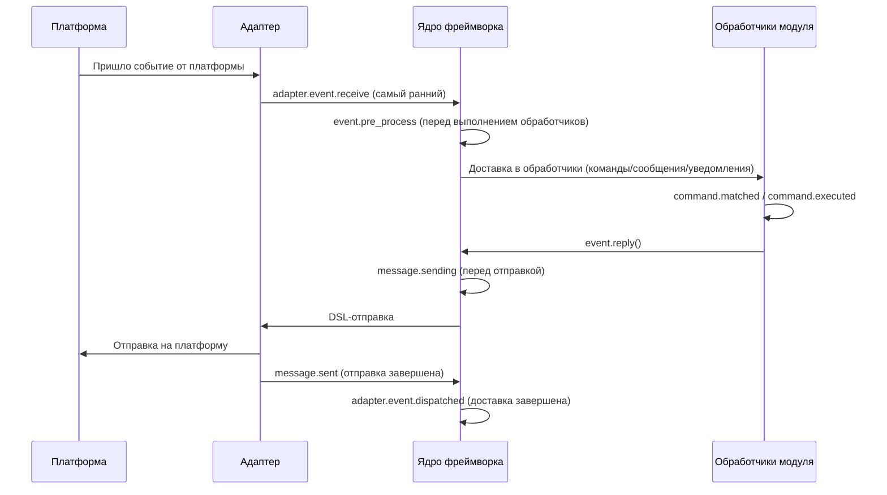

# Управление жизненным циклом

ErisPulse предоставляет единый механизм хуков/жизненного цикла, предназначенный для мониторинга состояния работы компонентов системы, а также реализации расширенных функций аудита, статистики и пользовательской логики.

Система поддерживает три способа триггеризации событий:
- `await lifecycle.emit("event", data)` — упрощённая версия, передаёт любые данные (`to="Owner"` для направленной доставки)
- `lifecycle.emit_sync("event", data)` — синхронная версия (для не-асинхронных контекстов)
- `await lifecycle.submit_event("event", ...)` — совместимость со старыми версиями, автоматически формирует стандартный формат события

## Механизм обработки событий

### Регистрация обработчиков

```python
from ErisPulse import sdk

# Декораторный стиль
@sdk.lifecycle.on("module.load")
async def on_module_load(data):
    print(f"Модуль загружен: {data}")

# Программная регистрация
sdk.lifecycle.register("module.load", on_module_load, priority=10)

# Отмена регистрации
sdk.lifecycle.unregister("module.load", on_module_load)

# Массовая отмена по владельцу (вызывается автоматически при выгрузке модуля/адаптера)
removed = sdk.lifecycle.unregister_by_owner("MyModule")
print(f"Удалено {removed} хуков жизненного цикла")
```

### Приоритеты

Обработчики поддерживают параметр `priority`, чем больше значение, тем раньше выполняется (аналогично загрузчику модулей):

```python
@sdk.lifecycle.on("adapter.event.receive", priority=10)  # Выполняется первым
async def first_handler(data):
    pass

@sdk.lifecycle.on("adapter.event.receive", priority=0)  # Выполняется позже
async def second_handler(data):
    pass
```

### События с точечной структурой

При триггере конкретного события также триггерятся его родительские события:
- При триггере `module.load` также триггерится `module`
- При триггере `adapter.event.receive` также триггерятся `adapter.event` и `adapter`

### Шаблоны

Регистрация `*` ловит все события:

```python
@sdk.lifecycle.on("*")
async def on_anything(data):
    print(f"Получено событие: {data}")
```

### Направленная рассылка (emit to=)

> [!NOTE]
> Эта функция доступна начиная с ErisPulse **2.8.0+**.

При указании параметра `to` в `emit()` событие доставляется только тем обработчикам, зарегистрированным с этим владельцем (хуки, зарегистрированные в `on_load` модуля, автоматически привязываются к нему), остальные модули и обработчики со шаблоном `*` не получают уведомления.

```python
# Отправитель: событие доставляется только хукам модуля Chat
await sdk.lifecycle.emit("message_received", {"text": "hi"}, to="Chat")

# Подписчик (внутри модуля Chat): регистрация хука с тем же именем, владелец автоматически записывается при регистрации
@sdk.lifecycle.on("message_received")
async def on_message_received(data): ...

@sdk.lifecycle.on("message")   # Родительская точечная приставка также работает (фильтрация по владельцу)
async def on_any(data): ...
```

- Если у владельца нет зарегистрированных хуков → событие **тихо отбрасывается** (можно заранее проверить наличие обработчиков с помощью `has_handlers()`)
- При `data` в виде словаря автоматически добавляется `_trace_id` (без перезаписи существующего значения)
- `emit_sync` / `submit_event` также поддерживают параметр `to=`
- Модульное взаимодействие в трёх уровнях (RPC / направленная / широковещательная) см. в [Взаимодействие между модулями](module-communication.md)

### Однократная регистрация (once)

Начиная с версии 2.7.0, хуки, зарегистрированные с помощью `lifecycle.once()`, автоматически отписываются после одного срабатывания, что подходит для таких сценариев, как "первичная готовность":

```python
@sdk.lifecycle.once("core.init.complete")
async def on_first_ready(data):
    print("Первичная готовность, больше не будет триггериться")
```

- Имеет те же параметры приоритета, что и `on()` (`priority` — чем больше, тем раньше)
- Автоматически отписывается, не требует ручной `unregister`
- Поддерживает как синхронные, так и асинхронные обработчики

### Запрос слушателей (has_handlers)

Для сценариев, где нужно избежать ненужного перебора и запуска задач, можно использовать `has_handlers()` для проверки наличия слушателей:

```python
if sdk.lifecycle.has_handlers("message.sending"):
    await sdk.lifecycle.emit("message.sending", send_ctx)
```

- Проверяет **точное имя события, шаблон `*`, родительские события**
- Возвращает `False`, если слушателей нет, можно безопасно пропустить `emit`

## Список точек останова хуков

Типичный порядок событий жизненного цикла при обработке сообщения от платформы до завершения:



Фреймворк включает следующие точки останова хуков, которые можно прослушивать с помощью `@sdk.lifecycle.on()` для реализации пользовательской логики.

### Ядро инициализации

| Название хука | Триггер | Данные |
|---------|---------|------|
| `core.init.start` | Начало инициализации SDK | `{}` |
| `core.init.stage` | Начало этапа инициализации (отправляется в фоне) | `{"stage": str}`, значения: `discovery` / `adapter_register` / `adapter_start` / `module_register` / `module_init` / `adapter_start_deferred` / `router_start` |
| `core.init.complete` | Завершение инициализации SDK | `{"duration": float, "success": bool, "stages": {stage: float}, "adapters": {"enabled": [str], "disabled": [str]}, "modules": {"enabled": [str], "disabled": [str]}, "error": str (только при ошибке)}` |
| `core.uninit.complete` | Завершение обратной инициализации SDK | `{"duration": float, "success": bool, "adapters_closed": int, "modules_unloaded": int, "module_properties_cleared": int, "module_properties_to_clear": [str], "error": str (только при ошибке)}` |

**Пример: отображение прогресса запуска**

```python
@sdk.lifecycle.on("core.init.stage")
def show_stage(data):
    print(f"[Запуск] Этап: {data['stage']}")
```

### Изменения конфигурации

| Название хука | Триггер | Данные |
|---------|---------|------|
| `config.set` | Изменение конфигурационного параметра | `{"key": str, "old_value": Any, "new_value": Any}` |
| `config.updated` | Обнаружено изменение всей конфигурации после редактирования `config.toml` | `{"old_config": dict, "new_config": dict, "config_file": str}` |

**Пример: аудит конфигурации**

```python
@sdk.lifecycle.on("config.set")
def audit_config(data):
    print(f"[Аудит] {data['key']}: {data['old_value']} -> {data['new_value']}")
```

### Жизненный цикл модуля

| Название хука | Триггер | Данные |
|---------|---------|------|
| `module.register` | Регистрация класса модуля в менеджере | `{"module_name": str, "success": bool}` |
| `module.load` | Завершение загрузки модуля (успешное инстанцирование) | `{"module_name": str, "success": bool}` |
| `module.init` | Завершение инициализации модуля (включая ленивую загрузку) | `{"module_name": str, "success": bool}` |
| `module.unload` | Выгрузка модуля | `{"module_name": str, "success": bool}` |
| `module.reload` | Завершение горячей перезагрузки модуля (включая перезагрузку зависимостей) | `{"module_name": str, "success": bool}` |

### Жизненный цикл адаптера

| Название хука | Триггер | Данные |
|---------|---------|------|
| `adapter.load` | Завершение регистрации адаптера | `{"platform": str, "success": bool}` |
| `adapter.start` | Запуск адаптера | `{"platforms": [str]}` |
| `adapter.status.change` | Изменение статуса адаптера | `{"platform": str, "status": str, "retry_count": int, "error": str (только при ошибке)}` |
| `adapter.stop` | Остановка адаптера | `{"platforms": [str]}` |
| `adapter.stopped` | Завершение остановки адаптера | `{"platforms": [str]}` |
| `adapter.bot.online` | Онлайн бота | `{"platform": str, "bot_id": str, "info": dict, "status": str}` |
| `adapter.bot.offline` | Оффлайн бота | `{"platform": str, "bot_id": str, "status": str}` |

### Приём и обработка событий

| Название хука | Триггер | Данные |
|---------|---------|------|
| `adapter.event.receive` | Получение события с внешней платформы (самый ранний) | `{"platform": str, "event_type": str, "raw_event_type": str}` |
| `adapter.event.blocked` | Промежуточный слой отклонил событие (возврат `False`, событие отбрасывается) | `{"middleware": str, "platform": str, "event_type": str, "detail_type": str, "event": dict, "_trace_id": str}` |
| `adapter.event.dispatched` | Завершение доставки события | `{"platform": str, "event_type": str, "raw_event_type": str, "onebot_handlers_count": int}` |
| `event.pre_process` | Перед началом выполнения обработчиков события | `{"event_type": str, "platform": str, "detail_type": str}` |

**Пример: статистика событий**

```python
event_counter = {}

@sdk.lifecycle.on("adapter.event.receive")
def count_events(data):
    platform = data["platform"]
    event_counter[platform] = event_counter.get(platform, 0) + 1

@sdk.lifecycle.on("adapter.event.dispatched")
def log_unhandled(data):
    if data["onebot_handlers_count"] == 0:
        print(f"[Необработано] {data['platform']}/{data['event_type']}")
```

### Отправка сообщений

| Название хука | Триггер | Данные |
|---------|---------|------|
| `message.sending` | Сообщение готовится к отправке | `{"platform": str, "method": str, "detail_type": str, "target_id": str, "bot_id": str}` |
| `message.sent` | Сообщение отправлено | `{"platform": str, "method": str, "detail_type": str, "target_id": str, "bot_id": str}` |

**Пример: аудит отправки сообщений**

```python
@sdk.lifecycle.on("message.sending")
def log_sending(data):
    print(f"[Отправка] -> {data['platform']}/{data['detail_type']}/{data['target_id']} через {data['method']}")
```

### Командная система

| Название хука | Триггер | Данные |
|---------|---------|------|
| `command.matched` | Команда найдена и готовится к выполнению | `{"command": str, "args": list[str], "platform": str, "user_id": str}` |
| `command.executed` | Команда выполнена | `{"command": str, "args": list[str], "platform": str, "user_id": str, "success": bool, "error": str (только при ошибке)}` |

**Пример: статистика команд**

```python
@sdk.lifecycle.on("command.matched")
def count_commands(data):
    print(f"[Команда] /{data['command']} от {data['user_id']}@{data['platform']}")
```

### HTTP-роутинг

| Название хука | Триггер | Данные |
|---------|---------|------|
| `server.request` | Получен HTTP-запрос | `{"method": str, "path": str, "client_ip": str}` |
| `server.response` | Отправлен HTTP-ответ | `{"method": str, "path": str, "status_code": int, "client_ip": str}` |

**Пример: логирование HTTP-запросов**

```python
@sdk.lifecycle.on("server.response")
def log_http(data):
    print(f"[HTTP] {data['method']} {data['path']} -> {data['status_code']}")
```

### WebSocket

| Название хука | Триггер | Данные |
|---------|---------|------|
| `server.start` | Запуск сервера роутинга | `{"base_url": str, "host": str, "port": int, "success": bool, "error": str (только при ошибке)}` |
| `server.stop` | Остановка сервера роутинга | `{}` |
| `server.websocket.connect` | Установлено WebSocket-соединение | `{"path": str, "module_name": str, "client_ip": str}` |
| `server.websocket.disconnect` | WebSocket-соединение разорвано | `{"path": str, "module_name": str, "reason": str, "error": str (только при аномалии)}` |

**Пример: мониторинг WebSocket-соединений**

```python
@sdk.lifecycle.on("server.websocket.connect")
def on_ws_connect(data):
    print(f"[WS] Подключение: {data['path']} от {data['client_ip']}")

@sdk.lifecycle.on("server.websocket.disconnect")
def on_ws_disconnect(data):
    print(f"[WS] Отключение: {data['path']} ({data['reason']})")
```

### Состояние подключения к хранилищу

События о подключении к хранилищу (все триггеры происходят в фоне, не блокируют операции):

| Название хука | Триггер | Данные |
|---------|---------|------|
| `storage.ready` | Соединение с хранилищем готово (первое успешное создание пула в цикле) | `{"backend": str}` |
| `storage.unreachable` | Повторные попытки подключения исчерпаны, вступает период охлаждения | `{"backend": str, "error": str, "cooldown": float}` |
| `storage.recovered` | Охлаждение закончено, подключение восстановлено | `{"backend": str}` |

**Пример: оповещение об отказе хранилища**

```python
@sdk.lifecycle.on("storage.unreachable")
def alert_storage_down(data):
    print(f"[Предупреждение] Хранилище {data['backend']} недоступно: {data['error']}, автоматическая переподключение через {data['cooldown']}s")

@sdk.lifecycle.on("storage.recovered")
def notify_storage_back(data):
    print(f"[Восстановление] Хранилище {data['backend']} снова доступно")
```

### HTTP-клиент

События запросов и подключений через `sdk.client` (все триггеры происходят в фоне):

| Название хука | Триггер | Данные |
|---------|---------|------|
| `client.request.success` | HTTP-запрос успешен | `{"method": str, "url": str, "status": int, "elapsed": float}` |
| `client.request.failed` | HTTP-запрос не удался после исчерпания попыток | `{"method": str, "url": str, "error": str, "attempts": int, "elapsed": float}` |
| `client.ws.connect` | Установлено WebSocket-соединение | `{"url": str}` |

### Межкультурная локализация

| Название хука | Триггер | Данные |
|---------|---------|------|
| `i18n.language.changed` | Смена языка фреймворка (`i18n.set_language`) | `{"language": str, "previous": str}` |

## Стандартное определение событий

```python
STANDARD_EVENTS = {
    "core": ["init.start", "init.stage", "init.complete", "uninit.complete"],
    "module": ["load", "init", "unload", "register", "reload"],
    "adapter": [
        "load", "start", "status.change", "stop", "stopped",
        "event.receive", "event.dispatched",
        "bot.online", "bot.offline",
    ],
    "server": [
        "start", "stop",
        "request", "response",
        "websocket.connect", "websocket.disconnect",
    ],
    "event": ["pre_process"],
    "message": ["sending", "sent"],
    "command": ["matched", "executed"],
    "config": ["set", "updated"],
    "storage": ["ready", "unreachable", "recovered"],
    "client": ["request.success", "request.failed", "ws.connect"],
    "i18n": ["language.changed"],
}
```

## Полная справочная документация API

### Регистрация и отмена

| Метод | Описание |
|------|------|
| `@lifecycle.on(event, *, priority=0)` | Регистрация обработчика декоратором |
| `lifecycle.register(event, handler, *, priority=0)` | Программная регистрация |
| `lifecycle.unregister(event, handler=None)` | Отмена регистрации (если handler=None, отменяются все обработчики события) |

### Триггеризация

| Метод | Описание |
|------|------|
| `await lifecycle.emit(event, data=None, *, to=None)` | Асинхронный триггер, обработчики выполняются **параллельно** (не блокируют друг друга, возвращается, когда все завершены), возвращаемые значения по приоритету перезаписывают data; при `to` триггер направлен на владельца |
| `lifecycle.fire(event, data=None, *, to=None)` | **Фоновый триггер (бросить в корзину)**: обработчики выполняются в фоновых задачах, не ждут, без возвращаемого значения; при отсутствии слушателей — нулевые затраты. Подходит для частых горячих путей и чисто наблюдательных событий; для последовательных триггеров (например, `config.set`) используйте `emit` |
| `lifecycle.emit_sync(event, data=None, *, to=None)` | Синхронный триггер, асинхронные обработчики запускаются через create_task |
| `await lifecycle.submit_event(event_type, *, source, msg, data, to=None, background=False)` | Совместимость со старыми версиями, автоматически формирует стандартный формат события; при `background=True` используется фоновый триггер `fire` |

### Утилиты

| Метод | Описание |
|------|------|
| `lifecycle.start_timer(timer_id)` | Начать отсчёт времени |
| `lifecycle.get_duration(timer_id)` | Получить прошедшее время (в секундах) |
| `lifecycle.stop_timer(timer_id)` | Остановить отсчёт и вернуть прошедшее время |
| `lifecycle.list_hooks()` | Вывести все зарегистрированные хуки и количество обработчиков |
| `lifecycle.clear()` | Очистить все обработчики и таймеры |

## Пример использования в модуле

```python
from ErisPulse.Core.Bases import BaseModule
from ErisPulse import sdk

class Main(BaseModule):
    async def on_load(self, event):
        # Простая статистика сообщений
        self.msg_count = 0
        
        @sdk.lifecycle.on("adapter.event.receive")
        async def count(data):
            if data["event_type"] == "message":
                self.msg_count += 1
        
        # Мониторинг всех команд
        @sdk.lifecycle.on("command.matched")
        async def log_cmd(data):
            sdk.logger.info(f"Команда выполнена: /{data['command']} от {data['user_id']}")
        
        # Аудит изменений конфигурации
        @sdk.lifecycle.on("config.set")
        def audit(data):
            sdk.logger.info(f"Изменение конфигурации: {data['key']} = {data['new_value']}")
```

## Принадлежность фоновых задач и автоматическая отмена

> [!NOTE]
> Эта функция доступна начиная с ErisPulse **2.8.0+**.

Фоновые задачи, созданные модулем, если не отменены в `on_unload`, будут удерживать ссылку на `self`, что приведёт к невозможности сборки мусора модуля (остатки после горячей перезагрузки). Фреймворк предоставляет следующие механизмы:

- **`self.spawn(coro)`** (рекомендуется в модуле): задача автоматически привязывается к имени модуля, при выгрузке модуля фреймворк **автоматически отменяет** незавершённые задачи и записывает предупреждение после `on_unload`
- **`spawn_background(coro)`** (в `ErisPulse.runtime`): автоматически захватывает контекст `owner_scope`; `cancel_owner_tasks(owner)` отменяет задачи по принадлежности, `cancel_all_background_tasks()` используется для отмены всех фоновых задач в `sdk.uninit()`
- **Адаптеры**: при остановке отменяются фоновые задачи по платформе

```python
async def on_load(self, event):
    # Рекомендуется: фоновые задачи использовать self.spawn(), фреймворк автоматически отменяет их при выгрузке
    self.spawn(self._poll())

async def on_unload(self, event):
    # В сценариях с точным контролем всё ещё рекомендуется отменять и ждать завершения
    if self._poll_task:
        self._poll_task.cancel()
        await asyncio.gather(self._poll_task, return_exceptions=True)

async def _poll(self):
    while True:
        await asyncio.sleep(60)
        ...
```

> [!IMPORTANT]
> Фреймворк принудительно отменяет задачи (`cancel_owner_tasks`), это происходит после возврата из `on_unload`. Поэтому задачи, требующие корректного завершения (flush буферов, сохранение состояния, закрытие соединений), **обязательно** должны быть отменены и завершены в `on_unload` — не полагайтесь на отмену фреймворком. Фреймворк гарантирует только отсутствие задач, удерживающих `self`, но не гарантирует корректное завершение. Задачи, требующие ожидания результата, следует вызывать напрямую, а не передавать в фоновую задачу.

## Примечания

1. **Обработчики могут быть синхронными или асинхронными**: система автоматически определяет и правильно вызывает
2. **Передача данных**: в режиме `emit()` возвращаемое обработчиком значение отличное от `None` изменяет данные, передаваемые последующим обработчикам
3. **Назначение имен событий**: рекомендуется использовать точечную структуру для удобства использования родительских слушателей
4. **Изоляция ошибок**: ошибка в одном обработчике не влияет на выполнение других обработчиков
5. **Ограничения синхронного триггера**: в `emit_sync()` асинхронные обработчики запускаются в фоне, возвращаемые значения не передаются
6. **Очистка жизненного цикла**: при вызове `sdk.uninit()` все зарегистрированные обработчики и таймеры будут очищены
7. **Приоритет загрузки**: если необходимо прослушивать события на раннем этапе инициализации, рекомендуется установить высокий приоритет и отключить ленивую загрузку

## Связанная документация

- [Руководство по разработке модулей](../developer-guide/modules/getting-started.md) — подробности о методах жизненного цикла модуля
- [Лучшие практики](../developer-guide/modules/best-practices.md) — рекомендации по использованию событий жизненного цикла