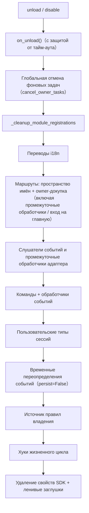

# Система принадлежности (owner)

Принадлежность является основой "Plug-and-Play" модулей: все ресурсы, зарегистрированные в рамках фреймворка во время загрузки, автоматически привязываются к модулю и при его выгрузке/отключении — возвращаются обратно владельцу. Автор модуля должен лишь объявить ресурсы, а не писать вручную логику очистки.

> **Связанные системы**: область видимости (scope) определяет "действует ли ресурс" при отправке событий, а принадлежность определяет "кому принадлежит ресурс и кто его освобождает при выгрузке". Область видимости описана в [Единая управляющая поверхность (scope)](scope.md), фоновые задачи — в [Управление жизненным циклом](lifecycle.md#Фоновые_задачи_принадлежность_и_автоматическое_отмена).

{!--< tips >!--}
1. Принадлежность регистрируется **в момент регистрации** по `current_owner`, без изменений в коде модуля
2. Выгрузка/отключение используют одну цепочку очистки (`_cleanup_module_registrations`), каждое неудачное действие вызывает только предупреждение, не прерывая процесс
3. Ресурсы, определённые пользовательской конфигурацией (постоянное переопределение / правила scope / ACL команд) **не** удаляются при выгрузке модуля
{!--< /tips >!--}

## Механизм контекста owner

Принадлежность передаётся через контекстную переменную `current_owner` (`ErisPulse.runtime.context`):

```python
from ErisPulse.runtime import owner_scope, get_current_owner

with owner_scope("MyModule"):
    # Все ресурсы, зарегистрированные в этом блоке, автоматически привязываются к MyModule
    assert get_current_owner() == "MyModule"
```

Фреймворк автоматически вставляет owner в следующие моменты (код модуля/адаптера не требует ручного обёртывания):

| Момент | Значение owner | Позиция |
|------|----------|------|
| Модуль `load()` | Имя модуля | При инстанцировании + на протяжении `on_load` |
| Адаптер `start()` / `restart()` | Имя платформы | На протяжении запуска адаптера |
| Регистрация stub для ленивой активации `activate_on` | Имя модуля | При регистрации заглушек команд/обработчиков |
| Выполнение обработчика события | Имя модуля, к которому принадлежит обработчик | При повторной инъекции в точку входа handler / command |

Повторная инъекция во время выполнения означает: обработчики команд, объявленные в `on_load`, при вызове API регистрации (например, `sdk.adapter.on()` или `overrides.*.set(persist=False)`) во время выполнения, также автоматически привязываются к этому модулю.

## Обзор ресурсов, подлежащих принадлежности

Все ресурсы, зарегистрированные в контексте загрузки модуля, записываются с привязкой к владельцу и автоматически удаляются при выгрузке/отключении:

| Ресурс | Способ регистрации | Вызов очистки |
|------|----------|----------|
| Команды | `@command()` / объявление через dict команд | `command.unregister_by_owner()` |
| Обработчики событий | `@message` / `@notice` / `@request` / `@meta` | `handler.unregister_by_owner()` |
| Слушатели событий адаптера | `sdk.adapter.on()` / `raw=True` | `adapter.unregister_handlers_by_owner()` |
| Промежуточные обработчики адаптера | `@sdk.adapter.middleware` | То же |
| Маршруты (HTTP/WS/SSE) | `router.http()` / `websocket()` / `sse()` | Двойная очистка по пространству имён и по владельцу |
| Промежуточные обработчики маршрутов | `@router.middleware()` / `add_middleware()` | `router.unregister_all_by_owner()` |
| Вход на главную панели | `router.register_home_entry()` | `unregister_home_entries_by_owner()` |
| Пользовательские типы сессий | `register_custom_type()` | `unregister_custom_types_by_owner()` |
| Фоновые задачи | `self.spawn()` | `cancel_owner_tasks()` |
| Хуки жизненного цикла | `lifecycle.register()` | `lifecycle.unregister_by_owner()` |
| Источник правил владения | `master.provider` | `master.unregister_by_owner()` |
| Переводы i18n | Объявление `I18nClass` (domain=имя модуля) | `i18n.unregister_domain()` |
| Переопределения событий (временные) | `overrides.*.set(persist=False)` | `overrides.unregister_by_owner()` |
| Взаимодействующие сессии (ожидание reply / лизинг) | `event.wait_reply()` / `sdk.interaction.acquire()` | `interaction.cancel_by_owner()` (ожидаемый получатель немедленно получает отмену) |
| Контекстные данные | Запись в `runtime/context` по owner | Точная очистка по модулю |

Ресурсы, зарегистрированные на стороне адаптера (с owner = имя платформы), удаляются при `shutdown()` / `restart()` адаптера функцией `_cleanup_adapter_resources`. Включает:

| Ресурс | Вызов очистки |
|------|----------|
| Собственные `on()` обработчики и промежуточные обработчики адаптера | `adapter.unregister_handlers_by_owner(platform)` |
| Расширения методов платформенных событий (`EventMixin`) | `unregister_platform_event_methods(platform)` |
| Пользовательские типы сессий | `unregister_custom_types_by_owner(platform)` |
| Взаимодействующие сессии (ожидание reply / лизинг на платформе) | `interaction.cancel_by_platform(platform)` |
| Переводы i18n (domain=ключ конфигурации) | `i18n.unregister_domain(ключ_конфигурации)` |
| Маршруты с точечными пространствами имён | `router.unregister_all_by_owner(platform)` |

## Последовательность очистки при выгрузке/отключении

`unload()` и `disable()` используют одну цепочку очистки (каждый шаг независим, с try/except, при сбое — только лог, **не прерывается**):



При завершении `sdk.uninit()` также происходит глобальная очистка: все адаптеры shutdown → все модули unload → `router.stop()` (очистка маршрутов/промежуточных обработчиков/входа на главную) → `cancel_all_background_tasks()` → очистка обработчиков событий и хуков.

## Пределы принадлежности: какие ресурсы не удаляются при выгрузке

Принадлежность удаляет **только ресурсы, зарегистрированные кодом модуля**. Следующие ресурсы относятся к **семантике пользовательской конфигурации** (управление в руках пользователя, возможно, специально настроено), и остаются после выгрузки модуля:

| Ресурс | Семантика | Описание |
|------|------|------|
| `overrides.*.set(persist=True)` | Постоянное переопределение | Записывается в конфиг, действует при перезапуске; модуль при выгрузке не удаляет (явно настроен пользователем) |
| `scope.set_action()` и другие правила области видимости | Правила управления доступом | Управляются пользователем/Dashboard, не удаляются при выгрузке модуля |
| `overrides.acl.set(persist=True)` | ACL команд | То же |
| `Conversation.save()` | Сохранение многошаговых диалогов | Данные сохраняются и не удаляются |

Ресурсы, записанные временно (`persist=False`), удаляются вместе с owner — **разница между "активным состоянием модуля" и "активным состоянием пользователя" — это именно persist**.

## Руководство для авторов модулей

### Рекомендуемый стиль

```python
from ErisPulse import sdk
from ErisPulse.Core.Event import command
from ErisPulse.runtime import owner_scope, spawn_background

class MyModule(BaseModule):
    async def on_load(self, event):
        # Ресурсы фреймворка: автоматически привязываются, не требуют ручной очистки
        self.task = self.spawn(self.polling())      # Фоновая задача
        sdk.router.register_home_entry("Мой модуль", "/my")  # Вход на главную

        # Собственные ресурсы модуля: включаются в систему принадлежности через owner_scope
        with owner_scope("MyModule"):
            self.client.on_event(self._handle)      # Пример пользовательской регистрации

    async def on_unload(self, event):
        # Ресурсы фреймворка уже автоматически удалены, осталось только очистить ресурсы вне owner_scope
        await self.client.close()
```

### Важные замечания

- **Регистрация в момент импорта не имеет принадлежности**: обработчики/хуки, зарегистрированные на уровне модуля (в момент импорта), происходят до `owner_scope` и привязываются к фреймворку (owner=None), поэтому **не удаляются**. Всегда регистрируйте в `on_load()`.
- **Регистрация i18n с пользовательским domain**: `i18n.register(domain=...)` с domain, отличным от имени модуля, не будет автоматически удалён. Держите domain=имя модуля.
- **Фоновые задачи должны использовать `self.spawn()`**: простое `asyncio.create_task` не привязывается к модулю и не отменяется при выгрузке (см. [Управление жизненным циклом](lifecycle.md#Фоновые_задачи_принадлежность_и_автоматическое_отмена)).
- **Очистка "сбоит только с предупреждением"**: ошибка при очистке одного шага не блокирует остальные, в логах видны на уровнях DEBUG/WARNING, для отладки можно включить TRACE.