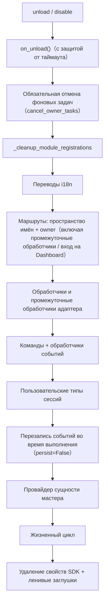

# Система владельцев (owner)

Система владельцев является основой "plug-and-play" модулей: все ресурсы фреймворка, зарегистрированные во время загрузки модуля, автоматически привязываются к нему, а при отключении/удалении модуля они автоматически освобождаются — автор модуля должен только объявить ресурсы, не вручную писать логику очистки.

> **Связанные системы**: область видимости (scope) определяет "действие ли ресурс" во время обработки событий, а владение (owner) определяет "кому принадлежит ресурс" и "кто освободит его при отключении". Область видимости подробно описана в [Единый интерфейс управления (scope)](scope.md), фоновые задачи — в [Управление жизненным циклом](lifecycle.md#Собственность фоновых задач и автоматический отмена).

{!--< tips >!--}
1. Владение автоматически записывается в момент регистрации через `current_owner`, без изменений в коде модуля
2. Отключение/отключение используют одну и ту же цепочку очистки (`_cleanup_module_registrations`), при сбое на шаге — только предупреждение, без прерывания
3. Ресурсы, определённые пользовательской конфигурацией (постоянные перезаписи / правила scope / ACL команд) **не** удаляются при отключении модуля
{!--< /tips >!--}

## Механизм контекста owner

Owner передаётся через контекстную переменную `current_owner` (`ErisPulse.runtime.context`):

```python
from ErisPulse.runtime import owner_scope, get_current_owner

with owner_scope("MyModule"):
    # Все зарегистрированные ресурсы в этом диапазоне автоматически привязываются к MyModule
    assert get_current_owner() == "MyModule"
```

Фреймворк автоматически вставляет owner в следующие моменты (код модуля/адаптера не требует ручного обёртывания):

| Момент | Значение owner | Позиция |
|------|----------|------|
| Модуль `load()` | Имя модуля | При создании экземпляра + на протяжении всего `on_load` |
| Адаптер `start()` / `restart()` | Имя платформы | На протяжении всего запуска адаптера |
| Регистрация stub для ленивой активации `activate_on` | Имя модуля | При регистрации заглушек команд/обработчиков |
| Выполнение обработчика событий | Имя модуля, к которому принадлежит обработчик | При повторной инъекции в handler / входную точку команды |

Повторная инъекция во время выполнения означает, что обработчики команд, объявленные в `on_load`, при вызове API регистрации (например, `sdk.adapter.on()`, `overrides.*.set(persist=False)`) во время выполнения также автоматически привязываются к текущему модулю.

## Обзор ресурсов, привязанных к владельцу

Все ресурсы, зарегистрированные в контексте загрузки модуля, записываются с привязкой владельца и автоматически освобождаются при отключении/отключении:

| Ресурс | Способ регистрации | Вызов очистки |
|------|----------|----------|
| Команды | `@command()` / объявление команды через dict | `command.unregister_by_owner()` |
| Обработчики событий | `@message` / `@notice` / `@request` / `@meta` | `handler.unregister_by_owner()` |
| Слушатели событий адаптера | `sdk.adapter.on()` / `raw=True` | `adapter.unregister_handlers_by_owner()` |
| Промежуточные обработчики адаптера | `@sdk.adapter.middleware` | То же |
| Маршруты (HTTP/WS/SSE) | `router.http()` / `websocket()` / `sse()` | По пространству имён + по владельцу |
| Промежуточные обработчики маршрутов | `@router.middleware()` / `add_middleware()` | `router.unregister_all_by_owner()` |
| Вход на Dashboard | `router.register_home_entry()` | `unregister_home_entries_by_owner()` |
| Пользовательские типы сессий | `register_custom_type()` | `unregister_custom_types_by_owner()` |
| Фоновые задачи | `self.spawn()` | `cancel_owner_tasks()` |
| Жизненный цикл | `lifecycle.register()` | `lifecycle.unregister_by_owner()` |
| Провайдер сущности мастера | `master.provider` | `master.unregister_by_owner()` |
| Переводы i18n | Объявление `I18nClass` (domain=имя модуля) | `i18n.unregister_domain()` |
| Перезапись событий (во время выполнения) | `overrides.*.set(persist=False)` | `overrides.unregister_by_owner()` |
| Контекстные данные | `runtime/context` с привязкой по owner | Точный сброс по модулю |

Соответствующие ресурсы адаптера (с owner = имя платформы) освобождаются при `shutdown()` / `restart()` адаптера через `_cleanup_adapter_resources`, а также:

| Ресурс | Вызов очистки |
|------|----------|
| Собственные обработчики и промежуточные обработчики адаптера | `adapter.unregister_handlers_by_owner(platform)` |
| Расширения методов событий платформы (`EventMixin`) | `unregister_platform_event_methods(platform)` |
| Пользовательские типы сессий | `unregister_custom_types_by_owner(platform)` |
| Переводы i18n (domain=ключ конфигурации) | `i18n.unregister_domain(ключ конфигурации)` |
| Маршруты с мелкозернистым пространством имён | `router.unregister_all_by_owner(platform)` |

## Последовательность очистки при отключении/отключении

`unload()` и `disable()` используют одну и ту же цепочку очистки (каждый шаг независим, при сбое — только логирование, **не прерывание**):



При завершении `sdk.uninit()` происходит глобальная очистка: остановка всех адаптеров → удаление всех модулей → `router.stop()` (очистка маршрутов/промежуточных обработчиков/входа на Dashboard) → `cancel_all_background_tasks()` → очистка обработчиков событий и хуков.

## Ограничения: какие ресурсы не удаляются при отключении

Система владельцев освобождает **только ресурсы, зарегистрированные кодом модуля во время выполнения**. Следующие ресурсы относятся к **конфигурации пользователя** (управление принадлежит пользователю, возможно, специально настроено), и остаются после отключения модуля:

| Ресурс | Семантика | Описание |
|------|------|------|
| `overrides.*.set(persist=True)` | Постоянная перезапись | Запись в конфигурационный файл, сохраняется при перезапуске; модуль не удаляет (явно настроен пользователем) |
| `scope.set_action()` и другие правила области видимости | Управление правами | Управляется пользователем/Dashboard, модуль не освобождает правила |
| `overrides.acl.set(persist=True)` | ACL команд | То же |
| `Conversation.save()` | Сохранение диалога | Данные сохраняются, не удаляются |

Временные записи (с `persist=False`) удаляются вместе с владельцем — **разница между "активным состоянием модуля" и "активными данными пользователя" определяется тем, сохраняются они или нет**.

## Руководство для авторов модулей

### Рекомендуемый стиль

```python
from ErisPulse import sdk
from ErisPulse.Core.Event import command
from ErisPulse.runtime import owner_scope, spawn_background

class MyModule(BaseModule):
    async def on_load(self, event):
        # Ресурсы фреймворка: автоматически привязываются, не требуют ручной очистки
        self.task = self.spawn(self.polling())      # Фоновая задача
        sdk.router.register_home_entry("Мой модуль", "/my")  # Вход на Dashboard

        # Собственные ресурсы модуля: включаются в систему владения через owner_scope
        with owner_scope("MyModule"):
            self.client.on_event(self._handle)      # Пример пользовательской регистрации

    async def on_unload(self, event):
        # Ресурсы фреймворка уже автоматически освобождены, нужно только очистить ресурсы вне owner_scope
        await self.client.close()
```

### Важные замечания

- **Регистрация в момент импорта не имеет владельца**: хуки/обработчики, зарегистрированные на уровне модуля (в момент импорта), происходят до `owner_scope`, и считаются ресурсами фреймворка (owner=None), и **не будут очищены**. Всегда регистрируйте ресурсы внутри `on_load()`.
- **Регистрация i18n с пользовательским domain**: `i18n.register(domain=...)` с domain, отличным от имени модуля, не будет автоматически освобождён, нужно сохранять domain=имя модуля.
- **Фоновые задачи обязательно через `self.spawn()`**: `asyncio.create_task` не привязан к модулю, и при отключении не будет отменён (см. [Управление жизненным циклом](lifecycle.md#Собственность фоновых задач и автоматический отмена)).
- Очистка "сбой только предупреждение": сбой на шаге не прерывает очистку остальных ресурсов, в логах видны сообщения уровня DEBUG/WARNING, при отладке можно включить TRACE.