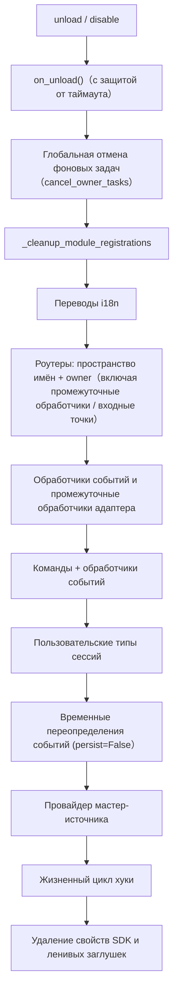

# Система принадлежности (owner)

Принадлежность — это основа "Plug-and-Play" модулей: все ресурсы, зарегистрированные фреймворком при загрузке модуля, автоматически привязываются к нему, и при его отключении или отключении — автоматически возвращаются — автор модуля должен лишь объявить ресурсы, а не писать логику очистки вручную.

> **Связанные системы**: Область видимости (scope) определяет, "действует ли ресурс" при распределении событий, а принадлежность (owner) определяет, "кому принадлежит ресурс" и "кто при отключении модуля его возвращает". Область видимости описана в [Единая управляющая поверхность (scope)](scope.md), фоновые задачи — в [Управление жизненным циклом](lifecycle.md#Автоматическая отмена фоновых задач).

{!--< tips >!--}
1. Принадлежность записывается **в момент регистрации** по значению `current_owner`, без изменений кода модуля
2. Отключение и отключение модуля используют одну и ту же цепочку очистки (`_cleanup_module_registrations`), при сбое на каждом этапе — только предупреждение, без прерывания
3. Ресурсы, определённые пользовательскими настройками (постоянное переопределение / правила scope / ACL команд) **не** очищаются при отключении модуля
{!--< /tips >!--}

## Механизм контекста owner

Owner передаётся через контекстную переменную `current_owner` (`ErisPulse.runtime.context`):

```python
from ErisPulse.runtime import owner_scope, get_current_owner

with owner_scope("MyModule"):
    # Все зарегистрированные в этом блоке ресурсы автоматически принадлежат MyModule
    assert get_current_owner() == "MyModule"
```

Фреймворк автоматически вставляет owner в следующие моменты (код модуля/адаптера не требует ручного обёртывания):

| Время | Значение owner | Позиция |
|------|----------|------|
| Модуль `load()` | Имя модуля | При инстанцировании + на протяжении всего `on_load` |
| Адаптер `start()` / `restart()` | Имя платформы | На протяжении всего запуска адаптера |
| Регистрация stub для ленивой активации `activate_on` | Имя модуля | При регистрации заглушек команд/обработчиков |
| Выполнение обработчика событий | Имя модуля, которому принадлежит обработчик | При повторной вставке в handler / входной точке команды |

Повторная вставка во время выполнения означает: обработчики команд, объявленные в `on_load`, при вызове API регистрации (например, `sdk.adapter.on()` или `overrides.*.set(persist=False)`) во время выполнения также автоматически принадлежат текущему модулю.

## Обзор ресурсов принадлежности

Все ресурсы, зарегистрированные в контексте загрузки модуля, автоматически отслеживаются и при отключении/отключении модуля автоматически возвращаются:

| Ресурс | Способ регистрации | Вызов очистки |
|------|----------|----------|
| Команды | `@command()` / объявление команды в словаре | `command.unregister_by_owner()` |
| Обработчики событий | `@message` / `@notice` / `@request` / `@meta` | `handler.unregister_by_owner()` |
| Слушатели событий адаптера | `sdk.adapter.on()` / `raw=True` | `adapter.unregister_handlers_by_owner()` |
| Промежуточные обработчики адаптера | `@sdk.adapter.middleware` | Тот же |
| Роутеры (HTTP/WS/SSE) | `router.http()` / `websocket()` / `sse()` | Двойная защита по пространству имён и owner |
| Промежуточные обработчики роутера | `@router.middleware()` / `add_middleware()` | `router.unregister_all_by_owner()` |
| Входная точка Dashboard | `router.register_home_entry()` | `unregister_home_entries_by_owner()` |
| Пользовательские типы сессий | `register_custom_type()` | `unregister_custom_types_by_owner()` |
| Фоновые задачи | `self.spawn()` | `cancel_owner_tasks()` |
| Жизненный цикл хуки | `lifecycle.register()` | `lifecycle.unregister_by_owner()` |
| Провайдер мастер-источника | `master.provider` | `master.unregister_by_owner()` |
| Переводы i18n | Объявление `I18nClass` (domain=имя модуля) | `i18n.unregister_domain()` |
| Переопределение событий (в рантайме) | `overrides.*.set(persist=False)` | `overrides.unregister_by_owner()` |
| Контекстные данные | `runtime/context` записываются по owner | Точная очистка по модулю |

Соответствующие ресурсы адаптера (с owner в виде имени платформы) при `shutdown()` / `restart()` адаптера очищаются через `_cleanup_adapter_resources`, а также:

| Ресурс | Вызов очистки |
|------|----------|
| Собственные `on()` обработчики и промежуточные обработчики адаптера | `adapter.unregister_handlers_by_owner(platform)` |
| Расширения методов событий платформы (`EventMixin`) | `unregister_platform_event_methods(platform)` |
| Пользовательские типы сессий | `unregister_custom_types_by_owner(platform)` |
| Переводы i18n (domain=ключ конфигурации) | `i18n.unregister_domain(ключ конфигурации)` |
| Решётчатые роутеры по пространству имён | `router.unregister_all_by_owner(platform)` |

## Последовательность очистки при отключении/отключении

`unload()` и `disable()` используют одну и ту же цепочку очистки (каждый шаг обёрнут в try/except, при сбое — только лог, **без прерывания последующей очистки**):



При завершении `sdk.uninit()` дополнительно происходит глобальная очистка: остановка всех адаптеров → отключение всех модулей → `router.stop()` (очистка роутеров/промежуточных обработчиков/входных точек) → `cancel_all_background_tasks()` → очистка обработчиков событий и хуков.

## Ограничения дизайна: какие ресурсы не очищаются при отключении

Принадлежность возвращает только **временные ресурсы, зарегистрированные кодом модуля**. Следующие ресурсы относятся к **семантике пользовательских настроек** (управление в руках пользователя, возможно, специально настроено), и при отключении модуля сохраняются в конфигурации:

| Ресурс | Семантика | Объяснение |
|------|------|------|
| `overrides.*.set(persist=True)` | Постоянное переопределение | Записывается в конфигурационный файл, действует при перезапуске; модуль не удаляет при отключении (явно настроено пользователем) |
| `scope.set_action()` и т.д. правила области видимости | Поверхность управления правами | Управление пользователем/Dashboard, модуль не возвращает правила при отключении |
| `overrides.acl.set(persist=True)` | ACL команд | То же |
| `Conversation.save()` сохранение | Архив многошаговых диалогов | Данные сохраняются и не удаляются |

Временные записи (с `persist=False`) удаляются вместе с owner — **разница между "активными данными пользователя" и "временным состоянием модуля"**.

## Руководство для автора модуля

### Рекомендуемый стиль

```python
from ErisPulse import sdk
from ErisPulse.Core.Event import command
from ErisPulse.runtime import owner_scope, spawn_background

class MyModule(BaseModule):
    async def on_load(self, event):
        # Ресурсы фреймворка: автоматически привязываются, не нужно вручную очищать
        self.task = self.spawn(self.polling())      # Фоновая задача
        sdk.router.register_home_entry("Мой модуль", "/my")  # Входная точка

        # Собственные ресурсы модуля: включаются в систему принадлежности через owner_scope
        with owner_scope("MyModule"):
            self.client.on_event(self._handle)      # Пример пользовательской регистрации

    async def on_unload(self, event):
        # Ресурсы фреймворка уже автоматически возвращены, нужно очистить только собственные ресурсы, не охваченные owner_scope
        await self.client.close()
```

### Важные замечания

- **Регистрация при импорте не имеет принадлежности**: Хуки/обработчики, зарегистрированные на уровне модуля (при импорте), происходят до `owner_scope` и считаются ресурсами фреймворка (owner=None), и **не очищаются**. Всегда регистрируйте в `on_load()`.
- **Регистрация i18n с пользовательским domain**: `i18n.register(domain=...)` с domain, не равным имени модуля, не будет автоматически возвращаться. Сохраняйте domain=имя модуля.
- **Фоновые задачи обязательно через `self.spawn()`**: Прямое использование `asyncio.create_task` не привязывается к модулю и не отменяется при отключении (см. [Управление жизненным циклом](lifecycle.md#Автоматическая отмена фоновых задач)).
- Очистка "сбоит — только предупреждение": Ошибка на этапе очистки не блокирует дальнейшую очистку, в логах видны DEBUG/WARNING, для отладки можно включить TRACE.