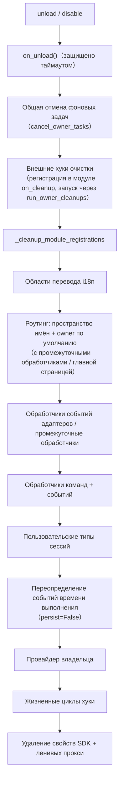

# Система владельцев (owner)

Система владельцев является основой для "Plug-and-Play" модулей: все ресурсы фреймворка, зарегистрированные во время загрузки модуля, автоматически привязываются к нему, и при отключении/деактивации модуля они автоматически удаляются — автор модуля должен просто объявить ресурсы, не вручную писать логику очистки.

> **Связанные системы**: область видимости (scope) определяет, "будут ли ресурсы активны" при отправке событий, а владелец определяет в цикле жизни "кому принадлежат ресурсы и кто будет отвечать за их удаление при отключении". Область видимости описана в [Единая управляющая поверхность (scope)](scope.md), фоновые задачи описаны в [Управление жизненным циклом](lifecycle.md#фоновые-задачи-принадлежность-и-автоматический-отмена).

{!--< tips >!--}
1. Владение **автоматически записывается** в момент регистрации по `current_owner`, без изменений в коде модуля
2. Отключение/деактивация модуля используют одну и ту же цепочку очистки (`_cleanup_module_registrations`), каждая неудачная операция только предупреждает, но не прерывает процесс
3. Ресурсы, определённые пользовательскими настройками (постоянное перезаписывание / правила scope / ACL команд) **не** удаляются при отключении модуля
4. Внешние дескрипторы, принадлежащие утилитным модулям, можно добавить в цепочку очистки с помощью `on_cleanup(cb)`, и они будут автоматически вызываться при отключении модуля (см. [Руководство по утилитным модулям](#руководство-по-утилитным-модулям-принадлежность-дескрипторов-других-модулей))
{!--< /tips >!--}

## Механизм контекста owner

Принадлежность передаётся через контекстную переменную `current_owner` (`ErisPulse.runtime.context`):

```python
from ErisPulse.runtime import owner_scope, get_current_owner

with owner_scope("MyModule"):
    # Все ресурсы, зарегистрированные в этом блоке, автоматически привязываются к MyModule
    assert get_current_owner() == "MyModule"
```

Фреймворк автоматически вставляет owner в следующие моменты (код модуля/адаптера не требует ручного обёртывания):

| Момент | Значение owner | Позиция |
|------|----------|------|
| Модуль `load()` | Имя модуля | При инстанцировании + на протяжении `on_load` |
| Адаптер `start()` / `restart()` | Имя платформы | На протяжении запуска адаптера |
| Регистрация stub для ленивой активации `activate_on` | Имя модуля | При регистрации заглушек команд/обработчиков |
| Выполнение обработчика события | Имя модуля, к которому принадлежит обработчик | При повторной инъекции в точку входа handler / command |

Повторная инъекция во время выполнения означает: обработчики команд, объявленные в `on_load`, при вызове API регистрации (например, `sdk.adapter.on()` или `overrides.*.set(persist=False)`) во время выполнения, также автоматически привязываются к этому модулю.

## Обзор ресурсов, привязанных к модулю

Все ресурсы, зарегистрированные модулем в контексте загрузки, записываются с привязкой к нему и автоматически освобождаются при отключении/отключении модуля:

| Ресурс | Способ регистрации | Вызов очистки |
|------|----------|----------|
| Команды | `@command()` / объявление команды в виде dict | `command.unregister_by_owner()` |
| Обработчики событий | `@message` / `@notice` / `@request` / `@meta` | `handler.unregister_by_owner()` |
| Слушатели событий адаптера | `sdk.adapter.on()` / `raw=True` | `adapter.unregister_handlers_by_owner()` |
| Промежуточные обработчики адаптера | `@sdk.adapter.middleware` | То же самое |
| Маршруты (HTTP/WS/SSE) | `router.http()` / `websocket()` / `sse()` | Двойная защита по пространству имен и по owner |
| Промежуточные обработчики маршрутов | `@router.middleware()` / `add_middleware()` | `router.unregister_all_by_owner()` |
| Вход на главную страницу Dashboard | `router.register_home_entry()` | `unregister_home_entries_by_owner()` |
| Пользовательские типы сессий | `register_custom_type()` | `unregister_custom_types_by_owner()` |
| Задачи в фоновом режиме | `self.spawn()` | `cancel_owner_tasks()` |
| Внешние очисточные хуки (управляемые инструментальным модулем) | `runtime.on_cleanup(cb)` | `run_owner_cleanups()` (вызывается в цепочке при отключении/отключении/закрытии адаптера) |
| Хуки жизненного цикла | `lifecycle.register()` | `lifecycle.unregister_by_owner()` |
| Провайдер источника главного пользователя | `master.provider` | `master.unregister_by_owner()` |
| Ключи переводов i18n | Объявление `I18nClass` (domain=имя модуля) | `i18n.unregister_domain()` |
| Переопределение событий (в режиме выполнения) | `overrides.*.set(persist=False)` | `overrides.unregister_by_owner()` |
| Интерактивные сессии (ожидание wait_reply / аренды) | `event.wait_reply()` / `sdk.interaction.acquire()` | `interaction.cancel_by_owner()` (сторона, ожидающая, немедленно получает отмену) |
| Контекстные данные | `runtime/context` с записью по owner | Точный очистка по модулю |

Ресурсы, привязанные к адаптеру (с платформой в качестве owner), при `shutdown()` / `restart()` адаптера очищаются методом `_cleanup_adapter_resources`. Также включают:

| Ресурс | Вызов очистки |
|------|----------|
| Собственные `on()` обработчики и промежуточные обработчики адаптера | `adapter.unregister_handlers_by_owner(platform)` |
| Расширения методов событий платформы (`EventMixin`) | `unregister_platform_event_methods(platform)` |
| Пользовательские типы сессий | `unregister_custom_types_by_owner(platform)` |
| Интерактивные сессии (ожидание wait_reply / аренды, зависящие от платформы) | `interaction.cancel_by_platform(platform)` |
| Области переводов i18n (domain=ключ конфигурации) | `i18n.unregister_domain(ключ конфигурации)` |
| Маршруты с мелкозернистым пространством имен | `router.unregister_all_by_owner(platform)` |

## Децерализация/отключение последовательности очистки

`unload()` и `disable()` используют одну и ту же цепочку очистки (каждый шаг независим, с try/except, сбой только в журнале, **не прерывает последующую очистку**):



При выходе `sdk.uninit()` есть глобальная общая очистка: остановка всех адаптеров → загрузка всех модулей → `router.stop()` (очистка роутинга/промежуточных обработчиков/главной страницы) → `cancel_all_background_tasks()` → очистка обработчиков событий и хуков.

## Пределы принадлежности: какие ресурсы не удаляются при выгрузке

Принадлежность удаляет **только ресурсы, зарегистрированные кодом модуля**. Следующие ресурсы относятся к **семантике пользовательской конфигурации** (управление в руках пользователя, возможно, специально настроено), и остаются после выгрузки модуля:

| Ресурс | Семантика | Описание |
|------|------|------|
| `overrides.*.set(persist=True)` | Постоянное переопределение | Записывается в конфиг, действует при перезапуске; модуль при выгрузке не удаляет (явно настроен пользователем) |
| `scope.set_action()` и другие правила области видимости | Правила управления доступом | Управляются пользователем/Dashboard, не удаляются при выгрузке модуля |
| `overrides.acl.set(persist=True)` | ACL команд | То же |
| `Conversation.save()` | Сохранение многошаговых диалогов | Данные сохраняются и не удаляются |

Ресурсы, записанные временно (`persist=False`), удаляются вместе с owner — **разница между "активным состоянием модуля" и "активным состоянием пользователя" — это именно persist**.

## Руководство для авторов модулей

### Рекомендуемый стиль

```python
from ErisPulse import sdk
from ErisPulse.Core.Event import command
from ErisPulse.runtime import owner_scope, spawn_background

class MyModule(BaseModule):
    async def on_load(self, event):
        # Ресурсы фреймворка: автоматически привязываются, не требуют ручной очистки
        self.task = self.spawn(self.polling())      # Фоновая задача
        sdk.router.register_home_entry("Мой модуль", "/my")  # Вход на главную

        # Собственные ресурсы модуля: включаются в систему принадлежности через owner_scope
        with owner_scope("MyModule"):
            self.client.on_event(self._handle)      # Пример пользовательской регистрации

    async def on_unload(self, event):
        # Ресурсы фреймворка уже автоматически удалены, осталось только очистить ресурсы вне owner_scope
        await self.client.close()
```

### Важные замечания

- **Регистрация в момент импорта не имеет принадлежности**: обработчики/хуки, зарегистрированные на уровне модуля (в момент импорта), происходят до `owner_scope` и привязываются к фреймворку (owner=None), поэтому **не удаляются**. Всегда регистрируйте в `on_load()`.
- **Регистрация i18n с пользовательским domain**: `i18n.register(domain=...)` с domain, отличным от имени модуля, не будет автоматически удалён. Держите domain=имя модуля.
- **Фоновые задачи должны использовать `self.spawn()`**: простое `asyncio.create_task` не привязывается к модулю и не отменяется при выгрузке (см. [Управление жизненным циклом](lifecycle.md#Фоновые_задачи_принадлежность_и_автоматическое_отмена)).
- **Очистка "сбоит только с предупреждением"**: ошибка при очистке одного шага не блокирует остальные, в логах видны на уровнях DEBUG/WARNING, для отладки можно включить TRACE.

## Руководство по модулю-инструменту: хэндлы для других модулей

**Сценарий**: такие "инструментальные модули", как планировщик задач, реестр и пулы соединений, хранят что-то от имени других модулей — например, при вызове `sdk.Cron.on_trigger(handler)` в `on_load` ваш контейнер сохраняет обратный вызов, ссылающийся на экземпляр другого модуля. Фреймворк автоматически очищает все ресурсы, зарегистрированные модулем, но не может очистить **ссылки в вашем частном контейнере**: после того, как модуль будет отключен или удален, ваш контейнер по-прежнему ссылается на его экземпляр, и он не может быть собран сборщиком мусора (утечка памяти, `purge` диагностика сообщает "непересборка").

**Решение**: в той же функции, где вы регистрируете что-то от имени другого модуля, вызовите `on_cleanup()`, и фреймворк автоматически вызовет вашу функцию очистки при отключении или удалении другого модуля:

```python
from ErisPulse.Core.Bases import BaseModule
from ErisPulse.runtime import off_cleanup, on_cleanup

class CronModule(BaseModule):
    def __init__(self):
        self._entries = {}  # {имя модуля: список обратных вызовов, принадлежащих этому модулю}

    def on_trigger(self, handler):
        # Автоматически определяет имя вызывающего модуля (работает как при прямом вызове в on_load, так и через module.call),
        # возвращает имя модуля, которое можно использовать как ключ для идентификации
        owner = on_cleanup(self._drop)
        self._entries.setdefault(owner, []).append(handler)

    def _drop(self, owner: str):
        """Вызывается фреймворком автоматически, когда модуль-владелец отключается или удаляется: просто удаляем его ссылки"""
        self._entries.pop(owner, None)

    async def on_unload(self, event):
        off_cleanup(self._drop)  # ③ При выгрузке модуля отменяем подписку на очистку, чтобы избежать удержания ссылки на self
```

Обеспечиваемое фреймворком поведение:

| Аспект | Поведение |
|--------|----------|
| Время срабатывания | При отключении/удалении модуля-владельца или при закрытии адаптера — все это происходит в рамках цепочки очистки фреймворка, до запуска диагностики утечек `purge` |
| Определение вызывающего модуля | При прямом вызове — `current_owner`; при вызове через `module.call()` — `current_caller`; также можно явно указать имя модуля через `on_cleanup(cb, owner="имя модуля")` |
| Сигнатура обратного вызова | `cb(owner: str)`, может быть синхронной или асинхронной; асинхронные функции защищены таймаутом (`CLEANUP_CALLBACK_TIMEOUT_SECS`, по умолчанию 10 секунд) |
| Обработка ошибок | Ошибка или таймаут одного обратного вызова записываются в лог, но не влияют на другие хуки и цепочку очистки |
| Дублирование регистрации | Одинаковые пары `(владелец, обратный вызов)` учитываются только один раз |

**Когда не нужно использовать**: если модуль регистрирует ресурсы фреймворка (команды, обработчики событий, маршруты, фоновые задачи и т.д.), фреймворк уже автоматически очищает их (см. выше [Обзор ресурсов](#обзор-ресурсов)). Только ссылки, хранящиеся в вашем частном контейнере, требуют `on_cleanup`. Сводный справочник для разработчиков модулей см. в [Рекомендации · Инструментальные модули](../developer-guide/modules/best-practices.md#инструментальные-модули-при-хранении-чужих-объектов-нужно-подписываться-на-уведомления-об-удалении).