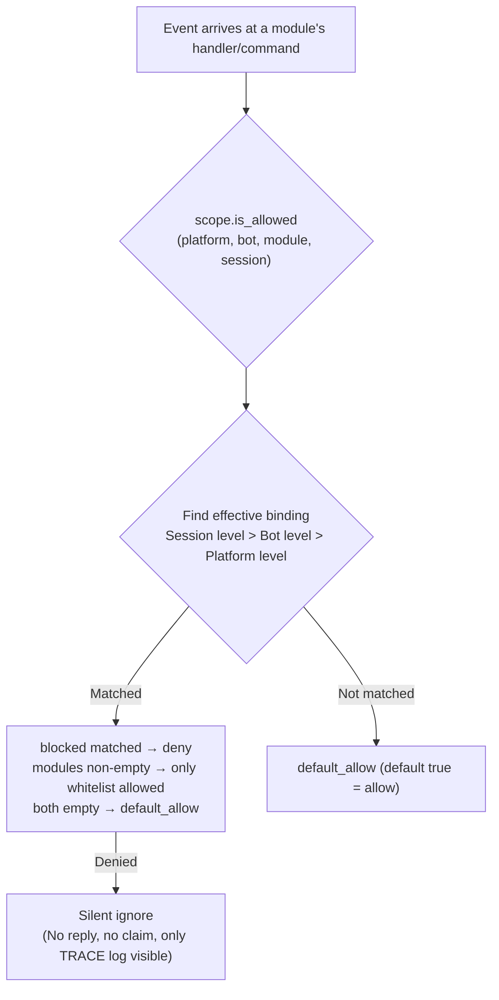

# Unified Control Plane (scope)

> [!NOTE]  
> This feature requires ErisPulse **2.8.0+**.

The unified control plane answers six questions: **which modules are available, whether events from a specific source are accepted, who can execute a specific command, which text a module processes, which implementation parameters are overridden, and which outbound calls a module is prohibited from initiating**. The control authority is entirely given to the user: all declarations regarding modules / adapters / commands / processors are made at the **upper level** (via configuration `ErisPulse.scope` or runtime `sdk.scope`). The event pipeline automatically reads and executes these declarations at each level.

The control plane consolidates the original multi-level permission systems and serves as the **only** entry point for permission/access control in version 2.8.0:

| Dimension | Controls What | Rejection Behavior | Configuration Path |
|------|---------|---------|---------|
| **① Module** | Which modules are available (platform / Bot / session levels) | Silent ignore (no reply, no claim) | `scope.platforms / bots / sessions` |
| **② Identity** | Whether to accept events (adapter / Bot / session / user levels) | Complete discard at entry (silent) | `scope.identity.*` |
| **③ Command** | Who can execute a specific command (command names support glob) | Reply "insufficient permissions" (explicit) | `scope.commands` |
| **④ Handler** | Which text a module's event handler processes | No trigger (silent) | `scope.handlers` |
| **⑤ Override** | Override implementation parameters of modules/commands (master/hidden/aliases/prefix) | —— (only changes parameters) | `scope.overrides` |
| **⑥ Outbound Actions** | Prohibit modules from sending messages / calling standard APIs / handling requests | Fail response (`retcode=34601`) | `scope.actions` |

{!--< tips >!--}
1. Import the singleton via `from ErisPulse.Core import scope` (same object as `sdk.scope`)
2. `scope.is_allowed(platform, bot_id, module, session_id)` checks if a module is allowed
3. `scope.is_identity_allowed(platform, bot_id, session_id, user_id)` checks if an event is allowed
4. `scope.allow_user("roll*", platform, uid)` / `deny_user(...)` for command ACL (supports glob)
5. `scope.override("MyModule", "restart", master=True)` overrides implementation parameters
6. `scope.set_action("MyModule", "send", False)` prohibits module replies/sending messages
7. `scope.get_stats()` checks filtering statistics; `scope.get_topology()` checks topology
{!--< /tips >!--}

## Matching Entry Syntax (Unified Across the System)

All "name lists" in the control plane (module names, identity keys, command names) use the same matching syntax (`ErisPulse.Core.text_match`):

| Syntax | Example | Description |
|------|------|------|
| Exact name | `"Chat"` | Full value comparison, **case-insensitive** |
| Glob | `"Tool*"`、`"spam_*"` | `*` matches any string / `?` matches a single character / `[seq]` matches a character set, case-insensitive |
| Regex | `"re:^Danger.*"` | Prefix with `re:` to declare a regex `search` match, default case-insensitive |

- Invalid regex **silently degrades** to "no match" (no error, no crash)
- Decorator parameters (`pattern=` / `regex=`) have fixed semantics: `pattern` is glob, `regex` is the regex source (without `re:` prefix); regex entries in control plane configurations **must** have the `re:` prefix

## Global Default: `default_allow`

`default_allow` is the **global** default switch (default `true`), affecting all three decision dimensions:

- **Module dimension**: No binding matched → `default_allow` determines allow/deny
- **Identity dimension**: No policy matched → `default_allow` determines allow/deny
- **Command dimension**: No ACL configured → `default_allow=true` passes to developer's default permission chain; `false` (strict mode) denies commands without ACL

Setting it to `false` enables "implicit deny" strict mode: whitelist management, **all unexplicitly allowed are denied**.

> **Exception**: The **outbound actions** dimension is **not** affected by `default_allow`—it is an independent tightening switch, defaulting to allow all, only explicitly `false` to deny (calls with framework-layer owner empty are always allowed). This strict global mode won't accidentally cut off all module message replies.

## Configuration File

```toml
[ErisPulse.scope]
default_allow = true        # Global default (false = implicit deny strict mode)
cache_size = 1024           # LRU cache size

# ── ① Module dimension (priority: session > Bot > platform) ──
[ErisPulse.scope.platforms.onebot11]
modules = ["Chat", "Tool*"]   # Whitelist: exact names / glob / re: regex
blocked = ["re:^Danger"]
[ErisPulse.scope.bots.onebot11."123456"]
modules = ["Chat"]
[ErisPulse.scope.sessions.onebot11."789012345"]
modules = ["Chat"]

# ── ② Identity dimension (priority: user > session > Bot > adapter) ──
[ErisPulse.scope.identity.adapters.onebot11]
deny = true                   # Discard all events from this adapter
[ErisPulse.scope.identity.bots.onebot11."123456"]
deny = true
[ErisPulse.scope.identity.sessions.onebot11."g_blocked"]
deny = true
[ErisPulse.scope.identity.users.onebot11]
allow = ["u_admin"]           # User keys support glob / re: regex
deny = ["u_bad", "spam_*"]

# ── ③ Command dimension (command names support glob) ──
[ErisPulse.scope.commands."roll*"]
allow = ["onebot11:u_vip"]    # User identifier "platform:user_id"
deny = ["onebot11:u_bad"]

# ── ④ Handler/Text dimension ──
[ErisPulse.scope.handlers.MyModule]
pattern = "签到*"             # AND with code-side pattern/regex conditions
regex = "re:\\d+\\s*元"

# ── ⑤ Implementation Parameter Override ──
[ErisPulse.scope.overrides.MyModule.restart]
master = true                 # Only framework owner can use
hidden = true                 # Hide in help
aliases = ["rs"]              # Append alias
prefix = "!"                  # Append trigger prefix

# ── ⑥ Outbound Actions dimension (default allow all, only explicitly deny) ──
[ErisPulse.scope.actions.MyModule]
send = false                  # Prohibit MyModule from replying/sending messages
api = false                   # Prohibit MyModule from calling standard APIs (including call escape hatch)
request = false               # Prohibit MyModule from handling request operations accept/reject
```

## ① Module Dimension

Answers "which modules are available in a given context." By default, all are open; filtering starts only after binding is configured, and **modules and adapters require no changes**.



- **Resolution priority**: Session level > Bot level > Platform level, higher priority bindings **fully override** lower priority
- **Silent semantics**: Filtered modules' commands and handlers do not trigger, reply, or claim (prevents cross-command mis-matching), only TRACE-level logs visible (`core.scope.denied`)
- **Framework-level handlers** (`scope_exempt=True` or owner empty) are unaffected; module names empty (framework-level resources) are always allowed

## ② Identity Dimension (Event Admission)

Answers "whose events are accepted." Events rejected are **completely discarded at the distribution entry**—they do not enter middlewares or any handlers (including framework-level), only TRACE-level logs visible (`core.scope.identity_denied`).

- **Resolution priority**: User > Session > Bot > Adapter, take the most specific configured policy; deny takes precedence over allow
- Each level binding is a binary policy: `{ allow = true }` or `{ deny = true }`
- User keys support glob / regex (e.g., `"spam_*"` to block a group of spam users)
- Typical usage—上级 deny, 个人 allow for "exception allow":

```toml
[ErisPulse.scope.identity.adapters.onebot11]
deny = true
[ErisPulse.scope.identity.users.onebot11]
allow = ["u_admin"]   # Even if adapter-level denied, u_admin's events are allowed
```

## ③ Command Dimension (Command ACL)

Answers "who can execute a specific command." Decision order: **deny matched → deny; allow whitelist non-empty and not matched → deny; neither configured → follow `default_allow`** (true passes to developer's default permission chain). Denied commands explicitly reply "insufficient permissions."

- Command names support glob: `"roll*"` one rule covers `roll`, `roll_dice`, etc.
- Exact keys take precedence over glob keys (`commands.roll` matched does not check `commands."roll*"`)
- User identifier format `"platform:user_id"` (consistent with framework owner system)
- This dimension is **only an additional gate on the user side**, and is chained with the command's `master` / `permission` parameters: ACL passes then follow the developer's declared default permission chain (this default chain can be adjusted via ⑤ override)

## ④ Handler/Text Dimension

Filters "which text a module processes": After configuring `pattern` / `regex` for a module, all its event handlers only trigger when the text matches (AND with code-side conditions, both must be satisfied). Suitable for narrowing its trigger scope without modifying module code.

```toml
[ErisPulse.scope.handlers.ChatModule]
pattern = "闲聊*"     # ChatModule's handlers only respond to messages starting with "闲聊"
```

## ⑤ Implementation Parameter Override

Overrides implementation parameters at the **upper level** of module/command registration, without modifying module code:

```toml
[ErisPulse.scope.overrides.MyModule.restart]
master = true      # Override to allow only framework owner (can also set false to relax developer's owner restriction)
hidden = true      # Hide in help list
aliases = ["rs"]   #生效别名
```

> Override follows **user priority**: Developer-declared `master` / `hidden` etc. are only default values; user configuration here takes precedence (can tighten or relax). Override only changes **implementation parameters** (master / hidden / aliases / prefix / help / usage etc.). **Disabling a command is not done here**—use command dimension deny (`scope.commands` or `scope.deny_user()`), to avoid conflicting "disable" semantics.

## ⑥ Outbound Actions Dimension (Prohibit Module Outbound Calls)

Restricts **outbound actions** initiated by modules: message sending / standard API actions / request operations. Three actions correspond to underlying DSL: `Event.reply` and `Send` (send), `Api` / `call_api` (api), `Request`'s accept/reject (request). Outbound calls initiated by modules during event handler execution carry module owner, and are uniformly judged by this dimension.

```toml
[ErisPulse.scope.actions.MyModule]
send = false      # Prohibit MyModule from replying/sending messages
api = false       # Prohibit MyModule from calling standard API actions (including call escape hatch)
request = false   # Prohibit MyModule from executing accept/reject on request events
```

Judgment semantics: **Default allow all**—unconfigured, or owner empty (internal framework calls) are allowed; only explicitly set to `false` is denied, denied calls do not initiate any network requests, directly returning standard failure response (`retcode = 34601`, see [api-response §5.3](../standards/api-response.md#53-框架扩展返回码34xxx-平台错误段的低三位自定义)). The three actions are independent, one can be denied while others remain allowed.

```python
# Runtime API
sdk.scope.set_action("MyModule", "send", False)   # Prohibit message sending
sdk.scope.is_action_allowed("MyModule", "send")   # False
sdk.scope.unset_action("MyModule", "send")        # Restore allow
sdk.scope.get_action_rules("MyModule")            # {"send": False, "api": True, "request": True}
```

## Runtime API

### Module Dimension

```python
from ErisPulse import sdk

# Check
sdk.scope.is_allowed("onebot11", "123456", "Chat")
sdk.scope.is_allowed("onebot11", "123456", "Chat", "789012345")
sdk.scope.is_allowed("onebot11", "123456", None)      # Framework-level resource -> True

# Bind / Unbind
sdk.scope.bind_module("onebot11", "123456", modules=["Chat", "Tool*"])
sdk.scope.bind_module("onebot11", blocked=["Danger"])             # Platform level
sdk.scope.bind_module("onebot11", "123456", "789012345", modules=["Chat"])  # Session level
sdk.scope.bind_module("onebot11", "123456", modules=["Music"], merge=True)  # Merge
sdk.scope.bind_module("onebot11", "123456", modules=["Chat"], persist=False)  # Runtime only
sdk.scope.unbind_module("onebot11", "123456")

# Query
sdk.scope.get("onebot11", "123456")   # {"modules": ["Chat"], "blocked": []}
```

### Identity Dimension

```python
# Check if event is allowed
sdk.scope.is_identity_allowed("onebot11", "123456", "group_9", "u1")

# Bind policy (hierarchy determined by parameters: user > session > bot > adapter)
sdk.scope.bind_identity("onebot11", user_id="u_bad", deny=True)
sdk.scope.bind_identity("onebot11", user_id="spam_*", deny=True)   # Glob
sdk.scope.bind_identity("onebot11", "123456", "group_9", allow=True)
sdk.scope.unbind_identity("onebot11", user_id="u_bad")

# User blacklist convenience API
sdk.scope.block_user("onebot11", "u_bad")
sdk.scope.is_user_blocked("onebot11", "u_bad")
sdk.scope.get_blocked_users()        # {"onebot11": ["u_bad"]}
sdk.scope.unblock_user("onebot11", "u_bad")
```

### Command Dimension

```python
sdk.scope.is_command_allowed("roll", "onebot11", "u1")
sdk.scope.allow_user("roll*", "onebot11", "u_vip")   # Command names support glob
sdk.scope.deny_user("roll*", "onebot11", "u_bad")
sdk.scope.get_acl("roll*")
sdk.scope.remove_acl("roll*")

# Can also be delegated through command system facade (equivalent)
from ErisPulse.Core.Event import command
command.allow_user("restart", "onebot11", "123456")
```

### Handler and Override Dimensions

```python
sdk.scope.bind_handler("MyModule", pattern="签到*", regex=r"\d+号")
sdk.scope.unbind_handler("MyModule")

sdk.scope.override("MyModule", "restart", master=True, hidden=True)
sdk.scope.get_override("MyModule", "restart")
sdk.scope.remove_override("MyModule", "restart")
```

### General

```python
sdk.scope.list_bindings()   # All bindings
sdk.scope.get_topology()    # Topology (for Dashboard)
sdk.scope.get_stats()
# {"module_calls": .., "module_filtered": .., "identity_checks": .., "identity_denied": ..,
#  "command_checks": .., "command_denied": .., "action_checks": .., "action_denied": ..,
#  "cache_hits": .., "cache_misses": ..}
sdk.scope.reset_stats()
sdk.scope.clear()           # Clear all bindings (in-memory only)
```

## Owner Identity and Custom Identity Source (provider)

The owner system answers "who is the framework owner": The `master=True` parameter of commands and the business layer's `master.is_master()` share the same identity determination, with the determination chain being **configured owner → runtime record → provider chain**.

Owner configuration (`ErisPulse.master.users`, supports global list and per-platform dict) is described in the [configuration documentation](../user-guide/configuration.md#owner-system-configuration). This section focuses on identity determination API and extension points.

### Determination and Runtime Add/Delete

```python
from ErisPulse.Core import master

master.is_master(event)                      # Determine from event
master.is_master("yunhu", "123")             # Explicit determination
master.add("yunhu", "123")                   # Add at runtime (default persistent; persist=False only in-memory)
master.remove("yunhu", "123")                # Remove (default persistent)
master.list()                                # Aggregate: {"global": [...], "<platform>": [...]}
```

### Custom Identity Source (provider)

In addition to configuration, custom identity sources can be registered: `fn(platform, user_id) -> bool`, which are tried in sequence if built-in identity sources (configuration + runtime record) do not match, and any provider allowing the user is considered an owner. Suitable for integrating adapter admin interfaces, database roles, and other external identity systems.

Registration entry `master.provider` supports both decorator and function styles, and unregistration is done through the unregistered function:

```python
from ErisPulse.Core import master

# Style 1: Decorator (persistent identity source, recommended)
@master.provider
def admin_provider(platform, user_id):
    return user_id in {"999"}     # Custom determination logic

master.is_master("yunhu", "999")   # True
admin_provider.unregister()        # Unregister when no longer needed

# Style 2: Function style (register at module load / unregister at unload)
fn = master.provider(admin_provider)
fn.unregister()
```

> Provider exceptions are caught and skipped, not blocking the identity determination chain. Binding instance methods cannot mount `unregister`, for scenarios requiring paired registration/unregistration, use **module-level functions**.

### User Priority: Owner Scope Decided by User

The `master=True` of commands is only the **developer's default**: The user can override it in the control plane `ErisPulse.scope.overrides.<module>.<cmd>.master = true/false` to tighten or loosen (see above ⑤ Implementation Parameter Override, user's explicit configuration takes effect).

## Cache and Hot Update

- `is_allowed` / `is_identity_allowed` results include **LRU cache** (`scope.cache_size` is adjustable), `bind_*` / `unbind_*` / configuration hot update (`config.updated` / `config.set`) automatically invalidate
- All dimension configurations take effect **immediately**, no restart required
- The control plane makes **per-event** judgments, does not remember across events: Configuration changes take effect on the next event

## Common Issues and Notes

### 1. Configuration Hierarchy and Overriding

- Module dimension: Session level > Bot level > Platform level, **full override**. To "allow Chat at platform level, add Music at Bot level," both must be listed at the Bot level
- Identity dimension: User > Session > Bot > Adapter, take the **most specific** configured policy (can do exception allow)
- Command dimension: Exact command name takes precedence over glob key

### 2. Prefer Control Plane Over Modifying Module Code

Module declarations are "developer's default" (`master=True`, `permission=...`, `pattern=...`); control plane declarations are "user's final decision." Implementation parameter overrides follow **user priority**: User's explicit configuration of `master = true/false` takes effect directly (can tighten or loosen). Developers' unconfigured restrictions can be tightened by users; disable/allow control goes through command deny / identity allow.

### 3. Module/Command Not Responding

First suspect the control plane rather than the module itself:

```python
from ErisPulse import sdk

print(sdk.scope.is_allowed(event.get_platform(), bot_id, "MyModule", session_id))
print(sdk.scope.is_identity_allowed(event.get_platform(), bot_id, session_id, user_id))
print(sdk.scope.get_stats())   # module_filtered / identity_denied > 0 indicates silent filtering
```

Filtered is **silent** (module dimension and identity dimension do not reply, preventing rule exposure), but statistics accumulate; command dimension denied by ACL replies "insufficient permissions" explicitly.

### 4. Session Identifier Isolation Across Platforms

`(platform, session_id)` combination is the unique identifier. `scope.sessions.onebot11."789"` only applies to onebot11, not affecting the session with the same `789` on telegram. The same applies to identity dimension user keys.

## Topology Tree API

`ModuleManager.get_topology()` and `AdapterManager.get_topology()` provide module/adapter ownership relationship data, `sdk.get_topology()` aggregates all (including the control plane's five dimensions):

```python
from ErisPulse import sdk

topology = sdk.get_topology()
# {
#   "modules": {                                   # Module → owned resources
#     "Chat": {
#       "loaded": True, "enabled": True,
#       "commands": ["chat", "translate"],
#       "handlers": {"message": 2, "notice": 1},
#       "routes": {"http": ["/Chat/api"], "ws": [], "sse": []},
#       "lifecycle_hooks": 3,
#     }
#   },
#   "adapters": {                                  # Adapter → Bot → scope
#     "onebot11": {
#       "status": "started", "enabled": True,
#       "bots": {"123456": {"status": "online", "scope": {...}}},
#       "scope": {"modules": [...], "blocked": [...]},
#     }
#   },
#   "scope": {                                     # Unified control plane (five dimensions)
#     "platforms": {...}, "bots": {...}, "sessions": {...},
#     "identity": {"adapters": {...}, "bots": {...}, "sessions": {...}, "users": {...}},
#     "commands": {...}, "handlers": {...}, "overrides": {...},
#   },
# }
```

- Module topology aggregates commands registered by the module, event handlers, HTTP/WS/SSE routes, and lifecycle hooks, suitable for drawing module resource trees.
- Adapter topology aggregates status of each adapter, status of subordinate Bots, and platform-level/Bot-level scope bindings.