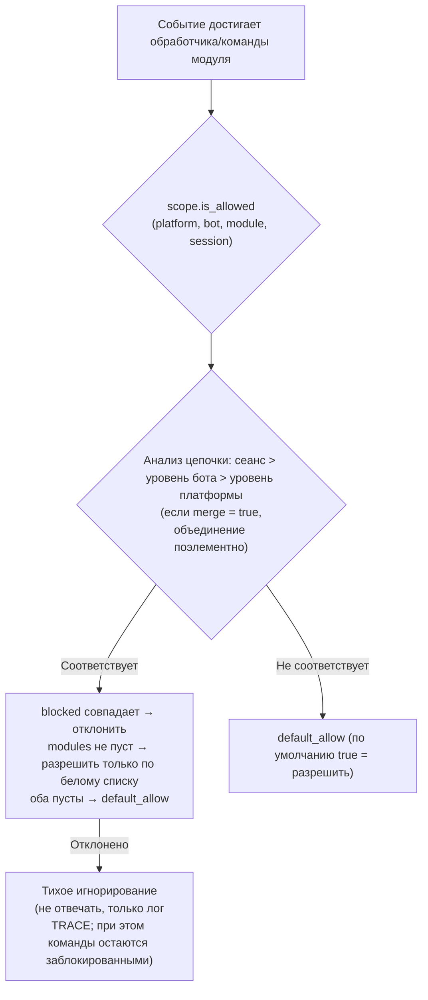

# Scope (область видимости)

> [!NOTE]
> Эта функция требует ErisPulse **2.8.0+**.

Область видимости отвечает на четыре вопроса: **какие модули доступны, какие события принимать, какой текст обрабатывает конкретный модуль, и что модуль может делать за пределами**. Полный контроль предоставляется пользователю: права на уровне **выше** (в конфигурации `ErisPulse.scope` или во время выполнения `sdk.scope`) объявляются при регистрации модуля / адаптера / обработчика / вызова на выходе, а цепочка событий автоматически читает и выполняет эти настройки на входе, при фильтрации обработчиков и на выходе.

| Масштаб | Что контролируется | Поведение при отклонении | Путь настройки |
|------|---------|---------|---------|
| **① Модуль** | Какие модули доступны (три уровня: платформа / Bot / сессия) | Просто игнорировать (не отвечать; при этом команды, которые были распознаны, всё равно блокируются) | `scope.platforms / bots / sessions` |
| **② Идентичность** | Принимать или нет события (четыре уровня: адаптер / Bot / сессия / пользователь) | Полностью отбрасывать на входе (без уведомления) | `scope.identity.*` |
| **③ Выход** | Какие выходные вызовы может инициировать модуль (сообщения / API / запросы, белый и чёрный списки на уровне методов) | Ответ с ошибкой (код `retcode=34601`) | `scope.actions` |

> **Связанные системы**: Команды являются специальными обработчиками событий сообщений, их пользовательские белый и чёрный списки (ACL) и перезапись параметров реализации управляются системой команд (`ErisPulse.event.command`). Подробнее см. в [Введение в обработку событий](../getting-started/event-handling.md) и [Руководство по конфигурации](../user-guide/configuration.md).

{!--< tips >!--}
1. Импортируйте синглтон через `from ErisPulse.Core import scope` (объект `sdk.scope` — тот же самый)
2. Проверка: `scope.is_allowed(...)` / `scope.is_identity_allowed(...)` / `scope.is_action_allowed(...)` — соответствующие три порта
3. Чтение и запись: методы с параметрами по уровням (IDE подсказывает) — `scope.set_module(...)` / `scope.set_identity(...)` / `scope.set_action(...)`; также есть универсальные методы с использованием словаря `scope.get(path)` / `scope.set(path, v)` / `scope.delete(path)`
4. Переопределение текста обработчиком событий см. в [Введение в обработку событий · Переопределение событий](../getting-started/event-handling.md#переопределение-событий-без-изменения-кода-модуля-переопределяйте-поведение-любого-типа-событий); ACL команд и переопределение параметров см. в [Введение в обработку событий](../getting-started/event-handling.md)
{!--< /tips >!--}

## Matching Entry Syntax (Unified Across the System)

All "name lists" in scope (module names, identity keys, outbound entries) share the same matching syntax (via `ErisPulse.Core.text_match`):

| Syntax | Example | Description |
|------|------|------|
| Exact name | `"Chat"` | Full value comparison, **case-insensitive** |
| glob | `"Tool*"`、`"spam_*"` | `*` for any string / `?` for a single character / `[seq]` for character set, case-insensitive |
| Regular expression | `"re:^Danger.*"` | Declared with `re:` prefix, matches using regular expression `search`, default case-insensitive |

- Invalid regular expressions **silently degrade** to "no match" (no error thrown, no crash)
- Decorator parameters (`pattern=` / `regex=`) have fixed semantics: `pattern` is glob, `regex` is the raw regular expression (without `re:` prefix); regular expression entries in scope configuration **must** have the `re:` prefix

## Global Fallback: `default_allow`

`default_allow` is the **single global** fallback switch (default `true`), affecting two decision dimensions:

- **Module dimension**: If no binding is matched → `default_allow` decides allow/deny
- **Identity dimension**: If no policy is matched → `default_allow` decides allow/deny

Setting it to `false` enables "implicit deny" strict mode: whitelist-style management,
**everything not explicitly allowed is denied**.

> **Exception**: The outbound dimension is **not affected** by `default_allow`—it is an independent tightening switch,
> defaulting to full allow, with restrictions only via explicit rules (framework-level owner-empty calls are always allowed).
> This strict global mode won't accidentally cut off all module message replies.
> Command ACL has a separate `ErisPulse.event.command.default_allow` fallback, independent of others.

## Configuration File

```toml
[ErisPulse.scope]
default_allow = true        # Global fallback (false = implicit deny strict mode)
cache_size = 1024           # LRU cache size

# ── ① Module dimension (priority: session > Bot > platform) ──
[ErisPulse.scope.platforms.onebot11]
modules = ["Chat", "Tool*"]   # Whitelist: exact name / glob / re: regex
blocked = ["re:^Danger"]
[ErisPulse.scope.bots.onebot11."123456"]
modules = ["Chat"]
merge = true                  # Append on top of platform-level binding (default is full override)
[ErisPulse.scope.sessions.onebot11."789012345"]
modules = ["Chat"]

# ── ② Identity dimension (priority: user > session > Bot > adapter) ──
[ErisPulse.scope.identity.adapters.onebot11]
deny = true                   # Discard all events from this adapter
[ErisPulse.scope.identity.bots.onebot11."123456"]
deny = true
[ErisPulse.scope.identity.sessions.onebot11."g_blocked"]
deny = true
[ErisPulse.scope.identity.users.onebot11]
allow = ["u_admin"]           # User keys support glob / re: regex
deny = ["u_bad", "spam_*"]

# ── ③ Outbound dimension (default allow all, restrict only via explicit rules) ──
[ErisPulse.scope.actions.MyModule]
send = { deny = true }                                    # Disable all sending
api = { allow = ["get_*"] }                               # Allow only query-type standard APIs
request = { deny = true }                                 # Disable request handling
```

## ① Модульный уровень

Ответ на вопрос: "Какие модули доступны в определённом контексте?" По умолчанию все модули открыты; фильтрация начинается только после привязки конфигурации.
**Модули и адаптеры не требуют никаких изменений**.



- **Приоритет анализа: сеанс > уровень бота > уровень платформы**, привязки высокого приоритета **полностью перекрывают** привязки низкого приоритета;
  если в привязке подуровня указано `merge = true`, то происходит **объединение поэлементно** с привязками низкого уровня (объединяются `modules` и `blocked` по отдельности,
  `merge` сам по себе является ключом и не считается элементом)
- **Тихая семантика**: команды и обработчики модуля, отфильтрованные по этой схеме, не запускаются и не отвечают, видны только логи уровня TRACE
  (`core.scope.denied`); при этом **команды**, которые были заблокированы, по-прежнему считаются заблокированными — текст команды больше не передаётся
  низкоуровневым обработчикам сообщений, устраняя двойную реакцию, когда команда отклоняется, а затем сообщение обрабатывается ещё раз
- **Обработчики на уровне фреймворка** (`scope_exempt=True` или `owner` пуст) не затрагиваются; модули с пустым именем (ресурсы на уровне фреймворка) всегда разрешаются
- **Помощь и запросы команд с учётом сеанса**: API запросов команд (`command.help` /
  `get_command` / `get_commands` / `get_group_commands` / `get_visible_commands`,
  а также `module.get_commands_overview`) поддерживают необязательный параметр `event=` или явные
  ключевые слова `platform=` / `bot_id=` / `session_id=` — команды, недоступные в текущем сеансе, больше не отображаются в результатах (в `get_command` возвращается None, одиночная помощь обрабатывается как "не зарегистрировано",
  что соответствует тихой семантике); если контекст не передаётся, поведение остаётся полным

### Наследование привязок (merge)

По умолчанию семантика полного перекрытия привязок ясна и предсказуема; если необходимо добавить к привязкам верхнего уровня
**дополнительные значения**, в привязке подуровня укажите `merge = true`:

```toml
[ErisPulse.scope.platforms.onebot11]
modules = ["Chat", "Tool"]      # Уровень платформы: разрешить Chat, Tool

[ErisPulse.scope.bots.onebot11."123456"]
modules = ["Music"]
merge = true                    # Для этого бота фактически生效 = ["Chat", "Tool", "Music"]
```

- **Правила объединения**: `modules` и `blocked` объединяются **поэлементно**; внутри привязки `blocked` по-прежнему имеет приоритет над `modules`
- **Цепочка объединения**: платформа → бот → сеанс объединяются поэтапно, каждый уровень независимо определяет, использовать `merge` или перекрытие

## ② Identity Dimension (Event Admission)

Answers "whose events are received." Events that are denied are **completely discarded at the distribution entry**—
they do not enter middleware or any processor (including framework-level), with only TRACE-level logs visible (`core.scope.identity_denied`).

- **Parse priority: user > session > Bot > adapter**, take the most specific configured policy; deny takes precedence over allow
- Each level of binding is a binary policy: `{ allow = true }` or `{ deny = true }`
- User keys support glob / regular expressions (e.g. `"spam_*"` to block a batch of spam users)
- Typical use case—上级 deny, individual allow for "exception allow":

```toml
[ErisPulse.scope.identity.adapters.onebot11]
deny = true
[ErisPulse.scope.identity.users.onebot11]
allow = ["u_admin"]   # Even if adapter-level denied, events from u_admin are still allowed
```

## ③ Outbound Dimension (Limiting Module Outbound Calls)

Constraints on modules **initiating outbound actions**: message sending / standard API actions / request operations.
Three types of actions correspond to the underlying DSL: `Event.reply` and `Send` (send), `Api` / `call_api` (api), and
`Request`'s accept/reject (request). Outbound calls initiated by modules during event handler execution
carry the module owner, and are uniformly judged by this dimension.

### Rule Forms (Inline Tables)

Each action's rule is an inline table: `{ allow = [...], deny = true|[...] }`.
Only one rule per action is allowed (TOML keys cannot repeat, choose between full deny and fine-grained):

```toml
[ErisPulse.scope.actions.MyModule]
send = { deny = true }                                  # Disable all sending (Event.reply / Send DSL)
# Or fine-grained method-level: send = { allow = ["Text", "Image*"], deny = ["File"] }
api = { allow = ["get_*"] }                             # Allow only query-type standard APIs
# Or action-level blacklist: api = { deny = ["set_*", "leave_*"] }
request = { deny = true }                               # Disable request handling accept/reject
```

- `send` entries match **send method names** (`Text` / `Image` / `File` ...),
  `api` entries match **standard action names** (`get_group_info` / `set_group_name` ...)
- Entries support exact names / glob / `re:` regex (consistent with the unified system syntax, case-insensitive)
- Writing a single string in `allow` is equivalent to a single-item list: `send = { allow = "Text" }`

### Decision Semantics

**Default is full allow**—unconfigured, or owner is empty (internal framework calls) are allowed.
After configuration, rules are evaluated in the following order:

1. `deny = true` → deny
2. `deny` list matches call name → deny
3. `allow` list is non-empty and call name is not matched (or call has no name) → deny
4. Otherwise, allow

Denied calls do not initiate any network requests, directly returning a standard failure response
(`retcode = 34601`, see [api-response §5.3](../standards/api-response.md#53-framework-extended-return-codes-34xxx-custom-platform-error-segment-lower-three-digits)).

```python
# Runtime API
sdk.scope.set_action("MyModule", "send", deny=True)              # Disable all message sending
sdk.scope.set_action("MyModule", "send", allow=["Text"])         # Allow only text sending
sdk.scope.is_action_allowed("MyModule", "send", name="Image")    # False
sdk.scope.is_action_allowed("MyModule", "api", name="get_user_info")  # Evaluate by rules
sdk.scope.delete_action("MyModule", "send")                      # Re-enable
sdk.scope.get_action("MyModule", "send")                         # Current rule for this action
```

## Runtime API

The runtime API for scope is divided into three layers: **decision** (three questions), **dimension-specific read/write** (per dimension `set` / `get` / `delete` parameterized methods, fully type-annotated, IDE can auto-complete), and **dictionary-style fallback** (dot-separated path to reach any section).

```python
from ErisPulse import sdk

scope = sdk.scope
```

### Decision (Three Questions)

```python
scope.is_allowed("onebot11", "123456", "Chat")                 # ① Module dimension
scope.is_allowed("onebot11", "123456", "Chat", "789012345")    # With session-level
scope.is_allowed("onebot11", "123456", None)                   # Framework-level resource -> True

scope.is_identity_allowed("onebot11", "123456", "group_9", "u1")   # ② Identity dimension

scope.is_action_allowed("MyModule", "send")                    # ④ Outbound dimension
scope.is_action_allowed("MyModule", "send", name="Image")      # Fine-grained method-level
```

### ① Module Dimension

```python
# Binding (hierarchy determined by parameters: session_id > bot_id > platform-level)
scope.set_module("onebot11", bot_id="123456", modules=["Chat", "Tool*"])
scope.set_module("onebot11", blocked=["re:^Danger"])                       # Platform-level
scope.set_module("onebot11", bot_id="123456", session_id="g9", modules=["Chat"])  # Session-level
scope.set_module("onebot11", bot_id="123456", modules=["Music"], merge=True)      # Union with existing entries
scope.set_module("onebot11", bot_id="123456", modules=["Chat"], persist=False)    # Runtime only

# Read / Delete
scope.get_module("onebot11", bot_id="123456")   # {"modules": ["Chat"], "blocked": []}
scope.delete_module("onebot11", bot_id="123456")
```

> `merge=True` is **write-time union** (merges entries with existing bindings at this level); `merge = true` configuration keys at parse time across levels are described above in [Binding Inheritance](#binding inheritance-merge)—these are independent mechanisms.

> **Runtime binding (persist=False) semantics**: Runtime bindings are saved in a separate overlay layer,
> **any subsequent configuration writes / hot reloads of configuration files will not overwrite them** (the configuration tree is rebuilt and automatically reapplied in order, including runtime deletions). They are not persisted, and are lost after process restart; when a module is unloaded, runtime bindings written by that module are cleaned up. Subsequent `persist=True` writes (user-persistent semantics) to the same path will replace runtime rules.

### ② Identity Dimension

```python
# Binding policies (hierarchy determined by parameters: user > session > bot > adapter; allow / deny are mutually exclusive)
scope.set_identity("onebot11", user_id="u_bad", deny=True)
scope.set_identity("onebot11", user_id="spam_*", deny=True)    # Key supports glob / re: regex
scope.set_identity("onebot11", bot_id="123456", session_id="g9", allow=True)

# Read / Delete
scope.get_identity("onebot11", user_id="u_bad")   # {"deny": True}
scope.delete_identity("onebot11", user_id="u_bad")
```

### ③ Outbound Dimension

```python
# Set restriction rules (allow: str|list; deny: bool|str|list; whole rule replacement semantics)
scope.set_action("MyModule", "send", deny=True)                    # Disable all sending
scope.set_action("MyModule", "send", allow=["Text"])               # Allow only text sending
scope.set_action("MyModule", "api", deny=["set_*", "leave_*"])     # Disable management-type APIs

# Read / Delete
scope.get_action("MyModule", "send")       # {"allow": ["Text"]} original rule
scope.delete_action("MyModule", "send")    # Remove single action
scope.delete_action("MyModule")            # Remove all action restrictions for this module
```

### General

```python
scope.get("platforms")   # Dictionary-style fallback: dot-separated path to read any section
scope.topology()         # Full configuration tree (for Dashboard)
scope.stats()
# {"module_calls": .., "module_filtered": .., "identity_checks": .., "identity_denied": ..,
#  "action_checks": .., "action_denied": .., "cache_hits": .., "cache_misses": ..}
scope.reset_stats()
scope.clear()           # Clear all configurations (memory only)
```

### Advanced: Dictionary-style Dot-Path Fallback

Dimension-specific methods cover daily scenarios; when you need to directly access any node (or future added dimensions),
use the dictionary-style API—`get` / `set` / `delete` accepts dot-separated paths (deep dict merge, immediate read after write),
and provides `scope[path]` / `scope[path] = v` / `del scope[path]` / `path in scope` protocols:

```python
scope.set("bots.onebot11.123456", {"modules": ["Chat"], "blocked": []})
scope.set("identity.users.onebot11.u_bad", {"deny": True})
scope.get("actions.MyModule.send")

scope["platforms.onebot11"]        # Read (raises KeyError if not exists)
scope["platforms.onebot11"] = {...}  # Write
del scope["platforms.onebot11"]      # Delete
"actions.MyModule" in scope          # Existence check
```

## Cache and Hot Reload

- `is_allowed` / `is_identity_allowed` / `is_action_allowed` results are cached with **LRU** (configurable via `scope.cache_size`),
  invalidated automatically by `set` / `delete` /
  configuration hot reload (`config.updated` / `config.set`)
- All dimension configurations take effect **immediately** without restart
- Scope is evaluated **per event**, with no cross-event memory: configuration changes take effect on the next event

## Configuration Format Validation

During loading / hot reload, configuration format is validated per section: type errors (e.g. `platforms` written as a string), invalid outbound rules (e.g. `allow` written as a number), unknown action names, unknown top-level keys (e.g. `alow` with a typo) will output **WARNING** and ignore the corresponding section / entry, while other valid configurations remain effective—incorrect writing no longer silently fails.

## Common Issues and Notes

### 1. Configuration Hierarchy and Overriding

- Module dimension: session-level > Bot-level > platform-level, **full override** (sub-level `merge = true` means per-entry union).
  If you want "platform allows Chat, Bot adds Music," you can set `merge = true` in the Bot-level binding, or list both
- Identity dimension: user > session > Bot > adapter, take the **most specific** configured policy (can be used for exception allow)
- Command user allow/deny lists: exact command names take precedence over glob keys (see `event.command.acl`)

### 2. Module/Command Not Responding

First suspect scope rather than the module itself:

```python
from ErisPulse import sdk

print(sdk.scope.is_allowed(event.get_platform(), bot_id, "MyModule", session_id))
print(sdk.scope.is_identity_allowed(event.get_platform(), bot_id, session_id, user_id))
print(sdk.scope.stats())   # module_filtered / identity_denied > 0 indicates silent filtering
```

Filtered is **silent** (module and identity dimensions do not reply, to avoid exposing rules), but statistics are accumulated;
commands denied by ACL reply "insufficient permissions."

### 3. Outbound Action Denied When Troubleshooting

```python
from ErisPulse import sdk

print(sdk.scope.get("actions.MyModule"))
print(sdk.scope.stats())   # action_denied > 0 indicates some calls were blocked
```

Blocking is **explicit**: denied calls return a standard failure response (`retcode = 34601`, no network request initiated).

### 4. Session Identifier Isolation Across Platforms

The `(platform, session_id)` combination is the unique identifier. `scope.sessions.onebot11."789"` only applies to onebot11, not affecting the session with `789` on Telegram. The same applies to identity dimension user keys.

## API дерева топологии

`ModuleManager.get_topology()` и `AdapterManager.get_topology()` предоставляют данные о принадлежности модулей/адаптеров, а `sdk.get_topology()` объединяет их (включая область видимости `scope`) в один вызов:

```python
from ErisPulse import sdk

topology = sdk.get_topology()
# {
#   "modules": {                                   # Модуль → принадлежащие ему ресурсы
#     "Chat": {
#       "loaded": True, "enabled": True,
#       "commands": ["chat", "translate"],
#       "handlers": {"message": 2, "notice": 1},
#       "routes": {"http": ["/Chat/api"], "ws": [], "sse": []},
#       "lifecycle_hooks": 3,
#     }
#   },
#   "adapters": {                                  # Адаптер → Bot → область видимости
#     "onebot11": {
#       "status": "started", "enabled": True,
#       "bots": {"123456": {"status": "online", "scope": {...}}},
#       "scope": {"modules": [...], "blocked": [...]},
#     }
#   },
#   "scope": {                                     # Область видимости (модули / идентификаторы / исходящие действия)
#     "platforms": {...}, "bots": {...}, "sessions": {...},
#     "identity": {"adapters": {...}, "bots": {...}, "sessions": {...}, "users": {...}},
#     "actions": {...},
#   },
# }
```

- Модульная топология объединяет зарегистрированные команды, обработчики событий, HTTP/WS/SSE маршруты и хуки жизненного цикла модуля, что позволяет визуализировать дерево ресурсов модуля.
- Топология адаптеров объединяет статусы адаптеров, статусы подчинённых им ботов и привязки областей видимости на уровне платформы/бота (в контексте модулей).
- **Выход в JSON-безопасном формате**: `get_topology(json_safe=...)` по умолчанию `True`, возвращаемая структура может быть напрямую сериализована с помощью `json.dumps` — в `info` модуля сохраняется только подтаблица `meta` с чистыми данными (отбрасываются `module_class` / `strategy` и другие объекты времени выполнения), а остальные узлы (включая произвольные объекты, добавленные автором адаптера в `info` бота) проходят базовую очистку (для классов берётся `__name__`, для непоследовательных объектов используется `str()`). Панель управления / WebUI могут напрямую сериализовать возвращаемые данные; при необходимости получить исходные объекты передайте `json_safe=False`.