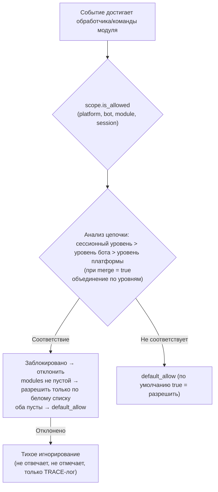

# Scope (область видимости)

> [!NOTE]  
> Эта функция требует ErisPulse **2.8.0+**.

Область видимости отвечает на четыре вопроса: **какие модули доступны, какие события принимать, какие тексты обрабатывает конкретный модуль, и что модуль может делать наружу**.  
Все права управления предоставляются пользователю: на верхнем уровне (в конфигурации `ErisPulse.scope` или во время выполнения `sdk.scope`), где регистрируются модули / адаптеры / обработчики / вызовы наружу, автоматически читаются и выполняются правила на входе, фильтрации обработчиков и на выходе.

| Параметр | Что контролируется | Поведение при отказе | Путь настройки |
|----------|------------------|---------------------|----------------|
| **① Модуль** | Какие модули доступны (уровни платформа / Bot / сессия) | Тихое игнорирование (не отвечать, не признавать) | `scope.platforms / bots / sessions` |
| **② Идентичность** | Принимать или нет события (уровни адаптер / Bot / сессия / пользователь) | Полное удаление на входе (тихое) | `scope.identity.*` |
| **③ Выход** | Какие вызовы наружу может инициировать модуль (сообщения / API / запросы, белый и чёрный списки на уровне методов) | Отказ с ответом (`retcode=34601`) | `scope.actions` |

> **Связанные системы**: Команды являются специальными обработчиками событий сообщений, их пользовательские белые и чёрные списки (ACL) и перезапись реализации параметров управляются системой команд (`ErisPulse.event.command`).  
> См. [Введение в обработку событий](../getting-started/event-handling.md) и [Руководство по настройке](../user-guide/configuration.md).

{!--< tips >!--}
1. Импортируйте синглтон `from ErisPulse.Core import scope` (объект `sdk.scope` идентичен)
2. Проверка: `scope.is_allowed(...)` / `scope.is_identity_allowed(...)` / `scope.is_action_allowed(...)` соответствуют трём точкам контроля ①②③
3. Чтение и запись: методы с параметрами по уровням (IDE может подсказывать) — `scope.set_module(...)` / `scope.set_identity(...)` / `scope.set_action(...)`;  
   Также есть словарный способ для запасного случая: `scope.get(path)` / `scope.set(path, v)` / `scope.delete(path)`
4. Переопределение текстовых условий обработчиками событий см. в [Введение в обработку событий · Переопределение событий](../getting-started/event-handling.md#переопределение-событий-без-изменения-кода-модуля-переопределить-поведение-любого-типа-событий);  
   ACL команд и переопределение параметров см. в [Введение в обработку событий](../getting-started/event-handling.md)
{!--< /tips >!--}

## Синтаксис сопоставления элементов (единый для всей системы)

Все "списки имен" (имена модулей, ключи идентификации, элементы исходящих сообщений) используют один и тот же синтаксис сопоставления (`ErisPulse.Core.text_match`):

| Синтаксис | Пример | Описание |
|------|------|------|
| Точный идентификатор | `"Chat"` | Полное сравнение значений, **без учета регистра** |
| Глоб (glob) | `"Tool*"`、`"spam_*"` | `*` - произвольная последовательность / `?` - один символ / `[seq]` - набор символов, без учета регистра |
| Регулярное выражение (regex) | `"re:^Danger.*"` | Префикс `re:` объявляет регулярное выражение, используется метод `search`, по умолчанию без учета регистра |

- Невалидные регулярные выражения **тихо приводятся к "не совпадению"** (без выброса ошибки или сбоя)
- Параметры декораторов (например, `pattern=` / `regex=`) имеют фиксированное значение: `pattern` - это glob, `regex` - это исходный код регулярного выражения (без префикса `re:`); регулярные выражения в конфигурации области применения **должны** иметь префикс `re:`

## Глобальный резервный переключатель: `default_allow`

`default_allow` — это **единственный глобальный** резервный переключатель (по умолчанию `true`), который применяется к двум критериям проверки:

- **Модульный уровень**: если не найдено ни одного соответствия → `default_allow` определяет разрешение или запрет
- **Уровень идентификации**: если не найдено ни одной стратегии → `default_allow` определяет разрешение или запрет

Установка в `false` активирует строгий режим "неявного запрета": управление по принципу белого списка, **все, что не явно разрешено, будет запрещено**.

> **Исключение**: ③ на **выходной** стороне `default_allow` **не влияет** — это отдельный переключатель для усиления контроля, по умолчанию полностью разрешает, ограничения применяются только по явным правилам (вызовы от владельца на уровне фреймворка, у которого поле owner пустое, всегда разрешаются). Такой строгий глобальный режим не прервёт случайно все сообщения от модулей. Командный ACL имеет свой собственный резервный переключатель `ErisPulse.event.command.default_allow`, который не влияет на другие.

## Конфигурационный файл

```toml
[ErisPulse.scope]
default_allow = true        # Глобальный флаг по умолчанию (false = строгий режим с неявным запретом)
cache_size = 1024           # Размер кэша LRU

# ── ① Модульный уровень (приоритет: сессия > Bot > платформа) ──
[ErisPulse.scope.platforms.onebot11]
modules = ["Chat", "Tool*"]   # Белый список: точное имя / шаблон / re: регулярное выражение
blocked = ["re:^Danger"]
[ErisPulse.scope.bots.onebot11."123456"]
modules = ["Chat"]
merge = true                  # Добавление к привязке на уровне платформы (по умолчанию - полное перезаписывание)
[ErisPulse.scope.sessions.onebot11."789012345"]
modules = ["Chat"]

# ── ② Уровень идентификации (приоритет: пользователь > сессия > Bot > адаптер) ──
[ErisPulse.scope.identity.adapters.onebot11]
deny = true                   # Все события от данного адаптера будут отброшены
[ErisPulse.scope.identity.bots.onebot11."123456"]
deny = true
[ErisPulse.scope.identity.sessions.onebot11."g_blocked"]
deny = true
[ErisPulse.scope.identity.users.onebot11]
allow = ["u_admin"]           # Поддержка шаблонов и регулярных выражений для ключей пользователей
deny = ["u_bad", "spam_*"]

# ── ③ Внешний уровень (по умолчанию - все разрешено, явное ограничение запрещает) ──
[ErisPulse.scope.actions.MyModule]
send = { deny = true }                                    # Запретить все отправки
api = { allow = ["get_*"] }                               # Разрешить только стандартные API-запросы для получения данных
request = { deny = true }                                 # Запретить обработку запросов
```

## ① Модульный уровень

Отвечает на вопрос: "Какие модули доступны в определённом контексте?" По умолчанию все модули открыты; фильтрация начинается только после привязки конфигурации.  
**Модули и адаптеры не требуют каких-либо изменений.**



- **Приоритет анализа: сессионный уровень > уровень бота > уровень платформы**, привязки высшего уровня **полностью заменяют** привязки низшего уровня;  
  если в привязке подуровня указано `merge = true`, то вместо замены происходит **объединение по каждому элементу** (объединение `modules` и `blocked` по отдельности, `merge` как ключ не считается элементом)
- **Тихая семантика**: команды и обработчики модуля, попавшего под фильтр, не активируются, не отвечают, не отмечаются (предотвращает ошибочное совпадение между командами), видны только в логах уровня TRACE (`core.scope.denied`)
- **Обработчики на уровне фреймворка** (`scope_exempt=True` или `owner` пустой) не подвергаются фильтрации; модули с пустым именем (ресурсы на уровне фреймворка) всегда разрешены
- **Помощь и запросы команд с учётом контекста сессии**: API-запросы помощи по командам (`command.help` / `get_command` / `get_commands` / `get_group_commands` / `get_visible_commands`, а также `module.get_commands_overview`) поддерживают необязательный параметр `event=` или явные ключевые параметры `platform=` / `bot_id=` / `session_id=` — команды модуля, недоступные в текущей сессии, больше не отображаются в результатах (в `get_command` возвращается `None`, помощь по одной команде обрабатывается как "не зарегистрирована", что соответствует тихой семантике); при отсутствии контекста поведение остаётся полным

### Наследование привязок (merge)

По умолчанию семантика замены ясна и предсказуема; при необходимости **добавить** к привязкам верхнего уровня, в привязке подуровня укажите `merge = true`:

```toml
[ErisPulse.scope.platforms.onebot11]
modules = ["Chat", "Tool"]      # Уровень платформы: разрешены Chat, Tool

[ErisPulse.scope.bots.onebot11."123456"]
modules = ["Music"]
merge = true                    # Фактически для этого бота生效 = ["Chat", "Tool", "Music"]
```

- **Правила объединения**: `modules` и `blocked` объединяются **поэлементно**; в рамках привязки `blocked` по-прежнему имеет приоритет над `modules`
- **Цепочечное объединение**: платформа → бот → сессия объединяются по уровням, каждый уровень независимо решает, использовать `merge` или замену

## ② Идентификационная размерность (входные события)

Отвечает на вопрос "какие события принимаются/отклоняются". Отклонённые события **полностью отбрасываются на входе** —  
не попадают в промежуточные обработчики и обработчики (включая фреймворк-уровень), видны только в логах уровня TRACE (`core.scope.identity_denied`).

- **Приоритет анализа: пользователь > сессия > бот > адаптер**, выбирается наиболее конкретная настроенная стратегия; отклонение (`deny`) имеет приоритет над разрешением (`allow`)
- Каждый уровень привязки представляет собой бинарную стратегию: `{ allow = true }` или `{ deny = true }`
- Ключи пользователей поддерживают шаблоны glob и регулярные выражения (например, `"spam_*"` для блокировки группы спам-пользователей)
- Типичное применение — отклонение на верхнем уровне и разрешение для отдельных пользователей в качестве "исключения":

```toml
[ErisPulse.scope.identity.adapters.onebot11]
deny = true
[ErisPulse.scope.identity.users.onebot11]
allow = ["u_admin"]   # Даже если адаптер отклоняет события, события пользователя u_admin всё равно разрешаются
```

## ③ Dimension of Outbound Calls (Limiting Modules Initiating Outbound Calls)

This dimension restricts the **outbound actions initiated by modules**: message sending / standard API actions / request operations.  
The three types of actions correspond to the underlying DSL: `Event.reply` and `Send` (send), `Api` / `call_api` (api),  
and `Request`'s accept/reject (request). Outbound calls initiated by modules during event handler execution  
carry the module owner, and are uniformly judged by this dimension.

### Rule Format (Inline Table)

Each action's rule is an inline table: `{ allow = [...], deny = true|[...] }`.  
Only one rule is allowed for the same action (TOML keys cannot be repeated; choose either full deny or fine-grained control):

```toml
[ErisPulse.scope.actions.MyModule]
send = { deny = true }                                  # Deny all sending (Event.reply / Send DSL)
# Or fine-grained by method: send = { allow = ["Text", "Image*"], deny = ["File"] }
api = { allow = ["get_*"] }                             # Allow only query-type standard APIs
# Or deny-list by action: api = { deny = ["set_*", "leave_*"] }
request = { deny = true }                               # Deny handling request accept/reject
```

- The entries in `send` match the **method names of sending** (`Text` / `Image` / `File` ...),  
  and the entries in `api` match the **standard action names** (`get_group_info` / `set_group_name` ...).
- Entries support exact names / glob / `re:` regular expressions (matching the unified syntax of the entire system, case-insensitive).
- Writing a single string in `allow` is equivalent to a single-item list: `send = { allow = "Text" }`.

### Judgment Semantics

**Default: All allowed** — Calls are allowed if not configured, or if the owner is empty (internal framework calls).  
After configuring rules, the following order is used for judgment:

1. `deny = true` → Reject  
2. The call name matches an entry in the `deny` list → Reject  
3. The `allow` list is non-empty and the call name does not match (or the call has no name) → Reject  
4. Otherwise, allow

Rejected calls do not initiate any network requests and directly return a standard failure response  
(`retcode = 34601`, see [api-response §5.3](../standards/api-response.md#53-коды-возврата-расширения-фреймворка-34xxx-пользовательские-три-младших-разряда-сегмента-ошибок-платформы)).

The three actions are independent and can be restricted individually.

```python
# Runtime API
sdk.scope.set_action("MyModule", "send", deny=True)              # Deny all message sending
sdk.scope.set_action("MyModule", "send", allow=["Text"])         # Allow only text messages
sdk.scope.is_action_allowed("MyModule", "send", name="Image")    # False
sdk.scope.is_action_allowed("MyModule", "api", name="get_user_info")  # Judged according to the rules
sdk.scope.delete_action("MyModule", "send")                      # Restore to allowed
sdk.scope.get_action("MyModule", "send")                         # Current rule for this action
```

## API в рантайме

API-интерфейс области в рантайме разделен на три уровня: **проверка** (три вопроса), **измеримое чтение/запись** (параметризованные методы `set` / `get` / `delete` для каждого измерения, с полной типизацией сигнатур, IDE может дополнять), **словарный резервный вариант** (доступ по точечным путям к любому узлу).

```python
from ErisPulse import sdk

scope = sdk.scope
```

### Проверка (три вопроса)

```python
scope.is_allowed("onebot11", "123456", "Chat")                 # ① по модулю
scope.is_allowed("onebot11", "123456", "Chat", "789012345")    # с учетом сессии
scope.is_allowed("onebot11", "123456", None)                   # ресурс на уровне фреймворка -> True

scope.is_identity_allowed("onebot11", "123456", "group_9", "u1")   # ② по идентичности

scope.is_action_allowed("MyModule", "send")                    # ④ по исходящему направлению
scope.is_action_allowed("MyModule", "send", name="Image")      # детализация на уровне метода
```

### ① По модулю

```python
# Привязка (иерархия определяется параметрами: session_id > bot_id > уровень платформы)
scope.set_module("onebot11", bot_id="123456", modules=["Chat", "Tool*"])
scope.set_module("onebot11", blocked=["re:^Danger"])                       # уровень платформы
scope.set_module("onebot11", bot_id="123456", session_id="g9", modules=["Chat"])  # по сессии
scope.set_module("onebot11", bot_id="123456", modules=["Music"], merge=True)      # объединение с существующими записями
scope.set_module("onebot11", bot_id="123456", modules=["Chat"], persist=False)    # только в рантайме

# Чтение / удаление
scope.get_module("onebot11", bot_id="123456")   # {"modules": ["Chat"], "blocked": []}
scope.delete_module("onebot11", bot_id="123456")
```

> `merge=True` означает **объединение при записи** (объединение с существующими привязками на этом уровне); для наследования привязок на этапе разрешения между уровнями см. выше [Наследование привязок (merge)](#绑定继承merge) — это отдельные механизмы.

### ② По идентичности

```python
# Стратегия привязки (иерархия определяется параметрами: user > session > bot > adapter; allow / deny — только один из них)
scope.set_identity("onebot11", user_id="u_bad", deny=True)
scope.set_identity("onebot11", user_id="spam_*", deny=True)    # ключи поддерживают glob / re: регулярные выражения
scope.set_identity("onebot11", bot_id="123456", session_id="g9", allow=True)

# Чтение / удаление
scope.get_identity("onebot11", user_id="u_bad")   # {"deny": True}
scope.delete_identity("onebot11", user_id="u_bad")
```

### ③ По исходящему направлению

```python
# Установка правил ограничений (allow: str|list; deny: bool|str|list; замена всего правила)
scope.set_action("MyModule", "send", deny=True)                    # запретить отправку
scope.set_action("MyModule", "send", allow=["Text"])               # разрешить только текстовые сообщения
scope.set_action("MyModule", "api", deny=["set_*", "leave_*"])     # запретить API-методы управления

# Чтение / удаление
scope.get_action("MyModule", "send")       # {"allow": ["Text"]} исходное правило
scope.delete_action("MyModule", "send")    # удалить ограничение для одного действия
scope.delete_action("MyModule")            # удалить все ограничения для модуля
```

### Общие

```python
scope.get("platforms")   # словарный резервный вариант: чтение по точечному пути к любому узлу
scope.topology()         # полное дерево конфигурации (для Dashboard)
scope.stats()
# {"module_calls": .., "module_filtered": .., "identity_checks": .., "identity_denied": ..,
#  "action_checks": .., "action_denied": .., "cache_hits": .., "cache_misses": ..}
scope.reset_stats()
scope.clear()           # очистка всей конфигурации (только в памяти)
```

### Расширенный: словарный резервный вариант по точечным путям

Методы измеримого уровня охватывают повседневные сценарии; при необходимости доступа к любому узлу (или к будущим добавленным измерениям) можно использовать словарный API — `get` / `set` / `delete` принимают точечные пути (глубокое объединение словарей, чтение после записи), а также предоставляют протокол `scope[path]` / `scope[path] = v` / `del scope[path]` / `path in scope`:

```python
scope.set("bots.onebot11.123456", {"modules": ["Chat"], "blocked": []})
scope.set("identity.users.onebot11.u_bad", {"deny": True})
scope.get("actions.MyModule.send")

scope["platforms.onebot11"]        # чтение (выбрасывает KeyError при отсутствии)
scope["platforms.onebot11"] = {...}  # запись
del scope["platforms.onebot11"]      # удаление
"actions.MyModule" in scope          # проверка существования
```

## Кэширование и горячее обновление

- Результаты `is_allowed` / `is_identity_allowed` / `is_action_allowed` кэшируются с помощью **LRU-кэша**
  (размер кэша можно настроить через `scope.cache_size`), а при вызовах `set` / `delete` /
  горячем обновлении конфигурации (`config.updated` / `config.set`) кэш автоматически сбрасывается
- Все конфигурации измерений применяются **немедленно**, без необходимости перезапуска
- Область действия проверяется "по событию", без сохранения состояния между событиями: при изменении конфигурации следующее событие будет проверяться по новым правилам

## Проверка формата конфигурации

При загрузке / горячем обновлении конфигурация проверяется по секциям: секции с ошибками типа (например, `platforms` записаны как строка), неправильные правила исходящих соединений (например, `allow` записаны как число), неизвестные имена действий, неизвестные ключи верхнего уровня (например, опечатка в `alow`) выводятся с **ПРЕДУПРЕЖДЕНИЕМ** и соответствующие секции / записи игнорируются, остальная корректная конфигурация применяется — ошибки больше не игнорируются.

## Часто задаваемые вопросы и замечания

### 1. Уровни конфигурации и перекрытие

- Уровень модуля: сессия > уровень бота > уровень платформы, **общее перекрытие** (при `merge = true` подуровнях — объединение по элементам).
  Если хочется, чтобы "платформа разрешила Chat, а бот добавил Music", можно на уровне бота указать `merge = true` или одновременно перечислить оба.
- Уровень идентификации: пользователь > сессия > бот > адаптер, выбирается **наиболее конкретная** настроенная стратегия (возможны исключения).
- Белые/чёрные списки команд пользователя: точное имя команды имеет приоритет над glob-ключом (см. `event.command.acl`).

### 2. Модуль/команда не реагирует

Сначала подумайте о сценарии действия, а не о самом модуле:

```python
from ErisPulse import sdk

print(sdk.scope.is_allowed(event.get_platform(), bot_id, "MyModule", session_id))
print(sdk.scope.is_identity_allowed(event.get_platform(), bot_id, session_id, user_id))
print(sdk.scope.stats())   # если module_filtered / identity_denied > 0, значит, были скрыто отфильтрованы
```

Фильтрация происходит **скрыто** (на уровнях модуля и идентификации не возвращается ответ, чтобы не раскрывать правила), но статистика накапливается;
отказ в ACL на уровне команды возвращает явный ответ "Недостаточно прав".

### 3. При отклонении исходящего действия проверка

```python
from ErisPulse import sdk

print(sdk.scope.get("actions.MyModule"))
print(sdk.scope.stats())   # если action_denied > 0, значит, вызовы были перехвачены
```

Перехват происходит **явно**: отклонённый вызов возвращает стандартный ответ об ошибке `retcode = 34601` (не происходит сетевой запрос).

### 4. Идентификатор сессии изолирован между платформами

Единственным идентификатором является комбинация `(platform, session_id)`. `scope.sessions.onebot11."789"` действует только на onebot11 и не влияет на сессию с тем же `789` в telegram. То же самое касается ключей пользователей на уровне идентификации.

## API дерева топологии

`ModuleManager.get_topology()` и `AdapterManager.get_topology()` предоставляют данные о принадлежности модулей/адаптеров, а `sdk.get_topology()` объединяет их (включая область `scope`) в один вызов:

```python
from ErisPulse import sdk

topology = sdk.get_topology()
# {
#   "modules": {                                   # Модуль → принадлежащие ресурсы
#     "Chat": {
#       "loaded": True, "enabled": True,
#       "commands": ["chat", "translate"],
#       "handlers": {"message": 2, "notice": 1},
#       "routes": {"http": ["/Chat/api"], "ws": [], "sse": []},
#       "lifecycle_hooks": 3,
#     }
#   },
#   "adapters": {                                  # Адаптер → Бот → область
#     "onebot11": {
#       "status": "started", "enabled": True,
#       "bots": {"123456": {"status": "online", "scope": {...}}},
#       "scope": {"modules": [...], "blocked": [...]},
#     }
#   },
#   "scope": {                                     # Область (модуль / идентификатор / исходящее действие)
#     "platforms": {...}, "bots": {...}, "sessions": {...},
#     "identity": {"adapters": {...}, "bots": {...}, "sessions": {...}, "users": {...}},
#     "actions": {...},
#   },
# }
```

- Модульная топология объединяет зарегистрированные команды, обработчики событий, маршруты HTTP/WS/SSE и хуки жизненного цикла модуля, что позволяет наглядно отобразить дерево ресурсов модуля.
- Топология адаптера объединяет статусы каждого адаптера, статусы подчинённых Ботов и привязки областей на уровне платформы/Бота (в масштабе модуля).