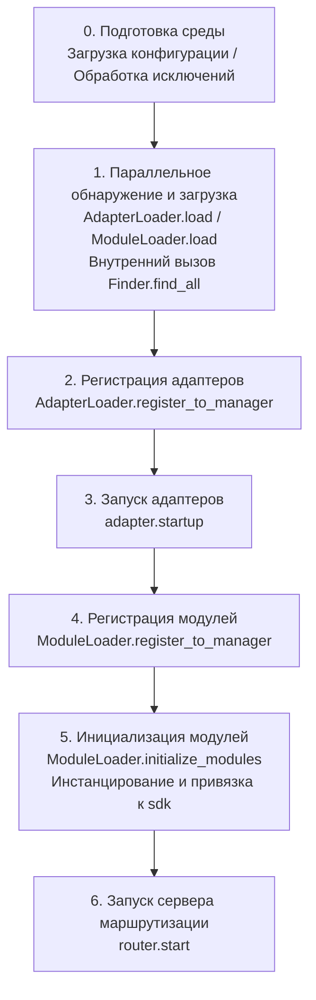

# Запуск и ручное управление

В ErisPulse `await sdk.run()` / `await sdk.init()` обернули всю цепочку запуска в "одну строку кода". Но когда вам нужно полностью настроить процесс запуска (например, частичная загрузка, динамическая регистрация, горячая замена, внедрение пользовательских стратегий загрузки), вам нужно понимать, что происходит внутри этой цепочки и как управлять каждым шагом вручную.

В этой статье мы разобьем цепочку запуска на отдельные этапы, объясним их обязанности, порядок вызова и приведем пример полного ручного запуска.

> В этой статье предполагается, что вы уже запустили [первого робота](../getting-started/first-bot.md) и знакомы с двумя режимами `sdk.run(keep_running=True/False)`. В этой статье мы сосредоточимся на разборе цепочки внутри `init()` и более низкоуровневых входных точек, таких как `init()`/`init_task()`/`init_sync()`.

## Запуск и ручное управление

В ErisPulse `await sdk.run()` / `await sdk.init()` обернули всю цепочку запуска в "одну строку кода". Но когда вам нужно полностью настроить процесс запуска (например, частичная загрузка, динамическая регистрация, горячая замена, внедрение пользовательских стратегий загрузки), вам нужно понимать, что происходит внутри этой цепочки и как управлять каждым шагом вручную.

В этой статье мы разобьем цепочку запуска на отдельные этапы, объясним их обязанности, порядок вызова и приведем пример полного ручного запуска.

> В этой статье предполагается, что вы уже запустили [первого робота](../getting-started/first-bot.md) и знакомы с двумя режимами `sdk.run(keep_running=True/False)`. В этой статье мы сосредоточимся на разборе цепочки внутри `init()` и более низкоуровневых входных точек, таких как `init()`/`init_task()`/`init_sync()`.

## Запуск и ручное управление

В ErisPulse `await sdk.run()` / `await sdk.init()` обернули всю цепочку запуска в "одну строку кода". Но когда вам нужно полностью настроить процесс запуска (например, частичная загрузка, динамическая регистрация, горячая замена, внедрение пользовательских стратегий загрузки), вам нужно понимать, что происходит внутри этой цепочки и как управлять каждым шагом вручную.

В этой статье мы разобьем цепочку запуска на отдельные этапы, объясним их обязанности, порядок вызова и приведем пример полного ручного запуска.

> В этой статье предполагается, что вы уже запустили [первого робота](../getting-started/first-bot.md) и знакомы с двумя режимами `sdk.run(keep_running=True/False)`. В этой статье мы сосредоточимся на разборе цепочки внутри `init()` и более низкоуровневых входных точек, таких как `init()`/`init_task()`/`init_sync()`.

## Запуск и ручное управление

В ErisPulse `await sdk.run()` / `await sdk.init()` обернули всю цепочку запуска в "одну строку кода". Но когда вам нужно полностью настроить процесс запуска (например, частичная загрузка, динамическая регистрация, горячая замена, внедрение пользовательских стратегий загрузки), вам нужно понимать, что происходит внутри этой цепочки и как управлять каждым шагом вручную.

В этой статье мы разобьем цепочку запуска на отдельные этапы, объясним их обязанности, порядок вызова и приведем пример полного ручного запуска.

> В этой статье предполагается, что вы уже запустили [первого робота](../getting-started/first-bot.md) и знакомы с двумя режимами `sdk.run(keep_running=True/False)`. В этой статье мы сосредоточимся на разборе цепочки внутри `init()` и более низкоуровневых входных точек, таких как `init()`/`init_task()`/`init_sync()`.

## Запуск и ручное управление

В ErisPulse `await sdk.run()` / `await sdk.init()` обернули всю цепочку запуска в "одну строку кода". Но когда вам нужно полностью настроить процесс запуска (например, частичная загрузка, динамическая регистрация, горячая замена, внедрение пользовательских стратегий загрузки), вам нужно понимать, что происходит внутри этой цепочки и как управлять каждым шагом вручную.

В этой статье мы разобьем цепочку запуска на отдельные этапы, объясним их обязанности, порядок вызова и приведем пример полного ручного запуска.

> В этой статье предполагается, что вы уже запустили [первого робота](../getting-started/first-bot.md) и знакомы с двумя режимами `sdk.run(keep_running=True/False)`. В этой статье мы сосредоточимся на разборе цепочки внутри `init()` и более низкоуровневых входных точек, таких как `init()`/`init_task()`/`init_sync()`.

## Запуск и ручное управление

В ErisPulse `await sdk.run()` / `await sdk.init()` обернули всю цепочку запуска в "одну строку кода". Но когда вам нужно полностью настроить процесс запуска (например, частичная загрузка, динамическая регистрация, горячая замена, внедрение пользовательских стратегий загрузки), вам нужно понимать, что происходит внутри этой цепочки и как управлять каждым шагом вручную.

В этой статье мы разобьем цепочку запуска на отдельные этапы, объясним их обязанности, порядок вызова и приведем пример полного ручного запуска.

> В этой статье предполагается, что вы уже запустили [первого робота](../getting-started/first-bot.md) и знакомы с двумя режимами `sdk.run(keep_running=True/False)`. В этой статье мы сосредоточимся на разборе цепочки внутри `init()` и более низкоуровневых входных точек, таких как `init()`/`init_task()`/`init_sync()`.

## Запуск и ручное управление

В ErisPulse `await sdk.run()` / `await sdk.init()` обернули всю цепочку запуска в "одну строку кода". Но когда вам нужно полностью настроить процесс запуска (например, частичная загрузка, динамическая регистрация, горячая замена, внедрение пользовательских стратегий загрузки), вам нужно понимать, что происходит внутри этой цепочки и как управлять каждым шагом вручную.

В этой статье мы разобьем цепочку запуска на отдельные этапы, объясним их обязанности, порядок вызова и приведем пример полного ручного запуска.

> В этой статье предполагается, что вы уже запустили [первого робота](../getting-started/first-bot.md) и знакомы с двумя режимами `sdk.run(keep_running=True/False)`. В этой статье мы сосредоточимся на разборе цепочки внутри `init()` и более низкоуровневых входных точек, таких как `init()`/`init_task()`/`init_sync()`.

## Запуск и ручное управление

В ErisPulse `await sdk.run()` / `await sdk.init()` обернули всю цепочку запуска в "одну строку кода". Но когда вам нужно полностью настроить процесс запуска (например, частичная загрузка, динамическая регистрация, горячая замена, внедрение пользовательских стратегий загрузки), вам нужно понимать, что происходит внутри этой цепочки и как управлять каждым шагом вручную.

В этой статье мы разобьем цепочку запуска на отдельные этапы, объясним их обязанности, порядок вызова и приведем пример полного ручного запуска.

> В этой статье предполагается, что вы уже запустили [первого робота](../getting-started/first-bot.md) и знакомы с двумя режимами `sdk.run(keep_running=True/False)`. В этой статье мы сосредоточимся на разборе цепочки внутри `init()` и более низкоуровневых входных точек, таких как `init()`/`init_task()`/`init_sync()`.

## Запуск и ручное управление

В ErisPulse `await sdk.run()` / `await sdk.init()` обернули всю цепочку запуска в "одну строку кода". Но когда вам нужно полностью настроить процесс запуска (например, частичная загрузка, динамическая регистрация, горячая замена, внедрение пользовательских стратегий загрузки), вам нужно понимать, что происходит внутри этой цепочки и как управлять каждым шагом вручную.

В этой статье мы разобьем цепочку запуска на отдельные этапы, объясним их обязанности, порядок вызова и приведем пример полного ручного запуска.

> В этой статье предполагается, что вы уже запустили [первого робота](../getting-started/first-bot.md) и знакомы с двумя режимами `sdk.run(keep_running=True/False)`. В этой статье мы сосредоточимся на разборе цепочки внутри `init()` и более низкоуровневых входных точек, таких как `init()`/`init_task()`/`init_sync()`.

## Запуск и ручное управление

В ErisPulse `await sdk.run()` / `await sdk.init()` обернули всю цепочку запуска в "одну строку кода". Но когда вам нужно полностью настроить процесс запуска (например, частичная загрузка, динамическая регистрация, горячая замена, внедрение пользовательских стратегий загрузки), вам нужно понимать, что происходит внутри этой цепочки и как управлять каждым шагом вручную.

В этой статье мы разобьем цепочку запуска на отдельные этапы, объясним их обязанности, порядок вызова и приведем пример полного ручного запуска.

> В этой статье предполагается, что вы уже запустили [первого робота](../getting-started/first-bot.md) и знакомы с двумя режимами `sdk.run(keep_running=True/False)`. В этой статье мы сосредоточимся на разборе цепочки внутри `init()` и более низкоуровневых входных точек, таких как `init()`/`init_task()`/`init_sync()`.

## Запуск и ручное управление

В ErisPulse `await sdk.run()` / `await sdk.init()` обернули всю цепочку запуска в "одну строку кода". Но когда вам нужно полностью настроить процесс запуска (например, частичная загрузка, динамическая регистрация, горячая замена, внедрение пользовательских стратегий загрузки), вам нужно понимать, что происходит внутри этой цепочки и как управлять каждым шагом вручную.

В этой статье мы разобьем цепочку запуска на отдельные этапы, объясним их обязанности, порядок вызова и приведем пример полного ручного запуска.

> В этой статье предполагается, что вы уже запустили [первого робота](../getting-started/first-bot.md) и знакомы с двумя режимами `sdk.run(keep_running=True/False)`. В этой статье мы сосредоточимся на разборе цепочки внутри `init()` и более низкоуровневых входных точек, таких как `init()`/`init_task()`/`init_sync()`.

## Запуск и ручное управление

В ErisPulse `await sdk.run()` / `await sdk.init()` обернули всю цепочку запуска в "одну строку кода". Но когда вам нужно полностью настроить процесс запуска (например, частичная загрузка, динамическая регистрация, горячая замена, внедрение пользовательских стратегий загрузки), вам нужно понимать, что происходит внутри этой цепочки и как управлять каждым шагом вручную.

В этой статье мы разобьем цепочку запуска на отдельные этапы, объясним их обязанности, порядок вызова и приведем пример полного ручного запуска.

> В этой статье предполагается, что вы уже запустили [первого робота](../getting-started/first-bot.md) и знакомы с двумя режимами `sdk.run(keep_running=True/False)`. В этой статье мы сосредоточимся на разборе цепочки внутри `init()` и более низкоуровневых входных точек, таких как `init()`/`init_task()`/`init_sync()`.

## Запуск и ручное управление

В ErisPulse `await sdk.run()` / `await sdk.init()` обернули всю цепочку запуска в "одну строку кода". Но когда вам нужно полностью настроить процесс запуска (например, частичная загрузка, динамическая регистрация, горячая замена, внедрение пользовательских стратегий загрузки), вам нужно понимать, что происходит внутри этой цепочки и как управлять каждым шагом вручную.

В этой статье мы разобьем цепочку запуска на отдельные этапы, объясним их обязанности, порядок вызова и приведем пример полного ручного запуска.

> В этой статье предполагается, что вы уже запустили [первого робота](../getting-started/first-bot.md) и знакомы с двумя режимами `sdk.run(keep_running=True/False)`. В этой статье мы сосредоточимся на разборе цепочки внутри `init()` и более низкоуровневых входных точек, таких как `init()`/`init_task()`/`init_sync()`.

## Запуск и ручное управление

В ErisPulse `await sdk.run()` / `await sdk.init()` обернули всю цепочку запуска в "одну строку кода". Но когда вам нужно полностью настроить процесс запуска (например, частичная загрузка, динамическая регистрация, горячая замена, внедрение пользовательских стратегий загрузки), вам нужно понимать, что происходит внутри этой цепочки и как управлять каждым шагом вручную.

В этой статье мы разобьем цепочку запуска на отдельные этапы, объясним их обязанности, порядок вызова и приведем пример полного ручного запуска.

> В этой статье предполагается, что вы уже запустили [первого робота](../getting-started/first-bot.md) и знакомы с двумя режимами `sdk.run(keep_running=True/False)`. В этой статье мы сосредоточимся на разборе цепочки внутри `init()` и более низкоуровневых входных точек, таких как `init()`/`init_task()`/`init_sync()`.

## Запуск и ручное управление

В ErisPulse `await sdk.run()` / `await sdk.init()` обернули всю цепочку запуска в "одну строку кода". Но когда вам нужно полностью настроить процесс запуска (например, частичная загрузка, динамическая регистрация, горячая замена, внедрение пользовательских стратегий загрузки), вам нужно понимать, что происходит внутри этой цепочки и как управлять каждым шагом вручную.

В этой статье мы разобьем цепочку запуска на отдельные этапы, объясним их обязанности, порядок вызова и приведем пример полного ручного запуска.

> В этой статье предполагается, что вы уже запустили [первого робота](../getting-started/first-bot.md) и знакомы с двумя режимами `sdk.run(keep_running=True/False)`. В этой статье мы сосредоточимся на разборе цепочки внутри `init()` и более низкоуровневых входных точек, таких как `init()`/`init_task()`/`init_sync()`.

## Запуск и ручное управление

В ErisPulse `await sdk.run()` / `await sdk.init()` обернули всю цепочку запуска в "одну строку кода". Но когда вам нужно полностью настроить процесс запуска (например, частичная загрузка, динамическая регистрация, горячая замена, внедрение пользовательских стратегий загрузки), вам нужно понимать, что происходит внутри этой цепочки и как управлять каждым шагом вручную.

В этой статье мы разобьем цепочку запуска на отдельные этапы, объясним их обязанности, порядок вызова и приведем пример полного ручного запуска.

> В этой статье предполагается, что вы уже запустили [первого робота](../getting-started/first-bot.md) и знакомы с двумя режимами `sdk.run(keep_running=True/False)`. В этой статье мы сосредоточимся на разборе цепочки внутри `init()` и более низкоуровневых входных точек, таких как `init()`/`init_task()`/`init_sync()`.

## Запуск и ручное управление

В ErisPulse `await sdk.run()` / `await sdk.init()` обернули всю цепочку запуска в "одну строку кода". Но когда вам нужно полностью настроить процесс запуска (например, частичная загрузка, динамическая регистрация, горячая замена, внедрение пользовательских стратегий загрузки), вам нужно понимать, что происходит внутри этой цепочки и как управлять каждым шагом вручную.

В этой статье мы разобьем цепочку запуска на отдельные этапы, объясним их обязанности, порядок вызова и приведем пример полного ручного запуска.

> В этой статье предполагается, что вы уже запустили [первого робота](../getting-started/first-bot.md) и знакомы с двумя режимами `sdk.run(keep_running=True/False)`. В этой статье мы сосредоточимся на разборе цепочки внутри `init()` и более низкоуровневых входных точек, таких как `init()`/`init_task()`/`init_sync()`.

## Запуск и ручное управление

В ErisPulse `await sdk.run()` / `await sdk.init()` обернули всю цепочку запуска в "одну строку кода". Но когда вам нужно полностью настроить процесс запуска (например, частичная загрузка, динамическая регистрация, горячая замена, внедрение пользовательских стратегий загрузки), вам нужно понимать, что происходит внутри этой цепочки и как управлять каждым шагом вручную.

В этой статье мы разобьем цепочку запуска на отдельные этапы, объясним их обязанности, порядок вызова и приведем пример полного ручного запуска.

> В этой статье предполагается, что вы уже запустили [первого робота](../getting-started/first-bot.md) и знакомы с двумя режимами `sdk.run(keep_running=True/False)`. В этой статье мы сосредоточимся на разборе цепочки внутри `init()` и более низкоуровневых входных точек, таких как `init()`/`init_task()`/`init_sync()`.

## Запуск и ручное управление

В ErisPulse `await sdk.run()` / `await sdk.init()` обернули всю цепочку запуска в "одну строку кода". Но когда вам нужно полностью настроить процесс запуска (например, частичная загрузка, динамическая регистрация, горячая замена, внедрение пользовательских стратегий загрузки), вам нужно понимать, что происходит внутри этой цепочки и как управлять каждым шагом вручную.

В этой статье мы разобьем цепочку запуска на отдельные этапы, объясним их обязанности, порядок вызова и приведем пример полного ручного запуска.

> В этой статье предполагается, что вы уже запустили [первого робота](../getting-started/first-bot.md) и знакомы с двумя режимами `sdk.run(keep_running=True/False)`. В этой статье мы сосредоточимся на разборе цепочки внутри `init()` и более низкоуровневых входных точек, таких как `init()`/`init_task()`/`init_sync()`.

## Запуск и ручное управление

В ErisPulse `await sdk.run()` / `await sdk.init()` обернули всю цепочку запуска в "одну строку кода". Но когда вам нужно полностью настроить процесс запуска (например, частичная загрузка, динамическая регистрация, горячая замена, внедрение пользовательских стратегий загрузки), вам нужно понимать, что происходит внутри этой цепочки и как управлять каждым шагом вручную.

В этой статье мы разобьем цепочку запуска на отдельные этапы, объясним их обязанности, порядок вызова и приведем пример полного ручного запуска.

> В этой статье предполагается, что вы уже запустили [первого робота](../getting-started/first-bot.md) и знакомы с двумя режимами `sdk.run(keep_running=True/False)`. В этой статье мы сосредоточимся на разборе цепочки внутри `init()` и более низкоуровневых входных точек, таких как `init()`/`init_task()`/`init_sync()`.

## Запуск и ручное управление

В ErisPulse `await sdk.run()` / `await sdk.init()` обернули всю цепочку запуска в "одну строку кода". Но когда вам нужно полностью настроить процесс запуска (например, частичная загрузка, динамическая регистрация, горячая замена, внедрение пользовательских стратегий загрузки), вам нужно понимать, что происходит внутри этой цепочки и как управлять каждым шагом вручную.

В этой статье мы разобьем цепочку запуска на отдельные этапы, объясним их обязанности, порядок вызова и приведем пример полного ручного запуска.

> В этой статье предполагается, что вы уже запустили [первого робота](../getting-started/first-bot.md) и знакомы с двумя режимами `sdk.run(keep_running=True/False)`. В этой статье мы сосредоточимся на разборе цепочки внутри `init()` и более низкоуровневых входных точек, таких как `init()`/`init_task()`/`init_sync()`.

## Запуск и ручное управление

В ErisPulse `await sdk.run()` / `await sdk.init()` обернули всю цепочку запуска в "одну строку кода". Но когда вам нужно полностью настроить процесс запуска (например, частичная загрузка, динамическая регистрация, горячая замена, внедрение пользовательских стратегий загрузки), вам нужно понимать, что происходит внутри этой цепочки и как управлять каждым шагом вручную.

В этой статье мы разобьем цепочку запуска на отдельные этапы, объясним их обязанности, порядок вызова и приведем пример полного ручного запуска.

> В этой статье предполагается, что вы уже запустили [первого робота](../getting-started/first-bot.md) и знакомы с двумя режимами `sdk.run(keep_running=True/False)`. В этой статье мы сосредоточимся на разборе цепочки внутри `init()` и более низкоуровневых входных точек, таких как `init()`/`init_task()`/`init_sync()`.

## Запуск и ручное управление

В ErisPulse `await sdk.run()` / `await sdk.init()` обернули всю цепочку запуска в "одну строку кода". Но когда вам нужно полностью настроить процесс запуска (например, частичная загрузка, динамическая регистрация, горячая замена, внедрение пользовательских стратегий загрузки), вам нужно понимать, что происходит внутри этой цепочки и как управлять каждым шагом вручную.

В этой статье мы разобьем цепочку запуска на отдельные этапы, объясним их обязанности, порядок вызова и приведем пример полного ручного запуска.

> В этой статье предполагается, что вы уже запустили [первого робота](../getting-started/first-bot.md) и знакомы с двумя режимами `sdk.run(keep_running=True/False)`. В этой статье мы сосредоточимся на разборе цепочки внутри `init()` и более низкоуровневых входных точек, таких как `init()`/`init_task()`/`init_sync()`.

## Запуск и ручное управление

В ErisPulse `await sdk.run()` / `await sdk.init()` обернули всю цепочку запуска в "одну строку кода". Но когда вам нужно полностью настроить процесс запуска (например, частичная загрузка, динамическая регистрация, горячая замена, внедрение пользовательских стратегий загрузки), вам нужно понимать, что происходит внутри этой цепочки и как управлять каждым шагом вручную.

В этой статье мы разобьем цепочку запуска на отдельные этапы, объясним их обязанности, порядок вызова и приведем пример полного ручного запуска.

> В этой статье предполагается, что вы уже запустили [первого робота](../getting-started/first-bot.md) и знакомы с двумя режимами `sdk.run(keep_running=True/False)`. В этой статье мы сосредоточимся на разборе цепочки внутри `init()` и более низкоуровневых входных точек, таких как `init()`/`init_task()`/`init_sync()`.

## Запуск и ручное управление

В ErisPulse `await sdk.run()` / `await sdk.init()` обернули всю цепочку запуска в "одну строку кода". Но когда вам нужно полностью настроить процесс запуска (например, частичная загрузка, динамическая регистрация, горячая замена, внедрение пользовательских стратегий загрузки), вам нужно понимать, что происходит внутри этой цепочки и как управлять каждым шагом вручную.

В этой статье мы разобьем цепочку запуска на отдельные этапы, объясним их обязанности, порядок вызова и приведем пример полного ручного запуска.

> В этой статье предполагается, что вы уже запустили [первого робота](../getting-started/first-bot.md) и знакомы с двумя режимами `sdk.run(keep_running=True/False)`. В этой статье мы сосредоточимся на разборе цепочки внутри `init()` и более низкоуровневых входных точек, таких как `init()`/`init_task()`/`init_sync()`.

## Запуск и ручное управление

В ErisPulse `await sdk.run()` / `await sdk.init()` обернули всю цепочку запуска в "одну строку кода". Но когда вам нужно полностью настроить процесс запуска (например, частичная загрузка, динамическая регистрация, горячая замена, внедрение пользовательских стратегий загрузки), вам нужно понимать, что происходит внутри этой цепочки и как управлять каждым шагом вручную.

В этой статье мы разобьем цепочку запуска на отдельные этапы, объясним их обязанности, порядок вызова и приведем пример полного ручного запуска.

> В этой статье предполагается, что вы уже запустили [первого робота](../getting-started/first-bot.md) и знакомы с двумя режимами `sdk.run(keep_running=True/False)`. В этой статье мы сосредоточимся на разборе цепочки внутри `init()` и более низкоуровневых входных точек, таких как `init()`/`init_task()`/`init_sync()`.

## Запуск и ручное управление

В ErisPulse `await sdk.run()` / `await sdk.init()` обернули всю цепочку запуска в "одну строку кода". Но когда вам нужно полностью настроить процесс запуска (например, частичная загрузка, динамическая регистрация, горячая замена, внедрение пользовательских стратегий загрузки), вам нужно понимать, что происходит внутри этой цепочки и как управлять каждым шагом вручную.

В этой статье мы разобьем цепочку запуска на отдельные этапы, объясним их обязанности, порядок вызова и приведем пример полного ручного запуска.

> В этой статье предполагается, что вы уже запустили [первого робота](../getting-started/first-bot.md) и знакомы с двумя режимами `sdk.run(keep_running=True/False)`. В этой статье мы сосредоточимся на разборе цепочки внутри `init()` и более низкоуровневых входных точек, таких как `init()`/`init_task()`/`init_sync()`.

## Запуск и ручное управление

В ErisPulse `await sdk.run()` / `await sdk.init()` обернули всю цепочку запуска в "одну строку кода". Но когда вам нужно полностью настроить процесс запуска (например, частичная загрузка, динамическая регистрация, горячая замена, внедрение пользовательских стратегий загрузки), вам нужно понимать, что происходит внутри этой цепочки и как управлять каждым шагом вручную.

В этой статье мы разобьем цепочку запуска на отдельные этапы, объясним их обязанности, порядок вызова и приведем пример полного ручного запуска.

> В этой статье предполагается, что вы уже запустили [первого робота](../getting-started/first-bot.md) и знакомы с двумя режимами `sdk.run(keep_running=True/False)`. В этой статье мы сосредоточимся на разборе цепочки внутри `init()` и более низкоуровневых входных точек, таких как `init()`/`init_task()`/`init_sync()`.

## Запуск и ручное управление

В ErisPulse `await sdk.run()` / `await sdk.init()` обернули всю цепочку запуска в "одну строку кода". Но когда вам нужно полностью настроить процесс запуска (например, частичная загрузка, динамическая регистрация, горячая замена, внедрение пользовательских стратегий загрузки), вам нужно понимать, что происходит внутри этой цепочки и как управлять каждым шагом вручную.

В этой статье мы разобьем цепочку запуска на отдельные этапы, объясним их обязанности, порядок вызова и приведем пример полного ручного запуска.

> В этой статье предполагается, что вы уже запустили [первого робота](../getting-started/first-bot.md) и знакомы с двумя режимами `sdk.run(keep_running=True/False)`. В этой статье мы сосредоточимся на разборе цепочки внутри `init()` и более низкоуровневых входных точек, таких как `init()`/`init_task()`/`init_sync()`.

## Запуск и ручное управление

В ErisPulse `await sdk.run()` / `await sdk.init()` обернули всю цепочку запуска в "одну строку кода". Но когда вам нужно полностью настроить процесс запуска (например, частичная загрузка, динамическая регистрация, горячая замена, внедрение пользовательских стратегий загрузки), вам нужно понимать, что происходит внутри этой цепочки и как управлять каждым шагом вручную.

В этой статье мы разобьем цепочку запуска на отдельные этапы, объясним их обязанности, порядок вызова и приведем пример полного ручного запуска.

> В этой статье предполагается, что вы уже запустили [первого робота](../getting-started/first-bot.md) и знакомы с двумя режимами `sdk.run(keep_running=True/False)`. В этой статье мы сосредоточимся на разборе цепочки внутри `init()` и более низкоуровневых входных точек, таких как `init()`/`init_task()`/`init_sync()`.

## Запуск и ручное управление

В ErisPulse `await sdk.run()` / `await sdk.init()` обернули всю цепочку запуска в "одну строку кода". Но когда вам нужно полностью настроить процесс запуска (например, частичная загрузка, динамическая регистрация, горячая замена, внедрение пользовательских стратегий загрузки), вам нужно понимать, что происходит внутри этой цепочки и как управлять каждым шагом вручную.

В этой статье мы разобьем цепочку запуска на отдельные этапы, объясним их обязанности, порядок вызова и приведем пример полного ручного запуска.

> В этой статье предполагается, что вы уже запустили [первого робота](../getting-started/first-bot.md) и знакомы с двумя режимами `sdk.run(keep_running=True/False)`. В этой статье мы сосредоточимся на разборе цепочки внутри `init()` и более низкоуровневых входных точек, таких как `init()`/`init_task()`/`init_sync()`.

## Запуск и ручное управление

В ErisPulse `await sdk.run()` / `await sdk.init()` обернули всю цепочку запуска в "одну строку кода". Но когда вам нужно полностью настроить процесс запуска (например, частичная загрузка, динамическая регистрация, горячая замена, внедрение пользовательских стратегий загрузки), вам нужно понимать, что происходит внутри этой цепочки и как управлять каждым шагом вручную.

В этой статье мы разобьем цепочку запуска на отдельные этапы, объясним их обязанности, порядок вызова и приведем пример полного ручного запуска.

> В этой статье предполагается, что вы уже запустили [первого робота](../getting-started/first-bot.md) и знакомы с двумя режимами `sdk.run(keep_running=True/False)`. В этой статье мы сосредоточимся на разборе цепочки внутри `init()` и более низкоуровневых входных точек, таких как `init()`/`init_task()`/`init_sync()`.

## Запуск и ручное управление

В ErisPulse `await sdk.run()` / `await sdk.init()` обернули всю цепочку запуска в "одну строку кода". Но когда вам нужно полностью настроить процесс запуска (например, частичная загрузка, динамическая регистрация, горячая замена, внедрение пользовательских стратегий загрузки), вам нужно понимать, что происходит внутри этой цепочки и как управлять каждым шагом вручную.

В этой статье мы разобьем цепочку запуска на отдельные этапы, объясним их обязанности, порядок вызова и приведем пример полного ручного запуска.

> В этой статье предполагается, что вы уже запустили [первого робота](../getting-started/first-bot.md) и знакомы с двумя режимами `sdk.run(keep_running=True/False)`. В этой статье мы сосредоточимся на разборе цепочки внутри `init()` и более низкоуровневых входных точек, таких как `init()`/`init_task()`/`init_sync()`.

## Запуск и ручное управление

В ErisPulse `await sdk.run()` / `await sdk.init()` обернули всю цепочку запуска в "одну строку кода". Но когда вам нужно полностью настроить процесс запуска (например, частичная загрузка, динамическая регистрация, горячая замена, внедрение пользовательских стратегий загрузки), вам нужно понимать, что происходит внутри этой цепочки и как управлять каждым шагом вручную.

В этой статье мы разобьем цепочку запуска на отдельные этапы, объясним их обязанности, порядок вызова и приведем пример полного ручного запуска.

> В этой статье предполагается, что вы уже запустили [первого робота](../getting-started/first-bot.md) и знакомы с двумя режимами `sdk.run(keep_running=True/False)`. В этой статье мы сосредоточимся на разборе цепочки внутри `init()` и более низкоуровневых входных точек, таких как `init()`/`init_task()`/`init_sync()`.

## Запуск и ручное управление

В ErisPulse `await sdk.run()` / `await sdk.init()` обернули всю цепочку запуска в "одну строку кода". Но когда вам нужно полностью настроить процесс запуска (например, частичная загрузка, динамическая регистрация, горячая замена, внедрение пользовательских стратегий загрузки), вам нужно понимать, что происходит внутри этой цепочки и как управлять каждым шагом вручную.

В этой статье мы разобьем цепочку запуска на отдельные этапы, объясним их обязанности, порядок вызова и приведем пример полного ручного запуска.

> В этой статье предполагается, что вы уже запустили [первого робота](../getting-started/first-bot.md) и знакомы с двумя режимами `sdk.run(keep_running=True/False)`. В этой статье мы сосредоточимся на разборе цепочки внутри `init()` и более низкоуровневых входных точек, таких как `init()`/`init_task()`/`init_sync()`.

## Запуск и ручное управление

В ErisPulse `await sdk.run()` / `await sdk.init()` обернули всю цепочку запуска в "одну строку кода". Но когда вам нужно полностью настроить процесс запуска (например, частичная загрузка, динамическая регистрация, горячая замена, внедрение пользовательских стратегий загрузки), вам нужно понимать, что происходит внутри этой цепочки и как управлять каждым шагом вручную.

В этой статье мы разобьем цепочку запуска на отдельные этапы, объясним их обязанности, порядок вызова и приведем пример полного ручного запуска.

> В этой статье предполагается, что вы уже запустили [первого робота](../getting-started/first-bot.md) и знакомы с двумя режимами `sdk.run(keep_running=True/False)`. В этой статье мы сосредоточимся на разборе цепочки внутри `init()` и более низкоуровневых входных точек, таких как `init()`/`init_task()`/`init_sync()`.

## Запуск и ручное управление

В ErisPulse `await sdk.run()` / `await sdk.init()` обернули всю цепочку запуска в "одну строку кода". Но когда вам нужно полностью настроить процесс запуска (например, частичная загрузка, динамическая регистрация, горячая замена, внедрение пользовательских стратегий загрузки), вам нужно понимать, что происходит внутри этой цепочки и как управлять каждым шагом вручную.

В этой статье мы разобьем цепочку запуска на отдельные этапы, объясним их обязанности, порядок вызова и приведем пример полного ручного запуска.

> В этой статье предполагается, что вы уже запустили [первого робота](../getting-started/first-bot.md) и знакомы с двумя режимами `sdk.run(keep_running=True/False)`. В этой статье мы сосредоточимся на разборе цепочки внутри `init()` и более низкоуровневых входных точек, таких как `init()`/`init_task()`/`init_sync()`.

## Запуск и ручное управление

В ErisPulse `await sdk.run()` / `await sdk.init()` обернули всю цепочку запуска в "одну строку кода". Но когда вам нужно полностью настроить процесс запуска (например, частичная загрузка, динамическая регистрация, горячая замена, внедрение пользовательских стратегий загрузки), вам нужно понимать, что происходит внутри этой цепочки и как управлять каждым шагом вручную.

В этой статье мы разобьем цепочку запуска на отдельные этапы, объясним их обязанности, порядок вызова и приведем пример полного ручного запуска.

> В этой статье предполагается, что вы уже запустили [первого робота](../getting-started/first-bot.md) и знакомы с двумя режимами `sdk.run(keep_running=True/False)`. В этой статье мы сосредоточимся на разборе цепочки внутри `init()` и более низкоуровневых входных точек, таких как `init()`/`init_task()`/`init_sync()`.

## Запуск и ручное управление

В ErisPulse `await sdk.run()` / `await sdk.init()` обернули всю цепочку запуска в "одну строку кода". Но когда вам нужно полностью настроить процесс запуска (например, частичная загрузка, динамическая регистрация, горячая замена, внедрение пользовательских стратегий загрузки), вам нужно понимать, что происходит внутри этой цепочки и как управлять каждым шагом вручную.

В этой статье мы разобьем цепочку запуска на отдельные этапы, объясним их обязанности, порядок вызова и приведем пример полного ручного запуска.

> В этой статье предполагается, что вы уже запустили [первого робота](../getting-started/first-bot.md) и знакомы с двумя режимами `sdk.run(keep_running=True/False)`. В этой статье мы сосредоточимся на разборе цепочки внутри `init()` и более низкоуровневых входных точек, таких как `init()`/`init_task()`/`init_sync()`.

## Запуск и ручное управление

В ErisPulse `await sdk.run()` / `await sdk.init()` обернули всю цепочку запуска в "одну строку кода". Но когда вам нужно полностью настроить процесс запуска (например, частичная загрузка, динамическая регистрация, горячая замена, внедрение пользовательских стратегий загрузки), вам нужно понимать, что происходит внутри этой цепочки и как управлять каждым шагом вручную.

В этой статье мы разобьем цепочку запуска на отдельные этапы, объясним их обязанности, порядок вызова и приведем пример полного ручного запуска.

> В этой статье предполагается, что вы уже запустили [первого робота](../getting-started/first-bot.md) и знакомы с двумя режимами `sdk.run(keep_running=True/False)`. В этой статье мы сосредоточимся на разборе цепочки внутри `init()` и более низкоуровневых входных точек, таких как `init()`/`init_task()`/`init_sync()`.

## Запуск и ручное управление

В ErisPulse `await sdk.run()` / `await sdk.init()` обернули всю цепочку запуска в "одну строку кода". Но когда вам нужно полностью настроить процесс запуска (например, частичная загрузка, динамическая регистрация, горячая замена, внедрение пользовательских стратегий загрузки), вам нужно понимать, что происходит внутри этой цепочки и как управлять каждым шагом вручную.

В этой статье мы разобьем цепочку запуска на отдельные этапы, объясним их обязанности, порядок вызова и приведем пример полного ручного запуска.

> В этой статье предполагается, что вы уже запустили [первого робота](../getting-started/first-bot.md) и знакомы с двумя режимами `sdk.run(keep_running=True/False)`. В этой статье мы сосредоточимся на разборе цепочки внутри `init()` и более низкоуровневых входных точек, таких как `init()`/`init_task()`/`init_sync()`.

## Запуск и ручное управление

В ErisPulse `await sdk.run()` / `await sdk.init()` обернули всю цепочку запуска в "одну строку кода". Но когда вам нужно полностью настроить процесс запуска (например, частичная загрузка, динамическая регистрация, горячая замена, внедрение пользовательских стратегий загрузки), вам нужно понимать, что происходит внутри этой цепочки и как управлять каждым шагом вручную.

В этой статье мы разобьем цепочку запуска на отдельные этапы, объясним их обязанности, порядок вызова и приведем пример полного ручного запуска.

> В этой статье предполагается, что вы уже запустили [первого робота](../getting-started/first-bot.md) и знакомы с двумя режимами `sdk.run(keep_running=True/False)`. В этой статье мы сосредоточимся на разборе цепочки внутри `init()` и более низкоуровневых входных точек, таких как `init()`/`init_task()`/`init_sync()`.

## Запуск и ручное управление

В ErisPulse `await sdk.run()` / `await sdk.init()` обернули всю цепочку запуска в "одну строку кода". Но когда вам нужно полностью настроить процесс запуска (например, частичная загрузка, динамическая регистрация, горячая замена, внедрение пользовательских стратегий загрузки), вам нужно понимать, что происходит внутри этой цепочки и как управлять каждым шагом вручную.

В этой статье мы разобьем цепочку запуска на отдельные этапы, объясним их обязанности, порядок вызова и приведем пример полного ручного запуска.

> В этой статье предполагается, что вы уже запустили [первого робота](../getting-started/first-bot.md) и знакомы с двумя режимами `sdk.run(keep_running=True/False)`. В этой статье мы сосредоточимся на разборе цепочки внутри `init()` и более низкоуровневых входных точек, таких как `init()`/`init_task()`/`init_sync()`.

## Запуск и ручное управление

В ErisPulse `await sdk.run()` / `await sdk.init()` обернули всю цепочку запуска в "одну строку кода". Но когда вам нужно полностью настроить процесс запуска (например, частичная заг load

## Обзор верхнего уровня SDK

Помимо двух режимов `keep_running` для `run()`, SDK предоставляет несколько более низкоуровневых точек входа. Они отличаются **асинхронностью, возвращаемым значением и обработкой исключений**:

| Точка входа | Асинхронность | Возвращаемое значение | Обработка исключений | Сценарии использования |
|-------------|---------------|-----------------------|----------------------|-------------------------|
| `await sdk.run(True)` | async, блокирующий режим | `None` (автоматически `uninit` при остановке) | Ошибки модулей/адаптеров перехватываются, не приводят к сбою процесса | Простое приложение-бот |
| `await sdk.run(False)` | async, не блокирующий | `None` (не автоматически выгружается) | То же самое | Выполнение пользовательской логики после инициализации |
| `await sdk.init()` | async, требует `await` | `bool` | Внутренние исключения компонентов перехватываются, в случае неудачи возвращается `False` | Ручное управление жизненным циклом (в сочетании с `uninit()`) |
| `sdk.init_task()` | async, возвращает `Task` и не блокирует | `asyncio.Task` | То же, что и `init()` | Параллельное выполнение других инициализаций или когда цикл событий еще не запущен |
| `sdk.init_sync()` | **Синхронный**, блокирует текущий поток | `bool` | То же, что и `init()` | Сценарии командной строки, синхронный вход без цикла событий |

> **Распространённое заблуждение**: `await sdk.init()` **не эквивалентно** `await sdk.run(keep_running=False)`. Различия следующие: ① `init()` возвращает `bool` (в случае неудачи возвращает `False`), `run()` возвращает `None`; ② `init()` выполняет только инициализацию и **не выполняет автоматическую выгрузку**, `run()` автоматически вызывает `uninit()` при завершении цикла событий. Поэтому при необходимости ручного управления выгрузкой или пользовательского жизненного цикла следует использовать `init()` + `uninit()`.

[**中文**](docs/ru/quick-start.md)

## Обзор запуска

`sdk.init()` (точнее, его внутренний `Initializer.init()`) запускает всю систему в следующем порядке:



Соответствующие основные компоненты:

| Уровень | Компонент | Ответственность |
|----|------|------|
| Обнаружение | `AdapterFinder` / `ModuleFinder` | **Обнаружение** адаптеров/модулей из entry-points установленных пакетов |
| Загрузка | `AdapterLoader` / `ModuleLoader` | Обнаружение + импорт + чтение метаданных + определение включения/отключения, возвращает список объектов |
| Регистрация | `*Loader.register_to_manager` | Регистрация объектов в соответствующих менеджерах |
| Управление | `sdk.adapter` / `sdk.module` | Хранение экземпляров адаптеров/модулей, предоставление интерфейсов запуска/остановки |
| Инициализация | `ModuleLoader.initialize_modules` | Создание экземпляров модулей и привязка к `sdk` (обработка топологической сортировки зависимостей) |
| Маршрутизация | `sdk.router` | HTTP / WebSocket сервер |

> **Важно**: `Finder` и `Loader` — это два уровня. Внутри `Loader` **уже содержится** `Finder` (у `AdapterLoader` есть `AdapterFinder`, у `ModuleLoader` есть `ModuleFinder`). В большинстве сценариев вам нужно использовать только `Loader`, а `Finder` используется только тогда, когда нужно "просто перечислить, не импортируя".

[**English**](docs/ru/quick-start.md) | [**简体中文**](docs/ru/quick-start.md)

## Подробное объяснение каждого этапа

### 1. Слой обнаружения: Finder

Finder отвечает только за "поиск пакетов, предоставляющих адаптеры/модули", не импортирует и не создает экземпляры.

```python
from ErisPulse.finders import AdapterFinder, ModuleFinder

adapter_finder = AdapterFinder()
module_finder = ModuleFinder()

# Поиск всех установленных entry-points адаптеров/модулей
adapter_entries = adapter_finder.find_all()    # list[EntryPoint]
module_entries = module_finder.find_all()      # list[EntryPoint]

# Поиск по имени
entry = module_finder.find_by_name("MyModule")  # EntryPoint | None
```

Каждый `EntryPoint` можно загрузить с помощью `.load()`, чтобы получить соответствующий класс, но обычно вам не нужно вызывать это вручную — Loader сделает это за вас.

### 2. Слой загрузки: Loader

Loader добавляет к Finder'у функциональность "импорта + чтения метаданных + определения включения/отключения".

```python
from ErisPulse.loaders import AdapterLoader, ModuleLoader
from ErisPulse import sdk

adapter_loader = AdapterLoader()
module_loader = ModuleLoader()

# Внутри load(): вызывается finder.find_all() → обработка entry-point по одному → возвращение тройки значений
adapter_objs, enabled_adapters, disabled_adapters = await adapter_loader.load(sdk.adapter)
module_objs, enabled_modules, disabled_modules = await module_loader.load(sdk.module)
```

Тройка значений, возвращаемая `load()`:

| Возвращаемое значение | Значение |
|-----------------------|----------|
| `objs` (`dict`)       | Имя → объект (класс адаптера / обертка модуля) |
| `enabled` (`list[str]`) | Имена, которые были включены (не отключены в конфигурации) |
| `disabled` (`list[str]`) | Имена, которые были отключены |

#### Информация для диагностики при неудачной загрузке

Когда модуль/адаптер выбрасывает исключение на этапе загрузки или инициализации, фреймворк пропускает этот компонент и продолжает загрузку остальных, одновременно выводя **резюме фреймов пользовательского кода**, чтобы вы могли определить местоположение ошибки на уровне INFO, без необходимости вручную включать DEBUG:

```
[ERROR] [ModuleLoader] Загрузка модуля MyModule из entry-point не удалась, пропущен: 'NoneType' object has no attribute 'platform'
  → MyModule/Core.py:42 in on_load
      adapter = sdk.platform
  → AttributeError: 'NoneType' object has no attribute 'platform'
  → Подсказка: Увеличьте уровень логирования до DEBUG, чтобы увидеть полный стек; проверьте реализацию модуля MyModule
```

Информация для диагностики генерируется с помощью модуля `ErisPulse.runtime.diagnostics`, который автоматически фильтрует внутренние фреймы фреймворка, оставляя только фреймы вашего кода. Если вам нужно повторно использовать это в пользовательской логике загрузки:

```python
from ErisPulse.runtime import log_diagnostic

try:
    risky_init()
except Exception as e:
    log_diagnostic(e)  # Автоматически извлекает фреймы пользовательского кода и записывает в лог ERROR
```

Этот модуль также предоставляет два низкоуровневых функции: `extract_user_frame()` (возвращает структурированную информацию о фрейме) и `format_diagnostic_block()` (возвращает многострочный текст).

### 3. Слой регистрации: register_to_manager

Регистрация объектов, созданных Loader'ом, в менеджере, чтобы `sdk.adapter` / `sdk.module` могли их распознавать.

```python
# Регистрация адаптера (возвращает bool, указывающий, успешно ли все завершилось)
await adapter_loader.register_to_manager(enabled_adapters, adapter_objs, sdk.adapter)

# Регистрация модуля
await module_loader.register_to_manager(enabled_modules, module_objs, sdk.module)
```

После регистрации адаптеры зарегистрированы в менеджере адаптеров, а модули — в менеджере модулей, но **ни один из них еще не запущен/не создан**.

### 4. Запуск адаптеров

```python
# Запуск всех зарегистрированных адаптеров
await sdk.adapter.startup()
# Или указать платформу
await sdk.adapter.startup("yunhu")
await sdk.adapter.startup(["yunhu", "telegram"])
```

> Регистрация ≠ Запуск. `register_to_manager` просто регистрирует; `startup` вызывает метод `start()` адаптера и устанавливает соединение с платформой.

### 5. Инициализация модуля

Модули имеют дополнительный шаг — они должны быть **инициализированы** и подключены к `sdk` (чтобы вы могли вызывать `sdk.MyModule.xxx`). Этот шаг также обрабатывает объявления зависимостей между модулями и топологическую сортировку.

```python
success = await module_loader.initialize_modules(
    enabled_modules, module_objs, sdk.module, sdk
)
```

После успешной инициализации модуль появится в `sdk.<ModuleName>`.

### 6. Запуск сервера маршрутизации

```python
await sdk.router.start(
    host="0.0.0.0",
    port=8000,
    ssl_certfile=None,
    ssl_keyfile=None,
)
```

Сервер маршрутизации отвечает за прием обратных вызовов Webhook / WebSocket от адаптеров. Если он не запущен, адаптеры в режиме сервера не смогут получать сообщения.

[**English**](docs/ru/quick-start.md)

## Полный пример ручного запуска

Следующий код **эквивалентен** основному процессу `await sdk.init()`, но каждая его часть доступна для ручного управления, что позволяет вставить пользовательскую логику в любой момент:

```python
import asyncio
from ErisPulse import sdk
from ErisPulse.loaders import AdapterLoader, ModuleLoader

async def manual_startup():
    # 0. Подготовка среды (загрузка конфигурации, регистрация обработчика глобальных исключений)
    #    _prepare_environment — это предварительный шаг внутри init(); при ручном процессе его также нужно вызывать в первую очередь,
    #    иначе Loader не сможет прочитать конфигурацию и посчитает все адаптеры/модули отключенными.
    if not await sdk._prepare_environment():
        print("Ошибка при подготовке среды")
        return False

    # 1. Создание загрузчиков (внутри каждый из них содержит Finder)
    adapter_loader = AdapterLoader()
    module_loader = ModuleLoader()

    # 2. Параллельное обнаружение и загрузка (аналогично внутренней реализации gather в init())
    (adapter_objs, enabled_adapters, disabled_adapters), \
    (module_objs, enabled_modules, disabled_modules) = await asyncio.gather(
        adapter_loader.load(sdk.adapter),
        module_loader.load(sdk.module),
    )

    # 3. Регистрация адаптеров
    await adapter_loader.register_to_manager(
        enabled_adapters, adapter_objs, sdk.adapter
    )

    # 4. Запуск адаптеров
    if enabled_adapters:
        await sdk.adapter.startup()

    # 5. Регистрация модулей
    await module_loader.register_to_manager(
        enabled_modules, module_objs, sdk.module
    )

    # 6. Инициализация модулей (инстанцирование + привязка к sdk)
    if enabled_modules:
        await module_loader.initialize_modules(
            enabled_modules, module_objs, sdk.module, sdk
        )

    # 7. Запуск сервера маршрутизации
    await sdk.router.start(host="0.0.0.0", port=8000)

    print("Ручной запуск завершен")
    return True

async def main():
    ok = await manual_startup()
    if ok:
        # Блокировка для поддержания работы (ручной процесс не блокируется автоматически)
        await asyncio.Event().wait()

if __name__ == "__main__":
    asyncio.run(main())
```

### Когда использовать ручной запуск?

В большинстве случаев **ручной запуск не требуется**, так как `await sdk.run()` уже выполняет все вышеуказанные шаги. Ручной запуск имеет смысл только в следующих случаях:

- **Частичная загрузка**: загрузка только указанных адаптеров/модулей, пропуск остальных
- **Динамическая регистрация**: регистрация новых адаптеров/модулей во время выполнения в зависимости от условий
- **Пользовательский порядок**: необходимость изменить стандартный порядок загрузки (например, запустить модуль до запуска адаптера)
- **Внедрение стратегий**: внедрение в Loader пользовательских менеджеров строгого режима, стратегий загрузки и т.д.
- **Отладка/диагностика**: ручное управление выполнением для выявления ошибок на конкретных этапах

## Контроль на уровне выполнения

Даже если вы использовали `sdk.run()` для запуска, вы по-прежнему можете управлять отдельными подсистемами во время выполнения, не перезапуская весь SDK:

### Горячее включение/выключение адаптеров

```python
# Горячая перезагрузка адаптера (исправление соединения, не влияет на другие платформы)
await sdk.adapter.shutdown("yunhu")
await sdk.adapter.startup("yunhu")

# Запуск новой платформы во время выполнения
await sdk.adapter.startup("telegram")

# Временное отключение платформы
await sdk.adapter.shutdown("telegram")
```

> `adapter.startup()` требует, чтобы адаптер **был зарегистрирован** в менеджере. Регистрация происходит внутри `init()`/`run()`, поэтому это тонкий контроль **после** запуска.

### Сервер маршрутизации

```python
# Временное отключение webhook-сервера
await sdk.router.stop()

# Перезапуск (например, при смене порта)
await sdk.router.start(host="0.0.0.0", port=9000)
```

### Загрузка модулей по требованию

```python
# Ручная загрузка модуля (возможно, ленивая загрузка)
await sdk.load_module("MyModule")
```

[**Русский**](docs/ru/quick-start.md)

## Грациозное завершение

Начиная с версии 2.7.0, `sdk.shutdown()` предоставляет **программное грациозное завершение**: установка события завершения, которое позволяет главному циклу, зависшему в `await sdk.run(keep_running=True)`, вернуться и, в свою очередь, запустить `uninit()` для завершения очистки ресурсов.

```python
# Вызывается в любой корутине, вызывает грациозное завершение (run() возвращается и автоматически вызывает uninit)
sdk.shutdown()
```

Типичное применение:

```python
async def shutdown_after_idle():
    await asyncio.sleep(3600)
    sdk.shutdown()  # Грациозное завершение после 1 часа бездействия
```

**Обработка сигналов**: `run()` внутренне регистрирует обработчики `SIGTERM` / `SIGHUP`, преобразуя системные сигналы в грациозное завершение — при остановке контейнеров (Docker `docker stop`) или остановке службы `systemd` процесс будет завершаться через `uninit()` для очистки, а не будет принудительно убит.

- Windows не поддерживает `loop.add_signal_handler`, обработчики сигналов будут автоматически пропущены (можно по-прежнему использовать `sdk.shutdown()` или Ctrl+C для запуска завершения)
- Повторный вызов `sdk.shutdown()` безопасен (при повторном вызове после установки события не будет никаких действий)

[**English**](docs/ru/quick-start.md)

## Процесс удаления

Обратная операция запуска — это `await sdk.uninit()`, которая очищает в обратном порядке:

1. Закрытие всех адаптеров (`adapter.shutdown()`)
2. Удаление всех модулей
3. Очистка всех обработчиков событий
4. Очистка свойств модулей в менеджере и SDK

В сценариях с ручным запуском не забудьте вызвать `uninit()` перед выходом, чтобы обеспечить корректное завершение:

```python
try:
    await asyncio.Event().wait()   # Поддержка работы
finally:
    await sdk.uninit()

## Перезапуск

SDK предоставляет два способа перезапуска, при этом вам не нужно самостоятельно сначала удалять — фреймворк сам обработает:

| Способ | Вызов | Поведение | Сценарий использования |
|------|------|------|----------|
| Горячий перезапуск | `await sdk.restart()` | В том же процессе после `uninit()` повторно вызывается `init()`, перезагружаются адаптеры/модули | Перезагрузка конфигурации, горячая замена модулей |
| Жесткий перезапуск | `await sdk.hard_restart()` | После `uninit()` завершается весь процесс, и родительский процесс (`epsdk run`) запускает новый процесс | Подозрение на утечку памяти/ресурсов, требуется полный и чистый перезапуск |

```python
# Горячий перезапуск: перезагрузка в том же процессе (наиболее часто используемый способ)
await sdk.restart()

# Жесткий перезапуск: завершение процесса, действует только при запуске через epsdk run
await sdk.hard_restart()
```

> **Два важных замечания**:
> 1. Оба этих метода выполняют перезапуск в фоновой задаче, **немедленно возвращая `True` означает «задача перезапуска запланирована»**, а не «перезапуск завершен». Фактический перезапуск происходит в фоне, чтобы не прерывать текущую цепочку событий.
> 2. `hard_restart()` **должен быть вызван при запуске через `epsdk run main.py`**, чтобы сработал. Его принцип работы: после удаления он завершает процесс с кодом выхода 42, и родительский процесс `epsdk run` обнаружив этот код, запускает новый процесс; если же запуск происходит напрямую через `python main.py`, процесс завершится с кодом 42 и просто завершится, без автоматического перезапуска.

### Когда следует использовать жесткий перезапуск?

Жесткий перезапуск — это не просто «более полный перезапуск», он в следующих сценариях более подходит и даже эффективнее, чем горячий перезапуск:

- **Побочные эффекты двоичных библиотек (C-расширений)**: Горячий перезапуск происходит в том же процессе, не позволяя освободить ресурсы, такие как C-расширения, открытые файловые дескрипторы, потоки и т.д.; жесткий перезапуск запускает новый процесс, полностью очищая эти побочные эффекты.
- **Выявление утечек ресурсов**: При подозрении на утечку памяти или дескрипторов жесткий перезапуск обеспечивает чистую среду.
- **Частые перезапуски с чувствительностью к производительности**: Жесткий перезапуск избегает накладных расходов на удаление и повторную загрузку в том же процессе, фактически более эффективен, чем горячий перезапуск.

> Функция «Перезапуск фреймворка» в панели управления Dashboard на нижнем уровне вызывает именно `hard_restart()`.
> Кроме того, жесткий перезапуск требует обязательного использования команды запуска `epsdk`, иначе программа просто завершится с кодом 42, потому что команда `run` проверяет код выхода 42 и перезапускает процесс. Об этом нужно помнить!

## Связанные документы

- [Создание первого бота](../getting-started/first-bot.md) - Основные режимы `keep_running` для начала работы
- [Управление жизненным циклом](lifecycle.md) - Подписка на события запуска `core.init.start` / `core.init.complete` и др.
- [Ленивая загрузка системы](lazy-loading.md) - Механизм ленивой загрузки модулей и `load_module`

Важно: при замене путей в ссылках на документы, `docs/ru/` заменяется на `docs/ru/`. Например, `docs/ru/quick-start.md` должно быть заменено на `docs/ru/quick-start.md`. Ссылки, указывающие на не текущие языковые версии файлов (в формате `README.xx.md`), остаются без изменений. Это гарантирует, что ссылки указывают на правильные языковые версии документов.