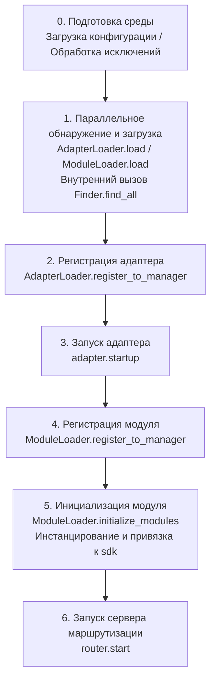

# Запуск и ручное управление

`await sdk.run()` / `await sdk.init()` в ErisPulse инкапсулируют целую цепочку запуска в "одну строку кода". Но когда вам нужно полностью настроить процесс запуска (например, частичная загрузка, динамическая регистрация, горячая замена, внедрение пользовательской стратегии загрузки), вам нужно понимать, что происходит внутри этой цепочки и как ручным образом управлять каждым шагом.

В этой статье мы разбиваем цепочку запуска на отдельные этапы, объясняем их обязанности и порядок вызова, а также приводим пример полного ручного запуска.

> В этой статье предполагается, что вы уже запустили [первого бота](../getting-started/first-bot.md) и знакомы с двумя режимами `sdk.run(keep_running=True/False)`. В этой статье акцент делается на внутреннюю разбивку цепочки `init()` и более низкоуровневых входных точках, таких как `init()` / `init_task()` / `init_sync()`.

## Обзор верхнего уровня SDK

Помимо двух режимов `keep_running` в `run()`, SDK предоставляет несколько более низкоуровневых точек инициализации, различающихся **асинхронностью, возвращаемым значением и обработкой исключений**:

| Входная точка | Асинхронность | Возвращаемое значение | Обработка исключений | Сценарий использования |
|---------------|---------------|-----------------------|----------------------|-------------------------|
| `await sdk.run(True)` | async, блокирующий | `None` (автоматически `uninit` при закрытии) | Ошибки модулей/адаптеров перехватываются, не ломают процесс | Простое приложение-бот |
| `await sdk.run(False)` | async, не блокирующий | `None` (не автоматически отключает) | То же самое | Выполнение пользовательской логики после инициализации |
| `await sdk.init()` | async, требует `await` | `bool` | **Не обернут**, исключение поднимается выше | Ручное управление жизненным циклом (в паре с `uninit()`) |
| `sdk.init_task()` | async, возвращает `Task` без блокировки | `asyncio.Task` | То же, что и `init()` | Параллельное выполнение других инициализаций или когда цикл событий еще не запущен |
| `sdk.init_sync()` | **Синхронный**, блокирует текущий поток | `bool` | То же, что и `init()` | Сценарии командной строки, синхронный вход без цикла событий |

> **Распространенное заблуждение**: `await sdk.init()` **не эквивалентно** `await sdk.run(keep_running=False)`. Есть два различия: ① `init()` возвращает `bool`, `run()` возвращает `None`; ② `run()` оборачивает процесс инициализации и выполнения в try/except (перехватывает ошибки модулей/адаптеров, чтобы не сбивать процесс), а `init()` не оборачивает, исключения будут подниматься выше. При необходимости сопровождения отключения или пользовательской обработки исключений используйте `init()` + `uninit()`.

## Обзор цепочки запуска

`sdk.init()` (точнее, его внутренний `Initializer.init()`) запускает всю систему в следующем порядке:



Соответствующие основные компоненты:

| Уровень | Компонент | Обязанности |
|---------|-----------|-------------|
| Обнаружение | `AdapterFinder` / `ModuleFinder` | Обнаружение адаптеров/модулей из entry-points установленных пакетов |
| Загрузка | `AdapterLoader` / `ModuleLoader` | Обнаружение + импорт + чтение метаданных + определение включения/отключения, возвращает список объектов |
| Регистрация | `*Loader.register_to_manager` | Регистрация объектов в соответствующих менеджерах |
| Управление | `sdk.adapter` / `sdk.module` | Хранение экземпляров адаптеров/модулей, предоставление интерфейсов для запуска и остановки |
| Инициализация | `ModuleLoader.initialize_modules` | Создание экземпляров модулей и привязка к `sdk` (обработка топологической сортировки зависимостей) |
| Маршрутизация | `sdk.router` | HTTP / WebSocket сервер |

> **Важно**: `Finder` и `Loader` — это два уровня. `Loader` внутри **уже содержит** `Finder` (например, `AdapterLoader` содержит `AdapterFinder`, `ModuleLoader` содержит `ModuleFinder`). В большинстве сценариев вам нужно использовать только `Loader`, а `Finder` используется только в случаях, когда нужно просто перечислить без импорта.

## Подробное описание этапов

### 1. Уровень обнаружения: Finder

Finder отвечает только за "найти, какие пакеты предоставляют адаптеры/модули", без импорта и инстанцирования.

```python
from ErisPulse.finders import AdapterFinder, ModuleFinder

adapter_finder = AdapterFinder()
module_finder = ModuleFinder()

# Найти все установленные entry-points адаптеров/модулей
adapter_entries = adapter_finder.find_all()    # list[EntryPoint]
module_entries = module_finder.find_all()      # list[EntryPoint]

# Найти по имени
entry = module_finder.find_by_name("MyModule")  # EntryPoint | None
```

Каждый `EntryPoint` можно `.load()` для получения соответствующего класса, но обычно вам не нужно вызывать это вручную — Loader сделает это.

### 2. Уровень загрузки: Loader

Loader на уровне Finder делает "импорт + чтение метаданных + определение включения/отключения".

```python
from ErisPulse.loaders import AdapterLoader, ModuleLoader
from ErisPulse import sdk

adapter_loader = AdapterLoader()
module_loader = ModuleLoader()

# load() внутри: вызов finder.find_all() → обработка каждого entry-point → возвращает триплет
adapter_objs, enabled_adapters, disabled_adapters = await adapter_loader.load(sdk.adapter)
module_objs, enabled_modules, disabled_modules = await module_loader.load(sdk.module)
```

Триплет, возвращаемый `load()`:

| Возвращаемое значение | Значение |
|-----------------------|----------|
| `objs` (`dict`) | Имя → объект (класс адаптера / обёртка модуля) |
| `enabled` (`list[str]`) | Имена, которые включены (не отключены в конфигурации) |
| `disabled` (`list[str]`) | Имена, которые отключены |

#### Информация для диагностики при сбое загрузки

Когда какой-либо модуль/адаптер выбрасывает исключение на этапе загрузки или инициализации, фреймворк пропускает этот компонент и продолжает загрузку других компонентов, при этом выводит **резюме пользовательских фреймов кода**, чтобы вы могли определить местоположение ошибки на уровне INFO, без необходимости вручную включать DEBUG:

```
[ERROR] [ModuleLoader] Загрузка модуля MyModule из entry-point не удалась, пропущен: 'NoneType' object has no attribute 'platform'
  → MyModule/Core.py:42 in on_load
      adapter = sdk.platform
  → AttributeError: 'NoneType' object has no attribute 'platform'
  → Подсказка: Увеличьте уровень логирования до DEBUG, чтобы увидеть полный стек; проверьте реализацию модуля MyModule
```

Диагностическая информация генерируется с помощью модуля `ErisPulse.runtime.diagnostics`, который автоматически фильтрует внутренние фреймы фреймворка и оставляет только фреймы вашего кода. Если вам нужно повторно использовать эту функциональность в пользовательской логике загрузки:

```python
from ErisPulse.runtime import log_diagnostic

try:
    risky_init()
except Exception as e:
    log_diagnostic(e)  # Автоматически извлекает фреймы пользовательского кода и записывает в лог ERROR
```

Этот модуль также предоставляет два низкоуровневых функции: `extract_user_frame()` (возвращает структурированную информацию о фрейме) и `format_diagnostic_block()` (возвращает многострочный текст).

### 3. Уровень регистрации: register_to_manager

Регистрация объектов, полученных Loader, в менеджерах, чтобы `sdk.adapter` / `sdk.module` могли их распознавать.

```python
# Регистрация адаптера (возвращает bool, означает, все ли успешно)
await adapter_loader.register_to_manager(enabled_adapters, adapter_objs, sdk.adapter)

# Регистрация модуля
await module_loader.register_to_manager(enabled_modules, module_objs, sdk.module)
```

После регистрации адаптеры попадают в `sdk.adapter._adapters`, классы модулей — в `sdk.module`, но **они еще не запущены/инстанцированы**.

### 4. Запуск адаптера

```python
# Запуск всех зарегистрированных адаптеров
await sdk.adapter.startup()
# Или указать платформу
await sdk.adapter.startup("yunhu")
await sdk.adapter.startup(["yunhu", "telegram"])
```

> Регистрация ≠ запуск. `register_to_manager` — это просто регистрация; `startup` вызывает `start()` адаптера и устанавливает соединение с платформой.

### 5. Инициализация модуля

Модули имеют дополнительный шаг — **инстанцирование** и привязка к `sdk` (чтобы вы могли вызывать `sdk.MyModule.xxx`). Этот шаг также обрабатывает заявленные зависимости модулей и топологическую сортировку.

```python
success = await module_loader.initialize_modules(
    enabled_modules, module_objs, sdk.module, sdk
)
```

После успешного инстанцирования модуль появится в `sdk.<ModuleName>`.

### 6. Запуск сервера маршрутизации

```python
await sdk.router.start(
    host="0.0.0.0",
    port=8000,
    ssl_certfile=None,
    ssl_keyfile=None,
)
```

Сервер маршрутизации отвечает за прием обратных вызовов webhook / WebSocket от адаптеров. Без его запуска адаптеры в режиме server не могут получать сообщения.

## Полный пример ручного запуска

Ниже приведён код, **эквивалентный** ядру `await sdk.init()`, но каждый шаг здесь доступен, и вы можете вставить пользовательскую логику в любой момент:

```python
import asyncio
from ErisPulse import sdk
from ErisPulse.loaders import AdapterLoader, ModuleLoader

async def manual_startup():
    # 0. Подготовка среды (загрузка конфигурации, регистрация глобальной обработки исключений)
    #    _prepare_environment — это предварительный шаг в init(); в ручном процессе его нужно сначала вызвать,
    #    иначе Loader не сможет прочитать конфигурацию, и все адаптеры/модули будут ошибочно отключены.
    if not await sdk._prepare_environment():
        print("Подготовка среды не удалась")
        return False

    # 1. Создание загрузчиков (внутри каждый содержит Finder)
    adapter_loader = AdapterLoader()
    module_loader = ModuleLoader()

    # 2. Параллельное обнаружение и загрузка (как в init() внутри используется gather)
    (adapter_objs, enabled_adapters, disabled_adapters), \
    (module_objs, enabled_modules, disabled_modules) = await asyncio.gather(
        adapter_loader.load(sdk.adapter),
        module_loader.load(sdk.module),
    )

    # 3. Регистрация адаптера
    await adapter_loader.register_to_manager(
        enabled_adapters, adapter_objs, sdk.adapter
    )

    # 4. Запуск адаптера
    if enabled_adapters:
        await sdk.adapter.startup()

    # 5. Регистрация модуля
    await module_loader.register_to_manager(
        enabled_modules, module_objs, sdk.module
    )

    # 6. Инициализация модуля (инстанцирование + привязка к sdk)
    if enabled_modules:
        await module_loader.initialize_modules(
            enabled_modules, module_objs, sdk.module, sdk
        )

    # 7. Запуск сервера маршрутизации
    await sdk.router.start(host="0.0.0.0", port=8000)

    print("Ручной запуск завершён")
    return True

async def main():
    ok = await manual_startup()
    if ok:
        # Блокирующее поддержание работы (ручной процесс не будет автоматически блокировать)
        await asyncio.Event().wait()

if __name__ == "__main__":
    asyncio.run(main())
```

### Когда использовать ручной запуск?

В большинстве случаев **не нужно** использовать ручной запуск, так как `await sdk.run()` уже делает всё это. Ручной запуск имеет значение только в следующих сценариях:

- **Частичная загрузка**: загрузка только указанных адаптеров/модулей, пропуск остальных
- **Динамическая регистрация**: регистрация новых адаптеров/модулей во время выполнения по условиям
- **Пользовательский порядок**: необходимость нарушить стандартный порядок загрузки (например, сначала запустить модуль, а затем адаптер)
- **Внедрение стратегий**: внедрение пользовательских стратегий управления строгостью, загрузки и т.д. в Loader
- **Отладка/диагностика**: при сбое на каком-либо этапе, ручное управление для локализации проблемы

## Тонкое управление во время выполнения

Даже если вы использовали `sdk.run()` для запуска, вы всё равно можете управлять подсистемами отдельно во время выполнения, не перезапуская весь SDK:

### Горячая перезагрузка адаптеров

```python
# Горячая перезагрузка одного адаптера (восстановление соединения, без влияния на другие платформы)
await sdk.adapter.shutdown("yunhu")
await sdk.adapter.startup("yunhu")

# Запуск новой платформы во время выполнения
await sdk.adapter.startup("telegram")

# Временная отключённая платформа
await sdk.adapter.shutdown("telegram")
```

> `adapter.startup()` требует, чтобы адаптер **был зарегистрирован** в менеджере. Регистрация происходит внутри `init()`/`run()`, поэтому это тонкое управление происходит **после** запуска.

### Сервер маршрутизации

```python
# Временная отключённая webhook-сервер
await sdk.router.stop()

# Перезапуск (например, после смены порта)
await sdk.router.start(host="0.0.0.0", port=9000)
```

### Модули по требованию

```python
# Ручная загрузка модуля (возможно, ленивая загрузка)
await sdk.load_module("MyModule")
```

## Процесс отключения

Обратная операция к запуску — это `await sdk.uninit()`, который очищает в обратном порядке:

1. Закрытие всех адаптеров (`adapter.shutdown()`)
2. Отключение всех модулей
3. Очистка всех обработчиков событий
4. Очистка менеджеров и атрибутов модулей в SDK

В сценариях ручного запуска не забудьте вызвать `uninit()` перед выходом, чтобы обеспечить корректное завершение:

```python
try:
    await asyncio.Event().wait()   # Поддержание работы
finally:
    await sdk.uninit()
```

## Перезапуск

SDK предоставляет два способа перезапуска, вам не нужно сначала отключать — фреймворк сам справится:

| Способ | Вызов | Поведение | Сценарий использования |
|-------|--------|-----------|-------------------------|
| Горячий перезапуск | `await sdk.restart()` | Внутри одного процесса `uninit()` затем повторный `init()`, перезагрузка адаптеров/модулей | Перезагрузка конфигурации, горячее обновление модулей |
| Жёсткий перезапуск | `await sdk.hard_restart()` | `uninit()` затем выход из процесса, родительский процесс (`epsdk run`) запускает новый процесс | Подозрение на утечку памяти/ресурсов, полная перезагрузка |

```python
# Горячий перезапуск: перезагрузка в рамках одного процесса (наиболее часто используемый)
await sdk.restart()

# Жёсткий перезапуск: выход из процесса, должен быть запущен через `epsdk run main.py`
await sdk.hard_restart()
```

> **Два важных замечания**:
> 1. Эти методы выполняют перезапуск в фоновой задаче, **немедленно возвращают `True`**, означая, что "задача перезапуска запланирована", а не "перезапуск завершён". Фактический перезапуск происходит в фоне, чтобы избежать прерывания текущей цепи событий.
> 2. `hard_restart()` **должен быть вызван через `epsdk run main.py`**, чтобы он сработал. Его принцип: после отключения процесс завершается с кодом выхода 42, родительский процесс `epsdk run` обнаруживает код 42 и запускает новый процесс; если запуск происходит через `python main.py`, процесс завершается с кодом 42 и просто закрывается, не перезапускаясь.

### Когда использовать жёсткий перезапуск?

Жёсткий перезапуск — это не просто "более полный перезапуск", он в следующих сценариях более подходит и даже эффективнее:

- **Побочные эффекты бинарных библиотек (C-расширений)**: горячий перезапуск происходит в одном процессе, не может освободить C-расширения, открытые файловые дескрипторы, потоки и другие ресурсы процесса; жёсткий перезапуск меняет процесс, полностью устраняя эти побочные эффекты.
- **Диагностика утечек ресурсов**: при подозрении на утечку памяти или дескрипторов, жёсткий перезапуск даст чистую среду.
- **Частые перезапуски с чувствительностью к производительности**: жёсткий перезапуск избегает затрат на отключение → перезагрузку в одном процессе, фактически более эффективен, чем горячий перезапуск.

> Функция "перезапуска фреймворка" в панели управления Dashboard вызывает `hard_restart()`.
> Кроме того, жёсткий перезапуск требует обязательного использования команды `epsdk run` для запуска, иначе программа просто выбросит код выхода 42 и завершится, поскольку команда `run` проверяет код выхода 42 для перезапуска процесса, и это важно помнить!!!

## Связанные документы

- [Создание первого бота](../getting-started/first-bot.md) - Основы `keep_running` в двух режимах
- [Управление жизненным циклом](lifecycle.md) - Слушатели событий запуска `core.init.start` / `core.init.complete`
- [Ленивая загрузка](lazy-loading.md) - Механизм ленивой загрузки модулей и `load_module`