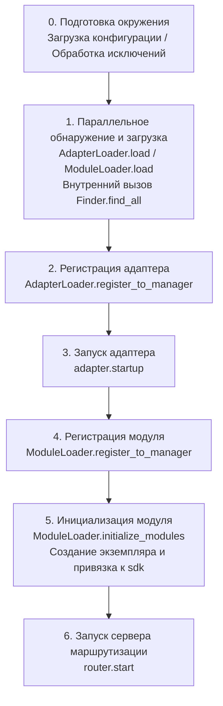

# Процесс запуска и ручное управление

В ErisPulse `await sdk.run()` / `await sdk.init()` объединяют всю цепочку запуска в "одну строку кода". Однако, если вам нужно полностью настроить процесс запуска (например, частичная загрузка, динамическая регистрация, горячая замена, внедрение пользовательской стратегии загрузки), вам нужно понимать, что происходит внутри этой цепочки, и как ручным образом управлять каждым шагом.

В этой статье мы разбиваем цепочку запуска на отдельные этапы, объясняем их обязанности, порядок вызова и приводим пример ручного полного запуска.

> В этой статье предполагается, что вы уже запустили [первого робота](../getting-started/first-bot.md) и знакомы с двумя режимами `sdk.run(keep_running=True/False)`. В этой статье фокусируется на разборе цепочки внутри `init()` и более низкоуровневых входных точках, таких как `init()`/`init_task()`/`init_sync()`.

## Обзор верхнего уровня SDK

Помимо двух режимов `keep_running` в `run()`, SDK предоставляет несколько более низкоуровневых точек инициализации, различающихся по **асинхронности, возвращаемому значению и обработке исключений**:

| Точка входа | Асинхронность | Возвращаемое значение | Обработка исключений | Сценарии использования |
|-------------|---------------|-----------------------|----------------------|-------------------------|
| `await sdk.run(True)` | async, блокирующий | `None` (автоматически `uninit` при остановке) | Ошибки модулей/адаптеров перехватываются, не ломают процесс | Простое приложение-бот |
| `await sdk.run(False)` | async, не блокирующий | `None` (не автоматически удаляется) | То же, что и выше | Инициализация, затем выполнение пользовательской логики |
| `await sdk.init()` | async, требует await | `bool` | **Не обернуты**, исключения поднимаются выше | Ручное управление жизненным циклом (с `uninit()`) |
| `sdk.init_task()` | async, возвращает Task, не блокирует | `asyncio.Task` | То же, что и `init()` | Параллельное выполнение других инициализаций или когда цикл событий еще не запущен |
| `sdk.init_sync()` | **Синхронный**, блокирует текущий поток | `bool` | То же, что и `init()` | Скрипты командной строки, синхронные входные точки без цикла событий |

> **Частая ошибка**: `await sdk.init()` **не эквивалентно** `await sdk.run(keep_running=False)`. Два различия: ① `init()` возвращает `bool`, `run()` возвращает `None`; ② `run()` оборачивает процесс инициализации и выполнения в try/except (перехватывает ошибки модулей/адаптеров, чтобы не сломать процесс), в то время как `init()` не оборачивает, исключения сразу поднимаются выше. При необходимости сопровождения выгрузки или пользовательской обработки исключений используйте `init()` + `uninit()`.

## Общий обзор цепочки запуска

`sdk.init()` (точнее, его внутренний `Initializer.init()`) запускает всю систему в следующем порядке:



Соответствующие основные компоненты:

| Уровень | Компонент | Обязанности |
|---------|-----------|-------------|
| Обнаружение | `AdapterFinder` / `ModuleFinder` | Обнаружение адаптеров/модулей из entry-points установленных пакетов |
| Загрузка | `AdapterLoader` / `ModuleLoader` | Обнаружение + импорт + чтение метаданных + определение включения/отключения, возвращает список объектов |
| Регистрация | `*Loader.register_to_manager` | Регистрация объектов в соответствующих менеджерах |
| Управление | `sdk.adapter` / `sdk.module` | Хранение экземпляров адаптеров/модулей, предоставление интерфейсов запуска/остановки |
| Инициализация | `ModuleLoader.initialize_modules` | Создание экземпляров модулей и привязка к `sdk` (обработка топологической сортировки зависимостей) |
| Маршрутизация | `sdk.router` | HTTP / WebSocket сервер |

> **Важно**: `Finder` и `Loader` — это два уровня. `Loader` внутри **уже содержит** `Finder` (`AdapterLoader` содержит `AdapterFinder`, `ModuleLoader` содержит `ModuleFinder`). В большинстве сценариев вам нужно использовать только `Loader`, только когда нужно "перечислить, но не импортировать", вы будете использовать `Finder` отдельно.

## Подробное объяснение каждого этапа

### 1. Уровень обнаружения: Finder

Finder только отвечает за "найти, какие пакеты предоставляют адаптеры/модули", не импортирует и не создает экземпляры.

```python
from ErisPulse.finders import AdapterFinder, ModuleFinder

adapter_finder = AdapterFinder()
module_finder = ModuleFinder()

# Найти все установленные entry-points адаптеров/модулей
adapter_entries = adapter_finder.find_all()    # list[EntryPoint]
module_entries = module_finder.find_all()      # list[EntryPoint]

# Найти по имени
entry = module_finder.find_by_name("MyModule")  # EntryPoint | None
```

Каждый `EntryPoint` можно `.load()` для получения соответствующего класса, но обычно вам не нужно вызывать это вручную — `Loader` сделает это.

### 2. Уровень загрузки: Loader

Loader делает "импорт + чтение метаданных + определение включения/отключения" поверх `Finder`.

```python
from ErisPulse.loaders import AdapterLoader, ModuleLoader
from ErisPulse import sdk

adapter_loader = AdapterLoader()
module_loader = ModuleLoader()

# load() внутри: вызывает finder.find_all() → обрабатывает каждый entry-point → возвращает триплет
adapter_objs, enabled_adapters, disabled_adapters = await adapter_loader.load(sdk.adapter)
module_objs, enabled_modules, disabled_modules = await module_loader.load(sdk.module)
```

Триплет, возвращаемый `load()`:

| Возвращаемое значение | Значение |
|-----------------------|----------|
| `objs` (`dict`) | Имя → объект (класс адаптера / обёртка модуля) |
| `enabled` (`list[str]`) | Имена, включённые (не отключены в конфигурации) |
| `disabled` (`list[str]`) | Имена, отключённые |

#### Информация для диагностики при сбое загрузки

Когда модуль/адаптер выбрасывает исключение на этапе загрузки или инициализации, фреймворк пропускает этот компонент и продолжает загрузку других компонентов, при этом выводя **суммарную информацию о кадре пользовательского кода**, что позволяет вам определить местоположение ошибки даже при уровне логирования INFO, без необходимости включать DEBUG:

```
[ERROR] [ModuleLoader] Загрузка модуля MyModule из entry-point не удалась, пропущен: 'NoneType' object has no attribute 'platform'
  → MyModule/Core.py:42 in on_load
      adapter = sdk.platform
  → AttributeError: 'NoneType' object has no attribute 'platform'
  → Подсказка: Повысьте уровень логирования до DEBUG, чтобы увидеть полный стек; проверьте реализацию модуля MyModule
```

Информация для диагностики генерируется модулем `ErisPulse.runtime.diagnostics`, автоматически фильтруя внутренние кадры фреймворка и оставляя только кадры вашего кода. Если вам нужно повторно использовать это в пользовательской логике загрузки:

```python
from ErisPulse.runtime import log_diagnostic

try:
    risky_init()
except Exception as e:
    log_diagnostic(e)  # Автоматически извлекает кадры пользовательского кода и записывает в ERROR лог
```

Этот модуль также предоставляет два низкоуровневых функции: `extract_user_frame()` (возвращает структурированную информацию о кадре) и `format_diagnostic_block()` (возвращает многострочный текст).

### 3. Уровень регистрации: register_to_manager

Регистрация объектов, созданных Loader, в менеджере, чтобы `sdk.adapter` / `sdk.module` могли их распознавать.

```python
# Регистрация адаптера (возвращает bool, означающий, были ли все успешны)
await adapter_loader.register_to_manager(enabled_adapters, adapter_objs, sdk.adapter)

# Регистрация модуля
await module_loader.register_to_manager(enabled_modules, module_objs, sdk.module)
```

После регистрации адаптеры появляются в `sdk.adapter._adapters`, классы модулей — в `sdk.module`, но **они ещё не запущены/инициализированы**.

### 4. Запуск адаптера

```python
# Запуск всех зарегистрированных адаптеров
await sdk.adapter.startup()
# Или указать платформу
await sdk.adapter.startup("yunhu")
await sdk.adapter.startup(["yunhu", "telegram"])
```

> Регистрация ≠ Запуск. `register_to_manager` только регистрирует; `startup` вызывает `start()` адаптера, устанавливая соединение с платформой.

### 5. Инициализация модуля

Модули имеют дополнительный шаг — **инициализацию** и привязку к `sdk` (чтобы вы могли вызывать `sdk.MyModule.xxx`). Этот шаг также обрабатывает объявления зависимостей модулей и топологическую сортировку.

```python
success = await module_loader.initialize_modules(
    enabled_modules, module_objs, sdk.module, sdk
)
```

После успешной инициализации модуль появляется в `sdk.<ModuleName>`.

### 6. Запуск сервера маршрутизации

```python
await sdk.router.start(
    host="0.0.0.0",
    port=8000,
    ssl_certfile=None,
    ssl_keyfile=None,
)
```

Сервер маршрутизации отвечает за получение webhook / WebSocket-вызовов от адаптеров. Без запуска его серверные адаптеры не могут получать сообщения.

## Полный пример ручного запуска

Следующий код **эквивалентен** ядро процесса `await sdk.init()`, но каждый шаг доступен вам, чтобы вставить пользовательскую логику в любой момент:

```python
import asyncio
from ErisPulse import sdk
from ErisPulse.loaders import AdapterLoader, ModuleLoader

async def manual_startup():
    # 0. Подготовка окружения (загрузка конфигурации, регистрация обработки исключений)
    #    _prepare_environment — это предварительный шаг внутри init(); ручной процесс также должен сначала вызвать его,
    #    иначе Loader не сможет прочитать конфигурацию и по ошибке отключит все адаптеры/модули.
    if not await sdk._prepare_environment():
        print("Подготовка окружения не удалась")
        return False

    # 1. Создание загрузчиков (внутри каждый содержит Finder)
    adapter_loader = AdapterLoader()
    module_loader = ModuleLoader()

    # 2. Параллельное обнаружение и загрузка (как в init() используется gather)
    (adapter_objs, enabled_adapters, disabled_adapters), \
    (module_objs, enabled_modules, disabled_modules) = await asyncio.gather(
        adapter_loader.load(sdk.adapter),
        module_loader.load(sdk.module),
    )

    # 3. Регистрация адаптера
    await adapter_loader.register_to_manager(
        enabled_adapters, adapter_objs, sdk.adapter
    )

    # 4. Запуск адаптера
    if enabled_adapters:
        await sdk.adapter.startup()

    # 5. Регистрация модуля
    await module_loader.register_to_manager(
        enabled_modules, module_objs, sdk.module
    )

    # 6. Инициализация модуля (инстанцирование + привязка к sdk)
    if enabled_modules:
        await module_loader.initialize_modules(
            enabled_modules, module_objs, sdk.module, sdk
        )

    # 7. Запуск сервера маршрутизации
    await sdk.router.start(host="0.0.0.0", port=8000)

    print("Ручной запуск завершён")
    return True

async def main():
    ok = await manual_startup()
    if ok:
        # Блокирующее ожидание (ручной процесс не блокирует автоматически)
        await asyncio.Event().wait()

if __name__ == "__main__":
    asyncio.run(main())
```

### Когда использовать ручной запуск?

В большинстве случаев **не нужно** использовать ручной запуск, `await sdk.run()` уже делает всё это. Ручной запуск имеет ценность только в следующих сценариях:

- **Частичная загрузка**: загрузка только определённых адаптеров/модулей, пропуск других
- **Динамическая регистрация**: регистрация новых адаптеров/модулей во время выполнения по условиям
- **Нестандартный порядок**: требуется изменить стандартный порядок загрузки (например, запустить модуль перед адаптером)
- **Внедрение стратегий**: внедрение пользовательских стратегий управления, строгих режимов и т.д. в Loader
- **Отладка/диагностика**: при сбое на каком-либо этапе, ручное управление для локализации проблемы

## Тонкое управление во время выполнения

Даже если вы использовали `sdk.run()` для запуска, вы по-прежнему можете управлять подсистемами отдельно во время выполнения, без необходимости перезапуска всего SDK:

### Горячая перезагрузка адаптеров

```python
# Горячая перезагрузка адаптера (восстановление соединения, без влияния на другие платформы)
await sdk.adapter.shutdown("yunhu")
await sdk.adapter.startup("yunhu")

# Запуск новой платформы во время работы
await sdk.adapter.startup("telegram")

# Временное отключение платформы
await sdk.adapter.shutdown("telegram")
```

> `adapter.startup()` требует, чтобы адаптер **был зарегистрирован** в менеджере. Регистрация происходит внутри `init()`/`run()`, поэтому это тонкое управление **после** запуска.

### Сервер маршрутизации

```python
# Временное отключение webhook-сервера
await sdk.router.stop()

# Перезапуск (например, при смене порта)
await sdk.router.start(host="0.0.0.0", port=9000)
```

### Модули по требованию

```python
# Ручная загрузка модуля (возможно, ленивая загрузка)
await sdk.load_module("MyModule")
```

## Аккуратное завершение

Начиная с версии 2.7.0, `sdk.shutdown()` предоставляет **программное аккуратное завершение**: установка события завершения, которое заставляет главный цикл, висящий в `await sdk.run(keep_running=True)`, вернуться, что ведёт к вызову `uninit()` и завершению очистки ресурсов.

```python
# Вызов из любого корутины, вызывает аккуратный выход (run() висит и возвращает, автоматически uninit)
sdk.shutdown()
```

Типичные сценарии использования:

```python
async def shutdown_after_idle():
    await asyncio.sleep(3600)
    sdk.shutdown()  # Аккуратный выход после 1 часа бездействия
```

**Обработка сигналов**: `run()` внутри регистрирует обработчики `SIGTERM` / `SIGHUP`, преобразуя системные сигналы в аккуратное завершение — при остановке контейнера (Docker `docker stop`) или остановке службы `systemd`, процесс пройдёт через `uninit()` для очистки, а не будет принудительно убит.

- Windows не поддерживает `loop.add_signal_handler`, обработчик сигнала будет автоматически пропущен (можно использовать `sdk.shutdown()` или Ctrl+C для вызова завершения)
- Повторный вызов `sdk.shutdown()` безопасен (после установки события повторный вызов не делает ничего)

## Процесс выгрузки

Обратная операция запуска — это `await sdk.uninit()`, который очищает в обратном порядке:

1. Закрытие всех адаптеров (`adapter.shutdown()`)
2. Выгрузка всех модулей
3. Очистка всех обработчиков событий
4. Очистка менеджеров и атрибутов модулей в SDK

В сценариях ручного запуска не забудьте вызвать `uninit()` перед выходом для обеспечения аккуратного завершения:

```python
try:
    await asyncio.Event().wait()   # Поддержание работы
finally:
    await sdk.uninit()
```

## Перезапуск

SDK предоставляет два способа перезапуска, без необходимости предварительной выгрузки — фреймворк сам обрабатывает:

| Способ | Вызов | Поведение | Сценарии использования |
|--------|-------|-----------|-------------------------|
| Горячий перезапуск | `await sdk.restart()` | Внутри одного процесса `uninit()` и повторный `init()`, перезагрузка адаптеров/модулей | Перезагрузка конфигурации, горячая замена модулей |
| Жёсткий перезапуск | `await sdk.hard_restart()` | `uninit()` и выход из процесса, новый процесс запускается родительским процессом (`epsdk run`) | Подозрения на утечку памяти/ресурсов, полная перезагрузка |
| | | | |

```python
# Горячий перезапуск: перезагрузка в том же процессе (наиболее часто используемый)
await sdk.restart()

# Жёсткий перезапуск: выход из процесса, должен быть запущен через `epsdk run main.py` для эффекта
await sdk.hard_restart()
```

> **Два важных замечания**:
> 1. Эти методы выполняют перезапуск в фоновой задаче, **немедленно возвращают `True`, означающее "задача перезапуска запланирована"**, а не "перезапуск завершён". Реальный перезапуск происходит в фоне, чтобы избежать прерывания текущей цепочки событий.
> 2. `hard_restart()` **должен быть запущен через `epsdk run main.py`, чтобы сработать**. Его принцип: после выгрузки процесс завершается с кодом 42, родительский процесс `epsdk run` обнаруживает код 42 и запускает новый процесс; если процесс запущен напрямую через `python main.py`, он завершится с кодом 42 и просто завершится, не перезапустившись автоматически.

### Когда использовать жёсткий перезапуск?

Жёсткий перезапуск — это не просто "более полный перезапуск", он более подходит и даже эффективнее в следующих сценариях:

- **Побочные эффекты двоичных библиотек (C-расширения)**: горячий перезапуск происходит в одном процессе, не может освободить C-расширения, открытые файловые дескрипторы, потоки и другие ресурсы процесса; жёсткий перезапуск меняет процесс, полностью удаляя эти побочные эффекты.
- **Поиск утечек ресурсов**: при подозрении на утечку памяти или дескрипторов, жёсткий перезапуск даёт чистую среду.
- **Частые перезапуски, чувствительные к производительности**: жёсткий перезапуск исключает затраты на выгрузку → перезагрузку в одном процессе, фактически более эффективен, чем горячий перезапуск.

> Функция "перезапуск фреймворка" в панели управления Dashboard вызывает `hard_restart()`.
> Кроме того, жёсткий перезапуск требует **обязательного** использования команды `epsdk run` для запуска, иначе программа просто выбросит код 42 и завершится, так как `run` проверяет код 42 для перезапуска процесса, и это нужно учитывать.

## Связанные документы

- [Создание первого робота](../getting-started/first-bot.md) - Основное знакомство с двумя режимами `keep_running`
- [Управление жизненным циклом](lifecycle.md) - Наблюдение за событиями запуска `core.init.start` / `core.init.complete`
- [Система ленивой загрузки](lazy-loading.md) - Механизм ленивой загрузки модулей и `load_module`