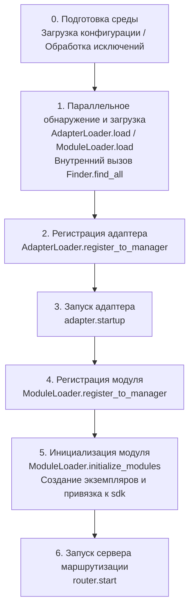

# Процесс запуска и ручное управление

Метод `sdk.run()` / `sdk.init()` в ErisPulse инкапсулирует всю цепочку запуска в виде "одной строки кода". Однако, когда вам нужно полностью настроить процесс запуска (например, частичная загрузка, динамическая регистрация, горячая замена, внедрение пользовательской стратегии загрузки), необходимо понимать, что происходит внутри этой цепочки и как управлять каждым шагом вручную.

В этой статье мы разбиваем цепочку запуска на отдельные этапы, объясняем их обязанности, порядок вызова и приводим пример ручного полного запуска.

> В этой статье предполагается, что вы уже запустили [первого робота](../getting-started/first-bot.md) и знакомы с двумя режимами `sdk.run(keep_running=True/False)`. В этой статье мы сосредоточимся на внутренней цепочке `init()` и более низкоуровневых входных точках, таких как `init()` / `init_task()` / `init_sync()`.

## Обзор верхнего уровня SDK

Помимо двух режимов `run()` с параметром `keep_running`, SDK предоставляет несколько более низкоуровневых точек входа, отличающихся **асинхронностью, возвращаемым значением и обработкой исключений**:

| Точка входа | Асинхронность | Возвращаемое значение | Обработка исключений | Сценарии использования |
|-------------|---------------|------------------------|----------------------|--------------------------|
| `await sdk.run(True)` | async, блокирует и поддерживает | `None` (автоматически `uninit` при остановке) | Ошибки модулей/адаптеров перехватываются, не приводят к сбою процесса | Приложения-боты |
| `await sdk.run(False)` | async, не блокирует | `None` (не автоматически удаляется) | То же, что и выше | После инициализации выполнить пользовательскую логику |
| `await sdk.init()` | async, требует await | `bool` | Внутренние исключения компонентов перехватываются, в случае неудачи возвращается `False` | Ручное управление жизненным циклом (в паре с `uninit()`) |
| `sdk.init_task()` | async, возвращает Task без блокировки | `asyncio.Task` | То же, что и `init()` | Параллельное выполнение другой инициализации или когда цикл событий еще не запущен |
| `sdk.init_sync()` | **Синхронный**, блокирует текущий поток | `bool` | То же, что и `init()` | Сценарии командной строки, синхронные входные точки без цикла событий |

> **Частое заблуждение**: `await sdk.init()` **не эквивалентно** `await sdk.run(keep_running=False)`. Есть два различия: ① `init()` возвращает `bool` (в случае неудачи возвращает `False`), `run()` возвращает `None`; ② `init()` делает только инициализацию, **не автоматически удаляет**, `run()` при завершении цикла событий автоматически вызывает `uninit()`. Поэтому, если нужно вручную управлять жизненным циклом, используйте `init()` + `uninit()`.

## Обзор цепочки запуска

`sdk.init()` (точнее, его внутренний `Initializer.init()`) запускает всю систему в следующем порядке:



Соответствующие основные компоненты:

| Уровень | Компонент | Обязанности |
|---------|-----------|-------------|
| Обнаружение | `AdapterFinder` / `ModuleFinder` | **Обнаружение** адаптеров/модулей из entry-points установленных пакетов |
| Загрузка | `AdapterLoader` / `ModuleLoader` | Обнаружение + импорт + чтение метаданных + определение включения/отключения, возвращает список объектов |
| Регистрация | `*Loader.register_to_manager` | Регистрация объектов в соответствующих менеджерах |
| Управление | `sdk.adapter` / `sdk.module` | Хранение экземпляров адаптеров/модулей, предоставление интерфейсов запуска/остановки |
| Инициализация | `ModuleLoader.initialize_modules` | Создание экземпляров модулей и привязка к `sdk` (обработка топологической сортировки зависимостей) |
| Маршрутизация | `sdk.router` | HTTP / WebSocket сервер |

> **Важно**: `Finder` и `Loader` — это два уровня. `Loader` уже содержит `Finder` (например, `AdapterLoader` содержит `AdapterFinder`, `ModuleLoader` содержит `ModuleFinder`). В большинстве случаев вам нужно использовать только `Loader`, только в случае, когда нужно "перечислить, но не импортировать", следует использовать `Finder` отдельно.

## Подробное объяснение каждого этапа

### 1. Уровень обнаружения: Finder

Finder только обнаруживает, какие пакеты предоставляют адаптеры/модули, не импортируя и не создавая экземпляры.

```python
from ErisPulse.finders import AdapterFinder, ModuleFinder

adapter_finder = AdapterFinder()
module_finder = ModuleFinder()

# Найти все установленные entry-points для адаптеров/модулей
adapter_entries = adapter_finder.find_all()    # list[EntryPoint]
module_entries = module_finder.find_all()      # list[EntryPoint]

# Найти по имени
entry = module_finder.find_by_name("MyModule")  # EntryPoint | None
```

Каждый `EntryPoint` можно загрузить с помощью `.load()`, чтобы получить соответствующий класс, но обычно это делает `Loader`.

### 2. Уровень загрузки: Loader

Loader делает "импорт + чтение метаданных + определение включения/отключения" поверх Finder.

```python
from ErisPulse.loaders import AdapterLoader, ModuleLoader
from ErisPulse import sdk

adapter_loader = AdapterLoader()
module_loader = ModuleLoader()

# load() внутри: вызывает finder.find_all() → обрабатывает entry-point по одному → возвращает кортеж
adapter_objs, enabled_adapters, disabled_adapters = await adapter_loader.load(sdk.adapter)
module_objs, enabled_modules, disabled_modules = await module_loader.load(sdk.module)
```

Возвращаемые три кортежа `load()`:

| Возвращаемое значение | Значение |
|-----------------------|----------|
| `objs` (`dict`) | Имя → объект (класс адаптера / обёртка модуля) |
| `enabled` (`list[str]`) | Имена, которые включены (не отключены в конфигурации) |
| `disabled` (`list[str]`) | Имена, которые отключены |

#### Диагностика при сбое загрузки

Когда модуль/адаптер выбрасывает исключение при загрузке или инициализации, фреймворк пропускает этот компонент и продолжает загрузку других компонентов, выводя **сводку пользовательского кода**, чтобы вы могли определить местоположение ошибки на уровне INFO, без необходимости включать DEBUG:

```
[ERROR] [ModuleLoader] Ошибка при загрузке модуля MyModule из entry-point, пропущен: 'NoneType' object has no attribute 'platform'
  → MyModule/Core.py:42 in on_load
      adapter = sdk.platform
  → AttributeError: 'NoneType' object has no attribute 'platform'
  → Подсказка: Повысьте уровень логирования до DEBUG для просмотра полного стека; проверьте реализацию модуля MyModule
```

Диагностическая информация генерируется модулем `ErisPulse.runtime.diagnostics`, который автоматически фильтрует внутренние кадры фреймворка, оставляя только кадры вашего кода. Если вам нужно использовать это в пользовательской логике загрузки:

```python
from ErisPulse.runtime import log_diagnostic

try:
    risky_init()
except Exception as e:
    log_diagnostic(e)  # Автоматически извлекает кадры пользовательского кода и записывает в лог ERROR
```

Модуль также предоставляет две базовые функции: `extract_user_frame()` (возвращает структурированную информацию о кадре) и `format_diagnostic_block()` (возвращает многострочную текстовую строку).

### 3. Уровень регистрации: register_to_manager

Регистрация объектов, полученных от Loader, в менеджерах, чтобы `sdk.adapter` / `sdk.module` могли их распознавать.

```python
# Регистрация адаптера (возвращает bool, означающий, все ли успешно)
await adapter_loader.register_to_manager(enabled_adapters, adapter_objs, sdk.adapter)

# Регистрация модуля
await module_loader.register_to_manager(enabled_modules, module_objs, sdk.module)
```

После регистрации адаптеры зарегистрированы в менеджере адаптеров, модули — в менеджере модулей, но **ни один из них не запущен/инициализирован**.

### 4. Запуск адаптера

```python
# Запуск всех зарегистрированных адаптеров
await sdk.adapter.startup()
# Или указать платформу
await sdk.adapter.startup("yunhu")
await sdk.adapter.startup(["yunhu", "telegram"])
```

> Регистрация ≠ запуск. `register_to_manager` только регистрирует; `startup` вызывает `start()` адаптера, устанавливая соединение с платформой.

### 5. Инициализация модуля

Модули имеют дополнительный шаг — **инициализация** и привязка к `sdk` (чтобы вы могли обращаться к `sdk.MyModule.xxx`). Этот шаг также обрабатывает зависимости между модулями и топологическую сортировку.

```python
success = await module_loader.initialize_modules(
    enabled_modules, module_objs, sdk.module, sdk
)
```

После успешной инициализации модуль появляется в `sdk.<ModuleName>`.

### 6. Запуск сервера маршрутизации

```python
await sdk.router.start(
    host="0.0.0.0",
    port=8000,
    ssl_certfile=None,
    ssl_keyfile=None,
)
```

Сервер маршрутизации отвечает за прием обратных вызовов (webhook / websocket) от адаптеров. Без запуска этого сервера, адаптеры в режиме сервера не смогут получать сообщения.

## Полный пример ручного запуска

Ниже приведён код, который **эквивалентен** основному процессу `await sdk.init()`, но каждый шаг доступен для ручного управления, что позволяет вставить пользовательскую логику в любой момент:

```python
import asyncio
from ErisPulse import sdk
from ErisPulse.loaders import AdapterLoader, ModuleLoader

async def manual_startup():
    # 0. Подготовка среды (загрузка конфигурации, регистрация обработки исключений)
    #    _prepare_environment — это внутренний шаг init(), который также должен быть вызван в ручном процессе,
    #    иначе Loader не сможет прочитать конфигурацию и посчитает все адаптеры/модули отключенными.
    if not await sdk._prepare_environment():
        print("Подготовка среды не удалась")
        return False

    # 1. Создание загрузчиков (внутри каждый содержит Finder)
    adapter_loader = AdapterLoader()
    module_loader = ModuleLoader()

    # 2. Параллельное обнаружение и загрузка (как в init(), используем gather)
    (adapter_objs, enabled_adapters, disabled_adapters), \
    (module_objs, enabled_modules, disabled_modules) = await asyncio.gather(
        adapter_loader.load(sdk.adapter),
        module_loader.load(sdk.module),
    )

    # 3. Регистрация адаптеров
    await adapter_loader.register_to_manager(
        enabled_adapters, adapter_objs, sdk.adapter
    )

    # 4. Запуск адаптеров
    if enabled_adapters:
        await sdk.adapter.startup()

    # 5. Регистрация модулей
    await module_loader.register_to_manager(
        enabled_modules, module_objs, sdk.module
    )

    # 6. Инициализация модулей (создание экземпляров и привязка к sdk)
    if enabled_modules:
        await module_loader.initialize_modules(
            enabled_modules, module_objs, sdk.module, sdk
        )

    # 7. Запуск сервера маршрутизации
    await sdk.router.start(host="0.0.0.0", port=8000)

    print("Ручной запуск завершен")
    return True

async def main():
    ok = await manual_startup()
    if ok:
        # Блокирующее ожидание (ручной процесс не блокирует автоматически)
        await asyncio.Event().wait()

if __name__ == "__main__":
    asyncio.run(main())
```

### Когда использовать ручной запуск?

В большинстве случаев **не нужно** использовать ручной запуск, так как `await sdk.run()` уже делает всё это. Ручной запуск имеет ценность только в следующих сценариях:

- **Частичная загрузка**: загрузка только определённых адаптеров/модулей, пропуск других
- **Динамическая регистрация**: регистрация новых адаптеров/модулей во время выполнения по условиям
- **Собственный порядок**: изменение стандартного порядка загрузки (например, сначала запустить модуль, затем адаптер)
- **Внедрение стратегий**: внедрение пользовательских стратегий управления, строгих режимов и т.д. в Loader
- **Отладка/диагностика**: при сбое на каком-то этапе, ручное управление для локализации проблемы

## Тонкое управление во время выполнения

Даже если вы использовали `sdk.run()` для запуска, вы всё ещё можете управлять отдельными подсистемами во время выполнения, без необходимости перезапуска всего SDK:

### Горячий перезапуск адаптера

```python
# Горячий перезапуск адаптера (восстановление соединения, без влияния на другие платформы)
await sdk.adapter.shutdown("yunhu")
await sdk.adapter.startup("yunhu")

# Запуск новой платформы во время выполнения
await sdk.adapter.startup("telegram")

# Временная отключка платформы
await sdk.adapter.shutdown("telegram")
```

> `adapter.startup()` требует, чтобы адаптер **был зарегистрирован** в менеджере. Регистрация происходит внутри `init()`/`run()`, поэтому это управление происходит **после** запуска.

### Сервер маршрутизации

```python
# Временная отключка webhook-сервера
await sdk.router.stop()

# Перезапуск (например, после смены порта)
await sdk.router.start(host="0.0.0.0", port=9000)
```

### Модули по требованию

```python
# Ручная загрузка модуля (возможно, ленивая загрузка)
await sdk.load_module("MyModule")
```

## Элегантное завершение

Начиная с версии 2.7.0, `sdk.shutdown()` предоставляет **программное элегантное завершение**: установка события завершения, которое заставляет висящий `await sdk.run(keep_running=True)` вернуться, что ведёт к автоматическому вызову `uninit()` и очистке ресурсов.

```python
# В любом корутине вызвать, чтобы запустить элегантное завершение (run() висит и автоматически uninit)
sdk.shutdown()
```

Типичное использование:

```python
async def shutdown_after_idle():
    await asyncio.sleep(3600)
    sdk.shutdown()  # Элегантное завершение после 1 часа бездействия
```

**Обработка сигналов**: `run()` внутри регистрирует обработчики `SIGTERM` / `SIGHUP`, преобразуя системные сигналы в элегантное завершение — при остановке контейнера (Docker `docker stop`) или остановке службы systemd процесс пройдёт через `uninit()` для очистки, а не будет принудительно убит.

- На Windows `loop.add_signal_handler` не поддерживается, обработчик сигналов будет пропущен (можно использовать `sdk.shutdown()` или Ctrl+C для завершения)
- Повторный вызов `sdk.shutdown()` безопасен (второй вызов без действия, если событие уже установлено)

## Процесс выгрузки

Обратной операцией к запуску является `await sdk.uninit()`, который очищает в обратном порядке:

1. Закрыть все адаптеры (`adapter.shutdown()`)
2. Выгрузить все модули
3. Очистить все обработчики событий
4. Очистить менеджеры и свойства модулей в SDK

В сценариях ручного запуска не забудьте вызвать `uninit()` при выходе, чтобы обеспечить элегантное завершение:

```python
try:
    await asyncio.Event().wait()   # Поддерживать выполнение
finally:
    await sdk.uninit()
```

## Перезапуск

SDK предоставляет два способа перезапуска, без необходимости вручную выгружать — фреймворк сам обрабатывает:

| Способ | Вызов | Поведение | Сценарии использования |
|-------|-------|-----------|--------------------------|
| Горячий перезапуск | `await sdk.restart()` | В том же процессе `uninit()` и повторная `init()`, перезагрузка адаптеров/модулей | Перезагрузка конфигурации, горячая замена модулей |
| Жёсткий перезапуск | `await sdk.hard_restart()` | `uninit()` и выход с кодом 42, внешний супервайзер запускает новый процесс | Подозрение на утечку памяти/ресурсов, полная очистка и перезапуск |

```python
# Горячий перезапуск: перезагрузка в том же процессе (наиболее часто используемый)
await sdk.restart()

# Жёсткий перезапуск: выход с кодом 42, внешний супервайзер запускает новый процесс (см. руководство супервайзеров ниже)
await sdk.hard_restart()
```

> **Два важных замечания**:
> 1. Эти методы выполняют перезапуск в фоновой задаче, **немедленно возвращают `True`**, означая, что "задача перезапуска запланирована", а не "перезапуск завершён". Фактический перезапуск происходит в фоне, чтобы избежать прерывания текущей цепочки событий.
> 2. `hard_restart()` работает так: после очистки и сохранения конфигурации, процесс завершается с **кодом 42** (`HARD_RESTART_EXIT_CODE`) — **он сам не запускает новый процесс**. Новый процесс должен быть запущен внешним супервайзером после обнаружения кода 42. Если запустить напрямую `python main.py` без супервайзера, процесс завершится с кодом 42 и **не перезапустится автоматически** (фреймворк выдаст предупреждение).

### Когда использовать жёсткий перезапуск?

Жёсткий перезапуск — это не просто "более полный перезапуск", он более подходит и даже эффективнее в следующих сценариях:

- **Побочные эффекты двоичных библиотек (C-расширения)**: горячий перезапуск происходит в том же процессе, не освобождая ресурсы процесса, такие как C-расширения, открытые файловые дескрипторы, потоки; жёсткий перезапуск запускает новый процесс, полностью устраняя эти побочные эффекты.
- **Выявление утечек ресурсов**: при подозрении на утечку памяти или дескрипторов, жёсткий перезапуск даёт чистую среду.
- **Частые перезапуски, чувствительные к производительности**: жёсткий перезапуск исключает затраты на выгрузку и повторную загрузку в том же процессе, фактически более эффективен, чем горячий перезапуск.

> Функция "перезапуск фреймворка" в панели управления Dashboard вызывает `hard_restart()`.

### Контракт выходного кода 42

Жёсткий перезапуск — это кооперация между процессами: **SDK отвечает за выход (код 42), супервайзер за запуск**.

| Роль | Действие |
|------|----------|
| SDK (при жёстком перезапуске) | `uninit()` → сохранение конфигурации → `os._exit(42)` |
| Супервайзер | Обнаруживает код выхода 42 → перезапуск той же команды |

> `sdk.is_supervised()` позволяет проверить, запущен ли текущий процесс супервайзером (проверка переменной окружения `ERISPULSE_SUPERVISED`). Команда CLI `run` автоматически вставляет этот маркер при запуске подпроцесса; внешние супервайзеры, такие как systemd / Docker, не вставляют его, поэтому `is_supervised()` возвращает `False`, и при жёстком перезапуске фреймворк выдаёт предупреждение "не обнаружен супервайзер".

### Руководство по супервайзерам

Выберите подходящий супервайзер, чтобы жёсткий перезапуск действительно сработал:

#### 1. Команда CLI run (разработка/простое развертывание, рекомендуется)

`epsdk run main.py` включает цикл наблюдения: обнаруживает код выхода подпроцесса, при 42 немедленно перезапускает; при других кодах выхода с экспоненциальной задержкой автоматически перезапускает; `Ctrl+C` сначала элегантно завершает подпроцесс (код 0 считается нормальным выходом, перезапуск не происходит).

```bash
epsdk run main.py
```

#### 2. systemd (серверы Linux)

`RestartForceExitStatus=42` заставляет перезапуск при коде выхода 42 (по умолчанию `on-failure` срабатывает только при ненулевом коде):

```ini
[Service]
ExecStart=/usr/bin/python3 /opt/mybot/main.py
Restart=on-failure
RestartForceExitStatus=42
RestartSec=2
User=mybot
```

#### 3. Docker / docker-compose

Процесс с PID 1 внутри контейнера — это приложение, при коде выхода 42 контейнер завершается — используйте стратегию `restart`, чтобы он автоматически перезапускался:

```yaml
services:
  bot:
    build: .
    restart: unless-stopped   # Перезапуск при любом выходе (включая 42)
```

#### 4. PM2 (экосистема Node.js)

```bash
pm2 start main.py --name mybot --interpreter python3
# 42 считается кодом выхода, PM2 по умолчанию перезапускает; настройте restart_delay для защиты от дребезга
pm2 set mybot.restart_delay 2000
```

#### 5. supervisord

```ini
[program:mybot]
command=python3 /opt/mybot/main.py
autorestart=true
exitcodes=0,2,42    # 42 также считается "нормальным выходом, требующим перезапуска"
```

#### 6. Супервайзер на чистом Python

```python
import subprocess, sys, time

while True:
    p = subprocess.Popen([sys.executable, "main.py"])
    code = p.wait()
    if code == 42:          # Запрос на жёсткий перезапуск
        time.sleep(0.5)
        continue
    if code == 0:           # Нормальный выход
        break
    time.sleep(3)           # Аномальный выход, экспоненциальная задержка и повторный запуск
```

> **Поведение при отсутствии супервайзера**: запуск напрямую `python main.py`, вызов `hard_restart()` завершает процесс с кодом 42 и не перезапускает. В этом случае необходимо подключить один из перечисленных супервайзеров.

## Связанные документы

- [Создание первого робота](../getting-started/first-bot.md) - Основы с двумя режимами `keep_running`
- [Управление жизненным циклом](lifecycle.md) - Слушатели событий запуска `core.init.start` / `core.init.complete`
- [Система ленивой загрузки](lazy-loading.md) - Механизм ленивой загрузки модулей и `load_module`