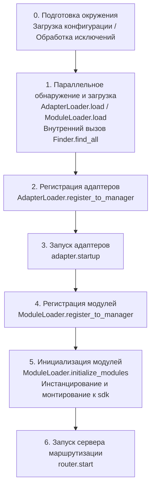

# Процесс запуска и ручное управление

`await sdk.run()` / `await sdk.init()` в ErisPulse инкапсулирует всю цепочку запуска в "одну строку кода". Но когда вам нужно полностью настроить процесс запуска (например, частичная загрузка, динамическая регистрация, горячая замена, внедрение пользовательской стратегии загрузки), необходимо понять, что именно происходит внутри этой цепочки и как вручную управлять каждым шагом.

Эта статья разбивает процесс запуска на независимые этапы, объясняет их обязанности и порядок вызова, а также предоставляет пример полного ручного запуска.

> В этой статье предполагается, что вы уже запускали [первого бота](../getting-started/first-bot.md) и понимаете две режима `sdk.run(keep_running=True/False)`. Здесь мы фокусируемся на разборе цепочки **внутри** `init()`, а также на более низкоуровневых входных точках, таких как `init()`/`init_task()`/`init_sync()`.

## Обзор верхнеуровневых входных точек SDK

Помимо двух режимов `keep_running` для `run()`, SDK предоставляет несколько более низкоуровневых точек инициализации, отличающихся **асинхронностью, возвращаемым значением и обработкой исключений**:

| Вход | Асинхронность | Возвращаемое значение | Обработка исключений | Применимые сценарии |
|------|----------------|----------------------|----------------------|---------------------|
| `await sdk.run(True)` | async, блокирует для поддержания работы | `None` (автоматический `uninit` при закрытии) | Ошибки модулей/адаптеров перехватываются, процесс не падает | Чистое ботовое приложение |
| `await sdk.run(False)` | async, не блокирует | `None` (не卸ажается автоматически) | То же самое | Выполнение пользовательской логики после инициализации |
| `await sdk.init()` | async, требует await | `bool` | **Без обертки**, исключения пробрасываются вверх | Ручное управление жизненным циклом (в паре с `uninit()`) |
| `sdk.init_task()` | async, возвращает Task, не блокирует | `asyncio.Task` | То же, что и у `init()` | Параллельное выполнение другой инициализации или пока цикл событий еще не запущен |
| `sdk.init_sync()` | **Синхронно**, блокирует текущий поток | `bool` | То же, что и у `init()` | Скрипты в командной строке, синхронные входные точки без цикла событий |

> **Распространенное заблуждение**: `await sdk.init()` **не эквивалентно** `await sdk.run(keep_running=False)`. Две разницы: ① `init()` возвращает `bool`, `run()` возвращает `None`; ② `run()` оборачивает процесс инициализации и выполнения с помощью try/except (перехватывает ошибки модулей/адаптеров для предотвращения сбоя), в то время как `init()` не оборачивает, и исключения вылетают напрямую. Когда требуется парное отключение или пользовательская обработка исключений, используйте `init()` + `uninit()`.

## Обзор цепочки запуска

`sdk.init()` (точнее его внутренний `Initializer.init()`) запускает весь фреймворк в следующем порядке:



Соответствующие основные компоненты:

| Уровень | Компонент | Обязанности |
|--------|-----------|-------------|
| Обнаружение | `AdapterFinder` / `ModuleFinder` | Обнаружение адаптеров/модулей из entry-points установленных пакетов |
| Загрузка | `AdapterLoader` / `ModuleLoader` | Обнаружение + импорт + чтение метаданных + определение включен/выключен, возврат списка объектов |
| Регистрация | `*Loader.register_to_manager` | Регистрация объектов в соответствующем менеджере |
| Управление | `sdk.adapter` / `sdk.module` | Поддержка экземпляров адаптеров/модулей, предоставление интерфейсов запуска/остановки |
| Инициализация | `ModuleLoader.initialize_modules` | Создание экземпляров модулей и монтирование к `sdk` (обработка топологической сортировки зависимостей) |
| Маршрутизация | `sdk.router` | HTTP / WebSocket сервер |

> **Важно**: `Finder` и `Loader` — это два слоя. Внутри `Loader` **уже содержится** `Finder` (у `AdapterLoader` есть встроенный `AdapterFinder`, у `ModuleLoader` есть встроенный `ModuleFinder`). В большинстве сценариев вам нужно использовать только `Loader`, отдельное использование `Finder` требуется только тогда, когда требуется "просто перечислить, но не импортировать".

## Подробное описание этапов

### 1. Уровень обнаружения: Finder

Finder отвечает только за "поиск того, какие пакеты предоставляют адаптеры/модули", не импортирует и не создает экземпляры.

```python
from ErisPulse.finders import AdapterFinder, ModuleFinder

adapter_finder = AdapterFinder()
module_finder = ModuleFinder()

# Поиск всех установленных адаптеров/модулей entry-points
adapter_entries = adapter_finder.find_all()    # list[EntryPoint]
module_entries = module_finder.find_all()      # list[EntryPoint]

# Поиск по имени одного
entry = module_finder.find_by_name("MyModule")  # EntryPoint | None
```

Каждый `EntryPoint` может быть загружен с помощью `.load()`, чтобы получить соответствующий класс, но обычно вам не нужно вызывать это вручную — Loader сделает это.

### 2. Уровень загрузки: Loader

Loader поверх Finder выполняет "импорт + чтение метаданных + определение включен/выключен".

```python
from ErisPulse.loaders import AdapterLoader, ModuleLoader
from ErisPulse import sdk

adapter_loader = AdapterLoader()
module_loader = ModuleLoader()

# Внутри load(): вызов finder.find_all() → обработка каждого entry-point → возврат тройки
adapter_objs, enabled_adapters, disabled_adapters = await adapter_loader.load(sdk.adapter)
module_objs, enabled_modules, disabled_modules = await module_loader.load(sdk.module)
```

Возвращаемая тройка `load()`:

| Возвращаемое значение | Значение |
|----------------------|----------|
| `objs` (`dict`) | Имя → Объект (класс адаптера / объект-обертка модуля) |
| `enabled` (`list[str]`) | Имена, которые включены (не отключены в конфигурации) |
| `disabled` (`list[str]`) | Имена, которые отключены |

### 3. Уровень регистрации: register_to_manager

Регистрация объектов, произведенных Loader, в менеджере, чтобы `sdk.adapter` / `sdk.module` могли их распознавать.

```python
# Регистрация адаптера (возвращает bool, показывающий, все ли успешно)
await adapter_loader.register_to_manager(enabled_adapters, adapter_objs, sdk.adapter)

# Регистрация модуля
await module_loader.register_to_manager(enabled_modules, module_objs, sdk.module)
```

После регистрации адаптеры попадают в `sdk.adapter._adapters`, классы модулей — в `sdk.module`, но **все еще не запущены/инстанцированы**.

### 4. Запуск адаптеров

```python
# Запуск всех зарегистрированных адаптеров
await sdk.adapter.startup()
# Или указать платформу
await sdk.adapter.startup("yunhu")
await sdk.adapter.startup(["yunhu", "telegram"])
```

> Регистрация ≠ Запуск. `register_to_manager` только регистрирует; `startup` вызывает метод `start()` адаптера, устанавливая соединение с платформой.

### 5. Инициализация модулей

Модули имеют один дополнительный шаг — им требуется **инстанцирование** и монтирование на `sdk` (так чтобы вы могли вызывать `sdk.MyModule.xxx`). Этот шаг также обрабатывает декларации зависимостей между модулями и топологическую сортировку.

```python
success = await module_loader.initialize_modules(
    enabled_modules, module_objs, sdk.module, sdk
)
```

После успешного инстанцирования модуль появится на `sdk.<ModuleName>`.

### 6. Запуск сервера маршрутизации

```python
await sdk.router.start(
    host="0.0.0.0",
    port=8000,
    ssl_certfile=None,
    ssl_keyfile=None,
)
```

Сервер маршрутизации отвечает за получение Webhook / WebSocket-обратных вызовов от адаптеров. Если его не запустить, адаптеры в режиме server не смогут принимать сообщения.

## Полный пример ручного запуска

Ниже приведенный код **эквивалентен** базовому процессу `await sdk.init()`, но каждый шаг находится под вашим полным контролем, позволяя вставлять пользовательскую логику на любом этапе:

```python
import asyncio
from ErisPulse import sdk
from ErisPulse.loaders import AdapterLoader, ModuleLoader

async def manual_startup():
    # 0. Подготовка окружения (загрузка конфигурации, регистрация глобальной обработки исключений)
    #    _prepare_environment — это предварительный шаг внутри init(); для ручного процесса также нужно вызвать его сначала,
    #    иначе Loader не сможет прочитать конфигурацию и будет ошибочно считать все адаптеры/модули отключенными.
    if not await sdk._prepare_environment():
        print("Ошибка подготовки окружения")
        return False

    # 1. Создание загрузчиков (каждый внутренне содержит свой Finder)
    adapter_loader = AdapterLoader()
    module_loader = ModuleLoader()

    # 2. Параллельное обнаружение и загрузка (как и внутри init() используется gather)
    (adapter_objs, enabled_adapters, disabled_adapters), \
    (module_objs, enabled_modules, disabled_modules) = await asyncio.gather(
        adapter_loader.load(sdk.adapter),
        module_loader.load(sdk.module),
    )

    # 3. Регистрация адаптеров
    await adapter_loader.register_to_manager(
        enabled_adapters, adapter_objs, sdk.adapter
    )

    # 4. Запуск адаптеров
    if enabled_adapters:
        await sdk.adapter.startup()

    # 5. Регистрация модулей
    await module_loader.register_to_manager(
        enabled_modules, module_objs, sdk.module
    )

    # 6. Инициализация модулей (инстанцирование + монтирование к sdk)
    if enabled_modules:
        await module_loader.initialize_modules(
            enabled_modules, module_objs, sdk.module, sdk
        )

    # 7. Запуск сервера маршрутизации
    await sdk.router.start(host="0.0.0.0", port=8000)

    print("Ручной запуск завершен")
    return True

async def main():
    ok = await manual_startup()
    if ok:
        # Блокировка для поддержания работы (в ручном процессе автоматическая блокировка не происходит)
        await asyncio.Event().wait()

if __name__ == "__main__":
    asyncio.run(main())
```

### Когда нужно вручную запускать?

В большинстве случаев **не нужно** выполнять ручной запуск, так как `await sdk.run()` уже делает все перечисленное выше. Ручной запуск имеет смысл только в следующих сценариях:

- **Частичная загрузка**: загрузка только указанных адаптеров/модулей, пропуск других
- **Динамическая регистрация**: регистрация новых адаптеров/модулей во время выполнения на основе условий
- **Пользовательский порядок**: требуется нарушить стандартный порядок загрузки (например, сначала запустить определенный модуль, затем адаптер)
- **Внедрение стратегии**: внедрение пользовательского менеджера строгого режима или стратегии загрузки в Loader
- **Отладка/Диагностика**: ручное управление для локализации проблемы при сбое на определенном этапе

## Детальный контроль на уровне выполнения

Даже если вы используете `sdk.run()` для завершения запуска, вы можете по-прежнему независимо управлять подсистемами во время выполнения, не перезапуская весь SDK:

### Горячая остановка и запуск адаптеров

```python
# Горячий перезапуск адаптера (исправление соединения, без влияния на другие платформы)
await sdk.adapter.shutdown("yunhu")
await sdk.adapter.startup("yunhu")

# Поднимаем новую платформу во время работы
await sdk.adapter.startup("telegram")

# Временное отключение платформы
await sdk.adapter.shutdown("telegram")
```

> `adapter.startup()` требует, чтобы адаптер **был зарегистрирован** в менеджере. Регистрация происходит внутри `init()`/`run()`, поэтому это детальный контроль **после** запуска.

### Сервер маршрутизации

```python
# Временное отключение вебхук-сервера
await sdk.router.stop()

# Перезапуск (например, с изменением порта)
await sdk.router.start(host="0.0.0.0", port=9000)
```

### Загрузка модулей по запросу

```python
# Ручная загрузка модуля (возможно, с отложенной загрузкой)
await sdk.load_module("MyModule")
```

## Процесс отключения

Обратной операцией запуска является `await sdk.uninit()`, он очищает в обратном порядке:

1. Закрытие всех адаптеров (`adapter.shutdown()`)
2. Отключение всех модулей
3. Очистка всех обработчиков событий
4. Очистка менеджеров и свойств модулей на SDK

В сценарии ручного запуска не забудьте вызвать `uninit()` перед выходом для корректного завершения:

```python
try:
    await asyncio.Event().wait()   # Поддержание работы
finally:
    await sdk.uninit()
```

## Перезапуск

SDK предоставляет два способа перезапуска, оба не требуют вашего предварительного отключения — фреймворк сам справляется:

| Способ | Вызов | Поведение | Применимые сценарии |
|--------|-------|-----------|---------------------|
| Горячий перезапуск | `await sdk.restart()` | `uninit()` внутри того же процесса с последующим `init()`, перезагрузка адаптеров/модулей | Перезагрузка конфигурации, горячее обновление модулей |
| Жесткий перезапуск | `await sdk.hard_restart()` | `uninit()` с последующим выходом всего процесса, новый процесс запускается родительским процессом (`epsdk run`) | Подозрение на утечки памяти/ресурсов, требуется полностью чистый перезапуск |

```python
# Горячий перезапуск: перезагрузка в пределах того же процесса (наиболее часто используется)
await sdk.restart()

# Жесткий перезапуск: выход из процесса, требуется запуск через epsdk run для применения
await sdk.hard_restart()
```

> **Два замечания**:
> 1. Оба метода выполняют перезапуск в фоне, **мгновенно возвращая `True`, означающий «задача перезапуска запланирована»**, а не «перезапуск завершен». Фактический перезапуск происходит в фоне, чтобы не прерывать текущую цепочку событий.
> 2. `hard_restart()` **должен быть запущен через `epsdk run main.py`, чтобы сработал**. Его принцип работы: после `uninit` процесс завершается с кодом выхода **42**, родительский процесс `epsdk run` обнаруживает 42 и запускает новый чистый процесс; если запустить напрямую через `python main.py`, процесс завершится с кодом 42 и просто остановится, без автоматического перезапуска.

### Когда следует использовать жесткий перезапуск?

Жесткий перезапуск — это не просто «более радикальный перезапуск», в следующих сценариях он подходит лучше жесткого перезапуска или даже эффективнее:

- **Побочные эффекты динамических библиотек (C-расширения)**: горячий перезапуск происходит в пределах того же процесса, невозможно освободить C-расширения, открытые файловые дескрипторы, потоки и другие ресурсы уровня процесса; жесткий перезапуск использует совершенно новый процесс, полностью обнуляя эти побочные эффекты.
- **Поиск утечек ресурсов**: при подозрении на утечку памяти или дескрипторов жесткий перезапуск дает чистую среду.
- **Частый перезапуск, чувствительный к производительности**: жесткий перезапуск избавляет от накладных расходов на отключение → перезагрузку в рамках одного процесса, фактически он эффективнее горячего перезапуска.

> Функция «Перезапуск фреймворка» в панели управления Dashboard в нижнем слое вызывает именно `hard_restart()`.
> Кроме того, жесткий перезапуск имеет требование! Необходимо использовать команду запуска epsdk run, иначе программа просто выдаст код выхода 42 и завершится, потому что команда run проверяет код выхода 42 для перезапуска процесса. Это необходимо обязательно учитывать!!!

## Связанные документы

- [Создание первого бота](../getting-started/first-bot.md) - введение в две базовые режима `keep_running`
- [Управление жизненным циклом](lifecycle.md) - прослушивание событий запуска, таких как `core.init.start` / `core.init.complete`
- [Система отложенной загрузки](lazy-loading.md) - механизм отложенной загрузки модулей и `load_module`