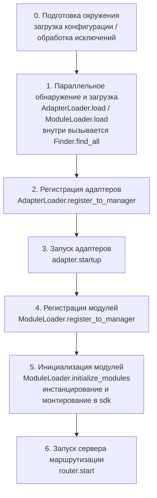

# Процесс запуска и ручное управление

> [!TIP]
> **Когда стоит это читать**: если требуется вручную управлять цепочкой запуска, настраивать порядок запуска или разбираться со сбоями запуска. Если это не нужно — пропустите, на использование остальных функций это не повлияет.


`await sdk.run()` / `await sdk.init()` в ErisPulse упаковывают всю цепочку запуска в «одну строку кода». Но когда требуется полностью настроить процесс запуска (например, частичная загрузка, динамическая регистрация, горячее подключение, внедрение собственной стратегии загрузки), необходимо понимать, что именно происходит внутри этой цепочки и как управлять каждым шагом вручную.

В этой статье цепочка запуска разбирается на отдельные этапы, объясняются их обязанности и порядок вызова, а также приводится пример полного ручного запуска.

> Предполагается, что вы уже прошли руководство [Первый бот](../getting-started/first-bot.md) и знакомы с двумя режимами `sdk.run(keep_running=True/False)`. Статья сосредоточена на разборе цепочки **внутри** `init()`, а также на более низкоуровневых точках входа `init()`/`init_task()`/`init_sync()`.

## Обзор верхнеуровневых точек входа SDK

Помимо двух режимов `keep_running` у `run()`, SDK предоставляет несколько более низкоуровневых точек входа для инициализации. Различия — в **асинхронности, возвращаемом значении и обработке исключений**:

| Точка входа | Асинхронность | Возвращаемое значение | Обработка исключений | Сценарий применения |
|------|--------|--------|----------|----------|
| `await sdk.run(True)` | async, блокирует и поддерживает работу | `None` (автоматический `uninit` при завершении) | Ошибки модулей/адаптеров перехватываются и не роняют процесс | Чисто бот-приложения |
| `await sdk.run(False)` | async, не блокирует | `None` (без автоматической выгрузки) | То же | Выполнение собственной логики после инициализации |
| `await sdk.init()` | async, требует await | `bool` | Внутренне перехватывает исключения компонентов, при сбое возвращает `False` | Ручное управление жизненным циклом (в паре с `uninit()`) |
| `sdk.init_task()` | async, возвращает Task, не блокирует | `asyncio.Task` | Как у `init()` | Параллельное выполнение другой инициализации или когда цикл событий ещё не запущен |
| `sdk.init_sync()` | **синхронно**, блокирует текущий поток | `bool` | Как у `init()` | Скрипты командной строки, синхронные точки входа без цикла событий |

> **Распространённое заблуждение**: `await sdk.init()` **не эквивалентен** `await sdk.run(keep_running=False)`. Два отличия: ① `init()` возвращает `bool` (при сбое — `False`), `run()` возвращает `None`; ② `init()` только выполняет инициализацию и **не выгружает автоматически**, тогда как `run()` автоматически вызывает `uninit()` по завершении цикла событий. Поэтому, когда требуется ручная парная выгрузка или собственный жизненный цикл, используйте `init()` + `uninit()`.

## Обзор цепочки запуска

`sdk.init()` (точнее — его внутренний `Initializer.init()`) поднимает весь фреймворк в следующем порядке:


```mermaid
flowchart TD
    A[0. Подготовка окружения<br/>загрузка конфигурации / обработка исключений] --> B
    B[1. Параллельное обнаружение и загрузка<br/>AdapterLoader.load / ModuleLoader.load<br/>внутри вызывается Finder.find_all] --> C
    C[2. Регистрация адаптеров<br/>AdapterLoader.register_to_manager] --> D
    D[3. Запуск адаптеров<br/>adapter.startup] --> E
    E[4. Регистрация модулей<br/>ModuleLoader.register_to_manager] --> F
    F[5. Инициализация модулей<br/>ModuleLoader.initialize_modules<br/>инстанцирование и монтирование в sdk] --> G
    G[6. Запуск сервера маршрутизации<br/>router.start]
```

Соответствующие ключевые компоненты:

| Уровень | Компонент | Обязанности |
|----|------|------|
| Обнаружение | `AdapterFinder` / `ModuleFinder` | **Обнаружение** адаптеров/модулей в entry-points установленных пакетов |
| Загрузка | `AdapterLoader` / `ModuleLoader` | Обнаружение + импорт + чтение метаданных + определение включён/выключен, возврат списка объектов |
| Регистрация | `*Loader.register_to_manager` | Регистрация объектов в соответствующих менеджерах |
| Управление | `sdk.adapter` / `sdk.module` | Поддержание экземпляров адаптеров/модулей, предоставление интерфейсов запуска/остановки |
| Инициализация | `ModuleLoader.initialize_modules` | Создание экземпляров модулей и их монтирование в `sdk` (с топологической сортировкой зависимостей) |
| Маршрутизация | `sdk.router` | HTTP / WebSocket сервер |

> **Важно**: `Finder` и `Loader` — это два уровня. Внутри `Loader` **уже содержится** `Finder` (`AdapterLoader` включает `AdapterFinder`, `ModuleLoader` — `ModuleFinder`). В подавляющем большинстве случаев достаточно `Loader`; отдельно `Finder` нужен только когда требуется «только перечислить, не импортируя».

## Подробный разбор этапов

### 1. Уровень обнаружения: Finder

Finder отвечает только за «поиск пакетов, предоставляющих адаптеры/модули», без импорта и без инстанцирования.

```python
from ErisPulse.finders import AdapterFinder, ModuleFinder

adapter_finder = AdapterFinder()
module_finder = ModuleFinder()

# Поиск всех установленных entry-points адаптеров/модулей
adapter_entries = adapter_finder.find_all()    # list[EntryPoint]
module_entries = module_finder.find_all()      # list[EntryPoint]

# Поиск одного по имени
entry = module_finder.find_by_name("MyModule")  # EntryPoint | None
```

У каждого `EntryPoint` можно вызвать `.load()` для получения соответствующего класса, но обычно делать это вручную не нужно — это сделает Loader.

### 2. Уровень загрузки: Loader

Loader поверх Finder выполняет «импорт + чтение метаданных + определение включён/выключен».

```python
from ErisPulse.loaders import AdapterLoader, ModuleLoader
from ErisPulse import sdk

adapter_loader = AdapterLoader()
module_loader = ModuleLoader()

# Внутри load(): вызов finder.find_all() → поочерёдная обработка entry-points → возврат кортежа из трёх элементов
adapter_objs, enabled_adapters, disabled_adapters = await adapter_loader.load(sdk.adapter)
module_objs, enabled_modules, disabled_modules = await module_loader.load(sdk.module)
```

Кортеж, возвращаемый `load()`:

| Возвращаемое значение | Значение |
|--------|------|
| `objs` (`dict`) | имя → объект (класс адаптера / объект-обёртка модуля) |
| `enabled` (`list[str]`) | включённые имена (не отключённые в конфигурации) |
| `disabled` (`list[str]`) | отключённые имена |

#### Диагностическая информация при сбое загрузки

Когда модуль/адаптер выбрасывает исключение на этапе загрузки или инициализации, фреймворк пропускает этот компонент и продолжает загрузку остальных, одновременно выводя **сводку кадров пользовательского кода**, чтобы вы могли локализовать место ошибки на уровне INFO по умолчанию, без ручного включения DEBUG:

```
[ERROR] [ModuleLoader] Не удалось загрузить модуль MyModule из entry-point, пропущен: 'NoneType' object has no attribute 'platform'
  → MyModule/Core.py:42 in on_load
      adapter = sdk.platform
  → AttributeError: 'NoneType' object has no attribute 'platform'
  → Подсказка: повысьте уровень журналирования до DEBUG, чтобы увидеть полный стек; проверьте код реализации модуля MyModule
```

Диагностическая информация генерируется модулем `ErisPulse.runtime.diagnostics`, который автоматически отфильтровывает внутренние кадры фреймворка, оставляя только кадры вашего кода. Чтобы переиспользовать это в собственной логике загрузки:

```python
from ErisPulse.runtime import log_diagnostic

try:
    risky_init()
except Exception as e:
    log_diagnostic(e)  # автоматически извлекает кадры пользовательского кода и пишет в журнал ERROR
```

Этот модуль также предоставляет две низкоуровневые функции: `extract_user_frame()` (возвращает структурированную информацию о кадре) и `format_diagnostic_block()` (возвращает многострочный текст).

### 3. Уровень регистрации: register_to_manager

Регистрация объектов, созданных Loader, в менеджерах, чтобы `sdk.adapter` / `sdk.module` могли их распознавать.

```python
# Регистрация адаптеров (возвращает bool — все ли успешно)
await adapter_loader.register_to_manager(enabled_adapters, adapter_objs, sdk.adapter)

# Регистрация модулей
await module_loader.register_to_manager(enabled_modules, module_objs, sdk.module)
```

После регистрации адаптеры внесены в менеджер адаптеров, модули — в менеджер модулей, но **ни те, ни другие ещё не запущены/не инстанцированы**.

### 4. Запуск адаптеров

```python
# Запуск всех зарегистрированных адаптеров
await sdk.adapter.startup()
# или указать платформы
await sdk.adapter.startup("yunhu")
await sdk.adapter.startup(["yunhu", "telegram"])
```

> Регистрация ≠ запуск. `register_to_manager` лишь вносит в список; только `startup` вызывает `start()` адаптера и устанавливает соединение с платформой.

### 5. Инициализация модулей

У модулей на один шаг больше, чем у адаптеров — требуется **инстанцирование** и монтирование в `sdk` (чтобы можно было вызывать `sdk.MyModule.xxx`). На этом шаге также обрабатываются декларации зависимостей между модулями и топологическая сортировка.

```python
success = await module_loader.initialize_modules(
    enabled_modules, module_objs, sdk.module, sdk
)
```

После успешного инстанцирования модуль становится доступен как `sdk.<ModuleName>`.

### 6. Запуск сервера маршрутизации

```python
await sdk.router.start(
    host="0.0.0.0",
    port=8000,
    ssl_certfile=None,
    ssl_keyfile=None,
)
```

Сервер маршрутизации отвечает за приём Webhook / WebSocket колбэков адаптеров. Если его не запустить, адаптеры в режиме server не смогут получать сообщения.

## Полный пример ручного запуска

Следующий код **эквивалентен** основному процессу `await sdk.init()`, но каждый шаг находится в ваших руках — на любом этапе можно вставить собственную логику:

```python
import asyncio
from ErisPulse import sdk
from ErisPulse.loaders import AdapterLoader, ModuleLoader

async def manual_startup():
    # 0. Подготовка окружения (загрузка конфигурации, регистрация глобальной обработки исключений)
    #    _prepare_environment — предварительный шаг внутри init(); при ручном процессе
    #    его тоже нужно вызвать первым, иначе Loader не прочитает конфигурацию
    #    и ошибочно сочтёт все адаптеры/модули отключёнными.
    if not await sdk._prepare_environment():
        print("Не удалось подготовить окружение")
        return False

    # 1. Создание загрузчиков (внутри каждого содержится свой Finder)
    adapter_loader = AdapterLoader()
    module_loader = ModuleLoader()

    # 2. Параллельное обнаружение и загрузка (как внутри init(), через gather)
    (adapter_objs, enabled_adapters, disabled_adapters), \
    (module_objs, enabled_modules, disabled_modules) = await asyncio.gather(
        adapter_loader.load(sdk.adapter),
        module_loader.load(sdk.module),
    )

    # 3. Регистрация адаптеров
    await adapter_loader.register_to_manager(
        enabled_adapters, adapter_objs, sdk.adapter
    )

    # 4. Запуск адаптеров
    if enabled_adapters:
        await sdk.adapter.startup()

    # 5. Регистрация модулей
    await module_loader.register_to_manager(
        enabled_modules, module_objs, sdk.module
    )

    # 6. Инициализация модулей (инстанцирование + монтирование в sdk)
    if enabled_modules:
        await module_loader.initialize_modules(
            enabled_modules, module_objs, sdk.module, sdk
        )

    # 7. Запуск сервера маршрутизации
    await sdk.router.start(host="0.0.0.0", port=8000)

    print("Ручной запуск завершён")
    return True

async def main():
    ok = await manual_startup()
    if ok:
        # Блокируем для поддержания работы (ручной процесс сам по себе не блокирует)
        await asyncio.Event().wait()

if __name__ == "__main__":
    asyncio.run(main())
```

### Когда стоит запускать вручную?

В подавляющем большинстве случаев ручной запуск **не нужен** — `await sdk.run()` уже делает всё перечисленное выше. Ручной запуск оправдан лишь в этих сценариях:

- **Частичная загрузка**: загрузить только указанные адаптеры/модули, пропустив остальные
- **Динамическая регистрация**: регистрация новых адаптеров/модулей во время выполнения по условию
- **Собственный порядок**: изменить порядок загрузки по умолчанию (например, сначала запустить модуль, потом адаптер)
- **Внедрение стратегий**: передать Loader собственный менеджер строгого режима, стратегии загрузки и т.п.
- **Отладка/диагностика**: при сбое на каком-то этапе вручную управлять процессом для локализации проблемы

## Тонкое управление во время выполнения

Даже если запуск выполнен через `sdk.run()`, во время работы можно управлять отдельными подсистемами независимо, не перезапуская весь SDK:

### Горячий запуск/остановка адаптеров

```python
# Горячий перезапуск адаптера (восстановление соединения без влияния на другие платформы)
await sdk.adapter.shutdown("yunhu")
await sdk.adapter.startup("yunhu")

# Подъём новой платформы во время работы
await sdk.adapter.startup("telegram")

# Временный вывод платформы из строя
await sdk.adapter.shutdown("telegram")
```

> `adapter.startup()` требует, чтобы адаптер был **зарегистрирован** в менеджере. Регистрация происходит внутри `init()`/`run()`, поэтому это тонкое управление **после** запуска.

### Сервер маршрутизации

```python
# Временная остановка webhook-сервера
await sdk.router.stop()

# Перезапуск (например, на другом порту)
await sdk.router.start(host="0.0.0.0", port=9000)
```

### Загрузка модулей по требованию

```python
# Ручная загрузка (возможно ленивого) модуля
await sdk.load_module("MyModule")
```

## Корректное завершение работы

Начиная с 2.7.0, `sdk.shutdown()` предоставляет **программное корректное завершение**: устанавливается событие завершения, из-за которого главный цикл, приостановленный в `await sdk.run(keep_running=True)`, возвращается, что запускает `uninit()` для очистки ресурсов.

```python
# Вызов из любой корутины запускает корректный выход (run() возвращается из ожидания и автоматически выполняет uninit)
sdk.shutdown()
```

Типичное применение:

```python
async def shutdown_after_idle():
    await asyncio.sleep(3600)
    sdk.shutdown()  # корректный выход после 1 часа простоя
```

**Обработка сигналов**: внутри `run()` регистрируются обработчики `SIGTERM` / `SIGHUP`, преобразующие системные сигналы в корректное завершение — при остановке через оркестратор контейнеров (Docker `docker stop`) или `systemd` процесс полностью проходит очистку `uninit()` вместо принудительного завершения.

- Windows не поддерживает `loop.add_signal_handler`, обработчики сигналов автоматически пропускаются (закрытие всё равно можно вызвать через `sdk.shutdown()` или Ctrl+C)
- Повторные вызовы `sdk.shutdown()` безопасны (после установки события повторный вызов — no-op)

## Процесс выгрузки

Операция, обратная запуску, — `await sdk.uninit()`, выполняющая очистку в обратном порядке:

1. Закрытие всех адаптеров (`adapter.shutdown()`)
2. Выгрузка всех модулей
3. Очистка всех обработчиков событий
4. Очистка менеджеров и атрибутов модулей на SDK

В сценарии ручного запуска не забудьте вызвать `uninit()` перед выходом, чтобы гарантировать корректное завершение:

```python
try:
    await asyncio.Event().wait()   # поддержание работы
finally:
    await sdk.uninit()
```

## Перезапуск

SDK предоставляет два способа перезапуска, и ни один не требует предварительной ручной выгрузки — фреймворк сам всё обработает:

| Способ | Вызов | Поведение | Сценарий применения |
|------|------|------|----------|
| Горячий перезапуск | `await sdk.restart()` | **Горячая перезагрузка кода на уровне компонентов** в том же процессе: все модули проходят единую линию перезагрузки (общая предпроверка синтаксиса / откат по снапшоту / проверка идентичности), адаптеры сначала **заново обнаруживают entry-points** (новоустановленные/удалённые во время работы адаптеры вступают в силу немедленно), затем поочерёдно перезагружаются на уровне кода | Вступление кода в силу после pip-обновления или установки компонентов, горячее обновление модулей |
| Жёсткий перезапуск | `await sdk.hard_restart()` | После `uninit()` процесс завершается с **кодом выхода 42**, новый процесс поднимает внешний супервизор | Обновление самого фреймворка (обновлённый код фреймворка действует только в новом процессе), побочные эффекты C-расширений, подозрение на утечку ресурсов |

```python
# Горячий перезапуск: горячая перезагрузка кода на уровне компонентов (самый частый случай; поднимаются и адаптеры, только что установленные через pip)
await sdk.restart()

# Жёсткий перезапуск: выход из процесса, перезапуск делегируется внешнему супервизору (см. «Руководство по супервизорам» ниже)
await sdk.hard_restart("sdk self-update")  # необязательный reason для отображения супервизором
```

> **Два замечания**:
> 1. Оба метода выполняют перезапуск в фоновой задаче и **сразу возвращают `True`, означающее «задача перезапуска запланирована»**, а не «перезапуск завершён». Фактический перезапуск идёт в фоне, чтобы не прерывать текущую цепочку событий.
> 2. Принцип работы `hard_restart()`: после выгрузки и записи конфигурации на диск процесс завершается с **кодом выхода 42** (`HARD_RESTART_EXIT_CODE`) — **сам он новый процесс не поднимает**, это обязан сделать внешний супервизор, обнаружив код выхода 42. Если запускать напрямую `python main.py` без какого-либо супервизора, процесс завершится с кодом 42 и на этом закончится — **автоматический перезапуск не произойдёт** (фреймворк выдаст предупреждение).

> **Взаимоисключение и объединение горячего перезапуска** (с 2.11.1): все операции горячего перезагрузки (перезагрузка одного модуля / полная перезагрузка / перезагрузка адаптера / гибернация) полностью взаимоисключающие — при «шторме сохранений» последовательные срабатывания не выполняются параллельно и не пересекаются; идущий restart при получении нового запроса автоматически объединяет их, и после завершения выполняется не более одного дополнительного прохода. При сохранении файла с синтаксической ошибкой весь цикл перезагрузки будет отклонён **сводной предпроверкой синтаксиса** ещё до выгрузки (за один раз перечисляются все ошибочные файлы и номера строк), все старые экземпляры продолжают работать.

### Когда использовать жёсткий перезапуск?

Горячий перезапуск покрывает подавляющее большинство сценариев (pip-обновление/установка компонентов, горячее обновление кода модулей, **включая адаптеры, установленные во время работы**). Жёсткий перезапуск нужен лишь в следующих случаях:

- **Обновление самого фреймворка**: после обновления ErisPulse новый код фреймворка вступит в силу только в совершенно новом процессе (Python не будет заново импортировать уже загруженный код фреймворка).
- **Побочные эффекты бинарных библиотек (C-расширений)**: горячий перезапуск происходит в том же процессе и не может освободить ресурсы уровня процесса — C-расширения, открытые файловые дескрипторы, потоки и т.д.; жёсткий перезапуск запускает совершенно новый процесс, и эти побочные эффекты полностью обнуляются.
- **Поиск утечек ресурсов**: при подозрении на утечку памяти или дескрипторов жёсткий перезапуск даёт чистое окружение.

> Функция «Перезапуск фреймворка» в панели управления Dashboard в своей основе вызывает именно `hard_restart()`.

### Контракт кода выхода 42

Жёсткий перезапуск — это межпроцессное взаимодействие: **SDK отвечает за выход (код 42), супервизор — за подъём**.

| Роль | Поведение |
|------|------|
| SDK (при жёстком перезапуске) | `uninit()` → запись конфигурации на диск → запись маркера жёсткого перезапуска (причина / PID для отображения супервизором) → `os._exit(42)` |
| Супервизор | Обнаруживает код выхода 42 у дочернего процесса → показывает причину жёсткого перезапуска → заново запускает ту же команду |

> `sdk.is_supervised()` позволяет узнать, запущен ли текущий процесс супервизором (проверяет переменную окружения `ERISPULSE_SUPERVISED`). CLI-команда `run` при запуске дочернего процесса автоматически внедряет этот маркер; внешние супервизоры вроде systemd / Docker его не внедряют, поэтому `is_supervised()` возвращает `False`, и после жёсткого перезапуска фреймворк выдаст предупреждение «супервизор не обнаружен».

### Руководство по супервизорам

Выберите подходящий вам супервизор, чтобы жёсткий перезапуск действительно срабатывал:

#### 1. CLI-команда run (разработка/простое развёртывание, рекомендуется)

`epsdk run main.py` имеет встроенный цикл супервизии: отслеживает код выхода дочернего процесса, при 42 немедленно перезапускает (и показывает причину жёсткого перезапуска); прочие аномальные коды выхода автоматически повторяет с экспоненциальной задержкой (backoff); `Ctrl+C` сначала корректно завершает дочерний процесс (код 0 считается нормальным выходом, повторный запуск не производится).

```bash
epsdk run main.py
```

`epsdk run --reload` (режим горячей перезагрузки для разработки, с 2.11.1) использует ту же структуру «процесс-супервизор + дочерний worker-процесс перезагрузки»: сохранение `.py`-файла внутри worker запускает **горячую перезагрузку на уровне компонентов** (без перезапуска всего фреймворка); жёсткий перезапуск выполняет супервизор, поднимающий совершенно новый worker, — после обновления фреймворка новый код вступает в силу немедленно.

#### 2. systemd (Linux-серверы)

`RestartForceExitStatus=42` заставляет код выхода 42 тоже запускать перезапуск (по умолчанию `on-failure` срабатывает только для ненулевых кодов):

```ini
[Service]
ExecStart=/usr/bin/python3 /opt/mybot/main.py
Restart=on-failure
RestartForceExitStatus=42
RestartSec=2
User=mybot
```

#### 3. Docker / docker-compose

PID 1 внутри контейнера — это процесс приложения; после кода выхода 42 контейнер завершается — используйте стратегию `restart` для автоматического перезапуска:

```yaml
services:
  bot:
    build: .
    restart: unless-stopped   # перезапуск при любом выходе (включая 42)
```

#### 4. PM2 (эксплуатация в Node-экосистеме)

```bash
pm2 start main.py --name mybot --interpreter python3
# 42 считается кодом выхода, PM2 по умолчанию перезапускает; установите restart_delay для защиты от дребезга
pm2 set mybot.restart_delay 2000
```

#### 5. supervisord

```ini
[program:mybot]
command=python3 /opt/mybot/main.py
autorestart=true
exitcodes=0,2,42    # 42 также считается «нормальным выходом, требующим перезапуска»
```

#### 6. Собственный супервизор на чистом Python

```python
import subprocess, sys, time

while True:
    p = subprocess.Popen([sys.executable, "main.py"])
    code = p.wait()
    if code == 42:          # запрос жёсткого перезапуска
        time.sleep(0.5)
        continue
    if code == 0:           # нормальный выход
        break
    time.sleep(3)           # аномальный выход, повтор с задержкой
```

> **Поведение без супервизора**: при запуске напрямую `python main.py` после вызова `hard_restart()` процесс завершится с кодом 42 и не перезапустится. В этом случае следует подключить любой из перечисленных выше супервизоров.

## Связанная документация

- [Создание первого бота](../getting-started/first-bot.md) — введение в два базовых режима `keep_running`
- [Управление жизненным циклом](lifecycle.md) — прослушивание событий запуска `core.init.start` / `core.init.complete` и др.
- [Система ленивой загрузки](lazy-loading.md) — механизм ленивой загрузки модулей и `load_module`