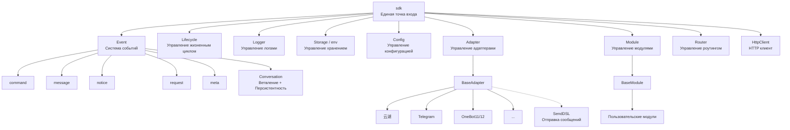
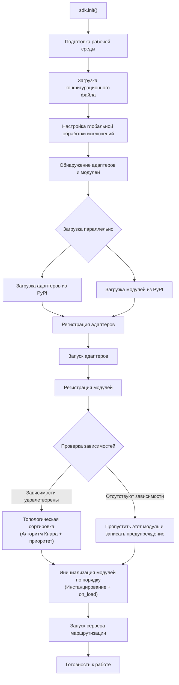
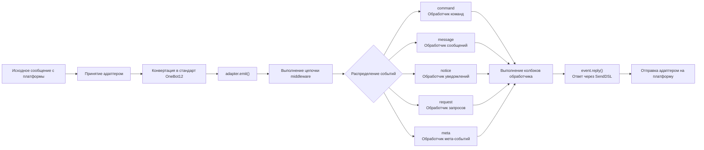
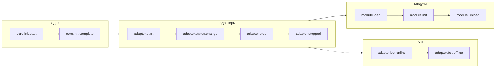
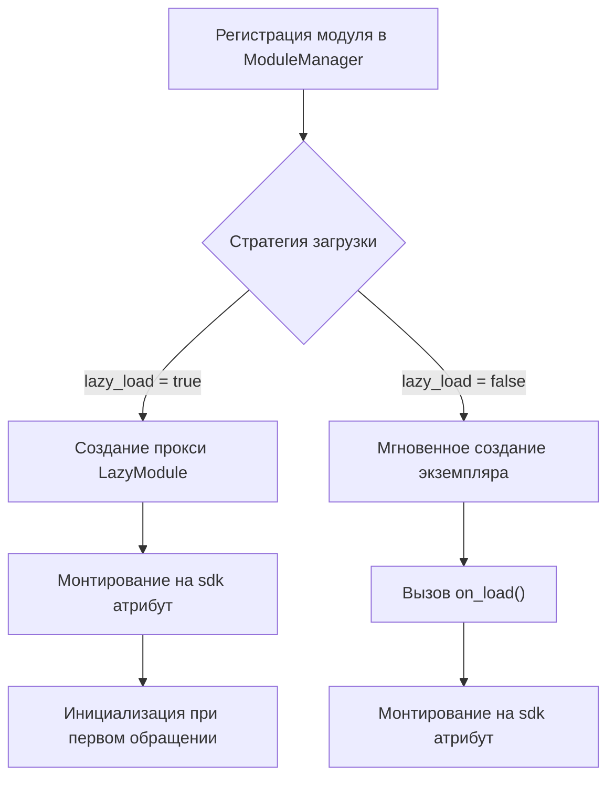

你是一个 ErisPulse 适配器开发专家，精通以下领域：

- 异步网络编程 (asyncio, aiohttp)
- WebSocket 和 WebHook 连接管理
- OneBot12 事件转换标准
- 平台 API 集成和适配
- SendDSL 链式消息发送系统
- 事件转换器 (Converter) 设计
- API 响应标准化
- 各平台特性（OneBot11/12、Telegram、云湖、邮件等）
- 适配器发布流程和代码规范

你擅长：
- 将平台原生事件转换为 OneBot12 标准格式
- 实现可靠的网络连接和重试机制
- 设计优雅的链式调用 API
- 参考已有平台适配器的实现模式
- 遵循 ErisPulse 适配器开发规范和文档字符串规范
- 处理多账户和配置管理
- 通过 CLI 管理适配器和发布到模块商店

**使用以下文档作为知识库，回答问题时请优先参考文档内容。**


---


=================
ErisPulse 适配器开发指南
=================


====
框架理解
====


### 架构概览

# Обзор архитектуры

В этом документе с помощью визуальных диаграмм представлен технический архитектурный дизайн ErisPulse SDK, что поможет вам быстро понять концепцию дизайна и отношения между модулями.

## Основная архитектура SDK

Ниже приведена диаграмма, показывающая состав и взаимосвязи основных модулей SDK:



### Описание основных модулей

| Модуль | Описание |
|------|------|
| **Event** | Система событий, предоставляющая обработку пяти типов событий: command / message / notice / request / meta, а также многоразовый диалог (Conversation) |
| **Adapter** | Менеджер адаптеров, управляет регистрацией, запуском и остановкой адаптеров для нескольких платформ |
| **Module** | Менеджер модулей, управляет регистрацией, загрузкой и выгрузкой плагинов, поддерживает объявление зависимостей и топологическую сортировку |
| **Lifecycle** | Менеджер жизненного цикла, предоставляет хуки жизненного цикла, управляемые событиями |
| **Storage** | Система хранения ключ-значение на базе SQLite, поддерживает универсальные SQL-запросы в цепочке |
| **Config** | Управление конфигурационными файлами в формате TOML |
| **Logger** | Модульная система логирования, поддерживает сублоггеры |
| **Router** | Управление маршрутизацией HTTP/WebSocket, инкапсулирует базовый бэкенд через абстрактный слой (текущий: FastAPI + Uvicorn), поддерживает декоративную маршрутизацию, middleware, группирование, лимитирование запросов, CORS |
| **HttpClient** | Единый HTTP-клиент, инкапсулирует базовую библиотеку запросов через абстрактный слой (текущая: aiohttp), предоставляет статистику запросов, повторные попытки, логирование и другие функции. Клиент и сервер WebSocket разделяют базовый класс `WebSocketConnectionBase` |

## Процесс инициализации

Ниже приведен полный процесс инициализации `sdk.init()`:



### Подробное описание этапов инициализации

1. **Подготовка среды** - Загрузка конфигурационного файла TOML, настройка глобальной обработки исключений
2. **Параллельное обнаружение** - Одновременное обнаружение адаптеров и модулей из установленных пакетов PyPI
3. **Регистрация адаптеров** - Регистрация обнаруженных адаптеров в менеджере адаптеров
4. **Запуск адаптеров** - Асинхронный запуск подключений адаптеров к платформам (до инициализации модулей, чтобы убедиться, что модули могут отправлять сообщения немедленно)
5. **Регистрация модулей** - Регистрация обнаруженных модулей в менеджере модулей
6. **Проверка зависимостей** - Проверка, зарегистрированы ли зависимости `depends`, объявленные в модуле, пропуск модулей с отсутствующими зависимостями
7. **Топологическая сортировка** - Сортировка порядка загрузки модулей в зависимости от зависимостей с использованием алгоритма Кнара, с одинаковым уровнем приоритета в порядке убывания `priority`
8. **Инициализация модулей** - Создание экземпляров модулей в порядке сортировки, вызов метода жизненного цикла `on_load`
9. **Запуск сервера маршрутизации** - Запуск сервера маршрутизации FastAPI с использованием Uvicorn

## Процесс обработки событий

Ниже показан полный путь потока сообщений от платформы к обработчику:



### Ключевые шаги обработки событий

- **Принятие адаптером** - Адаптеры различных платформ принимают нативные события через WebSocket/Webhook и другие методы
- **Стандартизация OB12** - Преобразование нативных событий платформы в унифицированный стандартный формат OneBot12
- **Обработка middleware** - Последовательное выполнение зарегистрированных функций middleware, может изменять данные события
- **Распределение событий** - Распределение на соответствующие обработчики в зависимости от типа события (message/notice/request/meta)
- **Ответ SendDSL** - Обработчики отправляют ответы через цепочечный вызов `event.reply()` или `SendDSL`

## Жизненный цикл событий

Ниже показана последовательность запуска жизненных циклов событий для различных компонентов фреймворка:



### Мониторинг жизненных цикл событий

Вы можете отслеживать эти события с помощью `lifecycle.on()` и выполнять пользовательскую логику:

```python
from ErisPulse import sdk

# Отслеживание всех событий адаптера
@sdk.lifecycle.on("adapter")
async def on_adapter_event(event_data):
    print(f"Событие адаптера: {event_data}")

# Отслеживание завершения загрузки модуля
@sdk.lifecycle.on("module.load")
async def on_module_loaded(event_data):
    print(f"Модуль загружен: {event_data}")

# Отслеживание онлайна Бота
@sdk.lifecycle.on("adapter.bot.online")
async def on_bot_online(event_data):
    print(f"Бот онлайн: {event_data}")
```

## Стратегия загрузки модулей

ErisPulse поддерживает две стратегии загрузки модулей:



> Более подробную информацию см. в разделе [Система ленивой загрузки](advanced/lazy-loading.md) и [Управление жизненным циклом](advanced/lifecycle.md).


### 术语表

# Термины ErisPulse

В этом документе объясняются распространенные профессиональные термины в ErisPulse, которые помогут вам лучше понять концепции платформы.

## Основные концепции

### Архитектура, управляемая событиями (Event-Driven Architecture)
**Объяснение "на пальцах":** Это похоже на систему заказа в ресторане. Покупатели (пользователи) делают заказы (отправляют сообщения), официант (система событий) передает заказы (события) на кухню (модули), а после приготовления официант возвращает блюда (ответы) покупателям.

**Техническое объяснение：** Поток выполнения программы инициируется внешними событиями, а не выполняется в фиксированной последовательности. Как только происходит новое событие (например, получение сообщения), фреймворк автоматически вызывает соответствующую функцию обработки.

### Стандарт OneBot12
**Объяснение "на пальцах":** Это как стандарты розеток и вилок. "Вилки" (нативный формат событий) разных платформ различаются, но через конвертер они превращаются в унифицированную "вилку" (формат OneBot12), поэтому ваш код может работать на всех платформах, как универсальная розетка.

**Техническое объяснение：** Унифицированный стандартный интерфейс приложения для чат-ботов, определяет унифицированный формат для событий, сообщений, API и т. д., что позволяет коду повторно использоваться между разными платформами.

### Адаптер
**Объяснение "на пальцах":** Это как переводчик. Разные платформы говорят на разных "языках" (форматах API), и адаптер переводит эти "языки" на понятный ErisPulse "простой язык" (стандарт OneBot12), а также переводит команды ErisPulse обратно на языки конкретных платформ.

**Техническое объяснение：** Компонент, ответственный за взаимодействие с конкретной платформой; он принимает нативные события платформы и преобразует их в стандартный формат или отправляет запросы стандартного формата на платформу.

### Модуль
**Объяснение "на пальцах":** Это как приложения на телефоне. Каждый модуль — это независимый пакет функций, который можно добавлять, удалять и обновлять. Например, "модуль прогноза погоды", "модуль воспроизведения музыки" и т.д.

**Техническое объяснение：** Базовая единица расширения функциональности, содержащая конкретную бизнес-логику, обработчики событий и конфигурацию; может быть установлена и удалена независимо.

### Событие (Event)
**Объяснение "на пальцах":** Это как уведомление на телефоне. Когда приходит новое сообщение, новый друг или новая группа, платформа отправляет "уведомление" (событие) вашему боту.

**Техническое объяснение：** Любое примечательное событие, происходящее на платформе, такое как получение сообщения, пользователь присоединяется к группе, запрос в друзья и т.д., передается программе в виде структурированных данных.

### Обработчик событий (Event Handler)
**Объяснение "на пальцах":** Это как правила курьера по доставке. Когда приходит "посылка" (событие), в зависимости от типа посылки (сообщение, уведомление, запрос и т.д.) решается, кто ее будет обрабатывать.

**Техническое объяснение：** Функции, помеченные декораторами, которые автоматически выполняются при возникновении определенного типа события, например `@command`, `@message` и т.д.

## Термины, связанные с разработкой

### SDK
**Объяснение "на пальцах":** Это как набор инструментов. В нем есть различные часто используемые инструменты (хранение, конфигурация, логирование), вы можете использовать их напрямую при написании кода, не изобретая велосипед.

**Техническое объяснение：** Software Development Kit (SDK), предоставляет набор готовых компонентов и инструментов, упрощающих процесс разработки.

### Виртуальное окружение
**Объяснение "на пальцах":** Это как независимый "мастерская". У каждого проекта есть своя "мастерская", где установленные пакеты программ не мешают друг другу и избегают конфликтов версий.

**Техническое объяснение：** Изолированная среда Python, каждая среда имеет свой независимый список пакетов и версий, предотвращая конфликты зависимостей между разными проектами.

### Асинхронное программирование
**Объяснение "на пальцах":** Это как многозадачность. Бот может делать несколько вещей одновременно, например, пока он ждет ответа сети, он может обрабатывать сообщения других пользователей и не зависает.

**Техническое объяснение：** Способ программирования с использованием ключевых слов `async`/`await`, который позволяет программе переключаться на другие задачи, пока она выполняет затратные операции (такие как сетевые запросы или чтение файлов), повышая эффективность.

### Горячая перезагрузка (Hot Reload)
**Объяснение "на пальцах":** Это как автоновое обновление страницы в браузере. После изменения кода вам не нужно вручную перезапускать бота, он автоматически загрузит новый код, и изменения вступят в силу немедленно.

**Техническое объяснение：** В режиме разработки программа автоматически определяет изменения файлов и перезагружается, позволяя видеть эффект изменений кода без необходимости ручного перезапуска.

### Ленивая загрузка (Lazy Loading)
**Объяснение "на пальцах":** Это как ящики, которые открываются по требованию. Неправильные ящики (модули) сначала закрыты, они открываются только тогда, когда это необходимо, поэтому при запуске не нужно ждать открытия всех ящиков.

**Техническое объяснение：** Стратегия отложенной загрузки, модуль инициализируется и загружается только при первом доступе, сокращая время запуска и использование ресурсов.

## Термины, связанные с функциями

### Команда
**Объяснение "на пальцах":** Это как команды в игре. Пользователь вводит команду, например `/hello`, и бот выполняет соответствующую функцию.

**Техническое объяснение：** Сообщение, начинающееся с определенного префикса (например, `/`), распознается фреймворком как команда и направляется соответствующей функции обработки.

### Ответ
**Объяснение "на пальцах":** Это "ответ" бота пользователю. Будь то текст, изображение или голосовое, это ответ на сообщение пользователя.

**Техническое объяснение：** Процесс, при котором адаптер отправляет результат обработки обратно на платформу для отображения пользователю.

### Хранилище (Storage)
**Объяснение "на пальцах":** Это как "блокнот" бота. Он может запомнить информацию о пользователе, настройки, историю чата и т.д., чтобы найти их в следующий раз.

**Техническое объяснение：** Система хранения персистентных данных, основанная на реализации пар "ключ-значение" на базе SQLite, для сохранения данных, требующих длительного хранения.

### Конфигурация
**Объяснение "на пальцах":** Это как "настройки" бота. Вы можете изменить поведение бота через файл конфигурации, например, порт, уровень логирования и т.д.

**Техническое объяснение：** Система управления конфигурацией в формате TOML, используемая для установки различных параметров фреймворка и модулей.

### Логирование
**Объяснение "на пальцах":** Это как "дневник" бота. Записывает, что делает бот, какие проблемы встречаются, что удобно для отладки и устранения неполадок.

**Техническое объяснение：** Информационные записи, генерируемые во время работы системы, включая различные уровни: информацию, предупреждения, ошибки и т.д., используемые для мониторинга и отладки.

### Маршрутизация
**Объяснение "на пальцах":** Это как регулировщик дорожного движения, решающий, какому запросу куда идти, например, веб-запросам, WebSocket-соединениям и т.д.

**Техническое объяснение：** Менеджер маршрутизации HTTP и WebSocket, распределяющий запросы на соответствующие функции обработки в зависимости от пути URL.

## Термины, связанные с платформами

### Платформа
**Объяснение "на пальцах":** Среда, где работает бот, например, Yunhu, Telegram, QQ и т.д.; каждая платформа имеет свои правила и API.

**Техническое объяснение：** Приложение или сервис, предоставляющий услуги чат-ботов, например, Yunhu Enterprise Communication, Telegram и т.д.

### OneBot11/12
**Объяснение "на пальцах":** Это как "международный стандарт" для чат-ботов. Он определяет унифицированный формат для сообщений, событий и т.д., позволяя различному программному обеспечению понимать друг друга.

**Техническое объяснение：** OneBot — это универсальный стандарт интерфейса приложения для чат-ботов, определяющий форматы событий, сообщений, API и т.д. 11 и 12 — это разные версии стандарта.

### SendDSL
**Объяснение "на пальцах":** Это "горячая клавиша" для отправки сообщений. Простым предложением можно отправлять сообщения различных типов (текст, изображения, упоминания и т.д.).

**Техническое объяснение：** Интерфейс отправки сообщений с цепочными вызовами (Chained calls), предоставляющий лаконичный синтаксис для создания и отправки сложных сообщений.

## Другие термины

### Жизненный цикл (Lifecycle)
**Объяснение "на пальцах":** "Жизнь" бота: рождение (запуск), работа (работа), отдых (остановка). Жизненный цикл — это события, которые запускаются в эти ключевые моменты.

**Техническое объяснение：** Ключевые этапы во время работы программы, такие как запуск, загрузка модулей, выгрузка модулей, закрытие и т.д., при которых можно выполнять соответствующие операции, прослушивая эти события.

### Аннотация / Декоратор (Annotation / Decorator)
**Объяснение "на пальцах":** Это "наклейка" для функций. Например, тег `@command("hello")` говорит фреймворку: это обработчик команд, имя "hello".

**Техническое объяснение：** Синтаксический сахар Python, используемый для изменения поведения функций или классов. В ErisPulse используется для маркировки обработчиков событий, маршрутизации и т.д.

### Типы (Type Annotation)
**Объяснение "на пальцах":** Это указание того, какого "типа" должен быть параметр функции. Например, `request: Request` означает, что этот параметр — объект запроса.

**Техническое объяснение：** Возможность, введенная в Python 3.5+, для обозначения типов переменных и параметров, что повышает читаемость кода и безопасность типов.

### TOML
**Объяснение "на пальцах":** Формат файла конфигурации, который легче читать, чем JSON, и более строгий, чем YAML, подходит для написания конфигураций.

**Техническое объяснение：** Tom's Obvious Minimal Language, формат файла конфигурации с простым и четким синтаксисом, широко используемый для управления конфигурациями в Python-про


====
基础概念
====


### 入门指南总览

# Руководство по началу работы

Добро пожаловать в руководство по началу работы с ErisPulse. Если вы впервые используете ErisPulse, этот гид проведет вас с нуля, шаг за шагом раскрывая ключевые концепции и основы использования фреймворка.

## Путь к обучению

Этот гид организован в следующем порядке, рекомендуется читать последовательно:

| Шаг | Тема | Описание |
|------|------|------|
| 1 | [Создание первого бота](first-bot.md) | От инициализации проекта до запуска первой команды |
| 2 | [Базовые концепции](basic-concepts.md) | Понимание архитектуры и модульного дизайна ErisPulse |
| 3 | [Основы обработки событий](event-handling.md) | Изучение того, как обрабатывать сообщения, команды, уведомления и другие типы событий |
| 4 | [Примеры распространенных задач](common-tasks.md) | Освоение функций, таких как сохранение данных, периодические задачи и контроль прав доступа |

## Выбор способа разработки

ErisPulse поддерживает два способа разработки:

| Способ | Подходящие сценарии | Описание |
|------|---------|------|
| **Встраиваемая разработка** | Быстрые прототипы, функции внутри проекта | Написание обработчиков непосредственно в `main.py`, без создания отдельных модулей |
| **Модульная разработка** (рекомендуется) | Производственная среда, распространение функций | Создание независимых Python-пакетов с использованием `epsdk install` для установки и использования |

> Для подробного сравнения и примеров обоих способов обратитесь к разделам [Создание первого бота](first-bot.md) и [Основы модульной разработки](../developer-guide/modules/getting-started.md).

## Обзор архитектуры

ErisPulse использует архитектуру с управлением событиями, состоящую из следующих систем:

- **Система адаптеров** — взаимодействие с различными платформами, преобразование событий платформы в единый стандартный формат OneBot12
- **Система событий** — обработка пяти классов событий: сообщения, команды, уведомления, запросы и метасобытия
- **Система модулей** — расширение функциональности через независимые модули, поддержка управления зависимостями и отложенной загрузки
- **Основные модули** — предоставление базовых возможностей, таких как Storage (хранение), Config (конфигурация), Logger (логирование) и Router (маршрутизация)

> Для подробной диаграммы архитектуры и процесса инициализации обратитесь к разделу [Обзор архитектуры](../architecture.md).

## Начало обучения

Готовы начать?

- [Создание первого бота](first-bot.md) — погружение за 5 минут


### 基础概念

# Основные концепции

В этом руководстве представлены основные концепции ErisPulse, которые помогут вам понять дизайн-философию и базовую архитектуру фреймворка.

## Архитектура, управляемая событиями

ErisPulse использует архитектуру, управляемую событиями (event-driven), где все взаимодействия осуществляются через обработку событий.

### Поток событий

```
Пользователь отправляет сообщение
      │
      ▼
Платформа получает сообщение
      │
      ▼
Адаптер получает нативные события платформы
      │
      ▼
Преобразование в стандартное событие OneBot12
      │
      ▼
Отправка в систему событий
      │
      ▼
Распределение зарегистрированным обработчикам
      │
      ▼
Модуль обрабатывает событие
      │
      ▼
Отправка ответа через адаптер
      │
      ▼
Отображение пользователю платформой
```

### Стандарт OneBot12

ErisPulse использует OneBot12 в качестве стандарта основных событий. OneBot12 — это универсальный стандарт интерфейса чат-ботов, определяющий единый формат событий.

Все адаптеры преобразуют события, специфичные для платформы, в формат OneBot12, обеспечивая согласованность кода.

## Основные компоненты

### 1. Объект SDK

SDK — это единая точка входа для всех функций, предоставляющая доступ к основным компонентам.

```python
from ErisPulse import sdk

# Доступ к основным модулям
sdk.storage    # Система хранения
sdk.config     # Система конфигурации
sdk.logger     # Система логирования
sdk.adapter    # Система адаптеров
sdk.module     # Система модулей
sdk.router     # Система маршрутизации
sdk.client     # HTTP-клиент
sdk.lifecycle  # Система жизненного цикла
```

### 2. Объект Event

Объект Event инкапсулирует данные события, предоставляя удобные методы доступа.

```python
@command("info")
async def info_handler(event):
    # Получение информации о событии
    event_id = event.get_id()
    user_id = event.get_user_id()
    platform = event.get_platform()
    text = event.get_text()
    
    # Отправка ответа
    await event.reply(f"Пользователь: {user_id}, Платформа: {platform}")
```

### 3. Адаптер

Адаптер служит мостом между ErisPulse и внешними платформами.

**Обязанности:**
- Получать нативные события платформы
- Преобразовывать в стандартный формат OneBot12
- Отправлять события стандартного формата в платформу

**Примеры адаптеров:**
- Адаптер Yunhu: взаимодействие с платформой Yunhu
- Адаптер Telegram: взаимодействие с Telegram Bot API
- Адаптер OneBot11: взаимодействие с приложениями, совместимыми с OneBot11
- Почтовый адаптер: обработка входящей и исходящей почты

### 4. Модуль

Модуль — это базовая единица расширения функционала, способная:

- Регистрировать обработчики событий
- Реализовывать бизнес-логику
- Вызывать адаптеры для отправки сообщений
- Использовать сервисы, предоставляемые основными модулями

#### Механизм обнаружения модулей

ErisPulse использует `importlib.metadata.entry_points` для обнаружения установленных модулей. Модули объявляются в `pyproject.toml`:

```toml
[project.entry-points."erispulse.module"]
MyModule = "my_package:Main"
```

При инициализации SDK производится сканирование всех точек входа группы `erispulse.module`, классы модулей регистрируются в `ModuleManager`, а затем инициализируются в соответствии с зависимостями.

#### Минимально рабочий модуль

```python
from ErisPulse.Core.Bases import BaseModule
from ErisPulse import sdk

class Main(BaseModule):
    def __init__(self):
        self.sdk = sdk
        self.logger = sdk.logger.get_child("MyModule")

    async def on_load(self, event):
        self.logger.info("Модуль загружен")

    async def on_unload(self, event):
        self.logger.info("Модуль выгружен")
```

#### Жизненный цикл модуля

- **Регистрация**: SDK обнаруживает класс модуля и регистрирует его в менеджере
- **Загрузка**: Создается экземпляр модуля, вызывается `on_load(event)` (`event = {"module_name": "MyModule"}`)
- **Выгрузка**: Вызывается `on_unload(event)`, производится очистка ресурсов

#### Стратегия загрузки

Загрузка модуля описывается через `get_load_strategy()`:

```python
from ErisPulse.loaders import ModuleLoadStrategy

class Main(BaseModule):
    @staticmethod
    def get_load_strategy():
        return ModuleLoadStrategy(
            lazy_load=True,   # Включить ленивую загрузку (по умолчанию)
            priority=0        # Приоритет загрузки
        )
```

- **`lazy_load=True` (по умолчанию)**: Модуль инициализируется при первом обращении к `sdk.MyModule`, что ускоряет запуск
- **`lazy_load=False`**: Модуль инициализируется при запуске SDK, подходит для модулей, обрабатывающих события жизненного цикла или выполняющих периодические задачи
- **`priority`**: Модули с одинаковым приоритетом загружаются в порядке регистрации; чем выше значение, тем раньше инициализация

> Подробное описание механизма ленивой загрузки см. в разделе [Система ленивой загрузки](../advanced/lazy-loading.md).

## Типы событий

ErisPulse поддерживает 5 типов событий:

| Тип события | Декоратор | Описание |
|-------------|-----------|----------|
| Сообщение | `@message.on_message()` | Все сообщения, отправленные пользователями (личные и групповые чаты) |
| Команда | `@command("name")` | Сообщения, начинающиеся с префикса команды (например, `/hello`) |
| Уведомление | `@notice.on_friend_add()` и др. | Системные уведомления (добавление в друзья, изменения участников группы) |
| Запрос | `@request.on_friend_request()` и др. | Запросы пользователей (запросы на добавление в друзья, приглашения в группы) |
| Мета-событие | `@meta.on_connect()` и др. | Системные события (подключение, отключение, heartbeat) |

> Подробное описание и примеры использования каждого типа событий см. в разделе [Введение в обработку событий](event-handling.md).

## Описание основных модулей

### Storage (Хранилище)

Система хранения ключ-значение на базе SQLite для персистентных данных.

```python
# Установка значения
sdk.storage.set("key", "value")

# Получение значения
value = sdk.storage.get("key", "default_value")

# Пакетные операции
sdk.storage.set_multi({
    "key1": "value1",
    "key2": "value2"
})

# Транзакция
with sdk.storage.transaction():
    sdk.storage.set("key1", "value1")
    sdk.storage.set("key2", "value2")
```

### Config (Конфигурация)

Управление файлами конфигурации в формате TOML.

```python
# Получение конфигурации
config = sdk.config.getConfig("MyModule", {})

# Установка конфигурации
sdk.config.setConfig("MyModule", {"key": "value"})

# Чтение вложенной конфигурации
value = sdk.config.getConfig("MyModule.subkey", "default")
```

### Logger (Логирование)

Модульная система логирования.

```python
# Запись в лог
sdk.logger.info("Это информационное сообщение")
sdk.logger.warning("Это предупреждение")
sdk.logger.error("Это ошибка")

# Получение дочернего логгера
child_logger = sdk.logger.get_child("submodule")
child_logger.info("Лог подмодуля")
```

**Синтаксический сахар для доступа к атрибутам**

Помимо метода `get_child()`, вы также можете создавать дочерние логгеры через **доступ к атрибутам**, это более лаконичный способ:

```python
# Создание дочернего логгера через атрибут
sdk.logger.mymodule.info("Сообщение модуля")

# Поддержка вложенного доступа
sdk.logger.mymodule.database.info("Сообщение базы данных")
```

### Router (Маршрутизация)

Управление маршрутизацией HTTP и WebSocket, основано на FastAPI + Uvicorn. Поддерживает декораторы, промежуточные обработчики, группировку, ограничение скорости, CORS.

```python
from ErisPulse.Core import HttpRequest

@sdk.router.get("MyModule", "/api")
async def handler(request: HttpRequest):
    data = await request.json()
    return {"status": "ok"}
```

> Полный API маршрутизатора (WebSocket, промежуточные обработчики, ограничение скорости, CORS и т.д.) см. в разделе [Маршрутизатор](../advanced/router.md).

### Client (HTTP-клиент)

Единый HTTP/WS-клиент, обеспечивающий автоматические повторы, контроль таймаутов, статистику запросов и интеграцию с событиями жизненного цикла. Модули и адаптеры должны использовать глобальный клиент (`sdk.client`) вместо прямого импорта `aiohttp`.

```python
from ErisPulse.Core import client

resp = await client.get("https://api.example.com/users")
data = await resp.json()

ws = await client.ws_connect("wss://example.com/ws")
async for text in ws.iter_text():
    await ws.send_text(f"Эхо: {text}")
```

> Полный API HTTP-клиента см. в разделе [HTTP-клиент](../advanced/http-client.md).

## SendDSL для отправки сообщений

Адаптеры предоставляют интерфейс для отправки сообщений с поддержкой цепных вызовов (чейнинг).

### Базовая отправка

```python
# Получение экземпляра адаптера
yunhu = sdk.adapter.get("yunhu")

# Отправка сообщения
await yunhu.Send.To("user", "U1001").Text("Hello")

# Указание аккаунта отправителя
await yunhu.Send.Using("bot1").To("group", "G1001").Text("Сообщение группы")
```

### Цепные модификаторы

```python
# @пользователя
await yunhu.Send.To("group", "G1001").At("U2001").Text("@сообщение")

# Ответ на сообщение
await yunhu.Send.To("group", "G1001").Reply("msg123").Text("ответ")

# @всем
await yunhu.Send.To("group", "G1001").AtAll().Text("уведомление")
```

### Методы ответа Event

Объект Event предоставляет удобные методы для ответов:

```python
@command("test")
async def test_handler(event):
    # Простая текстовая реакция
    await event.reply("Содержимое ответа")
    
    # Отправка изображения
    await event.reply("http://example.com/image.jpg", method="Image")
    
    # Отправка голосового
    await event.reply("http://example.com/voice.mp3", method="Voice")
```

## Система ленивой загрузки

ErisPulse по умолчанию использует ленивую загрузку модулей; модули инициализируются только при первом обращении к ним, что ускоряет запуск системы.

```python
from ErisPulse.loaders import ModuleLoadStrategy

class Main(BaseModule):
    @staticmethod
    def get_load_strategy():
        return ModuleLoadStrategy(
            lazy_load=True,   # Включить ленивую загрузку (по умолчанию)
            priority=0        # Приоритет загрузки, чем выше значение, тем раньше инициализация
        )
```

**Сценарии с немедленной загрузкой (установка `lazy_load=False`):**
- Модули, прослушивающие события жизненного цикла
- Модули периодических задач (таймеров)
- Модули, требующие инициализации при запуске приложения

> Подробное описание механизма ленивой загрузки и рекомендации по использованию см. в разделе [Система ленивой загрузки](../advanced/lazy-loading.md).

## Далее

- [Введение в обработку событий](event-handling.md) — научитесь обрабатывать различные типы событий
- [Примеры распространенных задач](common-tasks.md) — освойте реализацию типичных функций


### 事件处理入门

# Введение в обработку событий

Этот гид объясняет, как обрабатывать различные события в ErisPulse.

## Обзор типов событий

ErisPulse поддерживает следующие типы событий:

| Тип события | Описание | Сценарии использования |
|---------|------|---------|
| Событие сообщения | Любое сообщение, отправленное пользователем | Чат-боты, фильтрация контента |
| Событие команды | Сообщение, начинающееся с префикса команды | Обработка команд, входные точки функций |
| Событие уведомления | Системные уведомления (добавление в друзья, изменение участников группы и т.д.) | Приветственные сообщения, уведомления о статусе |
| Событие запроса | Запросы от пользователей (запрос на добавление в друзья, приглашение в группу) | Автоматическая обработка запросов |
| Мета-событие | Системные события (подключение, сердцебиение) | Мониторинг соединения, проверка статуса |

## Обработка событий сообщений

> **Совет**: Рекомендуется использовать аннотацию типа `Event` в обработчиках событий для получения поддержки автодополнения в IDE и проверки типов.

```python
from ErisPulse.Core.Event import Event  # Импорт типа события для аннотаций
```

### Слушать все сообщения

```python
from ErisPulse.Core.Event import message, Event

@message.on_message()
async def message_handler(event: Event):
    text = event.get_text()
    user_id = event.get_user_id()
    sdk.logger.info(f"Получено сообщение от {user_id}: {text}")
```

### Слушать личные сообщения

```python
@message.on_private_message()
async def private_handler(event: Event):
    user_id = event.get_user_id()
    await event.reply(f"Привет, {user_id}! Это личное сообщение.")
```

### Слушать групповые сообщения

```python
@message.on_group_message()
async def group_handler(event: Event):
    group_id = event.get_group_id()
    user_id = event.get_user_id()
    sdk.logger.info(f"Пользователь {user_id} отправил сообщение в группу {group_id}")
```

### Слушать сообщения с упоминанием @

```python
@message.on_at_message()
async def at_handler(event: Event):
    # Получение списка пользователей, которым было отправлено @
    mentions = event.get_mentions()
    await event.reply(f"Вы упомянули этих пользователей: {mentions}")
```

## Обработка событий команд

### Базовые команды

```python
from ErisPulse.Core.Event import command

@command("help", help="Отображает справочную информацию")
async def help_handler(event):
    help_text = """
Доступные команды:
/help - Показать справку
/ping - Проверить соединение
/info - Показать информацию
    """
    await event.reply(help_text)
```

### Алиасы команд

```python
@command(["help", "h"], aliases=["帮助"], help="Отображает справочную информацию")
async def help_handler(event):
    await event.reply("Справочная информация...")
```

Пользователи могут вызвать команду одним из следующих способов:
- `/help`
- `/h`
- `/帮助`

### Аргументы команд

```python
@command("echo", help="Эхо-сообщение")
async def echo_handler(event):
    # Получение аргументов команды
    args = event.get_command_args()
    
    if not args:
        await event.reply("Пожалуйста, введите сообщение для эхо")
    else:
        await event.reply(f"Вы сказали: {' '.join(args)}")
```

### Группы команд

```python
@command("admin.reload", group="admin", help="Перезагрузить модуль")
async def reload_handler(event):
    await event.reply("Модуль перезагружен")

@command("admin.stop", group="admin", help="Остановить бота")
async def stop_handler(event):
    await event.reply("Бот остановлен")
```

### Права доступа к командам

```python
def is_admin(event):
    """Проверяет, является ли пользователь администратором"""
    admin_list = ["user123", "user456"]
    return event.get_user_id() in admin_list

@command("admin", permission=is_admin, help="Админ-команда")
async def admin_handler(event):
    await event.reply("Это админ-команда")
```

### Приоритет команд

```python
# Чем выше числовое значение, тем раньше выполняется
@message.on_message(priority=10)
async def high_priority_handler(event):
    await event.reply("Обработчик с высоким приоритетом")

@message.on_message(priority=1)
async def low_priority_handler(event):
    await event.reply("Обработчик с низким приоритетом")
```

### Параллельная обработка событий

Система событий ErisPulse использует модель планирования **параллельную на одном уровне приоритета, последовательную между уровнями**:

```
Получение события
    ↓
Группа priority=10: [ОбработчикC || ОбработчикD] параллельно → объединенный результат
    ↓ (если не прервано)
Группа priority=0: [ОбработчикA || ОбработчикB] параллельно → объединенный результат
    ↓
...
```

- **Параллельное выполнение на одном уровне приоритета**: Несколько обработчиков с одинаковым приоритетом выполняются одновременно, увеличивая пропускную способность.
- **Последовательное выполнение между уровнями**: Группы с разным приоритетом выполняются по порядку (число больше означает выполнение раньше), чтобы убедиться, что обработчики с высоким приоритетом запускаются первыми.
- **Copy-On-Write**: Копии не создаются, если обработчики не изменяют данные, что обеспечивает нулевую накладную нагрузку.
- **Обработка конфликтов**: Если несколько обработчиков с одинаковым приоритетом изменяют одно и то же поле, используется значение, измененное последним, с записью предупреждения в лог.
- **Механизм прерывания**: После того как любой обработчик вызовет `event.mark_processed()`, выполнение пропускается для последующих групп с низким приоритетом.

```python
# Пример: параллельное выполнение обработчиков на одном уровне приоритета
@message.on_message(priority=0)
async def handler_a(event):
    # Обработка задачи A
    event['result_a'] = process_a()

@message.on_message(priority=0)
async def handler_b(event):
    # Выполняется параллельно с handler_a
    event['result_b'] = process_b()

# Последовательное выполнение на разных уровнях приоритета
@message.on_message(priority=10)
async def handler_c(event):
    # Наивысший приоритет, выполняется первым
    pass
```

## Обработка событий уведомлений

### Добавление в друзья

```python
from ErisPulse.Core.Event import notice

@notice.on_friend_add()
async def friend_add_handler(event):
    user_id = event.get_user_id()
    nickname = event.get_user_nickname() or "Новый друг"
    await event.reply(f"Добро пожаловать в друзья, {nickname}!")
```

### Увеличение участников группы

```python
@notice.on_group_increase()
async def member_increase_handler(event):
    group_id = event.get_group_id()
    user_id = event.get_user_id()
    await event.reply(f"Добро пожаловать, новый участник {user_id}, в группу {group_id}")
```

### Уменьшение участников группы

```python
@notice.on_group_decrease()
async def member_decrease_handler(event):
    group_id = event.get_group_id()
    user_id = event.get_user_id()
    await event.reply(f"Участник {user_id} вышел из группы {group_id}")
```

## Обработка событий запросов

### Запрос на добавление в друзья

```python
from ErisPulse.Core.Event import request

@request.on_friend_request()
async def friend_request_handler(event):
    user_id = event.get_user_id()
    comment = event.get_comment()
    
    sdk.logger.info(f"Получен запрос на добавление в друзья: {user_id}, комментарий: {comment}")
    
    # Запрос можно обработать через API адаптера
    # Конкретную реализацию см. в документации каждого адаптера
```

### Запрос в группу

```python
@request.on_group_request()
async def group_request_handler(event):
    group_id = event.get_group_id()
    user_id = event.get_user_id()
    
    await event.reply(f"Получено приглашение в группу {group_id} от {user_id}")
```

## Обработка мета-событий

### События подключения

```python
from ErisPulse.Core.Event import meta

@meta.on_connect()
async def connect_handler(event):
    platform = event.get_platform()
    sdk.logger.info(f"Платформа {platform} подключена")

@meta.on_disconnect()
async def disconnect_handler(event):
    platform = event.get_platform()
    sdk.logger.warning(f"Платформа {platform} отключена")
```

### События пульса (Heartbeat)

```python
@meta.on_heartbeat()
async def heartbeat_handler(event):
    platform = event.get_platform()
    sdk.logger.debug(f"Проверка пульса для платформы {platform}")
```

### Запрос состояния бота

После того как адаптер отправляет мета-событие, фреймворк автоматически отслеживает статус бота, вы можете запрашивать его в любое время:

```python
from ErisPulse import sdk

# Проверка, находится ли конкретный бот онлайн
if sdk.adapter.is_bot_online("telegram", "123456"):
    await adapter.Send.To("user", "123456").Text("Бот онлайн")

# Список всех онлайн ботов на данный момент
bots = sdk.adapter.list_bots()
for platform, bot_list in bots.items():
    for bot_id, info in bot_list.items():
        print(f"{platform}/{bot_id}: {info['status']}")

# Получение сводки полного статуса
summary = sdk.adapter.get_status_summary()
```

## Интерактивная обработка

### Отправка ответов с использованием метода reply

Метод `event.reply()` поддерживает множество модификаторов, что удобно для отправки сообщений с упоминаниями (@), ответами и т.д.:

```python
# Простое сообщение
await event.reply("Привет")

# Отправка сообщений разных типов
await event.reply("http://example.com/image.jpg", method="Image")  # Картинка
await event.reply("http://example.com/voice.mp3", method="Voice")  # Голосовое сообщение

# Упоминание одного пользователя
await event.reply("Привет", at_users=["user123"])

# Упоминание нескольких пользователей
await event.reply("Всем привет", at_users=["user1", "user2", "user3"])

# Ответ на сообщение
await event.reply("Содержание ответа", reply_to="msg_id")

# Упоминание всех участников
await event.reply("Объявление", at_all=True)

# Комбинированное использование: упоминание пользователей + ответ на сообщение
await event.reply("Содержание", at_users=["user1"], reply_to="msg_id")
```

### Ожидание ответа от пользователя

```python
@command("ask", help="Спросить пользователя")
async def ask_handler(event):
    await event.reply("Пожалуйста, введите ваше имя:")
    
    # Ожидание ответа от пользователя, таймаут 30 секунд
    reply = await event.wait_reply(timeout=30)
    
    if reply:
        name = reply.get_text()
        await event.reply(f"Привет, {name}!")
    else:
        await event.reply("Время ожидания истекло, пожалуйста, повторите ввод.")
```

### Ожидание ответа с валидацией

```python
@command("age", help="Спросить о возрасте")
async def age_handler(event):
    def validate_age(event_data):
        """Проверка валидности возраста"""
        try:
            age = int(event_data.get_text())
            return 0 <= age <= 150
        except ValueError:
            return False
    
    await event.reply("Пожалуйста, введите ваш возраст (0-150):")
    
    reply = await event.wait_reply(
        timeout=60,
        validator=validate_age
    )
    
    if reply:
        age = int(reply.get_text())
        await event.reply(f"Ваш возраст — {age} лет")
    else:
        await event.reply("Ввод недействителен или истекло время ожидания")
```

### Ожидание ответа с обратным вызовом

```python
@command("confirm", help="Подтвердить операцию")
async def confirm_handler(event):
    async def handle_confirmation(reply_event):
        text = reply_event.get_text().lower()
        
        if text in ["是", "yes", "y"]:
            await event.reply("Операция подтверждена!")
        else:
            await event.reply("Операция отменена.")
    
    await event.reply("Подтвердить выполнение этой операции? (Да/Нет)")
    
    await event.wait_reply(
        timeout=30,
        callback=handle_confirmation
    )
```

### Подтверждение диалога (confirm)

Ожидание подтверждения или отрицания от пользователя, автоматическое распознавание встроенных слов подтверждения (китайских и английских):

```python
@command("confirm", help="Подтвердить операцию")
async def confirm_handler(event):
    if await event.confirm("Вы уверены, что хотите выполнить эту операцию?"):
        await event.reply("Подтверждено, выполняем...")
    else:
        await event.reply("Отменено")

# Пользовательские слова подтверждения
if await event.confirm("Продолжить?", yes_words={"go", "继续"}, no_words={"stop", "停止"}):
    pass
```

### Выбор из меню (choose)

Пользователь может ввести номер варианта или текст варианта:

```python
@command("choose", help="Выбор")
async def choose_handler(event):
    choice = await event.choose(
        "Пожалуйста, выберите цвет:",
        ["Красный", "Зеленый", "Синий"]
    )
    
    if choice is not None:
        colors = ["Красный", "Зеленый", "Синий"]
        await event.reply(f"Вы выбрали: {colors[choice]}")
    else:
        await event.reply("Выбор не сделан (истекло время)")
```

### Сбор формы (collect)

Многократный сбор ввода пользователя в несколько шагов:

```python
@command("register", help="Регистрация")
async def register_handler(event):
    data = await event.collect([
        {"key": "name", "prompt": "Пожалуйста, введите имя:"},
        {"key": "age", "prompt": "Пожалуйста, введите возраст:", 
         "validator": lambda e: e.get_text().isdigit()},
        {"key": "email", "prompt": "Пожалуйста, введите email:"}
    ])
    
    if data:
        await event.reply(f"Регистрация успешна!\nИмя: {data['name']}\nВозраст: {data['age']}\nEmail: {data['email']}")
    else:
        await event.reply("Время ожидания истекло или ввод недействителен")
```

### Ожидание любого события (wait_for)

Ожидание произвольного события, удовлетворяющего условию, не ограниченное тем же пользователем:

```python
@command("wait_member", help="Ожидание нового участника")
async def wait_member_handler(event):
    await event.reply("Ожидание добавления новых участников в группу...")
    
    evt = await event.wait_for(
        event_type="notice",
        condition=lambda e: e.get_detail_type() == "group_member_increase",
        timeout=120
    )
    
    if evt:
        await event.reply(f"Добро пожаловать, новый участник: {evt.get_user_id()}")
    else:
        await event.reply("Время ожидания истекло")
```

### Многократный диалог (conversation)

Создание контекста интерактивного многократного диалога:

```python
@command("survey", help="Опрос")
async def survey_handler(event):
    conv = event.conversation(timeout=60)
    
    await conv.say("Добро пожаловать в опрос!")
    
    while conv.is_active:
        reply = await conv.wait()
        
        if reply is None:
            await conv.say("Время ожидания диалога истекло, пока!")
            break
        
        text = reply.get_text()
        
        if text == "退出":
            await conv.say("Пока!")
            break
        
        await conv.say(f"Вы сказали: {text}, продолжайте ввод или напишите '退出' для выхода")
```

### Встроенные слова подтверждения

ErisPulse содержит набор встроенных слов подтверждения (китайских и английских):

- **Слова подтверждения** (`CONFIRM_YES_WORDS`): 是、yes、y、确认、确定、好、好的、ok、true、对、嗯、行、同意、没问题...
- **Слова отрицания** (`CONFIRM_NO_WORDS`): 否、no、n、取消、不、不要、不行、cancel、false、错、拒绝、不可以...

## Доступ к данным события

### Общие методы объекта Event

```python
@command("info")
async def info_handler(event):
    # Базовая информация
    event_id = event.get_id()
    event_time = event.get_time()
    event_type = event.get_type()
    detail_type = event.get_detail_type()
    
    # Информация отправителя
    user_id = event.get_user_id()
    nickname = event.get_user_nickname()
    
    # Контент сообщения
    message_segments = event.get_message()
    alt_message = event.get_alt_message()
    text = event.get_text()
    
    # Информация о группе
    group_id = event.get_group_id()
    
    # Информация о боте
    self_id = event.get_self_user_id()
    self_platform = event.get_self_platform()
    
    # Необработанные данные
    raw_data = event.get_raw()
    raw_type = event.get_raw_type()
    
    # Информация о платформе
    platform = event.get_platform()
    
    # Проверка типа сообщения
    is_private = event.is_private_message()
    is_group = event.is_group_message()
    is_at = event.is_at_message()
    
    # Информация о команде
    if event.is_command():
        cmd_name = event.get_command_name()
        cmd_args = event.get_command_args()
        cmd_raw = event.get_command_raw()
```

### Расширенные методы платформ

Помимо встроенных методов, платформенные адаптеры регистрируют методы, специфичные для платформы, для удобства доступа к платформенным данным.

```python
from ErisPulse.Core.Event import message

@message.on_message()
async def handle_message(event):
    platform = event.get_platform()

    # Вызов специфичных методов в зависимости от платформы
    if platform == "telegram":
        chat_type = event.get_chat_type()      # Специфичный метод для Telegram
    elif platform == "email":
        subject = event.get_subject()           # Специфичный метод для почты
```

Если вы не уверены, какие методы зарегистрированы для платформы, можно проверить список зарегистрированных методов:

```python
from ErisPulse.Core.Event import get_platform_event_methods

methods = get_platform_event_methods("telegram")
# ["get_chat_type", "is_bot_message", ...]
```

> Специфичные методы, зарегистрированные каждой платформой, см. в соответствующей [документации платформы](../platform-guide/).

## Лучшие практики обработки событий

### 1. Обработка исключений

```python
@command("process")
async def process_handler(event):
    try:
        # Бизнес-логика
        result = await do_some_work()
        await event.reply(f"Результат: {result}")
    except ValueError as e:
        # Предусмотренные бизнес-ошибки
        await event.reply(f"Ошибка параметров: {e}")
    except Exception as e:
        # Неожиданные ошибки
        sdk.logger.error(f"Сбой обработки: {e}")
        await event.reply("Сбой обработки, повторите попытку позже")
```

### 2. Логирование

```python
@message.on_message()
async def message_handler(event):
    user_id = event.get_user_id()
    text = event.get_text()
    
    sdk.logger.info(f"Обработка сообщения: {user_id} - {text}")
    
    # Использование собственного логгера модуля
    from ErisPulse import sdk
    logger = sdk.logger.get_child("MyHandler")
    logger.debug(f"Подробная отладочная информация")
```

### 3. Условная обработка

```python
@message.on_message(priority=0)
async def conditional_handler(event):
    """Условная обработка - проверка внутри обработчика"""
    # Обработка только сообщений от конкретных пользователей
    if event.get_user_id() in ["bot1", "bot2"]:
        return
    
    # Обработка только сообщений, содержащих определенные ключевые слова
    if "关键词" not in event.get_text():
        return
    
    await event.reply("Условие выполнено, сообщение обработано")
```

## Далее

- [Примеры распространенных задач](common-tasks.md) - Изучение реализации распространенных функций
- [Подробное описание класса Event Wrapper](../developer-guide/modules/event-wrapper.md) - Глубокое понимание объекта Event
- [Руководство для пользователей](../user-guide/) - Настройка и управление модулями


=====
适配器开发
=====


### 适配器开发入门

# Введение в разработку адаптеров

В этом руководстве вы научитесь разрабатывать адаптеры для ErisPulse для подключения новых платформ обмена сообщениями.

## Введение в адаптеры

### Что такое адаптер

Адаптер — это мост между ErisPulse и различными платформами обмена сообщениями, который отвечает за:

1. **Прямое преобразование** (Converter): приём событий платформы и преобразование их в стандартный формат OneBot12
2. **Обратное преобразование** (Raw_ob12): преобразование сообщений OneBot12 в вызовы API платформы
3. Управление соединением с платформой (WebSocket/WebHook)
4. Предоставление универсального интерфейса отправки сообщений SendDSL

### Архитектура адаптера

```
Прямое преобразование (приём)                        Обратное преобразование (отправка)
─────────────                        ─────────────
Событие платформы                               Конструкция сообщения модулем
    ↓                                    ↓
Converter.convert()               Send.Raw_ob12()
    ↓                                    ↓
Стандартное событие OneBot12                   Вызов нативного API платформы
    ↓                                    ↓
Система событий                             Стандартный формат ответа
    ↓
Обработка модулем
```

## Структура каталогов

Стандартная структура пакета адаптера:

```
MyAdapter/
├── pyproject.toml          # Конфигурация проекта
├── README.md               # Описание проекта
├── LICENSE                 # Лицензия
└── MyAdapter/
    ├── __init__.py          # Точка входа пакета
    ├── Core.py               # Главный класс адаптера
    └── Converter.py          # Конвертер событий
```

## Быстрый старт

### 1. Создание проекта

```bash
mkdir MyAdapter && cd MyAdapter
```

### 2. Создание pyproject.toml

```toml
[project]
name = "ErisPulse-MyAdapter"
version = "1.0.0"
description = "Адаптер платформы MyAdapter"
readme = "README.md"
requires-python = ">=3.10"
license = { file = "LICENSE" }
authors = [ { name = "yourname", email = "your@mail.com" } ]

dependencies = [
    "ErisPulse>=2.4.0"  # В ErisPulse уже встроен aiohttp, отдельная зависимость обычно не требуется
]

[project.urls]
"homepage" = "https://github.com/yourname/MyAdapter"

[project.entry-points."erispulse.adapter"]
"MyAdapter" = "MyAdapter:MyAdapter"
```

### 3. Создание главного класса адаптера

框架提供了 `ConfigClass` / `AccountConfigClass` декларативное управление конфигурацией, адаптеру нужно просто объявить класс конфигурации, и фреймворк автоматически загрузит, проверит и сгенерирует шаблон конфигурации.

```python
# MyAdapter/Core.py
from dataclasses import dataclass, field
from ErisPulse.Core import BaseAdapter
from ErisPulse.runtime.config_schema import AdapterConfig

@dataclass
class MyAdapterConfig(AdapterConfig):
    """MyAdapter 配置"""
    api_endpoint: str = field(
        default="https://api.example.com",
        metadata={
            "description": "API 地址",
            "required": False,
            "webui": {"widget": "text", "group": "connection", "order": 1},
        },
    )
    token: str = field(
        default="",
        metadata={
            "description": "平台 Token",
            "required": True,
            "secret": True,
            "webui": {"widget": "password", "group": "basic", "order": 2},
        },
    )

class MyAdapter(BaseAdapter):
    ConfigClass = MyAdapterConfig  # 声明配置类，框架自动管理
    
    # 不需要覆写 __init__！框架自动处理：
    # - self.sdk / self.logger 自动设置
    # - self.config 自动加载配置
    # - self.Send / self.Request 自动初始化
    
    def _setup_converter(self):
        from .Converter import MyPlatformConverter
        return MyPlatformConverter()
```

> ⚠️ **关于 `__init__`**：新版本中 `BaseAdapter.__init__(self, sdk=None)` 会自动处理 SDK 引用、日志初始化 и конфигурации. Большинство адаптеров **не нужно переопределять `__init__`**. См. [Примечания по `__init__`](#init-примечания).

> ⚠️ **关于 `super().__init__()`**：`BaseAdapter.__init__()` отвечает за создание экземпляров `Send` и `Request`. Если забыть вызвать этот метод, все операции по отправке сообщений и запросы приведут к ошибке `AttributeError`. См. [Примечания по `__init__`](#init-примечания).

### 4. Реализация обязательных методов

```python
class MyAdapter(BaseAdapter):
    # ... код __init__ ...
    
    async def start(self):
        """Запуск адаптера (обязательная реализация)"""
        # Регистрация WebSocket или WebHook маршрутов
        router.register_websocket(
            module_name="myplatform",
            path="/ws",
            handler=self._ws_handler
        )
        self.logger.info("Адаптер запущен")
    
    async def shutdown(self):
        """Остановка адаптера (обязательная реализация)"""
        router.unregister_websocket(
            module_name="myplatform",
            path="/ws"
        )
        # Очистка соединений и ресурсов
        self.logger.info("Адаптер остановлен")
    
    async def call_api(self, endpoint: str, **params):
        """Вызов API платформы (обязательная реализация)"""
        raise NotImplementedError("Необходимо реализовать call_api")
```

#### Активная отправка Meta-событий

Адаптер должен активно отправлять meta-события, чтобы фреймворк мог отслеживать онлайн-статус бота. Используя `emit_meta()` можно сделать это одной строкой:

```python
class MyAdapter(BaseAdapter):
    async def _ws_handler(self, websocket):
        bot_id = self._get_bot_id()

        # Бот онлайн
        await self.emit_meta("connect", bot_id, user_name="MyBot")

        try:
            while True:
                data = await websocket.receive_text()
                event = self.convert(data)
                if event:
                    await self.adapter.emit(event)
        except WebSocketDisconnect:
            pass
        finally:
            # Бот оффлайн
            await self.emit_meta("disconnect", bot_id)
```

> Более подробную информацию о управлении состоянием бота и Meta-событиях см. в [Рекомендациях по разработке адаптеров - Управление состоянием бота](best-practices.md#bot-управление-состоянием-и-meta-событиями).

### 5. Реализация класса Send

Декораторы `At`/`AtAll`/`Reply` уже встроены в базовый класс SendDSL фреймворка, адаптеру нужно реализовать только `Raw_ob12` и конкретные методы отправки.

Фреймворк предоставляет два важных вспомогательных метода:
- `self._apply_modifiers(message)` — автоматическое объединение декораторов At/AtAll/Reply в сообщение
- `self.send_context` — получение словаря контекста отправки (`target_type`, `target_id`, `account_id`)

```python
import asyncio

class MyAdapter(BaseAdapter):
    # ... другой код ...
    
    class Send(BaseAdapter.Send):
        
        def Raw_ob12(self, message, **kwargs):
            """
            Отправка сообщения в формате OneBot12 (обязательная реализация)

            Используйте _apply_modifiers для автоматического объединения состояния декораторов,
            используйте send_context для получения контекста отправки.
            """
            async def _do_send():
                segments = self._apply_modifiers(message)
                return await self._adapter.call_api(
                    endpoint="/send_message",
                    message=segments,
                    **self.send_context,
                    **kwargs
                )
            return asyncio.create_task(_do_send())
        
        def Text(self, text: str):
            """Отправка текстового сообщения"""
            return self.Raw_ob12([
                {"type": "text", "data": {"text": text}}
            ])
        
        def Image(self, file):
            """Отправка сообщения с изображением"""
            return self.Raw_ob12([
                {"type": "image", "data": {"file": file}}
            ])
```

**Ключевые моменты реализации для медиа-методов (Image/Video/File):**

- Параметр `file` должен поддерживать как бинарные данные `bytes`, так и строки `str` URL
- При передаче URL необходимо сначала скачать файл, а затем загрузить его на платформу
- Для платформы обычно требуется сначала вызвать интерфейс загрузки для получения идентификатора файла, а затем вызвать интерфейс отправки

**Магический метод `__getattr__`:**

- Реализуйте регистр названий методов без учета регистра (`Text`, `text`, `TEXT` работают)
- Для неопределенных методов следует возвращать сообщение-подсказку, а не ошибку

**Метод `Raw_ob12`:**

- Преобразует стандартный формат сообщений OneBot12 в формат платформы для отправки
- Используйте `self._apply_modifiers(message)` для автоматической обработки декораторов At/AtAll/Reply
- Используйте `**self.send_context` для передачи информации о цели отправки и учетной записи

### 6. Реализация конвертера

```python
# MyAdapter/Converter.py
import time
import uuid

class MyPlatformConverter:
    def convert(self, raw_event):
        """Преобразование нативного события платформы в стандартный формат OneBot12"""
        if not isinstance(raw_event, dict):
            return None
        
        onebot_event = {
            "id": str(raw_event.get("event_id", uuid.uuid4())),
            "time": int(time.time()),
            "type": self._convert_event_type(raw_event.get("type")),
            "detail_type": self._convert_detail_type(raw_event),
            "platform": "myplatform",
            "self": {
                "platform": "myplatform",
                "user_id": str(raw_event.get("bot_id", ""))
            },
            "myplatform_raw": raw_event,
            "myplatform_raw_type": raw_event.get("type", "")
        }
        
        return onebot_event
    
    def _convert_event_type(self, event_type):
        """Преобразование типа события"""
        type_map = {
            "message": "message",
            "notice": "notice"
        }
        return type_map.get(event_type, "unknown")
    
    def _convert_detail_type(self, raw_event):
        """Преобразование детального типа"""
        return "private"  # Упрощенный пример
```

### 7. Реализация класса Request (операции запросов)

Если ваша платформа поддерживает запросы от друзей и приглашения в группы, требующие решений от бота, можно реализовать внутренний класс `Request`:

```python
from ErisPulse.Core import BaseAdapter, RequestDSL

class MyAdapter(BaseAdapter):
    # ... код Send и другие ...

    class Request(RequestDSL):
        """Реализация операций запроса (друг, приглашение в группу и т.д.)"""

        def accept(self, **kwargs):
            """Принятие запроса"""
            async def _do():
                result = await self._adapter.call_api(
                    endpoint="/set_request",
                    request_id=self._request_id,
                    approve=True,
                    **kwargs,
                )
                return {
                    "status": "ok" if result.get("code") == 0 else "failed",
                    "retcode": result.get("code", 0),
                    "data": None,
                    "message_id": "",
                    "message": result.get("message", ""),
                }
            return self._create_task(_do())

        def reject(self, **kwargs):
            """Отклонение запроса"""
            async def _do():
                result = await self._adapter.call_api(
                    endpoint="/set_request",
                    request_id=self._request_id,
                    approve=False,
                    **kwargs,
                )
                return {
                    "status": "ok" if result.get("code") == 0 else "failed",
                    "retcode": result.get("code", 0),
                    "data": None,
                    "message_id": "",
                    "message": result.get("message", ""),
                }
            return self._create_task(_do())
```

Пример использования модуля разработчиком:

```python
from ErisPulse.Core.Event import request

@request.on_friend_request()
async def handle_friend_request(event):
    # Через удобные методы Event
    await event.approve()
    # Или через прямой доступ к адаптеру
    await adapter.myplatform.Request("req_id").accept()
```

> Если платформа не поддерживает операции запроса, класс `Request` можно не реализовывать. Базовый класс по умолчанию возвращает `retcode=10002` (неподдерживаемая операция). См. [Спецификация операций запроса](../../standards/request-action-spec.md).

### 8. Создание точки входа пакета

```python
# MyAdapter/__init__.py
from .Core import MyAdapter
```

## Рекомендации по `__init__`

В разработке адаптеров три уровня могут требовать переопределения `__init__`. Ниже описаны правильные подходы для каждого уровня.

### 1. Слой BaseAdapter (обязательно вызывать `super().__init__()`)

`BaseAdapter.__init__()` отвечает за **создание экземпляров фабрик `Send` и `Request`**. Если у адаптера есть свой `__init__`, необходимо вызвать инициализацию родительского класса:

```python
class MyAdapter(BaseAdapter):
    def __init__(self, sdk):
        super().__init__()  # ← Обязательно! Иначе Send / Request не будут инициализированы
        self.sdk = sdk
        # ... другая инициализация
```

**Последствия забыть вызвать**:`adapter.Send.To(...)` и `adapter.Request(...)` вызовут ошибку `AttributeError`.

### 2. Внутренний класс Send (в большинстве случаев не требуется переопределять)

`SendDSL.__init__` отвечает за передачу состояния для цепного вызова (тип цели, ID цели, учетная запись и т.д.). **В большинстве случаев вам нужно переопределять только методы** (`Raw_ob12`, `Text` и т.д.), не нужно переопределять `__init__`.

Если действительно необходимо (например, для инициализации специфичного для платформы состояния), **необходимо передать все параметры**:

```python
class MyAdapter(BaseAdapter):
    class Send(BaseAdapter.Send):
        # Параметры: adapter, target_type, target_id, account_id
        def __init__(self, adapter, target_type=None, target_id=None, account_id=None):
            super().__init__(adapter, target_type, target_id, account_id)  # ← Необходимо передать
            self._my_state = None  # Инициализация специфичная для платформы
```

**Почему необходимо передавать параметры?** Каждый шаг цепного вызова создает новый экземпляр через `self.__class__(...)`:

```python
adapter.Send.To("user", "123")               # → Send(adapter, "user", "123", None)
adapter.Send.To("user", "123").Using("bot1")  # → Send(adapter, "user", "123", "bot1")
```

Если сигнатура `__init__` не совпадает или не вызван `super()`, цепной вызов прервется.

### 3. Внутренний класс Request (в большинстве случаев не требуется переопределять)

Аналогично с Send. Параметры: `adapter`, `request_id`, `account_id`:

```python
class MyAdapter(BaseAdapter):
    class Request(RequestDSL):
        # Параметры: adapter, request_id, account_id
        def __init__(self, adapter, request_id=None, account_id=None):
            super().__init__(adapter, request_id, account_id)  # ← Необходимо передать
            self._my_state = None  # Инициализация специфичная для платформы
```

### Итог

| Уровень | Когда переопределять | Обязательные действия |
|------|------------|-----------|
| **BaseAdapter** | Требуется инициализация состояния адаптера | `super().__init__()` (без параметров) |
| **Внутренний класс Send** | Требуется инициализация состояния отправки | `super().__init__(adapter, target_type, target_id, account_id)` |
| **Внутренний класс Request** | Требуется инициализация состояния запроса | `super().__init__(adapter, request_id, account_id)` |
| **Все три уровня** | В большинстве случаев | **Только переопределять методы, не трогать `__init__`** |

## Дальнейшие шаги

- [Концепции ядра адаптера](core-concepts.md) - понимание архитектуры адаптера
- [Подробное описание SendDSL](send-dsl.md) - изучение отправки сообщений
- [Реализация конвертера](converter.md) - понимание преобразования событий
- [Рекомендации по разработке адаптеров](best-practices.md) - разработка качественного адаптера


### 适配器核心概念

# Основные концепции адаптера

Понимание основных концепций адаптера ErisPulse является основой для разработки адаптеров.

## Архитектура адаптера

### Отношения компонентов

```
Прямое преобразование (направление приема)                           Обратное преобразование (направление отправки)
─────────────────                           ─────────────────
                                             
┌──────────────────┐                        ┌──────────────────┐
│ Событие нативного │                        │ Сообщение, сконст- │
│   платформенного  │                        │   рированное мод. │
│     типа          │                        │   (Module)        │
└────────┬─────────┘                        └────────┬─────────┘
         │                                           │
         ↓                                           ↓
┌──────────────────┐   ┌──────────────────┐   ┌──────────────────┐
│                  │   │  Адаптер (MyAdapter) │   │ Send.Raw_ob12()  │
│  Преобразователь  │   │ ┌──────────────┐ │   │ (вход для обрат- │
│  (Converter)     │──→│ │              │ │   │  ного преобразова-│
│                  │   │ │              │ │   │  ния)            │
└──────────────────┘   │ └──────────────┘ │   └────────┬─────────┘
                       └──────────────────┘            │
                                │                      ↓
                                ↓              ┌──────────────────┐
                       ┌──────────────────┐    │ Вызов платформ.  │
                       │ Стандартное собы- │    │    API           │
                       │       тие        │    └────────┬─────────┘
                       │ OneBot12 (OB12)   │             │
                       └────────┬─────────┘             ↓
                                │              ┌──────────────────┐
                       ┌──────────────────┐    │ Стандартный фор- │
                       │  Система событий  │    │   мат ответа      │
                       └────────┬─────────┘    └──────────────────┘
                                │
                                ↓
                       ┌──────────────────┐
                       │  Модуль (обработ- │
                       │  ка событий)     │
                       └──────────────────┘
```

**Ключевая симметрия**:
- **Прямое преобразование (Converter)**: Событие нативного типа платформы → Стандартное событие OneBot12. Исходные данные сохраняются в `{platform}_raw`.
- **Обратное преобразование (Raw_ob12)**: Сегмент сообщения OneBot12 → Вызов платформенного API. Возвращает стандартный формат ответа.

## AdapterManager — менеджер адаптеров

`AdapterManager` — это основной компонент системы адаптеров ErisPulse, отвечающий за управление регистрацией, запуском, остановкой и распределением событий всех платформенных адаптеров.

### Основные функции

- **Регистрация адаптера**: Регистрация и управление несколькими адаптерами платформ
- **Управление жизненным циклом**: Управление запуском и остановкой адаптеров
- **Распределение событий**: Распределение стандартных событий OneBot12 и событий нативного типа платформы
- **Управление конфигурацией**: Управление состоянием включения/выключения адаптеров
- **Поддержка Middleware**: Поддержка Middleware OneBot12

### Базовое использование

```python
from ErisPulse import sdk

# Регистрация адаптера (обычно выполняется автоматически загрузчиком)
sdk.adapter.register("myplatform", MyPlatformAdapter)

# Запуск всех адаптеров
await sdk.adapter.startup()

# Запуск указанного адаптера
await sdk.adapter.startup(["myplatform"])
# Запуск всех адаптеров
await sdk.adapter.startup()

# Получение экземпляра адаптера
my_adapter = sdk.adapter.get("myplatform")
# Или доступ через свойство
my_adapter = sdk.adapter.myplatform

# Остановка всех адаптеров
await sdk.adapter.shutdown()
```

### Запуск и остановка

#### Запуск адаптера

```python
# Запуск всех зарегистрированных адаптеров
await sdk.adapter.startup()

# Запуск указанной платформы
await sdk.adapter.startup(["platform1", "platform2"])
```

**Процесс запуска:**

1. Предоставление жизненного цикла события `adapter.start`.
2. Предоставление события `adapter.status.change` (starting).
3. Параллельный запуск отдельных адаптеров.
4. Автоматическая повторная попытка при сбое запуска (стратегия экспоненциальной задержки).
5. После успешного запуска предоставление события `adapter.status.change` (started).

**Механизм повтора:**

- Первые 4 повтора: 60 сек, 10 мин, 30 мин, 60 мин.
- 5-й и последующие повторы: фиксированный интервал 3 часа.

#### Остановка адаптера

```python
# Остановка всех адаптеров
await sdk.adapter.shutdown()
```

**Процесс остановки:**

1. Предоставление жизненного цикла события `adapter.stop`.
2. Вызов метода `shutdown()` для всех адаптеров.
3. Остановка сервера маршрутизации.
4. Очистка обработчиков событий.
5. Предоставление жизненного цикла события `adapter.stopped`.

### Управление конфигурацией

#### Проверка состояния платформы

```python
# Проверка, зарегистрирована ли платформа
exists = sdk.adapter.exists("myplatform")

# Проверка, включена ли платформа
enabled = sdk.adapter.is_enabled("myplatform")

# Использование оператора in
if "myplatform" in sdk.adapter:
    print("Платформа существует и включена")
```

#### Перечисление платформ

```python
# Перечисление всех зарегистрированных платформ
platforms = sdk.adapter.list_registered()

# Перечисление всех платформ и их состояний
status_dict = sdk.adapter.list_items()
# Возвращает: {"platform1": true, "platform2": false, ...}

# Получение списка включенных платформ
enabled_platforms = [p for p, enabled in status_dict.items() if enabled]
```

### Слушание событий

#### Стандартные события OneBot12

```python
from ErisPulse import sdk

# Слушать стандартные события сообщений для всех платформ
@sdk.adapter.on("message")
async def handle_message(data):
    print(f"Получено сообщение OneBot12: {data}")

# Слушать стандартные события сообщений для определенной платформы
@sdk.adapter.on("message", platform="myplatform")
async def handle_platform_message(data):
    print(f"Получено сообщение myplatform: {data}")

# Слушать все события
@sdk.adapter.on("*")
async def handle_any_event(data):
    print(f"Получено событие: {data.get('type')}")
```

#### События нативного типа платформы

```python
# Слушать нативные события определенной платформы
@sdk.adapter.on("raw_event_type", raw=True, platform="myplatform")
async def handle_raw_event(data):
    print(f"Получено нативное событие: {data}")

# Слушать нативные события всех платформ (шаблон)
@sdk.adapter.on("*", raw=True)
async def handle_all_raw_events(data):
    print(f"Получено нативное событие: {data}")
```

#### Механизм распределения событий

При вызове `adapter.emit(event_data)`:

1. **Обработка Middleware**: Сначала выполняются все Middleware OneBot12.
2. **Распределение стандартных событий**: Распределяются к соответствующим обработчикам стандартных событий OneBot12.
3. **Распределение нативных событий**: Если присутствуют исходные данные, распределяются к обработчикам нативных событий.

**Правила сопоставления:**

- Точное сопоставление: `@sdk.adapter.on("message")` сопоставляет только событие `message`.
- Шаблон (wildcard): `@sdk.adapter.on("*")` сопоставляет со всеми событиями.
- Фильтрация платформы: `platform="myplatform"` распределяет только события указанной платформы.

### Middleware

#### Добавление Middleware

```python
@sdk.adapter.middleware
async def logging_middleware(data):
    """Middleware для логирования"""
    print(f"Обработка события: {data.get('type')}")
    return data  # Обязан вернуть данные

@sdk.adapter.middleware
async def filter_middleware(data):
    """Middleware для фильтрации событий"""
    # Фильтровать ненужные события
    if data.get("type") == "notice":
        return None  # При возврате None middleware-цепочка игнорирует это значение и передает исходные данные дальше
    return data  # Обязан вернуть данные для продолжения передачи
```

#### Порядок выполнения Middleware

Middleware выполняются в порядке регистрации. Middleware, зарегистрированные позже, выполняются первыми.

> **Примечание**: Если Middleware возвращает `None` (например, забыт `return data`), фреймворк игнорирует это значение и передает исходные данные дальше, одновременно выводя предупреждение в лог. Это гарантирует, что ошибка в одном Middleware не приведет к сбою всей цепочки событий.

```python
# Порядок регистрации
sdk.adapter.middleware(middleware1)  # Выполняется последним
sdk.adapter.middleware(middleware2)  # Выполняется вторым
sdk.adapter.middleware(middleware3)  # Выполняется первым

# Порядок выполнения: middleware3 -> middleware2 -> middleware1
```

### Получение экземпляра адаптера

#### Метод get()

```python
adapter = sdk.adapter.get("myplatform")
if adapter:
    await adapter.Send.To("user", "123").Text("Hello")
```

#### Доступ через свойства

```python
# Доступ по имени свойства (без учета регистра)
adapter = sdk.adapter.myplatform
await adapter.Send.To("user", "123").Text("Hello")
```

## Базовый класс BaseAdapter

### Основная структура

```python
from dataclasses import dataclass, field
from ErisPulse.Core import BaseAdapter
from ErisPulse.runtime.config_schema import AdapterConfig, BotAccountConfig

@dataclass
class MyConfig(AdapterConfig):
    """Конфигурация адаптера (декларативная, управляется фреймворком автоматически)"""
    token: str = field(
        default="",
        metadata={
            "description": "Токен бота",
            "required": True,
            "secret": True,
            "webui": {"widget": "password", "group": "basic", "order": 1},
        },
    )

class MyAdapter(BaseAdapter):
    ConfigClass = MyConfig  # Указание класса конфигурации
    
    # Не требуется переопределять __init__, фреймворк автоматически обрабатывает:
    # - self.sdk, self.logger
    # - self.config (тибобезопасный экземпляр конфигурации)
    # - self.Send, self.Request
    
    async def start(self):
        """Запуск адаптера (необходимо реализовать)"""
        cfg = self.config  # Автоматически загруженная типобезопасная конфигурация
        pass
    
    async def shutdown(self):
        """Остановка адаптера (необходимо реализовать)"""
        pass
    
    async def call_api(self, endpoint: str, **params):
        """Вызов платформенного API (необходимо реализовать)"""
        pass
```

### Управление конфигурацией

Фреймворк предоставляет декларативное управление конфигурацией: конфигурация определяется через dataclass, а фреймворк автоматически обрабатывает загрузку, валидацию и генерацию шаблонов.

#### Конфигурация одного аккаунта

```python
from dataclasses import dataclass, field
from ErisPulse.runtime.config_schema import AdapterConfig

@dataclass
class TelegramConfig(AdapterConfig):
    token: str = field(default="", metadata={
        "description": "Токен бота",
        "required": True,
        "secret": True,
        "webui": {"widget": "password", "group": "basic", "order": 1},
    })
    proxy: str = field(default="", metadata={
        "description": "Адрес прокси",
        "webui": {"widget": "text", "group": "advanced", "order": 10},
    })

class TelegramAdapter(BaseAdapter):
    ConfigClass = TelegramConfig
    
    async def start(self):
        cfg = self.config  # Типобезопасно, загружается автоматически
        if not cfg.token:
            raise ValueError("Токен не настроен")
        await self._connect(cfg.token, proxy=cfg.proxy)
```

#### Конфигурация нескольких аккаунтов

```python
from ErisPulse.runtime.config_schema import BotAccountConfig

@dataclass
class YunhuBotConfig(BotAccountConfig):
    bot_id: str = field(default="", metadata={
        "description": "Идентификатор бота",
        "required": True,
        "webui": {"widget": "text", "group": "basic", "order": 1},
    })
    token: str = field(default="", metadata={
        "description": "Токен бота",
        "required": True,
        "secret": True,
        "webui": {"widget": "password", "group": "basic", "order": 2},
    })

class YunhuAdapter(BaseAdapter):
    AccountConfigClass = YunhuBotConfig
    
    async def start(self):
        for name, account in self.enabled_accounts.items():
            await self._connect(name, account)
            await self.emit_meta("connect", account.bot_id, user_name=account.name)
```

#### Соглашения о metadata

Metadata-поля используются одновременно для генерации комментариев TOML и рендеринга форм WebUI:

```python
metadata = {
    "description": str,       # Описание поля (комментарий TOML + label WebUI)
    "required": bool,         # Обязательное поле (валидация + пометка WebUI)
    "secret": bool,           # Чувствительное поле (показывается как *** в WebUI, маскируется в логах)
    "webui": {
        "widget": str,        # Тип элемента управления: "text" | "switch" | "select" | "number" | "password"
        "group": str,         # Группа: "basic" | "advanced" | "connection" и т.д.
        "order": int,         # Вес сортировки (чем меньше, тем раньше)
        "options": list,      # Варианты для select: [{label, value}]
        "placeholder": str,   # Заполнитель для ввода
    }
}
```

#### Разрешение аккаунта

Адаптеры с несколькими аккаунтами могут использовать `_resolve_account()` для автоматического разрешения целевого аккаунта:

```python
async def call_api(self, endpoint: str, **params):
    account_id = params.pop("account_id", None)
    name, account = self._resolve_account(account_id)
    # name: имя аккаунта, account: экземпляр конфигурации
```

Стратегия разрешения: точное совпадение имени аккаунта → совпадение поля `bot_id` → совпадение других строковых полей → первый включенный аккаунт.

#### Горячее обновление конфигурации

Подклассы могут переопределить `on_config_update()` для отклика на изменения конфигурации:

```python
class MyAdapter(BaseAdapter):
    ConfigClass = MyConfig
    
    def on_config_update(self, old_config, new_config):
        if old_config.token != new_config.token:
            self.logger.info("Токен обновлен, будет выполнено переподключение")
```

### Процесс инициализации

Фреймворк автоматически выполняет следующие действия в `BaseAdapter.__init__(self, sdk=None)`:

1. **Ссылка на SDK**: Установка `self.sdk`, `self.logger`
2. **Фабрика Send/Request**: Создание `self.Send` и `self.Request`
3. **Загрузка конфигурации**: Если указан `ConfigClass`, автоматически загружается в `self.config`
4. **Загрузка аккаунтов**: Если указан `AccountConfigClass`, автоматически загружается в `self.accounts`

Большинству адаптеров не требуется переопределять `__init__`. Для кастомной инициализации:

```python
class MyAdapter(BaseAdapter):
    ConfigClass = MyConfig
    
    def __init__(self, sdk=None):
        super().__init__(sdk)  # Передача sdk
        self.converter = self._setup_converter()
        self.convert = self.converter.convert
```

## DSL для отправки сообщений Send

### Наследование

```python
class MyAdapter(BaseAdapter):
    class Send(BaseAdapter.Send):
        """Вложенный класс Send, наследуется от BaseAdapter.Send"""
        pass
```

### Доступные свойства

Класс `Send` автоматически устанавливает следующие свойства при вызове:

| Свойство | Описание | Способ установки |
|-----|------|---------|
| `_target_id` | ID цели | `To(id)` или `To(type, id)` |
| `_target_type` | Тип цели | `To(type, id)` |
| `_target_to` | Упрощенный ID цели | `To(id)` |
| `_account_id` | ID учетной записи отправки | `Using(account_id)` |
| `_adapter` | Экземпляр адаптера | Устанавливается автоматически |
| `_at_user_ids` | Список @пользователей | `At(user_id)` |
| `_reply_message_id` | ID сообщения для ответа | `Reply(message_id)` |
| `_at_all` | Быть @всем | `AtAll()` |

> **Рекомендация**: Используйте свойство `self.send_context`, чтобы получить `target_type`, `target_id`, `account_id` сразу, это более наглядно, чем прямой доступ к экземплярным переменным.

### Вспомогательные методы фреймворка

| Метод/Свойство | Описание |
|-----------|------|
| `self._apply_modifiers(message)` | Объединяет состояние модификаторов At/AtAll/Reply в список сегментов сообщения |
| `self.send_context` | Возвращает словарь `{target_type, target_id, account_id}` |

### Основные методы

```python
class Send(BaseAdapter.Send):
    def Raw_ob12(self, message, **kwargs):
        """Рекомендуемая реализация"""
        async def _do_send():
            segments = self._apply_modifiers(message)
            return await self._adapter.call_api(
                endpoint="/send_message",
                message=segments,
                **self.send_context,
                **kwargs
            )
        return asyncio.create_task(_do_send())

    def Text(self, text: str):
        """Отправка текстового сообщения"""
        return self.Raw_ob12([
            {"type": "text", "data": {"text": text}}
        ])
```

### Методы цепочки модификаторов

```python
class Send(BaseAdapter.Send):

    def __init__(self, adapter, target_type=None, target_id=None, account_id=None):
        super().__init__(adapter, target_type, target_id, account_id)
        self.buttons = []

    def Button(self, content: list) -> 'Send':
        self.buttons.append(content)
        return self
```

## Преобразователь событий

### Процесс преобразования

```
Событие нативного типа платформы (Raw Event)
    ↓
Converter.convert()
    ↓
Стандартное событие OneBot12
```

### Обязательные поля

Все преобразованные события должны содержать:

```python
{
    "id": "Уникальный идентификатор события",
    "time": 1234567890,           # 10-битный Unix-таймстамп
    "type": "message/notice/request/meta",
    "detail_type": "Детальный тип события",
    "platform": "Название платформы",
    "self": {
        "platform": "Название платформы",
        "user_id": "ID бота"
    },
    "{platform}_raw": {...},       # Исходные данные (обязательно)
    "{platform}_raw_type": "..."    # Исходный тип (обязательно)
}
```

### Пример преобразователя

```python
class MyPlatformConverter:
    def convert(self, raw_event):
        """Преобразование события нативного типа платформы в стандартный формат OneBot12"""
        if not isinstance(raw_event, dict):
            return None
        
        # Генерация ID события
        event_id = raw_event.get("event_id") or str(uuid.uuid4())
        
        # Преобразование таймстампа
        timestamp = raw_event.get("timestamp")
        if timestamp and timestamp > 10**12:
            timestamp = int(timestamp / 1000)
        else:
            timestamp = int(timestamp) if timestamp else int(time.time())
        
        # Преобразование типа события
        event_type = self._convert_type(raw_event.get("type"))
        detail_type = self._convert_detail_type(raw_event)
        
        # Построение стандартного события
        onebot_event = {
            "id": str(event_id),
            "time": timestamp,
            "type": event_type,
            "detail_type": detail_type,
            "platform": "myplatform",
            "self": {
                "platform": "myplatform",
                "user_id": str(raw_event.get("bot_id", ""))
            },
            "myplatform_raw": raw_event,
            "myplatform_raw_type": raw_event.get("type", "")
        }
        
        return onebot_event
```

## Управление подключением

### WebSocket подключение

```python
from fastapi import WebSocket

class MyAdapter(BaseAdapter):
    async def start(self):
        """Регистрация WebSocket маршрута"""
        router.register_websocket(
            module_name="myplatform",
            path="/ws",
            handler=self._ws_handler,
            auth_handler=self._auth_handler
        )
    
    async def _ws_handler(self, websocket: WebSocket):
        """Обработчик WebSocket подключения"""
        self.connection = websocket
        
        try:
            while True:
                data = await websocket.receive_text()
                onebot_event = self.convert(data)
                if onebot_event:
                    await self.adapter.emit(onebot_event)
        except WebSocketDisconnect:
            self.logger.info("Подключение разорвано")
        finally:
            self.connection = None
    
    async def _auth_handler(self, websocket: WebSocket) -> bool:
        """Аутентификация WebSocket"""
        token = websocket.query_params.get("token")
        return token == "valid_token"
```

### WebHook подключение

```python
from fastapi import Request

class MyAdapter(BaseAdapter):
    async def start(self):
        """Регистрация WebHook маршрута"""
        router.register_http_route(
            module_name="myplatform",
            path="/webhook",
            handler=self._webhook_handler,
            methods=["POST"]
        )
    
    async def _webhook_handler(self, request: Request):
        """Обработчик запроса WebHook"""
        data = await request.json()
        onebot_event = self.convert(data)
        if onebot_event:
            await self.adapter.emit(onebot_event)
        return {"status": "ok"}
```

## Стандарт ответа API

Фреймворк предоставляет методы `make_response()` и `make_error()` для построения стандартизированных ответов, без необходимости ручного создания словарей ответов.

### Успешный ответ

```python
async def call_api(self, endpoint: str, **params):
    try:
        raw_response = await self._platform_api_call(endpoint, **params)
        
        return self.make_response(
            data=raw_response.get("data"),
            message_id=raw_response.get("data", {}).get("message_id", ""),
            raw=raw_response,
        )
    except Exception as e:
        return self.make_error(message=str(e), raw=None)
```

### Ручное построение ответа (старый способ по-прежнему совместим)

```python
async def call_api(self, endpoint: str, **params):
    return {
        "status": "ok",
        "retcode": 0,
        "data": {...},
        "message_id": "msg_id",
        "message": "",
        "myplatform_raw": raw_response
    }
```

## Поддержка нескольких учетных записей

### Декларативная конфигурация (рекомендуется)

После объявления класса конфигурации с помощью `AccountConfigClass` фреймворк автоматически управляет загрузкой, валидацией и генерацией шаблонов для нескольких аккаунтов:

```python
from dataclasses import dataclass, field
from ErisPulse.runtime.config_schema import BotAccountConfig

@dataclass
class MyBotConfig(BotAccountConfig):
    bot_id: str = field(default="", metadata={"description": "ID бота", "required": True})
    token: str = field(default="", metadata={"description": "Токен", "required": True, "secret": True})

class MyAdapter(BaseAdapter):
    AccountConfigClass = MyBotConfig
    
    async def start(self):
        for name, account in self.enabled_accounts.items():
            self.logger.info(f"Запуск аккаунта {name}: {account.bot_id}")
            await self._connect(name, account)
    
    async def call_api(self, endpoint: str, **params):
        account_id = params.pop("account_id", None)
        name, account = self._resolve_account(account_id)
        # Использование account.token, account.bot_id и других полей
```

### Файл конфигурации аккаунта

```toml
[MyAdapter.accounts.account1]
bot_id = "bot_001"
token = "token1"
enabled = true

[MyAdapter.accounts.account2]
bot_id = "bot_002"
token = "token2"
enabled = true
```

### Отправка от указанного аккаунта

```python
# Использование метода Using для указания аккаунта
my_adapter = adapter.get("myplatform")

# Через имя аккаунта
await my_adapter.Send.Using("account1").To("user", "123").Text("Hello")

# Через ID аккаунта
await my_adapter.Send.Using("account_id").To("user", "123").Text("Hello")
```

## Обработка ошибок

### Повтор подключения

```python
import asyncio

class MyAdapter(BaseAdapter):
    async def start(self):
        retry_count = 0
        max_retries = 5
        
        while retry_count < max_retries:
            try:
                await self._connect_to_platform()
                break
            except Exception as e:
                retry_count += 1
                if retry_count < max_retries:
                    wait_time = min(60 * (2 ** retry_count), 600)
                    self.logger.warning(f"Сбой подключения, повтор через {wait_time} сек")
                    await asyncio.sleep(wait_time)
                else:
                    raise
```

### Обработка ошибок API

```python
async def call_api(self, endpoint: str, **params):
    try:
        # Рекомендуется использовать встроенный клиент SDK
        from ErisPulse.Core import client
        from ErisPulse.Core.Bases.errors import ClientError, ClientTimeoutError
        resp = await client.post(
            f"https://api.platform.com/{endpoint}",
            json=params,
            max_retries=2,
        )
        response = await resp.json()
        return self._standardize_response(response)
    except ClientTimeoutError:
        self.logger.error(f"Тайм-аут запроса: {endpoint}")
        return self._error_response("Тайм-аут запроса", 32000)
    except ClientError as e:
        self.logger.error(f"Ошибка сети: {e}")
        return self._error_response("Сбой сетевого запроса", 33000)
    except Exception as e:
        self.logger.error(f"Неизвестная ошибка: {e}")
        return self._error_response(str(e), 34000)
```

> **Обратная совместимость**: Старый код адаптеров, использующий напрямую `aiohttp.ClientSession`, не затронут и по-прежнему может перехватывать `aiohttp.ClientError`. Оба способа могут сосуществовать. Для нового кода рекомендуется использовать `sdk.client` + иерархию исключений ErisPulse.

## Управление состоянием бота

AdapterManager содержит встроенную систему отслеживания состояния бота, автоматически поддерживающую онлайн-статус, время активности и метаданные всех зарегистрированных ботов.

### Механизм автоматического обнаружения

Когда адаптер отправляет событие через `adapter.emit()`, фреймворк автоматически проверяет поле `self` в событии:

- **meta-событие**: Выполняет соответствующие операции на основе `detail_type` (connect — регистрация / disconnect — отметка оффлайн / heartbeat — обновление активности).
- **Обычные события** (message/notice/request): Автоматическое обнаружение бота и обновление времени активности.

```python
# Все события, содержащие поле self, триггерят автообнаружение
await self.adapter.emit({
    "type": "message",
    "platform": "myplatform",
    "self": {"platform": "myplatform", "user_id": "bot123"},
    # ...
})
# Бот "bot123" автоматически зарегистрирован (если впервые) и обновлено время активности
```

### Типы meta-событий

| `detail_type` | Описание | Поведение фреймворка |
|---|---|
| `connect` | Подключение бота | Регистрация бота и триггер события жизненного цикла `adapter.bot.online` |
| `disconnect` | Отключение бота | Пометка бота как офлайн и триггер события жизненного цикла `adapter.bot.offline` |
| `heartbeat` | Пульс бота | Обновление времени активности бота и метаданных |

### Отправка meta-событий адаптером

Использование `emit_meta()` позволяет отправить meta-событие одной строкой:

```python
class MyAdapter(BaseAdapter):
    async def _on_bot_connect(self, bot_id: str):
        # Отправка события connect одной строкой
        await self.emit_meta("connect", bot_id, user_name="MyBot", nickname="Мой робот")

    async def _on_bot_disconnect(self, bot_id: str):
        await self.emit_meta("disconnect", bot_id)
```

Поддерживается также ручное построение (старый способ по-прежнему совместим):

```python
await self.adapter.emit({
    "type": "meta",
    "detail_type": "connect",
    "platform": "myplatform",
    "self": {"platform": "myplatform", "user_id": bot_id}
})
```

### Расширенная информация поля `self`

Поле `self` поддерживает следующие необязательные поля, помимо обязательных `platform` и `user_id`:

| Поле | Описание |
|---|---|
| `user_name` | Имя пользователя бота |
| `nickname` | Никнейм бота |
| `avatar` | URL аватара бота |
| `account_id` | Идентификатор для нескольких аккаунтов |

### Запрос состояния бота

```python
from ErisPulse import sdk

# Получение информации о конкретном боте
info = sdk.adapter.get_bot_info("myplatform", "bot123")
# {"status": "online", "last_active": 1712345678.0, "info": {"nickname": "MyBot"}}

# Перечисление всех ботов
all_bots = sdk.adapter.list_bots()

# Перечисление ботов для конкретной платформы
platform_bots = sdk.adapter.list_bots("myplatform")

# Проверка, находится ли бот в сети
is_online = sdk.adapter.is_bot_online("myplatform", "bot123")

# Получение полного сводного состояния (подходит для отображения в WebUI)
summary = sdk.adapter.get_status_summary()
# {"adapters": {"myplatform": {"status": "started", "bots": {...}}}}
```

### Слушивание жизненного цикла бота

```python
from ErisPulse import sdk

@sdk.lifecycle.on("adapter.bot.online")
async def on_bot_online(data):
    platform = data.get("platform")
    bot_id = data.get("bot_id")
    sdk.logger.info(f"Бот онлайн: {platform}/{bot_id}")

@sdk.lifecycle.on("adapter.bot.offline")
async def on_bot_offline(data):
    platform = data.get("platform")
    bot_id = data.get("bot_id")
    sdk.logger.info(f"Бот оффлайн: {platform}/{bot_id}")
```

## Связанные документы

- [Руководство по разработке адаптера](getting-started.md) - Создание первого адаптера
- [Подробное описание SendDSL](send-dsl.md) - Изучение отправки сообщений
- [Рекомендации по разработке адаптера](best-practices.md) - Создание качественных адаптеров


### SendDSL 详解

# SendDSL: Подробное руководство

SendDSL — это интерфейс отправки сообщений со стилем цепных вызовов (method chaining), предоставляемый адаптером ErisPulse.

## Основные способы вызова

### 1. Указание типа и ID

```python
await adapter.Send.To("group", "123").Text("Hello")
```

### 2. Указание только ID

```python
await adapter.Send.To("123").Text("Hello")
```

### 3. Указание аккаунта отправки

```python
await adapter.Send.Using("bot1").Text("Hello")
```

### 4. Комбинированное использование

```python
await adapter.Send.Using("bot1").To("group", "123").Text("Hello")
```

## Цепочка методов

```
Using/Account() → To() → [Методы-модификаторы] → [Методы отправки]
```

## Методы отправки

Все методы отправки должны возвращать объект `asyncio.Task`.

### Базовые методы

| Имя метода | Описание | Возвращаемое значение |
|--------|------|---------|
| `Text(text: str)` | Отправка текстового сообщения | `asyncio.Task` |
| `Image(file: bytes \| str)` | Отправка изображения | `asyncio.Task` |
| `Voice(file: bytes \| str)` | Отправка голосового сообщения | `asyncio.Task` |
| `Video(file: bytes \| str)` | Отправка видео | `asyncio.Task` |
| `File(file: bytes \| str)` | Отправка файла | `asyncio.Task` |

### Протокольные методы

| Имя метода | Описание | Возвращаемое значение | Обязательно |
|--------|------|---------|---------|
| `Raw_ob12(message)` | Отправка сообщения в формате OneBot12 | `asyncio.Task` | **Обязательная реализация** |

> **Важно**: `Raw_ob12` — это базовый метод адаптера, **его необходимо реализовать**. Это единая точка входа для обратного преобразования (OneBot12 → Платформа). Если не реализовано, базовый класс запишет лог ошибок и вернет стандартный ответ об ошибке (`status: "failed"`, `retcode: 10002`). Стандартные методы (`Text`, `Image` и др.) должны внутри себя делегировать вызовы `Raw_ob12`.

## Методы-модификаторы

Методы-модификаторы возвращают `self`, чтобы поддерживать цепные вызовы.

### Метод At

```python
# @ отдельного пользователя
await adapter.Send.To("group", "123").At("456").Text("Привет")

# @ нескольких пользователей
await adapter.Send.To("group", "123").At("456").At("789").Text("Здравствуйте, все")
```

### Метод AtAll

```python
# @ всем участникам
await adapter.Send.To("group", "123").AtAll().Text("Всем привет")
```

### Метод Reply

```python
# Ответ на сообщение
await adapter.Send.To("group", "123").Reply("msg_id").Text("Текст ответа")
```

### Комбинированные модификаторы

```python
await adapter.Send.To("group", "123").At("456").Reply("msg_id").Text("Ответ на сообщение, к которому обращены")
```

## Управление аккаунтами

### Метод Using

```python
# Использование имени аккаунта
await adapter.Send.Using("account1").To("user", "123").Text("Hello")

# Использование ID аккаунта
await adapter.Send.Using("bot_id").To("user", "123").Text("Hello")
```

### Метод Account

Метод `Account` эквивалентен `Using`:

```python
await adapter.Send.Account("account1").To("user", "123").Text("Hello")
```

## Асинхронная обработка

### Не ожидание результата

```python
# Сообщение отправляется в фоне
task = adapter.Send.To("user", "123").Text("Hello")

# Выполнение других операций
# ...
```

### Ожидание результата

```python
# Прямое await для получения результата
result = await adapter.Send.To("user", "123").Text("Hello")
print(f"Результат отправки: {result}")

# Сначала сохранение Task, ожидание позже
task = adapter.Send.To("user", "123").Text("Hello")
# ... другие операции ...
result = await task
```

## Соглашения об именовании

### Нейминг PascalCase

Все методы отправки используют верблюжий регистр (PascalCase):

```python
# ✅ Правильно
def Text(self, text: str):
    pass

def Image(self, file: bytes):
    pass

# ❌ Неправильно
def text(self, text: str):
    pass

def send_image(self, file: bytes):
    pass
```

### Платформенно-специфические методы

Не рекомендуется добавлять методы с префиксом платформы:

```python
# ✅ Рекомендуется
def Sticker(self, sticker_id: str):
    pass

# ❌ Не рекомендуется
def TelegramSticker(self, sticker_id: str):
    pass
```

Используйте методы `Raw` вместо этого:

```python
# ✅ Рекомендуется
await adapter.Send.Raw_ob12([{"type": "sticker", ...}])

# ❌ Не рекомендуется
def TelegramSticker(self, ...):
    pass
```

## Возвращаемое значение

### Объект Task

Все методы отправки возвращают `asyncio.Task`:

```python
import asyncio

def Text(self, text: str):
    return asyncio.create_task(
        self._adapter.call_api(
            endpoint="/send",
            content=text,
            recvId=self._target_id,
            recvType=self._target_type
        )
    )
```

### Стандартизированный ответ

Метод `call_api` должен возвращать стандартизированный ответ:

```python
async def call_api(self, endpoint: str, **params):
    return {
        "status": "ok" or "failed",
        "retcode": 0 or error_code,
        "data": {...},
        "message_id": "msg_id" or "",
        "message": "",
        "{platform}_raw": raw_response
    }
```

## Полный пример

### Базовое использование

```python
from ErisPulse.Core import adapter

my_adapter = adapter.get("myplatform")

# Отправка текста
await my_adapter.Send.To("user", "123").Text("Hello World!")

# Отправка изображения
await my_adapter.Send.To("group", "456").Image("https://example.com/image.jpg")

# Отправка файла
with open("document.pdf", "rb") as f:
    await my_adapter.Send.To("user", "123").File(f.read())
```

### Цепные вызовы

```python
# @ пользователя + ответ
await my_adapter.Send.To("group", "456").At("789").Reply("msg123").Text("Ответ на сообщение, к которому обращены")

# @ всех + несколько модификаторов
await my_adapter.Send.Using("bot1").To("group", "456").AtAll().Text("Текст объявления")
```

### Исходные сообщения и построение сообщений

`Raw_ob12` является ключевой точкой входа для обратного преобразования (получение сегментов сообщений OB12 → вызов API платформы), а `MessageBuilder` — это инструмент построения сегментов сообщений в стиле цепочки, используемый в связке с ним.

> Подробные спецификации по реализации `Raw_ob12`, а также инструкции по использованию `MessageBuilder` и примеры кода можно найти:
> - [Спецификация методов отправки §6: Правила обратного преобразования](../../standards/send-method-spec.md#6-правила-обратного-преобразования-onebot12--платформа)
> - [Спецификация методов отправки §11: Построитель сообщений (MessageBuilder)](../../standards/send-method-spec.md#11-построитель-сообщений-messagebuilder)

## Связанные документы

- [Введение в разработку адаптеров](getting-started.md) — Создание адаптера
- [Основные концепции адаптера](core-concepts.md) — Понимание архитектуры адаптера
- [Рекомендуемые практики адаптера](best-practices.md) — Создание адаптеров высокого качества
- [Спецификация методов отправки](../../standards/send-method-spec.md) — Полная спецификация методов отправки


### 适配器开发最佳实践

# Рекомендации по разработке адаптера

Документ предоставляет рекомендации по лучшим практикам разработки адаптеров для ErisPulse.

## Управление состоянием бота и Meta-события

Адаптер должен активно отправлять meta-события через `adapter.emit()`, чтобы фреймворк автоматически отслеживал соединение бота, моменты онлайна и пульсации (heartbeat).

### 1. Когда отправлять Meta-события

| Событие | `detail_type` | Триггер | Поведение фреймворка |
|------|--------------|---------|---------|
| Подключение | `"connect"` | При установке соединения между ботом и платформой | Регистрация бота, запуск жизненного цикла `adapter.bot.online` |
| Отключение | `"disconnect"` | При разрыве соединения между ботом и платформой | Пометка бота как оффлайн, запуск жизненного цикла `adapter.bot.offline` |
| Пульсация (Heartbeat) | `"heartbeat"` | Регулярная отправка (рекомендуется каждые 30-60 секунд) | Обновление времени активности и метаданных бота |

### 2. Отправка Meta-события

Фреймворк предоставляет метод `emit_meta()`, с помощью которого можно отправить meta-событие одной строкой:

```python
class MyAdapter(BaseAdapter):
    async def _ws_handler(self, websocket):
        bot_id = self._get_bot_id()

        # Бот онлайн: отправить событие connect одной строкой
        await self.emit_meta("connect", bot_id, user_name="MyBot", nickname="我的机器人")

        try:
            while True:
                data = await websocket.receive_text()
                event = self.convert(data)
                if event:
                    await self.adapter.emit(event)
        except WebSocketDisconnect:
            pass
        finally:
            # Бот оффлайн
            await self.emit_meta("disconnect", bot_id)
```

### 3. Событие сердцебиения

Адаптер должен регулярно отправлять событие сердцебиения во время существования соединения, чтобы обновлять время активности бота:

```python
class MyAdapter(BaseAdapter):
    async def _heartbeat_loop(self, bot_id: str):
        while self._connected:
            # Отправка meta heartbeat во фреймворк одной строкой
            await self.emit_meta("heartbeat", bot_id)
            await asyncio.sleep(30)
```

### 4. Автоматическое определение поля self

Фреймворк `adapter.emit()` автоматически обрабатывает поле `self` во всех событиях (не только в meta-событиях):

- **Поля `self` в обычных событиях** (message/notice/request) автоматически определяются и регистрируют бота
- **Расширенная информация поля `self`**: поддерживаются необязательные поля `user_name`, `nickname`, `avatar`, `account_id`

```python
# Включение поля self в конвертере автоматически зарегистрирует бота
onebot_event = {
    "type": "message",
    "detail_type": "private",
    "platform": "myplatform",
    "self": {
        "platform": "myplatform",
        "user_id": "bot123",
        "user_name": "MyBot",
        "nickname": "我的机器人",
    },
    # ... остальные поля
}
await self.adapter.emit(onebot_event)
# Бот "bot123" автоматически зарегистрирован и обновлено время активности
```

### 5. Запрос состояния бота

Фреймворк предоставляет следующие методы запроса:

```python
from ErisPulse import sdk

# Получение подробной информации о боте
info = sdk.adapter.get_bot_info("myplatform", "bot123")
# {"status": "online", "last_active": 1712345678.0, "info": {"nickname": "MyBot"}}

# Вывод списка всех ботов (группировка по платформе)
all_bots = sdk.adapter.list_bots()

# Вывод списка ботов указанной платформы
platform_bots = sdk.adapter.list_bots("myplatform")

# Проверка, находится ли бот в сети
is_online = sdk.adapter.is_bot_online("myplatform", "bot123")

# Получение сводки полного статуса (подходит для отображения в WebUI)
summary = sdk.adapter.get_status_summary()
# {"adapters": {"myplatform": {"status": "started", "bots": {...}}}}
```

## Управление подключением

### 1. Реализация повторных попыток подключения

```python
import asyncio

class MyAdapter(BaseAdapter):
    async def start(self):
        retry_count = 0
        max_retries = 5
        
        while retry_count < max_retries:
            try:
                await self._connect_to_platform()
                self.logger.info("Соединение установлено")
                break
            except Exception as e:
                retry_count += 1
                if retry_count < max_retries:
                    # Экспоненциальная задержка
                    wait_time = min(60 * (2 ** retry_count), 600)
                    self.logger.warning(
                        f"Ошибка соединения, повторная попытка через {wait_time} сек ({retry_count}/{max_retries}): {e}"
                    )
                    await asyncio.sleep(wait_time)
                else:
                    self.logger.error("Ошибка соединения, достигнуто максимальное количество попыток")
                    raise
```

### 2. Управление состоянием подключения

```python
class MyAdapter(BaseAdapter):
    async def start(self):
        self.connection = None
        self._connected = False
    
    async def _ws_handler(self, websocket: WebSocket):
        self.connection = websocket
        self._connected = True
        self.logger.info("Соединение установлено")
        
        try:
            while True:
                data = await websocket.receive_text()
                await self._process_event(data)
        except WebSocketDisconnect:
            self.logger.info("Соединение разорвано")
        finally:
            self.connection = None
            self._connected = False
```

### 3. Сердцебиение для поддержки соединения и Meta-пульсация

Сердцебиение адаптера должно выполнять две задачи одновременно: отправлять пульсацию для поддержки соединения на платформе и отправлять событие meta heartbeat во фреймворк.

```python
class MyAdapter(BaseAdapter):
    async def start(self):
        self.connection = await self._connect_to_platform()
        self._heartbeat_task = asyncio.create_task(self._heartbeat_loop())

    async def _heartbeat_loop(self):
        while self.connection:
            try:
                # 1. Отправка пульсации на платформу (keep-alive)
                await self.connection.send_json({"type": "ping"})

                # 2. Отправка события meta heartbeat во фреймворк (обновление времени активности бота)
                await self.emit_meta("heartbeat", self._bot_id)

                await asyncio.sleep(30)
            except Exception as e:
                self.logger.error(f"Ошибка пульсации: {e}")
                break
```

## Конвертация событий

### 1. Строгое соответствие стандарту OneBot12

```python
class MyPlatformConverter:
    def convert(self, raw_event):
        """Преобразование события"""
        onebot_event = {
            "id": str(raw_event.get("event_id", uuid.uuid4())),
            "time": int(time.time()),
            "type": self._convert_type(raw_event.get("type")),
            "detail_type": self._convert_detail_type(raw_event),
            "platform": "myplatform",
            "self": {
                "platform": "myplatform",
                "user_id": str(raw_event.get("bot_id", ""))
            },
            "myplatform_raw": raw_event,  # Сохранение исходных данных (обязательно)
            "myplatform_raw_type": raw_event.get("type", "")  # Исходный тип (обязательно)
        }
        return onebot_event
```

### 2. Стандартизация временных меток

```python
def _convert_timestamp(self, timestamp):
    """Преобразование в 10-значную метку времени в секундах"""
    if not timestamp:
        return int(time.time())
    
    # Если это миллисекундная метка времени
    if timestamp > 10**12:
        return int(timestamp / 1000)
    
    # Если это метка времени в секундах
    return int(timestamp)
```

### 3. Генерация ID событий

```python
import uuid

def _generate_event_id(self, raw_event):
    """Генерация ID события"""
    event_id = raw_event.get("event_id")
    if event_id:
        return str(event_id)
    # Если платформа не предоставила ID, генерировать UUID
    return str(uuid.uuid4())
```

## Реализация SendDSL

Декораторы `At`/`AtAll`/`Reply` встроены в базовый класс `SendDSL` фреймворка, адаптеру нужно реализовать только `Raw_ob12` и конкретные методы отправки. Используйте `self._apply_modifiers(message)` и `self.send_context` для упрощения разработки.

### 1. Обязательный возврат объекта Task

```python
class Send(BaseAdapter.Send):
    def Raw_ob12(self, message, **kwargs):
        """Рекомендуемая реализация: использование вспомогательных методов фреймворка"""
        async def _do_send():
            segments = self._apply_modifiers(message)
            return await self._adapter.call_api(
                endpoint="/send_message",
                message=segments,
                **self.send_context,
                **kwargs
            )
        return asyncio.create_task(_do_send())

    def Text(self, text: str):
        return self.Raw_ob12([{"type": "text", "data": {"text": text}}])
```

### 2. Методы цепных модификаторов возвращают self

```python
class Send(BaseAdapter.Send):

    def __init__(self, adapter, target_type=None, target_id=None, account_id=None):
        super().__init__(adapter, target_type, target_id, account_id)
        self.buttons = []

    def Button(self, content: list) -> 'Send':
        self.buttons.append(content)
        return self # Возврат self
```

### 3. Поддержка платформенных методов

```python
class Send(BaseAdapter.Send):
    def Sticker(self, sticker_id: str):
        """Отправка стикера"""
        return asyncio.create_task(
            self._adapter.call_api(
                endpoint="/send_sticker",
                message=[{"type": "sticker", "data": {"id": sticker_id}}],
                **self.send_context
            )
        )
    
    def Card(self, card_data: dict):
        """Отправка карточного сообщения"""
        return asyncio.create_task(
            self._adapter.call_api(
                endpoint="/send_card",
                message=[{"type": "card", "data": card_data}],
                **self.send_context
            )
        )
```

## Ответ API

### 1. Стандартизированный формат ответа

Фреймворк предоставляет методы `make_response()` и `make_error()` для конструирования стандартных ответов:

```python
async def call_api(self, endpoint: str, **params):
    try:
        raw_response = await self._platform_api_call(endpoint, **params)
        
        if raw_response.get("success"):
            return self.make_response(
                data=raw_response.get("data"),
                message_id=raw_response.get("data", {}).get("message_id", ""),
                raw=raw_response,
            )
        else:
            return self.make_error(
                retcode=raw_response.get("code", 10001),
                message=raw_response.get("message", ""),
                raw=raw_response,
            )
    except Exception as e:
        return self.make_error(message=str(e))
```

Метод `make_response()` автоматически создает словарь ответа, содержащий ключ `{platform}_raw`. `make_error()` по умолчанию использует `retcode=34000` (Platform Error).

### 2. Спецификация кодов ошибок

Соблюдение стандартов кодов ошибок OneBot12:

```python
# 1xxxx - Ошибки запросов на действия
10001: Bad Request
10002: Unsupported Action
10003: Bad Param

# 2xxxx - Ошибки обработчика действий
20001: Bad Handler
20002: Internal Handler Error

# 3xxxx - Ошибки выполнения действий
31000: Database Error
32000: Filesystem Error
33000: Network Error
34000: Platform Error
35000: Logic Error
```

## Поддержка нескольких аккаунтов

### 1. Декларативная конфигурация (Рекомендуется)

После определения класса конфигурации `AccountConfigClass` фреймворк автоматически управляет загрузкой, валидацией и генерацией шаблонов для нескольких аккаунтов:

```python
from dataclasses import dataclass, field
from ErisPulse.runtime.config_schema import BotAccountConfig

@dataclass
class MyBotConfig(BotAccountConfig):
    token: str = field(default="", metadata={
        "description": "Bot Token",
        "required": True,
        "secret": True,
    })

class MyAdapter(BaseAdapter):
    AccountConfigClass = MyBotConfig
    
    async def start(self):
        for name, account in self.enabled_accounts.items():
            self.logger.info(f"Запуск аккаунта {name}")
            await self._connect(name, account.token)
    
    async def call_api(self, endpoint: str, **params):
        account_id = params.pop("account_id", None)
        name, account = self._resolve_account(account_id)
        # name: имя аккаунта, account: экземпляр MyBotConfig
```

Конфигурационный файл автоматически генерируется как:

```toml
[MyAdapter.accounts.default]
token = ""
enabled = true
name = ""
```

### 2. Механизм выбора аккаунта

Во фреймворке встроен метод `_resolve_account()`, поддерживающий различные стратегии сопоставления:

```python
# Поиск по имени аккаунта
name, account = self._resolve_account("account1")

# Поиск по полю bot_id (если поле bot_id указано в конфигурации)
name, account = self._resolve_account("bot_123")

# Получение первого включенного аккаунта (передача None)
name, account = self._resolve_account(None)
```

## Обработка ошибок

### 1. Обработка исключений по категориям

Используйте `make_error()` для конструирования стандартных ответов об ошибках. При запросах через `sdk.client` перехватывайте исключения ErisPulse:

```python
from ErisPulse.Core.Bases.errors import ClientError, ClientTimeoutError

async def call_api(self, endpoint: str, **params):
    try:
        from ErisPulse.Core import client
        resp = await client.post(
            f"https://api.platform.com/{endpoint}",
            json=params,
            max_retries=2,
        )
        response = await resp.json()
        return self.make_response(data=response, raw=response)
    except ClientTimeoutError:
        self.logger.error(f"Тайм-аут запроса: {endpoint}")
        return self.make_error(retcode=32000, message="Тайм-аут запроса")
    except ClientError as e:
        self.logger.error(f"Сетевая ошибка: {e}")
        return self.make_error(retcode=33000, message="Ошибка сетевого запроса")
    except json.JSONDecodeError:
        self.logger.error("Ошибка парсинга JSON")
        return self.make_error(retcode=10006, message="Неверный формат ответа")
    except Exception as e:
        self.logger.error(f"Неизвестная ошибка: {e}", exc_info=True)
        return self.make_error(message=str(e))
```

> **Обратная совместимость**: старый код адаптеров, использующий `aiohttp` напрямую, не затронут, все еще может перехватывать `aiohttp.ClientError`. Преобразование исключений работает только при использовании `sdk.client` для отправки запросов.

### 2. Логирование

Фреймворк автоматически создает дочерний logger для адаптера (`sdk.logger.get_child("MyAdapter")`), инициализировать его вручную не нужно:

```python
class MyAdapter(BaseAdapter):
    # ConfigClass = ...  # После объявления класса конфигурации self.logger доступен автоматически
    
    async def start(self):
        self.logger.info("Запуск адаптера...")
        # ...
        self.logger.info("Адаптер запущен")
    
    async def shutdown(self):
        self.logger.info("Завершение работы адаптера...")
        # ...
        self.logger.info("Адаптер остановлен")
```

## Тестирование

### 1. Unit-тесты

```python
import pytest
from ErisPulse.Core.Bases import BaseAdapter

class TestMyAdapter:
    def test_converter(self):
        """Тест конвертера"""
        converter = MyPlatformConverter()
        raw_event = {"type": "message", "content": "Hello"}
        result = converter.convert(raw_event)
        assert result is not None
        assert result["platform"] == "myplatform"
        assert "myplatform_raw" in result
    
    def test_api_response(self):
        """Тест формата ответа API"""
        adapter = MyAdapter()
        response = adapter.call_api("/test", param="value")
        assert "status" in response
        assert "retcode" in response
```

### 2. Интеграционные тесты

```python
@pytest.mark.asyncio
async def test_adapter_start():
    """Тест запуска адаптера"""
    adapter = MyAdapter()
    await adapter.start()
    assert adapter._connected is True

@pytest.mark.asyncio
async def test_send_message():
    """Тест отправки сообщения"""
    adapter = MyAdapter()
    await adapter.start()
    
    result = await adapter.Send.To("user", "123").Text("Hello")
    assert result is not None
```

## Обратное преобразование и построение сообщений

`Raw_ob12` — это метод, который адаптер **должен реализовать**, являющийся единым входом для обратного преобразования (OneBot12 → Платформа). Стандартные методы (`Text`, `Image` и др.) должны делегировать его `Raw_ob12`, а состояние модификаторов (`At`/`Reply`/`AtAll`) должно быть объединено в сегменты сообщений внутри `Raw_ob12`.

`MessageBuilder` — это инструмент для построения сегментов сообщений, используемый в паре с `Raw_ob12`, поддерживающий цепной вызов и быстрое построение.

> Для полной спецификации реализации, примеров кода и инструкций по использованию см.:
> - [Спецификация методов отправки §6 Обратное преобразование](../../standards/send-method-spec.md#6-обратное-преобразование-onebot12--платформа)
> - [Спецификация методов отправки §11 Конструктор сообщений](../../standards/send-method-spec.md#11-конструктор-сообщений-messagebuilder)

## Расширение платформенных методов событий

Адаптер может регистрировать платформенные специфические методы для классов-оберток событий, чтобы разработчики модулей могли удобнее получать доступ к специфичным данным платформы.

### 1. Использование класса Mixin для пакетной регистрации (Рекомендуется)

Если у платформы много специфических методов, рекомендуется использовать класс Mixin:

```python
# Регистрация на уровне модуля или в start() адаптера
from ErisPulse.Core.Event import register_event_mixin

class MyPlatformEventMixin:
    def get_chat_name(self):
        """Получение названия чата"""
        return self.get("myplatform_raw", {}).get("chat", {}).get("name", "")

    def is_official_message(self):
        """Проверка, является ли сообщение официальным"""
        raw = self.get("myplatform_raw", {})
        return raw.get("sender", {}).get("is_official", False)

    def get_message_type(self):
        """Получение типа сообщения платформы"""
        return self.get("myplatform_raw", {}).get("msg_type", "text")

# Пакетная регистрация
register_event_mixin("myplatform", MyPlatformEventMixin)
```

### 2. Использование декоратора для регистрации отдельного метода

```python
from ErisPulse.Core.Event import register_event_method

@register_event_method("myplatform")
def get_chat_name(self):
    return self.get("myplatform_raw", {}).get("chat", {}).get("name", "")
```

### 3. Очистка при закрытии адаптера

```python
from ErisPulse.Core.Event import unregister_platform_event_methods

class MyAdapter(BaseAdapter):
    async def shutdown(self):
        # Очистка регистрации платформенных методов событий
        unregister_platform_event_methods("myplatform")
        # ... другая очистка
```

> Более подробные инструкции по регистрации и отмене регистрации см. в [API системы событий - Регистрация платформенных расширений](../../api-reference/event-system.md#регистрация-платформенных-расширений-адаптером).

## Поддержка документации

### 1. Поддержка документации платформенных возможностей

Создайте документ `{platform}.md` в папке `docs/ru-RU/platform-guide/` (остальные языковые версии будут созданы автоматически):

```markdown
# Документация адаптера для Название платформы

## Основная информация
- Версия соответствующего модуля: 1.0.0
- Ответственный: Ваше Имя

## Поддерживаемые типы отправки сообщений
...

## Специфические типы событий
...

## Параметры конфигурации
...
```

### 2. Обновление информации о версии

При выпуске новой версии обновляйте информацию о версии в документации:

```toml
[project]
version = "2.0.0"  # Обновление номера версии
```

## Связанные документы

- [Введение в разработку адаптера](getting-started.md) - Создание первого адаптера
- [Основные концепции адаптера](core-concepts.md) - Понимание архитектуры адаптера
- [Подробное описание SendDSL](send-dsl.md) - Изучение отправки сообщений


### 事件转换器

# Руководство по реализации конвертера событий

Конвертер событий (Converter) является одним из ключевых компонентов адаптера, отвечающим за преобразование нативных событий платформы в унифицированный стандартный формат событий OneBot12.

## Обязанности конвертера

```
Событие нативной платформы ──→ Converter.convert() ──→ Стандартное событие OneBot12
```

Конвертер отвечает только за **прямое преобразование** (направление получения), то есть преобразование сырых данных событий нативной платформы в стандартный формат OneBot12. Обратное преобразование (направление отправки) обрабатывается методом `Send.Raw_ob12()`.

### Основные принципы

1.  **Без потерь (Lossless conversion)**: Исходные данные должны быть полностью сохранены в поле `{platform}_raw`.
2.  **Совместимость со стандартом (Standard compatibility)**: Преобразованное событие должно соответствовать стандартному формату OneBot12.
3.  **Расширение платформы (Platform extension)**: Данные, уникальные для платформы, должны храниться в полях с префиксом `{platform}_`.

## Метод convert()

### Сигнатура метода

```python
def convert(self, raw_event: dict) -> dict:
    """
    Преобразует событие нативной платформы в стандартный формат OneBot12

    :param raw_event: Данные события нативной платформы
    :return: Словарь события в стандартном формате OneBot12
    """
    pass
```

### Структура возвращаемого значения

Преобразованный словарь события должен содержать следующие стандартные поля:

```python
{
    "id": "Уникальный идентификатор события",
    "time": 1234567890,           # Unix timestamp (seconds)
    "type": "message",             # Тип события
    "detail_type": "private",      # Детальный тип
    "platform": "myplatform",      # Имя платформы
    "self": {
        "platform": "myplatform",
        "user_id": "bot_user_id"
    },

    # Поля события сообщения
    "user_id": "sender_id",
    "message": [...],              # Список сегментов сообщений OneBot12
    "alt_message": "Текстовое содержимое",

    # Исходные данные должны быть сохранены
    "myplatform_raw": { ... },     # Полные данные события нативной платформы
    "myplatform_raw_type": "Имя типа нативного события",
}
```

## Соответствие обязательных полей

### Общие поля (для всех типов событий)

| Поле OB12 | Тип | Описание |
|-----------|------|------|
| `id` | str | Уникальный идентификатор события |
| `time` | int | Unix timestamp (seconds) |
| `type` | str | Тип события: `message` / `notice` / `request` / `meta` |
| `detail_type` | str | Детальный тип: `private` / `group` / `friend` и др. |
| `platform` | str | Имя платформы, должно совпадать с именем, указанным при регистрации адаптера |
| `self` | dict | Информация о боте: `{"platform": "...", "user_id": "..."}` |

### Дополнительные поля события сообщения

| Поле OB12 | Тип | Описание |
|-----------|------|------|
| `user_id` | str | ID отправителя |
| `message` | list[dict] | Список сегментов сообщений OneBot12 |
| `alt_message` | str | Резервное текстовое содержимое |

### Дополнительные поля уведомлений

| Поле OB12 | Тип | Описание |
|-----------|------|------|
| `user_id` | str | ID связанного пользователя |
| `operator_id` | str | ID оператора (например, при изменении состава группы) |

## Преобразование сегментов сообщений

Стандарт OneBot12 определяет следующие типы сегментов сообщений:

```python
# Text
{"type": "text", "data": {"text": "Hello"}}

# Image
{"type": "image", "data": {"file": "https://example.com/img.jpg"}}

# Audio
{"type": "audio", "data": {"file": "https://example.com/audio.mp3"}}

# Video
{"type": "video", "data": {"file": "https://example.com/video.mp4"}}

# File
{"type": "file", "data": {"file": "https://example.com/doc.pdf"}}

# @mention
{"type": "mention", "data": {"user_id": "123"}}

# @everyone
{"type": "mention_all", "data": {}}

# Reply
{"type": "reply", "data": {"message_id": "msg_123"}}
```

Если платформа поддерживает сегменты сообщений, которых нет в стандарте OneBot12, их можно опустить или преобразовать в наиболее близкий стандартный тип.

## Расширенные поля платформы

Данные, специфичные для платформы, должны храниться с использованием префикса `{platform}_`, чтобы избежать конфликтов со стандартными полями:

```python
{
    # Стандартные поля
    "type": "message",
    "detail_type": "group",
    # ...

    # Расширенные поля платформы
    "myplatform_raw": { ... },          # Данные события (обязательно)
    "myplatform_raw_type": "chat",      # Тип события (обязательно)

    # Другие поля, специфичные для платформы
    "myplatform_group_name": "Название группы",
    "myplatform_sender_role": "admin",
}
```

> **Важно**: Поле `{platform}_raw` является обязательным. Система событий и модули ErisPulse могут полагаться на него для доступа к исходным данным платформы.

## Полный пример

Ниже приведен полный пример реализации конвертера:

```python
class MyConverter:
    def __init__(self, platform: str):
        self.platform = platform

    def convert(self, raw_event: dict) -> dict:
        event_type = raw_event.get("type", "")

        base_event = {
            "id": raw_event.get("id", ""),
            "time": raw_event.get("timestamp", 0),
            "platform": self.platform,
            "self": {
                "platform": self.platform,
                "user_id": raw_event.get("self_id", ""),
            },
            "myplatform_raw": raw_event,
            "myplatform_raw_type": event_type,
        }

        if event_type == "chat":
            return self._convert_message(raw_event, base_event)
        elif event_type == "notification":
            return self._convert_notice(raw_event, base_event)
        elif event_type == "request":
            return self._convert_request(raw_event, base_event)

        return base_event

    def _convert_message(self, raw: dict, base: dict) -> dict:
        base["type"] = "message"
        base["detail_type"] = "group" if raw.get("group_id") else "private"
        base["user_id"] = raw.get("sender_id", "")
        base["message"] = self._convert_message_segments(raw.get("content", ""))
        base["alt_message"] = raw.get("content", "")

        if raw.get("group_id"):
            base["group_id"] = raw["group_id"]

        return base

    def _convert_message_segments(self, content: str) -> list:
        segments = []
        if content:
            segments.append({"type": "text", "data": {"text": content}})
        return segments

    def _convert_notice(self, raw: dict, base: dict) -> dict:
        base["type"] = "notice"
        notification_type = raw.get("notification_type", "")

        if notification_type == "member_join":
            base["detail_type"] = "group_member_increase"
            base["user_id"] = raw.get("user_id", "")
            base["group_id"] = raw.get("group_id", "")
            base["operator_id"] = raw.get("operator_id", "")
        elif notification_type == "friend_add":
            base["detail_type"] = "friend_increase"
            base["user_id"] = raw.get("user_id", "")

        return base

    def _convert_request(self, raw: dict, base: dict) -> dict:
        base["type"] = "request"
        request_type = raw.get("request_type", "")

        if request_type == "friend":
            base["detail_type"] = "friend"
            base["user_id"] = raw.get("user_id", "")
            base["comment"] = raw.get("message", "")
        elif request_type == "group_invite":
            base["detail_type"] = "group"
            base["group_id"] = raw.get("group_id", "")
            base["user_id"] = raw.get("inviter_id", "")

        return base
```

## 富媒体 сообщения

Реальные события платформы часто содержат богатый контент, такой как изображения, упоминания (@), ответы и т. д. Ниже приведен пример обработки `_convert_message_segments` для различных типов сообщений:

```python
def _convert_message_segments(self, raw_content: list) -> list:
    """Преобразует список сегментов нативных сообщений платформы в стандартные сегменты OneBot12"""
    segments = []

    for item in raw_content:
        item_type = item.get("type", "")

        if item_type == "text":
            segments.append({
                "type": "text",
                "data": {"text": item.get("content", "")}
            })

        elif item_type == "image":
            file_url = item.get("url") or item.get("file_id", "")
            segments.append({
                "type": "image",
                "data": {"file": file_url}
            })

        elif item_type == "at":
            segments.append({
                "type": "mention",
                "data": {"user_id": item.get("target_id", "")}
            })

        elif item_type == "reply":
            segments.append({
                "type": "reply",
                "data": {"message_id": item.get("reply_to_id", "")}
            })

        elif item_type == "at_all":
            segments.append({"type": "mention_all", "data": {}})

        else:
            segments.append({
                "type": "text",
                "data": {"text": f"[Unsupported message type: {item_type}]"}
            })

    return segments
```

## Частые ошибки

### 1. Отсутствие поля `{platform}_raw`

Это наиболее распространенная ошибка. Отсутствие поля исходных данных не позволяет модулям получать доступ к специфической информации платформы.

```python
base_event["myplatform_raw"] = raw_event        # Обязательно!
base_event["myplatform_raw_type"] = event_type   # Обязательно!
```

### 2. Неверный формат timestamp

Стандарт OneBot12 требует, чтобы поле `time` было целым числом Unix timestamp в секундах. Если ваша платформа возвращает timestamp в миллисекундах или строку в ISO формате, необходимо преобразовать данные:

```python
import time

# Milliseconds → Seconds
"time": raw_event.get("timestamp", 0) // 1000

# ISO String → Seconds
"time": int(time.mktime(time.strptime(raw_event["created_at"], "%Y-%m-%dT%H:%M:%S")))
```

### 3. Отсутствие поля `self`

Поле `self` содержит информацию о самом боте, где `user_id` — это ID аккаунта бота. В сценариях с несколькими ботами это поле критически важно:

```python
"self": {
    "platform": self.platform,
    "user_id": raw_event.get("bot_id", ""),   # ID самого бота
}
```

### 4. Использование некорректных значений detail_type

Поле `detail_type` должно использовать значения, определенные стандартом OneBot12, такие как `private`, `group`, `friend_increase`, `group_member_increase` и др. Не используйте названия, специфичные для платформы.

### 5. Согласованность преобразований

Убедитесь, что типы сегментов сообщений, созданные конвертером, соответствуют методам, поддерживаемым на стороне отправки (Send). Например, если конвертер преобразует сообщение изображения платформы в `{"type": "image", ...}`, то метод `Image()` на стороне отправки должен корректно обрабатывать отправку изображений.

## Рекомендуемые практики (Best Practices)

1.  **Всегда сохраняйте исходные данные**: Поле `{platform}_raw` не может быть опущено.
2.  **Используйте стандартные сегменты сообщений**: По возможности конвертируйте сообщения платформы в стандартные сегменты сообщений OneBot12.
3.  **Корректно устанавливайте detail_type**: Используйте стандартные типы (`private`/`group`/`channel` и др.), не создавайте собственные.
4.  **Обрабатывайте граничные случаи**: В исходном событии могут отсутствовать определенные поля, используйте `.get()` и предоставляйте разумные значения по умолчанию.
5.  **Учитывайте производительность**: Метод `convert()` вызывается для каждого события, избегайте выполнения трудоемких операций внутри него.

## Связанные документы

- [Концепции ядра адаптера](core-concepts.md) - Общая архитектура адаптера
- [Подробное описание SendDSL](send-dsl.md) - Обратное преобразование (направление отправки)
- [Стандарты преобразования событий](../../standards/event-conversion.md) - Официальные спецификации преобразования событий
- [Система типов сессий](../../advanced/session-types.md) - Правила сопоставления типов сессий


=====
发布与工具
=====


### 发布模块到模块商店

# Руководство по публикации и модулю магазина

Опубликуйте разработанные вами модули или адаптеры в магазине модулей ErisPulse, чтобы другие пользователи могли легко обнаружить и установить их.

## Обзор модуля магазина

Магазин модулей ErisPulse — это централизованный реестр модулей, через который пользователи могут просматривать, искать и устанавливать модули и адаптеры, внесенные сообществом, с помощью инструмента CLI.

### Просмотр и поиск

```bash
# Вывести список всех доступных удаленных пакетов
epsdk list-remote

# Показать только модули
epsdk list-remote -t modules

# Показать только адаптеры
epsdk list-remote -t adapters

# Принудительно обновить список удаленных пакетов
epsdk list-remote -r
```

Вы также можете посетить [Сайт ErisPulse](https://www.erisdev.com/#market), чтобы просмотреть магазин модулей онлайн.

### Поддерживаемые типы (Submission types)

| Тип (Type) | Описание | Группа Entry-point |
|------------|----------|-------------------|
| Модуль (Module) | Расширение функционала бота, реализация бизнес-логики | `erispulse.module` |
| Адаптер (Adapter) | Подключение новых платформ обмена сообщениями | `erispulse.adapter` |

## Быстрая публикация

Весь процесс занимает всего три шага: настройка проекта → публикация на PyPI → отправка в магазин модулей.

### 1. Настройка pyproject.toml

Убедитесь, что в каталоге проекта есть файлы `pyproject.toml` и `README.md`, и настройте entry-points в соответствии с типом:

#### Модуль (Module)

```toml
[project]
name = "ErisPulse-MyModule"
version = "1.0.0"
description = "Описание функционала модуля"
requires-python = ">=3.10"
license = { text = "MIT" }
authors = [ { name = "yourname" } ]
dependencies = [
    "ErisPulse>=2.0.0",
]

[project.entry-points."erispulse.module"]
"MyModule" = "MyModule:Main"
```

#### Адаптер (Adapter)

```toml
[project]
name = "ErisPulse-MyAdapter"
version = "1.0.0"
description = "Описание функционала адаптера"
requires-python = ">=3.10"

[project.entry-points."erispulse.adapter"]
"myplatform" = "MyAdapter:MyAdapter"
```

> **Примечание**: Рекомендуется, чтобы имя пакета начиналось с `ErisPulse-`, чтобы пользователи могли легко его идентифицировать. Имя ключа точки входа (например, `"MyModule"`) будет использоваться как имя модуля для доступа к нему в SDK.

### 2. Публикация на PyPI

```bash
# Сборка + публикация (требуется аккаунт PyPI)
pip install build twine
python -m build
python -m twine upload dist/*
```

Проверьте установку после успешной публикации:

```bash
pip install ErisPulse-MyModule
```

### 3. Отправка в магазин модулей

Перейдите в [Магазин модулей ErisPulse](https://www.erisdev.com/#market), нажмите «Отправить модуль», введите информацию о модуле после входа в систему.

Доступные методы входа: **GitHub**, **Codeberg**, **Cloud Lake** (выберите один).

Основные моменты:
- Имя модуля, описание, адрес репозитория
- Минимальная версия SDK: если не уверены, введите номер версии [последнего релиза ErisPulse](https://pypi.org/project/ErisPulse/) 

Действует сразу после отправки; пользователи могут установить через источник модулей. Модуль помечается как «Неверифицированный», и статус меняется на «Верифицированный» после утверждения модератором.

> **О статусе верификации**:
> - «Неверифицированный» означает только, что он еще не прошел официальную проверку, это не означает, что в модуле есть проблемы
> - Пользователи будут получать предупреждение о рисках при установке неверифицированного модуля через `epsdk install`, и только после подтверждения смогут продолжить установку

### 4. Управление опубликованными модулями

В магазине модулей нажмите «Отправить модуль» и войдите в систему, чтобы перейти на вкладку «Мои модули», где вы можете:

- **Редактировать** — изменить описание модуля, адрес репозитория, теги и другую информацию; номер версии будет синхронизироваться с PyPI автоматически
- **Удалить** — удалить модуль из магазина модулей (необратимо)

> Только что отправленный модуль может потребоваться несколько минут для отображения в списке «Мои модули».

## Обновление опубликованных модулей

1. Обновите `version` в `pyproject.toml`
2. Повторно соберите и загрузите: `python -m build && python -m twine upload dist/*`
3. Магазин модулей автоматически синхронизирует последнюю версию с PyPI

Пользователи могут обновить модуль через `epsdk upgrade MyModule`.

## Тестирование в режиме разработки

Перед официальным релизом вы можете протестировать в локальной среде в режиме редактирования (editable mode):

```bash
epsdk install -e /path/to/MyModule
# или
pip install -e /path/to/MyModule
```

## Часто задаваемые вопросы

### Имя пакола должно начинаться с `ErisPulse-`?

Не обязательно, но настоятельно рекомендуется. Это помогает пользователям идентифицировать пакеты экосистемы ErisPulse на PyPI.

### Можно ли зарегистрировать несколько модулей в одном пакете?

Да. Просто настройте несколько пар ключ-значение в `entry-points`:

```toml
[project.entry-points."erispulse.module"]
"ModuleA" = "MyPackage:ModuleA"
"ModuleB" = "MyPackage:ModuleB"
```

### Как долго длится проверка?

Обычно занимает 1-3 рабочих дня. Вы можете проверить статус верификации в разделе «Мои модули» магазина модулей.

## Распространение приложений через образ Docker

Если ваше приложение не подходит для публикации на PyPI (например, содержит частные зависимости или требует предварительной настройки окружения), вы можете опубликовать образ Docker через **GitHub Container Registry (GHCR)**, чтобы другие пользователи могли выполнить `docker pull` для быстрого запуска.

### Сценарии использования

- У вас есть **полноценное приложение бота** (модуль + конфигурация + скрипт запуска), которое вы хотите распространить одним нажатием
- Модули/адаптеры зависят от **частных пакетов** или имеют особый процесс установки, что неудобно для PyPI
- Вы хотите предоставить решение **«готовое к запуску»**, чтобы снизить порог входа для пользователей

### 1. Создание Dockerfile

Создайте на основе официального образа ErisPulse, просто добавив ваш модуль:

```dockerfile
FROM erispulse/erispulse:latest

LABEL org.opencontainers.image.title="ErisPulse-MyModule" \
      org.opencontainers.image.description="Описание модуля" \
      org.opencontainers.image.url="https://github.com/yourname/ErisPulse-MyModule" \
      org.opencontainers.image.source="https://github.com/yourname/ErisPulse-MyModule"

COPY pyproject.toml README.md ./
COPY MyModule/ ./MyModule/

RUN uv pip install --system -e .
```

Если модулю требуются дополнительные системные зависимости (например, SSH-клиент и т.д.), добавьте их после `RUN uv pip install`:

```dockerfile
RUN apt-get update && apt-get install -y --no-install-recommends \
    openssh-client \
    && rm -rf /var/lib/apt/lists/*
```

> `erispulse/erispulse:latest` уже включает ErisPulse, ErisPulse-Dashboard, Python runtime и uv, повторная установка не требуется.

### 2. Создание workflow в GitHub Actions

Создайте файл `.github/workflows/docker-publish.yml`:

```yaml
name: Публикация образа Docker

on:
  workflow_dispatch:
  push:
    branches:
      - main
    tags:
      - "v*"

permissions:
  contents: read
  packages: write

env:
  REGISTRY: ghcr.io
  IMAGE_NAME: ${{ github.repository_owner }}/my-bot

jobs:
  docker-publish:
    runs-on: ubuntu-latest

    steps:
      - name: Проверка кода
        uses: actions/checkout@v4

      - name: Настройка QEMU (поддержка нескольких архитектур)
        uses: docker/setup-qemu-action@v3

      - name: Настройка Docker Buildx
        uses: docker/setup-buildx-action@v3

      - name: Вход в GitHub Container Registry
        uses: docker/login-action@v3
        with:
          registry: ${{ env.REGISTRY }}
          username: ${{ github.actor }}
          password: ${{ secrets.GITHUB_TOKEN }}

      - name: Извлечение метаданных Docker
        id: meta
        uses: docker/metadata-action@v5
        with:
          images: ${{ env.REGISTRY }}/${{ env.IMAGE_NAME }}
          tags: |
            type=semver,pattern={{version}}
            type=semver,pattern={{major}}.{{minor}}
            type=raw,value=latest

      - name: Сборка и публикация образа Docker
        uses: docker/build-push-action@v6
        with:
          context: .
          file: ./Dockerfile
          platforms: linux/amd64,linux/arm64
          push: true
          tags: ${{ steps.meta.outputs.tags }}
          labels: ${{ steps.meta.outputs.labels }}
          cache-from: type=gha
          cache-to: type=gha,mode=max
```

> `GITHUB_TOKEN` автоматически предоставляется GitHub Actions, создавать секрет вручную не требуется.

### 3. Запуск сборки

Успешная отправка кода или тегов автоматически запустит сборку:

```bash
# Отправить в main для запуска
git push origin main

# Или создать тег для запуска
git tag v1.0.0
git push origin v1.0.0
```

Также можно запустить сборку вручную на странице **Actions** репозитория GitHub.

### 4. Сделание образа публичным

Образы GHCR по умолчанию имеют статус **private**, чтобы другие пользователи могли скачивать их без входа в систему, нужно сделать их **Public** в настройках GitHub:

1. Перейдите в репозиторий → **Packages** → нажмите на соответствующий Package
2. **Package settings** → **Danger Zone** → **Change visibility** → **Public**

### 5. Использование пользователем

После сборки пользователь может запустить все в одну строку с помощью `docker run`:

```bash
docker run -d \
  --name my-bot \
  -p 8000:8000 \
  -v $(pwd)/config:/app/config \
  -e TZ=Asia/Shanghai \
  -e ERISPULSE_DASHBOARD_TOKEN=your-token \
  --restart unless-stopped \
  ghcr.io/<your-username>/my-bot:latest
```

Или использовать `docker-compose.yml`:

```yaml
services:
  my-bot:
    image: ghcr.io/<your-username>/my-bot:latest
    container_name: my-bot
    ports:
      - "8000:8000"
    volumes:
      - ./config:/app/config
    environment:
      - TZ=Asia/Shanghai
      - ERISPULSE_DASHBOARD_TOKEN=${ERISPULSE_DASHBOARD_TOKEN:-}
    restart: unless-stopped
```

### Публикация одновременно в Docker Hub

Расширьте workflow, добавив вход в Docker Hub перед шагом входа, и добавьте адрес Docker Hub в секцию `images`:

```yaml
      - name: Вход в Docker Hub
        uses: docker/login-action@v3
        with:
          registry: docker.io
          username: ${{ secrets.DOCKERHUB_USERNAME }}
          password: ${{ secrets.DOCKERHUB_TOKEN }}

      - name: Извлечение метаданных Docker
        id: meta
        uses: docker/metadata-action@v5
        with:
          images: |
            docker.io/<your-dockerhub-username>/my-bot
            ghcr.io/${{ github


### CLI 命令参考

# Справочник по командам CLI

Инструмент командной строки ErisPulse предоставляет функции управления проектами и управления пакетами.

## Команды управления пакетами

| Команда | Аргументы | Описание | Пример |
|-------|------|------|------|
| `install` | `[package]... [--upgrade/-U] [--pre]` | Установить модуль/адаптер | `epsdk install Yunhu` |
| `uninstall` | `<package>...` | Удалить модуль/адаптер | `epsdk uninstall old-module` |
| `upgrade` | `[package]... [--force/-f] [--pre]` | Обновить указанный модуль или все | `epsdk upgrade --force` |
| `self-update` | `[version] [--pre] [--force/-f]` | Обновить сам SDK | `epsdk self-update` |

## Команды запроса информации

| Команда | Аргументы | Описание | Пример |
|-------|------|------|------|
| `list` | `[--type/-t <type>]` | Вывести список установленных модулей/адаптеров | `epsdk list -t modules` |
| | `[--outdated/-o]` | Отображать только пакеты, требующие обновления | `epsdk list -o` |
| `list-remote` | `[--type/-t <type>]` | Вывести список доступных пакетов в удаленном репозитории | `epsdk list-remote` |
| | `[--refresh/-r]` | Принудительно обновить список пакетов | `epsdk list-remote -r` |

## Команды управления выполнением

| Команда | Аргументы | Описание | Пример |
|-------|------|------|------|
| `run` | `<script> [--reload]` | Запустить указанный скрипт | `epsdk run main.py --reload` |

## Команды управления проектами

| Команда | Аргументы | Описание | Пример |
|-------|------|------|------|
| `init` | `[--project-name/-n <name>]` | Интерактивная инициализация проекта | `epsdk init -n my_bot` |
| | `[--quick/-q]` | Быстрый режим, пропуск интерактивных шагов | `epsdk init -q -n bot` |
| | `[--force/-f]` | Принудительная перезапись существующей конфигурации | `epsdk init -f` |
| `create` | `[module | adapter]` | Создать проект-каркас (scaffolding) | `epsdk create` |
| | `[--name/-n <name>]` | Название проекта (PascalCase) | `epsdk create module -n MyModule` |
| | `[--description/-d <desc>]` | Описание проекта | `epsdk create adapter -d "адаптер xx"` |
| | `[--author/-a <name>]` | Имя автора | `epsdk create -a yourname` |
| | `[--email/-e <mail>]` | Email автора | `epsdk create -e you@mail.com` |
| | `[--homepage <url>]` | URL домашней страницы проекта | |
| | `[--output/-o <dir>]` | Каталог для вывода (по умолчанию текущая директория) | `epsdk create -o ./projects` |
| | `[--force/-f]` | Принудительная перезапись существующей директории | `epsdk create -f` |

## Описание параметров

### Общие параметры

| Параметр | Краткий параметр | Описание |
|------|---------|------|
| `--help` | `-h` | Показать справку |
| `--verbose` | `-v` | Показать подробный вывод |

### Параметры install

| Параметр | Описание |
|------|------|
| `[package]` | Имя пакета для установки, можно указать несколько |
| `--upgrade` | `-U` | Обновить до последней версии при установке |
| `--pre` | Разрешить установку pre-release версий |

### Параметры list

| Параметр | Описание |
|------|------|
| `--type` | `-t` | Указать тип: `modules`, `adapters`, `all` |
| `--outdated` | `-o` | Отображать только пакеты, требующие обновления |

### Параметры run

| Параметр | Описание |
|------|------|
| `--reload` | Включить режим горячего перезапуска (hot reload), отслеживать изменения файлов |
| `--no-reload` | Отключить режим горячего перезапуска |

## Интерактивная установка

Запуск `epsdk install` без указания имени пакета запускает интерактивный режим установки:

```bash
epsdk install
```

 Интерфейс взаимодействия предлагает:
1. Выбор адаптера
2. Выбор модуля
3. Кастомная установка

## Примеры использования

### Установка модулей

```bash
# Установить один модуль
epsdk install Weather

# Установить несколько модулей
epsdk install Yunhu Weather

# Обновить модуль
epsdk install Weather -U
```

### Перечисление модулей

```bash
# Вывести все модули
epsdk list

# Вывести только адаптеры
epsdk list -t adapters

# Вывести только модули, требующие обновления
epsdk list -o
```

### Удаление модулей

```bash
# Удалить один модуль
epsdk uninstall Weather

# Удалить несколько модулей
epsdk uninstall Yunhu Weather
```

### Обновление модулей

```bash
# Обновить все модули
epsdk upgrade

# Обновить указанный модуль
epsdk upgrade Weather

# Принудительное обновление
epsdk upgrade -f
```

### Запуск проекта

```bash
# Обычный запуск
epsdk run main.py

# Режим горячего перезапуска (hot reload)
epsdk run main.py --reload
```

### Инициализация проекта

```bash
# Интерактивная инициализация
epsdk init

# Быстрая инициализация
epsdk init -q -n my_bot
```

### Создание каркаса (scaffolding)

```bash
# Интерактивное создание (по шагам выбрать тип и заполнить информацию)
epsdk create

# Прямое создание проекта типа Module
epsdk create module -n MyModule

# Прямое создание проекта типа Adapter
epsdk create adapter -n MyAdapter

# С полным набором параметров
epsdk create module -n MyModule -d "Описание модуля" -a "Автор" -e "mail@example.com"

# Принудительная перезапись существующей директории
epsdk create module -n MyModule -f


======
API 参考
======


### 适配器系统 API

# API адаптерной системы

В этом документе подробно описывается API системы адаптеров ErisPulse.

## Менеджер адаптеров

### Получение адаптера

```python
from ErisPulse import sdk

# Получить адаптер по имени
adapter = sdk.adapter.get("platform_name")

# Или получить доступ через свойство
adapter = sdk.adapter.platform_name
```

### Слушание событий адаптера
> В общем случае рекомендуется использовать модуль `Event` для прослушивания/обработки событий;
>
> Модуль `Event` также предоставляет мощные обертки, которые могут принести больше удобства при разработке ваших модулей

```python
# Слушать события стандарта OneBot12
@sdk.adapter.on("message")
async def handle_message(event):
    pass

# Слушать стандартные события определенной платформы
@sdk.adapter.on("message", platform="yunhu")
async def handle_yunhu_message(event):
    pass

# Слушать нативные события платформы
@sdk.adapter.on("raw_event", raw=True, platform="yunhu")
async def handle_raw_event(data):
    pass
```

### Управление адаптерами

```python
# Получить все платформы
platforms = sdk.adapter.platforms

# Проверить, существует ли адаптер
exists = sdk.adapter.exists("platform_name")

# Включить / Отключить адаптер
sdk.adapter.enable("platform_name")
sdk.adapter.disable("platform_name")

# Запустить / Остановить адаптер
# Ниже показаны примеры с передачей параметров. При отсутствии аргументов запуск/остановка применяется ко всем зарегистрированным адаптерам
await sdk.adapter.startup(["platform1", "platform2"])
await sdk.adapter.shutdown(["platform1", "platform2"])

# Проверить, работает ли адаптер
is_running = sdk.adapter.is_running("platform_name")

# Вывести список всех работающих адаптеров
running = sdk.adapter.list_running()
```

## Middleware

### Регистрация Middleware

```python
# Добавить Middleware
@sdk.adapter.middleware
async def my_middleware(event):
    # Обработка события
    sdk.logger.info(f"Middleware обработка: {event}")
    return event
```

### Порядок выполнения Middleware

Middleware выполняются в порядке регистрации, до того как событие будет распределено обработчику.

## Отправка сообщений

### Базовая отправка

```python
# Получить адаптер
adapter = sdk.adapter.get("platform")

# Отправить текстовое сообщение
await adapter.Send.To("user", "123").Text("Hello")

# Отправить изображение
await adapter.Send.To("group", "456").Image("https://example.com/image.jpg")
```

### Указание учетной записи отправки

```python
# Использовать имя учетной записи
await adapter.Send.Using("account1").To("user", "123").Text("Hello")

# Использовать ID учетной записи
await adapter.Send.Using("bot_id").To("user", "123").Text("Hello")
```

### Запрос поддерживаемых методов отправки

```python
# Вывести список всех методов отправки, поддерживаемых платформой
methods = sdk.adapter.list_sends("onebot11")
# Возвращает: ["Text", "Image", "Voice", "Markdown", ...]

# Получить подробную информацию о методе
info = sdk.adapter.send_info("onebot11", "Text")
# Возвращает:
# {
#     "name": "Text",
#     "parameters": [
#         {"name": "text", "type": "str", "default": null, "annotation": "str"}
#     ],
#     "return_type": "Awaitable[Any]",
#     "docstring": "Отправить текстовое сообщение..."
# }
```

### Цепочка методов

```python
# @Пользователь
await adapter.Send.To("group", "456").At("789").Text("Привет")

# @Всем участникам
await adapter.Send.To("group", "456").AtAll().Text("Всем привет")

# Ответить на сообщение
await adapter.Send.To("group", "456").Reply("msg_id").Text("Ответное сообщение")

# Комбинированное использование
await adapter.Send.To("group", "456").At("789").Reply("msg_id").Text("Ответ на сообщение @")
```

## Вызов API

### Метод call_api
> Обратите внимание, что способы вызова API для разных платформ могут отличаться. Пожалуйста, обратитесь к документации адаптера соответствующей платформы.
> Не рекомендуется использовать метод call_api напрямую. Рекомендуется использовать класс Send для отправки сообщений

```python
# Вызов платформенного API
result = await adapter.call_api(
    endpoint="/send",
    content="Hello",
    recvId="123",
    recvType="user"
)

# Стандартный ответ
{
    "status": "ok",
    "retcode": 0,
    "data": {...},
    "message_id": "msg_id",
    "message": "",
    "{platform}_raw": raw_response
}
```

## Базовый класс адаптера

### Методы BaseAdapter

```python
from ErisPulse import sdk
from ErisPulse.Core import BaseAdapter

class MyAdapter(BaseAdapter):
    def __init__(self):
        super().__init__()
        self.sdk = sdk
        # Инициализация адаптера
        pass
    
    async def start(self):
        """Запустить адаптер (должно быть реализовано)"""
        pass
    
    async def shutdown(self):
        """Остановить адаптер (должно быть реализовано)"""
        pass
    
    async def call_api(self, endpoint: str, **params):
        """Вызов платформенного API (должно быть реализовано)"""
        pass
```

### Вложенный класс Send

```python
class MyAdapter(BaseAdapter):
    class Send(BaseAdapter.Send):
        def Text(self, text: str):
            """Отправить текстовое сообщение"""
            import asyncio
            return asyncio.create_task(
                self._adapter.call_api(
                    endpoint="/send",
                    content=text,
                    recvId=self._target_id,
                    recvType=self._target_type
                )
            )
```

## Управление состоянием Bot

Адаптеры уведомляют фреймворк о состоянии подключения Bot, отправляя стандартные **события `meta`** стандарта OneBot12. Система автоматически извлекает информацию о Bot для отслеживания состояния.

### Типы событий meta

Адаптеры должны отправлять следующие три типа событий `meta`:

| `type` | `detail_type` | Описание | Когда срабатывает |
|--------|--------------|---------|-------------------|
| `meta` | `connect` | Bot подключился | Успешное установление соединения адаптера с платформой |
| `meta` | `heartbeat` | Пульсация (Heartbeat) | Отправляется регулярно (рекомендуется каждые 30-60 секунд) |
| `meta` | `disconnect` | Bot отключился | При обнаружении разрыва соединения |

### Расширение поля self

ErisPulse расширяет следующие необязательные поля в стандарте OneBot12 `self`:

| Поле | Тип | Описание |
|------|------|---------|
| `self.platform` | string | Название платформы (стандарт OB12) |
| `self.user_id` | string | ID пользователя Bot (стандарт OB12) |
| `self.user_name` | string | Никнейм Bot (расширение ErisPulse) |
| `self.avatar` | string | URL аватара Bot (расширение ErisPulse) |
| `self.account_id` | string | Идентификатор для нескольких учетных записей (расширение ErisPulse) |

### Формат событий meta

#### connect — Подключение

```python
await adapter.emit({
    "id": "unique_id",
    "time": 1712345678,
    "type": "meta",
    "detail_type": "connect",
    "platform": "telegram",
    "self": {
        "platform": "telegram",
        "user_id": "123456",
        "user_name": "MyBot",
        "avatar": "https://example.com/avatar.jpg"
    },
    "telegram_raw": {...},
    "telegram_raw_type": "bot_connected"
})
```

Обработка системой: регистрация Bot, пометка как `online`, триггер события жизненного цикла `adapter.bot.online`.

#### heartbeat — Пульсация

```python
await adapter.emit({
    "id": "unique_id",
    "time": 1712345708,
    "type": "meta",
    "detail_type": "heartbeat",
    "platform": "telegram",
    "self": {
        "platform": "telegram",
        "user_id": "123456"
    }
})
```

Обработка системой: обновление времени `last_active` (в пульсации также поддерживается обновление метаданных).

#### disconnect — Отключение

```python
await adapter.emit({
    "id": "unique_id",
    "time": 1712345738,
    "type": "meta",
    "detail_type": "disconnect",
    "platform": "telegram",
    "self": {
        "platform": "telegram",
        "user_id": "123456"
    }
})
```

Обработка системой: пометка Bot как `offline`, триггер события жизненного цикла `adapter.bot.offline`.

### Автоматическое обнаружение обычных событий

Кроме событий `meta`, поле `self` в обычных событиях (`message`/`notice`/`request`) также будет автоматически обнаружено для регистрации Bot и обновления времени активности. Это означает, что даже если адаптер не отправляет событие `connect`, фреймворк может обнаружить Bot из первого обычного события.

### Пример интеграции адаптера

```python
class MyAdapter(BaseAdapter):
    async def start(self):
        # Установление соединения с платформой...
        connection = await self._connect()
        
        # Соединение установлено, отправляем событие connect
        await adapter.emit({
            "id": str(uuid4()),
            "time": int(time.time()),
            "type": "meta",
            "detail_type": "connect",
            "platform": "myplatform",
            "self": {
                "platform": "myplatform",
                "user_id": self.bot_id,
                "user_name": self.bot_name,
                "avatar": self.bot_avatar
            },
            "myplatform_raw": raw_data,
            "myplatform_raw_type": "connected"
        })
    
    async def on_disconnect(self):
        # Отключение, отправляем событие disconnect
        await adapter.emit({
            "id": str(uuid4()),
            "time": int(time.time()),
            "type": "meta",
            "detail_type": "disconnect",
            "platform": "myplatform",
            "self": {
                "platform": "myplatform",
                "user_id": self.bot_id
            }
        })
```

### Запрос состояния Bot

```python
# Получить полное состояние всех адаптеров и Bot (удобно для WebUI)
summary = sdk.adapter.get_status_summary()
# {
#     "adapters": {
#         "telegram": {
#             "status": "started",
#             "bots": {
#                 "123456": {
#                     "status": "online",
#                     "last_active": 1712345678.0,
#                     "info": {"nickname": "MyBot"}
#                 }
#             }
#         }
#     }
# }

# Вывести список всех Bot
all_bots = sdk.adapter.list_bots()

# Вывести список Bot определенной платформы
tg_bots = sdk.adapter.list_bots("telegram")

# Получить подробную информацию об отдельном Bot
info = sdk.adapter.get_bot_info("telegram", "123456")

# Проверить, онлайн ли Bot
if sdk.adapter.is_bot_online("telegram", "123456"):
    print("Bot онлайн")
```

### Значения состояния Bot

| Состояние | Описание |
|-----------|---------|
| `online` | В сети (постоянно получает события или помечен адаптером) |
| `offline` | Офлайн (помечен адаптером или автоматически при закрытии системы) |
| `unknown` | Неизвестно (зарегистрирован, но статус не подтвержден) |

### События жизненного цикла

| Событие | Когда срабатывает | Данные |
|--------|-------------------|--------|
| `adapter.bot.online` | Первое автоматическое обнаружение нового Bot | `{platform, bot_id, status}` |
| `adapter.status.change` | Изменение состояния адаптера (starting/started/stopping/stopped/stop_failed) | `{platform, status}` |

```python
# Слушать событие включения Bot
@sdk.lifecycle.on("adapter.bot.online")
def on_bot_online(event):
    print(f"Bot онлайн: {event['data']['platform']}/{event['data']['bot_id']}")

# Слушать изменение состояния адаптера
@sdk.lifecycle.on("adapter.status.change")
def on_status_change(event):
    print(f"Состояние адаптера: {event['data']['platform']} -> {event['data']['status']}")
```

> При закрытии системы (`shutdown`) все Bot автоматически помечаются как `offline`.

## См. также

- [API модулей ядра](core-modules.md) - API модулей ядра
- [API системы событий](event-system.md) - API модуля Event
- [Руководство по разработке адаптеров](../developer-guide/adapters/) - Разработка адаптеров платформ


### 核心模块 API

# API основных модулей ядра

В этом документе представлен быстрый справочник по API основных модулей ядра ErisPulse, включая сигнатуры методов и краткое описание. Подробные инструкции и примеры доступны по ссылкам "Полная документация" для каждого модуля.

## Модуль Storage

Базирующаяся на SQLite система хранения ключей, поддерживающая универсальный конструктор SQL-запросов со стилем цепного вызова.

### Основные операции

```python
from ErisPulse import sdk

sdk.storage.set("key", "value")
value = sdk.storage.get("key", default_value)
keys = sdk.storage.keys()
sdk.storage.delete("key")
```

### Пакетные операции

```python
sdk.storage.set_multi({"key1": "val1", "key2": "val2"})
values = sdk.storage.get_multi(["key1", "key2"])
sdk.storage.delete_multi(["key1", "key2"])
```

### Транзакционные операции

```python
with sdk.storage.transaction():
    sdk.storage.set("key1", "value1")
    sdk.storage.set("key2", "value2")
```

### Доступ по атрибутам

```python
sdk.storage.my_key          # Эквивалент sdk.storage.get("my_key")
sdk.storage.my_key = "val"  # Эквивалент sdk.storage.set("my_key", "val")
```

### SQL-запросы с цепочкой вызовов

Модуль Storage предоставляет универсальный конструктор SQL-запросов со стилем цепного вызова, поддерживающий CRUD-операции для пользовательских таблиц.

```python
sdk.storage.CreateTable("users", {
    "id": "INTEGER PRIMARY KEY AUTOINCREMENT",
    "name": "TEXT NOT NULL",
})

sdk.storage.Table("users").Insert({"name": "Alice"}).Execute()
rows = sdk.storage.Table("users").Select("name").Where("id > ?", 0).Execute()
```

> Полное API для цепных запросов (Select/Insert/Update/Delete/Where/OrderBy/Limit, AlterTable, транзакции и т.д.) см. в разделе [SQL Query Builder](../advanced/sql-builder.md).

### Абстракция хранилища

`StorageManager` наследуется от абстрактного базового класса `BaseStorage` и поддерживает расширение других носителей хранения (Redis, MySQL и т.д.) в будущем.

```python
from ErisPulse.Core.Bases.storage import BaseStorage, BaseQueryBuilder
```

## Модуль Config

Управление файлами конфигурации в формате TOML, поддерживающее раздельные по точкам пути ключей.

### Обзор API

| Метод | Описание |
|------|------|
| `getConfig(key, default)` | Чтение конфигурации, поддерживает пути с точками, например `"MyModule.subkey"` |
| `setConfig(key, value, immediate=False)` | Запись конфигурации. При `immediate=True` сохранение в файл выполняется немедленно |
| `force_save()` | Принудительная запись конфигурации из памяти в файл |
| `reload()` | Перезагрузка конфигурации из файла |

### Пример

```python
config = sdk.config.getConfig("MyModule", {})
value = sdk.config.getConfig("MyModule.timeout", 30)

sdk.config.setConfig("MyModule", {"key": "value"})
sdk.config.setConfig("MyModule.timeout", 60, immediate=True)
```

> По умолчанию `setConfig` использует отложенную запись (пакетное сохранение каждые 5 секунд). Установка `immediate=True` обеспечивает немедленное постоянное сохранение в файл. Изменения конфигурации запускают событие жизненного цикла `config.set`.

## Модуль Logger

Модульная система логирования, основанная на Rich, поддерживающая вложенные дочерние логгеры и управление уровнем на уровне модулей.

### Базовое использование

```python
sdk.logger.debug("Отладочная информация")
sdk.logger.info("Информация о работе")
sdk.logger.warning("Предупреждение")
sdk.logger.error("Ошибка")
sdk.logger.critical("Критическая ошибка")
```

### Дочерние логгеры

```python
child_logger = sdk.logger.get_child("MyModule")
child_logger.info("Лог дочернего модуля")

child_logger.get_child("utils")  # Поддержка вложенности
```

### Управление уровнем логирования

```python
sdk.logger.set_level("DEBUG")                          # Глобальный уровень
sdk.logger.set_module_level("MyModule", "DEBUG")       # Уровень модуля
```

### Управление выводом

```python
sdk.logger.set_output_file("app.log")
sdk.logger.save_logs("log.txt")
sdk.logger.get_logs("MyModule")
sdk.logger.set_memory_limit(1000)
```

## Модуль Adapter

Менеджер адаптеров, управляющий регистрацией, запуском и остановкой адаптеров для нескольких платформ.

### Обзор API

| Метод | Описание |
|------|------|
| `get(platform)` | Получение экземпляра адаптера |
| `exists(platform)` | Проверка, зарегистрирован ли адаптер |
| `enable(platform)` / `disable(platform)` | Включение/Отключение адаптера |
| `is_enabled(platform)` | Проверка, включен ли адаптер |
| `startup(platforms)` / `shutdown(platforms)` | Запуск/Остановка адаптеров |
| `is_running(platform)` | Проверка, запущен ли адаптер |
| `list_running()` | Список всех запущенных адаптеров |
| `platforms` | Получение списка имен всех платформ |

### События адаптера

```python
@sdk.adapter.on("message")
async def handle_message(event):
    pass

@sdk.adapter.on("message", platform="yunhu")
async def handle_yunhu_message(event):
    pass
```

### Запрос состояния бота

```python
sdk.adapter.get_bot_info("telegram", "123456")
sdk.adapter.list_bots("telegram")
sdk.adapter.is_bot_online("telegram", "123456")
sdk.adapter.get_status_summary()
```

> Полный API управления адаптерами см. в разделе [Adapter System API](adapter-system.md).

## Модуль Module

Менеджер модулей, управляющий регистрацией, загрузкой и выгрузкой плагинов.

### Обзор API

| Метод | Описание |
|------|------|
| `get(name)` | Получение экземпляра модуля |
| `exists(name)` | Проверка, зарегистрирован ли модуль |
| `is_loaded(name)` | Проверка, загружен ли модуль |
| `is_enabled(name)` | Проверка, включен ли модуль |
| `enable(name)` / `disable(name)` | Включение/Отключение модуля |
| `load(name)` / `unload(name)` | Загрузка/Выгрузка модуля |
| `list_registered()` | Список зарегистрированных модулей |
| `list_loaded()` | Список загруженных модулей |
| `get_info(name)` | Получение информации о модуле |
| `get_status_summary()` | Получение сводки статуса модуля |

### Доступ по атрибутам

```python
module = sdk.module.get("ModuleName")
module = sdk.module.ModuleName
module = sdk.ModuleName  # Эквивалентная сокращенная запись
```

## Модуль Lifecycle

Менеджер жизненного цикла, управляемый событиями, предоставляющий функционал отправки и прослушивания событий.

### Обзор API

| Метод | Описание |
|------|------|
| `on(event, priority=0)` | Регистрация обработчика событий с помощью декоратора, поддерживает точечное совпадение и подстановочный знак `*` |
| `register(event, handler, priority=0)` | Функциональная регистрация обработчика |
| `unregister(event, handler=None)` | Удаление обработчика |
| `emit(event, data)` | Асинхронный запуск события |
| `emit_sync(event, data)` | Синхронный запуск события |
| `submit_event(event_type, msg, data, source)` | Отправка события в стандартном формате (совместимо с предыдущими версиями) |
| `start_timer(id)` / `stop_timer(id)` | Системный таймер для измерения производительности |

### Пример

```python
@sdk.lifecycle.on("module.init")
async def handle_module_init(event_data):
    print(f"Инициализация модуля: {event_data}")

@sdk.lifecycle.on("module")
async def handle_any_module_event(event_data):
    print(f"Событие модуля: {event_data}")

await sdk.lifecycle.emit("custom.event", {"key": "value"})
```

> Полный список стандартных событий и подробное описание см. в разделе [Lifecycle Management](../advanced/lifecycle.md).

## Модуль Router

Менеджер маршрутизации HTTP/WebSocket, основанный на FastAPI + Uvicorn, поддерживающий декораторную маршрутизацию, промежуточное ПО, группы, ограничение частоты запросов (Rate Limiting), CORS.

> Полный документ по API маршрутизации (декораторная маршрутизация, WebSocket, middleware, Rate Limiting, CORS, заголовки безопасности и т.д.) см. в разделе [Router Manager](../advanced/router.md).

### Быстрый справочник

```python
# HTTP маршруты
@sdk.router.get("MyModule", "/api")
async def handler(request: HttpRequest):
    return {"status": "ok"}

# WebSocket маршруты
@sdk.router.ws("MyModule", "/ws")
async def ws_handler(ws: WebSocketConnection):
    async for text in ws.iter_text():
        await ws.send_text(f"Echo: {text}")

# Группировка маршрутов
group = sdk.router.group("MyModule", prefix="/v1")
@group.get("/users")
async def list_users(request: HttpRequest):
    return {"users": []}
```

## Модуль HTTP Client

Унифицированный HTTP/WS клиент на основе aiohttp, предоставляющий статистику запросов, повторные попытки, логирование и систему исключений ErisPulse.

> Полная документация HTTP клиента (методы запросов, объекты ответов, WebSocket клиент, система исключений и т.д.) см. в разделе [HTTP Client](../advanced/http-client.md).

### Быстрый справочник

```python
from ErisPulse.Core import client

# HTTP запросы
resp = await client.get("https://api.example.com/users")
data = await resp.json()

# WebSocket
ws = await client.ws_connect("wss://example.com/ws")
async for text in ws.iter_text():
    await ws.send_text(f"Echo: {text}")
```

## См. также

- [Система событий API](event-system.md) - API модуля Event
- [API системы адаптеров](adapter-system.md) - API управления адаптером
- [SQL Query Builder](../advanced/sql-builder.md) - Полная документация по SQL-запросам
- [Router Manager](../advanced/router.md) - Полная документация менеджера маршрутизации
- [HTTP Client](../advanced/http-client.md) - Полная документация HTTP клиента
- [Lifecycle Management](../advanced/lifecycle.md) - Полная документация жизненного цикла


====
高级主题
====


### 生命周期管理

# Управление жизненным циклом

ErisPulse предоставляет унифицированную систему хуков/управления жизненным циклом для мониторинга состояния работы различных компонентов системы, а также реализации расширенных функций, таких как аудит, статистика и пользовательская логика.

Система поддерживает три способа вызова:
- `await lifecycle.emit("event", data)` — упрощенная версия, передает произвольные данные
- `lifecycle.emit_sync("event", data)` — синхронная версия (для неасинхронных контекстов)
- `await lifecycle.submit_event("event", ...)` — совместима со старыми версиями, автоматически формирует стандартный формат события

## Механизм обработки событий

### Регистрация обработчиков

```python
from ErisPulse import sdk

# Декораторный паттерн
@sdk.lifecycle.on("module.load")
async def on_module_load(data):
    print(f"Модуль загружен: {data}")

# Программная регистрация
sdk.lifecycle.register("module.load", on_module_load, priority=10)

# Отмена регистрации
sdk.lifecycle.unregister("module.load", on_module_load)
```

### Приоритет

Обработчики поддерживают параметр `priority`, чем больше значение, тем раньше выполняется (аналогично загрузчику модулей):

```python
@sdk.lifecycle.on("adapter.event.receive", priority=10)  # выполняется первым
async def first_handler(data):
    pass

@sdk.lifecycle.on("adapter.event.receive", priority=0)  # выполняется позже
async def second_handler(data):
    pass
```

### События с точечной структурой

При срабатывании конкретного события также срабатывают его родительские события:
- При срабатывании `module.load` также срабатывает `module`
- При срабатывании `adapter.event.receive` также срабатывают `adapter.event` и `adapter`

### Шаблоны (Wildcard)

Регистрация `*` захватывает все события:

```python
@sdk.lifecycle.on("*")
async def on_anything(data):
    print(f"Получено событие: {data}")
```

## Обзор доступных точек хуков

Фреймворк включает в себя следующие точки расширения для хуков, пользователи могут прослушивать любые точки через `@sdk.lifecycle.on()` для реализации пользовательской логики.

### Инициализация ядра

| Имя хука | Время срабатывания | Данные |
|---------|-------------------|--------|
| `core.init.start` | Начало инициализации SDK | `{}` |
| `core.init.complete` | Завершение инициализации SDK | `{"duration": float, "success": bool, "adapters": {"enabled": [str], "disabled": [str]}, "modules": {"enabled": [str], "disabled": [str]}, "error": str(только при ошибке)}` |
| `core.uninit.complete` | Завершение деинициализации SDK | `{"duration": float, "success": bool, "adapters_closed": int, "modules_unloaded": int, "module_properties_cleared": int, "module_properties_to_clear": [str], "error": str(только при ошибке)}` |

### Изменения конфигурации

| Имя хука | Время срабатывания | Данные |
|---------|-------------------|--------|
| `config.set` | Параметр конфигурации изменен | `{"key": str, "old_value": Any, "new_value": Any}` |

**Пример: аудит конфигурации**

```python
@sdk.lifecycle.on("config.set")
def audit_config(data):
    print(f"[Аудит] {data['key']}: {data['old_value']} -> {data['new_value']}")
```

### Жизненный цикл модулей

| Имя хука | Время срабатывания | Данные |
|---------|-------------------|--------|
| `module.register` | Класс модуля зарегистрирован в менеджере | `{"module_name": str, "success": bool}` |
| `module.load` | Модуль загружен (экземпляр создан успешно) | `{"module_name": str, "success": bool}` |
| `module.init` | Модуль инициализирован (включая ленивую загрузку) | `{"module_name": str, "success": bool}` |
| `module.unload` | Модуль выгружен | `{"module_name": str, "success": bool}` |

### Жизненный цикл адаптеров

| Имя хука | Время срабатывания | Данные |
|---------|-------------------|--------|
| `adapter.load` | Зарегистрирование адаптера завершено | `{"platform": str, "success": bool}` |
| `adapter.start` | Адаптер запущен | `{"platforms": [str]}` |
| `adapter.status.change` | Изменение состояния адаптера | `{"platform": str, "status": str, "retry_count": int, "error": str(только при ошибке)}` |
| `adapter.stop` | Адаптер остановлен | `{"platforms": [str]}` |
| `adapter.stopped` | Остановка адаптера завершена | `{"platforms": [str]}` |
| `adapter.bot.online` | Бот вышел в сеть | `{"platform": str, "bot_id": str, "info": dict, "status": str}` |
| `adapter.bot.offline` | Бот вышел из сети | `{"platform": str, "bot_id": str, "status": str}` |

### Получение и обработка событий

| Имя хука | Время срабатывания | Данные |
|---------|-------------------|--------|
| `adapter.event.receive` | Получено внешнее событие платформы (самое раннее) | `{"platform": str, "event_type": str, "raw_event_type": str}` |
| `adapter.event.dispatched` | Распределение события завершено | `{"platform": str, "event_type": str, "raw_event_type": str, "onebot_handlers_count": int}` |
| `event.pre_process` | Перед началом выполнения обработчика событий | `{"event_type": str, "platform": str, "detail_type": str}` |

**Пример: подсчет событий**

```python
event_counter = {}

@sdk.lifecycle.on("adapter.event.receive")
def count_events(data):
    platform = data["platform"]
    event_counter[platform] = event_counter.get(platform, 0) + 1

@sdk.lifecycle.on("adapter.event.dispatched")
def log_unhandled(data):
    if data["onebot_handlers_count"] == 0:
        print(f"[Необработано] {data['platform']}/{data['event_type']}")
```

### Отправка сообщений

| Имя хука | Время срабатывания | Данные |
|---------|-------------------|--------|
| `message.sending` | Сообщение скоро будет отправлено | `{"platform": str, "method": str, "detail_type": str, "target_id": str, "bot_id": str}` |
| `message.sent` | Отправка сообщения завершена | `{"platform": str, "method": str, "detail_type": str, "target_id": str, "bot_id": str}` |

**Пример: аудит отправки сообщений**

```python
@sdk.lifecycle.on("message.sending")
def log_sending(data):
    print(f"[Отправка] -> {data['platform']}/{data['detail_type']}/{data['target_id']} через {data['method']}")
```

### Система команд

| Имя хука | Время срабатывания | Данные |
|---------|-------------------|--------|
| `command.matched` | Команда сопоставлена и скоро будет выполнена | `{"command": str, "args": list[str], "platform": str, "user_id": str}` |
| `command.executed` | Выполнение команды завершено | `{"command": str, "args": list[str], "platform": str, "user_id": str, "success": bool, "error": str(только при ошибке)}` |

**Пример: подсчет команд**

```python
@sdk.lifecycle.on("command.matched")
def count_commands(data):
    print(f"[Команда] /{data['command']} от {data['user_id']}@{data['platform']}")
```

### HTTP маршруты

| Имя хука | Время срабатывания | Данные |
|---------|-------------------|--------|
| `server.request` | Получение HTTP-запроса | `{"method": str, "path": str, "client_ip": str}` |
| `server.response` | Отправка HTTP-ответа | `{"method": str, "path": str, "status_code": int, "client_ip": str}` |

**Пример: лог запроса**

```python
@sdk.lifecycle.on("server.response")
def log_http(data):
    print(f"[HTTP] {data['method']} {data['path']} -> {data['status_code']}")
```

### WebSocket

| Имя хука | Время срабатывания | Данные |
|---------|-------------------|--------|
| `server.start` | Запуск маршрутизатора сервера | `{"base_url": str, "host": str, "port": int}` |
| `server.stop` | Остановка маршрутизатора сервера | `{}` |
| `server.websocket.connect` | Установление соединения WebSocket | `{"path": str, "module_name": str, "client_ip": str}` |
| `server.websocket.disconnect` | Разрыв соединения WebSocket | `{"path": str, "module_name": str, "reason": str, "error": str(только при исключении)}` |

**Пример: мониторинг подключения WebSocket**

```python
@sdk.lifecycle.on("server.websocket.connect")
def on_ws_connect(data):
    print(f"[WS] Соединение: {data['path']} от {data['client_ip']}")

@sdk.lifecycle.on("server.websocket.disconnect")
def on_ws_disconnect(data):
    print(f"[WS] Отключение: {data['path']} ({data['reason']})")
```

## Определение стандартных событий

```python
STANDARD_EVENTS = {
    "core": ["init.start", "init.complete", "uninit.complete"],
    "module": ["load", "init", "unload", "register"],
    "adapter": [
        "load", "start", "status.change", "stop", "stopped",
        "event.receive", "event.dispatched",
        "bot.online", "bot.offline",
    ],
    "server": [
        "start", "stop",
        "request", "response",
        "websocket.connect", "websocket.disconnect",
    ],
    "event": ["pre_process"],
    "message": ["sending", "sent"],
    "command": ["matched", "executed"],
    "config": ["set"],
}
```

## Полный справочник API

### Регистрация и отмена

| Метод | Описание |
|------|---------|
| `@lifecycle.on(event, *, priority=0)` | Декоратор для регистрации обработчика |
| `lifecycle.register(event, handler, *, priority=0)` | Программная регистрация |
| `lifecycle.unregister(event, handler=None)` | Отмена регистрации (если handler=None, отменяются все обработчики данного события) |

### Вызов

| Метод | Описание |
|------|---------|
| `await lifecycle.emit(event, data=None)` | Асинхронный вызов, если обработчик возвращает не None, значение модифицирует данные, передаваемые далее |
| `lifecycle.emit_sync(event, data=None)` | Синхронный вызов, асинхронные обработчики вызываются через create_task |
| `await lifecycle.submit_event(event_type, *, source, msg, data)` | Совместимо со старыми версиями, автоматически формирует стандартный формат события |

### Инструменты

| Метод | Описание |
|------|---------|
| `lifecycle.start_timer(timer_id)` | Запуск таймера |
| `lifecycle.get_duration(timer_id)` | Получение затраченного времени (в секундах) |
| `lifecycle.stop_timer(timer_id)` | Остановка таймера и возвращение затраченного времени |
| `lifecycle.list_hooks()` | Вывод списка всех зарегистрированных хуков и количества обработчиков |
| `lifecycle.clear()` | Очистка всех обработчиков и таймеров |

## Пример использования в модуле

```python
from ErisPulse.Core.Bases import BaseModule
from ErisPulse import sdk

class Main(BaseModule):
    async def on_load(self, event):
        # Реализация простого подсчета сообщений
        self.msg_count = 0
        
        @sdk.lifecycle.on("adapter.event.receive")
        async def count(data):
            if data["event_type"] == "message":
                self.msg_count += 1
        
        # Мониторинг всех команд
        @sdk.lifecycle.on("command.matched")
        async def log_cmd(data):
            sdk.logger.info(f"Выполнение команды: /{data['command']} от {data['user_id']}")
        
        # Аудит изменений конфигурации
        @sdk.lifecycle.on("config.set")
        def audit(data):
            sdk.logger.info(f"Изменение конфигурации: {data['key']} = {data['new_value']}")
```

## Важные примечания

1. **Хэндлеры могут быть синхронными или асинхронными**: Система автоматически определяет тип и корректно вызывает их.
2. **Передача данных**: В режиме `emit()`, если обработчик возвращает не None, это значение изменяет данные, передаваемые следующим обработчикам.
3. **Соглашение об именовании событий**: Рекомендуется использовать точечную структуру именования событий для удобства родительского прослушивания.
4. **Изоляция ошибок**: Ошибки в одном обработчике не влияют на выполнение других обработчиков.
5. **Ограничения синхронного вызова**: В `emit_sync()` асинхронные обработчики вызываются методом fire-and-forget, значение возврата невозможно вернуть обратно.
6. **Очистка жизненного цикла**: При вызове `sdk.uninit()` все зарегистрированные обработчики и таймеры будут очищены.
7. **Приоритет загрузки**: Если требуется прослушивать события на этапе инициализации фреймворка, рекомендуется установить высокий приоритет и отключить ленивую загрузку.

## Связанные документы

- [Руководство по разработке модулей](../developer-guide/modules/getting-started.md) — Узнать о методах жизненного цикла модулей
- [Лучшие практики](../developer-guide/modules/best-practices.md) — Рекомендации по использованию событий жизненного цикла


### 懒加载系统

# Система модулей с отложенной загрузкой

SDK ErisPulse предоставляет мощную систему модулей с отложенной загрузкой (lazy loading), которая позволяет инициализировать модули только тогда, когда они реально необходимы, что значительно повышает скорость запуска приложения и эффективность использования памяти.

## Обзор

Система модулей с отложенной загрузкой является одной из ключевых особенностей ErisPulse. Она работает следующим образом:

- **Отложенная инициализация** (Delayed initialization): Модуль фактически загружается и инициализируется только при первом доступе к нему.
- **Прозрачное использование** (Transparent usage): Для разработчиков модули с отложенной загрузкой практически не отличаются от обычных модулей при использовании.
- **Автоматическое управление зависимостями** (Automatic dependency management): Зависимости модулей инициализируются автоматически, когда они используются.
- **Поддержка жизненного цикла** (Lifecycle support): Для модулей, наследующих `BaseModule`, методы жизненного цикла вызываются автоматически.

## Как это работает

### Класс LazyModule

Ядром системы отложенной загрузки является класс `LazyModule`, который представляет собой обертку, инициализирующую модуль только при первом доступе к ней.

### Процесс инициализации

Когда модуль впервые доступен, `LazyModule` выполняет следующие действия:

1. Получает информацию о параметрах `__init__` класса модуля.
2. На основе параметров решает, передавать ли ссылку на `sdk`.
3. Устанавливает свойство `moduleInfo` модуля.
4. Для модулей, наследующих `BaseModule`, вызывает метод `on_load`.
5. Инициирует событие жизненного цикла `module.init`.

## Настройка отложенной загрузки

### Глобальная настройка

Включение или отключение глобальной отложенной загрузки в файле конфигурации:

```toml
[ErisPulse.framework]
enable_lazy_loading = true  # true = включить отложенную загрузку (по умолчанию), false = отключить отложенную загрузку
```

### Управление на уровне модулей

Модули могут управлять стратегией загрузки, реализовав статический метод `get_load_strategy()`:

```python
from ErisPulse.Core.Bases import BaseModule
from ErisPulse.loaders import ModuleLoadStrategy

class MyModule(BaseModule):
    @staticmethod
    def get_load_strategy():
        """Возвращает стратегию загрузки модуля"""
        return ModuleLoadStrategy(
            lazy_load=False,  # Возвращение False означает немедленную загрузку
            priority=100      # Приоритет загрузки: чем выше число, тем выше приоритет
        )
```

## Использование модулей с отложенной загрузкой

### Базовое использование

Для разработчиков модули с отложенной загрузкой практически не отличаются от обычных модулей при использовании:

```python
# Доступ к модулю с отложенной загрузкой через SDK
from ErisPulse import sdk

# Следующий доступ вызовет ленивую загрузку модуля
result = await sdk.my_module.my_method()
```

### Асинхронная инициализация

Для модулей, требующих асинхронной инициализации, рекомендуется сначала явно загрузить их:

```python
# Сначала явно загрузить модуль
await sdk.load_module("my_module")

# Затем использовать модуль
result = await sdk.my_module.my_method()
```

### Синхронная инициализация

Для модулей, не требующих асинхронной инициализации, можно обращаться напрямую:

```python
# Прямой доступ автоматически выполнит синхронную инициализацию
result = sdk.my_module.some_sync_method()
```

## Лучшие практики

### Рекомендуемые сценарии использования отложенной загрузки (lazy_load=True)

- Инструментальные классы, используемые в пассивном режиме
- Модули пассивного типа

### Рекомендуемые сценарии для отключения отложенной загрузки (lazy_load=False)

- Модули, регистрирующие триггеры (например: обработчики команд, обработчики сообщений)
- Слушатели жизненного цикла событий
- Модули периодических задач
- Модули, которые необходимо инициализировать при запуске приложения

> `priority` параметр управляет порядком инициализации модулей с немедленной загрузкой. Чем больше значение, тем выше приоритет. Модули с одинаковым приоритетом загружаются в порядке регистрации.

## Важные замечания

1. Если ваш модуль использует отложенную загрузку и другие модули никогда не вызывались внутри ErisPulse, то ваш модуль никогда не будет инициализирован.
2. Если ваш модуль включает в себя регистрацию событий (например, прослушивание событий) или другие подобные модули с активным прослушиванием, обязательно объявите, что он должен быть загружен немедленно, иначе это повлияет на нормальное функционирование вашего модуля.
3. Мы не рекомендуем отключать отложенную загрузку, если только нет специальной потребности, так как это может привести к проблемам с управлением зависимостями и жизненным циклом событий.

## Связанные документы

- [Руководство по разработке модулей](../developer-guide/modules/getting-started.md) - Изучение разработки модулей
- [Лучшие практики](../developer-guide/modules/best-practices.md) - Узнайте больше о лучших практиках


### Dashboard 视窗注册

# Регистрация представлений Dashboard

Dashboard поддерживает, чтобы другие модули ErisPulse регистрировали пользовательские страницы управления в боковой панели Dashboard. После регистрации пользователи могут напрямую переключаться на страницу, эксклюзивную для этого модуля в Dashboard, без необходимости разработки отдельного интерфейса для frontend.

> **Предварительные требования**
>
> Регистрация представлений Dashboard — это **необязательная функция**, требующая установки и загрузки модуля [ErisPulse-Dashboard](https://pypi.org/project/ErisPulse-Dashboard/).
>
> *   Если модуль Dashboard **не установлен** или **не загружен**, вызов `sdk.Dashboard.register_view()` вызовет исключение
> *   Обязательно оберните код регистрации в конструкцию `try/except`, чтобы убедиться, что другие функции самого модуля не затронуты
> *   Рекомендуется проверить доступность Dashboard перед регистрацией: `hasattr(sdk, 'Dashboard') and sdk.Dashboard`

---

## Принцип работы

```
Модуль on_load()
  → Вызов sdk.Dashboard.register_view(...)
  → Backend Dashboard сохраняет информацию о представлении
  → WebSocket уведомляет frontend
  → Frontend динамически создает пункт навигации в боковой панели + контейнер страницы
  → Пользователь нажимает для просмотра модульного представления
```

---

## API регистрации

```python
sdk.Dashboard.register_view(
    id="MyModule",                    # Обязательно, уникальный идентификатор
    title="Мой модуль",                # Название на китайском
    title_en="My Module",             # Название на английском
    icon_svg='<svg>...</svg>',        # SVG-иконка боковой панели
    html_content='<div>...</div>',     # HTML-содержимое страницы
    js_content='function xxx() {}',    # Логика JavaScript страницы
    css_content='.my-style {}',        # Пользовательский CSS (опционально)
    iframe_url='',                     # URL в режиме iframe (выберите одно из html_content или iframe_url)
    loader="loadMyModuleView",         # Имя JS-функции, вызываемой при переключении на эту страницу
    group="group_extensions",          # Группа в боковой панели
    group_title="",                    # Китайское название пользовательской группы
    group_title_en="",                 # Английское название пользовательской группы
)
```

### Описание параметров

| Параметр | Тип | Обязательно | Описание |
|------|------|------|------|
| `id` | `str` | Да | Уникальный идентификатор представления, рекомендуется использовать название модуля |
| `title` | `str` | Нет | Название на китайском языке, по умолчанию используется `id` |
| `title_en` | `str` | Нет | Название на английском языке, по умолчанию используется `title` |
| `icon_svg` | `str` | Нет | Полный SVG-строка иконки боковой панели |
| `html_content` | `str` | Нет* | Содержимое HTML страницы в режиме инъекции |
| `js_content` | `str` | Нет | Код JavaScript страницы |
| `css_content` | `str` | Нет | Пользовательские CSS-стили страницы |
| `iframe_url` | `str` | Нет* | URL в режиме iframe, при установке параметра `html_content` будет проигнорирован |
| `loader` | `str` | Нет | Имя JS-функции, автоматически вызываемой при активации страницы |
| `group` | `str` | Нет | Идентификатор группы в боковой панели, по умолчанию `group_extensions` |
| `group_title` | `str` | Нет | Китайское название пользовательской группы |
| `group_title_en` | `str` | Нет | Английское название пользовательской группы |

> *`html_content` и `iframe_url` должны быть указаны хотя бы один, иначе страница будет пустой.

---

## Два режима инъекции

### Режим 1: HTML/JS инъекция (рекомендуется)

Прямое предоставление строк HTML, JS и CSS; Dashboard вставит содержимое в страницу. Этот режим полностью соответствует стилю Dashboard; рекомендуется использовать предоставленные Dashboard CSS-имена классов.

```python
sdk.Dashboard.register_view(
    id="Weather",
    title="Погода", title_en="Weather",
    icon_svg='<svg viewBox="0 0 24 24" fill="none" stroke="currentColor" stroke-width="2"><circle cx="12" cy="12" r="5"/><line x1="12" y1="1" x2="12" y2="3"/><line x1="12" y1="21" x2="12" y2="23"/><line x1="4.22" y1="4.22" x2="5.64" y2="5.64"/><line x1="18.36" y1="18.36" x2="19.78" y2="19.78"/><line x1="1" y1="12" x2="3" y2="12"/><line x1="21" y1="12" x2="23" y2="12"/><line x1="4.22" y1="19.78" x2="5.64" y2="18.36"/><line x1="18.36" y1="5.64" x2="19.78" y2="4.22"/></svg>',
    html_content='''
        <h1 class="page-title">Запрос погоды</h1>
        <div class="grid-2">
            <div class="card">
                <div class="card-header">Текущая погода</div>
                <div class="card-body">
                    <div id="weather-info">Загрузка...</div>
                </div>
            </div>
            <div class="card">
                <div class="card-header">Действия</div>
                <div class="card-body">
                    <button class="btn btn-primary" onclick="refreshWeather()">Обновить</button>
                </div>
            </div>
        </div>
    ''',
    js_content='''
        async function loadWeatherView() {
            await refreshWeather();
        }
        async function refreshWeather() {
            var el = document.getElementById('weather-info');
            if (!el) return;
            try {
                var token = localStorage.getItem('__ep_tk__');
                var resp = await fetch('/Weather/api/current', {
                    headers: { 'Authorization': 'Bearer ' + token }
                });
                var data = await resp.json();
                el.innerHTML = '<p>Температура: ' + (data.temp || '--') + '°C</p>' +
                               '<p>Влажность: ' + (data.humidity || '--') + '%</p>';
            } catch (e) {
                el.textContent = 'Ошибка загрузки: ' + e.message;
            }
        }
    ''',
    loader="loadWeatherView",
    group="group_tools",
)
```

### Режим 2: Встраивание iframe

Модуль предоставляет собственный URL страницы HTML (требуется самостоятельная регистрация маршрута), а Dashboard встраивает его в iframe. Подходит для сценариев, требующих полностью независимого UI или сложного взаимодействия.

```python
sdk.Dashboard.register_view(
    id="MyVisualizer",
    title="Визуализация данных", title_en="Data Visualizer",
    iframe_url="/MyVisualizer/view",
    group="group_tools",
)
```

> Режим iframe автоматически добавляет параметр `token` в конец URL для аутентификации.

---

## Группы боковой панели

Модули могут указать, в какую группу боковой панели помещается их представление. Dashboard поддерживает следующие встроенные группы:

| Идентификатор группы | Название (кит.) | Позиция |
|---------|--------|------|
| `group_overview` | Обзор | 1-я группа |
| `group_events` | События | 2-я группа |
| `group_extensions` | Расширения | 3-я группа (по умолчанию) |
| `group_system` | Система | 4-я группа |
| `group_tools` | Инструменты | 5-я группа |

При указании встроенного имени группы (`group_...`) представление модуля будет добавлено в конец этой группы:

```python
group="group_tools"  # Добавить в группу "Инструменты"
```

Также можно использовать пользовательское имя группы (не начинающееся с `group_`); Dashboard автоматически создаст новую группу:

```python
group="my_group",
group_title="Моя группа",
group_title_en="My Group",
```

---

## Часто используемые имена CSS-классов

При использовании режима инъекции HTML модуль может напрямую использовать существующие CSS-имена классов Dashboard для сохранения визуального согласования:

| Имя класса | Назначение |
|------|------|
| `page-title` | Название страницы, например `<h1 class="page-title">Заголовок</h1>` |
| `card` | Контейнер карточки |
| `card-header` | Заголовок карточки |
| `card-body` | Область содержимого карточки |
| `grid-2` | Сетка с двумя колонками |
| `grid-3` | Сетка с тремя колонками |
| `btn` | Базовая кнопка |
| `btn-primary` | Основная кнопка (синяя) |
| `btn-secondary` | Второстепенная кнопка |
| `btn-icon` | Кнопка с иконкой |
| `btn-danger` | Кнопка опасного действия |

Dashboard использует CSS-переменные для управления цветовыми схемами тем; вы можете напрямую ссылаться на них в представлении модуля:

| CSS переменная | Назначение |
|----------|------|
| `var(--bg-p)` | Основной цвет фона |
| `var(--bg-s)` | Вторичный цвет фона |
| `var(--bg-t)` | Третичный цвет фона (карточки и т.д.) |
| `var(--tx-p)` | Основной цвет текста |
| `var(--tx-s)` | Вторичный цвет текста |
| `var(--tx-t)` | Дополнительный цвет текста |
| `var(--bd)` | Цвет границы |
| `var(--accent)` | Цвет акцента |
| `var(--ok-c)` | Цвет успеха |
| `var(--er-c)` | Цвет ошибки |

Эти переменные автоматически переключаются в зависимости от светлой/темной темы Dashboard, дополнительных действий от модуля не требуется.

---

## Аутентификация и вызовы API

При вызове собственного API модуля из JS в представлении модуля необходимо передать токен Dashboard для аутентификации:

```javascript
var token = localStorage.getItem('__ep_tk__');
var resp = await fetch('/YourModule/api/data', {
    headers: { 'Authorization': 'Bearer ' + token }
});
var data = await resp.json();
```

Конечные точки API модуля могут самостоятельно решать, требуется ли проверка токена. Если проверка необходима, токен можно извлечь из заголовков запроса:

```python
from fastapi.responses import JSONResponse

async def _api_data(self, request):
    token = request.headers.get("Authorization", "").replace("Bearer ", "")
    if not token:
        return JSONResponse({"error": "Unauthorized"}, status_code=401)
    return JSONResponse({"data": "hello"})
```

---

## Полный пример модуля

Ниже приведен полный пример модуля погоды, демонстрирующий, как регистрировать представление, предоставлять API-данные и очищать ресурсы при卸ождении:

```python
from ErisPulse import sdk
from ErisPulse.Core.Bases import BaseModule
from ErisPulse.Core.Event import command


class Main(BaseModule):
    def __init__(self):
        self.sdk = sdk
        self.logger = sdk.logger.get_child("Weather")
        self.config = self._load_config()

    @staticmethod
    def get_load_strategy():
        from ErisPulse.loaders import ModuleLoadStrategy
        return ModuleLoadStrategy(lazy_load=False, priority=50)

    async def on_load(self, event):
        self._register_routes()
        self._register_dashboard_view()
        self.logger.info("Модуль погоды загружен")

    async def on_unload(self, event):
        self._unregister_routes()
        if hasattr(self.sdk, 'Dashboard') and self.sdk.Dashboard:
            self.sdk.Dashboard.unregister_view("Weather")
        self.logger.info("Модуль погоды отключен")

    def _load_config(self):
        config = self.sdk.config.getConfig("Weather")
        if not config:
            default = {"city": "Пекин", "api_key": ""}
            self.sdk.config.setConfig("Weather", default)
            return default
        return config

    def _register_routes(self):
        r = self.sdk.router
        r.register_http_route("Weather", "/api/current",
                              handler=self._api_current, methods=["GET"])

    def _unregister_routes(self):
        r = self.sdk.router
        try:
            r.unregister_http_route("Weather", "/api/current")
        except Exception:
            pass

    async def _api_current(self, request):
        from fastapi.responses import JSONResponse
        return JSONResponse({
            "city": self.config.get("city", "Пекин"),
            "temp": 25,
            "humidity": 60,
        })

    def _register_dashboard_view(self):
        try:
            dashboard = self.sdk.Dashboard
            dashboard.register_view(
                id="Weather",
                title="Погода", title_en="Weather",
                icon_svg='<svg viewBox="0 0 24 24" fill="none" stroke="currentColor" stroke-width="2"><circle cx="12" cy="12" r="5"/><line x1="12" y1="1" x2="12" y2="3"/><line x1="12" y1="21" x2="12" y2="23"/><line x1="4.22" y1="4.22" x2="5.64" y2="5.64"/><line x1="18.36" y1="18.36" x2="19.78" y2="19.78"/><line x1="1" y1="12" x2="3" y2="12"/><line x1="21" y1="12" x2="23" y2="12"/><line x1="4.22" y1="19.78" x2="5.64" y2="18.36"/><line x1="18.36" y1="5.64" x2="19.78" y2="4.22"/></svg>',
                html_content='''
                    <h1 class="page-title">Запрос погоды</h1>
                    <p style="color:var(--tx-s);margin-bottom:16px">Просмотр текущей информации о погоде</p>
                    <div class="grid-2">
                        <div class="card">
                            <div class="card-header">Текущая погода</div>
                            <div class="card-body">
                                <div id="weather-info" style="font-size:14px;color:var(--tx-s)">Нажмите обновить для загрузки</div>
                            </div>
                        </div>
                        <div class="card">
                            <div class="card-header">Действия</div>
                            <div class="card-body">
                                <button class="btn btn-primary" onclick="refreshWeather()">Обновить</button>
                            </div>
                        </div>
                    </div>
                ''',
                js_content='''
                    async function loadWeatherView() { await refreshWeather(); }
                    async function refreshWeather() {
                        var el = document.getElementById('weather-info');
                        if (!el) return;
                        el.textContent = 'Загрузка...';
                        try {
                            var resp = await fetch('/Weather/api/current', {
                                headers: { 'Authorization': 'Bearer ' + localStorage.getItem('__ep_tk__') }
                            });
                            var data = await resp.json();
                            el.innerHTML = '<p>Город: ' + (data.city || '--') + '</p>' +
                                           '<p>Температура: ' + (data.temp || '--') + '°C</p>' +
                                           '<p>Влажность: ' + (data.humidity || '--') + '%</p>';
                        } catch (e) {
                            el.textContent = 'Ошибка загрузки: ' + e.message;
                        }
                    }
                ''',
                loader="loadWeatherView",
                group="group_tools",
            )
        except Exception as e:
            self.logger.warning(f"Не удалось зарегистрировать представление Dashboard: {e}")
```

---

## Отмена регистрации (Unregister View)

При отключении модуля следует вызвать `unregister_view()` для очистки зарегистрированного представления:

```python
async def on_unload(self, event):
    if hasattr(self.sdk, 'Dashboard') and self.sdk.Dashboard:
        self.sdk.Dashboard.unregister_view("Weather")
```

После отмены регистрации интерфейс Dashboard удалит пункты навигации в боковой панели и содержимое страницы через WebSocket в реальном времени; перезагрузка страницы пользователем не требуется.

---

## Важные замечания

1. **Порядок загрузки** — Приоритет загрузки Dashboard равен `99999` (высокий приоритет); приоритет вашего модуля должен быть ниже этого значения (например, `50`), чтобы убедиться, что Dashboard загружен первым
2. **Защитное программирование** — При регистрации представления оберните вызов в `try/except`, так как модуль Dashboard может быть не установлен или не загружен
3. **Очистка ресурсов** — Вызывайте `unregister_view()` в `on_unload` для удаления зарегистрированного представления
4. **Уникальность ID** — Параметр `id` должен быть уникальным во всем Dashboard; рекомендуется использовать название модуля
5. **SVG иконки** — `icon_svg` должен быть полным тегом `<svg>`; рекомендуется использовать `viewBox="0 0 24 24"` и `stroke="currentColor"` для наследования цветовой схемы Dashboard
6. **Именование JS-функций** — Имена функций в `js_content` должны быть уникальными (например, `loadWeatherView`), чтобы избежать конфликтов с другими модулями
7. **Динамическое обновление** — После регистрации/отмены регистрации представления интерфейс Dashboard будет обновлять боковую панель в реальном времени через WebSocket; перезагрузка страницы не требуется


====
技术标准
====


### 会话类型标准

# Стандарт типов сессий ErisPulse

Этот документ определяет стандарты типов сессий, поддерживаемых ErisPulse, включая типы событий для получения и целевые типы для отправки.

## 1. Основные концепции

### 1.1 Тип получения && Тип отправки

ErisPulse различает два типа сессий:

- **Тип получения (Receive Type)**: поле `detail_type` для получаемых событий
- **Тип отправки (Send Type)**: целевой тип для метода `Send.To()` при отправке сообщений

### 1.2 Карта соответствия типов

```
Тип получения (detail_type)     Тип отправки (Send.To)
─────────────────        ────────────────
private                 →        user
group                   →        group
channel                 →        channel
guild                   →        guild
thread                  →        thread
user                    →        user
```

**Ключевые моменты**:
- `private` — это тип при получении, при отправке необходимо использовать `user`
- `group`、`channel`、`guild`、`thread` имеют одинаковые типы для получения и отправки
- Система автоматически выполняет преобразование типов, ручная обработка не требуется (это означает, что вы можете использовать полученный тип получения для отправки напрямую), но на практике вам не нужно об этом думать. Существование класса-обертки Event позволяет вам использовать метод `event.reply()` напрямую, не задумываясь о преобразовании типов

## 2. Стандартные типы сессий

### 2.1 Стандарт OneBot12

#### private
- **Тип получения**: `private`
- **Тип отправки**: `user`
- **Описание**: Сообщения личного чата (1 на 1)
- **Поля ID**: `user_id`
- **Поддерживаемые платформы**: Все платформы, поддерживающие личные чаты

#### group
- **Тип получения**: `group`
- **Тип отправки**: `group`
- **Описание**: Сообщения группового чата, включая различные формы групп (например, Telegram supergroup)
- **Поля ID**: `group_id`
- **Поддерживаемые платформы**: Все платформы, поддерживающие групповые чаты

#### user
- **Тип получения**: `user`
- **Тип отправки**: `user`
- **Описание**: Тип пользователя, некоторые платформы (например, Telegram) используют `user` для обозначения личных чатов, а не `private`
- **Поля ID**: `user_id`
- **Поддерживаемые платформы**: Telegram и другие платформы

### 2.2 Расширенные типы ErisPulse

#### channel
- **Тип получения**: `channel`
- **Тип отправки**: `channel`
- **Описание**: Сообщения канала, поддерживают широковещательные сообщения для нескольких пользователей
- **Поля ID**: `channel_id`
- **Поддерживаемые платформы**: Discord, Telegram, Line и другие

#### guild
- **Тип получения**: `guild`
- **Тип отправки**: `guild`
- **Описание**: Сообщения сервера / сообщества, обычно используются для событий уровня Discord Guild
- **Поля ID**: `guild_id`
- **Поддерживаемые платформы**: Discord и другие

#### thread
- **Тип получения**: `thread`
- **Тип отправки**: `thread`
- **Описание**: Сообщения тредов / тем, используются для подфорумов в сообществах
- **Поля ID**: `thread_id`
- **Поддерживаемые платформы**: Discord Threads, Telegram Topics и другие

## 3. Карта соответствия типов платформ

### 3.1 Принципы сопоставления

Адаптеры отвечают за сопоставление нативных типов платформ со стандартными типами ErisPulse:

```
Нативный тип платформы → Стандартный тип ErisPulse → Тип отправки
```

### 3.2 Примеры сопоставления для популярных платформ

#### Telegram
```
Тип Telegram          Тип получения ErisPulse    Тип отправки
─────────────────      ────────────────       ───────────
private                private                 user
group                  group                   group
supergroup             group                   group  # сопоставляется с group
channel                channel                 channel
```

#### Discord
```
Тип Discord          Тип получения ErisPulse    Тип отправки
─────────────────      ────────────────       ───────────
Direct Message         private                user
Text Channel           channel                channel
Guild                  guild                  guild
Thread                 thread                 thread
```

#### OneBot11
```
Тип OneBot11        Тип получения ErisPulse    Тип отправки
─────────────────      ────────────────       ───────────
private                private                user
group                  group                  group
discuss                group                  group  # сопоставляется с group
```

## 4. Расширение пользовательских типов

### 4.1 Регистрация пользовательского типа

Адаптеры могут регистрировать пользовательские типы сессий:

```python
from ErisPulse.Core.Event import register_custom_type

# Регистрация пользовательского типа
register_custom_type(
    receive_type="my_custom_type",
    send_type="custom",
    id_field="custom_id",
    platform="MyPlatform"
)
```

### 4.2 Использование пользовательского типа

После регистрации система автоматически обрабатывает преобразование и вывод типа:

```python
# Автоматический вывод
receive_type = infer_receive_type(event, platform="MyPlatform")
# Возврат: "my_custom_type"

# Преобразование в тип отправки
send_type = convert_to_send_type(receive_type, platform="MyPlatform")
# Возврат: "custom"

# Получение соответствующего ID
target_id = get_target_id(event, platform="MyPlatform")
# Возврат: event["custom_id"]
```

### 4.3 Отмена регистрации пользовательского типа

```python
from ErisPulse.Core.Event import unregister_custom_type

unregister_custom_type("my_custom_type", platform="MyPlatform")
```

## 5. Автоматическое определение типа

Когда у события отсутствует явное поле `detail_type`, система автоматически определяет тип на основе существующих полей ID:

### 5.1 Приоритет определения

```
Приоритет (от высокого к низкому):
1. group_id     → group
2. channel_id   → channel
3. guild_id     → guild
4. thread_id    → thread
5. user_id      → private
```

### 5.2 Пример использования

```python
# У события есть только group_id
event = {"group_id": "123", "user_id": "456"}
receive_type = infer_receive_type(event)
# Возврат: "group" (используется group_id)

# У события есть только user_id
event = {"user_id": "123"}
receive_type = infer_receive_type(event)
# Возврат: "private"
```

## 6. Примеры использования API

### 6.1 Отправка сообщений

```python
from ErisPulse import adapter

# Отправка пользователю
await adapter.myplatform.Send.To("user", "123").Text("Привет")

# Отправка в группу
await adapter.myplatform.Send.To("group", "456").Text("Привет")

# Автоматическое преобразование private → user (не рекомендуется, могут быть проблемы совместимости)
await adapter.myplatform.Send.To("private", "789").Text("Привет")
# Внутренне автоматически преобразуется в: Send.To("user", "789") # Прямое использование "user" как типа сессии — более оптимальный выбор
```

### 6.2 Ответ на событие

```python
from ErisPulse.Core.Event import Event

# Метод Event.reply() автоматически обрабатывает преобразование типа
await event.reply("Содержание ответа")
# Внутренне автоматически используется правильный тип отправки
```

### 6.3 Обработка команд

```python
from ErisPulse.Core.Event import command

@command(name="test")
async def handle_test(event):
    # Система автоматически обрабатывает тип сессии
    # Не нужно вручную проверять group_id или user_id
    await event.reply("Команда выполнена успешно")
```

## 7. Рекомендации по лучшим практикам

### 7.1 Разработчики адаптеров

1. **Используйте стандартные соответствия**: По возможности сопоставляйте со стандартными типами, а не создавайте новые
2. **Правильное преобразование**: Убедитесь, что соответствие между типом получения и типом отправки верное
3. **Сохранение исходных данных**: Храните исходный тип события в `{platform}_raw`
4. **Документация**: Описывайте соответствия типов в документации адаптера

### 7.2 Разработчики модулей

1. **Используйте вспомогательные методы**: Используйте такие методы, как `get_send_type_and_target_id()`
2. **Избегайте жесткого кодирования**: Не пишите код типа `if group_id else "private"`
3. **Учитывайте все типы**: Код должен поддерживать все стандартные типы, а не только private/group
4. **Гибкий дизайн**: Используйте методы объекта-обертки событий, а не прямой доступ к полям

### 7.3 Определение типа

- **Приоритет у detail_type**: Если есть явное поле, определение не выполняется
- **Используйте определение осмысленно**: Используйте только при отсутствии явного типа
- **Учитывайте приоритет**: Знайте приоритет определения, чтобы избежать неожиданных результатов

## 8. Часто задаваемые вопросы

### Q1: Почему при отправке `private` преобразуется в `user`?

A: Это требование стандарта OneBot12. `private` — это понятие при получении, а использование `user` при отправке более семантически верно.

### Q2: Как поддерживать новые типы сессий?

A: Зарегистрируйте пользовательский тип через `register_custom_type()` или используйте стандартные типы, такие как `channel` или `guild`.

### Q3: Что делать, если у события нет detail_type?

A: Система автоматически определит тип на основе существующих полей ID. Приоритет: group > channel > guild > thread > user.

### Q4: Как адаптер сопоставляет Telegram supergroup?

A: В логике преобразования адаптера сопоставьте `supergroup` со стандартным типом `group`.

### Q5: Как обрабатывать специальные платформы, такие как электронная почта?

A: Для не универсальных или специфичных для платформы типов используйте `{platform}_raw` и `{platform}_raw_type` для сохранения исходных данных, адаптер сам обрабатывает это.

## 9. Связанные документы

- [Стандарт преобразования событий](event-conversion.md) - Полная спецификация преобразования событий
- [Спецификация методов отправки](send-method-spec.md) - Правила именования и параметров методов класса Send
- [Руководство по разработке адаптеров](../developer-guide/adapters/) - Полное руководство по разработке адаптеров


### 事件转换标准

# Спецификация стандартизации преобразования адаптеров

## 1. Основные принципы
1. Строгое соответствие: Все стандартные поля должны полностью соответствовать спецификации OneBot12.
2. Явное расширение: Функции, специфичные для платформы, должны иметь префикс `{platform}_` (например, `yunhu_form`).
3. Целостность данных: Исходные данные события должны храниться в поле `{platform}_raw`, а исходный тип события — в поле `{platform}_raw_type`.
4. Унификация времени: Все временные метки должны быть преобразованы в 10-битные Unix-метки времени (секунды).
5. Унификация платформы: Значение `platform` должно соответствовать имени/псевдониму, под которым вы зарегистрировались в ErisPulse.

## 2. Требования к стандартным полям

### 2.1 Обязательные поля
| Поле | Тип | Описание |
|------|------|------|
| id | string | Уникальный идентификатор события |
| time | integer | Unix-метка времени (секунды) |
| type | string | Тип события |
| detail_type | string | Детальный тип события (см. [Стандарт типов сессий](session-types.md)) |
| platform | string | Название платформы |
| self | object | Информация о самом боте |
| self.platform | string | Название платформы |
| self.user_id | string | User ID бота |

**Правила `detail_type`**:
- Должен использоваться стандартный тип сессии ErisPulse (см. [Стандарт типов сессий](session-types.md)).
- Поддерживаемые типы: `private`, `group`, `user`, `channel`, `guild`, `thread`.
- Адаптер обязан сопоставлять нативные типы платформы со стандартными типами.

### 2.2 Поля события сообщения
| Поле | Тип | Описание |
|------|------|------|
| message | array | Массив сегментов сообщения |
| alt_message | string | Резервный текст сегментов сообщения |
| user_id | string | User ID пользователя |
| user_nickname | string | Никнейм пользователя (необязательно) |

### 2.3 Поля события уведомления
| Поле | Тип | Описание |
|------|------|------|
| user_id | string | User ID пользователя |
| user_nickname | string | Никнейм пользователя (необязательно) |
| operator_id | string | User ID оператора (необязательно) |

### 2.4 Поля события запроса
| Поле | Тип | Описание |
|------|------|------|
| user_id | string | User ID пользователя |
| user_nickname | string | Никнейм пользователя (необязательно) |
| comment | string | Комментарий к запросу (необязательно) |
| request_id | string | Идентификатор запроса (**сильное рекомендуемое поле**, для операций согласия/отказа) |

**Описание поля `request_id`**:
- `request_id` — это уникальный идентификатор операции для события запроса, используемый для выполнения операций согласия/отказа через DSL `HandleRequest`.
- При преобразовании события запроса адаптер должен сопоставить нативный идентификатор запроса платформы с этим полем.
- Если у платформы нет идентификатора запроса, адаптер должен сгенерировать уникальный идентификатор (например, хеш на основе временной метки + user_id).
- Если `request_id` отсутствует, `event.approve()` / `event.reject()` выбросит `ValueError`.

## 3. Примеры формата событий

### 3.1 Событие сообщения (message)
```json
{
  "id": "1234567890",
  "time": 1752241223,
  "type": "message",
  "detail_type": "group",
  "platform": "yunhu",
  "self": {
    "platform": "yunhu",
    "user_id": "bot_123"
  },
  "message": [
    {
      "type": "text",
      "data": {
        "text": "抽奖 超级大奖"
      }
    }
  ],
  "alt_message": "抽奖 超级大奖",
  "user_id": "user_456",
  "user_nickname": "YingXinche",
  "group_id": "group_789",
  "yunhu_raw": {...},
  "yunhu_raw_type": "message.receive.normal",
  "yunhu_command": {
    "name": "抽奖",
    "args": "超级大奖"
  }
}
```

### 3.2 Событие уведомления (notice)
```json
{
  "id": "1234567891",
  "time": 1752241224,
  "type": "notice",
  "detail_type": "group_member_increase",
  "platform": "yunhu",
  "self": {
    "platform": "yunhu",
    "user_id": "bot_123"
  },
  "user_id": "user_456",
  "user_nickname": "YingXinche",
  "group_id": "group_789",
  "operator_id": "",
  "yunhu_raw": {...},
  "yunhu_raw_type": "bot.followed"
}
```

### 3.3 Событие запроса (request)
```json
{
  "id": "1234567892",
  "time": 1752241225,
  "type": "request",
  "detail_type": "friend",
  "platform": "onebot11",
  "self": {
    "platform": "onebot11",
    "user_id": "bot_123"
  },
  "user_id": "user_456",
  "user_nickname": "YingXinche",
  "comment": "请加好友",
  "request_id": "req_abc123",
  "onebot11_raw": {...},
  "onebot11_raw_type": "request"
}
```

## 4. Стандарт сегментов сообщений

### 4.1 Стандартные сегменты сообщений

Стандартные типы сегментов сообщений **не должны** иметь префикс платформы:

| Тип | Описание | Поля данных |
|------|------|----------|
| `text` | Простой текст | `text: str` |
| `image` | Изображение | `file: str/bytes`, `url: str` |
| `audio` | Аудио | `file: str/bytes`, `url: str` |
| `video` | Видео | `file: str/bytes`, `url: str` |
| `file` | Файл | `file: str/bytes`, `url: str`, `filename: str` |
| `mention` | @пользователя | `user_id: str`, `user_name: str` |
| `reply` | Ответ | `message_id: str` |
| `face` | Смайлик | `id: str` |
| `location` | Локация | `latitude: float`, `longitude: float` |

```json
{
  "type": "text",
  "data": {
    "text": "Hello World"
  }
}
```

### 4.2 Расширенные сегменты сообщений платформы

Сегменты сообщений, специфичные для платформы, должны иметь префикс платформы:

```json
// Yunhu - Форма
{"type": "yunhu_form", "data": {"form_id": "123456", "form_name": "报名表"}}

// Telegram - Стикер
{"type": "telegram_sticker", "data": {"file_id": "CAACAgIAAxkBAA...", "emoji": "😂"}}
```

**Требования к расширенным сегментам**:
1. **Поля данных не должны иметь префиксов**: `{"type": "yunhu_form", "data": {"form_id": "..."}}` вместо `{"type": "yunhu_form", "data": {"yunhu_form_id": "..."}}`.
2. **Предоставлять резервный вариант**: Модуль может не распознавать расширенные сегменты сообщений, адаптер должен предоставлять текстовую альтернативу в `alt_message`.
3. **Полнота документации**: Каждый расширенный сегмент сообщения должен быть описан в документации адаптера: структура `type`, `data` и сценарии использования.

## 5. Обработка неизвестных событий

Для типов событий, которые невозможно распознать, следует генерировать событие предупреждения:
```json
{
  "id": "1234567893",
  "time": 1752241223,
  "type": "unknown",
  "platform": "yunhu",
  "yunhu_raw": {...},
  "yunhu_raw_type": "unknown",
  "warning": "Unsupported event type: special_event",
  "alt_message": "This event type is not supported by this system."
}
```

---

## 6. Правила именования расширений

### 6.1 Именование полей

**Правило**: `{platform}_{field_name}`

```
Префикс платформы    Поле            Полное поле
────────    ───────          ──────────
yunhu       command           yunhu_command
telegram    sticker_file_id   telegram_sticker_file_id
onebot11    anonymous         onebot11_anonymous
email       subject           email_subject
```

**Требования**:
- `platform` должно полностью совпадать с названием платформы при регистрации адаптера (с учетом регистра).
- `field_name` использует именование `snake_case`.
- Запрещено начинать с двойного подчеркивания `__` (зарезервировано в Python).
- Запрещено называть то же, что и стандартные поля (например, `type`, `time`, `message` и т.д.).

### 6.2 Именование типов сегментов сообщений

**Правило**: `{platform}_{segment_type}`

Стандартные типы сегментов сообщений (например, `text`, `image`, `audio`, `video`, `mention`, `reply` и т.д.) **не должны** иметь префикс платформы. Добавлять префикс нужно только для типов сегментов, специфичных для платформы.

### 6.3 Именование полей исходных данных

Ниже приведены **резервные поля**, которые должны соблюдать все адаптеры:

| Резервное поле | Тип | Описание |
|---------|------|------|
| `{platform}_raw` | `any` | Полная копия исходных данных события платформы |
| `{platform}_raw_type` | `string` | Идентификатор исходного типа события платформы |

**Требования**:
- `{platform}_raw` должен быть глубокой копией исходных данных, а не ссылкой.
- `{platform}_raw_type` должен быть строкой, даже если платформа использует числовой тип, его нужно преобразовать в строку.
- Эти два поля **должны существовать** во всех событиях (в случае отсутствия данных — `null` и пустая строка `""`).

### 6.4 Примеры полей, специфичных для платформы

```json
{
  "yunhu_command": {
    "name": "抽奖",
    "args": "超级大奖"
  },
  "yunhu_form": {
    "form_id": "123456"
  },
  "telegram_sticker": {
    "file_id": "CAACAgIAAxkBAA..."
  }
}
```

### 6.5 Вложенные расширенные поля

Расширенные поля могут быть простыми значениями или вложенными объектами:

```json
{
  "telegram_chat": {
    "id": 123456,
    "type": "supergroup",
    "title": "My Group"
  },
  "telegram_forward_from": {
    "user_id": "789",
    "user_name": "ForwardUser"
  }
}
```

**Требования к вложенным полям**:
- Ключи верхнего уровня должны иметь префикс платформы.
- Внутренние поля вложенности **не должны** иметь префикс платформы.
- Рекомендуемая глубина вложенности не более 3 уровней.

### 6.6 Расширение поля `self`

Стандартные обязательные поля объекта `self` (поля `platform`, `user_id`) см. в §2.1. Ниже приведены необязательные поля, расширенные ErisPulse:

| Поле | Тип | Описание |
|------|------|------|
| `self.user_name` | `string` | Никнейм бота |
| `self.avatar` | `string` | URL аватара бота |
| `self.account_id` | `string` | Идентификатор аккаунта в режиме нескольких аккаунтов |

> **Отслеживание статуса бота**: Адаптер сообщает фреймворку о статусе подключения бота, отправляя событие `type: "meta"`. Поддерживаемые `detail_type`: `connect` (онлайн), `heartbeat` (сердцебиение), `disconnect` (оффлайн). Система автоматически извлекает метаинформацию бота из поля `self` для отслеживания состояния. Кроме того, поле `self` в обычных событиях также автоматически обнаруживает бота. Подробнее см. [API системы адаптеров - Управление статусом бота](../api-reference/adapter-system.md).

---

## 7. Расширение типов сессий

ErisPulse расширяет следующие типы сессий на основе стандартов OneBot12 `private` и `group`:

| Тип | OneBot12 стандарт | Расширение ErisPulse | Описание |
|------|:-----------:|:------------:|------|
| `private` | ✅ | — | Личный чат (1 на 1) |
| `group` | ✅ | — | Групповой чат |
| `user` | — | ✅ | Тип пользователя (Telegram и др.) |
| `channel` | — | ✅ | Канал (вещательный) |
| `guild` | — | ✅ | Сервер / сообщество |
| `thread` | — | ✅ | Тема / подпост |

**Расширение пользовательских типов адаптером**:

```python
from ErisPulse.Core.Event.session_type import register_custom_type

# Регистрация при запуске адаптера
register_custom_type(
    receive_type="email",      # Тип сессии в событии получения
    send_type="email",         # Тип цели при отправке
    id_field="email_id",       # Имя соответствующего поля ID
    platform="email"           # Идентификатор платформы
)
```

**Требования к пользовательским типам**:
- Должны быть зарегистрированы при `start()` адаптера и отменены при `shutdown()`.
- `receive_type` не должно совпадать по имени со стандартными типами.
- `id_field` должно следовать шаблону именования `{цель}_id`.

> Полное определение типов сессий и отношения отображения см. в [Стандарте типов сессий](session-types.md).

---

## 8. Руководство для разработчиков модулей

### 8.1 Доступ к расширенным полям

```python
from ErisPulse.Core.Event import message

@message()
async def handle_message(event):
    # Доступ к стандартным полям
    text = event.get_text()
    user_id = event.get_user_id()

    # Доступ к расширенным полям платформы - способ 1: прямой get
    yunhu_command = event.get("yunhu_command")

    # Доступ к расширенным полям платформы - способ 2: доступ через точку (класс-обертка Event)
    # event.yunhu_command

    # Доступ к исходным данным
    raw_data = event.get("yunhu_raw")
    raw_type = event.get_raw_type()

    # Определение платформы
    platform = event.get_platform()
    if platform == "yunhu":
        pass
    elif platform == "telegram":
        pass
```

### 8.2 Обработка расширенных сегментов сообщений

```python
@message()
async def handle_message(event):
    message_segments = event.get("message", [])

    for segment in message_segments:
        seg_type = segment.get("type")
        seg_data = segment.get("data", {})

        if seg_type == "text":
            text = seg_data["text"]
        elif seg_type.startswith("yunhu_"):
            if seg_type == "yunhu_form":
                form_id = seg_data["form_id"]
        elif seg_type.startswith("telegram_"):
            if seg_type == "telegram_sticker":
                file_id = seg_data["file_id"]
```

### 8.3 Лучшие практики

1. **Приоритет стандартным полям**: Не предполагайте, что расширенные поля обязательно существуют.
2. **Определение платформы**: Определяйте платформу через `event.get_platform()`, а не путем вывода на основе наличия расширенных полей.
3. **Graceful degradation (Гибкий откат)**: При невозможности обработки расширенного сегмента сообщения используйте `alt_message` в качестве запасного варианта.
4. **Не используйте жестко заданные префиксы**: Динамически склеивайте префикс, используя переменную `platform`.

```python
# ✅ Рекомендуется
platform = event.get_platform()
raw_data = event.get(f"{platform}_raw")

# ❌ Не рекомендуется
raw_data = event.get("yunhu_raw")
```

### 8.4 Обработка событий запроса

Разработчики модулей могут управлять событиями запроса с помощью `event.approve()` и `event.reject()`:

```python
from ErisPulse.Core.Event import request

# Запрос на добавление в друзья: автоматически согласие
@request.on_friend_request()
async def handle_friend_request(event):
    user_name = event.get_user_nickname() or event.get_user_id()
    comment = event.get_comment()
    
    # Согласие с запросом
    result = await event.approve()
    if result.get("status") == "ok":
        print(f"Успешно согласен с запросом {user_name}")
    else:
        print(f"Не удалось согласиться с запросом в друзья: {result.get('message')}")

# Приглашение в группу: решение на основе условий
@request.on_group_request()
async def handle_group_request(event):
    comment = event.get_comment()
    
    # Отказ от запроса
    result = await event.reject(comment="Пока не присоединяюсь к новым группам")
```

**Прямое управление через адаптер** (подходит для сценариев, не использующих обработчики событий):

```python
from ErisPulse import adapter

# Управление напрямую через request_id
await adapter.myplatform.Request("req_abc123").accept()
await adapter.myplatform.Request("req_abc123").reject()

# Указание аккаунта бота для операции
await adapter.myplatform.Request("req_abc123").Using("bot1").accept()

# С комментарием
await adapter.myplatform.Request("req_abc123").accept(comment="Добро пожаловать")
```

---

## 9. Связанные документы

- [Документация особенностей платформ](../platform-guide/README.md) - Вы можете обратиться к этому документу, чтобы узнать особенности каждой платформы, а также известные расширенные события и сегменты сообщений.
- [Стандарт типов сессий](session-types.md) - Определения типов сессий и отношения отображения
- [Спецификация методов отправки](send-method-spec.md) - Имена методов, именование параметров класса Send и требования к обратному преобразованию
- [Стандарт ответов API](api-response.md) - Стандарт формата ответов API адаптера

Пожалуйста, верните полный переведенный контент Markdown без каких-либо дополнительных слов.


### API 响应标准

# Спецификация стандартного возвращаемого значения для адаптера ErisPulse

## 1. Описание
Существование этого стандарта?

Чтобы гарантировать единообразие интерфейсов возврата и совместимость с OneBot12, адаптер ErisPulse использует стандартную структуру возврата сообщений, определенную OneBot12.

Однако протокол ErisPulse имеет некоторые специальные определения:
- 1. В базовых полях поле `message_id` является обязательным, хотя в стандарте OneBot12 этого поля нет
- 2. В возвращаемом содержании необходимо добавить поле `{platform_name}_raw`, используемое для хранения исходных данных ответа

## 2. Базовая структура возврата
Все ответы на действия должны содержать следующие базовые поля:

| Имя поля | Тип данных | Обязательное | Описание |
|-------|---------|------|------|
| status | string | Да | Статус выполнения, должно быть "ok" или "failed" |
| retcode | int64 | Да | Код возврата, следует правилам кодов возврата OneBot12 |
| data | any | Да | Данные ответа, содержат результат запроса при успехе, null при неудаче |
| message_id | string | Да | ID сообщения, используется для идентификации сообщения, пустая строка если нет |
| message | string | Да | Информация об ошибке, пустая строка при успехе |
| {platform_name}_raw | any | Нет | Исходные данные ответа |

Дополнительные поля:
| Имя поля | Тип данных | Обязательное | Описание |
|-------|---------|------|------|
| echo | string | Нет | Возвращает исходное значение, если оно содержится в запросе |

## 3. Полная спецификация полей

### 3.1 Общие поля

#### Пример успешного ответа
```json
{
    "status": "ok",
    "retcode": 0,
    "data": {
        "message_id": "1234",
        "time": 1632847927.599013
    },
    "message_id": "1234",
    "message": "",
    "echo": "1234",
    "telegram_raw": {...}
}
```

#### Пример неудачного ответа
```json
{
    "status": "failed",
    "retcode": 10003,
    "data": null,
    "message_id": "",
    "message": "Отсутствует необходимый параметр: user_id",
    "echo": "1234",
    "telegram_raw": {...}
}
```

### 3.2 Спецификация кодов возврата

#### 0 Успех (OK)
- 0: Успех (OK)

#### 1xxxx Ошибка запроса действия (Request Error)
| Код ошибки | Название ошибки | Описание |
|-------|-------|------|
| 10001 | Bad Request | Неверный запрос действия |
| 10002 | Unsupported Action | Неподдерживаемый запрос действия |
| 10003 | Bad Param | Неверный параметр запроса действия |
| 10004 | Unsupported Param | Неподдерживаемый параметр запроса действия |
| 10005 | Unsupported Segment | Неподдерживаемый тип сегмента сообщения |
| 10006 | Bad Segment Data | Неверный параметр сегмента сообщения |
| 10007 | Unsupported Segment Data | Неподдерживаемый параметр сегмента сообщения |
| 10101 | Who Am I | Не указан аккаунт бота |
| 10102 | Unknown Self | Неизвестный аккаунт бота |

#### 2xxxx Ошибка обработчика действия (Handler Error)
| Код ошибки | Название ошибки | Описание |
|-------|-------|------|
| 20001 | Bad Handler | Ошибка реализации обработчика действия |
| 20002 | Internal Handler Error | В обработчике действия происходит исключение во время выполнения |

#### 3xxxx Ошибка выполнения действия (Execution Error)
| Диапазон кодов ошибки | Тип ошибки | Описание |
|-----------|---------|------|
| 31xxx | Database Error | Ошибка базы данных |
| 32xxx | Filesystem Error | Ошибка файловой системы |
| 33xxx | Network Error | Ошибка сети |
| 34xxx | Platform Error | Ошибка платформы бота |
| 35xxx | Logic Error | Ошибка логики действия |
| 36xxx | I Am Tired | Реализация приняла решение забастовать |

#### Зарезервированные сегменты ошибок
- 4xxxx, 5xxxx: Зарезервированные сегменты, не должны использоваться
- 6xxxx ~ 9xxxx: Другие сегменты ошибок, доступны для использования для пользовательской реализации

## 4. Требования к реализации
1. Все ответы должны содержать поля `status`, `retcode`, `data` и `message`
2. Когда в запросе содержится непустое поле `echo`, ответ должен содержать поле `echo` с тем же значением
3. Коды возврата должны строго следовать спецификации OneBot12
4. Информация об ошибке (`message`) должна быть читаемым описанием для человека

## 5. Расширенные спецификации

ErisPulse добавляет следующие расширения поверх стандартной структуры возврата OneBot12:

### 5.1 Обязательное поле `message_id`

В стандарте OneBot12 `message_id` находится внутри объекта `data` и не является обязательным. ErisPulse вынес его на верхний уровень как **обязательное** поле:

- Если не удается получить `message_id`, следует установить значение в пустую строку `""`
- Гарантировать, что `message_id` всегда существует, поэтому модулям не нужно выполнять проверку на null

### 5.2 Исходное поле ответа `{platform}_raw`

В возвращаемом значении должно содержаться поле `{platform}_raw`, содержащее полную копию исходных данных ответа платформы:

```json
{
    "status": "ok",
    "retcode": 0,
    "data": {"message_id": "1234", "time": 1632847927},
    "message_id": "1234",
    "message": "",
    "telegram_raw": {
        "ok": true,
        "result": {"message_id": 1234, "date": 1632847927, ...}
    }
}
```

**Требования**:
- `{platform}_raw` должна быть глубокой копией исходного ответа, а не ссылкой
- `platform` должно полностью совпадать с именем платформы при регистрации адаптера (с учетом регистра)
- Информация об ошибках в исходном ответе также должна быть сохранена для облегчения отладки

### 5.3 Чек-лист реализации адаптера

- [ ] Содержать поля `status`, `retcode`, `data`, `message_id`, `message`
- [ ] Коды возврата должны следовать спецификации OneBot12 (подробнее см. §3.2)
- [ ] `message_id` всегда существует (пустая строка, если не удается получить)
- [ ] `{platform}_raw` содержит исходные данные ответа платформы

## 6. Важные примечания
- Для кодов ошибок 3xxxx последние три цифры могут определяться реализацией самостоятельно
- Избегать использования зарезервированных сегментов ошибок (4xxxx, 5xxxx)
- Информация об ошибках должна быть лаконичной и понятной для отладки


### 发送方法规范

# Спецификация методов отправки ErisPulse

Этот документ определяет спецификации именования, параметры и требования обратного преобразования для методов отправки класса `Send` в адаптере ErisPulse.

## 1. Стандартное именование методов

Все методы отправки используют **PascalCase** (заглавная первая буква каждого слова).

### 1.1 Стандартные методы отправки

| Имя метода | Описание | Тип параметра |
|-----------|---------|---------------|
| `Text` | Отправить текстовое сообщение | `str` |
| `Image` | Отправить изображение | `bytes` \| `str` (URL/путь) |
| `Voice` | Отправить голосовое сообщение | `bytes` \| `str` (URL/путь) |
| `Video` | Отправить видео | `bytes` \| `str` (URL/путь) |
| `File` | Отправить файл | `bytes` \| `str` (URL/путь) |
| `At` | @упомянуть пользователя/группу | `str` (user_id) |
| `Face` | Отправить смайлик | `str` (emoji) |
| `Reply` | Ответить на сообщение | `str` (message_id) |
| `Forward` | Переслать сообщение | `str` (message_id) |
| `Markdown` | Отправить Markdown сообщение | `str` |
| `HTML` | Отправить HTML сообщение | `str` |
| `Card` | Отправить карточное сообщение | `dict` |

### 1.2 Методы цепочечного модификатора

| Имя метода | Описание | Тип параметра |
|-----------|---------|---------------|
| `At` | @упомянуть пользователя (можно вызывать несколько раз) | `str` (user_id) |
| `AtAll` | @упомянуть всех участников | Нет |
| `Reply` | Ответить на сообщение | `str` (message_id) |

### 1.3 Методы протокола

| Имя метода | Описание | Обязательно |
|-----------|---------|-------------|
| `Raw_ob12` | Отправить сегменты сообщений в формате OneBot12 | Да |

**Метод `Raw_ob12` должен быть реализован**. Это одна из ключевых обязанностей адаптера: получение сегментов сообщений в стандарте OneBot12 и их преобразование в нативный вызов API платформы. `Raw_ob12` является единой точкой входа для обратного преобразования (OneBot12 → Платформа), которая гарантирует, что модули могут отправлять сообщения, не завися от специфичных методов платформы, используя стандартные сегменты сообщений.

**Поведение при отсутствии переопределения `Raw_ob12`**: Реализация по умолчанию в базовом классе будет записывать логи уровня **error** и возвращать стандартный формат ответа об ошибке (`status: "failed"`, `retcode: 10002`), предупреждая разработчиков адаптера о необходимости реализации этого метода.

### 1.4 Рекомендуемые соглашения по именованию расширений

Если адаптеру необходимо поддерживать отправку сырых данных, не соответствующих формату OneBot12 (например, специфический JSON/XML платформы), рекомендуется использовать следующие соглашения по именованию:

| Рекомендуемое имя метода | Описание |
|-------------------------|---------|
| `Raw_json` | Отправить произвольные данные JSON |
| `Raw_xml` | Отправить произвольные данные XML |

**Примечание**: Эти методы **не** являются методами, предоставляемыми по умолчанию базовым классом, и их реализация не обязательна. Они служат только соглашением об именовании; адаптер может определять их самостоятельно по необходимости. Если адаптер не поддерживает эти форматы, их определение не требуется.

**MessageBuilder (Сообщение-строитель)**: ErisPulse предоставляет вспомогательный класс `MessageBuilder`, используемый для удобного построения списков сегментов сообщений OneBot12 в сочетании с `Raw_ob12`. Подробнее в разделе [Сообщение-строитель](#11-сообщение-строитель-messagebuilder).

## 2. Подробные спецификации параметров

### 2.1 Спецификации параметров для медиа-сообщений

Медиа-сообщения (`Image`, `Voice`, `Video`, `File`) поддерживают два типа параметров:

#### 2.1.1 Строковые параметры (URL или путь к файлу)

**Формат:** `str`

**Поддерживаемые типы:**
- **URL**: Адрес сетевого ресурса (например, `https://example.com/image.jpg`)
- **Путь к файлу**: Локальный путь к файлу (например, `/path/to/file.jpg` или `C:\\path\\to\\file.jpg`)

**Сценарии использования:**
- Файл уже доступен в сети, можно отправить URL напрямую
- Файл находится на локальном диске, отправить путь к файлу
- Вы хотите, чтобы адаптер автоматически обрабатывал загрузку файла

**Рекомендация:** Предпочтительно использовать URL, если он недоступен — использовать локальный путь к файлу.

**Примеры:**
```python
# Использование URL
send.Image("https://example.com/image.jpg")

# Использование локального пути к файлу
send.Image("/path/to/local/image.jpg")
send.Image("C:\\path\\to\\local\\image.jpg")
```

#### 2.1.2 Параметры бинарных данных

**Формат:** `bytes`

**Сценарии использования:**
- Данные файла уже находятся в памяти (например, получены из сети или прочитаны из другого источника)
- Требуется предварительная обработка перед отправкой (например, сжатие изображения, преобразование формата)
- Избежать многократного чтения файла

**Меры предосторожности:**
- Загрузка больших файлов может потребовать значительного объема памяти
- Рекомендуется устанавливать разумные ограничения на размер файла

**Примеры:**
```python
# Считывание из сети и отправка
import requests
image_data = requests.get("https://example.com/image.jpg").content
send.Image(image_data)

# Считывание из файла и отправка
with open("/path/to/local/image.jpg", "rb") as f:
    image_data = f.read()
send.Image(image_data)
```

#### 2.1.3 Приоритет обработки параметров

Когда адаптер получает параметры медиа-сообщения, он должен обрабатывать их в следующем порядке:

1. **Параметр URL**: Использовать URL для отправки напрямую (некоторые адаптеры платформ могут выполнять скачивание URL перед загрузкой)
2. **Путь к файлу**: Определить, является ли это локальным путем, и если да — загрузить файл
3. **Бинарные данные**: Загрузить бинарные данные напрямую

**Рекомендации по реализации адаптера:**
```python
def Image(self, image: Union[bytes, str]):
    if isinstance(image, str):
        # Определить, это URL или локальный путь
        if image.startswith(("http://", "https://")):
            # URL отправляется напрямую
            return self._send_image_by_url(image)
        else:
            # Локальный путь, прочитать и загрузить
            with open(image, "rb") as f:
                return self._upload_image(f.read())
    elif isinstance(image, bytes):
        # Бинарные данные, загрузить напрямую
        return self._upload_image(image)
```

### 2.2 Спецификация параметра @ пользователя

**Метод:** `At` (метод модификатора)

**Параметр:** `user_id` (`str`)

**Требования:**
- `user_id` должен быть строковым идентификатором пользователя
- Формат `user_id` может отличаться на разных платформах (число, UUID, строка и т.д.)
- Адаптер должен отвечать за преобразование `user_id` в формат, специфичный для платформы
- Обратите внимание, что вызов настоящего метода отправки должен быть выполнен в последнюю очередь

**Примеры:**
```python
# @ одного пользователя
Send.To("group", "g123").At("123456").Text("Привет")

# @ нескольких пользователей (цепочечный вызов)
send.To("group", "g123").At("123456").At("789012").Text("Всем привет")
```

### 2.3 Спецификация параметра ответа на сообщение

**Метод:** `Reply` (метод модификатора)

**Параметр:** `message_id` (`str`)

**Требования:**
- `message_id` должен быть строковым идентификатором сообщения
- Должен быть ID ранее полученного сообщения
- Некоторые платформы могут не поддерживать функцию ответа, адаптер должен корректно обрабатывать такой случай

**Пример:**
```python
send.To("group", "g123").Reply("msg_123456").Text("Получено")
```

## 3. Именование методов, специфичных для платформы

**Не рекомендуется** добавлять методы с префиксами платформ напрямую в класс `Send`. Рекомендуется использовать общие имена методов или методы `Raw_{протокол}`.

**Не рекомендуется:**
```python
def YunhuForm(self, form_id: str):  # ❌ Не рекомендуется
    pass

def TelegramSticker(self, sticker_id: str):  # ❌ Не рекомендуется
    pass
```

**Рекомендуется:**
```python
def Form(self, form_id: str):  # ✅ Общее имя метода
    pass

def Sticker(self, sticker_id: str):  # ✅ Общее имя метода
    pass

def Raw_ob12(self, message):  # ✅ Отправка в формате OneBot12
    pass
```

**Требования к расширенным методам:**
- Имена методов должны использовать PascalCase, без префиксов платформ
- Должны возвращать объект `asyncio.Task`
- Должны обеспечивать полные типовые аннотации и документацию
- Дизайн параметров должен быть максимально совместим со стилем стандартных методов

## 4. Спецификация именования параметров

| Имя параметра | Описание | Тип |
|-----------|---------|------|
| `text` | Содержимое текста | `str` |
| `url` / `file` | URL файла или бинарные данные | `str` / `bytes` |
| `user_id` | Идентификатор пользователя | `str` / `int` |
| `group_id` | Идентификатор группы | `str` / `int` |
| `message_id` | Идентификатор сообщения | `str` |
| `data` | Объект данных (например, данные карточки) | `dict` |

## 5. Спецификация возвращаемых значений

- **Методы отправки** (например, `Text`, `Image`): должны возвращать объект `asyncio.Task`
- **Методы модификатора** (например, `At`, `Reply`, `AtAll`): должны возвращать `self` для поддержки цепочечных вызовов

---

## 6. Спецификация обратного преобразования (OneBot12 → Платформа)

Адаптер не только должен преобразовывать нативные события платформы в формат OneBot12 (прямое преобразование), но и **обязан** предоставлять возможность преобразовывать сегменты сообщений OneBot12 обратно в нативные вызовы API платформы (обратное преобразование). Единая точка входа для обратного преобразования — это метод `Raw_ob12`.

### 6.1 Модель преобразования

```
Прямое преобразование (направление приема)        Обратное преобразование (направление отправки)
─────────────────────                           ─────────────────────
Нативное событие платформы                       Список сегментов сообщений OneBot12
    │                                              │
    ▼                                              ▼
Converter.convert()                             Send.Raw_ob12()
    │                                              │
    ▼                                              ▼
Стандартное событие OneBot12                     Нативный вызов API платформы
(включая {platform}_raw)                        (возвращает стандартный формат ответа)
```

**Явная симметрия**: Прямое преобразование сохраняет исходные данные в `{platform}_raw`, обратное преобразование принимает стандартный формат OneBot12 и восстанавливает вызов платформы.

### 6.2 Спецификация реализации `Raw_ob12`

`Raw_ob12` принимает список стандартных сегментов сообщений OneBot12 и должен преобразовать их в нативные вызовы API платформы.

**Сигнатура метода:**

```python
def Raw_ob12(self, message_segments: List[Dict]) -> asyncio.Task:
    """
    Отправка сегментов сообщений в стандартном формате OneBot12

    :param message_segments: Список сегментов сообщений OneBot12
        [
            {"type": "text", "data": {"text": "Hello"}},
            {"type": "image", "data": {"file": "https://..."}},
            {"type": "mention", "data": {"user_id": "123"}},
        ]
    :return: asyncio.Task, после await возвращает стандартный формат ответа
    """
```

**Требования к реализации:**

1. **Должен обрабатывать все типы стандартных сегментов сообщений**: минимум поддержка `text` (текст), `image` (изображение), `audio` (аудио), `video` (видео), `file` (файл), `mention` (упоминание), `reply` (ответ)
2. **Должен обрабатывать расширения сегментов сообщений платформы**: для сегментов типов `{platform}_xxx` преобразовать в соответствующие нативные вызовы платформы
3. **Должен возвращать стандартный формат ответа**: следовать [Стандарту API ответа](api-response.md)
4. **Сегменты, которые не поддерживаются, должны быть пропущены и предупреждены**: не должны вызывать исключение, которое приведет к сбою отправки всего сообщения

### 6.3 Правила преобразования сегментов сообщений

#### 6.3.1 Преобразование стандартных сегментов сообщений

Адаптер должен реализовать преобразование следующих стандартных сегментов сообщений:

| Сегмент OneBot12 | Требования к преобразованию |
|------------------|-----------------------------|
| `text` | Использовать `data.text` напрямую |
| `image` | Обрабатывать на основе типа `data.file`: URL использовать напрямую, bytes загрузить, локальный путь прочитать и загрузить |
| `audio` | Логика обработки аналогична image |
| `video` | Логика обработки аналогична image |
| `file` | Логика обработки аналогична image, обратите внимание на `data.filename` |
| `mention` | Преобразовать в механизм @пользователя платформы (например, `entities` в Telegram, `at_uid` в Yunhu) |
| `reply` | Преобразовать в механизм цитирования ответа платформы |
| `face` | Преобразовать в механизм отправки смайлов платформы, если не поддерживается — пропустить |
| `location` | Преобразовать в механизм отправки местоположения платформы, если не поддерживается — пропустить |

#### 6.3.2 Преобразование сегментов сообщений платформы

Для сегментов сообщений с префиксом платформы адаптер должен их идентифицировать и преобразовать:

```python
def _convert_ob12_segments(self, segments: List[Dict]) -> Any:
    """Преобразование сегментов сообщений OneBot12 в нативный формат платформы"""
    platform_prefix = f"{self._platform_name}_"
    
    for segment in segments:
        seg_type = segment["type"]
        seg_data = segment["data"]
        
        if seg_type.startswith(platform_prefix):
            # Сегмент расширения платформы -> Нативный вызов платформы
            self._handle_platform_segment(seg_type, seg_data)
        elif seg_type in self._standard_segment_handlers:
            # Стандартный сегмент сообщения -> Эквивалентная операция платформы
            self._standard_segment_handlers[seg_type](seg_data)
        else:
            # Неизвестный сегмент -> Записать предупреждение и пропустить
            logger.warning(f"Не поддерживаемый тип сегмента: {seg_type}")
```

#### 6.3.3 Обработка составных сегментов сообщений

Сообщение может содержать несколько сегментов, адаптер должен правильно обрабатывать составные сообщения:

```python
# Модуль отправляет сообщение, содержащее текст + изображение + @пользователя
await send.Raw_ob12([
    {"type": "mention", "data": {"user_id": "123"}},
    {"type": "text", "data": {"text": "Привет"}},
    {"type": "image", "data": {"file": "https://example.com/img.jpg"}}
])
```

**Стратегия обработки**:
- **Приоритет объединения**: Если платформа поддерживает одновременное включение текста, изображений и @ и т.д. в одном сообщении, их следует объединить при отправке
- **Сallback на разделение**: Если платформа не поддерживает объединение, разбить на несколько сообщений в порядке очереди
- **Сохранение порядка**: Порядок отправки сегментов должен соответствовать порядку в списке

### 6.4 Связь между `Raw_ob12` и стандартными методами

Стандартные методы отправки адаптера (`Text`, `Image` и т.д.) должны внутри себя делегировать `Raw_ob12`, а не реализовывать их независимо:

```python
class Send(SendDSL):
    def Raw_ob12(self, message_segments: List[Dict]) -> asyncio.Task:
        """Основная реализация: сегменты OneBot12 -> API платформы"""
        return asyncio.create_task(self._send_ob12(message_segments))
    
    def Text(self, text: str) -> asyncio.Task:
        """Стандартный метод, делегирует Raw_ob12"""
        return self.Raw_ob12([
            {"type": "text", "data": {"text": text}}
        ])
    
    def Image(self, image: Union[str, bytes]) -> asyncio.Task:
        """Стандартный метод, делегирует Raw_ob12"""
        return self.Raw_ob12([
            {"type": "image", "data": {"file": image}}
        ])
```

**Преимущества**:
- Логика преобразования сосредоточена в одном месте `Raw_ob12`, уменьшая дублирование кода
- Поведение стандартных методов и `Raw_ob12` полностью идентично
- Модуль получает одинаковый результат, используя как `Text()`, так и `Raw_ob12()`

### 6.5 Пример реализации

```python
class YunhuSend(SendDSL):
    """Реализация Send для платформы Yunhu"""
    
    def Raw_ob12(self, message_segments: list) -> asyncio.Task:
        """Сегменты OneBot12 -> вызов API Yunhu"""
        return asyncio.create_task(self._do_send(message_segments))
    
    async def _do_send(self, segments: list) -> dict:
        """Логика фактической отправки"""
        # 1. Парсинг состояния модификаторов
        at_users = self._at_users or []
        reply_to = self._reply_to
        at_all = self._at_all
        
        # 2. Преобразование сегментов сообщений
        yunhu_elements = []
        for seg in segments:
            seg_type = seg["type"]
            seg_data = seg["data"]
            
            if seg_type == "text":
                yunhu_elements.append({"type": "text", "content": seg_data["text"]})
            elif seg_type == "image":
                yunhu_elements.append({"type": "image", "url": seg_data["file"]})
            elif seg_type == "mention":
                at_users.append(seg_data["user_id"])
            elif seg_type == "reply":
                reply_to = seg_data["message_id"]
            elif seg_type == "yunhu_form":
                # Сегмент расширения платформы
                yunhu_elements.append({"type": "form", "form_id": seg_data["form_id"]})
            else:
                logger.warning(f"Сегмент, не поддерживаемый в Yunhu: {seg_type}")
        
        # 3. Вызов API Yunhu
        response = await self._call_yunhu_api(yunhu_elements, at_users, reply_to, at_all)
        
        # 4. Возврат стандартного формата ответа
        return {
            "status": "ok" if response["code"] == 0 else "failed",
            "retcode": response["code"],
            "data": {"message_id": response.get("msg_id", ""), "time": int(time.time())},
            "message_id": response.get("msg_id", ""),
            "message": "",
            "yunhu_raw": response
        }
```

---

## 7. Обнаружение методов

Разработчики модулей могут запрашивать поддерживаемые методы отправки через API:

```python
from ErisPulse import adapter

# Перечислить все методы отправки
methods = adapter.list_sends("myplatform")
# ["Batch", "Form", "Image", "Recall", "Sticker", "Text", ...]

# Просмотреть детали метода
info = adapter.send_info("myplatform", "Form")
# {
#     "name": "Form",
#     "parameters": [{"name": "form_id", "type": "str", ...}],
#     "return_type": "Awaitable[Any]",
#     "docstring": "Отправка формы Yunhu"
# }
```

---

## 8. Зарегистрированные расширения методов отправки

| Платформа | Имя метода | Описание |
|-----------|-----------|---------|
| onebot12 | `Mention` | @пользователь (в стиле OneBot12) |
| onebot12 | `Sticker` | Отправить стикер |
| onebot12 | `Location` | Отправить местоположение |
| onebot12 | `Recall` | Отозвать сообщение |
| onebot12 | `Edit` | Редактировать сообщение |
| onebot12 | `Batch` | Пакетная отправка |

> **Примечание**: Имена методов отправки не имеют префиксов платформы; одноименные методы на разных платформах могут иметь разные реализации.

---

## 9. Примечания для разработки адаптера

Подробности о том, как правильно переопределять `__init__` для `BaseAdapter`, `Send` и `Request`, см. в разделе [Введение в разработку адаптера - Рекомендации по `__init__`](../../developer-guide/adapters/getting-started.md#init-рекомендации).

---

---

## 10. Чек-лист реализации адаптера

### Методы отправки
- [ ] Реализованы стандартные методы (`Text`, `Image` и т.д.)
- [ ] Все возвращаемые значения являются объектами `asyncio.Task`
- [ ] Методы модификатора (`At`, `Reply`, `AtAll`) возвращают `self`
- [ ] Расширенные методы платформы используют PascalCase, без префиксов платформ
- [ ] У всех методов есть полные типовые аннотации и документация

### Обратное преобразование
- [ ] `Raw_ob12` **реализован** (обязательно, пропустить нельзя)
- [ ] `Raw_ob12` может обрабатывать все стандартные типы сегментов сообщений (`text`, `image`, `audio`, `video`, `file`, `mention`, `reply`)
- [ ] `Raw_ob12` может обрабатывать сегменты расширений платформы (типы `{platform}_xxx`)
- [ ] Стандартные методы отправки (`Text`, `Image` и т.д.) внутри делегируют `Raw_ob12`, а не реализуют логику преобразования независимо
- [ ] Неподдерживаемые сегменты пропускаются с записью предупреждения, не вызывают исключения
- [ ] Составные сегменты сообщений обрабатываются корректно (объединяются или разбиваются по порядку)

---

## 10. MessageBuilder (Сообщение-строитель)

`MessageBuilder` — это инструмент для построения сегментов сообщений, предоставляемый ErisPulse, используемый вместе с `Raw_ob12` для упрощения процесса построения сегментов сообщений OneBot12.

### 11.1 Импорт

```python
from ErisPulse.Core import MessageBuilder
# или
from ErisPulse.Core.Event import MessageBuilder
```

### 11.2 Построение с цепочечными вызовами

```python
# Построение сообщения, содержащего текст, изображение и @пользователя
segments = (
    MessageBuilder()
    .mention("123456")
    .text("Привет, посмотрите эту картинку")
    .image("https://example.com/img.jpg")
    .reply("msg_789")
    .build()
)

# Отправка
await adapter.Send.To("group", "456").Raw_ob12(segments)
```

### 11.3 Быстрое построение одиночного сегмента

```python
# Быстрое построение одиночного сегмента сообщения (возвращает list[dict],可直接 передать в Raw_ob12)
await adapter.Send.To("user", "123").Raw_ob12(MessageBuilder.text("Привет"))
await adapter.Send.To("group", "456").Raw_ob12(MessageBuilder.image("https://..."))
await adapter.Send.To("group", "456").Raw_ob12(MessageBuilder.mention("123"))
await adapter.Send.To("group", "456").Raw_ob12(MessageBuilder.reply("msg_id"))
await adapter.Send.To("group", "456").Raw_ob12(MessageBuilder.at_all())
```

### 11.4 Использование с Event.reply_ob12

```python
from ErisPulse.Core import MessageBuilder

@message()
async def handle(event: Event):
    await event.reply_ob12(
        MessageBuilder()
        .mention(event.get_user_id())
        .text("Получил твое сообщение")
        .build()
    )
```

### 11.5 Методы поддерживаемых сегментов сообщений

| Метод | Описание | Поля данных |
|------|---------|-----------|
| `text(text)` | Текст | `text` |
| `image(file)` | Изображение | `file` |
| `audio(file)` | Аудио | `file` |
| `video(file)` | Видео | `file` |
| `file(file, filename=None)` | Файл | `file`, `filename` (опционально) |
| `mention(user_id, user_name=None)` | @пользователь | `user_id`, `user_name` (опционально) |
| `at(user_id, user_name=None)` |


======
平台特性指南
======


### 平台特性总览

# Документация по функциональности ErisPulse PlatformFeatures

> Базовый протокол: [OneBot12](https://12.onebot.dev/)
> 
> Этот документ представляет собой **руководство по функциональности платформы**, которое включает:
> - Примеры цепочки вызовов методов Send, поддерживаемые каждым адаптером
> - Описание форматов событий и сообщений, специфичных для платформ
> 
> Общее использование методов смотрите в следующих разделах:
> - [Базовые понятия](../getting-started/basic-concepts.md)
> - [Стандарт конвертации событий](../standards/event-conversion.md)
> - [Спецификация ответов API](../standards/api-response.md)

---

## Функциональность, специфичная для платформы

Этот раздел поддерживается разработчиками каждого адаптера и предназначен для описания различий между этим адаптером и стандартом OneBot12, а также его расширенных функций. Пожалуйста, обратитесь к подробной документации по каждой из следующих платформ:

- [Инструкции по поддержке](maintain-notes.md)

- [Особенности платформы Yunhu](yunhu.md)
- [Особенности платформы Yunhu User](yunhu_user.md)
- [Особенности платформы Telegram](telegram.md)
- [Особенности платформы OneBot11](onebot11.md)
- [Особенности платформы OneBot12](onebot12.md)
- [Особенности платформы Email](email.md)
- [Особенности платформы Kook (开黑啦)](kook.md)
- [Особенности платформы Matrix](matrix.md)
- [Особенности платформы QQ Official Bot](qqbot.md)
- [Ideaura](ideaura.md)

> Кроме того, существует адаптер `sandbox`, но для этого адаптера не требуется поддерживать документацию по функциональности платформы.

---

## Общий интерфейс

### Цепочка вызовов Send

Все адаптеры поддерживают следующий стандартный способ вызова:

> **Примечание:** В документации `{AdapterName}` необходимо заменить на фактическое название адаптера (например, `yunhu`, `telegram`, `onebot11`, `email` и т. д.).

1. Указание типа и ID: `To(type, id).Func()`
   ```python
   # Получение экземпляра адаптера
   my_adapter = adapter.get("{AdapterName}")
   
   # Отправка сообщения
   await my_adapter.Send.To("user", "U1001").Text("Hello")
   
   # Например:
   yunhu = adapter.get("yunhu")
   await yunhu.Send.To("user", "U1001").Text("Hello")
   ```
2. Указание только ID: `To(id).Func()`
   ```python
   my_adapter = adapter.get("{AdapterName}")
   await my_adapter.Send.To("U1001").Text("Hello")
   
   # Например:
   telegram = adapter.get("telegram")
   await telegram.Send.To("U1001").Text("Hello")
   ```
3. Указание аккаунта отправки: `Using(account_id)`
   ```python
   my_adapter = adapter.get("{AdapterName}")
   await my_adapter.Send.Using("bot1").To("U1001").Text("Hello")
   
   # Например:
   onebot11 = adapter.get("onebot11")
   await onebot11.Send.Using("bot1").To("U1001").Text("Hello")
   ```
4. Прямой вызов: `Func()`
   ```python
   my_adapter = adapter.get("{AdapterName}")
   await my_adapter.Send.Text("Broadcast message")
   
   # Например:
   email = adapter.get("email")
   await email.Send.Text("Broadcast message")
   ```

#### Асинхронная отправка и обработка результатов

Методы Send DSL возвращают объект `asyncio.Task`, что означает, что вы можете выбрать, нужно ли ждать результата сразу:

```python
# Получение экземпляра адаптера
my_adapter = adapter.get("{AdapterName}")

# Не ждем результат, сообщение отправляется в фоновом режиме
task = my_adapter.Send.To("user", "123").Text("Hello")

# Если необходимо получить результат отправки, можно дождаться его позже
result = await task
```

### Слушатель событий

Существует три способа слушать события:

1. Слушатель нативных событий платформы:
   ```python
   from ErisPulse.Core import adapter, logger
   
   @adapter.on("event_type", raw=True, platform="{AdapterName}")
   async def handler(data):
       logger.info(f"Получено нативное событие {AdapterName}: {data}")
   ```

2. Слушатель стандартных событий OneBot12:
   ```python
   from ErisPulse.Core import adapter, logger

   # Слушание стандартного события OneBot12
   @adapter.on("event_type")
   async def handler(data):
       logger.info(f"Получено стандартное событие: {data}")

   # Слушание стандартного события для определенной платформы
   @adapter.on("event_type", platform="{AdapterName}")
   async def handler(data):
       logger.info(f"Получено стандартное событие {AdapterName}: {data}")
   ```

3. Слушатель через модуль Event:
    События модуля Event основаны на функции `adapter.on()`, поэтому формат событий, предоставляемый `Event`, представляет собой стандартное событие OneBot12.

    ```python
    from ErisPulse.Core.Event import message, notice, request, command

    message.on_message()(message_handler)
    notice.on_notice()(notice_handler)
    request.on_request()(request_handler)
    command("hello", help="Отправка приветственного сообщения", usage="hello")(command_handler)

    async def message_handler(event):
        logger.info(f"Получено сообщение: {event}")
    async def notice_handler(event):
        logger.info(f"Получено уведомление: {event}")
    async def request_handler(event):
        logger.info(f"Получен запрос: {event}")
    async def command_handler(event):
        logger.info(f"Получена команда: {event}")
    ```

В целом, наиболее рекомендуется использовать модуль `Event` для обработки событий, так как `Event` предоставляет богатый набор типов событий, а также множество методов обработки событий.

---

## Стандартный формат

Для удобства справки ниже приведен простой формат событий. Если требуется подробная информация, пожалуйста, обратитесь к ссылкам выше.

> **Примечание:** Ниже приведен базовый стандартный формат OneBot12. Адаптеры могут иметь дополнительные расширенные поля на основе этого. За подробностями обратитесь к описанию функциональности конкретного адаптера.

### Стандартный формат событий

Формат конвертации событий, который должны реализовать все адаптеры:
```json
{
  "id": "event_123",
  "time": 1752241220,
  "type": "message",
  "detail_type": "group",
  "platform": "example_platform",
  "self": {"platform": "example_platform", "user_id": "bot_123"},
  "message_id": "msg_abc",
  "message": [
    {"type": "text", "data": {"text": "你好"}}
  ],
  "alt_message": "你好",
  "user_id": "user_456",
  "user_nickname": "ExampleUser",
  "group_id": "group_789"
}
```

### Стандартный формат ответов

#### Успешная отправка сообщения
```json
{
  "status": "ok",
  "retcode": 0,
  "data": {
    "message_id": "1234",
    "time": 1632847927.599013
  },
  "message_id": "1234",
  "message": "",
  "echo": "1234",
  "{platform}_raw": {...}
}
```

#### Неудачная отправка сообщения
```json
{
  "status": "failed",
  "retcode": 10003,
  "data": null,
  "message_id": "",
  "message": "缺少必要参数",
  "echo": "1234",
  "{platform}_raw": {...}
}
```

---

## Ссылки

Проект ErisPulse:
- [Главный репозиторий](https://github.com/ErisPulse/ErisPulse/)
- [Библиотека адаптера Yunhu](https://github.com/ErisPulse/ErisPulse-YunhuAdapter)
- [Библиотека адаптера Telegram](https://github.com/ErisPulse/ErisPulse-TelegramAdapter)
- [Библиотека адаптера OneBot](https://github.com/ErisPulse/ErisPulse-OneBotAdapter)

Официальная документация:
- [Документация протокола OneBot V11](https://github.com/botuniverse/onebot-11)
- [Официальная документация Telegram Bot API](https://core.telegram.org/bots/api)
- [Официальная документация Yunhu](https://www.yhchat.com/document/1-3)

## Участие в разработке

Мы приветствуем участие большего числа разработчиков в написании и поддержке документации адаптеров! Пожалуйста, следуйте следующим шагам для отправки вклада:
1. Fork [ErisPulse](https://github.com/ErisPulse/ErisPulse) репозиторий.
2. Создайте Markdown файл в директории `docs/platform-features/` с именем `<PlatformName>.md`.
3. Добавьте ссылку на ваш адаптер и соответствующую официальную документацию в этом файле `README.md`.
4. Отправьте Pull Request.

Спасибо за вашу поддержку!


### OneBot11 适配

# Характеристики платформы OneBot11

OneBot11Adapter — это адаптер, основанный на протоколе OneBot V11.

---

## Информация о документации

- Версия соответствующего модуля: 3.6.0
- Разработчик: ErisPulse

## Основная информация

- Описание платформы: OneBot — это стандарт интерфейса для чат-ботов
- Название адаптера: OneBotAdapter
- Поддерживаемый протокол/версия API: OneBot V11
- Поддержка нескольких аккаунтов: Архитектура по умолчанию поддерживает несколько аккаунтов; возможность одновременной настройки и запуска нескольких аккаунтов OneBot
- Совместимость с устаревшей конфигурацией: Совместимость с форматами конфигурации предыдущих версий; выдача напоминаний о миграции (автоматическая миграция не поддерживается)

## Типы поддерживаемой отправки сообщений

Все методы отправки реализованы с использованием цепочечного синтаксиса, например:
```python
from ErisPulse.Core import adapter
onebot = adapter.get("onebot11")

# Использование учетной записи по умолчанию
await onebot.Send.To("group", group_id).Text("Hello World!")

# Отправка от указанной учетной записи
await onebot.Send.Using("main").To("group", group_id).Text("Сообщение от основной учетной записи")

# Цепочечные модификаторы: @пользователь + ответ
await onebot.Send.To("group", group_id).At(123456).Reply(msg_id).Text("Сообщение ответа")

# @всем участникам
await onebot.Send.To("group", group_id).AtAll().Text("Текст объявления")
```

### Базовые методы отправки

- `.Text(text: str)`: отправляет сообщение только с текстом.
- `.Image(file: Union[str, bytes], filename: str = "image.png")`: отправляет изображение (поддерживаются URL, Base64 или байты).
- `.Voice(file: Union[str, bytes], filename: str = "voice.amr")`: отправляет голосовое сообщение.
- `.Video(file: Union[str, bytes], filename: str = "video.mp4")`: отправляет видеосообщение.
- `.Face(id: Union[str, int])`: отправляет QQ-эмоцию (стикер).
- `.File(file: Union[str, bytes], filename: str = "file.dat")`: отправляет файл (автоматическое определение типа).
- `.Raw_ob12(message: List[Dict], **kwargs)`: отправляет сообщение в формате OneBot12 (автоматически конвертируется в OB11).
- `.Recall(message_id: Union[str, int])`: отменяет отправленное сообщение.

### Методы цепочечных модификаторов (можно использовать комбинации)

Методы цепочечных модификаторов возвращают `self`, поддерживают цепочечный вызов и должны быть вызваны перед финальным методом отправки:

- `.At(user_id: Union[str, int], name: str = None)`: упоминает указанного пользователя (можно вызвать несколько раз).
- `.AtAll()`: упоминает всех участников.
- `.Reply(message_id: Union[str, int])`: отвечает на указанное сообщение.

### Примеры цепочечного вызова

```python
# Базовая отправка
await onebot.Send.To("group", 123456).Text("Hello")

# @отдельный пользователь
await onebot.Send.To("group", 123456).At(789012).Text("Привет")

# @несколько пользователей
await onebot.Send.To("group", 123456).At(111).At(222).At(333).Text("Здравствуйте, все")

# Отправка сообщения в формате OneBot12
ob12_msg = [{"type": "text", "data": {"text": "Hello"}}]
await onebot.Send.To("group", 123456).Raw_ob12(ob12_msg)
```

### Обработка неподдерживаемых типов

Если вызывается неопределенный метод отправки, адаптер вернет текстовое предупреждение:
```python
# Вызов несуществующего метода
await onebot.Send.To("group", 123456).SomeUnsupportedMethod(arg1, arg2)
# Реальная отправка: "[Неизвестный тип отправки] Method name: SomeUnsupportedMethod, Args: [...]"
```

## Уникальные типы событий

События OneBot11 конвертируются в протокол OneBot12, где стандартные поля полностью соответствуют протоколу OneBot12, но существуют следующие различия:

### Ключевые отличия

1. **Уникальные типы событий:**
   - Расширенные события CQ-кодов: onebot11_cq_{type}
   - Событие изменения статуса участника: onebot11_honor
   - Событие poke: onebot11_poke
   - Событие «счастливый король» красного конверта: onebot11_lucky_king

2. **Расширенные поля:**
   - Все уникальные поля обозначены префиксом onebot11_
   - Исходные сообщения CQ-кодов сохранены в поле onebot11_raw_message
   - Исходные данные события сохранены в поле onebot11_raw

### Примеры специальных полей

```json
// Событие изменения статуса участника
{
  "type": "notice",
  "detail_type": "onebot11_honor",
  "group_id": "123456",
  "user_id": "789012",
  "onebot11_honor_type": "talkative",
  "onebot11_operation": "set"
}

// Событие poke
{
  "type": "notice",
  "detail_type": "onebot11_poke",
  "group_id": "123456",
  "user_id": "789012",
  "target_id": "345678",
  "onebot11_poke_type": "normal"
}

// Событие «счастливый король» красного конверта
{
  "type": "notice",
  "detail_type": "onebot11_lucky_king",
  "group_id": "123456",
  "user_id": "789012",
  "target_id": "345678"
}

// Сегмент сообщения CQ-кода
{
  "type": "message",
  "message": [
    {
      "type": "onebot11_face",
      "data": {"id": "123"}
    },
    {
      "type": "onebot11_shake",
      "data": {} 
    }
  ]
}
```

### Описание расширенных полей

- Все уникальные поля обозначены префиксом `onebot11_`
- Исходные сообщения CQ-кодов сохранены в поле `onebot11_raw_message`
- Исходные данные события сохранены в поле `onebot11_raw`
- CQ-коды в содержании сообщения конвертируются в соответствующие сегменты сообщения
- Сообщения ответов будут содержать сегмент сообщения типа `reply`
- Сообщения упоминаний будут содержать сегмент сообщения типа `mention`

## Параметры конфигурации

Настройки конфигурации для каждого аккаунта OneBot настраиваются независимо:

### Настройки аккаунта
- `mode`: Режим работы этого аккаунта ("server" или "client")
- `server_path`: Путь WebSocket в режиме Server
- `server_token`: Токен аутентификации в режиме Server (необязательно)
- `client_url`: Адрес WebSocket для подключения в режиме Client
- `client_token`: Токен аутентификации в режиме Client (необязательно)
- `enabled`: Включен ли этот аккаунт

### Встроенные значения по умолчанию
- Интервал повторного подключения: 30 секунд
- Тайм-аут вызова API: 30 секунд
- Максимальное количество попыток повторной отправки: 3 раза

### Пример конфигурации
```toml
[OneBotv11_Adapter.accounts.main]
mode = "server"
server_path = "/onebot-main"
server_token = "main_token"
enabled = true

[OneBotv11_Adapter.accounts.backup]
mode = "client"
client_url = "ws://127.0.0.1:3002"
client_token = "backup_token"
enabled = true

[OneBotv11_Adapter.accounts.test]
mode = "client"
client_url = "ws://127.0.0.1:3003"
enabled = false
```

### Конфигурация по умолчанию
Если не настроены какие-либо учетные записи, адаптер создаст их автоматически:
```toml
[OneBotv11_Adapter.accounts.default]
mode = "server"
server_path = "/"
enabled = true
```

## Возвращаемые значения методов отправки

Все методы отправки возвращают объект Task, который можно напрямую дождаться, чтобы получить результат отправки. Результаты отправки соответствуют стандартизированным спецификациям возвращаемых значений адаптера ErisPulse:

```python
{
    "status": "ok",           // Статус выполнения
    "retcode": 0,             // Код возврата
    "data": {...},            // Данные ответа
    "self": {...},            // Информация о себе
    "message_id": "123456",   // ID сообщения
    "message": "",            // Информация об ошибке
    "onebot_raw": {...}       // Исходные данные ответа
}
```

### Синтаксис отправки для нескольких учетных записей

```python
# Метод выбора учетной записи
await onebot.Send.Using("main").To("group", 123456).Text("Сообщение от основной учетной записи")
await onebot.Send.Using("backup").To("group", 123456).Image("http://example.com/image.jpg")

# Способ вызова API
await onebot.call_api("send_msg", account_id="main", group_id=123456, message="Hello")
```

## Асинхронная обработка механизмов

Адаптер OneBot использует асинхронный неблокирующий дизайн, чтобы гарантировать:
1. Отправка сообщений не блокирует цикл обработки событий
2. Множество одновременных операций отправки могут выполняться одновременно
3. Ответы API могут обрабатываться своевременно
4. Поддержание активности WebSocket-соединения
5. Обработка нескольких учетных записей параллельно, каждый аккаунт работает независимо

## Обработка ошибок

Адаптер предоставляет надежную систему обработки ошибок:
1. Автоматическое повторное соединение при сбое сетевого подключения (поддерживается независимое повторное подключение для каждого аккаунта, с интервалом 30 секунд)
2. Обработка тайм-аутов вызова API (фиксированный тайм-аут 30 секунд)
3. Повторная попытка отправки при сбое сообщения (максимум 3 попытки)

## Улучшение обработки событий

В режиме множественных учетных записей все события автоматически получают информацию об учетной записи:
```python
{
    "type": "message",
    "detail_type": "private",
    "self": {"user_id": "main"},  // Новое поле: ID учетной записи, отправившей событие (стандартное поле)
    "platform": "onebot11",
    // ... другие поля событий
}
```

## Интерфейс управления

```python
# Получение информации обо всех учетных записях
accounts = onebot.accounts

# Проверка состояния подключения учетной записи
connection_status = {
    account_id: connection is not None and not connection.closed
    for account_id, connection in onebot.connections.items()
}

# Динамическое включение/выключение учетной записи (требует перезапуска адаптера)
onebot.accounts["test"].enabled = False


### OneBot12 适配

# Документация по особенностям платформы OneBot12

OneBot12Adapter — это адаптер, основанный на протоколе OneBot V12, выполняющий роль базового протокольного адаптера для фреймворка ErisPulse.

---

## Информация о документации

- Версия соответствующего модуля: 1.0.0
- Разработчик: ErisPulse
- Версия протокола: OneBot V12

## Основная информация

- Описание платформы: OneBot V12 — это универсальный стандарт интерфейса для приложений чат-ботов, служащий базовым протоколом для фреймворка ErisPulse.
- Название адаптера: OneBot12Adapter
- Поддерживаемая версия протокола/API: OneBot V12
- Поддержка нескольких учетных записей: Полная архитектура с поддержкой нескольких учетных записей, позволяет одновременно настраивать и запускать несколько учетных записей OneBot12

## Типы поддерживаемых сообщений для отправки

Все методы отправки реализованы через цепочечный синтаксис (fluent interface), например:

```python
from ErisPulse.Core import adapter
onebot12 = adapter.get("onebot12")

# Отправка с использованием учетной записи по умолчанию
await onebot12.Send.To("group", group_id).Text("Hello World!")

# Отправка с использованием указанной учетной записи
await onebot12.Send.To("group", group_id).Account("main").Text("Сообщение от главного аккаунта")
```

### Типы базовых сообщений

- `.Text(text: str)`: отправка сообщения только с текстом
- `.Image(file: Union[str, bytes], filename: str = "image.png")`: отправка сообщения с изображением (поддерживаются URL, Base64 или байты)
- `.Audio(file: Union[str, bytes], filename: str = "audio.ogg")`: отправка аудиосообщения
- `.Video(file: Union[str, bytes], filename: str = "video.mp4")`: отправка видеосообщения

### Типы интерактивных сообщений

- `.Mention(user_id: Union[str, int], user_name: str = None)`: отправка упоминания (@)
- `.Reply(message_id: Union[str, int], content: str = None)`: отправка сообщения-ответа
- `.Sticker(file_id: str)`: отправка стикера / эмодзи-пакета
- `.Location(latitude: float, longitude: float, title: str = "", content: str = "")`: отправка геолокации

### Управляющие функции

- `.Recall(message_id: Union[str, int])`: отзыв (отмена) сообщения
- `.Edit(message_id: Union[str, int], content: Union[str, List[Dict]])`: редактирование сообщения
- `.Raw(message_segments: List[Dict])`: отправка нативных сегментов сообщений OneBot12
- `.Batch(target_ids: List[str], message: Union[str, List[Dict]], target_type: str = "user")`: пакетная отправка сообщений

## Стандартные события OneBot12

Адаптер OneBot12 полностью соответствует стандарту OneBot12, формат событий не требует преобразования и напрямую передается в фреймворк.

### События сообщений (Message Events)

```python
# Личное сообщение
{
    "id": "event-id",
    "type": "message",
    "detail_type": "private",
    "self": {"user_id": "bot-id"},
    "user_id": "user-id",
    "message": [{"type": "text", "data": {"text": "Hello"}}],
    "alt_message": "Hello",
    "time": 1234567890
}

# Групповое сообщение
{
    "id": "event-id",
    "type": "message",
    "detail_type": "group",
    "self": {"user_id": "bot-id"},
    "user_id": "user-id",
    "group_id": "group-id",
    "message": [{"type": "text", "data": {"text": "Hello group"}}],
    "alt_message": "Hello group",
    "time": 1234567890
}
```

### События уведомлений (Notice Events)

```python
# Приглашение участника в группу
{
    "id": "event-id",
    "type": "notice",
    "detail_type": "group_member_increase",
    "self": {"user_id": "bot-id"},
    "group_id": "group-id",
    "user_id": "user-id",
    "operator_id": "operator-id",
    "sub_type": "approve",
    "time": 1234567890
}

# Выход участника из группы
{
    "id": "event-id",
    "type": "notice", 
    "detail_type": "group_member_decrease",
    "self": {"user_id": "bot-id"},
    "group_id": "group-id",
    "user_id": "user-id",
    "operator_id": "operator-id",
    "sub_type": "leave",
    "time": 1234567890
}
```

### События запросов (Request Events)

```python
# Запрос в друзья
{
    "id": "event-id",
    "type": "request",
    "detail_type": "friend",
    "self": {"user_id": "bot-id"},
    "user_id": "user-id",
    "comment": "сообщение заявки",
    "flag": "request-flag",
    "time": 1234567890
}

# Запрос на вступление в группу
{
    "id": "event-id",
    "type": "request",
    "detail_type": "group",
    "self": {"user_id": "bot-id"},
    "group_id": "group-id",
    "user_id": "user-id",
    "comment": "сообщение заявки",
    "flag": "request-flag",
    "sub_type": "invite",
    "time": 1234567890
}
```

### Метасобытия (Meta Events)

```python
# Событие жизненного цикла
{
    "id": "event-id",
    "type": "meta_event",
    "detail_type": "lifecycle",
    "self": {"user_id": "bot-id"},
    "sub_type": "enable",
    "time": 1234567890
}

# Событие сердцебиения
{
    "id": "event-id",
    "type": "meta_event",
    "detail_type": "heartbeat",
    "self": {"user_id": "bot-id"},
    "interval": 5000,
    "status": {"online": true},
    "time": 1234567890
}
```

## Параметры конфигурации

### Конфигурация учетных записей

Каждая учетная запись имеет независимую конфигурацию следующих параметров:

- `mode`: режим работы этой учетной записи ("server" или "client")
- `server_path`: путь WebSocket в режиме Server
- `server_token`: токен аутентификации в режиме Server (необязательно)
- `client_url`: адрес WebSocket для подключения в режиме Client
- `client_token`: токен аутентификации в режиме Client (необязательно)
- `enabled`: следует ли включить эту учетную запись
- `platform`: идентификатор платформы, по умолчанию "onebot12"
- `implementation`: идентификатор реализации, например "go-cqhttp" (необязательно)

### Пример конфигурации

```toml
[OneBotv12_Adapter.accounts.main]
mode = "server"
server_path = "/onebot12-main"
server_token = "main_token"
enabled = true
platform = "onebot12"
implementation = "go-cqhttp"

[OneBotv12_Adapter.accounts.backup]
mode = "client"
client_url = "ws://127.0.0.1:3002"
client_token = "backup_token"
enabled = true
platform = "onebot12"
implementation = "shinonome"

[OneBotv12_Adapter.accounts.test]
mode = "client"
client_url = "ws://127.0.0.1:3003"
enabled = false
```

### Конфигурация по умолчанию

Если не настроены никакие учетные записи, адаптер автоматически создаст:

```toml
[OneBotv12_Adapter.accounts.default]
mode = "server"
server_path = "/onebot12"
enabled = true
platform = "onebot12"
```

## Возвращаемое значение методов отправки

Все методы отправки возвращают объект Task, который можно напрямую ожидать (await), чтобы получить результат отправки. Возвращаемый результат соответствует стандарту OneBot12:

```python
{
    "status": "ok",           // Статус выполнения
    "retcode": 0,             // Код возврата
    "data": {...},            // Данные ответа
    "self": {"user_id": "account-id"},  // Информация об учетной записи
    "message_id": "123456",   // ID сообщения
    "message": ""             // Информация об ошибке
}
```

### Синтаксис отправки для нескольких учетных записей

```python
# Способ выбора учетной записи
await onebot12.Send.Using("main").To("group", 123456).Text("Сообщение от главного аккаунта")
await onebot12.Send.Using("backup").To("group", 123456).Image("http://example.com/image.jpg")

# Способ вызова API
await onebot12.call_api("send_message", account_id="main", 
    detail_type="group", group_id=123456, 
    content=[{"type": "text", "data": {"text": "Hello"}}])
```

## Механизм асинхронной обработки

Адаптер OneBot12 использует асинхронный неблокирующий дизайн:

1. Отправка сообщений не блокирует цикл обработки событий
2. Несколько операций отправки могут выполняться одновременно
3. Ответы API могут обрабатываться своевременно
4. Соединения WebSocket поддерживаются в активном состоянии
5. Обработка нескольких учетных записей одновременно, каждая учетная запись работает независимо

## Обработка ошибок

Адаптер предоставляет надежную систему обработки ошибок:

1. Автоматическое переподключение при нарушении сетевого соединения (поддержка независимого переподключения для каждой учетной записи, с интервалом 30 секунд)
2. Обработка тайм-аутов вызовов API (фиксированный тайм-аут 30 секунд)
3. Автоматическая повторная попытка при неудаче отправки сообщения (максимум 3 попытки)

## Улучшение обработки событий

В режиме нескольких учетных записей все события автоматически получают информацию об учетной записи:

```python
{
    "type": "message",
    "detail_type": "private",
    "platform": "onebot12",
    // ... другие поля события
}
```

## Интерфейсы управления

```python
# Получение информации о всех учетных записях
accounts = onebot12.accounts

# Проверка статуса соединения учетной записи
connection_status = {
    account_id: connection is not None and not connection.closed
    for account_id, connection in onebot12.connections.items()
}

# Динамическое включение/выключение учетной записи (требуется перезапуск адаптера)
onebot12.accounts["test"].enabled = False
```

## Стандартные возможности OneBot12

### Стандарт сегментов сообщений

OneBot12 использует стандартизированный формат сегментов сообщений:

```python
# Текстовый сегмент сообщения
{"type": "text", "data": {"text": "Hello"}}

# Сегмент изображения
{"type": "image", "data": {"file_id": "image-id"}}

# Сегмент упоминания
{"type": "mention", "data": {"user_id": "user-id", "user_name": "Username"}}

# Сегмент ответа
{"type": "reply", "data": {"message_id": "msg-id"}}
```

### Стандарт API

Соответствует спецификации стандартного API OneBot12:

- `send_message`: отправка сообщения
- `delete_message`: отзыв сообщения
- `edit_message`: редактирование сообщения
- `get_message`: получение сообщения
- `get_self_info`: получение информации о себе
- `get_user_info`: получение информации о пользователе
- `get_group_info`: получение информации о группе

## Лучшие практики

1. **Управление конфигурацией**: рекомендуется использовать конфигурацию с несколькими учетными записями для раздельного управления ботами разного назначения
2. **Обработка ошибок**: всегда проверяйте статус возврата при вызове API
3. **Отправка сообщений**: используйте подходящие типы сообщений, избегайте отправки неподдерживаемых сообщений
4. **Мониторинг соединений**: регулярно проверяйте статус соединения, обеспечивая доступность сервиса
5. **Оптимизация производительности**: используйте метод Batch при пакетной отправке для снижения сетевых затрат


### Telegram 适配

# Документация по особенностям платформы Telegram

TelegramAdapter — это адаптер, основанный на Telegram Bot API, который поддерживает множество типов сообщений и обработку событий.

---

## Информация о документе

- Версия соответствующего модуля: 3.6.5
- Ответственный: ErisPulse

## Основная информация

- О платформе: Telegram — это кроссплатформенное программное обеспечение для мгновенного обмена сообщениями
- Имя адаптера: TelegramAdapter
- Поддерживаемый протокол/API-версия: Telegram Bot API
- Отображение типов сессий: `private` → отправка как `user`, `group`/`supergroup` → `group`, `channel` → `channel`

## Поддерживаемые типы отправки сообщений

Все методы отправки реализованы с использованием цепочечной (chain) нотации, например:
```python
from ErisPulse.Core import adapter
telegram = adapter.get("telegram")

await telegram.Send.To("user", user_id).Text("Hello World!")
```

### Основные методы отправки

| Метод | Описание | Параметр |
|------|------|------|
| `.Text(text)` | Отправить текстовое сообщение | `text: str` |
| `.Face(emoji)` | Отправить эмодзи-кость | `emoji: str` (например, 🎲 🎯 🏀) |
| `.Markdown(text, content_type)` | Отправить сообщение в формате Markdown | `content_type` по умолчанию `"MarkdownV2"` |
| `.HTML(text)` | Отправить сообщение в формате HTML | `text: str` |
| `.Sticker(file)` | Отправить стикер | `file: str (file_id/URL) \| bytes` |
| `.Location(lat, lng)` | Отправить местоположение | `latitude: float, longitude: float` |
| `.Venue(lat, lng, title, addr)` | Отправить локацию (место) | Включает заголовок и адрес |
| `.Contact(phone, first, last)` | Отправить контакт | Включает номер телефона и имя |

### Методы отправки медиа

Все методы для отправки медиа поддерживают два типа входных данных: `bytes` (для загрузки) и `str` (file_id / URL):

| Метод | Описание |
|------|------|
| `.Image(file, caption, content_type)` | Отправить изображение |
| `.Video(file, caption, content_type)` | Отправить видео |
| `.Voice(file, caption)` | Отправить голосовое сообщение |
| `.Audio(file, caption, content_type)` | Отправить аудио |
| `.File(file, caption)` | Отправить файл |
| `.Document(file, caption, content_type)` | Псевдоним для .File |

### Методы управления сообщениями

| Метод | Описание |
|------|------|
| `.Edit(message_id, text, content_type)` | Редактировать существующее сообщение |
| `.Recall(message_id)` | Удалить указанное сообщение |
| `.Forward(from_chat_id, message_id)` | Переслать сообщение (сохраняя источник) |
| `.CopyMessage(from_chat_id, message_id)` | Копировать сообщение (без источника) |
| `.AnswerCallback(callback_query_id, text, show_alert)` | Ответить на callback-запрос |

### Отправка исходных сообщений

- `.Raw_ob12(message: List[Dict])`: Отправить сообщение в стандартном формате OneBot12
- `.Raw_json(json_str: str)`: Отправить сообщение в исходном формате JSON

### Методы цепочечной модификации (Chain modifiers)

| Метод | Описание |
|------|------|
| `.At(user_id)` | Упомянуть пользователя (@user_id) (реализовано через Telegram entities, может вызываться несколько раз) |
| `.AtAll()` | Упомянуть всех участников (отправляет текст `@All`) |
| `.Reply(message_id)` | Ответить на указанное сообщение |
| `.Keyboard(inline_keyboard)` | Установить встроенную клавиатуру (`list[list[dict]]`) |
| `.ProtectContent(protect)` | Защитить контент (предотвращает пересылку и сохранение) |
| `.Silent(silent)` | Отправить без уведомлений (не уведомлять пользователя) |

### Примеры отправки

```python
# Базовая отправка текста
await telegram.Send.To("user", user_id).Text("Hello World!")

# Сообщение со встроенной клавиатурой
from ErisPulse import sdk
telegram = sdk.adapter.get("telegram")
keyboard = [
    [{"text": "Кнопка1", "callback_data": "btn1"}, {"text": "Кнопка2", "callback_data": "btn2"}],
    [{"text": "Перейти на сайт", "url": "https://example.com"}],
]
await telegram.Send.To("group", group_id).Keyboard(keyboard).Text("Пожалуйста, выберите:")

# Отправка медиа (способ URL)
await telegram.Send.To("group", group_id).Image("https://example.com/image.jpg", caption="Изображение")

# Упоминание пользователя
await telegram.Send.To("group", group_id).At("6117725680").Text("Привет!")

# Ответ + защита контента
await telegram.Send.To("group", group_id).Reply("12345").ProtectContent().Text("Конфиденциальное сообщение")

# Отправка без уведомлений
await telegram.Send.To("group", group_id).Silent().Text("Тихое уведомление")

# Ответ на callback-запрос
await telegram.Send.AnswerCallback(callback_query_id, text="Обработано", show_alert=False)

# Составное сообщение OneBot12
ob12_message = [
    {"type": "text", "data": {"text": "Сложное сообщение:"}},
    {"type": "mention", "data": {"user_id": "6117725680", "user_name": "ИмяПользователя"}},
    {"type": "reply", "data": {"message_id": "12345"}},
    {"type": "image", "data": {"file": "https://http.cat/200"}}
]
await telegram.Send.To("group", group_id).Raw_ob12(ob12_message)

# Отправка стикера
await telegram.Send.To("user", user_id).Sticker("CAACAgIAAxkBAA...")  # file_id

# Отправка местоположения
await telegram.Send.To("user", user_id).Location(39.9042, 116.4074)
```

## Специфические типы событий

Трансформация событий Telegram следует стандарту OneBot12, а также предоставляет платформенные расширения через префикс `telegram_`.

### Отображение detail_type для событий сообщений

| Telegram chat.type | OneBot12 detail_type | Тип цели отправки |
|---|---|---|
| `private` | `private` | `user` |
| `group` | `group` | `group` |
| `supergroup` | `group` | `group` |
| `channel` | `channel` | `channel` |

### Специфические типы событий

| detail_type | Описание |
|---|---|
| `telegram_callback_query` | Callback-запрос (нажатие на кнопку встроенной клавиатуры) |
| `telegram_inline_query` | Inline-запрос |
| `telegram_chosen_inline_result` | Выбранный inline-результат |
| `telegram_poll` | Событие голосования (опрос) |
| `telegram_poll_answer` | Ответ на голосование |
| `telegram_my_chat_member` | Изменение статуса участника самого бота |
| `telegram_chat_member` | Изменение статуса участника чата |
| `telegram_chat_join_request` | Запрос на вступление в чат |
| `telegram_shipping_query` | Запрос стоимости доставки |
| `telegram_pre_checkout_query` | Предзаказный запрос |

### Стандартные типы сегментов сообщений

Преобразованные сегменты сообщений используют стандартный формат OneBot12:

| Тип сообщения | Описание | Поля данных |
|---|---|---|
| `text` | Текст (без @username) | `text` |
| `mention` | Упоминание пользователя (стандарт OB12) | `user_id`, `user_name` |
| `reply` | Ссылка на ответ | `message_id`, `user_id` |
| `image` | Изображение | `file_id`, `url` |
| `video` | Видео | `file_id`, `url`, `duration`, `width`, `height` |
| `voice` | Голосовое сообщение | `file_id`, `url`, `duration` |
| `audio` | Аудио | `file_id`, `url`, `duration`, `title`, `performer` |
| `file` | Файл | `file_id`, `url`, `file_name`, `file_size`, `mime_type` |
| `location` | Местоположение | `latitude`, `longitude`, опционально `title`, `address` |

### Платформенные расширенные типы сообщений

Расширенные типы сообщений, идентифицируемые префиксом `telegram_`:

| Тип сообщения | Описание | Поля данных |
|---|---|---|
| `telegram_sticker` | Стикер | `file_id`, `emoji`, `sticker_type`, `url` |
| `telegram_animation` | Анимация (GIF) | `file_id`, `url`, `duration`, `caption` |
| `telegram_contact` | Контакт | `phone_number`, `first_name`, `last_name`, `user_id` |
| `telegram_inline_keyboard` | Встроенная клавиатура | `inline_keyboard` |

### Примеры событий

#### Сообщение в групповом чате (с упоминанием @)
```python
{
  "type": "message",
  "detail_type": "group",
  "platform": "telegram",
  "user_id": "6117725680",
  "user_nickname": "WSu2059",
  "group_id": "-1002850921906",
  "message_id": "172",
  "message": [
    {"type": "text", "data": {"text": "/it.echo "}},
    {"type": "mention", "data": {"user_id": "", "user_name": "@nm123_91178"}}
  ],
  "alt_message": "/it.echo @nm123_91178",
  "telegram_chat": {
    "id": -1002850921906,
    "title": "ErisPulse",
    "username": "erispulse",
    "type": "supergroup"
  }
}
```

#### Событие callback-запроса
```python
{
  "type": "notice",
  "detail_type": "telegram_callback_query",
  "user_id": "123456",
  "user_nickname": "YingXinche",
  "telegram_callback_id": "cb_123",
  "telegram_callback_data": "callback_data",
  "message_id": "msg_456"
}
```

#### Событие inline-запроса
```python
{
  "type": "request",
  "detail_type": "telegram_inline_query",
  "user_id": "789012",
  "user_nickname": "YingXinche",
  "telegram_query_id": "iq_789",
  "telegram_query_text": "search_text",
  "telegram_query_offset": "0"
}
```

#### Сообщение со встроенной клавиатурой
```python
{
  "type": "message",
  "detail_type": "group",
  "message": [
    {"type": "text", "data": {"text": "Пожалуйста, выберите:"}},
    {
      "type": "telegram_inline_keyboard",
      "data": {
        "inline_keyboard": [
          [{"text": "Кнопка1", "callback_data": "btn1"}],
          [{"text": "Перейти", "url": "https://example.com"}]
        ]
      }
    }
  ]
}
```

## Методы расширения Event Mixin

Адаптер регистрирует следующие методы, специфичные для платформы, доступные только при `platform == "telegram"`:

### Связанные с сообщениями

| Метод | Тип возвращаемого значения | Описание |
|------|----------|------|
| `is_bot_message()` | `bool` | Проверить, отправлено ли сообщение ботом |
| `is_edited_message()` | `bool` | Проверить, является ли сообщение редактированным |
| `is_topic_message()` | `bool` | Проверить, является ли сообщение по теме/Topic |
| `get_update_id()` | `int` | Получить Telegram update ID |
| `get_chat_title()` | `str` | Получить заголовок чата |
| `get_chat_username()` | `str` | Получить имя пользователя чата |
| `get_forward_from()` | `dict` | Получить информацию о источнике переслания |
| `get_topic_id()` | `str` | Получить ID темы (Topic) |

### Связанные с callback-запросами

| Метод | Тип возвращаемого значения | Описание |
|------|----------|------|
| `get_callback_data()` | `str` | Получить callback_data из callback-запроса |
| `get_callback_id()` | `str` | Получить ID callback-запроса (для ответа) |

### Извлечение данных сегментов сообщений

| Метод | Тип возвращаемого значения | Описание |
|------|----------|------|
| `get_inline_keyboard()` | `list` | Получить встроенную клавиатуру из сообщения |
| `get_sticker_info()` | `dict` | Получить информацию о стикере |
| `get_contact_info()` | `dict` | Получить информацию о контакте |
| `get_location()` | `dict` | Получить информацию о местоположении |

### Примеры использования

```python
from ErisPulse.Core.Event import message, notice

@message.on_message()
async def handle_message(event):
    if event.get("platform") != "telegram":
        return

    # Свойства сообщения
    if event.is_bot_message():
        return  # Игнорировать сообщения от бота

    if event.is_edited_message():
        print("Это отредактированное сообщение")

    # Информация о чате
    title = event.get_chat_title()
    username = event.get_chat_username()

    # Информация о переслывании
    forward = event.get_forward_from()

    # Данные сегментов сообщений
    sticker = event.get_sticker_info()
    contact = event.get_contact_info()
    location = event.get_location()
    keyboard = event.get_inline_keyboard()

    # Тема
    if event.is_topic_message():
        topic_id = event.get_topic_id()

@notice.on_notice()
async def handle_notice(event):
    if event.get("platform") != "telegram":
        return

    if event.get("detail_type") == "telegram_callback_query":
        callback_data = event.get_callback_data()
        callback_id = event.get_callback_id()

        # Ответ на callback-запрос
        telegram = sdk.adapter.get("telegram")
        await telegram.Send.AnswerCallback(callback_id, text="Нажато")

        # Ответное сообщение
        await event.reply(f"Вы нажали: {callback_data}")
```

## Описание расширенных полей

- Все специальные поля идентифицируются префиксом `telegram_`
- Исходные данные сохраняются в поле `telegram_raw`
- Исходный тип события сохраняется в поле `telegram_raw_type`
- Для сообщений в каналах используется `detail_type="channel"`
- Для личных сообщений используется `detail_type="private"` (при отправке необходимо преобразовать в `user`)
- Сообщения по темам (Topics) содержат поле `thread_id`
- Упоминания `@` используют стандартный тип сегмента сообщения `mention` (`type: "mention"`), текст не содержит @username

## Параметры конфигурации

Telegram адаптер поддерживает следующие параметры конфигурации:

### Основная конфигурация
- `token`: Telegram Bot Token
- `proxy_enabled`: Включить ли прокси

### Конфигурация прокси
- `proxy.host`: Адрес прокси-сервера
- `proxy.port`: Порт прокси
- `proxy.type`: Тип прокси (`"socks4"` или `"socks5"`)

### Режим работы

Telegram адаптер поддерживает только режим **Polling (опрос)**, режим Webhook был удален.

Пример конфигурации:
```toml
[Telegram_Adapter]
token = "YOUR_BOT_TOKEN"
proxy_enabled = false

[Telegram_Adapter.proxy]
host = "127.0.0.1"
port = 1080
type = "socks5"


### 云湖适配

# Документация по функциям платформы Yunhu

YunhuAdapter — это адаптер, основанный на протоколе Yunhu, который объединяет все функциональные модули Yunhu, предоставляя унифицированный интерфейс для обработки событий и управления сообщениями.

---

## Информация о документе

- Версия соответствующего модуля: 3.10.1
- Поддерживающий: ErisPulse

## Основная информация

- Описание платформы: Yunhu — это корпоративная платформа мгновенных сообщений
- Имя адаптера: YunhuAdapter
- Поддержка нескольких аккаунтов: Поддержка идентификации и настройки нескольких учетных записей ботов Yunhu через bot_id
- Поддержка цепочки методов: Поддержка методов цепочки, таких как `.Reply()`
- Совместимость с OneBot12: Поддержка отправки сообщений в формате OneBot12

## Поддерживаемые типы отправляемых сообщений

Все методы отправки реализованы с использованием цепочного синтаксиса, например:

```python
from ErisPulse.Core import adapter
yunhu = adapter.get("yunhu")

await yunhu.Send.To("user", user_id).Text("Hello World!")
```

Поддерживаемые типы отправки включают:
- `.Text(text: str)`: Отправка простого текстового сообщения.
- `.Html(html: str)`: Отправка сообщения в формате HTML.
- `.Markdown(markdown: str)`: Отправка сообщения в формате Markdown.
- `.A2UI(text: str)`: Отправка сообщения в формате A2UI.
- `.Image(file: bytes, stream: bool = False, filename: str = None)`: Отправка сообщения с изображением, поддержка потоковой загрузки и пользовательского имени файла.
- `.Video(file: bytes, stream: bool = False, filename: str = None)`: Отправка сообщения с видео, поддержка потоковой загрузки и пользовательского имени файла.
- `.File(file: bytes, stream: bool = False, filename: str = None)`: Отправка сообщения с файлом, поддержка потоковой загрузки и пользовательского имени файла.
- `.Batch(target_ids: List[str], message: str, content_type: str = "text", **kwargs)`: Массовая отправка сообщений.
- `.Edit(msg_id: str, text: str, content_type: str = "text", buttons: List = None)`: Редактирование существующего сообщения.
- `.Recall(msg_id: str)`: Отзыв сообщения.
- `.Board(scope: str, content: str, **kwargs)`: Публикация дашборда объявлений, `scope` поддерживает `local` и `global`.
- `.DismissBoard(scope: str, **kwargs)`: Удаление дашборда объявлений.
- `.Stream(content_type: str, content_generator: AsyncGenerator, **kwargs)`: Отправка потокового сообщения.

Типы дашбордов `Board` поддерживают следующие значения:
- `local`: Пользовательский дашборд
- `global`: Глобальный дашборд

### Описание параметров кнопок

Параметр `buttons` представляет собой вложенный список, обозначающий расположение и функциональность кнопок. Каждый объект кнопки содержит следующие поля:

| Поле         | Тип    | Обязательно | Описание                                                                 |
|--------------|--------|-------------|--------------------------------------------------------------------------|
| `text`       | string | Да          | Текст на кнопке                                                           |
| `actionType` | int    | Да          | Тип действия:<br>`1`: Перенаправление на URL<br>`2`: Копировать<br>`3`: Нажатие для отчета            |
| `url`        | string | Нет         | Используется при `actionType=1`, указывает целевой URL для перенаправления                         |
| `value`      | string | Нет         | При `actionType=2` значение будет скопировано в буфер обмена<br>При `actionType=3` значение будет отправлено в подписчика |

Пример:

```python
buttons = [
    [
        {"text": "Копировать", "actionType": 2, "value": "xxxx"},
        {"text": "Перейти", "actionType": 1, "url": "http://www.baidu.com"},
        {"text": "Отправить отчет", "actionType": 3, "value": "xxxxx"}
    ]
]
await yunhu.Send.To("user", user_id).Buttons(buttons).Text("Сообщение с кнопками")
```
> **Примечание:**
> - Уведомление будут получены только в том случае, если пользователь нажмет на кнопку **Отправить отчет**. **Копирование** и **Перенаправление на URL** уведомлений не вызывают.

### Методы цепочки (можно комбинировать)

Методы цепочки возвращают `self`, поддерживают вызов по цепочке и должны быть вызваны перед окончательным методом отправки:

- `.Reply(message_id: str)`: Ответ на указанное сообщение.
- `.At(user_id: str)`: Упоминание указанного пользователя.
- `.AtAll()`: Упоминание всех пользователей.
- `.Buttons(buttons: List)`: Добавление кнопок.

### Примеры цепочного вызова

```python
# Базовая отправка
await yunhu.Send.To("user", user_id).Text("Hello")

# Ответ на сообщение
await yunhu.Send.To("group", group_id).Reply(msg_id).Text("Ответ на сообщение")

# Ответ + Кнопки
await yunhu.Send.To("group", group_id).Reply(msg_id).Buttons(buttons).Text("Сообщение с ответом и кнопками")
```

### Поддержка сообщений OneBot12

Адаптер поддерживает отправку сообщений в формате OneBot12 для обеспечения совместимости сообщений между платформами:

- `.Raw_ob12(message: List[Dict], **kwargs)`: Отправка сообщения в формате OneBot12.

```python
# Отправка сообщения в формате OneBot12
ob12_msg = [{"type": "text", "data": {"text": "Hello"}}]
await yunhu.Send.To("user", user_id).Raw_ob12(ob12_msg)

# Совместно с методом цепочки
ob12_msg = [{"type": "text", "data": {"text": "Ответ на сообщение"}}]
await yunhu.Send.To("group", group_id).Reply(msg_id).Raw_ob12(ob12_msg)
```

## Возвращаемое значение методов отправки

Все методы отправки возвращают объект `Task`, который можно напрямую await для получения результата отправки. Возвращаемые данные соответствуют стандартизированному спецификации возврата адаптеров ErisPulse:

```python
{
    "status": "ok",           // Статус выполнения
    "retcode": 0,             // Код возврата
    "data": {...},            // Данные ответа
    "self": {...},            // Информация о себе (включая bot_id)
    "message_id": "123456",   // ID сообщения
    "message": "",            // Информация об ошибке
    "yunhu_raw": {...}        // Исходные данные ответа
}
```

## Уникальные типы событий

Необходимо проверять `platform=="yunhu"` перед использованием функций этой платформы

### Основные отличия

1. Уникальные типы событий:
    - Формы (например, команды форм): yunhu_form
    - Сегменты сообщений с стикерами/эмоциями: yunhu_expression
    - Нажатие на кнопку: yunhu_button_click
    - Нажатие на кнопку A2UI: yunhu_a2ui_button
    - Настройки бота: yunhu_bot_setting
    - Меню быстрого доступа: yunhu_shortcut_menu
2. Расширенные поля:
    - Все уникальные поля идентифицируются префиксом `yunhu_`
    - Исходные данные сохраняются в поле `yunhu_raw`
    - В личном общении `self.user_id` указывает ID бота

### Примеры специальных полей

```python
# Команда формы
{
  "type": "message",
  "detail_type": "private",
  "yunhu_command": {
    "name": "Название команды формы",
    "id": "ID команды",
    "form": {
      "FieldID1": {
        "id": "FieldID1",
        "type": "input/textarea/select/radio/checkbox/switch",
        "label": "Метка поля",
        "value": "Значение поля"
      }
    }
  }
}

# Событие нажатия кнопки
{
  "type": "notice",
  "detail_type": "yunhu_button_click",
  "user_id": "ID пользователя, нажавшего кнопку",
  "user_nickname": "Никнейм пользователя",
  "message_id": "ID сообщения",
  "yunhu_button": {
    "id": "ID кнопки (может быть пустым)",
    "value": "Значение кнопки"
  }
}

# Событие кнопки A2UI
{
  "type": "notice",
  "detail_type": "yunhu_a2ui_button",
  "user_id": "ID пользователя, выполняющего действие",
  "user_nickname": "Никнейм пользователя",
  "message_id": "ID сообщения",
  "yunhu_a2ui": {
    "recv_id": "ID получателя",
    "recv_type": "Тип получателя",
    "action_name": "Название действия",
    "source_component_id": "ID исходного компонента",
    "form_context": {},
    "interaction_json": "Строка JSON с данными взаимодействия"
  }
}
```

### Пример обработки события нажатия кнопки

```python
from ErisPulse.Core.Event import notice

@notice.on_notice()
async def handle_yunhu_notice(event):
    """Обработка уведомлений Yunhu

    Используйте общий декоратор on_notice() для обработки всех событий уведомлений,
    затем различайте типы уведомлений через detail_type
    event.reply() автоматически отправляет ответ через платформу Yunhu
    """
    # Проверка, является ли событие нажатием кнопки
    if event.get("detail_type") == "yunhu_button_click":
        user_id = event.get_user_id()
        user_nickname = event.get_user_nickname()
        button_value = event.get("yunhu_button", {}).get("value", "")

        print(f"Пользователь {user_nickname}({user_id}) нажал кнопку: {button_value}")

        # Использование event.reply() для автоматического ответа (выберет правильный метод отправки в зависимости от платформы)
        if button_value == "confirm":
            await event.reply("Вы нажали кнопку подтверждения!")
        elif button_value == "cancel":
            await event.reply("Операция отменена")
        else:
            await event.reply(f"Получен ваш выбор: {button_value}")

    # Обработка события меню быстрого доступа
    elif event.get("detail_type") == "yunhu_shortcut_menu":
        menu_id = event.get("yunhu_menu", {}).get("id", "")
        await event.reply(f"Сработало меню быстрого доступа: {menu_id}")

    # Обработка изменения настроек бота
    elif event.get("detail_type") == "yunhu_bot_setting":
        settings = event.get("yunhu_setting", {})
        await event.reply(f"Настройки обновлены: {settings}")

    # Обработка события кнопки A2UI
    elif event.get("detail_type") == "yunhu_a2ui_button":
        a2ui = event.get("yunhu_a2ui", {})
        action_name = a2ui.get("action_name", "")
        form_context = a2ui.get("form_context", {})
        await event.reply(f"Действие A2UI: {action_name}, Данные формы: {form_context}")
```

### Отправка сообщения с кнопками с помощью цепочного вызова

```python
from ErisPulse import sdk

yunhu = sdk.adapter.get("yunhu")

buttons = [
    [
        {"text": "Подтвердить", "actionType": 3, "value": "confirm"},
        {"text": "Отмена", "actionType": 3, "value": "cancel"},
        {"text": "Подробнее", "actionType": 1, "url": "http://example.com/detail"}
    ]
]

# Отправка сообщения с кнопками в группу
await yunhu.Send.To("group", "123456").Buttons(buttons).Text("Пожалуйста, подтвердите следующую операцию")

# Отправка сообщения с кнопками в личный чат пользователя
await yunhu.Send.To("user", "789").Buttons(buttons).Text("Пожалуйста, выберите ваши предпочтения")
```

### Отправка сообщения A2UI

```python
from ErisPulse import sdk

yunhu = sdk.adapter.get("yunhu")

# Отправка сообщения A2UI
await yunhu.Send.To("user", user_id).A2UI("Содержимое карточки взаимодействия A2UI")
```

# Настройки бота
{
  "type": "notice",
  "detail_type": "yunhu_bot_setting",
  "group_id": "ID группы (может быть пустым)",
  "user_nickname": "Никнейм пользователя",
  "yunhu_setting": {
    "ID_настройки": {
      "id": "ID настройки",
      "type": "input/radio/checkbox/select/switch",
      "value": "Значение настройки"
    }
  }
}

# Меню быстрого доступа
{
  "type": "notice",
  "detail_type": "yunhu_shortcut_menu",
  "user_id": "ID пользователя, инициировавшего меню",
  "user_nickname": "Никнейм пользователя",
  "group_id": "ID группы (если это групповой чат)",
  "yunhu_menu": {
    "id": "ID меню",
    "type": "Тип меню (целое число)",
    "action": "Действие меню (целое число)"
  }
}
```

## Описание расширенных полей

- Все уникальные поля идентифицируются префиксом `yunhu_`, чтобы избежать конфликта со стандартными полями
- Исходные данные сохраняются в поле `yunhu_raw` для удобства доступа к полным исходным данным платформы Yunhu
- `self.user_id` указывает ID бота (получается из bot_id в конфигурации)
- Команды форм предоставляют структурированные данные через поле `yunhu_command`
- События нажатия кнопок предоставляют информацию о кнопках через поле `yunhu_button`
- События кнопки A2UI предоставляют информацию об взаимодействии A2UI через поле `yunhu_a2ui`
- Изменения настроек бота предоставляют данные настроек через поле `yunhu_setting`
- Операции меню быстрого доступа предоставляют информацию о меню через поле `yunhu_menu`
- Сегменты сообщений со стикерами/эмодзи предоставляют данные стикера (sticker_id, ID набора стикеров, размер изображения и т.д.) через сегмент сообщения `yunhu_expression`

### Сегмент сообщения со стикером/эмоцией (yunhu_expression)

Когда пользователь отправляет стикер или эмоцию, типом сегмента сообщения является `yunhu_expression`:

```json
{
  "type": "yunhu_expression",
  "data": {
    "sticker_id": "35154",
    "sticker_pack_id": "1670",
    "expression_id": "0",
    "image_name": "sticker/fabb9077f2ba302402ea871cab3686ad7a3fc52c.gif",
    "width": 500,
    "height": 500
  }
}
```

| Поле          | Тип    | Описание                        |
|---------------|--------|---------------------------------|
| `sticker_id`  | string | Уникальный идентификатор стикера |
| `sticker_pack_id` | string | ID набора стикеров              |
| `expression_id`   | string | ID эмоции                      |
| `image_name`   | string | Путь к файлу изображения эмоции |
| `width`        | int    | Ширина изображения (необязательно) |
| `height`       | int    | Высота изображения (необязательно) |

Пример использования:

```python
from ErisPulse.Core.Event import message

@message.on_message()
async def handle_message(event):
    if event.get_platform() == "yunhu":
        for segment in event.get("message", []):
            if segment.get("type") == "yunhu_expression":
                data = segment["data"]
                print(f"Получен стикер: sticker_id={data['sticker_id']}, ID набора={data['sticker_pack_id']}")
```

---

## Конфигурация нескольких ботов

### Описание конфигурации

Адаптер Yunhu поддерживает настройку и одновременное выполнение нескольких учетных записей ботов Yunhu.

```toml
# config.toml
[Yunhu_Adapter.bots.bot1]
bot_id = "30535459"  # ID бота (обязательно)
token = "your_bot1_token"  # Токен бота (обязательно)
webhook_path = "/webhook/bot1"  # Путь Webhook (необязательно, по умолчанию "/webhook")
enabled = true  # Включен ли бот (необязательно, по умолчанию true)

[Yunhu_Adapter.bots.bot2]
bot_id = "12345678"  # ID второго бота
token = "your_bot2_token"  # Токен второго бота
webhook_path = "/webhook/bot2"  # Путь Webhook
enabled = true
```

**Описание конфигурации:**
- `bot_id`: Уникальный идентификационный ID бота (обязательно), используется для определения, какой бот инициировал событие
- `token`: API токен, предоставляемый платформой Yunhu (обязательно)
- `webhook_path`: HTTP-путь для получения событий Yunhu (необязательно, по умолчанию "/webhook")
- `enabled`: Включен ли бот (необязательно, по умолчанию true)

**Важные примечания:**
1. В событиях платформы Yunhu нет информации о ID бота, поэтому `bot_id` должно быть явно указано в конфигурации
2. У каждого бота должен быть независимый `webhook_path` для получения своих событий webhook
3. При настройке webhook в платформе Yunhu, пожалуйста, укажите соответствующий URL для каждого бота, например:
   - Bot1: `https://your-domain.com/webhook/bot1`
   - Bot2: `https://your-domain.com/webhook/bot2`

### Указание бота с помощью Send DSL

Можно указать, какого бота использовать для отправки сообщения, с помощью метода `Using()`. Этот метод поддерживает два параметра:
- **Имя аккаунта**: Имя бота в конфигурации (например, `bot1`, `bot2`)
- **bot_id**: Значение `bot_id` в конфигурации

```python
from ErisPulse.Core import adapter
yunhu = adapter.get("yunhu")

# Отправка сообщения с использованием имени аккаунта
await yunhu.Send.Using("bot1").To("user", "user123").Text("Привет от bot1!")

# Отправка сообщения с использованием bot_id (автоматическое сопоставление с аккаунтом)
await yunhu.Send.Using("30535459").To("group", "group456").Text("Привет от бота


### 邮件适配

# Документация по характеристикам платформы электронной почты

MailAdapter — это адаптер электронной почты, основанный на протоколах SMTP/IMAP, который поддерживает отправку, получение и обработку почты.

---

## Информация о документации

- Версия соответствующего модуля: 1.0.0
- Ответственный за поддержку: ErisPulse


## Поддерживаемые типы отправки сообщений

Все методы отправки реализованы с использованием цепочной (fluent) нотации, например:
```python
from ErisPulse.Core import adapter
mail = adapter.get("email")

# Простое текстовое письмо
await mail.Send.Using("from@example.com").To("to@example.com").Subject("Тест").Text("Содержание")

# HTML-письмо с вложениями
await mail.Send.Using("from@example.com")
    .To("to@example.com")
    .Subject("HTML-письмо")
    .Cc(["cc1@example.com", "cc2@example.com"])
    .Attachment("report.pdf")
    .Html("<h1>HTML-содержимое</h1>")

# Примечание: при использовании цепочной нотации методы параметров должны быть заданы до методов отправки (Text, Html)
```

Поддерживаемые типы отправки включают:
- `.Text(text: str)`: отправка текстового письма
- `.Html(html: str)`: отправка HTML-письма
- `.Attachment(file: str, filename: str = None)`: добавление вложения
- `.Cc(emails: Union[str, List[str]])`: установка копии (CC)
- `.Bcc(emails: Union[str, List[str]])`: установка скрытой копии (BCC)
- `.ReplyTo(email: str)`: установка адреса ответа

### Описание специальных параметров

| Параметр       | Тип               | Описание                          |
|----------------|--------------------|----------------------------------|
| Subject        | str                | Тема письма                      |
| From           | str                | Адрес отправителя (устанавливается через Using)      |
| To             | str                | Адрес получателя                    |
| Cc             | str или List[str]   | Список адресов для копии (CC)                  |
| Bcc            | str или List[str]   | Список скрытых копий (BCC)                  |
| Attachment     | str или Path        | Путь к файлу вложения                 |

## Специальные типы событий

Формат события получения почты:
```python
{
  "type": "message",
  "detail_type": "private",  # По умолчанию электронная почта
  "platform": "email",
  "self": {"platform": "email", "user_id": account_id},
  "message": [
    {
      "type": "text",
      "data": {
        "text": f"Subject: {subject}\nFrom: {from_}\n\n{text_content}"
      }
    }
  ],
  "email_raw": {
    "subject": subject,
    "from": from_,
    "to": to,
    "date": date,
    "text_content": text_content,
    "html_content": html_content,
    "attachments": [att["filename"] for att in attachments]
  },
  "attachments": [  # Список данных вложений
    {
      "filename": "document.pdf",
      "content_type": "application/pdf",
      "size": 1024,
      "data": b"..."  # Бинарные данные вложения
    }
  ]
}
```

## Описание расширенных полей

- `email_raw`: содержит исходные данные почты
- `attachments`: список данных вложений

## Информация о конвертации в протокол OneBot12

Конвертация событий почты в протокол OneBot12, основные отличия:

### Основные отличия

1. Специальные поля:
   - `email_raw`: содержит исходные данные почты
   - `attachments`: список данных вложений

2. Особая обработка:
   - Тема письма и информация об отправителе будут включены в текст сообщения
   - Данные вложений будут предоставлены в бинарном формате
   - HTML-содержимое будет сохранено в поле email_raw

### Пример

```python
{
  "type": "message",
  "platform": "email",
  "message": [
    {
      "type": "text",
      "data": {
        "text": "Subject: Уведомление о встрече\nFrom: sender@example.com\n\nПожалуйста, ознакомьтесь с вложением"
      }
    }
  ],
  "email_raw": {
    "subject": "Уведомление о встрече",
    "from": "sender@example.com",
    "to": "receiver@example.com",
    "html_content": "<p>Пожалуйста, ознакомьтесь с вложением</p>",
    "attachments": ["document.pdf"]
  },
  "attachments": [
    {
      "filename": "document.pdf",
      "data": b"...",  # Бинарные данные вложения
      "size": 1024
    }
  ]
}


### Kook 适配

# Документация по функциям платформы Kook

KookAdapter — это адаптер, основанный на WebSocket-протоколе бота Kook (Kaihei La). Он интегрирует все модули функций Kook, предоставляя унифицированные интерфейсы обработки событий и управления сообщениями.

---

## Информация о документации

- Версия соответствующего модуля: 0.1.0
- Ответственный: ShanFish

## Основная информация

- Описание платформы: Kook (ранее Kaihei La) — это сообщество с поддержкой текстовой, голосовой и видеосвязи, предоставляющее полный набор интерфейсов для разработки ботов.
- Название адаптера: KookAdapter
- Способ подключения: Долгое WebSocket-соединение (через Kook Gateway)
- Способ аутентификации: На основе токена бота (Bot Token)
- Поддержка цепочечных модификаторов: Поддержка цепных методов модификации, таких как `.Reply()`, `.At()`, `.AtAll()`
- Совместимость с OneBot12: Поддержка отправки сообщений в формате OneBot12

## Описание конфигурации

```toml
# config.toml
[KookAdapter]
token = "YOUR_BOT_TOKEN"     # Токен бота Kook (обязательное поле, формат: Bot xxx/xxx)
bot_id = ""                   # Идентификатор пользователя бота (необязательное поле, если не указано, будет из токена)
compress = true               # Включить ли сжатие WebSocket (необязательное поле, по умолчанию true)
```

**Описание параметров конфигурации:**
- `token`: Токен бота Kook (обязательное поле), полученный на [Центре разработчиков Kook](https://developer.kookapp.cn), формат `Bot xxx/xxx`
- `bot_id`: Идентификатор пользователя бота (необязательное поле). Если не заполнено, адаптер попытается автоматически разрешить из токена. Рекомендуется указать вручную для точности
- `compress`: Включать ли сжатие данных WebSocket (необязательное поле, по умолчанию `true`). После включения данные распаковываются с помощью zlib

**Окружение API:**
- Базовый адрес API Kook: `https://www.kookapp.cn/api/v3`
- WebSocket Gateway динамически получается через API: `POST /gateway/index`

## Поддерживаемые типы сообщений для отправки

Все методы отправки реализованы через цепочечный синтаксис, например:

```python
from ErisPulse.Core import adapter
kook = adapter.get("kook")

await kook.Send.To("group", channel_id).Text("Hello World!")
```

Поддерживаемые типы отправки включают:

- `.Text(text: str)`: Отправить текстовое сообщение.
- `.Image(file: bytes | str)`: Отправить изображение, поддерживает путь к файлу, URL, двоичные данные.
- `.Video(file: bytes | str)`: Отправить видео, поддерживает путь к файлу, URL, двоичные данные.
- `.File(file: bytes | str, filename: str = None)`: Отправить файл, поддерживает путь к файлу, URL, двоичные данные.
- `.Voice(file: bytes | str)`: Отправить голосовое сообщение, поддерживает путь к файлу, URL, двоичные данные.
- `.Markdown(text: str)`: Отправить сообщение в формате KMarkdown.
- `.Card(card_data: dict)`: Отправить карточное сообщение (CardMessage).
- `.Raw_ob12(message: List[Dict], **kwargs)`: Отправить сообщение в формате OneBot12.

### Методы цепочечного модификатора (комбинируются)

Методы цепочечного модификатора возвращают `self`, поддерживают цепной вызов, должны вызываться перед финальным методом отправки:

- `.Reply(message_id: str)`: Ответить (цитировать) на указанное сообщение.
- `.At(user_id: str)`: Упомянуть указанного пользователя, можно вызвать несколько раз для упоминания нескольких пользователей.
- `.AtAll()`: Упомянуть всех.

### Примеры цепного вызова

```python
# Базовая отправка
await kook.Send.To("group", channel_id).Text("Hello")

# Ответ на сообщение
await kook.Send.To("group", channel_id).Reply(msg_id).Text("回复消息")

# Упоминание пользователя
await kook.Send.To("group", channel_id).At("user_id").Text("你好")

# Упоминание нескольких пользователей
await kook.Send.To("group", channel_id).At("user1").At("user2").Text("多用户@")

# Упоминание всех
await kook.Send.To("group", channel_id).AtAll().Text("公告")

# Комбинированное использование
await kook.Send.To("group", channel_id).Reply(msg_id).At("user_id").Text("复合消息")
```

### Поддержка сообщений OneBot12

Адаптер поддерживает отправку сообщений в формате OneBot12 для удобства межплатформенной совместимости:

```python
# Отправить сообщение в формате OneBot12
ob12_msg = [{"type": "text", "data": {"text": "Hello"}}]
await kook.Send.To("group", channel_id).Raw_ob12(ob12_msg)

# В сочетании с цепочечными модификаторами
ob12_msg = [{"type": "text", "data": {"text": "回复消息"}}]
await kook.Send.To("group", channel_id).Reply(msg_id).Raw_ob12(ob12_msg)

# Использование сегментов mention и reply в Raw_ob12
ob12_msg = [
    {"type": "text", "data": {"text": "Hello "}},
    {"type": "mention", "data": {"user_id": "user_id"}},
    {"type": "reply", "data": {"message_id": "msg_id"}}
]
await kook.Send.To("group", channel_id).Raw_ob12(ob12_msg)
```

### Дополнительные методы операций

Помимо отправки сообщений, адаптер Kook также поддерживает следующие операции:

```python
# Редактирование сообщения (поддерживается только KMarkdown type=9 и CardMessage type=10)
await kook.Send.To("group", channel_id).Edit(msg_id, "**更新后的内容**")

# Отмена отправки сообщения
await kook.Send.To("group", channel_id).Recall(msg_id)

# Загрузка файла (получение URL файла)
result = await kook.Send.Upload("C:/path/to/file.jpg")
file_url = result["data"]["url"]
```

## Возвращаемые значения методов отправки

Все методы отправки возвращают объект Task, который можноAwait напрямую для получения результата отправки. Формат возвращаемых значений следует нормализация ErisPulse адаптера:

```python
{
    "status": "ok",           // Статус выполнения: "ok" или "failed"
    "retcode": 0,             // Код возврата (код Kook API)
    "data": {...},            // Данные ответа
    "message_id": "xxx",      // Идентификатор сообщения
    "message": "",            // Информация об ошибке
    "kook_raw": {...}         // Исходные данные ответа
}
```

### Описание кодов ошибок

| retcode | Описание |
|---------|------|
| 0 | Успех |
| 40100 | Неверный токен или не предоставлен |
| 40101 | Срок действия токена истек |
| 40102 | Токен не соответствует боту |
| 40103 | Отсутствуют права |
| 40000 | Ошибка параметров |
| 40400 | Цель не существует |
| 40300 | Нет прав на выполнение операции |
| 50000 | Внутренняя ошибка сервера |
| -1 | Внутренняя ошибка адаптера |

## Специфические типы событий

Необходимо проверить `platform=="kook"`, прежде чем использовать возможности этой платформы

### Ключевые отличия

1.  **Система каналов**: Kook использует двухуровневую структуру с серверами (Guild) и каналами (Channel), канал является основной целью отправки сообщений
2.  **Типы сообщений**: Kook поддерживает различные типы сообщений: текст (1), изображение (2), видео (3), файл (4), голос (8), KMarkdown (9), карточное сообщение (10)
3.  **Система личных сообщений**: Kook различает сообщения каналов и личные сообщения, используя разные API-конечные точки
4.  **Порядковые номера сообщений**: Kook WebSocket использует порядковые номера `sn` для обеспечения порядка сообщений, поддерживает буферизацию сообщений и повторную сортировку при нарушении порядка
5.  **Редактирование и отмена отправки сообщений**: Поддержка редактирования отправленных сообщений (только KMarkdown и CardMessage) и отмены отправки

### Расширенные поля

- Все специфические поля обозначены префиксом `kook_`
- Исходные данные сохраняются в поле `kook_raw`
- `kook_raw_type` указывает исходный номер типа сообщения Kook (например, `1` для текста, `255` для уведомлений)

### Примеры специальных полей

```python
# Текстовое сообщение в канале
{
  "type": "message",
  "detail_type": "group",
  "user_id": "用户ID",
  "group_id": "频道ID",
  "channel_id": "频道ID",
  "message_id": "消息ID",
  "kook_raw": {...},
  "kook_raw_type": "1",
  "message": [
    {"type": "text", "data": {"text": "Hello"}}
  ],
  "alt_message": "Hello"
}

# Сообщение с изображением
{
  "type": "message",
  "detail_type": "group",
  "user_id": "用户ID",
  "group_id": "频道ID",
  "channel_id": "频道ID",
  "message_id": "消息ID",
  "kook_raw": {...},
  "kook_raw_type": "2",
  "message": [
    {"type": "image", "data": {"file": "图片URL", "url": "图片URL"}}
  ],
  "alt_message": "图片内容"
}

# Сообщение KMarkdown
{
  "type": "message",
  "detail_type": "group",
  "user_id": "用户ID",
  "group_id": "频道ID",
  "message_id": "消息ID",
  "kook_raw": {...},
  "kook_raw_type": "9",
  "message": [
    {"type": "text", "data": {"text": "解析后的纯文本"}}
  ]
}

# Карточное сообщение
{
  "type": "message",
  "detail_type": "group",
  "user_id": "用户ID",
  "group_id": "频道ID",
  "message_id": "消息ID",
  "kook_raw": {...},
  "kook_raw_type": "10",
  "message": [
    {"type": "json", "data": {"data": "卡片JSON内容"}}
  ]
}

# Личное сообщение
{
  "type": "message",
  "detail_type": "private",
  "user_id": "用户ID",
  "message_id": "消息ID",
  "kook_raw": {...},
  "kook_raw_type": "1",
  "message": [
    {"type": "text", "data": {"text": "私聊内容"}}
  ]
}
```

### Типы сегментов сообщений

Типы сообщений Kook автоматически преобразуются в соответствующие сегменты сообщений на основе поля `type`:

| Тип Kook | Тип конверсии | Описание |
|---|---|---|
| 1 | `text` | Текстовое сообщение |
| 2 | `image` | Изображение |
| 3 | `video` | Видеосообщение |
| 4 | `file` | Файл |
| 8 | `record` | Голосовое сообщение |
| 9 | `text` | Сообщение KMarkdown (извлечение чистого текста) |
| 10 | `json` | Карточное сообщение (исходный JSON) |

Пример структуры сегмента сообщения:

```json
{
  "type": "image",
  "data": {
    "file": "图片URL",
    "url": "图片URL"
  }
}
```

### Сегмент mention

Когда сообщение содержит @-информацию, сегмент `mention` вставляется перед сегментом сообщения:

```json
{
  "type": "mention",
  "data": {
    "user_id": "被@用户ID"
  }
}
```

### Сегмент mention_all

Когда сообщение предназначено для упоминания всех, вставляется сегмент `mention_all`:

```json
{
  "type": "mention_all",
  "data": {}
}
```

## WebSocket-соединение

### Процесс подключения

1. Вызвать `POST /gateway/index` с токеном бота, чтобы получить адрес WebSocket Gateway
2. Подключиться к WebSocket Gateway
3. Получить сигнал HELLO (s=1) и проверить состояние соединения
4. Начать цикл проверки связи (PING, s=2, каждые 30 секунд)
5. Принять событие сообщения (s=0), использовать порядковый номер sn для обеспечения порядка
6. Получить ответ PONG (s=3) на проверку связи

### Типы сигналов

| Сигнал | Значение s | Описание |
|------|-----|------|
| HELLO | 1 | Сигнал приветствия от сервера, получается после успешного подключения |
| PING | 2 | Проверка связи клиента, отправляется каждые 30 секунд, содержит текущий sn |
| PONG | 3 | Ответ на проверку связи |
| RESUME | 4 | Сигнал возобновления соединения, содержит sn для восстановления сессии |
| RECONNECT | 5 | Сервер требует переподключения, необходимо получить шлюз заново |
| RESUME_ACK | 6 | Ответ об успешном RESUME |

### Переподключение после разрыва соединения

- После внезапного разрыва соединения адаптер автоматически пытается переподключиться
- Если ранее было `sn > 0`, сначала пытается восстановить соединение через RESUME (s=4)
- После неудачи RESUME сбрасывает sn и очередь сообщений и начинает новое подключение (процесс HELLO)
- При получении сигнала RECONNECT (s=5) очищает состояние и переподключается

### Механизм порядковых номеров сообщений

Kook WebSocket использует `sn` (увеличивающийся порядковый номер) для обеспечения порядка сообщений:

- При получении каждого события сообщения (s=0), sn увеличивается
- Если полученное сообщение sn не является непрерывным, переходит в режим буферизации
- Сообщения в буфере сортируются по sn и обрабатываются по порядку после прибытия недостающих сообщений
- После очистки буфера автоматически выходит из режима буферизации

## Примеры использования

### Обработка сообщений каналов

```python
from ErisPulse.Core.Event import message
from ErisPulse import sdk

kook = sdk.adapter.get("kook")

@message.on_message()
async def handle_group_msg(event):
    if event.get("platform") != "kook":
        return
    if event.get("detail_type") != "group":
        return

    text = event.get_text()
    channel_id = event.get("group_id")

    if text == "hello":
        await kook.Send.To("group", channel_id).Text("Hello!")
```

### Обработка личных сообщений

```python
@message.on_message()
async def handle_private_msg(event):
    if event.get("platform") != "kook":
        return
    if event.get("detail_type") != "private":
        return

    text = event.get_text()
    user_id = event.get("user_id")

    await kook.Send.To("user", user_id).Text(f"你说了: {text}")
```

### Обработка уведомлений событий (эмоции и т.д.)

```python
from ErisPulse.Core.Event import notice

@notice.on_notice()
async def handle_notice(event):
    if event.get("platform") != "kook":
        return

    sub_type = event.get("sub_type")

    if sub_type == "added_reaction":
        emoji = event.get("emoji", {})
        user_id = event.get("user_id")
        msg_id = event.get("message_id")
        print(f"用户 {user_id} 对消息 {msg_id} 添加了表情回应")

    elif sub_type == "deleted_reaction":
        emoji = event.get("emoji", {})
        user_id = event.get("user_id")
        msg_id = event.get("message_id")
        print(f"用户 {user_id} 移除了消息 {msg_id} 的表情回应")
```

### Отправка медиа-сообщений

```python
# Отправка изображения (URL)
await kook.Send.To("group", channel_id).Image("https://example.com/image.png")

# Отправка изображения (двоичные данные)
with open("image.png", "rb") as f:
    image_bytes = f.read()
await kook.Send.To("group", channel_id).Image(image_bytes)
```

### Отправка KMarkdown и карточных сообщений

```python
# KMarkdown
await kook.Send.To("group", channel_id).Markdown("**粗体** *斜体* [链接](https://example.com)")

# Карточное сообщение
card = {
    "type": "card",
    "theme": "primary",
    "size": "lg",
    "modules": [
        {"type": "header", "text": {"type": "plain-text", "content": "标题"}},
        {"type": "section", "text": {"type": "kmarkdown", "content": "内容"}}
    ]
}
await kook.Send.To("group", channel_id).Card(card)
```

### Редактирование и отмена отправки сообщений

```python
# Отправка сообщения
result = await kook.Send.To("group", channel_id).Markdown("**原始内容**")
msg_id = result["data"]["msg_id"]

# Редактирование сообщения (только KMarkdown и CardMessage)
await kook.Send.To("group", channel_id).Edit(msg_id, "**更新后的内容**")

# Отмена отправки сообщения
await kook.Send.To("group", channel_id).Recall(msg_id)
```

### Обработка уведомлений о редактировании и удалении личных сообщений

```python
@notice.on_notice()
async def handle_private_notice(event):
    if event.get("platform") != "kook":
        return

    sub_type = event.get("sub_type")

    if sub_type == "updated_private_message":
        msg_id = event.get("message_id")
        content = event.get("content")
        print(f"私信消息已更新: {msg_id}, 新内容: {content}")

    elif sub_type == "deleted_private_message":
        msg_id = event.get("message_id")
        print(f"私信消息已删除: {msg_id}")
```

### Дополнительные примеры

```python
# Отправка видео
await kook.Send.To("group", channel_id).Video("https://example.com/video.mp4")

# Отправка файла
await kook.Send.To("group", channel_id).File("https://example.com/file.pdf", filename="document.pdf")

# Отправка голосового сообщения
await kook.Send.To("group", channel_id).Voice("https://example.com/voice.mp3")

# Загрузка файла и отправка
result = await kook.Send.Upload("C:/path/to/file.jpg")
file_url = result["data"]["url"]
await kook.Send.To("group", channel_id).Image(file_url)

# Комбинированное использование с цепочечными методами
await kook.Send.To("group", channel_id).Reply(msg_id).At("user_id").Markdown("复合消息")


### Matrix 适配

# Документация по функциям платформы Matrix

MatrixAdapter — это адаптер, основанный на [Matrix Protocol](https://spec.matrix.org/), который интегрирует все основные модули функциональности Matrix, предоставляя единые интерфейсы обработки событий и операций с сообщениями.

---

## Информация о документе

- Версия соответствующего модуля: 1.0.0
- Ответственный: ErisPulse

## Основная информация

- Описание платформы: Matrix — это открытый децентрализованный коммуникационный протокол, поддерживающий различные сценарии, такие как личные сообщения и группы.
- Имя адаптера: MatrixAdapter
- Способ подключения: Long Polling (через Matrix Sync API `/sync`)
- Способ аутентификации: Вход на основе access_token или user_id + password для получения токена.
- Поддержка цепных методов: Поддержка методов модификации цепочки `.Reply()`, `.At()`, `.AtAll()` и т.д.
- Совместимость с OneBot12: Поддержка отправки сообщений в формате OneBot12.

## Описание конфигурации

```toml
# config.toml
[Matrix_Adapter]
homeserver = "https://matrix.org"          # Адрес сервера Matrix (обязательно)
access_token = "YOUR_ACCESS_TOKEN"          # Маркер доступа (выберите один из user_id+password)
user_id = ""                                # ID пользователя Matrix (например, @bot:matrix.org)
password = ""                               # Пароль пользователя Matrix
auto_accept_invites = true                  # Автоматически принимать приглашения в комнату (необязательно, по умолчанию true)
```

**Описание конфигурационных параметров:**
- `homeserver`：Адрес сервера Matrix (обязательно), по умолчанию `https://matrix.org`
- `access_token`：Маркер доступа, можно получить из клиента Matrix. Если токен уже есть, просто введите его.
- `user_id`：ID пользователя Matrix (например `@bot:matrix.org`), используется вместе с `password` для входа.
- `password`：Пароль пользователя Matrix, используется для автоматического входа и получения access_token.
- `auto_accept_invites`：Автоматически принимать ли приглашения в комнату, по умолчанию `true`

**Способы аутентификации:**
- Способ 1 (Рекомендуется): Прямая сдача `access_token`.
- Способ 2: Предоставление `user_id` и `password`, адаптер автоматически вызовет интерфейс входа для получения токена.

## Поддерживаемые типы отправки сообщений

Все методы отправки реализованы с использованием цепного синтаксиса, например:
```python
from ErisPulse.Core import adapter
matrix = adapter.get("matrix")

await matrix.Send.To("group", room_id).Text("Hello World!")
```

Поддерживаемые типы отправки включают:
- `.Text(text: str)`：Отправка текстового сообщения.
- `.Image(file: bytes | str)`：Отправка изображения, поддерживает путь к файлу, URL, MXC URI, бинарные данные.
- `.Voice(file: bytes | str)`：Отправка голосового сообщения, поддерживает путь к файлу, URL, MXC URI, бинарные данные.
- `.Video(file: bytes | str)`：Отправка видеосообщения, поддерживает путь к файлу, URL, MXC URI, бинарные данные.
- `.File(file: bytes | str, filename: str = "")`：Отправка файла, поддерживает путь к файлу, URL, MXC URI, бинарные данные.
- `.Notice(text: str)`：Отправка уведомления (тип m.notice в Matrix).
- `.Html(html: str, fallback: str = "")`：Отправка сообщения в формате HTML, поддерживает богатый текст.
- `.Raw_ob12(message: List[Dict], **kwargs)`：Отправка сообщения в формате OneBot12.

### Методы цепного вызова (могут комбинироваться)

Методы цепного вызова возвращают `self`, поддерживают цепной вызов, должны быть вызваны перед финальным методом отправки:

- `.Reply(message_id: str)`：Ответить на указанное сообщение (через отношение Matrix `m.in_reply_to`).
- `.At(user_id: str)`：Упомянуть (@) указанного пользователя (через поле Matrix `m.mentions`).
- `.AtAll()`：Упомянуть всех участников комнаты (через упоминание Matrix `@room`).

### Примеры цепного вызова

```python
# Базовая отправка
await matrix.Send.To("user", dm_room_id).Text("Hello")

# Ответ на сообщение
await matrix.Send.To("group", room_id).Reply("$event_id").Text("回复消息")

# Упоминание пользователя
await matrix.Send.To("group", room_id).At("@user:matrix.org").Text("你好")

# Упоминание всех
await matrix.Send.To("group", room_id).AtAll().Text("公告通知")

# Комбинированное использование: ответ + упоминание
await matrix.Send.To("group", room_id).Reply("$event_id").At("@user:matrix.org").Text("复合消息")

# Отправка HTML сообщения
await matrix.Send.To("group", room_id).Html("<h1>标题</h1><p>内容</p>", fallback="标题\n内容")

# Отправка уведомления
await matrix.Send.To("group", room_id).Notice("系统通知")
```

### Поддержка сообщений OneBot12

Адаптер поддерживает отправку сообщений в формате OneBot12 для облегчения межплатформенной совместимости сообщений:

```python
# Отправка сообщения в формате OneBot12
ob12_msg = [{"type": "text", "data": {"text": "Hello"}}]
await matrix.Send.To("user", dm_room_id).Raw_ob12(ob12_msg)

# В сочетании с цепными методами
ob12_msg = [{"type": "text", "data": {"text": "回复消息"}}]
await matrix.Send.To("group", room_id).Reply("$event_id").Raw_ob12(ob12_msg)

# Сложное сообщение
ob12_msg = [
    {"type": "text", "data": {"text": "看这张图片："}},
    {"type": "image", "data": {"file": "https://example.com/image.png"}},
    {"type": "text", "data": {"text": "不错吧？"}}
]
await matrix.Send.To("group", room_id).Raw_ob12(ob12_msg)
```

## Возвращаемое значение методов отправки

Все методы отправки возвращают объект Task, который можно использовать с await для получения результата отправки. Возвращаемый результат соответствует стандартизированному规范у возврата адаптера ErisPulse:

```python
{
    "status": "ok",           // Статус выполнения: "ok" или "failed"
    "retcode": 0,             // Код возврата
    "data": {...},            // Данные ответа
    "message_id": "$event_id", // ID события Matrix
    "message": "",            // Информация об ошибке
    "matrix_raw": {...}       // Исходные данные ответа
}
```

### Описание кодов ошибок

| retcode | Описание |
|---------|------|
| 0 | Успех |
| 32000 | Тайм-аут запроса или сбой загрузки медиа |
| 33000 | Аномалия вызова API |
| 34000 | API вернул неожиданный формат или бизнес-ошибку |

## Специфические типы событий

Перед использованием функций этой платформы необходимо проверить `platform=="matrix"`

### Ключевые различия

1.  **Децентрализованная архитектура**: Matrix — это децентрализованный коммуникационный протокол, формат ID пользователя `@user:server.domain`, формат ID комнаты `!room_id:server.domain`
2.  **Понятие комнаты**: Matrix не различает групповые и личные чаты, все сессии являются "комнатами". Адаптер автоматически определяет комнаты личных сообщений (DM) по данным аккаунта
3.  **Синхронизация Long Polling**: Используется API `/sync` для получения новых событий с помощью Long Polling, а не WebSocket
4.  **MXC URI**: Файлы медиа ссылаются в формате `mxc://server.domain/media_id`
5.  **HTML богатый текст**: Поддержка отправки сообщений в формате HTML через `formatted_body`
6.  **Эмоциональные реакции**: Поддержка реакций (Reaction) на уровне сообщений, в отличие от традиционных ответных сообщений
7.  **Редактирование сообщений**: Поддержка редактирования отправленных сообщений через отношение `m.replace`
8.  **Отзыв сообщений**: Поддержка отката/удаления сообщений через `m.room.redaction`

### Расширенные поля

- Все специфические поля обозначены префиксом `matrix_`
- Исходные данные сохранены в поле `matrix_raw`
- `matrix_raw_type` определяет исходный тип события Matrix (например, `m.room.message`, `m.room.member`)

### Примеры специальных полей

```python
# Сообщение в группе
{
  "type": "message",
  "detail_type": "group",
  "user_id": "@user:matrix.org",
  "group_id": "!room_id:matrix.org",
  "matrix_room_id": "!room_id:matrix.org"
}

# Личное сообщение
{
  "type": "message",
  "detail_type": "private",
  "user_id": "@user:matrix.org",
  "matrix_room_id": "!dm_room_id:matrix.org"
}

# Эмоциональная реакция
{
  "type": "notice",
  "detail_type": "matrix_reaction",
  "matrix_reaction_event_id": "$reacted_msg_id",
  "matrix_reaction_key": "👍"
}

# Отзыв сообщения
{
  "type": "notice",
  "detail_type": "matrix_redaction",
  "matrix_redacted_event_id": "$deleted_msg_id"
}

# Редактирование сообщения
{
  "type": "message",
  "detail_type": "group",
  "matrix_edit": true,
  "matrix_original_event_id": "$original_event_id"
}

# Потоковое сообщение
{
  "type": "message",
  "detail_type": "group",
  "thread_id": "$thread_root_id"
}
```

### Типы сегментов сообщений

Сегменты сообщений Matrix автоматически конвертируются в соответствующие типы сообщений на основе `msgtype`:

| msgtype | Тип конвертации | Описание |
|---|---|---|
| m.text | `text` | Текстовое сообщение |
| m.notice | `text` | Уведомление |
| m.emote | `text` | Сообщение действия |
| m.image | `image` | Изображение |
| m.audio | `voice` | Голосовое сообщение |
| m.video | `video` | Видеосообщение |
| m.file | `file` | Файл |
| m.location | `location` | Сообщение местоположения |

Пример структуры сообщения:

```json
// Текстовое сообщение (с HTML)
{
  "type": "text",
  "data": {
    "text": "纯文本内容",
    "html": "<b>HTML内容</b>"
  }
}

// Изображение
{
  "type": "image",
  "data": {
    "url": "mxc://matrix.org/abc123",
    "filename": "photo.png",
    "matrix_mxc": "mxc://matrix.org/abc123",
    "info": {
      "mimetype": "image/png",
      "w": 800,
      "h": 600,
      "size": 123456
    }
  }
}

// Сообщение местоположения
{
  "type": "location",
  "data": {
    "latitude": 0.0,
    "longitude": 0.0,
    "matrix_geo_uri": "geo:39.9,116.4",
    "text": "北京市"
  }
}
```

### Методы Event Mixin

MatrixAdapter зарегистрировал следующие методы миксина событий, которые можно вызывать напрямую при обработке событий:

| Метод | Тип возвращаемого значения | Описание |
|------|----------|------|
| `get_room_id()` | `str` | Получить ID комнаты |
| `get_matrix_event_type()` | `str` | Получить исходный тип события Matrix |
| `get_matrix_sender()` | `str` | Получить исходный ID отправителя |
| `get_reaction_key()` | `str` | Получить эмодзи реакции |
| `is_edited()` | `bool` | Определить, является ли сообщение отредактированным |
| `is_notice()` | `bool` | Определить, является ли сообщение типом m.notice |

```python
@message.on_message()
async def handle_message(event):
    if event.get("platform") != "matrix":
        return

    room_id = event.get_room_id()
    event_type = event.get_matrix_event_type()
    sender = event.get_matrix_sender()
    is_edited = event.is_edited()
    is_notice = event.is_notice()
```

## Подключение Sync API

### Процесс синхронизации

1.  Аутентификация с использованием access_token или user_id + password
2.  Вызов `/_matrix/client/v3/account/whoami` для получения bot_user_id
3.  Выпуск мета-события connect
4.  Выполнение начальной синхронизации (`/_matrix/client/v3/sync?timeout=0`) для получения токена `next_batch`
5.  Обнаружение комнат DM (`/_matrix/client/v3/user/{user_id}/account_data/m.direct`)
6.  Запуск цикла синхронизации Long Polling (`/_matrix/client/v3/sync?since={next_batch}&timeout=30000`)
7.  Обработка и трансляция новых событий, возвращаемых каждым сеансом синхронизации

### Механизм пульсации

- Адаптер отправляет мета-событие `heartbeat` каждые 30 секунд
- При успешном подключении отправляется мета-событие `connect`
- При закрытии отправляется мета-событие `disconnect`

### Приглашения в комнату

- При получении приглашения в комнату (комната со статусом `invite`), если `auto_accept_invites` настроен как `true` (по умолчанию), адаптер автоматически присоединится к комнате
- При присоединении к комнате вызывается интерфейс `/_matrix/client/v3/join/{room_id}`

## Примеры использования

### Обработка сообщений в группе

```python
from ErisPulse.Core.Event import message
from ErisPulse import sdk

matrix = sdk.adapter.get("matrix")

@message.on_message()
async def handle_group_msg(event):
    if event.get("platform") != "matrix":
        return
    if event.get("detail_type") != "group":
        return

    text = event.get_text()
    room_id = event.get("group_id")

    if text == "hello":
        await matrix.Send.To("group", room_id).Reply(
            event.get("message_id")
        ).Text("Hello!")
```

### Обработка эмоциональных реакций

```python
from ErisPulse.Core.Event import notice

@notice.on_notice()
async def handle_reaction(event):
    if event.get("platform") != "matrix":
        return

    if event.get("detail_type") == "matrix_reaction":
        reaction_key = event.get("matrix_reaction_key")
        reacted_event_id = event.get("matrix_reaction_event_id")
        room_id = event.get_room_id()
        # Обработка эмоциональной реакции...
```

### Отправка медиа сообщений

```python
# Отправка изображения (URL)
await matrix.Send.To("group", room_id).Image("https://example.com/image.png")

# Отправка изображения (MXC URI)
await matrix.Send.To("group", room_id).Image("mxc://matrix.org/abc123")

# Отправка изображения (бинарные данные)
with open("image.png", "rb") as f:
    image_bytes = f.read()
await matrix.Send.To("group", room_id).Image(image_bytes)

# Отправка изображения (локальный путь)
await matrix.Send.To("group", room_id).Image("/path/to/image.png")

# Отправка файла (с именем файла)
await matrix.Send.To("group", room_id).File("/path/to/document.pdf", filename="文档.pdf")
```

### Обработка редактирования сообщений

```python
@message.on_message()
async def handle_edited_message(event):
    if event.get("platform") != "matrix":
        return

    if event.is_edited():
        original_id = event.get("matrix_original_event_id")
        # Обработка отредактированного сообщения...
```

### Мониторинг изменений участников

```python
@notice.on_notice()
async def handle_member_change(event):
    if event.get("platform") != "matrix":
        return

    detail_type = event.get("detail_type")

    if detail_type == "group_member_increase":
        user_id = event.get("user_id")
        nickname = event.get("user_nickname")
        print(f"用户 {nickname} ({user_id}) 加入了房间")

    elif detail_type == "group_member_decrease":
        user_id = event.get("user_id")
        operator_id = event.get("operator_id")
        print(f"用户 {user_id} 被移除，操作者: {operator_id}")


### QQBot 适配

# Документация по функциональным особенностям платформы QQBot

QQBotAdapter — это адаптер, построенный на протоколе QQBot (документация по QQ-роботам), который интегрирует все модули функций QQBot и предоставляет унифицированные интерфейсы для обработки событий и операций с сообщениями.

---

## Информация о документе

- Версия соответствующего модуля: 1.0.0
- Поддерживающий: ErisPulse

## Основная информация

- Описание платформы: QQBot — это интерфейс разработки роботов, предоставленный официальным QQ, поддерживающий групповые чаты, личные чаты, каналы и другие сценарии.
- Название адаптера: QQBotAdapter
- Режим подключения: WebSocket с поддержкой длинного соединения (через шлюз QQBot)
- Способ аутентификации: базируется на appId + clientSecret для получения access_token
- Поддержка цепочечных модификаторов: поддержка методов цепочки, таких как `.Reply()`, `.At()`, `.AtAll()`, `.Keyboard()` и т.д.
- Совместимость с OneBot12: поддержка отправки сообщений в формате OneBot12

## Описание конфигурации

```toml
# config.toml
[QQBot_Adapter]
appid = "YOUR_APPID"          # App ID QQ-робота (обязательно)
secret = "YOUR_CLIENT_SECRET"  # Секретный ключ клиента QQ-робота (обязательно)
sandbox = false                 # Использовать ли песочническую среду (необязательно, по умолчанию false)
intents = [1, 30, 25]          # биты подписываемых событий intents (необязательно)
gateway_url = "wss://api.sgroup.qq.com/websocket/"  # Адрес пользовательского шлюза (необязательно)
```

**Пояснения к конфигурационным параметрам:**
- `appid`：App ID QQ-робота (обязательно), получено с платформы QQ Open.
- `secret`：Секретный ключ клиента QQ-робота (обязательно), получено с платформы QQ Open.
- `sandbox`：Использовать ли песочническую среду, адрес API песочнической среды — `https://sandbox.api.sgroup.qq.com`.
- `intents`：Список подписок на события intents, каждое значение сдвигается влево и выполняется побитовое ИЛИ.
  - `1`：События, связанные с каналами.
  - `25`：События сообщений в каналах.
  - `30`：События сообщений с упоминанием в группе.
- `gateway_url`：Адрес WebSocket шлюза, по умолчанию `wss://api.sgroup.qq.com/websocket/`.

**Среда API:**
- Официальная среда: `https://api.sgroup.qq.com`
- Песочническая среда: `https://sandbox.api.sgroup.qq.com`

## Поддерживаемые типы сообщений для отправки

Все методы отправки реализованы с помощью цепочечного синтаксиса, например:

```python
from ErisPulse.Core import adapter
qqbot = adapter.get("qqbot")

await qqbot.Send.To("user", user_openid).Text("Hello World!")
```

Поддерживаемые типы отправки включают:
- `.Text(text: str)`: Отправка сообщения только с текстом.
- `.Image(file: bytes | str)`: Отправка сообщения с изображением, поддерживаются путь к файлу, URL и двоичные данные.
- `.Markdown(content: str)`: Отправка сообщения в формате Markdown.
- `.Ark(template_id: int, kv: list)`: Отправка шаблонного сообщения Ark.
- `.Embed(embed_data: dict)`: Отправка сообщения Embed.
- `.Raw_ob12(message: List[Dict], **kwargs)`: Отправка сообщения в формате OneBot12.

### Методы цепочечных модификаторов (можно комбинировать)

Методы цепочечных модификаторов возвращают `self`, поддерживают цепной вызов и должны вызываться перед финальным методом отправки:

- `.Reply(message_id: str)`: Ответ на указанное сообщение.
- `.At(user_id: str)`: Упоминание указанного пользователя (вставляет содержимое в формате `<@user_id>`).
- `.AtAll()`: Упоминание всех участников (вставляет текст `@所有人`).
- `.Keyboard(keyboard: dict)`: Добавление кнопок клавиатуры.

### Примеры цепочного вызова

```python
# Базовая отправка
await qqbot.Send.To("user", user_openid).Text("Hello")

# Ответ на сообщение
await qqbot.Send.To("group", group_openid).Reply(msg_id).Text("Ответное сообщение")

# Ответ + кнопки
await qqbot.Send.To("group", group_openid).Reply(msg_id).Keyboard(keyboard).Text("Сообщение с ответом и клавиатурой")

# Упоминание пользователя
await qqbot.Send.To("group", group_openid).At("member_openid").Text("Привет")

# Комбинированное использование
await qqbot.Send.To("group", group_openid).Reply(msg_id).At("member_openid").Keyboard(keyboard).Text("Сложное сообщение")
```

### Поддержка сообщений OneBot12

Адаптер поддерживает отправку сообщений в формате OneBot12 для удобства кроссплатформенной совместимости сообщений:

```python
# Отправка сообщения в формате OneBot12
ob12_msg = [{"type": "text", "data": {"text": "Hello"}}]
await qqbot.Send.To("user", user_openid).Raw_ob12(ob12_msg)

# В сочетании с цепочечными модификаторами
ob12_msg = [{"type": "text", "data": {"text": "Ответное сообщение"}}]
await qqbot.Send.To("group", group_openid).Reply(msg_id).Raw_ob12(ob12_msg)
```

## Возвращаемое значение методов отправки

Все методы отправки возвращают объект Task, который можно напрямую await для получения результата отправки. Результаты возврата следуют стандартным правилам возврата адаптеров ErisPulse:

```python
{
    "status": "ok",           // Статус выполнения: "ok" или "failed"
    "retcode": 0,             // Код возврата
    "data": {...},            // Данные ответа
    "message_id": "123456",   // ID сообщения
    "message": "",            // Информация об ошибке
    "qqbot_raw": {...}        // Данные исходного ответа
}
```

### Пояснение кодов ошибок

| retcode | Описание |
|---------|------|
| 0 | Успех |
| 10003 | Не удается определить цель отправки |
| 32000 | Тайм-аут запроса |
| 33000 | Аномалия вызова API |
| 34000 | API вернул неожиданный формат или бизнес-ошибку |

## Уникальные типы событий

Требуется проверка `platform=="qqbot"` перед использованием функций этой платформы

### Ключевые различия

1. **Система OpenID**: QQBot использует OpenID вместо QQ-номеров, идентификаторы как пользователей, так и групп являются строками OpenID.
2. **Обязательное упоминание в группах**: Сообщения в группах принимаются только тогда, когда пользователь упоминает бота (`GROUP_AT_MESSAGE_CREATE`).
3. **Система каналов**: QQBot поддерживает сообщения и события для каналов (Guild) и подканалов (Channel).
4. **Проверка сообщений**: Отправляемые сообщения могут потребовать проверки, результаты передаются через события `qqbot_audit_pass`/`qqbot_audit_reject`.
5. **Реактивный ответ**: Сообщения в группах и личные сообщения поддерживают механизм реактивного ответа, при отправке необходимо указать `msg_id`.

### Расширенные поля

- Все уникальные поля идентифицируются префиксом `qqbot_`
- Исходные данные сохраняются в поле `qqbot_raw`
- `qqbot_raw_type` идентифицирует исходный тип события QQBot (например, `C2C_MESSAGE_CREATE`)
- Данные вложений сохраняются в поле `qqbot_attachment` с исходной информацией о вложении

### Примеры особых полей

```python
# Упоминание в группе
{
  "type": "message",
  "detail_type": "group",
  "user_id": "MEMBER_OPENID",
  "group_id": "GROUP_OPENID",
  "qqbot_group_openid": "GROUP_OPENID",
  "qqbot_member_openid": "MEMBER_OPENID",
  "qqbot_event_id": "ID события сообщения",
  "qqbot_reply_token": "Токен ответа"
}

# Личное сообщение
{
  "type": "message",
  "detail_type": "private",
  "user_id": "USER_OPENID",
  "qqbot_openid": "USER_OPENID",
  "qqbot_event_id": "ID события сообщения",
  "qqbot_reply_token": "Токен ответа"
}

# Событие взаимодействия
{
  "type": "notice",
  "detail_type": "qqbot_interaction",
  "qqbot_interaction_id": "ID взаимодействия",
  "qqbot_interaction_type": "Тип взаимодействия",
  "qqbot_interaction_data": {
    "...": "Данные взаимодействия"
  }
}

# Проверка сообщения
{
  "type": "notice",
  "detail_type": "qqbot_audit_pass",
  "qqbot_audit_id": "ID проверки",
  "qqbot_message_id": "ID сообщения"
}

# Удаление сообщения
{
  "type": "notice",
  "detail_type": "qqbot_message_delete",
  "message_id": "ID удаляемого сообщения",
  "operator_id": "ID оператора"
}

# Реакция на эмодзи
{
  "type": "notice",
  "detail_type": "qqbot_reaction_add",
  "qqbot_raw": {
    "...": "Исходные данные"
  }
}
```

### Сегменты сообщений канала

Сообщения каналов поддерживают поле `mentions`, которое после преобразования представляется в виде сегмента сообщения `mention`:

```json
{
  "type": "mention",
  "data": {
    "user_id": "ID упомянутого пользователя",
    "user_name": "Ник упомянутого пользователя"
  }
}
```

### Сегменты вложений

Вложения QQBot автоматически преобразуются в соответствующие сегменты сообщений в зависимости от `content_type`:

| Префикс content_type | Тип преобразования | Описание |
|---|---|---|
| `image` | `image` | Сообщение с изображением |
| `video` | `video` | Сообщение с видео |
| `audio` | `voice` | Сообщение со звуком |
| Другое | `file` | Сообщение с файлом |

Структура сегмента вложения:
```json
{
  "type": "image",
  "data": {
    "url": "URL вложения",
    "qqbot_attachment": {
      "content_type": "image/png",
      "url": "URL исходного вложения"
    }
  }
}
```

## Подключение WebSocket

### Процесс подключения

1. Используйте appId + clientSecret для получения access_token.
2. Подключитесь к WebSocket шлюзу.
3. Получите сообщение OP_HELLO (op=10) и определите интервал сердцебиения.
4. Отправьте OP_IDENTIFY (op=2) для аутентификации.
5. Получите событие READY, чтобы получить session_id и bot_id.
6. Начните цикл сердцебиения (OP_HEARTBEAT, op=1).
7. Принимайте события и распределяйте их (OP_DISPATCH, op=0).

### Повторное подключение при обрыве

- Поддерживается автоматическое повторное подключение, максимальное количество попыток — 50.
- Время ожидания при повторном подключении использует экспоненциальный алгоритм задержки: `min(5 * 2^min(count, 6), 300)` секунд.
- Поддерживается восстановление сессии (OP_RESUME, op=6), для восстановления используются session_id + seq.
- Автоматическое триггерирование повторного подключения при получении OP_RECONNECT (op=7) или OP_INVALID_SESSION (op=9).

### Обновление токена

- Срок действия access_token обычно составляет 7200 секунд.
- Адаптер автоматически обновляет токен каждые 7080 секунд (7200-120).
- Интерфейс обновления: `POST https://bots.qq.com/app/getAppAccessToken`

## Подписка на события (Intents)

Значения intents объединяются с помощью побитовой операции:

```python
intents = [1, 30, 25]
value = 0
for intent in intents:
    value |= (1 << intent)
```

Часто используемые биты намерений:
| Значение intent | Описание |
|----------|------|
| 1 | События, связанные с каналами (GUILD_CREATE и т.д.) |
| 25 | События сообщений в каналах (AT_MESSAGE_CREATE и т.д.) |
| 30 | События сообщений с упоминанием в группе (GROUP_AT_MESSAGE_CREATE и т.д.) |

## Примеры использования

### Обработка сообщений в группе

```python
from ErisPulse.Core.Event import message
from ErisPulse import sdk

qqbot = sdk.adapter.get("qqbot")

@message.on_message()
async def handle_group_msg(event):
    if event.get("platform") != "qqbot":
        return
    if event.get("detail_type") != "group":
        return

    text = event.get_text()
    group_id = event.get("group_id")

    if text == "hello":
        await qqbot.Send.To("group", group_id).Reply(
            event.get("message_id")
        ).Text("Hello!")
```

### Обработка событий взаимодействия

```python
from ErisPulse.Core.Event import notice

@notice.on_notice()
async def handle_interaction(event):
    if event.get("platform") != "qqbot":
        return

    if event.get("detail_type") == "qqbot_interaction":
        interaction_id = event.get("qqbot_interaction_id", "")
        interaction_data = event.get("qqbot_interaction_data", {})
        # Обработка взаимодействия...
```

### Отправка мультимедийных сообщений

```python
# Отправка изображения (URL)
await qqbot.Send.To("group", group_openid).Image("https://example.com/image.png")

# Отправка изображения (двоичные данные)
with open("image.png", "rb") as f:
    image_bytes = f.read()
await qqbot.Send.To("user", user_openid).Image(image_bytes)
```

### Мониторинг результатов проверки сообщений

```python
@notice.on_notice()
async def handle_audit(event):
    if event.get("platform") != "qqbot":
        return

    detail_type = event.get("detail_type")

    if detail_type == "qqbot_audit_pass":
        msg_id = event.get("qqbot_message_id")
        print(f"Сообщение прошло проверку: {msg_id}")

    elif detail_type == "qqbot_audit_reject":
        reason = event.get("qqbot_audit_reject_reason", "")
        print(f"Сообщение отклонено при проверке: {reason}")


### 云湖用户端适配

# Характеристики платформы пользователей Cloud Lake (Yunhu)

YunhuUserAdapter — это адаптер, основанный на протоколе учетной записи пользователя Cloud Lake, позволяющий входить через почтовый аккаунт пользователя, получать события через WebSocket и предоставляющий единые интерфейсы обработки событий и операций с сообщениями.

---

## Информация о документе

- Версия соответствующего модуля: 1.4.0
- Владелец: wsu2059

## Основная информация

- Описание платформы: Cloud Lake (Yunhu) — это корпоративная платформа мгновенного обмена сообщениями; этот адаптер взаимодействует с ней через **учетную запись пользователя** (в отличие от учетной записи бота)
- Название адаптера: YunhuUserAdapter
- Поддержка нескольких учетных записей: поддерживает распознавание и настройку нескольких пользовательских учетных записей по имени пользователя
- Поддержка цепных методов (fluent interface): поддержка методов с цепочечными вызовами, таких как `.Reply()`
- Совместимость с OneBot12: поддержка отправки сообщений в формате OneBot12
- Способ связи: вход через почту для получения токена, получение событий через WebSocket, отправка сообщений через HTTP + Protobuf
- Типы сессий: поддерживает личные сообщения (user), групповые чаты (group), сессии бота (bot)

## Поддерживаемые типы сообщений при отправке

Все методы отправки реализованы через цепочечный синтаксис (fluent syntax), например:

```python
from ErisPulse.Core import adapter
yunhu_user = adapter.get("yunhu_user")

await yunhu_user.Send.To("user", user_id).Text("Hello World!")
```

Поддерживаемые типы отправки включают:

- `.Text(text: str, buttons: Optional[List] = None)`: отправка текстового сообщения.
- `.Html(html: str, buttons: Optional[List] = None)`: отправка сообщения в формате HTML.
- `.Markdown(markdown: str, buttons: Optional[List] = None)`: отправка сообщения в формате Markdown.
- `.Image(file: Union[str, bytes], buttons: Optional[List] = None)`: отправка сообщения с изображением, поддерживает URL, локальный путь или двоичные данные.
- `.Video(file: Union[str, bytes], buttons: Optional[List] = None)`: отправка сообщения с видео, поддерживает URL, локальный путь или двоичные данные.
- `.Audio(file: Union[str, bytes], buttons: Optional[List] = None)`: отправка голосового сообщения, поддерживает URL, локальный путь или двоичные данные, автоматическое определение длительности аудио.
- `.Voice(file: Union[str, bytes], buttons: Optional[List] = None)`: псевдоним для `.Audio()`.
- `.File(file: Union[str, bytes], file_name: Optional[str] = None, buttons: Optional[List] = None)`: отправка сообщения с файлом, поддерживает URL, локальный путь или двоичные данные.
- `.Face(file: Union[str, bytes], buttons: Optional[List] = None)`: отправка сообщения с эмодзи/стикером, поддерживает ID стикера, URL стикера или двоичные данные изображения.
- `.A2ui(a2ui_data: Union[str, Dict, List], buttons: Optional[List] = None)`: отправка сообщения A2UI (тип сообщения 14), данные JSON A2UI заполняются в поле `text` при отправке.
- `.Edit(msg_id: str, text: str, content_type: str = "text")`: редактирование существующего сообщения.
- `.Recall(msg_id: str)`: отзыв сообщения (отмена отправки).
- `.Raw_ob12(message: Union[List, Dict])`: отправка сообщения в формате OneBot12.

### Обработка медиафайлов

Все типы медиа (изображение, видео, аудио, файл) поддерживают следующие способы ввода:
- **URL**: `"https://example.com/image.jpg"` — загрузка после автоматического скачивания
- **Локальный путь**: `"/path/to/file.jpg"` — чтение после автоматического открытия
- **Двоичные данные**: `open("file.jpg", "rb").read()` — отправка напрямую

Медиафайлы автоматически загружаются в облачное хранилище Qiniu, поддерживают следующие возможности:
- Автоматическое определение типа файла и MIME через библиотеку `filetype`
- Автоматический расчет размера файла
- Автоматическое определение длительности аудиофайлов (поддержка форматов MP3, MP4/M4A)

### Описание параметра кнопок

Параметр `buttons` — это вложенный список, представляющий макет и функцию кнопок. Каждый объект кнопки содержит следующие поля:

| Поле | Тип | Обязательно | Описание |
|------|------|-------------|----------|
| `text` | string | Да | Текст на кнопке |
| `actionType` | int | Да | Тип действия: <br>`1`: переход по URL<br>`2`: копировать<br>`3`: отчет о нажатии |
| `url` | string | Нет | Используется, когда `actionType=1`, указывает целевой URL для перехода |
| `value` | string | Нет | При `actionType=2` значение копируется в буфер обмена.<br>При `actionType=3` значение отправляется на сторону подписчика |

Пример:

```python
buttons = [
    [
        {"text": "复制", "actionType": 2, "value": "xxxx"},
        {"text": "点击跳转", "actionType": 1, "url": "http://www.baidu.com"},
        {"text": "汇报事件", "actionType": 3, "value": "xxxxx"}
    ]
]
await yunhu_user.Send.To("user", user_id).Buttons(buttons).Text("Сообщение с кнопками")
```

### Цепные методы (комбинируются)

Методы цепного вызова возвращают `self`, поддерживают цепочечное использование, должны вызываться перед финальным методом отправки:

- `.Reply(message_id: str)`: ответить на указанное сообщение.
- `.At(user_id: str)`: упомянуть указанного пользователя (в текстовом виде @user_id).
- `.AtAll()`: упомянуть всех (ложное упоминание всех, отправка текста "@all").
- `.Buttons(buttons: List)`: добавить кнопки.

> **Примечание:** Так как учетная запись пользователя имеет особый статус, даже не являясь администратором можно упомянуть всех, однако здесь `AtAll()` отправит только текстовое упоминание "@all", что является ложным упоминанием всех.

### Примеры цепочного вызова

```python
# Базовая отправка
await yunhu_user.Send.To("user", user_id).Text("Hello")

# Ответ на сообщение
await yunhu_user.Send.To("group", group_id).Reply(msg_id).Text("Ответное сообщение")

# Ответ + кнопки
await yunhu_user.Send.To("group", group_id).Reply(msg_id).Buttons(buttons).Text("Сообщение с ответом и кнопками")

# Указание учетной записи + ответ + кнопки
await yunhu_user.Send.Using("default").To("group", group_id).Reply(msg_id).Buttons(buttons).Text("Полный цепной вызов")
```

### Поддержка сообщений OneBot12

Адаптер поддерживает отправку сообщений в формате OneBot12, что облегчает кроссплатформенную совместимость сообщений:

- `.Raw_ob12(message: List[Dict], **kwargs)`: отправка сообщения в формате OneBot12.

```python
# Отправка сообщения в формате OneBot12
ob12_msg = [{"type": "text", "data": {"text": "Hello"}}]
await yunhu_user.Send.To("user", user_id).Raw_ob12(ob12_msg)

# В сочетании с цепными методами
ob12_msg = [{"type": "text", "data": {"text": "Ответное сообщение"}}]
await yunhu_user.Send.To("group", group_id).Reply(msg_id).Raw_ob12(ob12_msg)
```

Raw_ob12 поддерживает автоматическую группировку смешанных сегментов сообщений:
- Типы `text` и `mention` могут быть объединены в группу для отправки
- Типы `image`, `video`, `audio`, `file`, `face`, `markdown`, `html`, `a2ui` и т.д. формируют отдельные группы
- Тип `reply` может быть прикреплен к любой группе

## Возвращаемые значения методов отправки

Все методы отправки возвращают объект Task, который можно получить напрямую через `await`. Возвращаемые результаты следуют стандартизированным нормам возвращаемых значений адаптеров ErisPulse:

```python
{
    "status": "ok",           // Статус выполнения
    "retcode": 0,             // Код возврата
    "data": {...},            // Данные ответа
    "message_id": "123456",   // ID сообщения
    "message": "",            // Информация об ошибке
    "yunhu_user_raw": {...}   // Исходные данные ответа
}
```

## Специальные типы событий

Необходимо проверять `platform == "yunhu_user"` перед использованием характеристик этой платформы

### Основные отличия

1. Специальные типы событий:
    - Супер-делегирование файлов: `yunhu_user_file_send`
    - Доска объявлений бота: `yunhu_user_bot_board`
    - Уведомление об редактировании сообщения: `message_edit`
    - Уведомление об удалении сообщения: `message_delete` (отзыв)
2. Специальные типы сегментов сообщений:
    - Сегмент формы: `yunhu_user_form`
    - Сегмент статьи: `yunhu_user_post`
    - Сегмент стикера: `yunhu_user_sticker`
    - Сегмент кнопок: `yunhu_user_button`
    - Сегмент A2UI: `a2ui`
3. Расширенные поля:
    - Все специальные поля идентифицируются префиксом `yunhu_user_`
    - Исходные данные сохраняются в поле `yunhu_user_raw`
    - Исходный тип события записывается в поле `yunhu_user_raw_type`
    - В личных чатах `self.user_id` означает ID текущего вошедшего пользователя

### Поддерживаемые исходные типы событий

| Исходный тип события | OneBot12 Тип | Описание |
|-------------|--------------|------|
| `push_message` | `message` | Уведомление о сообщении (личный чат, групповой чат, сессия бота) |
| `edit_message` | `notice` (`message_edit`) | Событие редактирования сообщения |
| `file_send_message` | `notice` (`yunhu_user_file_send`) | Событие супер-делегирования файлов |
| `bot_board_message` | `notice` (`yunhu_user_bot_board`) | Событие доски объявлений бота |

> Другие типы событий (например, `heartbeat_ack`, `draft_input`, `stream_message` и т.д.) будут игнорироваться.

### Поддерживаемый OneBot12 detail_type

| OneBot12 detail_type | chat_type Cloud Lake | Описание |
|---------------------|---------------|------|
| `private` | 1 | Личное сообщение |
| `group` | 2 | Групповое сообщение |
| `bot` | 3 | Сессия бота |

### Пример события сообщения

```python
{
    "id": "event_id",
    "time": 1234567890,
    "type": "message",
    "detail_type": "group",
    "platform": "yunhu_user",
    "self": {
        "platform": "yunhu_user",
        "user_id": "your_user_id"
    },
    "message": [
        {"type": "text", "data": {"text": "Содержание сообщения"}}
    ],
    "alt_message": "Содержание сообщения",
    "user_id": "sender_user_id",
    "user_nickname": "Отображаемое имя отправителя",
    "group_id": "group_id",
    "message_id": "msg_id",
    "yunhu_user_raw": {...},
    "yunhu_user_raw_type": "push_message"
}
```

### Пример уведомления об редактировании сообщения

```python
{
    "type": "notice",
    "detail_type": "message_edit",
    "platform": "yunhu_user",
    "self": {
        "platform": "yunhu_user",
        "user_id": "your_user_id"
    },
    "message_id": "msg_id",
    "user_id": "sender_user_id",
    "user_nickname": "Отображаемое имя отправителя",
    "edit_time": 1234567890,
    "group_id": "group_id",
    "yunhu_user_raw": {...},
    "yunhu_user_raw_type": "edit_message"
}
```

### Пример события супер-делегирования файлов

```python
{
    "type": "notice",
    "detail_type": "yunhu_user_file_send",
    "platform": "yunhu_user",
    "self": {
        "platform": "yunhu_user",
        "user_id": "your_user_id"
    },
    "user_id": "send_user_id",
    "user_nickname": "",
    "yunhu_user_file_send": {
        "send_user_id": "ID отправителя",
        "user_id": "ID получателя",
        "send_type": "Тип отправки",
        "data": "Данные файла"
    },
    "yunhu_user_raw": {...},
    "yunhu_user_raw_type": "file_send_message"
}
```

### Пример события доски объявлений бота

```python
{
    "type": "notice",
    "detail_type": "yunhu_user_bot_board",
    "platform": "yunhu_user",
    "self": {
        "platform": "yunhu_user",
        "user_id": "your_user_id"
    },
    "bot_id": "bot_id",
    "bot_name": "Имя бота",
    "yunhu_user_bot_board": {
        "bot_id": "bot_id",
        "chat_id": "chat_id",
        "chat_type": 1,
        "content": "Содержание объявления",
        "content_type": 1,
        "last_update_time": 1234567890
    },
    "yunhu_user_raw": {...},
    "yunhu_user_raw_type": "bot_board_message"
}
```

### Пример обработки событий

```python
from ErisPulse.Core.Event import message, notice

@message.on_message()
async def handle_yunhu_user_message(event):
    """Обработка сообщения Cloud Lake"""
    if event.get("platform") != "yunhu_user":
        return
    
    user_id = event.get("user_id", "")
    user_nickname = event.get("user_nickname", "")
    alt_message = event.get("alt_message", "")
    
    print(f"Пользователь {user_nickname}({user_id}): {alt_message}")
    
    # Проверка особых типов в сегментах сообщений
    for segment in event.get("message", []):
        seg_type = segment.get("type", "")
        
        if seg_type == "yunhu_user_form":
            form_data = segment["data"]["form"]
            print(f"Получено сообщение формы: {form_data}")
        
        elif seg_type == "yunhu_user_post":
            post_data = segment["data"]
            print(f"Получено сообщение статьи: {post_data.get('post_title', '')}")
        
        elif seg_type == "yunhu_user_sticker":
            sticker_url = segment["data"]["file_id"]
            print(f"Получено сообщение стикера: {sticker_url}")
        
        elif seg_type == "yunhu_user_button":
            buttons = segment["data"]["buttons"]
            print(f"Сообщение содержит кнопки: {buttons}")
        
        elif seg_type == "a2ui":
            a2ui_data = segment["data"]["a2ui"]
            print(f"Получено сообщение A2UI: {a2ui_data}")
    
    # Автоматический ответ через event.reply()
    await event.reply(f"Эхо: {alt_message}")

@notice.on_notice()
async def handle_yunhu_user_notice(event):
    """Обработка уведомлений Cloud Lake"""
    if event.get("platform") != "yunhu_user":
        return
    
    detail_type = event.get("detail_type", "")
    
    if detail_type == "message_edit":
        message_id = event.get("message_id", "")
        user_nickname = event.get("user_nickname", "")
        edit_time = event.get("edit_time", 0)
        print(f"Пользователь {user_nickname} отредактировал сообщение {message_id}")
    
    elif detail_type == "yunhu_user_file_send":
        file_data = event.get("yunhu_user_file_send", {})
        print(f"Получено супер-делегирование файлов: {file_data}")
    
    elif detail_type == "yunhu_user_bot_board":
        board_data = event.get("yunhu_user_bot_board", {})
        bot_name = event.get("bot_name", "")
        print(f"Бот {bot_name} опубликовал объявление: {board_data.get('content', '')}")
```

## Описание расширенных полей

- Все специальные поля идентифицируются префиксом `yunhu_user_`, чтобы избежать конфликтов со стандартными полями
- Исходные данные сохраняются в поле `yunhu_user_raw`, что обеспечивает доступ к полным исходным данным платформы Cloud Lake
- Исходный тип события записывается в поле `yunhu_user_raw_type` (например, `push_message`, `edit_message` и т.д.)
- `self.user_id` означает ID текущего вошедшего пользователя (получается из ответа на вход)
- Супер-делегирование файлов предоставляет данные о делегировании через поле `yunhu_user_file_send`
- Доска объявлений бота предоставляет данные об объявлении через поле `yunhu_user_bot_board`

### Специальные типы сегментов сообщений

#### Сегмент формы (yunhu_user_form)

Когда content_type равен 5, тип сегмента сообщения — `yunhu_user_form`:

```json
{
    "type": "yunhu_user_form",
    "data": {
        "form": "Данные формы"
    }
}
```

#### Сегмент статьи (yunhu_user_post)

Когда content_type равен 6, тип сегмента сообщения — `yunhu_user_post`:

```json
{
    "type": "yunhu_user_post",
    "data": {
        "post_id": "ID статьи",
        "post_title": "Заголовок статьи",
        "post_content": "Содержание статьи"
    }
}
```

| Поле | Тип | Описание |
|------|------|------|
| `post_id` | string | Уникальный идентификатор статьи |
| `post_title` | string | Заголовок статьи |
| `post_content` | string | Содержание статьи |

#### Сегмент стикера (yunhu_user_sticker)

Когда content_type равен 7, тип сегмента сообщения — `yunhu_user_sticker`:

```json
{
    "type": "yunhu_user_sticker",
    "data": {
        "file_id": "URL изображения стикера"
    }
}
```

| Поле | Тип | Описание |
|------|------|------|
| `file_id` | string | URL изображения стикера |

#### Сегмент кнопок (yunhu_user_button)

Когда в сообщении содержатся кнопки, добавляется сегмент сообщения `yunhu_user_button`:

```json
{
    "type": "yunhu_user_button",
    "data": {
        "buttons": [[{"text": "Текст кнопки", "actionType": 3, "value": "значение"}]]
    }
}
```

#### Сегмент A2UI (a2ui)

Когда content_type равен 14, тип сегмента сообщения — `a2ui`:

```json
{
    "type": "a2ui",
    "data": {
        "a2ui": "Данные JSON A2UI"
    }
}
```

---

## Конфигурация нескольких учетных записей

### Описание конфигурации

YunhuUserAdapter поддерживает одновременную настройку и работу нескольких пользовательских учетных записей.

```toml
# config.toml
[YunhuUserAdapter]
ws_reconnect_interval = 30  # Интервал переподключения WebSocket (секунды)
ws_timeout = 70             # Тайм-аут WebSocket (секунды)

[YunhuUserAdapter.accounts.default]
email = "user1@example.com"  # Почта пользователя (обязательно)
password = "password1"       # Пароль пользователя (обязательно)
platform = "windows"         # Платформа входа (необязательно, по умолчанию windows)
device_id = ""               # ID устройства (необязательно, автоматически при отсутствии)
enabled = true               # Включен ли аккаунт (необязательно, по умолчанию true)

[YunhuUserAdapter.accounts.account2]
email = "user2@example.com"
password = "password2"
platform = "android"
device_id = "fixed_device_id_2"
enabled = true
```

**Объяснение параметров конфигурации:**
- `email`: почта пользователя (обязательно), используется для входа на платформу Cloud Lake
- `password`: пароль пользователя (обязательно)
- `platform`: идентификатор платформы входа (необязательно, по умолчанию `windows`), возможные значения: `windows`、`macos`、`linux`、`ios`、`android`
- `device_id`: ID устройства (необязательно, автоматически при отсутствии), рекомендуется указывать фиксированное значение для сохранения согласованности сессии
- `enabled`: включен ли этот аккаунт (необязательно, по умолчанию `true`)

**Конфигурация на уровне адаптера:**
- `ws_reconnect_interval`: интервал переподключения WebSocket (секунды, по умолчанию 30)
- `ws_timeout`: тайм-аут WebSocket (секунды, по умолчанию 70)

**Важные примечания:**
1. Адаптер использует способ входа через почту для получения токена, после входа получает события через WebSocket
2. После разрыва соединения WebSocket произойдет автоматическое переподключение, максимум 3 попытки
3. Рекомендуется указывать фиксированный `device_id` для каждого аккаунта для сохранения согласованности сессии
4. Шаблонные аккаунты без изменений (пустая почта и пароль) будут пропущены автоматически

### Использование Send DSL для указания учетной записи

Можно указать, какой учетной записью отправлять сообщение, используя метод `Using()`. Метод поддерживает два параметра:
- **Имя учетной записи**: имя учетной записи в конфигурации (например, `default`、`account2`)
- **user_id**: ID пользователя, полученный после входа

```python
from ErisPulse.Core import adapter
yunhu_user = adapter.get("yunhu_user")

# Отправка сообщения с использованием имени учетной записи
await yunhu_user.Send.Using("default").To("user", "user123").Text("Привет от аккаунта 1!")

# Отправка сообщения с использованием user_id (автоматическое сопоставление соответствующего аккаунта)
await yunhu_user.Send.Using("user_id_here").To("group", "group456").Text("Привет от пользователя!")

# Не указано — использование первого включенного аккаунта
await yunhu_user.Send.To("user", "user123").Text("Привет от аккаунта по умолчанию!")
```

> **Подсказка:** При использовании `user_id` система автоматически найдет соответствующий аккаунт в конфигурации. Это особенно полезно при обработке ответов на события, можно напрямую использовать `event["self"]["user_id"]` для ответа от того же аккаунта.

### Идентификация учетной записи в событиях

Получаемые события автоматически включают соответствующую информацию о user_id:

```python
from ErisPulse.Core.Event import message

@message.on_message()
async def handle_message(event):
    if event["platform"] == "yunhu_user":
        # Получение ID текущего вошедшего пользователя
        my_user_id = event["self"]["user_id"]
        print(f"Сообщение от аккаунта: {my_user_id}")
        
        # Ответ на сообщение с использованием того же аккаунта
        yunhu_user = adapter.get("yunhu_user")
        await
```

## API 调用

Адаптер предоставляет метод `call_api`, поддерживающий прямой вызов платформенных API:

```python
# 发送消息
result = await yunhu_user.call_api("/send", 
    target_type="group", 
    target_id="group_id",
    account_id="default",
    message={"text": "Hello", "msg_type": 1}
)

# 编辑消息
result = await yunhu_user.call_api("/edit",
    target_type="group",
    target_id="group_id",
    msg_id="msg_id",
    text="新内容",
    content_type="text"
)

# 撤回消息
result = await yunhu_user.call_api("/recall",
    target_type="group",
    target_id="group_id",
    msg_id="msg_id"
)

# 批量撤回消息
result = await yunhu_user.call_api("/recall_batch",
    target_type="group",
    target_id="group_id",
    msg_id_list=["msg_id_1", "msg_id_2"]
)

# 获取消息列表
result = await yunhu_user.call_api("/list",
    chat_id="group_id",
    chat_type=2,
    msg_count=10,
    msg_id=""
)

# 获取消息编辑记录
result = await yunhu_user.call_api("/list_edit_record",
    msg_id="msg_id",
    size=10,
    page=1
)

# 按钮事件报告
result = await yunhu_user.call_api("/button_report",
    chat_id="group_id",
    chat_type=2,
    msg_id="msg_id",
    user_id="user_id",
    button_value="button_value"
)
```

**Поддерживаемые API-конечные точки:**

| Конечная точка | Описание |
|------|------|
| `/send` | Отправка сообщения |
| `/edit` | Редактирование сообщения |
| `/recall` | Отзыв сообщения |
| `/recall_batch` | Массовый отзыв сообщения |
| `/list` | Получение списка сообщений |
| `/list_by_seq` | Получение сообщения по последовательности |
| `/list_by_mid_seq` | Получение сообщения по ID и последовательности |
| `/list_edit_record` | Получение записей редактирования сообщений |
| `/button_report` | Отчет о событиях кнопок |


### 平台文档维护说明

# Инструкции по поддержке документации

Этот документ поддерживается разработчиками адаптеров и предназначен для описания отличий адаптера от стандарта OneBot12 и его расширений. Пожалуйста, синхронизируйте обновление этого документа при выпуске новых версий адаптера.

## Требования к обновлению

1. Точно описывать платформенно-специфичные методы отправки и параметры.
2. Подробно описывать отличия от стандарта OneBot12.
3. Предоставлять четкие примеры кода и пояснения к параметрам.
4. Поддерживать единообразный формат документации для удобства пользователей.
5. Своевременно обновлять информацию о версиях и контактные данные поддерживающей команды.

## Структура документации и стандарты

### 1. Раздел базовой информации
Каждый документ платформенных особенностей должен содержать следующую базовую информацию:
```markdown
# Документация адаптера [Название платформы]

Имя адаптера: [Имя класса адаптера]
Краткое описание платформы: [Краткое описание платформы]
Поддерживаемые протокол/API версии: [Конкретная версия протокола или API]
Поддерживающий: [Имя/команда поддерживающих]
Версия соответствующего модуля: [Номер версии]
```

### 2. Поддерживаемые типы отправки сообщений
Подробно перечислить все поддерживаемые методы отправки и их параметры:
```markdown
## Поддерживаемые типы отправки сообщений

Все методы отправки реализованы через цепочную (fluent) нотацию, например:
[Пример кода]

К поддерживаемым типам отправки относятся:
- Метод 1: Описание
- Метод 2: Описание
- ...

### Описание параметров
| Параметр | Тип | Описание |
|------|------|------|
| Имя параметра | Тип | Описание |
```

### 3. Платформенно-специфические типы событий
Подробно описать платформенно-специфические типы событий и их формат:
```markdown
## Платформенно-специфические типы событий

Преобразование событий [Название платформы] в протокол OneBot12, где стандартные поля полностью соответствуют протоколу OneBot12, но существуют следующие отличия:

### Ключевые отличия
1. Платформенно-специфические типы событий:
   - Тип события 1: Описание
   - Тип события 2: Описание
2. Расширенные поля:
   - Описание поля

### Примеры специальных полей
[Пример JSON]
```

### 4. Описание расширенных полей
```markdown
## Описание расширенных полей

- Все специфические поля идентифицируются с префиксом `[platform]_`
- Исходные данные сохранены в поле `[platform]_raw`
- [Другие специальные описания полей]
```

### 5. Параметры конфигурации (если применимо)
```markdown
## Параметры конфигурации

Адаптер [Название платформы] поддерживает следующие параметры конфигурации:

### Базовая конфигурация
- Параметр 1: Описание
- Параметр 2: Описание

### Специальная конфигурация
- Специальный параметр 1: Описание
```

## Правила написания контента

### Стандарты примеров кода
1. Все примеры кода должны быть полными и готовыми к запуску.
2. Использовать стандартные способы импорта:
```python
from ErisPulse.Core import adapter
[Экземпляр адаптера] = adapter.get("[Название адаптера]")
```
3. Предоставлять примеры для различных сценариев использования.

### Стандарты формата документа
1. Использовать стандартный синтаксис Markdown.
2. Четкая иерархия заголовков, не более 4-го уровня.
3. Использовать стандартный формат Markdown-таблиц.
4. Использовать соответствующие языковые идентификаторы для блоков кода.

### Информация об обновлениях версий
При каждом обновлении документа следует обновить информацию о версиях в начале документа:
```markdown
## Информация о документации

- Версия соответствующего модуля: [Номер новой версии]
- Поддерживающий: [Информация о поддерживающем]
- Последнее обновление: [Дата]
```

## Чек-лист качества

Перед подачей обновления документа проверьте следующее:

- [ ] Структура документа соответствует требованиям стандартов
- [ ] Все примеры кода могут корректно работать
- [ ] Описание параметров полное и точное
- [ ] Примеры формата событий соответствуют фактическому выводу
- [ ] Ссылки и сноски верны и корректны
- [ ] Нет ошибок синтаксиса и опечаток
- [ ] Информация о версиях обновлена
- [ ] Информация о поддерживающем верна

## Ссылочная документация

При написании, пожалуйста, обращайтесь к следующей документации для обеспечения согласованности:
- [Документация стандарта OneBot12](https://12.onebot.dev/)
- [Основные концепции ErisPulse](../getting-started/basic-concepts.md)
- [Стандарты преобразования событий](../standards/event-conversion.md)
- [Спецификации ответов API](../standards/api-response.md)
- [Документация других адаптеров платформ](./)

## Процесс внесения вклада

1. Fork [ErisPulse](https://github.com/ErisPulse/ErisPulse) репозиторий
2. Внесите изменения в соответствующую документацию платформы в директории `docs/platform-features/`
3. Убедитесь, что документация соответствует приведенным выше стандартам
4. Создайте Pull Request и подробно опишите внесенные изменения

Если у вас есть вопросы, обратитесь к поддерживающему соответствующий адаптер или задайте вопрос в Issues проекта.


====
代码规范
====


### 文档字符串规范

# Руководство по стилю комментариев ErisPulse

При создании EP-ядрных (core) методов обязательно должны быть добавлены комментарии к методам. Формат комментариев следующий:

## Документация модуля

В начале каждого файла модуля должна содержаться документация модуля:
```python
"""
[Название модуля]
[Описание функционала модуля]

{!--< tips >!--}
Важные инструкции по использованию или примечания
{!--< /tips >!--}
"""
```

## Комментарии к методам

### Базовый формат
```python
def func(param1: type1, param2: type2) -> return_type:
    """
    [Описание функционала]
    
    :param param1: [Тип 1] [Описание параметра 1]
    :param param2: [Тип 2] [Описание параметра 2]
    :return: [Тип возвращаемого значения] [Описание возврата]
    """
    pass
```

### Полный формат (для сложных методов)
```python
def complex_func(param1: type1, param2: type2 = None) -> Tuple[type1, type2]:
    """
    [Подробное описание функционала]
    [Может содержать несколько строк описания]
    
    :param param1: [Тип 1] [Описание параметра 1]
    :param param2: [Тип 2] [Описание параметра 2 (необязательно)] (по умолчанию: None)
    
    :return: 
        type1: [Описание возвращаемого параметра 1]
        type2: [Описание возвращаемого параметра 2]
    
    :raises ErrorType: [Описание ошибки]
    """
    pass
```

## Специальные теги (для генерации API документации)

Когда в комментариях к методам содержится следующее, будет создан соответствующий эффект при сборке API документации:

| Формат тега | Действие | Пример |
|---------|------|------|
| `{!--< internal-use >!--}` | Помечен как внутренний, документация не генерируется | `{!--< internal-use >!--}` |
| `{!--< ignore >!--}` | Игнорировать этот метод, документация не генерируется | `{!--< ignore >!--}` |
| `{!--< deprecated >!--}` | Помечен как устаревший метод | `{!--< deprecated >!--} используйте new_func() вместо этого` |
| `{!--< experimental >!--}` | Помечен как экспериментальная функция | `{!--< experimental >!--} Может быть нестабильным` |
| `{!--< tips >!--}...{!--< /tips >!--}` | Многострочное содержимое подсказок | `{!--< tips >!--}\nВажное содержимое подсказок\n{!--< /tips >!--}` |
| `{!--< tips >!--}` | Однострочное содержимое подсказок | `{!--< tips >!--} Внимание: этому методу требуется инициализация` |

## Лучшие практики

1. **Аннотации типов**: Использовать синтаксис аннотаций типов Python
   ```python
   def func(param: int) -> str:
   ```

2. **Описание параметров**: Для необязательных параметров указывать значения по умолчанию
   ```python
   :param timeout: [int] Время ожидания (сек) (по умолчанию: 30)
   ```

3. **Возвращаемые значения**: Для множественных возвращаемых значений использовать `Tuple` или четко указывать типы
   ```python
   :return: 
       str: Информация о состоянии
       int: Код состояния
   ```

4. **Описание исключений**: Использовать `:raises` для обозначения возможных исключений
   ```python
   :raises ValueError: Выбрасывается при некорректном параметре
   ```

5. **Внутренние методы**: Для непубличных API следует добавить тег `{!--< internal-use >!--}`

6. **Устаревшие методы**: Помечать устаревшие методы и предоставлять альтернативы
   ```python
   {!--< deprecated >!--} используйте new_method() вместо этого | 2025-07-09
