你是一个 ErisPulse 适配器开发专家，精通以下领域：

- 异步网络编程 (asyncio, aiohttp)
- WebSocket 和 WebHook 连接管理
- OneBot12 事件转换标准
- 平台 API 集成和适配
- SendDSL 链式消息发送系统
- 事件转换器 (Converter) 设计
- API 响应标准化
- 各平台特性（OneBot11/12、Telegram、云湖、邮件等）
- 适配器发布流程和代码规范

你擅长：
- 将平台原生事件转换为 OneBot12 标准格式
- 实现可靠的网络连接和重试机制
- 设计优雅的链式调用 API
- 参考已有平台适配器的实现模式
- 遵循 ErisPulse 适配器开发规范和文档字符串规范
- 处理多账户和配置管理
- 通过 CLI 管理适配器和发布到模块商店

**使用以下文档作为知识库，回答问题时请优先参考文档内容。**


---


=================
ErisPulse 适配器开发指南
=================


====
框架理解
====


### 架构概览

# Обзор архитектуры

В этом документе с помощью визуальных диаграмм представлен технический архитектурный обзор ErisPulse SDK, который поможет вам быстро понять концепцию проектирования и модульные взаимосвязи фреймворка.

Пожалуйста, возвращайте сразу переведённый полный Markdown-контент, не включая никаких других текстов.

Ещё раз напоминаем: если документ содержит строку переключения языка (где названия языков разделены символом ` | `), строго соблюдайте формат из пункта 8 выше, не пишите ошибочный формат вида `[**Label**](file)`.

## Основная архитектура SDK

На следующей схеме показаны основные модули SDK и их взаимосвязи:

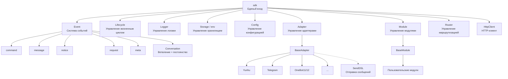

### Описание основных модулей

| Модуль | Описание |
|------|------|
| **Event** | Система событий, предоставляет обработку пяти типов событий: command / message / notice / request / meta, а также Conversation для многошаговых диалогов |
| **Adapter** | Менеджер адаптеров, управляет регистрацией, запуском и остановкой адаптеров для различных платформ |
| **Module** | Менеджер модулей, управляет регистрацией, загрузкой и выгрузкой плагинов, поддерживает объявление зависимостей и топологическую сортировку |
| **Lifecycle** | Менеджер жизненного цикла, предоставляет хуки, управляемые событиями |
| **Storage** | Система хранения на основе SQLite, поддерживающая общие SQL-цепочные запросы |
| **Config** | Управление конфигурационными файлами в формате TOML |
| **Logger** | Модульная система логирования, поддерживающая под-логгеры |
| **Router** | Управление маршрутизацией HTTP/WebSocket, через абстрактный слой обертывает нижележащие бэкенды (в настоящее время FastAPI + Uvicorn), поддерживает маршрутизацию через декораторы, промежуточные обработчики, группировку, ограничение скорости, CORS |
| **HttpClient** | Единый HTTP/WS-клиент, через абстрактный слой обертывает нижележащие библиотеки запросов (в настоящее время aiohttp), предоставляет статистику запросов, повторные попытки, логирование, WebSocket-клиент, систему исключений ErisPulse. Клиент и сервер WebSocket разделяют базовый класс `WebSocketConnectionBase` |

## Процесс инициализации

На следующей диаграмме показан полный процесс инициализации `sdk.init()`:

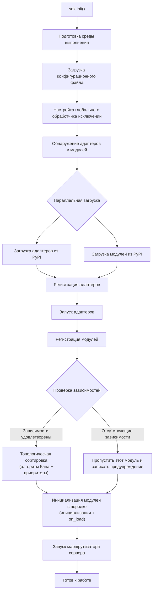

### Подробное описание этапов инициализации

> Полная цепочка инициализации разбита на этапы (Finder / Loader / Manager / Router), базовые точки входа (`init()` / `init_task()` / `init_sync()`) и ручной полный запуск описаны в [Процесс запуска и ручное управление](advanced/startup.md).

## Процесс обработки событий

На следующей схеме показан полный путь передачи сообщений от платформы к обработчикам:

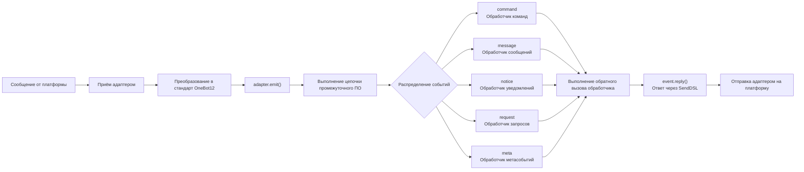

### Подробное описание цепочки обработки событий

Схема выше показывает "результат"; ниже разобрана работа `adapter.emit()` — это трёхуровневая цепочка распределения, которая реализуется фреймворком:

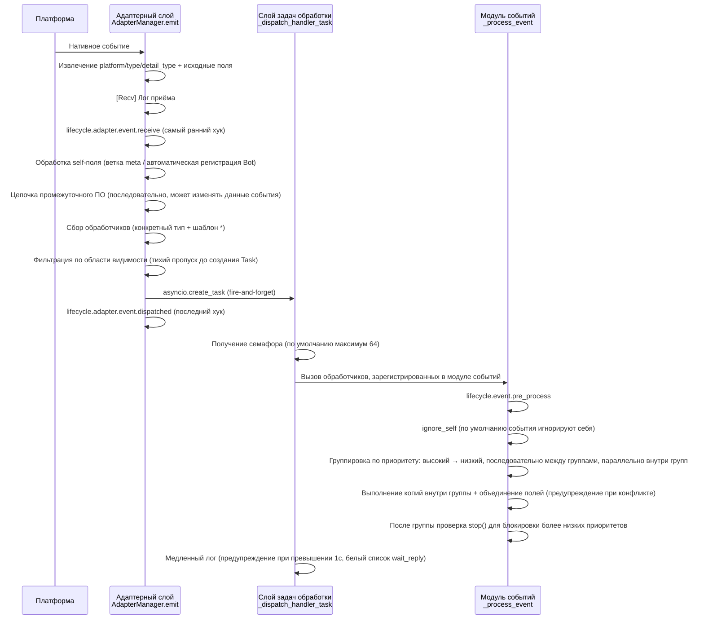

**Что делает фреймворк на каждом этапе и что вы можете изменить:**

| Этап | Что делает фреймворк | Что вы можете изменить |
|------|----------------------|------------------------|
| Приём | Извлекает стандартные поля, сохраняет `{platform}_raw` исходные данные; записывает `[Recv]` лог | Подписка на `adapter.event.receive` для получения самого раннего события |
| self-поле | Для метасобытий ветвление connect/disconnect/heartbeat; для обычных событий автоматическая регистрация Bot и запуск `adapter.bot.online` | Подписка на `adapter.bot.online` / `bot.offline` |
| Промежуточное ПО | **Последовательно** выполняется, если возвращает не None, то заменяет данные события | Регистрация промежуточного ПО для изменения/перехвата события |
| Сбор обработчиков | Сначала берутся обработчики конкретного типа, затем `*` шаблон | — |
| Фильтрация области видимости | По owner проверяется `scope.is_allowed` (сессия > Bot > платформа), **если не проходит, то тихо пропускается** | Настройка белого/чёрного списка областей видимости |
| Расписание | Каждый соответствующий обработчик запускается в отдельной `asyncio.Task`, `emit()` **не ждёт завершения обработчиков** | — |
| Приоритет | Высокоприоритетные группы выполняются первыми; **между группами последовательно, внутри групп параллельно** (каждая группа получает копию события, изменения объединяются, конфликты предупреждаются) | `@command(..., priority=N)` / указание при регистрации priority |
| Блокировка | После обработки каждой группы проверяется `event.is_stopped()`, если true, то **не выполняются более низкие приоритеты** | `event.mark_processed(stop=True)` / `event.done()` |

> **Частые заблуждения**:
> 1. **Фильтрация области видимости — тихая** — отфильтрованные обработчики не генерируют ошибок и не реагируют, видны только в TRACE-логах (`core.scope.denied`). Если "мой модуль не получил сообщение", сначала проверьте привязку области видимости.
> 2. **Обработчики работают параллельно** — фреймворк уже создал отдельную задачу для каждого обработчика, вам **не нужно** вручную оборачивать в `asyncio.create_task`.
> 3. **Обработчики одной группы не блокируют друг друга** — `mark_processed(stop=True)` блокирует только более низкие группы, обработчики внутри одной группы не прерываются.
> 4. **Порог медленного лога фиксирован в 1 секунду** — обработчики, затратившие более 1с, генерируют предупреждение в логе (`wait_reply` время исключено из расчёта), но выполнение не прерывается.

> Подробности о трёхуровневой привязке области видимости и приоритетах см. в [Системе области видимости](advanced/scope.md); полную семантику claim/блокировки см. в [Введение в обработку событий](getting-started/event-handling.md); настройку лимита параллелизма см. в [Руководстве по конфигурации](user-guide/configuration.md#framework-configuration).

## Жизненный цикл

На следующей диаграмме показан порядок срабатывания событий жизненного цикла компонентов фреймворка:

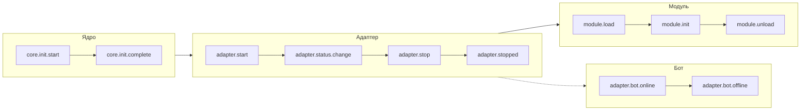

### Наблюдение за событиями жизненного цикла

> Полный список методов наблюдения за событиями (lifecycle.on() / once() / has_handlers()), полный список событий жизненного цикла и формат данных см. в разделе [Управление жизненным циклом](advanced/lifecycle.md).

## Стратегии загрузки модулей

ErisPulse поддерживает три стратегии загрузки модулей, объявленные `ModuleLoadStrategy`, возвращаемые `get_load_strategy()`:

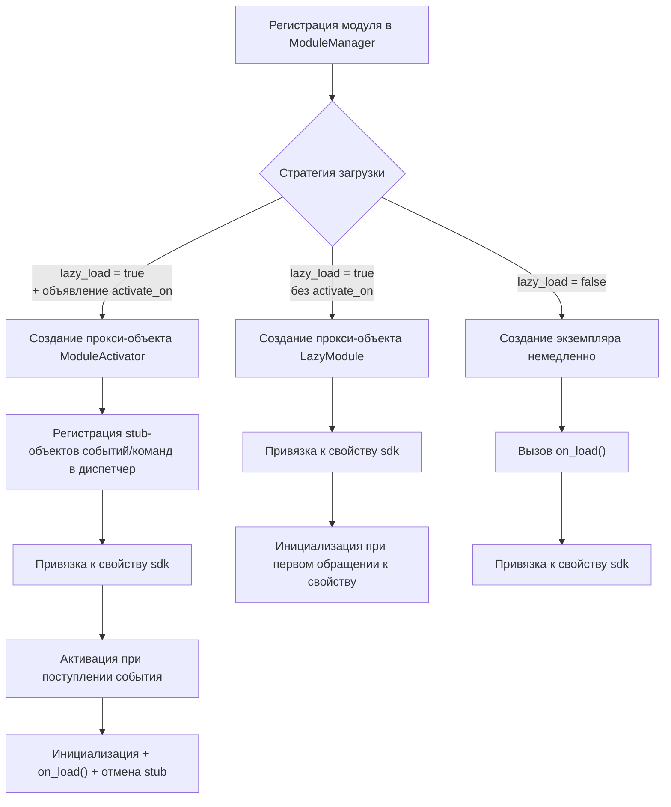

> Подробнее см. в разделах [Система ленивой загрузки](advanced/lazy-loading.md), [Управление жизненным циклом](advanced/lifecycle.md) и документации модуля.

### Архитектура триггерной ленивой активации (trigger architecture с `activate_on`)

> [!NOTE]
> Эта функция доступна в ErisPulse **2.8.0+**.

`activate_on` позволяет загружать модуль только при поступлении **первого соответствующего события/команды**, что предотвращает постоянное удержание в памяти и гарантирует отсутствие потери событий:

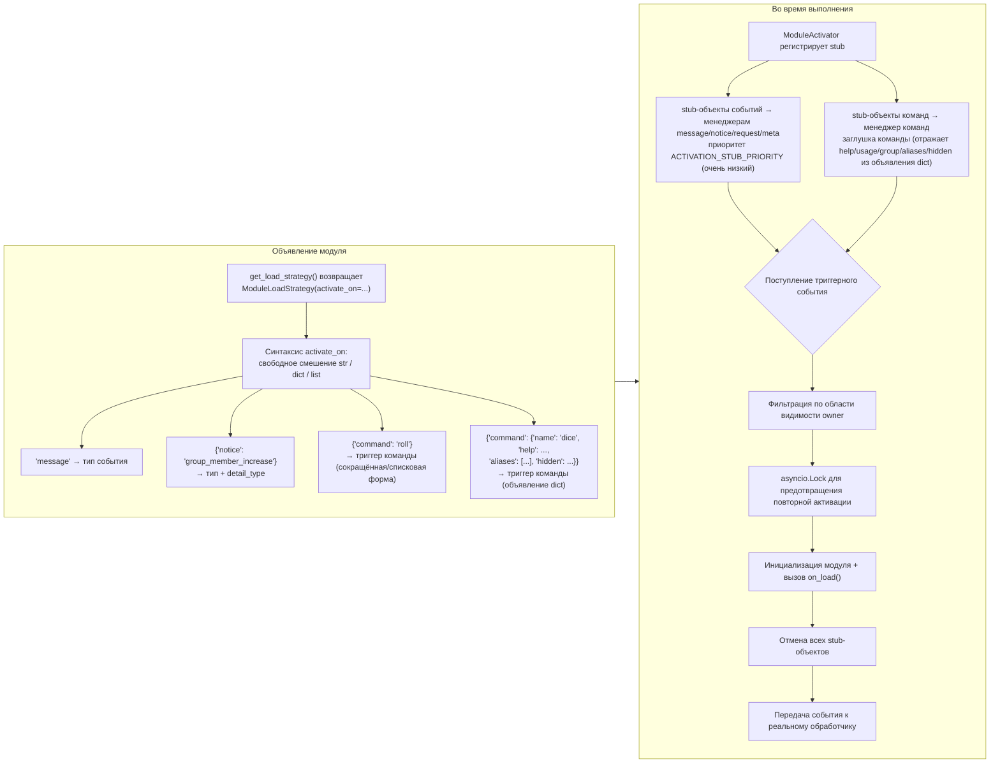

**Ключевые моменты семантики триггеров:**

> Полный синтаксис `activate_on` (str / dict / list), объявление команды dict, цепочка отката help для заглушек команд, фильтрация области видимости и семантика ошибок описаны в [Системе ленивой загрузки](advanced/lazy-loading.md#триггерная-леневая-активация-activate_on).

## Архитектура локальной папки плагинов

> [!NOTE]
> Эта функция требует ErisPulse **2.8.0+**.

Локальные плагины (папка `plugins/`) не требуют упаковки и публикации, фреймворк автоматически обнаруживает и загружает их при запуске:

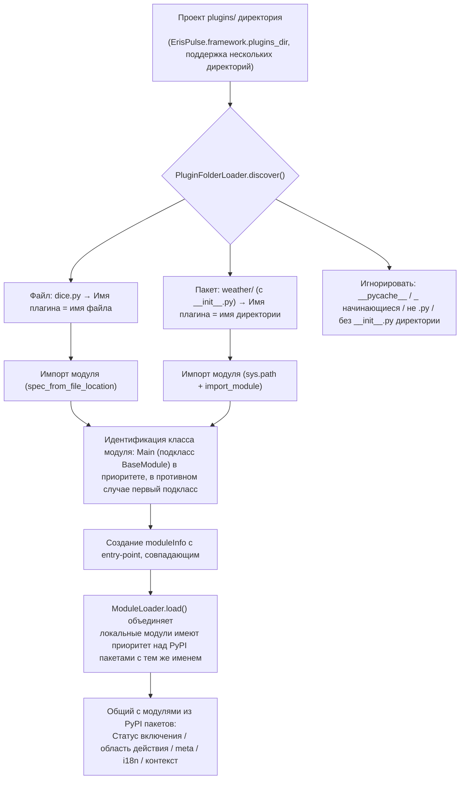

**Соглашения и особенности:**

- Имя плагина: для одиночного файла — имя файла, для пакета — имя директории
- Локальные плагины `moduleInfo.meta.source == "plugin_folder"`, они бесшовно совместимы с модулями из PyPI пакетов
- При совпадении имен приоритет отдаётся локальным (удобно для отладки), при отключении удаляются и соответствующие entry-point записи

[**中文**](docs/ru/quick-start.md)

## Архитектура горячей перезагрузки локальных плагинов

Горячая перезагрузка отслеживает изменения файлов плагинов и автоматически перезагружает соответствующие плагины:

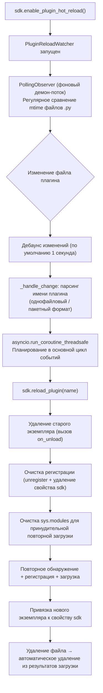

[**English**](docs/ru/quick-start.md)


====
快速上手
====


### 快速开始

# Быстрый старт

> **Это ваш первый шаг.** Запустите бота ErisPulse с нуля всего за 5 минут.

## Установка ErisPulse

### Скрипт для одного клика (рекомендуется)

Скрипт автоматически определит ваше окружение (Docker, Python, uv) и предложит выбрать наиболее подходящий способ установки.

Windows (PowerShell):
```powershell
irm https://get.erisdev.com/install.ps1 -OutFile install.ps1; powershell -ExecutionPolicy Bypass -File install.ps1
```

macOS / Linux:
```bash
curl -fsSL https://get.erisdev.com/install.sh -o install.sh && chmod +x install.sh && ./install.sh
```

Скрипт проведет вас через следующие шаги:

- **Docker** (рекомендуется, если Docker обнаружен): выбор зеркала (Docker Hub / GHCR), канал версий (стабильная / pre-release), настройка панели управления Dashboard, настройка портов
- **Классическая установка**: автоматическое создание виртуального окружения, выбор версии ErisPulse, опциональная установка модуля панели управления Dashboard

### Использование Docker

Docker-образ уже включает в себя фреймворк ErisPulse и панель управления Dashboard.

```bash
# Загрузка docker-compose.yml
curl -O https://raw.githubusercontent.com/ErisPulse/ErisPulse/main/docker-compose.yml

# Настройка токена Dashboard и запуск
ERISPULSE_DASHBOARD_TOKEN=your-token docker compose up -d
```

<details>
<summary>Docker Hub недоступен?</summary>

Используйте зеркало GitHub Container Registry, измените `image` в `docker-compose.yml`:

```yaml
image: ghcr.io/erispulse/erispulse:latest
```

</details>

После запуска перейдите по адресу `http://<host>:8000/Dashboard` и войдите, используя заданный токен.

### Установка с помощью pip

Убедитесь, что ваша версия Python >= 3.10, и установите через pip:

```bash
pip install ErisPulse
```

Если вы уже установили [uv](https://github.com/astral-sh/uv), вы также можете использовать `uv pip install ErisPulse` — это будет быстрее.

请直接返回翻译后的完整Markdown内容，不要包含任何其他文字。

再次提醒：如果文档包含语言切换行（各语言名称用 `` | `` 分隔的行），务必严格遵守上方第8条的格式要求，不要写出 ``[**Label**](file)`` 这类错误格式。

## Инициализация проекта

### Интерактивная инициализация (рекомендуется)

```bash
epsdk init
```

Это запустит интерактивного мастера, который поможет вам выполнить:
- Настройку имени проекта
- Конфигурацию уровня логирования
- Настройку сервера (хост и порт)
- Выбор и конфигурацию адаптера
- Создание структуры проекта

### Быстрая инициализация

```bash
# Быстрая инициализация с указанием имени проекта
epsdk init -q -n my_bot

# Или только указание имени проекта
epsdk init -n my_bot
```

### Создание проекта вручную

Если вы предпочитаете создать проект вручную:

```bash
mkdir my_bot && cd my_bot
epsdk init

## Установка модулей

### Установка через CLI

```bash
epsdk install Yunhu AIChat
```

### Просмотр доступных модулей

```bash
epsdk list-remote
```

### Интерактивная установка

При отсутствии указания имени пакета запускается интерфейс интерактивной установки:

```bash
epsdk install

## Запуск проекта

```bash
# Запуск в обычном режиме
epsdk run main.py

# Режим перезагрузки (рекомендуется во время разработки)
epsdk run main.py --reload

## Включение автодополнения в IDE (необязательно)

Модуль/адаптер динамического обнаружения ErisPulse не может предоставлять автодополнение методов, зависящих от платформы, по умолчанию в IDE.

Выполните следующую команду для генерации типов stub:

```bash
epsdk types
```

После генерации используйте импортированные типы для аннотации переменных, чтобы получить точное автодополнение (см. [Руководство по автодополнению в IDE](docs/ru/getting-started/ide-completion.md)):

```python
from _ep_types import Yunhu
from ErisPulse import sdk

adapter: Yunhu = sdk.adapter.get("yunhu")
await adapter.Send.To("group", "123").Board(...)  # автодополнение методов, зависящих от платформы

## Структура проекта

Структура проекта после инициализации:

```
my_bot/
├── config/
│   └── config.toml          # Файл конфигурации
└── main.py                  # Файл входа

## Файл конфигурации

Базовая конфигурация `config.toml`:

```toml
[ErisPulse.server]
host = "0.0.0.0"
port = 8000

[ErisPulse.logger]
level = "INFO"

[Yunhu_Adapter]
# Настройки адаптера


### 创建第一个机器人

# Создание первого бота

Это руководство основано на [5-минутном быстром старте](../quick-start.md) и поможет вам написать первый обработчик команд и понять механизм работы.

> Если вы еще не установили ErisPulse или не инициализировали проект, сначала выполните [быстрый старт](../quick-start.md) в разделах «Установка», «Инициализация проекта» и «Запуск проекта».

## Шаг первый: Написание первой команды

Откройте файл `main.py` и напишите простой обработчик команд:

```python
from ErisPulse import sdk
from ErisPulse.Core.Event import command

@command("hello", help="Отправить приветственное сообщение")
async def hello_handler(event):
    """Обработка команды hello"""
    user_name = event.get_user_nickname() or "друг"
    await event.reply(f"Привет, {user_name}! Я бот ErisPulse.")

@command("ping", help="Проверить, онлайн ли бот")
async def ping_handler(event):
    """Обработка команды ping"""
    await event.reply("Pong! Бот работает нормально.")

async def main():
    """Основная точка входа"""
    print("Запуск ErisPulse...")
    
    # keep_running=True (по умолчанию): фреймворк блокирует выполнение, пока не получит сигнал о завершении (например, Ctrl+C)
    await sdk.run(keep_running=True)

if __name__ == "__main__":
    import asyncio
    asyncio.run(main())
```

### Параметр `keep_running`

`sdk.run(keep_running)` управляет тем, будет ли фреймворк блокировать выполнение:

- **`keep_running=True` (по умолчанию)**: `run()` будет блокировать выполнение до получения сигнала о завершении (например, Ctrl+C), подходит для чистых ботов.
- **`keep_running=False`**: `run()` немедленно вернёт управление после инициализации, **фреймворк не будет отключаться** — запущенные адаптеры/модули продолжат обрабатывать события сообщений в фоновом режиме, вы можете выполнять свою логику, пока цикл событий не завершится и фреймворк не закроется. Например:

```python
async def main():
    await sdk.run(keep_running=False)   # Немедленно вернуться после инициализации
    # Фреймворк уже работает в фоне, здесь можно делать другие вещи
    while True:
        await asyncio.sleep(3600)
        print("Проверка каждый час")
```

> Помимо двух режимов `run()`, есть `init()`/`uninit()` для ручного управления жизненным циклом, а также более тонкие способы отдельного запуска/остановки адаптеров/маршрутизаторов, см. [Процесс запуска и ручное управление](../advanced/startup.md).

## Шаг второй: Запуск бота

```bash
# Обычный запуск
epsdk run main.py

# Режим разработки (поддержка горячей перезагрузки)
epsdk run main.py --reload
```

## Шаг третий: Тестирование бота

Отправьте команду в вашей чат-платформе:

```
/hello
```

Вы должны получить ответ от бота.

## Объяснение кода

### Декоратор команды

```python
@command("hello", help="Отправить приветственное сообщение")
```

- `hello`: имя команды, которую пользователь вызывает с помощью `/hello`
- `help`: описание команды, отображается при выполнении `/help`

### Параметры события

```python
async def hello_handler(event):
```

Параметр `event` — это объект Event, содержащий:
- Текст сообщения: `event.get_text()`
- Информацию об отправителе: `event.get_user_id()`, `event.get_user_nickname()`
- Информацию о платформе: `event.get_platform()`
- Информацию о группе: `event.get_group_id()`
- Оригинальные данные: `event.get_raw()`

> Полный список методов объекта Event см. в [подробном руководстве по Event-обёртке](../developer-guide/modules/event-wrapper.md).

### Отправка ответа

```python
await event.reply("Содержание ответа")
```

`event.reply()` — это удобный метод для отправки сообщения отправителю.

## Расширение: Добавление дополнительных функций

ErisPulse предоставляет богатые возможности для обработки событий и данных:

- **Слушание сообщений**: используйте `@message.on_message()` для прослушивания различных сообщений → [Введение в обработку событий](event-handling.md)
- **Слушание уведомлений**: используйте `@notice.on_friend_add()` и другие для прослушивания системных уведомлений → [Введение в обработку событий](event-handling.md)
- **Хранение данных**: используйте `sdk.storage.get/set` для сохранения данных → [Примеры распространённых задач](common-tasks.md)

## Часто задаваемые вопросы

### Команда не отвечает?

1. Проверьте правильность настройки адаптера, убедитесь, что в `config/config.toml` статус адаптера установлен в `true`
2. Проверьте вывод логов в терминале, убедитесь, что нет ошибок (особенно в логах уровня `ERROR`)
3. Убедитесь, что префикс команды указан правильно (по умолчанию это `/`), проверьте раздел `[ErisPulse.event.command]` в конфигурационном файле
4. Убедитесь, что имя команды написано правильно, обратите внимание на настройки чувствительности к регистру

### Как изменить префикс команды?

Добавьте в `config.toml`:

```toml
[ErisPulse.event.command]
prefix = "!"
case_sensitive = false
```

### Как поддержать несколько платформ?

ErisPulse использует стандарт OneBot12 для унификации формата событий на разных платформах, обработчики, зарегистрированные с помощью `@command` и `@message`, автоматически получают события со всех платформ. С помощью `event.get_platform()` можно определить источник платформы:

```python
@command("hello")
async def hello_handler(event):
    platform = event.get_platform()
    
    if platform == "yunhu":
        await event.reply("Привет! Из Юньху")
    elif platform == "telegram":
        await event.reply("Hello! Из Telegram")
    else:
        await event.reply("Привет!")
```

> Подробнее о многоуровневой адаптации платформ см. в [Примерах распространённых задач](common-tasks.md#многоуровневая-адаптация-платформ).


### 基础概念

# Основные концепции

В этом руководстве представлены основные концепции ErisPulse, которые помогут вам понять дизайн-мышление и базовую архитектуру фреймворка.

## Архитектура на основе событий

ErisPulse использует архитектуру на основе событий, где все взаимодействия передаются и обрабатываются через события.

### Поток событий

```
Пользователь отправляет сообщение
      │
      ▼
Платформа получает
      │
      ▼
Адаптер получает нативное событие платформы
      │
      ▼
Преобразуется в стандартное событие OneBot12
      │
      ▼
Отправляется в систему событий
      │
      ▼
Распределяется зарегистрированным обработчикам
      │
      ▼
Модуль обрабатывает событие
      │
      ▼
Адаптер отправляет ответ
      │
      ▼
Платформа отображает пользователю
```

### Стандарт OneBot12

ErisPulse использует OneBot12 в качестве стандартного события. OneBot12 — это стандарт универсального интерфейса чат-бота, определяющий унифицированный формат событий.

Все адаптеры преобразуют событие, специфичное для платформы, в формат OneBot12, обеспечивая согласованность кода.

## Основные компоненты

### 1. Объект SDK

SDK является точкой входа для всех функций и предоставляет доступ к основным компонентам.

```python
from ErisPulse import sdk

# Доступ к основным модулям
sdk.storage    # Система хранения
sdk.config     # Система конфигурации
sdk.logger     # Система логирования
sdk.adapter    # Система адаптеров
sdk.module     # Система модулей
sdk.router     # Система маршрутизации
sdk.client     # HTTP клиент
sdk.lifecycle  # Система жизненного цикла
```

### 2. Объект Event

Объект Event инкапсулирует данные о событии и предоставляет удобные методы доступа.

```python
@command("info")
async def info_handler(event):
    # Получение информации о событии
    event_id = event.get_id()
    user_id = event.get_user_id()
    platform = event.get_platform()
    text = event.get_text()
    
    # Отправка ответа
    await event.reply(f"Пользователь: {user_id}, Платформа: {platform}")
```

### 3. Адаптер

Адаптер — это мост между ErisPulse и внешними платформами.

**Обязанности:**
- Получение нативных событий платформы
- Преобразование в стандартный формат OneBot12
- Отправка стандартных событий платформе

**Примеры адаптеров:**
- Адаптер Yunhu: общение с платформой Yunhu
- Адаптер Telegram: общение с Telegram Bot API
- Адаптер OneBot11: общение с приложениями, совместимыми с OneBot11
- Адаптер Email: обработка почтовых сообщений

### 4. Модуль

Модуль — это базовая единица расширения функциональности, которая может:

- Регистрировать обработчики событий
- Реализовывать бизнес-логику
- Вызывать адаптеры для отправки сообщений
- Использовать службы, предоставляемые основными модулями

#### Механизм обнаружения модулей

ErisPulse обнаруживает установленные модули через Python `importlib.metadata.entry_points`. Модули объявляют точки входа в `pyproject.toml`:

```toml
[project.entry-points."erispulse.module"]
MyModule = "my_package:Main"
```

При инициализации SDK сканируются все точки входа группы `erispulse.module`, классы модулей регистрируются в `ModuleManager`, а затем последовательно инициализируются после топологической сортировки по зависимостям.

#### Минимально рабочий модуль

```python
from ErisPulse.Core.Bases import BaseModule
from ErisPulse import sdk

class Main(BaseModule):
    def __init__(self):
        self.sdk = sdk
        self.logger = sdk.logger.get_child("MyModule")

    async def on_load(self, event):
        self.logger.info("Модуль загружен")

    async def on_unload(self, event):
        self.logger.info("Модуль выгружен")
```

#### Жизненный цикл модуля

- **Регистрация**: SDK обнаруживает класс модуля и регистрирует его в менеджере
- **Загрузка**: Создается экземпляр модуля, вызывается `on_load(event)` (`event = {"module_name": "MyModule"}`)
- **Выгрузка**: Вызывается `on_unload(event)`, ресурсы очищаются

#### Стратегия загрузки

Загрузочное поведение модуля определяется через `get_load_strategy()`:

```python
from ErisPulse.loaders import ModuleLoadStrategy

class Main(BaseModule):
    @staticmethod
    def get_load_strategy():
        return ModuleLoadStrategy(
            lazy_load=True,   # Ленивая загрузка (по умолчанию True)
            priority=0        # Приоритет загрузки, чем больше значение, тем раньше инициализация
        )
```

- **`lazy_load=True` (по умолчанию)**: Модуль инициализируется только при первом обращении к `sdk.MyModule`, что снижает время запуска
- **`lazy_load=False`**: Модуль инициализируется сразу при запуске SDK, подходит для модулей, которым нужно прослушивать события жизненного цикла или выполнять фоновые задачи
- **`priority`**: Модули с одинаковым приоритетом загружаются в порядке регистрации; чем больше значение, тем раньше инициализация

> Подробное описание механизма ленивой загрузки см. в разделе [Система ленивой загрузки](../advanced/lazy-loading.md).

## Типы событий

ErisPulse поддерживает 5 типов событий:

| Тип события | Декоратор | Описание |
|------------|-----------|---------|
| Событие сообщения | `@message.on_message()` | Любое сообщение, отправленное пользователем (личные сообщения, чаты) |
| Событие команды | `@command("name")` | Сообщения, начинающиеся с префикса команды (например, `/hello`) |
| Событие уведомления | `@notice.on_friend_add()` и т.д. | Системные уведомления (добавление друга, изменения состава группы и т.д.) |
| Событие запроса | `@request.on_friend_request()` и т.д. | Запросы пользователей (запросы на добавление в друзья, приглашения в группу) |
| Метасобытие | `@meta.on_connect()` и т.д. | Системные события (подключение, отключение, пульс) |

> Подробное использование и примеры кода для каждого типа событий см. в разделе [Введение в обработку событий](event-handling.md).

## Описание основных модулей

### Storage (Хранилище)

Базирующаяся на SQLite система хранения пар ключ-значение для персистентного хранения данных.

```python
# Установка значения
sdk.storage.set("key", "value")

# Получение значения
value = sdk.storage.get("key", "default_value")

# Массовые операции
sdk.storage.set_multi({
    "key1": "value1",
    "key2": "value2"
})

# Транзакция
with sdk.storage.transaction():
    sdk.storage.set("key1", "value1")
    sdk.storage.set("key2", "value2")
```

### Config (Конфигурация)

Управление файлами конфигурации в формате TOML.

```python
# Получение конфигурации
config = sdk.config.getConfig("MyModule", {})

# Установка конфигурации
sdk.config.setConfig("MyModule", {"key": "value"})

# Чтение вложенной конфигурации
value = sdk.config.getConfig("MyModule.subkey", "default")
```

### Logger (Логирование)

Модульная система логирования.

```python
# Запись логов
sdk.logger.info("Это информационное сообщение")
sdk.logger.warning("Это предупреждение")
sdk.logger.error("Это ошибка")

# Получение дочернего логгера
child_logger = sdk.logger.get_child("submodule")
child_logger.info("Лог дочернего модуля")
```

**Синтаксический сахар для доступа к свойствам**

Помимо использования метода `get_child()`, вы также можете создавать дочерние логгеры через **доступ к свойствам**, что является более кратким способом записи **синтаксического сахара**:

```python
# Создание дочернего логгера через доступ к свойствам
sdk.logger.mymodule.info("Сообщение модуля")

# Поддержка вложенного доступа
sdk.logger.mymodule.database.info("Сообщение базы данных")
```

### Router (Маршрутизация)

Управление HTTP и WebSocket маршрутизацией на базе FastAPI + Uvicorn. Поддерживает декораторную маршрутизацию, middleware, группирование, лимитирование запросов, CORS.

```python
from ErisPulse.Core import HttpRequest

@sdk.router.get("MyModule", "/api")
async def handler(request: HttpRequest):
    data = await request.json()
    return {"status": "ok"}
```

> Полный API маршрутизации (WebSocket, middleware, лимитирование запросов, CORS и т.д.) см. в разделе [Менеджер маршрутизации](../advanced/router.md).

### Client (Сетевой клиент)

Единый сетевой клиент, объединяющий HTTP-запросы, WebSocket-соединения, управление пулом соединений, автоматическую перезагрузку, контроль тайм-аута, статистику запросов и интеграцию событий жизненного цикла.

```python
from ErisPulse.Core import client

# HTTP запрос
resp = await client.get("https://api.example.com/users")
data = await resp.json()

# С перезагрузкой и тайм-аутом
resp = await client.get(url, timeout=30, max_retries=3)

# WebSocket соединение
ws = await client.ws_connect("wss://example.com/ws")
async for text in ws.iter_text():
    await ws.send_text(f"Эхо: {text}")
```

> Полный API сетевого клиента см. в разделе [Сетевой клиент](../advanced/http-client.md).

## Отправка сообщений SendDSL

Адаптеры предоставляют интерфейс для отправки сообщений с цепочечными вызовами.

### Базовая отправка

```python
# Получение экземпляра адаптера
yunhu = sdk.adapter.get("yunhu")

# Отправка сообщения
await yunhu.Send.To("user", "U1001").Text("Hello")

# Указание аккаунта отправки
await yunhu.Send.Using("bot1").To("group", "G1001").Text("Сообщение группы")
```

### Цепочечные модификаторы

```python
# @Пользователь
await yunhu.Send.To("group", "G1001").At("U2001").Text("@сообщение")

# Ответ на сообщение
await yunhu.Send.To("group", "G1001").Reply("msg123").Text("ответ")

# @Всех
await yunhu.Send.To("group", "G1001").AtAll().Text("объявление")
```

### Методы ответа через Event

Объект Event предоставляет удобные методы для ответов:

```python
@command("test")
async def test_handler(event):
    # Простой текстовый ответ
    await event.reply("Текст ответа")
    
    # Отправка изображения
    await event.reply("http://example.com/image.jpg", method="Image")
    
    # Отправка голосового
    await event.reply("http://example.com/voice.mp3", method="Voice")
```

## Система ленивой загрузки

По умолчанию ErisPulse включает ленивую загрузку модулей; модули инициализируются только при первом обращении (например, `sdk.MyModule`), что значительно ускоряет запуск.

```python
from ErisPulse.loaders import ModuleLoadStrategy

class Main(BaseModule):
    @staticmethod
    def get_load_strategy():
        return ModuleLoadStrategy(
            lazy_load=True,   # Включить ленивую загрузку (по умолчанию)
            priority=0        # Приоритет загрузки, чем больше значение, тем раньше инициализация
        )
```

**Сценарии, когда необходимо отключить ленивую загрузку (`lazy_load=False`):**
- Модули, прослушивающие события жизненного цикла (например, `core.init.complete`)
- Модули, запускающие периодические задачи или фоновые службы
- Модули, которым необходимо завершить инициализацию до загрузки других модулей

> Подробное описание механизма ленивой загрузки и рекомендации см. в разделе [Система ленивой загрузки](../advanced/lazy-loading.md).

## Дальнейшие шаги

- [Введение в обработку событий](event-handling.md) — изучите, как обрабатывать различные типы событий
- [Примеры типичных задач](common-tasks.md) — освоите реализацию распространенных функций


### 事件处理入门

# Введение в обработку событий

В этом руководстве описывается, как обрабатывать различные типы событий в ErisPulse.

Пожалуйста, верните полный перевод Markdown без дополнительных слов.

Еще раз напоминаю: если документ содержит строки переключения языков (строки с названиями языков, разделенными символом `` | ``), строго соблюдайте требования пункта 8 выше и не используйте неправильный формат вида ``[**Label**](file)``.

## Обзор типов событий

ErisPulse поддерживает следующие типы событий:

| Тип события | Описание | 适用场景 |
|---------|------|---------|
| Событие сообщения | Любое сообщение, отправленное пользователем | Чат-боты, фильтрация контента |
| Событие команды | Сообщение, начинающееся с префикса команды | Обработка команд, точка входа функций |
| Событие уведомления | Системные уведомления (добавление друга, изменения в группе и т. д.) | Приветственные сообщения, уведомления о статусе |
| Событие запроса | Запросы пользователей (запрос на добавление в друзья, приглашение в группу) | Автоматическая обработка запросов |
| Метасобытие | Системные события (подключение, сердцебиение) | Мониторинг соединения, проверка статуса |

## Обзор типов событий

ErisPulse поддерживает следующие типы событий:

| Тип события | Описание | 适用场景 |
|---------|------|---------|
| Событие сообщения | Любое сообщение, отправленное пользователем | Чат-боты, фильтрация контента |
| Событие команды | Сообщение, начинающееся с префикса команды | Обработка команд, точка входа функций |
| Событие уведомления | Системные уведомления (добавление друга, изменения в группе и т. д.) | Приветственные сообщения, уведомления о статусе |
| Событие запроса | Запросы пользователей (запрос на добавление в друзья, приглашение в группу) | Автоматическая обработка запросов |
| Метасобытие | Системные события (подключение, сердцебиение) | Мониторинг соединения, проверка статуса |

## Обработка сообщений о событиях

> **Примечание**: Рекомендуется использовать аннотацию типа `Event` в обработчиках событий для получения поддержки автодополнения в IDE и проверки типов.

```python
from ErisPulse.Core.Event import Event  # Импорт типа события для аннотации
```

### Отслеживание всех сообщений

```python
from ErisPulse.Core.Event import message, Event

@message.on_message()
async def message_handler(event: Event):
    text = event.get_text()
    user_id = event.get_user_id()
    sdk.logger.info(f"Получено сообщение от {user_id}: {text}")
```

### Отслеживание личных сообщений

```python
@message.on_private_message()
async def private_handler(event: Event):
    user_id = event.get_user_id()
    await event.reply(f"Привет, {user_id}! Это личное сообщение.")
```

### Отслеживание сообщений в группах

```python
@message.on_group_message()
async def group_handler(event: Event):
    group_id = event.get_group_id()
    user_id = event.get_user_id()
    sdk.logger.info(f"Пользователь {user_id} отправил сообщение в группе {group_id}")
```

### Отслеживание сообщений с упоминаниями (@)

```python
@message.on_at_message()
async def at_handler(event: Event):
    # Получение списка пользователей, которых упомянули
    mentions = event.get_mentions()
    await event.reply(f"Вы упомянули этих пользователей: {mentions}")

## Обработка событий команд

### Базовые команды

```python
from ErisPulse.Core.Event import command

@command("help", help="Отображает справочную информацию")
async def help_handler(event):
    help_text = """
Доступные команды:
/help - Отображает справку
/ping - Тест подключения
/info - Просмотр информации
    """
    await event.reply(help_text)
```

### Псевдонимы команд

```python
@command(["help", "h"], aliases=["帮助"], help="Отображает справочную информацию")
async def help_handler(event):
    await event.reply("Справочная информация...")
```

Пользователи могут вызывать команду следующими способами:
- `/help`
- `/h`
- `/帮助`

### Параметры команд

```python
@command("echo", help="Повторяет сообщение")
async def echo_handler(event):
    # Получение параметров команды
    args = event.get_command_args()
    
    if not args:
        await event.reply("Введите сообщение для повтора")
    else:
        await event.reply(f"Вы сказали: {' '.join(args)}")
```

### Группы команд

```python
@command("admin.reload", group="admin", help="Перезагрузить модуль")
async def reload_handler(event):
    await event.reply("Модуль перезагружен")

@command("admin.stop", group="admin", help="Остановить бота")
async def stop_handler(event):
    await event.reply("Бот остановлен")
```

### Права доступа к командам

```python
def is_master(event):
    """Проверяет, является ли пользователь владельцем фреймворка"""
    master_list = ["user123", "user456"]
    return event.get_user_id() in master_list

@command("master", permission=is_master, help="Команда владельца фреймворка")
async def master_handler(event):
    await event.reply("Это команда владельца фреймворка")
```

### Приоритеты команд

```python
# Чем больше значение приоритета, тем раньше выполняется
@message.on_message(priority=10)
async def high_priority_handler(event):
    await event.reply("Обработчик высокого приоритета")

@message.on_message(priority=1)
async def low_priority_handler(event):
    await event.reply("Обработчик низкого приоритета")
```

### Параллельная обработка событий

Система событий ErisPulse использует модель планирования **параллельной обработки с одинаковым приоритетом и последовательной обработки с разным приоритетом**:

```
Событие поступило
    ↓
Группа priority=10: [Обработчик C || Обработчик D] параллельно → объединить результаты
    ↓ (если не прервано)
Группа priority=0: [Обработчик A || Обработчик B] параллельно → объединить результаты
    ↓
...
```

- **Параллельная обработка с одинаковым приоритетом**: Несколько обработчиков с одинаковым приоритетом выполняются одновременно, что увеличивает пропускную способность
- **Последовательная обработка с разным приоритетом**: Группы с разным приоритетом выполняются последовательно (чем выше значение, тем раньше выполняется), обеспечивая выполнение обработчиков высокого приоритета первыми
- **Copy-On-Write**: Обработчики не создают копии, если не вносят изменения, что обеспечивает нулевые накладные расходы
- **Обработка конфликтов**: При изменении одного и того же поля несколькими обработчиками с одинаковым приоритетом используется последнее значение и записывается предупреждающее сообщение в лог
- **Механизм прерывания**: После вызова любого обработчиком `event.done()` (по умолчанию) или `event.done(claim=False)` пропускаются последующие группы с более низким приоритетом. Разница между "признанием" и "блокировкой" описана в разделе [**Управление цепочкой: признание и блокировка**](#управление-цепочкой-признание-и-блокировка)

```python
# Пример: параллельное выполнение обработчиков с одинаковым приоритетом
@message.on_message(priority=0)
async def handler_a(event):
    # Обработка задачи A
    event['result_a'] = process_a()

@message.on_message(priority=0)
async def handler_b(event):
    # Выполняется параллельно с handler_a
    event['result_b'] = process_b()

# Последовательное выполнение с разным приоритетом
@message.on_message(priority=10)
async def handler_c(event):
    # Самый высокий приоритет, выполняется первым
    pass
```

> **Ограничение параллелизма**: Все соответствующие handler-ы немедленно создают задачи, но ограничиваются сигналом, ограничивающим **количество одновременно выполняемых задач** по умолчанию **64** (`ErisPulse.framework.handler_max_concurrency`, поддерживает горячее обновление). Задачи, превышающие лимит, ожидают в очереди на сигнале, пока предыдущие не завершатся. Во время пиковых нагрузок это ваш «сброс давления».
>
> **Медленные логи**: Если один обработчик выполняется более **1 секунды**, фреймворк записывает предупреждение в лог (`handler_slow`). Время ожидания ответа (`wait_reply`) исключается из времени выполнения, чтобы не ошибочно помечать ожидание ответа как медленное.

## Фильтрация области видимости: почему мой модуль не получает сообщения

Рассылка событий выполняется **до создания задачи обработчика** — сначала производится фильтрация области видимости, определяется `scope.is_allowed` на основе владельца модуля (уровень сессии > уровень бота > уровень платформы), **если проверка не пройдена, обработка происходит молча**, без ошибок и ответа.

```python
# Предположим, в config.toml MyModule был заблокирован в определённой группе:
[ErisPulse.scope]
block = { yunhu = { group_123 = ["MyModule"] } }
```

В этом случае, когда сообщения приходят из этой группы, **ни команды, ни обработчики событий MyModule не будут запущены**. Это не ошибка, а работа механизма области видимости — при диагностике "модуль не реагирует" сначала проверяйте привязку области видимости.

- Три уровня фильтрации: уровень шины адаптера (до создания задачи), уровень модуля события (внутри каждой группы приоритетов), уровень команды (до проверки прав)
- Журнал фильтрации доступен только на уровне **TRACE** (`core.scope.denied`), на уровне INFO по умолчанию никаких следов не видно
- Обработчики на уровне фреймворка (например, диспетчер команд с `scope_exempt=True`) не подвержены влиянию области видимости

> Подробнее о трёх уровнях привязки области видимости, белом и чёрном списках, приоритетах перекрытия и скрытом механизме отклонения по умолчанию см. в [Системе области видимости](../../advanced/scope.md).

[**中文**](docs/ru/quick-start.md)

## Управление цепочкой: присвоение и блокировка

> [!NOTE]
> Параметры `claim=` / `stop=` для `event.done()` / `event.mark_processed()` требуют ErisPulse **2.7.1+**.

ErisPulse разделяет два ортогональных семантических понятия — «присвоение» и «блокировка» — и объединяет их управление через `event.done()`, что позволяет добавлять слои наблюдения (например, логирование, аудит, права доступа) вокруг обработки команд.

**Точные определения двух понятий:**

- **Присвоение (claim)**: пометка того, что событие было обработано данным обработчиком (запись в `_processed`). Командный диспетчер, увидев присвоенное событие, **пропускает его повторную обработку** — предотвращая повторную обработку одного и того же сообщения несколькими обработчиками команд. Типичный сценарий: после успешного сопоставления команды присвоить событие, чтобы диспетчер команд больше не вмешивался.
- **Блокировка (stop)**: предотвращение распространения события к обработчикам с **меньшим приоритетом** (запись в `_propagation_stopped`). Обработчики с низким приоритетом (например, `on_message`) больше не увидят это событие. Типичный сценарий: высокоприоритетный обработчик уже полностью обработал событие, и не хочет, чтобы низкоприоритетные обработчики выполнялись.

| `event.done(...)` | Присвоение | Блокировка | Сценарий |
|-------------------|-----------|------------|----------|
| `event.done()` | ✔ | ✔ | Стандартная практика после обработки команды / обработчика |
| `event.done(stop=False)` | ✔ | ✘ | Только присвоение: низкоприоритетные наблюдатели (логирование / статистика) продолжают видеть событие |
| `event.done(claim=False)` | ✘ | ✔ | Только блокировка (например, фаервол / ограничение скорости), но без дедупликации команд |

`event.done(claim=, stop=)` — это псевдоним `event.mark_processed(claim=, stop=)`, и параметры и поведение у них полностью идентичны.

```python
@command("help")
async def help_cmd(event):
    event.done()            # Присвоение + блокировка (стандартная практика после обработки команды)

@message.on_message(priority=50)
async def observer(event):
    event.done(stop=False)  # Только присвоение: низкоприоритетный обработчик все еще будет выполняться (логирование / статистика)

@message.on_message(priority=100)
async def firewall(event):
    if denied(event):
        event.done(claim=False)  # Только блокировка: низкоприоритетный обработчик не будет выполняться, но дедупликация не происходит
```

### Конфигурация block для команд и ответов

После успешного сопоставления команды или после сопоставления ответа в `wait_reply` по умолчанию распространение блокируется (для обратной совместимости). Можно настроить разрешение, чтобы низкоприоритетные обработчики (логирование / аудит / права доступа) также могли наблюдать эти сообщения:

```toml
[ErisPulse.event.command]
block = false   # Сообщения команд продолжают поступать к обработчикам с низким приоритетом

[ErisPulse.event.wait_reply]
block = false   # Ответы, потребленные wait_reply, продолжают поступать к обработчикам с низким приоритетом

## Обработка событий уведомлений

### Добавление в друзья

```python
from ErisPulse.Core.Event import notice

@notice.on_friend_add()
async def friend_add_handler(event):
    user_id = event.get_user_id()
    nickname = event.get_user_nickname() or "Новый друг"
    await event.reply(f"Добро пожаловать в друзья, {nickname}!")
```

### Приглашение участника в группу

```python
@notice.on_group_increase()
async def member_increase_handler(event):
    group_id = event.get_group_id()
    user_id = event.get_user_id()
    await event.reply(f"Добро пожаловать, новый участник {user_id}, в группу {group_id}")
```

### Покидание участником группы

```python
@notice.on_group_decrease()
async def member_decrease_handler(event):
    group_id = event.get_group_id()
    user_id = event.get_user_id()
    await event.reply(f"Участник {user_id} покинул группу {group_id}")

## Обработка событий запроса

### Запросы на добавление в друзья

```python
from ErisPulse.Core.Event import request

@request.on_friend_request()
async def friend_request_handler(event):
    user_id = event.get_user_id()
    comment = event.get_comment()
    
    sdk.logger.info(f"Получен запрос на добавление в друзья: {user_id}, Комментарий: {comment}")
    
    # Запрос можно обработать через адаптер API
    # Смотрите документацию по конкретным адаптерам для деталей реализации
```

### Запросы на вступление в группу

```python
@request.on_group_request()
async def group_request_handler(event):
    group_id = event.get_group_id()
    user_id = event.get_user_id()
    
    await event.reply(f"Получен запрос на вступление в группу {group_id} от пользователя {user_id}")

## Обработка мета-событий

### События подключения

```python
from ErisPulse.Core.Event import meta

@meta.on_connect()
async def connect_handler(event):
    platform = event.get_platform()
    sdk.logger.info(f"Платформа {platform} подключена")

@meta.on_disconnect()
async def disconnect_handler(event):
    platform = event.get_platform()
    sdk.logger.warning(f"Платформа {platform} отключена")
```

### Событие сердечного импульса

```python
@meta.on_heartbeat()
async def heartbeat_handler(event):
    platform = event.get_platform()
    sdk.logger.debug(f"{platform} проверка сердечного импульса")
```

### Запрос статуса бота

После того как адаптер отправляет мета-событие, фреймворк автоматически отслеживает статус бота, вы можете проверить его в любое время:

```python
from ErisPulse import sdk

# Проверить, работает ли определенный бот
if sdk.adapter.is_bot_online("telegram", "123456"):
    telegram = sdk.adapter.get("telegram")
    await telegram.Send.To("user", "123456").Text("Бот онлайн")

# Вывести список всех текущих активных ботов
bots = sdk.adapter.list_bots()
for platform, bot_list in bots.items():
    for bot_id, info in bot_list.items():
        print(f"{platform}/{bot_id}: {info['status']}")

# Получить сводку полного статуса
summary = sdk.adapter.get_status_summary()

## Интерактивная обработка

### Отправка ответа с использованием метода reply

Метод `event.reply()` поддерживает множество модификаторов, удобных для отправки сообщений с упоминаниями (@), ответами на другие сообщения и другими функциями:

```python
# Простой ответ
await event.reply("Привет")

# Отправка сообщений разных типов
await event.reply("http://example.com/image.jpg", method="Image")  # Изображение
await event.reply("http://example.com/voice.mp3", method="Voice")  # Голосовое сообщение

# Упоминание одного пользователя
await event.reply("Привет", at_users=["user123"])

# Упоминание нескольких пользователей
await event.reply("Всем привет", at_users=["user1", "user2", "user3"])

# Ответ на сообщение
await event.reply("Текст ответа", reply_to="msg_id")

# Упоминание всех участников группы
await event.reply("Уведомление", at_all=True)

# Комбинированное использование: упоминание пользователя + ответ на сообщение
await event.reply("Текст сообщения", at_users=["user1"], reply_to="msg_id")
```

### Ожидание ответа пользователя

```python
@command("ask", help="Спросить пользователя")
async def ask_handler(event):
    await event.reply("Введите ваше имя:")
    
    # Ожидание ответа пользователя, таймаут 30 секунд
    reply = await event.wait_reply(timeout=30)
    
    if reply:
        name = reply.get_text()
        await event.reply(f"Привет, {name}!")
    else:
        await event.reply("Время ожидания истекло, пожалуйста, введите еще раз.")
```

### Ожидание ответа с проверкой (validation)

```python
@command("age", help="Запросить возраст")
async def age_handler(event):
    def validate_age(event_data):
        """Проверка, что возраст корректный"""
        try:
            age = int(event_data.get_text())
            return 0 <= age <= 150
        except ValueError:
            return False
    
    await event.reply("Введите ваш возраст (0-150):")
    
    reply = await event.wait_reply(
        timeout=60,
        validator=validate_age
    )
    
    if reply:
        age = int(reply.get_text())
        await event.reply(f"Ваш возраст {age} лет")
    else:
        await event.reply("Ввод недействителен или истек таймаут")
```

### Ожидание ответа с обратным вызовом (callback)

```python
@command("confirm", help="Подтвердить действие")
async def confirm_handler(event):
    async def handle_confirmation(reply_event):
        text = reply_event.get_text().lower()
        
        if text in ["Да", "yes", "y"]:
            await event.reply("Действие подтверждено!")
        else:
            await event.reply("Действие отменено.")
    
    await event.reply("Подтвердить выполнение этой операции? (Да/Нет)")
    
    await event.wait_reply(
        timeout=30,
        callback=handle_confirmation
    )
```

### Подтверждение диалога (confirm)

Ожидание подтверждения или отказа от пользователем, автоматическое распознавание встроенных слов подтверждения на китайском и английском языках:

```python
@command("confirm", help="Подтвердить действие")
async def confirm_handler(event):
    if await event.confirm("Вы уверены, что хотите выполнить это действие?"):
        await event.reply("Подтверждено, выполняем...")
    else:
        await event.reply("Отменено")

# Пользовательские слова подтверждения
if await event.confirm("Продолжить?", yes_words={"go", "继续"}, no_words={"stop", "停止"}):
    pass
```

### Меню выбора (choose)

Пользователь может ответить номером опции или текстом опции:

```python
@command("choose", help="Выбор")
async def choose_handler(event):
    choice = await event.choose(
        "Пожалуйста, выберите цвет:",
        ["Красный", "Зеленый", "Синий"]
    )
    
    if choice is not None:
        colors = ["Красный", "Зеленый", "Синий"]
        await event.reply(f"Вы выбрали: {colors[choice]}")
    else:
        await event.reply("Время ожидания истекло, выбор не сделан")
```

**Режим объединения**: при `merge_prompt=True` опции объединяются в сообщение приглашения и отправляются одним сообщением с использованием указанного пользователем метода `method`:

```python
# Отправка объединенного приглашения + опций с использованием Markdown
choice = await event.choose(
    "## Пожалуйста, выберите цвет\n{options}\nПожалуйста, ответьте номером",
    ["Красный", "Зеленый", "Синий"],
    method="Markdown",
    merge_prompt=True,
)
```

> Заполнитель `{options}` управляет положением вставки опций; если не указан, они добавляются в конец приглашения.
> Можно настроить заполнитель через параметр `placeholder` (например, `placeholder="[choices]"`).
> `options_format="auto"` (по умолчанию) автоматически выбирает стиль в зависимости от метода: Markdown→неупорядоченный список, Html→упорядоченный список, остальные→простой текстовый список.
> Текстовые методы (Text/Markdown/Html и т.д.) по умолчанию объединяют опции в конец; не текстовые методы (Image и т.д.) по умолчанию разбивают их на два сообщения.

### Сбор формы (collect)

Многошаговый сбор ввода пользователя:

```python
@command("register", help="Регистрация")
async def register_handler(event):
    data = await event.collect([
        {"key": "name", "prompt": "Введите имя:"},
        {"key": "age", "prompt": "Введите возраст:", 
         "validator": lambda e: e.get_text().isdigit()},
        {"key": "email", "prompt": "Введите email:"}
    ])
    
    if data:
        await event.reply(f"Регистрация успешна!\nИмя: {data['name']}\nВозраст: {data['age']}\nEmail: {data['email']}")
    else:
        await event.reply("Время ожидания истекло или ввод недействителен")
```

### Ожидание любого события (wait_for)

Ожидание произвольного события, удовлетворяющего условию, не ограничиваясь одним и тем же пользователем:

```python
@command("wait_member", help="Ожидание нового участника")
async def wait_member_handler(event):
    await event.reply("Ожидание вступления новых участников группы...")
    
    evt = await event.wait_for(
        event_type="notice",
        condition=lambda e: e.get_detail_type() == "group_member_increase",
        timeout=120
    )
    
    if evt:
        await event.reply(f"Добро пожаловать новому участнику: {evt.get_user_id()}")
    else:
        await event.reply("Время ожидания истекло")
```

### Многоразовый диалог (conversation)

Создание контекста интерактивного многоразового диалога:

```python
@command("survey", help="Анкетирование")
async def survey_handler(event):
    conv = event.conversation(timeout=60)
    
    await conv.say("Добро пожаловать в опрос!")
    
    while conv.is_active:
        reply = await conv.wait()
        
        if reply is None:
            await conv.say("Время ожидания истекло, пока!")
            break
        
        text = reply.get_text()
        
        if text == "Выйти":
            await conv.say("До свидания!")
            break
        
        await conv.say(f"Вы сказали: {text}, продолжайте ввод или ответьте 'Выйти', чтобы закончить")
```

### Встроенные слова подтверждения

ErisPulse содержит наборы слов подтверждения на китайском и английском языках:

- **Слова подтверждения** (`CONFIRM_YES_WORDS`): Да, yes, y, подтверждено, точно, хорошо, ок, true, да, м, хорошо, согласен, без проблем...
- **Слова отрицания** (`CONFIRM_NO_WORDS`): Нет, no, n, отменено, не, не нужно, нельзя, cancel, false, ошибка, отказ, нельзя...

## Доступ к событийным данным

### Общие методы объекта Event

```python
@command("info")
async def info_handler(event):
    # Базовая информация
    event_id = event.get_id()
    event_time = event.get_time()
    event_type = event.get_type()
    detail_type = event.get_detail_type()
    
    # Информация об отправителе
    user_id = event.get_user_id()
    nickname = event.get_user_nickname()
    
    # Контекст сообщения
    message_segments = event.get_message()
    alt_message = event.get_alt_message()
    text = event.get_text()
    
    # Информация о группе
    group_id = event.get_group_id()
    
    # Информация о боте
    self_id = event.get_self_user_id()
    self_platform = event.get_self_platform()
    
    # Исходные данные
    raw_data = event.get_raw()
    raw_type = event.get_raw_type()
    
    # Информация о платформе
    platform = event.get_platform()
    
    # Определение типа сообщения
    is_private = event.is_private_message()
    is_group = event.is_group_message()
    is_at = event.is_at_message()
    
    # Информация о команде
    if event.is_command():
        cmd_name = event.get_command_name()
        cmd_args = event.get_command_args()
        cmd_raw = event.get_command_raw()
```

### Расширенные методы платформ

Помимо встроенных методов, адаптеры различных платформ также регистрируют методы, уникальные для каждой платформы, чтобы упростить доступ к специфичным данным платформ.

```python
from ErisPulse.Core.Event import message

@message.on_message()
async def handle_message(event):
    platform = event.get_platform()

    # Вызов специфичных методов в зависимости от платформы
    if platform == "telegram":
        chat_type = event.get_chat_type()      # Метод, уникальный для Telegram
    elif platform == "email":
        subject = event.get_subject()           # Метод, уникальный для электронной почты
```

Если вы не уверены, какие методы были зарегистрированы определенной платформой, вы можете проверить список зарегистрированных методов для конкретной платформы:

```python
from ErisPulse.Core.Event import get_platform_event_methods

methods = get_platform_event_methods("telegram")
# ["get_chat_type", "is_bot_message", ...]
```

> За дополнительной информацией о методах, специфичных для платформ, обратитесь к соответствующей [документации платформы](../platform-guide/).

## Лучшие практики обработки событий

### 1. Обработка исключений

```python
@command("process")
async def process_handler(event):
    try:
        # Бизнес-логика
        result = await do_some_work()
        await event.reply(f"Результат: {result}")
    except ValueError as e:
        # Ожидаемая бизнес-ошибка
        await event.reply(f"Ошибка параметров: {e}")
    except Exception as e:
        # Неожиданная ошибка
        sdk.logger.error(f"Сбой обработки: {e}")
        await event.reply("Ошибка обработки, попробуйте позже")
```

### 2. Логирование

```python
@message.on_message()
async def message_handler(event):
    user_id = event.get_user_id()
    text = event.get_text()
    
    sdk.logger.info(f"Обработка сообщения: {user_id} - {text}")
    
    # Использовать собственный логгер модуля
    from ErisPulse import sdk
    logger = sdk.logger.get_child("MyHandler")
    logger.debug(f"Подробная информация для отладки")
```

### 3. Условная обработка

```python
@message.on_message(priority=0)
async def conditional_handler(event):
    """Условная обработка - определение внутри обработчика"""
    # Обрабатывать только сообщения от определенных пользователей
    if event.get_user_id() in ["bot1", "bot2"]:
        return
    
    # Обрабатывать только сообщения, содержащие определенные ключевые слова
    if "ключевое слово" not in event.get_text():
        return
    
    await event.reply("Условие выполнено, сообщение обработано")

## Следующие шаги

- [Примеры типовых задач](common-tasks.md) - Изучение реализации распространенных функций (включая расширенную отправку сообщений: повторные попытки/тайм-ауты/пачки)
- [Руководство по возможностям платформы](../platform-guide/README.md) - Полное описание Send DSL цепочной отправки, правил отправки и построения пакетов
- [Подробное описание класса-обертки Event](../developer-guide/modules/event-wrapper.md) - Глубокое понимание объекта Event
- [Руководство пользователя](../user-guide/) - Узнайте о настройке и управлении модулями


### IDE 补全

# Генерация типовых заглушек (автодополнение в IDE)

ErisPulse использует entry-points для динамического обнаружения модулей/адаптеров, и типы пользовательских классов не могут быть известны на статическом уровне.
Команда `epsdk types` сканирует установленные модули/адаптеры и генерирует файл с типовыми заглушками, позволяя использовать эти типы для аннотации переменных и получать автодополнение в IDE.

## Основные принципы проектирования

Заглушечный файл **экспортирует только типы**, не предоставляя никаких экземпляров во время выполнения:

- Все импорты находятся внутри ``TYPE_CHECKING``, **без дополнительных накладных расходов во время выполнения, без изменения поведения**
- Имена типов используются в формате PascalCase, основанном на имени entry-point (например, ``yunhu`` → ``Yunhu``), что соответствует именам, передаваемым в ``sdk.adapter.get()`` / ``sdk.module.get()``
- Пользователи по-прежнему используют ``sdk.module.get(...)`` / ``sdk.adapter.get(...)`` для получения экземпляров, просто используя импортированные типы для **аннотации переменных**

## Основное использование

Запустите в корневой директории проекта:

```bash
epsdk types
```

В текущей директории будет создан файл `_ep_types.py`, содержащий типы всех установленных модулей/адаптеров.

## Использование в коде

```python
from _ep_types import MyModule, Yunhu
from ErisPulse import sdk

# Используя импортированные типы для аннотации переменных, можно получить автодополнение методов этого класса
my_mod: MyModule = sdk.module.get("MyModule")
my_mod.hello()                  # ← Автодополнение hello

my_adapter: Yunhu = sdk.adapter.get("yunhu")
await my_adapter.Send.To("group", "123").Board(...)   # ← Автодополнение методов, специфичных для платформы
```

## Рабочий процесс

1. Сканирование entry-points `erispulse.adapter` / `erispulse.module`
2. Инспекция с помощью подпроцесса в целевой среде Python для сбора фактической информации о классах каждого адаптера/модуля (включая путь к модулю и полное имя)
3. Генерация `.py` файла, в котором:
   - Все ``from xxx import Yyy as Zzz`` находятся внутри ``TYPE_CHECKING``
   - ``Zzz`` — это имя entry-point в формате PascalCase
4. IDE читает раздел ``TYPE_CHECKING`` для предоставления автодополнения; во время выполнения никакой код не выполняется

Пример сгенерированной заглушки:

```python
# _ep_types.py (сгенерирован автоматически)
from typing import TYPE_CHECKING

if TYPE_CHECKING:
    # Адаптеры
    from MyAdapter.Core import MyAdapter as MyAdapter
    from YunhuAdapter.Core import YunhuAdapter as Yunhu

    # Модули
    from MyModule.Core import Main as MyModule

    __all__ = ['MyAdapter', 'Yunhu', 'MyModule']
```

## Опции команды

| Опция | Описание |
|------|------|
| `-o, --output PATH` | Указывает путь к выходному файлу (по умолчанию `./_ep_types.py`) |
| `--force` | Перезаписывает существующий файл с заглушками |
| `--adapters-only` | Сканирует только адаптеры |
| `--modules-only` | Сканирует только модули |

## Когда перегенерировать

- После установки/удаления новых модулей или адаптеров
- После обновления публичного API модуля/адаптера
- Когда автодополнение в IDE перестает работать или типы устарели

## Связь с методами SendDSL

Базовый класс `SendDSL` уже содержит стандартные методы отправки (Text/Image/Voice/Video/File), и любой экземпляр SendDSL, полученный любым способом, может использовать эти методы. Команда `types` используется для автодополнения **методов, специфичных для платформы** (например, `Board` в Yunhu, `Dice` в Sandbox) и **методов, специфичных для модуля**.


=====
适配器开发
=====


### 适配器开发入门

# Начало разработки адаптера

В этом руководстве вы узнаете, как приступить к разработке адаптера для ErisPulse для подключения новых платформ для обмена сообщениями.

## Введение в адаптер

### Что такое адаптер

Адаптер — это мост между ErisPulse и различными платформами сообщений, отвечающий за:

1. **Прямое преобразование**: получение событий платформы и преобразование их в стандартный формат OneBot12 (Converter)
2. **Обратное преобразование**: преобразование сегментов сообщений OneBot12 в вызовы API платформы (`Raw_ob12`)
3. Управление соединением с платформой (WebSocket/WebHook)
4. Предоставление унифицированного интерфейса отправки сообщений SendDSL

### Архитектура адаптера

```mermaid
flowchart LR
    subgraph receive["Прямое преобразование (прием)"]
        direction TB
        P1["События платформы"] --> C1["Converter.convert()"] --> O1["Стандартные события OneBot12"] --> S1["Система событий"] --> M1["Модуль обработки"]
    end
    subgraph send["Обратное преобразование (отправка)"]
        direction TB
        M2["Модуль формирует сообщение"] --> R1["Send.Raw_ob12()"] --> N1["Вызовы API платформы"] --> R2["Стандартный формат ответа"]
    end

## Структура каталогов

Стандартная структура пакета адаптера:

```
MyAdapter/
├── pyproject.toml          # Конфигурация проекта
├── README.md               # Описание проекта
├── LICENSE                 # Лицензия
└── MyAdapter/
    ├── __init__.py          # Точка входа в пакет
    ├── Core.py               # Главный класс адаптера
    └── Converter.py          # Преобразователь событий

## Быстрый старт

### 1. Создание проекта

```bash
mkdir MyAdapter && cd MyAdapter
```

### 2. Создание pyproject.toml

```toml
[project]
name = "ErisPulse-MyAdapter"
version = "1.0.0"
description = "Платформенный адаптер MyAdapter"
readme = "README.md"
requires-python = ">=3.10"
license = { file = "LICENSE" }
authors = [ { name = "yourname", email = "your@mail.com" } ]

dependencies = [
    "ErisPulse>=2.4.0"  # ErisPulse уже содержит aiohttp, отдельная зависимость обычно не нужна
]

[project.urls]
"homepage" = "https://github.com/yourname/MyAdapter"

[project.entry-points."erispulse.adapter"]
"MyAdapter" = "MyAdapter:MyAdapter"
```

### 3. Создание класса адаптера

Фреймворк предоставляет декларативное управление конфигурацией через `ConfigClass` / `AccountConfigClass`; адаптеру достаточно просто объявить класс конфигурации, и он автоматически загрузится, будет валидирован и сгенерирует шаблон конфигурации.

```python
# MyAdapter/Core.py
from dataclasses import dataclass, field
from ErisPulse.Core import BaseAdapter
from ErisPulse.Core.Bases import BaseConfig

@dataclass
class MyAdapterConfig(BaseConfig):
    """Конфигурация MyAdapter"""
    api_endpoint: str = field(
        default="https://api.example.com",
        metadata={
            "description": {"i18n": "my_adapter.api_endpoint", "default": "Адрес API"},
            "required": False,
            "ui": {"widget": "text", "group": "connection", "order": 1},
        },
    )
    token: str = field(
        default="",
        metadata={
            "description": {"i18n": "my_adapter.token", "default": "Токен платформы"},
            "required": True,
            "secret": True,
            "ui": {"widget": "password", "group": "basic", "order": 2},
        },
    )

class MyAdapter(BaseAdapter):
    ConfigClass = MyAdapterConfig  # Объявление класса конфигурации, управление фреймворком автоматически
    
    # Перекрывать __init__ не нужно! Фреймворк автоматически обрабатывает:
    # - self.sdk / self.logger автоматически устанавливаются
    # - self.cfg считывает конфигурацию в реальном времени
    # - self.Send / self.Request автоматически инициализируются
    
    def _setup_converter(self):
        from .Converter import MyPlatformConverter
        return MyPlatformConverter()
```

> ⚠️ **О `__init__`**: В новой версии `BaseAdapter.__init__(self, sdk=None)` автоматически обрабатывает ссылки на SDK, инициализацию логирования и загрузку конфигурации. Большинству адаптеров **больше не нужно перекрывать `__init__`**. Подробнее см. [Рекомендации по __init__](#init-рекомендации).

> ⚠️ **О `super().__init__()`**: Метод `BaseAdapter.__init__()` отвечает за создание экземпляров фабрик `Send` и `Request`. Если забыть вызвать этот метод, все операции отправки сообщений и запросов вызовут `AttributeError`. Подробнее см. [Рекомендации по __init__](#init-рекомендации).

### 4. Реализация обязательных методов

```python
class MyAdapter(BaseAdapter):
    # ... код __init__ ...
    
    async def start(self):
        """Запуск адаптера (обязательно к реализации)"""
        # Регистрация WebSocket или WebHook маршрутов
        router.register_websocket(
            module_name="myplatform",
            path="/ws",
            handler=self._ws_handler
        )
        self.logger.info("Адаптер запущен")
    
    async def shutdown(self):
        """Завершение работы адаптера (обязательно к реализации)"""
        router.unregister_websocket(
            module_name="myplatform",
            path="/ws"
        )
        # Очистка подключений и ресурсов
        self.logger.info("Адаптер остановлен")
    
    async def call_api(self, endpoint: str, **params):
        """Вызов API платформы (обязательно к реализации)"""
        raise NotImplementedError("Необходимо реализовать call_api")
```

#### Активная отправка Meta событий

Адаптер должен активной отправлять meta-события, чтобы фреймворк отслеживал онлайн-статус бота. В одну строку это можно сделать с помощью `emit_meta()`:

```python
class MyAdapter(BaseAdapter):
    async def _ws_handler(self, websocket):
        bot_id = self._get_bot_id()

        # Бот онлайн
        await self.emit_meta("connect", bot_id, user_name="MyBot")

        try:
            while True:
                data = await websocket.receive_text()
                event = self.convert(data)
                if event:
                    await self.adapter.emit(event)
        except WebSocketDisconnect:
            pass
        finally:
            # Бот офлайн
            await self.emit_meta("disconnect", bot_id)
```

> Подробные сведения о управлении состоянием бота и описании Meta-событий см. в разделе [Лучшие практики адаптера - Управление состоянием бота](best-practices.md#bot-状态管理与-meta-事件).

### 5. Реализация класса Send

Декораторы `At`/`AtAll`/`Reply` уже реализованы во встроенном базовом классе SendDSL фреймворка, адаптеру нужно реализовать только `Raw_ob12` и конкретные методы отправки.

Фреймворк предоставляет два ключевых вспомогательных метода:
- `self._apply_modifiers(message)` — автоматически объединяет декораторы At/AtAll/Reply в сегменты сообщения
- `self.send_context` — словарь контекста отправки (`target_type`, `target_id`, `account_id`)

```python
import asyncio

class MyAdapter(BaseAdapter):
    # ... остальной код ...

    class Send(BaseAdapter.Send):

        def Raw_ob12(self, message, **kwargs):
            """
            Отправка сообщений в формате OneBot12 (обязательно к реализации)

            Использует _apply_modifiers для автоматического объединения состояния декораторов,
            использует send_context для получения контекста отправки.
            """
            async def _do_send():
                segments = self._apply_modifiers(message)
                return await self._adapter.call_api(
                    endpoint="/send_message",
                    message=segments,
                    **self.send_context,
                    **kwargs
                )
            return asyncio.create_task(_do_send())

        # Text/Image/Voice/Video/File унаследованы от базового класса SendDSL,
        # по умолчанию делегируется Raw_ob12, повторная реализация не требуется.
        # Если нужно специфичное поведение платформы, можно переопределить отдельный метод:
        # def Text(self, text: str):
        #     return self.Raw_ob12([{"type": "text", "data": {"text": text}}])
```

**Рекомендации по реализации методов отправки медиа (Image/Video/File):**

- Базовая реализация по умолчанию упаковывает параметр `file` в сегмент сообщения OneBot12 и передает его в `Raw_ob12`, адаптер должен обработать скачивание/отправку внутри `Raw_ob12`
- Параметр `file` должен поддерживать как двоичные данные `bytes`, так и строковые URL
- При передаче URL нужно сначала скачать файл, а затем отправить его на платформу
- Платформе обычно сначала нужно вызвать интерфейс загрузки для получения идентификатора файла, а затем — интерфейс отправки

**Магический метод `__getattr__`:**

- Реализовать регистр нечувствительный к регистру имен методов (`Text`, `text`, `TEXT` все могут вызываться)
- Для неопределенных методов следует возвращать подсказку вместо ошибки

**Метод `Raw_ob12`:**

- Преобразовать стандартный формат сообщений OneBot12 в формат платформы для отправки
- Использовать `self._apply_modifiers(message)` для автоматической обработки декораторов At/AtAll/Reply
- Использовать `**self.send_context` для передачи информации о цели отправки и аккаунте

### 6. Реализация конвертера

```python
# MyAdapter/Converter.py
import time
import uuid

class MyPlatformConverter:
    def convert(self, raw_event):
        """Преобразование нативного события платформы в стандартный формат OneBot12"""
        if not isinstance(raw_event, dict):
            return None
        
        onebot_event = {
            "id": str(raw_event.get("event_id", uuid.uuid4())),
            "time": int(time.time()),
            "type": self._convert_event_type(raw_event.get("type")),
            "detail_type": self._convert_detail_type(raw_event),
            "platform": "myplatform",
            "self": {
                "platform": "myplatform",
                "user_id": str(raw_event.get("bot_id", ""))
            },
            "myplatform_raw": raw_event,
            "myplatform_raw_type": raw_event.get("type", "")
        }
        
        return onebot_event
    
    def _convert_event_type(self, event_type):
        """Преобразование типа события"""
        type_map = {
            "message": "message",
            "notice": "notice"
        }
        return type_map.get(event_type, "unknown")
    
    def _convert_detail_type(self, raw_event):
        """Преобразование детального типа"""
        return "private"  # Упрощенный пример
```

### 7. Реализация класса Request (операции запроса)

Если ваша платформа поддерживает запросы от друзей, приглашения в группы и другие запросы, требующие принятия решений ботом, можно реализовать внутренний класс `Request`:

```python
from ErisPulse.Core import BaseAdapter, RequestDSL

class MyAdapter(BaseAdapter):
    # ... Классы Send и остальной код ...

    class Request(RequestDSL):
        """Реализация операций запроса (другие запросы, приглашения в группу и т.д.)"""

        def accept(self, **kwargs):
            """Принять запрос"""
            async def _do():
                result = await self._adapter.call_api(
                    endpoint="/set_request",
                    request_id=self._request_id,
                    approve=True,
                    **kwargs,
                )
                return {
                    "status": "ok" if result.get("code") == 0 else "failed",
                    "retcode": result.get("code", 0),
                    "data": None,
                    "message_id": "",
                    "message": result.get("message", ""),
                }
            return self._create_task(_do())

        def reject(self, **kwargs):
            """Отклонить запрос"""
            async def _do():
                result = await self._adapter.call_api(
                    endpoint="/set_request",
                    request_id=self._request_id,
                    approve=False,
                    **kwargs,
                )
                return {
                    "status": "ok" if result.get("code") == 0 else "failed",
                    "retcode": result.get("code", 0),
                    "data": None,
                    "message_id": "",
                    "message": result.get("message", ""),
                }
            return self._create_task(_do())
```

Способ использования разработчиками модулей:

```python
from ErisPulse.Core.Event import request

@request.on_friend_request()
async def handle_friend_request(event):
    # Через удобные методы Event
    await event.approve()
    # Или напрямую через адаптер
    await adapter.myplatform.Request("req_id").accept()
```

> Если платформа не поддерживает операции запроса, можно не реализовывать внутренний класс `Request`. Базовый класс по умолчанию возвращает `retcode=10002` (неподдерживаемая операция). Подробнее см. [Спецификация операций запроса](../../standards/request-action-spec.md).

### 8. Создание точки входа пакета

```python
# MyAdapter/__init__.py
from .Core import MyAdapter

## Зависимости (необязательно, 2.8.0+)

Адаптер может объявлять зависимости от других адаптеров или модулей, обеспечивая взаимодействие между адаптерами и опциональные функции:

```python
from typing import ClassVar

class MyAdapter(BaseAdapter):
    # Жёсткая зависимость: при отсутствии адаптер пропускается (предупреждение + событие status=skipped-dependency)
    depends: ClassVar[dict] = {
        "adapters": ["onebot11"],   # Зависимые адаптеры (по названию платформы)
        "modules": ["TranslateEngine"],  # Зависимые модули (по зарегистрированному имени)
    }
    # Опциональная зависимость: отсутствие не влияет на запуск; при загрузке/выгрузке модуля вызывается обратный вызов (режим опциональных функций)
    optional_modules: ClassVar[list] = ["TranslateEngine"]
```

- **Порядок запуска**: адаптеры, объявившие жёсткую зависимость от модуля, будут запускаться **после инициализации модуля**
- **Уведомления об опциональных зависимостях**: при загрузке модуля из `optional_modules` (или жёсткой зависимости) вызывается `on_dependency_ready(module_name)`; при выгрузке вызывается `on_dependency_lost(module_name)` (по умолчанию пустая реализация, можно переопределить) — для сценариев поздней загрузки и горячей перезагрузки:

```python
async def on_dependency_ready(self, module_name):
    """Опциональный модуль готов: включить соответствующую опциональную функцию"""
    if module_name == "TranslateEngine":
        self._translate = self.sdk.TranslateEngine

async def on_dependency_lost(self, module_name):
    """Опциональный модуль утерян: понизить функциональность"""
    if module_name == "TranslateEngine":
        self._translate = None
```

> [!NOTE]
> Эта функция требует ErisPulse **2.8.0+**.

[**English**](docs/ru/quick-start.md) | [**简体中文**](docs/ru/quick-start.md)

## Примечания к `__init__`

В разработке адаптеров может потребоваться переопределение `__init__` на трёх уровнях. Ниже приведены правильные подходы для каждого уровня.

### 1. Уровень BaseAdapter (обычно не требуется переопределение)

`BaseAdapter.__init__(self, sdk=None)` отвечает за создание экземпляров фабрик `Send` / `Request` и автоматическое выполнение следующих действий:

- Приём параметра `sdk` и установка `self.sdk` и `self.logger`
- Если объявлен `ConfigClass`, можно читать глобальную конфигурацию в реальном времени через `self.cfg`
- Если объявлен `AccountConfigClass`, можно читать конфигурацию нескольких аккаунтов в реальном времени через `self.accounts`

**В большинстве случаев переопределять `__init__` не нужно**, достаточно объявить `ConfigClass`:

```python
class MyAdapter(BaseAdapter):
    ConfigClass = MyAdapterConfig  # После объявления фреймворк автоматически управляет конфигурацией
    
    async def start(self):
        cfg = self.cfg  # Типобезопасно, чтение в реальном времени
        ...
```

Если всё же требуется собственная инициализация, достаточно вызвать `super().__init__(sdk)`:

```python
class MyAdapter(BaseAdapter):
    ConfigClass = MyAdapterConfig
    
    def __init__(self, sdk=None):
        super().__init__(sdk)  # Передача sdk
        self.converter = self._setup_converter()
        self.convert = self.converter.convert
```

### 2. Внутренний класс Send (обычно не требуется переопределение)

`SendDSL.__init__` отвечает за передачу состояния для цепных вызовов (тип цели, ID цели, аккаунт и т.д.). **В большинстве случаев нужно переопределять только методы** (`Raw_ob12`, `Text` и т.д.), не обязательно переопределять `__init__`.

Если требуется (например, для инициализации состояния, уникального для платформы), **необходимо транслировать (пробросить) все параметры**:

```python
class MyAdapter(BaseAdapter):
    class Send(BaseAdapter.Send):
        # Параметры: adapter, target_type, target_id, account_id
        def __init__(self, adapter, target_type=None, target_id=None, account_id=None):
            super().__init__(adapter, target_type, target_id, account_id)  # ← Транслировать обязательно
            self._my_state = None  # Инициализация, уникальная для платформы
```

**Почему обязательно транслировать?** Каждый шаг цепного вызова создаёт новый экземпляр через `self.__class__(...)`:

```python
adapter.Send.To("user", "123")               # → Send(adapter, "user", "123", None)
adapter.Send.To("user", "123").Using("bot1")  # → Send(adapter, "user", "123", "bot1")
```

Если сигнатура `__init__` не совпадает или не вызван `super()`, цепной вызов прервется.

### 3. Внутренний класс Request (обычно не требуется переопределение)

Аналогично для Send. Параметры: `adapter`, `request_id`, `account_id`:

```python
class MyAdapter(BaseAdapter):
    class Request(RequestDSL):
        # Параметры: adapter, request_id, account_id
        def __init__(self, adapter, request_id=None, account_id=None):
            super().__init__(adapter, request_id, account_id)  # ← Транслировать обязательно
            self._my_state = None  # Инициализация, уникальная для платформы
```

### Резюме

| Уровень | Когда переопределять | Что обязательно делать |
|------|------------|-----------|
| **BaseAdapter** | Когда нужна собственная логика инициализации | `super().__init__(sdk)` (передать параметр sdk) |
| **Внутренний класс Send** | Когда нужна инициализация состояния отправки | `super().__init__(adapter, target_type, target_id, account_id)` |
| **Внутренний класс Request** | Когда нужна инициализация состояния запроса | `super().__init__(adapter, request_id, account_id)` |
| Все уровни | В большинстве случаев | **Достаточно объявить ConfigClass, не трогать `__init__`** |

### 9. Информация о соединении и обнаружение маршрутов

После регистрации маршрутов адаптером, фреймворк записывает всю информацию о маршрутах. Пользователи могут просмотреть адреса соединения адаптера через следующий API:

```python
from ErisPulse import sdk

# Получить полную информацию о соединении адаптера
info = sdk.adapter.get_connection_info("myplatform")
# {
#   "platform": "myplatform",
#   "status": "started",
#   "connection": {
#     "base_url": "http://localhost:8080",
#     "http_routes": [
#       {"path": "/myplatform/webhook", "method": "POST",
#        "url": "http://localhost:8080/myplatform/webhook"}
#     ],
#     "websocket_routes": [
#       {"path": "/myplatform/ws",
#        "url": "ws://localhost:8080/myplatform/ws"}
#     ]
#   }
# }

# Вывести список всех пространств имен (адаптер/модуль)
namespaces = sdk.router.list_namespaces()
# {"myplatform": {"http": ["/myplatform/webhook"], "websocket": ["/myplatform/ws"]}}

# Получить полные URL соединения для пространства имен
urls = sdk.router.get_module_urls("myplatform")
# {"base_url": "http://localhost:8080", "http": [...], "websocket": [...]}

# Получить детальную информацию о маршрутах пространства имен
routes = sdk.router.get_module_routes("myplatform")
# {"http": [{"path": "/myplatform/webhook", "methods": ["POST"]}],
#  "websocket": [{"path": "/myplatform/ws", "auth": false}]}
```

> **Подсказка**: Информация, возвращаемая `get_connection_info()`, подходит для отображения пользователю (например, в WebUI), помогая пользователю настроить адрес обратного вызова или адрес подключения WebSocket со стороны платформы. `module_name`, указанный при регистрации маршрута, должен в точности совпадать с именем `platform`, зарегистрированным адаптером в ErisPulse, иначе обнаружение маршрутов не сможет корректно связать их.

### 10. Поддержка SSE (Server-Sent Events)

ErisPulse имеет встроенную платформонезависимую поддержку SSE; модули и адаптеры могут регистрировать конечные точки SSE через `@sdk.router.sse()`.

#### Базовое использование

```python
import asyncio
from ErisPulse import sdk

@sdk.router.sse("MyModule", "/events")
async def event_stream(sse):
    """Отправка событий SSE"""
    count = 0
    while not sse.closed:
        await sse.send({"count": count}, event="update")
        count += 1
        await asyncio.sleep(1)
```

#### Использование параметров запроса

Обработчик может объявить параметр `request` для доступа к информации о клиентском запросе:

```python
@sdk.router.sse("MyModule", "/events")
async def event_stream(request, sse):
    token = request.query_params.get("token")
    if not validate_token(token):
        await sse.close()
        return

    while not sse.closed:
        data = await fetch_data(token)
        await sse.send(data)
        await asyncio.sleep(5)
```

#### API SseEmitter

| Метод | Описание |
|------|------|
| `sse.send(data, event=None, id=None, retry=None)` | Отправка события SSE. Данные, не являющиеся строкой, автоматически сериализуются в JSON |
| `sse.close()` | Успешное закрытие соединения SSE (безопасно для вызова, можно несколько раз) |
| `sse.closed` | Закрыто ли соединение |
| `sse.request` | Объект нижележащего запроса (можно использовать для чтения query params, заголовков) |

#### Использование в RouteGroup

```python
api = sdk.router.group("MyModule", "/api", version="1")

@api.sse("/events")
async def events(sse):
    await sse.send({"msg": "hello"})
```

#### Обнаружение маршрутов

Маршруты SSE автоматически появятся в API обнаружения маршрутов:

```python
# list_namespaces будет включать ключ "sse"
sdk.router.list_namespaces()
# {"MyModule": {"http": [...], "websocket": [...], "sse": ["/MyModule/events"]}}

# get_module_routes отметит streaming: true
sdk.router.get_module_routes("MyModule")
# {"http": [...], "websocket": [...], "sse": [{"path": "/MyModule/events", "streaming": true}]}

# get_module_urls сгенерирует полный URL
sdk.router.get_module_urls("MyModule")
# {"sse": [{"path": "/MyModule/events", "url": "http://localhost:8080/MyModule/events"}]}
```

> **Дизайн, не зависящий от сервера**: `SseEmitter` реализует связь через обратные вызовы, что обеспечивает развязку с базовым HTTP-фреймворком. Фреймворк предоставляет `register_sse()` и декоратор `@sse` как единые точки входа для регистрации; адаптеру не требуется прямая зависимость от каких-либо базовых HTTP-фреймворков для реализации конечной точки SSE.


### 适配器核心概念

# Основные концепции адаптера

Понимание основных концепций адаптера ErisPulse является основой для разработки адаптеров.

docs/ru/quick-start.md

## Архитектура адаптера

### Отношения между компонентами

```
Прямое преобразование (направление получения)        Обратное преобразование (направление отправки)
─────────────────                           ─────────────────
                                             
┌──────────────────┐                        ┌──────────────────┐
│ События платформы │                        │ Сообщения модуля │
└────────┬─────────┘                        └────────┬─────────┘
         │                                           │
         ↓                                           ↓
┌──────────────────┐   ┌──────────────────┐   ┌──────────────────┐
│                  │   │ Адаптер (MyAdapter) │   │ Send.Raw_ob12()  │
│  Converter       │   │ ┌──────────────┐ │   │ (точка входа в обратное преобразование) │
│  (конвертер событий) │──→│ │              │ │   │                  │
│                  │   │ │              │ │   │                  │
└──────────────────┘   │ └──────────────┘ │   └────────┬─────────┘
                       └──────────────────┘            │
                                │                      ↓
                                ↓              ┌──────────────────┐
                       ┌──────────────────┐    │ Вызов API платформы │
                       │ Стандартные события OneBot12 │    └────────┬─────────┘
                       └────────┬─────────┘             │
                                │                      ↓
                                ↓              ┌──────────────────┐
                       ┌──────────────────┐    │ Стандартный формат ответа │
                       │ Система событий │    └──────────────────┘
                       └────────┬─────────┘
                                │
                                ↓
                       ┌──────────────────┐
                       │ Модуль (обработка событий) │
                       └──────────────────┘
```

**Основная симметрия**:
- **Прямое преобразование** (Converter): События платформы → Стандартные события OneBot12, исходные данные сохраняются в `{platform}_raw`
- **Обратное преобразование** (Raw_ob12): Сообщения OneBot12 → Вызов API платформы, возвращается стандартный формат ответа

## AdapterManager адаптер-менеджер

`AdapterManager` — это основной компонент адаптерной системы ErisPulse, отвечающий за управление регистрацией, запуском, остановкой и рассылкой событий для всех адаптеров платформ.

### Основные функции

- **Регистрация адаптеров**: Регистрация и управление несколькими адаптерами платформ.
- **Управление жизненным циклом**: Контроль запуска и остановки адаптеров.
- **Рассылка событий**: Рассылка стандартных событий OneBot12 и событий, специфичных для платформы.
- **Управление конфигурацией**: Управление включением/выключением адаптеров.
- **Поддержка промежуточного ПО (middleware)**: Поддержка промежуточного ПО для событий OneBot12.

### Основное использование

```python
from ErisPulse import sdk

# Регистрация адаптера (обычно выполняется автоматически загрузчиком)
sdk.adapter.register("myplatform", MyPlatformAdapter)

# Запуск всех адаптеров
await sdk.adapter.startup()

# Запуск указанных адаптеров
await sdk.adapter.startup(["myplatform"])
# Запуск всех адаптеров
await sdk.adapter.startup()

# Получение экземпляра адаптера
my_adapter = sdk.adapter.get("myplatform")
# Или доступ через свойства
my_adapter = sdk.adapter.myplatform

# Остановка всех адаптеров
await sdk.adapter.shutdown()
```

### Запуск и остановка

#### Запуск адаптера

```python
# Запуск всех зарегистрированных адаптеров
await sdk.adapter.startup()

# Запуск указанных платформ
await sdk.adapter.startup(["platform1", "platform2"])
```

**Процесс запуска:**

1. Выполнение события жизненного цикла `adapter.start`
2. Выполнение события `adapter.status.change` (starting)
3. Параллельный запуск каждого адаптера
4. При неудачном запуске автоматическая повторная попытка (стратегия экспоненциальной отсрочки)
5. После успешного запуска выполнение события `adapter.status.change` (started)

**Механизм повторных попыток:**

- Первые 4 попытки: 60 секунд, 10 минут, 30 минут, 60 минут
- Пятая и последующие попытки: фиксированный интервал в 3 часа

#### Остановка адаптера

```python
# Остановка всех адаптеров
await sdk.adapter.shutdown()
```

**Процесс остановки:**

1. Выполнение события жизненного цикла `adapter.stop`
2. Вызов метода `shutdown()` для всех адаптеров
3. Остановка сервера маршрутизации
4. Очистка обработчиков событий
5. Выполнение события жизненного цикла `adapter.stopped`

### Управление конфигурацией

#### Проверка статуса платформы

```python
# Проверка наличия платформы в списке зарегистрированных
exists = sdk.adapter.exists("myplatform")

# Проверка включения платформы
enabled = sdk.adapter.is_enabled("myplatform")

# Использование оператора in
if "myplatform" in sdk.adapter:
    print("Платформа существует и включена")
```

#### Перечисление платформ

```python
# Перечисление всех зарегистрированных платформ
platforms = sdk.adapter.list_registered()

# Перечисление всех платформ и их статусов
status_dict = sdk.adapter.list_items()
# Возвращается: {"platform1": true, "platform2": false, ...}

# Получение списка включенных платформ
enabled_platforms = [p for p, enabled in status_dict.items() if enabled]
```

### Слушатели событий

#### Стандартные события OneBot12

```python
from ErisPulse import sdk

# Слушатель для всех стандартных событий сообщений по OneBot12
@sdk.adapter.on("message")
async def handle_message(data):
    print(f"Получено сообщение OneBot12: {data}")

# Слушатель для стандартных событий сообщений определённой платформы
@sdk.adapter.on("message", platform="myplatform")
async def handle_platform_message(data):
    print(f"Получено сообщение myplatform: {data}")

# Слушатель для всех событий
@sdk.adapter.on("*")
async def handle_any_event(data):
    print(f"Получено событие: {data.get('type')}")
```

#### События, специфичные для платформы

```python
# Слушатель для событий определённой платформы
@sdk.adapter.on("raw_event_type", raw=True, platform="myplatform")
async def handle_raw_event(data):
    print(f"Получено событие: {data}")

# Слушатель для событий всех платформ (с использованием шаблона)
@sdk.adapter.on("*", raw=True)
async def handle_all_raw_events(data):
    print(f"Получено событие: {data}")
```

#### Механизм рассылки событий

При вызове `adapter.emit(event_data)`:

1. **Обработка промежуточного ПО**: Сначала выполняются все промежуточные обработчики OneBot12.
2. **Рассылка стандартных событий**: Рассылка к соответствующим обработчикам событий OneBot12.
3. **Рассылка событий, специфичных для платформы**: Если есть оригинальные данные, рассылка к обработчикам событий, специфичных для платформы.

**Правила сопоставления:**

- Точное сопоставление: `@sdk.adapter.on("message")` сопоставляет только событие `message`.
- Шаблон: `@sdk.adapter.on("*")` сопоставляет все события.
- Фильтрация по платформе: `platform="myplatform"` сопоставляет события только указанной платформы.

### Промежуточное ПО (Middleware)

#### Добавление промежуточного ПО

```python
@sdk.adapter.middleware
async def logging_middleware(data):
    """Промежуточное ПО для логирования"""
    print(f"Обработка события: {data.get('type')}")
    return data  # Обязательно возвращать данные

@sdk.adapter.middleware
async def filter_middleware(data):
    """Промежуточное ПО для фильтрации событий"""
    # Фильтрация ненужных событий
    if data.get("type") == "notice":
        return None  # При возврате None промежуточное ПО игнорирует результат и сохраняет исходные данные для передачи дальше
    return data  # Обязательно возвращать данные для продолжения передачи
```

#### Порядок выполнения промежуточного ПО

Промежуточное ПО выполняется в порядке регистрации, последнее зарегистрированное промежуточное ПО выполняется первым.

> **Внимание**: Если промежуточное ПО возвращает `None` (например, забыли `return data`), фреймворк игнорирует результат и сохраняет исходные данные для передачи дальше, при этом выводится предупреждение уровня warning. Это обеспечивает, что ошибка в одном промежуточном ПО не приведёт к остановке всей цепочки событий.

```python
# Порядок регистрации
sdk.adapter.middleware(middleware1)  # Выполняется последним
sdk.adapter.middleware(middleware2)  # Выполняется посередине
sdk.adapter.middleware(middleware3)  # Выполняется первым

# Порядок выполнения: middleware3 -> middleware2 -> middleware1
```

### Получение экземпляра адаптера

#### Метод get()

```python
adapter = sdk.adapter.get("myplatform")
if adapter:
    await adapter.Send.To("user", "123").Text("Hello")
```

#### Доступ через свойства

```python
# Доступ по имени свойства (регистронезависимый)
adapter = sdk.adapter.myplatform
await adapter.Send.To("user", "123").Text("Hello")

## Базовый класс BaseAdapter

### Основная структура

```python
from dataclasses import dataclass, field
from ErisPulse.Core import BaseAdapter
from ErisPulse.Core.Bases import BaseConfig, BotAccountConfig

@dataclass
class MyConfig(BaseConfig):
    """Конфигурация адаптера (объявляется, затем автоматически управляется фреймворком)"""
    token: str = field(
        default="",
        metadata={
            "description": {"i18n": "my_adapter.token", "default": "Токен бота"},
            "required": True,
            "secret": True,
            "ui": {"widget": "password", "group": "basic", "order": 1},
        },
    )

class MyAdapter(BaseAdapter):
    ConfigClass = MyConfig  # Объявление класса конфигурации
    
    # Не нужно переопределять __init__, фреймворк автоматически обрабатывает:
    # - self.sdk, self.logger
    # - self.cfg (типобезопасный экземпляр конфигурации, считывается в реальном времени)
    # - self.Send, self.Request
    
    async def start(self):
        """Запуск адаптера (обязательно реализовать)"""
        cfg = self.cfg  # Автоматически загруженная типобезопасная конфигурация
        pass
    
    async def shutdown(self):
        """Остановка адаптера (обязательно реализовать)"""
        pass
    
    async def call_api(self, endpoint: str, **params):
        """Вызов API платформы (обязательно реализовать)"""
        pass
```

### Управление конфигурацией

Фреймворк предоставляет декларативное управление конфигурацией, с помощью dataclass определяется структура конфигурации, фреймворк автоматически обрабатывает загрузку, проверку и генерацию шаблонов.

#### Конфигурация одного аккаунта

```python
from dataclasses import dataclass, field
from ErisPulse.Core.Bases import BaseConfig

@dataclass
class TelegramConfig(BaseConfig):
    token: str = field(default="", metadata={
        "description": {"i18n": "telegram.token", "default": "Токен бота"},
        "required": True,
        "secret": True,
        "ui": {"widget": "password", "group": "basic", "order": 1},
    })
    proxy: str = field(default="", metadata={
        "description": {"i18n": "telegram.proxy", "default": "Адрес прокси"},
        "ui": {"widget": "text", "group": "advanced", "order": 10},
    })

class TelegramAdapter(BaseAdapter):
    ConfigClass = TelegramConfig
    
    async def start(self):
        cfg = self.cfg  # Типобезопасно, считывается в реальном времени
        if not cfg.token:
            raise ValueError("Токен не настроен")
        await self._connect(cfg.token, proxy=cfg.proxy)
```

#### Конфигурация нескольких аккаунтов

Базовый класс `BotAccountConfig` предоставляет поля `enabled` и `name`. Большинство адаптеров могут автоматически получать bot_id из протокола платформы или ответа на вход, и вставлять его в конфигурацию аккаунта при преобразовании событий.：

```python
from dataclasses import dataclass, field
from ErisPulse.Core.Bases import BotAccountConfig

# Большинство адаптеров: bot_id получается автоматически во время выполнения, не нужно настраивать
@dataclass
class MyBotConfig(BotAccountConfig):
    token: str = field(default="", metadata={
        "description": {"i18n": "my_adapter.bot_token", "default": "Токен"},
        "required": True,
    })

# Если при входе невозможно получить bot_id, можно позволить пользователю заполнить в конфигурации
@dataclass
class YunhuBotConfig(BotAccountConfig):
    bot_id: str = field(default="", metadata={
        "description": {"i18n": "yunhu.bot_id", "default": "ID бота"},
        "required": True,
    })
    token: str = field(default="", metadata={
        "description": {"i18n": "yunhu.token", "default": "Токен"},
        "required": True,
    })

class MyAdapter(BaseAdapter):
    AccountConfigClass = MyBotConfig
    
    async def start(self):
        for name, account in self.enabled_accounts.items():
            user_id = await self._login(name, account)
            await self.emit_meta("connect", user_id)
```

#### Соглашения по metadata

Поле metadata используется одновременно для генерации комментариев TOML и рендеринга форм WebUI:

```python
metadata = {
    "description": str | dict,  # Описание поля (поддержка i18n)
    "required": bool,         # Обязательно ли поле (валидация + метка обязательного поля в WebUI)
    "secret": bool,           # Является ли поле чувствительным (в WebUI отображается как ***, в логах маскируется)
    "ui": {                   # Конфигурация элементов управления WebUI (старое имя "webui" по-прежнему совместимо)
        "widget": str,        # Тип элемента управления: "text" | "switch" | "select" | "number" | "password"
        "group": str,         # Группа: "basic" | "advanced" | "connection" и т.д.
        "order": int,         # Вес сортировки (чем меньше, тем ближе к началу)
        "options": list,      # Доступные опции для элемента select [{label, value}], label поддерживает i18n
        "placeholder": str | dict,  # Подсказка в поле ввода (поддержка i18n)
    },
    "extra": dict,            # Дополнительные расширенные поля (прозрачно передаются в schema)
}
```

Все пользовательские текстовые поля поддерживают i18n, используется единый формат `{"i18n": "key", "default": "текст"}`,
чистые строки передаются без изменений (для обратной совместимости). Поддерживаемые поля i18n:

| Поле | Позиция | Описание |
|------|------|------|
| `description` | metadata поля | Описание поля |
| `options[].label` | `ui.options` | Метка опций элемента select |
| `placeholder` | `ui.placeholder` | Подсказка в поле ввода |
| `group_labels` | `_schema_meta` | Название группы (заголовок раздела Dashboard) |

При использовании i18n необходимо заранее зарегистрировать ключи перевода в системе i18n (см. [документацию по i18n](../../advanced/i18n.md#многоязычные-конфигурационные-поля)).

**Примеры `description` / `placeholder` / `options label`:**

```python
token: str = field(
    default="",
    metadata={
        "description": {"i18n": "my_adapter.token", "default": "Токен бота"},
        "ui": {
            "widget": "text",
            "placeholder": {"i18n": "my_adapter.token.ph", "default": "Введите токен"},
        },
    },
)
mode: str = field(
    default="a",
    metadata={
        "description": {"i18n": "my_adapter.mode", "default": "Режим"},
        "ui": {
            "widget": "select",
            "options": [
                {"label": {"i18n": "my_adapter.mode.a", "default": "Вариант A"}, "value": "a"},
                {"label": "Чистая строка метки", "value": "b"},  # Чистая строка передается без изменений
            ],
        },
    },
)
```

**Пример `group_labels` (объявляется после определения класса конфигурации):**

```python
MyConfig._schema_meta = {
    "group_labels": {
        "basic": {"i18n": "my_adapter.group.basic", "default": "Основные настройки"},
        "advanced": {"i18n": "my_adapter.group.advanced", "default": "Дополнительные настройки"},
    }
}
```

Функция `resolve_config_schema()` фреймворка автоматически разрешает все вышеуказанные поля i18n в зависимости от текущего языка;
`get_config_schema()` прозрачно передает словарь i18n, и фронтенд самостоятельно его разрешает.

### Декларативные ключи перевода (v2.7.0+)

Адаптер может объявлять ключи перевода, используя вложенный класс `I18nClass`, подобно объявлению `ConfigClass`.
Фреймворк автоматически регистрирует все объявленные ключи перевода на этапе `__init__` (до генерации шаблона конфигурации),
обеспечивая доступность ключей перевода, используемых в описаниях конфигурации, при генерации шаблона.

```python
from ErisPulse.Core.Bases import BaseAdapter, BaseI18n, I18nKey

class MyAdapter(BaseAdapter):
    class I18nClass(BaseI18n):
        endpoint: I18nKey = I18nKey(
            default="API Endpoint",
            zh_CN="API 地址",
            zh_TW="API 位址",
            en="API Endpoint",
            ja="APIアドレス",
            ru="API адрес",
        )
        token: I18nKey = I18nKey(
            default="Platform Token",
            zh_CN="平台 Token",
            zh_TW="平台權杖",
            en="Platform Token",
            ja="プラットフォームトークン",
            ru="Токен платформы",
        )
```

> ``I18nKey.default`` — это **базовый текст, не привязанный к языку**, который не регистрируется ни в одну из языковых версий.
> Чтобы перевод был активен, необходимо явно передать хотя бы один параметр языка.

Подробное использование (правила пути ключей, явный параметр key и т.д.) см. в [документации по i18n](../../advanced/i18n.md#рекомендуемый-способ-объявления-ключей-перевода-через-i18nclass-v270).

### Декларативные методы расширения событий (v2.7.0+)

Адаптер может объявлять методы расширения событий, специфичные для платформы, используя `EventMixin`, фреймворк автоматически регистрирует их в текущей платформе.

```python
from ErisPulse.Core import BaseAdapter

class MyAdapter(BaseAdapter):
    class EventMixin:
        def get_chat_name(self):
            """Получение названия чата"""
            return self.get("myplatform_raw", {}).get("chat", {}).get("name", "")

        def is_official_message(self):
            """Определение, является ли сообщение официальным"""
            raw = self.get("myplatform_raw", {})
            return raw.get("sender", {}).get("is_official", False)
```

После регистрации, объекты событий могут напрямую вызывать эти методы:

```python
@message.on_group_message()
async def handler(event):
    if event.is_official_message():
        chat_name = event.get_chat_name()
        await event.reply(f"[{chat_name}] Получено официальное сообщение")
```

> Методы расширения событий адаптера регистрируются в его собственной платформе (``self._platform``).
> Если модули нуждаются в расширении событий на разных платформах, следует использовать API `register_event_mixin()`.

#### Разрешение аккаунтов

Многоаккаунтные адаптеры могут использовать `_resolve_account()` для автоматического разрешения целевого аккаунта:

```python
async def call_api(self, endpoint: str, **params):
    account_id = params.pop("account_id", None)
    name, account = self._resolve_account(account_id)
    # name: имя аккаунта, account: экземпляр конфигурации
```

Стратегия разрешения: сопоставление имени аккаунта → сопоставление поля `bot_id` → сопоставление других строковых полей → первый включенный аккаунт.

#### Горячее обновление конфигурации

Подклассы могут переопределить `on_config_update()` для реакции на изменения конфигурации:

```python
class MyAdapter(BaseAdapter):
    ConfigClass = MyConfig
    
    def on_config_update(self, old_config, new_config):
        if old_config.token != new_config.token:
            self.logger.info("Токен обновлен, будет выполнено повторное подключение")
```

### Процесс инициализации

Фреймворк автоматически выполняет следующие действия в `BaseAdapter.__init__(self, sdk=None)`:

1. **Ссылка на SDK**: Установка `self.sdk`, `self.logger`
2. **Фабрика Send/Request**: Создание `self.Send` и `self.Request`
3. **Шаблон конфигурации**: Если объявлен `ConfigClass`, автоматически генерируется шаблон конфигурации (в первый раз)
4. **Шаблон аккаунта**: Если объявлен `AccountConfigClass`, автоматически генерируется шаблон аккаунта (в первый раз)
5. **Регистрация EventMixin**: Если объявлен `EventMixin`, автоматически регистрируется в `AdapterManager` после вставки имени платформы

Конфигурация считывается в реальном времени через `self.cfg` / `self.accounts` (каждый доступ считывает последнее значение из хранилища конфигурации). `self.config` как совместимый псевдоним `self.cfg` по-прежнему доступен.

Большинству адаптеров не нужно переопределять `__init__`. Если требуется пользовательская инициализация:

```python
class MyAdapter(BaseAdapter):
    ConfigClass = MyConfig
    
    def __init__(self, sdk=None):
        super().__init__(sdk)  # Передача sdk
        self.converter = self._setup_converter()
        self.convert = self.converter.convert
```

Пожалуйста, верните напрямую переведенный полный Markdown-контент, без каких-либо дополнительных пояснений.

## DSL для отправки сообщений

### Наследование

```python
class MyAdapter(BaseAdapter):
    class Send(BaseAdapter.Send):
        """Вложенный класс Send, наследующийся от BaseAdapter.Send"""
        pass
```

### Доступные свойства

Класс `Send` автоматически устанавливает следующие свойства при вызове:

| Свойство | Описание | Способ установки |
|-----|------|---------|
| `_target_id` | Идентификатор цели | `To(id)` или `To(type, id)` |
| `_target_type` | Тип цели | `To(type, id)` |
| `_target_to` | Упрощённый идентификатор цели | `To(id)` |
| `_account_id` | Идентификатор отправляющего аккаунта | `Using(account_id)` |
| `_adapter` | Экземпляр адаптера | Устанавливается автоматически |
| `_at_user_ids` | Список упомянутых пользователей | `At(user_id)` |
| `_reply_message_id` | Идентификатор сообщения для ответа | `Reply(message_id)` |
| `_at_all` | Упоминание всех пользователей | `AtAll()` |

> **Рекомендуется**: Использовать свойство `self.send_context` для получения `target_type`, `target_id`, `account_id` за один вызов, это более понятно, чем прямой доступ к экземплярным переменным.

### Вспомогательные методы фреймворка

| Метод/свойство | Описание |
|-----------|------|
| `self._apply_modifiers(message)` | Объединяет статусы модификаторов At/AtAll/Reply в список сегментов сообщения |
| `self.send_context` | Возвращает словарь `{target_type, target_id, account_id}` |

### Основные методы

Адаптеру нужно реализовать только `Raw_ob12`, стандартные методы (Text/Image/Voice/Video/File) уже унаследованы от базового класса `SendDSL` и по умолчанию делегируются ему:

```python
class Send(BaseAdapter.Send):
    def Raw_ob12(self, message, **kwargs):
        """Обязательно реализовать: преобразование OneBot12 сегментов сообщения → API платформы"""
        async def _do_send():
            segments = self._apply_modifiers(message)
            return await self._adapter.call_api(
                endpoint="/send_message",
                message=segments,
                **self.send_context,
                **kwargs
            )
        return asyncio.create_task(_do_send())

    # Методы Text/Image/Voice/Video/File унаследованы от базового класса и автоматически делегируют Raw_ob12, повторная реализация не требуется
    # При необходимости реализации платформенно-специфической логики, можно переопределить отдельные методы:
    # def Text(self, text: str):
    #     return self.Raw_ob12([{"type": "text", "data": {"text": text}}])
```

### Методы цепочки модификаторов

```python
class Send(BaseAdapter.Send):

    def __init__(self, adapter, target_type=None, target_id=None, account_id=None):
        super().__init__(adapter, target_type, target_id, account_id)
        self.buttons = []

    def Button(self, content: list) -> 'Send':
        self.buttons.append(content)
        return self

## Конвертер событий

### Процесс преобразования

```
Исходное событие платформы
    ↓
Converter.convert()
    ↓
Стандартное событие OneBot12
```

### Обязательные поля

Все преобразованные события должны содержать:

```python
{
    "id": "Уникальный идентификатор события",
    "time": 1234567890,           # 10-значный Unix-время
    "type": "message/notice/request/meta",
    "detail_type": "Детальный тип события",
    "platform": "Название платформы",
    "self": {
        "platform": "Название платформы",
        "user_id": "ID бота"     # Должен совпадать с bot_id
    },
    "{platform}_raw": {...},       # Исходные данные (обязательно)
    "{platform}_raw_type": "..."    # Тип исходных данных (обязательно)
}
```

### Пример конвертера

```python
class MyPlatformConverter:
    def convert(self, raw_event):
        """Преобразует исходное событие платформы в стандартный формат OneBot12"""
        if not isinstance(raw_event, dict):
            return None
        
        # Генерация идентификатора события
        event_id = raw_event.get("event_id") or str(uuid.uuid4())
        
        # Преобразование временной метки
        timestamp = raw_event.get("timestamp")
        if timestamp and timestamp > 10**12:
            timestamp = int(timestamp / 1000)
        else:
            timestamp = int(timestamp) if timestamp else int(time.time())
        
        # Преобразование типа события
        event_type = self._convert_type(raw_event.get("type"))
        detail_type = self._convert_detail_type(raw_event)
        
        # Создание стандартного события
        onebot_event = {
            "id": str(event_id),
            "time": timestamp,
            "type": event_type,
            "detail_type": detail_type,
            "platform": "myplatform",
            "self": {
                "platform": "myplatform",
                "user_id": str(raw_event.get("bot_id", ""))
            },
            "myplatform_raw": raw_event,
            "myplatform_raw_type": raw_event.get("type", "")
        }
        
        return onebot_event

## Управление подключениями

### WebSocket подключение

```python
class MyAdapter(BaseAdapter):
    async def start(self):
        """Регистрация WebSocket маршрута"""
        router.register_websocket(
            module_name="myplatform",
            path="/ws",
            handler=self._ws_handler,
            auth_handler=self._auth_handler
        )
    
    async def _ws_handler(self, websocket):
        """Обработчик WebSocket соединения"""
        self.connection = websocket
        
        try:
            while True:
                data = await websocket.receive_text()
                onebot_event = self.convert(data)
                if onebot_event:
                    await self.adapter.emit(onebot_event)
        except WebSocketDisconnect:
            self.logger.info("Соединение разорвано")
        finally:
            self.connection = None
    
    async def _auth_handler(self, websocket) -> bool:
        """Аутентификация WebSocket"""
        token = websocket.query_params.get("token")
        return token == "valid_token"
```

### WebHook подключение

```python
class MyAdapter(BaseAdapter):
    async def start(self):
        """Регистрация WebHook маршрута"""
        router.register_http_route(
            module_name="myplatform",
            path="/webhook",
            handler=self._webhook_handler,
            methods=["POST"]
        )
    
    async def _webhook_handler(self, request):
        """Обработчик WebHook запроса"""
        data = await request.json()
        onebot_event = self.convert(data)
        if onebot_event:
            await self.adapter.emit(onebot_event)
        return {"status": "ok"}
```

> **Запрос информации о маршруте**: маршруты, зарегистрированные адаптером (HTTP, WebSocket, SSE), можно получить с помощью `sdk.adapter.get_connection_info(platform)` и `sdk.router.get_module_urls(module_name)`, чтобы получить полный адрес соединения (включая `base_url` + путь). Подробнее см. [Введение в разработку адаптеров - Информация о подключении и обнаружение маршрутов](docs/ru/getting-started.md#9-连接信息与路由发现) и [Поддержка SSE](docs/ru/getting-started.md#10-sse-server-sent-events-支持).

## Стандарт ответа API

Фреймворк предоставляет методы `make_response()` и `make_error()` для построения стандартизированных ответов, без необходимости вручную создавать словарь ответа.

### Успешный ответ

```python
async def call_api(self, endpoint: str, **params):
    try:
        raw_response = await self._platform_api_call(endpoint, **params)
        
        return self.make_response(
            data=raw_response.get("data"),
            message_id=raw_response.get("data", {}).get("message_id", ""),
            raw=raw_response,
        )
    except Exception as e:
        return self.make_error(message=str(e), raw=None)
```

### Ручное построение ответа (старый способ по-прежнему поддерживается)

```python
async def call_api(self, endpoint: str, **params):
    return {
        "status": "ok",
        "retcode": 0,
        "data": {...},
        "message_id": "msg_id",
        "message": "",
        "myplatform_raw": raw_response
    }

## Поддержка нескольких аккаунтов

### Декларативная конфигурация (рекомендуется)

После использования `AccountConfigClass` для декларативного класса конфигурации, фреймворк автоматически управляет загрузкой, проверкой и генерацией шаблонов для нескольких аккаунтов:

```python
from dataclasses import dataclass, field
from ErisPulse.Core.Bases import BotAccountConfig

@dataclass
class MyBotConfig(BotAccountConfig):
    bot_id: str = field(default="", metadata={"description": "ID бота", "required": True})
    token: str = field(default="", metadata={"description": "Токен", "required": True, "secret": True})

class MyAdapter(BaseAdapter):
    AccountConfigClass = MyBotConfig
    
    async def start(self):
        for name, account in self.enabled_accounts.items():
            self.logger.info(f"Запуск аккаунта {name}: {account.bot_id}")
            await self._connect(name, account)
    
    async def call_api(self, endpoint: str, **params):
        account_id = params.pop("account_id", None)
        name, account = self._resolve_account(account_id)
        # Использование account.token, account.bot_id и других полей
```

### Конфигурационный файл аккаунта

```toml
[MyAdapter.accounts.account1]
bot_id = "bot_001"
token = "token1"
enabled = true

[MyAdapter.accounts.account2]
bot_id = "bot_002"
token = "token2"
enabled = true
```

### Отправка с указанием аккаунта

```python
# Использование метода Using для указания аккаунта
my_adapter = adapter.get("myplatform")

# Через self.user_id в событии (рекомендуется, наиболее универсально)
await my_adapter.Send.Using(event["self"]["user_id"]).To("user", "123").Text("Hello")

# Через имя аккаунта
await my_adapter.Send.Using("account1").To("user", "123").Text("Hello")
```

### Связь self.user_id и Using

Механизм ответа событий фреймворка автоматически извлекает `account_id` (в первую очередь) или `user_id` из поля `self` события и передает их в качестве параметра `Using`. Разработчику адаптера необходимо убедиться, что значение `self.user_id` в Converter корректно соответствует `_resolve_account()`.

**Внутреннее поведение фреймворка**:

```python
# Логика извлечения bot_id фреймворком
bot_id = self.get("self", {}).get("account_id", "") or self.get("self", {}).get("user_id", "")

# Вызов Using только в случае, если bot_id не пустой
if bot_id:
    send_chain = send_chain.Using(bot_id)
```

> **Ключевой момент**: Даже если адаптер использует только одну конфигурацию Bot, при условии, что Converter правильно установил `self.user_id`, фреймворк передаст его в качестве параметра `Using`. Адаптер должен обеспечить соответствие значения `self.user_id` с идентификатором поля в `AccountConfigClass` (например, `bot_id`), чтобы `_resolve_account()` корректно находил нужный аккаунт. Если `self.user_id` пуст, фреймворк не вызовет `Using`, и в этом случае `call_api` получит `account_id` со значением `None`, а `_resolve_account(None)` вернет первый включенный аккаунт.

## Обработка ошибок

### Повторное подключение

```python
import asyncio

class MyAdapter(BaseAdapter):
    async def start(self):
        retry_count = 0
        max_retries = 5
        
        while retry_count < max_retries:
            try:
                await self._connect_to_platform()
                break
            except Exception as e:
                retry_count += 1
                if retry_count < max_retries:
                    wait_time = min(60 * (2 ** retry_count), 600)
                    self.logger.warning(f"Ошибка подключения, повторная попытка через {wait_time} секунд")
                    await asyncio.sleep(wait_time)
                else:
                    raise
```

### Обработка ошибок API

```python
async def call_api(self, endpoint: str, **params):
    try:
        # Рекомендуется использовать встроенный клиент SDK
        from ErisPulse.Core import client
        from ErisPulse.Core.Bases.errors import ClientError, ClientTimeoutError
        resp = await client.post(
            f"https://api.platform.com/{endpoint}",
            json=params,
            max_retries=2,
        )
        response = await resp.json()
        return self._standardize_response(response)
    except ClientTimeoutError:
        self.logger.error(f"Тайм-аут запроса: {endpoint}")
        return self._error_response("Тайм-аут запроса", 32000)
    except ClientError as e:
        self.logger.error(f"Ошибка сети: {e}")
        return self._error_response("Ошибка сетевого запроса", 33000)
    except Exception as e:
        self.logger.error(f"Неизвестная ошибка: {e}")
        return self._error_response(str(e), 34000)
```

> **Обратная совместимость**: Старый код адаптера, использующий напрямую `aiohttp.ClientSession`, не затрагивается и по-прежнему может перехватывать `aiohttp.ClientError`. Оба способа могут сосуществовать. Рекомендуется использовать `sdk.client` + систему исключений ErisPulse для нового кода.

## Управление состоянием бота

AdapterManager содержит встроенную систему отслеживания состояния бота, которая автоматически поддерживает онлайн-статус, время активности и метаданные всех зарегистрированных ботов.

### Автоматическая система обнаружения

Когда адаптер отправляет событие через `adapter.emit()`, фреймворк автоматически проверяет поле `self` в событии:

- **Мета-события**: выполнение соответствующих операций в зависимости от `detail_type` (connect - регистрация / disconnect - отмечает как оффлайн / heartbeat - обновляет время активности)
- **Обычные события** (message/notice/request): автоматически обнаруживает бота и обновляет время активности

```python
# Все события, содержащие поле self, запускают автоматическую систему обнаружения
await self.adapter.emit({
    "type": "message",
    "platform": "myplatform",
    "self": {"platform": "myplatform", "user_id": "bot123"},
    # ...
})
# Бот "bot123" будет автоматически зарегистрирован (если это первый раз) и обновлено время активности
```

### Типы мета-событий

| `detail_type` | Описание | Поведение фреймворка |
|---|---|---|
| `connect` | Бот подключается | Регистрирует бота и вызывает событие жизненного цикла `adapter.bot.online` |
| `disconnect` | Бот отключается | Отмечает бота как оффлайн и вызывает событие жизненного цикла `adapter.bot.offline` |
| `heartbeat` | Пульс бота | Обновляет время активности и метаданные бота |

### Отправка мета-событий адаптером

Использование `emit_meta()` позволяет отправить мета-событие одной строкой:

```python
class MyAdapter(BaseAdapter):
    async def _on_bot_connect(self, bot_id: str):
        # Отправка события connect одной строкой
        await self.emit_meta("connect", bot_id, user_name="MyBot", nickname="Мой бот")

    async def _on_bot_disconnect(self, bot_id: str):
        await self.emit_meta("disconnect", bot_id)
```

Также поддерживается ручное создание (старый способ по-прежнему совместим):

```python
await self.adapter.emit({
    "type": "meta",
    "detail_type": "connect",
    "platform": "myplatform",
    "self": {"platform": "myplatform", "user_id": bot_id}
})
```

### Расширенная информация в поле `self`

Поле `self` помимо обязательных `platform` и `user_id` поддерживает следующие необязательные поля:

| Поле | Описание |
|---|---|
| `user_name` | Имя пользователя бота |
| `nickname` | Никнейм бота |
| `avatar` | URL аватара бота |
| `account_id` | Идентификатор многоконтурного аккаунта |

### Запрос состояния бота

```python
from ErisPulse import sdk

# Получение информации о конкретном боте
info = sdk.adapter.get_bot_info("myplatform", "bot123")
# {"status": "online", "last_active": 1712345678.0, "info": {"nickname": "MyBot"}}

# Получение списка всех ботов
all_bots = sdk.adapter.list_bots()

# Получение списка ботов на определённой платформе
platform_bots = sdk.adapter.list_bots("myplatform")

# Проверка, находится ли бот онлайн
is_online = sdk.adapter.is_bot_online("myplatform", "bot123")

# Получение полной сводки состояния (подходит для отображения в WebUI)
summary = sdk.adapter.get_status_summary()
# {"adapters": {"myplatform": {"status": "started", "bots": {...}}}}
```

### Подписка на события жизненного цикла бота

```python
from ErisPulse import sdk

@sdk.lifecycle.on("adapter.bot.online")
async def on_bot_online(data):
    platform = data.get("platform")
    bot_id = data.get("bot_id")
    sdk.logger.info(f"Бот подключился: {platform}/{bot_id}")

@sdk.lifecycle.on("adapter.bot.offline")
async def on_bot_offline(data):
    platform = data.get("platform")
    bot_id = data.get("bot_id")
    sdk.logger.info(f"Бот отключился: {platform}/{bot_id}")


### SendDSL 详解

# Подробное руководство SendDSL

SendDSL — это интерфейс отправки сообщений в стиле цепочки вызовов, предоставляемый адаптером ErisPulse.

Пожалуйста, верните полный перевод Markdown-документа, не добавляя никаких других текстов.

Еще раз напоминаем: если документ содержит строки переключения языка (названия языков разделены `` | ``), строго соблюдайте формат, указанный в пункте 8 выше, не пишите ошибочный формат вида ``[**Label**](file)``.

## Основные способы вызова

### 1. Указание типа и ID

```python
await adapter.Send.To("group", "123").Text("Привет")
```

### 2. Указание только ID

```python
await adapter.Send.To("123").Text("Привет")
```

### 3. Указание учетной записи отправки

```python
await adapter.Send.Using("bot1").Text("Привет")
```

### 4. Комбинированное использование

```python
await adapter.Send.Using("bot1").To("group", "123").Text("Привет")
```

[**English**](docs/ru/quick-start.md)

## Методы цепочек

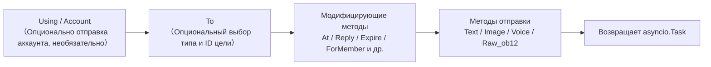

[**中文**](docs/ru/quick-start.md)

## Методы отправки

Все методы отправки возвращают объект `asyncio.Task`.

### Основные методы (встроенные в базовый класс)

Следующие стандартные методы уже реализованы в базовом классе `SendDSL`, **по умолчанию делегируются на `Raw_ob12`**, подклассы адаптеров могут использовать их напрямую, не повторяя реализацию, и IDE будет подсказывать их:

| Название метода | Описание | Возвращаемое значение |
|-----------------|----------|-----------------------|
| `Text(text: str)` | Отправка текстового сообщения | `asyncio.Task` |
| `Image(file: bytes \| str)` | Отправка изображения | `asyncio.Task` |
| `Voice(file: bytes \| str)` | Отправка аудио (OneBot12 `audio` сегмент) | `asyncio.Task` |
| `Video(file: bytes \| str)` | Отправка видео | `asyncio.Task` |
| `File(file: bytes \| str, filename: str = None)` | Отправка файла | `asyncio.Task` |

Адаптер может переопределить отдельные стандартные методы для предоставления логики, специфичной для платформы:

```python
class Send(SendDSL):
    def Raw_ob12(self, message, **kwargs):
        # Должно быть реализовано
        ...

    # Опционально: переопределение Text для предоставления логики, специфичной для платформы
    # def Text(self, text: str):
    #     return self.Raw_ob12([{"type": "text", "data": {"text": text}}])
```

### Методы протокола

| Название метода | Описание | Возвращаемое значение | Обязательно ли реализовать? |
|-----------------|----------|-----------------------|-----------------------------|
| `Raw_ob12(message)` | Отправка сообщения в формате OneBot12 | `asyncio.Task` | **Обязательно реализовать** |

> **Важно**: `Raw_ob12` — основной метод адаптера, **должен быть реализован**. Это единый входной пункт для обратного преобразования (OneBot12 → платформа). Если он не реализован, базовый класс будет записывать в журнал ошибок и возвращать стандартный ответ об ошибке (`status: "failed"`, `retcode: 10002`). Стандартные методы (`Text`, `Image` и т.д.) по умолчанию делегируются на `Raw_ob12`.

### Методы, специфичные для платформы

Адаптер может добавлять в подкласс `Send` методы отправки, специфичные для платформы (они будут распознаваться `event.supports()` / `event.available_methods()`):

```python
class Send(SendDSL):
    def Raw_ob12(self, message, **kwargs): ...

    # Метод, специфичный для платформы
    def Sticker(self, sticker_id: str):
        return self.Raw_ob12([{"type": "sticker", "data": {"id": sticker_id}}])
```

[**中文**](docs/ru/quick-start.md) | [**English**](docs/ru/quick-start.md)

## Модификаторы методов

Модификаторы методов возвращают `self`, чтобы поддерживать цепочечные вызовы.

### Метод At

```python
# @одного пользователя
await adapter.Send.To("group", "123").At("456").Text("Привет")

# @нескольких пользователей
await adapter.Send.To("group", "123").At("456").At("789").Text("Приветствую вас")
```

### Метод AtAll

```python
# @всех участников
await adapter.Send.To("group", "123").AtAll().Text("Всем привет")
```

### Метод Reply

```python
# Ответ на сообщение
await adapter.Send.To("group", "123").Reply("msg_id").Text("Содержимое ответа")
```

### Комбинированные модификаторы

```python
await adapter.Send.To("group", "123").At("456").Reply("msg_id").Text("Ответ на сообщение с @")
```

### Платформенно-специфические методы-модификаторы

Помимо встроенных `At`/`AtAll`/`Reply`, адаптер может определить **платформенно-специфические методы-модификаторы**. Эти методы **должны просто возвращать `self`** и не требуют никаких декораторов — фреймворк автоматически их распознает:

- Возвращает `self` (экземпляр SendDSL) → метод-модификатор, не запускает отправку или события жизненного цикла, цепочка продолжается
- Возвращает `Task`/`Awaitable` → метод отправки

```python
class Send(SendDSL):
    def Raw_ob12(self, message, **kwargs): ...

    # Метод-модификатор: возвращает self, не отправляет
    def Expire(self, seconds: int):
        self._expire = seconds
        return self

    def ForMember(self, user_id: str):
        self._member = user_id
        return self

    # Метод отправки: возвращает Task, зависит от состояния, установленного методами-модификаторами
    def Board(self, content: str, **kwargs):
        return self.Raw_ob12([{"type": "board", "data": {"text": content}}])
```

Использование:

```python
# Методы-модификаторы можно последовательно применять
await adapter.Send.To("group", "big").Expire(3600).ForMember("114").Board("Содержимое доски")

## Использование модифицирующих методов в классе Event

> [!NOTE]
> Функция `reply(via=)` и `event.send_chain()` требуют ErisPulse **2.7.0+**.

Метод `event.reply()` по умолчанию предоставляет только встроенные параметры модификаторов, такие как `at_sender`/`at_users`/`at_all`/`quote`. Для использования платформенно-специфичных модифицирующих методов есть два способа:

### Способ 1: Параметр via в reply()

Подходит для небольшого количества, известных модифицирующих методов:

```python
await event.reply("Содержимое доски", method="Board",
                  via=[("Expire", 3600), ("ForMember", "114514")])
```

`via` представляет собой список, каждый элемент которого может быть в следующих форматах:

| Формат | Эквивалентная цепочка вызовов |
|------|-------------|
| `"Name"` | `.Name()` |
| `("Name", arg1, arg2)` | `.Name(arg1, arg2)` |
| `("Name", (arg1,), {kw: val})` | `.Name(arg1, kw=val)` |

### Способ 2: event.send_chain()

Подходит для **нескольких последовательных модифицирующих методов** или **действий без параметров содержимого** (например, отмена, удаление). Метод `send_chain()` возвращает отправочную цепочку с уже настроенными параметрами `To`/`Using`, к которой можно свободно добавлять любые модифицирующие методы и отправочные методы:

```python
# Платформенно-специфичный модифицирующий метод + отправка на доску
await event.send_chain().Expire(3600).Board("Содержимое доски, которое истечет через час")

# Последовательные модифицирующие методы
await (event.send_chain()
       .Expire(3600)
       .ForMember("114514")
       .Board("Содержимое доски", content_type="markdown"))

# Встроенные модифицирующие методы также доступны
await event.send_chain().At("123").Reply("msg_id").Text("hi")

# Действия без параметров содержимого
await event.send_chain().DismissBoard()
```

> `send_chain()` возвращает полный экземпляр SendDSL, поэтому **доступны все цепочные возможности** — не только модифицирующие методы, но и правила отправки и пакетное построение:

```python
# Правила отправки: повторы + таймаут + успешный обратный вызов
await (event.send_chain()
       .Retry(3).Timeout(10)
       .Hook(lambda r: print("Отправка успешна"))
       .Text("Надежная отправка"))

# Отложенная отправка + платформенно-специфичный модификатор + доска
await event.send_chain().Defer(5).Expire(3600).Board("Отложенная доска")

# Режим пакетного построения
results = await (event.send_chain()
                 .Build()
                 .Text("Первое сообщение").Image("pic.jpg").Text("Второе сообщение")
                 .send_all())

## Управление аккаунтами

### Метод Using

Метод `Using()` используется для указания аккаунта, через который будет отправлено сообщение. Переданный идентификатор будет сопоставляться с помощью `_resolve_account()` в следующем порядке приоритета:

1. **Имя аккаунта** — ключ в конфигурации (например, `"default"`, `"bot1"`)
2. **bot_id, вставленный во время выполнения** — идентификатор, автоматически вставляемый при преобразовании события
3. **Любое поле str** — другие строковые поля в конфигурации
4. **Резервный вариант** — первый включенный аккаунт

```python
# Использование имени аккаунта
await adapter.Send.Using("account1").To("user", "123").Text("Привет")

# Использование bot_id (self.user_id из события)
await adapter.Send.Using("bot_123").To("user", "123").Text("Привет")
```

### Метод Account

Метод `Account` эквивалентен `Using`:

```python
await adapter.Send.Account("account1").To("user", "123").Text("Привет")

## Асинхронная обработка

### Не ожидать результат

```python
# Сообщение отправляется в фоновом режиме
task = adapter.Send.To("user", "123").Text("Hello")

# Продолжить выполнение других операций
# ...
```

### Ожидать результат

```python
# Непосредственно await для получения результата
result = await adapter.Send.To("user", "123").Text("Hello")
print(f"Результат отправки: {result}")

# Сохранить Task и подождать позже
task = adapter.Send.To("user", "123").Text("Hello")
# ... другие операции ...
result = await task

## Система правил отправки

SendDSL содержит в себе набор декораторов правил отправки, которые можно добавлять с помощью цепочки методов и применять единым образом при отправке. Правила охватывают распространённые сценарии использования: контроль таймаута, повторные попытки при сбое, успешные обратные вызовы, отложенная отправка, приоритет и отбрасывание, мониторинг прогресса.

Методы правил **возвращают self** (как и At/AtAll/Reply), и их необходимо вызывать до отправки метода (Text/Image и т.д.). Правила распространяются вместе с новыми экземплярами, созданными с помощью `To`/`Using`/`Account`.

### Список методов правил

| Метод | Описание |
|--------|------|
| `.Hook(callback)` | Обратный вызов, выполняемый после успешной отправки (можно вызывать несколько раз, выполняются по порядку) |
| `.Retry(times=1)` | Автоматически повторить отправку N раз (включая первую, всего N+1 попыток) |
| `.Timeout(seconds)` | Таймаут при отправке, отмена текущей попытки при истечении времени (можно комбинировать с Retry) |
| `.Defer(seconds=1.0)` | Отложить отправку (внутрипроцессное таймерное планирование, не сохраняется) |
| `.Priority(level, drop_if_busy=False)` | Установить приоритет; можно отбрасывать при перегрузке |
| `.OnProgress(callback)` | Обратный вызов для этапов отправки (передаётся `SendContext`) |
| `.OnError(callback)` | Обратный вызов при окончательном сбое (вызывается только один раз) |

### Выполнение логики после успешной отправки (Hook)

```python
# Синхронный обратный вызов
await (adapter.Send.To("user", "123")
       .Hook(lambda r: print(f"Успешная отправка, ID сообщения: {r['message_id']}"))
       .Text("Привет"))

# Асинхронный обратный вызов
async def deduct_points(result):
    await db.update(user_id="123", points=-1)

await adapter.Send.To("user", "123").Hook(deduct_points).Text("Снять баллы")
```

Hook выполняется только при окончательной успешной отправке (включая успешные повторные попытки); при сбое, таймауте, отмене не вызывается.

### Автоматическая повторная попытка при сбое (Retry)

```python
# После первого сбоя повторить 2 раза, всего 3 попытки
result = await adapter.Send.To("user", "123").Retry(2).Text("С повтором")
```

Условия для повтора: отправка выбрасывает исключение, отправка превышает таймаут, отправка возвращает ответ с `status == "failed"`.

### Автоматическая отмена при таймауте (Timeout)

```python
# Если отправка занимает более 10 секунд, отменить
await adapter.Send.To("user", "123").Timeout(10).Text("С таймаутом")

# Таймаут + повтор: каждая попытка длится 10 секунд, максимум 3 попытки
await adapter.Send.To("user", "123").Timeout(10).Retry(2).Text("Таймаут с повтором")
```

### Мониторинг прогресса (OnProgress / OnError)

```python
def on_progress(ctx):
    print(f"Этап: {ctx.stage}, Попытка: {ctx.attempt + 1}/{ctx.max_attempts}, Время: {ctx.elapsed:.2f}s")
    if ctx.stage == "failed":
        print(f"  Ошибка: {ctx.error!r}")

async def on_error(ctx):
    await notify_admin(f"Отправка для {ctx.target_id} не удалась: {ctx.error!r}")

await (adapter.Send.To("user", "123")
       .Retry(3).Timeout(10)
       .OnProgress(on_progress)
       .OnError(on_error)
       .Text("Мониторинг"))
```

`SendContext` содержит следующие поля: `task_id`, `platform`, `method`, `target_type`, `target_id`, `bot_id`, `stage`, `attempt`, `max_attempts`, `started_at`, `finished_at`, `elapsed`, `error`, `result`, `extra`.

Возможные значения `stage`: `pending`, `sending`, `retrying`, `success`, `failed`, `timeout`, `cancelled`, `dropped`.

### Отложенная отправка (Defer)

```python
# Отправить через 5 секунд
await adapter.Send.To("user", "123").Defer(5).Text("Позднее сообщение")
```

> Обратите внимание: задержка реализована внутрипроцессным таймером, при перезапуске процесса теряется, не сохраняется.

### Приоритет и отбрасывание при перегрузке (Priority)

```python
# Сообщение низкого приоритета, автоматически отбрасывается при перегрузке очереди
result = await (adapter.Send.To("user", "123")
               .Priority(-1, drop_if_busy=True)
               .Text("Уведомление, которое можно отбросить"))
# Если отброшено, result["status"] == "failed"
```

При включении `drop_if_busy`, если количество отправляемых задач превышает порог (по умолчанию 64), отправка текущего сообщения прерывается. Порог можно изменить с помощью `.PriorityThreshold(n)`.

### Комбинация правил и фоновая отправка

```python
# Не блокировать основной поток, правила всё равно применяются
task = (adapter.Send.To("user", "123")
        .Hook(lambda r: print("Успешная отправка!"))
        .Retry(3)
        .Timeout(10)
        .OnProgress(on_progress)
        .Text("Привет"))

# Продолжить выполнение других действий
await handle_next_action()
```

### Распространение правил

Правила распространяются вместе с новыми экземплярами, созданными с помощью `To`/`Using`/`Account`, чтобы избежать потери правил при цепочечном вызове:

```python
# Правила, установленные до To, также распространяются на созданный экземпляр
builder = adapter.Send.Retry(3).Timeout(10)
send = builder.To("user", "123")  # send по-прежнему содержит Retry(3) и Timeout(10)
await send.Text("hi")
```

Правила для разных экземпляров независимы (списки hooks глубоко копируются).

## Режим пакетного построения (Build)

Помимо одиночного режима, SendDSL поддерживает режим пакетного построения: в одной цепочке можно записать несколько методов отправки, а затем выполнить их все вместе. Этот режим подходит для сценариев, когда нужно "отправить сразу несколько сообщений".

### Вход в режим построения

Перед вызовом метода отправки нужно вызвать `.Build()`, который возвращает `SendBuilder`. После этого методы отправки (Text/Image и т.д.) не будут немедленно выполнены, а будут накапливаться в виде намерений отправки:

```python
results = await (adapter.Send.To("user", "123")
                 .Build()                    # Вход в режим построения
                 .Text("Первое предложение")
                 .Image("pic.jpg")
                 .Text("Второе предложение")
                 .send_all())                 # Единое выполнение
# results = [результат текста, результат изображения, результат текста]
```

`.send_all()` возвращает `asyncio.Task`, после await получаем список результатов (в порядке намерений).

### Параллельное и последовательное выполнение

По умолчанию выполнение происходит **параллельно** (параллельная отправка, общее время примерно равно самому медленному сообщению). Если нужно сохранить порядок доставки сообщений, вызовите `.Sequential()`:

```python
# Последовательно: отправлять по очереди
await (adapter.Send.To("group", "456")
       .Build()
       .Sequential()
       .Text("Отправить сначала это").Text("Затем отправить это")
       .send_all())

# Параллельно (по умолчанию, можно вызывать явно)
await (adapter.Send.To("group", "456")
       .Build()
       .Parallel()
       .Text("Параллельное 1").Text("Параллельное 2")
       .send_all())
```

### Продолжение при ошибках и повторные попытки

При пакетном выполнении применяется стратегия **продолжения при ошибках**: если какое-то сообщение не отправлено, это не прерывает отправку остальных. При использовании `.Retry()` неудачные сообщения будут автоматически повторно отправлены (повторные попытки применяются к каждому сообщению отдельно, а не к всей пачке):

```python
await (adapter.Send.To("user", "123")
       .Build()
       .Retry(2)                       # Каждое сообщение повторяет попытку 2 раза
       .Text("Возможно неудачное").Image("Тоже может не отправиться")
       .send_all())
```

### Правила и обратные вызовы для всей пачки

Правила применяются ко всей пачке:

| Метод | Описание |
|--------|------|
| `.Timeout(seconds)` | Время ожидания для каждой отправки |
| `.Retry(times)` | Каждая отправка повторяется при неудаче (продолжение при ошибках) |
| `.Defer(seconds)` | Задержка всей пачки отправки |
| `.Hook(callback)` | Вызывается после успешного завершения всей пачки, получает список `results` |
| `.OnError(callback)` | Вызывается, если в пачке есть ошибки, получает `BatchContext` |
| `.OnProgress(callback)` | Вызывается при завершении каждой отправки, получает `BatchContext` |

```python
def on_progress(ctx):
    print(f"Прогресс: {ctx.completed}/{ctx.total}, успешно {ctx.succeeded}, ошибки {ctx.failed}")

async def on_error(ctx):
    print(f"В пачке {ctx.failed} сообщений не отправлено")

results = await (adapter.Send.To("user", "123")
               .Build()
               .Retry(2).Timeout(10)
               .OnProgress(on_progress)
               .OnError(on_error)
               .Hook(lambda rs: print("Пачка отправлена"))
               .Text("a").Text("b").Text("c")
               .send_all())
```

`BatchContext` содержит: `task_id`, `total`, `completed`, `succeeded`, `failed`, `stage`, `results`, `errors`, `elapsed`, `extra`.

Значения `stage` могут быть: `pending` (ожидание), `sending` (отправка), `success` (все успешно), `partial` (часть успешно), `failed` (все неудачно).

### Модификаторы и наследование правил

Модификаторы и правила, применённые до `.Build()`, наследуются всей пачкой и применяются к каждому сообщению:

```python
await (adapter.Send.To("group", "456")
       .At("789")                        # Наследуется: каждое сообщение упоминает 789
       .Build()
       .Retry(2)                         # Наследуется + добавляется: каждое сообщение повторяет попытку
       .Text("@уведомление для тебя")
       .Image("изображение объявления")
       .send_all())
```

После входа в режим Build можно добавлять модификаторы (они будут действовать на всю пачку):

```python
await (adapter.Send.To("group", "456")
       .Build()
       .At("111").At("222")             # Добавляются упоминания, действуют на всю пачку
       .Text("@многим")
       .send_all())
```

### Выполнение в фоне

Как и в одиночном режиме, `.send_all()` возвращает Task, который можно выполнить в фоне, не ожидая его завершения:

```python
task = (adapter.Send.To("user", "123")
        .Build()
        .Hook(lambda rs: print("Пакетная отправка завершена"))
        .Text("a").Text("b")
        .send_all())

# Основной поток не блокируется
await do_something_else()

## Нормы именования

### Нормы именования в стиле PascalCase

Все методы отправки используют стиль именования с заглавной буквы:

```python
# ✅ Правильно
def Text(self, text: str):
    pass

def Image(self, file: bytes):
    pass

# ❌ Неправильно
def text(self, text: str):
    pass

def send_image(self, file: bytes):
    pass
```

### Методы, специфичные для платформы

Не рекомендуется добавлять методы с префиксом платформы:

```python
# ✅ Рекомендуется
def Sticker(self, sticker_id: str):
    pass

# ❌ Не рекомендуется
def TelegramSticker(self, sticker_id: str):
    pass
```

Вместо этого используйте метод `Raw`:

```python
# ✅ Рекомендуется
await adapter.Send.Raw_ob12([{"type": "sticker", ...}])

# ❌ Не рекомендуется
def TelegramSticker(self, ...):
    pass

## Внутренняя разбивка отправки

За кулисами `await adapter.Send.To("group", "123").Text("x")` фреймворк выполняет следующие действия:

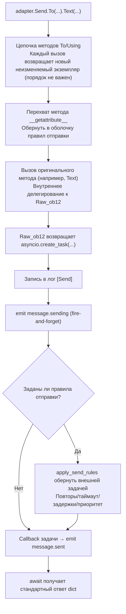

**Что делает фреймворк на каждом этапе:**

| Этап | Что делает фреймворк |
|------|-------------|
| Цепочка объединения | `To`/`Using`/`Account` при каждом вызове **создают новый неизменяемый экземпляр** и наследуют уже установленные поля, поэтому `To(...).Using(...)` и `Using(...).To(...)` **эквивалентны**, порядок не имеет значения |
| Обертка методов | Методы отправки (`Text` и др.) перехвачены `__getattribute__` и обернуты; методы-修饰аторы (`To`/`Using`/`At`/`Retry` и др.) **не обернуты**. Вложенные вызовы `Raw_ob12` предотвращают повторную обертку с помощью `_in_rule_wrap` |
| Создание задачи | `Raw_ob12` внутри `asyncio.create_task()` — это точка создания задачи; `Text()` просто синхронно возвращает эту задачу, **не блокируя** |
| Лог отправки | Запись в лог `[Send] platform/method -> target` (можно отключить с помощью `exclude_levels=["EVENT"]`) |
| `message.sending` | Метод отправки вызывается **немедленно** с fire-and-forget (только если есть слушатели, сначала short-circuit через `has_handlers`) |
| `message.sent` | Привязан к `done_callback` задачи — **результат завершения всего процесса повторов при наличии правил**, в противном случае — завершение исходной задачи |

### Цепочка разрешения аккаунта

Когда адаптер вызывает `_resolve_account(account_id)` внутренне, разрешение конкретного аккаунта происходит в следующем порядке:

1. Адаптер с одним аккаунтом (без `AccountConfigClass`) → возвращает напрямую
2. Точный матч по имени аккаунта `account_id`
3. Сопоставление по полю `bot_id` каждого аккаунта
4. Сопоставление по любому строковому значению поля аккаунта (исключая `enabled`/`name`)
5. Возврат первого включенного аккаунта по умолчанию
6. Если все попытки неудачны → выбрасывается `ValueError`

> `account_id`, который вы передаете, берется из: явного указания в `Using()` > поля `self` события (`account_id` имеет приоритет над `user_id`, автоматически вставляется через `event.reply()` > не указано (адаптер возвращает первый включенный аккаунт по умолчанию).

### Двигатель правил отправки (повторы/таймауты/задержки)

Правила оборачиваются в новую внешнюю задачу **после** возврата задачи из `Raw_ob12`, не влияя на основной процесс. Ключевые факты:

| Правило | Описание |
|------|------|
| `Retry(n)` | Общее количество попыток `n+1`; **повторяется немедленно при неудаче, без экспоненциальной задержки** |
| `Timeout(s)` | Отмена отправки при таймауте (с помощью `asyncio.wait_for`), повторяется, если время не истекло |
| `Defer(s)` | Задержка перед отправкой с помощью `sleep` |
| `Priority(level, drop_if_busy)` | При превышении порога накопления возврат `{status:"failed", retcode:10002, message:"dropped_low_priority"}` |
| `Hook(fn)` | Выполняется только при успешном завершении |
| `on_progress` / `on_error` | Коллбэки на каждом этапе / при окончательной ошибке |

> **Внимание**: повторы — это «немедленная повторная отправка», без интервала задержки; если платформа требует задержки, необходимо вручную вызывать `sleep` в `on_error` и затем повторно отправлять. Успешность правила определяется по `status == "ok"` в возвращаемом словаре (также `retcode == 0`).

> Полный формат стандартного ответа и семантика `retcode` см. в [спецификации API-ответа](../../standards/api-response.md).

## Возвращаемое значение

### Объект Task

Все методы отправки возвращают `asyncio.Task`. Адаптеру нужно реализовать только `Raw_ob12`, стандартные методы (Text/Image и т.д.) по умолчанию делегируются ему:

```python
import asyncio

def Raw_ob12(self, message, **kwargs):
    async def _do_send():
        segments = self._apply_modifiers(message)
        return await self._adapter.call_api(
            endpoint="/send_message",
            message=segments,
            **self.send_context,
            **kwargs,
        )
    return asyncio.create_task(_do_send())

# Text/Image/Voice/Video/File унаследованы от базового класса и автоматически делегируют Raw_ob12
# Если нужно переопределить стандартный метод, просто верните asyncio.Task:
# def Text(self, text: str):
#     return self.Raw_ob12([{"type": "text", "data": {"text": text}}])
```

### Стандартизированный ответ

`call_api` должен возвращать стандартизированный ответ. Рекомендуется использовать методы `make_response()` / `make_error()`:

```python
async def call_api(self, endpoint: str, **params):
    try:
        result = await self._do_api_call(endpoint, **params)
        return self.make_response(
            data=result.get("data"),
            message_id=result.get("message_id", ""),
            raw=result,
        )
    except Exception as e:
        return self.make_error(message=str(e))
```

Также поддерживается ручная конструкция (старый способ по-прежнему совместим):

```python
async def call_api(self, endpoint: str, **params):
    return {
        "status": "ok" или "failed",
        "retcode": 0 или код_ошибки,
        "data": {...},
        "message_id": "msg_id" или "",
        "message": "",
        "{platform}_raw": raw_response
    }
```

Пожалуйста, возвращайте непосредственно полный переведённый Markdown-контент, без каких-либо дополнительных текстов.

## Полный пример

### Основное использование

```python
from ErisPulse.Core import adapter

my_adapter = adapter.get("myplatform")

# Отправка текста
await my_adapter.Send.To("user", "123").Text("Hello World!")

# Отправка изображения
await my_adapter.Send.To("group", "456").Image("https://example.com/image.jpg")

# Отправка файла
with open("document.pdf", "rb") as f:
    await my_adapter.Send.To("user", "123").File(f.read())
```

### Цепочка вызовов

```python
# @пользователь + ответ
await my_adapter.Send.To("group", "456").At("789").Reply("msg123").Text("Ответ на сообщение с @")

# @всех + несколько модификаторов
await my_adapter.Send.Using("bot1").To("group", "456").AtAll().Text("Анонс")
```

### Сырые сообщения и построение сообщений

`Raw_ob12` является основным входом для обратного преобразования (преобразование сообщений OB12 → вызов API платформы), а `MessageBuilder` — это инструмент построения цепочки сообщений, используемый совместно с ним.

> Полное описание реализации `Raw_ob12`, использование `MessageBuilder` и примеры кода см. в:
> - [Спецификация метода отправки §6 Спецификация обратного преобразования (OneBot12 → Платформа)](../../standards/send-method-spec.md#6-反向转换规范onebot12--平台)
> - [Спецификация метода отправки §11 Построитель сообщений (MessageBuilder)](../../standards/send-method-spec.md#11-消息构建器-messagebuilder)


### 适配器开发最佳实践

# Рекомендации по разработке адаптеров ErisPulse

Данный документ предоставляет рекомендации по разработке адаптеров ErisPulse.

Пожалуйста, верните только переведённый полный Markdown-контент, не добавляя никаких других текстов.

Ещё раз напоминаем: если документ содержит строки переключения языка (строки с названиями языков, разделёнными `` | ``), строго соблюдайте вышеуказанные правила форматирования в пункте 8, не пишите ошибочного формата ``[**Label**](file)``.

## Управление состоянием бота и метасобытия

Адаптер должен активно отправлять метасобытия с помощью `adapter.emit()`, чтобы фреймворк автоматически отслеживал состояние подключения бота, его онлайн/оффлайн статус и информацию о心跳.

### 1. Когда отправлять метасобытия

| Событие | `detail_type` | Точка срабатывания | Поведение фреймворка |
|------|--------------|---------|---------|
| Подключение | `"connect"` | Когда бот устанавливает соединение с платформой | Регистрирует бота, запускает событие жизненного цикла `adapter.bot.online` |
| Отключение | `"disconnect"` | Когда бот отключается от платформы | Отмечает бота как оффлайн, запускает событие жизненного цикла `adapter.bot.offline` |
| Heartbeat | `"heartbeat"` | Регулярно (рекомендуется каждые 30-60 секунд) | Обновляет время активности и метаинформацию бота |

### 2. Отправка метасобытий

Фреймворк предоставляет метод `emit_meta()`, с помощью которого можно отправить метасобытие всего одной строкой:

```python
class MyAdapter(BaseAdapter):
    async def _ws_handler(self, websocket):
        bot_id = self._get_bot_id()

        # Бот в сети: отправка события connect одной строкой
        await self.emit_meta("connect", bot_id, user_name="MyBot", nickname="Мой робот")

        try:
            while True:
                data = await websocket.receive_text()
                event = self.convert(data)
                if event:
                    await self.adapter.emit(event)
        except WebSocketDisconnect:
            pass
        finally:
            # Бот вышел из сети
            await self.emit_meta("disconnect", bot_id)
```

### 3. События heartbeat

Адаптер должен регулярно отправлять heartbeat-события в течение времени жизни соединения, чтобы обновлять время активности бота:

```python
class MyAdapter(BaseAdapter):
    async def _heartbeat_loop(self, bot_id: str):
        while self._connected:
            # Отправка метасобытия heartbeat фреймворку (одна строка)
            await self.emit_meta("heartbeat", bot_id)
            await asyncio.sleep(30)
```

### 4. Автоматическое обнаружение поля `self`

Метод `adapter.emit()` фреймворка автоматически обрабатывает все события (не только метасобытия), включая поле `self`:

- В обычных событиях (message/notice/request) поле `self` автоматически обнаруживается и бот регистрируется
- **Дополнительная информация в поле `self`**: поддерживает необязательные поля `user_name`, `nickname`, `avatar`, `account_id`

```python
# В конвертере достаточно указать поле self для автоматической регистрации бота
onebot_event = {
    "type": "message",
    "detail_type": "private",
    "platform": "myplatform",
    "self": {
        "platform": "myplatform",
        "user_id": "bot123",
        "user_name": "MyBot",
        "nickname": "Мой робот",
    },
    # ... другие поля
}
await self.adapter.emit(onebot_event)
# Бот "bot123" автоматически зарегистрирован и обновлено время активности
```

### 5. Запрос состояния бота

Фреймворк предоставляет следующие методы для запроса информации:

```python
from ErisPulse import sdk

# Получение подробной информации о боте
info = sdk.adapter.get_bot_info("myplatform", "bot123")
# {"status": "online", "last_active": 1712345678.0, "info": {"nickname": "MyBot"}}

# Получение списка всех ботов (группировка по платформам)
all_bots = sdk.adapter.list_bots()

# Получение списка ботов для указанной платформы
platform_bots = sdk.adapter.list_bots("myplatform")

# Проверка, находится ли бот в сети
is_online = sdk.adapter.is_bot_online("myplatform", "bot123")

# Получение полного сводного состояния (подходит для отображения в WebUI)
summary = sdk.adapter.get_status_summary()
# {"adapters": {"myplatform": {"status": "started", "bots": {...}}}}

## Управление подключениями

### 1. Реализация повторных попыток подключения

```python
import asyncio

class MyAdapter(BaseAdapter):
    async def start(self):
        retry_count = 0
        max_retries = 5
        
        while retry_count < max_retries:
            try:
                await self._connect_to_platform()
                self.logger.info("Подключение успешно установлено")
                break
            except Exception as e:
                retry_count += 1
                if retry_count < max_retries:
                    # Стратегия экспоненциальной задержки
                    wait_time = min(60 * (2 ** retry_count), 600)
                    self.logger.warning(
                        f"Не удалось подключиться, повтор через {wait_time} секунд ({retry_count}/{max_retries}): {e}"
                    )
                    await asyncio.sleep(wait_time)
                else:
                    self.logger.error("Не удалось подключиться, достигнуто максимальное количество попыток")
                    raise
```

### 2. Управление состоянием подключения

```python
class MyAdapter(BaseAdapter):
    async def start(self):
        self.connection = None
        self._connected = False
    
    async def _ws_handler(self, websocket: WebSocket):
        self.connection = websocket
        self._connected = True
        self.logger.info("Подключение установлено")
        
        try:
            while True:
                data = await websocket.receive_text()
                await self._process_event(data)
        except WebSocketDisconnect:
            self.logger.info("Подключение разорвано")
        finally:
            self.connection = None
            self._connected = False
```

### 3. Пинг и мета-пинг

Пинг адаптера должен выполнять две задачи: отправлять пинг платформе и отправлять мета-событие пинга фреймворку.

```python
class MyAdapter(BaseAdapter):
    async def start(self):
        self.connection = await self._connect_to_platform()
        self._heartbeat_task = asyncio.create_task(self._heartbeat_loop())

    async def _heartbeat_loop(self):
        while self.connection:
            try:
                # 1. Отправка пинга платформе
                await self.connection.send_json({"type": "ping"})

                # 2. Отправка мета-события пинга (одной строкой с emit_meta)
                await self.emit_meta("heartbeat", self._bot_id)

                await asyncio.sleep(30)
            except Exception as e:
                self.logger.error(f"Ошибка пинга: {e}")
                break
```

### 4. Обеспечение видимости информации о подключении

Регистрируемые адаптером маршруты должны быть доступны пользователям для настройки обратного вызова на стороне платформы. Рекомендуется активно выводить информацию о подключении в методе `start()`:

```python
class MyAdapter(BaseAdapter):
    async def start(self):
        router.register_websocket(
            module_name=self.platform,
            path="/ws",
            handler=self._ws_handler
        )

        if self.sdk:
            info = self.sdk.adapter.get_connection_info(self.platform)
            if info:
                self.logger.info(f"Адрес WebSocket: "
                    f"{info.get('connection', {}).get('base_url', '')}"
                    f"{info.get('connection', {}).get('websocket_routes', [])}")
```

Пользователь может использовать следующий API для просмотра всех маршрутов и адресов подключения адаптера:

```python
from ErisPulse import sdk

# Информация о подключении на уровне адаптера (рекомендуется)
info = sdk.adapter.get_connection_info("myplatform")

# Запрос на уровне маршрутизатора
sdk.router.list_namespaces()              # Список всех пространств имен
sdk.router.get_module_routes("myplatform")  # Детальная информация о маршрутах
sdk.router.get_module_urls("myplatform")    # Полные адреса подключения
```

> **Важно**: `module_name`, используемый при регистрации маршрута, должен полностью совпадать с именем `platform`, зарегистрированным в ErisPulse, иначе `get_connection_info()` не сможет сопоставить маршруты. Адаптеры для нескольких аккаунтов должны регистрировать подпути для каждого аккаунта (например, `/account1/webhook`, `/account2/webhook`), а не использовать разные `module_name`.

[**English**](docs/ru/quick-start.md)

## Преобразование событий

### 1. Строгое соблюдение стандарта OneBot12

```python
class MyPlatformConverter:
    def convert(self, raw_event):
        """Преобразование события"""
        onebot_event = {
            "id": str(raw_event.get("event_id", uuid.uuid4())),
            "time": int(time.time()),
            "type": self._convert_type(raw_event.get("type")),
            "detail_type": self._convert_detail_type(raw_event),
            "platform": "myplatform",
            "self": {
                "platform": "myplatform",
                "user_id": str(raw_event.get("bot_id", ""))
            },
            "myplatform_raw": raw_event,  # Сохранение исходных данных (обязательно)
            "myplatform_raw_type": raw_event.get("type", "")  # Исходный тип (обязательно)
        }
        return onebot_event
```

### 2. Стандартизация метки времени

```python
def _convert_timestamp(self, timestamp):
    """Преобразование в 10-значную метку времени в секундах"""
    if not timestamp:
        return int(time.time())
    
    # Если метка времени в миллисекундах
    if timestamp > 10**12:
        return int(timestamp / 1000)
    
    # Если метка времени в секундах
    return int(timestamp)
```

### 3. Генерация идентификатора события

```python
import uuid

def _generate_event_id(self, raw_event):
    """Генерация идентификатора события"""
    event_id = raw_event.get("event_id")
    if event_id:
        return str(event_id)
    # Если платформа не предоставляет ID, генерируем UUID
    return str(uuid.uuid4())
```

[**中文**](docs/ru/quick-start.md)

## Реализация SendDSL

Модификаторы `At`/`AtAll`/`Reply` встроены в базовый класс SendDSL фреймворка, адаптеру нужно только реализовать `Raw_ob12` и конкретные методы отправки. Использование `self._apply_modifiers(message)` и `self.send_context` упрощает разработку.

### 1. Обязательно возвращать объект Task

```python
class Send(BaseAdapter.Send):
    def Raw_ob12(self, message, **kwargs):
        """Рекомендуемая реализация: использование вспомогательного метода фреймворка"""
        async def _do_send():
            segments = self._apply_modifiers(message)
            return await self._adapter.call_api(
                endpoint="/send_message",
                message=segments,
                **self.send_context,
                **kwargs
            )
        return asyncio.create_task(_do_send())

    def Text(self, text: str):
        return self.Raw_ob12([{"type": "text", "data": {"text": text}}])
```

### 2. Методы цепочки модификаторов должны возвращать self

```python
class Send(BaseAdapter.Send):

    def __init__(self, adapter, target_type=None, target_id=None, account_id=None):
        super().__init__(adapter, target_type, target_id, account_id)
        self.buttons = []

    def Button(self, content: list) -> 'Send':
        self.buttons.append(content)
        return self # возвращаем self
```

### 3. Поддержка методов, специфичных для платформы

```python
class Send(BaseAdapter.Send):
    def Sticker(self, sticker_id: str):
        """Отправка стикеров"""
        return asyncio.create_task(
            self._adapter.call_api(
                endpoint="/send_sticker",
                message=[{"type": "sticker", "data": {"id": sticker_id}}],
                **self.send_context
            )
        )
    
    def Card(self, card_data: dict):
        """Отправка карточного сообщения"""
        return asyncio.create_task(
            self._adapter.call_api(
                endpoint="/send_card",
                message=[{"type": "card", "data": card_data}],
                **self.send_context
            )
        )

## API ответ

### 1. Стандартизированный формат ответа

Фреймворк предоставляет методы `make_response()` и `make_error()` для построения стандартизированного ответа:

```python
async def call_api(self, endpoint: str, **params):
    try:
        raw_response = await self._platform_api_call(endpoint, **params)
        
        if raw_response.get("success"):
            return self.make_response(
                data=raw_response.get("data"),
                message_id=raw_response.get("data", {}).get("message_id", ""),
                raw=raw_response,
            )
        else:
            return self.make_error(
                retcode=raw_response.get("code", 10001),
                message=raw_response.get("message", ""),
                raw=raw_response,
            )
    except Exception as e:
        return self.make_error(message=str(e))
```

`make_response()` автоматически сгенерирует словарь ответа, содержащий ключ `{platform}_raw`. `make_error()` по умолчанию использует `retcode=34000` (Platform Error).

### 2. Стандарт кодов ошибок

Следуйте стандартным кодам ошибок OneBot12:

```python
# 1xxxx - Ошибка запроса действия
10001: Bad Request
10002: Unsupported Action
10003: Bad Param

# 2xxxx - Ошибка обработчика действия
20001: Bad Handler
20002: Internal Handler Error

# 3xxxx - Ошибка выполнения действия
31000: Database Error
32000: Filesystem Error
33000: Network Error
34000: Platform Error
35000: Logic Error
```

[**中文**](docs/ru/quick-start.md) | [**English**](docs/ru/quick-start.md)

## Поддержка нескольких аккаунтов

### 1. Декларативная конфигурация (рекомендуется)

После использования `AccountConfigClass` для декларативной конфигурации, фреймворк автоматически управляет загрузкой, проверкой и генерацией шаблонов для нескольких аккаунтов. Базовый класс `BotAccountConfig` предоставляет поля `enabled` и `name`, адаптеру не нужно их объявлять:

```python
from dataclasses import dataclass, field
from ErisPulse.Core.Bases import BotAccountConfig

@dataclass
class MyBotConfig(BotAccountConfig):
    token: str = field(default="", metadata={
        "description": {"i18n": "my_adapter.bot_token", "default": "Токен бота"},
        "required": True,
        "secret": True,
    })

class MyAdapter(BaseAdapter):
    AccountConfigClass = MyBotConfig
    
    async def start(self):
        for name, account in self.enabled_accounts.items():
            self.logger.info(f"Запуск аккаунта {name}")
            await self._connect(name, account.token)
            # bot_id автоматически заполняется фреймворком из протокола платформы/ответа на вход
    
    async def call_api(self, endpoint: str, **params):
        account_id = params.pop("account_id", None)
        name, account = self._resolve_account(account_id)
        # name: имя аккаунта, account: экземпляр MyBotConfig
```

Конфигурационный файл будет автоматически сгенерирован следующим образом:

```toml
[MyAdapter.accounts.default]
token = ""
enabled = true
name = ""
```

### 2. Механизм выбора аккаунта

Фреймворк включает метод `_resolve_account()`, который использует следующий приоритет сопоставления:

1. **Имя аккаунта** — точное совпадение с ключом конфигурации
2. **Поле `bot_id`** — автоматически получаемый bot_id (то есть `event["self"]["user_id"]`)
3. **Любое строковое поле** — другие строковые поля в конфигурации
4. **Резервный вариант** — первый включённый аккаунт

```python
# Сопоставление по имени аккаунта
name, account = self._resolve_account("account1")

# Сопоставление по bot_id (наиболее часто используемый способ, из события)
name, account = self._resolve_account("bot_123")

# Получение первого включённого аккаунта (передача None)
name, account = self._resolve_account(None)

## Обработка ошибок

### 1. Классификация обработки исключений

Используйте `make_error()` для построения стандартизированного ответа об ошибке. При запросе через `sdk.client` перехватывайте исключения ErisPulse:

```python
from ErisPulse.Core.Bases.errors import ClientError, ClientTimeoutError

async def call_api(self, endpoint: str, **params):
    try:
        from ErisPulse.Core import client
        resp = await client.post(
            f"https://api.platform.com/{endpoint}",
            json=params,
            max_retries=2,
        )
        response = await resp.json()
        return self.make_response(data=response, raw=response)
    except ClientTimeoutError:
        self.logger.error(f"Запрос превысил лимит времени: {endpoint}")
        return self.make_error(retcode=32000, message="Запрос превысил лимит времени")
    except ClientError as e:
        self.logger.error(f"Сетевая ошибка: {e}")
        return self.make_error(retcode=33000, message="Ошибка сетевого запроса")
    except json.JSONDecodeError:
        self.logger.error("Не удалось распарсить JSON")
        return self.make_error(retcode=10006, message="Неверный формат ответа")
    except Exception as e:
        self.logger.error(f"Неизвестная ошибка: {e}", exc_info=True)
        return self.make_error(message=str(e))
```

> **Обратная совместимость**: Код старых адаптеров, использующих напрямую `aiohttp`, не затрагивается и по-прежнему может перехватывать `aiohttp.ClientError`. Преобразование исключений действует только при запросах, инициированных через `sdk.client`.

### 2. Запись логов

Фреймворк автоматически создает дочерний логгер для адаптера (`sdk.logger.get_child("MyAdapter")`), без необходимости ручной инициализации:

```python
class MyAdapter(BaseAdapter):
    # ConfigClass = ...  # После объявления класса конфигурации self.logger будет доступен автоматически
    
    async def start(self):
        self.logger.info("Адаптер запускается...")
        # ...
        self.logger.info("Адаптер успешно запущен")
    
    async def shutdown(self):
        self.logger.info("Адаптер останавливается...")
        # ...
        self.logger.info("Адаптер успешно остановлен")

## Тестирование

### 1. Юнит-тесты

```python
import pytest
from ErisPulse.Core.Bases import BaseAdapter

class TestMyAdapter:
    def test_converter(self):
        """Тестирование конвертера"""
        converter = MyPlatformConverter()
        raw_event = {"type": "message", "content": "Hello"}
        result = converter.convert(raw_event)
        assert result is not None
        assert result["platform"] == "myplatform"
        assert "myplatform_raw" in result
    
    def test_api_response(self):
        """Тестирование формата API-ответа"""
        adapter = MyAdapter()
        response = adapter.call_api("/test", param="value")
        assert "status" in response
        assert "retcode" in response
```

### 2. Интеграционные тесты

```python
@pytest.mark.asyncio
async def test_adapter_start():
    """Тестирование запуска адаптера"""
    adapter = MyAdapter()
    await adapter.start()
    assert adapter._connected is True

@pytest.mark.asyncio
async def test_send_message():
    """Тестирование отправки сообщения"""
    adapter = MyAdapter()
    await adapter.start()
    
    result = await adapter.Send.To("user", "123").Text("Hello")
    assert result is not None
```

[**English**](docs/ru/quick-start.md)

## Обратное преобразование и построение сообщений

`Raw_ob12` — это метод, который адаптер **должен реализовать**, он является единым входом для обратного преобразования (OneBot12 → платформа). Стандартные методы (`Text`, `Image` и т. д.) должны делегировать вызовы методу `Raw_ob12`, а состояние модификаторов (`At`/`Reply`/`AtAll`) должно объединяться внутри `Raw_ob12` в сегменты сообщения.

`MessageBuilder` — это инструмент для построения сегментов сообщений, совместимый с использованием `Raw_ob12`, поддерживающий цепочечные вызовы и быстрое построение.

> Полная спецификация реализации, примеры кода и методы использования см. в:
> - [Спецификация методов отправки §6 Спецификация обратного преобразования](../../standards/send-method-spec.md#6-обратное-преобразование-одинбот12--платформа)
> - [Спецификация методов отправки §11 Построитель сообщений](../../standards/send-method-spec.md#11-построитель-сообщений-messagebuilder)

## Расширение методов платформенных событий

Адаптер может зарегистрировать платформенно-специфические методы для класса Event-обертки, что позволяет разработчикам модулей более удобно получать доступ к платформенно-специфическим данным.

### 1. Массовая регистрация с использованием класса Mixin (рекомендуется)

Когда платформа имеет несколько специфических методов, рекомендуется использовать класс Mixin:

```python
# Регистрация в start() адаптера или на уровне модуля
from ErisPulse.Core.Event import register_event_mixin

class MyPlatformEventMixin:
    def get_chat_name(self):
        """Получить название чата"""
        return self.get("myplatform_raw", {}).get("chat", {}).get("name", "")

    def is_official_message(self):
        """Определить, является ли сообщение официальным"""
        raw = self.get("myplatform_raw", {})
        return raw.get("sender", {}).get("is_official", False)

    def get_message_type(self):
        """Получить тип сообщения платформы"""
        return self.get("myplatform_raw", {}).get("msg_type", "text")

# Массовая регистрация
register_event_mixin("myplatform", MyPlatformEventMixin)
```

### 2. Регистрация отдельного метода с использованием декоратора

```python
from ErisPulse.Core.Event import register_event_method

@register_event_method("myplatform")
def get_chat_name(self):
    return self.get("myplatform_raw", {}).get("chat", {}).get("name", "")
```

### 3. Очистка при выключении адаптера

```python
from ErisPulse.Core.Event import unregister_platform_event_methods

class MyAdapter(BaseAdapter):
    async def shutdown(self):
        # Очистка регистраций платформенно-специфических методов событий
        unregister_platform_event_methods("myplatform")
        # ... другие действия по очистке
```

> Подробное описание регистрации и отмены регистрации см. в [API системы событий - Регистрация платформенно-специфических методов](../../api-reference/event-system.md#Регистрация платформенно-специфических методов адаптером).

## Документация по обслуживанию

### 1. Обслуживание документации платформы

Создайте документ `{platform}.md` в каталоге `docs/ru/platform-guide/` (другие языковые версии будут созданы автоматически):

```markdown
# Документация адаптера платформы

## Основная информация
- Версия соответствующего модуля: 1.0.0
- Ответственный: Your Name

## Поддерживаемые типы отправки сообщений
...

## Уникальные типы событий
...

## Параметры конфигурации
...
```

### 2. Обновление информации о версии

При выпуске новой версии обновите информацию о версии в документации:

```toml
[project]
version = "2.0.0"  # Обновите номер версии
```

Важно: если документ содержит строки переключения языка (имена языков разделены символом `` | ``), строго соблюдайте вышеуказанные правила форматирования в пункте 8. Не используйте ошибочный формат вида ``[**Label**](file)``.


### 事件转换器

# Руководство по реализации конвертера событий

Конвертер событий (Converter) — один из ключевых компонентов адаптера, отвечающий за преобразование нативных событий платформы в унифицированный формат событий OneBot12 от ErisPulse.

docs/ru/quick-start.md | docs/ru/guide.md | docs/ru/api.md

## Ответственность Converter

```
События платформы ──→ Converter.convert() ──→ Стандартные события OneBot12
```

Converter отвечает только за **прямое преобразование** (направление получения), то есть за преобразование данных событий платформы в стандартный формат OneBot12. Обратное преобразование (направление отправки) обрабатывается методом `Send.Raw_ob12()`.

### Основные принципы

1. **Без потерь**: исходные данные должны быть полностью сохранены в поле `{platform}_raw`
2. **Совместимость со стандартом**: преобразованные события должны соответствовать стандартному формату OneBot12
3. **Расширения платформы**: данные, специфичные для платформы, хранятся в полях с префиксом `{platform}_`

[**English**](docs/ru/quick-start.md) | [**简体中文**](docs/ru/quick-start.md)

## Базовый класс BaseConverter (рекомендуется)

Начиная с версии 2.7.0, фреймворк предоставляет базовый класс `BaseConverter` (`ErisPulse.Core.Bases`), который封装ует **общее построение полей событий OneBot12** и **помощь с часто используемыми сообщениями**, позволяя конвертеру сосредоточиться только на типовом отображении:

```python
from ErisPulse.Core.Bases import BaseConverter


class MyConverter(BaseConverter):
    def __init__(self):
        super().__init__(platform="myplatform")

    def convert(self, raw_event: dict) -> dict | None:
        if not isinstance(raw_event, dict):
            return None
        event_type = raw_event.get("type", "")
        base = self.build_base_event(raw_event, event_type)  # id/time/platform/self/raw
        if event_type == "message":
            base["type"] = "message"
            base["detail_type"] = "group" if raw_event.get("group_id") else "private"
            base["user_id"] = str(raw_event.get("sender_id", ""))
            base["message"] = [self.text(raw_event.get("content", ""))]
            base["alt_message"] = raw_event.get("content", "")
            return base
        return None
```

Заполненные общие поля `build_base_event()`:

| Поле | Источник |
|------|------|
| `id` | `raw_event["event_id"]`, по умолчанию генерируется UUID |
| `time` | `raw_event["timestamp"]`, по умолчанию текущее время |
| `platform` | переданный при создании `platform` |
| `self` | `{"platform": ..., "user_id": raw_event["bot_id"]}` |
| `{platform}_raw` | исходное событие (соответствует принципу "без потерь") |
| `{platform}_raw_type` | тип исходного события |

Часто используемые методы помощи с сообщениями (все статические, можно повторно использовать):

```python
converter.text("hi")          # {"type": "text", "data": {"text": "hi"}}
converter.at("123456")        # {"type": "at", "data": {"user_id": "123456"}}
converter.image("file.png")   # {"type": "image", "data": {"file": "file.png"}}
```

> При ручной реализации конструктор общих полей `build_base_event` является обязательным шаблонным кодом, который нужно повторно писать. Использование `BaseConverter` позволяет избежать этой части, и при этом естественно удовлетворяет принципу "без потерь" (исходное событие всегда попадает в `{platform}_raw`).

[**README**](README.ru.md) | [**快速入门**](docs/ru/quick-start.md) | [**文档**](docs/ru/introduction.md) | [**贡献**](CONTRIBUTING.ru.md) | [**许可证**](LICENSE)

## Метод convert()

### Подпись метода

```python
def convert(self, raw_event: dict) -> dict:
    """
    Преобразует платформенно-специфичное событие в стандартный формат OneBot12

    :param raw_event: Данные платформенно-специфичного события
    :return: Словарь события в стандартизированном формате OneBot12
    """
    pass
```

### Структура возвращаемого значения

Преобразованный словарь события должен содержать следующие стандартные поля:

```python
{
    "id": "Уникальный идентификатор события",
    "time": 1234567890,           # Unix-время (секунды)
    "type": "message",             # Тип события
    "detail_type": "private",      # Подтип события
    "platform": "myplatform",      # Название платформы
    "self": {
        "platform": "myplatform",
        "user_id": "bot_user_id"
    },

    # Поля события сообщения
    "user_id": "sender_id",
    "message": [...],              # Список сообщений OneBot12
    "alt_message": "Содержимое в виде простого текста",

    # Обязательно сохранить исходные данные
    "myplatform_raw": { ... },     # Полные данные исходного события платформы
    "myplatform_raw_type": "Имя типа исходного события",
}

## Обязательные поля

### Общие поля (для всех типов событий)

| OB12 поле | Тип | Описание |
|-----------|------|------|
| `id` | str | Уникальный идентификатор события |
| `time` | int | Unix-время (в секундах) |
| `type` | str | Тип события: `message` / `notice` / `request` / `meta` |
| `detail_type` | str | Подтип: `private` / `group` / `friend` и т.д. |
| `platform` | str | Название платформы, совпадает с именем адаптера |
| `self` | dict | Информация о боте: `{"platform": "...", "user_id": "..."}` |

### Дополнительные поля для событий сообщений

| OB12 поле | Тип | Описание |
|-----------|------|------|
| `user_id` | str | ID отправителя |
| `message` | list[dict] | Список сообщений OneBot12 |
| `alt_message` | str | Запасной текстовый контент |

### Дополнительные поля для уведомлений

| OB12 поле | Тип | Описание |
|-----------|------|------|
| `user_id` | str | ID связанного пользователя |
| `operator_id` | str | ID оператора (например, при изменении участников группы) |

[**English**](docs/ru/quick-start.md) | [**简体中文**](docs/ru/quick-start.md) | [**Русский**](docs/ru/quick-start.md)

## Преобразование сегментов сообщений

Стандарт OneBot12 определяет следующие типы сегментов сообщений:

```python
# Текст
{"type": "text", "data": {"text": "Привет"}}

# Изображение
{"type": "image", "data": {"file": "https://example.com/img.jpg"}}

# Аудио
{"type": "audio", "data": {"file": "https://example.com/audio.mp3"}}

# Видео
{"type": "video", "data": {"file": "https://example.com/video.mp4"}}

# Файл
{"type": "file", "data": {"file": "https://example.com/doc.pdf"}}

# Упоминание
{"type": "mention", "data": {"user_id": "123"}}

# Упоминание всех
{"type": "mention_all", "data": {}}

# Ответ
{"type": "reply", "data": {"message_id": "msg_123"}}
```

Если платформа не поддерживает определённый тип сегмента сообщения, этот сегмент можно опустить или преобразовать в наиболее близкий стандартный тип.

[**中文**](docs/ru/quick-start.md)

## Платформенные расширенные поля

Данные, специфичные для платформы, следует хранить с префиксом `{platform}_`, чтобы избежать конфликта с стандартными полями:

```python
{
    # Стандартные поля
    "type": "message",
    "detail_type": "group",
    # ...

    # Платформенные расширенные поля
    "myplatform_raw": { ... },          # Исходные данные события (обязательно)
    "myplatform_raw_type": "chat",      # Тип исходного события (обязательно)

    # Другие поля, специфичные для платформы
    "myplatform_group_name": "Название группы",
    "myplatform_sender_role": "admin",
}
```

> **Важно**: Поле `{platform}_raw` обязательно, система событий и модули ErisPulse могут зависеть от него для доступа к исходным данным платформы.

[**English**](docs/ru/quick-start.md)

## Полный пример

Ниже приведена полная реализация Converter:

```python
class MyConverter:
    def __init__(self, platform: str):
        self.platform = platform

    def convert(self, raw_event: dict) -> dict:
        event_type = raw_event.get("type", "")

        base_event = {
            "id": raw_event.get("id", ""),
            "time": raw_event.get("timestamp", 0),
            "platform": self.platform,
            "self": {
                "platform": self.platform,
                "user_id": raw_event.get("self_id", ""),
            },
            "myplatform_raw": raw_event,
            "myplatform_raw_type": event_type,
        }

        if event_type == "chat":
            return self._convert_message(raw_event, base_event)
        elif event_type == "notification":
            return self._convert_notice(raw_event, base_event)
        elif event_type == "request":
            return self._convert_request(raw_event, base_event)

        return base_event

    def _convert_message(self, raw: dict, base: dict) -> dict:
        base["type"] = "message"
        base["detail_type"] = "group" if raw.get("group_id") else "private"
        base["user_id"] = raw.get("sender_id", "")
        base["message"] = self._convert_message_segments(raw.get("content", ""))
        base["alt_message"] = raw.get("content", "")

        if raw.get("group_id"):
            base["group_id"] = raw["group_id"]

        return base

    def _convert_message_segments(self, content: str) -> list:
        segments = []
        if content:
            segments.append({"type": "text", "data": {"text": content}})
        return segments

    def _convert_notice(self, raw: dict, base: dict) -> dict:
        base["type"] = "notice"
        notification_type = raw.get("notification_type", "")

        if notification_type == "member_join":
            base["detail_type"] = "group_member_increase"
            base["user_id"] = raw.get("user_id", "")
            base["group_id"] = raw.get("group_id", "")
            base["operator_id"] = raw.get("operator_id", "")
        elif notification_type == "friend_add":
            base["detail_type"] = "friend_increase"
            base["user_id"] = raw.get("user_id", "")

        return base

    def _convert_request(self, raw: dict, base: dict) -> dict:
        base["type"] = "request"
        request_type = raw.get("request_type", "")

        if request_type == "friend":
            base["detail_type"] = "friend"
            base["user_id"] = raw.get("user_id", "")
            base["comment"] = raw.get("message", "")
        elif request_type == "group_invite":
            base["detail_type"] = "group"
            base["group_id"] = raw.get("group_id", "")
            base["user_id"] = raw.get("inviter_id", "")

        return base

## Пример преобразования мультимедийных сообщений

Сообщения, отправляемые на реальных платформах, обычно содержат мультимедийные элементы, такие как изображения, @-упоминания, ответы и т.д. Ниже приведен пример обработки `_convert_message_segments` для различных типов сообщений:

```python
def _convert_message_segments(self, raw_content: list) -> list:
    """Преобразует список сегментов сообщений платформы в стандартные сегменты OneBot12"""
    segments = []

    for item in raw_content:
        item_type = item.get("type", "")

        if item_type == "text":
            segments.append({
                "type": "text",
                "data": {"text": item.get("content", "")}
            })

        elif item_type == "image":
            file_url = item.get("url") or item.get("file_id", "")
            segments.append({
                "type": "image",
                "data": {"file": file_url}
            })

        elif item_type == "at":
            segments.append({
                "type": "mention",
                "data": {"user_id": item.get("target_id", "")}
            })

        elif item_type == "reply":
            segments.append({
                "type": "reply",
                "data": {"message_id": item.get("reply_to_id", "")}
            })

        elif item_type == "at_all":
            segments.append({"type": "mention_all", "data": {}})

        else:
            segments.append({
                "type": "text",
                "data": {"text": f"[Неподдерживаемый тип сообщения: {item_type}]"}
            })

    return segments

## Распространённые ошибки

### 1. Отсутствует поле `{platform}_raw`

Это самая распространённая ошибка. Отсутствие поля с исходными данными приводит к невозможности доступа к платформенно-специфической информации.

```python
base_event["myplatform_raw"] = raw_event        # Обязательно!
base_event["myplatform_raw_type"] = event_type   # Обязательно!
```

### 2. Неправильный формат временной метки

Стандарт OneBot12 требует, чтобы поле `time` было Unix-временем в секундах (целое число). Если платформа возвращает миллисекунды или строку в формате ISO, необходимо выполнить преобразование:

```python
import time

# Миллисекунды → секунды
"time": raw_event.get("timestamp", 0) // 1000

# Строка ISO → секунды
"time": int(time.mktime(time.strptime(raw_event["created_at"], "%Y-%m-%dT%H:%M:%S")))
```

### 3. Отсутствует поле `self`

Поле `self` содержит информацию о самом боте, `user_id` — это ID аккаунта бота. В сценариях с несколькими ботами это поле имеет особое значение:

```python
"self": {
    "platform": self.platform,
    "user_id": raw_event.get("bot_id", ""),   # ID самого бота
}
```

### 4. Использование недопустимых значений `detail_type`

Значение `detail_type` должно соответствовать стандартным значениям, определённым в OneBot12, таким как `private`, `group`, `friend_increase`, `group_member_increase` и т.д. Не следует использовать платформенно-специфические названия.

### 5. Соответствие направлениям

Убедитесь, что типы сообщений, создаваемые Converter, соответствуют поддерживаемым методам в Send-части. Например, если Converter преобразует платформенное сообщение с изображением в `{"type": "image", ...}`, то метод `Image()` в Send-части должен уметь отправлять изображения.

[**Руководство**](docs/ru/quick-start.md)

## Лучшие практики

1. **Всегда сохраняйте исходные данные**: Поле `{platform}_raw` не должно опускаться
2. **Используйте стандартные сегменты сообщений**: Старайтесь преобразовывать сообщения платформы в стандартные сегменты OneBot12
3. **Разумно задавайте detail_type**: Используйте стандартные типы (`private`/`group`/`channel` и т.д.), не создавайте собственные
4. **Обрабатывайте граничные случаи**: Исходное событие может отсутствовать некоторых полей, используйте `.get()` и задавайте разумные значения по умолчанию
5. **Учитывайте производительность**: `convert()` вызывается для каждого события, избегайте выполнения в нем операций, требующих много времени

[**English**](docs/ru/quick-start.md)


=====
发布与工具
=====


### 发布模块到模块商店

# Руководство по публикации и магазину модулей

Опубликуйте свой модуль или адаптер в магазине модулей ErisPulse, чтобы другие пользователи могли легко находить и устанавливать его.

## Обзор магазина модулей

Магазин модулей ErisPulse представляет собой централизованный реестр модулей, через который пользователи могут просматривать, искать и устанавливать модули и адаптеры, предоставленные сообществом, с помощью инструментов командной строки.

### Просмотр и обнаружение

```bash
# Вывести список всех доступных удалённых пакетов
epsdk list-remote

# Показать только модули
epsdk list-remote -t modules

# Показать только адаптеры
epsdk list-remote -t adapters

# Принудительно обновить список удалённых пакетов
epsdk list-remote -r
```

Вы также можете посетить [официальный сайт ErisPulse](https://www.erisdev.com/#market), чтобы просматривать магазин модулей онлайн.

### Поддерживаемые типы публикаций

| Тип | Описание | Группа entry-point |
|------|------|----------------|
| Модуль (Module) | Расширение функциональности бота, реализация бизнес-логики | `erispulse.module` |
| Адаптер (Adapter) | Подключение к новым платформам сообщений | `erispulse.adapter` |

## Быстрая публикация

Весь процесс состоит всего из трёх шагов: настройка проекта → публикация на PyPI → отправка в магазин модулей.

### 1. Настройка pyproject.toml

Убедитесь, что в каталоге проекта присутствуют `pyproject.toml` и `README.md`, а также настройте entry-points в зависимости от типа:

#### Модуль

```toml
[project]
name = "ErisPulse-MyModule"
version = "1.0.0"
description = "Описание функциональности модуля"
requires-python = ">=3.10"
license = { text = "MIT" }
authors = [ { name = "yourname" } ]
dependencies = [
    "ErisPulse>=2.0.0",
]

[project.entry-points."erispulse.module"]
"MyModule" = "MyModule:Main"
```

#### Адаптер

```toml
[project]
name = "ErisPulse-MyAdapter"
version = "1.0.0"
description = "Описание функциональности адаптера"
requires-python = ">=3.10"

[project.entry-points."erispulse.adapter"]
"myplatform" = "MyAdapter:MyAdapter"
```

> **Примечание**: Рекомендуется начинать имя пакета с `ErisPulse-`, чтобы пользователи могли легко его идентифицировать. Ключ entry-point (например, `"MyModule"`) будет использоваться как имя модуля в SDK.

### 2. Публикация на PyPI

```bash
# Сборка и публикация (требуется аккаунт на PyPI)
pip install build twine
python -m build
python -m twine upload dist/*
```

После успешной публикации проверьте установку:

```bash
pip install ErisPulse-MyModule
```

### 3. Отправка в магазин модулей

Перейдите на [ErisPulse Магазин модулей](https://www.erisdev.com/#market), нажмите «Отправить модуль», войдите в систему и заполните информацию о модуле.

Поддерживаемые способы входа: **GitHub**, **Codeberg**, **Yunhu**, можно выбрать любой.

Важные моменты для заполнения:
- Название модуля, описание, адрес репозитория
- Минимальная версия SDK: если не уверены, укажите версию [последнего релиза ErisPulse](https://pypi.org/project/ErisPulse/)

После отправки изменения вступают в силу немедленно, пользователи могут установить модуль через источник. Модуль будет помечен как «Не проверено», после проверки разработчиком он изменится на «Проверено».

> **О статусе проверки**:
> - «Не проверено» означает, что модуль ещё не прошёл официальную проверку, но не говорит о его проблемах
> - При установке не проверенного модуля через `epsdk install` пользователи получат предупреждение о риске, которое нужно подтвердить для продолжения установки

### 4. Управление опубликованными модулями

После входа в систему на вкладке «Отправить модуль» в магазине модулей, перейдите на вкладку «Мои модули», где можно:

- **Редактировать** — изменить описание модуля, адрес репозитория, теги и т.д., номер версии будет автоматически синхронизирован с PyPI
- **Удалить** — удалить модуль из магазина модулей (необратимо)

> Новые модули могут отображаться в списке «Мои модули» через несколько минут после отправки.

## Обновление опубликованных модулей

1. Обновите `version` в `pyproject.toml`
2. Пересоберите и перезагрузите: `python -m build && python -m twine upload dist/*`
3. Магазин модулей автоматически синхронизирует последнюю версию с PyPI

Пользователи могут обновить модуль с помощью `epsdk upgrade MyModule`.

## Список проверок перед публикацией

Перед отправкой на PyPI, пожалуйста, проверьте следующие пункты:

### Качество кода

- [ ] Все публичные API имеют аннотации типов (подписи функций и возвращаемые значения)
- [ ] Все публичные методы имеют строки документации (`"""..."""` формат, включая `:param` / `:return` / `:raises`)
- [ ] Проходит проверку `ruff check` (без предупреждений)
- [ ] Код покрыт тестами на ≥ 80%
- [ ] Проходят все тесты `pytest`

### Совместимость

- [ ] `pyproject.toml` объявляет минимальную версию SDK: `dependencies = ["ErisPulse>=x.y.z"]`
- [ ] Тестировано на Python 3.10 / 3.11 / 3.12 / 3.13
- [ ] Тестировано на целевых операционных системах (Windows / Linux / macOS, если применимо)
- [ ] Нет циклических зависимостей

### Конфигурация

- [ ] Если используется декларативная конфигурация (`ConfigClass` + `BaseConfig` / `BotAccountConfig`), поля конфигурации имеют `description` (рекомендуется в формате i18n) и метаданные `ui`
- [ ] Если зарегистрированы ключи переводов i18n, они покрывают все 5 языков (zh-CN / zh-TW / en / ja / ru)
- [ ] Чувствительные поля помечены `secret=True`

### Документация

- [ ] `README.md` содержит инструкции по установке и примеры использования
- [ ] `README.md` объясняет способ конфигурации (примеры конфигурационных файлов + переменные окружения)
- [ ] `CHANGELOG.md` содержит все изменения
- [ ] Адаптер обновил документацию по функциональности платформы (поддерживаемые типы Send, типы событий и т.д.)

### Публикация

- [ ] Номер версии в `pyproject.toml` обновлён
- [ ] Сборка прошла успешно: `python -m build`
- [ ] Отправлено на PyPI: `python -m twine upload dist/*`
- [ ] Установка проверена: `pip install ErisPulse-xxx && epsdk run`

## Тестирование в режиме разработки

Перед официальной публикацией можно протестировать локально в режиме редактирования:

```bash
epsdk install -e /path/to/MyModule
# или
pip install -e /path/to/MyModule
```

## Часто задаваемые вопросы

### Обязательно ли имя пакета должно начинаться с `ErisPulse-`?

Нет, это не обязательно, но настоятельно рекомендуется. Это помогает пользователям легко идентифицировать пакеты экосистемы ErisPulse на PyPI.

### Можно ли зарегистрировать несколько модулей в одном пакете?

Да. Просто добавьте несколько пар ключ-значение в `entry-points`:

```toml
[project.entry-points."erispulse.module"]
"ModuleA" = "MyPackage:ModuleA"
"ModuleB" = "MyPackage:ModuleB"
```

### Сколько времени занимает проверка?

Обычно проверка занимает 1–3 рабочих дня. Вы можете проверить статус проверки на вкладке «Мои модули» в магазине модулей.

## Распространение приложений через Docker-образы

Если ваше приложение не подходит для публикации на PyPI (например, содержит приватные зависимости или требует предварительной настройки среды), вы можете опубликовать Docker-образ через **GitHub Container Registry (GHCR)**, чтобы другие пользователи могли запускать его с помощью `docker pull`.

### Сценарии использования

- У вас есть **полное приложение-бот** (модуль + конфигурация + скрипт запуска), которое вы хотите распространить одним кликом
- Модуль/адаптер зависит от **приватных пакетов** или имеет специальный процесс установки, который не подходит для PyPI
- Вы хотите предоставить **готовое решение**, чтобы снизить порог входа для пользователей

### 1. Создание Dockerfile

Создайте Dockerfile на основе официального образа ErisPulse, просто добавив ваш модуль:

```dockerfile
FROM erispulse/erispulse:latest

LABEL org.opencontainers.image.title="ErisPulse-MyModule" \
      org.opencontainers.image.description="Описание модуля" \
      org.opencontainers.image.url="https://github.com/yourname/ErisPulse-MyModule" \
      org.opencontainers.image.source="https://github.com/yourname/ErisPulse-MyModule"

COPY pyproject.toml README.md ./
COPY MyModule/ ./MyModule/

RUN uv pip install --system -e .
```

Если модулю требуются дополнительные системные зависимости (например, клиент SSH и т.д.), добавьте их после `RUN uv pip install`:

```dockerfile
RUN apt-get update && apt-get install -y --no-install-recommends \
    openssh-client \
    && rm -rf /var/lib/apt/lists/*
```

> `erispulse/erispulse:latest` уже включает ErisPulse, ErisPulse-Dashboard, Python-интерпретатор и uv, дополнительная установка не требуется.

### 2. Создание рабочего потока GitHub Actions

Создайте файл `.github/workflows/docker-publish.yml`:

```yaml
name: Публикация Docker-образа

on:
  workflow_dispatch:
  push:
    branches:
      - main
    tags:
      - "v*"

permissions:
  contents: read
  packages: write

env:
  REGISTRY: ghcr.io
  IMAGE_NAME: ${{ github.repository_owner }}/my-bot

jobs:
  docker-publish:
    runs-on: ubuntu-latest

    steps:
      - name: Клонирование кода
        uses: actions/checkout@v4

      - name: Настройка QEMU (поддержка нескольких архитектур)
        uses: docker/setup-qemu-action@v3

      - name: Настройка Docker Buildx
        uses: docker/setup-buildx-action@v3

      - name: Вход в GitHub Container Registry
        uses: docker/login-action@v3
        with:
          registry: ${{ env.REGISTRY }}
          username: ${{ github.actor }}
          password: ${{ secrets.GITHUB_TOKEN }}

      - name: Извлечение метаданных Docker
        id: meta
        uses: docker/metadata-action@v5
        with:
          images: ${{ env.REGISTRY }}/${{ env.IMAGE_NAME }}
          tags: |
            type=semver,pattern={{version}}
            type=semver,pattern={{major}}.{{minor}}
            type=raw,value=latest

      - name: Сборка и отправка Docker-образа
        uses: docker/build-push-action@v6
        with:
          context: .
          file: ./Dockerfile
          platforms: linux/amd64,linux/arm64
          push: true
          tags: ${{ steps.meta.outputs.tags }}
          labels: ${{ steps.meta.outputs.labels }}
          cache-from: type=gha
          cache-to: type=gha,mode=max
```

> `GITHUB_TOKEN` предоставляется автоматически GitHub Actions, не нужно создавать ключи вручную.

### 3. Запуск сборки

Сборка будет автоматически запускаться при отправке кода или создании тега:

```bash
# Отправка на ветку main запускает сборку
git push origin main

# Или создание тега запускает сборку
git tag v1.0.0
git push origin v1.0.0
```

Также можно запустить вручную на вкладке **Actions** репозитория.

### 4. Настройка образа как публичного

Образы GHCR по умолчанию **приватные**, необходимо изменить на **Public** в настройках GitHub, чтобы другие пользователи могли получать образ без авторизации:

1. Перейдите в репозиторий → **Packages** → нажмите на соответствующий пакет
2. **Package settings** → **Danger Zone** → **Change visibility** → **Public**

### 5. Использование пользователем

После завершения сборки пользователь может запустить его одной командой `docker run`:

```bash
docker run -d \
  --name my-bot \
  -p 8000:8000 \
  -v $(pwd)/config:/app/config \
  -e TZ=Asia/Shanghai \
  -e ERISPULSE_DASHBOARD_TOKEN=your-token \
  --restart unless-stopped \
  ghcr.io/<your-username>/my-bot:latest
```

Или с использованием `docker-compose.yml`:

```yaml
services:
  my-bot:
    image: ghcr.io/<your-username>/my-bot:latest
    container_name: my-bot
    ports:
      - "8000:8000"
    volumes:
      - ./config:/app/config
    environment:
      - TZ=Asia/Shanghai
      - ERISPULSE_DASHBOARD_TOKEN=${ERISPULSE_DASHBOARD_TOKEN:-}
    restart: unless-stopped
```

### Одновременная публикация в Docker Hub

Расширьте рабочий поток, добавив вход в Docker Hub перед шагом входа в GHCR, и добавьте адрес Docker Hub в `images`:

```yaml
      - name: Вход в Docker Hub
        uses: docker/login-action@v3
        with:
          registry: docker.io
          username: ${{ secrets.DOCKERHUB_USERNAME }}
          password: ${{ secrets.DOCKERHUB_TOKEN }}

      - name: Извлечение Docker-метаданных
        id: meta
        uses: docker/metadata-action@v5
        with:
          images: |
            docker.io/<your-dockerhub-username>/my-bot
            ghcr.io/${{ github.repository_owner }}/my-bot
```

> Необходимо добавить `DOCKERHUB_USERNAME` и `DOCKERHUB_TOKEN` в настройках секретов репозитория.

### Docker-образ (GHCR) vs PyPI

| Характеристика | Docker-образ (GHCR) | PyPI |
|------|---------------------|-----------|
| Способ распространения | `docker pull` — однострочное запуск | `pip install` + ручная настройка |
| Область применения | Полное приложение/решение | Отдельный модуль/адаптер |
| Приватные зависимости | Встроенная поддержка | Требуется приватный PyPI-репозиторий |
| Магазин модулей | Не поддерживается | Можно отправить в магазин модулей |
| Многоплатформенность | Поддерживает amd64/arm64 | Независим от архитектуры |

Оба способа не исключают друг друга — вы можете одновременно публиковать модуль в магазине модулей через PyPI и предоставлять готовый Docker-образ через GHCR.


### CLI 命令参考

# Справочник команд CLI

Командная строка ErisPulse (`epsdk`) предоставляет функции управления проектами и пакетами.

> **Совет**: Параметры всех команд можно посмотреть с помощью `epsdk <команда> --help`.

---

Пожалуйста, верните непосредственно переведенный полный Markdown-документ, не добавляя никаких других текстов.

Еще раз напоминаем: если документ содержит строки переключения языка (строки с названиями языков, разделенными `` | ``), строго соблюдайте формат, указанный в пункте 8 выше, и не пишите ошибочный формат вида ``[**Label**](file)``.

## Команды управления пакетами

| Команда | Алиас | Параметры | Описание |
|------|------|------|------|
| `install` | `i`, `add` | `[package]... [--upgrade/-U] [--pre] [-e PATH] [--user] [--no-deps] [-t DIR] [--index-url URL] [--extra-index-url URL] [--no-cache-dir] [-r FILE] [-c FILE] [--force-reinstall] [--ignore-installed] [--compile/--no-compile] [--prefix DIR] [--src DIR] [--config-settings SETTINGS] [--no-binary FORMAT] [--only-binary FORMAT] [--prefer-binary] [--build-isolation/--no-build-isolation] [--upgrade-strategy {eager,only-if-needed,to-satisfy-only}] [--break-system-packages] [--no-uv]` | Установка модуля/адаптера |
| `uninstall` | `rm`, `remove` | `<package>... [--no-uv]` | Удаление модуля/адаптера |
| `upgrade` | `up` | `[package]... [--force/-f] [--pre] [--no-uv]` | Обновление указанного модуля или всех |
| `self-update` | `su`, `update` | `[version] [--pre] [--force/-f] [--no-uv]` | Обновление самого SDK |

Пожалуйста, замените в ссылках `docs/ru/` на `docs/ru/`, например, `docs/ru/quick-start.md` должно быть заменено на `docs/ru/quick-start.md`. Ссылки, указывающие на файлы не текущего языка (в формате `README.xx.md`), оставьте без изменений, чтобы ссылки указывали на правильную версию документации.

## Команды диагностики

| Команда | Алиас | Параметры | Описание |
|------|------|------|------|
| `doctor` | `diag` | `[--verbose]` | Диагностика среды и вывод отчета о состоянии |

### install

Установка модуля или пакета адаптера ErisPulse. При отсутствии имени пакета открывается интерактивное окно установки.

**Алиас:** `i`, `add`

**Параметры:**

| Параметр | Краткий параметр | Описание |
|------|--------|------|
| `[package]...` | | Имя пакета для установки, можно указать несколько |
| `--upgrade` | `-U` | При установке обновить до последней версии |
| `--pre` | | Разрешить установку предварительных версий |
| `--editable` | `-e` | Установить в режиме редактирования (требуется указать путь) |
| `--user` | | Установить в каталог site-packages пользователя |
| `--no-deps` | | Не устанавливать зависимости |
| `--target` | `-t` | Установить в указанный каталог |
| `--index-url` | | Указать URL PyPI зеркала |
| `--extra-index-url` | | Дополнительный URL PyPI зеркала (можно указывать несколько раз) |
| `--no-cache-dir` | | Отключить кэш |
| `--requirement` | `-r` | Установить из файла requirements |
| `--constraint` | `-c` | Установить из файла ограничений |
| `--force-reinstall` | | Принудительно переустановить |
| `--ignore-installed` | | Игнорировать уже установленные пакеты |
| `--compile` | | После установки скомпилировать файлы .pyc |
| `--no-compile` | | После установки не компилировать файлы .pyc |
| `--prefix` | | Установить в указанный каталог префикса |
| `--src` | | Каталог исходного кода для установки в режиме редактирования |
| `--config-settings` | | Передать настройки сборочному бэкенду (можно указывать несколько раз) |
| `--no-binary` | | Ограничить использование бинарных пакетов (формат `:all:`) |
| `--only-binary` | | Ограничить использование только бинарных пакетов (формат `:all:`) |
| `--prefer-binary` | | Предпочтительно использовать бинарные пакеты |
| `--build-isolation` | | Включить изоляцию сборки |
| `--no-build-isolation` | | Отключить изоляцию сборки |
| `--upgrade-strategy` | | Стратегия обновления: `eager`, `only-if-needed`, `to-satisfy-only` |
| `--break-system-packages` | | Разрешить изменение системных пакетов, управляемых менеджером пакетов Python |
| `--no-uv` | | Использовать pip вместо uv |

**Примеры:**

```bash
# Установка одного модуля
epsdk install Weather

# Установка нескольких модулей
epsdk install Yunhu Weather

# Установка из зеркала и обновление
epsdk install Weather -U --index-url https://pypi.tuna.tsinghua.edu.cn/simple

# Установка в режиме редактирования (для разработки)
epsdk install -e ./my-adapter
```

### uninstall

Удаление установленного модуля или пакета адаптера ErisPulse. При отсутствии имени пакета открывается интерактивное окно удаления.

**Алиас:** `rm`, `remove`

**Параметры:**

| Параметр | Описание |
|------|------|
| `<package>...` | Имя пакета для удаления, можно указать несколько |
| `--no-uv` | Использовать pip вместо uv |

**Примеры:**

```bash
# Удаление одного модуля
epsdk uninstall Weather

# Удаление нескольких модулей
epsdk uninstall Yunhu Weather
```

### upgrade

Обновление установленных компонентов ErisPulse. При отсутствии имени пакета открывается интерактивное окно обновления всех пакетов.

**Алиас:** `up`

**Параметры:**

| Параметр | Краткий параметр | Описание |
|------|--------|------|
| `[package]...` | | Имя пакета для обновления, можно указать несколько |
| `--force` | `-f` | Принудительное обновление, без подтверждения |
| `--pre` | | Разрешить обновление до предварительных версий |
| `--no-uv` | | Использовать pip вместо uv |

**Примеры:**

```bash
# Обновление всех пакетов
epsdk upgrade

# Обновление указанного пакета
epsdk upgrade Weather

# Принудительное обновление (без подтверждения)
epsdk upgrade -f
```

### self-update

Обновление самого ErisPulse SDK до последней версии.

**Алиас:** `su`, `update`

**Параметры:**

| Параметр | Краткий параметр | Описание |
|------|--------|------|
| `[version]` | | Указать номер целевой версии обновления |
| `--pre` | | Разрешить обновление до предварительных версий |
| `--force` | `-f` | Принудительное обновление, без подтверждения |
| `--no-uv` | | Использовать pip вместо uv |

**Примеры:**

```bash
# Обновление до последней стабильной версии
epsdk self-update

# Обновление до указанной версии
epsdk self-update 1.2.3

# Разрешить предварительные версии
epsdk self-update --pre

# Принудительное обновление
epsdk self-update -f
```

---

docs/ru/quick-start.md

## Команды запроса информации

| Команда | Алиас | Параметры | Описание |
|------|------|------|------|
| `list` | `l`, `ls` | `[--type/-t {modules,adapters,all}] [--outdated/-o]` | Вывод установленных компонентов |
| `list-remote` | `lsr` | `[--type/-t {modules,adapters,all}] [--refresh/-r]` | Вывод доступных удалённых компонентов |

### list

Вывод установленных модулей и адаптеров ErisPulse.

**Алиас:** `l`, `ls`

**Параметры:**

| Параметр | Короткий параметр | Описание |
|------|--------|------|
| `--type` | `-t` | Указывает тип: `modules` (модули), `adapters` (адаптеры), `all` (все, по умолчанию) |
| `--outdated` | `-o` | Выводить только пакеты, доступные для обновления |

**Примеры:**

```bash
# Вывод всех установленных компонентов
epsdk list

# Вывод только модулей
epsdk list -t modules

# Вывод только адаптеров
epsdk list -t adapters

# Вывод только доступных для обновления пакетов
epsdk list -o
```

### list-remote

Вывод доступных удалённых модулей и адаптеров ErisPulse из удалённого репозитория.

**Алиас:** `lsr`

**Параметры:**

| Параметр | Короткий параметр | Описание |
|------|--------|------|
| `--type` | `-t` | Указывает тип: `modules` (модули), `adapters` (адаптеры), `all` (все, по умолчанию) |
| `--refresh` | `-r` | Принудительное обновление кэша списка удалённых пакетов |

**Примеры:**

```bash
# Вывод всех доступных удалённых компонентов
epsdk list-remote

# Вывод только удалённых модулей
epsdk list-remote -t modules

# Вывод после принудительного обновления кэша
epsdk list-remote -r

## Управление выполнением команд

| Команда | Алиас | Параметры | Описание |
|------|------|------|------|
| `run` | `r` | `[script] [--reload]` | Запуск указанного скрипта или SDK |

### run

Запуск проекта ErisPulse или прямой запуск SDK. Поддерживается режим горячей перезагрузки.

**Алиас:** `r`

**Параметры:**

| Параметр | Описание |
|------|------|
| `[script]` | Файл скрипта для запуска, если не указан, запускается SDK |
| `--reload` | Включение режима горячей перезагрузки, автоматический перезапуск при изменении файлов |

**Примеры:**

```bash
# Прямой запуск SDK
epsdk run

# Запуск указанного файла скрипта
epsdk run main.py

# Горячая перезагрузка (автоматический перезапуск при изменении файлов)
epsdk run main.py --reload

# Горячая перезагрузка SDK
epsdk run --reload

## Команды управления проектом

| Команда | Алиас | Параметры | Описание |
|------|------|------|------|
| `init` | — | `[--project-name/-n <name>] [--quick/-q] [--force/-f] [--here] [--no-uv]` | Инициализация проекта ErisPulse |
| `create` | — | `{module,adapter} [--name/-n <name>] [--description/-d <desc>] [--author/-a <name>] [--email/-e <mail>] [--homepage <url>] [--output/-o <dir>] [--force/-f]` | Создание структуры модуля/адаптера |

### init

Инициализация нового проекта ErisPulse. Поддерживает интерактивный и быстрый режимы.

**Параметры:**

| Параметр | Краткий | Описание |
|------|--------|------|
| `--project-name` | `-n` | Название проекта |
| `--quick` | `-q` | Быстрый режим, пропуск интерактивного мастера |
| `--force` | `-f` | Принудительное перезаписывание существующих конфигурационных файлов |
| `--here` | | Инициализация в текущей директории, без создания поддиректории |
| `--no-uv` | | Использование pip вместо uv |

**Примеры:**

```bash
# Интерактивная инициализация
epsdk init

# Быстрая инициализация
epsdk init -q -n my_bot

# Принудительная перезапись существующей конфигурации
epsdk init -f

# Инициализация в текущей директории
epsdk init --here -n my_bot
```

### create

Создание структуры проекта модуля или адаптера ErisPulse.

**Параметры:**

| Параметр | Краткий | Описание |
|------|--------|------|
| `{module,adapter}` | | Тип создаваемого проекта: `module` или `adapter` |
| `--name` | `-n` | Название проекта (PascalCase) |
| `--description` | `-d` | Описание проекта |
| `--author` | `-a` | Имя автора |
| `--email` | `-e` | Email автора |
| `--homepage` | | URL-адрес домашней страницы проекта |
| `--output` | `-o` | Директория вывода (по умолчанию текущая директория) |
| `--force` | `-f` | Принудительное перезаписывание существующей директории |
| `--local` | | Создание локального плагина (доступно только для `module`): генерация структуры пакета `plugins/<name>/`, установка без пакетирования |

**Примеры:**

```bash
# Интерактивное создание (мастер выбора типа и заполнения информации)
epsdk create

# Прямое создание проекта Module
epsdk create module -n MyModule

# Создание локального плагина (размещение в директории plugins/ проекта, автоматическое обнаружение при запуске, поддержка горячей перезагрузки)
epsdk create module -n MyModule --local

# Прямое создание проекта Adapter
epsdk create adapter -n MyAdapter

# Полный набор параметров
epsdk create module -n MyModule -d "Описание модуля" -a "Автор" -e "mail@example.com"

# Указание директории вывода
epsdk create module -n MyModule -o ./projects

# Принудительная перезапись существующей директории
epsdk create module -n MyModule -f

## Языковые команды

| Команда | Алиасы | Параметры | Описание |
|------|------|------|------|
| `i18n` | `language`, `lang` | `[lang] [--list/-l]` | Просмотр или смена языка отображения CLI |

### i18n

Просмотр текущего языка CLI, список поддерживаемых языков, смена языка отображения. Если параметр не указан, открывается интерактивное окно выбора языка.

**Алиасы:** `language`, `lang`

**Параметры:**

| Параметр | Короткий параметр | Описание |
|------|--------|------|
| `[lang]` | | Код языка для переключения (например `zh-CN`, `en`, `ja`, `ru`) |
| `--list` | `-l` | Вывод списка всех поддерживаемых языков |

**Примеры:**

```bash
# Интерактивный выбор языка
epsdk i18n

# Переключение на английский
epsdk i18n en

# Переключение на японский
epsdk i18n ja

# Вывод списка всех поддерживаемых языков
epsdk i18n --list
```

---

**Важно:** Для ссылок на документацию замените `docs/ru/` на `docs/ru/`. Например, `docs/ru/quick-start.md` должно быть изменено на `docs/ru/quick-start.md`. Ссылки на файлы других языков (в формате `README.xx.md`) оставьте без изменений, чтобы ссылки указывали на соответствующие языковые версии документации.

## Команда типовых заглушек

| Команда | Алиас | Параметры | Описание |
|------|------|------|------|
| `types` | `t`, `stub` | `[--output/-o <path>] [--force] [--adapters-only] [--modules-only]` | Генерация файлов типовых заглушек для включения автодополнения в IDE |

### types

Сканирует установленные модули и адаптеры ErisPulse, генерируя для них файлы типовых заглушек `.pyi`, чтобы обеспечить точное автодополнение кода и поддержку проверки типов в IDE.

**Алиас:** `t`, `stub`

**Параметры:**

| Параметр | Короткий параметр | Описание |
|------|--------|------|
| `--output` | `-o` | Путь вывода (по умолчанию `ep-stubs/` в текущей директории) |
| `--force` | | Принудительная перезапись существующих файлов заглушек |
| `--adapters-only` | | Генерация только типовых заглушек для адаптеров |
| `--modules-only` | | Генерация только типовых заглушек для модулей |

> **Примечание:** `--adapters-only` и `--modules-only` взаимоисключают друг друга, при одновременном указании применяется последний.

**Примеры:**

```bash
# Генерация типовых заглушек для всех установленных модулей и адаптеров
epsdk types

# Генерация только заглушек для адаптеров
epsdk types --adapters-only

# Вывод в указанную директорию
epsdk types -o ./typings

# Принудительная перезапись существующих файлов
epsdk types --force
```

---

docs/ru/quick-start.md

## Глобальные параметры

Следующие параметры применимы ко всем командам:

| Параметр | Короткий параметр | Описание |
|------|--------|------|
| `--help` | `-h` | Показать справочную информацию |
| `--version` | `-V` | Показать информацию о версии |
| `--verbose` | `-v` | Показать подробный вывод (можно повторять `-vv`/`-vvv`) |
| `--no-color` | | Отключить цветной вывод (подходит для CI / сбора логов) |
| `--yes` | `-y` | Автоматически подтверждать все интерактивные запросы (нереактивный режим работы) |

---

docs/ru/quick-start.md

## Диагностика среды

### doctor

> [!NOTE]
> Эта команда требует ErisPulse **2.7.0+**.

Диагностика текущей среды выполнения CLI, вывод отчета о состоянии. Используется для устранения проблем типа "почему не устанавливается / не подключается".

| Параметр | Описание |
|------|------|
| `--verbose` | Показать подробную информацию о диагностике |

**Проверяемые элементы**:
- **Python** : версия и путь к интерпретатору
- **Бэкенд установки** : используется ли `uv` или `pip`
- **Целевой интерпретатор** : фактическая среда Python, куда установлены пакеты
- **Файл конфигурации** : существует ли `config/config.toml`
- **Доступность PyPI** : можно ли подключиться к PyPI (и показать количество обнаруженных компонентов)
- **Системный прокси** : обнаружен ли прокси

```bash
# Диагностика среды выполнения
epsdk doctor

# Использование алиаса
epsdk diag
```

---

docs/ru/quick-start.md

## Интерактивная установка

Запуск `epsdk install` без указания имени пакета приводит к интерактивной установке:

```bash
epsdk install
```

Интерактивный интерфейс предоставляет:
1. Выбор адаптера
2. Выбор модуля
3. Пользовательская установка

[**Переключить язык**](docs/ru/quick-start.md)

## Общее использование

### Установка модуля

```bash
# Установка одного модуля
epsdk install Weather

# Установка нескольких модулей
epsdk install Yunhu Weather

# Обновление модуля
epsdk install Weather -U
```

### Список компонентов

```bash
# Вывести список всех компонентов
epsdk list

# Вывести только адаптеры
epsdk list -t adapters

# Вывести только обновляемые компоненты
epsdk list -o

# Просмотр удалённых доступных компонентов
epsdk list-remote
```

### Удаление компонентов

```bash
# Удалить один компонент
epsdk uninstall Weather

# Удалить несколько компонентов
epsdk uninstall Yunhu Weather
```

### Обновление компонентов

```bash
# Обновить все компоненты
epsdk upgrade

# Обновить указанный компонент
epsdk upgrade Weather

# Принудительное обновление
epsdk upgrade -f
```

### Запуск проекта

```bash
# Обычный запуск
epsdk run main.py

# Режим горячей перезагрузки
epsdk run main.py --reload
```

### Смена языка

```bash
# Интерактивный выбор языка
epsdk i18n

# Непосредственная смена на английский
epsdk i18n en

# Вывести список поддерживаемых языков
epsdk i18n --list
```

### Генерация stub-файлов типов

```bash
# Генерация всех stub-файлов типов
epsdk types

# Генерация только stub-файлов модуля
epsdk types --modules-only
```

### Инициализация проекта

```bash
# Интерактивная инициализация
epsdk init

# Быстрая инициализация
epsdk init -q -n my_bot
```

### Создание шаблона проекта

```bash
# Интерактивное создание (пошаговый выбор типа и заполнение информации)
epsdk create

# Прямое создание проекта модуля
epsdk create module -n MyModule

# Прямое создание проекта адаптера
epsdk create adapter -n MyAdapter

# Полные параметры
epsdk create module -n MyModule -d "Описание модуля" -a "Автор" -e "mail@example.com"

# Принудительное перезаписывание существующей директории
epsdk create module -n MyModule -f


======
API 参考
======


### 适配器系统 API

# API системы адаптеров

Документ подробно описывает API системы адаптеров ErisPulse.

## Менеджер адаптеров

### Получение адаптера

```python
from ErisPulse import sdk

# Получение адаптера по имени
adapter = sdk.adapter.get("platform_name")

# Или можно получить напрямую через атрибут
adapter = sdk.adapter.platform_name
```

### Использование слушателя событий адаптера
> В большинстве случаев рекомендуется использовать модуль `Event` для прослушивания/обработки событий;
>
> Кроме того, модуль `Event` предоставляет мощные обертки, которые могут принести больше удобства при разработке ваших модулей

```python
# Слушатель стандартного события OneBot12
@sdk.adapter.on("message")
async def handle_message(event):
    pass

# Слушатель стандартного события конкретной платформы
@sdk.adapter.on("message", platform="yunhu")
async def handle_yunhu_message(event):
    pass

# Слушатель нативного события платформы
@sdk.adapter.on("raw_event", raw=True, platform="yunhu")
async def handle_raw_event(data):
    pass
```

### Управление адаптерами

```python
# Получить все платформы
platforms = sdk.adapter.platforms

# Проверить существование адаптера
exists = sdk.adapter.exists("platform_name")

# Включить/отключить адаптер
sdk.adapter.enable("platform_name")
sdk.adapter.disable("platform_name")

# Запустить/остановить адаптер
# В следующих методах показаны только случаи с передачей параметров, без параметров запускаются/останавливаются все зарегистрированные адаптеры
await sdk.adapter.startup(["platform1", "platform2"])
await sdk.adapter.shutdown(["platform1", "platform2"])

# Проверить, запущен ли адаптер
is_running = sdk.adapter.is_running("platform_name")

# Получить список всех запущенных адаптеров
running = sdk.adapter.list_running()
```

## Промежуточные обработчики

Промежуточные обработчики выполняются до того, как событие будет передано обработчику, и могут изменять, фильтровать или записывать данные события.

### Регистрация промежуточных обработчиков

```python
@sdk.adapter.middleware
async def my_middleware(event):
    sdk.logger.info(f"Промежуточный обработчик: {event}")
    return event
```

### Модель выполнения промежуточных обработчиков

- **Порядок выполнения**: промежуточные обработчики выполняются в порядке регистрации (ранее зарегистрированные выполняются первыми)
- **Передача данных**: каждый промежуточный обработчик получает данные `event` от предыдущего промежуточного обработчика; если какой-либо промежуточный обработчик возвращает `None`, то это значение игнорируется, и оригинальные данные передаются дальше (выводится лог уровня `warning`)
- **Изменение данных**: промежуточные обработчики могут изменять данные события и возвращать измененный словарь

```python
@sdk.adapter.middleware
async def add_timestamp(event):
    event["processed_at"] = time.time()
    return event

@sdk.adapter.middleware
async def filter_spam(event):
    if event.get("detail_type") == "private":
        text = event.get("alt_message", "")
        if "реклама" in text:
            return None   # Возвращение `None` не останавливает распространение события, просто игнорируется это возвращаемое значение
    return event
```

> **Внимание**: промежуточные обработчики в настоящее время не поддерживают блокировку распространения событий. Если необходимо отфильтровать определенные события, следует реализовать это в обработчике событий с помощью условий.
> Однако вы можете установить обработчик с высоким приоритетом в модуле Event, а затем использовать `event.mark_processed()` внутри обработчика для блокировки обработчиков с низким приоритетом

## Отправка сообщений Send

### Базовая отправка

```python
# Получить адаптер
adapter = sdk.adapter.get("platform")

# Отправить текстовое сообщение
await adapter.Send.To("user", "123").Text("Hello")

# Отправить сообщение с изображением
await adapter.Send.To("group", "456").Image("https://example.com/image.jpg")
```

### Указание отправляющего аккаунта

```python
# Использовать имя аккаунта
await adapter.Send.Using("account1").To("user", "123").Text("Hello")

# Использовать ID аккаунта
await adapter.Send.Using("bot_id").To("user", "123").Text("Hello")
```

### Получение поддерживаемых методов отправки

```python
# Получить список всех методов отправки, поддерживаемых платформой
methods = sdk.adapter.list_sends("onebot11")
# Возвращает: ["Text", "Image", "Voice", "Markdown", ...]

# Получить подробную информацию о методе
info = sdk.adapter.send_info("onebot11", "Text")
# Возвращает:
# {
#     "name": "Text",
#     "parameters": [
#         {"name": "text", "type": "str", "default": null, "annotation": "str"}
#     ],
#     "return_type": "Awaitable[Any]",
#     "docstring": "Отправка текстового сообщения..."
# }
```

### Цепочечные модификаторы

```python
# @пользователя
await adapter.Send.To("group", "456").At("789").Text("Привет")

# @всех участников
await adapter.Send.To("group", "456").AtAll().Text("Всем привет")

# Ответить на сообщение
await adapter.Send.To("group", "456").Reply("msg_id").Text("Содержание ответа")

# Комбинированное использование
await adapter.Send.To("group", "456").At("789").Reply("msg_id").Text("Ответ на сообщение с @")
```

## Вызов API

### Метод call_api

> **Внимание**: `call_api` — это низкоуровневый метод для прямого вызова оригинального API платформы, параметры и возвращаемые значения могут отличаться для каждой платформы, обратитесь к документации адаптера соответствующей платформы. **Рекомендуется использовать DSL для отправки сообщений**, `call_api` следует использовать только в сценариях, где DSL не поддерживает (например, получение платформенно-специфических данных, вызов платформенно-специфических интерфейсов и т.д.)

```python
# Вызов API платформы
result = await adapter.call_api(
    endpoint="/send",
    content="Hello",
    recvId="123",
    recvType="user"
)

# Стандартизированный ответ
{
    "status": "ok",
    "retcode": 0,
    "data": {...},
    "message_id": "msg_id",
    "message": "",
    "{platform}_raw": raw_response
}
```

## Базовый класс адаптера

### Методы BaseAdapter

```python
from ErisPulse import sdk
from ErisPulse.Core import BaseAdapter

class MyAdapter(BaseAdapter):
    def __init__(self):
        super().__init__()
        self.sdk = sdk
        # Инициализация адаптера
        pass
    
    async def start(self):
        """Запуск адаптера (обязательно реализовать)"""
        pass
    
    async def shutdown(self):
        """Остановка адаптера (обязательно реализовать)"""
        pass
    
    async def call_api(self, endpoint: str, **params):
        """Вызов API платформы (обязательно реализовать)"""
        pass
```

### Вложенный класс Send

```python
class MyAdapter(BaseAdapter):
    class Send(BaseAdapter.Send):
        def Text(self, text: str):
            """Отправка текстового сообщения"""
            import asyncio
            return asyncio.create_task(
                self._adapter.call_api(
                    endpoint="/send",
                    content=text,
                    recvId=self._target_id,
                    recvType=self._target_type
                )
            )
```

## Управление состоянием бота

Адаптер сообщает фреймворку о состоянии подключения бота, отправляя стандартное событие **`meta`** OneBot12. Система автоматически извлекает информацию о боте из этого события для отслеживания состояния.

### Типы событий meta

Адаптер должен отправлять три типа событий `meta`:

| `type` | `detail_type` | Описание | Время срабатывания |
|--------|--------------|----------|-------------------|
| `meta` | `connect` | Бот подключен | После успешного установления соединения адаптера с платформой |
| `meta` | `heartbeat` | Бот пингует | Регулярно отправляется (рекомендуется каждые 30-60 секунд) |
| `meta` | `disconnect` | Бот отключен | При обнаружении разрыва соединения |

### Расширение поля self

ErisPulse расширяет поле `self` стандарта OneBot12 следующими необязательными полями:

| Поле | Тип | Описание |
|------|------|----------|
| `self.platform` | string | Название платформы (стандарт OB12) |
| `self.user_id` | string | ID пользователя бота (стандарт OB12) |
| `self.user_name` | string | Никнейм бота (расширение ErisPulse) |
| `self.avatar` | string | URL аватара бота (расширение ErisPulse) |
| `self.account_id` | string | Идентификатор многоаккаунтности (расширение ErisPulse) |

### Формат события meta

#### connect — Подключение

```python
await adapter.emit({
    "id": "unique_id",
    "time": 1712345678,
    "type": "meta",
    "detail_type": "connect",
    "platform": "telegram",
    "self": {
        "platform": "telegram",
        "user_id": "123456",
        "user_name": "MyBot",
        "avatar": "https://example.com/avatar.jpg"
    },
    "telegram_raw": {...},
    "telegram_raw_type": "bot_connected"
})
```

Обработка системой: регистрация бота, установка статуса `online`, срабатывание события жизненного цикла `adapter.bot.online`.

#### heartbeat — Пинг

```python
await adapter.emit({
    "id": "unique_id",
    "time": 1712345708,
    "type": "meta",
    "detail_type": "heartbeat",
    "platform": "telegram",
    "self": {
        "platform": "telegram",
        "user_id": "123456"
    }
})
```

Обработка системой: обновление времени `last_active` (в пинге также поддерживается обновление метаинформации).

#### disconnect — Отключение

```python
await adapter.emit({
    "id": "unique_id",
    "time": 1712345738,
    "type": "meta",
    "detail_type": "disconnect",
    "platform": "telegram",
    "self": {
        "platform": "telegram",
        "user_id": "123456"
    }
})
```

Обработка системой: установка статуса бота `offline`, срабатывание события жизненного цикла `adapter.bot.offline`.

### Автоматическое обнаружение обычных событий

Помимо событий `meta`, обычные события (`message`/`notice`/`request`) также автоматически обнаруживают и регистрируют бота, обновляя время активности. Это означает, что даже если адаптер не отправляет событие `connect`, фреймворк сможет обнаружить бота из первого обычного события.

### Пример подключения адаптера

```python
class MyAdapter(BaseAdapter):
    async def start(self):
        # Установление соединения с платформой...
        connection = await self._connect()
        
        # Успешное подключение, отправка события connect
        await adapter.emit({
            "id": str(uuid4()),
            "time": int(time.time()),
            "type": "meta",
            "detail_type": "connect",
            "platform": "myplatform",
            "self": {
                "platform": "myplatform",
                "user_id": self.bot_id,
                "user_name": self.bot_name,
                "avatar": self.bot_avatar
            },
            "myplatform_raw": raw_data,
            "myplatform_raw_type": "connected"
        })
    
    async def on_disconnect(self):
        # Отключение, отправка события disconnect
        await adapter.emit({
            "id": str(uuid4()),
            "time": int(time.time()),
            "type": "meta",
            "detail_type": "disconnect",
            "platform": "myplatform",
            "self": {
                "platform": "myplatform",
                "user_id": self.bot_id
            }
        })
```

### Проверка состояния бота

```python
# Получить полное состояние всех адаптеров и ботов (удобно для WebUI)
summary = sdk.adapter.get_status_summary()
# {
#     "adapters": {
#         "telegram": {
#             "status": "started",
#             "bots": {
#                 "123456": {
#                     "status": "online",
#                     "last_active": 1712345678.0,
#                     "info": {"nickname": "MyBot"}
#                 }
#             }
#         }
#     }
# }

# Получить список всех ботов
all_bots = sdk.adapter.list_bots()

# Получить список ботов на конкретной платформе
tg_bots = sdk.adapter.list_bots("telegram")

# Получить подробную информацию о боте
info = sdk.adapter.get_bot_info("telegram", "123456")

# Проверить, находится ли бот онлайн
if sdk.adapter.is_bot_online("telegram", "123456"):
    print("Бот онлайн")
```

### Значения состояния бота

| Состояние | Описание |
|-----------|----------|
| `online` | Онлайн (постоянно получает события или адаптер активно помечает) |
| `offline` | Оффлайн (адаптер активно помечает или автоматически устанавливает при закрытии системы) |
| `unknown` | Неизвестно (зарегистрирован, но статус не подтвержден) |

### События жизненного цикла

| Имя события | Время срабатывания | Данные |
|-------------|-------------------|--------|
| `adapter.bot.online` | При первом автоматическом обнаружении нового бота | `{platform, bot_id, status}` |
| `adapter.status.change` | При изменении состояния адаптера (starting/started/stopping/stopped/stop_failed) | `{platform, status}` |

```python
# Слушатель события онлайн бота
@sdk.lifecycle.on("adapter.bot.online")
def on_bot_online(event):
    print(f"Бот онлайн: {event['data']['platform']}/{event['data']['bot_id']}")

# Слушатель изменения состояния адаптера
@sdk.lifecycle.on("adapter.status.change")
def on_status_change(event):
    print(f"Состояние адаптера: {event['data']['platform']} -> {event['data']['status']}")
```

> При завершении работы системы (shutdown) все боты автоматически помечаются как `offline`.


### 核心模块 API

# API Ядерного модуля

Этот документ предоставляет краткий справочник по API модуля ядра ErisPulse, включая сигнатуры методов и краткое описание. Дополнительные сведения о деталях использования и примерах можно найти по ссылкам «Полная документация» в каждом модуле.

请直接返回翻译后的完整Markdown内容，不要包含任何其他文字。

再次提醒：如果文档包含语言切换行（各语言名称用 `` | `` 分隔的行），务必严格遵守上方第8条的格式要求，不要写出 ``[**Label**](file)`` 这类错误格式。
```markdown
# Ядерный модуль

ErisPulse использует модульную архитектуру. Основные компоненты системы включают в себя: **ErisPulse**, **Кластер**, **Токен**, **Шина событий**, **Менеджер подключений** и **Утилиты**. Обратите внимание, что токен и другие секретные данные не должны быть видны в коде.

*   **ErisPulse**: Основная библиотека, содержащая все инструменты, необходимые для запуска и управления приложением.
*   **Кластер**: Управляет распределением соединений между узлами.
*   **Токен**: Секретный ключ, связанный с приложением (входит в состав секрета для проверки JWT).
*   **Шина событий**: Система для реализации общих событий и обработчиков.
*   **Менеджер подключений**: Обеспечивает общие подключения к базе данных и другую сетевую инфраструктуру.
*   **Утилиты**: Набор вспомогательных функций для унифицированной обработки данных, системных сообщений, логирования и обработки ошибок.

> **Примечание**:
> 1. Убедитесь, что вы правильно настроили [распределение соединений](docs/ru/configuration/connection-distribution.md).
> 2. Не передавайте и не храните секретные данные в открытом тексте.

## Методы

В этом разделе описаны общие методы, которые можно вызвать из любого места.

| Метод | Описание |
| :--- | :--- |
| `process_request(request_id)` | Принимает `request_id` (идентификатор запроса), определяет тип запроса и соответствующий обработчик. Затем вызывает этот обработчик. |
| `init()` | Инициализирует подключение к базе данных (если оно настроено). Возвращает `Promise<void>`. |
| `start()` | Запускает приложение ErisPulse. Возвращает `Promise<void>`. |
| `stop()` | Останавливает приложение ErisPulse. Возвращает `Promise<void>`. |

## Конфигурация

```typescript
// Доступ к глобальному экземпляру ErisPulse
const pulse = ErisPulse;

// Доступ к конкретным экземплярам модуля
const cluster = pulse.Cluster;
const bus = pulse.Bus;
const token = pulse.Token;
const connectionManager = pulse.ConnectionManager;
```

## Примеры

### Логирование

Этот пример показывает, как вести журнал `INFO` при получении события `token_created`.

```typescript
// Подписка на событие token_created
token.on('token_created', async (payload) => {
    console.log('Токен успешно создан', payload);
    // Логирование в формате INFO
    pulse.Util.logInfo('Токен успешно создан', payload);
});
```

### Запуск приложения

Этот пример демонстрирует базовый сценарий запуска приложения.

```typescript
// Проверяем, загружен ли ErisPulse
if (!ErisPulse) {
    console.error('ErisPulse не найден. Пожалуйста, установите его, запустив `npm install erispulse`.');
    process.exit(1);
}

// Инициализация подключения к базе данных
await pulse.init();

// Запуск приложения
await pulse.start();
```

### Создание токена

Этот пример показывает, как создать новый токен.

```typescript
// Создаем новый токен с именем пользователя
const userToken = await token.create({
    name: 'Имя пользователя',
    permission: 'user',
});

// Создаем токен администратора
const adminToken = await token.create({
    name: 'Администратор',
    permission: 'admin',
});

// Создаем токен с ограниченным доступом
const limitedToken = await token.create({
    name: 'Ограниченный',
    permission: 'limited',
});

// Пример: Создание токена с явным сроком действия
const expiredToken = await token.create({
    name: 'Одноразовый',
    permission: 'single-use',
    expiration: new Date('2023-12-31'), // Срок действия истекает в конце 2023 года
});
```

## Модуль хранилища

База данных на основе SQLite, поддерживающая универсальные SQL-запросы в стиле цепочек вызовов.

### Базовые операции

```python
from ErisPulse import sdk

sdk.storage.set("key", "value")
value = sdk.storage.get("key", default_value)
keys = sdk.storage.keys()
sdk.storage.delete("key")
```

### Массовые операции

```python
sdk.storage.set_multi({"key1": "val1", "key2": "val2"})
values = sdk.storage.get_multi(["key1", "key2"])
sdk.storage.delete_multi(["key1", "key2"])
```

### Транзакционные операции

```python
with sdk.storage.transaction():
    sdk.storage.set("key1", "value1")
    sdk.storage.set("key2", "value2")
```

### Доступ к свойствам

```python
sdk.storage.my_key          # эквивалентно sdk.storage.get("my_key")
sdk.storage.my_key = "val"  # эквивалентно sdk.storage.set("my_key", "val")
```

### SQL-запросы в стиле цепочек вызовов

Модуль хранилища предоставляет универсальный конструктор SQL-запросов в стиле цепочек вызовов, поддерживающий операции CRUD для пользовательских таблиц.

```python
sdk.storage.CreateTable("users", {
    "id": "INTEGER PRIMARY KEY AUTOINCREMENT",
    "name": "TEXT NOT NULL",
})

sdk.storage.Table("users").Insert({"name": "Alice"}).Execute()
rows = sdk.storage.Table("users").Select("name").Where("id > ?", 0).Execute()
```

> Полная документация по API для запросов в стиле цепочек (Select/Insert/Update/Delete/Where/OrderBy/Limit, AlterTable, транзакции и др.) доступна по ссылке [SQL-запросы в стиле цепочек](../ru/advanced/sql-builder.md).

### Абстракция хранилища

`StorageManager` наследуется от абстрактного базового класса `BaseStorage`, что позволяет расширять функциональность для других хранилищ (Redis, MySQL и т.д.).

```python
from ErisPulse.Core.Bases.storage import BaseStorage, BaseQueryBuilder
```

### Асинхронный интерфейс

Модули Storage и Config предоставляют асинхронные методы (с префиксом `a`), которые можно безопасно вызывать в асинхронных обработчиках. Синхронные методы остаются доступными, изменения в существующем коде не требуются.

```python
# Асинхронное хранилище
value = await sdk.storage.aget("key")
await sdk.storage.aset("key", "value")
await sdk.storage.adelete("key")
keys = await sdk.storage.aget_all_keys()
await sdk.storage.aclear()

# Асинхронные массовые операции
values = await sdk.storage.aget_multi(["k1", "k2"])
await sdk.storage.aset_multi({"k1": "v1", "k2": "v2"})
await sdk.storage.adelete_multi(["k1", "k2"])

# Асинхронная конфигурация
value = await sdk.config.agetConfig("MyModule.key")
await sdk.config.asetConfig("MyModule.key", "value")
await sdk.config.aforce_save()
await sdk.config.areload()

## Модуль Config

Управление конфигурационными файлами в формате TOML, поддерживает пути с разделением точками.

### Обзор API

| Метод | Описание |
|------|------|
| `getConfig(key, default)` | Чтение конфигурации, поддерживает пути с точками, например `"MyModule.subkey"` |
| `setConfig(key, value, immediate=False)` | Запись конфигурации. При `immediate=True` сохранение происходит немедленно в файл |
| `force_save()` | Принудительная запись конфигурации из памяти в файл |
| `reload()` | Перезагрузка конфигурации из файла |
| `agetConfig(key, default)` | Асинхронное чтение конфигурации |
| `asetConfig(key, value, immediate)` | Асинхронная запись конфигурации |
| `aforce_save()` | Асинхронная принудительная сохранение |
| `areload()` | Асинхронная перезагрузка |

### Пример

```python
config = sdk.config.getConfig("MyModule", {})
value = sdk.config.getConfig("MyModule.timeout", 30)

sdk.config.setConfig("MyModule", {"key": "value"})
sdk.config.setConfig("MyModule.timeout", 60, immediate=True)
```

> `setConfig` по умолчанию использует отложенную запись (групповое сохранение каждые 5 секунд). Установка `immediate=True` позволяет немедленно сохранить конфигурацию в файл. Изменения конфигурации вызывают событие жизненного цикла `config.set`.

## Модуль логирования

Модульная система логирования на основе вывода библиотеки Rich, поддерживающая дочерние логгеры и управление на уровне модулей.

### Базовое использование

```python
sdk.logger.debug("Отладочная информация")
sdk.logger.info("Информация о запуске")
sdk.logger.warning("Предупреждение")
sdk.logger.error("Сообщение об ошибке")
sdk.logger.critical("Критическая ошибка")
```

### Дочерние логгеры

```python
child_logger = sdk.logger.get_child("MyModule")
child_logger.info("Лог дочернего модуля")

child_logger.get_child("utils")  # Поддержка вложенности
```

### Управление уровнем логирования

```python
sdk.logger.set_level("DEBUG")                          # Глобальный уровень
sdk.logger.set_module_level("MyModule", "DEBUG")       # Уровень модуля

# Поддерживаемые уровни (от низкого к высокому):
# TRACE, DEBUG, INFO, WARNING, ERROR, CRITICAL
# TRACE — самый низкий уровень, выводит подробные отладочные сообщения изнутри фреймворка (распределение событий, регистрация маршрутов и т.д.)
sdk.logger.set_level("TRACE")                          # Включить все логи
```

### Подписка на логи (Push-режим)

Обеспечивает прием структурированных логов модулями, такими как Dashboard, в реальном времени, с поддержкой фильтрации по уровню и повторной отправки истории.

> **Явная подписка на низкоуровневые логи**: `min_level` подписчика может быть ниже глобального уровня логирования. В этом случае низкоуровневые логи **передаются только соответствующим подписчикам**, они не выводятся в консоль и не записываются в память, что предотвращает загрязнение основного потока логов.
>
> ```python
> # Глобальный уровень — INFO, но можно отдельно подписаться на DEBUG логи
> @sdk.logger.handler("debug-tracer", min_level="DEBUG")
> def on_debug(log_data: dict): ...
> ```

```python
# Способ через декоратор
@sdk.logger.handler("my-handler", min_level="INFO")
def on_log(log_data: dict):
    # log_data = {
    #     "timestamp": "2026-06-29T22:00:00.123456",
    #     "level": "WARNING", "level_num": 30,
    #     "module": "ErisPulse.Core.adapter",
    #     "message": "Строгий режим: ...",
    # }
    pass

# Способ прямого вызова
sdk.logger.handler("my-handler", min_level="INFO")(on_log)
sdk.logger.remove_handler("my-handler")
```

| Метод | Описание |
|------|------|
| `handler(id, *, min_level)(func)` | Универсальный способ: работает и как декоратор, и при прямом вызове. Если `id` не указан, используется имя функции. Параметр `min_level` может быть ниже глобального уровня (низкоуровневые логи отправляются только подписчикам, не попадая в консоль или память). При регистрации автоматически отправляются исторические логи |
| `remove_handler(id)` | Удаляет подписчика |

### Управление выводом

```python
sdk.logger.set_output_file("app.log")
sdk.logger.save_logs("log.txt")
sdk.logger.get_logs("MyModule")
sdk.logger.set_memory_limit(1000)

## Модуль адаптера

Менеджер адаптера, управляющий регистрацией, запуском и остановкой адаптеров для нескольких платформ.

### Обзор API

| Метод | Описание |
|------|------|
| `get(platform)` | Получение экземпляра адаптера |
| `exists(platform)` | Проверка, зарегистрирован ли адаптер |
| `enable(platform)` / `disable(platform)` | Включение / отключение адаптера |
| `is_enabled(platform)` | Проверка, включен ли адаптер |
| `startup(platforms)` / `shutdown(platforms)` | Запуск / остановка адаптера |
| `is_running(platform)` | Проверка, выполняется ли адаптер |
| `list_running()` | Список всех выполняющихся адаптеров |
| `platforms` | Получение списка названий всех платформ |

### События адаптера

```python
@sdk.adapter.on("message")
async def handle_message(event):
    pass

@sdk.adapter.on("message", platform="yunhu")
async def handle_yunhu_message(event):
    pass
```

### Запрос состояния бота

```python
sdk.adapter.get_bot_info("telegram", "123456")
sdk.adapter.list_bots("telegram")
sdk.adapter.is_bot_online("telegram", "123456")
sdk.adapter.get_status_summary()
```

> Полный API управления адаптерами см. в [Системе API адаптера](adapter-system.md).

## Модуль

Менеджер модулей управляет регистрацией, загрузкой и выгрузкой плагинов.

### Обзор API

| Метод | Описание |
|------|------|
| `get(name)` | Получает экземпляр модуля или прокси-объект с отложенной загрузкой (возвращает прокси, если модуль зарегистрирован, но не загружен) |
| `exists(name)` | Проверяет, зарегистрирован ли модуль |
| `is_loaded(name)` | Проверяет, загружен ли модуль |
| `is_enabled(name)` | Проверяет, включен ли модуль |
| `enable(name)` / `disable(name)` | Включает/выключает модуль |
| `load(name)` / `unload(name)` | Загружает/выгружает модуль |
| `list_registered()` | Выводит список зарегистрированных модулей |
| `list_loaded()` | Выводит список загруженных модулей |
| `get_info(name)` | Получает информацию о модуле |
| `get_status_summary()` | Получает сводку по состоянию модулей |

### Доступ к свойствам

```python
module = sdk.module.get("ИмяМодуля")
module = sdk.module.ИмяМодуля
module = sdk.ИмяМодуля  # эквивалентное сокращение

## Модуль Lifecycle

Управление жизненным циклом на основе событий с функциями отправки и прослушивания событий.

### Обзор API

| Метод | Описание |
|------|------|
| `on(event, priority=0)` | Регистрация обработчика событий через декоратор, поддерживает сопоставление с точкой и подстановочный символ `*` |
| `register(event, handler, priority=0)` | Функциональная регистрация обработчика |
| `unregister(event, handler=None)` | Удаление обработчика |
| `emit(event, data)` | Асинхронный запуск события |
| `emit_sync(event, data)` | Синхронный запуск события |
| `submit_event(event_type, msg, data, source)` | Отправка события в стандартном формате (совместимо со старыми версиями) |
| `start_timer(id)` / `stop_timer(id)` | Счётчик производительности |

### Пример

```python
@sdk.lifecycle.on("module.init")
async def handle_module_init(event_data):
    print(f"Инициализация модуля: {event_data}")

@sdk.lifecycle.on("module")
async def handle_any_module_event(event_data):
    print(f"Событие модуля: {event_data}")

await sdk.lifecycle.emit("custom.event", {"key": "value"})
```

> Полный список стандартных событий и подробное описание использования см. в разделе [Управление жизненным циклом](../advanced/lifecycle.md).

## Модуль Router

Менеджер маршрутизации HTTP/WebSocket на базе FastAPI + Uvicorn, поддерживающий декораторы маршрутизации, middleware, группировку, лимитирование частоты запросов (rate limiting), CORS.

> Более подробную документацию по API маршрутизации (декораторные маршруты, WebSocket, middleware, ограничение скорости запросов, CORS, безопасные заголовки и др.) см. в разделе [Менеджер маршрутизации](../advanced/router.md).

### Краткий обзор

```python
# HTTP маршруты
@sdk.router.get("MyModule", "/api")
async def handler(request: HttpRequest):
    return {"status": "ok"}

# WebSocket маршруты
@sdk.router.ws("MyModule", "/ws")
async def ws_handler(ws: WebSocketConnection):
    async for text in ws.iter_text():
        await ws.send_text(f"Echo: {text}")

# Группировка маршрутов
group = sdk.router.group("MyModule", prefix="/v1")
@group.get("/users")
async def list_users(request: HttpRequest):
    return {"users": []}

## HTTP-клиент

Единый сетевой клиент, объединяющий HTTP-запросы, WebSocket-соединения, управление пулом соединений, автоматические повторы попыток, статистику запросов и интеграцию событий жизненного цикла.

> Подробную документацию по сетевому клиенту (методы запроса, объекты ответа, клиент WebSocket, иерархия исключений и др.) см. в разделе [Сетевой клиент](../ru/advanced/http-client.md).

### Быстрый справочник

```python
from ErisPulse.Core import client

# HTTP-запрос
resp = await client.get("https://api.example.com/users")
data = await resp.json()

# WebSocket
ws = await client.ws_connect("wss://example.com/ws")
async for text in ws.iter_text():
    await ws.send_text(f"Эхо: {text}")

## Отладка SDK

### dump_state()

Экспорт снимка текущего состояния работы фреймворка для целей отладки и диагностики.

```python
import json
state = sdk.dump_state()
print(json.dumps(state, indent=2, ensure_ascii=False, default=str))
```

Структура возврата содержит состояние следующих подсистем:

| Поля | Описание |
|------|------|
| `sdk` | Статус инициализации SDK, версия Python, платформа выполнения, метка времени |
| `adapters` | Список зарегистрированных/запущенных адаптеров, статус онлайн-ботов по каждой платформе |
| `modules` | Список зарегистрированных/включенных/отключенных/лениво загруженных модулей |
| `events` | Количество обработчиков различных типов событий (сообщения/уведомления/запросы/мета/команды) |
| `router` | Статус работы сервера, количество маршрутов HTTP/WebSocket |

> Добавлено в 2.5.2

## Документация

- [API системы событий](event-system.md) - API модуля Event
- [API системы адаптеров](adapter-system.md) - API управления адаптерами
- [Конструктор SQL-запросов](../advanced/sql-builder.md) - Полная документация по SQL-запросам в цепочке
- [Менеджер маршрутов](../advanced/router.md) - Полная документация менеджера маршрутов
- [Сетевой клиент](../advanced/http-client.md) - Полная документация сетевого клиента
- [Управление жизненным циклом](../advanced/lifecycle.md) - Полная документация жизненного цикла


====
高级主题
====


### HTTP 客户端

# Сетевой клиент

ErisPulse предоставляет единый сетевой клиент, объединяющий HTTP-запросы, WebSocket-соединения и управление пулом соединений. Модули и адаптеры **должны** использовать этот клиент, а не импортировать сторонние библиотеки, такие как `aiohttp` / `httpx` / `requests`.

## Обзор

Основные функции сетевого клиента:

- **Единый интерфейс**: предоставляет методы `get` / `post` / `put` / `delete` / `patch` / `request`
- **WebSocket-клиент**: через `ws_connect` устанавливает WebSocket-соединение
- **Автоматическое логирование**: все запросы автоматически записываются в лог и статистику
- **Интеграция с жизненным циклом**: каждый запрос вызывает событие `client.request`, а WebSocket-соединение — `client.ws.connect`
- **Поддержка повторных попыток**: настраиваемое количество автоматических повторов и интервал
- **Управление таймаутами**: независимые таймауты подключения и запроса
- **Повторное использование соединений**: управление пулом соединений на основе aiohttp.ClientSession
- **Система исключений**: aiohttp-исключения автоматически преобразуются в исключения ErisPulse (система ClientError)

## Быстрый старт

### HTTP-запросы

```python
from ErisPulse.Core import client

# GET-запрос
resp = await client.get("https://httpbin.org/get")
data = await resp.json()
print(resp.status)  # 200

# POST-запрос
resp = await client.post(
    "https://httpbin.org/post",
    json={"key": "value"},
)
data = await resp.json()
```

### WebSocket-соединение

```python
from ErisPulse.Core import client

ws = await client.ws_connect("wss://example.com/ws")

async for text in ws.iter_text():
    await ws.send_text(f"Echo: {text}")
```

## HttpResponse

Все методы запросов возвращают объект `HttpResponse`:

```python
from ErisPulse.Core import client

resp = await client.get("https://httpbin.org/get")

resp.status       # int - HTTP-статус (например, 200, 404)
resp.reason       # str | None - описание статуса (например, "OK")
resp.headers      # Заголовки ответа (регистронезависимые)
resp.content_type # str | None - Content-Type
resp.url          # Окончательный URL (может измениться из-за редиректов)
resp.raw          # Оригинальный ответ (aiohttp.ClientResponse)

# Чтение тела ответа
body = await resp.read()       # bytes
text = await resp.text()       # str
data = await resp.json()       # Парсинг JSON
text = await resp.text("gbk")  # Указание кодировки
```

## Методы запросов

### GET

```python
from ErisPulse.Core import client

resp = await client.get(
    "https://api.example.com/users",
    params={"page": "1", "limit": "10"},
    headers={"Authorization": "Bearer token"},
)
```

### POST

```python
from ErisPulse.Core import client

# JSON-тело запроса
resp = await client.post(
    "https://api.example.com/users",
    json={"name": "Alice", "age": 30},
)

# Тело запроса в формате формы
resp = await client.post(
    "https://api.example.com/login",
    data={"username": "admin", "password": "123"},
)

# Сырые данные
resp = await client.post(
    "https://api.example.com/upload",
    data=b"raw bytes",
    headers={"Content-Type": "application/octet-stream"},
)

# Загрузка файлов (используя параметр files, без импорта aiohttp)
# Формат: {имя_поля: объект_файла/bytes/(имя_файла, файл)/(имя_файла, файл, тип_контента)}
resp = await client.post(
    "https://api.example.com/upload",
    data={"description": "Аватар"},            # Опционально: одновременно с обычными полями формы
    files={
        "file": ("photo.png", open("photo.png", "rb"), "image/png"),
    },
)

# Упрощённый синтаксис: передача объекта файла напрямую
resp = await client.post(
    "https://api.example.com/upload",
    files={"file": open("photo.png", "rb")},
)

# Загрузка данных из памяти (без сохранения на диск)
import io

resp = await client.post(
    "https://api.example.com/upload",
    files={"file": ("data.txt", io.BytesIO(b"file content"), "text/plain")},
)
```

### PUT / DELETE / PATCH

```python
from ErisPulse.Core import client

resp = await client.put("https://api.example.com/users/1", json={"name": "Bob"})
resp = await client.delete("https://api.example.com/users/1")
resp = await client.patch("https://api.example.com/users/1", json={"age": 31})
```

### Общий запрос

```python
from ErisPulse.Core import client

resp = await client.request(
    "OPTIONS",
    "https://api.example.com/resource",
    headers={"Origin": "https://example.com"},
)
```

## Параметры запроса

### Параметры HTTP-запроса

| Параметр | Тип | Описание |
|------|------|------|
| `url` | `str` | URL запроса |
| `params` | `dict[str, str]` | Параметры запроса (опционально) |
| `headers` | `dict[str, str]` | Дополнительные заголовки (опционально) |
| `data` | `Any` | Тело запроса (форма или сырые данные) (опционально) |
| `json` | `Any` | Тело запроса в формате JSON (опционально) |
| `files` | `dict[str, Any]` | Поля для загрузки файлов (опционально, автоматически формирует multipart/form-data) |
| `timeout` | `float` | Таймаут запроса (секунды) (опционально, переопределяет значение по умолчанию) |
| `max_retries` | `int` | Максимальное количество повторных попыток (опционально, переопределяет значение по умолчанию) |

### Параметры ws_connect

| Параметр | Тип | Описание |
|------|------|------|
| `url` | `str` | URL WebSocket-сервера |
| `headers` | `dict[str, str]` | Дополнительные заголовки (опционально) |
| `heartbeat` | `float` | Интервал в секундах для пингов (опционально) |

## Таймауты и повторные попытки

```python
from ErisPulse.Core import HttpClient

# Создание клиента с пользовательскими таймаутами
client = HttpClient(
    timeout=60,           # Общий таймаут запроса 60 секунд
    connect_timeout=5,    # Таймаут подключения 5 секунд
    max_retries=3,        # Автоматические повторные попытки 3 раза
    retry_delay=2,        # Интервал между повторами 2 секунды
)

# Переопределение таймаута для одного запроса
resp = await client.get("https://slow-api.example.com/data", timeout=120)
```

## Настройка заголовков по умолчанию

```python
client = HttpClient(
    headers={
        "Authorization": "Bearer token",
        "X-App-Id": "my-app",
    },
    user_agent="MyBot/1.0",
)
```

## Статистика запросов

```python
from ErisPulse.Core import client

# Просмотр статистики
stats = client.stats
# {"total_requests": 42, "total_errors": 1, "total_bytes_sent": 0, "total_bytes_received": 0}

# Сброс статистики
client.reset_stats()
```

## События жизненного цикла

### События HTTP-запросов

Событие `client.request` вызывается после завершения каждого запроса, используется для мониторинга:

```python
from ErisPulse.Core import lifecycle

@lifecycle.on("client.request")
async def on_request(event_data):
    print(f"{event_data['method']} {event_data['url']} -> {event_data['status']} ({event_data['elapsed']}s)")
```

### События WebSocket-соединений

Событие `client.ws.connect` вызывается после установления каждого WebSocket-соединения:

```python
from ErisPulse.Core import lifecycle

@lifecycle.on("client.ws.connect")
async def on_ws_connect(event_data):
    print(f"WS-соединение: {event_data['url']}")
```

## Контекстный менеджер

```python
# Использование как контекстный менеджер, автоматическое закрытие сессии
async with HttpClient(timeout=30) as client:
    resp = await client.get("https://httpbin.org/get")
    data = await resp.json()
```

## WebSocket-клиент

WebSocket-клиент создается через `client.ws_connect()`, возвращается объект `ClientWebSocket`. Клиент и серверная часть WebSocket разделяют один и тот же базовый класс `WebSocketConnectionBase`, интерфейсы send/receive/iter полностью идентичны.

### Основное использование

```python
from ErisPulse.Core import client

ws = await client.ws_connect("wss://example.com/ws", heartbeat=30)

await ws.send_text("Hello")
await ws.send_bytes(b"\x00\x01\x02")
await ws.send_json({"type": "ping"})
```

### Прием сообщений

#### Рекомендуемые методы (уровень выше)

Автоматически фильтруют типы сообщений, при разрыве соединения выбрасывают `WebSocketDisconnect`:

```python
from ErisPulse.Core import client
from ErisPulse.Core.Bases.errors import WebSocketDisconnect

ws = await client.ws_connect("wss://example.com/ws")

# Получение одного сообщения
text = await ws.receive_text()    # str
data = await ws.receive_bytes()   # bytes
obj = await ws.receive_json()     # dict / list

# Итерация по сообщениям (автоматически останавливается при разрыве)
async for text in ws.iter_text():
    print(text)

async for data in ws.iter_bytes():
    print(data)

async for obj in ws.iter_json():
    print(obj)
```

#### Низкоуровневые методы

Использование `receive()` и `iter_messages()` для обработки сообщений в их исходном виде, можно различать типы TEXT / BINARY / CLOSE / ERROR:

```python
from ErisPulse.Core import client
from ErisPulse.Core.Bases.websocket import WSMessage

ws = await client.ws_connect("wss://example.com/ws")

# Получение одного сообщения
msg = await ws.receive()
# msg.type  -> WSMessage.TEXT / WSMessage.BINARY / WSMessage.CLOSE / WSMessage.ERROR
# msg.data  -> str | bytes | None

# Итерация по сообщениям (автоматически останавливается при CLOSE/ERROR)
async for msg in ws.iter_messages():
    if msg.type == WSMessage.TEXT:
        print(f"Текст: {msg.data}")
    elif msg.type == WSMessage.BINARY:
        print(f"Двоичные данные: {len(msg.data)} bytes")
```

### WSMessage

`WSMessage` — единый тип WebSocket-сообщения, не зависит от底层 библиотеки:

| Свойство | Тип | Описание |
|------|------|------|
| `type` | `str` | Тип сообщения: `WSMessage.TEXT` / `WSMessage.BINARY` / `WSMessage.CLOSE` / `WSMessage.ERROR` |
| `data` | `Any` | Данные сообщения |

### Свойства ClientWebSocket

| Свойство | Тип | Описание |
|------|------|------|
| `url` | `URL` | URL соединения |
| `headers` | `Headers` | Заголовки ответа |
| `closed` | `bool` | Закрыто ли соединение |
| `raw` | `object` | Оригинальный объект (aiohttp.ClientWebSocketResponse) |

### Хуки жизненного цикла

Аналогично `WebSocketConnection` сервера, поддерживаются обратные вызовы `on_disconnect` и `on_error`:

```python
from ErisPulse.Core import client

ws = await client.ws_connect("wss://example.com/ws")

@ws.on_disconnect
async def handle_disconnect(ws, reason="unknown"):
    print(f"Соединение разорвано: {reason}")

@ws.on_error
async def handle_error(ws, error=""):
    print(f"Ошибка соединения: {error}")
```

### Закрытие соединения

```python
await ws.close(code=1000, reason="Normal closure")
```

## Система исключений

ErisPulse определяет единый иерархический уровень исключений, запросы, инициированные через `sdk.client`, автоматически преобразуют исключения aiohttp в исключения ErisPulse.

> **Обратная совместимость**: старые модули/адаптеры, использующие напрямую `aiohttp.ClientSession`, не затронуты. Преобразование исключений происходит только при использовании `sdk.client`, код, использующий напрямую aiohttp, по-прежнему ловит исключения `aiohttp.ClientError` и другие оригинальные исключения. Оба способа могут сосуществовать.

### Иерархия исключений

```
ErisPulseError
├── ClientError                  # Базовый класс для всех исключений HTTP/WS-клиента
│   ├── ClientConnectionError    # Ошибка подключения (DNS, соединение отклонено, недоступность сети)
│   ├── ClientTimeoutError       # Таймаут подключения или запроса
│   └── HTTPStatusError          # Ошибки HTTP 4xx/5xx
└── WebSocketError               # Базовый класс WebSocket-исключений
    └── WebSocketDisconnect      # Отключение WebSocket (общий для клиента и сервера)
```

### Обработка исключений

```python
from ErisPulse.Core import client
from ErisPulse.Core.Bases.errors import (
    ClientError,
    ClientConnectionError,
    ClientTimeoutError,
    HTTPStatusError,
    WebSocketDisconnect,
    WebSocketError,
)

# Обработка исключений HTTP-запросов
try:
    resp = await client.get("https://api.example.com/data")
    data = await resp.json()
except ClientConnectionError:
    print("Невозможно подключиться к серверу")
except ClientTimeoutError:
    print("Запрос превысил таймаут")
except ClientError as e:
    print(f"Запрос не удался: {e}")

# Обработка исключений WebSocket
try:
    ws = await client.ws_connect("wss://example.com/ws")
    async for text in ws.iter_text():
        await ws.send_text(f"Echo: {text}")
except WebSocketDisconnect as e:
    print(f"Соединение разорвано: code={e.code}, reason={e.reason}")
except WebSocketError as e:
    print(f"Ошибка WebSocket: {e}")
```

### Единое перехватывание

Использование `ClientError` для перехвата всех исключений HTTP/WS-клиента:

```python
from ErisPulse.Core.Bases.errors import ClientError

try:
    resp = await client.get("https://api.example.com/data")
except ClientError as e:
    print(f"Ошибка клиента: {e}")
```

### HTTPStatusError

Когда нужно проверить статус-код после запроса и выбросить исключение, можно использовать `HTTPStatusError`:

```python
from ErisPulse.Core.Bases.errors import HTTPStatusError

resp = await client.get("https://api.example.com/data")
if resp.status >= 400:
    raise HTTPStatusError(resp.status, await resp.text())
```

## Использование в адаптерах

Адаптеры могут использовать глобальный клиент или создавать экземпляр клиента для отправки платформенных API-запросов:

```python
from ErisPulse.Core import client
from ErisPulse.Core.Bases import BaseAdapter
from ErisPulse.Core.Bases.errors import ClientError

class MyAdapter(BaseAdapter):
    async def call_api(self, endpoint, **params):
        try:
            resp = await client.post(
                f"https://api.platform.com/{endpoint}",
                json=params,
                headers={"Authorization": f"Bearer {self.token}"},
            )
            return await resp.json()
        except ClientError as e:
            self.logger.error(f"Ошибка вызова API: {e}")
            raise
```

> Также можно использовать `from ErisPulse import sdk` и `sdk.client`, результат будет идентичен.

## Лучшие практики

1. **Предпочтительное использование глобального клиента**: получение глобального синглтона через `from ErisPulse.Core import client` для упрощения управления и мониторинга фреймворком
2. **Избегайте прямого импорта aiohttp**: использование `client` вместо `aiohttp.ClientSession`, при замене底层 реализации код не потребует изменений. Старый код, использующий напрямую aiohttp, по-прежнему работает, оба способа могут сосуществовать
3. **Использование системы исключений ErisPulse**: при запросах через `sdk.client` ловите `ClientError`, а не `aiohttp.ClientError`, чтобы код не зависел от конкретной HTTP-библиотеки. Код, использующий напрямую aiohttp, не затронут
4. **Разумная настройка таймаутов**: установка разумных таймаутов в зависимости от скорости ответа API, чтобы избежать длительных блокировок
5. **Использование механизма повторных попыток**: включение повторов для нестабильных API, повышение надежности
6. **Мониторинг статистики запросов**: использование `sdk.client.stats` или событий жизненного цикла `client.request` для мониторинга запросов
7. **Использование высокого уровня методов WebSocket**: предпочтительное использование `iter_text` / `iter_json` и других высокого уровня методов, использование `iter_messages` только при необходимости различать типы сообщений


### SQL 查询构建器

# SQL Query Builder

Модуль хранения (Storage) в ErisPulse предоставляет универсальный конструктор SQL-запросов в стиле цепочки вызовов (chain-style), поддерживающий создание пользовательских таблиц, а также операции выборки, обновления и удаления.

## Архитектура

```
Bases/storage.py                    Core/storage.py
┌─────────────────────┐             ┌──────────────────────────┐
│  BaseStorage (ABC)  │◄────────────│  StorageManager          │
│  BaseQueryBuilder   │             │  (конкретная реализация  │
│    (ABC)            │             │   на базе SQLite)        │
└─────────────────────┘             │                          │
                                    │  SQLiteQueryBuilder      │
                                    │  AlterTableBuilder       │
                                    └──────────────────────────┘
```

- `BaseStorage` / `BaseQueryBuilder` — это абстрактные базовые классы, определяющие единый интерфейс, который поддерживает расширение для других носителей хранения (Redis, MySQL и т. д.)
- `StorageManager` — текущая конкретная реализация на базе SQLite, полностью сохраняющая обратную совместимость

## Импорт

```python
from ErisPulse import sdk
# или
from ErisPulse.Core import storage

# Базовые классы ABC (для типизации или пользовательской реализации)
from ErisPulse.Core.Bases.storage import BaseStorage, BaseQueryBuilder
```

## Управление таблицами

### Создание таблицы

```python
sdk.storage.CreateTable("users", {
    "id": "INTEGER PRIMARY KEY AUTOINCREMENT",
    "name": "TEXT NOT NULL",
    "age": "INTEGER DEFAULT 0",
    "email": "TEXT"
})
```

### Проверка существования таблицы

```python
if sdk.storage.HasTable("users"):
    print("Таблица users существует")
```

### Удаление таблицы

```python
sdk.storage.DropTable("users")
```

### Изменение структуры таблицы

```python
# Добавление столбца
sdk.storage.AlterTable("users").AddColumn("email", "TEXT").Execute()

# Переименование таблицы
sdk.storage.AlterTable("users").RenameTo("members").Execute()

# Цепочка нескольких операций
sdk.storage.AlterTable("users") \
    .AddColumn("phone", "TEXT") \
    .AddColumn("address", "TEXT") \
    .Execute()
```

## Запросы в стиле цепочки (Chain Queries)

### Вставка данных

```python
# Вставка одной строки (передача словаря)
sdk.storage.Table("users").Insert({"name": "Alice", "age": 30}).Execute()

# Массовая вставка (передача списка словарей)
sdk.storage.Table("users").InsertMulti([
    {"name": "Bob", "age": 25},
    {"name": "Charlie", "age": 35},
    {"name": "Dave", "age": 40}
]).Execute()
```

### Запрос данных

> **Важно**: `Select()` возвращает `list[tuple]` (список кортежей), а не словарь. Вам необходимо получать значения, обращаясь по индексу в порядке следования столбцов.

```python
# Запрос всех столбцов
rows = sdk.storage.Table("users").Select().Execute()
# rows: [(1, "Alice", 30), (2, "Bob", 25), ...]

# Запрос указанных столбцов
rows = sdk.storage.Table("users").Select("name", "age").Execute()
# rows: [("Alice", 30), ("Bob", 25), ...]

# Получение значения по индексу
for row in rows:
    name = row[0]   # "Alice"
    age = row[1]    # 30
```

#### Преобразование кортежей в словари

```python
columns = ["id", "name", "age"]
rows = sdk.storage.Table("users").Select(*columns).Execute()

# Способ 1: zip внутри цикла
for row in rows:
    record = dict(zip(columns, row))
    print(record["name"], record["age"])

# Способ 2: преобразование списка кортежей в список словарей за один раз
records = [dict(zip(columns, row)) for row in rows]
```

#### Получение одной записи

```python
row = sdk.storage.Table("users").Select("name", "age") \
    .Where("id = ?", 1) \
    .ExecuteOne()

# row — это кортеж или None
if row is not None:
    name = row[0]  # "Alice"
    age = row[1]   # 30
```

### Фильтрация по условиям

> `Where(condition, *params)` поддерживает передачу нескольких параметров, соответствующих нескольким заполнителям `?`.

```python
# Одно условие (один заполнитель, один параметр)
rows = sdk.storage.Table("users").Select("name") \
    .Where("age > ?", 18) \
    .Execute()

# Использование нескольких заполнителей в одном Where
rows = sdk.storage.Table("users").Select("name") \
    .Where("age > ? AND age < ?", 20, 40) \
    .Execute()

# Многократный вызов Where (связано оператором AND)
rows = sdk.storage.Table("users").Select("name") \
    .Where("age > ?", 20) \
    .Where("age < ?", 40) \
    .Execute()
```

### Сортировка, пагинация

```python
# По возрастанию
rows = sdk.storage.Table("users").Select("name", "age") \
    .OrderBy("name") \
    .Execute()

# По убыванию
rows = sdk.storage.Table("users").Select("name") \
    .OrderBy("age", desc=True) \
    .Execute()

# Пагинация
rows = sdk.storage.Table("users").Select("name") \
    .OrderBy("id") \
    .Limit(10) \
    .Offset(20) \
    .Execute()
```

### Обновление данных

```python
# Обновление по условию
sdk.storage.Table("users") \
    .Update({"age": 31}) \
    .Where("name = ?", "Alice") \
    .Execute()

# Полное обновление
sdk.storage.Table("users") \
    .Update({"status": "active"}) \
    .Execute()
```

### Удаление данных

```python
# Удаление по условию
sdk.storage.Table("users") \
    .Delete() \
    .Where("name = ?", "Bob") \
    .Execute()

# Полное удаление
sdk.storage.Table("users").Delete().Execute()
```

### Подсчет и проверка существования

```python
# Подсчет
count = sdk.storage.Table("users").Count()
count = sdk.storage.Table("users").Where("age > ?", 18).Count()

# Проверка существования
exists = sdk.storage.Table("users").Where("name = ?", "Alice").Exists()
```

## Повторное использование условий запроса

Используйте `copy()` для глубокого копирования конструктора для повторного использования базовых условий:

```python
base = sdk.storage.Table("users").Where("age > ?", 20)

# Запрос на основе тех же условий
rows = base.copy().Select("name").OrderBy("name").Limit(5).Execute()

# Подсчет на основе тех же условий
count = base.copy().Count()

# Проверка существования на основе тех же условий
exists = base.copy().Where("name = ?", "Alice").Exists()
```

## Сброс конструктора

```python
builder = sdk.storage.Table("users").Select("name").Where("age > ?", 18)
builder.clear()

# Перестроение запроса
builder.Select("name", "age").Where("name = ?", "Alice")
rows = builder.Execute()
```

## Использование в транзакциях

Операции в стиле цепочки полностью поддерживают транзакции:

```python
# Подтверждение транзакции
with sdk.storage.transaction():
    sdk.storage.Table("users").Insert({"name": "Eve", "age": 22}).Execute()
    sdk.storage.Table("users").Update({"age": 23}).Where("name = ?", "Eve").Execute()

# Пример отката
try:
    with sdk.storage.transaction():
        sdk.storage.Table("users").Delete().Where("name = ?", "Alice").Execute()
        raise Exception("force rollback")
except Exception:
    pass
# Запись Alice все еще существует
```

## Описание возвращаемых значений

| Операция | Тип возвращаемого значения | Описание |
|------|---------|------|
| `Select().Execute()` | `list[tuple]` | Список кортежей, упорядоченных по столбцам |
| `Select().ExecuteOne()` | `tuple \| None` | Один кортеж или None |
| `Insert().Execute()` | `int` | Количество затронутых строк |
| `InsertMulti().Execute()` | `int` | Количество вставленных строк |
| `Update().Execute()` | `int` | Количество затронутых строк |
| `Delete().Execute()` | `int` | Количество затронутых строк |
| `Count()` | `int` | Количество совпавших строк |
| `Exists()` | `bool` | Наличие записи |

### Примеры обработки возвращаемых значений

```python
# Select возвращает кортежи, берем значения по индексу
rows = sdk.storage.Table("users").Select("name", "age").Execute()
first_name = rows[0][0]  # Имя в первой строке, первом столбце
first_age = rows[0][1]   # Возраст в первой строке, втором столбце

# Рекомендуется: преобразование в словарь с помощью списка имен столбцов + zip, код более читаем
cols = ["name", "age"]
rows = sdk.storage.Table("users").Select(*cols).Execute()
for row in rows:
    d = dict(zip(cols, row))
    print(d["name"], d["age"])

# ExecuteOne возвращает один кортеж или None
row = sdk.storage.Table("users").Select("name").Where("id = ?", 1).ExecuteOne()
name = row[0] if row else None

# Insert/Update/Delete возвращают количество затронутых строк
affected = sdk.storage.Table("users").Delete().Where("age < ?", 18).Execute()
print(f"Удалено записей: {affected}")
```

## Параметризованные запросы

Все параметры WHERE используют заполнитель `?`, параметры передаются как последовательные аргументы метода `Where()` (**не** как кортеж или список):

```python
# Верно ✓ — передача нескольких параметров по отдельности
sdk.storage.Table("users").Where("age > ? AND name = ?", 18, "Alice").Execute()

# Верно ✓ — многократный вызов Where
sdk.storage.Table("users").Where("age > ?", 18).Where("name = ?", "Alice").Execute()

# Ошибочно ✗ — не передавайте кортеж
sdk.storage.Table("users").Where("age > ? AND name = ?", (18, "Alice")).Execute()
# Это превратит весь кортеж в значение для первого заполнителя

# Ошибочно ✗ — существует риск SQL-инъекции
sdk.storage.Table("users").Where(f"name = '{user_input}'").Execute()
```

### Правила передачи параметров Where

```python
# Where(condition: str, *params: Any)
# params — переменное число аргументов, передаются по одному

# Один параметр
.Where("name = ?", "Alice")

# Несколько параметров
.Where("age > ? AND age < ?", 18, 60)

# Запрос LIKE
.Where("name LIKE ?", "A%")

# Запрос IN (требуется вручную построить заполнители)
.Where("name IN (?, ?, ?)", "Alice", "Bob", "Charlie")
```

## Пользовательский бэкенд (хранилище)

Наследуйте `BaseStorage` и `BaseQueryBuilder` для реализации пользовательского бэкенда:

```python
from ErisPulse.Core.Bases.storage import BaseStorage, BaseQueryBuilder

class MyQueryBuilder(BaseQueryBuilder):
    def Execute(self):
        # Реализация конкретной логики выполнения
        ...

    def ExecuteOne(self):
        ...

    def Count(self):
        ...

    def Exists(self):
        ...


class MyStorage(BaseStorage):
    def get(self, key, default=None):
        ...

    def set(self, key, value):
        ...

    # Реализация других абстрактных методов...
    def Table(self, table_name):
        return MyQueryBuilder(self, table_name)
```


### 生命周期管理

# Управление жизненным циклом

ErisPulse предоставляет единый систему хуков/жизненного цикла для мониторинга состояния работы компонентов системы, а также реализации расширенных функций, таких как аудит, статистика и пользовательская логика.

Система поддерживает три способа триггеризации:
- `await lifecycle.emit("event", data)` — упрощённая версия, передача произвольных данных
- `lifecycle.emit_sync("event", data)` — синхронная версия (для контекстов без асинхронности)
- `await lifecycle.submit_event("event", ...)` — совместимость со старой версией, автоматическое построение стандартного формата событий

Пожалуйста, замените в ссылках `docs/ru/` на `docs/ru/`. Например, `docs/ru/quick-start.md` должно быть заменено на `docs/ru/quick-start.md`. Ссылки на файлы других языков (в формате `README.xx.md`) оставьте без изменений, чтобы гарантировать корректное направление на нужную версию документации.

## Механизм обработки событий

### Регистрация обработчиков

```python
from ErisPulse import sdk

# Декораторный стиль
@sdk.lifecycle.on("module.load")
async def on_module_load(data):
    print(f"Загрузка модуля: {data}")

# Программная регистрация
sdk.lifecycle.register("module.load", on_module_load, priority=10)

# Отмена регистрации
sdk.lifecycle.unregister("module.load", on_module_load)

# Массовая отмена регистрации по владельцу (автоматически вызывается фреймворком при выгрузке модуля/адаптера)
removed = sdk.lifecycle.unregister_by_owner("MyModule")
print(f"Очищено {removed} хуков жизненного цикла")
```

### Приоритет

Обработчики поддерживают параметр `priority`, чем больше значение, тем раньше выполняется (аналогично загрузчику модулей):

```python
@sdk.lifecycle.on("adapter.event.receive", priority=10)  # Выполняется первым
async def first_handler(data):
    pass

@sdk.lifecycle.on("adapter.event.receive", priority=0)  # Выполняется позже
async def second_handler(data):
    pass
```

### События с точечной структурой

При срабатывании конкретного события также срабатывают и его родительские события:
- При срабатывании `module.load` также срабатывает `module`
- При срабатывании `adapter.event.receive` также срабатывают `adapter.event` и `adapter`

### Шаблоны (wildcards)

Регистрация `*` для захвата всех событий:

```python
@sdk.lifecycle.on("*")
async def on_anything(data):
    print(f"Получено событие: {data}")
```

### Однократная регистрация (once)

Начиная с версии 2.7.0, обработчики, зарегистрированные через `lifecycle.once()`, автоматически отписываются после **одного срабатывания**, что подходит для одноразовых хуков типа "первичной готовности":

```python
@sdk.lifecycle.once("core.init.complete")
async def on_first_ready(data):
    print("Первичная готовность, дальнейшие события не будут обрабатываться")
```

- Имеет ту же семантику параметра приоритета `priority`, что и `on()` (чем больше значение, тем раньше выполняется)
- Автоматическая отписка, без необходимости ручной `unregister`
- Поддерживает как синхронные, так и асинхронные обработчики

### Проверка наличия слушателей (has_handlers)

Для сценариев с частыми проверками можно использовать `has_handlers()` для определения наличия слушателей, чтобы избежать бесполезного перебора событий и планирования задач:

```python
if sdk.lifecycle.has_handlers("message.sending"):
    await sdk.lifecycle.emit("message.sending", send_ctx)
```

- Проверяет **точное имя события, шаблон `*`, родительские события**
- Возвращает `False`, если нет слушателей, что позволяет безопасно пропустить `emit`

## Обзор точек останова хуков

Типичная последовательность событий жизненного цикла сообщения от входа в платформу до завершения обработки:

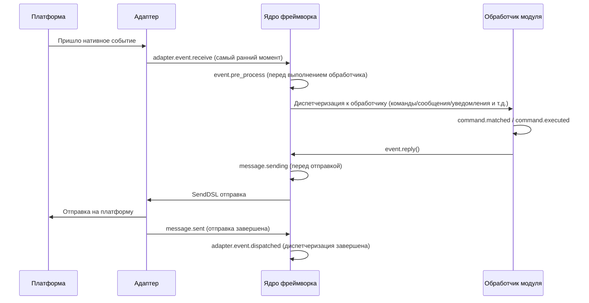

В фреймворке встроены следующие точки останова хуков, пользователь может прослушивать любую точку останова с помощью `@sdk.lifecycle.on()` для реализации пользовательской логики.

### Ядро инициализации

| Имя хука | Время срабатывания | Данные |
|---------|---------|------|
| `core.init.start` | Начало инициализации SDK | `{}` |
| `core.init.complete` | Завершение инициализации SDK | `{"duration": float, "success": bool, "adapters": {"enabled": [str], "disabled": [str]}, "modules": {"enabled": [str], "disabled": [str]}, "error": str (только при неудаче)}` |
| `core.uninit.complete` | Завершение обратной инициализации SDK | `{"duration": float, "success": bool, "adapters_closed": int, "modules_unloaded": int, "module_properties_cleared": int, "module_properties_to_clear": [str], "error": str (только при неудаче)}` |

### Изменение конфигурации

| Имя хука | Время срабатывания | Данные |
|---------|---------|------|
| `config.set` | Изменение параметра конфигурации | `{"key": str, "old_value": Any, "new_value": Any}` |
| `config.updated` | Обнаружено изменение всей конфигурации после редактирования config.toml | `{"old_config": dict, "new_config": dict, "config_file": str}` |

**Пример: аудит конфигурации**

```python
@sdk.lifecycle.on("config.set")
def audit_config(data):
    print(f"[Аудит] {data['key']}: {data['old_value']} -> {data['new_value']}")
```

### Жизненный цикл модуля

| Имя хука | Время срабатывания | Данные |
|---------|---------|------|
| `module.register` | Регистрация класса модуля в менеджере | `{"module_name": str, "success": bool}` |
| `module.load` | Завершение загрузки модуля (успешное инстанцирование) | `{"module_name": str, "success": bool}` |
| `module.init` | Завершение инициализации модуля (включая ленивую загрузку) | `{"module_name": str, "success": bool}` |
| `module.unload` | Удаление модуля | `{"module_name": str, "success": bool}` |

### Жизненный цикл адаптера

| Имя хука | Время срабатывания | Данные |
|---------|---------|------|
| `adapter.load` | Завершение регистрации адаптера | `{"platform": str, "success": bool}` |
| `adapter.start` | Запуск адаптера | `{"platforms": [str]}` |
| `adapter.status.change` | Изменение состояния адаптера | `{"platform": str, "status": str, "retry_count": int, "error": str (только при неудаче)}` |
| `adapter.stop` | Остановка адаптера | `{"platforms": [str]}` |
| `adapter.stopped` | Завершение остановки адаптера | `{"platforms": [str]}` |
| `adapter.bot.online` | Онлайн бота | `{"platform": str, "bot_id": str, "info": dict, "status": str}` |
| `adapter.bot.offline` | Оффлайн бота | `{"platform": str, "bot_id": str, "status": str}` |

### Прием и обработка событий

| Имя хука | Время срабатывания | Данные |
|---------|---------|------|
| `adapter.event.receive` | Получено событие с внешней платформы (самый ранний момент) | `{"platform": str, "event_type": str, "raw_event_type": str}` |
| `adapter.event.dispatched` | Завершена диспетчеризация события | `{"platform": str, "event_type": str, "raw_event_type": str, "onebot_handlers_count": int}` |
| `event.pre_process` | Перед началом выполнения обработчика события | `{"event_type": str, "platform": str, "detail_type": str}` |

**Пример: статистика событий**

```python
event_counter = {}

@sdk.lifecycle.on("adapter.event.receive")
def count_events(data):
    platform = data["platform"]
    event_counter[platform] = event_counter.get(platform, 0) + 1

@sdk.lifecycle.on("adapter.event.dispatched")
def log_unhandled(data):
    if data["onebot_handlers_count"] == 0:
        print(f"[Необработано] {data['platform']}/{data['event_type']}")
```

### Отправка сообщений

| Имя хука | Время срабатывания | Данные |
|---------|---------|------|
| `message.sending` | Сообщение готовится к отправке | `{"platform": str, "method": str, "detail_type": str, "target_id": str, "bot_id": str}` |
| `message.sent` | Завершена отправка сообщения | `{"platform": str, "method": str, "detail_type": str, "target_id": str, "bot_id": str}` |

**Пример: аудит отправки сообщений**

```python
@sdk.lifecycle.on("message.sending")
def log_sending(data):
    print(f"[Отправка] -> {data['platform']}/{data['detail_type']}/{data['target_id']} через {data['method']}")
```

### Система команд

| Имя хука | Время срабатывания | Данные |
|---------|---------|------|
| `command.matched` | Команда найдена и готовится к выполнению | `{"command": str, "args": list[str], "platform": str, "user_id": str}` |
| `command.executed` | Завершено выполнение команды | `{"command": str, "args": list[str], "platform": str, "user_id": str, "success": bool, "error": str (только при неудаче)}` |

**Пример: статистика команд**

```python
@sdk.lifecycle.on("command.matched")
def count_commands(data):
    print(f"[Команда] /{data['command']} от {data['user_id']}@{data['platform']}")
```

### HTTP-маршрутизация

| Имя хука | Время срабатывания | Данные |
|---------|---------|------|
| `server.request` | Получен HTTP-запрос | `{"method": str, "path": str, "client_ip": str}` |
| `server.response` | Отправлен HTTP-ответ | `{"method": str, "path": str, "status_code": int, "client_ip": str}` |

**Пример: логирование запросов**

```python
@sdk.lifecycle.on("server.response")
def log_http(data):
    print(f"[HTTP] {data['method']} {data['path']} -> {data['status_code']}")
```

### WebSocket

| Имя хука | Время срабатывания | Данные |
|---------|---------|------|
| `server.start` | Запуск сервера маршрутизации | `{"base_url": str, "host": str, "port": int}` |
| `server.stop` | Остановка сервера маршрутизации | `{}` |
| `server.websocket.connect` | Установлено WebSocket-соединение | `{"path": str, "module_name": str, "client_ip": str}` |
| `server.websocket.disconnect` | Разорвано WebSocket-соединение | `{"path": str, "module_name": str, "reason": str, "error": str (только при аномалии)}` |

**Пример: мониторинг WebSocket-соединений**

```python
@sdk.lifecycle.on("server.websocket.connect")
def on_ws_connect(data):
    print(f"[WS] Подключение: {data['path']} от {data['client_ip']}")

@sdk.lifecycle.on("server.websocket.disconnect")
def on_ws_disconnect(data):
    print(f"[WS] Отключение: {data['path']} ({data['reason']})")

## Стандартное определение событий

```python
СТАНДАРТНЫЕ_СОБЫТИЯ = {
    "core": ["init.start", "init.complete", "uninit.complete"],
    "module": ["load", "init", "unload", "register"],
    "adapter": [
        "load", "start", "status.change", "stop", "stopped",
        "event.receive", "event.dispatched",
        "bot.online", "bot.offline",
    ],
    "server": [
        "start", "stop",
        "request", "response",
        "websocket.connect", "websocket.disconnect",
    ],
    "event": ["pre_process"],
    "message": ["sending", "sent"],
    "command": ["matched", "executed"],
    "config": ["set"],
}

## Полный справочник API

### Регистрация и отмена

| Метод | Описание |
|------|------|
| `@lifecycle.on(event, *, priority=0)` | Декоратор для регистрации обработчика |
| `lifecycle.register(event, handler, *, priority=0)` | Программная регистрация |
| `lifecycle.unregister(event, handler=None)` | Отмена регистрации (при handler=None отменяются все обработчики события) |

### Запуск

| Метод | Описание |
|------|------|
| `await lifecycle.emit(event, data=None)` | Асинхронный запуск, обработчики могут изменить data, возвращая ненулевое значение |
| `lifecycle.emit_sync(event, data=None)` | Синхронный запуск, асинхронные обработчики запускаются через create_task |
| `await lifecycle.submit_event(event_type, *, source, msg, data)` | Совместимость со старыми версиями, автоматически формируется стандартный формат события |

### Инструменты

| Метод | Описание |
|------|------|
| `lifecycle.start_timer(timer_id)` | Начать таймер |
| `lifecycle.get_duration(timer_id)` | Получить прошедшее время (в секундах) |
| `lifecycle.stop_timer(timer_id)` | Остановить таймер и вернуть прошедшее время |
| `lifecycle.list_hooks()` | Вывести список всех зарегистрированных хуков и количество обработчиков |
| `lifecycle.clear()` | Очистить все обработчики и таймеры |

## Пример использования в модуле

```python
from ErisPulse.Core.Bases import BaseModule
from ErisPulse import sdk

class Main(BaseModule):
    async def on_load(self, event):
        # Реализация простой статистики сообщений
        self.msg_count = 0
        
        @sdk.lifecycle.on("adapter.event.receive")
        async def count(data):
            if data["event_type"] == "message":
                self.msg_count += 1
        
        # Мониторинг всех команд
        @sdk.lifecycle.on("command.matched")
        async def log_cmd(data):
            sdk.logger.info(f"Команда выполнена: /{data['command']} от {data['user_id']}")
        
        # Аудит изменений конфигурации
        @sdk.lifecycle.on("config.set")
        def audit(data):
            sdk.logger.info(f"Изменение конфигурации: {data['key']} = {data['new_value']}")
```

[**中文**](docs/ru/quick-start.md)

## Принадлежность фоновых задач и автоматическое отмена

> [!NOTE]
> Эта функция требует ErisPulse **2.8.0+**.

Если фоновые задачи asyncio, созданные модулем, не отменяются в `on_unload`, они будут удерживать ссылку на `self`, что приведёт к невозможности сборки мусора для экземпляра модуля (остатки старых экземпляров после горячей перезагрузки). Фреймворк предоставляет следующие механизмы по умолчанию:

- **`self.spawn(coro)`** (рекомендуется внутри модуля): задача автоматически присваивается имени модуля, и при выгрузке модуля фреймворк в `on_unload` **после** отменяет не завершённые задачи и записывает предупреждение
- **`spawn_background(coro)`** (`ErisPulse.runtime`): автоматически захватывает текущий контекст `owner_scope`; `cancel_owner_tasks(owner)` отменяет задачи по принадлежности, `cancel_all_background_tasks()` используется как резервный механизм для `sdk.uninit()`
- **Адаптеры**: при закрытии также отменяются фоновые задачи, привязанные к имени платформы

```python
async def on_load(self, event):
    # Рекомендуется: фоновые задачи используйте через self.spawn(), фреймворк автоматически отменяет их при выгрузке
    self.spawn(self._poll())

async def on_unload(self, event):
    # В сценариях, требующих точного контроля, по-прежнему рекомендуется отменять и ждать завершения самостоятельно
    if self._poll_task:
        self._poll_task.cancel()
        await asyncio.gather(self._poll_task, return_exceptions=True)

async def _poll(self):
    while True:
        await asyncio.sleep(60)
        ...
```

> [!IMPORTANT]
> Механизм по умолчанию фреймворка — это **принудительная отмена** (`cancel_owner_tasks`), которая происходит после возврата из `on_unload`. Поэтому задачи, требующие аккуратного завершения (очистка буфера, сохранение состояния, закрытие соединения), **обязательно** должны быть отменены и завершены вручную в `on_unload` — не полагайтесь на механизм по умолчанию для сохранения логики завершения. Фреймворк гарантирует только «отсутствие задач, удерживающих ссылку на `self`», но не гарантирует «аккуратное завершение». Задачи, требующие ожидания результата, следует напрямую `await`, а не передавать в фоновые задачи.

docs/ru/quick-start.md

## Примечания

1. **Обработчики могут быть синхронными или асинхронными**: система автоматически распознает и правильно вызывает их
2. **Передача данных**: в режиме `emit()`, если обработчик возвращает непустое значение, это изменяет данные, передаваемые последующим обработчикам
3. **Нормы именования событий**: рекомендуется использовать точечную структуру для именования событий, что упрощает использование родительских слушателей
4. **Изоляция ошибок**: исключение в одном обработчике не влияет на выполнение других обработчиков
5. **Ограничение синхронного триггера**: в `emit_sync()` асинхронные обработчики запускаются в режиме fire-and-forget, возвращаемые значения не могут быть переданы обратно
6. **Очистка жизненного цикла**: при вызове `sdk.uninit()` все зарегистрированные обработчики и таймеры будут очищены
7. **Приоритет загрузки**: если необходимо слушать события на этапе инициализации фреймворка, рекомендуется установить высокий приоритет и отключить ленивую загрузку

[**中文**](docs/ru/quick-start.md)


### 懶加载系统

# Система ленивой загрузки модулей

ErisPulse SDK предоставляет мощную систему ленивой загрузки модулей, позволяющую инициализировать модули только тогда, когда они действительно необходимы, что значительно повышает скорость запуска приложения и эффективность использования памяти.

docs/ru/quick-start.md

## Обзор

Система модулей с ленивой загрузкой является одной из ключевых особенностей ErisPulse. Она работает следующим образом:

- **Отложенная инициализация**: Модули фактически загружаются и инициализируются только при первом обращении к ним
- **Прозрачное использование**: Для разработчиков модули с ленивой загрузкой практически не отличаются от обычных модулей в использовании
- **Автоматическое управление зависимостями**: Зависимости модуля автоматически инициализируются при их использовании
- **Поддержка жизненного цикла**: Для модулей, унаследованных от `BaseModule`, автоматически вызываются методы жизненного цикла

Ссылки на документацию должны быть заменены согласно правилу:
- Замените `docs/ru/` на `docs/ru/` в путях к документации
- Например: `docs/ru/quick-start.md` должно быть заменено на `docs/ru/quick-start.md`
- Ссылки на файлы не текущего языка версии (в формате `README.xx.md`) оставляются без изменений

## Принцип работы

### Класс LazyModule

Ядром системы ленивой загрузки является класс `LazyModule`, который является обёрткой, фактически инициализирующей модуль только при первом обращении.

### Процесс инициализации

Когда модуль впервые обращается, `LazyModule` выполняет следующие действия:

1. Получает информацию о параметрах `__init__` класса модуля
2. Определяет, следует ли передавать ссылку на `sdk` в зависимости от параметров
3. Устанавливает свойство `moduleInfo` модуля
4. Для модулей, унаследованных от `BaseModule`, вызывает метод `on_load`
5. Запускает событие жизненного цикла `module.init`

[**中文**](docs/ru/quick-start.md) | [**English**](docs/ru/quick-start.md)

## Активация по событию (activate_on)

> [!NOTE]
> Эта функция требует ErisPulse **2.8.0+**.

Модули с `lazy_load=True` по умолчанию загружаются только при **первом доступе к атрибуту**. Если модуль зарегистрировал обработчики команд/событий, традиционный подход требует `lazy_load=False` для немедленной загрузки. `activate_on` предоставляет третий вариант: **объявить триггер, при первом совпадении события/команды модуль автоматически активируется** — он не будет постоянно в памяти, но при этом не потеряет точку входа по триггеру.

```python
from ErisPulse.loaders import ModuleLoadStrategy

class MyModule(BaseModule):
    @staticmethod
    def get_load_strategy():
        return ModuleLoadStrategy(
            lazy_load=True,
            activate_on=[
                # ---- Триггеры по событию (пассивное поступление, без участия пользователя)----
                "message",                                    # Тип события: любое сообщение
                {"notice": "group_member_increase"},          # Тип + один detail_type
                {"message": ["private", "group"]},            # Тип + несколько detail_type

                # ---- Триггеры по команде (активный ввод, заглушка команды видна в Help)----
                {"command": "roll"},                          # Сокращённая форма: имя команды
                {"command": ["roll", "dice"]},                # Список имён команд
                {"command": {                                 # Форма dict (name обязательный)
                    "name": "dice",
                    "help": "Бросить кубик",
                    "usage": "/dice",
                    "group": "Развлечения",
                    "aliases": ["d"],
                    "hidden": False,
                }},
            ],
        )
```

### Параметры команды в формате dict

Форма dict отражает пользовательские параметры декоратора `@command()`, позволяя зарегистрировать заглушку команды до загрузки модуля:

| Параметр | Тип | По умолчанию | Описание |
|------|------|------|------|
| `name` | `str` | **Обязательный** | Имя команды; должно совпадать с `name` в `@command(name)` в `on_load`, иначе после активации заглушка будет удалена, и команда не будет существовать |
| `help` | `str` | Цепочка возврата | Описание, отображаемое в Help; если не указано, берётся из цепочки возврата (см. ниже) |
| `usage` | `str` | Автоматически | Пример использования, по умолчанию `{prefix}{name}` |
| `group` | `str` | `None` | Группа команды |
| `aliases` | `list[str]` | `[]` | Алиасы, которые также регистрируются, **ввод алиаса также активирует модуль** |
| `hidden` | `bool` | `False` | Если `True`, заглушка команды будет скрыта (согласовано с семантикой скрытия после активации); пользователи, знающие имя команды, всё равно могут её активировать |

**Не поддерживается** `priority` / `permission` / `master`: заглушка команды предназначена только для активации, проверка прав осуществляется после активации настоящей командой (блокировка прав на этапе заглушки приведёт к невозможности активации по команде).

### Цепочка возврата для Help заглушки команды

Описание команды, отображаемое в Help до загрузки модуля, берётся по следующему порядку (первое найденное значение используется):

1. `help` на уровне команды в dict (наиболее точное)
2. `description` из `get_meta()` модуля
3. Атрибут `__description__` модуля
4. `Summary` из метаданных пакета (краткое описание пакета PyPI)
5. Общее сообщение: «Эта команда из модуля с ленивой загрузкой X, при первом использовании модуль будет автоматически загружен»

### Семантика триггеров

- **Событийный stub**: регистрируется с очень низким приоритетом (`ACTIVATION_STUB_PRIORITY`) в соответствующий менеджер событий, срабатывает в качестве резервного обработчика после всех обычных обработчиков; после активации текущее событие пересылается настоящему обработчику модуля
- **Командный stub**: регистрируется заглушка команды; после активации заглушка удаляется, настоящая команда берёт на себя текущий триггер
- **Защита от повторного входа**: `asyncio.Lock` гарантирует, что модуль активируется только один раз при одновременных триггерах
- **Фильтрация по области действия**: stub содержит идентификатор владельца модуля, модуль не активируется, если он не включён для данного бота / сессии / платформы
- **Семантика ошибки**: при неудачной активации повторная попытка не предпринимается, stub также удаляется
- **Удаление дубликатов**: при смешанном объявлении сокращённых и dict-форм имен команды дубликаты удаляются (dict имеет приоритет); при отсутствии `name` в dict или ошибке в `detail_type` события, формируется предупреждение и игнорируется

> Схема архитектуры и полная семантика см. в [Обзоре архитектуры](../architecture.md#архитектура-активации-по-событию-activate_on-триггерная-архитектура).

## Конфигурация ленивой загрузки

### Глобальная конфигурация

В файле конфигурации включите/отключите ленивую загрузку глобально:

```toml
[ErisPulse.framework]
enable_lazy_loading = true  # true=включить ленивую загрузку(по умолчанию), false=отключить ленивую загрузку
```

### Управление на уровне модуля

Модуль может управлять стратегией загрузки, реализовав статический метод `get_load_strategy()`:

```python
from ErisPulse.Core.Bases import BaseModule
from ErisPulse.loaders import ModuleLoadStrategy

class MyModule(BaseModule):
    @staticmethod
    def get_load_strategy():
        """Возвращает стратегию загрузки модуля"""
        return ModuleLoadStrategy(
            lazy_load=False,  # Возвращает False для немедленной загрузки
            priority=100      # Приоритет загрузки, чем больше значение, тем выше приоритет
        )
```

[**中文**](docs/ru/configuration.md) | [**English**](docs/ru/configuration.md)

## Использование модулей с отложенной загрузкой

### Основное использование

Для разработчиков модули с отложенной загрузкой практически не отличаются от обычных модулей:

```python
# Доступ к модулю с отложенной загрузкой через SDK
from ErisPulse import sdk

# Следующий вызов запустит отложенную загрузку модуля
result = await sdk.my_module.my_method()
```

### Единый вход для получения модуля

Независимо от того, получаете ли вы модуль через свойство SDK, свойство менеджера модулей или через `module.get()`, для "зарегистрированных, но еще не загруженных" модулей с отложенной загрузкой будет возвращаться один и тот же прокси-объект отложенной загрузки. Инициализация происходит только при обращении к его свойствам:

```python
# Все три способа возвращают прокси-объект отложенной загрузки (если модуль не загружен), поведение одинаковое и для пользователя прозрачно
sdk.my_module          # Точка входа для запуска загрузки
sdk.module.my_module   # Также возвращает прокси-объект отложенной загрузки
sdk.module.get("my_module")  # Также возвращает прокси-объект отложенной загрузки, сам вызов не запускает загрузку

# Инициализация модуля происходит только при обращении к любому свойству прокси-объекта
result = await sdk.my_module.my_method()
```

`module.get()` — это **интерфейс для запроса**, сам вызов не запускает загрузку:
- Модуль уже загружен → возвращается реальный экземпляр
- Модуль зарегистрирован, но не загружен → возвращается прокси-объект отложенной загрузки (инициализация происходит при обращении к свойствам)
- Модуль не зарегистрирован → возвращается `None`

Если необходимо явно запустить загрузку, используйте `await sdk.load_module("my_module")`.

### Асинхронная инициализация

Для модулей, требующих асинхронной инициализации, рекомендуется сначала явно загрузить модуль:

```python
# Сначала явно загрузите модуль
await sdk.load_module("my_module")

# Затем используйте модуль
result = await sdk.my_module.my_method()
```

### Синхронная инициализация

Для модулей, не требующих асинхронной инициализации, можно обращаться напрямую:

```python
# Прямое обращение автоматически синхронно инициализирует модуль
result = sdk.my_module.some_sync_method()

## Лучшие практики

При выборе стратегии загрузки можно использовать следующий алгоритм принятия решений:

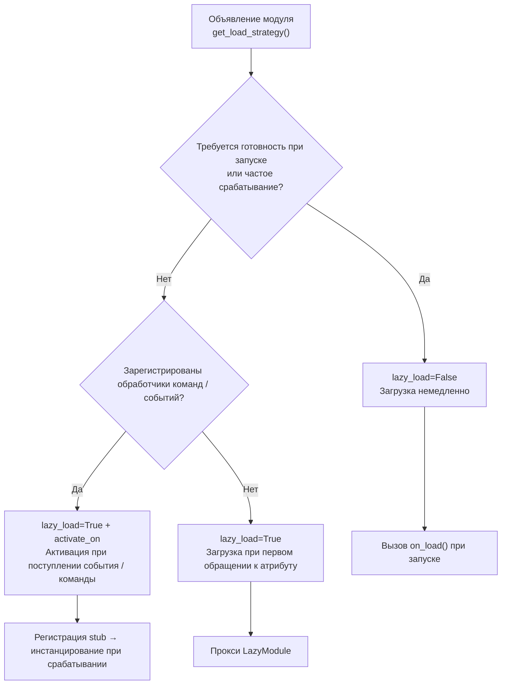

### Рекомендуемые случаи использования ленивой загрузки (lazy_load=True)

- Пассивно вызываемые утилитарные классы (например, модули для запросов данных, конвертеры форматов и т.д., которые требуются только при вызове из других модулей)
- Модули, зарегистрировавшие обработчики команд / событий, но используемые нечасто — в сочетании с объявлением `activate_on`, автоматическая активация происходит при поступлении первого совпадающего события / команды, без отказа от ленивой загрузки

### Рекомендуемые случаи отключения ленивой загрузки (lazy_load=False)

- Модули, которые должны быть готовы при запуске (например, основные модули, предоставляющие базовые сервисы другим модулям)
- Часто срабатывающие слушатели (каждое сообщение должно обрабатываться) — `activate_on` имеет накладные расходы на активацию, в сценариях с частым срабатыванием более целесообразно немедленная загрузка
- Модули с планировщиком задач
- Модули, которые должны инициализироваться при запуске приложения

> Параметр `priority` управляет порядком инициализации модулей, загруженных немедленно. Чем больше значение, тем раньше инициализация. Модули с одинаковым приоритетом загружаются в порядке их регистрации.

## Примечания

1. Если ваш модуль использует ленивую загрузку, и если другие модули никогда не вызывались внутри ErisPulse, ваш модуль никогда не будет инициализирован.
2. Если ваш модуль содержит, например, модули, слушающие события, или другие модули, активно слушающие подобные события, есть два варианта: объявить триггер `activate_on` (сохранить ленивую загрузку, автоматически активировать при поступлении события) или объявить, что он должен быть загружен немедленно (`lazy_load=False`), иначе это повлияет на нормальную работу вашего модуля.
3. Мы не рекомендуем вам отключать ленивую загрузку, если у вас нет особых потребностей, иначе это может привести к проблемам с управлением зависимостями и событиями жизненного цикла.
4. В командном словаре `activate_on` имя `name` должно совпадать с реальным именем команды, зарегистрированной в модуле `on_load` с помощью `@command()` — иначе после активации модуля заполнительная команда будет отменена, и команда с несоответствующим объявленным и реализованным именем не будет существовать.

[**English**](docs/ru/quick-start.md)


### 国际化（i18n）系统

# Система интернационализации (i18n)

В ErisPulse версии 2.5.0 встроена полная поддержка интернационализации. Интерфейс ядра фреймворка и CLI автоматически переключают отображаемый текст в зависимости от системного языка, а также поддерживают регистрацию внешними модулями собственных переводов.

> Пример: [English](docs/ru/index.md) | [Русский](docs/ru/ru.md) | [Español](docs/ru/es.md) | [Français](docs/ru/fr.md) | [日本語](docs/ru/ja.md)
>
> [English](docs/ru/en.md) | [Русский](docs/ru/ru.md) | [Español](docs/ru/es.md) | [Français](docs/ru/fr.md) | [日本語](docs/ru/ja.md)

## Поддерживаемые языки

| Язык | Код | Описание |
|------|------|------|
| Упрощенный китайский | `zh-CN` | Язык по умолчанию (родной язык фреймворка) |
| Традиционный китайский | `zh-TW` | Традиционный китайский (Гонконг/Макао/Тайвань) |
| English | `en` | Английский (универсальный язык по умолчанию) |
| 日本語 | `ja` | Японский |
| Русский | `ru` | Русский |

## Быстрое знакомство

### Переключение через переменные окружения

```bash
# Windows PowerShell
$env:ERISPULSE_LANG = "en"
epsdk run

# macOS / Linux
ERISPULSE_LANG=ja epsdk run
```

### Переключение через файл конфигурации

Добавьте в `config/config.toml`:

```toml
[ErisPulse.i18n]
language = "zh-TW"
```

Установка значения `"auto"` (по умолчанию) включает автоматическое определение системного языка.

### Ручное переключение в коде

```python
from ErisPulse import i18n

# Ручное установка языка
i18n.set_language("en")
print(i18n.get_language())  # "en"

# Сброс до автоматического определения
i18n.reset_language()
```

---

## Механизм определения языка

Фреймворк определяет язык пользователя с следующими приоритетами:

1. **Переменная среды `ERISPULSE_LANG`** — самый высокий приоритет, используется для тестирования и временного переключения
2. **Windows API** — `GetUserDefaultLocaleName` (только для Windows, не затрагивается `LANG` от инструментов вроде Git Bash)
3. **Переменные среды** — `LANGUAGE` > `LC_ALL` > `LC_MESSAGES` > `LANG` (стандарт Unix/macOS)
4. **Системная локаль** — `locale.getlocale()` / `locale.getdefaultlocale()`
5. **Fallback** — en (английский)

### Принцип ближайшего соответствия

Когда определенный язык не является точным совпадением, он сопоставляется с поддерживаемым языком по принципу ближайшего соответствия:

- `zh-TW`, `zh-HK`, `zh-MO`, `zh-Hant` → **Традиционный китайский**
- Все остальные `zh-*` (например, `zh-CN`, `zh-SG`) → **Упрощенный китайский**
- `en-US`, `en-GB`, `en-AU` и т. д. → **Английский**
- `ja-JP` → **Японский**
- `ru-RU` → **Русский**
- Все остальные неопознанные языки → **Упрощенный китайский (fallback)**

---

Пожалуйста, верните только полностью переведенный Markdown-контент без дополнительных комментариев.

## Использование i18n в модуле

Вы можете зарегистрировать тексты переводов для своего модуля, чтобы ваш модуль также поддерживал несколько языков.

### Рекомендуемый способ: Объявление ключей переводов через I18nClass (v2.7.0+)

Начиная с версии v2.7.0, модули/адаптеры могут объявлять ключи переводов, используя вложенный класс `I18nClass`, так же, как это делается для `ConfigClass`. Фреймворк автоматически **регистрирует** все объявленные ключи переводов во время загрузки, без необходимости вручную вызывать `i18n.register()`.

```python
from dataclasses import dataclass, field

from ErisPulse.Core.Bases import BaseConfig, BaseI18n, BaseModule, I18nKey


class MyModule(BaseModule):
    # Класс конфигурации (необязательно)
    @dataclass
    class ConfigClass(BaseConfig):
        welcome_msg: str = field(
            default="Welcome",
            metadata={
                # Здесь ссылается ключ i18n mymodule.welcome_msg
                "description": {"i18n": "mymodule.welcome_msg", "default": "Welcome Message"},
            },
        )

    # Класс коллекции ключей переводов (необязательно)
    # Объявленные ключи автоматически регистрируются фреймворком, приоритет раньше генерации конфигурации ConfigClass
    class I18nClass(BaseI18n):
        # Имена атрибутов автоматически объединяются в полный путь ключа: <имя_модуля>.<имя_атрибута>
        welcome_msg: I18nKey = I18nKey(
            default="Welcome Message",   # Независимый от языка запасной вариант, не регистрируется ни в одном языке
            zh_CN="Добро пожаловать",
            en="Welcome Message",
            ja="ウェルカムメッセージ",
            ru="Приветственное сообщение",
            zh_TW="歡迎訊息",
        )
        # Другие ключи переводов для бизнес-логики
        hello: I18nKey = I18nKey(
            default="Hello, {name}!",
            zh_CN="Привет, {name}!",
            zh_TW="你好，{name}！",
            en="Hello, {name}!",
            ja="こんにちは、{name}！",
            ru="Привет, {name}!",
        )

        # Можно явно указать полный путь ключа (не использовать объединение имен атрибутов)
        custom: I18nKey = I18nKey(
            key="mymodule.deep.nested.key",
            default="Default text",
            zh_CN="Дефолтный текст",
            zh_TW="預設文本",
            en="Default text",
            ja="デフォルトテキスト",
            ru="Текст по умолчанию",
        )
```

#### Почему рекомендован I18nClass?

| Сценарий | Ручной i18n.register() | Объявление I18nClass |
|------|-----------------------|------------------|
| i18n ключ, ссылаемый в описании конфигурации | Нужно вручную зарегистрировать и сделать это до генерации конфигурации | Фреймворк автоматически регистрирует перед генерацией конфигурации |
| Объявление переводов для нескольких языков | Распределено по различным on_load() | Сосредоточено в классе, видно сразу |
| Согласованность имен ключей | Легко допустить опечатку | Имена атрибутов используются как суффиксы ключей, IDE может предлагать автодополнение |
| Очистка при卸рузке | Нужно вручную unregister_domain() | Фреймворк использует единый домен для регистрации |

#### Правила путей ключей I18nClass

- **По умолчанию**: Используйте ``<имя_регистрации_модуля>.<имя_атрибута>`` как полный путь ключа
  - Пример: имя модуля ``MyModule``, атрибут ``welcome`` → путь ключа ``MyModule.welcome``
- **Явно**: Укажите любой путь через точку с помощью параметра ``I18nKey(key="...")``
  - Подходит для ключей с глубокой вложенностью (например, ``mymodule.config.basic.token``)

#### Использование в адаптере

Адаптеры также поддерживают `I18nClass`, использование полностью аналогично:

```python
from ErisPulse.Core import BaseAdapter
from ErisPulse.Core.Bases import BaseConfig, BaseI18n, I18nKey


class MyAdapter(BaseAdapter):
    @dataclass
    class ConfigClass(BaseConfig):
        endpoint: str = field(
            default="",
            metadata={
                # Описание конфигурации ссылается на ключ adapter.MyAdapter.endpoint
                "description": {"i18n": "MyAdapter.endpoint", "default": "API адрес"},
            },
        )

    class I18nClass(BaseI18n):
        # Централизованное объявление ключей, на которые ссылается описание конфигурации, и других бизнес-ключей
        endpoint: I18nKey = I18nKey(
            default="API Endpoint",
            zh_CN="API адрес",
            zh_TW="API 位址",
            en="API Endpoint",
            ja="APIアドレス",
            ru="API адрес",
        )
```

`I18nClass` адаптера автоматически регистрируется на этапе `__init__` (то есть до создания шаблона конфигурации), что гарантирует, что i18n ключи, используемые в описаниях конфигурации, уже доступны.

### Ручная регистрация пользовательских переводов (старый способ)

Если не использовать `I18nClass`, вы также можете напрямую вызывать `i18n.register()` для регистрации текстов переводов.

```python
from ErisPulse import i18n

# Регистрация китайского перевода
i18n.register("zh-CN", {
    "my_module.welcome": "Добро пожаловать в мой модуль!",
    "my_module.goodbye": "До свидания!",
    "my_module.hello": "Привет, {name}!",
}, domain="my_module")

# Регистрация английского перевода
i18n.register("en", {
    "my_module.welcome": "Welcome to my module!",
    "my_module.goodbye": "Goodbye!",
    "my_module.hello": "Hello, {name}!",
}, domain="my_module")
```

### Использование переводов

```python
from ErisPulse import i18n

# Простой перевод
i18n.t("my_module.welcome")  # Автоматически использует текущий язык

# С параметрами форматирования
i18n.t("my_module.hello", name="Alice")

# Указание значения по умолчанию (возвращается, если ключ перевода не существует)
i18n.t("my_module.unknown_key", default="Значение по умолчанию")
```

### Использование в классе модуля

```python
from dataclasses import dataclass, field
from ErisPulse import i18n
from ErisPulse.Core.Bases import BaseConfig, BaseModule

@dataclass
class MyModuleConfig(BaseConfig):
    welcome_msg: str = field(
        default="Welcome",
        metadata={
            "description": {"i18n": "my_module.welcome_msg", "default": "Добро пожаловать"},
            "ui": {"widget": "text", "group": "basic", "order": 1},
        },
    )

class MyModule(BaseModule):
    ConfigClass = MyModuleConfig

    async def on_load(self, event):
        # Чтение конфигурации в реальном времени (отражает последнее значение при каждом доступе)
        self.logger.info(self.cfg.welcome_msg)
        self.logger.info(i18n.t("my_module.welcome"))

    @command("hello")
    async def hello_handler(self, event):
        name = event.get_user_nickname() or "друг"
        await event.reply(i18n.t("my_module.hello", name=name))

    async def on_unload(self, event):
        pass
```

###卸载 переводов

```python
# Отвязка переводов для всего домена
i18n.unregister_domain("my_module")
```

---

Пожалуйста, верните переведенный полный Markdown-контент без дополнительных слов.

## Полиграфические настройки полей

С версии 2.5.2 схема конфигурации полностью поддерживает i18n. Все текстовые поля, видимые пользователям, могут ссылаться на ключи i18n. WebUI и другие потребители автоматически разрешают их в соответствующий текст в зависимости от текущего языка.

### Поддерживаемые поля i18n

| Поле | Позиция | Описание |
|------|---------|----------|
| `description` | метаданные поля | Описание поля |
| `options[].label` | `ui.options` | Метки опций элемента select |
| `placeholder` | `ui.placeholder` | Подсказка ввода |
| `group_labels` | `_schema_meta` | Отображаемое имя группы (Заголовок раздела Dashboard) |

Единый формат: `{"i18n": "ключ", "default": "текст"}`, простые строки передаются без изменений (для обратной совместимости).

### Объявление полей i18n

Все текстовые поля, видимые пользователям, поддерживают i18n:

```python
from dataclasses import dataclass, field
from ErisPulse.Core.Bases import BaseConfig

@dataclass
class MyAdapterConfig(BaseConfig):
    # описание i18n
    token: str = field(
        default="",
        metadata={
            "description": {"i18n": "my_adapter.token", "default": "Токен платформы"},
            "required": True,
            "secret": True,
            "ui": {
                "widget": "password",
                "group": "basic",
                "order": 1,
                # подсказка i18n
                "placeholder": {"i18n": "my_adapter.token.ph", "default": "Введите Token"},
            },
        },
    )
    # метки i18n
    mode: str = field(
        default="a",
        metadata={
            "description": {"i18n": "my_adapter.mode", "default": "Режим работы"},
            "ui": {
                "widget": "select",
                "group": "basic",
                "order": 2,
                "options": [
                    {"label": {"i18n": "my_adapter.mode.a", "default": "Режим A"}, "value": "a"},
                    {"label": {"i18n": "my_adapter.mode.b", "default": "Режим B"}, "value": "b"},
                ],
            },
        },
    )

    # group_labels i18n (отображаемое имя группы)
    _schema_meta = {
        "group_labels": {
            "basic": {"i18n": "my_adapter.group.basic", "default": "Основные настройки"},
        }
    }
```

`default` — это текст-заполнитель (fallback) — отображается, когда перевод не зарегистрирован или не найден.

### Скрытие секретов и проверка конфигурации

Поля с тегом `"secret": True` автоматически получают **защиту от засекречивания** (начиная с 2.7.0):

- **Шаблон с засекречиванием**: функция `dataclass_to_toml_with_comments()` при генерации шаблона конфигурации не записывает реальные значения secret-полей в файл (они отображаются как пустые плейсхолдеры), чтобы избежать попадания чувствительных данных на диск
- **Утилита общего засекречивания**: `redact_secret(value)` заменяет непустое значение на `***`, пустое возвращает как есть, может использоваться для вывода в логи и т.д.

```python
from ErisPulse.Core.Bases.config_schema import redact_secret

redact_secret("sk-xxxxxx")  # '***'
redact_secret("")           # ''
```

**Проверка конфигурации** (`validate_config()`) кроме проверки на непустоту `required` поддерживает начиная с 2.7.0:

| Тип проверки | Метаданные | Пример |
|--------------|------------|--------|
| Соответствие типа | Объявленный тип поля | передача строки в поле `int` вызывает ошибку |
| Ограничения перечисления | `ui.options` или глобальное `options` | значение должно принадлежать разрешенным опциям |
| Числовые диапазоны | Глобальные `min` / `max` | `metadata={"min": 1, "max": 65535}` |

```python
from ErisPulse.Core.Bases.config_schema import validate_config

@dataclass
class C(BaseConfig):
    mode: str = field(default="a", metadata={"ui": {"widget": "select", "options": ["a", "b"]}})
    port: int = field(default=80, metadata={"min": 1, "max": 65535})

errors = validate_config(C(mode="x", port=70000))  # две ошибки: перечисление + диапазон
```

### Регистрация перевода конфигурации

Ключи i18n для полей конфигурации такие же, как и обычные ключи перевода; их регистрация выполняется через `i18n.register()`:

```python
from ErisPulse import i18n

# Регистрация китайского (совпадает с default, можно и другим)
i18n.register("zh-CN", {
    "my_adapter.token": "Токен платформы",
}, domain="my_adapter")

# Регистрация английского
i18n.register("en", {
    "my_adapter.token": "Platform Token",
}, domain="my_adapter")
```
> **Рекомендуемый способ**: используйте `I18nClass` для объявления ключей перевода, фреймворк автоматически зарегистрирует их (см. раздел «Рекомендуемый способ» выше),
> вручную вызывать `i18n.register()` или `register_config_i18n()` не требуется.

Также предоставлена удобная функция `register_config_i18n()`, которая может автоматически извлекать ключи из класса конфигурации и регистрировать их:

```python
from ErisPulse.Core.Bases.config_schema import register_config_i18n

# Автоматическое извлечение description.default как перевода на китайский
register_config_i18n(MyAdapterConfig, "zh-CN")

# Ручное предоставление английского перевода
register_config_i18n(MyAdapterConfig, "en", {
    "my_adapter.token": "Platform Token",
})
```

### Как WebUI потребляет i18n

Словарь i18n в схеме, возвращаемой `get_config_schema()`, передается без изменений. Frontend WebUI может разрешать ключи в текст с помощью `i18n.t()` в зависимости от текущего языка.

Если необходимо, чтобы сервер разрешал их в строки напрямую (например, возвращал переднему модулю, который не поддерживает i18n), используйте `resolve_config_schema()`. Она разрешит `description`、`options[].label`、`placeholder` и `group_labels` в текст текущего языка:

```python
from ErisPulse.Core.Bases.config_schema import resolve_config_schema

# Все поля i18n разрешены в строки текущего языка
schema = resolve_config_schema(MyAdapterConfig)
print(schema["fields"]["token"]["description"])    # "Токен платформы" или "Platform Token"
print(schema["fields"]["token"]["placeholder"])   # "Введите Token" или "Enter Token"
print(schema["fields"]["mode"]["options"][0]["label"])  # "Режим A" или "Mode A"
print(schema["group_labels"]["basic"])             # "Основные настройки" или "Basic"
```

> Типы и утилиты, такие как `BaseConfig`、`BotAccountConfig`、`register_config_i18n()`、`resolve_config_schema()`,
> имеют фактическое определение в `ErisPulse.Core.Bases.config_schema`.
> `ErisPulse.runtime.config_schema` сохранен для совместимости shim,
> **рекомендуется импортировать из `ErisPulse.Core.Bases` единообразно** (кроме типов, связанных с ключами переводов i18n,
> они находятся в `ErisPulse.Core.Bases.i18n_schema`).

## API Справка

### I18nManager

#### Основные методы

| Метод | Описание |
|------|------|
| `t(key, default=None, **kwargs)` | Получить текст перевода (`gettext()` является псевдонимом) |
| `set_language(lang)` | Вручную задать язык |
| `get_language()` | Получить текущий язык |
| `reset_language()` | Сбросить до автоопределения (и переопределить окружение) |
| `get_supported_languages()` | Получить список всех поддерживаемых языков |
| `has_translation(key, lang=None)` | Проверить, существует ли ключ перевода |
| `register(lang, translations, domain)` | Зарегистрировать пользовательские переводы |
| `unregister_domain(domain)` | Отключить все переводы указанного домена |
| `reload()` | Перезагрузить встроенные переводы и переопределить язык |

#### Подробно о методе `t()`

```python
def t(self, key, /, default=None, **kwargs):
```

- `key` — ключ перевода (только позиционный аргумент, не должен конфликтовать с `key=` в `**kwargs`)
- `default` — значение по умолчанию, возвращаемое, если перевод не найден; по умолчанию `None` (возвращает сам ключ)
- `**kwargs` — аргументы форматирования, используются для заполнения `{placeholder}` в переводе

Пример:

```python
# Определение перевода: "greeting": "Привет, {name}! Добро пожаловать в {place}."
i18n.t("greeting", name="Alice", place="ErisPulse")
# Возвращает: "Привет, Alice! Добро пожаловать в ErisPulse."
```

### BaseI18n / I18nKey (Декларативные ключи перевода)

Начиная с версии v2.7.0, `ErisPulse.Core.Bases` предоставляет инструменты декларации ключей перевода на основе свойств класса (рекомендуется импортировать из `ErisPulse.Core.Bases`):

> ``I18nKey.default`` является **языковым независимым фоллбэком**, он не регистрируется ни для одного языка.
> Чтобы переводы вступили в силу, необходимо явно передать хотя бы один языковой параметр (``zh_CN=`` / ``en=`` / ``ja=`` и т.д.).
> Это позволяет разработчикам из разных стран свободно использовать свой родной язык для заполнения ``default``; фреймворк не делает никаких предположений.

| Название | Описание |
|------|------|
| `I18nKey(default, *, key=None, zh_CN, zh_TW, en, ja, ru)` | Объявление одного ключа перевода; `default` — языковая независимая fallback |
| `BaseI18n` | Базовый класс коллекции ключей перевода (наименование соответствует `BaseConfig`), подклассы объявляют несколько `I18nKey` как свойства класса |
| `BaseI18n.register(prefix="", domain="app")` | Статический метод: зарегистрировать все объявленные ключи в систему i18n |
| `key` | Псевдоним для `I18nKey` (более краткая запись) |

Пример использования:

```python
from ErisPulse.Core.Bases import BaseI18n, key

class MyKeys(BaseI18n):
    # Краткая запись с псевдонимом
    hello = key(
        default="Hello",
        zh_CN="你好",
        zh_TW="你好",
        en="Hello",
        ja="こんにちは",
        ru="Привет",
    )
    bye = key(
        default="Bye",
        zh_CN="再见",
        zh_TW="再見",
        en="Bye",
        ja="さようなら",
        ru="До свидания",
    )

# Независимое использование (ручная регистрация)
MyKeys.register(prefix="myapp.", domain="myapp")
```

### Доступ к SDK инстансу

```python
from ErisPulse import sdk

# sdk.i18n и импортированный напрямую i18n — это один и тот же объект
sdk.i18n.set_language("ru")
print(sdk.i18n.t("core.sdk.init.starting"))
```

---

> **[**Русский**](docs/ru/api-reference.md)** | [**English**](api-reference.md)** | [**日本語**](api-reference.md)**

## Конфигурация во время выполнения

### Чтение конфигурации i18n через API конфигурации

```python
from ErisPulse.Core.Bases import I18nConfig
from ErisPulse.runtime import get_i18n_config

config = get_i18n_config()
print(config["language"])  # "auto" или конкретный код языка

# I18nConfig — это dataclass, его можно использовать для создания шаблона конфигурации
schema = I18nConfig.__dataclass_fields__
```

### Описание параметров конфигурации

В разделе `[ErisPulse.i18n]` файла `config/config.toml`:

```toml
[ErisPulse.i18n]
# Отображаемый язык, доступные значения:
# - "auto"      — автоопределение языка системы (по умолчанию)
# - "zh-CN"     — упрощенный китайский
# - "zh-TW"     — традиционный китайский
# - "en"        — английский
# - "ja"        — японский
# - "ru"        — русский
language = "auto"
```

---

## Best Practices

### Нейминг ключей перевода

Рекомендуется использовать формат именования с разделением точками:

```
<Module Name>.<Category>.<Description>
```

Например: `my_module.command.hello_desc`, `core.adapter.start_failed`

### Глобальное покрытие переводов

Не обязательно предоставлять переводы для всех языков сразу. Если для языка нет перевода, он автоматически переключится на английский; если и английского перевода нет, будет отображаться само имя ключа.

### Динамический контент

Для динамически генерируемого контента (такого как имя пользователя, количество и т.д.), используйте форматирование `{placeholder}`:

```python
# Определение перевода
"user_count": "Текущих онлайн пользователей: {count}"

# Использование
i18n.t("user_count", count=len(users))
```

### Логируемые сообщения

Если ваш модуль использует фреймворк Logger, эти сообщения также автоматически будут использовать текущий язык:

```python
self.logger.info(i18n.t("my_module.startup"))

## Связь с CLI i18n

CLI имеет **отдельный** модуль интернационализации (`ErisPulse.CLI.i18n`), который полностью декouple'd от модуля интернационализации ядра фреймворка.

- **Core i18n** — используется модулем ядра фреймворка, внешние модули могут регистрировать переводы
- **CLI i18n** — используется внутри командной строки, не использует общие данные переводов с Core

Такой дизайн гарантирует, что изменения переводов CLI не повлияют на стабильность ядра фреймворка.


### 模块作用域系统

# Система модульных областей

> [!NOTE]
> Эта функция требует ErisPulse **2.8.0+**.

Система модульных областей используется для управления тем, какие модули может использовать конкретный Bot, обеспечивая изоляцию модулей в сценариях с несколькими Bots. По умолчанию все модули открыты для всех Bots; фильтрация начинается только после привязки конфигурации, **модули и адаптеры могут быть адаптированы без каких-либо изменений**.

{!--< tips >!--}
1. Область привязывается к модулю по измерениям «платформа адаптера + идентификатор Bot + идентификатор сессии»
2. Поддерживает два способа: белый список (`modules`) и черный список (`blocked`)
3. Запрещенные в области модули при получении сообщений молча игнорируют его, не отвечая предупреждением
4. Поддерживает динамическое добавление и удаление в режиме выполнения с помощью `sdk.scope.bind()` / `unbind()`, может быть сохранено
{!--< /tips >!--}

docs/ru/quick-start.md

## Принцип работы

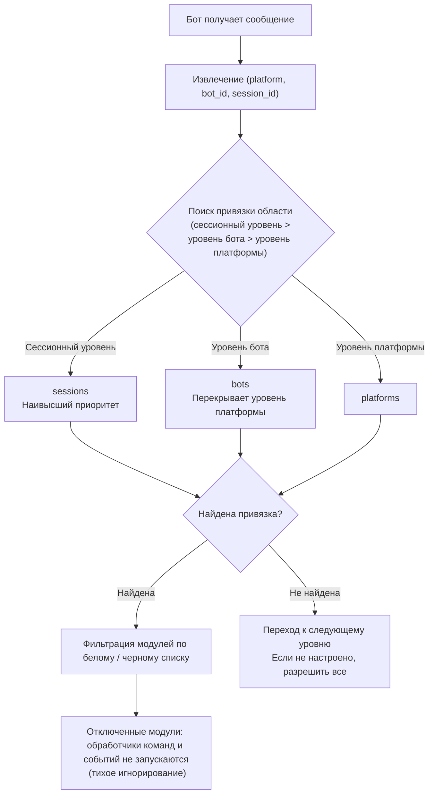

- **Приоритет анализа: сессионный уровень > уровень бота > уровень платформы**, если правила на более высоком уровне не заданы, происходит переход к следующему уровню; если ни один уровень не настроен, разрешаются все модули.
- При отсутствии данных события `self` (невозможно идентифицировать бота), пропускается уровень бота и происходит проверка по сессионному / платформенному уровню.
- Ресурсы слоя фреймворка (обработчики без owner, диспетчер команд, шина событий) всегда разрешаются, не подвергаясь влиянию области действия.

| **Русский** | **简体中文** |

## Файл конфигурации

```toml
[ErisPulse.scope]
default_allow = true        # По умолчанию разрешить всё (false = строгий режим с явным отказом)
cache_size = 1024           # Размер кэша LRU для is_allowed

# Уровень платформы (действует для всех Bots / сессий этой платформы)
[ErisPulse.scope.platforms.onebot11]
modules = ["Chat", "Translate"]   # Белый список: модули, доступные для Bot'а на этой платформе
blocked = ["Danger"]              # Черный список: модули, отключённые на этой платформе

# Уровень Bot'а (действует для всех сессий этого Bot'а, переопределяет уровень платформы)
[ErisPulse.scope.bots.onebot11."123456"]
modules = ["Chat"]
blocked = []

# Уровень сессии (действует для определённой группы / канала / личного чата, наиболее специфично)
[ErisPulse.scope.sessions.onebot11."789012345"]
modules = ["Chat"]                # В этой группе доступны только модуль Chat
blocked = []
```

Семантика (имена модулей совпадают **без учёта регистра**):

| Конфигурация | Эффект |
|------|------|
| Только `modules` (белый список) | Доступны только перечисленные модули |
| Только `blocked` (чёрный список) | Указанные модули отключены, остальные разрешены |
| Оба параметра настроены | Белый список задаёт диапазон, из которого исключаются элементы чёрного списка |
| Оба пусты / не настроены | Соблюдение `default_allow`: `true` (по умолчанию) разрешает всё; `false` подразумевает отказ |

> Параметры `modules` и `blocked` поддерживают строки или списки строк. Имена модулей не чувствительны к регистру (`"Chat"` и `"chat"` эквивалентны).
> Идентификатор сессии — это ID группы (`group_id`), ID канала (`channel_id`) или ID пользователя (`user_id`).
> **Изоляция идентификаторов сессий на разных платформах**: комбинация `(platform, session_id)` однозначно определяет сессию; например, `789` для `onebot11` и `789` для `telegram` не влияют друг на друга.

## Runtime API

### Определение того, разрешен ли модуль

```python
from ErisPulse import sdk

# Разрешено ли какому-либо Bot использовать определенный модуль
allowed = sdk.scope.is_allowed("onebot11", "123456", "Chat")

# Проверка с указанием сессии (группа / канал / личка)
allowed = sdk.scope.is_allowed("onebot11", "123456", "Chat", "789012345")
```

### Динамическое привязывание / отвязывание

```python
# Привязывание уровня Bot (белый список, сохраняется в конфигурации)
sdk.scope.bind("onebot11", "123456", modules=["Chat", "Translate"])

# Привязывание уровня сессии (третий параметр — session_id)
sdk.scope.bind("onebot11", "123456", "789012345", modules=["Chat"])

# Привязывание уровня платформы (черный список)
sdk.scope.bind("onebot11", blocked=["Danger"])

# Дейстует только во время выполнения (не сохраняется после перезапуска)
sdk.scope.bind("onebot11", "123456", modules=["Chat"], persist=False)

# Слияние, а не замена: добавляет Music в существующий белый список (по умолчанию bind заменяет)
sdk.scope.bind("onebot11", "123456", modules=["Music"], merge=True)

# Удаление привязки (снимает ограничения, разрешает всё); можно указать session_id для удаления привязки уровня сессии
sdk.scope.unbind("onebot11", "123456")
sdk.scope.unbind("onebot11", "123456", "789012345")
```

> `bind()` по умолчанию **полностью заменяет** привязку этой цели; при `merge=True` новые модули/отключения добавляются к существующим привязкам.

### Запрос привязок

```python
# Получение активных привязок (можно указать сессию)
sdk.scope.get("onebot11", "123456")              # {"modules": ["Chat"], "blocked": []}
sdk.scope.get("onebot11", "123456", "789012345") # привязка уровня сессии
sdk.scope.get("onebot11")                        # привязка уровня платформы, None если не задана

# Вывод всех привязок (platforms / bots / sessions)
sdk.scope.list_bindings()
```

### Статистика фильтрации (отладка)

```python
# Просмотр количества случаев, когда область действия тихо фильтровала, и попаданий в кэш
sdk.scope.get_stats()
# {"is_allowed_calls": 10, "filtered_count": 3, "cache_hits": 5, "cache_misses": 5}

sdk.scope.reset_stats()
```

### Данные топологии дерева

```python
# Часть области действия (для отображения на Dashboard)
sdk.scope.get_topology()

## Часто задаваемые вопросы и примечания

### 1. Уровни конфигурации

Приоритет разрешения: **Сессионный уровень > Уровень бота > Уровень платформы**. Привязка с высоким приоритетом **полностью перекрывает** привязку с низким приоритетом.

```toml
# На уровне платформы разрешен только Chat
[ErisPulse.scope.platforms.onebot11]
modules = ["Chat"]

# Но на уровне бота разрешен только Music → этот Bot в итоге может использовать только Music, а не Chat!
[ErisPulse.scope.bots.onebot11."123456"]
modules = ["Music"]
```

- Чтобы «на уровне платформы разрешить Chat, а на уровне бота добавить ещё и Music», нужно обязательно **в уровне бота перечислить оба**: `modules = ["Chat", "Music"]`.
- Аналогично, нижестоящий черный список перекрывается верхностным белым списком: платформенный `blocked=["Danger"]` + ботовый `modules=["Danger"]` → ботовый уровень полностью перекрывает, Danger доступен. Чем выше уровень и чем он конкретнее, тем он имеет приоритет.

### 2. Это «проверка по событию», она не «липнет»

Проверка области видимости относится **только к текущему событию**, она не сохраняет состояние между событиями:
- Сессия g1 отключила модуль A → в **этом** сообщении g1 модуль A не сработает; в **следующем** сообщении будет независимая проверка, если привязка не изменилась, срабатывание не произойдёт, а при изменении привязки действие вступит в силу (кэш LRU автоматически устареет).
- У сессии g2 нет привязки → откат на уровень бота / платформы; если ничего нет, используется `default_allow`.

### 3. Модуль не реагирует

Если вы отправили сообщение, а модуль не отреагировал, сначала подозревайте область видимости, а не сам модуль / адаптер:

```python
# Добавьте одну строку в код модуля или во временный скрипт для отладки
from ErisPulse import sdk
print(sdk.scope.is_allowed(event.get_platform(), <bot_id>, "MyModule", <session_id>))
print(sdk.scope.get_stats())          # Если filtered_count > 0, это значит, событие действительно отфильтровано
```

Фильтрация происходит **тихо** (без ответа, чтобы не раскрывать правила области видимости пользователю), но `filtered_count` накапливается.

### 4. Изоляция идентификаторов сессий между платформами

Уникальным идентификатором является комбинация `(platform, session_id)`. `[ErisPulse.scope.sessions.onebot11."789"]` действует только на платформе onebot11 и не влияет на сессию в telegram с тем же `789`.

### 5. Производительность

Результат `is_allowed()` кэшируется с использованием **LRU-кэша** (по умолчанию 1024 записи, настраивается через `scope.cache_size`),
изменения конфигурации / вызовы `bind()` / `unbind()` автоматически инвалидируют кэш, поэтому накладные расходы на высокочастотных путях событий минимальны.

## API топологии

`ModuleManager.get_topology()` и `AdapterManager.get_topology()` предоставляют данные об иерархии модулей/адаптеров.
`sdk.get_topology()` объединяет их в одно целое:

```python
from ErisPulse import sdk

topology = sdk.get_topology()
# {
#   "modules": {                                   # модуль → ресурсы, которыми он владеет
#     "Chat": {
#       "loaded": True, "enabled": True,
#       "load_strategy": {"lazy": False, "priority": 50},
#       "info": {...},
#       "commands": ["chat", "translate"],
#       "handlers": {"message": 2, "notice": 1},
#       "routes": {"http": ["/Chat/api"], "ws": [], "sse": []},
#       "lifecycle_hooks": 3,
#       "scope_applies": True,
#     }
#   },
#   "adapters": {                                  # адаптер → Bot → область видимости
#     "onebot11": {
#       "status": "started", "enabled": True,
#       "bots": {"123456": {"status": "online", "last_active": ..., "info": {...}, "scope": {...}}},
#       "scope": {"modules": [...], "blocked": [...]},
#     }
#   },
#   "scope": {"platforms": {...}, "bots": {...}, "sessions": {...}}   # все области видимости
# }
```

- Модульная топология объединяет зарегистрированные командой модуля, обработчики событий, маршруты HTTP/WS/SSE и жизненные циклы (lifecycle hooks), что упрощает построение дерева ресурсов модулей.
- Топология адаптеров объединяет состояния адаптеров, статусы подчиненных ботов, а также привязку платформенного и ботового уровней областей видимости.


### 启动流程与手动控制

# Запуск и ручное управление

В ErisPulse `await sdk.run()` / `await sdk.init()` обернули всю цепочку запуска в "одну строку кода". Но когда вам нужно полностью настроить процесс запуска (например, частичная загрузка, динамическая регистрация, горячая замена, внедрение пользовательских стратегий загрузки), вам нужно понимать, что происходит внутри этой цепочки и как управлять каждым шагом вручную.

В этой статье мы разобьем цепочку запуска на отдельные этапы, объясним их обязанности, порядок вызова и приведем пример полного ручного запуска.

> В этой статье предполагается, что вы уже запустили [первого робота](../getting-started/first-bot.md) и знакомы с двумя режимами `sdk.run(keep_running=True/False)`. В этой статье мы сосредоточимся на разборе цепочки внутри `init()` и более низкоуровневых входных точек, таких как `init()`/`init_task()`/`init_sync()`.

## Запуск и ручное управление

В ErisPulse `await sdk.run()` / `await sdk.init()` обернули всю цепочку запуска в "одну строку кода". Но когда вам нужно полностью настроить процесс запуска (например, частичная загрузка, динамическая регистрация, горячая замена, внедрение пользовательских стратегий загрузки), вам нужно понимать, что происходит внутри этой цепочки и как управлять каждым шагом вручную.

В этой статье мы разобьем цепочку запуска на отдельные этапы, объясним их обязанности, порядок вызова и приведем пример полного ручного запуска.

> В этой статье предполагается, что вы уже запустили [первого робота](../getting-started/first-bot.md) и знакомы с двумя режимами `sdk.run(keep_running=True/False)`. В этой статье мы сосредоточимся на разборе цепочки внутри `init()` и более низкоуровневых входных точек, таких как `init()`/`init_task()`/`init_sync()`.

## Запуск и ручное управление

В ErisPulse `await sdk.run()` / `await sdk.init()` обернули всю цепочку запуска в "одну строку кода". Но когда вам нужно полностью настроить процесс запуска (например, частичная загрузка, динамическая регистрация, горячая замена, внедрение пользовательских стратегий загрузки), вам нужно понимать, что происходит внутри этой цепочки и как управлять каждым шагом вручную.

В этой статье мы разобьем цепочку запуска на отдельные этапы, объясним их обязанности, порядок вызова и приведем пример полного ручного запуска.

> В этой статье предполагается, что вы уже запустили [первого робота](../getting-started/first-bot.md) и знакомы с двумя режимами `sdk.run(keep_running=True/False)`. В этой статье мы сосредоточимся на разборе цепочки внутри `init()` и более низкоуровневых входных точек, таких как `init()`/`init_task()`/`init_sync()`.

## Запуск и ручное управление

В ErisPulse `await sdk.run()` / `await sdk.init()` обернули всю цепочку запуска в "одну строку кода". Но когда вам нужно полностью настроить процесс запуска (например, частичная загрузка, динамическая регистрация, горячая замена, внедрение пользовательских стратегий загрузки), вам нужно понимать, что происходит внутри этой цепочки и как управлять каждым шагом вручную.

В этой статье мы разобьем цепочку запуска на отдельные этапы, объясним их обязанности, порядок вызова и приведем пример полного ручного запуска.

> В этой статье предполагается, что вы уже запустили [первого робота](../getting-started/first-bot.md) и знакомы с двумя режимами `sdk.run(keep_running=True/False)`. В этой статье мы сосредоточимся на разборе цепочки внутри `init()` и более низкоуровневых входных точек, таких как `init()`/`init_task()`/`init_sync()`.

## Запуск и ручное управление

В ErisPulse `await sdk.run()` / `await sdk.init()` обернули всю цепочку запуска в "одну строку кода". Но когда вам нужно полностью настроить процесс запуска (например, частичная загрузка, динамическая регистрация, горячая замена, внедрение пользовательских стратегий загрузки), вам нужно понимать, что происходит внутри этой цепочки и как управлять каждым шагом вручную.

В этой статье мы разобьем цепочку запуска на отдельные этапы, объясним их обязанности, порядок вызова и приведем пример полного ручного запуска.

> В этой статье предполагается, что вы уже запустили [первого робота](../getting-started/first-bot.md) и знакомы с двумя режимами `sdk.run(keep_running=True/False)`. В этой статье мы сосредоточимся на разборе цепочки внутри `init()` и более низкоуровневых входных точек, таких как `init()`/`init_task()`/`init_sync()`.

## Запуск и ручное управление

В ErisPulse `await sdk.run()` / `await sdk.init()` обернули всю цепочку запуска в "одну строку кода". Но когда вам нужно полностью настроить процесс запуска (например, частичная загрузка, динамическая регистрация, горячая замена, внедрение пользовательских стратегий загрузки), вам нужно понимать, что происходит внутри этой цепочки и как управлять каждым шагом вручную.

В этой статье мы разобьем цепочку запуска на отдельные этапы, объясним их обязанности, порядок вызова и приведем пример полного ручного запуска.

> В этой статье предполагается, что вы уже запустили [первого робота](../getting-started/first-bot.md) и знакомы с двумя режимами `sdk.run(keep_running=True/False)`. В этой статье мы сосредоточимся на разборе цепочки внутри `init()` и более низкоуровневых входных точек, таких как `init()`/`init_task()`/`init_sync()`.

## Запуск и ручное управление

В ErisPulse `await sdk.run()` / `await sdk.init()` обернули всю цепочку запуска в "одну строку кода". Но когда вам нужно полностью настроить процесс запуска (например, частичная загрузка, динамическая регистрация, горячая замена, внедрение пользовательских стратегий загрузки), вам нужно понимать, что происходит внутри этой цепочки и как управлять каждым шагом вручную.

В этой статье мы разобьем цепочку запуска на отдельные этапы, объясним их обязанности, порядок вызова и приведем пример полного ручного запуска.

> В этой статье предполагается, что вы уже запустили [первого робота](../getting-started/first-bot.md) и знакомы с двумя режимами `sdk.run(keep_running=True/False)`. В этой статье мы сосредоточимся на разборе цепочки внутри `init()` и более низкоуровневых входных точек, таких как `init()`/`init_task()`/`init_sync()`.

## Запуск и ручное управление

В ErisPulse `await sdk.run()` / `await sdk.init()` обернули всю цепочку запуска в "одну строку кода". Но когда вам нужно полностью настроить процесс запуска (например, частичная загрузка, динамическая регистрация, горячая замена, внедрение пользовательских стратегий загрузки), вам нужно понимать, что происходит внутри этой цепочки и как управлять каждым шагом вручную.

В этой статье мы разобьем цепочку запуска на отдельные этапы, объясним их обязанности, порядок вызова и приведем пример полного ручного запуска.

> В этой статье предполагается, что вы уже запустили [первого робота](../getting-started/first-bot.md) и знакомы с двумя режимами `sdk.run(keep_running=True/False)`. В этой статье мы сосредоточимся на разборе цепочки внутри `init()` и более низкоуровневых входных точек, таких как `init()`/`init_task()`/`init_sync()`.

## Запуск и ручное управление

В ErisPulse `await sdk.run()` / `await sdk.init()` обернули всю цепочку запуска в "одну строку кода". Но когда вам нужно полностью настроить процесс запуска (например, частичная загрузка, динамическая регистрация, горячая замена, внедрение пользовательских стратегий загрузки), вам нужно понимать, что происходит внутри этой цепочки и как управлять каждым шагом вручную.

В этой статье мы разобьем цепочку запуска на отдельные этапы, объясним их обязанности, порядок вызова и приведем пример полного ручного запуска.

> В этой статье предполагается, что вы уже запустили [первого робота](../getting-started/first-bot.md) и знакомы с двумя режимами `sdk.run(keep_running=True/False)`. В этой статье мы сосредоточимся на разборе цепочки внутри `init()` и более низкоуровневых входных точек, таких как `init()`/`init_task()`/`init_sync()`.

## Запуск и ручное управление

В ErisPulse `await sdk.run()` / `await sdk.init()` обернули всю цепочку запуска в "одну строку кода". Но когда вам нужно полностью настроить процесс запуска (например, частичная загрузка, динамическая регистрация, горячая замена, внедрение пользовательских стратегий загрузки), вам нужно понимать, что происходит внутри этой цепочки и как управлять каждым шагом вручную.

В этой статье мы разобьем цепочку запуска на отдельные этапы, объясним их обязанности, порядок вызова и приведем пример полного ручного запуска.

> В этой статье предполагается, что вы уже запустили [первого робота](../getting-started/first-bot.md) и знакомы с двумя режимами `sdk.run(keep_running=True/False)`. В этой статье мы сосредоточимся на разборе цепочки внутри `init()` и более низкоуровневых входных точек, таких как `init()`/`init_task()`/`init_sync()`.

## Запуск и ручное управление

В ErisPulse `await sdk.run()` / `await sdk.init()` обернули всю цепочку запуска в "одну строку кода". Но когда вам нужно полностью настроить процесс запуска (например, частичная загрузка, динамическая регистрация, горячая замена, внедрение пользовательских стратегий загрузки), вам нужно понимать, что происходит внутри этой цепочки и как управлять каждым шагом вручную.

В этой статье мы разобьем цепочку запуска на отдельные этапы, объясним их обязанности, порядок вызова и приведем пример полного ручного запуска.

> В этой статье предполагается, что вы уже запустили [первого робота](../getting-started/first-bot.md) и знакомы с двумя режимами `sdk.run(keep_running=True/False)`. В этой статье мы сосредоточимся на разборе цепочки внутри `init()` и более низкоуровневых входных точек, таких как `init()`/`init_task()`/`init_sync()`.

## Запуск и ручное управление

В ErisPulse `await sdk.run()` / `await sdk.init()` обернули всю цепочку запуска в "одну строку кода". Но когда вам нужно полностью настроить процесс запуска (например, частичная загрузка, динамическая регистрация, горячая замена, внедрение пользовательских стратегий загрузки), вам нужно понимать, что происходит внутри этой цепочки и как управлять каждым шагом вручную.

В этой статье мы разобьем цепочку запуска на отдельные этапы, объясним их обязанности, порядок вызова и приведем пример полного ручного запуска.

> В этой статье предполагается, что вы уже запустили [первого робота](../getting-started/first-bot.md) и знакомы с двумя режимами `sdk.run(keep_running=True/False)`. В этой статье мы сосредоточимся на разборе цепочки внутри `init()` и более низкоуровневых входных точек, таких как `init()`/`init_task()`/`init_sync()`.

## Запуск и ручное управление

В ErisPulse `await sdk.run()` / `await sdk.init()` обернули всю цепочку запуска в "одну строку кода". Но когда вам нужно полностью настроить процесс запуска (например, частичная загрузка, динамическая регистрация, горячая замена, внедрение пользовательских стратегий загрузки), вам нужно понимать, что происходит внутри этой цепочки и как управлять каждым шагом вручную.

В этой статье мы разобьем цепочку запуска на отдельные этапы, объясним их обязанности, порядок вызова и приведем пример полного ручного запуска.

> В этой статье предполагается, что вы уже запустили [первого робота](../getting-started/first-bot.md) и знакомы с двумя режимами `sdk.run(keep_running=True/False)`. В этой статье мы сосредоточимся на разборе цепочки внутри `init()` и более низкоуровневых входных точек, таких как `init()`/`init_task()`/`init_sync()`.

## Запуск и ручное управление

В ErisPulse `await sdk.run()` / `await sdk.init()` обернули всю цепочку запуска в "одну строку кода". Но когда вам нужно полностью настроить процесс запуска (например, частичная загрузка, динамическая регистрация, горячая замена, внедрение пользовательских стратегий загрузки), вам нужно понимать, что происходит внутри этой цепочки и как управлять каждым шагом вручную.

В этой статье мы разобьем цепочку запуска на отдельные этапы, объясним их обязанности, порядок вызова и приведем пример полного ручного запуска.

> В этой статье предполагается, что вы уже запустили [первого робота](../getting-started/first-bot.md) и знакомы с двумя режимами `sdk.run(keep_running=True/False)`. В этой статье мы сосредоточимся на разборе цепочки внутри `init()` и более низкоуровневых входных точек, таких как `init()`/`init_task()`/`init_sync()`.

## Запуск и ручное управление

В ErisPulse `await sdk.run()` / `await sdk.init()` обернули всю цепочку запуска в "одну строку кода". Но когда вам нужно полностью настроить процесс запуска (например, частичная загрузка, динамическая регистрация, горячая замена, внедрение пользовательских стратегий загрузки), вам нужно понимать, что происходит внутри этой цепочки и как управлять каждым шагом вручную.

В этой статье мы разобьем цепочку запуска на отдельные этапы, объясним их обязанности, порядок вызова и приведем пример полного ручного запуска.

> В этой статье предполагается, что вы уже запустили [первого робота](../getting-started/first-bot.md) и знакомы с двумя режимами `sdk.run(keep_running=True/False)`. В этой статье мы сосредоточимся на разборе цепочки внутри `init()` и более низкоуровневых входных точек, таких как `init()`/`init_task()`/`init_sync()`.

## Запуск и ручное управление

В ErisPulse `await sdk.run()` / `await sdk.init()` обернули всю цепочку запуска в "одну строку кода". Но когда вам нужно полностью настроить процесс запуска (например, частичная загрузка, динамическая регистрация, горячая замена, внедрение пользовательских стратегий загрузки), вам нужно понимать, что происходит внутри этой цепочки и как управлять каждым шагом вручную.

В этой статье мы разобьем цепочку запуска на отдельные этапы, объясним их обязанности, порядок вызова и приведем пример полного ручного запуска.

> В этой статье предполагается, что вы уже запустили [первого робота](../getting-started/first-bot.md) и знакомы с двумя режимами `sdk.run(keep_running=True/False)`. В этой статье мы сосредоточимся на разборе цепочки внутри `init()` и более низкоуровневых входных точек, таких как `init()`/`init_task()`/`init_sync()`.

## Запуск и ручное управление

В ErisPulse `await sdk.run()` / `await sdk.init()` обернули всю цепочку запуска в "одну строку кода". Но когда вам нужно полностью настроить процесс запуска (например, частичная загрузка, динамическая регистрация, горячая замена, внедрение пользовательских стратегий загрузки), вам нужно понимать, что происходит внутри этой цепочки и как управлять каждым шагом вручную.

В этой статье мы разобьем цепочку запуска на отдельные этапы, объясним их обязанности, порядок вызова и приведем пример полного ручного запуска.

> В этой статье предполагается, что вы уже запустили [первого робота](../getting-started/first-bot.md) и знакомы с двумя режимами `sdk.run(keep_running=True/False)`. В этой статье мы сосредоточимся на разборе цепочки внутри `init()` и более низкоуровневых входных точек, таких как `init()`/`init_task()`/`init_sync()`.

## Запуск и ручное управление

В ErisPulse `await sdk.run()` / `await sdk.init()` обернули всю цепочку запуска в "одну строку кода". Но когда вам нужно полностью настроить процесс запуска (например, частичная загрузка, динамическая регистрация, горячая замена, внедрение пользовательских стратегий загрузки), вам нужно понимать, что происходит внутри этой цепочки и как управлять каждым шагом вручную.

В этой статье мы разобьем цепочку запуска на отдельные этапы, объясним их обязанности, порядок вызова и приведем пример полного ручного запуска.

> В этой статье предполагается, что вы уже запустили [первого робота](../getting-started/first-bot.md) и знакомы с двумя режимами `sdk.run(keep_running=True/False)`. В этой статье мы сосредоточимся на разборе цепочки внутри `init()` и более низкоуровневых входных точек, таких как `init()`/`init_task()`/`init_sync()`.

## Запуск и ручное управление

В ErisPulse `await sdk.run()` / `await sdk.init()` обернули всю цепочку запуска в "одну строку кода". Но когда вам нужно полностью настроить процесс запуска (например, частичная загрузка, динамическая регистрация, горячая замена, внедрение пользовательских стратегий загрузки), вам нужно понимать, что происходит внутри этой цепочки и как управлять каждым шагом вручную.

В этой статье мы разобьем цепочку запуска на отдельные этапы, объясним их обязанности, порядок вызова и приведем пример полного ручного запуска.

> В этой статье предполагается, что вы уже запустили [первого робота](../getting-started/first-bot.md) и знакомы с двумя режимами `sdk.run(keep_running=True/False)`. В этой статье мы сосредоточимся на разборе цепочки внутри `init()` и более низкоуровневых входных точек, таких как `init()`/`init_task()`/`init_sync()`.

## Запуск и ручное управление

В ErisPulse `await sdk.run()` / `await sdk.init()` обернули всю цепочку запуска в "одну строку кода". Но когда вам нужно полностью настроить процесс запуска (например, частичная загрузка, динамическая регистрация, горячая замена, внедрение пользовательских стратегий загрузки), вам нужно понимать, что происходит внутри этой цепочки и как управлять каждым шагом вручную.

В этой статье мы разобьем цепочку запуска на отдельные этапы, объясним их обязанности, порядок вызова и приведем пример полного ручного запуска.

> В этой статье предполагается, что вы уже запустили [первого робота](../getting-started/first-bot.md) и знакомы с двумя режимами `sdk.run(keep_running=True/False)`. В этой статье мы сосредоточимся на разборе цепочки внутри `init()` и более низкоуровневых входных точек, таких как `init()`/`init_task()`/`init_sync()`.

## Запуск и ручное управление

В ErisPulse `await sdk.run()` / `await sdk.init()` обернули всю цепочку запуска в "одну строку кода". Но когда вам нужно полностью настроить процесс запуска (например, частичная загрузка, динамическая регистрация, горячая замена, внедрение пользовательских стратегий загрузки), вам нужно понимать, что происходит внутри этой цепочки и как управлять каждым шагом вручную.

В этой статье мы разобьем цепочку запуска на отдельные этапы, объясним их обязанности, порядок вызова и приведем пример полного ручного запуска.

> В этой статье предполагается, что вы уже запустили [первого робота](../getting-started/first-bot.md) и знакомы с двумя режимами `sdk.run(keep_running=True/False)`. В этой статье мы сосредоточимся на разборе цепочки внутри `init()` и более низкоуровневых входных точек, таких как `init()`/`init_task()`/`init_sync()`.

## Запуск и ручное управление

В ErisPulse `await sdk.run()` / `await sdk.init()` обернули всю цепочку запуска в "одну строку кода". Но когда вам нужно полностью настроить процесс запуска (например, частичная загрузка, динамическая регистрация, горячая замена, внедрение пользовательских стратегий загрузки), вам нужно понимать, что происходит внутри этой цепочки и как управлять каждым шагом вручную.

В этой статье мы разобьем цепочку запуска на отдельные этапы, объясним их обязанности, порядок вызова и приведем пример полного ручного запуска.

> В этой статье предполагается, что вы уже запустили [первого робота](../getting-started/first-bot.md) и знакомы с двумя режимами `sdk.run(keep_running=True/False)`. В этой статье мы сосредоточимся на разборе цепочки внутри `init()` и более низкоуровневых входных точек, таких как `init()`/`init_task()`/`init_sync()`.

## Запуск и ручное управление

В ErisPulse `await sdk.run()` / `await sdk.init()` обернули всю цепочку запуска в "одну строку кода". Но когда вам нужно полностью настроить процесс запуска (например, частичная загрузка, динамическая регистрация, горячая замена, внедрение пользовательских стратегий загрузки), вам нужно понимать, что происходит внутри этой цепочки и как управлять каждым шагом вручную.

В этой статье мы разобьем цепочку запуска на отдельные этапы, объясним их обязанности, порядок вызова и приведем пример полного ручного запуска.

> В этой статье предполагается, что вы уже запустили [первого робота](../getting-started/first-bot.md) и знакомы с двумя режимами `sdk.run(keep_running=True/False)`. В этой статье мы сосредоточимся на разборе цепочки внутри `init()` и более низкоуровневых входных точек, таких как `init()`/`init_task()`/`init_sync()`.

## Запуск и ручное управление

В ErisPulse `await sdk.run()` / `await sdk.init()` обернули всю цепочку запуска в "одну строку кода". Но когда вам нужно полностью настроить процесс запуска (например, частичная загрузка, динамическая регистрация, горячая замена, внедрение пользовательских стратегий загрузки), вам нужно понимать, что происходит внутри этой цепочки и как управлять каждым шагом вручную.

В этой статье мы разобьем цепочку запуска на отдельные этапы, объясним их обязанности, порядок вызова и приведем пример полного ручного запуска.

> В этой статье предполагается, что вы уже запустили [первого робота](../getting-started/first-bot.md) и знакомы с двумя режимами `sdk.run(keep_running=True/False)`. В этой статье мы сосредоточимся на разборе цепочки внутри `init()` и более низкоуровневых входных точек, таких как `init()`/`init_task()`/`init_sync()`.

## Запуск и ручное управление

В ErisPulse `await sdk.run()` / `await sdk.init()` обернули всю цепочку запуска в "одну строку кода". Но когда вам нужно полностью настроить процесс запуска (например, частичная загрузка, динамическая регистрация, горячая замена, внедрение пользовательских стратегий загрузки), вам нужно понимать, что происходит внутри этой цепочки и как управлять каждым шагом вручную.

В этой статье мы разобьем цепочку запуска на отдельные этапы, объясним их обязанности, порядок вызова и приведем пример полного ручного запуска.

> В этой статье предполагается, что вы уже запустили [первого робота](../getting-started/first-bot.md) и знакомы с двумя режимами `sdk.run(keep_running=True/False)`. В этой статье мы сосредоточимся на разборе цепочки внутри `init()` и более низкоуровневых входных точек, таких как `init()`/`init_task()`/`init_sync()`.

## Запуск и ручное управление

В ErisPulse `await sdk.run()` / `await sdk.init()` обернули всю цепочку запуска в "одну строку кода". Но когда вам нужно полностью настроить процесс запуска (например, частичная загрузка, динамическая регистрация, горячая замена, внедрение пользовательских стратегий загрузки), вам нужно понимать, что происходит внутри этой цепочки и как управлять каждым шагом вручную.

В этой статье мы разобьем цепочку запуска на отдельные этапы, объясним их обязанности, порядок вызова и приведем пример полного ручного запуска.

> В этой статье предполагается, что вы уже запустили [первого робота](../getting-started/first-bot.md) и знакомы с двумя режимами `sdk.run(keep_running=True/False)`. В этой статье мы сосредоточимся на разборе цепочки внутри `init()` и более низкоуровневых входных точек, таких как `init()`/`init_task()`/`init_sync()`.

## Запуск и ручное управление

В ErisPulse `await sdk.run()` / `await sdk.init()` обернули всю цепочку запуска в "одну строку кода". Но когда вам нужно полностью настроить процесс запуска (например, частичная загрузка, динамическая регистрация, горячая замена, внедрение пользовательских стратегий загрузки), вам нужно понимать, что происходит внутри этой цепочки и как управлять каждым шагом вручную.

В этой статье мы разобьем цепочку запуска на отдельные этапы, объясним их обязанности, порядок вызова и приведем пример полного ручного запуска.

> В этой статье предполагается, что вы уже запустили [первого робота](../getting-started/first-bot.md) и знакомы с двумя режимами `sdk.run(keep_running=True/False)`. В этой статье мы сосредоточимся на разборе цепочки внутри `init()` и более низкоуровневых входных точек, таких как `init()`/`init_task()`/`init_sync()`.

## Запуск и ручное управление

В ErisPulse `await sdk.run()` / `await sdk.init()` обернули всю цепочку запуска в "одну строку кода". Но когда вам нужно полностью настроить процесс запуска (например, частичная загрузка, динамическая регистрация, горячая замена, внедрение пользовательских стратегий загрузки), вам нужно понимать, что происходит внутри этой цепочки и как управлять каждым шагом вручную.

В этой статье мы разобьем цепочку запуска на отдельные этапы, объясним их обязанности, порядок вызова и приведем пример полного ручного запуска.

> В этой статье предполагается, что вы уже запустили [первого робота](../getting-started/first-bot.md) и знакомы с двумя режимами `sdk.run(keep_running=True/False)`. В этой статье мы сосредоточимся на разборе цепочки внутри `init()` и более низкоуровневых входных точек, таких как `init()`/`init_task()`/`init_sync()`.

## Запуск и ручное управление

В ErisPulse `await sdk.run()` / `await sdk.init()` обернули всю цепочку запуска в "одну строку кода". Но когда вам нужно полностью настроить процесс запуска (например, частичная загрузка, динамическая регистрация, горячая замена, внедрение пользовательских стратегий загрузки), вам нужно понимать, что происходит внутри этой цепочки и как управлять каждым шагом вручную.

В этой статье мы разобьем цепочку запуска на отдельные этапы, объясним их обязанности, порядок вызова и приведем пример полного ручного запуска.

> В этой статье предполагается, что вы уже запустили [первого робота](../getting-started/first-bot.md) и знакомы с двумя режимами `sdk.run(keep_running=True/False)`. В этой статье мы сосредоточимся на разборе цепочки внутри `init()` и более низкоуровневых входных точек, таких как `init()`/`init_task()`/`init_sync()`.

## Запуск и ручное управление

В ErisPulse `await sdk.run()` / `await sdk.init()` обернули всю цепочку запуска в "одну строку кода". Но когда вам нужно полностью настроить процесс запуска (например, частичная загрузка, динамическая регистрация, горячая замена, внедрение пользовательских стратегий загрузки), вам нужно понимать, что происходит внутри этой цепочки и как управлять каждым шагом вручную.

В этой статье мы разобьем цепочку запуска на отдельные этапы, объясним их обязанности, порядок вызова и приведем пример полного ручного запуска.

> В этой статье предполагается, что вы уже запустили [первого робота](../getting-started/first-bot.md) и знакомы с двумя режимами `sdk.run(keep_running=True/False)`. В этой статье мы сосредоточимся на разборе цепочки внутри `init()` и более низкоуровневых входных точек, таких как `init()`/`init_task()`/`init_sync()`.

## Запуск и ручное управление

В ErisPulse `await sdk.run()` / `await sdk.init()` обернули всю цепочку запуска в "одну строку кода". Но когда вам нужно полностью настроить процесс запуска (например, частичная загрузка, динамическая регистрация, горячая замена, внедрение пользовательских стратегий загрузки), вам нужно понимать, что происходит внутри этой цепочки и как управлять каждым шагом вручную.

В этой статье мы разобьем цепочку запуска на отдельные этапы, объясним их обязанности, порядок вызова и приведем пример полного ручного запуска.

> В этой статье предполагается, что вы уже запустили [первого робота](../getting-started/first-bot.md) и знакомы с двумя режимами `sdk.run(keep_running=True/False)`. В этой статье мы сосредоточимся на разборе цепочки внутри `init()` и более низкоуровневых входных точек, таких как `init()`/`init_task()`/`init_sync()`.

## Запуск и ручное управление

В ErisPulse `await sdk.run()` / `await sdk.init()` обернули всю цепочку запуска в "одну строку кода". Но когда вам нужно полностью настроить процесс запуска (например, частичная загрузка, динамическая регистрация, горячая замена, внедрение пользовательских стратегий загрузки), вам нужно понимать, что происходит внутри этой цепочки и как управлять каждым шагом вручную.

В этой статье мы разобьем цепочку запуска на отдельные этапы, объясним их обязанности, порядок вызова и приведем пример полного ручного запуска.

> В этой статье предполагается, что вы уже запустили [первого робота](../getting-started/first-bot.md) и знакомы с двумя режимами `sdk.run(keep_running=True/False)`. В этой статье мы сосредоточимся на разборе цепочки внутри `init()` и более низкоуровневых входных точек, таких как `init()`/`init_task()`/`init_sync()`.

## Запуск и ручное управление

В ErisPulse `await sdk.run()` / `await sdk.init()` обернули всю цепочку запуска в "одну строку кода". Но когда вам нужно полностью настроить процесс запуска (например, частичная загрузка, динамическая регистрация, горячая замена, внедрение пользовательских стратегий загрузки), вам нужно понимать, что происходит внутри этой цепочки и как управлять каждым шагом вручную.

В этой статье мы разобьем цепочку запуска на отдельные этапы, объясним их обязанности, порядок вызова и приведем пример полного ручного запуска.

> В этой статье предполагается, что вы уже запустили [первого робота](../getting-started/first-bot.md) и знакомы с двумя режимами `sdk.run(keep_running=True/False)`. В этой статье мы сосредоточимся на разборе цепочки внутри `init()` и более низкоуровневых входных точек, таких как `init()`/`init_task()`/`init_sync()`.

## Запуск и ручное управление

В ErisPulse `await sdk.run()` / `await sdk.init()` обернули всю цепочку запуска в "одну строку кода". Но когда вам нужно полностью настроить процесс запуска (например, частичная загрузка, динамическая регистрация, горячая замена, внедрение пользовательских стратегий загрузки), вам нужно понимать, что происходит внутри этой цепочки и как управлять каждым шагом вручную.

В этой статье мы разобьем цепочку запуска на отдельные этапы, объясним их обязанности, порядок вызова и приведем пример полного ручного запуска.

> В этой статье предполагается, что вы уже запустили [первого робота](../getting-started/first-bot.md) и знакомы с двумя режимами `sdk.run(keep_running=True/False)`. В этой статье мы сосредоточимся на разборе цепочки внутри `init()` и более низкоуровневых входных точек, таких как `init()`/`init_task()`/`init_sync()`.

## Запуск и ручное управление

В ErisPulse `await sdk.run()` / `await sdk.init()` обернули всю цепочку запуска в "одну строку кода". Но когда вам нужно полностью настроить процесс запуска (например, частичная загрузка, динамическая регистрация, горячая замена, внедрение пользовательских стратегий загрузки), вам нужно понимать, что происходит внутри этой цепочки и как управлять каждым шагом вручную.

В этой статье мы разобьем цепочку запуска на отдельные этапы, объясним их обязанности, порядок вызова и приведем пример полного ручного запуска.

> В этой статье предполагается, что вы уже запустили [первого робота](../getting-started/first-bot.md) и знакомы с двумя режимами `sdk.run(keep_running=True/False)`. В этой статье мы сосредоточимся на разборе цепочки внутри `init()` и более низкоуровневых входных точек, таких как `init()`/`init_task()`/`init_sync()`.

## Запуск и ручное управление

В ErisPulse `await sdk.run()` / `await sdk.init()` обернули всю цепочку запуска в "одну строку кода". Но когда вам нужно полностью настроить процесс запуска (например, частичная загрузка, динамическая регистрация, горячая замена, внедрение пользовательских стратегий загрузки), вам нужно понимать, что происходит внутри этой цепочки и как управлять каждым шагом вручную.

В этой статье мы разобьем цепочку запуска на отдельные этапы, объясним их обязанности, порядок вызова и приведем пример полного ручного запуска.

> В этой статье предполагается, что вы уже запустили [первого робота](../getting-started/first-bot.md) и знакомы с двумя режимами `sdk.run(keep_running=True/False)`. В этой статье мы сосредоточимся на разборе цепочки внутри `init()` и более низкоуровневых входных точек, таких как `init()`/`init_task()`/`init_sync()`.

## Запуск и ручное управление

В ErisPulse `await sdk.run()` / `await sdk.init()` обернули всю цепочку запуска в "одну строку кода". Но когда вам нужно полностью настроить процесс запуска (например, частичная загрузка, динамическая регистрация, горячая замена, внедрение пользовательских стратегий загрузки), вам нужно понимать, что происходит внутри этой цепочки и как управлять каждым шагом вручную.

В этой статье мы разобьем цепочку запуска на отдельные этапы, объясним их обязанности, порядок вызова и приведем пример полного ручного запуска.

> В этой статье предполагается, что вы уже запустили [первого робота](../getting-started/first-bot.md) и знакомы с двумя режимами `sdk.run(keep_running=True/False)`. В этой статье мы сосредоточимся на разборе цепочки внутри `init()` и более низкоуровневых входных точек, таких как `init()`/`init_task()`/`init_sync()`.

## Запуск и ручное управление

В ErisPulse `await sdk.run()` / `await sdk.init()` обернули всю цепочку запуска в "одну строку кода". Но когда вам нужно полностью настроить процесс запуска (например, частичная загрузка, динамическая регистрация, горячая замена, внедрение пользовательских стратегий загрузки), вам нужно понимать, что происходит внутри этой цепочки и как управлять каждым шагом вручную.

В этой статье мы разобьем цепочку запуска на отдельные этапы, объясним их обязанности, порядок вызова и приведем пример полного ручного запуска.

> В этой статье предполагается, что вы уже запустили [первого робота](../getting-started/first-bot.md) и знакомы с двумя режимами `sdk.run(keep_running=True/False)`. В этой статье мы сосредоточимся на разборе цепочки внутри `init()` и более низкоуровневых входных точек, таких как `init()`/`init_task()`/`init_sync()`.

## Запуск и ручное управление

В ErisPulse `await sdk.run()` / `await sdk.init()` обернули всю цепочку запуска в "одну строку кода". Но когда вам нужно полностью настроить процесс запуска (например, частичная загрузка, динамическая регистрация, горячая замена, внедрение пользовательских стратегий загрузки), вам нужно понимать, что происходит внутри этой цепочки и как управлять каждым шагом вручную.

В этой статье мы разобьем цепочку запуска на отдельные этапы, объясним их обязанности, порядок вызова и приведем пример полного ручного запуска.

> В этой статье предполагается, что вы уже запустили [первого робота](../getting-started/first-bot.md) и знакомы с двумя режимами `sdk.run(keep_running=True/False)`. В этой статье мы сосредоточимся на разборе цепочки внутри `init()` и более низкоуровневых входных точек, таких как `init()`/`init_task()`/`init_sync()`.

## Запуск и ручное управление

В ErisPulse `await sdk.run()` / `await sdk.init()` обернули всю цепочку запуска в "одну строку кода". Но когда вам нужно полностью настроить процесс запуска (например, частичная загрузка, динамическая регистрация, горячая замена, внедрение пользовательских стратегий загрузки), вам нужно понимать, что происходит внутри этой цепочки и как управлять каждым шагом вручную.

В этой статье мы разобьем цепочку запуска на отдельные этапы, объясним их обязанности, порядок вызова и приведем пример полного ручного запуска.

> В этой статье предполагается, что вы уже запустили [первого робота](../getting-started/first-bot.md) и знакомы с двумя режимами `sdk.run(keep_running=True/False)`. В этой статье мы сосредоточимся на разборе цепочки внутри `init()` и более низкоуровневых входных точек, таких как `init()`/`init_task()`/`init_sync()`.

## Запуск и ручное управление

В ErisPulse `await sdk.run()` / `await sdk.init()` обернули всю цепочку запуска в "одну строку кода". Но когда вам нужно полностью настроить процесс запуска (например, частичная загрузка, динамическая регистрация, горячая замена, внедрение пользовательских стратегий загрузки), вам нужно понимать, что происходит внутри этой цепочки и как управлять каждым шагом вручную.

В этой статье мы разобьем цепочку запуска на отдельные этапы, объясним их обязанности, порядок вызова и приведем пример полного ручного запуска.

> В этой статье предполагается, что вы уже запустили [первого робота](../getting-started/first-bot.md) и знакомы с двумя режимами `sdk.run(keep_running=True/False)`. В этой статье мы сосредоточимся на разборе цепочки внутри `init()` и более низкоуровневых входных точек, таких как `init()`/`init_task()`/`init_sync()`.

## Запуск и ручное управление

В ErisPulse `await sdk.run()` / `await sdk.init()` обернули всю цепочку запуска в "одну строку кода". Но когда вам нужно полностью настроить процесс запуска (например, частичная загрузка, динамическая регистрация, горячая замена, внедрение пользовательских стратегий загрузки), вам нужно понимать, что происходит внутри этой цепочки и как управлять каждым шагом вручную.

В этой статье мы разобьем цепочку запуска на отдельные этапы, объясним их обязанности, порядок вызова и приведем пример полного ручного запуска.

> В этой статье предполагается, что вы уже запустили [первого робота](../getting-started/first-bot.md) и знакомы с двумя режимами `sdk.run(keep_running=True/False)`. В этой статье мы сосредоточимся на разборе цепочки внутри `init()` и более низкоуровневых входных точек, таких как `init()`/`init_task()`/`init_sync()`.

## Запуск и ручное управление

В ErisPulse `await sdk.run()` / `await sdk.init()` обернули всю цепочку запуска в "одну строку кода". Но когда вам нужно полностью настроить процесс запуска (например, частичная загрузка, динамическая регистрация, горячая замена, внедрение пользовательских стратегий загрузки), вам нужно понимать, что происходит внутри этой цепочки и как управлять каждым шагом вручную.

В этой статье мы разобьем цепочку запуска на отдельные этапы, объясним их обязанности, порядок вызова и приведем пример полного ручного запуска.

> В этой статье предполагается, что вы уже запустили [первого робота](../getting-started/first-bot.md) и знакомы с двумя режимами `sdk.run(keep_running=True/False)`. В этой статье мы сосредоточимся на разборе цепочки внутри `init()` и более низкоуровневых входных точек, таких как `init()`/`init_task()`/`init_sync()`.

## Запуск и ручное управление

В ErisPulse `await sdk.run()` / `await sdk.init()` обернули всю цепочку запуска в "одну строку кода". Но когда вам нужно полностью настроить процесс запуска (например, частичная заг load

## Обзор верхнего уровня SDK

Помимо двух режимов `keep_running` для `run()`, SDK предоставляет несколько более низкоуровневых точек входа. Они отличаются **асинхронностью, возвращаемым значением и обработкой исключений**:

| Точка входа | Асинхронность | Возвращаемое значение | Обработка исключений | Сценарии использования |
|-------------|---------------|-----------------------|----------------------|-------------------------|
| `await sdk.run(True)` | async, блокирующий режим | `None` (автоматически `uninit` при остановке) | Ошибки модулей/адаптеров перехватываются, не приводят к сбою процесса | Простое приложение-бот |
| `await sdk.run(False)` | async, не блокирующий | `None` (не автоматически выгружается) | То же самое | Выполнение пользовательской логики после инициализации |
| `await sdk.init()` | async, требует `await` | `bool` | Внутренние исключения компонентов перехватываются, в случае неудачи возвращается `False` | Ручное управление жизненным циклом (в сочетании с `uninit()`) |
| `sdk.init_task()` | async, возвращает `Task` и не блокирует | `asyncio.Task` | То же, что и `init()` | Параллельное выполнение других инициализаций или когда цикл событий еще не запущен |
| `sdk.init_sync()` | **Синхронный**, блокирует текущий поток | `bool` | То же, что и `init()` | Сценарии командной строки, синхронный вход без цикла событий |

> **Распространённое заблуждение**: `await sdk.init()` **не эквивалентно** `await sdk.run(keep_running=False)`. Различия следующие: ① `init()` возвращает `bool` (в случае неудачи возвращает `False`), `run()` возвращает `None`; ② `init()` выполняет только инициализацию и **не выполняет автоматическую выгрузку**, `run()` автоматически вызывает `uninit()` при завершении цикла событий. Поэтому при необходимости ручного управления выгрузкой или пользовательского жизненного цикла следует использовать `init()` + `uninit()`.

[**中文**](docs/ru/quick-start.md)

## Обзор запуска

`sdk.init()` (точнее, его внутренний `Initializer.init()`) запускает всю систему в следующем порядке:

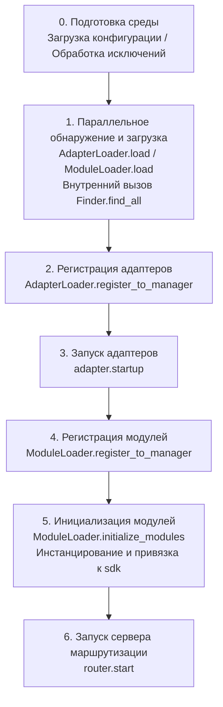

Соответствующие основные компоненты:

| Уровень | Компонент | Ответственность |
|----|------|------|
| Обнаружение | `AdapterFinder` / `ModuleFinder` | **Обнаружение** адаптеров/модулей из entry-points установленных пакетов |
| Загрузка | `AdapterLoader` / `ModuleLoader` | Обнаружение + импорт + чтение метаданных + определение включения/отключения, возвращает список объектов |
| Регистрация | `*Loader.register_to_manager` | Регистрация объектов в соответствующих менеджерах |
| Управление | `sdk.adapter` / `sdk.module` | Хранение экземпляров адаптеров/модулей, предоставление интерфейсов запуска/остановки |
| Инициализация | `ModuleLoader.initialize_modules` | Создание экземпляров модулей и привязка к `sdk` (обработка топологической сортировки зависимостей) |
| Маршрутизация | `sdk.router` | HTTP / WebSocket сервер |

> **Важно**: `Finder` и `Loader` — это два уровня. Внутри `Loader` **уже содержится** `Finder` (у `AdapterLoader` есть `AdapterFinder`, у `ModuleLoader` есть `ModuleFinder`). В большинстве сценариев вам нужно использовать только `Loader`, а `Finder` используется только тогда, когда нужно "просто перечислить, не импортируя".

[**English**](docs/ru/quick-start.md) | [**简体中文**](docs/ru/quick-start.md)

## Подробное объяснение каждого этапа

### 1. Слой обнаружения: Finder

Finder отвечает только за "поиск пакетов, предоставляющих адаптеры/модули", не импортирует и не создает экземпляры.

```python
from ErisPulse.finders import AdapterFinder, ModuleFinder

adapter_finder = AdapterFinder()
module_finder = ModuleFinder()

# Поиск всех установленных entry-points адаптеров/модулей
adapter_entries = adapter_finder.find_all()    # list[EntryPoint]
module_entries = module_finder.find_all()      # list[EntryPoint]

# Поиск по имени
entry = module_finder.find_by_name("MyModule")  # EntryPoint | None
```

Каждый `EntryPoint` можно загрузить с помощью `.load()`, чтобы получить соответствующий класс, но обычно вам не нужно вызывать это вручную — Loader сделает это за вас.

### 2. Слой загрузки: Loader

Loader добавляет к Finder'у функциональность "импорта + чтения метаданных + определения включения/отключения".

```python
from ErisPulse.loaders import AdapterLoader, ModuleLoader
from ErisPulse import sdk

adapter_loader = AdapterLoader()
module_loader = ModuleLoader()

# Внутри load(): вызывается finder.find_all() → обработка entry-point по одному → возвращение тройки значений
adapter_objs, enabled_adapters, disabled_adapters = await adapter_loader.load(sdk.adapter)
module_objs, enabled_modules, disabled_modules = await module_loader.load(sdk.module)
```

Тройка значений, возвращаемая `load()`:

| Возвращаемое значение | Значение |
|-----------------------|----------|
| `objs` (`dict`)       | Имя → объект (класс адаптера / обертка модуля) |
| `enabled` (`list[str]`) | Имена, которые были включены (не отключены в конфигурации) |
| `disabled` (`list[str]`) | Имена, которые были отключены |

#### Информация для диагностики при неудачной загрузке

Когда модуль/адаптер выбрасывает исключение на этапе загрузки или инициализации, фреймворк пропускает этот компонент и продолжает загрузку остальных, одновременно выводя **резюме фреймов пользовательского кода**, чтобы вы могли определить местоположение ошибки на уровне INFO, без необходимости вручную включать DEBUG:

```
[ERROR] [ModuleLoader] Загрузка модуля MyModule из entry-point не удалась, пропущен: 'NoneType' object has no attribute 'platform'
  → MyModule/Core.py:42 in on_load
      adapter = sdk.platform
  → AttributeError: 'NoneType' object has no attribute 'platform'
  → Подсказка: Увеличьте уровень логирования до DEBUG, чтобы увидеть полный стек; проверьте реализацию модуля MyModule
```

Информация для диагностики генерируется с помощью модуля `ErisPulse.runtime.diagnostics`, который автоматически фильтрует внутренние фреймы фреймворка, оставляя только фреймы вашего кода. Если вам нужно повторно использовать это в пользовательской логике загрузки:

```python
from ErisPulse.runtime import log_diagnostic

try:
    risky_init()
except Exception as e:
    log_diagnostic(e)  # Автоматически извлекает фреймы пользовательского кода и записывает в лог ERROR
```

Этот модуль также предоставляет два низкоуровневых функции: `extract_user_frame()` (возвращает структурированную информацию о фрейме) и `format_diagnostic_block()` (возвращает многострочный текст).

### 3. Слой регистрации: register_to_manager

Регистрация объектов, созданных Loader'ом, в менеджере, чтобы `sdk.adapter` / `sdk.module` могли их распознавать.

```python
# Регистрация адаптера (возвращает bool, указывающий, успешно ли все завершилось)
await adapter_loader.register_to_manager(enabled_adapters, adapter_objs, sdk.adapter)

# Регистрация модуля
await module_loader.register_to_manager(enabled_modules, module_objs, sdk.module)
```

После регистрации адаптеры зарегистрированы в менеджере адаптеров, а модули — в менеджере модулей, но **ни один из них еще не запущен/не создан**.

### 4. Запуск адаптеров

```python
# Запуск всех зарегистрированных адаптеров
await sdk.adapter.startup()
# Или указать платформу
await sdk.adapter.startup("yunhu")
await sdk.adapter.startup(["yunhu", "telegram"])
```

> Регистрация ≠ Запуск. `register_to_manager` просто регистрирует; `startup` вызывает метод `start()` адаптера и устанавливает соединение с платформой.

### 5. Инициализация модуля

Модули имеют дополнительный шаг — они должны быть **инициализированы** и подключены к `sdk` (чтобы вы могли вызывать `sdk.MyModule.xxx`). Этот шаг также обрабатывает объявления зависимостей между модулями и топологическую сортировку.

```python
success = await module_loader.initialize_modules(
    enabled_modules, module_objs, sdk.module, sdk
)
```

После успешной инициализации модуль появится в `sdk.<ModuleName>`.

### 6. Запуск сервера маршрутизации

```python
await sdk.router.start(
    host="0.0.0.0",
    port=8000,
    ssl_certfile=None,
    ssl_keyfile=None,
)
```

Сервер маршрутизации отвечает за прием обратных вызовов Webhook / WebSocket от адаптеров. Если он не запущен, адаптеры в режиме сервера не смогут получать сообщения.

[**English**](docs/ru/quick-start.md)

## Полный пример ручного запуска

Следующий код **эквивалентен** основному процессу `await sdk.init()`, но каждая его часть доступна для ручного управления, что позволяет вставить пользовательскую логику в любой момент:

```python
import asyncio
from ErisPulse import sdk
from ErisPulse.loaders import AdapterLoader, ModuleLoader

async def manual_startup():
    # 0. Подготовка среды (загрузка конфигурации, регистрация обработчика глобальных исключений)
    #    _prepare_environment — это предварительный шаг внутри init(); при ручном процессе его также нужно вызывать в первую очередь,
    #    иначе Loader не сможет прочитать конфигурацию и посчитает все адаптеры/модули отключенными.
    if not await sdk._prepare_environment():
        print("Ошибка при подготовке среды")
        return False

    # 1. Создание загрузчиков (внутри каждый из них содержит Finder)
    adapter_loader = AdapterLoader()
    module_loader = ModuleLoader()

    # 2. Параллельное обнаружение и загрузка (аналогично внутренней реализации gather в init())
    (adapter_objs, enabled_adapters, disabled_adapters), \
    (module_objs, enabled_modules, disabled_modules) = await asyncio.gather(
        adapter_loader.load(sdk.adapter),
        module_loader.load(sdk.module),
    )

    # 3. Регистрация адаптеров
    await adapter_loader.register_to_manager(
        enabled_adapters, adapter_objs, sdk.adapter
    )

    # 4. Запуск адаптеров
    if enabled_adapters:
        await sdk.adapter.startup()

    # 5. Регистрация модулей
    await module_loader.register_to_manager(
        enabled_modules, module_objs, sdk.module
    )

    # 6. Инициализация модулей (инстанцирование + привязка к sdk)
    if enabled_modules:
        await module_loader.initialize_modules(
            enabled_modules, module_objs, sdk.module, sdk
        )

    # 7. Запуск сервера маршрутизации
    await sdk.router.start(host="0.0.0.0", port=8000)

    print("Ручной запуск завершен")
    return True

async def main():
    ok = await manual_startup()
    if ok:
        # Блокировка для поддержания работы (ручной процесс не блокируется автоматически)
        await asyncio.Event().wait()

if __name__ == "__main__":
    asyncio.run(main())
```

### Когда использовать ручной запуск?

В большинстве случаев **ручной запуск не требуется**, так как `await sdk.run()` уже выполняет все вышеуказанные шаги. Ручной запуск имеет смысл только в следующих случаях:

- **Частичная загрузка**: загрузка только указанных адаптеров/модулей, пропуск остальных
- **Динамическая регистрация**: регистрация новых адаптеров/модулей во время выполнения в зависимости от условий
- **Пользовательский порядок**: необходимость изменить стандартный порядок загрузки (например, запустить модуль до запуска адаптера)
- **Внедрение стратегий**: внедрение в Loader пользовательских менеджеров строгого режима, стратегий загрузки и т.д.
- **Отладка/диагностика**: ручное управление выполнением для выявления ошибок на конкретных этапах

## Контроль на уровне выполнения

Даже если вы использовали `sdk.run()` для запуска, вы по-прежнему можете управлять отдельными подсистемами во время выполнения, не перезапуская весь SDK:

### Горячее включение/выключение адаптеров

```python
# Горячая перезагрузка адаптера (исправление соединения, не влияет на другие платформы)
await sdk.adapter.shutdown("yunhu")
await sdk.adapter.startup("yunhu")

# Запуск новой платформы во время выполнения
await sdk.adapter.startup("telegram")

# Временное отключение платформы
await sdk.adapter.shutdown("telegram")
```

> `adapter.startup()` требует, чтобы адаптер **был зарегистрирован** в менеджере. Регистрация происходит внутри `init()`/`run()`, поэтому это тонкий контроль **после** запуска.

### Сервер маршрутизации

```python
# Временное отключение webhook-сервера
await sdk.router.stop()

# Перезапуск (например, при смене порта)
await sdk.router.start(host="0.0.0.0", port=9000)
```

### Загрузка модулей по требованию

```python
# Ручная загрузка модуля (возможно, ленивая загрузка)
await sdk.load_module("MyModule")
```

[**Русский**](docs/ru/quick-start.md)

## Грациозное завершение

Начиная с версии 2.7.0, `sdk.shutdown()` предоставляет **программное грациозное завершение**: установка события завершения, которое позволяет главному циклу, зависшему в `await sdk.run(keep_running=True)`, вернуться и, в свою очередь, запустить `uninit()` для завершения очистки ресурсов.

```python
# Вызывается в любой корутине, вызывает грациозное завершение (run() возвращается и автоматически вызывает uninit)
sdk.shutdown()
```

Типичное применение:

```python
async def shutdown_after_idle():
    await asyncio.sleep(3600)
    sdk.shutdown()  # Грациозное завершение после 1 часа бездействия
```

**Обработка сигналов**: `run()` внутренне регистрирует обработчики `SIGTERM` / `SIGHUP`, преобразуя системные сигналы в грациозное завершение — при остановке контейнеров (Docker `docker stop`) или остановке службы `systemd` процесс будет завершаться через `uninit()` для очистки, а не будет принудительно убит.

- Windows не поддерживает `loop.add_signal_handler`, обработчики сигналов будут автоматически пропущены (можно по-прежнему использовать `sdk.shutdown()` или Ctrl+C для запуска завершения)
- Повторный вызов `sdk.shutdown()` безопасен (при повторном вызове после установки события не будет никаких действий)

[**English**](docs/ru/quick-start.md)

## Процесс удаления

Обратная операция запуска — это `await sdk.uninit()`, которая очищает в обратном порядке:

1. Закрытие всех адаптеров (`adapter.shutdown()`)
2. Удаление всех модулей
3. Очистка всех обработчиков событий
4. Очистка свойств модулей в менеджере и SDK

В сценариях с ручным запуском не забудьте вызвать `uninit()` перед выходом, чтобы обеспечить корректное завершение:

```python
try:
    await asyncio.Event().wait()   # Поддержка работы
finally:
    await sdk.uninit()

## Перезапуск

SDK предоставляет два способа перезапуска, при этом вам не нужно самостоятельно сначала удалять — фреймворк сам обработает:

| Способ | Вызов | Поведение | Сценарий использования |
|------|------|------|----------|
| Горячий перезапуск | `await sdk.restart()` | В том же процессе после `uninit()` повторно вызывается `init()`, перезагружаются адаптеры/модули | Перезагрузка конфигурации, горячая замена модулей |
| Жесткий перезапуск | `await sdk.hard_restart()` | После `uninit()` завершается весь процесс, и родительский процесс (`epsdk run`) запускает новый процесс | Подозрение на утечку памяти/ресурсов, требуется полный и чистый перезапуск |

```python
# Горячий перезапуск: перезагрузка в том же процессе (наиболее часто используемый способ)
await sdk.restart()

# Жесткий перезапуск: завершение процесса, действует только при запуске через epsdk run
await sdk.hard_restart()
```

> **Два важных замечания**:
> 1. Оба этих метода выполняют перезапуск в фоновой задаче, **немедленно возвращая `True` означает «задача перезапуска запланирована»**, а не «перезапуск завершен». Фактический перезапуск происходит в фоне, чтобы не прерывать текущую цепочку событий.
> 2. `hard_restart()` **должен быть вызван при запуске через `epsdk run main.py`**, чтобы сработал. Его принцип работы: после удаления он завершает процесс с кодом выхода 42, и родительский процесс `epsdk run` обнаружив этот код, запускает новый процесс; если же запуск происходит напрямую через `python main.py`, процесс завершится с кодом 42 и просто завершится, без автоматического перезапуска.

### Когда следует использовать жесткий перезапуск?

Жесткий перезапуск — это не просто «более полный перезапуск», он в следующих сценариях более подходит и даже эффективнее, чем горячий перезапуск:

- **Побочные эффекты двоичных библиотек (C-расширений)**: Горячий перезапуск происходит в том же процессе, не позволяя освободить ресурсы, такие как C-расширения, открытые файловые дескрипторы, потоки и т.д.; жесткий перезапуск запускает новый процесс, полностью очищая эти побочные эффекты.
- **Выявление утечек ресурсов**: При подозрении на утечку памяти или дескрипторов жесткий перезапуск обеспечивает чистую среду.
- **Частые перезапуски с чувствительностью к производительности**: Жесткий перезапуск избегает накладных расходов на удаление и повторную загрузку в том же процессе, фактически более эффективен, чем горячий перезапуск.

> Функция «Перезапуск фреймворка» в панели управления Dashboard на нижнем уровне вызывает именно `hard_restart()`.
> Кроме того, жесткий перезапуск требует обязательного использования команды запуска `epsdk`, иначе программа просто завершится с кодом 42, потому что команда `run` проверяет код выхода 42 и перезапускает процесс. Об этом нужно помнить!


====
技术标准
====


### 会话类型标准

# Стандарт типов сессий ErisPulse

В этом документе определяются стандартные типы сессий, поддерживаемые ErisPulse, включая типы событий приема и типы целей отправки.

Пожалуйста, верните непосредственно переведенный полный Markdown-контент, не добавляя никаких других текстов.

Еще раз напоминаем: если документ содержит строки переключения языка (строки, в которых названия языков разделены `` | ``), необходимо строго соблюдать вышеуказанные правила форматирования, не записывая ошибочного формата, такого как ``[**Label**](file)``.

## 1. Основные понятия

### 1.1 Типы получения && Типы отправки

ErisPulse различает два типа сессий:

- **Тип получения (Receive Type)**: поле `detail_type` события, используемое для получения
- **Тип отправки (Send Type)**: тип назначения метода `Send.To()` при отправке сообщений

### 1.2 Отношение типов

```
Тип получения (detail_type)     Тип отправки (Send.To)
─────────────────        ────────────────
private                 →        user
group                   →        group
channel                 →        channel
guild                   →        guild
thread                  →        thread
user                    →        user
```

**Ключевые моменты**:
- `private` является типом получения, при отправке необходимо использовать `user`
- `group`, `channel`, `guild`, `thread` имеют одинаковые типы при получении и отправке
- Система автоматически выполняет преобразование типов, без необходимости ручного управления (это означает, что вы можете напрямую использовать полученный тип получения для отправки), на самом деле, вам не нужно беспокоиться об этом, наличие обёрточного класса Event позволяет вам напрямую использовать метод event.reply(), не заботясь о преобразовании типов

## 2. Стандартные типы сессий

### 2.1 Стандартные типы OneBot12

#### private
- **Тип получения**: `private`
- **Тип отправки**: `user`
- **Описание**: Личное сообщение в прямом чате
- **Поле ID**: `user_id`
- **Поддерживаемые платформы**: Все платформы, поддерживающие личные чаты

#### group
- **Тип получения**: `group`
- **Тип отправки**: `group`
- **Описание**: Сообщения в групповом чате, включая различные формы групп (например, супергруппы в Telegram)
- **Поле ID**: `group_id`
- **Поддерживаемые платформы**: Все платформы, поддерживающие групповые чаты

#### user
- **Тип получения**: `user`
- **Тип отправки**: `user`
- **Описание**: Тип пользователя, некоторые платформы (например, Telegram) представляют личные чаты как `user`, а не `private`
- **Поле ID**: `user_id`
- **Поддерживаемые платформы**: Telegram и другие платформы

### 2.2 Расширенные типы ErisPulse

#### channel
- **Тип получения**: `channel`
- **Тип отправки**: `channel`
- **Описание**: Сообщения в канале, поддерживают широковещательные сообщения для нескольких пользователей
- **Поле ID**: `channel_id`
- **Поддерживаемые платформы**: Discord, Telegram, Line и другие

#### guild
- **Тип получения**: `guild`
- **Тип отправки**: `guild`
- **Описание**: Сообщения сервера/сообщества, обычно используются для событий уровня Discord Guild
- **Поле ID**: `guild_id`
- **Поддерживаемые платформы**: Discord и другие

#### thread
- **Тип получения**: `thread`
- **Тип отправки**: `thread`
- **Описание**: Сообщения темы/подканала, используются для подобсуждений внутри сообщества
- **Поле ID**: `thread_id`
- **Поддерживаемые платформы**: Discord Threads, Telegram Topics и другие

## 3. Сопоставление типов платформ

### 3.1 Принцип сопоставления

Адаптер отвечает за сопоставление нативных типов платформ с типами ErisPulse:

```
Нативный тип платформы → Стандартный тип ErisPulse → Тип отправки
```

### 3.2 Примеры сопоставления распространённых платформ

#### Telegram
```
Тип Telegram         Тип ErisPulse (приём)    Тип отправки
─────────────────      ────────────────       ───────────
private                private                 user
group                  group                   group
supergroup             group                   group  # Сопоставляется с group
channel                channel                 channel
```

#### Discord
```
Тип Discord          Тип ErisPulse (приём)    Тип отправки
─────────────────      ────────────────       ───────────
Direct Message         private                user
Text Channel           channel                channel
Guild                  guild                  guild
Thread                 thread                 thread
```

#### OneBot11
```
Тип OneBot11         Тип ErisPulse (приём)    Тип отправки
─────────────────      ────────────────       ───────────
private                private                user
group                  group                  group
discuss                group                  group  # Сопоставляется с group

## 4. Расширение пользовательских типов

### 4.1 Регистрация пользовательского типа

Адаптер может зарегистрировать пользовательский тип сеанса:

```python
from ErisPulse.Core.Event import register_custom_type

# Регистрация пользовательского типа
register_custom_type(
    receive_type="my_custom_type",
    send_type="custom",
    id_field="custom_id",
    platform="MyPlatform"
)
```

### 4.2 Использование пользовательского типа

После регистрации система автоматически обрабатывает преобразование и вывод этого типа:

```python
# Автоматический вывод
receive_type = infer_receive_type(event, platform="MyPlatform")
# Возвращает: "my_custom_type"

# Преобразование в тип отправки
send_type = convert_to_send_type(receive_type, platform="MyPlatform")
# Возвращает: "custom"

# Получение соответствующего ID
target_id = get_target_id(event, platform="MyPlatform")
# Возвращает: event["custom_id"]
```

### 4.3 Удаление пользовательского типа

```python
from ErisPulse.Core.Event import unregister_custom_type

unregister_custom_type("my_custom_type", platform="MyPlatform")

## 5. Автоматическое определение типа

Когда у события отсутствует явное поле `detail_type`, система автоматически определяет тип на основе существующих полей ID:

> [!NOTE]
> **Изменение поведения в 2.7.0+**: `detail_type` используется напрямую только в том случае, если это **известный тип сессии** (стандартный или пользовательский). У событий notice/request `detail_type` (например, `group_member_increase`, `friend_increase`) является **семантическим подтипом**, а не типом сессии, и система будет вместо этого определять правильный тип сессии на основе полей ID.

### 5.1 Приоритет определения

```
Приоритет (от высокого к низкому):
1. group_id     → group
2. channel_id   → channel
3. guild_id     → guild
4. thread_id    → thread
5. user_id      → private
```

### 5.2 Примеры использования

```python
# У события есть только group_id
event = {"group_id": "123", "user_id": "456"}
receive_type = infer_receive_type(event)
# Возвращает: "group" (group_id имеет наивысший приоритет)

# У события есть только user_id
event = {"user_id": "123"}
receive_type = infer_receive_type(event)
# Возвращает: "private"

# У события notice detail_type является семантическим подтипом, начиная с 2.7.0 будет определяться по ID-полю
event = {"type": "notice", "detail_type": "group_member_increase", "group_id": "123"}
receive_type = infer_receive_type(event)
# Возвращает: "group" (а не "group_member_increase")

## 6. Примеры использования API

### 6.1 Отправка сообщений

```python
from ErisPulse import adapter

# Отправка пользователю
await adapter.myplatform.Send.To("user", "123").Text("Hello")

# Отправка в группу
await adapter.myplatform.Send.To("group", "456").Text("Hello")

# Автоматическое преобразование private → user (не рекомендуется, может быть проблема совместимости)
await adapter.myplatform.Send.To("private", "789").Text("Hello")
# Внутренне автоматически преобразуется в: Send.To("user", "789") # предпочтительнее использовать user как тип сессии напрямую
```

### 6.2 Ответ на событие

```python
from ErisPulse.Core.Event import Event

# Event.reply() автоматически обрабатывает преобразование типа
await event.reply("Содержимое ответа")
# Внутренне автоматически используется правильный тип отправки
```

### 6.3 Обработка команд

```python
from ErisPulse.Core.Event import command

@command(name="test")
async def handle_test(event):
    # Система автоматически обрабатывает тип сессии
    # Не нужно вручную проверять group_id или user_id
    await event.reply("Команда выполнена успешно")

## 7. Справочник основного API

### 7.1 Преобразование типов

```python
from ErisPulse.Core.Event import convert_to_send_type, convert_to_receive_type

# Тип получения → Тип отправки
convert_to_send_type("private")  # → "user"
convert_to_send_type("group")    # → "group"

# Тип отправки → Тип получения
convert_to_receive_type("user")   # → "private"
convert_to_receive_type("group")  # → "group"
```

### 7.2 Запрос полей ID

```python
from ErisPulse.Core.Event import get_id_field, get_receive_type

get_id_field("group")    # → "group_id"
get_id_field("private")  # → "user_id"

get_receive_type("group_id")  # → "group"
get_receive_type("user_id")   # → "private"
```

### 7.3 Получение информации для отправки за один шаг

```python
from ErisPulse.Core.Event import get_send_type_and_target_id

event = {"detail_type": "private", "user_id": "123"}
send_type, target_id = get_send_type_and_target_id(event)
# send_type = "user", target_id = "123"

# Непосредственно используется в Send.To()
await adapter.Send.To(send_type, target_id).Text("Hello")
```

### 7.4 Получение целевого ID

```python
from ErisPulse.Core.Event import get_target_id

event = {"detail_type": "group", "group_id": "456"}
get_target_id(event)  # → "456"

## 8. Утилитарные методы

```python
from ErisPulse.Core.Event import (
    is_standard_type,
    is_valid_send_type,
    get_standard_types,
    get_send_types,
    clear_custom_types,
)

is_standard_type("private")     # True
is_standard_type("custom_type") # False

is_valid_send_type("user")      # True
is_valid_send_type("invalid")   # False

get_standard_types()  # {"private", "group", "channel", "guild", "thread", "user"}
get_send_types()      # {"user", "group", "channel", "guild", "thread"}

clear_custom_types()                # Очистить все
clear_custom_types(platform="discord")  # Очистить только указанный платформы
```

[**English**](docs/ru/quick-start.md) | [**Русский**](docs/ru/quick-start.md)

## 9. Лучшие практики

### 7.1 Разработчики адаптеров

1. **Использование стандартных маппингов**: по возможности маппите на стандартные типы, а не создавайте новые типы
2. **Правильное преобразование**: убедитесь, что отношения маппинга между типами получения и отправки корректны
3. **Сохранение исходных данных**: сохраняйте исходный тип события в `{platform}_raw`
4. **Описание в документации**: в документации адаптера укажите отношения маппинга типов

### 7.2 Разработчики модулей

1. **Использование вспомогательных методов**: используйте вспомогательные методы, такие как `get_send_type_and_target_id()`
2. **Избегайте жесткой привязки**: не пишите код вида `if group_id else "private"`
3. **Учет всех типов**: код должен поддерживать все стандартные типы, а не только private/group
4. **Гибкий дизайн**: используйте методы обертки событий, а не прямой доступ к полям

### 7.3 Вывод типов

- **Приоритет использования detail_type**: если есть явное поле, не делайте вывод
- **Разумное использование вывода**: используйте вывод только тогда, когда нет явного типа
- **Обратите внимание на приоритет**: знайте приоритет вывода, чтобы избежать неожиданных результатов

## 10. Часто задаваемые вопросы

### Q1: Почему при отправке private нужно преобразовывать в user?

A: Это требование стандарта OneBot12. `private` — это концепция при получении, при отправке использование `user` более соответствует семантике.

### Q2: Как поддержать новые типы сессий?

A: Зарегистрируйте пользовательский тип с помощью `register_custom_type()` или используйте стандартные типы, такие как `channel`, `guild` и т.д.

### Q3: Что делать, если у события нет detail_type?

A: Система автоматически выводит тип на основе существующих полей ID. Приоритет: group > channel > guild > thread > user.

### Q4: Как адаптер отображает Telegram supergroup?

A: В логике преобразования адаптера `supergroup` отображается в стандартный тип `group`.

### Q5: Как обрабатывать специальные платформы, такие как электронная почта?

A: Для неуниверсальных или платформенно-специфических типов используйте `{platform}_raw` и `{platform}_raw_type` для сохранения исходных данных, адаптер должен самостоятельно обрабатывать их.

docs/ru/quick-start.md

## 11. Связанные документы

- [Стандарт преобразования событий](event-conversion.md) - Полный стандарт преобразования событий
- [Спецификация методов отправки](send-method-spec.md) - Назначение и параметры методов класса Send
- [Руководство по разработке адаптеров](../developer-guide/adapters/) - Полное руководство по разработке адаптеров


### 事件转换标准

# Спецификация стандартизации адаптера

## 1. Основные принципы
1. Строгая совместимость: Все стандартные поля должны строго следовать спецификации OneBot12.
2. Явное расширение: Платформенно-специфичные функции должны добавлять префикс `{platform}_` (например, yunhu_form).
3. Целостность данных: Исходные данные события должны сохраняться в поле `{platform}_raw`, а исходный тип события — в поле `{platform}_raw_type`.
4. Единообразие времени: Все временные метки должны быть преобразованы в 10-значный временной штамп Unix (секунды).
5. Единообразие платформ: Имя поля `platform` должно соответствовать имени/алиасу, под которым вы зарегистрировались в ErisPulse.

## 2. Требования к стандартным полям

### 2.1 Обязательные поля
| Поле | Тип | Описание |
|------|------|------|
| id | string | Уникальный идентификатор события |
| time | integer | Временной штамп Unix (секунды) |
| type | string | Тип события |
| detail_type | string | Детальный тип события (подробнее см. [Стандарт типов сессий](session-types.md)) |
| platform | string | Название платформы |
| self | object | Информация о самом боте |
| self.platform | string | Название платформы |
| self.user_id | string | User ID бота |

**Правила для `detail_type`**:
- Должны использоваться стандартные типы сессий ErisPulse (подробнее см. [Стандарт типов сессий](session-types.md))
- Поддерживаемые типы: `private`, `group`, `user`, `channel`, `guild`, `thread`
- Адаптер должен отвечать за отображение нативных типов платформ на стандартные типы

### 2.2 Поля сообщений
| Поле | Тип | Описание |
|------|------|------|
| message | array | Массив сегментов сообщения |
| alt_message | string | Резервный текст сегментов сообщения |
| user_id | string | User ID |
| user_nickname | string | Никнейм пользователя (необязательно) |

### 2.3 Поля уведомлений
| Поле | Тип | Описание |
|------|------|------|
| user_id | string | User ID |
| user_nickname | string | Никнейм пользователя (необязательно) |
| operator_id | string | ID оператора (необязательно) |

### 2.4 Поля запросов
| Поле | Тип | Описание |
|------|------|------|
| user_id | string | User ID |
| user_nickname | string | Никнейм пользователя (необязательно) |
| comment | string | Комментарий к запросу (необязательно) |
| request_id | string | Идентификатор запроса (сильно рекомендуется, для операций принятия/отклонения) |

**Объяснение поля `request_id`**:
- `request_id` — это уникальный идентификатор операции для событий запроса, используется для выполнения операций принятия/отклонения через DSL `HandleRequest`.
- При преобразовании события запроса адаптер должен сопоставить нативный идентификатор запроса платформы с этим полем.
- Если платформа сама по себе не имеет идентификатора запроса, адаптер должен сгенерировать уникальный идентификатор (например, хеш на основе временной метки + user_id).
- Когда `request_id` отсутствует, `event.approve()` / `event.reject()` выбросят `ValueError`.

## 3. Примеры формата событий

### 3.1 Событие сообщения (message)
```json
{
  "id": "1234567890",
  "time": 1752241223,
  "type": "message",
  "detail_type": "group",
  "platform": "yunhu",
  "self": {
    "platform": "yunhu",
    "user_id": "bot_123"
  },
  "message": [
    {
      "type": "text",
      "data": {
        "text": "抽奖 超级大奖"
      }
    }
  ],
  "alt_message": "抽奖 超级大奖",
  "user_id": "user_456",
  "user_nickname": "YingXinche",
  "group_id": "group_789",
  "yunhu_raw": {...},
  "yunhu_raw_type": "message.receive.normal",
  "yunhu_command": {
    "name": "抽奖",
    "args": "超级大奖"
  }
}
```

### 3.2 Событие уведомления (notice)
```json
{
  "id": "1234567891",
  "time": 1752241224,
  "type": "notice",
  "detail_type": "group_member_increase",
  "platform": "yunhu",
  "self": {
    "platform": "yunhu",
    "user_id": "bot_123"
  },
  "user_id": "user_456",
  "user_nickname": "YingXinche",
  "group_id": "group_789",
  "operator_id": "",
  "yunhu_raw": {...},
  "yunhu_raw_type": "bot.followed"
}
```

### 3.3 Событие запроса (request)
```json
{
  "id": "1234567892",
  "time": 1752241225,
  "type": "request",
  "detail_type": "friend",
  "platform": "onebot11",
  "self": {
    "platform": "onebot11",
    "user_id": "bot_123"
  },
  "user_id": "user_456",
  "user_nickname": "YingXinche",
  "comment": "请加好友",
  "request_id": "req_abc123",
  "onebot11_raw": {...},
  "onebot11_raw_type": "request"
}
```

## 4. Стандарт сегментов сообщений

### 4.1 Стандартные сегменты сообщений

Типы стандартных сегментов сообщений **не должны** иметь префикс платформы:

| Тип | Описание | Поля данных |
|------|------|----------|
| `text` | Текст | `text: str` |
| `image` | Изображение | `file: str/bytes`, `url: str` |
| `audio` | Аудио | `file: str/bytes`, `url: str` |
| `video` | Видео | `file: str/bytes`, `url: str` |
| `file` | Файл | `file: str/bytes`, `url: str`, `filename: str` |
| `mention` | Упоминание пользователя | `user_id: str`, `user_name: str` |
| `reply` | Ответ | `message_id: str` |
| `face` | Смайлик | `id: str` |
| `location` | Местоположение | `latitude: float`, `longitude: float` |

```json
{
  "type": "text",
  "data": {
    "text": "Hello World"
  }
}
```

### 4.2 Расширенные сегменты сообщений платформ

Платформенно-специфичные сегменты сообщений должны иметь префикс платформы:

```json
// 云湖 - Форма
{"type": "yunhu_form", "data": {"form_id": "123456", "form_name": "报名表"}}

// Telegram - Стикер
{"type": "telegram_sticker", "data": {"file_id": "CAACAgIAAxkBAA...", "emoji": "😂"}}
```

**Требования к расширенным сегментам**:
1. **Внутри полей `data` не добавлять префикс**: `{"type": "yunhu_form", "data": {"form_id": "..."}}` вместо `{"type": "yunhu_form", "data": {"yunhu_form_id": "..."}}`
2. **Предоставлять план downgrade**: модуль может не распознавать расширенные сегменты, адаптер должен предоставлять текстовую замену в `alt_message`.
3. **Полнота документации**: каждый расширенный сегмент должен быть описан в документации адаптера с указанием `type`, структуры `data` и сценария использования.

## 5. Обработка неизвестных событий

Для типов событий, которые не могут быть распознаны, должны создаваться события предупреждения:
```json
{
  "id": "1234567893",
  "time": 1752241223,
  "type": "unknown",
  "platform": "yunhu",
  "yunhu_raw": {...},
  "yunhu_raw_type": "unknown",
  "warning": "Unsupported event type: special_event",
  "alt_message": "This event type is not supported by this system."
}
```

---

## 6. Спецификации именования расширений

### 6.1 Именование полей

**Правило**: `{platform}_{field_name}`

```
Префикс платформы    Имя поля            Полное имя поля
────────    ───────          ──────────
yunhu       command           yunhu_command
telegram    sticker_file_id   telegram_sticker_file_id
onebot11    anonymous         onebot11_anonymous
email       subject           email_subject
```

**Требования**:
- `platform` должно точно совпадать с именем платформы при регистрации адаптера (с учетом регистра).
- `field_name` использует именование `snake_case`.
- Запрещено использовать двойное подчеркивание в начале `__` (зарезервировано Python).
- Запрещено иметь то же имя, что и стандартные поля (например, `type`, `time`, `message` и т.д.).

### 6.2 Именование типов сегментов сообщений

**Правило**: `{platform}_{segment_type}`

Типы стандартных сегментов сообщений (`text`, `image`, `audio`, `video`, `mention`, `reply` и т.д.) **не должны** иметь префикс платформы. Требуется добавлять префикс только для типов сегментов сообщений, уникальных для платформы.

### 6.3 Именование полей исходных данных

Ниже приведены имена полей **сохраняемых полей**, которые все адаптеры должны соблюдать:

| Сохраняемое поле | Тип | Описание |
|---------|------|------|
| `{platform}_raw` | `any` | Полная копия исходных данных события платформы |
| `{platform}_raw_type` | `string` | Строковый идентификатор исходного типа события платформы |

**Требования**:
- `{platform}_raw` должен быть глубокой копией исходных данных, а не ссылкой.
- `{platform}_raw_type` должен быть строкой, даже если платформа использует числовой тип, он должен быть преобразован в строку.
- Эти два поля **обязательны** для всех событий (если не удается получить, то `null` и пустая строка `""`).

### 6.4 Примеры полей платформы

```json
{
  "yunhu_command": {
    "name": "抽奖",
    "args": "超级大奖"
  },
  "yunhu_form": {
    "form_id": "123456"
  },
  "telegram_sticker": {
    "file_id": "CAACAgIAAxkBAA..."
  }
}
```

### 6.5 Вложенные расширенные поля

Расширенные поля могут быть простыми значениями или вложенными объектами:

```json
{
  "telegram_chat": {
    "id": 123456,
    "type": "supergroup",
    "title": "My Group"
  },
  "telegram_forward_from": {
    "user_id": "789",
    "user_name": "ForwardUser"
  }
}
```

**Требования для вложенных полей**:
- Ключи верхнего уровня должны иметь префикс платформы.
- Внутренние поля вложения **не должны** иметь префикс платформы.
- Рекомендуемая глубина вложения не более 3 уровней.

### 6.6 Расширение поля `self`

Стандартные обязательные поля объекта `self` (`platform`, `user_id`) см. §2.1. Ниже приведены необязательные поля расширений ErisPulse:

| Поле | Тип | Описание |
|------|------|------|
| `self.user_name` | `string` | Никнейм бота |
| `self.avatar` | `string` | URL аватара бота |
| `self.account_id` | `string` | Идентификатор учетной записи в режиме нескольких аккаунтов |

> **Отслеживание статуса бота**: Адаптер сообщает фреймворку о статусе соединения бота через отправку события `type: "meta"`. Поддерживаемые `detail_type`: `connect` (подключение), `heartbeat` (сердцебиение), `disconnect` (отключение). Система автоматически извлекает метаданные бота из поля `self` для отслеживания состояния. Кроме того, поле `self` в обычных событиях также автоматически обнаруживается ботом. Подробнее см. [API системы адаптера - Управление статусом бота](../api-reference/adapter-system.md).

---

## 7. Расширения типов сессий

ErisPulse расширил следующие типы сессий на основе стандартов OneBot12 `private`, `group`:

| Тип | OneBot12 Стандарт | Расширение ErisPulse | Описание |
|------|:-----------:|:------------:|------|
| `private` | ✅ | — | Личный чат |
| `group` | ✅ | — | Групповой чат |
| `user` | — | ✅ | Тип пользователя (Telegram и т.д.) |
| `channel` | — | ✅ | Канал (вещательный) |
| `guild` | — | ✅ | Сервер / Сообщество |
| `thread` | — | ✅ | Тема / Подканал |

**Расширения пользовательских типов адаптера**:

```python
from ErisPulse.Core.Event.session_type import register_custom_type

# Регистрация при запуске адаптера
register_custom_type(
    receive_type="email",      # detail_type в событии получения
    send_type="email",         # целевой тип при отправке
    id_field="email_id",       # имя соответствующего поля ID
    platform="email"           # идентификатор платформы
)
```

**Требования к пользовательским типам**:
- Должны быть зарегистрированы при запуске адаптера `start()` и отменены при `shutdown()`.
- `receive_type` не должно совпадать с именем стандартного типа.
- `id_field` должен следовать шаблону именования `{target}_id`.

> Полное определение типов сессий и отношения сопоставления см. в [Стандарте типов сессий](session-types.md).

---

## 8. Руководство для разработчиков модулей

### 8.1 Доступ к расширенным полям

```python
from ErisPulse.Core.Event import message

@message()
async def handle_message(event):
    # Доступ к стандартным полям
    text = event.get_text()
    user_id = event.get_user_id()

    # Доступ к расширенным полям платформы - способ 1: прямое get
    yunhu_command = event.get("yunhu_command")

    # Доступ к расширенным полям платформы - способ 2: точечный доступ (класс Event)
    # event.yunhu_command

    # Доступ к исходным данным
    raw_data = event.get("yunhu_raw")
    raw_type = event.get_raw_type()

    # Определение платформы
    platform = event.get_platform()
    if platform == "yunhu":
        pass
    elif platform == "telegram":
        pass
```

### 8.2 Обработка расширенных сегментов сообщений

```python
@message()
async def handle_message(event):
    message_segments = event.get("message", [])

    for segment in message_segments:
        seg_type = segment.get("type")
        seg_data = segment.get("data", {})

        if seg_type == "text":
            text = seg_data["text"]
        elif seg_type.startswith("yunhu_"):
            if seg_type == "yunhu_form":
                form_id = seg_data["form_id"]
        elif seg_type.startswith("telegram_"):
            if seg_type == "telegram_sticker":
                file_id = seg_data["file_id"]
```

### 8.3 Лучшие практики

1. **Приоритет использования стандартных полей**: Не предполагайте, что расширенные поля обязательно существуют.
2. **Определение платформы**: Определяйте платформу через `event.get_platform()`, а не по наличию расширенных полей.
3. **Умный downgrade**: Если расширенный сегмент сообщения не может быть обработан, используйте `alt_message` как запасной вариант.
4. **Не используйте хардкод префиксов**: Динамически конкатенируйте с помощью переменной `platform`.

```python
# ✅ Рекомендуется
platform = event.get_platform()
raw_data = event.get(f"{platform}_raw")

# ❌ Не рекомендуется
raw_data = event.get("yunhu_raw")
```

### 8.4 Обработка событий запросов

Разработчики модулей могут выполнять операции над событиями запроса через `event.approve()` и `event.reject()`:

```python
from ErisPulse.Core.Event import request

# Запрос в друзья: автоматическое принятие
@request.on_friend_request()
async def handle_friend_request(event):
    user_name = event.get_user_nickname() or event.get_user_id()
    comment = event.get_comment()
    
    # Принятие запроса
    result = await event.approve()
    if result.get("status") == "ok":
        print(f"已同意 {user_name} 的好友请求")
    else:
        print(f"同意好友请求失败: {result.get('message')}")

# Приглашение в группу: решение по условию
@request.on_group_request()
async def handle_group_request(event):
    comment = event.get_comment()
    
    # Отклонение запроса
    result = await event.reject(comment="暂不加入新群")
```

**Непосредственное выполнение через адаптер** (подходит для сценариев, не являющихся обработчиками событий):

```python
from ErisPulse import adapter

# Непосредственная операция через request_id
await adapter.myplatform.Request("req_abc123").accept()
await adapter.myplatform.Request("req_abc123").reject()

# Операция с указанием учетной записи бота
await adapter.myplatform.Request("req_abc123").Using("bot1").accept()

# С примечанием
await adapter.myplatform.Request("req_abc123").accept(comment="欢迎")
```

---

## 9. Вывод типа сессии для событий notice / request

### 9.1 Контекст проблемы

`detail_type` событий notice и request являются **семантическими подтипами** (например, `group_member_increase`, `friend_increase`), а не типами сессии (например, `group`, `private`).

```
type        detail_type                  Смысл            Тип сессии
────        ───────────                  ────            ────────
message     group                        Сообщение в группе  group (detail_type = тип сессии)
message     private                      Личное сообщение  private (detail_type = тип сессии)
notice      group_member_increase        Увеличение участника группы group (выводится из group_id)
notice      friend_increase              Увеличение друзей private (выводится из user_id)
request     friend                       Запрос в друзья private (выводится из user_id)
request     group                        Запрос в группу group (detail_type = тип сессии)
```

### 9.2 Правила вывода

Порядок вывода `infer_receive_type()`:

1. Если `detail_type` является известным типом сессии (`private`/`group`/`channel`/`guild`/`thread`/`user`), используйте его напрямую.
2. Если `detail_type` является пользовательским типом сессии, используйте его напрямую.
3. В противном случае (семантические подтипы notice/request), выведите на основе полей ID:
   - Есть `group_id` → `"group"`
   - Есть `channel_id` → `"channel"`
   - Есть `guild_id` → `"guild"`
   - Есть `thread_id` → `"thread"`
   - Есть `user_id` → `"private"`

### 9.3 Вывод цели для `event.reply()`

Цель отправки `event.reply()` в событиях notice/request определяется выводом типа сессии:

- Событие уведомления группы (содержащее `group_id`) → Ответ в **группу**
- Событие уведомления друга (содержащее только `user_id`) → Ответ в **личный чат пользователя**

```python
from ErisPulse.Core.Event import notice

@notice.on_group_increase()
async def handle_welcome(event):
    group_id = event.get("group_id")    # "group_789"
    user_id = event.get("user_id")      # "user_456"

    # event.reply() отправляется в группу (group/group_789)
    await event.reply("欢迎入群！")

    # Для уведомления администратора (личный чат), явно укажите цель:
    await adapter.Send.To("user", "admin_id").Text(f"新成员 {user_id} 加入了 {group_id}")
```

### 9.4 Рекомендации для разработчиков адаптеров

Убедитесь, что события notice/request содержат правильные поля ID:

| detail_type | Обязательные поля ID | Вывод типа сессии |
|-------------|-------------------|---------------|
| `group_member_increase` | `group_id` + `user_id` | `group` |
| `group_member_decrease` | `group_id` + `user_id` | `group` |
| `friend_increase` | `user_id` | `private` |
| `friend_decrease` | `user_id` | `private` |
| `friend` (запрос) | `user_id` | `private` |
| `group` (запрос) | `group_id` | `group` |

---

## 10. Связанные документы

- [Документы особенностей платформ](../platform-guide/README.md) - Вы можете обратиться к этому документу, чтобы узнать о возможностях различных платформ, а также известных расширенных событиях и сегментах сообщений.
- [Стандарт типов сессий](session-types.md) - Определения и отношения отображения типов сессий
- [Спецификация методов отправки](send-method-spec.md) - Имена методов, спецификации параметров класса Send и требования к обратному преобразованию
- [Стандарт ответов API](api-response.md) - Стандарт формата ответов API адаптера
- [Стандарт действий API](api-action-spec.md) - Унифицированный интерфейс стандартных действий API OneBot12


### API 响应标准

# Спецификация стандартного возвращаемого значения для адаптера ErisPulse

## 1. Описание
Существование этого стандарта?

Чтобы гарантировать единообразие интерфейсов возврата и совместимость с OneBot12, адаптер ErisPulse использует стандартную структуру возврата сообщений, определенную OneBot12.

Однако протокол ErisPulse имеет некоторые специальные определения:
- 1. В базовых полях поле `message_id` является обязательным, хотя в стандарте OneBot12 этого поля нет
- 2. В возвращаемом содержании необходимо добавить поле `{platform_name}_raw`, используемое для хранения исходных данных ответа

## 2. Базовая структура возврата
Все ответы на действия должны содержать следующие базовые поля:

| Имя поля | Тип данных | Обязательное | Описание |
|-------|---------|------|------|
| status | string | Да | Статус выполнения, должно быть "ok" или "failed" |
| retcode | int64 | Да | Код возврата, следует правилам кодов возврата OneBot12 |
| data | any | Да | Данные ответа, содержат результат запроса при успехе, null при неудаче |
| message_id | string | Да | ID сообщения, используется для идентификации сообщения, пустая строка если нет |
| message | string | Да | Информация об ошибке, пустая строка при успехе |
| {platform_name}_raw | any | Нет | Исходные данные ответа |

Дополнительные поля:
| Имя поля | Тип данных | Обязательное | Описание |
|-------|---------|------|------|
| echo | string | Нет | Возвращает исходное значение, если оно содержится в запросе |

## 3. Полная спецификация полей

### 3.1 Общие поля

#### Пример успешного ответа
```json
{
    "status": "ok",
    "retcode": 0,
    "data": {
        "message_id": "1234",
        "time": 1632847927.599013
    },
    "message_id": "1234",
    "message": "",
    "echo": "1234",
    "telegram_raw": {...}
}
```

#### Пример неудачного ответа
```json
{
    "status": "failed",
    "retcode": 10003,
    "data": null,
    "message_id": "",
    "message": "Отсутствует необходимый параметр: user_id",
    "echo": "1234",
    "telegram_raw": {...}
}
```

### 3.2 Спецификация кодов возврата

#### 0 Успех (OK)
- 0: Успех (OK)

#### 1xxxx Ошибка запроса действия (Request Error)
| Код ошибки | Название ошибки | Описание |
|-------|-------|------|
| 10001 | Bad Request | Неверный запрос действия |
| 10002 | Unsupported Action | Неподдерживаемый запрос действия |
| 10003 | Bad Param | Неверный параметр запроса действия |
| 10004 | Unsupported Param | Неподдерживаемый параметр запроса действия |
| 10005 | Unsupported Segment | Неподдерживаемый тип сегмента сообщения |
| 10006 | Bad Segment Data | Неверный параметр сегмента сообщения |
| 10007 | Unsupported Segment Data | Неподдерживаемый параметр сегмента сообщения |
| 10101 | Who Am I | Не указан аккаунт бота |
| 10102 | Unknown Self | Неизвестный аккаунт бота |

#### 2xxxx Ошибка обработчика действия (Handler Error)
| Код ошибки | Название ошибки | Описание |
|-------|-------|------|
| 20001 | Bad Handler | Ошибка реализации обработчика действия |
| 20002 | Internal Handler Error | В обработчике действия происходит исключение во время выполнения |

#### 3xxxx Ошибка выполнения действия (Execution Error)
| Диапазон кодов ошибки | Тип ошибки | Описание |
|-----------|---------|------|
| 31xxx | Database Error | Ошибка базы данных |
| 32xxx | Filesystem Error | Ошибка файловой системы |
| 33xxx | Network Error | Ошибка сети |
| 34xxx | Platform Error | Ошибка платформы бота |
| 35xxx | Logic Error | Ошибка логики действия |
| 36xxx | I Am Tired | Реализация приняла решение забастовать |

#### Зарезервированные сегменты ошибок
- 4xxxx, 5xxxx: Зарезервированные сегменты, не должны использоваться
- 6xxxx ~ 9xxxx: Другие сегменты ошибок, доступны для использования для пользовательской реализации

## 4. Требования к реализации
1. Все ответы должны содержать поля `status`, `retcode`, `data` и `message`
2. Когда в запросе содержится непустое поле `echo`, ответ должен содержать поле `echo` с тем же значением
3. Коды возврата должны строго следовать спецификации OneBot12
4. Информация об ошибке (`message`) должна быть читаемым описанием для человека

## 5. Расширенные спецификации

ErisPulse добавляет следующие расширения поверх стандартной структуры возврата OneBot12:

### 5.1 Обязательное поле `message_id`

В стандарте OneBot12 `message_id` находится внутри объекта `data` и не является обязательным. ErisPulse вынес его на верхний уровень как **обязательное** поле:

- Если не удается получить `message_id`, следует установить значение в пустую строку `""`
- Гарантировать, что `message_id` всегда существует, поэтому модулям не нужно выполнять проверку на null

### 5.2 Исходное поле ответа `{platform}_raw`

В возвращаемом значении должно содержаться поле `{platform}_raw`, содержащее полную копию исходных данных ответа платформы:

```json
{
    "status": "ok",
    "retcode": 0,
    "data": {"message_id": "1234", "time": 1632847927},
    "message_id": "1234",
    "message": "",
    "telegram_raw": {
        "ok": true,
        "result": {"message_id": 1234, "date": 1632847927, ...}
    }
}
```

**Требования**:
- `{platform}_raw` должна быть глубокой копией исходного ответа, а не ссылкой
- `platform` должно полностью совпадать с именем платформы при регистрации адаптера (с учетом регистра)
- Информация об ошибках в исходном ответе также должна быть сохранена для облегчения отладки

### 5.3 Чек-лист реализации адаптера

- [ ] Содержать поля `status`, `retcode`, `data`, `message_id`, `message`
- [ ] Коды возврата должны следовать спецификации OneBot12 (подробнее см. §3.2)
- [ ] `message_id` всегда существует (пустая строка, если не удается получить)
- [ ] `{platform}_raw` содержит исходные данные ответа платформы

## 6. Важные примечания
- Для кодов ошибок 3xxxx последние три цифры могут определяться реализацией самостоятельно
- Избегать использования зарезервированных сегментов ошибок (4xxxx, 5xxxx)
- Информация об ошибках должна быть лаконичной и понятной для отладки


### 发送方法规范

# Спецификация метода отправки ErisPulse

Данный документ определяет правила именования методов, параметров и требования к обратному преобразованию в классе отправки Send адаптера ErisPulse.

## 1. Стандартное именование методов

Все методы отправки используют **PascalCase (верхний регистр с заглавной буквы)**.

### 1.1 Стандартные методы отправки

| Название метода | Описание | Тип параметра |
|----------------|----------|---------------|
| `Text` | Отправка текстового сообщения | `str` |
| `Image` | Отправка изображения | `bytes` \| `str` (URL/путь) |
| `Voice` | Отправка голосового сообщения | `bytes` \| `str` (URL/путь) |
| `Video` | Отправка видео | `bytes` \| `str` (URL/путь) |
| `File` | Отправка файла | `bytes` \| `str` (URL/путь) |
| `At` | @пользователь/группа | `str` (user_id) |
| `Face` | Отправка эмодзи | `str` (emoji) |
| `Reply` | Ответ на сообщение | `str` (message_id) |
| `Forward` | Пересылка сообщения | `str` (message_id) |
| `Markdown` | Отправка Markdown-сообщения | `str` |
| `HTML` | Отправка HTML-сообщения | `str` |
| `Card` | Отправка карточки | `dict` |

### 1.2 Методы цепочки модификаторов

| Название метода | Описание | Тип параметра |
|----------------|----------|---------------|
| `At` | @пользователь (вызывается несколько раз) | `str` (user_id) |
| `AtAll` | @всех участников | Нет |
| `Reply` | Ответ на сообщение | `str` (message_id) |

### 1.3 Методы протокола

| Название метода | Описание | Обязательно |
|----------------|----------|------------|
| `Raw_ob12` | Отправка сообщений в формате OneBot12 | Обязательно |

**`Raw_ob12` является обязательным методом**. Это одна из основных задач адаптера: получение стандартных сегментов сообщений OneBot12 и преобразование их в вызовы API платформы. `Raw_ob12` является единым входом для обратного преобразования (OneBot12 → платформа), обеспечивая возможность модулям отправлять сообщения, используя стандартные сегменты, без привязки к специфическим методам платформы.

**Поведение при отсутствии переопределения `Raw_ob12`**: базовый класс по умолчанию регистрирует **ошибку** и возвращает стандартный формат ответа с ошибкой (status: "failed", retcode: 10002), указывая разработчикам адаптера, что этот метод должен быть реализован.

### 1.4 Рекомендуемое соглашение об именовании расширений

Если адаптеру необходимо поддерживать отправку нестандартных данных OneBot12 (например, платформенно-специфичный JSON, XML и т.д.), рекомендуется использовать следующие соглашения об именовании:

| Рекомендуемое название метода | Описание |
|-------------------------------|----------|
| `Raw_json` | Отправка произвольных данных JSON |
| `Raw_xml` | Отправка произвольных данных XML |

**Важно**: Эти методы **не** предоставляются базовым классом по умолчанию и не требуют обязательной реализации. Они служат только как соглашение об именовании, и адаптер может определить их по своему усмотрению. Если адаптер не поддерживает эти форматы, их определять не нужно.

**Конструктор сообщений (MessageBuilder)**: ErisPulse предоставляет класс-инструмент `MessageBuilder`, который облегчает построение списка сегментов сообщений OneBot12, совместно с `Raw_ob12`. Подробнее см. раздел [Конструктор сообщений](#11-Конструктор-сообщений-messagebuilder).

## 2. Подробное описание спецификации параметров

### 2.1 Спецификация параметров медиа-сообщений

Медиа-сообщения (`Image`, `Voice`, `Video`, `File`) поддерживают два типа параметров:

#### 2.1.1 Параметры в виде строки (URL или путь к файлу)

**Формат:** `str`

**Поддерживаемые типы:**
- **URL**: адрес сетевого ресурса (например, `https://example.com/image.jpg`)
- **Путь к файлу**: локальный путь к файлу (например, `/path/to/file.jpg` или `C:\\path\\to\\file.jpg`)

**Сценарии использования:**
- Файл уже находится в сети, отправляется URL
- Файл находится на локальном диске, отправляется путь к файлу
- Адаптер должен автоматически обрабатывать загрузку файла

**Рекомендация:** предпочтительно использовать URL, если URL недоступен, использовать локальный путь к файлу

**Пример:**
```python
# Использование URL
send.Image("https://example.com/image.jpg")

# Использование локального пути к файлу
send.Image("/path/to/local/image.jpg")
send.Image("C:\\path\\to\\local\\image.jpg")
```

#### 2.1.2 Параметры в виде двоичных данных

**Формат:** `bytes`

**Сценарии использования:**
- Файл уже находится в памяти (например, загружен из сети, прочитан из другого источника)
- Необходимо обработать файл перед отправкой (например, сжать изображение, преобразовать формат)
- Избежать повторного чтения файла

**Примечание:**
- Загрузка больших файлов может потреблять много памяти
- Рекомендуется устанавливать разумные ограничения на размер файла

**Пример:**
```python
# Отправка после чтения из сети
import requests
image_data = requests.get("https://example.com/image.jpg").content
send.Image(image_data)

# Отправка после чтения из файла
with open("/path/to/local/image.jpg", "rb") as f:
    image_data = f.read()
send.Image(image_data)
```

#### 2.1.3 Приоритет обработки параметров

При получении параметров медиа-сообщений адаптер должен обрабатывать их в следующем порядке:

1. **URL-параметр**: использовать URL напрямую (у некоторых адаптеров платформы может быть необходима загрузка URL, а затем загрузка файла)
2. **Путь к файлу**: проверить, является ли это локальным путем, если да, загрузить файл
3. **Двоичные данные**: загрузить двоичные данные напрямую

**Рекомендации по реализации адаптера:**
```python
def Image(self, image: Union[bytes, str]):
    if isinstance(image, str):
        # Определить, является ли это URL или локальный путь
        if image.startswith(("http://", "https://")):
            # Отправить URL напрямую
            return self._send_image_by_url(image)
        else:
            # Локальный путь, прочитать и загрузить
            with open(image, "rb") as f:
                return self._upload_image(f.read())
    elif isinstance(image, bytes):
        # Двоичные данные, загрузить напрямую
        return self._upload_image(image)
```

### 2.2 Спецификация параметров для @пользователя

**Метод:** `At` (модификатор)

**Параметр:** `user_id` (`str`)

**Требования:**
- `user_id` должен быть строковым идентификатором пользователя
- Формат `user_id` может отличаться для разных платформ (цифры, UUID, строки и т.д.)
- Адаптер должен преобразовывать `user_id` в специфичный для платформы формат
- Обратите внимание, что вызов настоящего метода отправки должен быть в самом конце

**Пример:**
```python
# Один @пользователь
Send.To("group", "g123").At("123456").Text("Привет")

# Несколько @пользователей (цепочка вызовов)
send.To("group", "g123").At("123456").At("789012").Text("Всем привет")
```

### 2.3 Спецификация параметров для ответа на сообщение

**Метод:** `Reply` (модификатор)

**Параметр:** `message_id` (`str`)

**Требования:**
- `message_id` должен быть строковым идентификатором сообщения
- Должен быть ID ранее полученного сообщения
- Некоторые платформы могут не поддерживать функцию ответа, адаптер должен корректно обрабатывать такие случаи

**Пример:**
```python
send.To("group", "g123").Reply("msg_123456").Text("Получено")
```

## 3. Именование платформенно-специфичных методов

**Не рекомендуется** добавлять методы с платформенным префиксом в класс Send. Рекомендуется использовать общие имена методов или методы `Raw_{протокол}`.

**Не рекомендуется:**
```python
def YunhuForm(self, form_id: str):  # ❌ Не рекомендуется
    pass

def TelegramSticker(self, sticker_id: str):  # ❌ Не рекомендуется
    pass
```

**Рекомендуется:**
```python
def Form(self, form_id: str):  # ✅ Общее имя метода
    pass

def Sticker(self, sticker_id: str):  # ✅ Общее имя метода
    pass

def Raw_ob12(self, message):  # ✅ Отправка в формате OneBot12
    pass
```

**Требования к расширениям:**
- Имена методов должны использовать PascalCase, без платформенного префикса
- Методы должны возвращать объект `asyncio.Task`
- Методы должны иметь полные аннотации типов и строку документации
- Дизайн параметров должен максимально соответствовать стилю стандартных методов

## 4. Спецификация именования параметров

| Название параметра | Описание | Тип |
|--------------------|----------|-----|
| `text` | Текстовое содержимое | `str` |
| `url` / `file` | URL файла или двоичные данные | `str` / `bytes` |
| `user_id` | Идентификатор пользователя | `str` / `int` |
| `group_id` | Идентификатор группы | `str` / `int` |
| `message_id` | Идентификатор сообщения | `str` |
| `data` | Объект данных (например, данные карточки) | `dict` |

## 5. Спецификация возвращаемых значений

- **Методы отправки** (например, `Text`, `Image`): должны возвращать объект `asyncio.Task`
- **Модификаторы** (например, `At`, `Reply`, `AtAll`): должны возвращать `self` для поддержки цепочки вызовов

---

## 6. Спецификация обратного преобразования (OneBot12 → платформа)

Адаптер должен не только преобразовывать события платформы в формат OneBot12 (прямое преобразование), но и **обязательно** обеспечивать возможность обратного преобразования сегментов OneBot12 в вызовы API платформы (обратное преобразование). Единым входом для обратного преобразования является метод `Raw_ob12`.

### 6.1 Модель преобразования

```
Прямое преобразование (направление получения)                Обратное преобразование (направление отправки)
─────────────────                ─────────────────
События платформы                       Сегменты OneBot12
    │                                  │
    ▼                                  ▼
Converter.convert()               Send.Raw_ob12()
    │                                  │
    ▼                                  ▼
События OneBot12 стандарта                  Вызовы API платформы
(с {platform}_raw)                         (возвращают стандартный формат ответа)
```

**Основная симметрия**: прямое преобразование сохраняет исходные данные в `{platform}_raw`, обратное преобразование принимает стандартный формат OneBot12 и восстанавливает вызовы платформы.

### 6.2 Спецификация реализации `Raw_ob12`

`Raw_ob12` принимает список сегментов OneBot12 и должен преобразовать их в вызовы API платформы.

**Подпись метода**:

```python
def Raw_ob12(self, message_segments: List[Dict]) -> asyncio.Task:
    """
    Отправка сегментов OneBot12

    :param message_segments: Список сегментов OneBot12
        [
            {"type": "text", "data": {"text": "Hello"}},
            {"type": "image", "data": {"file": "https://..."}},
            {"type": "mention", "data": {"user_id": "123"}},
        ]
    :return: asyncio.Task, await возвращает стандартный формат ответа
    """
```

**Требования к реализации**:

1. **Должны обрабатываться все стандартные типы сегментов**: поддерживать как минимум `text`, `image`, `audio`, `video`, `file`, `mention`, `reply`
2. **Должны обрабатываться расширенные сегменты платформы**: для сегментов с платформенным префиксом, преобразовывать в соответствующие вызовы платформы
3. **Должен возвращаться стандартный формат ответа**: следовать [стандарту ответа API](api-response.md)
4. **Не поддерживаемые сегменты должны пропускаться и регистрироваться в предупреждениях**, не должны вызывать исключения, приводящие к ошибке отправки всей сообщения

### 6.3 Правила преобразования сегментов

#### 6.3.1 Преобразование стандартных сегментов

Адаптер должен реализовать преобразование следующих стандартных сегментов:

| Сегмент OneBot12 | Требования преобразования |
|------------------|---------------------------|
| `text` | Использовать `data.text` напрямую |
| `image` | В зависимости от типа `data.file`: URL использовать напрямую, bytes загрузить, локальный путь прочитать и загрузить |
| `audio` | Аналогично обработке изображений |
| `video` | Аналогично обработке изображений |
| `file` | Аналогично обработке изображений, обратить внимание на `data.filename` |
| `mention` | Преобразовать в механизм @пользователя платформы (например, `entities` в Telegram, `at_uid` в Yunhu) |
| `reply` | Преобразовать в механизм цитирования ответа платформы |
| `face` | Преобразовать в механизм отправки эмодзи платформы, если не поддерживается, пропустить |
| `location` | Преобразовать в механизм отправки местоположения платформы, если не поддерживается, пропустить |

#### 6.3.2 Преобразование расширенных сегментов платформы

Для сегментов с платформенным префиксом адаптер должен распознавать и преобразовывать:

```python
def _convert_ob12_segments(self, segments: List[Dict]) -> Any:
    """Преобразование сегментов OneBot12 в формат платформы"""
    platform_prefix = f"{self._platform_name}_"
    
    for segment in segments:
        seg_type = segment["type"]
        seg_data = segment["data"]
        
        if seg_type.startswith(platform_prefix):
            # Расширенный сегмент платформы → вызов API платформы
            self._handle_platform_segment(seg_type, seg_data)
        elif seg_type in self._standard_segment_handlers:
            # Стандартный сегмент → эквивалентная операция платформы
            self._standard_segment_handlers[seg_type](seg_data)
        else:
            # Неизвестный сегмент → записать предупреждение и пропустить
            logger.warning(f"Не поддерживаемый тип сегмента: {seg_type}")
```

#### 6.3.3 Обработка составных сегментов

Одно сообщение может содержать несколько сегментов, адаптер должен правильно обрабатывать составные сообщения:

```python
# Модуль отправляет сообщение, содержащее текст+изображение+@пользователя
await send.Raw_ob12([
    {"type": "mention", "data": {"user_id": "123"}},
    {"type": "text", "data": {"text": "Привет"}},
    {"type": "image", "data": {"file": "https://example.com/img.jpg"}}
])
```

**Стратегия обработки**:
- **Предпочтительнее объединение**: если платформа поддерживает отправку в одном сообщении текста, изображения, @ и т.д., следует объединить
- **В противном случае разбиение**: если платформа не поддерживает объединение, отправлять по очереди
- **Сохранение порядка**: порядок отправки сегментов должен соответствовать порядку в списке

### 6.4 Связь `Raw_ob12` и стандартных методов

Стандартные методы отправки адаптера (`Text`, `Image` и т.д.) **уже реализованы в базовом классе SendDSL и по умолчанию делегированы `Raw_ob12`**, подкласс адаптера не должен повторно реализовывать их:

```python
class Send(SendDSL):
    def Raw_ob12(self, message_segments: List[Dict]) -> asyncio.Task:
        """Основная реализация: OneBot12 сегменты → вызовы API платформы (обязательно реализовать)"""
        return asyncio.create_task(self._send_ob12(message_segments))

    # Text/Image/Voice/Video/File наследуются из базового класса и автоматически делегируют Raw_ob12
    # Если нужно платформенно-специфичная логика, можно перегрузить отдельные методы:
    # def Text(self, text: str) -> asyncio.Task:
    #     return self.Raw_ob12([{"type": "text", "data": {"text": text}}])
```

**Преимущества**:
- Логика преобразования сосредоточена в одном месте `Raw_ob12`, уменьшается дублирование кода
- Поведение стандартных методов и `Raw_ob12` полностью идентичны
- Модуль получает одинаковый результат, независимо от использования `Text()` или `Raw_ob12()`
- Базовый класс предоставляет аннотации типов, IDE может подсказывать стандартные методы

### 6.5 Пример реализации

```python
class YunhuSend(SendDSL):
    """Реализация Send для платформы Yunhu"""
    
    def Raw_ob12(self, message_segments: list) -> asyncio.Task:
        """OneBot12 сегменты → вызовы API Yunhu"""
        return asyncio.create_task(self._do_send(message_segments))
    
    async def _do_send(self, segments: list) -> dict:
        """Реальная логика отправки"""
        # 1. Анализ состояния модификаторов
        at_users = self._at_users or []
        reply_to = self._reply_to
        at_all = self._at_all
        
        # 2. Преобразование сегментов
        yunhu_elements = []
        for seg in segments:
            seg_type = seg["type"]
            seg_data = seg["data"]
            
            if seg_type == "text":
                yunhu_elements.append({"type": "text", "content": seg_data["text"]})
            elif seg_type == "image":
                yunhu_elements.append({"type": "image", "url": seg_data["file"]})
            elif seg_type == "mention":
                at_users.append(seg_data["user_id"])
            elif seg_type == "reply":
                reply_to = seg_data["message_id"]
            elif seg_type == "yunhu_form":
                # Расширенный сегмент платформы
                yunhu_elements.append({"type": "form", "form_id": seg_data["form_id"]})
            else:
                logger.warning(f"Yunhu не поддерживает сегмент: {seg_type}")
        
        # 3. Вызов API Yunhu
        response = await self._call_yunhu_api(yunhu_elements, at_users, reply_to, at_all)
        
        # 4. Возврат стандартного формата ответа
        return {
            "status": "ok" if response["code"] == 0 else "failed",
            "retcode": response["code"],
            "data": {"message_id": response.get("msg_id", ""), "time": int(time.time())},
            "message_id": response.get("msg_id", ""),
            "message": "",
            "yunhu_raw": response
        }
```

---

## 7. Обнаружение методов

Разработчики модулей могут использовать API для получения списка поддерживаемых методов отправки адаптером:

```python
from ErisPulse import adapter

# Получение списка всех методов отправки
methods = adapter.list_sends("myplatform")
# ["Batch", "Form", "Image", "Recall", "Sticker", "Text", ...]

# Получение подробной информации о методе
info = adapter.send_info("myplatform", "Form")
# {
#     "name": "Form",
#     "parameters": [{"name": "form_id", "type": "str", ...}],
#     "return_type": "Awaitable[Any]",
#     "docstring": "Отправка формы Yunhu"
# }
```

---

## 8. Расширения методов отправки, зарегистрированные

| Платформа | Название метода | Описание |
|-----------|-----------------|----------|
| onebot12 | `Mention` | @пользователь (стиль OneBot12) |
| onebot12 | `Sticker` | Отправка стикера |
| onebot12 | `Location` | Отправка местоположения |
| onebot12 | `Recall` | Отмена сообщения |
| onebot12 | `Edit` | Редактирование сообщения |
| onebot12 | `Batch` | Массовая отправка |

> **Важно**: Методы отправки не имеют платформенного префикса, методы с одинаковым названием на разных платформах могут иметь разную реализацию.

---

## 9. Примечания для разработчиков адаптеров

О том, как правильно переопределить `BaseAdapter`, `Send`, `Request` в `__init__`, см. [Введение в разработку адаптеров - Примечания по `__init__`](../../developer-guide/adapters/getting-started.md#init-注意事项).

---

---

## 10. Чек-лист реализации адаптера

### Методы отправки
- [ ] Стандартные методы (`Text`, `Image` и т.д.) реализованы
- [ ] Возвращаемые значения — `asyncio.Task`
- [ ] Модификаторы (`At`, `Reply`, `AtAll`) возвращают `self`
- [ ] Расширенные методы используют PascalCase, без платформенного префикса
- [ ] Все методы имеют полные аннотации типов и строку документации

### Обратное преобразование
- [ ] `Raw_ob12` **реализован** (обязательно, нельзя пропускать)
- [ ] `Raw_ob12` может обрабатывать все стандартные сегменты (`text`, `image`, `audio`, `video`, `file`, `mention`, `reply`)
- [ ] `Raw_ob12` может обрабатывать расширенные сегменты платформы (`{platform}_xxx` типа)
- [ ] Стандартные методы отправки (`Text`, `Image` и т.д.) внутренне делегируют `Raw_ob12`, а не реализуют логику преобразования отдельно
- [ ] Не поддерживаемые сегменты пропускаются и регистрируются в предупреждениях, не выбрасываются исключения
- [ ] Составные сегменты обрабатываются правильно (объединение или последовательное разбиение)

---

## 10. Конструктор сообщений (MessageBuilder)

`MessageBuilder` — это инструмент для построения сегментов сообщений, предоставляемый ErisPulse, который используется совместно с `Raw_ob12` для упрощения построения сегментов OneBot12.

### 11.1 Импорт

```python
from ErisPulse.Core import MessageBuilder
# или
from ErisPulse.Core.Event import MessageBuilder
```

### 11.2 Построение с помощью цепочки вызовов

```python
# Построение сообщения, содержащего текст, изображение, @пользователя
segments = (
    MessageBuilder()
    .mention("123456")
    .text("Привет, посмотри на эту картинку")
    .image("https://example.com/img.jpg")
    .reply("msg_789")
    .build()
)

# Отправка
await adapter.Send.To("group", "456").Raw_ob12(segments)
```

### 11.3 Быстрое построение одного сегмента

```python
# Быстрое построение одного сегмента (возвращает list[dict], можно передать в Raw_ob12)
await adapter.Send.To("user", "123").Raw_ob12(MessageBuilder.text("Привет"))
await adapter.Send.To("group", "456").Raw_ob12(MessageBuilder.image("https://..."))
await adapter.Send.To("group", "456").Raw_ob12(MessageBuilder.mention("123"))
await adapter.Send.To("group", "456").Raw_ob12(MessageBuilder.reply("msg_id"))
await adapter.Send.To("group", "456").Raw_ob12(MessageBuilder.at_all())
```

### 11.4 Использование вместе с Event.reply_ob12

```python
from ErisPulse.Core import MessageBuilder

@message()
async def handle(event: Event):
    await event.reply_ob12(
        MessageBuilder()
        .mention(event.get_user_id())
        .text("Получено твое сообщение")
        .build()
    )
```

### 11.5 Поддерживаемые методы сегментов

| Метод | Описание | Параметры data |
|-------|----------|----------------|
| `text(text)` | Текст | `text` |
| `image(file)` | Изображение | `file` |
| `audio(file)` | Аудио | `file` |
| `video(file)` | Видео | `file` |
| `file(file, filename=None)` | Файл | `file`, `filename`(опционально) |
| `mention(user_id, user_name=None)` | @пользователь | `user_id`, `user_name`(опционально) |
| `at(user_id, user_name=None)` | @пользователь (`mention` псевдоним) | То же, что и `mention` |
| `reply(message_id)` | Ответ | `message_id` |
| `at_all()` | @всех участников | `{}` |
| `custom(type, data)` | Пользовательский/расширенный сегмент | Пользовательский |

### 11.6 Утилитные методы

```python
builder = MessageBuilder().text("Основное содержимое")

# Копирование (глубокая копия)
msg1 = builder.copy().image("img1").build()
msg2 = builder.copy().image("img2").build()

# Очистка
builder.clear().text("Новое содержимое").build()

# Проверка на пустоту
if builder:
    print(f"Содержит {len(builder)} сегментов")
```

---

## 11. Связанные документы

- [Стандарт преобразования событий](event-conversion.md) - Полная спецификация преобразования событий, соглашения об именовании и стандарт сегментов
- [Стандарт ответа API](api-response.md) - Стандарт формата ответа API адаптера
- [Стандарт типов сессий](session-types.md) - Определение и сопоставление типов сессий
- [Спецификация действий запроса](request-action-spec.md) - Требования к полям событий запроса, HandleRequest DSL и требования к реализации адаптера


### 请求操作规范

# ErisPulse Спецификация операций запросов

В этом документе определяется стандартная спецификация операций запросов событий в адаптере ErisPulse, включая требования к полям событий запросов, способ использования DSL запросов и требования к реализации адаптера.

## 1. Обзор

Событие запроса (`type: "request"`) — это специальный тип события, определенный в стандарте OneBot12, представляющий собой запрос, требующий решения от бота (например, запросы в друзья, приглашения в группы и т.д.).

В отличие от событий сообщений, события запросов требуют **двустороннего взаимодействия**:
1. **Прием:** Адаптер преобразует нативный платформенный запрос в стандартное событие запроса.
2. **Ответ:** Модуль выполняет операцию через DSL `Request` или методы `Event.approve()`/`Event.reject()`.

```
Необработанное событие запроса платформы
    │
    ▼
Converter.convert()        ← реализация адаптера (прямое преобразование)
    │
    ▼
Стандартное событие запроса (включая request_id)
    │
    ├─→ Обработчик модуля @request.on_friend_request()
    │       │
    │       ├─→ event.approve()     ← согласовать запрос
    │       └─→ event.reject()      ← отклонить запрос
    │               │
    │               ▼
    │       adapter.Request(request_id).accept()
    │               │
    │               ▼
    │       BaseAdapter.Request.accept()  ← переопределение адаптера
    │               │
    │               ▼
    │       Вызов платформенного API
    │
    └─→ Или прямая операция через адаптер
            await adapter.Request("req_id").accept()
```

## 2. Требования к полям событий запроса

### 2.1 Стандартные поля

Помимо обязательных полей стандарта OneBot12, событие запроса должно содержать следующие поля:

| Поле | Тип | Обязательно | Описание |
|------|------|------|------|
| `request_id` | string | **Сильно рекомендуется** | Идентификатор запроса, используемый для операций согласования/отклонения |
| `user_id` | string | Да | Идентификатор инициатора запроса |
| `user_nickname` | string | Нет | Никнейм инициатора запроса |
| `comment` | string | Нет | Примечание к запросу |

### 2.2 Поле `request_id`

`request_id` является ключевым идентификатором для операций запроса:

- **Назначение:** Идентификация доступного для обработки запроса для использования в DSL `Request`.
- **Правила генерации**:
  - В первую очередь следует использовать нативный идентификатор запроса платформы (например, поле `flag` в OneBot11, `chat_invite_link` в Telegram и т.д.).
  - Если платформа не предоставляет нативный ID запроса, адаптер должен сгенерировать уникальный идентификатор (рекомендуемый формат: `{platform}_{timestamp}_{user_id}`).
- **Уникальность:** Должен быть уникальным в рамках одной платформы.
- **Поведение при отсутствии:** Когда `request_id` отсутствует, `event.approve()` / `event.reject()` выбросят `ValueError`.

### 2.3 Пример события запроса

```json
{
  "id": "evt_123456",
  "time": 1752241225,
  "type": "request",
  "detail_type": "friend",
  "platform": "onebot11",
  "self": {
    "platform": "onebot11",
    "user_id": "bot_123"
  },
  "user_id": "user_456",
  "user_nickname": "YingXinche",
  "comment": "Пожалуйста, добавьте в друзья",
  "request_id": "flag_abc123",
  "onebot11_raw": {...},
  "onebot11_raw_type": "request"
}
```

## 3. Request DSL

### 3.1 Цепное вызов (Chain Calling)

`Request` предоставляет интерфейс с цепными вызовами (chaining), аналогичный стилю `Send`:

```python
# Базовое использование
await adapter.Request("req_id").accept()
await adapter.Request("req_id").reject()

# Указание учетной записи бота
await adapter.Request("req_id").Using("bot1").accept()

# Добавление примечания (через kwargs)
await adapter.Request("req_id").accept(comment="Добро пожаловать")
await adapter.Request("req_id").reject(comment="Пока не добавляю")

# Комбинированное использование
await adapter.Request("req_id").Using("bot1").accept(comment="Добро пожаловать")
```

### 3.2 Список методов

| Метод | Описание | Возвращаемое значение |
|------|------|--------|
| `Using(account_id)` | Указание учетной записи бота для выполнения операции | `RequestDSL` (поддержка цепных вызовов) |
| `accept(**kwargs)` | Согласовать запрос | `asyncio.Task` (возвращает стандартный ответ после await) |
| `reject(**kwargs)` | Отклонить запрос | `asyncio.Task` (возвращает стандартный ответ после await) |

### 3.3 Формат возвращаемого значения

Операции возвращают стандартный формат ответа API:

**Успех**:
```json
{
    "status": "ok",
    "retcode": 0,
    "data": null,
    "message_id": "",
    "message": ""
}
```

**Ошибка**:
```json
{
    "status": "failed",
    "retcode": 34001,
    "data": null,
    "message_id": "",
    "message": "Запрос истек или не существует"
}
```

**Не реализовано** (адаптер не переопределил `accept`/`reject`):
```json
{
    "status": "failed",
    "retcode": 10002,
    "data": null,
    "message_id": "",
    "message": "Платформа MyAdapter не реализует операции с запросами (accept)"
}
```

## 4. Удобные методы Event

Класс-обертка `Event` предоставляет удобные методы, подходящие для использования в обработчиках событий запроса:

```python
from ErisPulse.Core.Event import request

@request.on_friend_request()
async def handle_friend_request(event):
    # Проверка ID запроса
    request_id = event.get_request_id()
    if not request_id:
        print("Предупреждение: событие запроса отсутствует request_id")
        return
    
    # Согласовать запрос
    result = await event.approve()
    
    # Или отклонить запрос
    # result = await event.reject(comment="Пока не добавляю в друзья")
    
    # Проверка результата
    if result.get("status") == "ok":
        print("Операция успешна")
    else:
        print(f"Операция не удалась: {result.get('message')}")
```

### 4.1 Список методов Event

| Метод | Описание | Возвращаемое значение |
|------|------|--------|
| `get_request_id()` | Получить ID запроса | `str` |
| `approve(comment=None)` | Согласовать текущее событие запроса | Формат стандартного ответа |
| `reject(comment=None)` | Отклонить текущее событие запроса | Формат стандартного ответа |

## 5. Требования к реализации адаптера

### 5.1 Требования к конвертеру

Конвертер адаптера должен корректно установить поле `request_id` при преобразовании события запроса:

```python
def convert_request_event(self, raw_event: dict) -> dict:
    """Преобразование нативного платформенного события запроса"""
    return {
        "id": self._generate_event_id(raw_event),
        "time": int(time.time()),
        "type": "request",
        "detail_type": self._map_request_type(raw_event),  # "friend" или "group"
        "platform": self._platform_name,
        "self": {
            "platform": self._platform_name,
            "user_id": str(self._bot_id),
        },
        "user_id": str(raw_event.get("user_id", "")),
        "user_nickname": raw_event.get("nickname", ""),
        "comment": raw_event.get("message", ""),
        "request_id": self._extract_request_id(raw_event),  # ← Ключевое поле
        f"{self._platform_name}_raw": raw_event,
        f"{self._platform_name}_raw_type": raw_event.get("type", ""),
    }

def _extract_request_id(self, raw_event: dict) -> str:
    """
    Извлечение ID запроса из нативного события платформы
    
    В первую очередь используется нативный идентификатор платформы, 
    если нет - генерация уникального ID
    """
    # Предпочтение использованию нативного ID платформы
    if flag := raw_event.get("flag"):
        return str(flag)
    if request_key := raw_event.get("request_key"):
        return str(request_key)
    
    # Резервный вариант: генерация уникального ID
    import hashlib
    raw = f"{self._platform_name}_{raw_event.get('user_id')}_{raw_event.get('timestamp')}"
    return hashlib.md5(raw.encode()).hexdigest()
```

### 5.2 Реализация внутреннего класса Request

Адаптеру достаточно переопределить `accept` и `reject` во внутреннем классе `Request`:

```python
from ErisPulse.Core import BaseAdapter, RequestDSL

class MyAdapter(BaseAdapter):
    
    class Request(RequestDSL):
        """Реализация операций запросов для MyPlatform"""
        
        def accept(self, **kwargs):
            """
            Согласовать запрос
            
            :param kwargs: Расширенные параметры, например comment="заметка"
            :return: asyncio.Task
            """
            async def _do():
                try:
                    result = await self._adapter.call_api(
                        endpoint="/set_request",
                        request_id=self._request_id,
                        approve=True,
                        **kwargs,
                    )
                    return {
                        "status": "ok" if result.get("code") == 0 else "failed",
                        "retcode": result.get("code", 0),
                        "data": None,
                        "message_id": "",
                        "message": result.get("message", ""),
                    }
                except Exception as e:
                    return {
                        "status": "failed",
                        "retcode": 34001,
                        "data": None,
                        "message_id": "",
                        "message": f"Операция с запросом не удалась: {e}",
                    }
            
            return self._create_task(_do())
        
        def reject(self, **kwargs):
            """Отклонить запрос"""
            async def _do():
                try:
                    result = await self._adapter.call_api(
                        endpoint="/set_request",
                        request_id=self._request_id,
                        approve=False,
                        **kwargs,
                    )
                    return {
                        "status": "ok" if result.get("code") == 0 else "failed",
                        "retcode": result.get("code", 0),
                        "data": None,
                        "message_id": "",
                        "message": result.get("message", ""),
                    }
                except Exception as e:
                    return {
                        "status": "failed",
                        "retcode": 34001,
                        "data": None,
                        "message_id": "",
                        "message": f"Операция с запросом не удалась: {e}",
                    }
            
            return self._create_task(_do())
```

### 5.3 Платформа не поддерживает операции запросов

Если платформа сама не поддерживает операции запросов в друзья/группы (например, некоторые платформы автоматически обрабатывают запросы), адаптер может:

1. **Не переопределять внутренний класс `Request`**: Использовать реализацию по умолчанию базового класса, при вызове `accept()`/`reject()` возвращать `retcode=10002`.
2. **Пропускать `request_id` при преобразовании**: Не генерировать `request_id`, позволяя `event.approve()` выбросить `ValueError`.
3. **Логирование**: В `accept`/`reject` записывать предупреждение и возвращать соответствующий код ошибки.

### 5.4 Итог: Send и Request параллельно

У адаптера есть два параллельных внутренних класса DSL, каждый выполняет свою задачу:

```
BaseAdapter
├── Send(SendDSL)     ← Отправка сообщений
│   ├── Raw_ob12()    ← Необходимо реализовать
│   ├── Text()        ← Рекомендуется реализовать
│   └── Image()       ← Реализация по мере необходимости
│
└── Request(RequestDSL) ← Операции запроса
    ├── accept()        ← Реализация по мере необходимости
    └── reject()        ← Реализация по мере необходимости
```

### 5.5 Примечания к адаптеру `__init__`

При переопределении `__init__` во внутреннем классе `Request`, параметры должны быть транслированы (пропущены), а `super().__init__()` должен быть вызван. Подробнее в разделе [Начало работы с адаптером - Примечания к `__init__`](../../developer-guide/adapters/getting-started.md#init-примечания) (аналогично и для `Request`, параметры: `adapter, request_id, account_id`).

## 6. Чек-лист реализации адаптера

### Базовые требования
- [ ] Если переопределен `__init__`, уже вызван `super().__init__()` (обеспечение инициализации фабрик Send / Request)

### Преобразование событий запроса
- [ ] Событие запроса содержит поле `request_id` (сильно рекомендуется)
- [ ] `detail_type` правильно сопоставлен со значением `"friend"` или `"group"`
- [ ] Исходные данные платформы сохранены в поле `{platform}_raw`
- [ ] Правила генерации `request_id` документированы

### Операции запроса
- [ ] Внутренний класс `Request` реализован (если платформа поддерживает операции запросов)
- [ ] Метод `accept()` реализован
- [ ] Метод `reject()` реализован
- [ ] Операции возвращают стандартный формат ответа API
- [ ] Не поддерживаемые операции возвращают `retcode=10002`
- [ ] Сетевые ошибки возвращают `retcode=33xxx` (соблюдение стандарта ответа API)

## 7. Расширенные коды ошибок

Рекомендуемые коды ошибок, связанные с операциями запросов (соблюдение [Стандарта ответа API](api-response.md) §3.2):

| Код ошибки | Название ошибки | Описание |
|-------|-------|------|
| 34001 | Request Not Found | Запрос не существует или истек |
| 34002 | Request Already Handled | Запрос уже обработан |
| 34003 | Request Not Supported | Платформа не поддерживает операции запросов данного типа |
| 34004 | Permission Denied | У бота нет прав на обработку этого запроса |

## 8. Связанные документы

- [Стандарт преобразования событий](event-conversion.md) - Полная спецификация преобразования событий
- [Стандарт ответа API](api-response.md) - Стандарт формата ответа API адаптера
- [Спецификация методов отправки](send-method-spec.md) - Стандарт именования методов и параметров класса Send
- [Стандарт типов сессий](session-types.md) - Определение типов сессий и отношения сопоставления


### API 动作标准

# ErisPulse API Стандарт действий

В этом документе определяется унифицированный интерфейсный стандарт для стандартных API-действий OneBot12 в адаптере ErisPulse, что позволяет разработчикам модулей программировать, ориентируясь на стандартный интерфейс, а адаптеру — обеспечивать отображение на нативные API платформ.

## 1. Фон проектирования

В ErisPulse формат сегментов сообщений (передача и прием) и формат событий уже полностью соответствуют стандарту OneBot12, но **вызовы API-действий** (такие как получение информации о пользователе, получение списка групп, отмена сообщения и т. д.) ранее не были унифицированы — разработчикам модулей приходилось писать разные вызовы `call_api` для каждой платформы.

`ApiDSL` решает эту проблему, предоставляя типизированные методы стандартных действий:

```
Код модуля (унифицированный для всех платформ)             Реализация адаптера (платформа-зависимая)
─────────────────────────────────────────              ──────────────────────────────────────────
adapter.Api.get_user_info("123")  →  адаптер call_api / перекрытие
adapter.Api.get_group_list()      →  адаптер call_api / перекрытие
adapter.Api.delete_message("id")  →  адаптер call_api / перекрытие
```

## 2. Параллельная трехслойная структура DSL

В адаптере ErisPulse есть три параллельных внутренних класса DSL, каждый из которых выполняет свою роль:

```
BaseAdapter
├── Send(SendDSL)       ← Отправка сообщений (Text/Image/Raw_ob12)
├── Request(RequestDSL)  ← Операции запроса (accept/reject)
└── Api(ApiDSL)          ← Стандартные API-действия (запрос информации/управление группами/управление сообщениями/операции с файлами) ★
```

| DSL | Обязанности | Стиль методов | Возвращаемое значение |
|-----|------------|--------------|----------------------|
| `Send` | Отправка сообщений | Цепной + `asyncio.Task` | Стандартный ответ |
| `Request` | Обработка событий запросов | `asyncio.Task` | Стандартный ответ |
| `Api` | Запрос/управление операциями | `async` методы | Стандартный ответ |

## 3. Список стандартных действий

### 3.1 Пользовательские

| Метод | OB12 Действие | Параметры | Возвращаемые данные |
|------|--------------|----------|--------------------|
| `get_self_info()` | `get_self_info` | Нет | `user_id`, `user_name`, `user_displayname` |
| `get_user_info(user_id)` | `get_user_info` | `user_id: str` | `user_id`, `user_name`, `user_displayname`, `user_remark` |
| `get_friend_list()` | `get_friend_list` | Нет | `list[ответ get_user_info]` |

### 3.2 Групповые

| Метод | OB12 Действие | Параметры | Возвращаемые данные |
|------|--------------|----------|--------------------|
| `get_group_info(group_id)` | `get_group_info` | `group_id: str` | `group_id`, `group_name` |
| `get_group_list()` | `get_group_list` | Нет | `list[ответ get_group_info]` |
| `get_group_member_info(group_id, user_id)` | `get_group_member_info` | `group_id: str`, `user_id: str` | `user_id`, `user_name`, `user_displayname` |
| `get_group_member_list(group_id)` | `get_group_member_list` | `group_id: str` | `list[ответ get_group_member_info]` |
| `set_group_name(group_id, group_name)` | `set_group_name` | `group_id: str`, `group_name: str` | Нет |
| `leave_group(group_id)` | `leave_group` | `group_id: str` | Нет |

### 3.3 Управление сообщениями

| Метод | OB12 Действие | Параметры | Примечание |
|------|--------------|----------|-----------|
| `delete_message(message_id)` | `delete_message` | `message_id: str` | Отмена/удаление сообщения |

> **Отправка сообщений** (`send_message`) обрабатывается `Raw_ob12` из `SendDSL` и не дублируется в `ApiDSL`.

### 3.4 Операции с файлами

| Метод | OB12 Действие | Параметры | Возвращаемые данные |
|------|--------------|----------|--------------------|
| `upload_file(*, type, name, ...)` | `upload_file` | `type`, `name`, `url`/`path`/`data`, `headers?`, `sha256?` | `file_id` |
| `get_file(file_id, type)` | `get_file` | `file_id: str`, `type: str` | `name`, `url`/`path`/`data` |

Параметр `type` в `upload_file`:
- `"url"`: Загрузка по URL (необходимо предоставить `url`)
- `"path"`: Загрузка по локальному пути (необходимо предоставить `path`)
- `"data"`: Загрузка двоичными данными (необходимо предоставить `data`)

### 3.5 Общие расширенные действия

| Метод | Примечание |
|------|-----------|
| `call(action, **params)` | «Заглушка» для платформенных расширенных действий, соблюдающая правила именования OB12 `{prefix}.{action}` |

## 4. Способ использования

### 4.1 Базовый вызов

```python
from ErisPulse import adapter

# Получение информации о пользователе (унифицированное для всех платформ)
result = await adapter.myplatform.Api.get_user_info("123456")
if result["status"] == "ok":
    user_name = result["data"]["user_name"]
    print(f"Имя пользователя: {user_name}")

# Получение списка групп
result = await adapter.myplatform.Api.get_group_list()
groups = result["data"]

# Отмена сообщения
await adapter.myplatform.Api.delete_message("msg_123456")
```

### 4.2 Указание учетной записи бота (режим нескольких учетных записей)

```python
# Использование указанной учетной записи бота для выполнения операций
info = await adapter.myplatform.Api.Using("bot1").get_self_info()
```

### 4.3 Платформенные расширенные действия

```python
# Вызов специфичного для платформы расширенного действия (рекомендуется использовать формат {prefix}.{action})
result = await adapter.telegram.Api.call(
    "telegram.send_sticker",
    sticker_id="CAACAgIAAxkBAA...",
)
```

### 4.4 Использование в обработчике событий

```python
from ErisPulse.Core.Event import message

@message()
async def handle(event):
    # Получение подробной информации об отправителе
    user_id = event.get_user_id()
    platform = event.get_platform()

    result = await getattr(adapter, platform).Api.get_user_info(user_id)
    if result["status"] == "ok":
        user_name = result["data"]["user_name"]
        await event.reply(f"Привет, {user_name}!")
```

## 5. Реализация адаптера

### 5.1 Поведение по умолчанию (нулевая конфигурация)

Базовая реализация `ApiDSL` передает имена стандартных действий как `endpoint` прямо в `adapter.call_api()`:

```python
# Базовая реализация ApiDSL эквивалентна:
async def get_user_info(self, user_id: str) -> dict:
    return await self._adapter.call_api("get_user_info", user_id=user_id, account_id=self._account_id)
```

**Применимые сценарии**: Внутренняя часть адаптера сама реализует OneBot12 (например, NapCat, Lagrange и т. д.), где `call_api` естественным образом поддерживает имена стандартных действий.

### 5.2 Перекрытие стандартных методов (отображение на нативное API платформы)

Адаптер может перекрыть одно стандартное действие, отобразив его на нативное API платформы:

```python
class MyAdapter(BaseAdapter):

    class Api(BaseAdapter.Api):
        """Реализация стандартных API-действий MyPlatform"""

        async def get_user_info(self, user_id: str) -> dict:
            # Отображение на нативное API платформы
            raw = await self._adapter._request("GET", f"/users/{user_id}")
            if raw.get("code") != 0:
                return self._adapter.make_error(retcode=34001, message="Пользователь не существует")

            user = raw["data"]
            return self._adapter.make_response(
                data={
                    "user_id": str(user["id"]),
                    "user_name": user.get("nick", ""),
                    "user_displayname": user.get("display_name", ""),
                    "user_remark": user.get("remark", ""),
                },
                raw=raw,
            )

        async def get_friend_list(self) -> dict:
            raw = await self._adapter._request("GET", "/friends")
            friends = [
                {
                    "user_id": str(u["id"]),
                    "user_name": u.get("nick", ""),
                    "user_displayname": u.get("display_name", ""),
                    "user_remark": u.get("remark", ""),
                }
                for u in raw.get("data", [])
            ]
            return self._adapter.make_response(data=friends, raw=raw)
```

### 5.3 Неподдерживаемые действия

Стандартные методы, не перекрытые адаптером, используют базовую реализацию (делегируются в `call_api`). Если `call_api` также не поддерживает это действие, следует вернуть стандартный ответ об ошибке:

```python
async def call_api(self, endpoint: str, **params):
    if endpoint not in self._supported_endpoints:
        return self.make_error(retcode=10002, message=f"Unsupported action: {endpoint}")
    # ... вызов платформенного API
```

Разработчики модулей могут определить поддержку по коду ошибки в возвращаемом значении:

```python
result = await adapter.myplatform.Api.get_friend_list()
if result["retcode"] == 10002:
    print("Эта платформа не поддерживает получение списка друзей")
```

## 6. Формат ответа

Все методы `ApiDSL` возвращают стандартный формат API-ответа (см. [Стандарт API-ответа](docs/ru/api-response.md)):

```json
{
    "status": "ok",
    "retcode": 0,
    "data": { ... },
    "message_id": "",
    "message": "",
    "myplatform_raw": { ... }
}
```

> **Важно**: Для действий по запросу информации поле `message_id` пустая строка (поле `message_id` есть только у действий по отправке сообщений).

## 7. Связь с SendDSL / RequestDSL

| Сценарий | Использовать DSL | Пример |
|---------|-----------------|--------|
| Отправка сообщения | `Send` | `adapter.Send.To("group", "123").Text("hi")` |
| Принятие/отклонение запроса | `Request` | `adapter.Request("req_id").accept()` |
| Получение информации о пользователе/группе | `Api` | `adapter.Api.get_user_info("123")` |
| Отмена сообщения | `Api` | `adapter.Api.delete_message("msg_id")` |
| Выход из группы | `Api` | `adapter.Api.leave_group("group_id")` |

## 8. Чек-лист реализации адаптера

### Стандартные действия
- [ ] `call_api` может обрабатывать имена стандартных действий (или перекрывать соответствующий метод `ApiDSL`)
- [ ] Для неподдерживаемых действий возвращается `retcode=10002`
- [ ] Возвращаемое значение соответствует стандартному формату API-ответа
- [ ] Поле `data` содержит поля, определенные в стандарте OB12

### Расширенные действия
- [ ] Платформенные расширенные действия используют формат имен `{prefix}.{action}`
- [ ] Параметры и ответы расширенных действий по-прежнему следуют структуре запросов/ответов OB12

## 9. Справочные документы

- [Стандарт API-ответа](docs/ru/api-response.md) — стандарт формата ответа API адаптера
- [Спецификация метода отправки](docs/ru/send-method-spec.md) — стандарты именования и параметров методов класса Send
- [Спецификация действий запроса](docs/ru/request-action-spec.md) — способ использования Request DSL
- [Стандарт преобразования событий](docs/ru/event-conversion.md) — стандарты формата событий и сегментов сообщений


====
生态模块
====


### ErisPulse-App 安装与使用

# ErisPulse-App

[ErisPulse-App](https://github.com/ErisPulse/ErisPulse-App) — это официально поддерживаемый **многоплатформенный клиент** (доступен для Android, Windows, Linux и macOS), который напрямую поддерживается командой ErisDev.

Он предоставляет полностью нативный графический интерфейс для управления: создание, запуск и управление несколькими экземплярами ботов на телефоне или компьютере. Вам не потребуется терминал или отдельная среда Python.

> [!IMPORTANT]
> ErisPulse-App — это **самостоятельное клиентское приложение**, а не модуль, установленный через `epsdk install`.
> Внутри уже есть встроенный Python runtime и ErisPulse SDK — просто установите и пользуйтесь. **Приложение можно запустить напрямую на телефоне.**

请直接返回翻译后的完整Markdown内容，不要包含任何其他文字。

再次提醒：如果文档包含语言切换行（各语言名称用 `` | `` 分隔的行），务必严格遵守上方第8条的格式要求，不要写出 ``[**Label**](file)`` 这类错误格式。

## Краткий обзор функций

- **Управление несколькими экземплярами**: создание / запуск / остановка / удаление нескольких экземпляров, автоматическое назначение портов и токенов доступа, поддержка полностью новых окружений или клонирования существующих
- **Панель управления**: статистика адаптеров / модулей / онлайн-ботов / общее количество событий, изменение цвета предупреждений для использования ЦП / памяти
- **Магазин модулей**: поиск и фильтрация по тегам, одном кликовая установка / обновление / удаление, установка конкретной версии, поддержка зеркал pip и пакетов Git
- **Поток событий + Конструктор событий**: просмотр событий в реальном времени, визуальное создание тестовых событий и отправка в адаптер
- **Мониторинг**: единый обзор для журналов / жизненного цикла / аудита
- **Управление командами**: глобальные настройки, такие как префикс и псевдонимы, запуск и остановка, а также белые и черные списки платформ
- **Обзор / Настройка / Управление файлами бота**: прямое управление экземплярами через нативный интерфейс
- **Фоновый режим**: поддержка Android с помощью foreground-сервиса, Windows — сворачивание в системный трей, закрытие окна не прерывает работу экземпляра
- **Динамические окна модулей**: зарегистрированные модули автоматически появляются в боковой навигации (в той же группе, что и Dashboard), с быстрым доступом по клику

## Поддерживаемые платформы

Пакеты установки для всех платформ можно скачать с [GitHub Releases](https://github.com/ErisPulse/ErisPulse-App/releases); выберите нужный вариант:

| Платформа | Пакет установки | Описание |
|-----------|----------------|----------|
| Android | `online-*.apk` / `offline-*.apk` | **Запуск на телефоне** — компьютер не требуется |
| Windows | `windows-x64-setup.exe` / `windows-x64.zip` | Установщик / портативная версия |
| Linux | `linux-x64.tar.gz` | Распаковать и запустить |
| macOS | `macos-arm64.zip` | Apple Silicon (arm64) |

Единый репозиторий Flutter поддерживает все платформы.

---

## Способ установки (Android / запустить на телефоне)

Скачайте и установите APK из [GitHub Releases](https://github.com/ErisPulse/ErisPulse-App/releases); доступно два типа сборки:

| Сборка | Образ для времени выполнения | Применение |
|--------|-----------------------------|-----------|
| `erispulse-app-online-*.apk` | Скачивается при первом запуске | Меньший размер установочного файла, подходит при хорошем интернете |
| `erispulse-app-offline-*.apk` | Упакован в APK | Оффлайн-самодостаточный, после установки не требуется подключение к сети |

Пошаговая инструкция для обоих типов сборки одинакова:

1. Скачайте и установите APK. При запуске разрешите уведомления (нужно для работы службы в фоне)
2. При появлении на главной странице баннера инициализации нажмите «Запустить первую инициализацию» (содержит панель прогресса и просмотра логов)
3. Создайте экземпляр и запустите его
4. В встроенном в App интерфейсе управления настройте адаптер и API Key модели

> Офлайн-пакет является самодостаточным — после установки не нужен интернет. Если скачивание при первом запуске медленное или нестабильное,
> в настройках можно переключить источник загрузки на зеркало (ghfast / gh-proxy).

### Способ установки (настольная версия: Windows / Linux / macOS)

1. Скачайте установочный пакет для нужной платформы из [GitHub Releases](https://github.com/ErisPulse/ErisPulse-App/releases)
   (Windows — `setup.exe` или без установки `zip`; Linux — `tar.gz`; macOS — `zip`)
2. Установите и запустите
3. На странице приветствия выберите версию ErisPulse SDK для установки (по умолчанию самая свежая) и выполните установку
4. Создайте экземпляр и запустите

---

## Принцип работы

```
┌────────────────────────────────────────────────────┐
│  ErisPulse-App (Flutter)                            │
│                                                    │
│  Native UI ── Dashboard REST / WS API              │
│       │                                            │
│       ├── Android: foreground service + proot + Ubuntu rootfs │
│       │        + Python + ErisPulse instance       │
│       └── Desktop: built-in Python + direct process management │
└────────────────────────────────────────────────────┘
```

- **Android**: экземпляр запускается в `proot` (пользовательский chroot), под управлением foreground service (background isolate). После закрытия UI бот продолжает работать; при сбое происходит автоматическая перезагрузка
- **Desktop**: экземпляр работает как прямой дочерний процесс приложения. В Windows поддерживается сворачивание в трей для постоянной работы в фоне (закрытие окна не останавливает экземпляр). После перезапуска приложения автоматически восстанавливается управление над работающими экземплярами; при выходе все экземпляры останавливаются единообразно
- Нативный UI на всех платформах communicates с экземплярами через REST / WebSocket API по адресу `127.0.0.1:<port>/Dashboard/*`; используется та же самая API, что и в [ErisPulse-Dashboard](dashboard.md)

---

## Отношения с SDK

- Встраиваемый в приложение SDK ErisPulse: для Android упакован в образ Ubuntu, для настольных ПК — устанавливается через PyPI
  (экран приветствия доступен для выбора версии, по умолчанию используется последняя)
- Экземпляры, используемые в приложении, эквивалентны экземплярам, созданным командной строкой `epsdk`, и могут использовать одинаковые модули / адаптеры
- Разработчики модулей могут регистрировать пользовательские страницы через [Dashboard Window API Registration](dashboard.md):
  Окно автоматически появится в боковой панели навигации приложения (группировка аналогична Dashboard), при нажатии происходит переход на соответствующую страницу


### Dashboard 使用与视窗注册

# ErisPulse-Dashboard

[ErisPulse-Dashboard](https://pypi.org/project/ErisPulse-Dashboard/) — это модуль **Web-панели управления**, поддерживаемый напрямую ErisDev, предоставляющий ErisPulse визуальный интерфейс управления во время выполнения: запуск и остановка модулей, редактирование конфигурации, просмотр логов, мониторинг потока событий и многое другое.

> [!IMPORTANT]
> Dashboard **не является** встроенной функцией фреймворка ErisPulse и требует отдельной установки:
>
> ```bash
> epsdk install Dashboard
> ```

Dashboard также поддерживает регистрацию пользовательских страниц управления другими модулями ErisPulse в боковой панели. После регистрации пользователи могут переключиться на собственную страницу окна модуля прямо в Dashboard без необходимости дополнительной разработки отдельного интерфейса.

> [!NOTE]
> Регистрация окон является **необязательной функцией**.
>
> - Если модуль Dashboard **не установлен** или **не загружен**, вызов `sdk.Dashboard.register_view()` вызовет исключение
> - Обязательно обертывайте код регистрации в `try/except`, чтобы убедиться, что другие функции модуля не затронуты
> - Рекомендуется проверить доступность Dashboard перед регистрацией: `hasattr(sdk, 'Dashboard') and sdk.Dashboard`

---

## Принцип работы

```
Модуль on_load()
  → Вызов sdk.Dashboard.register_view(...)
  → Бэкенд Dashboard сохраняет информацию о окне
  → WebSocket уведомляет фронтенд
  → Фронтенд динамически создает элемент навигации боковой панели + контейнер страницы
  → Пользователь нажимает для просмотра окна модуля
```

---

## API регистрации

```python
sdk.Dashboard.register_view(
    id="MyModule",                    # Обязательно, уникальный идентификатор
    title="Мой модуль",                  # Отображаемое название (китайский язык)
    title_en="My Module",             # Отображаемое название (английский язык)
    icon_svg='<svg>...</svg>',        # SVG-иконка для боковой панели
    html_content='<div>...</div>',     # HTML-содержимое страницы
    js_content='function xxx() {}',    # Логика JavaScript страницы
    css_content='.my-style {}',        # Дополнительный пользовательский CSS
    iframe_url='',                     # URL для режима iframe (выбирается либо html_content)
    loader="loadMyModuleView",         # Имя функции JS, вызываемой при переключении
    group="group_extensions",          # Группа в боковой панели
    group_title="",                    # Название группы на китайском языке
    group_title_en="",                 # Название группы на английском языке
)
```

### Описание параметров

| Параметр | Тип | Обязательно | Описание |
|------|------|------|------|
| `id` | `str` | Да | Уникальный идентификатор окна, рекомендуется использовать имя модуля |
| `title` | `str` | Нет | Отображаемое имя на китайском языке, по умолчанию используется `id` |
| `title_en` | `str` | Нет | Отображаемое имя на английском языке, по умолчанию используется `title` |
| `icon_svg` | `str` | Нет | Полная строка SVG для иконки боковой панели |
| `html_content` | `str` | Нет* | Содержимое HTML страницы в режиме внедрения |
| `js_content` | `str` | Нет | Код JavaScript страницы |
| `css_content` | `str` | Нет | Пользовательские CSS-стили страницы |
| `iframe_url` | `str` | Нет* | URL для режима iframe, после установки html_content игнорируется |
| `loader` | `str` | Нет | Имя функции JS, автоматически вызываемой при активации страницы |
| `group` | `str` | Нет | Идентификатор группы боковой панели, по умолчанию `group_extensions` |
| `group_title` | `str` | Нет | Название группы на китайском языке |
| `group_title_en` | `str` | Нет | Название группы на английском языке |

> *`html_content` и `iframe_url` должны быть предоставлены хотя бы один, иначе страница будет пустой.

---

## Два режима внедрения

### Режим 1: HTML/JS внедрение (рекомендуется)

Прямая передача строк HTML, JS и CSS, Dashboard внедряет содержимое в страницу. Этот режим полностью соответствует стилю Dashboard, рекомендуется использовать предоставленные CSS-классы.

```python
sdk.Dashboard.register_view(
    id="HelloPage",
    title="Приветствие", title_en="Hello",
    icon_svg='<svg viewBox="0 0 24 24" fill="none" stroke="currentColor" stroke-width="2"><circle cx="12" cy="12" r="10"/></svg>',
    html_content='<h1 class="page-title">Hello World</h1><div class="card"><div class="card-body">Это пример страницы</div></div>',
    group="group_tools",
)
```

> Полный пример погодного модуля (включая API-роуты, JS-взаимодействие и т.д.) см. ниже [Полный пример модуля](#полный-пример-модуля).

### Режим 2: Внедрение iframe

Модуль предоставляет свой URL страницы HTML (необходимо самостоятельно зарегистрировать маршрут), Dashboard внедряет его через iframe. Подходит для сценариев, требующих полностью независимого UI или сложного взаимодействия.

```python
sdk.Dashboard.register_view(
    id="MyVisualizer",
    title="Визуализация данных", title_en="Data Visualizer",
    iframe_url="/MyVisualizer/view",
    group="group_tools",
)
```

> Режим iframe автоматически добавляет параметр `token` в конец URL для аутентификации.

---

## Группы боковой панели

Модуль может указать, в какой группе боковой панели находится окно. В Dashboard встроены следующие группы:

| Идентификатор группы | Китайское название | Позиция |
|---------|--------|------|
| `group_overview` | Обзор | 1-я группа |
| `group_events` | События | 2-я группа |
| `group_extensions` | Расширения | 3-я группа (по умолчанию) |
| `group_system` | Система | 4-я группа |
| `group_tools` | Инструменты | 5-я группа |

Указывая встроенное имя группы, окно модуля будет добавлено в конец этой группы:

```python
group="group_tools"  # Добавить в группу "Инструменты"
```

Также можно использовать пользовательское имя группы (не начинается с `group_`), Dashboard автоматически создаст новую группу:

```python
group="my_group",
group_title="Моя группа",
group_title_en="My Group",
```

---

## Часто используемые CSS-классы

При использовании HTML-режима внедрения для окна модуля можно напрямую использовать уже существующие CSS-классы Dashboard для сохранения визуальной согласованности:

| Класс | Назначение |
|------|------|
| `page-title` | Заголовок страницы, например `<h1 class="page-title">Заголовок</h1>` |
| `card` | Контейнер карточки |
| `card-header` | Заголовок карточки |
| `card-body` | Область содержимого карточки |
| `grid-2` | Сетка из двух колонок |
| `grid-3` | Сетка из трех колонок |
| `btn` | Базовая кнопка |
| `btn-primary` | Основная кнопка (синяя) |
| `btn-secondary` | Второстепенная кнопка |
| `btn-icon` | Кнопка с иконкой |
| `btn-danger` | Кнопка опасного действия |

Dashboard использует CSS-переменные для управления цветами темы, вы можете ссылаться на них напрямую в окне модуля:

| CSS-переменная | Назначение |
|----------|------|
| `var(--bg-p)` | Основной цвет фона |
| `var(--bg-s)` | Вторичный цвет фона |
| `var(--bg-t)` | Третичный цвет фона (карточки и т.д.) |
| `var(--tx-p)` | Основной цвет текста |
| `var(--tx-s)` | Вторичный цвет текста |
| `var(--tx-t)` | Дополнительный цвет текста |
| `var(--bd)` | Цвет границ |
| `var(--accent)` | Цвет акцента |
| `var(--ok-c)` | Цвет успеха |
| `var(--er-c)` | Цвет ошибки |

Эти переменные автоматически переключаются в зависимости от светлой/темной темы Dashboard, дополнительная обработка в модуле не требуется.

---

## Аутентификация и вызовы API

При вызове собственного API модуля в JS окна модуля необходимо пройти аутентификацию, используя токен Dashboard:

```javascript
var token = localStorage.getItem('__ep_tk__');
var resp = await fetch('/YourModule/api/data', {
    headers: { 'Authorization': 'Bearer ' + token }
});
var data = await resp.json();
```

Точка API модуля может самостоятельно решать, проверять ли токен. Если требуется проверка, ее можно извлечь из заголовка запроса:

```python
async def _api_data(self, request):
    token = request.headers.get("Authorization", "").replace("Bearer ", "")
    if not token:
        return {"error": "Unauthorized"}, 401
    return {"data": "hello"}
```

---

## Полный пример модуля

Ниже приведен полный пример погодного модуля, показывающий, как зарегистрировать окно, предоставить API-данные и очистить ресурсы при卸ождении:

```python
from ErisPulse import sdk
from ErisPulse.Core.Bases import BaseModule
from ErisPulse.Core.Event import command


class Main(BaseModule):
    def __init__(self):
        self.sdk = sdk
        self.logger = sdk.logger.get_child("Weather")
        self.config = self._load_config()

    @staticmethod
    def get_load_strategy():
        from ErisPulse.loaders import ModuleLoadStrategy
        return ModuleLoadStrategy(lazy_load=False, priority=50)

    async def on_load(self, event):
        self._register_routes()
        self._register_dashboard_view()
        self.logger.info("Погодный модуль загружен")

    async def on_unload(self, event):
        self._unregister_routes()
        if hasattr(self.sdk, 'Dashboard') and self.sdk.Dashboard:
            self.sdk.Dashboard.unregister_view("Weather")
        self.logger.info("Погодный модуль выгружен")

    def _load_config(self):
        config = self.sdk.config.getConfig("Weather")
        if not config:
            default = {"city": "Пекин", "api_key": ""}
            self.sdk.config.setConfig("Weather", default)
            return default
        return config

    def _register_routes(self):
        r = self.sdk.router
        r.register_http_route("Weather", "/api/current",
                              handler=self._api_current, methods=["GET"])

    def _unregister_routes(self):
        r = self.sdk.router
        try:
            r.unregister_http_route("Weather", "/api/current")
        except Exception:
            pass

    async def _api_current(self, request):
        return {
            "city": self.config.get("city", "Пекин"),
            "temp": 25,
            "humidity": 60,
        }

    def _register_dashboard_view(self):
        try:
            dashboard = self.sdk.Dashboard
            dashboard.register_view(
                id="Weather",
                title="Погода", title_en="Weather",
                icon_svg='<svg viewBox="0 0 24 24" fill="none" stroke="currentColor" stroke-width="2"><circle cx="12" cy="12" r="5"/><line x1="12" y1="1" x2="12" y2="3"/><line x1="12" y1="21" x2="12" y2="23"/><line x1="4.22" y1="4.22" x2="5.64" y2="5.64"/><line x1="18.36" y1="18.36" x2="19.78" y2="19.78"/><line x1="1" y1="12" x2="3" y2="12"/><line x1="21" y1="12" x2="23" y2="12"/><line x1="4.22" y1="19.78" x2="5.64" y2="18.36"/><line x1="18.36" y1="5.64" x2="19.78" y2="4.22"/></svg>',
                html_content='''
                    <h1 class="page-title">Запрос погоды</h1>
                    <p style="color:var(--tx-s);margin-bottom:16px">Просмотр текущей информации о погоде</p>
                    <div class="grid-2">
                        <div class="card">
                            <div class="card-header">Текущая погода</div>
                            <div class="card-body">
                                <div id="weather-info" style="font-size:14px;color:var(--tx-s)">Нажмите обновить для загрузки</div>
                            </div>
                        </div>
                        <div class="card">
                            <div class="card-header">Действия</div>
                            <div class="card-body">
                                <button class="btn btn-primary" onclick="refreshWeather()">Обновить</button>
                            </div>
                        </div>
                    </div>
                ''',
                js_content='''
                    async function loadWeatherView() { await refreshWeather(); }
                    async function refreshWeather() {
                        var el = document.getElementById('weather-info');
                        if (!el) return;
                        el.textContent = 'Загрузка...';
                        try {
                            var resp = await fetch('/Weather/api/current', {
                                headers: { 'Authorization': 'Bearer ' + localStorage.getItem('__ep_tk__') }
                            });
                            var data = await resp.json();
                            el.innerHTML = '<p>Город: ' + (data.city || '--') + '</p>' +
                                           '<p>Температура: ' + (data.temp || '--') + '°C</p>' +
                                           '<p>Влажность: ' + (data.humidity || '--') + '%</p>';
                        } catch (e) {
                            el.textContent = 'Ошибка загрузки: ' + e.message;
                        }
                    }
                ''',
                loader="loadWeatherView",
                group="group_tools",
            )
        except Exception as e:
            self.logger.warning(f"Не удалось зарегистрировать окно Dashboard: {e}")
```

---

## Отмена регистрации окна

При выгрузке модуля следует вызывать `unregister_view()` для очистки зарегистрированного окна:

```python
async def on_unload(self, event):
    if hasattr(self.sdk, 'Dashboard') and self.sdk.Dashboard:
        self.sdk.Dashboard.unregister_view("Weather")
```

После отмены регистрации фронтенд Dashboard через WebSocket в реальном времени удаляет элементы навигации боковой панели и содержимое страницы, обновление страницы пользователем не требуется.

---

## Важные замечания

1. **Порядок загрузки** — Приоритет загрузки Dashboard — `99999` (высокий), приоритет вашего модуля должен быть ниже этого значения (например, `50`), чтобы убедиться, что Dashboard загружен первым
2. **Защищенное программирование** — При регистрации окна используйте `try/except`, так как модуль Dashboard может не быть установлен или загружен
3. **Очистка ресурсов** — Вызывайте `unregister_view()` в `on_unload` для удаления зарегистрированного окна
4. **Уникальность ID** — Параметр `id` должен быть уникальным во всем Dashboard, рекомендуется использовать имя модуля напрямую
5. **SVG-иконки** — `icon_svg` должно быть полным тегом `<svg>`, рекомендуется использовать размер `viewBox="0 0 24 24"` и `stroke="currentColor"` для наследования цвета темы Dashboard
6. **Имена функций JS** — Имена функций в `js_content` должны быть уникальными (например, `loadWeatherView`), чтобы избежать конфликтов с другими модулями
7. **Динамическое обновление** — После регистрации/отмены регистрации окна фронтенд Dashboard через WebSocket в реальном времени обновляет боковую панель, обновление страницы пользователя не требуется


### Takumi 图片渲染

# ErisPulse-Takumi

[ErisPulse-Takumi](https://pypi.org/project/ErisPulse-Takumi/) — это модуль для рендеринга изображений от **ccd2s**, основанный на [takumi-py](https://github.com/BalconyJH/takumi-py), который позволяет ботам конвертировать HTML, узловые деревья, шаблоны Jinja, SVG и анимации в изображения. Модуль **встроен шрифты китайского и английского языков** (Noto Sans SC / Roboto / Source Code Pro), дополнительные настройки не требуются.

> [!IMPORTANT]
> Takumi **не** является встроенной функцией фреймворка ErisPulse, его необходимо установить отдельно:
>
> ```bash
> epsdk install Takumi
> ```

Используемые сценарии:

- Рендеринг данных / статистики в виде карточек изображений
- Конвертация Markdown / длинного текста в изображения с гарантированной типографикой, чтобы избежать различий в стилях платформ
- Генерация SVG / анимаций для создания динамических визуальных эффектов
- Смешанные китайско-английские иллюстрации (встроенные шрифты готовы к использованию)

---

## Установка и активация

```bash
epsdk install Takumi
```

После установки модуль загружается автоматически. Подтвердите включение в конфигурации:

```toml
[Takumi]
enabled = true

## Быстрый старт

После автоматической загрузки модулей их можно получить через менеджер модулей или с помощью сокращённого способа `sdk`:

```python
from ErisPulse import sdk

takumi = sdk.module.get("Takumi")
# Эквивалентная запись: takumi = sdk.Takumi
```

### Рендеринг HTML

```python
png = takumi.render_html(
    """
    <div class="card">
      <h1>Привет, ErisPulse</h1>
      <p>Сгенерировано с помощью Takumi</p>
    </div>
    """,
    stylesheets=["""
    .card {
      width: 800px;
      padding: 48px;
      color: white;
      background: #111827;
      font-family: "Noto Sans SC";
    }
    """],
    width=800,
    height=None,   # Автоматическое расширение по содержимому
    lang="zh-CN",
)
```

### Рендеринг дерева узлов

```python
png = takumi.render_node(
    {
        "type": "text",
        "text": "Китайский и English можно рендерить напрямую",
        "style": {"fontSize": 48, "color": "#111827"},
    },
    width=800,
    height=None,
    lang="zh-CN",
)
```

`png` — это `bytes`, которые можно отправить через `event.reply(png, method="Image")` (см. [Отправка результата рендеринга](#отправка-результата-рендеринга)).

---

## API Rendering

`sdk.Takumi` проксирует все возможности базового `takumi_py.Renderer`: все операции рендеринга, измерения, SVG, анимации и методы шаблонов можно вызывать напрямую через `sdk.Takumi`. Для этих методов модуль автоматически внедряет стек встроенных шрифтов-запасных (`takumi.families`) при вызове, без необходимости вручную передавать `font_families`; если значение явно передано, оно переопределяет настройки вызывающего объекта.

### Обзор методов

| Категория | Метод | Возврат | Описание |
|-----------|-------|---------|----------|
| Статический рендеринг | `render_html(html, ...)` | `bytes` | Рендеринг строки HTML |
| | `render_node(node, ...)` | `bytes` | Рендеринг дерева узлов (dict) |
| | `render_template(name, ctx, ...)` | `bytes` | Рендеринг шаблона Jinja |
| | `render_compiled(node, ...)` | `bytes` | Рендеринг предварительно скомпилированного узла |
| SVG вывод | `render_svg_html(html, ...)` | `str` | Вывод SVG (вход: HTML) |
| | `render_svg_node(node, ...)` | `str` | Вывод SVG (вход: дерево узлов) |
| | `render_svg_template(name, ctx, ...)` | `str` | Вывод SVG (вход: шаблон) |
| | `render_svg_compiled(node, ...)` | `str` | Вывод SVG (вход: предварительно скомпилированный) |
| Анимация | `render_animation(scenes, ...)` | `bytes` | Кодирование многокадровой анимации |
| | `render_sequence_at_time(scenes, time_ms, ...)` | `bytes` | Получение кадра последовательности в заданный момент времени |
| Измерение | `measure_node(node, ...)` | `dict` | Измерение верстки дерева узлов |
| | `measure_html(html, ...)` | `dict` | Измерение верстки HTML |
| | `measure_compiled(node, ...)` | `dict` | Измерение предварительно скомпилированного узла |
| Компиляция | `compile_node(node)` | `CompiledNode` | Компиляция дерева узлов |
| | `compile_html(html, ...)` | `CompiledNode` | Компиляция HTML |
| Шрифты | `register_font(font)` | `list[str]` | Регистрация пользовательского шрифта, возвращает список семейств |
| | `register_fonts(fonts)` | `list[str]` | Массовая регистрация |

> `CompiledNode` предоставляет метод `resource_urls()`, позволяющий заранее обнаружить ссылки на HTTP(S) изображения, подлежащие загрузке, что упрощает подготовку ресурсов.

### Общие параметры

Следующие параметры применяются к методам статического рендеринга и SVG (для методов анимации предусмотрены дополнительные параметры, такие как `fps`, см. соответствующие примеры):

| Параметр | Тип | Значение по умолчанию | Описание |
|----------|-----|----------------------|----------|
| `stylesheets` | `list[str]` | `None` | Список строк CSS на уровне документа; встроенные `style` всё равно анализируются вместе с HTML |
| `width` | `int \| None` | `1200` | Ширина области просмотра (пиксели); `None` — определить из верстки |
| `height` | `int \| None` | `630` | Высота холста (пиксели); `None` — автоматически растянуть по содержимому (см. [Viewport and Output Format](#viewport-and-output-format)) |
| `lang` | `str \| None` | `None` | Языковая метка BCP-47 (например, `zh-CN`), влияет на текстовую верстку и переносы строк |
| `font_families` | `list[str]` | Автоматическое внедрение | Стек шрифтов-запасных; в удобных методах по умолчанию внедряются встроенные шрифты |
| `format` | `str` | `"png"` | Формат вывода (см. [Viewport and Output Format](#viewport-and-output-format)) |
| `device_pixel_ratio` | `float` | `1.0` | Коэффициент пикселей устройства, управляет разрешением вывода |
| `time_ms` | `int` | `0` | Момент выборки анимации (в миллисекундах) |
| `dithering` | `str` | `"none"` | Алгоритм дизеринга: `none` / `ordered-bayer` / `floyd-steinberg` |
| `quality` | `int \| None` | `None` | Качество кодирования с потерями |
| `lossless` | `bool \| None` | `None` | Кодирование без потерь |
| `images` | `list` | `None` | Ресурсы изображений для текущего рендеринга (`ImageResource` или кортеж `(src, bytes)`) |
| `keyframes` | `Mapping` | `None` | Структурированные ключевые кадры, не требуют записи `@keyframes` |
| `options` | `RenderOptions` | — | Группировка аргументов через `RenderOptions(...)`; поля соответствуют таблице выше |

Полное определение полей см. в `takumi_py.RenderOptions`.

### Пример дерева узлов

```python
png = takumi.render_node(
    {
        "type": "container",
        "style": {"padding": "32px", "backgroundColor": "#111827"},
        "children": [
            {"type": "text", "text": "Заголовок", "style": {"fontSize": 32, "color": "white"}},
            {"type": "text", "text": "Основной текст", "style": {"fontSize": 18, "color": "#9ca3af"}},
        ],
    },
    width=800,
    height=None,
    lang="zh-CN",
)
```

### Пример шаблона Jinja

```python
png = takumi.render_template(
    "card.html.jinja",
    {"title": "Takumi", "subtitle": "Jinja to image"},
    stylesheets=["""
    .card {
      width: 800px;
      padding: 48px;
      color: white;
      background: #111827;
    }
    """],
    width=800,
    height=None,
    lang="zh-CN",
)
```

> Пользовательские фильтры Jinja можно внедрить через `filters={...}` или передать полный `jinja2.Environment` через `environment=...`. Подробности о каталоге шаблонов и настройках среды см. в [документации шаблонов takumi-py](https://github.com/BalconyJH/takumi-py/blob/main/docs/guides/templates.md).

### Пример вывода SVG

```python
svg = takumi.render_svg_html(
    '<div class="card">Hello</div>',
    stylesheets=[".card { width: 800px; color: black; }"],
    width=800,
    height=None,
)
```

### Пример анимации

```python
from takumi_py import AnimationScene

webp = takumi.render_animation(
    [
        AnimationScene(
            {"type": "container", "style": {"width": "100%", "height": "100%", "backgroundColor": "black"}},
            duration_ms=100,
        ),
        AnimationScene(
            {"type": "container", "style": {"width": "100%", "height": "100%", "backgroundColor": "white"}},
            duration_ms=100,
        ),
    ],
    width=64,
    height=64,
    fps=20,
    format="webp",
)
```

> Каждый кадр составлен через `AnimationScene(node, duration_ms=...)`, где `duration_ms` должно быть положительным числом.

---

## Viewport и формат вывода

### Формат вывода

| Сценарий | Значение `format` |
|------|---------------|
| Статичное изображение | `png` (по умолчанию) / `jpeg` / `jpg` / `webp` / `ico` / `raw` |
| Анимация | `webp` (по умолчанию) / `apng` / `gif` |

`format="raw"` возвращает поток байтов RGBA в формате строка-первый (row-major) для кастомной обработки на уровне пикселей.

### О width и height

Роли `width` и `height` не симметричны:

- `width` — это**ширина области просмотра (viewport width)**, текст и макет перестраиваются с учетом ширины. Должен быть**фиксированным** конкретным значением (например, `800`), иначе холст будет растягиваться до естественной ширины содержимого, текст не будет переноситься, а размер будет неконтролируемым.
- `height` — это**высота холста**, она растет по мере наполнения контентом. Значение по умолчанию для `height` равно `630`; при передаче `height=None` Takumi **автоматически увеличит высоту области просмотра в соответствии с содержимым** (auto viewport).

> [!TIP]
> **Рекомендуемая комбинация: фиксированный `width` + `height=None`.** Передавайте конкретное значение `height` только тогда, когда вам нужен холст фиксированного размера или эффект обрезки.

> [!NOTE]
> Технически значение `width` / `height` можно передать как `None`, чтобы разрешить выводу определять его на основе макета (например, когда узел сам объявляет свой размер); если оба значения заданы, размер вывода определен однозначно.

---

## Шрифты

### Встроенные шрифты

| Шрифт | family | Категория |
|------|--------|------|
| Noto Sans SC | `Noto Sans SC` | sans-serif |
| Roboto | `Roboto` | sans-serif |
| Roboto Italic | `Roboto` | sans-serif（italic） |
| Source Code Pro | `Source Code Pro` | monospace |
| Source Code Pro Italic | `Source Code Pro` | monospace（italic） |

Свойства модуля:

| Свойство | Описание |
|------|------|
| `takumi.fonts` | Список имен файлов встроенных шрифтов |
| `takumi.families` | Список зарегистрированных шрифтов `family` |

### Автоматическая инъекция

Все методы рендеринга, измерения, SVG, анимации и шаблонов на `sdk.Takumi` автоматически внедряют `takumi.families` как стек отложенных шрифтов. Если вы напрямую вызываете `takumi.renderer` (нативный экземпляр) или создаете независимый экземпляр через `create_renderer()`, необходимо вручную передать `font_families=takumi.families`.

### Пользовательские шрифты

```python
from takumi_py import FontResource

families = takumi.renderer.register_font(
    FontResource(
        font_bytes,
        name="MyFont",
        weight=400,
        style="normal",
        generic_family="sans-serif",
    )
)
```

`register_font` возвращает список имен зарегистрированных `family`, которые можно передать как `font_families` при последующем рендеринге.

---

## Экземпляр рендерера

### Встроенный Renderer

`takumi.renderer` — это оригинальный экземпляр `takumi_py.Renderer`. При прямом вызове необходимо вручную передать `font_families`:

```python
png = takumi.renderer.render_html(
    "<div>Привет</div>",
    font_families=takumi.families,
    lang="zh-CN",
)
```

### Отдельный Renderer

При необходимости изолировать кэш шрифтов / изображений / ресурсов (долговременные процессы, сценарии мульти-аренды) можно создать отдельный `Renderer`, встроенные шрифты будут автоматически зарегистрированы:

```python
renderer = takumi.create_renderer(cache_max_bytes=64 * 1024 * 1024)

png = renderer.render_html(
    "<div>Отдельный Renderer</div>",
    font_families=takumi.families,
    width=800,
    height=None,
    lang="zh-CN",
)
```

`create_renderer()` принимает конструкторные аргументы `takumi_py.Renderer`:

| Параметр | Тип | Значение по умолчанию | Описание |
|------|------|--------|------|
| `load_default_fonts` | `bool` | `False` | Загружать ли шрифты, входящие в состав takumi-py (встроенные шрифты всегда загружаются) |
| `fonts` | `list[FontResource]` | `None` | Дополнительные зарегистрированные пользовательские шрифты |
| `cache_max_bytes` | `int \| None` | `None` | Лимит размера кэша ресурсов (байты); `0` отключает |
| `persistent_images` | `list` | `None` | Персистентные ресурсы изображений |

> Отдельный экземпляр не проходит через модульный прокси, поэтому для сохранения унифицированного стека отступов встроенных шрифтов необходимо явно передать `font_families=takumi.families`. Если явно передать `font_families`, модуль будет уважать настройки вызывающей стороны и не внедрять стек отступов по умолчанию; эквивалентно этому работает и `RenderOptions(font_families=...)`.

---

## Отправка результатов рендеринга

Полученное изображение — это `bytes`, которое можно отправить напрямую через ответ на событие:

```python
from ErisPulse import sdk

takumi = sdk.Takumi
png = takumi.render_html("<div>hello</div>", lang="ru-RU")

# Способ 1: ответ через метод Image
await event.reply(png, method="Image")

# Способ 2: ответ через сегмент сообщения OneBot12
from ErisPulse.Core.Event import MessageBuilder
await event.reply_ob12(
    MessageBuilder().image(png).build()
)
```

> Обработка инкапсуляции изображений для разных платформ выполняется адаптером. Подробнее см. [MessageBuilder 详解](../ru/advanced/message-builder.md) и [发送方法规范](../ru/standards/send-method-spec.md).

---

## Настройка

```toml
[Takumi]
enabled = true
```

---

## Ссылки

- PyPI: <https://pypi.org/project/ErisPulse-Takumi/>
- Репозиторий: <https://github.com/ccd2s/ErisPulse-Takumi> (автор [@ccd2s](https://github.com/ccd2s))
- Движок: <https://github.com/BalconyJH/takumi-py>
- Документация takumi-py: <https://github.com/BalconyJH/takumi-py/blob/main/docs/index.md>


======
平台特性指南
======


### 平台特性总览

# Документация по функциям платформы ErisPulse

> Базовый протокол: [OneBot12](https://12.onebot.dev/) 
> 
> Данный документ является **гидом по платформенным функциям**, который включает:
> - Примеры цепочечного вызова методов отправки, поддерживаемых различными адаптерами
> - Описание специфических событий/форматов сообщений платформы
> 
> Общие методы использования см. в:
> - [Основные понятия](../getting-started/basic-concepts.md)
> - [Стандарт преобразования событий](../standards/event-conversion.md)  
> - [Спецификация ответов API](../standards/api-response.md)

---

## Платформенные функции

Эта часть поддерживается разработчиками адаптеров и предназначена для описания отличий и расширений, внесённых в адаптер по сравнению со стандартом OneBot12. Для получения подробной информации см. документацию по каждой платформе:

- [Заметки по поддержке](maintain-notes.md)

- [Особенности платформы Yunhu](docs/ru/yunhu.md)
- [Особенности платформы Yunhu User](docs/ru/yunhu_user.md)
- [Особенности платформы Telegram](docs/ru/telegram.md)
- [Особенности платформы OneBot11](docs/ru/onebot11.md)
- [Особенности платформы OneBot12](docs/ru/onebot12.md)
- [Особенности платформы Email](docs/ru/email.md)
- [Особенности платформы Kook(开黑啦)](docs/ru/kook.md)
- [Особенности платформы Matrix](docs/ru/matrix.md)
- [Особенности платформы QQ официального бота](docs/ru/qqbot.md)
- [Особенности платформы Huafen Coffeehouse](docs/ru/ideaura.md)
- [Особенности платформы Discord](docs/ru/discord.md)
- [Особенности протокола моста Webhook](docs/ru/webhook.md)
- [Особенности платформы WeChat Official Account](docs/ru/wechatmp.md)

> Кроме того, есть адаптер `sandbox`, но для него не требуется документация по платформенным функциям

---

## Общие интерфейсы

### Цепочечный вызов метода Send
Все адаптеры поддерживают следующий стандартный способ вызова:

> **Важно:** `{AdapterName}` в документации нужно заменить на фактическое имя адаптера (например, `yunhu`, `telegram`, `onebot11`, `email` и т.д.).

1. Указание типа и ID: `To(type,id).Func()`
   ```python
   # Получение экземпляра адаптера
   my_adapter = adapter.get("{AdapterName}")
   
   # Отправка сообщения
   await my_adapter.Send.To("user", "U1001").Text("Hello")
   
   # Например:
   yunhu = adapter.get("yunhu")
   await yunhu.Send.To("user", "U1001").Text("Hello")
   ```
2. Только указание ID: `To(id).Func()`
   ```python
   my_adapter = adapter.get("{AdapterName}")
   await my_adapter.Send.To("U1001").Text("Hello")
   
   # Например:
   telegram = adapter.get("telegram")
   await telegram.Send.To("U1001").Text("Hello")
   ```
3. Указание отправляющего аккаунта: `Using(account_id)`
   ```python
   my_adapter = adapter.get("{AdapterName}")
   await my_adapter.Send.Using("bot1").To("U1001").Text("Hello")
   
   # Например:
   onebot11 = adapter.get("onebot11")
   await onebot11.Send.Using("bot1").To("U1001").Text("Hello")
   ```
4. Прямой вызов: `Func()`
   ```python
   my_adapter = adapter.get("{AdapterName}")
   await my_adapter.Send.Text("Broadcast message")
   
   # Например:
   email = adapter.get("email")
   await email.Send.Text("Broadcast message")
   ```

#### Асинхронная отправка и обработка результатов

Методы Send DSL возвращают объект `asyncio.Task`, что означает, что вы можете выбрать, будете ли вы немедленно ожидать результат:

```python
# Получение экземпляра адаптера
my_adapter = adapter.get("{AdapterName}")

# Не ожидание результата, сообщение отправляется в фоновом режиме
task = my_adapter.Send.To("user", "123").Text("Hello")

# Если нужно получить результат отправки, можно подождать позже
result = await task
```

#### Декораторы правил отправки

В реальном разработке часто требуется: выполнение последующей логики только после успешной отправки, автоматическая повторная попытка при сбое, отмена при таймауте, мониторинг прогресса отправки и т.д. DSL Send содержит набор встроенных декораторов правил отправки, которые можно добавлять цепочечным способом:

| Метод | Описание |
|--------|------|
| `.Hook(callback)` | Вызов обратного вызова при успешной отправке (можно вызывать несколько раз) |
| `.Retry(times=1)` | Автоматическая повторная попытка N раз (включая первую, всего N+1 попыток) |
| `.Timeout(seconds)` | Таймаут единичной отправки, отмена при истечении времени (можно использовать вместе с Retry) |
| `.Defer(seconds)` | Отложенная отправка (внутрипроцессное таймерное ожидание, не сохраняется) |
| `.OnProgress(callback)` | Обратный вызов прогресса на каждом этапе, передаёт SendContext |
| `.OnError(callback)` | Обратный вызов при окончательном сбое (вызывается только один раз) |

```python
yunhu = adapter.get("yunhu")

# Вычитание очков только после успешной отправки
await (yunhu.Send.To("user", "123")
       .Hook(lambda r: deduct_points("123"))
       .Text("消费成功"))

# Повторная попытка + таймаут + мониторинг прогресса
def on_progress(ctx):
    print(f"Этап: {ctx.stage}, попытка: {ctx.attempt + 1}/{ctx.max_attempts}")

task = (yunhu.Send.To("user", "123")
        .Retry(3)              # Максимум 3 повторные попытки
        .Timeout(10)           # Таймаут 10 секунд на каждую попытку
        .OnProgress(on_progress)
        .OnError(lambda ctx: notify_admin(ctx.error))
        .Text("重要通知"))
```

Методы правил возвращают `self`, и их необходимо вызывать до методов отправки (Text/Image и т.д.). `SendContext` содержит поля `stage` (pending/sending/retrying/success/failed/timeout), `attempt`, `elapsed`, `error`, `result` и другие, что помогает в мониторинге.

#### Режим построения пакетов (Build)

Построение нескольких методов отправки в одной цепочке, с последующим единым выполнением. Подходит для сценариев "отправка нескольких сообщений за один раз":

```python
yunhu = adapter.get("yunhu")

# Построение нескольких сообщений, отправка в едином порядке
results = await (yunhu.Send.To("user", "123")
                .Build()                     # Переход в режим построения
                .Text("通知一")
                .Image("pic.jpg")
                .Text("通知二")
                .send_all())                 # Единое выполнение
# results = [результат Text, результат Image, результат Text]
```

`.send_all()` по умолчанию выполняется **параллельно** (высокая эффективность). При необходимости сохранения порядка сообщений вызовите `.Sequential()` для последовательного выполнения:

```python
# Последовательное выполнение (сохранение порядка) + повторная попытка при сбое
await (yunhu.Send.To("group", "456")
       .Build()
       .Sequential()                # Последовательная отправка
       .Retry(2)                     # Каждая неудачная отправка повторяется
       .Text("第一条").Text("第二条")
       .send_all())
```

Пакетное выполнение использует стратегию "продолжение при сбое": если одна отправка не удалась, это не прерывает другие, и неудачные отправки автоматически повторяются. Пакетная отправка также поддерживает `Hook` для всей группы (вызывается при успешной отправке всех сообщений), `OnError` (вызывается при наличии сбоев), и `OnProgress` (обратный вызов прогресса).

> Более подробное описание правил и построения пакетов см. в [Подробном разборе SendDSL](../developer-guide/adapters/send-dsl.md).

### Обработка событий
Существует три способа прослушивания событий:

1. Прослушивание оригинальных событий платформы:
   ```python
   from ErisPulse.Core import adapter, logger
   
   @adapter.on("event_type", raw=True, platform="{AdapterName}")
   async def handler(data):
       logger.info(f"Получено оригинальное событие {AdapterName}: {data}")
   ```

2. Прослушивание стандартных событий OneBot12:
   ```python
   from ErisPulse.Core import adapter, logger

   # Прослушивание стандартного события OneBot12
   @adapter.on("event_type")
   async def handler(data):
       logger.info(f"Получено стандартное событие: {data}")

   # Прослушивание стандартного события конкретной платформы
   @adapter.on("event_type", platform="{AdapterName}")
   async def handler(data):
       logger.info(f"Получено стандартное событие {AdapterName}: {data}")
   ```

3. Прослушивание через модуль Event:
    События в модуле `Event` основаны на функции `adapter.on()`, поэтому формат событий, предоставляемый `Event`, является стандартным событием OneBot12

    ```python
    from ErisPulse.Core.Event import message, notice, request, command

    message.on_message()(message_handler)
    notice.on_notice()(notice_handler)
    request.on_request()(request_handler)
    command("hello", help="发送问候消息", usage="hello")(command_handler)

    async def message_handler(event):
        logger.info(f"Получено сообщение: {event}")
    async def notice_handler(event):
        logger.info(f"Получено уведомление: {event}")
    async def request_handler(event):
        logger.info(f"Получен запрос: {event}")
    async def command_handler(event):
        logger.info(f"Получена команда: {event}")
    ```

Наиболее рекомендуемым способом является использование модуля `Event` для обработки событий, поскольку модуль `Event` предоставляет богатый набор типов событий и методов обработки событий.

---

## Стандартные форматы
Для удобства приведены простые форматы событий. Для получения подробной информации см. ссылки выше.

> **Важно:** Ниже приведён базовый стандартный формат OneBot12, каждый адаптер может расширять его дополнительными полями. Для получения конкретной информации см. описание специфических функций каждого адаптера.

### Стандартный формат событий
Все адаптеры должны реализовывать формат преобразования событий:
```json
{
  "id": "event_123",
  "time": 1752241220,
  "type": "message",
  "detail_type": "group",
  "platform": "example_platform",
  "self": {"platform": "example_platform", "user_id": "bot_123"},
  "message_id": "msg_abc",
  "message": [
    {"type": "text", "data": {"text": "你好"}}
  ],
  "alt_message": "你好",
  "user_id": "user_456",
  "user_nickname": "ExampleUser",
  "group_id": "group_789"
}
```

### Стандартный формат ответа
#### Успешная отправка сообщения
```json
{
  "status": "ok",
  "retcode": 0,
  "data": {
    "message_id": "1234",
    "time": 1632847927.599013
  },
  "message_id": "1234",
  "message": "",
  "echo": "1234",
  "{platform}_raw": {...}
}
```

#### Неудачная отправка сообщения
```json
{
  "status": "failed",
  "retcode": 10003,
  "data": null,
  "message_id": "",
  "message": "缺少必要参数",
  "echo": "1234",
  "{platform}_raw": {...}
}
```

---

## Ссылки

Проект ErisPulse:
- [Основной репозиторий](https://github.com/ErisPulse/ErisPulse/)
- [Репозиторий адаптера Yunhu](https://github.com/ErisPulse/ErisPulse-YunhuAdapter)
- [Репозиторий адаптера Telegram](https://github.com/ErisPulse/ErisPulse-TelegramAdapter)
- [Репозиторий адаптера OneBot](https://github.com/ErisPulse/ErisPulse-OneBotAdapter)

Связанные официальные документации:
- [Официальная документация протокола OneBot V11](https://github.com/botuniverse/onebot-11)
- [Официальная документация Telegram Bot API](https://core.telegram.org/bots/api)
- [Официальная документация Yunhu](https://www.yhchat.com/document/1-3)

## Участие в разработке

Мы приветствуем больше разработчиков, участвующих в написании и поддержке документации адаптеров! Пожалуйста, следуйте следующим шагам для внесения вклада:
1. Fork [ErisPuls](https://github.com/ErisPulse/ErisPulse) репозитория.
2. Создайте Markdown файл в каталоге `docs/platform-features/` и назовите его в формате `<имя платформы>.md`.
3. Добавьте ссылку на ваш вклад в адаптер и соответствующую официальную документацию в этот файл `README.md`.
4. Отправьте Pull Request.

Спасибо за вашу поддержку!


### OneBot11 适配

# Документация по функциям платформы OneBot11

OneBot11Adapter — это адаптер, построенный на основе протокола OneBot V11.

---

Пожалуйста, верните полностью переведенный Markdown-документ, не добавляя никаких других текстов.

## Информация о документации

- Версия соответствующего модуля: 4.0.0
- Ответственный: ErisPulse

Пожалуйста, верните полностью переведённый Markdown-документ, не добавляя никаких других текстов.

## Основная информация

- **Описание платформы:** OneBot — это стандартный интерфейс приложения для чат-ботов.
- **Название адаптера:** OneBotAdapter
- **Поддерживаемые протоколы/версии API:** OneBot V11
- **Поддержка нескольких аккаунтов:** По умолчанию используется архитектура с несколькими аккаунтами, позволяет настроить и запустить несколько аккаунтов OneBot одновременно.
- **Ключ конфигурации:** `OneBotAdapter`

Ссылки на документацию:
- [Одностраничное руководство](docs/ru/quick-start.md)
- [Руководство по настройке](docs/ru/configuration.md)
- [Справочник по API](docs/ru/api-reference.md)

## Типы поддерживаемых отправляемых сообщений

Все методы отправки реализованы с использованием цепочечного синтаксиса, например:

```python
from ErisPulse.Core import adapter
onebot = adapter.get("onebot11")

# Отправка с использованием аккаунта по умолчанию
await onebot.Send.To("group", group_id).Text("Hello World!")

# Отправка с указанием конкретного аккаунта
await onebot.Send.Using("main").To("group", group_id).Text("Сообщение от основного аккаунта")

# Цепочечные модификаторы: @пользователь + ответ
await onebot.Send.To("group", group_id).At(123456).Reply(msg_id).Text("Ответное сообщение")

# @всех участников
await onebot.Send.To("group", group_id).AtAll().Text("Анонс")
```

### Базовые методы отправки

- `.Text(text: str)` — отправка обычного текстового сообщения.
- `.Image(file: Union[str, bytes], filename: str = "image.png")` — отправка изображения (поддерживается URL, Base64 или bytes).
- `.Voice(file: Union[str, bytes], filename: str = "voice.amr")` — отправка голосового сообщения.
- `.Video(file: Union[str, bytes], filename: str = "video.mp4")` — отправка видео.
- `.Face(id: Union[str, int])` — отправка эмодзи QQ.
- `.File(file: Union[str, bytes], filename: str = "file.dat")` — отправка файла (тип определяется автоматически).
- `.Raw_ob12(message: List[Dict], **kwargs)` — отправка сообщения в формате OneBot12 (автоматически преобразуется в OB11).
- `.Recall(message_id: Union[str, int])` — отмена отправки сообщения.

### Методы управления группой

Методы, требующие указания целевой группы с помощью `To("group", group_id)`, выполняются в контексте группы:

- `.Kick(user_id, reject_add_request=False)` — исключение участника из группы.
- `.Ban(user_id, duration=1801)` — временная блокировка участника (в секундах), 0 — разблокировка.
- `.WholeBan(enable=True)` — включение/выключение блокировки всех участников.
- `.SetAdmin(user_id, enable=True)` — назначение/снятие администратора.
- `.SetCard(user_id, card="")` — установка имени участника в группе.
- `.SetGroupName(name)` — изменение названия группы.
- `.Leave(is_dismiss=False)` — выход из группы (глава может распустить группу).
- `.SetTitle(user_id, title="")` — установка титула участника.
- `.SetPortrait(file)` — установка аватара группы.

### Методы запросов

- `.GetMsg(message_id)` — получение содержимого сообщения.
- `.GetForwardMsg(id)` — получение пересланного сообщения.
- `.GetLoginInfo()` — получение информации о текущем аккаунте.
- `.GetFriendList()` — получение списка друзей.
- `.GetGroupInfo()` — получение информации о группе (требуется `To("group", group_id)`).
- `.GetGroupList()` — получение списка групп.
- `.GetGroupMemberInfo(user_id)` — получение информации о участнике группы (требуется `To("group", group_id)`).
- `.GetGroupMemberList()` — получение списка участников группы (требуется `To("group", group_id)`).

### Методы управления друзьями

- `.Like(user_id, times=1)` — отправка лайка другу (максимум 10 раз).

### Цепочечные модификаторы (можно комбинировать)

Методы возвращают `self`, позволяя цепочечное использование, и должны вызываться перед окончательным методом отправки:

- `.At(user_id: Union[str, int], name: str = None)` — упоминание пользователя (можно вызывать несколько раз).
- `.AtAll()` — упоминание всех участников.
- `.Reply(message_id: Union[str, int])` — ответ на сообщение.

### Примеры цепочечного вызова

```python
# Базовая отправка
await onebot.Send.To("group", 123456).Text("Hello")

# @одного пользователя
await onebot.Send.To("group", 123456).At(789012).Text("Привет")

# @нескольких пользователей
await onebot.Send.To("group", 123456).At(111).At(222).At(333).Text("Всем привет")

# Отправка сообщения в формате OneBot12
ob12_msg = [{"type": "text", "data": {"text": "Hello"}}]
await onebot.Send.To("group", 123456).Raw_ob12(ob12_msg)

# Лайк
await onebot.Send.Like(123456, times=10)

# Блокировка участника
await onebot.Send.To("group", 123456).Ban(789012, duration=3600)

# Разблокировка
await onebot.Send.To("group", 123456).Ban(789012, duration=0)

# Исключение участника
await onebot.Send.To("group", 123456).Kick(789012)

# Назначение администратора
await onebot.Send.To("group", 123456).SetAdmin(789012)

# Изменение названия группы
await onebot.Send.To("group", 123456).SetGroupName("Новое название")

# Получение информации о группе
result = await onebot.Send.To("group", 123456).GetGroupInfo()

# Операция с указанием аккаунта
await onebot.Send.Using("main").To("group", 123456).Ban(789012)
```

### Обработка не поддерживаемых типов

Если вызывается неопределённый метод отправки, адаптер вернёт текстовое уведомление:

```python
# Вызов несуществующего метода
await onebot.Send.To("group", 123456).SomeUnsupportedMethod(arg1, arg2)
# Фактически отправляется: "[Неподдерживаемый тип отправки] Метод: SomeUnsupportedMethod, Параметры: [...]"

## Операции с запросами (Request DSL)

Адаптер предоставляет DSL-операции запросов, предназначенные для обработки запросов на добавление в друзья и запросов в группы (вступление/приглашение) с возможностью подтверждения/отклонения.

### Ускоренные методы Event

События запросов поддерживают ускоренные методы `event.approve()` и `event.reject()`, которые автоматически вызывают Request DSL:

```python
from ErisPulse.Core.Event import request

@request.on_friend_request()
async def handle_friend_request(event):
    comment = event.get("comment", "")

    if comment == "passphrase":
        await event.approve()
    else:
        await event.reject()

@request.on_group_request()
async def handle_group_request(event):
    group_id = event.get("group_id")
    await event.approve()
```

### Ручной вызов Request DSL

```python
# Подтверждение запроса
await onebot.Request("flag_string").accept()

# Отклонение запроса
await onebot.Request("flag_string").reject()

# Операция с указанием аккаунта
await onebot.Request("flag_string").Using("main").accept()
```

### Полный пример

```python
from ErisPulse.Core.Event import request

@request.on_friend_request()
async def handle_friend_request(event):
    comment = event.get("comment", "")

    # Способ 1: Использование ускоренных методов Event
    if comment == "passphrase":
        await event.approve()
    else:
        await event.reject()

    # Способ 2: Использование Request DSL
    flag = event.get("flag")
    if comment == "passphrase":
        await onebot.Request(flag).accept()
    else:
        await onebot.Request(flag).reject()
```

### Возвращаемые значения операций запросов

```python
{
    "status": "ok",
    "retcode": 0,
    "data": {...},
    "message_id": "",
    "message": ""
}

## Сопоставление типов событий

### Стандартное сопоставление OB12

| Тип OB11 | Сопоставленный detail_type | Описание |
|--------------|-------------------|------|
| message_type: private | `private` | Личное сообщение |
| message_type: group | `group` | Сообщение в группе |
| request_type: friend | `friend` | Запрос на добавление в друзья |
| request_type: group | `group` | Запрос в группу |
| meta_event_type: heartbeat | `heartbeat` | Пинг |
| notice_type: group_upload | `group_file_upload` | Загрузка файла в группе |
| notice_type: group_admin | `group_admin_change` | Изменение администратора группы |
| notice_type: group_increase | `group_member_increase` | Добавление участника в группу |
| notice_type: group_decrease | `group_member_decrease` | Удаление участника из группы |
| notice_type: group_ban | `group_ban` | Запрет на отправку сообщений в группе |
| notice_type: friend_add | `friend_increase` | Добавление в друзья |
| notice_type: friend_delete | `friend_decrease` | Удаление из друзей |
| notice_type: group_recall / friend_recall | `message_recall` | Отмена отправки сообщения |

### Платформенно-специфичные события (префикс onebot11_)

| OB11 Тип | Сопоставленный detail_type | Описание |
|--------------|-------------------|------|
| meta_event_type: lifecycle | `onebot11_lifecycle` | Жизненный цикл реализации OneBot |
| notify + sub_type: honor | `onebot11_honor` | Изменение награды в группе |
| notify + sub_type: poke | `onebot11_poke` | Клик по участнику |
| notify + sub_type: lucky_king | `onebot11_lucky_king` | Победитель в групповом розыгрыше |
| Неизвестный тип CQ-кода | Сообщение `onebot11_{type}` | Неизвестный CQ-код |

### Примеры событий

```python
// Запрос на добавление в друзья
{
  "type": "request",
  "detail_type": "friend",
  "user_id": "789012",
  "comment": "Пожалуйста, добавьте в друзья",
  "request_id": "flag_abc123",
  "flag": "flag_abc123"
}

// Пинг
{
  "type": "meta_event",
  "detail_type": "heartbeat",
  "interval": 5000,
  "status": {...}
}

// Жизненный цикл (платформенно-специфичный)
{
  "type": "meta_event",
  "detail_type": "onebot11_lifecycle",
  "sub_type": "enable"
}

// Клик по участнику (платформенно-специфичный)
{
  "type": "notice",
  "detail_type": "onebot11_poke",
  "group_id": "123456",
  "user_id": "789012",
  "target_id": "345678"
}

// Победитель в групповом розыгрыше (платформенно-специфичный)
{
  "type": "notice",
  "detail_type": "onebot11_lucky_king",
  "group_id": "123456",
  "user_id": "789012",
  "target_id": "345678"
}

// Изменение награды (платформенно-специфичный)
{
  "type": "notice",
  "detail_type": "onebot11_honor",
  "group_id": "123456",
  "user_id": "789012",
  "honor_type": "talkative"
}

// Расширенный CQ-код
{
  "type": "message",
  "message": [
    {"type": "onebot11_shake", "data": {}}
  ]
}
```

### Описание расширенных полей

- Все специфичные поля идентифицируются с префиксом `onebot11_`
- Исходные данные события сохраняются в поле `onebot11_raw`
- Исходный тип события сохраняется в поле `onebot11_raw_type`
- Содержимое сообщения с CQ-кодами преобразуется в соответствующие сообщения (стандартные типы без префикса, неизвестные с префиксом `onebot11_`)
- Ответ на сообщение добавляет сообщение типа `reply`
- Упоминание пользователя добавляет сообщение типа `mention`

## Методы расширения событий

Адаптер OneBot11 зарегистрировал следующие методы, специфичные для платформы, для объектов событий, которые можно вызывать непосредственно в обработчиках событий:

```python
from ErisPulse.Core.Event import message

@message.on_message()
async def handle_message(event):
    raw_self_id = event.get_raw_self_id()
    sender_info = event.get_sender_info()
    sender_role = event.get_sender_role()
```

### Список методов

| Метод | Тип возвращаемого значения | Описание |
|------|----------|------|
| `get_raw_event()` | `dict` | Получить полные исходные данные события OneBot11 |
| `get_raw_self_id()` | `str` | Получить исходный self_id (номер QQ бота) |
| `get_sender_info()` | `dict` | Получить полную информацию о отправителе (включая nickname, role, level и т. д.) |
| `get_sender_role()` | `str` | Получить роль отправителя в группе (owner/admin/member) |
| `get_sender_level()` | `int` | Получить уровень отправителя |
| `get_sender_title()` | `str` | Получить титул отправителя в группе |
| `is_system_message()` | `bool` | Определить, является ли сообщение системным (sub_type == "system") |

### Примеры использования

```python
from ErisPulse.Core.Event import message, command

@message.on_group_message()
async def handle_group(event):
    role = event.get_sender_role()
    if role == "admin" or role == "owner":
        await event.reply("Администратор, здравствуйте!")

    title = event.get_sender_title()
    if title:
        await event.reply(f"Ваш титул: {title}")

@command("whoami")
async def whoami(event):
    info = event.get_sender_info()
    nickname = info.get("nickname", "неизвестный")
    level = event.get_sender_level()
    await event.reply(f"Никнейм: {nickname}, уровень: {level}")

## Параметры конфигурации

Адаптер OneBot11 использует архитектуру с несколькими аккаунтами, каждый аккаунт имеет свою независимую конфигурацию. Ключи конфигурации имеют имя `OneBotAdapter`.

### Поля конфигурации аккаунта

| Поле | Тип | Обязательно | Значение по умолчанию | Описание |
|------|------|-------------|-----------------------|----------|
| `bot_id` | `str` | Да | `""` | QQ-номер робота, используется для идентификации аккаунта |
| `mode` | `str` | Нет | `"server"` | Режим работы: `"server"` (пассивное прослушивание) или `"client"` (активное подключение) |
| `url` | `str` | Нет | `"ws://127.0.0.1:3001"` | Адрес WebSocket для режима Client |
| `token` | `str` | Нет | `""` | Токен аутентификации (требуется для подключения в режиме Client / для проверки токена в режиме Server) |
| `server_path` | `str` | Нет | `"/"` | Путь WebSocket для режима Server |
| `enabled` | `bool` | Нет | `true` | Включен ли данный аккаунт |
| `name` | `str` | Нет | `""` | Заметка/имя аккаунта |

### Встроенные значения по умолчанию

- Интервал повторного подключения: 30 секунд
- Время ожидания вызова API: 30 секунд

### Пример конфигурации

```toml
[OneBotAdapter.accounts.main]
bot_id = "123456789"
mode = "server"
server_path = "/onebot-main"
token = "main_token"
enabled = true

[OneBotAdapter.accounts.backup]
bot_id = "987654321"
mode = "client"
url = "ws://127.0.0.1:3002"
token = "backup_token"
enabled = true

[OneBotAdapter.accounts.test]
bot_id = "111222333"
mode = "client"
url = "ws://127.0.0.1:3003"
enabled = false
```

### Конфигурация по умолчанию

Если не настроен ни один аккаунт, адаптер автоматически создаст следующую конфигурацию:
```toml
[OneBotAdapter.accounts.default]
bot_id = ""
mode = "server"
server_path = "/"
enabled = true

## Возвращаемые значения методов отправки

Все методы отправки возвращают объект Task, который можно напрямую ожидать для получения результата отправки. Возвращаемый результат соответствует стандартизированному формату ответа адаптера ErisPulse:

```python
{
    "status": "ok",
    "retcode": 0,
    "data": {...},
    "message_id": "123456",
    "message": "",
    "onebot11_raw": {...}
}
```

### Синтаксис отправки с несколькими аккаунтами

```python
# Метод выбора аккаунта
await onebot.Send.Using("main").To("group", 123456).Text("Сообщение от основного аккаунта")
await onebot.Send.Using("backup").To("group", 123456).Image("http://example.com/image.jpg")

# Выбор аккаунта по bot_id
await onebot.Send.Using("123456789").To("group", 123456).Text("Выбор по номеру QQ")

# Способ вызова API
await onebot.call_api("send_msg", account_id="main", group_id=123456, message="Hello")
```

### Приоритет разбора аккаунта

Приоритет разбора параметра `account_id` в `call_api` и `Using()`:
1. Точное совпадение с именем аккаунта
2. Совпадение с полем `bot_id`
3. Совпадение с любым полем типа `str` аккаунта
4. Возврат к первому включенному аккаунту

## Асинхронная обработка

Адаптер OneBot11 использует асинхронную неблокирующую модель, что обеспечивает:
1. Отправка сообщений не блокирует цикл обработки событий
2. Множественные операции отправки могут выполняться одновременно
3. API-ответы обрабатываются своевременно
4. WebSocket-соединение остается активным
5. Параллельная обработка нескольких аккаунтов, каждый аккаунт работает независимо

[**中文**](docs/ru/async-processing.md) | [**English**](docs/en/async-processing.md)

## Обработка ошибок

Адаптер предоставляет комплексную систему обработки ошибок:
1. Автоматическое повторное подключение при сетевых сбоях (поддержка независимого повторного подключения для каждого аккаунта с интервалом 30 секунд)
2. Обработка тайм-аута вызова API (фиксированный тайм-аут 30 секунд)
3. Автоматическая повторная попытка подключения с заданным интервалом при ошибках подключения

[**中文**](docs/ru/quick-start.md)

## Улучшение обработки событий

В режиме нескольких аккаунтов все события автоматически сопровождаются информацией об аккаунте:
```python
{
    "type": "message",
    "detail_type": "private",
    "self": {"user_id": "123456789", "platform": "onebot11"},
    "platform": "onebot11",
    // ... другие поля события
}
```

Адаптер автоматически поддерживает сопоставление `self_id → account_name`, и `event.reply()` может корректно направлять ответ на исходный аккаунт без необходимости ручного указания аккаунта.

[**中文**](docs/ru/event-handling-enhancement.md) | [**English**](docs/en/event-handling-enhancement.md) | [**Русский**](docs/ru/event-handling-enhancement.md)

## Управление интерфейсом

```python
# Получить информацию обо всех аккаунтах
accounts = onebot.accounts

# Проверить статус подключения аккаунта
connection_status = {
    account_id: connection is not None and not connection.closed
    for account_id, connection in onebot.connections.items()
}

# Динамически включить/отключить аккаунт (требуется перезапуск адаптера)
onebot.accounts["test"].enabled = False

## Автоматическое сопоставление self_id

Адаптер автоматически устанавливает сопоставление между OneBot `self_id` (номером QQ) и `account_name`, которое используется для маршрутизации событий:

```python
# Адаптер автоматически выполняет это внутренне
# При получении события поле self.user_id заполняется значением bot_id
# Адаптер автоматически записывает: self_id("123456789") → account_name("main")

# Таким образом event.reply() может автоматически найти правильный аккаунт для отправки сообщения
@message.on_message()
async def handler(event):
    await event.reply("Автоматическая маршрутизация к правильному аккаунту")
```

Документация: [docs/ru/quick-start.md](docs/ru/quick-start.md)


### OneBot12 适配

# OneBot12 Платформенные особенности документации

OneBot12Adapter - это адаптер, построенный на протоколе OneBot V12, который служит базовым протоколом адаптера для фреймворка ErisPulse.

---

## Информация о документации

- Соответствующая версия модуля: 4.0.0
- Ответственный: ErisPulse
- Версия протокола: OneBot V12

## Основная информация

- Краткое описание платформы: OneBot V12 - это универсальный стандарт интерфейса приложения чат-бота, который является базовым протоколом фреймворка ErisPulse
- Название адаптера: OneBot12Adapter
- Поддерживаемые версии протокола/API: OneBot V12
- Поддержка нескольких аккаунтов: Полностью архитектура с поддержкой нескольких аккаунтов, позволяет одновременно настраивать и запускать несколько аккаунтов OneBot12

## Поддерживаемые типы отправки сообщений

Все методы отправки реализованы с использованием цепочечной синтаксиса, например:

```python
from ErisPulse.Core import adapter
onebot12 = adapter.get("onebot12")

# Отправка с использованием аккаунта по умолчанию
await onebot12.Send.To("group", group_id).Text("Hello World!")

# Отправка с указанием конкретного аккаунта
await onebot12.Send.To("group", group_id).Account("main").Text("Сообщение с основного аккаунта")
```

### Нерегистрозависимый вызов

Все методы отправки и цепочечные модификаторы поддерживают нерегистрозависимый вызов, адаптер автоматически сопоставляет с правильным стандартным именем метода:

```python
# Все следующие вызовы эквивалентны
await onebot12.Send.To("user", 123).Text("hello")
await onebot12.Send.To("user", 123).text("hello")
await onebot12.Send.To("user", 123).TEXT("hello")

# Цепочечные модификаторы также поддерживают
await onebot12.Send.To("group", 123).At(456).Text("hello")
await onebot12.Send.To("group", 123).at(456).TEXT("hello")
await onebot12.Send.To("group", 123).AT(456).text("hello")
```

### Вызов неподдерживаемых методов

При вызове несуществующего метода адаптер возвращает дружественное текстовое уведомление, а не выбрасывает исключение:

```python
# Вызов неподдерживаемого метода
result = await onebot12.Send.To("user", 123).UnsupportedMethod("test")

# Возвращаемый результат - отправленное текстовое сообщение
# Содержание сообщения: [Неподдерживаемый тип отправки] Имя метода: UnsupportedMethod, Параметры: [args[0]: 'test']
```

### Основные типы сообщений

- `.Text(text: str)` - отправка чистого текстового сообщения
- `.Image(file: Union[str, bytes], filename: str = "image.png")` - отправка сообщения с изображением (поддерживает URL, Base64 или bytes)
- `.Audio(file: Union[str, bytes], filename: str = "audio.ogg")` - отправка аудиосообщения
- `.Voice(file: Union[str, bytes], filename: str = "voice.ogg")` - отправка голосового сообщения (альтернативное имя Audio, совместимо с OneBot11)
- `.Video(file: Union[str, bytes], filename: str = "video.mp4")` - отправка видеосообщения

### Цепочечные модификаторы (возвращают self для поддержки цепочечного вызова)

- `.At(user_id: Union[str, int])` - упоминание пользователя (можно вызывать несколько раз)
- `.AtAll()` - упоминание всех участников
- `.Reply(message_id: Union[str, int])` - ответ на сообщение

### Отправка сообщений в исходном формате

- `.Raw_ob12(message: Union[Dict, List[Dict]], **kwargs)` - отправка сообщений в исходном формате OneBot12 (соответствует правилам именования)

### Другие типы сообщений

- `.Sticker(file_id: str)` - отправка стикера/эмодзи
- `.Location(latitude: float, longitude: float, title: str = "", content: str = "")` - отправка местоположения

### Управление функции

- `.Recall(message_id: Union[str, int])` - отмена сообщения
- `.Edit(message_id: Union[str, int], content: Union[str, List[Dict]])` - редактирование сообщения
- `.Raw(message_segments: List[Dict])` - отправка нативных OneBot12 сообщений
- `.Batch(target_ids: List[str], message: Union[str, List[Dict]], target_type: str = "user")` - массовая отправка сообщений

## OneBot12 стандартные события

OneBot12 адаптер полностью соответствует стандарту OneBot12, формат событий не требует преобразования, напрямую передается в фреймворк.

### Дополнительная функция: поле типа исходного события

Соответствует спецификации `standards/event-conversion.md`, все события сохраняют поле типа исходного события `onebot12_raw_type`:

```python
{
    "id": "event-id",
    "type": "message",              # Тип события
    "onebot12_raw_type": "message", # Исходный тип события (такой же, как и type)
    "detail_type": "private",
    "self": {"user_id": "bot-id"},
    "user_id": "user-id",
    "message": [{"type": "text", "data": {"text": "Hello"}}],
    "alt_message": "Hello",
    "time": 1234567890
}
```

### События сообщений (Message Events)

```python
# Личное сообщение
{
    "id": "event-id",
    "type": "message",
    "onebot12_raw_type": "message",
    "detail_type": "private",
    "self": {"user_id": "bot-id"},
    "user_id": "user-id",
    "message": [{"type": "text", "data": {"text": "Hello"}}],
    "alt_message": "Hello",
    "time": 1234567890
}

# Групповое сообщение
{
    "id": "event-id",
    "type": "message",
    "onebot12_raw_type": "message",
    "detail_type": "group",
    "self": {"user_id": "bot-id"},
    "user_id": "user-id",
    "group_id": "group-id",
    "message": [{"type": "text", "data": {"text": "Hello group"}}],
    "alt_message": "Hello group",
    "time": 1234567890
}
```

### События уведомлений (Notice Events)

```python
# Увеличение участников группы
{
    "id": "event-id",
    "type": "notice",
    "onebot12_raw_type": "notice",
    "detail_type": "group_member_increase",
    "self": {"user_id": "bot-id"},
    "group_id": "group-id",
    "user_id": "user-id",
    "operator_id": "operator-id",
    "sub_type": "approve",
    "time": 1234567890
}

# Уменьшение участников группы
{
    "id": "event-id",
    "type": "notice",
    "onebot12_raw_type": "notice",
    "detail_type": "group_member_decrease",
    "self": {"user_id": "bot-id"},
    "group_id": "group-id",
    "user_id": "user-id",
    "operator_id": "operator-id",
    "sub_type": "leave",
    "time": 1234567890
}
```

### События запросов (Request Events)

```python
# Запрос на добавление в друзья
{
    "id": "event-id",
    "type": "request",
    "onebot12_raw_type": "request",
    "detail_type": "friend",
    "self": {"user_id": "bot-id"},
    "user_id": "user-id",
    "comment": "Сообщение заявки",
    "flag": "request-flag",
    "time": 1234567890
}

# Запрос приглашения в группу
{
    "id": "event-id",
    "type": "request",
    "onebot12_raw_type": "request",
    "detail_type": "group",
    "self": {"user_id": "bot-id"},
    "group_id": "group-id",
    "user_id": "user-id",
    "comment": "Сообщение заявки",
    "flag": "request-flag",
    "sub_type": "invite",
    "time": 1234567890
}
```

### Мета-события (Meta Events)

```python
# События жизненного цикла
{
    "id": "event-id",
    "type": "meta_event",
    "onebot12_raw_type": "meta_event",
    "detail_type": "lifecycle",
    "self": {"user_id": "bot-id"},
    "sub_type": "enable",
    "time": 1234567890
}

# События心跳
{
    "id": "event-id",
    "type": "meta_event",
    "onebot12_raw_type": "meta_event",
    "detail_type": "heartbeat",
    "self": {"user_id": "bot-id"},
    "interval": 5000,
    "status": {"online": true},
    "time": 1234567890
}
```

## Параметры конфигурации

### Конфигурация аккаунтов

Каждый аккаунт имеет независимую конфигурацию следующих параметров:

- `mode`: Режим работы аккаунта ("server" или "client")
- `server_path`: Путь WebSocket в режиме Server
- `server_token`: Токен аутентификации в режиме Server (необязательно)
- `client_url`: Адрес WebSocket для подключения в режиме Client
- `client_token`: Токен аутентификации в режиме Client (необязательно)
- `enabled`: Включен ли аккаунт
- `platform`: Идентификатор платформы, по умолчанию "onebot12"
- `implementation`: Идентификатор реализации, например "go-cqhttp" (необязательно)

### Пример конфигурации

```toml
[OneBotv12_Adapter.accounts.main]
mode = "server"
server_path = "/onebot12-main"
server_token = "main_token"
enabled = true
platform = "onebot12"
implementation = "go-cqhttp"

[OneBotv12_Adapter.accounts.backup]
mode = "client"
client_url = "ws://127.0.0.1:3002"
client_token = "backup_token"
enabled = true
platform = "onebot12"
implementation = "shinonome"

[OneBotv12_Adapter.accounts.test]
mode = "client"
client_url = "ws://127.0.0.1:3003"
enabled = false
```

### Конфигурация по умолчанию

Если не настроены аккаунты, адаптер автоматически создаст:

```toml
[OneBotv12_Adapter.accounts.default]
mode = "server"
server_path = "/onebot12"
enabled = true
platform = "onebot12"
```

## Возвращаемые значения методов отправки

### Методы отправки сообщений
Все методы отправки сообщений (например, `.Text()`, `.Image()`, `.Raw_ob12()` и т.д.) возвращают объект `asyncio.Task`, который можно напрямую ожидать для получения результата отправки:

```python
task = await onebot12.Send.To("group", 123456).Text("Hello")
```

### Цепочечные модификаторы
Все цепочечные модификаторы (например, `.At()`, `.AtAll()`, `.Reply()`) возвращают `self`, что поддерживает цепочечный вызов:

```python
# Комбинирование нескольких модификаторов
await onebot12.Send.To("group", 123456).Reply("msg123").At(789).At(790).Text("Текст")
```

## Стандарт ответа API

Адаптер следует стандартизированному формату ответа ErisPulse (см. `standards/api-response.md`):

```python
# Успешный ответ
{
    "status": "ok",              // Обязательно: статус выполнения
    "retcode": 0,                // Обязательно: код возврата (0 означает успех)
    "data": {                     // Обязательно: данные ответа
        "message_id": "123456",
        "time": 1632847927.599013
    },
    "message_id": "123456",       // Обязательно: ID сообщения (если нет - пустая строка)
    "message": "",                // Обязательно: сообщение об ошибке (если успех - пустая строка)
    "echo": "1234",               // Необязательно: возвращается без изменений из запроса echo
    "onebot12_raw": {...}        // Необязательно: исходные данные ответа
}

# Ответ об ошибке
{
    "status": "failed",           // Обязательно: статус выполнения
    "retcode": 10003,            // Обязательно: код возврата (ненулевой означает ошибку)
    "data": None,                // Обязательно: при ошибке - null
    "message_id": "",            // Обязательно: при ошибке - пустая строка
    "message": "Отсутствуют необходимые параметры",    // Обязательно: описание ошибки
    "echo": "1234",              // Необязательно: возвращается без изменений из запроса echo
    "onebot12_raw": {...}        // Необязательно: исходные данные ответа
}
```

### Стандарт кодов ошибок

Следует стандартным кодам ошибок OneBot12:

- **0**: Успех
- **1xxxx**: Ошибка запроса действия
- **2xxxx**: Ошибка обработчика действия
- **3xxxx**: Ошибка выполнения действия (33001 - сетевой таймаут)

### Синтаксис отправки сообщений с несколькими аккаунтами

```python
# Метод выбора аккаунта
await onebot12.Send.Using("main").To("group", 123456).Text("Сообщение с основного аккаунта")
await onebot12.Send.Using("backup").To("group", 123456).Image("http://example.com/image.jpg")

# Вызов API
await onebot12.call_api("send_message", account_id="main", 
    detail_type="group", group_id=123456, 
    content=[{"type": "text", "data": {"text": "Hello"}}])
```

## Асинхронная обработка

OneBot12 адаптер использует асинхронную неблокирующую архитектуру:

1. Отправка сообщений не блокирует цикл обработки событий
2. Множественные параллельные операции отправки могут выполняться одновременно
3. Ответы API могут обрабатываться своевременно
4. Соединение WebSocket остается активным
5. Параллельная обработка нескольких аккаунтов, каждый аккаунт работает независимо

## Обработка ошибок

Адаптер предоставляет надежную систему обработки ошибок:

1. Автоматическое переподключение при сетевых исключениях (поддерживается независимое переподключение для каждого аккаунта с интервалом 30 секунд)
2. Обработка таймаута вызова API (фиксированный таймаут 30 секунд)
3. Автоматическая повторная отправка при неудачной отправке сообщения (максимум 3 попытки)
4. Вызов несуществующего метода возвращает дружественное текстовое уведомление

## Расширенная обработка событий

В режиме нескольких аккаунтов все события автоматически добавляют информацию об аккаунте:

```python
{
    "type": "message",
    "onebot12_raw_type": "message",  // Исходный тип события
    "detail_type": "private",
    "self": {"user_id": "123456"},  // ID аккаунта, отправившего событие (стандартное поле)
    "platform": "onebot12",
    // ... другие поля события
}
```

## Управление интерфейсом

```python
# Получение информации обо всех аккаунтах
accounts = onebot12.accounts

# Проверка состояния соединения аккаунта
connection_status = {
    account_id: connection is not None and not connection.closed
    for account_id, connection in onebot12.connections.items()
}

# Динамическое включение/отключение аккаунта (требуется перезапуск адаптера)
onebot12.accounts["test"].enabled = False
```

## Стандартные особенности OneBot12

### Стандартные сообщения

OneBot12 использует стандартизированный формат сообщений:

```python
# Текстовое сообщение
{"type": "text", "data": {"text": "Hello"}}

# Сообщение с изображением
{"type": "image", "data": {"file_id": "image-id"}}

# Сообщение с упоминанием
{"type": "mention", "data": {"user_id": "user-id", "user_name": "Username"}}

# Сообщение с ответом
{"type": "reply", "data": {"message_id": "msg-id"}}
```

### Стандарт API

Следует стандартным API OneBot12:

- `send_message`: Отправка сообщения
- `delete_message`: Отмена сообщения
- `edit_message`: Редактирование сообщения
- `get_message`: Получение сообщения
- `get_self_info`: Получение информации о себе
- `get_user_info`: Получение информации о пользователе
- `get_group_info`: Получение информации о группе

## Лучшие практики

1. **Управление конфигурацией**: Рекомендуется использовать конфигурацию с несколькими аккаунтами, разделяя управление ботами с различными целями
2. **Обработка ошибок**: Всегда проверяйте статус возврата вызова API
3. **Отправка сообщений**: Используйте соответствующий тип сообщения, избегайте отправки неподдерживаемых сообщений
4. **Мониторинг соединения**: Регулярно проверяйте состояние соединения, обеспечивая доступность сервиса
5. **Оптимизация производительности**: При массовой отправке используйте метод Batch, чтобы уменьшить сетевой расход
6. **Вызов методов**: Рекомендуется использовать стандартное название с большой буквы (например, `.Text()`), но также поддерживается нижний регистр для совместимости с различными стилями программирования (такой способ может быть несовместим со старыми версиями)


### Telegram 适配

# Документация по функциям платформы Telegram

TelegramAdapter — это адаптер, построенный на основе Telegram Bot API, поддерживающий различные типы сообщений и обработку событий.

---

Пожалуйста, непосредственно верните переведенный полный Markdown-документ, не включая никакого другого текста.

Еще раз напоминаем: если документ содержит строку переключения языка (строку, в которой названия языков разделены `` | ``), строго соблюдайте формат, указанный в пункте 8 выше, не пишите ошибочного формата вида ``[**Label**](file)``.

## Информация о документации

- Соответствующая версия модуля: 4.1.1
- Ответственный: ErisPulse

Документация по использованию ErisPulse можно найти здесь: [Документация](docs/ru/quick-start.md)

## Основная информация

- Краткое описание платформы: Telegram — это мультиплатформенное приложение для обмена мгновенными сообщениями
- Имя адаптера: TelegramAdapter
- Поддерживаемые протоколы/API-версии: Telegram Bot API
- Сопоставление типов сессий: `private` → при отправке используйте `user`, `group`/`supergroup` → `group`, `channel` → `channel`

[**English**](docs/ru/quick-start.md) | [**Русский**](docs/ru/quick-start.md) | [**简体中文**](docs/ru/quick-start.md) | [**日本語**](docs/ja/quick-start.md) | [**한국어**](docs/ko/quick-start.md)

## Типы поддерживаемых отправляемых сообщений

Все методы отправки реализованы с использованием цепочечного синтаксиса, например:

```python
from ErisPulse.Core import adapter
telegram = adapter.get("telegram")

await telegram.Send.To("user", user_id).Text("Hello World!")
```

### Основные методы отправки

| Метод | Описание | Параметры |
|------|------|------|
| `.Text(text)` | Отправка текстового сообщения | `text: str` |
| `.Face(emoji)` | Отправка эмодзи-кубика | `emoji: str` (например, 🎲 🎯 🏀) |
| `.Markdown(text, content_type)` | Отправка сообщения в формате Markdown | `content_type` по умолчанию `"MarkdownV2"` |
| `.HTML(text)` | Отправка сообщения в формате HTML | `text: str` |
| `.Sticker(file)` | Отправка стикера | `file: str (file_id/URL) \| bytes` |
| `.Location(lat, lng)` | Отправка местоположения | `latitude: float, longitude: float` |
| `.Venue(lat, lng, title, addr)` | Отправка места | с заголовком и адресом |
| `.Contact(phone, first, last)` | Отправка контакта | с номером телефона и именем |

### Методы отправки медиа

Все методы медиа поддерживают два типа входных данных: `bytes` (загрузка) и `str` (file_id / URL):

| Метод | Описание |
|------|------|
| `.Image(file, caption, content_type)` | Отправка изображения |
| `.Video(file, caption, content_type)` | Отправка видео |
| `.Voice(file, caption)` | Отправка голосового сообщения |
| `.Audio(file, caption, content_type)` | Отправка аудио |
| `.File(file, caption)` | Отправка файла |
| `.Document(file, caption, content_type)` | Алиас для File |

### Методы управления сообщениями

| Метод | Описание |
|------|------|
| `.Edit(message_id, text, content_type)` | Редактирование существующего сообщения |
| `.Recall(message_id)` | Удаление указанного сообщения |
| `.Forward(from_chat_id, message_id)` | Пересылка сообщения (сохранение источника) |
| `.CopyMessage(from_chat_id, message_id)` | Копирование сообщения (без источника) |
| `.AnswerCallback(callback_query_id, text, show_alert)` | Ответ на запрос обратной связи |

### Отправка сообщений в исходном формате

- `.Raw_ob12(message: List[Dict])`: Отправка сообщения в формате OneBot12
- `.Raw_json(json_str: str)`: Отправка сообщения в исходном JSON-формате

### Методы цепочечного синтаксиса

| Метод | Описание |
|------|------|
| `.At(user_id)` | Упоминание пользователя (через entities Telegram, можно вызывать несколько раз) |
| `.AtAll()` | Упоминание всех участников (отправка текста `@All`) |
| `.Reply(message_id)` | Ответ на указанное сообщение |
| `.Keyboard(inline_keyboard)` | Установка встроенной клавиатуры (`list[list[dict]]`) |
| `.ProtectContent(protect)` | Защита содержимого (предотвращение пересылки и сохранения) |
| `.Silent(silent)` | Отправка в тихом режиме (без уведомления пользователя) |

### Примеры отправки сообщений

```python
# Базовая отправка текста
await telegram.Send.To("user", user_id).Text("Hello World!")

# Сообщение с встроенной клавиатурой
from ErisPulse import sdk
telegram = sdk.adapter.get("telegram")
keyboard = [
    [{"text": "Кнопка 1", "callback_data": "btn1"}, {"text": "Кнопка 2", "callback_data": "btn2"}],
    [{"text": "Посетить сайт", "url": "https://example.com"}],
]
await telegram.Send.To("group", group_id).Keyboard(keyboard).Text("Выберите:")

# Отправка медиа (через URL)
await telegram.Send.To("group", group_id).Image("https://example.com/image.jpg", caption="Изображение")

# Упоминание пользователя
await telegram.Send.To("group", group_id).At("6117725680").Text("Привет!")

# Ответ + защита содержимого
await telegram.Send.To("group", group_id).Reply("12345").ProtectContent().Text("Секретное сообщение")

# Отправка в тихом режиме
await telegram.Send.To("group", group_id).Silent().Text("Тихое уведомление")

# Ответ на запрос обратной связи
await telegram.Send.AnswerCallback(callback_query_id, text="Обработано", show_alert=False)

# Сложное сообщение OneBot12
ob12_message = [
    {"type": "text", "data": {"text": "Сложное сообщение: "}},
    {"type": "mention", "data": {"user_id": "6117725680", "user_name": "Имя пользователя"}},
    {"type": "reply", "data": {"message_id": "12345"}},
    {"type": "image", "data": {"file": "https://http.cat/200"}}
]
await telegram.Send.To("group", group_id).Raw_ob12(ob12_message)

# Отправка стикера
await telegram.Send.To("user", user_id).Sticker("CAACAgIAAxkBAA...")  # file_id

# Отправка местоположения
await telegram.Send.To("user", user_id).Location(39.9042, 116.4074)

## Специфические типы событий

Преобразование событий Telegram следует стандарту OneBot12, а также предоставляет расширения платформы с префиксом `telegram_`.

### Сопоставление detail_type для событий сообщений

| Telegram chat.type | OneBot12 detail_type | Тип получателя |
|---|---|---|
| `private` | `private` | `user` |
| `group` | `group` | `group` |
| `supergroup` | `group` | `group` |
| `channel` | `channel` | `channel` |

### Специфические типы событий

| detail_type | Описание |
|---|---|
| `telegram_callback_query` | Запрос обратной связи (нажатие кнопки встроенной клавиатуры) |
| `telegram_inline_query` | Встроенный запрос |
| `telegram_chosen_inline_result` | Выбранный результат встроенного запроса |
| `telegram_poll` | Событие голосования |
| `telegram_poll_answer` | Ответ на голосование |
| `telegram_my_chat_member` | Изменение статуса участника бота |
| `telegram_chat_member` | Изменение участника чата |
| `telegram_chat_join_request` | Запрос на присоединение к чату |
| `telegram_shipping_query` | Запрос доставки |
| `telegram_pre_checkout_query` | Запрос предоплаты |

### Стандартные типы сообщений

Преобразованные сообщения используют стандартный формат OneBot12:

| Тип сообщения | Описание | Поля data |
|---|---|---|
| `text` | Простой текст (без @имени пользователя) | `text` |
| `mention` | Упоминание пользователя (стандарт OB12) | `user_id`, `user_name` |
| `reply` | Ссылка на ответ | `message_id`, `user_id` |
| `image` | Изображение | `file_id`, `url` |
| `video` | Видео | `file_id`, `url`, `duration`, `width`, `height` |
| `voice` | Голосовое сообщение | `file_id`, `url`, `duration` |
| `audio` | Аудио | `file_id`, `url`, `duration`, `title`, `performer` |
| `file` | Файл | `file_id`, `url`, `file_name`, `file_size`, `mime_type` |
| `location` | Местоположение | `latitude`, `longitude`, опционально `title`, `address` |

### Расширенные сообщения платформы

Расширенные сообщения с префиксом `telegram_`:

| Тип сообщения | Описание | Поля data |
|---|---|---|
| `telegram_sticker` | Стикер | `file_id`, `emoji`, `sticker_type`, `url` |
| `telegram_animation` | Анимация GIF | `file_id`, `url`, `duration`, `caption` |
| `telegram_contact` | Контакт | `phone_number`, `first_name`, `last_name`, `user_id` |
| `telegram_inline_keyboard` | Встроенная клавиатура | `inline_keyboard` |

### Примеры событий

#### Сообщение в группе (с упоминанием)
```python
{
  "type": "message",
  "detail_type": "group",
  "platform": "telegram",
  "user_id": "6117725680",
  "user_nickname": "WSu2059",
  "group_id": "-1002850921906",
  "message_id": "172",
  "message": [
    {"type": "text", "data": {"text": "/it.echo "}},
    {"type": "mention", "data": {"user_id": "", "user_name": "@nm123_91178"}}
  ],
  "alt_message": "/it.echo @nm123_91178",
  "telegram_chat": {
    "id": -1002850921906,
    "title": "ErisPulse",
    "username": "erispulse",
    "type": "supergroup"
  }
}
```

#### Событие запроса обратной связи
```python
{
  "type": "notice",
  "detail_type": "telegram_callback_query",
  "user_id": "123456",
  "user_nickname": "YingXinche",
  "telegram_callback_id": "cb_123",
  "telegram_callback_data": "callback_data",
  "message_id": "msg_456"
}
```

#### Событие встроенного запроса
```python
{
  "type": "request",
  "detail_type": "telegram_inline_query",
  "user_id": "789012",
  "user_nickname": "YingXinche",
  "telegram_query_id": "iq_789",
  "telegram_query_text": "search_text",
  "telegram_query_offset": "0"
}
```

#### Сообщение с встроенной клавиатурой
```python
{
  "type": "message",
  "detail_type": "group",
  "message": [
    {"type": "text", "data": {"text": "Выберите:"}},
    {
      "type": "telegram_inline_keyboard",
      "data": {
        "inline_keyboard": [
          [{"text": "Кнопка 1", "callback_data": "btn1"}],
          [{"text": "Перейти", "url": "https://example.com"}]
        ]
      }
    }
  ]
}

## Event Mixin расширение методов

Адаптер зарегистрировал следующие методы, специфичные для платформы, доступны только при `platform == "telegram"`:

### Связанные с сообщениями

| Метод | Тип возвращаемого значения | Описание |
|------|----------|------|
| `is_bot_message()` | `bool` | Проверяет, исходит ли сообщение от бота |
| `is_edited_message()` | `bool` | Проверяет, является ли сообщение отредактированным |
| `is_topic_message()` | `bool` | Проверяет, является ли сообщение темой/Topic |
| `get_update_id()` | `int` | Получает ID обновления Telegram |
| `get_chat_title()` | `str` | Получает заголовок чата |
| `get_chat_username()` | `str` | Получает имя пользователя чата |
| `get_forward_from()` | `dict` | Получает информацию о источнике пересылки |
| `get_topic_id()` | `str` | Получает ID темы |

### Связанные с запросами обратной связи

| Метод | Тип возвращаемого значения | Описание |
|------|----------|------|
| `get_callback_data()` | `str` | Получает callback_data запроса обратной связи |
| `get_callback_id()` | `str` | Получает ID запроса обратной связи (для ответа) |

### Извлечение данных сегментов сообщений

| Метод | Тип возвращаемого значения | Описание |
|------|----------|------|
| `get_inline_keyboard()` | `list` | Получает встроенную клавиатуру из сообщения |
| `get_sticker_info()` | `dict` | Получает информацию о стикере |
| `get_contact_info()` | `dict` | Получает информацию о контакте |
| `get_location()` | `dict` | Получает информацию о местоположении |

### Пример использования

```python
from ErisPulse.Core.Event import message, notice

@message.on_message()
async def handle_message(event):
    if event.get("platform") != "telegram":
        return

    # Свойства сообщения
    if event.is_bot_message():
        return  # Игнорировать сообщения от бота

    if event.is_edited_message():
        print("Это отредактированное сообщение")

    # Информация о чате
    title = event.get_chat_title()
    username = event.get_chat_username()

    # Источник пересылки
    forward = event.get_forward_from()

    # Данные сегментов сообщений
    sticker = event.get_sticker_info()
    contact = event.get_contact_info()
    location = event.get_location()
    keyboard = event.get_inline_keyboard()

    # Тема
    if event.is_topic_message():
        topic_id = event.get_topic_id()

@notice.on_notice()
async def handle_notice(event):
    if event.get("platform") != "telegram":
        return

    if event.get("detail_type") == "telegram_callback_query":
        callback_data = event.get_callback_data()
        callback_id = event.get_callback_id()

        # Ответ на запрос обратной связи
        telegram = sdk.adapter.get("telegram")
        await telegram.Send.AnswerCallback(callback_id, text="Нажато")

        # Ответ на сообщение
        await event.reply(f"Вы нажали: {callback_data}")

## Описание расширенных полей

- Все специфические поля идентифицируются с префиксом `telegram_`
- Исходные данные сохраняются в поле `telegram_raw`
- Тип исходного события сохраняется в поле `telegram_raw_type`
- Сообщения в канале используют `detail_type="channel"`
- Личные сообщения используют `detail_type="private"` (при отправке необходимо преобразовать в `user`)
- Сообщения в темах содержат поле `thread_id`
- Упоминания с помощью `@` используют стандартный тип сообщения упоминания (`type: "mention"`), текст не содержит @имени_пользователя

docs/ru/quick-start.md

## Параметры конфигурации

Адаптер Telegram поддерживает настройку нескольких аккаунтов:

### Пример конфигурации
```toml
[Telegram_Adapter.accounts.default]
token = "ВАШ_ТОКЕН_БОТА"
enabled = true

[Telegram_Adapter.accounts.bot2]
token = "ДРУГОЙ_ТОКЕН_БОТА"
enabled = true
```

### Режимы работы

Адаптер Telegram поддерживает только режим **Polling (опрос)**, режим Webhook был удалён.

### Настройка прокси

Если необходимо подключиться к Telegram API через прокси, используйте системный прокси (переменные окружения `ALL_PROXY` / `HTTPS_PROXY`).

### Перенос старой конфигурации

Старая конфигурация с одним токеном будет автоматически совместима:
```toml
# Старый формат (по-прежнему можно использовать, но рекомендуется перейти на новый)
[Telegram_Adapter]
token = "ВАШ_ТОКЕН_БОТА"
```

Рекомендуется перейти на новый формат:
```toml
[Telegram_Adapter.accounts.default]
token = "ВАШ_ТОКЕН_БОТА"
enabled = true
```

[**中文**](docs/ru/quick-start.md) | [**English**](docs/ru/quick-start.md)


### 云湖适配

# Документация по функциям платформы Yunhu

YunhuAdapter — это адаптер, построенный на основе протокола Yunhu, объединяющий все функциональные модули Yunhu и предоставляющий единый интерфейс обработки событий и операций сообщений.

---

Пожалуйста, верните непосредственно переведённый полный Markdown-контент, не добавляя никаких других текстов.

Ещё раз напоминаем: если документ содержит строку переключения языка (строку, в которой названия языков разделены символом `` | ``), строго соблюдайте вышеуказанное правило №8, не пишите ошибочного формата вида ``[**Label**](file)``.

## Информация о документации

- Соответствующая версия модуля: 4.3.0
- Ответственный: ErisPulse

Пожалуйста, верните полностью переведённый Markdown-документ, не добавляя никаких других текстов.

## Основная информация

- **Описание платформы:** Yunhu (云湖) - корпоративная платформа мгновенных сообщений
- **Название адаптера:** YunhuAdapter
- **Поддержка нескольких аккаунтов:** Поддерживает идентификацию и настройку нескольких аккаунтов роботов Yunhu с помощью bot_id
- **Поддержка цепочки модификаторов:** Поддерживает методы цепочек модификаторов, такие как `.Reply()`
- **Совместимость с OneBot12:** Поддерживает отправку сообщений в формате OneBot12

docs/ru/quick-start.md

## Поддерживаемые типы отправки сообщений

Все методы отправки реализованы с использованием цепного синтаксиса, например:
```python
from ErisPulse.Core import adapter
yunhu = adapter.get("yunhu")

await yunhu.Send.To("user", user_id).Text("Привет, мир!")
```

Поддерживаемые типы отправки сообщений включают:
- `.Text(text: str)` — отправка обычного текстового сообщения.
- `.Html(html: str)` — отправка сообщения в формате HTML.
- `.Markdown(markdown: str)` — отправка сообщения в формате Markdown.
- `.A2UI(text: str)` — отправка сообщения в формате A2UI.
- `.Image(file: bytes, stream: bool = False, filename: str = None)` — отправка сообщения с изображением, поддержка потоковой загрузки и пользовательского имени файла.
- `.Video(file: bytes, stream: bool = False, filename: str = None)` — отправка сообщения с видео, поддержка потоковой загрузки и пользовательского имени файла.
- `.File(file: bytes, stream: bool = False, filename: str = None)` — отправка сообщения с файлом, поддержка потоковой загрузки и пользовательского имени файла.
- `.Batch(target_ids: List[str], message: str, content_type: str = "text", **kwargs)` — массовая отправка сообщений.
- `.Edit(msg_id: str, text: str, content_type: str = "text", buttons: List = None)` — редактирование уже отправленного сообщения.
- `.Recall(msg_id: str)` — отмена отправки сообщения.
- `.Board(content: str, content_type: str = "text")` — публикация объявления на доске. Область действия определяется методом `To()` (указание цели = локальная доска, без указания = глобальная доска). Цепное изменение: `.Expire(duration)` — относительное время истечения (секунды), `.ExpireAt(timestamp)` — абсолютное время истечения (секундный таймстамп), `.ForMember(member_id)` — доска для участника группы; **при пустом содержании автоматически отменяется публикация доски**. По-прежнему поддерживается старый способ явного указания области `Board("local", "объявление")`.
- `.DismissBoard()` — отмена публикации объявления на доске. Область действия также определяется методом `To()`, поддерживается `.ForMember(member_id)`; по-прежнему поддерживается старый способ `DismissBoard("local")`.
- `.Stream(content_type: str, content_generator: AsyncGenerator, **kwargs)` — отправка потокового сообщения.

### Методы управления группами

Все методы управления группами требуют указания группы через цепной синтаксис, например:
```python
from ErisPulse.Core import adapter
yunhu = adapter.get("yunhu")

await yunhu.Send.To("group", group_id).Kick(user_id)
```

- `.Kick(user_id: str)` — удаление участника из группы. Робот должен иметь права `разрешить удаление участников группы`.
- `.Ban(user_id: str, duration: int = 600)` — запрет на отправку сообщений пользователю. `duration` — длительность запрета (в секундах), 0 — снятие запрета, -1 — пожизненный запрет. Робот должен иметь права `разрешить запрет пользователей`.
- `.CreateTag(tag: str, color: str = None, desc: str = None, sort: int = None)` — создание тега для группы. `color` имеет формат #RRGGBB, `sort` — чем меньше, тем выше в списке. Робот должен иметь права `разрешить управление тегами`.
- `.EditTag(tag: str, new_tag: str = None, color: str = None, desc: str = None, sort: int = None)` — изменение тега группы. Параметры не обязательны, если не переданы, изменение не производится. Робот должен иметь права `разрешить управление тегами`.
- `.DeleteTag(tag: str)` — удаление тега группы. Робот должен иметь права `разрешить управление тегами`.
- `.GetTagList()` — получение списка тегов группы. Возвращает данные с массивом `list`.
- `.AddUserTag(user_id: str, tag: str)` — добавление тега пользователю. Робот должен иметь права `разрешить управление тегами`.
- `.RemoveUserTag(user_id: str, tag: str)` — удаление тега у пользователя. Робот должен иметь права `разрешить управление тегами`.
- `.SetMsgTypeLimit(types: str)` — ограничение типов сообщений в группе. `types` — список типов сообщений, разделённых запятой (например, `"text,image,video"`), пустая строка означает отсутствие ограничений. Робот должен иметь права `разрешить изменение информации о группе`.

### Методы запроса сообщений

Для получения списка исторических сообщений в указанном диалоге (пользователь/группа) необходимо указать цель через цепной синтаксис, например:
```python
from ErisPulse.Core import adapter
yunhu = adapter.get("yunhu")

result = await yunhu.Send.To("group", group_id).GetMessages(before=10)
```

- `.GetMessages(message_id: str = None, before: int = None, after: int = None)` — получение истории сообщений в диалоге. Возвращает данные с массивом `list` и общим числом `total`.
  - `message_id` — идентификатор сообщения (необязательно). Если не указан, в сочетании с `before` возвращает последние N сообщений.
  - `before` — возвращает N сообщений до указанного идентификатора.
  - `after` — возвращает N сообщений после указанного идентификатора.
  - > **Примечание:** `before` и `after` должны быть заданы хотя бы один и быть больше 0, иначе сервер не вернёт никаких сообщений.

Область действия доски определяется автоматически методом `To()`:
- Указание `To(target_type, target_id)` → локальная доска (указана цель — пользователь/группа)
- Без указания `To()` → глобальная доска

```python
# Локальная доска (относительное истечение через 60 секунд)
await yunhu.Send.To("group", group_id).Expire(60).Board("объявление", content_type="markdown")

# Доска для участника группы (видна только указанному пользователю)
await yunhu.Send.To("group", group_id).ForMember(user_id).Board("видно только вам")

# Абсолютное время истечения
await yunhu.Send.To("group", group_id).ExpireAt(1785208268).Board("объявление с указанным временем")

# Глобальная доска
await yunhu.Send.Board("глобальное объявление")

# Очистка локальной доски (пустое содержимое → автоматическая отмена публикации)
await yunhu.Send.To("group", group_id).Board("")
```

### Описание параметров кнопок

Параметр `buttons` представляет собой вложенный список, определяющий расположение и функциональность кнопок. Каждый объект кнопки содержит следующие поля:

| Поле         | Тип   | Обязательно | Описание                                                                 |
|--------------|--------|----------|----------------------------------------------------------------------|
| `text`       | string | Да       | Текст на кнопке                                                         |
| `actionType` | int    | Да       | Тип действия:<br>`1`: переход по URL<br>`2`: копирование<br>`3`: отправка события |
| `url`        | string | Нет       | Используется при `actionType=1`, определяет целевой URL для перехода                         |
| `value`      | string | Нет       | При `actionType=2` значение копируется в буфер обмена<br>При `actionType=3` значение отправляется подписчику |

Пример:
```python
buttons = [
    [
        {"text": "Копировать", "actionType": 2, "value": "xxxx"},
        {"text": "Перейти", "actionType": 1, "url": "http://www.baidu.com"},
        {"text": "Сообщить событие", "actionType": 3, "value": "xxxxx"}
    ]
]
await yunhu.Send.To("user", user_id).Buttons(buttons).Text("сообщение с кнопками")
```
> **Примечание:**
> - Только при нажатии кнопки типа **Сообщить событие** будет отправлено уведомление, кнопки **Копировать** и **Перейти** не отправляют уведомления.

### Цепные методы изменения (можно комбинировать)

Цепные методы изменения возвращают `self`, поддерживают цепное вызов, должны вызываться перед окончательным методом отправки:

- `.Reply(message_id: str)` — ответ на указанное сообщение.
- `.At(user_id: str)` — упоминание указанного пользователя.
- `.AtAll()` — упоминание всех участников.
- `.Buttons(buttons: List)` — добавление кнопок.

### Примеры цепного вызова

```python
# Базовая отправка
await yunhu.Send.To("user", user_id).Text("Привет")

# Ответ на сообщение
await yunhu.Send.To("group", group_id).Reply(msg_id).Text("ответ на сообщение")

# Ответ + кнопки
await yunhu.Send.To("group", group_id).Reply(msg_id).Buttons(buttons).Text("сообщение с ответом и кнопками")
```

### Примеры управления группами

```python
from ErisPulse.Core import adapter
yunhu = adapter.get("yunhu")

# Удаление участника группы
await yunhu.Send.To("group", group_id).Kick(user_id)

# Запрет на отправку сообщений пользователю (10 минут)
await yunhu.Send.To("group", group_id).Ban(user_id, duration=600)

# Снятие запрета
await yunhu.Send.To("group", group_id).Ban(user_id, duration=0)

# Пожизненный запрет
await yunhu.Send.To("group", group_id).Ban(user_id, duration=-1)

# Создание тега группы
await yunhu.Send.To("group", group_id).CreateTag("VIP-пользователь", color="#FF5733", desc="VIP-участник")

# Изменение тега группы
await yunhu.Send.To("group", group_id).EditTag("VIP-пользователь", new_tag="SVIP-пользователь", color="#33C4FF")

# Удаление тега группы
await yunhu.Send.To("group", group_id).DeleteTag("VIP-пользователь")

# Получение списка тегов группы
result = await yunhu.Send.To("group", group_id).GetTagList()

# Добавление тега пользователю
await yunhu.Send.To("group", group_id).AddUserTag(user_id, "VIP-пользователь")

# Удаление тега у пользователя
await yunhu.Send.To("group", group_id).RemoveUserTag(user_id, "VIP-пользователь")

# Установка ограничения типов сообщений
await yunhu.Send.To("group", group_id).SetMsgTypeLimit("text,image,video")

# Снятие ограничения типов сообщений
await yunhu.Send.To("group", group_id).SetMsgTypeLimit("")
```

### Примеры запроса сообщений

```python
from ErisPulse.Core import adapter
yunhu = adapter.get("yunhu")

# Получение последних 10 сообщений в группе (всего 10 сообщений)
result = await yunhu.Send.To("group", group_id).GetMessages(before=10)

# Получение 10 сообщений до указанного идентификатора в группе (всего 11 сообщений)
result = await yunhu.Send.To("group", group_id).GetMessages(message_id="msg_xxx", before=10)

# Получение по 10 сообщений до и после указанного идентификатора в группе (всего 21 сообщение)
result = await yunhu.Send.To("group", group_id).GetMessages(message_id="msg_xxx", before=10, after=10)

# Получение истории сообщений в диалоге с пользователем
result = await yunhu.Send.To("user", user_id).GetMessages(message_id="msg_xxx", before=10)
```

### Поддержка OneBot12 сообщений

Адаптер поддерживает отправку сообщений в формате OneBot12, что обеспечивает совместимость сообщений между платформами:

- `.Raw_ob12(message: List[Dict], **kwargs)` — отправка сообщения в формате OneBot12.

```python
# Отправка сообщения в формате OneBot12
ob12_msg = [{"type": "text", "data": {"text": "Привет"}}]
await yunhu.Send.To("user", user_id).Raw_ob12(ob12_msg)

# В сочетании с цепными методами изменения
ob12_msg = [{"type": "text", "data": {"text": "ответное сообщение"}}]
await yunhu.Send.To("group", group_id).Reply(msg_id).Raw_ob12(ob12_msg)

## Стандартные действия API (ApiDSL)

> [!NOTE]
> Эта функция требует ErisPulse **2.7.0+** и YunhuAdapter **4.3.0+**.

Помимо цепочки отправки `Send`, адаптер также предоставляет внутренний класс `Api`, который предоставляет стандартные действия API OneBot12 и расширения платформы Yunhu. Все методы возвращают стандартный формат ответа.

```python
from ErisPulse.Core import adapter
yunhu = adapter.get("yunhu")

# Информационный запрос (через открытый Web API, без аутентификации)
result = await yunhu.Api.get_self_info()              # Информация о боте
result = await yunhu.Api.get_user_info("7058262")     # Информация о любом пользователе
result = await yunhu.Api.get_group_info("635409929")  # Информация о группе

# Операции с файлами
result = await yunhu.Api.upload_file(type="path", name="a.png", path="./a.png")
result = await yunhu.Api.get_file("https://chat-file.jwznb.com/xxx")

# Отмена сообщения (требуется дополнительное указание chat_id + chat_type)
await yunhu.Api.delete_message("msg_id", chat_id="123", chat_type="group")

# Множественные аккаунты: указание учетной записи бота
info = await yunhu.Api.Using("bot1").get_self_info()
```

### Поддерживаемые стандартные действия

| Метод | Описание | Источник данных |
|------|------|---------|
| `get_self_info()` | Информация о боте | Открытый Web API (bot-info) |
| `get_user_info(user_id)` | Информация о пользователе (любой пользователь может запросить) | Открытый Web API (user/homepage) |
| `get_group_info(group_id)` | Информация о группе | Открытый Web API (group-info) |
| `upload_file(*, type, name, ...)` | Загрузка файла (автоматически определяет image/video/file) | Открытый API бота |
| `get_file(file_id)` | Получение файла (file_id - это URL) | — |
| `delete_message(message_id, *, chat_id, chat_type)` | Отмена сообщения | Открытый API бота (/bot/recall) |

> **Внимание**: `get_self_info` / `get_user_info` / `get_group_info` реализуются через **неофициальные открытые Web API** (chat-web-go.jwzhd.com). Эти интерфейсы не требуют аутентификации, но не документированы официально и могут меняться с обновлением платформы; при сбое возвращается стандартный ответ об ошибке.

### Неподдерживаемые стандартные действия

Следующие стандартные действия не имеют соответствующих API в Yunhu, при вызове возвращается `retcode=10002` (операция не поддерживается):
- `get_friend_list` (Список пользователей бота в открытом API бота еще не доступен)
- `get_group_list` / `get_group_member_info` / `get_group_member_list`
- `set_group_name` / `leave_group`

### Расширения платформы

Расширенные действия Yunhu вызываются через `Api.call("yunhu.xxx", **params)` (параметры именуются в стиле OB12, адаптер автоматически переводит их в поля Yunhu):

| Расширенное действие | Описание | Эквивалентный метод Send |
|---------|------|---------------|
| `yunhu.recall` | Отмена сообщения (msg_id, chat_id, chat_type) | `Send.To(...).Recall(msg_id)` |
| `yunhu.kick` | Исключение участника группы (group_id, user_id) | `Send.To("group", g).Kick(uid)` |
| `yunhu.ban` | Запрет на сообщения (group_id, user_id, duration) | `Send.To("group", g).Ban(uid, duration)` |
| `yunhu.unban` | Снятие запрета (group_id, user_id) | `Send.To("group", g).Ban(uid, duration=0)` |
| `yunhu.tag.create/edit/delete/list` | CRUD-операции с тегами группы (group_id, ...) | `Send.To("group", g).CreateTag(...)` и т.д. |
| `yunhu.tag.relate` / `yunhu.tag.relate_cancel` | Добавление/удаление тега пользователю | `Send.To("group", g).AddUserTag(...)` и т.д. |
| `yunhu.set_member_title` / `yunhu.unset_member_title` | **Синоним семантики титула участника** (тег ≈ титул, внутреннее отображение на tag.relate) | — |
| `yunhu.msg_type_limit` | Ограничение типа сообщений в группе (group_id, type) | `Send.To("group", g).SetMsgTypeLimit(...)` |
| `yunhu.get_messages` | Получение истории сообщений (chat_id, chat_type, message_id?, before?, after?) | `Send.To(...).GetMessages(...)` |
| `yunhu.bot_info` | Открытый запрос bot-info (bot_id) | — |
| `yunhu.user_homepage` | Открытый запрос домашней страницы пользователя (user_id) | — |

```python
# Примеры расширений платформы
await yunhu.Api.call("yunhu.kick", group_id="123", user_id="456")
await yunhu.Api.call("yunhu.set_member_title", group_id="123", user_id="456", title="VIP")
result = await yunhu.Api.call("yunhu.get_messages", chat_id="123", chat_type="group", before=10)
```

> **Теги и титулы**: Семантика "тегов" в Yunhu эквивалентна OneBot12 `title` участника группы. `yunhu.set_member_title` является синонимом семантики `yunhu.tag.relate`, оба внутренне отображаются на один и тот же конечный узел. Роль отправителя в событии сообщения группы отображается в стандартное поле `role` (owner/admin/member) через `senderUserLevel`.

## Возвращаемое значение методов отправки

Все методы отправки возвращают объект Task, который можно напрямую ожидать, чтобы получить результат отправки. Возвращаемый результат соответствует стандартизированной спецификации возврата адаптера ErisPulse:

```python
{
    "status": "ok",           // Статус выполнения
    "retcode": 0,             // Код возврата
    "data": {...},            // Ответные данные
    "self": {...},            // Информация о себе (содержит bot_id)
    "message_id": "123456",   // Идентификатор сообщения
    "message": "",            // Сообщение об ошибке
    "yunhu_raw": {...}        // Исходные ответные данные
}
```

docs/ru/quick-start.md

## Типы специфических событий

Необходимо проверить platform=="yunhu", чтобы использовать особенности данной платформы

### Основные отличия

1. Специфические типы событий:
    - Формы (например, команды формы): yunhu_form
    - Эмодзи/стикеры: yunhu_expression
    - Нажатие кнопки: yunhu_button_click
    - Кнопка A2UI: yunhu_a2ui_button
    - Настройка бота: yunhu_bot_setting
    - Быстрое меню: yunhu_shortcut_menu
2. Расширение стандартных полей (4.3.0+):
    - В событиях сообщений добавлено стандартное поле `role` (отображается из senderUserLevel в `owner`/`admin`/`member`)
    - Добавлено поле `user_avatar` (URL аватара отправителя)
3. Расширение полей:
    - Все специфические поля идентифицируются с префиксом yunhu_
    - Исходные данные сохраняются в поле yunhu_raw
    - В личных сообщениях self.user_id обозначает ID бота

### Примеры специальных полей

```python
# Команда формы
{
  "type": "message",
  "detail_type": "private",
  "yunhu_command": {
    "name": "Название команды формы",
    "id": "ID команды",
    "form": {
      "ID_поля1": {
        "id": "ID_поля1",
        "type": "input/textarea/select/radio/checkbox/switch",
        "label": "Метка поля",
        "value": "Значение поля"
      }
    }
  }
}

# Событие нажатия кнопки
{
  "type": "notice",
  "detail_type": "yunhu_button_click",
  "user_id": "ID пользователя, нажавшего кнопку",
  "user_nickname": "Никнейм пользователя",
  "message_id": "ID сообщения",
  "yunhu_button": {
    "id": "ID кнопки (может быть пустым)",
    "value": "Значение кнопки"
  }
}

# Событие кнопки A2UI
{
  "type": "notice",
  "detail_type": "yunhu_a2ui_button",
  "user_id": "ID пользователя, выполнившего действие",
  "user_nickname": "Никнейм пользователя",
  "message_id": "ID сообщения",
  "yunhu_a2ui": {
    "recv_id": "ID получателя",
    "recv_type": "Тип получателя",
    "action_name": "Название действия",
    "source_component_id": "ID исходного компонента",
    "form_context": {},
    "interaction_json": "JSON строка с данными взаимодействия"
  }
}

### Пример обработки события нажатия кнопки

```python
from ErisPulse.Core.Event import notice

@notice.on_notice()
async def handle_yunhu_notice(event):
    """Обработка уведомления платформы Yunhu

    Использование универсального декоратора on_notice() для обработки всех уведомлений,
    а затем различение типов уведомлений по detail_type
    event.reply() автоматически отправляет ответ через платформу Yunhu
    """

# Проверка, является ли событие нажатием кнопки
    if event.get("detail_type") == "yunhu_button_click":
        user_id = event.get_user_id()
        user_nickname = event.get_user_nickname()
        button_value = event.get("yunhu_button", {}).get("value", "")

        print(f"Пользователь {user_nickname}({user_id}) нажал на кнопку: {button_value}")

# Автоматическая отправка ответа с использованием event.reply() (в зависимости от платформы будет выбран правильный способ отправки)
        if button_value == "confirm":
            await event.reply("Вы нажали кнопку подтверждения!")
        elif button_value == "cancel":
            await event.reply("Операция отменена")
        else:
            await event.reply(f"Получен ваш выбор: {button_value}")

# Обработка событий контекстного меню
    elif event.get("detail_type") == "yunhu_shortcut_menu":
        menu_id = event.get("yunhu_menu", {}).get("id", "")
        await event.reply(f"Сработало контекстное меню: {menu_id}")

docs/ru/quick-start.md

# Обработка изменений настроек бота
    elif event.get("detail_type") == "yunhu_bot_setting":
        settings = event.get("yunhu_setting", {})
        await event.reply(f"Настройки обновлены: {settings}")

Пожалуйста, напрямую верните переведенный полный Markdown-контент, не включая никакого другого текста.

Еще раз напоминаю: если документ содержит строки переключения языка (различные языковые названия разделены `` | ``), необходимо строго соблюдать формат, указанный в пункте 8 выше, и не писать ошибочный формат вида ``[**Label**](file)``.

# Обработка событий кнопок A2UI

```python
elif event.get("detail_type") == "yunhu_a2ui_button":
    a2ui = event.get("yunhu_a2ui", {})
    action_name = a2ui.get("action_name", "")
    form_context = a2ui.get("form_context", {})
    await event.reply(f"Действие A2UI: {action_name}, данные формы: {form_context}")
```

### Отправка сообщения с кнопками с использованием цепочки вызовов

```python
from ErisPulse import sdk

yunhu = sdk.adapter.get("yunhu")

buttons = [
    [
        {"text": "Подтвердить", "actionType": 3, "value": "confirm"},
        {"text": "Отменить", "actionType": 3, "value": "cancel"},
        {"text": "Просмотреть подробнее", "actionType": 1, "url": "http://example.com/detail"}
    ]
]

# Отправка сообщений с кнопками в группу  
await yunhu.Send.To("group", "123456").Buttons(buttons).Text("Пожалуйста, подтвердите следующее действие")

# Отправка сообщений с кнопками в личные сообщения пользователя  
await yunhu.Send.To("user", "789").Buttons(buttons).Text("Пожалуйста, выберите свои предпочтительные настройки")  

### Отправка A2UI сообщений  

```python
from ErisPulse import sdk

yunhu = sdk.adapter.get("yunhu")

# Отправка сообщений A2UI
await yunhu.Send.To("user", user_id).A2UI("Содержимое интерактивной карточки A2UI")

```
# Настройки бота
{
  "type": "notice",
  "detail_type": "yunhu_bot_setting",
  "group_id": "ID группы (может быть пустым)",
  "user_nickname": "Никнейм пользователя",
  "yunhu_setting": {
    "ID настройки": {
      "id": "ID настройки",
      "type": "input/radio/checkbox/select/switch",
      "value": "Значение настройки"
    }
  }
}

# Быстрое меню
{
  "type": "notice",
  "detail_type": "yunhu_shortcut_menu",
  "user_id": "ID пользователя, вызвавшего меню",
  "user_nickname": "Никнейм пользователя",
  "group_id": "ID группы (если это групповой чат)",
  "yunhu_menu": {
    "id": "ID меню",
    "type": "Тип меню (целое число)",
    "action": "Действие меню (целое число)"
  }
}

## Миксин событий: расширенные методы

Адаптер регистрирует следующие методы, специфичные для платформы, доступные только при `platform == "yunhu"`:

| Метод | Тип возвращаемого значения | Описание |
|------|----------|------|
| `get_raw_event()` | `dict` | Получить исходные данные события Yunhu (`yunhu_raw`) |
| `get_sender_level()` | `str` | Уровень отправителя Yunhu (owner/administrator/member/unknown) |
| `get_sender_role()` | `str` | Роль отправителя по стандарту OneBot12 (owner/admin/member) |
| `get_sender_title()` | `str` | Звание отправителя (резервный доступ к стандартному полю `title`) |
| `get_sender_avatar()` | `str` | URL аватара отправителя |
| `get_command()` | `dict` | Данные команды (только для событий сообщений команд, `yunhu_command`) |
| `get_button_value()` | `str` | Значение `value` события нажатия кнопки (`yunhu_button.value`) |
| `get_a2ui_action()` | `str` | Название действия `actionName` события кнопки A2UI |
| `get_a2ui_form_context()` | `dict` | Контекст формы события кнопки A2UI |
| `get_menu_id()` | `str` | Идентификатор события быстрого меню (`yunhu_menu.id`) |
| `get_setting()` | `dict` | Данные настроек события настройки бота (`yunhu_setting`) |
| `is_command_message()` | `bool` | Является ли событие сообщением команды |
| `is_button_click()` | `bool` | Является ли событие нажатием кнопки |
| `is_a2ui_button()` | `bool` | Является ли событие кнопкой A2UI |

```python
from ErisPulse.Core.Event import notice

@notice.on_notice()
async def handle_yunhu_notice(event):
    if event.get("platform") != "yunhu":
        return

    if event.is_button_click():
        value = event.get_button_value()
        await event.reply(f"Вы нажали на кнопку: {value}")

    if event.get("detail_type") == "yunhu_shortcut_menu":
        menu_id = event.get_menu_id()
```

[**English**](docs/ru/quick-start.md)

## Описание расширенных полей

- Все специфические поля идентифицируются с префиксом `yunhu_`, чтобы избежать конфликта с стандартными полями
- Сохранение исходных данных в поле `yunhu_raw`, для удобного доступа к полным исходным данным платформы Yunhu
- `self.user_id` обозначает идентификатор бота (получается из bot_id в конфигурации)
- Команды формы предоставляются в виде структурированных данных через поле `yunhu_command`
- Информация о событиях нажатия кнопки предоставляется через поле `yunhu_button`
- Информация о событиях A2UI предоставляется через поле `yunhu_a2ui`
- Изменения настроек бота предоставляются через поле `yunhu_setting`
- Операции с быстрым меню предоставляются через поле `yunhu_menu`
- Сообщения с эмодзи/стикерами предоставляются через сегмент сообщений `yunhu_expression`, содержащий данные стикера (sticker_id, идентификатор пака стикеров, размер изображения и т.д.)

### Сегмент сообщений с эмодзи/стикерами (yunhu_expression)

Когда пользователь отправляет эмодзи или стикер, тип сегмента сообщений равен `yunhu_expression`:

```json
{
  "type": "yunhu_expression",
  "data": {
    "sticker_id": "35154",
    "sticker_pack_id": "1670",
    "expression_id": "0",
    "image_name": "sticker/fabb9077f2ba302402ea871cab3686ad7a3fc52c.gif",
    "width": 500,
    "height": 500
  }
}
```

| Поле | Тип | Описание |
|------|------|------|
| `sticker_id` | string | Уникальный идентификатор стикера |
| `sticker_pack_id` | string | Идентификатор пака стикеров |
| `expression_id` | string | Идентификатор эмодзи |
| `image_name` | string | Путь к файлу изображения эмодзи |
| `width` | int | Ширина изображения (необязательно) |
| `height` | int | Высота изображения (необязательно) |

Пример использования:
```python
from ErisPulse.Core.Event import message

@message.on_message()
async def handle_message(event):
    if event.get_platform() == "yunhu":
        for segment in event.get("message", []):
            if segment.get("type") == "yunhu_expression":
                data = segment["data"]
                print(f"Получен стикер: sticker_id={data['sticker_id']}, ID пака={data['sticker_pack_id']}")

## Многоботная конфигурация

### Описание конфигурации

Адаптер Yunhu поддерживает одновременную конфигурацию и запуск нескольких аккаунтов ботов Yunhu.

```toml
# config.toml
[Yunhu_Adapter.accounts.bot1]
token = "your_bot1_token"  # Токен бота (обязательно)
mode = "ws"  # Режим получения (необязательно, по умолчанию "ws", возможные значения: "ws", "webhook")
webhook_path = "/webhook/bot1"  # Путь вебхука (необязательно, по умолчанию "/webhook")
enabled = true  # Включено ли (необязательно, по умолчанию true)

[Yunhu_Adapter.accounts.bot2]
token = "your_bot2_token"  # Токен второго бота
webhook_path = "/webhook/bot2"  # Отдельный путь вебхука
enabled = true
```

**Описание параметров:**
- `token`: API токен, предоставленный платформой Yunhu (обязательно)
- `mode`: Режим получения (необязательно, по умолчанию `"ws"`, возможные значения `"ws"`, `"webhook"`)
- `webhook_path`: HTTP путь для получения событий Yunhu (необязательно, по умолчанию "/webhook", используется только в режиме webhook)
- `enabled`: Включен ли этот аккаунт (необязательно, по умолчанию true)

**Важное замечание:**
1. ID бота на платформе Yunhu автоматически определяется **во время выполнения**, не нужно указывать его в конфигурации
2. В режиме webhook каждый бот должен иметь отдельный `webhook_path`, чтобы получать свои собственные события вебхука
3. При настройке вебхука на платформе Yunhu, для каждого бота нужно указать соответствующий URL, например:
   - Bot1: `https://your-domain.com/webhook/bot1`
   - Bot2: `https://your-domain.com/webhook/bot2`

### Использование Send DSL для указания бота

Можно указать, какой бот должен отправить сообщение, используя метод `Using()`. Этот метод поддерживает два параметра:
- **Имя аккаунта**: Имя бота из конфигурации (например, `bot1`, `bot2`)
- **bot_id**: Значение `bot_id` из конфигурации

```python
from ErisPulse.Core import adapter
yunhu = adapter.get("yunhu")

# Отправка сообщения с использованием имени аккаунта
await yunhu.Send.Using("bot1").To("user", "user123").Text("Hello from bot1!")

# Отправка сообщения с использованием bot_id (система автоматически найдёт соответствующий аккаунт)
await yunhu.Send.Using("30535459").To("group", "group456").Text("Hello from bot!")

# Если не указано, используется первый включённый бот
await yunhu.Send.To("user", "user123").Text("Hello from default bot!")
```

> **Примечание:** При использовании `bot_id` система автоматически находит соответствующий аккаунт в конфигурации. Это особенно полезно при обработке ответов на события, где можно напрямую использовать `event["self"]["user_id"]` для ответа с того же аккаунта.

### Идентификация бота в событиях

Полученные события автоматически содержат информацию о соответствующем `bot_id`:

```python
from ErisPulse.Core.Event import message

@message.on_message()
async def handle_message(event):
    if event["platform"] == "yunhu":
        # Получение ID бота, вызвавшего событие
        bot_id = event["self"]["user_id"]
        print(f"Сообщение от бота: {bot_id}")
        
        # Отправка ответа с использованием того же бота
        yunhu = adapter.get("yunhu")
        await yunhu.Send.Using(bot_id).To(
            event["detail_type"],
            event["user_id"] if event["detail_type"] == "private" else event["group_id"]
        ).Text("Ответ на сообщение")
```

### Информация в логах

Адаптер автоматически включает информацию о `bot_id` в логи, что облегчает отладку и отслеживание:

```
[INFO] [yunhu] [bot:30535459] Получено личное сообщение от пользователя user123
[INFO] [yunhu] [bot:12345678] Сообщение успешно отправлено, message_id: abc123
```

### Управление через интерфейс

```python
# Получение информации обо всех аккаунтах
bots = yunhu.bots

# Проверка статуса аккаунта
bot_status = {
    bot_name: bot_config.enabled
    for bot_name, bot_config in yunhu.bots.items()
}

# Динамическое включение/отключение аккаунта (требуется перезапуск адаптера)
yunhu.bots["bot1"].enabled = False
```

### Совместимость со старой конфигурацией

Старые конфигурации `[Yunhu_Adapter.bots.*]` (с полем `bot_id`) автоматически мигрируются в формат `accounts` (значение `bot_id` теперь определяется автоматически во время выполнения, и значение в конфигурации игнорируется); рекомендуется как можно скорее перейти на новый формат.


### 邮件适配

# Документация по функциональным возможностям платформы электронной почты

EmailAdapter представляет собой адаптер электронной почты, основанный на протоколах SMTP/IMAP, который поддерживает отправку, получение и обработку электронных писем.

---

Документация на других языках: [**English**](docs/ru/quick-start.md) | [**Русский**](docs/ru/quick-start.md)

## Информация о документации

- Соответствующая версия модуля: 4.1.0
- Ответственный: ErisPulse

Пожалуйста, верните полностью переведённый Markdown-документ, не включая никаких других текстов.

## Основная информация

- **Описание платформы:** Общий адаптер для отправки и получения почты с помощью стандартных протоколов SMTP/IMAP
- **Название адаптера:** EmailAdapter
- **Поддержка нескольких аккаунтов:** Поддерживает одновременную настройку нескольких почтовых аккаунтов
- **Способ подключения:** Получение с помощью IMAP-длинного опроса + отправка через SMTP
- **Способ аутентификации:** Адрес электронной почты + пароль/код авторизации
- **Совместимость с OneBot12:** Поддерживает отправку сообщений в формате OneBot12

Ссылки на документацию:
- [Основы](docs/ru/quick-start.md)
- [Руководство по адаптеру](docs/ru/adapter-guide.md)
- [Справочник API](docs/ru/api-reference.md)

## Описание конфигурации

### Глобальная конфигурация (EmailAdapter)

| Параметр | Тип | Значение по умолчанию | Описание |
|--------|------|--------|------|
| `imap_server` | str | `imap.example.com` | Адрес сервера IMAP по умолчанию |
| `imap_port` | int | `993` | Порт IMAP по умолчанию |
| `smtp_server` | str | `smtp.example.com` | Адрес сервера SMTP по умолчанию |
| `smtp_port` | int | `465` | Порт SMTP по умолчанию |
| `ssl` | bool | `true` | Включать ли SSL по умолчанию |
| `timeout` | int | `30` | Время ожидания соединения по умолчанию (секунды) |
| `poll_interval` | int | `60` | Интервал опроса IMAP (секунды) |
| `max_retries` | int | `3` | Максимальное количество попыток повторного подключения при сбое |

### Конфигурация аккаунтов (EmailAdapter.accounts)

Каждый аккаунт соответствует отдельной электронной почте. Конфигурация аккаунта имеет приоритет над глобальной конфигурацией.

```toml
[EmailAdapter.accounts.default]
email = "user@example.com"
password = "your-password-or-auth-code"
imap_server = "imap.example.com"    # Опционально, оставьте пустым для использования глобального значения по умолчанию
imap_port = 993                      # Опционально
smtp_server = "smtp.example.com"    # Опционально
smtp_port = 465                      # Опционально
ssl = true                           # Опционально
timeout = 30                         # Опционально
enabled = true

[EmailAdapter.accounts.backup]
email = "backup@example.com"
password = "another-password"
enabled = true
```

docs/ru/quick-start.md

## Типы поддерживаемых сообщений

Все методы отправки реализованы с помощью цепочечного синтаксиса:

```python
from ErisPulse.Core import adapter
mail = adapter.get("email")

# Простое текстовое письмо
await mail.Send.To("private", "to@example.com").Subject("Тест").Text("Содержание")

# HTML-письмо с вложениями
await mail.Send.To("private", "to@example.com") \
    .Subject("HTML-письмо") \
    .Cc(["cc1@example.com", "cc2@example.com"]) \
    .Attachment("report.pdf") \
    .Html("<h1>HTML-содержание</h1>")

# Использование Raw_ob12 для отправки стандартного OB12-сообщения
await mail.Send.To("private", "to@example.com").Raw_ob12([
    {"type": "text", "data": {"text": "Текст письма"}},
    {"type": "file", "data": {"file": "/path/to/attachment.pdf"}},
])

# Указание аккаунта отправки (много аккаунтов)
await mail.Send.Using("default").To("private", "to@example.com").Text("Содержание")
```

> Примечание: при использовании цепочечного синтаксиса методы параметров (Subject / Cc / Attachment и т.д.) должны вызываться до методов отправки (Text / Html / Raw_ob12).

### Основные методы отправки

| Метод | Описание |
|------|------|
| `.Text(text: str)` | Отправка простого текстового письма |
| `.Html(html: str)` | Отправка письма в формате HTML |
| `.Raw_ob12(message, **kwargs)` | Отправка сообщения в формате OneBot12 |

### Методы цепочки (возвращают self, могут использоваться в комбинации)

| Метод | Описание |
|------|------|
| `.Subject(subject: str)` | Установка темы письма |
| `.Cc(emails: Union[str, List[str]])` | Установка адресов копии |
| `.Bcc(emails: Union[str, List[str]])` | Установка адресов скрытой копии |
| `.ReplyTo(email: str)` | Установка адреса для ответа |
| `.Attachment(file, filename: str = None)` | Добавление вложения |

### Обратное преобразование OB12-сегментов сообщений (Raw_ob12)

| OB12-сегмент | Преобразование в содержание письма |
|------------|--------------|
| `text` | Текстовое тело письма |
| `image` | Вложение изображения |
| `video` | Вложение видео |
| `file` | Вложение файла |
| `audio` | Вложение аудио |
| `markdown` | Преобразование в HTML-тело письма |

## Типы событий, специфичные для электронной почты

### Основные отличия

1. Все события электронной почты имеют тип `message`, `detail_type` фиксировано равно `private`
2. `user_id` — это **чистый адрес электронной почты** отправителя, `user_nickname` — отображаемое имя отправителя
3. Сегменты сообщения `message` находятся в стандартном формате OB12 (сегмент text + сегмент file)
4. Тема электронного письма получается через расширенное поле `email_subject`
5. Полные исходные данные сохраняются в поле `email_raw`

### Событие нового электронного письма (email_new)

```json
{
  "id": "<message-id@example.com>",
  "time": 1751990446,
  "type": "message",
  "detail_type": "private",
  "platform": "email",
  "self": {
    "platform": "email",
    "user_id": "bot@example.com"
  },
  "message": [
    {
      "type": "text",
      "data": {
        "text": "Содержимое тела письма"
      }
    }
  ],
  "alt_message": "Тема письма",
  "user_id": "sender@example.com",
  "user_nickname": "Saber"
}
```

### Электронное письмо с вложениями

```json
{
  "message": [
    {
      "type": "text",
      "data": {
        "text": "Пожалуйста, проверьте вложение"
      }
    },
    {
      "type": "file",
      "data": {
        "file_id": "document.pdf",
        "file_name": "document.pdf",
        "size": 102400
      }
    }
  ]
}
```

### Событие ответа на электронное письмо (email_reply)

Когда письмо содержит заголовки `References` или `In-Reply-To`, `email_raw_type` равно `email_reply`:

```json
{
  "email_raw_type": "email_reply",
  "email_raw": {
    "references": "<original-msg-id@example.com>",
    "in_reply_to": "<original-msg-id@example.com>"
  }
}

## Описание расширенных полей

| Поле | Тип | Описание |
|------|------|------|
| `email_raw` | dict | Полные исходные данные электронного письма (subject/from/to/date/cc/bcc/text_content/html_content/attachments и т.д.) |
| `email_raw_type` | str | Тип исходного события: `email_new` (новое письмо) или `email_reply` (ответ на письмо) |
| `email_subject` | str | Тема письма (удобный доступ) |
| `email_from` | str | Адрес электронной почты отправителя (удобный доступ) |
| `attachments` | list | Список данных вложений (содержит двоичное поле `data`, обратная совместимость) |

[**English**](docs/ru/quick-start.md)

## Примеры стандартных событий

### Полное событие электронной почты

```json
{
  "id": "<abc123@example.com>",
  "time": 1751990446,
  "type": "message",
  "detail_type": "private",
  "platform": "email",
  "self": {
    "platform": "email",
    "user_id": "bot@example.com"
  },
  "message": [
    {
      "type": "text",
      "data": {
        "text": "Пожалуйста, проверьте вложение"
      }
    },
    {
      "type": "file",
      "data": {
        "file_id": "document.pdf",
        "file_name": "document.pdf",
        "size": 102400
      }
    }
  ],
  "alt_message": "Уведомление о встрече",
  "user_id": "sender@example.com",
  "user_nickname": "Отправитель",
  "email_subject": "Уведомление о встрече",
  "email_from": "sender@example.com",
  "email_raw": {
    "subject": "Уведомление о встрече",
    "from": "\"Отправитель\" <sender@example.com>",
    "to": "<bot@example.com>",
    "date": "Wed, 9 Jul 2026 02:00:46 +0800",
    "message_id": "<abc123@example.com>",
    "references": "",
    "in_reply_to": "",
    "cc": "",
    "bcc": "",
    "text_content": "Пожалуйста, проверьте вложение",
    "html_content": "<p>Пожалуйста, проверьте вложение</p>",
    "attachments": ["document.pdf"]
  },
  "email_raw_type": "email_new",
  "attachments": [
    {
      "filename": "document.pdf",
      "content_type": "application/pdf",
      "size": 102400,
      "data": "..."
    }
  ]
}

## Возвращаемое значение метода отправки

```json
{
  "status": "ok",
  "retcode": 0,
  "data": {
    "message_id": "<sent-msg-id@example.com>",
    "time": 1751990446
  },
  "message_id": "<sent-msg-id@example.com>",
  "message": "",
  "email_raw": {
    "success": true,
    "message": "Email sent successfully"
  }
}

## Пример обработки событий

```python
from ErisPulse.Core.Event import message

@message.on_message()
async def handle_email(event):
    if event.get("platform") != "email":
        return
    # Адрес отправителя (только почта)
    sender = event["user_id"]              # sender@example.com
    
    # Отображаемое имя отправителя
    nickname = event.get("user_nickname")  # Sender
    
    # Тема письма
    subject = event.get("email_subject")   # Уведомление о встрече
    
    # Текстовое тело письма (первый текстовый сегмент)
    text = event.get_text()
    
    # Полные исходные данные
    raw = event.get("email_raw", {})
    html = raw.get("html_content", "")
    
    # Обработка вложений
    for seg in event.get("message", []):
        if seg["type"] == "file":
            filename = seg["data"]["file_name"]
            size = seg["data"]["size"]
    
    # Ответ на письмо
    await event.reply(f"Получено: {subject}")
```

Документация: [docs/ru/quick-start.md](docs/ru/quick-start.md)


### Kook 适配

# Документация по функциям платформы Kook

KookAdapter — это адаптер, основанный на WebSocket-протоколе бота Kook (Kaihei La). Он интегрирует все модули функций Kook, предоставляя унифицированные интерфейсы обработки событий и управления сообщениями.

---

## Информация о документации

- Версия соответствующего модуля: 0.1.0
- Ответственный: ShanFish

## Основная информация

- Описание платформы: Kook (ранее Kaihei La) — это сообщество с поддержкой текстовой, голосовой и видеосвязи, предоставляющее полный набор интерфейсов для разработки ботов.
- Название адаптера: KookAdapter
- Поддержка нескольких аккаунтов: Поддержка одновременной настройки нескольких ботов Kook
- Способ подключения: Долгое WebSocket-соединение (через Kook Gateway)
- Способ аутентификации: На основе токена бота (Bot Token)
- Поддержка цепочечных модификаторов: Поддержка цепных методов модификации, таких как `.Reply()`, `.At()`, `.AtAll()`
- Совместимость с OneBot12: Поддержка отправки сообщений в формате OneBot12

## Конфигурация

KookAdapter поддерживает конфигурацию нескольких аккаунтов, каждый аккаунт соответствует отдельному боту Kook.

```toml
# config.toml
# Аккаунт 1
[KookAdapter.accounts.default]
token = "YOUR_BOT_TOKEN"     # Токен бота Kook (обязательное поле, формат: Bot xxx/xxx)
bot_id = ""                   # Идентификатор пользователя бота (необязательное поле, если не указано, будет из токена)
compress = true               # Включить ли сжатие WebSocket (необязательное поле, по умолчанию true)
enabled = true                # Включить ли аккаунт (необязательное поле, по умолчанию true)

# Аккаунт 2
[KookAdapter.accounts.bot2]
token = "ANOTHER_BOT_TOKEN"
bot_id = ""
enabled = true
```

> Совместимость со старой конфигурацией: Если обнаружена старая одиночная конфигурация `[KookAdapter]` (с token), она будет автоматически перенесена в `accounts.default`.

**Описание параметров конфигурации (для каждого аккаунта):**
- `token`: Токен бота Kook (обязательное поле), полученный на [Центре разработчиков Kook](https://developer.kookapp.cn), формат `Bot xxx/xxx`
- `bot_id`: Идентификатор пользователя бота (необязательное поле). Если не заполнено, адаптер попытается автоматически разрешить из токена. Рекомендуется указать вручную для точности
- `compress`: Включать ли сжатие данных WebSocket (необязательное поле, по умолчанию `true`). После включения данные распаковываются с помощью zlib
- `enabled`: Включать ли аккаунт (необязательное поле, по умолчанию `true`)

**Окружение API:**
- Базовый адрес API Kook: `https://www.kookapp.cn/api/v3`
- WebSocket Gateway динамически получается через API: `POST /gateway/index`

## Поддерживаемые типы сообщений для отправки

Все методы отправки реализованы через цепочечный синтаксис, например:

```python
from ErisPulse.Core import adapter
kook = adapter.get("kook")

await kook.Send.To("group", channel_id).Text("Hello World!")
```

Поддерживаемые типы отправки включают:

- `.Text(text: str)`: Отправить текстовое сообщение.
- `.Image(file: bytes | str)`: Отправить изображение, поддерживает путь к файлу, URL, двоичные данные.
- `.Video(file: bytes | str)`: Отправить видео, поддерживает путь к файлу, URL, двоичные данные.
- `.File(file: bytes | str, filename: str = None)`: Отправить файл, поддерживает путь к файлу, URL, двоичные данные.
- `.Voice(file: bytes | str)`: Отправить голосовое сообщение, поддерживает путь к файлу, URL, двоичные данные.
- `.Markdown(text: str)`: Отправить сообщение в формате KMarkdown.
- `.Card(card_data: dict)`: Отправить карточное сообщение (CardMessage).
- `.Raw_ob12(message: List[Dict], **kwargs)`: Отправить сообщение в формате OneBot12.

### Методы цепочечного модификатора (комбинируются)

Методы цепочечного модификатора возвращают `self`, поддерживают цепной вызов, должны вызываться перед финальным методом отправки:

- `.Reply(message_id: str)`: Ответить (цитировать) на указанное сообщение.
- `.At(user_id: str)`: Упомянуть указанного пользователя, можно вызвать несколько раз для упоминания нескольких пользователей.
- `.AtAll()`: Упомянуть всех.

### Примеры цепного вызова

```python
# Базовая отправка
await kook.Send.To("group", channel_id).Text("Hello")

# Ответ на сообщение
await kook.Send.To("group", channel_id).Reply(msg_id).Text("回复消息")

# Упоминание пользователя
await kook.Send.To("group", channel_id).At("user_id").Text("你好")

# Упоминание нескольких пользователей
await kook.Send.To("group", channel_id).At("user1").At("user2").Text("多用户@")

# Упоминание всех
await kook.Send.To("group", channel_id).AtAll().Text("公告")

# Комбинированное использование
await kook.Send.To("group", channel_id).Reply(msg_id).At("user_id").Text("复合消息")
```

### Поддержка сообщений OneBot12

Адаптер поддерживает отправку сообщений в формате OneBot12 для удобства межплатформенной совместимости:

```python
# Отправить сообщение в формате OneBot12
ob12_msg = [{"type": "text", "data": {"text": "Hello"}}]
await kook.Send.To("group", channel_id).Raw_ob12(ob12_msg)

# В сочетании с цепочечными модификаторами
ob12_msg = [{"type": "text", "data": {"text": "回复消息"}}]
await kook.Send.To("group", channel_id).Reply(msg_id).Raw_ob12(ob12_msg)

# Использование сегментов mention и reply в Raw_ob12
ob12_msg = [
    {"type": "text", "data": {"text": "Hello "}},
    {"type": "mention", "data": {"user_id": "user_id"}},
    {"type": "reply", "data": {"message_id": "msg_id"}}
]
await kook.Send.To("group", channel_id).Raw_ob12(ob12_msg)
```

### Дополнительные методы операций

Помимо отправки сообщений, адаптер Kook также поддерживает следующие операции:

```python
# Редактирование сообщения (поддерживается только KMarkdown type=9 и CardMessage type=10)
await kook.Send.To("group", channel_id).Edit(msg_id, "**更新后的内容**")

# Отмена отправки сообщения
await kook.Send.To("group", channel_id).Recall(msg_id)

# Загрузка файла (получение URL файла)
result = await kook.Send.Upload("C:/path/to/file.jpg")
file_url = result["data"]["url"]
```

## Возвращаемые значения методов отправки

Все методы отправки возвращают объект Task, который можноAwait напрямую для получения результата отправки. Формат возвращаемых значений следует нормализация ErisPulse адаптера:

```python
{
    "status": "ok",           // Статус выполнения: "ok" или "failed"
    "retcode": 0,             // Код возврата (код Kook API)
    "data": {...},            // Данные ответа
    "message_id": "xxx",      // Идентификатор сообщения
    "message": "",            // Информация об ошибке
    "kook_raw": {...}         // Исходные данные ответа
}
```

### Описание кодов ошибок

| retcode | Описание |
|---------|------|
| 0 | Успех |
| 40100 | Неверный токен или не предоставлен |
| 40101 | Срок действия токена истек |
| 40102 | Токен не соответствует боту |
| 40103 | Отсутствуют права |
| 40000 | Ошибка параметров |
| 40400 | Цель не существует |
| 40300 | Нет прав на выполнение операции |
| 50000 | Внутренняя ошибка сервера |
| -1 | Внутренняя ошибка адаптера |

## Специфические типы событий

Необходимо проверить `platform=="kook"`, прежде чем использовать возможности этой платформы

### Ключевые отличия

1.  **Система каналов**: Kook использует двухуровневую структуру с серверами (Guild) и каналами (Channel), канал является основной целью отправки сообщений
2.  **Типы сообщений**: Kook поддерживает различные типы сообщений: текст (1), изображение (2), видео (3), файл (4), голос (8), KMarkdown (9), карточное сообщение (10)
3.  **Система личных сообщений**: Kook различает сообщения каналов и личные сообщения, используя разные API-конечные точки
4.  **Порядковые номера сообщений**: Kook WebSocket использует порядковые номера `sn` для обеспечения порядка сообщений, поддерживает буферизацию сообщений и повторную сортировку при нарушении порядка
5.  **Редактирование и отмена отправки сообщений**: Поддержка редактирования отправленных сообщений (только KMarkdown и CardMessage) и отмены отправки

### Расширенные поля

- Все специфические поля обозначены префиксом `kook_`
- Исходные данные сохраняются в поле `kook_raw`
- `kook_raw_type` указывает исходный номер типа сообщения Kook (например, `1` для текста, `255` для уведомлений)

### Примеры специальных полей

```python
# Текстовое сообщение в канале
{
  "type": "message",
  "detail_type": "group",
  "user_id": "用户ID",
  "group_id": "频道ID",
  "channel_id": "频道ID",
  "message_id": "消息ID",
  "kook_raw": {...},
  "kook_raw_type": "1",
  "message": [
    {"type": "text", "data": {"text": "Hello"}}
  ],
  "alt_message": "Hello"
}

# Сообщение с изображением
{
  "type": "message",
  "detail_type": "group",
  "user_id": "用户ID",
  "group_id": "频道ID",
  "channel_id": "频道ID",
  "message_id": "消息ID",
  "kook_raw": {...},
  "kook_raw_type": "2",
  "message": [
    {"type": "image", "data": {"file": "图片URL", "url": "图片URL"}}
  ],
  "alt_message": "图片内容"
}

# Сообщение KMarkdown
{
  "type": "message",
  "detail_type": "group",
  "user_id": "用户ID",
  "group_id": "频道ID",
  "message_id": "消息ID",
  "kook_raw": {...},
  "kook_raw_type": "9",
  "message": [
    {"type": "text", "data": {"text": "解析后的纯文本"}}
  ]
}

# Карточное сообщение
{
  "type": "message",
  "detail_type": "group",
  "user_id": "用户ID",
  "group_id": "频道ID",
  "message_id": "消息ID",
  "kook_raw": {...},
  "kook_raw_type": "10",
  "message": [
    {"type": "json", "data": {"data": "卡片JSON内容"}}
  ]
}

# Личное сообщение
{
  "type": "message",
  "detail_type": "private",
  "user_id": "用户ID",
  "message_id": "消息ID",
  "kook_raw": {...},
  "kook_raw_type": "1",
  "message": [
    {"type": "text", "data": {"text": "私聊内容"}}
  ]
}
```

### Типы сегментов сообщений

Типы сообщений Kook автоматически преобразуются в соответствующие сегменты сообщений на основе поля `type`:

| Тип Kook | Тип конверсии | Описание |
|---|---|---|
| 1 | `text` | Текстовое сообщение |
| 2 | `image` | Изображение |
| 3 | `video` | Видеосообщение |
| 4 | `file` | Файл |
| 8 | `record` | Голосовое сообщение |
| 9 | `text` | Сообщение KMarkdown (извлечение чистого текста) |
| 10 | `json` | Карточное сообщение (исходный JSON) |

Пример структуры сегмента сообщения:

```json
{
  "type": "image",
  "data": {
    "file": "图片URL",
    "url": "图片URL"
  }
}
```

### Сегмент mention

Когда сообщение содержит @-информацию, сегмент `mention` вставляется перед сегментом сообщения:

```json
{
  "type": "mention",
  "data": {
    "user_id": "被@用户ID"
  }
}
```

### Сегмент mention_all

Когда сообщение предназначено для упоминания всех, вставляется сегмент `mention_all`:

```json
{
  "type": "mention_all",
  "data": {}
}
```

## WebSocket-соединение

### Процесс подключения

1. Вызвать `POST /gateway/index` с токеном бота, чтобы получить адрес WebSocket Gateway
2. Подключиться к WebSocket Gateway
3. Получить сигнал HELLO (s=1) и проверить состояние соединения
4. Начать цикл проверки связи (PING, s=2, каждые 30 секунд)
5. Принять событие сообщения (s=0), использовать порядковый номер sn для обеспечения порядка
6. Получить ответ PONG (s=3) на проверку связи

### Типы сигналов

| Сигнал | Значение s | Описание |
|------|-----|------|
| HELLO | 1 | Сигнал приветствия от сервера, получается после успешного подключения |
| PING | 2 | Проверка связи клиента, отправляется каждые 30 секунд, содержит текущий sn |
| PONG | 3 | Ответ на проверку связи |
| RESUME | 4 | Сигнал возобновления соединения, содержит sn для восстановления сессии |
| RECONNECT | 5 | Сервер требует переподключения, необходимо получить шлюз заново |
| RESUME_ACK | 6 | Ответ об успешном RESUME |

### Переподключение после разрыва соединения

- После внезапного разрыва соединения адаптер автоматически пытается переподключиться
- Если ранее было `sn > 0`, сначала пытается восстановить соединение через RESUME (s=4)
- После неудачи RESUME сбрасывает sn и очередь сообщений и начинает новое подключение (процесс HELLO)
- При получении сигнала RECONNECT (s=5) очищает состояние и переподключается

### Механизм порядковых номеров сообщений

Kook WebSocket использует `sn` (увеличивающийся порядковый номер) для обеспечения порядка сообщений:

- При получении каждого события сообщения (s=0), sn увеличивается
- Если полученное сообщение sn не является непрерывным, переходит в режим буферизации
- Сообщения в буфере сортируются по sn и обрабатываются по порядку после прибытия недостающих сообщений
- После очистки буфера автоматически выходит из режима буферизации

## Примеры использования

### Обработка сообщений каналов

```python
from ErisPulse.Core.Event import message
from ErisPulse import sdk

kook = sdk.adapter.get("kook")

@message.on_message()
async def handle_group_msg(event):
    if event.get("platform") != "kook":
        return
    if event.get("detail_type") != "group":
        return

    text = event.get_text()
    channel_id = event.get("group_id")

    if text == "hello":
        await kook.Send.To("group", channel_id).Text("Hello!")
```

### Обработка личных сообщений

```python
@message.on_message()
async def handle_private_msg(event):
    if event.get("platform") != "kook":
        return
    if event.get("detail_type") != "private":
        return

    text = event.get_text()
    user_id = event.get("user_id")

    await kook.Send.To("user", user_id).Text(f"你说了: {text}")
```

### Обработка уведомлений событий (эмоции и т.д.)

```python
from ErisPulse.Core.Event import notice

@notice.on_notice()
async def handle_notice(event):
    if event.get("platform") != "kook":
        return

    sub_type = event.get("sub_type")

    if sub_type == "added_reaction":
        emoji = event.get("emoji", {})
        user_id = event.get("user_id")
        msg_id = event.get("message_id")
        print(f"用户 {user_id} 对消息 {msg_id} 添加了表情回应")

    elif sub_type == "deleted_reaction":
        emoji = event.get("emoji", {})
        user_id = event.get("user_id")
        msg_id = event.get("message_id")
        print(f"用户 {user_id} 移除了消息 {msg_id} 的表情回应")
```

### Отправка медиа-сообщений

```python
# Отправка изображения (URL)
await kook.Send.To("group", channel_id).Image("https://example.com/image.png")

# Отправка изображения (двоичные данные)
with open("image.png", "rb") as f:
    image_bytes = f.read()
await kook.Send.To("group", channel_id).Image(image_bytes)
```

### Отправка KMarkdown и карточных сообщений

```python
# KMarkdown
await kook.Send.To("group", channel_id).Markdown("**粗体** *斜体* [链接](https://example.com)")

# Карточное сообщение
card = {
    "type": "card",
    "theme": "primary",
    "size": "lg",
    "modules": [
        {"type": "header", "text": {"type": "plain-text", "content": "标题"}},
        {"type": "section", "text": {"type": "kmarkdown", "content": "内容"}}
    ]
}
await kook.Send.To("group", channel_id).Card(card)
```

### Редактирование и отмена отправки сообщений

```python
# Отправка сообщения
result = await kook.Send.To("group", channel_id).Markdown("**原始内容**")
msg_id = result["data"]["msg_id"]

# Редактирование сообщения (только KMarkdown и CardMessage)
await kook.Send.To("group", channel_id).Edit(msg_id, "**更新后的内容**")

# Отмена отправки сообщения
await kook.Send.To("group", channel_id).Recall(msg_id)
```

### Обработка уведомлений о редактировании и удалении личных сообщений

```python
@notice.on_notice()
async def handle_private_notice(event):
    if event.get("platform") != "kook":
        return

    sub_type = event.get("sub_type")

    if sub_type == "updated_private_message":
        msg_id = event.get("message_id")
        content = event.get("content")
        print(f"私信消息已更新: {msg_id}, 新内容: {content}")

    elif sub_type == "deleted_private_message":
        msg_id = event.get("message_id")
        print(f"私信消息已删除: {msg_id}")
```

### Дополнительные примеры

```python
# Отправка видео
await kook.Send.To("group", channel_id).Video("https://example.com/video.mp4")

# Отправка файла
await kook.Send.To("group", channel_id).File("https://example.com/file.pdf", filename="document.pdf")

# Отправка голосового сообщения
await kook.Send.To("group", channel_id).Voice("https://example.com/voice.mp3")

# Загрузка файла и отправка
result = await kook.Send.Upload("C:/path/to/file.jpg")
file_url = result["data"]["url"]
await kook.Send.To("group", channel_id).Image(file_url)

# Комбинированное использование с цепочечными методами
await kook.Send.To("group", channel_id).Reply(msg_id).At("user_id").Markdown("复合消息")


### Matrix 适配

# Документация по функциям платформы Matrix

MatrixAdapter — это адаптер, построенный на основе [протокола Matrix](https://spec.matrix.org/), который интегрирует все основные модули протокола Matrix и предоставляет единый интерфейс для обработки событий и операций с сообщениями.

---

Пожалуйста, верните непосредственно переведенный полный Markdown-документ, не добавляя никаких других текстов.

Еще раз напоминаем: если документ содержит строку переключения языка (строку, в которой названия языков разделены символом `` | ``), строго соблюдайте вышеуказанные правила форматирования, не допуская ошибочного формата вида ``[**Label**](file)``.

## Информация о документации

- Соответствующая версия модуля: 4.1.0
- Ответственный: ErisPulse

Пожалуйста, верните непосредственно переведённый полный Markdown-контент, не включая никаких других слов.

Ещё раз напоминаем: если документ содержит строку переключения языка (строку, в которой названия языков разделены символом `` | ``), строго соблюдайте формат, указанный в пункте 8 выше, не пишите ошибочного формата вида ``[**Label**](file)``.

## Основная информация

- **Описание платформы:** Matrix — это открытый, децентрализованный протокол обмена сообщениями, поддерживающий личные сообщения, группы и другие сценарии.
- **Имя адаптера:** MatrixAdapter
- **Поддержка нескольких аккаунтов:** Поддерживает настройку нескольких аккаунтов Matrix одновременно.
- **Способ подключения:** Long Polling (через Matrix Sync API `/sync`)
- **Способ аутентификации:** Получение токена с помощью access_token или через вход по user_id + password
- **Поддержка цепочки модификаторов:** Поддерживает цепочку методов модификаторов, таких как `.Reply()`、`.At()`、`.AtAll()`
- **Совместимость с OneBot12:** Поддерживает отправку сообщений в формате OneBot12

[**English**](docs/ru/quick-start.md) | [**简体中文**](docs/ru/quick-start.md) | [**日本語**](docs/ja/quick-start.md) | [**한국어**](docs/ko/quick-start.md)

## Инструкция по конфигурации

MatrixAdapter поддерживает конфигурацию нескольких аккаунтов, каждый аккаунт имеет независимую конфигурацию сервера homeserver и информации для аутентификации.

```toml
# config.toml
# Аккаунт 1
[Matrix_Adapter.accounts.default]
homeserver = "https://matrix.org"          # Адрес сервера Matrix (обязательно)
access_token = "ВАШ_ТОКЕН_ДОСТУПА"          # Токен доступа (должен быть указан access_token или user_id+password)
user_id = ""                                # ID пользователя Matrix (например @bot:matrix.org)
password = ""                               # Пароль пользователя Matrix
auto_accept_invites = true                  # Автоматически принимать приглашения в комнаты (необязательно, по умолчанию true)
enabled = true                              # Включить аккаунт (необязательно, по умолчанию true)

# Аккаунт 2
[Matrix_Adapter.accounts.bot2]
homeserver = "https://matrix.example.com"
access_token = "ДРУГОЙ_ТОКЕН"
enabled = true
```

> Совместимость со старой конфигурацией: если обнаружена старая одиночная конфигурация `[Matrix_Adapter]` (с access_token), она автоматически будет перенесена в `accounts.default`.

**Описание параметров (для каждого аккаунта):**
- `homeserver`: Адрес сервера Matrix (обязательно), по умолчанию `https://matrix.org`
- `access_token`: Токен доступа, можно получить через клиент Matrix. Если токен уже есть, просто введите его
- `user_id`: ID пользователя Matrix (например `@bot:matrix.org`), используется вместе с `password` для входа
- `password`: Пароль пользователя Matrix, используется для автоматического входа и получения access_token
- `auto_accept_invites`: Автоматически принимать приглашения в комнаты, по умолчанию `true`
- `enabled`: Включить этот аккаунт (необязательно, по умолчанию true)

**Способы аутентификации:**
- Способ 1 (рекомендуется): Непосредственно предоставить `access_token`
- Способ 2: Предоставить `user_id` и `password`, адаптер автоматически вызовет интерфейс входа для получения токена

## Типы поддерживаемых отправляемых сообщений

Все методы отправки реализованы с использованием цепочечного синтаксиса, например:

```python
from ErisPulse.Core import adapter
matrix = adapter.get("matrix")

await matrix.Send.To("group", room_id).Text("Hello World!")
```

Поддерживаемые типы отправляемых сообщений включают:
- `.Text(text: str)` — отправка обычного текстового сообщения.
- `.Image(file: bytes | str)` — отправка сообщения с изображением, поддержка путей к файлам, URL, MXC URI, двоичных данных.
- `.Voice(file: bytes | str)` — отправка голосового сообщения, поддержка путей к файлам, URL, MXC URI, двоичных данных.
- `.Video(file: bytes | str)` — отправка видео сообщения, поддержка путей к файлам, URL, MXC URI, двоичных данных.
- `.File(file: bytes | str, filename: str = "")` — отправка сообщения с файлом, поддержка путей к файлам, URL, MXC URI, двоичных данных.
- `.Notice(text: str)` — отправка уведомления (типа m.notice в Matrix).
- `.Html(html: str, fallback: str = "")` — отправка сообщения в формате HTML, поддержка форматированного текста.
- `.Raw_ob12(message: List[Dict], **kwargs)` — отправка сообщения в формате OneBot12.

### Цепочечные модификаторы (могут использоваться совместно)

Цепочечные модификаторы возвращают `self`, поддерживают цепочечное вызывание, должны вызываться перед окончательным методом отправки:

- `.Reply(message_id: str)` — ответ на указанное сообщение (через связь Matrix `m.in_reply_to`).
- `.At(user_id: str)` — упоминание пользователя (через поле Matrix `m.mentions`).
- `.AtAll()` — упоминание всех пользователей в комнате (через упоминание `@room` в Matrix).

### Примеры цепочечного вызова

```python
# Базовая отправка
await matrix.Send.To("user", dm_room_id).Text("Hello")

# Ответ на сообщение
await matrix.Send.To("group", room_id).Reply("$event_id").Text("Ответ на сообщение")

# Упоминание пользователя
await matrix.Send.To("group", room_id).At("@user:matrix.org").Text("Привет")

# Упоминание всех пользователей
await matrix.Send.To("group", room_id).AtAll().Text("Оповещение")

# Комбинированный вызов: ответ + упоминание
await matrix.Send.To("group", room_id).Reply("$event_id").At("@user:matrix.org").Text("Сложное сообщение")

# Отправка HTML сообщения
await matrix.Send.To("group", room_id).Html("<h1>Заголовок</h1><p>Содержимое</p>", fallback="Заголовок\nСодержимое")

# Отправка уведомления
await matrix.Send.To("group", room_id).Notice("Системное уведомление")
```

### Поддержка OneBot12 сообщений

Адаптер поддерживает отправку сообщений в формате OneBot12, что обеспечивает совместимость сообщений между платформами:

```python
# Отправка сообщения в формате OneBot12
ob12_msg = [{"type": "text", "data": {"text": "Hello"}}]
await matrix.Send.To("user", dm_room_id).Raw_ob12(ob12_msg)

# В сочетании с цепочечными модификаторами
ob12_msg = [{"type": "text", "data": {"text": "Ответное сообщение"}}]
await matrix.Send.To("group", room_id).Reply("$event_id").Raw_ob12(ob12_msg)

# Сложное сообщение
ob12_msg = [
    {"type": "text", "data": {"text": "Посмотрите на это изображение: "}},
    {"type": "image", "data": {"file": "https://example.com/image.png"}},
    {"type": "text", "data": {"text": "Неплохо, правда?"}}
]
await matrix.Send.To("group", room_id).Raw_ob12(ob12_msg)

## Возвращаемое значение методов отправки

Все методы отправки возвращают объект Task, который можно напрямую использовать с await для получения результата отправки. Возвращаемый результат соответствует стандартизированной спецификации возврата адаптера ErisPulse:

```python
{
    "status": "ok",           // Статус выполнения: "ok" или "failed"
    "retcode": 0,             // Код возврата
    "data": {...},            // Данные ответа
    "message_id": "$event_id", // ID события в Matrix
    "message": "",            // Сообщение об ошибке
    "matrix_raw": {...}       // Исходные данные ответа
}
```

### Описание кодов ошибок

| retcode | Описание |
|---------|----------|
| 0 | Успешно |
| 32000 | Тайм-аут запроса или неудачная загрузка медиафайла |
| 33000 | Аномалия при вызове API |
| 34000 | API вернул неожиданный формат или бизнес-ошибку |

[**返回**](docs/ru/README.ru.md)

## Типы событий, специфичные для Matrix

Необходимо использовать проверку `platform=="matrix"`, чтобы использовать функции, специфичные для этой платформы.

### Основные отличия

1. **Децентрализованная архитектура**: Matrix — это децентрализованный протокол обмена сообщениями. Формат идентификатора пользователя: `@user:server.domain`, формат идентификатора комнаты: `!room_id:server.domain`
2. **Концепция комнаты**: Matrix не различает групповые и личные чаты, все сессии являются "комнатами". Адаптер автоматически распознаёт личные комнаты по данным аккаунта DM (Direct Message)
3. **Синхронизация с Long Polling**: Используется API `/sync` для получения новых событий с помощью long-polling, а не WebSocket
4. **MXC URI**: Ссылки на медиафайлы имеют формат `mxc://server.domain/media_id`
5. **HTML-форматирование**: Поддерживается отправка сообщений в формате HTML через `formatted_body`
6. **Эмодзи-реакции**: Поддержка реакций на уровне сообщений (Reaction), отличной от традиционных ответных сообщений
7. **Редактирование сообщений**: Поддерживается редактирование отправленных сообщений через отношение `m.replace`
8. **Отзыв сообщений**: Поддерживается отзыв/удаление сообщений через `m.room.redaction`

### Расширенные поля

- Все специфичные поля идентифицируются с префиксом `matrix_`
- Сохранённые исходные данные находятся в поле `matrix_raw`
- `matrix_raw_type` указывает тип исходного события Matrix (например, `m.room.message`, `m.room.member`)

### Примеры специальных полей

```python
# Сообщение в группе
{
  "type": "message",
  "detail_type": "group",
  "user_id": "@user:matrix.org",
  "group_id": "!room_id:matrix.org",
  "matrix_room_id": "!room_id:matrix.org"
}

# Личное сообщение
{
  "type": "message",
  "detail_type": "private",
  "user_id": "@user:matrix.org",
  "matrix_room_id": "!dm_room_id:matrix.org"
}

# Эмодзи-реакция
{
  "type": "notice",
  "detail_type": "matrix_reaction",
  "matrix_reaction_event_id": "$reacted_msg_id",
  "matrix_reaction_key": "👍"
}

# Отзыв сообщения
{
  "type": "notice",
  "detail_type": "matrix_redaction",
  "matrix_redacted_event_id": "$deleted_msg_id"
}

# Редактирование сообщения
{
  "type": "message",
  "detail_type": "group",
  "matrix_edit": true,
  "matrix_original_event_id": "$original_event_id"
}

# Сообщение в теме
{
  "type": "message",
  "detail_type": "group",
  "thread_id": "$thread_root_id"
}
```

### Типы сегментов сообщений

Сообщения Matrix автоматически преобразуются в соответствующие сегменты в зависимости от `msgtype`:

| msgtype | Тип сегмента | Описание |
|---|---|---|
| m.text | `text` | Текстовое сообщение |
| m.notice | `text` | Сообщение-уведомление |
| m.emote | `text` | Сообщение с действиями |
| m.image | `image` | Сообщение с изображением |
| m.audio | `voice` | Аудиосообщение |
| m.video | `video` | Видеосообщение |
| m.file | `file` | Сообщение с файлом |
| m.location | `location` | Сообщение с геолокацией |

Пример структуры сегмента сообщения:

```json
// Текстовое сообщение (с HTML)
{
  "type": "text",
  "data": {
    "text": "Содержимое в виде обычного текста",
    "html": "<b>Содержимое в формате HTML</b>"
  }
}

// Сообщение с изображением
{
  "type": "image",
  "data": {
    "url": "mxc://matrix.org/abc123",
    "filename": "photo.png",
    "matrix_mxc": "mxc://matrix.org/abc123",
    "info": {
      "mimetype": "image/png",
      "w": 800,
      "h": 600,
      "size": 123456
    }
  }
}

// Сообщение с геолокацией
{
  "type": "location",
  "data": {
    "latitude": 0.0,
    "longitude": 0.0,
    "matrix_geo_uri": "geo:39.9,116.4",
    "text": "Пекин, Китай"
  }
}
```

### Методы Event Mixin

MatrixAdapter зарегистрировал следующие методы Event Mixin, которые можно вызывать непосредственно в обработчике событий:

| Метод | Тип возвращаемого значения | Описание |
|------|----------|------|
| `get_room_id()` | `str` | Получить идентификатор комнаты |
| `get_matrix_event_type()` | `str` | Получить тип исходного события Matrix |
| `get_matrix_sender()` | `str` | Получить идентификатор отправителя |
| `get_reaction_key()` | `str` | Получить реакцию-эмодзи |
| `is_edited()` | `bool` | Определить, является ли сообщение отредактированным |
| `is_notice()` | `bool` | Определить, является ли сообщение типа m.notice |

```python
@message.on_message()
async def handle_message(event):
    if event.get("platform") != "matrix":
        return

    room_id = event.get_room_id()
    event_type = event.get_matrix_event_type()
    sender = event.get_matrix_sender()
    is_edited = event.is_edited()
    is_notice = event.is_notice()

## Синхронизация API

### Синхронный процесс

1. Аутентификация с использованием access_token или user_id + password
2. Вызов `/_matrix/client/v3/account/whoami` для получения bot_user_id
3. Отправка метасобытия connect
4. Выполнение начальной синхронизации ( `/_matrix/client/v3/sync?timeout=0` ) для получения токена `next_batch`
5. Обнаружение личных комнат ( `/_matrix/client/v3/user/{user_id}/account_data/m.direct` )
6. Начало цикла долгой опросной синхронизации ( `/_matrix/client/v3/sync?since={next_batch}&timeout=30000` )
7. Обработка новых событий, возвращаемых при каждой синхронизации, и их преобразование для отправки

### Механизм поддержания соединения

- Адаптер отправляет метасобытие `heartbeat` каждые 30 секунд
- При успешном подключении отправляется метасобытие `connect`
- При закрытии соединения отправляется метасобытие `disconnect`

### Приглашения в комнаты

- При получении приглашения в комнату (комнаты с состоянием `invite`), если параметр конфигурации `auto_accept_invites` установлен в `true` (по умолчанию), адаптер автоматически присоединяется к комнате
- Присоединение к комнате вызывает интерфейс `/_matrix/client/v3/join/{room_id}`

| English | Русский |

## Примеры использования

### Обработка групповых сообщений

```python
from ErisPulse.Core.Event import message
from ErisPulse import sdk

matrix = sdk.adapter.get("matrix")

@message.on_message()
async def handle_group_msg(event):
    if event.get("platform") != "matrix":
        return
    if event.get("detail_type") != "group":
        return

    text = event.get_text()
    room_id = event.get("group_id")

    if text == "hello":
        await matrix.Send.To("group", room_id).Reply(
            event.get("message_id")
        ).Text("Привет!")
```

### Обработка реакций

```python
from ErisPulse.Core.Event import notice

@notice.on_notice()
async def handle_reaction(event):
    if event.get("platform") != "matrix":
        return

    if event.get("detail_type") == "matrix_reaction":
        reaction_key = event.get("matrix_reaction_key")
        reacted_event_id = event.get("matrix_reaction_event_id")
        room_id = event.get_room_id()
        # Обработка реакции...
```

### Отправка медиа-сообщений

```python
# Отправка изображения (по URL)
await matrix.Send.To("group", room_id).Image("https://example.com/image.png")

# Отправка изображения (по MXC URI)
await matrix.Send.To("group", room_id).Image("mxc://matrix.org/abc123")

# Отправка изображения (по бинарным данным)
with open("image.png", "rb") as f:
    image_bytes = f.read()
await matrix.Send.To("group", room_id).Image(image_bytes)

# Отправка изображения (по локальному пути)
await matrix.Send.To("group", room_id).Image("/path/to/image.png")

# Отправка файла (с именем)
await matrix.Send.To("group", room_id).File("/path/to/document.pdf", filename="Документ.pdf")
```

### Обработка редактирования сообщений

```python
@message.on_message()
async def handle_edited_message(event):
    if event.get("platform") != "matrix":
        return

    if event.is_edited():
        original_id = event.get("matrix_original_event_id")
        # Обработка отредактированного сообщения...
```

### Отслеживание изменений участников

```python
@notice.on_notice()
async def handle_member_change(event):
    if event.get("platform") != "matrix":
        return

    detail_type = event.get("detail_type")

    if detail_type == "group_member_increase":
        user_id = event.get("user_id")
        nickname = event.get("user_nickname")
        print(f"Пользователь {nickname} ({user_id}) присоединился к комнате")

    elif detail_type == "group_member_decrease":
        user_id = event.get("user_id")
        operator_id = event.get("operator_id")
        print(f"Пользователь {user_id} был исключен, оператор: {operator_id}")


### QQBot 适配

# Документация по функциям платформы QQBot

QQBotAdapter — это адаптер, построенный на основе протокола QQBot (документация по роботу QQ), объединяющий все функциональные модули QQBot и предоставляющий единый интерфейс для обработки событий и операций с сообщениями.

---

## Информация о документации

- Соответствующая версия модуля: 1.0.0
- Поддержка: ErisPulse

## Основная информация

- Краткое описание платформы: QQBot — это официальный интерфейс разработчика роботов QQ, поддерживающий различные сценарии, такие как групповые чаты, личные сообщения и каналы
- Название адаптера: QQBotAdapter
- Способ подключения: WebSocket-соединение (через шлюз QQBot)
- Способ аутентификации: получение access_token на основе appId + clientSecret
- Поддержка цепочки модификаторов: поддерживает цепочечные методы модификаторов, такие как `.Reply()`, `.At()`, `.AtAll()`, `.Keyboard()`
- Совместимость с OneBot12: поддерживает отправку сообщений в формате OneBot12

## Описание конфигурации

```toml
# config.toml
[QQBot_Adapter]
appid = "YOUR_APPID"          # ID приложения робота QQ (обязательно)
secret = "YOUR_CLIENT_SECRET"  # Секретный ключ клиента робота QQ (обязательно)
sandbox = false                 # Использовать ли песочницу (необязательно, по умолчанию false)
intents = [1, 30, 25]          # Список подписанных событий intents (необязательно)
gateway_url = "wss://api.sgroup.qq.com/websocket/"  # Пользовательский адрес шлюза (необязательно)
```

**Описание параметров:**
- `appid`: ID приложения робота QQ (обязательно), получается на платформе открытых ресурсов QQ
- `secret`: Секретный ключ клиента робота QQ (обязательно), получается на платформе открытых ресурсов QQ
- `sandbox`: Использовать ли песочницу, API-адрес песочницы: `https://sandbox.api.sgroup.qq.com`
- `intents`: Список подписанных событий intents, каждое значение сдвигается влево и объединяется по битам
  - `1`: События, связанные с каналами
  - `25`: События сообщений каналов
  - `30`: События упоминания в группе
- `gateway_url`: Адрес WebSocket-шлюза, по умолчанию: `wss://api.sgroup.qq.com/websocket/`

**Среда API:**
- Официальная среда: `https://api.sgroup.qq.com`
- Песочница: `https://sandbox.api.sgroup.qq.com`

## Поддерживаемые типы отправки сообщений

Все методы отправки реализованы с использованием цепочки синтаксиса, например:
```python
from ErisPulse.Core import adapter
qqbot = adapter.get("qqbot")

await qqbot.Send.To("user", user_openid).Text("Hello World!")
```

Поддерживаемые типы отправки включают:
- `.Text(text: str)`: Отправка чистого текстового сообщения.
- `.Image(file: bytes | str)`: Отправка сообщения с изображением, поддерживает путь к файлу, URL и двоичные данные.
- `.Markdown(content: str)`: Отправка сообщения в формате Markdown.
- `.Ark(template_id: int, kv: list)`: Отправка сообщения с шаблоном Ark.
- `.Embed(embed_data: dict)`: Отправка сообщения с вложенным встраиваемым контентом.
- `.Raw_ob12(message: List[Dict], **kwargs)`: Отправка сообщения в формате OneBot12.

### Методы цепочечного модификатора (можно комбинировать)

Методы цепочечного модификатора возвращают `self`, поддерживают цепочечное вызов, должны вызываться перед окончательным методом отправки:

- `.Reply(message_id: str)`: Ответ на указанное сообщение.
- `.At(user_id: str)`: Упоминание указанного пользователя (вставляет содержимое в формате `<@user_id>`).
- `.AtAll()`: Упоминание всех (`@所有人`) пользователей.
- `.Keyboard(keyboard: dict)`: Добавление кнопок клавиатуры.

### Примеры цепочечного вызова

```python
# Базовая отправка
await qqbot.Send.To("user", user_openid).Text("Hello")

# Ответ на сообщение
await qqbot.Send.To("group", group_openid).Reply(msg_id).Text("Ответное сообщение")

# Ответ + кнопка
await qqbot.Send.To("group", group_openid).Reply(msg_id).Keyboard(keyboard).Text("Сообщение с ответом и клавиатурой")

# Упоминание пользователя
await qqbot.Send.To("group", group_openid).At("member_openid").Text("Привет")

# Комбинированное использование
await qqbot.Send.To("group", group_openid).Reply(msg_id).At("member_openid").Keyboard(keyboard).Text("Составное сообщение")
```

### Поддержка OneBot12 сообщений

Адаптер поддерживает отправку сообщений в формате OneBot12, что обеспечивает совместимость сообщений между платформами:

```python
# Отправка сообщения в формате OneBot12
ob12_msg = [{"type": "text", "data": {"text": "Hello"}}]
await qqbot.Send.To("user", user_openid).Raw_ob12(ob12_msg)

# В сочетании с цепочечными модификаторами
ob12_msg = [{"type": "text", "data": {"text": "Ответное сообщение"}}]
await qqbot.Send.To("group", group_openid).Reply(msg_id).Raw_ob12(ob12_msg)
```

## Возвращаемые значения методов отправки

Все методы отправки возвращают объект задачи, который можно ожидать с помощью `await` для получения результата отправки. Результаты соответствуют стандартизированной спецификации возврата адаптера ErisPulse:

```python
{
    "status": "ok",           // Статус выполнения: "ok" или "failed"
    "retcode": 0,             // Код возврата
    "data": {...},            // Данные ответа
    "message_id": "123456",   // ID сообщения
    "message": "",            // Сообщение об ошибке
    "qqbot_raw": {...}        // Исходные данные ответа
}
```

### Описание кодов ошибок

| retcode | Описание |
|---------|----------|
| 0 | Успешно |
| 10003 | Невозможно определить цель отправки |
| 32000 | Время ожидания запроса истекло |
| 33000 | Ошибка вызова API |
| 34000 | API вернул неожиданный формат или бизнес-ошибку |

## Уникальные типы событий

Необходимо использовать проверку `platform=="qqbot"` для использования функций данной платформы

### Основные различия

1. **Система openid**: QQBot использует openid вместо номера QQ, идентификаторы пользователей и групп — это строки openid
2. **Упоминание в группе обязательно**: Сообщения в группе принимаются только при упоминании робота (событие `GROUP_AT_MESSAGE_CREATE`)
3. **Система каналов**: QQBot поддерживает сообщения и события в каналах (Guild) и подканалах (Channel)
4. **Проверка сообщений**: Отправленные сообщения могут проходить проверку, результат уведомляется событиями `qqbot_audit_pass`/`qqbot_audit_reject`
5. **Пассивный ответ**: Поддержка механизма пассивного ответа на сообщения в группе и личные сообщения, требует передачи `msg_id` при отправке

### Расширенные поля

- Все уникальные поля имеют префикс `qqbot_`
- Оригинальные данные сохраняются в поле `qqbot_raw`
- Поле `qqbot_raw_type` указывает тип исходного события QQBot (например, `C2C_MESSAGE_CREATE`)
- Данные вложений сохраняются в поле `qqbot_attachment`

### Примеры специальных полей

```python
# Сообщение упоминания в группе
{
  "type": "message",
  "detail_type": "group",
  "user_id": "MEMBER_OPENID",
  "group_id": "GROUP_OPENID",
  "qqbot_group_openid": "GROUP_OPENID",
  "qqbot_member_openid": "MEMBER_OPENID",
  "qqbot_event_id": "ID события сообщения",
  "qqbot_reply_token": "Токен ответа"
}

# Личное сообщение
{
  "type": "message",
  "detail_type": "private",
  "user_id": "USER_OPENID",
  "qqbot_openid": "USER_OPENID",
  "qqbot_event_id": "ID события сообщения",
  "qqbot_reply_token": "Токен ответа"
}

# Взаимодействие
{
  "type": "notice",
  "detail_type": "qqbot_interaction",
  "qqbot_interaction_id": "ID взаимодействия",
  "qqbot_interaction_type": "Тип взаимодействия",
  "qqbot_interaction_data": {
    "...": "Данные взаимодействия"
  }
}

# Проверка сообщений
{
  "type": "notice",
  "detail_type": "qqbot_audit_pass",
  "qqbot_audit_id": "ID проверки",
  "qqbot_message_id": "ID сообщения"
}

# Удаление сообщений
{
  "type": "notice",
  "detail_type": "qqbot_message_delete",
  "message_id": "ID удаленного сообщения",
  "operator_id": "ID оператора"
}

# Ответ со смайликом
{
  "type": "notice",
  "detail_type": "qqbot_reaction_add",
  "qqbot_raw": {
    "...": "Исходные данные"
  }
}
```

### Сообщения канала

Сообщения канала поддерживают поле `mentions`, которое преобразуется в сегмент сообщения `mention`:

```json
{
  "type": "mention",
  "data": {
    "user_id": "ID упомянутого пользователя",
    "user_name": "Никнейм упомянутого пользователя"
  }
}
```

### Сегменты вложений

Вложения QQBot автоматически преобразуются в соответствующие сегменты сообщений в зависимости от `content_type`:

| prefix content_type | Тип преобразования | Описание |
|---|---|---|
| `image` | `image` | Сообщение с изображением |
| `video` | `video` | Сообщение с видео |
| `audio` | `voice` | Голосовое сообщение |
| Другое | `file` | Сообщение с файлом |

Структура сегмента вложений:
```json
{
  "type": "image",
  "data": {
    "url": "URL вложения",
    "qqbot_attachment": {
      "content_type": "image/png",
      "url": "Исходный URL вложения"
    }
  }
}
```

## WebSocket-соединение

### Процесс подключения

1. Получение access_token с помощью appId + clientSecret
2. Подключение к WebSocket-шлюзу
3. Получение сообщения OP_HELLO (op=10), получение интервала для опроса
4. Отправка OP_IDENTIFY (op=2) для аутентификации
5. Получение события READY, получение session_id и bot_id
6. Начало цикла опроса (OP_HEARTBEAT, op=1)
7. Получение событий (OP_DISPATCH, op=0)

### Переподключение

- Поддержка автоматического переподключения, максимальное количество попыток — 50
- Время ожидания переподключения использует экспоненциальную обратную связь: `min(5 * 2^min(count, 6), 300)` секунд
- Поддержка восстановления сессии (OP_RESUME, op=6), с использованием session_id + seq
- Автоматическое переподключение при получении OP_RECONNECT (op=7) или OP_INVALID_SESSION (op=9)

### Обновление токена

- access_token обычно действителен в течение 7200 секунд
- Адаптер автоматически обновляет токен каждые 7080 секунд (7200-120)
- Интерфейс обновления: `POST https://bots.qq.com/app/getAppAccessToken`

## Подписка на события (Intents)

Значения intents объединяются с помощью побитовых операций:

```python
intents = [1, 30, 25]
value = 0
for intent in intents:
    value |= (1 << intent)
```

Часто используемые значения intent:
| intent | Описание |
|----------|------|
| 1 | События, связанные с каналами (GUILD_CREATE и т.д.) |
| 25 | События сообщений каналов (AT_MESSAGE_CREATE и т.д.) |
| 30 | События упоминания в группе (GROUP_AT_MESSAGE_CREATE и т.д.) |

## Примеры использования

### Обработка групповых сообщений

```python
from ErisPulse.Core.Event import message
from ErisPulse import sdk

qqbot = sdk.adapter.get("qqbot")

@message.on_message()
async def handle_group_msg(event):
    if event.get("platform") != "qqbot":
        return
    if event.get("detail_type") != "group":
        return

    text = event.get_text()
    group_id = event.get("group_id")

    if text == "hello":
        await qqbot.Send.To("group", group_id).Reply(
            event.get("message_id")
        ).Text("Hello!")
```

### Обработка событий взаимодействия

```python
from ErisPulse.Core.Event import notice

@notice.on_notice()
async def handle_interaction(event):
    if event.get("platform") != "qqbot":
        return

    if event.get("detail_type") == "qqbot_interaction":
        interaction_id = event.get("qqbot_interaction_id", "")
        interaction_data = event.get("qqbot_interaction_data", {})
        # Обработка взаимодействия...
```

### Отправка медиа-сообщений

```python
# Отправка изображения (URL)
await qqbot.Send.To("group", group_openid).Image("https://example.com/image.png")

# Отправка изображения (двоичные данные)
with open("image.png", "rb") as f:
    image_bytes = f.read()
await qqbot.Send.To("user", user_openid).Image(image_bytes)
```

### Отслеживание результатов проверки сообщений

```python
@notice.on_notice()
async def handle_audit(event):
    if event.get("platform") != "qqbot":
        return

    detail_type = event.get("detail_type")

    if detail_type == "qqbot_audit_pass":
        msg_id = event.get("qqbot_message_id")
        print(f"Сообщение прошло проверку: {msg_id}")

    elif detail_type == "qqbot_audit_reject":
        reason = event.get("qqbot_audit_reject_reason", "")
        print(f"Сообщение отклонено: {reason}")


### 云湖用户端适配

# Документация по функциям платформы Yunhu User

YunhuUserAdapter — это адаптер, построенный на основе протокола учетных записей Yunhu, который обеспечивает взаимодействие с платформой Yunhu через учетные записи пользователей (а не бота), используя веб-сокеты для получения событий и предоставляя унифицированные методы обработки событий и операций с сообщениями.

---

## Информация о документации

- Соответствующая версия модуля: 1.4.0
- Ответственный: wsu2059

## Основная информация

- Краткое описание платформы: Yunhu (云湖) — это корпоративная платформа мгновенного обмена сообщениями. Данный адаптер взаимодействует с ней через **учетные записи пользователей** (а не учетные записи бота).
- Название адаптера: YunhuUserAdapter
- Поддержка нескольких учетных записей: Поддерживает идентификацию и настройку нескольких учетных записей пользователей по имени учетной записи.
- Поддержка цепочечных модификаторов: Поддерживает цепочечные методы модификации, такие как `.Reply()`.
- Совместимость с OneBot12: Поддерживает отправку сообщений в формате OneBot12.
- Способ связи: Получение токена через вход по электронной почте, получение событий через WebSocket, отправка сообщений с использованием протокола HTTP + Protobuf.
- Типы сессий: Поддерживает личные сообщения (user), групповые сообщения (group), сессии бота (bot).

## Поддерживаемые типы отправки сообщений

Все методы отправки реализованы с использованием цепочечной синтаксиса, например:
```python
from ErisPulse.Core import adapter
yunhu_user = adapter.get("yunhu_user")

await yunhu_user.Send.To("user", user_id).Text("Hello World!")
```

Поддерживаемые типы отправки включают:
- `.Text(text: str, buttons: Optional[List] = None)` — отправка текстового сообщения.
- `.Html(html: str, buttons: Optional[List] = None)` — отправка HTML-форматированного сообщения.
- `.Markdown(markdown: str, buttons: Optional[List] = None)` — отправка Markdown-форматированного сообщения.
- `.Image(file: Union[str, bytes], buttons: Optional[List] = None)` — отправка сообщения с изображением, поддержка URL, локального пути или двоичных данных.
- `.Video(file: Union[str, bytes], buttons: Optional[List] = None)` — отправка сообщения с видео, поддержка URL, локального пути или двоичных данных.
- `.Audio(file: Union[str, bytes], buttons: Optional[List] = None)` — отправка аудиосообщения, поддержка URL, локального пути или двоичных данных, автоматическое определение длительности аудио.
- `.Voice(file: Union[str, bytes], buttons: Optional[List] = None)` — псевдоним для `.Audio()`.
- `.File(file: Union[str, bytes], file_name: Optional[str] = None, buttons: Optional[List] = None)` — отправка сообщения с файлом, поддержка URL, локального пути или двоичных данных.
- `.Face(file: Union[str, bytes], buttons: Optional[List] = None)` — отправка сообщения с эмодзи/стикером, поддержка ID стикера, URL стикера или двоичных данных изображения.
- `.A2ui(a2ui_data: Union[str, Dict, List], buttons: Optional[List] = None)` — отправка A2UI-сообщения (тип сообщения 14), A2UI JSON-данные будут отправлены в поле text.
- `.Edit(msg_id: str, text: str, content_type: str = "text")` — редактирование существующего сообщения.
- `.Recall(msg_id: str)` — отмена отправки сообщения.
- `.Raw_ob12(message: Union[List, Dict])` — отправка сообщения в формате OneBot12.

### Обработка медиафайлов

Все типы медиа (изображения, видео, аудио, файлы) поддерживают следующие способы ввода:
- **URL**: `"https://example.com/image.jpg"` — автоматическая загрузка и последующая загрузка на сервер
- **Локальный путь**: `"/path/to/file.jpg"` — автоматическое чтение и последующая загрузка на сервер
- **Двоичные данные**: `open("file.jpg", "rb").read()` — прямая загрузка на сервер

Медиафайлы автоматически загружаются на хранилище Qiniu Cloud и поддерживают следующие функции:
- Автоматическое определение типа файла и MIME с помощью библиотеки `filetype`
- Автоматическое вычисление размера файла
- Автоматическое определение длительности аудиофайла (поддержка форматов MP3, MP4/M4A)

### Описание параметра кнопок

Параметр `buttons` представляет собой вложенный список, описывающий макет и функции кнопок. Каждый объект кнопки содержит следующие поля:

| Поле         | Тип   | Обязательно | Описание                                                                 |
|--------------|--------|----------|----------------------------------------------------------------------|
| `text`       | string | Да       | Текст на кнопке                                                         |
| `actionType` | int    | Да       | Тип действия：<br>`1`: переход по URL<br>`2`: копирование<br>`3`: отправка события            |
| `url`        | string | Нет       | Используется, когда `actionType=1`, указывает целевой URL для перехода                         |
| `value`      | string | Нет       | Когда `actionType=2`, значение будет скопировано в буфер обмена<br>Когда `actionType=3`, значение будет отправлено подписчикам |

Пример:
```python
buttons = [
    [
        {"text": "Копировать", "actionType": 2, "value": "xxxx"},
        {"text": "Перейти по ссылке", "actionType": 1, "url": "http://www.baidu.com"},
        {"text": "Сообщить событие", "actionType": 3, "value": "xxxxx"}
    ]
]
await yunhu_user.Send.To("user", user_id).Buttons(buttons).Text("Сообщение с кнопками")
```

### Цепочечные методы модификации (можно комбинировать)

Цепочечные методы модификации возвращают `self`, поддерживают цепочечные вызовы и должны вызываться до окончательного метода отправки:

- `.Reply(message_id: str)` — ответ на указанное сообщение.
- `.At(user_id: str)` — упоминание пользователя (в текстовом виде @user_id).
- `.AtAll()` — упоминание всех пользователей (псевдо-упоминание всех, отправка текста @all).
- `.Buttons(buttons: List)` — добавление кнопок.

> **Важно:** Поскольку учетные записи пользователей являются специальными, даже не администраторы могут упоминать всех, но здесь `AtAll()` будет отправлять только текст с упоминанием всех, это псевдо-упоминание всех.

### Примеры цепочечных вызовов

```python
# Основная отправка
await yunhu_user.Send.To("user", user_id).Text("Hello")

# Ответ на сообщение
await yunhu_user.Send.To("group", group_id).Reply(msg_id).Text("Ответ на сообщение")

# Ответ + кнопки
await yunhu_user.Send.To("group", group_id).Reply(msg_id).Buttons(buttons).Text("Сообщение с ответом и кнопками")

# Указание учетной записи + ответ + кнопки
await yunhu_user.Send.Using("default").To("group", group_id).Reply(msg_id).Buttons(buttons).Text("Полный цепочечный вызов")
```

### Поддержка OneBot12 сообщений

Адаптер поддерживает отправку сообщений в формате OneBot12, что упрощает совместимость сообщений между платформами:

- `.Raw_ob12(message: List[Dict], **kwargs)` — отправка сообщений в формате OneBot12.

```python
# Отправка сообщения в формате OneBot12
ob12_msg = [{"type": "text", "data": {"text": "Hello"}}]
await yunhu_user.Send.To("user", user_id).Raw_ob12(ob12_msg)

# В сочетании с цепочечными методами
ob12_msg = [{"type": "text", "data": {"text": "Ответ на сообщение"}}]
await yunhu_user.Send.To("group", group_id).Reply(msg_id).Raw_ob12(ob12_msg)
```

Raw_ob12 поддерживает автоматическую группировку смешанных сегментов сообщений:
- Типы `text` и `mention` могут быть объединены в одну группу
- Типы `image`, `video`, `audio`, `file`, `face`, `markdown`, `html`, `a2ui` отправляются отдельными группами
- Тип `reply` может быть прикреплен к любой группе

## Возвращаемые значения методов отправки

Все методы отправки возвращают объект Task, который можно ожидать с помощью await для получения результата отправки. Возвращаемый результат соответствует стандартизированному формату возврата адаптера ErisPulse:

```python
{
    "status": "ok",           // Статус выполнения
    "retcode": 0,             // Код возврата
    "data": {...},            // Данные ответа
    "message_id": "123456",   // ID сообщения
    "message": "",            // Сообщение об ошибке
    "yunhu_user_raw": {...}   // Исходные данные ответа
}
```

## Уникальные типы событий

Необходимо использовать проверку `platform == "yunhu_user"`, чтобы использовать уникальные функции этой платформы

### Основные отличия

1. Уникальные типы событий:
    - Супер-файловый обмен: `yunhu_user_file_send`
    - Доска объявлений бота: `yunhu_user_bot_board`
    - Уведомление о редактировании сообщения: `message_edit`
    - Уведомление о удалении сообщения: `message_delete` (отмена отправки)
2. Уникальные типы сегментов сообщений:
    - Сегмент формы сообщений: `yunhu_user_form`
    - Сегмент статьи сообщений: `yunhu_user_post`
    - Сегмент стикера сообщений: `yunhu_user_sticker`
    - Сегмент кнопки сообщений: `yunhu_user_button`
    - Сегмент A2UI сообщений: `a2ui`
3. Расширенные поля:
    - Все уникальные поля имеют префикс `yunhu_user_`
    - Исходные данные сохраняются в поле `yunhu_user_raw`
    - Тип исходного события записывается в поле `yunhu_user_raw_type`
    - В личных сообщениях `self.user_id` указывает ID текущего входящего пользователя

### Поддерживаемые исходные типы событий

| Исходный тип события | Тип OneBot12 | Описание |
|-------------|--------------|------|
| `push_message` | `message` | Пуш-сообщение (личные сообщения, групповые сообщения, сессии бота) |
| `edit_message` | `notice` (`message_edit`) | Событие редактирования сообщения |
| `file_send_message` | `notice` (`yunhu_user_file_send`) | Событие супер-файлового обмена |
| `bot_board_message` | `notice` (`yunhu_user_bot_board`) | Событие доски объявлений бота |

> Другие типы событий (например, `heartbeat_ack`, `draft_input`, `stream_message` и т.д.) будут игнорироваться.

### Поддерживаемые detail_type OneBot12

| OneBot12 detail_type | chat_type Yunhu | Описание |
|---------------------|---------------|------|
| `private` | 1 | Личное сообщение |
| `group` | 2 | Групповое сообщение |
| `bot` | 3 | Сессия бота |

### Примеры событий сообщений

```python
{
    "id": "event_id",
    "time": 1234567890,
    "type": "message",
    "detail_type": "group",
    "platform": "yunhu_user",
    "self": {
        "platform": "yunhu_user",
        "user_id": "your_user_id"
    },
    "message": [
        {"type": "text", "data": {"text": "Содержание сообщения"}}
    ],
    "alt_message": "Содержание сообщения",
    "user_id": "sender_user_id",
    "user_nickname": "Имя пользователя отправителя",
    "group_id": "group_id",
    "message_id": "msg_id",
    "yunhu_user_raw": {...},
    "yunhu_user_raw_type": "push_message"
}
```

### Пример уведомления о редактировании сообщения

```python
{
    "type": "notice",
    "detail_type": "message_edit",
    "platform": "yunhu_user",
    "self": {
        "platform": "yunhu_user",
        "user_id": "your_user_id"
    },
    "message_id": "msg_id",
    "user_id": "sender_user_id",
    "user_nickname": "Имя пользователя отправителя",
    "edit_time": 1234567890,
    "group_id": "group_id",
    "yunhu_user_raw": {...},
    "yunhu_user_raw_type": "edit_message"
}
```

### Пример события супер-файлового обмена

```python
{
    "type": "notice",
    "detail_type": "yunhu_user_file_send",
    "platform": "yunhu_user",
    "self": {
        "platform": "yunhu_user",
        "user_id": "your_user_id"
    },
    "user_id": "send_user_id",
    "user_nickname": "",
    "yunhu_user_file_send": {
        "send_user_id": "ID отправителя",
        "user_id": "ID получателя",
        "send_type": "Тип отправки",
        "data": "Данные файла"
    },
    "yunhu_user_raw": {...},
    "yunhu_user_raw_type": "file_send_message"
}
```

### Пример события доски объявлений бота

```python
{
    "type": "notice",
    "detail_type": "yunhu_user_bot_board",
    "platform": "yunhu_user",
    "self": {
        "platform": "yunhu_user",
        "user_id": "your_user_id"
    },
    "bot_id": "bot_id",
    "bot_name": "Название бота",
    "yunhu_user_bot_board": {
        "bot_id": "bot_id",
        "chat_id": "chat_id",
        "chat_type": 1,
        "content": "Содержание объявления",
        "content_type": 1,
        "last_update_time": 1234567890
    },
    "yunhu_user_raw": {...},
    "yunhu_user_raw_type": "bot_board_message"
}
```

### Пример обработки событий

```python
from ErisPulse.Core.Event import message, notice

@message.on_message()
async def handle_yunhu_user_message(event):
    """Обработка сообщений пользователя Yunhu"""
    if event.get("platform") != "yunhu_user":
        return
    
    user_id = event.get("user_id", "")
    user_nickname = event.get("user_nickname", "")
    alt_message = event.get("alt_message", "")
    
    print(f"Пользователь {user_nickname}({user_id}): {alt_message}")
    
    # Проверка специальных типов сегментов сообщений
    for segment in event.get("message", []):
        seg_type = segment.get("type", "")
        
        if seg_type == "yunhu_user_form":
            form_data = segment["data"]["form"]
            print(f"Получено сообщение формы: {form_data}")
        
        elif seg_type == "yunhu_user_post":
            post_data = segment["data"]
            print(f"Получено сообщение статьи: {post_data.get('post_title', '')}")
        
        elif seg_type == "yunhu_user_sticker":
            sticker_url = segment["data"]["file_id"]
            print(f"Получено сообщение стикера: {sticker_url}")
        
        elif seg_type == "yunhu_user_button":
            buttons = segment["data"]["buttons"]
            print(f"Сообщение содержит кнопки: {buttons}")
        
        elif seg_type == "a2ui":
            a2ui_data = segment["data"]["a2ui"]
            print(f"Получено A2UI-сообщение: {a2ui_data}")
    
    # Автоматический ответ с использованием event.reply()
    await event.reply(f"Эхо: {alt_message}")

@notice.on_notice()
async def handle_yunhu_user_notice(event):
    """Обработка уведомлений пользователя Yunhu"""
    if event.get("platform") != "yunhu_user":
        return
    
    detail_type = event.get("detail_type", "")
    
    if detail_type == "message_edit":
        message_id = event.get("message_id", "")
        user_nickname = event.get("user_nickname", "")
        edit_time = event.get("edit_time", 0)
        print(f"Пользователь {user_nickname} отредактировал сообщение {message_id}")
    
    elif detail_type == "yunhu_user_file_send":
        file_data = event.get("yunhu_user_file_send", {})
        print(f"Получено супер-файловое сообщение: {file_data}")
    
    elif detail_type == "yunhu_user_bot_board":
        board_data = event.get("yunhu_user_bot_board", {})
        bot_name = event.get("bot_name", "")
        print(f"Бот {bot_name} опубликовал объявление: {board_data.get('content', '')}")
```

## Описание расширенных полей

- Все уникальные поля имеют префикс `yunhu_user_`, чтобы избежать конфликтов со стандартными полями
- Исходные данные сохраняются в поле `yunhu_user_raw`, что позволяет получить полные исходные данные платформы Yunhu
- Тип исходного события записывается в поле `yunhu_user_raw_type` (например, `push_message`, `edit_message` и т.д.)
- `self.user_id` указывает ID текущего входящего пользователя (получен из ответа входа)
- Супер-файловый обмен предоставляется через поле `yunhu_user_file_send`, содержащее данные обмена файлами
- Доска объявлений бота предоставляется через поле `yunhu_user_bot_board`, содержащее данные объявлений

### Уникальные типы сегментов сообщений

#### Сегмент формы сообщений (yunhu_user_form)

Когда `content_type` равен 5, тип сегмента сообщения — `yunhu_user_form`:

```json
{
    "type": "yunhu_user_form",
    "data": {
        "form": "Данные формы"
    }
}
```

#### Сегмент статьи сообщений (yunhu_user_post)

Когда `content_type` равен 6, тип сегмента сообщения — `yunhu_user_post`:

```json
{
    "type": "yunhu_user_post",
    "data": {
        "post_id": "ID статьи",
        "post_title": "Заголовок статьи",
        "post_content": "Содержание статьи"
    }
}
```

| Поле | Тип | Описание |
|------|------|------|
| `post_id` | string | Уникальный идентификатор статьи |
| `post_title` | string | Заголовок статьи |
| `post_content` | string | Содержание статьи |

#### Сегмент стикера сообщений (yunhu_user_sticker)

Когда `content_type` равен 7, тип сегмента сообщения — `yunhu_user_sticker`:

```json
{
    "type": "yunhu_user_sticker",
    "data": {
        "file_id": "URL изображения стикера"
    }
}
```

| Поле | Тип | Описание |
|------|------|------|
| `file_id` | string | URL изображения стикера |

#### Сегмент кнопки сообщений (yunhu_user_button)

Когда в сообщении присутствуют кнопки, к сообщению добавляется сегмент `yunhu_user_button`:

```json
{
    "type": "yunhu_user_button",
    "data": {
        "buttons": [[{"text": "Текст кнопки", "actionType": 3, "value": "Значение"}]]
    }
}
```

#### Сегмент A2UI сообщений (a2ui)

Когда `content_type` равен 14, тип сегмента сообщения — `a2ui`:

```json
{
    "type": "a2ui",
    "data": {
        "a2ui": "A2UI JSON-данные"
    }
}
```

---

## Конфигурация нескольких учетных записей

### Описание конфигурации

YunhuUserAdapter поддерживает одновременную настройку и работу нескольких учетных записей пользователей.

```toml
# config.toml
[YunhuUserAdapter]
ws_reconnect_interval = 30  # Интервал повторного подключения WebSocket (секунды)
ws_timeout = 70             # Время ожидания WebSocket (секунды)

[YunhuUserAdapter.accounts.default]
email = "user1@example.com"  # Электронная почта пользователя (обязательно)
password = "password1"       # Пароль пользователя (обязательно)
platform = "windows"         # Идентификатор платформы входа (необязательно, по умолчанию windows)
device_id = ""               # ID устройства (необязательно, если не указан, будет сгенерирован)
enabled = true               # Активирована ли учетная запись (необязательно, по умолчанию true)

[YunhuUserAdapter.accounts.account2]
email = "user2@example.com"
password = "password2"
platform = "android"
device_id = "fixed_device_id_2"
enabled = true
```

**Описание конфигурационных параметров:**
- `email`: Электронная почта пользователя (обязательно), используется для входа на платформу Yunhu
- `password`: Пароль пользователя (обязательно)
- `platform`: Идентификатор платформы входа (необязательно, по умолчанию `windows`), возможные значения: `windows`, `macos`, `linux`, `ios`, `android`
- `device_id`: ID устройства (необязательно, если не указан, будет сгенерирован), рекомендуется указывать фиксированное значение для обеспечения согласованности сессии
- `enabled`: Активирована ли учетная запись (необязательно, по умолчанию `true`)

**Конфигурация на уровне адаптера:**
- `ws_reconnect_interval`: Интервал повторного подключения WebSocket (секунды, по умолчанию 30)
- `ws_timeout`: Время ожидания WebSocket (секунды, по умолчанию 70)

**Важные замечания:**
1. Адаптер использует способ входа по электронной почте для получения токена, после чего получает события через WebSocket
2. После разрыва соединения WebSocket адаптер автоматически переподключается, с максимальным количеством попыток 3
3. Рекомендуется задавать фиксированный `device_id` для каждой учетной записи, чтобы обеспечить согласованность сессии
4. Незамененные шаблонные учетные записи (по умолчанию почта и пароль) будут автоматически пропущены

### Использование Send DSL для указания учетной записи

Можно указать, какую учетную запись использовать для отправки сообщения с помощью метода `Using()`. Этот метод поддерживает два типа параметров:
- **Имя учетной записи**: Название учетной записи в конфигурации (например, `default`, `account2`)
- **user_id**: ID пользователя, полученный после входа

```python
from ErisPulse.Core import adapter
yunhu_user = adapter.get("yunhu_user")

# Отправка сообщения с использованием имени учетной записи
await yunhu_user.Send.Using("default").To("user", "user123").Text("Hello from account1!")

# Отправка сообщения с использованием user_id (автоматически сопоставляется с соответствующей учетной записью)
await yunhu_user.Send.Using("user_id_here").To("group", "group456").Text("Hello from user!")

# Если не указано, используется первая активная учетная запись
await yunhu_user.Send.To("user", "user123").Text("Hello from default account!")
```

> **Совет:** При использовании `user_id` система автоматически найдет соответствующую учетную запись в конфигурации. Это особенно полезно при обработке событий, где можно напрямую использовать `event["self"]["user_id"]` для ответа в той же учетной записи.

### Идентификатор учетной записи в событии

Полученные события автоматически содержат соответствующую информацию об ID пользователя:

```python
from ErisPulse.Core.Event import message

@message.on_message()
async def handle_message(event):
    if event["platform"] == "yunhu_user":
        # Получение ID текущей входящей учетной записи
        my_user_id = event["self"]["user_id"]
        print(f"Сообщение от аккаунта: {my_user_id}")
        
        # Отправка ответа с использованием той же учетной записи
        yunhu_user = adapter.get("yunhu_user")
        await yunhu_user.Send.Using(my_user_id).To(
            event["detail_type"],
            event["user_id"] if event["detail_type"] == "private" else event["group_id"]
        ).Text("Ответ на сообщение")
```

### Логи

Адаптер автоматически включает информацию об учетной записи в логи, что упрощает отладку и отслеживание:

```
[INFO] Аккаунт default (user1@example.com) успешно вошел, ID пользователя: 12345678
[INFO] Задача прослушивания WebSocket для аккаунта default запущена
[INFO] Аккаунт account2 (user2@example.com) успешно вошел, ID пользователя: 87654321
```

### Управление через интерфейс

```python
# Получение информации обо всех учетных записях
accounts = yunhu_user.accounts
# Формат возврата: {"default": {"name": "default", "email": "...", "token": "...", "user_id": "...", ...}, ...}

# Проверка, включена ли учетная запись
for account_name, account_config in yunhu_user._account_configs.items():
    print(f"{account_name}: enabled={account_config.enabled}")

# Получение HTTP-клиента по имени учетной записи
http_client = yunhu_user._get_http_client("default")

# Поиск учетной записи по user_id
account_name = yunhu_user._get_account_by_user_id("12345678")
```

## Вызовы API

Адаптер предоставляет метод `call_api`, который позволяет напрямую вызывать API платформы:

```python
# Отправка сообщения
result = await yunhu_user.call_api("/send", 
    target_type="group", 
    target_id="group_id",
    account_id="default",
    message={"text": "Hello", "msg_type": 1}
)

# Редактирование сообщения
result = await yunhu_user.call_api("/edit",
    target_type="group",
    target_id="group_id",
    msg_id="msg_id",
    text="Новое содержание",
    content_type="text"
)

# Отмена отправки сообщения
result = await yunhu_user.call_api("/recall",
    target_type="group",
    target_id="group_id",
    msg_id="msg_id"
)

# Массовая отмена отправки сообщений
result = await yunhu_user.call_api("/recall_batch",
    target_type="group",
    target_id="group_id",
    msg_id_list=["msg_id_1", "msg_id_2"]
)

# Получение списка сообщений
result = await yunhu_user.call_api("/list",
    chat_id="group_id",
    chat_type=2,
    msg_count=10,
    msg_id=""
)

# Получение истории редактирования сообщений
result = await yunhu_user.call_api("/list_edit_record",
    msg_id="msg_id",
    size=10,
    page=1
)

# Отчет о событии кнопки
result = await yunhu_user.call_api("/button_report",
    chat_id="group_id",
    chat_type=2,
    msg_id="msg_id",
    user_id="user_id",
    button_value="button_value"
)
```

**Поддерживаемые API-эндпоинты:**

| Эндпоинт | Описание |
|------|------|
| `/send` | Отправка сообщения |
| `/edit` | Редактирование сообщения |
| `/recall` | Отмена отправки сообщения |
| `/recall_batch` | Массовая отмена отправки сообщений |
| `/list` | Получение списка сообщений |
| `/list_by_seq` | Получение сообщений по последовательности |
| `/list_by_mid_seq` | Получение сообщений по ID и последовательности |
| `/list_edit_record` | Получение истории редактирования сообщений |
| `/button_report` | Отчет о событии кнопки |


### 平台文档维护说明

# Инструкции по поддержке документации

Этот документ поддерживается разработчиками адаптеров и предназначен для описания отличий адаптера от стандарта OneBot12 и его расширений. Пожалуйста, синхронизируйте обновление этого документа при выпуске новых версий адаптера.

## Требования к обновлению

1. Точно описывать платформенно-специфичные методы отправки и параметры.
2. Подробно описывать отличия от стандарта OneBot12.
3. Предоставлять четкие примеры кода и пояснения к параметрам.
4. Поддерживать единообразный формат документации для удобства пользователей.
5. Своевременно обновлять информацию о версиях и контактные данные поддерживающей команды.

## Структура документации и стандарты

### 1. Раздел базовой информации
Каждый документ платформенных особенностей должен содержать следующую базовую информацию:
```markdown
# Документация адаптера [Название платформы]

Имя адаптера: [Имя класса адаптера]
Краткое описание платформы: [Краткое описание платформы]
Поддерживаемые протокол/API версии: [Конкретная версия протокола или API]
Поддерживающий: [Имя/команда поддерживающих]
Версия соответствующего модуля: [Номер версии]
```

### 2. Поддерживаемые типы отправки сообщений
Подробно перечислить все поддерживаемые методы отправки и их параметры:
```markdown
## Поддерживаемые типы отправки сообщений

Все методы отправки реализованы через цепочную (fluent) нотацию, например:
[Пример кода]

К поддерживаемым типам отправки относятся:
- Метод 1: Описание
- Метод 2: Описание
- ...

### Описание параметров
| Параметр | Тип | Описание |
|------|------|------|
| Имя параметра | Тип | Описание |
```

### 3. Платформенно-специфические типы событий
Подробно описать платформенно-специфические типы событий и их формат:
```markdown
## Платформенно-специфические типы событий

Преобразование событий [Название платформы] в протокол OneBot12, где стандартные поля полностью соответствуют протоколу OneBot12, но существуют следующие отличия:

### Ключевые отличия
1. Платформенно-специфические типы событий:
   - Тип события 1: Описание
   - Тип события 2: Описание
2. Расширенные поля:
   - Описание поля

### Примеры специальных полей
[Пример JSON]
```

### 4. Описание расширенных полей
```markdown
## Описание расширенных полей

- Все специфические поля идентифицируются с префиксом `[platform]_`
- Исходные данные сохранены в поле `[platform]_raw`
- [Другие специальные описания полей]
```

### 5. Параметры конфигурации (если применимо)
```markdown
## Параметры конфигурации

Адаптер [Название платформы] поддерживает следующие параметры конфигурации:

### Базовая конфигурация
- Параметр 1: Описание
- Параметр 2: Описание

### Специальная конфигурация
- Специальный параметр 1: Описание
```

## Правила написания контента

### Стандарты примеров кода
1. Все примеры кода должны быть полными и готовыми к запуску.
2. Использовать стандартные способы импорта:
```python
from ErisPulse.Core import adapter
[Экземпляр адаптера] = adapter.get("[Название адаптера]")
```
3. Предоставлять примеры для различных сценариев использования.

### Стандарты формата документа
1. Использовать стандартный синтаксис Markdown.
2. Четкая иерархия заголовков, не более 4-го уровня.
3. Использовать стандартный формат Markdown-таблиц.
4. Использовать соответствующие языковые идентификаторы для блоков кода.

### Информация об обновлениях версий
При каждом обновлении документа следует обновить информацию о версиях в начале документа:
```markdown
## Информация о документации

- Версия соответствующего модуля: [Номер новой версии]
- Поддерживающий: [Информация о поддерживающем]
- Последнее обновление: [Дата]
```

## Чек-лист качества

Перед подачей обновления документа проверьте следующее:

- [ ] Структура документа соответствует требованиям стандартов
- [ ] Все примеры кода могут корректно работать
- [ ] Описание параметров полное и точное
- [ ] Примеры формата событий соответствуют фактическому выводу
- [ ] Ссылки и сноски верны и корректны
- [ ] Нет ошибок синтаксиса и опечаток
- [ ] Информация о версиях обновлена
- [ ] Информация о поддерживающем верна

## Ссылочная документация

При написании, пожалуйста, обращайтесь к следующей документации для обеспечения согласованности:
- [Документация стандарта OneBot12](https://12.onebot.dev/)
- [Основные концепции ErisPulse](../getting-started/basic-concepts.md)
- [Стандарты преобразования событий](../standards/event-conversion.md)
- [Спецификации ответов API](../standards/api-response.md)
- [Документация других адаптеров платформ](./)

## Процесс внесения вклада

1. Fork [ErisPulse](https://github.com/ErisPulse/ErisPulse) репозиторий
2. Внесите изменения в соответствующую документацию платформы в директории `docs/platform-features/`
3. Убедитесь, что документация соответствует приведенным выше стандартам
4. Создайте Pull Request и подробно опишите внесенные изменения

Если у вас есть вопросы, обратитесь к поддерживающему соответствующий адаптер или задайте вопрос в Issues проекта.


### 花枫咖啡馆适配

# Документация по функциям платформы RockyChat (HuaFeng Coffee Shop)

IdeauraAdapter — это адаптер, построенный на основе API платформы RockyChat (HuaFeng Coffee Shop), объединяющий все модули функций платформы и предоставляющий единый интерфейс для обработки событий и операций с сообщениями.

---

Переход к документации: [**Русский**](docs/ru/quick-start.md)

## Информация о документации

- Соответствующий модуль: ErisPulse-Ideaura
- Версия модуля: 4.0.1
- Ответственный: ErisPulse

Вернуться к [**Содержание**](docs/ru/README.ru.md) | [**ErisPulse-Ideaura**](docs/ru/README.ru.md)

## Основная информация

- **Описание платформы:** RockyChat — это платформа для мгновенных сообщений
- **Название адаптера:** IdeauraAdapter
- **Поддержка нескольких аккаунтов:** Поддержка настройки нескольких аккаунтов через Bot Token
- **Поддержка цепочки модификаторов:** Поддержка цепочки методов модификаторов, таких как `.At()`、`.AtAll()`、`.Reply()`、`.Command()` и т.д.
- **Совместимость с OneBot12:** Поддержка отправки сообщений в формате OneBot12

[**Руководство по быстрому запуску**](docs/ru/quick-start.md)

## Типы поддерживаемых сообщений

Все методы отправки реализованы с использованием цепочечного синтаксиса, например:

```python
from ErisPulse.Core import adapter
ideaura = adapter.get("ideaura")

await ideaura.Send.To("group", "chatroom").Text("Hello World!")
```

Поддерживаемые типы отправки включают:
- `.Text(text: str)` — отправка чистого текстового сообщения.
- `.Image(file, filename: str = None)` — отправка сообщения с изображением, поддерживает bytes/URL/локальный путь.
- `.Video(file, filename: str = None)` — отправка сообщения с видео, поддерживает bytes/URL/локальный путь.
- `.File(file, filename: str = None)` — отправка сообщения с файлом, поддерживает bytes/URL/локальный путь.
- `.Voice(file, filename: str = None)` — отправка голосового сообщения (в виде файла).
- `.Face(face_id: str)` — отправка эмодзи (в виде чистого текста).
- `.Markdown(text: str)` — отправка сообщения в формате Markdown.
- `.Html(html: str)` — отправка сообщения в формате HTML.
- `.Edit(message_id: str, text: str, content_type: str = "text")` — редактирование существующего сообщения.
- `.Recall(message_id: str)` — отмена отправки сообщения.

### Методы цепочной модификации (можно комбинировать)

Методы цепочной модификации возвращают `self`, поддерживают цепочечное использование и должны вызываться перед окончательным методом отправки:

- `.At(user_id: str, name: str = None)` — упоминание конкретного пользователя.
- `.AtAll()` — упоминание всех пользователей.
- `.Reply(message_id: str)` — ответ на конкретное сообщение.
- `.Command(command_id: str)` — активация команды бота, используется в сочетании с методом отправки (сообщение отправляется как указанная команда).

### Примеры цепочечного вызова

```python
# Базовая отправка
await ideaura.Send.To("user", user_id).Text("Hello")

# Активация команды бота
await ideaura.Send.To("group", "chatroom").Command("550e8400-e29b-41d4-a716-446655440000").Text("/weather 北京")

# Упоминание пользователя
await ideaura.Send.To("group", "chatroom").At("456").Text("@李四 你好")

# Упоминание нескольких пользователей
await ideaura.Send.To("group", "chatroom").At("456").At("789").Text("@多人")

# Ответ на сообщение
await ideaura.Send.To("group", "chatroom").Reply(msg_id).Text("回复消息")

# Ответ + упоминание
await ideaura.Send.To("group", "chatroom").Reply(msg_id).At("456").Text("回复并@")
```

### Отправка на разные цели

```python
# Отправка в чат-комнату
await ideaura.Send.To("group", "chatroom").Text("聊天室消息")

# Отправка в тему
await ideaura.Send.To("group", "topic_id").Text("话题消息")

# Личное сообщение
await ideaura.Send.To("user", "user_id").Text("私聊消息")
```

### Поддержка OneBot12 сообщений

Адаптер поддерживает отправку сообщений в формате OneBot12, что обеспечивает совместимость сообщений между платформами:

- `.Raw_ob12(message: List[Dict], **kwargs)` — отправка сообщения в формате OneBot12.

```python
# Отправка сообщения в формате OneBot12
ob12_msg = [{"type": "text", "data": {"text": "Hello"}}]
await ideaura.Send.To("user", user_id).Raw_ob12(ob12_msg)

# В сочетании с цепочечными методами
ob12_msg = [{"type": "text", "data": {"text": "回复消息"}}]
await ideaura.Send.To("group", "chatroom").Reply(msg_id).Raw_ob12(ob12_msg)

## Возвращаемые значения методов отправки

Все методы отправки возвращают объект Task, который можно непосредственно ожидать, чтобы получить результат отправки. Возвращаемый результат соответствует стандартизированному спецификации возврата адаптера ErisPulse:

```python
{
    "status": "ok",           // Статус выполнения
    "retcode": 0,             // Код возврата
    "data": {...},            // Ответные данные
    "self": {...},            // Информация об авторе (содержит user_id)
    "message_id": "123456",   // Идентификатор сообщения
    "message": "",            // Сообщение об ошибке
    "ideaura_raw": {...}      // Исходные ответные данные
}
```

[**English**](docs/ru/quick-start.md) | [**Русский**](docs/ru/quick-start.md)

## Специфические типы событий

Необходимо использовать проверку `platform=="ideaura"` для использования функций этой платформы

### Основные отличия

1. Специфические типы событий:
    - Редактирование сообщения: ideaura_message_edit
    - Отзыв сообщения: ideaura_message_recall
    - Пересылка сообщения: ideaura_message_forward
    - Сообщение прочитано: ideaura_message_read
    - Друг отклонен: ideaura_friend_rejected
    - Друг онлайн: ideaura_friend_online
    - Друг оффлайн: ideaura_friend_offline
    - Изменение статуса пользователя: ideaura_user_status_change
    - Сегмент пересылаемого сообщения: ideaura_forwarded
    - Сегмент редактирования: ideaura_edited
    - Сегмент Markdown сообщения: ideaura_markdown
    - Сегмент HTML сообщения: ideaura_html
    - Сегмент команды бота: ideaura_command
2. Расширенные поля:
    - Все специфические поля имеют префикс `ideaura_`
    - Исходные данные сохраняются в поле `ideaura_raw`
    - `self.user_id` обозначает ID текущего пользователя

### Событие редактирования сообщения

```python
{
  "type": "notice",
  "detail_type": "ideaura_message_edit",
  "platform": "ideaura",
  "message_id": "ID сообщения",
  "user_id": "ID редактора",
  "ideaura_new_content": "Содержимое после редактирования",
  "ideaura_updated_message": { ... },
  "ideaura_source_type": "chatroom/topic/private"
}
```

### Событие отзыва сообщения

```python
{
  "type": "notice",
  "detail_type": "ideaura_message_recall",
  "platform": "ideaura",
  "message_id": "ID отзываемого сообщения",
  "user_id": "ID отзывающего",
  "group_id": "chatroom",
  "ideaura_source_type": "chatroom",
  "ideaura_recall_time": "Время отзыва",
  "ideaura_is_self": false
}
```

### Событие пересылки сообщения

```python
{
  "type": "notice",
  "detail_type": "ideaura_message_forward",
  "platform": "ideaura",
  "message_id": "ID исходного сообщения",
  "user_id": "ID пересылающего",
  "ideaura_forward_to": "ID целевого топика",
  "ideaura_original_message_id": "ID исходного сообщения",
  "ideaura_forwarded_message_id": "ID нового сообщения после пересылки"
}
```

### Событие прочитанного сообщения

```python
{
  "type": "notice",
  "detail_type": "ideaura_message_read",
  "platform": "ideaura",
  "message_id": "ID сообщения",
  "ideaura_reader_id": "ID прочитавшего",
  "ideaura_reader_name": "Имя прочитавшего"
}
```

### Событие онлайн друга

```python
{
  "type": "notice",
  "detail_type": "ideaura_friend_online",
  "platform": "ideaura",
  "user_id": "ID друга",
  "user_nickname": "Имя друга",
  "ideaura_friend_avatar": "URL аватара",
  "ideaura_presence_status": "online"
}
```

### Событие оффлайн друга

```python
{
  "type": "notice",
  "detail_type": "ideaura_friend_offline",
  "platform": "ideaura",
  "user_id": "ID друга",
  "ideaura_presence_status": "offline"
}
```

### Событие изменения статуса пользователя

```python
{
  "type": "notice",
  "detail_type": "ideaura_user_status_change",
  "platform": "ideaura",
  "user_id": "ID пользователя",
  "ideaura_status": "Новый статус",
  "ideaura_previous_status": "Старый статус"
}
```

### Событие запроса друга

```python
{
  "type": "request",
  "detail_type": "friend",
  "platform": "ideaura",
  "user_id": "ID запроса",
  "user_nickname": "Имя запроса",
  "ideaura_request_id": "ID запроса",
  "ideaura_message": "Сообщение проверки"
}
```

### Событие отклонения друга

```python
{
  "type": "notice",
  "detail_type": "ideaura_friend_rejected",
  "platform": "ideaura",
  "user_id": "ID отклоняющего",
  "user_nickname": "Имя отклоняющего",
  "ideaura_request_id": "ID запроса",
  "ideaura_requester_id": "ID инициатора запроса",
  "ideaura_requester_name": "Имя инициатора запроса"
}
```

### Сегмент пересылаемого сообщения (ideaura_forwarded)

При получении пересылаемого сообщения, тип сегмента будет `ideaura_forwarded`:

```json
{
  "type": "ideaura_forwarded",
  "data": {
    "forward_source_id": "1001",
    "original_message_id": "1001"
  }
}
```

| Поле | Тип | Описание |
|------|------|------|
| `forward_source_id` | string | ID исходного сообщения |
| `original_message_id` | string | ID оригинального сообщения |

### Сегмент команды бота (ideaura_command)

При активации команды бота, тип сегмента будет `ideaura_command`:

```json
{
  "type": "ideaura_command",
  "data": {
    "command_id": "550e8400-e29b-41d4-a716-446655440000"
  }
}
```

| Поле | Тип | Описание |
|------|------|------|
| `command_id` | string | UUID команды |

### Пример обработки событий

```python
from ErisPulse.Core.Event import notice, message

@message.on_message()
async def handle_message(event):
    if event.get_platform() == "ideaura":
        # Обработка событий сообщений
        for segment in event.get("message", []):
            if segment.get("type") == "ideaura_forwarded":
                data = segment["data"]
                print(f"Пересылка сообщения, ID источника: {data['forward_source_id']}")

@notice.on_notice()
async def handle_notice(event):
    if event.get_platform() != "ideaura":
        return

    detail_type = event.get("detail_type")

    if detail_type == "ideaura_message_edit":
        new_content = event.get("ideaura_new_content", "")
        print(f"Сообщение отредактировано: {new_content}")

    elif detail_type == "ideaura_message_recall":
        message_id = event.get("message_id")
        print(f"Сообщение отозвано: {message_id}")

    elif detail_type == "ideaura_friend_online":
        friend_name = event.get_user_nickname()
        print(f"Друг онлайн: {friend_name}")

    elif detail_type == "ideaura_user_status_change":
        status = event.get("ideaura_status")
        print(f"Изменение статуса пользователя: {status}")

## Event Mixin расширения методов

Адаптер зарегистрировал следующие методы, специфичные для платформы, доступные только при `platform == "ideaura"`:

| Метод | Тип возвращаемого значения | Описание |
|------|----------|------|
| `get_source_type()` | `str` | Тип источника сообщения (`chatroom`/`topic`/`private`) |
| `get_sender_name()` | `str` | Псевдоним отправителя |
| `get_sender_avatar()` | `str` | URL аватара отправителя |
| `is_sender_bot()` | `bool` | Является ли отправитель ботом |
| `is_receiver_bot()` | `bool` | Является ли получатель ботом |
| `get_command_id()` | `str` | ID активированной команды бота (если есть, `ideaura_command_id`) |
| `get_command()` | `str` | Алиас для `get_command_id()` |
| `get_topic_name()` | `str` | Название темы |
| `get_message_type()` | `str` | Тип сообщения (normal/edited/forwarded/quoted) |
| `get_message_subtype()` | `str` | Подтип сообщения (text/image/video/file/markdown/html) |
| `is_self_message()` | `bool` | Является ли сообщение отправленным самим пользователем |

```python
from ErisPulse.Core.Event import message

@message.on_message()
async def handle_message(event):
    if event.get_platform() != "ideaura":
        return

    # Получить ID активированной команды бота (если есть)
    cmd_id = event.get_command_id()
    if cmd_id:
        print(f"Получена команда: {cmd_id}")
```

---

docs/ru/quick-start.md

## Многоаккаунтная настройка

### Инструкции по настройке

IdeauraAdapter поддерживает одновременную конфигурацию и работу с несколькими аккаунтами, используя аутентификацию по **Bot Token**.

> [!WARNING]
> Начиная с версии 4.0.1 **удалена** аутентификация по электронной почте и паролю, теперь поддерживается только Bot Token. Bot Token можно получить на [открытом платформе MSCPO](https://open.mscpo.com/rockychat/bots) (начинается с `bot-token-`).

```toml
# config.toml
# Аккаунт 1
[IdeauraAdapter.accounts.default]
token = "bot-token-xxxxxx1"      # API Token бота (обязательно)
enabled = true                   # Включить аккаунт (необязательно, по умолчанию true)

# Аккаунт 2
[IdeauraAdapter.accounts.bot2]
token = "bot-token-xxxxxx2"
enabled = true

# Необязательно: пользовательский адрес сервера
[IdeauraAdapter]
base_url = "https://api.mscpo.com/api/rockychat"
ws_url = "wss://api-cofe.allons-y.uk:3009/mqtt"
heartbeat_interval = 30
```

**Описание параметров:**
- `token`: API Token бота (обязательно, начинается с `bot-token-`)
- `enabled`: Включить аккаунт (необязательно, по умолчанию true)

**Глобальные параметры:**
- `base_url`: Адрес API-сервера (необязательно, по умолчанию `https://api.mscpo.com/api/rockychat`)
- `ws_url`: Адрес WebSocket-сервера (необязательно, по умолчанию официальный адрес для Цветущего Кофейни)
- `heartbeat_interval`: Интервал отправки пингов в секундах (необязательно, по умолчанию 30 секунд)

### Использование Send DSL для указания аккаунта

Можно указать, какой аккаунт использовать для отправки сообщений с помощью метода `Using()`:

```python
from ErisPulse.Core import adapter
ideaura = adapter.get("ideaura")

# Отправка сообщения с использованием имени аккаунта
await ideaura.Send.Using("default").To("user", "user123").Text("Hello from account 1!")

# Отправка сообщения с использованием user_id (автоматически подбирается соответствующий аккаунт)
await ideaura.Send.Using("456").To("group", "chatroom").Text("Hello from account 2!")

# Если не указано, используется первый включенный аккаунт
await ideaura.Send.To("user", "user123").Text("Hello from default account!")
```

### Идентификация аккаунта в событиях

Полученные события автоматически содержат информацию о соответствующем аккаунте:

```python
from ErisPulse.Core.Event import message

@message.on_message()
async def handle_message(event):
    if event["platform"] == "ideaura":
        account_id = event["self"]["user_id"]
        print(f"Сообщение пришло от аккаунта: {account_id}")

## Описание расширенных полей

- Все специфические поля идентифицируются с префиксом `ideaura_`, чтобы избежать конфликтов со стандартными полями
- Оригинальные данные сохраняются в поле `ideaura_raw`, что позволяет получить доступ к полным исходным данным платформы
- `self.user_id` обозначает ID текущего авторизованного пользователя
- `ideaura_source_type`: тип источника сообщения (`chatroom`/`topic`/`private`)
- `ideaura_sender_name`: никнейм отправителя
- `ideaura_sender_avatar`: URL аватара отправителя
- `ideaura_sender_is_bot`: является ли отправитель ботом
- `ideaura_is_self`: является ли сообщение отправленным самим собой (самосообщения были отфильтрованы)
- `ideaura_topic_name`: название темы
- `ideaura_message_type`: тип сообщения (normal/edited/forwarded/quoted)
- `ideaura_message_subtype`: подтип сообщения (text/image/video/file/markdown/html)

### Особенности обработки файлов

- Ограничение размера файла: 10 МБ (ограничение действует как при скачивании, так и при локальном чтении)
- Автоматическая детекция типа файла: определение фактического типа по магическим байтам заголовка
- Интеллектуальное определение имени файла: автоматическая корректировка бессмысленных расширений, таких как `.bin`/`.dat`/`.tmp`
- Поддержка трёх способов ввода файла: bytes, URL, локальный путь
- Автоматическая загрузка URL-файлов и последующая загрузка на сервер

### Поддерживаемые типы файлов

Определение типа файла по магическим байтам:

| Тип | Расширение |
|------|--------|
| Изображение | png, jpg, gif, webp |
| Видео | mp4, avi, flv |
| Аудио | mp3, wav, ogg |
| Документ | pdf, docx |

## Примечания

1. Адрес API-сервера по умолчанию: `https://api.mscpo.com/api/rockychat` (можно настроить с помощью `base_url`); адрес WebSocket `wss://api-cofe.allons-y.uk:3009/mqtt` является фиксированным адресом платформы и не изменяется в зависимости от имени адаптера
2. Адаптер использует WebSocket-длинные соединения для получения событий и поддерживает автоматическое повторное подключение (фиксированная задержка 5 секунд)
3. Сообщения, отправленные самим адаптером (`isSelf: true`), автоматически фильтруются и не генерируют события
4. Упоминание всех (`AtAll()`) требует прав администратора
5. Ограничение на размер загружаемых файлов составляет 10 МБ
6. Аудиофайлы отправляются как подтип `file` (платформа не различает отдельные типы аудио)
7. Эмодзи (`Face()`) отправляются в виде обычного текста
8. При выходе из программы необходимо вызвать `shutdown()` для корректного освобождения ресурсов


### Discord 适配

# Документация по функциям платформы Discord

DiscordAdapter — это адаптер, построенный на основе протокола Discord Gateway (WebSocket) и REST API v10, объединяющий основные функции Discord Bot и предоставляющий единый интерфейс для обработки событий и операций с сообщениями.

---

[**English**](docs/ru/quick-start.md)

## Информация о документации

- Версия соответствующего модуля: 4.1.0
- Ответственный: ErisPulse
- Версия Discord API: v10

Пожалуйста, верните непосредственно переведённый полный Markdown-контент, не включая никаких других текстов.

Ещё раз напоминаем: если документация содержит строку переключения языка (где названия языков разделены символами `` | ``), необходимо строго соблюдать вышеуказанное правило №8, не записывая ошибочную форму вида ``[**Label**](file)``.

## Основная информация

- **Описание платформы**: Discord — популярная платформа для общения в сообществах, поддерживающая серверы, каналы, личные сообщения и другие формы общения, предоставляющая полный API для разработки ботов
- **Название адаптера**: DiscordAdapter
- **Поддержка нескольких аккаунтов**: Поддерживает настройку нескольких Discord-ботов одновременно
- **Способы подключения**: Gateway WebSocket (для получения событий) + REST API (для отправки сообщений/вызовов интерфейсов)
- **Способы аутентификации**: Bot Token (HTTP-заголовок `Authorization: Bot {token}`, токен передаётся в payload при идентификации через Gateway)
- **Поддержка цепочки методов**: Поддерживает цепочку методов, таких как `.Reply()`, `.At()`, `.AtAll()` и др.
- **Совместимость с OneBot12**: Поддерживает отправку сообщений в формате OneBot12

Ссылки на документацию:
- [Официальная документация Discord](https://discord.com/developers/docs/intro)
- [Официальный API Discord](https://discord.com/developers/docs/introduce)
- [Официальный Discord SDK](https://github.com/discord/discord-sdk)

Для получения дополнительной информации, пожалуйста, посетите [документацию](docs/ru/quick-start.md).

## Инструкция по настройке

DiscordAdapter поддерживает настройку нескольких аккаунтов, каждый аккаунт соответствует отдельному Discord Bot.

```toml
# config.toml

# Аккаунт 1
[DiscordAdapter.accounts.default]
token = "YOUR_BOT_TOKEN"       # Discord Bot Token (обязательно)
intents = 33281                 # Gateway Intents (необязательно, по умолчанию 33281)
enabled = true                  # Включен ли аккаунт (необязательно, по умолчанию true)

# Аккаунт 2
[DiscordAdapter.accounts.bot2]
token = "ANOTHER_BOT_TOKEN"
intents = 33281
enabled = true
```

**Описание параметров (для каждого аккаунта):**

- `token`: Discord Bot Token (обязательно), получите из [Discord Developer Portal](https://discord.com/developers/applications)
- `intents`: Маска битов Gateway Intents (необязательно, по умолчанию `33281`), определяет типы событий, на которые подписывается Bot
- `bot_id`: ID пользователя Bot (необязательно, ID автоматически получается во время выполнения из события READY, не нужно заполнять вручную)
- `enabled`: Включен ли этот аккаунт (необязательно, по умолчанию `true`)

### Gateway Intents

Intents используются в виде маски битов, вычисляются путем побитового объединения (OR) значений каждого Intent:

| Intent | Бит | Значение | Описание | Привилегированный |
|-------|------|------|------|------|
| GUILDS | `1 << 0` | 1 | Создание/удаление/обновление серверов, изменение каналов и ролей | Нет |
| GUILD_MEMBERS | `1 << 1` | 2 | Участие/выход/обновление участников | Да |
| GUILD_MESSAGES | `1 << 9` | 512 | Получение и отправка сообщений на серверах | Нет |
| MESSAGE_CONTENT | `1 << 15` | 32768 | Содержимое сообщений (без этого Intent содержимое пустое) | Да |

Значение по умолчанию `33281` = `GUILDS(1) | GUILD_MESSAGES(512) | MESSAGE_CONTENT(32768)`.

> **Важно**: Привилегированные Intents необходимо включить в Discord Developer Portal → Bot → Privileged Gateway Intents. Если Bot находится более чем в 100 серверах, необходимо пройти проверку Discord.

**Среда API:**
- Базовый адрес Discord REST API: `https://discord.com/api/v10`
- Адрес WebSocket Gateway: получается динамически через `GET /gateway/bot`, обычно `wss://gateway.discord.gg/?v=10&encoding=json`

## Типы поддерживаемых отправляемых сообщений

Все методы отправки реализованы с использованием цепочечного синтаксиса, например:

```python
from ErisPulse.Core import adapter
discord = adapter.get("discord")

await discord.Send.To("group", channel_id).Text("Hello World!")
```

Поддерживаемые типы отправки включают:
- `.Text(text: str)` — отправка обычного текстового сообщения.
- `.Embed(embed: dict | list)` — отправка встраиваемого сообщения Embed, поддерживает одно или несколько Embed.
- `.Image(file: bytes | str, filename: str = "image.png")` — отправка изображения, поддерживает бинарные данные или URL.
- `.File(file: bytes | str, filename: str = None)` — отправка файла, поддерживает бинарные данные или URL.
- `.Reply(content: str, message_id: str)` — ответ на указанное сообщение (удобный метод завершения).
- `.Raw_ob12(message: List[Dict], **kwargs)` — отправка сообщения в формате OneBot12.
- `.Raw_json(json_str: str)` — отправка произвольного JSON-запроса Discord API.

### Методы цепочечных модификаторов (можно комбинировать)

Методы цепочечных модификаторов возвращают `self`, поддерживают цепочечные вызовы и должны быть вызваны перед окончательным методом отправки:

- `.Reply(message_id: str)` — ответ (ссылка) на указанное сообщение, устанавливает `message_reference`.
- `.At(user_id: str)` — упоминание указанного пользователя, преобразуется в `<@user_id>`, может быть вызвано несколько раз.
- `.AtAll()` — упоминание всех участников, преобразуется в `@everyone`.

### Примеры цепочечных вызовов

```python
# Базовая отправка
await discord.Send.To("group", channel_id).Text("Hello")

# Ответ на сообщение
await discord.Send.To("group", channel_id).Reply(msg_id).Text("Ответ на сообщение")

# Удобный ответ (в один шаг)
await discord.Send.To("group", channel_id).Reply("Содержание ответа", msg_id)

# Упоминание пользователя
await discord.Send.To("group", channel_id).At("user_id").Text("Привет")

# Упоминание нескольких пользователей
await discord.Send.To("group", channel_id).At("user1").At("user2").Text("Упоминание нескольких пользователей@")

# Упоминание всех
await discord.Send.To("group", channel_id).AtAll().Text("Объявление")

# Комбинированный вызов
await discord.Send.To("group", channel_id).Reply(msg_id).At("user_id").Text("Составное сообщение")

# Встраиваемое сообщение Embed
embed = {
    "title": "Уведомление",
    "description": "Это встраиваемое сообщение",
    "color": 5814783,
    "fields": [{"name": "Поле", "value": "Значение", "inline": True}],
}
await discord.Send.To("group", channel_id).Embed(embed)

# Отправка изображения
await discord.Send.To("group", channel_id).Image("https://example.com/image.png")
```

### Отправка личных сообщений

При отправке личных сообщений адаптер автоматически создает канал личных сообщений:

```python
# Отправка личного сообщения
await discord.Send.To("user", user_id).Text("Содержание личного сообщения")
await discord.Send.To("user", user_id).Embed(embed)
```

### Операции с сообщениями

```python
# Отмена отправки сообщения
await discord.Send.To("group", channel_id).Recall(msg_id)

# Формат OneBot12
ob12_msg = [
    {"type": "text", "data": {"text": "Hello "}},
    {"type": "mention", "data": {"user_id": "user_id"}},
]
await discord.Send.To("group", channel_id).Raw_ob12(ob12_msg)

## Возвращаемые значения методов отправки

Все методы отправки возвращают объект Task, который можно напрямую использовать с await для получения результата отправки. Возвращаемый результат соответствует стандартизированному формату возвращаемых значений адаптера ErisPulse:

```python
{
    "status": "ok",           // Статус выполнения: "ok" или "failed"
    "retcode": 0,             // Код возврата (0 означает успех)
    "data": {...},            // Исходный ответ Discord API
    "message_id": "xxx",      // Идентификатор сообщения (при отправке сообщения)
    "message": "",            // Сообщение об ошибке
    "discord_raw": {...}      // Исходные данные ответа
}
```

### Описание кодов ошибок

| retcode | Описание |
|---------|----------|
| 0 | Успех |
| 33001 | Сетевая ошибка (ошибка подключения, таймаут и т.д.) |
| 34000 | Ошибка, возвращённая Discord API (недостаточно прав, неверные параметры и т.д.) |

## Типы событий, специфичные для Discord

Для использования функций этой платформы необходимо проверять `platform == "discord"`.

### Основные отличия

1. **Система серверов/каналов**: Discord использует двухуровневую структуру из серверов (Guild) и каналов (Channel), где канал является основным целевым объектом для отправки сообщений
2. **События Gateway**: Все события получают через WebSocket Gateway, используя механизм Opcode + Dispatch
3. **Подписка на события (Intents)**: Подписка на типы событий осуществляется с помощью битовой маски, для `MESSAGE_CONTENT` требуется привилегированный доступ
4. **Типы сообщений**: Поддержка текстовых, изображений, файлов, видео, аудио, Embed, Sticker и других типов сообщений
5. **Формат упоминания (Mention)**: Discord использует формат `<@user_id>` для обозначения упоминания пользователей

### Расширенные поля

Все специфичные поля имеют префикс `discord_`:
- `discord_raw`: исходные данные события Discord
- `discord_raw_type`: имя типа исходного события (например, `MESSAGE_CREATE`)
- `discord_guild_id`: идентификатор сервера
- `discord_channel_id`: идентификатор канала

### Сопоставление detail_type

| Сценарий Discord | detail_type | Описание |
|---|---|---|
| Сообщение в канале | `channel` | Расширение ErisPulse |
| Личное сообщение (DM) | `private` | Стандартный тип OneBot12 |

### Сопоставление типов событий

| Событие Discord | OneBot12 type | detail_type | Описание |
|---|---|---|---|
| MESSAGE_CREATE | message | channel/private | Создание сообщения |
| MESSAGE_UPDATE | message | channel/private | Редактирование сообщения |
| MESSAGE_DELETE | notice | group_message_delete / private_message_delete | Удаление сообщения |
| GUILD_MEMBER_ADD | notice | group_member_increase | Участник присоединился |
| GUILD_MEMBER_REMOVE | notice | group_member_decrease | Участник покинул |
| GUILD_MEMBER_UPDATE | notice | group_member_update | Обновление информации участника |
| GUILD_ROLE_CREATE | notice | group_role_create | Создание роли |
| GUILD_ROLE_DELETE | notice | group_role_delete | Удаление роли |
| CHANNEL_CREATE | notice | channel_create | Создание канала |
| CHANNEL_DELETE | notice | channel_delete | Удаление канала |
| INTERACTION_CREATE | request | interaction | Взаимодействие (кнопки, команды и т.д.) |

### Примеры специальных полей

```python
# Текстовое сообщение в канале
{
  "type": "message",
  "detail_type": "channel",
  "user_id": "ID отправителя",
  "user_nickname": "Имя пользователя",
  "group_id": "ID канала",
  "message_id": "ID сообщения",
  "discord_raw": {...},
  "discord_raw_type": "MESSAGE_CREATE",
  "discord_guild_id": "ID сервера",
  "discord_channel_id": "ID канала",
  "message": [
    {"type": "text", "data": {"text": "Hello"}}
  ],
  "alt_message": "Hello"
}

# Личное сообщение
{
  "type": "message",
  "detail_type": "private",
  "user_id": "ID отправителя",
  "user_nickname": "Имя пользователя",
  "message_id": "ID сообщения",
  "discord_raw": {...},
  "discord_raw_type": "MESSAGE_CREATE",
  "discord_channel_id": "ID канала DM",
  "message": [
    {"type": "text", "data": {"text": "Содержание личного сообщения"}}
  ],
  "alt_message": "Содержание личного сообщения"
}

# Сообщение с Embed
{
  "type": "message",
  "detail_type": "channel",
  "message": [
    {"type": "discord_embed", "data": {"embed": {...}}}
  ],
  "alt_message": "[Встроенный элемент]"
}

# Сообщение с вложенным файлом
{
  "type": "message",
  "detail_type": "channel",
  "message": [
    {"type": "text", "data": {"text": "Посмотри на это изображение"}},
    {"type": "image", "data": {"file": "URL изображения", "url": "URL изображения", "file_name": "image.png"}}
  ],
  "alt_message": "Посмотри на это изображение[Изображение]"
}
```

### Типы элементов сообщений

Содержимое сообщений Discord автоматически преобразуется в соответствующие типы сообщений на основе полей `content`, `attachments` и `embeds`:

| Источник | Тип преобразования | Описание |
|---|---|---|
| Текст в content | `text` | Чистый текст |
| `<@id>` в content | `mention` | Упоминание пользователя |
| `<@&id>` в content | `discord_role_mention` | Упоминание роли |
| `<#id>` в content | `discord_channel_mention` | Упоминание канала |
| attachments (image/*) | `image` | Вложение изображения |
| attachments (video/*) | `video` | Вложение видео |
| attachments (audio/*) | `audio` | Вложение аудио |
| attachments (другое) | `file` | Вложение файла |
| embeds | `discord_embed` | Встроенный элемент |
| sticker_items | `discord_sticker` | Наклейка |

### Элемент сообщения discord_embed

```json
{
  "type": "discord_embed",
  "data": {
    "embed": {
      "title": "Заголовок",
      "description": "Описание",
      "color": 12345,
      "fields": [...],
      "image": {"url": "..."},
      "thumbnail": {"url": "..."},
      "footer": {"text": "..."}
    }
  }
}

## Подключение к шлюзу

### Процесс подключения

1. Вызовите `GET /gateway/bot`, чтобы получить URL WebSocket-шлюза
2. Подключитесь к `wss://gateway.discord.gg/?v=10&encoding=json`
3. Получите opcode 10 HELLO: содержит `heartbeat_interval`
4. Отправьте opcode 2 IDENTIFY: содержит токен, intents и properties
5. Начните цикл心跳: отправляйте opcode 1 Heartbeat с интервалом `heartbeat_interval`
6. Получите opcode 0 Dispatch: событие рассылки (`t`=имя события, `s`=номер последовательности, `d`=данные)
7. Получите opcode 11 Heartbeat ACK: подтверждение心跳

### Описание opcodes

| Opcode | Название | Направление | Описание |
|--------|----------|-------------|----------|
| 0 | Dispatch | Получение | Рассылка событий (с полями `t`, `s`, `d`) |
| 1 | Heartbeat | Отправка/Получение | Heartbeat (содержит последний seq) |
| 2 | Identify | Отправка | Аутентификация |
| 6 | Resume | Отправка | Восстановление сессии |
| 7 | Reconnect | Получение | Сервер требует повторного подключения |
| 9 | Invalid Session | Получение | Недействительная сессия |
| 10 | Hello | Получение | Приветствие при подключении (содержит heartbeat_interval) |
| 11 | Heartbeat ACK | Получение | Подтверждение heartbeat |

### Переподключение и RESUME

- После разрыва соединения адаптер автоматически повторяет попытку подключения
- Если ранее был `session_id`, сначала попытайтесь восстановить сессию с помощью RESUME (opcode 6)
- RESUME содержит `token`, `session_id` и последний `seq`, после восстановления повторно отправляются пропущенные события
- Получив opcode 7 (Reconnect), сохраните состояние сессии и повторно подключитесь
- Получив opcode 9 (Invalid Session) и `d=false`, очистите сессию и повторно выполните IDENTIFY

### Механизм heartbeat

- После получения HELLO, подождите `heartbeat_interval * random()` миллисекунд и отправьте первый heartbeat
- Затем отправляйте heartbeat каждые `heartbeat_interval` миллисекунд
- Heartbeat содержит последнее значение `seq` (opcode 1, `d: seq`)
- Если после отправки heartbeat в течение `heartbeat_interval` не получено ACK (opcode 11), соединение считается нарушенным и происходит повторное подключение

[**English**](docs/ru/quick-start.md)

## Примеры использования

### Обработка сообщений в канале

```python
from ErisPulse.Core.Event import message
from ErisPulse import sdk

discord = sdk.adapter.get("discord")

@message.on_message()
async def handle_group_msg(event):
    if event.get("platform") != "discord":
        return

    text = event.get_text()
    channel_id = event.get("group_id")

    if text == "hello":
        await discord.Send.To("group", channel_id).Text("Hello!")
```

### Обработка личных сообщений

```python
@message.on_message()
async def handle_private_msg(event):
    if event.get("platform") != "discord":
        return
    if not event.is_dm():
        return

    text = event.get_text()
    user_id = event.get("user_id")

    await discord.Send.To("user", user_id).Text(f"Вы сказали: {text}")
```

### Отправка Embed-сообщений

```python
embed = {
    "title": "Объявление сервера",
    "description": "Добро пожаловать в Discord-адаптер ErisPulse",
    "color": 3447003,
    "fields": [
        {"name": "Версия", "value": "4.0.0", "inline": True},
        {"name": "Фреймворк", "value": "ErisPulse", "inline": True},
    ],
    "footer": {"text": "Powered by ErisPulse"},
    "timestamp": "2025-01-01T00:00:00.000Z",
}
await discord.Send.To("group", channel_id).Embed(embed)
```

### Использование специфичных методов Discord

```python
@message.on_message()
async def handle(event):
    if event.get("platform") != "discord":
        return

    channel_id = event.get_channel_id()
    guild_id = event.get_guild_id()
    is_dm = event.is_dm()
    embeds = event.get_embeds()
    attachments = event.get_attachments()

    if embeds:
        await discord.Send.To("group", channel_id).Text(
            f"Получено {len(embeds)} Embed"
        )
```

### Обработка взаимодействий

```python
from ErisPulse.Core.Event import request

@request.on_request()
async def handle_interaction(event):
    if event.get("platform") != "discord":
        return

    interaction = event.get_interaction_data()
    if interaction.get("type") == 3:  # MESSAGE_COMPONENT
        await event.reply("Кнопка нажата!")


### Webhook 适配

# Описание функций платформы — универсальный адаптер Webhook

Данный документ подробно описывает двунаправленный мостовой протокол, сопоставление полей и реализуемые особенности адаптера Webhook.

## Обзор

Адаптер Webhook является **мостовым протоколом**, не привязанным к какой-либо конкретной платформе. Он отправляет и получает сообщения через HTTP, что позволяет любой системе, способной инициировать HTTP-запрос, интегрироваться с ErisPulse.

```
Направление входящего трафика             Направление исходящего трафика
────────                                ────────
Внешняя система                            Модуль ErisPulse
   │                                       │
   │ POST JSON                             │ Send.Text(...)
   ▼                                       ▼
┌──────────────────────────────────────────────────┐
│              WebhookAdapter                       │
│  ┌──────────────────┐   ┌──────────────────┐    │
│  │ Входящие маршруты │   │ Исходящая пересылка │    │
│  │ GET  (проверка здоровья) │   │ client.post()    │    │
│  │ POST (прием событий) │   │ → outgoing_url   │    │
│  └────────┬─────────┘   └────────▲─────────┘    │
│           │                      │               │
│           ▼                      │               │
│  ┌──────────────────┐   ┌──────────────────┐    │
│  │ WebhookConverter │   │ Класс Send        │    │
│  │ JSON → OneBot12  │   │ Сегмент сообщения → JSON │    │
│  └────────┬─────────┘   └────────▲─────────┘    │
└───────────┼──────────────────────┼───────────────┘
            ▼                      │
     adapter.emit(event)    call_api("send_message")
            │                      │
            ▼                      │
       Система событий ErisPulse ◄────────┘
```

## Модель многоаккаунтности

Каждый аккаунт представляет собой независимую конфигурацию моста, не влияющую друг на друга:

| Аккаунт | bot_id | callback_path | outgoing_url | secret |
|------|--------|---------------|--------------|--------|
| `default` | `webhook_bot` | `/webhook/default` | `https://a.com/recv` | `key1` |
| `discord` | `discord_bot` | `/webhook/discord` | `https://b.com/send` | `key2` |

Каждый аккаунт при запуске регистрирует отдельные маршруты и независимо отправляет событие connect.

## Входящий протокол

### 1. Проверка работоспособности (GET)

- **Путь**: `{callback_path}`
- **Метод**: `GET`
- **Аутентификация**: отсутствует
- **Ответ**:

```json
{"status": "ok", "account": "default"}
```

### 2. Приём событий (POST)

- **Путь**: `{callback_path}`
- **Метод**: `POST`
- **Content-Type**: `application/json`
- **Аутентификация** (при настройке секрета): Заголовок `X-Webhook-Secret` или параметр запроса `?secret=`

#### Тело запроса

```json
{
  "user_id": "u123",
  "user_nickname": "用户名",
  "group_id": "群组ID（仅群组会话）",
  "detail_type": "private",
  "message": [
    {"type": "text", "data": {"text": "消息内容"}}
  ],
  "raw": {}
}
```

| Поле | Обязательно | Описание |
|------|------|------|
| `user_id` | Да | ID отправителя |
| `user_nickname` | Нет | Ник отправителя |
| `group_id` | Нет | ID группы/канала (при групповом диалоге) |
| `detail_type` | Нет | Тип диалога (`private`/`group`), по умолчанию используется значение аккаунта |
| `message` | Да | Массив сегментов сообщения OneBot12 |
| `raw` | Нет | Исходные данные, сохраняются в `webhook_raw` |

#### Ответ

```json
{"status": "ok"}
```

Ошибочные ответы содержат HTTP-статус:

| Статус | Смысл |
|--------|------|
| 400 | Неверный JSON / body не является объектом |
| 401 | Ошибка аутентификации |
| 404 | Неизвестный аккаунт |
| 500 | Ошибка распределения событий |

### 3. Сопоставление полей (входящий JSON → событие OneBot12)

| Входящий JSON | Поле события OneBot12 | Описание |
|-----------|-------------------|------|
| — | `id` | Генерируется автоматически |
| — | `time` | Текущий Unix-время (секунды) |
| — | `type` | Фиксировано `message` |
| `detail_type` | `detail_type` | По умолчанию используется значение аккаунта |
| — | `platform` | Фиксировано `webhook` |
| — | `self.platform` | Фиксировано `webhook` |
| — | `self.user_id` | `bot_id` аккаунта |
| `user_id` | `user_id` | Прозрачно передается |
| `user_nickname` | `user_nickname` | Прозрачно передается (опционально) |
| `group_id` | `group_id` | Прозрачно передается (опционально) |
| `message` | `message` | Прозрачно передается |
| Полное тело | `webhook_raw` | Исходный запрос |
| Имя аккаунта | `webhook_account` | Имя аккаунта, породившего событие |
| `type` или `message` | `webhook_raw_type` | Тип исходного события |

## Исходящий протокол

### 1. Отправка сообщений

Когда модуль вызывает методы вроде `Send.To(...).Text(...)` и т.д., адаптер отправляет POST-запрос по адресу `outgoing_url`:

- **Метод**: `POST`
- **Content-Type**: `application/json`
- **Заголовок аутентификации** (при настройке секрета): `X-Webhook-Secret: {secret}`

#### Тело запроса

```json
{
  "target_type": "private",
  "target_id": "target_user_id",
  "account": "default",
  "message": [
    {"type": "text", "data": {"text": "消息内容"}}
  ],
  "timestamp": 1700000000
}
```

| Поле | Описание |
|------|------|
| `target_type` | Тип цели (из `Send.To(type, id)`), по умолчанию используется значение аккаунта |
| `target_id` | ID цели (из `Send.To`) |
| `account` | Имя отправляющего аккаунта |
| `message` | Массив сегментов сообщения OneBot12 |
| `timestamp` | Время отправки (секунды) |

### 2. Стандартизация ответа

Адаптер преобразует ответ от исходной цели в стандартный формат ErisPulse:

```json
{
  "status": "ok",
  "retcode": 0,
  "data": {"message_id": "...", ...},
  "message_id": "...",
  "message": "",
  "webhook_raw": {}
}
```

Из JSON-ответа цели извлекается `message_id`. Если цель не возвращает `message_id`, то поле остается пустой строкой.

При неудачном запросе возвращается ошибка (с `status: "failed"`, `retcode: 33001`).

## Методы Send

| Метод | Описание |
|------|------|
| `Text(text)` | Отправка текста, преобразуется в `[{"type":"text","data":{"text":text}}]` |
| `Image(file)` | Отправка изображения, преобразуется в `[{"type":"image","data":{"file":file}}]` |
| `Raw_ob12(message)` | Отправка сегментов OneBot12 |
| `Json(data)` | Прозрачная передача исходного JSON, преобразуется в `[{"type":"json","data":{"raw":data}}]` |

Модификаторы `At` / `AtAll` / `Reply` предоставляются базовым классом фреймворка и объединяются в сегменты сообщения через `_apply_modifiers`.

## Методы расширения событий (WebhookEventMixin)

| Метод | Описание |
|------|------|
| `get_raw_data()` | Получение исходного тела запроса (`webhook_raw`) |
| `get_detail_type()` | Получение типа диалога |
| `get_webhook_account()` | Получение имени аккаунта, породившего событие |

## Матрица особенностей

| Особенность | Статус поддержки |
|------|----------|
| Многоаккаунтность | ✅ Каждый аккаунт интегрируется отдельно |
| Входящая аутентификация | ✅ Два режима: заголовок и параметр запроса |
| Проверка работоспособности | ✅ GET-запрос возвращает статус |
| Исходящая аутентификация | ✅ Заголовок содержит секрет |
| События OneBot12 | ✅ Полный набор стандартных полей |
| Мета-события | ✅ connect / disconnect |
| Обнаружение маршрутов | ✅ Регистрация в пространстве имен `webhook` |
| WebSocket | ❌ Только HTTP |
| Загрузка медиа | ❌ Только передача URL, без передачи бинарных данных |

## Примечания

1. **Односторонняя отправка**: Если `outgoing_url` пуст, аккаунт будет только принимать входящие сообщения, попытки отправки вернут ошибку
2. **Безопасность ключа**: `secret` хранится в конфигурации в зашифрованном виде (в metadata secret), рекомендуется использовать HTTPS для передачи
3. **Уникальность пути**: `callback_path` для разных аккаунтов должен быть уникальным, чтобы избежать конфликтов маршрутов
4. **Повторяемость**: Адаптер не гарантирует уникальность входящих событий, внешняя система должна самостоятельно обрабатывать повторные запросы
5. **Таймаут**: Исходящие запросы используют встроенный в ErisPulse клиент, наследуя глобальные настройки таймаута


### 微信公众号适配

# Адаптер WeChatMp - Документация по функциональным возможностям платформы

Пожалуйста, непосредственно верните переведенный полный Markdown-документ, не включая никаких других текстов.

Еще раз напоминаю: если документ содержит строку переключения языка (строку, в которой названия языков разделены ` | `), строго соблюдайте формат, указанный в пункте 8 выше, не пишите ошибочного формата `[**Label**](file)`.

## Основная информация
- Название модуля: `ErisPulse-WechatMpAdapter`
- Идентификатор платформы: `mp` (альтернативное имя: `wechat_mp`)
- Версия модуля: 4.1.0
- Автор поддержки: ErisPulse
- Зависимости: `cryptography`

См. также: [**Основы**](docs/ru/basics.md) | [**Руководство**](docs/ru/guide.md) | [**Справочник**](docs/ru/reference.md) | [**FAQ**](docs/ru/faq.md) | [**Часто задаваемые вопросы**](docs/ru/faq.md)

## Типы отправки сообщений

| Метод | Описание | API WeChat |
|------|------|---------|
| `Text(text)` | Отправка текста | Клиентская служба сообщений `message/custom/send` |
| `Image(file)` | Отправка изображения (автоматическая загрузка для получения media_id) | Клиентская служба сообщений + `media/upload` |
| `Voice(file)` | Отправка голосового сообщения (автоматическая загрузка для получения media_id) | Клиентская служба сообщений + `media/upload` |
| `Video(file, title, description)` | Отправка видео (автоматическая загрузка для получения media_id) | Клиентская служба сообщений + `media/upload` |
| `Music(url, title, description, ...)` | Отправка музыки | Клиентская служба сообщений |
| `News(articles)` | Отправка сообщений с изображениями и текстом | Клиентская служба сообщений |
| `Template(template_id, data, url)` | Отправка шаблонного сообщения | `message/template/send` |
| `Menu(head_content, list, tail_content)` | Отправка сообщения-меню | Клиентская служба сообщений `msgmenu` |
| `Raw_ob12(message)` | Отправка OneBot12 стандартного сегмента сообщения | - |

### Описание медиафайлов
- Поддерживается три типа параметров:
  - `str` URL (начинается с `http://` / `https://`): автоматическая загрузка после загрузки
  - `str` локальный путь к файлу: автоматическое чтение и загрузка
  - `bytes` двоичные данные: прямая загрузка
  - `str` media_id: с префиксом `media:` можно повторно использовать уже загруженный media_id
- После загрузки получается временный материал `media_id`, срок действия которого составляет 3 дня

### Важные ограничения
- Клиентская служба сообщений может отправлять активно только в течение **48 часов** после взаимодействия пользователя с публичным аккаунтом
- Если прошло более 48 часов, необходимо использовать шаблонное сообщение (требуется сценарий авторизации пользователя)
- Не проверенные сервисные аккаунты (`verified=false`) не могут отправлять активно, могут только пассивно отвечать (см. выше «Проверенные сервисные аккаунты и пассивные ответы»)

## Типы событий

### События сообщений (message)
Все пользовательские сообщения имеют `detail_type: private` (сценарий 1v1 для публичного аккаунта).

| MsgType WeChat | Тип сегмента сообщения | Описание |
|-------------|-----------|----------|
| `text` | `text` | Текстовое сообщение |
| `image` | `image` | Сообщение с изображением |
| `voice` | `voice` | Голосовое сообщение (с результатом распознавания речи) |
| `video` | `video` | Видеосообщение |
| `shortvideo` | `video` | Короткое видео (отмечено `mp_shortvideo`) |
| `location` | `location` | Сообщение с геолокацией |
| `link` | `text` | Сообщение с ссылкой (преобразуется в текст) |

### События уведомлений (notice)
События различаются по типу через поле `mp_event`.

| Event WeChat | `mp_event` | Описание |
|-------------|-----------|----------|
| `subscribe` | `subscribe` | Подписка на публичный аккаунт |
| `unsubscribe` | `unsubscribe` | Отмена подписки |
| `SCAN` | `scan` | Сканирование QR-кода с параметрами |
| `LOCATION` | `location_report` | Отчет о геолокации |
| `CLICK` | `menu_click` | Нажатие на пользовательское меню |
| `VIEW` | `menu_view` | Переход по ссылке в меню |
| `TEMPLATESENDJOBFINISH` | `template_send_finish` | Результат отправки шаблонного сообщения |
| `MASSSENDJOBFINISH` | `mass_send_finish` | Результат отправки массового сообщения |

[**中文**](docs/ru/event.md) | [**Русский**](docs/ru/event.md)

## Расширение платформы

Поле, специфичное для WeChat, в объекте события (префикс `mp_`):

| Поле | Тип | Описание |
|------|------|------|
| `mp_raw` | str | Исходные XML-данные |
| `mp_raw_type` | str | Тип исходного сообщения/события |
| `mp_msg_id` | str | ID сообщения WeChat |
| `mp_event` | str | Тип события (только уведомления о событии) |
| `mp_event_key` | str | Ключ события (нажатие меню/сканирование и т.д.) |
| `mp_to_user` | str | Открытый идентификатор получателя WeChat (оригинальный ID аккаунта) |
| `mp_from_user` | str | Открытый идентификатор отправителя (OpenID) |
| `mp_data` | dict | Словарь данных XML после анализа |

[**中文**](docs/ru/platform-fields.md) | [**English**](docs/en/platform-fields.md) | [**Русский**](docs/ru/platform-fields.md)

## Методы расширения событий

Регистрация через `register_event_mixin("mp", ...)` позволяет напрямую вызывать на объекте события:

| Метод | Возвращаемое значение | Описание |
|------|--------|------|
| `get_openid()` | str | OpenID отправителя |
| `get_msg_type()` | str | Тип исходного сообщения WeChat |
| `get_event()` | str | Тип события (только для уведомлений о событиях) |
| `get_content()` | str | Чистый текст сообщения |
| `get_raw_xml()` | str | Исходные данные XML |

Ссылки на документацию должны быть заменены согласно правилу: `docs/ru/` → `docs/ru/`. Например, `docs/ru/quick-start.md` → `docs/ru/quick-start.md`. Ссылки на файлы других языков (например, `README.xx.md`) оставляются без изменений.

## Параметры конфигурации

### Конфигурация нескольких аккаунтов

Каждый аккаунт соответствует одной публичной учетной записи:

```toml
[WechatMpAdapter.accounts.main]
appid = "wx1234567890abcdef"
appsecret = "your_app_secret_here"
token = "your_callback_token"
encoding_aes_key = ""                    # Требуется только для безопасного/совместимого режима (43 символа)
callback_path = "/mp/main"               # Путь обратного вызова
verified = true                          # Является ли это аккаунтом с подтвержденной службой (влияет на возможность активной отправки)
enable = true

[WechatMpAdapter.accounts.secondary]
appid = "wx0987654321fedcba"
appsecret = "another_app_secret"
token = "another_callback_token"
callback_path = "/mp/secondary"
enable = true
```

### Описание полей конфигурации

| Поле | Обязательно | Описание |
|------|-------------|----------|
| `appid` | Да | AppID публичной учетной записи |
| `appsecret` | Да | AppSecret публичной учетной записи (secret) |
| `token` | Нет | Токен для проверки обратного вызова (рекомендуется заполнить для включения проверки подписи) |
| `encoding_aes_key` | Нет | Ключ для шифрования и дешифрования сообщений (43 символа, требуется для безопасного режима) |
| `callback_path` | Нет | Шаблон пути обратного вызова, по умолчанию `/mp/{account}`, `{account}` будет заменен именем аккаунта |
| `verified` | Нет | Является ли это **подтвержденной службой**, по умолчанию `true` (см. объяснение ниже) |
| `enable` | Нет | Включен ли аккаунт, по умолчанию `true` |

### Подтвержденные аккаунты и пассивные ответы (`verified`)

- `verified = true` (по умолчанию, подтвержденный аккаунт): можно в любое время использовать **активную отправку сообщений** (в течение 48 часов) и шаблонные сообщения
- `verified = false` (неподтвержденный аккаунт подписки):
  - Сообщения службы поддержки / шаблонные сообщения **можно отправлять только в контексте пассивного ответа webhook** (в течение 15 секунд после получения сообщения от пользователя, один раз) — адаптер автоматически перехватит отправку и преобразует её в пассивный ответ
  - Активная отправка (например, по расписанию) возвращает ошибку `retcode=34003`

## Информация о режимах шифрования

Мини-приложение WeChat предоставляет три режима шифрования и дешифрования сообщений:

| Режим | Описание | encoding_aes_key | Параметр проверки |
|------|------|-----------------|---------|
| Режим открытого текста | Передача XML в открытом виде | Не требуется | `signature` |
| Совместимый режим | Наличие открытого текста и зашифрованного текста одновременно | Опционально | `signature` / `msg_signature` |
| Безопасный режим | Полное шифрование | Обязательно | `msg_signature` |

Данный адаптер автоматически обрабатывает:
- Режим открытого текста: проверка `signature`, прямое парсинг XML
- Безопасный/совместимый режим: обнаружение поля `Encrypt`, проверка `msg_signature`, дешифрование с использованием AES-256-CBC
- Для дешифрования требуется библиотека `cryptography` (уже указана в зависимости)

Пожалуйста, верните полный переведенный Markdown-контент, не добавляя никаких других текстов.

Еще раз напоминаем: если документ содержит строки переключения языка (строки, в которых названия языков разделены символом `` | ``), строго соблюдайте вышеуказанное правило №8, не записывайте в формате ``[**Label**](file)``, чтобы избежать ошибок.

## Callback Routes

Адаптер регистрирует два маршрута (GET + POST) для каждого включенного аккаунта:

- **GET**: Проверка подлинности сервера WeChat, возвращает `echostr` после проверки подписи
- **POST**: Получение сообщений и событий от пользователя, проверка подписи → расшифровка (если требуется) → преобразование → emit

Реальный путь доступа автоматически добавляет префикс модуля, например, зарегистрированный путь `/mp/main`,  
реальный путь доступа будет `/mp_{account}_verify/mp/main` и `/mp_{account}_message/mp/main`.

[**中文**](docs/ru/quick-start.md)

## API ответ

Все вызовы `call_api` возвращают стандартизированный ответ:

- Успех: `status: "ok"`, `retcode: 0`
- Ошибка: `status: "failed"`, `retcode: 34000+errcode`
- Всегда включает `mp_raw` (оригинальный ответ), `message_id`

[**中文**](docs/ru/quick-start.md)


====
代码规范
====


### 文档字符串规范

# Руководство по стилю комментариев ErisPulse

При создании EP-ядрных (core) методов обязательно должны быть добавлены комментарии к методам. Формат комментариев следующий:

## Документация модуля

В начале каждого файла модуля должна содержаться документация модуля:
```python
"""
[Название модуля]
[Описание функционала модуля]

{!--< tips >!--}
Важные инструкции по использованию или примечания
{!--< /tips >!--}
"""
```

## Комментарии к методам

### Базовый формат
```python
def func(param1: type1, param2: type2) -> return_type:
    """
    [Описание функционала]
    
    :param param1: [Тип 1] [Описание параметра 1]
    :param param2: [Тип 2] [Описание параметра 2]
    :return: [Тип возвращаемого значения] [Описание возврата]
    """
    pass
```

### Полный формат (для сложных методов)
```python
def complex_func(param1: type1, param2: type2 = None) -> Tuple[type1, type2]:
    """
    [Подробное описание функционала]
    [Может содержать несколько строк описания]
    
    :param param1: [Тип 1] [Описание параметра 1]
    :param param2: [Тип 2] [Описание параметра 2 (необязательно)] (по умолчанию: None)
    
    :return: 
        type1: [Описание возвращаемого параметра 1]
        type2: [Описание возвращаемого параметра 2]
    
    :raises ErrorType: [Описание ошибки]
    """
    pass
```

## Специальные теги (для генерации API документации)

Когда в комментариях к методам содержится следующее, будет создан соответствующий эффект при сборке API документации:

| Формат тега | Действие | Пример |
|---------|------|------|
| `{!--< internal-use >!--}` | Помечен как внутренний, документация не генерируется | `{!--< internal-use >!--}` |
| `{!--< ignore >!--}` | Игнорировать этот метод, документация не генерируется | `{!--< ignore >!--}` |
| `{!--< deprecated >!--}` | Помечен как устаревший метод | `{!--< deprecated >!--} используйте new_func() вместо этого` |
| `{!--< experimental >!--}` | Помечен как экспериментальная функция | `{!--< experimental >!--} Может быть нестабильным` |
| `{!--< tips >!--}...{!--< /tips >!--}` | Многострочное содержимое подсказок | `{!--< tips >!--}\nВажное содержимое подсказок\n{!--< /tips >!--}` |
| `{!--< tips >!--}` | Однострочное содержимое подсказок | `{!--< tips >!--} Внимание: этому методу требуется инициализация` |

## Лучшие практики

1. **Аннотации типов**: Использовать синтаксис аннотаций типов Python
   ```python
   def func(param: int) -> str:
   ```

2. **Описание параметров**: Для необязательных параметров указывать значения по умолчанию
   ```python
   :param timeout: [int] Время ожидания (сек) (по умолчанию: 30)
   ```

3. **Возвращаемые значения**: Для множественных возвращаемых значений использовать `Tuple` или четко указывать типы
   ```python
   :return: 
       str: Информация о состоянии
       int: Код состояния
   ```

4. **Описание исключений**: Использовать `:raises` для обозначения возможных исключений
   ```python
   :raises ValueError: Выбрасывается при некорректном параметре
   ```

5. **Внутренние методы**: Для непубличных API следует добавить тег `{!--< internal-use >!--}`

6. **Устаревшие методы**: Помечать устаревшие методы и предоставлять альтернативы
   ```python
   {!--< deprecated >!--} используйте new_method() вместо этого | 2025-07-09

