你是一个 ErisPulse 适配器开发专家，精通以下领域：

- 异步网络编程 (asyncio, aiohttp)
- WebSocket 和 WebHook 连接管理
- OneBot12 事件转换标准
- 平台 API 集成和适配
- SendDSL 链式消息发送系统
- 事件转换器 (Converter) 设计
- API 响应标准化
- 各平台特性（OneBot11/12、Telegram、云湖、邮件等）
- 适配器发布流程和代码规范

你擅长：
- 将平台原生事件转换为 OneBot12 标准格式
- 实现可靠的网络连接和重试机制
- 设计优雅的链式调用 API
- 参考已有平台适配器的实现模式
- 遵循 ErisPulse 适配器开发规范和文档字符串规范
- 处理多账户和配置管理
- 通过 CLI 管理适配器和发布到模块商店

**使用以下文档作为知识库，回答问题时请优先参考文档内容。**


---


=================
ErisPulse 适配器开发指南
=================


====
框架理解
====


### 架构概览

# Обзор архитектуры

Документация представляет визуальную диаграмму архитектуры ErisPulse SDK, которая помогает быстро понять идеи проектирования и отношения между модулями.

## Основная архитектура SDK

На следующей диаграмме показаны основные модули SDK и их взаимосвязи:

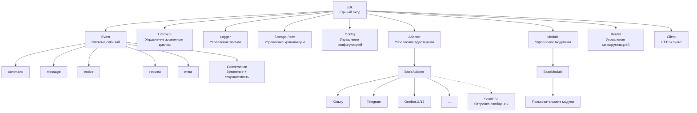

### Описание основных модулей

| Модуль | Описание |
|------|------|
| **Event** | Система событий, предоставляет обработку пяти типов событий: command / message / notice / request / meta, а также Conversation для многоразовых диалогов |
| **Adapter** | Менеджер адаптеров, управляет регистрацией, запуском и остановкой адаптеров для различных платформ |
| **Module** | Менеджер модулей, управляет регистрацией, загрузкой и выгрузкой плагинов, поддерживает объявление зависимостей и топологическую сортировку |
| **Lifecycle** | Менеджер жизненного цикла, предоставляет обработчики жизненного цикла, основанные на событиях |
| **Storage** | Система хранения на основе SQLite, поддерживает общие SQL-запросы с цепочечной синтаксической разработкой |
| **Config** | Управление конфигурационными файлами в формате TOML |
| **Logger** | Модульная система логирования, поддерживает под-логгеры |
| **Router** | Управление маршрутизацией HTTP/WebSocket, абстрактный слой для нижележащих бэкендов (в настоящее время FastAPI + Uvicorn), поддерживает маршрутизацию с помощью декораторов, промежуточные обработчики, группировку, ограничение скорости, CORS |
| **Client** | Единый HTTP/WS-клиент (до версии 2.8.0 это был `HttpClient`, сохраняется совместимость), абстрактный слой для нижележащих библиотек запросов (в настоящее время aiohttp), предоставляет статистику запросов, повторные попытки, логирование, WebSocket-клиент, систему исключений ErisPulse. WebSocket-клиент и сервер разделяют базовый класс `WebSocketConnectionBase` |

## Процесс инициализации

На следующей диаграмме показан полный процесс инициализации `sdk.init()`:


### Подробное описание этапов инициализации

> Полная цепочка инициализации с разбивкой на Finder / Loader / Manager / Router, базовые точки входа (`init()` / `init_task()` / `init_sync()`) и ручной полный запуск см. в [Процесс запуска и ручное управление](advanced/startup.md).

## Процесс обработки событий

На следующей диаграмме показан полный путь сообщения от платформы до обработчика:

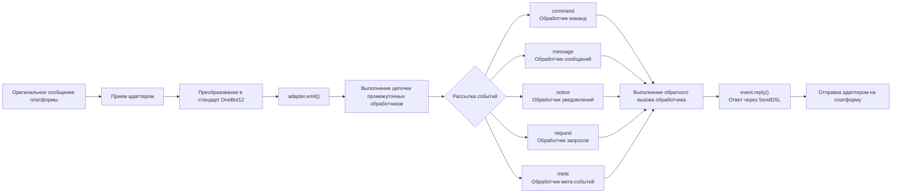

### Подробное описание цепочки обработки событий

На приведенной выше диаграмме показан результат; ниже раскрывается, что происходит за кулисами после `adapter.emit()` — это трехуровневая цепочка рассылки:

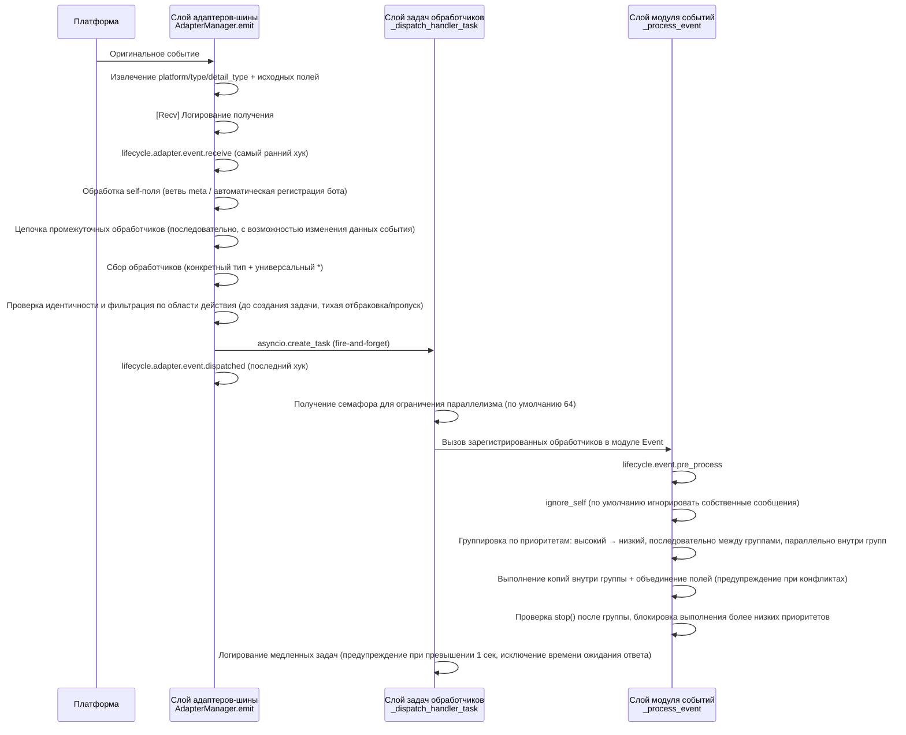

**Что делает фреймворк на каждом этапе и что вы можете изменить:**

| Этап | Что делает фреймворк | Что вы можете изменить |
|------|-------------|-----------|
| Получение | Извлекает стандартные поля, сохраняет `{platform}_raw` исходные данные; записывает лог `[Recv]` | Наблюдение за `adapter.event.receive` для получения самого раннего события |
| self-поле | Мета-события идут по ветвям connect/disconnect/heartbeat; обычные события автоматически регистрируют бота и вызывают `adapter.bot.online` | Наблюдение за `adapter.bot.online` / `bot.offline` |
| Промежуточные обработчики | **Последовательно** выполняются, если возвращаемое значение не None, оно заменяет данные события | Регистрация промежуточных обработчиков для изменения/перехвата событий |
| Сбор рассылки | Сначала берутся обработчики конкретного типа, затем `*` универсальные обработчики | — |
| Идентичность | Определяет, принимать ли событие по пользователю>сессии>боту>адаптеру (`scope.is_identity_allowed`), **отбраковка означает полное удаление события** | `ErisPulse.scope.identity` для привязки |
| Фильтрация по области | Определяется по владельцу модуля (`scope.is_allowed`), с уровнем сессии>бота>платформы, **не прошедшие — тихо пропускаются** | Настройка белого/черного списка областей |
| Планирование | Каждый соответствующий обработчик создает отдельную `asyncio.Task`, `emit()` **не ждет завершения обработчиков** | — |
| Приоритет | Высокоприоритетные группы обрабатываются первыми; **между группами последовательно, внутри групп параллельно** (каждая группа имеет копию события, изменения объединяются, конфликты вызывают WARNING) | `@command(..., priority=N)` / указание при регистрации приоритета |
| Прерывание | После обработки каждой группы проверяется `event.is_stopped()`, если сработало, **выполнение более низких приоритетов прерывается** | `event.mark_processed(stop=True)` / `event.done()` |

> **Частые заблуждения**:
> 1. **Фильтрация по области действия тихая** — обработчики, отфильтрованные таким образом, не генерируют ошибки и не отвечают, видны только в трассировочном логе (уровень TRACE, `core.scope.denied`). Если "мой модуль не получил сообщение", сначала проверьте привязку области.
> 2. **Обработчики обрабатываются параллельно** — фреймворк уже создает отдельную задачу для каждого обработчика, вам **не нужно** дополнительно оборачивать в `asyncio.create_task`.
> 3. **Внутри группы одинакового приоритета не прерывается** — `mark_processed(stop=True)` блокирует только более низкие группы, обработчики в одной группе не прерываются досрочно.
> 4. **Порог медленных логов фиксирован в 1 секунду** — обработчики, выполняющиеся дольше 1 сек, записываются в лог с предупреждением (время ожидания ответа `wait_reply` исключается из времени выполнения), но не прерывают выполнение.

> Подробности привязки областей и приоритетов см. в [Системе областей](advanced/scope.md); полную семантику claim/прерывания см. в [Введение в обработку событий](getting-started/event-handling.md); настройки ограничения параллелизма см. в [Руководстве по конфигурации](user-guide/configuration.md#настройки фреймворка).

## События жизненного цикла

На следующей диаграмме показан порядок срабатывания событий жизненного цикла компонентов фреймворка:

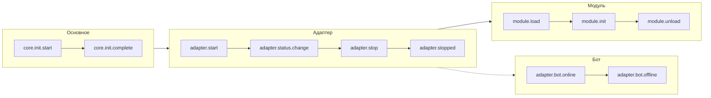

### Наблюдение за событиями жизненного цикла

> Полные методы наблюдения за событиями (`lifecycle.on()` / `once()` / `has_handlers()`), полный список событий жизненного цикла и формат данных см. в [Управление жизненным циклом](advanced/lifecycle.md).

## Стратегии загрузки модулей

ErisPulse поддерживает три стратегии загрузки модулей, которые объявляются возвращаемым значением `get_load_strategy()` в `ModuleLoadStrategy`:

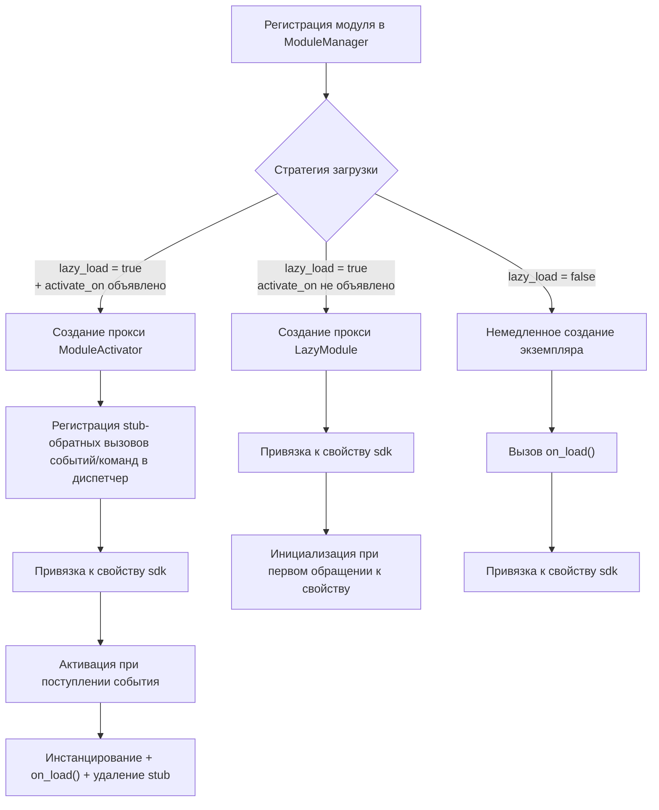

> Подробнее см. в [Системе ленивой загрузки](advanced/lazy-loading.md), [Управление жизненным циклом](advanced/lifecycle.md) и документации модулей.

### Архитектура ленивой активации по событиям (`activate_on`)

> [!NOTE]
> Эта функция доступна в ErisPulse **2.8.0+**.

`activate_on` позволяет модулю загружаться **при первом поступлении соответствующего события/команды**, что предотвращает постоянное использование памяти и гарантирует, что события не теряются:

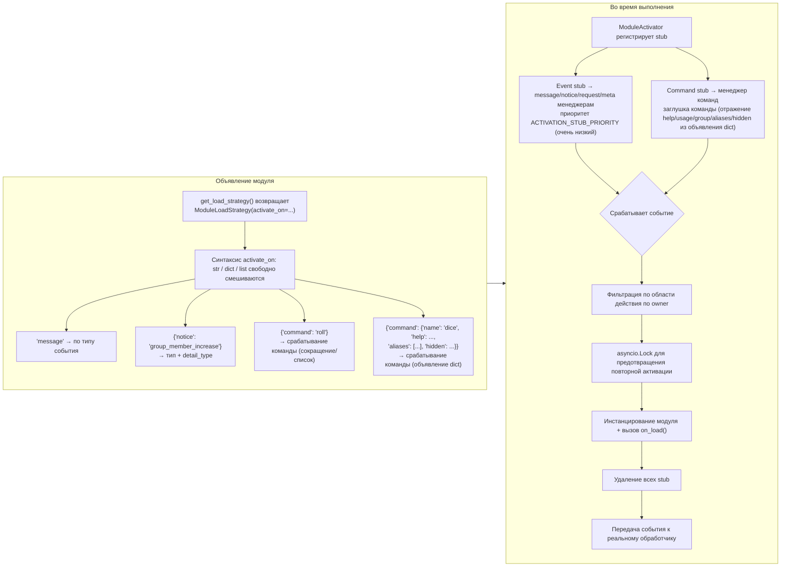

**Основные моменты семантики срабатывания:**

> Полный синтаксис `activate_on` (str / dict / list), объявление команды dict, цепочка возврата help для заглушек, фильтрация по области действия и семантика сбоя см. в [Системе ленивой загрузки](advanced/lazy-loading.md#ленивая-активация-по-событиям-activate_on).

## Архитектура локальной папки плагинов

> [!NOTE]
> Эта функция доступна в ErisPulse **2.8.0+**.

Локальные плагины (папка `plugins/`) не требуют упаковки и публикации, фреймворк автоматически обнаруживает и загружает их при запуске:

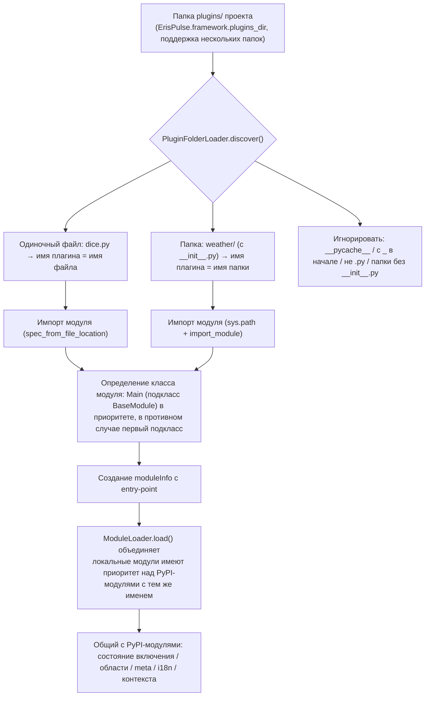

**Соглашения и особенности:**

- Имя плагина: для одиночного файла — имя файла, для папки — имя папки
- Локальный плагин `moduleInfo.meta.source == "plugin_folder"`, совместим с модулями из PyPI
- При совпадении имен локальный имеет приоритет (удобно для отладки), при отключении удаляется и entry-point

## Архитектура горячей перезагрузки локальных плагинов

Горячая перезагрузка отслеживает изменения файлов плагинов и автоматически перезагружает соответствующие плагины:

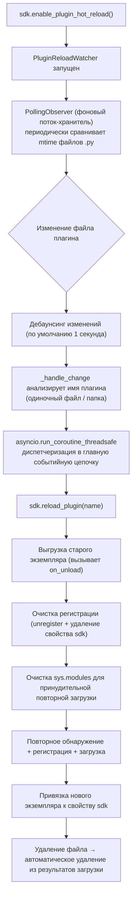


====
快速上手
====


### 快速开始

# Быстрый старт

> **Это ваш первый шаг.** Запустите робота ErisPulse за 5 минут.

## Установка ErisPulse

### Сценарий установки с одним нажатием (рекомендуется)

Сценарий установки автоматически определит вашу среду (Docker, Python, uv) и предложит выбрать наиболее подходящий способ установки.

Windows (PowerShell):
```powershell
irm https://get.erisdev.com/install.ps1 -OutFile install.ps1; powershell -ExecutionPolicy Bypass -File install.ps1
```

macOS / Linux:
```bash
curl -fsSL https://get.erisdev.com/install.sh -o install.sh && chmod +x install.sh && ./install.sh
```

Сценарий проведёт вас через:

- **Установка Docker** (рекомендуется, если Docker обнаружен): выбор источника образа (Docker Hub / GHCR), канал версий (стабильный / предварительный), настройка панели управления Dashboard, настройка портов
- **Традиционная установка**: автоматическое создание виртуальной среды, выбор версии ErisPulse, опциональная установка модуля панели управления Dashboard

### Использование Docker

Docker-образ уже включает в себя фреймворк ErisPulse и панель управления Dashboard.

```bash
# Скачать docker-compose.yml
curl -O https://raw.githubusercontent.com/ErisPulse/ErisPulse/main/docker-compose.yml

# Установить токен Dashboard и запустить
ERISPULSE_DASHBOARD_TOKEN=your-token docker compose up -d
```

<details>
<summary>Не доступен Docker Hub?</summary>

Используйте образ из GitHub Container Registry, изменив `image` в `docker-compose.yml`:

```yaml
image: ghcr.io/erispulse/erispulse:latest
```

</details>

После запуска перейдите по адресу `http://<host>:8000/Dashboard` и войдите, используя установленный токен.

### Установка с помощью pip

Убедитесь, что ваша версия Python >= 3.10, затем установите с помощью pip:

```bash
pip install ErisPulse
```

Если у вас установлен [uv](https://github.com/astral-sh/uv), вы также можете использовать `uv pip install ErisPulse`, установка будет быстрее.

## Инициализация проекта

### Интерактивная инициализация (рекомендуется)

```bash
epsdk init
```

Это запустит интерактивное руководство, которое проведёт вас через:
- Настройку имени проекта
- Конфигурацию уровня логирования
- Настройку сервера (хост и порт)
- Выбор и настройку адаптера
- Создание структуры проекта

### Быстрая инициализация

```bash
# Быстрый режим с указанием имени проекта
epsdk init -q -n my_bot

# Или просто с указанием имени проекта
epsdk init -n my_bot
```

### Ручное создание проекта

Если вы предпочитаете создавать проект вручную:

```bash
mkdir my_bot && cd my_bot
epsdk init
```

## Установка модулей

### Установка через CLI

```bash
epsdk install Yunhu AIChat
```

### Просмотр доступных модулей

```bash
epsdk list-remote
```

### Интерактивная установка

Если не указать имя пакета, откроется интерактивное окно установки:

```bash
epsdk install
```

## Запуск проекта

```bash
# Обычный запуск
epsdk run main.py

# Режим горячей перезагрузки (рекомендуется при разработке)
epsdk run main.py --reload
```

## Включение автодополнения IDE (необязательно)

ErisPulse динамически обнаруживает модули/адаптеры, но IDE по умолчанию не может дополнять методы, специфичные для платформы. Запустите следующую команду для генерации типовых заглушек:

```bash
epsdk types
```

После генерации используйте импортированные типы для аннотации переменных, чтобы получить точное автодополнение (подробнее в [Руководстве по автодополнению IDE](./getting-started/ide-completion.md)):

```python
from _ep_types import Yunhu
from ErisPulse import sdk

adapter: Yunhu = sdk.adapter.get("yunhu")
await adapter.Send.To("group", "123").Board(...)  # Дополнение специфичных методов платформы
```

## Структура проекта

Структура проекта после инициализации:

```
my_bot/
├── config/
│   └── config.toml          # Файл конфигурации
└── main.py                  # Точка входа

```

## Файл конфигурации

Базовый файл `config.toml`:

```toml
[ErisPulse.server]
host = "0.0.0.0"
port = 8000

[ErisPulse.logger]
level = "INFO"

[Yunhu_Adapter]
# Конфигурация адаптера
```

## Дальнейшие действия

После запуска робота, вы можете продолжить по своему усмотрению:

**Хотите узнать, как работает фреймворк?**
- [Основные понятия](getting-started/basic-concepts.md) — Архитектура адаптеров / модулей / событий
- [Обзор архитектуры](architecture.md) — Визуальная схема архитектуры

**Хотите реализовать больше функций?**
- [Примеры распространённых задач](getting-started/common-tasks.md) — Хранение данных, планирование задач, контроль доступа
- [Введение в обработку событий](getting-started/event-handling.md) — Обработка сообщений, уведомлений, запросов

**Хотите разработать свой собственный модуль / адаптер?**
- [Введение в разработку модулей](developer-guide/modules/getting-started.md)
- [Введение в разработку адаптеров](developer-guide/adapters/getting-started.md)

**Дополнительная справка:**
- [Описание файла конфигурации](user-guide/configuration.md) · [Справочник команд CLI](user-guide/cli-reference.md) · [Руководство по развертыванию](user-guide/deployment.md)


### 创建第一个机器人

# Создание первого бота

Это руководство основано на [5-минутном быстром старте](../quick-start.md) и поможет вам написать первый обработчик команд и понять механизм работы.

> Если вы еще не установили ErisPulse или не инициализировали проект, сначала выполните [быстрый старт](../quick-start.md) в разделах «Установка», «Инициализация проекта» и «Запуск проекта».

## Шаг первый: Написание первой команды

Откройте файл `main.py` и напишите простой обработчик команд:

```python
from ErisPulse import sdk
from ErisPulse.Core.Event import command

@command("hello", help="Отправить приветственное сообщение")
async def hello_handler(event):
    """Обработка команды hello"""
    user_name = event.get_user_nickname() or "друг"
    await event.reply(f"Привет, {user_name}! Я бот ErisPulse.")

@command("ping", help="Проверить, онлайн ли бот")
async def ping_handler(event):
    """Обработка команды ping"""
    await event.reply("Pong! Бот работает нормально.")

async def main():
    """Основная точка входа"""
    print("Запуск ErisPulse...")
    
    # keep_running=True (по умолчанию): фреймворк блокирует выполнение, пока не получит сигнал о завершении (например, Ctrl+C)
    await sdk.run(keep_running=True)

if __name__ == "__main__":
    import asyncio
    asyncio.run(main())
```

### Параметр `keep_running`

`sdk.run(keep_running)` управляет тем, будет ли фреймворк блокировать выполнение:

- **`keep_running=True` (по умолчанию)**: `run()` будет блокировать выполнение до получения сигнала о завершении (например, Ctrl+C), подходит для чистых ботов.
- **`keep_running=False`**: `run()` немедленно вернёт управление после инициализации, **фреймворк не будет отключаться** — запущенные адаптеры/модули продолжат обрабатывать события сообщений в фоновом режиме, вы можете выполнять свою логику, пока цикл событий не завершится и фреймворк не закроется. Например:

```python
async def main():
    await sdk.run(keep_running=False)   # Немедленно вернуться после инициализации
    # Фреймворк уже работает в фоне, здесь можно делать другие вещи
    while True:
        await asyncio.sleep(3600)
        print("Проверка каждый час")
```

> Помимо двух режимов `run()`, есть `init()`/`uninit()` для ручного управления жизненным циклом, а также более тонкие способы отдельного запуска/остановки адаптеров/маршрутизаторов, см. [Процесс запуска и ручное управление](../advanced/startup.md).

## Шаг второй: Запуск бота

```bash
# Обычный запуск
epsdk run main.py

# Режим разработки (поддержка горячей перезагрузки)
epsdk run main.py --reload
```

## Шаг третий: Тестирование бота

Отправьте команду в вашей чат-платформе:

```
/hello
```

Вы должны получить ответ от бота.

## Объяснение кода

### Декоратор команды

```python
@command("hello", help="Отправить приветственное сообщение")
```

- `hello`: имя команды, которую пользователь вызывает с помощью `/hello`
- `help`: описание команды, отображается при выполнении `/help`

### Параметры события

```python
async def hello_handler(event):
```

Параметр `event` — это объект Event, содержащий:
- Текст сообщения: `event.get_text()`
- Информацию об отправителе: `event.get_user_id()`, `event.get_user_nickname()`
- Информацию о платформе: `event.get_platform()`
- Информацию о группе: `event.get_group_id()`
- Оригинальные данные: `event.get_raw()`

> Полный список методов объекта Event см. в [подробном руководстве по Event-обёртке](../developer-guide/modules/event-wrapper.md).

### Отправка ответа

```python
await event.reply("Содержание ответа")
```

`event.reply()` — это удобный метод для отправки сообщения отправителю.

## Расширение: Добавление дополнительных функций

ErisPulse предоставляет богатые возможности для обработки событий и данных:

- **Слушание сообщений**: используйте `@message.on_message()` для прослушивания различных сообщений → [Введение в обработку событий](event-handling.md)
- **Слушание уведомлений**: используйте `@notice.on_friend_add()` и другие для прослушивания системных уведомлений → [Введение в обработку событий](event-handling.md)
- **Хранение данных**: используйте `sdk.storage.get/set` для сохранения данных → [Примеры распространённых задач](common-tasks.md)

## Часто задаваемые вопросы

### Команда не отвечает?

1. Проверьте правильность настройки адаптера, убедитесь, что в `config/config.toml` статус адаптера установлен в `true`
2. Проверьте вывод логов в терминале, убедитесь, что нет ошибок (особенно в логах уровня `ERROR`)
3. Убедитесь, что префикс команды указан правильно (по умолчанию это `/`), проверьте раздел `[ErisPulse.event.command]` в конфигурационном файле
4. Убедитесь, что имя команды написано правильно, обратите внимание на настройки чувствительности к регистру

### Как изменить префикс команды?

Добавьте в `config.toml`:

```toml
[ErisPulse.event.command]
prefix = "!"
case_sensitive = false
```

### Как поддержать несколько платформ?

ErisPulse использует стандарт OneBot12 для унификации формата событий на разных платформах, обработчики, зарегистрированные с помощью `@command` и `@message`, автоматически получают события со всех платформ. С помощью `event.get_platform()` можно определить источник платформы:

```python
@command("hello")
async def hello_handler(event):
    platform = event.get_platform()
    
    if platform == "yunhu":
        await event.reply("Привет! Из Юньху")
    elif platform == "telegram":
        await event.reply("Hello! Из Telegram")
    else:
        await event.reply("Привет!")
```

> Подробнее о многоуровневой адаптации платформ см. в [Примерах распространённых задач](common-tasks.md#многоуровневая-адаптация-платформ).


### 基础概念

# Основные концепции

В этом руководстве представлены основные концепции ErisPulse, которые помогут вам понять дизайн-мышление и базовую архитектуру фреймворка.

## Архитектура на основе событий

ErisPulse использует архитектуру на основе событий, где все взаимодействия передаются и обрабатываются через события.

### Поток событий

```
Пользователь отправляет сообщение
      │
      ▼
Платформа получает
      │
      ▼
Адаптер получает нативное событие платформы
      │
      ▼
Преобразуется в стандартное событие OneBot12
      │
      ▼
Отправляется в систему событий
      │
      ▼
Распределяется зарегистрированным обработчикам
      │
      ▼
Модуль обрабатывает событие
      │
      ▼
Адаптер отправляет ответ
      │
      ▼
Платформа отображает пользователю
```

### Стандарт OneBot12

ErisPulse использует OneBot12 в качестве стандартного события. OneBot12 — это стандарт универсального интерфейса чат-бота, определяющий унифицированный формат событий.

Все адаптеры преобразуют событие, специфичное для платформы, в формат OneBot12, обеспечивая согласованность кода.

## Основные компоненты

### 1. Объект SDK

SDK является точкой входа для всех функций и предоставляет доступ к основным компонентам.

```python
from ErisPulse import sdk

# Доступ к основным модулям
sdk.storage    # Система хранения
sdk.config     # Система конфигурации
sdk.logger     # Система логирования
sdk.adapter    # Система адаптеров
sdk.module     # Система модулей
sdk.router     # Система маршрутизации
sdk.client     # HTTP клиент
sdk.lifecycle  # Система жизненного цикла
```

### 2. Объект Event

Объект Event инкапсулирует данные о событии и предоставляет удобные методы доступа.

```python
@command("info")
async def info_handler(event):
    # Получение информации о событии
    event_id = event.get_id()
    user_id = event.get_user_id()
    platform = event.get_platform()
    text = event.get_text()
    
    # Отправка ответа
    await event.reply(f"Пользователь: {user_id}, Платформа: {platform}")
```

### 3. Адаптер

Адаптер — это мост между ErisPulse и внешними платформами.

**Обязанности:**
- Получение нативных событий платформы
- Преобразование в стандартный формат OneBot12
- Отправка стандартных событий платформе

**Примеры адаптеров:**
- Адаптер Yunhu: общение с платформой Yunhu
- Адаптер Telegram: общение с Telegram Bot API
- Адаптер OneBot11: общение с приложениями, совместимыми с OneBot11
- Адаптер Email: обработка почтовых сообщений

### 4. Модуль

Модуль — это базовая единица расширения функциональности, которая может:

- Регистрировать обработчики событий
- Реализовывать бизнес-логику
- Вызывать адаптеры для отправки сообщений
- Использовать службы, предоставляемые основными модулями

#### Механизм обнаружения модулей

ErisPulse обнаруживает установленные модули через Python `importlib.metadata.entry_points`. Модули объявляют точки входа в `pyproject.toml`:

```toml
[project.entry-points."erispulse.module"]
MyModule = "my_package:Main"
```

При инициализации SDK сканируются все точки входа группы `erispulse.module`, классы модулей регистрируются в `ModuleManager`, а затем последовательно инициализируются после топологической сортировки по зависимостям.

#### Минимально рабочий модуль

```python
from ErisPulse.Core.Bases import BaseModule
from ErisPulse import sdk

class Main(BaseModule):
    def __init__(self):
        self.sdk = sdk
        self.logger = sdk.logger.get_child("MyModule")

    async def on_load(self, event):
        self.logger.info("Модуль загружен")

    async def on_unload(self, event):
        self.logger.info("Модуль выгружен")
```

#### Жизненный цикл модуля

- **Регистрация**: SDK обнаруживает класс модуля и регистрирует его в менеджере
- **Загрузка**: Создается экземпляр модуля, вызывается `on_load(event)` (`event = {"module_name": "MyModule"}`)
- **Выгрузка**: Вызывается `on_unload(event)`, ресурсы очищаются

#### Стратегия загрузки

Загрузочное поведение модуля определяется через `get_load_strategy()`:

```python
from ErisPulse.loaders import ModuleLoadStrategy

class Main(BaseModule):
    @staticmethod
    def get_load_strategy():
        return ModuleLoadStrategy(
            lazy_load=True,   # Ленивая загрузка (по умолчанию True)
            priority=0        # Приоритет загрузки, чем больше значение, тем раньше инициализация
        )
```

- **`lazy_load=True` (по умолчанию)**: Модуль инициализируется только при первом обращении к `sdk.MyModule`, что снижает время запуска
- **`lazy_load=False`**: Модуль инициализируется сразу при запуске SDK, подходит для модулей, которым нужно прослушивать события жизненного цикла или выполнять фоновые задачи
- **`priority`**: Модули с одинаковым приоритетом загружаются в порядке регистрации; чем больше значение, тем раньше инициализация

> Подробное описание механизма ленивой загрузки см. в разделе [Система ленивой загрузки](../advanced/lazy-loading.md).

## Типы событий

ErisPulse поддерживает 5 типов событий:

| Тип события | Декоратор | Описание |
|------------|-----------|---------|
| Событие сообщения | `@message.on_message()` | Любое сообщение, отправленное пользователем (личные сообщения, чаты) |
| Событие команды | `@command("name")` | Сообщения, начинающиеся с префикса команды (например, `/hello`) |
| Событие уведомления | `@notice.on_friend_add()` и т.д. | Системные уведомления (добавление друга, изменения состава группы и т.д.) |
| Событие запроса | `@request.on_friend_request()` и т.д. | Запросы пользователей (запросы на добавление в друзья, приглашения в группу) |
| Метасобытие | `@meta.on_connect()` и т.д. | Системные события (подключение, отключение, пульс) |

> Подробное использование и примеры кода для каждого типа событий см. в разделе [Введение в обработку событий](event-handling.md).

## Описание основных модулей

### Storage (Хранилище)

Базирующаяся на SQLite система хранения пар ключ-значение для персистентного хранения данных.

```python
# Установка значения
sdk.storage.set("key", "value")

# Получение значения
value = sdk.storage.get("key", "default_value")

# Массовые операции
sdk.storage.set_multi({
    "key1": "value1",
    "key2": "value2"
})

# Транзакция
with sdk.storage.transaction():
    sdk.storage.set("key1", "value1")
    sdk.storage.set("key2", "value2")
```

### Config (Конфигурация)

Управление файлами конфигурации в формате TOML.

```python
# Получение конфигурации
config = sdk.config.getConfig("MyModule", {})

# Установка конфигурации
sdk.config.setConfig("MyModule", {"key": "value"})

# Чтение вложенной конфигурации
value = sdk.config.getConfig("MyModule.subkey", "default")
```

### Logger (Логирование)

Модульная система логирования.

```python
# Запись логов
sdk.logger.info("Это информационное сообщение")
sdk.logger.warning("Это предупреждение")
sdk.logger.error("Это ошибка")

# Получение дочернего логгера
child_logger = sdk.logger.get_child("submodule")
child_logger.info("Лог дочернего модуля")
```

**Синтаксический сахар для доступа к свойствам**

Помимо использования метода `get_child()`, вы также можете создавать дочерние логгеры через **доступ к свойствам**, что является более кратким способом записи **синтаксического сахара**:

```python
# Создание дочернего логгера через доступ к свойствам
sdk.logger.mymodule.info("Сообщение модуля")

# Поддержка вложенного доступа
sdk.logger.mymodule.database.info("Сообщение базы данных")
```

### Router (Маршрутизация)

Управление HTTP и WebSocket маршрутизацией на базе FastAPI + Uvicorn. Поддерживает декораторную маршрутизацию, middleware, группирование, лимитирование запросов, CORS.

```python
from ErisPulse.Core import HttpRequest

@sdk.router.get("MyModule", "/api")
async def handler(request: HttpRequest):
    data = await request.json()
    return {"status": "ok"}
```

> Полный API маршрутизации (WebSocket, middleware, лимитирование запросов, CORS и т.д.) см. в разделе [Менеджер маршрутизации](../advanced/router.md).

### Client (Сетевой клиент)

Единый сетевой клиент, объединяющий HTTP-запросы, WebSocket-соединения, управление пулом соединений, автоматическую перезагрузку, контроль тайм-аута, статистику запросов и интеграцию событий жизненного цикла.

```python
from ErisPulse.Core import client

# HTTP запрос
resp = await client.get("https://api.example.com/users")
data = await resp.json()

# С перезагрузкой и тайм-аутом
resp = await client.get(url, timeout=30, max_retries=3)

# WebSocket соединение
ws = await client.ws_connect("wss://example.com/ws")
async for text in ws.iter_text():
    await ws.send_text(f"Эхо: {text}")
```

> Полный API сетевого клиента см. в разделе [Сетевой клиент](../advanced/http-client.md).

## Отправка сообщений SendDSL

Адаптеры предоставляют интерфейс для отправки сообщений с цепочечными вызовами.

### Базовая отправка

```python
# Получение экземпляра адаптера
yunhu = sdk.adapter.get("yunhu")

# Отправка сообщения
await yunhu.Send.To("user", "U1001").Text("Hello")

# Указание аккаунта отправки
await yunhu.Send.Using("bot1").To("group", "G1001").Text("Сообщение группы")
```

### Цепочечные модификаторы

```python
# @Пользователь
await yunhu.Send.To("group", "G1001").At("U2001").Text("@сообщение")

# Ответ на сообщение
await yunhu.Send.To("group", "G1001").Reply("msg123").Text("ответ")

# @Всех
await yunhu.Send.To("group", "G1001").AtAll().Text("объявление")
```

### Методы ответа через Event

Объект Event предоставляет удобные методы для ответов:

```python
@command("test")
async def test_handler(event):
    # Простой текстовый ответ
    await event.reply("Текст ответа")
    
    # Отправка изображения
    await event.reply("http://example.com/image.jpg", method="Image")
    
    # Отправка голосового
    await event.reply("http://example.com/voice.mp3", method="Voice")
```

## Система ленивой загрузки

По умолчанию ErisPulse включает ленивую загрузку модулей; модули инициализируются только при первом обращении (например, `sdk.MyModule`), что значительно ускоряет запуск.

```python
from ErisPulse.loaders import ModuleLoadStrategy

class Main(BaseModule):
    @staticmethod
    def get_load_strategy():
        return ModuleLoadStrategy(
            lazy_load=True,   # Включить ленивую загрузку (по умолчанию)
            priority=0        # Приоритет загрузки, чем больше значение, тем раньше инициализация
        )
```

**Сценарии, когда необходимо отключить ленивую загрузку (`lazy_load=False`):**
- Модули, прослушивающие события жизненного цикла (например, `core.init.complete`)
- Модули, запускающие периодические задачи или фоновые службы
- Модули, которым необходимо завершить инициализацию до загрузки других модулей

> Подробное описание механизма ленивой загрузки и рекомендации см. в разделе [Система ленивой загрузки](../advanced/lazy-loading.md).

## Дальнейшие шаги

- [Введение в обработку событий](event-handling.md) — изучите, как обрабатывать различные типы событий
- [Примеры типичных задач](common-tasks.md) — освоите реализацию распространенных функций


### 事件处理入门

# Введение в обработку событий

В этом руководстве рассказывается о том, как обрабатывать различные типы событий в ErisPulse.

## Обзор типов событий

ErisPulse поддерживает следующие типы событий:

| Тип события | Описание | Применение |
|---------|------|---------|
| Событие сообщения | Любое сообщение, отправленное пользователем | Чат-боты, фильтрация контента |
| Событие команды | Сообщение, начинающееся с префикса команды | Обработка команд, точка входа |
| Событие уведомления | Системные уведомления (добавление в друзья, изменения участников группы и т.д.) | Приветствия, уведомления о состоянии |
| Событие запроса | Запросы пользователей (запросы на добавление в друзья, приглашения в группы) | Автоматическая обработка запросов |
| Событие мета | Системные события (подключение, сердцебиение) | Мониторинг подключения, проверка состояния |

## Обработка событий сообщений

> **Примечание**: Рекомендуется использовать аннотацию типа `Event` в обработчиках событий, чтобы получить поддержку автодополнения и проверки типов в IDE.

```python
from ErisPulse.Core.Event import Event  # Импорт типа события для аннотации
```

### Отслеживание всех сообщений

```python
from ErisPulse.Core.Event import message, Event

@message.on_message()
async def message_handler(event: Event):
    text = event.get_text()
    user_id = event.get_user_id()
    sdk.logger.info(f"Получено сообщение от {user_id}: {text}")
```

### Отслеживание личных сообщений

```python
@message.on_private_message()
async def private_handler(event: Event):
    user_id = event.get_user_id()
    await event.reply(f"Привет, {user_id}! Это личное сообщение.")
```

### Отслеживание групповых сообщений

```python
@message.on_group_message()
async def group_handler(event: Event):
    group_id = event.get_group_id()
    user_id = event.get_user_id()
    sdk.logger.info(f"Пользователь {user_id} отправил сообщение в группу {group_id}")
```

### Отслеживание сообщений с упоминанием

```python
@message.on_at_message()
async def at_handler(event: Event):
    # Получение списка упомянутых пользователей
    mentions = event.get_mentions()
    await event.reply(f"Вы упомянули следующих пользователей: {mentions}")
```

### Отслеживание с помощью подстановок и регулярных выражений

Четыре декоратора сообщений (`on_message` / `on_private_message` / `on_group_message` /
`on_at_message`) поддерживают `pattern` (подстановочные знаки glob) и `regex` (регулярные выражения), сообщения, которые не соответствуют этим условиям, **не будут запускать** обработчики:

```python
# Подстановочные знаки glob: * - любая последовательность, ? - один символ, [seq] - набор символов
@message.on_message(pattern="签到*")
async def signin_handler(event: Event):
    await event.reply("Успешная регистрация")

# Регулярное выражение: соответствует сумме
@message.on_message(regex=r"\d+\s*元")
async def price_handler(event: Event):
    await event.reply(f"Получена сумма: {event.get_text()}")

# Оба параметра pattern и regex заданы → оба должны совпадать
@message.on_message(pattern="*元", regex=r"\d+\s*元")
async def combined_handler(event: Event):
    pass
```

`wait_reply` также поддерживает эти два параметра (см. [Функция ожидания ответа](../developer-guide/modules/event-wrapper.md#ожидание-ответа)).

## Обработка событий команд

### Базовые команды

```python
from ErisPulse.Core.Event import command

@command("help", help="Отображает справочную информацию")
async def help_handler(event):
    help_text = """
Доступные команды:
/help - Отображает справку
/ping - Тест подключения
/info - Просмотр информации
    """
    await event.reply(help_text)
```

### Синонимы команд

```python
@command(["help", "h"], aliases=["帮助"], help="Отображает справочную информацию")
async def help_handler(event):
    await event.reply("Справочная информация...")
```

Пользователь может вызвать команду любым из следующих способов:
- `/help`
- `/h`
- `/帮助`

### Параметры команд

```python
@command("echo", help="Возвращает сообщение")
async def echo_handler(event):
    # Получение параметров команды
    args = event.get_command_args()
    
    if not args:
        await event.reply("Введите сообщение для повторения")
    else:
        await event.reply(f"Вы сказали: {' '.join(args)}")
```

### Группы команд

```python
@command("admin.reload", group="admin", help="Перезагрузить модуль")
async def reload_handler(event):
    await event.reply("Модуль перезагружен")

@command("admin.stop", group="admin", help="Остановить бота")
async def stop_handler(event):
    await event.reply("Бот остановлен")
```

### Права доступа и управление доступом

Права доступа к командам разделены на три уровня, проверка происходит по уровням сверху вниз (если верхний уровень отклоняет, нижние уровни не проверяются):

```python
# ① ACL команды (настройка со стороны пользователя): по белому и черному списку пользователей, при отклонении возвращается "Недостаточно прав"
# ② master=True — только владелец фреймворка может выполнять (фреймворк автоматически проверяет, при отклонении возвращается "Недостаточно прав")
@command("restart", master=True, help="Перезапустить модуль")
async def restart_handler(event):
    await event.reply("Модуль перезапущен")

# ③ permission=функция вызова — логика управления доступом к команде (возвращает True для выполнения)
def is_admin(event):
    return event.get_user_id() in {"user123", "user456"}

@command("panel", permission=is_admin, help="Панель управления")
async def panel_handler(event):
    await event.reply("Добро пожаловать на панель управления")
```

**ACL команды** (в интерфейсе управления `ErisPulse.scope.commands`): пользователь может настроить белый и черный список для любой команды, имя команды поддерживает точное и подстановочные совпадения (например, `"roll*"`), при отклонении возвращается "Недостаточно прав":

```toml
# config.toml — разрешить выполнение restart только для 123456; 666 всегда отклонять
[ErisPulse.scope.commands.restart]
allow = ["onebot11:123456"]
deny = ["onebot11:666"]
```

Порядок проверки: если `deny` совпадает → отклонить; если `allow` не пуст и не совпадает → отклонить; в противном случае передать разработчику по умолчанию (`master=True` / `permission`). Интерфейс управления во время выполнения (поддержка подстановок по имени команды):

```python
from ErisPulse import sdk
sdk.scope.allow_user("restart", "onebot11", "123456")   # белый список
sdk.scope.deny_user("restart", "onebot11", "666")       # черный список
sdk.scope.remove_acl("restart")                          # очистить белый и черный список
sdk.scope.get_acl("restart")                             # получить текущий список
```

**Уровень доступа на уровне событий** (для конкретного человека / группы / бота, получает ли сообщение) — идет через **уровень идентификации** интерфейса управления (`scope.identity`); **уровень доступности модуля** (какие модули могут использоваться) — идет через **уровень модуля** интерфейса управления (`scope.platforms / bots / sessions`). Подробнее см. [Единый интерфейс управления](../advanced/scope.md).

> Рекомендуется: использовать `master=True` / `permission` для команд, требующих взаимодействия с бизнес-логикой; использовать уровень идентификации интерфейса управления для доступа по пользователю / группе; использовать уровень модуля интерфейса управления для контроля доступности модуля.

### Приоритет команд

```python
# Чем больше значение приоритета, тем раньше выполняется
@message.on_message(priority=10)
async def high_priority_handler(event):
    await event.reply("Обработчик с высоким приоритетом")

@message.on_message(priority=1)
async def low_priority_handler(event):
    await event.reply("Обработчик с низким приоритетом")
```

### Параллельная обработка событий

Система событий ErisPulse использует модель **параллельной обработки с одинаковым приоритетом и последовательной обработки с разным приоритетом**:

```
Событие приходит
    ↓
Группа с приоритетом 10: [Обработчик C || Обработчик D] параллельно → объединить результаты
    ↓ (если не прервано)
Группа с приоритетом 0: [Обработчик A || Обработчик B] параллельно → объединить результаты
    ↓
...
```

- **Параллельная обработка с одинаковым приоритетом**: обработчики с одинаковым приоритетом выполняются одновременно, повышая пропускную способность
- **Последовательная обработка с разным приоритетом**: группы с разным приоритетом выполняются последовательно (чем больше значение приоритета, тем раньше выполняется), обеспечивая выполнение обработчиков с высоким приоритетом первыми
- **Copy-On-Write**: обработчики не создают копию, если не изменяют данные, обеспечивая нулевые накладные расходы
- **Обработка конфликтов**: при изменении одного и того же поля несколькими обработчиками с одинаковым приоритетом используется последнее значение и записывается предупреждение в лог
- **Механизм прерывания**: после вызова `event.done()` (по умолчанию) или `event.done(claim=False)` любым обработчиком, пропускаются последующие группы с более низким приоритетом. Разница между присвоением и блокировкой описана ниже в разделе [Управление цепочкой: присвоение и блокировка](#управление-цепочкой-присвоение-и-блокировка)

```python
# Пример: параллельное выполнение обработчиков с одинаковым приоритетом
@message.on_message(priority=0)
async def handler_a(event):
    # Обработка задачи A
    event['result_a'] = process_a()

@message.on_message(priority=0)
async def handler_b(event):
    # Выполняется параллельно с handler_a
    event['result_b'] = process_b()

# Последовательное выполнение с разным приоритетом
@message.on_message(priority=10)
async def handler_c(event):
    # Приоритет самый высокий, выполняется первым
    pass
```

> **Ограничение параллелизма**: все соответствующие обработчики задач немедленно создаются, но ограничиваются сигналом, ограничивающим **количество одновременно выполняемых задач** по умолчанию **64** (`ErisPulse.framework.handler_max_concurrency`, поддерживает горячую перезагрузку). Задачи, превышающие лимит, ждут в очереди на сигнале, пока предыдущие не завершатся. Во время пиковых нагрузок это ваш "сброс давления".
>
> **Медленные логи**: если одиночный обработчик занимает более **1 секунды**, фреймворк записывает предупреждение в лог (`handler_slow`). Время ожидания `wait_reply` исключается из времени выполнения, чтобы не ошибаться в "ожидании ответа".

## Фильтрация через интерфейс управления: почему мой модуль не получает сообщения

После поступления события есть две **тихие** фильтрации (ни один не отвечает, не генерирует ошибку):

1. **Уровень идентификации** (`ErisPulse.scope.identity`): при входе события в точку распределения, определяется, получит ли событие пользователь > группа > бот > адаптер. Отклоненные **все события** просто отбрасываются, и никакие обработчики (включая диспетчер команд) не запускаются.
2. **Уровень модуля** (`ErisPulse.scope`): когда событие достигает обработчика или команды модуля, определяется, доступен ли этот модуль, по сессии > боту > платформе, **если не проходит, тихо пропускается**.

```toml
# Пример 1: все сообщения в определенной группе не распространяются
[ErisPulse.scope.identity.sessions.onebot11."group_123"]
deny = true

# Пример 2: отключить MyModule для определенного бота
[ErisPulse.scope.bots.onebot11."123456"]
blocked = ["MyModule"]
```

В этом случае, когда сообщение из этой группы поступает, обработчики команд и событий `MyModule` **не будут вызваны**. Это не ошибка, а механизм фильтрации — при диагностике "модуль не реагирует" сначала проверьте привязку идентификации и модуля в интерфейсе управления.

- Логи фильтрации видны только на уровне **TRACE** (`core.scope.identity_denied` / `core.scope.denied`), по умолчанию на уровне INFO ничего не видно
- Обработчики на уровне фреймворка (например, диспетчер команд `scope_exempt=True`) не подвержены влиянию **уровня модуля**, но подвержены влиянию **уровня идентификации** (все событие уже отброшено)
- Перед выполнением команды есть еще один фильтр: ACL команды (при отклонении возвращается "Недостаточно прав", см. предыдущий раздел)

> Пять уровней конфигурации, синтаксис совпадения, API во время выполнения см. в [Едином интерфейсе управления](../../advanced/scope.md).

## Управление цепочкой: присвоение и блокировка

> **Примечание**
> Параметры `claim=` / `stop=` в `event.done()` / `event.mark_processed()` требуют ErisPulse **2.7.1+**.

ErisPulse разделяет два семантически ортогональных понятия: "присвоение" и "блокировка", объединяя их через `event.done()`, что удобно для добавления слоев наблюдения, таких как логирование, аудит, права доступа, вокруг обработки команд.

**Точное определение двух понятий:**

- **Присвоение (claim)**: пометка события как обработанного данным обработчиком (запись в `_processed`). Диспетчер команд, увидевший уже присвоенное событие, **пропустит** повторную обработку — предотвращая повторное выполнение одного и того же сообщения несколькими обработчиками команд. Типичный сценарий: после успешного сопоставления команды присвоить, чтобы диспетчер команд больше не вмешивался.
- **Блокировка (stop)**: предотвращение распространения события **на обработчики с более низким приоритетом** (запись в `_propagation_stopped`). Обработчики с более низким приоритетом (например, `on_message`) больше не увидят это событие. Типичный сценарий: высокоприоритетный обработчик полностью обработал событие, и не хочет, чтобы низкоприоритетные обработчики выполнялись снова.

| `event.done(...)` | Присвоение | Блокировка | Сценарий |
|-------------------|------------|------------|----------|
| `event.done()` | ✔ | ✔ | Стандартная практика для завершения обработки команды / обработчика |
| `event.done(stop=False)` | ✔ | ✘ | Только присвоение: низкоприоритетные обработчики (логирование / статистика) по-прежнему увидят |
| `event.done(claim=False)` | ✘ | ✔ | Только блокировка (например, брандмауэр / ограничение скорости), но без удаления повторной обработки |

`event.done(claim=, stop=)` — это псевдоним `event.mark_processed(claim=, stop=)`, параметры и поведение полностью эквивалентны.

```python
@command("help")
async def help_cmd(event):
    event.done()            # Присвоение + блокировка (стандартная практика для завершения обработки команды)

@message.on_message(priority=50)
async def observer(event):
    event.done(stop=False)  # Только присвоение: низкоприоритетные обработчики по-прежнему будут выполняться (логирование / статистика)

@message.on_message(priority=100)
async def firewall(event):
    if denied(event):
        event.done(claim=False)  # Только блокировка: низкоприоритетные обработчики не выполняются, но без удаления повторной обработки
```

### Конфигурация block для команд и ответов

После успешного сопоставления команды или после `wait_reply` блокируется распространение (для обратной совместимости). Можно разрешить низкоприоритетным обработчикам (логирование / аудит / права) наблюдать эти сообщения:

```toml
[ErisPulse.event.command]
block = false   # Сообщения команд продолжают распространяться на низкоприоритетные обработчики

[ErisPulse.event.wait_reply]
block = false   # Ответы, потребленные wait_reply, продолжают распространяться на низкоприоритетные обработчики
```

## Обработка событий уведомлений

### Добавление в друзья

```python
from ErisPulse.Core.Event import notice

@notice.on_friend_add()
async def friend_add_handler(event):
    user_id = event.get_user_id()
    nickname = event.get_user_nickname() or "Новый друг"
    await event.reply(f"Добро пожаловать, {nickname}! Добавьте меня в друзья.")
```

### Увеличение участников группы

```python
@notice.on_group_increase()
async def member_increase_handler(event):
    group_id = event.get_group_id()
    user_id = event.get_user_id()
    await event.reply(f"Добро пожаловать, {user_id}! Добро пожаловать в группу {group_id}.")
```

### Уменьшение участников группы

```python
@notice.on_group_decrease()
async def member_decrease_handler(event):
    group_id = event.get_group_id()
    user_id = event.get_user_id()
    await event.reply(f"{user_id} покинул группу {group_id}.")
```

## Обработка событий запросов

### Запрос на добавление в друзья

```python
from ErisPulse.Core.Event import request

@request.on_friend_request()
async def friend_request_handler(event):
    user_id = event.get_user_id()
    comment = event.get_comment()
    
    sdk.logger.info(f"Получен запрос на добавление в друзья: {user_id}, комментарий: {comment}")
    
    # Можно обработать запрос через API адаптера
    # Конкретная реализация см. в документации адаптеров
```

### Запрос на приглашение в группу

```python
@request.on_group_request()
async def group_request_handler(event):
    group_id = event.get_group_id()
    user_id = event.get_user_id()
    
    await event.reply(f"Получено приглашение в группу {group_id} от {user_id}.")
```

## Обработка мета-событий

### События подключения

```python
from ErisPulse.Core.Event import meta

@meta.on_connect()
async def connect_handler(event):
    platform = event.get_platform()
    sdk.logger.info(f"Подключение к платформе {platform}")

@meta.on_disconnect()
async def disconnect_handler(event):
    platform = event.get_platform()
    sdk.logger.warning(f"Отключение от платформы {platform}")
```

### События сердцебиения

```python
@meta.on_heartbeat()
async def heartbeat_handler(event):
    platform = event.get_platform()
    sdk.logger.debug(f"Проверка сердцебиения для платформы {platform}")
```

### Запрос состояния бота

После отправки мета-события адаптером, фреймворк автоматически отслеживает состояние бота, и вы можете в любое время проверить:

```python
from ErisPulse import sdk

# Проверка, онлайн ли бот
if sdk.adapter.is_bot_online("telegram", "123456"):
    telegram = sdk.adapter.get("telegram")
    await telegram.Send.To("user", "123456").Text("Бот онлайн")

# Получение списка всех онлайн ботов
bots = sdk.adapter.list_bots()
for platform, bot_list in bots.items():
    for bot_id, info in bot_list.items():
        print(f"{platform}/{bot_id}: {info['status']}")

# Получение полного сводного состояния
summary = sdk.adapter.get_status_summary()
```

## Интерактивная обработка

### Использование метода reply для отправки ответов

Метод `event.reply()` поддерживает различные параметры, удобные для отправки сообщений с упоминанием, ответом и т.д.:

```python
# Простой ответ
await event.reply("Привет")

# Отправка различных типов сообщений
await event.reply("http://example.com/image.jpg", method="Image")  # Изображение
await event.reply("http://example.com/voice.mp3", method="Voice")  # Голосовое сообщение

# Упоминание одного пользователя
await event.reply("Привет", at_users=["user123"])

# Упоминание нескольких пользователей
await event.reply("Всем привет", at_users=["user1", "user2", "user3"])

# Ответ на сообщение
await event.reply("Содержание ответа", reply_to="msg_id")

# Упоминание всех участников
await event.reply("Объявление", at_all=True)

# Комбинированное использование: упоминание пользователей + ответ на сообщение
await event.reply("Содержание", at_users=["user1"], reply_to="msg_id")
```

### Ожидание ответа пользователя

```python
@command("ask", help="Запросить у пользователя")
async def ask_handler(event):
    await event.reply("Введите ваше имя:")
    
    # Ожидание ответа пользователя, таймаут 30 секунд
    reply = await event.wait_reply(timeout=30)
    
    if reply:
        name = reply.get_text()
        await event.reply(f"Привет, {name}!")
    else:
        await event.reply("Таймаут ожидания, пожалуйста, повторите ввод.")
```

### Ожидание ответа с проверкой

```python
@command("age", help="Запросить возраст")
async def age_handler(event):
    def validate_age(event_data):
        """Проверка корректности возраста"""
        try:
            age = int(event_data.get_text())
            return 0 <= age <= 150
        except ValueError:
            return False
    
    await event.reply("Введите ваш возраст (0-150):")
    
    reply = await event.wait_reply(
        timeout=60,
        validator=validate_age
    )
    
    if reply:
        age = int(reply.get_text())
        await event.reply(f"Ваш возраст: {age} лет")
    else:
        await event.reply("Некорректный ввод или таймаут")
```

### Ожидание ответа с обратным вызовом

```python
@command("confirm", help="Подтвердить действие")
async def confirm_handler(event):
    async def handle_confirmation(reply_event):
        text = reply_event.get_text().lower()
        
        if text in ["yes", "y", "是", "确认"]:
            await event.reply("Действие подтверждено!")
        else:
            await event.reply("Действие отменено.")
    
    await event.reply("Подтвердите выполнение этого действия? (да/нет)")
    
    await event.wait_reply(
        timeout=30,
        callback=handle_confirmation
    )
```

### Подтверждение диалога (confirm)

Ожидание подтверждения или отрицания пользователя, автоматически распознаются встроенные подтверждения на китайском и английском языках:

```python
@command("confirm", help="Подтвердить действие")
async def confirm_handler(event):
    if await event.confirm("Вы уверены, что хотите выполнить это действие?"):
        await event.reply("Подтверждено, выполняется...")
    else:
        await event.reply("Отменено")

# Пользовательские подтверждения
if await event.confirm("Продолжить?", yes_words={"go", "继续"}, no_words={"stop", "停止"}):
    pass
```

### Выбор меню (choose)

Пользователь может ответить номером или текстом опции:

```python
@command("choose", help="Выбор")
async def choose_handler(event):
    choice = await event.choose(
        "Выберите цвет:",
        ["красный", "зеленый", "синий"]
    )
    
    if choice is not None:
        colors = ["красный", "зеленый", "синий"]
        await event.reply(f"Вы выбрали: {colors[choice]}")
    else:
        await event.reply("Таймаут выбора")
```

**Режим объединения:** `merge_prompt=True` объединяет опции в текст сообщения и отправляет все одним сообщением с указанным `method`:

```python
# Отправка объединенного сообщения в формате Markdown
choice = await event.choose(
    "## Выберите цвет\n{options}\nПожалуйста, введите номер",
    ["красный", "зеленый", "синий"],
    method="Markdown",
    merge_prompt=True,
)
```

> Заполнитель `{options}` контролирует положение вставки опций; если не указан, опции добавляются в конец текста. Можно использовать параметр `placeholder` для настройки заполнителя (например, `placeholder="[выборы]"`). `options_format="auto"` (по умолчанию) автоматически выбирает стиль в зависимости от метода: Markdown → маркированный список, Html → нумерованный список, остальные → текстовый список. Для текстовых методов (Text/Markdown/Html и др.) по умолчанию опции объединяются в конец; для не-текстовых методов (Image и др.) по умолчанию опции отправляются раздельно.

### Сбор формы (collect)

Многошаговый сбор данных от пользователя:

```python
@command("register", help="Регистрация")
async def register_handler(event):
    data = await event.collect([
        {"key": "name", "prompt": "Введите имя:"},
        {"key": "age", "prompt": "Введите возраст:", 
         "validator": lambda e: e.get_text().isdigit()},
        {"key": "email", "prompt": "Введите email:"}
    ])
    
    if data:
        await event.reply(f"Регистрация успешна!\nИмя: {data['name']}\nВозраст: {data['age']}\nEmail: {data['email']}")
    else:
        await event.reply("Регистрация завершилась таймаутом или некорректным вводом")
```

### Ожидание произвольного события (wait_for)

Ожидание события, соответствующего заданным условиям, не ограничиваясь одним пользователем:

```python
@command("wait_member", help="Ожидание нового участника")
async def wait_member_handler(event):
    await event.reply("Ожидание нового участника...")
    
    evt = await event.wait_for(
        event_type="notice",
        condition=lambda e: e.get_detail_type() == "group_member_increase",
        timeout=120
    )
    
    if evt:
        await event.reply(f"Добро пожаловать, {evt.get_user_id()}!")
    else:
        await event.reply("Таймаут ожидания")
```

### Многошаговый диалог (conversation)

Создание интерактивного многошагового диалога:

```python
@command("survey", help="Опрос")
async def survey_handler(event):
    conv = event.conversation(timeout=60)
    
    await conv.say("Добро пожаловать в опрос!")
    
    while conv.is_active:
        reply = await conv.wait()
        
        if reply is None:
            await conv.say("Диалог завершен по таймауту, до свидания!")
            break
        
        text = reply.get_text()
        
        if text == "выход":
            await conv.say("До свидания!")
            break
        
        await conv.say(f"Вы сказали: {text}, продолжайте или введите 'выход' для завершения")
```

### Встроенные подтверждения

ErisPulse включает в себя набор встроенных подтверждений на китайском и английском языках:

- **Подтверждения** (`CONFIRM_YES_WORDS`): да, yes, y, подтвердить, определить, хорошо, хорошо, ok, true, правильно, м-м, хорошо, согласиться, нет проблем...
- **Отрицания** (`CONFIRM_NO_WORDS`): нет, no, n, отменить, не, не нужно, нет, отменить, false, неправильно, отказать, нельзя...

## Доступ к данным события

### Часто используемые методы объекта Event

```python
@command("info")
async def info_handler(event):
    # Основная информация
    event_id = event.get_id()
    event_time = event.get_time()
    event_type = event.get_type()
    detail_type = event.get_detail_type()
    
    # Информация о отправителе
    user_id = event.get_user_id()
    nickname = event.get_user_nickname()
    
    # Содержание сообщения
    message_segments = event.get_message()
    alt_message = event.get_alt_message()
    text = event.get_text()
    
    # Информация о группе
    group_id = event.get_group_id()
    
    # Информация о боте
    self_id = event.get_self_user_id()
    self_platform = event.get_self_platform()
    
    # Исходные данные
    raw_data = event.get_raw()
    raw_type = event.get_raw_type()
    
    # Платформа
    platform = event.get_platform()
    
    # Тип сообщения
    is_private = event.is_private_message()
    is_group = event.is_group_message()
    is_at = event.is_at_message()
    
    # Информация о команде
    if event.is_command():
        cmd_name = event.get_command_name()
        cmd_args = event.get_command_args()
        cmd_raw = event.get_command_raw()
```

### Методы расширения платформы

Помимо встроенных методов, адаптеры платформы также регистрируют платформенно-специфические методы, что позволяет вам получать доступ к специфическим данным платформы.

```python
from ErisPulse.Core.Event import message

@message.on_message()
async def handle_message(event):
    platform = event.get_platform()

    # Вызов платформенно-специфических методов в зависимости от платформы
    if platform == "telegram":
        chat_type = event.get_chat_type()      # Telegram специфический метод
    elif platform == "email":
        subject = event.get_subject()           # Email специфический метод
```

Если вы не уверены, зарегистрирован ли метод для определенной платформы, вы можете проверить, какие методы зарегистрированы для платформы:

```python
from ErisPulse.Core.Event import get_platform_event_methods

methods = get_platform_event_methods("telegram")
# ["get_chat_type", "is_bot_message", ...]
```

> Платформенно-специфические методы см. в соответствующей [документации платформы](../platform-guide/).

## Лучшие практики обработки событий

### 1. Обработка исключений

```python
@command("process")
async def process_handler(event):
    try:
        # бизнес-логика
        result = await do_some_work()
        await event.reply(f"Результат: {result}")
    except ValueError as e:
        # ожидаемая бизнес-ошибка
        await event.reply(f"Ошибка параметра: {e}")
    except Exception as e:
        # неожиданная ошибка
        sdk.logger.error(f"Обработка не удалась: {e}")
        await event.reply("Обработка не удалась, попробуйте позже")
```

### 2. Логирование

```python
@message.on_message()
async def message_handler(event):
    user_id = event.get_user_id()
    text = event.get_text()
    
    sdk.logger.info(f"Обработка сообщения: {user_id} - {text}")
    
    # Использование логгера модуля
    from ErisPulse import sdk
    logger = sdk.logger.get_child("MyHandler")
    logger.debug(f"Подробная отладочная информация")
```

### 3. Условная обработка

```python
@message.on_message(priority=0)
async def conditional_handler(event):
    """Условная обработка — внутри обработчика"""
    # Обрабатывать только сообщения определенных пользователей
    if event.get_user_id() in ["bot1", "bot2"]:
        return
    
    # Обрабатывать только сообщения, содержащие определенные ключевые слова
    if "ключевое слово" not in event.get_text():
        return
    
    await event.reply("Условие выполнено, обработка сообщения")
```


### IDE 补全

# Генерация типовых заглушек (автодополнение в IDE)

ErisPulse использует entry-points для динамического обнаружения модулей/адаптеров, и типы пользовательских классов не могут быть известны на статическом уровне.
Команда `epsdk types` сканирует установленные модули/адаптеры и генерирует файл с типовыми заглушками, позволяя использовать эти типы для аннотации переменных и получать автодополнение в IDE.

## Основные принципы проектирования

Заглушечный файл **экспортирует только типы**, не предоставляя никаких экземпляров во время выполнения:

- Все импорты находятся внутри ``TYPE_CHECKING``, **без дополнительных накладных расходов во время выполнения, без изменения поведения**
- Имена типов используются в формате PascalCase, основанном на имени entry-point (например, ``yunhu`` → ``Yunhu``), что соответствует именам, передаваемым в ``sdk.adapter.get()`` / ``sdk.module.get()``
- Пользователи по-прежнему используют ``sdk.module.get(...)`` / ``sdk.adapter.get(...)`` для получения экземпляров, просто используя импортированные типы для **аннотации переменных**

## Основное использование

Запустите в корневой директории проекта:

```bash
epsdk types
```

В текущей директории будет создан файл `_ep_types.py`, содержащий типы всех установленных модулей/адаптеров.

## Использование в коде

```python
from _ep_types import MyModule, Yunhu
from ErisPulse import sdk

# Используя импортированные типы для аннотации переменных, можно получить автодополнение методов этого класса
my_mod: MyModule = sdk.module.get("MyModule")
my_mod.hello()                  # ← Автодополнение hello

my_adapter: Yunhu = sdk.adapter.get("yunhu")
await my_adapter.Send.To("group", "123").Board(...)   # ← Автодополнение методов, специфичных для платформы
```

## Рабочий процесс

1. Сканирование entry-points `erispulse.adapter` / `erispulse.module`
2. Инспекция с помощью подпроцесса в целевой среде Python для сбора фактической информации о классах каждого адаптера/модуля (включая путь к модулю и полное имя)
3. Генерация `.py` файла, в котором:
   - Все ``from xxx import Yyy as Zzz`` находятся внутри ``TYPE_CHECKING``
   - ``Zzz`` — это имя entry-point в формате PascalCase
4. IDE читает раздел ``TYPE_CHECKING`` для предоставления автодополнения; во время выполнения никакой код не выполняется

Пример сгенерированной заглушки:

```python
# _ep_types.py (сгенерирован автоматически)
from typing import TYPE_CHECKING

if TYPE_CHECKING:
    # Адаптеры
    from MyAdapter.Core import MyAdapter as MyAdapter
    from YunhuAdapter.Core import YunhuAdapter as Yunhu

    # Модули
    from MyModule.Core import Main as MyModule

    __all__ = ['MyAdapter', 'Yunhu', 'MyModule']
```

## Опции команды

| Опция | Описание |
|------|------|
| `-o, --output PATH` | Указывает путь к выходному файлу (по умолчанию `./_ep_types.py`) |
| `--force` | Перезаписывает существующий файл с заглушками |
| `--adapters-only` | Сканирует только адаптеры |
| `--modules-only` | Сканирует только модули |

## Когда перегенерировать

- После установки/удаления новых модулей или адаптеров
- После обновления публичного API модуля/адаптера
- Когда автодополнение в IDE перестает работать или типы устарели

## Связь с методами SendDSL

Базовый класс `SendDSL` уже содержит стандартные методы отправки (Text/Image/Voice/Video/File), и любой экземпляр SendDSL, полученный любым способом, может использовать эти методы. Команда `types` используется для автодополнения **методов, специфичных для платформы** (например, `Board` в Yunhu, `Dice` в Sandbox) и **методов, специфичных для модуля**.


=====
适配器开发
=====


### 适配器开发入门

# Начало работы с разработкой адаптеров

Это руководство поможет вам начать разработку адаптеров ErisPulse для подключения новых платформ сообщений.

## Введение в адаптер

### Что такое адаптер

Адаптер — это мост между ErisPulse и различными платформами сообщений, отвечающий за:

1. **Прямое преобразование**: получение событий платформы и преобразование их в стандартный формат OneBot12 (Converter)
2. **Обратное преобразование**: преобразование сегментов сообщений OneBot12 в вызовы API платформы (`Raw_ob12`)
3. Управление подключением к платформе (WebSocket/WebHook)
4. Предоставление унифицированного интерфейса отправки сообщений SendDSL

### Архитектура адаптера

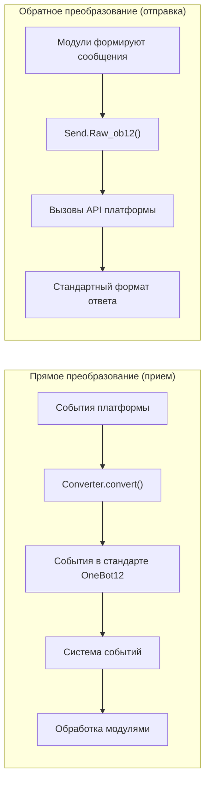

## Структура каталогов

Стандартная структура пакета адаптера:

```
MyAdapter/
├── pyproject.toml          # Конфигурация проекта
├── README.md               # Описание проекта
├── LICENSE                 # Лицензия
└── MyAdapter/
    ├── __init__.py          # Точка входа пакета
    ├── Core.py               # Основной класс адаптера
    └── Converter.py          # Конвертер событий
```

## Быстрое начало

### 1. Создание проекта

```bash
mkdir MyAdapter && cd MyAdapter
```

### 2. Создание pyproject.toml

```toml
[project]
name = "ErisPulse-MyAdapter"
version = "1.0.0"
description = "Платформенный адаптер MyAdapter"
readme = "README.md"
requires-python = ">=3.10"
license = { file = "LICENSE" }
authors = [ { name = "yourname", email = "your@mail.com" } ]

dependencies = [
    "ErisPulse>=2.4.0"  # aiohttp уже встроен в ErisPulse, отдельная зависимость обычно не требуется
]

[project.urls]
"homepage" = "https://github.com/yourname/MyAdapter"

[project.entry-points."erispulse.adapter"]
"MyAdapter" = "MyAdapter:MyAdapter"
```

### 3. Создание основного класса адаптера

Рамка предоставляет декларативное управление конфигурацией `ConfigClass` / `AccountConfigClass`. Адаптеру достаточно объявить класс конфигурации, чтобы автоматически загружать, проверять и генерировать шаблон конфигурации.

```python
# MyAdapter/Core.py
from dataclasses import dataclass, field
from ErisPulse.Core import BaseAdapter
from ErisPulse.Core.Bases import BaseConfig

@dataclass
class MyAdapterConfig(BaseConfig):
    """Конфигурация MyAdapter"""
    api_endpoint: str = field(
        default="https://api.example.com",
        metadata={
            "description": {"i18n": "my_adapter.api_endpoint", "default": "Адрес API"},
            "required": False,
            "ui": {"widget": "text", "group": "connection", "order": 1},
        },
    )
    token: str = field(
        default="",
        metadata={
            "description": {"i18n": "my_adapter.token", "default": "Токен платформы"},
            "required": True,
            "secret": True,
            "ui": {"widget": "password", "group": "basic", "order": 2},
        },
    )

class MyAdapter(BaseAdapter):
    ConfigClass = MyAdapterConfig  # Объявление класса конфигурации, управление автоматически
    
    # Не нужно переопределять __init__! Рамка автоматически обрабатывает:
    # - self.sdk / self.logger автоматически установлены
    # - self.cfg для чтения конфигурации в реальном времени
    # - self.Send / self.Request автоматически инициализированы
    
    def _setup_converter(self):
        from .Converter import MyPlatformConverter
        return MyPlatformConverter()
```

> ⚠️ **О __init__**: В новой версии `BaseAdapter.__init__(self, sdk=None)` автоматически обрабатывает ссылку на SDK, инициализацию логирования и загрузку конфигурации. Большинству адаптеров **не нужно переопределять __init__**. Подробнее см. [Замечания по __init__](#init-注意事项).

> ⚠️ **О super().__init__()**: `BaseAdapter.__init__()` отвечает за создание экземпляров Send и Request. Если забыть вызвать, все операции отправки сообщений и запросов будут вызывать `AttributeError`. Подробнее см. [Замечания по __init__](#init-注意事项).

### 4. Реализация обязательных методов

```python
class MyAdapter(BaseAdapter):
    # ... код __init__ ...
    
    async def start(self):
        """Запуск адаптера (обязательно реализовать)"""
        # Регистрация маршрутов WebSocket или WebHook
        router.register_websocket(
            module_name="myplatform",
            path="/ws",
            handler=self._ws_handler
        )
        self.logger.info("Адаптер запущен")
    
    async def shutdown(self):
        """Остановка адаптера (обязательно реализовать)"""
        router.unregister_websocket(
            module_name="myplatform",
            path="/ws"
        )
        # Очистка соединений и ресурсов
        self.logger.info("Адаптер остановлен")
    
    async def call_api(self, endpoint: str, **params):
        """Вызов API платформы (обязательно реализовать)"""
        raise NotImplementedError("Необходимо реализовать call_api")
```

#### Активная отправка мета-событий

Адаптер должен активно отправлять мета-события, чтобы фреймворк отслеживал состояние онлайн-бота. Использование `emit_meta()` позволяет выполнить это одним действием:

```python
class MyAdapter(BaseAdapter):
    async def _ws_handler(self, websocket):
        bot_id = self._get_bot_id()

        # Онлайн бот
        await self.emit_meta("connect", bot_id, user_name="MyBot")

        try:
            while True:
                data = await websocket.receive_text()
                event = self.convert(data)
                if event:
                    await self.adapter.emit(event)
        except WebSocketDisconnect:
            pass
        finally:
            # Оффлайн бот
            await self.emit_meta("disconnect", bot_id)
```

> Подробное описание управления состоянием бота и мета-событий см. в [Рекомендациях по лучшим практикам адаптера - Управление состоянием бота и мета-события](best-practices.md#bot-状态管理与-meta-事件).

### 5. Реализация класса Send

Модификаторы `At`/`AtAll`/`Reply` уже реализованы в базовом классе SendDSL фреймворка, адаптеру нужно только реализовать `Raw_ob12` и конкретные методы отправки.

Фреймворк предоставляет два ключевых вспомогательных метода:
- `self._apply_modifiers(message)` — автоматически объединяет модификаторы At/AtAll/Reply в сегменты сообщения
- `self.send_context` — получает словарь контекста отправки (`target_type`, `target_id`, `account_id`)

```python
import asyncio

class MyAdapter(BaseAdapter):
    # ... другие код ...

    class Send(BaseAdapter.Send):

        def Raw_ob12(self, message, **kwargs):
            """
            Отправка сообщения в формате OneBot12 (обязательно реализовать)

            Использование _apply_modifiers для автоматического объединения состояния модификаторов,
            использование send_context для получения контекста отправки.
            """
            async def _do_send():
                segments = self._apply_modifiers(message)
                return await self._adapter.call_api(
                    endpoint="/send_message",
                    message=segments,
                    **self.send_context,
                    **kwargs
                )
            return asyncio.create_task(_do_send())

        # Методы Text/Image/Voice/Video/File унаследованы от базового класса SendDSL,
        # по умолчанию делегируются на Raw_ob12, повторная реализация не требуется.
        # При необходимости специфичной логики платформы можно переопределить отдельные методы:
        # def Text(self, text: str):
        #     return self.Raw_ob12([{"type": "text", "data": {"text": text}}])
```

**Особенности реализации методов отправки медиа (Image/Video/File):**

- Стандартная реализация базового класса封装ирует параметр `file` в сегмент OneBot12 и передает его в `Raw_ob12`, адаптер должен обрабатывать загрузку/выгрузку в `Raw_ob12`
- Параметр `file` должен поддерживать как двоичные данные `bytes`, так и URL `str`
- При передаче URL сначала нужно загрузить файл, а затем загрузить его на платформу
- Платформа обычно требует сначала вызвать загрузочный интерфейс для получения идентификатора файла, а затем вызвать интерфейс отправки

**Метод `__getattr__` магии:**

- Реализация методов без учета регистра (Text, text, TEXT могут вызываться)
- Неопределенные методы должны возвращать информационное сообщение, а не ошибку

**Метод `Raw_ob12`:**

- Преобразует стандартный формат OneBot12 в формат платформы и отправляет
- Использует `self._apply_modifiers(message)` для автоматической обработки At/AtAll/Reply
- Использует `**self.send_context` для передачи информации о цели отправки и учетной записи

### 6. Реализация конвертера

```python
# MyAdapter/Converter.py
import time
import uuid

class MyPlatformConverter:
    def convert(self, raw_event):
        """Преобразование исходного события платформы в стандартный формат OneBot12"""
        if not isinstance(raw_event, dict):
            return None
        
        onebot_event = {
            "id": str(raw_event.get("event_id", uuid.uuid4())),
            "time": int(time.time()),
            "type": self._convert_event_type(raw_event.get("type")),
            "detail_type": self._convert_detail_type(raw_event),
            "platform": "myplatform",
            "self": {
                "platform": "myplatform",
                "user_id": str(raw_event.get("bot_id", ""))
            },
            "myplatform_raw": raw_event,
            "myplatform_raw_type": raw_event.get("type", "")
        }
        
        return onebot_event
    
    def _convert_event_type(self, event_type):
        """Преобразование типа события"""
        type_map = {
            "message": "message",
            "notice": "notice"
        }
        return type_map.get(event_type, "unknown")
    
    def _convert_detail_type(self, raw_event):
        """Преобразование детального типа"""
        return "private"  # Упрощённый пример
```

### 7. Реализация класса Request (операции запроса)

Если ваша платформа поддерживает запросы от друзей, приглашения в группы и т.д., требующие решения от бота, можно реализовать внутренний класс `Request`:

```python
from ErisPulse.Core import BaseAdapter, RequestDSL

class MyAdapter(BaseAdapter):
    # ... код Send и другие коды ...

    class Request(RequestDSL):
        """Реализация операций запроса (запросы от друзей, приглашения в группы и т.д.)"""

        def accept(self, **kwargs):
            """Принятие запроса"""
            async def _do():
                result = await self._adapter.call_api(
                    endpoint="/set_request",
                    request_id=self._request_id,
                    approve=True,
                    **kwargs,
                )
                return {
                    "status": "ok" if result.get("code") == 0 else "failed",
                    "retcode": result.get("code", 0),
                    "data": None,
                    "message_id": "",
                    "message": result.get("message", ""),
                }
            return self._create_task(_do())

        def reject(self, **kwargs):
            """Отклонение запроса"""
            async def _do():
                result = await self._adapter.call_api(
                    endpoint="/set_request",
                    request_id=self._request_id,
                    approve=False,
                    **kwargs,
                )
                return {
                    "status": "ok" if result.get("code") == 0 else "failed",
                    "retcode": result.get("code", 0),
                    "data": None,
                    "message_id": "",
                    "message": result.get("message", ""),
                }
            return self._create_task(_do())
```

Способ использования для разработчиков модулей:

```python
from ErisPulse.Core.Event import request

@request.on_friend_request()
async def handle_friend_request(event):
    # Использование удобных методов Event
    await event.approve()
    # Или непосредственное управление через адаптер
    await adapter.myplatform.Request("req_id").accept()
```

> Если платформа не поддерживает операции запроса, можно не реализовывать внутренний класс `Request`. Базовый класс по умолчанию возвращает `retcode=10002` (операция не поддерживается). Подробнее см. [Спецификация операций запроса](../../standards/request-action-spec.md).

### 8. Создание точки входа пакета

```python
# MyAdapter/__init__.py
from .Core import MyAdapter
```

## Зависимости (опционально, 2.8.0+)

Адаптеры могут объявлять зависимости от других адаптеров или модулей для реализации взаимодействия между адаптерами и опциональных функций:

```python
from typing import ClassVar

class MyAdapter(BaseAdapter):
    # Жёсткая зависимость: адаптер пропускается при запуске (вывод предупреждения + событие status=skipped-dependency)
    depends: ClassVar[dict] = {
        "adapters": ["onebot11"],   # Зависимые адаптеры (по названию платформы)
        "modules": ["TranslateEngine"],  # Зависимые модули (по зарегистрированному имени)
    }
    # Лёгкая зависимость: отсутствие не влияет на запуск; при загрузке/выгрузке модуля вызывается обратный вызов (режим опциональной функции)
    optional_modules: ClassVar[list] = ["TranslateEngine"]
```

- **Порядок запуска**: Адаптеры, объявившие жёсткую зависимость от модуля, будут **запускаться после инициализации модуля**
- **Уведомления о лёгких зависимостях**: При загрузке модуля из `optional_modules` (или жёсткой зависимости) вызывается `on_dependency_ready(module_name)`; при выгрузке вызывается `on_dependency_lost(module_name)` (по умолчанию пустая реализация, можно переопределить) — для сценариев поздней загрузки и горячей перезагрузки:

```python
async def on_dependency_ready(self, module_name):
    """Лёгкий модуль готов: включить соответствующую опциональную функцию"""
    if module_name == "TranslateEngine":
        self._translate = self.sdk.TranslateEngine

async def on_dependency_lost(self, module_name):
    """Лёгкий модуль утерян: понизить функциональность"""
    if module_name == "TranslateEngine":
        self._translate = None
```

> [!NOTE]
> Эта функция доступна начиная с ErisPulse **2.8.0+**.

## `__init__` 注意ы

При разработке адаптеров могут возникнуть ситуации, когда необходимо переопределить `__init__` на трёх уровнях. Ниже приведены правильные подходы для каждого уровня.

### 1. Уровень BaseAdapter (в большинстве случаев не требуется переопределение)

`BaseAdapter.__init__(self, sdk=None)` отвечает за создание фабрик `Send` / `Request` и автоматически выполняет следующие действия:

- Принимает параметр `sdk` и устанавливает `self.sdk`, `self.logger`
- Если объявлена `ConfigClass`, можно получить доступ к глобальной конфигурации через `self.cfg`
- Если объявлена `AccountConfigClass`, можно получить доступ к конфигурации нескольких аккаунтов через `self.accounts`

**В большинстве случаев переопределение `__init__` не требуется** — достаточно просто объявить `ConfigClass`:

```python
class MyAdapter(BaseAdapter):
    ConfigClass = MyAdapterConfig  # После объявления, фреймворк автоматически управляет конфигурацией
    
    async def start(self):
        cfg = self.cfg  # Типобезопасный доступ, получение актуальной конфигурации
        ...
```

Если всё же необходимо выполнить пользовательскую инициализацию, вызовите `super().__init__(sdk)`:

```python
class MyAdapter(BaseAdapter):
    ConfigClass = MyAdapterConfig
    
    def __init__(self, sdk=None):
        super().__init__(sdk)  # Передача sdk
        self.converter = self._setup_converter()
        self.convert = self.converter.convert
```

### 2. Внутренний класс Send (в большинстве случаев не требуется переопределение)

`SendDSL.__init__` отвечает за передачу состояния при цепочечном вызове (тип цели, идентификатор цели, аккаунт и т.д.). **В большинстве случаев вам нужно переопределить только методы** (`Raw_ob12`, `Text` и т.д.), а не `__init__`.

Если всё же требуется переопределить (например, для инициализации платформенно-специфического состояния), **необходимо передать все параметры**:

```python
class MyAdapter(BaseAdapter):
    class Send(BaseAdapter.Send):
        # Параметры: adapter, target_type, target_id, account_id
        def __init__(self, adapter, target_type=None, target_id=None, account_id=None):
            super().__init__(adapter, target_type, target_id, account_id)  # ← Обязательно передать
            self._my_state = None  # Инициализация платформенно-специфического состояния
```

**Почему необходимо передавать параметры?** Каждый шаг цепочечного вызова создаёт новый экземпляр через `self.__class__(...)`:

```python
adapter.Send.To("user", "123")               # → Send(adapter, "user", "123", None)
adapter.Send.To("user", "123").Using("bot1")  # → Send(adapter, "user", "123", "bot1")
```

Если сигнатура `__init__` не совпадает или не вызван `super()`, цепочечный вызов будет прерван.

### 3. Внутренний класс Request (в большинстве случаев не требуется переопределение)

Аналогично Send. Параметры: `adapter`, `request_id`, `account_id`:

```python
class MyAdapter(BaseAdapter):
    class Request(RequestDSL):
        # Параметры: adapter, request_id, account_id
        def __init__(self, adapter, request_id=None, account_id=None):
            super().__init__(adapter, request_id, account_id)  # ← Обязательно передать
            self._my_state = None  # Инициализация платформенно-специфического состояния
```

### Сводка

| Уровень | Когда переопределять | Что необходимо сделать |
|------|------------|-----------|
| **BaseAdapter** | При необходимости пользовательской инициализации | `super().__init__(sdk)` (передача параметра sdk) |
| **Send внутренний класс** | При необходимости инициализации состояния отправки | `super().__init__(adapter, target_type, target_id, account_id)` |
| **Request внутренний класс** | При необходимости инициализации состояния запроса | `super().__init__(adapter, request_id, account_id)` |
| Все три уровня | В большинстве случаев | **Просто объявите ConfigClass, не трогайте `__init__`** |

### 9. Информация о соединении и обнаружение маршрутов

После регистрации маршрутов адаптером фреймворк запоминает всю информацию о маршрутах. Пользователь может получить доступ к информации о подключении адаптера с помощью следующих API:

```python
from ErisPulse import sdk

# Получить полную информацию о подключении адаптера
info = sdk.adapter.get_connection_info("myplatform")
# {
#   "platform": "myplatform",
#   "status": "started",
#   "connection": {
#     "base_url": "http://localhost:8080",
#     "http_routes": [
#       {"path": "/myplatform/webhook", "method": "POST",
#        "url": "http://localhost:8080/myplatform/webhook"}
#     ],
#     "websocket_routes": [
#       {"path": "/myplatform/ws",
#        "url": "ws://localhost:8080/myplatform/ws"}
#     ]
#   }
# }

# Перечислить все пространства имён (адаптеры/модули) с их маршрутами
namespaces = sdk.router.list_namespaces()
# {"myplatform": {"http": ["/myplatform/webhook"], "websocket": ["/myplatform/ws"]}}

# Получить полные URL-адреса для пространства имён
urls = sdk.router.get_module_urls("myplatform")
# {"base_url": "http://localhost:8080", "http": [...], "websocket": [...]}

# Получить подробную информацию о маршрутах пространства имён
routes = sdk.router.get_module_routes("myplatform")
# {"http": [{"path": "/myplatform/webhook", "methods": ["POST"]}],
#  "websocket": [{"path": "/myplatform/ws", "auth": false}]}
```

> **Совет:** Возвращаемая `get_connection_info()` информация подходит для отображения пользователю (например, в WebUI), чтобы помочь настроить обратный вызов или URL-адрес подключения WebSocket на стороне платформы. Имя `module_name`, указанное при регистрации маршрута, должно полностью совпадать с именем `platform`, зарегистрированным в ErisPulse, иначе обнаружение маршрутов не будет корректно сопоставлено.

### 10. Поддержка SSE (Server-Sent Events)

ErisPulse включает в себя поддержку SSE, независимую от сервера. Модули и адаптеры могут зарегистрировать конечные точки SSE с помощью `@sdk.router.sse()`.

#### Основное использование

```python
import asyncio
from ErisPulse import sdk

@sdk.router.sse("MyModule", "/events")
async def event_stream(sse):
    """Отправка событий SSE"""
    count = 0
    while not sse.closed:
        await sse.send({"count": count}, event="update")
        count += 1
        await asyncio.sleep(1)
```

#### Использование параметров запроса

Обработчик может объявить параметр `request` для доступа к информации о клиентском запросе:

```python
@sdk.router.sse("MyModule", "/events")
async def event_stream(request, sse):
    token = request.query_params.get("token")
    if not validate_token(token):
        await sse.close()
        return

    while not sse.closed:
        data = await fetch_data(token)
        await sse.send(data)
        await asyncio.sleep(5)
```

#### API SseEmitter

| Метод | Описание |
|------|------|
| `sse.send(data, event=None, id=None, retry=None)` | Отправка события SSE. Если `data` не является строкой, автоматически сериализуется в JSON |
| `sse.close()` | Элегантное закрытие соединения SSE (безопасный вызов, можно вызывать несколько раз) |
| `sse.closed` | Указывает, закрыто ли соединение |
| `sse.request` | Объект базового запроса (可用于 чтение query params, headers) |

#### Использование в RouteGroup

```python
api = sdk.router.group("MyModule", "/api", version="1")

@api.sse("/events")
async def events(sse):
    await sse.send({"msg": "hello"})
```

#### Обнаружение маршрутов

Маршруты SSE автоматически появляются в API обнаружения маршрутов:

```python
# list_namespaces включает ключ "sse"
sdk.router.list_namespaces()
# {"MyModule": {"http": [...], "websocket": [...], "sse": ["/MyModule/events"]}}

# get_module_routes помечает streaming: true
sdk.router.get_module_routes("MyModule")
# {"http": [...], "websocket": [...], "sse": [{"path": "/MyModule/events", "streaming": true}]}

# get_module_urls генерирует полные URL
sdk.router.get_module_urls("MyModule")
# {"sse": [{"path": "/MyModule/events", "url": "http://localhost:8080/MyModule/events"}]}
```

> **Дизайн, независимый от сервера:** `SseEmitter` использует обратные вызовы для декомпозиции с базовой HTTP-рамкой. Фреймворк предоставляет `register_sse()` и `@sse` как единый интерфейс регистрации, адаптеры не должны напрямую зависеть от какой-либо базовой HTTP-рамки, чтобы реализовать конечные точки SSE.


### 适配器核心概念

# Основные понятия адаптера

Понимание основных понятий адаптера ErisPulse является основой для разработки адаптеров.

## Архитектура адаптера

### Отношения между компонентами

```
Прямое преобразование (направление получения)           Обратное преобразование (направление отправки)
─────────────────                           ─────────────────
                                             
┌──────────────────┐                        ┌──────────────────┐
│ События платформы │                        │ Сообщения модуля │
└────────┬─────────┘                        └────────┬─────────┘
         │                                           │
         ↓                                           ↓
┌──────────────────┐   ┌──────────────────┐   ┌──────────────────┐
│                  │   │ Адаптер (MyAdapter) │   │                  │
│ Преобразователь │   │ ┌──────────────┐ │   │ Send.Raw_ob12()  │
│ (конвертер)      │──→│ │              │ │   │ (входная точка  │
│                  │   │ │              │ │   │ обратного преобразования) │
└──────────────────┘   │ └──────────────┘ │   │                  │
                       └──────────────────┘   └────────┬─────────┘
                                │                      │
                                ↓                      ↓
                       ┌──────────────────┐    ┌──────────────────┐
                       │ События стандарта │    │ Вызов API платформы │
                       │ OneBot12         │    └────────┬─────────┘
                       └────────┬─────────┘             │
                                │                      ↓
                                ↓              ┌──────────────────┐
                       ┌──────────────────┐    │ Стандартный формат │
                       │ Система событий   │    │ ответа           │
                       └────────┬─────────┘    └──────────────────┘
                                │
                                ↓
                       ┌──────────────────┐
                       │ Модуль (обработка │
                       │ событий)         │
                       └──────────────────┘
```

**Основная симметрия**:
- **Прямое преобразование** (Converter): События платформы → События стандарта OneBot12, исходные данные сохраняются в `{platform}_raw`
- **Обратное преобразование** (Raw_ob12): Сегменты сообщений OneBot12 → Вызов API платформы, возвращается стандартный формат ответа

## AdapterManager адаптер-менеджер

`AdapterManager` — это основной компонент адаптерной системы ErisPulse, отвечающий за управление регистрацией, запуском, остановкой и рассылкой событий всех адаптеров платформ.

### Основные функции

- **Регистрация адаптеров**: Регистрация и управление несколькими адаптерами платформ
- **Управление жизненным циклом**: Управление запуском и остановкой адаптеров
- **Рассылка событий**: Рассылка событий по стандарту OneBot12 и событий оригинальных платформ
- **Управление конфигурацией**: Управление включением/отключением адаптеров
- **Поддержка промежуточных обработчиков (middleware)**: Поддержка промежуточных обработчиков событий OneBot12

### Основное использование

```python
from ErisPulse import sdk

# Регистрация адаптера (обычно выполняется автоматически Loader)
sdk.adapter.register("myplatform", MyPlatformAdapter)

# Запуск всех адаптеров
await sdk.adapter.startup()

# Запуск определённого адаптера
await sdk.adapter.startup(["myplatform"])
# Запуск всех адаптеров
await sdk.adapter.startup()

# Получение экземпляра адаптера
my_adapter = sdk.adapter.get("myplatform")
# Или доступ через атрибут
my_adapter = sdk.adapter.myplatform

# Остановка всех адаптеров
await sdk.adapter.shutdown()
```

### Запуск и остановка

#### Запуск адаптеров

```python
# Запуск всех зарегистрированных адаптеров
await sdk.adapter.startup()

# Запуск определённых платформ
await sdk.adapter.startup(["platform1", "platform2"])
```

**Процесс запуска:**

1. Отправка события жизненного цикла `adapter.start`
2. Отправка события `adapter.status.change` (starting)
3. Параллельный запуск каждого адаптера
4. При неудаче автоматическая повторная попытка (стратегия экспоненциальной задержки)
5. После успешного запуска отправка события `adapter.status.change` (started)

**Механизм повторных попыток:**

- Первые 4 попытки: 60 секунд, 10 минут, 30 минут, 60 минут
- С пятой и далее: фиксированная задержка в 3 часа

#### Остановка адаптеров

```python
# Остановка всех адаптеров
await sdk.adapter.shutdown()
```

**Процесс остановки:**

1. Отправка события жизненного цикла `adapter.stop`
2. Вызов метода `shutdown()` всех адаптеров
3. Остановка сервера маршрутизации
4. Очистка обработчиков событий
5. Отправка события жизненного цикла `adapter.stopped`

### Управление конфигурацией

#### Проверка состояния платформ

```python
# Проверка наличия платформы
exists = sdk.adapter.exists("myplatform")

# Проверка включения платформы
enabled = sdk.adapter.is_enabled("myplatform")

# Использование оператора in
if "myplatform" in sdk.adapter:
    print("Платформа существует и включена")
```

#### Список платформ

```python
# Получение списка всех зарегистрированных платформ
platforms = sdk.adapter.list_registered()

# Получение списка всех платформ и их статусов
status_dict = sdk.adapter.list_items()
# Возвращает: {"platform1": true, "platform2": false, ...}

# Получение списка включённых платформ
enabled_platforms = [p for p, enabled in status_dict.items() if enabled]
```

### Слушатели событий

#### Стандартные события OneBot12

```python
from ErisPulse import sdk

# Слушатель всех стандартных событий сообщений OneBot12
@sdk.adapter.on("message")
async def handle_message(data):
    print(f"Получено событие OneBot12: {data}")

# Слушатель стандартных событий сообщений для определённой платформы
@sdk.adapter.on("message", platform="myplatform")
async def handle_platform_message(data):
    print(f"Получено событие myplatform: {data}")

# Слушатель всех событий
@sdk.adapter.on("*")
async def handle_any_event(data):
    print(f"Получено событие: {data.get('type')}")
```

#### Оригинальные события платформ

```python
# Слушатель оригинальных событий для определённой платформы
@sdk.adapter.on("raw_event_type", raw=True, platform="myplatform")
async def handle_raw_event(data):
    print(f"Получено оригинальное событие: {data})

# Слушатель всех оригинальных событий (с использованием шаблона)
@sdk.adapter.on("*", raw=True)
async def handle_all_raw_events(data):
    print(f"Получено оригинальное событие: {data})
```

#### Механизм рассылки событий

При вызове `adapter.emit(event_data)`:

1. **Обработка промежуточными обработчиками**: Сначала выполняются все промежуточные обработчики OneBot12
2. **Рассылка стандартных событий**: Рассылка на соответствующие обработчики стандартных событий
3. **Рассылка оригинальных событий**: Если есть оригинальные данные, рассылка на обработчики оригинальных событий

**Правила сопоставления:**

- Точное сопоставление: `@sdk.adapter.on("message")` сопоставляется только с событием `message`
- Шаблон: `@sdk.adapter.on("*")` сопоставляется со всеми событиями
- Фильтрация по платформе: `platform="myplatform"` сопоставляется только с событиями определённой платформы

### Промежуточные обработчики (middleware)

#### Добавление промежуточного обработчика

```python
@sdk.adapter.middleware
async def logging_middleware(data):
    """Промежуточный обработчик для логирования"""
    print(f"Обработка события: {data.get('type')}")
    return data  # Обязательно вернуть данные

@sdk.adapter.middleware
async def filter_middleware(data):
    """Промежуточный обработчик для фильтрации событий"""
    # Фильтрация ненужных событий
    if data.get("type") == "notice":
        return None  # При возврате None промежуточная цепочка пропускает результат, оставляя исходные данные для передачи
    return data  # Обязательно вернуть данные для продолжения передачи
```

#### Порядок выполнения промежуточных обработчиков

Промежуточные обработчики выполняются в порядке их регистрации, последние зарегистрированные обработчики выполняются первыми.

> **Важно**: Если промежуточный обработчик возвращает `None` (например, забыл `return data`), фреймворк игнорирует этот результат и продолжает передачу исходных данных, выводя предупреждение уровня warning. Это гарантирует, что ошибка одного промежуточного обработчика не приведёт к прерыванию всей цепочки событий.

```python
# Порядок регистрации
sdk.adapter.middleware(middleware1)  # Выполняется последним
sdk.adapter.middleware(middleware2)  # Выполняется посередине
sdk.adapter.middleware(middleware3)  # Выполняется первым

# Порядок выполнения: middleware3 -> middleware2 -> middleware1
```

### Получение экземпляра адаптера

#### Метод `get()`

```python
adapter = sdk.adapter.get("myplatform")
if adapter:
    await adapter.Send.To("user", "123").Text("Hello")
```

#### Доступ через атрибуты

```python
# Доступ по имени атрибута (регистронезависимый)
adapter = sdk.adapter.myplatform
await adapter.Send.To("user", "123").Text("Hello")
```

## Базовый класс BaseAdapter

### Основная структура

```python
from dataclasses import dataclass, field
from ErisPulse.Core import BaseAdapter
from ErisPulse.Core.Bases import BaseConfig, BotAccountConfig

@dataclass
class MyConfig(BaseConfig):
    """Конфигурация адаптера (объявляется, а затем автоматически управляется фреймворком)"""
    token: str = field(
        default="",
        metadata={
            "description": {"i18n": "my_adapter.token", "default": "Токен бота"},
            "required": True,
            "secret": True,
            "ui": {"widget": "password", "group": "basic", "order": 1},
        },
    )

class MyAdapter(BaseAdapter):
    ConfigClass = MyConfig  # Объявление класса конфигурации
    
    # Не нужно переопределять __init__, фреймворк автоматически обрабатывает:
    # - self.sdk, self.logger
    # - self.cfg (типобезопасный экземпляр конфигурации, в реальном времени)
    # - self.Send, self.Request
    
    async def start(self):
        """Запуск адаптера (обязательно реализовать)"""
        cfg = self.cfg  # Автоматически загруженная типобезопасная конфигурация
        pass
    
    async def shutdown(self):
        """Остановка адаптера (обязательно реализовать)"""
        pass
    
    async def call_api(self, endpoint: str, **params):
        """Вызов API платформы (обязательно реализовать)"""
        pass
```

### Управление конфигурацией

Фреймворк предоставляет декларативное управление конфигурацией, определяя структуру конфигурации через dataclass. Фреймворк автоматически обрабатывает загрузку, проверку и генерацию шаблонов.

#### Конфигурация одного аккаунта

```python
from dataclasses import dataclass, field
from ErisPulse.Core.Bases import BaseConfig

@dataclass
class TelegramConfig(BaseConfig):
    token: str = field(default="", metadata={
        "description": {"i18n": "telegram.token", "default": "Токен бота"},
        "required": True,
        "secret": True,
        "ui": {"widget": "password", "group": "basic", "order": 1},
    })
    proxy: str = field(default="", metadata={
        "description": {"i18n": "telegram.proxy", "default": "Адрес прокси"},
        "ui": {"widget": "text", "group": "advanced", "order": 10},
    })

class TelegramAdapter(BaseAdapter):
    ConfigClass = TelegramConfig
    
    async def start(self):
        cfg = self.cfg  # Типобезопасная, в реальном времени
        if not cfg.token:
            raise ValueError("Не настроен токен")
        await self._connect(cfg.token, proxy=cfg.proxy)
```

#### Конфигурация нескольких аккаунтов

Базовый класс `BotAccountConfig` предоставляет поля `enabled` и `name`. Большинство адаптеров могут автоматически получать `bot_id` из протокола платформы или ответа на вход, вставляя его в конфигурацию аккаунта во время преобразования событий.

```python
from dataclasses import dataclass, field
from ErisPulse.Core.Bases import BotAccountConfig

# Большинство адаптеров: bot_id получается во время выполнения, не требуется конфигурация
@dataclass
class MyBotConfig(BotAccountConfig):
    token: str = field(default="", metadata={
        "description": {"i18n": "my_adapter.bot_token", "default": "Токен"},
        "required": True,
    })

# Если при входе невозможно получить bot_id, можно позволить пользователю ввести его в конфигурации
@dataclass
class YunhuBotConfig(BotAccountConfig):
    bot_id: str = field(default="", metadata={
        "description": {"i18n": "yunhu.bot_id", "default": "ID бота"},
        "required": True,
    })
    token: str = field(default="", metadata={
        "description": {"i18n": "yunhu.token", "default": "Токен"},
        "required": True,
    })

class MyAdapter(BaseAdapter):
    AccountConfigClass = MyBotConfig
    
    async def start(self):
        for name, account in self.enabled_accounts.items():
            user_id = await self._login(name, account)
            await self.emit_meta("connect", user_id)
```

#### Соглашение о metadata

Поле metadata служит как для генерации комментариев TOML, так и для рендеринга веб-интерфейса формы:

```python
metadata = {
    "description": str | dict,  # Описание поля (поддержка i18n)
    "required": bool,         # Обязательно ли заполнять (проверка + метка обязательного поля в веб-интерфейсе)
    "secret": bool,           # Является ли чувствительным (веб-интерфейс отображает как ***; в логах маскируется)
    "ui": {                   # Конфигурация элемента управления веб-интерфейса (старое имя "webui" по-прежнему поддерживается)
        "widget": str,        # Тип элемента: "text" | "switch" | "select" | "number" | "password"
        "group": str,         # Группа: "basic" | "advanced" | "connection" и т.д.
        "order": int,         # Вес сортировки (чем меньше, тем выше)
        "options": list,      # Доступные опции для элемента select [{label, value}], label поддерживает i18n
        "placeholder": str | dict,  # Подсказка в поле ввода (поддержка i18n)
    },
    "extra": dict,            # Дополнительные расширенные поля (прозрачно передаются в schema)
}
```

Все пользовательские текстовые поля поддерживают i18n, используя единый формат `{"i18n": "key", "default": "текст"}`,
чистые строки передаются без изменений (для обратной совместимости). Поддерживаемые поля i18n:

| Поле | Местоположение | Описание |
|------|----------------|----------|
| `description` | metadata поля | Описание поля |
| `options[].label` | `ui.options` | Метки опций элемента select |
| `placeholder` | `ui.placeholder` | Подсказка в поле ввода |
| `group_labels` | `_schema_meta` | Названия групп (заголовки разделов Dashboard) |

Для использования i18n необходимо заранее зарегистрировать ключи перевода в системе i18n (см. [документацию по i18n](../../advanced/i18n.md#многоязычная-конфигурация-полей)).

**Примеры `description` / `placeholder` / `options label`:**

```python
token: str = field(
    default="",
    metadata={
        "description": {"i18n": "my_adapter.token", "default": "Токен бота"},
        "ui": {
            "widget": "text",
            "placeholder": {"i18n": "my_adapter.token.ph", "default": "Введите токен"},
        },
    },
)
mode: str = field(
    default="a",
    metadata={
        "description": {"i18n": "my_adapter.mode", "default": "Режим"},
        "ui": {
            "widget": "select",
            "options": [
                {"label": {"i18n": "my_adapter.mode.a", "default": "Вариант A"}, "value": "a"},
                {"label": "Чистая строка метки", "value": "b"},  # Чистые строки передаются без изменений
            ],
        },
    },
)
```

**Пример `group_labels` (объявляется после определения класса конфигурации):**

```python
MyConfig._schema_meta = {
    "group_labels": {
        "basic": {"i18n": "my_adapter.group.basic", "default": "Основные настройки"},
        "advanced": {"i18n": "my_adapter.group.advanced", "default": "Дополнительные настройки"},
    }
}
```

Метод `resolve_config_schema()` фреймворка автоматически разрешает все перечисленные выше поля i18n на основе текущего языка;
`get_config_schema()` прозрачно передает словарь i18n, и интерфейс будет его обрабатывать самостоятельно.

### Декларативные ключи перевода (v2.7.0+)

Адаптер может объявлять ключи перевода через вложенный класс `I18nClass`, аналогично объявлению `ConfigClass`.
Фреймворк автоматически зарегистрирует все объявленные ключи перевода на этапе `__init__` (до генерации шаблона конфигурации),
обеспечивая доступность ключей i18n, используемых в описаниях конфигурации, при генерации шаблона.

```python
from ErisPulse.Core.Bases import BaseAdapter, BaseI18n, I18nKey

class MyAdapter(BaseAdapter):
    class I18nClass(BaseI18n):
        endpoint: I18nKey = I18nKey(
            default="API Endpoint",
            zh_CN="API 地址",
            zh_TW="API 位址",
            en="API Endpoint",
            ja="APIアドレス",
            ru="API адрес",
        )
        token: I18nKey = I18nKey(
            default="Platform Token",
            zh_CN="平台 Token",
            zh_TW="平台權杖",
            en="Platform Token",
            ja="プラットフォームトークン",
            ru="Токен платформы",
        )
```

> ``I18nKey.default`` — это **безязыковый резервный текст**, который не регистрируется ни в одном языке.
> Чтобы переводы вступили в силу, необходимо явно указать хотя бы один параметр языка.

Подробное использование (правила путей ключей, явный параметр key и т.д.) см. в [документации по i18n](../../advanced/i18n.md#рекомендуемый-способ-объявления-ключа-перевода-через-i18nclass-v270).

### Декларативные методы расширения событий (v2.7.0+)

Адаптер может объявлять методы расширения событий платформы в классе `EventMixin`, которые фреймворк автоматически зарегистрирует для текущей платформы.

```python
from ErisPulse.Core import BaseAdapter

class MyAdapter(BaseAdapter):
    class EventMixin:
        def get_chat_name(self):
            """Получение имени чата"""
            return self.get("myplatform_raw", {}).get("chat", {}).get("name", "")

        def is_official_message(self):
            """Определение, является ли сообщение официальным"""
            raw = self.get("myplatform_raw", {})
            return raw.get("sender", {}).get("is_official", False)
```

После регистрации эти методы можно вызывать напрямую на объектах событий:

```python
@message.on_group_message()
async def handler(event):
    if event.is_official_message():
        chat_name = event.get_chat_name()
        await event.reply(f"[{chat_name}] Получено официальное сообщение")
```

> Методы расширения событий адаптера регистрируются для его собственной платформы (``self._platform``).
> Если модули нуждаются в расширении событий для разных платформ, следует использовать старый API ``register_event_mixin()``.

#### Разрешение аккаунта

Адаптеры с несколькими аккаунтами могут использовать `_resolve_account()` для автоматического разрешения целевого аккаунта:

```python
async def call_api(self, endpoint: str, **params):
    account_id = params.pop("account_id", None)
    name, account = self._resolve_account(account_id)
    # name: имя аккаунта, account: экземпляр конфигурации
```

Стратегия разрешения: сопоставление по имени аккаунта → сопоставление по полю `bot_id` → сопоставление по другим строковым полям → первый включенный аккаунт.

#### Горячая перезагрузка конфигурации

Подклассы могут переопределить `on_config_update()` для реакции на изменения конфигурации:

```python
class MyAdapter(BaseAdapter):
    ConfigClass = MyConfig
    
    def on_config_update(self, old_config, new_config):
        if old_config.token != new_config.token:
            self.logger.info("Токен обновлен, будет повторное подключение")
```

### Процесс инициализации

Фреймворк автоматически выполняет следующие действия в `BaseAdapter.__init__(self, sdk=None)`:

1. **Ссылка на SDK**: Установка `self.sdk`, `self.logger`
2. **Фабрика Send/Request**: Создание `self.Send` и `self.Request`
3. **Шаблон конфигурации**: Если объявлен `ConfigClass`, автоматически генерируется шаблон конфигурации (впервые)
4. **Шаблон аккаунта**: Если объявлен `AccountConfigClass`, автоматически генерируется шаблон аккаунта (впервые)
5. **Регистрация EventMixin**: Если объявлен `EventMixin`, автоматически регистрируется после вставки платформенного имени в `AdapterManager`

Конфигурация читается через `self.cfg` / `self.accounts` в реальном времени (каждый доступ читает последнее значение из хранилища конфигурации). `self.config` как совместимый псевдоним `self.cfg` по-прежнему доступен.

Большинству адаптеров не нужно переопределять `__init__`. Если требуется пользовательская инициализация:

```python
class MyAdapter(BaseAdapter):
    ConfigClass = MyConfig
    
    def __init__(self, sdk=None):
        super().__init__(sdk)  # Передача sdk
        self.converter = self._setup_converter()
        self.convert = self.converter.convert
```

## DSL для отправки сообщений Send

### Наследование

```python
class MyAdapter(BaseAdapter):
    class Send(BaseAdapter.Send):
        """Вложенный класс Send, наследующийся от BaseAdapter.Send"""
        pass
```

### Доступные свойства

При вызове класса `Send` автоматически устанавливаются следующие свойства:

| Свойство | Описание | Способ установки |
|-----|------|---------|
| `_target_id` | Идентификатор цели | `To(id)` или `To(type, id)` |
| `_target_type` | Тип цели | `To(type, id)` |
| `_target_to` | Упрощённый идентификатор цели | `To(id)` |
| `_account_id` | Идентификатор отправляющего аккаунта | `Using(account_id)` |
| `_adapter` | Экземпляр адаптера | Автоматически |
| `_at_user_ids` | Список упомянутых пользователей | `At(user_id)` |
| `_reply_message_id` | Идентификатор сообщения, на которое отвечаем | `Reply(message_id)` |
| `_at_all` | Упоминание всех пользователей | `AtAll()` |

> **Рекомендуется** использовать свойство `self.send_context` для получения `target_type`, `target_id`, `account_id` за один раз, это более понятно, чем прямой доступ к экземплярным переменным.

### Вспомогательные методы фреймворка

| Метод/Свойство | Описание |
|-----------|------|
| `self._apply_modifiers(message)` | Объединяет состояние модификаторов At/AtAll/Reply в список сообщений |
| `self.send_context` | Возвращает словарь `{target_type, target_id, account_id}` |

### Основные методы

Адаптеру нужно реализовать только `Raw_ob12`, стандартные методы (Text/Image/Voice/Video/File) уже унаследованы от базового класса `SendDSL` и по умолчанию делегируются ему:

```python
class Send(BaseAdapter.Send):
    def Raw_ob12(self, message, **kwargs):
        """Необходимо реализовать: преобразование OneBot12-сегментов сообщения → API платформы"""
        async def _do_send():
            segments = self._apply_modifiers(message)
            return await self._adapter.call_api(
                endpoint="/send_message",
                message=segments,
                **self.send_context,
                **kwargs
            )
        return asyncio.create_task(_do_send())

    # Методы Text/Image/Voice/Video/File унаследованы от базового класса и автоматически делегируют Raw_ob12, повторно реализовывать не нужно
    # При необходимости специфической логики для платформы, можно переопределить отдельный метод:
    # def Text(self, text: str):
    #     return self.Raw_ob12([{"type": "text", "data": {"text": text}}])
```

### Методы цепочки модификаторов

```python
class Send(BaseAdapter.Send):

    def __init__(self, adapter, target_type=None, target_id=None, account_id=None):
        super().__init__(adapter, target_type, target_id, account_id)
        self.buttons = []

    def Button(self, content: list) -> 'Send':
        self.buttons.append(content)
        return self
```

## События преобразователя

### Процесс преобразования

```
Событие с платформы
    ↓
Converter.convert()
    ↓
Стандартное событие OneBot12
```

### Обязательные поля

Все преобразованные события должны содержать:

```python
{
    "id": "Уникальный идентификатор события",
    "time": 1234567890,           # 10-значный Unix-время
    "type": "message/notice/request/meta",
    "detail_type": "Тип события",
    "platform": "Название платформы",
    "self": {
        "platform": "Название платформы",
        "user_id": "ID бота"     # Должно совпадать с bot_id
    },
    "{platform}_raw": {...},       # Исходные данные (обязательно)
    "{platform}_raw_type": "..."    # Тип исходных данных (обязательно)
}
```

### Пример преобразователя

```python
class MyPlatformConverter:
    def convert(self, raw_event):
        """Преобразует событие с платформы в стандартный формат OneBot12"""
        if not isinstance(raw_event, dict):
            return None
        
        # Генерация идентификатора события
        event_id = raw_event.get("event_id") or str(uuid.uuid4())
        
        # Преобразование временной метки
        timestamp = raw_event.get("timestamp")
        if timestamp and timestamp > 10**12:
            timestamp = int(timestamp / 1000)
        else:
            timestamp = int(timestamp) if timestamp else int(time.time())
        
        # Преобразование типа события
        event_type = self._convert_type(raw_event.get("type"))
        detail_type = self._convert_detail_type(raw_event)
        
        # Создание стандартного события
        onebot_event = {
            "id": str(event_id),
            "time": timestamp,
            "type": event_type,
            "detail_type": detail_type,
            "platform": "myplatform",
            "self": {
                "platform": "myplatform",
                "user_id": str(raw_event.get("bot_id", ""))
            },
            "myplatform_raw": raw_event,
            "myplatform_raw_type": raw_event.get("type", "")
        }
        
        return onebot_event
```

## Управление подключениями

### WebSocket-соединение

```python
class MyAdapter(BaseAdapter):
    async def start(self):
        """Регистрация WebSocket-маршрута"""
        router.register_websocket(
            module_name="myplatform",
            path="/ws",
            handler=self._ws_handler,
            auth_handler=self._auth_handler
        )
    
    async def _ws_handler(self, websocket):
        """Обработчик WebSocket-соединения"""
        self.connection = websocket
        
        try:
            while True:
                data = await websocket.receive_text()
                onebot_event = self.convert(data)
                if onebot_event:
                    await self.adapter.emit(onebot_event)
        except WebSocketDisconnect:
            self.logger.info("Соединение разорвано")
        finally:
            self.connection = None
    
    async def _auth_handler(self, websocket) -> bool:
        """Аутентификация WebSocket"""
        token = websocket.query_params.get("token")
        return token == "valid_token"
```

### WebHook-соединение

```python
class MyAdapter(BaseAdapter):
    async def start(self):
        """Регистрация WebHook-маршрута"""
        router.register_http_route(
            module_name="myplatform",
            path="/webhook",
            handler=self._webhook_handler,
            methods=["POST"]
        )
    
    async def _webhook_handler(self, request):
        """Обработчик WebHook-запроса"""
        data = await request.json()
        onebot_event = self.convert(data)
        if onebot_event:
            await self.adapter.emit(onebot_event)
        return {"status": "ok"}
```

> **Информация о маршрутах**: маршруты, зарегистрированные адаптером (HTTP, WebSocket, SSE), можно получить с помощью `sdk.adapter.get_connection_info(platform)` и `sdk.router.get_module_urls(module_name)`, чтобы узнать полный адрес соединения (включая `base_url` + путь). Подробнее см. в [Введение в разработку адаптеров - Информация о соединении и обнаружение маршрутов](docs/ru/getting-started.md#9-连接信息与路由发现) и [Поддержка SSE](docs/ru/getting-started.md#10-sse-server-sent-events-支持).

## Стандарт ответа API

Фреймворк предоставляет методы `make_response()` и `make_error()` для построения стандартизированного ответа, что позволяет избежать ручного построения словаря ответа.

### Успешный ответ

```python
async def call_api(self, endpoint: str, **params):
    try:
        raw_response = await self._platform_api_call(endpoint, **params)
        
        return self.make_response(
            data=raw_response.get("data"),
            message_id=raw_response.get("data", {}).get("message_id", ""),
            raw=raw_response,
        )
    except Exception as e:
        return self.make_error(message=str(e), raw=None)
```

### Ручное построение ответа (устаревший способ, но по-прежнему поддерживается)

```python
async def call_api(self, endpoint: str, **params):
    return {
        "status": "ok",
        "retcode": 0,
        "data": {...},
        "message_id": "msg_id",
        "message": "",
        "myplatform_raw": raw_response
    }
```

## Поддержка нескольких учетных записей

### Декларативная конфигурация (рекомендуется)

После использования `AccountConfigClass` для декларативной конфигурации класса, фреймворк автоматически управляет загрузкой, проверкой и шаблонной генерацией нескольких учетных записей:

```python
from dataclasses import dataclass, field
from ErisPulse.Core.Bases import BotAccountConfig

@dataclass
class MyBotConfig(BotAccountConfig):
    bot_id: str = field(default="", metadata={"description": "ID бота", "required": True})
    token: str = field(default="", metadata={"description": "Токен", "required": True, "secret": True})

class MyAdapter(BaseAdapter):
    AccountConfigClass = MyBotConfig
    
    async def start(self):
        for name, account in self.enabled_accounts.items():
            self.logger.info(f"Запуск учетной записи {name}: {account.bot_id}")
            await self._connect(name, account)
    
    async def call_api(self, endpoint: str, **params):
        account_id = params.pop("account_id", None)
        name, account = self._resolve_account(account_id)
        # Используем поля account.token, account.bot_id и т.д.
```

### Файл конфигурации учетных записей

```toml
[MyAdapter.accounts.account1]
bot_id = "bot_001"
token = "token1"
enabled = true

[MyAdapter.accounts.account2]
bot_id = "bot_002"
token = "token2"
enabled = true
```

### Отправка с указанием учетной записи

```python
# Используем метод Using для указания учетной записи
my_adapter = adapter.get("myplatform")

# Через self.user_id в событии (рекомендуется, наиболее универсально)
await my_adapter.Send.Using(event["self"]["user_id"]).To("user", "123").Text("Hello")

# Через имя учетной записи
await my_adapter.Send.Using("account1").To("user", "123").Text("Hello")
```

### Отношение self.user_id и Using

Механизм ответа событий фреймворка автоматически извлекает `account_id` (в приоритете) или `user_id` из поля `self` события и передает его в качестве параметра `Using`. Разработчику адаптера необходимо обеспечить корректное соответствие значения `self.user_id` в Converter с идентификатором, используемым в `AccountConfigClass` (например, `bot_id`), чтобы `_resolve_account()` мог корректно найти соответствующую учетную запись.

**Внутреннее поведение фреймворка**:

```python
# Логика извлечения bot_id фреймворком
bot_id = self.get("self", {}).get("account_id", "") or self.get("self", {}).get("user_id", "")

# Вызов Using только при непустом bot_id
if bot_id:
    send_chain = send_chain.Using(bot_id)
```

> **Ключевой момент**: Даже если адаптер использует только одну конфигурацию бота, при правильной настройке Converter для `self.user_id` фреймворк будет передавать его в качестве параметра `Using`. Разработчик адаптера должен обеспечить соответствие значения `self.user_id` с идентификатором, определенным в `AccountConfigClass` (например, `bot_id`), чтобы `_resolve_account()` мог корректно найти нужную учетную запись. Если `self.user_id` пуст, фреймворк не вызывает `Using`, и в `call_api` параметр `account_id` будет равен `None`, при этом `_resolve_account(None)` вернет первую включенную учетную запись.

## Обработка ошибок

### Повторное подключение

```python
import asyncio

class MyAdapter(BaseAdapter):
    async def start(self):
        retry_count = 0
        max_retries = 5
        
        while retry_count < max_retries:
            try:
                await self._connect_to_platform()
                break
            except Exception as e:
                retry_count += 1
                if retry_count < max_retries:
                    wait_time = min(60 * (2 ** retry_count), 600)
                    self.logger.warning(f"Ошибка подключения, повторная попытка через {wait_time} секунд")
                    await asyncio.sleep(wait_time)
                else:
                    raise
```

### Обработка ошибок API

```python
async def call_api(self, endpoint: str, **params):
    try:
        # Рекомендуется использовать встроенный клиент SDK
        from ErisPulse.Core import client
        from ErisPulse.Core.Bases.errors import ClientError, ClientTimeoutError
        resp = await client.post(
            f"https://api.platform.com/{endpoint}",
            json=params,
            max_retries=2,
        )
        response = await resp.json()
        return self._standardize_response(response)
    except ClientTimeoutError:
        self.logger.error(f"Превышено время ожидания ответа: {endpoint}")
        return self._error_response("Превышено время ожидания ответа", 32000)
    except ClientError as e:
        self.logger.error(f"Ошибка сети: {e}")
        return self._error_response("Ошибка сети", 33000)
    except Exception as e:
        self.logger.error(f"Неизвестная ошибка: {e}")
        return self._error_response(str(e), 34000)
```

> **Обратная совместимость**: Старый код адаптера, использующий напрямую `aiohttp.ClientSession`, не затронут и по-прежнему может обрабатывать `aiohttp.ClientError`. Оба способа могут сосуществовать. Рекомендуется использовать `sdk.client` + исключения ErisPulse в новом коде.

## Управление состоянием бота

System отслеживания состояния адаптера (AdapterManager) автоматически поддерживает состояние онлайн, время активности и метаданные всех зарегистрированныанных ботов.

### Автоматическая система обнаружения

Когда адаптер отправляет событие через `adapter.emit()`, фреймворк автоматически проверяет поле `self` в событии:

- **Мета-события**: выполняются соответствующие действия в зависимости от `detail_type` (регистрация при подключении / отмечает как отключённый / обновляет время активности при heartbeat)
- **Обычные события** (message/notice/request): автоматически обнаруживаются боты и обновляется время активности

```python
# Все события, содержащие поле self, запускают автоматическую систему обнаружения
await self.adapter.emit({
    "type": "message",
    "platform": "myplatform",
    "self": {"platform": "myplatform", "user_id": "bot123"},
    # ...
})
# Бот "bot123" автоматически зарегистрирован (если это первый раз) и обновлено время активности
```

### Типы мета-событий

| `detail_type` | Описание | Действие фреймворка |
|---|---|---|
| `connect` | Подключение бота | Регистрация бота и запуск цикла жизни `adapter.bot.online` |
| `disconnect` | Отключение бота | Отмечает бота как отключённый и запускает цикл жизни `adapter.bot.offline` |
| `heartbeat` | Heartbeat бота | Обновляет время активности и метаданные бота |

### Отправка мета-событий адаптером

Используйте `emit_meta()` для отправки мета-событий одной строкой:

```python
class MyAdapter(BaseAdapter):
    async def _on_bot_connect(self, bot_id: str):
        # Отправка события connect одной строкой
        await self.emit_meta("connect", bot_id, user_name="MyBot", nickname="Мой бот")

    async def _on_bot_disconnect(self, bot_id: str):
        await self.emit_meta("disconnect", bot_id)
```

Также поддерживается ручное построение (старый способ всё ещё совместим):

```python
await self.adapter.emit({
    "type": "meta",
    "detail_type": "connect",
    "platform": "myplatform",
    "self": {"platform": "myplatform", "user_id": bot_id}
})
```

### Расширение поля `self`

Поле `self` помимо обязательных `platform` и `user_id` поддерживает следующие необязательные поля:

| Поле | Описание |
|---|---|
| `user_name` | Имя пользователя бота |
| `nickname` | Никнейм бота |
| `avatar` | URL аватара бота |
| `account_id` | Идентификатор для нескольких аккаунтов |

### Запрос состояния бота

```python
from ErisPulse import sdk

# Получение информации о боте
info = sdk.adapter.get_bot_info("myplatform", "bot123")
# {"status": "online", "last_active": 1712345678.0, "info": {"nickname": "MyBot"}}

# Получение списка всех ботов
all_bots = sdk.adapter.list_bots()

# Получение списка ботов определённой платформы
platform_bots = sdk.adapter.list_bots("myplatform")

# Проверка, находится ли бот онлайн
is_online = sdk.adapter.is_bot_online("myplatform", "bot123")

# Получение полного сводного состояния (подходит для отображения в WebUI)
summary = sdk.adapter.get_status_summary()
# {"adapters": {"myplatform": {"status": "started", "bots": {...}}}}
```

### Наблюдение за жизненным циклом бота

```python
from ErisPulse import sdk

@sdk.lifecycle.on("adapter.bot.online")
async def on_bot_online(data):
    platform = data.get("platform")
    bot_id = data.get("bot_id")
    sdk.logger.info(f"Бот в сети: {platform}/{bot_id}")

@sdk.lifecycle.on("adapter.bot.offline")
async def on_bot_offline(data):
    platform = data.get("platform")
    bot_id = data.get("bot_id")
    sdk.logger.info(f"Бот отключён: {platform}/{bot_id}")
```


### SendDSL 详解

# SendDSL подробно

SendDSL — это интерфейс отправки сообщений в стиле цепочки вызовов, предоставленный адаптером ErisPulse.

## Основные способы вызова

### 1. Указание типа и ID

```python
await adapter.Send.To("group", "123").Text("Hello")
```

### 2. Указание только ID

```python
await adapter.Send.To("123").Text("Hello")
```

### 3. Указание аккаунта отправки

```python
await adapter.Send.Using("bot1").Text("Hello")
```

### 4. Комбинированное использование

```python
await adapter.Send.Using("bot1").To("group", "123").Text("Hello")
```

## Методические цепочки

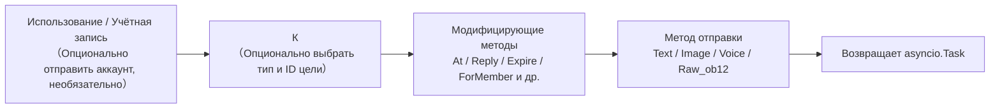

## Методы отправки

Все методы отправки возвращают объект `asyncio.Task`.

### Основные методы (встроенные в базовый класс)

Следующие стандартные методы уже реализованы в базовом классе `SendDSL`, **по умолчанию делегируются на `Raw_ob12`**. Подклассы адаптеров не обязаны повторно реализовывать их, чтобы использовать напрямую, и IDE будет предлагать автодополнение:

| Название метода | Описание | Возвращаемое значение |
|-----------------|----------|------------------------|
| `Text(text: str)` | Отправка текстового сообщения | `asyncio.Task` |
| `Image(file: bytes \| str)` | Отправка изображения | `asyncio.Task` |
| `Voice(file: bytes \| str)` | Отправка голосового сообщения (сегмент `audio` OneBot12) | `asyncio.Task` |
| `Video(file: bytes \| str)` | Отправка видео | `asyncio.Task` |
| `File(file: bytes \| str, filename: str = None)` | Отправка файла | `asyncio.Task` |

Адаптер может переопределить отдельные стандартные методы для предоставления логики, специфичной для платформы:

```python
class Send(SendDSL):
    def Raw_ob12(self, message, **kwargs):
        # Обязательно реализовать
        ...

    # Опционально: переопределить Text для предоставления платформенно-специфичной логики
    # def Text(self, text: str):
    #     return self.Raw_ob12([{"type": "text", "data": {"text": text}}])
```

### Методы протокола

| Название метода | Описание | Возвращаемое значение | Обязательно ли реализовать |
|-----------------|----------|------------------------|-----------------------------|
| `Raw_ob12(message)` | Отправка сообщения в формате OneBot12 | `asyncio.Task` | **Обязательно реализовать** |

> **Важно**: `Raw_ob12` — основной метод адаптера, **обязательно реализовать**. Это единый входной порт для обратного преобразования (OneBot12 → платформа). При отсутствии реализации базовый класс будет записывать сообщение об ошибке и возвращать стандартный ответ об ошибке (`status: "failed"`, `retcode: 10002`). Стандартные методы (`Text`, `Image` и др.) по умолчанию делегируются на `Raw_ob12`.

### Методы, специфичные для платформы

Адаптер может добавить методы отправки, специфичные для платформы, в подкласс `Send` (они будут распознаваться `event.supports()` / `event.available_methods()`):

```python
class Send(SendDSL):
    def Raw_ob12(self, message, **kwargs): ...

    # Методы, специфичные для платформы
    def Sticker(self, sticker_id: str):
        return self.Raw_ob12([{"type": "sticker", "data": {"id": sticker_id}}])
```

## Модифицирующие методы

Модифицирующие методы возвращают `self`, чтобы поддерживать цепочечные вызовы.

### Метод At

```python
# @одного пользователя
await adapter.Send.To("group", "123").At("456").Text("Привет")

# @нескольких пользователей
await adapter.Send.To("group", "123").At("456").At("789").Text("Приветствую вас")
```

### Метод AtAll

```python
# @всех участников
await adapter.Send.To("group", "123").AtAll().Text("Здравствуйте все")
```

### Метод Reply

```python
# Ответ на сообщение
await adapter.Send.To("group", "123").Reply("msg_id").Text("Содержимое ответа")
```

### Комбинированные модифицирующие методы

```python
await adapter.Send.To("group", "123").At("456").Reply("msg_id").Text("Ответ на сообщение с @")
```

### Платформенно-специфические модифицирующие методы

Помимо встроенных `At`/`AtAll`/`Reply`, адаптер может определять **платформенно-специфические модифицирующие методы**. Такие методы **должны возвращать `self`** и не требуют никаких декораторов — фреймворк автоматически распознает их:

- Возвращение `self` (экземпляр SendDSL) → модифицирующий метод, не вызывает отправку/обёртку/события жизненного цикла, цепочка продолжается
- Возвращение `Task`/`Awaitable` → метод отправки

```python
class Send(SendDSL):
    def Raw_ob12(self, message, **kwargs): ...

    # Модифицирующий метод: возвращает self, не отправляет
    def Expire(self, seconds: int):
        self._expire = seconds
        return self

    def ForMember(self, user_id: str):
        self._member = user_id
        return self

    # Метод отправки: возвращает Task, зависит от состояния, установленного модифицирующими методами
    def Board(self, content: str, **kwargs):
        return self.Raw_ob12([{"type": "board", "data": {"text": content}}])
```

Использование:

```python
# Модифицирующие методы можно последовательно цепочечно добавлять
await adapter.Send.To("group", "big").Expire(3600).ForMember("114").Board("Содержимое доски")
```

## Использование методов модификации в обертке события

> [!NOTE]
> Для использования `reply(via=)` и `event.send_chain()` требуется ErisPulse **2.7.0+**.

`event.reply()` по умолчанию предоставляет только встроенные параметры модификации, такие как `at_sender`/`at_users`/`at_all`/`quote`. Для использования платформенно-специфических методов модификации есть два способа:

### Способ первый: параметр via в reply()

Подходит для небольшого количества, заранее известных методов модификации:

```python
await event.reply("Доска содержания", method="Board",
                  via=[("Expire", 3600), ("ForMember", "114514")])
```

`via` — это список, каждый элемент которого может иметь следующие формы:

| Форма | Эквивалентная цепочка вызовов |
|------|-------------|
| `"Name"` | `.Name()` |
| `("Name", arg1, arg2)` | `.Name(arg1, arg2)` |
| `("Name", (arg1,), {kw: val})` | `.Name(arg1, kw=val)` |

### Способ второй: event.send_chain()

Подходит для **нескольких последовательных методов модификации** или **действий без параметров содержания** (например, удаление, отмена). `send_chain()` возвращает настроенный SendDSL-объект с заданными `To`/`Using`, который можно свободно дополнять любыми методами модификации и методами отправки:

```python
# Платформенно-специфические методы модификации + отправка на доску
await event.send_chain().Expire(3600).Board("Доска с истечением через час")

# Последовательные методы модификации
await (event.send_chain()
       .Expire(3600)
       .ForMember("114514")
       .Board("Содержание доски", content_type="markdown"))

# Встроенные методы модификации также доступны
await event.send_chain().At("123").Reply("msg_id").Text("hi")

# Действия без параметров содержания
await event.send_chain().DismissBoard()
```

> `send_chain()` возвращает полный экземпляр SendDSL, поэтому **доступны все цепочные возможности** — не только методы модификации, но и правила отправки и пакетное построение:

```python
# Правила отправки: повторы + тайм-аут + обратный вызов при успехе
await (event.send_chain()
       .Retry(3).Timeout(10)
       .Hook(lambda r: print("Отправка успешна"))
       .Text("Надежная отправка"))

# Отложенная отправка + платформенно-специфическая модификация + доска
await event.send_chain().Defer(5).Expire(3600).Board("Отложенная доска")

# Режим пакетного построения
results = await (event.send_chain()
                 .Build()
                 .Text("Первое сообщение").Image("pic.jpg").Text("Второе сообщение")
                 .send_all())
```

## Управление аккаунтами

### Метод Using

Метод `Using()` используется для указания аккаунта, с которого будет отправлено сообщение. Переданный идентификатор будет сопоставлен через `_resolve_account()` по следующему приоритету:

1. **Имя аккаунта** — ключ из конфигурации (например, `"default"`, `"bot1"`)
2. **bot_id, вставленный во время выполнения** — идентификатор, автоматически вставляемый при преобразовании события
3. **Любое поле str** — другие строковые поля из конфигурации
4. **Резервный вариант** — первый включенный аккаунт

```python
# Использование имени аккаунта
await adapter.Send.Using("account1").To("user", "123").Text("Привет")

# Использование bot_id (self.user_id из события)
await adapter.Send.Using("bot_123").To("user", "123").Text("Привет")
```

### Метод Account

Метод `Account` эквивалентен методу `Using`:

```python
await adapter.Send.Account("account1").To("user", "123").Text("Привет")
```

## Асинхронная обработка

### Не ожидать результат

```python
# Сообщение отправляется в фоновом режиме
task = adapter.Send.To("user", "123").Text("Hello")

# Продолжить выполнение других операций
# ...
```

### Ожидание результата

```python
# Непосредственно await для получения результата
result = await adapter.Send.To("user", "123").Text("Hello")
print(f"Результат отправки: {result}")

# Сохранить Task и подождать позже
task = adapter.Send.To("user", "123").Text("Hello")
# ... другие операции ...
result = await task
```

## Система правил отправки

В SendDSL встроена система декораторов правил отправки, которые можно добавлять цепочкой методов и применять единым образом при отправке. Правила охватывают распространенные сценарии: контроль таймаута, автоматическая повторная попытка при сбое, выполнение обратного вызова при успехе, отложенная отправка, приоритет и отбрасывание сообщений, мониторинг прогресса.

Методы правил **возвращают self** (как и At/AtAll/Reply), и их необходимо вызывать до отправки метода (Text/Image и т.д.). Правила распространяются на новые экземпляры, созданные с помощью `To`/`Using`/`Account`.

### Список методов правил

| Метод | Описание |
|--------|------|
| `.Hook(callback)` | Выполняется после успешной отправки (можно вызывать несколько раз, выполняется по порядку) |
| `.Retry(times=1)` | Автоматически повторяет отправку N раз (включая первую, всего N+1 попыток) |
| `.Timeout(seconds)` | Устанавливает таймаут на одну попытку отправки; при превышении отменяет текущую попытку (можно использовать вместе с Retry) |
| `.Defer(seconds=1.0)` | Откладывает отправку (внутрипроцессное таймерное ожидание, не сохраняется) |
| `.Priority(level, drop_if_busy=False)` | Устанавливает приоритет; при перегрузке очередь можно отбрасывать |
| `.OnProgress(callback)` | Вызывает обратный вызов на каждой стадии (передаёт SendContext) |
| `.OnError(callback)` | Вызывается при окончательном сбое (вызывается только один раз) |

### Логика выполнения после успешной отправки (Hook)

```python
# Синхронный обратный вызов
await (adapter.Send.To("user", "123")
       .Hook(lambda r: print(f"Сообщение отправлено успешно, ID: {r['message_id']}"))
       .Text("Привет"))

# Асинхронный обратный вызов
async def deduct_points(result):
    await db.update(user_id="123", points=-1)

await adapter.Send.To("user", "123").Hook(deduct_points).Text("Вычесть баллы")
```

Hook выполняется только при окончательном успехе отправки (включая успешную повторную попытку); при сбое, таймауте или отмене не вызывается.

### Автоматическая повторная попытка при сбое (Retry)

```python
# При первом сбое повторить 2 раза, всего 3 попытки
result = await adapter.Send.To("user", "123").Retry(2).Text("С повтором")
```

Условия для повторной попытки: исключение при отправке, таймаут отправки, отправка возвращает ответ с `status == "failed"`.

### Автоматическая отмена при превышении таймаута (Timeout)

```python
# Если одна отправка занимает более 10 секунд, отменить
await adapter.Send.To("user", "123").Timeout(10).Text("С таймаутом")

# Таймаут + повтор: каждая попытка длится 10 секунд, максимум 3 попытки
await adapter.Send.To("user", "123").Timeout(10).Retry(2).Text("Таймаут и повтор")
```

### Мониторинг прогресса (OnProgress / OnError)

```python
def on_progress(ctx):
    print(f"Стадия: {ctx.stage}, Попытка: {ctx.attempt + 1}/{ctx.max_attempts}, Время: {ctx.elapsed:.2f}s")
    if ctx.stage == "failed":
        print(f"  Ошибка: {ctx.error!r}")

async def on_error(ctx):
    await notify_admin(f"Не удалось отправить сообщение пользователю {ctx.target_id}: {ctx.error!r}")

await (adapter.Send.To("user", "123")
       .Retry(3).Timeout(10)
       .OnProgress(on_progress)
       .OnError(on_error)
       .Text("Мониторинг"))
```

`SendContext` содержит следующие поля: `task_id`, `platform`, `method`, `target_type`, `target_id`, `bot_id`, `stage`, `attempt`, `max_attempts`, `started_at`, `finished_at`, `elapsed`, `error`, `result`, `extra`.

Возможные значения `stage`: `pending`, `sending`, `retrying`, `success`, `failed`, `timeout`, `cancelled`, `dropped`.

### Отложенная отправка (Defer)

```python
# Отправить через 5 секунд
await adapter.Send.To("user", "123").Defer(5).Text("Отложенное сообщение")
```

> Внимание: задержка осуществляется внутрипроцессным таймером, при перезапуске процесса теряется, не сохраняется.

### Приоритет и отбрасывание при перегрузке (Priority)

```python
# Сообщение низкого приоритета, при перегрузке очереди автоматически отбрасывается
result = await (adapter.Send.To("user", "123")
               .Priority(-1, drop_if_busy=True)
               .Text("Уведомление, которое можно отбросить"))
# Если сообщение было отброшено, result["status"] == "failed"
```

При включении `drop_if_busy` отправка прерывается, если количество активных задач превышает порог (по умолчанию 64). Порог можно изменить с помощью `.PriorityThreshold(n)`.

### Комбинация правил и фоновое выполнение

```python
# Не блокирует основной поток, правила всё равно применяются
task = (adapter.Send.To("user", "123")
        .Hook(lambda r: print("Сообщение отправлено!"))
        .Retry(3)
        .Timeout(10)
        .OnProgress(on_progress)
        .Text("Привет"))

# Продолжить выполнение других действий
await handle_next_action()
```

### Распространение правил

Правила распространяются при создании новых экземпляров с помощью `To`/`Using`/`Account`, чтобы избежать потери правил при цепочечном вызове:

```python
# Правила, установленные до To, также распространяются на созданный экземпляр
builder = adapter.Send.Retry(3).Timeout(10)
send = builder.To("user", "123")  # send по-прежнему содержит Retry(3) и Timeout(10)
await send.Text("Привет")
```

Правила у разных экземпляров независимы (списки hooks глубоко копируются).

## Режим пакетного построения (Build)

Помимо режима однократной отправки, SendDSL поддерживает режим пакетного построения: в одной цепочке можно записать несколько методов отправки, которые будут выполнены в конце. Этот режим подходит для сценариев, когда нужно "отправить сразу несколько сообщений".

### Вход в режим построения

Перед вызовом метода отправки нужно вызвать `.Build()`, который вернёт `SendBuilder`. После этого методы отправки (Text/Image и т.д.) не будут выполняться немедленно, а будут накапливаться как намерения отправки:

```python
results = await (adapter.Send.To("user", "123")
                 .Build()                    # Вход в режим построения
                 .Text("Первое сообщение")
                 .Image("pic.jpg")
                 .Text("Второе сообщение")
                 .send_all())                 # Единое выполнение
# results = [Результат текста, Результат изображения, Результат текста]
```

`.send_all()` возвращает `asyncio.Task`, после await получим список результатов (в порядке намерений).

### Параллельное и последовательное выполнение

По умолчанию используется **параллельное** выполнение (параллельная отправка, общее время приблизительно равно времени самой медленной отправки). При необходимости сохранения порядка доставки сообщений вызовите `.Sequential()`:

```python
# Последовательно: отправка по очереди
await (adapter.Send.To("group", "456")
       .Build()
       .Sequential()
       .Text("Сначала это").Text("Потом это")
       .send_all())

# Параллельно (по умолчанию, можно явно указать)
await (adapter.Send.To("group", "456")
       .Build()
       .Parallel()
       .Text("Параллельное 1").Text("Параллельное 2")
       .send_all())
```

### Продолжение при ошибках и повторные попытки

Пакетное выполнение использует стратегию **продолжения при ошибках**: если одна из отправок не удалась, это не прерывает отправку остальных. При использовании `.Retry()` неудачные элементы будут автоматически повторно отправлены (повторные попытки применяются к каждой отдельной отправке, а не к всей пачке целиком):

```python
await (adapter.Send.To("user", "123")
       .Build()
       .Retry(2)                       # Каждая отправка повторяется 2 раза
       .Text("Возможно неудачное").Image("Тоже возможно неудачное")
       .send_all())
```

### Правила и обратные вызовы для всей пачки

Правила применяются ко всей пачке:

| Метод | Описание |
|--------|------|
| `.Timeout(seconds)` | Время ожидания для каждой отправки |
| `.Retry(times)` | Каждая отправка повторяется (продолжение при ошибках) |
| `.Defer(seconds)` | Задержка отправки всей пачки |
| `.Hook(callback)` | Вызывается после успешного завершения всей пачки, получает список `results` |
| `.OnError(callback)` | Вызывается, если в пачке есть неудачные отправки, получает `BatchContext` |
| `.OnProgress(callback)` | Вызывается при завершении каждой отправки, получает `BatchContext` |

```python
def on_progress(ctx):
    print(f"Прогресс: {ctx.completed}/{ctx.total}, Успешно {ctx.succeeded}, Неудачно {ctx.failed}")

async def on_error(ctx):
    print(f"В пачке {ctx.failed} неудачных отправок")

results = await (adapter.Send.To("user", "123")
               .Build()
               .Retry(2).Timeout(10)
               .OnProgress(on_progress)
               .OnError(on_error)
               .Hook(lambda rs: print("Пачка отправлена"))
               .Text("a").Text("b").Text("c")
               .send_all())
```

`BatchContext` содержит: `task_id`、`total`、`completed`、`succeeded`、`failed`、`stage`、`results`、`errors`、`elapsed`、`extra`.

Значения `stage`: `pending`、`sending`、`success` (все успешно), `partial` (часть успешно), `failed` (все неудачно).

### Декораторы и наследование правил

Декораторы и правила, применённые до `.Build()`, наследуются всей пачкой и применяются к каждому сообщению:

```python
await (adapter.Send.To("group", "456")
       .At("789")                        # Наследуется: каждое сообщение упоминает 789
       .Build()
       .Retry(2)                         # Наследуется + добавляется: каждая отправка повторяется
       .Text("@Уведомление для тебя")
       .Image("Изображение объявления")
       .send_all())
```

После входа в режим Build можно добавить новые декораторы (они будут применяться ко всей пачке):

```python
await (adapter.Send.To("group", "456")
       .Build()
       .At("111").At("222")             # Добавляются упоминания, применяются ко всей пачке
       .Text("@Несколько людей")
       .send_all())
```

### Выполнение в фоне

Как и в режиме однократной отправки, `.send_all()` возвращает `Task`, который можно запустить в фоне, не ожидая завершения:

```python
task = (adapter.Send.To("user", "123")
        .Build()
        .Hook(lambda rs: print("Пакетная отправка завершена"))
        .Text("a").Text("b")
        .send_all())

# Не блокирует основной поток выполнения
await do_something_else()
```

## Правила именования

### Именование в стиле PascalCase

Все методы отправки используют стиль написания с большой буквы:

```python
# ✅ Правильно
def Text(self, text: str):
    pass

def Image(self, file: bytes):
    pass

# ❌ Неправильно
def text(self, text: str):
    pass

def send_image(self, file: bytes):
    pass
```

### Методы, специфичные для платформы

Не рекомендуется добавлять методы с префиксом платформы:

```python
# ✅ Рекомендуется
def Sticker(self, sticker_id: str):
    pass

# ❌ Не рекомендуется
def TelegramSticker(self, sticker_id: str):
    pass
```

Используйте метод `Raw` вместо этого:

```python
# ✅ Рекомендуется
await adapter.Send.Raw_ob12([{"type": "sticker", ...}])

# ❌ Не рекомендуется
def TelegramSticker(self, ...):
    pass
```

## Внутреннее разбиение цепочки отправки

За кулисами выполнения `await adapter.Send.To("group", "123").Text("x")` фреймворк делает следующее:

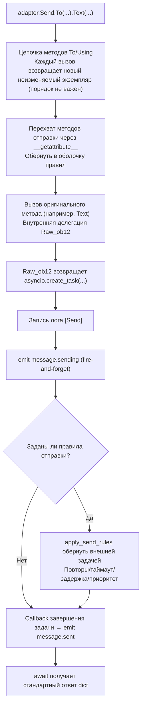

**Что делает фреймворк на каждом этапе:**

| Этап | Что делает фреймворк |
|------|-------------|
| Цепочка объединения | `To`/`Using`/`Account` при каждом вызове **создает новый неизменяемый экземпляр** и наследует уже установленные поля, поэтому `To(...).Using(...)` и `Using(...).To(...)` **эквивалентны**, порядок не важен |
| Обёртка методов | Методы отправки (`Text` и др.) перехватываются через `__getattribute__` и оборачиваются; методы-修饰аторы (`To`/`Using`/`At`/`Retry` и др.) **не оборачиваются**. Вложенные вызовы `Raw_ob12` предотвращают повторную обёртку с помощью метки `_in_rule_wrap` |
| Создание задачи | `Raw_ob12` внутри использует `asyncio.create_task()` для создания задачи; `Text()` просто синхронно возвращает эту задачу, **не блокируя** |
| Лог отправки | Запись события лога `[Send] platform/method -> target` (для отключения можно использовать `exclude_levels=["EVENT"]`) |
| `message.sending` | Метод отправки вызывается **немедленно** с использованием fire-and-forget (только если есть слушатели, сначала short-circuit через `has_handlers`) |
| `message.sent` | Привязывается к `done_callback` задачи — **в случае с правилами, результат завершения всей цепочки повторов**, без правил — это просто завершение исходной задачи |

### Цепочка разрешения аккаунта

Когда внутри адаптера вызывается `_resolve_account(account_id)`, аккаунт разрешается по следующему порядку:

1. Адаптер с единственным аккаунтом (без `AccountConfigClass`) → возвращается сразу
2. Точное совпадение имени аккаунта `account_id`
3. Совпадение по полю `bot_id` каждого аккаунта
4. Совпадение по любому строковому значению поля аккаунта (исключая `enabled`/`name`)
5. Возврат первого включённого аккаунта по умолчанию
6. Если всё не удалось → выбрасывается `ValueError`

> `account_id`, который вы передаёте, берётся из: явного указания в `Using()` > поля `self` события (`account_id` имеет приоритет над `user_id`, автоматически вставляется `event.reply()` > не указано (в этом случае адаптер берёт первый включённый аккаунт по умолчанию).

### Двигатель правил отправки (повторы/таймаут/задержка)

Правила оборачиваются в новую внешнюю задачу **после** возврата задачи `Raw_ob12`, не влияя на основной процесс. Ключевые факты:

| Правило | Описание |
|------|------|
| `Retry(n)` | Всего попыток `n+1`; **повторяется немедленно после неудачи, без экспоненциальной задержки** |
| `Timeout(s)` | Один раз отправка отменяется по таймауту (`asyncio.wait_for`), если не исчерпаны попытки, повторяется |
| `Defer(s)` | Задержка отправки перед выполнением sleep |
| `Priority(level, drop_if_busy)` | Если накоплено больше порога, возвращает `{status:"failed", retcode:10002, message:"dropped_low_priority"}` |
| `Hook(fn)` | Выполняется только при успешном завершении в порядке очереди |
| `on_progress` / `on_error` | Обратные вызовы на каждом этапе / при финальной ошибке |

> **Внимание**: повторы — это «немедленное повторное отправление», без задержки; если платформа ограничивает частоту, необходимо в `on_error` вручную добавить sleep и повторить отправку. Успешное завершение определяется по `status == "ok"` в ответе dict (также `retcode == 0`).

> Полный формат стандартного ответа и семантика `retcode` см. в [спецификации API-ответов](../../standards/api-response.md).

## Возвращаемое значение

### Объект Task

Все методы отправки возвращают `asyncio.Task`. Адаптер должен реализовать только `Raw_ob12`, стандартные методы (Text/Image и т.д.) по умолчанию делегируются ему:

```python
import asyncio

def Raw_ob12(self, message, **kwargs):
    async def _do_send():
        segments = self._apply_modifiers(message)
        return await self._adapter.call_api(
            endpoint="/send_message",
            message=segments,
            **self.send_context,
            **kwargs,
        )
    return asyncio.create_task(_do_send())

# Методы Text/Image/Voice/Video/File унаследованы из базового класса и автоматически делегируются на Raw_ob12
# Если нужно переопределить стандартные методы, просто верните asyncio.Task:
# def Text(self, text: str):
#     return self.Raw_ob12([{"type": "text", "data": {"text": text}}])
```

### Стандартизированный ответ

`call_api` должен возвращать стандартизированный ответ. Рекомендуется использовать методы `make_response()` / `make_error()`:

```python
async def call_api(self, endpoint: str, **params):
    try:
        result = await self._do_api_call(endpoint, **params)
        return self.make_response(
            data=result.get("data"),
            message_id=result.get("message_id", ""),
            raw=result,
        )
    except Exception as e:
        return self.make_error(message=str(e))
```

Также поддерживается ручная конструкция (старый способ по-прежнему совместим):

```python
async def call_api(self, endpoint: str, **params):
    return {
        "status": "ok" или "failed",
        "retcode": 0 или error_code,
        "data": {...},
        "message_id": "msg_id" или "",
        "message": "",
        "{platform}_raw": raw_response
    }
```

## Полный пример

### Базовое использование

```python
from ErisPulse.Core import adapter

my_adapter = adapter.get("myplatform")

# Отправка текста
await my_adapter.Send.To("user", "123").Text("Hello World!")

# Отправка изображения
await my_adapter.Send.To("group", "456").Image("https://example.com/image.jpg")

# Отправка файла
with open("document.pdf", "rb") as f:
    await my_adapter.Send.To("user", "123").File(f.read())
```

### Цепочка вызовов

```python
# @пользователь + ответ
await my_adapter.Send.To("group", "456").At("789").Reply("msg123").Text("Ответ на сообщение с @")

# @всех + несколько модификаторов
await my_adapter.Send.Using("bot1").To("group", "456").AtAll().Text("Сообщение-анонс")
```

### Сырые сообщения и построитель сообщений

`Raw_ob12` — это основной вход для обратного преобразования (перевод сообщений OB12 → вызовы API платформы), а `MessageBuilder` — это инструмент для построения цепочки сообщений, используемый в сочетании с ним.

> Полный стандарт реализации `Raw_ob12`, использование `MessageBuilder` и примеры кода см. по ссылкам:
> - [Спецификация методов отправки §6 Стандарт обратного преобразования (OneBot 12 → платформа)](../../standards/send-method-spec.md#6-обратное-преобразование-onebot-12--платформа)
> - [Спецификация методов отправки §11 Построитель сообщений](../../standards/send-method-spec.md#11-построитель-сообщений-messagebuilder)


### 适配器开发最佳实践

# Рекомендации по разработке адаптеров ErisPulse

Данный документ содержит рекомендации по разработке адаптеров ErisPulse.

## Управление состоянием бота и мета-события

Адаптер должен активно отправлять мета-события через `adapter.emit()`, чтобы фреймворк автоматически отслеживал состояние подключения бота, его онлайн/оффлайн статус и информацию о пульсе.

### 1. Когда отправлять мета-события

| Событие | `detail_type` | Точка срабатывания | Поведение фреймворка |
|---------|---------------|--------------------|----------------------|
| Подключение | `"connect"` | При установлении подключения бота к платформе | Регистрация бота, запуск цикла жизни `adapter.bot.online` |
| Отключение | `"disconnect"` | При разрыве подключения бота с платформой | Отметка бота как оффлайн, запуск цикла жизни `adapter.bot.offline` |
| Пульс | `"heartbeat"` | Регулярно отправляется (рекомендуется каждые 30-60 секунд) | Обновление времени активности и метаинформации бота |

### 2. Отправка мета-событий

Фреймворк предоставляет метод `emit_meta()`, который позволяет отправить мета-событие одной строкой:

```python
class MyAdapter(BaseAdapter):
    async def _ws_handler(self, websocket):
        bot_id = self._get_bot_id()

        # Бот онлайн: отправка события connect одной строкой
        await self.emit_meta("connect", bot_id, user_name="MyBot", nickname="Мой бот")

        try:
            while True:
                data = await websocket.receive_text()
                event = self.convert(data)
                if event:
                    await self.adapter.emit(event)
        except WebSocketDisconnect:
            pass
        finally:
            # Бот оффлайн
            await self.emit_meta("disconnect", bot_id)
```

### 3. Событие пульса

Адаптер должен регулярно отправлять событие пульса в течение времени жизни соединения, чтобы обновлять время активности бота:

```python
class MyAdapter(BaseAdapter):
    async def _heartbeat_loop(self, bot_id: str):
        while self._connected:
            # Отправка мета-события heartbeat в фреймворк (одна строка)
            await self.emit_meta("heartbeat", bot_id)
            await asyncio.sleep(30)
```

### 4. Автоматическое обнаружение self-поля

Метод `adapter.emit()` фреймворка автоматически обрабатывает все события (не только мета-события) с полем `self`:

- **Обычные события** (message/notice/request) с полем `self` будут автоматически зарегистрированы
- **Расширенная информация в self-поле**: поддерживаются необязательные поля `user_name`, `nickname`, `avatar`, `account_id`

```python
# В конвертере достаточно поля self для автоматической регистрации бота
onebot_event = {
    "type": "message",
    "detail_type": "private",
    "platform": "myplatform",
    "self": {
        "platform": "myplatform",
        "user_id": "bot123",
        "user_name": "MyBot",
        "nickname": "Мой бот",
    },
    # ... другие поля
}
await self.adapter.emit(onebot_event)
# Бот "bot123" автоматически зарегистрирован и обновлено время активности
```

### 5. Запросы состояния бота

Фреймворк предоставляет следующие методы для запроса информации:

```python
from ErisPulse import sdk

# Получение подробной информации о боте
info = sdk.adapter.get_bot_info("myplatform", "bot123")
# {"status": "online", "last_active": 1712345678.0, "info": {"nickname": "MyBot"}}

# Получение списка всех ботов (группировка по платформам)
all_bots = sdk.adapter.list_bots()

# Получение списка ботов для указанной платформы
platform_bots = sdk.adapter.list_bots("myplatform")

# Проверка, находится ли бот онлайн
is_online = sdk.adapter.is_bot_online("myplatform", "bot123")

# Получение полной сводки состояния (подходит для отображения в WebUI)
summary = sdk.adapter.get_status_summary()
# {"adapters": {"myplatform": {"status": "started", "bots": {...}}}}
```

## Управление подключениями

### 1. Реализация повторных попыток подключения

```python
import asyncio

class MyAdapter(BaseAdapter):
    async def start(self):
        retry_count = 0
        max_retries = 5
        
        while retry_count < max_retries:
            try:
                await self._connect_to_platform()
                self.logger.info("Подключение успешно установлено")
                break
            except Exception as e:
                retry_count += 1
                if retry_count < max_retries:
                    # Стратегия экспоненциального отступа
                    wait_time = min(60 * (2 ** retry_count), 600)
                    self.logger.warning(
                        f"Подключение не удалось, повтор через {wait_time} секунд ({retry_count}/{max_retries}): {e}"
                    )
                    await asyncio.sleep(wait_time)
                else:
                    self.logger.error("Подключение не удалось, достигнуто максимальное количество попыток")
                    raise
```

### 2. Управление состоянием подключения

```python
class MyAdapter(BaseAdapter):
    async def start(self):
        self.connection = None
        self._connected = False
    
    async def _ws_handler(self, websocket: WebSocket):
        self.connection = websocket
        self._connected = True
        self.logger.info("Подключение установлено")
        
        try:
            while True:
                data = await websocket.receive_text()
                await self._process_event(data)
        except WebSocketDisconnect:
            self.logger.info("Подключение отключено")
        finally:
            self.connection = None
            self._connected = False
```

### 3. Поддержание активности с помощью пингов и мета-пингов

Пинг-сообщения адаптера должны выполнять две задачи: отправлять пинг-сообщения платформе и отправлять мета-события пинга фреймворку.

```python
class MyAdapter(BaseAdapter):
    async def start(self):
        self.connection = await self._connect_to_platform()
        self._heartbeat_task = asyncio.create_task(self._heartbeat_loop())

    async def _heartbeat_loop(self):
        while self.connection:
            try:
                # 1. Отправка пинг-сообщения платформе
                await self.connection.send_json({"type": "ping"})

                # 2. Отправка мета-события пинга фреймворку (одной строкой)
                await self.emit_meta("heartbeat", self._bot_id)

                await asyncio.sleep(30)
            except Exception as e:
                self.logger.error(f"Ошибка пинга: {e}")
                break
```

### 4. Обнаружение информации о подключении

Регистрируемые адаптером маршруты должны быть доступны для пользователей, чтобы они могли настроить URL-адреса обратной связи на стороне платформы. Рекомендуется выводить информацию о подключении в методе `start()`:

```python
class MyAdapter(BaseAdapter):
    async def start(self):
        router.register_websocket(
            module_name=self.platform,
            path="/ws",
            handler=self._ws_handler
        )

        if self.sdk:
            info = self.sdk.adapter.get_connection_info(self.platform)
            if info:
                self.logger.info(f"WebSocket URL: "
                    f"{info.get('connection', {}).get('base_url', '')}"
                    f"{info.get('connection', {}).get('websocket_routes', [])}")
```

Пользователи могут использовать следующий API для просмотра всех маршрутов и URL-адресов подключения адаптера:

```python
from ErisPulse import sdk

# Информация о подключении на уровне адаптера (рекомендуется)
info = sdk.adapter.get_connection_info("myplatform")

# Запрос на уровне маршрутизатора
sdk.router.list_namespaces()              # Список всех пространств имён
sdk.router.get_module_routes("myplatform")  # Подробная информация о маршрутах
sdk.router.get_module_urls("myplatform")    # Полный URL-адрес подключения
```

> **Важно:** `module_name`, указанный при регистрации маршрута, должен точно совпадать с именем `platform`, зарегистрированным в ErisPulse, иначе `get_connection_info()` не сможет сопоставить маршруты. Для адаптеров с несколькими аккаунтами рекомендуется регистрировать подмаршруты для каждого аккаунта (например, `/account1/webhook`, `/account2/webhook`), а не использовать разные `module_name`.

## Преобразование событий

### 1. Строгое соответствие стандарту OneBot12

```python
class MyPlatformConverter:
    def convert(self, raw_event):
        """Преобразование события"""
        onebot_event = {
            "id": str(raw_event.get("event_id", uuid.uuid4())),
            "time": int(time.time()),
            "type": self._convert_type(raw_event.get("type")),
            "detail_type": self._convert_detail_type(raw_event),
            "platform": "myplatform",
            "self": {
                "platform": "myplatform",
                "user_id": str(raw_event.get("bot_id", ""))
            },
            "myplatform_raw": raw_event,  # Сохранить исходные данные (обязательно)
            "myplatform_raw_type": raw_event.get("type", "")  # Исходный тип (обязательно)
        }
        return onebot_event
```

### 2. Стандартизация временных меток

```python
def _convert_timestamp(self, timestamp):
    """Преобразование в 10-значную временную метку в секундах"""
    if not timestamp:
        return int(time.time())
    
    # Если временная метка в миллисекундах
    if timestamp > 10**12:
        return int(timestamp / 1000)
    
    # Если временная метка в секундах
    return int(timestamp)
```

### 3. Генерация идентификатора события

```python
import uuid

def _generate_event_id(self, raw_event):
    """Генерация идентификатора события"""
    event_id = raw_event.get("event_id")
    if event_id:
        return str(event_id)
    # Если платформа не предоставляет ID, сгенерировать UUID
    return str(uuid.uuid4())
```

## Реализация SendDSL

Модификаторы `At`/`AtAll`/`Reply` уже встроены в базовый класс SendDSL фреймворка, адаптеру нужно реализовать только `Raw_ob12` и конкретные методы отправки. Использование `self._apply_modifiers(message)` и `self.send_context` упрощает разработку.

### 1. Обязательно возвращать объект Task

```python
class Send(BaseAdapter.Send):
    def Raw_ob12(self, message, **kwargs):
        """Рекомендуемая реализация: использование вспомогательного метода фреймворка"""
        async def _do_send():
            segments = self._apply_modifiers(message)
            return await self._adapter.call_api(
                endpoint="/send_message",
                message=segments,
                **self.send_context,
                **kwargs
            )
        return asyncio.create_task(_do_send())

    def Text(self, text: str):
        return self.Raw_ob12([{"type": "text", "data": {"text": text}}])
```

### 2. Методы цепочки модификаторов должны возвращать self

```python
class Send(BaseAdapter.Send):

    def __init__(self, adapter, target_type=None, target_id=None, account_id=None):
        super().__init__(adapter, target_type, target_id, account_id)
        self.buttons = []

    def Button(self, content: list) -> 'Send':
        self.buttons.append(content)
        return self # возвращаем self
```

### 3. Поддержка специфичных методов платформы

```python
class Send(BaseAdapter.Send):
    def Sticker(self, sticker_id: str):
        """Отправка стикера"""
        return asyncio.create_task(
            self._adapter.call_api(
                endpoint="/send_sticker",
                message=[{"type": "sticker", "data": {"id": sticker_id}}],
                **self.send_context
            )
        )
    
    def Card(self, card_data: dict):
        """Отправка карточного сообщения"""
        return asyncio.create_task(
            self._adapter.call_api(
                endpoint="/send_card",
                message=[{"type": "card", "data": card_data}],
                **self.send_context
            )
        )
```

## API-ответ

### 1. Стандартизированный формат ответа

Фреймворк предоставляет методы `make_response()` и `make_error()` для формирования стандартизированных ответов:

```python
async def call_api(self, endpoint: str, **params):
    try:
        raw_response = await self._platform_api_call(endpoint, **params)
        
        if raw_response.get("success"):
            return self.make_response(
                data=raw_response.get("data"),
                message_id=raw_response.get("data", {}).get("message_id", ""),
                raw=raw_response,
            )
        else:
            return self.make_error(
                retcode=raw_response.get("code", 10001),
                message=raw_response.get("message", ""),
                raw=raw_response,
            )
    except Exception as e:
        return self.make_error(message=str(e))
```

Метод `make_response()` автоматически генерирует словарь ответа с ключом `{platform}_raw`. Метод `make_error()` по умолчанию использует `retcode=34000` (Platform Error).

### 2. Стандарт ошибок

Следует использовать стандартные коды ошибок OneBot12:

```python
# 1xxxx - Ошибка запроса действия
10001: Bad Request
10002: Unsupported Action
10003: Bad Param

# 2xxxx - Ошибка обработчика действия
20001: Bad Handler
20002: Internal Handler Error

# 3xxxx - Ошибка выполнения действия
31000: Database Error
32000: Filesystem Error
33000: Network Error
34000: Platform Error
35000: Logic Error
```

## Поддержка нескольких аккаунтов

### 1. Декларативная конфигурация (рекомендуется)

После использования `AccountConfigClass` для объявления конфигурационного класса, фреймворк автоматически управляет загрузкой, проверкой и генерацией шаблонов для нескольких аккаунтов. Базовый класс `BotAccountConfig` предоставляет поля `enabled` и `name`, которые адаптеру не нужно объявлять:

```python
from dataclasses import dataclass, field
from ErisPulse.Core.Bases import BotAccountConfig

@dataclass
class MyBotConfig(BotAccountConfig):
    token: str = field(default="", metadata={
        "description": {"i18n": "my_adapter.bot_token", "default": "Bot Token"},
        "required": True,
        "secret": True,
    })

class MyAdapter(BaseAdapter):
    AccountConfigClass = MyBotConfig
    
    async def start(self):
        for name, account in self.enabled_accounts.items():
            self.logger.info(f"启动账户 {name}")
            await self._connect(name, account.token)
            # bot_id будет автоматически заполнен фреймворком из протокола платформы/ответа на вход
    
    async def call_api(self, endpoint: str, **params):
        account_id = params.pop("account_id", None)
        name, account = self._resolve_account(account_id)
        # name: имя аккаунта, account: экземпляр MyBotConfig
```

Конфигурационный файл будет автоматически сгенерирован в следующем виде:

```toml
[MyAdapter.accounts.default]
token = ""
enabled = true
name = ""
```

### 2. Механизм выбора аккаунта

Фреймворк содержит встроенную функцию `_resolve_account()`, которая применяет следующий порядок приоритета:

1. **Имя аккаунта** — точное совпадение с ключом конфигурации
2. **Поле `bot_id`** — автоматически полученный bot_id (то есть `event["self"]["user_id"]`)
3. **Любое строковое поле** — другие строковые поля в конфигурации
4. **Запасной вариант** — первый включенный аккаунт

```python
# Поиск по имени аккаунта
name, account = self._resolve_account("account1")

# Поиск по bot_id (наиболее часто используемый способ, из события)
name, account = self._resolve_account("bot_123")

# Получение первого включенного аккаунта (передается None)
name, account = self._resolve_account(None)
```

## Обработка ошибок

### 1. Обработка исключений по категориям

Используйте `make_error()`, чтобы создать стандартизированный ответ об ошибке. При выполнении запросов через `sdk.client` перехватывайте исключения ErisPulse:

```python
from ErisPulse.Core.Bases.errors import ClientError, ClientTimeoutError

async def call_api(self, endpoint: str, **params):
    try:
        from ErisPulse.Core import client
        resp = await client.post(
            f"https://api.platform.com/{endpoint}",
            json=params,
            max_retries=2,
        )
        response = await resp.json()
        return self.make_response(data=response, raw=response)
    except ClientTimeoutError:
        self.logger.error(f"Тайм-аут запроса: {endpoint}")
        return self.make_error(retcode=32000, message="Тайм-аут запроса")
    except ClientError as e:
        self.logger.error(f"Ошибка сети: {e}")
        return self.make_error(retcode=33000, message="Ошибка сети")
    except json.JSONDecodeError:
        self.logger.error("Ошибка декодирования JSON")
        return self.make_error(retcode=10006, message="Неверный формат ответа")
    except Exception as e:
        self.logger.error(f"Неизвестная ошибка: {e}", exc_info=True)
        return self.make_error(message=str(e))
```

> **Обратная совместимость**: Код старых адаптеров, использующих напрямую `aiohttp`, не затрагивается и по-прежнему может перехватывать `aiohttp.ClientError`. Преобразование исключений действует только при использовании `sdk.client` для отправки запросов.

### 2. Запись логов

Фреймворк автоматически создает под-логгер для адаптера (`sdk.logger.get_child("MyAdapter")`), поэтому ручная инициализация не требуется:

```python
class MyAdapter(BaseAdapter):
    # ConfigClass = ...  # После объявления класса конфигурации self.logger будет доступен автоматически
    
    async def start(self):
        self.logger.info("Запуск адаптера...")
        # ...
        self.logger.info("Адаптер успешно запущен")
    
    async def shutdown(self):
        self.logger.info("Остановка адаптера...")
        # ...
        self.logger.info("Адаптер успешно остановлен")
```

## Тестирование

### 1. Модульные тесты

```python
import pytest
from ErisPulse.Core.Bases import BaseAdapter

class TestMyAdapter:
    def test_converter(self):
        """Тестирование конвертера"""
        converter = MyPlatformConverter()
        raw_event = {"type": "message", "content": "Hello"}
        result = converter.convert(raw_event)
        assert result is not None
        assert result["platform"] == "myplatform"
        assert "myplatform_raw" in result
    
    def test_api_response(self):
        """Тестирование формата ответа API"""
        adapter = MyAdapter()
        response = adapter.call_api("/test", param="value")
        assert "status" in response
        assert "retcode" in response
```

### 2. Интеграционные тесты

```python
@pytest.mark.asyncio
async def test_adapter_start():
    """Тестирование запуска адаптера"""
    adapter = MyAdapter()
    await adapter.start()
    assert adapter._connected is True

@pytest.mark.asyncio
async def test_send_message():
    """Тестирование отправки сообщения"""
    adapter = MyAdapter()
    await adapter.start()
    
    result = await adapter.Send.To("user", "123").Text("Hello")
    assert result is not None
```

## Обратное преобразование и построение сообщений

`Raw_ob12` — это метод, который адаптер **обязан реализовать**, он является единым входом для обратного преобразования (OneBot12 → платформа). Стандартные методы (`Text`, `Image` и т.д.) должны делегировать вызов `Raw_ob12`, а состояние модификаторов (`At`/`Reply`/`AtAll`) должно быть объединено в сообщение-сегмент внутри `Raw_ob12`.

`MessageBuilder` — это инструмент для построения сообщений-сегментов, совместимый с использованием `Raw_ob12`, поддерживающий цепочечные вызовы и быстрое построение.

> Полная спецификация реализации, примеры кода и методы использования см. в:
> - [Спецификация метода отправки §6 Спецификация обратного преобразования](../../standards/send-method-spec.md#6-обратное-преобразование-onebot12--платформа)
> - [Спецификация метода отправки §11 Построитель сообщений](../../standards/send-method-spec.md#11-построитель-сообщений-messagebuilder)

## Расширение методов событий платформы

Адаптер может зарегистрировать платформенно-специфические методы для класса Event, что позволит разработчикам модулей более удобно получать доступ к платформенно-специфическим данным.

### 1. Массовая регистрация с использованием класса Mixin (рекомендуется)

Если у платформы есть несколько специфических методов, рекомендуется использовать класс Mixin:

```python
# Регистрация на уровне модуля или в методе start()
from ErisPulse.Core.Event import register_event_mixin

class MyPlatformEventMixin:
    def get_chat_name(self):
        """Получить название чата"""
        return self.get("myplatform_raw", {}).get("chat", {}).get("name", "")

    def is_official_message(self):
        """Определить, является ли сообщение официальным"""
        raw = self.get("myplatform_raw", {})
        return raw.get("sender", {}).get("is_official", False)

    def get_message_type(self):
        """Получить тип сообщения платформы"""
        return self.get("myplatform_raw", {}).get("msg_type", "text")

# Массовая регистрация
register_event_mixin("myplatform", MyPlatformEventMixin)
```

### 2. Регистрация отдельного метода с использованием декоратора

```python
from ErisPulse.Core.Event import register_event_method

@register_event_method("myplatform")
def get_chat_name(self):
    return self.get("myplatform_raw", {}).get("chat", {}).get("name", "")
```

### 3. Очистка при завершении адаптера

```python
from ErisPulse.Core.Event import unregister_platform_event_methods

class MyAdapter(BaseAdapter):
    async def shutdown(self):
        # Очистка зарегистрированных методов событий платформы
        unregister_platform_event_methods("myplatform")
        # ... другие действия по очистке
```

> Подробнее о регистрации и удалении см. в разделе [API системы событий - Регистрация платформенно-специфических методов](../../api-reference/event-system.md#适配器注册平台扩展方法).

## Документация по обслуживанию

### 1. Документация по обслуживанию функций платформы

Создайте документ `{platform}.md` в каталоге `docs/ru/platform-guide/` (другие языковые версии будут созданы автоматически):

```markdown
# Документация адаптера для платформы

## Основная информация
- Версия соответствующего модуля: 1.0.0
- Ответственный: Your Name

## Поддерживаемые типы отправки сообщений
...

## Уникальные типы событий
...

## Параметры конфигурации
...
```

### 2. Обновление информации о версии

При выпуске новой версии обновите информацию о версии в документации:

```toml
[project]
version = "2.0.0"  # Обновите номер версии
```


### 事件转换器

# Руководство по реализации конвертера событий

Конвертер событий (Converter) — один из ключевых компонентов адаптера, отвечающий за преобразование событий платформы в унифицированный формат событий OneBot12 от ErisPulse.

## Ответственность Converter

```
События платформы ──→ Converter.convert() ──→ События стандарта OneBot12
```

Converter отвечает только за **прямое преобразование** (направление получения), то есть за преобразование данных событий платформы в стандартный формат OneBot12. Обратное преобразование (направление отправки) обрабатывается методом `Send.Raw_ob12()`.

### Основные принципы

1. **Без потерь**: исходные данные должны быть полностью сохранены в поле `{platform}_raw`
2. **Совместимость со стандартом**: преобразованные события должны соответствовать стандартному формату OneBot12
3. **Расширения платформы**: платформенно-специфичные данные хранятся в полях с префиксом `{platform}_`

## Базовый класс BaseConverter (рекомендуется)

Начиная с версии 2.7.0, фреймворк предоставляет базовый класс `BaseConverter` (`ErisPulse.Core.Bases`), который封装ует общие поля событий OneBot12 и вспомогательные методы для часто используемых сообщений, позволяя конвертеру сосредоточиться только на маппинге типов:

```python
from ErisPulse.Core.Bases import BaseConverter


class MyConverter(BaseConverter):
    def __init__(self):
        super().__init__(platform="myplatform")

    def convert(self, raw_event: dict) -> dict | None:
        if not isinstance(raw_event, dict):
            return None
        event_type = raw_event.get("type", "")
        base = self.build_base_event(raw_event, event_type)  # id/time/platform/self/raw
        if event_type == "message":
            base["type"] = "message"
            base["detail_type"] = "group" if raw_event.get("group_id") else "private"
            base["user_id"] = str(raw_event.get("sender_id", ""))
            base["message"] = [self.text(raw_event.get("content", ""))]
            base["alt_message"] = raw_event.get("content", "")
            return base
        return None
```

Поле `build_base_event()` уже заполнено общими полями:

| Поле | Источник |
|------|----------|
| `id` | `raw_event["event_id"]`, если отсутствует, генерируется UUID |
| `time` | `raw_event["timestamp"]`, если отсутствует, используется текущее время |
| `platform` | переданный при создании `platform` |
| `self` | `{"platform": ..., "user_id": raw_event["bot_id"]}` |
| `{platform}_raw` | исходное событие (соответствует принципу "без потерь") |
| `{platform}_raw_type` | тип исходного события |

Общие вспомогательные методы для сообщений (все статические методы, можно использовать напрямую):

```python
converter.text("hi")          # {"type": "text", "data": {"text": "hi"}}
converter.at("123456")        # {"type": "at", "data": {"user_id": "123456"}}
converter.image("file.png")   # {"type": "image", "data": {"file": "file.png"}}
```

> При ручной реализации конструирование общих полей в `build_base_event` является обязательным шаблонным кодом, использование `BaseConverter` позволяет избежать этой части и автоматически обеспечивает "без потерь" (исходное событие всегда попадает в `{platform}_raw`).

## Метод convert()

### Подпись метода

```python
def convert(self, raw_event: dict) -> dict:
    """
    Преобразует событие с платформы в стандартный формат OneBot12

    :param raw_event: Данные события с платформы
    :return: Словарь события в стандарте OneBot12
    """
    pass
```

### Структура возвращаемого значения

Словарь события после преобразования должен содержать следующие стандартные поля:

```python
{
    "id": "Уникальный идентификатор события",
    "time": 1234567890,           # Unix-время (секунды)
    "type": "message",             # Тип события
    "detail_type": "private",      # Подтип события
    "platform": "myplatform",      # Название платформы
    "self": {
        "platform": "myplatform",
        "user_id": "bot_user_id"
    },

    # Поля события сообщения
    "user_id": "sender_id",
    "message": [...],              # Список сообщений OneBot12
    "alt_message": "Содержимое в виде обычного текста",

    # Обязательно сохранить исходные данные
    "myplatform_raw": { ... },     # Полные данные события с платформы
    "myplatform_raw_type": "Имя типа исходного события",
}
```

## Обязательные поля

### Общие поля (для всех типов событий)

| OB12 поле | Тип | Описание |
|-----------|------|------|
| `id` | str | Уникальный идентификатор события |
| `time` | int | Временная метка Unix (в секундах) |
| `type` | str | Тип события: `message` / `notice` / `request` / `meta` |
| `detail_type` | str | Подробный тип: `private` / `group` / `friend` и т.д. |
| `platform` | str | Название платформы, совпадает с именем адаптера |
| `self` | dict | Информация о боте: `{"platform": "...", "user_id": "..."}` |

### Дополнительные поля для событий сообщений

| OB12 поле | Тип | Описание |
|-----------|------|------|
| `user_id` | str | ID отправителя |
| `message` | list[dict] | Список сообщений OneBot12 |
| `alt_message` | str | Запасное содержимое в виде текста |

### Дополнительные поля для уведомлений

| OB12 поле | Тип | Описание |
|-----------|------|------|
| `user_id` | str | ID связанного пользователя |
| `operator_id` | str | ID оператора (например, при изменении участников группы) |

## Преобразование сегментов сообщений

Однобот-12 стандарт определяет следующие типы сегментов сообщений:

```python
# Текст
{"type": "text", "data": {"text": "Hello"}}

# Изображение
{"type": "image", "data": {"file": "https://example.com/img.jpg"}}

# Аудио
{"type": "audio", "data": {"file": "https://example.com/audio.mp3"}}

# Видео
{"type": "video", "data": {"file": "https://example.com/video.mp4"}}

# Файл
{"type": "file", "data": {"file": "https://example.com/doc.pdf"}}

# Упоминание
{"type": "mention", "data": {"user_id": "123"}}

# Упоминание всех
{"type": "mention_all", "data": {}}

# Ответ
{"type": "reply", "data": {"message_id": "msg_123"}}
```

Если платформа не поддерживает определённый тип сегмента сообщения, этот сегмент можно опустить или преобразовать в наиболее близкий стандартный тип.

## Пользовательские поля платформы

Данные, специфичные для платформы, следует хранить с префиксом `{platform}_`, чтобы избежать конфликтов со стандартными полями:

```python
{
    # Стандартные поля
    "type": "message",
    "detail_type": "group",
    # ...

    # Пользовательские поля платформы
    "myplatform_raw": { ... },          # Исходные данные события (обязательно)
    "myplatform_raw_type": "chat",      # Тип исходного события (обязательно)

    # Другие специфичные для платформы поля
    "myplatform_group_name": "Название группы",
    "myplatform_sender_role": "администратор",
}
```

> **Важно**: Поле `{platform}_raw` обязательно, так как система событий и модули ErisPulse могут полагаться на него для доступа к исходным данным платформы.

## Полный пример

Ниже приведена полная реализация Converter:

```python
class MyConverter:
    def __init__(self, platform: str):
        self.platform = platform

    def convert(self, raw_event: dict) -> dict:
        event_type = raw_event.get("type", "")

        base_event = {
            "id": raw_event.get("id", ""),
            "time": raw_event.get("timestamp", 0),
            "platform": self.platform,
            "self": {
                "platform": self.platform,
                "user_id": raw_event.get("self_id", ""),
            },
            "myplatform_raw": raw_event,
            "myplatform_raw_type": event_type,
        }

        if event_type == "chat":
            return self._convert_message(raw_event, base_event)
        elif event_type == "notification":
            return self._convert_notice(raw_event, base_event)
        elif event_type == "request":
            return self._convert_request(raw_event, base_event)

        return base_event

    def _convert_message(self, raw: dict, base: dict) -> dict:
        base["type"] = "message"
        base["detail_type"] = "group" if raw.get("group_id") else "private"
        base["user_id"] = raw.get("sender_id", "")
        base["message"] = self._convert_message_segments(raw.get("content", ""))
        base["alt_message"] = raw.get("content", "")

        if raw.get("group_id"):
            base["group_id"] = raw["group_id"]

        return base

    def _convert_message_segments(self, content: str) -> list:
        segments = []
        if content:
            segments.append({"type": "text", "data": {"text": content}})
        return segments

    def _convert_notice(self, raw: dict, base: dict) -> dict:
        base["type"] = "notice"
        notification_type = raw.get("notification_type", "")

        if notification_type == "member_join":
            base["detail_type"] = "group_member_increase"
            base["user_id"] = raw.get("user_id", "")
            base["group_id"] = raw.get("group_id", "")
            base["operator_id"] = raw.get("operator_id", "")
        elif notification_type == "friend_add":
            base["detail_type"] = "friend_increase"
            base["user_id"] = raw.get("user_id", "")

        return base

    def _convert_request(self, raw: dict, base: dict) -> dict:
        base["type"] = "request"
        request_type = raw.get("request_type", "")

        if request_type == "friend":
            base["detail_type"] = "friend"
            base["user_id"] = raw.get("user_id", "")
            base["comment"] = raw.get("message", "")
        elif request_type == "group_invite":
            base["detail_type"] = "group"
            base["group_id"] = raw.get("group_id", "")
            base["user_id"] = raw.get("inviter_id", "")

        return base
```

## Пример преобразования богато форматированного сообщения

Сообщения на реальных платформах обычно содержат богато форматированные элементы, такие как изображения, упоминания пользователей (@), ответы и т. д. Ниже приведён пример обработки `_convert_message_segments` для различных типов сообщений:

```python
def _convert_message_segments(self, raw_content: list) -> list:
    """Преобразование списка сообщений платформы в стандартный формат OneBot12"""
    segments = []

    for item in raw_content:
        item_type = item.get("type", "")

        if item_type == "text":
            segments.append({
                "type": "text",
                "data": {"text": item.get("content", "")}
            })

        elif item_type == "image":
            file_url = item.get("url") or item.get("file_id", "")
            segments.append({
                "type": "image",
                "data": {"file": file_url}
            })

        elif item_type == "at":
            segments.append({
                "type": "mention",
                "data": {"user_id": item.get("target_id", "")}
            })

        elif item_type == "reply":
            segments.append({
                "type": "reply",
                "data": {"message_id": item.get("reply_to_id", "")}
            })

        elif item_type == "at_all":
            segments.append({"type": "mention_all", "data": {}})

        else:
            segments.append({
                "type": "text",
                "data": {"text": f"[Неподдерживаемый тип сообщения: {item_type}]"}
            })

    return segments
```

## Распространённые ошибки

### 1. Отсутствие поля `{platform}_raw`

Это самая распространённая ошибка. Отсутствие поля с исходными данными приводит к невозможности модуля получить информацию, специфичную для платформы.

```python
base_event["myplatform_raw"] = raw_event        # Обязательно!
base_event["myplatform_raw_type"] = event_type   # Обязательно!
```

### 2. Неправильный формат временной метки

Стандарт OneBot12 требует, чтобы поле `time` было Unix-меткой времени в секундах (целое число). Если ваша платформа возвращает метку в миллисекундах или в формате ISO-строки, необходимо выполнить преобразование:

```python
import time

# Миллисекунды → секунды
"time": raw_event.get("timestamp", 0) // 1000

# ISO-строка → секунды
"time": int(time.mktime(time.strptime(raw_event["created_at"], "%Y-%m-%dT%H:%M:%S")))
```

### 3. Отсутствие поля `self`

Поле `self` содержит информацию о самом боте, `user_id` — это идентификатор бота. В сценариях с несколькими ботами это поле имеет особое значение:

```python
"self": {
    "platform": self.platform,
    "user_id": raw_event.get("bot_id", ""),   # ID самого бота
}
```

### 4. Использование недопустимых значений `detail_type`

Значение `detail_type` должно быть одним из стандартных значений, определённых в OneBot12, таких как `private`, `group`, `friend_increase`, `group_member_increase` и т.д. Не используйте платформенно-специфичные имена.

### 5. Согласованность при обмене сообщениями

Убедитесь, что типы сообщений, создаваемые Converter, соответствуют методам, поддерживаемым Send-модулем. Например, если Converter преобразует платформенное сообщение с изображением в `{"type": "image", ...}`, то метод `Image()` в Send-модуле должен уметь отправлять изображения.

## Рекомендуемые практики

1. **Всегда сохраняйте исходные данные**: поле `{platform}_raw` не должно опускаться
2. **Используйте стандартные сегменты сообщений**: по возможности преобразуйте сообщения платформы в стандартные сегменты OneBot12
3. **Разумно задавайте detail_type**: используйте стандартные типы (`private`/`group`/`channel` и т.д.), не создавайте собственные
4. **Обрабатывайте граничные случаи**: в исходном событии могут отсутствовать некоторые поля, используйте `.get()` и задавайте разумные значения по умолчанию
5. **Учитывайте производительность**: `convert()` вызывается для каждого события, избегайте выполнения длительных операций внутри него


=====
发布与工具
=====


### 发布模块到模块商店

# Руководство по публикации и магазину модулей

Опубликуйте свой модуль или адаптер в магазине модулей ErisPulse, чтобы другие пользователи могли легко находить и устанавливать его.

## Обзор магазина модулей

Магазин модулей ErisPulse представляет собой централизованный реестр модулей, через который пользователи могут просматривать, искать и устанавливать модули и адаптеры, предоставленные сообществом, с помощью инструментов командной строки.

### Просмотр и обнаружение

```bash
# Вывести список всех доступных удалённых пакетов
epsdk list-remote

# Показать только модули
epsdk list-remote -t modules

# Показать только адаптеры
epsdk list-remote -t adapters

# Принудительно обновить список удалённых пакетов
epsdk list-remote -r
```

Вы также можете посетить [официальный сайт ErisPulse](https://www.erisdev.com/#market), чтобы просматривать магазин модулей онлайн.

### Поддерживаемые типы публикаций

| Тип | Описание | Группа entry-point |
|------|------|----------------|
| Модуль (Module) | Расширение функциональности бота, реализация бизнес-логики | `erispulse.module` |
| Адаптер (Adapter) | Подключение к новым платформам сообщений | `erispulse.adapter` |

## Быстрая публикация

Весь процесс состоит всего из трёх шагов: настройка проекта → публикация на PyPI → отправка в магазин модулей.

### 1. Настройка pyproject.toml

Убедитесь, что в каталоге проекта присутствуют `pyproject.toml` и `README.md`, а также настройте entry-points в зависимости от типа:

#### Модуль

```toml
[project]
name = "ErisPulse-MyModule"
version = "1.0.0"
description = "Описание функциональности модуля"
requires-python = ">=3.10"
license = { text = "MIT" }
authors = [ { name = "yourname" } ]
dependencies = [
    "ErisPulse>=2.0.0",
]

[project.entry-points."erispulse.module"]
"MyModule" = "MyModule:Main"
```

#### Адаптер

```toml
[project]
name = "ErisPulse-MyAdapter"
version = "1.0.0"
description = "Описание функциональности адаптера"
requires-python = ">=3.10"

[project.entry-points."erispulse.adapter"]
"myplatform" = "MyAdapter:MyAdapter"
```

> **Примечание**: Рекомендуется начинать имя пакета с `ErisPulse-`, чтобы пользователи могли легко его идентифицировать. Ключ entry-point (например, `"MyModule"`) будет использоваться как имя модуля в SDK.

### 2. Публикация на PyPI

```bash
# Сборка и публикация (требуется аккаунт на PyPI)
pip install build twine
python -m build
python -m twine upload dist/*
```

После успешной публикации проверьте установку:

```bash
pip install ErisPulse-MyModule
```

### 3. Отправка в магазин модулей

Перейдите на [ErisPulse Магазин модулей](https://www.erisdev.com/#market), нажмите «Отправить модуль», войдите в систему и заполните информацию о модуле.

Поддерживаемые способы входа: **GitHub**, **Codeberg**, **Yunhu**, можно выбрать любой.

Важные моменты для заполнения:
- Название модуля, описание, адрес репозитория
- Минимальная версия SDK: если не уверены, укажите версию [последнего релиза ErisPulse](https://pypi.org/project/ErisPulse/)

После отправки изменения вступают в силу немедленно, пользователи могут установить модуль через источник. Модуль будет помечен как «Не проверено», после проверки разработчиком он изменится на «Проверено».

> **О статусе проверки**:
> - «Не проверено» означает, что модуль ещё не прошёл официальную проверку, но не говорит о его проблемах
> - При установке не проверенного модуля через `epsdk install` пользователи получат предупреждение о риске, которое нужно подтвердить для продолжения установки

### 4. Управление опубликованными модулями

После входа в систему на вкладке «Отправить модуль» в магазине модулей, перейдите на вкладку «Мои модули», где можно:

- **Редактировать** — изменить описание модуля, адрес репозитория, теги и т.д., номер версии будет автоматически синхронизирован с PyPI
- **Удалить** — удалить модуль из магазина модулей (необратимо)

> Новые модули могут отображаться в списке «Мои модули» через несколько минут после отправки.

## Обновление опубликованных модулей

1. Обновите `version` в `pyproject.toml`
2. Пересоберите и перезагрузите: `python -m build && python -m twine upload dist/*`
3. Магазин модулей автоматически синхронизирует последнюю версию с PyPI

Пользователи могут обновить модуль с помощью `epsdk upgrade MyModule`.

## Список проверок перед публикацией

Перед отправкой на PyPI, пожалуйста, проверьте следующие пункты:

### Качество кода

- [ ] Все публичные API имеют аннотации типов (подписи функций и возвращаемые значения)
- [ ] Все публичные методы имеют строки документации (`"""..."""` формат, включая `:param` / `:return` / `:raises`)
- [ ] Проходит проверку `ruff check` (без предупреждений)
- [ ] Код покрыт тестами на ≥ 80%
- [ ] Проходят все тесты `pytest`

### Совместимость

- [ ] `pyproject.toml` объявляет минимальную версию SDK: `dependencies = ["ErisPulse>=x.y.z"]`
- [ ] Тестировано на Python 3.10 / 3.11 / 3.12 / 3.13
- [ ] Тестировано на целевых операционных системах (Windows / Linux / macOS, если применимо)
- [ ] Нет циклических зависимостей

### Конфигурация

- [ ] Если используется декларативная конфигурация (`ConfigClass` + `BaseConfig` / `BotAccountConfig`), поля конфигурации имеют `description` (рекомендуется в формате i18n) и метаданные `ui`
- [ ] Если зарегистрированы ключи переводов i18n, они покрывают все 5 языков (zh-CN / zh-TW / en / ja / ru)
- [ ] Чувствительные поля помечены `secret=True`

### Документация

- [ ] `README.md` содержит инструкции по установке и примеры использования
- [ ] `README.md` объясняет способ конфигурации (примеры конфигурационных файлов + переменные окружения)
- [ ] `CHANGELOG.md` содержит все изменения
- [ ] Адаптер обновил документацию по функциональности платформы (поддерживаемые типы Send, типы событий и т.д.)

### Публикация

- [ ] Номер версии в `pyproject.toml` обновлён
- [ ] Сборка прошла успешно: `python -m build`
- [ ] Отправлено на PyPI: `python -m twine upload dist/*`
- [ ] Установка проверена: `pip install ErisPulse-xxx && epsdk run`

## Тестирование в режиме разработки

Перед официальной публикацией можно протестировать локально в режиме редактирования:

```bash
epsdk install -e /path/to/MyModule
# или
pip install -e /path/to/MyModule
```

## Часто задаваемые вопросы

### Обязательно ли имя пакета должно начинаться с `ErisPulse-`?

Нет, это не обязательно, но настоятельно рекомендуется. Это помогает пользователям легко идентифицировать пакеты экосистемы ErisPulse на PyPI.

### Можно ли зарегистрировать несколько модулей в одном пакете?

Да. Просто добавьте несколько пар ключ-значение в `entry-points`:

```toml
[project.entry-points."erispulse.module"]
"ModuleA" = "MyPackage:ModuleA"
"ModuleB" = "MyPackage:ModuleB"
```

### Сколько времени занимает проверка?

Обычно проверка занимает 1–3 рабочих дня. Вы можете проверить статус проверки на вкладке «Мои модули» в магазине модулей.

## Распространение приложений через Docker-образы

Если ваше приложение не подходит для публикации на PyPI (например, содержит приватные зависимости или требует предварительной настройки среды), вы можете опубликовать Docker-образ через **GitHub Container Registry (GHCR)**, чтобы другие пользователи могли запускать его с помощью `docker pull`.

### Сценарии использования

- У вас есть **полное приложение-бот** (модуль + конфигурация + скрипт запуска), которое вы хотите распространить одним кликом
- Модуль/адаптер зависит от **приватных пакетов** или имеет специальный процесс установки, который не подходит для PyPI
- Вы хотите предоставить **готовое решение**, чтобы снизить порог входа для пользователей

### 1. Создание Dockerfile

Создайте Dockerfile на основе официального образа ErisPulse, просто добавив ваш модуль:

```dockerfile
FROM erispulse/erispulse:latest

LABEL org.opencontainers.image.title="ErisPulse-MyModule" \
      org.opencontainers.image.description="Описание модуля" \
      org.opencontainers.image.url="https://github.com/yourname/ErisPulse-MyModule" \
      org.opencontainers.image.source="https://github.com/yourname/ErisPulse-MyModule"

COPY pyproject.toml README.md ./
COPY MyModule/ ./MyModule/

RUN uv pip install --system -e .
```

Если модулю требуются дополнительные системные зависимости (например, клиент SSH и т.д.), добавьте их после `RUN uv pip install`:

```dockerfile
RUN apt-get update && apt-get install -y --no-install-recommends \
    openssh-client \
    && rm -rf /var/lib/apt/lists/*
```

> `erispulse/erispulse:latest` уже включает ErisPulse, ErisPulse-Dashboard, Python-интерпретатор и uv, дополнительная установка не требуется.

### 2. Создание рабочего потока GitHub Actions

Создайте файл `.github/workflows/docker-publish.yml`:

```yaml
name: Публикация Docker-образа

on:
  workflow_dispatch:
  push:
    branches:
      - main
    tags:
      - "v*"

permissions:
  contents: read
  packages: write

env:
  REGISTRY: ghcr.io
  IMAGE_NAME: ${{ github.repository_owner }}/my-bot

jobs:
  docker-publish:
    runs-on: ubuntu-latest

    steps:
      - name: Клонирование кода
        uses: actions/checkout@v4

      - name: Настройка QEMU (поддержка нескольких архитектур)
        uses: docker/setup-qemu-action@v3

      - name: Настройка Docker Buildx
        uses: docker/setup-buildx-action@v3

      - name: Вход в GitHub Container Registry
        uses: docker/login-action@v3
        with:
          registry: ${{ env.REGISTRY }}
          username: ${{ github.actor }}
          password: ${{ secrets.GITHUB_TOKEN }}

      - name: Извлечение метаданных Docker
        id: meta
        uses: docker/metadata-action@v5
        with:
          images: ${{ env.REGISTRY }}/${{ env.IMAGE_NAME }}
          tags: |
            type=semver,pattern={{version}}
            type=semver,pattern={{major}}.{{minor}}
            type=raw,value=latest

      - name: Сборка и отправка Docker-образа
        uses: docker/build-push-action@v6
        with:
          context: .
          file: ./Dockerfile
          platforms: linux/amd64,linux/arm64
          push: true
          tags: ${{ steps.meta.outputs.tags }}
          labels: ${{ steps.meta.outputs.labels }}
          cache-from: type=gha
          cache-to: type=gha,mode=max
```

> `GITHUB_TOKEN` предоставляется автоматически GitHub Actions, не нужно создавать ключи вручную.

### 3. Запуск сборки

Сборка будет автоматически запускаться при отправке кода или создании тега:

```bash
# Отправка на ветку main запускает сборку
git push origin main

# Или создание тега запускает сборку
git tag v1.0.0
git push origin v1.0.0
```

Также можно запустить вручную на вкладке **Actions** репозитория.

### 4. Настройка образа как публичного

Образы GHCR по умолчанию **приватные**, необходимо изменить на **Public** в настройках GitHub, чтобы другие пользователи могли получать образ без авторизации:

1. Перейдите в репозиторий → **Packages** → нажмите на соответствующий пакет
2. **Package settings** → **Danger Zone** → **Change visibility** → **Public**

### 5. Использование пользователем

После завершения сборки пользователь может запустить его одной командой `docker run`:

```bash
docker run -d \
  --name my-bot \
  -p 8000:8000 \
  -v $(pwd)/config:/app/config \
  -e TZ=Asia/Shanghai \
  -e ERISPULSE_DASHBOARD_TOKEN=your-token \
  --restart unless-stopped \
  ghcr.io/<your-username>/my-bot:latest
```

Или с использованием `docker-compose.yml`:

```yaml
services:
  my-bot:
    image: ghcr.io/<your-username>/my-bot:latest
    container_name: my-bot
    ports:
      - "8000:8000"
    volumes:
      - ./config:/app/config
    environment:
      - TZ=Asia/Shanghai
      - ERISPULSE_DASHBOARD_TOKEN=${ERISPULSE_DASHBOARD_TOKEN:-}
    restart: unless-stopped
```

### Одновременная публикация в Docker Hub

Расширьте рабочий поток, добавив вход в Docker Hub перед шагом входа в GHCR, и добавьте адрес Docker Hub в `images`:

```yaml
      - name: Вход в Docker Hub
        uses: docker/login-action@v3
        with:
          registry: docker.io
          username: ${{ secrets.DOCKERHUB_USERNAME }}
          password: ${{ secrets.DOCKERHUB_TOKEN }}

      - name: Извлечение Docker-метаданных
        id: meta
        uses: docker/metadata-action@v5
        with:
          images: |
            docker.io/<your-dockerhub-username>/my-bot
            ghcr.io/${{ github.repository_owner }}/my-bot
```

> Необходимо добавить `DOCKERHUB_USERNAME` и `DOCKERHUB_TOKEN` в настройках секретов репозитория.

### Docker-образ (GHCR) vs PyPI

| Характеристика | Docker-образ (GHCR) | PyPI |
|------|---------------------|-----------|
| Способ распространения | `docker pull` — однострочное запуск | `pip install` + ручная настройка |
| Область применения | Полное приложение/решение | Отдельный модуль/адаптер |
| Приватные зависимости | Встроенная поддержка | Требуется приватный PyPI-репозиторий |
| Магазин модулей | Не поддерживается | Можно отправить в магазин модулей |
| Многоплатформенность | Поддерживает amd64/arm64 | Независим от архитектуры |

Оба способа не исключают друг друга — вы можете одновременно публиковать модуль в магазине модулей через PyPI и предоставлять готовый Docker-образ через GHCR.


### CLI 命令参考

# Справочник команд CLI

Инструмент командной строки ErisPulse (`epsdk`) предоставляет функции управления проектами и пакетами.

> **Примечание:** Все команды можно просмотреть с подробным описанием параметров с помощью `epsdk <команда> --help`.

---

## Команды управления пакетами

| Команда | Алиас | Параметры | Описание |
|------|------|------|------|
| `install` | `i`, `add` | `[пакет]... [--upgrade/-U] [--pre] [-e ПУТЬ] [--user] [--no-deps] [-t ДИР] [--index-url URL] [--extra-index-url URL] [--no-cache-dir] [-r ФАЙЛ] [-c ФАЙЛ] [--force-reinstall] [--ignore-installed] [--compile/--no-compile] [--prefix ДИР] [--src ДИР] [--config-settings НАСТРОЙКИ] [--no-binary ФОРМАТ] [--only-binary ФОРМАТ] [--prefer-binary] [--build-isolation/--no-build-isolation] [--upgrade-strategy {eager,only-if-needed,to-satisfy-only}] [--break-system-packages] [--no-uv]` | Установка модуля/адаптера |
| `uninstall` | `rm`, `remove` | `<пакет>... [--no-uv]` | Удаление модуля/адаптера |
| `upgrade` | `up` | `[пакет]... [--force/-f] [--pre] [--no-uv]` | Обновление указанного модуля или всех модулей |
| `self-update` | `su`, `update` | `[версия] [--pre] [--force/-f] [--no-uv]` | Обновление самого SDK |

## Команды диагностики

| Команда | Алиас | Параметры | Описание |
|------|------|------|------|
| `doctor` | `diag` | `[--verbose]` | Диагностика окружения и вывод отчета о состоянии |

### install

Установка пакета модуля или адаптера ErisPulse. Если не указано имя пакета, запускается интерактивный режим установки.

**Алиасы:** `i`, `add`

**Параметры:**

| Параметр | Короткий параметр | Описание |
|------|--------|------|
| `[пакет]...` | | Имя пакета для установки, можно указать несколько |
| `--upgrade` | `-U` | Обновить до последней версии при установке |
| `--pre` | | Разрешить установку предварительных версий |
| `--editable` | `-e` | Установка в режиме редактирования (требуется указать путь) |
| `--user` | | Установка в каталог site-packages пользователя |
| `--no-deps` | | Не устанавливать зависимости |
| `--target` | `-t` | Установка в указанную директорию |
| `--index-url` | | Указать URL зеркала PyPI |
| `--extra-index-url` | | Дополнительный URL зеркала PyPI (можно указать несколько раз) |
| `--no-cache-dir` | | Отключить кэш |
| `--requirement` | `-r` | Установка из файла requirements |
| `--constraint` | `-c` | Установка из файла ограничений |
| `--force-reinstall` | | Принудительная переустановка |
| `--ignore-installed` | | Игнорировать уже установленные пакеты |
| `--compile` | | Компиляция .pyc файлов после установки |
| `--no-compile` | | Не компилировать .pyc файлы после установки |
| `--prefix` | | Установка в указанную префиксную директорию |
| `--src` | | Используемая директория исходного кода при установке в режиме редактирования |
| `--config-settings` | | Передача настроек сборочному бэкенду (можно указать несколько раз) |
| `--no-binary` | | Ограничение использования бинарных пакетов (например, `:all:`) |
| `--only-binary` | | Ограничение использования только бинарных пакетов (например, `:all:`) |
| `--prefer-binary` | | Предпочтительное использование бинарных пакетов |
| `--build-isolation` | | Включение изоляции сборки |
| `--no-build-isolation` | | Отключение изоляции сборки |
| `--upgrade-strategy` | | Стратегия обновления: `eager`, `only-if-needed`, `to-satisfy-only` |
| `--break-system-packages` | | Разрешить изменение системных пакетов, управляемых менеджером пакетов |
| `--no-uv` | | Использование pip вместо uv |

**Примеры:**

```bash
# Установка одного модуля
epsdk install Weather

# Установка нескольких модулей
epsdk install Yunhu Weather

# Установка с обновлением из зеркала
epsdk install Weather -U --index-url https://pypi.tuna.tsinghua.edu.cn/simple

# Установка в режиме редактирования (режим разработки)
epsdk install -e ./my-adapter
```

### uninstall

Удаление установленного модуля или адаптера ErisPulse. Если не указано имя пакета, запускается интерактивный режим удаления.

**Алиасы:** `rm`, `remove`

**Параметры:**

| Параметр | Описание |
|------|------|
| `<пакет>...` | Имя пакета для удаления, можно указать несколько |
| `--no-uv` | Использование pip вместо uv |

**Примеры:**

```bash
# Удаление одного модуля
epsdk uninstall Weather

# Удаление нескольких модулей
epsdk uninstall Yunhu Weather
```

### upgrade

Обновление установленных компонентов ErisPulse. Если не указано имя пакета, запускается интерактивное обновление всех.

**Алиасы:** `up`

**Параметры:**

| Параметр | Короткий параметр | Описание |
|------|--------|------|
| `[пакет]...` | | Имя пакета для обновления, можно указать несколько |
| `--force` | `-f` | Принудительное обновление, без подтверждения |
| `--pre` | | Разрешить обновление до предварительных версий |
| `--no-uv` | | Использование pip вместо uv |

**Примеры:**

```bash
# Обновление всех пакетов
epsdk upgrade

# Обновление указанного пакета
epsdk upgrade Weather

# Принудительное обновление (без подтверждения)
epsdk upgrade -f
```

### self-update

Обновление самого SDK ErisPulse до последней версии.

**Алиасы:** `su`, `update`

**Параметры:**

| Параметр | Короткий параметр | Описание |
|------|--------|------|
| `[версия]` | | Указать целевую версию для обновления |
| `--pre` | | Разрешить обновление до предварительных версий |
| `--force` | `-f` | Принудительное обновление, без подтверждения |
| `--no-uv` | | Использование pip вместо uv |

**Примеры:**

```bash
# Обновление до последней стабильной версии
epsdk self-update

# Обновление до указанной версии
epsdk self-update 1.2.3

# Разрешить предварительные версии
epsdk self-update --pre

# Принудительное обновление
epsdk self-update -f
```

---

## Команды для получения информации

| Команда | Алиас | Параметры | Описание |
|------|------|------|------|
| `list` | `l`, `ls` | `[--type/-t {modules,adapters,all}] [--outdated/-o]` | Вывод списка установленных компонентов |
| `list-remote` | `lsr` | `[--type/-t {modules,adapters,all}] [--refresh/-r]` | Вывод списка доступных компонентов в удалённом репозитории |

### list

Вывод списка установленных модулей и адаптеров ErisPulse.

**Алиасы:** `l`, `ls`

**Параметры:**

| Параметр | Короткий параметр | Описание |
|------|--------|------|
| `--type` | `-t` | Указать тип: `modules`, `adapters`, `all` (по умолчанию) |
| `--outdated` | `-o` | Вывести только обновляемые пакеты |

**Примеры:**

```bash
# Вывод всех установленных компонентов
epsdk list

# Вывод только модулей
epsdk list -t modules

# Вывод только адаптеров
epsdk list -t adapters

# Вывод только обновляемых пакетов
epsdk list -o
```

### list-remote

Вывод списка доступных компонентов в удалённом репозитории.

**Алиасы:** `lsr`

**Параметры:**

| Параметр | Короткий параметр | Описание |
|------|--------|------|
| `--type` | `-t` | Указать тип: `modules`, `adapters`, `all` (по умолчанию) |
| `--refresh` | `-r` | Принудительное обновление кэша списка удалённых пакетов |

**Примеры:**

```bash
# Вывод всех доступных компонентов
epsdk list-remote

# Вывод только удалённых модулей
epsdk list-remote -t modules

# Принудительное обновление кэша и вывод
epsdk list-remote -r
```

---

## Команды настройки

| Команда | Алиас | Параметры | Описание |
|------|------|------|------|
| `config` | `cfg`, `conf` | `[имя] [--list/-l]` | Интерактивная настройка декларативных параметров адаптера/модуля |

### config

Интерактивное заполнение декларативных параметров конфигурации адаптера/модуля. Визуальный интерфейс генерируется на основе класса конфигурации (`ConfigClass` / `AccountConfigClass`), объявленного адаптером/модулем, с автоматической валидацией. Не требуется ручное редактирование файла `config.toml`.

Адаптеры дополнительно поддерживают управление несколькими аккаунтами (бот-аккаунтами): добавление/редактирование/удаление аккаунтов, а также включение/отключение.

**Алиасы:** `cfg`, `conf`

**Параметры:**

| Параметр | Короткий параметр | Описание |
|------|--------|------|
| `[имя]` | | Имя цели (название платформы адаптера или имени модуля), оставьте пустым для выбора в интерактивном режиме |
| `--list` | `-l` | Вывести только список состояний конфигурации всех целей, не запуская интерфейс |

**Примеры:**

```bash
# Вывод состояния конфигурации всех адаптеров/модулей
epsdk config --list

# Интерактивный выбор цели для настройки
epsdk config

# Непосредственная настройка указанного адаптера
epsdk config yunhu

# Непосредственная настройка указанного модуля
epsdk config MyModule
```

**Описание:**

- Состояние конфигурации делится на четыре категории: `Готово` (валидация пройдена), `Незавершено` (отсутствуют обязательные поля или ошибка валидации), `Не настроено` (никогда не генерировался), `Нет конфигурации` (цель не объявляет класс конфигурации)
- Значения полей снабжены пометками источника: уже настроенные отображаются как `（Текущее: значение）`, ненастроенные — как `（По умолчанию: значение）` при первичной установке; нажатие Enter сохраняет текущее значение
- Ввод значений секретных полей (объявленных как `secret`) не отображается, нажатие Enter сохраняет установленное значение
- В режиме интерактивного выбора после завершения одного интерфейса возвращается в меню выбора (состояние обновлено), можно настроить несколько целей подряд, пустой ввод завершает
- При неудачной валидации формы и отказе от повторного заполнения текущий интерфейс прерывается, и никакая конфигурация не сохраняется (избегается состояние "включено, но конфигурация не завершена")
- После сохранения конфигурация немедленно записывается в `config/config.toml`, доступна в Dashboard и запущенном SDK; для применения новых настроек аккаунта запущенному адаптеру требуется перезапуск процесса
- `epsdk install` (интерактивная установка) и `epsdk init` после успешной установки адаптера автоматически запускают этот интерфейс, если обнаружено объявление конфигурации; при установке через командную строку с указанием имени пакета выводится только подсказка о конфигурации

---

## Команды управления запуском

| Команда | Алиас | Параметры | Описание |
|------|------|------|------|
| `run` | `r` | `[скрипт] [--reload]` | Запуск указанного скрипта или SDK |

### run

Запуск скрипта проекта ErisPulse или прямой запуск SDK. Поддерживается режим горячей перезагрузки.

**Алиасы:** `r`

**Параметры:**

| Параметр | Описание |
|------|------|
| `[скрипт]` | Имя файла скрипта для запуска, если не указано, запускается SDK |
| `--reload` | Включить горячую перезагрузку, отслеживать изменения файлов и автоматически перезапускать |

**Примеры:**

```bash
# Прямой запуск SDK
epsdk run

# Запуск указанного файла скрипта
epsdk run main.py

# Горячая перезагрузка (автоматический перезапуск при изменении файлов)
epsdk run main.py --reload

# Горячая перезагрузка SDK
epsdk run --reload
```

---

## Команды управления проектом

| Команда | Алиас | Параметры | Описание |
|------|------|------|------|
| `init` | — | `[--project-name/-n <имя>] [--quick/-q] [--force/-f] [--here] [--no-uv]` | Инициализация проекта ErisPulse |
| `create` | — | `{module,adapter} [--name/-n <имя>] [--description/-d <описание>] [--author/-a <автор>] [--email/-e <почта>] [--homepage <сайт>] [--output/-o <директория>] [--force/-f]` | Создание шаблона модуля/адаптера |

### init

Инициализация нового проекта ErisPulse. Поддерживается интерактивный и быстрый режим.

**Параметры:**

| Параметр | Короткий параметр | Описание |
|------|--------|------|
| `--project-name` | `-n` | Имя проекта |
| `--quick` | `-q` | Быстрый режим, пропуск интерактивного мастера |
| `--force` | `-f` | Принудительная замена существующих файлов конфигурации |
| `--here` | | Инициализация в текущей директории, без создания поддиректории |
| `--no-uv` | | Использование pip вместо uv |

**Примеры:**

```bash
# Интерактивная инициализация
epsdk init

# Быстрая инициализация
epsdk init -q -n my_bot

# Принудительная замена конфигурации
epsdk init -f

# Инициализация в текущей директории
epsdk init --here -n my_bot
```

### create

Создание шаблона проекта модуля или адаптера ErisPulse.

**Параметры:**

| Параметр | Короткий параметр | Описание |
|------|--------|------|
| `{module,adapter}` | | Тип создаваемого проекта: `module` или `adapter` |
| `--name` | `-n` | Имя проекта (в стиле PascalCase) |
| `--description` | `-d` | Описание проекта |
| `--author` | `-a` | Имя автора |
| `--email` | `-e` | Электронная почта автора |
| `--homepage` | | URL сайта проекта |
| `--output` | `-o` | Директория вывода (по умолчанию текущая директория) |
| `--force` | `-f` | Принудительная замена существующей директории |
| `--local` | | Создание локального плагина (доступно только для `module`): генерация структуры `plugins/<имя>/`, установка без упаковки |

**Примеры:**

```bash
# Интерактивное создание (мастер выбора типа и заполнения информации)
epsdk create

# Непосредственное создание проекта модуля
epsdk create module -n MyModule

# Создание локального плагина (в директорию `plugins/`, автоматически обнаруживается при запуске, поддержка горячей перезагрузки)
epsdk create module -n MyModule --local

# Непосредственное создание проекта адаптера
epsdk create adapter -n MyAdapter

# Полные параметры
epsdk create module -n MyModule -d "Описание модуля" -a "Автор" -e "mail@example.com"

# Указание директории вывода
epsdk create module -n MyModule -o ./projects

# Принудительная замена существующей директории
epsdk create module -n MyModule -f
```

---

## Команды языка

| Команда | Алиас | Параметры | Описание |
|------|------|------|------|
| `i18n` | `language`, `lang` | `[язык] [--list/-l]` | Просмотр или смена языка отображения CLI |

### i18n

Просмотр текущего языка CLI, вывод списка поддерживаемых языков, смена языка отображения. Если параметр не указан, запускается интерактивный выбор.

**Алиасы:** `language`, `lang`

**Параметры:**

| Параметр | Короткий параметр | Описание |
|------|--------|------|
| `[язык]` | | Код языка для смены (например, `zh-CN`, `en`, `ja`, `ru`) |
| `--list` | `-l` | Вывод списка всех поддерживаемых языков |

**Примеры:**

```bash
# Интерактивный выбор языка
epsdk i18n

# Смена на английский
epsdk i18n en

# Смена на японский
epsdk i18n ja

# Вывод списка поддерживаемых языков
epsdk i18n --list
```

---

## Команды генерации типовых файлов

| Команда | Алиас | Параметры | Описание |
|------|------|------|------|
| `types` | `t`, `stub` | `[--output/-o <путь>] [--force] [--adapters-only] [--modules-only]` | Генерация файлов типовых аннотаций для поддержки автодополнения в IDE |

### types

Сканирование установленных модулей и адаптеров ErisPulse и генерация файлов `.pyi` с типовыми аннотациями, что обеспечивает точное автодополнение и проверку типов в IDE.

**Алиасы:** `t`, `stub`

**Параметры:**

| Параметр | Короткий параметр | Описание |
|------|--------|------|
| `--output` | `-o` | Путь вывода (по умолчанию `ep-stubs/` в текущей директории) |
| `--force` | | Принудительная замена существующих файлов |
| `--adapters-only` | | Генерация только для адаптеров |
| `--modules-only` | | Генерация только для модулей |

> **Примечание:** Параметры `--adapters-only` и `--modules-only` взаимоисключительны, при одновременном указании применяется последний.

**Примеры:**

```bash
# Генерация типовых файлов для всех установленных модулей и адаптеров
epsdk types

# Генерация только для адаптеров
epsdk types --adapters-only

# Вывод в указанную директорию
epsdk types -o ./typings

# Принудительная замена существующих файлов
epsdk types --force
```

---

## Глобальные параметры

Следующие параметры применимы ко всем командам:

| Параметр | Короткий параметр | Описание |
|------|--------|------|
| `--help` | `-h` | Показать справку |
| `--version` | `-V` | Показать версию |
| `--verbose` | `-v` | Показать подробный вывод (можно использовать `-vv`/`-vvv`) |
| `--no-color` | | Отключить цветной вывод (подходит для CI / сбора логов) |
| `--yes` | `-y` | Автоматическое подтверждение всех интерактивных подсказок (для непереговорного режима) |

---

## Диагностика окружения

### doctor

> **Примечание:** Эта команда доступна в ErisPulse **2.7.0+**.

Диагностика текущей среды CLI, вывод отчета о состоянии. Используется для выявления проблем "почему не устанавливается / не подключается".

| Параметр | Описание |
|------|------|
| `--verbose` | Показать подробную информацию диагностики |

**Проверяемые элементы:**
- **Python**: версия и путь интерпретатора
- **Инсталляционный бэкенд**: использование `uv` или `pip`
- **Целевой интерпретатор**: среда Python, куда установлены пакеты
- **Файл конфигурации**: существует ли `config/config.toml`
- **Доступность PyPI**: доступен ли PyPI (и количество обнаруженных компонентов)
- **Системный прокси**: обнаружен ли прокси

```bash
# Диагностика среды
epsdk doctor

# Использование алиаса
epsdk diag
```

---

## Интерактивная установка

Запуск `epsdk install` без указания имени пакета запускает интерактивный режим установки:

```bash
epsdk install
```

Интерактивное меню предоставляет:
1. Выбор адаптера
2. Выбор модуля
3. Настройку установки

## Распространённые сценарии использования

### Установка модуля

```bash
# Установка одного модуля
epsdk install Weather

# Установка нескольких модулей
epsdk install Yunhu Weather

# Обновление модуля
epsdk install Weather -U
```

### Вывод списка компонентов

```bash
# Вывод всех компонентов
epsdk list

# Вывод только адаптеров
epsdk list -t adapters

# Вывод только обновляемых компонентов
epsdk list -o

# Просмотр удалённых компонентов
epsdk list-remote
```

### Удаление компонентов

```bash
# Удаление одного компонента
epsdk uninstall Weather

# Удаление нескольких компонентов
epsdk uninstall Yunhu Weather
```

### Настройка компонентов

```bash
# Просмотр состояния конфигурации
epsdk config --list

# Интерактивный выбор цели для настройки
epsdk config

# Настройка указанного адаптера
epsdk config yunhu
```

### Обновление компонентов

```bash
# Обновление всех компонентов
epsdk upgrade

# Обновление указанного компонента
epsdk upgrade Weather

# Принудительное обновление
epsdk upgrade -f
```

### Запуск проекта

```bash
# Обычный запуск
epsdk run main.py

# Горячая перезагрузка
epsdk run main.py --reload
```

### Смена языка

```bash
# Интерактивный выбор языка
epsdk i18n

# Непосредственная смена на английский
epsdk i18n en

# Вывод списка поддерживаемых языков
epsdk i18n --list
```

### Генерация типовых файлов

```bash
# Генерация всех типовых файлов
epsdk types

# Генерация только для модулей
epsdk types --modules-only
```

### Инициализация проекта

```bash
# Интерактивная инициализация
epsdk init

# Быстрая инициализация
epsdk init -q -n my_bot
```

### Создание шаблона

```bash
# Интерактивное создание (мастер выбора типа и заполнения информации)
epsdk create

# Непосредственное создание проекта модуля
epsdk create module -n MyModule

# Непосредственное создание проекта адаптера
epsdk create adapter -n MyAdapter

# Полные параметры
epsdk create module -n MyModule -d "Описание модуля" -a "Автор" -e "mail@example.com"

# Принудительная замена существующей директории
epsdk create module -n MyModule -f
```


======
API 参考
======


### 适配器系统 API

# API системы адаптеров

Документ подробно описывает API системы адаптеров ErisPulse.

## Менеджер адаптеров

### Получение адаптера

```python
from ErisPulse import sdk

# Получение адаптера по имени
adapter = sdk.adapter.get("platform_name")

# Или можно получить напрямую через атрибут
adapter = sdk.adapter.platform_name
```

### Использование слушателя событий адаптера
> В большинстве случаев рекомендуется использовать модуль `Event` для прослушивания/обработки событий;
>
> Кроме того, модуль `Event` предоставляет мощные обертки, которые могут принести больше удобства при разработке ваших модулей

```python
# Слушатель стандартного события OneBot12
@sdk.adapter.on("message")
async def handle_message(event):
    pass

# Слушатель стандартного события конкретной платформы
@sdk.adapter.on("message", platform="yunhu")
async def handle_yunhu_message(event):
    pass

# Слушатель нативного события платформы
@sdk.adapter.on("raw_event", raw=True, platform="yunhu")
async def handle_raw_event(data):
    pass
```

### Управление адаптерами

```python
# Получить все платформы
platforms = sdk.adapter.platforms

# Проверить существование адаптера
exists = sdk.adapter.exists("platform_name")

# Включить/отключить адаптер
sdk.adapter.enable("platform_name")
sdk.adapter.disable("platform_name")

# Запустить/остановить адаптер
# В следующих методах показаны только случаи с передачей параметров, без параметров запускаются/останавливаются все зарегистрированные адаптеры
await sdk.adapter.startup(["platform1", "platform2"])
await sdk.adapter.shutdown(["platform1", "platform2"])

# Проверить, запущен ли адаптер
is_running = sdk.adapter.is_running("platform_name")

# Получить список всех запущенных адаптеров
running = sdk.adapter.list_running()
```

## Промежуточные обработчики

Промежуточные обработчики выполняются до того, как событие будет передано обработчику, и могут изменять, фильтровать или записывать данные события.

### Регистрация промежуточных обработчиков

```python
@sdk.adapter.middleware
async def my_middleware(event):
    sdk.logger.info(f"Промежуточный обработчик: {event}")
    return event
```

### Модель выполнения промежуточных обработчиков

- **Порядок выполнения**: промежуточные обработчики выполняются в порядке регистрации (ранее зарегистрированные выполняются первыми)
- **Передача данных**: каждый промежуточный обработчик получает данные `event` от предыдущего промежуточного обработчика; если какой-либо промежуточный обработчик возвращает `None`, то это значение игнорируется, и оригинальные данные передаются дальше (выводится лог уровня `warning`)
- **Изменение данных**: промежуточные обработчики могут изменять данные события и возвращать измененный словарь

```python
@sdk.adapter.middleware
async def add_timestamp(event):
    event["processed_at"] = time.time()
    return event

@sdk.adapter.middleware
async def filter_spam(event):
    if event.get("detail_type") == "private":
        text = event.get("alt_message", "")
        if "реклама" in text:
            return None   # Возвращение `None` не останавливает распространение события, просто игнорируется это возвращаемое значение
    return event
```

> **Внимание**: промежуточные обработчики в настоящее время не поддерживают блокировку распространения событий. Если необходимо отфильтровать определенные события, следует реализовать это в обработчике событий с помощью условий.
> Однако вы можете установить обработчик с высоким приоритетом в модуле Event, а затем использовать `event.mark_processed()` внутри обработчика для блокировки обработчиков с низким приоритетом

## Отправка сообщений Send

### Базовая отправка

```python
# Получить адаптер
adapter = sdk.adapter.get("platform")

# Отправить текстовое сообщение
await adapter.Send.To("user", "123").Text("Hello")

# Отправить сообщение с изображением
await adapter.Send.To("group", "456").Image("https://example.com/image.jpg")
```

### Указание отправляющего аккаунта

```python
# Использовать имя аккаунта
await adapter.Send.Using("account1").To("user", "123").Text("Hello")

# Использовать ID аккаунта
await adapter.Send.Using("bot_id").To("user", "123").Text("Hello")
```

### Получение поддерживаемых методов отправки

```python
# Получить список всех методов отправки, поддерживаемых платформой
methods = sdk.adapter.list_sends("onebot11")
# Возвращает: ["Text", "Image", "Voice", "Markdown", ...]

# Получить подробную информацию о методе
info = sdk.adapter.send_info("onebot11", "Text")
# Возвращает:
# {
#     "name": "Text",
#     "parameters": [
#         {"name": "text", "type": "str", "default": null, "annotation": "str"}
#     ],
#     "return_type": "Awaitable[Any]",
#     "docstring": "Отправка текстового сообщения..."
# }
```

### Цепочечные модификаторы

```python
# @пользователя
await adapter.Send.To("group", "456").At("789").Text("Привет")

# @всех участников
await adapter.Send.To("group", "456").AtAll().Text("Всем привет")

# Ответить на сообщение
await adapter.Send.To("group", "456").Reply("msg_id").Text("Содержание ответа")

# Комбинированное использование
await adapter.Send.To("group", "456").At("789").Reply("msg_id").Text("Ответ на сообщение с @")
```

## Вызов API

### Метод call_api

> **Внимание**: `call_api` — это низкоуровневый метод для прямого вызова оригинального API платформы, параметры и возвращаемые значения могут отличаться для каждой платформы, обратитесь к документации адаптера соответствующей платформы. **Рекомендуется использовать DSL для отправки сообщений**, `call_api` следует использовать только в сценариях, где DSL не поддерживает (например, получение платформенно-специфических данных, вызов платформенно-специфических интерфейсов и т.д.)

```python
# Вызов API платформы
result = await adapter.call_api(
    endpoint="/send",
    content="Hello",
    recvId="123",
    recvType="user"
)

# Стандартизированный ответ
{
    "status": "ok",
    "retcode": 0,
    "data": {...},
    "message_id": "msg_id",
    "message": "",
    "{platform}_raw": raw_response
}
```

## Базовый класс адаптера

### Методы BaseAdapter

```python
from ErisPulse import sdk
from ErisPulse.Core import BaseAdapter

class MyAdapter(BaseAdapter):
    def __init__(self):
        super().__init__()
        self.sdk = sdk
        # Инициализация адаптера
        pass
    
    async def start(self):
        """Запуск адаптера (обязательно реализовать)"""
        pass
    
    async def shutdown(self):
        """Остановка адаптера (обязательно реализовать)"""
        pass
    
    async def call_api(self, endpoint: str, **params):
        """Вызов API платформы (обязательно реализовать)"""
        pass
```

### Вложенный класс Send

```python
class MyAdapter(BaseAdapter):
    class Send(BaseAdapter.Send):
        def Text(self, text: str):
            """Отправка текстового сообщения"""
            import asyncio
            return asyncio.create_task(
                self._adapter.call_api(
                    endpoint="/send",
                    content=text,
                    recvId=self._target_id,
                    recvType=self._target_type
                )
            )
```

## Управление состоянием бота

Адаптер сообщает фреймворку о состоянии подключения бота, отправляя стандартное событие **`meta`** OneBot12. Система автоматически извлекает информацию о боте из этого события для отслеживания состояния.

### Типы событий meta

Адаптер должен отправлять три типа событий `meta`:

| `type` | `detail_type` | Описание | Время срабатывания |
|--------|--------------|----------|-------------------|
| `meta` | `connect` | Бот подключен | После успешного установления соединения адаптера с платформой |
| `meta` | `heartbeat` | Бот пингует | Регулярно отправляется (рекомендуется каждые 30-60 секунд) |
| `meta` | `disconnect` | Бот отключен | При обнаружении разрыва соединения |

### Расширение поля self

ErisPulse расширяет поле `self` стандарта OneBot12 следующими необязательными полями:

| Поле | Тип | Описание |
|------|------|----------|
| `self.platform` | string | Название платформы (стандарт OB12) |
| `self.user_id` | string | ID пользователя бота (стандарт OB12) |
| `self.user_name` | string | Никнейм бота (расширение ErisPulse) |
| `self.avatar` | string | URL аватара бота (расширение ErisPulse) |
| `self.account_id` | string | Идентификатор многоаккаунтности (расширение ErisPulse) |

### Формат события meta

#### connect — Подключение

```python
await adapter.emit({
    "id": "unique_id",
    "time": 1712345678,
    "type": "meta",
    "detail_type": "connect",
    "platform": "telegram",
    "self": {
        "platform": "telegram",
        "user_id": "123456",
        "user_name": "MyBot",
        "avatar": "https://example.com/avatar.jpg"
    },
    "telegram_raw": {...},
    "telegram_raw_type": "bot_connected"
})
```

Обработка системой: регистрация бота, установка статуса `online`, срабатывание события жизненного цикла `adapter.bot.online`.

#### heartbeat — Пинг

```python
await adapter.emit({
    "id": "unique_id",
    "time": 1712345708,
    "type": "meta",
    "detail_type": "heartbeat",
    "platform": "telegram",
    "self": {
        "platform": "telegram",
        "user_id": "123456"
    }
})
```

Обработка системой: обновление времени `last_active` (в пинге также поддерживается обновление метаинформации).

#### disconnect — Отключение

```python
await adapter.emit({
    "id": "unique_id",
    "time": 1712345738,
    "type": "meta",
    "detail_type": "disconnect",
    "platform": "telegram",
    "self": {
        "platform": "telegram",
        "user_id": "123456"
    }
})
```

Обработка системой: установка статуса бота `offline`, срабатывание события жизненного цикла `adapter.bot.offline`.

### Автоматическое обнаружение обычных событий

Помимо событий `meta`, обычные события (`message`/`notice`/`request`) также автоматически обнаруживают и регистрируют бота, обновляя время активности. Это означает, что даже если адаптер не отправляет событие `connect`, фреймворк сможет обнаружить бота из первого обычного события.

### Пример подключения адаптера

```python
class MyAdapter(BaseAdapter):
    async def start(self):
        # Установление соединения с платформой...
        connection = await self._connect()
        
        # Успешное подключение, отправка события connect
        await adapter.emit({
            "id": str(uuid4()),
            "time": int(time.time()),
            "type": "meta",
            "detail_type": "connect",
            "platform": "myplatform",
            "self": {
                "platform": "myplatform",
                "user_id": self.bot_id,
                "user_name": self.bot_name,
                "avatar": self.bot_avatar
            },
            "myplatform_raw": raw_data,
            "myplatform_raw_type": "connected"
        })
    
    async def on_disconnect(self):
        # Отключение, отправка события disconnect
        await adapter.emit({
            "id": str(uuid4()),
            "time": int(time.time()),
            "type": "meta",
            "detail_type": "disconnect",
            "platform": "myplatform",
            "self": {
                "platform": "myplatform",
                "user_id": self.bot_id
            }
        })
```

### Проверка состояния бота

```python
# Получить полное состояние всех адаптеров и ботов (удобно для WebUI)
summary = sdk.adapter.get_status_summary()
# {
#     "adapters": {
#         "telegram": {
#             "status": "started",
#             "bots": {
#                 "123456": {
#                     "status": "online",
#                     "last_active": 1712345678.0,
#                     "info": {"nickname": "MyBot"}
#                 }
#             }
#         }
#     }
# }

# Получить список всех ботов
all_bots = sdk.adapter.list_bots()

# Получить список ботов на конкретной платформе
tg_bots = sdk.adapter.list_bots("telegram")

# Получить подробную информацию о боте
info = sdk.adapter.get_bot_info("telegram", "123456")

# Проверить, находится ли бот онлайн
if sdk.adapter.is_bot_online("telegram", "123456"):
    print("Бот онлайн")
```

### Значения состояния бота

| Состояние | Описание |
|-----------|----------|
| `online` | Онлайн (постоянно получает события или адаптер активно помечает) |
| `offline` | Оффлайн (адаптер активно помечает или автоматически устанавливает при закрытии системы) |
| `unknown` | Неизвестно (зарегистрирован, но статус не подтвержден) |

### События жизненного цикла

| Имя события | Время срабатывания | Данные |
|-------------|-------------------|--------|
| `adapter.bot.online` | При первом автоматическом обнаружении нового бота | `{platform, bot_id, status}` |
| `adapter.status.change` | При изменении состояния адаптера (starting/started/stopping/stopped/stop_failed) | `{platform, status}` |

```python
# Слушатель события онлайн бота
@sdk.lifecycle.on("adapter.bot.online")
def on_bot_online(event):
    print(f"Бот онлайн: {event['data']['platform']}/{event['data']['bot_id']}")

# Слушатель изменения состояния адаптера
@sdk.lifecycle.on("adapter.status.change")
def on_status_change(event):
    print(f"Состояние адаптера: {event['data']['platform']} -> {event['data']['status']}")
```

> При завершении работы системы (shutdown) все боты автоматически помечаются как `offline`.


### 核心模块 API

# API основных модулей

Документация предоставляет краткое руководство по API основных модулей ErisPulse, включая сигнатуры методов и краткое описание. Подробное использование и примеры можно найти по ссылкам "Полная документация" для каждого модуля.

## Модуль Storage

Система хранения ключ-значение на основе SQLite, поддерживающая универсальный SQL-чейн-запрос.

### Основные операции

```python
from ErisPulse import sdk

sdk.storage.set("key", "value")
value = sdk.storage.get("key", default_value)
keys = sdk.storage.keys()
sdk.storage.delete("key")
```

### Пакетные операции

```python
sdk.storage.set_multi({"key1": "val1", "key2": "val2"})
values = sdk.storage.get_multi(["key1", "key2"])
sdk.storage.delete_multi(["key1", "key2"])
```

### Транзакции

```python
with sdk.storage.transaction():
    sdk.storage.set("key1", "value1")
    sdk.storage.set("key2", "value2")
```

### Доступ к свойствам

```python
sdk.storage.my_key          # эквивалентно sdk.storage.get("my_key")
sdk.storage.my_key = "val"  # эквивалентно sdk.storage.set("my_key", "val")
```

### SQL-чейн-запросы

Модуль Storage предоставляет универсальный SQL-чейн-запрос-билдер с поддержкой CRUD-операций для пользовательских таблиц.

```python
sdk.storage.CreateTable("users", {
    "id": "INTEGER PRIMARY KEY AUTOINCREMENT",
    "name": "TEXT NOT NULL",
})

sdk.storage.Table("users").Insert({"name": "Alice"}).Execute()
rows = sdk.storage.Table("users").Select("name").Where("id > ?", 0).Execute()
```

> Полный API чейн-запросов (Select/Insert/Update/Delete/Where/OrderBy/Limit, AlterTable, транзакции и т.д.) см. в [SQL-запрос-билдере](../advanced/sql-builder.md).

### Абстракция хранилища

`StorageManager` наследуется от абстрактного базового класса `BaseStorage`, поддерживает расширение другими хранилищами (Redis, MySQL и т.д.).

```python
from ErisPulse.Core.Bases.storage import BaseStorage, BaseQueryBuilder
```

### Асинхронные интерфейсы

Модули Storage и Config предоставляют асинхронные методы (префикс `a`), которые можно безопасно использовать в асинхронных обработчиках. Синхронные методы сохраняются, без необходимости изменять существующий код.

```python
# Асинхронное хранение
value = await sdk.storage.aget("key")
await sdk.storage.aset("key", "value")
await sdk.storage.adelete("key")
keys = await sdk.storage.aget_all_keys()
await sdk.storage.aclear()

# Асинхронные пакетные операции
values = await sdk.storage.aget_multi(["k1", "k2"])
await sdk.storage.aset_multi({"k1": "v1", "k2": "v2"})
await sdk.storage.adelete_multi(["k1", "k2"])

# Асинхронная конфигурация
value = await sdk.config.agetConfig("MyModule.key")
await sdk.config.asetConfig("MyModule.key", "value")
await sdk.config.aforce_save()
await sdk.config.areload()
```

## Модуль Config

Управление конфигурационными файлами в формате TOML, поддержка ключей с разделителями в виде точек.

### Обзор API

| Метод | Описание |
|------|------|
| `getConfig(key, default)` | Чтение конфигурации, поддержка точечных путей, например `"MyModule.subkey"` |
| `setConfig(key, value, immediate=False)` | Запись конфигурации. `immediate=True` немедленно сохраняет в файл |
| `force_save()` | Принудительное сохранение конфигурации из памяти в файл |
| `reload()` | Перезагрузка конфигурации из файла |
| `agetConfig(key, default)` | Асинхронное чтение конфигурации |
| `asetConfig(key, value, immediate)` | Асинхронная запись конфигурации |
| `aforce_save()` | Асинхронное принудительное сохранение |
| `areload()` | Асинхронная перезагрузка |

### Примеры

```python
config = sdk.config.getConfig("MyModule", {})
value = sdk.config.getConfig("MyModule.timeout", 30)

sdk.config.setConfig("MyModule", {"key": "value"})
sdk.config.setConfig("MyModule.timeout", 60, immediate=True)
```

> `setConfig` по умолчанию использует отложенную запись (сохранение каждые 5 секунд), установка `immediate=True` немедленно сохраняет в конфигурационный файл. Изменения конфигурации запускают событие `config.set` в жизненном цикле.

## Модуль Logger

Модульная система логирования, основанная на Rich, поддерживает под-логгеры и контроль на уровне модуля.

### Основное использование

```python
sdk.logger.debug("Отладочная информация")
sdk.logger.info("Информация о работе")
sdk.logger.warning("Предупреждение")
sdk.logger.error("Ошибка")
sdk.logger.critical("Критическая ошибка")
```

### Под-логгеры

```python
child_logger = sdk.logger.get_child("MyModule")
child_logger.info("Журнал подмодуля")

child_logger.get_child("utils")  # Поддержка вложенности
```

### Уровни логирования

```python
sdk.logger.set_level("DEBUG")                          # Общий уровень
sdk.logger.set_module_level("MyModule", "DEBUG")       # Уровень модуля

# Поддерживаемые уровни (от низкого к высокому):
# TRACE, DEBUG, INFO, WARNING, ERROR, CRITICAL
# TRACE — самый низкий уровень, выводит подробную отладочную информацию о фреймворке (распределение событий, регистрация маршрутов и т.д.)
sdk.logger.set_level("TRACE")                          # Включить все логи
```

### Подписка на логи (режим push)

Для модулей, таких как Dashboard, обеспечивают получение структурированных логов в реальном времени, поддержка фильтрации по уровню и исторических сообщений.

> **Явная подписка на низкие уровни логов**: `min_level` подписчика может быть ниже общего уровня логирования. В этом случае низкие уровни логов **поступают только подписчикам**, не выводятся в консоль и не записываются в память, чтобы избежать загрязнения основного потока логов.
>
> ```python
> # Общий уровень INFO, но можно отдельно подписаться на DEBUG логи
> @sdk.logger.handler("debug-tracer", min_level="DEBUG")
> def on_debug(log_data: dict): ...
> ```

```python
# Способ с декоратором
@sdk.logger.handler("my-handler", min_level="INFO")
def on_log(log_data: dict):
    # log_data = {
    #     "timestamp": "2026-06-29T22:00:00.123456",
    #     "level": "WARNING", "level_num": 30,
    #     "module": "ErisPulse.Core.adapter",
    #     "message": "Строгий режим:...",
    # }
    pass

# Прямой вызов
sdk.logger.handler("my-handler", min_level="INFO")(on_log)
sdk.logger.remove_handler("my-handler")
```

| Метод | Описание |
|------|------|
| `handler(id, *, min_level)(func)` | Декоратор/прямой вызов. `id` пустой — имя функции. `min_level` может быть ниже общего уровня (низкие уровни логов только для подписчиков, не в консоль/память). Регистрация автоматически отправляет исторические логи |
| `remove_handler(id)` | Удалить подписчика |

### Управление выводом

```python
sdk.logger.set_output_file("app.log")
sdk.logger.save_logs("log.txt")
sdk.logger.get_logs("MyModule")
sdk.logger.set_memory_limit(1000)
```

## Модуль Adapter

Менеджер адаптеров, управляет регистрацией, запуском и остановкой адаптеров для различных платформ.

### Обзор API

| Метод | Описание |
|------|------|
| `get(platform)` | Получить экземпляр адаптера |
| `exists(platform)` | Проверить, зарегистрирован ли адаптер |
| `enable(platform)` / `disable(platform)` | Включить/отключить адаптер |
| `is_enabled(platform)` | Проверить, включен ли |
| `startup(platforms)` / `shutdown(platforms)` | Запустить/остановить адаптер |
| `is_running(platform)` | Проверить, запущен ли адаптер |
| `list_running()` | Перечислить все запущенные адаптеры |
| `platforms` | Получить список всех платформ |

### События адаптера

```python
@sdk.adapter.on("message")
async def handle_message(event):
    pass

@sdk.adapter.on("message", platform="yunhu")
async def handle_yunhu_message(event):
    pass
```

### Состояние бота

```python
sdk.adapter.get_bot_info("telegram", "123456")
sdk.adapter.list_bots("telegram")
sdk.adapter.is_bot_online("telegram", "123456")
sdk.adapter.get_status_summary()
```

> Полный API управления адаптерами см. в [API системы адаптеров](adapter-system.md).

## Модуль Module

Менеджер модулей, управляет регистрацией, загрузкой и выгрузкой плагинов.

### Обзор API

| Метод | Описание |
|------|------|
| `get(name)` | Получить экземпляр модуля или ленивый прокси (возвращается прокси, если зарегистрирован, но не загружен) |
| `exists(name)` | Проверить, зарегистрирован ли |
| `is_loaded(name)` | Проверить, загружен ли |
| `is_enabled(name)` | Проверить, включен ли |
| `enable(name)` / `disable(name)` | Включить/отключить модуль |
| `load(name)` / `unload(name)` | Загрузить/выгрузить модуль |
| `list_registered()` | Перечислить зарегистрированные модули |
| `list_loaded()` | Перечислить загруженные модули |
| `get_info(name)` | Получить информацию о модуле |
| `get_status_summary()` | Получить сводку состояния модуля |

### Доступ к свойствам

```python
module = sdk.module.get("ModuleName")
module = sdk.module.ModuleName
module = sdk.ModuleName  # Эквивалентный краткий способ
```

## Модуль Lifecycle

Менеджер жизненного цикла на основе событий, предоставляет функции отправки и прослушивания событий.

### Обзор API

| Метод | Описание |
|------|------|
| `on(event, priority=0)` | Декоратор для регистрации обработчика события, поддержка точечного сопоставления и подстановочного знака `*` |
| `register(event, handler, priority=0)` | Регистрация обработчика в функциональном стиле |
| `unregister(event, handler=None)` | Удалить обработчик |
| `emit(event, data)` | Асинхронно запустить событие |
| `emit_sync(event, data)` | Синхронно запустить событие |
| `submit_event(event_type, msg, data, source)` | Отправить стандартное событие (совместимость со старыми версиями) |
| `start_timer(id)` / `stop_timer(id)` | Таймер производительности |

### Примеры

```python
@sdk.lifecycle.on("module.init")
async def handle_module_init(event_data):
    print(f"Инициализация модуля: {event_data}")

@sdk.lifecycle.on("module")
async def handle_any_module_event(event_data):
    print(f"Событие модуля: {event_data}")

await sdk.lifecycle.emit("custom.event", {"key": "value"})
```

> Полный список стандартных событий и подробное использование см. в [Управлении жизненным циклом](../advanced/lifecycle.md).

## Модуль Router

Менеджер маршрутизации HTTP/WebSocket, на основе FastAPI + Uvicorn, поддерживает маршрутизацию с декораторами, промежуточные обработчики, группы, ограничение скорости, CORS.

> Полная документация API маршрутизации (декораторы маршрутов, WebSocket, промежуточные обработчики, ограничение скорости, CORS, заголовки безопасности и т.д.) см. в [Менеджере маршрутизации](../advanced/router.md).

### Краткий обзор

```python
# HTTP-маршрутизация
@sdk.router.get("MyModule", "/api")
async def handler(request: HttpRequest):
    return {"status": "ok"}

# WebSocket-маршрутизация
@sdk.router.ws("MyModule", "/ws")
async def ws_handler(ws: WebSocketConnection):
    async for text in ws.iter_text():
        await ws.send_text(f"Echo: {text}")

# Группировка маршрутов
group = sdk.router.group("MyModule", prefix="/v1")
@group.get("/users")
async def list_users(request: HttpRequest):
    return {"users": []}
```

## Модуль HTTP Client

Единый сетевой клиент, объединяет HTTP-запросы, WebSocket-соединения, управление пула соединений, автоматические повторы, статистику запросов и интеграцию событий жизненного цикла.

> Полная документация сетевого клиента (методы запросов, объекты ответов, WebSocket-клиент, система исключений и т.д.) см. в [Сетевом клиенте](../advanced/http-client.md).

### Краткий обзор

```python
from ErisPulse.Core import client

# HTTP-запрос
resp = await client.get("https://api.example.com/users")
data = await resp.json()

# WebSocket
ws = await client.ws_connect("wss://example.com/ws")
async for text in ws.iter_text():
    await ws.send_text(f"Echo: {text}")
```

## SDK отладка

### dump_state()

Экспорт текущего состояния работы фреймворка для отладки и диагностики.

```python
import json
state = sdk.dump_state()
print(json.dumps(state, indent=2, ensure_ascii=False, default=str))
```

Возвращаемая структура содержит состояние следующих подсистем:

| Поле | Описание |
|------|------|
| `sdk` | Состояние инициализации SDK, версия Python, платформа, временная метка |
| `adapters` | Список зарегистрированных/запущенных адаптеров, состояние онлайн ботов на каждой платформе |
| `modules` | Список зарегистрированных/включенных/отключенных/лениво загруженных модулей |
| `events` | Количество обработчиков событий различных типов (message/notice/request/meta/commands) |
| `router` | Состояние сервера, количество HTTP/WebSocket-маршрутов |

> Добавлено в версии 2.5.2


====
高级主题
====


### HTTP 客户端

# Сетевой клиент

ErisPulse предоставляет единый сетевой клиент, объединяющий HTTP-запросы, WebSocket-соединения и управление пулы соединений. Модули и адаптеры **должны использовать** этот клиент, а не импортировать сторонние библиотеки, такие как `aiohttp`, `httpx` или `requests`.

## Обзор

Основные функции сетевого клиента:

- **Единый интерфейс**: предоставляет методы `get` / `post` / `put` / `delete` / `patch` / `request`
- **WebSocket-клиент**: через `ws_connect` устанавливает WebSocket-соединение
- **Автоматическая журналирование**: все запросы автоматически записываются в лог и собираются статистика
- **Интеграция жизненного цикла**: каждый запрос вызывает событие `client.request`, а соединение WebSocket — событие `client.ws.connect`
- **Поддержка повторных попыток**: можно настроить количество и интервал повторных попыток
- **Управление тайм-аутами**: отдельные тайм-ауты для подключения и запроса
- **Повторное использование соединений**: управление пулы соединений на основе aiohttp.ClientSession
- **Система исключений**: исключения aiohttp автоматически преобразуются в исключения ErisPulse (система исключений ClientError)

## Быстрый старт

### HTTP-запросы

```python
from ErisPulse.Core import client

# GET-запрос
resp = await client.get("https://httpbin.org/get")
data = await resp.json()
print(resp.status)  # 200

# POST-запрос
resp = await client.post(
    "https://httpbin.org/post",
    json={"key": "value"},
)
data = await resp.json()
```

### WebSocket-соединение

```python
from ErisPulse.Core import client

ws = await client.ws_connect("wss://example.com/ws")

async for text in ws.iter_text():
    await ws.send_text(f"Echo: {text}")
```

## HttpResponse

Все методы запросов возвращают объект `HttpResponse`:

```python
from ErisPulse.Core import client

resp = await client.get("https://httpbin.org/get")

resp.status       # int - HTTP-код состояния (например, 200, 404)
resp.reason       # str | None - описание состояния (например, "OK")
resp.headers      # заголовки ответа (без учета регистра)
resp.content_type # str | None - Content-Type
resp.url          # конечный URL (может измениться из-за перенаправления)
resp.raw          # базовый объект ответа (в настоящее время aiohttp.ClientResponse)

# Чтение тела ответа
body = await resp.read()       # bytes
text = await resp.text()       # str
data = await resp.json()       # разбор JSON
text = await resp.text("gbk")  # указать кодировку
```

## Методы запросов

### GET

```python
from ErisPulse.Core import client

resp = await client.get(
    "https://api.example.com/users",
    params={"page": "1", "limit": "10"},
    headers={"Authorization": "Bearer token"},
)
```

### POST

```python
from ErisPulse.Core import client

# JSON-тело запроса
resp = await client.post(
    "https://api.example.com/users",
    json={"name": "Alice", "age": 30},
)

# Тело запроса в формате формы
resp = await client.post(
    "https://api.example.com/login",
    data={"username": "admin", "password": "123"},
)

# Сырые данные
resp = await client.post(
    "https://api.example.com/upload",
    data=b"raw bytes",
    headers={"Content-Type": "application/octet-stream"},
)

# Загрузка файлов (используя параметр files, без импорта aiohttp)
# Формат: {имя_поля: объект_файла/bytes/(имя_файла, файл)/(имя_файла, файл, тип_контента)}
resp = await client.post(
    "https://api.example.com/upload",
    data={"description": "аватарка"},            # необязательно: одновременно передать обычные поля формы
    files={
        "file": ("photo.png", open("photo.png", "rb"), "image/png"),
    },
)

# Упрощенная запись: передача объекта файла напрямую
resp = await client.post(
    "https://api.example.com/upload",
    files={"file": open("photo.png", "rb")},
)

# Загрузка данных из памяти (без сохранения на диск)
import io

resp = await client.post(
    "https://api.example.com/upload",
    files={"file": ("data.txt", io.BytesIO(b"file content"), "text/plain")},
)
```

### PUT / DELETE / PATCH

```python
from ErisPulse.Core import client

resp = await client.put("https://api.example.com/users/1", json={"name": "Bob"})
resp = await client.delete("https://api.example.com/users/1")
resp = await client.patch("https://api.example.com/users/1", json={"age": 31})
```

### Общий запрос

```python
from ErisPulse.Core import client

resp = await client.request(
    "OPTIONS",
    "https://api.example.com/resource",
    headers={"Origin": "https://example.com"},
)
```

## Параметры

### Параметры HTTP-запроса

| Параметр | Тип | Описание |
|------|------|------|
| `url` | `str` | URL запроса |
| `params` | `dict[str, str]` | Параметры запроса (необязательно) |
| `headers` | `dict[str, str]` | Дополнительные заголовки запроса (необязательно) |
| `data` | `Any` | Тело запроса (форма или сырые данные) (необязательно) |
| `json` | `Any` | JSON-тело запроса (необязательно) |
| `files` | `dict[str, Any]` | Поля загрузки файлов (необязательно, автоматически формируется multipart/form-data) |
| `timeout` | `float` | Тайм-аут запроса (секунды) (необязательно, переопределяет значение по умолчанию) |
| `max_retries` | `int` | Максимальное количество повторных попыток (необязательно, переопределяет значение по умолчанию) |

### Параметры ws_connect

| Параметр | Тип | Описание |
|------|------|------|
| `url` | `str` | URL WebSocket-сервера |
| `headers` | `dict[str, str]` | Дополнительные заголовки запроса (необязательно) |
| `heartbeat` | `float` | Интервал心跳秒数 (необязательно) |

## Тайм-ауты и повторные попытки

```python
from ErisPulse.Core import Client

# Создание клиента с пользовательскими тайм-аутами
client = Client(
    timeout=60,           # Общий тайм-аут запроса 60 секунд
    connect_timeout=5,    # Тайм-аут подключения 5 секунд
    max_retries=3,        # Автоматические повторные попытки 3 раза
    retry_delay=2,        # Интервал повторных попыток 2 секунды
)

# Переопределение тайм-аута для одного запроса
resp = await client.get("https://slow-api.example.com/data", timeout=120)
```

> [!NOTE]
> Класс клиента с версии 2.8.0 переименован в `Client` (имя свойства `sdk.client` не изменилось); старое имя `HttpClient` сохранено как совместимый псевдоним, старый код не требует изменений.

## Настройка заголовков по умолчанию

```python
client = Client(
    headers={
        "Authorization": "Bearer token",
        "X-App-Id": "my-app",
    },
    user_agent="MyBot/1.0",
)
```

## Статистика запросов

```python
from ErisPulse.Core import client

# Просмотр статистики
stats = client.stats
# {"total_requests": 42, "total_errors": 1, "total_bytes_sent": 0, "total_bytes_received": 0}

# Сброс статистики
client.reset_stats()
```

## Жизненные циклы событий

### События HTTP-запросов

Каждый запрос после завершения вызывает событие `client.request`, которое можно использовать для мониторинга:

```python
from ErisPulse.Core import lifecycle

@lifecycle.on("client.request")
async def on_request(event_data):
    print(f"{event_data['method']} {event_data['url']} -> {event_data['status']} ({event_data['elapsed']}s)")
```

### События WebSocket-соединений

После установления каждого WebSocket-соединения вызывается событие `client.ws.connect`:

```python
from ErisPulse.Core import lifecycle

@lifecycle.on("client.ws.connect")
async def on_ws_connect(event_data):
    print(f"WS-соединение: {event_data['url']}")
```

## Контекстный менеджер

```python
# Использование как контекстный менеджер, автоматически закрывает сессию
async with Client(timeout=30) as client:
    resp = await client.get("https://httpbin.org/get")
    data = await resp.json()
```

## WebSocket-клиент

С помощью `client.ws_connect()` устанавливается WebSocket-клиентское соединение, возвращается объект `ClientWebSocket`. Клиент и сервер WebSocket используют один и тот же базовый класс `WebSocketConnectionBase`, интерфейсы send/receive/iter полностью совпадают.

### Основное использование

```python
from ErisPulse.Core import client

ws = await client.ws_connect("wss://example.com/ws", heartbeat=30)

await ws.send_text("Hello")
await ws.send_bytes(b"\x00\x01\x02")
await ws.send_json({"type": "ping"})
```

### Получение сообщений

#### Высокоуровневые методы (рекомендуется)

Автоматически фильтруют типы сообщений, при разрыве соединения выбрасывает `WebSocketDisconnect`:

```python
from ErisPulse.Core import client
from ErisPulse.Core.Bases.errors import WebSocketDisconnect

ws = await client.ws_connect("wss://example.com/ws")

# Получение одного сообщения
text = await ws.receive_text()    # str
data = await ws.receive_bytes()   # bytes
obj = await ws.receive_json()     # dict / list

# Итерация сообщений (автоматически останавливается при разрыве соединения)
async for text in ws.iter_text():
    print(text)

async for data in ws.iter_bytes():
    print(data)

async for obj in ws.iter_json():
    print(obj)
```

#### Низкоуровневые методы

Использование `receive()` и `iter_messages()` для обработки необработанных типов сообщений, можно различать TEXT / BINARY / CLOSE / ERROR:

```python
from ErisPulse.Core import client
from ErisPulse.Core.Bases.websocket import WSMessage

ws = await client.ws_connect("wss://example.com/ws")

# Получение одного необработанного сообщения
msg = await ws.receive()
# msg.type  -> WSMessage.TEXT / WSMessage.BINARY / WSMessage.CLOSE / WSMessage.ERROR
# msg.data  -> str | bytes | None

# Итерация необработанных сообщений (автоматически останавливается при CLOSE/ERROR)
async for msg in ws.iter_messages():
    if msg.type == WSMessage.TEXT:
        print(f"Текст: {msg.data}")
    elif msg.type == WSMessage.BINARY:
        print(f"Двоичные данные: {len(msg.data)} байт")
```

### WSMessage

`WSMessage` — это единый тип WebSocket-сообщения, не зависящий от底层 библиотеки:

| Свойство | Тип | Описание |
|------|------|------|
| `type` | `str` | Тип сообщения: `WSMessage.TEXT` / `WSMessage.BINARY` / `WSMessage.CLOSE` / `WSMessage.ERROR` |
| `data` | `Any` | Данные сообщения |

### Атрибуты ClientWebSocket

| Свойство | Тип | Описание |
|------|------|------|
| `url` | `URL` | URL соединения |
| `headers` | `Headers` | Заголовки ответа |
| `closed` | `bool` | Закрыто ли соединение |
| `raw` | `object` | Базовый объект (aiohttp.ClientWebSocketResponse) |

### Жизненные циклы хуки

Аналогично `WebSocketConnection` сервера, поддерживаются обратные вызовы `on_disconnect` и `on_error`:

```python
from ErisPulse.Core import client

ws = await client.ws_connect("wss://example.com/ws")

@ws.on_disconnect
async def handle_disconnect(ws, reason="unknown"):
    print(f"Соединение разорвано: {reason}")

@ws.on_error
async def handle_error(ws, error=""):
    print(f"Ошибка соединения: {error}")
```

### Закрытие соединения

```python
await ws.close(code=1000, reason="Normal closure")
```

## Система исключений

ErisPulse определяет единый иерархический уровень исключений, при запросах, инициированных через `sdk.client`, исключения aiohttp автоматически преобразуются в исключения ErisPulse.

> **Обратная совместимость**: старые модули/адаптеры, использующие напрямую `aiohttp.ClientSession`, полностью не затронуты. Преобразование исключений происходит только при запросах, инициированных через `sdk.client`, код, использующий напрямую aiohttp, по-прежнему перехватывает исключения `aiohttp.ClientError` и другие оригинальные исключения. Оба способа могут сосуществовать.

### Иерархия исключений

```
ErisPulseError
├── ClientError                  # Базовый класс для всех исключений HTTP/WS клиентских запросов
│   ├── ClientConnectionError    # Ошибка подключения (неудачное разрешение DNS, отказ в подключении, недоступность сети)
│   ├── ClientTimeoutError       # Ошибка тайм-аута подключения или запроса
│   └── HTTPStatusError          # Ошибка HTTP-статуса 4xx/5xx
└── WebSocketError               # Базовый класс исключений WebSocket
    └── WebSocketDisconnect      # Исключение разрыва WebSocket-соединения (общее для клиента и сервера)
```

### Обработка исключений

```python
from ErisPulse.Core import client
from ErisPulse.Core.Bases.errors import (
    ClientError,
    ClientConnectionError,
    ClientTimeoutError,
    HTTPStatusError,
    WebSocketDisconnect,
    WebSocketError,
)

# Обработка исключений HTTP-запроса
try:
    resp = await client.get("https://api.example.com/data")
    data = await resp.json()
except ClientConnectionError:
    print("Невозможно подключиться к серверу")
except ClientTimeoutError:
    print("Тайм-аут запроса")
except ClientError as e:
    print(f"Запрос не удался: {e}")

# Обработка исключений WebSocket
try:
    ws = await client.ws_connect("wss://example.com/ws")
    async for text in ws.iter_text():
        await ws.send_text(f"Echo: {text}")
except WebSocketDisconnect as e:
    print(f"Соединение разорвано: code={e.code}, reason={e.reason}")
except WebSocketError as e:
    print(f"Ошибка WebSocket: {e}")
```

### Общая обработка

Использование `ClientError` для общей обработки всех исключений HTTP/WS клиентских запросов:

```python
from ErisPulse.Core.Bases.errors import ClientError

try:
    resp = await client.get("https://api.example.com/data")
except ClientError as e:
    print(f"Ошибка клиента: {e}")
```

### HTTPStatusError

Когда нужно проверить статус-код и выбросить исключение после запроса, можно использовать `HTTPStatusError` вручную:

```python
from ErisPulse.Core.Bases.errors import HTTPStatusError

resp = await client.get("https://api.example.com/data")
if resp.status >= 400:
    raise HTTPStatusError(resp.status, await resp.text())
```

## Использование в адаптере

Адаптер может использовать глобальный клиент или создавать экземпляр клиента для отправки платформенных API-запросов:

```python
from ErisPulse.Core import client
from ErisPulse.Core.Bases import BaseAdapter
from ErisPulse.Core.Bases.errors import ClientError

class MyAdapter(BaseAdapter):
    async def call_api(self, endpoint, **params):
        try:
            resp = await client.post(
                f"https://api.platform.com/{endpoint}",
                json=params,
                headers={"Authorization": f"Bearer {self.token}"},
            )
            return await resp.json()
        except ClientError as e:
            self.logger.error(f"Ошибка вызова API: {e}")
            raise
```

> Также можно использовать `from ErisPulse import sdk` и `sdk.client`, результат будет таким же.

## Рекомендации

1. **Предпочтение глобального клиента**: получение глобального синглтона через `from ErisPulse.Core import client` упрощает управление и мониторинг фреймворком
2. **Избегайте прямого импорта aiohttp**: использование `client` вместо `aiohttp.ClientSession` позволит в будущем заменить底层 реализацию без изменения кода. Старый код, использующий напрямую aiohttp, по-прежнему будет работать, оба способа могут сосуществовать
3. **Использование системы исключений ErisPulse**: при запросах через `sdk.client` перехватывайте `ClientError`, а не `aiohttp.ClientError`, чтобы код не зависел от конкретной библиотеки HTTP. Код, использующий напрямую aiohttp, не затронут
4. **Разумная настройка тайм-аутов**: установка разумных тайм-аутов в зависимости от скорости ответа API, чтобы избежать длительных блокировок
5. **Использование механизма повторных попыток**: включение повторных попыток для нестабильных API для повышения надежности
6. **Мониторинг статистики запросов**: использование `sdk.client.stats` или события `client.request` для мониторинга запросов
7. **Использование высокоуровневых методов WebSocket**: предпочтение `iter_text` / `iter_json` и другим высокоуровневым методам, использование `iter_messages` только при необходимости различать типы сообщений


### SQL 查询构建器

# SQL Query Builder

Модуль хранения (Storage) в ErisPulse предоставляет универсальный конструктор SQL-запросов в стиле цепочки вызовов (chain-style), поддерживающий создание пользовательских таблиц, а также операции выборки, обновления и удаления.

## Архитектура

```
Bases/storage.py                    Core/storage.py
┌─────────────────────┐             ┌──────────────────────────┐
│  BaseStorage (ABC)  │◄────────────│  StorageManager          │
│  BaseQueryBuilder   │             │  (конкретная реализация  │
│    (ABC)            │             │   на базе SQLite)        │
└─────────────────────┘             │                          │
                                    │  SQLiteQueryBuilder      │
                                    │  AlterTableBuilder       │
                                    └──────────────────────────┘
```

- `BaseStorage` / `BaseQueryBuilder` — это абстрактные базовые классы, определяющие единый интерфейс, который поддерживает расширение для других носителей хранения (Redis, MySQL и т. д.)
- `StorageManager` — текущая конкретная реализация на базе SQLite, полностью сохраняющая обратную совместимость

## Импорт

```python
from ErisPulse import sdk
# или
from ErisPulse.Core import storage

# Базовые классы ABC (для типизации или пользовательской реализации)
from ErisPulse.Core.Bases.storage import BaseStorage, BaseQueryBuilder
```

## Управление таблицами

### Создание таблицы

```python
sdk.storage.CreateTable("users", {
    "id": "INTEGER PRIMARY KEY AUTOINCREMENT",
    "name": "TEXT NOT NULL",
    "age": "INTEGER DEFAULT 0",
    "email": "TEXT"
})
```

### Проверка существования таблицы

```python
if sdk.storage.HasTable("users"):
    print("Таблица users существует")
```

### Удаление таблицы

```python
sdk.storage.DropTable("users")
```

### Изменение структуры таблицы

```python
# Добавление столбца
sdk.storage.AlterTable("users").AddColumn("email", "TEXT").Execute()

# Переименование таблицы
sdk.storage.AlterTable("users").RenameTo("members").Execute()

# Цепочка нескольких операций
sdk.storage.AlterTable("users") \
    .AddColumn("phone", "TEXT") \
    .AddColumn("address", "TEXT") \
    .Execute()
```

## Запросы в стиле цепочки (Chain Queries)

### Вставка данных

```python
# Вставка одной строки (передача словаря)
sdk.storage.Table("users").Insert({"name": "Alice", "age": 30}).Execute()

# Массовая вставка (передача списка словарей)
sdk.storage.Table("users").InsertMulti([
    {"name": "Bob", "age": 25},
    {"name": "Charlie", "age": 35},
    {"name": "Dave", "age": 40}
]).Execute()
```

### Запрос данных

> **Важно**: `Select()` возвращает `list[tuple]` (список кортежей), а не словарь. Вам необходимо получать значения, обращаясь по индексу в порядке следования столбцов.

```python
# Запрос всех столбцов
rows = sdk.storage.Table("users").Select().Execute()
# rows: [(1, "Alice", 30), (2, "Bob", 25), ...]

# Запрос указанных столбцов
rows = sdk.storage.Table("users").Select("name", "age").Execute()
# rows: [("Alice", 30), ("Bob", 25), ...]

# Получение значения по индексу
for row in rows:
    name = row[0]   # "Alice"
    age = row[1]    # 30
```

#### Преобразование кортежей в словари

```python
columns = ["id", "name", "age"]
rows = sdk.storage.Table("users").Select(*columns).Execute()

# Способ 1: zip внутри цикла
for row in rows:
    record = dict(zip(columns, row))
    print(record["name"], record["age"])

# Способ 2: преобразование списка кортежей в список словарей за один раз
records = [dict(zip(columns, row)) for row in rows]
```

#### Получение одной записи

```python
row = sdk.storage.Table("users").Select("name", "age") \
    .Where("id = ?", 1) \
    .ExecuteOne()

# row — это кортеж или None
if row is not None:
    name = row[0]  # "Alice"
    age = row[1]   # 30
```

### Фильтрация по условиям

> `Where(condition, *params)` поддерживает передачу нескольких параметров, соответствующих нескольким заполнителям `?`.

```python
# Одно условие (один заполнитель, один параметр)
rows = sdk.storage.Table("users").Select("name") \
    .Where("age > ?", 18) \
    .Execute()

# Использование нескольких заполнителей в одном Where
rows = sdk.storage.Table("users").Select("name") \
    .Where("age > ? AND age < ?", 20, 40) \
    .Execute()

# Многократный вызов Where (связано оператором AND)
rows = sdk.storage.Table("users").Select("name") \
    .Where("age > ?", 20) \
    .Where("age < ?", 40) \
    .Execute()
```

### Сортировка, пагинация

```python
# По возрастанию
rows = sdk.storage.Table("users").Select("name", "age") \
    .OrderBy("name") \
    .Execute()

# По убыванию
rows = sdk.storage.Table("users").Select("name") \
    .OrderBy("age", desc=True) \
    .Execute()

# Пагинация
rows = sdk.storage.Table("users").Select("name") \
    .OrderBy("id") \
    .Limit(10) \
    .Offset(20) \
    .Execute()
```

### Обновление данных

```python
# Обновление по условию
sdk.storage.Table("users") \
    .Update({"age": 31}) \
    .Where("name = ?", "Alice") \
    .Execute()

# Полное обновление
sdk.storage.Table("users") \
    .Update({"status": "active"}) \
    .Execute()
```

### Удаление данных

```python
# Удаление по условию
sdk.storage.Table("users") \
    .Delete() \
    .Where("name = ?", "Bob") \
    .Execute()

# Полное удаление
sdk.storage.Table("users").Delete().Execute()
```

### Подсчет и проверка существования

```python
# Подсчет
count = sdk.storage.Table("users").Count()
count = sdk.storage.Table("users").Where("age > ?", 18).Count()

# Проверка существования
exists = sdk.storage.Table("users").Where("name = ?", "Alice").Exists()
```

## Повторное использование условий запроса

Используйте `copy()` для глубокого копирования конструктора для повторного использования базовых условий:

```python
base = sdk.storage.Table("users").Where("age > ?", 20)

# Запрос на основе тех же условий
rows = base.copy().Select("name").OrderBy("name").Limit(5).Execute()

# Подсчет на основе тех же условий
count = base.copy().Count()

# Проверка существования на основе тех же условий
exists = base.copy().Where("name = ?", "Alice").Exists()
```

## Сброс конструктора

```python
builder = sdk.storage.Table("users").Select("name").Where("age > ?", 18)
builder.clear()

# Перестроение запроса
builder.Select("name", "age").Where("name = ?", "Alice")
rows = builder.Execute()
```

## Использование в транзакциях

Операции в стиле цепочки полностью поддерживают транзакции:

```python
# Подтверждение транзакции
with sdk.storage.transaction():
    sdk.storage.Table("users").Insert({"name": "Eve", "age": 22}).Execute()
    sdk.storage.Table("users").Update({"age": 23}).Where("name = ?", "Eve").Execute()

# Пример отката
try:
    with sdk.storage.transaction():
        sdk.storage.Table("users").Delete().Where("name = ?", "Alice").Execute()
        raise Exception("force rollback")
except Exception:
    pass
# Запись Alice все еще существует
```

## Описание возвращаемых значений

| Операция | Тип возвращаемого значения | Описание |
|------|---------|------|
| `Select().Execute()` | `list[tuple]` | Список кортежей, упорядоченных по столбцам |
| `Select().ExecuteOne()` | `tuple \| None` | Один кортеж или None |
| `Insert().Execute()` | `int` | Количество затронутых строк |
| `InsertMulti().Execute()` | `int` | Количество вставленных строк |
| `Update().Execute()` | `int` | Количество затронутых строк |
| `Delete().Execute()` | `int` | Количество затронутых строк |
| `Count()` | `int` | Количество совпавших строк |
| `Exists()` | `bool` | Наличие записи |

### Примеры обработки возвращаемых значений

```python
# Select возвращает кортежи, берем значения по индексу
rows = sdk.storage.Table("users").Select("name", "age").Execute()
first_name = rows[0][0]  # Имя в первой строке, первом столбце
first_age = rows[0][1]   # Возраст в первой строке, втором столбце

# Рекомендуется: преобразование в словарь с помощью списка имен столбцов + zip, код более читаем
cols = ["name", "age"]
rows = sdk.storage.Table("users").Select(*cols).Execute()
for row in rows:
    d = dict(zip(cols, row))
    print(d["name"], d["age"])

# ExecuteOne возвращает один кортеж или None
row = sdk.storage.Table("users").Select("name").Where("id = ?", 1).ExecuteOne()
name = row[0] if row else None

# Insert/Update/Delete возвращают количество затронутых строк
affected = sdk.storage.Table("users").Delete().Where("age < ?", 18).Execute()
print(f"Удалено записей: {affected}")
```

## Параметризованные запросы

Все параметры WHERE используют заполнитель `?`, параметры передаются как последовательные аргументы метода `Where()` (**не** как кортеж или список):

```python
# Верно ✓ — передача нескольких параметров по отдельности
sdk.storage.Table("users").Where("age > ? AND name = ?", 18, "Alice").Execute()

# Верно ✓ — многократный вызов Where
sdk.storage.Table("users").Where("age > ?", 18).Where("name = ?", "Alice").Execute()

# Ошибочно ✗ — не передавайте кортеж
sdk.storage.Table("users").Where("age > ? AND name = ?", (18, "Alice")).Execute()
# Это превратит весь кортеж в значение для первого заполнителя

# Ошибочно ✗ — существует риск SQL-инъекции
sdk.storage.Table("users").Where(f"name = '{user_input}'").Execute()
```

### Правила передачи параметров Where

```python
# Where(condition: str, *params: Any)
# params — переменное число аргументов, передаются по одному

# Один параметр
.Where("name = ?", "Alice")

# Несколько параметров
.Where("age > ? AND age < ?", 18, 60)

# Запрос LIKE
.Where("name LIKE ?", "A%")

# Запрос IN (требуется вручную построить заполнители)
.Where("name IN (?, ?, ?)", "Alice", "Bob", "Charlie")
```

## Пользовательский бэкенд (хранилище)

Наследуйте `BaseStorage` и `BaseQueryBuilder` для реализации пользовательского бэкенда:

```python
from ErisPulse.Core.Bases.storage import BaseStorage, BaseQueryBuilder

class MyQueryBuilder(BaseQueryBuilder):
    def Execute(self):
        # Реализация конкретной логики выполнения
        ...

    def ExecuteOne(self):
        ...

    def Count(self):
        ...

    def Exists(self):
        ...


class MyStorage(BaseStorage):
    def get(self, key, default=None):
        ...

    def set(self, key, value):
        ...

    # Реализация других абстрактных методов...
    def Table(self, table_name):
        return MyQueryBuilder(self, table_name)
```


### 生命周期管理

# Управление жизненным циклом

ErisPulse предоставляет единый систему хуков/жизненного цикла, предназначенную для мониторинга состояния работы компонентов системы, а также реализации расширенных функций, таких как аудит, статистика и пользовательская логика.

Система поддерживает три способа триггеризации:
- `await lifecycle.emit("event", data)` — упрощённая версия, передача произвольных данных
- `lifecycle.emit_sync("event", data)` — синхронная версия (для не-асинхронных контекстов)
- `await lifecycle.submit_event("event", ...)` — совместимая со старой версией, автоматическое построение стандартного формата событий

## Механизм обработки событий

### Регистрация обработчиков

```python
from ErisPulse import sdk

# Декораторный стиль
@sdk.lifecycle.on("module.load")
async def on_module_load(data):
    print(f"Модуль загружен: {data}")

# Программная регистрация
sdk.lifecycle.register("module.load", on_module_load, priority=10)

# Отмена регистрации
sdk.lifecycle.unregister("module.load", on_module_load)

# Массовая отмена регистрации по владельцу (автоматически вызывается при выгрузке модуля/адаптера)
removed = sdk.lifecycle.unregister_by_owner("MyModule")
print(f"Удалено {removed} обработчиков жизненного цикла")
```

### Приоритеты

Обработчики поддерживают параметр `priority`, чем больше значение, тем раньше выполняется обработчик (аналогично загрузчику модулей):

```python
@sdk.lifecycle.on("adapter.event.receive", priority=10)  # Выполняется первым
async def first_handler(data):
    pass

@sdk.lifecycle.on("adapter.event.receive", priority=0)  # Выполняется позже
async def second_handler(data):
    pass
```

### События с точечной структурой

При срабатывании конкретного события также срабатывают и его родительские события:
- При срабатывании `module.load` также срабатывает `module`
- При срабатывании `adapter.event.receive` также срабатывают `adapter.event` и `adapter`

### Подстановочные знаки

Регистрация `*` позволяет перехватывать все события:

```python
@sdk.lifecycle.on("*")
async def on_anything(data):
    print(f"Получено событие: {data}")
```

### Однократная регистрация (once)

Начиная с версии 2.7.0, обработчики, зарегистрированные через `lifecycle.once()`, автоматически отписываются после одного срабатывания, что подходит для одноразовых хуков типа "первичная готовность":

```python
@sdk.lifecycle.once("core.init.complete")
async def on_first_ready(data):
    print("Первичная готовность, дальнейшие срабатывания не будут")
```

- Имеет ту же семантику параметра приоритета `priority` (чем больше значение, тем раньше выполняется)
- Автоматически отписывается, ручная отписка `unregister` не требуется
- Поддерживает как синхронные, так и асинхронные обработчики

### Проверка наличия слушателей (has_handlers)

В сценариях, где важна производительность, можно использовать `has_handlers()` для проверки наличия обработчиков, чтобы избежать ненужного перебора событий и планирования задач:

```python
if sdk.lifecycle.has_handlers("message.sending"):
    await sdk.lifecycle.emit("message.sending", send_ctx)
```

- Проверяет **точное имя события, подстановочный знак `*`, родительские события**
- Возвращает `False`, если обработчиков нет, что позволяет безопасно пропустить `emit`

## Обзор точек останова хука

Типичный порядок событий жизненного цикла сообщения от входа на платформу до завершения обработки:

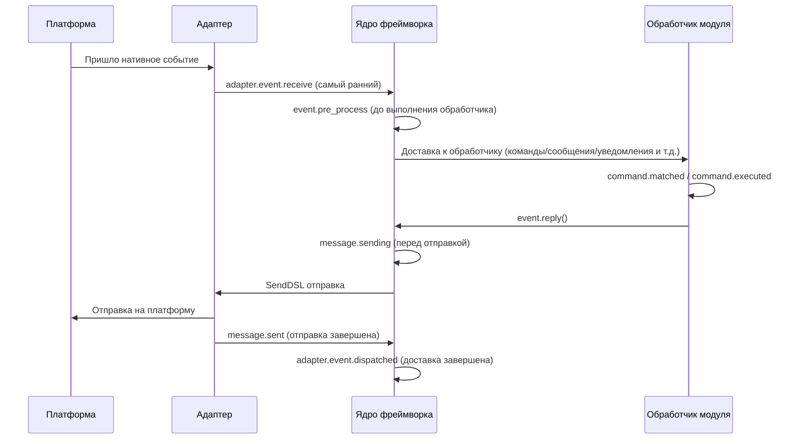

Фреймворк содержит следующие точки останова хука, которые пользователь может прослушивать с помощью `@sdk.lifecycle.on()` для реализации пользовательской логики.

### Основная инициализация

| Имя хука | Время срабатывания | Данные |
|---------|---------|------|
| `core.init.start` | Начало инициализации SDK | `{}` |
| `core.init.complete` | Завершение инициализации SDK | `{"duration": float, "success": bool, "adapters": {"enabled": [str], "disabled": [str]}, "modules": {"enabled": [str], "disabled": [str]}, "error": str (только при сбое)}` |
| `core.uninit.complete` | Завершение обратной инициализации SDK | `{"duration": float, "success": bool, "adapters_closed": int, "modules_unloaded": int, "module_properties_cleared": int, "module_properties_to_clear": [str], "error": str (только при сбое)}` |

### Изменение конфигурации

| Имя хука | Время срабатывания | Данные |
|---------|---------|------|
| `config.set` | Изменение конфигурационного параметра | `{"key": str, "old_value": Any, "new_value": Any}` |
| `config.updated` | Обнаружено изменение всей конфигурации после редактирования config.toml | `{"old_config": dict, "new_config": dict, "config_file": str}` |

**Пример: аудит конфигурации**

```python
@sdk.lifecycle.on("config.set")
def audit_config(data):
    print(f"[Аудит] {data['key']}: {data['old_value']} -> {data['new_value']}")
```

### Жизненный цикл модуля

| Имя хука | Время срабатывания | Данные |
|---------|---------|------|
| `module.register` | Регистрация класса модуля в менеджере | `{"module_name": str, "success": bool}` |
| `module.load` | Завершение загрузки модуля (успешное инстанцирование) | `{"module_name": str, "success": bool}` |
| `module.init` | Завершение инициализации модуля (включая ленивую загрузку) | `{"module_name": str, "success": bool}` |
| `module.unload` | Выгрузка модуля | `{"module_name": str, "success": bool}` |

### Жизненный цикл адаптера

| Имя хука | Время срабатывания | Данные |
|---------|---------|------|
| `adapter.load` | Завершение регистрации адаптера | `{"platform": str, "success": bool}` |
| `adapter.start` | Запуск адаптера | `{"platforms": [str]}` |
| `adapter.status.change` | Изменение состояния адаптера | `{"platform": str, "status": str, "retry_count": int, "error": str (только при сбое)}` |
| `adapter.stop` | Остановка адаптера | `{"platforms": [str]}` |
| `adapter.stopped` | Завершение остановки адаптера | `{"platforms": [str]}` |
| `adapter.bot.online` | Онлайн бот | `{"platform": str, "bot_id": str, "info": dict, "status": str}` |
| `adapter.bot.offline` | Оффлайн бот | `{"platform": str, "bot_id": str, "status": str}` |

### Прием и обработка событий

| Имя хука | Время срабатывания | Данные |
|---------|---------|------|
| `adapter.event.receive` | Получено событие с внешней платформы (самый ранний) | `{"platform": str, "event_type": str, "raw_event_type": str}` |
| `adapter.event.dispatched` | Завершение доставки события | `{"platform": str, "event_type": str, "raw_event_type": str, "onebot_handlers_count": int}` |
| `event.pre_process` | Начало выполнения обработчика события | `{"event_type": str, "platform": str, "detail_type": str}` |

**Пример: статистика событий**

```python
event_counter = {}

@sdk.lifecycle.on("adapter.event.receive")
def count_events(data):
    platform = data["platform"]
    event_counter[platform] = event_counter.get(platform, 0) + 1

@sdk.lifecycle.on("adapter.event.dispatched")
def log_unhandled(data):
    if data["onebot_handlers_count"] == 0:
        print(f"[Необработано] {data['platform']}/{data['event_type']}")
```

### Отправка сообщений

| Имя хука | Время срабатывания | Данные |
|---------|---------|------|
| `message.sending` | Сообщение готовится к отправке | `{"platform": str, "method": str, "detail_type": str, "target_id": str, "bot_id": str}` |
| `message.sent` | Сообщение отправлено | `{"platform": str, "method": str, "detail_type": str, "target_id": str, "bot_id": str}` |

**Пример: аудит отправки сообщений**

```python
@sdk.lifecycle.on("message.sending")
def log_sending(data):
    print(f"[Отправка] -> {data['platform']}/{data['detail_type']}/{data['target_id']} через {data['method']}")
```

### Командная система

| Имя хука | Время срабатывания | Данные |
|---------|---------|------|
| `command.matched` | Команда найдена и готова к выполнению | `{"command": str, "args": list[str], "platform": str, "user_id": str}` |
| `command.executed` | Команда выполнена | `{"command": str, "args": list[str], "platform": str, "user_id": str, "success": bool, "error": str (только при сбое)}` |

**Пример: статистика команд**

```python
@sdk.lifecycle.on("command.matched")
def count_commands(data):
    print(f"[Команда] /{data['command']} от {data['user_id']}@{data['platform']}")
```

### HTTP-маршрутизация

| Имя хука | Время срабатывания | Данные |
|---------|---------|------|
| `server.request` | Получен HTTP-запрос | `{"method": str, "path": str, "client_ip": str}` |
| `server.response` | Отправлен HTTP-ответ | `{"method": str, "path": str, "status_code": int, "client_ip": str}` |

**Пример: логирование HTTP-запросов**

```python
@sdk.lifecycle.on("server.response")
def log_http(data):
    print(f"[HTTP] {data['method']} {data['path']} -> {data['status_code']}")
```

### WebSocket

| Имя хука | Время срабатывания | Данные |
|---------|---------|------|
| `server.start` | Запуск маршрутизирующего сервера | `{"base_url": str, "host": str, "port": int}` |
| `server.stop` | Остановка маршрутизирующего сервера | `{}` |
| `server.websocket.connect` | Установлено WebSocket-соединение | `{"path": str, "module_name": str, "client_ip": str}` |
| `server.websocket.disconnect` | Отключено WebSocket-соединение | `{"path": str, "module_name": str, "reason": str, "error": str (только при аномалии)}` |

**Пример: мониторинг WebSocket-соединений**

```python
@sdk.lifecycle.on("server.websocket.connect")
def on_ws_connect(data):
    print(f"[WS] Подключение: {data['path']} от {data['client_ip']}")

@sdk.lifecycle.on("server.websocket.disconnect")
def on_ws_disconnect(data):
    print(f"[WS] Отключение: {data['path']} ({data['reason']})")
```

## Стандартные определения событий

```python
STANDARD_EVENTS = {
    "core": ["init.start", "init.complete", "uninit.complete"],
    "module": ["load", "init", "unload", "register"],
    "adapter": [
        "load", "start", "status.change", "stop", "stopped",
        "event.receive", "event.dispatched",
        "bot.online", "bot.offline",
    ],
    "server": [
        "start", "stop",
        "request", "response",
        "websocket.connect", "websocket.disconnect",
    ],
    "event": ["pre_process"],
    "message": ["sending", "sent"],
    "command": ["matched", "executed"],
    "config": ["set"],
}
```

## Полная справочная документация API

### Регистрация и отмена

| Метод | Описание |
|------|------|
| `@lifecycle.on(event, *, priority=0)` | Декоратор для регистрации обработчика |
| `lifecycle.register(event, handler, *, priority=0)` | Программная регистрация |
| `lifecycle.unregister(event, handler=None)` | Отмена регистрации (если handler=None, отменяются все обработчики этого события) |

### Срабатывание

| Метод | Описание |
|------|------|
| `await lifecycle.emit(event, data=None)` | Асинхронное срабатывание, обработчики могут изменить data, возвращая непустое значение |
| `lifecycle.emit_sync(event, data=None)` | Синхронное срабатывание, асинхронные обработчики запускаются с помощью create_task |
| `await lifecycle.submit_event(event_type, *, source, msg, data)` | Совместимость со старыми версиями, автоматически формируется стандартный формат события |

### Инструменты

| Метод | Описание |
|------|------|
| `lifecycle.start_timer(timer_id)` | Начать отсчёт времени |
| `lifecycle.get_duration(timer_id)` | Получить продолжительность прошедшего времени (в секундах) |
| `lifecycle.stop_timer(timer_id)` | Остановить отсчёт времени и вернуть продолжительность |
| `lifecycle.list_hooks()` | Вывести список всех зарегистрированных хуков и количество обработчиков |
| `lifecycle.clear()` | Очистить все обработчики и таймеры |

## Пример использования в модуле

```python
from ErisPulse.Core.Bases import BaseModule
from ErisPulse import sdk

class Main(BaseModule):
    async def on_load(self, event):
        # Реализация простой статистики сообщений
        self.msg_count = 0
        
        @sdk.lifecycle.on("adapter.event.receive")
        async def count(data):
            if data["event_type"] == "message":
                self.msg_count += 1
        
        # Мониторинг всех команд
        @sdk.lifecycle.on("command.matched")
        async def log_cmd(data):
            sdk.logger.info(f"Выполнение команды: /{data['command']} от {data['user_id']}")
        
        # Аудит изменений конфигурации
        @sdk.lifecycle.on("config.set")
        def audit(data):
            sdk.logger.info(f"Изменение конфигурации: {data['key']} = {data['new_value']}")
```

## Принадлежность и автоматическое отмена фоновых задач

> [!NOTE]
> Эта функция доступна начиная с ErisPulse **2.8.0+**.

Фоновые задачи asyncio, созданные модулем, если они не отменены в `on_unload`, будут хранить ссылку на `self`, что приведёт к невозможности сборки мусора для экземпляра модуля (остатки старых экземпляров после горячей перезагрузки). Рамка предоставляет следующие механизмы по умолчанию:

- **`self.spawn(coro)`** (рекомендуется внутри модуля): задача автоматически привязывается к имени модуля, и при выгрузке модуля рамка в `on_unload` **после** автоматически отменяет незавершённые задачи и записывает предупреждение
- **`spawn_background(coro)`** (`ErisPulse.runtime`): автоматически захватывает текущий контекст `owner_scope`; `cancel_owner_tasks(owner)` отменяет задачи по принадлежности, `cancel_all_background_tasks()` используется для `sdk.uninit()` по умолчанию
- **Адаптеры**: при закрытии также автоматически отменяются фоновые задачи, связанные с именем платформы

```python
async def on_load(self, event):
    # Рекомендуется: фоновые задачи использовать через self.spawn(), при выгрузке рамка автоматически отменяет их по умолчанию
    self.spawn(self._poll())

async def on_unload(self, event):
    # В сценариях, требующих точного контроля, по-прежнему рекомендуется отменять и ждать завершения вручную
    if self._poll_task:
        self._poll_task.cancel()
        await asyncio.gather(self._poll_task, return_exceptions=True)

async def _poll(self):
    while True:
        await asyncio.sleep(60)
        ...
```

> [!IMPORTANT]
> Рамка по умолчанию — это **принудительная отмена** (`cancel_owner_tasks`), которая происходит после возврата из `on_unload`. Поэтому задачи, требующие корректного завершения (очистка буфера, сохранение состояния, закрытие соединения), **обязательно** должны быть отменены и завершены вручную в `on_unload` — не рассчитывайте, что по умолчанию сохранится логика завершения. Рамка гарантирует только «отсутствие задач, удерживающих ссылку на `self`», но не гарантирует «корректного завершения». Задачи, ожидающие результата, следует вызывать напрямую с `await`, а не передавать их в фоновые задачи.

## Примечания

1. **Обработчик может быть синхронным или асинхронным**: система автоматически распознаёт и правильно вызывает
2. **Передача данных**: в режиме `emit()` возвращаемое обработчиком значение, отличное от None, изменяет данные, передаваемые последующим обработчикам
3. **Норма именования событий**: рекомендуется использовать точечную структуру для именования событий, что облегчает использование родительского监听
4. **Изоляция ошибок**: исключение в одном обработчике не влияет на выполнение других обработчиков
5. **Ограничение синхронного триггера**: в `emit_sync()` асинхронные обработчики запускаются в режиме fire-and-forget, возвращаемые значения не могут быть переданы обратно
6. **Очистка жизненного цикла**: при вызове `sdk.uninit()` все зарегистрированные обработчики и таймеры будут очищены
7. **Приоритет загрузки**: если необходимо слушать события на этапе инициализации фреймворка, рекомендуется установить высокий приоритет и отключить ленивую загрузку


### 懶加载系统

# Система ленивой загрузки модулей

ErisPulse SDK предоставляет мощную систему ленивой загрузки модулей, которая позволяет инициализировать модули только тогда, когда они действительно необходимы, значительно улучшая скорость запуска приложения и эффективность использования памяти.

## Обзор

Система ленивой загрузки модулей является одним из ключевых функциональных возможностей ErisPulse, которая работает следующим образом:

- **Отложенная инициализация**: Модуль загружается и инициализируется только при первом обращении к нему
- **Прозрачное использование**: Для разработчика ленивые модули практически не отличаются от обычных модулей
- **Автоматическое управление зависимостями**: Зависимости модуля автоматически инициализируются при использовании
- **Поддержка жизненного цикла**: Для модулей, унаследованных от `BaseModule`, автоматически вызываются методы жизненного цикла

## Принцип работы

### Класс LazyModule

Основой системы ленивой загрузки является класс `LazyModule`, который является обёрткой, которая фактически инициализирует модуль только при первом обращении.

### Процесс инициализации

При первом обращении к модулю `LazyModule` выполняет следующие действия:

1. Получает информацию о параметрах `__init__` класса модуля
2. Определяет, нужно ли передавать ссылку на `sdk`
3. Устанавливает свойство `moduleInfo` модуля
4. Для модулей, унаследованных от `BaseModule`, вызывает метод `on_load`
5. Запускает событие жизненного цикла `module.init`

## Событийно-ориентированная активация модуля (activate_on)

> [!NOTE]
> Эта функция доступна начиная с ErisPulse **2.8.0+**.

Модули с `lazy_load=True` по умолчанию загружаются только при **первом обращении к атрибуту**. Если модуль регистрирует обработчики команд/событий, традиционный подход требует `lazy_load=False` для немедленной загрузки. `activate_on` предоставляет третий вариант: **объявление триггеров, при поступлении первого соответствующего события/команды модуль автоматически активируется** — он не будет постоянно в памяти, но при этом не потеряет входную точку.

```python
from ErisPulse.loaders import ModuleLoadStrategy

class MyModule(BaseModule):
    @staticmethod
    def get_load_strategy():
        return ModuleLoadStrategy(
            lazy_load=True,
            activate_on=[
                # ---- Событие (пассивное, без участия пользователя)----
                "message",                                    # Тип события: любое сообщение
                {"notice": "group_member_increase"},          # Тип + detail_type
                {"message": ["private", "group"]},            # Тип + несколько detail_type

                # ---- Команда (активное, пользователь вводит)----
                {"command": "roll"},                          # Сокращённая форма: имя команды
                {"command": ["roll", "dice"]},                # Список имён команд
                {"command": {                                 # Форма dict (name обязательна)
                    "name": "dice",
                    "help": "Бросить кубик",
                    "usage": "/dice",
                    "group": "Развлечения",
                    "aliases": ["d"],
                    "hidden": False,
                }},
            ],
        )
```

### Параметры команды в формате dict

Формат dict отражает пользовательские параметры декоратора `@command()`, используется для регистрации заглушки команды до загрузки модуля:

| Параметр | Тип | По умолчанию | Описание |
|------|------|------|------|
| `name` | `str` | **Обязательный** | Имя команды; должно совпадать с `@command(name)` в `on_load`, иначе после активации заглушка будет удалена, команда не будет доступна |
| `help` | `str` | Возвратная цепочка | Описание команды в Help; если не указано, берётся из цепочки возврата (см. ниже) |
| `usage` | `str` | Автоматически | Строка использования, по умолчанию `{prefix}{name}` |
| `group` | `str` | `None` | Группа команды |
| `aliases` | `list[str]` | `[]` | Список псевдонимов, которые также активируют модуль |
| `hidden` | `bool` | `False` | `True` — заглушка будет скрыта (в соответствии с семантикой скрытых команд после активации); пользователь, знающий имя команды, всё равно может активировать |

**Не поддерживаются** `priority` / `permission` / `master`: заглушка команды предназначена только для активации, проверка прав осуществляется после активации реальной команды (блокировка прав на этапе заглушки приведёт к потере возможности активации).

### Цепочка возврата для Help заглушки команды

Описание команды, отображаемое в Help при отсутствии загрузки модуля, берётся по следующему порядку (первое найденное значение):

1. `help` в команде dict (наиболее точное)
2. `description` из `get_meta()`
3. `__description__` атрибут модуля
4. `Summary` из метаданных пакета (краткое описание в PyPI)
5. Общее сообщение: «Эта команда из лениво загружаемого модуля X, первый вызов активирует загрузку модуля»

### Семантика триггеров

- **Заглушка события**: Регистрируется с очень низким приоритетом (`ACTIVATION_STUB_PRIORITY`) в соответствующий менеджер событий, срабатывает как резервный обработчик после всех обычных; после активации событие пересылается к настоящему обработчику модуля
- **Заглушка команды**: Регистрируется как заглушка; после активации заглушка удаляется, настоящая команда обрабатывает текущий вызов
- **Защита от повторного запуска**: `asyncio.Lock` гарантирует, что при одновременном срабатывании триггеров модуль активируется только один раз
- **Фильтрация по области действия**: Заглушка содержит идентификатор владельца модуля, модуль не активируется, если он не включён для данного бота/сессии/платформы
- **Семантика ошибок**: При неудачной активации повторная попытка не производится, заглушка также удаляется
- **Удаление дубликатов**: При смешанном объявлении команды (сокращённо + dict) дубликаты удаляются (dict имеет приоритет); при отсутствии `name` в dict или ошибке `detail_type` в dict выводится предупреждение и объявление игнорируется

> Архитектурная схема и полная семантика см. в [Обзоре архитектуры](../architecture.md#архитектура-событийно-ориентированной-активации-activate_on).

## Конфигурация ленивой загрузки

### Глобальная конфигурация

В конфигурационном файле включите/отключите глобальную ленивую загрузку:

```toml
[ErisPulse.framework]
enable_lazy_loading = true  # true=включить ленивую загрузку (по умолчанию), false=отключить ленивую загрузку
```

### Контроль на уровне модуля

Модуль может контролировать стратегию загрузки, реализовав статический метод `get_load_strategy()`:

```python
from ErisPulse.Core.Bases import BaseModule
from ErisPulse.loaders import ModuleLoadStrategy

class MyModule(BaseModule):
    @staticmethod
    def get_load_strategy():
        """Возвращает стратегию загрузки модуля"""
        return ModuleLoadStrategy(
            lazy_load=False,  # Возвращает False для немедленной загрузки
            priority=100      # Приоритет загрузки, чем больше, тем выше приоритет
        )
```

## Использование лениво загружаемых модулей

### Базовое использование

Для разработчика ленивые модули практически не отличаются от обычных:

```python
# Через SDK обращение к лениво загружаемому модулю
from ErisPulse import sdk

# Следующее обращение вызовет ленивую загрузку модуля
result = await sdk.my_module.my_method()
```

### Единый вход для получения модуля

Независимо от способа получения модуля (через свойство SDK, через менеджер модулей или через `module.get()`), для "зарегистрированного, но не загруженного" лениво загружаемого модуля будет возвращаться один и тот же прокси-объект, инициализация модуля произойдёт только при обращении к его свойствам:

```python
# Все три способа возвращают один и тот же прокси-объект (если модуль не загружен), поведение одинаковое, для пользователя прозрачно
sdk.my_module          # Точка входа для ленивой загрузки
sdk.module.my_module   # Также возвращает прокси-объект
sdk.module.get("my_module")  # Также возвращает прокси-объект, сам по себе не вызывает загрузку

# Только при обращении к свойству прокси-объекта происходит инициализация модуля
result = await sdk.my_module.my_method()
```

`module.get()` — это **интерфейс для поиска**, сам по себе не вызывает загрузку:
- Модуль загружен → возвращается реальный экземпляр
- Модуль зарегистрирован, но не загружен → возвращается прокси-объект (инициализация при обращении к свойству)
- Модуль не зарегистрирован → возвращается `None`

Если необходимо явно вызвать загрузку, используйте `await sdk.load_module("my_module")`.

### Асинхронная инициализация

Для модулей, требующих асинхронной инициализации, рекомендуется сначала явно загрузить модуль:

```python
# Сначала явно загрузите модуль
await sdk.load_module("my_module")

# Затем используйте модуль
result = await sdk.my_module.my_method()
```

### Синхронная инициализация

Для модулей, не требующих асинхронной инициализации, можно обращаться напрямую:

```python
# Прямое обращение автоматически инициализирует модуль синхронно
result = sdk.my_module.some_sync_method()
```

## Рекомендуемые практики

При выборе стратегии загрузки можно использовать следующий алгоритм:

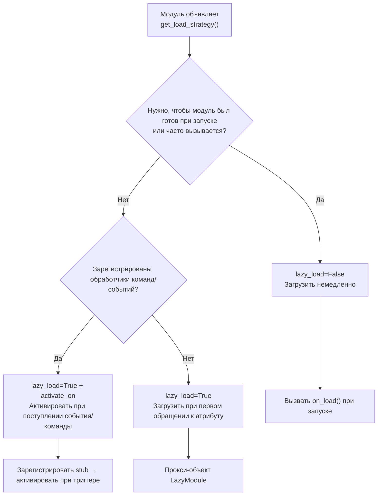

### Рекомендуемые сценарии использования ленивой загрузки (lazy_load=True)

- Инструментальные модули, вызываемые косвенно (например, модули для запроса данных, форматтеры, только при вызове другими модулями)
- Модули, зарегистрировавшие обработчики команд/событий, но не часто используемые — в сочетании с `activate_on`, модуль автоматически активируется при первом соответствующем событии/команде, без отказа от ленивой загрузки

### Рекомендуемые сценарии отключения ленивой загрузки (lazy_load=False)

- Модули, которые должны быть готовы при запуске (например, модули, предоставляющие базовые сервисы другим модулям)
- Обработчики, вызываемые часто (например, обработка каждого сообщения) — `activate_on` имеет небольшую нагрузку при активации, для частых сценариев предпочтительнее немедленная загрузка
- Модули с планировщиком задач
- Модули, которые должны быть инициализированы при запуске приложения

> Параметр `priority` управляет порядком инициализации модулей, загружаемых немедленно. Чем больше значение, тем раньше модуль будет инициализирован. Модули с одинаковым приоритетом загружаются в порядке регистрации.

## Примечания

1. Если ваш модуль использует ленивую загрузку и другие модули никогда не обращались к нему внутри ErisPulse, модуль никогда не будет инициализирован.
2. Если ваш модуль содержит модули, слушающие события, или другие модули, активно слушающие, есть два варианта: объявить триггеры `activate_on` (сохранить ленивую загрузку, модуль активируется при поступлении события), или объявить, что модуль должен быть загружен немедленно (`lazy_load=False`), иначе это повлияет на нормальную работу модуля.
3. Мы не рекомендуем отключать ленивую загрузку, если нет специальных потребностей, иначе это может привести к проблемам с управлением зависимостями и событиями жизненного цикла.
4. В объявлении команды в формате dict для `activate_on`, параметр `name` должен совпадать с именем реальной команды, зарегистрированной в `on_load` с помощью `@command()` — иначе модуль будет активирован, но заглушка будет удалена, и команда с несовпадающим именем не будет доступна.


### 国际化（i18n）系统

# Система международной локализации (i18n)

В ErisPulse начиная с версии 2.5.0 встроен полный набор средств для международной локализации. Ядро фреймворка и интерфейс CLI могут автоматически переключать отображаемый текст в зависимости от языка вашей системы, а также поддерживают регистрацию собственных переводов внешними модулями.

## Поддерживаемые языки

| Язык | Код | Описание |
|------|------|------|
| 简体中文 | `zh-CN` | Язык по умолчанию (оригинальный язык фреймворка) |
| 繁體中文 | `zh-TW` | Традиционный китайский (Гонконг/Макао/Тайвань) |
| English | `en` | Английский (универсальный язык по умолчанию) |
| 日本語 | `ja` | Японский |
| Русский | `ru` | Русский |

## Быстрый опыт использования

### Переключение через переменные окружения

```bash
# Windows PowerShell
$env:ERISPULSE_LANG = "en"
epsdk run

# macOS / Linux
ERISPULSE_LANG=ja epsdk run
```

### Переключение через конфигурационный файл

Добавьте в `config/config.toml`:

```toml
[ErisPulse.i18n]
language = "zh-TW"
```

Установка значения `"auto"` (значение по умолчанию) включает автоматическое определение языка системы.

### Ручное переключение в коде

```python
from ErisPulse import i18n

# Ручная установка языка
i18n.set_language("en")
print(i18n.get_language())  # "en"

# Сброс на автоматическое определение
i18n.reset_language()
```

---

## Механизм определения языка

Фреймворк определяет язык пользователя по следующему приоритету:

1. **Переменная окружения `ERISPULSE_LANG`** — наивысший приоритет, используется для тестирования и временного переключения
2. **Windows API** — `GetUserDefaultLocaleName` (только Windows, не затрагивается переменными окружения в таких инструментах, как Git Bash)
3. **Переменные окружения** — `LANGUAGE` > `LC_ALL` > `LC_MESSAGES` > `LANG` (стандарт Unix/macOS)
4. **Системная локаль** — `locale.getlocale()` / `locale.getdefaultlocale()`
5. **Резервный вариант** — en (английский)

### Принцип ближайшего соответствия

При обнаружении языка, не соответствующего точно, используется принцип ближайшего соответствия:

- `zh-TW`, `zh-HK`, `zh-MO`, `zh-Hant` → **Традиционный китайский**
- Все остальные `zh-*` (например, `zh-CN`, `zh-SG`) → **Упрощённый китайский**
- `en-US`, `en-GB`, `en-AU` и др. → **Английский**
- `ja-JP` → **Японский**
- `ru-RU` → **Русский**
- Все остальные неизвестные языки → **Упрощённый китайский (резервный вариант)**

---

## Использование i18n в модулях

Вы можете зарегистрировать переводы для своего модуля, чтобы сделать его также поддерживающим несколько языков.

### Рекомендуемый способ: объявление ключей перевода через I18nClass (v2.7.0+)

Начиная с v2.7.0, модули/адаптеры могут объявлять ключи перевода, как и `ConfigClass`, через вложенный класс `I18nClass`. Фреймворк автоматически зарегистрирует все объявленные ключи перевода без необходимости вызывать `i18n.register()` вручную.

```python
from dataclasses import dataclass, field

from ErisPulse.Core.Bases import BaseConfig, BaseI18n, BaseModule, I18nKey


class MyModule(BaseModule):
    # Класс конфигурации (необязательно)
    @dataclass
    class ConfigClass(BaseConfig):
        welcome_msg: str = field(
            default="欢迎",
            metadata={
                # Здесь используется ключ i18n mymodule.welcome_msg
                "description": {"i18n": "mymodule.welcome_msg", "default": "欢迎消息"},
            },
        )

    # Класс набора ключей перевода (необязательно)
    # Объявленные ключи будут автоматически зарегистрированы фреймворком, с приоритетом выше, чем генерация конфигурации по умолчанию ConfigClass
    class I18nClass(BaseI18n):
        # Имя атрибута автоматически объединяется в полный путь ключа: <имя_модуля>.<имя_атрибута>
        welcome_msg: I18nKey = I18nKey(
            default="Welcome Message",   # Языко-независимый резервный вариант, не регистрируется ни в один язык
            zh_CN="欢迎消息",
            en="Welcome Message",
            ja="ウェルカムメッセージ",
            ru="Приветственное сообщение",
            zh_TW="歡迎訊息",
        )
        # Другие ключи перевода, используемые в бизнес-логике
        hello: I18nKey = I18nKey(
            default="Hello, {name}!",
            zh_CN="你好，{name}！",
            zh_TW="你好，{name}！",
            en="Hello, {name}!",
            ja="こんにちは、{name}！",
            ru="Привет, {name}!",
        )

        # Можно явно указать полный путь ключа (не используя объединение имени атрибута)
        custom: I18nKey = I18nKey(
            key="mymodule.deep.nested.key",
            default="Default text",
            zh_CN="默认文本",
            zh_TW="預設文本",
            en="Default text",
            ja="デフォルトテキスト",
            ru="Текст по умолчанию",
        )
```

#### Почему рекомендуется использовать I18nClass?

| Сценарий | Ручная i18n.register() | Декларативный I18nClass |
|------|-----------------------|------------------|
| Ключи перевода, используемые в описании конфигурации | Требуется ручная регистрация, и нужно успеть до генерации конфигурации | Фреймворк автоматически регистрирует до генерации конфигурации |
| Декларация многоязычных переводов | Распространены по on_load() | Сконцентрированы в классе, легко читаются |
| Согласованность имен ключей | Легко допустить опечатки | Имя атрибута используется как суффикс ключа, IDE может подсказывать |
| Очистка при выгрузке | Требуется ручная unregister_domain() | Фреймворк использует единый domain для регистрации |

#### Правила формирования пути ключей в I18nClass

- **По умолчанию**: используется ``<имя_регистрации_модуля>.<имя_атрибута>`` как полный путь ключа
  - Пример: модуль с именем ``MyModule``, атрибут ``welcome`` → путь ключа ``MyModule.welcome``
- **Явно**: через параметр ``I18nKey(key="...")`` можно указать любой путь с точками
  - Подходит для глубоко вложенных ключей (например, ``mymodule.config.basic.token``)

#### Использование в адаптерах

Адаптеры также поддерживают `I18nClass`, и способ использования полностью идентичен:

```python
from ErisPulse.Core import BaseAdapter
from ErisPulse.Core.Bases import BaseConfig, BaseI18n, I18nKey


class MyAdapter(BaseAdapter):
    @dataclass
    class ConfigClass(BaseConfig):
        endpoint: str = field(
            default="",
            metadata={
                # Описание конфигурации ссылается на ключ adapter.MyAdapter.endpoint
                "description": {"i18n": "MyAdapter.endpoint", "default": "API 地址"},
            },
        )

    class I18nClass(BaseI18n):
        # Централизованное объявление ключей перевода, используемых в описании конфигурации, и других бизнес-ключей
        endpoint: I18nKey = I18nKey(
            default="API Endpoint",
            zh_CN="API 地址",
            zh_TW="API 位址",
            en="API Endpoint",
            ja="APIアドレス",
            ru="API адрес",
        )
```

`I18nClass` адаптера будет автоматически зарегистрирован на этапе `__init__` (то есть до генерации шаблона конфигурации), что гарантирует доступность ключей перевода, используемых в описании конфигурации.

### Ручная регистрация пользовательских переводов (старый способ)

Если вы не используете `I18nClass`, можно напрямую вызвать `i18n.register()` для регистрации текстов переводов.

```python
from ErisPulse import i18n

# Регистрация китайского перевода
i18n.register("zh-CN", {
    "my_module.welcome": "欢迎使用我的模块！",
    "my_module.goodbye": "再见！",
    "my_module.hello": "你好，{name}！",
}, domain="my_module")

# Регистрация английского перевода
i18n.register("en", {
    "my_module.welcome": "Welcome to my module!",
    "my_module.goodbye": "Goodbye!",
    "my_module.hello": "Hello, {name}!",
}, domain="my_module")
```

### Использование переводов

```python
from ErisPulse import i18n

# Простой перевод
i18n.t("my_module.welcome")  # Автоматически использует текущий язык

# С форматированием параметров
i18n.t("my_module.hello", name="Alice")

# Указание значения по умолчанию (возвращается, если ключ перевода не найден)
i18n.t("my_module.unknown_key", default="默认文本")
```

### Использование в классе модуля

```python
from dataclasses import dataclass, field
from ErisPulse import i18n
from ErisPulse.Core.Bases import BaseConfig, BaseModule

@dataclass
class MyModuleConfig(BaseConfig):
    welcome_msg: str = field(
        default="欢迎",
        metadata={
            "description": {"i18n": "my_module.welcome_msg", "default": "欢迎消息"},
            "ui": {"widget": "text", "group": "basic", "order": 1},
        },
    )

class MyModule(BaseModule):
    ConfigClass = MyModuleConfig

    async def on_load(self, event):
        # Динамическое получение конфигурации (каждый раз отражает последнее значение)
        self.logger.info(self.cfg.welcome_msg)
        self.logger.info(i18n.t("my_module.welcome"))

    @command("hello")
    async def hello_handler(self, event):
        name = event.get_user_nickname() or "friend"
        await event.reply(i18n.t("my_module.hello", name=name))

    async def on_unload(self, event):
        pass
```

### Удаление переводов

```python
# Удаление всех переводов домена
i18n.unregister_domain("my_module")
```

---

## Многоязычные поля конфигурации

Начиная с версии 2.5.2, схема конфигурации полностью поддерживает i18n. Все видимые пользователю текстовые поля могут ссылаться на ключи i18n, и WebUI и другие потребители автоматически будут использовать соответствующий текст в зависимости от текущего языка.

### Поддерживаемые i18n-поля

| Поле | Расположение | Описание |
|------|------|------|
| `description` | metadata поля | Описание поля |
| `options[].label` | `ui.options` | Метки опций для контрола select |
| `placeholder` | `ui.placeholder` | Заполнитель для поля ввода |
| `group_labels` | `_schema_meta` | Названия групп (заголовки разделов Dashboard) |

Все поля используют формат `{"i18n": "key", "default": "текст"}`, строки без этого формата будут переданы без изменений (для обратной совместимости).

### Объявление i18n-полей

Все видимые пользователю текстовые поля поддерживают i18n:

```python
from dataclasses import dataclass, field
from ErisPulse.Core.Bases import BaseConfig

@dataclass
class MyAdapterConfig(BaseConfig):
    # i18n для description
    token: str = field(
        default="",
        metadata={
            "description": {"i18n": "my_adapter.token", "default": "平台 Token"},
            "required": True,
            "secret": True,
            "ui": {
                "widget": "password",
                "group": "basic",
                "order": 1,
                # i18n для placeholder
                "placeholder": {"i18n": "my_adapter.token.ph", "default": "请输入 Token"},
            },
        },
    )
    # i18n для label опций
    mode: str = field(
        default="a",
        metadata={
            "description": {"i18n": "my_adapter.mode", "default": "运行模式"},
            "ui": {
                "widget": "select",
                "group": "basic",
                "order": 2,
                "options": [
                    {"label": {"i18n": "my_adapter.mode.a", "default": "模式A"}, "value": "a"},
                    {"label": {"i18n": "my_adapter.mode.b", "default": "模式B"}, "value": "b"},
                ],
            },
        },
    )

    # i18n для group_labels (названия групп)
    _schema_meta = {
        "group_labels": {
            "basic": {"i18n": "my_adapter.group.basic", "default": "基本设置"},
        }
    }
```

`default` — это резервный текст, который отображается, если перевод не зарегистрирован или поиск не удался.

### Скрытие секретных данных и проверка конфигурации

Поля, помеченные как `"secret": True`, автоматически получают **защиту от раскрытия** (начиная с версии 2.7.0):

- **Скрытие в шаблоне**: при генерации шаблона конфигурации `dataclass_to_toml_with_comments()` скрывает реальное значение секретных полей (отображается пустой заполнитель), предотвращая попадание чувствительной информации на диск
- **Общий инструмент скрытия**: `redact_secret(value)` заменяет непустое значение на `***`, а пустое значение возвращает без изменений, используется, например, для вывода в логи

```python
from ErisPulse.Core.Bases.config_schema import redact_secret

redact_secret("sk-xxxxxx")  # '***'
redact_secret("")           # ''
```

**Проверка конфигурации** (`validate_config()`) помимо проверки обязательных полей на непустоту, начиная с версии 2.7.0, поддерживает:

| Проверка | Метаданные | Пример |
|--------|--------|------|
| Соответствие типу | Тип поля | `int` поле получает строку — ошибка |
| Ограничение по перечислению | `ui.options` или顶层 `options` | Значение должно быть в разрешённом перечне |
| Диапазон значений |顶层 `min` / `max` | `metadata={"min": 1, "max": 65535}` |

```python
from ErisPulse.Core.Bases.config_schema import validate_config

@dataclass
class C(BaseConfig):
    mode: str = field(default="a", metadata={"ui": {"widget": "select", "options": ["a", "b"]}})
    port: int = field(default=80, metadata={"min": 1, "max": 65535})

errors = validate_config(C(mode="x", port=70000))  # Две ошибки: перечисление + диапазон
```

### Регистрация переводов конфигурации

Ключи перевода для полей конфигурации, как и обычные ключи перевода, регистрируются с помощью `i18n.register()`:

```python
from ErisPulse import i18n

# Регистрация китайского (совпадает с default, но может отличаться)
i18n.register("zh-CN", {
    "my_adapter.token": "平台 Token",
}, domain="my_adapter")

# Регистрация английского
i18n.register("en", {
    "my_adapter.token": "Platform Token",
}, domain="my_adapter")
```
> **Рекомендуемый способ**: использование `I18nClass` для объявления ключей перевода, фреймворк автоматически регистрирует (см. раздел «Рекомендуемый способ» выше),
> нет необходимости вызывать `i18n.register()` или `register_config_i18n()` вручную.

Также доступна удобная функция `register_config_i18n()`, которая автоматически извлекает ключи и регистрирует их:

```python
from ErisPulse.Core.Bases.config_schema import register_config_i18n

# Автоматически извлекает description.default как перевод для zh-CN
register_config_i18n(MyAdapterConfig, "zh-CN")

# Явно предоставить английский перевод
register_config_i18n(MyAdapterConfig, "en", {
    "my_adapter.token": "Platform Token",
})
```

### Как WebUI потребляет

`get_config_schema()` возвращает схему, в которой словарь i18n передается без изменений. WebUI на фронтенде может использовать `i18n.t()` для разрешения в зависимости от текущего языка.

Если требуется, чтобы серверная часть напрямую разрешила в строку (например, для передачи на фронтенд, не поддерживающий i18n), используйте `resolve_config_schema()`, который разрешит все поля i18n в текущий язык:

```python
from ErisPulse.Core.Bases.config_schema import resolve_config_schema

# Все поля i18n разрешены в текущий язык
schema = resolve_config_schema(MyAdapterConfig)
print(schema["fields"]["token"]["description"])    # "平台 Token" или "Platform Token"
print(schema["fields"]["token"]["placeholder"])   # "请输入 Token" или "Enter Token"
print(schema["fields"]["mode"]["options"][0]["label"])  # "模式A" или "Mode A"
print(schema["group_labels"]["basic"])             # "基本设置" или "Basic"
```

> `BaseConfig`, `BotAccountConfig`, `register_config_i18n()`, `resolve_config_schema()`
> и другие типы и инструменты находятся в `ErisPulse.Core.Bases.config_schema`.
> `ErisPulse.runtime.config_schema` сохраняется как совместимый shim,
> **рекомендуется импортировать из `ErisPulse.Core.Bases`** (за исключением ключей перевода, которые находятся в `ErisPulse.Core.Bases.i18n_schema`).

## Справочник API

### I18nManager

#### Основные методы

| Метод | Описание |
|------|------|
| `t(key, default=None, **kwargs)` | Получить переведённый текст (`gettext()` — псевдоним) |
| `set_language(lang)` | Ручная установка языка |
| `get_language()` | Получить текущий язык |
| `reset_language()` | Сброс на автоматическое определение (и повторное определение среды) |
| `get_supported_languages()` | Получить список всех поддерживаемых языков |
| `has_translation(key, lang=None)` | Проверить существование перевода ключа |
| `register(lang, translations, domain)` | Зарегистрировать пользовательские переводы |
| `unregister_domain(domain)` | Удалить все переводы указанного домена |
| `reload()` | Перезагрузить встроенные переводы и повторно определить язык |

#### Детали метода `t()`

```python
def t(self, key, /, default=None, **kwargs):
```

- `key` — ключ перевода (только позиционный аргумент, не конфликтует с `**kwargs` под `key=`)
- `default` — значение по умолчанию, возвращаемое, если перевод не найден, по умолчанию `None` (возвращается сам ключ)
- `**kwargs` — параметры форматирования, для заполнения `{placeholder}` в переведённом тексте

Пример:

```python
# Перевод: "greeting": "你好，{name}！欢迎来到{place}。"
i18n.t("greeting", name="Alice", place="ErisPulse")
# Возвращает: "你好，Alice！欢迎来到ErisPulse。"
```

### BaseI18n / I18nKey (декларативные ключи перевода)

Начиная с v2.7.0, `ErisPulse.Core.Bases` предоставляет инструменты для объявления ключей перевода через атрибуты класса (рекомендуется импортировать из `ErisPulse.Core.Bases`):

> ``I18nKey.default`` — это **языко-независимый резервный текст**, не регистрируется ни в один язык.
> Чтобы перевод стал активным, необходимо явно передать хотя бы один параметр языка (``zh_CN=`` / ``en=`` / ``ja=`` и т.д.).
> Таким образом, разработчики из разных стран могут свободно использовать свой родной язык для заполнения ``default``, фреймворк не делает никаких предположений.

| Название | Описание |
|------|------|
| `I18nKey(default, *, key=None, zh_CN, zh_TW, en, ja, ru)` | Объявление одного ключа перевода, `default` — резервный текст, не привязанный к языку |
| `BaseI18n` | Базовый класс для набора ключей перевода (согласован с `BaseConfig`), подклассы объявляют несколько `I18nKey` через атрибуты класса |
| `BaseI18n.register(prefix="", domain="app")` | Метод класса: регистрирует все объявленные ключи в систему i18n |
| `key` | Алиас для `I18nKey` (более краткое написание)

Пример использования:

```python
from ErisPulse.Core.Bases import BaseI18n, key

class MyKeys(BaseI18n):
    # Краткий синтаксис
    hello = key(
        default="Hello",
        zh_CN="你好",
        zh_TW="你好",
        en="Hello",
        ja="こんにちは",
        ru="Привет",
    )
    bye = key(
        default="Bye",
        zh_CN="再见",
        zh_TW="再見",
        en="Bye",
        ja="さようなら",
        ru="До свидания",
    )

# Отдельное использование (ручная регистрация)
MyKeys.register(prefix="myapp.", domain="myapp")
```

### Доступ к i18n через экземпляр SDK

```python
from ErisPulse import sdk

# sdk.i18n и i18n из прямого импорта — это один и тот же объект
sdk.i18n.set_language("en")
print(sdk.i18n.t("core.sdk.init.starting"))
```

---

## Конфигурация во время выполнения

### Чтение i18n-конфигурации через API

```python
from ErisPulse.Core.Bases import I18nConfig
from ErisPulse.runtime import get_i18n_config

config = get_i18n_config()
print(config["language"])  # "auto" или код языка

# I18nConfig — это dataclass, может использоваться для генерации шаблона конфигурации
schema = I18nConfig.__dataclass_fields__
```

### Описание конфигурационных параметров

В разделе `[ErisPulse.i18n]` файла `config/config.toml`:

```toml
[ErisPulse.i18n]
# Язык отображения, возможные значения:
# - "auto"      — автоматическое определение языка системы (по умолчанию)
# - "zh-CN"     — упрощённый китайский
# - "zh-TW"     — традиционный китайский
# - "en"        — английский
# - "ja"        — японский
# - "ru"        — русский
language = "auto"
```

---

## Рекомендуемые практики

### Именование ключей перевода

Рекомендуется использовать формат с разделением точками:

```
<имя_модуля>.<категория>.<описание>
```

Например: `my_module.command.hello_desc`, `core.adapter.start_failed`

### Перекрытие многоязычных переводов

Не обязательно предоставлять переводы для всех языков сразу, отсутствующие языки будут автоматически возвращаться на английский, если английского тоже нет, отображается сам ключ.

### Динамический контент

Для динамически генерируемого контента (например, имен пользователей, количества и т.д.), используйте формат `{placeholder}`:

```python
# Определение перевода
"user_count": "当前在线用户：{count} 人"

# Использование
i18n.t("user_count", count=len(users))
```

### Сообщения в логах

Если ваш модуль использует логгер фреймворка, эти сообщения также будут автоматически использовать текущий язык:

```python
self.logger.info(i18n.t("my_module.startup"))
```

---

## Отношения между i18n в CLI и ядром

CLI имеет **независимый** модуль международной локализации (`ErisPulse.CLI.i18n`), полностью отделённый от модуля международной локализации ядра.

- **Core i18n** — используется ядром фреймворка, внешние модули могут регистрировать переводы
- **CLI i18n** — используется внутри командной строки, не делится данными перевода с Core

Такая архитектура гарантирует, что изменения в переводах CLI не повлияют на стабильность ядра фреймворка.


### 统一控制面（scope）

# Unified Control Plane (scope)

> [!NOTE]
> This feature requires ErisPulse **2.8.0+**.

The unified control plane answers six questions: **which modules are available, whether events from whom are accepted, who can execute a certain command, what text a module processes, which implementation parameters are overridden, and which outbound calls modules are prohibited from initiating**. Control is entirely given to the user: at the **upper level** of module / adapter / command / processor registration (configuration `ErisPulse.scope` or runtime `sdk.scope`), events are automatically read and executed at each level.

The control plane consolidates the original multiple permission systems and serves as the **only** entry point for permissions/access control in version 2.8.0:

| Dimension | What to control | Rejection behavior | Configuration path |
|------|---------|---------|---------|
| **① Module** | Which modules are available (platform / Bot / session three levels) | Silent ignore (no reply, no claim) | `scope.platforms / bots / sessions` |
| **② Identity** | Whether to accept events (adapter / Bot / session / user four levels) | Complete discard at the entry (silent) | `scope.identity.*` |
| **③ Command** | Who can execute a certain command (command names support glob) | Reply with "insufficient permissions" (explicit) | `scope.commands` |
| **④ Handler** | Which text a module's event handler processes | Do not trigger (silent) | `scope.handlers` |
| **⑤ Override** | Override module/command implementation parameters (master/hidden/aliases/prefix) | —— (only change parameters) | `scope.overrides` |
| **⑥ Outbound Actions** | Prohibit modules from sending messages / calling standard APIs / handling requests | Fail response (`retcode=34601`) | `scope.actions` |

{!--< tips >!--}
1. Import the singleton via `from ErisPulse.Core import scope` (`sdk.scope` refers to the same object)
2. `scope.is_allowed(platform, bot_id, module, session_id)` checks if a module is available
3. `scope.is_identity_allowed(platform, bot_id, session_id, user_id)` checks if an event is allowed
4. `scope.allow_user("roll*", platform, uid)` / `deny_user(...)` command ACL (supports glob)
5. `scope.override("MyModule", "restart", master=True)` overrides implementation parameters
6. `scope.set_action("MyModule", "send", False)` prohibits a module from replying/sending messages
7. `scope.get_stats()` checks filtering statistics; `scope.get_topology()` checks topology
{!--< /tips >!--}

## Matching Entry Syntax (Unified Across the System)

All "name lists" in the control plane (module names, identity keys, command names) share the same matching syntax (via `ErisPulse.Core.text_match`):

| Syntax | Example | Description |
|------|------|------|
| Exact name | `"Chat"` | Full value comparison, **case-insensitive** |
| Glob | `"Tool*"`、`"spam_*"` | `*` for arbitrary string / `?` for single character / `[seq]` for character set, case-insensitive |
| Regular Expression | `"re:^Danger.*"` | Declare with `re:` prefix, match using `re.search`, default case-insensitive |

- Invalid regular expressions **silently degrade** to "no match" (no error thrown, no crash)
- Decorator parameters (`pattern=` / `regex=`) have fixed semantics: `pattern` is glob, `regex` is the regular expression source (no `re:` prefix); regular expression entries in control plane configurations **must** have the `re:` prefix

## Global Default: `default_allow`

`default_allow` is the **single global** default switch (default `true`), affecting three decision dimensions uniformly:

- **Module dimension**: If no binding is matched → `default_allow` decides allow/deny
- **Identity dimension**: If no policy is matched → `default_allow` decides allow/deny
- **Command dimension**: If no ACL is configured → `default_allow=true` delegates to the developer's default permission chain; `false` (strict mode) denies commands with no configured ACL

Setting it to `false` enables "implicit deny" strict mode: whitelist-style management, **all unexplicitly allowed are denied**.

> **Exception**: The **outbound actions** dimension is **not** affected by `default_allow`—it is an independent tightening switch, defaulting to full allow, only explicitly `false` disables (framework-layer owner-empty calls are always allowed). This strict global mode does not accidentally cut off all module message replies.

## Configuration File

```toml
[ErisPulse.scope]
default_allow = true        # Global default (false = implicit deny strict mode)
cache_size = 1024           # LRU cache size

# ── ① Module dimension (priority: session > Bot > platform) ──
[ErisPulse.scope.platforms.onebot11]
modules = ["Chat", "Tool*"]   # Whitelist: exact name / glob / re: regex
blocked = ["re:^Danger"]
[ErisPulse.scope.bots.onebot11."123456"]
modules = ["Chat"]
[ErisPulse.scope.sessions.onebot11."789012345"]
modules = ["Chat"]

# ── ② Identity dimension (priority: user > session > Bot > adapter) ──
[ErisPulse.scope.identity.adapters.onebot11]
deny = true                   # Discard all events from this adapter
[ErisPulse.scope.identity.bots.onebot11."123456"]
deny = true
[ErisPulse.scope.identity.sessions.onebot11."g_blocked"]
deny = true
[ErisPulse.scope.identity.users.onebot11]
allow = ["u_admin"]           # User keys support glob / re: regex
deny = ["u_bad", "spam_*"]

# ── ③ Command dimension (command names support glob) ──
[ErisPulse.scope.commands."roll*"]
allow = ["onebot11:u_vip"]    # User identifier "platform:user_id"
deny = ["onebot11:u_bad"]

# ── ④ Handler/Text dimension ──
[ErisPulse.scope.handlers.MyModule]
pattern = "签到*"             # AND with code-level pattern/regex conditions
regex = "re:\\d+\\s*元"

# ── ⑤ Implementation Parameter Override ──
[ErisPulse.scope.overrides.MyModule.restart]
master = true                 # Only framework owner can use
hidden = true                 # Hide in help
aliases = ["rs"]              # Append alias
prefix = "!"                  # Append trigger prefix

# ── ⑥ Outbound Actions Dimension (default allow all, only explicitly disable) ──
[ErisPulse.scope.actions.MyModule]
send = false                  # Prohibit MyModule from replying/sending messages
api = false                   # Prohibit MyModule from calling standard APIs (including call escape hatch)
request = false               # Prohibit MyModule from handling request operations accept/reject
```

## ① Module Dimension

Answers "which modules are available in a certain context." By default, all are open; filtering starts only after configuration binding, and **modules and adapters require no changes**.

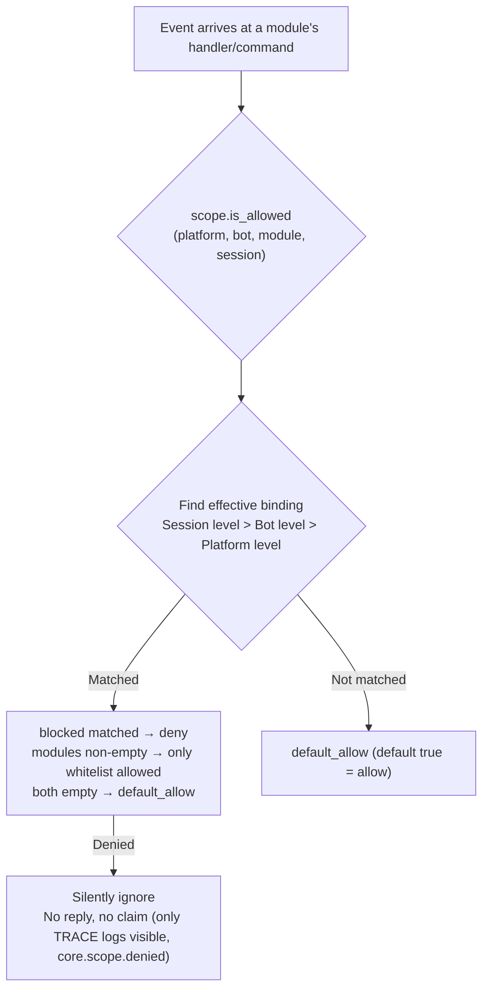

- **Resolution priority: session level > bot level > platform level**, higher priority bindings **fully override** lower priority ones
- **Silent semantics**: Commands and handlers of filtered modules do not trigger, reply, or claim (prevent cross-command mis-matching), only TRACE-level logs are visible (core.scope.denied)
- **Framework-level handlers** (scope_exempt=True or owner is empty) are unaffected; modules with empty names (framework-level resources) are always allowed
- **Session-aware help and command query**: Command query APIs (command.help / get_command / get_commands / get_group_commands / get_visible_commands, and module.get_commands_overview) support optional event= or explicit platform= / bot_id= / session_id= keywords—commands from modules not available in the current session no longer appear in results (get_command returns None, single command help is treated as "unregistered", consistent with silent semantics); if no context is provided, full behavior is maintained. The help/hidden fields returned by command queries are merged and overridden effective values (user priority)

## ② Identity Dimension (Event Admission)

Answers "whose events are accepted." Events rejected at the **distribution entry are completely discarded**—they do not enter middleware or any handler (including framework-level), only TRACE-level logs are visible (core.scope.identity_denied).

- **Resolution priority: user > session > bot > adapter**, take the most specific configured policy; deny takes precedence over allow
- Each level binding is a binary policy: `{ allow = true }` or `{ deny = true }`
- User keys support glob / regex (e.g. `"spam_*"` to block a batch of spam users)
- Typical usage—上级 deny, individual allow for "exceptional allowance":

```toml
[ErisPulse.scope.identity.adapters.onebot11]
deny = true
[ErisPulse.scope.identity.users.onebot11]
allow = ["u_admin"]   # Even if adapter-level denied, events from u_admin are allowed
```

## ③ Command Dimension (Command ACL)

Answers "who can execute a certain command." Decision order: **deny matched → deny; allow whitelist non-empty and not matched → deny; neither configured → follow default_allow** (true delegates to developer's default permission chain). Denied commands will explicitly reply with "insufficient permissions."

- Command names support glob: `"roll*"` one rule covers a family of commands such as `roll` and `roll_dice`
- Exact keys take precedence over glob keys (`commands.roll` matched, no need to check `commands."roll*"`)
- User identifier format `"platform:user_id"` (consistent with framework owner system)
- This dimension is **only an additional gate on the user side**, and is chained with the command's `master` / `permission` parameters: ACL passes, then the default permission chain declared by the developer is still followed (this default chain can be adjusted via ⑤ override)

## ④ Handler/Text Dimension

Filters "which text a module processes": after configuring `pattern` / `regex` for a module, all its event handlers only trigger when the text matches (AND with code-level conditions, both must be satisfied). Suitable for narrowing the trigger range of a module without changing its code.

```toml
[ErisPulse.scope.handlers.ChatModule]
pattern = "闲聊*"     # ChatModule's handlers only respond to messages starting with "闲聊"
```

## ⑤ Implementation Parameter Override

Overrides implementation parameters at the **upper level** of module/command registration, without modifying module code:

```toml
[ErisPulse.scope.overrides.MyModule.restart]
master = true      # Override to only framework owner (can also set false to open developer's owner restriction)
hidden = true      # Hide in help list
aliases = ["rs"]   #生效别名
```

> Override follows **user priority**: The developer's declared `master` / `hidden` etc. are just default values; after the user configures explicitly here, the user's configuration takes precedence (can tighten or loosen). Override only changes **implementation parameters** (master / hidden / aliases / prefix / help / usage etc.), command execution decision and help rendering share the same merged result: `hidden` override immediately changes help list visibility, `help` / `usage` override immediately changes `/help` display. **Disabling a command is not here**—unify through command dimension deny (`scope.commands` or `scope.deny_user()`), avoiding two sets of "disable" semantics clashing.

## ⑥ Outbound Actions Dimension (Prohibit Modules from Initiating Outbound Calls)

Constraints on modules **initiating outbound actions**: message sending / standard API actions / request operations. The three types of actions correspond to the underlying DSL: `Event.reply` and `Send` (send), `Api` / `call_api` (api), `Request`'s accept/reject (request). Outbound calls initiated by modules during the event handler execution period carry the module owner, which is uniformly judged by this dimension.

```toml
[ErisPulse.scope.actions.MyModule]
send = false      # Prohibit MyModule from replying/sending messages
api = false       # Prohibit MyModule from calling standard API actions (including call escape hatch)
request = false   # Prohibit Myodule from executing accept/reject on request events
```

Judgment semantics: **Default is full allow**—not configured, or owner is empty (internal framework calls) are all allowed; only when explicitly set to `false` is it denied, and denied calls do not initiate any network requests, directly returning a standard failure response (`retcode = 34601`, see [api-response §5.3](../standards/api-response.md#53-框架扩展返回码34xxx-平台错误段的低三位自定义)) Three actions are independent, any one can be prohibited.

```python
# Runtime API
sdk.scope.set_action("MyModule", "send", False)   # Prohibit sending messages
sdk.scope.is_action_allowed("MyModule", "send")   # False
sdk.scope.unset_action("MyModule", "send")        # Restore allow
sdk.scope.get_action_rules("MyModule")            # {"send": False, "api": True, "request": True}
```

## Runtime API

### Module Dimension

```python
from ErisPulse import sdk

# Check
sdk.scope.is_allowed("onebot11", "123456", "Chat")
sdk.scope.is_allowed("onebot11", "123456", "Chat", "789012345")
sdk.scope.is_allowed("onebot11", "123456", None)      # Framework-level resource -> True

# Bind / Unbind
sdk.scope.bind_module("onebot11", "123456", modules=["Chat", "Tool*"])
sdk.scope.bind_module("onebot11", blocked=["Danger"])             # Platform level
sdk.scope.bind_module("onebot11", "123456", "789012345", modules=["Chat"])  # Session level
sdk.scope.bind_module("onebot11", "123456", modules=["Music"], merge=True)  # Merge
sdk.scope.bind_module("onebot11", "123456", modules=["Chat"], persist=False)  # Only runtime
sdk.scope.unbind_module("onebot11", "123456")

# Query
sdk.scope.get("onebot11", "123456")   # {"modules": ["Chat"], "blocked": []}
```

### Identity Dimension

```python
# Check if event is allowed
sdk.scope.is_identity_allowed("onebot11", "123456", "group_9", "u1")

# Bind policy (hierarchy determined by parameters: user > session > bot > adapter)
sdk.scope.bind_identity("onebot11", user_id="u_bad", deny=True)
sdk.scope.bind_identity("onebot11", user_id="spam_*", deny=True)   # glob
sdk.scope.bind_identity("onebot11", "123456", "group_9", allow=True)
sdk.scope.unbind_identity("onebot11", user_id="u_bad")

# Convenient API for user blacklist
sdk.scope.block_user("onebot11", "u_bad")
sdk.scope.is_user_blocked("onebot11", "u_bad")
sdk.scope.get_blocked_users()        # {"onebot11": ["u_bad"]}
sdk.scope.unblock_user("onebot11", "u_bad")
```

### Command Dimension

```python
sdk.scope.is_command_allowed("roll", "onebot11", "u1")
sdk.scope.allow_user("roll*", "onebot11", "u_vip")   # Command name supports glob
sdk.scope.deny_user("roll*", "onebot11", "u_bad")
sdk.scope.get_acl("roll*")
sdk.scope.remove_acl("roll*")

# Can also be delegated via command system facade (equivalent)
from ErisPulse.Core.Event import command
command.allow_user("restart", "onebot11", "123456")
```

### Handler and Override Dimensions

```python
sdk.scope.bind_handler("MyModule", pattern="签到*", regex=r"\d+号")
sdk.scope.unbind_handler("MyModule")

sdk.scope.override("MyModule", "restart", master=True, hidden=True)
sdk.scope.get_override("MyModule", "restart")
sdk.scope.remove_override("MyModule", "restart")
```

### General

```python
sdk.scope.list_bindings()   # All bindings
sdk.scope.get_topology()    # Topology (for Dashboard)
sdk.scope.get_stats()
# {"module_calls": .., "module_filtered": .., "identity_checks": .., "identity_denied": ..,
#  "command_checks": .., "command_denied": .., "action_checks": .., "action_denied": ..,
#  "cache_hits": .., "cache_misses": ..}
sdk.scope.reset_stats()
sdk.scope.clear()           # Clear all bindings (memory-only)
```

## Owner Identity and Custom Identity Source (provider)

The owner system answers "who is the framework owner": The `master=True` parameter of commands and the business layer's `master.is_master()` share the same identity determination, with the determination chain being **configured owner → runtime record → provider chain**.

Owner configuration (`ErisPulse.master.users`, supports global list and per-platform dict) is detailed in the [configuration document](../user-guide/configuration.md#Owner System Configuration); this section focuses on identity determination APIs and extension points.

### Determination and Runtime Addition/Removal

```python
from ErisPulse.Core import master

master.is_master(event)                      # Determine from event
master.is_master("yunhu", "123")             # Explicit determination
master.add("yunhu", "123")                   # Add at runtime (default persistent; persist=False only memory)
master.remove("yunhu", "123")                # Remove (default persistent)
master.list()                                # Aggregate: {"global": [...], "<platform>": [...]}
```

### Custom Identity Source (provider)

In addition to configuration, custom identity sources can be registered: `fn(platform, user_id) -> bool`, which are tried in sequence when built-in identity sources (configuration + runtime records) do not match, and any provider allowing access is considered an owner. Suitable for integrating with adapter administrator interfaces, database roles, and other external identity systems.

Registration entry `master.provider` supports both decorator and function-based writing, and unregistration is uniformly handled by the unregistered function:

```python
from ErisPulse.Core import master

# Method 1: Decorator (persistent identity source, recommended)
@master.provider
def admin_provider(platform, user_id):
    return user_id in {"999"}     # Custom determination logic

master.is_master("yunhu", "999")   # True
admin_provider.unregister()        # Unregister when no longer needed

# Method 2: Function-based (register during module loading / unregister during unloading)
fn = master.provider(admin_provider)
fn.unregister()
```

> Exceptions from provider are caught and skipped, not blocking the identity determination chain. Binding instance methods cannot mount `unregister`, and scenarios requiring registration/unregistration pairing should use **module-level functions**.

### User Priority: Owner Scope is Ultimately Decided by the User

The `master=True` of a command is only a **developer default**: the user can override it in the control plane via `ErisPulse.scope.overrides.<module>.<cmd>.master = true/false` (see above ⑤ Implementation Parameter Override, where explicit user configuration takes effect).

## Cache and Hot Update

- Results of `is_allowed` / `is_identity_allowed` are cached with **LRU** (adjustable via `scope.cache_size`), `bind_*` / `unbind_*` / configuration hot update (`config.updated` / `config.set`) automatically invalidate
- Changes to all dimensions take effect **immediately**, no restart required
- The control plane makes "event-by-event" judgments, not cross-event memory: if the configuration changes, the next event follows the new rule

## Common Issues and Precautions

### 1. Configuration Hierarchy and Overriding

- Module dimension: session level > bot level > platform level, **full override**. To "platform allows Chat, bot adds Music," both must be listed at the bot level
- Identity dimension: user > session > bot > adapter, take the **most specific** configured policy (can do exceptional allowance)
- Command dimension: exact command name takes precedence over glob key

### 2. Prefer the Control Plane over Modifying Module Code

Module declarations are "developer default" (`master=True`, `permission=...`, `pattern=...`); control plane declarations are "user final decision." Implementation parameter overrides follow **user priority**: user's explicit `master = true/false` configuration takes effect directly (can tighten or loosen). Developers' unconfigured restrictions can be tightened by the user; disable/allow control goes through command deny / identity allow.

### 3. Module/Command Not Responding

First suspect the control plane rather than the module itself:

```python
from ErisPulse import sdk

print(sdk.scope.is_allowed(event.get_platform(), bot_id, "MyModule", session_id))
print(sdk.scope.is_identity_allowed(event.get_platform(), bot_id, session_id, user_id))
print(sdk.scope.get_stats())   # module_filtered / identity_denied > 0 indicates silent filtering
```

Filtered is **silent** (module dimension and identity dimension do not reply, avoiding rule exposure), but statistics accumulate; command dimension denied by ACL replies "insufficient permissions" explicitly.

### 4. Session Identifier Isolation Across Platforms

The `(platform, session_id)` combination is the unique identifier. `scope.sessions.onebot11."789"` only affects onebot11, not affecting a session with the same `789` on telegram. The same applies to identity dimension user keys.

## Topology Tree API

`ModuleManager.get_topology()` and `AdapterManager.get_topology()` provide module/adapter ownership relationship data, and `sdk.get_topology()` aggregates them (including the control plane's five dimensions):

```python
from ErisPulse import sdk

topology = sdk.get_topology()
# {
#   "modules": {                                   # Module → owned resources
#     "Chat": {
#       "loaded": True, "enabled": True,
#       "commands": ["chat", "translate"],
#       "handlers": {"message": 2, "notice": 1},
#       "routes": {"http": ["/Chat/api"], "ws": [], "sse": []},
#       "lifecycle_hooks": 3,
#     }
#   },
#   "adapters": {                                  # Adapter → Bot → scope
#     "onebot11": {
#       "status": "started", "enabled": True,
#       "bots": {"123456": {"status": "online", "scope": {...}}},
#       "scope": {"modules": [...], "blocked": [...]},
#     }
#   },
#   "scope": {                                     # Unified control plane (five dimensions)
#     "platforms": {...}, "bots": {...}, "sessions": {...},
#     "identity": {"adapters": {...}, "bots": {...}, "sessions": {...}, "users": {...}},
#     "commands": {...}, "handlers": {...}, "overrides": {...},
#   },
# }
```

- Module topology aggregates commands, event handlers, HTTP/WS/SSE routes, and lifecycle hooks registered by the module, facilitating the drawing of module resource trees.
- Adapter topology aggregates the status of each adapter, the status of subordinate bots, and platform-level/Bot-level scope bindings.


### 启动流程与手动控制

# Процесс запуска и ручное управление

Метод `sdk.run()` / `sdk.init()` в ErisPulse инкапсулирует всю цепочку запуска в виде "одной строки кода". Однако, когда вам нужно полностью настроить процесс запуска (например, частичная загрузка, динамическая регистрация, горячая замена, внедрение пользовательской стратегии загрузки), необходимо понимать, что происходит внутри этой цепочки и как управлять каждым шагом вручную.

В этой статье мы разбиваем цепочку запуска на отдельные этапы, объясняем их обязанности, порядок вызова и приводим пример ручного полного запуска.

> В этой статье предполагается, что вы уже запустили [первого робота](../getting-started/first-bot.md) и знакомы с двумя режимами `sdk.run(keep_running=True/False)`. В этой статье мы сосредоточимся на внутренней цепочке `init()` и более низкоуровневых входных точках, таких как `init()` / `init_task()` / `init_sync()`.

## Обзор верхнего уровня SDK

Помимо двух режимов `run()` с параметром `keep_running`, SDK предоставляет несколько более низкоуровневых точек входа, отличающихся **асинхронностью, возвращаемым значением и обработкой исключений**:

| Точка входа | Асинхронность | Возвращаемое значение | Обработка исключений | Сценарии использования |
|-------------|---------------|------------------------|----------------------|--------------------------|
| `await sdk.run(True)` | async, блокирует и поддерживает | `None` (автоматически `uninit` при остановке) | Ошибки модулей/адаптеров перехватываются, не приводят к сбою процесса | Приложения-боты |
| `await sdk.run(False)` | async, не блокирует | `None` (не автоматически удаляется) | То же, что и выше | После инициализации выполнить пользовательскую логику |
| `await sdk.init()` | async, требует await | `bool` | Внутренние исключения компонентов перехватываются, в случае неудачи возвращается `False` | Ручное управление жизненным циклом (в паре с `uninit()`) |
| `sdk.init_task()` | async, возвращает Task без блокировки | `asyncio.Task` | То же, что и `init()` | Параллельное выполнение другой инициализации или когда цикл событий еще не запущен |
| `sdk.init_sync()` | **Синхронный**, блокирует текущий поток | `bool` | То же, что и `init()` | Сценарии командной строки, синхронные входные точки без цикла событий |

> **Частое заблуждение**: `await sdk.init()` **не эквивалентно** `await sdk.run(keep_running=False)`. Есть два различия: ① `init()` возвращает `bool` (в случае неудачи возвращает `False`), `run()` возвращает `None`; ② `init()` делает только инициализацию, **не автоматически удаляет**, `run()` при завершении цикла событий автоматически вызывает `uninit()`. Поэтому, если нужно вручную управлять жизненным циклом, используйте `init()` + `uninit()`.

## Обзор цепочки запуска

`sdk.init()` (точнее, его внутренний `Initializer.init()`) запускает всю систему в следующем порядке:

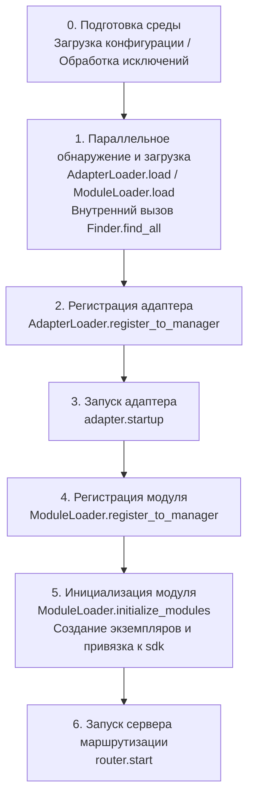

Соответствующие основные компоненты:

| Уровень | Компонент | Обязанности |
|---------|-----------|-------------|
| Обнаружение | `AdapterFinder` / `ModuleFinder` | **Обнаружение** адаптеров/модулей из entry-points установленных пакетов |
| Загрузка | `AdapterLoader` / `ModuleLoader` | Обнаружение + импорт + чтение метаданных + определение включения/отключения, возвращает список объектов |
| Регистрация | `*Loader.register_to_manager` | Регистрация объектов в соответствующих менеджерах |
| Управление | `sdk.adapter` / `sdk.module` | Хранение экземпляров адаптеров/модулей, предоставление интерфейсов запуска/остановки |
| Инициализация | `ModuleLoader.initialize_modules` | Создание экземпляров модулей и привязка к `sdk` (обработка топологической сортировки зависимостей) |
| Маршрутизация | `sdk.router` | HTTP / WebSocket сервер |

> **Важно**: `Finder` и `Loader` — это два уровня. `Loader` уже содержит `Finder` (например, `AdapterLoader` содержит `AdapterFinder`, `ModuleLoader` содержит `ModuleFinder`). В большинстве случаев вам нужно использовать только `Loader`, только в случае, когда нужно "перечислить, но не импортировать", следует использовать `Finder` отдельно.

## Подробное объяснение каждого этапа

### 1. Уровень обнаружения: Finder

Finder только обнаруживает, какие пакеты предоставляют адаптеры/модули, не импортируя и не создавая экземпляры.

```python
from ErisPulse.finders import AdapterFinder, ModuleFinder

adapter_finder = AdapterFinder()
module_finder = ModuleFinder()

# Найти все установленные entry-points для адаптеров/модулей
adapter_entries = adapter_finder.find_all()    # list[EntryPoint]
module_entries = module_finder.find_all()      # list[EntryPoint]

# Найти по имени
entry = module_finder.find_by_name("MyModule")  # EntryPoint | None
```

Каждый `EntryPoint` можно загрузить с помощью `.load()`, чтобы получить соответствующий класс, но обычно это делает `Loader`.

### 2. Уровень загрузки: Loader

Loader делает "импорт + чтение метаданных + определение включения/отключения" поверх Finder.

```python
from ErisPulse.loaders import AdapterLoader, ModuleLoader
from ErisPulse import sdk

adapter_loader = AdapterLoader()
module_loader = ModuleLoader()

# load() внутри: вызывает finder.find_all() → обрабатывает entry-point по одному → возвращает кортеж
adapter_objs, enabled_adapters, disabled_adapters = await adapter_loader.load(sdk.adapter)
module_objs, enabled_modules, disabled_modules = await module_loader.load(sdk.module)
```

Возвращаемые три кортежа `load()`:

| Возвращаемое значение | Значение |
|-----------------------|----------|
| `objs` (`dict`) | Имя → объект (класс адаптера / обёртка модуля) |
| `enabled` (`list[str]`) | Имена, которые включены (не отключены в конфигурации) |
| `disabled` (`list[str]`) | Имена, которые отключены |

#### Диагностика при сбое загрузки

Когда модуль/адаптер выбрасывает исключение при загрузке или инициализации, фреймворк пропускает этот компонент и продолжает загрузку других компонентов, выводя **сводку пользовательского кода**, чтобы вы могли определить местоположение ошибки на уровне INFO, без необходимости включать DEBUG:

```
[ERROR] [ModuleLoader] Ошибка при загрузке модуля MyModule из entry-point, пропущен: 'NoneType' object has no attribute 'platform'
  → MyModule/Core.py:42 in on_load
      adapter = sdk.platform
  → AttributeError: 'NoneType' object has no attribute 'platform'
  → Подсказка: Повысьте уровень логирования до DEBUG для просмотра полного стека; проверьте реализацию модуля MyModule
```

Диагностическая информация генерируется модулем `ErisPulse.runtime.diagnostics`, который автоматически фильтрует внутренние кадры фреймворка, оставляя только кадры вашего кода. Если вам нужно использовать это в пользовательской логике загрузки:

```python
from ErisPulse.runtime import log_diagnostic

try:
    risky_init()
except Exception as e:
    log_diagnostic(e)  # Автоматически извлекает кадры пользовательского кода и записывает в лог ERROR
```

Модуль также предоставляет две базовые функции: `extract_user_frame()` (возвращает структурированную информацию о кадре) и `format_diagnostic_block()` (возвращает многострочную текстовую строку).

### 3. Уровень регистрации: register_to_manager

Регистрация объектов, полученных от Loader, в менеджерах, чтобы `sdk.adapter` / `sdk.module` могли их распознавать.

```python
# Регистрация адаптера (возвращает bool, означающий, все ли успешно)
await adapter_loader.register_to_manager(enabled_adapters, adapter_objs, sdk.adapter)

# Регистрация модуля
await module_loader.register_to_manager(enabled_modules, module_objs, sdk.module)
```

После регистрации адаптеры зарегистрированы в менеджере адаптеров, модули — в менеджере модулей, но **ни один из них не запущен/инициализирован**.

### 4. Запуск адаптера

```python
# Запуск всех зарегистрированных адаптеров
await sdk.adapter.startup()
# Или указать платформу
await sdk.adapter.startup("yunhu")
await sdk.adapter.startup(["yunhu", "telegram"])
```

> Регистрация ≠ запуск. `register_to_manager` только регистрирует; `startup` вызывает `start()` адаптера, устанавливая соединение с платформой.

### 5. Инициализация модуля

Модули имеют дополнительный шаг — **инициализация** и привязка к `sdk` (чтобы вы могли обращаться к `sdk.MyModule.xxx`). Этот шаг также обрабатывает зависимости между модулями и топологическую сортировку.

```python
success = await module_loader.initialize_modules(
    enabled_modules, module_objs, sdk.module, sdk
)
```

После успешной инициализации модуль появляется в `sdk.<ModuleName>`.

### 6. Запуск сервера маршрутизации

```python
await sdk.router.start(
    host="0.0.0.0",
    port=8000,
    ssl_certfile=None,
    ssl_keyfile=None,
)
```

Сервер маршрутизации отвечает за прием обратных вызовов (webhook / websocket) от адаптеров. Без запуска этого сервера, адаптеры в режиме сервера не смогут получать сообщения.

## Полный пример ручного запуска

Ниже приведён код, который **эквивалентен** основному процессу `await sdk.init()`, но каждый шаг доступен для ручного управления, что позволяет вставить пользовательскую логику в любой момент:

```python
import asyncio
from ErisPulse import sdk
from ErisPulse.loaders import AdapterLoader, ModuleLoader

async def manual_startup():
    # 0. Подготовка среды (загрузка конфигурации, регистрация обработки исключений)
    #    _prepare_environment — это внутренний шаг init(), который также должен быть вызван в ручном процессе,
    #    иначе Loader не сможет прочитать конфигурацию и посчитает все адаптеры/модули отключенными.
    if not await sdk._prepare_environment():
        print("Подготовка среды не удалась")
        return False

    # 1. Создание загрузчиков (внутри каждый содержит Finder)
    adapter_loader = AdapterLoader()
    module_loader = ModuleLoader()

    # 2. Параллельное обнаружение и загрузка (как в init(), используем gather)
    (adapter_objs, enabled_adapters, disabled_adapters), \
    (module_objs, enabled_modules, disabled_modules) = await asyncio.gather(
        adapter_loader.load(sdk.adapter),
        module_loader.load(sdk.module),
    )

    # 3. Регистрация адаптеров
    await adapter_loader.register_to_manager(
        enabled_adapters, adapter_objs, sdk.adapter
    )

    # 4. Запуск адаптеров
    if enabled_adapters:
        await sdk.adapter.startup()

    # 5. Регистрация модулей
    await module_loader.register_to_manager(
        enabled_modules, module_objs, sdk.module
    )

    # 6. Инициализация модулей (создание экземпляров и привязка к sdk)
    if enabled_modules:
        await module_loader.initialize_modules(
            enabled_modules, module_objs, sdk.module, sdk
        )

    # 7. Запуск сервера маршрутизации
    await sdk.router.start(host="0.0.0.0", port=8000)

    print("Ручной запуск завершен")
    return True

async def main():
    ok = await manual_startup()
    if ok:
        # Блокирующее ожидание (ручной процесс не блокирует автоматически)
        await asyncio.Event().wait()

if __name__ == "__main__":
    asyncio.run(main())
```

### Когда использовать ручной запуск?

В большинстве случаев **не нужно** использовать ручной запуск, так как `await sdk.run()` уже делает всё это. Ручной запуск имеет ценность только в следующих сценариях:

- **Частичная загрузка**: загрузка только определённых адаптеров/модулей, пропуск других
- **Динамическая регистрация**: регистрация новых адаптеров/модулей во время выполнения по условиям
- **Собственный порядок**: изменение стандартного порядка загрузки (например, сначала запустить модуль, затем адаптер)
- **Внедрение стратегий**: внедрение пользовательских стратегий управления, строгих режимов и т.д. в Loader
- **Отладка/диагностика**: при сбое на каком-то этапе, ручное управление для локализации проблемы

## Тонкое управление во время выполнения

Даже если вы использовали `sdk.run()` для запуска, вы всё ещё можете управлять отдельными подсистемами во время выполнения, без необходимости перезапуска всего SDK:

### Горячий перезапуск адаптера

```python
# Горячий перезапуск адаптера (восстановление соединения, без влияния на другие платформы)
await sdk.adapter.shutdown("yunhu")
await sdk.adapter.startup("yunhu")

# Запуск новой платформы во время выполнения
await sdk.adapter.startup("telegram")

# Временная отключка платформы
await sdk.adapter.shutdown("telegram")
```

> `adapter.startup()` требует, чтобы адаптер **был зарегистрирован** в менеджере. Регистрация происходит внутри `init()`/`run()`, поэтому это управление происходит **после** запуска.

### Сервер маршрутизации

```python
# Временная отключка webhook-сервера
await sdk.router.stop()

# Перезапуск (например, после смены порта)
await sdk.router.start(host="0.0.0.0", port=9000)
```

### Модули по требованию

```python
# Ручная загрузка модуля (возможно, ленивая загрузка)
await sdk.load_module("MyModule")
```

## Элегантное завершение

Начиная с версии 2.7.0, `sdk.shutdown()` предоставляет **программное элегантное завершение**: установка события завершения, которое заставляет висящий `await sdk.run(keep_running=True)` вернуться, что ведёт к автоматическому вызову `uninit()` и очистке ресурсов.

```python
# В любом корутине вызвать, чтобы запустить элегантное завершение (run() висит и автоматически uninit)
sdk.shutdown()
```

Типичное использование:

```python
async def shutdown_after_idle():
    await asyncio.sleep(3600)
    sdk.shutdown()  # Элегантное завершение после 1 часа бездействия
```

**Обработка сигналов**: `run()` внутри регистрирует обработчики `SIGTERM` / `SIGHUP`, преобразуя системные сигналы в элегантное завершение — при остановке контейнера (Docker `docker stop`) или остановке службы systemd процесс пройдёт через `uninit()` для очистки, а не будет принудительно убит.

- На Windows `loop.add_signal_handler` не поддерживается, обработчик сигналов будет пропущен (можно использовать `sdk.shutdown()` или Ctrl+C для завершения)
- Повторный вызов `sdk.shutdown()` безопасен (второй вызов без действия, если событие уже установлено)

## Процесс выгрузки

Обратной операцией к запуску является `await sdk.uninit()`, который очищает в обратном порядке:

1. Закрыть все адаптеры (`adapter.shutdown()`)
2. Выгрузить все модули
3. Очистить все обработчики событий
4. Очистить менеджеры и свойства модулей в SDK

В сценариях ручного запуска не забудьте вызвать `uninit()` при выходе, чтобы обеспечить элегантное завершение:

```python
try:
    await asyncio.Event().wait()   # Поддерживать выполнение
finally:
    await sdk.uninit()
```

## Перезапуск

SDK предоставляет два способа перезапуска, без необходимости вручную выгружать — фреймворк сам обрабатывает:

| Способ | Вызов | Поведение | Сценарии использования |
|-------|-------|-----------|--------------------------|
| Горячий перезапуск | `await sdk.restart()` | В том же процессе `uninit()` и повторная `init()`, перезагрузка адаптеров/модулей | Перезагрузка конфигурации, горячая замена модулей |
| Жёсткий перезапуск | `await sdk.hard_restart()` | `uninit()` и выход с кодом 42, внешний супервайзер запускает новый процесс | Подозрение на утечку памяти/ресурсов, полная очистка и перезапуск |

```python
# Горячий перезапуск: перезагрузка в том же процессе (наиболее часто используемый)
await sdk.restart()

# Жёсткий перезапуск: выход с кодом 42, внешний супервайзер запускает новый процесс (см. руководство супервайзеров ниже)
await sdk.hard_restart()
```

> **Два важных замечания**:
> 1. Эти методы выполняют перезапуск в фоновой задаче, **немедленно возвращают `True`**, означая, что "задача перезапуска запланирована", а не "перезапуск завершён". Фактический перезапуск происходит в фоне, чтобы избежать прерывания текущей цепочки событий.
> 2. `hard_restart()` работает так: после очистки и сохранения конфигурации, процесс завершается с **кодом 42** (`HARD_RESTART_EXIT_CODE`) — **он сам не запускает новый процесс**. Новый процесс должен быть запущен внешним супервайзером после обнаружения кода 42. Если запустить напрямую `python main.py` без супервайзера, процесс завершится с кодом 42 и **не перезапустится автоматически** (фреймворк выдаст предупреждение).

### Когда использовать жёсткий перезапуск?

Жёсткий перезапуск — это не просто "более полный перезапуск", он более подходит и даже эффективнее в следующих сценариях:

- **Побочные эффекты двоичных библиотек (C-расширения)**: горячий перезапуск происходит в том же процессе, не освобождая ресурсы процесса, такие как C-расширения, открытые файловые дескрипторы, потоки; жёсткий перезапуск запускает новый процесс, полностью устраняя эти побочные эффекты.
- **Выявление утечек ресурсов**: при подозрении на утечку памяти или дескрипторов, жёсткий перезапуск даёт чистую среду.
- **Частые перезапуски, чувствительные к производительности**: жёсткий перезапуск исключает затраты на выгрузку и повторную загрузку в том же процессе, фактически более эффективен, чем горячий перезапуск.

> Функция "перезапуск фреймворка" в панели управления Dashboard вызывает `hard_restart()`.

### Контракт выходного кода 42

Жёсткий перезапуск — это кооперация между процессами: **SDK отвечает за выход (код 42), супервайзер за запуск**.

| Роль | Действие |
|------|----------|
| SDK (при жёстком перезапуске) | `uninit()` → сохранение конфигурации → `os._exit(42)` |
| Супервайзер | Обнаруживает код выхода 42 → перезапуск той же команды |

> `sdk.is_supervised()` позволяет проверить, запущен ли текущий процесс супервайзером (проверка переменной окружения `ERISPULSE_SUPERVISED`). Команда CLI `run` автоматически вставляет этот маркер при запуске подпроцесса; внешние супервайзеры, такие как systemd / Docker, не вставляют его, поэтому `is_supervised()` возвращает `False`, и при жёстком перезапуске фреймворк выдаёт предупреждение "не обнаружен супервайзер".

### Руководство по супервайзерам

Выберите подходящий супервайзер, чтобы жёсткий перезапуск действительно сработал:

#### 1. Команда CLI run (разработка/простое развертывание, рекомендуется)

`epsdk run main.py` включает цикл наблюдения: обнаруживает код выхода подпроцесса, при 42 немедленно перезапускает; при других кодах выхода с экспоненциальной задержкой автоматически перезапускает; `Ctrl+C` сначала элегантно завершает подпроцесс (код 0 считается нормальным выходом, перезапуск не происходит).

```bash
epsdk run main.py
```

#### 2. systemd (серверы Linux)

`RestartForceExitStatus=42` заставляет перезапуск при коде выхода 42 (по умолчанию `on-failure` срабатывает только при ненулевом коде):

```ini
[Service]
ExecStart=/usr/bin/python3 /opt/mybot/main.py
Restart=on-failure
RestartForceExitStatus=42
RestartSec=2
User=mybot
```

#### 3. Docker / docker-compose

Процесс с PID 1 внутри контейнера — это приложение, при коде выхода 42 контейнер завершается — используйте стратегию `restart`, чтобы он автоматически перезапускался:

```yaml
services:
  bot:
    build: .
    restart: unless-stopped   # Перезапуск при любом выходе (включая 42)
```

#### 4. PM2 (экосистема Node.js)

```bash
pm2 start main.py --name mybot --interpreter python3
# 42 считается кодом выхода, PM2 по умолчанию перезапускает; настройте restart_delay для защиты от дребезга
pm2 set mybot.restart_delay 2000
```

#### 5. supervisord

```ini
[program:mybot]
command=python3 /opt/mybot/main.py
autorestart=true
exitcodes=0,2,42    # 42 также считается "нормальным выходом, требующим перезапуска"
```

#### 6. Супервайзер на чистом Python

```python
import subprocess, sys, time

while True:
    p = subprocess.Popen([sys.executable, "main.py"])
    code = p.wait()
    if code == 42:          # Запрос на жёсткий перезапуск
        time.sleep(0.5)
        continue
    if code == 0:           # Нормальный выход
        break
    time.sleep(3)           # Аномальный выход, экспоненциальная задержка и повторный запуск
```

> **Поведение при отсутствии супервайзера**: запуск напрямую `python main.py`, вызов `hard_restart()` завершает процесс с кодом 42 и не перезапускает. В этом случае необходимо подключить один из перечисленных супервайзеров.


====
技术标准
====


### 会话类型标准

# Стандарт типов сессий ErisPulse

В данном документе определяются стандартные типы сессий, поддерживаемые ErisPulse, включая типы событий приема и типы целей отправки.

## 1. Основные понятия

### 1.1 Типы получения и отправки

ErisPulse различает два типа сессий:

- **Тип получения (Receive Type)**: поле `detail_type` события, используемое для получения
- **Тип отправки (Send Type)**: тип получателя метода `Send.To()` при отправке сообщений

### 1.2 Соответствие типов

```
Тип получения (detail_type)     Тип отправки (Send.To)
─────────────────        ────────────────
private                 →        user
group                   →        group
channel                 →        channel
guild                   →        guild
thread                  →        thread
user                    →        user
```

**Ключевые моменты**:
- `private` — это тип получения, при отправке необходимо использовать `user`
- `group`, `channel`, `guild`, `thread` — типы одинаковы при получении и отправке
- Система автоматически выполняет преобразование типов, без необходимости ручного управления (это означает, что вы можете напрямую использовать полученный тип для отправки), на самом деле, вам не нужно беспокоиться об этом, так как наличие обёрток событий позволяет использовать метод `event.reply()` без необходимости учитывать преобразование типов

## 2. Стандартные типы сессий

### 2.1 Стандартные типы OneBot12

#### private
- **Тип получения**: `private`
- **Тип отправки**: `user`
- **Описание**: Личное сообщение в прямом чате
- **Поле ID**: `user_id`
- **Поддерживаемые платформы**: Все платформы, поддерживающие личные чаты

#### group
- **Тип получения**: `group`
- **Тип отправки**: `group`
- **Описание**: Сообщение в групповом чате, включая различные формы групп (например, супергруппа в Telegram)
- **Поле ID**: `group_id`
- **Поддерживаемые платформы**: Все платформы, поддерживающие групповые чаты

#### user
- **Тип получения**: `user`
- **Тип отправки**: `user`
- **Описание**: Тип пользователя, некоторые платформы (например, Telegram) представляют личные чаты как `user`, а не `private`
- **Поле ID**: `user_id`
- **Поддерживаемые платформы**: Telegram и другие платформы

### 2.2 Расширенные типы ErisPulse

#### channel
- **Тип получения**: `channel`
- **Тип отправки**: `channel`
- **Описание**: Сообщение в канале, поддерживает широковещательные сообщения для нескольких пользователей
- **Поле ID**: `channel_id`
- **Поддерживаемые платформы**: Discord, Telegram, Line и другие

#### guild
- **Тип получения**: `guild`
- **Тип отправки**: `guild`
- **Описание**: Сообщение в сервере/сообществе, обычно используется для событий уровня Discord Guild
- **Поле ID**: `guild_id`
- **Поддерживаемые платформы**: Discord и другие

#### thread
- **Тип получения**: `thread`
- **Тип отправки**: `thread`
- **Описание**: Сообщение в теме/подканале, используется для подобсуждений внутри сообщества
- **Поле ID**: `thread_id`
- **Поддерживаемые платформы**: Discord Threads, Telegram Topics и другие

## 3. Типы платформ

### 3.1 Принципы отображения

Адаптер отвечает за преобразование нативных типов платформ в стандартные типы ErisPulse:

```
Нативный тип платформы → Стандартный тип ErisPulse → Тип отправки
```

### 3.2 Примеры отображения распространённых платформ

#### Telegram
```
Тип Telegram         Тип получения ErisPulse    Тип отправки
─────────────────      ────────────────       ───────────
private                private                 user
group                  group                   group
supergroup             group                   group  # Отображается в group
channel                channel                 channel
```

#### Discord
```
Тип Discord          Тип получения ErisPulse    Тип отправки
─────────────────      ────────────────       ───────────
Direct Message         private                user
Text Channel           channel                channel
Guild                  guild                  guild
Thread                 thread                 thread
```

#### OneBot11
```
Тип OneBot11         Тип получения ErisPulse    Тип отправки
─────────────────      ────────────────       ───────────
private                private                user
group                  group                  group
discuss                group                  group  # Отображается в group
```

## 4. Расширение пользовательских типов

### 4.1 Регистрация пользовательского типа

Адаптер может зарегистрировать пользовательский тип сеанса:

```python
from ErisPulse.Core.Event import register_custom_type

# Регистрация пользовательского типа
register_custom_type(
    receive_type="my_custom_type",
    send_type="custom",
    id_field="custom_id",
    platform="MyPlatform"
)
```

### 4.2 Использование пользовательского типа

После регистрации система будет автоматически обрабатывать преобразование и вывод этого типа:

```python
# Автоматический вывод
receive_type = infer_receive_type(event, platform="MyPlatform")
# Возвращает: "my_custom_type"

# Преобразование в тип отправки
send_type = convert_to_send_type(receive_type, platform="MyPlatform")
# Возвращает: "custom"

# Получение соответствующего ID
target_id = get_target_id(event, platform="MyPlatform")
# Возвращает: event["custom_id"]
```

### 4.3 Отмена регистрации пользовательского типа

```python
from ErisPulse.Core.Event import unregister_custom_type

unregister_custom_type("my_custom_type", platform="MyPlatform")
```

## 5. Автоматическое определение типа

Когда событие не имеет явного поля `detail_type`, система автоматически определяет тип на основе существующих полей ID:

> [!NOTE]
> **Изменение поведения в 2.7.0+**: `detail_type` принимается напрямую, только если это **известный тип сессии** (стандартный или пользовательский). `detail_type` событий notice/request (например, `group_member_increase`, `friend_increase`) является **семантическим подтипом**, а не типом сессии, и в этом случае тип сессии будет определён на основе полей ID.

### 5.1 Приоритет определения

```
Приоритет (от высокого к низкому):
1. group_id     → group
2. channel_id   → channel
3. guild_id     → guild
4. thread_id    → thread
5. user_id      → private
```

### 5.2 Примеры использования

```python
# В событии есть только group_id
event = {"group_id": "123", "user_id": "456"}
receive_type = infer_receive_type(event)
# Возвращает: "group" (group_id имеет приоритет)

# В событии есть только user_id
event = {"user_id": "123"}
receive_type = infer_receive_type(event)
# Возвращает: "private"

# detail_type в событии notice является семантическим подтипом, начиная с 2.7.0 будет определён тип сессии на основе полей ID
event = {"type": "notice", "detail_type": "group_member_increase", "group_id": "123"}
receive_type = infer_receive_type(event)
# Возвращает: "group" (а не "group_member_increase")
```

## 6. Примеры использования API

### 6.1 Отправка сообщений

```python
from ErisPulse import adapter

# Отправка пользователю
await adapter.myplatform.Send.To("user", "123").Text("Hello")

# Отправка группе
await adapter.myplatform.Send.To("group", "456").Text("Hello")

# Автоматическая конвертация private → user (не рекомендуется, может вызвать проблемы совместимости)
await adapter.myplatform.Send.To("private", "789").Text("Hello")
# Внутренне автоматически преобразуется в: Send.To("user", "789") # Использование user в качестве типа сессии является более предпочтительным выбором
```

### 6.2 Ответ на событие

```python
from ErisPulse.Core.Event import Event

# Event.reply() автоматически обрабатывает преобразование типа
await event.reply("Содержимое ответа")
# Внутренне автоматически используется правильный тип отправки
```

### 6.3 Обработка команд

```python
from ErisPulse.Core.Event import command

@command(name="test")
async def handle_test(event):
    # Система автоматически обрабатывает тип сессии
    # Не нужно вручную проверять group_id или user_id
    await event.reply("Команда выполнена успешно")
```

## 7. Справочник основного API

### 7.1 Преобразование типов

```python
from ErisPulse.Core.Event import convert_to_send_type, convert_to_receive_type

# Тип получения → Тип отправки
convert_to_send_type("private")  # → "user"
convert_to_send_type("group")    # → "group"

# Тип отправки → Тип получения
convert_to_receive_type("user")   # → "private"
convert_to_receive_type("group")  # → "group"
```

### 7.2 Запрос полей ID

```python
from ErisPulse.Core.Event import get_id_field, get_receive_type

get_id_field("group")    # → "group_id"
get_id_field("private")  # → "user_id"

get_receive_type("group_id")  # → "group"
get_receive_type("user_id")   # → "private"
```

### 7.3 Получение информации для отправки за один шаг

```python
from ErisPulse.Core.Event import get_send_type_and_target_id

event = {"detail_type": "private", "user_id": "123"}
send_type, target_id = get_send_type_and_target_id(event)
# send_type = "user", target_id = "123"

# Непосредственно для Send.To()
await adapter.Send.To(send_type, target_id).Text("Hello")
```

### 7.4 Получение целевого ID

```python
from ErisPulse.Core.Event import get_target_id

event = {"detail_type": "group", "group_id": "456"}
get_target_id(event)  # → "456"
```

## 8. Вспомогательные методы

```python
from ErisPulse.Core.Event import (
    is_standard_type,
    is_valid_send_type,
    get_standard_types,
    get_send_types,
    clear_custom_types,
)

is_standard_type("private")     # True
is_standard_type("custom_type") # False

is_valid_send_type("user")      # True
is_valid_send_type("invalid")   # False

get_standard_types()  # {"private", "group", "channel", "guild", "thread", "user"}
get_send_types()      # {"user", "group", "channel", "guild", "thread"}

clear_custom_types()                # Очистить все
clear_custom_types(platform="discord")  # Очистить только для указанной платформы
```

## 9. Лучшие практики

### 7.1 Разработчики адаптеров

1. **Использование стандартных маппингов**: по возможности маппите на стандартные типы, а не создавайте новые типы
2. **Правильное преобразование**: убедитесь, что отношения между типами приема и отправки корректны
3. **Сохранение исходных данных**: сохраняйте исходный тип события в `{platform}_raw`
4. **Документирование**: в документации адаптера укажите отношения маппинга типов

### 7.2 Разработчики модулей

1. **Использование вспомогательных методов**: используйте вспомогательные методы, такие как `get_send_type_and_target_id()`
2. **Избегайте жесткой привязки**: не пишите код вида `if group_id else "private"`
3. **Учет всех типов**: код должен поддерживать все стандартные типы, а не только private/group
4. **Гибкое проектирование**: используйте методы обертки событий, а не прямой доступ к полям

### 9. Вывод типов

- **Приоритет использования detail_type**: если есть четкое поле, не используйте вывод
- **Разумное использование вывода**: используйте вывод только тогда, когда нет явного типа
- **Внимание к приоритетам**: знайте приоритеты вывода, чтобы избежать неожиданных результатов

## 10. Часто задаваемые вопросы

### В1: Почему при отправке private нужно преобразовывать в user?

О: Это требование стандарта OneBot12. `private` — это понятие при получении, при отправке использование `user` более соответствует семантике.

### В2: Как поддержать новые типы сессий?

О: Зарегистрируйте пользовательский тип с помощью `register_custom_type()`, или используйте стандартные типы, такие как `channel`, `guild` и т.д.

### В3: Что делать, если у события нет detail_type?

О: Система автоматически определит тип на основе доступных полей ID. Приоритет: group > channel > guild > thread > user.

### В4: Как адаптер отображает Telegram supergroup?

О: В логике преобразования адаптера `supergroup` отображается в стандартный тип `group`.

### В5: Как обрабатывать специальные платформы, такие как электронная почта?

О: Для неуниверсальных или платформенно-специфических типов используйте `{platform}_raw` и `{platform}_raw_type` для сохранения исходных данных, а адаптер самостоятельно обрабатывает их.

## 11. Связанные документы

- [Стандарт преобразования событий](event-conversion.md) - Полная спецификация преобразования событий
- [Спецификация метода отправки](send-method-spec.md) - Нормы именования и параметров методов класса Send
- [Руководство по разработке адаптеров](../developer-guide/adapters/) - Полное руководство по разработке адаптеров


### 事件转换标准

# Спецификация стандартизации адаптера

## 1. Основные принципы
1. Строгая совместимость: Все стандартные поля должны строго следовать спецификации OneBot12.
2. Явное расширение: Платформенно-специфичные функции должны добавлять префикс `{platform}_` (например, yunhu_form).
3. Целостность данных: Исходные данные события должны сохраняться в поле `{platform}_raw`, а исходный тип события — в поле `{platform}_raw_type`.
4. Единообразие времени: Все временные метки должны быть преобразованы в 10-значный временной штамп Unix (секунды).
5. Единообразие платформ: Имя поля `platform` должно соответствовать имени/алиасу, под которым вы зарегистрировались в ErisPulse.

## 2. Требования к стандартным полям

### 2.1 Обязательные поля
| Поле | Тип | Описание |
|------|------|------|
| id | string | Уникальный идентификатор события |
| time | integer | Временной штамп Unix (секунды) |
| type | string | Тип события |
| detail_type | string | Детальный тип события (подробнее см. [Стандарт типов сессий](session-types.md)) |
| platform | string | Название платформы |
| self | object | Информация о самом боте |
| self.platform | string | Название платформы |
| self.user_id | string | User ID бота |

**Правила для `detail_type`**:
- Должны использоваться стандартные типы сессий ErisPulse (подробнее см. [Стандарт типов сессий](session-types.md))
- Поддерживаемые типы: `private`, `group`, `user`, `channel`, `guild`, `thread`
- Адаптер должен отвечать за отображение нативных типов платформ на стандартные типы

### 2.2 Поля сообщений
| Поле | Тип | Описание |
|------|------|------|
| message | array | Массив сегментов сообщения |
| alt_message | string | Резервный текст сегментов сообщения |
| user_id | string | User ID |
| user_nickname | string | Никнейм пользователя (необязательно) |

### 2.3 Поля уведомлений
| Поле | Тип | Описание |
|------|------|------|
| user_id | string | User ID |
| user_nickname | string | Никнейм пользователя (необязательно) |
| operator_id | string | ID оператора (необязательно) |

### 2.4 Поля запросов
| Поле | Тип | Описание |
|------|------|------|
| user_id | string | User ID |
| user_nickname | string | Никнейм пользователя (необязательно) |
| comment | string | Комментарий к запросу (необязательно) |
| request_id | string | Идентификатор запроса (сильно рекомендуется, для операций принятия/отклонения) |

**Объяснение поля `request_id`**:
- `request_id` — это уникальный идентификатор операции для событий запроса, используется для выполнения операций принятия/отклонения через DSL `HandleRequest`.
- При преобразовании события запроса адаптер должен сопоставить нативный идентификатор запроса платформы с этим полем.
- Если платформа сама по себе не имеет идентификатора запроса, адаптер должен сгенерировать уникальный идентификатор (например, хеш на основе временной метки + user_id).
- Когда `request_id` отсутствует, `event.approve()` / `event.reject()` выбросят `ValueError`.

## 3. Примеры формата событий

### 3.1 Событие сообщения (message)
```json
{
  "id": "1234567890",
  "time": 1752241223,
  "type": "message",
  "detail_type": "group",
  "platform": "yunhu",
  "self": {
    "platform": "yunhu",
    "user_id": "bot_123"
  },
  "message": [
    {
      "type": "text",
      "data": {
        "text": "抽奖 超级大奖"
      }
    }
  ],
  "alt_message": "抽奖 超级大奖",
  "user_id": "user_456",
  "user_nickname": "YingXinche",
  "group_id": "group_789",
  "yunhu_raw": {...},
  "yunhu_raw_type": "message.receive.normal",
  "yunhu_command": {
    "name": "抽奖",
    "args": "超级大奖"
  }
}
```

### 3.2 Событие уведомления (notice)
```json
{
  "id": "1234567891",
  "time": 1752241224,
  "type": "notice",
  "detail_type": "group_member_increase",
  "platform": "yunhu",
  "self": {
    "platform": "yunhu",
    "user_id": "bot_123"
  },
  "user_id": "user_456",
  "user_nickname": "YingXinche",
  "group_id": "group_789",
  "operator_id": "",
  "yunhu_raw": {...},
  "yunhu_raw_type": "bot.followed"
}
```

### 3.3 Событие запроса (request)
```json
{
  "id": "1234567892",
  "time": 1752241225,
  "type": "request",
  "detail_type": "friend",
  "platform": "onebot11",
  "self": {
    "platform": "onebot11",
    "user_id": "bot_123"
  },
  "user_id": "user_456",
  "user_nickname": "YingXinche",
  "comment": "请加好友",
  "request_id": "req_abc123",
  "onebot11_raw": {...},
  "onebot11_raw_type": "request"
}
```

## 4. Стандарт сегментов сообщений

### 4.1 Стандартные сегменты сообщений

Типы стандартных сегментов сообщений **не должны** иметь префикс платформы:

| Тип | Описание | Поля данных |
|------|------|----------|
| `text` | Текст | `text: str` |
| `image` | Изображение | `file: str/bytes`, `url: str` |
| `audio` | Аудио | `file: str/bytes`, `url: str` |
| `video` | Видео | `file: str/bytes`, `url: str` |
| `file` | Файл | `file: str/bytes`, `url: str`, `filename: str` |
| `mention` | Упоминание пользователя | `user_id: str`, `user_name: str` |
| `reply` | Ответ | `message_id: str` |
| `face` | Смайлик | `id: str` |
| `location` | Местоположение | `latitude: float`, `longitude: float` |

```json
{
  "type": "text",
  "data": {
    "text": "Hello World"
  }
}
```

### 4.2 Расширенные сегменты сообщений платформ

Платформенно-специфичные сегменты сообщений должны иметь префикс платформы:

```json
// 云湖 - Форма
{"type": "yunhu_form", "data": {"form_id": "123456", "form_name": "报名表"}}

// Telegram - Стикер
{"type": "telegram_sticker", "data": {"file_id": "CAACAgIAAxkBAA...", "emoji": "😂"}}
```

**Требования к расширенным сегментам**:
1. **Внутри полей `data` не добавлять префикс**: `{"type": "yunhu_form", "data": {"form_id": "..."}}` вместо `{"type": "yunhu_form", "data": {"yunhu_form_id": "..."}}`
2. **Предоставлять план downgrade**: модуль может не распознавать расширенные сегменты, адаптер должен предоставлять текстовую замену в `alt_message`.
3. **Полнота документации**: каждый расширенный сегмент должен быть описан в документации адаптера с указанием `type`, структуры `data` и сценария использования.

## 5. Обработка неизвестных событий

Для типов событий, которые не могут быть распознаны, должны создаваться события предупреждения:
```json
{
  "id": "1234567893",
  "time": 1752241223,
  "type": "unknown",
  "platform": "yunhu",
  "yunhu_raw": {...},
  "yunhu_raw_type": "unknown",
  "warning": "Unsupported event type: special_event",
  "alt_message": "This event type is not supported by this system."
}
```

---

## 6. Спецификации именования расширений

### 6.1 Именование полей

**Правило**: `{platform}_{field_name}`

```
Префикс платформы    Имя поля            Полное имя поля
────────    ───────          ──────────
yunhu       command           yunhu_command
telegram    sticker_file_id   telegram_sticker_file_id
onebot11    anonymous         onebot11_anonymous
email       subject           email_subject
```

**Требования**:
- `platform` должно точно совпадать с именем платформы при регистрации адаптера (с учетом регистра).
- `field_name` использует именование `snake_case`.
- Запрещено использовать двойное подчеркивание в начале `__` (зарезервировано Python).
- Запрещено иметь то же имя, что и стандартные поля (например, `type`, `time`, `message` и т.д.).

### 6.2 Именование типов сегментов сообщений

**Правило**: `{platform}_{segment_type}`

Типы стандартных сегментов сообщений (`text`, `image`, `audio`, `video`, `mention`, `reply` и т.д.) **не должны** иметь префикс платформы. Требуется добавлять префикс только для типов сегментов сообщений, уникальных для платформы.

### 6.3 Именование полей исходных данных

Ниже приведены имена полей **сохраняемых полей**, которые все адаптеры должны соблюдать:

| Сохраняемое поле | Тип | Описание |
|---------|------|------|
| `{platform}_raw` | `any` | Полная копия исходных данных события платформы |
| `{platform}_raw_type` | `string` | Строковый идентификатор исходного типа события платформы |

**Требования**:
- `{platform}_raw` должен быть глубокой копией исходных данных, а не ссылкой.
- `{platform}_raw_type` должен быть строкой, даже если платформа использует числовой тип, он должен быть преобразован в строку.
- Эти два поля **обязательны** для всех событий (если не удается получить, то `null` и пустая строка `""`).

### 6.4 Примеры полей платформы

```json
{
  "yunhu_command": {
    "name": "抽奖",
    "args": "超级大奖"
  },
  "yunhu_form": {
    "form_id": "123456"
  },
  "telegram_sticker": {
    "file_id": "CAACAgIAAxkBAA..."
  }
}
```

### 6.5 Вложенные расширенные поля

Расширенные поля могут быть простыми значениями или вложенными объектами:

```json
{
  "telegram_chat": {
    "id": 123456,
    "type": "supergroup",
    "title": "My Group"
  },
  "telegram_forward_from": {
    "user_id": "789",
    "user_name": "ForwardUser"
  }
}
```

**Требования для вложенных полей**:
- Ключи верхнего уровня должны иметь префикс платформы.
- Внутренние поля вложения **не должны** иметь префикс платформы.
- Рекомендуемая глубина вложения не более 3 уровней.

### 6.6 Расширение поля `self`

Стандартные обязательные поля объекта `self` (`platform`, `user_id`) см. §2.1. Ниже приведены необязательные поля расширений ErisPulse:

| Поле | Тип | Описание |
|------|------|------|
| `self.user_name` | `string` | Никнейм бота |
| `self.avatar` | `string` | URL аватара бота |
| `self.account_id` | `string` | Идентификатор учетной записи в режиме нескольких аккаунтов |

> **Отслеживание статуса бота**: Адаптер сообщает фреймворку о статусе соединения бота через отправку события `type: "meta"`. Поддерживаемые `detail_type`: `connect` (подключение), `heartbeat` (сердцебиение), `disconnect` (отключение). Система автоматически извлекает метаданные бота из поля `self` для отслеживания состояния. Кроме того, поле `self` в обычных событиях также автоматически обнаруживается ботом. Подробнее см. [API системы адаптера - Управление статусом бота](../api-reference/adapter-system.md).

---

## 7. Расширения типов сессий

ErisPulse расширил следующие типы сессий на основе стандартов OneBot12 `private`, `group`:

| Тип | OneBot12 Стандарт | Расширение ErisPulse | Описание |
|------|:-----------:|:------------:|------|
| `private` | ✅ | — | Личный чат |
| `group` | ✅ | — | Групповой чат |
| `user` | — | ✅ | Тип пользователя (Telegram и т.д.) |
| `channel` | — | ✅ | Канал (вещательный) |
| `guild` | — | ✅ | Сервер / Сообщество |
| `thread` | — | ✅ | Тема / Подканал |

**Расширения пользовательских типов адаптера**:

```python
from ErisPulse.Core.Event.session_type import register_custom_type

# Регистрация при запуске адаптера
register_custom_type(
    receive_type="email",      # detail_type в событии получения
    send_type="email",         # целевой тип при отправке
    id_field="email_id",       # имя соответствующего поля ID
    platform="email"           # идентификатор платформы
)
```

**Требования к пользовательским типам**:
- Должны быть зарегистрированы при запуске адаптера `start()` и отменены при `shutdown()`.
- `receive_type` не должно совпадать с именем стандартного типа.
- `id_field` должен следовать шаблону именования `{target}_id`.

> Полное определение типов сессий и отношения сопоставления см. в [Стандарте типов сессий](session-types.md).

---

## 8. Руководство для разработчиков модулей

### 8.1 Доступ к расширенным полям

```python
from ErisPulse.Core.Event import message

@message()
async def handle_message(event):
    # Доступ к стандартным полям
    text = event.get_text()
    user_id = event.get_user_id()

    # Доступ к расширенным полям платформы - способ 1: прямое get
    yunhu_command = event.get("yunhu_command")

    # Доступ к расширенным полям платформы - способ 2: точечный доступ (класс Event)
    # event.yunhu_command

    # Доступ к исходным данным
    raw_data = event.get("yunhu_raw")
    raw_type = event.get_raw_type()

    # Определение платформы
    platform = event.get_platform()
    if platform == "yunhu":
        pass
    elif platform == "telegram":
        pass
```

### 8.2 Обработка расширенных сегментов сообщений

```python
@message()
async def handle_message(event):
    message_segments = event.get("message", [])

    for segment in message_segments:
        seg_type = segment.get("type")
        seg_data = segment.get("data", {})

        if seg_type == "text":
            text = seg_data["text"]
        elif seg_type.startswith("yunhu_"):
            if seg_type == "yunhu_form":
                form_id = seg_data["form_id"]
        elif seg_type.startswith("telegram_"):
            if seg_type == "telegram_sticker":
                file_id = seg_data["file_id"]
```

### 8.3 Лучшие практики

1. **Приоритет использования стандартных полей**: Не предполагайте, что расширенные поля обязательно существуют.
2. **Определение платформы**: Определяйте платформу через `event.get_platform()`, а не по наличию расширенных полей.
3. **Умный downgrade**: Если расширенный сегмент сообщения не может быть обработан, используйте `alt_message` как запасной вариант.
4. **Не используйте хардкод префиксов**: Динамически конкатенируйте с помощью переменной `platform`.

```python
# ✅ Рекомендуется
platform = event.get_platform()
raw_data = event.get(f"{platform}_raw")

# ❌ Не рекомендуется
raw_data = event.get("yunhu_raw")
```

### 8.4 Обработка событий запросов

Разработчики модулей могут выполнять операции над событиями запроса через `event.approve()` и `event.reject()`:

```python
from ErisPulse.Core.Event import request

# Запрос в друзья: автоматическое принятие
@request.on_friend_request()
async def handle_friend_request(event):
    user_name = event.get_user_nickname() or event.get_user_id()
    comment = event.get_comment()
    
    # Принятие запроса
    result = await event.approve()
    if result.get("status") == "ok":
        print(f"已同意 {user_name} 的好友请求")
    else:
        print(f"同意好友请求失败: {result.get('message')}")

# Приглашение в группу: решение по условию
@request.on_group_request()
async def handle_group_request(event):
    comment = event.get_comment()
    
    # Отклонение запроса
    result = await event.reject(comment="暂不加入新群")
```

**Непосредственное выполнение через адаптер** (подходит для сценариев, не являющихся обработчиками событий):

```python
from ErisPulse import adapter

# Непосредственная операция через request_id
await adapter.myplatform.Request("req_abc123").accept()
await adapter.myplatform.Request("req_abc123").reject()

# Операция с указанием учетной записи бота
await adapter.myplatform.Request("req_abc123").Using("bot1").accept()

# С примечанием
await adapter.myplatform.Request("req_abc123").accept(comment="欢迎")
```

---

## 9. Вывод типа сессии для событий notice / request

### 9.1 Контекст проблемы

`detail_type` событий notice и request являются **семантическими подтипами** (например, `group_member_increase`, `friend_increase`), а не типами сессии (например, `group`, `private`).

```
type        detail_type                  Смысл            Тип сессии
────        ───────────                  ────            ────────
message     group                        Сообщение в группе  group (detail_type = тип сессии)
message     private                      Личное сообщение  private (detail_type = тип сессии)
notice      group_member_increase        Увеличение участника группы group (выводится из group_id)
notice      friend_increase              Увеличение друзей private (выводится из user_id)
request     friend                       Запрос в друзья private (выводится из user_id)
request     group                        Запрос в группу group (detail_type = тип сессии)
```

### 9.2 Правила вывода

Порядок вывода `infer_receive_type()`:

1. Если `detail_type` является известным типом сессии (`private`/`group`/`channel`/`guild`/`thread`/`user`), используйте его напрямую.
2. Если `detail_type` является пользовательским типом сессии, используйте его напрямую.
3. В противном случае (семантические подтипы notice/request), выведите на основе полей ID:
   - Есть `group_id` → `"group"`
   - Есть `channel_id` → `"channel"`
   - Есть `guild_id` → `"guild"`
   - Есть `thread_id` → `"thread"`
   - Есть `user_id` → `"private"`

### 9.3 Вывод цели для `event.reply()`

Цель отправки `event.reply()` в событиях notice/request определяется выводом типа сессии:

- Событие уведомления группы (содержащее `group_id`) → Ответ в **группу**
- Событие уведомления друга (содержащее только `user_id`) → Ответ в **личный чат пользователя**

```python
from ErisPulse.Core.Event import notice

@notice.on_group_increase()
async def handle_welcome(event):
    group_id = event.get("group_id")    # "group_789"
    user_id = event.get("user_id")      # "user_456"

    # event.reply() отправляется в группу (group/group_789)
    await event.reply("欢迎入群！")

    # Для уведомления администратора (личный чат), явно укажите цель:
    await adapter.Send.To("user", "admin_id").Text(f"新成员 {user_id} 加入了 {group_id}")
```

### 9.4 Рекомендации для разработчиков адаптеров

Убедитесь, что события notice/request содержат правильные поля ID:

| detail_type | Обязательные поля ID | Вывод типа сессии |
|-------------|-------------------|---------------|
| `group_member_increase` | `group_id` + `user_id` | `group` |
| `group_member_decrease` | `group_id` + `user_id` | `group` |
| `friend_increase` | `user_id` | `private` |
| `friend_decrease` | `user_id` | `private` |
| `friend` (запрос) | `user_id` | `private` |
| `group` (запрос) | `group_id` | `group` |

---

## 10. Связанные документы

- [Документы особенностей платформ](../platform-guide/README.md) - Вы можете обратиться к этому документу, чтобы узнать о возможностях различных платформ, а также известных расширенных событиях и сегментах сообщений.
- [Стандарт типов сессий](session-types.md) - Определения и отношения отображения типов сессий
- [Спецификация методов отправки](send-method-spec.md) - Имена методов, спецификации параметров класса Send и требования к обратному преобразованию
- [Стандарт ответов API](api-response.md) - Стандарт формата ответов API адаптера
- [Стандарт действий API](api-action-spec.md) - Унифицированный интерфейс стандартных действий API OneBot12


### API 响应标准

# Стандартизированный формат возврата адаптера ErisPulse

## 1. Описание
Зачем нужен этот стандарт?

Для обеспечения единообразия и совместимости с OneBot12, адаптер ErisPulse использует стандартный формат возврата, определенный в спецификации OneBot12.

Однако, протокол ErisPulse имеет некоторые специфические определения:
- 1. В базовых полях поле message_id является обязательным, но в стандарте OneBot12 его нет.
- 2. В ответе необходимо добавить поле {platform_name}_raw, которое содержит сырые данные ответа.

## 2. Базовая структура ответа
Все ответы на действия должны содержать следующие базовые поля:

| Название поля | Тип данных | Обязательно | Описание |
|---------------|------------|-------------|----------|
| status        | string     | Да          | Статус выполнения, должно быть "ok" или "failed" |
| retcode       | int64      | Да          | Код возврата, следует правилам возвратных кодов OneBot12 |
| data          | any        | Да          | Данные ответа, содержит результат запроса при успехе, null при ошибке |
| message_id    | string     | Да          | Идентификатор сообщения, используется для идентификации сообщения, если нет, то пустая строка |
| message       | string     | Да          | Сообщение об ошибке, пустая строка при успехе |
| {platform_name}_raw | any  | Нет         | Сырые данные ответа |

Дополнительные поля:
| Название поля | Тип данных | Обязательно | Описание |
|---------------|------------|-------------|----------|
| echo          | string     | Нет         | Если в запросе присутствует поле echo, то в ответе должно быть возвращено с тем же значением |

## 3. Полный перечень полей

### 3.1 Общие поля

#### Пример успешного ответа
```json
{
    "status": "ok",
    "retcode": 0,
    "data": {
        "message_id": "1234",
        "time": 1632847927.599013
    },
    "message_id": "1234",
    "message": "",
    "echo": "1234",
    "telegram_raw": {...}
}
```

#### Пример неудачного ответа
```json
{
    "status": "failed",
    "retcode": 10003,
    "data": null,
    "message_id": "",
    "message": "Отсутствует обязательный параметр: user_id",
    "echo": "1234",
    "telegram_raw": {...}
}
```

### 3.2 Спецификация кодов возврата

#### 0 Успех (OK)
- 0: Успех (OK)

#### 1xxxx Ошибка запроса (Request Error)
| Код ошибки | Название ошибки | Описание |
|------------|-----------------|----------|
| 10001      | Bad Request     | Неверный запрос действия |
| 10002      | Unsupported Action | Неподдерживаемый запрос действия |
| 10003      | Bad Param       | Неверный параметр запроса действия |
| 10004      | Unsupported Param | Неподдерживаемый параметр запроса действия |
| 10005      | Unsupported Segment | Неподдерживаемый тип сегмента сообщения |
| 10006      | Bad Segment Data | Неверные параметры сегмента сообщения |
| 10007      | Unsupported Segment Data | Неподдерживаемые параметры сегмента сообщения |
| 10101      | Who Am I        | Не указан идентификатор бота |
| 10102      | Unknown Self    | Неизвестный идентификатор бота |

#### 2xxxx Ошибка обработчика (Handler Error)
| Код ошибки | Название ошибки | Описание |
|------------|-----------------|----------|
| 20001      | Bad Handler     | Ошибка реализации обработчика действия |
| 20002      | Internal Handler Error | Исключение, выброшенное во время выполнения обработчика действия |

#### 3xxxx Ошибка выполнения действия (Execution Error)
| Диапазон кодов | Тип ошибки | Описание |
|---------------|------------|----------|
| 31xxx         | Database Error | Ошибка базы данных |
| 32xxx         | Filesystem Error | Ошибка файловой системы |
| 33xxx         | Network Error | Ошибка сети |
| 34xxx         | Platform Error | Ошибка платформы бота |
| 35xxx         | Logic Error | Ошибка логики действия |
| 36xxx         | I Am Tired    | Реализация решила отказаться от выполнения |

#### Зарезервированные сегменты ошибок
- 4xxxx, 5xxxx: зарезервированные сегменты, не должны использоваться
- 6xxxx–9xxxx: другие сегменты ошибок, могут использоваться для пользовательских реализаций

## 4. Требования к реализации
1. Все ответы должны содержать поля status, retcode, data и message.
2. Если в запросе присутствует непустое поле echo, ответ должен содержать такое же значение поля echo.
3. Коды возврата должны строго следовать спецификации OneBot12.
4. Сообщение об ошибке (message) должно быть понятным человеку.

## 5. Расширенные спецификации

ErisPulse расширяет стандартный формат возврата OneBot12 следующими изменениями:

### 5.1 Обязательное поле `message_id`

В стандарте OneBot12 поле `message_id` находится внутри объекта `data` и не является обязательным. ErisPulse выносит его на верхний уровень как **обязательное** поле:

- Если `message_id` не может быть получен, должно быть установлено пустое строковое значение `""`.
- Убедитесь, что `message_id` всегда присутствует, модулям не нужно проверять на null.

### 5.2 Поле сырых данных `{platform}_raw`

В ответе должно присутствовать поле `{platform}_raw`, содержащее полную копию сырых данных ответа платформы:

```json
{
    "status": "ok",
    "retcode": 0,
    "data": {"message_id": "1234", "time": 1632847927},
    "message_id": "1234",
    "message": "",
    "telegram_raw": {
        "ok": true,
        "result": {"message_id": 1234, "date": 1632847927, ...}
    }
}
```

**Требования:**
- `{platform}_raw` должен быть глубокой копией сырых данных, а не ссылкой.
- `platform` должен полностью соответствовать имени платформы, зарегистрированной при адаптере (регистр букв имеет значение).
- Ошибки в сырых данных также должны сохраняться для удобства отладки.

### 5.3 Расширенные коды возврата фреймворка (Низкие три цифры сегмента `34xxx`)

Спецификация OneBot12 разрешает реализациям определять низкие три цифры в сегменте `3xxxx`. Семантика `34xxx` — **Platform Error** (ошибка платформы бота, например, из-за ограничений платформы). Внутри `34xxx` используются низкие три цифры по функциональным слоям:

| Низкие три цифры | Ответственность | Назначение |
|------------------|-----------------|------------|
| `340xx`          | Реализация адаптера | Группа запросов (Request Not Found / Already Handled / Not Supported / Permission Denied, см. request-action-spec §7) |
| `341xx`–`345xx`  | Реализация адаптера | Ошибки прав доступа, рисков, ограничений аккаунта на стороне платформы (реализация определяет низкие три цифры, оригинальная ошибка сохраняется в `{platform}_raw`) |
| `346xx`          | **Фреймворк ErisPulse (зарезервировано)** | Ошибки, возникающие при блокировке и общих сбоях фреймворка, адаптеры/модули не должны использовать |
| `347xx`–`349xx`  | Реализация адаптера | Другие ошибки выполнения платформы |

Фреймворк ErisPulse использует следующие коды в сегменте `346xx`:

| Код ошибки | Название ошибки | Описание |
|------------|-----------------|----------|
| 34600      | SDK Failure     | Общая ошибка фреймворка (возвращается по умолчанию при вызове `make_error()`) |
| 34601      | Action Denied   | Выходящее действие запрещено контролем доступа (`scope.actions`), вызов не инициирован, возвращается сразу |

> Разграничение ответственности: `34601` — это **блокировка фреймворком до выполнения действия** (модуль не имеет права инициировать действие); `34004` / `34xxx` — это **ошибка платформы после отправки действия** (например, у бота нет прав, он заблокирован). При проверке прав модуль должен проверять оба этих кода: сначала `34601` (действие запрещено в `scope.actions`), затем `34xxx` (платформа запрещает действие).

Структура ответа соответствует стандартному неудачному ответу из раздела §2:

```json
{
    "status": "failed",
    "retcode": 34601,
    "data": null,
    "message_id": "",
    "message": "действие 'send' запрещено scope.actions"
}
```

### 5.4 Проверочный список реализации адаптера

- [ ] В ответе присутствуют поля `status`, `retcode`, `data`, `message_id`, `message`
- [ ] Коды возврата соответствуют спецификации OneBot12 (см. раздел §3.2)
- [ ] Поле `message_id` всегда присутствует (если не удалось получить, то пустая строка)
- [ ] Поле `{platform}_raw` содержит сырые данные ответа платформы

## 6. Примечания
- Для кодов ошибок `3xxxx` низкие три цифры могут быть определены реализацией
- Избегайте использования зарезервированных сегментов ошибок (4xxxx, 5xxxx)
- **Коды `34600` и `34601` зарезервированы фреймворком ErisPulse** (см. раздел §5.3), адаптеры/модули не должны их использовать
- Сообщение об ошибке должно быть кратким и понятным, удобным для отладки


### 发送方法规范

# Правила метода отправки Send в ErisPulse

Данный документ определяет правила именования, параметров и требования обратного преобразования для метода отправки Send класса адаптера ErisPulse.

## 1. Стандартное именование методов

Все методы отправки используют **PascalCase** (большая первая буква).

### 1.1 Стандартные методы отправки

| Название метода | Описание | Тип параметра |
|----------------|----------|---------------|
| `Text` | Отправка текстового сообщения | `str` |
| `Image` | Отправка изображения | `bytes` \| `str` (URL/путь) |
| `Voice` | Отправка голосового сообщения | `bytes` \| `str` (URL/путь) |
| `Video` | Отправка видео | `bytes` \| `str` (URL/путь) |
| `File` | Отправка файла | `bytes` \| `str` (URL/путь) |
| `At` | @пользователя/группы | `str` (user_id) |
| `Face` | Отправка эмодзи | `str` (emoji) |
| `Reply` | Ответ на сообщение | `str` (message_id) |
| `Forward` | Пересылка сообщения | `str` (message_id) |
| `Markdown` | Отправка сообщения в формате Markdown | `str` |
| `HTML` | Отправка сообщения в формате HTML | `str` |
| `Card` | Отправка карточки | `dict` |

### 1.2 Методы-модификаторы цепочки

| Название метода | Описание | Тип параметра |
|----------------|----------|---------------|
| `At` | @пользователя (можно вызывать несколько раз) | `str` (user_id) |
| `AtAll` | @всех участников | Нет параметров |
| `Reply` | Ответ на сообщение | `str` (message_id) |

### 1.3 Методы протокола

| Название метода | Описание | Обязательный |
|----------------|----------|--------------|
| `Raw_ob12` | Отправка сообщений в формате OneBot12 | Обязательный |

**Метод `Raw_ob12` должен быть реализован**. Это одна из основных задач адаптера: получение стандартных сегментов сообщений OneBot12 и их преобразование в вызовы API платформы. `Raw_ob12` является единым входом для обратного преобразования (OneBot12 → платформа), что обеспечивает модулю возможность не зависеть от специфических методов платформы, а использовать стандартные сегменты сообщений напрямую.

**Поведение при отсутствии переопределения `Raw_ob12`**: базовый класс по умолчанию записывает **ошибку** и возвращает стандартный формат ответа с ошибкой (`status: "failed"`, `retcode: 10002`), указывая, что адаптер должен реализовать этот метод.

### 1.4 Рекомендуемое соглашение об именовании расширений

Если адаптеру необходимо поддерживать отправку нестандартных данных OneBot12 (например, специфичных для платформы JSON, XML и т.д.), рекомендуется использовать следующие соглашения об именовании:

| Рекомендуемое название метода | Описание |
|-------------------------------|----------|
| `Raw_json` | Отправка произвольных JSON-данных |
| `Raw_xml` | Отправка произвольных XML-данных |

**Примечание**: эти методы **не являются** методами по умолчанию, предоставляемыми базовым классом, и не требуют обязательной реализации. Они служат только как соглашения об именовании, и адаптер может определить их по необходимости. Если адаптер не поддерживает эти форматы, то их определять не нужно.

**Конструктор сообщений (MessageBuilder)**: ErisPulse предоставляет класс-инструмент `MessageBuilder`, который удобен для построения списков сегментов сообщений OneBot12 в сочетании с `Raw_ob12`. Подробнее см. раздел [Конструктор сообщений (MessageBuilder)](#11-конструктор-сообщений-messagebuilder).

## 2. Подробное описание правил параметров

### 2.1 Правила параметров для медиа-сообщений

Медиа-сообщения (`Image`, `Voice`, `Video`, `File`) поддерживают два типа параметров:

#### 2.1.1 Строковый параметр (URL или путь к файлу)

**Формат:** `str`

**Поддерживаемые типы:**
- **URL**: адрес ресурса в сети (например, `https://example.com/image.jpg`)
- **Путь к файлу**: локальный путь к файлу (например, `/path/to/file.jpg` или `C:\\path\\to\\file.jpg`)

**Сценарии использования:**
- Файл уже доступен в сети, отправляется URL
- Файл находится на локальном диске, отправляется путь к файлу
- Адаптер должен автоматически обрабатывать загрузку файла

**Рекомендация:** предпочтительно использовать URL, если URL недоступен, то использовать локальный путь к файлу

**Примеры:**
```python
# Использование URL
send.Image("https://example.com/image.jpg")

# Использование локального пути к файлу
send.Image("/path/to/local/image.jpg")
send.Image("C:\\path\\to\\local\\image.jpg")
```

#### 2.1.2 Параметр в виде двоичных данных

**Формат:** `bytes`

**Сценарии использования:**
- Файл уже находится в памяти (например, загружен из сети, прочитан из другого источника)
- Необходимо обработать файл перед отправкой (например, сжать изображение, преобразовать формат)
- Избежать повторного чтения файла

**Примечание:**
- Отправка больших файлов может потреблять много памяти
- Рекомендуется устанавливать разумные ограничения на размер файла

**Примеры:**
```python
# Отправка после загрузки из сети
import requests
image_data = requests.get("https://example.com/image.jpg").content
send.Image(image_data)

# Отправка после чтения из файла
with open("/path/to/local/image.jpg", "rb") as f:
    image_data = f.read()
send.Image(image_data)
```

#### 2.1.3 Приоритет обработки параметров

Когда адаптер получает параметр медиа-сообщения, он должен обрабатывать его в следующем порядке:

1. **URL-параметр**: использовать напрямую URL (у некоторых адаптеров платформы может быть необходимость загрузить URL и затем загрузить файл)
2. **Путь к файлу**: проверить, является ли это локальным путем, если да, то загрузить файл
3. **Двоичные данные**: напрямую загрузить двоичные данные

**Рекомендации по реализации адаптера:**
```python
def Image(self, image: Union[bytes, str]):
    if isinstance(image, str):
        # Определить, является ли это URL или локальный путь
        if image.startswith(("http://", "https://")):
            # Отправить напрямую URL
            return self._send_image_by_url(image)
        else:
            # Локальный путь, прочитать и загрузить
            with open(image, "rb") as f:
                return self._upload_image(f.read())
    elif isinstance(image, bytes):
        # Двоичные данные, напрямую загрузить
        return self._upload_image(image)
```

### 2.2 Правила параметров для @пользователя

**Метод:** `At` (модификатор)

**Параметр:** `user_id` (`str`)

**Требования:**
- `user_id` должен быть строковым идентификатором пользователя
- Формат `user_id` может отличаться для разных платформ (числа, UUID, строки и т.д.)
- Адаптер должен преобразовывать `user_id` в специфичный формат платформы
- Обращение к основному методу отправки должно быть в самом конце

**Пример:**
```python
# Один @пользователь
Send.To("group", "g123").At("123456").Text("Привет")

# Несколько @пользователей (цепочка вызовов)
send.To("group", "g123").At("123456").At("789012").Text("Всем привет")
```

### 2.3 Правила параметров для ответа на сообщение

**Метод:** `Reply` (модификатор)

**Параметр:** `message_id` (`str`)

**Требования:**
- `message_id` должен быть строковым идентификатором сообщения
- Должен быть идентификатором ранее полученного сообщения
- Некоторые платформы могут не поддерживать функцию ответа, адаптер должен корректно обрабатывать такие случаи

**Пример:**
```python
send.To("group", "g123").Reply("msg_123456").Text("Получено")
```

## 3. Именование платформенных методов

**Не рекомендуется** добавлять методы с префиксом платформы в класс Send. Рекомендуется использовать общие имена методов или методы `Raw_{протокол}`.

**Не рекомендуется:**
```python
def YunhuForm(self, form_id: str):  # ❌ Не рекомендуется
    pass

def TelegramSticker(self, sticker_id: str):  # ❌ Не рекомендуется
    pass
```

**Рекомендуется:**
```python
def Form(self, form_id: str):  # ✅ Общее имя метода
    pass

def Sticker(self, sticker_id: str):  # ✅ Общее имя метода
    pass

def Raw_ob12(self, message):  # ✅ Отправка в формате OneBot12
    pass
```

**Требования к расширениям:**
- Имена методов должны использовать PascalCase, без префикса платформы
- Метод должен возвращать объект `asyncio.Task`
- Метод должен иметь полную аннотацию типов и строку документации
- Дизайн параметров должен максимально соответствовать стилю стандартных методов

## 4. Правила именования параметров

| Имя параметра | Описание | Тип |
|---------------|----------|-----|
| `text` | Текстовое содержимое | `str` |
| `url` / `file` | URL файла или двоичные данные | `str` / `bytes` |
| `user_id` | Идентификатор пользователя | `str` / `int` |
| `group_id` | Идентификатор группы | `str` / `int` |
| `message_id` | Идентификатор сообщения | `str` |
| `data` | Объект данных (например, данные карточки) | `dict` |

## 5. Правила возвращаемых значений

- **Методы отправки** (например, `Text`, `Image`): должны возвращать объект `asyncio.Task`
- **Методы-модификаторы** (например, `At`, `Reply`, `AtAll`): должны возвращать `self` для поддержки цепочки вызовов

---

## 6. Правила обратного преобразования (OneBot12 → платформа)

Адаптер должен не только преобразовывать события платформы в формат OneBot12 (прямое преобразование), но и **обязан** обеспечить возможность обратного преобразования OneBot12-сегментов сообщений в вызовы API платформы (обратное преобразование). Единым входом для обратного преобразования является метод `Raw_ob12`.

### 6.1 Модель преобразования

```
Прямое преобразование (направление получения)                Обратное преобразование (направление отправки)
─────────────────                ─────────────────
События платформы                       Сегменты OneBot12
    │                                  │
    ▼                                  ▼
Converter.convert()               Send.Raw_ob12()
    │                                  │
    ▼                                  ▼
События OneBot12 (с {platform}_raw)             Вызовы API платформы
(содержит {platform}_raw)             (возвращает стандартный формат ответа)
```

**Основная симметричность**: при прямом преобразовании сохраняются исходные данные в `{platform}_raw`, при обратном преобразовании принимаются стандартные сегменты OneBot12 и восстанавливаются вызовы платформы.

### 6.2 Правила реализации `Raw_ob12`

Метод `Raw_ob12` принимает список сегментов OneBot12 и должен преобразовать их в вызовы API платформы.

**Подпись метода**:

```python
def Raw_ob12(self, message_segments: List[Dict]) -> asyncio.Task:
    """
    Отправка сегментов OneBot12

    :param message_segments: Список сегментов OneBot12
        [
            {"type": "text", "data": {"text": "Hello"}},
            {"type": "image", "data": {"file": "https://..."}},
            {"type": "mention", "data": {"user_id": "123"}},
        ]
    :return: asyncio.Task, await после возвращает стандартный формат ответа
    """
```

**Требования к реализации**:

1. **Должны быть обработаны все стандартные типы сегментов**: поддерживать как минимум `text`, `image`, `audio`, `video`, `file`, `mention`, `reply`
2. **Должны быть обработаны платформенные расширения**: для сегментов с префиксом `{platform}_xxx` преобразовывать в соответствующие вызовы платформы
3. **Должен возвращаться стандартный формат ответа**: следовать [стандарту ответа API](api-response.md)
4. **Неподдерживаемые сегменты должны пропускаться и записываться в лог предупреждения**, не должны вызывать исключений, приводящих к сбою отправки всей сообщения

### 6.3 Правила преобразования сегментов

#### 6.3.1 Преобразование стандартных сегментов

Адаптер должен реализовать преобразование следующих стандартных сегментов:

| OneBot12 сегмент | Требования преобразования |
|------------------|----------------------------|
| `text` | Использовать `data.text` напрямую |
| `image` | В зависимости от типа `data.file`: использовать URL напрямую, загрузить bytes, прочитать локальный путь и загрузить |
| `audio` | Аналогично `image` |
| `video` | Аналогично `image` |
| `file` | Аналогично `image`, обратить внимание на `data.filename` |
| `mention` | Преобразовать в механизм @пользователя платформы (например, `entities` в Telegram, `at_uid` в Yunhu) |
| `reply` | Преобразовать в механизм ответа/ссылки платформы |
| `face` | Преобразовать в механизм отправки эмодзи платформы, если не поддерживается, пропустить |
| `location` | Преобразовать в механизм отправки местоположения платформы, если не поддерживается, пропустить |

#### 6.3.2 Преобразование платформенных расширенных сегментов

Для сегментов с префиксом платформы адаптер должен распознавать и преобразовывать:

```python
def _convert_ob12_segments(self, segments: List[Dict]) -> Any:
    """Преобразование OneBot12-сегментов в формат платформы"""
    platform_prefix = f"{self._platform_name}_"
    
    for segment in segments:
        seg_type = segment["type"]
        seg_data = segment["data"]
        
        if seg_type.startswith(platform_prefix):
            # Платформенные расширенные сегменты → вызовы платформы
            self._handle_platform_segment(seg_type, seg_data)
        elif seg_type in self._standard_segment_handlers:
            # Стандартные сегменты → эквивалентные действия платформы
            self._standard_segment_handlers[seg_type](seg_data)
        else:
            # Неизвестные сегменты → записать предупреждение и пропустить
            logger.warning(f"Неподдерживаемый тип сегмента: {seg_type}")
```

#### 6.3.3 Обработка составных сегментов

Сообщение может содержать несколько сегментов, адаптер должен правильно обрабатывать составные сообщения:

```python
# Модуль отправляет сообщение с текстом+изображением+@пользователя
await send.Raw_ob12([
    {"type": "mention", "data": {"user_id": "123"}},
    {"type": "text", "data": {"text": "Привет"}},
    {"type": "image", "data": {"file": "https://example.com/img.jpg"}}
])
```

**Стратегия обработки**:
- **Предпочтительное объединение**: если платформа поддерживает отправку в одном сообщении текста, изображения, @ и т.д., следует объединить
- **Разделение**: если платформа не поддерживает объединение, отправить несколько сообщений по очереди
- **Сохранение порядка**: порядок отправки сегментов должен соответствовать порядку в списке

### 6.4 Связь `Raw_ob12` и стандартных методов

Стандартные методы отправки адаптера (`Text`, `Image` и т.д.) **уже реализованы в базовом классе SendDSL и по умолчанию делегированы `Raw_ob12`**, подкласс адаптера не должен повторно реализовывать их:

```python
class Send(SendDSL):
    def Raw_ob12(self, message_segments: List[Dict]) -> asyncio.Task:
        """Основная реализация: OneBot12-сегменты → вызовы API платформы (обязательно реализовать)"""
        return asyncio.create_task(self._send_ob12(message_segments))

    # Text/Image/Voice/Video/File уже унаследованы от базового класса и автоматически делегируют Raw_ob12
    # Если нужна платформенная специфика, можно переопределить отдельные методы:
    # def Text(self, text: str) -> asyncio.Task:
    #     return self.Raw_ob12([{"type": "text", "data": {"text": text}}])
```

**Преимущества**:
- Логика преобразования сосредоточена в `Raw_ob12`, уменьшается дублирование кода
- Стандартные методы и `Raw_ob12` ведут себя одинаково
- Модуль получает одинаковый результат, независимо от использования `Text()` или `Raw_ob12()`
- Базовый класс предоставляет аннотации типов, IDE дополняет стандартные методы

### 6.5 Пример реализации

```python
class YunhuSend(SendDSL):
    """Реализация Send для платформы Yunhu"""
    
    def Raw_ob12(self, message_segments: list) -> asyncio.Task:
        """OneBot12-сегменты → вызовы API Yunhu"""
        return asyncio.create_task(self._do_send(message_segments))
    
    async def _do_send(self, segments: list) -> dict:
        """Реальная логика отправки"""
        # 1. Анализ состояния модификаторов
        at_users = self._at_users or []
        reply_to = self._reply_to
        at_all = self._at_all
        
        # 2. Преобразование сегментов
        yunhu_elements = []
        for seg in segments:
            seg_type = seg["type"]
            seg_data = seg["data"]
            
            if seg_type == "text":
                yunhu_elements.append({"type": "text", "content": seg_data["text"]})
            elif seg_type == "image":
                yunhu_elements.append({"type": "image", "url": seg_data["file"]})
            elif seg_type == "mention":
                at_users.append(seg_data["user_id"])
            elif seg_type == "reply":
                reply_to = seg_data["message_id"]
            elif seg_type == "yunhu_form":
                # Платформенные расширенные сегменты
                yunhu_elements.append({"type": "form", "form_id": seg_data["form_id"]})
            else:
                logger.warning(f"Yunhu не поддерживает сегмент: {seg_type}")
        
        # 3. Вызов API Yunhu
        response = await self._call_yunhu_api(yunhu_elements, at_users, reply_to, at_all)
        
        # 4. Возврат стандартного формата ответа
        return {
            "status": "ok" if response["code"] == 0 else "failed",
            "retcode": response["code"],
            "data": {"message_id": response.get("msg_id", ""), "time": int(time.time())},
            "message_id": response.get("msg_id", ""),
            "message": "",
            "yunhu_raw": response
        }
```

---

## 7. Обнаружение методов

Разработчики модулей могут с помощью API получить список поддерживаемых адаптером методов отправки:

```python
from ErisPulse import adapter

# Получить список всех методов отправки
methods = adapter.list_sends("myplatform")
# ["Batch", "Form", "Image", "Recall", "Sticker", "Text", ...]

# Получить информацию о методе
info = adapter.send_info("myplatform", "Form")
# {
#     "name": "Form",
#     "parameters": [{"name": "form_id", "type": "str", ...}],
#     "return_type": "Awaitable[Any]",
#     "docstring": "Отправка формы Yunhu"
# }
```

---

## 8. Расширения методов отправки, зарегистрированные

| Платформа | Название метода | Описание |
|-----------|-----------------|----------|
| onebot12 | `Mention` | @пользователь (в стиле OneBot12) |
| onebot12 | `Sticker` | Отправка стикера |
| onebot12 | `Location` | Отправка местоположения |
| onebot12 | `Recall` | Отмена сообщения |
| onebot12 | `Edit` | Редактирование сообщения |
| onebot12 | `Batch` | Пакетная отправка |

> **Примечание**: методы отправки не имеют платформенного префикса, методы с одинаковыми именами на разных платформах могут иметь разную реализацию.

---

## 9. Примечания для разработки адаптера

О том, как правильно переопределить `BaseAdapter`, `Send`, `Request` в `__init__`, см. [Введение в разработку адаптеров - Примечания по `__init__`](../developer-guide/adapters/getting-started.md#init-注意事项).

---

---

## 10. Проверочный список реализации адаптера

### Методы отправки
- [ ] Стандартные методы (`Text`, `Image` и т.д.) реализованы
- [ ] Возвращаемые значения — `asyncio.Task`
- [ ] Методы-модификаторы (`At`, `Reply`, `AtAll`) возвращают `self`
- [ ] Расширения методов платформы используют PascalCase, без платформенного префикса
- [ ] Все методы имеют полную аннотацию типов и строку документации

### Обратное преобразование
- [ ] `Raw_ob12` **реализован** (обязательно, нельзя пропускать)
- [ ] `Raw_ob12` может обрабатывать все стандартные сегменты (`text`, `image`, `audio`, `video`, `file`, `mention`, `reply`)
- [ ] `Raw_ob12` может обрабатывать платформенные расширенные сегменты (`{platform}_xxx` типа)
- [ ] Стандартные методы отправки (`Text`, `Image` и т.д.) делегируют `Raw_ob12`, а не реализуют логику преобразования самостоятельно
- [ ] Неподдерживаемые сегменты пропускаются и записываются в лог предупреждения, не вызывают исключений
- [ ] Композитные сегменты обрабатываются правильно (объединение или последовательная отправка)

---

## 11. Конструктор сообщений (MessageBuilder)

`MessageBuilder` — это инструмент для построения сегментов сообщений, предоставляемый ErisPulse, который используется в сочетании с `Raw_ob12` для упрощения построения сегментов OneBot12.

### 11.1 Импорт

```python
from ErisPulse.Core import MessageBuilder
# или
from ErisPulse.Core.Event import MessageBuilder
```

### 11.2 Построение цепочкой

```python
# Построение сообщения с текстом, изображением, @пользователем
segments = (
    MessageBuilder()
    .mention("123456")
    .text("Привет, посмотри на это изображение")
    .image("https://example.com/img.jpg")
    .reply("msg_789")
    .build()
)

# Отправка
await adapter.Send.To("group", "456").Raw_ob12(segments)
```

### 11.3 Быстрое построение одного сегмента

```python
# Быстрое построение одного сегмента (возвращает list[dict], можно передать в Raw_ob12)
await adapter.Send.To("user", "123").Raw_ob12(MessageBuilder.text("Hello"))
await adapter.Send.To("group", "456").Raw_ob12(MessageBuilder.image("https://..."))
await adapter.Send.To("group", "456").Raw_ob12(MessageBuilder.mention("123"))
await adapter.Send.To("group", "456").Raw_ob12(MessageBuilder.reply("msg_id"))
await adapter.Send.To("group", "456").Raw_ob12(MessageBuilder.at_all())
```

### 11.4 Использование вместе с Event.reply_ob12

```python
from ErisPulse.Core import MessageBuilder

@message()
async def handle(event: Event):
    await event.reply_ob12(
        MessageBuilder()
        .mention(event.get_user_id())
        .text("Получено твоё сообщение")
        .build()
    )
```

### 11.5 Поддерживаемые методы сегментов

| Метод | Описание | Параметры data |
|-------|----------|----------------|
| `text(text)` | Текст | `text` |
| `image(file)` | Изображение | `file` |
| `audio(file)` | Аудио | `file` |
| `video(file)` | Видео | `file` |
| `file(file, filename=None)` | Файл | `file`, `filename`(опционально) |
| `mention(user_id, user_name=None)` | @пользователь | `user_id`, `user_name`(опционально) |
| `at(user_id, user_name=None)` | @пользователь (别名 `mention`) | То же, что и `mention` |
| `reply(message_id)` | Ответ | `message_id` |
| `at_all()` | @всех | `{}` |
| `custom(type, data)` | Пользовательский/расширенный | Пользовательский |

### 11.6 Вспомогательные методы

```python
builder = MessageBuilder().text("Базовое содержимое")

# Копирование (глубокая копия)
msg1 = builder.copy().image("img1").build()
msg2 = builder.copy().image("img2").build()

# Очистка
builder.clear().text("Новое содержимое").build()

# Проверка на пустоту
if builder:
    print(f"Содержит {len(builder)} сегментов")
```

---

## 12. Связанные документы

- [Стандарт преобразования событий](event-conversion.md) - Полный стандарт преобразования событий, расширения именования и стандарт сегментов
- [Стандарт ответа API](api-response.md) - Стандарт формата ответа API адаптера
- [Стандарт типов сессий](session-types.md) - Определения и сопоставления типов сессий
- [Стандарт действий запроса](request-action-spec.md) - Требования к полям запроса, HandleRequest DSL и требования к реализации адаптера


### 请求操作规范

# Стандарт операций запроса ErisPulse

Документ определяет стандартизированный стандарт для операций событий запроса в адаптере ErisPulse, включая требования к полям событий запроса, использование DSL запроса и требования к реализации адаптера.

## 1. Обзор

Событие запроса (`type: "request"`) — это специальный тип событий, определённый в стандарте OneBot12, представляющий запрос, требующий принятия решения ботом (например, запрос на добавление в друзья, приглашение в группу и т.д.).

В отличие от событий сообщений, события запроса требуют **двустороннего взаимодействия**:
1. **Приём**: адаптер преобразует исходное событие запроса платформы в стандартное событие запроса
2. **Ответ**: модуль выполняет операцию с помощью DSL запроса или `Event.approve()`/`Event.reject()`

```
Событие исходного запроса платформы
    │
    ▼
Converter.convert()        ← Реализация адаптера (обратное преобразование)
    │
    ▼
Стандартное событие запроса (с request_id)
    │
    ├─→ Обработчик модуля @request.on_friend_request()
    │       │
    │       ├─→ event.approve()     ← Согласие с запросом
    │       └─→ event.reject()      ← Отказ в запросе
    │               │
    │               ▼
    │       adapter.Request(request_id).accept()
    │               │
    │               ▼
    │       BaseAdapter.Request.accept()  ← Переопределение адаптером
    │               │
    │               ▼
    │       Вызов API платформы
    │
    └─→ Или непосредственное использование адаптера
            await adapter.Request("req_id").accept()
```

## 2. Требования к полям события запроса

### 2.1 Стандартные поля

Событие запроса, помимо обязательных полей стандарта OneBot12, должно содержать следующие поля:

| Поле | Тип | Обязательно | Описание |
|------|------|------|------|
| `request_id` | string | **Рекомендуется** | Идентификатор запроса, используется для согласия/отказа |
| `user_id` | string | Да | Идентификатор пользователя, отправившего запрос |
| `user_nickname` | string | Нет | Никнейм отправителя |
| `comment` | string | Нет | Комментарий к запросу |

### 2.2 Поле `request_id`

`request_id` — это ключевой идентификатор запроса:

- **Назначение**: идентифицирует запрос, который можно обработать, используется в DSL запроса
- **Правила генерации**:
  - Предпочтительно использовать идентификатор запроса, предоставляемый платформой (например, поле `flag` OneBot11, `chat_invite_link` Telegram и т.д.)
  - Если платформа не предоставляет идентификатор запроса, адаптер должен сгенерировать уникальный идентификатор (рекомендуемый формат: `{platform}_{timestamp}_{user_id}`)
- **Уникальность**: должен быть уникален в пределах одной платформы
- **Поведение при отсутствии**: если `request_id` отсутствует, `event.approve()` / `event.reject()` выбросят `ValueError`

### 2.3 Пример события запроса

```json
{
  "id": "evt_123456",
  "time": 1752241225,
  "type": "request",
  "detail_type": "friend",
  "platform": "onebot11",
  "self": {
    "platform": "onebot11",
    "user_id": "bot_123"
  },
  "user_id": "user_456",
  "user_nickname": "YingXinche",
  "comment": "Пожалуйста, добавьте в друзья",
  "request_id": "flag_abc123",
  "onebot11_raw": {...},
  "onebot11_raw_type": "request"
}
```

## 3. DSL запроса

### 3.1 Цепочечный вызов

`Request` предоставляет интерфейс цепочечного вызова, аналогичный `Send`:

```python
# Базовое использование
await adapter.Request("req_id").accept()
await adapter.Request("req_id").reject()

# Указание аккаунта бота
await adapter.Request("req_id").Using("bot1").accept()

# С комментарием (через kwargs)
await adapter.Request("req_id").accept(comment="Добро пожаловать")
await adapter.Request("req_id").reject(comment="Временно не добавляю")

# Комбинированное использование
await adapter.Request("req_id").Using("bot1").accept(comment="Добро пожаловать")
```

### 3.2 Список методов

| Метод | Описание | Возвращаемое значение |
|------|------|--------|
| `Using(account_id)` | Указание аккаунта бота для выполнения операции | `RequestDSL` (поддерживает цепочечный вызов) |
| `accept(**kwargs)` | Согласие с запросом | `asyncio.Task` (ожидание возвращает стандартный ответ) |
| `reject(**kwargs)` | Отказ в запросе | `asyncio.Task` (ожидание возвращает стандартный ответ) |

### 3.3 Формат возвращаемого значения

Операция возвращает стандартный формат ответа API:

**Успех**:
```json
{
    "status": "ok",
    "retcode": 0,
    "data": null,
    "message_id": "",
    "message": ""
}
```

**Ошибка**:
```json
{
    "status": "failed",
    "retcode": 34001,
    "data": null,
    "message_id": "",
    "message": "Запрос просрочен или не существует"
}
```

**Не реализовано** (адаптер не переопределил `accept`/`reject`):
```json
{
    "status": "failed",
    "retcode": 10002,
    "data": null,
    "message_id": "",
    "message": "Платформа MyAdapter не реализовала операцию запроса (accept)"
}
```

## 4. Удобные методы Event

Класс `Event` предоставляет удобные методы, подходящие для использования в обработчиках событий запроса:

```python
from ErisPulse.Core.Event import request

@request.on_friend_request()
async def handle_friend_request(event):
    # Получение идентификатора запроса
    request_id = event.get_request_id()
    if not request_id:
        print("Предупреждение: событие запроса не содержит request_id")
        return
    
    # Согласие с запросом
    result = await event.approve()
    
    # Или отказ в запросе
    # result = await event.reject(comment="Временно не добавляю")
    
    # Проверка результата
    if result.get("status") == "ok":
        print("Операция выполнена успешно")
    else:
        print(f"Операция не удалась: {result.get('message')}")
```

### 4.1 Список методов Event

| Метод | Описание | Возвращаемое значение |
|------|------|--------|
| `get_request_id()` | Получение идентификатора запроса | `str` |
| `approve(comment=None)` | Согласие с текущим событием запроса | Стандартный формат ответа |
| `reject(comment=None)` | Отказ в текущем событии запроса | Стандартный формат ответа |

## 5. Требования к реализации адаптера

### 5.1 Требования к конвертеру

Конвертер адаптера при преобразовании событий запроса **должен** правильно устанавливать поле `request_id`:

```python
def convert_request_event(self, raw_event: dict) -> dict:
    """Конвертация исходного события запроса платформы"""
    return {
        "id": self._generate_event_id(raw_event),
        "time": int(time.time()),
        "type": "request",
        "detail_type": self._map_request_type(raw_event),  # "friend" или "group"
        "platform": self._platform_name,
        "self": {
            "platform": self._platform_name,
            "user_id": str(self._bot_id),
        },
        "user_id": str(raw_event.get("user_id", "")),
        "user_nickname": raw_event.get("nickname", ""),
        "comment": raw_event.get("message", ""),
        "request_id": self._extract_request_id(raw_event),  # ← Ключевое поле
        f"{self._platform_name}_raw": raw_event,
        f"{self._platform_name}_raw_type": raw_event.get("type", ""),
    }

def _extract_request_id(self, raw_event: dict) -> str:
    """
    Извлечение идентификатора запроса из исходного события платформы
    
    Предпочтительно использовать идентификатор запроса платформы, если нет — генерировать уникальный ID
    """
    # Предпочтительно использовать идентификатор платформы
    if flag := raw_event.get("flag"):
        return str(flag)
    if request_key := raw_event.get("request_key"):
        return str(request_key)
    
    # Запасной вариант: генерация уникального ID
    import hashlib
    raw = f"{self._platform_name}_{raw_event.get('user_id')}_{raw_event.get('timestamp')}"
    return hashlib.md5(raw.encode()).hexdigest()
```

### 5.2 Реализация внутреннего класса Request

Адаптер переопределяет `accept` и `reject` в внутреннем классе `Request`:

```python
from ErisPulse.Core import BaseAdapter, RequestDSL

class MyAdapter(BaseAdapter):
    
    class Request(RequestDSL):
        """Реализация операций запроса для MyPlatform"""
        
        def accept(self, **kwargs):
            """
            Согласие с запросом
            
            :param kwargs: Расширенные параметры, например comment="заметка"
            :return: asyncio.Task
            """
            async def _do():
                try:
                    result = await self._adapter.call_api(
                        endpoint="/set_request",
                        request_id=self._request_id,
                        approve=True,
                        **kwargs,
                    )
                    return {
                        "status": "ok" if result.get("code") == 0 else "failed",
                        "retcode": result.get("code", 0),
                        "data": None,
                        "message_id": "",
                        "message": result.get("message", ""),
                    }
                except Exception as e:
                    return {
                        "status": "failed",
                        "retcode": 34001,
                        "data": None,
                        "message_id": "",
                        "message": f"Операция запроса не удалась: {e}",
                    }
            
            return self._create_task(_do())
        
        def reject(self, **kwargs):
            """Отказ в запросе"""
            async def _do():
                try:
                    result = await self._adapter.call_api(
                        endpoint="/set_request",
                        request_id=self._request_id,
                        approve=False,
                        **kwargs,
                    )
                    return {
                        "status": "ok" if result.get("code") == 0 else "failed",
                        "retcode": result.get("code", 0),
                        "data": None,
                        "message_id": "",
                        "message": result.get("message", ""),
                    }
                except Exception as e:
                    return {
                        "status": "failed",
                        "retcode": 34001,
                        "data": None,
                        "message_id": "",
                        "message": f"Операция запроса не удалась: {e}",
                    }
            
            return self._create_task(_do())
```

### 5.3 Платформа не поддерживает операции запроса

Если платформа не поддерживает операции запроса/приглашения (например, некоторые платформы обрабатывают запросы автоматически), адаптер может:

1. **Не переопределять внутренний класс `Request`**: использовать базовую реализацию, вызов `accept()`/`reject()` возвращает `retcode=10002`
2. **Не генерировать `request_id` при конвертации**: не создавать `request_id`, заставляя `event.approve()` выбросить `ValueError`
3. **Запись в лог**: в `accept`/`reject` записывать предупреждение и возвращать соответствующий код ошибки

### 5.4 Итог: Send и Request параллельны

Адаптер имеет два параллельных внутренних класса DSL, каждый выполняет свою задачу:

```
BaseAdapter
├── Send(SendDSL)     ← Отправка сообщений
│   ├── Raw_ob12()    ← Обязательно реализовать
│   ├── Text()        ← Рекомендуется реализовать
│   └── Image()       ← Реализовать по мере необходимости
│
└── Request(RequestDSL) ← Операции запроса
    ├── accept()        ← Реализовать по мере необходимости
    └── reject()        ← Реализовать по мере необходимости
```

### 5.5 Примечания к `__init__` адаптера

При переопределении `__init__` внутреннего класса `Request` необходимо передавать параметры и вызывать `super().__init__()` (см. [Введение в разработку адаптеров - Примечания к `__init__`](../developer-guide/adapters/getting-started.md#init-注意事项) (аналогично `Request`, параметры: `adapter, request_id, account_id`)).

## 6. Проверочный список реализации адаптера

### Основные требования
- [ ] При переопределении `__init__` вызван `super().__init__()` (успешная инициализация фабрики Send / Request)

### Преобразование событий запроса
- [ ] Событие запроса содержит поле `request_id` (рекомендуется)
- [ ] `detail_type` правильно отображается в `"friend"` или `"group"`
- [ ] Сохранён исходный данные платформы в поле `{platform}_raw`
- [ ] Правила генерации `request_id` описаны в документации

### Операции запроса
- [ ] Внутренний класс `Request` реализован (если платформа поддерживает операции запроса)
- [ ] Метод `accept()` реализован
- [ ] Метод `reject()` реализован
- [ ] Операция возвращает стандартный формат ответа API
- [ ] Операции, которые платформа не поддерживает, возвращают `retcode=10002`
- [ ] Ошибки сети возвращают `retcode=33xxx` (соответствует стандарту ответа API)

## 7. Расширение кодов ошибок

Рекомендуемые коды ошибок (в рамках `34xxx`, нижние три цифры — пользовательские) для **уровня реализации адаптера** (см. [Стандарт ответа API](api-response.md) §3.2):

| Код ошибки | Название ошибки | Описание |
|-------|-------|------|
| 34001 | Request Not Found | Запрос не существует или просрочен |
| 34002 | Request Already Handled | Запрос уже обработан |
| 34003 | Request Not Supported | Платформа не поддерживает данную операцию запроса |
| 34004 | Permission Denied | Бот не имеет прав на обработку запроса (возвращено платформой) |

> **Граница с кодами фреймворка**: вышеуказанные `340xx` — это **ошибки платформы/адаптера** при обработке запроса; если фреймворк ErisPulse отключает действие `request` модуля в `scope.actions`, **до вызова адаптера** он возвращает `34601` (Action Denied, см. [Стандарт ответа API §5.3](api-response.md#53-фреймворк-расширенные-коды-возврата-34xxx-нижние-три-цифры-пользовательские)), оба уровня ошибок не заменяют друг друга: сначала проходит фреймворк `34601`, затем платформа `340xx`.

## 8. Связанные документы

- [Стандарт преобразования событий](event-conversion.md) — полный стандарт преобразования событий
- [Стандарт ответа API](api-response.md) — стандарт формата ответа API адаптера
- [Спецификация методов отправки](send-method-spec.md) — стандарт именования и параметров методов класса Send
- [Стандарт типов сессий](session-types.md) — определение и сопоставление типов сессий


### API 动作标准

# Стандарт действий API ErisPulse

Данный документ определяет единый интерфейс **действий API OneBot12** в адаптерах ErisPulse, который позволяет разработчикам модулей программировать по стандартному интерфейсу, а адаптер отвечает за отображение на оригинальные API платформы.

> **Область охвата**: В стандарте OneBot12 методы `ApiDSL` предоставляют строго типизированные методы для управления пользователями / группами / каналами (Guild) / сообщениями / мета-данными. Метод `send_message` реализуется через `SendDSL.Raw_ob12`. Действия с файлами (например, `upload_file` / `get_file` / фрагментированные) представлены в виде пониженного уровня и сохранены для прозрачного прохода, см. §3.5. Расширенные действия платформы вызываются через `Api.call("prefix.action", ...)`. Параметры и структура возврата действий соответствуют спецификации OneBot12 (в репозитории `onebot/specs/interface/`).

## 1. Обоснование разработки

В ErisPulse формат сообщений (отправка и получение) и формат событий полностью соответствуют стандарту OneBot12, но **вызовы действий API** (например, получение информации о пользователе, получение списка групп, удаление сообщения и т.д.) ранее не были унифицированы — разработчикам модулей приходилось писать разные вызовы `call_api` для каждой платформы.

`ApiDSL` решает эту проблему, предоставляя строго типизированные методы стандартных действий:

```
Код модуля (унифицирован для всех платформ)     Реализация адаптера (платформа-специфичная)
─────────────────────────────────────          ──────────────────────────────────────
adapter.Api.get_user_info("123")  →  адаптер call_api / переопределение
adapter.Api.get_group_list()      →  адаптер call_api / переопределение
adapter.Api.delete_message("id")  →  адаптер call_api / переопределение
```

## 2. Трехуровневая параллельная структура DSL

Адаптер ErisPulse имеет три параллельные внутренние классы DSL, каждый отвечает за свою задачу:

```
BaseAdapter
├── Send(SendDSL)       ← Отправка сообщений (Text/Image/Raw_ob12)
├── Request(RequestDSL)  ← Обработка действий запросов (accept/reject)
└── Api(ApiDSL)          ← Стандартные действия API (пользователи/группы/каналы/управление сообщениями/файлы/мета)★
```

| DSL | Ответственность | Стиль методов | Возвращаемое значение |
|-----|-----------------|---------------|-----------------------|
| `Send` | Отправка сообщений | Цепочка + `asyncio.Task` | Стандартный ответ |
| `Request` | Обработка событий запросов | `asyncio.Task` | Стандартный ответ |
| `Api` | Запросы/управление | `async` методы | Стандартный ответ |

## 3. Список стандартных действий

### 3.1 Действия, связанные с пользователями

| Метод | OB12 действие | Параметры | Возвращаемые данные |
|------|---------------|-----------|---------------------|
| `get_self_info()` | `get_self_info` | Нет | `user_id`, `user_name`, `user_displayname` |
| `get_user_info(user_id)` | `get_user_info` | `user_id: str` | `user_id`, `user_name`, `user_displayname`, `user_remark` |
| `get_friend_list()` | `get_friend_list` | Нет | `list[get_user_info ответ]` |

### 3.2 Действия, связанные с группами

| Метод | OB12 действие | Параметры | Возвращаемые данные |
|------|---------------|-----------|---------------------|
| `get_group_info(group_id)` | `get_group_info` | `group_id: str` | `group_id`, `group_name` |
| `get_group_list()` | `get_group_list` | Нет | `list[get_group_info ответ]` |
| `get_group_member_info(group_id, user_id)` | `get_group_member_info` | `group_id: str`, `user_id: str` | `user_id`, `user_name`, `user_displayname` |
| `get_group_member_list(group_id)` | `get_group_member_list` | `group_id: str` | `list[get_group_member_info ответ]` |
| `set_group_name(group_id, group_name)` | `set_group_name` | `group_id: str`, `group_name: str` | Нет |
| `leave_group(group_id)` | `leave_group` | `group_id: str` | Нет |

### 3.3 Управление сообщениями

| Метод | OB12 действие | Параметры | Описание |
|------|---------------|-----------|----------|
| `delete_message(message_id)` | `delete_message` | `message_id: str` | Удаление/отмена сообщения |

> **Отправка сообщений** (`send_message`) обрабатывается через `SendDSL` в `Raw_ob12`, и не повторяется в `ApiDSL`.

### 3.4 Действия, связанные с каналами (Guild)

Система OneBot12 каналов делится на два уровня: **каналы (guild)** и **подканалы (channel)**.

| Метод | OB12 действие | Параметры | Возвращаемые данные |
|------|---------------|-----------|---------------------|
| `get_guild_info(guild_id)` | `get_guild_info` | `guild_id: str` | `guild_id`, `guild_name` |
| `get_guild_list()` | `get_guild_list` | Нет | `list[get_guild_info ответ]` |
| `set_guild_name(guild_id, guild_name)` | `set_guild_name` | `guild_id: str`, `guild_name: str` | Нет |
| `get_guild_member_info(guild_id, user_id)` | `get_guild_member_info` | `guild_id: str`, `user_id: str` | `user_id`, `user_name`, `user_displayname` |
| `get_guild_member_list(guild_id)` | `get_guild_member_list` | `guild_id: str` | `list[get_guild_member_info ответ]` |
| `leave_guild(guild_id)` | `leave_guild` | `guild_id: str` | Нет |
| `get_channel_info(guild_id, channel_id)` | `get_channel_info` | `guild_id: str`, `channel_id: str` | `channel_id`, `channel_name` |
| `get_channel_list(guild_id, *, joined_only)` | `get_channel_list` | `guild_id: str`, `joined_only: bool=false` | `list[get_channel_info ответ]` |
| `set_channel_name(guild_id, channel_id, channel_name)` | `set_channel_name` | `guild_id`, `channel_id`, `channel_name` | Нет |
| `get_channel_member_info(guild_id, channel_id, user_id)` | `get_channel_member_info` | `guild_id`, `channel_id`, `user_id` | `user_id`, `user_name`, `user_displayname` |
| `get_channel_member_list(guild_id, channel_id)` | `get_channel_member_list` | `guild_id`, `channel_id` | `list[get_channel_member_info ответ]` |
| `leave_channel(guild_id, channel_id)` | `leave_channel` | `guild_id`, `channel_id` | Нет |

> Система каналов и групп (group) независимы: платформы Discord / QQ каналы / Kook реализуют интерфейс каналов, традиционные QQ / WeChat реализуют интерфейс групп, оба могут существовать одновременно или только один.

### 3.5 Действия с файлами

> [!WARNING]
> **Модель файлов (file_id в двух частях) в ErisPulse является "пониженной доступностью"**:
> ErisPulse не использует модель "сначала загрузить, получить file_id, затем ссылаться" для отправки файлов — модули отправляют файлы с помощью `SendDSL.File(file, filename)` (URL / путь / байты **отправляются напрямую при отправке**, см.
> [Спецификация методов отправки](send-method-spec.md)).
> Действия `upload_file` / `get_file` / фрагментированные зависят от специфичных для платформы возможностей `file_id`, **имеют низкую универсальность**; только если бэкенд адаптера обладает такой возможностью, он может прозрачно передавать, встроенные адаптеры ErisPulse **не реализуют и не рекомендуют реализовывать**, вызов обычно возвращает `retcode=10002`.
> Если модулю нужно передавать файлы между платформами, используйте `SendDSL.File`, не полагайтесь на file_id.
>
> **Перспектива**: Стандартизация модели файлов `file_id` на уровне фреймворка — будущее направление, в текущей версии не предоставляется.

Отправка целого файла (маленький файл):

| Метод | OB12 действие | Параметры | Возвращаемые данные |
|------|---------------|-----------|---------------------|
| `upload_file(*, type, name, ...)` | `upload_file` | `type`, `name`, `url`/`path`/`data`, `headers?`, `sha256?` | `file_id` |
| `get_file(file_id, type)` | `get_file` | `file_id: str`, `type: str` | `name`, `url`/`path`/`data` |

Параметр `type` метода `upload_file`:
- `"url"`: загрузка по URL (требуется `url`)
- `"path"`: загрузка по локальному пути (требуется `path`)
- `"data"`: загрузка по двоичным данным (требуется `data`)

#### 3.5.1 Фрагментированная передача (большие файлы, входит в пониженный уровень)

Действия OneBot12 с фрагментами разделены по `stage`. `ApiDSL` разделяет одно и то же действие на три/две отдельные методы (`offset` — смещение в байтах, `data` в JSON — в Base64); таблица предназначена только для справки, адаптер не должен и не должен реализовывать:

**Три шага фрагментированной загрузки**: `prepare` → `transfer` (циклическая по частям) → `finish`

| Метод | Этап | Параметры | Возвращаемые данные |
|------|------|-----------|---------------------|
| `upload_file_fragmented_prepare(name, total_size)` | `prepare` | `name: str`, `total_size: int` | `file_id` (используется в периоде передачи) |
| `upload_file_fragmented_transfer(file_id, offset, data)` | `transfer` | `file_id`, `offset: int`, `data: bytes` | Нет |
| `upload_file_fragmented_finish(file_id, sha256)` | `finish` | `file_id`, `sha256: str` (проверка целостности) | `file_id` |

```python
total = os.path.getsize(path)
r = await adapter.Api.upload_file_fragmented_prepare(os.path.basename(path), total)
fid = r["data"]["file_id"]
offset = 0
with open(path, "rb") as f:
    while chunk := f.read(65536):
        await adapter.Api.upload_file_fragmented_transfer(fid, offset, chunk)
        offset += len(chunk)
sha256 = hashlib.sha256(open(path, "rb").read()).hexdigest()
await adapter.Api.upload_file_fragmented_finish(fid, sha256)
```

**Два шага фрагментированной загрузки**: `prepare` → `transfer` (циклическое получение частей)

| Метод | Этап | Параметры | Возвращаемые данные |
|------|------|-----------|---------------------|
| `get_file_fragmented_prepare(file_id)` | `prepare` | `file_id` | `name`, `total_size`, `sha256` |
| `get_file_fragmented_transfer(file_id, offset, size)` | `transfer` | `file_id`, `offset: int`, `size: int` | `data` (байты текущей части) |

### 3.6 Мета-действия

Мета-действия не относятся к конкретным аккаунтам, не требуют `Using()` для указания бота.

| Метод | OB12 действие | Параметры | Возвращаемые данные |
|------|---------------|-----------|---------------------|
| `get_latest_events(limit, timeout)` | `get_latest_events` | `limit: int=0`, `timeout: int=0` | Массив объектов событий (без мета-событий) |
| `get_supported_actions()` | `get_supported_actions` | Нет | `list[str]` поддерживаемые имена действий |
| `get_status()` | `get_status` | Нет | `good: bool`, `bots: list[{self, online, ...}]` |
| `get_version()` | `get_version` | Нет | `impl`, `version`, `onebot_version` |

### 3.7 Общие расширенные действия

| Метод | Описание |
|------|----------|
| `call(action, **params)` | Эвакуационный метод для расширенных действий платформы, соответствует правилу именования расширений OB12 `{prefix}.{action}` |

## 4. Способы использования

### 4.1 Базовый вызов

```python
from ErisPulse import adapter

# Получение информации о пользователе (унифицировано для всех платформ)
result = await adapter.myplatform.Api.get_user_info("123456")
if result["status"] == "ok":
    user_name = result["data"]["user_name"]
    print(f"Имя пользователя: {user_name}")

# Получение списка групп
result = await adapter.myplatform.Api.get_group_list()
groups = result["data"]

# Удаление сообщения
await adapter.myplatform.Api.delete_message("msg_123456")
```

### 4.2 Указание аккаунта бота (режим нескольких аккаунтов)

```python
# Использование указанного аккаунта бота для выполнения операций
info = await adapter.myplatform.Api.Using("bot1").get_self_info()
```

### 4.3 Расширенные действия платформы

```python
# Вызов специфичного для платформы расширенного действия (рекомендуется использовать {prefix}.{action})
result = await adapter.telegram.Api.call(
    "telegram.send_sticker",
    sticker_id="CAACAgIAAxkBAA...",
)
```

### 4.4 Использование в обработчиках событий

```python
from ErisPulse.Core.Event import message

@message()
async def handle(event):
    # Получение подробной информации об отправителе
    user_id = event.get_user_id()
    platform = event.get_platform()

    result = await getattr(adapter, platform).Api.get_user_info(user_id)
    if result["status"] == "ok":
        user_name = result["data"]["user_name"]
        await event.reply(f"Привет, {user_name}!")
```

## 5. Реализация адаптера

### 5.1 Стандартное поведение (без настройки)

Стандартная реализация `ApiDSL` передает имя стандартного действия как `endpoint` напрямую в `adapter.call_api()`:

```python
# Стандартная реализация ApiDSL эквивалентна:
async def get_user_info(self, user_id: str) -> dict:
    return await self._adapter.call_api("get_user_info", user_id=user_id, account_id=self._account_id)
```

**Сценарии применения**: Когда бэкенд адаптера сам следует стандартному протоколу OneBot12, `call_api` нативно поддерживает стандартные имена действий (например, напрямую взаимодействует с сервером, соответствующим этому протоколу).

### 5.2 Переопределение стандартных методов (отображение на оригинальные API платформы)

Адаптер может переопределить отдельные стандартные методы, отображая их на оригинальные API платформы:

```python
class MyAdapter(BaseAdapter):

    class Api(BaseAdapter.Api):
        """Реализация стандартных действий API для MyPlatform"""

        async def get_user_info(self, user_id: str) -> dict:
            # Отображение на оригинальный API платформы
            raw = await self._adapter._request("GET", f"/users/{user_id}")
            if raw.get("code") != 0:
                return self._adapter.make_error(retcode=34600, message="Пользователь не существует")

            user = raw["data"]
            return self._adapter.make_response(
                data={
                    "user_id": str(user["id"]),
                    "user_name": user.get("nick", ""),
                    "user_displayname": user.get("display_name", ""),
                    "user_remark": user.get("remark", ""),
                },
                raw=raw,
            )

        async def get_friend_list(self) -> dict:
            raw = await self._adapter._request("GET", "/friends")
            friends = [
                {
                    "user_id": str(u["id"]),
                    "user_name": u.get("nick", ""),
                    "user_displayname": u.get("display_name", ""),
                    "user_remark": u.get("remark", ""),
                }
                for u in raw.get("data", [])
            ]
            return self._adapter.make_response(data=friends, raw=raw)
```

### 5.3 Не поддерживаемые действия

Не перекрытые стандартные методы адаптера используют стандартную реализацию (делегируются в `call_api`). Если `call_api` также не поддерживает это действие, следует вернуть стандартный ответ об ошибке:

```python
async def call_api(self, endpoint: str, **params):
    if endpoint not in self._supported_endpoints:
        return self.make_error(retcode=10002, message=f"Действие не поддерживается: {endpoint}")
    # ... вызов API платформы
```

Разработчики модулей могут определить поддержку по `retcode` в ответе:

```python
result = await adapter.myplatform.Api.get_friend_list()
if result["retcode"] == 10002:
    print("Эта платформа не поддерживает получение списка друзей")
```

## 6. Формат ответа

Все методы `ApiDSL` возвращают стандартный формат ответа API (см. [Стандарт ответа API](api-response.md)):

```json
{
    "status": "ok",
    "retcode": 0,
    "data": { ... },
    "message_id": "",
    "message": "",
    "myplatform_raw": { ... }
}
```

> **Важно**: Для действий получения информации `message_id` — пустая строка (только действия отправки сообщений имеют `message_id`).

## 7. Отношения с SendDSL / RequestDSL

| Сценарий | Используемый DSL | Пример |
|----------|------------------|--------|
| Отправка сообщений | `Send` | `adapter.Send.To("group", "123").Text("hi")` |
| Принятие/отклонение запросов | `Request` | `adapter.Request("req_id").accept()` |
| Получение информации о пользователе/группе | `Api` | `adapter.Api.get_user_info("123")` |
| Удаление сообщения | `Api` | `adapter.Api.delete_message("msg_id")` |
| Выход из группы | `Api` | `adapter.Api.leave_group("group_id")` |

## 8. Проверочный список реализации адаптера

### Стандартные действия
- [ ] `call_api` может обрабатывать стандартные имена действий (или переопределить соответствующие методы `ApiDSL`)
- [ ] Не поддерживаемые действия возвращают `retcode=10002`
- [ ] Ответы соответствуют стандартному формату API
- [ ] Поле `data` содержит поля, определенные в стандарте OB12
- [ ] Платформы с каналами должны реализовать `get_guild_*` / `get_channel_*` / `leave_guild` / `leave_channel`
- [ ] Рекомендуется реализовать мета-действия (`get_status` / `get_version` / `get_supported_actions`)
- [ ] **Отправка файлов через `SendDSL.File` (прямая передача)**; действия с файлами (`upload_file`/`get_file`/фрагментированные) **не обязательны**, только при наличии `file_id` ресурсов в бэкенде адаптера

### Расширенные действия
- [ ] Расширенные действия платформы используют именование `{prefix}.{action}`
- [ ] Параметры и ответы расширенных действий по-прежнему соответствуют структуре запроса/ответа OB12

## 9. Связанные документы

- [Стандарт ответа API](api-response.md) - стандартный формат ответа API адаптера
- [Спецификация методов отправки](send-method-spec.md) - стандарт именования и параметров методов Send
- [Спецификация действий запросов](request-action-spec.md) - способ использования DSL Request
- [Стандарт преобразования событий](event-conversion.md) - стандарт формата событий и сегментов сообщений


====
生态模块
====


### ErisPulse-App 安装与使用

# ErisPulse-App

[ErisPulse-App](https://github.com/ErisPulse/ErisPulse-App) — это официально поддерживаемый **многоплатформенный клиент** (доступен для Android, Windows, Linux и macOS), который напрямую поддерживается командой ErisDev.

Он предоставляет полностью нативный графический интерфейс для управления: создание, запуск и управление несколькими экземплярами ботов на телефоне или компьютере. Вам не потребуется терминал или отдельная среда Python.

> [!IMPORTANT]
> ErisPulse-App — это **самостоятельное клиентское приложение**, а не модуль, установленный через `epsdk install`.
> Внутри уже есть встроенный Python runtime и ErisPulse SDK — просто установите и пользуйтесь. **Приложение можно запустить напрямую на телефоне.**


## Краткий обзор функций

- **Управление несколькими экземплярами**: создание / запуск / остановка / удаление нескольких экземпляров, автоматическое назначение портов и токенов доступа, поддержка полностью новых окружений или клонирования существующих
- **Панель управления**: статистика адаптеров / модулей / онлайн-ботов / общее количество событий, изменение цвета предупреждений для использования ЦП / памяти
- **Магазин модулей**: поиск и фильтрация по тегам, одном кликовая установка / обновление / удаление, установка конкретной версии, поддержка зеркал pip и пакетов Git
- **Поток событий + Конструктор событий**: просмотр событий в реальном времени, визуальное создание тестовых событий и отправка в адаптер
- **Мониторинг**: единый обзор для журналов / жизненного цикла / аудита
- **Управление командами**: глобальные настройки, такие как префикс и псевдонимы, запуск и остановка, а также белые и черные списки платформ
- **Обзор / Настройка / Управление файлами бота**: прямое управление экземплярами через нативный интерфейс
- **Фоновый режим**: поддержка Android с помощью foreground-сервиса, Windows — сворачивание в системный трей, закрытие окна не прерывает работу экземпляра
- **Динамические окна модулей**: зарегистрированные модули автоматически появляются в боковой навигации (в той же группе, что и Dashboard), с быстрым доступом по клику

## Поддерживаемые платформы

Пакеты установки для всех платформ можно скачать с [GitHub Releases](https://github.com/ErisPulse/ErisPulse-App/releases); выберите нужный вариант:

| Платформа | Пакет установки | Описание |
|-----------|----------------|----------|
| Android | `online-*.apk` / `offline-*.apk` | **Запуск на телефоне** — компьютер не требуется |
| Windows | `windows-x64-setup.exe` / `windows-x64.zip` | Установщик / портативная версия |
| Linux | `linux-x64.tar.gz` | Распаковать и запустить |
| macOS | `macos-arm64.zip` | Apple Silicon (arm64) |

Единый репозиторий Flutter поддерживает все платформы.

---

## Способ установки (Android / запустить на телефоне)

Скачайте и установите APK из [GitHub Releases](https://github.com/ErisPulse/ErisPulse-App/releases); доступно два типа сборки:

| Сборка | Образ для времени выполнения | Применение |
|--------|-----------------------------|-----------|
| `erispulse-app-online-*.apk` | Скачивается при первом запуске | Меньший размер установочного файла, подходит при хорошем интернете |
| `erispulse-app-offline-*.apk` | Упакован в APK | Оффлайн-самодостаточный, после установки не требуется подключение к сети |

Пошаговая инструкция для обоих типов сборки одинакова:

1. Скачайте и установите APK. При запуске разрешите уведомления (нужно для работы службы в фоне)
2. При появлении на главной странице баннера инициализации нажмите «Запустить первую инициализацию» (содержит панель прогресса и просмотра логов)
3. Создайте экземпляр и запустите его
4. В встроенном в App интерфейсе управления настройте адаптер и API Key модели

> Офлайн-пакет является самодостаточным — после установки не нужен интернет. Если скачивание при первом запуске медленное или нестабильное,
> в настройках можно переключить источник загрузки на зеркало (ghfast / gh-proxy).

### Способ установки (настольная версия: Windows / Linux / macOS)

1. Скачайте установочный пакет для нужной платформы из [GitHub Releases](https://github.com/ErisPulse/ErisPulse-App/releases)
   (Windows — `setup.exe` или без установки `zip`; Linux — `tar.gz`; macOS — `zip`)
2. Установите и запустите
3. На странице приветствия выберите версию ErisPulse SDK для установки (по умолчанию самая свежая) и выполните установку
4. Создайте экземпляр и запустите

---

## Принцип работы

```
┌────────────────────────────────────────────────────┐
│  ErisPulse-App (Flutter)                            │
│                                                    │
│  Native UI ── Dashboard REST / WS API              │
│       │                                            │
│       ├── Android: foreground service + proot + Ubuntu rootfs │
│       │        + Python + ErisPulse instance       │
│       └── Desktop: built-in Python + direct process management │
└────────────────────────────────────────────────────┘
```

- **Android**: экземпляр запускается в `proot` (пользовательский chroot), под управлением foreground service (background isolate). После закрытия UI бот продолжает работать; при сбое происходит автоматическая перезагрузка
- **Desktop**: экземпляр работает как прямой дочерний процесс приложения. В Windows поддерживается сворачивание в трей для постоянной работы в фоне (закрытие окна не останавливает экземпляр). После перезапуска приложения автоматически восстанавливается управление над работающими экземплярами; при выходе все экземпляры останавливаются единообразно
- Нативный UI на всех платформах communicates с экземплярами через REST / WebSocket API по адресу `127.0.0.1:<port>/Dashboard/*`; используется та же самая API, что и в [ErisPulse-Dashboard](dashboard.md)

---

## Отношения с SDK

- Встраиваемый в приложение SDK ErisPulse: для Android упакован в образ Ubuntu, для настольных ПК — устанавливается через PyPI
  (экран приветствия доступен для выбора версии, по умолчанию используется последняя)
- Экземпляры, используемые в приложении, эквивалентны экземплярам, созданным командной строкой `epsdk`, и могут использовать одинаковые модули / адаптеры
- Разработчики модулей могут регистрировать пользовательские страницы через [Dashboard Window API Registration](dashboard.md):
  Окно автоматически появится в боковой панели навигации приложения (группировка аналогична Dashboard), при нажатии происходит переход на соответствующую страницу


### Dashboard 使用与视窗注册

# ErisPulse-Dashboard

[ErisPulse-Dashboard](https://pypi.org/project/ErisPulse-Dashboard/) — это модуль **Web-панели управления**, поддерживаемый напрямую ErisDev, предоставляющий ErisPulse визуальный интерфейс управления во время выполнения: запуск и остановка модулей, редактирование конфигурации, просмотр логов, мониторинг потока событий и многое другое.

> [!IMPORTANT]
> Dashboard **не является** встроенной функцией фреймворка ErisPulse и требует отдельной установки:
>
> ```bash
> epsdk install Dashboard
> ```

Dashboard также поддерживает регистрацию пользовательских страниц управления другими модулями ErisPulse в боковой панели. После регистрации пользователи могут переключиться на собственную страницу окна модуля прямо в Dashboard без необходимости дополнительной разработки отдельного интерфейса.

> [!NOTE]
> Регистрация окон является **необязательной функцией**.
>
> - Если модуль Dashboard **не установлен** или **не загружен**, вызов `sdk.Dashboard.register_view()` вызовет исключение
> - Обязательно обертывайте код регистрации в `try/except`, чтобы убедиться, что другие функции модуля не затронуты
> - Рекомендуется проверить доступность Dashboard перед регистрацией: `hasattr(sdk, 'Dashboard') and sdk.Dashboard`

---

## Принцип работы

```
Модуль on_load()
  → Вызов sdk.Dashboard.register_view(...)
  → Бэкенд Dashboard сохраняет информацию о окне
  → WebSocket уведомляет фронтенд
  → Фронтенд динамически создает элемент навигации боковой панели + контейнер страницы
  → Пользователь нажимает для просмотра окна модуля
```

---

## API регистрации

```python
sdk.Dashboard.register_view(
    id="MyModule",                    # Обязательно, уникальный идентификатор
    title="Мой модуль",                  # Отображаемое название (китайский язык)
    title_en="My Module",             # Отображаемое название (английский язык)
    icon_svg='<svg>...</svg>',        # SVG-иконка для боковой панели
    html_content='<div>...</div>',     # HTML-содержимое страницы
    js_content='function xxx() {}',    # Логика JavaScript страницы
    css_content='.my-style {}',        # Дополнительный пользовательский CSS
    iframe_url='',                     # URL для режима iframe (выбирается либо html_content)
    loader="loadMyModuleView",         # Имя функции JS, вызываемой при переключении
    group="group_extensions",          # Группа в боковой панели
    group_title="",                    # Название группы на китайском языке
    group_title_en="",                 # Название группы на английском языке
)
```

### Описание параметров

| Параметр | Тип | Обязательно | Описание |
|------|------|------|------|
| `id` | `str` | Да | Уникальный идентификатор окна, рекомендуется использовать имя модуля |
| `title` | `str` | Нет | Отображаемое имя на китайском языке, по умолчанию используется `id` |
| `title_en` | `str` | Нет | Отображаемое имя на английском языке, по умолчанию используется `title` |
| `icon_svg` | `str` | Нет | Полная строка SVG для иконки боковой панели |
| `html_content` | `str` | Нет* | Содержимое HTML страницы в режиме внедрения |
| `js_content` | `str` | Нет | Код JavaScript страницы |
| `css_content` | `str` | Нет | Пользовательские CSS-стили страницы |
| `iframe_url` | `str` | Нет* | URL для режима iframe, после установки html_content игнорируется |
| `loader` | `str` | Нет | Имя функции JS, автоматически вызываемой при активации страницы |
| `group` | `str` | Нет | Идентификатор группы боковой панели, по умолчанию `group_extensions` |
| `group_title` | `str` | Нет | Название группы на китайском языке |
| `group_title_en` | `str` | Нет | Название группы на английском языке |

> *`html_content` и `iframe_url` должны быть предоставлены хотя бы один, иначе страница будет пустой.

---

## Два режима внедрения

### Режим 1: HTML/JS внедрение (рекомендуется)

Прямая передача строк HTML, JS и CSS, Dashboard внедряет содержимое в страницу. Этот режим полностью соответствует стилю Dashboard, рекомендуется использовать предоставленные CSS-классы.

```python
sdk.Dashboard.register_view(
    id="HelloPage",
    title="Приветствие", title_en="Hello",
    icon_svg='<svg viewBox="0 0 24 24" fill="none" stroke="currentColor" stroke-width="2"><circle cx="12" cy="12" r="10"/></svg>',
    html_content='<h1 class="page-title">Hello World</h1><div class="card"><div class="card-body">Это пример страницы</div></div>',
    group="group_tools",
)
```

> Полный пример погодного модуля (включая API-роуты, JS-взаимодействие и т.д.) см. ниже [Полный пример модуля](#полный-пример-модуля).

### Режим 2: Внедрение iframe

Модуль предоставляет свой URL страницы HTML (необходимо самостоятельно зарегистрировать маршрут), Dashboard внедряет его через iframe. Подходит для сценариев, требующих полностью независимого UI или сложного взаимодействия.

```python
sdk.Dashboard.register_view(
    id="MyVisualizer",
    title="Визуализация данных", title_en="Data Visualizer",
    iframe_url="/MyVisualizer/view",
    group="group_tools",
)
```

> Режим iframe автоматически добавляет параметр `token` в конец URL для аутентификации.

---

## Группы боковой панели

Модуль может указать, в какой группе боковой панели находится окно. В Dashboard встроены следующие группы:

| Идентификатор группы | Китайское название | Позиция |
|---------|--------|------|
| `group_overview` | Обзор | 1-я группа |
| `group_events` | События | 2-я группа |
| `group_extensions` | Расширения | 3-я группа (по умолчанию) |
| `group_system` | Система | 4-я группа |
| `group_tools` | Инструменты | 5-я группа |

Указывая встроенное имя группы, окно модуля будет добавлено в конец этой группы:

```python
group="group_tools"  # Добавить в группу "Инструменты"
```

Также можно использовать пользовательское имя группы (не начинается с `group_`), Dashboard автоматически создаст новую группу:

```python
group="my_group",
group_title="Моя группа",
group_title_en="My Group",
```

---

## Часто используемые CSS-классы

При использовании HTML-режима внедрения для окна модуля можно напрямую использовать уже существующие CSS-классы Dashboard для сохранения визуальной согласованности:

| Класс | Назначение |
|------|------|
| `page-title` | Заголовок страницы, например `<h1 class="page-title">Заголовок</h1>` |
| `card` | Контейнер карточки |
| `card-header` | Заголовок карточки |
| `card-body` | Область содержимого карточки |
| `grid-2` | Сетка из двух колонок |
| `grid-3` | Сетка из трех колонок |
| `btn` | Базовая кнопка |
| `btn-primary` | Основная кнопка (синяя) |
| `btn-secondary` | Второстепенная кнопка |
| `btn-icon` | Кнопка с иконкой |
| `btn-danger` | Кнопка опасного действия |

Dashboard использует CSS-переменные для управления цветами темы, вы можете ссылаться на них напрямую в окне модуля:

| CSS-переменная | Назначение |
|----------|------|
| `var(--bg-p)` | Основной цвет фона |
| `var(--bg-s)` | Вторичный цвет фона |
| `var(--bg-t)` | Третичный цвет фона (карточки и т.д.) |
| `var(--tx-p)` | Основной цвет текста |
| `var(--tx-s)` | Вторичный цвет текста |
| `var(--tx-t)` | Дополнительный цвет текста |
| `var(--bd)` | Цвет границ |
| `var(--accent)` | Цвет акцента |
| `var(--ok-c)` | Цвет успеха |
| `var(--er-c)` | Цвет ошибки |

Эти переменные автоматически переключаются в зависимости от светлой/темной темы Dashboard, дополнительная обработка в модуле не требуется.

---

## Аутентификация и вызовы API

При вызове собственного API модуля в JS окна модуля необходимо пройти аутентификацию, используя токен Dashboard:

```javascript
var token = localStorage.getItem('__ep_tk__');
var resp = await fetch('/YourModule/api/data', {
    headers: { 'Authorization': 'Bearer ' + token }
});
var data = await resp.json();
```

Точка API модуля может самостоятельно решать, проверять ли токен. Если требуется проверка, ее можно извлечь из заголовка запроса:

```python
async def _api_data(self, request):
    token = request.headers.get("Authorization", "").replace("Bearer ", "")
    if not token:
        return {"error": "Unauthorized"}, 401
    return {"data": "hello"}
```

---

## Полный пример модуля

Ниже приведен полный пример погодного модуля, показывающий, как зарегистрировать окно, предоставить API-данные и очистить ресурсы при卸ождении:

```python
from ErisPulse import sdk
from ErisPulse.Core.Bases import BaseModule
from ErisPulse.Core.Event import command


class Main(BaseModule):
    def __init__(self):
        self.sdk = sdk
        self.logger = sdk.logger.get_child("Weather")
        self.config = self._load_config()

    @staticmethod
    def get_load_strategy():
        from ErisPulse.loaders import ModuleLoadStrategy
        return ModuleLoadStrategy(lazy_load=False, priority=50)

    async def on_load(self, event):
        self._register_routes()
        self._register_dashboard_view()
        self.logger.info("Погодный модуль загружен")

    async def on_unload(self, event):
        self._unregister_routes()
        if hasattr(self.sdk, 'Dashboard') and self.sdk.Dashboard:
            self.sdk.Dashboard.unregister_view("Weather")
        self.logger.info("Погодный модуль выгружен")

    def _load_config(self):
        config = self.sdk.config.getConfig("Weather")
        if not config:
            default = {"city": "Пекин", "api_key": ""}
            self.sdk.config.setConfig("Weather", default)
            return default
        return config

    def _register_routes(self):
        r = self.sdk.router
        r.register_http_route("Weather", "/api/current",
                              handler=self._api_current, methods=["GET"])

    def _unregister_routes(self):
        r = self.sdk.router
        try:
            r.unregister_http_route("Weather", "/api/current")
        except Exception:
            pass

    async def _api_current(self, request):
        return {
            "city": self.config.get("city", "Пекин"),
            "temp": 25,
            "humidity": 60,
        }

    def _register_dashboard_view(self):
        try:
            dashboard = self.sdk.Dashboard
            dashboard.register_view(
                id="Weather",
                title="Погода", title_en="Weather",
                icon_svg='<svg viewBox="0 0 24 24" fill="none" stroke="currentColor" stroke-width="2"><circle cx="12" cy="12" r="5"/><line x1="12" y1="1" x2="12" y2="3"/><line x1="12" y1="21" x2="12" y2="23"/><line x1="4.22" y1="4.22" x2="5.64" y2="5.64"/><line x1="18.36" y1="18.36" x2="19.78" y2="19.78"/><line x1="1" y1="12" x2="3" y2="12"/><line x1="21" y1="12" x2="23" y2="12"/><line x1="4.22" y1="19.78" x2="5.64" y2="18.36"/><line x1="18.36" y1="5.64" x2="19.78" y2="4.22"/></svg>',
                html_content='''
                    <h1 class="page-title">Запрос погоды</h1>
                    <p style="color:var(--tx-s);margin-bottom:16px">Просмотр текущей информации о погоде</p>
                    <div class="grid-2">
                        <div class="card">
                            <div class="card-header">Текущая погода</div>
                            <div class="card-body">
                                <div id="weather-info" style="font-size:14px;color:var(--tx-s)">Нажмите обновить для загрузки</div>
                            </div>
                        </div>
                        <div class="card">
                            <div class="card-header">Действия</div>
                            <div class="card-body">
                                <button class="btn btn-primary" onclick="refreshWeather()">Обновить</button>
                            </div>
                        </div>
                    </div>
                ''',
                js_content='''
                    async function loadWeatherView() { await refreshWeather(); }
                    async function refreshWeather() {
                        var el = document.getElementById('weather-info');
                        if (!el) return;
                        el.textContent = 'Загрузка...';
                        try {
                            var resp = await fetch('/Weather/api/current', {
                                headers: { 'Authorization': 'Bearer ' + localStorage.getItem('__ep_tk__') }
                            });
                            var data = await resp.json();
                            el.innerHTML = '<p>Город: ' + (data.city || '--') + '</p>' +
                                           '<p>Температура: ' + (data.temp || '--') + '°C</p>' +
                                           '<p>Влажность: ' + (data.humidity || '--') + '%</p>';
                        } catch (e) {
                            el.textContent = 'Ошибка загрузки: ' + e.message;
                        }
                    }
                ''',
                loader="loadWeatherView",
                group="group_tools",
            )
        except Exception as e:
            self.logger.warning(f"Не удалось зарегистрировать окно Dashboard: {e}")
```

---

## Отмена регистрации окна

При выгрузке модуля следует вызывать `unregister_view()` для очистки зарегистрированного окна:

```python
async def on_unload(self, event):
    if hasattr(self.sdk, 'Dashboard') and self.sdk.Dashboard:
        self.sdk.Dashboard.unregister_view("Weather")
```

После отмены регистрации фронтенд Dashboard через WebSocket в реальном времени удаляет элементы навигации боковой панели и содержимое страницы, обновление страницы пользователем не требуется.

---

## Важные замечания

1. **Порядок загрузки** — Приоритет загрузки Dashboard — `99999` (высокий), приоритет вашего модуля должен быть ниже этого значения (например, `50`), чтобы убедиться, что Dashboard загружен первым
2. **Защищенное программирование** — При регистрации окна используйте `try/except`, так как модуль Dashboard может не быть установлен или загружен
3. **Очистка ресурсов** — Вызывайте `unregister_view()` в `on_unload` для удаления зарегистрированного окна
4. **Уникальность ID** — Параметр `id` должен быть уникальным во всем Dashboard, рекомендуется использовать имя модуля напрямую
5. **SVG-иконки** — `icon_svg` должно быть полным тегом `<svg>`, рекомендуется использовать размер `viewBox="0 0 24 24"` и `stroke="currentColor"` для наследования цвета темы Dashboard
6. **Имена функций JS** — Имена функций в `js_content` должны быть уникальными (например, `loadWeatherView`), чтобы избежать конфликтов с другими модулями
7. **Динамическое обновление** — После регистрации/отмены регистрации окна фронтенд Dashboard через WebSocket в реальном времени обновляет боковую панель, обновление страницы пользователя не требуется


### Takumi 图片渲染

# ErisPulse-Takumi

[ErisPulse-Takumi](https://pypi.org/project/ErisPulse-Takumi/) — это **третья сторона модуль рендеринга изображений**, поддерживаемый ccd2s, основанный на [takumi-py](https://github.com/BalconyJH/takumi-py), который позволяет боту рендерить HTML, деревья узлов, шаблоны Jinja, SVG и анимации в изображения. Модуль **включает шрифты на китайском и английском языках** (Noto Sans SC / Roboto / Source Code Pro), не требуя дополнительной настройки.

> [!IMPORTANT]
> Takumi **не является** встроенной функцией фреймворка ErisPulse, его необходимо устанавливать отдельно:
>
> ```bash
> epsdk install Takumi
> ```

Применение:

- Рендеринг данных/статистики в карточечные изображения
- Рендеринг Markdown / длинного текста в стабильно отформатированные изображения, чтобы избежать различий в стилях платформы
- Создание SVG / анимаций для реализации динамических визуальных эффектов
- Смешанная текстово-графическая компоновка на китайском и английском языках (встроенные шрифты готовы к использованию)

---

## Установка и включение

```bash
epsdk install Takumi
```

После установки модуль автоматически загружается, и в конфигурации необходимо убедиться, что он включен:

```toml
[Takumi]
enabled = true
```

---

## Быстрый старт

После автоматической загрузки модуля, его можно получить через менеджер модулей или использовать сокращённый `sdk`:

```python
from ErisPulse import sdk

takumi = sdk.module.get("Takumi")
# Альтернативная запись: takumi = sdk.Takumi
```

### Рендеринг HTML

```python
png = takumi.render_html(
    """
    <div class="card">
      <h1>Привет, ErisPulse</h1>
      <p>Рендерится Takumi</p>
    </div>
    """,
    stylesheets=["""
    .card {
      width: 800px;
      padding: 48px;
      color: white;
      background: #111827;
      font-family: "Noto Sans SC";
    }
    """],
    width=800,
    height=None,   # Автоматически подгоняется под содержимое
    lang="zh-CN",
)
```

### Рендеринг дерева узлов

```python
png = takumi.render_node(
    {
        "type": "text",
        "text": "Китайский и English можно рендерить напрямую",
        "style": {"fontSize": 48, "color": "#111827"},
    },
    width=800,
    height=None,
    lang="zh-CN",
)
```

`png` — это `bytes`, который можно отправить с помощью `event.reply(png, method="Image")` (см. [Отправка рендеринга](#отправка-рендеринга)).

---

## API рендеринга

`sdk.Takumi` делегирует все возможности底层 `takumi_py.Renderer`: все методы рендеринга, измерения, SVG, анимации и шаблонов можно вызывать непосредственно через `sdk.Takumi`. Модуль автоматически **вставляет встроенный стек шрифтов** (`takumi.families`) при вызове; если явно передать `font_families`, то будет использоваться настройка вызывающей стороны.

### Список методов

| Категория | Метод | Возвращает | Описание |
|------|------|------|------|
| Статический рендеринг | `render_html(html, ...)` | `bytes` | Рендеринг HTML-строки |
| | `render_node(node, ...)` | `bytes` | Рендеринг дерева узлов (dict) |
| | `render_template(name, ctx, ...)` | `bytes` | Рендеринг Jinja-шаблона |
| | `render_compiled(node, ...)` | `bytes` | Рендеринг предварительно скомпилированного узла |
| SVG-вывод | `render_svg_html(html, ...)` | `str` | Вывод SVG (вход HTML) |
| | `render_svg_node(node, ...)` | `str` | Вывод SVG (вход дерево узлов) |
| | `render_svg_template(name, ctx, ...)` | `str` | Вывод SVG (вход шаблон) |
| | `render_svg_compiled(node, ...)` | `str` | Вывод SVG (вход предварительно скомпилированный) |
| Анимация | `render_animation(scenes, ...)` | `bytes` | Кодирование анимации из нескольких кадров |
| | `render_sequence_at_time(scenes, time_ms, ...)` | `bytes` | Получение кадра из последовательности в определённое время |
| Измерение | `measure_node(node, ...)` | `dict` | Измерение макета дерева узлов |
| | `measure_html(html, ...)` | `dict` | Измерение макета HTML |
| | `measure_compiled(node, ...)` | `dict` | Измерение предварительно скомпилированного узла |
| Компиляция | `compile_node(node)` | `CompiledNode` | Компиляция дерева узлов |
| | `compile_html(html, ...)` | `CompiledNode` | Компиляция HTML |
| Шрифты | `register_font(font)` | `list[str]` | Регистрация пользовательского шрифта, возвращает список family |
| | `register_fonts(fonts)` | `list[str]` | Массовая регистрация |

> `CompiledNode` предоставляет метод `resource_urls()`, который позволяет заранее обнаружить ссылки на HTTP(S) изображения, что полезно для предварительной подготовки ресурсов.

### Общие параметры

Следующие параметры применимы к статическим и SVG-методам (методы анимации имеют дополнительные параметры, такие как `fps`, см. соответствующие примеры):

| Параметр | Тип | Значение по умолчанию | Описание |
|------|------|--------|------|
| `stylesheets` | `list[str]` | `None` | Список CSS-строк для документа; инлайновые `style` всё ещё анализируются вместе с HTML |
| `width` | `int \| None` | `1200` | Ширина области просмотра (пиксели); `None` означает автоматическое определение по макету |
| `height` | `int \| None` | `630` | Высота холста (пиксели); `None` означает автоматическое подстраивание под содержимое (см. [Размеры и формат вывода](#размеры-и-формат-вывода)) |
| `lang` | `str \| None` | `None` | Тег языка по BCP-47 (например, `zh-CN`), влияет на форматирование и перенос текста |
| `font_families` | `list[str]` | Автоматически вставляется | Стек шрифтов; методы по умолчанию вставляют встроенные шрифты |
| `format` | `str` | `"png"` | Формат вывода (см. [Размеры и формат вывода](#размеры-и-формат-вывода)) |
| `device_pixel_ratio` | `float` | `1.0` | Соотношение пикселей устройства, контролирует разрешение вывода |
| `time_ms` | `int` | `0` | Время в миллисекундах для выборки кадра анимации |
| `dithering` | `str` | `"none"` | Алгоритм дithering: `none` / `ordered-bayer` / `floyd-steinberg` |
| `quality` | `int \| None` | `None` | Качество сжатия с потерями |
| `lossless` | `bool \| None` | `None` | Без потерь |
| `images` | `list` | `None` | Список изображений для рендеринга (объект `ImageResource` или кортеж `(src, bytes)`) |
| `keyframes` | `Mapping` | `None` | Структурированные ключевые кадры, не требуют записи `@keyframes` |
| `options` | `RenderOptions` | — | Группировка параметров через `RenderOptions(...)`, поля совпадают с таблицей выше |

Полное описание полей см. в `takumi_py.RenderOptions`.

### Пример дерева узлов

```python
png = takumi.render_node(
    {
        "type": "container",
        "style": {"padding": "32px", "backgroundColor": "#111827"},
        "children": [
            {"type": "text", "text": "Заголовок", "style": {"fontSize": 32, "color": "white"}},
            {"type": "text", "text": "Основной текст", "style": {"fontSize": 18, "color": "#9ca3af"}},
        ],
    },
    width=800,
    height=None,
    lang="zh-CN",
)
```

### Пример Jinja-шаблона

```python
png = takumi.render_template(
    "card.html.jinja",
    {"title": "Takumi", "subtitle": "Jinja to image"},
    stylesheets=["""
    .card {
      width: 800px;
      padding: 48px;
      color: white;
      background: #111827;
    }
    """],
    width=800,
    height=None,
    lang="zh-CN",
)
```

> Можно через `filters={...}` добавить пользовательские фильтры Jinja или через `environment=...` передать полный `jinja2.Environment`. Конфигурация шаблонов и окружения см. в [документации по шаблонам takumi-py](https://github.com/BalconyJH/takumi-py/blob/main/docs/guides/templates.md).

### Пример SVG-вывода

```python
svg = takumi.render_svg_html(
    '<div class="card">Hello</div>',
    stylesheets=[".card { width: 800px; color: black; }"],
    width=800,
    height=None,
)
```

### Пример анимации

```python
from takumi_py import AnimationScene

webp = takumi.render_animation(
    [
        AnimationScene(
            {"type": "container", "style": {"width": "100%", "height": "100%", "backgroundColor": "black"}},
            duration_ms=100,
        ),
        AnimationScene(
            {"type": "container", "style": {"width": "100%", "height": "100%", "backgroundColor": "white"}},
            duration_ms=100,
        ),
    ],
    width=64,
    height=64,
    fps=20,
    format="webp",
)
```

> Каждый кадр состоит из `AnimationScene(node, duration_ms=...)`, `duration_ms` должен быть положительным.

---

## Размеры и формат вывода

### Форматы вывода

| Сценарий | Значение `format` |
|------|---------------|
| Статическое изображение | `png` (по умолчанию) / `jpeg` / `jpg` / `webp` / `ico` / `raw` |
| Анимация | `webp` (по умолчанию) / `apng` / `gif` |

`format="raw"` возвращает байтовый поток RGBA в порядке строк, что полезно для обработки пикселей.

### О ширинах и высотах

`width` и `height` имеют разные роли:

- `width` — **ширина области просмотра**, текст и макет переносятся по ней. **Должна быть фиксированной** (например, `800`), иначе холст будет растягиваться по содержимому, текст не будет переноситься, и размеры будут неконтролируемыми.
- `height` — **высота холста**, автоматически увеличивается по содержимому. Значение по умолчанию `630`; при `height=None` Takumi **автоматически подгоняет высоту холста** (auto viewport).

> [!TIP]
> **Рекомендуемая комбинация: фиксированная `width` + `height=None`.** Только при необходимости фиксированного размера холста или эффекта обрезки следует указывать конкретное значение `height`.

> [!NOTE]
> `width` / `height` может быть передан как `None`, чтобы определить по макету (например, если узел уже имеет размер); при указании обоих параметров размер вывода будет определённым.

---

## Шрифты

### Встроенные шрифты

| Шрифт | family | Категория |
|------|--------|------|
| Noto Sans SC | `Noto Sans SC` | sans-serif |
| Roboto | `Roboto` | sans-serif |
| Roboto Italic | `Roboto` | sans-serif (italic) |
| Source Code Pro | `Source Code Pro` | monospace |
| Source Code Pro Italic | `Source Code Pro` | monospace (italic) |

Свойства модуля:

| Свойство | Описание |
|------|------|
| `takumi.fonts` | Список имен встроенных шрифтов |
| `takumi.families` | Список зарегистрированных family шрифтов |

### Автоматическая вставка

Все методы рендеринга, измерения, SVG, анимации и шаблонов в `sdk.Takumi` автоматически вставляют `takumi.families` в качестве стека шрифтов. При прямом вызове `takumi.renderer` (оригинальный экземпляр) или при создании независимого экземпляра через `create_renderer()`, необходимо вручную передать `font_families=takumi.families`.

### Пользовательские шрифты

```python
from takumi_py import FontResource

families = takumi.renderer.register_font(
    FontResource(
        font_bytes,
        name="MyFont",
        weight=400,
        style="normal",
        generic_family="sans-serif",
    )
)
```

`register_font` возвращает список зарегистрированных family, которые можно использовать в последующих рендерингах через `font_families`.

---

## Экземпляры рендерера

### Оригинальный рендерер

`takumi.renderer` — это оригинальный экземпляр `takumi_py.Renderer`. При прямом вызове необходимо вручную передавать `font_families`:

```python
png = takumi.renderer.render_html(
    "<div>Привет</div>",
    font_families=takumi.families,
    lang="zh-CN",
)
```

### Независимый рендерер

Для изоляции шрифтов / изображений / кэша ресурсов (долгоживущие процессы, сценарии с несколькими пользователями) можно создать независимый `Renderer`, в который автоматически будут зарегистрированы встроенные шрифты:

```python
renderer = takumi.create_renderer(cache_max_bytes=64 * 1024 * 1024)

png = renderer.render_html(
    "<div>Независимый рендерер</div>",
    font_families=takumi.families,
    width=800,
    height=None,
    lang="zh-CN",
)
```

`create_renderer()` принимает параметры конструктора `takumi_py.Renderer`:

| Параметр | Тип | Значение по умолчанию | Описание |
|------|------|--------|------|
| `load_default_fonts` | `bool` | `False` | Загружать ли встроенные шрифты takumi-py (встроенные шрифты всегда загружаются) |
| `fonts` | `list[FontResource]` | `None` | Дополнительные зарегистрированные пользовательские шрифты |
| `cache_max_bytes` | `int \| None` | `None` | Максимальный размер кэша ресурсов (байты); `0` отключает кэш |
| `persistent_images` | `list` | `None` | Постоянные изображения |

> Независимые экземпляры не проходят через модульный прокси, поэтому для сохранения общего встроенного стека шрифтов необходимо явно передавать `font_families=takumi.families`. Если явно передать `font_families`, модуль будет уважать настройки вызывающей стороны и не будет вставлять стек по умолчанию; `RenderOptions(font_families=...)` также будет действовать.

---

## Отправка рендеринга

Результат рендеринга — это `bytes`, который можно отправить через ответ события:

```python
from ErisPulse import sdk

takumi = sdk.Takumi
png = takumi.render_html("<div>hello</div>", lang="zh-CN")

# Способ 1: Ответ в виде Image
await event.reply(png, method="Image")

# Способ 2: Ответ через OneBot12
from ErisPulse.Core.Event import MessageBuilder
await event.reply_ob12(
    MessageBuilder().image(png).build()
)
```

> Разные платформы обрабатывают изображения через адаптеры. Подробнее см. в [разделе MessageBuilder](../advanced/message-builder.md) и [спецификации методов отправки](../standards/send-method-spec.md).

---

## Конфигурация

```toml
[Takumi]
enabled = true
```

---


======
平台特性指南
======


### 平台特性总览

# Документация по функциям платформы ErisPulse

> Базовый протокол: [OneBot12](https://12.onebot.dev/) 
> 
> Данный документ является **гидом по платформенным функциям**, который включает:
> - Примеры цепочечного вызова методов отправки, поддерживаемых различными адаптерами
> - Описание специфических событий/форматов сообщений платформы
> 
> Общие методы использования см. в:
> - [Основные понятия](../getting-started/basic-concepts.md)
> - [Стандарт преобразования событий](../standards/event-conversion.md)  
> - [Спецификация ответов API](../standards/api-response.md)

---

## Платформенные функции

Эта часть поддерживается разработчиками адаптеров и предназначена для описания отличий и расширений, внесённых в адаптер по сравнению со стандартом OneBot12. Для получения подробной информации см. документацию по каждой платформе:

- [Заметки по поддержке](maintain-notes.md)

- [Особенности платформы Yunhu](docs/ru/yunhu.md)
- [Особенности платформы Yunhu User](docs/ru/yunhu_user.md)
- [Особенности платформы Telegram](docs/ru/telegram.md)
- [Особенности платформы OneBot11](docs/ru/onebot11.md)
- [Особенности платформы OneBot12](docs/ru/onebot12.md)
- [Особенности платформы Email](docs/ru/email.md)
- [Особенности платформы Kook(开黑啦)](docs/ru/kook.md)
- [Особенности платформы Matrix](docs/ru/matrix.md)
- [Особенности платформы QQ официального бота](docs/ru/qqbot.md)
- [Особенности платформы Huafen Coffeehouse](docs/ru/ideaura.md)
- [Особенности платформы Discord](docs/ru/discord.md)
- [Особенности протокола моста Webhook](docs/ru/webhook.md)
- [Особенности платформы WeChat Official Account](docs/ru/wechatmp.md)

> Кроме того, есть адаптер `sandbox`, но для него не требуется документация по платформенным функциям

---

## Общие интерфейсы

### Цепочечный вызов метода Send
Все адаптеры поддерживают следующий стандартный способ вызова:

> **Важно:** `{AdapterName}` в документации нужно заменить на фактическое имя адаптера (например, `yunhu`, `telegram`, `onebot11`, `email` и т.д.).

1. Указание типа и ID: `To(type,id).Func()`
   ```python
   # Получение экземпляра адаптера
   my_adapter = adapter.get("{AdapterName}")
   
   # Отправка сообщения
   await my_adapter.Send.To("user", "U1001").Text("Hello")
   
   # Например:
   yunhu = adapter.get("yunhu")
   await yunhu.Send.To("user", "U1001").Text("Hello")
   ```
2. Только указание ID: `To(id).Func()`
   ```python
   my_adapter = adapter.get("{AdapterName}")
   await my_adapter.Send.To("U1001").Text("Hello")
   
   # Например:
   telegram = adapter.get("telegram")
   await telegram.Send.To("U1001").Text("Hello")
   ```
3. Указание отправляющего аккаунта: `Using(account_id)`
   ```python
   my_adapter = adapter.get("{AdapterName}")
   await my_adapter.Send.Using("bot1").To("U1001").Text("Hello")
   
   # Например:
   onebot11 = adapter.get("onebot11")
   await onebot11.Send.Using("bot1").To("U1001").Text("Hello")
   ```
4. Прямой вызов: `Func()`
   ```python
   my_adapter = adapter.get("{AdapterName}")
   await my_adapter.Send.Text("Broadcast message")
   
   # Например:
   email = adapter.get("email")
   await email.Send.Text("Broadcast message")
   ```

#### Асинхронная отправка и обработка результатов

Методы Send DSL возвращают объект `asyncio.Task`, что означает, что вы можете выбрать, будете ли вы немедленно ожидать результат:

```python
# Получение экземпляра адаптера
my_adapter = adapter.get("{AdapterName}")

# Не ожидание результата, сообщение отправляется в фоновом режиме
task = my_adapter.Send.To("user", "123").Text("Hello")

# Если нужно получить результат отправки, можно подождать позже
result = await task
```

#### Декораторы правил отправки

В реальном разработке часто требуется: выполнение последующей логики только после успешной отправки, автоматическая повторная попытка при сбое, отмена при таймауте, мониторинг прогресса отправки и т.д. DSL Send содержит набор встроенных декораторов правил отправки, которые можно добавлять цепочечным способом:

| Метод | Описание |
|--------|------|
| `.Hook(callback)` | Вызов обратного вызова при успешной отправке (можно вызывать несколько раз) |
| `.Retry(times=1)` | Автоматическая повторная попытка N раз (включая первую, всего N+1 попыток) |
| `.Timeout(seconds)` | Таймаут единичной отправки, отмена при истечении времени (можно использовать вместе с Retry) |
| `.Defer(seconds)` | Отложенная отправка (внутрипроцессное таймерное ожидание, не сохраняется) |
| `.OnProgress(callback)` | Обратный вызов прогресса на каждом этапе, передаёт SendContext |
| `.OnError(callback)` | Обратный вызов при окончательном сбое (вызывается только один раз) |

```python
yunhu = adapter.get("yunhu")

# Вычитание очков только после успешной отправки
await (yunhu.Send.To("user", "123")
       .Hook(lambda r: deduct_points("123"))
       .Text("消费成功"))

# Повторная попытка + таймаут + мониторинг прогресса
def on_progress(ctx):
    print(f"Этап: {ctx.stage}, попытка: {ctx.attempt + 1}/{ctx.max_attempts}")

task = (yunhu.Send.To("user", "123")
        .Retry(3)              # Максимум 3 повторные попытки
        .Timeout(10)           # Таймаут 10 секунд на каждую попытку
        .OnProgress(on_progress)
        .OnError(lambda ctx: notify_admin(ctx.error))
        .Text("重要通知"))
```

Методы правил возвращают `self`, и их необходимо вызывать до методов отправки (Text/Image и т.д.). `SendContext` содержит поля `stage` (pending/sending/retrying/success/failed/timeout), `attempt`, `elapsed`, `error`, `result` и другие, что помогает в мониторинге.

#### Режим построения пакетов (Build)

Построение нескольких методов отправки в одной цепочке, с последующим единым выполнением. Подходит для сценариев "отправка нескольких сообщений за один раз":

```python
yunhu = adapter.get("yunhu")

# Построение нескольких сообщений, отправка в едином порядке
results = await (yunhu.Send.To("user", "123")
                .Build()                     # Переход в режим построения
                .Text("通知一")
                .Image("pic.jpg")
                .Text("通知二")
                .send_all())                 # Единое выполнение
# results = [результат Text, результат Image, результат Text]
```

`.send_all()` по умолчанию выполняется **параллельно** (высокая эффективность). При необходимости сохранения порядка сообщений вызовите `.Sequential()` для последовательного выполнения:

```python
# Последовательное выполнение (сохранение порядка) + повторная попытка при сбое
await (yunhu.Send.To("group", "456")
       .Build()
       .Sequential()                # Последовательная отправка
       .Retry(2)                     # Каждая неудачная отправка повторяется
       .Text("第一条").Text("第二条")
       .send_all())
```

Пакетное выполнение использует стратегию "продолжение при сбое": если одна отправка не удалась, это не прерывает другие, и неудачные отправки автоматически повторяются. Пакетная отправка также поддерживает `Hook` для всей группы (вызывается при успешной отправке всех сообщений), `OnError` (вызывается при наличии сбоев), и `OnProgress` (обратный вызов прогресса).

> Более подробное описание правил и построения пакетов см. в [Подробном разборе SendDSL](../developer-guide/adapters/send-dsl.md).

### Обработка событий
Существует три способа прослушивания событий:

1. Прослушивание оригинальных событий платформы:
   ```python
   from ErisPulse.Core import adapter, logger
   
   @adapter.on("event_type", raw=True, platform="{AdapterName}")
   async def handler(data):
       logger.info(f"Получено оригинальное событие {AdapterName}: {data}")
   ```

2. Прослушивание стандартных событий OneBot12:
   ```python
   from ErisPulse.Core import adapter, logger

   # Прослушивание стандартного события OneBot12
   @adapter.on("event_type")
   async def handler(data):
       logger.info(f"Получено стандартное событие: {data}")

   # Прослушивание стандартного события конкретной платформы
   @adapter.on("event_type", platform="{AdapterName}")
   async def handler(data):
       logger.info(f"Получено стандартное событие {AdapterName}: {data}")
   ```

3. Прослушивание через модуль Event:
    События в модуле `Event` основаны на функции `adapter.on()`, поэтому формат событий, предоставляемый `Event`, является стандартным событием OneBot12

    ```python
    from ErisPulse.Core.Event import message, notice, request, command

    message.on_message()(message_handler)
    notice.on_notice()(notice_handler)
    request.on_request()(request_handler)
    command("hello", help="发送问候消息", usage="hello")(command_handler)

    async def message_handler(event):
        logger.info(f"Получено сообщение: {event}")
    async def notice_handler(event):
        logger.info(f"Получено уведомление: {event}")
    async def request_handler(event):
        logger.info(f"Получен запрос: {event}")
    async def command_handler(event):
        logger.info(f"Получена команда: {event}")
    ```

Наиболее рекомендуемым способом является использование модуля `Event` для обработки событий, поскольку модуль `Event` предоставляет богатый набор типов событий и методов обработки событий.

---

## Стандартные форматы
Для удобства приведены простые форматы событий. Для получения подробной информации см. ссылки выше.

> **Важно:** Ниже приведён базовый стандартный формат OneBot12, каждый адаптер может расширять его дополнительными полями. Для получения конкретной информации см. описание специфических функций каждого адаптера.

### Стандартный формат событий
Все адаптеры должны реализовывать формат преобразования событий:
```json
{
  "id": "event_123",
  "time": 1752241220,
  "type": "message",
  "detail_type": "group",
  "platform": "example_platform",
  "self": {"platform": "example_platform", "user_id": "bot_123"},
  "message_id": "msg_abc",
  "message": [
    {"type": "text", "data": {"text": "你好"}}
  ],
  "alt_message": "你好",
  "user_id": "user_456",
  "user_nickname": "ExampleUser",
  "group_id": "group_789"
}
```

### Стандартный формат ответа
#### Успешная отправка сообщения
```json
{
  "status": "ok",
  "retcode": 0,
  "data": {
    "message_id": "1234",
    "time": 1632847927.599013
  },
  "message_id": "1234",
  "message": "",
  "echo": "1234",
  "{platform}_raw": {...}
}
```

#### Неудачная отправка сообщения
```json
{
  "status": "failed",
  "retcode": 10003,
  "data": null,
  "message_id": "",
  "message": "缺少必要参数",
  "echo": "1234",
  "{platform}_raw": {...}
}
```

---

## Ссылки

Проект ErisPulse:
- [Основной репозиторий](https://github.com/ErisPulse/ErisPulse/)
- [Репозиторий адаптера Yunhu](https://github.com/ErisPulse/ErisPulse-YunhuAdapter)
- [Репозиторий адаптера Telegram](https://github.com/ErisPulse/ErisPulse-TelegramAdapter)
- [Репозиторий адаптера OneBot](https://github.com/ErisPulse/ErisPulse-OneBotAdapter)

Связанные официальные документации:
- [Официальная документация протокола OneBot V11](https://github.com/botuniverse/onebot-11)
- [Официальная документация Telegram Bot API](https://core.telegram.org/bots/api)
- [Официальная документация Yunhu](https://www.yhchat.com/document/1-3)

## Участие в разработке

Мы приветствуем больше разработчиков, участвующих в написании и поддержке документации адаптеров! Пожалуйста, следуйте следующим шагам для внесения вклада:
1. Fork [ErisPuls](https://github.com/ErisPulse/ErisPulse) репозитория.
2. Создайте Markdown файл в каталоге `docs/platform-features/` и назовите его в формате `<имя платформы>.md`.
3. Добавьте ссылку на ваш вклад в адаптер и соответствующую официальную документацию в этот файл `README.md`.
4. Отправьте Pull Request.

Спасибо за вашу поддержку!


### OneBot11 适配

# Документация по функциям платформы OneBot11

OneBot11Adapter — это адаптер, построенный на основе протокола OneBot V11.

---

## Информация о документации

- Версия соответствующего модуля: 4.0.0
- Администратор: ErisPulse

## Основная информация

- Краткое описание платформы: OneBot — это стандарт интерфейса приложения для чат-ботов
- Название адаптера: OneBotAdapter
- Поддерживаемые протоколы/версии API: OneBot V11
- Поддержка нескольких аккаунтов: По умолчанию используется архитектура с несколькими аккаунтами, поддерживается одновременная настройка и работа нескольких аккаунтов OneBot
- Ключ конфигурации: `OneBotAdapter`

## Типы поддерживаемых отправляемых сообщений

Все методы отправки реализованы с использованием цепочки вызовов, например:

```python
from ErisPulse.Core import adapter
onebot = adapter.get("onebot11")

# Отправка с использованием учетной записи по умолчанию
await onebot.Send.To("group", group_id).Text("Hello World!")

# Отправка с использованием определенной учетной записи
await onebot.Send.Using("main").To("group", group_id).Text("Сообщение от основной учетной записи")

# Цепочка модификаторов: @пользователь + ответ
await onebot.Send.To("group", group_id).At(123456).Reply(msg_id).Text("Ответ на сообщение")

# @всех участников
await onebot.Send.To("group", group_id).AtAll().Text("Анонс")
```

### Основные методы отправки

- `.Text(text: str)` — отправка текстового сообщения.
- `.Image(file: Union[str, bytes], filename: str = "image.png")` — отправка изображения (поддерживается URL, Base64 или bytes).
- `.Voice(file: Union[str, bytes], filename: str = "voice.amr")` — отправка голосового сообщения.
- `.Video(file: Union[str, bytes], filename: str = "video.mp4")` — отправка видео.
- `.Face(id: Union[str, int])` — отправка эмодзи QQ.
- `.File(file: Union[str, bytes], filename: str = "file.dat")` — отправка файла (тип определяется автоматически).
- `.Raw_ob12(message: List[Dict], **kwargs)` — отправка сообщения в формате OneBot12 (автоматически преобразуется в OB11).
- `.Recall(message_id: Union[str, int])` — отмена отправленного сообщения.

### Методы управления группой

Данные методы должны вызываться с помощью `To("group", group_id)` для указания целевой группы:

- `.Kick(user_id, reject_add_request=False)` — исключение участника из группы.
- `.Ban(user_id, duration=1800)` — временная блокировка участника (в секундах), 0 — разблокировка.
- `.WholeBan(enable=True)` — включение/выключение общей блокировки.
- `.SetAdmin(user_id, enable=True)` — назначение/снятие администратора.
- `.SetCard(user_id, card="")` — установка имени в группе.
- `.SetGroupName(name)` — изменение названия группы.
- `.Leave(is_dismiss=False)` — выход из группы (для владельца — возможность удалить группу).
- `.SetTitle(user_id, title="")` — установка титула участника.
- `.SetPortrait(file)` — установка аватара группы.

### Методы запросов

- `.GetMsg(message_id)` — получение содержимого сообщения.
- `.GetForwardMsg(id)` — получение пересылаемого сообщения.
- `.GetLoginInfo()` — информация о текущем аккаунте.
- `.GetFriendList()` — список друзей.
- `.GetGroupInfo()` — информация о группе (требуется `To("group", group_id)`).
- `.GetGroupList()` — список групп.
- `.GetGroupMemberInfo(user_id)` — информация о участнике группы (требуется `To("group", group_id)`).
- `.GetGroupMemberList()` — список участников группы (требуется `To("group", group_id)`).

### Методы управления контактами

- `.Like(user_id, times=1)` — отправка лайка (максимум 10 раз).

### Методы-модификаторы цепочки вызовов (могут комбинироваться)

Методы-модификаторы возвращают `self`, поддерживают цепочку вызовов и должны вызываться до окончательного метода отправки:

- `.At(user_id: Union[str, int], name: str = None)` — упоминание пользователя (может вызываться несколько раз).
- `.AtAll()` — упоминание всех участников.
- `.Reply(message_id: Union[str, int])` — ответ на сообщение.

### Примеры цепочки вызовов

```python
# Базовая отправка
await onebot.Send.To("group", 123456).Text("Hello")

# Упоминание одного пользователя
await onebot.Send.To("group", 123456).At(789012).Text("Привет")

# Упоминание нескольких пользователей
await onebot.Send.To("group", 123456).At(111).At(222).At(333).Text("Всем привет")

# Отправка сообщения в формате OneBot12
ob12_msg = [{"type": "text", "data": {"text": "Hello"}}]
await onebot.Send.To("group", 123456).Raw_ob12(ob12_msg)

# Лайк
await onebot.Send.Like(123456, times=10)

# Блокировка участника
await onebot.Send.To("group", 123456).Ban(789012, duration=3600)

# Разблокировка
await onebot.Send.To("group", 123456).Ban(789012, duration=0)

# Исключение участника
await onebot.Send.To("group", 123456).Kick(789012)

# Назначение администратора
await onebot.Send.To("group", 123456).SetAdmin(789012)

# Изменение названия группы
await onebot.Send.To("group", 123456).SetGroupName("Новое название группы")

# Получение информации о группе
result = await onebot.Send.To("group", 123456).GetGroupInfo()

# Использование определенной учетной записи
await onebot.Send.Using("main").To("group", 123456).Ban(789012)
```

### Обработка не поддерживаемых типов

Если вызывается неопределенный метод отправки, адаптер возвращает текстовое уведомление:
```python
# Вызов несуществующего метода
await onebot.Send.To("group", 123456).SomeUnsupportedMethod(arg1, arg2)
# Фактически отправляется: "[Неподдерживаемый тип отправки] Метод: SomeUnsupportedMethod, Параметры: [...]"
```

## Операции запроса (DSL для запросов)

Адаптер предоставляет DSL для операций запросов, используемый для обработки запросов от друзей и запросов на группу (вступление/приглашение), включая действия по согласию или отклонению.

### Ускоренные методы Event

События запросов поддерживают ускоренные методы `event.approve()` и `event.reject()`, которые автоматически вызывают DSL запроса:

```python
from ErisPulse.Core.Event import request

@request.on_friend_request()
async def handle_friend_request(event):
    comment = event.get("comment", "")

    if comment == "passphrase":
        await event.approve()
    else:
        await event.reject()

@request.on_group_request()
async def handle_group_request(event):
    group_id = event.get("group_id")
    await event.approve()
```

### Ручной вызов DSL запроса

```python
# Согласие с запросом
await onebot.Request("flag_string").accept()

# Отклонение запроса
await onebot.Request("flag_string").reject()

# Операции с указанием аккаунта
await onebot.Request("flag_string").Using("main").accept()
```

### Полный пример

```python
from ErisPulse.Core.Event import request

@request.on_friend_request()
async def handle_friend_request(event):
    comment = event.get("comment", "")

    # Способ 1: Использование ускоренных методов Event
    if comment == "passphrase":
        await event.approve()
    else:
        await event.reject()

    # Способ 2: Использование DSL запроса
    flag = event.get("flag")
    if comment == "passphrase":
        await onebot.Request(flag).accept()
    else:
        await onebot.Request(flag).reject()
```

### Возвращаемые значения операций запроса

```python
{
    "status": "ok",
    "retcode": 0,
    "data": {...},
    "message_id": "",
    "message": ""
}
```

## Сопоставление типов событий

### Стандартное сопоставление OB12

| Тип OB11 | detail_type после преобразования | Описание |
|--------------|-------------------|------|
| message_type: private | `private` | Личное сообщение |
| message_type: group | `group` | Групповое сообщение |
| request_type: friend | `friend` | Запрос на добавление в друзья |
| request_type: group | `group` | Запрос в группу |
| meta_event_type: heartbeat | `heartbeat` | Пульс |
| notice_type: group_upload | `group_file_upload` | Загрузка файла в группе |
| notice_type: group_admin | `group_admin_change` | Изменение администратора группы |
| notice_type: group_increase | `group_member_increase` | Увеличение числа участников группы |
| notice_type: group_decrease | `group_member_decrease` | Уменьшение числа участников группы |
| notice_type: group_ban | `group_ban` | Запрет на отправку сообщений в группе |
| notice_type: friend_add | `friend_increase` | Добавление друга |
| notice_type: friend_delete | `friend_decrease` | Удаление друга |
| notice_type: group_recall / friend_recall | `message_recall` | Отмена отправки сообщения |

### Платформенные события (префикс onebot11_)

| Тип OB11 | detail_type после преобразования | Описание |
|--------------|-------------------|------|
| meta_event_type: lifecycle | `onebot11_lifecycle` | Жизненный цикл реализации OneBot |
| notify + sub_type: honor | `onebot11_honor` | Изменение звания в группе |
| notify + sub_type: poke | `onebot11_poke` | Щелчок |
| notify + sub_type: lucky_king | `onebot11_lucky_king` | Король удачи в групповом红包 |
| Неизвестный тип CQ-кода | Сообщение-сегмент `onebot11_{type}` | Неизвестный CQ-код |

### Примеры событий

```python
// Запрос на добавление в друзья
{
  "type": "request",
  "detail_type": "friend",
  "user_id": "789012",
  "comment": "Пожалуйста, добавьте в друзья",
  "request_id": "flag_abc123",
  "flag": "flag_abc123"
}

// Пульс
{
  "type": "meta_event",
  "detail_type": "heartbeat",
  "interval": 5000,
  "status": {...}
}

// Жизненный цикл (платформенное событие)
{
  "type": "meta_event",
  "detail_type": "onebot11_lifecycle",
  "sub_type": "enable"
}

// Щелчок (платформенное событие)
{
  "type": "notice",
  "detail_type": "onebot11_poke",
  "group_id": "123456",
  "user_id": "789012",
  "target_id": "345678"
}

// Король удачи в групповом红包 (платформенное событие)
{
  "type": "notice",
  "detail_type": "onebot11_lucky_king",
  "group_id": "123456",
  "user_id": "789012",
  "target_id": "345678"
}

// Изменение звания (платформенное событие)
{
  "type": "notice",
  "detail_type": "onebot11_honor",
  "group_id": "123456",
  "user_id": "789012",
  "honor_type": "talkative"
}

// Расширенный сегмент сообщения CQ-кода
{
  "type": "message",
  "message": [
    {"type": "onebot11_shake", "data": {}}
  ]
}
```

### Описание расширенных полей

- Все специальные поля идентифицируются префиксом `onebot11_`
- Оригинальные данные события сохраняются в поле `onebot11_raw`
- Оригинальный тип события сохраняется в поле `onebot11_raw_type`
- Содержимое сообщения с CQ-кодами преобразуется в соответствующие сегменты сообщений (стандартные типы без префикса, неизвестные типы с префиксом `onebot11_`)
- Ответное сообщение добавляется в сегмент сообщения типа `reply`
- Упоминание в сообщении добавляется в сегмент сообщения типа `mention`

## Методы расширения событий

Адаптер OneBot11 зарегистрировал следующие специфические методы платформы для объектов событий, которые можно напрямую вызывать в обработчиках событий:

```python
from ErisPulse.Core.Event import message

@message.on_message()
async def handle_message(event):
    raw_self_id = event.get_raw_self_id()
    sender_info = event.get_sender_info()
    sender_role = event.get_sender_role()
```

### Список методов

| Метод | Тип возвращаемого значения | Описание |
|------|----------|------|
| `get_raw_event()` | `dict` | Получить полные исходные данные события OneBot11 |
| `get_raw_self_id()` | `str` | Получить оригинальный self_id (QQ-номер бота) |
| `get_sender_info()` | `dict` | Получить полную информацию об отправителе (включая nickname, role, level и т.д.) |
| `get_sender_role()` | `str` | Получить роль отправителя в группе (owner/admin/member) |
| `get_sender_level()` | `int` | Получить уровень отправителя |
| `get_sender_title()` | `str` | Получить титул отправителя в группе |
| `is_system_message()` | `bool` | Определить, является ли сообщение системным (sub_type == "system") |

### Примеры использования

```python
from ErisPulse.Core.Event import message, command

@message.on_group_message()
async def handle_group(event):
    role = event.get_sender_role()
    if role == "admin" or role == "owner":
        await event.reply("Администратор, здравствуйте!")

    title = event.get_sender_title()
    if title:
        await event.reply(f"Ваш титул: {title}")

@command("whoami")
async def whoami(event):
    info = event.get_sender_info()
    nickname = info.get("nickname", "неизвестно")
    level = event.get_sender_level()
    await event.reply(f"Никнейм: {nickname}, уровень: {level}")
```

## Параметры конфигурации

Адаптер OneBot11 использует архитектуру с несколькими аккаунтами, каждый аккаунт имеет независимую конфигурацию. Ключ конфигурации: `OneBotAdapter`.

### Поля конфигурации аккаунта

| Поле | Тип | Обязательно | Значение по умолчанию | Описание |
|------|------|-------------|------------------------|----------|
| `bot_id` | `str` | Да | `""` | QQ-номер бота, используется для идентификации аккаунта |
| `mode` | `str` | Нет | `"server"` | Режим работы: `"server"` (активный слушатель) или `"client"` (активное подключение) |
| `url` | `str` | Нет | `"ws://127.0.0.1:3001"` | Адрес WebSocket для режима Client |
| `token` | `str` | Нет | `""` | Токен аутентификации (Token для подключения в режиме Client / Token для проверки в режиме Server) |
| `server_path` | `str` | Нет | `"/"` | Путь WebSocket для режима Server |
| `enabled` | `bool` | Нет | `true` | Включен ли данный аккаунт |
| `name` | `str` | Нет | `""` | Заметка к аккаунту |

### Встроенные значения по умолчанию

- Интервал повторного подключения: 30 секунд
- Время ожидания вызова API: 30 секунд

### Пример конфигурации

```toml
[OneBotAdapter.accounts.main]
bot_id = "123456789"
mode = "server"
server_path = "/onebot-main"
token = "main_token"
enabled = true

[OneBotAdapter.accounts.backup]
bot_id = "987654321"
mode = "client"
url = "ws://127.0.0.1:3002"
token = "backup_token"
enabled = true

[OneBotAdapter.accounts.test]
bot_id = "111222333"
mode = "client"
url = "ws://127.0.0.1:3003"
enabled = false
```

### Конфигурация по умолчанию

Если не настроен ни один аккаунт, адаптер автоматически создаст следующую конфигурацию:
```toml
[OneBotAdapter.accounts.default]
bot_id = ""
mode = "server"
server_path = "/"
enabled = true
```

## Возвращаемое значение методов отправки

Все методы отправки возвращают объект Task, который можно напрямую ожидать для получения результата отправки. Возвращаемый результат соответствует стандартизированному спецификации возврата адаптера ErisPulse:

```python
{
    "status": "ok",
    "retcode": 0,
    "data": {...},
    "message_id": "123456",
    "message": "",
    "onebot11_raw": {...}
}
```

### Синтаксис отправки с несколькими аккаунтами

```python
# Метод выбора аккаунта
await onebot.Send.Using("main").To("group", 123456).Text("Сообщение от основного аккаунта")
await onebot.Send.Using("backup").To("group", 123456).Image("http://example.com/image.jpg")

# Выбор аккаунта по bot_id
await onebot.Send.Using("123456789").To("group", 123456).Text("Выбор по номеру QQ")

# Способ вызова API
await onebot.call_api("send_msg", account_id="main", group_id=123456, message="Hello")
```

### Приоритет разрешения аккаунта

Приоритет разрешения параметра `account_id` в `call_api` и `Using()`:
1. Точное совпадение с именем аккаунта
2. Совпадение с полем `bot_id`
3. Совпадение с любым полем типа `str` аккаунта
4. Возврат к первому включенному аккаунту

## Асинхронная обработка

Адаптер OneBot11 использует асинхронную неблокирующую архитектуру, что обеспечивает:
1. Отправка сообщений не блокирует цикл обработки событий
2. Множественные операции отправки могут выполняться одновременно
3. Ответы API обрабатываются своевременно
4. WebSocket-соединение остаётся активным
5. Параллельная обработка нескольких аккаунтов, каждый аккаунт работает независимо

## Обработка ошибок

Адаптер предоставляет надежную систему обработки ошибок:
1. Автоматическое повторное подключение при сетевых сбоях (поддерживается независимое повторное подключение для каждого аккаунта с интервалом 30 секунд)
2. Обработка таймаутов вызова API (фиксированный таймаут 30 секунд)
3. Автоматические повторные попытки при неудачном подключении с заданным интервалом

## Улучшенная обработка событий

В режиме нескольких аккаунтов все события автоматически сопровождаются информацией об аккаунте:
```python
{
    "type": "message",
    "detail_type": "private",
    "self": {"user_id": "123456789", "platform": "onebot11"},
    "platform": "onebot11",
    // ... другие поля события
}
```

Адаптер автоматически поддерживает сопоставление `self_id → account_name`, и `event.reply()` не требует ручного указания аккаунта для корректного маршрутизирования к исходному аккаунту.

## Управление интерфейсом

```python
# Получить информацию обо всех аккаунтах
accounts = onebot.accounts

# Проверить состояние подключения аккаунта
connection_status = {
    account_id: connection is not None and not connection.closed
    for account_id, connection in onebot.connections.items()
}

# Динамически включить/отключить аккаунт (требуется перезапуск адаптера)
onebot.accounts["test"].enabled = False
```

## Автоматическое сопоставление self_id

Адаптер автоматически устанавливает сопоставление между OneBot `self_id` (QQ-номер) и `account_name`, которое используется для маршрутизации событий:

```python
# Адаптер автоматически выполняет это внутренне
# При получении события поле self.user_id заполняется значением bot_id
# Адаптер автоматически записывает: self_id("123456789") → account_name("main")

# Таким образом, event.reply() может автоматически найти правильный аккаунт для отправки сообщения
@message.on_message()
async def handler(event):
    await event.reply("Автоматическая маршрутизация на правильный аккаунт")
```


### OneBot12 适配

# OneBot12 Платформенные особенности документации

OneBot12Adapter - это адаптер, построенный на протоколе OneBot V12, который служит базовым протоколом адаптера для фреймворка ErisPulse.

---

## Информация о документации

- Соответствующая версия модуля: 4.0.0
- Ответственный: ErisPulse
- Версия протокола: OneBot V12

## Основная информация

- Краткое описание платформы: OneBot V12 - это универсальный стандарт интерфейса приложения чат-бота, который является базовым протоколом фреймворка ErisPulse
- Название адаптера: OneBot12Adapter
- Поддерживаемые версии протокола/API: OneBot V12
- Поддержка нескольких аккаунтов: Полностью архитектура с поддержкой нескольких аккаунтов, позволяет одновременно настраивать и запускать несколько аккаунтов OneBot12

## Поддерживаемые типы отправки сообщений

Все методы отправки реализованы с использованием цепочечной синтаксиса, например:

```python
from ErisPulse.Core import adapter
onebot12 = adapter.get("onebot12")

# Отправка с использованием аккаунта по умолчанию
await onebot12.Send.To("group", group_id).Text("Hello World!")

# Отправка с указанием конкретного аккаунта
await onebot12.Send.To("group", group_id).Account("main").Text("Сообщение с основного аккаунта")
```

### Нерегистрозависимый вызов

Все методы отправки и цепочечные модификаторы поддерживают нерегистрозависимый вызов, адаптер автоматически сопоставляет с правильным стандартным именем метода:

```python
# Все следующие вызовы эквивалентны
await onebot12.Send.To("user", 123).Text("hello")
await onebot12.Send.To("user", 123).text("hello")
await onebot12.Send.To("user", 123).TEXT("hello")

# Цепочечные модификаторы также поддерживают
await onebot12.Send.To("group", 123).At(456).Text("hello")
await onebot12.Send.To("group", 123).at(456).TEXT("hello")
await onebot12.Send.To("group", 123).AT(456).text("hello")
```

### Вызов неподдерживаемых методов

При вызове несуществующего метода адаптер возвращает дружественное текстовое уведомление, а не выбрасывает исключение:

```python
# Вызов неподдерживаемого метода
result = await onebot12.Send.To("user", 123).UnsupportedMethod("test")

# Возвращаемый результат - отправленное текстовое сообщение
# Содержание сообщения: [Неподдерживаемый тип отправки] Имя метода: UnsupportedMethod, Параметры: [args[0]: 'test']
```

### Основные типы сообщений

- `.Text(text: str)` - отправка чистого текстового сообщения
- `.Image(file: Union[str, bytes], filename: str = "image.png")` - отправка сообщения с изображением (поддерживает URL, Base64 или bytes)
- `.Audio(file: Union[str, bytes], filename: str = "audio.ogg")` - отправка аудиосообщения
- `.Voice(file: Union[str, bytes], filename: str = "voice.ogg")` - отправка голосового сообщения (альтернативное имя Audio, совместимо с OneBot11)
- `.Video(file: Union[str, bytes], filename: str = "video.mp4")` - отправка видеосообщения

### Цепочечные модификаторы (возвращают self для поддержки цепочечного вызова)

- `.At(user_id: Union[str, int])` - упоминание пользователя (можно вызывать несколько раз)
- `.AtAll()` - упоминание всех участников
- `.Reply(message_id: Union[str, int])` - ответ на сообщение

### Отправка сообщений в исходном формате

- `.Raw_ob12(message: Union[Dict, List[Dict]], **kwargs)` - отправка сообщений в исходном формате OneBot12 (соответствует правилам именования)

### Другие типы сообщений

- `.Sticker(file_id: str)` - отправка стикера/эмодзи
- `.Location(latitude: float, longitude: float, title: str = "", content: str = "")` - отправка местоположения

### Управление функции

- `.Recall(message_id: Union[str, int])` - отмена сообщения
- `.Edit(message_id: Union[str, int], content: Union[str, List[Dict]])` - редактирование сообщения
- `.Raw(message_segments: List[Dict])` - отправка нативных OneBot12 сообщений
- `.Batch(target_ids: List[str], message: Union[str, List[Dict]], target_type: str = "user")` - массовая отправка сообщений

## OneBot12 стандартные события

OneBot12 адаптер полностью соответствует стандарту OneBot12, формат событий не требует преобразования, напрямую передается в фреймворк.

### Дополнительная функция: поле типа исходного события

Соответствует спецификации `standards/event-conversion.md`, все события сохраняют поле типа исходного события `onebot12_raw_type`:

```python
{
    "id": "event-id",
    "type": "message",              # Тип события
    "onebot12_raw_type": "message", # Исходный тип события (такой же, как и type)
    "detail_type": "private",
    "self": {"user_id": "bot-id"},
    "user_id": "user-id",
    "message": [{"type": "text", "data": {"text": "Hello"}}],
    "alt_message": "Hello",
    "time": 1234567890
}
```

### События сообщений (Message Events)

```python
# Личное сообщение
{
    "id": "event-id",
    "type": "message",
    "onebot12_raw_type": "message",
    "detail_type": "private",
    "self": {"user_id": "bot-id"},
    "user_id": "user-id",
    "message": [{"type": "text", "data": {"text": "Hello"}}],
    "alt_message": "Hello",
    "time": 1234567890
}

# Групповое сообщение
{
    "id": "event-id",
    "type": "message",
    "onebot12_raw_type": "message",
    "detail_type": "group",
    "self": {"user_id": "bot-id"},
    "user_id": "user-id",
    "group_id": "group-id",
    "message": [{"type": "text", "data": {"text": "Hello group"}}],
    "alt_message": "Hello group",
    "time": 1234567890
}
```

### События уведомлений (Notice Events)

```python
# Увеличение участников группы
{
    "id": "event-id",
    "type": "notice",
    "onebot12_raw_type": "notice",
    "detail_type": "group_member_increase",
    "self": {"user_id": "bot-id"},
    "group_id": "group-id",
    "user_id": "user-id",
    "operator_id": "operator-id",
    "sub_type": "approve",
    "time": 1234567890
}

# Уменьшение участников группы
{
    "id": "event-id",
    "type": "notice",
    "onebot12_raw_type": "notice",
    "detail_type": "group_member_decrease",
    "self": {"user_id": "bot-id"},
    "group_id": "group-id",
    "user_id": "user-id",
    "operator_id": "operator-id",
    "sub_type": "leave",
    "time": 1234567890
}
```

### События запросов (Request Events)

```python
# Запрос на добавление в друзья
{
    "id": "event-id",
    "type": "request",
    "onebot12_raw_type": "request",
    "detail_type": "friend",
    "self": {"user_id": "bot-id"},
    "user_id": "user-id",
    "comment": "Сообщение заявки",
    "flag": "request-flag",
    "time": 1234567890
}

# Запрос приглашения в группу
{
    "id": "event-id",
    "type": "request",
    "onebot12_raw_type": "request",
    "detail_type": "group",
    "self": {"user_id": "bot-id"},
    "group_id": "group-id",
    "user_id": "user-id",
    "comment": "Сообщение заявки",
    "flag": "request-flag",
    "sub_type": "invite",
    "time": 1234567890
}
```

### Мета-события (Meta Events)

```python
# События жизненного цикла
{
    "id": "event-id",
    "type": "meta_event",
    "onebot12_raw_type": "meta_event",
    "detail_type": "lifecycle",
    "self": {"user_id": "bot-id"},
    "sub_type": "enable",
    "time": 1234567890
}

# События心跳
{
    "id": "event-id",
    "type": "meta_event",
    "onebot12_raw_type": "meta_event",
    "detail_type": "heartbeat",
    "self": {"user_id": "bot-id"},
    "interval": 5000,
    "status": {"online": true},
    "time": 1234567890
}
```

## Параметры конфигурации

### Конфигурация аккаунтов

Каждый аккаунт имеет независимую конфигурацию следующих параметров:

- `mode`: Режим работы аккаунта ("server" или "client")
- `server_path`: Путь WebSocket в режиме Server
- `server_token`: Токен аутентификации в режиме Server (необязательно)
- `client_url`: Адрес WebSocket для подключения в режиме Client
- `client_token`: Токен аутентификации в режиме Client (необязательно)
- `enabled`: Включен ли аккаунт
- `platform`: Идентификатор платформы, по умолчанию "onebot12"
- `implementation`: Идентификатор реализации, например "go-cqhttp" (необязательно)

### Пример конфигурации

```toml
[OneBotv12_Adapter.accounts.main]
mode = "server"
server_path = "/onebot12-main"
server_token = "main_token"
enabled = true
platform = "onebot12"
implementation = "go-cqhttp"

[OneBotv12_Adapter.accounts.backup]
mode = "client"
client_url = "ws://127.0.0.1:3002"
client_token = "backup_token"
enabled = true
platform = "onebot12"
implementation = "shinonome"

[OneBotv12_Adapter.accounts.test]
mode = "client"
client_url = "ws://127.0.0.1:3003"
enabled = false
```

### Конфигурация по умолчанию

Если не настроены аккаунты, адаптер автоматически создаст:

```toml
[OneBotv12_Adapter.accounts.default]
mode = "server"
server_path = "/onebot12"
enabled = true
platform = "onebot12"
```

## Возвращаемые значения методов отправки

### Методы отправки сообщений
Все методы отправки сообщений (например, `.Text()`, `.Image()`, `.Raw_ob12()` и т.д.) возвращают объект `asyncio.Task`, который можно напрямую ожидать для получения результата отправки:

```python
task = await onebot12.Send.To("group", 123456).Text("Hello")
```

### Цепочечные модификаторы
Все цепочечные модификаторы (например, `.At()`, `.AtAll()`, `.Reply()`) возвращают `self`, что поддерживает цепочечный вызов:

```python
# Комбинирование нескольких модификаторов
await onebot12.Send.To("group", 123456).Reply("msg123").At(789).At(790).Text("Текст")
```

## Стандарт ответа API

Адаптер следует стандартизированному формату ответа ErisPulse (см. `standards/api-response.md`):

```python
# Успешный ответ
{
    "status": "ok",              // Обязательно: статус выполнения
    "retcode": 0,                // Обязательно: код возврата (0 означает успех)
    "data": {                     // Обязательно: данные ответа
        "message_id": "123456",
        "time": 1632847927.599013
    },
    "message_id": "123456",       // Обязательно: ID сообщения (если нет - пустая строка)
    "message": "",                // Обязательно: сообщение об ошибке (если успех - пустая строка)
    "echo": "1234",               // Необязательно: возвращается без изменений из запроса echo
    "onebot12_raw": {...}        // Необязательно: исходные данные ответа
}

# Ответ об ошибке
{
    "status": "failed",           // Обязательно: статус выполнения
    "retcode": 10003,            // Обязательно: код возврата (ненулевой означает ошибку)
    "data": None,                // Обязательно: при ошибке - null
    "message_id": "",            // Обязательно: при ошибке - пустая строка
    "message": "Отсутствуют необходимые параметры",    // Обязательно: описание ошибки
    "echo": "1234",              // Необязательно: возвращается без изменений из запроса echo
    "onebot12_raw": {...}        // Необязательно: исходные данные ответа
}
```

### Стандарт кодов ошибок

Следует стандартным кодам ошибок OneBot12:

- **0**: Успех
- **1xxxx**: Ошибка запроса действия
- **2xxxx**: Ошибка обработчика действия
- **3xxxx**: Ошибка выполнения действия (33001 - сетевой таймаут)

### Синтаксис отправки сообщений с несколькими аккаунтами

```python
# Метод выбора аккаунта
await onebot12.Send.Using("main").To("group", 123456).Text("Сообщение с основного аккаунта")
await onebot12.Send.Using("backup").To("group", 123456).Image("http://example.com/image.jpg")

# Вызов API
await onebot12.call_api("send_message", account_id="main", 
    detail_type="group", group_id=123456, 
    content=[{"type": "text", "data": {"text": "Hello"}}])
```

## Асинхронная обработка

OneBot12 адаптер использует асинхронную неблокирующую архитектуру:

1. Отправка сообщений не блокирует цикл обработки событий
2. Множественные параллельные операции отправки могут выполняться одновременно
3. Ответы API могут обрабатываться своевременно
4. Соединение WebSocket остается активным
5. Параллельная обработка нескольких аккаунтов, каждый аккаунт работает независимо

## Обработка ошибок

Адаптер предоставляет надежную систему обработки ошибок:

1. Автоматическое переподключение при сетевых исключениях (поддерживается независимое переподключение для каждого аккаунта с интервалом 30 секунд)
2. Обработка таймаута вызова API (фиксированный таймаут 30 секунд)
3. Автоматическая повторная отправка при неудачной отправке сообщения (максимум 3 попытки)
4. Вызов несуществующего метода возвращает дружественное текстовое уведомление

## Расширенная обработка событий

В режиме нескольких аккаунтов все события автоматически добавляют информацию об аккаунте:

```python
{
    "type": "message",
    "onebot12_raw_type": "message",  // Исходный тип события
    "detail_type": "private",
    "self": {"user_id": "123456"},  // ID аккаунта, отправившего событие (стандартное поле)
    "platform": "onebot12",
    // ... другие поля события
}
```

## Управление интерфейсом

```python
# Получение информации обо всех аккаунтах
accounts = onebot12.accounts

# Проверка состояния соединения аккаунта
connection_status = {
    account_id: connection is not None and not connection.closed
    for account_id, connection in onebot12.connections.items()
}

# Динамическое включение/отключение аккаунта (требуется перезапуск адаптера)
onebot12.accounts["test"].enabled = False
```

## Стандартные особенности OneBot12

### Стандартные сообщения

OneBot12 использует стандартизированный формат сообщений:

```python
# Текстовое сообщение
{"type": "text", "data": {"text": "Hello"}}

# Сообщение с изображением
{"type": "image", "data": {"file_id": "image-id"}}

# Сообщение с упоминанием
{"type": "mention", "data": {"user_id": "user-id", "user_name": "Username"}}

# Сообщение с ответом
{"type": "reply", "data": {"message_id": "msg-id"}}
```

### Стандарт API

Следует стандартным API OneBot12:

- `send_message`: Отправка сообщения
- `delete_message`: Отмена сообщения
- `edit_message`: Редактирование сообщения
- `get_message`: Получение сообщения
- `get_self_info`: Получение информации о себе
- `get_user_info`: Получение информации о пользователе
- `get_group_info`: Получение информации о группе

## Лучшие практики

1. **Управление конфигурацией**: Рекомендуется использовать конфигурацию с несколькими аккаунтами, разделяя управление ботами с различными целями
2. **Обработка ошибок**: Всегда проверяйте статус возврата вызова API
3. **Отправка сообщений**: Используйте соответствующий тип сообщения, избегайте отправки неподдерживаемых сообщений
4. **Мониторинг соединения**: Регулярно проверяйте состояние соединения, обеспечивая доступность сервиса
5. **Оптимизация производительности**: При массовой отправке используйте метод Batch, чтобы уменьшить сетевой расход
6. **Вызов методов**: Рекомендуется использовать стандартное название с большой буквы (например, `.Text()`), но также поддерживается нижний регистр для совместимости с различными стилями программирования (такой способ может быть несовместим со старыми версиями)


### Telegram 适配

# Характеристики платформы Telegram

TelegramAdapter — это адаптер, построенный на основе Telegram Bot API, поддерживающий различные типы сообщений и обработку событий.

---

## Информация о документации

- Соответствующая версия модуля: 4.1.1
- Поддержка: ErisPulse

## Основная информация

- Краткое описание платформы: Telegram — это мультиплатформенное приложение для обмена сообщениями в реальном времени
- Название адаптера: TelegramAdapter
- Поддерживаемые протоколы/версии API: Telegram Bot API
- Сопоставление типов сеансов: `private` → при отправке используйте `user`, `group`/`supergroup` → `group`, `channel` → `channel`

## Поддерживаемые типы отправки сообщений

Все методы отправки реализованы с использованием цепочки вызовов, например:
```python
from ErisPulse.Core import adapter
telegram = adapter.get("telegram")

await telegram.Send.To("user", user_id).Text("Hello World!")
```

### Основные методы отправки

| Метод | Описание | Параметры |
|------|------|------|
| `.Text(text)` | Отправить текстовое сообщение | `text: str` |
| `.Face(emoji)` | Отправить эмодзи-кубик | `emoji: str` (например 🎲 🎯 🏀) |
| `.Markdown(text, content_type)` | Отправить сообщение в формате Markdown | `content_type` по умолчанию `"MarkdownV2"` |
| `.HTML(text)` | Отправить сообщение в формате HTML | `text: str` |
| `.Sticker(file)` | Отправить стикер | `file: str (file_id/URL) \| bytes` |
| `.Location(lat, lng)` | Отправить геолокацию | `latitude: float, longitude: float` |
| `.Venue(lat, lng, title, addr)` | Отправить место | С заголовком и адресом |
| `.Contact(phone, first, last)` | Отправить контакт | С номером телефона и именем |

### Методы отправки медиа

Все методы медиа поддерживают два типа входных данных: `bytes` (загрузка) и `str` (file_id / URL):

| Метод | Описание |
|------|------|
| `.Image(file, caption, content_type)` | Отправить изображение |
| `.Video(file, caption, content_type)` | Отправить видео |
| `.Voice(file, caption)` | Отправить голосовое сообщение |
| `.Audio(file, caption, content_type)` | Отправить аудио |
| `.File(file, caption)` | Отправить файл |
| `.Document(file, caption, content_type)` | Псевдоним для `File` |

### Методы управления сообщениями

| Метод | Описание |
|------|------|
| `.Edit(message_id, text, content_type)` | Изменить существующее сообщение |
| `.Recall(message_id)` | Удалить указанное сообщение |
| `.Forward(from_chat_id, message_id)` | Переслать сообщение (с сохранением источника) |
| `.CopyMessage(from_chat_id, message_id)` | Скопировать сообщение (без источника) |
| `.AnswerCallback(callback_query_id, text, show_alert)` | Ответить на запрос обратной связи |

### Отправка сообщений в необработанном виде

- `.Raw_ob12(message: List[Dict])`: Отправить сообщение в формате OneBot12
- `.Raw_json(json_str: str)`: Отправить сообщение в формате JSON

### Методы цепочечного форматирования

| Метод | Описание |
|------|------|
| `.At(user_id)` | Упомянуть пользователя (через сущности Telegram, можно вызывать несколько раз) |
| `.AtAll()` | Упомянуть всех участников (отправить текст `@All`) |
| `.Reply(message_id)` | Ответить на указанное сообщение |
| `.Keyboard(inline_keyboard)` | Установить встроенную клавиатуру (`list[list[dict]]`) |
| `.ProtectContent(protect)` | Защитить содержимое (предотвратить пересылку и сохранение) |
| `.Silent(silent)` | Отправить в тихом режиме (не уведомлять пользователя) |

### Примеры отправки сообщений

```python
# Базовая отправка текста
await telegram.Send.To("user", user_id).Text("Hello World!")

# Сообщение с встроенной клавиатурой
from ErisPulse import sdk
telegram = sdk.adapter.get("telegram")
keyboard = [
    [{"text": "Кнопка 1", "callback_data": "btn1"}, {"text": "Кнопка 2", "callback_data": "btn2"}],
    [{"text": "Перейти на сайт", "url": "https://example.com"}],
]
await telegram.Send.To("group", group_id).Keyboard(keyboard).Text("Выберите:")

# Отправка медиа (по URL)
await telegram.Send.To("group", group_id).Image("https://example.com/image.jpg", caption="Изображение")

# Упоминание пользователя
await telegram.Send.To("group", group_id).At("6117725680").Text("Привет!")

# Ответ с защитой содержимого
await telegram.Send.To("group", group_id).Reply("12345").ProtectContent().Text("Секретное сообщение")

# Отправка в тихом режиме
await telegram.Send.To("group", group_id).Silent().Text("Тихое уведомление")

# Ответ на запрос обратной связи
await telegram.Send.AnswerCallback(callback_query_id, text="Обработано", show_alert=False)

# Сложное сообщение в формате OneBot12
ob12_message = [
    {"type": "text", "data": {"text": "Сложное сообщение: "}},
    {"type": "mention", "data": {"user_id": "6117725680", "user_name": "Имя пользователя"}},
    {"type": "reply", "data": {"message_id": "12345"}},
    {"type": "image", "data": {"file": "https://http.cat/200"}}
]
await telegram.Send.To("group", group_id).Raw_ob12(ob12_message)

# Отправка стикера
await telegram.Send.To("user", user_id).Sticker("CAACAgIAAxkBAA...")  # file_id

# Отправка геолокации
await telegram.Send.To("user", user_id).Location(39.9042, 116.4074)
```

## Специфические типы событий

Преобразование событий Telegram следует стандарту OneBot12, а расширения платформы предоставляются с префиксом `telegram_`.

### Сопоставление detail_type для событий сообщений

| Telegram chat.type | OneBot12 detail_type | Тип получателя |
|---|---|---|
| `private` | `private` | `user` |
| `group` | `group` | `group` |
| `supergroup` | `group` | `group` |
| `channel` | `channel` | `channel` |

### Специфические типы событий

| detail_type | Описание |
|---|---|
| `telegram_callback_query` | Запрос обратной связи (нажатие кнопки встроенной клавиатуры) |
| `telegram_inline_query` | Встроенный запрос |
| `telegram_chosen_inline_result` | Выбранный результат встроенного запроса |
| `telegram_poll` | Событие голосования |
| `telegram_poll_answer` | Ответ на голосование |
| `telegram_my_chat_member` | Изменение статуса участника бота |
| `telegram_chat_member` | Изменение участника чата |
| `telegram_chat_join_request` | Запрос на присоединение к чату |
| `telegram_shipping_query` | Запрос доставки |
| `telegram_pre_checkout_query` | Запрос предоплаты |

### Стандартные типы сообщений

Преобразованные сообщения используют стандартный формат OneBot12:

| Тип сообщения | Описание | Поля data |
|---|---|---|
| `text` | Простой текст (без @имени пользователя) | `text` |
| `mention` | Упоминание пользователя (стандарт OB12) | `user_id`, `user_name` |
| `reply` | Ссылка на ответ | `message_id`, `user_id` |
| `image` | Изображение | `file_id`, `url` |
| `video` | Видео | `file_id`, `url`, `duration`, `width`, `height` |
| `voice` | Голосовое сообщение | `file_id`, `url`, `duration` |
| `audio` | Аудио | `file_id`, `url`, `duration`, `title`, `performer` |
| `file` | Файл | `file_id`, `url`, `file_name`, `file_size`, `mime_type` |
| `location` | Местоположение | `latitude`, `longitude`, необязательно `title`, `address` |

### Расширенные сообщения платформы

Расширения сообщений с префиксом `telegram_`:

| Тип сообщения | Описание | Поля data |
|---|---|---|
| `telegram_sticker` | Наклейка | `file_id`, `emoji`, `sticker_type`, `url` |
| `telegram_animation` | Анимация GIF | `file_id`, `url`, `duration`, `caption` |
| `telegram_contact` | Контакт | `phone_number`, `first_name`, `last_name`, `user_id` |
| `telegram_inline_keyboard` | Встроенная клавиатура | `inline_keyboard` |

### Примеры событий

#### Сообщение в группе (с упоминанием)
```python
{
  "type": "message",
  "detail_type": "group",
  "platform": "telegram",
  "user_id": "6117725680",
  "user_nickname": "WSu2059",
  "group_id": "-1002850921906",
  "message_id": "172",
  "message": [
    {"type": "text", "data": {"text": "/it.echo "}},
    {"type": "mention", "data": {"user_id": "", "user_name": "@nm123_91178"}}
  ],
  "alt_message": "/it.echo @nm123_91178",
  "telegram_chat": {
    "id": -1002850921906,
    "title": "ErisPulse",
    "username": "erispulse",
    "type": "supergroup"
  }
}
```

#### Событие запроса обратной связи
```python
{
  "type": "notice",
  "detail_type": "telegram_callback_query",
  "user_id": "123456",
  "user_nickname": "YingXinche",
  "telegram_callback_id": "cb_123",
  "telegram_callback_data": "callback_data",
  "message_id": "msg_456"
}
```

#### Событие встроенного запроса
```python
{
  "type": "request",
  "detail_type": "telegram_inline_query",
  "user_id": "789012",
  "user_nickname": "YingXinche",
  "telegram_query_id": "iq_789",
  "telegram_query_text": "search_text",
  "telegram_query_offset": "0"
}
```

#### Сообщение с встроенной клавиатурой
```python
{
  "type": "message",
  "detail_type": "group",
  "message": [
    {"type": "text", "data": {"text": "Выберите: "}},
    {
      "type": "telegram_inline_keyboard",
      "data": {
        "inline_keyboard": [
          [{"text": "Кнопка 1", "callback_data": "btn1"}],
          [{"text": "Перейти", "url": "https://example.com"}]
        ]
      }
    }
  ]
}
```

## Расширения Event Mixin

Адаптер зарегистрировал следующие методы, специфичные для платформы, доступные только при `platform == "telegram"`:

### Связанные с сообщениями

| Метод | Тип возвращаемого значения | Описание |
|------|----------|------|
| `is_bot_message()` | `bool` | Определяет, пришло ли сообщение от бота |
| `is_edited_message()` | `bool` | Определяет, является ли сообщение отредактированным |
| `is_topic_message()` | `bool` | Определяет, является ли сообщение тематическим/Topic |
| `get_update_id()` | `int` | Получает идентификатор обновления Telegram |
| `get_chat_title()` | `str` | Получает заголовок чата |
| `get_chat_username()` | `str` | Получает имя пользователя чата |
| `get_forward_from()` | `dict` | Получает информацию о источнике пересылки |
| `get_topic_id()` | `str` | Получает идентификатор темы |

### Связанные с обратными запросами

| Метод | Тип возвращаемого значения | Описание |
|------|----------|------|
| `get_callback_data()` | `str` | Получает callback_data обратного запроса |
| `get_callback_id()` | `str` | Получает идентификатор обратного запроса (для ответа) |

### Извлечение данных сегментов сообщений

| Метод | Тип возвращаемого значения | Описание |
|------|----------|------|
| `get_inline_keyboard()` | `list` | Получает встроенную клавиатуру в сообщении |
| `get_sticker_info()` | `dict` | Получает информацию о стикере |
| `get_contact_info()` | `dict` | Получает информацию о контакте |
| `get_location()` | `dict` | Получает информацию о местоположении |

### Пример использования

```python
from ErisPulse.Core.Event import message, notice

@message.on_message()
async def handle_message(event):
    if event.get("platform") != "telegram":
        return

    # Свойства сообщения
    if event.is_bot_message():
        return  # Пропускаем сообщения от бота

    if event.is_edited_message():
        print("Это отредактированное сообщение")

    # Информация о чате
    title = event.get_chat_title()
    username = event.get_chat_username()

    # Источник пересылки
    forward = event.get_forward_from()

    # Данные сегментов сообщения
    sticker = event.get_sticker_info()
    contact = event.get_contact_info()
    location = event.get_location()
    keyboard = event.get_inline_keyboard()

    # Темы
    if event.is_topic_message():
        topic_id = event.get_topic_id()

@notice.on_notice()
async def handle_notice(event):
    if event.get("platform") != "telegram":
        return

    if event.get("detail_type") == "telegram_callback_query":
        callback_data = event.get_callback_data()
        callback_id = event.get_callback_id()

        # Ответ на обратный запрос
        telegram = sdk.adapter.get("telegram")
        await telegram.Send.AnswerCallback(callback_id, text="Нажато")

        # Ответ на сообщение
        await event.reply(f"Вы нажали: {callback_data}")
```

## Пояснения к расширенным полям

- Все специфические поля идентифицируются с префиксом `telegram_`
- Исходные данные сохраняются в поле `telegram_raw`
- Тип исходного события сохраняется в поле `telegram_raw_type`
- Сообщения в каналах используют `detail_type="channel"`
- Личные сообщения используют `detail_type="private"` (при отправке необходимо преобразовать в `user`)
- Сообщения в темах содержат поле `thread_id`
- Упоминания с помощью `@` используют стандартный тип сообщения упоминания (`type: "mention"`), текст не содержит @имя_пользователя

## Параметры конфигурации

Адаптер Telegram поддерживает настройку нескольких аккаунтов:

### Пример конфигурации
```toml
[Telegram_Adapter.accounts.default]
token = "YOUR_BOT_TOKEN"
enabled = true

[Telegram_Adapter.accounts.bot2]
token = "ANOTHER_BOT_TOKEN"
enabled = true
```

### Режимы работы

Адаптер Telegram поддерживает только **режим опроса (Polling)**, режим вебхуков (Webhook) был удалён.

### Настройка прокси

Если необходимо подключиться к Telegram API через прокси, используйте системные настройки прокси (переменные окружения `ALL_PROXY` / `HTTPS_PROXY`).

### Перенос старой конфигурации

Старый формат конфигурации с одним токеном будет автоматически поддерживаться:
```toml
# Старый формат (по-прежнему работает, но рекомендуется перейти на новый)
[Telegram_Adapter]
token = "YOUR_BOT_TOKEN"
```

Рекомендуется перейти на новый формат:
```toml
[Telegram_Adapter.accounts.default]
token = "YOUR_BOT_TOKEN"
enabled = true
```


### 云湖适配

# Документация по функциям платформы Yunhu

YunhuAdapter — это адаптер, построенный на протоколе Yunhu, объединяющий все модули функций Yunhu и предоставляющий единый интерфейс обработки событий и операций сообщений.

---

## Информация о документации

- Соответствующая версия модуля: 4.3.0
- Ответственный: ErisPulse

## Основная информация

- Краткое описание платформы: Yunhu — это корпоративная платформа мгновенного обмена сообщениями
- Название адаптера: YunhuAdapter
- Поддержка нескольких аккаунтов: поддержка идентификации и настройки нескольких аккаунтов роботов Yunhu через bot_id
- Поддержка цепочечных модификаторов: поддержка цепочечных методов модификации, таких как `.Reply()`
- Совместимость с OneBot12: поддержка отправки сообщений в формате OneBot12

## Поддерживаемые типы отправки сообщений

Все методы отправки реализованы через цепочечную синтаксическую конструкцию, например:
```python
from ErisPulse.Core import adapter
yunhu = adapter.get("yunhu")

await yunhu.Send.To("user", user_id).Text("Hello World!")
```

Поддерживаемые типы отправки включают:
- `.Text(text: str)` — отправка обычного текста.
- `.Html(html: str)` — отправка HTML-форматированного сообщения.
- `.Markdown(markdown: str)` — отправка Markdown-форматированного сообщения.
- `.A2UI(text: str)` — отправка сообщения в формате A2UI.
- `.Image(file: bytes, stream: bool = False, filename: str = None)` — отправка изображения, поддержка потоковой загрузки и пользовательского имени файла.
- `.Video(file: bytes, stream: bool = False, filename: str = None)` — отправка видео, поддержка потоковой загрузки и пользовательского имени файла.
- `.File(file: bytes, stream: bool = False, filename: str = None)` — отправка файла, поддержка потоковой загрузки и пользовательского имени файла.
- `.Batch(target_ids: List[str], message: str, content_type: str = "text", **kwargs)` — массовая отправка сообщений.
- `.Edit(msg_id: str, text: str, content_type: str = "text", buttons: List = None)` — редактирование существующего сообщения.
- `.Recall(msg_id: str)` — отмена отправки сообщения.
- `.Board(content: str, content_type: str = "text")` — публикация объявления на доске. Область действия определяется `To()` (указанный целевой объект — локальная доска, не указано — глобальная доска). Цепочечные модификаторы: `.Expire(duration)` относительный срок действия (в секундах), `.ExpireAt(timestamp)` абсолютный срок действия (секундный временной штамп), `.ForMember(member_id)` доска для участника группы; **при пустом содержании автоматически превращается в отмену доски**. По-прежнему поддерживается старый стиль `Board("local", "объявление")` с явным указанием области действия.
- `.DismissBoard()` — отмена объявления на доске. Область действия определяется `To()` и поддерживает `.ForMember(member_id)`; по-прежнему поддерживается старый стиль `DismissBoard("local")`.
- `.Stream(content_type: str, content_generator: AsyncGenerator, **kwargs)` — отправка потокового сообщения.

### Методы управления группами

Все методы управления группами необходимо вызывать через цепочечную конструкцию, указывая группу, например:
```python
from ErisPulse.Core import adapter
yunhu = adapter.get("yunhu")

await yunhu.Send.To("group", group_id).Kick(user_id)
```

- `.Kick(user_id: str)` — удаление участника группы. Робот должен иметь права "Разрешить удаление участников группы".
- `.Ban(user_id: str, duration: int = 600)` — запрет пользователя. `duration` — длительность запрета (в секундах), 0 — разрешить, -1 — пожизненный запрет. Робот должен иметь права "Разрешить запрет участников".
- `.CreateTag(tag: str, color: str = None, desc: str = None, sort: int = None)` — создание тега группы. `color` в формате #RRGGBB, `sort` — чем меньше, тем выше в списке. Робот должен иметь права "Разрешить управление тегами группы".
- `.EditTag(tag: str, new_tag: str = None, color: str = None, desc: str = None, sort: int = None)` — изменение тега группы. Все параметры необязательны, не передаются — не изменяются. Робот должен иметь права "Разрешить управление тегами группы".
- `.DeleteTag(tag: str)` — удаление тега группы. Робот должен иметь права "Разрешить управление тегами группы".
- `.GetTagList()` — получение списка тегов группы. Возвращает данные с массивом `list`.
- `.AddUserTag(user_id: str, tag: str)` — добавление тега пользователю. Робот должен иметь права "Разрешить управление тегами группы".
- `.RemoveUserTag(user_id: str, tag: str)` — удаление тега у пользователя. Робот должен иметь права "Разрешить управление тегами группы".
- `.SetMsgTypeLimit(types: str)` — ограничение типов сообщений в группе. `types` — имена типов сообщений, разделённые запятыми (например, `"text,image,video"`), пустая строка означает неограниченный доступ. Робот должен иметь права "Разрешить изменение информации группы".

### Методы получения истории сообщений

Получение списка истории сообщений для заданного диалога (пользователь/группа), необходимо указывать целевой объект через цепочечную конструкцию, например:
```python
from ErisPulse.Core import adapter
yunhu = adapter.get("yunhu")

result = await yunhu.Send.To("group", group_id).GetMessages(before=10)
```

- `.GetMessages(message_id: str = None, before: int = None, after: int = None)` — получение истории сообщений диалога. Возвращает данные с массивом `list` и общим количеством `total`.
  - `message_id` — ID сообщения (необязательно). Если не указан, в сочетании с `before` возвращает последние N сообщений.
  - `before` — возвращает N сообщений до указанного ID.
  - `after` — возвращает N сообщений после указанного ID.
  - > **Примечание:** `before` и `after` должны быть указаны хотя бы один и быть больше 0, иначе сервер не вернёт никаких сообщений.

Область действия доски определяется `To()` автоматически:
- Указанный `To(target_type, target_id)` → локальная доска (указанный пользователь/группа)
- Не указано `To()` → глобальная доска

```python
# Локальная доска (относительный срок действия через 60 секунд)
await yunhu.Send.To("group", group_id).Expire(60).Board("объявление", content_type="markdown")

# Доска для участника группы (видна только указанному участнику)
await yunhu.Send.To("group", group_id).ForMember(user_id).Board("видно только тебе")

# Абсолютный срок действия по временному штампу
await yunhu.Send.To("group", group_id).ExpireAt(1785208268).Board("объявление с указанным сроком")

# Глобальная доска
await yunhu.Send.Board("глобальное объявление")

# Очистка локальной доски (пустое содержание → автоматически отмена)
await yunhu.Send.To("group", group_id).Board("")
```

### Описание параметров кнопок

Параметр `buttons` представляет собой вложенный список, описывающий расположение и функциональность кнопок. Каждый объект кнопки содержит следующие поля:

| Поле         | Тип   | Обязательно | Описание                                                                 |
|--------------|--------|----------|----------------------------------------------------------------------|
| `text`       | string | Да       | Текст на кнопке                                                         |
| `actionType` | int    | Да       | Тип действия:<br>`1`: переход по URL<br>`2`: копирование<br>`3`: отправка события |
| `url`        | string | Нет       | Используется, когда `actionType=1`, указывает целевой URL для перехода                         |
| `value`      | string | Нет       | Используется, когда `actionType=2`, значение копируется в буфер обмена<br>Используется, когда `actionType=3`, значение отправляется подписчику |

Пример:
```python
buttons = [
    [
        {"text": "Копировать", "actionType": 2, "value": "xxxx"},
        {"text": "Перейти", "actionType": 1, "url": "http://www.baidu.com"},
        {"text": "Сообщить событие", "actionType": 3, "value": "xxxxx"}
    ]
]
await yunhu.Send.To("user", user_id).Buttons(buttons).Text("сообщение с кнопками")
```
> **Примечание:**
> - Только при нажатии кнопки **сообщить событие** будет отправлено уведомление, **копирование** и **переход по URL** не могут получить уведомление.

### Цепочечные модификаторы (можно комбинировать)

Цепочечные модификаторы возвращают `self`, поддерживают цепочечное вызов, должны быть вызваны перед окончательным методом отправки:

- `.Reply(message_id: str)` — ответить на указанное сообщение.
- `.At(user_id: str)` — упомянуть указанного пользователя.
- `.AtAll()` — упомянуть всех.
- `.Buttons(buttons: List)` — добавить кнопки.

### Примеры цепочечного вызова

```python
# Базовая отправка
await yunhu.Send.To("user", user_id).Text("Hello")

# Ответ на сообщение
await yunhu.Send.To("group", group_id).Reply(msg_id).Text("ответ на сообщение")

# Ответ + кнопки
await yunhu.Send.To("group", group_id).Reply(msg_id).Buttons(buttons).Text("сообщение с ответом и кнопками")
```

### Примеры управления группами

```python
from ErisPulse.Core import adapter
yunhu = adapter.get("yunhu")

# Удаление участника группы
await yunhu.Send.To("group", group_id).Kick(user_id)

# Запрет пользователя (10 минут)
await yunhu.Send.To("group", group_id).Ban(user_id, duration=600)

# Разрешение запрета
await yunhu.Send.To("group", group_id).Ban(user_id, duration=0)

# Пожизненный запрет
await yunhu.Send.To("group", group_id).Ban(user_id, duration=-1)

# Создание тега группы
await yunhu.Send.To("group", group_id).CreateTag("VIP пользователь", color="#FF5733", desc="VIP-участник")

# Изменение тега группы
await yunhu.Send.To("group", group_id).EditTag("VIP пользователь", new_tag="SVIP пользователь", color="#33C4FF")

# Удаление тега группы
await yunhu.Send.To("group", group_id).DeleteTag("VIP пользователь")

# Получение списка тегов группы
result = await yunhu.Send.To("group", group_id).GetTagList()

# Добавление тега пользователю
await yunhu.Send.To("group", group_id).AddUserTag(user_id, "VIP пользователь")

# Удаление тега у пользователя
await yunhu.Send.To("group", group_id).RemoveUserTag(user_id, "VIP пользователь")

# Ограничение типов сообщений
await yunhu.Send.To("group", group_id).SetMsgTypeLimit("text,image,video")

# Снятие ограничения типов сообщений
await yunhu.Send.To("group", group_id).SetMsgTypeLimit("")
```

### Примеры получения истории сообщений

```python
from ErisPulse.Core import adapter
yunhu = adapter.get("yunhu")

# Получение последних 10 сообщений в группе (всего возвращается 10 сообщений)
result = await yunhu.Send.To("group", group_id).GetMessages(before=10)

# Получение 10 сообщений до указанного ID в группе (всего возвращается 11 сообщений)
result = await yunhu.Send.To("group", group_id).GetMessages(message_id="msg_xxx", before=10)

# Получение по 10 сообщений до и после указанного ID в группе (всего возвращается 21 сообщение)
result = await yunhu.Send.To("group", group_id).GetMessages(message_id="msg_xxx", before=10, after=10)

# Получение истории сообщений в диалоге с пользователем
result = await yunhu.Send.To("user", user_id).GetMessages(message_id="msg_xxx", before=10)
```

### Поддержка OneBot12 сообщений

Адаптер поддерживает отправку OneBot12 форматированных сообщений, что обеспечивает кроссплатформенную совместимость:

- `.Raw_ob12(message: List[Dict], **kwargs)` — отправка сообщения в формате OneBot12.

```python
# Отправка сообщения в формате OneBot12
ob12_msg = [{"type": "text", "data": {"text": "Hello"}}]
await yunhu.Send.To("user", user_id).Raw_ob12(ob12_msg)

# В сочетании с цепочечными модификаторами
ob12_msg = [{"type": "text", "data": {"text": "ответное сообщение"}}]
await yunhu.Send.To("group", group_id).Reply(msg_id).Raw_ob12(ob12_msg)
```

## Стандартные API действия (ApiDSL)

> [!NOTE]
> Эта функция доступна только при использовании ErisPulse **2.7.0+** и YunhuAdapter **4.3.0+**.

Помимо цепочечной отправки `Send`, адаптер предоставляет внутренний класс `Api`, который раскрывает стандартные API действия OneBot12 и расширения платформы Yunhu. Все методы возвращают стандартный формат ответа.

```python
from ErisPulse.Core import adapter
yunhu = adapter.get("yunhu")

# Информационный запрос (через открытый Web API, без аутентификации)
result = await yunhu.Api.get_self_info()              # Информация о роботе
result = await yunhu.Api.get_user_info("7058262")     # Информация о любом пользователе
result = await yunhu.Api.get_group_info("635409929")  # Информация о группе

# Файловые операции
result = await yunhu.Api.upload_file(type="path", name="a.png", path="./a.png")
result = await yunhu.Api.get_file("https://chat-file.jwznb.com/xxx")

# Отмена сообщения (требуется предоставить chat_id + chat_type)
await yunhu.Api.delete_message("msg_id", chat_id="123", chat_type="group")

# Многоконтактная работа: указание аккаунта робота
info = await yunhu.Api.Using("bot1").get_self_info()
```

### Поддерживаемые стандартные действия

| Метод | Описание | Источник данных |
|------|------|---------|
| `get_self_info()` | Информация о роботе | Открытый Web API (bot-info) |
| `get_user_info(user_id)` | Информация о пользователе (любой пользователь может запросить) | Открытый Web API (user/homepage) |
| `get_group_info(group_id)` | Информация о группе | Открытый Web API (group-info) |
| `upload_file(*, type, name, ...)` | Загрузка файла (автоматически определяет image/video/file) | Open API робота |
| `get_file(file_id)` | Получение файла (file_id — это URL) | — |
| `delete_message(message_id, *, chat_id, chat_type)` | Отмена сообщения | Open API робота (/bot/recall) |

> **Примечание:** `get_self_info` / `get_user_info` / `get_group_info` реализованы через **неофициальный открытый Web API** (chat-web-go.jwzhd.com). Эти интерфейсы не требуют аутентификации, но не являются официальной документацией и могут изменяться с обновлением платформы; при сбое возвращается стандартный ответ об ошибке.

### Неподдерживаемые стандартные действия

Следующие стандартные действия не поддерживаются платформой Yunhu, при вызове возвращается `retcode=10002` (не поддерживаемое действие):
- `get_friend_list` (Open API робота "список пользователей робота" пока находится в стадии разработки)
- `get_group_list` / `get_group_member_info` / `get_group_member_list`
- `set_group_name` / `leave_group`

### Расширения платформы

Через `Api.call("yunhu.xxx", **params)` вызываются расширения платформы Yunhu (параметры используют стилистику OB12, адаптер автоматически переводит в поля Yunhu):

| Расширение | Описание | Эквивалент Send метода |
|---------|------|---------------|
| `yunhu.recall` | Отмена сообщения (msg_id, chat_id, chat_type) | `Send.To(...).Recall(msg_id)` |
| `yunhu.kick` | Удаление участника группы (group_id, user_id) | `Send.To("group", g).Kick(uid)` |
| `yunhu.ban` | Запрет (group_id, user_id, duration) | `Send.To("group", g).Ban(uid, duration)` |
| `yunhu.unban` | Разрешение запрета (group_id, user_id) | `Send.To("group", g).Ban(uid, duration=0)` |
| `yunhu.tag.create/edit/delete/list` | CRUD-действия с тегами группы (group_id, ...) | `Send.To("group", g).CreateTag(...)` и т.д. |
| `yunhu.tag.relate` / `yunhu.tag.relate_cancel` | Добавление/удаление тега у пользователя | `Send.To("group", g).AddUserTag(...)` и т.д. |
| `yunhu.set_member_title` / `yunhu.unset_member_title` | **Синоним семантики титула участника** (тег ≈ титул, внутреннее отображение на tag.relate) | — |
| `yunhu.msg_type_limit` | Ограничение типов сообщений в группе (group_id, type) | `Send.To("group", g).SetMsgTypeLimit(...)` |
| `yunhu.get_messages` | Получение истории сообщений (chat_id, chat_type, message_id?, before?, after?) | `Send.To(...).GetMessages(...)` |
| `yunhu.bot_info` | Открытый запрос информации о роботе (bot_id) | — |
| `yunhu.user_homepage` | Открытый запрос домашней страницы пользователя (user_id) | — |

```python
# Пример расширения платформы
await yunhu.Api.call("yunhu.kick", group_id="123", user_id="456")
await yunhu.Api.call("yunhu.set_member_title", group_id="123", user_id="456", title="VIP")
result = await yunhu.Api.call("yunhu.get_messages", chat_id="123", chat_type="group", before=10)
```

> **Теги и титулы:** Семантика "тегов" в Yunhu эквивалентна OneBot12 полю `title` участника группы. `yunhu.set_member_title` является синонимом `yunhu.tag.relate`, оба внутренне отображаются на один и тот же эндпоинт. Роль отправителя в событиях сообщений отображается из `senderUserLevel` в стандартное поле `role` (`owner/admin/member`). 

## Возвращаемые значения методов отправки

Все методы отправки возвращают объект Task, который можно ожидать для получения результата отправки. Возвращаемый результат соответствует стандартизированному формату ответа адаптера ErisPulse:

```python
{
    "status": "ok",           // Статус выполнения
    "retcode": 0,             // Код возврата
    "data": {...},            // Данные ответа
    "self": {...},            // Информация о себе (включая bot_id)
    "message_id": "123456",   // ID сообщения
    "message": "",            // Сообщение об ошибке
    "yunhu_raw": {...}        // Исходные данные ответа
}
```

## Уникальные типы событий

Требуется проверка platform=="yunhu" для использования функций этой платформы

### Основные отличия

1. Уникальные типы событий:
    - Формы (например, команды формы): yunhu_form
    - Эмодзи/стикеры: yunhu_expression
    - Нажатие кнопки: yunhu_button_click
    - Нажатие кнопки A2UI: yunhu_a2ui_button
    - Настройки робота: yunhu_bot_setting
    - Быстрое меню: yunhu_shortcut_menu
2. Расширение стандартных полей (4.3.0+):
    - В событиях сообщений добавлено стандартное поле `role` (отображается из Yunhu `senderUserLevel` в `owner`/`admin`/`member`)
    - Добавлено поле `user_avatar` (URL аватара отправителя)
3. Расширенные поля:
    - Все уникальные поля имеют префикс `yunhu_`
    - Оригинальные данные сохраняются в поле `yunhu_raw`
    - В личных сообщениях `self.user_id` обозначает ID робота

### Примеры специальных полей

```python
# Команда формы
{
  "type": "message",
  "detail_type": "private",
  "yunhu_command": {
    "name": "имя команды формы",
    "id": "ID команды",
    "form": {
      "ID_поля1": {
        "id": "ID_поля1",
        "type": "input/textarea/select/radio/checkbox/switch",
        "label": "метка поля",
        "value": "значение поля"
      }
    }
  }
}

# Событие нажатия кнопки
{
  "type": "notice",
  "detail_type": "yunhu_button_click",
  "user_id": "ID пользователя, нажавшего кнопку",
  "user_nickname": "никнейм пользователя",
  "message_id": "ID сообщения",
  "yunhu_button": {
    "id": "ID кнопки (может быть пустым)",
    "value": "значение кнопки"
  }
}

# Событие нажатия кнопки A2UI
{
  "type": "notice",
  "detail_type": "yunhu_a2ui_button",
  "user_id": "ID пользователя, выполнившего действие",
  "user_nickname": "никнейм пользователя",
  "message_id": "ID сообщения",
  "yunhu_a2ui": {
    "recv_id": "ID получателя",
    "recv_type": "тип получателя",
    "action_name": "имя действия",
    "source_component_id": "ID исходного компонента",
    "form_context": {},
    "interaction_json": "строка JSON с данными взаимодействия"
  }
}

### Пример обработки события нажатия кнопки

```python
from ErisPulse.Core.Event import notice

@notice.on_notice()
async def handle_yunhu_notice(event):
    """Обработка уведомления Yunhu

    Используется общий декоратор on_notice() для обработки всех уведомлений,
    затем через detail_type различаются типы уведомлений
    event.reply() автоматически отвечает через платформу Yunhu
    """
    # Проверка, является ли событие нажатия кнопки
    if event.get("detail_type") == "yunhu_button_click":
        user_id = event.get_user_id()
        user_nickname = event.get_user_nickname()
        button_value = event.get("yunhu_button", {}).get("value", "")

        print(f"Пользователь {user_nickname}({user_id}) нажал кнопку: {button_value}")

        # Использование event.reply() для автоматической отправки ответа (в зависимости от платформы)
        if button_value == "confirm":
            await event.reply("Вы нажали кнопку подтверждения!")
        elif button_value == "cancel":
            await event.reply("Операция отменена")
        else:
            await event.reply(f"Получен ваш выбор: {button_value}")

    # Обработка события быстрого меню
    elif event.get("detail_type") == "yunhu_shortcut_menu":
        menu_id = event.get("yunhu_menu", {}).get("id", "")
        await event.reply(f"Запущено быстрое меню: {menu_id}")

    # Обработка изменения настроек робота
    elif event.get("detail_type") == "yunhu_bot_setting":
        settings = event.get("yunhu_setting", {})
        await event.reply(f"Настройки обновлены: {settings}")

    # Обработка события кнопки A2UI
    elif event.get("detail_type") == "yunhu_a2ui_button":
        a2ui = event.get("yunhu_a2ui", {})
        action_name = a2ui.get("action_name", "")
        form_context = a2ui.get("form_context", {})
        await event.reply(f"A2UI действие: {action_name}, данные формы: {form_context}")
```

### Использование цепочечного вызова для отправки сообщений с кнопками

```python
from ErisPulse import sdk

yunhu = sdk.adapter.get("yunhu")

buttons = [
    [
        {"text": "Подтвердить", "actionType": 3, "value": "confirm"},
        {"text": "Отменить", "actionType": 3, "value": "cancel"},
        {"text": "Просмотреть", "actionType": 1, "url": "http://example.com/detail"}
    ]
]

# Отправка сообщения с кнопками в группу
await yunhu.Send.To("group", "123456").Buttons(buttons).Text("Пожалуйста, подтвердите следующую операцию")

# Отправка сообщения с кнопками в личный чат
await yunhu.Send.To("user", "789").Buttons(buttons).Text("Выберите настройки")
```

### Отправка A2UI сообщений

```python
from ErisPulse import sdk

yunhu = sdk.adapter.get("yunhu")

# Отправка A2UI сообщения
await yunhu.Send.To("user", user_id).A2UI("Содержимое интерактивной карточки A2UI")
```

# Настройки робота
{
  "type": "notice",
  "detail_type": "yunhu_bot_setting",
  "group_id": "ID группы (может быть пустым)",
  "user_nickname": "Никнейм пользователя",
  "yunhu_setting": {
    "ID_параметра": {
      "id": "ID параметра",
      "type": "input/radio/checkbox/select/switch",
      "value": "значение параметра"
    }
  }
}

# Быстрое меню
{
  "type": "notice",
  "detail_type": "yunhu_shortcut_menu",
  "user_id": "ID пользователя, запустившего меню",
  "user_nickname": "Никнейм пользователя",
  "group_id": "ID группы (если это групповой чат)",
  "yunhu_menu": {
    "id": "ID меню",
    "type": "тип меню (целое число)",
    "action": "действие меню (целое число)"
  }
}
```

## Расширения Event Mixin

Адаптер регистрирует следующие специфичные методы платформы, доступные только при `platform == "yunhu"`:

| Метод | Тип возвращаемого значения | Описание |
|------|----------|------|
| `get_raw_event()` | `dict` | Получение исходных данных события Yunhu (в `yunhu_raw`) |
| `get_sender_level()` | `str` | Уровень отправителя в Yunhu (owner/administrator/member/unknown) |
| `get_sender_role()` | `str` | Роль отправителя в OneBot12 стандарте (owner/admin/member) |
| `get_sender_title()` | `str` | Титул отправителя (доступ к стандартному полю title, зарезервирован) |
| `get_sender_avatar()` | `str` | URL аватара отправителя |
| `get_command()` | `dict` | Данные команды (только для событий команд, `yunhu_command`) |
| `get_button_value()` | `str` | Значение кнопки в событии нажатия кнопки (в `yunhu_button.value`) |
| `get_a2ui_action()` | `str` | Действие A2UI в событии нажатия кнопки A2UI |
| `get_a2ui_form_context()` | `dict` | Контекст формы A2UI в событии нажатия кнопки A2UI |
| `get_menu_id()` | `str` | ID события быстрого меню (в `yunhu_menu.id`) |
| `get_setting()` | `dict` | Данные настроек в событии изменения настроек робота (в `yunhu_setting`) |
| `is_command_message()` | `bool` | Является ли сообщение командой |
| `is_button_click()` | `bool` | Является ли событием нажатия кнопки |
| `is_a2ui_button()` | `bool` | Является ли событием нажатия кнопки A2UI |

```python
from ErisPulse.Core.Event import notice

@notice.on_notice()
async def handle_yunhu_notice(event):
    if event.get("platform") != "yunhu":
        return

    if event.is_button_click():
        value = event.get_button_value()
        await event.reply(f"Вы нажали кнопку: {value}")

    if event.get("detail_type") == "yunhu_shortcut_menu":
        menu_id = event.get_menu_id()
```

## Описание расширенных полей

- Все уникальные поля имеют префикс `yunhu_`, чтобы избежать конфликтов с стандартными полями
- Оригинальные данные сохраняются в поле `yunhu_raw`, для доступа к полной исходной информации платформы Yunhu
- `self.user_id` обозначает ID робота (получается из bot_id в конфигурации)
- Команды формы предоставляются через поле `yunhu_command` структурированной информации
- События нажатия кнопки предоставляются через поле `yunhu_button` информацию о кнопке
- События нажатия кнопки A2UI предоставляются через поле `yunhu_a2ui` информацию об A2UI взаимодействии
- Изменения настроек робота предоставляются через поле `yunhu_setting` данные настроек
- Операции быстрого меню предоставляются через поле `yunhu_menu` информацию о меню
- Эмодзи/стикеры предоставляются через поле сообщения `yunhu_expression` данные стикера (sticker_id, ID пакета стикеров, размеры изображения и т.д.)

### Поле сообщения эмодзи/стикера (yunhu_expression)

При отправке пользователем эмодзи или стикера тип сообщения — `yunhu_expression`:

```json
{
  "type": "yunhu_expression",
  "data": {
    "sticker_id": "35154",
    "sticker_pack_id": "1670",
    "expression_id": "0",
    "image_name": "sticker/fabb9077f2ba302402ea871cab3686ad7a3fc52c.gif",
    "width": 500,
    "height": 500
  }
}
```

| Поле | Тип | Описание |
|------|------|------|
| `sticker_id` | string | Уникальный идентификатор стикера |
| `sticker_pack_id` | string | ID пакета стикеров |
| `expression_id` | string | ID эмодзи |
| `image_name` | string | Путь к файлу изображения стикера |
| `width` | int | Ширина изображения (опционально) |
| `height` | int | Высота изображения (опционально) |

Пример использования:
```python
from ErisPulse.Core.Event import message

@message.on_message()
async def handle_message(event):
    if event.get_platform() == "yunhu":
        for segment in event.get("message", []):
            if segment.get("type") == "yunhu_expression":
                data = segment["data"]
                print(f"Получен стикер: sticker_id={data['sticker_id']}, ID пакета={data['sticker_pack_id']}")
```

---

## Конфигурация нескольких роботов

### Описание конфигурации

Адаптер Yunhu поддерживает одновременную конфигурацию и запуск нескольких аккаунтов роботов Yunhu.

```toml
# config.toml
[Yunhu_Adapter.accounts.bot1]
token = "your_bot1_token"  # API token робота (обязательно)
mode = "ws"  # Режим получения (опционально, по умолчанию "ws", доступные значения: "ws", "webhook")
webhook_path = "/webhook/bot1"  # Путь для webhook (опционально, по умолчанию "/webhook")
enabled = true  # Включен ли аккаунт (опционально, по умолчанию true)

[Yunhu_Adapter.accounts.bot2]
token = "your_bot2_token"  # API token второго робота
webhook_path = "/webhook/bot2"  # Отдельный путь для webhook
enabled = true
```

**Описание конфигурационных параметров:**
- `token` — API token, предоставленный платформой Yunhu (обязательно)
- `mode` — режим получения (опционально, по умолчанию `"ws"`, доступные значения `"ws"`, `"webhook"`)
- `webhook_path` — HTTP путь для получения событий Yunhu (опционально, по умолчанию "/webhook", используется только в режиме webhook)
- `enabled` — включен ли аккаунт (опционально, по умолчанию true)

**Важные замечания:**
1. ID робота платформы Yunhu автоматически определяется во время запуска, не нужно указывать в конфигурации
2. В режиме webhook каждый робот должен иметь отдельный `webhook_path`, чтобы получать свои собственные события webhook
3. При настройке webhook на платформе Yunhu необходимо указать соответствующий URL для каждого робота, например:
   - Bot1: `https://your-domain.com/webhook/bot1`
   - Bot2: `https://your-domain.com/webhook/bot2`

### Использование Send DSL для указания робота

Можно использовать метод `Using()` для указания робота, через которого отправлять сообщение. Этот метод поддерживает два параметра:
- **Имя аккаунта** — имя робота в конфигурации (например, `bot1`, `bot2`)
- **bot_id** — значение `bot_id` в конфигурации

```python
from ErisPulse.Core import adapter
yunhu = adapter.get("yunhu")

# Использование имени аккаунта для отправки сообщения
await yunhu.Send.Using("bot1").To("user", "user123").Text("Hello from bot1!")

# Использование bot_id для отправки сообщения (автоматически сопоставляется с соответствующим аккаунтом)
await yunhu.Send.Using("30535459").To("group", "group456").Text("Hello from bot!")

# Без указания — используется первый включенный робот
await yunhu.Send.To("user", "user123").Text("Hello from default bot!")
```

> **Примечание:** При использовании `bot_id` система автоматически находит соответствующий аккаунт в конфигурации. Это особенно полезно при обработке событий, где можно использовать `event["self"]["user_id"]` для ответа того же робота.

### ID робота в событиях

Полученные события автоматически содержат информацию о соответствующем `bot_id`:

```python
from ErisPulse.Core.Event import message

@message.on_message()
async def handle_message(event):
    if event["platform"] == "yunhu":
        # Получить ID робота, вызвавшего событие
        bot_id = event["self"]["user_id"]
        print(f"Сообщение от робота: {bot_id}")
        
        # Отправить сообщение с использованием того же робота
        yunhu = adapter.get("yunhu")
        await yunhu.Send.Using(bot_id).To(
            event["detail_type"],
            event["user_id"] if event["detail_type"] == "private" else event["group_id"]
        ).Text("Ответное сообщение")
```

### Логирование

Адаптер автоматически включает `bot_id` в логи, что упрощает отладку и отслеживание:

```
[INFO] [yunhu] [bot:30535459] Получено сообщение от пользователя user123
[INFO] [yunhu] [bot:12345678] Сообщение успешно отправлено, message_id: abc123
```

### Управление

```python
# Получить информацию обо всех аккаунтах
bots = yunhu.bots

# Проверить статус аккаунта
bot_status = {
    bot_name: bot_config.enabled
    for bot_name, bot_config in yunhu.bots.items()
}

# Динамически включить/отключить аккаунт (требуется перезапуск адаптера)
yunhu.bots["bot1"].enabled = False
```

### Совместимость со старой конфигурацией

Старая конфигурация `[Yunhu_Adapter.bots.*]` (с полем `bot_id`) автоматически мигрируется в формат `accounts` (поле `bot_id` теперь определяется во время запуска, значение в конфигурации игнорируется); рекомендуется как можно скорее перейти на новый формат.


### 邮件适配

# Документация по функциям платформы электронной почты

EmailAdapter — это адаптер электронной почты, основанный на протоколах SMTP/IMAP, поддерживающий отправку, получение и обработку электронных писем.

---

## Информация о документации

- Версия соответствующего модуля: 4.1.0
- Ответственный: ErisPulse

## Основная информация

- Описание платформы: универсальный адаптер для отправки и получения почты через стандартные протоколы SMTP/IMAP
- Название адаптера: EmailAdapter
- Поддержка нескольких аккаунтов: поддерживает одновременную настройку нескольких почтовых аккаунтов
- Способ подключения: получение через IMAP-длинный опрос + отправка через SMTP
- Способ аутентификации: адрес электронной почты + пароль/код авторизации
- Совместимость с OneBot12: поддерживает отправку сообщений в формате OneBot12

## Конфигурация

### Глобальная конфигурация (EmailAdapter)

| Параметр | Тип | Значение по умолчанию | Описание |
|--------|------|--------|------|
| `imap_server` | str | `imap.example.com` | Адрес сервера IMAP по умолчанию |
| `imap_port` | int | `993` | Порт IMAP по у默认 |
| `smtp_server` | str | `smtp.example.com` | Адрес сервера SMTP по умолчанию |
| `smtp_port` | int | `465` | Порт SMTP по умолчанию |
| `ssl` | bool | `true` | Включать ли SSL по умолчанию |
| `timeout` | int | `30` | Время ожидания соединения по умолчанию (секунды) |
| `poll_interval` | int | `60` | Интервал опроса IMAP (секунды) |
| `max_retries` | int | `3` | Максимальное количество попыток при неудачном подключении |

### Конфигурация аккаунтов (EmailAdapter.accounts)

Каждый аккаунт соответствует отдельной почте. Настройки аккаунта имеют приоритет над глобальными настройками.

```toml
[EmailAdapter.accounts.default]
email = "user@example.com"
password = "your-password-or-auth-code"
imap_server = "imap.example.com"    # Необязательно, оставьте пустым для использования глобального значения по умолчанию
imap_port = 993                      # Необязательно
smtp_server = "smtp.example.com"    # Необязательно
smtp_port = 465                      # Необязательно
ssl = true                           # Необязательно
timeout = 30                         # Необязательно
enabled = true

[EmailAdapter.accounts.backup]
email = "backup@example.com"
password = "another-password"
enabled = true
```

## Поддерживаемые типы отправки сообщений

Все методы отправки реализованы с использованием цепочки вызовов:

```python
from ErisPulse.Core import adapter
mail = adapter.get("email")

# Простое текстовое письмо
await mail.Send.To("private", "to@example.com").Subject("Тест").Text("Содержание")

# HTML-письмо с вложениями
await mail.Send.To("private", "to@example.com") \
    .Subject("HTML-письмо") \
    .Cc(["cc1@example.com", "cc2@example.com"]) \
    .Attachment("report.pdf") \
    .Html("<h1>HTML-содержание</h1>")

# Использование Raw_ob12 для отправки стандартного сообщения OB12
await mail.Send.To("private", "to@example.com").Raw_ob12([
    {"type": "text", "data": {"text": "Текст письма"}},
    {"type": "file", "data": {"file": "/path/to/attachment.pdf"}},
])

# Указание аккаунта отправки (множество аккаунтов)
await mail.Send.Using("default").To("private", "to@example.com").Text("Содержание")
```

> Примечание: при использовании цепочки вызовов, методы параметров (Subject / Cc / Attachment и т.д.) должны вызываться до методов отправки (Text / Html / Raw_ob12).

### Основные методы отправки

| Метод | Описание |
|------|------|
| `.Text(text: str)` | Отправка письма в виде обычного текста |
| `.Html(html: str)` | Отправка письма в формате HTML |
| `.Raw_ob12(message, **kwargs)` | Отправка сообщения в формате OneBot12 |

### Методы цепочки (возвращают self, могут использоваться совместно)

| Метод | Описание |
|------|------|
| `.Subject(subject: str)` | Установка темы письма |
| `.Cc(emails: Union[str, List[str]])` | Установка адресов копии |
| `.Bcc(emails: Union[str, List[str]])` | Установка адресов скрытой копии |
| `.ReplyTo(email: str)` | Установка адреса для ответа |
| `.Attachment(file, filename: str = None)` | Добавление вложения |

### Обратное преобразование OB12-сегментов в письмо (Raw_ob12)

| Сегмент OB12 | Преобразуется в содержимое письма |
|------------|--------------|
| `text` | Обычный текст письма |
| `image` | Вложение с изображением |
| `video` | Вложение с видео |
| `file` | Вложение с файлом |
| `audio` | Вложение с аудио |
| `markdown` | Преобразуется в HTML-содержимое письма |

## Типы специфических событий

### Основные различия

1. Все почтовые события имеют тип `message`, `detail_type` всегда равен `private`
2. `user_id` представляет собой **чистый адрес электронной почты** отправителя, `user_nickname` — имя отправителя
3. Сегмент `message` сообщения имеет стандартный формат OB12 (сегмент text + сегмент file)
4. Тема письма доступна через расширенное поле `email_subject`
5. Полные исходные данные сохраняются в поле `email_raw`

### Событие нового письма (email_new)

```json
{
  "id": "<message-id@example.com>",
  "time": 1751990446,
  "type": "message",
  "detail_type": "private",
  "platform": "email",
  "self": {
    "platform": "email",
    "user_id": "bot@example.com"
  },
  "message": [
    {
      "type": "text",
      "data": {
        "text": "Содержание письма"
      }
    }
  ],
  "alt_message": "Тема письма",
  "user_id": "sender@example.com",
  "user_nickname": "Saber"
}
```

### Письмо с вложенным файлом

```json
{
  "message": [
    {
      "type": "text",
      "data": {
        "text": "Пожалуйста, проверьте вложение"
      }
    },
    {
      "type": "file",
      "data": {
        "file_id": "document.pdf",
        "file_name": "document.pdf",
        "size": 102400
      }
    }
  ]
}
```

### Событие ответа на письмо (email_reply)

Если письмо содержит заголовки `References` или `In-Reply-To`, `email_raw_type` принимает значение `email_reply`:

```json
{
  "email_raw_type": "email_reply",
  "email_raw": {
    "references": "<original-msg-id@example.com>",
    "in_reply_to": "<original-msg-id@example.com>"
  }
}
```

## Описание расширенных полей

| Поле | Тип | Описание |
|------|------|------|
| `email_raw` | dict | Полные исходные данные электронной почты (subject/from/to/date/cc/bcc/text_content/html_content/attachments и т.д.) |
| `email_raw_type` | str | Тип исходного события: `email_new` (новое письмо) или `email_reply` (ответное письмо) |
| `email_subject` | str | Тема письма (удобный доступ) |
| `email_from` | str | Адрес электронной почты отправителя (удобный доступ) |
| `attachments` | list | Список данных вложений (содержит двоичный поле `data`, обратная совместимость) |

## Примеры стандартных событий

### Полное событие электронной почты

```json
{
  "id": "<abc123@example.com>",
  "time": 1751990446,
  "type": "message",
  "detail_type": "private",
  "platform": "email",
  "self": {
    "platform": "email",
    "user_id": "bot@example.com"
  },
  "message": [
    {
      "type": "text",
      "data": {
        "text": "Пожалуйста, проверьте вложение"
      }
    },
    {
      "type": "file",
      "data": {
        "file_id": "document.pdf",
        "file_name": "document.pdf",
        "size": 102400
      }
    }
  ],
  "alt_message": "Уведомление о встрече",
  "user_id": "sender@example.com",
  "user_nickname": "Отправитель",
  "email_subject": "Уведомление о встрече",
  "email_from": "sender@example.com",
  "email_raw": {
    "subject": "Уведомление о встрече",
    "from": "\"Отправитель\" <sender@example.com>",
    "to": "<bot@example.com>",
    "date": "Wed, 9 Jul 2026 02:00:46 +0800",
    "message_id": "<abc123@example.com>",
    "references": "",
    "in_reply_to": "",
    "cc": "",
    "bcc": "",
    "text_content": "Пожалуйста, проверьте вложение",
    "html_content": "<p>Пожалуйста, проверьте вложение</p>",
    "attachments": ["document.pdf"]
  },
  "email_raw_type": "email_new",
  "attachments": [
    {
      "filename": "document.pdf",
      "content_type": "application/pdf",
      "size": 102400,
      "data": "..."
    }
  ]
}
```

## Возвращаемые значения метода отправки

```json
{
  "status": "ok",
  "retcode": 0,
  "data": {
    "message_id": "<sent-msg-id@example.com>",
    "time": 1751990446
  },
  "message_id": "<sent-msg-id@example.com>",
  "message": "",
  "email_raw": {
    "success": true,
    "message": "Письмо успешно отправлено"
  }
}
```

## Пример обработки событий

```python
from ErisPulse.Core.Event import message

@message.on_message()
async def handle_email(event):
    if event.get("platform") != "email":
        return
    # Адрес отправителя в виде обычного email
    sender = event["user_id"]              # sender@example.com
    
    # Отображаемое имя отправителя
    nickname = event.get("user_nickname")  # Sender
    
    # Тема письма
    subject = event.get("email_subject")   # Уведомление о встрече
    
    # Текстовое тело письма (первый текстовый сегмент)
    text = event.get_text()
    
    # Полные исходные данные
    raw = event.get("email_raw", {})
    html = raw.get("html_content", "")
    
    # Обработка вложений
    for seg in event.get("message", []):
        if seg["type"] == "file":
            filename = seg["data"]["file_name"]
            size = seg["data"]["size"]
    
    # Ответ на письмо
    await event.reply(f"Получено: {subject}")
```


### Kook 适配

# Документация по функциям платформы Kook

KookAdapter — это адаптер, построенный на основе WebSocket-протокола ботов Kook (开黑啦), объединяющий все функциональные модули Kook и предоставляющий единый интерфейс для обработки событий и операций с сообщениями.

---

## Информация о документации

- Версия соответствующего модуля: 0.1.0
- Ответственный: ShanFish

## Основная информация

- Краткое описание платформы: Kook (ранее 开黑啦) — это платформа сообщества, поддерживающая текстовую, голосовую и видеосвязь, предоставляющая полный интерфейс разработки ботов
- Название адаптера: KookAdapter
- Поддержка нескольких аккаунтов: Поддерживает одновременную настройку нескольких ботов Kook
- Способ подключения: WebSocket-длинное подключение (через шлюз Kook)
- Способ аутентификации: Аутентификация по Bot Token
- Поддержка цепочечных модификаторов: Поддерживает цепочечные методы модификации, такие как `.Reply()`, `.At()`, `.AtAll()`
- Совместимость с OneBot12: Поддерживает отправку сообщений в формате OneBot12

## Описание конфигурации

KookAdapter поддерживает настройку нескольких аккаунтов, каждый из которых соответствует отдельному боту Kook.

```toml
# config.toml
# Аккаунт 1
[KookAdapter.accounts.default]
token = "YOUR_BOT_TOKEN"     # Kook Bot Token (обязательно, формат: Bot xxx/xxx)
bot_id = ""                   # ID пользователя бота (необязательно, если не заполнено, будет извлечен из token)
compress = true               # Включить сжатие WebSocket (необязательно, по умолчанию true)
enabled = true                # Включить (необязательно, по умолчанию true)

# Аккаунт 2
[KookAdapter.accounts.bot2]
token = "ANOTHER_BOT_TOKEN"
bot_id = ""
enabled = true
```

> Совместимость со старой конфигурацией: если обнаружена старая одиночная конфигурация `[KookAdapter]` (с token), она автоматически будет перенесена в `accounts.default`.

**Описание параметров (для каждого аккаунта):**
- `token`: Token бота Kook (обязательно), получается из [разработческого центра Kook](https://developer.kookapp.cn), формат `Bot xxx/xxx`
- `bot_id`: ID пользователя бота (необязательно), если не заполнено, адаптер попытается автоматически извлечь из token. Рекомендуется вручную заполнить для обеспечения точности
- `compress`: Включить сжатие данных WebSocket (необязательно, по умолчанию `true`), при включении используется zlib для распаковки данных
- `enabled`: Включить этот аккаунт (необязательно, по умолчанию `true`)

**API-окружение:**
- Базовый адрес API Kook: `https://www.kookapp.cn/api/v3`
- WebSocket-шлюз получается динамически через API: `POST /gateway/index`

## Поддерживаемые типы отправки сообщений

Все методы отправки реализованы с использованием цепочечного синтаксиса, например:
```python
from ErisPulse.Core import adapter
kook = adapter.get("kook")

await kook.Send.To("group", channel_id).Text("Hello World!")
```

Поддерживаемые типы отправки включают:
- `.Text(text: str)`: Отправка обычного текстового сообщения.
- `.Image(file: bytes | str)`: Отправка сообщения с изображением, поддерживает пути к файлу, URL, двоичные данные.
- `.Video(file: bytes | str)`: Отправка сообщения с видео, поддерживает пути к файлу, URL, двоичные данные.
- `.File(file: bytes | str, filename: str = None)`: Отправка сообщения с файлом, поддерживает пути к файлу, URL, двоичные данные.
- `.Voice(file: bytes | str)`: Отправка сообщения с голосовым сообщением, поддерживает пути к файлу, URL, двоичные данные.
- `.Markdown(text: str)`: Отправка сообщения в формате KMarkdown.
- `.Card(card_data: dict)`: Отправка сообщения-карточки (CardMessage).
- `.Raw_ob12(message: List[Dict], **kwargs)`: Отправка сообщения в формате OneBot12.

### Цепочечные модификаторы (можно комбинировать)

Цепочечные модификаторы возвращают `self`, поддерживают цепочечное использование, должны быть вызваны перед окончательным методом отправки:

- `.Reply(message_id: str)`: Ответить (цитировать) на указанное сообщение.
- `.At(user_id: str)`: Упомянуть определенного пользователя, можно вызывать несколько раз для упоминания нескольких пользователей.
- `.AtAll()`: Упомянуть всех.

### Примеры цепочечного вызова

```python
# Базовая отправка
await kook.Send.To("group", channel_id).Text("Hello")

# Ответ на сообщение
await kook.Send.To("group", channel_id).Reply(msg_id).Text("Ответ на сообщение")

# Упоминание пользователя
await kook.Send.To("group", channel_id).At("user_id").Text("Привет")

# Упоминание нескольких пользователей
await kook.Send.To("group", channel_id).At("user1").At("user2").Text("Упоминание нескольких пользователей")

# Упоминание всех
await kook.Send.To("group", channel_id).AtAll().Text("Анонс")

# Комбинированный вызов
await kook.Send.To("group", channel_id).Reply(msg_id).At("user_id").Text("Сложное сообщение")
```

### Поддержка OneBot12 сообщений

Адаптер поддерживает отправку сообщений в формате OneBot12, что обеспечивает совместимость между платформами:

```python
# Отправка сообщения в формате OneBot12
ob12_msg = [{"type": "text", "data": {"text": "Hello"}}]
await kook.Send.To("group", channel_id).Raw_ob12(ob12_msg)

# В сочетании с цепочечными модификаторами
ob12_msg = [{"type": "text", "data": {"text": "Ответ на сообщение"}}]
await kook.Send.To("group", channel_id).Reply(msg_id).Raw_ob12(ob12_msg)

# Использование упоминаний и цитат в Raw_ob12
ob12_msg = [
    {"type": "text", "data": {"text": "Hello "}},
    {"type": "mention", "data": {"user_id": "user_id"}},
    {"type": "reply", "data": {"message_id": "msg_id"}}
]
await kook.Send.To("group", channel_id).Raw_ob12(ob12_msg)
```

### Дополнительные методы операций

Помимо отправки сообщений, адаптер Kook поддерживает следующие операции:

```python
# Редактирование сообщения (поддерживается только для KMarkdown type=9 и CardMessage type=10)
await kook.Send.To("group", channel_id).Edit(msg_id, "**Обновленное содержимое**")

# Удаление сообщения
await kook.Send.To("group", channel_id).Recall(msg_id)

# Загрузка файла (получение URL файла)
result = await kook.Send.Upload("C:/path/to/file.jpg")
file_url = result["data"]["url"]
```

## Возвращаемые значения методов отправки

Все методы отправки возвращают объект Task, который можно ожидать с помощью `await` для получения результата отправки. Возвращаемый результат соответствует стандартизированному формату возврата адаптера ErisPulse:

```python
{
    "status": "ok",           // Статус выполнения: "ok" или "failed"
    "retcode": 0,             // Код возврата (код от API Kook)
    "data": {...},            // Данные ответа
    "message_id": "xxx",      // ID сообщения
    "message": "",            // Сообщение об ошибке
    "kook_raw": {...}         // Исходные данные ответа
}
```

### Описание кодов ошибок

| retcode | Описание |
|---------|----------|
| 0 | Успешно |
| 40100 | Неверный или не предоставлен Token |
| 40101 | Token истек |
| 40102 | Token не соответствует боту |
| 40103 | Недостаточно прав |
| 40000 | Ошибка параметров |
| 40400 | Цель не существует |
| 40300 | Нет прав для операции |
| 50000 | Ошибка сервера |
| -1 | Ошибка внутри адаптера |

## Специфические типы событий

Необходимо использовать проверку `platform=="kook"` для использования специфических возможностей данной платформы

### Основные различия

1. **Система каналов**: Kook использует двухуровневую структуру серверов (Guild) и каналов (Channel), каналы являются основной целью отправки сообщений
2. **Типы сообщений**: Kook поддерживает различные типы сообщений, такие как текст (1), изображение (2), видео (3), файл (4), голосовое сообщение (8), KMarkdown (9), сообщение-карточка (10)
3. **Система личных сообщений**: Kook различает сообщения каналов и личные сообщения, используя разные API-эндпоинты
4. **Нумерация сообщений**: WebSocket Kook использует `sn` для обеспечения упорядоченности сообщений, поддерживает временное хранение и перестановку сообщений
5. **Редактирование и удаление сообщений**: Поддерживает редактирование отправленных сообщений (только KMarkdown и CardMessage) и удаление сообщений

### Расширенные поля

- Все специфические поля имеют префикс `kook_`
- Сохраняются исходные данные в поле `kook_raw`
- `kook_raw_type` указывает номер типа исходного сообщения Kook (например, `1` — текст, `255` — событие уведомления)

### Примеры специальных полей

```python
# Текстовое сообщение канала
{
  "type": "message",
  "detail_type": "group",
  "user_id": "ID пользователя",
  "group_id": "ID канала",
  "channel_id": "ID канала",
  "message_id": "ID сообщения",
  "kook_raw": {...},
  "kook_raw_type": "1",
  "message": [
    {"type": "text", "data": {"text": "Hello"}}
  ],
  "alt_message": "Hello"
}

# Сообщение с изображением
{
  "type": "message",
  "detail_type": "group",
  "user_id": "ID пользователя",
  "group_id": "ID канала",
  "channel_id": "ID канала",
  "message_id": "ID сообщения",
  "kook_raw": {...},
  "kook_raw_type": "2",
  "message": [
    {"type": "image", "data": {"file": "URL изображения", "url": "URL изображения"}}
  ],
  "alt_message": "Содержимое изображения"
}

# KMarkdown сообщение
{
  "type": "message",
  "detail_type": "group",
  "user_id": "ID пользователя",
  "group_id": "ID канала",
  "message_id": "ID сообщения",
  "kook_raw": {...},
  "kook_raw_type": "9",
  "message": [
    {"type": "text", "data": {"text": "Разобранный текст"}}
  ]
}

# Сообщение-карточка
{
  "type": "message",
  "detail_type": "group",
  "user_id": "ID пользователя",
  "group_id": "ID канала",
  "message_id": "ID сообщения",
  "kook_raw": {...},
  "kook_raw_type": "10",
  "message": [
    {"type": "json", "data": {"data": "Содержимое JSON карточки"}}
  ]
}

# Личное сообщение
{
  "type": "message",
  "detail_type": "private",
  "user_id": "ID пользователя",
  "message_id": "ID сообщения",
  "kook_raw": {...},
  "kook_raw_type": "1",
  "message": [
    {"type": "text", "data": {"text": "Содержимое личного сообщения"}}
  ]
}
```

### Типы сообщений

Типы сообщений Kook автоматически преобразуются в соответствующие типы сообщений в зависимости от поля `type`:

| Тип Kook | Преобразованный тип | Описание |
|---|---|---|
| 1 | `text` | Текстовое сообщение |
| 2 | `image` | Сообщение с изображением |
| 3 | `video` | Сообщение с видео |
| 4 | `file` | Сообщение с файлом |
| 8 | `record` | Голосовое сообщение |
| 9 | `text` | KMarkdown сообщение (извлекается чистый текст) |
| 10 | `json` | Сообщение-карточка (оригинальный JSON) |

Пример структуры сообщения:
```json
{
  "type": "image",
  "data": {
    "file": "URL изображения",
    "url": "URL изображения"
  }
}
```

### Сообщение упоминания (mention)

Когда сообщение содержит упоминания, перед сообщением вставляется сообщение `mention`:

```json
{
  "type": "mention",
  "data": {
    "user_id": "ID пользователя, которого упомянули"
  }
}
```

### Сообщение упоминания всех (mention_all)

Когда сообщение является упоминанием всех, вставляется сообщение `mention_all`:

```json
{
  "type": "mention_all",
  "data": {}
}
```

## WebSocket-соединение

### Процесс подключения

1. Используя Token бота, вызывается `POST /gateway/index` для получения адреса WebSocket-шлюза
2. Подключение к WebSocket-шлюзу
3. Получение сигнала HELLO (s=1), проверка статуса подключения
4. Начало цикла пингов (PING, s=2, каждые 30 секунд)
5. Получение событий сообщений (s=0), использование `sn` для обеспечения упорядоченности
6. Получение ответа на пинг PONG (s=3)

### Типы сигнала

| Сигнал | s-значение | Описание |
|------|-----|------|
| HELLO | 1 | Сигнал приветствия сервера, получается после успешного подключения |
| PING | 2 | Пинг клиента, отправляется каждые 30 секунд, содержит текущий `sn` |
| PONG | 3 | Ответ на пинг |
| RESUME | 4 | Сигнал возобновления подключения, содержит `sn` для восстановления сессии |
| RECONNECT | 5 | Сигнал от сервера для переподключения, необходимо заново получить шлюз |
| RESUME_ACK | 6 | Ответ на успешное возобновление |

### Переподключение при разрыве

- При неожиданном разрыве соединения адаптер автоматически пытается переподключиться
- Если ранее `sn > 0`, сначала будет попытка RESUME (s=4) для возобновления соединения
- При неудаче RESUME сбрасывается `sn` и очередь сообщений, и начинается новое подключение (процесс HELLO)
- При получении сигнала RECONNECT (s=5) состояние очищается и происходит переподключение

### Механизм нумерации сообщений

Kook WebSocket использует `sn` (последовательный номер) для обеспечения упорядоченности сообщений:

- При получении каждого сообщения (s=0) `sn` увеличивается
- Если получено сообщение с не последовательным `sn`, переходит в режим временного хранения
- Сообщения в буфере сортируются по `sn`, и обрабатываются в порядке поступления после получения недостающих сообщений
- После очистки буфера автоматически выходит из режима временного хранения

## Примеры использования

### Обработка сообщений канала

```python
from ErisPulse.Core.Event import message
from ErisPulse import sdk

kook = sdk.adapter.get("kook")

@message.on_message()
async def handle_group_msg(event):
    if event.get("platform") != "kook":
        return
    if event.get("detail_type") != "group":
        return

    text = event.get_text()
    channel_id = event.get("group_id")

    if text == "hello":
        await kook.Send.To("group", channel_id).Text("Hello!")
```

### Обработка личных сообщений

```python
@message.on_message()
async def handle_private_msg(event):
    if event.get("platform") != "kook":
        return
    if event.get("detail_type") != "private":
        return

    text = event.get_text()
    user_id = event.get("user_id")

    await kook.Send.To("user", user_id).Text(f"Вы сказали: {text}")
```

### Обработка уведомлений (реакции и т.д.)

```python
from ErisPulse.Core.Event import notice

@notice.on_notice()
async def handle_notice(event):
    if event.get("platform") != "kook":
        return

    sub_type = event.get("sub_type")

    if sub_type == "added_reaction":
        emoji = event.get("emoji", {})
        user_id = event.get("user_id")
        msg_id = event.get("message_id")
        print(f"Пользователь {user_id} добавил реакцию к сообщению {msg_id}")

    elif sub_type == "deleted_reaction":
        emoji = event.get("emoji", {})
        user_id = event.get("user_id")
        msg_id = event.get("message_id")
        print(f"Пользователь {user_id} удалил реакцию к сообщению {msg_id}")
```

### Отправка медиа-сообщений

```python
# Отправка изображения (URL)
await kook.Send.To("group", channel_id).Image("https://example.com/image.png")

# Отправка изображения (байты)
with open("image.png", "rb") as f:
    image_bytes = f.read()
await kook.Send.To("group", channel_id).Image(image_bytes)

# Отправка видео
await kook.Send.To("group", channel_id).Video("https://example.com/video.mp4")

# Отправка файла
await kook.Send.To("group", channel_id).File("https://example.com/file.pdf", filename="document.pdf")

# Отправка голосового сообщения
await kook.Send.To("group", channel_id).Voice("https://example.com/voice.mp3")
```

### Отправка сообщений KMarkdown и карточек

```python
# KMarkdown
await kook.Send.To("group", channel_id).Markdown("**Жирный** *курсив* [ссылка](https://example.com)")

# Сообщение-карточка
card = {
    "type": "card",
    "theme": "primary",
    "size": "lg",
    "modules": [
        {"type": "header", "text": {"type": "plain-text", "content": "Заголовок"}},
        {"type": "section", "text": {"type": "kmarkdown", "content": "Содержимое"}}
    ]
}
await kook.Send.To("group", channel_id).Card(card)
```

### Редактирование и удаление сообщений

```python
# Отправка сообщения
result = await kook.Send.To("group", channel_id).Markdown("**Исходное содержимое**")
msg_id = result["data"]["msg_id"]

# Редактирование сообщения (поддерживается только KMarkdown и CardMessage)
await kook.Send.To("group", channel_id).Edit(msg_id, "**Обновленное содержимое**")

# Удаление сообщения
await kook.Send.To("group", channel_id).Recall(msg_id)
```

### Обработка уведомлений об изменении и удалении личных сообщений

```python
@notice.on_notice()
async def handle_private_notice(event):
    if event.get("platform") != "kook":
        return

    sub_type = event.get("sub_type")

    if sub_type == "updated_private_message":
        msg_id = event.get("message_id")
        content = event.get("content")
        print(f"Личное сообщение обновлено: {msg_id}, новое содержимое: {content}")

    elif sub_type == "deleted_private_message":
        msg_id = event.get("message_id")
        print(f"Личное сообщение удалено: {msg_id}")
```


### Matrix 适配

# Документация по функциям платформы Matrix

MatrixAdapter — адаптер, построенный на протоколе [Matrix](https://spec.matrix.org/), объединяющий все основные функциональные модули протокола Matrix и предоставляющий единый интерфейс для обработки событий и операций с сообщениями.

---

## Информация о документации

- Версия соответствующего модуля: 4.1.0
- Ответственный: ErisPulse

## Основная информация

- Краткое описание платформы: Matrix — это открытый децентрализованный протокол общения, поддерживающий личные сообщения, группы и другие сценарии.
- Название адаптера: MatrixAdapter
- Поддержка нескольких аккаунтов: Поддерживает настройку нескольких аккаунтов Matrix.
- Способ подключения: Long Polling (через API синхронизации Matrix `/sync`).
- Способ аутентификации: Получение токена по access_token или user_id + password.
- Поддержка цепочечных модификаторов: Поддерживает цепочечные методы модификации, такие как `.Reply()`, `.At()`, `.AtAll()`.
- Совместимость с OneBot12: Поддерживает отправку сообщений в формате OneBot12.

## Описание конфигурации

MatrixAdapter поддерживает настройку нескольких аккаунтов, каждый аккаунт имеет отдельные настройки homeserver и аутентификации.

```toml
# config.toml
# Аккаунт 1
[Matrix_Adapter.accounts.default]
homeserver = "https://matrix.org"          # Адрес сервера Matrix (обязательно)
access_token = "YOUR_ACCESS_TOKEN"          # Токен доступа (должен быть указан один из access_token или user_id+password)
user_id = ""                                # ID пользователя Matrix (например @bot:matrix.org)
password = ""                               # Пароль пользователя Matrix
auto_accept_invites = true                  # Автоматически принимать приглашения в комнаты (необязательно, по умолчанию true)
enabled = true                              # Включить аккаунт (необязательно, по умолчанию true)

# Аккаунт 2
[Matrix_Adapter.accounts.bot2]
homeserver = "https://matrix.example.com"
access_token = "ANOTHER_TOKEN"
enabled = true
```

> Совместимость со старой конфигурацией: Если обнаружена старая конфигурация с одним аккаунтом `[Matrix_Adapter]` (с access_token), она будет автоматически перенесена в `accounts.default`.

**Описание параметров конфигурации (для каждого аккаунта):**
- `homeserver`: Адрес сервера Matrix (обязательно), по умолчанию `https://matrix.org`.
- `access_token`: Токен доступа, можно получить из клиента Matrix. Если токен уже известен, его можно указать напрямую.
- `user_id`: ID пользователя Matrix (например `@bot:matrix.org`), используется вместе с `password` для входа.
- `password`: Пароль пользователя Matrix, используется для автоматического входа и получения access_token.
- `auto_accept_invites`: Автоматически принимать приглашения в комнаты, по умолчанию `true`.
- `enabled`: Включить аккаунт (необязательно, по умолчанию `true`).

**Способы аутентификации:**
- Способ 1 (рекомендуется): Указать `access_token`.
- Способ 2: Указать `user_id` и `password`, адаптер автоматически вызовет интерфейс входа для получения токена.

## Поддерживаемые типы отправки сообщений

Все методы отправки сообщений реализованы с использованием цепочечной синтаксической конструкции, например:
```python
from ErisPulse.Core import adapter
matrix = adapter.get("matrix")

await matrix.Send.To("group", room_id).Text("Hello World!")
```

Поддерживаемые типы отправки сообщений включают:
- `.Text(text: str)` — отправка обычного текстового сообщения.
- `.Image(file: bytes | str)` — отправка изображения, поддерживает файлы, URL, MXC URI, бинарные данные.
- `.Voice(file: bytes | str)` — отправка голосового сообщения, поддерживает файлы, URL, MXC URI, бинарные данные.
- `.Video(file: bytes | str)` — отправка видео, поддерживает файлы, URL, MXC URI, бинарные данные.
- `.File(file: bytes | str, filename: str = "")` — отправка файла, поддерживает файлы, URL, MXC URI, бинарные данные.
- `.Notice(text: str)` — отправка уведомления (типа m.notice в Matrix).
- `.Html(html: str, fallback: str = "")` — отправка HTML-форматированного сообщения, поддерживает разметку.
- `.Raw_ob12(message: List[Dict], **kwargs)` — отправка сообщения в формате OneBot12.

### Цепочечные методы модификации (можно комбинировать)

Методы модификации возвращают `self`, поддерживается цепочечное использование, должны вызываться перед окончательным методом отправки:

- `.Reply(message_id: str)` — ответ на указанное сообщение (через связь `m.in_reply_to` в Matrix).
- `.At(user_id: str)` — упоминание указанного пользователя (через поле `m.mentions` в Matrix).
- `.AtAll()` — упоминание всех участников комнаты (через упоминание `@room` в Matrix).

### Примеры цепочечного вызова

```python
# Базовая отправка
await matrix.Send.To("user", dm_room_id).Text("Hello")

# Ответ на сообщение
await matrix.Send.To("group", room_id).Reply("$event_id").Text("Ответное сообщение")

# Упоминание пользователя
await matrix.Send.To("group", room_id).At("@user:matrix.org").Text("Привет")

# Упоминание всех
await matrix.Send.To("group", room_id).AtAll().Text("Объявление")

# Комбинирование: ответ + упоминание
await matrix.Send.To("group", room_id).Reply("$event_id").At("@user:matrix.org").Text("Составное сообщение")

# Отправка HTML-сообщения
await matrix.Send.To("group", room_id).Html("<h1>Заголовок</h1><p>Содержимое</p>", fallback="Заголовок\nСодержимое")

# Отправка уведомления
await matrix.Send.To("group", room_id).Notice("Системное уведомление")
```

### Поддержка сообщений OneBot12

Адаптер поддерживает отправку сообщений в формате OneBot12, что обеспечивает совместимость между платформами:

```python
# Отправка сообщения в формате OneBot12
ob12_msg = [{"type": "text", "data": {"text": "Hello"}}]
await matrix.Send.To("user", dm_room_id).Raw_ob12(ob12_msg)

# В сочетании с цепочечными методами
ob12_msg = [{"type": "text", "data": {"text": "Ответное сообщение"}}]
await matrix.Send.To("group", room_id).Reply("$event_id").Raw_ob12(ob12_msg)

# Сложное сообщение
ob12_msg = [
    {"type": "text", "data": {"text": "Посмотри на эту картинку: "}},
    {"type": "image", "data": {"file": "https://example.com/image.png"}},
    {"type": "text", "data": {"text": "Круто, правда? "}}
]
await matrix.Send.To("group", room_id).Raw_ob12(ob12_msg)
```

## Возвращаемые значения методов отправки

Все методы отправки сообщений возвращают объект задачи (Task), который можно ожидать с помощью `await`. Возвращаемые результаты соответствуют стандартизированному формату возврата ErisPulse:

```python
{
    "status": "ok",           // Статус выполнения: "ok" или "failed"
    "retcode": 0,             // Код возврата
    "data": {...},            // Данные ответа
    "message_id": "$event_id", // ID события Matrix
    "message": "",            // Сообщение об ошибке
    "matrix_raw": {...}       // Исходные данные ответа
}
```

### Описание кодов ошибок

| retcode | Описание |
|---------|----------|
| 0 | Успешно |
| 32000 | Превышено время ожидания или ошибка при загрузке медиафайла |
| 33000 | Ошибка вызова API |
| 34000 | API вернул неожидаемый формат или бизнес-ошибку |

## Уникальные типы событий

Необходимо использовать `platform=="matrix"` для проверки и применения уникальных функций данной платформы.

### Основные отличия

1. **Децентрализованная архитектура**: Matrix — это децентрализованный протокол общения, формат ID пользователя: `@user:server.domain`, формат ID комнаты: `!room_id:server.domain`.
2. **Концепция комнат**: Matrix не различает чаты и личные сообщения, все переговоры — это "комнаты". Адаптер автоматически определяет личные комнаты по данным DM (Direct Message).
3. **Синхронизация Long Polling**: Используется API `/sync` для получения новых событий, а не WebSocket.
4. **MXC URI**: Ссылки на медиафайлы в формате `mxc://server.domain/media_id`.
5. **HTML-форматированный текст**: Поддержка отправки HTML-форматированных сообщений через `formatted_body`.
6. **Реакции на сообщения**: Поддержка реакций на сообщения (Reaction), отличается от традиционных ответов.
7. **Редактирование сообщений**: Поддержка редактирования отправленных сообщений через связь `m.replace`.
8. **Удаление сообщений**: Поддержка удаления/отмены сообщений через `m.room.redaction`.

### Расширенные поля

- Все специфические поля имеют префикс `matrix_`.
- Сохраняются исходные данные в поле `matrix_raw`.
- `matrix_raw_type` определяет тип исходного события Matrix (например `m.room.message`, `m.room.member`).

### Примеры специальных полей

```python
# Сообщение в группе
{
  "type": "message",
  "detail_type": "group",
  "user_id": "@user:matrix.org",
  "group_id": "!room_id:matrix.org",
  "matrix_room_id": "!room_id:matrix.org"
}

# Личное сообщение
{
  "type": "message",
  "detail_type": "private",
  "user_id": "@user:matrix.org",
  "matrix_room_id": "!dm_room_id:matrix.org"
}

# Реакция на сообщение
{
  "type": "notice",
  "detail_type": "matrix_reaction",
  "matrix_reaction_event_id": "$reacted_msg_id",
  "matrix_reaction_key": "👍"
}

# Удаление сообщения
{
  "type": "notice",
  "detail_type": "matrix_redaction",
  "matrix_redacted_event_id": "$deleted_msg_id"
}

# Редактирование сообщения
{
  "type": "message",
  "detail_type": "group",
  "matrix_edit": true,
  "matrix_original_event_id": "$original_event_id"
}

# Сообщение в теме
{
  "type": "message",
  "detail_type": "group",
  "thread_id": "$thread_root_id"
}
```

### Типы сообщений

Matrix-сообщения автоматически преобразуются в соответствующие типы сообщений на основе `msgtype`:

| msgtype | Тип сообщения | Описание |
|---|---|---|
| m.text | `text` | Текстовое сообщение |
| m.notice | `text` | Уведомление |
| m.emote | `text` | Сообщение действия |
| m.image | `image` | Изображение |
| m.audio | `voice` | Голосовое сообщение |
| m.video | `video` | Видеосообщение |
| m.file | `file` | Файл |
| m.location | `location` | Местоположение |

Пример структуры сообщения:

```json
// Текстовое сообщение (с HTML)
{
  "type": "text",
  "data": {
    "text": "Текстовое содержимое",
    "html": "<b>HTML-содержимое</b>"
  }
}

// Сообщение с изображением
{
  "type": "image",
  "data": {
    "url": "mxc://matrix.org/abc123",
    "filename": "photo.png",
    "matrix_mxc": "mxc://matrix.org/abc123",
    "info": {
      "mimetype": "image/png",
      "w": 800,
      "h": 600,
      "size": 123456
    }
  }
}

// Сообщение с местоположением
{
  "type": "location",
  "data": {
    "latitude": 0.0,
    "longitude": 0.0,
    "matrix_geo_uri": "geo:39.9,116.4",
    "text": "Пекин"
  }
}
```

### Методы Event Mixin

MatrixAdapter зарегистрировал следующие методы Event Mixin, которые можно использовать непосредственно в обработке событий:

| Метод | Возвращаемый тип | Описание |
|------|----------|------|
| `get_room_id()` | `str` | Получить ID комнаты |
| `get_matrix_event_type()` | `str` | Получить тип исходного события Matrix |
| `get_matrix_sender()` | `str` | Получить ID отправителя |
| `get_reaction_key()` | `str` | Получить ключ реакции |
| `is_edited()` | `bool` | Проверить, является ли сообщение отредактированным |
| `is_notice()` | `bool` | Проверить, является ли сообщение типа m.notice |

```python
@message.on_message()
async def handle_message(event):
    if event.get("platform") != "matrix":
        return

    room_id = event.get_room_id()
    event_type = event.get_matrix_event_type()
    sender = event.get_matrix_sender()
    is_edited = event.is_edited()
    is_notice = event.is_notice()
```

## Подключение через Sync API

### Процесс синхронизации

1. Аутентификация с использованием access_token или user_id + password.
2. Вызов `/_matrix/client/v3/account/whoami` для получения bot_user_id.
3. Вызов метасобытия `connect`.
4. Выполнение начальной синхронизации (`/_matrix/client/v3/sync?timeout=0`) для получения `next_batch` токена.
5. Обнаружение DM-комнат (`/_matrix/client/v3/user/{user_id}/account_data/m.direct`).
6. Начало цикла Long Polling синхронизации (`/_matrix/client/v3/sync?since={next_batch}&timeout=30000`).
7. Обработка новых событий и их преобразование.

### Механизм таймера

- Адаптер каждые 30 секунд генерирует метасобытие `heartbeat`.
- При успешном подключении генерируется событие `connect`.
- При отключении генерируется событие `disconnect`.

### Приглашения в комнаты

- При получении приглашения в комнату (комната в состоянии `invite`), если в конфигурации `auto_accept_invites` установлено в `true` (по умолчанию), адаптер автоматически присоединяется к комнате.
- Присоединение к комнате выполняется через вызов интерфейса `/_matrix/client/v3/join/{room_id}`.

## Примеры использования

### Обработка сообщений в группе

```python
from ErisPulse.Core.Event import message
from ErisPulse import sdk

matrix = sdk.adapter.get("matrix")

@message.on_message()
async def handle_group_msg(event):
    if event.get("platform") != "matrix":
        return
    if event.get("detail_type") != "group":
        return

    text = event.get_text()
    room_id = event.get("group_id")

    if text == "hello":
        await matrix.Send.To("group", room_id).Reply(
            event.get("message_id")
        ).Text("Hello!")
```

### Обработка реакций

```python
from ErisPulse.Core.Event import notice

@notice.on_notice()
async def handle_reaction(event):
    if event.get("platform") != "matrix":
        return

    if event.get("detail_type") == "matrix_reaction":
        reaction_key = event.get("matrix_reaction_key")
        reacted_event_id = event.get("matrix_reaction_event_id")
        room_id = event.get_room_id()
        # Обработка реакции...
```

### Отправка медиафайлов

```python
# Отправка изображения (URL)
await matrix.Send.To("group", room_id).Image("https://example.com/image.png")

# Отправка изображения (MXC URI)
await matrix.Send.To("group", room_id).Image("mxc://matrix.org/abc123")

# Отправка изображения (бинарные данные)
with open("image.png", "rb") as f:
    image_bytes = f.read()
await matrix.Send.To("group", room_id).Image(image_bytes)

# Отправка изображения (локальный путь)
await matrix.Send.To("group", room_id).Image("/path/to/image.png")

# Отправка файла (с указанием имени)
await matrix.Send.To("group", room_id).File("/path/to/document.pdf", filename="Документ.pdf")
```

### Обработка редактирования сообщений

```python
@message.on_message()
async def handle_edited_message(event):
    if event.get("platform") != "matrix":
        return

    if event.is_edited():
        original_id = event.get("matrix_original_event_id")
        # Обработка редактированного сообщения...
```

### Отслеживание изменений участников

```python
@notice.on_notice()
async def handle_member_change(event):
    if event.get("platform") != "matrix":
        return

    detail_type = event.get("detail_type")

    if detail_type == "group_member_increase":
        user_id = event.get("user_id")
        nickname = event.get("user_nickname")
        print(f"Пользователь {nickname} ({user_id}) присоединился к комнате")

    elif detail_type == "group_member_decrease":
        user_id = event.get("user_id")
        operator_id = event.get("operator_id")
        print(f"Пользователь {user_id} был исключен, оператор: {operator_id}")
```


### QQBot 适配

# Документация по функциональным возможностям платформы QQBot

QQBotAdapter — это адаптер, построенный на основе протокола QQBot (документация по QQ-ботам), объединяющий все функциональные модули QQBot и предоставляющий единый интерфейс для обработки событий и операций с сообщениями.

---

## Информация о документации

- Соответствующая версия модуля: 1.0.0
- Поддержка: ErisPulse

## Основная информация

- Описание платформы: QQBot — это официальный интерфейс разработки для ботов QQ, поддерживающий различные сценарии, такие как групповые чаты, личные сообщения и каналы.
- Название адаптера: QQBotAdapter
- Способ подключения: WebSocket-соединение (через шлюз QQBot)
- Способ аутентификации: получение access_token на основе appId + clientSecret
- Поддержка цепочки модификаторов: поддержка цепочки методов модификаторов, таких как `.Reply()`, `.At()`, `.AtAll()`, `.Keyboard()`
- Совместимость с OneBot12: поддержка отправки сообщений в формате OneBot12

## Конфигурация

```toml
# config.toml
[QQBot_Adapter]
appid = "YOUR_APPID"          # ID приложения QQ-бота (обязательно)
secret = "YOUR_CLIENT_SECRET"  # Ключ клиента QQ-бота (обязательно)
sandbox = false                 # Использовать ли песочницу (опционально, по умолчанию false)
intents = [1, 30, 25]          # Список подписанных событий intents (опционально)
gateway_url = "wss://api.sgroup.qq.com/websocket/"  # Адрес вебсокет-шлюза (опционально)
```

**Описание параметров:**
- `appid`: ID приложения QQ-бота (обязательно), получается на платформе открытых API QQ
- `secret`: Ключ клиента QQ-бота (обязательно), получается на платформе открытых API QQ
- `sandbox`: Использовать ли песочницу, адрес API песочницы: `https://sandbox.api.sgroup.qq.com`
- `intents`: Список подписанных событий intents, каждое значение сдвигается влево и объединяется по битам
  - `1`: События, связанные с каналом
  - `25`: События сообщений канала
  - `30`: События упоминания в группе
- `gateway_url`: Адрес вебсокет-шлюза, по умолчанию `wss://api.sgroup.qq.com/websocket/`

**Среда API:**
- Официальная среда: `https://api.sgroup.qq.com`
- Песочная среда: `https://sandbox.api.sgroup.qq.com`

## Поддерживаемые типы отправки сообщений

Все методы отправки реализованы с использованием цепочечного синтаксиса, например:
```python
from ErisPulse.Core import adapter
qqbot = adapter.get("qqbot")

await qqbot.Send.To("user", user_openid).Text("Hello World!")
```

Поддерживаемые типы отправки включают:
- `.Text(text: str)` — отправка обычного текстового сообщения.
- `.Image(file: bytes | str)` — отправка сообщения с изображением, поддерживает пути к файлам, URL и двоичные данные.
- `.Markdown(content: str)` — отправка сообщения в формате Markdown.
- `.Ark(template_id: int, kv: list)` — отправка сообщения с использованием шаблона Ark.
- `.Embed(embed_data: dict)` — отправка встраиваемого сообщения (Embed).
- `.Raw_ob12(message: List[Dict], **kwargs)` — отправка сообщения в формате OneBot12.

### Модификаторы цепочки (можно комбинировать)

Модификаторы цепочки возвращают `self`, поддерживают цепочечные вызовы и должны использоваться до окончательного отправки:

- `.Reply(message_id: str)` — ответ на указанное сообщение.
- `.At(user_id: str)` — упоминание пользователя (вставляет текст `<@user_id>`).
- `.AtAll()` — упоминание всех участников (вставляет текст `@всех`).
- `.Keyboard(keyboard: dict)` — добавление кнопок клавиатуры.

### Примеры цепочечных вызовов

```python
# Базовая отправка
await qqbot.Send.To("user", user_openid).Text("Hello")

# Ответ на сообщение
await qqbot.Send.To("group", group_openid).Reply(msg_id).Text("Ответ на сообщение")

# Ответ + кнопки
await qqbot.Send.To("group", group_openid).Reply(msg_id).Keyboard(keyboard).Text("Сообщение с ответом и клавиатурой")

# Упоминание пользователя
await qqbot.Send.To("group", group_openid).At("member_openid").Text("Привет")

# Комбинированный вызов
await qqbot.Send.To("group", group_openid).Reply(msg_id).At("member_openid").Keyboard(keyboard).Text("Составное сообщение")
```

### Поддержка OneBot12 сообщений

Адаптер поддерживает отправку сообщений в формате OneBot12 для обеспечения совместимости между платформами:

```python
# Отправка сообщения в формате OneBot12
ob12_msg = [{"type": "text", "data": {"text": "Hello"}}]
await qqbot.Send.To("user", user_openid).Raw_ob12(ob12_msg)

# В сочетании с цепочечными модификаторами
ob12_msg = [{"type": "text", "data": {"text": "Ответ на сообщение"}}]
await qqbot.Send.To("group", group_openid).Reply(msg_id).Raw_ob12(ob12_msg)
```

## Возвращаемое значение методов отправки

Все методы отправки возвращают объект Task, который можно напрямую ожидать для получения результата отправки. Возвращаемый результат соответствует стандартизированному формату ответа адаптера ErisPulse:

```python
{
    "status": "ok",           // Статус выполнения: "ok" или "failed"
    "retcode": 0,             // Код возврата
    "data": {...},            // Данные ответа
    "message_id": "123456",   // Идентификатор сообщения
    "message": "",            // Сообщение об ошибке
    "qqbot_raw": {...}        // Исходные данные ответа
}
```

### Описание кодов ошибок

| retcode | Описание |
|---------|----------|
| 0 | Успешно |
| 10003 | Невозможно определить цель отправки |
| 32000 | Время ожидания запроса истекло |
| 33000 | Ошибка вызова API |
| 34000 | API вернул неожиданный формат или произошла бизнес-ошибка |

## Типы событий, специфичные для QQBot

Необходимо проверять `platform=="qqbot"`, чтобы использовать особенности данной платформы

### Основные отличия

1. **Система openid**: QQBot использует openid вместо номера QQ, идентификаторы пользователей и групп — это строки openid
2. **Сообщения в группе должны содержать упоминание (@)**: В группе сообщения будут получены только в том случае, если пользователь упомянет бота (событие `GROUP_AT_MESSAGE_CREATE`)
3. **Система каналов**: QQBot поддерживает сообщения и события в каналах (Guild) и подканалах (Channel)
4. **Проверка сообщений**: Отправленные сообщения могут требовать проверки, результат будет уведомлен через события `qqbot_audit_pass`/`qqbot_audit_reject`
5. **Пассивный ответ**: Поддерживается механизм пассивного ответа на сообщения в группе и личные сообщения, при отправке необходимо указывать `msg_id`

### Расширенные поля

- Все специфичные поля имеют префикс `qqbot_`
- Сохраненные исходные данные находятся в поле `qqbot_raw`
- `qqbot_raw_type` указывает тип исходного события QQBot (например, `C2C_MESSAGE_CREATE`)
- Информация об вложениях сохраняется в поле `qqbot_attachment`

### Примеры специальных полей

```python
# Сообщение @ в группе
{
  "type": "message",
  "detail_type": "group",
  "user_id": "MEMBER_OPENID",
  "group_id": "GROUP_OPENID",
  "qqbot_group_openid": "GROUP_OPENID",
  "qqbot_member_openid": "MEMBER_OPENID",
  "qqbot_event_id": "ID события сообщения",
  "qqbot_reply_token": "Токен ответа"
}

# Личное сообщение
{
  "type": "message",
  "detail_type": "private",
  "user_id": "USER_OPENID",
  "qqbot_openid": "USER_OPENID",
  "qqbot_event_id": "ID события сообщения",
  "qqbot_reply_token": "Токен ответа"
}

# Событие взаимодействия
{
  "type": "notice",
  "detail_type": "qqbot_interaction",
  "qqbot_interaction_id": "ID взаимодействия",
  "qqbot_interaction_type": "Тип взаимодействия",
  "qqbot_interaction_data": {
    "...": "Данные взаимодействия"
  }
}

# Проверка сообщения
{
  "type": "notice",
  "detail_type": "qqbot_audit_pass",
  "qqbot_audit_id": "ID проверки",
  "qqbot_message_id": "ID сообщения"
}

# Удаление сообщения
{
  "type": "notice",
  "detail_type": "qqbot_message_delete",
  "message_id": "ID удаленного сообщения",
  "operator_id": "ID оператора"
}

# Ответ эмоциональным символом
{
  "type": "notice",
  "detail_type": "qqbot_reaction_add",
  "qqbot_raw": {
    "...": "Исходные данные"
  }
}
```

### Сообщения в каналах

Сообщения в каналах поддерживают поле `mentions`, которое преобразуется в сообщение типа `mention`:

```json
{
  "type": "mention",
  "data": {
    "user_id": "ID упомянутого пользователя",
    "user_name": "Никнейм упомянутого пользователя"
  }
}
```

### Сообщения с вложениями

Вложения в QQBot автоматически преобразуются в соответствующие типы сообщений в зависимости от `content_type`:

| Префикс content_type | Тип преобразования | Описание |
|---|---|---|
| `image` | `image` | Сообщение с изображением |
| `video` | `video` | Сообщение с видео |
| `audio` | `voice` | Голосовое сообщение |
| Другое | `file` | Сообщение с файлом |

Структура сообщения с вложениями:
```json
{
  "type": "image",
  "data": {
    "url": "URL вложения",
    "qqbot_attachment": {
      "content_type": "image/png",
      "url": "Исходный URL вложения"
    }
  }
}
```

## WebSocket соединение

### Процесс подключения

1. Получите access_token с помощью appId + clientSecret
2. Подключитесь к WebSocket-шлюзу
3. Получите сообщение OP_HELLO (op=10) и узнайте интервал для опроса
4. Отправьте OP_IDENTIFY (op=2) для аутентификации
5. Получите событие READY и узнайте session_id и bot_id
6. Начните цикл опроса (OP_HEARTBEAT, op=1)
7. Получайте события (OP_DISPATCH, op=0)

### Автоматическое повторное подключение при разрыве соединения

- Поддерживается автоматическое повторное подключение, максимальное количество попыток — 50
- Время ожидания повторного подключения рассчитывается по алгоритму экспоненциального отступления: `min(5 * 2^min(count, 6), 300)` секунд
- Поддерживается восстановление сессии (OP_RESUME, op=6), с использованием session_id и seq
- При получении OP_RECONNECT (op=7) или OP_INVALID_SESSION (op=9) автоматически запускается повторное подключение

### Обновление токена

- Срок действия access_token обычно составляет 7200 секунд
- Адаптер автоматически обновляет токен каждые 7080 секунд (7200-120)
- Интерфейс обновления: `POST https://bots.qq.com/app/getAppAccessToken`

## События подписки (Intents)

Значения intents объединяются с помощью побитовой операции:

```python
intents = [1, 30, 25]
value = 0
for intent in intents:
    value |= (1 << intent)
```

Часто используемые значения intent:
| intent | Описание |
|--------|----------|
| 1 | События, связанные с каналами (GUILD_CREATE и т.д.) |
| 25 | События сообщений в канале (AT_MESSAGE_CREATE и т.д.) |
| 30 | События упоминания в группе (GROUP_AT_MESSAGE_CREATE и т.д.) |

## Примеры использования

### Обработка групповых сообщений

```python
from ErisPulse.Core.Event import message
from ErisPulse import sdk

qqbot = sdk.adapter.get("qqbot")

@message.on_message()
async def handle_group_msg(event):
    if event.get("platform") != "qqbot":
        return
    if event.get("detail_type") != "group":
        return

    text = event.get_text()
    group_id = event.get("group_id")

    if text == "hello":
        await qqbot.Send.To("group", group_id).Reply(
            event.get("message_id")
        ).Text("Hello!")
```

### Обработка событий взаимодействия

```python
from ErisPulse.Core.Event import notice

@notice.on_notice()
async def handle_interaction(event):
    if event.get("platform") != "qqbot":
        return

    if event.get("detail_type") == "qqbot_interaction":
        interaction_id = event.get("qqbot_interaction_id", "")
        interaction_data = event.get("qqbot_interaction_data", {})
        # Обработка взаимодействия...
```

### Отправка медиа-сообщений

```python
# Отправка изображения (по URL)
await qqbot.Send.To("group", group_openid).Image("https://example.com/image.png")

# Отправка изображения (по байтам)
with open("image.png", "rb") as f:
    image_bytes = f.read()
await qqbot.Send.To("user", user_openid).Image(image_bytes)
```

### Наблюдение за результатами проверки сообщений

```python
@notice.on_notice()
async def handle_audit(event):
    if event.get("platform") != "qqbot":
        return

    detail_type = event.get("detail_type")

    if detail_type == "qqbot_audit_pass":
        msg_id = event.get("qqbot_message_id")
        print(f"Сообщение прошло проверку: {msg_id}")

    elif detail_type == "qqbot_audit_reject":
        reason = event.get("qqbot_audit_reject_reason", "")
        print(f"Сообщение отклонено: {reason}")
```


### 云湖用户端适配

# Документация по функциям платформы Yunhu User

YunhuUserAdapter — это адаптер, построенный на основе протокола учетных записей Yunhu, который обеспечивает взаимодействие с платформой Yunhu через учетные записи пользователей (а не бота), используя веб-сокеты для получения событий и предоставляя унифицированные методы обработки событий и операций с сообщениями.

---

## Информация о документации

- Соответствующая версия модуля: 1.4.0
- Ответственный: wsu2059

## Основная информация

- Краткое описание платформы: Yunhu (云湖) — это корпоративная платформа мгновенного обмена сообщениями. Данный адаптер взаимодействует с ней через **учетные записи пользователей** (а не учетные записи бота).
- Название адаптера: YunhuUserAdapter
- Поддержка нескольких учетных записей: Поддерживает идентификацию и настройку нескольких учетных записей пользователей по имени учетной записи.
- Поддержка цепочечных модификаторов: Поддерживает цепочечные методы модификации, такие как `.Reply()`.
- Совместимость с OneBot12: Поддерживает отправку сообщений в формате OneBot12.
- Способ связи: Получение токена через вход по электронной почте, получение событий через WebSocket, отправка сообщений с использованием протокола HTTP + Protobuf.
- Типы сессий: Поддерживает личные сообщения (user), групповые сообщения (group), сессии бота (bot).

## Поддерживаемые типы отправки сообщений

Все методы отправки реализованы с использованием цепочечной синтаксиса, например:
```python
from ErisPulse.Core import adapter
yunhu_user = adapter.get("yunhu_user")

await yunhu_user.Send.To("user", user_id).Text("Hello World!")
```

Поддерживаемые типы отправки включают:
- `.Text(text: str, buttons: Optional[List] = None)` — отправка текстового сообщения.
- `.Html(html: str, buttons: Optional[List] = None)` — отправка HTML-форматированного сообщения.
- `.Markdown(markdown: str, buttons: Optional[List] = None)` — отправка Markdown-форматированного сообщения.
- `.Image(file: Union[str, bytes], buttons: Optional[List] = None)` — отправка сообщения с изображением, поддержка URL, локального пути или двоичных данных.
- `.Video(file: Union[str, bytes], buttons: Optional[List] = None)` — отправка сообщения с видео, поддержка URL, локального пути или двоичных данных.
- `.Audio(file: Union[str, bytes], buttons: Optional[List] = None)` — отправка аудиосообщения, поддержка URL, локального пути или двоичных данных, автоматическое определение длительности аудио.
- `.Voice(file: Union[str, bytes], buttons: Optional[List] = None)` — псевдоним для `.Audio()`.
- `.File(file: Union[str, bytes], file_name: Optional[str] = None, buttons: Optional[List] = None)` — отправка сообщения с файлом, поддержка URL, локального пути или двоичных данных.
- `.Face(file: Union[str, bytes], buttons: Optional[List] = None)` — отправка сообщения с эмодзи/стикером, поддержка ID стикера, URL стикера или двоичных данных изображения.
- `.A2ui(a2ui_data: Union[str, Dict, List], buttons: Optional[List] = None)` — отправка A2UI-сообщения (тип сообщения 14), A2UI JSON-данные будут отправлены в поле text.
- `.Edit(msg_id: str, text: str, content_type: str = "text")` — редактирование существующего сообщения.
- `.Recall(msg_id: str)` — отмена отправки сообщения.
- `.Raw_ob12(message: Union[List, Dict])` — отправка сообщения в формате OneBot12.

### Обработка медиафайлов

Все типы медиа (изображения, видео, аудио, файлы) поддерживают следующие способы ввода:
- **URL**: `"https://example.com/image.jpg"` — автоматическая загрузка и последующая загрузка на сервер
- **Локальный путь**: `"/path/to/file.jpg"` — автоматическое чтение и последующая загрузка на сервер
- **Двоичные данные**: `open("file.jpg", "rb").read()` — прямая загрузка на сервер

Медиафайлы автоматически загружаются на хранилище Qiniu Cloud и поддерживают следующие функции:
- Автоматическое определение типа файла и MIME с помощью библиотеки `filetype`
- Автоматическое вычисление размера файла
- Автоматическое определение длительности аудиофайла (поддержка форматов MP3, MP4/M4A)

### Описание параметра кнопок

Параметр `buttons` представляет собой вложенный список, описывающий макет и функции кнопок. Каждый объект кнопки содержит следующие поля:

| Поле         | Тип   | Обязательно | Описание                                                                 |
|--------------|--------|----------|----------------------------------------------------------------------|
| `text`       | string | Да       | Текст на кнопке                                                         |
| `actionType` | int    | Да       | Тип действия：<br>`1`: переход по URL<br>`2`: копирование<br>`3`: отправка события            |
| `url`        | string | Нет       | Используется, когда `actionType=1`, указывает целевой URL для перехода                         |
| `value`      | string | Нет       | Когда `actionType=2`, значение будет скопировано в буфер обмена<br>Когда `actionType=3`, значение будет отправлено подписчикам |

Пример:
```python
buttons = [
    [
        {"text": "Копировать", "actionType": 2, "value": "xxxx"},
        {"text": "Перейти по ссылке", "actionType": 1, "url": "http://www.baidu.com"},
        {"text": "Сообщить событие", "actionType": 3, "value": "xxxxx"}
    ]
]
await yunhu_user.Send.To("user", user_id).Buttons(buttons).Text("Сообщение с кнопками")
```

### Цепочечные методы модификации (можно комбинировать)

Цепочечные методы модификации возвращают `self`, поддерживают цепочечные вызовы и должны вызываться до окончательного метода отправки:

- `.Reply(message_id: str)` — ответ на указанное сообщение.
- `.At(user_id: str)` — упоминание пользователя (в текстовом виде @user_id).
- `.AtAll()` — упоминание всех пользователей (псевдо-упоминание всех, отправка текста @all).
- `.Buttons(buttons: List)` — добавление кнопок.

> **Важно:** Поскольку учетные записи пользователей являются специальными, даже не администраторы могут упоминать всех, но здесь `AtAll()` будет отправлять только текст с упоминанием всех, это псевдо-упоминание всех.

### Примеры цепочечных вызовов

```python
# Основная отправка
await yunhu_user.Send.To("user", user_id).Text("Hello")

# Ответ на сообщение
await yunhu_user.Send.To("group", group_id).Reply(msg_id).Text("Ответ на сообщение")

# Ответ + кнопки
await yunhu_user.Send.To("group", group_id).Reply(msg_id).Buttons(buttons).Text("Сообщение с ответом и кнопками")

# Указание учетной записи + ответ + кнопки
await yunhu_user.Send.Using("default").To("group", group_id).Reply(msg_id).Buttons(buttons).Text("Полный цепочечный вызов")
```

### Поддержка OneBot12 сообщений

Адаптер поддерживает отправку сообщений в формате OneBot12, что упрощает совместимость сообщений между платформами:

- `.Raw_ob12(message: List[Dict], **kwargs)` — отправка сообщений в формате OneBot12.

```python
# Отправка сообщения в формате OneBot12
ob12_msg = [{"type": "text", "data": {"text": "Hello"}}]
await yunhu_user.Send.To("user", user_id).Raw_ob12(ob12_msg)

# В сочетании с цепочечными методами
ob12_msg = [{"type": "text", "data": {"text": "Ответ на сообщение"}}]
await yunhu_user.Send.To("group", group_id).Reply(msg_id).Raw_ob12(ob12_msg)
```

Raw_ob12 поддерживает автоматическую группировку смешанных сегментов сообщений:
- Типы `text` и `mention` могут быть объединены в одну группу
- Типы `image`, `video`, `audio`, `file`, `face`, `markdown`, `html`, `a2ui` отправляются отдельными группами
- Тип `reply` может быть прикреплен к любой группе

## Возвращаемые значения методов отправки

Все методы отправки возвращают объект Task, который можно ожидать с помощью await для получения результата отправки. Возвращаемый результат соответствует стандартизированному формату возврата адаптера ErisPulse:

```python
{
    "status": "ok",           // Статус выполнения
    "retcode": 0,             // Код возврата
    "data": {...},            // Данные ответа
    "message_id": "123456",   // ID сообщения
    "message": "",            // Сообщение об ошибке
    "yunhu_user_raw": {...}   // Исходные данные ответа
}
```

## Уникальные типы событий

Необходимо использовать проверку `platform == "yunhu_user"`, чтобы использовать уникальные функции этой платформы

### Основные отличия

1. Уникальные типы событий:
    - Супер-файловый обмен: `yunhu_user_file_send`
    - Доска объявлений бота: `yunhu_user_bot_board`
    - Уведомление о редактировании сообщения: `message_edit`
    - Уведомление о удалении сообщения: `message_delete` (отмена отправки)
2. Уникальные типы сегментов сообщений:
    - Сегмент формы сообщений: `yunhu_user_form`
    - Сегмент статьи сообщений: `yunhu_user_post`
    - Сегмент стикера сообщений: `yunhu_user_sticker`
    - Сегмент кнопки сообщений: `yunhu_user_button`
    - Сегмент A2UI сообщений: `a2ui`
3. Расширенные поля:
    - Все уникальные поля имеют префикс `yunhu_user_`
    - Исходные данные сохраняются в поле `yunhu_user_raw`
    - Тип исходного события записывается в поле `yunhu_user_raw_type`
    - В личных сообщениях `self.user_id` указывает ID текущего входящего пользователя

### Поддерживаемые исходные типы событий

| Исходный тип события | Тип OneBot12 | Описание |
|-------------|--------------|------|
| `push_message` | `message` | Пуш-сообщение (личные сообщения, групповые сообщения, сессии бота) |
| `edit_message` | `notice` (`message_edit`) | Событие редактирования сообщения |
| `file_send_message` | `notice` (`yunhu_user_file_send`) | Событие супер-файлового обмена |
| `bot_board_message` | `notice` (`yunhu_user_bot_board`) | Событие доски объявлений бота |

> Другие типы событий (например, `heartbeat_ack`, `draft_input`, `stream_message` и т.д.) будут игнорироваться.

### Поддерживаемые detail_type OneBot12

| OneBot12 detail_type | chat_type Yunhu | Описание |
|---------------------|---------------|------|
| `private` | 1 | Личное сообщение |
| `group` | 2 | Групповое сообщение |
| `bot` | 3 | Сессия бота |

### Примеры событий сообщений

```python
{
    "id": "event_id",
    "time": 1234567890,
    "type": "message",
    "detail_type": "group",
    "platform": "yunhu_user",
    "self": {
        "platform": "yunhu_user",
        "user_id": "your_user_id"
    },
    "message": [
        {"type": "text", "data": {"text": "Содержание сообщения"}}
    ],
    "alt_message": "Содержание сообщения",
    "user_id": "sender_user_id",
    "user_nickname": "Имя пользователя отправителя",
    "group_id": "group_id",
    "message_id": "msg_id",
    "yunhu_user_raw": {...},
    "yunhu_user_raw_type": "push_message"
}
```

### Пример уведомления о редактировании сообщения

```python
{
    "type": "notice",
    "detail_type": "message_edit",
    "platform": "yunhu_user",
    "self": {
        "platform": "yunhu_user",
        "user_id": "your_user_id"
    },
    "message_id": "msg_id",
    "user_id": "sender_user_id",
    "user_nickname": "Имя пользователя отправителя",
    "edit_time": 1234567890,
    "group_id": "group_id",
    "yunhu_user_raw": {...},
    "yunhu_user_raw_type": "edit_message"
}
```

### Пример события супер-файлового обмена

```python
{
    "type": "notice",
    "detail_type": "yunhu_user_file_send",
    "platform": "yunhu_user",
    "self": {
        "platform": "yunhu_user",
        "user_id": "your_user_id"
    },
    "user_id": "send_user_id",
    "user_nickname": "",
    "yunhu_user_file_send": {
        "send_user_id": "ID отправителя",
        "user_id": "ID получателя",
        "send_type": "Тип отправки",
        "data": "Данные файла"
    },
    "yunhu_user_raw": {...},
    "yunhu_user_raw_type": "file_send_message"
}
```

### Пример события доски объявлений бота

```python
{
    "type": "notice",
    "detail_type": "yunhu_user_bot_board",
    "platform": "yunhu_user",
    "self": {
        "platform": "yunhu_user",
        "user_id": "your_user_id"
    },
    "bot_id": "bot_id",
    "bot_name": "Название бота",
    "yunhu_user_bot_board": {
        "bot_id": "bot_id",
        "chat_id": "chat_id",
        "chat_type": 1,
        "content": "Содержание объявления",
        "content_type": 1,
        "last_update_time": 1234567890
    },
    "yunhu_user_raw": {...},
    "yunhu_user_raw_type": "bot_board_message"
}
```

### Пример обработки событий

```python
from ErisPulse.Core.Event import message, notice

@message.on_message()
async def handle_yunhu_user_message(event):
    """Обработка сообщений пользователя Yunhu"""
    if event.get("platform") != "yunhu_user":
        return
    
    user_id = event.get("user_id", "")
    user_nickname = event.get("user_nickname", "")
    alt_message = event.get("alt_message", "")
    
    print(f"Пользователь {user_nickname}({user_id}): {alt_message}")
    
    # Проверка специальных типов сегментов сообщений
    for segment in event.get("message", []):
        seg_type = segment.get("type", "")
        
        if seg_type == "yunhu_user_form":
            form_data = segment["data"]["form"]
            print(f"Получено сообщение формы: {form_data}")
        
        elif seg_type == "yunhu_user_post":
            post_data = segment["data"]
            print(f"Получено сообщение статьи: {post_data.get('post_title', '')}")
        
        elif seg_type == "yunhu_user_sticker":
            sticker_url = segment["data"]["file_id"]
            print(f"Получено сообщение стикера: {sticker_url}")
        
        elif seg_type == "yunhu_user_button":
            buttons = segment["data"]["buttons"]
            print(f"Сообщение содержит кнопки: {buttons}")
        
        elif seg_type == "a2ui":
            a2ui_data = segment["data"]["a2ui"]
            print(f"Получено A2UI-сообщение: {a2ui_data}")
    
    # Автоматический ответ с использованием event.reply()
    await event.reply(f"Эхо: {alt_message}")

@notice.on_notice()
async def handle_yunhu_user_notice(event):
    """Обработка уведомлений пользователя Yunhu"""
    if event.get("platform") != "yunhu_user":
        return
    
    detail_type = event.get("detail_type", "")
    
    if detail_type == "message_edit":
        message_id = event.get("message_id", "")
        user_nickname = event.get("user_nickname", "")
        edit_time = event.get("edit_time", 0)
        print(f"Пользователь {user_nickname} отредактировал сообщение {message_id}")
    
    elif detail_type == "yunhu_user_file_send":
        file_data = event.get("yunhu_user_file_send", {})
        print(f"Получено супер-файловое сообщение: {file_data}")
    
    elif detail_type == "yunhu_user_bot_board":
        board_data = event.get("yunhu_user_bot_board", {})
        bot_name = event.get("bot_name", "")
        print(f"Бот {bot_name} опубликовал объявление: {board_data.get('content', '')}")
```

## Описание расширенных полей

- Все уникальные поля имеют префикс `yunhu_user_`, чтобы избежать конфликтов со стандартными полями
- Исходные данные сохраняются в поле `yunhu_user_raw`, что позволяет получить полные исходные данные платформы Yunhu
- Тип исходного события записывается в поле `yunhu_user_raw_type` (например, `push_message`, `edit_message` и т.д.)
- `self.user_id` указывает ID текущего входящего пользователя (получен из ответа входа)
- Супер-файловый обмен предоставляется через поле `yunhu_user_file_send`, содержащее данные обмена файлами
- Доска объявлений бота предоставляется через поле `yunhu_user_bot_board`, содержащее данные объявлений

### Уникальные типы сегментов сообщений

#### Сегмент формы сообщений (yunhu_user_form)

Когда `content_type` равен 5, тип сегмента сообщения — `yunhu_user_form`:

```json
{
    "type": "yunhu_user_form",
    "data": {
        "form": "Данные формы"
    }
}
```

#### Сегмент статьи сообщений (yunhu_user_post)

Когда `content_type` равен 6, тип сегмента сообщения — `yunhu_user_post`:

```json
{
    "type": "yunhu_user_post",
    "data": {
        "post_id": "ID статьи",
        "post_title": "Заголовок статьи",
        "post_content": "Содержание статьи"
    }
}
```

| Поле | Тип | Описание |
|------|------|------|
| `post_id` | string | Уникальный идентификатор статьи |
| `post_title` | string | Заголовок статьи |
| `post_content` | string | Содержание статьи |

#### Сегмент стикера сообщений (yunhu_user_sticker)

Когда `content_type` равен 7, тип сегмента сообщения — `yunhu_user_sticker`:

```json
{
    "type": "yunhu_user_sticker",
    "data": {
        "file_id": "URL изображения стикера"
    }
}
```

| Поле | Тип | Описание |
|------|------|------|
| `file_id` | string | URL изображения стикера |

#### Сегмент кнопки сообщений (yunhu_user_button)

Когда в сообщении присутствуют кнопки, к сообщению добавляется сегмент `yunhu_user_button`:

```json
{
    "type": "yunhu_user_button",
    "data": {
        "buttons": [[{"text": "Текст кнопки", "actionType": 3, "value": "Значение"}]]
    }
}
```

#### Сегмент A2UI сообщений (a2ui)

Когда `content_type` равен 14, тип сегмента сообщения — `a2ui`:

```json
{
    "type": "a2ui",
    "data": {
        "a2ui": "A2UI JSON-данные"
    }
}
```

---

## Конфигурация нескольких учетных записей

### Описание конфигурации

YunhuUserAdapter поддерживает одновременную настройку и работу нескольких учетных записей пользователей.

```toml
# config.toml
[YunhuUserAdapter]
ws_reconnect_interval = 30  # Интервал повторного подключения WebSocket (секунды)
ws_timeout = 70             # Время ожидания WebSocket (секунды)

[YunhuUserAdapter.accounts.default]
email = "user1@example.com"  # Электронная почта пользователя (обязательно)
password = "password1"       # Пароль пользователя (обязательно)
platform = "windows"         # Идентификатор платформы входа (необязательно, по умолчанию windows)
device_id = ""               # ID устройства (необязательно, если не указан, будет сгенерирован)
enabled = true               # Активирована ли учетная запись (необязательно, по умолчанию true)

[YunhuUserAdapter.accounts.account2]
email = "user2@example.com"
password = "password2"
platform = "android"
device_id = "fixed_device_id_2"
enabled = true
```

**Описание конфигурационных параметров:**
- `email`: Электронная почта пользователя (обязательно), используется для входа на платформу Yunhu
- `password`: Пароль пользователя (обязательно)
- `platform`: Идентификатор платформы входа (необязательно, по умолчанию `windows`), возможные значения: `windows`, `macos`, `linux`, `ios`, `android`
- `device_id`: ID устройства (необязательно, если не указан, будет сгенерирован), рекомендуется указывать фиксированное значение для обеспечения согласованности сессии
- `enabled`: Активирована ли учетная запись (необязательно, по умолчанию `true`)

**Конфигурация на уровне адаптера:**
- `ws_reconnect_interval`: Интервал повторного подключения WebSocket (секунды, по умолчанию 30)
- `ws_timeout`: Время ожидания WebSocket (секунды, по умолчанию 70)

**Важные замечания:**
1. Адаптер использует способ входа по электронной почте для получения токена, после чего получает события через WebSocket
2. После разрыва соединения WebSocket адаптер автоматически переподключается, с максимальным количеством попыток 3
3. Рекомендуется задавать фиксированный `device_id` для каждой учетной записи, чтобы обеспечить согласованность сессии
4. Незамененные шаблонные учетные записи (по умолчанию почта и пароль) будут автоматически пропущены

### Использование Send DSL для указания учетной записи

Можно указать, какую учетную запись использовать для отправки сообщения с помощью метода `Using()`. Этот метод поддерживает два типа параметров:
- **Имя учетной записи**: Название учетной записи в конфигурации (например, `default`, `account2`)
- **user_id**: ID пользователя, полученный после входа

```python
from ErisPulse.Core import adapter
yunhu_user = adapter.get("yunhu_user")

# Отправка сообщения с использованием имени учетной записи
await yunhu_user.Send.Using("default").To("user", "user123").Text("Hello from account1!")

# Отправка сообщения с использованием user_id (автоматически сопоставляется с соответствующей учетной записью)
await yunhu_user.Send.Using("user_id_here").To("group", "group456").Text("Hello from user!")

# Если не указано, используется первая активная учетная запись
await yunhu_user.Send.To("user", "user123").Text("Hello from default account!")
```

> **Совет:** При использовании `user_id` система автоматически найдет соответствующую учетную запись в конфигурации. Это особенно полезно при обработке событий, где можно напрямую использовать `event["self"]["user_id"]` для ответа в той же учетной записи.

### Идентификатор учетной записи в событии

Полученные события автоматически содержат соответствующую информацию об ID пользователя:

```python
from ErisPulse.Core.Event import message

@message.on_message()
async def handle_message(event):
    if event["platform"] == "yunhu_user":
        # Получение ID текущей входящей учетной записи
        my_user_id = event["self"]["user_id"]
        print(f"Сообщение от аккаунта: {my_user_id}")
        
        # Отправка ответа с использованием той же учетной записи
        yunhu_user = adapter.get("yunhu_user")
        await yunhu_user.Send.Using(my_user_id).To(
            event["detail_type"],
            event["user_id"] if event["detail_type"] == "private" else event["group_id"]
        ).Text("Ответ на сообщение")
```

### Логи

Адаптер автоматически включает информацию об учетной записи в логи, что упрощает отладку и отслеживание:

```
[INFO] Аккаунт default (user1@example.com) успешно вошел, ID пользователя: 12345678
[INFO] Задача прослушивания WebSocket для аккаунта default запущена
[INFO] Аккаунт account2 (user2@example.com) успешно вошел, ID пользователя: 87654321
```

### Управление через интерфейс

```python
# Получение информации обо всех учетных записях
accounts = yunhu_user.accounts
# Формат возврата: {"default": {"name": "default", "email": "...", "token": "...", "user_id": "...", ...}, ...}

# Проверка, включена ли учетная запись
for account_name, account_config in yunhu_user._account_configs.items():
    print(f"{account_name}: enabled={account_config.enabled}")

# Получение HTTP-клиента по имени учетной записи
http_client = yunhu_user._get_http_client("default")

# Поиск учетной записи по user_id
account_name = yunhu_user._get_account_by_user_id("12345678")
```

## Вызовы API

Адаптер предоставляет метод `call_api`, который позволяет напрямую вызывать API платформы:

```python
# Отправка сообщения
result = await yunhu_user.call_api("/send", 
    target_type="group", 
    target_id="group_id",
    account_id="default",
    message={"text": "Hello", "msg_type": 1}
)

# Редактирование сообщения
result = await yunhu_user.call_api("/edit",
    target_type="group",
    target_id="group_id",
    msg_id="msg_id",
    text="Новое содержание",
    content_type="text"
)

# Отмена отправки сообщения
result = await yunhu_user.call_api("/recall",
    target_type="group",
    target_id="group_id",
    msg_id="msg_id"
)

# Массовая отмена отправки сообщений
result = await yunhu_user.call_api("/recall_batch",
    target_type="group",
    target_id="group_id",
    msg_id_list=["msg_id_1", "msg_id_2"]
)

# Получение списка сообщений
result = await yunhu_user.call_api("/list",
    chat_id="group_id",
    chat_type=2,
    msg_count=10,
    msg_id=""
)

# Получение истории редактирования сообщений
result = await yunhu_user.call_api("/list_edit_record",
    msg_id="msg_id",
    size=10,
    page=1
)

# Отчет о событии кнопки
result = await yunhu_user.call_api("/button_report",
    chat_id="group_id",
    chat_type=2,
    msg_id="msg_id",
    user_id="user_id",
    button_value="button_value"
)
```

**Поддерживаемые API-эндпоинты:**

| Эндпоинт | Описание |
|------|------|
| `/send` | Отправка сообщения |
| `/edit` | Редактирование сообщения |
| `/recall` | Отмена отправки сообщения |
| `/recall_batch` | Массовая отмена отправки сообщений |
| `/list` | Получение списка сообщений |
| `/list_by_seq` | Получение сообщений по последовательности |
| `/list_by_mid_seq` | Получение сообщений по ID и последовательности |
| `/list_edit_record` | Получение истории редактирования сообщений |
| `/button_report` | Отчет о событии кнопки |


### 平台文档维护说明

# Инструкции по поддержке документации

Этот документ поддерживается разработчиками адаптеров и предназначен для описания отличий адаптера от стандарта OneBot12 и его расширений. Пожалуйста, синхронизируйте обновление этого документа при выпуске новых версий адаптера.

## Требования к обновлению

1. Точно описывать платформенно-специфичные методы отправки и параметры.
2. Подробно описывать отличия от стандарта OneBot12.
3. Предоставлять четкие примеры кода и пояснения к параметрам.
4. Поддерживать единообразный формат документации для удобства пользователей.
5. Своевременно обновлять информацию о версиях и контактные данные поддерживающей команды.

## Структура документации и стандарты

### 1. Раздел базовой информации
Каждый документ платформенных особенностей должен содержать следующую базовую информацию:
```markdown
# Документация адаптера [Название платформы]

Имя адаптера: [Имя класса адаптера]
Краткое описание платформы: [Краткое описание платформы]
Поддерживаемые протокол/API версии: [Конкретная версия протокола или API]
Поддерживающий: [Имя/команда поддерживающих]
Версия соответствующего модуля: [Номер версии]
```

### 2. Поддерживаемые типы отправки сообщений
Подробно перечислить все поддерживаемые методы отправки и их параметры:
```markdown
## Поддерживаемые типы отправки сообщений

Все методы отправки реализованы через цепочную (fluent) нотацию, например:
[Пример кода]

К поддерживаемым типам отправки относятся:
- Метод 1: Описание
- Метод 2: Описание
- ...

### Описание параметров
| Параметр | Тип | Описание |
|------|------|------|
| Имя параметра | Тип | Описание |
```

### 3. Платформенно-специфические типы событий
Подробно описать платформенно-специфические типы событий и их формат:
```markdown
## Платформенно-специфические типы событий

Преобразование событий [Название платформы] в протокол OneBot12, где стандартные поля полностью соответствуют протоколу OneBot12, но существуют следующие отличия:

### Ключевые отличия
1. Платформенно-специфические типы событий:
   - Тип события 1: Описание
   - Тип события 2: Описание
2. Расширенные поля:
   - Описание поля

### Примеры специальных полей
[Пример JSON]
```

### 4. Описание расширенных полей
```markdown
## Описание расширенных полей

- Все специфические поля идентифицируются с префиксом `[platform]_`
- Исходные данные сохранены в поле `[platform]_raw`
- [Другие специальные описания полей]
```

### 5. Параметры конфигурации (если применимо)
```markdown
## Параметры конфигурации

Адаптер [Название платформы] поддерживает следующие параметры конфигурации:

### Базовая конфигурация
- Параметр 1: Описание
- Параметр 2: Описание

### Специальная конфигурация
- Специальный параметр 1: Описание
```

## Правила написания контента

### Стандарты примеров кода
1. Все примеры кода должны быть полными и готовыми к запуску.
2. Использовать стандартные способы импорта:
```python
from ErisPulse.Core import adapter
[Экземпляр адаптера] = adapter.get("[Название адаптера]")
```
3. Предоставлять примеры для различных сценариев использования.

### Стандарты формата документа
1. Использовать стандартный синтаксис Markdown.
2. Четкая иерархия заголовков, не более 4-го уровня.
3. Использовать стандартный формат Markdown-таблиц.
4. Использовать соответствующие языковые идентификаторы для блоков кода.

### Информация об обновлениях версий
При каждом обновлении документа следует обновить информацию о версиях в начале документа:
```markdown
## Информация о документации

- Версия соответствующего модуля: [Номер новой версии]
- Поддерживающий: [Информация о поддерживающем]
- Последнее обновление: [Дата]
```

## Чек-лист качества

Перед подачей обновления документа проверьте следующее:

- [ ] Структура документа соответствует требованиям стандартов
- [ ] Все примеры кода могут корректно работать
- [ ] Описание параметров полное и точное
- [ ] Примеры формата событий соответствуют фактическому выводу
- [ ] Ссылки и сноски верны и корректны
- [ ] Нет ошибок синтаксиса и опечаток
- [ ] Информация о версиях обновлена
- [ ] Информация о поддерживающем верна

## Ссылочная документация

При написании, пожалуйста, обращайтесь к следующей документации для обеспечения согласованности:
- [Документация стандарта OneBot12](https://12.onebot.dev/)
- [Основные концепции ErisPulse](../getting-started/basic-concepts.md)
- [Стандарты преобразования событий](../standards/event-conversion.md)
- [Спецификации ответов API](../standards/api-response.md)
- [Документация других адаптеров платформ](./)

## Процесс внесения вклада

1. Fork [ErisPulse](https://github.com/ErisPulse/ErisPulse) репозиторий
2. Внесите изменения в соответствующую документацию платформы в директории `docs/platform-features/`
3. Убедитесь, что документация соответствует приведенным выше стандартам
4. Создайте Pull Request и подробно опишите внесенные изменения

Если у вас есть вопросы, обратитесь к поддерживающему соответствующий адаптер или задайте вопрос в Issues проекта.


### 花枫咖啡馆适配

# Документация по функциям платформы RockyChat (IdeauraAdapter)

IdeauraAdapter — это адаптер, построенный на API платформы RockyChat (花枫咖啡馆), объединяющий все модули функций платформы и предоставляющий единый интерфейс для обработки событий и операций с сообщениями.

---

## Информация о документации

- Соответствующий модуль: ErisPulse-Ideaura
- Версия модуля: 4.0.1
- Поддержка: ErisPulse

## Основная информация

- Описание платформы: RockyChat — это платформа для мгновенных сообщений
- Название адаптера: IdeauraAdapter
- Поддержка нескольких аккаунтов: Поддержка нескольких аккаунтов через конфигурацию Bot Token
- Поддержка цепных модификаторов: Поддержка цепных методов модификаторов, таких как `.At()`、`.AtAll()`、`.Reply()`、`.Command()`
- Совместимость с OneBot12: Поддержка отправки сообщений в формате OneBot12

## Поддерживаемые типы отправки сообщений

Все методы отправки реализованы с использованием цепной синтаксис, например:

```python
from ErisPulse.Core import adapter
ideaura = adapter.get("ideaura")

await ideaura.Send.To("group", "chatroom").Text("Hello World!")
```

Поддерживаемые типы отправки включают:
- `.Text(text: str)` — отправка текстового сообщения.
- `.Image(file, filename: str = None)` — отправка изображения, поддержка bytes/URL/локального пути.
- `.Video(file, filename: str = None)` — отправка видео, поддержка bytes/URL/локального пути.
- `.File(file, filename: str = None)` — отправка файла, поддержка bytes/URL/локального пути.
- `.Voice(file, filename: str = None)` — отправка голосового сообщения (в виде файла).
- `.Face(face_id: str)` — отправка эмодзи (в виде текста).
- `.Markdown(text: str)` — отправка сообщения в формате Markdown.
- `.Html(html: str)` — отправка сообщения в формате HTML.
- `.Edit(message_id: str, text: str, content_type: str = "text")` — редактирование существующего сообщения.
- `.Recall(message_id: str)` — удаление сообщения.

### Цепные модификаторы (можно комбинировать)

Методы цепных модификаторов возвращают `self`, поддерживают цепное использование и должны вызываться перед окончательным методом отправки:

- `.At(user_id: str, name: str = None)` — упоминание определенного пользователя.
- `.AtAll()` — упоминание всех пользователей.
- `.Reply(message_id: str)` — ответ на определенное сообщение.
- `.Command(command_id: str)` — запуск команды бота, совместно с методом отправки (отправка сообщения как определенной команды).

### Примеры цепного вызова

```python
# Базовая отправка
await ideaura.Send.To("user", user_id).Text("Hello")

# Запуск команды бота
await ideaura.Send.To("group", "chatroom").Command("550e8400-e29b-41d4-a716-446655440000").Text("/weather 北京")

# Упоминание пользователя
await ideaura.Send.To("group", "chatroom").At("456").Text("@李四 你好")

# Упоминание нескольких пользователей
await ideaura.Send.To("group", "chatroom").At("456").At("789").Text("@多人")

# Ответ на сообщение
await ideaura.Send.To("group", "chatroom").Reply(msg_id).Text("回复消息")

# Ответ + упоминание
await ideaura.Send.To("group", "chatroom").Reply(msg_id).At("456").Text("回复并@")
```

### Отправка в разные цели

```python
# Отправка в чат-комнату
await ideaura.Send.To("group", "chatroom").Text("聊天室消息")

# Отправка в топик
await ideaura.Send.To("group", "topic_id").Text("话题消息")

# Личное сообщение
await ideaura.Send.To("user", "user_id").Text("私聊消息")
```

### Поддержка OneBot12 сообщений

Адаптер поддерживает отправку OneBot12 формата сообщений, что обеспечивает совместимость с другими платформами:

- `.Raw_ob12(message: List[Dict], **kwargs)` — отправка OneBot12 формата сообщений.

```python
# Отправка OneBot12 формата сообщений
ob12_msg = [{"type": "text", "data": {"text": "Hello"}}]
await ideaura.Send.To("user", user_id).Raw_ob12(ob12_msg)

# В сочетании с цепными модификаторами
ob12_msg = [{"type": "text", "data": {"text": "回复消息"}}]
await ideaura.Send.To("group", "chatroom").Reply(msg_id).Raw_ob12(ob12_msg)
```

## Возвращаемые значения методов отправки

Все методы отправки возвращают объект Task, который можно ожидать с помощью await для получения результата отправки. Результат соответствует стандартизированному формату возврата адаптера ErisPulse:

```python
{
    "status": "ok",           // Статус выполнения
    "retcode": 0,             // Код возврата
    "data": {...},            // Данные ответа
    "self": {...},            // Информация о себе (включая user_id)
    "message_id": "123456",   // ID сообщения
    "message": "",            // Сообщение об ошибке
    "ideaura_raw": {...}      // Исходные данные ответа
}
```

## Уникальные типы событий

Необходимо проверять `platform=="ideaura"`, чтобы использовать особенности данной платформы

### Основные отличия

1. Уникальные типы событий:
    - Редактирование сообщения: ideaura_message_edit
    - Удаление сообщения: ideaura_message_recall
    - Пересылка сообщения: ideaura_message_forward
    - Прочтение сообщения: ideaura_message_read
    - Отказ в добавлении в друзья: ideaura_friend_rejected
    - Онлайн друга: ideaura_friend_online
    - Оффлайн друга: ideaura_friend_offline
    - Изменение статуса пользователя: ideaura_user_status_change
    - Сегмент пересланного сообщения: ideaura_forwarded
    - Сегмент отредактированного сообщения: ideaura_edited
    - Сегмент Markdown сообщения: ideaura_markdown
    - Сегмент HTML сообщения: ideaura_html
    - Сегмент команды бота: ideaura_command
2. Расширенные поля:
    - Все уникальные поля имеют префикс `ideaura_`
    - Сохраненные исходные данные находятся в поле `ideaura_raw`
    - `self.user_id` указывает ID текущего аккаунта пользователя

### Событие редактирования сообщения

```python
{
  "type": "notice",
  "detail_type": "ideaura_message_edit",
  "platform": "ideaura",
  "message_id": "ID сообщения",
  "user_id": "ID редактора",
  "ideaura_new_content": "Отредактированное содержимое",
  "ideaura_updated_message": { ... },
  "ideaura_source_type": "chatroom/topic/private"
}
```

### Событие удаления сообщения

```python
{
  "type": "notice",
  "detail_type": "ideaura_message_recall",
  "platform": "ideaura",
  "message_id": "ID удаленного сообщения",
  "user_id": "ID удалившего",
  "group_id": "chatroom",
  "ideaura_source_type": "chatroom",
  "ideaura_recall_time": "Время удаления",
  "ideaura_is_self": false
}
```

### Событие пересылки сообщения

```python
{
  "type": "notice",
  "detail_type": "ideaura_message_forward",
  "platform": "ideaura",
  "message_id": "ID исходного сообщения",
  "user_id": "ID пересылающего",
  "ideaura_forward_to": "ID целевого топика",
  "ideaura_original_message_id": "ID исходного сообщения",
  "ideaura_forwarded_message_id": "ID нового сообщения после пересылки"
}
```

### Событие прочтения сообщения

```python
{
  "type": "notice",
  "detail_type": "ideaura_message_read",
  "platform": "ideaura",
  "message_id": "ID сообщения",
  "ideaura_reader_id": "ID прочитавшего",
  "ideaura_reader_name": "Имя прочитавшего"
}
```

### Событие онлайн друга

```python
{
  "type": "notice",
  "detail_type": "ideaura_friend_online",
  "platform": "ideaura",
  "user_id": "ID друга",
  "user_nickname": "Имя друга",
  "ideaura_friend_avatar": "URL аватара",
  "ideaura_presence_status": "online"
}
```

### Событие оффлайн друга

```python
{
  "type": "notice",
  "detail_type": "ideaura_friend_offline",
  "platform": "ideaura",
  "user_id": "ID друга",
  "ideaura_presence_status": "offline"
}
```

### Событие изменения статуса пользователя

```python
{
  "type": "notice",
  "detail_type": "ideaura_user_status_change",
  "platform": "ideaura",
  "user_id": "ID пользователя",
  "ideaura_status": "Новый статус",
  "ideaura_previous_status": "Старый статус"
}
```

### Событие запроса на добавление в друзья

```python
{
  "type": "request",
  "detail_type": "friend",
  "platform": "ideaura",
  "user_id": "ID запрашивающего",
  "user_nickname": "Имя запрашивающего",
  "ideaura_request_id": "ID запроса",
  "ideaura_message": "Сообщение подтверждения"
}
```

### Событие отказа в добавлении в друзья

```python
{
  "type": "notice",
  "detail_type": "ideaura_friend_rejected",
  "platform": "ideaura",
  "user_id": "ID отказавшего",
  "user_nickname": "Имя отказавшего",
  "ideaura_request_id": "ID запроса",
  "ideaura_requester_id": "ID инициировавшего запрос",
  "ideaura_requester_name": "Имя инициировавшего запрос"
}
```

### Сегмент пересланного сообщения (ideaura_forwarded)

При получении пересланного сообщения тип сегмента — `ideaura_forwarded`:

```json
{
  "type": "ideaura_forwarded",
  "data": {
    "forward_source_id": "1001",
    "original_message_id": "1001"
  }
}
```

| Поле | Тип | Описание |
|------|------|------|
| `forward_source_id` | string | ID исходного сообщения |
| `original_message_id` | string | ID исходного сообщения |

### Сегмент команды бота (ideaura_command)

При активации команды бота тип сегмента — `ideaura_command`:

```json
{
  "type": "ideaura_command",
  "data": {
    "command_id": "550e8400-e29b-41d4-a716-446655440000"
  }
}
```

| Поле | Тип | Описание |
|------|------|------|
| `command_id` | string | UUID команды |

### Пример обработки событий

```python
from ErisPulse.Core.Event import notice, message

@message.on_message()
async def handle_message(event):
    if event.get_platform() == "ideaura":
        # Обработка сообщений
        for segment in event.get("message", []):
            if segment.get("type") == "ideaura_forwarded":
                data = segment["data"]
                print(f"Пересланные сообщения, исходный ID: {data['forward_source_id']}")

@notice.on_notice()
async def handle_notice(event):
    if event.get_platform() != "ideaura":
        return

    detail_type = event.get("detail_type")

    if detail_type == "ideaura_message_edit":
        new_content = event.get("ideaura_new_content", "")
        print(f"Сообщение отредактировано: {new_content}")

    elif detail_type == "ideaura_message_recall":
        message_id = event.get("message_id")
        print(f"Сообщение удалено: {message_id}")

    elif detail_type == "ideaura_friend_online":
        friend_name = event.get_user_nickname()
        print(f"Друг онлайн: {friend_name}")

    elif detail_type == "ideaura_user_status_change":
        status = event.get("ideaura_status")
        print(f"Изменение статуса пользователя: {status}")
```

## Расширенные методы Event Mixin

Адаптер зарегистрировал следующие методы, специфичные для платформы, доступные только при `platform == "ideaura"`:

| Метод | Возвращаемый тип | Описание |
|------|----------|------|
| `get_source_type()` | `str` | Тип источника сообщения (`chatroom`/`topic`/`private`) |
| `get_sender_name()` | `str` | Имя отправителя |
| `get_sender_avatar()` | `str` | URL аватара отправителя |
| `is_sender_bot()` | `bool` | Является ли отправитель ботом |
| `is_receiver_bot()` | `bool` | Является ли получатель ботом |
| `get_command_id()` | `str` | ID активированной команды бота (если есть, `ideaura_command_id`) |
| `get_command()` | `str` | Алиас `get_command_id()` |
| `get_topic_name()` | `str` | Название топика |
| `get_message_type()` | `str` | Тип сообщения (normal/edited/forwarded/quoted) |
| `get_message_subtype()` | `str` | Подтип сообщения (text/image/video/file/markdown/html) |
| `is_self_message()` | `bool` | Является ли сообщение отправленным самим |

```python
from ErisPulse.Core.Event import message

@message.on_message()
async def handle_message(event):
    if event.get_platform() != "ideaura":
        return

    # Получение ID активированной команды бота (если есть)
    cmd_id = event.get_command_id()
    if cmd_id:
        print(f"Получена команда: {cmd_id}")
```

---

## Многоконтурная конфигурация

### Описание конфигурации

IdeauraAdapter поддерживает одновременную конфигурацию и запуск нескольких аккаунтов с использованием **Bot Token** для аутентификации.

> [!WARNING]
> Начиная с версии 4.0.1 **удалена поддержка входа по почте и паролю**, используется только Bot Token. Bot Token можно получить на [открытом платформе MSCPO](https://open.mscpo.com/rockychat/bots) (начинается с `bot-token-`).

```toml
# config.toml
# Аккаунт 1
[IdeauraAdapter.accounts.default]
token = "bot-token-xxxxxx1"      # API Token бота (обязательно)
enabled = true                   # Включить аккаунт (опционально, по умолчанию true)

# Аккаунт 2
[IdeauraAdapter.accounts.bot2]
token = "bot-token-xxxxxx2"
enabled = true

# Опционально: пользовательский адрес сервера
[IdeauraAdapter]
base_url = "https://api.mscpo.com/api/rockychat"
ws_url = "wss://api-cofe.allons-y.uk:3009/mqtt"
heartbeat_interval = 30
```

**Описание параметров конфигурации:**
- `token`: API Token бота (обязательно, начинается с `bot-token-`)
- `enabled`: Включить аккаунт (опционально, по умолчанию true)

**Глобальные параметры конфигурации:**
- `base_url`: Адрес API сервера (опционально, по умолчанию `https://api.mscpo.com/api/rockychat`)
- `ws_url`: Адрес WebSocket сервера (опционально, по умолчанию адрес официального RockyChat)
- `heartbeat_interval`: Интервал в секундах для пинга (опционально, по умолчанию 30 секунд)

### Использование Send DSL для указания аккаунта

Можно использовать метод `Using()` для указания аккаунта, через который будет отправлено сообщение:

```python
from ErisPulse.Core import adapter
ideaura = adapter.get("ideaura")

# Отправка сообщения с указанием имени аккаунта
await ideaura.Send.Using("default").To("user", "user123").Text("Hello from account 1!")

# Отправка сообщения с указанием user_id (автоматически подбирается соответствующий аккаунт)
await ideaura.Send.Using("456").To("group", "chatroom").Text("Hello from account 2!")

# Без указания аккаунта используется первый включенный аккаунт
await ideaura.Send.To("user", "user123").Text("Hello from default account!")
```

### Идентификатор аккаунта в событиях

Полученные события автоматически содержат информацию о соответствующем аккаунте:

```python
from ErisPulse.Core.Event import message

@message.on_message()
async def handle_message(event):
    if event["platform"] == "ideaura":
        account_id = event["self"]["user_id"]
        print(f"Сообщение от аккаунта: {account_id}")
```

---

## Описание расширенных полей

- Все уникальные поля имеют префикс `ideaura_`, чтобы избежать конфликтов с стандартными полями
- Исходные данные сохраняются в поле `ideaura_raw`, для доступа к полным исходным данным платформы
- `self.user_id` указывает ID текущего аккаунта пользователя
- `ideaura_source_type`: Тип источника сообщения (`chatroom`/`topic`/`private`)
- `ideaura_sender_name`: Имя отправителя
- `ideaura_sender_avatar`: URL аватара отправителя
- `ideaura_sender_is_bot`: Является ли отправитель ботом
- `ideaura_is_self`: Является ли сообщение отправленным самим (собственные сообщения отфильтрованы)
- `ideaura_topic_name`: Название топика
- `ideaura_message_type`: Тип сообщения (normal/edited/forwarded/quoted)
- `ideaura_message_subtype`: Подтип сообщения (text/image/video/file/markdown/html)

### Характеристики обработки файлов

- Ограничение размера файлов: 10 МБ (ограничение при загрузке и локальном чтении)
- Автоматическая детекция типа файла: определение фактического типа по магическим байтам файла
- Интеллектуальное определение имени файла: автоматическая корректировка расширений типа `.bin`/`.dat`/`.tmp` и т.д.
- Поддержка трех способов ввода файла: bytes, URL, локальный путь
- Автоматическая загрузка URL-файлов и последующая загрузка на сервер

### Поддерживаемые типы файлов

Определяются по магическим байтам:

| Тип | Расширение |
|------|--------|
| Изображение | png, jpg, gif, webp |
| Видео | mp4, avi, flv |
| Аудио | mp3, wav, ogg |
| Документ | pdf, docx |

---

## Примечания

1. Адрес API сервера по умолчанию — `https://api.mscpo.com/api/rockychat` (можно изменить с помощью `base_url`); адрес WebSocket `wss://api-cofe.allons-y.uk:3009/mqtt` — это адрес платформы, не меняется с изменением имени адаптера
2. Адаптер использует WebSocket для получения событий, поддерживает автоматическое повторное подключение (фиксированная задержка 5 секунд)
3. Сообщения, отправленные самим ботом (`isSelf: true`), автоматически фильтруются и не генерируют события
4. Упоминание всех пользователей (`AtAll()`) требует прав администратора
5. Ограничение размера загружаемого файла — 10 МБ
6. Аудиофайлы отправляются как подтип `file` (платформа не различает отдельные типы аудиофайлов)
7. Эмодзи (`Face()`) отправляются в виде текста (как emoji)
8. При завершении программы необходимо вызвать `shutdown()` для корректного освобождения ресурсов


### Discord 适配

# Документация по функциям платформы Discord

DiscordAdapter — это адаптер, построенный на основе протокола Discord Gateway (WebSocket) и REST API v10, объединяющий основные функции Discord Bot и предоставляющий единый интерфейс для обработки событий и операций с сообщениями.

---

## Информация о документации

- Версия соответствующего модуля: 4.1.0
- Ответственный: ErisPulse
- Версия Discord API: v10

## Основная информация

- Краткое описание платформы: Discord — популярная платформа для общения в сообществах, поддерживающая серверы, каналы, личные сообщения и другие формы диалогов, а также предоставляет полный интерфейс для разработки ботов.
- Название адаптера: DiscordAdapter
- Поддержка нескольких аккаунтов: Поддерживает настройку нескольких Discord-ботов одновременно
- Способ подключения: WebSocket Gateway (для получения событий) + REST API (для отправки сообщений/вызовов интерфейсов)
- Способ аутентификации: Bot Token (в HTTP-заголовке `Authorization: Bot {token}`, тело запроса IDENTIFY для Gateway содержит токен)
- Поддержка цепочки модификаторов: Поддерживает цепочку методов модификаторов, таких как `.Reply()`, `.At()`, `.AtAll()`
- Совместимость с OneBot12: Поддерживает отправку сообщений в формате OneBot12

## Инструкция по настройке

DiscordAdapter поддерживает настройку нескольких аккаунтов, каждый аккаунт соответствует отдельному Discord Bot.

```toml
# config.toml

# Аккаунт 1
[DiscordAdapter.accounts.default]
token = "ВАШ_BOT_TOKEN"       # Discord Bot Token (обязательно)
intents = 33281                 # Gateway Intents (необязательно, по умолчанию 33281)
enabled = true                  # Включено ли (необязательно, по умолчанию true)

# Аккаунт 2
[DiscordAdapter.accounts.bot2]
token = "ДРУГОЙ_BOT_TOKEN"
intents = 33281
enabled = true
```

**Описание параметров (для каждого аккаунта):**

- `token`: Discord Bot Token (обязательно), получите в [Discord Developer Portal](https://discord.com/developers/applications)
- `intents`: Bitmask Gateway Intents (необязательно, по умолчанию `33281`), определяет типы событий, на которые подписывается Bot
- `bot_id`: ID пользователя Bot (необязательно, ID будет автоматически получаться во время запуска из события READY, не нужно вручную заполнять)
- `enabled`: Включён ли этот аккаунт (необязательно, по умолчанию `true`)

### Gateway Intents

Intents используют bitmask, вычисляются путем побитового объединения (OR) значений каждого Intent:

| Intent | Бит | Значение | Описание | Привилегированный |
|-------|------|------|------|------|
| GUILDS | `1 << 0` | 1 | Изменения серверов (создание/удаление/обновление), каналов, ролей | Нет |
| GUILD_MEMBERS | `1 << 1` | 2 | Изменения участников (вступление/уход/обновление) | Да |
| GUILD_MESSAGES | `1 << 9` | 512 | Отправка и получение сообщений на серверах | Нет |
| MESSAGE_CONTENT | `1 << 15` | 32768 | Содержание сообщений (без этого Intent содержание будет пустым) | Да |

Значение по умолчанию `33281` = `GUILDS(1) | GUILD_MESSAGES(512) | MESSAGE_CONTENT(32768)`.

> **Внимание**: Привилегированные Intents необходимо включить в Discord Developer Portal → Bot → Privileged Gateway Intents. Если Bot находится на более чем 100 серверах, также требуется прохождение проверки Discord.

**Среда API:**
- Базовый адрес Discord REST API: `https://discord.com/api/v10`
- Адрес WebSocket Gateway: получается динамически через `GET /gateway/bot`, обычно `wss://gateway.discord.gg/?v=10&encoding=json`

## Типы поддерживаемых сообщений

Все методы отправки реализованы с использованием цепочечного синтаксиса, например:
```python
from ErisPulse.Core import adapter
discord = adapter.get("discord")

await discord.Send.To("group", channel_id).Text("Hello World!")
```

Поддерживаемые типы отправки включают:
- `.Text(text: str)` — отправка обычного текстового сообщения.
- `.Embed(embed: dict | list)` — отправка встраиваемого сообщения Embed, поддерживает одно или несколько Embed.
- `.Image(file: bytes | str, filename: str = "image.png")` — отправка изображения, поддерживает бинарные данные или URL.
- `.File(file: bytes | str, filename: str = None)` — отправка файла, поддерживает бинарные данные или URL.
- `.Reply(content: str, message_id: str)` — ответ на указанное сообщение (удобный метод).
- `.Raw_ob12(message: List[Dict], **kwargs)` — отправка сообщения в формате OneBot12.
- `.Raw_json(json_str: str)` — отправка произвольного JSON-запроса Discord API.

### Цепочечные модификаторы (можно комбинировать)

Цепочечные модификаторы возвращают `self`, поддерживают цепочечное использование и должны вызываться до окончательного метода отправки:

- `.Reply(message_id: str)` — ответ (ссылка) на указанное сообщение, устанавливает `message_reference`.
- `.At(user_id: str)` — упоминание пользователя, преобразуется в `<@user_id>`, может вызываться несколько раз.
- `.AtAll()` — упоминание всех, преобразуется в `@everyone`.

### Примеры цепочечного вызова

```python
# Базовая отправка
await discord.Send.To("group", channel_id).Text("Hello")

# Ответ на сообщение
await discord.Send.To("group", channel_id).Reply(msg_id).Text("Ответное сообщение")

# Удобный ответ (одним шагом)
await discord.Send.To("group", channel_id).Reply("Содержимое ответа", msg_id)

# Упоминание пользователя
await discord.Send.To("group", channel_id).At("user_id").Text("Привет")

# Упоминание нескольких пользователей
await discord.Send.To("group", channel_id).At("user1").At("user2").Text("Упоминание нескольких пользователей")

# Упоминание всех
await discord.Send.To("group", channel_id).AtAll().Text("Анонс")

# Комбинированный вызов
await discord.Send.To("group", channel_id).Reply(msg_id).At("user_id").Text("Сложное сообщение")

# Встраиваемое сообщение
embed = {
    "title": "Уведомление",
    "description": "Это встраиваемое сообщение",
    "color": 5814783,
    "fields": [{"name": "Поле", "value": "Значение", "inline": True}],
}
await discord.Send.To("group", channel_id).Embed(embed)

# Отправка изображения
await discord.Send.To("group", channel_id).Image("https://example.com/image.png")
```

### Отправка личных сообщений

При отправке личных сообщений адаптер автоматически создает канал DM:

```python
# Отправка личного сообщения
await discord.Send.To("user", user_id).Text("Содержимое личного сообщения")
await discord.Send.To("user", user_id).Embed(embed)
```

### Операции с сообщениями

```python
# Отмена отправки сообщения
await discord.Send.To("group", channel_id).Recall(msg_id)

# Формат OneBot12
ob12_msg = [
    {"type": "text", "data": {"text": "Hello "}},
    {"type": "mention", "data": {"user_id": "user_id"}},
]
await discord.Send.To("group", channel_id).Raw_ob12(ob12_msg)
```

## Возвращаемое значение методов отправки

Все методы отправки возвращают объект Task, который можно непосредственно ожидать для получения результата отправки. Результат соответствует стандартизированному возвращаемому значению адаптера ErisPulse:

```python
{
    "status": "ok",           // Статус выполнения: "ok" или "failed"
    "retcode": 0,             // Код возврата (0 означает успех)
    "data": {...},            // Оригинальный ответ Discord API
    "message_id": "xxx",      // Идентификатор сообщения (при отправке сообщения)
    "message": "",            // Сообщение об ошибке
    "discord_raw": {...}      // Оригинальные данные ответа
}
```

### Объяснение кодов ошибок

| retcode | Описание |
|---------|----------|
| 0 | Успех |
| 33001 | Ошибка сети (сбой подключения, таймаут и т.д.) |
| 34000 | Discord API возвращает ошибку (недостаточно прав, ошибка параметров и т.д.) |

## Типы событий, специфичные для Discord

Необходимо проверять `platform == "discord"`, чтобы использовать функции, специфичные для этой платформы.

### Основные отличия

1. **Система серверов/каналов**: Discord использует двухуровневую структуру серверов (Guild) и каналов (Channel), где канал является основным целевым объектом для отправки сообщений.
2. **События Gateway**: Все события получают через WebSocket Gateway, используя механизм Opcode + Dispatch.
3. **Подписка на события (Intents)**: Подписка на типы событий осуществляется с помощью битовой маски, а для `MESSAGE_CONTENT` требуется привилегированный доступ.
4. **Типы сообщений**: Поддержка текстовых, изображений, файлов, видео, аудио, Embed, стикеров и других типов сообщений.
5. **Формат упоминаний (Mention)**: Discord использует формат `<@user_id>` для обозначения упоминания пользователя.

### Расширенные поля

Все специфичные поля идентифицируются с префиксом `discord_`:
- `discord_raw`: исходные данные события Discord
- `discord_raw_type`: имя типа исходного события (например, `MESSAGE_CREATE`)
- `discord_guild_id`: идентификатор сервера
- `discord_channel_id`: идентификатор канала

### Отображение detail_type

| Сценарий Discord | detail_type | Описание |
|---|---|---|
| Сообщение в канале | `channel` | Расширенный тип ErisPulse |
| Личное сообщение (DM) | `private` | Стандартный тип OneBot12 |

### Отображение типов событий

| Событие Discord | OneBot12 type | detail_type | Описание |
|---|---|---|---|
| MESSAGE_CREATE | message | channel/private | Создание сообщения |
| MESSAGE_UPDATE | message | channel/private | Редактирование сообщения |
| MESSAGE_DELETE | notice | group_message_delete / private_message_delete | Удаление сообщения |
| GUILD_MEMBER_ADD | notice | group_member_increase | Участник присоединился |
| GUILD_MEMBER_REMOVE | notice | group_member_decrease | Участник покинул |
| GUILD_MEMBER_UPDATE | notice | group_member_update | Обновление информации о участнике |
| GUILD_ROLE_CREATE | notice | group_role_create | Создание роли |
| GUILD_ROLE_DELETE | notice | group_role_delete | Удаление роли |
| CHANNEL_CREATE | notice | channel_create | Создание канала |
| CHANNEL_DELETE | notice | channel_delete | Удаление канала |
| INTERACTION_CREATE | request | interaction | Взаимодействие (кнопки, команды и т.д.) |

### Примеры специальных полей

```python
# Текстовое сообщение в канале
{
  "type": "message",
  "detail_type": "channel",
  "user_id": "ID отправителя",
  "user_nickname": "Имя пользователя",
  "group_id": "ID канала",
  "message_id": "ID сообщения",
  "discord_raw": {...},
  "discord_raw_type": "MESSAGE_CREATE",
  "discord_guild_id": "ID сервера",
  "discord_channel_id": "ID канала",
  "message": [
    {"type": "text", "data": {"text": "Hello"}}
  ],
  "alt_message": "Hello"
}

# Личное сообщение
{
  "type": "message",
  "detail_type": "private",
  "user_id": "ID отправителя",
  "user_nickname": "Имя пользователя",
  "message_id": "ID сообщения",
  "discord_raw": {...},
  "discord_raw_type": "MESSAGE_CREATE",
  "discord_channel_id": "ID канала DM",
  "message": [
    {"type": "text", "data": {"text": "Содержимое личного сообщения"}}
  ],
  "alt_message": "Содержимое личного сообщения"
}

# Сообщение с Embed
{
  "type": "message",
  "detail_type": "channel",
  "message": [
    {"type": "discord_embed", "data": {"embed": {...}}}
  ],
  "alt_message": "[Встраиваемое сообщение]"
}

# Сообщение с вложениями
{
  "type": "message",
  "detail_type": "channel",
  "message": [
    {"type": "text", "data": {"text": "Посмотри на эту картинку"}},
    {"type": "image", "data": {"file": "URL изображения", "url": "URL изображения", "file_name": "image.png"}}
  ],
  "alt_message": "Посмотри на эту картинку[изображение]"
}
```

### Типы сообщений

Содержимое Discord-сообщений автоматически преобразуется в соответствующие типы сообщений на основе полей `content`, `attachments` и `embeds`:

| Источник | Тип преобразования | Описание |
|---|---|---|
| Текст content | `text` | Чистый текст |
| Упоминание `<@id>` | `mention` | Упоминание пользователя |
| Упоминание `<@&id>` | `discord_role_mention` | Упоминание роли |
| Упоминание `<#id>` | `discord_channel_mention` | Упоминание канала |
| Вложения (image/*) | `image` | Вложение изображения |
| Вложения (video/*) | `video` | Вложение видео |
| Вложения (audio/*) | `audio` | Вложение аудио |
| Вложения (другое) | `file` | Вложение файла |
| Вложения embeds | `discord_embed` | Встраиваемое сообщение |
| Вложения sticker_items | `discord_sticker` | Стикер |

### Сообщение discord_embed

```json
{
  "type": "discord_embed",
  "data": {
    "embed": {
      "title": "Заголовок",
      "description": "Описание",
      "color": 12345,
      "fields": [...],
      "image": {"url": "..."},
      "thumbnail": {"url": "..."},
      "footer": {"text": "..."}
    }
  }
}
```

## Подключение к шлюзу

### Процесс подключения

1. Вызовите `GET /gateway/bot`, чтобы получить URL WebSocket-шлюза
2. Подключитесь к `wss://gateway.discord.gg/?v=10&encoding=json`
3. Получите opcode 10 HELLO: содержит `heartbeat_interval`
4. Отправьте opcode 2 IDENTIFY: с токеном, intents и properties
5. Начните цикл отправки heartbeat: отправляйте opcode 1 Heartbeat с интервалом `heartbeat_interval`
6. Получите opcode 0 Dispatch: событие диспетчеризации (`t`=имя события, `s`=номер последовательности, `d`=данные)
7. Получите opcode 11 Heartbeat ACK: подтверждение heartbeat

### Описание opcodes

| Opcode | Название | Направление | Описание |
|--------|----------|-------------|----------|
| 0 | Dispatch | Получение | Диспетчеризация событий (с полями `t`, `s`, `d`) |
| 1 | Heartbeat | Отправка/Получение | Heartbeat (с последним seq) |
| 2 | Identify | Отправка | Аутентификация |
| 6 | Resume | Отправка | Восстановление сессии |
| 7 | Reconnect | Получение | Сервер требует переподключения |
| 9 | Invalid Session | Получение | Неверная сессия |
| 10 | Hello | Получение | Приветствие при подключении (с heartbeat_interval) |
| 11 | Heartbeat ACK | Получение | Подтверждение heartbeat |

### Переподключение и RESUME

- При разрыве соединения адаптер автоматически повторяет попытку подключения
- Если ранее существовал `session_id`, сначала попытайтесь восстановить сессию с помощью RESUME (opcode 6)
- RESUME содержит `token`, `session_id`, и последний `seq`, восстанавливая пропущенные события
- При получении opcode 7 (Reconnect) сохраняйте состояние сессии и переподключайтесь
- При получении opcode 9 (Invalid Session) и `d=false` очищайте сессию и повторно выполняйте IDENTIFY

### Механизм heartbeat

- После получения HELLO, подождите `heartbeat_interval * random()` миллисекунд, чтобы отправить первый heartbeat
- Затем отправляйте heartbeat каждые `heartbeat_interval` миллисекунд
- Heartbeat содержит последнее значение `seq` (opcode 1, `d: seq`)
- Если после отправки heartbeat в течение `heartbeat_interval` не получено подтверждение (opcode 11), соединение считается нарушенным и происходит переподключение

## Примеры использования

### Обработка сообщений в канале

```python
from ErisPulse.Core.Event import message
from ErisPulse import sdk

discord = sdk.adapter.get("discord")

@message.on_message()
async def handle_group_msg(event):
    if event.get("platform") != "discord":
        return

    text = event.get_text()
    channel_id = event.get("group_id")

    if text == "hello":
        await discord.Send.To("group", channel_id).Text("Hello!")
```

### Обработка личных сообщений

```python
@message.on_message()
async def handle_private_msg(event):
    if event.get("platform") != "discord":
        return
    if not event.is_dm():
        return

    text = event.get_text()
    user_id = event.get("user_id")

    await discord.Send.To("user", user_id).Text(f"Вы сказали: {text}")
```

### Отправка Embed-сообщений

```python
embed = {
    "title": "Объявление сервера",
    "description": "Добро пожаловать в Discord-адаптер ErisPulse",
    "color": 3447003,
    "fields": [
        {"name": "Версия", "value": "4.0.0", "inline": True},
        {"name": "Фреймворк", "value": "ErisPulse", "inline": True},
    ],
    "footer": {"text": "Разработано с помощью ErisPulse"},
    "timestamp": "2025-01-01T00:00:00.000Z",
}
await discord.Send.To("group", channel_id).Embed(embed)
```

### Использование специфических методов Discord

```python
@message.on_message()
async def handle(event):
    if event.get("platform") != "discord":
        return

    channel_id = event.get_channel_id()
    guild_id = event.get_guild_id()
    is_dm = event.is_dm()
    embeds = event.get_embeds()
    attachments = event.get_attachments()

    if embeds:
        await discord.Send.To("group", channel_id).Text(
            f"Получено {len(embeds)} Embed-сообщений"
        )
```

### Обработка событий взаимодействия

```python
from ErisPulse.Core.Event import request

@request.on_request()
async def handle_interaction(event):
    if event.get("platform") != "discord":
        return

    interaction = event.get_interaction_data()
    if interaction.get("type") == 3:  # MESSAGE_COMPONENT
        await event.reply("Кнопка была нажата!")
```


### Webhook 适配

# Описание функций платформы — универсальный адаптер Webhook

Данный документ подробно описывает двунаправленный мостовой протокол, сопоставление полей и реализуемые особенности адаптера Webhook.

## Обзор

Адаптер Webhook является **мостовым протоколом**, не привязанным к какой-либо конкретной платформе. Он отправляет и получает сообщения через HTTP, что позволяет любой системе, способной инициировать HTTP-запрос, интегрироваться с ErisPulse.

```
Направление входящего трафика             Направление исходящего трафика
────────                                ────────
Внешняя система                            Модуль ErisPulse
   │                                       │
   │ POST JSON                             │ Send.Text(...)
   ▼                                       ▼
┌──────────────────────────────────────────────────┐
│              WebhookAdapter                       │
│  ┌──────────────────┐   ┌──────────────────┐    │
│  │ Входящие маршруты │   │ Исходящая пересылка │    │
│  │ GET  (проверка здоровья) │   │ client.post()    │    │
│  │ POST (прием событий) │   │ → outgoing_url   │    │
│  └────────┬─────────┘   └────────▲─────────┘    │
│           │                      │               │
│           ▼                      │               │
│  ┌──────────────────┐   ┌──────────────────┐    │
│  │ WebhookConverter │   │ Класс Send        │    │
│  │ JSON → OneBot12  │   │ Сегмент сообщения → JSON │    │
│  └────────┬─────────┘   └────────▲─────────┘    │
└───────────┼──────────────────────┼───────────────┘
            ▼                      │
     adapter.emit(event)    call_api("send_message")
            │                      │
            ▼                      │
       Система событий ErisPulse ◄────────┘
```

## Модель многоаккаунтности

Каждый аккаунт представляет собой независимую конфигурацию моста, не влияющую друг на друга:

| Аккаунт | bot_id | callback_path | outgoing_url | secret |
|------|--------|---------------|--------------|--------|
| `default` | `webhook_bot` | `/webhook/default` | `https://a.com/recv` | `key1` |
| `discord` | `discord_bot` | `/webhook/discord` | `https://b.com/send` | `key2` |

Каждый аккаунт при запуске регистрирует отдельные маршруты и независимо отправляет событие connect.

## Входящий протокол

### 1. Проверка работоспособности (GET)

- **Путь**: `{callback_path}`
- **Метод**: `GET`
- **Аутентификация**: отсутствует
- **Ответ**:

```json
{"status": "ok", "account": "default"}
```

### 2. Приём событий (POST)

- **Путь**: `{callback_path}`
- **Метод**: `POST`
- **Content-Type**: `application/json`
- **Аутентификация** (при настройке секрета): Заголовок `X-Webhook-Secret` или параметр запроса `?secret=`

#### Тело запроса

```json
{
  "user_id": "u123",
  "user_nickname": "用户名",
  "group_id": "群组ID（仅群组会话）",
  "detail_type": "private",
  "message": [
    {"type": "text", "data": {"text": "消息内容"}}
  ],
  "raw": {}
}
```

| Поле | Обязательно | Описание |
|------|------|------|
| `user_id` | Да | ID отправителя |
| `user_nickname` | Нет | Ник отправителя |
| `group_id` | Нет | ID группы/канала (при групповом диалоге) |
| `detail_type` | Нет | Тип диалога (`private`/`group`), по умолчанию используется значение аккаунта |
| `message` | Да | Массив сегментов сообщения OneBot12 |
| `raw` | Нет | Исходные данные, сохраняются в `webhook_raw` |

#### Ответ

```json
{"status": "ok"}
```

Ошибочные ответы содержат HTTP-статус:

| Статус | Смысл |
|--------|------|
| 400 | Неверный JSON / body не является объектом |
| 401 | Ошибка аутентификации |
| 404 | Неизвестный аккаунт |
| 500 | Ошибка распределения событий |

### 3. Сопоставление полей (входящий JSON → событие OneBot12)

| Входящий JSON | Поле события OneBot12 | Описание |
|-----------|-------------------|------|
| — | `id` | Генерируется автоматически |
| — | `time` | Текущий Unix-время (секунды) |
| — | `type` | Фиксировано `message` |
| `detail_type` | `detail_type` | По умолчанию используется значение аккаунта |
| — | `platform` | Фиксировано `webhook` |
| — | `self.platform` | Фиксировано `webhook` |
| — | `self.user_id` | `bot_id` аккаунта |
| `user_id` | `user_id` | Прозрачно передается |
| `user_nickname` | `user_nickname` | Прозрачно передается (опционально) |
| `group_id` | `group_id` | Прозрачно передается (опционально) |
| `message` | `message` | Прозрачно передается |
| Полное тело | `webhook_raw` | Исходный запрос |
| Имя аккаунта | `webhook_account` | Имя аккаунта, породившего событие |
| `type` или `message` | `webhook_raw_type` | Тип исходного события |

## Исходящий протокол

### 1. Отправка сообщений

Когда модуль вызывает методы вроде `Send.To(...).Text(...)` и т.д., адаптер отправляет POST-запрос по адресу `outgoing_url`:

- **Метод**: `POST`
- **Content-Type**: `application/json`
- **Заголовок аутентификации** (при настройке секрета): `X-Webhook-Secret: {secret}`

#### Тело запроса

```json
{
  "target_type": "private",
  "target_id": "target_user_id",
  "account": "default",
  "message": [
    {"type": "text", "data": {"text": "消息内容"}}
  ],
  "timestamp": 1700000000
}
```

| Поле | Описание |
|------|------|
| `target_type` | Тип цели (из `Send.To(type, id)`), по умолчанию используется значение аккаунта |
| `target_id` | ID цели (из `Send.To`) |
| `account` | Имя отправляющего аккаунта |
| `message` | Массив сегментов сообщения OneBot12 |
| `timestamp` | Время отправки (секунды) |

### 2. Стандартизация ответа

Адаптер преобразует ответ от исходной цели в стандартный формат ErisPulse:

```json
{
  "status": "ok",
  "retcode": 0,
  "data": {"message_id": "...", ...},
  "message_id": "...",
  "message": "",
  "webhook_raw": {}
}
```

Из JSON-ответа цели извлекается `message_id`. Если цель не возвращает `message_id`, то поле остается пустой строкой.

При неудачном запросе возвращается ошибка (с `status: "failed"`, `retcode: 33001`).

## Методы Send

| Метод | Описание |
|------|------|
| `Text(text)` | Отправка текста, преобразуется в `[{"type":"text","data":{"text":text}}]` |
| `Image(file)` | Отправка изображения, преобразуется в `[{"type":"image","data":{"file":file}}]` |
| `Raw_ob12(message)` | Отправка сегментов OneBot12 |
| `Json(data)` | Прозрачная передача исходного JSON, преобразуется в `[{"type":"json","data":{"raw":data}}]` |

Модификаторы `At` / `AtAll` / `Reply` предоставляются базовым классом фреймворка и объединяются в сегменты сообщения через `_apply_modifiers`.

## Методы расширения событий (WebhookEventMixin)

| Метод | Описание |
|------|------|
| `get_raw_data()` | Получение исходного тела запроса (`webhook_raw`) |
| `get_detail_type()` | Получение типа диалога |
| `get_webhook_account()` | Получение имени аккаунта, породившего событие |

## Матрица особенностей

| Особенность | Статус поддержки |
|------|----------|
| Многоаккаунтность | ✅ Каждый аккаунт интегрируется отдельно |
| Входящая аутентификация | ✅ Два режима: заголовок и параметр запроса |
| Проверка работоспособности | ✅ GET-запрос возвращает статус |
| Исходящая аутентификация | ✅ Заголовок содержит секрет |
| События OneBot12 | ✅ Полный набор стандартных полей |
| Мета-события | ✅ connect / disconnect |
| Обнаружение маршрутов | ✅ Регистрация в пространстве имен `webhook` |
| WebSocket | ❌ Только HTTP |
| Загрузка медиа | ❌ Только передача URL, без передачи бинарных данных |

## Примечания

1. **Односторонняя отправка**: Если `outgoing_url` пуст, аккаунт будет только принимать входящие сообщения, попытки отправки вернут ошибку
2. **Безопасность ключа**: `secret` хранится в конфигурации в зашифрованном виде (в metadata secret), рекомендуется использовать HTTPS для передачи
3. **Уникальность пути**: `callback_path` для разных аккаунтов должен быть уникальным, чтобы избежать конфликтов маршрутов
4. **Повторяемость**: Адаптер не гарантирует уникальность входящих событий, внешняя система должна самостоятельно обрабатывать повторные запросы
5. **Таймаут**: Исходящие запросы используют встроенный в ErisPulse клиент, наследуя глобальные настройки таймаута


### 微信公众号适配

# Адаптер WeChatMp - Документация по функциональным возможностям платформы


## Основная информация
- Название модуля: `ErisPulse-WechatMpAdapter`
- Идентификатор платформы: `mp` (альтернативное имя: `wechat_mp`)
- Версия модуля: 4.1.0
- Автор поддержки: ErisPulse
- Зависимости: `cryptography`

См. также: [**Основы**](docs/ru/basics.md) | [**Руководство**](docs/ru/guide.md) | [**Справочник**](docs/ru/reference.md) | [**FAQ**](docs/ru/faq.md) | [**Часто задаваемые вопросы**](docs/ru/faq.md)

## Типы отправки сообщений

| Метод | Описание | API WeChat |
|------|------|---------|
| `Text(text)` | Отправка текста | Клиентская служба сообщений `message/custom/send` |
| `Image(file)` | Отправка изображения (автоматическая загрузка для получения media_id) | Клиентская служба сообщений + `media/upload` |
| `Voice(file)` | Отправка голосового сообщения (автоматическая загрузка для получения media_id) | Клиентская служба сообщений + `media/upload` |
| `Video(file, title, description)` | Отправка видео (автоматическая загрузка для получения media_id) | Клиентская служба сообщений + `media/upload` |
| `Music(url, title, description, ...)` | Отправка музыки | Клиентская служба сообщений |
| `News(articles)` | Отправка сообщений с изображениями и текстом | Клиентская служба сообщений |
| `Template(template_id, data, url)` | Отправка шаблонного сообщения | `message/template/send` |
| `Menu(head_content, list, tail_content)` | Отправка сообщения-меню | Клиентская служба сообщений `msgmenu` |
| `Raw_ob12(message)` | Отправка OneBot12 стандартного сегмента сообщения | - |

### Описание медиафайлов
- Поддерживается три типа параметров:
  - `str` URL (начинается с `http://` / `https://`): автоматическая загрузка после загрузки
  - `str` локальный путь к файлу: автоматическое чтение и загрузка
  - `bytes` двоичные данные: прямая загрузка
  - `str` media_id: с префиксом `media:` можно повторно использовать уже загруженный media_id
- После загрузки получается временный материал `media_id`, срок действия которого составляет 3 дня

### Важные ограничения
- Клиентская служба сообщений может отправлять активно только в течение **48 часов** после взаимодействия пользователя с публичным аккаунтом
- Если прошло более 48 часов, необходимо использовать шаблонное сообщение (требуется сценарий авторизации пользователя)
- Не проверенные сервисные аккаунты (`verified=false`) не могут отправлять активно, могут только пассивно отвечать (см. выше «Проверенные сервисные аккаунты и пассивные ответы»)

## Типы событий

### События сообщений (message)
Все пользовательские сообщения имеют `detail_type: private` (сценарий 1v1 для публичного аккаунта).

| MsgType WeChat | Тип сегмента сообщения | Описание |
|-------------|-----------|----------|
| `text` | `text` | Текстовое сообщение |
| `image` | `image` | Сообщение с изображением |
| `voice` | `voice` | Голосовое сообщение (с результатом распознавания речи) |
| `video` | `video` | Видеосообщение |
| `shortvideo` | `video` | Короткое видео (отмечено `mp_shortvideo`) |
| `location` | `location` | Сообщение с геолокацией |
| `link` | `text` | Сообщение с ссылкой (преобразуется в текст) |

### События уведомлений (notice)
События различаются по типу через поле `mp_event`.

| Event WeChat | `mp_event` | Описание |
|-------------|-----------|----------|
| `subscribe` | `subscribe` | Подписка на публичный аккаунт |
| `unsubscribe` | `unsubscribe` | Отмена подписки |
| `SCAN` | `scan` | Сканирование QR-кода с параметрами |
| `LOCATION` | `location_report` | Отчет о геолокации |
| `CLICK` | `menu_click` | Нажатие на пользовательское меню |
| `VIEW` | `menu_view` | Переход по ссылке в меню |
| `TEMPLATESENDJOBFINISH` | `template_send_finish` | Результат отправки шаблонного сообщения |
| `MASSSENDJOBFINISH` | `mass_send_finish` | Результат отправки массового сообщения |

[**中文**](docs/ru/event.md) | [**Русский**](docs/ru/event.md)

## Расширение платформы

Поле, специфичное для WeChat, в объекте события (префикс `mp_`):

| Поле | Тип | Описание |
|------|------|------|
| `mp_raw` | str | Исходные XML-данные |
| `mp_raw_type` | str | Тип исходного сообщения/события |
| `mp_msg_id` | str | ID сообщения WeChat |
| `mp_event` | str | Тип события (только уведомления о событии) |
| `mp_event_key` | str | Ключ события (нажатие меню/сканирование и т.д.) |
| `mp_to_user` | str | Открытый идентификатор получателя WeChat (оригинальный ID аккаунта) |
| `mp_from_user` | str | Открытый идентификатор отправителя (OpenID) |
| `mp_data` | dict | Словарь данных XML после анализа |

[**中文**](docs/ru/platform-fields.md) | [**English**](docs/en/platform-fields.md) | [**Русский**](docs/ru/platform-fields.md)

## Методы расширения событий

Регистрация через `register_event_mixin("mp", ...)` позволяет напрямую вызывать на объекте события:

| Метод | Возвращаемое значение | Описание |
|------|--------|------|
| `get_openid()` | str | OpenID отправителя |
| `get_msg_type()` | str | Тип исходного сообщения WeChat |
| `get_event()` | str | Тип события (только для уведомлений о событиях) |
| `get_content()` | str | Чистый текст сообщения |
| `get_raw_xml()` | str | Исходные данные XML |

Ссылки на документацию должны быть заменены согласно правилу: `docs/ru/` → `docs/ru/`. Например, `docs/ru/quick-start.md` → `docs/ru/quick-start.md`. Ссылки на файлы других языков (например, `README.xx.md`) оставляются без изменений.

## Параметры конфигурации

### Конфигурация нескольких аккаунтов

Каждый аккаунт соответствует одной публичной учетной записи:

```toml
[WechatMpAdapter.accounts.main]
appid = "wx1234567890abcdef"
appsecret = "your_app_secret_here"
token = "your_callback_token"
encoding_aes_key = ""                    # Требуется только для безопасного/совместимого режима (43 символа)
callback_path = "/mp/main"               # Путь обратного вызова
verified = true                          # Является ли это аккаунтом с подтвержденной службой (влияет на возможность активной отправки)
enable = true

[WechatMpAdapter.accounts.secondary]
appid = "wx0987654321fedcba"
appsecret = "another_app_secret"
token = "another_callback_token"
callback_path = "/mp/secondary"
enable = true
```

### Описание полей конфигурации

| Поле | Обязательно | Описание |
|------|-------------|----------|
| `appid` | Да | AppID публичной учетной записи |
| `appsecret` | Да | AppSecret публичной учетной записи (secret) |
| `token` | Нет | Токен для проверки обратного вызова (рекомендуется заполнить для включения проверки подписи) |
| `encoding_aes_key` | Нет | Ключ для шифрования и дешифрования сообщений (43 символа, требуется для безопасного режима) |
| `callback_path` | Нет | Шаблон пути обратного вызова, по умолчанию `/mp/{account}`, `{account}` будет заменен именем аккаунта |
| `verified` | Нет | Является ли это **подтвержденной службой**, по умолчанию `true` (см. объяснение ниже) |
| `enable` | Нет | Включен ли аккаунт, по умолчанию `true` |

### Подтвержденные аккаунты и пассивные ответы (`verified`)

- `verified = true` (по умолчанию, подтвержденный аккаунт): можно в любое время использовать **активную отправку сообщений** (в течение 48 часов) и шаблонные сообщения
- `verified = false` (неподтвержденный аккаунт подписки):
  - Сообщения службы поддержки / шаблонные сообщения **можно отправлять только в контексте пассивного ответа webhook** (в течение 15 секунд после получения сообщения от пользователя, один раз) — адаптер автоматически перехватит отправку и преобразует её в пассивный ответ
  - Активная отправка (например, по расписанию) возвращает ошибку `retcode=34003`

## Информация о режимах шифрования

Мини-приложение WeChat предоставляет три режима шифрования и дешифрования сообщений:

| Режим | Описание | encoding_aes_key | Параметр проверки |
|------|------|-----------------|---------|
| Режим открытого текста | Передача XML в открытом виде | Не требуется | `signature` |
| Совместимый режим | Наличие открытого текста и зашифрованного текста одновременно | Опционально | `signature` / `msg_signature` |
| Безопасный режим | Полное шифрование | Обязательно | `msg_signature` |

Данный адаптер автоматически обрабатывает:
- Режим открытого текста: проверка `signature`, прямое парсинг XML
- Безопасный/совместимый режим: обнаружение поля `Encrypt`, проверка `msg_signature`, дешифрование с использованием AES-256-CBC
- Для дешифрования требуется библиотека `cryptography` (уже указана в зависимости)

Пожалуйста, верните полный переведенный Markdown-контент, не добавляя никаких других текстов.


## Callback Routes

Адаптер регистрирует два маршрута (GET + POST) для каждого включенного аккаунта:

- **GET**: Проверка подлинности сервера WeChat, возвращает `echostr` после проверки подписи
- **POST**: Получение сообщений и событий от пользователя, проверка подписи → расшифровка (если требуется) → преобразование → emit

Реальный путь доступа автоматически добавляет префикс модуля, например, зарегистрированный путь `/mp/main`,  
реальный путь доступа будет `/mp_{account}_verify/mp/main` и `/mp_{account}_message/mp/main`.

[**中文**](docs/ru/quick-start.md)

## API ответ

Все вызовы `call_api` возвращают стандартизированный ответ:

- Успех: `status: "ok"`, `retcode: 0`
- Ошибка: `status: "failed"`, `retcode: 34000+errcode`
- Всегда включает `mp_raw` (оригинальный ответ), `message_id`

[**中文**](docs/ru/quick-start.md)


====
代码规范
====


### 文档字符串规范

# Руководство по стилю комментариев ErisPulse

При создании EP-ядрных (core) методов обязательно должны быть добавлены комментарии к методам. Формат комментариев следующий:

## Документация модуля

В начале каждого файла модуля должна содержаться документация модуля:
```python
"""
[Название модуля]
[Описание функционала модуля]

{!--< tips >!--}
Важные инструкции по использованию или примечания
{!--< /tips >!--}
"""
```

## Комментарии к методам

### Базовый формат
```python
def func(param1: type1, param2: type2) -> return_type:
    """
    [Описание функционала]
    
    :param param1: [Тип 1] [Описание параметра 1]
    :param param2: [Тип 2] [Описание параметра 2]
    :return: [Тип возвращаемого значения] [Описание возврата]
    """
    pass
```

### Полный формат (для сложных методов)
```python
def complex_func(param1: type1, param2: type2 = None) -> Tuple[type1, type2]:
    """
    [Подробное описание функционала]
    [Может содержать несколько строк описания]
    
    :param param1: [Тип 1] [Описание параметра 1]
    :param param2: [Тип 2] [Описание параметра 2 (необязательно)] (по умолчанию: None)
    
    :return: 
        type1: [Описание возвращаемого параметра 1]
        type2: [Описание возвращаемого параметра 2]
    
    :raises ErrorType: [Описание ошибки]
    """
    pass
```

## Специальные теги (для генерации API документации)

Когда в комментариях к методам содержится следующее, будет создан соответствующий эффект при сборке API документации:

| Формат тега | Действие | Пример |
|---------|------|------|
| `{!--< internal-use >!--}` | Помечен как внутренний, документация не генерируется | `{!--< internal-use >!--}` |
| `{!--< ignore >!--}` | Игнорировать этот метод, документация не генерируется | `{!--< ignore >!--}` |
| `{!--< deprecated >!--}` | Помечен как устаревший метод | `{!--< deprecated >!--} используйте new_func() вместо этого` |
| `{!--< experimental >!--}` | Помечен как экспериментальная функция | `{!--< experimental >!--} Может быть нестабильным` |
| `{!--< tips >!--}...{!--< /tips >!--}` | Многострочное содержимое подсказок | `{!--< tips >!--}\nВажное содержимое подсказок\n{!--< /tips >!--}` |
| `{!--< tips >!--}` | Однострочное содержимое подсказок | `{!--< tips >!--} Внимание: этому методу требуется инициализация` |

## Лучшие практики

1. **Аннотации типов**: Использовать синтаксис аннотаций типов Python
   ```python
   def func(param: int) -> str:
   ```

2. **Описание параметров**: Для необязательных параметров указывать значения по умолчанию
   ```python
   :param timeout: [int] Время ожидания (сек) (по умолчанию: 30)
   ```

3. **Возвращаемые значения**: Для множественных возвращаемых значений использовать `Tuple` или четко указывать типы
   ```python
   :return: 
       str: Информация о состоянии
       int: Код состояния
   ```

4. **Описание исключений**: Использовать `:raises` для обозначения возможных исключений
   ```python
   :raises ValueError: Выбрасывается при некорректном параметре
   ```

5. **Внутренние методы**: Для непубличных API следует добавить тег `{!--< internal-use >!--}`

6. **Устаревшие методы**: Помечать устаревшие методы и предоставлять альтернативы
   ```python
   {!--< deprecated >!--} используйте new_method() вместо этого | 2025-07-09

