你是一个 ErisPulse 全栈开发专家，精通以下领域：

- ErisPulse 框架的核心架构和设计理念
- 模块开发和适配器开发
- 异步编程和事件驱动架构
- OneBot12 事件标准和平台适配
- SDK 核心模块 (Storage, Config, Logger, Router, Lifecycle)
- Event 包装类和事件处理系统
- 懒加载系统和生命周期管理
- SendDSL 消息发送系统
- 路由系统和 FastAPI 集成
- 各平台特性指南（OneBot11/12、Telegram、云湖、邮件等）
- 模块/适配器发布流程和模块商店
- 代码规范和文档字符串规范

你擅长：
- 编写高质量的异步 Python 代码
- 设计模块化、可扩展的架构
- 开发模块、适配器
- 使用 ErisPulse 的所有核心功能
- 遵循 ErisPulse 的最佳实践和代码规范
- 解决跨平台兼容性问题
- 通过 CLI 管理项目和发布

**使用以下文档作为知识库，回答问题时请优先参考文档内容。**


---


# ErisPulse 完整开发物料
> **注意**：本文档内容较多，建议仅用于具有强大上下文能力的 AI 模型


---


====
框架理解
====


### 架构概览

# Архитектурный обзор

Данный документ с помощью визуальных диаграмм представляет техническую архитектуру ErisPulse SDK, помогая вам быстро понять идеи проектирования и модульные связи фреймворка.

## Основная архитектура SDK

На следующей диаграмме показаны основные модули SDK и их взаимосвязи:

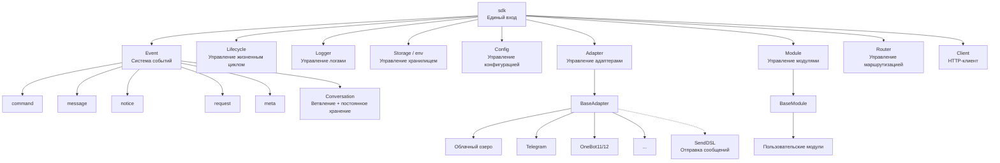

### Описание основных модулей

| Модуль | Описание |
|------|------|
| **Event** | Система событий, предоставляет обработку пяти типов событий: command / message / notice / request / meta, а также поддерживает Conversation для многошагового диалога |
| **Adapter** | Менеджер адаптеров, управляет регистрацией, запуском и остановкой адаптеров для различных платформ |
| **Module** | Менеджер модулей, управляет регистрацией, загрузкой и выгрузкой плагинов, поддерживает объявление зависимостей и топологическую сортировку |
| **Lifecycle** | Менеджер жизненного цикла, предоставляет хуки, управляемые событиями |
| **Storage** | Система хранилища на основе SQLite, поддерживает общие SQL-цепочки запросов |
| **Config** | Управление конфигурационными файлами в формате TOML |
| **Logger** | Модульная система логирования, поддерживает под-логгеры |
| **Router** | Управление маршрутизацией HTTP/WebSocket, через абстрактный слой инкапсулирует底层后端（当前为 FastAPI + Uvicorn），支持 декораторы маршрутизации, промежуточные обработчики, группировку, ограничение скорости, CORS |
| **Client** | Единый HTTP/WS-клиент (до 2.8.0 был `HttpClient`, оставлен как совместимое псевдоним), через абстрактный слой инкапсулирует底层请求库（当前为 aiohttp），предоставляет статистику запросов, повторные попытки, логирование, WebSocket-клиент, систему исключений ErisPulse. WebSocket-клиент и серверный WebSocket используют общий базовый класс `WebSocketConnectionBase` |

## Процесс инициализации

На следующей диаграмме показан полный процесс инициализации `sdk.init()`:

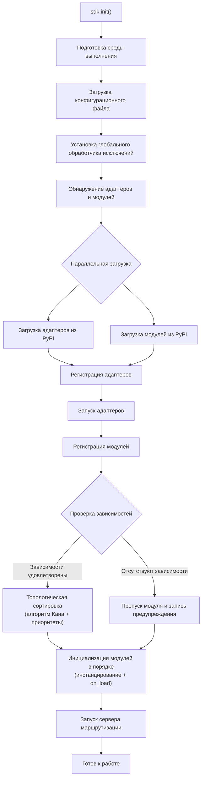

### Подробное описание этапов инициализации

> Полная цепочка инициализации с разбивкой на Finder / Loader / Manager / Router, базовые точки входа (`init()` / `init_task()` / `init_sync()`) и полный ручной запуск см. в [Процесс запуска и ручное управление](advanced/startup.md).

## Процесс обработки событий

На следующей диаграмме показан полный путь сообщения от платформы до обработчика:

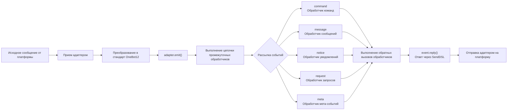

### Подробное описание цепочки обработки событий

На приведенной выше диаграмме показан результат; ниже разобрана цепочка, которая происходит "за кадром" после `adapter.emit()` — это трехуровневая цепочка рассылки:

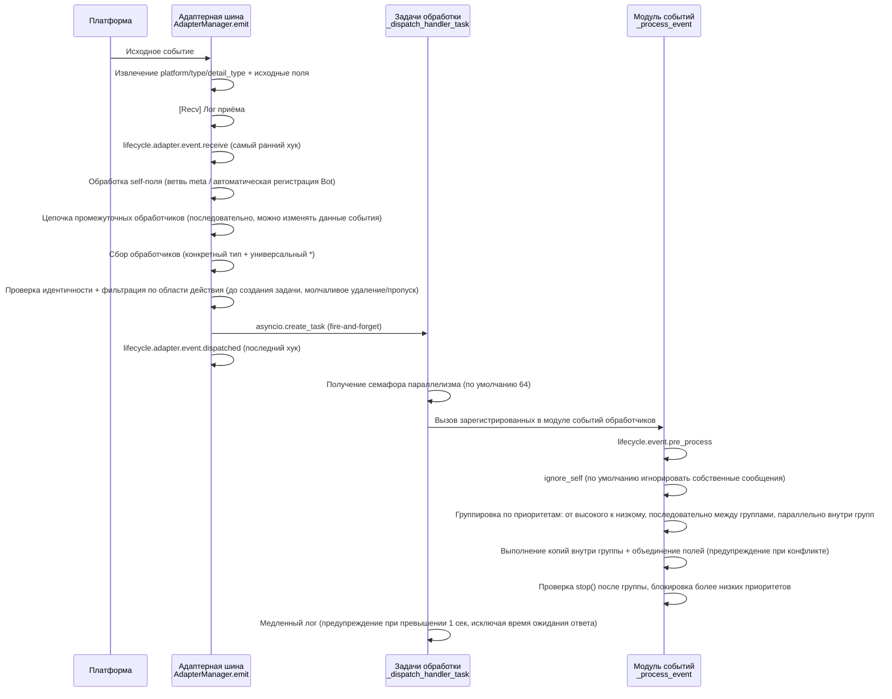

**Что делает фреймворк на каждом этапе и что вы можете изменить:**

| Этап | Что делает фреймворк | Что вы можете изменить |
|------|-------------|-----------|
| Приём | Извлекает стандартные поля, сохраняет `{platform}_raw` исходные данные; пишет лог `[Recv]` | Слушайте `adapter.event.receive`, чтобы получить событие на раннем этапе |
| self-поле | Мета-события идут по ветвям connect/disconnect/heartbeat; обычные события автоматически регистрируют Bot и запускают `adapter.bot.online` | Слушайте `adapter.bot.online` / `bot.offline` |
| Промежуточные обработчики | **Последовательно** выполняются, возвращаемое значение, отличное от None, заменяет данные события | Регистрируйте промежуточные обработчики для изменения/перехвата событий |
| Сбор обработчиков | Сначала берутся обработчики конкретного типа, затем `*` универсальные обработчики | — |
| Идентичность | Определение, принимать ли событие по уровню: пользователь > сессия > Bot > адаптер (`scope.is_identity_allowed`), **отклонение приводит к полному удалению события** | Привяжите `ErisPulse.scope.identity` |
| Фильтрация по области | Определяется по владельцу модуля (`scope.is_allowed`), сессионный уровень > Bot-уровень > платформенный уровень, **не прошедшие фильтр молча пропускаются** | Настройте белый/чёрный списки области |
| Планирование | Каждый соответствующий обработчик получает отдельную `asyncio.Task`, `emit()` **не ждёт завершения обработчика** | — |
| Приоритет | Группы высокого приоритета выполняются первыми; **группы выполняются последовательно, внутри группы — параллельно** (внутри группы каждая задача получает копию события, изменения объединяются в оригинальное событие, конфликты вызывают предупреждение) | `@command(..., priority=N)` / задайте приоритет при регистрации |
| Блокировка | После обработки группы проверяется `event.is_stopped()`, если условие выполнено, **выполняются только более высокие приоритеты** | `event.mark_processed(stop=True)` / `event.done()` |

> **Частые заблуждения**:
> 1. **Фильтрация области — молчаливая** — отфильтрованные обработчики не генерируют ошибок и не отвечают, видны только в логах TRACE уровня (`core.scope.denied`). При "модуль не получает сообщение" сначала проверьте привязку области.
> 2. **Обработчики обрабатываются параллельно** — фреймворк уже создал отдельную задачу для каждого обработчика, вам **не нужно** дополнительно оборачивать в `asyncio.create_task`.
> 3. **Группы с одинаковым приоритетом не блокируются** — `mark_processed(stop=True)` блокирует только более низкие группы, обработчики в одной группе не прерываются досрочно.
> 4. **Порог медленного лога фиксирован в 1 секунду** — если обработчик выполняется дольше 1 сек, в логе появляется предупреждение (время ожидания ответа `wait_reply` исключено из измерения времени выполнения), но выполнение не прерывается.

> Подробности о привязке области (scope) на уровне модуля, проверке идентичности и ограничениях действий см. в [Область (scope)](advanced/scope.md); фильтрация текста событий и ACL пользователя команд см. в [Введение в обработку событий](getting-started/event-handling.md); настройка ограничения параллелизма см. в [Руководство по конфигурации](user-guide/configuration.md#framework-configuration).

## Жизненные циклы событий

На следующей диаграмме показан порядок срабатывания событий жизненного цикла компонентов фреймворка:

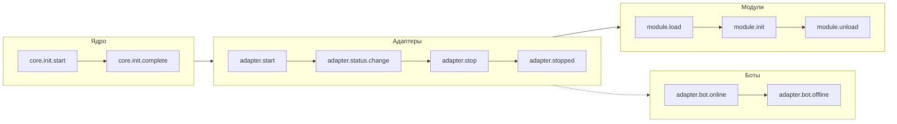

### Подключение к событиям жизненного цикла

> Полный список методов подключения к событиям (`lifecycle.on()` / `once()` / `has_handlers()`), список всех событий жизненного цикла и формат данных см. в [Управление жизненным циклом](advanced/lifecycle.md).

## Стратегии загрузки модулей

ErisPulse поддерживает три стратегии загрузки модулей, объявленные функцией `get_load_strategy()` возвращающей `ModuleLoadStrategy`:

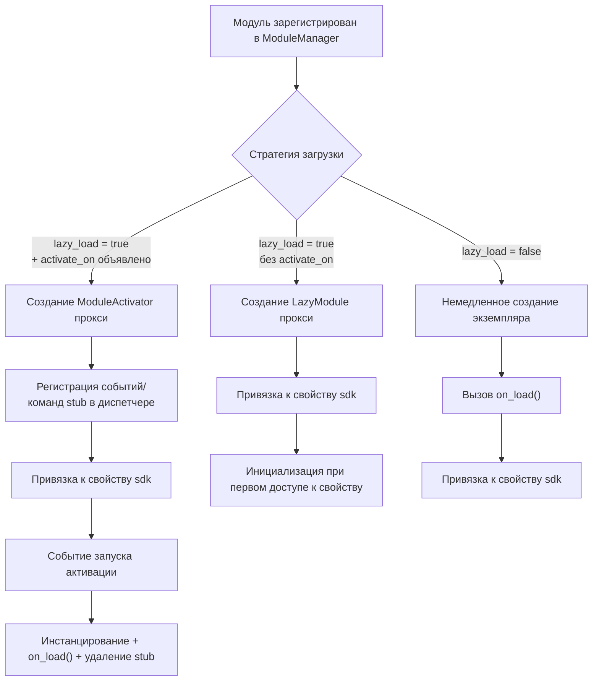

> Подробнее см. в [Система ленивой загрузки](advanced/lazy-loading.md), [Управление жизненным циклом](advanced/lifecycle.md) и документации модулей.

### Архитектура ленивой активации по событию (`activate_on`)

> [!NOTE]
> Эта функция доступна в ErisPulse **2.8.0+**.

`activate_on` позволяет модулю загружаться только при поступлении **первого соответствующего события/команды**, избегая постоянной загрузки в память и гарантируя, что события не теряются:

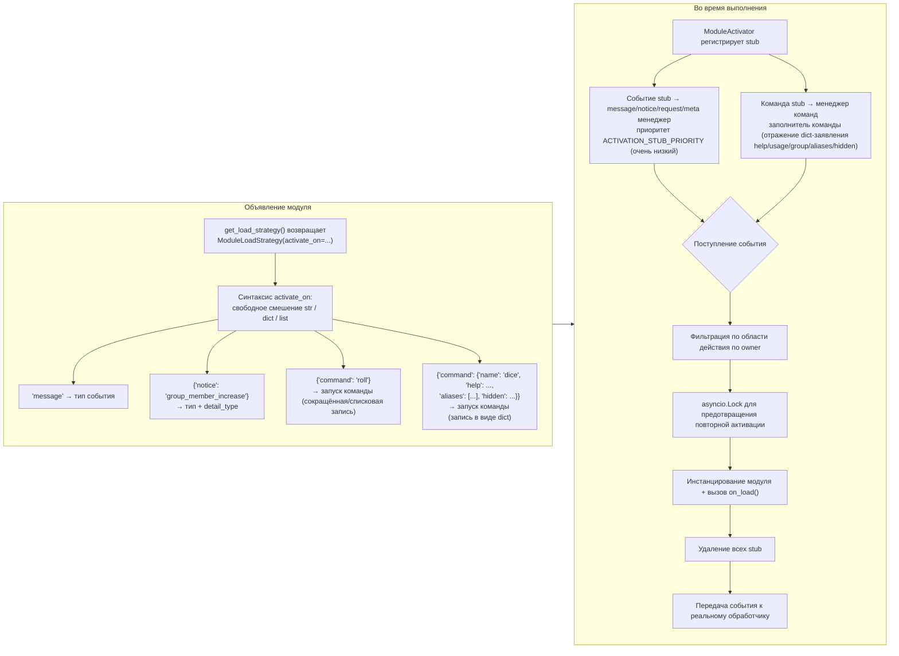

**Семантические особенности триггера:**

> Полный синтаксис `activate_on` (str / dict / list), объявление команды в виде dict, цепочка возвратов help для заполнителя команды, фильтрация по области и семантика ошибок см. в [Система ленивой загрузки](advanced/lazy-loading.md#event-driven-lazy-activation-activate_on).

## Архитектура локальной папки плагинов

> [!NOTE]
> Эта функция доступна в ErisPulse **2.8.0+**.

Локальные плагины (папка `plugins/`) не требуют упаковки и публикации, фреймворк автоматически обнаруживает и загружает их при запуске:

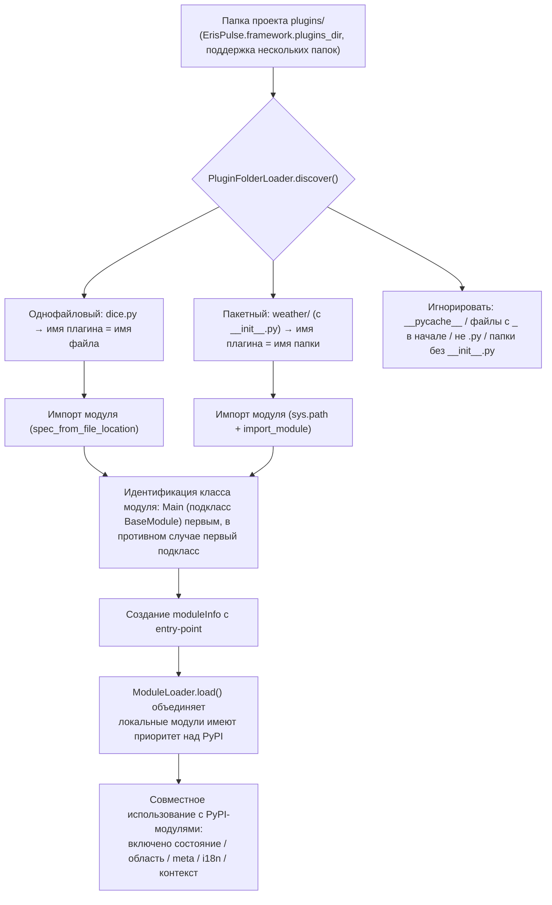

**Соглашения и особенности:**

- Имя плагина берётся из имени файла (однофайловый) или имени папки (пакетный)
- Локальные плагины имеют `moduleInfo.meta.source == "plugin_folder"`, совместимы с модулями PyPI
- При совпадении имен приоритет у локальных модулей (удобно для отладки), при отключении удаляются и соответствующие entry-point

## Архитектура горячей перезагрузки модулей

Горячая перезагрузка одинакова для **всех источников модулей**: локальные плагины могут автоматически перезагружаться при изменении файлов, любой модуль можно перезагрузить вручную через `sdk.reload_module()` / `sdk.module.reload()` (модули PyPI перезагружаются после обновления через pip):

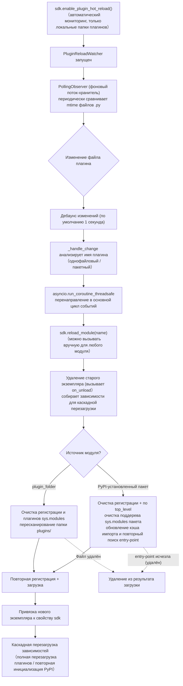

**Различия между двумя источниками есть только на этапе обнаружения**, регистрация, загрузка и каскадная перезагрузка идентичны:

- **Локальные плагины** (`moduleInfo.meta.source == "plugin_folder"`): после очистки соответствующего `sys.modules` пересканируется папка `plugins/`; если файл удалён, он удаляется из результата загрузки
- **PyPI-установленные пакеты**: по `meta.top_level` очищается поддерево `sys.modules` пакета, обновляется кэш импорта (преодолевая 60-секундный кэш entry-point) и повторно ищется и импортируется; если entry-point исчезла (pip удалён), она удаляется из результата загрузки


====
快速开始
====

# Быстрый старт

> **Это ваш первый шаг.** Запустите робота ErisPulse за 5 минут, начиная с нуля.

## Установка ErisPulse

### Сценарий установки с одним нажатием (рекомендуется)

Сценарий автоматически определяет вашу среду (Docker, Python, uv) и предлагает вам выбрать наиболее подходящий способ установки.

Windows (PowerShell):
```powershell
irm https://get.erisdev.com/install.ps1 -OutFile install.ps1; powershell -ExecutionPolicy Bypass -File install.ps1
```

macOS / Linux:
```bash
curl -fsSL https://get.erisdev.com/install.sh -o install.sh && chmod +x install.sh && ./install.sh
```

Сценарий поможет вам выполнить следующие действия:

- **Установка с помощью Docker** (рекомендуется, если Docker обнаружен): выбор источника образа (Docker Hub / GHCR), канал версий (стабильная / предварительная), настройка панели управления Dashboard, настройка портов
- **Традиционная установка**: автоматическое создание виртуальной среды, выбор версии ErisPulse, необязательная установка модуля панели управления Dashboard

### Использование Docker

В образе Docker уже включены фреймворк ErisPulse и панель управления Dashboard.

```bash
# Загрузка docker-compose.yml
curl -O https://raw.githubusercontent.com/ErisPulse/ErisPulse/main/docker-compose.yml

# Установка токена Dashboard и запуск
ERISPULSE_DASHBOARD_TOKEN=your-token docker compose up -d
```

<details>
<summary>Не удается получить доступ к Docker Hub?</summary>

Используйте образ из GitHub Container Registry, изменив параметр image в файле `docker-compose.yml`:

```yaml
image: ghcr.io/erispulse/erispulse:latest
```

</details>

После запуска перейдите по адресу `http://<host>:8000/Dashboard` и войдите, используя установленный токен.

### Установка с помощью pip

Убедитесь, что у вас установлен Python версии >= 3.10, затем выполните установку с помощью pip:

```bash
pip install ErisPulse
```

Если у вас уже установлен [uv](https://github.com/astral-sh/uv), вы также можете использовать `uv pip install ErisPulse`, что обеспечит более быструю установку.

## Инициализация проекта

### Интерактивная инициализация (рекомендуется)

```bash
epsdk init
```

Это запустит интерактивное руководство, которое поможет вам выполнить следующие шаги:
- Настройка имени проекта
- Настройка уровня логирования
- Настройка сервера (хост и порт)
- Выбор и настройка адаптера
- Создание структуры проекта

### Быстрая инициализация

```bash
# Быстрый режим с указанием имени проекта
epsdk init -q -n my_bot

# Или просто указание имени проекта
epsdk init -n my_bot
```

### Создание проекта вручную

Если вы предпочитаете создавать проект вручную:

```bash
mkdir my_bot && cd my_bot
epsdk init
```

## Установка модуля

### Установка через CLI

```bash
epsdk install Yunhu AIChat
```

### Просмотр доступных модулей

```bash
epsdk list-remote
```

### Интерактивная установка

При отсутствии имени пакета открывается интерактивный интерфейс установки:

```bash
epsdk install
```

## Запуск проекта

```bash
# Обычный запуск
epsdk run main.py

# Режим горячей перезагрузки (рекомендуется при разработке)
epsdk run main.py --reload
```

## Включение автодополнения в IDE (по желанию)

Динамически обнаруживаемые модули/адаптеры ErisPulse не поддерживаются автодополнением в IDE по умолчанию.
Запустите следующую команду для генерации типовых заглушек:

```bash
epsdk types
```

После генерации, используйте импортированные типы для аннотации переменных, чтобы получить точное автодополнение (подробнее см. [Руководство по автодополнению в IDE](./getting-started/ide-completion.md)):

```python
from _ep_types import Yunhu
from ErisPulse import sdk

adapter: Yunhu = sdk.adapter.get("yunhu")
await adapter.Send.To("group", "123").Board(...)  # Автодополнение методов, специфичных для платформы
```

## Структура проекта

Структура проекта после инициализации:

```
my_bot/
├── config/
│   └── config.toml          # Файл конфигурации
└── main.py                  # Точка входа

```

## Конфигурационный файл

Базовый конфигурационный файл `config.toml`:

```toml
[ErisPulse.server]
host = "0.0.0.0"
port = 8000

[ErisPulse.logger]
level = "INFO"

[Yunhu_Adapter]
# Конфигурация адаптера
```


====
入门指南
====


### 入门指南总览

# Введение

> Это **глубокое дополнение** к [5-минутному быстрому старту](../quick-start.md). Если вы еще не запустили первого робота, пожалуйста, сначала завершите быстрый старт.

После запуска робота, здесь мы подробно объясним основные концепции и часто используемые возможности фреймворка.

## Обучение

Рекомендуется читать в следующем порядке:

| Шаг | Тема | Описание |
|------|------|------|
| 1 | [Создание первого бота](first-bot.md) | Написание обработчика команд, понимание механизма выполнения |
| 2 | [Основные понятия](basic-concepts.md) | Понимание основной архитектуры и модульного дизайна ErisPulse |
| 3 | [Введение в обработку событий](event-handling.md) | Изучение обработки различных событий, таких как сообщения, команды, уведомления и т.д. |
| 4 | [Примеры распространённых задач](common-tasks.md) | Освоение таких функций, как сохранение данных, задачи по расписанию, управление правами и т.д. |
| 5 | [Руководство по автодополнению IDE](ide-completion.md) | Генерация типовых файлов для включения автодополнения специфичных методов в IDE |

## Выбор способа разработки

ErisPulse поддерживает два способа разработки:

| Способ | Сценарий применения | Описание |
|------|---------|------|
| **Встраиваемая разработка** | Быстрое прототипирование, внутренние функции проекта | Написание обработчиков непосредственно в `main.py`, без необходимости создания отдельного модуля |
| **Модульная разработка** (рекомендуется) | Продуктовая среда, распространение функций | Создание отдельного пакета Python, который можно установить и использовать с помощью `epsdk install` |

> Подробное сравнение и примеры обоих способов см. в разделах [Создание первого бота](first-bot.md) и [Введение в модульную разработку](../developer-guide/modules/getting-started.md).

## Обзор архитектуры

ErisPulse использует архитектуру, основанную на событиях, и состоит из следующих основных систем:

- **Система адаптеров** — взаимодействует с различными платформами, преобразуя события платформ в единый стандарт OneBot12
- **Система событий** — обрабатывает пять основных типов событий: сообщения, команды, уведомления, запросы и метасобытия
- **Система модулей** — расширяет функциональность с помощью независимых модулей, поддерживает управление зависимостями и ленивую загрузку
- **Основные модули** — предоставляют базовые возможности, такие как Storage (хранилище), Config (конфигурация), Logger (логирование), Router (маршрутизация)

> Подробную диаграмму архитектуры и процесс инициализации см. в разделе [Обзор архитектуры](../architecture.md).

## Начало обучения

Готовы начать?

- [Создание первого бота](first-bot.md) — 5 минут для старта


### 创建第一个机器人

# Создание первого бота

Это руководство продолжает [5-минутное краткое руководство](../quick-start.md), помогая вам написать первый обработчик команд и понять механизм работы.

> Если вы еще не установили ErisPulse и не инициализировали проект, пожалуйста, сначала завершите три шага в [Кратком руководстве](../quick-start.md): «Установка», «Инициализация проекта», «Запуск проекта».

## Шаг первый: написание первой команды

Откройте `main.py` и напишите простой обработчик команды:

```python
from ErisPulse import sdk
from ErisPulse.Core.Event import command

@command("hello", help="Отправить приветственное сообщение")
async def hello_handler(event):
    """Обработка команды hello"""
    user_name = event.get_user_nickname() or "друг"
    await event.reply(f"Привет, {user_name}! Я бот ErisPulse.")

@command("ping", help="Проверить, работает ли бот")
async def ping_handler(event):
    """Обработка команды ping"""
    await event.reply("Pong! Бот работает нормально.")

async def main():
    """Основная точка входа"""
    print("Запуск ErisPulse...")
    
    # keep_running=True (по умолчанию): фреймворк блокируется и продолжает работу, пока не получит сигнал о завершении (например, Ctrl+C)
    await sdk.run(keep_running=True)

if __name__ == "__main__":
    import asyncio
    asyncio.run(main())
```

### Параметр `keep_running`

Параметр `sdk.run(keep_running)` управляет тем, блокируется ли фреймворк для поддержания работы:

- **`keep_running=True` (по умолчанию)**: `run()` будет блокироваться до тех пор, пока не получит сигнал о завершении (например, Ctrl+C), подходит для чистых ботов.
- **`keep_running=False`**: `run()` завершит инициализацию и немедленно вернёт управление. **Фреймворк не будет остановлен** — запущенные адаптеры/модули продолжат обрабатывать события сообщений в фоновом режиме, вы можете продолжить выполнять собственную логику, пока цикл событий не завершится и фреймворк не закроется. Например:

```python
async def main():
    await sdk.run(keep_running=False)   # Инициализация завершена, немедленно возвращаем управление
    # Фреймворк уже работает в фоне, здесь можно делать что-то ещё
    while True:
        await asyncio.sleep(3600)
        print("Проверка каждый час")
```

> Помимо двух режимов `run()`, существуют более тонкие способы управления жизненным циклом, такие как `init()`/`uninit()` для ручного управления, а также отдельный запуск и остановка адаптеров/маршрутизации. Подробнее см. [Жизненный цикл и ручное управление](../advanced/startup.md).

## Шаг второй: Запуск робота

```bash
# Обычный запуск
epsdk run main.py

# Режим разработки (поддержка горячей перезагрузки)
epsdk run main.py --reload
```

## Шаг 3: Тестирование бота

Отправьте команду в вашей системе общения:

```
/hello
```

Вы должны получить ответ от бота.

## Описание кода

### Декоратор команды

```python
@command("hello", help="Отправить приветственное сообщение")
```

- `hello`: имя команды, вызывается пользователем с помощью `/hello`
- `help`: описание команды, отображается в команде `/help`

### Параметры события

```python
async def hello_handler(event):
```

Параметр `event` представляет собой объект Event, содержащий:
- Текст сообщения: `event.get_text()`
- Информация о отправителе: `event.get_user_id()`, `event.get_user_nickname()`
- Информация о платформе: `event.get_platform()`
- Информация о группе: `event.get_group_id()`
- Исходные данные: `event.get_raw()`

> Полный список методов объекта Event см. в разделе [Подробное описание Event-объекта](../developer-guide/modules/event-wrapper.md).

### Отправка ответа

```python
await event.reply("Содержимое ответа")
```

Метод `event.reply()` — это удобный способ отправки сообщения отправителю.

## Расширение: добавление дополнительных функций

ErisPulse предоставляет богатые возможности для обработки событий и данных:

- **Прослушивание сообщений**: используйте `@message.on_message()` для прослушивания различных сообщений → [Введение в обработку событий](event-handling.md)
- **Прослушивание уведомлений**: используйте `@notice.on_friend_add()` и другие для прослушивания системных уведомлений → [Введение в обработку событий](event-handling.md)
- **Хранение данных**: используйте `sdk.storage.get/set` для постоянного хранения данных → [Примеры распространенных задач](common-tasks.md)

## Часто задаваемые вопросы

### Команда не отвечает?

1. Проверьте, правильно ли настроен адаптер, убедитесь, что `status` адаптера в файле `config/config.toml` установлен в `true`
2. Проверьте вывод логов в терминале, убедитесь, что нет ошибок (особенно сообщений уровня `ERROR`)
3. Убедитесь, что префикс команды верный (по умолчанию это `/`), можно проверить в разделе `[ErisPulse.event.command]` файла конфигурации
4. Убедитесь, что имя команды написано правильно, обратите внимание на настройки чувствительности к регистру

### Как изменить префикс команды?

Добавьте в `config.toml` следующее:

```toml
[ErisPulse.event.command]
prefix = "!"
case_sensitive = false
```

### Как поддерживать несколько платформ?

ErisPulse использует стандарт OneBot12 для унификации формата событий на разных платформах. Обработчики, зарегистрированные с помощью `@command` и `@message`, автоматически получают события со всех платформ. С помощью `event.get_platform()` можно определить источник платформы:

```python
@command("hello")
async def hello_handler(event):
    platform = event.get_platform()
    
    if platform == "yunhu":
        await event.reply("Привет! От Юньху")
    elif platform == "telegram":
        await event.reply("Hello! От Telegram")
    else:
        await event.reply("Привет!")
```

> Дополнительные советы по адаптации под несколько платформ можно найти в разделе [Примеры типичных задач](common-tasks.md#многоплатформенная-адаптация).


### 基础概念

# Основные понятия

В этом руководстве представлены основные концепции ErisPulse, которые помогут вам понять философию и архитектуру фреймворка.

## Архитектура на основе событий

ErisPulse использует архитектуру на основе событий, где все взаимодействия передаются и обрабатываются через события.

### Процесс событий

```
Пользователь отправляет сообщение
      │
      ▼
Платформа получает
      │
      ▼
Адаптер получает нативное событие платформы
      │
      ▼
Преобразуется в стандартное событие OneBot12
      │
      ▼
Отправляется в систему событий
      │
      ▼
Распределяется по зарегистрированным обработчикам
      │
      ▼
Модуль обрабатывает событие
      │
      ▼
Ответ отправляется через адаптер
      │
      ▼
Платформа отображает пользователю
```

### Стандарт OneBot12

ErisPulse использует OneBot12 как основной стандарт событий. OneBot12 — это универсальный стандарт интерфейса для чат-ботов, определяющий единый формат событий.

Все адаптеры преобразуют платформенно-специфичные события в формат OneBot12, обеспечивая согласованность кода.

## Основные компоненты

### 1. Объект SDK

SDK является единым точкой входа для всех функций, предоставляя доступ к основным компонентам.

```python
from ErisPulse import sdk

# Доступ к основным модулям
sdk.storage    # Система хранения
sdk.config     # Система конфигурации
sdk.logger     # Система логирования
sdk.adapter    # Система адаптеров
sdk.module     # Система модулей
sdk.router     # Система маршрутизации
sdk.client     # HTTP-клиент
sdk.lifecycle  # Система жизненного цикла
```

### 2. Объект Event

Объект Event封装ует данные события и предоставляет удобные методы доступа.

```python
@command("info")
async def info_handler(event):
    # Получение информации о событии
    event_id = event.get_id()
    user_id = event.get_user_id()
    platform = event.get_platform()
    text = event.get_text()
    
    # Отправка ответа
    await event.reply(f"Пользователь: {user_id}, Платформа: {platform}")
```

### 3. Адаптеры

Адаптеры являются мостом между ErisPulse и внешними платформами.

**Задачи:**
- Получение нативных событий платформы
- Преобразование в формат OneBot12
- Отправка событий в формате OneBot12 на платформу

**Примеры адаптеров:**
- Адаптер Yunhu: коммуникация с платформой Yunhu
- Адаптер Telegram: коммуникация с Telegram Bot API
- Адаптер OneBot11: совместимость с OneBot11
- Адаптер Email: обработка отправки и получения электронной почты

### 4. Модули

Модули являются базовыми единицами расширения функциональности, позволяя:

- Регистрировать обработчики событий
- Реализовывать бизнес-логику
- Вызывать адаптеры для отправки сообщений
- Использовать сервисы, предоставляемые основными модулями

#### Механизм обнаружения модулей

ErisPulse использует `importlib.metadata.entry_points` для обнаружения установленных модулей. Модули объявляются в `pyproject.toml` с помощью entry points:

```toml
[project.entry-points."erispulse.module"]
MyModule = "my_package:Main"
```

При инициализации SDK происходит сканирование всех entry points группы `erispulse.module`, классы модулей регистрируются в `ModuleManager`, после чего они инициализируются в соответствии с зависимостями.

#### Минимально рабочий модуль

```python
from ErisPulse.Core.Bases import BaseModule
from ErisPulse import sdk

class Main(BaseModule):
    def __init__(self):
        self.sdk = sdk
        self.logger = sdk.logger.get_child("MyModule")

    async def on_load(self, event):
        self.logger.info("Модуль загружен")

    async def on_unload(self, event):
        self.logger.info("Модуль выгружен")
```

#### Жизненный цикл модуля

- **Регистрация:** SDK обнаруживает класс модуля и регистрирует его в менеджере
- **Загрузка:** Создается экземпляр модуля, вызывается `on_load(event)` (`event = {"module_name": "MyModule"}`)
- **Выгрузка:** Вызывается `on_unload(event)`, очищаются ресурсы

#### Стратегия загрузки

С помощью `get_load_strategy()` объявляется поведение загрузки модуля:

```python
from ErisPulse.loaders import ModuleLoadStrategy

class Main(BaseModule):
    @staticmethod
    def get_load_strategy():
        return ModuleLoadStrategy(
            lazy_load=True,   # Ленивая загрузка (по умолчанию True)
            priority=0        # Приоритет загрузки, чем больше, тем раньше инициализируется
        )
```

- **`lazy_load=True` (по умолчанию):** Модуль инициализируется при первом обращении к `sdk.MyModule`, снижая время запуска
- **`lazy_load=False`:** Модуль инициализируется при запуске SDK, подходит для модулей, обрабатывающих события жизненного цикла или выполняющих фоновые задачи
- **`priority`:** Модули с одинаковым приоритетом загружаются в порядке регистрации; чем больше значение, тем раньше инициализируется

> Подробнее о механизме ленивой загрузки см. в [Системе ленивой загрузки](../advanced/lazy-loading.md).

## Типы событий

ErisPulse поддерживает 5 типов событий:

| Тип события | Декоратор | Описание |
|---------|--------|------|
| Событие сообщения | `@message.on_message()` | Любое сообщение, отправленное пользователем (личные сообщения, группы) |
| Событие команды | `@command("name")` | Сообщение, начинающееся с префикса команды (например, `/hello`) |
| Уведомление | `@notice.on_friend_add()` и др. | Системные уведомления (добавление друзей, изменения в группе) |
| Запрос | `@request.on_friend_request()` и др. | Запросы от пользователей (запросы на добавление в друзья, приглашения в группы) |
| Мета-событие | `@meta.on_connect()` и др. | Системные события (подключение, отключение, heartbeat) |

> Подробное описание и примеры использования каждого типа событий см. в [Введение в обработку событий](event-handling.md).

## Описание основных модулей

### Storage (Хранилище)

Хранилище на основе SQLite для постоянного хранения данных.

```python
# Установка значения
sdk.storage.set("key", "value")

# Получение значения
value = sdk.storage.get("key", "default_value")

# Массовые операции
sdk.storage.set_multi({
    "key1": "value1",
    "key2": "value2"
})

# Транзакции
with sdk.storage.transaction():
    sdk.storage.set("key1", "value1")
    sdk.storage.set("key2", "value2")
```

### Config (Конфигурация)

Управление конфигурационными файлами в формате TOML.

```python
# Получение конфигурации
config = sdk.config.getConfig("MyModule", {})

# Установка конфигурации
sdk.config.setConfig("MyModule", {"key": "value"})

# Чтение вложенной конфигурации
value = sdk.config.getConfig("MyModule.subkey", "default")
```

### Logger (Журнал)

Модульная система журналирования.

```python
# Запись в журнал
sdk.logger.info("Это информационное сообщение")
sdk.logger.warning("Это предупреждение")
sdk.logger.error("Это ошибка")

# Получение дочернего логгера
child_logger = sdk.logger.get_child("submodule")
child_logger.info("Журнал подмодуля")
```

**Синтаксис доступа по атрибутам**

Помимо метода `get_child()`, можно использовать **доступ по атрибутам** для создания дочернего логгера, что является более компактным **синтаксическим сахаром**:

```python
# Создание дочернего логгера через доступ по атрибутам
sdk.logger.mymodule.info("Сообщение модуля")

# Поддержка вложенного доступа
sdk.logger.mymodule.database.info("Сообщение базы данных")
```

### Router (Маршрутизация)

Управление маршрутизацией HTTP и WebSocket, основано на FastAPI + Uvicorn. Поддерживает маршрутизацию с помощью декораторов, промежуточные слои, группы, ограничение скорости, CORS.

```python
from ErisPulse.Core import HttpRequest

@sdk.router.get("MyModule", "/api")
async def handler(request: HttpRequest):
    data = await request.json()
    return {"status": "ok"}
```

> Полный API маршрутизатора (WebSocket, промежуточные слои, ограничение скорости, CORS и др.) см. в [Маршрутизаторе](../advanced/router.md).

### Client (Сетевой клиент)

Единый сетевой клиент, объединяющий HTTP-запросы, WebSocket-соединения, управление пулов, автоматические повторы, таймауты, статистику запросов и интеграцию с событиями жизненного цикла.

```python
from ErisPulse.Core import client

# HTTP-запрос
resp = await client.get("https://api.example.com/users")
data = await resp.json()

# Запрос с повторами и таймаутом
resp = await client.get(url, timeout=30, max_retries=3)

# WebSocket-соединение
ws = await client.ws_connect("wss://example.com/ws")
async for text in ws.iter_text():
    await ws.send_text(f"Эхо: {text}")
```

> Полный API сетевого клиента см. в [Сетевом клиенте](../advanced/http-client.md).

## DSL для отправки сообщений SendDSL

Адаптеры предоставляют интерфейс для отправки сообщений с цепочечным вызовом.

### Базовая отправка

```python
# Получение экземпляра адаптера
yunhu = sdk.adapter.get("yunhu")

# Отправка сообщения
await yunhu.Send.To("user", "U1001").Text("Привет")

# Указание отправляющего аккаунта
await yunhu.Send.Using("bot1").To("group", "G1001").Text("Сообщение в группе")
```

### Цепочки модификаторов

```python
# @пользователя
await yunhu.Send.To("group", "G1001").At("U2001").Text("@сообщение")

# Ответ на сообщение
await yunhu.Send.To("group", "G1001").Reply("msg123").Text("Ответ")

# @всех
await yunhu.Send.To("group", "G1001").AtAll().Text("Объявление")
```

### Методы ответа в Event

Объект Event предоставляет удобные методы для отправки ответа:

```python
@command("test")
async def test_handler(event):
    # Простой текстовый ответ
    await event.reply("Содержимое ответа")
    
    # Отправка изображения
    await event.reply("http://example.com/image.jpg", method="Image")
    
    # Отправка голосового сообщения
    await event.reply("http://example.com/voice.mp3", method="Voice")
```

## Система ленивой загрузки

ErisPulse по умолчанию включает ленивую загрузку модулей, при которой модуль инициализируется только при первом обращении (например, `sdk.MyModule`), что значительно ускоряет запуск.

```python
from ErisPulse.loaders import ModuleLoadStrategy

class Main(BaseModule):
    @staticmethod
    def get_load_strategy():
        return ModuleLoadStrategy(
            lazy_load=True,   # Включить ленивую загрузку (по умолчанию)
            priority=0        # Приоритет загрузки, чем больше, тем раньше инициализируется
        )
```

**Сценарии, требующие отключения ленивой загрузки (`lazy_load=False`):**
- Модули, обрабатывающие события жизненного цикла (например, `core.init.complete`)
- Модули, запускающие фоновые задачи или сервисы
- Модули, требующие инициализации до других модулей

> Подробнее о механизме ленивой загрузки и рекомендациях см. в [Системе ленивой загрузки](../advanced/lazy-loading.md).


### 事件处理入门

# Введение в обработку событий

В этом руководстве описано, как обрабатывать различные события в ErisPulse.

## Обзор типов событий

ErisPulse поддерживает следующие типы событий:

| Тип события | Описание | Сценарии использования |
|---------|------|---------|
| Событие сообщения | Любое сообщение, отправленное пользователем | Чат-боты, фильтрация контента |
| Событие команды | Сообщение, начинающееся с префикса команды | Обработка команд, вход в функции |
| Событие уведомления | Системные уведомления (добавление в друзья, изменения участников группы и т.д.) | Приветствия, уведомления о статусе |
| Событие запроса | Запросы пользователей (запросы на добавление в друзья, приглашения в группу) | Автоматическая обработка запросов |
| Системное событие | Системные события (подключение, пинг) | Мониторинг подключения, проверка состояния |

## Обработка событий сообщений

> **Примечание**: Рекомендуется использовать аннотацию типа `Event` в обработчиках событий, чтобы получить поддержку автодополнения и проверки типов в IDE.

```python
from ErisPulse.Core.Event import Event  # Импорт типа события для аннотации
```

### Подписка на все сообщения

```python
from ErisPulse.Core.Event import message, Event

@message.on_message()
async def message_handler(event: Event):
    text = event.get_text()
    user_id = event.get_user_id()
    sdk.logger.info(f"Получено сообщение от {user_id}: {text}")
```

### Подписка на личные сообщения

```python
@message.on_private_message()
async def private_handler(event: Event):
    user_id = event.get_user_id()
    await event.reply(f"Привет, {user_id}! Это личное сообщение.")
```

### Подписка на сообщения в группе

```python
@message.on_group_message()
async def group_handler(event: Event):
    group_id = event.get_group_id()
    user_id = event.get_user_id()
    sdk.logger.info(f"Сообщение отправлено в группу {group_id} пользователем {user_id}")
```

### Подписка на сообщения с упоминанием

```python
@message.on_at_message()
async def at_handler(event: Event):
    # Получение списка упомянутых пользователей
    mentions = event.get_mentions()
    await event.reply(f"Вы упомянули следующих пользователей: {mentions}")
```

### Слушание с помощью подстановочных знаков и регулярных выражений

Четыре декоратора сообщений (`on_message` / `on_private_message` / `on_group_message` /
`on_at_message`) поддерживают параметры `pattern` (подстановочные знаки glob) и `regex` (регулярные выражения). Сообщения, не соответствующие этим условиям, **не вызывают** обработчик:

```python
# Подстановочные знаки glob: * - любая последовательность, ? - один символ, [seq] - набор символов
@message.on_message(pattern="签到*")
async def signin_handler(event: Event):
    await event.reply("Успешно зарегистрированы")

# Регулярное выражение: соответствует сумме
@message.on_message(regex=r"\d+\s*元")
async def price_handler(event: Event):
    await event.reply(f"Получена сумма: {event.get_text()}")

# pattern и regex одновременно → оба условия должны совпадать
@message.on_message(pattern="*元", regex=r"\d+\s*元")
async def combined_handler(event: Event):
    pass
```

Параметры `wait_reply` также поддерживают эти два параметра (см. [Функция ожидания ответа](../developer-guide/modules/event-wrapper.md#ожидание-ответа)).

## Обработка событий команд

### Базовые команды

```python
from ErisPulse.Core.Event import command

@command("help", help="Показать справочную информацию")
async def help_handler(event):
    help_text = """
Доступные команды:
/help - Показать справку
/ping - Проверить соединение
/info - Посмотреть информацию
    """
    await event.reply(help_text)
```

### Псевдонимы команд

```python
@command(["help", "h"], aliases=["帮助"], help="Показать справочную информацию")
async def help_handler(event):
    await event.reply("Справочная информация...")
```

Пользователи могут вызывать команду следующими способами:
- `/help`
- `/h`
- `/帮助`

### Параметры команд

```python
@command("echo", help="Повторить сообщение")
async def echo_handler(event):
    # Получить параметры команды
    args = event.get_command_args()
    
    if not args:
        await event.reply("Введите сообщение, которое нужно повторить")
    else:
        await event.reply(f"Вы сказали: {' '.join(args)}")
```

### Группировка команд

```python
@command("admin.reload", group="admin", help="Перезагрузить модуль")
async def reload_handler(event):
    await event.reply("Модуль перезагружен")

@command("admin.stop", group="admin", help="Остановить бота")
async def stop_handler(event):
    await event.reply("Бот остановлен")
```

### Права доступа и контроль доступа к командам

Права доступа к командам определяются на трёх уровнях, с верхнего по нижний (если доступ запрещён на верхнем уровне, нижние уровни не проверяются):

```python
# ① ACL доступа к командам (конфигурация со стороны пользователя): по белому и чёрному списку пользователей команды, при запрете возвращается "Недостаточно прав"
# ② master=True — только владелец фреймворка может выполнить (фреймворк автоматически проверяет, при запрете возвращает "Недостаточно прав")
@command("restart", master=True, help="Перезапустить модуль")
async def restart_handler(event):
    await event.reply("Модуль перезапущен")

# ③ permission=функция — собственная логика контроля доступа к команде (выполняется только при возврате True)
def is_admin(event):
    return event.get_user_id() in {"user123", "user456"}

@command("panel", permission=is_admin, help="Панель управления")
async def panel_handler(event):
    await event.reply("Добро пожаловать на панель управления")
```

**ACL пользователя команд** (`ErisPulse.event.command.acl`): пользователь может настроить белый и чёрный списки для любой команды, имена команд поддерживают точное и шаблонное сопоставление (например, `"roll*"`), при запрете возвращается "Недостаточно прав":

```toml
# config.toml — разрешить только 123456 выполнять restart; 666 всегда запрещено
[ErisPulse.event.command.acl.restart]
allow = ["onebot11:123456"]
deny = ["onebot11:666"]
```

Порядок проверки: если есть совпадение в `deny` → запрет; если `allow` не пуст и совпадений нет → запрет; если ACL не настроен, применяется `event.command.default_allow` (`false` = строгий режим, без ACL запрет; `true` → передаётся на отдельную проверку `master=True` / `permission`). API для работы с ACL во время выполнения (поддержка шаблонов в имени команды):

```python
from ErisPulse.Core.Event import command

command.allow_user("restart", "onebot11", "123456")   # добавить в белый список
command.deny_user("restart", "onebot11", "666")       # добавить в чёрный список
command.remove_acl("restart")                          # удалить белый и чёрный списки
command.get_acl("restart")                             # получить текущий список
```

> Обработчики команд импортируются из пакета событий: `from ErisPulse.Core.Event import command`;
> также можно получить через пакет SDK: `sdk.Event.command` (оба являются одним и тем же синглтоном).
> В модулях обычно уже импортируются вместе с декоратором команды (`from ErisPulse.Core.Event import command`).

Контроль доступа на уровне событий (кто / какая группа / какой бот может получать сообщения) — через измерение идентичности в области действия (`scope.identity`); доступность на уровне модуля (какие модули можно использовать) — через измерение модуля в области действия (`scope.platforms / bots / sessions`).
См. [Область действия (scope)](../advanced/scope.md).

> Рекомендация: если внутри команды нужно взаимодействовать с бизнес-логикой, используйте `master=True` / `permission`; если нужно контролировать доступ по пользователю / группе, используйте измерение идентичности области действия; если нужно контролировать доступность модуля, используйте измерение модуля области действия.

### Приоритет команд

```python
# Чем больше значение приоритета, тем раньше выполнение
@message.on_message(priority=10)
async def high_priority_handler(event):
    await event.reply("Обработчик высокого приоритета")

@message.on_message(priority=1)
async def low_priority_handler(event):
    await event.reply("Обработчик низкого приоритета")
```

### Параллельная обработка событий

Система событий ErisPulse использует модель распределения задач с **параллельным выполнением на одном уровне приоритета и последовательным выполнением между уровнями приоритета**:

```
Событие пришло
    ↓
Группа priority=10: [Обработчик C || Обработчик D] параллельно → объединить результаты
    ↓ (если не прервано)
Группа priority=0: [Обработчик A || Обработчик B] параллельно → объединить результаты
    ↓
...
```

- **Параллельное выполнение на одном уровне приоритета**: обработчики с одинаковым приоритетом выполняются одновременно, повышая пропускную способность
- **Последовательное выполнение между уровнями приоритета**: группы с разными приоритетами выполняются последовательно (чем выше значение приоритета, тем раньше выполнение), гарантируя, что обработчики с высоким приоритетом выполняются первыми
- **Copy-On-Write**: обработчики не создают копию, если не вносят изменения, обеспечивая нулевой накладной расход
- **Обработка конфликтов**: при одновременном изменении одного и того же поля несколькими обработчиками одного уровня приоритета используется последнее значение с записью предупреждения в лог
- **Механизм прерывания**: после вызова `event.done()` (по умолчанию) или `event.done(claim=False)` любым обработчиком пропускаются последующие группы с более низким приоритетом. Разница между присвоением и блокировкой описана в разделе [Контроль маршрута: присвоение и блокировка](#контроль-маршрута-присвоение-и-блокировка)

```python
# Пример: параллельное выполнение обработчиков одного уровня приоритета
@message.on_message(priority=0)
async def handler_a(event):
    # Обработать задачу A
    event['result_a'] = process_a()

@message.on_message(priority=0)
async def handler_b(event):
    # Выполняется параллельно с handler_a
    event['result_b'] = process_b()

# Последовательное выполнение обработчиков разных уровней приоритета
@message.on_message(priority=10)
async def handler_c(event):
    # Наивысший приоритет, выполняется первым
    pass
```

> **Ограничение параллелизма**: все соответствующие обработчики сразу создаются в виде задач, но ограничиваются сигналом, ограничивающим количество одновременно выполняемых задач, по умолчанию 64 (настройка `ErisPulse.framework.handler_max_concurrency`, поддерживает горячую перезагрузку). Задачи, превышающие лимит, ждут в очереди на сигнале, пока предыдущие не завершатся. В моменты пикового трафика это как ваш "сброс давления".
>
> **Медленные логи**: если один обработчик выполняется дольше 1 секунды, фреймворк записывает предупреждение в лог (`handler_slow`). Время ожидания `wait_reply` исключается из времени выполнения, чтобы не ошибочно считать "ожидание ответа" медленным выполнением.

## Scope filtering: Why didn't my module receive the message

After the event arrives, there are two **silent** filters (neither reply nor error):

1. **Identity dimension** (`ErisPulse.scope.identity`): When an event enters the distribution entry point, it is determined whether to receive it based on User > Group > Bot > Adapter.
   The rejected **entire event** is directly discarded, and no handler (including the command dispatcher) will be triggered.
2. **Module dimension** (`ErisPulse.scope`): When an event reaches a module's handler/command, it is determined based on Session > Bot > Platform whether this module is available; if it **fails the check, it is silently skipped**.

```toml
# Example 1: Do not propagate all messages from a certain group
[ErisPulse.scope.identity.sessions.onebot11."group_123"]
deny = true

# Example 2: Block MyModule from a certain Bot
[ErisPulse.scope.bots.onebot11."123456"]
blocked = ["MyModule"]
```

At this point, when messages from this group arrive, the `MyModule` command and event handler **will not be scheduled**. This is not a bug, but a filtering mechanism—when troubleshooting "module not responding," prioritize checking the identity and module binding of the scope.

- Filter logs are only visible at the **TRACE** level (`core.scope.identity_denied` / `core.scope.denied`); by default, nothing is visible at the INFO level
- Framework-level handlers (such as the command dispatcher `scope_exempt=True`) are not affected by the **module dimension**, but are affected by the **identity dimension** (the entire event has already been discarded)
- There is a third filter before command execution: command user ACL (replies "insufficient permissions" when denied, see the previous section)
- The fourth is **event overwriting** (see the next section)

> For scope configuration, matching syntax, and runtime API, see [Scope](../../advanced/scope.md).

## Переопределение событий: изменение поведения любого типа событий без изменения кода модуля

> [!NOTE]
> Эта функция доступна начиная с ErisPulse **2.8.0+**.

Параметры обработчиков событий, объявленные при регистрации (`pattern` / `regex` / `master` / `hidden` и т.д.), являются **по умолчанию для разработчиков**.  
Система универсального переопределения позволяет пользователю переопределять поведение любого модуля по **типу события** — стандартные типы OneBot12 (`meta` / `message` / `notice` / `request`) и расширенные типы ErisPulse (`command`) имеют свои собственные переопределяемые параметры:

| Тип события | Переопределяемые параметры | Действие |
|---------|-----------|------|
| `message` | `pattern` / `regex` / `detail_types` | Условия триггера текста + белый список подтипов сообщений |
| `notice` | `detail_types` / `pattern` / `regex` | Белый список подтипов уведомлений + текстовое условие |
| `request` | `detail_types` / `pattern` / `regex` | Белый список подтипов запросов + текстовое условие |
| `meta` | `detail_types` | Белый список подтипов мета-событий (connect / heartbeat и т.д.) |
| `command` | `master` / `hidden` / `aliases` / `prefix` / `help` / `usage` | Параметры реализации команды (приоритет пользователя) |
| `acl` (специфично для `command`) | `allow` / `deny` | Белый и чёрный списки пользователей команды (по шаблону команды) |

```toml
# message: переопределение условия триггера текста (AND с условиями в коде)
[ErisPulse.event.overrides.message.ChatModule]
pattern = "闲聊*"

# notice: только определённые подтипы уведомлений
[ErisPulse.event.overrides.notice.MyModule]
detail_types = ["group_increase"]

# command: переопределение параметров реализации (приоритет пользователя — можно ужесточить или ослабить по умолчанию разработчика)
[ErisPulse.event.overrides.command.MyModule.restart]
master = true
hidden = true

# acl: чёрный и белый списки пользователей команды (глобально по шаблону команды)
[ErisPulse.event.overrides.acl."roll*"]
allow = ["onebot11:u_vip"]

# ACL по умолчанию (false = строгий режим: без ACL — запрет)
acl_default_allow = true
```

API во время выполнения (`from ErisPulse.Core.Event import overrides` или `sdk.Event.overrides`, **пространства имён по типам** — симметричные три метода `set` / `get` / `delete` для каждого типа):

```python
from ErisPulse.Core.Event import overrides

overrides.message.set("ChatModule", pattern="闲聊*")   # Условие текста для message
overrides.notice.set("MyModule", detail_types=["group_increase"])
overrides.command.set("MyModule", "restart", master=True)  # Параметры команды
overrides.acl.set("roll*", deny=["onebot11:u_bad"])    # Чёрный список пользователей команды

overrides.message.get("ChatModule")     # {"pattern": "闲聊*"}
overrides.message.delete("ChatModule")  # Восстановление по умолчанию разработчика
```

- Переопределённые условия и условия в коде обработчика **действуют одновременно** (логическое AND); параметры `command` и объявления разработчика **глубоко сливаются** (приоритет переопределения)
- `detail_types`: события без `detail_type` пропускаются (не блокируются неизвестные события)
- `pattern` / `regex`: события без текста (connect / heartbeat и т.д.) не подпадают под ограничения, пропускаются напрямую
- Переопределённый ключ `master` для `command` синхронно отображается в хранилище ключа `must_master`; запрет команды проходит через `acl deny`
- Изменения конфигурации вступают в силу немедленно (горячая перезагрузка), формат проверяется и выводятся предупреждения (неизвестные параметры / некорректные элементы игнорируются)

## Управление цепочкой: присвоение и блокировка

> [!NOTE]
> Параметры `claim=` / `stop=` для `event.done()` / `event.mark_processed()` требуют ErisPulse **2.7.1+**.

ErisPulse разделяет два ортогональных семантических понятия — "присвоение" и "блокировка" — и объединяет их управление через `event.done()`, что позволяет добавлять слои наблюдения (например, логирование, аудит, права доступа) вокруг обработки команд.

**Точное определение двух понятий:**

- **Присвоение (claim)**: Пометка события как обработанного данным обработчиком (запись в `_processed`). Диспетчер команд видя уже присвоенное событие, **пропускает его** — избегая повторной обработки одного и того же сообщения несколькими обработчиками команд. Типичный сценарий: после успешного сопоставления команды, присвоить событие, чтобы диспетчер команд больше не вмешивался.
- **Блокировка (stop)**: Предотвращение распространения события **ниже по приоритету** (запись в `_propagation_stopped`). Обработчики с более низким приоритетом (например, `on_message`) больше не увидят это событие. Типичный сценарий: высокоприоритетный обработчик уже полностью обработал событие, и не желает, чтобы более низкоприоритетные обработчики его обрабатывали.

| `event.done(...)` | Присвоение | Блокировка | Сценарий |
|-------------------|-----------|------------|---------|
| `event.done()` | ✔ | ✔ | Стандартная практика после завершения обработки команды / обработчиком |
| `event.done(stop=False)` | ✔ | ✘ | Только присвоение: низкоприоритетные наблюдатели (логирование / статистика) продолжают видеть |
| `event.done(claim=False)` | ✘ | ✔ | Только блокировка (например, брандмауэр / ограничение частоты), но без удаления дубликатов команд |

`event.done(claim=, stop=)` — это псевдоним `event.mark_processed(claim=, stop=)`, параметры и поведение у них полностью идентичны.

```python
@command("help")
async def help_cmd(event):
    event.done()            # Присвоение + блокировка (стандартная практика после обработки команды)

@message.on_message(priority=50)
async def observer(event):
    event.done(stop=False)  # Только присвоение: низкоприоритетный обработчик все еще будет выполнен (логирование / статистика)

@message.on_message(priority=100)
async def firewall(event):
    if denied(event):
        event.done(claim=False)  # Только блокировка: низкоприоритетный обработчик не будет выполнен, но без удаления дубликатов
```

### Конфигурация `block` для команд и ответов

После успешного сопоставления команды / после того, как `wait_reply` сопоставил ответ, по умолчанию распространение блокируется (для обратной совместимости). Можно изменить конфигурацию, чтобы разрешить низкоприоритетным обработчикам (логирование / аудит / права доступа) продолжать наблюдать за этими сообщениями:

```toml
[ErisPulse.event.command]
block = false   # Сообщения команд продолжают поступать в низкоприоритетные обработчики

[ErisPulse.event.wait_reply]
block = false   # Ответы, потребленные wait_reply, продолжают поступать в низкоприоритетные обработчики
```

## Обработка уведомительных событий

### Добавление в друзья

```python
from ErisPulse.Core.Event import notice

@notice.on_friend_add()
async def friend_add_handler(event):
    user_id = event.get_user_id()
    nickname = event.get_user_nickname() or "Новый друг"
    await event.reply(f"Добро пожаловать, {nickname}, в друзья!")
```

### Увеличение числа участников в группе

```python
@notice.on_group_increase()
async def member_increase_handler(event):
    group_id = event.get_group_id()
    user_id = event.get_user_id()
    await event.reply(f"Добро пожаловать, {user_id}, в группу {group_id}")
```

### Уменьшение числа участников в группе

```python
@notice.on_group_decrease()
async def member_decrease_handler(event):
    group_id = event.get_group_id()
    user_id = event.get_user_id()
    await event.reply(f"Пользователь {user_id} покинул группу {group_id}")
```

## Обработка событий запросов

### Запросы на добавление в друзья

```python
from ErisPulse.Core.Event import request

@request.on_friend_request()
async def friend_request_handler(event):
    user_id = event.get_user_id()
    comment = event.get_comment()
    
    sdk.logger.info(f"Получен запрос в друзья: {user_id}, комментарий: {comment}")
    
    # Можно обработать запрос через API адаптера
    # Подробнее смотрите документацию по каждому адаптеру
```

### Запросы на приглашение в группу

```python
@request.on_group_request()
async def group_request_handler(event):
    group_id = event.get_group_id()
    user_id = event.get_user_id()
    
    await event.reply(f"Получено приглашение в группу {group_id}, от пользователя {user_id}")
```

## Обработка метасобытий

### События подключения

```python
from ErisPulse.Core.Event import meta

@meta.on_connect()
async def connect_handler(event):
    platform = event.get_platform()
    sdk.logger.info(f"{platform} платформа подключена")

@meta.on_disconnect()
async def disconnect_handler(event):
    platform = event.get_platform()
    sdk.logger.warning(f"{platform} платформа отключена")
```

### События пинга

```python
@meta.on_heartbeat()
async def heartbeat_handler(event):
    platform = event.get_platform()
    sdk.logger.debug(f"{platform} пинг")
```

### Запрос статуса бота

После отправки метасобытия адаптером, фреймворк автоматически отслеживает статус бота, и вы можете в любой момент запросить его:

```python
from ErisPulse import sdk

# Проверка, онлайн ли конкретный бот
if sdk.adapter.is_bot_online("telegram", "123456"):
    telegram = sdk.adapter.get("telegram")
    await telegram.Send.To("user", "123456").Text("Бот в сети")

# Получение списка всех текущих онлайн-ботов
bots = sdk.adapter.list_bots()
for platform, bot_list in bots.items():
    for bot_id, info in bot_list.items():
        print(f"{platform}/{bot_id}: {info['status']}")

# Получение полной сводки статуса
summary = sdk.adapter.get_status_summary()
```

## Взаимодействие

### Отправка ответа с помощью метода reply

Метод `event.reply()` поддерживает различные параметры, облегчающие отправку сообщений с упоминаниями, ответами и т.д.:

```python
# Простой ответ
await event.reply("Привет")

# Отправка сообщений разных типов
await event.reply("http://example.com/image.jpg", method="Image")  # изображение
await event.reply("http://example.com/voice.mp3", method="Voice")  # голосовое сообщение

# Упоминание одного пользователя
await event.reply("Привет", at_users=["user123"])

# Упоминание нескольких пользователей
await event.reply("Всем привет", at_users=["user1", "user2", "user3"])

# Ответ на сообщение
await event.reply("Содержание ответа", reply_to="msg_id")

# Упоминание всех участников
await event.reply("Объявление", at_all=True)

# Комбинирование: упоминание пользователей + ответ на сообщение
await event.reply("Содержание", at_users=["user1"], reply_to="msg_id")
```

### Ожидание ответа от пользователя

```python
@command("ask", help="Запросить у пользователя")
async def ask_handler(event):
    await event.reply("Введите ваше имя:")
    
    # Ожидание ответа от пользователя, таймаут 30 секунд
    reply = await event.wait_reply(timeout=30)
    
    if reply:
        name = reply.get_text()
        await event.reply(f"Привет, {name}!")
    else:
        await event.reply("Таймаут ожидания, пожалуйста, введите снова.")
```

### Ожидание ответа с проверкой

```python
@command("age", help="Запросить возраст")
async def age_handler(event):
    def validate_age(event_data):
        """Проверка корректности возраста"""
        try:
            age = int(event_data.get_text())
            return 0 <= age <= 150
        except ValueError:
            return False
    
    await event.reply("Введите ваш возраст (0-150):")
    
    reply = await event.wait_reply(
        timeout=60,
        validator=validate_age
    )
    
    if reply:
        age = int(reply.get_text())
        await event.reply(f"Ваш возраст: {age} лет")
    else:
        await event.reply("Ввод некорректен или истек таймаут")
```

### Ожидание ответа с обратным вызовом

```python
@command("confirm", help="Подтвердить действие")
async def confirm_handler(event):
    async def handle_confirmation(reply_event):
        text = reply_event.get_text().lower()
        
        if text in ["yes", "y", "да", "д"]:
            await event.reply("Действие подтверждено!")
        else:
            await event.reply("Действие отменено.")
    
    await event.reply("Подтвердите выполнение этого действия? (да/нет)")
    
    await event.wait_reply(
        timeout=30,
        callback=handle_confirmation
    )
```

### Подтверждение диалога (confirm)

Ожидание подтверждения или отрицания от пользователя, автоматически распознаются встроенные слова подтверждения на китайском и английском языках:

```python
@command("confirm", help="Подтвердить действие")
async def confirm_handler(event):
    if await event.confirm("Вы действительно хотите выполнить это действие?"):
        await event.reply("Подтверждено, выполняется...")
    else:
        await event.reply("Отменено")

# Пользовательские слова подтверждения
if await event.confirm("Продолжить?", yes_words={"go", "продолжить"}, no_words={"stop", "остановить"}):
    pass
```

### Выбор из меню (choose)

Пользователь может ответить номером опции или текстом:

```python
@command("choose", help="Выбор")
async def choose_handler(event):
    choice = await event.choose(
        "Выберите цвет:",
        ["красный", "зеленый", "синий"]
    )
    
    if choice is not None:
        colors = ["красный", "зеленый", "синий"]
        await event.reply(f"Вы выбрали: {colors[choice]}")
    else:
        await event.reply("Таймаут выбора")
```

**Режим объединения**: `merge_prompt=True` объединяет опции в сообщение и отправляет одним сообщением с указанным `method`:

```python
# Отправка объединенного сообщения с опциями в формате Markdown
choice = await event.choose(
    "## Выберите цвет\n{options}\nОтветьте номером",
    ["красный", "зеленый", "синий"],
    method="Markdown",
    merge_prompt=True,
)
```

> Заполнитель `{options}` определяет место вставки опций; если не указан, опции добавляются в конец сообщения.
> Можно изменить заполнитель с помощью параметра `placeholder` (например, `placeholder="[choices]"`).
> `options_format="auto"` (по умолчанию) автоматически выбирает стиль в зависимости от `method`: Markdown → маркированный список, Html → нумерованный список, остальные → простой текстовый список.
> Для текстовых методов (Text/Markdown/Html и т.д.) опции по умолчанию объединяются в конец сообщения; для не-текстовых методов (Image и т.д.) опции по умолчанию отправляются отдельным сообщением.

### Сбор формы (collect)

Сбор информации от пользователя пошагово:

```python
@command("register", help="Регистрация")
async def register_handler(event):
    data = await event.collect([
        {"key": "name", "prompt": "Введите имя:"},
        {"key": "age", "prompt": "Введите возраст:",
         "validator": lambda e: e.get_text().isdigit()},
        {"key": "email", "prompt": "Введите email:"}
    ])
    
    if data:
        await event.reply(f"Регистрация успешна!\nИмя: {data['name']}\nВозраст: {data['age']}\nEmail: {data['email']}")
    else:
        await event.reply("Таймаут регистрации или некорректный ввод")
```

### Ожидание произвольного события (wait_for)

Ожидание события, соответствующего заданным условиям, не обязательно от того же пользователя:

```python
@command("wait_member", help="Ожидание нового участника")
async def wait_member_handler(event):
    await event.reply("Ожидание нового участника...")
    
    evt = await event.wait_for(
        event_type="notice",
        condition=lambda e: e.get_detail_type() == "group_member_increase",
        timeout=120
    )
    
    if evt:
        await event.reply(f"Добро пожаловать, новый участник: {evt.get_user_id()}")
    else:
        await event.reply("Таймаут ожидания")
```

### Многошаговый диалог (conversation)

Создание интерактивного многошагового диалога:

```python
@command("survey", help="Опрос")
async def survey_handler(event):
    conv = event.conversation(timeout=60)
    
    await conv.say("Добро пожаловать в опрос!")
    
    while conv.is_active:
        reply = await conv.wait()
        
        if reply is None:
            await conv.say("Диалог завершен по таймауту, до свидания!")
            break
        
        text = reply.get_text()
        
        if text == "выход":
            await conv.say("До свидания!")
            break
        
        await conv.say(f"Вы сказали: {text}, продолжайте или ответьте 'выход' для завершения")
```

### Встроенные слова подтверждения

ErisPulse содержит встроенные наборы слов подтверждения на китайском и английском языках:

- **Слова подтверждения** (`CONFIRM_YES_WORDS`): да, yes, y, подтверждение, определенно, хорошо, ok, true, правильно, да, хорошо, согласен, отлично, ...
- **Слова отрицания** (`CONFIRM_NO_WORDS`): нет, no, n, отмена, не, не надо, не получится, cancel, false, неправильно, отклонить, нельзя, ...

## Доступ к данным события

### Распространённые методы объекта Event

```python
@command("info")
async def info_handler(event):
    # Основная информация
    event_id = event.get_id()
    event_time = event.get_time()
    event_type = event.get_type()
    detail_type = event.get_detail_type()
    
    # Информация об отправителе
    user_id = event.get_user_id()
    nickname = event.get_user_nickname()
    
    # Содержимое сообщения
    message_segments = event.get_message()
    alt_message = event.get_alt_message()
    text = event.get_text()
    
    # Информация о группе
    group_id = event.get_group_id()
    
    # Информация о боте
    self_id = event.get_self_user_id()
    self_platform = event.get_self_platform()
    
    # Исходные данные
    raw_data = event.get_raw()
    raw_type = event.get_raw_type()
    
    # Информация о платформе
    platform = event.get_platform()
    
    # Определение типа сообщения
    is_private = event.is_private_message()
    is_group = event.is_group_message()
    is_at = event.is_at_message()
    
    # Информация о команде
    if event.is_command():
        cmd_name = event.get_command_name()
        cmd_args = event.get_command_args()
        cmd_raw = event.get_command_raw()
```

### Методы расширения платформы

Помимо встроенных методов, адаптеры для каждой платформы также регистрируют специфичные для платформы методы, что позволяет вам легко получить доступ к платформенно-специфичным данным.

```python
from ErisPulse.Core.Event import message

@message.on_message()
async def handle_message(event):
    platform = event.get_platform()

    # Вызов специфичных методов в зависимости от платформы
    if platform == "telegram":
        chat_type = event.get_chat_type()      # Специфичный метод Telegram
    elif platform == "email":
        subject = event.get_subject()           # Специфичный метод электронной почты
```

Если вы не уверены, зарегистрирован ли для платформы определённый метод, вы можете проверить, какие методы зарегистрированы для конкретной платформы:

```python
from ErisPulse.Core.Event import get_platform_event_methods

methods = get_platform_event_methods("telegram")
# ["get_chat_type", "is_bot_message", ...]
```

> Список специфичных методов для каждой платформы можно найти в соответствующем [документе по платформе](../platform-guide/).

## Лучшие практики обработки событий

### 1. Обработка исключений

```python
@command("process")
async def process_handler(event):
    try:
        # Бизнес-логика
        result = await do_some_work()
        await event.reply(f"Результат: {result}")
    except ValueError as e:
        # Ожидаемая бизнес-ошибка
        await event.reply(f"Ошибка параметра: {e}")
    except Exception as e:
        # Неожиданная ошибка
        sdk.logger.error(f"Обработка не удалась: {e}")
        await event.reply("Обработка не удалась, попробуйте позже")
```

### 2. Запись в журнал

```python
@message.on_message()
async def message_handler(event):
    user_id = event.get_user_id()
    text = event.get_text()
    
    sdk.logger.info(f"Обработка сообщения: {user_id} - {text}")
    
    # Использование логгера модуля
    from ErisPulse import sdk
    logger = sdk.logger.get_child("MyHandler")
    logger.debug(f"Подробная отладочная информация")
```

### 3. Условная обработка

```python
@message.on_message(priority=0)
async def conditional_handler(event):
    """Условная обработка - проверка внутри обработчика"""
    # Обрабатывать только сообщения определённых пользователей
    if event.get_user_id() in ["bot1", "bot2"]:
        return
    
    # Обрабатывать только сообщения с определёнными ключевыми словами
    if "ключевое слово" not in event.get_text():
        return
    
    await event.reply("Условие выполнено, обработка сообщения")
```


### 常见任务示例

# Примеры распространенных задач

В этом руководстве приведены примеры реализации распространенных функций, чтобы помочь вам быстро реализовать часто используемые функции.

## Содержание

1. Данные и постоянное хранение
2. Планирование задач
3. Фильтрация сообщений
4. Многоуровневая адаптация платформ
5. Расширенная отправка сообщений (повторная попытка/тайм-аут/пакетная отправка)
6. Управление правами
7. Статистика сообщений
8. Функция поиска
9. Обработка изображений

## Данные постоянного хранения

### Простой счётчик

```python
from ErisPulse import sdk
from ErisPulse.Core.Event import command

@command("count", help="Посмотреть количество вызовов команды")
async def count_handler(event):
    # Получить счёт
    count = sdk.storage.get("command_count", 0)
    
    # Увеличить счёт
    count += 1
    sdk.storage.set("command_count", count)
    
    await event.reply(f"Это {count}-й вызов этой команды")
```

### Хранение данных пользователя

```python
@command("profile", help="Посмотреть профиль")
async def profile_handler(event):
    user_id = event.get_user_id()
    
    # Получить данные пользователя
    user_data = sdk.storage.get(f"user:{user_id}", {
        "nickname": "",
        "join_date": None,
        "message_count": 0
    })
    
    profile_text = f"""
Ник: {user_data['nickname']}
Дата регистрации: {user_data['join_date']}
Количество сообщений: {user_data['message_count']}
    """
    
    await event.reply(profile_text.strip())

@command("setnick", help="Установить ник")
async def setnick_handler(event):
    user_id = event.get_user_id()
    args = event.get_command_args()
    
    if not args:
        await event.reply("Введите ник")
        return
    
    # Обновить данные пользователя
    user_data = sdk.storage.get(f"user:{user_id}", {})
    user_data["nickname"] = " ".join(args)
    sdk.storage.set(f"user:{user_id}", user_data)
    
    await event.reply(f"Ник установлен на: {' '.join(args)}")
```

## Планировщик задач

### Простой таймер

```python
from ErisPulse import sdk
from ErisPulse.Core.Event import command
import asyncio

class TimerModule:
    def __init__(self):
        self.sdk = sdk
        self._tasks = []
    
    async def on_load(self, event):
        """Запуск периодических задач при загрузке модуля"""
        self._start_timers()
        
        @command("timer", help="Управление таймерами")
        async def timer_handler(event):
            await event.reply("Таймеры запущены...")
    
    def _start_timers(self):
        """Запуск периодических задач"""
        # Выполнять каждые 60 секунд
        task = asyncio.create_task(self._every_minute())
        self._tasks.append(task)
        
        # Выполнять каждый день в полночь
        task = asyncio.create_task(self._daily_task())
        self._tasks.append(task)
    
    async def _every_minute(self):
        """Задача, выполняемая каждую минуту"""
        self.sdk.logger.info("Выполнение задачи каждую минуту")
        # Ваша логика...
    
    async def _daily_task(self):
        """Задача, выполняемая каждый день в полночь (замечание: расчет основан на UTC, если нужен локальный часовой пояс, измените самостоятельно)"""
        import time
        
        while True:
            # Вычисление времени до полночи
            now = time.time()
            midnight = now + (86400 - now % 86400)
            
            await asyncio.sleep(midnight - now)
            
            # Выполнение задачи
            self.sdk.logger.info("Выполнение ежедневной задачи")
            # Ваша логика...
```

### Использование событий жизненного цикла

```python
@sdk.lifecycle.on("core.init.complete")
async def init_complete_handler(event_data):
    """Запуск периодических задач после завершения инициализации SDK"""
    import asyncio
    
    async def daily_reminder():
        """Ежедневное напоминание"""
        await asyncio.sleep(86400)  # 24 часа
        sdk.logger.info("Выполнение ежедневной задачи")
    
    # Запуск фоновой задачи
    asyncio.create_task(daily_reminder())
```

## Фильтрация сообщений

### Фильтрация по ключевым словам

```python
from ErisPulse.Core.Event import message

blocked_words = ["мусор", "реклама", "фишинг"]

@message.on_message()
async def filter_handler(event):
    text = event.get_text()
    
    # Проверка на наличие запрещённых слов
    for word in blocked_words:
        if word in text:
            sdk.logger.warning(f"Заблокировано сообщение: {word}")
            return  # Не обрабатывать это сообщение
    
    # Обработка сообщения
    await event.reply(f"Получено: {text}")
```

### Фильтрация по чёрному списку

```python
# Загрузка чёрного списка из конфигурации или хранилища
blacklist = sdk.storage.get("user_blacklist", [])

@message.on_message()
async def blacklist_handler(event):
    user_id = event.get_user_id()
    
    if user_id in blacklist:
        sdk.logger.info(f"Пользователь в чёрном списке: {user_id}")
        return  # Не обрабатывать
    
    # Обычная обработка
    await event.reply(f"Привет, {user_id}")
```

## Многофункциональная адаптация

### Платформенно-специфические ответы

```python
@command("help", help="Показать справку")
async def help_handler(event):
    platform = event.get_platform()
    
    if platform == "yunhu":
        await event.reply("Справка по платформе Yunhu...")
    elif platform == "telegram":
        await event.reply("Telegram platform help...")
    elif platform == "onebot11":
        await event.reply("OneBot11 help...")
    else:
        await event.reply("Общая информация о справке")
```

### Обнаружение особенностей платформы

```python
@command("rich", help="Отправить богатый текст")
async def rich_handler(event):
    platform = event.get_platform()
    
    if platform == "yunhu":
        # Yunhu поддерживает HTML
        yunhu = sdk.adapter.get("yunhu")
        await yunhu.Send.To("user", event.get_user_id()).Html(
            "<b>Жирный текст</b><i>Курсивный текст</i>"
        )
    elif platform == "telegram":
        # Telegram поддерживает Markdown
        telegram = sdk.adapter.get("telegram")
        await telegram.Send.To("user", event.get_user_id()).Markdown(
            "**Жирный текст** *Курсивный текст*"
        )
    else:
        # Другие платформы используют обычный текст
        await event.reply("Жирный текст Курсивный текст")
```

## Расширенная отправка сообщений (повтор/таймаут/пакетная отправка)

Помимо простого `event.reply()`, вы можете реализовать более сложные сценарии отправки с помощью DSL-инструментов адаптера: автоматический повтор при неудаче, отмена по таймауту, выполнение логики после успешной отправки, пакетная отправка нескольких сообщений.

> В следующих примерах используются `event.get_detail_type()` и `event.get_target_id()` для получения типа и ID цели из события (для группового чата автоматически берется `group_id`, для личного чата — `user_id`), чтобы избежать жесткой привязки к конкретным значениям.

### Выполнение логики после успешной отправки

```python
@command("pay", help="Симуляция оплаты")
async def pay_handler(event):
    yunhu = sdk.adapter.get(event.get_platform())
    user_id = event.get_user_id()
    # Вычитание баллов только после успешной отправки
    await (yunhu.Send.To(event.get_detail_type(), event.get_target_id())
           .Hook(lambda r: sdk.storage.set(f"points:{user_id}", -10))
           .Text("Оплата прошла успешно, вычтено 10 баллов"))
```

### Повтор при неудаче + отмена по таймауту

```python
@command("notice", help="Отправка важного уведомления")
async def notice_handler(event):
    adapter_inst = sdk.adapter.get(event.get_platform())
    # Максимум 3 попытки, каждая с таймаутом 10 секунд
    task = (adapter_inst.Send.To(event.get_detail_type(), event.get_target_id())
            .Retry(3)
            .Timeout(10)
            .OnError(lambda ctx: sdk.logger.error(f"Не удалось отправить уведомление: {ctx.error}"))
            .Text("Это важное уведомление"))
    # Отправка в фоновом режиме без ожидания
```

### Пакетная отправка нескольких сообщений

Отправка нескольких сообщений по одной цепочке с единым выполнением:

```python
@command("announce", help="Отправка объявления")
async def announce_handler(event):
    adapter_inst = sdk.adapter.get(event.get_platform())
    # Создание нескольких сообщений и их отправка (по умолчанию параллельно)
    results = await (adapter_inst.Send.To(event.get_detail_type(), event.get_target_id())
                    .Build()
                    .Text("📋 Сегодняшнее объявление")
                    .Image("https://example.com/banner.jpg")
                    .Text("Подробности смотрите на изображении выше")
                    .Retry(2)            # Каждое неудачное сообщение повторяет отправку
                    .send_all())
    sdk.logger.info(f"Пакетная отправка завершена, всего {len(results)} сообщений")
```

> Более полное описание правил и пакетной отправки см. в [Руководстве по особенностям платформы](../platform-guide/README.md#декораторы-правил-отправки).

## Контроль доступа

### Проверка администратора

```python
# Список владельцев
MASTERS = ["user123", "user456"]

def is_master(user_id):
    """Проверка, является ли пользователь владельцем фреймворка"""
    return user_id in MASTERS

@command("master", help="Команда владельца фреймворка")
async def master_handler(event):
    user_id = event.get_user_id()
    
    if not is_master(user_id):
        await event.reply("Недостаточно прав, эта команда доступна только владельцу фреймворка")
        return
    
    await event.reply("Команда владельца фреймворка выполнена успешно")

@command("addmaster", help="Добавить владельца фреймворка")
async def addmaster_handler(event):
    if not is_master(event.get_user_id()):
        return
    
    args = event.get("text", "").split()
    if len(args) < 2:
        await event.reply("Использование: /addmaster <ID пользователя>")
        return
    
    new_master = args[0]
    MASTERS.append(new_master)
    await event.reply(f"Добавлен владелец фреймворка: {new_master}")
```

### Права группы

```python
@command("groupinfo", help="Просмотр информации о группе")
async def groupinfo_handler(event):
    if not event.is_group_message():
        await event.reply("Эта команда доступна только в групповых чатах")
        return
    
    group_id = event.get_group_id()
    user_id = event.get_user_id()
    
    await event.reply(f"ID группы: {group_id}, твой ID: {user_id}")
```

## Статистика сообщений

### Подсчет сообщений

> **Внимание**: В следующем примере для простого подсчета используется `sdk.storage.get/set`. В сценариях с высокой并发ностью рекомендуется использовать `sdk.storage.transaction()`, чтобы гарантировать атомарность.

```python
@message.on_message()
async def count_handler(event):
    # Получить статистику
    stats = sdk.storage.get("message_stats", {
        "total": 0,
        "by_user": {},
        "by_day": {}
    })
    
    # Обновить статистику
    stats["total"] += 1
    
    user_id = event.get_user_id()
    stats["by_user"][user_id] = stats["by_user"].get(user_id, 0) + 1
    
    # Сохранить
    sdk.storage.set("message_stats", stats)

@command("stats", help="Просмотр статистики сообщений")
async def stats_handler(event):
    stats = sdk.storage.get("message_stats", {
        "total": 0,
        "by_user": {},
        "by_day": {}
    })
    
    top_users = sorted(
        stats["by_user"].items(),
        key=lambda x: x[1],
        reverse=True
    )[:5]
    
    top_text = "\n".join(
        f"{uid}: {count} сообщений" for uid, count in top_users
    )
    
    await event.reply(f"Общее количество сообщений: {stats['total']}\n\nАктивные пользователи:\n{top_text}")
```

## Функция поиска

### Простой поиск

> **Внимание**: В следующем примере история сообщений сохраняется в памяти, **данные будут потеряны при перезапуске программы**. В продакшн-среде рекомендуется использовать `sdk.storage` или SQLite-таблицы для постоянного хранения.

```python
from ErisPulse.Core.Event import command, message

# Хранилище истории сообщений
message_history = []

@message.on_message()
async def store_handler(event):
    """Сохранение сообщений для поиска"""
    user_id = event.get_user_id()
    text = event.get_text()
    
    message_history.append({
        "user_id": user_id,
        "text": text,
        "time": event.get_time()
    })
    
    # Ограничение количества записей в истории
    if len(message_history) > 1000:
        message_history.pop(0)

@command("search", help="Поиск сообщений")
async def search_handler(event):
    args = event.get_command_args()
    
    if not args:
        await event.reply("Введите ключевое слово для поиска")
        return
    
    keyword = " ".join(args)
    results = []
    
    # Поиск в истории сообщений
    for msg in message_history:
        if keyword in msg["text"]:
            results.append(msg)
    
    if not results:
        await event.reply("Сообщения не найдены")
        return
    
    # Отображение результатов
    result_text = f"Найдено {len(results)} сообщений:\n\n"
    for i, msg in enumerate(results[:10], 1):  # Показать максимум 10 сообщений
        result_text += f"{i}. {msg['text']}\n"
    
    await event.reply(result_text)
```

## Обработка изображений

### Загрузка и хранение изображений

```python
from ErisPulse.Core import client

@message.on_message()
async def image_handler(event):
    """Обработка сообщений с изображениями"""
    message_segments = event.get_message()
    
    for segment in message_segments:
        if segment.get("type") == "image":
            file_url = segment.get("data", {}).get("file")
            
            if file_url:
                # Рекомендуется использовать встроенный клиент SDK для загрузки изображений
                resp = await client.get(file_url)
                if resp.status == 200:
                    image_data = await resp.read()
                    
                    # Сохранение в файл
                    filename = f"images/{event.get_time()}.jpg"
                    with open(filename, "wb") as f:
                        f.write(image_data)
                    
                    sdk.logger.info(f"Изображение сохранено: {filename}")
                    await event.reply("Изображение сохранено")
```

### Пример распознавания изображений

> **Важно**: В следующем примере используется заглушка API-адреса, при фактическом использовании замените на свой собственный сервис распознавания изображений.

```python
from ErisPulse.Core import client

@command("identify", help="Распознать изображение")
async def identify_handler(event):
    """Распознавание изображений в сообщении"""
    message_segments = event.get_message()
    
    for segment in message_segments:
        if segment.get("type") == "image":
            file_url = segment.get("data", {}).get("file")
            
            # Вызов API распознавания изображений
            result = await _identify_image(file_url)
            
            await event.reply(f"Результат распознавания: {result}")
            return
    
    await event.reply("Изображение не найдено")

async def _identify_image(url):
    """Вызов API распознавания изображений (пример) - используя встроенный клиент SDK"""
    resp = await client.post(
        "https://api.example.com/identify",
        json={"url": url}
    )
    data = await resp.json()
    return data.get("description", "Распознавание не удалось")
```


### IDE 补全

# Генерация типовых заглушек (автодополнение в IDE)

ErisPulse использует entry-points для динамического обнаружения модулей/адаптеров, и типы пользовательских классов не могут быть определены на статическом уровне.  
Команда `epsdk types` сканирует установленные модули/адаптеры и генерирует файл типовых заглушек, позволяя использовать эти типы в аннотациях переменных и получать автодополнение в IDE.

## Основные принципы проектирования

Заглушечные файлы **экспортируют только типы**, не предоставляя каких-либо экземпляров во время выполнения:

- Все импорты находятся внутри ``TYPE_CHECKING``, **без накладных расходов во время выполнения, без изменения поведения**
- Имена типов используют PascalCase, соответствующий названию entry-point (например, ``yunhu`` → ``Yunhu``), что соответствует названию, передаваемому в ``sdk.adapter.get()`` / ``sdk.module.get()``
- Пользователи в коде по-прежнему используют ``sdk.module.get(...)`` / ``sdk.adapter.get(...)`` для получения экземпляров, просто используя импортированные типы для **аннотации переменных**

## Основное использование

Запустите в корневом каталоге проекта:

```bash
epsdk types
```

В текущем каталоге будет создан файл `_ep_types.py`, содержащий типы всех установленных модулей/адаптеров.

## Использование в коде

```python
from _ep_types import MyModule, Yunhu
from ErisPulse import sdk

# Используя импортированные типы для аннотации переменных, IDE будет предлагать методы этого класса
my_mod: MyModule = sdk.module.get("MyModule")
my_mod.hello()                  # ← IDE предлагает hello

my_adapter: Yunhu = sdk.adapter.get("yunhu")
await my_adapter.Send.To("group", "123").Board(...)   # ← Предложения специфичных методов платформы
```

## Работа

1. Сканирование entry-points `erispulse.adapter` / `erispulse.module`
2. Инспекция в целевой среде Python через дочерний процесс для сбора информации о фактических классах каждого адаптера/модуля (включая путь модуля и полное имя)
3. Генерация `.py` файла, в котором:
   - Все ``from xxx import Yyy as Zzz`` находятся в ``TYPE_CHECKING``
   - ``Zzz`` представляет собой имя entry-point в формате PascalCase
4. IDE читает часть ``TYPE_CHECKING`` для предоставления автодополнения; во время выполнения никакой код не выполняется

Пример сгенерированных заглушек:

```python
# _ep_types.py (автоматически сгенерировано)
from typing import TYPE_CHECKING

if TYPE_CHECKING:
    # Адаптеры
    from MyAdapter.Core import MyAdapter as MyAdapter
    from YunhuAdapter.Core import YunhuAdapter as Yunhu

    # Модули
    from MyModule.Core import Main as MyModule

    __all__ = ['MyAdapter', 'Yunhu', 'MyModule']
```

## Параметры командной строки

| Параметр | Описание |
|------|------|
| `-o, --output PATH` | Указывает путь к выходному файлу (по умолчанию `./_ep_types.py`) |
| `--force` | Перезаписывает существующие файлы-заглушки |
| `--adapters-only` | Сканирует только адаптеры |
| `--modules-only` | Сканирует только модули |

## Когда перегенерировать

- После установки или удаления новых модулей или адаптеров
- После обновления публичного API модуля/адаптера
- Когда автодополнение IDE перестаёт работать или типы устаревают

## Отношение к стандартным методам SendDSL

Базовый класс `SendDSL` уже содержит стандартные методы отправки (Text/Image/Voice/Video/File), и любой полученный экземпляр SendDSL может дополнить эти методы.
Команда `types` в основном используется для дополнения **методов, специфичных для платформы** (например, `Board` для Yunhu, `Dice` для Sandbox) и **методов, специфичных для модуля**.


====
用户指南
====


### 安装和配置

# Справочник по установке

> В этой статье представлен **полный справочник** по установке (pip / uv / Docker / устранение неполадок).
> Если вы хотите быстро запустить, [быстрый старт за 5 минут](../quick-start.md) уже охватывает самый простой процесс.

## Требования к системе

- Python 3.10 или выше
- pip или uv (рекомендуется)
- Достаточное свободное место на диске (не менее 100 МБ)

## Способы установки

### Способ 1: Установка через pip

```bash
# Установка ErisPulse
pip install ErisPulse

# Обновление до последней версии
pip install ErisPulse --upgrade
```

### Способ 2: Установка через uv (рекомендуется)

uv — это более быстрая Python-среда, рекомендуемая для рабочих сред.

#### Установка uv

```bash
# Установка uv через pip
pip install uv

# Проверка установки
uv --version
```

#### Создание виртуального окружения

```bash
# Создание директории проекта
mkdir my_bot && cd my_bot

# Установка Python 3.12
uv python install 3.12

# Создание виртуального окружения
uv venv
```

#### Активация виртуального окружения

```bash
# Windows
.venv\Scripts\activate

# Linux/Mac
source .venv/bin/activate
```

#### Установка ErisPulse

```bash
# Установка ErisPulse
uv pip install ErisPulse --upgrade
```

## Инициализация проекта и установка модулей

После завершения установки, полный процесс инициализации проекта, установки модулей и запуска описан в [5-минутном кратком руководстве](../quick-start.md).

### Способ 3: Использование клиентского приложения ErisPulse-App (без терминала)

Не хотите устанавливать среду Python? [ErisPulse-App](../ecosystem/app.md) — это официальное клиентское приложение для всех платформ
(Android / Windows / Linux / macOS), которое можно **запускать напрямую с телефона**, а десктопная версия поддерживает сворачивание в системную панель для постоянной работы в фоне; включает в себя Python-интерпретатор и SDK ErisPulse, не требуя терминала и ручной настройки:

- Скачайте приложение с [GitHub Releases](https://github.com/ErisPulse/ErisPulse-App/releases), выбрав нужный файл в зависимости от вашей платформы
  (для Android `online`/`offline` APK, для Windows `setup.exe`/`zip`, для Linux `tar.gz`, для macOS `zip`)
- Создайте и запустите экземпляр в приложении, управляйте адаптерами и модулями через родной интерфейс, просматривайте магазин модулей

> Подробное описание см. в [установке и использовании ErisPulse-App](../ecosystem/app.md).

## Проверка установки

### Проверка установки

```bash
# Проверка версии ErisPulse
epsdk --version
```

### Запуск теста

```bash
# Запуск проекта
epsdk run main.py
```

Если вы видите подобный вывод, значит установка прошла успешно:

```
[INFO] Инициализация ErisPulse...
[INFO] Загружен адаптер: Yunhu
[INFO] Загружен модуль: MyModule
[INFO] Инициализация ErisPulse завершена
```

## Часто задаваемые вопросы

### Ошибка установки

1. Проверьте, что версия Python >= 3.10 (рекомендуется 3.10 - 3.13)
2. Попробуйте использовать `uv pip install ErisPulse` вместо `pip install`
3. Если возникает ошибка прав доступа, попробуйте `pip install --user ErisPulse` или используйте виртуальное окружение
4. Если в корпоративной среде с прокси-сервером возникает ошибка SSL-сертификата, попробуйте `pip install --trusted-host pypi.org --trusted-host files.pythonhosted.org ErisPulse`
5. Убедитесь, что сетевое подключение работает, и pip может получить доступ к репозиторию

### Ошибка конфигурации

1. Проверьте синтаксис файла `config.toml` (TOML чувствителен к отступам и кавычкам)
2. Убедитесь, что все обязательные параметры конфигурации заполнены
3. Просмотрите логи терминала для получения подробной информации об ошибке
4. Используйте `epsdk init`, чтобы пересоздать файл конфигурации

### Ошибка установки модуля

1. Убедитесь, что имя модуля написано правильно (регистр важен)
2. Проверьте сетевое подключение
3. Используйте `epsdk list-remote`, чтобы просмотреть доступные модули
4. Убедитесь, что модуль совместим с текущей версией SDK

### Стратегия выполнения PowerShell в Windows

Если PowerShell выдает сообщение "Невозможно загрузить файл... так как выполнение скриптов запрещено на этой системе":

```powershell
Set-ExecutionPolicy -ExecutionPolicy RemoteSigned -Scope CurrentUser
```

### Ошибка создания виртуального окружения в Debian/Ubuntu

Если скрипт установки сообщает "Ошибка создания виртуального окружения", и в сообщении об ошибке содержится `ensurepip is not available`, это связано с тем, что `python3-venv` не установлен по умолчанию в Debian/Ubuntu (системный `ensurepip` для Python отключен):

```bash
sudo apt install python3.13-venv   # Установите пакет, соответствующий вашей версии Python
# или установите универсальный метапакет:
sudo apt install python3-venv
```

После установки перезапустите скрипт установки. Новые версии скрипта установки автоматически обнаруживают эту проблему и предлагают установить соответствующий системный пакет; также можно использовать `uv` (`uv venv` не зависит от `ensurepip`).


### CLI 命令参考

# Справочник команд CLI

Инструмент командной строки ErisPulse (`epsdk`) предоставляет функции управления проектами и пакетами.

> **Примечание:** Параметры всех команд можно посмотреть с помощью `epsdk <команда> --help`.

---

## Команды управления пакетами

| Команда | Алиас | Параметры | Описание |
|------|------|------|------|
| `install` | `i`, `add` | `[пакет]... [--upgrade/-U] [--pre] [-e ПУТЬ] [--user] [--no-deps] [-t КАТАЛОГ] [--index-url URL] [--extra-index-url URL] [--no-cache-dir] [-r ФАЙЛ] [-c ФАЙЛ] [--force-reinstall] [--ignore-installed] [--compile/--no-compile] [--prefix КАТАЛОГ] [--src КАТАЛОГ] [--config-settings НАСТРОЙКИ] [--no-binary ФОРМАТ] [--only-binary ФОРМАТ] [--prefer-binary] [--build-isolation/--no-build-isolation] [--upgrade-strategy {eager,only-if-needed,to-satisfy-only}] [--break-system-packages] [--no-uv]` | Установка модуля/адаптера |
| `uninstall` | `rm`, `remove` | `<пакет>... [--no-uv]` | Удаление модуля/адаптера |
| `upgrade` | `up` | `[пакет]... [--force/-f] [--pre] [--no-uv]` | Обновление указанного модуля или всех |
| `self-update` | `su`, `update` | `[версия] [--pre] [--force/-f] [--no-uv]` | Обновление самого SDK |

## Команды диагностики

| Команда | Алиас | Параметры | Описание |
|------|------|------|------|
| `doctor` | `diag` | `[--verbose]` | Диагностика окружения и вывод отчета о состоянии |

### install

Установка пакета модуля или адаптера ErisPulse. Если имя пакета не указано, запускается интерактивный режим установки.

**Алиас:** `i`, `add`

**Параметры:**

| Параметр | Краткий | Описание |
|------|--------|------|
| `[пакет]...` | | Имя пакета для установки, можно указать несколько |
| `--upgrade` | `-U` | Обновление до последней версии при установке |
| `--pre` | | Разрешить установку предварительных версий |
| `--editable` | `-e` | Установка в режиме редактирования (требуется указать путь) |
| `--user` | | Установка в каталог site-packages пользователя |
| `--no-deps` | | Не устанавливать зависимости |
| `--target` | `-t` | Установка в указанный каталог |
| `--index-url` | | Указать URL-адрес зеркала PyPI |
| `--extra-index-url` | | Дополнительный URL-адрес зеркала PyPI (можно указать несколько) |
| `--no-cache-dir` | | Отключить кэш |
| `--requirement` | `-r` | Установка из файла requirements |
| `--constraint` | `-c` | Установка из файла ограничений |
| `--force-reinstall` | | Принудительная переустановка |
| `--ignore-installed` | | Игнорировать уже установленные пакеты |
| `--compile` | | Компиляция .pyc файлов после установки |
| `--no-compile` | | Не компилировать .pyc файлы после установки |
| `--prefix` | | Установка в указанный префикс каталога |
| `--src` | | Используемый каталог исходного кода при установке в режиме редактирования |
| `--config-settings` | | Передача настроек конфигурации сборочному бэкенду (можно указать несколько) |
| `--no-binary` | | Ограничение использования бинарных пакетов (формат: `:all:`) |
| `--only-binary` | | Ограничение использования только бинарных пакетов (формат: `:all:`) |
| `--prefer-binary` | | Предпочтительное использование бинарных пакетов |
| `--build-isolation` | | Включение изоляции сборки |
| `--no-build-isolation` | | Отключение изоляции сборки |
| `--upgrade-strategy` | | Стратегия обновления: `eager`, `only-if-needed`, `to-satisfy-only` |
| `--break-system-packages` | | Разрешить изменение системных пакетов Python |
| `--no-uv` | | Использование pip вместо uv |

**Примеры:**

```bash
# Установка одного модуля
epsdk install Weather

# Установка нескольких модулей
epsdk install Yunhu Weather

# Установка с использованием зеркала и обновление
epsdk install Weather -U --index-url https://pypi.tuna.tsinghua.edu.cn/simple

# Установка в режиме редактирования (режим разработки)
epsdk install -e ./my-adapter
```

### uninstall

Удаление установленного модуля или адаптера ErisPulse. Если имя пакета не указано, запускается интерактивный режим удаления.

**Алиас:** `rm`, `remove`

**Параметры:**

| Параметр | Описание |
|------|------|
| `<пакет>...` | Имя пакета для удаления, можно указать несколько |
| `--no-uv` | Использование pip вместо uv |

**Примеры:**

```bash
# Удаление одного модуля
epsdk uninstall Weather

# Удаление нескольких модулей
epsdk uninstall Yunhu Weather
```

### upgrade

Обновление установленного компонента ErisPulse. Если имя пакета не указано, запускается интерактивное обновление всех.

**Алиас:** `up`

**Параметры:**

| Параметр | Краткий | Описание |
|------|--------|------|
| `[пакет]...` | | Имя пакета для обновления, можно указать несколько |
| `--force` | `-f` | Принудительное обновление, без подтверждения |
| `--pre` | | Разрешить обновление до предварительных версий |
| `--no-uv` | | Использование pip вместо uv |

**Примеры:**

```bash
# Обновление всех пакетов
epsdk upgrade

# Обновление указанного пакета
epsdk upgrade Weather

# Принудительное обновление (без подтверждения)
epsdk upgrade -f
```

### self-update

Обновление самого SDK ErisPulse до последней версии.

**Алиас:** `su`, `update`

**Параметры:**

| Параметр | Краткий | Описание |
|------|--------|------|
| `[версия]` | | Указание целевой версии для обновления |
| `--pre` | | Разрешить обновление до предварительных версий |
| `--force` | `-f` | Принудительное обновление, без подтверждения |
| `--no-uv` | | Использование pip вместо uv |

**Примеры:**

```bash
# Обновление до последней стабильной версии
epsdk self-update

# Обновление до указанной версии
epsdk self-update 1.2.3

# Разрешить предварительные версии
epsdk self-update --pre

# Принудительное обновление
epsdk self-update -f
```

---

## Команды для информации

| Команда | Алиас | Параметры | Описание |
|------|------|------|------|
| `list` | `l`, `ls` | `[--type/-t {modules,adapters,all}] [--outdated/-o]` | Вывод списка установленных компонентов |
| `list-remote` | `lsr` | `[--type/-t {modules,adapters,all}] [--refresh/-r]` | Вывод списка доступных удаленных компонентов |

### list

Вывод списка установленных модулей и адаптеров ErisPulse.

**Алиас:** `l`, `ls`

**Параметры:**

| Параметр | Краткий | Описание |
|------|--------|------|
| `--type` | `-t` | Тип: `modules`, `adapters`, `all` (по умолчанию) |
| `--outdated` | `-o` | Выводить только обновляемые пакеты |

**Примеры:**

```bash
# Вывод всех установленных компонентов
epsdk list

# Вывод только модулей
epsdk list -t modules

# Вывод только адаптеров
epsdk list -t adapters

# Вывод только обновляемых пакетов
epsdk list -o
```

### list-remote

Вывод списка доступных удаленных модулей и адаптеров ErisPulse.

**Алиас:** `lsr`

**Параметры:**

| Параметр | Краткий | Описание |
|------|--------|------|
| `--type` | `-t` | Тип: `modules`, `adapters`, `all` (по умолчанию) |
| `--refresh` | `-r` | Принудительное обновление кэша удаленных пакетов |

**Примеры:**

```bash
# Вывод всех удаленных компонентов
epsdk list-remote

# Вывод только удаленных модулей
epsdk list-remote -t modules

# Принудительное обновление кэша и вывод
epsdk list-remote -r
```

---

## Команды конфигурации

| Команда | Алиас | Параметры | Описание |
|------|------|------|------|
| `config` | `cfg`, `conf` | `[имя] [--list/-l]` | Интерактивная конфигурация адаптера/модуля |

### config

Интерактивное заполнение конфигурации адаптера/модуля с помощью декларативных настроек. Визуальный интерфейс генерируется на основе класса конфигурации (`ConfigClass` / `AccountConfigClass`), автоматически проверяется и не требует ручного редактирования `config.toml`.

Дополнительно адаптер поддерживает управление несколькими аккаунтами (бот-аккаунтами): добавление/редактирование/удаление аккаунтов, а также включение/отключение.

**Алиас:** `cfg`, `conf`

**Параметры:**

| Параметр | Краткий | Описание |
|------|--------|------|
| `[имя]` | | Имя цели (название платформы адаптера или модуля), оставить пустым для выбора |
| `--list` | `-l` | Вывод только состояния конфигурации, без входа в интерфейс |

**Примеры:**

```bash
# Вывод состояния конфигурации всех адаптеров/модулей
epsdk config --list

# Выбор цели для конфигурации
epsdk config

# Конфигурация указанного адаптера
epsdk config yunhu

# Конфигурация указанного модуля
epsdk config MyModule
```

**Описание:**

- Состояние конфигурации делится на четыре категории: `Готово` (валидация пройдена), `Незавершено` (отсутствуют обязательные поля или ошибка валидации), `Не настроено` (никогда не генерировалось), `Нет конфигурации` (цель не декларирует класс конфигурации)
- Значения полей снабжены пометками источника: существующие значения отображаются как `（Текущее:значение）`, отсутствующие — как `（По умолчанию:значение）`; нажатие Enter сохраняет значение
- Ввод значений в поля, помеченные как `secret`, не отображается, нажатие Enter сохраняет установленное значение
- В режиме выбора цели, после завершения одного интерфейса состояние обновляется, можно продолжить конфигурацию других целей, оставив пустым для выхода
- При неудачной валидации формы и отказе от повторного заполнения, текущий интерфейс прерывается, и никакие изменения не сохраняются (избегается создание "активированного, но незавершенного" состояния)
- После сохранения конфигурация сразу записывается в `config/config.toml`, доступна в Dashboard и запущенном SDK; для применения новых аккаунтов в запущенном адаптере требуется перезапуск процесса
- При установке адаптера с помощью `epsdk install` (интерактивная установка) или `epsdk init`, если обнаружена декларация конфигурации, автоматически запускается интерфейс конфигурации; при установке по имени в командной строке выводится только подсказка о конфигурации

---

## Команды управления запуском

| Команда | Алиас | Параметры | Описание |
|------|------|------|------|
| `run` | `r` | `[скрипт] [--reload]` | Запуск указанного скрипта или SDK |

### run

Запуск скрипта проекта ErisPulse или прямой запуск SDK. Поддерживает режим горячей перезагрузки.

**Алиас:** `r`

**Параметры:**

| Параметр | Описание |
|------|------|
| `[скрипт]` | Имя файла скрипта для запуска, если не указано, запускается SDK |
| `--reload` | Включение режима горячей перезагрузки, автоматический перезапуск при изменении файлов |

**Примеры:**

```bash
# Прямой запуск SDK
epsdk run

# Запуск указанного скрипта
epsdk run main.py

# Горячая перезагрузка (автоматический перезапуск при изменении файлов)
epsdk run main.py --reload

# Горячая перезагрузка SDK
epsdk run --reload
```

---

## Команды управления проектом

| Команда | Алиас | Параметры | Описание |
|------|------|------|------|
| `init` | — | `[--project-name/-n <имя>] [--quick/-q] [--force/-f] [--here] [--no-uv]` | Инициализация проекта ErisPulse |
| `create` | — | `{module,adapter} [--name/-n <имя>] [--description/-d <описание>] [--author/-a <имя>] [--email/-e <почта>] [--homepage <сайт>] [--output/-o <каталог>] [--force/-f]` | Создание шаблона модуля/адаптера |

### init

Инициализация нового проекта ErisPulse. Поддерживает интерактивный и быстрый режимы.

**Параметры:**

| Параметр | Краткий | Описание |
|------|--------|------|
| `--project-name` | `-n` | Название проекта |
| `--quick` | `-q` | Быстрый режим, пропуск интерактивного ввода |
| `--force` | `-f` | Принудительное перезапись существующих файлов конфигурации |
| `--here` | | Инициализация в текущем каталоге, без создания подкаталога |
| `--no-uv` | | Использование pip вместо uv |

**Примеры:**

```bash
# Интерактивная инициализация
epsdk init

# Быстрая инициализация
epsdk init -q -n my_bot

# Принудительная перезапись конфигурации
epsdk init -f

# Инициализация в текущем каталоге
epsdk init --here -n my_bot
```

### create

Создание шаблона проекта модуля или адаптера ErisPulse.

**Параметры:**

| Параметр | Краткий | Описание |
|------|--------|------|
| `{module,adapter}` | | Тип: `module` или `adapter` |
| `--name` | `-n` | Название проекта (в стиле PascalCase) |
| `--description` | `-d` | Описание проекта |
| `--author` | `-a` | Имя автора |
| `--email` | `-e` | Email автора |
| `--homepage` | | URL-адрес сайта проекта |
| `--output` | `-o` | Каталог вывода (по умолчанию текущий каталог) |
| `--force` | `-f` | Принудительная перезапись существующего каталога |
| `--local` | | Создание локального плагина (доступно только для `module`): генерация структуры `plugins/<имя>/`, установка без сборки |

**Примеры:**

```bash
# Интерактивное создание (выбор типа и заполнение информации)
epsdk create

# Прямое создание проекта Module
epsdk create module -n MyModule

# Создание локального плагина (в каталоге `plugins/` проекта, автоматически обнаруживается при запуске, поддержка горячей перезагрузки)
epsdk create module -n MyModule --local

# Прямое создание проекта Adapter
epsdk create adapter -n MyAdapter

# Полные параметры
epsdk create module -n MyModule -d "Описание модуля" -a "Автор" -e "mail@example.com"

# Указание каталога вывода
epsdk create module -n MyModule -o ./projects

# Принудительная перезапись существующего каталога
epsdk create module -n MyModule -f
```

---

## Команды языка интерфейса

| Команда | Алиас | Параметры | Описание |
|------|------|------|------|
| `i18n` | `language`, `lang` | `[язык] [--list/-l]` | Просмотр или переключение языка интерфейса CLI |

### i18n

Просмотр текущего языка CLI, вывод списка поддерживаемых языков, переключение языка интерфейса. Если параметр не указан, запускается интерактивный выбор.

**Алиас:** `language`, `lang`

**Параметры:**

| Параметр | Краткий | Описание |
|------|--------|------|
| `[язык]` | | Код языка для переключения (например, `zh-CN`, `en`, `ja`, `ru`) |
| `--list` | `-l` | Вывод списка поддерживаемых языков |

**Примеры:**

```bash
# Интерактивный выбор языка
epsdk i18n

# Переключение на английский
epsdk i18n en

# Переключение на японский
epsdk i18n ja

# Вывод списка поддерживаемых языков
epsdk i18n --list
```

---

## Команды генерации типовых файлов

| Команда | Алиас | Параметры | Описание |
|------|------|------|------|
| `types` | `t`, `stub` | `[--output/-o <путь>] [--force] [--adapters-only] [--modules-only]` | Генерация файлов типов для поддержки автодополнения в IDE |

### types

Сканирование установленных модулей и адаптеров ErisPulse, генерация файлов `.pyi` с типами, для получения точного автодополнения и проверки типов в IDE.

**Алиас:** `t`, `stub`

**Параметры:**

| Параметр | Краткий | Описание |
|------|--------|------|
| `--output` | `-o` | Путь вывода (по умолчанию `ep-stubs/` в текущем каталоге) |
| `--force` | | Принудительная перезапись существующих файлов типов |
| `--adapters-only` | | Генерация только типов адаптеров |
| `--modules-only` | | Генерация только типов модулей |

> **Примечание:** `--adapters-only` и `--modules-only` взаимоисключаются, при одновременном указании применяется последний.

**Примеры:**

```bash
# Генерация типов для всех установленных модулей и адаптеров
epsdk types

# Генерация типов только для адаптеров
epsdk types --adapters-only

# Вывод в указанный каталог
epsdk types -o ./typings

# Принудительная перезапись файлов
epsdk types --force
```

---

## Глобальные параметры

Следующие параметры применимы ко всем командам:

| Параметр | Краткий | Описание |
|------|--------|------|
| `--help` | `-h` | Показать справку |
| `--version` | `-V` | Показать версию |
| `--verbose` | `-v` | Показать подробный вывод (можно использовать `-vv`/`-vvv`) |
| `--no-color` | | Отключить цветной вывод (подходит для CI / сбора логов) |
| `--yes` | `-y` | Автоматическое подтверждение всех интерактивных запросов (непересказываемый режим) |

---

## Диагностика окружения

### doctor

> [!NOTE]
> Эта команда требует ErisPulse **2.7.0+**.

Диагностика текущей среды CLI, вывод отчета о состоянии. Используется для устранения проблем типа "не устанавливается / не подключается".

| Параметр | Описание |
|------|------|
| `--verbose` | Показать подробную информацию диагностики |

**Проверяемые элементы:**
- **Python**: версия и путь интерпретатора
- **Установщик**: используется `uv` или `pip`
- **Целевой интерпретатор**: среда Python, куда установлены пакеты
- **Конфигурационный файл**: существует ли `config/config.toml`
- **Доступность PyPI**: доступен ли PyPI (и количество обнаруженных компонентов)
- **Системный прокси**: обнаружен ли прокси-сервер

```bash
# Диагностика среды
epsdk doctor

# Использование алиаса
epsdk diag
```

---

## Интерактивная установка

При запуске `epsdk install` без указания пакета запускается интерактивный режим установки:

```bash
epsdk install
```

Интерфейс предоставляет:
1. Выбор адаптера
2. Выбор модуля
3. Пользовательская установка

## Распространённые сценарии

### Установка модуля

```bash
# Установка одного модуля
epsdk install Weather

# Установка нескольких модулей
epsdk install Yunhu Weather

# Обновление модуля
epsdk install Weather -U
```

### Вывод списка компонентов

```bash
# Вывод всех компонентов
epsdk list

# Вывод только адаптеров
epsdk list -t adapters

# Вывод только обновляемых компонентов
epsdk list -o

# Просмотр удалённых компонентов
epsdk list-remote
```

### Удаление компонентов

```bash
# Удаление одного компонента
epsdk uninstall Weather

# Удаление нескольких компонентов
epsdk uninstall Yunhu Weather
```

### Конфигурация компонентов

```bash
# Просмотр состояния конфигурации
epsdk config --list

# Выбор цели для конфигурации
epsdk config

# Конфигурация указанного адаптера
epsdk config yunhu
```

### Обновление компонентов

```bash
# Обновление всех компонентов
epsdk upgrade

# Обновление указанного компонента
epsdk upgrade Weather

# Принудительное обновление
epsdk upgrade -f
```

### Запуск проекта

```bash
# Обычный запуск
epsdk run main.py

# Горячая перезагрузка
epsdk run main.py --reload
```

### Смена языка

```bash
# Интерактивный выбор языка
epsdk i18n

# Прямая смена на английский
epsdk i18n en

# Вывод списка поддерживаемых языков
epsdk i18n --list
```

### Генерация файлов типов

```bash
# Генерация всех файлов типов
epsdk types

# Генерация файлов типов только для модулей
epsdk types --modules-only
```

### Инициализация проекта

```bash
# Интерактивная инициализация
epsdk init

# Быстрая инициализация
epsdk init -q -n my_bot
```

### Создание шаблона

```bash
# Интерактивное создание (выбор типа и заполнение информации)
epsdk create

# Прямое создание проекта Module
epsdk create module -n MyModule

# Прямое создание проекта Adapter
epsdk create adapter -n MyAdapter

# Полные параметры
epsdk create module -n MyModule -d "Описание модуля" -a "Автор" -e "mail@example.com"

# Принудительная перезапись существующего каталога
epsdk create module -n MyModule -f
```


### 配置文件说明

# Описание конфигурационного файла
> Этот документ описывает конфигурационный файл фреймворка. Если у стороннего модуля есть какие-либо настройки, обратитесь к документации модуля.

ErisPulse использует конфигурационный файл в формате TOML `config/config.toml` для управления конфигурацией проекта.

## Позиция конфигурационного файла

Конфигурационный файл находится в папке `config/` в корне проекта:

```
project/
├── config/
│   └── config.toml
├── main.py
```

## Обработка ошибок при загрузке конфигурации

Фреймворк различает три состояния ошибок при загрузке `config.toml` и предоставляет **действенные диагностические сообщения**, а не просто возвращается к конфигурации по умолчанию:

| Состояние ошибки | Условия возникновения | Поведение фреймворка |
|---------|---------|---------|
| Файл отсутствует | `config.toml` не существует | Нормальный запуск, при первом запуске используется пустая конфигурация (без предупреждений) |
| Ошибка синтаксиса TOML | Файл существует, но формат неверный (например, отсутствуют кавычки, не закрыты скобки) | Выводит **номер строки и столбца ошибки и причину**, и сообщает, что была использована конфигурация по умолчанию |
| Ошибка прав доступа и другие | Нет прав на чтение, ошибки ввода-вывода и т.д. | Выводит **ясную причину** и сообщает, что была использована конфигурация по умолчанию |

Например, если вы случайно написали `port = 8000` (без кавычек для строки), в логах будет что-то вроде:

```
[ERROR] [Config] Синтаксическая ошибка в конфигурационном файле config/config.toml (строка 3, столбец 1): ...
[WARNING] [Config] Не удалось прочитать конфигурационный файл. Продолжаем использовать предыдущую действующую конфигурацию, изменения в файле не вступили в силу — пожалуйста, исправьте и перезагрузите или перезапустите
```

Таким образом, вы можете сразу обнаружить проблему на уровне `INFO`, а не задаваться вопросом, почему ваши изменения не вступили в силу.

> **Что делать, если испортить конфигурационный файл во время работы?** Если вы вручную отредактируете `config.toml` во время работы робота и внесёте синтаксическую ошибку, при следующей попытке записи (объединения конфигурации) фреймворк выведет сообщение «Конфигурационный файл повреждён (ошибка синтаксиса, строка X), невозможно записать — пожалуйста, исправьте конфигурационный файл и перезапустите», а не запутанное «Не удалось записать». Записываемые параметры сохраняются, не теряются.

## Сохранение комментариев и минимизация записи на диск

Комментарии и порядок ключей в `config.toml` сохраняются полностью после записи фреймворком: независимо от того, используется ли `setConfig()`, сохранение через CLI-конфигурационный помощник или генерация шаблона адаптером/модулем, фреймворк изменяет только задействованные ключи, и ваши комментарии, а также порядок не будут удалены или перестроены (на основе сохранения комментариев tomlkit).

Фреймворк сдержан в записи на диск:

- **Конфигурация по умолчанию не сохраняется автоматически**: `gc`, `scope`, `transcript` и другие встроенные значения остаются в памяти, `config.toml` содержит только явно заданные ключи, сохраняя минимальный размер. Полный список настраиваемых параметров см. в `config/config.full.example` проекта, скопируйте его в `config.toml` и измените по мере необходимости (не настроенные параметры используют встроенные значения по умолчанию, поведение не меняется).
- **`config.full.example` автоматически поддерживается**: Независимо от того, выполнялся ли `epsdk init`, при запуске фреймворка (`epsdk run` / `main.py`) `config/config.full.example` будет автоматически сгенерирован, если он отсутствует. Первая строка файла — это метка, поддерживаемая фреймворком, и при обновлении генератора (например, при добавлении новых параметров конфигурации, установке новых компонентов) при запуске файл будет обновлен один раз. Если удалить или изменить первую строку, файл перейдёт в ручное управление, и фреймворк больше не будет его перезаписывать.
- **Шаблоны конфигурации адаптеров/модулей**: При первом инициализации шаблон с комментариями сохраняется на диск (описание полей — это комментарии); поля, помеченные как `example`, не сохраняются на диск, а только записываются в `config.full.example` для справки.

## Переопределение с помощью переменных окружения

Фреймворк поддерживает **переопределение** конфигурационных параметров `ErisPulse.*` с помощью переменных окружения (подходит для Docker / контейнеризации / CI-развертывания, без необходимости изменять `config.toml`).

Правила именования: преобразуйте точечный путь `ErisPulse.<section>.<key>` в верхний регистр, замените `.` на `_`, и добавьте префикс `ERISPULSE_`:

| Параметр конфигурации | Переменная окружения | Пример значения |
|--------|---------|--------|
| `ErisPulse.server.port` | `ERISPULSE_SERVER_PORT` | `9000` |
| `ErisPulse.server.host` | `ERISPULSE_SERVER_HOST` | `0.0.0.0` |
| `ErisPulse.logger.level` | `ERISPULSE_LOGGER_LEVEL` | `DEBUG` |
| `ErisPulse.framework.strict_mode` | `ERISPULSE_FRAMEWORK_STRICT_MODE` | `false` |

Описание поведения:
- **Наивысший приоритет**: Переменные окружения переопределяют «конфигурационный файл» и «значения по умолчанию», автоматически преобразуя значение по типу (логический, целочисленный, дробный, список, разделённый запятыми, строка).
- **Не сохраняются**: Переопределение действует только во время выполнения, не записывается обратно в `config.toml`.
- **Поддержка горячей перезагрузки**: При изменении переменной окружения во время выполнения, в сочетании с перезагрузкой конфигурации, изменения вступают в силу.

```bash
# Пример развертывания с помощью Docker: без изменения config.toml, просто переопределите порт
ERISPULSE_SERVER_PORT=9000 docker compose up -d
```

> Примечание: параметры фреймворка, такие как `ErisPulse.server.port`, читаются через API `get_server_config()`, и все они подвержены влиянию переменных окружения.

## Горячая перезагрузка конфигурации

Начиная с версии 2.7.0, фреймворк системно поддерживает **горячую перезагрузку конфигурации**. После изменения `config.toml` (фоновый watch-поток проверяет каждые 5 секунд) или вызова кодом `setConfig()`, компоненты автоматически реагируют:

| Компонент | Поддерживаемые конфигурационные параметры | Поведение |
|------|----------------|------|
| **Логгер Logger** | `logger.level` / `log_files` / `log_dir` (включая параметры сегментации) / `memory_limit` / `format` / `exclude_levels` | Автоматически переприменяется (с детектированием изменений) |
| **Система команд CommandHandler** | `event.command.prefix` / `case_sensitive` / `allow_space_prefix` / `must_at_bot` | Вступает в силу с следующего сообщения |
| **Параллелизм адаптера** | `framework.handler_max_concurrency` | Сигнал об отключении кэша, пересоздание по новому значению |
| **Активный GC** | `framework.proactive_gc_*` | Изменение конфигурации немедленно перезапускает задачу GC, поддерживает изменение/отключение/переактивацию во время выполнения |
| **Система владельцев Master** | `master.users` | Каждая проверка `is_master()` читает актуальные данные, не требуется перезапуск |
| **Конфигурация модулей/адаптеров** | Собственные параметры конфигурации | Запускается回调 `on_config_update(old, new)` |

**Параметры, требующие перезапуска** (небезопасно переключать горячо, при изменении выводится предупреждение "Требуется перезапуск процесса для вступления в силу"):

| Конфигурация | Причина |
|------|------|
| `router.cors.*` / `router.security.*` | Промежуточные слои записываются в FastAPI при запуске сервиса, безопасное горячее переключение невозможно во время выполнения |
| `storage.use_global_db` | SQLite файловый дескриптор уже открыт во время выполнения, безопасная смена пути невозможна |

> **Что делать, если во время редактирования сохранения произошла ошибка?** Если при редактировании `config.toml` возникла временная синтаксическая ошибка, фреймворк **сохранит предыдущую действующую конфигурацию** и выведет диагностическое сообщение, не распространяя пустую конфигурацию на компоненты (избегает ошибки `on_config_update`, получив пустое значение и вернув значения по умолчанию).

### Внутренняя разбивка цепочки горячей перезагрузки

«Изменили конфигурацию, как узнают компоненты?» — за этим стоит цепочка обнаружения → перезагрузки → широковещания:

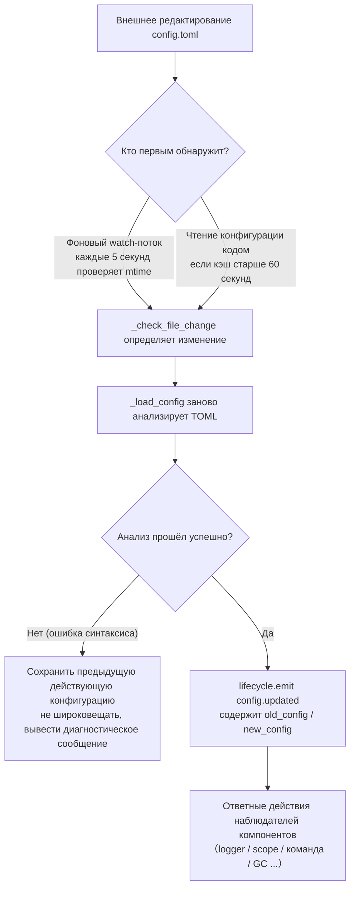

**Две пути обнаружения** (достаточно одного, оба обеспечивают резервирование):

| Путь | Механизм | Время срабатывания |
|------|------|---------|
| Фоновый watch | daemon-поток `config-watcher` каждые **5 секунд** `wait` проверяет `mtime` файла | После изменения файла внешними действиями максимум через 5 секунд |
| Ленивая проверка | При любом чтении `getConfig()` проверяется, если кэш старше **60 секунд**, сначала проверяется файл | При следующем чтении конфигурации |

> **Фреймворк не повредит сам себя**: `setConfig()` при записи на диск записывает «время последней записи, сделанной самим собой», watch-поток при сравнении исключает его, считая изменения только **внешними редактированиями**.

**Два типа событий изменения конфигурации:**

| Событие | Инициатор | Данные | Типичный сценарий |
|------|--------|------|---------|
| `config.set` | Код / Dashboard вызывает `setConfig()` | `{key, old_value, new_value}` | Одиночное изменение ключа (генерация шаблона, запись состояния, изменение конфигурации во время выполнения) |
| `config.updated` | Watcher/Ленивая проверка после внешнего редактирования | `{old_config, new_config, config_file}` | Ручное изменение `config.toml` |

> `setConfig()` по умолчанию **задерживает запись на диск на 5 секунд** (объединяет несколько записей), `immediate=True` записывает немедленно. Watcher обнаруживает внешнее изменение, обновляет только в памяти, **не** записывает изменения обратно в файл.

**Список автоматически реагирующих компонентов** (обычно оба события подписываются, реакция одинакова):

| Компонент | Наблюдатель | Реакция |
|------|------|------|
| Logger | `config.set` + `config.updated` | Уровень/файл/каталог сегментации/память лимит/формат/исключить уровни переприменяются (с детектированием изменений, без изменений не двигается) |
| Scope | `config.updated` | Перестроение кэша привязки области |
| Система команд | `config.updated` | Префикс/регистр/пробел перед префиксом/must_at_bot параметры пересчитываются, вступают в силу с следующего сообщения |
| Параллелизм адаптера | `config.set` + `config.updated` | `handler_max_concurrency` сигнал об отключении пересоздание семафора |
| Активный GC | `config.set` + `config.updated` | `proactive_gc_*` немедленно перезапускает фоновую задачу GC |
| Адаптер | Перенаправление на `on_config_update` | Каждый адаптер `on_config_update(old, new)` callback |
| Модуль | Перенаправление на `on_config_update` | Каждый модуль `on_config_update(old, new)` callback |
| Хранилище | `config.updated` | Изменение `use_global_db` **только предупреждение** (требуется перезапуск) |
| Роутер | `config.updated` | Изменение `cors.*` / `security.*` **только предупреждение** (требуется перезапуск) |

## Полный пример конфигурации

```toml
[ErisPulse.server]
host = "0.0.0.0"
port = 8000
auto_start = true
ssl_certfile = ""
ssl_keyfile = ""

[ErisPulse.master]
# users поддерживает два способа записи (выберите один из них):
#   Глобальный владелец (действует для всех платформ): users = ["123456", "789012"]
#   Владелец по платформе: users = { yunhu = ["123456"], telegram = ["789012"] }
users = {}

[ErisPulse.logger]
level = "INFO"
format = "rich"
log_files = []
log_dir = ""
log_rotation = "size"
log_max_size_mb = 10
log_backup_count = 5
log_rotation_when = "midnight"
memory_limit = 1000
exclude_levels = []

[ErisPulse.framework]
enable_lazy_loading = true
uninit_timeout = 30
strict_mode = 0

[ErisPulse.framework.strict_mode_exceptions]
modules = []
adapters = []

[ErisPulse.storage]
backend = "sqlite"
use_global_db = false

[ErisPulse.event.command]
prefix = "/"
case_sensitive = true
allow_space_prefix = false
must_at_bot = false

[ErisPulse.event.message]
ignore_self = true

[ErisPulse.i18n]
language = "auto"
```

## Конфигурация сервера

```toml
[ErisPulse.server]
host = "0.0.0.0"
port = 8000
auto_start = true
ssl_certfile = "/path/to/cert.pem"
ssl_keyfile = "/path/to/key.pem"
```

| Параметр | Тип | Значение по умолчанию | Описание |
|---------|------|---------|------|
| host | string | 0.0.0.0 | Адрес прослушивания, 0.0.0.0 означает все интерфейсы |
| port | integer | 8000 | Номер порта прослушивания |
| auto_start | boolean | true | Автоматически запускать сервер маршрутизации при `sdk.init()`. Установка в `false` пропускает запуск сервера маршрутизации (чисто событийный/без WebUI сценарий) |
| ssl_certfile | string | пустая строка | Путь к файлу SSL-сертификата |
| ssl_keyfile | string | пустая строка | Путь к файлу SSL-приватного ключа |

## Конфигурация системы владельцев

Система владельцев используется для определения аккаунтов «владельцев» фреймворка (например, администраторов бота). `master.users` поддерживает два способа записи:

```toml
[ErisPulse.master]
# Способ 1: глобальные владельцы (действуют на всех платформах)
users = ["123456", "789012"]

# Способ 2: владельцы по платформе (dict)
# users = { yunhu = ["123456"], telegram = ["789012"] }
```

| Параметр | Тип | Значение по умолчанию | Описание |
|---------|------|---------|------|
| users | array / object | пустой | Список аккаунтов владельцев. `list` форма — глобальные владельцы (действуют на всех платформах); `dict` форма — владельцы по платформе (ключ — название платформы, значение — список аккаунтов владельцев на этой платформе) |

В коде проверка осуществляется через `master.is_master(event)` или `master.is_master(platform, user_id)`, каждый вызов читает конфигурацию в реальном времени (поддерживает горячую перезагрузку, не требуется перезапуск):

```python
from ErisPulse.Core import master

if master.is_master(event):
    await event.reply("Привет, хозяин")
```

### Цепочка проверки и добавление/удаление в режиме выполнения

Цепочка проверки владельца: **конфигурация владельцев → запись в режиме выполнения → провайдер-цепочка**:

```python
from ErisPulse.Core import master

master.is_master(event)                      # проверка по событию
master.is_master("yunhu", "123")             # явная проверка
master.add("yunhu", "123")                   # добавление в режиме выполнения (по умолчанию сохраняется; persist=False — только в памяти)
master.remove("yunhu", "123")                # удаление (по умолчанию сохраняется)
master.list()                                # объединение: {"global": [...], "<platform>": [...]}
```

### Пользовательские источники идентификации (провайдеры)

Помимо конфигурации, можно зарегистрировать пользовательские источники идентификации: `fn(platform, user_id) -> bool`, встроенные источники идентификации (конфигурация + запись в режиме выполнения) не срабатывают, последовательно проверяются, если один провайдер разрешает, то признаётся владельцем. Подходит для подключения администраторских интерфейсов адаптера, ролей базы данных и других внешних систем идентификации.

Точка регистрации `master.provider` поддерживает два способа: декоратор и функциональный, для снятия регистрации используйте `fn.unregister()`:

```python
from ErisPulse.Core import master

# Способ 1: декоратор (постоянный источник идентификации, рекомендуется)
@master.provider
def admin_provider(platform, user_id):
    return user_id in {"999"}     # пользовательская логика проверки

master.is_master("yunhu", "999")   # True
admin_provider.unregister()        # отменить регистрацию, если больше не нужен

# Способ 2: функциональный (регистрация на этапе загрузки модуля / отмена регистрации на этапе выгрузки)
fn = master.provider(admin_provider)
fn.unregister()
```

> Исключения в провайдере обрабатываются и пропускаются, не блокируют цепочку проверки идентификации. Привязка метода экземпляра не может быть зарегистрирована с `unregister`, для сценариев, требующих парной регистрации/отмены, используйте **функции на уровне модуля**.

### Приоритет пользователя: область действия владельца определяется пользователем

Параметр `master=True` команды — это **по умолчанию разработчика**: пользователь может перезаписать или ослабить (см. [Общая конфигурация перезаписи событий (event.overrides)](#общая-конфигурация-перезаписи-событий-eventoverrides), явная конфигурация пользователя вступает в силу).

## Конфигурация логов

```toml
[ErisPulse.logger]
level = "INFO"
log_files = []                # явный список файлов логов (без сегментации)
log_dir = ""                  # директория логов (автоматически создаётся). При установке автоматически сегментирует в `erispulse.log` по `log_rotation`; взаимоисключает с `log_files`, приоритет выше
log_rotation = "size"         # способ сегментации: "size" / "date" / "none"
log_max_size_mb = 10          # размер файла в режиме size (MB), при превышении сегментирует в `.1`/`.2`
log_backup_count = 5          # количество сохранённых файлов логов
log_rotation_when = "midnight"  # период сегментации в режиме date: S/M/H/D/midnight
memory_limit = 1000
exclude_levels = ["EVENT"]
```

| Параметр | Тип | Значение по умолчанию | Описание |
|---------|------|---------|------|
| level | string | INFO | Уровень логирования: TRACE, DEBUG, INFO, WARNING, ERROR, CRITICAL (TRACE — самый низкий уровень, выводит подробную отладочную информацию фреймворка) |
| format | string | rich | Формат вывода логов: `rich` (цветной, по умолчанию), `plain` (чистый текст без цвета, подходит для лог-сборки/перенаправления), `json` (структурированный JSON, подходит для ELK и т.д.) |
| log_files | array | пустой | Список файлов для вывода логов (явные пути, без сегментации) |
| log_dir | string | пустой | Директория для вывода логов (автоматически создаётся). При установке логи пишутся в `erispulse.log` и сегментируются по `log_rotation`; взаимоисключает с `log_files`, приоритет выше |
| log_rotation | string | size | Способ сегментации: `size` (по размеру) / `date` (по времени) / `none` (без сегментации) |
| log_max_size_mb | float | 10 | Максимальный размер файла в режиме size (MB), при превышении сегментирует в `.1`/`.2` |
| log_backup_count | integer | 5 | Количество сохранённых файлов логов, старые автоматически удаляются |
| log_rotation_when | string | midnight | Период сегментации в режиме date: S/M/H/D/midnight (по умолчанию каждый день в полночь) |
| memory_limit | integer | 1000 | Количество логов, сохраняемых в памяти |
| exclude_levels | array | пустой | Список уровней логов для исключения. Логи исключённых уровней **полностью отбрасываются** (не пишутся в память, не передаются на панель логов Dashboard и другие подписчики, не печатаются, не пишутся в файл). Поддерживает горячую перезагрузку |

Также можно динамически переключать в коде:

```python
from ErisPulse.Core import logger

# Сегментация по размеру: файл 10MB, 5 резервных копий
logger.set_output_dir("logs", rotation="size", max_size_mb=10, backup_count=5)

# Сегментация по времени: каждый день в полночь, 7 резервных копий
logger.set_output_dir("logs", rotation="date", backup_count=7)
```

> [!NOTE]
> `log_dir` и связанные сегментационные параметры требуют ErisPulse **2.8.0+**.

> **Защита конфиденциальности**: Содержание сообщений отправки и получения записывается на уровне **EVENT** (значение 21). Установка `exclude_levels = ["EVENT"]` позволит панели логов Dashboard не видеть содержание сообщений в группах/личных чатах, не влияя на другие уровни логов.

> [!NOTE]
> Эта функция `exclude_levels` требует ErisPulse **2.8.0+**.

## Конфигурация фреймворка

```toml
[ErisPulse.framework]
enable_lazy_loading = true
uninit_timeout = 30
strict_mode = 0

[ErisPulse.framework.strict_mode_exceptions]
modules = []
adapters = []
```

| Параметр | Тип | Значение по умолчанию | Описание |
|---------|------|---------|------|
| enable_lazy_loading | boolean | true | Включить ленивую загрузку модулей |
| uninit_timeout | integer | 30 | Общее время ожидания при корректном завершении (секунды), после которого принудительно завершить. 0 означает отсутствие таймаута |
| strict_mode | integer | 0 | Уровень строгого режима, см. ниже «Строгий режим» |
| handler_max_concurrency | integer | 64 | Максимальное количество задач обработчика событий, увеличение повышает пропускную способность, но увеличивает использование памяти |
| offline_bot_expiry | integer | 3600 | Время автоматического истечения срока действия записи о неактивном боте (секунды), 0 означает не истекать |

### Конфигурация активного GC

После инициализации SDK запускается фоновая задача активного GC, периодически выполняющая сборку мусора Python и внутреннюю очистку ресурсов (очистка неактивных ботов и т.д.). Все параметры поддерживают горячую перезагрузку, при изменении задача перезапускается немедленно.

| Параметр | Тип | Значение по умолчанию | Описание |
|---------|------|---------|------|
| proactive_gc_interval | number | 300 | Интервал сборки (секунды), поддерживает десятичные дроби. 0 означает отключение активного GC |
| proactive_gc_generation | integer | 0 | Обычный цикл сборки поколений (0/1/2, ограничено до 0..2). Обратите внимание, что `gc.collect(2)` эквивалентна полной сборке, по умолчанию 0 сохраняет лёгкость; глубокая сборка вызывается `proactive_gc_full_every` периодически |
| proactive_gc_full_every | integer | 20 | Каждые N циклов делается полная сборка, 0 означает отключение периодической полной. Полная сборка ограничена порогом роста памяти `proactive_gc_memory_growth_mb` |
| proactive_gc_memory_growth_mb | integer | 32 | Порог роста памяти для полной сборки (МБ): по сравнению с базой памяти после последней полной сборки (в первую очередь tracemalloc, затем RSS), полная сборка выполняется только при достижении этого значения. 0 означает отсутствие порога |
| proactive_gc_idle_only | boolean | false | При включении, если в очереди есть незавершённые задачи обработки (событийный пик), текущий цикл пропускается, чтобы избежать пауз и конкуренции с обработкой сообщений; внутренняя очистка ресурсов не затрагивается |
| proactive_gc_gen0_min | integer | 500 | Порог количества мусора gen0 для запуска обычного цикла сборки: `gc.get_count()[0]` ниже этого значения, цикл пропускается (почти нулевые пустые циклы с низкой стоимостью). 0 означает всегда собирать |

> **Изменение 2.7.1**: Значение по умолчанию `proactive_gc_generation` изменено с `2` на `0`, значение по умолчанию `proactive_gc_full_every` изменено с `0` на `20`. Ранее `generation=2` означало, что каждый цикл делал самую тяжёлую полную сборку; новое значение по умолчанию при сохранении охвата сборки значительно снижает пустые циклы. Явно заданные старые значения по-прежнему действуют в соответствии с их значением.

### Строгий режим

Строгий режим контролирует стратегию обработки компонентов, которые не соответствуют требованиям или не удались при загрузке. Современные модули/адаптеры должны наследовать соответствующие базовые классы (`BaseModule`/`BaseAdapter`), компоненты, не наследующие базовые классы, влияют на контекстную систему фреймворка и на очистку по умолчанию, что может привести к утечке ресурсов.

> **Изменение 2.5.2**: Значение по умолчанию изменилось с `1` (пропуск) на `0` (мягкий), чтобы уменьшить проблемы при первом использовании новыми пользователями. Компоненты, не наследующие базовые классы, будут предупреждаться и попытаться загрузиться, а не отклоняться напрямую. Если вы хотите восстановить старое поведение, явно установите `strict_mode = 1`.

| Уровень | Название | Поведение |
|------|------|------|
| 0 | Мягкий (по умолчанию) | Нарушения только предупреждения, компоненты, не наследующие базовые классы, всё ещё будут пытаться загрузиться (совместимость со старыми компонентами) |
| 1 | Строгий-пропуск | Отклонение компонентов, не наследующих базовые классы, и пропуск, остальное нормально запускается |
| 2 | Строгий-катастрофа | Сбор всех нарушений и единое сообщение, затем остановка всего запуска |

На всех уровнях, ошибки компонентов в процессе загрузки/регистрации/инициализации всегда будут пропущены; различие заключается в следующем:

- **0 → 1**: Единственное изменение поведения — «не наследование базового класса» из «всё ещё загрузки» на «пропуск».
- **1 → 2**: Все нарушения (не наследование базового класса, загрузка не удалась, регистрация не удалась, инициализация не удалась и т.д.) повышаются до катастрофического уровня, будут собраны в точке запуска, выведены список нарушений и остановлен запуск.

#### Список исключений

Если некоторые компоненты действительно временно не могут быть обновлены (например, из-за зависимостей старого модуля), их можно добавить в список исключений, и даже если они не соответствуют требованиям, они будут обрабатываться в соответствии с мягким режимом и продолжат загрузку:

```toml
[ErisPulse.framework.strict_mode_exceptions]
modules = ["SeTu", "SomeLegacyModule"]
adapters = ["OldAdapter"]
```

> Когда компонент отклоняется строгим режимом, журнал будет четко указывать, как восстановить загрузку (добавить в список исключений или понизить уровень).

## Конфигурация хранилища

Начиная с версии 2.8.0, движок хранилища поддерживает три асинхронных бэкенда, **API полностью совместимы, переключение конфигурации происходит одним кликом**:

| Бэкенд | Драйвер | Установка | Особенности |
|------|------|------|------|
| SQLite (по умолчанию) | aiosqlite | Готов к использованию | Нулевая конфигурация, одиночный файл, WAL-параллелизм |
| MySQL / MariaDB | aiomysql | `pip install ErisPulse[mysql]` | Существующая инфраструктура MySQL, совместное использование нескольких экземпляров |
| PostgreSQL | asyncpg | `pip install ErisPulse[postgres]` | Высокая производительность транзакций, высокая параллельность |

```toml
[ErisPulse.storage]
backend = "sqlite"        # "sqlite" (по умолчанию) / "mysql" / "postgres"
use_global_db = false     # Только для SQLite: использовать глобальную базу данных data/config.db из пакета

[ErisPulse.storage.mysql]      # Действует, если backend = "mysql"
host = "127.0.0.1"
port = 3306
user = "erispulse"
password = ""
database = "erispulse"
# charset = "utf8mb4"
# pool_min = 1
# pool_max = 10

[ErisPulse.storage.postgres]   # Действует, если backend = "postgres"
host = "127.0.0.1"
port = 5432
user = "erispulse"
password = ""
database = "erispulse"
# pool_min = 1
# pool_max = 10
```

| Параметр | Тип | Значение по умолчанию | Описание |
|---------|------|---------|------|
| backend | string | sqlite | Бэкенд хранилища: `sqlite` / `mysql` / `postgres`, переключение без изменений кода |
| use_global_db | boolean | false | Только для SQLite: использовать глобальную базу данных из пакета, а не проектную |
| storage.mysql.* | table | См. выше | Параметры подключения к MySQL (host / port / user / password / database / charset / pool) |
| storage.postgres.* | table | См. выше | Параметры подключения к PostgreSQL (host / port / user / password / database / pool) |

Также поддерживаются параметры через переменные окружения (Docker / 12-factor): `ErisPulse.storage.postgres.host` → `ERISPULSE_STORAGE_POSTGRES_HOST`.

> [!TIP]
> - После изменения параметров подключения необходимо перезапустить фреймворк для применения изменений; при мгновенной ошибке создания пула соединений автоматически применяется экспоненциальная задержка перед повторной попыткой
> - Перед переключением бэкенда можно использовать скрипт проверки: `python tests/devs/test_storage_backend_verify.py --backend mysql`
> - Подробное описание транзакций, диалектов, пользовательских бэкендов и т.д. см. в разделе [Хранилище бэкендов](../advanced/storage-backends.md)

## Конфигурация событий

### Конфигурация команд

```toml
[ErisPulse.event.command]
prefix = "/"
case_sensitive = true
allow_space_prefix = false
```

| Параметр | Тип | Значение по умолчанию | Описание |
|---------|------|---------|------|
| prefix | string | / | Префикс команды |
| case_sensitive | boolean | true | Регистр чувствителен (например, `/Help` и `/help` считаются разными командами) |
| allow_space_prefix | boolean | false | Пространство может быть префиксом |
| must_at_bot | boolean | false | Команду можно запускать только с упоминанием бота (в личных сообщениях не ограничено) |

### Конфигурация сообщений

```toml
[ErisPulse.event.message]
ignore_self = true
```

| Параметр | Тип | Значение по умолчанию | Описание |
|---------|------|---------|------|
| ignore_self | boolean | true | Игнорировать собственные сообщения бота |

## Конфигурация локализации

```toml
[ErisPulse.i18n]
language = "auto"
```

| Параметр | Тип | Значение по умолчанию | Описание |
|---------|------|---------|------|
| language | string | auto | Язык отображения встроенного текста фреймворка. Установка `auto` автоматически определяет системный язык, может быть установлена в конкретный код: `zh-CN`, `zh-TW`, `en`, `ja`, `ru` |

## Конфигурация модулей

Каждый модуль может определить свою конфигурацию в файле конфигурации:

```toml
[MyModule]
api_url = "https://api.example.com"
timeout = 30
enabled = true
```

В модуле читать и записывать конфигурацию:

```python
from ErisPulse import sdk

# Чтение конфигурации
config = sdk.config.getConfig("MyModule", {})
api_url = config.get("api_url", "https://default.api.com")

# Запись конфигурации во время выполнения (отложенная запись)
sdk.config.setConfig("MyModule.timeout", 60)

# Немедленная запись в файл
sdk.config.setConfig("MyModule.timeout", 60, immediate=True)
```

> `setConfig` по умолчанию использует отложенную запись (примерно каждые 5 секунд пакетная запись в файл), установка `immediate=True` немедленно сохраняет. Изменение конфигурации запускает событие жизненного цикла `config.set`.

## Конфигурация области действия (scope)

> [!NOTE]
> Эта функция требует ErisPulse **2.8.0+**.

Область действия определяет, **в каком контексте действует** — на каком платформе / боте / сессии какие модули доступны (① по модулям), какие события принимаются на каком пользователе / группе / боте / адаптере (② по идентификации), какие исходящие вызовы может делать модуль (③ по действиям):

```toml
[ErisPulse.scope]
default_allow = true        # Глобальный флаг по умолчанию (false = явное отклонение в строгом режиме; не влияет на действие ③)
cache_size = 1024           # Размер LRU-кэша

# ① Привязка модулей (приоритет: сессия > бот > платформа; элементы поддерживают точное / glob / re: регулярные выражения)
[ErisPulse.scope.platforms.onebot11]
modules = ["Chat", "Tool*"]
blocked = ["re:^Danger"]

# При вложении с merge = true объединяются поэлементно с низким приоритетом (по умолчанию общее перезаписывание)
[ErisPulse.scope.bots.onebot11."123456"]
modules = ["Music"]
merge = true

# ② Привязка идентификации (приоритет: пользователь > сессия > бот > адаптер; на каждом уровне только allow или deny)
[ErisPulse.scope.identity.adapters.onebot11]
deny = true                 # Все события этой платформы отбрасываются на входе
[ErisPulse.scope.identity.users.onebot11]
allow = ["u_admin"]         # Поддержка glob / re: регулярных выражений для ключей пользователей
deny = ["u_bad", "spam_*"]

# ③ Правила действий (по умолчанию все разрешены; правила в виде вложенных таблиц, элементы поддерживают точное / glob / re: регулярные выражения)
[ErisPulse.scope.actions.MyModule]
send = { deny = true }                    # Полный запрет отправки
api = { allow = ["get_*"] }               # Только разрешённые стандартные API запросы
request = { deny = true }                 # Запрет обработки запросов
```

| Параметр | Тип | Описание |
|---------|------|------|
| `scope.default_allow` | boolean | Глобальный флаг по умолчанию: разрешение/отклонение модулей/идентификации, не попавших под правило (true) |
| `scope.cache_size` | integer | Размер LRU-кэша (по умолчанию 1024) |
| `scope.platforms / bots / sessions` | table | ① Трехуровневая привязка модулей: `{modules=[...], blocked=[...], merge=bool?}` |
| `scope.identity.adapters / bots / sessions / users` | table | ② Четырехуровневая привязка идентификации: `{allow=true}` / `{deny=true}` |
| `scope.actions.<module>.<action>` | table | ③ Правила действий: `{allow=[...], deny=true|[...]}` (действия: send / api / request) |

> Подробности и API времени выполнения (уровневые `sdk.scope.set_module()` / `set_identity()` / `set_action()`, проверки `is_allowed()` / `is_identity_allowed()` / `is_action_allowed()`, а также словарный доступ `get()` / `set()` / `delete()`) см. в [Области действия (scope)](../advanced/scope.md).

## Единая конфигурация перезаписи событий (event.overrides)

Система перезаписи событий: перезапись поведения обработчиков любого модуля по типу события, без изменения кода модуля. Стандартные типы OneBot12 (meta / message / notice / request) и расширенные типы (command) имеют собственные настраиваемые параметры:

```toml
[ErisPulse.event.overrides]

# message: текстовые условия (AND с условиями в коде)
[ErisPulse.event.overrides.message.ChatModule]
pattern = "闲聊*"

# notice / request / meta: белый список detail_type (элементы поддерживают точное / glob / re: регулярные выражения)
[ErisPulse.event.overrides.notice.MyModule]
detail_types = ["group_increase"]

# command (расширенный тип): параметры реализации перезаписи (приоритет пользователя; отключение через acl deny)
[ErisPulse.event.overrides.command.MyModule.restart]
master = true               # Перезапись только для владельцев фреймворка (false — разрешить ограничение владельца разработчиком)
hidden = true               # Скрыть в списке помощи
aliases = ["rs"]            # Действующие псевдонимы

# acl (специфично для command): белый и чёрный список пользователей (имена команд поддерживают glob / re: регулярные выражения, точные ключи имеют приоритет)
[ErisPulse.event.overrides.acl."roll*"]
allow = ["onebot11:u_vip"]  # Идентификатор пользователя "platform:user_id"
deny = ["onebot11:u_bad"]

# ACL по умолчанию: разрешение команд без ACL (true) / строгое отклонение (false)
acl_default_allow = true
```

| Параметр | Тип | Описание |
|---------|------|------|
| `event.overrides.message.<module>` | table | Условия текста: `{pattern="...", regex="..."}` |
| `event.overrides.notice / request.<module>` | table | `{detail_types=[...], pattern, regex}` |
| `event.overrides.meta.<module>` | table | `{detail_types=[...]}` |
| `event.overrides.command.<module>` | table | Параметры перезаписи на уровне модуля (скаляры, такие как `hidden = true`) |
| `event.overrides.command.<module>.<command>` | table | Параметры перезаписи на уровне команды (приоритет команды) |
| `event.overrides.acl.<command>` | table | Белый и чёрный список пользователей: `{allow=[...], deny=[...]}` |
| `event.overrides.acl_default_allow` | boolean | ACL по умолчанию: разрешение команд без ACL (true) / строгое отклонение (false) |

> API во время выполнения (после `from ErisPulse.Core.Event import overrides` обращайтесь к подпространствам по типу события: `overrides.message.set()` / `overrides.command.set()` / `overrides.acl.set()` и т.д., или через `sdk.Event.overrides`), см. [Введение в обработку событий · Перезапись событий](../getting-started/event-handling.md#перезапись-событий-без-изменения-кода-модуля-перезапись-поведения-любого-типа-события).

## Конфигурация анализа команд (event.command)

## Следующие шаги

- [Справочник команд CLI](cli-reference.md) - Ознакомьтесь со всеми командами командной строки
- [Руководство для разработчиков](../developer-guide/) - Изучите, как разрабатывать пользовательские модули


### 部署指南

# Руководство по развертыванию

Лучшие практики развертывания бота ErisPulse в производственной среде.

## Docker 集成 (Рекомендуется)

ErisPulse предоставляет официальный Docker-образ, включающий фреймворк ErisPulse и панель управления Dashboard, поддерживает архитектуры `linux/amd64` и `linux/arm64`.

### Быстрый старт

```bash
# Загрузка образа
docker pull erispulse/erispulse:latest

# Загрузка docker-compose.yml
curl -O https://raw.githubusercontent.com/ErisPulse/ErisPulse/main/docker-compose.yml

# Установка токена для входа в Dashboard и запуск
ERISPULSE_DASHBOARD_TOKEN=your-token docker compose up -d
```

После запуска перейдите по адресу `http://localhost:8000/Dashboard` и используйте установленный токен в качестве пароля для входа.

### Ускорение загрузки образа в Китае

Если Docker Hub недоступен, можно использовать GitHub Container Registry для загрузки образа:

```bash
docker pull ghcr.io/erispulse/erispulse:latest
```

При использовании образа из ghcr.io необходимо изменить параметр `image` в `docker-compose.yml`:

```yaml
services:
  erispulse:
    image: ghcr.io/erispulse/erispulse:latest
```

### docker-compose.yml

```yaml
services:
  erispulse:
    image: erispulse/erispulse:latest
    container_name: erispulse
    ports:
      - "${ERISPULSE_PORT:-8000}:8000"
    volumes:
      - ./config:/app/config
      # Сохранение директории Python-пакетов
      - ./config/.packages:/usr/local/lib/python3.13/site-packages
    environment:
      - TZ=${TZ:-Asia/Shanghai}
      - ERISPULSE_DASHBOARD_TOKEN=${ERISPULSE_DASHBOARD_TOKEN:-}
    init: true
    stop_grace_period: 30s
    restart: unless-stopped
```

> Рекомендуется использовать файл [docker-compose.yml](https://github.com/ErisPulse/ErisPulse/blob/main/docker-compose.yml) из корня репозитория, он уже содержит вышеуказанные настройки, а также проверку работоспособности, переменные окружения для часового пояса и языка.

### Переменные окружения

| Переменная | Значение по умолчанию | Описание |
|------|--------|------|
| `ERISPULSE_PORT` | `8000` | Порт для панели управления Dashboard |
| `ERISPULSE_DASHBOARD_TOKEN` | 自动生成 | Токен для входа в Dashboard (рекомендуется установить) |
| `TZ` | `Asia/Shanghai` | Часовой пояс |
| `LANG` | `en_US.UTF-8` | Системный язык, автоматически определяет язык интерфейса запуска |
| `ERISPULSE_LANG` | пусто | Принудительный язык интерфейса запуска: `zh` / `zh_TW` / `en` / `ja` / `ru` (переопределяет `LANG`) |

### Сохранение данных

Директория `./config` монтируется для хранения конфигурационных файлов и базы данных, включая:

- `config/config.toml` — конфигурационный файл
- `config/config.db` — база данных SQLite
- `config/.packages` — директория site-packages Python, сохраняющая фреймворк, адаптеры и установленные модули (при первом запуске инициализируется автоматически из резервной копии в образе, последующие установки модулей и горячие обновления фреймворка записываются в эту директорию)

> **Обновление фреймворка (включая pre/rc) и самовосстановление образа**: точка входа выполняет проверку целостности основных пакетов при каждом запуске контейнера, при повреждении восстанавливает пакеты по принципу "приоритет установленной пользователем версии" — если версия была явно установлена/обновлена в сохранённом томе (например, предварительная версия, установленная через Dashboard), то она будет переустановлена из PyPI **в той же версии**, без тихого возврата к версии из образа. Таким образом, после обновления фреймворка через Dashboard, при любом перезапуске контейнера будет сохраняться целевая версия.

## Панель управления Dashboard

В Docker-образе ErisPulse встроен модуль Dashboard, предоставляющий веб-интерфейс для визуального управления.

### Обзор функций

| Функция | Описание |
|------|------|
| Панель мониторинга | Обзор системы, мониторинг CPU/памяти, время работы, статистика событий |
| Управление ботами | Просмотр статуса и информации о ботах на различных платформах |
| Просмотр событий | Поток событий в реальном времени, фильтрация по типу и платформе |
| Просмотр логов | Просмотр логов с фильтрацией по модулю и уровню |
| Управление модулями | Просмотр, загрузка, выгрузка установленных модулей и адаптеров |
| Магазин модулей | Просмотр удалённых доступных пакетов и установка с помощью одной кнопки |
| Редактирование конфигурации | Онлайн-редактирование `config.toml` |
| Управление хранилищем | Просмотр и редактирование данных хранилища Key-Value |
| Резервное копирование | Экспорт/импорт конфигурации и данных хранилища |
| Журнал аудита | Запись всех операций управления |

### Установка модулей через Dashboard

Dashboard включает функцию магазина модулей, с помощью которой вы можете:

1. **Установка из магазина**: Просмотр удалённого списка модулей, выбор нужного модуля и установка с помощью одной кнопки
2. **Загрузка локального пакета**: Прямая загрузка `.whl` или `.zip` файлов для установки, удобно для тестирования собственных разработок модулей

> **Быстрый тестовый процесс для разработчиков модулей**: После развертывания с помощью Docker, в Dashboard используйте функцию «Загрузка локального пакета» для прямой загрузки собранного вами `.whl` файла для тестирования, без необходимости ручного взаимодействия с контейнером.

## Мониторинг процессов и жесткий перезапуск

Жесткий перезапуск ErisPulse (`sdk.hard_restart()`) зависит от **внешнего монитора**, который перезапускает процесс при коде выхода 42 — SDK сам не запускает новый процесс. В продакшен-среде обязательно настройте монитор, иначе после жесткого перезапуска процесс не восстановится автоматически:

- Docker: `restart: unless-stopped` (перезапуск при любом коде выхода, включая 42)
- systemd: `Restart=on-failure` + `RestartForceExitStatus=42`
- PM2 / supervisord: добавьте 42 в список кодов выхода для перезапуска
- Чистый Python с пользовательским монитором: цикл `Popen` + проверка `returncode == 42`

Полные примеры конфигурации мониторов и описание контракта с кодом выхода 42 см. в разделе [Процесс запуска → Руководство по мониторам](../advanced/startup.md#Руководство-по-мониторам).

## Проверка состояния

В SDK встроен конечный эндпоинт для проверки состояния:

```bash
# Проверка состояния
curl http://localhost:8000/health
```

Для проверки состояния в Docker можно добавить в `docker-compose.yml`:

```yaml
services:
  erispulse:
    healthcheck:
      test: ["CMD", "python", "-c", "import urllib.request; urllib.request.urlopen('http://localhost:8000/ping')"]
      interval: 30s
      timeout: 5s
      start_period: 20s
      retries: 3
```

## Обратный прокси

Если необходимо выставить Dashboard через обратный прокси-сервер, например, Nginx:

```nginx
server {
    listen 80;
    server_name bot.example.com;

    location / {
        proxy_pass http://127.0.0.1:8000;
        proxy_set_header Host $host;
        proxy_set_header X-Real-IP $remote_addr;
        proxy_set_header X-Forwarded-For $proxy_add_x_forwarded_for;
    }

    # Поддержка WebSocket (требуется для потоковых событий Dashboard)
    location /Dashboard/ws {
        proxy_pass http://127.0.0.1:8000;
        proxy_http_version 1.1;
        proxy_set_header Upgrade $http_upgrade;
        proxy_set_header Connection "upgrade";
    }
}
```

Для SSL можно использовать Let's Encrypt:

```bash
sudo certbot --nginx -d bot.example.com
```

## Ручная установка (pip)

Если вы не используете Docker, вы также можете выполнить ручную установку.

### Настройка для рабочей среды

```toml
# config/config.toml

[ErisPulse.server]
host = "0.0.0.0"
port = 8000

[ErisPulse.logger]
level = "INFO"
log_files = ["app.log"]
memory_limit = 5000

[ErisPulse.framework]
enable_lazy_loading = true
```

### systemd (Linux)

Создайте файл `/etc/systemd/system/erispulse-bot.service`:

```ini
[Unit]
Description=ErisPulse Bot
After=network.target

[Service]
Type=simple
User=bot
WorkingDirectory=/opt/erispulse-bot
ExecStart=/opt/erispulse-bot/venv/bin/epsdk run main.py
Restart=always
RestartSec=5
StandardOutput=journal
StandardError=journal

[Install]
WantedBy=multi-user.target
```

Управление:

```bash
sudo systemctl daemon-reload
sudo systemctl start erispulse-bot
sudo systemctl enable erispulse-bot
sudo journalctl -u erispulse-bot -f
```

### Supervisor

Создайте файл `/etc/supervisor/conf.d/erispulse-bot.conf`:

```ini
[program:erispulse-bot]
command=/opt/erispulse-bot/venv/bin/python -m ErisPulse run main.py
directory=/opt/erispulse-bot
user=bot
autostart=true
autorestart=true
stderr_logfile=/var/log/erispulse-bot/err.log
stdout_logfile=/var/log/erispulse-bot/out.log
```

## Рекомендации по безопасности

1. **Установите токен для Dashboard**: Используйте сильный случайный токен, не оставляйте значение по умолчанию
2. **Не открывайте порт для публичного доступа**: Если не используется обратный прокси + SSL, ограничьте порт Dashboard доступом только из локальной сети
3. **Защитите каталог данных**: Каталог `config/` содержит конфигурацию и базу данных, установите соответствующие права доступа к файлам
4. **Регулярно обновляйте**: Используйте `epsdk self-update` или получите последнюю версию Docker-образа
5. **Не запускайте от root**: При ручной установке создайте специального пользователя
6. **Используйте стратегию перезапуска Docker**: `restart: unless-stopped`, чтобы обеспечить автоматический перезапуск после аварийного завершения

## Множественный запуск экземпляров

При запуске нескольких экземпляров роботов:

1. Каждый экземпляр использует отдельный каталог проекта и `docker-compose.yml`
2. Используйте разные порты: `ERISPULSE_PORT=8001`
3. Используйте разные имена контейнеров: `container_name: erispulse-bot2`

## Обновление и обслуживание

### Способ Docker

```bash
# Получение последней версии образа
docker compose pull

# Перезапуск с использованием нового образа
docker compose up -d
```

### Способ pip

```bash
epsdk self-update
epsdk upgrade
```

### Резервное копирование

Регулярно создавайте резервную копию каталога `config/`:

```bash
# Развертывание с использованием Docker
tar czf erispulse-backup-$(date +%Y%m%d).tar.gz config/

# Или используйте функцию «Резервное копирование» в Dashboard для экспорта
```


=====
开发者指南
=====


### 开发者指南总览

# Руководство для разработчиков

Это руководство поможет вам разрабатывать пользовательские модули и адаптеры, расширяя возможности ErisPulse.

## Содержание

### Разработка модулей

1. [Введение в разработку модулей](modules/getting-started.md) - Создание первого модуля
2. [Основные концепции модулей](modules/core-concepts.md) - Основные концепции и архитектура модулей
3. [Подробное описание обёртки Event](modules/event-wrapper.md) - Полное описание объекта Event
4. [Лучшие практики разработки модулей](modules/best-practices.md) - Рекомендации по созданию качественных модулей

### Разработка адаптеров

1. [Введение в разработку адаптеров](adapters/getting-started.md) - Создание первого адаптера
2. [Основные концепции адаптеров](adapters/core-concepts.md) - Основные концепции адаптеров
3. [Подробное описание SendDSL](adapters/send-dsl.md) - Полное описание DSL для отправки сообщений Send
4. [Конвертеры событий](adapters/converter.md) - Реализация конвертеров событий
5. [Лучшие практики разработки адаптеров](adapters/best-practices.md) - Рекомендации по созданию качественных адаптеров

### Руководство по публикации

- [Руководство по публикации и каталогу модулей](publishing.md) - Публикация вашего продукта на PyPI и в каталоге модулей ErisPulse

## Подготовка к разработке

Прежде чем приступить к разработке, убедитесь, что вы:

1. Прочитали [Основные понятия](../getting-started/basic-concepts.md)
2. Ознакомились с [Обработкой событий](../getting-started/event-handling.md)
3. Установили среду разработки (Python >= 3.10)
4. Установили ErisPulse SDK

## Выбор типа разработки

Выберите подходящий тип разработки в зависимости от ваших потребностей:

| Тип разработки | Сценарии использования | Руководство по началу работы |
|----------------|------------------------|------------------------------|
| **Разработка модуля** | Расширение функциональности бота, реализация бизнес-логики, предоставление команд и обработки сообщений | [Введение в разработку модулей](modules/getting-started.md) |
| **Разработка адаптера** | Подключение к новой платформе сообщений, реализация межплатформенной связи, предоставление функций, специфичных для платформы | [Введение в разработку адаптеров](adapters/getting-started.md) |

> Если вы хотите расширить функциональность бота (например, добавить команды или обрабатывать сообщения), выберите **разработку модуля**. Если вам нужно подключить бота к новой платформе, выберите **разработку адаптера**.

## Инструменты разработки

### Шаблоны проектов

ErisPulse предоставляет примеры проектов для справки:

- [Пример модуля](https://github.com/ErisPulse/ErisPulse/tree/main/examples/example-module) - полная структура проекта модуля
- [Пример адаптера](https://github.com/ErisPulse/ErisPulse/tree/main/examples/example-adapter) - полная структура проекта адаптера

### Режим разработки

Используйте режим горячей перезагрузки для разработки, при изменении кода он автоматически перезагружается:

```bash
epsdk run main.py --reload
```

### Советы по отладке

Включите отладочное или трассировочное логирование в `config/config.toml`:

```toml
[ErisPulse.logger]
# DEBUG: выводит информацию о загрузке модулей, регистрации маршрутов и другие отладочные данные
# TRACE: самый низкий уровень, выводит подробные внутренние процессы фреймворка, такие как распределение событий, запись в хранилище, ленивая загрузка и т.д.
level = "DEBUG"
```

## Публикация вашего модуля

Полный процесс публикации описан в [Руководстве по публикации и магазину модулей](publishing.md), включая шаги публикации в PyPI и процесс отправки в магазин модулей ErisPulse.


====
模块开发
====


模块开发
----


### 模块开发入门

# Введение в разработку модулей

Это руководство проведёт вас через создание модуля ErisPulse с нуля.

## Структура проекта

Стандартная структура модуля:

```
MyModule/
├── pyproject.toml
├── README.md
├── LICENSE
└── MyModule/
    ├── __init__.py
    └── Core.py
```

## Конфигурация pyproject.toml

```toml
[project]
name = "ErisPulse-MyModule"
version = "1.0.0"
description = "Описание функционала модуля"
readme = "README.md"
requires-python = ">=3.10"
license = { file = "LICENSE" }
authors = [ { name = "yourname", email = "your@mail.com" } ]
dependencies = []

[project.urls]
"homepage" = "https://github.com/yourname/MyModule"

[project.entry-points."erispulse.module"]
"MyModule" = "MyModule:Main"
```

## __init__.py

```python
from .Core import Main
```

## Core.py - Базовый модуль

```python
from ErisPulse import sdk
from ErisPulse.Core.Bases import BaseModule
from ErisPulse.Core.Event import command

class Main(BaseModule):
    def __init__(self, sdk):
        self.sdk = sdk
        self.logger = sdk.logger.get_child("MyModule")
        self.storage = sdk.storage
    
    @staticmethod
    def get_load_strategy():
        """Возвращает стратегию загрузки модуля"""
        from ErisPulse.loaders import ModuleLoadStrategy
        return ModuleLoadStrategy(
            lazy_load=True,
            priority=0,
            depends=[],  # Опционально: список зависимых других модулей
            # Опционально: ленивая активация по событиям — объявите триггеры, модуль загрузится при первом совпадении события/команды
            # activate_on=[{"command": {"name": "hello", "help": "Отправить приветствие"}}],
        )
    
    async def on_load(self, event):
        """Вызывается при загрузке модуля"""
        @command("hello", help="Отправить приветствие")
        async def hello_command(event):
            name = event.get_user_nickname() or "друг"
            await event.reply(f"Привет, {name}!")
        
        self.logger.info("Модуль загружен")
    
    async def on_unload(self, event):
        """Вызывается при выгрузке модуля"""
        self.logger.info("Модуль выгружен")
```

> **Чтение конфигурации**: в приведённом базовом примере конфигурация не используется. При необходимости чтения конфигурации рекомендуется объявить вложенный класс `ConfigClass` и читать его через `self.cfg` в реальном времени (см. [Основные концепции модуля](docs/ru/core-concepts.md#рекомендуемая-декларативная-конфигурация)). Старый способ — ручной вызов `_load_config()` — устарел.

## Тестирование модуля

### Локальное тестирование

```bash
# Установка модуля в проекте
epsdk install ./MyModule

# Запуск проекта
epsdk run main.py --reload
```

### Тестовые команды

Отправьте команду для тестирования:

```
/hello
```

## Основные концепции

### Базовый класс BaseModule

Все модули должны наследоваться от `BaseModule`, предоставляя следующие методы:

| Метод | Описание | Обязательно |
|------|------|------|
| `__init__(self, sdk)` | Конструктор (в `sdk` передаётся экземпляр фреймворка) | Нет |
| `get_load_strategy()` | Возвращает стратегию загрузки | Нет |
| `get_meta()` | Возвращает метаинформацию о модуле (опционально) | Нет |
| `on_load(self, event)` | Вызывается при загрузке модуля | Да |
| `on_unload(self, event)` | Вызывается при выгрузке модуля | Да |

### Метаинформация о модуле

> **ВАЖНО**
> Эта функция доступна в ErisPulse **2.8.0+**.

Метаинформация о модуле может быть объявлена через `get_meta()`, описывая, для чего модуль предназначен и к какой категории относится. Метаинформация — это **общие сведения о модуле**, которые могут использоваться различными интерфейсами и экосистемными модулями, такими как help, Dashboard, список модулей, магазин модулей и т.д.

Как и в случае с `get_load_strategy()`, **рекомендуется возвращать экземпляр конфигурационного класса `ModuleMeta`** (с ключами типизации, автодополнение IDE), но также допускается возвращать dict:

```python
class MyModule(BaseModule):
    @staticmethod
    def get_meta() -> ModuleMeta:
        return ModuleMeta(
            name="Погода",               # Отображаемое имя (по умолчанию имя регистрации)
            description="Получение погоды города",  # Описание модуля
            version="1.0.0",
            author="ErisDev",
            group="Инструменты",               # Категория функционала
            tags=["Погода", "Поиск"],
        )
```

Альтернативный способ (dict):

```python
class MyModule(BaseModule):
    @staticmethod
    def get_meta() -> dict:
        return {
            "name": "Погода",
            "description": "Получение погоды города",
            "version": "1.0.0",
            "author": "ErisDev",
            "group": "Инструменты",
            "tags": ["Погода", "Поиск"],
        }
```

- `module.get_meta("MyModule")` читает уже разобранные метаданные (сначала класс, затем info, автоматически дополняет имена команд этого модуля).
- `module.get_commands_overview()` объединяет «метаданные модуля + зарегистрированные команды (алиасы/группы/помощь)», формируя обзор команд по модулям.
- Модуль, к которому принадлежит команда, можно получить через `cmd_info["owner"]` (автоматически вставляется контекстной системой при регистрации).

#### Поддержка i18n для полей метаинформации

Значения полей метаинформации могут быть простыми строками или словарями i18n `{"i18n": "key.path", "default": "текст по умолчанию"}` (в соответствии с соглашением для `description` конфигурации).
Ключи перевода объявляются через `I18nClass`, а при чтении `module.get_meta()` автоматически разрешаются в текст текущего языка:

```python
class MyModule(BaseModule):
    class I18nClass(BaseI18n):
        meta_description: I18nKey = I18nKey(
            default="Weather lookup",
            zh_CN="Получение погоды города",
            en="Weather lookup",
        )

    @staticmethod
    def get_meta() -> ModuleMeta:
        return ModuleMeta(
            name="Погода",
            description={"i18n": "MyModule.meta_description", "default": "Weather lookup"},
        )
```

### Объект SDK

Через объект `sdk` можно получить доступ к основным функциям:

```python
from ErisPulse import sdk

sdk.storage    # Система хранения
sdk.config     # Система конфигурации
sdk.logger     # Система логирования
sdk.adapter    # Система адаптеров
sdk.router     # Система маршрутизации
sdk.lifecycle  # Система жизненного цикла
```


### 模块核心概念

# Основные концепции модуля

Понимание основных концепций модуля ErisPulse — это основа для разработки высококачественных модулей.

## Жизненный цикл модуля

### Стратегия загрузки

```python
from ErisPulse.Core.Bases import BaseModule
from ErisPulse.loaders import ModuleLoadStrategy

class MyModule(BaseModule):
    @staticmethod
    def get_load_strategy():
        """Возвращает стратегию загрузки модуля"""
        return ModuleLoadStrategy(
            lazy_load=True,   # Ленивая загрузка или немедленная загрузка
            priority=0,       # Приоритет загрузки (чем больше, тем раньше загрузка)
            depends=["OtherModule"]  # Опционально: объявляет зависимости от других модулей
        )
```

> Модули, перечисленные в `depends`, если не зарегистрированы, приведут к пропуску текущего модуля и записи предупреждения. Порядок загрузки определяется топологической сортировкой, а модули с одинаковым приоритетом сортируются по убывающему приоритету.

> [!NOTE]
> **Каскадное выгрузка / каскадное перезагрузка** (ErisPulse **2.8.0+**): При выгрузке модуля, от которого зависят другие модули, зависимые модули будут **сначала выгружены каскадно** (в логе указан цепочка каскадного выгрузки); при горячей перезагрузке любого модуля (локальный плагин / пакет PyPI), зависимые модули также **каскадно перезагружаются**, чтобы избежать использования устаревших экземпляров. Объявление циклических зависимостей приведет к отказу в загрузке с `RuntimeError`.

### Метод on_load

Вызывается при загрузке модуля, используется для инициализации ресурсов и регистрации обработчиков событий:

```python
async def on_load(self, event):
    # Регистрация обработчиков событий
    @command("hello", help="Команда приветствия")
    async def hello_handler(event):
        await event.reply("Привет!")

    # Использование встроенного HTTP-клиента SDK (автоматически управляет пулом соединений, не нужно создавать session вручную)
    # Через sdk.client можно отправлять запросы
```

### Метод on_unload

Вызывается при выгрузке модуля, используется для очистки ресурсов:

```python
async def on_unload(self, event):
    # Очистка пользовательских ресурсов
    # sdk.client управляется фреймворком, не нужно закрывать вручную

    # Отмена обработчиков событий (фреймворк обрабатывает автоматически)
    self.logger.info("Модуль выгружен")
```

> Создание и очистка фоновых задач (через `self.spawn()` / автоматическая отмена фреймворком) подробно описано в [управлении жизненным циклом](../../advanced/lifecycle.md#фоновые-задачи-принадлежность-и-автоматическая-отмена).

### Выгрузка и полная выгрузка (purge)

> [!NOTE]
> Эта функция доступна в ErisPulse **2.8.0+**.

Метод `unload()` по умолчанию **отменяет загрузку** (выгружает экземпляр и ресурсы), но сохраняет метаданные (класс модуля и метаинформацию) — модуль по-прежнему может быть обнаружен и перезагружен с помощью `load()`, без необходимости повторной `register()`.

Если требуется **полная выгрузка** (освобождение ссылки на класс модуля, очистка `sys.modules`, чтобы плагин и его уникальные зависимости могли быть собраны сборщиком мусора), передайте `purge=True`:

```python
# Только отмена загрузки: сохраняются метаданные, можно перезагрузить в любое время
await sdk.module.unload("MyModule")

# Полная выгрузка: удаляются метаданные + очистка sys.modules (только для плагинов из папки)
await sdk.module.unload("MyModule", purge=True)
```

| Смысл | `unload()` по умолчанию | `unload(purge=True)` |
|------|-----------------|----------------------|
| Выгрузка экземпляра и ресурсов (события/task/маршруты/lifecycle/i18n) | ✅ | ✅ |
| Сохранение метаданных (класс модуля и метаинформация) | ✅ | ❌ Удалено |
| Очистка `sys.modules` (только для плагинов из папки) | ❌ | ✅ |
| Класс модуля может быть собран сборщиком мусора | ❌ | ✅ |
| Перезагрузка | `load()` можно использовать напрямую | Нужно сначала `register()` + `load()` |

> При `purge=True` зависимые модули также будут полностью выгружены. После выгрузки фреймворк выполнит `gc.collect()` и проверит, доступен ли класс модуля для сборки мусора, остаточные ссылки будут предупреждены в логах (с указанием источника, уровень DEBUG).

### Жизненный цикл в целом

Если объединить все методы, то **все, что фреймворк делает за вас** при загрузке и выгрузке модуля:

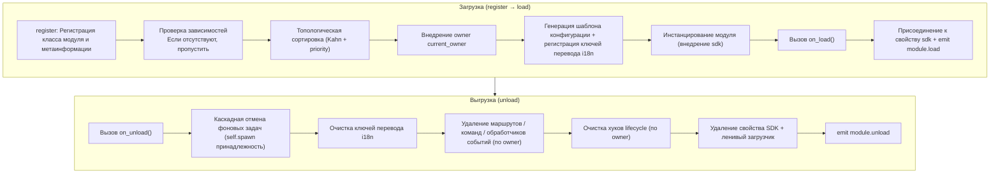

**Что фреймворк делает за вас при загрузке** (вам нужно только написать `on_load`, остальное делается автоматически):

| Этап | Что делает фреймворк |
|------|-------------|
| Внедрение owner | Во время инстанцирования модуль оборачивается в `owner_scope` — все зарегистрированные вами команды/события/钩ки/фоновые задачи в `on_load` **автоматически принадлежат этому модулю**, при выгрузке они удаляются по owner |
| Шаблон конфигурации | Модули, объявившие `ConfigClass`, получают автоматически сгенерированный/заполненный конфигурационный сегмент `ErisPulse.<ModuleName>` |
| Ключи перевода i18n | Модули, объявившие `I18nClass`, автоматически регистрируют ключи перевода (удаляются при выгрузке) |
| Зависимости | Модули сортируются по `depends`, гарантируя, что зависимые модули загружаются первыми; циклические зависимости отклоняются с `RuntimeError` |
| Присоединение к SDK | После инстанцирования модуль присоединяется к `sdk.<ModuleName>`, благодаря чему вы можете обращаться к `sdk.MyModule.xxx` |

**Что фреймворк очищает при выгрузке** (соответствует U1→U7 выше): после выполнения `on_unload` происходит дополнительная очистка — фоновые задачи, созданные через `self.spawn`, принудительно отменяются (для аккуратного завершения задачи в `on_unload` нужно сделать это вручную), ключи перевода i18n, маршруты, команды/обработчики событий, хуки lifecycle, затем удаляется свойство SDK. При `purge=True` дополнительно удаляются метаданные и очищается `sys.modules`.

> Эта автоматическая очистка — основа того, что «вам нужно только написать `on_load`/`on_unload`, не нужно вручную unregister» — фреймворк использует принадлежность owner, чтобы сделать «кто зарегистрировал, тот и очищает» одним нажатием.

## Объект SDK

### Доступ к основным модулям

```python
from ErisPulse import sdk

# Доступ к всем основным модулям через объект sdk
sdk.logger.info("Лог")
sdk.storage.set("key", "value")
config = sdk.config.getConfig("MyModule")
```

### Коммуникация между модулями

```python
# Доступ к другим модулям
other_module = sdk.OtherModule
result = await other_module.some_method()
```

## Запрос методов отправки адаптера

Из-за нового стандарта, требующего перезаписи метода `__getattr__` для реализации механизма отправки по умолчанию, невозможно использовать `hasattr` для проверки существования метода. Начиная с версии `2.3.5`, добавлена функция для запроса методов отправки.

### Список поддерживаемых методов отправки

```python
# Получение списка всех методов отправки, поддерживаемых платформой
methods = sdk.adapter.list_sends("onebot11")
# Возвращает: ["Text", "Image", "Voice", "Markdown", ...]
```

### Получение подробной информации о методе

```python
# Получение подробной информации о методе
info = sdk.adapter.send_info("onebot11", "Text")
# Возвращает:
# {
#     "name": "Text",
#     "parameters": [
#         {"name": "text", "type": "str", "default": null, "annotation": "str"}
#     ],
#     "return_type": "Awaitable[Any]",
#     "docstring": "Отправка текстового сообщения..."
# }
```

## Управление конфигурацией

### Декларативная конфигурация (рекомендуется)

Начиная с версии v2.5.2, модули могут объявлять класс конфигурации через `ConfigClass`, используя ту же систему схемы конфигурации, что и адаптеры. Конфигурация доступна через `self.cfg` в режиме реального времени, изменения немедленно применяются:

```python
from dataclasses import dataclass, field
from ErisPulse.Core.Bases import BaseModule
from ErisPulse.Core.Bases import BaseConfig

@dataclass
class MyModuleConfig(BaseConfig):
    api_key: str = field(
        default="",
        metadata={
            "description": {"i18n": "my_module.api_key", "default": "Ключ API"},
            "required": True,
            "secret": True,
            "ui": {"widget": "password", "group": "basic", "order": 1},
        },
    )
    timeout: int = field(
        default=30,
        metadata={
            "description": {"i18n": "my_module.timeout", "default": "Время ожидания (секунды)"},
            "ui": {"widget": "number", "group": "advanced", "order": 2},
        },
    )

class MyModule(BaseModule):
    ConfigClass = MyModuleConfig

    def __init__(self, sdk):
        self.sdk = sdk
        self.logger = sdk.logger.get_child("MyModule")

    async def on_load(self, event):
        self.logger.info("Модуль загружен")

    async def on_unload(self, event):
        pass

    async def do_something(self):
        cfg = self.cfg  # Чтение в режиме реального времени, типобезопасно
        api_key = cfg.api_key
        timeout = cfg.timeout
```

`BaseConfig` — универсальный базовый класс конфигурации, применимый ко всем сценариям: адаптеры, модули, внешние проекты. Поля конфигурации поддерживают многоязычные описания i18n (см. [документацию i18n](../../advanced/i18n.md#многоязычные-описания-полей-конфигурации)).

Система схемы конфигурации также поддерживает (с v2.8.0, см. [основные концепты адаптера](../adapters/core-concepts.md#约定-metadata)):

- **Автоматическая генерация описания полей из docstring**: если не объявлено `metadata description`, автоматически извлекается из docstring `:ivar поле: описание` или из раздела `Attributes:`
- **Вложенные dataclass конфигурации**: при типе поля вложенный dataclass, схема/шаблон/валидация обрабатываются рекурсивно, WebUI отображает вложенные группы
- **Поле `example`, не сохраняющееся в файл**: поле с `metadata={"example": True}` не записывается в `config.toml`, сохраняется только в `config.full.example` (подходит для сложных и редко используемых расширенных настроек), после ручной настройки пользователем сохраняется как обычно

### Декларативные ключи перевода (v2.7.0+)

Начиная с v2.7.0, модули могут объявлять ключи перевода, как и `ConfigClass`, через вложенный класс `I18nClass`, объединяя все ключи перевода в одном месте. Фреймворк при загрузке **автоматически регистрирует** все объявленные ключи перевода, без необходимости вручную вызывать `i18n.register()`, и регистрация происходит раньше, чем генерация шаблона конфигурации, гарантируя, что ключи перевода, используемые в описаниях конфигурации, уже доступны.

```python
from ErisPulse.Core.Bases import BaseConfig, BaseI18n, I18nKey

class MyModule(BaseModule):
    # Класс конфигурации (необязательно)
    @dataclass
    class ConfigClass(BaseConfig):
        welcome_msg: str = field(
            default="Добро пожаловать",
            metadata={
                "description": {"i18n": "mymodule.welcome_msg", "default": "Сообщение приветствия"},
            },
        )

    # Класс ключей перевода (необязательно)
    class I18nClass(BaseI18n):
        # Имя свойства автоматически объединяется в полный путь ключа: <имя модуля>.<имя свойства>
        welcome_msg: I18nKey = I18nKey(
            default="Welcome Message",   # Безязыковой резервный вариант
            zh_CN="欢迎消息",
            zh_TW="歡迎訊息",
            en="Welcome Message",
            ja="ウェルカムメッセージ",
            ru="Приветственное сообщение",
        )
        hello: I18nKey = I18nKey(
            default="Hello, {name}!",
            zh_CN="你好，{name}！",
            zh_TW="你好，{name}！",
            en="Hello, {name}!",
            ja="こんにちは、{name}！",
            ru="Привет, {name}!",
        )
```

Подробнее смотри [рекомендуемый способ i18n](../../advanced/i18n.md#рекомендуемый-способ-объявления-ключей-перевода-через-i18nclass-v270).

### Ручное чтение конфигурации (устарело)

> **Устарело**: используйте [декларативную конфигурацию](#декларативная-конфигурация-рекомендуется) + `self.cfg` для чтения в режиме реального времени.

```python
class MyModule(BaseModule):
    def __init__(self, sdk):
        self.sdk = sdk

    def _load_config(self):
        config = self.sdk.config.getConfig("MyModule")
        if not config:
            self.sdk.config.setConfig("MyModule", {"api_key": "", "timeout": 30})
            return {"api_key": "", "timeout": 30}
        return config
```

## Система хранения

### Основное использование

```python
# Сохранение данных
sdk.storage.set("user:123", {"name": "张三"})

# Получение данных
user = sdk.storage.get("user:123", {})

# Удаление данных
sdk.storage.delete("user:123")
```

### Использование транзакций

```python
# Использование транзакции для обеспечения согласованности данных
with sdk.storage.transaction():
    sdk.storage.set("key1", "value1")
    sdk.storage.set("key2", "value2")
    # Если какая-либо операция не удалась, все изменения будут откатываться
```

## Обработка событий

### Регистрация обработчиков событий

```python
from ErisPulse.Core.Event import command, message

# Регистрация команды
@command("info", help="Получить информацию")
async def info_handler(event):
    await event.reply("Это информация")

# Регистрация обработчика сообщений
@message.on_group_message()
async def group_handler(event):
    sdk.logger.info(f"Получено групповое сообщение: {event.get_text()}")
```

### Жизненный цикл обработчиков событий

Фреймворк автоматически управляет регистрацией и удалением обработчиков событий, вам нужно только зарегистрировать их в `on_load`.

## Механизм ленивой загрузки

### Принцип работы

```python
# Модуль будет инициализирован только при первом обращении
result = await sdk.my_module.some_method()
# ↑ Здесь будет вызвана инициализация модуля
```

### Немедленная загрузка

Для модулей, требующих немедленной инициализации (например, триггеров, таймеров):

```python
@staticmethod
def get_load_strategy():
    return ModuleLoadStrategy(
        lazy_load=False,  # Немедленная загрузка
        priority=100
    )
```

## Обработка ошибок

### Перехват исключений

```python
async def handle_event(self, event):
    try:
        # Бизнес-логика
        await self.process_event(event)
    except ValueError as e:
        self.logger.warning(f"Ошибка параметра: {e}")
        await event.reply(f"Ошибка параметра: {e}")
    except Exception as e:
        self.logger.error(f"Обработка не удалась: {e}")
        raise
```

### Запись в лог

```python
# Использование разных уровней логирования
self.logger.debug("Отладочная информация")    # Подробная информация для отладки
self.logger.info("Состояние работы")      # Информация о нормальной работе
self.logger.warning("Предупреждение")  # Предупреждающая информация
self.logger.error("Ошибка")    # Ошибка
self.logger.critical("Критическая ошибка") # Критическая ошибка
```


### Event 包装类详解

# Подробное описание обёртки событий

Модуль Event предоставляет мощный класс обёртки событий, который упрощает обработку событий.

## Добавление аннотаций типов для параметра event

Параметр `event` обработчика событий является **обёрткой Event** (подкласс dict). Рекомендуется добавлять аннотации типов для него:

```python
from ErisPulse.Core.Event import Event

@message.on_private_message()
async def handler(event: Event):
    text = event.get_text()   # IDE автоматически подсказывает все удобные методы
    await event.reply(text)   # Опечатки будут обнаружены при статической проверке
```

Без аннотаций IDE не сможет распознать методы Event (`get_text()` / `reply()` / `wait_reply()` / методы расширения платформы не будут подсвечиваться), и приходится полагаться на память при написании.

> **Обратите внимание на различие**: `event` в обратном вызове обработчика событий является **обёрткой Event** (аннотация типа `Event`); `event` в методах жизненного цикла модуля `on_load` / `on_unload` является обычным **dict** (аннотация типа `dict`), не следует их путать.

## Основные возможности

- **Полная совместимость со словарём**: Event наследуется от dict
- **Удобные методы**: Предоставляются много удобных методов
- **Доступ через точку**: Поддерживается доступ к полям события через точку
- **Обратная совместимость**: Все методы являются необязательными

## Основные методы полей

```python
from ErisPulse.Core.Event import command

@command("info")
async def info_command(event: Event):
    event_id = event.get_id()
    platform = event.get_platform()
    time = event.get_time()
    print(f"ID: {event_id}, Платформа: {platform}, Время: {time}")
```

## Методы событий сообщений

```python
from ErisPulse.Core.Event import message

@message.on_private_message()
async def private_handler(event: Event):
    text = event.get_text()
    user_id = event.get_user_id()
    nickname = event.get_user_nickname()
    await event.reply(f"Привет, {nickname}!")
```

## Типы сообщений

```python
from ErisPulse.Core.Event import message

@message.on_group_message()
async def group_handler(event: Event):
    is_private = event.is_private_message()
    is_group = event.is_group_message()
    is_at = event.is_at_message()
    await event.reply(f"Тип: {'Личное сообщение' if is_private else 'Групповое сообщение'}")
```

## Функция ответа

```python
from ErisPulse.Core.Event import command

@command("ask")
async def ask_command(event: Event):
    await event.reply("Пожалуйста, введите ваше имя:")
    reply = await event.wait_reply(timeout=30)
    if reply:
        name = reply.get_text()
        await event.reply(f"Привет, {name}!")

@command("price")
async def price_command(event: Event):
    await event.reply("Пожалуйста, введите сумму (например: 5元):")
    # Ответ должен соответствовать регулярному выражению, иначе продолжаем ожидать до истечения таймаута
    reply = await event.wait_reply(timeout=30, regex=r"\d+\s*元")
    if reply:
        await event.reply(f"Получена сумма: {reply.get_text()}")
```

## Расширенные возможности интерактивных диалогов

> [!NOTE]
> Для использования этих функций требуется ErisPulse **2.8.0+**.

```python
# Повторное напоминание: если в течение 5 минут нет ответа, отправить напоминание, при ответе отменить автоматически
reminder = event.remind(300, "Ещё здесь? Чтобы прекратить общение, напишите «Выход»")
reminder.cancel()  # Также можно отменить вручную

# Продление тайм-аута: обязательное достижение срока (не отменяется ответом), например, для уведомления владельца, если задача не обработана в течение длительного времени
event.escalate(1800, lambda e: notify_master("Задача просрочена"))

# Ожидание нескольких путей: одновременно ждём "одобрить" и "отклонить", срабатывает первый поступивший ответ
which, reply = await event.select(
    event.expect(pattern="одобрить*", user="10001"),
    event.expect(pattern="отклонить*", user="10002"),
    timeout=60,
)
if which is None:
    await event.reply("Тайм-аут, ответа на запрос не получено")

# Ожидание на уровне сессии: ответ любого участника в группе может быть принят (для совместной работы в группе)
reply = await event.wait_reply(session=True, prompt="Кто-нибудь, помогите ответить?")

# Ящик сообщений сессии: последние 20 сообщений текущей сессии (включая сообщения бота, контекст ИИ / база для предотвращения повторения)
messages = await event.history(20)

# Транзакция сообщений: при возникновении ошибки автоматически отменяются отправленные сообщения в рамках транзакции
async with event.message_tx():
    await event.reply("Обработка, пожалуйста, подождите...")
    result = await do_something()
    await event.reply(f"Завершено: {result}")
```

## Получение информации о команде

```python
from ErisPulse.Core.Event import command

@command("cmdinfo")
async def cmdinfo_command(event: Event):
    cmd_name = event.get_command_name()
    cmd_args = event.get_command_args()
    await event.reply(f"Команда: {cmd_name}, аргументы: {cmd_args}")
```

## Метод уведомления события

```python
from ErisPulse.Core.Event import notice

@notice.on_friend_add()
async def friend_add_handler(event: Event):
    await event.reply("Добро пожаловать, добавьте меня в друзья!")
```

## Справочник методов

### Основные методы

#### Базовая информация о событии
- `get_id()` - Получить ID события
- `get_time()` - Получить метку времени события (Unix, секунды)
- `get_type()` - Получить тип события (message/notice/request/meta)
- `get_detail_type()` - Получить подробный тип события (private/group/friend и т.д.)
- `get_platform()` - Получить название платформы

#### Информация о боте
- `get_self_platform()` - Получить название платформы бота
- `get_self_user_id()` - Получить ID пользователя бота
- `get_self_account_id()` - Получить ID аккаунта бота (режим с несколькими ботами)
- `get_self_info()` - Получить полную информацию о боте в виде словаря

#### Идентификаторы сессии
- `get_target_id()` - Получить единый идентификатор цели (для групповых чатов возвращает `group_id`, для каналов `channel_id`, для личных сообщений `user_id`, возвращает первое непустое значение в порядке group → channel → guild → thread → user)
- `get_session_id()` - Получить уникальный идентификатор сессии, формат: `{platform}:{detail_type}:{target_id}`

### Методы событий сообщений

#### Текст сообщения
- `get_message()` - Получить массив сообщений (формат OneBot12)
- `get_alt_message()` - Получить альтернативный текст сообщения
- `get_text()` - Получить чистый текст (псевдоним `get_alt_message()`)
- `get_message_text()` - Получить чистый текст (псевдоним `get_alt_message()`)

#### Информация об отправителе
- `get_user_id()` - Получить ID пользователя-отправителя
- `get_user_nickname()` - Получить никнейм отправителя
- `get_sender()` - Получить полную информацию об отправителе в виде словаря

#### Информация о группе/канале
- `get_group_id()` - Получить ID группы (для сообщений в группе)
- `get_channel_id()` - Получить ID канала (для сообщений в канале)
- `get_guild_id()` - Получить ID сервера (для сообщений на сервере)
- `get_thread_id()` - Получить ID темы/подканала (для сообщений в теме)

#### Упоминания
- `has_mention()` - Содержит ли сообщение упоминание бота
- `get_mentions()` - Получить список ID всех упомянутых пользователей

### Типы сообщений

#### Базовые проверки
- `is_message()` - Является ли событие сообщением
- `is_private_message()` - Является ли сообщение личным
- `is_group_message()` - Является ли сообщение групповым
- `is_at_message()` - Является ли сообщение упоминанием (псевдоним `has_mention()`)

### Методы уведомлений

#### Информация об операторе
- `get_operator_id()` - Получить ID оператора
- `get_operator_nickname()` - Получить никнейм оператора

#### Типы уведомлений
- `is_notice()` - Является ли событие уведомлением
- `is_group_member_increase()` - Событие добавления участника в группу
- `is_group_member_decrease()` - Событие удаления участника из группы
- `is_friend_add()` - Событие добавления друга (соответствует `detail_type == "friend_increase"`)
- `is_friend_delete()` - Событие удаления друга (соответствует `detail_type == "friend_decrease"`)

### Методы запросов

#### Информация о запросе
- `get_comment()` - Получить комментарий к запросу

#### Типы запросов
- `is_request()` - Является ли событие запросом
- `is_friend_request()` - Является ли запросом добавления друга
- `is_group_request()` - Является ли запросом добавления в группу

### Ответы

#### Основные ответы
- `reply(content, method="Text", at_sender=False, quote=False, at_users=None, reply_to=None, at_all=False, via=None, **kwargs)` - Общий метод ответа
  - `content`: Содержимое отправки (текст, URL и т.д.)
  - `method`: Метод отправки, по умолчанию "Text", возможные значения: "Image"/"Voice"/"Video"/"File" и т.д.
  - `at_sender`: Упоминать ли отправителя (автоматически извлекает user_id)
  - `quote`: Цитировать ли текущее сообщение (автоматически извлекает message_id)
  - `at_users`: Список пользователей для упоминания, например `["user1", "user2"]`
  - `reply_to`: Ручное указание ID сообщения для ответа
  - `at_all`: Упоминать ли всех участников
  - `**kwargs`: Дополнительные параметры (например, user_id для метода Mention)

- `reply_ob12(message)` - Ответ с использованием OneBot12-сегментов сообщения
  - `message`: Список или словарь OneBot12-сегментов, можно использовать MessageBuilder для построения

#### Проверка поддержки платформой
- `supports(method)` - Проверить, поддерживает ли текущая платформа метод отправки (например, `"Image"`, `"Voice"`), возвращает `bool`
- `available_methods()` - Получить список всех доступных методов отправки на текущей платформе, возвращает список названий методов

#### Пересылка сообщений

> **Важно**: Функция пересылки реализуется через DSL отправки адаптера, Event-обёртка не предоставляет прямого метода пересылки.

```python
# Пересылка сообщения в группу
adapter = sdk.adapter.get(event.get_platform())
target_id = event.get_group_id()  # или указать другой ID группы
await adapter.Send.To("group", target_id).Text(event.get_text())
```

### Ожидание ответа

- `wait_reply(prompt=None, timeout=60.0, callback=None, validator=None, method="Text", pattern=None, regex=None)` - Ожидание ответа пользователя
  - `prompt`: Текст подсказки, если указан, будет отправлен пользователю
  - `timeout`: Время ожидания (секунды), по умолчанию 60 секунд
  - `callback`: Функция обратного вызова, выполняется при получении ответа
  - `validator`: Функция валидации, проверяет корректность ответа
  - `method`: Метод отправки подсказки, по умолчанию "Text"
  - `pattern`: Шаблон glob (`*` / `?` / `[seq]`), текст ответа должен соответствовать, иначе ожидание продолжается
  - `regex`: Регулярное выражение, текст ответа должен соответствовать (только один из `pattern` или `regex` может быть указан), иначе ожидание продолжается
  - Возвращает объект Event с ответом пользователя, при таймауте возвращает None

#### Интерактивные методы

- `confirm(prompt=None, timeout=60.0, yes_words=None, no_words=None, method="Text", hint=False)` - Подтверждение
  - Возвращает `True` (подтверждение) / `False` (отказ) / `None` (таймаут)
  - Встроенные английские и китайские слова подтверждения автоматически распознаются, можно задать собственные наборы слов
  - `method`: Метод отправки, по умолчанию "Text", поддерживает "Image"/"Markdown" и другие не-текстовые способы отправки подсказки
  - `hint`: Добавлять ли автоматически подсказку с вариантами ответа в конец подсказки (например, "（是/否）"), по умолчанию False

- `choose(prompt, options, timeout=60.0, method="Text", options_format="auto", merge_prompt=False, placeholder="{options}")` - Меню выбора
  - `options`: Список текстовых вариантов
  - Возвращает индекс выбранного варианта (начиная с 0), при таймауте возвращает `None`
  - `method`: Метод отправки, по умолчанию "Text", текстовые методы (Text/Markdown/md/Html/h5) по умолчанию объединяют варианты в конец
  - `options_format`: Формат вариантов (по умолчанию: "auto", автоматически выбирается встроенный стиль в зависимости от метода)
    - `"auto"`: Markdown→неупорядоченный список (`- 1.选项`), Html→упорядоченный список (`<ol>`), другие→простой текстовый список
    - `"list"`: Каждый вариант на отдельной строке, например ``1. 选项A\n2. 选项B``
    - `"inline"`: Варианты отображаются в одной строке, например ``1.A | 2.B``
    - `"md"`: Markdown неупорядоченный список
    - `"html"`: Html упорядоченный список
    - `callable`: Пользовательская функция, принимает ``list[str]`` и возвращает ``str``
  - `merge_prompt`: Принудительно объединять в одно сообщение, по умолчанию False
    - `False` (по умолчанию): Текстовые методы объединяют автоматически; для не-текстовых методов сначала отправляется подсказка, затем текстовые варианты
    - `True`: Независимо от метода объединяются в одно сообщение, отправляется с указанным методом
  - `placeholder`: Заполнитель для вставки вариантов, по умолчанию `{options}`; текст подсказки с этим маркером заменяется на варианты, если установить пустую строку, варианты всегда добавляются в конец

- `collect(fields, timeout_per_field=60.0)` - Сбор формы
  - `fields`: Список полей, каждое поле содержит `key`, `prompt`, необязательный `validator`, необязательный `method`
  - Возвращает словарь `{key: value}`, при таймауте любого поля возвращает `None`
  - Каждое поле может иметь ключ `method` для указания метода отправки, например при сборе изображения: `{"key": "avatar", "prompt": "请发送头像", "method": "Image"}`
  - Каждое поле может иметь ключ `options` (список), при наличии этого ключа поле становится выборочным (автоматически вызывается choose)
  - Каждое поле может иметь ключи `options_format`, `merge_prompt`, `placeholder` для управления форматом вариантов, поведением объединения сообщений и заполнителем

- `wait_for(event_type="message", condition=None, timeout=60.0)` - Ожидание произвольного события
  - `condition`: Функция фильтрации, возвращает `True` при совпадении
  - Возвращает соответствующий объект Event, при таймауте возвращает `None`

- `conversation(timeout=60.0)` - Создание контекста многошагового диалога
  - Возвращает объект `Conversation`, поддерживающий `say()`/`wait()`/`confirm()`/`choose()`/`collect()`/`stop()`
  - Свойство `is_active` указывает, активен ли диалог

#### Примеры интерактивных методов

**confirm() - Подтверждение:**

```python
@command("delete", help="删除数据")
async def delete_handler(event: Event):
    if await event.confirm("确定要删除所有数据吗？"):
        sdk.storage.delete("all_data")
        await event.reply("数据已删除")
    else:
        await event.reply("已取消")
```

**confirm() - С подсказкой:**

```python
# hint=True добавит "（是/否）" в конец подсказки
if await event.confirm("确定继续？", hint=True):
    await event.reply("已继续")
# Пользователь увидит: 确定继续？（是/否）
```

**choose() - Меню выбора:**

```python
@command("color", help="选择颜色")
async def color_handler(event: Event):
    choice = await event.choose("请选择颜色：", ["红色", "绿色", "蓝色"])
    if choice is not None:
        colors = ["红色", "绿色", "蓝色"]
        await event.reply(f"你选择了：{colors[choice]}")
```

**choose() - Форматирование и объединение:**

```python
# inline формат: варианты отображаются в одной строке
choice = await event.choose("请选择：", ["A", "B", "C"], options_format="inline")
# Вывод: 1.A | 2.B | 3.C

# Пользовательская функция
choice = await event.choose("请选择：", ["猫", "狗"],
    options_format=lambda opts: " / ".join(opts))
# Вывод: 猫 / 狗

# options_format="auto" (по умолчанию): автоматически выбирается встроенный стиль в зависимости от метода
# Markdown → неупорядоченный список
choice = await event.choose(
    "## 请选择", ["猫", "狗"],
    method="Markdown",  # auto автоматически распознает как md список
)
# Вывод:
# ## 请选择
# - 1. 猫
# - 2. 狗

# Html → упорядоченный список
choice = await event.choose(
    "<h2>请选择</h2>", ["猫", "狗"],
    method="Html", merge_prompt=True,  # auto автоматически распознает как html список
)
# Вывод:
# <h2>请选择</h2>
# <ol><li>1. 猫</li><li>2. 狗</li></ol>

# Режим объединения + заполнитель
choice = await event.choose(
    "## 请选择\n{options}\n请回复编号",
    ["猫", "狗"],
    method="Markdown", merge_prompt=True,
)

# Пользовательский заполнитель
choice = await event.choose(
    "请选择: [choices]",
    ["猫", "狗"],
    placeholder="[choices]",
)
```

**collect() - Сбор формы:**

```python
@command("register", help="注册")
async def register_handler(event: Event):
    data = await event.collect([
        {"key": "name", "prompt": "请输入姓名："},
        {"key": "age", "prompt": "请输入年龄：",
         "validator": lambda e: e.get_text().isdigit()},
    ])
    if data:
        await event.reply(f"注册成功！{data['name']}，{data['age']}岁")
```

**reply с не-Text методами:**

```python
await event.reply("http://example.com/img.jpg", method="Image")
await event.reply("http://example.com/audio.mp3", method="Voice")

from ErisPulse.Core.Event import MessageBuilder
segments = MessageBuilder.text("看这张图：").image("http://example.com/img.jpg").build()
await event.reply_ob12(segments)
```

> Полное использование многошагового диалога через Conversation см. в [Conversation: Многошаговый диалог](../../advanced/conversation.md).

### Информация о команде

#### Основы команд
- `get_command_name()` - Получить имя команды
- `get_command_args()` - Получить список аргументов команды
- `get_command_raw()` - Получить исходный текст команды
- `get_command_info()` - Получить полную информацию о команде в виде словаря
- `is_command()` - Является ли событие командой

### Исходные данные

- `get_raw()` - Получить исходные данные события платформы
- `get_raw_type()` - Получить тип исходного события платформы

### Платформенные расширения

Адаптеры могут регистрировать платформенно-специфичные методы для Event-обёртки. Методы доступны только на Event-экземплярах соответствующей платформы, при доступе с других платформ выбрасывается `AttributeError`.

Платформенные методы через `Event.__getattribute__` имеют приоритет над встроенными методами, поэтому можно переопределить встроенные интерактивные методы, такие как `confirm`、`choose`、`collect`、`wait_reply`, предоставляя специфичные реализации для платформы (например, кнопки, карточки). Встроенная реализация экспортируется как `_builtin_*` функции для переопределения.

```python
# Почтовое событие - только почтовые методы
event = Event({"platform": "email", "email_raw": {"subject": "Hello"}})
event.get_subject()      # ✅ Возвращает "Hello"
event.get_chat_type()    # ❌ AttributeError

# Telegram событие - только Telegram методы
event = Event({"platform": "telegram", "telegram_raw": {"chat": {"type": "private"}}})
event.get_chat_type()    # ✅ Возвращает "private"
event.get_subject()      # ❌ AttributeError

# Встроенные методы всегда доступны
event.get_text()         # ✅ В любой платформе
event.reply("hi")        # ✅ В любой платформе
```

### Проверка зарегистрированных методов

```python
from ErisPulse.Core.Event import get_platform_event_methods

methods = get_platform_event_methods("email")
# ["get_subject", "get_from", ...]
```

### Поддержка hasattr и dir

```python
hasattr(event, "get_subject")   # Только при platform="email" возвращает True
"get_subject" in dir(event)     # То же самое
```

### Расширение для всех платформ (шаблон "*")

`register_event_method` и `register_event_mixin` поддерживают передачу `"*"` в качестве названия платформы, регистрируя методы, доступные на **всех** платформах Event-экземпляров. Подходит для функций, требующих кросс-платформенного повторного использования, таких как AI-диалоги, управление контекстом и т.д.

```python
from ErisPulse.Core.Event.wrapper import register_event_method

@register_event_method("*")
async def ai_chat(self, prompt: str):
    # self - экземпляр Event, доступен к данным события и встроенным методам
    await self.reply(f"AI: {prompt}")
```

После регистрации, `event.ai_chat(...)` можно вызывать из любого обработчика событий на любой платформе.

Приоритет разрешения методов (от высшего к низшему): платформенно-специфичные методы → методы шаблона → встроенные методы → доступ через ключ словаря.

> Способы регистрации расширений адаптерами см. в [API системы событий - Расширение для всех платформ (шаблон)](../../api-reference/event-system.md#跨平台扩展通配符).


### 模块开发最佳实践

# Рекомендации по разработке модулей

В настоящем документе представлены лучшие практики разработки модулей для ErisPulse.

## Дизайн модуля

### 1. Принцип единственной ответственности

Каждый модуль должен отвечать за одну основную функцию:

```python
# Хороший дизайн: каждый модуль отвечает за одну функцию
class WeatherModule(BaseModule):
    """Модуль для получения погоды"""
    pass

class NewsModule(BaseModule):
    """Модуль для получения новостей"""
    pass

# Плохой дизайн: один модуль отвечает за несколько несвязанных функций
class UtilityModule(BaseModule):
    """Содержит функции погоды, новостей, анекдотов и т.д."""
    pass
```

### 2. Нормы именования модулей

```toml
[project]
name = "ErisPulse-ModuleName"  # Использовать префикс ErisPulse-
```

### 3. Четкое управление конфигурацией

Рекомендуется использовать декларативную конфигурацию (`ConfigClass` + `BaseConfig`), чтобы получить типобезопасность, автоматическое создание шаблонов и поддержку форм веб-интерфейса:

```python
from dataclasses import dataclass, field
from ErisPulse.Core.Bases import BaseConfig

@dataclass
class MyModuleConfig(BaseConfig):
    api_url: str = field(default="https://api.example.com", metadata={
        "description": {"i18n": "my_module.api_url", "default": "Адрес API"},
    })
    timeout: int = field(default=30, metadata={
        "description": {"i18n": "my_module.timeout", "default": "Время ожидания (секунды)"},
    })
    cache_ttl: int = field(default=3600, metadata={
        "description": {"i18n": "my_module.cache_ttl", "default": "Время жизни кэша (секунды)"},
    })

class MyModule(BaseModule):
    ConfigClass = MyModuleConfig

    async def do_something(self):
        cfg = self.cfg  # Типобезопасный доступ к конфигурации
        await self._fetch(cfg.api_url, timeout=cfg.timeout)
```

Также можно продолжать использовать ручное управление конфигурацией (см. [Основные концепции модуля](core-concepts.md#управление-конфигурацией)).

### Декларативные ключи перевода (v2.7.0+)

Модуль может объявлять ключи перевода через `I18nClass`, и фреймворк автоматически зарегистрирует их в системе i18n, без необходимости вызывать `i18n.register()` вручную.

```python
from ErisPulse.Core.Bases import BaseI18n, I18nKey

class MyModule(BaseModule):
    class I18nClass(BaseI18n):
        # Ключ перевода с подстановками
        welcome: I18nKey = I18nKey(
            default="Welcome, {name}!",
            zh_CN="Добро пожаловать, {name}!",
            zh_TW="歡迎你，{name}！",
            en="Welcome, {name}!",
            ja="ようこそ、{name}！",
            ru="Добро пожаловать, {name}!",
        )
        # Описание поля конфигурации
        api_url: I18nKey = I18nKey(
            default="API URL",
            zh_CN="Адрес API",
            zh_TW="API 位址",
            en="API URL",
            ja="API URL",
            ru="API URL",
        )
```

Подробное использование см. в [документации по i18n](../../advanced/i18n.md#рекомендуемый-способ-объявления-ключей-перевода-через-i18nclass-v270).

## Асинхронное программирование

### 1. Использование асинхронных библиотек

```python
# Рекомендуется использовать встроенный HTTP-клиент SDK (асинхронный, с автоматическим логированием и статистикой)
from ErisPulse.Core import client

class MyModule(BaseModule):
    async def fetch_data(self, url):
        resp = await client.get(url)
        return await resp.json()

# Также можно использовать sdk.client (результат тот же)
from ErisPulse import sdk

class MyModule(BaseModule):
    async def fetch_data(self, url):
        resp = await sdk.client.get(url)
        return await resp.json()

# Не используйте прямой импорт aiohttp (трудно управлять из фреймворка)
import aiohttp

class MyModule(BaseModule):
    async def fetch_data(self, url):
        async with aiohttp.ClientSession() as session:
            async with session.get(url) as response:
                return await response.json()

# Не используйте requests (синхронный, блокирует цикл событий)
import requests

class MyModule(BaseModule):
    def fetch_data(self, url):
        return requests.get(url).json()  # Блокирует цикл событий
```

### 2. Корректное выполнение асинхронных операций

```python
from ErisPulse.Core.Event import Event  # Подсказки IDE доступны через event: Event

async def handle_command(self, event: Event):
    # Длительные операции, результат которых нужно получить: await (жизненный цикл ясен)
    result = await self._long_operation()

async def on_load(self, event: dict):
    # Фоновые задачи (опрос/таймер/fire-and-forget): используйте self.spawn(),
    # модуль при выгрузке автоматически отменяет задачи после on_unload, предотвращая утечку
    self.spawn(self._poll())
```

> [!NOTE]
> Фоновые задачи рекомендуется выполнять через `self.spawn()` (ErisPulse **2.8.0+**), а не `asyncio.create_task` — последний создает задачу без привязки к модулю, которая не будет автоматически отменена при выгрузке, и может привести к утечке памяти. Подробнее см. [Управление жизненным циклом](../../advanced/lifecycle.md#автоматическая-отмена-задач-фоновых-задач).

### 3. Управление ресурсами

```python
async def on_load(self, event):
    # Клиент SDK уже управляет пулом соединений, не нужно создавать session вручную
    pass
    
async def on_unload(self, event):
    # Если нужно использовать собственный клиент, не забудьте очистить ресурсы
    pass
```

## Обработка событий

### 1. Использование обёртки Event

```python
# Использование удобных методов обёртки Event
@command("info")
async def info_command(event: Event):
    user_id = event.get_user_id()
    nickname = event.get_user_nickname()
    await event.reply(f"Привет, {nickname}!")

# Вместо прямого доступа к словарю
@command("info")
async def info_command(event: Event):
    user_id = event["user_id"]  # Менее понятно, легко ошибиться
```

### 2. Разумное использование ленивой загрузки

```python
# Модуль с редко используемыми командами: объявите триггер activate_on, модуль активируется при первом совпадении команды (сохраняя ленивую загрузку)
class CommandModule(BaseModule):
    @staticmethod
    def get_load_strategy():
        return ModuleLoadStrategy(lazy_load=True, activate_on=[
            {"command": {"name": "dice", "help": "Бросить кубик", "aliases": ["d"]}},
        ])

# Модуль с редкими триггерами событий: объявите триггер activate_on, модуль активируется при поступлении события
class ListenerModule(BaseModule):
    @staticmethod
    def get_load_strategy():
        return ModuleLoadStrategy(lazy_load=True, activate_on=[
            {"notice": "group_member_increase"},
        ])

# Модули, часто вызываемые (каждое сообщение) или требующие готовности при запуске: загружайте немедленно
class HotListenerModule(BaseModule):
    @staticmethod
    def get_load_strategy():
        return ModuleLoadStrategy(lazy_load=False)

# Инструментальные модули подходят для ленивой загрузки
class UtilityModule(BaseModule):
    @staticmethod
    def get_load_strategy():
        return ModuleLoadStrategy(lazy_load=True)
```

> Полный синтаксис `activate_on` (форма триггера события / упрощённая и dict-форма объявления / цепочка help) см. в [системе ленивой загрузки модулей](../../advanced/lazy-loading.md#активация-по-триггеру-activate_on).

### 3. Регистрация обработчиков событий

```python
async def on_load(self, event):
    # Регистрируйте обработчики событий в on_load
    @command("hello")
    async def hello_handler(event: Event):
        await event.reply("Привет!")
    
    @message.on_group_message()
    async def group_handler(event: Event):
        self.logger.info("Получено групповое сообщение")
    
    # Не нужно отменять регистрацию, фреймворк сделает это автоматически
```

## Инструментальные модули: при хранении чужих объектов нужно учитывать "уведомление об отключении"

**Когда это необходимо**: Ваш модуль хранит что-то от имени другого модуля (обратные вызовы по таймеру, подписчики, соединения, кэш и т.д.). Если эти ссылки не будут удалены после выгрузки модуля-владельца, экземпляр не сможет быть освобождён — это наиболее распространённая причина утечек памяти в инструментальных модулях.

```python
from ErisPulse.Core.Bases import BaseModule
from ErisPulse.runtime import off_cleanup, on_cleanup

class MyToolModule(BaseModule):
    def __init__(self):
        self._entries = {}  # {имя модуля: хранимые вещи}

    def register(self, entry):
        owner = on_cleanup(self._drop)   # ① При регистрации добавляем в цепочку очистки, автоматически определяется вызывающий модуль
        self._entries.setdefault(owner, []).append(entry)

    def _drop(self, owner: str):
        self._entries.pop(owner, None)   # ② При выгрузке модуля-владельца фреймворк автоматически вызывает: удаляем его объекты

    async def on_unload(self, event):
        off_cleanup(self._drop)          # ③ Перед собственной выгрузкой отменяем хук
```

Таким образом, фреймворк гарантирует:

- При **выгрузке / отключении** модуля-владельца (или при остановке адаптера) `_drop("имя модуля-владельца")` обязательно будет вызван
- **Автоматическое определение вызывающего модуля**: если модуль-владелец вызывает `sdk.MyToolModule.register(...)` или через `sdk.module.call("MyToolModule", "register", ...)` — будет правильно определён владелец
- Не нужно заботиться о времени — хук вызывается в цепочке фреймворка, до диагностики утечек, не приведёт к ложным срабатываниям

Последствия неподключения: при полной выгрузке модуля-владельца экземпляр не может быть освобождён (диагностика утечек сообщает "недостижимый"); если модуль-владелец также не отменяет уведомление, утечка будет постоянной.

**Обычные модули (не хранящие чужие объекты) не должны этим заниматься** — очистка ресурсов (команды / обработчики / маршрутизация / фоновые задачи и т.д.) автоматически выполняется фреймворком.

> Подробности о времени срабатывания, правилах определения вызывающего модуля, таймаутах и обработке ошибок см. в [системе принадлежности · руководство по инструментальным модулям](../../advanced/ownership.md#руководство-по-инструментальным-модулям-хранение-дескрипторов-других-модулей).

## Обработка ошибок

### 1. Классификация обработки исключений

```python
from ErisPulse.Core.Bases.errors import ClientError

async def handle_event(self, event: Event):
    try:
        result = await self._process(event)
    except ValueError as e:
        # Ожидаемая бизнес-ошибка
        self.logger.warning(f"Предупреждение бизнеса: {e}")
        await event.reply(f"Ошибка параметра: {e}")
    except ClientError as e:
        # Ошибка сети (нижележащие исключения aiohttp уже автоматически преобразованы)
        self.logger.error(f"Ошибка сети {e.method} {e.url}: {e}")
        await event.reply("Ошибка запроса, попробуйте позже")
    except Exception as e:
        # Неожиданная ошибка
        self.logger.error(f"Неизвестная ошибка: {e}", exc_info=True)
        await event.reply("Обработка не удалась, обратитесь к администратору")
        raise
```

### 2. Обработка таймаутов

```python
# Рекомендуется использовать встроенный клиент SDK (с таймаутом и повторами)
from ErisPulse.Core import client
from ErisPulse.Core.Bases.errors import ClientTimeoutError

async def fetch_with_timeout(self, url, timeout=30):
    try:
        resp = await client.get(url, timeout=timeout)
        return await resp.json()
    except ClientTimeoutError:
        self.logger.warning(f"Таймаут запроса: {url}")
        raise
```

## Система хранения

### 1. Использование транзакций

```python
# Использование транзакций для обеспечения согласованности данных
async def update_user(self, user_id, data):
    with self.sdk.storage.transaction():
        self.sdk.storage.set(f"user:{user_id}:profile", data["profile"])
        self.sdk.storage.set(f"user:{user_id}:settings", data["settings"])

# ❌ Без транзакций возможна несогласованность данных
async def update_user(self, user_id, data):
    self.sdk.storage.set(f"user:{user_id}:profile", data["profile"])
    # Если здесь произойдёт ошибка, предыдущий вызов не откатится
    self.sdk.storage.set(f"user:{user_id}:settings", data["settings"])
```

### 2. Массовые операции

```python
# Использование массовых операций для повышения производительности
def cache_multiple_items(self, items):
    self.sdk.storage.set_multi({
        f"item:{k}": v for k, v in items.items()
    })

# ❌ Многократные вызовы менее эффективны
def cache_multiple_items(self, items):
    for k, v in items.items():
        self.sdk.storage.set(f"item:{k}", v)
```

## Логирование

### 1. Разумное использование уровней логирования

```python
# DEBUG: Подробная отладочная информация (только в разработке)
self.logger.debug(f"Параметры ввода: {params}")

# INFO: Информация о нормальной работе
self.logger.info("Модуль загружен")
self.logger.info(f"Обработка запроса: {request_id}")

# WARNING: Предупреждения, не влияющие на основную функциональность
self.logger.warning(f"Параметр {key} не задан, используется значение по умолчанию")
self.logger.warning("API отвечает медленно, возможно, нужно оптимизировать")

# ERROR: Ошибки
self.logger.error(f"Ошибка API: {e}")
self.logger.error(f"Ошибка обработки события: {e}", exc_info=True)

# CRITICAL: Критические ошибки, требующие немедленного вмешательства
self.logger.critical("Ошибка подключения к базе данных, робот не может нормально работать")
```

### 2. Структурированное логирование

```python
# Использование структурированного логирования для упрощения анализа
self.logger.info(f"Обработка запроса: request_id={request_id}, user_id={user_id}, duration={duration}ms")

# ❌ Использование неструктурированного логирования
self.logger.info(f"Обработка запроса, от пользователя {user_id}, заняло {duration} миллисекунд")
```

## Оптимизация производительности

### 1. Использование кэширования

```python
class MyModule(BaseModule):
    def __init__(self):
        self._cache = {}
        self._cache_lock = asyncio.Lock()
    
    async def get_data(self, key):
        async with self._cache_lock:
            if key in self._cache:
                return self._cache[key]
            
            # Получение из базы данных
            data = await self._fetch_from_db(key)
            
            # Кэширование данных
            self._cache[key] = data
            return data
```

### 2. Избегание блокирующих операций

```python
# Использование асинхронных операций
async def process_message(self, event: Event):
    # Асинхронная обработка
    await self._async_process(event)

# ❌ Блокирующая операция
async def process_message(self, event: Event):
    # Синхронная операция, блокирует цикл событий
    result = self._sync_process(event)
```

## Безопасность

### 1. Защита конфиденциальных данных

```python
# Конфиденциальные данные хранятся в конфигурации (декларативный ConfigClass, поля с secret не попадают в логи/экспорт)
from dataclasses import dataclass, field
from ErisPulse.Core.Bases import BaseModule, BaseConfig

@dataclass
class MyModuleConfig(BaseConfig):
    api_key: str = field(
        default="",
        metadata={"description": "Ключ API", "secret": True},
    )

class MyModule(BaseModule):
    ConfigClass = MyModuleConfig

    def check_api_key(self):
        if not self.cfg.api_key or self.cfg.api_key == "YOUR_API_KEY_HERE":
            raise ValueError("Укажите действительный ключ API в config.toml")

# ❌ Конфиденциальные данные в коде
class MyModule(BaseModule):
    API_KEY = "sk-1234567890"  # Не делайте так!
```

### 2. Проверка входных данных

```python
# Проверка входных данных пользователя
async def process_command(self, event: Event):
    user_input = event.get_text()
    
    # Проверка длины ввода
    if len(user_input) > 1000:
        await event.reply("Слишком длинный ввод, попробуйте снова")
        return
    
    # Проверка формата ввода
    if not re.match(r'^[a-zA-Z0-9]+$', user_input):
        await event.reply("Неверный формат ввода")
        return
```

## Тестирование

### 1. Модульные тесты

```python
import pytest
from ErisPulse.Core.Bases import BaseModule

class TestMyModule:
    def test_config_defaults(self):
        """Тест значений по умолчанию конфигурации"""
        config = MyModule.ConfigClass()
        assert config.timeout == 30
```

### 2. Интеграционные тесты

```python
@pytest.mark.asyncio
async def test_command_handling():
    """Тест обработки команд"""
    module = MyModule()
    await module.on_load({})
    
    # Симуляция командного события
    event = create_test_command_event("hello")
    await module.handle_command(event)
```

## Развертывание

### 1. Управление версиями

```toml
[project]
name = "ErisPulse-MyModule"
version = "1.0.0"
```

Соблюдайте семантическое управление версиями:
- MAJOR.MINOR.PATCH
- Главная версия: несовместимые изменения API
- Подверсия: добавление совместимых функций
- Исправление: исправления совместимых ошибок

### 2. Заголовок README

README, созданный с помощью `epsdk create`, уже содержит логотип и шапку ErisPulse. Два рекомендуемых варианта:

**Вариант A — Только логотип ErisPulse (по умолчанию):**

```markdown
<div align="center">


# MyModule

**Одно предложение описания**

<p>
  <a href="https://pypi.org/project/ErisPulse-MyModule/"></a>
  <a href="https://pypi.org/project/ErisPulse-MyModule/"></a>
  <a href="./LICENSE"></a>
  <a href="https://github.com/ErisPulse/ErisPulse"></a>
</p>

</div>
```

**Вариант B — Иконка модуля × Логотип ErisPulse (если есть пользовательская иконка):**

```markdown
<div align="center">


<span style="font-size:44px;color:#c8c8c8;margin:0 18px;vertical-align:middle;">×</span>


# MyModule
(Та же строка с шаблонами)
</div>
```

Можно дополнительно добавить шаблоны GitHub Stars, Downloads и т.д. Логотип можно также загрузить в проект локально (`.github/assets/ErisPulseLogo.png`) и использовать относительный путь.


=====
适配器开发
=====


适配器开发
-----


### 适配器开发入门

# Введение в разработку адаптеров

Это руководство поможет вам начать разработку адаптеров ErisPulse для подключения новых платформ сообщений.

## Общее описание адаптера

### Что такое адаптер

Адаптер — это мост между ErisPulse и различными платформами сообщений, который отвечает за:

1. **Прямое преобразование**: получение событий платформы и их преобразование в стандартный формат OneBot12 (Converter)
2. **Обратное преобразование**: преобразование OneBot12-сегментов сообщений в вызовы API платформы (`Raw_ob12`)
3. **Управление подключениями к платформе (WebSocket/WebHook)**
4. **Предоставление унифицированного интерфейса отправки сообщений SendDSL**

### Архитектура адаптера

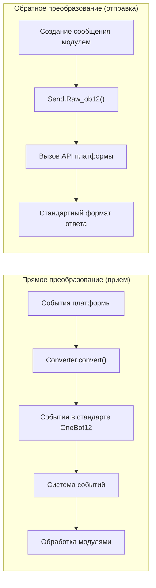

## Структура каталогов

Стандартная структура пакета адаптера:

```
MyAdapter/
├── pyproject.toml          # Конфигурация проекта
├── README.md               # Описание проекта
├── LICENSE                 # Лицензия
└── MyAdapter/
    ├── __init__.py          # Точка входа пакета
    ├── Core.py               # Главный класс адаптера
    └── Converter.py          # Конвертер событий
```

## Быстрый старт

### 1. Создание проекта

```bash
mkdir MyAdapter && cd MyAdapter
```

### 2. Создание pyproject.toml

```toml
[project]
name = "ErisPulse-MyAdapter"
version = "1.0.0"
description = "Адаптер MyAdapter"
readme = "README.md"
requires-python = ">=3.10"
license = { file = "LICENSE" }
authors = [ { name = "yourname", email = "your@mail.com" } ]

dependencies = [
    "ErisPulse>=2.4.0"  # aiohttp уже встроен в ErisPulse, обычно не нужно отдельно зависеть
]

[project.urls]
"homepage" = "https://github.com/yourname/MyAdapter"

[project.entry-points."erispulse.adapter"]
"MyAdapter" = "MyAdapter:MyAdapter"
```

### 3. Создание главного класса адаптера

Рамка предоставляет декларативное управление конфигурацией с помощью `ConfigClass` / `AccountConfigClass`. Адаптеру нужно только объявить класс конфигурации, чтобы автоматически загружать, проверять и генерировать шаблон конфигурации.

```python
# MyAdapter/Core.py
from dataclasses import dataclass, field
from ErisPulse.Core import BaseAdapter
from ErisPulse.Core.Bases import BaseConfig

@dataclass
class MyAdapterConfig(BaseConfig):
    """Конфигурация MyAdapter"""
    api_endpoint: str = field(
        default="https://api.example.com",
        metadata={
            "description": {"i18n": "my_adapter.api_endpoint", "default": "Адрес API"},
            "required": False,
            "ui": {"widget": "text", "group": "connection", "order": 1},
        },
    )
    token: str = field(
        default="",
        metadata={
            "description": {"i18n": "my_adapter.token", "default": "Токен платформы"},
            "required": True,
            "secret": True,
            "ui": {"widget": "password", "group": "basic", "order": 2},
        },
    )

class MyAdapter(BaseAdapter):
    ConfigClass = MyAdapterConfig  # Объявление класса конфигурации, управление автоматически
    
    # Не нужно переопределять __init__! Рамка автоматически обрабатывает:
    # - self.sdk / self.logger автоматически устанавливаются
    # - self.cfg читается в реальном времени из конфигурации
    # - self.Send / self.Request автоматически инициализируются
    
    def _setup_converter(self):
        from .Converter import MyPlatformConverter
        return MyPlatformConverter()
```

> ⚠️ **О `__init__`**: В новой версии `BaseAdapter.__init__(self, sdk=None)` автоматически обрабатывает ссылку на SDK, инициализацию логирования и загрузку конфигурации. Большинству адаптеров **не нужно переопределять `__init__`**. Подробнее см. [Примечания по __init__](#init-注意事项).

> ⚠️ **О `super().__init__()`**: `BaseAdapter.__init__()` отвечает за создание фабрик `Send` и `Request`. Если забыть вызвать, все операции отправки сообщений и запросов будут вызывать `AttributeError`. Подробнее см. [Примечания по __init__](#init-注意事项).

### 4. Реализация обязательных методов

```python
class MyAdapter(BaseAdapter):
    # ... код __init__ ...
    
    async def start(self):
        """Запуск адаптера (обязательно реализовать)"""
        # Регистрация маршрутов WebSocket или WebHook
        router.register_websocket(
            module_name="myplatform",
            path="/ws",
            handler=self._ws_handler
        )
        self.logger.info("Адаптер запущен")
    
    async def shutdown(self):
        """Остановка адаптера (обязательно реализовать)"""
        router.unregister_websocket(
            module_name="myplatform",
            path="/ws"
        )
        # Очистка подключений и ресурсов
        self.logger.info("Адаптер остановлен")
    
    async def call_api(self, endpoint: str, **params):
        """Вызов API платформы (обязательно реализовать)"""
        raise NotImplementedError("Необходимо реализовать call_api")
```

#### Отправка метасобытий

Адаптер должен активно отправлять метасобытия, чтобы система отслеживала состояние онлайн-бота. Это можно сделать одной строкой с помощью `emit_meta()`:

```python
class MyAdapter(BaseAdapter):
    async def _ws_handler(self, websocket):
        bot_id = self._get_bot_id()

        # Бот вошёл в сеть
        await self.emit_meta("connect", bot_id, user_name="MyBot")

        try:
            while True:
                data = await websocket.receive_text()
                event = self.convert(data)
                if event:
                    await self.adapter.emit(event)
        except WebSocketDisconnect:
            pass
        finally:
            # Бот вышел из сети
            await self.emit_meta("disconnect", bot_id)
```

> Подробнее о управлении состоянием бота и метасобытиях см. [Рекомендации по адаптерам - Управление состоянием бота и метасобытия](best-practices.md#bot-状态管理与-meta-事件).

### 5. Реализация класса Send

Декораторы `At`/`AtAll`/`Reply` уже реализованы в базовом классе SendDSL, адаптеру нужно только реализовать `Raw_ob12` и конкретные методы отправки.

Рамка предоставляет два ключевых вспомогательных метода:
- `self._apply_modifiers(message)` — автоматически объединяет At/AtAll/Reply декораторы в сегменты сообщения
- `self.send_context` — получает словарь контекста отправки (`target_type`, `target_id`, `account_id`)

```python
import asyncio

class MyAdapter(BaseAdapter):
    # ... остальной код ...
    
    class Send(BaseAdapter.Send):

        def Raw_ob12(self, message, **kwargs):
            """
            Отправка сообщения в формате OneBot12 (обязательно реализовать)

            Использование _apply_modifiers для автоматического объединения состояния декораторов,
            использование send_context для получения контекста отправки.
            """
            async def _do_send():
                segments = self._apply_modifiers(message)
                return await self._adapter.call_api(
                    endpoint="/send_message",
                    message=segments,
                    **self.send_context,
                    **kwargs
                )
            return asyncio.create_task(_do_send())

        # Методы Text/Image/Voice/Video/File уже унаследованы от базового класса SendDSL,
        # по умолчанию делегируют Raw_ob12, повторная реализация не требуется.
        # Если нужны платформенно-специфические логики, можно переопределить отдельные методы:
        # def Text(self, text: str):
        #     return self.Raw_ob12([{"type": "text", "data": {"text": text}}])
```

**Особенности реализации методов отправки медиа-файлов (Image/Video/File):**

- Базовая реализация по умолчанию упаковывает параметр `file` в сегмент OneBot12 и передаёт в `Raw_ob12`, адаптер должен обрабатывать загрузку/передачу в `Raw_ob12`
- Параметр `file` должен поддерживать как `bytes` (бинарные данные), так и `str` (URL)
- При передаче URL необходимо сначала загрузить файл, а затем загрузить на платформу
- Платформа обычно требует сначала вызвать загрузочный API для получения идентификатора файла, а затем вызвать API отправки

**Метод `__getattr__`:**

- Реализация методов нечувствительна к регистру (`Text`, `text`, `TEXT` вызывают один и тот же метод)
- Неопределённые методы должны возвращать информационное сообщение, а не вызывать ошибку

**Метод `Raw_ob12`:**

- Преобразует стандартный формат OneBot12 в формат платформы для отправки
- Использует `self._apply_modifiers(message)` для автоматической обработки декораторов At/AtAll/Reply
- Использует `**self.send_context` для передачи информации о цели и аккаунте

### 6. Реализация конвертера

```python
# MyAdapter/Converter.py
import time
import uuid

class MyPlatformConverter:
    def convert(self, raw_event):
        """Преобразование событий платформы в стандартный формат OneBot12"""
        if not isinstance(raw_event, dict):
            return None
        
        onebot_event = {
            "id": str(raw_event.get("event_id", uuid.uuid4())),
            "time": int(time.time()),
            "type": self._convert_event_type(raw_event.get("type")),
            "detail_type": self._convert_detail_type(raw_event),
            "platform": "myplatform",
            "self": {
                "platform": "myplatform",
                "user_id": str(raw_event.get("bot_id", ""))
            },
            "myplatform_raw": raw_event,
            "myplatform_raw_type": raw_event.get("type", "")
        }
        
        return onebot_event
    
    def _convert_event_type(self, event_type):
        """Преобразование типа события"""
        type_map = {
            "message": "message",
            "notice": "notice"
        }
        return type_map.get(event_type, "unknown")
    
    def _convert_detail_type(self, raw_event):
        """Преобразование детального типа"""
        return "private"  # Упрощённый пример
```

### 7. Реализация класса Request (операции запросов)

Если платформа поддерживает запросы, такие как запросы на добавление в друзья, приглашения в группы, где боту нужно принять решение, можно реализовать внутренний класс `Request`:

```python
from ErisPulse.Core import BaseAdapter, RequestDSL

class MyAdapter(BaseAdapter):
    # ... Send и другие коды ...

    class Request(RequestDSL):
        """Реализация операций запросов (запросы на добавление, приглашения и т.д.)"""

        def accept(self, **kwargs):
            """Принять запрос"""
            async def _do():
                result = await self._adapter.call_api(
                    endpoint="/set_request",
                    request_id=self._request_id,
                    approve=True,
                    **kwargs,
                )
                return {
                    "status": "ok" if result.get("code") == 0 else "failed",
                    "retcode": result.get("code", 0),
                    "data": None,
                    "message_id": "",
                    "message": result.get("message", ""),
                }
            return self._create_task(_do())

        def reject(self, **kwargs):
            """Отклонить запрос"""
            async def _do():
                result = await self._adapter.call_api(
                    endpoint="/set_request",
                    request_id=self._request_id,
                    approve=False,
                    **kwargs,
                )
                return {
                    "status": "ok" if result.get("code") == 0 else "failed",
                    "retcode": result.get("code", 0),
                    "data": None,
                    "message_id": "",
                    "message": result.get("message", ""),
                }
            return self._create_task(_do())
```

Способ использования модулями:

```python
from ErisPulse.Core.Event import request

@request.on_friend_request()
async def handle_friend_request(event):
    # Использование удобного метода Event
    await event.approve()
    # Или напрямую через адаптер
    await adapter.myplatform.Request("req_id").accept()
```

> Если платформа не поддерживает операции запросов, можно не реализовывать внутренний класс `Request`. Базовый класс по умолчанию возвращает `retcode=10002` (операция не поддерживается). Подробнее см. [Спецификация операций запросов](../../standards/request-action-spec.md).

### 8. Создание точки входа пакета

```python
# MyAdapter/__init__.py
from .Core import MyAdapter
```

## Зависимости (опционально, 2.8.0+)

Адаптер может объявлять зависимости от других адаптеров или модулей для реализации взаимодействия между адаптерами и опциональных функций:

```python
from typing import ClassVar

class MyAdapter(BaseAdapter):
    # Жёсткая зависимость: отсутствие приводит к пропуску запуска (предупреждение + событие status=skipped-dependency)
    depends: ClassVar[dict] = {
        "adapters": ["onebot11"],   # Зависимые адаптеры (по названию платформы)
        "modules": ["TranslateEngine"],  # Зависимые модули (по зарегистрированному имени)
    }
    # Опциональная зависимость: отсутствие не влияет на запуск; модули получают обратный вызов при загрузке/выгрузке (режим опциональной функции)
    optional_modules: ClassVar[list] = ["TranslateEngine"]
```

- **Порядок запуска**: адаптеры, объявившие жёсткую зависимость от модуля, будут запускаться **после инициализации модуля**
- **Уведомления по опциональной зависимости**: при загрузке модуля из `optional_modules` (или жёсткой зависимости) вызывается `on_dependency_ready(module_name)`; при выгрузке вызывается `on_dependency_lost(module_name)` (по умолчанию пустой метод, можно переопределить) — для сценариев поздней загрузки и горячей перезагрузки:

```python
async def on_dependency_ready(self, module_name):
    """Опциональный модуль готов: включить соответствующую опциональную функцию"""
    if module_name == "TranslateEngine":
        self._translate = self.sdk.TranslateEngine

async def on_dependency_lost(self, module_name):
    """Опциональный модуль утрачен: понизить функциональность"""
    if module_name == "TranslateEngine":
        self._translate = None
```

> [!NOTE]
> Эта функция требует ErisPulse **2.8.0+**.

## Примечания по `__init__`

В разработке адаптеров есть три уровня, где может потребоваться переопределение `__init__`. Ниже приведены правильные подходы для каждого уровня.

### 1. Уровень BaseAdapter (в большинстве случаев не нужно переопределять)

`BaseAdapter.__init__(self, sdk=None)` отвечает за создание фабрик `Send` / `Request` и автоматически выполняет следующее:

- Принятие параметра `sdk` и установку `self.sdk`, `self.logger`
- Если объявлен `ConfigClass`, можно читать глобальную конфигурацию через `self.cfg` в реальном времени
- Если объявлен `AccountConfigClass`, можно читать конфигурацию нескольких аккаунтов через `self.accounts` в реальном времени

**В большинстве случаев не нужно переопределять `__init__`**, достаточно объявить `ConfigClass`:

```python
class MyAdapter(BaseAdapter):
    ConfigClass = MyAdapterConfig  # После объявления конфигурация автоматически управляется
    
    async def start(self):
        cfg = self.cfg  # Статическая типизация, чтение в реальном времени
        ...
```

Если действительно нужно пользовательскую инициализацию, вызовите `super().__init__(sdk)`:

```python
class MyAdapter(BaseAdapter):
    ConfigClass = MyAdapterConfig
    
    def __init__(self, sdk=None):
        super().__init__(sdk)  # Передать sdk
        self.converter = self._setup_converter()
        self.convert = self.converter.convert
```

### 2. Внутренний класс Send (в большинстве случаев не нужно переопределять)

`SendDSL.__init__` отвечает за передачу состояния при цепочечных вызовах (тип цели, ID цели, аккаунт и т.д.). **В большинстве случаев нужно переопределять только методы** (`Raw_ob12`, `Text` и т.д.), а не `__init__`.

Если действительно нужно (например, инициализация платформенно-специфического состояния), **обязательно передавайте все параметры**:

```python
class MyAdapter(BaseAdapter):
    class Send(BaseAdapter.Send):
        # Параметры: adapter, target_type, target_id, account_id
        def __init__(self, adapter, target_type=None, target_id=None, account_id=None):
            super().__init__(adapter, target_type, target_id, account_id)  # ← Обязательно передать
            self._my_state = None  # Инициализация платформенно-специфического состояния
```

**Почему необходимо передавать?** Каждый шаг цепочечного вызова создаёт новый экземпляр через `self.__class__(...)`:

```python
adapter.Send.To("user", "123")               # → Send(adapter, "user", "123", None)
adapter.Send.To("user", "123").Using("bot1")  # → Send(adapter, "user", "123", "bot1")
```

Если подпись `__init__` не совпадает или не вызван `super()`, цепочечный вызов прервётся.

### 3. Внутренний класс Request (в большинстве случаев не нужно переопределять)

Аналогично Send. Параметры: `adapter`, `request_id`, `account_id`:

```python
class MyAdapter(BaseAdapter):
    class Request(RequestDSL):
        # Параметры: adapter, request_id, account_id
        def __init__(self, adapter, request_id=None, account_id=None):
            super().__init__(adapter, request_id, account_id)  # ← Обязательно передать
            self._my_state = None  # Инициализация платформенно-специфического состояния
```

### Сводка

| Уровень | Когда переопределять | Обязательные действия |
|------|------------|-----------|
| **BaseAdapter** | При необходимости пользовательской логики инициализации | `super().__init__(sdk)` (передать параметр sdk) |
| **Send внутренний класс** | При необходимости инициализации состояний отправки | `super().__init__(adapter, target_type, target_id, account_id)` |
| **Request внутренний класс** | При необходимости инициализации состояний запросов | `super().__init__(adapter, request_id, account_id)` |
| Все уровни | В большинстве случаев | **Объявить ConfigClass, не трогать `__init__`** |

### 9. Информация о подключении и обнаружение маршрутов

После регистрации маршрутов адаптером, система сохраняет всю информацию о маршрутах. Пользователи могут получить доступ к информации о подключении адаптера с помощью следующего API:

```python
from ErisPulse import sdk

# Получение полной информации о подключении адаптера
info = sdk.adapter.get_connection_info("myplatform")
# {
#   "platform": "myplatform",
#   "status": "started",
#   "connection": {
#     "base_url": "http://localhost:8080",
#     "http_routes": [
#       {"path": "/myplatform/webhook", "method": "POST",
#        "url": "http://localhost:8080/myplatform/webhook"}
#     ],
#     "websocket_routes": [
#       {"path": "/myplatform/ws",
#        "url": "ws://localhost:8080/myplatform/ws"}
#     ]
#   }
# }

# Перечисление всех пространств имён (адаптеры/модули) маршрутов
namespaces = sdk.router.list_namespaces()
# {"myplatform": {"http": ["/myplatform/webhook"], "websocket": ["/myplatform/ws"]}}

# Получение полных URL подключения пространства имён
urls = sdk.router.get_module_urls("myplatform")
# {"base_url": "http://localhost:8080", "http": [...], "websocket": [...]}

# Получение подробной информации о маршрутах пространства имён
routes = sdk.router.get_module_routes("myplatform")
# {"http": [{"path": "/myplatform/webhook", "methods": ["POST"]}],
#  "websocket": [{"path": "/myplatform/ws", "auth": false}]}
```

> **Подсказка**: Возвращаемая информация из `get_connection_info()` подходит для отображения пользователю (например, в WebUI), помогая настроить адрес обратного вызова или адрес подключения WebSocket на стороне платформы. Имя модуля, указанное при регистрации маршрута, должно полностью соответствовать названию платформы, зарегистрированному в ErisPulse, иначе обнаружение маршрутов не будет корректным.

### 10. Поддержка SSE (Server-Sent Events)

ErisPulse включает в себя серверно-независимую поддержку SSE, модули и адаптеры могут регистрировать конечные точки SSE с помощью `@sdk.router.sse()`.

#### Основное использование

```python
import asyncio
from ErisPulse import sdk

@sdk.router.sse("MyModule", "/events")
async def event_stream(sse):
    """Отправка событий SSE"""
    count = 0
    while not sse.closed:
        await sse.send({"count": count}, event="update")
        count += 1
        await asyncio.sleep(1)
```

#### Использование параметров запроса

Обработчик может объявить параметр `request`, чтобы получить информацию о клиентском запросе:

```python
@sdk.router.sse("MyModule", "/events")
async def event_stream(request, sse):
    token = request.query_params.get("token")
    if not validate_token(token):
        await sse.close()
        return

    while not sse.closed:
        data = await fetch_data(token)
        await sse.send(data)
        await asyncio.sleep(5)
```

#### API SseEmitter

| Метод | Описание |
|------|------|
| `sse.send(data, event=None, id=None, retry=None)` | Отправка события SSE. `data`, не являющийся строкой, автоматически сериализуется в JSON |
| `sse.close()` | Безопасное закрытие подключения SSE (можно вызывать несколько раз) |
| `sse.closed` | Закрыто ли подключение |
| `sse.request` | Объект базового запроса (можно использовать для чтения query params, headers) |

#### Использование в RouteGroup

```python
api = sdk.router.group("MyModule", "/api", version="1")

@api.sse("/events")
async def events(sse):
    await sse.send({"msg": "hello"})
```

#### Обнаружение маршрутов

Маршруты SSE автоматически появляются в API обнаружения маршрутов:

```python
# list_namespaces будет содержать ключ "sse"
sdk.router.list_namespaces()
# {"MyModule": {"http": [...], "websocket": [...], "sse": ["/MyModule/events"]}}

# get_module_routes пометит streaming: true
sdk.router.get_module_routes("MyModule")
# {"http": [...], "websocket": [...], "sse": [{"path": "/MyModule/events", "streaming": true}]}

# get_module_urls сгенерирует полный URL
sdk.router.get_module_urls("MyModule")
# {"sse": [{"path": "/MyModule/events", "url": "http://localhost:8080/MyModule/events"}]}
```

> **Дизайн, независимый от сервера**: `SseEmitter` использует обратные вызовы для декомпозиции от базового HTTP-фреймворка. Рамка предоставляет `register_sse()` и декоратор `@sse` в качестве единого регистрационного входа, адаптер не должен напрямую зависеть от любого базового HTTP-фреймворка, чтобы реализовать конечную точку SSE.


### 适配器核心概念

# Основные концепции адаптера

Понимание основных концепций адаптера ErisPulse — это основа для разработки адаптеров.

## Архитектура адаптера

### Отношения между компонентами

```
Прямое преобразование (направление приёма)                      Обратное преобразование (направление отправки)
─────────────────                                           ─────────────────
                                                             
┌──────────────────┐                                        ┌──────────────────┐
│ Платформа-специфич. события │                                        │ Модуль формирует сообщение │
└────────┬─────────┘                                        └────────┬─────────┘
         │                                                           │
         ↓                                                           ↓
┌──────────────────┐   ┌──────────────────┐   ┌──────────────────┐
│                  │   │ Адаптер (MyAdapter) │   │ Send.Raw_ob12()  │
│  Converter       │   │ ┌──────────────┐ │   │ (точка входа обратного преобразования)   │
│  (конвертер событий)    │──→│ │              │ │   │                  │
│                  │   │ │              │ │   │                  │
└──────────────────┘   │ └──────────────┘ │   └────────┬─────────┘
                       └──────────────────┘            │
                                │                      ↓
                                ↓              ┌──────────────────┐
                       ┌──────────────────┐    │ Вызов API платформы    │
                       │ Стандартные события OneBot12 │    └────────┬─────────┘
                       └────────┬─────────┘             │
                                │                      ↓
                                ↓              ┌──────────────────┐
                       ┌──────────────────┐    │ Стандартный формат ответа     │
                       │ Система событий         │    └──────────────────┘
                       └────────┬─────────┘
                                │
                                ↓
                       ┌──────────────────┐
                       │ Модуль (обработка событий)  │
                       └──────────────────┘
```

**Основная симметрия**:
- **Прямое преобразование** (Converter): платформа-специфич. события → события OneBot12, оригинальные данные сохраняются в `{platform}_raw`
- **Обратное преобразование** (Raw_ob12): сообщения OneBot12 → вызов API платформы, возвращается стандартный формат ответа

## AdapterManager (менеджер адаптеров)

`AdapterManager` — это основной компонент системы адаптеров ErisPulse, отвечающий за управление всеми зарегистрированными платформенными адаптерами, их запуск, остановку и распределение событий.

### Основные функции

- **Регистрация адаптеров**: управление несколькими платформенными адаптерами
- **Жизненный цикл**: управление запуском и остановкой адаптеров
- **Распределение событий**: распределение событий OneBot12 и платформы
- **Управление конфигурацией**: управление включением/выключением адаптеров
- **Поддержка промежуточных обработчиков**: поддержка промежуточных обработчиков событий OneBot12

### Основное использование

```python
from ErisPulse import sdk

# Регистрация адаптера (обычно выполняется автоматически Loader)
sdk.adapter.register("myplatform", MyPlatformAdapter)

# Запуск всех адаптеров
await sdk.adapter.startup()

# Запуск указанного адаптера
await sdk.adapter.startup(["myplatform"])
# Запуск всех адаптеров
await sdk.adapter.startup()

# Получение экземпляра адаптера
my_adapter = sdk.adapter.get("myplatform")
# Или через атрибут
my_adapter = sdk.adapter.myplatform

# Остановка всех адаптеров
await sdk.adapter.shutdown()
```

### Запуск и остановка

#### Запуск адаптера

```python
# Запуск всех зарегистрированных адаптеров
await sdk.adapter.startup()

# Запуск указанной платформы
await sdk.adapter.startup(["platform1", "platform2"])
```

**Процесс запуска**:

1. Отправка события жизненного цикла `adapter.start`
2. Отправка события `adapter.status.change` (starting)
3. Параллельный запуск адаптеров
4. При неудаче автоматическая повторная попытка (стратегия экспоненциального отступа)
5. После успешного запуска отправка события `adapter.status.change` (started)

**Механизм повторной попытки**:

- Первые 4 попытки: 60 секунд, 10 минут, 30 минут, 60 минут
- Пятая и последующие: фиксированный интервал 3 часа

#### Остановка адаптера

```python
# Остановка всех адаптеров
await sdk.adapter.shutdown()
```

**Процесс остановки**:

1. Отправка события жизненного цикла `adapter.stop`
2. Вызов метода `shutdown()` всех адаптеров
3. Остановка сервера маршрутизации
4. Очистка обработчиков событий
5. Отправка события жизненного цикла `adapter.stopped`

### Управление конфигурацией

#### Проверка состояния платформы

```python
# Проверка, зарегистрирована ли платформа
exists = sdk.adapter.exists("myplatform")

# Проверка, включена ли платформа
enabled = sdk.adapter.is_enabled("myplatform")

# Использование оператора in
if "myplatform" in sdk.adapter:
    print("Платформа существует и включена")
```

#### Список платформ

```python
# Список всех зарегистрированных платформ
platforms = sdk.adapter.list_registered()

# Список всех платформ и их состояний
status_dict = sdk.adapter.list_items()
# Возвращает: {"platform1": true, "platform2": false, ...}

# Получение списка включенных платформ
enabled_platforms = [p for p, enabled in status_dict.items() if enabled]
```

### Обработка событий

#### Стандартные события OneBot12

```python
from ErisPulse import sdk

# Обработка всех стандартных событий сообщений OneBot12
@sdk.adapter.on("message")
async def handle_message(data):
    print(f"Получено сообщение OneBot12: {data}")

# Обработка стандартных событий сообщений для конкретной платформы
@sdk.adapter.on("message", platform="myplatform")
async def handle_platform_message(data):
    print(f"Получено сообщение myplatform: {data}")

# Обработка всех событий
@sdk.adapter.on("*")
async def handle_any_event(data):
    print(f"Получено событие: {data.get('type')}")
```

#### Платформенно-специфич. события

```python
# Обработка событий конкретной платформы
@sdk.adapter.on("raw_event_type", raw=True, platform="myplatform")
async def handle_raw_event(data):
    print(f"Получено платформенно-специфич. событие: {data})

# Обработка всех платформенно-специфич. событий (символ подстановки)
@sdk.adapter.on("*", raw=True)
async def handle_all_raw_events(data):
    print(f"Получено платформенно-специфич. событие: {data})
```

#### Механизм распределения событий

При вызове `adapter.emit(event_data)`:

1. **Обработка промежуточными обработчиками**: сначала выполняются все промежуточные обработчики OneBot12
2. **Распределение стандартных событий**: распределение к соответствующим обработчикам событий OneBot12
3. **Распределение платформенно-специфич. событий**: если есть оригинальные данные, распределение к обработчикам платформенно-специфич. событий

**Правила сопоставления**:

- Точное совпадение: `@sdk.adapter.on("message")` только для события `message`
- Символ подстановки: `@sdk.adapter.on("*")` для всех событий
- Фильтрация платформы: `platform="myplatform"` только для событий указанной платформы

### Промежуточные обработчики

#### Добавление промежуточного обработчика

```python
@sdk.adapter.middleware
async def logging_middleware(data):
    """Промежуточный обработчик логирования"""
    print(f"Обработка события: {data.get('type')}")
    return data  # Обязательно вернуть данные

@sdk.adapter.middleware
async def filter_middleware(data):
    """Промежуточный обработчик фильтрации"""
    # Фильтрация ненужных событий
    if data.get("type") == "notice":
        return None  # При возврате None промежуточная цепочка игнорирует этот результат, сохраняя исходные данные для передачи
    return data  # Обязательно вернуть данные для продолжения передачи
```

#### Порядок выполнения промежуточных обработчиков

Промежуточные обработчики выполняются в порядке регистрации, последний зарегистрированный промежуточный обработчик выполняется первым.

> **Внимание**: если промежуточный обработчик возвращает `None` (например, забыл `return data`), фреймворк проигнорирует этот результат и сохранит исходные данные для передачи, при этом выведет предупреждение уровня warning. Это гарантирует, что сбой одного промежуточного обработчика не приведёт к прерыванию всей цепочки событий.

```python
# Порядок регистрации
sdk.adapter.middleware(middleware1)  # Выполняется последним
sdk.adapter.middleware(middleware2)  # Выполняется посередине
sdk.adapter.middleware(middleware3)  # Выполняется первым

# Порядок выполнения: middleware3 -> middleware2 -> middleware1
```

### Получение экземпляра адаптера

#### Метод get()

```python
adapter = sdk.adapter.get("myplatform")
if adapter:
    await adapter.Send.To("user", "123").Text("Hello")
```

#### Доступ по атрибуту

```python
# Доступ по имени атрибута (регистр не имеет значения)
adapter = sdk.adapter.myplatform
await adapter.Send.To("user", "123").Text("Hello")
```

## BaseAdapter (базовый класс)

### Основная структура

```python
from dataclasses import dataclass, field
from ErisPulse.Core import BaseAdapter
from ErisPulse.Core.Bases import BaseConfig, BotAccountConfig

@dataclass
class MyConfig(BaseConfig):
    """Конфигурация адаптера (объявляется, фреймворк управляет автоматически)"""
    token: str = field(
        default="",
        metadata={
            "description": {"i18n": "my_adapter.token", "default": "Bot Token"},
            "required": True,
            "secret": True,
            "ui": {"widget": "password", "group": "basic", "order": 1},
        },
    )

class MyAdapter(BaseAdapter):
    ConfigClass = MyConfig  # Объявить класс конфигурации
    
    # Не нужно переопределять __init__, фреймворк обрабатывает автоматически:
    # - self.sdk, self.logger
    # - self.cfg (типобезопасная конфигурация, считывается в реальном времени)
    # - self.Send, self.Request
    
    async def start(self):
        """Запуск адаптера (обязательно реализовать)"""
        cfg = self.cfg  # Автоматически загруженная типобезопасная конфигурация
        pass
    
    async def shutdown(self):
        """Остановка адаптера (обязательно реализовать)"""
        pass
    
    async def call_api(self, endpoint: str, **params):
        """Вызов API платформы (обязательно реализовать)"""
        pass
```

### Управление конфигурацией

Фреймворк предоставляет декларативное управление конфигурацией, определяя структуру конфигурации через dataclass, фреймворк автоматически обрабатывает загрузку, проверку и генерацию шаблонов.

#### Конфигурация с одним аккаунтом

```python
from dataclasses import dataclass, field
from ErisPulse.Core.Bases import BaseConfig

@dataclass
class TelegramConfig(BaseConfig):
    token: str = field(default="", metadata={
        "description": {"i18n": "telegram.token", "default": "Bot Token"},
        "required": True,
        "secret": True,
        "ui": {"widget": "password", "group": "basic", "order": 1},
    })
    proxy: str = field(default="", metadata={
        "description": {"i18n": "telegram.proxy", "default": "Адрес прокси"},
        "ui": {"widget": "text", "group": "advanced", "order": 10},
    })

class TelegramAdapter(BaseAdapter):
    ConfigClass = TelegramConfig
    
    async def start(self):
        cfg = self.cfg  # Типобезопасно, считывается в реальном времени
        if not cfg.token:
            raise ValueError("Не настроен токен")
        await self._connect(cfg.token, proxy=cfg.proxy)
```

#### Конфигурация с несколькими аккаунтами

Базовый класс `BotAccountConfig` предоставляет поля `enabled` и `name`. Большинство адаптеров могут автоматически получать `bot_id` из протокола платформы или ответа при входе, в процессе преобразования событий он вставляется в конфигурацию аккаунта.:

```python
from dataclasses import dataclass, field
from ErisPulse.Core.Bases import BotAccountConfig

# Большинство адаптеров: bot_id получается автоматически во время выполнения, не нужно конфигурировать
@dataclass
class MyBotConfig(BotAccountConfig):
    token: str = field(default="", metadata={
        "description": {"i18n": "my_adapter.bot_token", "default": "Токен"},
        "required": True,
    })

# Если при входе невозможно получить bot_id, можно позволить пользователю ввести его в конфигурации
@dataclass
class YunhuBotConfig(BotAccountConfig):
    bot_id: str = field(default="", metadata={
        "description": {"i18n": "yunhu.bot_id", "default": "ID бота"},
        "required": True,
    })
    token: str = field(default="", metadata={
        "description": {"i18n": "yunhu.token", "default": "Токен"},
        "required": True,
    })

class MyAdapter(BaseAdapter):
    AccountConfigClass = MyBotConfig
    
    async def start(self):
        for name, account in self.enabled_accounts.items():
            user_id = await self._login(name, account)
            await self.emit_meta("connect", user_id)
```

#### Соглашение о metadata

Поле metadata служит одновременно для генерации комментариев в TOML и рендеринга форм в WebUI:

```python
metadata = {
    "description": str | dict,  # Описание поля (поддержка i18n)
    "required": bool,         # Обязательно ли заполнять (проверка + метка обязательности в WebUI)
    "secret": bool,           # Является ли чувствительным (в WebUI отображается как ***, в логах маскируется)
    "example": bool,          # Флаг не сохранения: не записывается в config.toml (исключается из значения по умолчанию и шаблона),
                              # только рендерится в config.full.example; schema с "example": true меткой,
                              # конфигурационный гид CLI по умолчанию пропускает; после ручной установки пользователем сохраняется нормально
    "min": number, "max": number,  # Проверка диапазона значений
    "ui": {                   # Настройки элемента управления (старое имя "webui" по-прежнему совместимо)
        "widget": str,        # Тип элемента: "text" | "switch" | "select" | "number" | "password"
        "group": str,         # Группа: "basic" | "advanced" | "connection" и т.д.
        "order": int,         # Вес сортировки (чем меньше, тем ближе)
        "options": list,      # Доступные опции для элемента select [{label, value}], label поддерживает i18n
        "placeholder": str | dict,  # Подсказка в поле ввода (поддержка i18n)
    },
    "extra": dict,            # Дополнительные расширенные поля (прозрачно передаются в schema)
}
```

Все пользовательские видимые текстовые поля поддерживают i18n, единый формат: `{"i18n": "ключ", "default": "текст"}`,
чистая строка прозрачно передается (обратная совместимость). Поддерживаемые поля i18n:

| Поле | Позиция | Описание |
|------|------|------|
| `description` | metadata поля | Описание поля |
| `options[].label` | `ui.options` | Метка опции элемента select |
| `placeholder` | `ui.placeholder` | Подсказка в поле ввода |
| `group_labels` | `_schema_meta` | Название раздела (заголовок секции Dashboard) |

При использовании i18n необходимо заранее зарегистрировать ключ перевода в систему i18n (см. [документацию по i18n](../../advanced/i18n.md#конфигурация-многоязычных-полей) для подробностей).

**Примеры `description` / `placeholder` / `options label`**:

```python
token: str = field(
    default="",
    metadata={
        "description": {"i18n": "my_adapter.token", "default": "Bot Token"},
        "ui": {
            "widget": "text",
            "placeholder": {"i18n": "my_adapter.token.ph", "default": "Введите токен"},
        },
    },
)
mode: str = field(
    default="a",
    metadata={
        "description": {"i18n": "my_adapter.mode", "default": "Режим"},
        "ui": {
            "widget": "select",
            "options": [
                {"label": {"i18n": "my_adapter.mode.a", "default": "Вариант A"}, "value": "a"},
                {"label": "Чистая строка метки", "value": "b"},  # Чистая строка передается как есть
            ],
        },
    },
)
```

**Пример `group_labels`** (объявляется после определения класса конфигурации):

```python
MyConfig._schema_meta = {
    "group_labels": {
        "basic": {"i18n": "my_adapter.group.basic", "default": "Основные настройки"},
        "advanced": {"i18n": "my_adapter.group.advanced", "default": "Дополнительные настройки"},
    }
}
```

Метод `resolve_config_schema()` фреймворка автоматически разрешает все перечисленные выше поля i18n в зависимости от текущего языка;
`get_config_schema()` прозрачно передает словарь i18n, и интерфейс будет разрешать его самостоятельно.

#### Автоматическое создание описания полей из docstring (v2.8.0+)

Поле, не объявленное в metadata `description`, фреймворк автоматически извлекает описание из docstring класса конфигурации в качестве запасного варианта, поддерживает два распространенных стиля (можно использовать вместе):

```python
@dataclass
class MyConfig(BaseConfig):
    """
    Конфигурация MyAdapter

    :ivar endpoint: Адрес API платформы        # Стиль reST
    :ivar timeout: Время ожидания в секундах
    """

    endpoint: str = "https://api.example.com"   # Без metadata description → описание из docstring
    timeout: int = 30

    # Также поддерживается стиль Google (раздел Attributes):
    # Attributes:
    #     endpoint: Адрес API платформы
```

Приоритет: **metadata description > описание поля из docstring > пусто**.
Описание в формате i18n-словаря не затрагивается (всегда приоритет).

#### Вложенные конфигурации (v2.8.0+)

При типе поля вложенный dataclass фреймворк рекурсивно обрабатывает: schema с `"type": "table"` +
`"fields"` поддерево (WebUI рендерит как складываемую вложенную группу), TOML шаблон рендерится как `[подтаблица]` секция,
по умолчанию / заполнение / проверка / разрешение i18n рекурсивно применяются.

```python
@dataclass
class RetryConfig(BaseConfig):
    """Стратегия повтора

    :ivar max_retries: Максимальное количество повторных попыток
    """
    max_retries: int = 3
    backoff: float = 0.5

@dataclass
class MyConfig(BaseConfig):
    """Конфигурация MyAdapter"""
    endpoint: str = "https://api.example.com"
    retry: RetryConfig = field(default_factory=RetryConfig)   # Вложенный конфигурационный раздел
```

Сгенерированный TOML шаблон:

```toml
endpoint = "https://api.example.com"

[retry]
# Максимальное количество повторных попыток
max_retries = 3
backoff = 0.5
```

> Рекомендуется использовать прямой тип аннотации для вложенных типов; строковые аннотации (например, для отложенного вычисления) должны гарантировать, что тип можно разрешить из модуля конфигурационного класса, глобально, по `__qualname__` или по имени класса.

#### Не сохраняемые поля `example` (v2.8.0+)

```python
gc_interval: int = field(default=300, metadata={"example": True})
```

Поле с `example: True`:

- Не записывается в config.toml (шаблон конфигурации адаптера/модуля и значения по умолчанию исключаются, используются значения по умолчанию из кода)
- Отображается только в `config.full.example` проекта (для справки, копируются по желанию в config.toml)
- В schema помечается как `"example": true` (интерфейс может самостоятельно решить стратегию отображения), CLI конфигурационный гид по умолчанию пропускает
- После ручной установки пользователем сохраняется нормально, нормально обновляется (приоритет явного намерения пользователя)

Подходит для "многочисленных и редко используемых" настроек, чтобы сохранить config.toml пользователя минимальным.

> ⚠️ `_schema_meta` — это метаданные на уровне класса (не поле конфигурации). Если объявить внутри тела dataclass класса,
> необходимо добавить аннотацию `ClassVar` (`_schema_meta: ClassVar[dict] = {...}`), иначе dataclass будет воспринимать это как обычное поле. Фреймворк защитно исключает поля с подчеркиванием в начале (не включает в любой schema / шаблон / значения по умолчанию / проверки), но рекомендуется соблюдать стандартное объявление.

### Декларативные ключи перевода (v2.7.0+)

Адаптер может декларировать ключи перевода, подобно `ConfigClass`, с помощью вложенного класса `I18nClass`, фреймворк автоматически зарегистрирует все объявленные ключи перевода в `__init__` этапе (до генерации шаблона конфигурации), обеспечивая доступность ключей перевода в описаниях конфигурации при генерации шаблона.

```python
from ErisPulse.Core.Bases import BaseAdapter, BaseI18n, I18nKey

class MyAdapter(BaseAdapter):
    class I18nClass(BaseI18n):
        endpoint: I18nKey = I18nKey(
            default="API Endpoint",
            zh_CN="API 地址",
            zh_TW="API 位址",
            en="API Endpoint",
            ja="APIアドレス",
            ru="API адрес",
        )
        token: I18nKey = I18nKey(
            default="Platform Token",
            zh_CN="平台 Token",
            zh_TW="平台權杖",
            en="Platform Token",
            ja="プラットフォームトークン",
            ru="Токен платформы",
        )
```

> ``I18nKey.default`` — это **языкозависимый запасной текст**, не регистрируется ни в каком языке.
> Чтобы перевод был активен, необходимо явно передать хотя бы один параметр языка.

Подробное использование (правила путей ключей, явный параметр key и т.д.) см. в [документации по i18n](../../advanced/i18n.md#рекомендуемый-способ-объявление-ключей-перевода-через-i18nclass-v270).

### Декларативные расширения событий (v2.7.0+)

Адаптер может декларировать платформенно-специфич. методы расширения событий через `EventMixin`, фреймворк автоматически регистрирует их для текущей платформы.

```python
from ErisPulse.Core import BaseAdapter

class MyAdapter(BaseAdapter):
    class EventMixin:
        def get_chat_name(self):
            """Получить название чата"""
            return self.get("myplatform_raw", {}).get("chat", {}).get("name", "")

        def is_official_message(self):
            """Проверить, является ли сообщение официальным"""
            raw = self.get("myplatform_raw", {})
            return raw.get("sender", {}).get("is_official", False)
```

После регистрации, методы расширения событий доступны напрямую в объекте события:

```python
@message.on_group_message()
async def handler(event):
    if event.is_official_message():
        chat_name = event.get_chat_name()
        await event.reply(f"[{chat_name}] Официальное сообщение получено")
```

> Методы расширения событий адаптера регистрируются в собственной платформе (``self._platform``).
> Модули, которые нуждаются в расширении событий на разных платформах, должны использовать старый API ``register_event_mixin()``.

#### Разрешение аккаунта

Многоаккаунтный адаптер может использовать `_resolve_account()` для автоматического разрешения целевого аккаунта:

```python
async def call_api(self, endpoint: str, **params):
    account_id = params.pop("account_id", None)
    name, account = self._resolve_account(account_id)
    # name: имя аккаунта, account: экземпляр конфигурации
```

Стратегия разрешения: сопоставление по имени аккаунта → сопоставление по полю `bot_id` → сопоставление по другим строковым полям → первый включенный аккаунт.

#### Горячая перезагрузка конфигурации

Подкласс может переопределить `on_config_update()` для реакции на изменения конфигурации:

```python
class MyAdapter(BaseAdapter):
    ConfigClass = MyConfig
    
    def on_config_update(self, old_config, new_config):
        if old_config.token != new_config.token:
            self.logger.info("Токен обновлен, переподключение")
```

### Процесс инициализации

Фреймворк автоматически выполняет следующие действия в `BaseAdapter.__init__(self, sdk=None)`:

1. **Ссылка на SDK**: установка `self.sdk`, `self.logger`
2. **Фабрика Send/Request**: создание `self.Send` и `self.Request`
3. **Шаблон конфигурации**: если объявлен `ConfigClass`, автоматически генерируется шаблон конфигурации (впервые)
4. **Шаблон аккаунта**: если объявлен `AccountConfigClass`, автоматически генерируется шаблон аккаунта (впервые)
5. **Регистрация EventMixin**: если объявлен `EventMixin`, автоматически регистрируется в `AdapterManager` после вставки имени платформы

Конфигурация считывается в реальном времени через `self.cfg` / `self.accounts` (каждый доступ читает последнее значение из хранилища конфигурации). `self.config` как совместимый псевдоним `self.cfg` по-прежнему доступен.

Большинству адаптеров не нужно переопределять `__init__`. Если требуется кастомная инициализация:

```python
class MyAdapter(BaseAdapter):
    ConfigClass = MyConfig
    
    def __init__(self, sdk=None):
        super().__init__(sdk)  # передать sdk
        self.converter = self._setup_converter()
        self.convert = self.converter.convert
```

## DSL для отправки сообщений Send

### Наследование

```python
class MyAdapter(BaseAdapter):
    class Send(BaseAdapter.Send):
        """Вложенный класс Send, наследующий BaseAdapter.Send"""
        pass
```

### Доступные свойства

При вызове `Send` автоматически устанавливаются следующие свойства:

| Свойство | Описание | Способ установки |
|-----|------|---------|
| `_target_id` | Идентификатор цели | `To(id)` или `To(type, id)` |
| `_target_type` | Тип цели | `To(type, id)` |
| `_target_to` | Упрощенный идентификатор цели | `To(id)` |
| `_account_id` | Идентификатор отправляемого аккаунта | `Using(account_id)` |
| `_adapter` | Экземпляр адаптера | Автоматически установлен |
| `_at_user_ids` | Список пользователей для упоминания | `At(user_id)` |
| `_reply_message_id` | Идентификатор сообщения для ответа | `Reply(message_id)` |
| `_at_all` | Упоминание всех пользователей | `AtAll()` |

> **Рекомендуется**: использовать свойство `self.send_context` для получения `target_type`, `target_id`, `account_id` за один раз, что делает код более понятным, чем прямой доступ к экземплярным переменным.

### Вспомогательные методы фреймворка

| Метод/свойство | Описание |
|-----------|------|
| `self._apply_modifiers(message)` | Объединение состояний модификаторов At/AtAll/Reply в список сообщений |
| `self.send_context` | Возвращает словарь `{target_type, target_id, account_id}` |

### Основные методы

Адаптер должен реализовать только `Raw_ob12`, стандартные методы (Text/Image/Voice/Video/File) уже унаследованы от базового класса `SendDSL` и по умолчанию делегированы ему:

```python
class Send(BaseAdapter.Send):
    def Raw_ob12(self, message, **kwargs):
        """Обязательно реализовать: OneBot12 сообщения → платформенный API"""
        async def _do_send():
            segments = self._apply_modifiers(message)
            return await self._adapter.call_api(
                endpoint="/send_message",
                message=segments,
                **self.send_context,
                **kwargs
            )
        return asyncio.create_task(_do_send())

    # Text/Image/Voice/Video/File уже унаследованы от базового класса, автоматически делегируют Raw_ob12, не нужно повторно реализовывать
    # Если нужна платформенно-специфич. логика, можно переопределить отдельный метод:
    # def Text(self, text: str):
    #     return self.Raw_ob12([{"type": "text", "data": {"text": text}}])
```

### Цепочечные модифицирующие методы

```python
class Send(BaseAdapter.Send):

    def __init__(self, adapter, target_type=None, target_id=None, account_id=None):
        super().__init__(adapter, target_type, target_id, account_id)
        self.buttons = []

    def Button(self, content: list) -> 'Send':
        self.buttons.append(content)
        return self
```

## Конвертер событий

### Процесс преобразования

```
Платформенно-специфич. событие
    ↓
Converter.convert()
    ↓
Стандартное событие OneBot12
```

### Обязательные поля

Все преобразованные события должны содержать:

```python
{
    "id": "Уникальный идентификатор события",
    "time": 1234567890,           # 10-значный Unix timestamp
    "type": "message/notice/request/meta",
    "detail_type": "Детальный тип события",
    "platform": "Название платформы",
    "self": {
        "platform": "Название платформы",
        "user_id": "ID бота"     # Должен совпадать с bot_id
    },
    "{platform}_raw": {...},       # Оригинальные данные (обязательно)
    "{platform}_raw_type": "..."    # Тип оригинального события (обязательно)
}
```

### Пример конвертера

```python
class MyPlatformConverter:
    def convert(self, raw_event):
        """Преобразование платформенно-специфич. события в стандартный формат OneBot12"""
        if not isinstance(raw_event, dict):
            return None
        
        # Генерация идентификатора события
        event_id = raw_event.get("event_id") or str(uuid.uuid4())
        
        # Преобразование временной метки
        timestamp = raw_event.get("timestamp")
        if timestamp and timestamp > 10**12:
            timestamp = int(timestamp / 1000)
        else:
            timestamp = int(timestamp) if timestamp else int(time.time())
        
        # Преобразование типа события
        event_type = self._convert_type(raw_event.get("type"))
        detail_type = self._convert_detail_type(raw_event)
        
        # Построение стандартного события
        onebot_event = {
            "id": str(event_id),
            "time": timestamp,
            "type": event_type,
            "detail_type": detail_type,
            "platform": "myplatform",
            "self": {
                "platform": "myplatform",
                "user_id": str(raw_event.get("bot_id", ""))
            },
            "myplatform_raw": raw_event,
            "myplatform_raw_type": raw_event.get("type", "")
        }
        
        return onebot_event
```

## Управление подключениями

### WebSocket подключение

```python
class MyAdapter(BaseAdapter):
    async def start(self):
        """Регистрация WebSocket маршрута"""
        router.register_websocket(
            module_name="myplatform",
            path="/ws",
            handler=self._ws_handler,
            auth_handler=self._auth_handler
        )
    
    async def _ws_handler(self, websocket):
        """Обработчик WebSocket подключения"""
        self.connection = websocket
        
        try:
            while True:
                data = await websocket.receive_text()
                onebot_event = self.convert(data)
                if onebot_event:
                    await self.adapter.emit(onebot_event)
        except WebSocketDisconnect:
            self.logger.info("Подключение разорвано")
        finally:
            self.connection = None
    
    async def _auth_handler(self, websocket) -> bool:
        """Проверка подключения"""
        token = websocket.query_params.get("token")
        return token == "valid_token"
```

### WebHook подключение

```python
class MyAdapter(BaseAdapter):
    async def start(self):
        """Регистрация HTTP маршрута"""
        router.register_http_route(
            module_name="myplatform",
            path="/webhook",
            handler=self._webhook_handler,
            methods=["POST"]
        )
    
    async def _webhook_handler(self, request):
        """Обработчик WebHook запроса"""
        data = await request.json()
        onebot_event = self.convert(data)
        if onebot_event:
            await self.adapter.emit(onebot_event)
        return {"status": "ok"}
```

> **Информация о маршрутах**: зарегистрированные адаптером маршруты (HTTP, WebSocket, SSE) можно получить через `sdk.adapter.get_connection_info(platform)` и `sdk.router.get_module_urls(module_name)`, включая `base_url` + путь. Подробнее см. [Введение в разработку адаптеров - Информация о подключениях и обнаружение маршрутов](getting-started.md#9-информация-о-подключениях-и-обнаружение-маршрутов) и [Поддержка SSE](getting-started.md#10-sse-server-sent-events-поддержка).

## Стандартные ответы API

Фреймворк предоставляет методы `make_response()` и `make_error()` для построения стандартизированных ответов, не нужно вручную создавать словарь ответа.

### Успешный ответ

```python
async def call_api(self, endpoint: str, **params):
    try:
        raw_response = await self._platform_api_call(endpoint, **params)
        
        return self.make_response(
            data=raw_response.get("data"),
            message_id=raw_response.get("data", {}).get("message_id", ""),
            raw=raw_response,
        )
    except Exception as e:
        return self.make_error(message=str(e), raw=None)
```

### Ручное построение ответа (старый способ по-прежнему совместим)

```python
async def call_api(self, endpoint: str, **params):
    return {
        "status": "ok",
        "retcode": 0,
        "data": {...},
        "message_id": "msg_id",
        "message": "",
        "myplatform_raw": raw_response
    }
```

## Поддержка нескольких аккаунтов

### Декларативная конфигурация (рекомендуется)

После объявления `AccountConfigClass` фреймворк автоматически управляет загрузкой, проверкой и генерацией шаблонов конфигурации нескольких аккаунтов:

```python
from dataclasses import dataclass, field
from ErisPulse.Core.Bases import BotAccountConfig

@dataclass
class MyBotConfig(BotAccountConfig):
    bot_id: str = field(default="", metadata={"description": "ID бота", "required": True})
    token: str = field(default="", metadata={"description": "Токен", "required": True, "secret": True})

class MyAdapter(BaseAdapter):
    AccountConfigClass = MyBotConfig
    
    async def start(self):
        for name, account in self.enabled_accounts.items():
            self.logger.info(f"Запуск аккаунта {name}: {account.bot_id}")
            await self._connect(name, account)
    
    async def call_api(self, endpoint: str, **params):
        account_id = params.pop("account_id", None)
        name, account = self._resolve_account(account_id)
        # Использовать account.token, account.bot_id и т.д.
```

### Файл конфигурации аккаунта

```toml
[MyAdapter.accounts.account1]
bot_id = "bot_001"
token = "token1"
enabled = true

[MyAdapter.accounts.account2]
bot_id = "bot_002"
token = "token2"
enabled = true
```

### Отправка сообщения с указанием аккаунта

```python
# Использовать метод Using для указания аккаунта
my_adapter = adapter.get("myplatform")

# Рекомендуется использовать self.user_id из события
await my_adapter.Send.Using(event["self"]["user_id"]).To("user", "123").Text("Hello")

# По имени аккаунта
await my_adapter.Send.Using("account1").To("user", "123").Text("Hello")
```

### Соотношение self.user_id и Using

Механизм ответа фреймворка автоматически извлекает `account_id` (приоритет) или `user_id` из поля `self` события, передавая его как параметр `Using`. Разработчику адаптера необходимо обеспечить, чтобы Converter правильно устанавливал `self.user_id`, чтобы `Using` мог сопоставиться.

**Внутренняя логика фреймворка**:

```python
# Логика извлечения bot_id фреймворком
bot_id = self.get("self", {}).get("account_id", "") or self.get("self", {}).get("user_id", "")

# Вызов Using только при непустом bot_id
if bot_id:
    send_chain = send_chain.Using(bot_id)
```

> **Ключевой момент**: даже если адаптер использует только одну конфигурацию бота, если Converter правильно устанавливает `self.user_id`, фреймворк будет использовать его как параметр `Using`. Адаптер должен убедиться, что `self.user_id` совпадает с идентификатором поля в `AccountConfigClass` (например, `bot_id`), чтобы `_resolve_account()` мог сопоставиться с правильным аккаунтом. Если `self.user_id` пуст, фреймворк не вызовет `Using`, и `call_api` получит `account_id` как `None`, `_resolve_account(None)` вернёт первый включённый аккаунт.

## Обработка ошибок

### Повторное подключение

```python
import asyncio

class MyAdapter(BaseAdapter):
    async def start(self):
        retry_count = 0
        max_retries = 5
        
        while retry_count < max_retries:
            try:
                await self._connect_to_platform()
                break
            except Exception as e:
                retry_count += 1
                if retry_count < max_retries:
                    wait_time = min(60 * (2 ** retry_count), 600)
                    self.logger.warning(f"Подключение не удалось, повтор через {wait_time} секунд")
                    await asyncio.sleep(wait_time)
                else:
                    raise
```

### Обработка ошибок API

```python
async def call_api(self, endpoint: str, **params):
    try:
        # Рекомендуется использовать клиент SDK
        from ErisPulse.Core import client
        from ErisPulse.Core.Bases.errors import ClientError, ClientTimeoutError
        resp = await client.post(
            f"https://api.platform.com/{endpoint}",
            json=params,
            max_retries=2,
        )
        response = await resp.json()
        return self._standardize_response(response)
    except ClientTimeoutError:
        self.logger.error(f"Запрос таймаут: {endpoint}")
        return self._error_response("Запрос таймаут", 32000)
    except ClientError as e:
        self.logger.error(f"Ошибка сети: {e}")
        return self._error_response("Ошибка сети", 33000)
    except Exception as e:
        self.logger.error(f"Неизвестная ошибка: {e}")
        return self._error_response(str(e), 34000)
```

> **Обратная совместимость**: код старых адаптеров, использующих `aiohttp.ClientSession`, не затрагивается, по-прежнему можно перехватывать `aiohttp.ClientError`. Два способа могут сосуществовать. Рекомендуется использовать `sdk.client` + систему исключений ErisPulse для нового кода.

## Управление состоянием бота

`AdapterManager` содержит встроенную систему отслеживания состояния ботов, автоматически отслеживает онлайн-статус, время активности и метаинформацию всех зарегистрированных ботов.

### Автоматическое обнаружение

При отправке событий через `adapter.emit()` фреймворк автоматически проверяет поле `self` событий:

- **Мета-события**: в зависимости от `detail_type` выполняются соответствующие действия (connect — регистрация, disconnect — пометка как отключённого, heartbeat — обновление времени активности)
- **Обычные события** (message/notice/request): автоматически обнаруживаются боты и обновляется время активности

```python
# Все события с полем self будут запускать автоматическое обнаружение
await self.adapter.emit({
    "type": "message",
    "platform": "myplatform",
    "self": {"platform": "myplatform", "user_id": "bot123"},
    # ...
})
# Бот "bot123" будет автоматически зарегистрирован (если это первый раз) и обновлено время активности
```

### Типы мета-событий

| `detail_type` | Описание | Действие фреймворка |
|---|---|---|
| `connect` | Бот подключился | Регистрация бота и запуск события жизненного цикла `adapter.bot.online` |
| `disconnect` | Бот отключился | Пометка бота как отключённого и запуск события жизненного цикла `adapter.bot.offline` |
| `heartbeat` | Бот отправил heartbeat | Обновление времени активности и метаинформации бота |

### Отправка мета-событий адаптером

Использование `emit_meta()` для отправки мета-событий:

```python
class MyAdapter(BaseAdapter):
    async def _on_bot_connect(self, bot_id: str):
        # Одним вызовом отправить событие connect
        await self.emit_meta("connect", bot_id, user_name="MyBot", nickname="Мой бот")

    async def _on_bot_disconnect(self, bot_id: str):
        await self.emit_meta("disconnect", bot_id)
```

Также поддерживается ручное построение (старый способ по-прежнему совместим):

```python
await self.adapter.emit({
    "type": "meta",
    "detail_type": "connect",
    "platform": "myplatform",
    "self": {"platform": "myplatform", "user_id": bot_id}
})
```

### Расширение поля self

Поле `self` помимо обязательных `platform` и `user_id` поддерживает следующие необязательные поля:

| Поле | Описание |
|---|---|
| `user_name` | Имя пользователя бота |
| `nickname` | Никнейм бота |
| `avatar` | URL аватара бота |
| `account_id` | Идентификатор аккаунта |

### Запрос состояния бота

```python
from ErisPulse import sdk

# Получить информацию о боте
info = sdk.adapter.get_bot_info("myplatform", "bot123")
# {"status": "online", "last_active": 1712345678.0, "info": {"nickname": "MyBot"}}

# Список всех ботов
all_bots = sdk.adapter.list_bots()

# Список ботов указанной платформы
platform_bots = sdk.adapter.list_bots("myplatform")

# Проверить, онлайн ли бот
is_online = sdk.adapter.is_bot_online("myplatform", "bot123")

# Получить полную сводку состояния (подходит для отображения в WebUI)
summary = sdk.adapter.get_status_summary()
# {"adapters": {"myplatform": {"status": "started", "bots": {...}}}}
```

### Отслеживание жизненного цикла бота

```python
from ErisPulse import sdk

@sdk.lifecycle.on("adapter.bot.online")
async def on_bot_online(data):
    platform = data.get("platform")
    bot_id = data.get("bot_id")
    sdk.logger.info(f"Бот онлайн: {platform}/{bot_id}")

@sdk.lifecycle.on("adapter.bot.offline")
async def on_bot_offline(data):
    platform = data.get("platform")
    bot_id = data.get("bot_id")
    sdk.logger.info(f"Бот оффлайн: {platform}/{bot_id}")
```


### SendDSL 详解

# SendDSL подробно

SendDSL — это интерфейс отправки сообщений, предоставленный адаптером ErisPulse в стиле цепных вызовов.

## Основные способы вызова

### 1. Указание типа и идентификатора

```python
await adapter.Send.To("group", "123").Text("Hello")
```

### 2. Указание только идентификатора

```python
await adapter.Send.To("123").Text("Hello")
```

### 3. Указание аккаунта отправки

```python
await adapter.Send.Using("bot1").Text("Hello")
```

### 4. Комбинированное использование

```python
await adapter.Send.Using("bot1").To("group", "123").Text("Hello")
```

## Методы цепочки

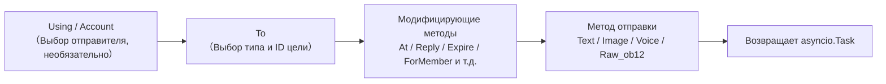

## Методы отправки

Все методы отправки возвращают объект `asyncio.Task`.

### Основные методы (встроенные в базовый класс)

Следующие стандартные методы уже реализованы в базовом классе `SendDSL`, **по умолчанию делегируются на `Raw_ob12`**, подклассы адаптера не обязаны повторно реализовывать их, чтобы использовать напрямую, и IDE сможет автодополнение:

| Название метода | Описание | Возвращаемое значение |
|-----------------|----------|------------------------|
| `Text(text: str)` | Отправка текстового сообщения | `asyncio.Task` |
| `Image(file: bytes \| str)` | Отправка изображения | `asyncio.Task` |
| `Voice(file: bytes \| str)` | Отправка голосового сообщения (OneBot12 `audio` сегмент) | `asyncio.Task` |
| `Video(file: bytes \| str)` | Отправка видео | `asyncio.Task` |
| `File(file: bytes \| str, filename: str = None)` | Отправка файла | `asyncio.Task` |

Адаптеры могут переопределить отдельные стандартные методы, чтобы предоставить платформенно-специфичную логику:

```python
class Send(SendDSL):
    def Raw_ob12(self, message, **kwargs):
        # Обязательно реализовать
        ...

    # Необязательно: переопределить Text для предоставления платформенно-специфичной логики
    # def Text(self, text: str):
    #     return self.Raw_ob12([{"type": "text", "data": {"text": text}}])
```

### Методы протокола

| Название метода | Описание | Возвращаемое значение | Обязательно ли реализовать |
|-----------------|----------|------------------------|-----------------------------|
| `Raw_ob12(message)` | Отправка сообщения в формате OneBot12 | `asyncio.Task` | **Обязательно реализовать** |

> **Важно**: `Raw_ob12` — это основной метод адаптера, **обязательно реализовать**. Это единый вход для обратного преобразования (OneBot12 → платформа). При отсутствии реализации базовый класс будет записывать ошибку в лог и возвращать стандартный ответ об ошибке (`status: "failed"`, `retcode: 10002`). Стандартные методы (`Text`, `Image` и т. д.) по умолчанию делегируются на `Raw_ob12`.

### Платформенно-специфичные методы

Адаптеры могут добавлять платформенно-специфичные методы отправки в подкласс `Send` (они будут распознаваться `event.supports()` / `event.available_methods()`):

```python
class Send(SendDSL):
    def Raw_ob12(self, message, **kwargs): ...

    # Платформенно-специфичный метод
    def Sticker(self, sticker_id: str):
        return self.Raw_ob12([{"type": "sticker", "data": {"id": sticker_id}}])
```

## Модификаторы методов

Модификаторы методов возвращают `self`, чтобы поддерживать цепочечные вызовы.

### Метод At

```python
# @одного пользователя
await adapter.Send.To("group", "123").At("456").Text("Привет")

# @нескольких пользователей
await adapter.Send.To("group", "123").At("456").At("789").Text("Здравствуйте")
```

### Метод AtAll

```python
# @всех участников
await adapter.Send.To("group", "123").AtAll().Text("Всем привет")
```

### Метод Reply

```python
# Ответ на сообщение
await adapter.Send.To("group", "123").Reply("msg_id").Text("Содержание ответа")
```

### Комбинированные модификаторы

```python
await adapter.Send.To("group", "123").At("456").Reply("msg_id").Text("Ответ на сообщение с @")
```

### Платформенно-специфичные модификаторы

Помимо встроенных `At`/`AtAll`/`Reply`, адаптер может определять **платформенно-специфичные модификаторы**. Эти методы **должны возвращать `self`** и **не требуют декораторов** — фреймворк распознает их автоматически:

- Возвращение `self` (экземпляр SendDSL) → модификатор, не вызывает отправку или цепочку событий, продолжает цепочку
- Возвращение `Task`/`Awaitable` → отправляющий метод

```python
class Send(SendDSL):
    def Raw_ob12(self, message, **kwargs): ...

    # Модификатор: возвращает self, не отправляет
    def Expire(self, seconds: int):
        self._expire = seconds
        return self

    def ForMember(self, user_id: str):
        self._member = user_id
        return self

    # Отправляющий метод: возвращает Task, зависит от состояния, установленного модификаторами
    def Board(self, content: str, **kwargs):
        return self.Raw_ob12([{"type": "board", "data": {"text": content}}])
```

Использование:

```python
# Модификаторы можно последовательно цепочечно добавлять
await adapter.Send.To("group", "big").Expire(3600).ForMember("114").Board("Содержание доски")
```

## Использование методов модификации в обёртке события

> [!NOTE]
> Функция `reply(via=)` и `event.send_chain()` требуют ErisPulse **2.7.0+**.

По умолчанию `event.reply()` предоставляет только встроенные параметры модификации, такие как `at_sender`/`at_users`/`at_all`/`quote`. Для использования платформо-специфических методов модификации есть два способа:

### Способ первый: параметр `via` в `reply()`

Подходит для небольшого количества, заранее известных методов модификации:

```python
await event.reply("Содержимое доски", method="Board",
                  via=[("Expire", 3600), ("ForMember", "114514")])
```

Параметр `via` представляет собой список, каждый элемент которого может иметь следующие формы:

| Форма | Эквивалентная цепочка вызовов |
|------|-------------|
| `"Name"` | `.Name()` |
| `("Name", arg1, arg2)` | `.Name(arg1, arg2)` |
| `("Name", (arg1,), {kw: val})` | `.Name(arg1, kw=val)` |

### Способ второй: `event.send_chain()`

Подходит для **нескольких последовательных методов модификации** или **действий без параметров содержимого** (например, удаление, отмена). `send_chain()` возвращает уже настроенную цепочку отправки с параметрами `To`/`Using`, к которой можно свободно добавлять любые методы модификации и методы отправки:

```python
# Платформо-специфические методы модификации + отправка на доску
await event.send_chain().Expire(3600).Board("Содержимое доски, которое истечёт через час")

# Последовательные методы модификации
await (event.send_chain()
       .Expire(3600)
       .ForMember("114514")
       .Board("Содержимое доски", content_type="markdown"))

# Встроенные методы модификации также доступны
await event.send_chain().At("123").Reply("msg_id").Text("hi")

# Действия без параметров содержимого
await event.send_chain().DismissBoard()
```

> `send_chain()` возвращает полный экземпляр SendDSL, поэтому **все цепочные возможности доступны** — не только методы модификации, но и правила отправки и пакетное построение:

```python
# Правила отправки: повторы + таймаут + успешный обратный вызов
await (event.send_chain()
       .Retry(3).Timeout(10)
       .Hook(lambda r: print("Отправка успешна"))
       .Text("Надёжная отправка"))

# Отложенная отправка + платформо-специфические методы + доска
await event.send_chain().Defer(5).Expire(3600).Board("Отложенная доска")

# Режим пакетного построения
results = await (event.send_chain()
                 .Build()
                 .Text("Первое сообщение").Image("pic.jpg").Text("Второе сообщение")
                 .send_all())
```

## Управление аккаунтами

### Метод `Using`

Метод `Using()` используется для указания аккаунта, от которого будут отправляться сообщения. Переданный идентификатор будет сопоставляться через `_resolve_account()` по следующему приоритету:

1. **Имя аккаунта** — ключ из конфигурации (например, `"default"`, `"bot1"`)
2. **bot_id, вставленный во время выполнения** — идентификатор, автоматически вставляемый при преобразовании события
3. **Любое строковое поле** — другие строковые поля в конфигурации
4. **Резервный вариант** — первый активный аккаунт

```python
# Использование имени аккаунта
await adapter.Send.Using("account1").To("user", "123").Text("Hello")

# Использование bot_id (т.е. self.user_id из события)
await adapter.Send.Using("bot_123").To("user", "123").Text("Hello")
```

### Метод `Account`

Метод `Account` эквивалентен методу `Using`:

```python
await adapter.Send.Account("account1").To("user", "123").Text("Hello")
```

## Асинхронная обработка

### Не ждать результата

```python
# Сообщение отправляется в фоновом режиме
task = adapter.Send.To("user", "123").Text("Hello")

# Продолжение выполнения других операций
# ...
```

### Ждать результат

```python
# Непосредственно await для получения результата
result = await adapter.Send.To("user", "123").Text("Hello")
print(f"Результат отправки: {result}")

# Сохранить Task и подождать позже
task = adapter.Send.To("user", "123").Text("Hello")
# ... другие операции ...
result = await task
```

## Система правил отправки

SendDSL содержит встроенную систему декораторов правил отправки, которые можно добавлять цепочкой методов и применять единым образом при окончательной отправке. Правила охватывают распространённые сценарии производства: управление тайм-аутами, автоматические повторные попытки при неудаче, обратные вызовы при успехе, отложенная отправка, приоритеты и отбрасывание сообщений, а также мониторинг прогресса.

Методы правил **возвращают self** (как и At/AtAll/Reply), и их необходимо вызывать до отправки методов (Text/Image и т.д.). Правила распространяются вместе с новыми экземплярами, созданными методами `To`/`Using`/`Account`.

### Список методов правил

| Метод | Описание |
|--------|------|
| `.Hook(callback)` | Вызывается после успешной отправки (можно вызывать несколько раз, выполняется по порядку) |
| `.Retry(times=1)` | Автоматически повторяет отправку N раз (включая первую попытку, всего N+1 попыток) |
| `.Timeout(seconds)` | Устанавливает тайм-аут для одной отправки, при истечении отменяет текущую попытку (можно комбинировать с Retry) |
| `.Defer(seconds=1.0)` | Откладывает отправку (внутрипроцессное таймерное ожидание, не сохраняется) |
| `.Priority(level, drop_if_busy=False)` | Устанавливает приоритет; при перегрузке можно отбрасывать |
| `.OnProgress(callback)` | Обратный вызов на каждом этапе (передаёт SendContext) |
| `.OnError(callback)` | Обратный вызов при окончательной неудаче (вызывается только один раз) |

### Логика выполнения после успешной отправки (Hook)

```python
# Синхронный обратный вызов
await (adapter.Send.To("user", "123")
       .Hook(lambda r: print(f"Отправка успешна, ID сообщения: {r['message_id']}"))
       .Text("Привет"))

# Асинхронный обратный вызов
async def deduct_points(result):
    await db.update(user_id="123", points=-1)

await adapter.Send.To("user", "123").Hook(deduct_points).Text("Списать очки")
```

Hook вызывается только при окончательном успехе отправки (включая успешные повторные попытки); при неудаче, тайм-ауте или отмене он не срабатывает.

### Автоматические повторные попытки при неудаче (Retry)

```python
# При первой неудаче повторяет отправку 2 раза, всего 3 попытки
result = await adapter.Send.To("user", "123").Retry(2).Text("С повтором")
```

Повторная отправка запускается при следующих условиях: выброс исключения при отправке, тайм-аут отправки или возврат ответа с `status == "failed"`.

### Автоматическая отмена при тайм-ауте (Timeout)

```python
# Если одна отправка занимает более 10 секунд, она отменяется
await adapter.Send.To("user", "123").Timeout(10).Text("С тайм-аутом")

# Тайм-аут + повтор: каждая попытка длится 10 секунд, максимум 3 попытки
await adapter.Send.To("user", "123").Timeout(10).Retry(2).Text("Тайм-аут с повтором")
```

### Мониторинг прогресса (OnProgress / OnError)

```python
def on_progress(ctx):
    print(f"Этап: {ctx.stage}, попытка: {ctx.attempt + 1}/{ctx.max_attempts}, затрачено времени: {ctx.elapsed:.2f}s")
    if ctx.stage == "failed":
        print(f"  Ошибка: {ctx.error!r}")

async def on_error(ctx):
    await notify_admin(f"Отправка для {ctx.target_id} не удалась: {ctx.error!r}")

await (adapter.Send.To("user", "123")
       .Retry(3).Timeout(10)
       .OnProgress(on_progress)
       .OnError(on_error)
       .Text("Мониторинг"))
```

`SendContext` содержит следующие поля: `task_id`, `platform`, `method`, `target_type`, `target_id`, `bot_id`, `stage`, `attempt`, `max_attempts`, `started_at`, `finished_at`, `elapsed`, `error`, `result`, `extra`.

Возможные значения `stage`: `pending`, `sending`, `retrying`, `success`, `failed`, `timeout`, `cancelled`, `dropped`.

### Отложенная отправка (Defer)

```python
# Отправка через 5 секунд
await adapter.Send.To("user", "123").Defer(5).Text("Отложенное сообщение")
```

> Примечание: задержка — это внутреннее таймерное ожидание в рамках процесса, при перезапуске процесса задержка теряется, сохранение не поддерживается.

### Приоритет и отбрасывание при перегрузке (Priority)

```python
# Низкоприоритетное сообщение, при перегрузке очереди автоматически отбрасывается
result = await (adapter.Send.To("user", "123")
               .Priority(-1, drop_if_busy=True)
               .Text("Уведомление, которое можно отбросить"))
# Если сообщение отброшено, result["status"] == "failed"
```

При включении `drop_if_busy`, если количество активных отправок превышает порог (по умолчанию 64), текущая отправка отменяется. Порог можно изменить с помощью `.PriorityThreshold(n)`.

### Комбинация правил и фоновое выполнение

```python
# Не блокирует основной поток, правила по-прежнему действуют
task = (adapter.Send.To("user", "123")
        .Hook(lambda r: print("Отправка успешна!"))
        .Retry(3)
        .Timeout(10)
        .OnProgress(on_progress)
        .Text("Привет"))

# Продолжение выполнения других операций
await handle_next_action()
```

### Распространение правил

Правила распространяются вместе с новыми экземплярами, созданными методами `To`/`Using`/`Account`, чтобы избежать потери правил при цепочечном вызове:

```python
# Правила, установленные до вызова To, также распространяются на созданный экземпляр
builder = adapter.Send.Retry(3).Timeout(10)
send = builder.To("user", "123")  # send по-прежнему содержит Retry(3) и Timeout(10)
await send.Text("hi")
```

Правила для разных экземпляров независимы (списки hooks копируются глубоким копированием).

## Режим пакетного построения (Build)

Помимо одиночного режима, SendDSL поддерживает режим пакетного построения: несколько методов отправки записываются в одной цепочке, а затем выполняются все сразу. Подходит для сценариев, когда нужно "отправить сразу несколько сообщений".

### Вход в режим построения

Перед вызовом метода отправки вызовите `.Build()`, который вернёт `SendBuilder`. После этого методы отправки (Text/Image и т.д.) не будут выполняться немедленно, а будут накапливаться как отправляемые намерения:

```python
results = await (adapter.Send.To("user", "123")
                 .Build()                    # Вход в режим построения
                 .Text("Первое сообщение")
                 .Image("pic.jpg")
                 .Text("Второе сообщение")
                 .send_all())                 # Выполнение всех намерений
# results = [Результат текста, Результат изображения, Результат текста]
```

`.send_all()` возвращает `asyncio.Task`, await-ом которого можно получить список результатов (в порядке намерений).

### Параллельное и последовательное выполнение

По умолчанию используется **параллельное** выполнение (одновременная отправка, общее время примерно равно самому медленному сообщению). Если нужно гарантировать порядок доставки сообщений, вызовите `.Sequential()`:

```python
# Последовательное выполнение: отправка поочередно
await (adapter.Send.To("group", "456")
       .Build()
       .Sequential()
       .Text("Сначала это").Text("Затем это")
       .send_all())

# Параллельное выполнение (по умолчанию, можно явно указать)
await (adapter.Send.To("group", "456")
       .Build()
       .Parallel()
       .Text("Параллельное 1").Text("Параллельное 2")
       .send_all())
```

### Продолжение при ошибках и повторная отправка

При пакетном выполнении используется стратегия **продолжения при ошибках**: ошибка одной отправки не прерывает отправку других. При использовании `.Retry()` неудачные сообщения будут автоматически повторно отправлены (повторная отправка применяется к каждой отдельной отправке, а не ко всей пачке):

```python
await (adapter.Send.To("user", "123")
       .Build()
       .Retry(2)                       # Каждая отправка повторяется 2 раза
       .Text("Может не пройти").Image("Тоже может не пройти")
       .send_all())
```

### Общие правила и обратные вызовы для пачки

Правила применяются ко всей пачке:

| Метод | Описание |
|--------|------|
| `.Timeout(seconds)` | Время ожидания для каждой отправки |
| `.Retry(times)` | Каждая отправка повторяется при ошибке (продолжение при ошибках) |
| `.Defer(seconds)` | Задержка отправки всей пачки |
| `.Hook(callback)` | Вызывается после успешного завершения пачки, получает список `results` |
| `.OnError(callback)` | Вызывается, если в пачке есть ошибки, получает `BatchContext` |
| `.OnProgress(callback)` | Вызывается при завершении каждой отправки, получает `BatchContext` |

```python
def on_progress(ctx):
    print(f"Прогресс: {ctx.completed}/{ctx.total}, Успешно {ctx.succeeded}, Ошибок {ctx.failed}")

async def on_error(ctx):
    print(f"В пачке {ctx.failed} ошибок")

results = await (adapter.Send.To("user", "123")
               .Build()
               .Retry(2).Timeout(10)
               .OnProgress(on_progress)
               .OnError(on_error)
               .Hook(lambda rs: print("Пачка завершена"))
               .Text("a").Text("b").Text("c")
               .send_all())
```

`BatchContext` содержит: `task_id`, `total`, `completed`, `succeeded`, `failed`, `stage`, `results`, `errors`, `elapsed`, `extra`.

Значения `stage` могут быть: `pending` (ожидание), `sending` (отправка), `success` (все успешно), `partial` (часть успешно), `failed` (все неудачно).

### Модификаторы и наследование правил

Модификаторы и правила, применённые до `.Build()`, наследуются всей пачкой и применяются к каждому сообщению:

```python
await (adapter.Send.To("group", "456")
       .At("789")                        # Наследуется: каждое сообщение упоминает 789
       .Build()
       .Retry(2)                         # Наследуется + добавляется: каждое сообщение повторяется
       .Text("@тебя уведомление")
       .Image("изображение-объявление")
       .send_all())
```

После входа в режим построения можно добавить модификаторы (они будут применяться ко всей пачке):

```python
await (adapter.Send.To("group", "456")
       .Build()
       .At("111").At("222")             # Добавляются упоминания, применяются ко всей пачке
       .Text("@нескольких")
       .send_all())
```

### Выполнение в фоне

Как и в одиночном режиме, `.send_all()` возвращает Task, который можно выполнить в фоне, не ожидая завершения:

```python
task = (adapter.Send.To("user", "123")
        .Build()
        .Hook(lambda rs: print("Пакетная отправка завершена"))
        .Text("a").Text("b")
        .send_all())

# Основной процесс не блокируется
await do_something_else()
```

## Нормы именования

### Именование в стиле PascalCase

Все методы отправки используют стиль PascalCase:

```python
# ✅ Правильно
def Text(self, text: str):
    pass

def Image(self, file: bytes):
    pass

# ❌ Неправильно
def text(self, text: str):
    pass

def send_image(self, file: bytes):
    pass
```

### Методы, специфичные для платформы

Не рекомендуется добавлять методы с префиксом платформы:

```python
# ✅ Рекомендуется
def Sticker(self, sticker_id: str):
    pass

# ❌ Не рекомендуется
def TelegramSticker(self, sticker_id: str):
    pass
```

Вместо этого используйте метод `Raw`:

```python
# ✅ Рекомендуется
await adapter.Send.Raw_ob12([{"type": "sticker", ...}])

# ❌ Не рекомендуется
def TelegramSticker(self, ...):
    pass
```

## Разбор внутреннего процесса отправки

За кулисами вызова `await adapter.Send.To("group", "123").Text("x")` фреймворк выполняет следующие действия:

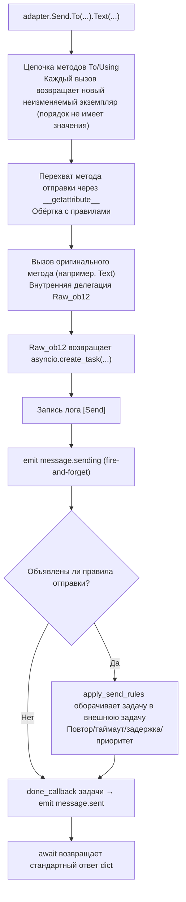

**Что делает фреймворк на каждом этапе:**

| Этап | Что делает фреймворк |
|------|---------------------|
| Цепочка объединения | `To`/`Using`/`Account` каждый вызов **создаёт новый неизменяемый экземпляр** и наследует уже установленные поля, поэтому `To(...).Using(...)` и `Using(...).To(...)` **эквивалентны**, порядок не имеет значения |
| Оборачивание методов | Методы отправки (`Text` и др.) перехватываются `__getattribute__` и оборачиваются; методы-修饰器 (`To`/`Using`/`At`/`Retry` и др.) **не оборачиваются**. Вложенные вызовы `Raw_ob12` предотвращают повторную обёртку с помощью маркера `_in_rule_wrap` |
| Создание задачи | `Raw_ob12` внутри `asyncio.create_task()` — это точка создания задачи; `Text()` просто синхронно возвращает эту задачу, **не блокируя** |
| Лог отправки | Запись события `[Send] platform/method -> target` в лог (можно отключить с помощью `exclude_levels=["EVENT"]`) |
| `message.sending` | Метод отправки вызывается **немедленно** с использованием fire-and-forget (только если существуют слушатели, сначала short-circuit через `has_handlers`) |
| `message.sent` | Привязывается к `done_callback` задачи — **результат последней попытки при наличии правил**, в противном случае — завершение исходной задачи |

### Цепочка разрешения учётной записи

При внутреннем вызове `_resolve_account(account_id)` фреймворк ищет учётную запись по следующему порядку:

1. Одноаккаунтный адаптер (без `AccountConfigClass`) → возвращает сразу
2. Точное совпадение имени учётной записи `account_id`
3. Совпадение `bot_id` для каждой учётной записи
4. Совпадение любого `str` поля учётной записи (исключая `enabled`/`name`)
5. По умолчанию — первая активная учётная запись
6. Если всё не сработало → выбрасывается `ValueError`

> `account_id`, который вы передаёте, берётся из: `Using()` (явное указание) > поля `self` события (`account_id` имеет приоритет над `user_id`, автоматически вставляется `event.reply()`) > не указано (адаптер использует первую активную учётную запись по умолчанию).

### Двигатель правил отправки (повтор/таймаут/задержка)

Правила оборачиваются в задачу **после** того, как `Raw_ob12` возвращает задачу, и не влияют на основной процесс. Ключевые факты:

| Правило | Описание |
|---------|----------|
| `Retry(n)` | Общее количество попыток — `n+1`; **повторяется сразу после сбоя, без экспоненциальной задержки** |
| `Timeout(s)` | Один сеанс отправки отменяется по таймауту (`asyncio.wait_for`), если не исчерпаны попытки |
| `Defer(s)` | Задержка перед отправкой с помощью `sleep` |
| `Priority(level, drop_if_busy)` | Если очередь превышает порог, возвращается `{status:"failed", retcode:10002, message:"dropped_low_priority"}` |
| `Hook(fn)` | Выполняется только при успешном завершении |
| `on_progress` / `on_error` | Колбэки на каждом этапе / при финальном сбое |

> **Важно**: повтор — это «немедленная повторная отправка», без задержки; если платформа требует задержки из-за лимитов, необходимо вручную вызывать повтор в `on_error`, добавив `sleep`. Успешное завершение определяется по `status == "ok"` в ответе dict (также `retcode == 0`).

> Полный формат ответа API и семантику `retcode` см. в [спецификации API](../../standards/api-response.md).

## Возвращаемые значения

### Объект Task

Все методы отправки возвращают `asyncio.Task`. Адаптер должен реализовать только `Raw_ob12`, стандартные методы (Text/Image и т.д.) по умолчанию делегируются ему:

```python
import asyncio

def Raw_ob12(self, message, **kwargs):
    async def _do_send():
        segments = self._apply_modifiers(message)
        return await self._adapter.call_api(
            endpoint="/send_message",
            message=segments,
            **self.send_context,
            **kwargs,
        )
    return asyncio.create_task(_do_send())

# Методы Text/Image/Voice/Video/File унаследованы от базового класса и автоматически делегированы Raw_ob12
# Если нужно переопределить стандартный метод, просто верните asyncio.Task:
# def Text(self, text: str):
#     return self.Raw_ob12([{"type": "text", "data": {"text": text}}])
```

### Стандартизированный ответ

Метод `call_api` должен возвращать стандартизированный ответ. Рекомендуется использовать методы `make_response()` / `make_error()`:

```python
async def call_api(self, endpoint: str, **params):
    try:
        result = await self._do_api_call(endpoint, **params)
        return self.make_response(
            data=result.get("data"),
            message_id=result.get("message_id", ""),
            raw=result,
        )
    except Exception as e:
        return self.make_error(message=str(e))
```

Также поддерживается ручное построение (старый способ по-прежнему совместим):

```python
async def call_api(self, endpoint: str, **params):
    return {
        "status": "ok" или "failed",
        "retcode": 0 или код_ошибки,
        "data": {...},
        "message_id": "msg_id" или "",
        "message": "",
        "{platform}_raw": raw_response
    }
```

## Полный пример

### Базовое использование

```python
from ErisPulse.Core import adapter

my_adapter = adapter.get("myplatform")

# Отправка текста
await my_adapter.Send.To("user", "123").Text("Hello World!")

# Отправка изображения
await my_adapter.Send.To("group", "456").Image("https://example.com/image.jpg")

# Отправка файла
with open("document.pdf", "rb") as f:
    await my_adapter.Send.To("user", "123").File(f.read())
```

### Цепочки вызовов

```python
# @пользователя + ответ
await my_adapter.Send.To("group", "456").At("789").Reply("msg123").Text("Ответ на сообщение с упоминанием")

# @всех + несколько модификаторов
await my_adapter.Send.Using("bot1").To("group", "456").AtAll().Text("Сообщение-анонс")
```

### Сырые сообщения и построение сообщений

`Raw_ob12` — это основной вход для обратного преобразования (перевод сообщений OB12 → вызовы API платформы), а `MessageBuilder` — это инструмент построения цепочки сообщений, используемый совместно с ним.

> Полное описание реализации `Raw_ob12`, использование `MessageBuilder` и примеры кода см. в:
> - [Спецификация метода отправки §6 Спецификация обратного преобразования OneBot 12 → Платформа](../../standards/send-method-spec.md#6-обратное-преобразование-onebot12--platform)
> - [Спецификация метода отправки §11 Построитель сообщений](../../standards/send-method-spec.md#11-построитель-сообщений-messagebuilder)


### 适配器开发最佳实践

# Рекомендации по лучшим практикам разработки адаптеров

Данный документ предоставляет рекомендации по лучшим практикам разработки адаптеров ErisPulse.

## Управление состоянием бота и мета-события

Адаптер должен активно отправлять мета-события через `adapter.emit()`, чтобы фреймворк автоматически отслеживал состояние подключения, онлайн/оффлайн иheartbeat бота.

### 1. Когда отправлять мета-события

| Событие | `detail_type` | Триггер | Поведение фреймворка |
|------|--------------|---------|---------|
| Подключение | `"connect"` | При установлении подключения бота с платформой | Регистрация бота, запуск жизненного цикла `adapter.bot.online` |
| Отключение | `"disconnect"` | При разрыве подключения бота с платформой | Отмечает бота как оффлайн, запуск жизненного цикла `adapter.bot.offline` |
| heartbeat | `"heartbeat"` | Регулярно (рекомендуется 30-60 секунд) | Обновление времени активности и мета-информации бота |

### 2. Отправка мета-событий

Фреймворк предоставляет метод `emit_meta()`, который позволяет отправить мета-событие всего одной строкой:

```python
class MyAdapter(BaseAdapter):
    async def _ws_handler(self, websocket):
        bot_id = self._get_bot_id()

        # Бот онлайн: отправка события connect всего одной строкой
        await self.emit_meta("connect", bot_id, user_name="MyBot", nickname="Мой бот")

        try:
            while True:
                data = await websocket.receive_text()
                event = self.convert(data)
                if event:
                    await self.adapter.emit(event)
        except WebSocketDisconnect:
            pass
        finally:
            # Бот оффлайн
            await self.emit_meta("disconnect", bot_id)
```

### 3. Событие heartbeat

Адаптер должен регулярно отправлять heartbeat-события в течение активного подключения, чтобы обновить время активности бота:

```python
class MyAdapter(BaseAdapter):
    async def _heartbeat_loop(self, bot_id: str):
        while self._connected:
            # Отправка мета-heartbeat фреймворку (одна строка)
            await self.emit_meta("heartbeat", bot_id)
            await asyncio.sleep(30)
```

### 4. Автоматическое обнаружение self-поля

Метод `adapter.emit()` фреймворка автоматически обрабатывает все события (не только мета-события) с полем `self`:

- **Обычные события** (message/notice/request) с полем `self` автоматически регистрируют бота
- **Дополнительная информация в поле self**: поддерживает необязательные поля `user_name`, `nickname`, `avatar`, `account_id`

```python
# В конвертере достаточно иметь поле self для автоматической регистрации бота
onebot_event = {
    "type": "message",
    "detail_type": "private",
    "platform": "myplatform",
    "self": {
        "platform": "myplatform",
        "user_id": "bot123",
        "user_name": "MyBot",
        "nickname": "Мой бот",
    },
    # ... другие поля
}
await self.adapter.emit(onebot_event)
# Бот "bot123" автоматически зарегистрирован и обновлено время активности
```

### 5. Запрос состояния бота

Фреймворк предоставляет следующие методы для запроса:

```python
from ErisPulse import sdk

# Получение информации о боте
info = sdk.adapter.get_bot_info("myplatform", "bot123")
# {"status": "online", "last_active": 1712345678.0, "info": {"nickname": "MyBot"}}

# Получить список всех ботов (группировка по платформе)
all_bots = sdk.adapter.list_bots()

# Получить список ботов для указанной платформы
platform_bots = sdk.adapter.list_bots("myplatform")

# Проверить, онлайн ли бот
is_online = sdk.adapter.is_bot_online("myplatform", "bot123")

# Получить полную сводку состояния (подходит для WebUI)
summary = sdk.adapter.get_status_summary()
# {"adapters": {"myplatform": {"status": "started", "bots": {...}}}}
```

## Управление подключением

### 1. Реализация повторных попыток подключения

```python
import asyncio

class MyAdapter(BaseAdapter):
    async def start(self):
        retry_count = 0
        max_retries = 5
        
        while retry_count < max_retries:
            try:
                await self._connect_to_platform()
                self.logger.info("Подключение успешно")
                break
            except Exception as e:
                retry_count += 1
                if retry_count < max_retries:
                    # Стратегия экспоненциальной задержки
                    wait_time = min(60 * (2 ** retry_count), 600)
                    self.logger.warning(
                        f"Подключение не удалось, повтор через {wait_time} секунд ({retry_count}/{max_retries}): {e}"
                    )
                    await asyncio.sleep(wait_time)
                else:
                    self.logger.error("Подключение не удалось, достигнуто максимальное количество попыток")
                    raise
```

### 2. Управление состоянием подключения

```python
class MyAdapter(BaseAdapter):
    async def start(self):
        self.connection = None
        self._connected = False
    
    async def _ws_handler(self, websocket: WebSocket):
        self.connection = websocket
        self._connected = True
        self.logger.info("Подключение установлено")
        
        try:
            while True:
                data = await websocket.receive_text()
                await self._process_event(data)
        except WebSocketDisconnect:
            self.logger.info("Подключение разорвано")
        finally:
            self.connection = None
            self._connected = False
```

### 3. heartbeat и мета-heartbeat

Адаптер должен выполнять две задачи в heartbeat: отправлять heartbeat-сообщение платформе и отправлять мета-heartbeat-событие фреймворку.

```python
class MyAdapter(BaseAdapter):
    async def start(self):
        self.connection = await self._connect_to_platform()
        self._heartbeat_task = asyncio.create_task(self._heartbeat_loop())

    async def _heartbeat_loop(self):
        while self.connection:
            try:
                # 1. Отправка heartbeat-сообщения платформе
                await self.connection.send_json({"type": "ping"})

                # 2. Отправка мета-heartbeat (одна строка)
                await self.emit_meta("heartbeat", self._bot_id)

                await asyncio.sleep(30)
            except Exception as e:
                self.logger.error(f"Ошибка heartbeat: {e}")
                break
```

### 4. Информация о подключении

Роуты адаптера должны быть доступны пользователям для настройки адресов обратного вызова. Рекомендуется выводить информацию о подключении в `start()`:

```python
class MyAdapter(BaseAdapter):
    async def start(self):
        router.register_websocket(
            module_name=self.platform,
            path="/ws",
            handler=self._ws_handler
        )

        if self.sdk:
            info = self.sdk.adapter.get_connection_info(self.platform)
            if info:
                self.logger.info(f"Адрес WebSocket: "
                    f"{info.get('connection', {}).get('base_url', '')}"
                    f"{info.get('connection', {}).get('websocket_routes', [])}")
```

Пользователи могут использовать следующие API для просмотра роутов и адресов подключения:

```python
from ErisPulse import sdk

# Информация о подключении на уровне адаптера (рекомендуется)
info = sdk.adapter.get_connection_info("myplatform")

# Запрос на уровне менеджера роутов
sdk.router.list_namespaces()              # Список всех пространств имён
sdk.router.get_module_routes("myplatform")  # Подробная информация о роутах
sdk.router.get_module_urls("myplatform")    # Полные URL подключения
```

> **Важно**: `module_name` при регистрации роута должен полностью совпадать с именем `platform` адаптера в ErisPulse, иначе `get_connection_info()` не сможет сопоставить роут. Многоаккаунтные адаптеры должны регистрировать подпути (например, `/account1/webhook`, `/account2/webhook`), а не использовать разные `module_name`.

## Преобразование событий

### 1. Строгое следование стандарту OneBot12

```python
class MyPlatformConverter:
    def convert(self, raw_event):
        """Преобразование событий"""
        onebot_event = {
            "id": str(raw_event.get("event_id", uuid.uuid4())),
            "time": int(time.time()),
            "type": self._convert_type(raw_event.get("type")),
            "detail_type": self._convert_detail_type(raw_event),
            "platform": "myplatform",
            "self": {
                "platform": "myplatform",
                "user_id": str(raw_event.get("bot_id", ""))
            },
            "myplatform_raw": raw_event,  # Сохранить исходные данные (обязательно)
            "myplatform_raw_type": raw_event.get("type", "")  # Тип исходных данных (обязательно)
        }
        return onebot_event
```

### 2. Стандартизация временных меток

```python
def _convert_timestamp(self, timestamp):
    """Преобразование в 10-значную временную метку в секундах"""
    if not timestamp:
        return int(time.time())
    
    # Если временная метка в миллисекундах
    if timestamp > 10**12:
        return int(timestamp / 1000)
    
    # Если временная метка в секундах
    return int(timestamp)
```

### 3. Генерация идентификатора события

```python
import uuid

def _generate_event_id(self, raw_event):
    """Генерация идентификатора события"""
    event_id = raw_event.get("event_id")
    if event_id:
        return str(event_id)
    # Если платформа не предоставляет ID, генерируем UUID
    return str(uuid.uuid4())
```

## Реализация SendDSL

Модификаторы `At`/`AtAll`/`Reply` уже встроены в базовый класс SendDSL фреймворка, адаптеру нужно только реализовать `Raw_ob12` и конкретные методы отправки. Использование `self._apply_modifiers(message)` и `self.send_context` упрощает разработку.

### 1. Обязательно возвращать объект Task

```python
class Send(BaseAdapter.Send):
    def Raw_ob12(self, message, **kwargs):
        """Рекомендуемая реализация: использование вспомогательных методов фреймворка"""
        async def _do_send():
            segments = self._apply_modifiers(message)
            return await self._adapter.call_api(
                endpoint="/send_message",
                message=segments,
                **self.send_context,
                **kwargs
            )
        return asyncio.create_task(_do_send())

    def Text(self, text: str):
        return self.Raw_ob12([{"type": "text", "data": {"text": text}}])
```

### 2. Методы-модификаторы возвращают self

```python
class Send(BaseAdapter.Send):

    def __init__(self, adapter, target_type=None, target_id=None, account_id=None):
        super().__init__(adapter, target_type, target_id, account_id)
        self.buttons = []

    def Button(self, content: list) -> 'Send':
        self.buttons.append(content)
        return self # Возвращает self
```

### 3. Поддержка платформо-специфических методов

```python
class Send(BaseAdapter.Send):
    def Sticker(self, sticker_id: str):
        """Отправка стикера"""
        return asyncio.create_task(
            self._adapter.call_api(
                endpoint="/send_sticker",
                message=[{"type": "sticker", "data": {"id": sticker_id}}],
                **self.send_context
            )
        )
    
    def Card(self, card_data: dict):
        """Отправка карточки"""
        return asyncio.create_task(
            self._adapter.call_api(
                endpoint="/send_card",
                message=[{"type": "card", "data": {"card_data": card_data}}],
                **self.send_context
            )
        )
```

## Ответы API

### 1. Стандартизированный формат ответов

Фреймворк предоставляет методы `make_response()` и `make_error()` для построения стандартизированных ответов:

```python
async def call_api(self, endpoint: str, **params):
    try:
        raw_response = await self._platform_api_call(endpoint, **params)
        
        if raw_response.get("success"):
            return self.make_response(
                data=raw_response.get("data"),
                message_id=raw_response.get("data", {}).get("message_id", ""),
                raw=raw_response,
            )
        else:
            return self.make_error(
                retcode=raw_response.get("code", 10001),
                message=raw_response.get("message", ""),
                raw=raw_response,
            )
    except Exception as e:
        return self.make_error(message=str(e))
```

`make_response()` автоматически генерирует ответ с ключом `{platform}_raw`. `make_error()` по умолчанию использует `retcode=34000` (Platform Error).

### 2. Стандартные коды ошибок

Следование стандартным кодам ошибок OneBot12:

```python
# 1xxxx - Ошибки запроса действия
10001: Bad Request
10002: Unsupported Action
10003: Bad Param

# 2xxxx - Ошибки обработчика действия
20001: Bad Handler
20002: Internal Handler Error

# 3xxxx - Ошибки выполнения действия
31000: Database Error
32000: Filesystem Error
33000: Network Error
34000: Platform Error
35000: Logic Error
```

## Поддержка нескольких аккаунтов

### 1. Декларативная конфигурация (рекомендуется)

Использование `AccountConfigClass` для декларирования класса конфигурации позволяет фреймворку автоматически управлять загрузкой, проверкой и генерацией шаблонов. `BotAccountConfig` базовый класс предоставляет поля `enabled` и `name`, адаптеру не нужно их декларировать:

```python
from dataclasses import dataclass, field
from ErisPulse.Core.Bases import BotAccountConfig

@dataclass
class MyBotConfig(BotAccountConfig):
    token: str = field(default="", metadata={
        "description": {"i18n": "my_adapter.bot_token", "default": "Bot Token"},
        "required": True,
        "secret": True,
    })

class MyAdapter(BaseAdapter):
    AccountConfigClass = MyBotConfig
    
    async def start(self):
        for name, account in self.enabled_accounts.items():
            self.logger.info(f"Запуск аккаунта {name}")
            await self._connect(name, account.token)
            # bot_id автоматически заполняется фреймворком из протокола платформы/ответа входа
    
    async def call_api(self, endpoint: str, **params):
        account_id = params.pop("account_id", None)
        name, account = self._resolve_account(account_id)
        # name: имя аккаунта, account: экземпляр MyBotConfig
```

Файл конфигурации генерируется автоматически:

```toml
[MyAdapter.accounts.default]
token = ""
enabled = true
name = ""
```

### 2. Механизм выбора аккаунта

Фреймворк предоставляет метод `_resolve_account()` для сопоставления аккаунта по приоритету:

1. **Имя аккаунта** — точное совпадение с ключом конфигурации
2. **`bot_id`** — автоматически полученный bot_id (то есть `event["self"]["user_id"]`)
3. **Любое строковое поле** — другие строковые поля в конфигурации
4. **По умолчанию** — первый включенный аккаунт

```python
# По имени аккаунта
name, account = self._resolve_account("account1")

# По bot_id (наиболее часто используемый способ, из события)
name, account = self._resolve_account("bot_123")

# Получить первый включенный аккаунт (передав None)
name, account = self._resolve_account(None)
```

## Обработка ошибок

### 1. Классификация обработки исключений

Использование `make_error()` для построения стандартизированных ответов. При запросах через `sdk.client` ловить исключения ErisPulse:

```python
from ErisPulse.Core.Bases.errors import ClientError, ClientTimeoutError

async def call_api(self, endpoint: str, **params):
    try:
        from ErisPulse.Core import client
        resp = await client.post(
            f"https://api.platform.com/{endpoint}",
            json=params,
            max_retries=2,
        )
        response = await resp.json()
        return self.make_response(data=response, raw=response)
    except ClientTimeoutError:
        self.logger.error(f"Таймаут запроса: {endpoint}")
        return self.make_error(retcode=32000, message="Таймаут запроса")
    except ClientError as e:
        self.logger.error(f"Ошибка сети: {e}")
        return self.make_error(retcode=33000, message="Ошибка сети")
    except json.JSONDecodeError:
        self.logger.error("Ошибка парсинга JSON")
        return self.make_error(retcode=10006, message="Неверный формат ответа")
    except Exception as e:
        self.logger.error(f"Неизвестная ошибка: {e}", exc_info=True)
        return self.make_error(message=str(e))
```

> **Обратная совместимость**: старый код адаптера, использующий `aiohttp`, не затрагивается, он по-прежнему может ловить `aiohttp.ClientError`. Преобразование исключений происходит только при запросах через `sdk.client`.

### 2. Логирование

Фреймворк автоматически создает под-logger для адаптера (`sdk.logger.get_child("MyAdapter")`), нет необходимости вручную инициализировать:

```python
class MyAdapter(BaseAdapter):
    # ConfigClass = ...  # Объявление класса конфигурации делает self.logger доступным
    
    async def start(self):
        self.logger.info("Запуск адаптера...")
        # ...
        self.logger.info("Запуск адаптера завершен")
    
    async def shutdown(self):
        self.logger.info("Остановка адаптера...")
        # ...
        self.logger.info("Остановка адаптера завершена")
```

## Тестирование

### 1. Модульные тесты

```python
import pytest
from ErisPulse.Core.Bases import BaseAdapter

class TestMyAdapter:
    def test_converter(self):
        """Тест конвертера"""
        converter = MyPlatformConverter()
        raw_event = {"type": "message", "content": "Hello"}
        result = converter.convert(raw_event)
        assert result is not None
        assert result["platform"] == "myplatform"
        assert "myplatform_raw" in result
    
    def test_api_response(self):
        """Тест формата ответа API"""
        adapter = MyAdapter()
        response = adapter.call_api("/test", param="value")
        assert "status" in response
        assert "retcode" in response
```

### 2. Интеграционные тесты

```python
@pytest.mark.asyncio
async def test_adapter_start():
    """Тест запуска адаптера"""
    adapter = MyAdapter()
    await adapter.start()
    assert adapter._connected is True

@pytest.mark.asyncio
async def test_send_message():
    """Тест отправки сообщения"""
    adapter = MyAdapter()
    await adapter.start()
    
    result = await adapter.Send.To("user", "123").Text("Hello")
    assert result is not None
```

## Обратное преобразование и построение сообщений

`Raw_ob12` является обязательным методом, который адаптер должен реализовать, это единый вход для обратного преобразования (OneBot12 → платформа). Стандартные методы (`Text`, `Image` и т.д.) должны делегировать вызов `Raw_ob12`, а состояние модификаторов (`At`/`Reply`/`AtAll`) должно объединяться в сообщение внутри `Raw_ob12`.

`MessageBuilder` — это инструмент для построения сообщений, совместимый с `Raw_ob12`, поддерживающий цепочечные вызовы и быстрое построение.

> Полные рекомендации по реализации, примеры кода и инструкции по использованию см. в:
> - [Спецификации методов отправки §6 Спецификация обратного преобразования](../../standards/send-method-spec.md#6-反向转换规范onebot12--平台)
> - [Спецификации методов отправки §11 Построитель сообщений](../../standards/send-method-spec.md#11-消息构建器-messagebuilder)

## Расширение методов событий платформы

Адаптер может зарегистрировать платформо-специфические методы для класса Event, чтобы разработчикам модулей было удобнее получать доступ к платформо-специфическим данным.

### 1. Использование Mixin-класса для регистрации (рекомендуется)

При наличии нескольких платформо-специфических методов рекомендуется использовать Mixin-класс:

```python
# Регистрация на уровне start() адаптера или модуля
from ErisPulse.Core.Event import register_event_mixin

class MyPlatformEventMixin:
    def get_chat_name(self):
        """Получение названия чата"""
        return self.get("myplatform_raw", {}).get("chat", {}).get("name", "")

    def is_official_message(self):
        """Определение, является ли сообщение официальным"""
        raw = self.get("myplatform_raw", {})
        return raw.get("sender", {}).get("is_official", False)

    def get_message_type(self):
        """Получение типа сообщения"""
        return self.get("myplatform_raw", {}).get("msg_type", "text")

# Массовая регистрация
register_event_mixin("myplatform", MyPlatformEventMixin)
```

### 2. Регистрация отдельного метода с помощью декоратора

```python
from ErisPulse.Core.Event import register_event_method

@register_event_method("myplatform")
def get_chat_name(self):
    return self.get("myplatform_raw", {}).get("chat", {}).get("name", "")
```

### 3. Очистка при остановке адаптера

```python
from ErisPulse.Core.Event import unregister_platform_event_methods

class MyAdapter(BaseAdapter):
    async def shutdown(self):
        # Очистка зарегистрированных платформо-специфических методов событий
        unregister_platform_event_methods("myplatform")
        # ... другие очистки
```

> Более подробная информация о регистрации и удалении см. в [API системы событий - Регистрация платформо-специфических методов](../../api-reference/event-system.md#适配器注册平台扩展方法).

## Обновление документации

### 1. Обновление документации платформы

Создайте документацию платформы в `docs/ru/platform-guide/` (другие языковые версии будут автоматически генерироваться):

```markdown
# Документация адаптера для платформы

## Основная информация
- Версия модуля: 1.0.0
- Автор: Ваше имя

## Поддерживаемые типы отправки сообщений
...

## Специфические типы событий
...

## Параметры конфигурации
...
```

### 2. Обновление версии

При выпуске новой версии обновите версию в документации:

```toml
[project]
version = "2.0.0"  # Обновите номер версии
```


### 事件转换器

# Руководство по реализации конвертера событий

Конвертер событий (Converter) — один из ключевых компонентов адаптера, отвечающий за преобразование нативных событий платформы в унифицированный формат событий OneBot12, используемый ErisPulse.

## Ответственность Converter

```
Платформенные нативные события ──→ Converter.convert() ──→ События в стандарте OneBot12
```

Converter отвечает только за **прямое преобразование** (направление получения), то есть за преобразование данных платформенных нативных событий в стандартный формат OneBot12. Обратное преобразование (направление отправки) обрабатывается методом `Send.Raw_ob12()`.

### Основные принципы

1. **Без потерь**: исходные данные должны быть полностью сохранены в поле `{platform}_raw`
2. **Совместимость со стандартом**: преобразованные события должны соответствовать стандартному формату OneBot12
3. **Платформенные расширения**: платформенно-специфические данные хранятся в полях с префиксом `{platform}_`

## Базовый класс BaseConverter (рекомендуется)

Начиная с версии 2.7.0, фреймворк предоставляет базовый класс `BaseConverter` (`ErisPulse.Core.Bases`), который封装ует общие поля событий OneBot12 и вспомогательные методы для часто используемых сообщений, позволяя конвертеру фокусироваться только на типовом преобразовании:

```python
from ErisPulse.Core.Bases import BaseConverter


class MyConverter(BaseConverter):
    def __init__(self):
        super().__init__(platform="myplatform")

    def convert(self, raw_event: dict) -> dict | None:
        if not isinstance(raw_event, dict):
            return None
        event_type = raw_event.get("type", "")
        base = self.build_base_event(raw_event, event_type)  # id/time/platform/self/raw
        if event_type == "message":
            base["type"] = "message"
            base["detail_type"] = "group" if raw_event.get("group_id") else "private"
            base["user_id"] = str(raw_event.get("sender_id", ""))
            base["message"] = [self.text(raw_event.get("content", ""))]
            base["alt_message"] = raw_event.get("content", "")
            return base
        return None
```

Поле `build_base_event()` уже заполнено общими полями:

| Поле | Источник |
|------|------|
| `id` | `raw_event["event_id"]`, если отсутствует, генерируется UUID |
| `time` | `raw_event["timestamp"]`, если отсутствует, устанавливается текущее время |
| `platform` | Переданное при создании `platform` |
| `self` | `{"platform": ..., "user_id": raw_event["bot_id"]}` |
| `{platform}_raw` | Исходное событие (соответствует принципу "без потерь") |
| `{platform}_raw_type` | Тип исходного события |

Общие вспомогательные методы для сообщений (все статические, можно напрямую использовать):

```python
converter.text("hi")          # {"type": "text", "data": {"text": "hi"}}
converter.at("123456")        # {"type": "at", "data": {"user_id": "123456"}}
converter.image("file.png")   # {"type": "image", "data": {"file": "file.png"}}
```

> При ручной реализации конструирование общих полей `build_base_event` является обязательным и повторяющимся шаблонным кодом, использование `BaseConverter` позволяет избежать этой части и обеспечивает "без потерь" преобразование (исходное событие всегда попадает в `{platform}_raw`).

## Метод convert()

### Подпись метода

```python
def convert(self, raw_event: dict) -> dict:
    """
    Преобразует событие платформы в стандартный формат OneBot12

    :param raw_event: Данные события платформы
    :return: Словарь события в стандартном формате OneBot12
    """
    pass
```

### Структура возвращаемого значения

Словарь события после преобразования должен содержать следующие стандартные поля:

```python
{
    "id": "Уникальный ID события",
    "time": 1234567890,           # Unix-время (секунды)
    "type": "message",             # Тип события
    "detail_type": "private",      # Подтип события
    "platform": "myplatform",      # Название платформы
    "self": {
        "platform": "myplatform",
        "user_id": "bot_user_id"
    },

    # Поля сообщения
    "user_id": "id_отправителя",
    "message": [...],              # Список сегментов сообщения в формате OneBot12
    "alt_message": "Содержимое в виде обычного текста",

    # Должны сохраняться исходные данные
    "myplatform_raw": { ... },     # Полные исходные данные события платформы
    "myplatform_raw_type": "Имя типа исходного события",
}
```

## Обязательные поля

### Общие поля (для всех типов событий)

| OB12 поле | Тип | Описание |
|-----------|------|------|
| `id` | str | Уникальный идентификатор события |
| `time` | int | Временная метка Unix (в секундах) |
| `type` | str | Тип события: `message` / `notice` / `request` / `meta` |
| `detail_type` | str | Детальный тип: `private` / `group` / `friend` и т.д. |
| `platform` | str | Название платформы, совпадает с именем адаптера |
| `self` | dict | Информация о боте: `{"platform": "...", "user_id": "..."}` |

### Дополнительные поля для событий сообщений

| OB12 поле | Тип | Описание |
|-----------|------|------|
| `user_id` | str | ID отправителя |
| `message` | list[dict] | Список сегментов сообщений OneBot12 |
| `alt_message` | str | Резервный текстовый контент |

### Дополнительные поля для уведомлений

| OB12 поле | Тип | Описание |
|-----------|------|------|
| `user_id` | str | ID связанного пользователя |
| `operator_id` | str | ID оператора (например, при изменении участников группы) |

## Преобразование сегментов сообщений

Стандарт OneBot12 определяет следующие типы сегментов сообщений:

```python
# Текст
{"type": "text", "data": {"text": "Привет"}}

# Изображение
{"type": "image", "data": {"file": "https://example.com/img.jpg"}}

# Аудио
{"type": "audio", "data": {"file": "https://example.com/audio.mp3"}}

# Видео
{"type": "video", "data": {"file": "https://example.com/video.mp4"}}

# Файл
{"type": "file", "data": {"file": "https://example.com/doc.pdf"}}

# Упоминание пользователя
{"type": "mention", "data": {"user_id": "123"}}

# Упоминание всех
{"type": "mention_all", "data": {}}

# Ответ на сообщение
{"type": "reply", "data": {"message_id": "msg_123"}}
```

Если платформа не поддерживает определённый тип сегмента сообщений, этот сегмент можно опустить или преобразовать в наиболее близкий стандартный тип.

## Расширения платформы

Данные, специфичные для платформы, должны храниться с префиксом `{platform}_`, чтобы избежать конфликта с стандартными полями:

```python
{
    # Стандартные поля
    "type": "message",
    "detail_type": "group",
    # ...

    # Расширения платформы
    "myplatform_raw": { ... },          # Исходные данные события (обязательно)
    "myplatform_raw_type": "chat",      # Тип исходного события (обязательно)

    # Другие специфические для платформы поля
    "myplatform_group_name": "Название группы",
    "myplatform_sender_role": "администратор",
}
```

> **Важно**: Поле `{platform}_raw` обязательно, так как система событий и модули ErisPulse могут зависеть от него для доступа к исходным данным платформы.

## Полный пример

Ниже представлен полный пример реализации Converter:

```python
class MyConverter:
    def __init__(self, platform: str):
        self.platform = platform

    def convert(self, raw_event: dict) -> dict:
        event_type = raw_event.get("type", "")

        base_event = {
            "id": raw_event.get("id", ""),
            "time": raw_event.get("timestamp", 0),
            "platform": self.platform,
            "self": {
                "platform": self.platform,
                "user_id": raw_event.get("self_id", ""),
            },
            "myplatform_raw": raw_event,
            "myplatform_raw_type": event_type,
        }

        if event_type == "chat":
            return self._convert_message(raw_event, base_event)
        elif event_type == "notification":
            return self._convert_notice(raw_event, base_event)
        elif event_type == "request":
            return self._convert_request(raw_event, base_event)

        return base_event

    def _convert_message(self, raw: dict, base: dict) -> dict:
        base["type"] = "message"
        base["detail_type"] = "group" if raw.get("group_id") else "private"
        base["user_id"] = raw.get("sender_id", "")
        base["message"] = self._convert_message_segments(raw.get("content", ""))
        base["alt_message"] = raw.get("content", "")

        if raw.get("group_id"):
            base["group_id"] = raw["group_id"]

        return base

    def _convert_message_segments(self, content: str) -> list:
        segments = []
        if content:
            segments.append({"type": "text", "data": {"text": content}})
        return segments

    def _convert_notice(self, raw: dict, base: dict) -> dict:
        base["type"] = "notice"
        notification_type = raw.get("notification_type", "")

        if notification_type == "member_join":
            base["detail_type"] = "group_member_increase"
            base["user_id"] = raw.get("user_id", "")
            base["group_id"] = raw.get("group_id", "")
            base["operator_id"] = raw.get("operator_id", "")
        elif notification_type == "friend_add":
            base["detail_type"] = "friend_increase"
            base["user_id"] = raw.get("user_id", "")

        return base

    def _convert_request(self, raw: dict, base: dict) -> dict:
        base["type"] = "request"
        request_type = raw.get("request_type", "")

        if request_type == "friend":
            base["detail_type"] = "friend"
            base["user_id"] = raw.get("user_id", "")
            base["comment"] = raw.get("message", "")
        elif request_type == "group_invite":
            base["detail_type"] = "group"
            base["group_id"] = raw.get("group_id", "")
            base["user_id"] = raw.get("inviter_id", "")

        return base
```

## Пример преобразования мультимедийного сообщения

Сообщения, отправленные на реальных платформах, обычно содержат мультимедийные элементы, такие как изображения, упоминания пользователей и ответы. Ниже приведён пример обработки `_convert_message_segments` для различных типов сообщений:

```python
def _convert_message_segments(self, raw_content: list) -> list:
    """Преобразует список сегментов сообщений платформы в стандартный формат OneBot12"""
    segments = []

    for item in raw_content:
        item_type = item.get("type", "")

        if item_type == "text":
            segments.append({
                "type": "text",
                "data": {"text": item.get("content", "")}
            })

        elif item_type == "image":
            file_url = item.get("url") or item.get("file_id", "")
            segments.append({
                "type": "image",
                "data": {"file": file_url}
            })

        elif item_type == "at":
            segments.append({
                "type": "mention",
                "data": {"user_id": item.get("target_id", "")}
            })

        elif item_type == "reply":
            segments.append({
                "type": "reply",
                "data": {"message_id": item.get("reply_to_id", "")}
            })

        elif item_type == "at_all":
            segments.append({"type": "mention_all", "data": {}})

        else:
            segments.append({
                "type": "text",
                "data": {"text": f"[Неподдерживаемый тип сообщения: {item_type}]"}
            })

    return segments
```

## Common Pitfalls

### 1. Missing `{platform}_raw` Field

This is the most common mistake. Missing the raw data field prevents the module from accessing platform-specific information.

```python
base_event["myplatform_raw"] = raw_event        # Required!
base_event["myplatform_raw_type"] = event_type   # Required!
```

### 2. Incorrect Timestamp Format

OneBot12 standard requires the `time` field to be a Unix timestamp in seconds (integer). If your platform returns a millisecond timestamp or an ISO-formatted string, you need to convert it:

```python
import time

# Milliseconds → Seconds
"time": raw_event.get("timestamp", 0) // 1000

# ISO string → Seconds
"time": int(time.mktime(time.strptime(raw_event["created_at"], "%Y-%m-%dT%H:%M:%S")))
```

### 3. Missing `self` Field

The `self` field contains information about the bot itself, with `user_id` being the bot's account ID. This field is crucial in multi-bot scenarios:

```python
"self": {
    "platform": self.platform,
    "user_id": raw_event.get("bot_id", ""),   # ID of the bot itself
}
```

### 4. Using Non-Standard `detail_type` Values

The `detail_type` must use values defined by the OneBot12 standard, such as `private`, `group`, `friend_increase`, `group_member_increase`, etc. Do not use platform-specific naming.

### 5. Round-Trip Consistency

Ensure that the message segment types generated by the Converter correspond to the methods supported by the Send endpoint. For example, if the Converter converts the platform's image message to `{"type": "image", ...}`, then the `Image()` method in the Send endpoint must be able to handle image sending.

## Рекомендуемые практики

1. **Всегда сохраняйте исходные данные**: поле `{platform}_raw` не должно быть опущено
2. **Используйте стандартные сообщения**: по возможности преобразуйте сообщения платформы в стандартные сообщения OneBot12
3. **Рационально настройте detail_type**: используйте стандартные типы (`private`/`group`/`channel` и т.д.), не создавайте собственные
4. **Обрабатывайте граничные случаи**: исходное событие может не содержать некоторых полей, используйте `.get()` и задавайте разумные значения по умолчанию
5. **Учитывайте производительность**: `convert()` вызывается для каждого события, избегайте выполнения длительных операций внутри него


### 发布与模块商店指南

# Руководство по публикации и магазину модулей

Опубликуйте свой разработанный модуль или адаптер в магазине модулей ErisPulse, чтобы другие пользователи могли легко находить и устанавливать его.

## Обзор магазина модулей

Магазин модулей ErisPulse — это централизованный реестр модулей, где пользователи могут просматривать, искать и устанавливать модули и адаптеры, предоставленные сообществом, с помощью инструментов командной строки.

### Просмотр и обнаружение

```bash
# Вывести список всех доступных удалённых пакетов
epsdk list-remote

# Показать только модули
epsdk list-remote -t modules

# Показать только адаптеры
epsdk list-remote -t adapters

# Принудительно обновить список удалённых пакетов
epsdk list-remote -r
```

Вы также можете посетить [официальный сайт ErisPulse](https://www.erisdev.com/#market), чтобы просматривать магазин модулей онлайн.

### Поддерживаемые типы отправки

| Тип | Описание | Группа entry-point |
|------|------|----------------|
| Модуль (Module) | Расширение функциональности бота, реализация бизнес-логики | `erispulse.module` |
| Адаптер (Adapter) | Подключение к новым платформам сообщений | `erispulse.adapter` |

## Быстрая публикация

Весь процесс состоит из трёх шагов: настройка проекта → публикация на PyPI → отправка в магазин модулей.

### 1. Настройка pyproject.toml

Убедитесь, что в директории проекта присутствуют `pyproject.toml` и `README.md`, и настройте entry-points в зависимости от типа:

#### Модуль

```toml
[project]
name = "ErisPulse-MyModule"
version = "1.0.0"
description = "Описание модуля"
requires-python = ">=3.10"
license = { text = "MIT" }
authors = [ { name = "yourname" } ]
dependencies = [
    "ErisPulse>=2.0.0",
]

[project.entry-points."erispulse.module"]
"MyModule" = "MyModule:Main"
```

#### Адаптер

```toml
[project]
name = "ErisPulse-MyAdapter"
version = "1.0.0"
description = "Описание адаптера"
requires-python = ">=3.10"

[project.entry-points."erispulse.adapter"]
"myplatform" = "MyAdapter:MyAdapter"
```

> **Примечание**: Рекомендуется начинать имя пакета с `ErisPulse-`, чтобы пользователи могли легко идентифицировать пакеты экосистемы ErisPulse. Имя ключа entry-point (например, `"MyModule"`) будет использоваться как имя модуля в SDK.

### 2. Публикация на PyPI

```bash
# Сборка и публикация (требуется аккаунт PyPI)
pip install build twine
python -m build
python -m twine upload dist/*
```

После успешной публикации проверьте установку:

```bash
pip install ErisPulse-MyModule
```

### 3. Отправка в магазин модулей

Перейдите на [ErisPulse Marketplace](https://www.erisdev.com/#market), нажмите «Submit Module», войдите в систему и заполните информацию о модуле.

Поддерживаемые способы входа: **GitHub**, **Codeberg**, **Yunhu**, выберите любой из них.

Основные пункты заполнения:
- Название модуля, описание, адрес репозитория
- Минимальная версия SDK: если не уверены, укажите версию [последнего релиза ErisPulse](https://pypi.org/project/ErisPulse/)

После отправки модуль сразу появится в источнике, и пользователи смогут установить его через модульный источник. Модуль будет помечен как «не проверен», после проверки администратором он станет «проверенным».

> **О статусе проверки**:
> - «Не проверен» означает, что модуль ещё не прошёл официальную проверку, но не обязательно, что в нём есть проблемы
> - При установке не проверенного модуля через `epsdk install` пользователь получит предупреждение о риске, и установку можно будет продолжить только после подтверждения

### 4. Управление опубликованным модулем

После входа в систему на вкладке «Submit Module» перейдите на вкладку «Мои модули», где можно:

- **Редактировать** — изменить описание модуля, адрес репозитория, теги и т.д., версия будет автоматически синхронизирована с PyPI
- **Удалить** — удалить модуль из магазина модулей (необратимо)

> После отправки модуль может потребоваться несколько минут, чтобы появиться в списке «Мои модули».

## Обновление опубликованного модуля

1. Обновите `version` в `pyproject.toml`
2. Пересоберите и перезагрузите: `python -m build && python -m twine upload dist/*`
3. Магазин модулей автоматически синхронизирует последнюю версию с PyPI

Пользователи могут обновить модуль через `epsdk upgrade MyModule`.

## Проверочный список перед публикацией

Перед отправкой на PyPI, пожалуйста, проверьте следующее:

### Качество кода

- [ ] Все публичные API имеют аннотации типов (подписи функций и возвращаемые значения)
- [ ] Все публичные методы имеют строку документации (`"""..."""` формат, включая `:param` / `:return` / `:raises`)
- [ ] Прошёл проверку `ruff check` (без предупреждений)
- [ ] Код покрыт тестами на 80% и выше
- [ ] Пройдены все тесты `pytest`

### Совместимость

- [ ] В `pyproject.toml` указана минимальная версия SDK: `dependencies = ["ErisPulse>=x.y.z"]`
- [ ] Протестировано на Python 3.10 / 3.11 / 3.12 / 3.13
- [ ] Протестировано на целевой операционной системе (Windows / Linux / macOS, если применимо)
- [ ] Нет циклических зависимостей

### Конфигурация

- [ ] Если используется декларативная конфигурация (`ConfigClass` + `BaseConfig` / `BotAccountConfig`), поля конфигурации имеют `description` (рекомендуется в формате i18n) и `ui` метаданные
- [ ] Если зарегистрированы ключи перевода i18n, они покрывают все 5 языков (zh-CN / zh-TW / en / ja / ru)
- [ ] Чувствительные поля помечены `secret=True`

### Документация

- [ ] `README.md` содержит инструкции по установке и примеры использования
- [ ] `README.md` объясняет способ конфигурации (пример файла конфигурации + переменные окружения)
- [ ] `CHANGELOG.md` содержит все изменения
- [ ] Адаптер обновил документацию о характеристиках платформы (поддерживаемые типы Send, типы событий и т.д.)

### Публикация

- [ ] Версия в `pyproject.toml` обновлена
- [ ] Сборка прошла успешно: `python -m build`
- [ ] Загружен на PyPI: `python -m twine upload dist/*`
- [ ] Установка проверена: `pip install ErisPulse-xxx && epsdk run`

## Тестирование в режиме разработки

Перед публикацией можно протестировать локально в режиме редактирования:

```bash
epsdk install -e /path/to/MyModule
# или
pip install -e /path/to/MyModule
```

## Часто задаваемые вопросы

### Обязательно ли имя пакета должно начинаться с `ErisPulse-`?

Нет, это не обязательно, но настоятельно рекомендуется. Это помогает пользователям легко идентифицировать пакеты экосистемы ErisPulse на PyPI.

### Можно ли зарегистрировать несколько модулей в одном пакете?

Да. Просто добавьте несколько пар ключ-значение в `entry-points`:

```toml
[project.entry-points."erispulse.module"]
"ModuleA" = "MyPackage:ModuleA"
"ModuleB" = "MyPackage:ModuleB"
```

### Сколько времени занимает проверка?

Обычно от 1 до 3 рабочих дней. Вы можете проверить статус проверки в разделе «Мои модули» на сайте магазина модулей.

## Распространение приложений через Docker-образы

Если ваше приложение не подходит для публикации на PyPI (например, содержит частные зависимости или требует предварительной настройки среды), вы можете опубликовать Docker-образ через **GitHub Container Registry (GHCR)**, чтобы другие пользователи могли запускать его одним `docker pull`.

### Сценарии применения

- У вас есть **полное приложение бота** (модуль + конфигурация + скрипт запуска), которое вы хотите распространять одним кликом
- Модуль/адаптер зависит от **приватных пакетов** или имеет специальный процесс установки, неподходящий для PyPI
- Вы хотите предоставить **готовое к использованию** решение, чтобы снизить порог входа для пользователей

### 1. Создание Dockerfile

Создайте Dockerfile на основе официального образа ErisPulse, добавив только ваш модуль:

```dockerfile
FROM erispulse/erispulse:latest

LABEL org.opencontainers.image.title="ErisPulse-MyModule" \
      org.opencontainers.image.description="Описание модуля" \
      org.opencontainers.image.url="https://github.com/yourname/ErisPulse-MyModule" \
      org.opencontainers.image.source="https://github.com/yourname/ErisPulse-MyModule"

COPY pyproject.toml README.md ./
COPY MyModule/ ./MyModule/

RUN uv pip install --system -e .
```

Если модулю требуются дополнительные системные зависимости (например, SSH-клиент), добавьте их после `RUN uv pip install`:

```dockerfile
RUN apt-get update && apt-get install -y --no-install-recommends \
    openssh-client \
    && rm -rf /var/lib/apt/lists/*
```

> `erispulse/erispulse:latest` уже содержит ErisPulse, ErisPulse-Dashboard, Python-интерпретатор и uv, их не нужно устанавливать повторно.

### 2. Создание рабочего потока GitHub Actions

Создайте файл `.github/workflows/docker-publish.yml`:

```yaml
name: Публикация Docker-образа

on:
  workflow_dispatch:
  push:
    branches:
      - main
    tags:
      - "v*"

permissions:
  contents: read
  packages: write

env:
  REGISTRY: ghcr.io
  IMAGE_NAME: ${{ github.repository_owner }}/my-bot

jobs:
  docker-publish:
    runs-on: ubuntu-latest

    steps:
      - name: Клонирование кода
        uses: actions/checkout@v4

      - name: Настройка QEMU (поддержка нескольких архитектур)
        uses: docker/setup-qemu-action@v3

      - name: Настройка Docker Buildx
        uses: docker/setup-buildx-action@v3

      - name: Вход в GitHub Container Registry
        uses: docker/login-action@v3
        with:
          registry: ${{ env.REGISTRY }}
          username: ${{ github.actor }}
          password: ${{ secrets.GITHUB_TOKEN }}

      - name: Извлечение метаданных Docker
        id: meta
        uses: docker/metadata-action@v5
        with:
          images: ${{ env.REGISTRY }}/${{ env.IMAGE_NAME }}
          tags: |
            type=semver,pattern={{version}}
            type=semver,pattern={{major}}.{{minor}}
            type=raw,value=latest

      - name: Сборка и отправка Docker-образа
        uses: docker/build-push-action@v6
        with:
          context: .
          file: ./Dockerfile
          platforms: linux/amd64,linux/arm64
          push: true
          tags: ${{ steps.meta.outputs.tags }}
          labels: ${{ steps.meta.outputs.labels }}
          cache-from: type=gha
          cache-to: type=gha,mode=max
```

> `GITHUB_TOKEN` предоставляется автоматически GitHub Actions, не нужно создавать ключи вручную.

### 3. Запуск сборки

Сборка запускается автоматически при отправке кода или создании тега:

```bash
# Отправка в ветку main запускает сборку
git push origin main

# Или создание тега запускает сборку
git tag v1.0.0
git push origin v1.0.0
```

Также можно запустить вручную на странице **Actions** репозитория.

### 4. Настройка образа на публичный доступ

Образы GHCR по умолчанию **private**, чтобы другие пользователи могли получать доступ без входа, необходимо изменить на **public**:

1. Перейдите в репозиторий → **Packages** → нажмите на соответствующий пакет
2. **Package settings** → **Danger Zone** → **Change visibility** → **Public**

### 5. Использование пользователем

После завершения сборки пользователь может запустить образ одной командой `docker run`:

```bash
docker run -d \
  --name my-bot \
  -p 8000:8000 \
  -v $(pwd)/config:/app/config \
  -e TZ=Asia/Shanghai \
  -e ERISPULSE_DASHBOARD_TOKEN=your-token \
  --restart unless-stopped \
  ghcr.io/<your-username>/my-bot:latest
```

Или с помощью `docker-compose.yml`:

```yaml
services:
  my-bot:
    image: ghcr.io/<your-username>/my-bot:latest
    container_name: my-bot
    ports:
      - "8000:8000"
    volumes:
      - ./config:/app/config
    environment:
      - TZ=Asia/Shanghai
      - ERISPULSE_DASHBOARD_TOKEN=${ERISPULSE_DASHBOARD_TOKEN:-}
    restart: unless-stopped
```

### Публикация одновременно в Docker Hub

Расширьте рабочий поток, добавив вход в Docker Hub перед входом в GHCR, и укажите Docker Hub в списке `images`:

```yaml
      - name: Вход в Docker Hub
        uses: docker/login-action@v3
        with:
          registry: docker.io
          username: ${{ secrets.DOCKERHUB_USERNAME }}
          password: ${{ secrets.DOCKERHUB_TOKEN }}

      - name: Извлечение Docker-метаданных
        id: meta
        uses: docker/metadata-action@v5
        with:
          images: |
            docker.io/<your-dockerhub-username>/my-bot
            ghcr.io/${{ github.repository_owner }}/my-bot
```

> Необходимо добавить `DOCKERHUB_USERNAME` и `DOCKERHUB_TOKEN` в **Settings → Secrets** репозитория.

### Docker-образ vs PyPI публикация

| Характеристика | Docker-образ (GHCR) | PyPI публикация |
|------|---------------------|-----------|
| Способ распространения | `docker pull` для немедленного запуска | `pip install` + ручная настройка |
| Область применения | Полное приложение/решение | Отдельный модуль/адаптер |
| Частные зависимости | Встроенно поддерживается | Требует частного PyPI-источника |
| Магазин модулей | Не применимо | Можно отправить в магазин модулей |
| Поддержка архитектур | Поддерживает amd64/arm64 | Независим от архитектуры |

Оба способа не исключают друг друга — вы можете одновременно публиковать модуль на PyPI и предоставлять готовый Docker-образ через GHCR.


======
API 参考
======


### 核心模块 API

# API основных модулей

Данный документ предоставляет краткое руководство по API основных модулей ErisPulse, включая сигнатуры методов и краткие описания. Подробное использование и примеры можно найти, нажав на ссылку "Полная документация" для каждого модуля.

## Модуль Storage

Система хранения ключ-значение на базе SQLite, поддерживающая универсальные SQL-цепочечные запросы.

### Основные операции

```python
from ErisPulse import sdk

sdk.storage.set("key", "value")
value = sdk.storage.get("key", default_value)
keys = sdk.storage.keys()
sdk.storage.delete("key")
```

### Массовые операции

```python
sdk.storage.set_multi({"key1": "val1", "key2": "val2"})
values = sdk.storage.get_multi(["key1", "key2"])
sdk.storage.delete_multi(["key1", "key2"])
```

### Транзакционные операции

```python
with sdk.storage.transaction():
    sdk.storage.set("key1", "value1")
    sdk.storage.set("key2", "value2")
```

### Доступ к свойствам

```python
sdk.storage.my_key          # эквивалентно sdk.storage.get("my_key")
sdk.storage.my_key = "val"  # эквивалентно sdk.storage.set("my_key", "val")
```

### SQL-цепочечные запросы

Модуль Storage предоставляет гибкий SQL-конструктор запросов в стиле цепочек вызовов, поддерживающий CRUD-операции для пользовательских таблиц.

```python
sdk.storage.CreateTable("users", {
    "id": "INTEGER PRIMARY KEY AUTOINCREMENT",
    "name": "TEXT NOT NULL",
})

sdk.storage.Table("users").Insert({"name": "Alice"}).Execute()
rows = sdk.storage.Table("users").Select("name").Where("id > ?", 0).Execute()
```

> Полный API цепочечных запросов (Select/Insert/Update/Delete/Where/OrderBy/Limit, AlterTable, транзакции и др.) см. в разделе [SQL-конструктор запросов](../advanced/sql-builder.md).

### Абстракция хранилища

`StorageManager` наследуется от абстрактного базового класса `BaseStorage`, что позволяет расширять поддержку других хранилищ (Redis, MySQL и др.).

```python
from ErisPulse.Core.Bases.storage import BaseStorage, BaseQueryBuilder
```

### Асинхронные интерфейсы

Модули Storage и Config предоставляют асинхронные методы (с префиксом `a`), которые можно безопасно вызывать в асинхронных обработчиках. Синхронные методы сохраняются без изменений, что не требует модификации существующего кода.

```python
# Асинхронное хранение
value = await sdk.storage.aget("key")
await sdk.storage.aset("key", "value")
await sdk.storage.adelete("key")
keys = await sdk.storage.aget_all_keys()
await sdk.storage.aclear()

# Асинхронные массовые операции
values = await sdk.storage.aget_multi(["k1", "k2"])
await sdk.storage.aset_multi({"k1": "v1", "k2": "v2"})
await sdk.storage.adelete_multi(["k1", "k2"])

# Асинхронная конфигурация
value = await sdk.config.agetConfig("MyModule.key")
await sdk.config.asetConfig("MyModule.key", "value")
await sdk.config.aforce_save()
await sdk.config.areload()
```

## Модуль Config

Управление конфигурационными файлами в формате TOML, поддержка ключевых путей, разделённых точками.

### Обзор API

| Метод | Описание |
|------|------|
| `getConfig(key, default)` | Чтение конфигурации, поддержка точечных путей, например `"MyModule.subkey"` |
| `setConfig(key, value, immediate=False)` | Запись конфигурации. При `immediate=True` немедленно сохраняется в файл |
| `force_save()` | Принудительная запись конфигурации из памяти в файл |
| `reload()` | Перезагрузка конфигурации из файла |
| `agetConfig(key, default)` | Асинхронное чтение конфигурации |
| `asetConfig(key, value, immediate)` | Асинхронная запись конфигурации |
| `aforce_save()` | Асинхронное принудительное сохранение |
| `areload()` | Асинхронная перезагрузка |

### Примеры

```python
config = sdk.config.getConfig("MyModule", {})
value = sdk.config.getConfig("MyModule.timeout", 30)

sdk.config.setConfig("MyModule", {"key": "value"})
sdk.config.setConfig("MyModule.timeout", 60, immediate=True)
```

> `setConfig` по умолчанию использует отложенную запись (каждые 5 секунд происходит пакетное сохранение), установка `immediate=True` немедленно сохраняет изменения в конфигурационный файл. Изменения конфигурации запускают событие жизненного цикла `config.set`.

## Модуль Logger

Модульная система логирования, основанная на Rich, поддерживает под-логгеры и контроль на уровне модуля.

### Основное использование

```python
sdk.logger.debug("Отладочная информация")
sdk.logger.info("Информация о работе")
sdk.logger.warning("Предупреждение")
sdk.logger.error("Ошибка")
sdk.logger.critical("Критическая ошибка")
```

### Под-логгеры

```python
child_logger = sdk.logger.get_child("MyModule")
child_logger.info("Лог подмодуля")

child_logger.get_child("utils")  # Поддержка вложенных логгеров
```

### Контроль уровня логирования

```python
sdk.logger.set_level("DEBUG")                          # Глобальный уровень
sdk.logger.set_module_level("MyModule", "DEBUG")       # Уровень на уровне модуля

# Поддерживаемые уровни (от низкого к высокому):
# TRACE, DEBUG, INFO, WARNING, ERROR, CRITICAL
# TRACE - самый низкий уровень, выводит подробную отладочную информацию (распространение событий, регистрация маршрутов и т.д.)
sdk.logger.set_level("TRACE")                          # Включить все логи
```

### Подписка на логи (режим push)

Для модулей, таких как Dashboard, для получения структурированных логов в реальном времени, поддерживается фильтрация по уровню и отправка истории.

> **Явная подписка на логи низкого уровня**: Уровень `min_level` подписчика может быть ниже глобального уровня логирования. В этом случае логи низкого уровня **отправляются только соответствующему подписчику**, не выводятся в консоль и не записываются в память, тем самым предотвращая загрязнение основного потока логов.
>
> ```python
> # Глобальный уровень INFO, но можно отдельно подписаться на DEBUG логи
> @sdk.logger.handler("debug-tracer", min_level="DEBUG")
> def on_debug(log_data: dict): ...
> ```

```python
# Способ с декоратором
@sdk.logger.handler("my-handler", min_level="INFO")
def on_log(log_data: dict):
    # log_data = {
    #     "timestamp": "2026-06-29T22:00:00.123456",
    #     "level": "WARNING", "level_num": 30,
    #     "module": "ErisPulse.Core.adapter",
    #     "message": "Строгий режим:...",
    # }
    pass

# Прямой вызов
sdk.logger.handler("my-handler", min_level="INFO")(on_log)
sdk.logger.remove_handler("my-handler")
```

| Метод | Описание |
|------|------|
| `handler(id, *, min_level)(func)` | Декоратор/прямой вызов. Если `id` пуст, используется имя функции. `min_level` может быть ниже глобального уровня (логи низкого уровня отправляются только подписчикам, не выводятся в консоль/память). При регистрации автоматически отправляются исторические логи |
| `remove_handler(id)` | Удалить подписчика |

### Контроль вывода

```python
sdk.logger.set_output_file("app.log")
sdk.logger.save_logs("log.txt")
sdk.logger.get_logs("MyModule")
sdk.logger.set_memory_limit(1000)
```

## Модуль адаптера

Менеджер адаптеров, отвечающий за регистрацию, запуск и остановку адаптеров для различных платформ.

### Обзор API

| Метод | Описание |
|------|------|
| `get(platform)` | Получить экземпляр адаптера |
| `exists(platform)` | Проверить, зарегистрирован ли адаптер |
| `enable(platform)` / `disable(platform)` | Включить/выключить адаптер |
| `is_enabled(platform)` | Проверить, включен ли адаптер |
| `startup(platforms)` / `shutdown(platforms)` | Запустить/остановить адаптер |
| `is_running(platform)` | Проверить, запущен ли адаптер |
| `list_running()` | Вывести список всех запущенных адаптеров |
| `platforms` | Получить список всех названий платформ |

### События адаптера

```python
@sdk.adapter.on("message")
async def handle_message(event):
    pass

@sdk.adapter.on("message", platform="yunhu")
async def handle_yunhu_message(event):
    pass
```

### Запрос состояния бота

```python
sdk.adapter.get_bot_info("telegram", "123456")
sdk.adapter.list_bots("telegram")
sdk.adapter.is_bot_online("telegram", "123456")
sdk.adapter.get_status_summary()
```

> Полный список API управления адаптерами см. в [API системы адаптеров](adapter-system.md).

## Модуль

Менеджер модулей, отвечающий за регистрацию, загрузку и выгрузку плагинов.

### Обзор API

| Метод | Описание |
|------|------|
| `get(name)` | Получить экземпляр модуля или ленивый прокси (возвращает прокси, если модуль зарегистрирован, но не загружен) |
| `exists(name)` | Проверить, зарегистрирован ли модуль |
| `is_loaded(name)` | Проверить, загружен ли модуль |
| `is_enabled(name)` | Проверить, включен ли модуль |
| `enable(name)` / `disable(name)` | Включить/отключить модуль |
| `load(name)` / `unload(name)` | Загрузить/выгрузить модуль |
| `call(module, method, *args, timeout=None, **kwargs)` | Вызов службы модуля с использованием протокола RPC (межмодульный вызов) |
| `list_registered()` | Список зарегистрированных модулей |
| `list_loaded()` | Список загруженных модулей |
| `get_info(name)` | Получить информацию о модуле |
| `get_status_summary()` | Получить сводку состояния модулей |

### Доступ к свойствам

```python
module = sdk.module.get("ModuleName")
module = sdk.module.ModuleName
module = sdk.ModuleName  # Эквивалентный сокращённый способ
```

### Вызовы между модулями (RPC)

```python
# Протоколированный вызов: типизированные ошибки / автоматическое пробуждение ленивых модулей / привязка owner / семантика таймаута
result = await sdk.module.call("Chat", "get_history", session_id, n=20)
```

Различие между вызовом `sdk.module.call()` и прямым доступом к атрибутам `sdk.module.Chat.get_history(...)`:

| | `module.call()` | Прямой доступ к атрибутам |
|---|---|---|
| Целевой модуль не зарегистрирован/не включен | Выбрасывает `ModuleNotAvailableError` | Выбрасывает `AttributeError` |
| Ленивый модуль | Автоматически пробуждается | Асинхронная инициализация модуля выбрасывает `RuntimeError` |
| `current_owner` | Привязывается к целевому модулю | Сохраняется вызывающий модуль |
| Таймаут | По умолчанию 30 секунд, может быть переопределён | Нет |
| Аудит scope | `actions.<вызывающий модуль>.call` | Нет |

### Служебный контракт (meta.services)

Поставщик службы объявляет белый список доступных методов в поле `services` метода `get_meta()` (аналогично `commands`), после чего доступ к вызовам сужается:

```python
class ChatModule(BaseModule):
    @staticmethod
    def get_meta() -> ModuleMeta:
        return ModuleMeta(services=["get_history", "translate"])

    async def get_history(self, session_id, n=20): ...
```

- **По умолчанию = разработчику не видно**: если `services` не объявлен, доступны любые **публичные** методы (для обратной совместимости), методы с подчёркиванием всегда запрещены; основной контроль ограничений осуществляется на стороне пользователя через конфигурацию scope
- После объявления `services`: доступны только методы из белого списка, при попытке вызова метода за пределами списка выбрасывается `ServiceNotProvidedError`
- Ограничение для вызывающей стороны: `scope.set_action("CallerModule", "call", deny="Chat.get_history")`

**Описание службы (description)**: `services` поддерживает словарную форму для описания каждой службы (поддерживает как строки, так и словари i18n), используется для каталога служб / описания точек вызова для ИИ:

```python
return ModuleMeta(
    services=[
        "get_history",                              # Простая форма: описание автоматически берётся из первой строки docstring метода
        {"name": "translate", "description": "Перевод текста на указанный язык"},
        {"name": "summarize", "description": {"i18n": "Chat.meta.svc.summarize", "default": "Суммировать диалог"}},
    ],
)
```

Приоритет анализа описания: **явное описание (i18n разрешается в текущем языке) > первая строка docstring метода > пустая строка**.

### Каталог служб (services)

```python
sdk.module.services()
# {'Chat': [{'name': 'get_history', 'signature': '(session_id, n=20)',
#            'description': 'Получить историю сессии'}]}

sdk.module.services("Chat")  # Получить только информацию о конкретном модуле
```

В каталоге перечисляются только модули, явно объявившие `meta.services`; для каждой службы указываются строка сигнатуры метода и текст описания, что служит основой для MCP (экспозиции точек вызова для ИИ).

> Направленная доставка событий относится к слою жизненного цикла: `lifecycle.emit(event, data, to="ModuleName")`, подробнее см. [Межмодульная коммуникация](../advanced/module-communication.md).

## Модуль Lifecycle

Система управления жизненным циклом на основе событий, обеспечивающая функции отправки и прослушивания событий.

### Обзор API

| Метод | Описание |
|------|------|
| `on(event, priority=0)` | Декоратор для регистрации обработчика событий, поддерживает сопоставление с точкой и подстановочный знак `*` |
| `register(event, handler, priority=0)` | Функциональный способ регистрации обработчика |
| `unregister(event, handler=None)` | Удаление обработчика |
| `emit(event, data, to=None)` | Асинхронное срабатывание события; `to` указывает owner для направленной доставки |
| `emit_sync(event, data, to=None)` | Синхронное срабатывание события (асинхронные обработчики запускаются через create_task) |
| `submit_event(event_type, msg, data, source, to=None)` | Отправка события в стандартном формате (совместимость со старыми версиями) |
| `start_timer(id)` / `stop_timer(id)` | Таймер производительности |

### Примеры

```python
@sdk.lifecycle.on("module.init")
async def handle_module_init(event_data):
    print(f"Инициализация модуля: {event_data}")

@sdk.lifecycle.on("module")
async def handle_any_module_event(event_data):
    print(f"Событие модуля: {event_data}")

await sdk.lifecycle.emit("custom.event", {"key": "value"})

# Направленная доставка: событие будет доставлено только обработчикам, зарегистрированным в модуле Chat
await sdk.lifecycle.emit("message_received", {"text": "hi"}, to="Chat")
```

> Полный список стандартных событий и подробное руководство см. в разделе [Управление жизненным циклом](../advanced/lifecycle.md).

## Модуль Router

Менеджер маршрутизации HTTP/WebSocket, основанный на FastAPI + Uvicorn, поддерживает маршрутизацию с помощью декораторов, промежуточные слои, группировку, ограничение скорости, CORS.

> Полная документация API маршрутизатора (декораторы маршрутов, WebSocket, промежуточные слои, ограничение скорости, CORS, заголовки безопасности и т.д.) доступна в разделе [Маршрутизатор](../advanced/router.md).

### Краткий справочник

```python
# HTTP маршрутизация
@sdk.router.get("MyModule", "/api")
async def handler(request: HttpRequest):
    return {"status": "ok"}

# WebSocket маршрутизация
@sdk.router.ws("MyModule", "/ws")
async def ws_handler(ws: WebSocketConnection):
    async for text in ws.iter_text():
        await ws.send_text(f"Echo: {text}")

# Группировка маршрутов
group = sdk.router.group("MyModule", prefix="/v1")
@group.get("/users")
async def list_users(request: HttpRequest):
    return {"users": []}
```

## Модуль HTTP-клиента

Единый сетевой клиент, объединяющий HTTP-запросы, подключения WebSocket, управление пулом соединений, автоматическую повторную отправку, статистику запросов и интеграцию событий жизненного цикла.

> Полная документация сетевого клиента (методы запросов, объекты ответов, клиент WebSocket, система исключений и т.д.) доступна в разделе [Сетевой клиент](../advanced/http-client.md).

### Быстрая справка

```python
from ErisPulse.Core import client

# HTTP-запрос
resp = await client.get("https://api.example.com/users")
data = await resp.json()

# WebSocket
ws = await client.ws_connect("wss://example.com/ws")
async for text in ws.iter_text():
    await ws.send_text(f"Echo: {text}")
```

## SDK отладка

### dump_state()

Экспорт текущего состояния работы фреймворка в виде снимка, используется для отладки и диагностики.

```python
import json
state = sdk.dump_state()
print(json.dumps(state, indent=2, ensure_ascii=False, default=str))
```

Возвращаемая структура содержит состояние следующих подсистем:

| Поле | Описание |
|------|------|
| `sdk` | Состояние инициализации SDK, версия Python, платформа, временная метка |
| `adapters` | Список зарегистрированных/запущенных адаптеров, статус онлайн ботов на каждой платформе |
| `modules` | Список зарегистрированных/включенных/отключенных/лениво загружаемых модулей |
| `events` | Количество обработчиков различных типов событий (message/notice/request/meta/commands) |
| `router` | Состояние работы сервера, количество HTTP/WebSocket маршрутов |

> [!NOTE]
> Добавлено в ErisPulse **2.5.2+**

## Взаимодействие (Interaction)

Управление `wait_reply` (ожидание ответа) и сеансовыми взаимоисключающими арендами (`sdk.interaction`).

### Часто используемые методы

```python
# Напоминание сессии: если ответа нет в течение 5 минут, отправить напоминание, автоматически отменяется при ответе пользователя
reminder = event.remind(300, "Есть кто-нибудь?") 
reminder.cancel()  # ручная отмена

# Превышение времени: срабатывает по истечении срока (не отменяется при ответе)
event.escalate(1800, lambda e: notify_master("30 минут не обработано"))

# Ожидание нескольких путей: первый пришедший ответ имеет приоритет
which, reply = await event.select(
    event.expect(pattern="подтверждаю*", user="A"),
    event.expect(pattern="отказываюсь*", user="B"),
    timeout=60,
)

# Ожидание на уровне сессии: любой ответ в группе может быть принят
reply = await event.wait_reply(session=True, prompt="Кто-нибудь может помочь ответить?")

# Получение текущего владельца сессии (кто взаимодействует с пользователем)
owner = sdk.interaction.get_owner_of(event)

# Заявка на сеансовую взаимоисключающую аренду (возвращает None, если занят)
lease = sdk.interaction.acquire(event)
if lease:
    try:
        ...  # эксклюзивное взаимодействие
    finally:
        lease.release()

# Форма контекстного менеджера (выбрасывает SessionOccupiedError, если занят)
with sdk.interaction.hold(event) as lease:
    ...

# Статистика ожидания сессий
sdk.interaction.counts()  # {'waits': 2, 'leases': 1, 'timers': 3, 'owners': {'Chat': 3}}
```

При отключении модуля или адаптера все ожидания и таймеры автоматически отменяются (ожидающие немедленно получают `None`), а при совпадении ответа автоматически проверяется права доступа `scope` (если пользователь заблокирован или модуль отключен, ожидание завершается).

> [!NOTE]
> Эта функциональность была добавлена в ErisPulse **2.8.0+**

## Система хранения переписки

Автоматическая запись и запрос потока последних сообщений для каждой сессии (`sdk.transcript`), служащий базой для модулей с памятью контекста, таких как AI-диалоги и предотвращение повторений.

### Основные методы

```python
# Удобный запрос (рекомендуется): последние 20 сообщений текущей сессии (включая пользователя и робота, по возрастанию времени)
messages = await event.history(20)
for m in messages:
    print(m["role"], ":", m["text"])

# API менеджера
sdk.transcript.append(event, "user", "текст")
sdk.transcript.get(event, n=20)
sdk.transcript.clear(event)
```

Конфигурация (`ErisPulse.transcript`): `enabled` (по умолчанию включено), `max_per_session` (максимум на сессию, по умолчанию 50), `ttl_hours` (время жизни по умолчанию, по умолчанию 168 часов). Данные хранятся в отдельной таблице SQLite, избыток или просроченные данные удаляются лениво.

> [!NOTE]
> Эта функция была добавлена в ErisPulse **2.8.0+**
>


### 事件系统 API

# API системы событий

В этом документе подробно описывается API системы событий ErisPulse.

Система событий распределяет платформенные события по типам в пять категорий обработчиков:

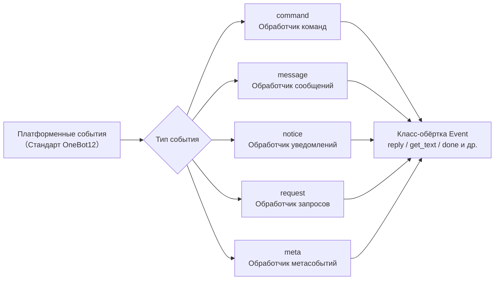

## Command Командный модуль

### Регистрация команды

```python
from ErisPulse.Core.Event import command

# Базовая команда
@command("hello", help="Отправить приветствие")
async def hello_handler(event):
    await event.reply("Привет!")

# Команда с псевдонимами
@command(["help", "h"], aliases=["帮助"], help="Отобразить справку")
async def help_handler(event):
    pass

# Команда с правами доступа
def is_admin(event):
    return event.get("user_id") in admin_ids

@command("admin", permission=is_admin, help="Команда администратора")
async def admin_handler(event):
    pass

# Скрытая команда
@command("secret", hidden=True, help="Секретная команда")
async def secret_handler(event):
    pass

# Группа команд
@command("admin.reload", group="admin", help="Перезагрузить модуль")
async def reload_handler(event):
    pass
```

### Информация о командах

Все API-запросы к информации о командах поддерживают необязательный **контекст сессии**: передача `event=` (Event или dict) или явное указание `platform=` / `bot_id=` / `session_id=` (явные параметры имеют приоритет над event), т.е. фильтрация команд по модулям с учетом области действия, недоступных в текущей сессии (см. advanced/scope.md); все параметры являются необязательными, при отсутствии параметров поведение остается прежним.

```python
# Получить справку по командам
help_text = command.help()

# Сессионно-осознанная справка: отображаются только доступные в текущей сессии команды
help_text = command.help(event=event)

# Получить конкретную команду (возвращается объединенная и перезаписанная активная конфигурация; возвращает None, если команда недоступна в сессии)
cmd_info = command.get_command("admin")
cmd_info = command.get_command("admin", event=event)

# Получить все команды (при сессионной фильтрации исключаются недоступные в сессии модули)
all_commands = command.get_commands()
all_commands = command.get_commands(event=event)

# Получить все команды из группы (поддерживает фильтрацию по сессии)
admin_commands = command.get_group_commands("admin")
admin_commands = command.get_group_commands("admin", event=event)

# Получить все видимые команды
visible_commands = command.get_visible_commands()

# Сессионно-осознанные видимые команды (достаточно передать event или явные ключевые параметры)
visible_commands = command.get_visible_commands(event=event)
visible_commands = command.get_visible_commands(
    platform=event.get("platform"),
    bot_id=event.get_self_account_id(),
    session_id=event.get_session_id(),
)
```

### Ожидание ответа

```python
# Ожидание ответа от пользователя
@command("ask", help="Запросить информацию у пользователя")
async def ask_command(event):
    reply = await command.wait_reply(
        event,
        prompt="Пожалуйста, введите ваше имя:",  # Уже отправлено выше
        timeout=30.0
    )
    
    if reply:
        name = reply.get_text()
        await event.reply(f"Привет, {name}!")

# Ожидание ответа с проверкой
def validate_age(event_data):
    try:
        age = int(event_data.get_text())
        return 0 <= age <= 150
    except ValueError:
        return False

@command("age", help="Запросить возраст пользователя")
async def age_command(event):
    await event.reply("Пожалуйста, введите ваш возраст:")
    
    reply = await command.wait_reply(
        event,
        timeout=60,
        validator=validate_age
    )
    
    if reply:
        age = int(reply.get_text())
        await event.reply(f"Ваш возраст {age} лет")

# Ожидание ответа с обратным вызовом
async def handle_confirmation(reply_event):
    text = reply_event.get_text().lower()
    if text in ["是", "yes", "y"]:
        await event.reply("Операция подтверждена!")
    else:
        await event.reply("Операция отменена.")

@command("confirm", help="Подтвердить операцию")
async def confirm_command(event):
    await command.wait_reply(
        event,
        prompt="Пожалуйста, введите '是' или '否':",
        callback=handle_confirmation
    )
```

## Message Модуль сообщений

### События сообщений

```python
from ErisPulse.Core.Event import message

# Регистрация на все сообщения
@message.on_message()
async def message_handler(event):
    sdk.logger.info(f"Получено сообщение: {event.get_text()}")

# Регистрация на личные сообщения
@message.on_private_message()
async def private_handler(event):
    user_id = event.get_user_id()
    sdk.logger.info(f"Личное сообщение от: {user_id}")

# Регистрация на сообщения в группах
@message.on_group_message()
async def group_handler(event):
    group_id = event.get_group_id()
    sdk.logger.info(f"Сообщение в группе от: {group_id}")

# Регистрация на сообщения с упоминанием
@message.on_at_message()
async def at_handler(event):
    mentions = event.get_mentions()
    sdk.logger.info(f"Упомянутые пользователи: {mentions}")
```

### Условная регистрация

```python
# Использование приоритета для контроля порядка выполнения
@message.on_message(priority=10)  # Чем больше значение, тем выше приоритет
async def high_priority_handler(event):
    pass

# Условная фильтрация внутри обработчика
@message.on_message()
async def filtered_handler(event):
    if "ключевое слово" not in event.get_text():
        return
    # Обработка сообщений, содержащих ключевое слово
    pass
```

## Уведомления

### События уведомлений

```python
from ErisPulse.Core.Event import notice

# Добавление в друзья
@notice.on_friend_add()
async def friend_add_handler(event):
    user_id = event.get_user_id()
    await event.reply("Добро пожаловать в друзья!")

# Удаление из друзей
@notice.on_friend_remove()
async def friend_remove_handler(event):
    user_id = event.get_user_id()
    sdk.logger.info(f"Удаление из друзей: {user_id}")

# Увеличение числа участников группы
@notice.on_group_increase()
async def member_increase_handler(event):
    user_id = event.get_user_id()
    await event.reply(f"Добро пожаловать, новый участник!")

# Уменьшение числа участников группы
@notice.on_group_decrease()
async def member_decrease_handler(event):
    user_id = event.get_user_id()
    sdk.logger.info(f"Участник покинул группу: {user_id}")
```

## Модуль запросов

### События запросов

```python
from ErisPulse.Core.Event import request

# Запрос от друга
@request.on_friend_request()
async def friend_request_handler(event):
    user_id = event.get_user_id()
    comment = event.get_comment()
    sdk.logger.info(f"Запрос в друзья: {user_id}, комментарий: {comment}")

# Запрос на вступление в группу
@request.on_group_request()
async def group_request_handler(event):
    group_id = event.get_group_id()
    user_id = event.get_user_id()
    sdk.logger.info(f"Запрос в группу: {group_id}, от: {user_id}")
```

## Модуль метасобытий Meta

### Метасобытия

```python
from ErisPulse.Core.Event import meta

# Событие подключения
@meta.on_connect()
async def connect_handler(event):
    platform = event.get_platform()
    sdk.logger.info(f"Подключение к платформе {platform} успешно")

# Событие отключения
@meta.on_disconnect()
async def disconnect_handler(event):
    platform = event.get_platform()
    sdk.logger.info(f"Отключение от платформы {platform}")

# Событие тиканья (heartbeat)
@meta.on_heartbeat()
async def heartbeat_handler(event):
    sdk.logger.debug("Получено тиканье")
```

### Запрос статуса бота

После того как адаптер отправляет метасобытие, фреймворк автоматически отслеживает статус бота. API-запросы и слушатели событий жизненного цикла описаны в разделе [API системы адаптеров - Управление статусом бота](adapter-system.md#bot-状态管理).

## Event 包 wrapping 类

Обработчик событий модуля Event принимает экземпляр обёртки Event, которая наследуется от dict и предоставляет удобные методы.

### Основные методы

```python
# Получение информации о событии
event_id = event.get_id()
event_time = event.get_time()
event_type = event.get_type()
detail_type = event.get_detail_type()
platform = event.get_platform()

# Получение информации о боте
self_platform = event.get_self_platform()
self_user_id = event.get_self_user_id()
self_info = event.get_self_info()
```

### Идентификатор сессии

```python
# Единый идентификатор цели: в группе возвращает group_id, в личных сообщениях — user_id и т.д.
target_id = event.get_target_id()

# Уникальный идентификатор сессии, формат: {platform}:{detail_type}:{target_id}
session_id = event.get_session_id()
# Пример: "telegram:private:12345", "qq:group:67890"
```

Метод `get_target_id()` возвращает первый непустой идентификатор в следующем порядке: `group_id` → `channel_id` → `guild_id` → `thread_id` → `user_id`. Подходит для сценариев, где требуется единый идентификатор сессии, например, для управления контекстом или хранения состояния.

### Методы сообщений

```python
# Получение содержимого сообщения
message_segments = event.get_message()
alt_message = event.get_alt_message()
text = event.get_text()

# Получение информации о отправителе
user_id = event.get_user_id()
nickname = event.get_user_nickname()
sender = event.get_sender()

# Получение информации о группе
group_id = event.get_group_id()

# Определение типа сообщения
is_msg = event.is_message()
is_private = event.is_private_message()
is_group = event.is_group_message()

# @-сообщения
is_at = event.is_at_message()
has_mention = event.has_mention()
mentions = event.get_mentions()
```

### Командная информация

```python
# Получение информации о команде
cmd_name = event.get_command_name()
cmd_args = event.get_command_args()
cmd_raw = event.get_command_raw()

# Определение, является ли событие командой
is_cmd = event.is_command()
```

### Функции ответа

```python
# Простой ответ
await event.reply("Это сообщение")

# Указание метода отправки
await event.reply("http://example.com/image.jpg", method="Image")

# Ответ с упоминанием пользователя и цитированием сообщения
await event.reply("Привет", at_users=["user1"], reply_to="msg_id")

# @-все участники
await event.reply("Анонс", at_all=True)

# Использование специфичных методов платформы (через параметр via)
await event.reply("Доска", method="Board",
                  via=[("Expire", 3600), ("ForMember", "114514")])

# Получение цепочки отправки, свободное добавление модификаторов и методов отправки (подходит для нескольких модификаторов / методов действий)
await event.send_chain().Expire(3600).Board("Доска")
await event.send_chain().DismissBoard()

# Ответ с использованием OneBot12 сообщений
from ErisPulse.Core.Event import MessageBuilder
msg = MessageBuilder().text("Hello").image("url").build()
await event.reply_ob12(msg)

# Ожидание ответа
reply = await event.wait_reply(timeout=30)
```

### Проверка возможностей платформы

```python
# Проверка, поддерживает ли текущая платформа метод отправки
if event.supports("Image"):
    await event.reply(url, method="Image")

# Получение списка доступных методов отправки
methods = event.available_methods()
# ["Text", "Image", "Voice", ...]
```

### Методы ответа

Метод `reply()` поддерживает указание метода отправки через параметр `method` и два удобных булевых параметра:

```python
# Простой текстовый ответ
await event.reply("Привет")

# Ответ с упоминанием отправителя
await event.reply("Привет", at_sender=True)

# Ответ с цитированием текущего сообщения
await event.reply("Принято", quote=True)

# Комбинированный ответ
await event.reply("Принято", at_sender=True, quote=True)

# Отправка изображения (с помощью параметра method)
if event.supports("Image"):
    await event.reply("http://example.com/img.jpg", method="Image")
else:
    await event.reply("[Изображение] http://example.com/img.jpg")
```

**Описание параметров**:

| Параметр | Тип | Описание |
|------|------|------|
| `content` | str | Содержимое отправки |
| `method` | str | Метод отправки, по умолчанию "Text", доступны "Image"/"Voice"/"Video"/"File" и др. |
| `at_sender` | bool | Упомянуть отправителя (автоматически извлекает user_id) |
| `quote` | bool | Цитировать текущее сообщение (автоматически извлекает message_id) |
| `at_users` | list[str] | Список упоминаемых пользователей |
| `reply_to` | str | Указать ID сообщения, на которое отвечать |
| `at_all` | bool | Упомянуть всех участников |

### Интерактивные методы

```python
# confirm — подтверждение диалога (возвращает True/False/None)
if await event.confirm("Вы уверены, что хотите выполнить это действие?"):
    await event.reply("Подтверждено")

# Использование не-текстовых методов для подтверждения
if await event.confirm("http://example.com/image.jpg", method="Image"):
    await event.reply("Подтверждение изображением")

# choose — выбор из меню (возвращает индекс или None)
choice = await event.choose("Выберите цвет:", ["красный", "зелёный", "синий"])

# options_format="auto" (по умолчанию) — автоматический выбор стиля в зависимости от method:
# Markdown → маркированный список (- 1. вариант), Html → нумерованный список (<ol>), иначе → простой текстовый список
# Методы текстового типа (Markdown/Html и др.) по умолчанию объединяют опции в конец
# merge_prompt=True — принудительное объединение для любого method; placeholder — пользовательский плейсхолдер
choice = await event.choose(
    "## Выберите\n{options}", ["A", "B"],
    method="Markdown", merge_prompt=True,
)

# collect — сбор данных формы (возвращает словарь {key: value} или None)
data = await event.collect([
    {"key": "name", "prompt": "Введите имя:"},
    {"key": "age", "prompt": "Введите возраст:",
     "validator": lambda e: e.get_text().isdigit()},
    {"key": "avatar", "prompt": "Отправьте аватар:", "method": "Image"},
])

# wait_for — ожидание события, удовлетворяющего условию
evt = await event.wait_for(event_type="notice", condition=lambda e: ..., timeout=120)

# conversation — контекст многошагового диалога
conv = event.conversation(timeout=60)
await conv.say("Добро пожаловать!")
```

> Подробное описание параметров интерактивных методов и дополнительные примеры см. в [Event обёртке](../developer-guide/modules/event-wrapper.md) и [Многошаговом диалоге](../advanced/conversation.md).

### Вспомогательные методы

```python
# Преобразование в словарь (фильтрует ключи, начинающиеся с _)
event_dict = event.to_dict()

# Получение исходных данных
raw = event.get_raw()
raw_type = event.get_raw_type()
```

### Управление цепочкой

Метод `event.done(claim=, stop=)` обеспечивает единое управление двумя независимыми семантиками: «признание» и «блокировка»:

- **Признание (claim)**: помечает событие как обработанное (`_processed`), благодаря чему диспетчер команд пропускает его повторную обработку
- **Блокировка (stop)**: предотвращает распространение события до низкоприоритетных обработчиков (`_propagation_stopped`)

```python
# Признание + блокировка (по умолчанию)
event.done()

# Только признание, без блокировки (низкоприоритетные наблюдатели всё ещё видят событие)
event.done(stop=False)

# Только блокировка, без признания (например, брандмауэр / ограничение частоты)
event.done(claim=False)

# mark_processed — основной метод, done — его псевдоним
event.mark_processed()             # эквивалент event.done()
event.mark_processed(stop=False)   # эквивалент event.done(stop=False)

# Проверка состояния
event.is_processed()  # признано ли событие
event.is_stopped()    # заблокировано ли распространение
```

### Платформенные расширения

Адаптеры могут регистрировать платформенно-специфичные методы для Event, доступные только на экземплярах соответствующей платформы.

#### Пользователь: использование платформенных методов

После регистрации платформенно-специфичных методов адаптером, вы можете напрямую вызывать их в обработчике событий. Методы каждой платформы отличаются, см. соответствующую [документацию платформы](../platform-guide/).

```python
from ErisPulse.Core.Event import message

@message.on_message()
async def handle_message(event):
    platform = event.get_platform()

    # Вызов специфичных методов в зависимости от платформы
    if platform == "email":
        subject = event.get_subject()           # специфичный для email
        attachments = event.get_attachments()   # специфичный для email
```

#### Проверка зарегистрированных методов платформы

```python
from ErisPulse.Core.Event import get_platform_event_methods

# Получение списка зарегистрированных методов для платформы
methods = get_platform_event_methods("email")
# ["get_subject", "get_from", "get_attachments", ...]

# Динамическая проверка и вызов метода
for method_name in get_platform_event_methods(event.get_platform()):
    method = getattr(event, method_name)
    print(f"{method_name}: {method()}")
```

#### Изоляция методов платформ

Методы, зарегистрированные для разных платформ, не пересекаются:

```python
# Email событие — только методы для email
event = Event({"platform": "email", "email_raw": {"subject": "Hello"}})
event.get_subject()      # ✅ "Hello"
event.get_chat_type()    # ❌ AttributeError

# Telegram событие — только методы для Telegram
event = Event({"platform": "telegram", "telegram_raw": {"chat": {"type": "private"}}})
event.get_chat_type()    # ✅ "private"
event.get_subject()      # ❌ AttributeError
```

#### Поддержка hasattr / dir

```python
hasattr(event, "get_subject")   # True только при platform="email"
"get_subject" in dir(event)     # То же самое
```

### Адаптер: регистрация платформенных методов

Адаптер может зарегистрировать платформенно-специфичные методы для Event с помощью декоратора, первый параметр метода — self (экземпляр Event), можно свободно обращаться к данным события.

#### Регистрация отдельного метода

```python
from ErisPulse.Core.Event import register_event_method

@register_event_method("email")
def get_subject(self):
    """Получить тему письма"""
    return self.get("email_raw", {}).get("subject", "")

@register_event_method("email")
def get_from(self):
    """Получить отправителя"""
    return self.get("email_raw", {}).get("from", {})
```

#### Массовая регистрация (через Mixin класс)

Для большого количества методов рекомендуется использовать Mixin класс:

```python
from ErisPulse.Core.Event import register_event_mixin

class EmailEventMixin:
    def get_subject(self):
        return self.get("email_raw", {}).get("subject", "")

    def get_from(self):
        return self.get("email_raw", {}).get("from", {})

    def get_attachments(self):
        return self.get("email_raw", {}).get("attachments", [])

# Регистрация всех методов сразу
register_event_mixin("email", EmailEventMixin)
```

#### Правила возвращаемых значений

| Сценарий | Возвращаемое значение | Способ использования пользователем |
|------|--------|------------|
| Возврат данных (текст, словарь и т.д.) | Непосредственно значение | `subject = event.get_subject()` |
| Выполнение операции (отправка сообщения и т.д.) | Возвращает `asyncio.Task` | `task = event.do_something()` (необязательно await) |

> **Рекомендация**: методы, возвращающие не данные, должны возвращать `asyncio.Task`, чтобы пользователь мог сам решить, нужно ли `await`, даже если не `await`, операция будет выполнена.

```python
@register_event_method("email")
def forward_email(self, to_address: str):
    """Пересылка письма — возвращает Task, пользователь может сам решить, нужно ли await"""
    import asyncio
    return asyncio.create_task(
        self._do_forward(to_address)
    )

# Пользователь может await и дождаться результата
await event.forward_email("user@example.com")

# Или не await, операция будет выполнена в фоне
event.forward_email("user@example.com")
```

#### Удаление методов

```python
from ErisPulse.Core.Event import unregister_event_method, unregister_platform_event_methods

# Удаление отдельного метода
unregister_event_method("email", "get_subject")

# Удаление всех методов платформы (вызывается при завершении адаптера)
unregister_platform_event_methods("email")
```

#### Переопределение встроенных методов

`register_event_mixin` / `register_event_method` поддерживают переопределение встроенных методов Event (например, `confirm`, `choose`, `collect`, `wait_reply`, `reply` и др.). Регистрируемые платформенные методы через `Event.__getattribute__` имеют приоритет над встроенными, поэтому адаптер может предоставлять платформенно-специфичные реализации интерактивных функций.

Встроенные реализации экспортируются как `_builtin_*` функции, переопределяющие методы могут вызывать их в качестве резервной реализации:

```python
from ErisPulse.Core.Event import register_event_mixin, _builtin_choose

class YunhuEventMixin:
    async def choose(self, prompt, options, timeout=60, method="Text"):
        # Платформа Yunhu использует компоненты кнопок
        buttons = [[{"text": opt} for opt in options]]
        await self.reply(prompt)
        # ...ожидание обратного вызова кнопки или текстового ответа...
        # Возврат к встроенной логике
        return await _builtin_choose(self, None, options, timeout, "Text")

register_event_mixin("yunhu", YunhuEventMixin)
```

## Расширение для кроссплатформенности (подстановочные знаки)

`register_event_method` и `register_event_mixin` поддерживают передачу `"*"` в качестве имени платформы, что делает зарегистрированные методы доступными на **всех платформах** в экземплярах Event. Подходит для модулей функций, таких как диалог с ИИ и управление контекстом, которые требуют повторного использования на разных платформах.

### Регистрация метода для кроссплатформенности

```python
from ErisPulse.Core.Event.wrapper import register_event_method

@register_event_method("*")
async def ai_chat(self, prompt: str):
    """self - это экземпляр Event, можно свободно обращаться к данным события и встроенным методам"""
    await self.reply(f"AI: {prompt}")
```

После регистрации метод доступен для всех обработчиков событий на всех платформах:

```python
from ErisPulse.Core.Event import message

@message.on_message()
async def handler(event):
    await event.ai_chat(event.get_text())
```

### Приоритет анализа методов

При доступе к методам Event через атрибуты порядок анализа следующий:

1. **Методы, специфичные для платформы** (переопределения для текущей платформы)
2. **Методы с подстановочным знаком** (методы, зарегистрированные с `"*"` для кроссплатформенности)
3. **Встроенные методы** (`reply`, `confirm` и др.)
4. **Доступ по ключу словаря**

> Таким образом, методы с подстановочным знаком могут переопределять встроенные методы (например, `reply`), но могут быть переопределены методами с тем же именем, специфичными для платформы.

## Система приоритетов

Обработчики событий поддерживают приоритет, чем больше значение, тем выше приоритет:

```python
# Обработчик с высоким приоритетом выполняется первым
@message.on_message(priority=10)
async def high_priority_handler(event):
    pass

# Обработчик с низким приоритетом выполняется позже
@message.on_message(priority=0)
async def low_priority_handler(event):
    pass
```


### 适配器系统 API

# API системы адаптеров

В данном документе подробно описывается API системы адаптеров ErisPulse.

## Менеджер адаптеров

### Получение адаптера

```python
from ErisPulse import sdk

# Получение адаптера по имени
adapter = sdk.adapter.get("platform_name")

# Или можно получить напрямую через атрибут
adapter = sdk.adapter.platform_name
```

### Использование обработчиков событий адаптера
> В большинстве случаев рекомендуется использовать модуль `Event` для прослушивания/обработки событий.
>
> Кроме того, модуль `Event` предоставляет мощные обертки, которые могут принести больше удобства при разработке ваших модулей

```python
# Прослушивание стандартного события OneBot12
@sdk.adapter.on("message")
async def handle_message(event):
    pass

# Прослушивание стандартного события конкретной платформы
@sdk.adapter.on("message", platform="yunhu")
async def handle_yunhu_message(event):
    pass

# Прослушивание оригинального события платформы
@sdk.adapter.on("raw_event", raw=True, platform="yunhu")
async def handle_raw_event(data):
    pass
```

### Управление адаптерами

```python
# Получение всех платформ
platforms = sdk.adapter.platforms

# Проверка существования адаптера
exists = sdk.adapter.exists("platform_name")

# Включение/отключение адаптера
sdk.adapter.enable("platform_name")
sdk.adapter.disable("platform_name")

# Запуск/остановка адаптера
# В следующих методах показаны только случаи с передачей параметров, отсутствие параметров означает запуск/остановку всех зарегистрированных адаптеров
await sdk.adapter.startup(["platform1", "platform2"])
await sdk.adapter.shutdown(["platform1", "platform2"])

# Проверка, запущен ли адаптер
is_running = sdk.adapter.is_running("platform_name")

# Получение списка всех запущенных адаптеров
running = sdk.adapter.list_running()
```

## Middleware

Middleware выполняется до того, как событие будет передано обработчику. Он может изменять, фильтровать или регистрировать данные события.

### Регистрация middleware

```python
@sdk.adapter.middleware
async def my_middleware(event):
    sdk.logger.info(f"Middleware обрабатывает: {event}")
    return event
```

### Модель выполнения middleware

- **Порядок выполнения**: Middleware выполняется в порядке регистрации (ранее зарегистрированные middleware выполняются первыми)
- **Передача данных**: Каждый middleware получает данные `event`, возвращённые предыдущим middleware. Если middleware возвращает `None`, то это значение игнорируется, и передача данных продолжается с исходными данными (при этом выводится предупреждение уровня `warning`)
- **Изменение данных**: Middleware может изменять данные события и возвращать изменённый словарь

```python
@sdk.adapter.middleware
async def add_timestamp(event):
    event["processed_at"] = time.time()
    return event

@sdk.adapter.middleware
async def filter_spam(event):
    if event.get("detail_type") == "private":
        text = event.get("alt_message", "")
        if "реклама" in text:
            return None   # Возвращение `None` не останавливает распространение события, а игнорирует это возвращаемое значение
    return event
```

> **Важно**: Middleware в настоящее время не поддерживает блокировку распространения событий. Если необходимо отфильтровать определённые события, реализуйте это через условные проверки в обработчике событий.  
> Однако вы можете установить обработчик с высоким приоритетом в модуле Event и использовать `event.mark_processed()` внутри обработчика для блокировки обработки событий с низким приоритетом.

## Отправка сообщений

### Основная отправка

```python
# Получить адаптер
adapter = sdk.adapter.get("platform")

# Отправить текстовое сообщение
await adapter.Send.To("user", "123").Text("Hello")

# Отправить изображение
await adapter.Send.To("group", "456").Image("https://example.com/image.jpg")
```

### Указание отправляющего аккаунта

```python
# Использовать имя аккаунта
await adapter.Send.Using("account1").To("user", "123").Text("Hello")

# Использовать ID бота
await adapter.Send.Using("bot_id").To("user", "123").Text("Hello")
```

### Получение поддерживаемых методов отправки

```python
# Получить список всех методов отправки, поддерживаемых платформой
methods = sdk.adapter.list_sends("onebot11")
# Возвращает: ["Text", "Image", "Voice", "Markdown", ...]

# Получить подробную информацию о методе
info = sdk.adapter.send_info("onebot11", "Text")
# Возвращает:
# {
#     "name": "Text",
#     "parameters": [
#         {"name": "text", "type": "str", "default": null, "annotation": "str"}
#     ],
#     "return_type": "Awaitable[Any]",
#     "docstring": "Отправить текстовое сообщение..."
# }
```

### Цепочка модификаторов

```python
# @пользователя
await adapter.Send.To("group", "456").At("789").Text("你好")

# @всех участников
await adapter.Send.To("group", "456").AtAll().Text("大家好")

# Ответить на сообщение
await adapter.Send.To("group", "456").Reply("msg_id").Text("回复内容")

# Комбинировать
await adapter.Send.To("group", "456").At("789").Reply("msg_id").Text("回复@的消息")
```

## API 调ов

### Метод call_api

> **Внимание**: `call_api` — это базовый метод для прямого вызова API платформы, параметры и возвращаемые значения могут отличаться в зависимости от платформы. Пожалуйста, ознакомьтесь с документацией адаптера соответствующей платформы. **Рекомендуется использовать Send DSL для отправки сообщений**, используйте `call_api` только в сценариях, которые не поддерживаются Send DSL (например, для получения специфических данных платформы, вызова административных интерфейсов платформы и т.д.).

```python
# Вызов API платформы
result = await adapter.call_api(
    endpoint="/send",
    content="Привет",
    recvId="123",
    recvType="user"
)

# Стандартизированный ответ
{
    "status": "ok",
    "retcode": 0,
    "data": {...},
    "message_id": "msg_id",
    "message": "",
    "{platform}_raw": raw_response
}
```

## Базовый класс адаптера

### Методы BaseAdapter

```python
from ErisPulse import sdk
from ErisPulse.Core import BaseAdapter

class MyAdapter(BaseAdapter):
    def __init__(self):
        super().__init__()
        self.sdk = sdk
        # Инициализация адаптера
        pass
    
    async def start(self):
        """Запуск адаптера (должен быть реализован)"""
        pass
    
    async def shutdown(self):
        """Остановка адаптера (должен быть реализован)"""
        pass
    
    async def call_api(self, endpoint: str, **params):
        """Вызов API платформы (должен быть реализован)"""
        pass
```

### Вложенный класс Send

```python
class MyAdapter(BaseAdapter):
    class Send(BaseAdapter.Send):
        def Text(self, text: str):
            """Отправка текстового сообщения"""
            import asyncio
            return asyncio.create_task(
                self._adapter.call_api(
                    endpoint="/send",
                    content=text,
                    recvId=self._target_id,
                    recvType=self._target_type
                )
            )
```

## Управление состоянием бота

Адаптер сообщает фреймворку о состоянии подключения бота, отправляя **события `meta`** в соответствии со стандартом OneBot12. Система автоматически извлекает информацию о боте из этих событий для отслеживания состояния.

### Типы событий `meta`

Адаптер должен отправлять три типа событий `meta`:

| `type` | `detail_type` | Описание | Время срабатывания |
|--------|--------------|----------|-------------------|
| `meta` | `connect` | Бот подключился | После успешного установления соединения адаптера с платформой |
| `meta` | `heartbeat` | Бот отправил сигнал поддержания связи | Регулярно (рекомендуется каждые 30-60 секунд) |
| `meta` | `disconnect` | Бот отключился | При обнаружении разрыва соединения |

### Расширение поля `self`

ErisPulse расширяет стандартный OneBot12-файл `self` следующими необязательными полями:

| Поле | Тип | Описание |
|------|-----|----------|
| `self.platform` | string | Название платформы (стандарт OB12) |
| `self.user_id` | string | ID пользователя бота (стандарт OB12) |
| `self.user_name` | string | Никнейм бота (расширение ErisPulse) |
| `self.avatar` | string | URL аватара бота (расширение ErisPulse) |
| `self.account_id` | string | Идентификатор многоконтурной учетной записи (расширение ErisPulse) |

### Формат событий `meta`

#### connect — Подключение

```python
await adapter.emit({
    "id": "unique_id",
    "time": 1712345678,
    "type": "meta",
    "detail_type": "connect",
    "platform": "telegram",
    "self": {
        "platform": "telegram",
        "user_id": "123456",
        "user_name": "MyBot",
        "avatar": "https://example.com/avatar.jpg"
    },
    "telegram_raw": {...},
    "telegram_raw_type": "bot_connected"
})
```

Системная обработка: регистрация бота, установка статуса `online`, срабатывание жизненного цикла `adapter.bot.online`.

#### heartbeat — Сигнал поддержания связи

```python
await adapter.emit({
    "id": "unique_id",
    "time": 1712345708,
    "type": "meta",
    "detail_type": "heartbeat",
    "platform": "telegram",
    "self": {
        "platform": "telegram",
        "user_id": "123456"
    }
})
```

Системная обработка: обновление времени `last_active` (сигнал поддержания связи также поддерживает обновление метаинформации).

#### disconnect — Отключение

```python
await adapter.emit({
    "id": "unique_id",
    "time": 1712345738,
    "type": "meta",
    "detail_type": "disconnect",
    "platform": "telegram",
    "self": {
        "platform": "telegram",
        "user_id": "123456"
    }
})
```

Системная обработка: установка статуса бота `offline`, срабатывание жизненного цикла `adapter.bot.offline`.

### Автоматическое обнаружение бота в обычных событиях

Помимо событий `meta`, обычные события (`message`/`notice`/`request`) также содержат поле `self`, которое автоматически обнаруживает и регистрирует бота, обновляя время активности. Это означает, что даже если адаптер не отправляет событие `connect`, фреймворк сможет обнаружить бота из первого обычного события.

### Пример подключения адаптера

```python
class MyAdapter(BaseAdapter):
    async def start(self):
        # Установление соединения с платформой...
        connection = await self._connect()
        
        # Успешное подключение, отправка события connect
        await adapter.emit({
            "id": str(uuid4()),
            "time": int(time.time()),
            "type": "meta",
            "detail_type": "connect",
            "platform": "myplatform",
            "self": {
                "platform": "myplatform",
                "user_id": self.bot_id,
                "user_name": self.bot_name,
                "avatar": self.bot_avatar
            },
            "myplatform_raw": raw_data,
            "myplatform_raw_type": "connected"
        })
    
    async def on_disconnect(self):
        # Отключение, отправка события disconnect
        await adapter.emit({
            "id": str(uuid4()),
            "time": int(time.time()),
            "type": "meta",
            "detail_type": "disconnect",
            "platform": "myplatform",
            "self": {
                "platform": "myplatform",
                "user_id": self.bot_id
            }
        })
```

### Запрос состояния бота

```python
# Получение полной информации обо всех адаптерах и ботах (удобно для WebUI)
summary = sdk.adapter.get_status_summary()
# {
#     "adapters": {
#         "telegram": {
#             "status": "started",
#             "bots": {
#                 "123456": {
#                     "status": "online",
#                     "last_active": 1712345678.0,
#                     "info": {"nickname": "MyBot"}
#                 }
#             }
#         }
#     }
# }

# Получение списка всех ботов
all_bots = sdk.adapter.list_bots()

# Получение списка ботов на определенной платформе
tg_bots = sdk.adapter.list_bots("telegram")

# Получение информации о конкретном боте
info = sdk.adapter.get_bot_info("telegram", "123456")

# Проверка онлайн-статуса бота
if sdk.adapter.is_bot_online("telegram", "123456"):
    print("Бот в сети")
```

### Значения состояния бота

| Состояние | Описание |
|-----------|----------|
| `online` | Онлайн (постоянное получение событий или активная маркировка адаптером) |
| `offline` | Оффлайн (активная маркировка адаптером или автоматическая установка при остановке системы) |
| `unknown` | Неизвестно (зарегистрирован, но статус не подтвержден) |

### Жизненные циклы событий

| Имя события | Время срабатывания | Данные |
|-------------|-------------------|--------|
| `adapter.bot.online` | При первом обнаружении нового бота | `{platform, bot_id, status}` |
| `adapter.status.change` | При изменении состояния адаптера (starting/started/stopping/stopped/stop_failed) | `{platform, status}` |

```python
# Подписка на событие подключения бота
@sdk.lifecycle.on("adapter.bot.online")
def on_bot_online(event):
    print(f"Бот подключился: {event['data']['platform']}/{event['data']['bot_id']}")

# Подписка на изменение состояния адаптера
@sdk.lifecycle.on("adapter.status.change")
def on_status_change(event):
    print(f"Состояние адаптера: {event['data']['platform']} -> {event['data']['status']}")
```

> При остановке системы (shutdown) все боты автоматически помечаются как `offline`.


====
技术标准
====


### 会话类型标准

# Стандарт типов сессий ErisPulse

Данный документ определяет стандарты типов сессий, поддерживаемых ErisPulse, включая типы событий приема и типы целей отправки.

## 1. Основные понятия

### 1.1 Типы получения и отправки

ErisPulse различает два типа сессий:

- **Тип получения (Receive Type)**: поле `detail_type` события, используемое для получения
- **Тип отправки (Send Type)**: тип назначения метода `Send.To()` при отправке сообщения

### 1.2 Соответствие типов

```
Тип получения (detail_type)     Тип отправки (Send.To)
─────────────────        ────────────────
private                 →        user
group                   →        group
channel                 →        channel
guild                   →        guild
thread                  →        thread
user                    →        user
```

**Ключевые моменты**:
- `private` — это тип получения, при отправке необходимо использовать `user`
- `group`, `channel`, `guild`, `thread` — типы одинаковы при получении и отправке
- Система автоматически выполняет преобразование типов, без необходимости ручного вмешательства (это означает, что вы можете напрямую использовать полученный тип получения для отправки), на самом деле, вам не нужно беспокоиться об этом, поскольку существует обёртка события, и вы можете напрямую использовать метод `event.reply()`, не задумываясь о преобразовании типов

## 2. Стандартные типы сессий

### 2.1 Стандартные типы OneBot12

#### private
- **Тип получения**: `private`
- **Тип отправки**: `user`
- **Описание**: Личное сообщение в один на один
- **Поле ID**: `user_id`
- **Поддерживаемые платформы**: Все платформы, поддерживающие личные сообщения

#### group
- **Тип получения**: `group`
- **Тип отправки**: `group`
- **Описание**: Сообщение в группе, включая различные формы групп (например, супергруппы в Telegram)
- **Поле ID**: `group_id`
- **Поддерживаемые платформы**: Все платформы, поддерживающие групповые сообщения

#### user
- **Тип получения**: `user`
- **Тип отправки**: `user`
- **Описание**: Тип пользователя, некоторые платформы (например, Telegram) представляют личные сообщения как `user`, а не `private`
- **Поле ID**: `user_id`
- **Поддерживаемые платформы**: Telegram и другие платформы

### 2.2 Расширенные типы ErisPulse

#### channel
- **Тип получения**: `channel`
- **Тип отправки**: `channel`
- **Описание**: Сообщение в канале, поддерживает широковещательные сообщения для нескольких пользователей
- **Поле ID**: `channel_id`
- **Поддерживаемые платформы**: Discord, Telegram, Line и другие

#### guild
- **Тип получения**: `guild`
- **Тип отправки**: `guild`
- **Описание**: Сообщение в сервере/сообществе, обычно используется для событий уровня Discord Guild
- **Поле ID**: `guild_id`
- **Поддерживаемые платформы**: Discord и другие

#### thread
- **Тип получения**: `thread`
- **Тип отправки**: `thread`
- **Описание**: Сообщение в теме/подканале, используется для подразделов обсуждений в сообществах
- **Поле ID**: `thread_id`
- **Поддерживаемые платформы**: Подканалы Discord, темы Telegram и другие

## 3. Типы платформ

### 3.1 Принципы отображения

Адаптер отвечает за сопоставление нативных типов платформ с типами стандарта ErisPulse:

```
Нативный тип платформы → Тип стандарта ErisPulse → Тип отправки
```

### 3.2 Примеры распространённых платформ

#### Telegram
```
Тип Telegram           Тип приёма ErisPulse    Тип отправки
─────────────────      ────────────────       ───────────
private                private                 user
group                  group                   group
supergroup             group                   group  # Сопоставлено с group
channel                channel                 channel
```

#### Discord
```
Тип Discord            Тип приёма ErisPulse    Тип отправки
─────────────────      ────────────────       ───────────
Direct Message         private                user
Text Channel           channel                channel
Guild                  guild                  guild
Thread                 thread                 thread
```

#### OneBot11
```
Тип OneBot11           Тип приёма ErisPulse    Тип отправки
─────────────────      ────────────────       ───────────
private                private                user
group                  group                  group
discuss                group                  group  # Сопоставлено с group
```

## 4. Расширение пользовательских типов

### 4.1 Регистрация пользовательского типа

Адаптер может зарегистрировать пользовательский тип сессии:

```python
from ErisPulse.Core.Event import register_custom_type

# Регистрация пользовательского типа
register_custom_type(
    receive_type="my_custom_type",
    send_type="custom",
    id_field="custom_id",
    platform="MyPlatform"
)
```

### 4.2 Использование пользовательского типа

После регистрации система будет автоматически обрабатывать преобразование и определение этого типа:

```python
# Автоматическое определение
receive_type = infer_receive_type(event, platform="MyPlatform")
# Возвращает: "my_custom_type"

# Преобразование в тип отправки
send_type = convert_to_send_type(receive_type, platform="MyPlatform")
# Возвращает: "custom"

# Получение соответствующего ID
target_id = get_target_id(event, platform="MyPlatform")
# Возвращает: event["custom_id"]
```

### 4.3 Отмена регистрации пользовательского типа

```python
from ErisPulse.Core.Event import unregister_custom_type

unregister_custom_type("my_custom_type", platform="MyPlatform")
```

## 5. Автоматическое определение типа

Когда у события отсутствует явное поле `detail_type`, система автоматически определяет тип по наличию идентификатора:

> [!NOTE]
> **Изменение поведения в 2.7.0+**: `detail_type` используется напрямую только в том случае, если он представляет собой **известный тип сессии** (стандартный или пользовательский). У событий `notice` и `request` `detail_type` (например, `group_member_increase`, `friend_increase`) является **семантическим подтипом**, а не типом сессии, и в этом случае тип сессии определяется по идентификатору.

### 5.1 Приоритет определения

```
Приоритет (от высокого к низкому):
1. group_id     → group
2. channel_id   → channel
3. guild_id     → guild
4. thread_id    → thread
5. user_id      → private
```

### 5.2 Примеры использования

```python
# У события есть только group_id
event = {"group_id": "123", "user_id": "456"}
receive_type = infer_receive_type(event)
# Возвращает: "group" (group_id используется с приоритетом)

# У события есть только user_id
event = {"user_id": "123"}
receive_type = infer_receive_type(event)
# Возвращает: "private"

# У события notice detail_type является семантическим подтипом, начиная с 2.7.0 будет использоваться определение по идентификатору
event = {"type": "notice", "detail_type": "group_member_increase", "group_id": "123"}
receive_type = infer_receive_type(event)
# Возвращает: "group" (а не "group_member_increase")
```

## 6. Примеры использования API

### 6.1 Отправка сообщений

```python
from ErisPulse import adapter

# Отправка пользователю
await adapter.myplatform.Send.To("user", "123").Text("Hello")

# Отправка в группу
await adapter.myplatform.Send.To("group", "456").Text("Hello")

# Автоматическое преобразование private → user (не рекомендуется, может вызвать проблемы совместимости)
await adapter.myplatform.Send.To("private", "789").Text("Hello")
# Внутри автоматически преобразуется в: Send.To("user", "789") # Использование user в качестве типа сессии является более предпочтительным выбором
```

### 6.2 Ответ на событие

```python
from ErisPulse.Core.Event import Event

# Event.reply() автоматически обрабатывает преобразование типа
await event.reply("Содержание ответа")
# Внутри автоматически используется правильный тип отправки
```

### 6.3 Обработка команд

```python
from ErisPulse.Core.Event import command

@command(name="test")
async def handle_test(event):
    # Система автоматически обрабатывает тип сессии
    # Не нужно вручную проверять group_id или user_id
    await event.reply("Команда выполнена успешно")
```

## 7. Основная API-справка

### 7.1 Преобразование типов

```python
from ErisPulse.Core.Event import convert_to_send_type, convert_to_receive_type

# Тип получения → Тип отправки
convert_to_send_type("private")  # → "user"
convert_to_send_type("group")    # → "group"

# Тип отправки → Тип получения
convert_to_receive_type("user")   # → "private"
convert_to_receive_type("group")  # → "group"
```

### 7.2 Запрос полей ID

```python
from ErisPulse.Core.Event import get_id_field, get_receive_type

get_id_field("group")    # → "group_id"
get_id_field("private")  # → "user_id"

get_receive_type("group_id")  # → "group"
get_receive_type("user_id")   # → "private"
```

### 7.3 Получение информации для отправки одним шагом

```python
from ErisPulse.Core.Event import get_send_type_and_target_id

event = {"detail_type": "private", "user_id": "123"}
send_type, target_id = get_send_type_and_target_id(event)
# send_type = "user", target_id = "123"

# Непосредственно используется в Send.To()
await adapter.Send.To(send_type, target_id).Text("Hello")
```

### 7.4 Получение идентификатора цели

```python
from ErisPulse.Core.Event import get_target_id

event = {"detail_type": "group", "group_id": "456"}
get_target_id(event)  # → "456"
```

## 8. Утилитарные методы

```python
from ErisPulse.Core.Event import (
    is_standard_type,
    is_valid_send_type,
    get_standard_types,
    get_send_types,
    clear_custom_types,
)

is_standard_type("private")     # True
is_standard_type("custom_type") # False

is_valid_send_type("user")      # True
is_valid_send_type("invalid")   # False

get_standard_types()  # {"private", "group", "channel", "guild", "thread", "user"}
get_send_types()      # {"user", "group", "channel", "guild", "thread"}

clear_custom_types()                # Очистить все
clear_custom_types(platform="discord")  # Очистить только для указанной платформы
```

## 9. Лучшие практики

### 7.1 Разработчики адаптеров

1. **Использование стандартных маппингов**: по возможности маппите на стандартные типы, а не создавайте новые типы
2. **Правильное преобразование**: убедитесь, что маппинг между типами приема и отправки корректен
3. **Сохранение исходных данных**: сохраняйте исходный тип события в `{platform}_raw`
4. **Описание в документации**: в документации адаптера укажите отношения между типами

### 7.2 Разработчики модулей

1. **Использование вспомогательных методов**: используйте вспомогательные методы, такие как `get_send_type_and_target_id()`
2. **Избегайте жесткого кодирования**: не пишите код вида `if group_id else "private"`
3. **Учет всех типов**: код должен поддерживать все стандартные типы, а не только private/group
4. **Гибкое проектирование**: используйте методы оберток событий, а не прямой доступ к полям

### 9.3 Вывод типов

- **Предпочтение detail_type**: если есть четкое поле, не проводите вывод
- **Разумное использование вывода**: используйте вывод только в отсутствие явного типа
- **Внимание к приоритетам**: знайте приоритеты вывода, чтобы избежать неожиданных результатов

## 10. Часто задаваемые вопросы

### В1: Почему при отправке `private` нужно преобразовывать в `user`?

О: Это требование стандарта OneBot12. `private` — это понятие, относящееся к получению, при отправке использование `user` более соответствует семантике.

### В2: Как поддержать новые типы сессий?

О: Зарегистрируйте пользовательский тип с помощью `register_custom_type()` или используйте стандартные типы, такие как `channel`, `guild` и т.д.

### В3: Что делать, если у события нет `detail_type`?

О: Система автоматически определит тип на основе существующих полей ID. Приоритет определяется следующим образом: group > channel > guild > thread > user.

### В4: Как адаптер отображает Telegram supergroup?

О: В логике преобразования адаптера `supergroup` отображается в стандартный тип `group`.

### В5: Как обрабатывать специальные платформы, такие как электронная почта?

О: Для неуниверсальных или платформенно-специфичных типов используйте `{platform}_raw` и `{platform}_raw_type` для сохранения исходных данных, а адаптер будет обрабатывать их самостоятельно.

## 11. Связанные документы

- [Стандарт преобразования событий](event-conversion.md) - Полное описание стандарта преобразования событий
- [Спецификация методов отправки](send-method-spec.md) - Назначение и параметры методов класса Send
- [Руководство по разработке адаптеров](../developer-guide/adapters/) - Полное руководство по разработке адаптеров


### 事件转换标准

# Стандартизированный протокол преобразования адаптеров

## 1. Основные принципы
1. Строгое соответствие: все стандартные поля должны полностью соответствовать спецификации OneBot12.
2. Четкое расширение: платформенно-специфичные функции должны иметь префикс {platform}_ (например, yunhu_form).
3. Полнота данных: исходные данные события должны сохраняться в поле {platform}_raw, а исходный тип события — в поле {platform}_raw_type.
4. Единообразие времени: все временные метки должны быть преобразованы в 10-значный Unix-время-штамп (в секундах).
5. Единообразие платформы: имя поля platform должно совпадать с названием/алиасом, зарегистрированным в ErisPulse.

## 2. Требования к стандартным полям

### 2.1 Обязательные поля
| Поле | Тип | Описание |
|------|------|------|
| id | string | Уникальный идентификатор события |
| time | integer | Unix-время (секунды) |
| type | string | Тип события |
| detail_type | string | Подробный тип события (см. [Стандарт типов сессий](docs/ru/session-types.md)) |
| platform | string | Название платформы |
| self | object | Информация о боте |
| self.platform | string | Название платформы |
| self.user_id | string | ID пользователя бота |

**Правила для `detail_type`**:
- Должен использовать стандартные типы сессий ErisPulse (см. [Стандарт типов сессий](docs/ru/session-types.md))
- Поддерживаемые типы: `private`, `group`, `user`, `channel`, `guild`, `thread`
- Адаптер отвечает за преобразование типов платформы в стандартные типы

### 2.2 Поля событий сообщений
| Поле | Тип | Описание |
|------|------|------|
| message | array | Массив сегментов сообщения |
| alt_message | string | Альтернативный текст сообщения |
| user_id | string | ID пользователя |
| user_nickname | string | Никнейм пользователя (необязательно) |

### 2.3 Поля событий уведомлений
| Поле | Тип | Описание |
|------|------|------|
| user_id | string | ID пользователя |
| user_nickname | string | Никнейм пользователя (необязательно) |
| operator_id | string | ID оператора (необязательно) |

### 2.4 Поля событий запросов
| Поле | Тип | Описание |
|------|------|------|
| user_id | string | ID пользователя |
| user_nickname | string | Никнейм пользователя (необязательно) |
| comment | string | Комментарий к запросу (необязательно) |
| request_id | string | Идентификатор запроса (рекомендуется) — используется для подтверждения/отклонения запроса |

**Описание поля `request_id`**:
- `request_id` — уникальный идентификатор запроса, используемый для подтверждения/отклонения запроса через DSL `HandleRequest`
- Адаптер должен преобразовывать идентификатор запроса платформы в это поле
- Если платформа не предоставляет идентификатор запроса, адаптер должен сгенерировать уникальный идентификатор (например, хэш из временной метки и ID пользователя)
- При отсутствии `request_id` методы `event.approve()` / `event.reject()` выбросят исключение `ValueError`

## 3. Примеры форматов событий

### 3.1 Событие сообщения (message)
```json
{
  "id": "1234567890",
  "time": 1752241223,
  "type": "message",
  "detail_type": "group",
  "platform": "yunhu",
  "self": {
    "platform": "yunhu",
    "user_id": "bot_123"
  },
  "message": [
    {
      "type": "text",
      "data": {
        "text": "Розыгрыш суперприза"
      }
    }
  ],
  "alt_message": "Розыгрыш суперприза",
  "user_id": "user_456",
  "user_nickname": "YingXinche",
  "group_id": "group_789",
  "yunhu_raw": {...},
  "yunhu_raw_type": "message.receive.normal",
  "yunhu_command": {
    "name": "Розыгрыш",
    "args": "Суперприз"
  }
}
```

### 3.2 Событие уведомления (notice)
```json
{
  "id": "1234567891",
  "time": 1752241224,
  "type": "notice",
  "detail_type": "group_member_increase",
  "platform": "yunhu",
  "self": {
    "platform": "yunhu",
    "user_id": "bot_123"
  },
  "user_id": "user_456",
  "user_nickname": "YingXinche",
  "group_id": "group_789",
  "operator_id": "",
  "yunhu_raw": {...},
  "yunhu_raw_type": "bot.followed"
}
```

### 3.3 Событие запроса (request)
```json
{
  "id": "1234567892",
  "time": 1752241225,
  "type": "request",
  "detail_type": "friend",
  "platform": "onebot11",
  "self": {
    "platform": "onebot11",
    "user_id": "bot_123"
  },
  "user_id": "user_456",
  "user_nickname": "YingXinche",
  "comment": "Пожалуйста, добавьте в друзья",
  "request_id": "req_abc123",
  "onebot11_raw": {...},
  "onebot11_raw_type": "request"
}
```

## 4. Стандартные элементы сообщений

### 4.1 Стандартные элементы сообщений

Стандартные элементы сообщений **не требуют** префикса платформы.

| Тип | Описание | Поля data |
|------|------|----------|
| `text` | Чистый текст | `text: str` |
| `image` | Изображение | `file: str/bytes`, `url: str` |
| `audio` | Аудио | `file: str/bytes`, `url: str` |
| `video` | Видео | `file: str/bytes`, `url: str` |
| `file` | Файл | `file: str/bytes`, `url: str`, `filename: str` |
| `mention` | Упоминание пользователя | `user_id: str`, `user_name: str` |
| `reply` | Ответ на сообщение | `message_id: str` |
| `face` | Эмодзи | `id: str` |
| `location` | Местоположение | `latitude: float`, `longitude: float` |
| `keyboard` | Кнопки / встроенная клавиатура | `rows: list[list[button]]` (см. 4.1.1) |

```json
{
  "type": "text",
  "data": {
    "text": "Hello World"
  }
}
```

### 4.1.1 Элемент клавиатуры/встроенной клавиатуры (keyboard) (универсальный для всех платформ)

Кнопки / встроенная клавиатура присутствуют на многих платформах (Telegram / Yunhu / QQBot / Kook / Discord и др.), и являются **универсальной концепцией**, поэтому они представлены как стандартный элемент сообщения (без префикса платформы). Адаптеры должны преобразовывать стандартный элемент в структуру, специфичную для платформы; расширенные элементы платформы (например, `telegram_inline_keyboard`) должны сохраняться и передаваться без изменений.

```json
{
  "type": "keyboard",
  "data": {
    "rows": [
      [
        {"label": "Опция A", "type": "callback", "data": "vote:A"},
        {"label": "Официальный сайт", "type": "link", "data": "https://example.com"}
      ]
    ]
  }
}
```

**Описание полей:**

| Поле | Тип | Обязательно | Описание |
|------|------|------|------|
| `rows` | Двумерный массив | Да | Каждый подмассив представляет строку кнопок |
| `rows[][].label` | str | Да | Текст, отображаемый на кнопке |
| `rows[][].type` | str | Да | `callback` (отправка данных при нажатии) / `link` (переход по URL) |
| `rows[][].data` | str | Да | Данные для обратного вызова (type=callback) или адрес перехода (type=link) |
| `rows[][].*` | Any | Нет | Платформенно-специфичные дополнительные поля (например, `web_app`, `menus`), адаптер должен соответствующим образом сопоставлять или игнорировать их |

**Примеры преобразования адаптера** (полное сопоставление и стандартные события обратного вызова для межплатформенной взаимодействия см. в [стандарте межплатформенных компонентов взаимодействия](standardization-guide.md)):

| Платформа | Стандартный элемент → платформенно-специфичный |
|------|------------------|
| Telegram | `inline_keyboard`: `[{text, callback_data \| url}]` |
| Yunhu | `buttons`: `[{label, action_type: 2=callback \| 1=link, ...}]` |
| QQBot | `keyboard.content.rows`: `[{label, type: 2=callback \| 0=link, data}]` (требуется сообщение в формате markdown) |
| Kook | Модуль action-group в карточке |
| Discord | components: `action_row` + `buttons` (custom_id/url) |

### 4.2 Расширенные элементы сообщений платформы

Специфичные для платформы элементы сообщений должны иметь префикс платформы:

```json
// Yunhu - форма
{"type": "yunhu_form", "data": {"form_id": "123456", "form_name": "Форма регистрации"}}

// Telegram - стикер
{"type": "telegram_sticker", "data": {"file_id": "CAACAgIAAxkBAA...", "emoji": "😂"}}
```

**Требования к расширенным элементам сообщений:**
1. **Поля внутри data не имеют префикса**: `{"type": "yunhu_form", "data": {"form_id": "..."}}`, а не `{"type": "yunhu_form", "data": {"yunhu_form_id": "..."}}`
2. **Обеспечение обратной совместимости**: Модуль может не распознавать расширенный элемент сообщения, адаптер должен предоставить текстовую альтернативу в `alt_message`
3. **Полная документация**: Каждый расширенный элемент сообщения должен быть подробно описан в документации адаптера, включая структуру `type`, `data` и сценарии использования

## 5. Обработка неизвестных событий

Для типов событий, которые невозможно распознать, следует генерировать событие предупреждения:
```json
{
  "id": "1234567893",
  "time": 1752241223,
  "type": "unknown",
  "platform": "yunhu",
  "yunhu_raw": {...},
  "yunhu_raw_type": "unknown",
  "warning": "Unsupported event type: special_event",
  "alt_message": "This event type is not supported by this system."
}
```

---

## 6. Расширение соглашений об именах

### 6.1 Именование полей

**Правило**: `{platform}_{field_name}`

```
Префикс платформы    Имя поля            Полное имя поля
────────    ───────          ──────────
yunhu       command           yunhu_command
telegram    sticker_file_id   telegram_sticker_file_id
onebot11    anonymous         onebot11_anonymous
email       subject           email_subject
```

**Требования**:
- `platform` должен полностью соответствовать имени платформы при регистрации адаптера (чувствительность к регистру)
- `field_name` используется в стиле `snake_case`
- Запрещено использовать двойное подчеркивание `__` в начале (зарезервировано Python)
- Запрещено использовать имена, совпадающие со стандартными полями (например `type`, `time`, `message` и т.д.)

### 6.2 Именование типов сегментов сообщений

**Правило**: `{platform}_{segment_type}`

Стандартные типы сегментов сообщений (`text`, `image`, `audio`, `video`, `mention`, `reply` и т.д.) **не должны** иметь префикса платформы. Только уникальные типы сегментов сообщений, специфичные для платформы, требуют префикса.

### 6.3 Именование полей исходных данных

Следующие имена полей являются **зарезервированными**, и все адаптеры должны следовать этим требованиям:

| Зарезервированное поле | Тип | Описание |
|---------|------|------|
| `{platform}_raw` | `any` | Полная копия исходных данных события платформы |
| `{platform}_raw_type` | `string` | Идентификатор типа исходного события платформы |

**Требования**:
- `{platform}_raw` должен быть глубокой копией исходных данных, а не ссылкой
- `{platform}_raw_type` должен быть строкой, даже если платформа использует числовой тип, его нужно преобразовать в строку
- Эти два поля **должны** присутствовать во всех событиях (если данные недоступны, использовать `null` и пустую строку `""`)

### 6.4 Примеры полей, специфичных для платформы

```json
{
  "yunhu_command": {
    "name": "抽奖",
    "args": "超级大奖"
  },
  "yunhu_form": {
    "form_id": "123456"
  },
  "telegram_sticker": {
    "file_id": "CAACAgIAAxkBAA..."
  }
}
```

### 6.5 Вложенные расширенные поля

Расширенные поля могут быть простыми значениями или вложенными объектами:

```json
{
  "telegram_chat": {
    "id": 123456,
    "type": "supergroup",
    "title": "My Group"
  },
  "telegram_forward_from": {
    "user_id": "789",
    "user_name": "ForwardUser"
  }
}
```

**Требования к вложенным полям**:
- Ключи верхнего уровня должны иметь префикс платформы
- Вложенные внутренние поля **не должны** иметь префикса платформы
- Рекомендуемая глубина вложенности не превышает 3 уровня

### 6.6 Расширение поля `self`

Стандартные обязательные поля объекта `self` (`platform`, `user_id`) см. в §2.1. Ниже перечислены дополнительные поля, расширенные ErisPulse:

| Поле | Тип | Описание |
|------|------|------|
| `self.user_name` | `string` | Ник бота |
| `self.avatar` | `string` | URL аватара бота |
| `self.account_id` | `string` | Идентификатор аккаунта в режиме мультиаккаунта |

> **Отслеживание состояния бота**: Адаптер сообщает фреймворку о состоянии подключения бота, отправляя событие `type: "meta"`. Поддерживаемые `detail_type`: `connect` (онлайн), `heartbeat` (пинг), `disconnect` (оффлайн). Система автоматически извлекает метаинформацию о боте из поля `self` для отслеживания состояния. Кроме того, объект `self` в обычных событиях также автоматически обнаруживается как бот. Подробнее см. [API системы адаптеров - Управление состоянием бота](../api-reference/adapter-system.md).

---

## 7. Расширение типов сессий

ErisPulse расширяет стандарт OneBot12, добавляя следующие типы сессий на основе `private` и `group`:

| Тип | Стандарт OneBot12 | Расширение ErisPulse | Описание |
|------|:-----------:|:------------:|------|
| `private` | ✅ | — | Личный чат один на один |
| `group` | ✅ | — | Групповой чат |
| `user` | — | ✅ | Тип пользователя (Telegram и др.) |
| `channel` | — | ✅ | Канал (вещание) |
| `guild` | — | ✅ | Сервер/сообщество |
| `thread` | — | ✅ | Тема/подканал |

**Расширение пользовательских типов адаптера**:

```python
from ErisPulse.Core.Event.session_type import register_custom_type

# Регистрация при запуске адаптера
register_custom_type(
    receive_type="email",      # detail_type в событии получения
    send_type="email",         # тип цели при отправке
    id_field="email_id",       # соответствующее имя поля ID
    platform="email"           # идентификатор платформы
)
```

**Требования к пользовательским типам**:
- Должны быть зарегистрированы при запуске адаптера и отменены при его остановке
- `receive_type` не должен совпадать с именем стандартного типа
- `id_field` должен соответствовать шаблону `{цель}_id`

> Полное определение и сопоставление типов сессий см. в [Стандарте типов сессий](session-types.md).

## 8. Руководство для разработчиков модулей

### 8.1 Доступ к расширенным полям

```python
from ErisPulse.Core.Event import message

@message()
async def handle_message(event):
    # Доступ к стандартным полям
    text = event.get_text()
    user_id = event.get_user_id()

    # Доступ к расширенным полям платформы - способ 1: прямой get
    yunhu_command = event.get("yunhu_command")

    # Доступ к расширенным полям платформы - способ 2: точечный доступ (обёртка Event)
    # event.yunhu_command

    # Доступ к исходным данным
    raw_data = event.get("yunhu_raw")
    raw_type = event.get_raw_type()

    # Определение платформы
    platform = event.get_platform()
    if platform == "yunhu":
        pass
    elif platform == "telegram":
        pass
```

### 8.2 Обработка расширенных сегментов сообщений

```python
@message()
async def handle_message(event):
    message_segments = event.get("message", [])

    for segment in message_segments:
        seg_type = segment.get("type")
        seg_data = segment.get("data", {})

        if seg_type == "text":
            text = seg_data["text"]
        elif seg_type.startswith("yunhu_"):
            if seg_type == "yunhu_form":
                form_id = seg_data["form_id"]
        elif seg_type.startswith("telegram_"):
            if seg_type == "telegram_sticker":
                file_id = seg_data["file_id"]
```

### 8.3 Лучшие практики

1. **Предпочитайте стандартные поля**: не предполагайте, что расширенные поля обязательно существуют
2. **Определение платформы**: используйте `event.get_platform()` для определения платформы, а не определение по наличию расширенных полей
3. **Грациозное понижение**: при невозможности обработки расширенных сегментов сообщений используйте `alt_message` в качестве резервного варианта
4. **Не жёстко кодируйте префиксы**: используйте переменную `platform` для динамического составления

```python
# ✅ Рекомендуется
platform = event.get_platform()
raw_data = event.get(f"{platform}_raw")

# ❌ Не рекомендуется
raw_data = event.get("yunhu_raw")
```

### 8.4 Обработка событий запросов

Разработчики модулей могут использовать `event.approve()` и `event.reject()` для обработки запросов:

```python
from ErisPulse.Core.Event import request

# Запрос на добавление в друзья: автоматическое принятие
@request.on_friend_request()
async def handle_friend_request(event):
    user_name = event.get_user_nickname() or event.get_user_id()
    comment = event.get_comment()
    
    # Принятие запроса
    result = await event.approve()
    if result.get("status") == "ok":
        print(f"Запрос на добавление в друзья от {user_name} принят")
    else:
        print(f"Ошибка принятия запроса на добавление в друзья: {result.get('message')}")

# Запрос на вступление в группу: принятие или отклонение в зависимости от условий
@request.on_group_request()
async def handle_group_request(event):
    comment = event.get_comment()
    
    # Отклонение запроса
    result = await event.reject(comment="Временно не присоединяюсь к новым группам")
```

**Операции напрямую через адаптер** (подходит для сценариев, не связанных с обработчиками событий):

```python
from ErisPulse import adapter

# Прямое управление по request_id
await adapter.myplatform.Request("req_abc123").accept()
await adapter.myplatform.Request("req_abc123").reject()

# Указание аккаунта бота для выполнения операции
await adapter.myplatform.Request("req_abc123").Using("bot1").accept()

# Принятие с комментарием
await adapter.myplatform.Request("req_abc123").accept(comment="Добро пожаловать")
```

## 9. Вывод типа сессии для событий notice / request

### 9.1 Проблема

Типы `detail_type` для событий `notice` и `request` являются **семантическими подтипами** (например, `group_member_increase`, `friend_increase`), а не типами сессий (например, `group`, `private`).

```
Тип        detail_type                  Семантика         Тип сессии
────        ───────────                  ────            ────────
message     group                        Сообщение в группе         group (detail_type является типом сессии)
message     private                      Личное сообщение          private (detail_type является типом сессии)
notice      group_member_increase        Увеличение участников группы       group (необходимо вывести из group_id)
notice      friend_increase              Увеличение друзей         private (необходимо вывести из user_id)
request     friend                       Запрос на добавление в друзья         private (необходимо вывести из user_id)
request     group                        Запрос в группу           group (detail_type является типом сессии)
```

### 9.2 Правила вывода

Порядок вывода `infer_receive_type()`:

1. Если `detail_type` является известным типом сессии (`private`/`group`/`channel`/`guild`/`thread`/`user`), используйте его напрямую.
2. Если `detail_type` является пользовательским типом сессии, используйте его напрямую.
3. В противном случае (семантические подтипы notice/request), выведите тип сессии на основе полей ID:
   - Если есть `group_id` → `"group"`
   - Если есть `channel_id` → `"channel"`
   - Если есть `guild_id` → `"guild"`
   - Если есть `thread_id` → `"thread"`
   - Если есть `user_id` → `"private"`

### 9.3 Вывод цели `event.reply()`

Цель отправки `event.reply()` в событиях notice/request определяется выводом типа сессии:

- События уведомления о группе (содержат `group_id`) → отправка в **группу**
- События уведомления о друзьях (содержат только `user_id`) → отправка в **личное сообщение пользователю**

```python
from ErisPulse.Core.Event import notice

@notice.on_group_increase()
async def handle_welcome(event):
    group_id = event.get("group_id")    # "group_789"
    user_id = event.get("user_id")      # "user_456"

    # event.reply() отправляется в группу (group/group_789)
    await event.reply("Добро пожаловать в группу!")

    # Если необходимо уведомить администратора (лично), явно укажите цель:
    await adapter.Send.To("user", "admin_id").Text(f"Новый участник {user_id} присоединился к {group_id}")
```

### 9.4 Рекомендации для разработчиков адаптеров

Убедитесь, что события notice/request содержат правильные поля ID:

| detail_type | Обязательные поля ID | Выведенный тип сессии |
|-------------|-------------------|---------------|
| `group_member_increase` | `group_id` + `user_id` | `group` |
| `group_member_decrease` | `group_id` + `user_id` | `group` |
| `friend_increase` | `user_id` | `private` |
| `friend_decrease` | `user_id` | `private` |
| `friend` (запрос) | `user_id` | `private` |
| `group` (запрос) | `group_id` | `group` |

---

## 10. Связанные документы

- [Документация по особенностям каждой платформы](../platform-guide/README.md) - Вы можете обратиться к этому документу, чтобы узнать об особенностях каждой платформы, а также об известных расширенных событиях и сегментах сообщений.
- [Стандарт типов сессий](session-types.md) - Определения и сопоставления типов сессий
- [Спецификация методов отправки](send-method-spec.md) - Назначение имен методов класса Send, стандарт параметров и требования к обратному преобразованию
- [Стандарт ответов API](api-response.md) - Стандартный формат ответов API адаптера
- [Стандарт действий API](api-action-spec.md) - Единый интерфейс стандартных действий API OneBot12


### API 响应标准

# Стандартизированный протокол возврата адаптера ErisPulse

## 1. Описание
Почему существует этот стандарт?

Для обеспечения единообразия и совместимости с OneBot12 возвращаемых интерфейсов отправки на разных платформах, адаптер ErisPulse использует стандартную структуру возвращаемых данных OneBot12 для формата ответа API.

Однако протокол ErisPulse имеет некоторые специфические определения:
- 1. В базовых полях поле message_id обязательно, но в стандарте OneBot12 такого поля нет.
- 2. В возвращаемых данных необходимо добавить поле {platform_name}_raw, которое используется для хранения необработанных данных ответа.

## 2. Базовая структура ответа  
Все ответы на действия должны содержать следующие базовые поля:

| Имя поля | Тип данных | Обязательно | Описание |
|-------|---------|------|------|
| status | string | Да | Статус выполнения, должен быть "ok" или "failed" |
| retcode | int64 | Да | Код возврата, следует правилам кодов возврата OneBot12 |
| data | any | Да | Данные ответа, содержит результат запроса при успешном выполнении, и null при ошибке |
| message_id | string | Да | Идентификатор сообщения, используется для идентификации сообщения, если нет, пустая строка |
| message | string | Да | Сообщение об ошибке, пустая строка при успешном выполнении |
| {platform_name}_raw | any | Нет | Исходные данные ответа |

Необязательные поля:
| Имя поля | Тип данных | Обязательно | Описание |
|-------|---------|------|------|
| echo | string | Нет | Возвращается в том же виде, если в запросе присутствовал поле echo |

## 3. Полный список полей

### 3.1 Общие поля

#### Пример успешного ответа
```json
{
    "status": "ok",
    "retcode": 0,
    "data": {
        "message_id": "1234",
        "time": 1632847927.599013
    },
    "message_id": "1234",
    "message": "",
    "echo": "1234",
    "telegram_raw": {...}
}
```

#### Пример неудачного ответа
```json
{
    "status": "failed",
    "retcode": 10003,
    "data": null,
    "message_id": "",
    "message": "Отсутствует обязательный параметр: user_id",
    "echo": "1234",
    "telegram_raw": {...}
}
```

### 3.2 Спецификация кодов возврата

#### 0 Успешно (OK)
- 0: Успешно (OK)

#### 1xxxx Ошибки запроса (Request Error)
| Код ошибки | Название ошибки | Описание |
|-----------|----------------|----------|
| 10001 | Bad Request | Недопустимый запрос действия |
| 10002 | Unsupported Action | Неподдерживаемый запрос действия |
| 10003 | Bad Param | Недопустимый параметр запроса действия |
| 10004 | Unsupported Param | Неподдерживаемый параметр запроса действия |
| 10005 | Unsupported Segment | Неподдерживаемый тип сегмента сообщения |
| 10006 | Bad Segment Data | Недопустимый параметр сегмента сообщения |
| 10007 | Unsupported Segment Data | Неподдерживаемый параметр сегмента сообщения |
| 10101 | Who Am I | Не указан аккаунт бота |
| 10102 | Unknown Self | Неизвестный аккаунт бота |

#### 2xxxx Ошибки обработчика действия (Handler Error)
| Код ошибки | Название ошибки | Описание |
|-----------|----------------|----------|
| 20001 | Bad Handler | Ошибка реализации обработчика действия |
| 20002 | Internal Handler Error | Исключение, выброшенное во время выполнения обработчика действия |

#### 3xxxx Ошибки выполнения действия (Execution Error)
| Диапазон кодов ошибки | Тип ошибки | Описание |
|----------------------|------------|----------|
| 31xxx | Database Error | Ошибка базы данных |
| 32xxx | Filesystem Error | Ошибка файловой системы |
| 33xxx | Network Error | Ошибка сети |
| 34xxx | Platform Error | Ошибка платформы бота |
| 35xxx | Logic Error | Ошибка логики действия |
| 36xxx | I Am Tired | Реализация решила бастовать |

#### Зарезервированные диапазоны ошибок
- 4xxxx, 5xxxx: Зарезервированные диапазоны, не должны использоваться
- 6xxxx–9xxxx: Другие диапазоны ошибок, доступны для пользовательских реализаций

## 4. Требования к реализации
1. Все ответы должны содержать поля `status`, `retcode`, `data` и `message`
2. Если в запросе присутствует непустое поле `echo`, ответ должен содержать поле `echo` с тем же значением
3. Коды возврата должны строго соответствовать спецификации OneBot12
4. Сообщения об ошибках (`message`) должны быть понятны человеку

## 5. Расширения спецификации

ErisPulse вносит следующие расширения в стандартный структурный ответ OneBot12:

### 5.1 Обязательное поле `message_id`

В стандарте OneBot12 поле `message_id` находится внутри объекта `data` и не является обязательным. ErisPulse выделяет его на уровень верхнего уровня как **обязательное** поле:

- Если `message_id` невозможно получить, его следует установить в пустую строку `""`
- Обеспечьте, чтобы `message_id` всегда существовал, модулям не нужно проверять на null

### 5.2 Поле `{platform}_raw` с исходными ответами

В ответе должно содержаться поле `{platform}_raw`, в котором хранится полная копия исходных данных ответа платформы:

```json
{
    "status": "ok",
    "retcode": 0,
    "data": {"message_id": "1234", "time": 1632847927},
    "message_id": "1234",
    "message": "",
    "telegram_raw": {
        "ok": true,
        "result": {"message_id": 1234, "date": 1632847927, ...}
    }
}
```

**Требования**:
- `{platform}_raw` должен быть глубокой копией исходного ответа, а не ссылкой
- `platform` должен полностью совпадать с именем платформы, зарегистрированной адаптером (чувствительно к регистру)
- Ошибки в исходном ответе также должны быть сохранены, чтобы облегчить отладку

### 5.3 Расширенные коды возврата фреймворка (34xxx, пользовательские младшие три цифры в сегменте платформы)

OneBot12 позволяет реализациям использовать пользовательские младшие три цифры в диапазоне `3xxxx`. Сегмент `34xxx` означает **Platform Error** (ошибка платформы бота, например, ограничения платформы, вызвавшие сбой). Внутри `34xxx` используются низшие три цифры по уровню ответственности:

| Сегмент младших трех цифр | Ответственность | Назначение |
|---------------------------|-----------------|------------|
| `340xx`                   | Реализация адаптера | Семейство запросов (Запрос не найден / Уже обработан / Не поддерживается / Отказано в доступе, см. request-action-spec §7) |
| `341xx`–`345xx`           | Реализация адаптера | Ошибки платформы, связанные с правами, риск-контролем, ограничениями аккаунта и т.д. (реализуйте пользовательские младшие три цифры, исходные ошибки поместите в `{platform}_raw`) |
| `346xx`                   | **Фреймворк ErisPulse (зарезервирован)** | Ошибки, возникающие внутри фреймворка, адаптеры/модули не должны использовать эти коды |
| `347xx`–`349xx`           | Реализация адаптера | Другие ошибки выполнения платформы |

Фреймворк ErisPulse в настоящее время использует коды `346xx`:

| Код ошибки | Название ошибки | Описание |
|------------|-----------------|----------|
| 34600      | SDK Failure     | Общая ошибка фреймворка (значение по умолчанию, возвращаемое `make_error()`) |
| 34601      | Action Denied   | Выходное действие заблокировано с помощью `scope.actions`, вызов не инициирован, возвращается этот ответ |

> Разграничение ответственности: `34601` — это **блокировка фреймворком до вызова** (модуль не имеет права на действие); `34004` / `34xxx` — это **ошибки платформы после отправки действия** (например, у бота нет прав, он заблокирован). При проверке проблем с правами модуль должен проверять оба типа: сначала `34601` (действие заблокировано scope), затем `34xxx` (платформа ограничивает).

Структура ответа соответствует стандартному неудачному ответу §2:

```json
{
    "status": "failed",
    "retcode": 34601,
    "data": null,
    "message_id": "",
    "message": "action 'send' denied by scope.actions"
}
```

### 5.5 Проверочный список реализации адаптера

- [ ] Включает поля `status`, `retcode`, `data`, `message_id`, `message`
- [ ] Коды возврата соответствуют спецификации OneBot12 (см. §3.2)
- [ ] Поле `message_id` всегда существует (если невозможно получить, устанавливается в пустую строку)
- [ ] Поле `{platform}_raw` содержит исходные данные ответа платформы

## 6. Примечания
- Для кодов ошибок 3xxxx последние три цифры могут быть определены реализацией
- Избегайте использования зарезервированных диапазонов ошибок (4xxxx, 5xxxx)
- **`34600` / `34601` зарезервированы для фреймворка ErisPulse** (см. §5.3), адаптеры/модули должны избегать их использования
- Сообщения об ошибках должны быть краткими и понятными, для облегчения отладки


### 发送方法规范

# Спецификация метода отправки ErisPulse

В настоящем документе определяются правила именования метода отправки Send в адаптере ErisPulse, правила параметров и требования к обратному преобразованию.

## 1. Стандартные имена методов

Все методы отправки используют **название в стиле PascalCase**, с заглавной буквы.

### 1.1 Стандартные методы отправки

| Имя метода | Описание | Тип параметра |
|-----------|----------|--------------|
| `Text` | Отправка текстового сообщения | `str` |
| `Image` | Отправка изображения | `bytes` \| `str` (URL/путь) |
| `Voice` | Отправка аудиозаписи | `bytes` \| `str` (URL/путь) |
| `Video` | Отправка видео | `bytes` \| `str` (URL/путь) |
| `File` | Отправка файла | `bytes` \| `str` (URL/путь) |
| `At` | Упоминание пользователя/группы | `str` (user_id) |
| `Face` | Отправка эмодзи | `str` (emoji) |
| `Reply` | Ответ на сообщение | `str` (message_id) |
| `Forward` | Пересылка сообщения | `str` (message_id) |
| `Markdown` | Отправка Markdown-сообщения | `str` |
| `HTML` | Отправка HTML-сообщения | `str` |
| `Card` | Отправка карточки | `dict` |

### 1.2 Методы цепочки модификаторов

| Имя метода | Описание | Тип параметра |
|-----------|----------|--------------|
| `At` | Упоминание пользователя (можно вызывать несколько раз) | `str` (user_id) |
| `AtAll` | Упоминание всех участников | Нет |
| `Reply` | Ответ на сообщение | `str` (message_id) |

### 1.3 Методы протокола

| Имя метода | Описание | Обязательный |
|-----------|----------|--------------|
| `Raw_ob12` | Отправка OneBot12-сообщений | Обязательный |

**`Raw_ob12` — это обязательный метод для реализации.** Это одна из основных задач адаптера: получение стандартных OneBot12-сообщений и их преобразование в вызовы API платформы. `Raw_ob12` является единым входом для обратного преобразования (OneBot12 → платформа), что обеспечивает возможность модуля не зависеть от специфичных методов платформы и напрямую использовать стандартные сообщения.

**Поведение при отсутствии переопределения `Raw_ob12`:** базовая реализация по умолчанию записывает **ошибку** и возвращает стандартный формат ошибки (`status: "failed"`, `retcode: 10002`), указывая разработчику адаптера, что этот метод должен быть реализован.

### 1.4 Рекомендуемое соглашение об именовании расширений

Если адаптеру необходимо поддерживать отправку нестандартных OneBot12-данных (например, платформенно-специфичных JSON, XML и т.д.), рекомендуется использовать следующие соглашения об именовании:

| Рекомендуемое имя метода | Описание |
|-------------------------|----------|
| `Raw_json` | Отправка произвольных JSON-данных |
| `Raw_xml` | Отправка произвольных XML-данных |

**Важно:** эти методы **не являются** стандартными методами базового класса и не требуют обязательной реализации. Они служат только для именования, и адаптер может определить их по своему усмотрению. Если адаптер не поддерживает эти форматы, то определять их не нужно.

**MessageBuilder:** ErisPulse предоставляет класс-инструмент `MessageBuilder`, который удобен для построения списков OneBot12-сообщений, совместимых с использованием `Raw_ob12`. Подробнее см. раздел [MessageBuilder](#11-messagebuilder).

## 2. Параметры спецификации

### 2.1 Спецификация параметров сообщений медиа

Медиа-сообщения (`Image`, `Voice`, `Video`, `File`) поддерживают два типа параметров:

#### 2.1.1 Параметры строки (URL или путь к файлу)

**Формат:** `str`

**Поддерживаемые типы:**
- **URL:** Адрес сетевого ресурса (например, `https://example.com/image.jpg`)
- **Путь к файлу:** Локальный путь к файлу (например, `/path/to/file.jpg` или `C:\\path\\to\\file.jpg`)

**Сценарии использования:**
- Файл уже доступен в сети, отправьте URL
- Файл находится на локальном диске, отправьте путь к файлу
- Нужно, чтобы адаптер автоматически обработал загрузку файла

**Рекомендация:** Используйте URL, если URL недоступен, используйте локальный путь к файлу

**Примеры:**
```python
# Использование URL
send.Image("https://example.com/image.jpg")

# Использование локального пути к файлу
send.Image("/path/to/local/image.jpg")
send.Image("C:\\path\\to\\local\\image.jpg")
```

#### 2.1.2 Параметры двоичных данных

**Формат:** `bytes`

**Сценарии использования:**
- Файл уже находится в памяти (например, загружен из сети, прочитан из другого источника)
- Необходимо обработать файл перед отправкой (например, сжатие изображения, преобразование формата)
- Избегайте повторного чтения файла

**Примечания:**
- Загрузка больших файлов может потреблять много памяти
- Рекомендуется устанавливать разумные ограничения на размер файла

**Примеры:**
```python
# Отправка после чтения из сети
import requests
image_data = requests.get("https://example.com/image.jpg").content
send.Image(image_data)

# Отправка после чтения из файла
with open("/path/to/local/image.jpg", "rb") as f:
    image_data = f.read()
send.Image(image_data)
```

#### 2.1.3 Приоритет обработки параметров

Когда адаптер получает параметры медиа-сообщения, он должен обрабатывать их в следующем порядке:

1. **Параметр URL:** Непосредственно используйте URL для отправки (у некоторых адаптеров платформы может потребоваться загрузка URL, а затем повторная загрузка)
2. **Путь к файлу:** Проверьте, является ли это локальным путем, если да, загрузите файл
3. **Двоичные данные:** Непосредственно загрузите двоичные данные

**Рекомендации по реализации адаптера:**
```python
def Image(self, image: Union[bytes, str]):
    if isinstance(image, str):
        # Определите, является ли это URL или локальным путем
        if image.startswith(("http://", "https://")):
            # URL отправляется напрямую
            return self._send_image_by_url(image)
        else:
            # Локальный путь, загрузите файл
            with open(image, "rb") as f:
                return self._upload_image(f.read())
    elif isinstance(image, bytes):
        # Двоичные данные, загрузите напрямую
        return self._upload_image(image)
```

### 2.2 Спецификация параметров @ пользователя

**Метод:** `At` (метод-декоратор)

**Параметр:** `user_id` (`str`)

**Требования:**
- `user_id` должен быть строковым идентификатором пользователя
- Формат `user_id` может отличаться в разных платформах (числа, UUID, строки и т.д.)
- Адаптер должен преобразовать `user_id` в формат, специфичный для платформы
- Обязательно вызывайте фактический метод отправки в последней позиции

**Примеры:**
```python
# Один пользователь @
Send.To("group", "g123").At("123456").Text("Привет")

# Несколько пользователей @ (цепочка вызовов)
send.To("group", "g123").At("123456").At("789012").Text("Всем привет")
```

### 2.3 Спецификация параметров ответа на сообщение

**Метод:** `Reply` (метод-декоратор)

**Параметр:** `message_id` (`str`)

**Требования:**
- `message_id` должен быть строковым идентификатором сообщения
- Должен быть идентификатором ранее полученного сообщения
- Некоторые платформы могут не поддерживать функцию ответа, адаптер должен корректно обрабатывать такие случаи

**Примеры:**
```python
send.To("group", "g123").Reply("msg_123456").Text("Получено")
```

## 3. Платформенно-специфичные методы именования

**Не рекомендуется** добавлять методы с платформенным префиксом непосредственно в класс `Send`. Вместо этого рекомендуется использовать общие имена методов или методы вида `Raw_{протокол}`.

**Не рекомендуется:**
```python
def YunhuForm(self, form_id: str):  # ❌ Не рекомендуется
    pass

def TelegramSticker(self, sticker_id: str):  # ❌ Не рекомендуется
    pass
```

**Рекомендуется:**
```python
def Form(self, form_id: str):  # ✅ Общее имя метода
    pass

def Sticker(self, sticker_id: str):  # ✅ Общее имя метода
    pass

def Raw_ob12(self, message):  # ✅ Отправка в формате OneBot12
    pass
```

**Требования к расширительным методам**:
- Имена методов должны быть в стиле PascalCase, без платформенных префиксов
- Методы должны возвращать объект `asyncio.Task`
- Методы должны иметь полную аннотацию типов и строку документации
- Дизайн параметров должен максимально соответствовать стилю стандартных методов

## 4. Правила именования параметров

| Имя параметра | Описание | Тип |
|-------|------|------|
| `text` | Текстовое содержимое | `str` |
| `url` / `file` | URL файла или двоичные данные | `str` / `bytes` |
| `user_id` | Идентификатор пользователя | `str` / `int` |
| `group_id` | Идентификатор группы | `str` / `int` |
| `message_id` | Идентификатор сообщения | `str` |
| `data` | Объект данных (например, данные карточки) | `dict` |

## 5. Правила возвращаемых значений

- **Методы отправки** (например, `Text`, `Image`): должны возвращать объект `asyncio.Task`
- **Методы модификации** (например, `At`, `Reply`, `AtAll`): должны возвращать `self` для поддержки цепочки вызовов

---

## 6. Обратное преобразование (OneBot12 → Платформа)

Адаптер должен не только преобразовывать события платформы в формат OneBot12 (прямое преобразование), но и **обязательно** предоставлять возможность преобразования сообщений OneBot12 обратно в вызовы API платформы (обратное преобразование). Единый вход для обратного преобразования — это метод `Raw_ob12`.

### 6.1 Модель преобразования

```
Прямое преобразование (направление получения)        Обратное преобразование (направление отправки)
─────────────────                ─────────────────
События платформы                       Список сообщений OneBot12
    │                                  │
    ▼                                  ▼
Converter.convert()               Send.Raw_ob12()
    │                                  │
    ▼                                  ▼
Стандартные события OneBot12            Вызовы API платформы
(с {platform}_raw)                     (возвращают стандартный формат ответа)
```

**Основная симметрия**: при прямом преобразовании исходные данные сохраняются в `{platform}_raw`, при обратном преобразовании принимается стандартный формат OneBot12 и преобразуется в вызов платформы.

### 6.2 Спецификация реализации `Raw_ob12`

Метод `Raw_ob12` принимает список сообщений OneBot12 и должен преобразовать их в вызовы API платформы.

**Подпись метода**:

```python
def Raw_ob12(self, message_segments: List[Dict]) -> asyncio.Task:
    """
    Отправка сообщений OneBot12

    :param message_segments: Список сообщений OneBot12
        [
            {"type": "text", "data": {"text": "Hello"}},
            {"type": "image", "data": {"file": "https://..."}},
            {"type": "mention", "data": {"user_id": "123"}},
        ]
    :return: asyncio.Task, await возвращает стандартный формат ответа
    """
```

**Требования к реализации**:

1. **Должны поддерживаться все стандартные типы сообщений**: по крайней мере `text`, `image`, `audio`, `video`, `file`, `mention`, `reply`
2. **Должны поддерживаться расширенные сообщения платформы**: сообщения типа `{platform}_xxx` должны преобразовываться в соответствующие вызовы платформы
3. **Должен возвращаться стандартный формат ответа**: в соответствии со спецификацией [формата ответа API](api-response.md)
4. **Неподдерживаемые сообщения должны пропускаться с предупреждением**, а не вызывать исключение, которое привело бы к сбою отправки всей строки сообщений

### 6.3 Правила преобразования сообщений

#### 6.3.1 Преобразование стандартных сообщений

Адаптер должен реализовать следующие правила преобразования стандартных сообщений:

| Тип сообщения OneBot12 | Требования преобразования |
|------------------------|---------------------------|
| `text`                 | Прямое использование `data.text` |
| `image`                | Обработка `data.file` в зависимости от типа: URL используется напрямую, bytes загружаются, локальные пути читаются и загружаются |
| `audio`                | Аналогично правилам для `image` |
| `video`                | Аналогично правилам для `image` |
| `file`                 | Аналогично правилам для `image`, обратите внимание на `data.filename` |
| `mention`              | Преобразование в механизм упоминания пользователей платформы (например, `entities` в Telegram, `at_uid` в Yunhu) |
| `reply`                | Преобразование в механизм ответа и цитирования платформы |
| `face`                 | Преобразование в механизм отправки эмодзи платформы, если не поддерживается — пропуск |
| `location`             | Преобразование в механизм отправки местоположения платформы, если не поддерживается — пропуск |

#### 6.3.2 Преобразование расширенных сообщений платформы

Для сообщений с префиксом платформы адаптер должен распознавать и преобразовывать:

```python
def _convert_ob12_segments(self, segments: List[Dict]) -> Any:
    """Преобразование сообщений OneBot12 в формат API платформы"""
    platform_prefix = f"{self._platform_name}_"
    
    for segment in segments:
        seg_type = segment["type"]
        seg_data = segment["data"]
        
        if seg_type.startswith(platform_prefix):
            # Расширенное сообщение платформы → вызов API платформы
            self._handle_platform_segment(seg_type, seg_data)
        elif seg_type in self._standard_segment_handlers:
            # Стандартное сообщение → эквивалентная операция платформы
            self._standard_segment_handlers[seg_type](seg_data)
        else:
            # Неизвестный тип сообщения → запись предупреждения и пропуск
            logger.warning(f"Неподдерживаемый тип сообщения: {seg_type}")
```

#### 6.3.3 Обработка составных сообщений

Одно сообщение может содержать несколько сообщений, адаптер должен корректно обрабатывать составные сообщения:

```python
# Модуль отправляет сообщение с текстом, изображением и упоминанием пользователя
await send.Raw_ob12([
    {"type": "mention", "data": {"user_id": "123"}},
    {"type": "text", "data": {"text": "Привет"}},
    {"type": "image", "data": {"file": "https://example.com/img.jpg"}}
])
```

**Стратегия обработки**:
- **Предпочтительное объединение**: если платформа поддерживает отправку нескольких элементов в одном сообщении, следует объединить и отправить
- **Альтернатива — разбиение**: если платформа не поддерживает объединение, отправить по очереди как отдельные сообщения
- **Сохранение порядка**: порядок отправки сообщений должен соответствовать порядку в списке

### 6.4 Связь `Raw_ob12` и стандартных методов

Стандартные методы отправки адаптера (`Text`, `Image` и т.д.) **уже реализованы в базовом классе `SendDSL` и по умолчанию делегированы `Raw_ob12`**, дочерние классы адаптера не должны повторно реализовывать их:

```python
class Send(SendDSL):
    def Raw_ob12(self, message_segments: List[Dict]) -> asyncio.Task:
        """Основная реализация: сообщения OneBot12 → вызовы API платформы (обязательно реализовать)"""
        return asyncio.create_task(self._send_ob12(message_segments))

    # Методы Text/Image/Voice/Video/File уже унаследованы от базового класса и автоматически делегируют Raw_ob12
    # При необходимости можно переопределить отдельные методы:
    # def Text(self, text: str) -> asyncio.Task:
    #     return self.Raw_ob12([{"type": "text", "data": {"text": text}}])
```

**Преимущества**:
- Логика преобразования сосредоточена в одном месте — `Raw_ob12`, что уменьшает дублирование кода
- Стандартные методы и `Raw_ob12` ведут себя одинаково
- Модули получают одинаковый результат независимо от использования `Text()` или `Raw_ob12()`
- Базовый класс предоставляет типовые сигнатуры, что позволяет IDE автоматически подсказывать стандартные методы

### 6.5 Пример реализации

```python
class YunhuSend(SendDSL):
    """Реализация Send для платформы Yunhu"""
    
    def Raw_ob12(self, message_segments: list) -> asyncio.Task:
        """Сообщения OneBot12 → вызовы API Yunhu"""
        return asyncio.create_task(self._do_send(message_segments))
    
    async def _do_send(self, segments: list) -> dict:
        """Реальная логика отправки"""
        # 1. Анализ состояния модификаторов
        at_users = self._at_users or []
        reply_to = self._reply_to
        at_all = self._at_all
        
        # 2. Преобразование сообщений
        yunhu_elements = []
        for seg in segments:
            seg_type = seg["type"]
            seg_data = seg["data"]
            
            if seg_type == "text":
                yunhu_elements.append({"type": "text", "content": seg_data["text"]})
            elif seg_type == "image":
                yunhu_elements.append({"type": "image", "url": seg_data["file"]})
            elif seg_type == "mention":
                at_users.append(seg_data["user_id"])
            elif seg_type == "reply":
                reply_to = seg_data["message_id"]
            elif seg_type == "yunhu_form":
                # Расширенное сообщение платформы
                yunhu_elements.append({"type": "form", "form_id": seg_data["form_id"]})
            else:
                logger.warning(f"Неподдерживаемое сообщение платформы Yunhu: {seg_type}")
        
        # 3. Вызов API Yunhu
        response = await self._call_yunhu_api(yunhu_elements, at_users, reply_to, at_all)
        
        # 4. Возврат стандартного формата ответа
        return {
            "status": "ok" if response["code"] == 0 else "failed",
            "retcode": response["code"],
            "data": {"message_id": response.get("msg_id", ""), "time": int(time.time())},
            "message_id": response.get("msg_id", ""),
            "message": "",
            "yunhu_raw": response
        }
```

---

## 7. Методы обнаружения

Разработчики модулей могут использовать API для запроса поддерживаемых адаптером методов отправки:

```python
from ErisPulse import adapter

# Получить список всех методов отправки
methods = adapter.list_sends("myplatform")
# ["Batch", "Form", "Image", "Recall", "Sticker", "Text", ...]

# Получить подробную информацию о методе
info = adapter.send_info("myplatform", "Form")
# {
#     "name": "Form",
#     "parameters": [{"name": "form_id", "type": "str", ...}],
#     "return_type": "Awaitable[Any]",
#     "docstring": "Отправить форму Yunhu"
# }
```

---

## 8. Регистрированные расширения методов отправки

| Платформа | Имя метода | Описание |
|-----------|------------|----------|
| onebot12 | `Mention` | @пользователя (стиль OneBot12) |
| onebot12 | `Sticker` | Отправить стикер |
| onebot12 | `Location` | Отправить местоположение |
| onebot12 | `Recall` | Отозвать сообщение |
| onebot12 | `Edit` | Редактировать сообщение |
| onebot12 | `Batch` | Массовая отправка |

> **Примечание**: Методы отправки не имеют префикса платформы, методы с одинаковыми именами на разных платформах могут иметь разные реализации.

---

## 9. Примечания по разработке адаптеров

О том, как правильно переопределить `BaseAdapter`, `Send`, `Request` в `__init__`, см. [Введение в разработку адаптеров - Примечания по `__init__`](../developer-guide/adapters/getting-started.md#init-примечания).

## 10. Checklist для реализации адаптера

### Метод отправки
- [ ] Реализованы стандартные методы (`Text`, `Image` и т.д.)
- [ ] Возвращаемые значения — `asyncio.Task`
- [ ] Методы-修饰аторы (`At`, `Reply`, `AtAll`) возвращают `self`
- [ ] Методы платформенных расширений используют PascalCase, без префикса платформы
- [ ] Все методы имеют полные аннотации типов и строку документации

### Обратное преобразование
- [ ] `Raw_ob12` **реализован** (обязательно, нельзя пропустить)
- [ ] `Raw_ob12` может обрабатывать все стандартные сообщения (`text`, `image`, `audio`, `video`, `file`, `mention`, `reply`)
- [ ] `Raw_ob12` может обрабатывать расширенные сообщения платформы (`{platform}_xxx` типы)
- [ ] Стандартные методы отправки (`Text`, `Image` и т.д.) делегируют внутреннюю реализацию `Raw_ob12`, а не имеют собственной логики преобразования
- [ ] Неподдерживаемые сообщения пропускаются и записываются в лог предупреждения, без выбрасывания исключений
- [ ] Композитные сообщения обрабатываются корректно (объединяются или разбиваются по порядку)

---

## 11. MessageBuilder

`MessageBuilder` — это инструмент для построения сообщений, предоставляемый ErisPulse, который в сочетании с `Raw_ob12` упрощает процесс построения сегментов сообщений OneBot12.

### 11.1 Импорт

```python
from ErisPulse.Core import MessageBuilder
# или
from ErisPulse.Core.Event import MessageBuilder
```

### 11.2 Построение с помощью цепочки вызовов

```python
# Построение сообщения, содержащего текст, изображение и упоминание пользователя
segments = (
    MessageBuilder()
    .mention("123456")
    .text("Привет, посмотри на эту картинку")
    .image("https://example.com/img.jpg")
    .reply("msg_789")
    .build()
)

# Отправка
await adapter.Send.To("group", "456").Raw_ob12(segments)
```

### 11.3 Быстрое построение одного сегмента

```python
# Быстрое построение одного сегмента сообщения (возвращает list[dict], который можно передать в Raw_ob12)
await adapter.Send.To("user", "123").Raw_ob12(MessageBuilder.text("Hello"))
await adapter.Send.To("group", "456").Raw_ob12(MessageBuilder.image("https://..."))
await adapter.Send.To("group", "456").Raw_ob12(MessageBuilder.mention("123"))
await adapter.Send.To("group", "456").Raw_ob12(MessageBuilder.reply("msg_id"))
await adapter.Send.To("group", "456").Raw_ob12(MessageBuilder.at_all())
```

### 11.4 Использование вместе с Event.reply_ob12

```python
from ErisPulse.Core import MessageBuilder

@message()
async def handle(event: Event):
    await event.reply_ob12(
        MessageBuilder()
        .mention(event.get_user_id())
        .text("Получено твое сообщение")
        .build()
    )
```

### 11.5 Поддерживаемые методы сегментов сообщений

| Метод | Описание | Поле data |
|------|------|----------|
| `text(text)` | Текст | `text` |
| `image(file)` | Изображение | `file` |
| `audio(file)` | Аудио | `file` |
| `video(file)` | Видео | `file` |
| `file(file, filename=None)` | Файл | `file`, `filename`(необязательно) |
| `mention(user_id, user_name=None)` | Упоминание пользователя | `user_id`, `user_name`(необязательно) |
| `at(user_id, user_name=None)` | Упоминание пользователя (`mention` — алиас) | То же, что и `mention` |
| `reply(message_id)` | Ответ | `message_id` |
| `at_all()` | Упоминание всех | `{}` |
| `custom(type, data)` | Пользовательский/платформенный расширения | Пользовательские |

### 11.6 Вспомогательные методы

```python
builder = MessageBuilder().text("Базовый контент")

# Копирование (глубокая копия)
msg1 = builder.copy().image("img1").build()
msg2 = builder.copy().image("img2").build()

# Очистка
builder.clear().text("Новый контент").build()

# Проверка на пустоту
if builder:
    print(f"Содержит {len(builder)} сегментов сообщения")
```

---

## 12. Связанные документы

- [Стандарт преобразования событий](event-conversion.md) - Полный стандарт преобразования событий, расширенные имена и стандарты сегментов сообщений
- [Стандарт ответа API](api-response.md) - Стандарт формата ответа API адаптера
- [Стандарт типов сессий](session-types.md) - Определение и сопоставление типов сессий
- [Спецификация операций запроса](request-action-spec.md) - Требования к полям событий запроса, DSL HandleRequest и требования к реализации адаптера


### 请求操作规范

# Стандартизированные операции запросов ErisPulse

Данный документ определяет стандартизированные операции с событиями запросов в адаптере ErisPulse, включая требования к полям событий запросов, использование DSL запросов и требования к реализации адаптера.

## 1. Обзор

Событие запроса (type: "request") — это специальный тип события, определённый в стандарте OneBot12, который представляет запрос, требующий принятия решения ботом (например, запрос на добавление в друзья, приглашение в группу и т.д.).

В отличие от событий сообщений, события запросов требуют **двустороннего взаимодействия**:
1. **Приём**: адаптер преобразует родные события запроса платформы в стандартные события запросов
2. **Ответ**: модуль выполняет операции с помощью DSL запросов или методов `Event.approve()`/`Event.reject()`

```
Событие родного запроса платформы
    │
    ▼
Converter.convert()        ← Реализация адаптера (прямое преобразование)
    │
    ▼
Стандартное событие запроса (с request_id)
    │
    ├─→ Обработчик модуля @request.on_friend_request()
    │       │
    │       ├─→ event.approve()     ← Принять запрос
    │       └─→ event.reject()      ← Отклонить запрос
    │               │
    │               ▼
    │       adapter.Request(request_id).accept()
    │               │
    │               ▼
    │       BaseAdapter.Request.accept()  ← Переопределение в адаптере
    │               │
    │               ▼
    │       Вызов API платформы
    │
    └─→ Или через прямое взаимодействие с адаптером
            await adapter.Request("req_id").accept()
```

## 2. Требования к полям события запроса

### 2.1 Стандартные поля

Событие запроса, помимо обязательных полей стандарта OneBot12, должно содержать следующие поля:

| Поле | Тип | Обязательно | Описание |
|------|------|------|------|
| `request_id` | string | **Рекомендуется** | Идентификатор запроса, используется для принятия/отклонения |
| `user_id` | string | Да | ID пользователя, отправившего запрос |
| `user_nickname` | string | Нет | Никнейм пользователя, отправившего запрос |
| `comment` | string | Нет | Комментарий к запросу |

### 2.2 Поле `request_id`

`request_id` — ключевой идентификатор для операций запроса:

- **Назначение**: идентифицирует запрос, который можно обработать, используется DSL запросов
- **Правила генерации**:
  - Предпочтительно использовать родной идентификатор запроса платформы (например, поле `flag` OneBot11, `chat_invite_link` Telegram и т.д.)
  - Если платформа не предоставляет родной идентификатор, адаптер должен сгенерировать уникальный (рекомендуемый формат: `{platform}_{timestamp}_{user_id}`)
- **Уникальность**: должен быть уникален в пределах одной платформы
- **Поведение при отсутствии**: если `request_id` отсутствует, `event.approve()` / `event.reject()` выбросят `ValueError`

### 2.3 Пример события запроса

```json
{
  "id": "evt_123456",
  "time": 1752241225,
  "type": "request",
  "detail_type": "friend",
  "platform": "onebot11",
  "self": {
    "platform": "onebot11",
    "user_id": "bot_123"
  },
  "user_id": "user_456",
  "user_nickname": "YingXinche",
  "comment": "Пожалуйста, добавьте в друзья",
  "request_id": "flag_abc123",
  "onebot11_raw": {...},
  "onebot11_raw_type": "request"
}
```

## 3. DSL запросов

### 3.1 Цепочка вызовов

`Request` предоставляет интерфейс цепочки вызовов, аналогичный `Send`:

```python
# Базовое использование
await adapter.Request("req_id").accept()
await adapter.Request("req_id").reject()

# Указание аккаунта бота
await adapter.Request("req_id").Using("bot1").accept()

# Добавление комментария (через kwargs)
await adapter.Request("req_id").accept(comment="Добро пожаловать")
await adapter.Request("req_id").reject(comment="Временно не добавляю")

# Комбинирование
await adapter.Request("req_id").Using("bot1").accept(comment="Добро пожаловать")
```

### 3.2 Список методов

| Метод | Описание | Возвращаемое значение |
|------|------|--------|
| `Using(account_id)` | Указывает аккаунт бота для выполнения операции | `RequestDSL` (поддерживает цепочку вызовов) |
| `accept(**kwargs)` | Принять запрос | `asyncio.Task` (await возвращает стандартный ответ) |
| `reject(**kwargs)` | Отклонить запрос | `asyncio.Task` (await возвращает стандартный ответ) |

### 3.3 Формат возвращаемого значения

Операция возвращает стандартный формат ответа API:

**Успешно**:
```json
{
    "status": "ok",
    "retcode": 0,
    "data": null,
    "message_id": "",
    "message": ""
}
```

**Ошибка**:
```json
{
    "status": "failed",
    "retcode": 34001,
    "data": null,
    "message_id": "",
    "message": "Запрос просрочен или не существует"
}
```

**Не реализовано** (адаптер не переопределил `accept`/`reject`):
```json
{
    "status": "failed",
    "retcode": 10002,
    "data": null,
    "message_id": "",
    "message": "Платформа MyAdapter не реализовала операцию запроса (accept)"
}
```

## 4. Удобные методы Event

Класс `Event` предоставляет удобные методы, подходящие для обработчиков событий запросов:

```python
from ErisPulse.Core.Event import request

@request.on_friend_request()
async def handle_friend_request(event):
    # Получение идентификатора запроса
    request_id = event.get_request_id()
    if not request_id:
        print("Предупреждение: событие запроса не содержит request_id")
        return
    
    # Принять запрос
    result = await event.approve()
    
    # Или отклонить запрос
    # result = await event.reject(comment="Временно не добавляю в друзья")
    
    # Проверка результата
    if result.get("status") == "ok":
        print("Операция выполнена успешно")
    else:
        print(f"Операция не удалась: {result.get('message')}")
```

### 4.1 Список методов Event

| Метод | Описание | Возвращаемое значение |
|------|------|--------|
| `get_request_id()` | Получить идентификатор запроса | `str` |
| `approve(comment=None)` | Принять текущее событие запроса | Стандартный формат ответа |
| `reject(comment=None)` | Отклонить текущее событие запроса | Стандартный формат ответа |

## 5. Требования к реализации адаптера

### 5.1 Требования к конвертеру

Конвертер адаптера, при преобразовании событий запросов, **должен** правильно установить поле `request_id`:

```python
def convert_request_event(self, raw_event: dict) -> dict:
    """Преобразование родного события запроса платформы"""
    return {
        "id": self._generate_event_id(raw_event),
        "time": int(time.time()),
        "type": "request",
        "detail_type": self._map_request_type(raw_event),  # "friend" или "group"
        "platform": self._platform_name,
        "self": {
            "platform": self._platform_name,
            "user_id": str(self._bot_id),
        },
        "user_id": str(raw_event.get("user_id", "")),
        "user_nickname": raw_event.get("nickname", ""),
        "comment": raw_event.get("message", ""),
        "request_id": self._extract_request_id(raw_event),  # ← Ключевое поле
        f"{self._platform_name}_raw": raw_event,
        f"{self._platform_name}_raw_type": raw_event.get("type", ""),
    }

def _extract_request_id(self, raw_event: dict) -> str:
    """
    Извлечение идентификатора запроса из родного события платформы
    
    Сначала используется родной идентификатор, если нет — генерируется уникальный
    """
    # Сначала используем родной идентификатор
    if flag := raw_event.get("flag"):
        return str(flag)
    if request_key := raw_event.get("request_key"):
        return str(request_key)
    
    # В качестве резервного: генерируем уникальный идентификатор
    import hashlib
    raw = f"{self._platform_name}_{raw_event.get('user_id')}_{raw_event.get('timestamp')}"
    return hashlib.md5(raw.encode()).hexdigest()
```

### 5.2 Реализация внутреннего класса Request

Адаптер переопределяет `accept` и `reject` в внутреннем классе `Request`:

```python
from ErisPulse.Core import BaseAdapter, RequestDSL

class MyAdapter(BaseAdapter):
    
    class Request(RequestDSL):
        """Реализация операций запросов для MyPlatform"""
        
        def accept(self, **kwargs):
            """
            Принять запрос
            
            :param kwargs: дополнительные параметры, например comment="Комментарий"
            :return: asyncio.Task
            """
            async def _do():
                try:
                    result = await self._adapter.call_api(
                        endpoint="/set_request",
                        request_id=self._request_id,
                        approve=True,
                        **kwargs,
                    )
                    return {
                        "status": "ok" if result.get("code") == 0 else "failed",
                        "retcode": result.get("code", 0),
                        "data": None,
                        "message_id": "",
                        "message": result.get("message", ""),
                    }
                except Exception as e:
                    return {
                        "status": "failed",
                        "retcode": 34001,
                        "data": None,
                        "message_id": "",
                        "message": f"Операция запроса не удалась: {e}",
                    }
            
            return self._create_task(_do())
        
        def reject(self, **kwargs):
            """Отклонить запрос"""
            async def _do():
                try:
                    result = await self._adapter.call_api(
                        endpoint="/set_request",
                        request_id=self._request_id,
                        approve=False,
                        **kwargs,
                    )
                    return {
                        "status": "ok" if result.get("code") == 0 else "failed",
                        "retcode": result.get("code", 0),
                        "data": None,
                        "message_id": "",
                        "message": result.get("message", ""),
                    }
                except Exception as e:
                    return {
                        "status": "failed",
                        "retcode": 34001,
                        "data": None,
                        "message_id": "",
                        "message": f"Операция запроса не удалась: {e}",
                    }
            
            return self._create_task(_do())
```

### 5.3 Платформа не поддерживает операции запросов

Если платформа не поддерживает запросы на добавление в друзья/приглашения в группы (например, некоторые платформы обрабатывают запросы автоматически), адаптер может:

1. **Не переопределять внутренний класс `Request`**: использовать базовую реализацию, при вызове `accept()`/`reject()` возвращать `retcode=10002`
2. **Не генерировать `request_id` при преобразовании**: не создавать `request_id`, чтобы `event.approve()` выбросил `ValueError`
3. **Записывать логи**: в `accept`/`reject` записывать предупреждения и возвращать соответствующие коды ошибок

### 5.4 Итог: Send и Request параллельно

Адаптер имеет два параллельных внутренних класса DSL, каждый из которых отвечает за свою задачу:

```
BaseAdapter
├── Send(SendDSL)     ← Отправка сообщений
│   ├── Raw_ob12()    ← Должен быть реализован
│   ├── Text()        ← Рекомендуется реализовать
│   └── Image()       ← Реализовать по необходимости
│
└── Request(RequestDSL) ← Операции запросов
    ├── accept()        ← Реализовать по необходимости
    └── reject()        ← Реализовать по необходимости
```

### 5.5 Примечания к `__init__` адаптера

При переопределении `__init__` внутреннего класса `Request` необходимо передать параметры и вызвать `super().__init__()`, подробнее см. [Введение в разработку адаптеров - Примечания к `__init__`](../developer-guide/adapters/getting-started.md#init-注意事项) (`Request` аналогично, параметры: `adapter, request_id, account_id`).

## 6. Список проверки реализации адаптера

### Основные требования
- [ ] При переопределении `__init__` вызван `super().__init__()` (успешная инициализация фабрики Send / Request)

### Преобразование событий запросов
- [ ] Событие запроса содержит поле `request_id` (рекомендуется)
- [ ] `detail_type` корректно отображается в `"friend"` или `"group"`
- [ ] Сохраняются исходные данные платформы в поле `{platform}_raw`
- [ ] Правила генерации `request_id` описаны в документации

### Операции запросов
- [ ] Внутренний класс `Request` реализован (если платформа поддерживает операции запросов)
- [ ] Метод `accept()` реализован
- [ ] Метод `reject()` реализован
- [ ] Операции возвращают стандартный формат ответа API
- [ ] Операции, которые не поддерживаются, возвращают `retcode=10002`
- [ ] Ошибки сети возвращают `retcode=33xxx` (соответствует стандарту ответа API)

## 7. Расширение кодов ошибок

Рекомендуемые коды ошибок на уровне реализации адаптера, связанные с операциями запросов (соответствует [стандарту ответа API](api-response.md) §3.2, коды ошибок платформы в диапазоне `34xxx`):

| Код ошибки | Название ошибки | Описание |
|-------|-------|------|
| 34001 | Request Not Found | Запрос не существует или просрочен |
| 34002 | Request Already Handled | Запрос уже обработан |
| 34003 | Request Not Supported | Платформа не поддерживает данную операцию запроса |
| 34004 | Permission Denied | Бот не имеет прав на обработку этого запроса (возвращается платформой) |

> **Граница с кодами фреймворка**: вышеуказанные `340xx` — это **ошибки платформы/адаптера** при обработке запроса; фреймворк ErisPulse при禁用某模块的 request 动作时，**在调用适配器之前** 直接返回 `34601`（Action Denied，见 [API 响应标准 §5.3](api-response.md#53-框架扩展返回码34xxx-平台错误段的低三位自定义)），两者 не заменяют друг друга: сначала проходит `34601` как фреймворк-шлагбаум, затем платформа возвращает `340xx`.

## 8. Связанные документы

- [Стандарт преобразования событий](event-conversion.md) - Полный стандарт преобразования событий
- [Стандарт ответа API](api-response.md) - Стандарт формата ответа API адаптера
- [Спецификация методов отправки](send-method-spec.md) - Назначение и параметры методов класса Send
- [Стандарт типов сессий](session-types.md) - Определения и отображения типов сессий


### API 动作标准

# Стандарт действий API ErisPulse

Данный документ определяет **единый интерфейс для действий API OneBot12** в адаптерах ErisPulse, позволяющий разработчикам модулей писать код, ориентированный на стандартный интерфейс, а адаптер отвечает за сопоставление с оригинальными API платформы.

> **Охват**: В стандарте OneBot12, `ApiDSL` предоставляет строго типизированные методы для работы с пользователями, группами, каналами (Guild), сообщениями и мета-данными. Метод `send_message` реализован через `SendDSL.Raw_ob12`. Действия с файлами (`upload_file`, `get_file`, фрагментация) поддерживаются только в пониженном режиме, см. §3.5. Расширения платформы вызываются через `Api.call("prefix.action", ...)`. Структура параметров и возвратов соответствует спецификации OneBot12 (см. `onebot/specs/interface/` в репозитории).

## 1. Обоснование

В ErisPulse форматы сообщений и событий полностью соответствуют стандарту OneBot12, но **вызовы действий API** (например, получение информации о пользователе, список групп, удаление сообщения и т.д.) ранее не были унифицированы — разработчики модулей должны были писать отдельный код `call_api` для каждой платформы.

`ApiDSL` решает эту проблему, предоставляя строго типизированные стандартные методы действий:

```
Модульный код (унифицированный для всех платформ)   Адаптер (платформа-специфичный)
─────────────────              ──────────────────
adapter.Api.get_user_info("123")  →  call_api адаптера / переопределение
adapter.Api.get_group_list()      →  call_api адаптера / переопределение
adapter.Api.delete_message("id")  →  call_api адаптера / переопределение
```

## 2. Трехуровневая параллельная структура DSL

Адаптер ErisPulse имеет три параллельных внутренних класса DSL, каждый со своей задачей:

```
BaseAdapter
├── Send(SendDSL)       ← Отправка сообщений (Text/Image/Raw_ob12)
├── Request(RequestDSL)  ← Обработка запросов (accept/reject)
└── Api(ApiDSL)          ← Стандартные API-действия (пользователи/группы/каналы/управление сообщениями/файлы/мета)★
```

| DSL | Задача | Стиль методов | Возвращаемое значение |
|-----|------|---------|--------|
| `Send` | Отправка сообщений | Цепочка + `asyncio.Task` | Стандартный ответ |
| `Request` | Обработка событий запросов | `asyncio.Task` | Стандартный ответ |
| `Api` | Запросы/управление | `async` методы | Стандартный ответ |

## 3. Список стандартных действий

### 3.1 Действия, связанные с пользователями

| Метод | OB12 действие | Параметры | Возвращаемые данные |
|------|----------|------|----------|
| `get_self_info()` | `get_self_info` | Нет | `user_id`, `user_name`, `user_displayname` |
| `get_user_info(user_id)` | `get_user_info` | `user_id: str` | `user_id`, `user_name`, `user_displayname`, `user_remark` |
| `get_friend_list()` | `get_friend_list` | Нет | `list[get_user_info ответ]` |

### 3.2 Действия, связанные с группами

| Метод | OB12 действие | Параметры | Возвращаемые данные |
|------|----------|------|----------|
| `get_group_info(group_id)` | `get_group_info` | `group_id: str` | `group_id`, `group_name` |
| `get_group_list()` | `get_group_list` | Нет | `list[get_group_info ответ]` |
| `get_group_member_info(group_id, user_id)` | `get_group_member_info` | `group_id: str`, `user_id: str` | `user_id`, `user_name`, `user_displayname` |
| `get_group_member_list(group_id)` | `get_group_member_list` | `group_id: str` | `list[get_group_member_info ответ]` |
| `set_group_name(group_id, group_name)` | `set_group_name` | `group_id: str`, `group_name: str` | Нет |
| `leave_group(group_id)` | `leave_group` | `group_id: str` | Нет |

### 3.3 Управление сообщениями

| Метод | OB12 действие | Параметры | Описание |
|------|----------|------|------|
| `delete_message(message_id)` | `delete_message` | `message_id: str` | Удаление/отмена сообщения |

> **Отправка сообщений** (`send_message`) обрабатывается `SendDSL` через `Raw_ob12`, и не включается в `ApiDSL`.

### 3.4 Действия, связанные с каналами (Guild)

Система каналов OneBot12 делится на два уровня: **канал (guild)** и **подканал (channel)**.

| Метод | OB12 действие | Параметры | Возвращаемые данные |
|------|----------|------|----------|
| `get_guild_info(guild_id)` | `get_guild_info` | `guild_id: str` | `guild_id`, `guild_name` |
| `get_guild_list()` | `get_guild_list` | Нет | `list[get_guild_info ответ]` |
| `set_guild_name(guild_id, guild_name)` | `set_guild_name` | `guild_id: str`, `guild_name: str` | Нет |
| `get_guild_member_info(guild_id, user_id)` | `get_guild_member_info` | `guild_id: str`, `user_id: str` | `user_id`, `user_name`, `user_displayname` |
| `get_guild_member_list(guild_id)` | `get_guild_member_list` | `guild_id: str` | `list[get_guild_member_info ответ]` |
| `leave_guild(guild_id)` | `leave_guild` | `guild_id: str` | Нет |
| `get_channel_info(guild_id, channel_id)` | `get_channel_info` | `guild_id: str`, `channel_id: str` | `channel_id`, `channel_name` |
| `get_channel_list(guild_id, *, joined_only)` | `get_channel_list` | `guild_id: str`, `joined_only: bool=false` | `list[get_channel_info ответ]` |
| `set_channel_name(guild_id, channel_id, channel_name)` | `set_channel_name` | `guild_id`, `channel_id`, `channel_name` | Нет |
| `get_channel_member_info(guild_id, channel_id, user_id)` | `get_channel_member_info` | `guild_id`, `channel_id`, `user_id` | `user_id`, `user_name`, `user_displayname` |
| `get_channel_member_list(guild_id, channel_id)` | `get_channel_member_list` | `guild_id`, `channel_id` | `list[get_channel_member_info ответ]` |
| `leave_channel(guild_id, channel_id)` | `leave_channel` | `guild_id`, `channel_id` | Нет |

> Система каналов и групп (group) независимы друг от друга: платформы Discord, QQ, Kook и др. реализуют API каналов, традиционные QQ, WeChat реализуют API групп, обе системы могут существовать одновременно или только одна из них.

### 3.5 Действия с файлами

> [!WARNING]
> **Модель файлов (file_id в двух частях) в ErisPulse является "пониженной"**:
> ErisPulse не использует модель отправки файлов "сначала загрузить, получить file_id, затем ссылаться" — модули отправляют файлы с помощью `SendDSL.File(file, filename)` (URL / путь / байты **отправляются напрямую** во время отправки, см. [спецификацию методов отправки](send-method-spec.md)).
> Действия `upload_file`, `get_file`, фрагментация зависят от специфичных для платформы возможностей `file_id`, **имеют низкую универсальность**; реализуются только если у адаптера есть такая возможность, встроенные адаптеры **не реализуют и не рекомендуют реализовывать**, вызов обычно возвращает `retcode=10002`.
> При необходимости пересылки файлов между платформами, используйте `SendDSL.File`, не полагайтесь на file_id.
>
> **Перспектива**: Стандартизация модели `file_id` до уровня фреймворка — это будущее, в текущей версии не предоставляется.

Отправка целого файла (маленькие файлы):

| Метод | OB12 действие | Параметры | Возвращаемые данные |
|------|----------|------|----------|
| `upload_file(*, type, name, ...)` | `upload_file` | `type`, `name`, `url`/`path`/`data`, `headers?`, `sha256?` | `file_id` |
| `get_file(file_id, type)` | `get_file` | `file_id: str`, `type: str` | `name`, `url`/`path`/`data` |

Параметр `type` в `upload_file`:
- `"url"`: через URL (требуется `url`)
- `"path"`: через локальный путь (требуется `path`)
- `"data"`: через бинарные данные (требуется `data`)

#### 3.5.1 Фрагментированная передача (большие файлы, в рамках пониженного режима)

Действия OneBot12 с фрагментами различаются по `stage`. `ApiDSL` разделяет три/два этапа одного действия в отдельные методы (`offset` — смещение в байтах, `data` в JSON — Base64); таблица предназначена только для справки, адаптер не должен и не должен реализовывать:

**Три шага фрагментированной загрузки**: `prepare` → `transfer` (циклическая передача фрагментов) → `finish`

| Метод | Этап | Параметры | Возвращаемые данные |
|------|-----------|------|----------|
| `upload_file_fragmented_prepare(name, total_size)` | `prepare` | `name: str`, `total_size: int` | `file_id` (используется в периоде передачи) |
| `upload_file_fragmented_transfer(file_id, offset, data)` | `transfer` | `file_id`, `offset: int`, `data: bytes` | Нет |
| `upload_file_fragmented_finish(file_id, sha256)` | `finish` | `file_id`, `sha256: str` (проверка целостности файла) | `file_id` |

```python
total = os.path.getsize(path)
r = await adapter.Api.upload_file_fragmented_prepare(os.path.basename(path), total)
fid = r["data"]["file_id"]
offset = 0
with open(path, "rb") as f:
    while chunk := f.read(65536):
        await adapter.Api.upload_file_fragmented_transfer(fid, offset, chunk)
        offset += len(chunk)
sha256 = hashlib.sha256(open(path, "rb").read()).hexdigest()
await adapter.Api.upload_file_fragmented_finish(fid, sha256)
```

**Два шага фрагментированной загрузки**: `prepare` → `transfer` (циклический получение фрагментов)

| Метод | Этап | Параметры | Возвращаемые данные |
|------|-----------|------|----------|
| `get_file_fragmented_prepare(file_id)` | `prepare` | `file_id` | `name`, `total_size`, `sha256` |
| `get_file_fragmented_transfer(file_id, offset, size)` | `transfer` | `file_id`, `offset: int`, `size: int` | `data` (байты текущего фрагмента) |

### 3.6 Мета-действия

Мета-действия не привязаны к конкретному аккаунту и не требуют `Using()` для указания бота.

| Метод | OB12 действие | Параметры | Возвращаемые данные |
|------|----------|------|----------|
| `get_latest_events(limit, timeout)` | `get_latest_events` | `limit: int=0`, `timeout: int=0` | Массив объектов событий (без мета-событий) |
| `get_supported_actions()` | `get_supported_actions` | Нет | `list[str]` поддерживаемые названия действий |
| `get_status()` | `get_status` | Нет | `good: bool`, `bots: list[{self, online, ...}]` |
| `get_version()` | `get_version` | Нет | `impl`, `version`, `onebot_version` |

### 3.7 Общие расширенные действия

| Метод | Описание |
|------|------|
| `call(action, **params)` | Экстренный доступ к расширенным действиям платформы, соответствует правилу именования расширений OB12 `{prefix}.{action}` |

## 4. Способы использования

### 4.1 Основные вызовы

```python
from ErisPulse import adapter

# Получение информации о пользователе (унифицированный для всех платформ)
result = await adapter.myplatform.Api.get_user_info("123456")
if result["status"] == "ok":
    user_name = result["data"]["user_name"]
    print(f"Имя пользователя: {user_name}")

# Получение списка групп
result = await adapter.myplatform.Api.get_group_list()
groups = result["data"]

# Отмена сообщения
await adapter.myplatform.Api.delete_message("msg_123456")
```

### 4.2 Указание аккаунта бота (режим нескольких аккаунтов)

```python
# Выполнение операций с указанным аккаунтом бота
info = await adapter.myplatform.Api.Using("bot1").get_self_info()
```

### 4.3 Расширенные действия платформы

```python
# Вызов специфичного расширенного действия платформы (рекомендуется использовать {prefix}.{action})
result = await adapter.telegram.Api.call(
    "telegram.send_sticker",
    sticker_id="CAACAgIAAxkBAA...",
)
```

### 4.4 Использование в обработчиках событий

```python
from ErisPulse.Core.Event import message

@message()
async def handle(event):
    # Получение подробной информации об отправителе
    user_id = event.get_user_id()
    platform = event.get_platform()

    result = await getattr(adapter, platform).Api.get_user_info(user_id)
    if result["status"] == "ok":
        user_name = result["data"]["user_name"]
        await event.reply(f"Привет, {user_name}!")
```

## 5. Реализация адаптера

### 5.1 Поведение по умолчанию (без настроек)

Стандартная реализация `ApiDSL` передает имя стандартного действия как `endpoint` напрямую в `adapter.call_api()`:

```python
# Стандартная реализация ApiDSL эквивалентна:
async def get_user_info(self, user_id: str) -> dict:
    return await self._adapter.call_api("get_user_info", user_id=user_id, account_id=self._account_id)
```

**Сценарии применения**: Когда базовый API адаптера сам следует протоколу стандартных действий OneBot12, `call_api` естественно поддерживает имена стандартных действий (например, напрямую подключается к сервису, соответствующему этому протоколу).

### 5.2 Переопределение стандартных методов (сопоставление с оригинальными API платформы)

Адаптер может переопределить отдельные стандартные методы, сопоставляя их с оригинальными API платформы:

```python
class MyAdapter(BaseAdapter):

    class Api(BaseAdapter.Api):
        """Реализация стандартных API действий MyPlatform"""

        async def get_user_info(self, user_id: str) -> dict:
            # Сопоставление с оригинальным API платформы
            raw = await self._adapter._request("GET", f"/users/{user_id}")
            if raw.get("code") != 0:
                return self._adapter.make_error(retcode=34600, message="Пользователь не существует")

            user = raw["data"]
            return self._adapter.make_response(
                data={
                    "user_id": str(user["id"]),
                    "user_name": user.get("nick", ""),
                    "user_displayname": user.get("display_name", ""),
                    "user_remark": user.get("remark", ""),
                },
                raw=raw,
            )

        async def get_friend_list(self) -> dict:
            raw = await self._adapter._request("GET", "/friends")
            friends = [
                {
                    "user_id": str(u["id"]),
                    "user_name": u.get("nick", ""),
                    "user_displayname": u.get("display_name", ""),
                    "user_remark": u.get("remark", ""),
                }
                for u in raw.get("data", [])
            ]
            return self._adapter.make_response(data=friends, raw=raw)
```

### 5.3 Не поддерживаемые действия

Не покрытые стандартные методы идут по умолчанию (передаются в `call_api`). Если `call_api` также не поддерживает это действие, следует вернуть стандартный ответ об ошибке:

```python
async def call_api(self, endpoint: str, **params):
    if endpoint not in self._supported_endpoints:
        return self.make_error(retcode=10002, message=f"Действие не поддерживается: {endpoint}")
    # ... вызов API платформы
```

Разработчики модулей могут определять поддержку по `retcode` в возвращаемом значении:

```python
result = await adapter.myplatform.Api.get_friend_list()
if result["retcode"] == 10002:
    print("Платформа не поддерживает получение списка друзей")
```

## 6. Формат ответа

Все методы `ApiDSL` возвращают стандартный формат ответа API (см. [стандарт ответа API](api-response.md)):

```json
{
    "status": "ok",
    "retcode": 0,
    "data": { ... },
    "message_id": "",
    "message": "",
    "myplatform_raw": { ... }
}
```

> **Важно**: У методов получения информации поле `message_id` — пустая строка (только у методов отправки сообщений есть `message_id`).

## 7. Отношения с SendDSL и RequestDSL

| Сценарий | Используемый DSL | Пример |
|------|---------|------|
| Отправка сообщений | `Send` | `adapter.Send.To("group", "123").Text("hi")` |
| Согласие/отказ в запросе | `Request` | `adapter.Request("req_id").accept()` |
| Получение информации о пользователе/группе | `Api` | `adapter.Api.get_user_info("123")` |
| Отмена сообщения | `Api` | `adapter.Api.delete_message("msg_id")` |
| Выход из группы | `Api` | `adapter.Api.leave_group("group_id")` |

## 8. Проверочный список реализации адаптера

### Стандартные действия
- [ ] `call_api` может обрабатывать стандартные имена действий (или переопределить соответствующий метод `ApiDSL`)
- [ ] Не поддерживаемые действия возвращают `retcode=10002`
- [ ] Возвращаемые значения соответствуют стандартному формату API
- [ ] Поле `data` содержит поля, определенные в стандарте OB12
- [ ] Платформы с каналами должны реализовать `get_guild_*` / `get_channel_*` / `leave_guild` / `leave_channel`
- [ ] Рекомендуется реализовать мета-действия (`get_status` / `get_version` / `get_supported_actions`)
- [ ] **Отправка файлов через `SendDSL.File` (прямая передача)**; действия с файлами (`upload_file/get_file/фрагментация`) **не обязательны**, реализуются только если у бэкенда есть поддержка `file_id`

### Расширенные действия
- [ ] Расширенные действия платформы используют именование `{prefix}.{action}`
- [ ] Параметры и ответы расширенных действий соответствуют структуре запроса/ответа OB12

## 9. Связанные документы

- [Стандарт ответа API](api-response.md) - стандартный формат ответа API адаптера
- [Спецификация методов отправки](send-method-spec.md) - стандарт именования и параметров методов Send
- [Спецификация действий запросов](request-action-spec.md) - использование DSL Request
- [Стандарт преобразования событий](event-conversion.md) - стандарт формата событий и сегментов сообщений


====
高级主题
====


### HTTP 客户端

# Сетевой клиент

ErisPulse предоставляет единый сетевой клиент, объединяющий HTTP-запросы, WebSocket-соединения и управление пулы соединений. Модули и адаптеры **должны использовать** этот клиент, а не импортировать сторонние библиотеки, такие как `aiohttp`, `httpx` или `requests`.

## Обзор

Основные функции сетевого клиента:

- **Единый интерфейс**: предоставляет методы `get` / `post` / `put` / `delete` / `patch` / `request`
- **WebSocket-клиент**: установление WebSocket-соединения с помощью `ws_connect`
- **Автоматическая запись логов**: все запросы автоматически записываются в логи и статистику
- **Интеграция с жизненным циклом**: каждый запрос вызывает событие жизненного цикла `client.request`, а подключение WebSocket — событие `client.ws.connect`
- **Поддержка повторных попыток**: можно настроить количество и интервал автоматических повторных попыток
- **Управление тайм-аутами**: независимые тайм-ауты подключения и запроса
- **Повторное использование пула соединений**: управление пулом соединений на основе aiohttp.ClientSession
- **Система исключений**: исключения aiohttp автоматически преобразуются в исключения ErisPulse (система ClientError)

## Быстрый старт

### HTTP-запросы

```python
from ErisPulse.Core import client

# GET-запрос
resp = await client.get("https://httpbin.org/get")
data = await resp.json()
print(resp.status)  # 200

# POST-запрос
resp = await client.post(
    "https://httpbin.org/post",
    json={"key": "value"},
)
data = await resp.json()
```

### WebSocket-соединение

```python
from ErisPulse.Core import client

ws = await client.ws_connect("wss://example.com/ws")

async for text in ws.iter_text():
    await ws.send_text(f"Echo: {text}")
```

## HttpResponse

Все методы запроса возвращают объект `HttpResponse`:

```python
from ErisPulse.Core import client

resp = await client.get("https://httpbin.org/get")

resp.status       # int - HTTP-код состояния (например, 200, 404)
resp.reason       # str | None - описание состояния (например, "OK")
resp.headers      # заголовки ответа (без учета регистра)
resp.content_type # str | None - Content-Type
resp.url          # окончательный URL (может измениться из-за перенаправления)
resp.raw          # базовый необработанный объект ответа (в настоящее время aiohttp.ClientResponse)

# Чтение тела ответа
body = await resp.read()       # bytes
text = await resp.text()       # str
data = await resp.json()       # разбор JSON
text = await resp.text("gbk")  # указать кодировку
```

## Методы запроса

### GET

```python
from ErisPulse.Core import client

resp = await client.get(
    "https://api.example.com/users",
    params={"page": "1", "limit": "10"},
    headers={"Authorization": "Bearer token"},
)
```

### POST

```python
from ErisPulse.Core import client

# Тело запроса в формате JSON
resp = await client.post(
    "https://api.example.com/users",
    json={"name": "Alice", "age": 30},
)

# Тело запроса в формате формы
resp = await client.post(
    "https://api.example.com/login",
    data={"username": "admin", "password": "123"},
)

# Сырые данные
resp = await client.post(
    "https://api.example.com/upload",
    data=b"raw bytes",
    headers={"Content-Type": "application/octet-stream"},
)

# Загрузка файлов (используя параметр files, без необходимости импортировать aiohttp)
# Формат: {имя_поля: файл/bytes/(имя_файла, файл)/(имя_файла, файл, тип_содержимого)}
resp = await client.post(
    "https://api.example.com/upload",
    data={"description": "Аватар"},            # Необязательно: можно передавать обычные поля формы
    files={
        "file": ("photo.png", open("photo.png", "rb"), "image/png"),
    },
)

# Упрощённый синтаксис: передача объекта файла напрямую
resp = await client.post(
    "https://api.example.com/upload",
    files={"file": open("photo.png", "rb")},
)

# Загрузка данных из памяти (без сохранения на диск)
import io

resp = await client.post(
    "https://api.example.com/upload",
    files={"file": ("data.txt", io.BytesIO(b"file content"), "text/plain")},
)
```

### PUT / DELETE / PATCH

```python
from ErisPulse.Core import client

resp = await client.put("https://api.example.com/users/1", json={"name": "Bob"})
resp = await client.delete("https://api.example.com/users/1")
resp = await client.patch("https://api.example.com/users/1", json={"age": 31})
```

### Общий request

```python
from ErisPulse.Core import client

resp = await client.request(
    "OPTIONS",
    "https://api.example.com/resource",
    headers={"Origin": "https://example.com"},
)
```

## Параметры

### Параметры HTTP-запроса

| Параметр | Тип | Описание |
|------|------|------|
| `url` | `str` | URL-адрес запроса |
| `params` | `dict[str, str]` | Параметры запроса (необязательно) |
| `headers` | `dict[str, str]` | Дополнительные заголовки запроса (необязательно) |
| `data` | `Any` | Тело запроса (форма или необработанные данные) (необязательно) |
| `json` | `Any` | Тело запроса в формате JSON (необязательно) |
| `files` | `dict[str, Any]` | Поля для загрузки файлов (необязательно, автоматически создает multipart/form-data) |
| `timeout` | `float` | Таймаут запроса (секунды) (необязательно, переопределяет значение по умолчанию) |
| `max_retries` | `int` | Максимальное количество повторных попыток запроса (необязательно, переопределяет значение по умолчанию) |

### Параметры ws_connect

| Параметр | Тип | Описание |
|------|------|------|
| `url` | `str` | URL-адрес WebSocket-сервера |
| `headers` | `dict[str, str]` | Дополнительные заголовки запроса (необязательно) |
| `heartbeat` | `float` | Интервал в секундах для отправки心跳 (необязательно) |

## Тайм-ауты и повторные попытки

```python
from ErisPulse.Core import Client

# Создание клиента с пользовательскими тайм-аутами
client = Client(
    timeout=60,           # Общий тайм-аут запроса 60 секунд
    connect_timeout=5,    # Тайм-аут подключения 5 секунд
    max_retries=3,        # Автоматические повторные попытки при сбое 3 раза
    retry_delay=2,        # Интервал между повторными попытками 2 секунды
)

# Переопределение тайм-аута для одного запроса
resp = await client.get("https://slow-api.example.com/data", timeout=120)
```

> [!NOTE]
> Класс клиента с версии 2.8.0 переименован в `Client` (имя свойства `sdk.client` остается неизменным); старое имя `HttpClient` сохранено как совместимый псевдоним, поэтому старый код не требует изменений.

## Пользовательские заголовки по умолчанию

```python
client = Client(
    headers={
        "Authorization": "Bearer token",
        "X-App-Id": "my-app",
    },
    user_agent="MyBot/1.0",
)
```

## Статистика запросов

```python
from ErisPulse.Core import client

# Просмотр статистики
stats = client.stats
# {"total_requests": 42, "total_errors": 1, "total_bytes_sent": 0, "total_bytes_received": 0}

# Сброс статистики
client.reset_stats()
```

## Жизненный цикл событий

### События HTTP-запросов

Событие `client.request` срабатывает после завершения каждого запроса и может использоваться для мониторинга:

```python
from ErisPulse.Core import lifecycle

@lifecycle.on("client.request")
async def on_request(event_data):
    print(f"{event_data['method']} {event_data['url']} -> {event_data['status']} ({event_data['elapsed']}s)")
```

### События WebSocket-соединений

Событие `client.ws.connect` срабатывает после установления каждого WebSocket-соединения:

```python
from ErisPulse.Core import lifecycle

@lifecycle.on("client.ws.connect")
async def on_ws_connect(event_data):
    print(f"WS соединение: {event_data['url']}")
```

## Управление контекстом

```python
# Использование как контекстный менеджер для автоматического закрытия сессии
async with Client(timeout=30) as client:
    resp = await client.get("https://httpbin.org/get")
    data = await resp.json()
```

## WebSocket клиент

Создайте WebSocket-клиентское соединение с помощью `client.ws_connect()`, возвращается объект `ClientWebSocket`. Клиентские и серверные WebSocket-соединения используют один и тот же базовый класс `WebSocketConnectionBase`, интерфейсы send/receive/iter полностью совпадают.

### Основное использование

```python
from ErisPulse.Core import client

ws = await client.ws_connect("wss://example.com/ws", heartbeat=30)

await ws.send_text("Hello")
await ws.send_bytes(b"\x00\x01\x02")
await ws.send_json({"type": "ping"})
```

### Получение сообщений

#### Высокоуровневые методы (рекомендуется)

Автоматически фильтрует типы сообщений и при разрыве соединения выбрасывает `WebSocketDisconnect`:

```python
from ErisPulse.Core import client
from ErisPulse.Core.Bases.errors import WebSocketDisconnect

ws = await client.ws_connect("wss://example.com/ws")

# Получение одного сообщения
text = await ws.receive_text()    # str
data = await ws.receive_bytes()   # bytes
obj = await ws.receive_json()     # dict / list

# Итерация по сообщениям (автоматически останавливается при разрыве соединения)
async for text in ws.iter_text():
    print(text)

async for data in ws.iter_bytes():
    print(data)

async for obj in ws.iter_json():
    print(obj)
```

#### Низкоуровневые методы

Используйте `receive()` и `iter_messages()` для обработки необработанных типов сообщений, можно различать TEXT / BINARY / CLOSE / ERROR:

```python
from ErisPulse.Core import client
from ErisPulse.Core.Bases.websocket import WSMessage

ws = await client.ws_connect("wss://example.com/ws")

# Получение одного необработанного сообщения
msg = await ws.receive()
# msg.type  -> WSMessage.TEXT / WSMessage.BINARY / WSMessage.CLOSE / WSMessage.ERROR
# msg.data  -> str | bytes | None

# Итерация по необработанным сообщениям (автоматически останавливается при CLOSE/ERROR)
async for msg in ws.iter_messages():
    if msg.type == WSMessage.TEXT:
        print(f"Текст: {msg.data}")
    elif msg.type == WSMessage.BINARY:
        print(f"Двоичные данные: {len(msg.data)} байт")
```

### WSMessage

`WSMessage` — это единый тип WebSocket-сообщения, не зависящий от базовой библиотеки:

| Свойство | Тип | Описание |
|------|------|------|
| `type` | `str` | Тип сообщения: `WSMessage.TEXT` / `WSMessage.BINARY` / `WSMessage.CLOSE` / `WSMessage.ERROR` |
| `data` | `Any` | Данные сообщения |

### Свойства ClientWebSocket

| Свойство | Тип | Описание |
|------|------|------|
| `url` | `URL` | URL соединения |
| `headers` | `Headers` | Заголовки ответа |
| `closed` | `bool` | Закрыто ли соединение |
| `raw` | `object` | Низкоуровневый объект (aiohttp.ClientWebSocketResponse) |

### Жизненный цикл

Поддерживает такие же хуки, как и `серверное WebSocketConnection`, включая `on_disconnect` и `on_error`:

```python
from ErisPulse.Core import client

ws = await client.ws_connect("wss://example.com/ws")

@ws.on_disconnect
async def handle_disconnect(ws, reason="unknown"):
    print(f"Соединение разорвано: {reason}")

@ws.on_error
async def handle_error(ws, error=""):
    print(f"Ошибка соединения: {error}")
```

### Закрытие соединения

```python
await ws.close(code=1000, reason="Нормальное закрытие")
```

## Система исключений

ErisPulse определяет единый иерархический уровень исключений, при этом запросы, инициированные через `sdk.client`, автоматически преобразуют исключения aiohttp в исключения ErisPulse.

> **Обратная совместимость**: Старые модули/адаптеры, использующие напрямую `aiohttp.ClientSession`, остаются неизменными. Преобразование исключений действует только при запросах через `sdk.client`, при прямом использовании aiohttp код по-прежнему будет перехватывать исключения, такие как `aiohttp.ClientError`. Оба способа могут сосуществовать.

### Иерархия исключений

```
ErisPulseError
├── ClientError                  # Базовый класс для всех исключений HTTP/WS клиентских запросов
│   ├── ClientConnectionError    # Ошибка подключения (неудачное разрешение DNS, отказ в подключении, недоступность сети)
│   ├── ClientTimeoutError       # Ошибка таймаута подключения или запроса
│   └── HTTPStatusError          # Ошибка HTTP 4xx/5xx кода состояния
└── WebSocketError               # Базовый класс исключений WebSocket
    └── WebSocketDisconnect      # Отключение WebSocket (общее для клиента и сервера)
```

### Обработка исключений

```python
from ErisPulse.Core import client
from ErisPulse.Core.Bases.errors import (
    ClientError,
    ClientConnectionError,
    ClientTimeoutError,
    HTTPStatusError,
    WebSocketDisconnect,
    WebSocketError,
)

# Обработка исключений при HTTP-запросах
try:
    resp = await client.get("https://api.example.com/data")
    data = await resp.json()
except ClientConnectionError:
    print("Невозможно подключиться к серверу")
except ClientTimeoutError:
    print("Запрос превысил лимит времени")
except ClientError as e:
    print(f"Запрос не удался: {e}")

# Обработка исключений при WebSocket
try:
    ws = await client.ws_connect("wss://example.com/ws")
    async for text in ws.iter_text():
        await ws.send_text(f"Echo: {text}")
except WebSocketDisconnect as e:
    print(f"Соединение разорвано: code={e.code}, reason={e.reason}")
except WebSocketError as e:
    print(f"Ошибка WebSocket: {e}")
```

### Общее перехватывание

Для общего перехвата всех исключений HTTP/WS клиентских запросов можно использовать `ClientError`:

```python
from ErisPulse.Core.Bases.errors import ClientError

try:
    resp = await client.get("https://api.example.com/data")
except ClientError as e:
    print(f"Ошибка клиента: {e}")
```

### HTTPStatusError

Если нужно вручную проверить код состояния после запроса и выбросить исключение, можно использовать `HTTPStatusError`:

```python
from ErisPulse.Core.Bases.errors import HTTPStatusError

resp = await client.get("https://api.example.com/data")
if resp.status >= 400:
    raise HTTPStatusError(resp.status, await resp.text())
```

## Использование в адаптере

Адаптер может использовать глобальный клиент или создать экземпляр клиента для отправки запросов к API платформы:

```python
from ErisPulse.Core import client
from ErisPulse.Core.Bases import BaseAdapter
from ErisPulse.Core.Bases.errors import ClientError

class MyAdapter(BaseAdapter):
    async def call_api(self, endpoint, **params):
        try:
            resp = await client.post(
                f"https://api.platform.com/{endpoint}",
                json=params,
                headers={"Authorization": f"Bearer {self.token}"},
            )
            return await resp.json()
        except ClientError as e:
            self.logger.error(f"Ошибка вызова API: {e}")
            raise
```

> Также можно использовать `sdk.client` через `from ErisPulse import sdk`, результат будет таким же.

## Рекомендации по лучшим практикам

1. **Предпочтение глобального клиента**: Используйте `from ErisPulse.Core import client` для получения глобального синглтона, что облегчает единое управление и мониторинг в рамках фреймворка
2. **Избегайте прямого импорта aiohttp**: Используйте `client` вместо `aiohttp.ClientSession`, чтобы в будущем, при смене базовой реализации, не пришлось изменять код. Старый код, использующий напрямую aiohttp, будет продолжать работать корректно, и оба способа могут сосуществовать
3. **Использование исключений ErisPulse**: При использовании `sdk.client` перехватывайте `ClientError`, а не `aiohttp.ClientError`, чтобы код не зависел от конкретной библиотеки HTTP. Старый код, использующий напрямую aiohttp, не будет затронут
4. **Разумная установка таймаутов**: Устанавливайте разумные значения таймаутов в зависимости от скорости ответа API, чтобы избежать длительных блокировок
5. **Использование механизма повтора запросов**: Включайте повтор запросов для нестабильных API, чтобы повысить надежность
6. **Мониторинг статистики запросов**: Мониторинг состояния запросов осуществляется через `sdk.client.stats` или события жизненного цикла `client.request`
7. **Использование WebSocket с помощью высоконадежных методов**: Предпочтение следует отдавать высоконадежным методам, таким как `iter_text` / `iter_json`, и использовать `iter_messages` только в том случае, если требуется различать типы сообщений


### SQL 查询构建器

# SQL 查询构建器

Модуль Storage в ErisPulse предоставляет универсальный SQL-конструктор запросов с цепочечным стилем вызова, поддерживающий создание, запрос, обновление и удаление пользовательских таблиц.

## Архитектурное проектирование

```
Bases/storage.py                    Core/storage.py
┌─────────────────────┐             ┌──────────────────────────┐
│  BaseStorage (ABC)  │◄────────────│  StorageManager          │
│  BaseQueryBuilder   │             │  (реализация SQLite)     │
│    (ABC)            │             │                          │
└─────────────────────┘             │  SQLiteQueryBuilder      │
                                    │  AlterTableBuilder       │
                                    └──────────────────────────┘
```

- `BaseStorage` / `BaseQueryBuilder` — абстрактные базовые классы, определяющие единый интерфейс и поддерживающие расширение на другие хранилища (Redis, MySQL и т.д.)
- `StorageManager` — текущая конкретная реализация SQLite, полностью обратно совместима

## Импорт

```python
from ErisPulse import sdk
# или
from ErisPulse.Core import storage

# ABC базовые классы (для аннотации типов или пользовательской реализации)
from ErisPulse.Core.Bases.storage import BaseStorage, BaseQueryBuilder
```

## Управление таблицами

### Создание таблицы

```python
sdk.storage.CreateTable("users", {
    "id": "INTEGER PRIMARY KEY AUTOINCREMENT",
    "name": "TEXT NOT NULL",
    "age": "INTEGER DEFAULT 0",
    "email": "TEXT"
})
```

### Проверка существования таблицы

```python
if sdk.storage.HasTable("users"):
    print("Таблица users уже существует")
```

### Удаление таблицы

```python
sdk.storage.DropTable("users")
```

### Изменение структуры таблицы

```python
# Добавление столбца
sdk.storage.AlterTable("users").AddColumn("email", "TEXT").Execute()

# Переименование таблицы
sdk.storage.AlterTable("users").RenameTo("members").Execute()

# Цепочка нескольких операций
sdk.storage.AlterTable("users") \
    .AddColumn("phone", "TEXT") \
    .AddColumn("address", "TEXT") \
    .Execute()
```

## Цепочечный запрос

### Вставка данных

```python
# Вставка одной строки (словарь)
sdk.storage.Table("users").Insert({"name": "Alice", "age": 30}).Execute()

# Массовая вставка (список словарей)
sdk.storage.Table("users").InsertMulti([
    {"name": "Bob", "age": 25},
    {"name": "Charlie", "age": 35},
    {"name": "Dave", "age": 40}
]).Execute()
```

### Запрос данных

> **Важно**: `Select()` возвращает `list[tuple]` (список кортежей), а не словарь. Вам нужно использовать индексацию по порядку столбцов.

```python
# Запрос всех столбцов
rows = sdk.storage.Table("users").Select().Execute()
# rows: [(1, "Alice", 30), (2, "Bob", 25), ...]

# Запрос определённых столбцов
rows = sdk.storage.Table("users").Select("name", "age").Execute()
# rows: [("Alice", 30), ("Bob", 25), ...]

# Доступ по индексу
for row in rows:
    name = row[0]   # "Alice"
    age = row[1]    # 30
```

#### Преобразование кортежа в словарь

Рекомендуется использовать `ToDict()` в цепочке, чтобы результат SELECT автоматически возвращался в виде словаря (имя столбца → значение):

```python
# ToDict в цепочке: результат — list[dict], имена столбцов автоматически берутся из метаданных запроса (SELECT * также поддерживается)
rows = sdk.storage.Table("users").Select("name", "age").ToDict().Execute()
# rows: [{"name": "Alice", "age": 30}, {"name": "Bob", "age": 25}, ...]

for row in rows:
    print(row["name"], row["age"])

# ExecuteOne также работает
row = sdk.storage.Table("users").Select("name", "age") \
    .Where("id = ?", 1) \
    .ToDict() \
    .ExecuteOne()
# row: {"name": "Alice", "age": 30} или None
```

> `ToDict()` — это метка в цепочке (возвращает self): цепочка без вызова ToDict сохраняет поведение list[tuple], полностью обратно совместима; `copy()` сохраняет этот флаг.

Ручной способ zip (эквивалент ToDict, подходит для случаев, когда нельзя изменить цепочку):

```python
columns = ["id", "name", "age"]
rows = sdk.storage.Table("users").Select(*columns).Execute()

# Способ 1: zip в цикле
for row in rows:
    record = dict(zip(columns, row))
    print(record["name"], record["age"])

# Способ 2: однократное преобразование в список словарей
records = [dict(zip(columns, row)) for row in rows]
```

#### Получение одной записи

```python
row = sdk.storage.Table("users").Select("name", "age") \
    .Where("id = ?", 1) \
    .ExecuteOne()

# row — tuple или None
if row is not None:
    name = row[0]  # "Alice"
    age = row[1]   # 30
```

### Условия фильтрации

> `Where(condition, *params)` поддерживает передачу нескольких параметров, соответствующих нескольким знакам `?`.

```python
# Одно условие (один знак вопроса, один параметр)
rows = sdk.storage.Table("users").Select("name") \
    .Where("age > ?", 18) \
    .Execute()

# Один Where с несколькими знаками вопроса
rows = sdk.storage.Table("users").Select("name") \
    .Where("age > ? AND age < ?", 20, 40) \
    .Execute()

# Несколько вызовов Where (AND соединение)
rows = sdk.storage.Table("users").Select("name") \
    .Where("age > ?", 20) \
    .Where("age < ?", 40) \
    .Execute()
```

### Сортировка, пагинация

```python
# По возрастанию
rows = sdk.storage.Table("users").Select("name", "age") \
    .OrderBy("name") \
    .Execute()

# По убыванию
rows = sdk.storage.Table("users").Select("name") \
    .OrderBy("age", desc=True) \
    .Execute()

# Пагинация
rows = sdk.storage.Table("users").Select("name") \
    .OrderBy("id") \
    .Limit(10) \
    .Offset(20) \
    .Execute()
```

### Обновление данных

```python
# Условное обновление
sdk.storage.Table("users") \
    .Update({"age": 31}) \
    .Where("name = ?", "Alice") \
    .Execute()

# Полное обновление
sdk.storage.Table("users") \
    .Update({"status": "active"}) \
    .Execute()
```

### Удаление данных

```python
# Условное удаление
sdk.storage.Table("users") \
    .Delete() \
    .Where("name = ?", "Bob") \
    .Execute()

# Полное удаление
sdk.storage.Table("users").Delete().Execute()
```

### Подсчёт и проверка существования

```python
# Подсчёт
count = sdk.storage.Table("users").Count()
count = sdk.storage.Table("users").Where("age > ?", 18).Count()

# Проверка существования
exists = sdk.storage.Table("users").Where("name = ?", "Alice").Exists()
```

## Повторное использование условий запроса

Используйте `copy()` для глубокого копирования конструктора и повторного использования базовых условий:

```python
base = sdk.storage.Table("users").Where("age > ?", 20)

# Запрос на основе одинаковых условий
rows = base.copy().Select("name").OrderBy("name").Limit(5).Execute()

# Подсчёт на основе одинаковых условий
count = base.copy().Count()

# Проверка существования на основе одинаковых условий
exists = base.copy().Where("name = ?", "Alice").Exists()
```

## Сброс конструктора

```python
builder = sdk.storage.Table("users").Select("name").Where("age > ?", 18)
builder.clear()

# Перестроение запроса
builder.Select("name", "age").Where("name = ?", "Alice")
rows = builder.Execute()
```

## Использование в транзакции

Цепочечные операции полностью поддерживают транзакции:

```python
# Подтверждение транзакции
with sdk.storage.transaction():
    sdk.storage.Table("users").Insert({"name": "Eve", "age": 22}).Execute()
    sdk.storage.Table("users").Update({"age": 23}).Where("name = ?", "Eve").Execute()

# Пример отката
try:
    with sdk.storage.transaction():
        sdk.storage.Table("users").Delete().Where("name = ?", "Alice").Execute()
        raise Exception("force rollback")
except Exception:
    pass
# Запись Alice по-прежнему существует
```

## Асинхронный оригинальный API

Начиная с версии 2.8.0, слой хранилища использует асинхронный интерфейс как основной, все методы, завершающие запрос, имеют соответствующие асинхронные версии с префиксом `a`, рекомендуется использовать в асинхронных обработчиках (чтобы избежать кратковременного блокирования цикла событий синхронной совместимостью):

```python
# Асинхронная транзакция
async with sdk.storage.atransaction():
    await sdk.storage.aset("key1", "value1")
    await sdk.storage.aset("key2", {"nested": True})

# Асинхронный цепочечный запрос
rows = await sdk.storage.Table("users").Select("name", "age").ToDict().aExecute()
row = await sdk.storage.Table("users").Select("*").Where("id = ?", 1).aExecuteOne()
total = await sdk.storage.Table("users").Where("age > ?", 18).aCount()
exists = await sdk.storage.Table("users").Where("name = ?", "Alice").aExists()

# Асинхронный KV
await sdk.storage.aset("app.name", "MyApp")
value = await sdk.storage.aget("app.name")
keys = await sdk.storage.aget_all_keys()
```

| Синхронный (совместимость) | Асинхронный оригинальный |
|------|------|
| `get` / `set` / `delete` | `aget` / `aset` / `adelete` |
| `get_all_keys` / `clear` | `aget_all_keys` / `aclear` |
| `get_multi` / `set_multi` / `delete_multi` | `aget_multi` / `aset_multi` / `adelete_multi` |
| `transaction()` | `atransaction()` |
| `CreateTable` / `DropTable` / `HasTable` | `aCreateTable` / `aDropTable` / `aHasTable` |
| `Execute` / `ExecuteOne` / `Count` / `Exists` | `aExecute` / `aExecuteOne` / `aCount` / `aExists` |

## Описание возвращаемых значений

| Операция | Тип возвращаемого значения | Описание |
|------|---------|------|
| `Select().Execute()` | `list[tuple]` | Список кортежей, отсортированных по порядку столбцов |
| `Select().ExecuteOne()` | `tuple \| None` | Одна строка в виде кортежа или None |
| `Insert().Execute()` | `int` | Количество затронутых строк |
| `InsertMulti().Execute()` | `int` | Количество вставленных строк |
| `Update().Execute()` | `int` | Количество затронутых строк |
| `Delete().Execute()` | `int` | Количество удалённых строк |
| `Count()` | `int` | Количество соответствующих строк |
| `Exists()` | `bool` | Существует ли запись |

### Пример обработки возвращаемых значений

```python
# Select возвращает кортежи, доступ по индексу
rows = sdk.storage.Table("users").Select("name", "age").Execute()
first_name = rows[0][0]  # Первая строка, первый столбец name
first_age = rows[0][1]   # Первая строка, второй столбец age

# Рекомендуется: использовать список имён столбцов + zip для преобразования в словарь, код становится более читаемым
cols = ["name", "age"]
rows = sdk.storage.Table("users").Select(*cols).Execute()
for row in rows:
    d = dict(zip(cols, row))
    print(d["name"], d["age"])

# ExecuteOne возвращает одну строку в виде кортежа или None
row = sdk.storage.Table("users").Select("name").Where("id = ?", 1).ExecuteOne()
name = row[0] if row else None

# Insert/Update/Delete возвращает количество затронутых строк
affected = sdk.storage.Table("users").Delete().Where("age < ?", 18).Execute()
print(f"Удалено {affected} записей")
```

## Параметризованные запросы

Все параметры WHERE используют знак `?` как заполнитель, параметры передаются как последующие аргументы в `Where()` (а **не** как кортеж или список):

```python
# Правильно ✓ — несколько параметров передаются по отдельности
sdk.storage.Table("users").Where("age > ? AND name = ?", 18, "Alice").Execute()

# Правильно ✓ — несколько вызовов Where
sdk.storage.Table("users").Where("age > ?", 18).Where("name = ?", "Alice").Execute()

# Неправильно ✗ — не передавайте кортеж
sdk.storage.Table("users").Where("age > ? AND name = ?", (18, "Alice")).Execute()
# Это приведёт к тому, что весь кортеж будет использован как значение первого заполнителя

# Неправильно ✗ — существует риск SQL-инъекций
sdk.storage.Table("users").Where(f"name = '{user_input}'").Execute()
```

### Правила передачи параметров Where

```python
# Where(condition: str, *params: Any)
# params — переменное количество аргументов, передаётся по отдельности

# Один параметр
.Where("name = ?", "Alice")

# Несколько параметров
.Where("age > ? AND age < ?", 18, 60)

# LIKE-запрос
.Where("name LIKE ?", "A%")

# IN-запрос (требуется ручная генерация заполнителей)
.Where("name IN (?, ?, ?)", "Alice", "Bob", "Charlie")
```

## Пользовательский бэкенд хранилища

Начиная с версии 2.8.0, абстрактный слой использует **асинхронные методы как основной контракт**: наследуйте `BaseStorage` и реализуйте асинхронные абстрактные методы, синхронные `get/set/Execute` и т.д. предоставляются автоматически базовым классом:

```python
from ErisPulse.Core.Bases.storage import BaseStorage, BaseQueryBuilder

class MyQueryBuilder(BaseQueryBuilder):
    async def aExecute(self):
        # Реализация конкретной логики выполнения
        ...

    async def aExecuteOne(self):
        ...

    async def aCount(self):
        ...

    async def aExists(self):
        ...


class MyStorage(BaseStorage):
    async def aget(self, key, default=None):
        ...

    async def aset(self, key, value):
        ...

    # Реализация других асинхронных абстрактных методов и хуков транзакций ...
    def Table(self, table_name):
        return MyQueryBuilder(self, table_name)
```

> [!TIP]
> Если вы не хотите реализовывать маршрутизацию транзакций по подключению (`conn` ключевой параметр), оставьте атрибут класса `_SUPPORTS_CONN_ROUTING = False` (по умолчанию), транзакционные функции всё равно будут доступны (ограничение изоляции). Для чисто SQL-бэкендов можно напрямую наследовать `Core/Bases/sql_base.py` классы `SQLStorageBase` + `SQLQueryBuilder`, достаточно лишь предоставить управление подключениями и исполнительную воронку для диалекта, подробнее см. в [Backend хранилища](storage-backends.md).


### 懶加载系统

# Система ленивой загрузки модулей

ErisPulse SDK предоставляет мощную систему ленивой загрузки модулей, которая позволяет инициализировать модули только тогда, когда они действительно необходимы, значительно повышая скорость запуска приложения и эффективность использования памяти.

## Обзор

Система ленивого загрузки модулей является одной из ключевых особенностей ErisPulse. Она работает следующим образом:

- **Отложенная инициализация**: модуль загружается и инициализируется только при первом обращении
- **Прозрачное использование**: для разработчиков ленивые модули практически не отличаются от обычных модулей
- **Автоматическое управление зависимостями**: зависимости модуля автоматически инициализируются при использовании
- **Поддержка жизненного цикла**: для модулей, унаследованных от `BaseModule`, автоматически вызываются методы жизненного цикла

## Принцип работы

### Класс LazyModule

Основой системы ленивой загрузки является класс `LazyModule`, который является обёрткой, фактически инициализирующей модуль только при первом обращении.

### Процесс инициализации

При первом обращении к модулю `LazyModule` выполняет следующие действия:

1. Получает информацию о параметрах `__init__` класса модуля
2. Определяет, следует ли передавать ссылку на `sdk`
3. Устанавливает атрибут `moduleInfo` модуля
4. Для модулей, унаследованных от `BaseModule`, вызывает метод `on_load`
5. Запускает событие жизненного цикла `module.init`

## Событийное ленивое активирование (activate_on)

> [!NOTE]
> Эта функция требует ErisPulse **2.8.0+**.

Модули с `lazy_load=True` по умолчанию загружаются только при **первом обращении к атрибуту**. Если модуль зарегистрировал обработчики команд или событий, традиционный подход предполагает полную загрузку (`lazy_load=False`). `activate_on` предоставляет третий вариант: **объявить триггер, и при первом совпадающем событии/команде модуль будет автоматически активирован** — он не будет постоянно в памяти, но при этом не упустит входной триггер.

```python
from ErisPulse.loaders import ModuleLoadStrategy

class MyModule(BaseModule):
    @staticmethod
    def get_load_strategy():
        return ModuleLoadStrategy(
            lazy_load=True,
            activate_on=[
                # ---- События (пассивные, не требуют участия пользователя)----
                "message",                                    # Тип события: любое сообщение
                {"notice": "group_member_increase"},          # Тип + detail_type
                {"message": ["private", "group"]},            # Тип + несколько detail_type

                # ---- Команды (активные, ввод пользователя, отображаются в Help)----
                {"command": "roll"},                          # Сокращённая форма: имя команды
                {"command": ["roll", "dice"]},                # Список имён команд
                {"command": {                                 # Форма dict (обязательно name)
                    "name": "dice",
                    "help": "Бросить кубик",
                    "usage": "/dice",
                    "group": "Развлечения",
                    "aliases": ["d"],
                    "hidden": False,
                }},
            ],
        )
```

### Параметры команды в формате dict

Формат dict отражает пользовательские параметры декоратора `@command()`, и используется для регистрации временной команды до загрузки модуля:

| Параметр | Тип | Значение по умолчанию | Описание |
|----------|------|----------------------|----------|
| `name` | `str` | **Обязательно** | Имя команды; должно совпадать с `@command(name)` в `on_load`, иначе временная команда будет удалена при активации, и команда не будет доступна |
| `help` | `str` | Цепочка возврата | Описание команды в Help; если не указано, используется цепочка возврата (см. ниже) |
| `usage` | `str` | Автоматически | Пример использования, по умолчанию `{prefix}{name}` |
| `group` | `str` | `None` | Группа команды |
| `aliases` | `list[str]` | `[]` | Список алиасов, также регистрируется, **ввод алиаса также активирует модуль** |
| `hidden` | `bool` | `False` | Если `True`, временная команда будет скрыта (семантика скрытости совпадает с активированной командой); пользователи, знающие имя команды, могут активировать её |

**Не поддерживается** `priority` / `permission` / `master`: временная команда предназначена только для активации, проверка прав осуществляется активированной командой (в момент активации проверка прав прерывает активацию).

### Цепочка возврата для Help временной команды

Описание команды в Help, отображаемое до загрузки модуля, берётся по следующему порядку (первое найденное значение):

1. `help` в команде dict (наиболее точное)
2. `description` из `get_meta()`
3. `__description__` из модуля
4. `Summary` из метаданных пакета (краткое описание пакета на PyPI)
5. Общее сообщение: «Эта команда из лениво загружаемого модуля X, при первом использовании модуль будет автоматически загружен»

### Семантика триггеров

- **Событийный stub**: регистрируется с низким приоритетом (`ACTIVATION_STUB_PRIORITY`) в соответствующий обработчик событий, и срабатывает в конце, после всех обычных обработчиков; при активации событие пересылается в настоящий обработчик модуля
- **Командный stub**: регистрируется временная команда; при активации временная команда удаляется, настоящая команда принимает на себя текущее срабатывание
- **Предотвращение повторного запуска**: `asyncio.Lock` гарантирует, что при одновременных срабатываниях модуль активируется только один раз
- **Фильтрация по области видимости**: stub содержит идентификатор владельца модуля, модуль не активируется, если не включен для данного бота / сессии / платформы
- **Семантика ошибки**: при неудачной активации повторная попытка не предпринимается, stub также удаляется
- **Удаление дубликатов**: при смешанном объявлении сокращённых и dict-имён команд дубликаты удаляются (dict имеет приоритет); если dict не содержит `name` или `detail_type` события указан как dict, выводится предупреждение и игнорируется

> Архитектурная диаграмма и полная семантика см. в [Обзоре архитектуры](../architecture.md#архитектура-событийного-леневого-активирования-activate_on).

## Конфигурация ленивой загрузки

### Глобальная конфигурация

В файле конфигурации включите/отключите глобальную ленивую загрузку:

```toml
[ErisPulse.framework]
enable_lazy_loading = true  # true=включить ленивую загрузку (по умолчанию), false=отключить ленивую загрузку
```

### Управление на уровне модуля

Модуль может контролировать стратегию загрузки, реализовав статический метод `get_load_strategy()`:

```python
from ErisPulse.Core.Bases import BaseModule
from ErisPulse.loaders import ModuleLoadStrategy

class MyModule(BaseModule):
    @staticmethod
    def get_load_strategy():
        """Возвращает стратегию загрузки модуля"""
        return ModuleLoadStrategy(
            lazy_load=False,  # Возвращает False для немедленной загрузки
            priority=100      # Приоритет загрузки, чем больше значение, тем выше приоритет
        )
```

## Использование модулей с ленивой загрузкой

### Основное использование

Для разработчиков использование модулей с ленивой загрузкой практически не отличается от обычных модулей:

```python
# Доступ к модулю с ленивой загрузкой через SDK
from ErisPulse import sdk

# Следующий вызов инициирует ленивую загрузку модуля
result = await sdk.my_module.my_method()
```

### Единый вход для получения модуля

Независимо от того, получаете ли вы модуль через свойство SDK, свойство менеджера модулей или с помощью `module.get()`, для "зарегистрированных, но еще не загруженных" модулей с ленивой загрузкой будет возвращаться один и тот же прокси-объект ленивой загрузки. Инициализация происходит только при обращении к его свойствам:

```python
# Все три способа возвращают один и тот же прокси-объект ленивой загрузки (когда модуль еще не загружен), поведение одинаково и для пользователя прозрачно
sdk.my_module          # Точка входа для инициации загрузки
sdk.module.my_module   # Также возвращает прокси-объект ленивой загрузки
sdk.module.get("my_module")  # Также возвращает прокси-объект ленивой загрузки, сам вызов не инициирует загрузку

# Инициализация модуля происходит только при обращении к свойству прокси-объекта
result = await sdk.my_module.my_method()
```

`module.get()` — это **интерфейс для запроса**, сам вызов не инициирует загрузку:
- Если модуль уже загружен → возвращается реальный экземпляр
- Если модуль зарегистрирован, но не загружен → возвращается прокси-объект ленивой загрузки (инициализация происходит при обращении к свойству)
- Если модуль не зарегистрирован → возвращается `None`

Если необходимо явно инициировать загрузку, используйте `await sdk.load_module("my_module")`.

### Асинхронная инициализация

Для модулей, требующих асинхронной инициализации, рекомендуется сначала явно загрузить модуль:

```python
# Сначала явно загрузите модуль
await sdk.load_module("my_module")

# Затем используйте модуль
result = await sdk.my_module.my_method()
```

### Синхронная инициализация

Для модулей, не требующих асинхронной инициализации, можно обращаться напрямую:

```python
# Прямое обращение автоматически инициирует синхронную инициализацию
result = sdk.my_module.some_sync_method()
```

## Рекомендуемые практики

При выборе стратегии загрузки можно использовать следующий процесс принятия решений:

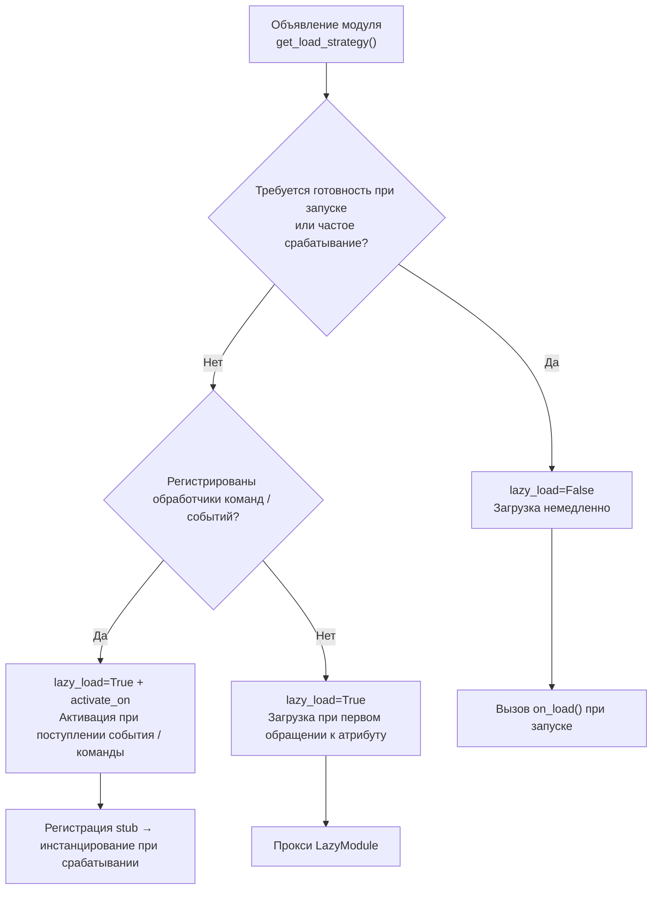

### Рекомендованные сценарии использования ленивой загрузки (lazy_load=True)

- Инструментальные классы, вызываемые пассивно (например, модуль запросов данных, преобразователи форматов и т.д., которые нужны только при вызове из других модулей)
- Модули, зарегистрировавшие обработчики команд / событий, но используемые нечасто — в сочетании с `activate_on` можно объявить триггер, автоматически активирующий модуль при поступлении первого соответствующего события / команды, без отказа от ленивой загрузки

### Рекомендованные сценарии отключения ленивой загрузки (lazy_load=False)

- Модули, требующие готовности при запуске (например, основные модули, предоставляющие базовые сервисы другим модулям)
- Часто вызываемые слушатели (каждое сообщение должно обрабатываться) — `activate_on` имеет небольшую стоимость активации, поэтому для сценариев с высокой частотой вызовов прямая загрузка предпочтительнее
- Модули с планировщиком задач
- Модули, требующие инициализации при запуске приложения

> Параметр `priority` управляет порядком инициализации модулей, загруженных немедленно: чем больше значение, тем раньше модуль будет инициализирован. Модули с одинаковым приоритетом загружаются в порядке их регистрации.

## Примечания

1. Если ваш модуль использует ленивую загрузку, и если другие модули никогда не вызывались внутри ErisPulse, ваш модуль никогда не будет инициализирован.
2. Если ваш модуль содержит такие компоненты, как модули, слушающие события, или другие активно слушающие модули, у вас есть два варианта: объявить триггер `activate_on` (сохранить ленивую загрузку, автоматически активировать при поступлении события) или объявить, что он должен быть загружен немедленно (`lazy_load=False`), иначе это повлияет на нормальное функционирование вашего модуля.
3. Мы не рекомендуем отключать ленивую загрузку, если только у вас нет особых потребностей, иначе это может привести к проблемам с зависимостями и событиями жизненного цикла.
4. В командном словаре `activate_on` объявления, `name` должен совпадать с реальным именем команды, зарегистрированной в модуле `on_load` с помощью `@command()` — в противном случае, после активации модуля, команда-заполнитель будет отменена, и команда, объявленная не соответствующая реализации, не будет существовать.


### 生命周期管理

# Управление жизненным циклом

ErisPulse предоставляет единый систему хуков/жизненного цикла, предназначенную для мониторинга состояния работы различных компонентов системы, а также для реализации расширенных функций, таких как аудит, статистика и пользовательская логика.

Система поддерживает три способа запуска:
- `await lifecycle.emit("event", data)` — упрощённая версия, передача произвольных данных (направленная доставка при `to="Owner"`)
- `lifecycle.emit_sync("event", data)` — синхронная версия (используется в контекстах, не поддерживающих асинхронность)
- `await lifecycle.submit_event("event", ...)` — совместимая со старой версией, автоматическое построение стандартного формата события

## Механизм обработки событий

### Регистрация обработчиков

```python
from ErisPulse import sdk

# Регистрация через декоратор
@sdk.lifecycle.on("module.load")
async def on_module_load(data):
    print(f"Загрузка модуля: {data}")

# Регистрация через программный вызов
sdk.lifecycle.register("module.load", on_module_load, priority=10)

# Отмена регистрации
sdk.lifecycle.unregister("module.load", on_module_load)

# Массовая отмена по владельцу (автоматически вызывается при выгрузке модуля/адаптера)
removed = sdk.lifecycle.unregister_by_owner("MyModule")
print(f"Удалено {removed} хуков жизненного цикла")
```

### Приоритеты

Обработчики поддерживают параметр `priority`, чем больше значение, тем раньше он будет выполнен (аналогично загрузчику модулей):

```python
@sdk.lifecycle.on("adapter.event.receive", priority=10)  # Выполняется первым
async def first_handler(data):
    pass

@sdk.lifecycle.on("adapter.event.receive", priority=0)  # Выполняется позже
async def second_handler(data):
    pass
```

### События с точечной структурой

При срабатывании конкретного события также срабатывают его родительские события:
- Срабатывание `module.load` также вызывает `module`
- Срабатывание `adapter.event.receive` также вызывает `adapter.event` и `adapter`

### Шаблоны (wildcards)

Регистрация `*` позволяет поймать все события:

```python
@sdk.lifecycle.on("*")
async def on_anything(data):
    print(f"Получено событие: {data}")
```

### Направленная рассылка (emit to=)

> [!NOTE]
> Эта функция доступна начиная с ErisPulse **2.8.0+**.

При использовании параметра `to` в `emit()` происходит направленная рассылка: событие будет доставлено только тем обработчикам, которые зарегистрированы с указанным владельцем (хуки, зарегистрированные в `on_load` модуля, автоматически принадлежат этому модулю), остальные модули и обработчики с шаблоном `*` не получат событие.

```python
# Отправка: событие доставляется только хукам, зарегистрированным в модуле Chat
await sdk.lifecycle.emit("message_received", {"text": "hi"}, to="Chat")

# Подписка (внутри модуля Chat): регистрация хука с тем же именем, владелец автоматически сохраняется
@sdk.lifecycle.on("message_received")
async def on_message_received(data): ...

@sdk.lifecycle.on("message")   # Родительские префиксы также действуют (фильтрация по владельцу)
async def on_any(data): ...
```

- Если у целевого владельца нет зарегистрированных хуков → событие **тихо отбрасывается** (можно заранее проверить с помощью `has_handlers()`)
- При `data` в виде dict автоматически добавляется `_trace_id` (без перезаписи уже существующего значения)
- `emit_sync` / `submit_event` также поддерживают параметр `to=`
- Трехуровневая модель модульного взаимодействия (RPC / направленная / широковещательная) описана в [Модульное взаимодействие](module-communication.md)

### Однократная регистрация (once)

Начиная с версии 2.7.0, обработчики, зарегистрированные через `lifecycle.once()`, автоматически удаляются после первого срабатывания, что удобно для "одноразовых" хуков типа "первичная готовность":

```python
@sdk.lifecycle.once("core.init.complete")
async def on_first_ready(data):
    print("Первичная готовность, дальнейшие срабатывания не произойдут")
```

- Приоритет обработчиков определяется так же, как и в `on()` (`priority`, чем больше, тем раньше)
- Автоматическая отмена регистрации, без необходимости ручного вызова `unregister`
- Поддерживается как синхронные, так и асинхронные обработчики

### Проверка наличия слушателей (has_handlers)

Для оптимизации производительности, в критичных по времени участках кода можно сначала проверить наличие обработчиков с помощью `has_handlers()`, чтобы избежать ненужного перебора событий и запуска задач:

```python
if sdk.lifecycle.has_handlers("message.sending"):
    await sdk.lifecycle.emit("message.sending", send_ctx)
```

- Проверка охватывает три типа совпадений: точное имя события, шаблон `*`, родительские события
- Возвращает `False`, если слушателей нет, что позволяет безопасно пропустить `emit`

## Обзор точек остановки хука

Типичный порядок событий жизненного цикла сообщения от платформы до завершения обработки в рамках фреймворка:

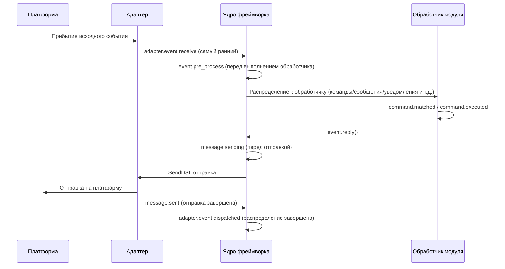

Фреймворк содержит следующие точки остановки хука, которые пользователи могут прослушивать с помощью `@sdk.lifecycle.on()` для реализации пользовательской логики.

### Ядро инициализации

| Имя хука | Точка остановки | Данные |
|---------|---------|------|
| `core.init.start` | Начало инициализации SDK | `{}` |
| `core.init.stage` | Начало этапа инициализации (выдается в фоновом режиме) | `{"stage": str}`, значения: `discovery` / `adapter_register` / `adapter_start` / `module_register` / `module_init` / `adapter_start_deferred` / `router_start` |
| `core.init.complete` | Завершение инициализации SDK | `{"duration": float, "success": bool, "stages": {stage: float}, "adapters": {"enabled": [str], "disabled": [str]}, "modules": {"enabled": [str], "disabled": [str]}, "error": str (только при неудаче)}` |
| `core.uninit.complete` | Завершение обратной инициализации SDK | `{"duration": float, "success": bool, "adapters_closed": int, "modules_unloaded": int, "module_properties_cleared": int, "module_properties_to_clear": [str], "error": str (только при неудаче)}` |

**Пример: отображение прогресса запуска**

```python
@sdk.lifecycle.on("core.init.stage")
def show_stage(data):
    print(f"[Запуск] Вход в этап: {data['stage']}")
```

### Изменение конфигурации

| Имя хука | Точка остановки | Данные |
|---------|---------|------|
| `config.set` | Изменение параметра конфигурации | `{"key": str, "old_value": Any, "new_value": Any}` |
| `config.updated` | Обнаружено изменение всей конфигурации после редактирования config.toml | `{"old_config": dict, "new_config": dict, "config_file": str}` |

**Пример: аудит конфигурации**

```python
@sdk.lifecycle.on("config.set")
def audit_config(data):
    print(f"[Аудит] {data['key']}: {data['old_value']} -> {data['new_value']}")
```

### Жизненный цикл модуля

| Имя хука | Точка остановки | Данные |
|---------|---------|------|
| `module.register` | Регистрация класса модуля в менеджере | `{"module_name": str, "success": bool}` |
| `module.load` | Завершение загрузки модуля (успешное инстанцирование) | `{"module_name": str, "success": bool}` |
| `module.init` | Завершение инициализации модуля (включая ленивую загрузку) | `{"module_name": str, "success": bool}` |
| `module.unload` | Выгрузка модуля | `{"module_name": str, "success": bool}` |
| `module.reload` | Завершение горячей перезагрузки модуля (включая перезагрузку зависимостей) | `{"module_name": str, "success": bool}` |

### Жизненный цикл адаптера

| Имя хука | Точка остановки | Данные |
|---------|---------|------|
| `adapter.load` | Завершение регистрации адаптера | `{"platform": str, "success": bool}` |
| `adapter.start` | Запуск адаптера | `{"platforms": [str]}` |
| `adapter.status.change` | Изменение состояния адаптера | `{"platform": str, "status": str, "retry_count": int, "error": str (только при неудаче)}` |
| `adapter.stop` | Остановка адаптера | `{"platforms": [str]}` |
| `adapter.stopped` | Завершение остановки адаптера | `{"platforms": [str]}` |
| `adapter.bot.online` | Онлайн бота | `{"platform": str, "bot_id": str, "info": dict, "status": str}` |
| `adapter.bot.offline` | Оффлайн бота | `{"platform": str, "bot_id": str, "status": str}` |

### Прием и обработка событий

| Имя хука | Точка остановки | Данные |
|---------|---------|------|
| `adapter.event.receive` | Получение внешнего события платформы (самый ранний) | `{"platform": str, "event_type": str, "raw_event_type": str}` |
| `adapter.event.dispatched` | Завершение распределения события | `{"platform": str, "event_type": str, "raw_event_type": str, "onebot_handlers_count": int}` |
| `event.pre_process` | Начало выполнения обработчика события | `{"event_type": str, "platform": str, "detail_type": str}` |

**Пример: статистика событий**

```python
event_counter = {}

@sdk.lifecycle.on("adapter.event.receive")
def count_events(data):
    platform = data["platform"]
    event_counter[platform] = event_counter.get(platform, 0) + 1

@sdk.lifecycle.on("adapter.event.dispatched")
def log_unhandled(data):
    if data["onebot_handlers_count"] == 0:
        print(f"[Необработано] {data['platform']}/{data['event_type']}")
```

### Отправка сообщений

| Имя хука | Точка остановки | Данные |
|---------|---------|------|
| `message.sending` | Сообщение готовится к отправке | `{"platform": str, "method": str, "detail_type": str, "target_id": str, "bot_id": str}` |
| `message.sent` | Сообщение отправлено | `{"platform": str, "method": str, "detail_type": str, "target_id": str, "bot_id": str}` |

**Пример: аудит отправки сообщений**

```python
@sdk.lifecycle.on("message.sending")
def log_sending(data):
    print(f"[Отправка] -> {data['platform']}/{data['detail_type']}/{data['target_id']} через {data['method']}")
```

### Командная система

| Имя хука | Точка остановки | Данные |
|---------|---------|------|
| `command.matched` | Команда сопоставлена и готова к выполнению | `{"command": str, "args": list[str], "platform": str, "user_id": str}` |
| `command.executed` | Команда выполнена | `{"command": str, "args": list[str], "platform": str, "user_id": str, "success": bool, "error": str (только при неудаче)}` |

**Пример: статистика команд**

```python
@sdk.lifecycle.on("command.matched")
def count_commands(data):
    print(f"[Команда] /{data['command']} от {data['user_id']}@{data['platform']}")
```

### HTTP-маршрутизация

| Имя хука | Точка остановки | Данные |
|---------|---------|------|
| `server.request` | Получение HTTP-запроса | `{"method": str, "path": str, "client_ip": str}` |
| `server.response` | Отправка HTTP-ответа | `{"method": str, "path": str, "status_code": int, "client_ip": str}` |

**Пример: логирование HTTP-запросов**

```python
@sdk.lifecycle.on("server.response")
def log_http(data):
    print(f"[HTTP] {data['method']} {data['path']} -> {data['status_code']}")
```

### WebSocket

| Имя хука | Точка остановки | Данные |
|---------|---------|------|
| `server.start` | Запуск маршрутизатора сервера | `{"base_url": str, "host": str, "port": int, "success": bool, "error": str (только при неудаче)}` |
| `server.stop` | Остановка маршрутизатора сервера | `{}` |
| `server.websocket.connect` | Установление WebSocket-соединения | `{"path": str, "module_name": str, "client_ip": str}` |
| `server.websocket.disconnect` | Разрыв WebSocket-соединения | `{"path": str, "module_name": str, "reason": str, "error": str (только при аномалии)}` |

**Пример: мониторинг WebSocket-соединений**

```python
@sdk.lifecycle.on("server.websocket.connect")
def on_ws_connect(data):
    print(f"[WS] Подключение: {data['path']} от {data['client_ip']}")

@sdk.lifecycle.on("server.websocket.disconnect")
def on_ws_disconnect(data):
    print(f"[WS] Отключение: {data['path']} ({data['reason']})")
```

### Состояние подключения к хранилищу

Создание, сбой и восстановление пула подключений к хранилищу (все события происходят в фоновом режиме, не блокируют операции хранилища):

| Имя хука | Точка остановки | Данные |
|---------|---------|------|
| `storage.ready` | Пул подключений к хранилищу готов (первое успешное создание пула в каждом цикле событий) | `{"backend": str}` |
| `storage.unreachable` | Повторные попытки подключения исчерпаны, вступает период охлаждения (в течение которого операции завершаются мгновенно с ошибкой) | `{"backend": str, "error": str, "cooldown": float}` |
| `storage.recovered` | Период охлаждения завершен, повторное подключение успешно, хранилище снова доступно | `{"backend": str}` |

**Пример: оповещение о сбое хранилища**

```python
@sdk.lifecycle.on("storage.unreachable")
def alert_storage_down(data):
    print(f"[Предупреждение] Хранилище {data['backend']} недоступно: {data['error']}, автоматическое переподключение через {data['cooldown']} секунд")

@sdk.lifecycle.on("storage.recovered")
def notify_storage_back(data):
    print(f"[Восстановление] Хранилище {data['backend']} снова доступно")
```

### HTTP-клиент

События запросов и подключений `sdk.client` (все события происходят в фоновом режиме):

| Имя хука | Точка остановки | Данные |
|---------|---------|------|
| `client.request.success` | Успешный HTTP-запрос | `{"method": str, "url": str, "status": int, "elapsed": float}` |
| `client.request.failed` | HTTP-запрос неудачен после исчерпания попыток повтора | `{"method": str, "url": str, "error": str, "attempts": int, "elapsed": float}` |
| `client.ws.connect` | Установление WebSocket-соединения | `{"url": str}` |

### Межкультурная локализация

| Имя хука | Точка остановки | Данные |
|---------|---------|------|
| `i18n.language.changed` | Смена языка фреймворка (через `i18n.set_language`) | `{"language": str, "previous": str}` |

## Определение стандартных событий

```python
СТАНДАРТНЫЕ_СОБЫТИЯ = {
    "core": ["init.start", "init.stage", "init.complete", "uninit.complete"],
    "module": ["load", "init", "unload", "register", "reload"],
    "adapter": [
        "load", "start", "status.change", "stop", "stopped",
        "event.receive", "event.dispatched",
        "bot.online", "bot.offline",
    ],
    "server": [
        "start", "stop",
        "request", "response",
        "websocket.connect", "websocket.disconnect",
    ],
    "event": ["pre_process"],
    "message": ["sending", "sent"],
    "command": ["matched", "executed"],
    "config": ["set", "updated"],
    "storage": ["ready", "unreachable", "recovered"],
    "client": ["request.success", "request.failed", "ws.connect"],
    "i18n": ["language.changed"],
}
```

## Полная справочная документация API

### Регистрация и отмена

| Метод | Описание |
|------|------|
| `@lifecycle.on(event, *, priority=0)` | Декоратор для регистрации обработчика |
| `lifecycle.register(event, handler, *, priority=0)` | Программная регистрация |
| `lifecycle.unregister(event, handler=None)` | Отмена регистрации (если `handler=None`, отменяются все обработчики события) |

### Вызов

| Метод | Описание |
|------|------|
| `await lifecycle.emit(event, data=None, *, to=None)` | Асинхронный вызов, обработчики выполняются **параллельно** (не блокируются друг другом, возвращаются, когда все завершены), возвращаемые значения не None возвращаются по приоритету в виде цепочки замены `data`; `to` указывает `owner` для направленной доставки |
| `lifecycle.fire(event, data=None, *, to=None)` | **Фоновый вызов (бросил в ведро и ушел)**: обработчики выполняются в фоновых задачах параллельно, без ожидания, без возвращаемого значения; при отсутствии слушателей нулевые накладные расходы. Подходит для частых горячих путей и чисто наблюдаемых событий; для последовательных и чувствительных к порядку потребителей (например, `config.set`) используйте `emit` |
| `lifecycle.emit_sync(event, data=None, *, to=None)` | Синхронный вызов, асинхронные обработчики планируются с помощью `create_task` |
| `await lifecycle.submit_event(event_type, *, source, msg, data, to=None, background=False)` | Совместимость со старой версией, автоматически строит стандартный формат события; при `background=True` используется фоновый вызов `fire` |

### Инструменты

| Метод | Описание |
|------|------|
| `lifecycle.start_timer(timer_id)` | Начать отсчет времени |
| `lifecycle.get_duration(timer_id)` | Получить прошедшее время (в секундах) |
| `lifecycle.stop_timer(timer_id)` | Остановить отсчет времени и вернуть прошедшее время |
| `lifecycle.list_hooks()` | Вывести список всех зарегистрированных хуков и количество обработчиков |
| `lifecycle.clear()` | Очистить все обработчики и таймеры |

## Пример использования в модуле

```python
from ErisPulse.Core.Bases import BaseModule
from ErisPulse import sdk

class Main(BaseModule):
    async def on_load(self, event):
        # Реализация простой статистики сообщений
        self.msg_count = 0
        
        @sdk.lifecycle.on("adapter.event.receive")
        async def count(data):
            if data["event_type"] == "message":
                self.msg_count += 1
        
        # Мониторинг всех команд
        @sdk.lifecycle.on("command.matched")
        async def log_cmd(data):
            sdk.logger.info(f"Команда выполнена: /{data['command']} от {data['user_id']}")
        
        # Аудит изменений конфигурации
        @sdk.lifecycle.on("config.set")
        def audit(data):
            sdk.logger.info(f"Изменение конфигурации: {data['key']} = {data['new_value']}")
```

## Принадлежность и автоматическое отмена фоновых задач

> [!NOTE]
> Эта функция доступна в ErisPulse **2.8.0+**.

Фоновые задачи asyncio, созданные модулем, если не отменены в `on_unload`, будут удерживать ссылку на `self`, что мешает сборке мусора для экземпляра модуля (старые экземпляры остаются после горячей перезагрузки). Рамка предоставляет следующие механизмы по умолчанию:

- **`self.spawn(coro)`** (рекомендуется в модуле): задача автоматически присваивается имени модуля, и при выгрузке модуля рамка в `on_unload` **после** отменяет неоконченные задачи и записывает предупреждение
- **`spawn_background(coro)`** (`ErisPulse.runtime`): автоматически захватывает текущий контекст `owner_scope`; `cancel_owner_tasks(owner)` отменяет задачи по принадлежности, `cancel_all_background_tasks()` используется для `sdk.uninit()` по умолчанию
- **Адаптеры**: при закрытии адаптера также отменяются фоновые задачи, принадлежащие имени платформы

```python
async def on_load(self, event):
    # Рекомендуется: фоновые задачи использовать self.spawn(), при выгрузке рамка автоматически отменяет
    self.spawn(self._poll())

async def on_unload(self, event):
    # В сценариях с тонкой настройкой по-прежнему рекомендуется отменить и дождаться завершения
    if self._poll_task:
        self._poll_task.cancel()
        await asyncio.gather(self._poll_task, return_exceptions=True)

async def _poll(self):
    while True:
        await asyncio.sleep(60)
        ...
```

> [!IMPORTANT]
> Рамка по умолчанию **принудительно отменяет** задачи (`cancel_owner_tasks`), это происходит после возврата из `on_unload`. Поэтому задачи, требующие аккуратного завершения (очистка буфера, сохранение состояния, закрытие соединений), **обязательно** должны быть отменены и завершены в `on_unload` — не рассчитывайте, что по умолчанию сохранится логика завершения. Рамка гарантирует только «отсутствие задач, удерживающих `self»`, но не «аккуратное» завершение. Задачи, требующие `await` результата, следует вызывать напрямую `await`, а не передавать в фоновую задачу.

## Примечания

1. **Обработчики могут быть синхронными или асинхронными**: система автоматически определяет и правильно вызывает их
2. **Передача данных**: в режиме `emit()`, если обработчик возвращает значение, отличное от None, это изменит данные, передаваемые следующим обработчикам
3. **Нормы именования событий**: рекомендуется использовать точечную структуру для именования событий, что упрощает использование родительских слушателей
4. **Изоляция ошибок**: исключение в одном обработчике не влияет на выполнение других обработчиков
5. **Ограничения синхронного триггера**: в `emit_sync()` асинхронные обработчики запускаются в режиме fire-and-forget, и возвращаемые значения не могут быть переданы обратно
6. **Очистка жизненного цикла**: при вызове `sdk.uninit()` все зарегистрированные обработчики и таймеры будут очищены
7. **Приоритет загрузки**: если необходимо слушать события на этапе инициализации фреймворка, рекомендуется установить высокий приоритет и отключить ленивую загрузку


### 路由系统

# Маршрутизатор

Маршрутизатор ErisPulse обеспечивает единое управление HTTP и WebSocket маршрутизацией, поддерживает регистрацию маршрутов с несколькими адаптерами и управление их жизненным циклом. В основе лежит абстрактный слой (в настоящее время FastAPI + Uvicorn).

## Обзор

Основные функции маршрутизатора:

- **Декоратор маршрутов**: поддержка быстрой регистрации маршрутов с помощью декораторов `@http` / `@get` / `@post` / `@put` / `@delete` / `@ws`
- **Автоматическая инъекция**: обработчики маршрутов не требуют импорта типов FastAPI, фреймворк автоматически инжектирует абстрактные объекты
- **Группировка маршрутов**: поддержка `RouteGroup` с префиксом и номером версии
- **Маршрутизатор промежуточного ПО**: поддержка глобального режима сопоставления для перехвата запросов
- **Ограничение скорости**: встроенный скользящий оконный режим ограничения
- **Поддержка CORS**: включение кросс-доменного资源共享 одним кликом
- **Безопасные заголовки**: автоматическое добавление безопасных заголовков ответа
- **Автоматическая документация**: интерактивная документация на основе OpenAPI
- **Поддержка WebSocket**: полное управление подключениями WebSocket, пользовательская аутентификация и жизненный цикл
- **Интеграция жизненного цикла**: глубокая интеграция с системой жизненного цикла ErisPulse
- **Поддержка SSL/TLS**: поддержка безопасных соединений HTTPS и WSS
- **Главная точка входа**: поддержка модуля с быстрой регистрацией кнопки входа по корневому маршруту `/`, поддержка локализации

## Абстрактные типы

ErisPulse предоставляет абстрактные типы сервера, которые позволяют модулям не зависеть напрямую от FastAPI:

| Абстрактный тип | Соответствие FastAPI | Описание |
|----------------|----------------------|----------|
| `HttpRequest` | `fastapi.Request` | Обёртка над HTTP-запросом, полная совместимость интерфейса |
| `WebSocketConnection` | `fastapi.WebSocket` | Обёртка над WebSocket-соединением, дополнительные хуки жизненного цикла |
| `WebSocketDisconnect` | `fastapi.WebSocketDisconnect` | Исключение при разрыве WebSocket-соединения |

> `WebSocketConnection` наследуется от `WebSocketConnectionBase` и разделяет с клиентским WebSocket (`ClientWebSocket`) одинаковые интерфейсы send/receive/iter/close. Бизнес-логика может быть одинаковой как для клиента, так и для сервера.
>
> С помощью свойства `.raw` можно получить доступ к базовому объекту FastAPI. Код, использующий типы FastAPI, также полностью совместим.

## Декораторы маршрутов (рекомендуется)

### HTTP декораторы

```python
from ErisPulse.Core import router
@router.get("my_module", "/info")
async def get_info(request):
    return {"method": request.method, "path": str(request.url)}

# Также можно явно указать абстрактный тип
from ErisPulse.Core import HttpRequest

@router.post("my_module", "/data")
async def post_data(request: HttpRequest):
    data = await request.json()
    return {"received": data}

@router.put("my_module", "/data/{item_id}")
async def update_data(request):
    return {"updated": True}

@router.delete("my_module", "/data/{item_id}")
async def delete_data(request):
    return {"deleted": True}
```

> **Правила автоматической инъекции**: если первый параметр обработчика имеет имя `request` или `req` и не имеет аннотации типа FastAPI, фреймворк автоматически инжектирует `HttpRequest`. Обработчики без параметров или с параметрами, не являющимися именем запроса, не затрагиваются.

### WebSocket декораторы

```python
from ErisPulse.Core import WebSocketConnection, WebSocketDisconnect

# Базовый WebSocket
@router.ws("my_module", "/ws")
async def websocket_handler(ws):
    async for msg in ws.iter_text():
        await ws.send_text(f"Echo: {msg}")

# WebSocket с хуками жизненного цикла
@router.ws("my_module", "/ws/chat")
async def chat(ws: WebSocketConnection):
    @ws.on_disconnect
    async def on_disconnect(ws, reason="unknown"):
        print(f"Пользователь отключился: {reason}")

    @ws.on_error
    async def on_error(ws, error=""):
        print(f"Ошибка соединения: {error}")

    async for msg in ws.iter_text():
        await ws.send_text(f"Echo: {msg}")

# WebSocket с аутентификацией
async def ws_auth(ws: WebSocketConnection) -> bool:
    token = ws.query_params.get("token")
    return token == "secret"

@router.ws("my_module", "/secure_ws", auth_handler=ws_auth)
async def secure_ws_handler(ws):
    while True:
        data = await ws.receive_text()
        await ws.send_text(f"Echo: {data}")
```

> **Примечание**: WebSocket обработчики и обработчики аутентификации также поддерживают автоматическую инъекцию. `WebSocketConnection` можно получить без аннотации параметра. Использование аннотации `fastapi.WebSocket` также передаст оригинальный объект, но рекомендуется использовать абстрактный тип.

## Традиционный способ регистрации

```python
async def hello_handler(request):
    return {"message": "Hello World"}

# Базовая регистрация
router.register_http_route(
    module_name="my_module",
    path="/hello",
    handler=hello_handler,
    methods=["GET"],
)

# С ограничением частоты и документацией
router.register_http_route(
    module_name="my_module",
    path="/api/data",
    handler=data_handler,
    methods=["POST"],
    rate_limit="10/minute",
    summary="Интерфейс данных",
    tags=["API"],
)
```

### Регистрация WebSocket

```python
from ErisPulse.Core import WebSocketConnection

async def websocket_handler(ws: WebSocketConnection):
    async for msg in ws.iter_text():
        await ws.send_text(f"Echo: {msg}")

# Базовая регистрация
router.register_websocket(
    module_name="my_module",
    path="/ws",
    handler=websocket_handler,
)

# Регистрация с аутентификацией (рекомендуется)
async def auth_handler(ws: WebSocketConnection) -> bool:
    token = ws.query_params.get("token")
    return token == "secret"

router.register_websocket(
    module_name="my_module",
    path="/secure_ws",
    handler=websocket_handler,
    auth_handler=auth_handler,
)
```

**Описание параметров:**

| Параметр | Описание | Значение по умолчанию |
|----------|----------|-----------------------|
| `module_name` | Имя модуля (обязательно) | - |
| `path` | Путь WebSocket | - |
| `handler` | Обработчик | - |
| `auth_handler` | Функция аутентификации, возвращает `False` для автоматического закрытия соединения | `None` |
| `auto_accept` | Автоматически вызывать `accept()` | `True` |

> **Рекомендуется** использовать `auth_handler` для подтверждения соединения, а не отключать `auto_accept`. Установите `auto_accept=False` только в том случае, если вам нужно полностью контролировать процесс подключения.

## WebSocket 生命周期钩子

`WebSocketConnection` позволяет зарегистрировать обратные вызовы при отключении и ошибках, без необходимости использовать try/catch вручную:

```python
from ErisPulse.Core import WebSocketConnection

@router.ws("my_module", "/ws")
async def my_ws(ws: WebSocketConnection):
    # Регистрация через декоратор
    @ws.on_disconnect
    async def on_close(ws, reason="unknown"):
        print(f"Причина отключения: {reason}")

    # Также можно вызвать напрямую
    async def on_err(ws, error=""):
        print(f"Ошибка: {error}")
    ws.on_error(on_err)

    # Основная бизнес-логика
    async for msg in ws.iter_text():
        await ws.send_text(f"Эхо: {msg}")
```

## Группировка маршрутов

```python
# Создание группы маршрутов с префиксом
group = router.group("my_module", prefix="/v1")

@group.get("/users")
async def list_users(request):
    return {"users": []}

@group.post("/users")
async def create_user(request):
    return {"created": True}

# Фактический путь: /my_module/v1/users
```

## Маршрутизация промежуточного программного обеспечения

Промежуточное программное обеспечение поддерживает сопоставление с помощью шаблонов glob:

```python
@router.middleware("/my_module/*")
async def auth_middleware(request, call_next):
    token = request.headers.get("Authorization")
    if not token:
        return {"error": "Unauthorized"}
    return await call_next(request)

@router.middleware("/my_module/admin/*")
async def admin_middleware(request, call_next):
    return await call_next(request)
```

## Идентификатор запроса (X-Request-ID)

Начиная с версии 2.7.0, каждый HTTP-запрос содержит идентификатор `X-Request-ID`, используемый для логирования и трассировки цепочек:

- **Правила генерации**: приоритетно используется заголовок `X-Request-ID`, переданный клиентом (для распределённой трассировки); в противном случае генерируется UUID
- **Заголовок ответа**: ответ также содержит `X-Request-ID`, что позволяет клиенту сопоставить запрос с логами
- **События жизненного цикла**: в данных событий `server.request` и `server.response` добавлено поле `request_id`

```python
# В модуле отслеживайте события запроса, используя request_id для сопоставления запроса и ответа
@sdk.lifecycle.on("server.request")
async def on_request(data):
    print(f"[{data['request_id']}] {data['method']} {data['path']}")

@sdk.lifecycle.on("server.response")
async def on_response(data):
    print(f"[{data['request_id']}] -> {data['status_code']}")
```

Клиент может задать собственный ID для трассировки между сервисами:

```bash
curl -H "X-Request-ID: my-trace-id" http://localhost:8080/my_module/health
```

## Ограничение скорости

Ограничение скорости маршрутов осуществляется с использованием алгоритма скользящего окна:

```python
@router.get("my_module", "/limited", rate_limit="10/minute")
async def limited_endpoint(request):
    return {"ok": True}

@router.post("my_module", "/submit", rate_limit="5/minute")
async def submit_data(request):
    return {"submitted": True}
```

Формат ограничения скорости: `{количество}/{временной интервал}`, например `10/minute`, `100/hour`.

## CORS Configuration

```python
router.setup_cors(
    allow_origins=["https://example.com"],
    allow_methods=["GET", "POST"],
    allow_headers=["*"],
)
```

CORS can also be configured via `config.toml`:

```toml
[router.cors]
allow_origins = ["https://example.com"]
allow_methods = ["GET", "POST"]
allow_headers = ["*"]
```

## Заголовки безопасности

```python
router.setup_security_headers()
```

Автоматически добавляются заголовки безопасности, такие как `X-Content-Type-Options`, `X-Frame-Options`, `X-XSS-Protection` и другие.

Также можно настроить через `config.toml`:

```toml
[router.security]
enabled = true
```

## Автоматическая документация

Router по умолчанию включает интерактивную документацию OpenAPI:

```python
# Отключить документацию
router.disable_docs()

# Настроить информацию о документации
router.set_docs_info(
    title="Мой API",
    description="Документация API",
    version="1.0.0"
)
```

## Обработка путей

Пути маршрутизации автоматически добавляют имя модуля в качестве префикса, чтобы избежать конфликтов:

```python
# Регистрация пути "/api" для модуля "my_module"
# Фактический доступный путь: "/my_module/api"
router.register_http_route("my_module", "/api", handler)
```

## Системные маршруты

Менеджер маршрутизации автоматически предоставляет следующие системные маршруты:

### Проверка работоспособности

```
GET /health
# Возвращает:
{"status": "ok", "service": "ErisPulse Router"}
```

### Главная страница

```
GET /
# Возвращает страницу бренда ErisPulse
```

Корневой маршрут `/` отображает страницу бренда ErisPulse, автоматически определяет доступность Dashboard и добавляет кнопку входа.

## Главная точка входа

Менеджер маршрутизации позволяет внешним модулям регистрировать кнопки быстрого доступа на корневом маршруте `/`, что упрощает пользователям быстрый переход на страницы управления соответствующих модулей.

### Регистрация входа

```python
# Простая регистрация
router.register_home_entry(
    name="Моя панель",
    url="/mymodule/admin",
)

# Регистрация с иконкой (SVG)
router.register_home_entry(
    name="Консоль",
    url="/console",
    icon_svg='<svg width="18" height="18" viewBox="0 0 24 24" fill="none" stroke="currentColor" stroke-width="1.8"><path d="M4 17l6-6-6-6"/><path d="M12 19h8"/></svg>',
)

# Регистрация с поддержкой международизации (формат словаря i18n проекта)
router.register_home_entry(
    name={"i18n": "mymodule.home.entry", "default": "Моя панель"},
    url="/mymodule/admin",
)
```

**Описание параметров:**

| Параметр | Тип | Описание | Обязателен |
|----------|------|----------|-----------|
| `name` | `str` / `dict` | Текст отображения кнопки; при передаче словаря `{"i18n": "key", "default": "текст"}` используется международизация | Да |
| `url` | `str` | Адрес ссылки кнопки | Да |
| `icon_svg` | `str` | Необязательный SVG-код иконки | Нет |

### Автоматическая регистрация Dashboard

При обнаружении доступности `sdk.Dashboard`, менеджер маршрутизации автоматически добавляет кнопку Dashboard в начало списка входов, без необходимости ручной регистрации.

## Интеграция жизненного цикла

```python
from ErisPulse.Core import lifecycle

@lifecycle.on("server.start")
async def on_server_start(event):
    print(f"Сервер запущен: {event['data']['base_url']}")

@lifecycle.on("server.stop")
async def on_server_stop(event):
    print("Сервер останавливается...")
```

## Рекомендуемые практики

1. **Предпочтение абстрактным типам**: Используйте `HttpRequest` / `WebSocketConnection` вместо `fastapi.Request` / `fastapi.WebSocket`, чтобы избежать жесткой привязки
2. **Использование автоматической инъекции**: Первый параметр обработчика должен называться `request` или `req`, чтобы получить `HttpRequest` без каких-либо аннотаций типов
3. **Явное передача module_name**: Первый аргумент декоратора должен быть именем модуля, его нельзя опускать
4. **Использование группировки маршрутов**: Для нескольких маршрутов одного модуля используйте `group()` для организации
5. **Рассмотрение безопасности**: Реализуйте механизмы аутентификации и безопасные заголовки для чувствительных операций
6. **Разумное ограничение скорости**: Установите ограничение скорости для интерфейсов с высокой частотой вызовов
7. **Использование циклов жизненного цикла**: Используйте `@ws.on_disconnect` / `@ws.on_error` для обработки исключений WebSocket, избегая ручного try/catch


### MessageBuilder 详解

# MessageBuilder — подробное руководство

`MessageBuilder` — это инструмент для построения сообщений стандарта OneBot12, предоставляемый ErisPulse. Он предназначен для построения структурированного содержимого сообщений и используется в сочетании с `Send.Raw_ob12()`.

## Способы импорта

`MessageBuilder` поддерживает два способа импорта (результат одинаковый, рекомендуется использовать первый):

```python
from ErisPulse.Core.Event import MessageBuilder        # Рекомендуется, через пакет
from ErisPulse.Core.Event.message_builder import MessageBuilder  # Прямой импорт модуля
```

## Двухрежимная система

MessageBuilder предоставляет два режима использования, реализованных с помощью механизма описателей Python (`__get__`), обеспечивающих различное поведение на уровне класса и экземпляра: при вызове метода через класс `__get__` возвращает результат выполнения статического метода; при вызове через экземпляр возвращает `self`, что поддерживает цепочечный вызов.

### Режим цепочечного вызова (экземпляр)

Используется путем создания экземпляра `MessageBuilder()`. Каждый метод возвращает `self`, что поддерживает цепочечный вызов, и в конце `.build()` используется для получения списка сообщений:

```python
from ErisPulse.Core.Event.message_builder import MessageBuilder

segments = (
    MessageBuilder()
    .text("Привет!")
    .image("https://example.com/photo.jpg")
    .build()
)
# [
#     {"type": "text", "data": {"text": "Привет!"}},
#     {"type": "image", "data": {"file": "https://example.com/photo.jpg"}}
# ]
```

### Режим быстрого построения (статический)

Методы вызываются напрямую через класс, каждый метод возвращает список сообщений напрямую, что подходит для одиночных сообщений:

```python
# Возвращает list[dict] напрямую, без необходимости использовать .build()
segments = MessageBuilder.text("Привет!")
# [{"type": "text", "data": {"text": "Привет!"}}]
```

## Типы сегментов сообщений

| Метод | Тип | Параметры данных | Описание |
|------|------|---------|------|
| `text(text)` | text | `text` | Текстовое сообщение |
| `image(file)` | image | `file` | Сообщение с изображением |
| `audio(file)` | audio | `file` | Аудиосообщение |
| `video(file)` | video | `file` | Видеосообщение |
| `file(file, filename?)` | file | `file`, `filename` | Сообщение с файлом |
| `mention(user_id, user_name?)` | mention | `user_id`, `user_name` | Упоминание пользователя |
| `at(user_id, user_name?)` | mention | `user_id`, `user_name` | Синоним `mention` |
| `reply(message_id)` | reply | `message_id` | Ответ на сообщение |
| `at_all()` | mention_all | - | Упоминание всех участников |
| `custom(type, data)` | пользовательский | пользовательский | Пользовательский сегмент сообщения |

## Использование с Send

Построенный список сообщений отправляется с помощью `Send.Raw_ob12()`:

```python
from ErisPulse import sdk
from ErisPulse.Core.Event.message_builder import MessageBuilder

# Построение и отправка сообщения с использованием цепочки вызовов
segments = (
    MessageBuilder()
    .mention("user123", "张三")
    .text(" Пожалуйста, посмотрите на это изображение")
    .image("https://example.com/photo.jpg")
    .build()
)
await sdk.adapter.myplatform.Send.To("group", "group456").Raw_ob12(segments)
```

### Использование с Event для ответа

```python
from ErisPulse.Core.Event import command

@command("report")
async def report_handler(event):
    await event.reply_ob12(
        MessageBuilder()
        .text("📊 Сводка ежедневного отчёта\n")
        .text("Задачи, выполненные сегодня: 5\n")
        .text("Задачи, находящиеся в процессе: 3")
        .build()
    )
```

## Утилитные методы

### copy()

Копирует текущий билдер, используется для создания нескольких вариантов сообщений на основе одного и того же базового содержания:

```python
base = MessageBuilder().text("Базовое содержание").mention("admin")

# Создание разных сообщений на основе одного и того же префикса
msg1 = base.copy().text(" Вариант A").build()
msg2 = base.copy().text(" Вариант B").image("img.jpg").build()
```

### clear()

Очищает добавленные части сообщения, позволяет повторно использовать один и тот же билдер:

```python
builder = MessageBuilder()

for user_id in ["user1", "user2", "user3"]:
    builder.clear()
    msg = builder.mention(user_id).text(" Привет!").build()
    await adapter.Send.To("user", user_id).Raw_ob12(msg)
```

### len() / bool()

```python
builder = MessageBuilder()
print(bool(builder))   # False

builder.text("Hello")
print(len(builder))    # 1
print(bool(builder))   # True
```

## Пользовательские сообщения

Используйте метод `custom()`, чтобы добавить расширенный сегмент сообщения для конкретной платформы:

```python
# Добавление сегмента сообщения, специфичного для платформы
segments = (
    MessageBuilder()
    .text("Пожалуйста, заполните форму:")
    .custom("yunhu_form", {"form_id": "12345"})
    .build()
)
```

> Пользовательские сегменты сообщений действительны только в адаптерах соответствующих платформ, другие адаптеры игнорируют неизвестные сегменты сообщений.

## Полный пример

### Многоэлементное сообщение

```python
segments = (
    MessageBuilder()
    .reply(event.get_id())                    # Ответить на оригинальное сообщение
    .mention(event.get_user_id())             # Упомянуть отправителя
    .text(" Это результат вашего запроса:\n") # Текст
    .image("https://example.com/chart.png")   # Изображение
    .text("\nПодробные данные см. во вложении:")
    .file("https://example.com/data.csv", filename="data.csv")
    .build()
)
await event.reply_ob12(segments)
```

### Статический фабричный метод + цепочечная смесь

```python
# Быстрое создание односегментного сообщения
simple_msg = MessageBuilder.text("Простой текст")

# Цепочечное создание сложного сообщения
complex_msg = (
    MessageBuilder()
    .at_all()
    .text(" 📢 Объявление:")
    .text("Сегодня в 15:00 собрание")
    .build()
)
```


### Conversation 多轮对话

# Conversation Многошаговый диалог

Класс `Conversation` предоставляет удобные методы для многошагового взаимодействия в рамках одного сеанса, что подходит для реализации навигационных операций, сбора информации, диалоговых вопросов и ответов и т.д.

## Создание диалога

Создание с помощью метода `conversation()` объекта `Event`:

```python
from ErisPulse.Core.Event import command

@command("quiz")
async def quiz_handler(event):
    conv = event.conversation(timeout=30)

    await conv.say("🎮 Добро пожаловать в викторину!")

    answer = await conv.choose("Первый вопрос: Кто создатель Python?", [
        "Guido van Rossum",
        "James Gosling",
        "Dennis Ritchie",
    ])

    if answer is None:
        await conv.say("Время вышло, попробуйте в другой раз!")
        return

    if answer == 0:
        await conv.say("Правильно!")
    else:
        await conv.say("Неверно, правильный ответ — Guido van Rossum")

    conv.stop()
```

## Основные API

### say(content, **kwargs)

Отправка сообщения, возвращает `self` для цепочечного вызова:

```python
await conv.say("Первая строка").say("Вторая строка").say("Третья строка")
```

Также можно указать метод отправки:

```python
await conv.say("https://example.com/image.jpg", method="Image")
```

### wait(prompt=None, timeout=None)

Ожидание ответа пользователя, возвращает объект `Event` или `None` (при таймауте):

```python
# Простое ожидание
resp = await conv.wait()
if resp:
    text = resp.get_text()

# Ожидание с отправкой подсказки
resp = await conv.wait(prompt="Пожалуйста, введите ваше имя:")

# Использование пользовательского таймаута (переопределяет таймаут диалога)
resp = await conv.wait(prompt="Пожалуйста, ответьте в течение 10 секунд:", timeout=10)
```

### confirm(prompt=None, **kwargs)

Ожидание подтверждения пользователя (да/нет), возвращает `True` / `False` / `None` (при таймауте):

```python
result = await conv.confirm("Вы уверены, что хотите удалить все данные?")
if result is True:
    await conv.say("Удалено")
elif result is False:
    await conv.say("Отменено")
else:
    await conv.say("Таймаут, ответ не получен")
```

Встроенные слова для подтверждения: `да/yes/y/confirm/confirm/ok/true/правильно/да/хорошо/конечно/можно/согласен/нет проблем/в порядке...`

Встроенные слова для отрицания: `нет/no/n/cancel/отменить/не надо/нельзя/отказаться/не правильно/откажись/отказ...`

### choose(prompt, options, **kwargs)

Ожидание выбора пользователя из списка опций, возвращает индекс (начиная с 0) или `None`:

```python
choice = await conv.choose("Пожалуйста, выберите цвет:", ["красный", "зеленый", "синий"])
if choice is not None:
    colors = ["красный", "зеленый", "синий"]
    await conv.say(f"Вы выбрали {colors[choice]}")
```

Пользователь может выбрать, введя номер (`1`/`2`/`3`) или текст опции (`красный`).

`options_format="auto"` (по умолчанию) автоматически выбирает стиль в зависимости от метода: Markdown→ненумерованный список, Html→нумерованный список, иначе→простой текстовый список.
Также поддерживаются `"list"`、`"inline"`、`"md"`、`"html"` или пользовательская функция.

Поддержка `merge_prompt=True` для объединения в одно сообщение, а также поддержка плейсхолдера для позиционирования списка опций (по умолчанию `{options}`, можно изменить с помощью `placeholder`):

```python
choice = await conv.choose(
    "## Пожалуйста, выберите\n{options}",
    ["Вариант A", "Вариант B"],
    method="Markdown",
    merge_prompt=True,
)

# Пользовательский плейсхолдер
choice = await conv.choose(
    "Выберите: [choices]",
    ["Вариант A", "Вариант B"],
    placeholder="[choices]",
)
```

### collect(fields, **kwargs)

Сбор информации в несколько шагов, возвращает словарь данных или `None`:

```python
data = await conv.collect([
    {"key": "name", "prompt": "Пожалуйста, введите имя"},
    {"key": "age", "prompt": "Пожалуйста, введите возраст",
     "validator": lambda e: e.get("alt_message", "").strip().isdigit(),
     "retry_prompt": "Возраст должен быть числом, пожалуйста, повторите ввод"},
    {"key": "city", "prompt": "Пожалуйста, введите город"},
])

if data:
    await conv.say(f"Регистрация успешна!\nИмя: {data['name']}\nВозраст: {data['age']}\nГород: {data['city']}")
else:
    await conv.say("Процесс регистрации прерван")
```

Конфигурация полей:

| Параметр | Описание | Значение по умолчанию |
|----------|----------|------------------------|
| `key` | Ключ поля (обязательно) | - |
| `prompt` | Подсказка | `"Пожалуйста, введите {key}"` |
| `validator` | Функция валидации, принимает Event, возвращает bool | Нет |
| `retry_prompt` | Подсказка при ошибке валидации | `"Ввод неверен, пожалуйста, повторите ввод"` |
| `max_retries` | Максимальное количество попыток | 3 |
| `condition` | Функция условия, принимает словарь уже собранных данных, возвращает bool | Нет |

**Условные поля**: Использование `condition` позволяет реализовать динамическую форму, поле собирается только при выполнении условия:

```python
data = await conv.collect([
    {"key": "has_car", "prompt": "У вас есть машина? (да/нет)"},
    {"key": "car_brand", "prompt": "Пожалуйста, введите марку автомобиля",
     "condition": lambda d: d.get("has_car", "").lower() in ("да", "yes", "y")},
])
```

### stop()

Ручное завершение диалога, устанавливает `is_active` в `False`:

```python
conv.stop()
```

### is_active

Является ли диалог активным:

```python
if conv.is_active:
    await conv.say("Диалог продолжается")
```

## Управление активным состоянием

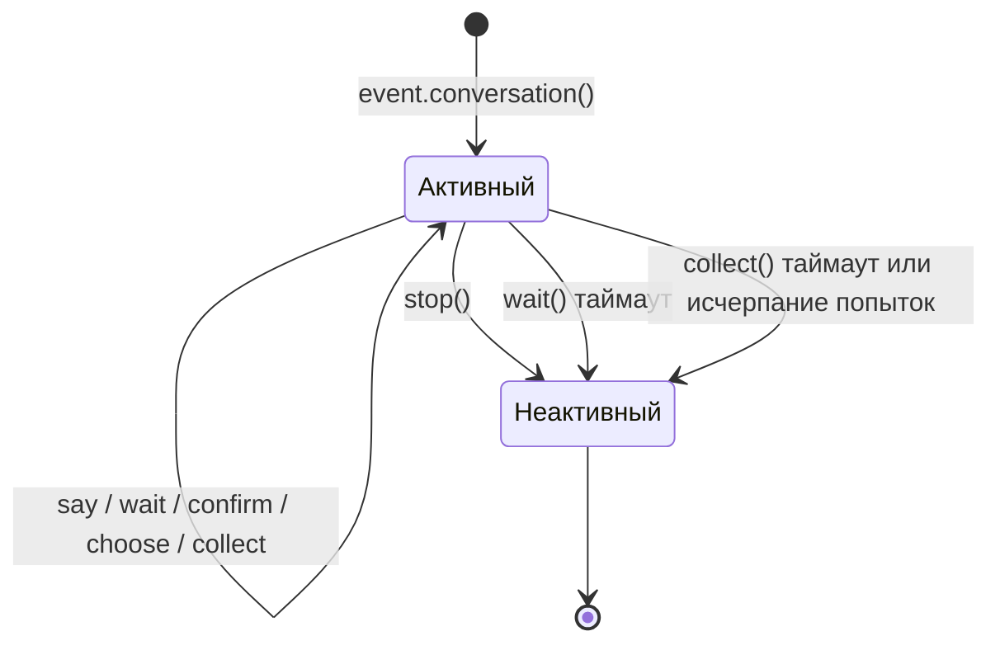

Диалог автоматически становится неактивным в следующих случаях:

1. Вызов метода `stop()`
2. `wait()` возвращает `None` по таймауту
3. `collect()` возвращает `None` из-за таймаута или исчерпания попыток

После перехода в неактивное состояние все методы взаимодействия (`wait`/`confirm`/`choose`/`collect`) немедленно возвращают `None`, не ожидая ответа пользователя.

## Ветвление и переходы

### @conv.branch(name) декоратор

Использование `branch()` для регистрации ветви диалога, переход между ветвями с помощью `goto()`:

```python
@command("menu")
async def menu_handler(event):
    conv = event.conversation(timeout=60)

    @conv.branch("main")
    async def main_menu():
        await conv.say("=== Главное меню ===\n1. Личная информация\n2. Настройки\n3. Выход")
        resp = await conv.wait()
        if resp is None:
            return
        text = resp.get_text().strip()
        if text == "1":
            await conv.goto("profile")
        elif text == "2":
            await conv.goto("settings")
        elif text == "3":
            await conv.say("До свидания!")
            conv.stop()

    @conv.branch("profile")
    async def profile():
        await conv.say("=== Личная информация ===\nИмя: Alice\n0. Вернуться")
        resp = await conv.wait()
        if resp and resp.get_text().strip() == "0":
            await conv.goto("main")

    @conv.branch("settings")
    async def settings():
        await conv.say("=== Настройки ===\n1. Переключатель уведомлений\n0. Вернуться")
        resp = await conv.wait()
        if resp and resp.get_text().strip() == "0":
            await conv.goto("main")

    await conv.start()  # Начинаем с первой зарегистрированной ветви
```

### conv.start(name=None)

Запуск диалога, по умолчанию с первой зарегистрированной ветви:

```python
await conv.start()          # Начинаем с первой ветви
await conv.start("settings") # Начинаем с указанной ветви
```

## Контекст и сохранение

### conv.context

Внутренний словарь `context` каждого экземпляра диалога используется для обмена состоянием между ветвями:

```python
@conv.branch("step1")
async def step1():
    conv.context["username"] = resp.get_text().strip()
    await conv.goto("step2")

@conv.branch("step2")
async def step2():
    name = conv.context.get("username", "неизвестный")
    await conv.say(f"Привет, {name}!")
```

### save() / resume() / clear_saved()

Диалог поддерживает сохранение, что позволяет возобновить его после таймаута или прерывания:

```python
# Сохранение состояния диалога (обычно не нужно вызывать вручную, см. "Автоматические контрольные точки")
await conv.save()

# ... позже в том же сеансе ...
conv2 = event.conversation()
if await conv2.resume():
    await conv2.say("Добро пожаловать обратно! Продолжим предыдущий диалог")
else:
    await conv2.say("Нет сохраненного диалога")

# Очистка сохраненного диалога
await conv.clear_saved()
```

Ключ сохранения содержит измерение `target` (`conversation:{platform}:{user_id}:{target_id}`), диалоги одного пользователя в разных сессиях не перезаписываются друг друга; старые архивы без `target` автоматически мигрируются при `resume()`.

## Автоматические контрольные точки и восстановление после перезапуска

### Автоматическое сохранение

Контрольные точки автоматически обновляются в следующих случаях, обычно не нужно вызывать `save()` вручную:

| Случай | Действие |
|--------|----------|
| `goto()` / `start()` переход между ветвями | Автоматически сохранить (текущая ветвь + context) |
| `stop()` / `wait()` таймаут / `collect()` сбой | Автоматически очистить (конечное состояние диалога) |

### TTL контрольных точек

Архивы снабжены временной меткой, архивы, просрочившие `ErisPulse.interaction.checkpoint_ttl` (по умолчанию 24 часа), автоматически удаляются при восстановлении:

```toml
[ErisPulse.interaction]
checkpoint_ttl = 86400  # секунды
```

### Автоматическое восстановление после перезапуска

После перезапуска фреймворка активные диалоги (в ожидании корутины в памяти) теряются, но контрольные точки остаются. Регистрация **фабрики восстановления** с помощью `register_resume_handler` позволяет фреймворку автоматически возобновлять диалог при получении первого сообщения от пользователя:

```python
from ErisPulse.Core.Event.wrapper import Conversation

@Conversation.register_resume_handler()  # Можно указать platform="onebot11" для ограничения платформой
def make_conversation(event) -> Conversation:
    # Фабрика: восстановление диалога и повторная регистрация всех ветвей
    conv = event.conversation(timeout=60)

    @conv.branch("menu")
    async def menu(conv, event):
        ...

    return conv
```

После регистрации, при перезапуске и получении первого сообщения от пользователя, находящегося в ветви `menu`, фреймворк автоматически: восстановит context → примет это сообщение → продолжит диалог из сохраненной ветви. Без регистрации фабрики механизм не влияет на производительность.

### Восстановление — это принятие управления

При успешном `resume()` фреймворк автоматически выполняет две вещи:

1. **Принятие управления сессией**: автоматически захватывает арендный токен сессии — другие модули могут использовать `sdk.interaction.get_owner_of(event)` для определения "этот пользователь занят диалогом"; если сессия уже занята другим модулем, восстановление отменяется (возвращается False), предотвращая конфликт диалогов
2. **Восстановление истории**: из почтового ящика сессии извлекает последние 10 сообщений в `conv.recent_history` (для модулей ИИ восстановление контекста LLM не прерывается); `resume(with_history=0)` отключает это

```python
if await conv.resume(with_history=20):
    for m in conv.recent_history:
        print(m["role"], ":", m["text"])
```

### Ручное восстановление (без автоматического механизма)

```python
@command("continue")
async def continue_handler(event):
    conv = event.conversation()
    # ... регистрация ветвей ...
    if await conv.resume():
        conv.goto(conv.get_current_branch())
```

## Типичные сценарии диалога

### Навигационная регистрация

```python
@command("register")
async def register_handler(event):
    conv = event.conversation(timeout=60)

    await conv.say("Добро пожаловать на регистрацию!")

    data = await conv.collect([
        {"key": "username", "prompt": "Пожалуйста, введите имя пользователя (от 3 до 20 символов)",
         "validator": lambda e: 3 <= len(e.get_text().strip()) <= 20},
        {"key": "email", "prompt": "Пожалуйста, введите адрес электронной почты",
         "validator": lambda e: "@" in e.get_text() and "." in e.get_text(),
         "retry_prompt": "Неверный формат электронной почты, повторите ввод"},
    ])

    if not data:
        await event.reply("Регистрация отменена")
        return

    confirmed = await conv.confirm(
        f"Подтвердите регистрационную информацию?\nИмя пользователя: {data['username']}\nЭлектронная почта: {data['email']}"
    )

    if confirmed:
        await conv.say("✅ Регистрация успешна!")
    else:
        await conv.say("❌ Регистрация отменена")
```

### Циклический диалог

```python
@command("chat")
async def chat_handler(event):
    conv = event.conversation(timeout=120)
    await conv.say("Вход в диалоговый режим, введите «выход» для завершения")

    while conv.is_active:
        resp = await conv.wait()
        if resp is None:
            await conv.say("Таймаут, диалог завершен")
            break

        text = resp.get_text().strip()

        if text == "выход":
            await conv.say("До свидания!")
            conv.stop()
        elif text == "помощь":
            await conv.say("Доступные команды: выход, помощь, статус")
        elif text == "статус":
            await conv.say("Диалог активен")
        else:
            await conv.say(f"Вы сказали: {text}")
```


### 交互会话系统

# Система интерактивных сессий

> [!NOTE]
> Данный раздел требует ErisPulse **2.8.0+**.

ErisPulse реализовал "постоянное взаимодействие с пользователями" как инфраструктуру на уровне фреймворка: от одной `wait_reply`, до регулярных напоминаний, ожидания нескольких путей, взаимоисключающих сессий, перезапуска и восстановления — всё это управляется единым
**менеджером интерактивных сессий** (`Core/Event/interaction.py`, `sdk.interaction`).

{!--< tips >!--}
Каждая из описанных ниже возможностей имеет **принадлежность (owner)**: ожидание, аренды, таймеры все регистрируются с указанием имени модуля, при отключении модуля / адаптера фреймворк автоматически очищает данные, ожидание немедленно получает уведомление, а не просто ждёт таймаута — это расширение системы принадлежности в контексте взаимодействия (см. [Система принадлежности](ownership.md)).
{!--< /tips >!--}

## Ожидание ответа: wait_reply

`wait_reply` — основа интерактивных сессий: приостанавливает текущую корутину, ожидая ответа от пользователя.

```python
from ErisPulse.Core.Event import command

@command("ask")
async def ask_command(event):
    reply = await event.wait_reply(prompt="Введите ваше имя:", timeout=30)
    if reply is None:
        await event.reply("Таймаут")
        return
    await event.reply(f"Привет, {reply.get_text()}!")
```

### Полный список параметров

| Параметр | Описание | Значение по умолчанию |
|------|------|------|
| `prompt` | Сообщение-подсказка, отправляемое перед приостановкой | None |
| `timeout` | Время ожидания (сек.) | 60 |
| `pattern` | Фильтр по шаблону (`*` / `?` / `[seq]`), если не совпадает — продолжить ожидание | None |
| `regex` | Регулярное выражение (должно совпадать с `pattern`, если задано), если не совпадает — продолжить ожидание | None |
| `validator` | Функция-валидатор (принимает Event, возвращает bool), если не прошла — продолжить ожидание | None |
| `callback` | Колбэк при получении ответа (альтернативный способ вместо возврата значения) | None |
| `method` | Метод отправки подсказки | "Text" |
| `session` | **Сессионное ожидание**: ответ любого участника той же сессии (группа / канал) будет считаться ответом | False |

```python
# Принимает только числовую сумму, иначе продолжает ожидание
reply = await event.wait_reply("Введите сумму:", regex=r"\d+\s*元", timeout=30)

# Сессионное ожидание: в сценарии группового взаимодействия, любой участник группы может ответить
reply = await event.wait_reply(session=True, prompt="Кто-нибудь может помочь ответить?")
```

### Когда ожидание будет отменено

Ожидание больше не "только таймаут" — следующие события немедленно **прерывают** ожидание (`wait_reply` возвращает `None`), а не заставляют вызывающий код ждать до истечения таймаута:

| Событие | Причина отмены (`InteractionCancelled.reason`) | Описание |
|------|------|------|
| Модуль, зарегистрировавший ожидание, отключен / отключен | `owner_unload` | Автоматическая очистка: ожидание удаляется при исчезновении модуля |
| Адаптер остановлен / перезапущен | `platform_stop` | Все ожидания, связанные с платформой, отменяются |
| В той же сессии зарегистрировано новое ожидание / аренда | `conflict` | См. ниже "Арбитраж сессии" |
| Ответивший пользователь заблокирован / модуль откреплён | `revoked` | Проверка прав: проверка по идентификатору сессии + модулю |
| Ответивший пользователь отвечает | — | Нормальный путь, возвращает событие ответа |

Внутреннее исключение `InteractionCancelled` (входит в исключения `InteractionError`), `wait_reply` уже преобразует его в возврат `None`; вызывающие, которым нужен код причины, могут использовать низкоуровневый API `sdk.interaction.register()`.

### Полная цепочка проверки ответа

При поступлении ответного сообщения менеджер интерактивных сессий проверяет его в следующем порядке (выполняется **до** сопоставления команд, приоритет сохраняется — даже если сообщение было признано другим обработчиком, приостановленный диалог завершится):

```
Соответствие сессионного ключа (точный пользователь → сессионная ошибка)
  → Фильтрация текста по pattern / regex (не совпадает — продолжить ожидание)
  → Валидация по validator (не прошла — продолжить ожидание)
  → Проверка прав (по идентификатору сессии + модулю, если не прошла — завершить ожидание)
  → Пробуждение ожидания + признание события (mark_processed)
```

## Таймеры сессии: remind / escalate

Превращает "таймаут" из возвращаемого значения в управляемую примитивную операцию. Таймеры привязаны к интерактивной сессии, автоматически отменяются при отключении модуля / адаптера, лимит активных remind в одной сессии — 5.

### remind: напоминание, если нет ответа

```python
@command("ticket")
async def ticket_command(event):
    await event.reply("Заявка подана, результат будет здесь уведомлен")
    # Через 5 минут без ответа мягко напомнить; любой ответ пользователя автоматически отменяет напоминание
    event.remind(300, "Есть ли ещё кто-то? Результат будет уведомлен")
    reply = await event.wait_reply(timeout=3600)
    ...
```

- `event.remind(delay, text=None, *, callback=None)`: при истечении отправляет текст (или выполняет `callback(event)`, поддерживает синхронные / асинхронные функции) в текущую сессию
- Возвращает `Reminder`-дескриптор: `reminder.cancel()` — ручная отмена, `reminder.expired` — проверка состояния
- Автоматически отменяется при любом ответе пользователя в этой сессии — это и есть смысл "напоминания":
  напоминание появляется только если пользователь молчит
- В `Conversation` также доступно: `conv.remind(120, "Ещё думаете?")`

### escalate: обязательное уведомление по таймауту

```python
event.escalate(1800, lambda e: notify_master(f"Заявка не обработана 30 минут: {event.get_command_args()}"))
```

Единственное отличие от `remind`: **не отменяется ответом пользователя** — уведомление (уведомление владельца, передача в ручной режим) — это гарантия "обязательного уведомления по таймауту", отменяется только ручной `cancel()` / отключение модуля / остановка адаптера.

| | `remind` | `escalate` |
|---|---|---|
| Действие по истечению | Отправка текста / выполнение callback | Выполнение callback |
| Ответ пользователя | **Автоматически отменяется** | Не затрагивается |
| Автоматическая отмена (отключение / остановка платформы) | Отменяется | Отменяется |
| Лимит активных в сессии | 5 | Не ограничен (автоматическая отмена при отключении модуля) |

## Многопоточное ожидание: expect + select

Ожидание нескольких условий одновременно, **первый поступивший ответ** — типичный сценарий: ожидание одобрения администратора и одновременно ожидание отмены пользователем, или голосование между несколькими участниками.

```python
which, reply = await event.select(
    event.expect(pattern="同意*", user="10001"),
    event.expect(pattern="拒绝*", user="10002"),
    event.expect(validator=lambda e: e.get_text() == "搁置", session=True),
    timeout=60,
)
if which is None:
    await event.reply("В течение 60 секунд не было получено ни одного результата")
elif which == 0:
    await event.reply("Одобрено")
elif which == 1:
    await event.reply("Отклонено")
```

- `event.expect(...)` создаёт **описание ожидания** (не регистрирует ожидание): поддерживает
  `pattern` / `regex` / `validator` / `user` (ограничение ответившего) / `session` (ответ может быть от любого участника)
- `event.select(*expectations, timeout=60)`: регистрирует все ожидания → возвращает
  `(индекс, событие ответа)` при первом совпадении → несовпавшие ожидания автоматически отменяются; при истечении таймаута возвращается `(None, None)`
- Событие, которое совпало, уже признано фреймворком (mark_processed), не будет повторно обработано другими обработчиками

{!--< tips >!--}
`select` по сравнению с ручным управлением `asyncio.wait` в многопоточном режиме: автоматическая очистка несовпавших ожиданий,
признание совпавшего события, автоматическая проверка прав и автоматическая очистка — всё это работает без необходимости вручную управлять Future.
{!--< /tips >!--}

## Взаимоисключающие сессии: acquire / hold / get_owner_of

Принадлежность расширяется с "ресурсов" до "сессий" — "кто сейчас взаимодействует с пользователем" становится первостепенным.

```python
# Проверка: кто сейчас взаимодействует в этой сессии? (если свободна, возвращает None)
owner = sdk.interaction.get_owner_of(event)
if owner and owner != "MyModule":
    return  # Другой модуль уже взаимодействует, избегаем конфликта

# Взаимоисключающая аренда: эксклюзивное владение сессией (политика deny, если занято возвращает None)
lease = sdk.interaction.acquire(event)          # По умолчанию TTL 1 час, можно передать ttl=
if lease is None:
    return  # Уже занято
try:
    ...  # Эксклюзивное взаимодействие
finally:
    lease.release()
```

Форма контекстного менеджера (при неудаче выбрасывает `SessionOccupiedError`):

```python
with sdk.interaction.hold(event) as lease:
    ...  # Автоматически освобождается при выходе
```

Аренда поддерживает `renew(ttl)` для продления; TTL-арендованные записи удаляются по истечении срока.

`Conversation.resume()` при возобновлении диалога автоматически приобретает аренду (см. [Многошаговые диалоги](conversation.md) раздел "Возобновление = захват") — возобновленный диалог автоматически владеет сессией, другие модули не могут вмешаться.

## Почтовый ящик сессии: event.history

Единая запись недавних сообщений в каждой сессии (и пользователей, и бота), используется как база данных для контекста ИИ, предотвращения повторения сообщений, анализа поведения — модули больше не хранят историю сообщений отдельно.

```python
messages = await event.history(20)   # Последние 20 сообщений в текущей сессии, в порядке возрастания времени
for m in messages:
    print(m["role"], ":", m["text"])  # role: "user" / "bot"
```

- Автоматическая запись: входящие сообщения (role=user) + исходящие сообщения бота (role=bot)
- Хранение: отдельная таблица SQLite, стратегия хранения = лимит на сессию (по умолчанию 50) + глобальный TTL (по умолчанию 7 дней)
- Конфигурация: `ErisPulse.transcript = {enabled = true, max_per_session = 50, ttl_hours = 168}`
- Управление: `sdk.transcript.append() / get() / clear()`

## Транзакции сообщений: message_tx

Все исходящие сообщения в транзакции автоматически записываются; **при исключительном завершении автоматически отменяются отправленные сообщения** (если адаптер не реализует `delete_message`, отмена пропускается, но запись в журнале сохраняется).

```python
async with event.message_tx():
    await event.reply("Обработка, подождите")
    result = await do_something()          # Здесь выбрасывается исключение →
    await event.reply(f"Готово: {result}")   # Сообщение "Обработка" автоматически отменяется
```

Вне транзакции отправка не записывается (нулевая накладная); `get_send_receipts()` позволяет просмотреть отправленные сообщения в текущей транзакции.

## Отслеживание цепочки: trace-id

Каждое входящее событие автоматически получает идентификатор отслеживания (используется `event["id"]`, если отсутствует, генерируется), который пронизывает:

- контекст обработчика (`get_current_trace_id()` для чтения)
- исходящие сообщения (строки лога `[Send]` с тегом `[trace:...]`, поле `trace_id` в хуках `message.sending/sent`)
- данные жизненного цикла (dict автоматически дополняется `_trace_id`)
- направленные события (`lifecycle.emit(..., to=...)`) и транзакционные подтверждения сообщений

При обработке сообщения несколькими модулями, по одному идентификатору можно проследить всю цепочку (логи / медленные запросы / аудит).

## Связь с другими системами

- **Принадлежность**: ожидание / аренда / таймеры все регистрируются с указанием owner, при отключении модуля — автоматическая очистка (см. [Система принадлежности](ownership.md))
- **Область видимости**: проверка прав по идентификатору сессии + модулю; аудит вызовов между модулями — проверка по направлению (см. [Область видимости](scope.md))
- **Conversation**: многошаговые диалоги — это конечный автомат на основе интерактивных сессий (см. [Conversation](conversation.md)),
  ожидания в них также имеют все отмены / проверки / принадлежности, описанные на этой странице


### 模块间通信

# Коммуникация между модулями

> [!NOTE]  
> В этой главе требуется ErisPulse **2.8.0+**.

В ErisPulse между модулями реализована **трехуровневая модель коммуникации**, расположенная по принципу "точка-точка → направленный → широковещательный":

| Уровень | API | Семантика | Типичные сценарии |
|---|---|---|---|
| **RPC** | `await sdk.module.call("Chat", "get_history", ...)` | Точечный запрос-ответ с контрактом / аудитом / таймаутом | Вызов возможностей другого модуля (получение истории, перевод, возврат средств) |
| **Направленный событие** | `await lifecycle.emit("message_received", {...}, to="Chat")` | Доставка только модулям, зарегистрировавшим хуки жизненного цикла | Уведомление о состоянии сверху вниз (например, "получено новое сообщение") |
| **Рассылка** | `await lifecycle.emit("config.updated", {...})` | События жизненного цикла, видимые по всей системе | Горячая перенастройка конфигурации, изменение состояния модуля |

{!--< tips >!--}
Правило выбора: **для получения значения используйте `call`, для уведомления конкретного модуля — `emit(..., to=...)`, для уведомления всех — `emit(...)`**.
{!--< /tips >!--}

## RPC: module.call

```python
result = await sdk.module.call("Chat", "get_history", session_id, n=20)
```

Отличие от прямого доступа к атрибуту `sdk.module.Chat.get_history(...)` (без изменений):

| | `module.call()` | Прямой доступ к атрибуту |
|---|---|---|
| Целевой модуль не зарегистрирован / не активен | Бросает `ModuleNotAvailableError` | Бросает `AttributeError` |
| Модуль с ленивой загрузкой | **Автоматически активируется** (модуль на основе событий использует блокировку активации) | Асинхронная инициализация модуля бросает RuntimeError |
| `current_owner` | Относится к **целевому модулю** (его внутренние wait_reply / отправка / логи корректно привязаны) | Сохраняется вызывающей стороной |
| Таймаут | По умолчанию 30 секунд (`timeout=` переопределяет, `None` — без ограничения) | Нет |
| Аудит в рамках scope | Вызов проходит через выходной барьер `actions.<вызывающий>.call` | Нет |
| Проверка контракта | Белый список `meta.services` | Нет |

### Иерархия исключений

```
ModuleError                      # Базовый класс исключений модульной системы
└── ModuleCallError              # Базовый класс для вызова между модулями (содержит атрибуты module / method)
    ├── ModuleNotAvailableError  # Целевой модуль не зарегистрирован / не активен / активация не удалась
    ├── ServiceNotProvidedError  # Метод не входит в белый список services / приватный метод / не существует
    └── ModuleCallTimeoutError   # Таймаут асинхронного метода
```

Все исключения входят в иерархию `ErisPulseError`, их можно перехватить с помощью `from ErisPulse.Core import ModuleCallError`.

## Контракт сервиса: meta.services

Провайдер сервиса объявляет белый список предоставляемых методов в `get_meta()` (симметрично `commands`):

```python
from ErisPulse.Core.Bases import BaseModule, ModuleMeta

class ChatModule(BaseModule):
    @staticmethod
    def get_meta() -> ModuleMeta:
        return ModuleMeta(
            name="聊天",
            services=[
                "get_history",                                       # Простая форма
                {"name": "translate", "description": "把文本翻译成指定语言"},  # С описанием
            ],
        )

    async def get_history(self, session_id, n=20): ...
    async def translate(self, text, target_lang): ...
    def _internal_helper(self): ...   # Методы с подчеркиванием всегда запрещены для внешнего вызова
```

**Разработчикам не нужно ничего делать по умолчанию**:

- Если `services` не объявлен → все **публичные** методы по умолчанию доступны для `module.call()` (как и прямой доступ к атрибуту),
  без каких-либо объявления
- После объявления → доступ сужается до белого списка, вызов за пределами списка бросает `ServiceNotProvidedError` — используется для маркировки
  "это те методы, которые публично доступны"
- Основной контроль за ограничениями находится на стороне пользователя: `scope.actions` определяет, "кто может вызывать кого" (см. аудит ниже),
  `services` модуля автора — это только объявление интерфейса, две системы не заменяют друг друга

**Описание сервиса**: добавьте человекопонятное описание для каждого сервиса — если не нужно, ничего не пишите,
описание автоматически берется из **первой строки docstring** (рамка уже требует стиля docstring):

```python
async def translate(self, text, target_lang):
    """把文本翻译成指定语言"""    # ← Эта строка автоматически становится описанием сервиса
    ...
```

Для тонкой настройки (переопределение docstring / многоязычность) используйте словарную форму объявления description (поддержка i18n-словарей):

```python
services=[
    {"name": "translate", "description": "把文本翻译成指定语言"},
    {"name": "summarize", "description": {"i18n": "Chat.meta.svc.summarize", "default": "摘要对话"}},
]
```

## Служебный каталог: services()

```python
sdk.module.services()
# {'Chat': [{'name': 'get_history', 'signature': '(session_id, n=20)',
#            'description': '把文本翻译成指定语言'}]}

sdk.module.services("Chat")   # Только для запроса указанного модуля
```

- В каталоге перечислены только модули, явно объявившие `meta.services` (модули без объявления не попадают в каталог)
- Каждый сервис снабжен строкой сигнатуры метода (извлекается с помощью `inspect.signature`) и описанием
- Также включены в топологию: `sdk.module.get_topology()` содержит для каждого модуля поле `services`

{!--< tips >!--}
**Маршрут к MCP**: каталог сервисов (имя + сигнатура + описание) соответствует форме MCP tool —
каждый сервис естественным образом имеет вид ``{"name", "description", "parameters"}``.
В будущем фреймворк сможет напрямую выставить ``services()`` как конечную точку MCP server, позволяя AI обнаруживать и вызывать возможности модуля;
``scope.actions.call`` аудит естественным образом становится безопасным барьером для вызова AI.
{!--< /tips >!--}

## Аудит исходящих вызовов: кто может вызывать кого

Каждый вызов `module.call()` проходит через барьер исходящих вызовов **в контексте вызывающего модуля**:

```toml
[ErisPulse.scope.actions.CallerModule.call]
deny = ["Chat.get_history"]        # Запретить CallerModule вызывать Chat.get_history
# allow = ["Chat.get_*"]           # Или белый список: разрешить только вызовы Chat.get_* сервисов
```

- Формат `name` — `<目标模块>.<方法名>`, поддерживается точное совпадение, шаблоны и `re:` регулярные выражения
- Вызовы из фреймворка (без контекста owner, например, запуск скриптов) не подпадают под аудит
- Запрещённый вызов бросает `ModuleCallError` (в логах TRACE `core.module.call_denied`)

Способы конфигурирования см. в разделе [Scope](docs/ru/scope.md) по исходящему измерению.

## Направленные события: параметр to в lifecycle.emit

Жизненные события поддерживают направленную доставку: при указании параметра `to` с именем целевого владельца (owner) событие доставляется только хукам, зарегистрированным с этим
владельцем (хуки, зарегистрированные в `on_load` модуля, автоматически привязываются к нему),
другие модули и обработчики с `*` не получают уведомления.

```python
from ErisPulse.Core.lifecycle import lifecycle

# Отправитель: событие доставляется только хукам, зарегистрированным в модуле Chat
await lifecycle.emit("message_received", {"text": "hi", "from": "u1"}, to="Chat")

# Подписчик (внутри модуля Chat): регистрирует хук с тем же именем, owner автоматически записывается при регистрации
@lifecycle.on("message_received")
async def on_message_received(data): ...

@lifecycle.on("message")          # Префиксные хуки также работают (фильтруются по owner)
async def on_any(data): ...
```

Семантические детали:

- Если у целевого владельца нет зарегистрированных хуков → событие **тихо отбрасывается** (не отправляется туда, где его нет),
  можно заранее проверить с помощью `lifecycle.has_handlers("message_received")`
- При передаче `data` в виде dict автоматически добавляется `_trace_id` (не перезаписывает уже существующее значение), интегрируется с системой трассировки
- Рассылка и направленные события используют одну и ту же систему регистрации хуков: `emit(...)` без `to` — рассылка по всей системе,
  с `to` — событие видно только целевому модулю
- `emit_sync` / `submit_event` (совместимые API) также поддерживают параметр `to=`

> [!NOTE]  
> Направленные события — это лёгкие уведомления, **не выполняют проверку цели и ленивую активацию**; если нужна проверка существования цели,
> аудит контракта или возврат значения, используйте [RPC: module.call](#rpcmodulecall).

## Ленивая загрузка и вызов

`module.call()` прозрачно активирует модули с ленивой загрузкой:

- Модули на основе событий (`activate_on` объявлен) → проходят через блокировку активации `_activate()`, после активации stub-триггер автоматически удаляется
- Обычные модули с ленивой загрузкой → синхронная инициализация или обычный путь загрузки (идемпотентно)
- Ошибка активации → `ModuleNotAvailableError`

То есть: **вызывающая сторона не должна заботиться о том, загружен ли целевой модуль**, и не нужно ждать какого-либо события для его активации.

Направленные события (`lifecycle.emit(..., to=...)`) не выполняют ленивую активацию — если целевой модуль не загружен, у него нет хуков,
событие тихо отбрасывается; если нужно гарантировать доставку, используйте `module.call()`.

## Воспроизведение при холодном запуске

Новый или перезапущенный модуль пропустил часть диалога — `get_load_strategy(replay=...)` позволяет фреймворку воспроизвести
самому модулю последние сообщения из почтового ящика сессии после готовности:

```python
from ErisPulse.loaders import ModuleLoadStrategy

class MyAIModule(BaseModule):
    @staticmethod
    def get_load_strategy():
        return ModuleLoadStrategy(
            lazy_load=False,
            priority=100,
            replay="5m",        # Воспроизвести последние 5 минут (можно также "1h" / "300" секунд)
        )

    async def on_load(self, event):
        @message.on_message()
        async def handle(e):
            if e.get("replayed"):
                # Синтезированное событие: только восстановление контекста, без побочных эффектов, таких как отправка
                ...
```

Семантические детали:

- Источник данных — [почтовый ящик сессии](docs/ru/interaction.md#会话收件箱eventhistory) (`sdk.transcript.recent()`),
  воспроизведение выполняется в фоне после загрузки модуля, не блокируя запуск
- Синтезированное событие помечается флагом `replayed: True`, содержит полные `platform / detail_type / user_id / alt_message`,
  **доставляется только обработчикам этого модуля** — другие модули не затрагиваются воспроизведением
- При отсутствии почтового ящика, отсутствии записей или недопустимом значении `replay` (предупреждение `replay_invalid`) воспроизведение пропускается

## Идемпотентная дедупликация событий

После переподключения websocket-платформы часто повторно отправляются одни и те же события (с одинаковым `event["id"]`) — входная точка доставки по id выполняет
дедупликацию с помощью LRU (емкость 4096), одинаковые события доставляются только один раз.

```toml
[ErisPulse.framework]
event_dedupe = true   # По умолчанию включено; в тестовой среде можно отключить, если синтезировать события с фиксированным id
```

При регистрации адаптера (начало жизненного цикла нового подключения) автоматически сбрасывается кэш дедупликации.


### 国际化（i18n）系统

# Система международной локализации (i18n)

Начиная с ErisPulse v2.5.0, встроен полный функционал поддержки международной локализации. Ядро фреймворка и интерфейс CLI могут автоматически переключать отображаемый текст в зависимости от языка вашей системы, а также поддерживают регистрацию собственных переводов внешними модулями.

## Поддерживаемые языки

| Язык | Код | Описание |
|------|------|------|
| 简体中文 | `zh-CN` | Язык по умолчанию (оригинальный язык фреймворка) |
| 繁體中文 | `zh-TW` | Традиционный китайский (Гонконг/Макао/Тайвань) |
| English | `en` | Английский (общий язык по умолчанию) |
| 日本語 | `ja` | Японский |
| Русский | `ru` | Русский |

## Быстрый опыт

### Переключение через переменные среды

```bash
# Windows PowerShell
$env:ERISPULSE_LANG = "en"
epsdk run

# macOS / Linux
ERISPULSE_LANG=ja epsdk run
```

### Переключение через конфигурационный файл

Добавьте в `config/config.toml`:

```toml
[ErisPulse.i18n]
language = "zh-TW"
```

Если установить значение `"auto"` (значение по умолчанию), язык будет определяться автоматически на основе языка системы.

### Ручное переключение в коде

```python
from ErisPulse import i18n

# Ручная установка языка
i18n.set_language("en")
print(i18n.get_language())  # "en"

# Возврат к автоматическому определению
i18n.reset_language()
```

---

## Механизм определения языка

Фреймворк определяет язык пользователя в следующем порядке приоритетов:

1. **Переменная среды `ERISPULSE_LANG`** — наивысший приоритет, используется для тестирования и временного переключения
2. **Windows API** — `GetUserDefaultLocaleName` (только Windows, не подвержен влиянию переменных, таких как `LANG`, установленных в Git Bash и других инструментах)
3. **Переменные среды** — `LANGUAGE` > `LC_ALL` > `LC_MESSAGES` > `LANG` (стандарт Unix/macOS)
4. **Системная локаль** — `locale.getlocale()` / `locale.getdefaultlocale()`
5. **Резервное значение** — en (английский язык)

### Принцип ближайшего соответствия

При обнаружении языка, не соответствующего точно поддерживаемым, применяется принцип ближайшего соответствия:

- `zh-TW`, `zh-HK`, `zh-MO`, `zh-Hant` → **Традиционный китайский**
- Все остальные `zh-*` (например, `zh-CN`, `zh-SG`) → **Упрощённый китайский**
- `en-US`, `en-GB`, `en-AU` и другие → **Английский**
- `ja-JP` → **Японский**
- `ru-RU` → **Русский**
- Все остальные неизвестные языки → **Упрощённый китайский (резервное значение)**

---

## Использование i18n в модулях

Вы можете зарегистрировать тексты перевода для своего модуля, чтобы ваш модуль также поддерживал множественные языки.

### Рекомендуемый способ: объявление ключей перевода через I18nClass (v2.7.0+)

Начиная с версии v2.7.0, модули/адаптеры могут объявлять ключи перевода, подобно тому, как они объявляют `ConfigClass`, с помощью вложенного класса `I18nClass`. Фреймворк автоматически зарегистрирует все объявленные ключи перевода при загрузке, без необходимости вручную вызывать `i18n.register()`.

```python
from dataclasses import dataclass, field

from ErisPulse.Core.Bases import BaseConfig, BaseI18n, BaseModule, I18nKey


class MyModule(BaseModule):
    # Класс конфигурации (необязательно)
    @dataclass
    class ConfigClass(BaseConfig):
        welcome_msg: str = field(
            default="欢迎",
            metadata={
                # Здесь используется ключ перевода mymodule.welcome_msg
                "description": {"i18n": "mymodule.welcome_msg", "default": "Сообщение приветствия"},
            },
        )

    # Класс коллекции ключей перевода (необязательно)
    # Объявленные ключи будут автоматически зарегистрированы фреймворком, с приоритетом над генерацией значений по умолчанию ConfigClass
    class I18nClass(BaseI18n):
        # Имя атрибута автоматически объединяется в полный путь ключа: <имя_модуля>.<имя_атрибута>
        welcome_msg: I18nKey = I18nKey(
            default="Welcome Message",   # Языко-независимое значение по умолчанию, не регистрируется ни для какого языка
            zh_CN="欢迎消息",
            en="Welcome Message",
            ja="ウェルカムメッセージ",
            ru="Приветственное сообщение",
            zh_TW="歡迎訊息",
        )
        # Другие ключи перевода, используемые в бизнес-логике
        hello: I18nKey = I18nKey(
            default="Hello, {name}!",
            zh_CN="你好，{name}！",
            zh_TW="你好，{name}！",
            en="Hello, {name}!",
            ja="こんにちは、{name}！",
            ru="Привет, {name}!",
        )

        # Можно также явно указать полный путь ключа (не используя объединение по имени атрибута)
        custom: I18nKey = I18nKey(
            key="mymodule.deep.nested.key",
            default="Default text",
            zh_CN="默认文本",
            zh_TW="預設文本",
            en="Default text",
            ja="デフォルトテキスト",
            ru="Текст по умолчанию",
        )
```

#### Почему рекомендуется использовать I18nClass?

| Сценарий | Ручная регистрация i18n.register() | Объявление через I18nClass |
|------|-----------------------|------------------|
| Ключи перевода, используемые в описании конфигурации | Требуется ручная регистрация, и нужно успеть до генерации конфигурации | Фреймворк автоматически регистрирует до генерации конфигурации |
| Объявление многоязычных переводов | Распространены по разным on_load() | Собраны в одном классе, легко читаемы |
| Согласованность именования ключей | Легко допускать ошибки при написании | Имя атрибута используется как суффикс ключа, IDE может подсказывать |
| Очистка при выгрузке | Требуется ручной unregister_domain() | Фреймворк использует единый domain для регистрации |

#### Правила формирования пути ключей в I18nClass

- **По умолчанию**: используется путь `<имя_регистрации_модуля>.<имя_атрибута>` в качестве полного пути ключа
  - Пример: имя модуля ``MyModule``, атрибут ``welcome`` → путь ключа ``MyModule.welcome``
- **Явно**: с помощью параметра ``I18nKey(key="...")`` можно указать любой путь с разделителем точек
  - Подходит для глубоко вложенных ключей (например, ``mymodule.config.basic.token``)

#### Использование в адаптере

Адаптеры также поддерживают `I18nClass`, и способ использования полностью идентичен:

```python
from ErisPulse import BaseAdapter
from ErisPulse.Core.Bases import BaseConfig, BaseI18n, I18nKey


class MyAdapter(BaseAdapter):
    @dataclass
    class ConfigClass(BaseConfig):
        endpoint: str = field(
            default="",
            metadata={
                # Описание конфигурации ссылается на ключ adapter.MyAdapter.endpoint
                "description": {"i18n": "MyAdapter.endpoint", "default": "Адрес API"},
            },
        )

    class I18nClass(BaseI18n):
        # Собранное объявление ключей перевода, используемых в описании конфигурации и других бизнес-ключей
        endpoint: I18nKey = I18nKey(
            default="API Endpoint",
            zh_CN="API 地址",
            zh_TW="API 位址",
            en="API Endpoint",
            ja="APIアドレス",
            ru="API адрес",
        )
```

I18nClass адаптера будет автоматически зарегистрирован на этапе `__init__` (до генерации шаблона конфигурации), обеспечивая доступность ключей перевода, используемых в описании конфигурации.

### Ручная регистрация пользовательских переводов (старый способ)

Если вы не используете `I18nClass`, вы можете напрямую вызвать `i18n.register()` для регистрации текстов перевода.

```python
from ErisPulse import i18n

# Регистрация китайского перевода
i18n.register("zh-CN", {
    "my_module.welcome": "欢迎使用我的模块！",
    "my_module.goodbye": "再见！",
    "my_module.hello": "你好，{name}！",
}, domain="my_module")

# Регистрация английского перевода
i18n.register("en", {
    "my_module.welcome": "Welcome to my module!",
    "my_module.goodbye": "Goodbye!",
    "my_module.hello": "Hello, {name}!",
}, domain="my_module")
```

### Использование перевода

```python
from ErisPulse import i18n

# Простой перевод
i18n.t("my_module.welcome")  # Автоматически используется текущий язык

# С параметрами форматирования
i18n.t("my_module.hello", name="Alice")

# Указание значения по умолчанию (возвращается, если ключ перевода не найден)
i18n.t("my_module.unknown_key", default="默认文本")
```

### Использование в классе модуля

```python
from dataclasses import dataclass, field
from ErisPulse import i18n
from ErisPulse.Core.Bases import BaseConfig, BaseModule

@dataclass
class MyModuleConfig(BaseConfig):
    welcome_msg: str = field(
        default="欢迎",
        metadata={
            "description": {"i18n": "my_module.welcome_msg", "default": "Сообщение приветствия"},
            "ui": {"widget": "text", "group": "basic", "order": 1},
        },
    )

class MyModule(BaseModule):
    ConfigClass = MyModuleConfig

    async def on_load(self, event):
        # Динамическое чтение конфигурации (каждый раз отражает последнее значение)
        self.logger.info(self.cfg.welcome_msg)
        self.logger.info(i18n.t("my_module.welcome"))

    @command("hello")
    async def hello_handler(self, event):
        name = event.get_user_nickname() or "friend"
        await event.reply(i18n.t("my_module.hello", name=name))

    async def on_unload(self, event):
        pass
```

### Удаление перевода

```python
# Удаление перевода всего домена
i18n.unregister_domain("my_module")
```

---

## Многоязычные поля конфигурации

Начиная с версии v2.5.2, схема конфигурации полностью поддерживает i18n. Все видимые пользователю текстовые поля могут ссылаться на ключи i18n, и WebUI и другие потребители автоматически будут преобразовывать их в соответствующий текст в зависимости от текущего языка.

### Поддерживаемые поля i18n

| Поле | Расположение | Описание |
|------|--------------|----------|
| `description` | метаданные поля | Описание поля |
| `options[].label` | `ui.options` | Метки опций для контрола select |
| `placeholder` | `ui.placeholder` | Заполнитель для поля ввода |
| `group_labels` | `_schema_meta` | Названия групп (заголовки разделов Dashboard) |

Используется единый формат `{"i18n": "key", "default": "текст"}`, а строки без i18n будут передаваться без изменений (для обратной совместимости).

### Объявление полей i18n

Все видимые пользователю текстовые поля поддерживают i18n:

```python
from dataclasses import dataclass, field
from ErisPulse.Core.Bases import BaseConfig

@dataclass
class MyAdapterConfig(BaseConfig):
    # i18n для description
    token: str = field(
        default="",
        metadata={
            "description": {"i18n": "my_adapter.token", "default": "Токен платформы"},
            "required": True,
            "secret": True,
            "ui": {
                "widget": "password",
                "group": "basic",
                "order": 1,
                # i18n для placeholder
                "placeholder": {"i18n": "my_adapter.token.ph", "default": "Введите токен"},
            },
        },
    )
    # i18n для label опций
    mode: str = field(
        default="a",
        metadata={
            "description": {"i18n": "my_adapter.mode", "default": "Режим работы"},
            "ui": {
                "widget": "select",
                "group": "basic",
                "order": 2,
                "options": [
                    {"label": {"i18n": "my_adapter.mode.a", "default": "Режим A"}, "value": "a"},
                    {"label": {"i18n": "my_adapter.mode.b", "default": "Режим B"}, "value": "b"},
                ],
            },
        },
    )

    # i18n для group_labels (название группы)
    _schema_meta = {
        "group_labels": {
            "basic": {"i18n": "my_adapter.group.basic", "default": "Основные настройки"},
        }
    }
```

`default` — это резервный текст, который будет отображаться, если перевод не зарегистрирован или поиск не удался.

### Секретная обработка и проверка конфигурации

Поля, помеченные как `"secret": True`, автоматически получают **защиту от раскрытия** (начиная с версии 2.7.0):

- **Обработка шаблона**: при генерации шаблона конфигурации `dataclass_to_toml_with_comments()` настоящее значение секретного поля не будет записано в файл (вместо него будет пустой заполнитель), чтобы избежать попадания чувствительной информации на диск.
- **Универсальный инструмент для обработки секретов**: `redact_secret(value)` заменяет непустое значение на `***`, а пустое значение возвращает без изменений. Используется, например, при выводе в логи.

```python
from ErisPulse.Core.Bases.config_schema import redact_secret

redact_secret("sk-xxxxxx")  # '***'
redact_secret("")           # ''
```

**Проверка конфигурации** (`validate_config()`) помимо проверки обязательных полей на непустоту, начиная с версии 2.7.0, поддерживает:

| Проверка | Метаданные | Пример |
|----------|------------|--------|
| Соответствие типа | Объявление типа поля | Если для поля типа `int` передано строковое значение, будет ошибка |
| Ограничение по перечислению | `ui.options` или `options` на уровне верхнего уровня | Значение должно принадлежать разрешённым опциям |
| Диапазон значений | `min` / `max` на уровне верхнего уровня | `metadata={"min": 1, "max": 65535}` |

```python
from ErisPulse.Core.Bases.config_schema import validate_config

@dataclass
class C(BaseConfig):
    mode: str = field(default="a", metadata={"ui": {"widget": "select", "options": ["a", "b"]}})
    port: int = field(default=80, metadata={"min": 1, "max": 65535})

errors = validate_config(C(mode="x", port=70000))  # Две ошибки: перечисление + диапазон
```

### Регистрация переводов для конфигурации

Ключи i18n для полей конфигурации регистрируются так же, как и обычные ключи перевода, с помощью `i18n.register()`:

```python
from ErisPulse import i18n

# Регистрация китайского (согласуется с default, но может отличаться)
i18n.register("zh-CN", {
    "my_adapter.token": "Токен платформы",
}, domain="my_adapter")

# Регистрация английского
i18n.register("en", {
    "my_adapter.token": "Platform Token",
}, domain="my_adapter")
```
> **Рекомендуемый способ**: использование `I18nClass` для объявления ключей перевода, фреймворк автоматически зарегистрирует их (см. раздел «Рекомендуемый способ» выше), без необходимости вызывать `i18n.register()` или `register_config_i18n()`.

Также доступна удобная функция `register_config_i18n()`, которая автоматически извлекает ключи из класса конфигурации и регистрирует их:

```python
from ErisPulse.Core.Bases.config_schema import register_config_i18n

# Автоматически извлекает description.default как перевод для zh-CN
register_config_i18n(MyAdapterConfig, "zh-CN")

# Ручная передача английского перевода
register_config_i18n(MyAdapterConfig, "en", {
    "my_adapter.token": "Platform Token",
})
```

### Как WebUI потребляет i18n

Функция `get_config_schema()` возвращает схему, в которой словарь i18n будет передан без изменений. Frontend WebUI может использовать `i18n.t()` для получения перевода в зависимости от текущего языка.

Если требуется серверная сторона для преобразования i18n в строки (например, для передачи на фронтенд, который не поддерживает i18n), используется `resolve_config_schema()`, который преобразует `description`, `options[].label`, `placeholder` и `group_labels` в текст текущего языка:

```python
from ErisPulse.Core.Bases.config_schema import resolve_config_schema

# Все поля i18n преобразованы в текст текущего языка
schema = resolve_config_schema(MyAdapterConfig)
print(schema["fields"]["token"]["description"])    # "Токен платформы" или "Platform Token"
print(schema["fields"]["token"]["placeholder"])   # "Введите токен" или "Enter Token"
print(schema["fields"]["mode"]["options"][0]["label"])  # "Режим A" или "Mode A"
print(schema["group_labels"]["basic"])             # "Основные настройки" или "Basic"
```

> Типы и инструменты `BaseConfig`, `BotAccountConfig`, `register_config_i18n()`, `resolve_config_schema()` и другие определены в `ErisPulse.Core.Bases.config_schema`. `ErisPulse.runtime.config_schema` сохранён для обратной совместимости, **рекомендуется импортировать из `ErisPulse.Core.Bases`** (за исключением типов, связанных с ключами i18n, которые находятся в `ErisPulse.Core.Bases.i18n_schema`).

## API-справочник

### I18nManager

#### Основные методы

| Метод | Описание |
|------|------|
| `t(key, default=None, **kwargs)` | Получение переведённого текста (`gettext()` — это псевдоним) |
| `set_language(lang)` | Ручная установка языка |
| `get_language()` | Получение текущего языка |
| `reset_language()` | Сброс на автоматическое определение (и повторное определение среды) |
| `get_supported_languages()` | Получение списка всех поддерживаемых языков |
| `has_translation(key, lang=None)` | Проверка существования ключа перевода |
| `register(lang, translations, domain)` | Регистрация пользовательских переводов |
| `unregister_domain(domain)` | Удаление всех переводов указанной области |
| `reload()` | Перезагрузка встроенных переводов и повторное определение языка |

#### Подробности метода `t()`

```python
def t(self, key, /, default=None, **kwargs):
```

- `key` — ключ перевода (только позиционный аргумент, не конфликтует с `key=` в `**kwargs`)
- `default` — значение по умолчанию, возвращаемое при отсутствии перевода, по умолчанию `None` (возвращается сам ключ)
- `**kwargs` — параметры форматирования, используются для заполнения `{placeholder}` в переводе

Пример:

```python
# Определение перевода: "greeting": "你好，{name}！欢迎来到{place}。"
i18n.t("greeting", name="Alice", place="ErisPulse")
# Возвращает: "你好，Alice！欢迎来到ErisPulse。"
```

### BaseI18n / I18nKey (объявления ключей перевода)

Начиная с v2.7.0, `ErisPulse.Core.Bases` предоставляет инструмент объявления ключей перевода на основе атрибутов класса (рекомендуется импортировать из `ErisPulse.Core.Bases`):

> ``I18nKey.default`` — это **текст по умолчанию, независимый от языка**, не регистрируется ни в один язык.
> Для того чтобы перевод заработал, необходимо явно передать хотя бы один параметр языка (``zh_CN=`` / ``en=`` / ``ja=`` и т.д.).
> Таким образом, разработчики из разных стран могут свободно использовать родной язык для заполнения ``default``, фреймворк не делает никаких предположений.

| Название | Описание |
|------|------|
| `I18nKey(default, *, key=None, zh_CN, zh_TW, en, ja, ru)` | Объявление одного ключа перевода, `default` — текст по умолчанию, независимый от языка |
| `BaseI18n` | Базовый класс для объявления набора ключей перевода (имена соответствуют `BaseConfig`), подклассы объявляют несколько `I18nKey` в атрибутах класса |
| `BaseI18n.register(prefix="", domain="app")` | Классовый метод: регистрация всех объявленных ключей в систему перевода |
| `key` | Псевдоним `I18nKey` (более лаконичная запись) |

Пример использования:

```python
from ErisPulse.Core.Bases import BaseI18n, key

class MyKeys(BaseI18n):
    # Упрощённая запись с псевдонимом
    hello = key(
        default="Hello",
        zh_CN="你好",
        zh_TW="你好",
        en="Hello",
        ja="こんにちは",
        ru="Привет",
    )
    bye = key(
        default="Bye",
        zh_CN="再见",
        zh_TW="再見",
        en="Bye",
        ja="さようなら",
        ru="До свидания",
    )

# Независимое использование (ручная регистрация)
MyKeys.register(prefix="myapp.", domain="myapp")
```

### Доступ к i18n через экземпляр SDK

```python
from ErisPulse import sdk

# sdk.i18n и импортированный i18n — это один и тот же объект
sdk.i18n.set_language("en")
print(sdk.i18n.t("core.sdk.init.starting"))
```

## Конфигурация во время выполнения

### Чтение конфигурации i18n через API-конфигурации

```python
from ErisPulse.Core.Bases import I18nConfig
from ErisPulse.runtime import get_i18n_config

config = get_i18n_config()
print(config["language"])  # "auto" или код конкретного языка

# I18nConfig — это dataclass, который можно использовать для генерации шаблона конфигурации
schema = I18nConfig.__dataclass_fields__
```

### Описание параметров конфигурации

В разделе `[ErisPulse.i18n]` файла `config/config.toml`:

```toml
[ErisPulse.i18n]
# Язык отображения, возможные значения:
# - "auto"      — автоматическое определение языка системы (по умолчанию)
# - "zh-CN"     — упрощённый китайский
# - "zh-TW"     — традиционный китайский
# - "en"        — английский
# - "ja"        — японский
# - "ru"        — русский
language = "auto"
```

---

## Лучшие практики

### Именование ключей перевода

Рекомендуется использовать формат именования с разделением точками:

```
<имя_модуля>.<категория>.<описание>
```

Например: `my_module.command.hello_desc`, `core.adapter.start_failed`

### Многоязычная поддержка

Не обязательно предоставлять переводы сразу для всех языков. Отсутствующие языки будут автоматически возвращаться к английскому. Если английский также отсутствует, будет отображаться сам ключ.

### Динамические данные

Для динамически генерируемых данных (например, имен пользователей, количества и т.д.) используйте формат `{placeholder}`:

```python
# Определение перевода
"user_count": "Текущее количество пользователей онлайн: {count} человек"

# Использование
i18n.t("user_count", count=len(users))
```

### Сообщения в логах

Если ваш модуль использует логгер фреймворка, эти сообщения также будут автоматически отображаться на текущем языке:

```python
self.logger.info(i18n.t("my_module.startup"))
```

## Отношение к i18n CLI

CLI имеет **независимый** модуль международной локализации (`ErisPulse.CLI.i18n`), который полностью отделен от основного модуля международной локализации фреймворка.

- **Core i18n** — используется основным модулем фреймворка, внешние модули могут регистрировать переводы
- **CLI i18n** — используется внутри интерфейса командной строки, не делит данные перевода с Core

Такая архитектура гарантирует, что изменения в переводах CLI не повлияют на стабильность основного ядра фреймворка.


### 统一控制面（scope）

# Scope

> [!NOTE]
> This feature requires ErisPulse **2.8.0+**.

Scope answers four questions: **which modules are available, whether events from whom are received, what text is processed by a module, and what a module can do externally**. Control is fully handed over to the user: the **upper layer** (configured via `ErisPulse.scope` or runtime `sdk.scope`) where modules / adapters / processors / outbound calls are registered, declares these uniformly. The event pipeline automatically reads and executes these at entry, processor filtering, and outbound gateways.

| Dimension | What is controlled | Rejection behavior | Configuration path |
|------|---------|---------|---------|
| **① Module** | Which modules are available (platform / Bot / session three levels) | Silently ignored (no reply, no claim) | `scope.platforms / bots / sessions` |
| **② Identity** | Whether to receive events (adapter / Bot / session / user four levels) | Completely discarded at entry (silent) | `scope.identity.*` |
| **③ Outbound** | Which outbound calls a module can initiate (messages / API / requests, method-level whitelists and blacklists) | Failed response (`retcode=34601`) | `scope.actions` |

> **Related system**: Commands are special message event processors, their user allow/deny lists (ACL) and implementation parameter overrides are self-contained by the command system (`ErisPulse.event.command`), see [Introduction to Event Handling](../getting-started/event-handling.md) and [Configuration Guide](../user-guide/configuration.md).

{!--< tips >!--}
1. Import the singleton via `from ErisPulse.Core import scope` (same object as `sdk.scope`)
2. Check: `scope.is_allowed(...)` / `scope.is_identity_allowed(...)` /
   `scope.is_action_allowed(...)` correspond to the three gates ①②③
3. Read/write: dimension-specific parameter methods (IDE can auto-complete) —
   `scope.set_module(...)` / `scope.set_identity(...)` / `scope.set_action(...)`;
   There are also dictionary-style fallback methods `scope.get(path)` / `scope.set(path, v)` / `scope.delete(path)`
4. Event processor text condition overrides are found in
   [Introduction to Event Handling · Event Overriding](../getting-started/event-handling.md#event-overriding-overwrite-the-behavior-of-any-event-type-without-modifying-the-module-code);
   Command ACL / parameter overrides are found in [Introduction to Event Handling](../getting-started/event-handling.md)
{!--< /tips >!--}

## Matching Entry Syntax (Unified Across the System)

All "name lists" in scope (module names, identity keys, outbound entries) share the same matching syntax (via `ErisPulse.Core.text_match`):

| Syntax | Example | Description |
|------|------|------|
| Exact name | `"Chat"` | Full value comparison, **case-insensitive** |
| glob | `"Tool*"`、`"spam_*"` | `*` for any string / `?` for a single character / `[seq]` for character set, case-insensitive |
| Regular expression | `"re:^Danger.*"` | Declared with `re:` prefix, matches using regular expression `search`, default case-insensitive |

- Invalid regular expressions **silently degrade** to "no match" (no error thrown, no crash)
- Decorator parameters (`pattern=` / `regex=`) have fixed semantics: `pattern` is glob, `regex` is the raw regular expression (without `re:` prefix); regular expression entries in scope configuration **must** have the `re:` prefix

## Global Fallback: `default_allow`

`default_allow` is the **single global** fallback switch (default `true`), affecting two decision dimensions:

- **Module dimension**: If no binding is matched → `default_allow` decides allow/deny
- **Identity dimension**: If no policy is matched → `default_allow` decides allow/deny

Setting it to `false` enables "implicit deny" strict mode: whitelist-style management,
**everything not explicitly allowed is denied**.

> **Exception**: The outbound dimension is **not affected** by `default_allow`—it is an independent tightening switch,
> defaulting to full allow, with restrictions only via explicit rules (framework-level owner-empty calls are always allowed).
> This strict global mode won't accidentally cut off all module message replies.
> Command ACL has a separate `ErisPulse.event.command.default_allow` fallback, independent of others.

## Configuration File

```toml
[ErisPulse.scope]
default_allow = true        # Global fallback (false = implicit deny strict mode)
cache_size = 1024           # LRU cache size

# ── ① Module dimension (priority: session > Bot > platform) ──
[ErisPulse.scope.platforms.onebot11]
modules = ["Chat", "Tool*"]   # Whitelist: exact name / glob / re: regex
blocked = ["re:^Danger"]
[ErisPulse.scope.bots.onebot11."123456"]
modules = ["Chat"]
merge = true                  # Append on top of platform-level binding (default is full override)
[ErisPulse.scope.sessions.onebot11."789012345"]
modules = ["Chat"]

# ── ② Identity dimension (priority: user > session > Bot > adapter) ──
[ErisPulse.scope.identity.adapters.onebot11]
deny = true                   # Discard all events from this adapter
[ErisPulse.scope.identity.bots.onebot11."123456"]
deny = true
[ErisPulse.scope.identity.sessions.onebot11."g_blocked"]
deny = true
[ErisPulse.scope.identity.users.onebot11]
allow = ["u_admin"]           # User keys support glob / re: regex
deny = ["u_bad", "spam_*"]

# ── ③ Outbound dimension (default allow all, restrict only via explicit rules) ──
[ErisPulse.scope.actions.MyModule]
send = { deny = true }                                    # Disable all sending
api = { allow = ["get_*"] }                               # Allow only query-type standard APIs
request = { deny = true }                                 # Disable request handling
```

## ① Module Dimension

Answers "which modules are available in a given context." By default, all are open; filtering starts only after configuration binding,
**no changes are needed for modules or adapters**.

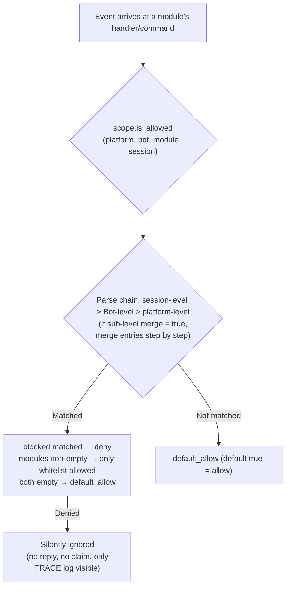

- **Parse priority: session-level > Bot-level > platform-level**, higher priority bindings **fully override** lower ones;
  if a sub-level binding sets `merge = true`, it instead performs a **per-entry union** with lower levels (both `modules` and `blocked` are merged separately,
  `merge` itself is a control key and not counted as an entry)
- **Silent semantics**: Commands and processors of filtered modules do not trigger, reply, or claim (to prevent cross-command mis-matches),
  only TRACE-level logs are visible (`core.scope.denied`)
- **Framework-level processors** (`scope_exempt=True` or owner is empty) are unaffected; modules with empty names (framework-level resources) are always allowed
- **Session-aware help and command queries**: Command query APIs (`command.help` /
  `get_command` / `get_commands` / `get_group_commands` / `get_visible_commands`,
  and `module.get_commands_overview`) all support optional `event=` or explicit
  `platform=` / `bot_id=` / `session_id=` keywords—commands from modules unavailable in the current session
  no longer appear in the results (`get_command` returns None, single command help is treated as "not registered",
  consistent with silent semantics); if no context is provided, full behavior is maintained

### Binding Inheritance (merge)

The default full override semantics are clear and predictable; when you need to **append** to an upper-level binding, set `merge = true` in the sub-level:

```toml
[ErisPulse.scope.platforms.onebot11]
modules = ["Chat", "Tool"]      # Platform-level: allow Chat, Tool

[ErisPulse.scope.bots.onebot11."123456"]
modules = ["Music"]
merge = true                    # The actual effect for this Bot = ["Chat", "Tool", "Music"]
```

- **Merge rules**: `modules` and `blocked` each take a **union**; within a binding, `blocked` still takes precedence over `modules`
- **Chained merging**: Platform → Bot → Session are layered step by step, each level independently decides `merge` or override

## ② Identity Dimension (Event Admission)

Answers "whose events are received." Events that are denied are **completely discarded at the distribution entry**—
they do not enter middleware or any processor (including framework-level), with only TRACE-level logs visible (`core.scope.identity_denied`).

- **Parse priority: user > session > Bot > adapter**, take the most specific configured policy; deny takes precedence over allow
- Each level of binding is a binary policy: `{ allow = true }` or `{ deny = true }`
- User keys support glob / regular expressions (e.g. `"spam_*"` to block a batch of spam users)
- Typical use case—上级 deny, individual allow for "exception allow":

```toml
[ErisPulse.scope.identity.adapters.onebot11]
deny = true
[ErisPulse.scope.identity.users.onebot11]
allow = ["u_admin"]   # Even if adapter-level denied, events from u_admin are still allowed
```

## ③ Outbound Dimension (Limiting Module Outbound Calls)

Constraints on modules **initiating outbound actions**: message sending / standard API actions / request operations.
Three types of actions correspond to the underlying DSL: `Event.reply` and `Send` (send), `Api` / `call_api` (api), and
`Request`'s accept/reject (request). Outbound calls initiated by modules during event handler execution
carry the module owner, and are uniformly judged by this dimension.

### Rule Forms (Inline Tables)

Each action's rule is an inline table: `{ allow = [...], deny = true|[...] }`.
Only one rule per action is allowed (TOML keys cannot repeat, choose between full deny and fine-grained):

```toml
[ErisPulse.scope.actions.MyModule]
send = { deny = true }                                  # Disable all sending (Event.reply / Send DSL)
# Or fine-grained method-level: send = { allow = ["Text", "Image*"], deny = ["File"] }
api = { allow = ["get_*"] }                             # Allow only query-type standard APIs
# Or action-level blacklist: api = { deny = ["set_*", "leave_*"] }
request = { deny = true }                               # Disable request handling accept/reject
```

- `send` entries match **send method names** (`Text` / `Image` / `File` ...),
  `api` entries match **standard action names** (`get_group_info` / `set_group_name` ...)
- Entries support exact names / glob / `re:` regex (consistent with the unified system syntax, case-insensitive)
- Writing a single string in `allow` is equivalent to a single-item list: `send = { allow = "Text" }`

### Decision Semantics

**Default is full allow**—unconfigured, or owner is empty (internal framework calls) are allowed.
After configuration, rules are evaluated in the following order:

1. `deny = true` → deny
2. `deny` list matches call name → deny
3. `allow` list is non-empty and call name is not matched (or call has no name) → deny
4. Otherwise, allow

Denied calls do not initiate any network requests, directly returning a standard failure response
(`retcode = 34601`, see [api-response §5.3](../standards/api-response.md#53-framework-extended-return-codes-34xxx-custom-platform-error-segment-lower-three-digits)).

```python
# Runtime API
sdk.scope.set_action("MyModule", "send", deny=True)              # Disable all message sending
sdk.scope.set_action("MyModule", "send", allow=["Text"])         # Allow only text sending
sdk.scope.is_action_allowed("MyModule", "send", name="Image")    # False
sdk.scope.is_action_allowed("MyModule", "api", name="get_user_info")  # Evaluate by rules
sdk.scope.delete_action("MyModule", "send")                      # Re-enable
sdk.scope.get_action("MyModule", "send")                         # Current rule for this action
```

## Runtime API

The runtime API for scope is divided into three layers: **decision** (three questions), **dimension-specific read/write** (per dimension `set` / `get` / `delete` parameterized methods, fully type-annotated, IDE can auto-complete), and **dictionary-style fallback** (dot-separated path to reach any section).

```python
from ErisPulse import sdk

scope = sdk.scope
```

### Decision (Three Questions)

```python
scope.is_allowed("onebot11", "123456", "Chat")                 # ① Module dimension
scope.is_allowed("onebot11", "123456", "Chat", "789012345")    # With session-level
scope.is_allowed("onebot11", "123456", None)                   # Framework-level resource -> True

scope.is_identity_allowed("onebot11", "123456", "group_9", "u1")   # ② Identity dimension

scope.is_action_allowed("MyModule", "send")                    # ④ Outbound dimension
scope.is_action_allowed("MyModule", "send", name="Image")      # Fine-grained method-level
```

### ① Module Dimension

```python
# Binding (hierarchy determined by parameters: session_id > bot_id > platform-level)
scope.set_module("onebot11", bot_id="123456", modules=["Chat", "Tool*"])
scope.set_module("onebot11", blocked=["re:^Danger"])                       # Platform-level
scope.set_module("onebot11", bot_id="123456", session_id="g9", modules=["Chat"])  # Session-level
scope.set_module("onebot11", bot_id="123456", modules=["Music"], merge=True)      # Union with existing entries
scope.set_module("onebot11", bot_id="123456", modules=["Chat"], persist=False)    # Runtime only

# Read / Delete
scope.get_module("onebot11", bot_id="123456")   # {"modules": ["Chat"], "blocked": []}
scope.delete_module("onebot11", bot_id="123456")
```

> `merge=True` is **write-time union** (merges entries with existing bindings at this level); `merge = true` configuration keys at parse time across levels are described above in [Binding Inheritance](#binding inheritance-merge)—these are independent mechanisms.

> **Runtime binding (persist=False) semantics**: Runtime bindings are saved in a separate overlay layer,
> **any subsequent configuration writes / hot reloads of configuration files will not overwrite them** (the configuration tree is rebuilt and automatically reapplied in order, including runtime deletions). They are not persisted, and are lost after process restart; when a module is unloaded, runtime bindings written by that module are cleaned up. Subsequent `persist=True` writes (user-persistent semantics) to the same path will replace runtime rules.

### ② Identity Dimension

```python
# Binding policies (hierarchy determined by parameters: user > session > bot > adapter; allow / deny are mutually exclusive)
scope.set_identity("onebot11", user_id="u_bad", deny=True)
scope.set_identity("onebot11", user_id="spam_*", deny=True)    # Key supports glob / re: regex
scope.set_identity("onebot11", bot_id="123456", session_id="g9", allow=True)

# Read / Delete
scope.get_identity("onebot11", user_id="u_bad")   # {"deny": True}
scope.delete_identity("onebot11", user_id="u_bad")
```

### ③ Outbound Dimension

```python
# Set restriction rules (allow: str|list; deny: bool|str|list; whole rule replacement semantics)
scope.set_action("MyModule", "send", deny=True)                    # Disable all sending
scope.set_action("MyModule", "send", allow=["Text"])               # Allow only text sending
scope.set_action("MyModule", "api", deny=["set_*", "leave_*"])     # Disable management-type APIs

# Read / Delete
scope.get_action("MyModule", "send")       # {"allow": ["Text"]} original rule
scope.delete_action("MyModule", "send")    # Remove single action
scope.delete_action("MyModule")            # Remove all action restrictions for this module
```

### General

```python
scope.get("platforms")   # Dictionary-style fallback: dot-separated path to read any section
scope.topology()         # Full configuration tree (for Dashboard)
scope.stats()
# {"module_calls": .., "module_filtered": .., "identity_checks": .., "identity_denied": ..,
#  "action_checks": .., "action_denied": .., "cache_hits": .., "cache_misses": ..}
scope.reset_stats()
scope.clear()           # Clear all configurations (memory only)
```

### Advanced: Dictionary-style Dot-Path Fallback

Dimension-specific methods cover daily scenarios; when you need to directly access any node (or future added dimensions),
use the dictionary-style API—`get` / `set` / `delete` accepts dot-separated paths (deep dict merge, immediate read after write),
and provides `scope[path]` / `scope[path] = v` / `del scope[path]` / `path in scope` protocols:

```python
scope.set("bots.onebot11.123456", {"modules": ["Chat"], "blocked": []})
scope.set("identity.users.onebot11.u_bad", {"deny": True})
scope.get("actions.MyModule.send")

scope["platforms.onebot11"]        # Read (raises KeyError if not exists)
scope["platforms.onebot11"] = {...}  # Write
del scope["platforms.onebot11"]      # Delete
"actions.MyModule" in scope          # Existence check
```

## Cache and Hot Reload

- `is_allowed` / `is_identity_allowed` / `is_action_allowed` results are cached with **LRU** (configurable via `scope.cache_size`),
  invalidated automatically by `set` / `delete` /
  configuration hot reload (`config.updated` / `config.set`)
- All dimension configurations take effect **immediately** without restart
- Scope is evaluated **per event**, with no cross-event memory: configuration changes take effect on the next event

## Configuration Format Validation

During loading / hot reload, configuration format is validated per section: type errors (e.g. `platforms` written as a string), invalid outbound rules (e.g. `allow` written as a number), unknown action names, unknown top-level keys (e.g. `alow` with a typo) will output **WARNING** and ignore the corresponding section / entry, while other valid configurations remain effective—incorrect writing no longer silently fails.

## Common Issues and Notes

### 1. Configuration Hierarchy and Overriding

- Module dimension: session-level > Bot-level > platform-level, **full override** (sub-level `merge = true` means per-entry union).
  If you want "platform allows Chat, Bot adds Music," you can set `merge = true` in the Bot-level binding, or list both
- Identity dimension: user > session > Bot > adapter, take the **most specific** configured policy (can be used for exception allow)
- Command user allow/deny lists: exact command names take precedence over glob keys (see `event.command.acl`)

### 2. Module/Command Not Responding

First suspect scope rather than the module itself:

```python
from ErisPulse import sdk

print(sdk.scope.is_allowed(event.get_platform(), bot_id, "MyModule", session_id))
print(sdk.scope.is_identity_allowed(event.get_platform(), bot_id, session_id, user_id))
print(sdk.scope.stats())   # module_filtered / identity_denied > 0 indicates silent filtering
```

Filtered is **silent** (module and identity dimensions do not reply, to avoid exposing rules), but statistics are accumulated;
commands denied by ACL reply "insufficient permissions."

### 3. Outbound Action Denied When Troubleshooting

```python
from ErisPulse import sdk

print(sdk.scope.get("actions.MyModule"))
print(sdk.scope.stats())   # action_denied > 0 indicates some calls were blocked
```

Blocking is **explicit**: denied calls return a standard failure response (`retcode = 34601`, no network request initiated).

### 4. Session Identifier Isolation Across Platforms

The `(platform, session_id)` combination is the unique identifier. `scope.sessions.onebot11."789"` only applies to onebot11, not affecting the session with `789` on Telegram. The same applies to identity dimension user keys.

## API дерева топологии

`ModuleManager.get_topology()` и `AdapterManager.get_topology()` предоставляют данные о принадлежности модулей/адаптеров, а `sdk.get_topology()` объединяет их (включая область видимости `scope`) в один вызов:

```python
from ErisPulse import sdk

topology = sdk.get_topology()
# {
#   "modules": {                                   # Модуль → принадлежащие ему ресурсы
#     "Chat": {
#       "loaded": True, "enabled": True,
#       "commands": ["chat", "translate"],
#       "handlers": {"message": 2, "notice": 1},
#       "routes": {"http": ["/Chat/api"], "ws": [], "sse": []},
#       "lifecycle_hooks": 3,
#     }
#   },
#   "adapters": {                                  # Адаптер → Bot → область видимости
#     "onebot11": {
#       "status": "started", "enabled": True,
#       "bots": {"123456": {"status": "online", "scope": {...}}},
#       "scope": {"modules": [...], "blocked": [...]},
#     }
#   },
#   "scope": {                                     # Область видимости (модули / идентификаторы / исходящие действия)
#     "platforms": {...}, "bots": {...}, "sessions": {...},
#     "identity": {"adapters": {...}, "bots": {...}, "sessions": {...}, "users": {...}},
#     "actions": {...},
#   },
# }
```

- Модульная топология объединяет зарегистрированные команды, обработчики событий, HTTP/WS/SSE маршруты и хуки жизненного цикла модуля, что позволяет визуализировать дерево ресурсов модуля.
- Топология адаптеров объединяет статусы адаптеров, статусы подчинённых им ботов и привязки областей видимости на уровне платформы/бота (в контексте модулей).
- **Выход в JSON-безопасном формате**: `get_topology(json_safe=...)` по умолчанию `True`, возвращаемая структура может быть напрямую сериализована с помощью `json.dumps` — в `info` модуля сохраняется только подтаблица `meta` с чистыми данными (отбрасываются `module_class` / `strategy` и другие объекты времени выполнения), а остальные узлы (включая произвольные объекты, добавленные автором адаптера в `info` бота) проходят базовую очистку (для классов берётся `__name__`, для непоследовательных объектов используется `str()`). Панель управления / WebUI могут напрямую сериализовать возвращаемые данные; при необходимости получить исходные объекты передайте `json_safe=False`.


### 归属权（owner）系统

# Система владельцев (owner)

Система владельцев является основой для "Plug-and-Play" модулей: все ресурсы фреймворка, зарегистрированные во время загрузки модуля, автоматически привязываются к нему, и при отключении/деактивации модуля они автоматически удаляются — автор модуля должен просто объявить ресурсы, не вручную писать логику очистки.

> **Связанные системы**: область видимости (scope) определяет, "будут ли ресурсы активны" при отправке событий, а владелец определяет в цикле жизни "кому принадлежат ресурсы и кто будет отвечать за их удаление при отключении". Область видимости описана в [Единая управляющая поверхность (scope)](scope.md), фоновые задачи описаны в [Управление жизненным циклом](lifecycle.md#фоновые-задачи-принадлежность-и-автоматический-отмена).

{!--< tips >!--}
1. Владение **автоматически записывается** в момент регистрации по `current_owner`, без изменений в коде модуля
2. Отключение/деактивация модуля используют одну и ту же цепочку очистки (`_cleanup_module_registrations`), каждая неудачная операция только предупреждает, но не прерывает процесс
3. Ресурсы, определённые пользовательскими настройками (постоянное перезаписывание / правила scope / ACL команд) **не** удаляются при отключении модуля
4. Внешние дескрипторы, принадлежащие утилитным модулям, можно добавить в цепочку очистки с помощью `on_cleanup(cb)`, и они будут автоматически вызываться при отключении модуля (см. [Руководство по утилитным модулям](#руководство-по-утилитным-модулям-принадлежность-дескрипторов-других-модулей))
{!--< /tips >!--}

## Механизм контекста owner

Принадлежность передаётся через контекстную переменную `current_owner` (`ErisPulse.runtime.context`):

```python
from ErisPulse.runtime import owner_scope, get_current_owner

with owner_scope("MyModule"):
    # Все ресурсы, зарегистрированные в этом блоке, автоматически привязываются к MyModule
    assert get_current_owner() == "MyModule"
```

Фреймворк автоматически вставляет owner в следующие моменты (код модуля/адаптера не требует ручного обёртывания):

| Момент | Значение owner | Позиция |
|------|----------|------|
| Модуль `load()` | Имя модуля | При инстанцировании + на протяжении `on_load` |
| Адаптер `start()` / `restart()` | Имя платформы | На протяжении запуска адаптера |
| Регистрация stub для ленивой активации `activate_on` | Имя модуля | При регистрации заглушек команд/обработчиков |
| Выполнение обработчика события | Имя модуля, к которому принадлежит обработчик | При повторной инъекции в точку входа handler / command |

Повторная инъекция во время выполнения означает: обработчики команд, объявленные в `on_load`, при вызове API регистрации (например, `sdk.adapter.on()` или `overrides.*.set(persist=False)`) во время выполнения, также автоматически привязываются к этому модулю.

## Обзор ресурсов, привязанных к модулю

Все ресурсы, зарегистрированные модулем в контексте загрузки, записываются с привязкой к нему и автоматически освобождаются при отключении/отключении модуля:

| Ресурс | Способ регистрации | Вызов очистки |
|------|----------|----------|
| Команды | `@command()` / объявление команды в виде dict | `command.unregister_by_owner()` |
| Обработчики событий | `@message` / `@notice` / `@request` / `@meta` | `handler.unregister_by_owner()` |
| Слушатели событий адаптера | `sdk.adapter.on()` / `raw=True` | `adapter.unregister_handlers_by_owner()` |
| Промежуточные обработчики адаптера | `@sdk.adapter.middleware` | То же самое |
| Маршруты (HTTP/WS/SSE) | `router.http()` / `websocket()` / `sse()` | Двойная защита по пространству имен и по owner |
| Промежуточные обработчики маршрутов | `@router.middleware()` / `add_middleware()` | `router.unregister_all_by_owner()` |
| Вход на главную страницу Dashboard | `router.register_home_entry()` | `unregister_home_entries_by_owner()` |
| Пользовательские типы сессий | `register_custom_type()` | `unregister_custom_types_by_owner()` |
| Задачи в фоновом режиме | `self.spawn()` | `cancel_owner_tasks()` |
| Внешние очисточные хуки (управляемые инструментальным модулем) | `runtime.on_cleanup(cb)` | `run_owner_cleanups()` (вызывается в цепочке при отключении/отключении/закрытии адаптера) |
| Хуки жизненного цикла | `lifecycle.register()` | `lifecycle.unregister_by_owner()` |
| Провайдер источника главного пользователя | `master.provider` | `master.unregister_by_owner()` |
| Ключи переводов i18n | Объявление `I18nClass` (domain=имя модуля) | `i18n.unregister_domain()` |
| Переопределение событий (в режиме выполнения) | `overrides.*.set(persist=False)` | `overrides.unregister_by_owner()` |
| Интерактивные сессии (ожидание wait_reply / аренды) | `event.wait_reply()` / `sdk.interaction.acquire()` | `interaction.cancel_by_owner()` (сторона, ожидающая, немедленно получает отмену) |
| Контекстные данные | `runtime/context` с записью по owner | Точный очистка по модулю |

Ресурсы, привязанные к адаптеру (с платформой в качестве owner), при `shutdown()` / `restart()` адаптера очищаются методом `_cleanup_adapter_resources`. Также включают:

| Ресурс | Вызов очистки |
|------|----------|
| Собственные `on()` обработчики и промежуточные обработчики адаптера | `adapter.unregister_handlers_by_owner(platform)` |
| Расширения методов событий платформы (`EventMixin`) | `unregister_platform_event_methods(platform)` |
| Пользовательские типы сессий | `unregister_custom_types_by_owner(platform)` |
| Интерактивные сессии (ожидание wait_reply / аренды, зависящие от платформы) | `interaction.cancel_by_platform(platform)` |
| Области переводов i18n (domain=ключ конфигурации) | `i18n.unregister_domain(ключ конфигурации)` |
| Маршруты с мелкозернистым пространством имен | `router.unregister_all_by_owner(platform)` |

## Децерализация/отключение последовательности очистки

`unload()` и `disable()` используют одну и ту же цепочку очистки (каждый шаг независим, с try/except, сбой только в журнале, **не прерывает последующую очистку**):

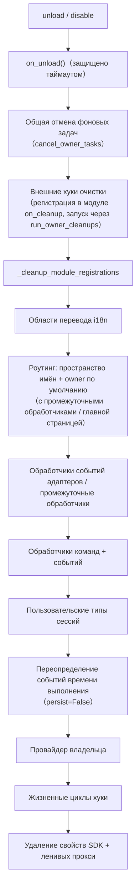

При выходе `sdk.uninit()` есть глобальная общая очистка: остановка всех адаптеров → загрузка всех модулей → `router.stop()` (очистка роутинга/промежуточных обработчиков/главной страницы) → `cancel_all_background_tasks()` → очистка обработчиков событий и хуков.

## Пределы принадлежности: какие ресурсы не удаляются при выгрузке

Принадлежность удаляет **только ресурсы, зарегистрированные кодом модуля**. Следующие ресурсы относятся к **семантике пользовательской конфигурации** (управление в руках пользователя, возможно, специально настроено), и остаются после выгрузки модуля:

| Ресурс | Семантика | Описание |
|------|------|------|
| `overrides.*.set(persist=True)` | Постоянное переопределение | Записывается в конфиг, действует при перезапуске; модуль при выгрузке не удаляет (явно настроен пользователем) |
| `scope.set_action()` и другие правила области видимости | Правила управления доступом | Управляются пользователем/Dashboard, не удаляются при выгрузке модуля |
| `overrides.acl.set(persist=True)` | ACL команд | То же |
| `Conversation.save()` | Сохранение многошаговых диалогов | Данные сохраняются и не удаляются |

Ресурсы, записанные временно (`persist=False`), удаляются вместе с owner — **разница между "активным состоянием модуля" и "активным состоянием пользователя" — это именно persist**.

## Руководство для авторов модулей

### Рекомендуемый стиль

```python
from ErisPulse import sdk
from ErisPulse.Core.Event import command
from ErisPulse.runtime import owner_scope, spawn_background

class MyModule(BaseModule):
    async def on_load(self, event):
        # Ресурсы фреймворка: автоматически привязываются, не требуют ручной очистки
        self.task = self.spawn(self.polling())      # Фоновая задача
        sdk.router.register_home_entry("Мой модуль", "/my")  # Вход на главную

        # Собственные ресурсы модуля: включаются в систему принадлежности через owner_scope
        with owner_scope("MyModule"):
            self.client.on_event(self._handle)      # Пример пользовательской регистрации

    async def on_unload(self, event):
        # Ресурсы фреймворка уже автоматически удалены, осталось только очистить ресурсы вне owner_scope
        await self.client.close()
```

### Важные замечания

- **Регистрация в момент импорта не имеет принадлежности**: обработчики/хуки, зарегистрированные на уровне модуля (в момент импорта), происходят до `owner_scope` и привязываются к фреймворку (owner=None), поэтому **не удаляются**. Всегда регистрируйте в `on_load()`.
- **Регистрация i18n с пользовательским domain**: `i18n.register(domain=...)` с domain, отличным от имени модуля, не будет автоматически удалён. Держите domain=имя модуля.
- **Фоновые задачи должны использовать `self.spawn()`**: простое `asyncio.create_task` не привязывается к модулю и не отменяется при выгрузке (см. [Управление жизненным циклом](lifecycle.md#Фоновые_задачи_принадлежность_и_автоматическое_отмена)).
- **Очистка "сбоит только с предупреждением"**: ошибка при очистке одного шага не блокирует остальные, в логах видны на уровнях DEBUG/WARNING, для отладки можно включить TRACE.

## Руководство по модулю-инструменту: хэндлы для других модулей

**Сценарий**: такие "инструментальные модули", как планировщик задач, реестр и пулы соединений, хранят что-то от имени других модулей — например, при вызове `sdk.Cron.on_trigger(handler)` в `on_load` ваш контейнер сохраняет обратный вызов, ссылающийся на экземпляр другого модуля. Фреймворк автоматически очищает все ресурсы, зарегистрированные модулем, но не может очистить **ссылки в вашем частном контейнере**: после того, как модуль будет отключен или удален, ваш контейнер по-прежнему ссылается на его экземпляр, и он не может быть собран сборщиком мусора (утечка памяти, `purge` диагностика сообщает "непересборка").

**Решение**: в той же функции, где вы регистрируете что-то от имени другого модуля, вызовите `on_cleanup()`, и фреймворк автоматически вызовет вашу функцию очистки при отключении или удалении другого модуля:

```python
from ErisPulse.Core.Bases import BaseModule
from ErisPulse.runtime import off_cleanup, on_cleanup

class CronModule(BaseModule):
    def __init__(self):
        self._entries = {}  # {имя модуля: список обратных вызовов, принадлежащих этому модулю}

    def on_trigger(self, handler):
        # Автоматически определяет имя вызывающего модуля (работает как при прямом вызове в on_load, так и через module.call),
        # возвращает имя модуля, которое можно использовать как ключ для идентификации
        owner = on_cleanup(self._drop)
        self._entries.setdefault(owner, []).append(handler)

    def _drop(self, owner: str):
        """Вызывается фреймворком автоматически, когда модуль-владелец отключается или удаляется: просто удаляем его ссылки"""
        self._entries.pop(owner, None)

    async def on_unload(self, event):
        off_cleanup(self._drop)  # ③ При выгрузке модуля отменяем подписку на очистку, чтобы избежать удержания ссылки на self
```

Обеспечиваемое фреймворком поведение:

| Аспект | Поведение |
|--------|----------|
| Время срабатывания | При отключении/удалении модуля-владельца или при закрытии адаптера — все это происходит в рамках цепочки очистки фреймворка, до запуска диагностики утечек `purge` |
| Определение вызывающего модуля | При прямом вызове — `current_owner`; при вызове через `module.call()` — `current_caller`; также можно явно указать имя модуля через `on_cleanup(cb, owner="имя модуля")` |
| Сигнатура обратного вызова | `cb(owner: str)`, может быть синхронной или асинхронной; асинхронные функции защищены таймаутом (`CLEANUP_CALLBACK_TIMEOUT_SECS`, по умолчанию 10 секунд) |
| Обработка ошибок | Ошибка или таймаут одного обратного вызова записываются в лог, но не влияют на другие хуки и цепочку очистки |
| Дублирование регистрации | Одинаковые пары `(владелец, обратный вызов)` учитываются только один раз |

**Когда не нужно использовать**: если модуль регистрирует ресурсы фреймворка (команды, обработчики событий, маршруты, фоновые задачи и т.д.), фреймворк уже автоматически очищает их (см. выше [Обзор ресурсов](#обзор-ресурсов)). Только ссылки, хранящиеся в вашем частном контейнере, требуют `on_cleanup`. Сводный справочник для разработчиков модулей см. в [Рекомендации · Инструментальные модули](../developer-guide/modules/best-practices.md#инструментальные-модули-при-хранении-чужих-объектов-нужно-подписываться-на-уведомления-об-удалении).


### 启动流程与手动控制

# Процесс запуска и ручное управление

Методы `await sdk.run()` / `await sdk.init()` ErisPulse объединяют весь процесс запуска в одну строку кода. Однако, если вам нужно полностью настроить процесс запуска (например, частичная загрузка, динамическая регистрация, горячая замена, встраивание пользовательской стратегии загрузки), вам нужно понимать, что происходит внутри этой цепочки, а также как вручную управлять каждым шагом.

В этой статье мы разбиваем процесс запуска на отдельные этапы, объясняем их назначение и порядок вызова, а также приводим пример ручного полного запуска.

> В этой статье предполагается, что вы уже запустили [первого робота](../getting-started/first-bot.md) и знакомы с двумя режимами `sdk.run(keep_running=True/False)`. В этой статье мы сосредоточимся на разборе внутренней цепочки `init()`, а также на более низкоуровневых входных точках, таких как `init()`/`init_task()`/`init_sync()`.

## Обзор верхнего уровня SDK

Помимо двух режимов `keep_running` для `run()`, SDK предоставляет несколько более низкоуровневых точек входа, которые отличаются **асинхронностью, возвращаемым значением и обработкой исключений**:

| Точка входа | Асинхронность | Возвращаемое значение | Обработка исключений | Сценарий использования |
|-------------|---------------|------------------------|----------------------|-------------------------|
| `await sdk.run(True)` | async, блокирующий | `None` (автоматически `uninit` при остановке) | Ошибки модулей/адаптеров перехватываются, не приводят к сбою процесса | Простое приложение-бот |
| `await sdk.run(False)` | async, не блокирующий | `None` (не автоматически выгружается) | То же самое | Инициализация, затем выполнение пользовательской логики |
| `await sdk.init()` | async, требует `await` | `bool` | Внутренние исключения компонентов перехватываются, в случае неудачи возвращается `False` | Ручное управление жизненным циклом (с `uninit()`) |
| `sdk.init_task()` | async, возвращает `Task` без блокировки | `asyncio.Task` | То же, что и `init()` | Параллельное выполнение других инициализаций или когда цикл событий еще не запущен |
| `sdk.init_sync()` | **Синхронный**, блокирует текущий поток | `bool` | То же, что и `init()` | Сценарии командной строки, синхронный вход без цикла событий |

> **Распространённое заблуждение**: `await sdk.init()` **не эквивалентно** `await sdk.run(keep_running=False)`. Есть два различия: ① `init()` возвращает `bool` (в случае неудачи возвращает `False`), `run()` возвращает `None`; ② `init()` выполняет только инициализацию и **не производит автоматическую выгрузку**, `run()` автоматически вызывает `uninit()` при завершении цикла событий. Поэтому, если требуется ручное управление жизненным циклом или выгрузкой, используйте `init()` + `uninit()`.

## Обзор запуска

`sdk.init()` (точнее, его внутренний `Initializer.init()`) запускает всю систему в следующем порядке:

```mermaid
flowchart TD
    A[0. Подготовка среды<br/>Загрузка конфигурации / Обработка исключений] --> B
    B[1. Параллельное обнаружение и загрузка<br/>AdapterLoader.load / ModuleLoader.load<br/>Внутренний вызов Finder.find_all] --> C
    C[2. Регистрация адаптера<br/>AdapterLoader.register_to_manager] --> D
    D[3. Запуск адаптера<br/>adapter.startup] --> E
    E[4. Регистрация модуля<br/>ModuleLoader.register_to_manager] --> F
    F[5. Инициализация модуля<br/>ModuleLoader.initialize_modules<br/>Создание экземпляра и привязка к sdk] --> G
    G[6. Запуск сервера маршрутизации<br/>router.start]
```

Соответствующие основные компоненты:

| Уровень | Компонент | Ответственность |
|----|------|------|
| Обнаружение | `AdapterFinder` / `ModuleFinder` | **Обнаружение** адаптеров/модулей из entry-points установленных пакетов |
| Загрузка | `AdapterLoader` / `ModuleLoader` | Обнаружение + импорт + чтение метаданных + проверка включения/отключения, возвращает список объектов |
| Регистрация | `*Loader.register_to_manager` | Запись объектов в соответствующий менеджер |
| Управление | `sdk.adapter` / `sdk.module` | Хранение экземпляров адаптеров/модулей, предоставление интерфейсов запуска/остановки |
| Инициализация | `ModuleLoader.initialize_modules` | Создание экземпляров модулей и привязка к `sdk` (обработка топологической сортировки зависимостей) |
| Маршрутизация | `sdk.router` | HTTP / WebSocket сервер |

> **Важно**: `Finder` и `Loader` — это два уровня. `Loader` внутри **уже содержит** `Finder` (`AdapterLoader` содержит `AdapterFinder`, `ModuleLoader` содержит `ModuleFinder`). В большинстве случаев вам достаточно использовать `Loader`, а `Finder` применяется только тогда, когда нужно "только перечислить, но не импортировать".

[Документация на русском языке](docs/ru/quick-start.md)

## Подробное описание каждого этапа

### 1. Уровень обнаружения: Finder

Finder отвечает только за "поиск пакетов, предоставляющих адаптеры/модули", не импортирует и не создает экземпляры.

```python
from ErisPulse.finders import AdapterFinder, ModuleFinder

adapter_finder = AdapterFinder()
module_finder = ModuleFinder()

# Поиск всех установленных entry-points для адаптеров/модулей
adapter_entries = adapter_finder.find_all()    # list[EntryPoint]
module_entries = module_finder.find_all()      # list[EntryPoint]

# Поиск по имени
entry = module_finder.find_by_name("MyModule")  # EntryPoint | None
```

Каждый `EntryPoint` можно загрузить через `.load()`, чтобы получить соответствующий класс, но обычно это делает Loader автоматически.

### 2. Уровень загрузки: Loader

Loader на основе Finder выполняет "импорт + чтение метаданных + проверку включения/отключения".

```python
from ErisPulse.loaders import AdapterLoader, ModuleLoader
from ErisPulse import sdk

adapter_loader = AdapterLoader()
module_loader = ModuleLoader()

# Внутри load(): вызывается finder.find_all() → обработка entry-point → возврат тройки
adapter_objs, enabled_adapters, disabled_adapters = await adapter_loader.load(sdk.adapter)
module_objs, enabled_modules, disabled_modules = await module_loader.load(sdk.module)
```

Тройка, возвращаемая `load()`:

| Возвращаемое значение | Значение |
|-----------------------|----------|
| `objs` (`dict`)       | Сопоставление названия → объекта (класс адаптера / обёртка модуля) |
| `enabled` (`list[str]`) | Названия, включённые (не отключены в конфигурации) |
| `disabled` (`list[str]`) | Названия, отключённые |

#### Информация о диагностике при сбое загрузки

Если при загрузке или инициализации модуля/адаптера возникает исключение, фреймворк пропускает этот компонент и продолжает загрузку остальных, выводя **сводку пользовательских фреймов кода**, чтобы вы могли локализовать проблему на уровне INFO, без необходимости вручную включать DEBUG:

```
[ERROR] [ModuleLoader] Загрузка модуля MyModule из entry-point не удалась, пропущено: 'NoneType' object has no attribute 'platform'
  → MyModule/Core.py:42 in on_load
      adapter = sdk.platform
  → AttributeError: 'NoneType' object has no attribute 'platform'
  → Подсказка: Увеличьте уровень логирования до DEBUG для просмотра полного стека; проверьте реализацию модуля MyModule
```

Диагностическая информация генерируется через модуль `ErisPulse.runtime.diagnostics` и автоматически фильтрует внутренние фреймы фреймворка, оставляя только фреймы вашего кода. При необходимости можно повторно использовать это в пользовательской логике загрузки:

```python
from ErisPulse.runtime import log_diagnostic

try:
    risky_init()
except Exception as e:
    log_diagnostic(e)  # Автоматически извлекает фреймы пользовательского кода и записывает в ERROR-лог
```

Модуль также предоставляет два вспомогательных метода: `extract_user_frame()` (возвращает структурированную информацию о фрейме) и `format_diagnostic_block()` (возвращает многострочную текстовую строку).

### 3. Регистрация: register_to_manager

Регистрация объектов, созданных Loader, в менеджере, чтобы `sdk.adapter` / `sdk.module` могли их распознавать.

```python
# Регистрация адаптеров (возвращает bool, означающий, успешно ли все прошли)
await adapter_loader.register_to_manager(enabled_adapters, adapter_objs, sdk.adapter)

# Регистрация модулей
await module_loader.register_to_manager(enabled_modules, module_objs, sdk.module)
```

После регистрации адаптеры зарегистрированы в менеджере адаптеров, а модули — в менеджере модулей, но **ни один из них ещё не запущен/не создан экземпляр**.

### 4. Запуск адаптеров

```python
# Запуск всех зарегистрированных адаптеров
await sdk.adapter.startup()
# Или указать платформу
await sdk.adapter.startup("yunhu")
await sdk.adapter.startup(["yunhu", "telegram"])
```

> Регистрация ≠ Запуск. `register_to_manager` — это просто регистрация; `startup` вызывает метод `start()` адаптера и устанавливает соединение с платформой.

### 5. Инициализация модулей

Модули требуют дополнительного шага — **инициализацию** и привязку к `sdk` (чтобы вы могли обращаться к `sdk.MyModule.xxx`). Этот шаг также обрабатывает зависимости между модулями и сортирует их в топологическом порядке.

```python
success = await module_loader.initialize_modules(
    enabled_modules, module_objs, sdk.module, sdk
)
```

После успешной инициализации модуль появится в `sdk.<ModuleName>`.

### 6. Запуск сервера маршрутизации

```python
await sdk.router.start(
    host="0.0.0.0",
    port=8000,
    ssl_certfile=None,
    ssl_keyfile=None,
)
```

Сервер маршрутизации отвечает за получение обратных вызовов Webhook / WebSocket от адаптеров. Без запуска сервера, адаптеры в режиме сервера не смогут получать сообщения.

## Полный пример ручного запуска

Следующий код **эквивалентен** основному процессу `await sdk.init()`, но каждая его часть доступна для ручного управления, что позволяет вставить пользовательскую логику в любой момент:

```python
import asyncio
from ErisPulse import sdk
from ErisPulse.loaders import AdapterLoader, ModuleLoader

async def manual_startup():
    # 0. Подготовка окружения (загрузка конфигурации, регистрация обработки исключений)
    #    _prepare_environment — это внутренний шаг init(); если использовать ручной процесс,
    #    его необходимо вызвать до Loader, иначе Loader не сможет прочитать конфигурацию,
    #    и все адаптеры/модули будут ошибочно признаны отключенными.
    if not await sdk._prepare_environment():
        print("Ошибка при подготовке окружения")
        return False

    # 1. Создание загрузчиков (внутри каждый загрузчик содержит Finder)
    adapter_loader = AdapterLoader()
    module_loader = ModuleLoader()

    # 2. Параллельное обнаружение и загрузка (аналогично внутреннему gather в init())
    (adapter_objs, enabled_adapters, disabled_adapters), \
    (module_objs, enabled_modules, disabled_modules) = await asyncio.gather(
        adapter_loader.load(sdk.adapter),
        module_loader.load(sdk.module),
    )

    # 3. Регистрация адаптеров
    await adapter_loader.register_to_manager(
        enabled_adapters, adapter_objs, sdk.adapter
    )

    # 4. Запуск адаптеров
    if enabled_adapters:
        await sdk.adapter.startup()

    # 5. Регистрация модулей
    await module_loader.register_to_manager(
        enabled_modules, module_objs, sdk.module
    )

    # 6. Инициализация модулей (инстанцирование + привязка к sdk)
    if enabled_modules:
        await module_loader.initialize_modules(
            enabled_modules, module_objs, sdk.module, sdk
        )

    # 7. Запуск сервера маршрутизации
    await sdk.router.start(host="0.0.0.0", port=8000)

    print("Ручной запуск завершен")
    return True

async def main():
    ok = await manual_startup()
    if ok:
        # Блокировка для поддержания работы (ручной процесс не блокирует автоматически)
        await asyncio.Event().wait()

if __name__ == "__main__":
    asyncio.run(main())
```

### Когда использовать ручной запуск?

В большинстве случаев **ручной запуск не требуется**, так как `await sdk.run()` уже выполняет все вышеперечисленные шаги. Ручной запуск имеет смысл только в следующих сценариях:

- **Частичная загрузка**: загрузить только указанные адаптеры/модули, пропустив остальные
- **Динамическая регистрация**: регистрировать новые адаптеры/модули во время выполнения в зависимости от условий
- **Собственный порядок**: изменить стандартный порядок загрузки (например, запустить модуль до запуска адаптера)
- **Внедрение стратегий**: внедрить в Loader пользовательские менеджеры строгого режима, стратегии загрузки и т. д.
- **Отладка/диагностика**: при сбое на каком-либо этапе, ручной запуск позволяет локализовать проблему

## Контроль на уровне выполнения

Даже после использования `sdk.run()` для запуска, вы всё ещё можете управлять отдельными подсистемами в процессе выполнения, без необходимости перезапуска всего SDK:

### Горячая перезагрузка адаптеров

```python
# Горячая перезагрузка одного из адаптеров (исправление подключения, не влияет на другие платформы)
await sdk.adapter.shutdown("yunhu")
await sdk.adapter.startup("yunhu")

# Запуск новой платформы в процессе выполнения
await sdk.adapter.startup("telegram")

# Временное отключение определённой платформы
await sdk.adapter.shutdown("telegram")
```

> `adapter.startup()` требует, чтобы адаптер **был зарегистрирован** в менеджере. Регистрация происходит внутри `init()`/`run()`, поэтому это и есть тонкое управление, которое возможно **после** запуска.

### Сервер маршрутизации

```python
# Временное отключение сервера webhook
await sdk.router.stop()

# Перезапуск (например, при смене порта)
await sdk.router.start(host="0.0.0.0", port=9000)
```

### Загрузка модулей по требованию

```python
# Ручная загрузка модуля (возможно, ленивой загрузки)
await sdk.load_module("MyModule")
```

## Грациозное завершение

Начиная с версии 2.7.0, `sdk.shutdown()` обеспечивает **программное грациозное завершение**: установка события завершения, которое заставляет основной цикл, зависший в `await sdk.run(keep_running=True)`, вернуться, что приводит к запуску `uninit()` и завершению очистки ресурсов.

```python
# Вызывается в любой корутине, вызывает грациозный выход (run() зависший возвращает и автоматически выполняет uninit)
sdk.shutdown()
```

Типичное применение:

```python
async def shutdown_after_idle():
    await asyncio.sleep(3600)
    sdk.shutdown()  # Грациозное завершение после 1 часа бездействия
```

**Обработка сигналов**: `run()` внутри регистрирует обработчики `SIGTERM` / `SIGHUP`, преобразуя системные сигналы в грациозное завершение — при остановке контейнеров (Docker `docker stop`) или остановке службы `systemd` процесс будет выполнять `uninit()` для очистки, а не будет принудительно убит.

- На Windows не поддерживается `loop.add_signal_handler`, обработчик сигналов будет автоматически пропущен (можно использовать `sdk.shutdown()` или Ctrl+C для вызова завершения)
- Повторный вызов `sdk.shutdown()` безопасен (при уже установленном событии повторные вызовы не выполняют никаких действий)

## Процесс удаления

Обратной операцией запуска является `await sdk.uninit()`, которая очищает в обратном порядке:

1. Закрытие всех адаптеров (`adapter.shutdown()`)
2. Удаление всех модулей
3. Очистка всех обработчиков событий
4. Очистка модульных свойств менеджеров и SDK

В ручных сценариях запуска не забудьте вызвать `uninit()` перед выходом для обеспечения корректного завершения:

```python
try:
    await asyncio.Event().wait()   # Поддержание работы
finally:
    await sdk.uninit()
```

## Перезапуск

SDK предоставляет два способа перезапуска, и вам не нужно самостоятельно сначала удалять — фреймворк сам обрабатывает:

| Способ | Вызов | Поведение | Сценарии использования |
|------|------|------|----------|
| Горячий перезапуск | `await sdk.restart()` | Внутри одного процесса `uninit()` и повторный `init()`, повторная загрузка адаптеров/модулей | Перезагрузка конфигурации, горячая замена модулей |
| Жесткий перезапуск | `await sdk.hard_restart()` | `uninit()` и выход из процесса с **кодом 42**, запуск нового процесса внешним наблюдателем | Подозрение на утечку памяти/ресурсов, полный чистый перезапуск |

```python
# Горячий перезапуск: повторная загрузка в том же процессе (наиболее часто используемый)
await sdk.restart()

# Жесткий перезапуск: выход из процесса, передача управления внешнему наблюдателю (см. руководство по наблюдателям ниже)
await sdk.hard_restart()
```

> **Два важных замечания**:
> 1. Оба этих метода выполняются в фоновой задаче, **немедленно возвращают `True`, означая, что задача перезапуска запланирована**, а не что перезапуск уже завершен. Фактический перезапуск происходит в фоне, чтобы не прерывать текущую цепочку событий.
> 2. `hard_restart()` работает следующим образом: после отключения и сохранения конфигурации, процесс завершается с **кодом 42** (`HARD_RESTART_EXIT_CODE`) — **он сам не запускает новый процесс**, необходимо, чтобы внешний наблюдатель обнаружил код 42 и перезапустил процесс. Если процесс завершается с кодом 42 и не запущен никаким наблюдателем, например, при запуске напрямую через `python main.py`, процесс завершится и **не будет автоматически перезапущен** (фреймворк выдаст предупреждение).

### Когда использовать жесткий перезапуск?

Жесткий перезапуск — это не просто "более полный перезапуск", он более подходит и даже эффективнее в следующих случаях:

- **Побочные эффекты двоичных библиотек (C-расширений)**: Горячий перезапуск происходит в одном процессе, не позволяя освободить ресурсы, такие как C-расширения, открытые файловые дескрипторы, потоки и т.д. Жесткий перезапуск создает новый процесс, полностью устраняя эти побочные эффекты.
- **Выявление утечек ресурсов**: При подозрении на утечку памяти или дескрипторов, жесткий перезапуск дает чистую среду.
- **Частые перезапуски, чувствительные к производительности**: Жесткий перезапуск исключает накладные расходы на отключение и повторную загрузку в одном процессе, фактически более эффективен, чем горячий перезапуск.

> Функция "Перезапуск фреймворка" в панели управления Dashboard вызывает `hard_restart()`.

### Контракт с кодом выхода 42

Жесткий перезапуск — это сотрудничество между процессами: **SDK отвечает за выход (код 42), наблюдатель за запуск**.

| Роль | Поведение |
|------|------|
| SDK (при жестком перезапуске) | `uninit()` → сохранение конфигурации → `os._exit(42)` |
| Наблюдатель | Обнаружение кода выхода подпроцесса 42 → перезапуск той же команды |

> `sdk.is_supervised()` позволяет проверить, был ли текущий процесс запущен наблюдателем (проверка переменной окружения `ERISPULSE_SUPERVISED`). Команда CLI `run` автоматически вставляет этот маркер при запуске подпроцесса; внешние наблюдатели, такие как systemd или Docker, не вставляют его, и `is_supervised()` возвращает `False`, в этом случае после жесткого перезапуска фреймворк выдаст предупреждение "Наблюдатель не обнаружен".

### Руководство по наблюдателям

Выберите подходящего наблюдателя, чтобы жесткий перезапуск действительно сработал:

#### 1. Команда CLI run (для разработки/простых развертываний, рекомендуется)

`epsdk run main.py` содержит встроенную циклическую проверку: обнаружение кода выхода подпроцесса, перезапуск при коде 42; при других аномальных кодах выхода происходит автоматическая повторная попытка с экспоненциальной задержкой; `Ctrl+C` сначала корректно завершает подпроцесс (код 0 считается нормальным выходом, перезапуск не происходит).

```bash
epsdk run main.py
```

#### 2. systemd (Linux-сервера)

`RestartForceExitStatus=42` позволяет перезапускать при коде выхода 42 (по умолчанию `on-failure` срабатывает только при ненулевом коде):

```ini
[Service]
ExecStart=/usr/bin/python3 /opt/mybot/main.py
Restart=on-failure
RestartForceExitStatus=42
RestartSec=2
User=mybot
```

#### 3. Docker / docker-compose

Внутри контейнера PID 1 — это процесс приложения, после кода выхода 42 контейнер завершается — используйте стратегию `restart`, чтобы он автоматически перезапускался:

```yaml
services:
  bot:
    build: .
    restart: unless-stopped   # перезапуск при любом выходе (включая 42)
```

#### 4. PM2 (экосистема Node.js для администрирования)

```bash
pm2 start main.py --name mybot --interpreter python3
# 42 считается кодом выхода, PM2 по умолчанию перезапускает; установите restart_delay для предотвращения дребезга
pm2 set mybot.restart_delay 2000
```

#### 5. supervisord

```ini
[program:mybot]
command=python3 /opt/mybot/main.py
autorestart=true
exitcodes=0,2,42    # 42 также считается "нормальным выходом, требующим перезапуска"
```

#### 6. Собственный наблюдатель на чистом Python

```python
import subprocess, sys, time

while True:
    p = subprocess.Popen([sys.executable, "main.py"])
    code = p.wait()
    if code == 42:          # Запрос на жесткий перезапуск
        time.sleep(0.5)
        continue
    if code == 0:           # Нормальный выход
        break
    time.sleep(3)           # Аномальный выход, задержка перед повторной попыткой
```

> **Поведение без наблюдателя**: При запуске напрямую через `python main.py`, вызов `hard_restart()` приведет к завершению процесса с кодом 42 и **не будет автоматического перезапуска**. В этом случае необходимо подключить один из вышеперечисленных наблюдателей.


====
生态模块
====


### ErisPulse-App 安装与使用

# ErisPulse-App

[ErisPulse-App](https://github.com/ErisPulse/ErisPulse-App) — это **официальный многоплатформенный клиент**, поддерживаемый напрямую ErisDev (выпущены версии для Android / Windows / Linux / macOS),  
предоставляющий полностью нативный графический интерфейс управления: создание, запуск и управление несколькими экземплярами ботов на телефоне или компьютере,  
без необходимости использования терминала и отдельной установки среды Python.

> [!IMPORTANT]  
> ErisPulse-App — это **независимо устанавливаемая клиентская программа**, а не модуль, установленный с помощью `epsdk install`.  
> Он включает в себя встроенную среду выполнения Python и ErisPulse SDK, установка и использование — сразу: **на телефоне можно запускать напрямую**.

## Функциональные возможности

- **Управление несколькими экземплярами**: создание/запуск/остановка/удаление нескольких экземпляров, автоматическое распределение портов и токенов доступа, поддержка новых сред или клонирование существующих
- **Панель инструментов**: статистика адаптеров/модулей/онлайн-роботов/общего количества событий, изменение цвета индикаторов при превышении использования CPU/памяти
- **Магазин модулей**: поиск и фильтрация по тегам, установка/обновление/удаление одним нажатием, установка определённой версии, поддержка pip-реестров и Git-пакетов
- **Поток событий + конструктор событий**: просмотр событий в реальном времени, визуальное построение тестовых событий и отправка их адаптеру
- **Мониторинг**: объединённый вид логов/жизненного цикла/аудита
- **Управление командами**: глобальные настройки префиксов и псевдонимов, включение/отключение и чёрные/белые списки платформ
- **Обзор роботов/конфигурация/управление файлами**: прямое управление экземплярами через родной интерфейс
- **Работа в фоновом режиме**: фоновый сервис для Android для поддержания активности; Windows минимизируется в системный трей, закрытие окна не прерывает экземпляр
- **Динамическое окно модуля**: автоматическое появление страниц, зарегистрированных модулем, в боковом навигационном меню (в той же группе, что и Dashboard), переход по клику

## Поддерживаемые платформы

Все установочные пакеты можно скачать на [GitHub Releases](https://github.com/ErisPulse/ErisPulse-App/releases), выберите нужный по своему усмотрению:

| Платформа | Установочный пакет | Описание |
|-----------|--------------------|----------|
| Android | `online-*.apk` / `offline-*.apk` | **Запуск непосредственно на телефоне**, без компьютера |
| Windows | `windows-x64-setup.exe` / `windows-x64.zip` | Установочный / портативный вариант |
| Linux | `linux-x64.tar.gz` | Распаковать и использовать |
| macOS | `macos-arm64.zip` | Apple Silicon (arm64) |

Один код Flutter-приложения поддерживает все платформы.

## Способы установки (Android / запуск напрямую с телефона)

Скачайте APK-файл с [GitHub Releases](https://github.com/ErisPulse/ErisPulse-App/releases) и установите его. Существует два варианта сборки:

| Сборка | Образ среды выполнения | Сценарий использования |
|------|-----------|---------|
| `erispulse-app-online-*.apk` | Скачивается при первом запуске | Установочный пакет меньше по размеру, подходит для хорошего интернет-соединения |
| `erispulse-app-offline-*.apk` | Упакован в APK | Полностью автономный, после установки не требуется подключение к интернету |

Оба варианта имеют одинаковые шаги установки:

1. Скачайте и установите APK-файл, при запуске разрешите разрешение на уведомления (необходимо для поддержания работы фоновых сервисов)
2. После появления на главной странице баннера инициализации нажмите "Запустить" для выполнения первой инициализации (с прогресс-баром и логами)
3. Создайте экземпляр и запустите его
4. Настройте адаптеры и API-ключ модели в встроенном интерфейсе управления приложения

> Оффлайн-пакет автономный — после установки не требуется подключение к интернету. Если при первом запуске загрузка медленная или ненадежная, можно переключить источник загрузки на зеркало (ghfast / gh-proxy) в настройках.

### Способы установки (десктоп: Windows / Linux / macOS)

1. Скачайте установочный пакет для соответствующей платформы с [GitHub Releases](https://github.com/ErisPulse/ErisPulse-App/releases)
   (Windows `setup.exe` или безустановочный `zip`, Linux `tar.gz`, macOS `zip`)
2. Установите и запустите
3. На странице приветствия выберите версию ErisPulse SDK для установки (по умолчанию последняя) и установите её
4. Создайте экземпляр и запустите его

---

## Принцип работы

```
┌────────────────────────────────────────────────────┐
│  ErisPulse-App (Flutter)                            │
│                                                    │
│  Нативный интерфейс ── REST / WebSocket API панели │
│       │                                            │
│       ├── Android: фоновый сервис + proot + Ubuntu rootfs│
│       │        + Python + экземпляр ErisPulse       │
│       └── Десктоп: встроенный Python + прямое управление процессами │
└────────────────────────────────────────────────────┘
```

- **Android**: экземпляр запускается в фоновом сервисе (background isolate), обёрнутом в proot (chroot в пользовательском режиме)
  после закрытия интерфейса бот продолжает работать, при падении автоматически перезапускается
- **Десктоп**: экземпляр запускается как прямой дочерний процесс приложения; поддержка Windows в минимизированном состоянии в системной панели (закрытие окна не прерывает экземпляр), при перезапуске приложения автоматически восстанавливает управление экземплярами, которые продолжают работать, при выходе из приложения останавливает все экземпляры
- Нативный интерфейс на всех платформах взаимодействует с экземпляром через REST / WebSocket API по адресу `127.0.0.1:<port>/Dashboard/*`, используя тот же API, что и [ErisPulse-Dashboard](docs/ru/dashboard.md)

## Отношение к SDK

- Встроенный в приложение ErisPulse SDK: Android-версия упакована в образ Ubuntu, десктопная версия устанавливается из PyPI  
  (при выборе версии на начальном экране, по умолчанию — последняя)
- Экземпляры в приложении эквивалентны экземплярам, созданным с помощью командной строки `epsdk`, можно использовать одинаковые модули / адаптеры
- Разработчики модулей могут зарегистрировать собственные страницы через [окно Dashboard](dashboard.md):  
  Окно автоматически появится в боковой навигации приложения (группировка соответствует Dashboard), при нажатии происходит переход на соответствующую страницу и рендеринг

---


### Dashboard 使用与视窗注册

# ErisPulse-Dashboard

[ErisPulse-Dashboard](https://pypi.org/project/ErisPulse-Dashboard/) — это **веб-панель управления**, поддерживаемая напрямую ErisDev, которая предоставляет визуальный интерфейс для управления ErisPulse в режиме выполнения: запуск и остановка модулей, редактирование конфигурации, просмотр логов, мониторинг событий и т.д.

> [!IMPORTANT]
> Dashboard **не является** встроенной функцией ErisPulse, его необходимо устанавливать отдельно:
>
> ```bash
> epsdk install Dashboard
> ```

Dashboard также поддерживает регистрацию пользовательских страниц управления другими модулями ErisPulse в боковом меню. После регистрации пользователь может переключаться на специальные окна модуля прямо в Dashboard, без необходимости разработки отдельного пользовательского интерфейса.

> [!NOTE]
> Регистрация окон является **необязательной функцией**.
>
> - Если модуль Dashboard **не установлен** или **не загружен**, вызов `sdk.Dashboard.register_view()` приведет к исключению
> - Обязательно используйте `try/except` для обработки кода регистрации, чтобы другие функции модуля не были затронуты
> - Рекомендуется проверять доступность Dashboard перед регистрацией: `hasattr(sdk, 'Dashboard') and sdk.Dashboard`

---

## Принцип работы

```
Модуль on_load()
  → Вызов sdk.Dashboard.register_view(...)
  → Dashboard сохраняет информацию о окне на бэкенде
  → WebSocket уведомляет фронтенд
  → Фронтенд динамически создает элемент навигации в боковом меню + контейнер страницы
  → Пользователь может переключиться на окно модуля, нажав на элемент
```

---

## API регистрации

```python
sdk.Dashboard.register_view(
    id="MyModule",                    # Обязательный параметр, уникальный идентификатор
    title="Мой модуль",               # Название на китайском
    title_en="My Module",             # Название на английском
    icon_svg='<svg>...</svg>',        # SVG-иконка для бокового меню
    html_content='<div>...</div>',    # HTML-контент страницы (режим встраивания)
    js_content='function xxx() {}',   # JavaScript-логика страницы
    css_content='.my-style {}',        # Необязательный пользовательский CSS
    iframe_url='',                    # URL для режима iframe (выбирается один из html_content или iframe_url)
    loader="loadMyModuleView",        # Имя JS-функции, вызываемой при переключении на эту страницу
    group="group_extensions",         # Идентификатор группы бокового меню
    group_title="",                   # Название группы на китайском (необязательно)
    group_title_en="",                # Название группы на английском (необязательно)
)
```

### Описание параметров

| Параметр | Тип | Обязательный | Описание |
|------|------|------|------|
| `id` | `str` | Да | Уникальный идентификатор окна, рекомендуется использовать название модуля |
| `title` | `str` | Нет | Название для отображения на китайском, по умолчанию используется `id` |
| `title_en` | `str` | Нет | Название для отображения на английском, по умолчанию используется `title` |
| `icon_svg` | `str` | Нет | Полный SVG-код иконки для бокового меню |
| `html_content` | `str` | Нет* | HTML-контент страницы (режим встраивания) |
| `js_content` | `str` | Нет | JavaScript-код страницы |
| `css_content` | `str` | Нет | Пользовательский CSS-стиль страницы |
| `iframe_url` | `str` | Нет* | URL для режима iframe (если задан, html_content игнорируется) |
| `loader` | `str` | Нет | Имя JS-функции, вызываемой при активации страницы |
| `group` | `str` | Нет | Идентификатор группы бокового меню, по умолчанию `group_extensions` |
| `group_title` | `str` | Нет | Название группы на китайском (необязательно) |
| `group_title_en` | `str` | Нет | Название группы на английском (необязательно) |

> *Должен быть предоставлен хотя бы один из параметров `html_content` или `iframe_url`, иначе страница будет пустой.

---

## Два режима встраивания

### Режим 1: Встраивание HTML/JS (рекомендуется)

Непосредственно предоставьте строки HTML, JS и CSS, Dashboard вставит их в страницу. Этот режим полностью соответствует стилям Dashboard, рекомендуется использовать классы CSS, предоставленные Dashboard.

```python
sdk.Dashboard.register_view(
    id="HelloPage",
    title="Приветствие", title_en="Hello",
    icon_svg='<svg viewBox="0 0 24 24" fill="none" stroke="currentColor" stroke-width="2"><circle cx="12" cy="12" r="10"/></svg>',
    html_content='<h1 class="page-title">Hello World</h1><div class="card"><div class="card-body">Это пример страницы</div></div>',
    group="group_tools",
)
```

> Полный пример модуля погоды (включая API-маршруты, взаимодействие JS и т.д.) см. ниже [Полный пример модуля](#полный-пример-модуля).

### Режим 2: Встраивание iframe

Модуль предоставляет собственный URL HTML-страницы (необходимо зарегистрировать маршрут), Dashboard встраивает его в iframe. Подходит для случаев, когда требуется полностью независимый UI или сложные взаимодействия.

```python
sdk.Dashboard.register_view(
    id="MyVisualizer",
    title="Визуализация данных", title_en="Data Visualizer",
    iframe_url="/MyVisualizer/view",
    group="group_tools",
)
```

> В режиме iframe автоматически добавляется параметр `token` в URL для аутентификации.

---

## Группы бокового меню

Модуль может указать группу, в которую будет добавлено окно. Dashboard содержит следующие встроенные группы:

| Идентификатор группы | Название на китайском | Позиция |
|---------|--------|------|
| `group_overview` | Обзор | 1-я группа |
| `group_events` | События | 2-я группа |
| `group_extensions` | Расширения | 3-я группа (по умолчанию) |
| `group_system` | Система | 4-я группа |
| `group_tools` | Инструменты | 5-я группа |

Использование встроенных названий групп добавит окно в конец соответствующей группы:

```python
group="group_tools"  # Добавление в группу "Инструменты"
```

Также можно использовать пользовательские группы (не начинающиеся с `group_`), Dashboard создаст новую группу:

```python
group="my_group",
group_title="Моя группа",
group_title_en="My Group",
```

---

## Общие CSS-классы

При использовании режима встраивания HTML модуль может использовать уже существующие CSS-классы Dashboard для обеспечения визуальной согласованности:

| Класс | Назначение |
|------|------|
| `page-title` | Заголовок страницы, например `<h1 class="page-title">Заголовок</h1>` |
| `card` | Контейнер карточки |
| `card-header` | Заголовок карточки |
| `card-body` | Тело карточки |
| `grid-2` | Двухколоночное сеточное расположение |
| `grid-3` | Трехколоночное сеточное расположение |
| `btn` | Базовая кнопка |
| `btn-primary` | Основная кнопка (синяя) |
| `btn-secondary` | Второстепенная кнопка |
| `btn-icon` | Кнопка с иконкой |
| `btn-danger` | Кнопка опасного действия |

Dashboard использует CSS-переменные для управления темой, которые можно использовать в модуле:

| CSS-переменная | Назначение |
|----------|------|
| `var(--bg-p)` | Основной цвет фона |
| `var(--bg-s)` | Вторичный цвет фона |
| `var(--bg-t)` | Третичный цвет фона (карточки и т.д.) |
| `var(--tx-p)` | Основной цвет текста |
| `var(--tx-s)` | Вторичный цвет текста |
| `var(--tx-t)` | Вспомогательный цвет текста |
| `var(--bd)` | Цвет границ |
| `var(--accent)` | Подчеркивающий цвет |
| `var(--ok-c)` | Цвет успеха |
| `var(--er-c)` | Цвет ошибки |

Эти переменные автоматически переключаются в зависимости от темы Dashboard (светлая/темная), модулю не нужно их дополнительно обрабатывать.

---

## Аутентификация и вызов API

При вызове API модуля из JavaScript в окне Dashboard необходимо передавать токен Dashboard для аутентификации:

```javascript
var token = localStorage.getItem('__ep_tk__');
var resp = await fetch('/YourModule/api/data', {
    headers: { 'Authorization': 'Bearer ' + token }
});
var data = await resp.json();
```

Модуль может самостоятельно решить, проверять ли токен. При необходимости проверки можно извлечь его из заголовка:

```python
async def _api_data(self, request):
    token = request.headers.get("Authorization", "").replace("Bearer ", "")
    if not token:
        return {"error": "Unauthorized"}, 401
    return {"data": "hello"}
```

---

## Полный пример модуля

Ниже приведен полный пример модуля погоды, демонстрирующий регистрацию окна, предоставление данных API, а также очистку ресурсов при выгрузке:

```python
from ErisPulse import sdk
from ErisPulse.Core.Bases import BaseModule
from ErisPulse.Core.Event import command


class Main(BaseModule):
    def __init__(self):
        self.sdk = sdk
        self.logger = sdk.logger.get_child("Weather")
        self.config = self._load_config()

    @staticmethod
    def get_load_strategy():
        from ErisPulse.loaders import ModuleLoadStrategy
        return ModuleLoadStrategy(lazy_load=False, priority=50)

    async def on_load(self, event):
        self._register_routes()
        self._register_dashboard_view()
        self.logger.info("Модуль погоды загружен")

    async def on_unload(self, event):
        self._unregister_routes()
        if hasattr(self.sdk, 'Dashboard') and self.sdk.Dashboard:
            self.sdk.Dashboard.unregister_view("Weather")
        self.logger.info("Модуль погоды выгружен")

    def _load_config(self):
        config = self.sdk.config.getConfig("Weather")
        if not config:
            default = {"city": "Пекин", "api_key": ""}
            self.sdk.config.setConfig("Weather", default)
            return default
        return config

    def _register_routes(self):
        r = self.sdk.router
        r.register_http_route("Weather", "/api/current",
                              handler=self._api_current, methods=["GET"])

    def _unregister_routes(self):
        r = self.sdk.router
        try:
            r.unregister_http_route("Weather", "/api/current")
        except Exception:
            pass

    async def _api_current(self, request):
        return {
            "city": self.config.get("city", "Пекин"),
            "temp": 25,
            "humidity": 60,
        }

    def _register_dashboard_view(self):
        try:
            dashboard = self.sdk.Dashboard
            dashboard.register_view(
                id="Weather",
                title="Погода", title_en="Weather",
                icon_svg='<svg viewBox="0 0 24 24" fill="none" stroke="currentColor" stroke-width="2"><circle cx="12" cy="12" r="5"/><line x1="12" y1="1" x2="12" y2="3"/><line x1="12" y1="21" x2="12" y2="23"/><line x1="4.22" y1="4.22" x2="5.64" y2="5.64"/><line x1="18.36" y1="18.36" x2="19.78" y2="19.78"/><line x1="1" y1="12" x2="3" y2="12"/><line x1="21" y1="12" x2="23" y2="12"/><line x1="4.22" y1="19.78" x2="5.64" y2="18.36"/><line x1="18.36" y1="5.64" x2="19.78" y2="4.22"/></svg>',
                html_content='''
                    <h1 class="page-title">Погода</h1>
                    <p style="color:var(--tx-s);margin-bottom:16px">Просмотр текущей информации о погоде</p>
                    <div class="grid-2">
                        <div class="card">
                            <div class="card-header">Текущая погода</div>
                            <div class="card-body">
                                <div id="weather-info" style="font-size:14px;color:var(--tx-s)">Нажмите, чтобы обновить</div>
                            </div>
                        </div>
                        <div class="card">
                            <div class="card-header">Действия</div>
                            <div class="card-body">
                                <button class="btn btn-primary" onclick="refreshWeather()">Обновить</button>
                            </div>
                        </div>
                    </div>
                ''',
                js_content='''
                    async function loadWeatherView() { await refreshWeather(); }
                    async function refreshWeather() {
                        var el = document.getElementById('weather-info');
                        if (!el) return;
                        el.textContent = 'Загрузка...';
                        try {
                            var resp = await fetch('/Weather/api/current', {
                                headers: { 'Authorization': 'Bearer ' + localStorage.getItem('__ep_tk__') }
                            });
                            var data = await resp.json();
                            el.innerHTML = '<p>Город: ' + (data.city || '--') + '</p>' +
                                           '<p>Температура: ' + (data.temp || '--') + '°C</p>' +
                                           '<p>Влажность: ' + (data.humidity || '--') + '%</p>';
                        } catch (e) {
                            el.textContent = 'Загрузка не удалась: ' + e.message;
                        }
                    }
                ''',
                loader="loadWeatherView",
                group="group_tools",
            )
        except Exception as e:
            self.logger.warning(f"Ошибка регистрации окна Dashboard: {e}")
```

---

## Удаление окна

При выгрузке модуля следует вызвать `unregister_view()` для очистки зарегистрированного окна:

```python
async def on_unload(self, event):
    if hasattr(self.sdk, 'Dashboard') and self.sdk.Dashboard:
        self.sdk.Dashboard.unregister_view("Weather")
```

После удаления окно будет удалено из бокового меню и контента фронтенда Dashboard через WebSocket в реальном времени, без необходимости обновления страницы.

---

## Примечания

1. **Порядок загрузки** — Приоритет загрузки Dashboard установлен на `99999` (высокий приоритет), приоритет вашего модуля должен быть ниже этого значения (например, `50`), чтобы убедиться, что Dashboard загружен первым
2. **Защитное программирование** — Используйте `try/except` при регистрации окна, так как модуль Dashboard может быть не установлен или не загружен
3. **Очистка ресурсов** — В `on_unload` вызывайте `unregister_view()`, чтобы удалить зарегистрированное окно
4. **Уникальность ID** — Параметр `id` должен быть уникальным во всем Dashboard, рекомендуется использовать имя модуля
5. **SVG-иконка** — `icon_svg` должен быть полным тегом `<svg>`, рекомендуется использовать размер `viewBox="0 0 24 24"`, и использовать `stroke="currentColor"`, чтобы унаследовать тему Dashboard
6. **Имя функции JS** — Имя функции в `js_content` должно быть уникальным (например, `loadWeatherView`), чтобы избежать конфликта с другими модулями
7. **Динамическое обновление** — После регистрации или удаления окна Dashboard обновит боковое меню в реальном времени через WebSocket, без необходимости обновления страницы


### Cron 定时任务

# ErisPulse-Cron

[ErisPulse-Cron](https://github.com/wsu2059q/ErisPulse-Cron) — это **модуль планировщика задач** в экосистеме ErisPulse, предоставляющий единый API для других модулей: поддерживает три типа задач — однократные, интервальные и по Cron-выражениям, передачу параметров обратного вызова, а также сохранение в SQLite (задачи не теряются при перезапуске).

> [!IMPORTANT]
> Cron **не** является встроенной функцией фреймворка ErisPulse, его необходимо установить отдельно:
>
> ```bash
> epsdk install Cron
> ```

После установки доступ к интерфейсу осуществляется через `sdk.Cron`.

---

## Функциональные возможности

- **Три типа планирования**: однократные (`once`), интервальные (`interval`) и по Cron-выражениям (`cron`)
- **Передача параметров обратного вызова**: при создании задачи передается `callback_data`, при срабатывании возвращается без изменений, что помогает идентифицировать источник задачи
- **Сохранение данных**: задачи хранятся в SQLite (через `sdk.storage`), автоматически восстанавливаются после перезапуска фреймворка
- **Стратегия обработки пропущенных задач**: немедленное срабатывание / пропуск / перепланирование, выбор стратегии возможен на уровне задачи
- **Управление задачами**: приостановка, возобновление, отмена, ручное срабатывание, очистка просроченных задач
- **Интеграция с Dashboard**: при установке [ErisPulse-Dashboard](dashboard.md) автоматически регистрируется окно управления

---

## Быстрый старт

```python
from ErisPulse import sdk

# 1. Регистрация обработчика обратного вызова
@sdk.Cron.on_trigger
async def handle_trigger(info):
    data = info["callback_data"]
    print(f"Задача запущена: {info['task_id']}, данные: {data}")

# 2. Создание планируемой задачи
task_id = sdk.Cron.once(
    delay=60,
    callback_data={"type": "напоминание", "msg": "Пора пить воду"},
)
```

---

## Обзор API

### Создание задач

```python
# Однократная задача: срабатывает через 600 секунд
sdk.Cron.once(delay=600, callback_data={"order_id": "123"}, label="Напоминание о просрочке заказа")

# Интервальная задача: срабатывает каждые 300 секунд, максимум 100 раз
sdk.Cron.interval(interval_seconds=300, callback_data={"monitor": "server-1"}, max_runs=100)

# Задача по Cron-выражению: каждый будний день в 9:30
sdk.Cron.cron(expression="30 9 * * 1-5", callback_data={"type": "ежедневный отчет"})

# Общие опциональные параметры: trigger_at (абсолютное время), delay (отсрочка до первого запуска), timezone,
# max_runs (0=бесконечно), label, source (имя модуля-создателя), missed_policy (стратегия обработки пропусков)
```

Часто используемые Cron-выражения: `*/5 * * * *` (каждые 5 минут), `0 8 * * *` (каждый день в 8 утра), `30 9 * * 1-5` (в 9:30 в будние дни), `0 0 1 * *` (1-е число каждого месяца).

### Обратный вызов

```python
@sdk.Cron.on_trigger
async def my_handler(info):
    # info содержит task_id / task_type / callback_data / label / source /
    # run_count / max_runs / created_at / last_run / trigger_time
    ...
```

Поддерживается регистрация нескольких обработчиков, все они вызываются последовательно, ошибка одного обработчика не влияет на другие.

### Управление задачами

```python
sdk.Cron.cancel(task_id)                  # Отмена задачи
sdk.Cron.pause(task_id)                   # Приостановка задачи
sdk.Cron.resume(task_id)                  # Возобновление (reschedule=True пересчитывает следующее срабатывание)
await sdk.Cron.trigger_now(task_id)       # Ручное немедленное срабатывание (не влияет на план)
sdk.Cron.get_task(task_id)                # Получение информации о задаче
sdk.Cron.list_tasks(source="MyModule")    # Получение списка задач (поддержка фильтрации по source/status/task_type)
sdk.Cron.delete_task(task_id)             # Удаление записи задачи
sdk.Cron.cleanup()                        # Очистка задач, завершенных или отмененных более 7 дней назад
```

### Стратегия обработки пропущенных задач (`missed_policy`)

После перезапуска фреймворка для задач, пропущенных по времени срабатывания:

| Стратегия | Действие |
|----------|----------|
| `fire_immediately` | Срабатывает немедленно (по умолчанию) |
| `skip` | Пропускает текущее срабатывание, ждет следующего |
| `reschedule` | Перепланирование с текущего времени |

---

## Поведение при отключении модуля

Данные задач Cron являются **постоянными**: удаление или отключение модуля-создателя не приводит к удалению уже созданных задач. Однако обработчики обратного вызова, зарегистрированные этим модулем, будут удалены — благодаря системе принадлежности ([внешние очистительные хуки](../advanced/ownership.md#инструкция по использованию инструментальных модулей для управления обработчиками других модулей)), Cron автоматически отслеживает принадлежность обратных вызовов, и при отключении/удалении модуля его обработчики будут автоматически удалены, обеспечивая корректное удаление экземпляра модуля.

- После перезагрузки модуля-создателя он может снова зарегистрировать `on_trigger` и восстановить прием срабатываний
- Ненужные задачи можно удалить с помощью `sdk.Cron.cancel(task_id)` / `delete_task(task_id)`

---


### Takumi 图片渲染

# ErisPulse-Takumi

[ErisPulse-Takumi](https://pypi.org/project/ErisPulse-Takumi/) — это **пользовательский модуль рендеринга изображений**, поддерживаемый ccd2s, основанный на [takumi-py](https://github.com/BalconyJH/takumi-py). Он позволяет боту преобразовывать HTML, дерево узлов, шаблоны Jinja, SVG и анимации в изображения. Модуль **включает в себя шрифты на китайском и английском языках** (Noto Sans SC / Roboto / Source Code Pro), поэтому дополнительная настройка не требуется.

> [!IMPORTANT]
> Takumi **не входит** в состав фреймворка ErisPulse и требует отдельной установки:
>
> ```bash
> epsdk install Takumi
> ```

Применение:

- Преобразование данных/статистики в изображения карточек
- Преобразование Markdown / длинного текста в изображения с устойчивым форматированием, чтобы избежать различий в стилях платформы
- Генерация SVG / анимаций для реализации динамических визуальных эффектов
- Генерация изображений с текстом на китайском и английском языках (встроенные шрифты готовы к использованию без дополнительной настройки)

## Установка и включение

```bash
epsdk install Takumi
```

После установки модуль будет автоматически загружен. Убедитесь, что он включен в конфигурации:

```toml
[Takumi]
enabled = true
```

---

## Быстрый старт

После автоматической загрузки модуля, получите его через менеджер модулей или используйте сокращение `sdk`:

```python
from ErisPulse import sdk

takumi = sdk.module.get("Takumi")
# Эквивалентная запись: takumi = sdk.Takumi
```

### Отображение HTML

```python
png = takumi.render_html(
    """
    <div class="card">
      <h1>Привет, ErisPulse</h1>
      <p>Отрендерено Takumi</p>
    </div>
    """,
    stylesheets=["""
    .card {
      width: 800px;
      padding: 48px;
      color: white;
      background: #111827;
      font-family: "Noto Sans SC";
    }
    """],
    width=800,
    height=None,   # Автоматически подстраивается по содержимому
    lang="zh-CN",
)
```

### Отображение узлового дерева

```python
png = takumi.render_node(
    {
        "type": "text",
        "text": "Можно отображать как китайский, так и английский текст напрямую",
        "style": {"fontSize": 48, "color": "#111827"},
    },
    width=800,
    height=None,
    lang="zh-CN",
)
```

`png` является `bytes`, который можно отправить с помощью `event.reply(png, method="Image")` (см. [Отправка результата рендеринга](#отправка-результата-рендеринга)).

---

## API рендеринга

`sdk.Takumi` делегирует все возможности базового `takumi_py.Renderer`: все методы рендеринга, измерения, SVG, анимации и шаблонов доступны напрямую в `sdk.Takumi`. При вызове этих методов модуль автоматически вставляет встроенный стек шрифтов по умолчанию (`takumi.families`), без необходимости явного передачи `font_families`; если шрифты переданы явно, то приоритет отдается настройкам вызывающей стороны.

### Обзор методов

| Категория | Метод | Возвращаемое значение | Описание |
|------|------|------|------|
| Статический рендеринг | `render_html(html, ...)` | `bytes` | Рендеринг строки HTML |
| | `render_node(node, ...)` | `bytes` | Рендеринг дерева узлов (dict) |
| | `render_template(name, ctx, ...)` | `bytes` | Рендеринг шаблона Jinja |
| | `render_compiled(node, ...)` | `bytes` | Рендеринг предварительно скомпилированного узла |
| SVG-вывод | `render_svg_html(html, ...)` | `str` | Вывод SVG (вход HTML) |
| | `render_svg_node(node, ...)` | `str` | Вывод SVG (вход дерево узлов) |
| | `render_svg_template(name, ctx, ...)` | `str` | Вывод SVG (вход шаблон) |
| | `render_svg_compiled(node, ...)` | `str` | Вывод SVG (вход предварительно скомпилированный) |
| Анимация | `render_animation(scenes, ...)` | `bytes` | Кодирование многокадровой анимации |
| | `render_sequence_at_time(scenes, time_ms, ...)` | `bytes` | Получение кадра последовательности в определённый момент времени |
| Измерение | `measure_node(node, ...)` | `dict` | Измерение макета дерева узлов |
| | `measure_html(html, ...)` | `dict` | Измерение макета HTML |
| | `measure_compiled(node, ...)` | `dict` | Измерение предварительно скомпилированного узла |
| Компиляция | `compile_node(node)` | `CompiledNode` | Компиляция дерева узлов |
| | `compile_html(html, ...)` | `CompiledNode` | Компиляция HTML |
| Шрифты | `register_font(font)` | `list[str]` | Регистрация пользовательского шрифта, возвращает список family |
| | `register_fonts(fonts)` | `list[str]` | Массовая регистрация шрифтов |

> `CompiledNode` предоставляет метод `resource_urls()`, который позволяет заранее обнаружить ссылки на HTTP(S) изображения, что полезно для предварительной подготовки ресурсов.

### Общие параметры

Следующие параметры применимы к статическим методам рендеринга и SVG (методы анимации имеют свои параметры, такие как `fps`, см. соответствующие примеры):

| Параметр | Тип | Значение по умолчанию | Описание |
|------|------|--------|------|
| `stylesheets` | `list[str]` | `None` | Список строк CSS для документа; встроенные `style` всё ещё анализируются вместе с HTML |
| `width` | `int \| None` | `1200` | Ширина области просмотра (пиксели); `None` означает автоматическое определение по макету |
| `height` | `int \| None` | `630` | Высота холста (пиксели); `None` означает автоматическое растягивание по содержимому (см. [Размеры области просмотра и формат вывода](#Размеры-области-просмотра-и-формат-вывода)) |
| `lang` | `str \| None` | `None` | Языковой тег BCP-47 (например, `zh-CN`), влияет на форматирование текста и перенос строк |
| `font_families` | `list[str]` | Автоматически вставляется | Стек шрифтов по умолчанию; в удобных методах автоматически вставляется встроенный шрифт |
| `format` | `str` | `"png"` | Формат вывода (см. [Размеры области просмотра и формат вывода](#Размеры-области-просмотра-и-формат-вывода)) |
| `device_pixel_ratio` | `float` | `1.0` | Соотношение физических пикселей, контролирует разрешение вывода |
| `time_ms` | `int` | `0` | Время выборки для анимации (миллисекунды) |
| `dithering` | `str` | `"none"` | Алгоритм дithering: `none` / `ordered-bayer` / `floyd-steinberg` |
| `quality` | `int \| None` | `None` | Качество кодирования с потерями |
| `lossless` | `bool \| None` | `None` | Использовать ли без потерь кодирование |
| `images` | `list` | `None` | Ресурсы изображений для текущего рендеринга (объекты `ImageResource` или кортежи `(src, bytes)`) |
| `keyframes` | `Mapping` | `None` | Структурированные ключевые кадры, не требует записи в `@keyframes` |
| `options` | `RenderOptions` | — | Агрегация параметров в виде `RenderOptions(...)`, поля соответствуют таблице выше |

Полное определение полей доступно в `takumi_py.RenderOptions`.

### Пример дерева узлов

```python
png = takumi.render_node(
    {
        "type": "container",
        "style": {"padding": "32px", "backgroundColor": "#111827"},
        "children": [
            {"type": "text", "text": "Заголовок", "style": {"fontSize": 32, "color": "white"}},
            {"type": "text", "text": "Основной текст", "style": {"fontSize": 18, "color": "#9ca3af"}},
        ],
    },
    width=800,
    height=None,
    lang="zh-CN",
)
```

### Пример Jinja-шаблона

```python
png = takumi.render_template(
    "card.html.jinja",
    {"title": "Takumi", "subtitle": "Jinja to image"},
    stylesheets=["""
    .card {
      width: 800px;
      padding: 48px;
      color: white;
      background: #111827;
    }
    """],
    width=800,
    height=None,
    lang="zh-CN",
)
```

> Можно добавить пользовательские фильтры Jinja через `filters={...}` или передать полный `jinja2.Environment` через `environment=...`. Дополнительные сведения о настройке шаблонов см. в [документации по шаблонам takumi-py](https://github.com/BalconyJH/takumi-py/blob/main/docs/guides/templates.md).

### Пример SVG-вывода

```python
svg = takumi.render_svg_html(
    '<div class="card">Hello</div>',
    stylesheets=[".card { width: 800px; color: black; }"],
    width=800,
    height=None,
)
```

### Пример анимации

```python
from takumi_py import AnimationScene

webp = takumi.render_animation(
    [
        AnimationScene(
            {"type": "container", "style": {"width": "100%", "height": "100%", "backgroundColor": "black"}},
            duration_ms=100,
        ),
        AnimationScene(
            {"type": "container", "style": {"width": "100%", "height": "100%", "backgroundColor": "white"}},
            duration_ms=100,
        ),
    ],
    width=64,
    height=64,
    fps=20,
    format="webp",
)
```

> Каждый кадр состоит из `AnimationScene(node, duration_ms=...)`, где `duration_ms` должен быть положительным числом.

## Видимая область и формат вывода

### Формат вывода

| Сценарий | Значение `format` |
|---------|-------------------|
| Статичные изображения | `png` (по умолчанию) / `jpeg` / `jpg` / `webp` / `ico` / `raw` |
| Анимация | `webp` (по умолчанию) / `apng` / `gif` |

`format="raw"` возвращает байтовый поток RGBA в порядке строк, для пользовательской обработки пикселей.

### О ширинах и высотах

Роли `width` и `height` несимметричны:

- `width` — это **ширина области просмотра**, по ней происходит перенос и перерасчет текста и макета. **Должна быть фиксированной** (например, `800`), иначе холст будет растягиваться по ширине содержимого, текст не будет переноситься, и размеры станут неконтролируемыми.
- `height` — это **высота холста**, она увеличивается по мере роста содержимого. Значение по умолчанию для `height` — `630`; при передаче `height=None` Takumi **автоматически растянет холст** (автоматическая видимая область).

> [!TIP]
> **Рекомендуемое сочетание: фиксированная `width` + `height=None`.** Только в случае необходимости фиксированного размера холста или эффекта обрезки следует указывать конкретное значение `height`.

> [!NOTE]
> Технически, `width` / `height` может быть передано как `None`, чтобы их размеры определялись по макету (например, если размеры узлов уже указаны); если заданы оба значения, размеры вывода будут определенными.

## Шрифты

### Встроенные шрифты

| Шрифт | Семейство | Категория |
|------|--------|------|
| Noto Sans SC | `Noto Sans SC` | sans-serif |
| Roboto | `Roboto` | sans-serif |
| Roboto Italic | `Roboto` | sans-serif (курсив) |
| Source Code Pro | `Source Code Pro` | monospace |
| Source Code Pro Italic | `Source Code Pro` | monospace (курсив) |

Модульные свойства:

| Свойство | Описание |
|------|------|
| `takumi.fonts` | Список имен встроенных шрифтов |
| `takumi.families` | Список зарегистрированных семейств шрифтов |

### Автоматическая вставка

Все методы рендеринга, измерения, SVG, анимации и шаблонов на `sdk.Takumi` автоматически вставляют `takumi.families` в качестве стека резервных шрифтов. Если напрямую вызывать `takumi.renderer` (оригинальный экземпляр) или создавать независимый экземпляр с помощью `create_renderer()`, необходимо вручную передавать `font_families=takumi.families`.

### Пользовательские шрифты

```python
from takumi_py import FontResource

families = takumi.renderer.register_font(
    FontResource(
        font_bytes,
        name="MyFont",
        weight=400,
        style="normal",
        generic_family="sans-serif",
    )
)
```

Метод `register_font` возвращает список зарегистрированных имен семейств шрифтов, которые можно передавать в качестве `font_families` при последующем рендеринге.

## Экземпляр рендерера

### Оригинальный рендерер

`takumi.renderer` — это оригинальный экземпляр `takumi_py.Renderer`. При прямом вызове необходимо вручную передавать `font_families`:

```python
png = takumi.renderer.render_html(
    "<div>你好</div>",
    font_families=takumi.families,
    lang="zh-CN",
)
```

### Независимый рендерер

Для изоляции кэша шрифтов / изображений / ресурсов (длинные жизненные циклы процессов, сценарии с несколькими пользователями) можно создать независимый `Renderer`, встроенные шрифты которого автоматически регистрируются:

```python
renderer = takumi.create_renderer(cache_max_bytes=64 * 1024 * 1024)

png = renderer.render_html(
    "<div>Независимый рендерер</div>",
    font_families=takumi.families,
    width=800,
    height=None,
    lang="zh-CN",
)
```

`create_renderer()` принимает параметры конструктора `takumi_py.Renderer`:

| Параметр | Тип | Значение по умолчанию | Описание |
|---------|------|----------------|----------|
| `load_default_fonts` | `bool` | `False` | Загружать ли встроенные шрифты takumi-py (встроенные шрифты всегда загружаются) |
| `fonts` | `list[FontResource]` | `None` | Дополнительно зарегистрированные пользовательские шрифты |
| `cache_max_bytes` | `int \| None` | `None` | Верхний предел кэша ресурсов (в байтах); `0` отключает кэширование |
| `persistent_images` | `list` | `None` | Ресурсы изображений, сохраняемые в постоянном хранилище |

> Независимые экземпляры не проходят через модульный прокси, поэтому для сохранения единой стековой обратной связи встроенных шрифтов необходимо явно передавать `font_families=takumi.families`. Если явно передать `font_families`, модуль будет уважать настройки вызывающей стороны и не будет вставлять стек по умолчанию; то же самое касается `RenderOptions(font_families=...)`.

## Отправка результата рендеринга

Изображения, полученные в результате рендеринга, представляют собой `bytes`, и их можно отправить напрямую с помощью ответа на событие:

```python
from ErisPulse import sdk

takumi = sdk.Takumi
png = takumi.render_html("<div>hello</div>", lang="zh-CN")

# Способ 1: Отправка с помощью метода Image
await event.reply(png, method="Image")

# Способ 2: Отправка с помощью сегмента сообщения OneBot12
from ErisPulse.Core.Event import MessageBuilder
await event.reply_ob12(
    MessageBuilder().image(png).build()
)
```

> Разные платформы обрабатывают изображения через адаптеры. Подробнее см. [Разбор MessageBuilder](../advanced/message-builder.md) и [Спецификация методов отправки](../standards/send-method-spec.md).

---

## Конфигурация

```toml
[Takumi]
enabled = true
```

---


======
平台特性指南
======


### 平台特性总览

# Документация по функциям платформы ErisPulse

> Базовый протокол: [OneBot12](https://12.onebot.dev/) 
> 
> В этом документе содержится **руководство по платформенно-специфичным функциям**, включающее:
> - Примеры цепочки вызовов метода Send для каждого адаптера
> - Объяснение платформенно-специфичных форматов событий/сообщений
> 
> Общие методы использования см. в:
> - [Основные концепции](../getting-started/basic-concepts.md)
> - [Стандарт преобразования событий](../standards/event-conversion.md)  
> - [Спецификация ответов API](../standards/api-response.md)

---

## Платформенно-специфические функции

Эта секция поддерживается разработчиками адаптеров и предназначена для описания отличий и расширений адаптера от стандарта OneBot12. Пожалуйста, обратитесь к подробной документации для каждой платформы:

- [Заметки по поддержке](maintain-notes.md)

- [Особенности платформы Yunhu](yunhu.md)
- [Особенности платформы пользователей Yunhu](yunhu_user.md)
- [Особенности платформы Telegram](telegram.md)
- [Особенности платформы OneBot11](onebot11.md)
- [Особенности платформы OneBot12](onebot12.md)
- [Особенности платформы электронной почты](email.md)
- [Особенности платформы Kook (开黑啦)](kook.md)
- [Особенности платформы Matrix](matrix.md)
- [Особенности платформы официального бота QQ](qqbot.md)
- [HuaFeng Coffee House](ideaura.md)
- [Discord](discord.md)
- [Webhook-мост протокола](webhook.md)
- [Особенности платформы WeChat Public Account](wechatmp.md)

> Кроме того, существует адаптер `sandbox`, но для него не требуется документация по платформенно-специфическим функциям.

---

## Общие интерфейсы

### Chain-вызов Send
Все адаптеры поддерживают следующий стандартный способ вызова:

> **Важно:** `{AdapterName}` в документации нужно заменить на фактическое имя адаптера (например, `yunhu`, `telegram`, `onebot11`, `email` и т.д.).

1. Указание типа и идентификатора: `To(type,id).Func()`
   ```python
   # Получение экземпляра адаптера
   my_adapter = adapter.get("{AdapterName}")
   
   # Отправка сообщения
   await my_adapter.Send.To("user", "U1001").Text("Hello")
   
   # Например:
   yunhu = adapter.get("yunhu")
   await yunhu.Send.To("user", "U1001").Text("Hello")
   ```
2. Только указание идентификатора: `To(id).Func()`
   ```python
   my_adapter = adapter.get("{AdapterName}")
   await my_adapter.Send.To("U1001").Text("Hello")
   
   # Например:
   telegram = adapter.get("telegram")
   await telegram.Send.To("U1001").Text("Hello")
   ```
3. Указание отправляющего аккаунта: `Using(account_id)`
   ```python
   my_adapter = adapter.get("{AdapterName}")
   await my_adapter.Send.Using("bot1").To("U1001").Text("Hello")
   
   # Например:
   onebot11 = adapter.get("onebot11")
   await onebot11.Send.Using("bot1").To("U1001").Text("Hello")
   ```
4. Прямой вызов: `Func()`
   ```python
   my_adapter = adapter.get("{AdapterName}")
   await my_adapter.Send.Text("Broadcast message")
   
   # Например:
   email = adapter.get("email")
   await email.Send.Text("Broadcast message")
   ```

#### Асинхронная отправка и обработка результатов

Методы Send DSL возвращают объект `asyncio.Task`, что означает, что вы можете выбрать, нужно ли немедленно ожидать результат:

```python
# Получение экземпляра адаптера
my_adapter = adapter.get("{AdapterName}")

# Не ждать результата, сообщение отправляется в фоне
task = my_adapter.Send.To("user", "123").Text("Hello")

# Если нужно получить результат отправки, можно ожидать позже
result = await task
```

#### Декораторы правил отправки

В реальном разработке часто требуется: выполнять последующую логику только после успешной отправки, автоматически повторять отправку при сбое, отменять при таймауте, отслеживать прогресс отправки и т.д. В Send DSL встроена система декораторов правил отправки, которые можно добавлять цепочкой методов:

| Метод | Описание |
|--------|------|
| `.Hook(callback)` | Выполняется после успешной отправки (можно вызывать несколько раз) |
| `.Retry(times=1)` | Автоматически повторяет отправку N раз (включая первую, всего N+1 раз) |
| `.Timeout(seconds)` | Останавливает отправку при превышении времени (можно использовать вместе с Retry) |
| `.Defer(seconds)` | Откладывает отправку (внутрипроцессное таймерное ожидание, не сохраняется) |
| `.OnProgress(callback)` | Вызывает обратный вызов на каждом этапе, передаёт SendContext |
| `.OnError(callback)` | Вызывается при окончательном сбое (вызывается только один раз) |

```python
yunhu = adapter.get("yunhu")

# Вычитание баллов только после успешной отправки
await (yunhu.Send.To("user", "123")
       .Hook(lambda r: deduct_points("123"))
       .Text("Успешная покупка"))

# Повтор отправки + отмена при таймауте + отслеживание прогресса
def on_progress(ctx):
    print(f"Этап: {ctx.stage}, Попытка: {ctx.attempt + 1}/{ctx.max_attempts}")

task = (yunhu.Send.To("user", "123")
        .Retry(3)              # Повторяет до 3 раз
        .Timeout(10)           # Каждая отправка имеет таймаут 10 секунд
        .OnProgress(on_progress)
        .OnError(lambda ctx: notify_admin(ctx.error))
        .Text("Важное уведомление"))
```

Методы правил возвращают `self`, и их необходимо вызывать до отправки методов (Text/Image и т.д.). `SendContext` содержит поля `stage` (pending/sending/retrying/success/failed/timeout), `attempt`, `elapsed`, `error`, `result` и т.д., что полезно для отслеживания.

#### Режим построения пакетов (Build)

В одной цепочке можно построить несколько методов отправки, а затем выполнить их все сразу. Подходит для сценариев "отправить несколько сообщений за один раз":

```python
yunhu = adapter.get("yunhu")

# Строим несколько сообщений и отправляем их одновременно
results = await (yunhu.Send.To("user", "123")
                .Build()                     # Переходим в режим построения
                .Text("Уведомление 1")
                .Image("pic.jpg")
                .Text("Уведомление 2")
                .send_all())                 # Выполняем все сообщения
# results = [результат Text, результат Image, результат Text]
```

`.send_all()` по умолчанию выполняется **параллельно** (параллельная отправка, высокая эффективность). Если нужно гарантировать порядок доставки, вызовите `.Sequential()` для последовательного выполнения:

```python
# Последовательное выполнение (гарантирует порядок) + повтор при сбое
await (yunhu.Send.To("group", "456")
       .Build()
       .Sequential()                # Отправка по порядку
       .Retry(2)                     # Каждая неудачная отправка будет повторена
       .Text("Первое сообщение").Text("Второе сообщение")
       .send_all())
```

Пакетная отправка использует стратегию "продолжать при сбое": если одна отправка не удалась, это не прерывает другие, и неудачные сообщения автоматически повторяются. Пакетная отправка также поддерживает `Hook` для всех успешных отправок, `OnError` при наличии ошибок и `OnProgress` для обратного вызова о прогрессе.

> Подробное описание правил и построения пакетов см. в разделе [SendDSL详解](../developer-guide/adapters/send-dsl.md).

### Обработка событий
Существует три способа обработки событий:

1. Обработка событий на уровне платформы:
   ```python
   from ErisPulse.Core import adapter, logger
   
   @adapter.on("event_type", raw=True, platform="{AdapterName}")
   async def handler(data):
       logger.info(f"Получено событие от {AdapterName}: {data}")
   ```

2. Обработка стандартных событий OneBot12:
   ```python
   from ErisPulse.Core import adapter, logger

   # Обработка стандартного события OneBot12
   @adapter.on("event_type")
   async def handler(data):
       logger.info(f"Получено стандартное событие: {data}")

   # Обработка стандартного события для конкретной платформы
   @adapter.on("event_type", platform="{AdapterName}")
   async def handler(data):
       logger.info(f"Получено событие от {AdapterName}: {data}")
   ```

3. Обработка событий через модуль `Event`:
    События в модуле `Event` основаны на функции `adapter.on()`, поэтому формат событий, предоставляемых `Event`, соответствует стандарту OneBot12.

    ```python
    from ErisPulse.Core.Event import message, notice, request, command

    message.on_message()(message_handler)
    notice.on_notice()(notice_handler)
    request.on_request()(request_handler)
    command("hello", help="Отправить приветственное сообщение", usage="hello")(command_handler)

    async def message_handler(event):
        logger.info(f"Получено сообщение: {event}")
    async def notice_handler(event):
        logger.info(f"Получено уведомление: {event}")
    async def request_handler(event):
        logger.info(f"Получен запрос: {event}")
    async def command_handler(event):
        logger.info(f"Получена команда: {event}")
    ```

Наиболее рекомендуемый способ обработки событий — использование модуля `Event`, поскольку он предоставляет богатый набор типов событий и методов обработки.

## Стандартный формат
Для удобства справки здесь приведён простой формат событий. Для получения подробной информации, пожалуйста, обратитесь к ссылкам выше.

> **Примечание:** Ниже представлен базовый стандартный формат OneBot12, который может быть дополнен адаптерами. Для получения подробной информации, пожалуйста, обратитесь к описанию специфических функций каждого адаптера.

### Стандартный формат событий
Формат преобразования событий, который должен реализовать каждый адаптер:
```json
{
  "id": "event_123",
  "time": 1752241220,
  "type": "message",
  "detail_type": "group",
  "platform": "example_platform",
  "self": {"platform": "example_platform", "user_id": "bot_123"},
  "message_id": "msg_abc",
  "message": [
    {"type": "text", "data": {"text": "Привет"}}
  ],
  "alt_message": "Привет",
  "user_id": "user_456",
  "user_nickname": "ExampleUser",
  "group_id": "group_789"
}
```

### Стандартный формат ответа
#### Успешная отправка сообщения
```json
{
  "status": "ok",
  "retcode": 0,
  "data": {
    "message_id": "1234",
    "time": 1632847927.599013
  },
  "message_id": "1234",
  "message": "",
  "echo": "1234",
  "{platform}_raw": {...}
}
```

#### Неудачная отправка сообщения
```json
{
  "status": "failed",
  "retcode": 10003,
  "data": null,
  "message_id": "",
  "message": "Отсутствуют необходимые параметры",
  "echo": "1234",
  "{platform}_raw": {...}
}
```

## Ссылки
Проект ErisPulse:
- [Основной репозиторий](https://github.com/ErisPulse/ErisPulse/)
- [Библиотека адаптера Yunhu](https://github.com/ErisPulse/ErisPulse-YunhuAdapter)
- [Библиотека адаптера Telegram](https://github.com/ErisPulse/ErisPulse-TelegramAdapter)
- [Библиотека адаптера OneBot](https://github.com/ErisPulse/ErisPulse-OneBotAdapter)

Связанная официальная документация:
- [Официальная документация протокола OneBot V11](https://github.com/botuniverse/onebot-11)
- [Официальная документация Telegram Bot API](https://core.telegram.org/bots/api)
- [Официальная документация Yunhu](https://www.yhchat.com/document/1-3)

## Участие в разработке

Мы приветствуем больше разработчиков, желающих участвовать в написании и поддержке документации адаптеров! Пожалуйста, выполните следующие шаги, чтобы отправить свой вклад:
1. Сделайте форк репозитория [ErisPuls](https://github.com/ErisPulse/ErisPulse).
2. Создайте файл Markdown в каталоге `docs/platform-features/` и назовите его в формате `<platform-name>.md`.
3. Добавьте ссылку на ваш вклад в адаптер и соответствующую официальную документацию в этот файл `README.md`.
4. Отправьте Pull Request.

Благодарим за вашу поддержку!


### OneBot11 适配

# Документация по функциям платформы OneBot11

OneBot11Adapter — это адаптер, построенный на основе протокола OneBot V11.

---

## Информация о документации

- Версия соответствующего модуля: 4.3.0
- Ответственный: ErisPulse

## Основная информация

- Краткое описание платформы: OneBot — это стандарт интерфейса приложений для чат-ботов
- Название адаптера: OneBotAdapter
- Поддерживаемые версии протокола/API: OneBot V11
- Поддержка нескольких аккаунтов: По умолчанию используется архитектура с несколькими аккаунтами, поддерживается одновременная настройка и запуск нескольких аккаунтов OneBot
- Ключ конфигурации: `OneBotAdapter`

## Обновление парадигмы v5 (4.3.0)

Адаптер был обновлен до соответствия парадигме v5 (постепенное обновление, совместимость API):

- **Наследование BaseConverter**: Общие поля конвертера (id/time/platform/self/raw) создаются с помощью build_base_event фреймворка, и перекрываются именами полей OB11 (echo/time/self_id)
- **Принадлежность задачи spawn_background**: Задача подключения в режиме Client теперь использует runtime.spawn_background (принадлежность owner, автоматическая утилизация при завершении)
- **Мягкая зависимость от фреймворка**: При установке адаптера больше не требуется жесткая зависимость от ErisPulse, что предотвращает изменение версии фреймворка при разрешении pip; во время выполнения проверяется ErisPulse>=2.7.1, и при низкой версии выводится предупреждение в лог
- **Журнал версии при запуске**: При инициализации выводится сообщение "OneBotAdapter v4.3.0 loaded"

Существующие возможности (поддержка с 4.2.0): поддержка нескольких аккаунтов, стандартное сопоставление действий Api DSL (get_self_info→get_login_info и т.д.), Request DSL (одобрение/отклонение запросов от друзей/групп: event.approve() / event.reject()), EventMixin, i18n.

---

## Стандартные действия API (DSL API)

Адаптер автоматически сопоставляет стандартные имена действий OneBot12 с именами действий OB11, что позволяет модулям использовать единый интерфейс для всех платформ:

| Стандартное действие OB12 | Действие OB11 | Описание |
|--------------------------|---------------|----------|
| get_self_info | get_login_info | Поля стандартизированы: user_id/user_name/user_displayname |
| get_user_info | get_stranger_info | Поля стандартизированы |
| delete_message | delete_msg | Отправка сообщения |
| leave_group | set_group_leave | Выход из группы |
| get_friend_list | get_friend_list | Имя действия совпадает, вызов прозрачно передается |
| get_group_info | get_group_info | Имя действия совпадает, вызов прозрачно передается |
| upload_file | upload_group_file / upload_private_file | Дополнительные необязательные параметры group_id/user_id, filetype автоматически определяет тип и перенаправляет на upload_group_file |

### Базовое использование

```python
from ErisPulse import sdk
onebot = sdk.adapter.get("onebot11")

# Получение информации о боте
result = await onebot.Api.get_self_info()
print(result["data"]["user_id"], result["data"]["user_name"])

# Отправка сообщения
await onebot.Api.delete_message(message_id=123456)

# Загрузка файла в группу (filetype автоматически определяет тип и перенаправляет на upload_group_file)
result = await onebot.Api.upload_file(group_id=123456, file="/path/to/file.zip")

# Указание аккаунта (множественные аккаунты)
result = await onebot.Api.Using("main").get_self_info()

# Несопоставленные действия OB11 вызываются через call() (универсальный метод для расширений, таких как NapCat/Lagrange)
result = await onebot.Api.call("send_poke", group_id=123, user_id=456)
```

---

## Поддерживаемые типы отправки сообщений

Все методы отправки реализованы с использованием цепочечного синтаксиса, например:

```python
from ErisPulse.Core import adapter
onebot = adapter.get("onebot11")

# Отправка с использованием аккаунта по умолчанию
await onebot.Send.To("group", group_id).Text("Hello World!")

# Отправка с указанием конкретного аккаунта
await onebot.Send.Using("main").To("group", group_id).Text("Сообщение от основного аккаунта")

# Цепочка модификаторов: @пользователь + ответ
await onebot.Send.To("group", group_id).At(123456).Reply(msg_id).Text("Ответ на сообщение")

# @всех участников
await onebot.Send.To("group", group_id).AtAll().Text("Анонс")
```

### Основные методы отправки

- `.Text(text: str)` — отправка текстового сообщения.
- `.Image(file: Union[str, bytes], filename: str = "image.png")` — отправка изображения (поддерживает URL, Base64 или bytes).
- `.Voice(file: Union[str, bytes], filename: str = "voice.amr")` — отправка голосового сообщения.
- `.Video(file: Union[str, bytes], filename: str = "video.mp4")` — отправка видео.
- `.Face(id: Union[str, int])` — отправка эмодзи QQ.
- `.File(file: Union[str, bytes], filename: str = "file.dat")` — отправка файла (тип определяется автоматически).
- `.Raw_ob12(message: List[Dict], **kwargs)` — отправка сообщения в формате OneBot12 (автоматически преобразуется в OB11).
- `.Recall(message_id: Union[str, int])` — отмена отправки сообщения.

### Методы управления группой

Методы, требующие указания группы через `To("group", group_id)`, позволяют выполнять операции в контексте группы:

- `.Kick(user_id, reject_add_request=False)` — исключение участника из группы.
- `.Ban(user_id, duration=1800)` — временный запрет участнику отправлять сообщения (в секундах), 0 — разблокировка.
- `.WholeBan(enable=True)` — включение/отключение запрета всем участникам отправлять сообщения.
- `.SetAdmin(user_id, enable=True)` — назначение/снятие роли администратора.
- `.SetCard(user_id, card="")` — изменение отображаемого имени участника.
- `.SetGroupName(name)` — изменение названия группы.
- `.Leave(is_dismiss=False)` — выход из группы (группа может быть распущена только администратором).
- `.SetTitle(user_id, title="")` — установка титула участника.
- `.SetPortrait(file)` — установка аватара группы.

### Методы запросов

- `.GetMsg(message_id)` — получение содержания сообщения.
- `.GetForwardMsg(id)` — получение объединённого сообщения.
- `.GetLoginInfo()` — получение информации о текущем аккаунте.
- `.GetFriendList()` — получение списка друзей.
- `.GetGroupInfo()` — получение информации о группе (требует `To("group", group_id)`).
- `.GetGroupList()` — получение списка групп.
- `.GetGroupMemberInfo(user_id)` — получение информации о участнике группы (требует `To("group", group_id)`).
- `.GetGroupMemberList()` — получение списка участников группы (требует `To("group", group_id)`).

### Методы для работы с друзьями

- `.Like(user_id, times=1)` — отправка лайка другу (максимум 10 раз).

### Методы цепочечных модификаторов (можно комбинировать)

Методы цепочечных модификаторов возвращают `self`, позволяя использовать цепочечный вызов. Должны вызываться перед окончательным методом отправки:

- `.At(user_id: Union[str, int], name: str = None)` — упоминание пользователя (можно вызывать несколько раз).
- `.AtAll()` — упоминание всех участников.
- `.Reply(message_id: Union[str, int])` — ответ на указанное сообщение.

### Примеры цепочечных вызовов

```python
# Базовая отправка
await onebot.Send.To("group", 123456).Text("Hello")

# @одного пользователя
await onebot.Send.To("group", 123456).At(789012).Text("Привет")

# @нескольких пользователей
await onebot.Send.To("group", 123456).At(111).At(222).At(333).Text("Всем привет")

# Отправка сообщения в формате OneBot12
ob12_msg = [{"type": "text", "data": {"text": "Hello"}}]
await onebot.Send.To("group", 123456).Raw_ob12(ob12_msg)

# Лайк
await onebot.Send.Like(123456, times=10)

# Запрет участнику отправлять сообщения
await onebot.Send.To("group", 123456).Ban(789012, duration=3600)

# Разблокировка
await onebot.Send.To("group", 123456).Ban(789012, duration=0)

# Исключение участника
await onebot.Send.To("group", 123456).Kick(789012)

# Назначение администратора
await onebot.Send.To("group", 123456).SetAdmin(789012)

# Изменение названия группы
await onebot.Send.To("group", 123456).SetGroupName("Новое название группы")

# Получение информации о группе
result = await onebot.Send.To("group", 123456).GetGroupInfo()

# Операция с указанием аккаунта
await onebot.Send.Using("main").To("group", 123456).Ban(789012)
```

### Обработка не поддерживаемых типов

Если вызывается неопределённый метод отправки, адаптер возвращает текстовое уведомление:

```python
# Вызов несуществующего метода
await onebot.Send.To("group", 123456).SomeUnsupportedMethod(arg1, arg2)
# Фактически отправляется: "[Неподдерживаемый тип отправки] Имя метода: SomeUnsupportedMethod, Параметры: [...]"
```

## Операции с запросами (DSL для запросов)

Адаптер предоставляет DSL для обработки запросов от друзей и запросов в группы (вступление/приглашение), включая операции подтверждения и отклонения.

### Удобные методы Event

События запросов поддерживают удобные методы `event.approve()` и `event.reject()`, которые автоматически вызывают DSL для запросов:

```python
from ErisPulse.Core.Event import request

@request.on_friend_request()
async def handle_friend_request(event):
    comment = event.get("comment", "")

    if comment == "passphrase":
        await event.approve()
    else:
        await event.reject()

@request.on_group_request()
async def handle_group_request(event):
    group_id = event.get("group_id")
    await event.approve()
```

### Ручной вызов DSL для запросов

```python
# Подтверждение запроса
await onebot.Request("flag_string").accept()

# Отклонение запроса
await onebot.Request("flag_string").reject()

# Операции с указанием аккаунта
await onebot.Request("flag_string").Using("main").accept()
```

### Полный пример

```python
from ErisPulse.Core.Event import request

@request.on_friend_request()
async def handle_friend_request(event):
    comment = event.get("comment", "")

    # Способ 1: Использование удобных методов Event
    if comment == "passphrase":
        await event.approve()
    else:
        await event.reject()

    # Способ 2: Использование DSL для запросов
    flag = event.get("flag")
    if comment == "passphrase":
        await onebot.Request(flag).accept()
    else:
        await onebot.Request(flag).reject()
```

### Возвращаемые значения операций с запросами

```python
{
    "status": "ok",
    "retcode": 0,
    "data": {...},
    "message_id": "",
    "message": ""
}
```

## Сопоставление типов событий

### Стандартное сопоставление OB12

| Тип OB11 | Сопоставленный detail_type | Описание |
|--------------|-------------------|------|
| message_type: private | `private` | Личное сообщение |
| message_type: group | `group` | Групповое сообщение |
| request_type: friend | `friend` | Запрос на добавление в друзья |
| request_type: group | `group` | Запрос в группу |
| meta_event_type: heartbeat | `heartbeat` | Пульс |
| notice_type: group_upload | `group_file_upload` | Загрузка файла в группу |
| notice_type: group_admin | `group_admin_change` | Изменение администратора группы |
| notice_type: group_increase | `group_member_increase` | Увеличение числа участников группы |
| notice_type: group_decrease | `group_member_decrease` | Уменьшение числа участников группы |
| notice_type: group_ban | `group_ban` | Запрет на отправку сообщений в группе |
| notice_type: friend_add | `friend_increase` | Добавление друга |
| notice_type: friend_delete | `friend_decrease` | Удаление друга |
| notice_type: group_recall / friend_recall | `message_recall` | Отмена отправки сообщения |

### Платформо-специфичные события (префикс onebot11_)

| OB11 исходный тип | Сопоставленный detail_type | Описание |
|--------------|-------------------|------|
| meta_event_type: lifecycle | `onebot11_lifecycle` | Жизненный цикл реализации OneBot |
| notify + sub_type: honor | `onebot11_honor` | Изменение чести в группе |
| notify + sub_type: poke | `onebot11_poke` | Удар по человеку |
| notify + sub_type: lucky_king | `onebot11_lucky_king` | Король удачи в группе |
| Неизвестный тип CQ-кода | Сообщение с типом `onebot11_{type}` | Неизвестный CQ-код |

### Примеры событий

```python
// Запрос на добавление друга
{
  "type": "request",
  "detail_type": "friend",
  "user_id": "789012",
  "comment": "Пожалуйста, добавьте в друзья",
  "request_id": "flag_abc123",
  "flag": "flag_abc123"
}

// Пульс
{
  "type": "meta_event",
  "detail_type": "heartbeat",
  "interval": 5000,
  "status": {...}
}

// Жизненный цикл (платформо-специфичный)
{
  "type": "meta_event",
  "detail_type": "onebot11_lifecycle",
  "sub_type": "enable"
}

// Удар по человеку (платформо-специфичный)
{
  "type": "notice",
  "detail_type": "onebot11_poke",
  "group_id": "123456",
  "user_id": "789012",
  "target_id": "345678"
}

// Король удачи в группе (платформо-специфичный)
{
  "type": "notice",
  "detail_type": "onebot11_lucky_king",
  "group_id": "123456",
  "user_id": "789012",
  "target_id": "345678"
}

// Изменение чести (платформо-специфичный)
{
  "type": "notice",
  "detail_type": "onebot11_honor",
  "group_id": "123456",
  "user_id": "789012",
  "honor_type": "talkative"
}

// Расширенный CQ-код
{
  "type": "message",
  "message": [
    {"type": "onebot11_shake", "data": {}}
  ]
}
```

### Описание расширенных полей

- Все специфичные поля имеют префикс `onebot11_`
- Исходные данные события сохраняются в поле `onebot11_raw`
- Исходный тип события сохраняется в поле `onebot11_raw_type`
- Содержимое сообщений с CQ-кодами преобразуется в соответствующие сообщения (стандартные типы без префикса, неизвестные типы с префиксом `onebot11_`)
- Ответное сообщение добавляет сообщение с типом `reply`
- Сообщения с упоминанием добавляют сообщение с типом `mention`

## Методы расширения событий

Адаптер OneBot11 зарегистрировал следующие специфичные для платформы методы для объектов событий, которые можно напрямую вызывать в обработчиках событий:

```python
from ErisPulse.Core.Event import message

@message.on_message()
async def handle_message(event):
    raw_self_id = event.get_raw_self_id()
    sender_info = event.get_sender_info()
    sender_role = event.get_sender_role()
```

### Список методов

| Метод | Тип возвращаемого значения | Описание |
|------|----------|------|
| `get_raw_event()` | `dict` | Получить полные исходные данные события OneBot11 |
| `get_raw_self_id()` | `str` | Получить исходный self_id (номер QQ бота) |
| `get_sender_info()` | `dict` | Получить полную информацию о отправителе (включая nickname, role, level и т.д.) |
| `get_sender_role()` | `str` | Получить роль отправителя в группе (owner/admin/member) |
| `get_sender_level()` | `int` | Получить уровень отправителя |
| `get_sender_title()` | `str` | Получить титул отправителя в группе |
| `is_system_message()` | `bool` | Определить, является ли сообщение системным (sub_type == "system") |

### Примеры использования

```python
from ErisPulse.Core.Event import message, command

@message.on_group_message()
async def handle_group(event):
    role = event.get_sender_role()
    if role == "admin" or role == "owner":
        await event.reply("Администратор, здравствуйте!")

    title = event.get_sender_title()
    if title:
        await event.reply(f"Ваш титул: {title}")

@command("whoami")
async def whoami(event):
    info = event.get_sender_info()
    nickname = info.get("nickname", "неизвестно")
    level = event.get_sender_level()
    await event.reply(f"Никнейм: {nickname}, уровень: {level}")
```

## Параметры конфигурации

Адаптер OneBot11 использует архитектуру с несколькими аккаунтами, каждый аккаунт имеет свою отдельную конфигурацию. Ключ конфигурации — `OneBotAdapter`.

### Поля конфигурации аккаунта

| Поле | Тип | Обязательное | Значение по умолчанию | Описание |
|------|------|------|--------|------|
| `bot_id` | `str` | Да | `""` | QQ-номер бота, используется для идентификации аккаунта |
| `mode` | `str` | Нет | `"server"` | Режим работы: `"server"` (активный режим ожидания) или `"client"` (активное подключение) |
| `url` | `str` | Нет | `"ws://127.0.0.1:3001"` | Адрес WebSocket для режима Client |
| `token` | `str` | Нет | `""` | Токен аутентификации (токен для подключения в режиме Client / токен проверки в режиме Server) |
| `server_path` | `str` | Нет | `"/"` | Путь WebSocket для режима Server |
| `enabled` | `bool` | Нет | `true` | Включён ли этот аккаунт |
| `name` | `str` | Нет | `""` | Заметка к аккаунту |

### Встроенные значения по умолчанию

- Интервал повторного подключения: 30 секунд
- Время ожидания вызова API: 30 секунд

### Пример конфигурации

```toml
[OneBotAdapter.accounts.main]
bot_id = "123456789"
mode = "server"
server_path = "/onebot-main"
token = "main_token"
enabled = true

[OneBotAdapter.accounts.backup]
bot_id = "987654321"
mode = "client"
url = "ws://127.0.0.1:3002"
token = "backup_token"
enabled = true

[OneBotAdapter.accounts.test]
bot_id = "111222333"
mode = "client"
url = "ws://127.0.0.1:3003"
enabled = false
```

### Конфигурация по умолчанию

Если не настроены никакие аккаунты, адаптер автоматически создаст следующую конфигурацию:
```toml
[OneBotAdapter.accounts.default]
bot_id = ""
mode = "server"
server_path = "/"
enabled = true
```

## Возвращаемые значения методов отправки

Все методы отправки возвращают объект Task, который можно напрямую ожидать для получения результата отправки. Результат возвращается в соответствии со стандартизированным форматом ErisPulse-адаптера:

```python
{
    "status": "ok",
    "retcode": 0,
    "data": {...},
    "message_id": "123456",
    "message": "",
    "onebot11_raw": {...}
}
```

### Синтаксис отправки с несколькими аккаунтами

```python
# Метод выбора аккаунта
await onebot.Send.Using("main").To("group", 123456).Text("Сообщение от основного аккаунта")
await onebot.Send.Using("backup").To("group", 123456).Image("http://example.com/image.jpg")

# Выбор аккаунта по bot_id
await onebot.Send.Using("123456789").To("group", 123456).Text("Выбор по номеру QQ")

# Вызов API
await onebot.call_api("send_msg", account_id="main", group_id=123456, message="Hello")
```

### Приоритет разрешения аккаунта

Приоритет разрешения параметра `account_id` в `call_api` и `Using()`:
1. Точное совпадение имени аккаунта
2. Совпадение по полю `bot_id`
3. Совпадение по любому строковому полю аккаунта
4. Возврат к первому включенному аккаунту

## Асинхронная обработка

Адаптер OneBot11 использует асинхронную неблокирующую модель, что обеспечивает:
1. Отправка сообщений не блокирует цикл обработки событий
2. Множественные операции отправки могут выполняться одновременно
3. API-ответы могут обрабатываться вовремя
4. Соединение WebSocket остается активным
5. Параллельная обработка нескольких аккаунтов, каждый аккаунт работает независимо

## Обработка ошибок

Адаптер предоставляет комплексную систему обработки ошибок:
1. Автоматическое повторное подключение при сетевых сбоях (поддерживается независимое повторное подключение для каждого аккаунта с интервалом 30 секунд)
2. Обработка тайм-аутов вызова API (фиксированный тайм-аут 30 секунд)
3. Автоматическая повторная попытка подключения при сбоях с заданным интервалом

## Расширенная обработка событий

В режиме нескольких аккаунтов все события автоматически сопровождаются информацией об аккаунте:
```python
{
    "type": "message",
    "detail_type": "private",
    "self": {"user_id": "123456789", "platform": "onebot11"},
    "platform": "onebot11",
    // ... другие поля события
}
```

Адаптер автоматически поддерживает отображение `self_id → account_name`, и `event.reply()` не требует ручного указания аккаунта для корректного маршрутизирования к исходному аккаунту.

## Управление интерфейсом

```python
# Получение информации обо всех аккаунтах
accounts = onebot.accounts

# Проверка статуса подключения аккаунтов
connection_status = {
    account_id: connection is not None and not connection.closed
    for account_id, connection in onebot.connections.items()
}

# Динамическое включение/отключение аккаунта (требуется перезапуск адаптера)
onebot.accounts["test"].enabled = False
```

## Автоматическое сопоставление self_id

Адаптер автоматически устанавливает сопоставление между `self_id` OneBot (номером QQ) и `account_name`, которое используется для маршрутизации событий:

```python
# Адаптер выполняет это автоматически
# При получении события поле self.user_id заполняется значением bot_id
# Адаптер автоматически записывает: self_id("123456789") → account_name("main")

# Поэтому event.reply() может автоматически найти правильный аккаунт для отправки сообщения
@message.on_message()
async def handler(event):
    await event.reply("Автоматически маршрутизировано к правильному аккаунту")
```


### OneBot12 适配

# Документация по функциям платформы OneBot12

OneBot12Adapter — это адаптер, построенный на основе протокола OneBot V12, выступающий в качестве базового протокольного адаптера для фреймворка ErisPulse.

---

## Информация о документе

- Версия соответствующего модуля: 4.3.0
- Ответственный: ErisPulse
- Версия протокола: OneBot V12

## Основная информация

- Краткое описание платформы: OneBot V12 — это универсальный стандарт интерфейса приложений для чат-ботов, базовый протокол для фреймворка ErisPulse.
- Название адаптера: OneBot12Adapter
- Поддерживаемые версии протокола/API: OneBot V12
- Поддержка нескольких аккаунтов: Полностью архитектура с поддержкой нескольких аккаунтов, позволяет одновременно настроить и запустить несколько OneBot12-аккаунтов.

## Обновление парадигмы v5 (4.3.0)

Адаптер успешно обновлён до парадигмы v5 (постепенное обновление, совместимость API):

- **Наследование BaseConverter**: Общие поля преобразователя (id/time/platform/self/raw) создаются с помощью build_base_event фреймворка, и переопределяются по именам полей OB11 (echo/time/self_id)
- **Принадлежность задачи spawn_background**: Задача подключения в режиме Client теперь использует runtime.spawn_background (принадлежит owner, автоматически освобождается при завершении)
- **Мягкая зависимость от фреймворка**: Установка адаптера больше не требует жёсткой зависимости от ErisPulse, что предотвращает изменение версии фреймворка при разрешении зависимостей pip; во время выполнения проверяется ErisPulse>=2.7.1, и при слишком низкой версии выводится предупреждение в лог
- **Журнал версии при запуске**: При инициализации выводится сообщение о загрузке OneBotAdapter v4.3.0

Доступные возможности (поддержка начиная с 4.2.0): мультиаккаунт, стандартные действия Api DSL (get_self_info→get_login_info и т.д.), Request DSL (одобрение/отклонение запросов на добавление в друзья/в группу: event.approve() / event.reject()), EventMixin, i18n.

---

## Стандартные действия API (DSL API)

OneBot12 поддерживает все стандартные имена действий OB12, API DSL по умолчанию напрямую делегирует call_api (без отображения):

```python
from ErisPulse import sdk
ob12 = sdk.adapter.get("onebot12")

result = await ob12.Api.get_self_info()
result = await ob12.Api.get_friend_list()
await ob12.Api.delete_message(message_id="MSG_ID")

# Указание аккаунта (множественные аккаунты)
result = await ob12.Api.Using("main").get_self_info()

# Расширения платформы
result = await ob12.Api.call("extend_action", param=1)
```

> Поддерживаемые действия определяются реализацией бэкенда (NapCat/Lagrange/LLOneBot и др.); действия, которые не поддерживаются бэкендом, возвращают ошибку и прозрачно передаются.

## Операции с запросами (Request DSL)

На основе стандарта OneBot12, действие handle_quick_request обрабатывает запросы от друзей и приглашения в группы, позволяя принять или отклонить их:

### Удобные методы Event

```python
from ErisPulse.Core.Event import request

@request.on_friend_request()
async def handle_friend_request(event):
    if event.get("platform") != "onebot12":
        return
    comment = event.get("comment", "")
    if comment == "passphrase":
        await event.approve()      # Принять
    else:
        await event.reject()       # Отклонить
```

### Ручное вызов Request DSL

```python
await ob12.Request("request_flag").accept()
await ob12.Request("request_flag").reject()
await ob12.Request("request_flag").Using("main").accept()
```

## Типы поддерживаемых сообщений

Все методы отправки реализованы с использованием цепочечного синтаксиса, например:

```python
from ErisPulse.Core import adapter
onebot12 = adapter.get("onebot12")

# Отправка с использованием аккаунта по умолчанию
await onebot12.Send.To("group", group_id).Text("Hello World!")

# Отправка с указанием конкретного аккаунта
await onebot12.Send.To("group", group_id).Account("main").Text("Сообщение от основного аккаунта")
```

### Неразличительность регистра

Все методы отправки и методы цепочечного вызова поддерживают неразличительность регистра, адаптер автоматически сопоставляет правильные имена методов:

```python
# Все следующие вызовы эквивалентны
await onebot12.Send.To("user", 123).Text("hello")
await onebot12.Send.To("user", 123).text("hello")
await onebot12.Send.To("user", 123).TEXT("hello")

# Методы цепочечного вызова также поддерживают неразличительность регистра
await onebot12.Send.To("group", 123).At(456).Text("hello")
await onebot12.Send.To("group", 123).at(456).TEXT("hello")
await onebot12.Send.To("group", 123).AT(456).text("hello")
```

### Вызов несуществующих методов

При вызове несуществующего метода адаптер возвращает удобное текстовое уведомление, а не выбрасывает исключение:

```python
# Вызов несуществующего метода
result = await onebot12.Send.To("user", 123).UnsupportedMethod("test")

# Возвращаемый результат — текстовое сообщение
# Текст сообщения: [Неподдерживаемый тип отправки] Имя метода: UnsupportedMethod, Параметры: [args[0]: 'test']
```

### Основные типы сообщений

- `.Text(text: str)` — отправка текстового сообщения
- `.Image(file: Union[str, bytes], filename: str = "image.png")` — отправка сообщения с изображением (поддержка URL, Base64 или bytes)
- `.Audio(file: Union[str, bytes], filename: str = "audio.ogg")` — отправка аудиосообщения
- `.Voice(file: Union[str, bytes], filename: str = "voice.ogg")` — отправка голосового сообщения (альтернативное имя для Audio, совместимо с OneBot11)
- `.Video(file: Union[str, bytes], filename: str = "video.mp4")` — отправка видеосообщения

### Методы цепочечного вызова (возвращают self для поддержки цепочечного вызова)

- `.At(user_id: Union[str, int])` — упоминание пользователя (метод можно вызывать несколько раз)
- `.AtAll()` — упоминание всех участников
- `.Reply(message_id: Union[str, int])` — ответ на сообщение

### Отправка сообщений в исходном формате

- `.Raw_ob12(message: Union[Dict, List[Dict]], **kwargs)` — отправка сообщения в формате OneBot12 (соответствует правилам именования)

### Другие типы сообщений

- `.Sticker(file_id: str)` — отправка стикера/эмодзи
- `.Location(latitude: float, longitude: float, title: str = "", content: str = "")` — отправка геолокации

### Функции управления

- `.Recall(message_id: Union[str, int])` — удаление сообщения
- `.Edit(message_id: Union[str, int], content: Union[str, List[Dict]])` — редактирование сообщения
- `.Raw(message_segments: List[Dict])` — отправка сообщений в формате OneBot12
- `.Batch(target_ids: List[str], message: Union[str, List[Dict]], target_type: str = "user")` — отправка сообщений в пакетном режиме

## Стандартные события OneBot12

Адаптер OneBot12 полностью соответствует стандарту OneBot12, формат событий не требует преобразования и передаётся непосредственно в фреймворк.

### Нововведение: Поле типа исходного события

Соответствует спецификации `standards/event-conversion.md`, все события сохраняют поле типа исходного события `onebot12_raw_type`:

```python
{
    "id": "event-id",
    "type": "message",              # Тип события
    "onebot12_raw_type": "message", # Исходный тип события (такой же, как и type)
    "detail_type": "private",
    "self": {"user_id": "bot-id"},
    "user_id": "user-id",
    "message": [{"type": "text", "data": {"text": "Hello"}}],
    "alt_message": "Hello",
    "time": 1234567890
}
```

### События сообщений (Message Events)

```python
# Личное сообщение
{
    "id": "event-id",
    "type": "message",
    "onebot12_raw_type": "message",
    "detail_type": "private",
    "self": {"user_id": "bot-id"},
    "user_id": "user-id",
    "message": [{"type": "text", "data": {"text": "Hello"}}],
    "alt_message": "Hello",
    "time": 1234567890
}

# Сообщение в группе
{
    "id": "event-id",
    "type": "message",
    "onebot12_raw_type": "message",
    "detail_type": "group",
    "self": {"user_id": "bot-id"},
    "user_id": "user-id",
    "group_id": "group-id",
    "message": [{"type": "text", "data": {"text": "Hello group"}}],
    "alt_message": "Hello group",
    "time": 1234567890
}
```

### События уведомлений (Notice Events)

```python
# Увеличение участников группы
{
    "id": "event-id",
    "type": "notice",
    "onebot12_raw_type": "notice",
    "detail_type": "group_member_increase",
    "self": {"user_id": "bot-id"},
    "group_id": "group-id",
    "user_id": "user-id",
    "operator_id": "operator-id",
    "sub_type": "approve",
    "time": 1234567890
}

# Уменьшение участников группы
{
    "id": "event-id",
    "type": "notice",
    "onebot12_raw_type": "notice",
    "detail_type": "group_member_decrease",
    "self": {"user_id": "bot-id"},
    "group_id": "group-id",
    "user_id": "user-id",
    "operator_id": "operator-id",
    "sub_type": "leave",
    "time": 1234567890
}
```

### События запросов (Request Events)

```python
# Запрос на добавление в друзья
{
    "id": "event-id",
    "type": "request",
    "onebot12_raw_type": "request",
    "detail_type": "friend",
    "self": {"user_id": "bot-id"},
    "user_id": "user-id",
    "comment": "Сообщение приглашения",
    "flag": "request-flag",
    "time": 1234567890
}

# Запрос на приглашение в группу
{
    "id": "event-id",
    "type": "request",
    "onebot12_raw_type": "request",
    "detail_type": "group",
    "self": {"user_id": "bot-id"},
    "group_id": "group-id",
    "user_id": "user-id",
    "comment": "Сообщение приглашения",
    "flag": "request-flag",
    "sub_type": "invite",
    "time": 1234567890
}
```

### События метаданных (Meta Events)

```python
// Событие жизненного цикла
{
    "id": "event-id",
    "type": "meta_event",
    "onebot12_raw_type": "meta_event",
    "detail_type": "lifecycle",
    "self": {"user_id": "bot-id"},
    "sub_type": "enable",
    "time": 1234567890
}

// Событие пульсации
{
    "id": "event-id",
    "type": "meta_event",
    "onebot12_raw_type": "meta_event",
    "detail_type": "heartbeat",
    "self": {"user_id": "bot-id"},
    "interval": 5000,
    "status": {"online": true},
    "time": 1234567890
}
```

## Параметры конфигурации

### Конфигурация аккаунтов

Для каждого аккаунта можно настроить следующие параметры:

- `mode`: Режим работы аккаунта ("server" или "client")
- `server_path`: Путь WebSocket для режима "server"
- `server_token`: Токен аутентификации для режима "server" (необязательно)
- `client_url`: Адрес WebSocket для режима "client"
- `client_token`: Токен аутентификации для режима "client" (необязательно)
- `enabled`: Включён ли аккаунт
- `platform`: Идентификатор платформы, по умолчанию "onebot12"
- `implementation`: Идентификатор реализации, например "go-cqhttp" (необязательно)

### Пример конфигурации

```toml
[OneBotv12_Adapter.accounts.main]
mode = "server"
server_path = "/onebot12-main"
server_token = "main_token"
enabled = true
platform = "onebot12"
implementation = "go-cqhttp"

[OneBotv12_Adapter.accounts.backup]
mode = "client"
client_url = "ws://127.0.0.1:3002"
client_token = "backup_token"
enabled = true
platform = "onebot12"
implementation = "shinonome"

[OneBotv12_Adapter.accounts.test]
mode = "client"
client_url = "ws://127.0.0.1:3003"
enabled = false
```

### Конфигурация по умолчанию

Если не настроены никакие аккаунты, адаптер создаст следующую конфигурацию по умолчанию:

```toml
[OneBotv12_Adapter.accounts.default]
mode = "server"
server_path = "/onebot12"
enabled = true
platform = "onebot12"
```

## Возвращаемые значения методов отправки

### Методы отправки сообщений
Все методы отправки сообщений (например, `.Text()`, `.Image()`, `.Raw_ob12()` и т. д.) возвращают объект `asyncio.Task`, который можно непосредственно ожидать для получения результата отправки:

```python
task = await onebot12.Send.To("group", 123456).Text("Hello")
```

### Методы цепочечного изменения
Все методы цепочечного изменения (например, `.At()`, `.AtAll()`, `.Reply()`) возвращают `self`, что позволяет использовать цепочку вызовов:

```python
# Комбинирование нескольких методов изменения
await onebot12.Send.To("group", 123456).Reply("msg123").At(789).At(790).Text("Текст")
```

## Стандарт ответа API

Адаптер следует стандартизированному формату возврата ErisPulse (`standards/api-response.md`):

```python
# Успешный ответ
{
    "status": "ok",              # Обязательно: статус выполнения
    "retcode": 0,                # Обязательно: код возврата (0 означает успех)
    "data": {                     # Обязательно: данные ответа
        "message_id": "123456",
        "time": 1632847927.599013
    },
    "message_id": "123456",       # Обязательно: ID сообщения (пустая строка, если отсутствует)
    "message": "",                # Обязательно: сообщение об ошибке (пусто при успехе)
    "echo": "1234",               # Необязательно: возвращается как есть из запроса echo
    "onebot12_raw": {...}        # Необязательно: исходные данные ответа
}

# Ответ об ошибке
{
    "status": "failed",           # Обязательно: статус выполнения
    "retcode": 10003,            # Обязательно: код возврата (ненулевой означает ошибку)
    "data": None,                # Обязательно: значение null при ошибке
    "message_id": "",            # Обязательно: пустая строка при ошибке
    "message": "Отсутствуют обязательные параметры",    # Обязательно: описание ошибки
    "echo": "1234",              # Необязательно: возвращается как есть из запроса echo
    "onebot12_raw": {...}        # Необязательно: исходные данные ответа
}
```

### Спецификация кодов ошибок

Следует стандартным кодам ошибок OneBot12:

- **0**: Успех
- **1xxxx**: Ошибка запроса действия
- **2xxxx**: Ошибка обработчика действия
- **3xxxx**: Ошибка выполнения действия (33001 — тайм-аут сети)

### Синтаксис отправки с несколькими аккаунтами

```python
# Метод выбора аккаунта
await onebot12.Send.Using("main").To("group", 123456).Text("Сообщение от основного аккаунта")
await onebot12.Send.Using("backup").To("group", 123456).Image("http://example.com/image.jpg")

# Способ вызова API
await onebot12.call_api("send_message", account_id="main", 
    detail_type="group", group_id=123456, 
    content=[{"type": "text", "data": {"text": "Hello"}}])
```

## Асинхронная обработка

Адаптер OneBot12 использует асинхронную неблокирующую архитектуру:

1. Отправка сообщений не блокирует цикл обработки событий
2. Множественные операции отправки могут выполняться одновременно
3. Ответы API обрабатываются своевременно
4. Соединение WebSocket остается активным
5. Параллельная обработка нескольких аккаунтов, каждый аккаунт работает независимо

## Обработка ошибок

Адаптер предоставляет комплексную систему обработки ошибок:

1. Автоматическое повторное подключение при сетевых сбоях (поддерживается независимое повторное подключение для каждого аккаунта с интервалом 30 секунд)
2. Обработка превышения времени ожидания вызова API (фиксированное время ожидания 30 секунд)
3. Автоматическая повторная отправка сообщений при неудачной отправке (максимум 3 попытки повтора)
4. При вызове не поддерживаемых методов возвращается понятное текстовое уведомление

## Расширенная обработка событий

В режиме нескольких учетных записей все события автоматически сопровождаются информацией об учетной записи:

```python
{
    "type": "message",
    "onebot12_raw_type": "message",  // Исходный тип события
    "detail_type": "private",
    "self": {"user_id": "123456"},  // ID учетной записи, отправившей событие (стандартное поле)
    "platform": "onebot12",
    // ... другие поля события
}
```

## Управление интерфейсом

```python
# Получить информацию обо всех аккаунтах
accounts = onebot12.accounts

# Проверить статус подключения аккаунта
connection_status = {
    account_id: connection is not None and not connection.closed
    for account_id, connection in onebot12.connections.items()
}

# Динамически включить/отключить аккаунт (требуется перезапуск адаптера)
onebot12.accounts["test"].enabled = False
```

## Стандартные возможности OneBot12

### Стандартный формат сообщений

OneBot12 использует стандартизированный формат сообщений:

```python
# Текстовое сообщение
{"type": "text", "data": {"text": "Привет"}}

# Изображение
{"type": "image", "data": {"file_id": "image-id"}}

# Упоминание
{"type": "mention", "data": {"user_id": "user-id", "user_name": "Username"}}

# Ответ на сообщение
{"type": "reply", "data": {"message_id": "msg-id"}}
```

### Стандартные API

Соблюдение стандартных API OneBot12:

- `send_message`: Отправка сообщения
- `delete_message`: Отмена сообщения
- `edit_message`: Редактирование сообщения
- `get_message`: Получение сообщения
- `get_self_info`: Получение информации о себе
- `get_user_info`: Получение информации о пользователе
- `get_group_info`: Получение информации о группе

## Рекомендуемые практики

1. **Управление конфигурацией**: Рекомендуется использовать конфигурации с несколькими аккаунтами для разделения роботов с различным назначением
2. **Обработка ошибок**: Всегда проверяйте статус возвращаемых API-вызовов
3. **Отправка сообщений**: Используйте подходящие типы сообщений, избегайте отправки не поддерживаемых сообщений
4. **Мониторинг подключения**: Регулярно проверяйте состояние подключения, обеспечивая доступность сервиса
5. **Оптимизация производительности**: При массовой отправке используйте метод Batch для уменьшения сетевых накладных расходов
6. **Вызовы методов**: Рекомендуется использовать стандартное название с большой буквы (например, `.Text()`), но также поддерживается нижний регистр для обеспечения совместимости с различными стилями программирования (такой способ может быть несовместим со старыми версиями)


### Telegram 适配

# Документация по функциям платформы Telegram

TelegramAdapter — это адаптер, построенный на основе Telegram Bot API, поддерживающий различные типы сообщений и обработку событий.

---

## Информация о документации

- Соответствующая версия модуля: 4.2.0
- Поддерживается: ErisPulse

## Основная информация

- Краткое описание платформы: Telegram - это мультиплатформенный мессенджер
- Имя адаптера: TelegramAdapter
- Поддерживаемый протокол/API-версия: Telegram Bot API
- Сопоставление типов сессий: `private` → при отправке используется `user`, `group`/`supergroup` → `group`, `channel` → `channel`

## Стандартные действия API (DSL API)

Адаптер сопоставляет стандартные действия OB12 с Telegram Bot API и стандартизирует поле data:

| Стандартное действие OB12 | Telegram API | Поле data |
|--------------------------|--------------|-----------|
| get_self_info | getMe | user_id / user_name / user_displayname |
| get_user_info(user_id) | getChat | user_id / user_name / user_displayname |
| get_group_info(group_id) | getChat | group_id / group_name |
| get_group_member_info(group_id, user_id) | getChatMember | user_id / user_name / telegram_role |
| delete_message(message_id) | deleteMessage | chat_id автоматически заполняется по таблице сообщений |
| leave_group(group_id) | leaveChat | - |

Расширенные действия: get_group_admin_list(group_id) (список администраторов), get_chat_member_count(chat_id) (количество участников).

```python
from ErisPulse import sdk
telegram = sdk.adapter.get("telegram")

result = await telegram.Api.get_self_info()
result = await telegram.Api.get_group_info(group_id=-100123)
result = await telegram.Api.get_group_admin_list(-100123)
await telegram.Api.delete_message(message_id=55)   # chat_id автоматически заполняется
result = await telegram.Api.Using("main").get_self_info()
```

> Telegram Bot API не имеет интерфейса для получения списка друзей/групп, get_friend_list/get_group_list возвращает errorcode=10002.

---

## Операции с запросами (Request DSL)

Обработка запросов на добавление в группу (событие chat_join_request), на основе approveChatJoinRequest / declineChatJoinRequest:

```python
from ErisPulse.Core.Event import request

@request.on_request()
async def handle_join_request(event):
    if event.get("platform") != "telegram":
        return
    # event["request_id"] - это синтетический идентификатор (tjr_{chat_id}_{user_id}_{date})
    if event.get("user_nickname"):
        await event.approve()          # Подтвердить
    # await event.reject()             # Отклонить

# Вызов вручную (требуется предварительное получение соответствующего события запроса для регистрации контекста)
await telegram.Request(event["request_id"]).accept()
await telegram.Request(event["request_id"]).reject()
await telegram.Request(event["request_id"]).Using("main").accept()
```

---

## Типы поддерживаемых сообщений

Все методы отправки реализованы с использованием цепочечного синтаксиса, например:
```python
from ErisPulse.Core import adapter
telegram = adapter.get("telegram")

await telegram.Send.To("user", user_id).Text("Hello World!")
```

### Основные методы отправки

| Метод | Описание | Параметры |
|------|------|------|
| `.Text(text)` | Отправка обычного текстового сообщения | `text: str` |
| `.Face(emoji)` | Отправка эмодзи-кости | `emoji: str` (например 🎲 🎯 🏀) |
| `.Markdown(text, content_type)` | Отправка сообщения в формате Markdown | `content_type` по умолчанию "MarkdownV2" |
| `.HTML(text)` | Отправка сообщения в формате HTML | `text: str` |
| `.Sticker(file)` | Отправка стикера | `file: str (file_id/URL) \| bytes` |
| `.Location(lat, lng)` | Отправка геолокации | `latitude: float, longitude: float` |
| `.Venue(lat, lng, title, addr)` | Отправка места | С заголовком и адресом |
| `.Contact(phone, first, last)` | Отправка контакта | С номером телефона и именем |

### Методы отправки медиа

Все методы медиа поддерживают два типа входных данных: `bytes` (загрузка) и `str` (file_id / URL):

| Метод | Описание |
|------|------|
| `.Image(file, caption, content_type)` | Отправка изображения |
| `.Video(file, caption, content_type)` | Отправка видео |
| `.Voice(file, caption)` | Отправка голосового сообщения |
| `.Audio(file, caption, content_type)` | Отправка аудио |
| `.File(file, caption)` | Отправка файла |
| `.Document(file, caption, content_type)` | Псевдоним для File |

### Методы управления сообщениями

| Метод | Описание |
|------|------|
| `.Edit(message_id, text, content_type)` | Редактирование существующего сообщения |
| `.Recall(message_id)` | Удаление указанного сообщения |
| `.Forward(from_chat_id, message_id)` | Пересылка сообщения (с сохранением источника) |
| `.CopyMessage(from_chat_id, message_id)` | Копирование сообщения (без источника) |
| `.AnswerCallback(callback_query_id, text, show_alert)` | Ответ на запрос обратной связи |

### Отправка сообщений в исходном виде

- `.Raw_ob12(message: List[Dict])`: Отправка сообщения в формате OneBot12
- `.Raw_json(json_str: str)`: Отправка сообщения в формате JSON

### Методы цепочечного изменения

| Метод | Описание |
|------|------|
| `.At(user_id)` | Упоминание пользователя (через entities в Telegram, можно вызывать несколько раз) |
| `.AtAll()` | Упоминание всех участников (отправка текста `@All`) |
| `.Reply(message_id)` | Ответ на указанное сообщение |
| `.Keyboard(inline_keyboard)` | Установка инлайн-клавиатуры (`list[list[dict]]`) |
| `.ProtectContent(protect)` | Защита контента (предотвращение пересылки и сохранения) |
| `.Silent(silent)` | Отправка в тихом режиме (без уведомления пользователя) |

### Примеры отправки сообщений

```python
# Базовая отправка текста
await telegram.Send.To("user", user_id).Text("Hello World!")

# Сообщение с инлайн-клавиатурой
from ErisPulse import sdk
telegram = sdk.adapter.get("telegram")
keyboard = [
    [{"text": "Кнопка 1", "callback_data": "btn1"}, {"text": "Кнопка 2", "callback_data": "btn2"}],
    [{"text": "Перейти на сайт", "url": "https://example.com"}],
]
await telegram.Send.To("group", group_id).Keyboard(keyboard).Text("Выберите:")

# Отправка медиа (по URL)
await telegram.Send.To("group", group_id).Image("https://example.com/image.jpg", caption="Изображение")

# Упоминание пользователя
await telegram.Send.To("group", group_id).At("6117725680").Text("Привет!")

# Ответ + защита контента
await telegram.Send.To("group", group_id).Reply("12345").ProtectContent().Text("Секретное сообщение")

# Отправка в тихом режиме
await telegram.Send.To("group", group_id).Silent().Text("Тихое уведомление")

# Ответ на запрос обратной связи
await telegram.Send.AnswerCallback(callback_query_id, text="Обработано", show_alert=False)

# Сложное сообщение в формате OneBot12
ob12_message = [
    {"type": "text", "data": {"text": "Сложное сообщение: "}},
    {"type": "mention", "data": {"user_id": "6117725680", "user_name": "Имя пользователя"}},
    {"type": "reply", "data": {"message_id": "12345"}},
    {"type": "image", "data": {"file": "https://http.cat/200"}}
]
await telegram.Send.To("group", group_id).Raw_ob12(ob12_message)

# Отправка стикера
await telegram.Send.To("user", user_id).Sticker("CAACAgIAAxkBAA...")  # file_id

# Отправка геолокации
await telegram.Send.To("user", user_id).Location(39.9042, 116.4074)
```

## Типы специфических событий

Преобразование событий Telegram следует стандарту OneBot12, а также предоставляет расширения платформы с префиксом `telegram_`.

### Сопоставление detail_type для событий сообщений

| Telegram chat.type | OneBot12 detail_type | Тип получателя |
|---|---|---|
| `private` | `private` | `user` |
| `group` | `group` | `group` |
| `supergroup` | `group` | `group` |
| `channel` | `channel` | `channel` |

### Специфические типы событий

| detail_type | Описание |
|---|---|
| `telegram_callback_query` | Запрос обратной связи (нажатие кнопки встроенной клавиатуры) |
| `telegram_inline_query` | Встроенный запрос |
| `telegram_chosen_inline_result` | Выбранный результат встроенного запроса |
| `telegram_poll` | Событие голосования |
| `telegram_poll_answer` | Ответ на голосование |
| `telegram_my_chat_member` | Изменение статуса участника бота |
| `telegram_chat_member` | Изменение участника чата |
| `telegram_chat_join_request` | Запрос на присоединение к чату |
| `telegram_shipping_query` | Запрос доставки |
| `telegram_pre_checkout_query` | Запрос предоплаты |

### Стандартные типы сообщений

Используемый формат сообщений OneBot12:

| Тип сообщения | Описание | Поля data |
|---|---|---|
| `text` | Чистый текст (без @имени пользователя) | `text` |
| `mention` | @пользователь (стандартный OB12) | `user_id`, `user_name` |
| `reply` | Ссылка на ответ | `message_id`, `user_id` |
| `image` | Изображение | `file_id`, `url` |
| `video` | Видео | `file_id`, `url`, `duration`, `width`, `height` |
| `voice` | Голосовое сообщение | `file_id`, `url`, `duration` |
| `audio` | Аудио | `file_id`, `url`, `duration`, `title`, `performer` |
| `file` | Файл | `file_id`, `url`, `file_name`, `file_size`, `mime_type` |
| `location` | Местоположение | `latitude`, `longitude`, необязательно `title`, `address` |

### Расширенные сообщения платформы

Расширенные сообщения с префиксом `telegram_`:

| Тип сообщения | Описание | Поля data |
|---|---|---|
| `telegram_sticker` | Стикер | `file_id`, `emoji`, `sticker_type`, `url` |
| `telegram_animation` | Анимация GIF | `file_id`, `url`, `duration`, `caption` |
| `telegram_contact` | Контакт | `phone_number`, `first_name`, `last_name`, `user_id` |
| `telegram_inline_keyboard` | Встроенная клавиатура | `inline_keyboard` |

### Примеры событий

#### Сообщение в группе (с упоминанием)
```python
{
  "type": "message",
  "detail_type": "group",
  "platform": "telegram",
  "user_id": "6117725680",
  "user_nickname": "WSu2059",
  "group_id": "-1002850921906",
  "message_id": "172",
  "message": [
    {"type": "text", "data": {"text": "/it.echo "}},
    {"type": "mention", "data": {"user_id": "", "user_name": "@nm123_91178"}}
  ],
  "alt_message": "/it.echo @nm123_91178",
  "telegram_chat": {
    "id": -1002850921906,
    "title": "ErisPulse",
    "username": "erispulse",
    "type": "supergroup"
  }
}
```

#### Событие запроса обратной связи
```python
{
  "type": "notice",
  "detail_type": "telegram_callback_query",
  "user_id": "123456",
  "user_nickname": "YingXinche",
  "telegram_callback_id": "cb_123",
  "telegram_callback_data": "callback_data",
  "message_id": "msg_456"
}
```

#### Событие встроенного запроса
```python
{
  "type": "request",
  "detail_type": "telegram_inline_query",
  "user_id": "789012",
  "user_nickname": "YingXinche",
  "telegram_query_id": "iq_789",
  "telegram_query_text": "search_text",
  "telegram_query_offset": "0"
}
```

#### Сообщение с встроенной клавиатурой
```python
{
  "type": "message",
  "detail_type": "group",
  "message": [
    {"type": "text", "data": {"text": "Выберите: "}},
    {
      "type": "telegram_inline_keyboard",
      "data": {
        "inline_keyboard": [
          [{"text": "Кнопка1", "callback_data": "btn1"}],
          [{"text": "Перейти", "url": "https://example.com"}]
        ]
      }
    }
  ]
}
```

## Event Mixin расширения методов

Адаптер зарегистрировал следующие методы, специфичные для платформы, доступные только при `platform == "telegram"`:

### Связанные с сообщениями

| Метод | Тип возвращаемого значения | Описание |
|------|----------|------|
| `is_bot_message()` | `bool` | Проверяет, исходит ли сообщение от бота |
| `is_edited_message()` | `bool` | Проверяет, является ли сообщение отредактированным |
| `is_topic_message()` | `bool` | Проверяет, является ли сообщение тематическим/Topic |
| `get_update_id()` | `int` | Получает ID обновления Telegram |
| `get_chat_title()` | `str` | Получает название чата |
| `get_chat_username()` | `str` | Получает имя пользователя чата |
| `get_forward_from()` | `dict` | Получает информацию о источнике пересылки |
| `get_topic_id()` | `str` | Получает идентификатор темы |

### Связанные с обратными запросами

| Метод | Тип возвращаемого значения | Описание |
|------|----------|------|
| `get_callback_data()` | `str` | Получает callback_data обратного запроса |
| `get_callback_id()` | `str` | Получает идентификатор обратного запроса (для ответа) |

### Извлечение данных сегментов сообщений

| Метод | Тип возвращаемого значения | Описание |
|------|----------|------|
| `get_inline_keyboard()` | `list` | Получает встроенную клавиатуру из сообщения |
| `get_sticker_info()` | `dict` | Получает информацию о стикере |
| `get_contact_info()` | `dict` | Получает информацию о контакте |
| `get_location()` | `dict` | Получает информацию о местоположении |

### Пример использования

```python
from ErisPulse.Core.Event import message, notice

@message.on_message()
async def handle_message(event):
    if event.get("platform") != "telegram":
        return

    # Свойства сообщения
    if event.is_bot_message():
        return  # Пропустить сообщения от бота

    if event.is_edited_message():
        print("Это отредактированное сообщение")

    # Информация о чате
    title = event.get_chat_title()
    username = event.get_chat_username()

    # Источник пересылки
    forward = event.get_forward_from()

    # Данные сегментов сообщения
    sticker = event.get_sticker_info()
    contact = event.get_contact_info()
    location = event.get_location()
    keyboard = event.get_inline_keyboard()

    # Тема
    if event.is_topic_message():
        topic_id = event.get_topic_id()

@notice.on_notice()
async def handle_notice(event):
    if event.get("platform") != "telegram":
        return

    if event.get("detail_type") == "telegram_callback_query":
        callback_data = event.get_callback_data()
        callback_id = event.get_callback_id()

        # Ответить на обратный запрос
        telegram = sdk.adapter.get("telegram")
        await telegram.Send.AnswerCallback(callback_id, text="Нажато")

        # Ответить на сообщение
        await event.reply(f"Вы нажали: {callback_data}")
```

## Описание расширенных полей

- Все специфические поля идентифицируются с префиксом `telegram_`
- Исходные данные сохраняются в поле `telegram_raw`
- Тип исходного события сохраняется в поле `telegram_raw_type`
- Сообщения в каналах используют `detail_type="channel"`
- Личные сообщения используют `detail_type="private"` (при отправке необходимо преобразовать в `user`)
- Сообщения в темах содержат поле `thread_id`
- Упоминания с помощью `@` используют стандартный тип сообщения упоминания (`type: "mention"`), текст не содержит @имени пользователя

## Параметры конфигурации

Адаптер Telegram поддерживает конфигурацию нескольких аккаунтов:

### Пример конфигурации
```toml
[Telegram_Adapter.accounts.default]
token = "ВАШ_ТОКЕН_БОТА"
enabled = true

[Telegram_Adapter.accounts.bot2]
token = "ДРУГОЙ_ТОКЕН_БОТА"
enabled = true
```

### Режимы работы

Адаптер Telegram поддерживает только **режим опроса (Polling)**, режим вебхуков (Webhook) был удален.

### Конфигурация прокси

Если необходимо подключиться к Telegram API через прокси, используйте системные прокси-настройки (переменные окружения `ALL_PROXY` / `HTTPS_PROXY`).

### Перенос старой конфигурации

Старый формат конфигурации с одним токеном будет автоматически поддерживаться:
```toml
# Старый формат (все еще может использоваться, но рекомендуется перейти на новый)
[Telegram_Adapter]
token = "ВАШ_ТОКЕН_БОТА"
```

Рекомендуется перейти на новый формат:
```toml
[Telegram_Adapter.accounts.default]
token = "ВАШ_ТОКЕН_БОТА"
enabled = true
```


### 云湖适配

# Документация по функциям платформы Yunhu

YunhuAdapter — это адаптер, построенный на базе протокола Yunhu, объединяющий все модули функций Yunhu и предоставляющий единый интерфейс обработки событий и операций сообщений.

---

## Информация о документации

- Версия соответствующего модуля: 4.4.0
- Ответственный: ErisPulse

## Основная информация

- Описание платформы: Yunhu (云湖) — это корпоративная платформа мгновенного обмена сообщениями
- Имя адаптера: YunhuAdapter
- Поддержка нескольких аккаунтов: поддержка распознавания и настройки нескольких аккаунтов роботов Yunhu посредством bot_id
- Поддержка цепочки модификаторов: поддержка цепочки модификаторов, таких как `.Reply()`
- Совместимость с OneBot12: поддержка отправки сообщений в формате OneBot12

## Обновление парадигмы v5 (4.4.0)

Адаптер был обновлен до соответствия парадигме v5 (инкрементальное обновление, совместимость API):

- **Полный набор официальных серверных API** (расширения методов DSL Api): редактирование сообщений, пакетная отправка, список сообщений, панели пользователей/глобальные панели, ограничение участников группы, удаление участников группы, контроль типов сообщений в группе, CRUD-операции с тегами групп, добавление тегов пользователям
- **Стандартный сегмент keyboard** (стандартный компонент взаимодействия между платформами): сегмент {"type": "keyboard", "data": {"rows": [[{"label", "type": "callback|link", "data"}]]}} автоматически преобразуется в buttons облака; декораторы .Buttons(rows) / .Keyboard(rows) принимают общую структуру (оригинальная структура обратно совместима)
- **Стандартные поля для обратного вызова взаимодействия**: события нажатия кнопок/A2UI включают стандартные поля interaction_id / button_data
- **Принадлежность задачи spawn_background**: задачи WS-подключения теперь используют runtime.spawn_background
- **Мягкие зависимости фреймворка**: во время выполнения проверяется наличие ErisPulse>=2.7.1 и выводится соответствующее уведомление; при запуске выводится лог версии

### Платформенные расширенные действия (call / методы Api)

```python
from ErisPulse import sdk
yunhu = sdk.adapter.get("yunhu")

# Методы Api (официальные серверные API)
await yunhu.Api.edit_message(msg_id, recv_id, "group", "text", {"text": "Новый контент"})
await yunhu.Api.batch_send(["userId1", "userId2"], "text", {"text": "Анонс"})
await yunhu.Api.get_message_list(group_id, "group", before=10)
await yunhu.Api.set_user_board(chat_id, "group", "Содержание панели", expire_time=3600)
await yunhu.Api.dismiss_global_board()
await yunhu.Api.gag_group_member(group_id, user_id, 600)      # Запрет на 600 секунд, 0=отмена
await yunhu.Api.remove_group_member(group_id, user_id)
await yunhu.Api.set_group_msg_type_limit(group_id, "text,image")
await yunhu.Api.create_group_tag(group_id, "VIP", color="#FF5733")
await yunhu.Api.add_user_tag(group_id, user_id, "VIP")

# Обратный вызов нажатия кнопки (стандартные поля)
from ErisPulse.Core.Event import notice

@notice.on_notice()
async def handle_button(event):
    if event.get("platform") == "yunhu" and event.get("button_data"):
        data = event["button_data"]     # Единый доступ к данным между платформами
        interaction_id = event["interaction_id"]
```

> Подробное описание стандарта доступно в [Стандарте компонентов взаимодействия между платформами](../../standards/standardization-guide.md).

## Поддерживаемые типы отправки сообщений

Все методы отправки реализованы с использованием цепочечного синтаксиса, например:
```python
from ErisPulse.Core import adapter
yunhu = adapter.get("yunhu")

await yunhu.Send.To("user", user_id).Text("Hello World!")
```

Поддерживаемые типы отправки включают:
- `.Text(text: str)` — отправка обычного текстового сообщения.
- `.Html(html: str)` — отправка HTML-форматированного сообщения.
- `.Markdown(markdown: str)` — отправка сообщения в формате Markdown.
- `.A2UI(text: str)` — отправка сообщения в формате A2UI.
- `.Image(file: bytes, stream: bool = False, filename: str = None)` — отправка изображения, поддержка потоковой загрузки и возможность указать имя файла.
- `.Video(file: bytes, stream: bool = False, filename: str = None)` — отправка видео, поддержка потоковой загрузки и возможность указать имя файла.
- `.File(file: bytes, stream: bool = False, filename: str = None)` — отправка файла, поддержка потоковой загрузки и возможность указать имя файла.
- `.Batch(target_ids: List[str], message: str, content_type: str = "text", **kwargs)` — массовая отправка сообщений.
- `.Edit(msg_id: str, text: str, content_type: str = "text", buttons: List = None)` — редактирование существующего сообщения.
- `.Recall(msg_id: str)` — отмена отправки сообщения.
- `.Board(content: str, content_type: str = "text")` — публикация сообщения на доске объявлений. Область действия определяется методом `To()` (указание цели = локальная доска, не указано = глобальная доска). Цепочка модификаторов: `.Expire(duration)` — относительное время истечения (в секундах), `.ExpireAt(timestamp)` — абсолютное время истечения (секундный временной штамп), `.ForMember(member_id)` — доска объявлений для участника группы; **при пустом содержимом автоматически преобразуется в отмену доски объявлений**. По-прежнему поддерживается старый способ явного указания области действия `Board("local", "公告")`.
- `.DismissBoard()` — отмена доски объявлений. Область действия определяется методом `To()` и поддерживает `.ForMember(member_id)`; по-прежнему поддерживается старый способ `DismissBoard("local")`.
- `.Stream(content_type: str, content_generator: AsyncGenerator, **kwargs)` — отправка потокового сообщения.

### Методы управления группами

Все методы управления группами требуют цепочечного синтаксиса для указания группы, например:
```python
from ErisPulse.Core import adapter
yunhu = adapter.get("yunhu")

await yunhu.Send.To("group", group_id).Kick(user_id)
```

- `.Kick(user_id: str)` — исключение участника из группы. Робот должен иметь права `Разрешить исключение участников из группы`.
- `.Ban(user_id: str, duration: int = 600)` — мут участника. `duration` — длительность мута (в секундах), 0 — размут, -1 — пожизненный мут. Робот должен иметь права `Разрешить мутить участников`.
- `.CreateTag(tag: str, color: str = None, desc: str = None, sort: int = None)` — создание тега группы. `color` в формате #RRGGBB, `sort` — чем меньше, тем выше в списке. Робот должен иметь права `Разрешить управлять тегами`.
- `.EditTag(tag: str, new_tag: str = None, color: str = None, desc: str = None, sort: int = None)` — изменение тега группы. Каждый параметр необязателен, если не передан, то не изменяется. Робот должен иметь права `Разрешить управлять тегами`.
- `.DeleteTag(tag: str)` — удаление тега группы. Робот должен иметь права `Разрешить управлять тегами`.
- `.GetTagList()` — получение списка тегов группы. Возвращает данные с массивом `list`.
- `.AddUserTag(user_id: str, tag: str)` — добавление тега участнику. Робот должен иметь права `Разрешить управлять тегами`.
- `.RemoveUserTag(user_id: str, tag: str)` — удаление тега у участника. Робот должен иметь права `Разрешить управлять тегами`.
- `.SetMsgTypeLimit(types: str)` — ограничение типов сообщений в группе. `types` — имена типов сообщений, разделенные запятыми (например, `"text,image,video"`), пустая строка означает отсутствие ограничений. Робот должен иметь права `Разрешить изменять информацию о группе`.

### Методы запроса сообщений

Получение списка истории сообщений в указанном диалоге (пользователь/группа) требует цепочечного синтаксиса для указания цели, например:
```python
from ErisPulse.Core import adapter
yunhu = adapter.get("yunhu")

result = await yunhu.Send.To("group", group_id).GetMessages(before=10)
```

- `.GetMessages(message_id: str = None, before: int = None, after: int = None)` — получение истории сообщений в диалоге. Возвращает данные с массивом `list` и общим количеством `total`.
  - `message_id` — идентификатор сообщения (необязательно). Если не указан, в сочетании с `before` возвращает последние N сообщений.
  - `before` — возвращает N сообщений до указанного идентификатора.
  - `after` — возвращает N сообщений после указанного идентификатора.
  - > **Примечание:** необходимо указать хотя бы один из параметров `before` или `after`, и значение должно быть больше 0, иначе сервер не вернет никаких сообщений.

Область действия доски объявлений определяется автоматически методом `To()`:
- Указание `To(target_type, target_id)` → локальная доска (указанная цель/группа)
- Не указано `To()` → глобальная доска

```python
# Локальная доска (относительное истечение через 60 секунд)
await yunhu.Send.To("group", group_id).Expire(60).Board("公告", content_type="markdown")

# Доска для участника группы (видна только указанному участнику)
await yunhu.Send.To("group", group_id).ForMember(user_id).Board("仅你可见")

# Абсолютное время истечения
await yunhu.Send.To("group", group_id).ExpireAt(1785208268).Board("指定时间过期")

# Глобальная доска
await yunhu.Send.Board("全局公告")

# Очистка локальной доски (пустое содержимое → автоматическая отмена)
await yunhu.Send.To("group", group_id).Board("")
```

### Параметры кнопок

Параметр `buttons` представляет собой вложенный список, описывающий расположение и функции кнопок. Каждый объект кнопки содержит следующие поля:

| Поле         | Тип   | Обязательно | Описание                                                                 |
|--------------|--------|----------|----------------------------------------------------------------------|
| `text`       | string | Да       | Текст на кнопке                                                         |
| `actionType` | int    | Да       | Тип действия:<br>`1`: переход по URL<br>`2`: копирование<br>`3`: отправка события            |
| `url`        | string | Нет       | Используется, когда `actionType=1`, указывает целевой URL для перехода                         |
| `value`      | string | Нет       | При `actionType=2` значение копируется в буфер обмена<br>При `actionType=3` значение отправляется подписчику |

Пример:
```python
buttons = [
    [
        {"text": "复制", "actionType": 2, "value": "xxxx"},
        {"text": "点击跳转", "actionType": 1, "url": "http://www.baidu.com"},
        {"text": "汇报事件", "actionType": 3, "value": "xxxxx"}
    ]
]
await yunhu.Send.To("user", user_id).Buttons(buttons).Text("带按钮的消息")
```
> **Примечание:**
> - Только при нажатии кнопки типа **汇报事件** будет отправлено уведомление, кнопки **复制** и **跳转URL** не будут вызывать уведомления.

### Методы цепочечного модифицирования (можно комбинировать)

Методы цепочечного модифицирования возвращают `self`, поддерживают цепочечное использование и должны вызываться до окончательного метода отправки:

- `.Reply(message_id: str)` — ответ на указанное сообщение.
- `.At(user_id: str)` — упоминание указанного пользователя.
- `.AtAll()` — упоминание всех участников.
- `.Buttons(buttons: List)` — добавление кнопок.

### Примеры цепочечного вызова

```python
# Базовая отправка
await yunhu.Send.To("user", user_id).Text("Hello")

# Ответ на сообщение
await yunhu.Send.To("group", group_id).Reply(msg_id).Text("回复消息")

# Ответ + кнопки
await yunhu.Send.To("group", group_id).Reply(msg_id).Buttons(buttons).Text("带回复和按钮的消息")
```

### Примеры управления группами

```python
from ErisPulse.Core import adapter
yunhu = adapter.get("yunhu")

# Исключение участника из группы
await yunhu.Send.To("group", group_id).Kick(user_id)

# Мут участника (10 минут)
await yunhu.Send.To("group", group_id).Ban(user_id, duration=600)

# Размут
await yunhu.Send.To("group", group_id).Ban(user_id, duration=0)

# Пожизненный мут
await yunhu.Send.To("group", group_id).Ban(user_id, duration=-1)

# Создание тега группы
await yunhu.Send.To("group", group_id).CreateTag("VIP用户", color="#FF5733", desc="VIP会员")

# Изменение тега группы
await yunhu.Send.To("group", group_id).EditTag("VIP用户", new_tag="SVIP用户", color="#33C4FF")

# Удаление тега группы
await yunhu.Send.To("group", group_id).DeleteTag("VIP用户")

# Получение списка тегов группы
result = await yunhu.Send.To("group", group_id).GetTagList()

# Добавление тега участнику
await yunhu.Send.To("group", group_id).AddUserTag(user_id, "VIP用户")

# Удаление тега у участника
await yunhu.Send.To("group", group_id).RemoveUserTag(user_id, "VIP用户")

# Ограничение типов сообщений
await yunhu.Send.To("group", group_id).SetMsgTypeLimit("text,image,video")

# Отмена ограничения типов сообщений
await yunhu.Send.To("group", group_id).SetMsgTypeLimit("")
```

### Примеры запроса сообщений

```python
from ErisPulse.Core import adapter
yunhu = adapter.get("yunhu")

# Получение последних 10 сообщений группы (всего 10 сообщений)
result = await yunhu.Send.To("group", group_id).GetMessages(before=10)

# Получение 10 сообщений до указанного идентификатора (всего 11 сообщений)
result = await yunhu.Send.To("group", group_id).GetMessages(message_id="msg_xxx", before=10)

# Получение по 10 сообщений до и после указанного идентификатора (всего 21 сообщение)
result = await yunhu.Send.To("group", group_id).GetMessages(message_id="msg_xxx", before=10, after=10)

# Получение истории сообщений диалога с пользователем
result = await yunhu.Send.To("user", user_id).GetMessages(message_id="msg_xxx", before=10)
```

### Поддержка OneBot12 сообщений

Адаптер поддерживает отправку OneBot12 формата сообщений, что обеспечивает совместимость между платформами:

- `.Raw_ob12(message: List[Dict], **kwargs)` — отправка сообщения в формате OneBot12.

```python
# Отправка сообщения в формате OneBot12
ob12_msg = [{"type": "text", "data": {"text": "Hello"}}]
await yunhu.Send.To("user", user_id).Raw_ob12(ob12_msg)

# В сочетании с цепочечными модификаторами
ob12_msg = [{"type": "text", "data": {"text": "回复消息"}}]
await yunhu.Send.To("group", group_id).Reply(msg_id).Raw_ob12(ob12_msg)
```

## Стандартные действия API (ApiDSL)

> [!NOTE]
> Эта функция требует ErisPulse **2.7.0+** и YunhuAdapter **4.3.0+**.

Помимо цепочечной отправки `Send`, адаптер также предоставляет внутренний класс `Api`, который предоставляет стандартные действия API OneBot12 и расширенные действия платформы Yunhu. Все методы возвращают стандартный формат ответа.

```python
from ErisPulse.Core import adapter
yunhu = adapter.get("yunhu")

# Информационный запрос (через открытый Web API, без аутентификации)
result = await yunhu.Api.get_self_info()              # Информация о самом боте
result = await yunhu.Api.get_user_info("7058262")     # Информация о любом пользователе
result = await yunhu.Api.get_group_info("635409929")  # Информация о группе

# Операции с файлами
result = await yunhu.Api.upload_file(type="path", name="a.png", path="./a.png")
result = await yunhu.Api.get_file("https://chat-file.jwznb.com/xxx")

# Отмена сообщения (требуется дополнительная передача chat_id + chat_type)
await yunhu.Api.delete_message("msg_id", chat_id="123", chat_type="group")

# Множественные аккаунты: указание учетной записи бота
info = await yunhu.Api.Using("bot1").get_self_info()
```

### Поддерживаемые стандартные действия

| Метод | Описание | Источник данных |
|------|------|---------|
| `get_self_info()` | Информация о самом боте | Открытый Web API (bot-info) |
| `get_user_info(user_id)` | Информация о пользователе (любой пользователь может получить доступ) | Открытый Web API (user/homepage) |
| `get_group_info(group_id)` | Информация о группе | Открытый Web API (group-info) |
| `upload_file(*, type, name, ...)` | Загрузка файла (автоматическое определение image/video/file) | Open API бота |
| `get_file(file_id)` | Получение файла (file_id - это URL) | — |
| `delete_message(message_id, *, chat_id, chat_type)` | Отмена сообщения | Open API бота (/bot/recall) |

> **Внимание**: `get_self_info` / `get_user_info` / `get_group_info` реализованы через **неофициальные открытые Web API** (chat-web-go.jwzhd.com). Эти интерфейсы не требуют аутентификации, но не документированы официально и могут меняться с обновлениями платформы; при сбое возвращается стандартный ответ об ошибке.

### Не поддерживаемые стандартные действия

Следующие стандартные действия отсутствуют в API Yunhu, при вызове возвращается `retcode=10002` (не поддерживаемая операция):
- `get_friend_list` (список пользователей бота в Open API пока не доступен)
- `get_group_list` / `get_group_member_info` / `get_group_member_list`
- `set_group_name` / `leave_group`

### Расширенные действия платформы

Через `Api.call("yunhu.xxx", **params)` вызываются специфичные для Yunhu действия (параметры используют имена в стиле OB12, адаптер автоматически переводит их в поля Yunhu):

| Расширенное действие | Описание | Эквивалентный метод Send |
|---------|------|---------------|
| `yunhu.recall` | Отмена сообщения (msg_id, chat_id, chat_type) | `Send.To(...).Recall(msg_id)` |
| `yunhu.kick` | Исключение участника группы (group_id, user_id) | `Send.To("group", g).Kick(uid)` |
| `yunhu.ban` | Запрет (group_id, user_id, duration) | `Send.To("group", g).Ban(uid, duration)` |
| `yunhu.unban` | Отмена запрета (group_id, user_id) | `Send.To("group", g).Ban(uid, duration=0)` |
| `yunhu.tag.create/edit/delete/list` | CRUD-операции с тегами группы (group_id, ...) | `Send.To("group", g).CreateTag(...)` и т.д. |
| `yunhu.tag.relate` / `yunhu.tag.relate_cancel` | Добавление/удаление тега для пользователя | `Send.To("group", g).AddUserTag(...)` и т.д. |
| `yunhu.set_member_title` / `yunhu.unset_member_title` | **Синоним семантики заголовка участника** (тег ≈ заголовок, внутреннее сопоставление к tag.relate) | — |
| `yunhu.msg_type_limit` | Ограничение типа сообщений в группе (group_id, type) | `Send.To("group", g).SetMsgTypeLimit(...)` |
| `yunhu.get_messages` | Получение истории сообщений (chat_id, chat_type, message_id?, before?, after?) | `Send.To(...).GetMessages(...)` |
| `yunhu.bot_info` | Открытый запрос bot-info (bot_id) | — |
| `yunhu.user_homepage` | Открытый запрос домашней страницы пользователя (user_id) | — |

```python
# Примеры расширенных действий платформы
await yunhu.Api.call("yunhu.kick", group_id="123", user_id="456")
await yunhu.Api.call("yunhu.set_member_title", group_id="123", user_id="456", title="VIP")
result = await yunhu.Api.call("yunhu.get_messages", chat_id="123", chat_type="group", before=10)
```

> **Теги и заголовки**: Семантика "тегов" в Yunhu эквивалентна OneBot12 для участника группы `title`. `yunhu.set_member_title` является семантическим синонимом `yunhu.tag.relate`, оба внутренне сопоставляются к одному конечному пункту. Роль отправителя в событии сообщения группы отображается через `senderUserLevel` в стандартное поле `role` (owner/admin/member).

## Возвращаемое значение методов отправки

Все методы отправки возвращают объект Task, который можно напрямую ожидать с помощью await для получения результата отправки. Возвращаемый результат соответствует стандартизированному формату ответа адаптера ErisPulse:

```python
{
    "status": "ok",           // Статус выполнения
    "retcode": 0,             // Код возврата
    "data": {...},            // Данные ответа
    "self": {...},            // Информация о себе (содержит bot_id)
    "message_id": "123456",   // Идентификатор сообщения
    "message": "",            // Сообщение об ошибке
    "yunhu_raw": {...}        // Необработанные данные ответа
}
```

## Типы событий, специфичные для платформы

Необходимо проверить platform=="yunhu", чтобы использовать функции данной платформы.

### Основные отличия

1. Специфичные типы событий:
    - Форма (например, форма-команда): yunhu_form
    - Эмодзи/стикер-сообщение: yunhu_expression
    - Нажатие кнопки: yunhu_button_click
    - Нажатие кнопки A2UI: yunhu_a2ui_button
    - Настройка бота: yunhu_bot_setting
    - Быстрое меню: yunhu_shortcut_menu
2. Расширение стандартных полей (4.3.0+):
    - В событиях сообщений добавлено стандартное поле `role` (отображается из yunhu `senderUserLevel` как `owner`/`admin`/`member`)
    - Добавлено поле `user_avatar` (URL аватара отправителя)
3. Расширенные поля:
    - Все специфичные поля имеют префикс yunhu_
    - Исходные данные сохраняются в поле yunhu_raw
    - В личных сообщениях self.user_id обозначает ID бота

### Примеры специальных полей

```python
# Команда формы
{
  "type": "message",
  "detail_type": "private",
  "yunhu_command": {
    "name": "Название формы",
    "id": "ID команды",
    "form": {
      "ID_поля1": {
        "id": "ID_поля1",
        "type": "input/textarea/select/radio/checkbox/switch",
        "label": "Метка поля",
        "value": "Значение поля"
      }
    }
  }
}

# Событие нажатия кнопки
{
  "type": "notice",
  "detail_type": "yunhu_button_click",
  "user_id": "ID пользователя, нажавшего кнопку",
  "user_nickname": "Никнейм пользователя",
  "message_id": "ID сообщения",
  "yunhu_button": {
    "id": "ID кнопки (может быть пустым)",
    "value": "Значение кнопки"
  }
}

# Событие нажатия кнопки A2UI
{
  "type": "notice",
  "detail_type": "yunhu_a2ui_button",
  "user_id": "ID пользователя, выполнившего действие",
  "user_nickname": "Никнейм пользователя",
  "message_id": "ID сообщения",
  "yunhu_a2ui": {
    "recv_id": "ID получателя",
    "recv_type": "Тип получателя",
    "action_name": "Название действия",
    "source_component_id": "ID исходного компонента",
    "form_context": {},
    "interaction_json": "JSON-строка с данными взаимодействия"
  }
}

### Пример обработки события нажатия кнопки

```python
from ErisPulse.Core.Event import notice

@notice.on_notice()
async def handle_yunhu_notice(event):
    """Обработка уведомления платформы Yunhu

    Используйте общий декоратор on_notice() для обработки всех уведомлений,
    затем различайте типы уведомлений по detail_type.
    event.reply() автоматически отправит ответ через платформу Yunhu.
    """

# Проверка, является ли событие нажатием кнопки
    if event.get("detail_type") == "yunhu_button_click":
        user_id = event.get_user_id()
        user_nickname = event.get_user_nickname()
        button_value = event.get("yunhu_button", {}).get("value", "")

        print(f"Пользователь {user_nickname}({user_id}) нажал на кнопку: {button_value}")

# Автоматическая отправка ответа с помощью event.reply() (система автоматически выбирает правильный способ отправки в зависимости от платформы)
        if button_value == "confirm":
            await event.reply("Вы нажали кнопку подтверждения!")
        elif button_value == "cancel":
            await event.reply("Операция отменена")
        else:
            await event.reply(f"Получен ваш выбор: {button_value}")

# Обработка событий контекстного меню
    elif event.get("detail_type") == "yunhu_shortcut_menu":
        menu_id = event.get("yunhu_menu", {}).get("id", "")
        await event.reply(f"Сработало контекстное меню: {menu_id}")

# Обработка изменений настроек бота
    elif event.get("detail_type") == "yunhu_bot_setting":
        settings = event.get("yunhu_setting", {})
        await event.reply(f"Настройки обновлены: {settings}")

# Обработка событий кнопок A2UI
    elif event.get("detail_type") == "yunhu_a2ui_button":
        a2ui = event.get("yunhu_a2ui", {})
        action_name = a2ui.get("action_name", "")
        form_context = a2ui.get("form_context", {})
        await event.reply(f"Действие A2UI: {action_name}, данные формы: {form_context}")
```

### Использование цепочки вызовов для отправки сообщения с кнопками

```python
from ErisPulse import sdk

yunhu = sdk.adapter.get("yunhu")

buttons = [
    [
        {"text": "Подтвердить", "actionType": 3, "value": "confirm"},
        {"text": "Отменить", "actionType": 3, "value": "cancel"},
        {"text": "Посмотреть подробнее", "actionType": 1, "url": "http://example.com/detail"}
    ]
]

# Отправка сообщения с кнопками в группу
await yunhu.Send.To("group", "123456").Buttons(buttons).Text("Пожалуйста, подтвердите следующее действие")

# Отправка сообщения с кнопками в личный чат пользователя  
await yunhu.Send.To("user", "789").Buttons(buttons).Text("Пожалуйста, выберите свои предпочтительные настройки")  

### Отправка сообщения A2UI  

```python  
from ErisPulse import sdk  

yunhu = sdk.adapter.get("yunhu")  
```

# Отправка сообщения A2UI
await yunhu.Send.To("user", user_id).A2UI("Содержание интерактивной карточки A2UI")
```

# Настройка бота
{
  "type": "notice",
  "detail_type": "yunhu_bot_setting",
  "group_id": "ID группы (может быть пустым)",
  "user_nickname": "Имя пользователя",
  "yunhu_setting": {
    "ID настройки": {
      "id": "ID настройки",
      "type": "input/radio/checkbox/select/switch",
      "value": "Значение настройки"
    }
  }
}

# Быстрое меню
{
  "type": "notice",
  "detail_type": "yunhu_shortcut_menu",
  "user_id": "ID пользователя, запустившего меню",
  "user_nickname": "Имя пользователя",
  "group_id": "ID группы (если это групповой чат)",
  "yunhu_menu": {
    "id": "ID меню",
    "type": "Тип меню (целое число)",
    "action": "Действие меню (целое число)"
  }
}
```

## Event Mixin Расширения

Адаптер зарегистрировал следующие методы, специфичные для платформы, доступные только при `platform == "yunhu"`:

| Метод | Возвращаемый тип | Описание |
|------|----------|------|
| `get_raw_event()` | `dict` | Получить исходные данные события Yunhu (`yunhu_raw`) |
| `get_sender_level()` | `str` | Уровень отправителя Yunhu (owner/administrator/member/unknown) |
| `get_sender_role()` | `str` | Роль отправителя в стандартном формате OneBot12 (owner/admin/member) |
| `get_sender_title()` | `str` | Титул отправителя (резервный доступ к полю `title`) |
| `get_sender_avatar()` | `str` | URL аватара отправителя |
| `get_command()` | `dict` | Данные команды (только для событий сообщений команд, `yunhu_command`) |
| `get_button_value()` | `str` | Значение кнопки в событии нажатия (поле `yunhu_button.value`) |
| `get_a2ui_action()` | `str` | Название действия кнопки A2UI |
| `get_a2ui_form_context()` | `dict` | Контекст формы события кнопки A2UI |
| `get_menu_id()` | `str` | Идентификатор события быстрого меню (поле `yunhu_menu.id`) |
| `get_setting()` | `dict` | Данные настроек события робота (поле `yunhu_setting`) |
| `is_command_message()` | `bool` | Является ли сообщение командой |
| `is_button_click()` | `bool` | Является ли событием нажатия кнопки |
| `is_a2ui_button()` | `bool` | Является ли событием кнопки A2UI |

```python
from ErisPulse.Core.Event import notice

@notice.on_notice()
async def handle_yunhu_notice(event):
    if event.get("platform") != "yunhu":
        return

    if event.is_button_click():
        value = event.get_button_value()
        await event.reply(f"Вы нажали кнопку: {value}")

    if event.get("detail_type") == "yunhu_shortcut_menu":
        menu_id = event.get_menu_id()
```

## Описание расширенных полей

- Все специфические поля имеют префикс `yunhu_`, чтобы избежать конфликта с стандартными полями
- Исходные данные сохраняются в поле `yunhu_raw`, что позволяет получить доступ к полным исходным данным платформы Yunhu
- `self.user_id` обозначает ID бота (получается из конфигурации через bot_id)
- Команды формы предоставляются в виде структурированных данных через поле `yunhu_command`
- События нажатия кнопки предоставляются через поле `yunhu_button`, содержащее информацию о кнопке
- События кнопок A2UI предоставляются через поле `yunhu_a2ui`, содержащее информацию об A2UI-взаимодействии
- Изменения настроек бота предоставляются через поле `yunhu_setting`, содержащее данные настроек
- Операции с быстрым меню предоставляются через поле `yunhu_menu`, содержащее информацию о меню
- Сообщения с эмодзи/наклейками предоставляются через сегмент сообщения `yunhu_expression`, содержащий данные о наклейке (sticker_id, ID набора наклеек, размеры изображения и т.д.)

### Сегмент сообщения с эмодзи/наклейками (yunhu_expression)

Когда пользователь отправляет эмодзи или наклейку, тип сегмента сообщения будет `yunhu_expression`:

```json
{
  "type": "yunhu_expression",
  "data": {
    "sticker_id": "35154",
    "sticker_pack_id": "1670",
    "expression_id": "0",
    "image_name": "sticker/fabb9077f2ba302402ea871cab3686ad7a3fc52c.gif",
    "width": 500,
    "height": 500
  }
}
```

| Поле | Тип | Описание |
|------|------|------|
| `sticker_id` | string | Уникальный идентификатор наклейки |
| `sticker_pack_id` | string | ID набора наклеек |
| `expression_id` | string | ID эмодзи |
| `image_name` | string | Путь к файлу изображения эмодзи |
| `width` | int | Ширина изображения (необязательно) |
| `height` | int | Высота изображения (необязательно) |

Пример использования:
```python
from ErisPulse.Core.Event import message

@message.on_message()
async def handle_message(event):
    if event.get_platform() == "yunhu":
        for segment in event.get("message", []):
            if segment.get("type") == "yunhu_expression":
                data = segment["data"]
                print(f"Получен эмодзи: sticker_id={data['sticker_id']}, ID пака={data['sticker_pack_id']}")
```

## Многоботная конфигурация

### Описание конфигурации

Адаптер Yunhu поддерживает одновременную настройку и запуск нескольких аккаунтов ботов Yunhu.

```toml
# config.toml
[Yunhu_Adapter.accounts.bot1]
token = "your_bot1_token"  # Токен бота (обязательно)
mode = "ws"  # Режим получения (необязательно, по умолчанию "ws", доступны значения: "ws", "webhook")
webhook_path = "/webhook/bot1"  # Путь для webhook (необязательно, по умолчанию "/webhook")
enabled = true  # Включить аккаунт (необязательно, по умолчанию true)

[Yunhu_Adapter.accounts.bot2]
token = "your_bot2_token"  # Токен второго бота
webhook_path = "/webhook/bot2"  # Отдельный путь для webhook
enabled = true
```

**Описание параметров:**
- `token`: API-токен, предоставляемый платформой Yunhu (обязательно)
- `mode`: Режим получения (необязательно, по умолчанию "ws", доступны значения "ws", "webhook")
- `webhook_path`: HTTP-путь для получения событий Yunhu (необязательно, по умолчанию "/webhook", используется только в режиме webhook)
- `enabled`: Включить этот аккаунт (необязательно, по умолчанию true)

**Важные замечания:**
1. Идентификатор бота на платформе Yunhu **автоматически определяется во время запуска**, не нужно указывать его в конфигурации
2. В режиме webhook каждый бот должен иметь уникальный `webhook_path` для получения соответствующих событий webhook
3. При настройке webhook на платформе Yunhu, для каждого бота нужно указать соответствующий URL, например:
   - Bot1: `https://your-domain.com/webhook/bot1`
   - Bot2: `https://your-domain.com/webhook/bot2`

### Использование Send DSL для указания бота

Можно использовать метод `Using()` для указания бота, через которого будет отправлено сообщение. Этот метод поддерживает два параметра:
- **Имя аккаунта**: имя бота из конфигурации (например, `bot1`, `bot2`)
- **bot_id**: значение `bot_id` из конфигурации

```python
from ErisPulse.Core import adapter
yunhu = adapter.get("yunhu")

# Отправка сообщения через имя аккаунта
await yunhu.Send.Using("bot1").To("user", "user123").Text("Hello from bot1!")

# Отправка сообщения через bot_id (автоматически сопоставляется с соответствующим аккаунтом)
await yunhu.Send.Using("30535459").To("group", "group456").Text("Hello from bot!")

# Без указания бота используется первый включенный бот
await yunhu.Send.To("user", "user123").Text("Hello from default bot!")
```

> **Подсказка:** При использовании `bot_id` система автоматически находит соответствующий аккаунт в конфигурации. Это особенно полезно при обработке ответов на события, где можно использовать `event["self"]["user_id"]` для ответа через тот же аккаунт.

### Идентификация бота в событиях

Полученные события автоматически содержат информацию о `bot_id`:

```python
from ErisPulse.Core.Event import message

@message.on_message()
async def handle_message(event):
    if event["platform"] == "yunhu":
        # Получение ID бота, который вызвал событие
        bot_id = event["self"]["user_id"]
        print(f"Сообщение пришло от бота: {bot_id}")
        
        # Ответ через того же бота
        yunhu = adapter.get("yunhu")
        await yunhu.Send.Using(bot_id).To(
            event["detail_type"],
            event["user_id"] if event["detail_type"] == "private" else event["group_id"]
        ).Text("Ответ на сообщение")
```

### Информация в логах

Адаптер автоматически включает `bot_id` в логи, что облегчает отладку и отслеживание:

```
[INFO] [yunhu] [bot:30535459] Получено личное сообщение от пользователя user123
[INFO] [yunhu] [bot:12345678] Сообщение успешно отправлено, message_id: abc123
```

### Интерфейс управления

```python
# Получение информации обо всех аккаунтах
bots = yunhu.bots

# Проверка статуса аккаунта
bot_status = {
    bot_name: bot_config.enabled
    for bot_name, bot_config in yunhu.bots.items()
}

# Динамическое включение/выключение аккаунта (требуется перезапуск адаптера)
yunhu.bots["bot1"].enabled = False
```

### Совместимость со старой конфигурацией

Старая конфигурация `[Yunhu_Adapter.bots.*]` (с полем `bot_id`) автоматически мигрируется в формат `accounts` (`bot_id` теперь определяется во время запуска, значение в конфигурации игнорируется); рекомендуется как можно скорее перейти на новый формат.


### 邮件适配

# Документация по функциональным возможностям почтовой платформы

EmailAdapter — это почтовый адаптер, основанный на протоколах SMTP/IMAP, поддерживающий отправку, получение и обработку электронной почты.

---

## Информация о документации

- Версия соответствующего модуля: 4.2.0
- Ответственный: ErisPulse

## Основная информация

- Краткое описание платформы: универсальный адаптер для отправки и получения почты через стандартные протоколы SMTP/IMAP
- Название адаптера: EmailAdapter
- Поддержка нескольких аккаунтов: поддерживает настройку нескольких почтовых аккаунтов одновременно
- Способ подключения: получение через IMAP-длинный опрос + отправка через SMTP
- Способ аутентификации: адрес электронной почты + пароль/код авторизации
- Совместимость с OneBot12: поддерживает отправку сообщений в формате OneBot12

## Инструкция по конфигурации

### Глобальная конфигурация (EmailAdapter)

| Параметр | Тип | Значение по умолчанию | Описание |
|----------|-----|------------------------|----------|
| `imap_server` | str | `imap.example.com` | Адрес сервера IMAP по умолчанию |
| `imap_port` | int | `993` | Порт IMAP по умолчанию |
| `smtp_server` | str | `smtp.example.com` | Адрес сервера SMTP по умолчанию |
| `smtp_port` | int | `465` | Порт SMTP по умолчанию |
| `ssl` | bool | `true` | Использовать SSL по умолчанию |
| `timeout` | int | `30` | Время ожидания подключения по умолчанию (секунды) |
| `poll_interval` | int | `60` | Интервал опроса IMAP (секунды) |
| `max_retries` | int | `3` | Максимальное количество попыток при неудачном подключении |

### Конфигурация аккаунта (EmailAdapter.accounts)

Каждый аккаунт соответствует отдельной электронной почте. Конфигурация аккаунта имеет приоритет над глобальной конфигурацией.

```toml
[EmailAdapter.accounts.default]
email = "user@example.com"
password = "your-password-or-auth-code"
imap_server = "imap.example.com"    # Опционально, оставьте пустым для использования глобального значения по умолчанию
imap_port = 993                      # Опционально
smtp_server = "smtp.example.com"    # Опционально
smtp_port = 465                      # Опционально
ssl = true                           # Опционально
timeout = 30                         # Опционально
enabled = true

[EmailAdapter.accounts.backup]
email = "backup@example.com"
password = "another-password"
enabled = true
```

## Обновление парадигмы v5 (4.2.0)

- **Минимальный набор Api DSL**: get_self_info (адрес электронной почты)/get_status/get_version/get_supported_actions
- **Принадлежность задачи spawn_background**: Задачи IMAP-опроса теперь используют runtime.spawn_background
- **Мягкая зависимость от фреймворка**: Проверка наличия ErisPulse>=2.7.1 во время выполнения с соответствующим сообщением; вывод логов версии при запуске
- Обновление путей импорта до Core.Bases; _load_accounts сохраняется (глобальные значения по умолчанию объединяются в логику, специфичную для этого адаптера)

---

### Поддерживаемые возможности платформ

- **Прием**: Опрос IMAP для получения писем (анализ тела/HTML/вложений в сообщения), обнаружение новых непрочитанных писем
- **Отправка**: Отправка писем через SMTP (Subject/Text/Html/Cc/Bcc/ReplyTo/Attachment), поддержка нескольких учетных записей
- **API**: Информация о счетах и статус выполнения (минимальный набор); понятия отмены писем/группы не применимы

## Типы поддерживаемых отправляемых сообщений

Все методы отправки реализованы с использованием цепочечного синтаксиса:

```python
from ErisPulse.Core import adapter
mail = adapter.get("email")

# Простое текстовое письмо
await mail.Send.To("private", "to@example.com").Subject("Тест").Text("Содержание")

# HTML-письмо с вложениями
await mail.Send.To("private", "to@example.com") \
    .Subject("HTML-письмо") \
    .Cc(["cc1@example.com", "cc2@example.com"]) \
    .Attachment("report.pdf") \
    .Html("<h1>HTML-содержание</h1>")

# Использование Raw_ob12 для отправки стандартных сообщений OB12
await mail.Send.To("private", "to@example.com").Raw_ob12([
    {"type": "text", "data": {"text": "Текст письма"}},
    {"type": "file", "data": {"file": "/path/to/attachment.pdf"}},
])

# Указание учетной записи для отправки (множественные учетные записи)
await mail.Send.Using("default").To("private", "to@example.com").Text("Содержание")
```

> Важно: при использовании цепочечного синтаксиса методы с параметрами (Subject / Cc / Attachment и т.д.) должны вызываться до методов отправки (Text / Html / Raw_ob12).

### Основные методы отправки

| Метод | Описание |
|------|------|
| `.Text(text: str)` | Отправка текстового письма |
| `.Html(html: str)` | Отправка письма в формате HTML |
| `.Raw_ob12(message, **kwargs)` | Отправка сообщения в формате OneBot12 |

### Методы цепочечного синтаксиса (возвращают self, могут использоваться в комбинации)

| Метод | Описание |
|------|------|
| `.Subject(subject: str)` | Установка темы письма |
| `.Cc(emails: Union[str, List[str]])` | Установка адресов копии |
| `.Bcc(emails: Union[str, List[str]])` | Установка адресов скрытой копии |
| `.ReplyTo(email: str)` | Установка адреса для ответа |
| `.Attachment(file, filename: str = None)` | Добавление вложения |

### Обратное преобразование OB12-сегментов сообщений (Raw_ob12)

| OB12-сегмент | Преобразование в содержимое письма |
|------------|--------------|
| `text` | Текстовое содержимое |
| `image` | Вложение-изображение |
| `video` | Вложение-видео |
| `file` | Вложение-файл |
| `audio` | Вложение-аудио |
| `markdown` | Преобразование в HTML-содержимое |

## Типы событий, специфичные для почты

### Основные различия

1. Все почтовые события имеют тип `message`, а `detail_type` всегда равен `private`
2. `user_id` — это **чистый адрес электронной почты** отправителя, а `user_nickname` — отображаемое имя отправителя
3. Сегмент `message` сообщения имеет стандартный формат OB12 (сегмент text + сегмент file)
4. Тема письма доступна через расширенное поле `email_subject`
5. Полные исходные данные сохраняются в поле `email_raw`

### Событие нового письма (email_new)

```json
{
  "id": "<message-id@example.com>",
  "time": 1751990446,
  "type": "message",
  "detail_type": "private",
  "platform": "email",
  "self": {
    "platform": "email",
    "user_id": "bot@example.com"
  },
  "message": [
    {
      "type": "text",
      "data": {
        "text": "Содержимое тела письма"
      }
    }
  ],
  "alt_message": "Тема письма",
  "user_id": "sender@example.com",
  "user_nickname": "Saber"
}
```

### Письмо с вложением

```json
{
  "message": [
    {
      "type": "text",
      "data": {
        "text": "Пожалуйста, проверьте вложение"
      }
    },
    {
      "type": "file",
      "data": {
        "file_id": "document.pdf",
        "file_name": "document.pdf",
        "size": 102400
      }
    }
  ]
}
```

### Событие ответа на письмо (email_reply)

Когда письмо содержит заголовки `References` или `In-Reply-To`, `email_raw_type` принимает значение `email_reply`:

```json
{
  "email_raw_type": "email_reply",
  "email_raw": {
    "references": "<original-msg-id@example.com>",
    "in_reply_to": "<original-msg-id@example.com>"
  }
}
```

## Описание расширенных полей

| Поле | Тип | Описание |
|------|------|------|
| `email_raw` | dict | Полные исходные данные электронной почты (subject/from/to/date/cc/bcc/text_content/html_content/attachments и т.д.) |
| `email_raw_type` | str | Тип исходного события: `email_new` (новое письмо) или `email_reply` (ответное письмо) |
| `email_subject` | str | Тема письма (быстрый доступ) |
| `email_from` | str | Адрес электронной почты отправителя (быстрый доступ) |
| `attachments` | list | Список данных вложений (содержит двоичное поле `data`, обратная совместимость) |

## Примеры стандартных событий

### Полное событие электронной почты

```json
{
  "id": "<abc123@example.com>",
  "time": 1751990446,
  "type": "message",
  "detail_type": "private",
  "platform": "email",
  "self": {
    "platform": "email",
    "user_id": "bot@example.com"
  },
  "message": [
    {
      "type": "text",
      "data": {
        "text": "Пожалуйста, проверьте вложение"
      }
    },
    {
      "type": "file",
      "data": {
        "file_id": "document.pdf",
        "file_name": "document.pdf",
        "size": 102400
      }
    }
  ],
  "alt_message": "Уведомление о встрече",
  "user_id": "sender@example.com",
  "user_nickname": "Sender",
  "email_subject": "Уведомление о встрече",
  "email_from": "sender@example.com",
  "email_raw": {
    "subject": "Уведомление о встрече",
    "from": "\"Sender\" <sender@example.com>",
    "to": "<bot@example.com>",
    "date": "Wed, 9 Jul 2026 02:00:46 +0800",
    "message_id": "<abc123@example.com>",
    "references": "",
    "in_reply_to": "",
    "cc": "",
    "bcc": "",
    "text_content": "Пожалуйста, проверьте вложение",
    "html_content": "<p>Пожалуйста, проверьте вложение</p>",
    "attachments": ["document.pdf"]
  },
  "email_raw_type": "email_new",
  "attachments": [
    {
      "filename": "document.pdf",
      "content_type": "application/pdf",
      "size": 102400,
      "data": "..."
    }
  ]
}
```

## Возвращаемое значение метода отправки

```json
{
  "status": "ok",
  "retcode": 0,
  "data": {
    "message_id": "<sent-msg-id@example.com>",
    "time": 1751990446
  },
  "message_id": "<sent-msg-id@example.com>",
  "message": "",
  "email_raw": {
    "success": true,
    "message": "Email sent successfully"
  }
}
```

## Пример обработки событий

```python
from ErisPulse.Core.Event import message

@message.on_message()
async def handle_email(event):
    if event.get("platform") != "email":
        return
    # Адрес отправителя (только почта)
    sender = event["user_id"]              # sender@example.com
    
    # Отображаемое имя отправителя
    nickname = event.get("user_nickname")  # Sender
    
    # Тема письма
    subject = event.get("email_subject")   # Уведомление о встрече
    
    # Текстовое тело (первый текстовый сегмент)
    text = event.get_text()
    
    # Полные исходные данные
    raw = event.get("email_raw", {})
    html = raw.get("html_content", "")
    
    # Обработка вложений
    for seg in event.get("message", []):
        if seg["type"] == "file":
            filename = seg["data"]["file_name"]
            size = seg["data"]["size"]
    
    # Ответ на письмо
    await event.reply(f"Получено: {subject}")
```


### Kook 适配

# Документация по функциям платформы Kook

KookAdapter — это адаптер, построенный на основе WebSocket-протокола бота Kook (开黑啦), объединяющий все функциональные модули Kook и предоставляющий единый интерфейс для обработки событий и операций с сообщениями.

---

## Информация о документации

- Версия соответствующего модуля: 4.1.0
- Поддержка: ShanFish

## Основная информация

- Краткое описание платформы: Kook (ранее 开黑啦) — это платформа для сообществ, поддерживающая текстовую, голосовую и видеосвязь, с полным набором интерфейсов для разработки ботов.
- Название адаптера: KookAdapter
- Поддержка нескольких аккаунтов: Поддерживает одновременную настройку нескольких ботов Kook
- Способ подключения: WebSocket-соединение (через шлюз Kook)
- Способ аутентификации: Аутентификация на основе Bot Token
- Поддержка цепочки модификаторов: Поддерживает цепочку методов модификаторов, таких как `.Reply()`, `.At()`, `.AtAll()`
- Совместимость с OneBot12: Поддерживает отправку OneBot12-форматированных сообщений

## Инструкция по настройке

KookAdapter поддерживает настройку нескольких аккаунтов, каждый аккаунт соответствует отдельному боту Kook.

```toml
# config.toml
# Аккаунт 1
[KookAdapter.accounts.default]
token = "YOUR_BOT_TOKEN"     # Kook Bot Token (обязательно, формат: Bot xxx/xxx)
bot_id = ""                   # ID пользователя бота (необязательно, если не заполнено, будет извлечено из token)
compress = true               # Включить сжатие WebSocket (необязательно, по умолчанию true)
enabled = true                # Включить аккаунт (необязательно, по умолчанию true)

# Аккаунт 2
[KookAdapter.accounts.bot2]
token = "ANOTHER_BOT_TOKEN"
bot_id = ""
enabled = true
```

> Совместимость со старой конфигурацией: если обнаружена старая одиночная конфигурация `[KookAdapter]` (с token), она будет автоматически перенесена в `accounts.default`.

**Описание параметров (для каждого аккаунта):**
- `token`: Токен Kook Bot (обязательно), получите его в [Консоли разработчика Kook](https://developer.kookapp.cn), формат: `Bot xxx/xxx`
- `bot_id`: ID пользователя бота (необязательно), если не заполнено, адаптер попытается автоматически извлечь его из token. Рекомендуется вручную указывать для обеспечения точности
- `compress`: Включить сжатие WebSocket-данных (необязательно, по умолчанию `true`), при включении используется zlib для распаковки данных
- `enabled`: Включить этот аккаунт (необязательно, по умолчанию `true`)

**Среда API:**
- Базовый адрес API Kook: `https://www.kookapp.cn/api/v3`
- WebSocket-шлюз получается динамически через API: `POST /gateway/index`

## Обновление парадигмы v5 (4.1.0)

Данный адаптер завершил выравнивание по парадигме v5 (инкрементальное обновление, API-совместимость):

- **Наследование BaseConverter**: Общие поля преобразователя строятся фреймворком `build_base_event`
- **Api DSL**: Стандартное сопоставление действий Api (см. ниже)
- **Стандартный сегмент keyboard**: `{"type": "keyboard", "data": {"rows": [[{"label", "type": "callback|link", "data"}]]}}` Текст и клавиатура автоматически комбинируются в сообщение-карточку Kook (section + action-group); декоратор .Keyboard(rows) принимает общую структуру
- **Принадлежность задачи spawn_background**: Задачи подключения используют runtime.spawn_background
- **Мягкая зависимость от фреймворка**: Время выполнения проверяет ErisPulse>=2.7.1 и выводит подсказку; при запуске выводится лог версии

### Стандартные действия Api

```python
from ErisPulse import sdk
kook = sdk.adapter.get("kook")

result = await kook.Api.get_self_info()              # GET /users/@me
result = await kook.Api.get_user_info(user_id)       # POST /user/view
result = await kook.Api.get_guild_info(guild_id)     # POST /guild/view
result = await kook.Api.get_guild_list()             # POST /guild/list
result = await kook.Api.get_channel_info(channel_id) # POST /channel/view
result = await kook.Api.get_channel_list(guild_id)   # POST /channel/list
await kook.Api.delete_message(msg_id)                # POST /message/delete
result = await kook.Api.Using("main").get_self_info()
```

### Кнопки (keyboard)

```python
rows = [[{"label": "Опция A", "type": "callback", "data": "vote:A"},
         {"label": "Официальный сайт",  "type": "link",     "data": "https://example.com"}]]
await kook.Send.To("channel", channel_id).Keyboard(rows).Text("Пожалуйста, выберите")
# Текст и кнопки автоматически комбинируются в сообщение-карточку Kook (section + action-group)

# Обратный вызов при нажатии кнопки (стандартные поля)
from ErisPulse.Core.Event import notice

@notice.on_notice()
async def handle_button(event):
    if event.get("platform") == "kook" and event.get("button_data"):
        data = event["button_data"]
```

## Типы отправляемых сообщений

Все методы отправки реализованы с использованием цепочечного синтаксиса, например:
```python
from ErisPulse.Core import adapter
kook = adapter.get("kook")

await kook.Send.To("group", channel_id).Text("Hello World!")
```

Поддерживаемые типы отправки включают:
- `.Text(text: str)` — отправка текстового сообщения.
- `.Image(file: bytes | str)` — отправка сообщения с изображением, поддерживает пути к файлу, URL и бинарные данные.
- `.Video(file: bytes | str)` — отправка видео, поддерживает пути к файлу, URL и бинарные данные.
- `.File(file: bytes | str, filename: str = None)` — отправка файла, поддерживает пути к файлу, URL и бинарные данные.
- `.Voice(file: bytes | str)` — отправка голосового сообщения, поддерживает пути к файлу, URL и бинарные данные.
- `.Markdown(text: str)` — отправка сообщения в формате KMarkdown.
- `.Card(card_data: dict)` — отправка карточного сообщения (CardMessage).
- `.Raw_ob12(message: List[Dict], **kwargs)` — отправка сообщения в формате OneBot12.

### Цепочечные модификаторы (можно комбинировать)

Цепочечные модификаторы возвращают `self` и поддерживают цепочечное использование, обязательно должны вызываться перед окончательным методом отправки:

- `.Reply(message_id: str)` — ответить (с цитированием) на указанное сообщение.
- `.At(user_id: str)` — упомянуть пользователя, можно вызывать несколько раз для нескольких пользователей.
- `.AtAll()` — упомянуть всех.

### Примеры цепочечного вызова

```python
# Базовая отправка
await kook.Send.To("group", channel_id).Text("Hello")

# Ответ на сообщение
await kook.Send.To("group", channel_id).Reply(msg_id).Text("Ответное сообщение")

# Упоминание пользователя
await kook.Send.To("group", channel_id).At("user_id").Text("Привет")

# Упоминание нескольких пользователей
await kook.Send.To("group", channel_id).At("user1").At("user2").Text("Упоминание нескольких пользователей")

# Упоминание всех
await kook.Send.To("group", channel_id).AtAll().Text("Анонс")

# Комбинированный вызов
await kook.Send.To("group", channel_id).Reply(msg_id).At("user_id").Text("Составное сообщение")
```

### Поддержка OneBot12

Адаптер поддерживает отправку сообщений в формате OneBot12 для обеспечения совместимости между платформами:

```python
# Отправка сообщения в формате OneBot12
ob12_msg = [{"type": "text", "data": {"text": "Hello"}}]
await kook.Send.To("group", channel_id).Raw_ob12(ob12_msg)

# В сочетании с цепочечными модификаторами
ob12_msg = [{"type": "text", "data": {"text": "Ответное сообщение"}}]
await kook.Send.To("group", channel_id).Reply(msg_id).Raw_ob12(ob12_msg)

# Использование упоминаний и цитирования в Raw_ob12
ob12_msg = [
    {"type": "text", "data": {"text": "Hello "}},
    {"type": "mention", "data": {"user_id": "user_id"}},
    {"type": "reply", "data": {"message_id": "msg_id"}}
]
await kook.Send.To("group", channel_id).Raw_ob12(ob12_msg)
```

### Дополнительные методы

Помимо отправки сообщений, адаптер Kook поддерживает следующие действия:

```python
# Редактирование сообщения (поддерживается только для KMarkdown type=9 и CardMessage type=10)
await kook.Send.To("group", channel_id).Edit(msg_id, "**Обновленный контент**")

# Отмена отправки сообщения
await kook.Send.To("group", channel_id).Recall(msg_id)

# Загрузка файла (получение URL файла)
result = await kook.Send.Upload("C:/path/to/file.jpg")
file_url = result["data"]["url"]
```

## Возвращаемые значения методов отправки

Все методы отправки возвращают объект Task, который можно напрямую ожидать с помощью await для получения результата отправки. Результат возвращения соответствует стандартизированному формату возврата адаптера ErisPulse:

```python
{
    "status": "ok",           // Статус выполнения: "ok" или "failed"
    "retcode": 0,             // Код возврата (code от API Kook)
    "data": {...},            // Данные ответа
    "message_id": "xxx",      // Идентификатор сообщения
    "message": "",            // Сообщение об ошибке
    "kook_raw": {...}         // Исходные данные ответа
}
```

### Описание кодов ошибок

| retcode | Описание |
|---------|----------|
| 0 | Успешно |
| 40100 | Недействительный или отсутствующий токен |
| 40101 | Токен просрочен |
| 40102 | Токен не соответствует боту |
| 40103 | Недостаточно прав |
| 40000 | Ошибка параметров |
| 40400 | Цель не существует |
| 40300 | Недостаточно прав для операции |
| 50000 | Внутренняя ошибка сервера |
| -1 | Внутренняя ошибка адаптера |

## Типы событий, специфичные для платформы

Для использования функций этой платформы необходимо выполнить проверку `platform=="kook"`

### Основные отличия

1. **Система каналов**: Kook использует двухуровневую структуру серверов (Guild) и каналов (Channel), канал является основным целевым объектом для отправки сообщений
2. **Типы сообщений**: Kook поддерживает различные типы сообщений, такие как текст (1), изображения (2), видео (3), файлы (4), аудио (8), KMarkdown (9), сообщения-карточки (10) и другие
3. **Система личных сообщений**: Kook различает сообщения в каналах и личные сообщения, используя разные API-эндпоинты
4. **Порядковый номер сообщений**: WebSocket Kook использует порядковый номер `sn` для обеспечения последовательности сообщений, поддерживает временное хранение и перестановку сообщений
5. **Редактирование и удаление сообщений**: Поддерживается редактирование отправленных сообщений (только KMarkdown и CardMessage) и удаление сообщений

### Дополнительные поля

- Все специфичные поля имеют префикс `kook_`
- Исходные данные сохраняются в поле `kook_raw`
- `kook_raw_type` указывает номер исходного типа сообщения Kook (например, `1` — текст, `255` — уведомление)

### Примеры специальных полей

```python
# Сообщение текста в канале
{
  "type": "message",
  "detail_type": "group",
  "user_id": "ID пользователя",
  "group_id": "ID канала",
  "channel_id": "ID канала",
  "message_id": "ID сообщения",
  "kook_raw": {...},
  "kook_raw_type": "1",
  "message": [
    {"type": "text", "data": {"text": "Hello"}}
  ],
  "alt_message": "Hello"
}

# Сообщение с изображением
{
  "type": "message",
  "detail_type": "group",
  "user_id": "ID пользователя",
  "group_id": "ID канала",
  "channel_id": "ID канала",
  "message_id": "ID сообщения",
  "kook_raw": {...},
  "kook_raw_type": "2",
  "message": [
    {"type": "image", "data": {"file": "URL изображения", "url": "URL изображения"}}
  ],
  "alt_message": "Содержимое изображения"
}

# KMarkdown сообщение
{
  "type": "message",
  "detail_type": "group",
  "user_id": "ID пользователя",
  "group_id": "ID канала",
  "message_id": "ID сообщения",
  "kook_raw": {...},
  "kook_raw_type": "9",
  "message": [
    {"type": "text", "data": {"text": "Разобранный чистый текст"}}
  ]
}

# Сообщение-карточка
{
  "type": "message",
  "detail_type": "group",
  "user_id": "ID пользователя",
  "group_id": "ID канала",
  "message_id": "ID сообщения",
  "kook_raw": {...},
  "kook_raw_type": "10",
  "message": [
    {"type": "json", "data": {"data": "Содержимое JSON-карточки"}}
  ]
}

# Личное сообщение
{
  "type": "message",
  "detail_type": "private",
  "user_id": "ID пользователя",
  "message_id": "ID сообщения",
  "kook_raw": {...},
  "kook_raw_type": "1",
  "message": [
    {"type": "text", "data": {"text": "Содержимое личного сообщения"}}
  ]
}
```

### Типы сообщений

Тип сообщения Kook автоматически преобразуется в соответствующий тип сообщения на основе поля `type`:

| Тип Kook | Преобразованный тип | Описание |
|---|---|---|
| 1 | `text` | Текстовое сообщение |
| 2 | `image` | Сообщение с изображением |
| 3 | `video` | Сообщение с видео |
| 4 | `file` | Сообщение с файлом |
| 8 | `record` | Аудиосообщение |
| 9 | `text` | KMarkdown сообщение (извлекается чистый текст) |
| 10 | `json` | Сообщение-карточка (исходный JSON) |

Пример структуры сообщения:
```json
{
  "type": "image",
  "data": {
    "file": "URL изображения",
    "url": "URL изображения"
  }
}
```

### Сообщение упоминания (mention)

При наличии упоминания в сообщении в начале сообщения добавляется сообщение типа `mention`:

```json
{
  "type": "mention",
  "data": {
    "user_id": "ID пользователя, упомянутого в сообщении"
  }
}
```

### Сообщение упоминания всех (mention_all)

При упоминании всех участников в сообщении добавляется сообщение типа `mention_all`:

```json
{
  "type": "mention_all",
  "data": {}
}
```

## WebSocket-подключение

### Процесс подключения

1. Используйте токен бота для вызова `POST /gateway/index`, чтобы получить адрес WebSocket-шлюза
2. Подключитесь к WebSocket-шлюзу
3. Получите сигнал HELLO (s=1), чтобы проверить состояние подключения
4. Начните цикл отправки пингов (PING, s=2, раз в 30 секунд)
5. Получите события сообщений (s=0), используя номер sn для обеспечения последовательности
6. Получите ответ на пинг PONG (s=3)

### Типы сигналов

| Сигнал | s-значение | Описание |
|-------|------------|----------|
| HELLO | 1 | Серверное приветственное сообщение, получаемое после успешного подключения |
| PING | 2 | Клиентский пинг, отправляемый каждые 30 секунд, содержит текущий sn |
| PONG | 3 | Ответ на пинг |
| RESUME | 4 | Сигнал для восстановления подключения, содержит sn для восстановления сессии |
| RECONNECT | 5 | Сервер требует повторного подключения, необходимо заново получить шлюз |
| RESUME_ACK | 6 | Ответ на успешное восстановление сессии |

### Переподключение при разрыве соединения

- При неожиданном разрыве соединения адаптер автоматически пытается повторно подключиться
- Если ранее был `sn > 0`, адаптер сначала попытается восстановить соединение с помощью RESUME (s=4)
- При неудаче восстановления сбросьте sn и очередь сообщений, начните полное подключение заново (процесс HELLO)
- При получении сигнала RECONNECT (s=5) очистите состояние и повторно подключитесь

### Механизм нумерации сообщений

Kook WebSocket использует `sn` (последовательный номер) для обеспечения последовательности сообщений:

- При получении каждого сообщения (s=0) значение sn увеличивается
- Если получено сообщение с непоследовательным sn, запускается режим временного хранения
- Сообщения в режиме временного хранения сортируются по sn и обрабатываются по мере поступления недостающих сообщений
- После очистки временного хранилища автоматически завершается режим временного хранения

## Примеры использования

### Обработка сообщений в канале

```python
from ErisPulse.Core.Event import message
from ErisPulse import sdk

kook = sdk.adapter.get("kook")

@message.on_message()
async def handle_group_msg(event):
    if event.get("platform") != "kook":
        return
    if event.get("detail_type") != "group":
        return

    text = event.get_text()
    channel_id = event.get("group_id")

    if text == "hello":
        await kook.Send.To("group", channel_id).Text("Hello!")
```

### Обработка личных сообщений

```python
@message.on_message()
async def handle_private_msg(event):
    if event.get("platform") != "kook":
        return
    if event.get("detail_type") != "private":
        return

    text = event.get_text()
    user_id = event.get("user_id")

    await kook.Send.To("user", user_id).Text(f"Вы сказали: {text}")
```

### Обработка уведомлений (реакции и т.д.)

```python
from ErisPulse.Core.Event import notice

@notice.on_notice()
async def handle_notice(event):
    if event.get("platform") != "kook":
        return

    sub_type = event.get("sub_type")

    if sub_type == "added_reaction":
        emoji = event.get("emoji", {})
        user_id = event.get("user_id")
        msg_id = event.get("message_id")
        print(f"Пользователь {user_id} добавил реакцию к сообщению {msg_id}")

    elif sub_type == "deleted_reaction":
        emoji = event.get("emoji", {})
        user_id = event.get("user_id")
        msg_id = event.get("message_id")
        print(f"Пользователь {user_id} удалил реакцию к сообщению {msg_id}")
```

### Отправка медиафайлов

```python
# Отправка изображения (по URL)
await kook.Send.To("group", channel_id).Image("https://example.com/image.png")

# Отправка изображения (в байтах)
with open("image.png", "rb") as f:
    image_bytes = f.read()
await kook.Send.To("group", channel_id).Image(image_bytes)

# Отправка видео
await kook.Send.To("group", channel_id).Video("https://example.com/video.mp4")

# Отправка файла
await kook.Send.To("group", channel_id).File("https://example.com/file.pdf", filename="document.pdf")

# Отправка аудио
await kook.Send.To("group", channel_id).Voice("https://example.com/voice.mp3")
```

### Отправка сообщений в формате KMarkdown и карточек

```python
# KMarkdown
await kook.Send.To("group", channel_id).Markdown("**жирный** *курсив* [ссылка](https://example.com)")

# Карточка
card = {
    "type": "card",
    "theme": "primary",
    "size": "lg",
    "modules": [
        {"type": "header", "text": {"type": "plain-text", "content": "Заголовок"}},
        {"type": "section", "text": {"type": "kmarkdown", "content": "Содержимое"}}
    ]
}
await kook.Send.To("group", channel_id).Card(card)
```

### Редактирование и удаление сообщений

```python
# Отправка сообщения
result = await kook.Send.To("group", channel_id).Markdown("**Исходное содержимое**")
msg_id = result["data"]["msg_id"]

# Редактирование сообщения (поддерживаются только KMarkdown и CardMessage)
await kook.Send.To("group", channel_id).Edit(msg_id, "**Обновленное содержимое**")

# Удаление сообщения
await kook.Send.To("group", channel_id).Recall(msg_id)
```

### Обработка уведомлений об редактировании и удалении личных сообщений

```python
@notice.on_notice()
async def handle_private_notice(event):
    if event.get("platform") != "kook":
        return

    sub_type = event.get("sub_type")

    if sub_type == "updated_private_message":
        msg_id = event.get("message_id")
        content = event.get("content")
        print(f"Личное сообщение обновлено: {msg_id}, новое содержимое: {content}")

    elif sub_type == "deleted_private_message":
        msg_id = event.get("message_id")
        print(f"Личное сообщение удалено: {msg_id}")
```


### Matrix 适配

# Документация по функциям платформы Matrix

MatrixAdapter - это адаптер, построенный на основе [протокола Matrix](https://spec.matrix.org/), который объединяет все основные модули протокола Matrix и предоставляет единый интерфейс для обработки событий и операций с сообщениями.

---

## Информация о документации

- Соответствующая версия модуля: 4.2.0
- Ответственный: ErisPulse

## Основная информация

- Описание платформы: Matrix — это открытый, децентрализованный протокол коммуникации, поддерживающий личные сообщения, группы и другие сценарии.
- Название адаптера: MatrixAdapter
- Поддержка нескольких аккаунтов: Поддерживает настройку нескольких аккаунтов Matrix одновременно.
- Способ подключения: Long Polling (через Matrix Sync API `/sync`)
- Способ аутентификации: Аутентификация на основе `access_token` или через `user_id` + `password` для получения токена
- Поддержка цепочки модификаторов: Поддерживает цепочку методов модификаторов, таких как `.Reply()`, `.At()`, `.AtAll()`
- Совместимость с OneBot12: Поддерживает отправку сообщений в формате OneBot12

## Конфигурация

MatrixAdapter поддерживает конфигурацию нескольких аккаунтов, каждый аккаунт имеет собственную конфигурацию сервера homeserver и данных аутентификации.

```toml
# config.toml
# Аккаунт 1
[Matrix_Adapter.accounts.default]
homeserver = "https://matrix.org"          # Адрес сервера Matrix (обязательно)
access_token = "YOUR_ACCESS_TOKEN"          # Токен доступа (обязательно, либо с user_id+password)
user_id = ""                                # ID пользователя Matrix (например @bot:matrix.org)
password = ""                               # Пароль пользователя Matrix
auto_accept_invites = true                  # Автоматически принимать приглашения в комнаты (опционально, по умолчанию true)
enabled = true                              # Включить аккаунт (опционально, по умолчанию true)

# Аккаунт 2
[Matrix_Adapter.accounts.bot2]
homeserver = "https://matrix.example.com"
access_token = "ANOTHER_TOKEN"
enabled = true
```

> Совместимость со старой конфигурацией: если обнаружена старая одиночная конфигурация `[Matrix_Adapter]` (с access_token), она автоматически переносится в `accounts.default`.

**Описание параметров (для каждого аккаунта):**
- `homeserver`: Адрес сервера Matrix (обязательно), по умолчанию `https://matrix.org`
- `access_token`: Токен доступа, можно получить из клиента Matrix. Если токен уже известен, просто введите его
- `user_id`: ID пользователя Matrix (например `@bot:matrix.org`), используется вместе с `password` для входа
- `password`: Пароль пользователя Matrix, используется для автоматического входа и получения access_token
- `auto_accept_invites`: Автоматически принимать приглашения в комнаты, по умолчанию `true`
- `enabled`: Включить этот аккаунт (опционально, по умолчанию true)

**Способы аутентификации:**
- Способ 1 (рекомендуется): Прямое указание `access_token`
- Способ 2: Указание `user_id` и `password`, адаптер автоматически вызывает интерфейс входа для получения токена

## Обновление парадигмы v5 (4.2.0)

- **Наследование BaseConverter**: общие поля конвертера строятся фреймворком build_base_event
- **DSL API**: get_self_info/get_user_info/get_group_info/get_group_list/get_group_member_list/leave_group/delete_message(redact) + метадействия
- **Дополнение к событию сообщения message_id** (event_id); таблица регистрации сообщений поддерживает delete_message
- **Принадлежность задачи spawn_background**: синхронные/пинговые задачи используют runtime.spawn_background
- **Мягкая зависимость фреймворка**: проверка версии ErisPulse>=2.7.1 и вывод подсказки; вывод логов версии при запуске
- У Matrix нет встроенной возможности кнопок, стандартный сегмент keyboard игнорируется (без ошибок)

### Примеры стандартных действий API

```python
from ErisPulse import sdk
matrix = sdk.adapter.get("matrix")
result = await matrix.Api.get_self_info()            # /account/whoami
result = await matrix.Api.get_group_info(room_id)    # m.room.name
result = await matrix.Api.get_group_list()           # /joined_rooms
await matrix.Api.delete_message(event_id)            # redact (таблица регистрации дополняет room_id)
```

---

### Поддерживаемые возможности платформ

- **События**: сообщения (m.room.message: текст/изображение/файл/аудио/видео/ответ/редактирование), изменение участников (m.room.member), изменение названия комнаты и другие статусные события
- **Сессии**: личные сообщения (автоматическое обнаружение комнат DM) / группы (комнаты); отправка поддерживает Text/Image/File/Voice/Video/Markdown/Raw_ob12
- **API**: whoami/profile/joined_rooms/статус комнаты/список участников/leave/redact (см. выше DSL API)

## Поддерживаемые типы отправки сообщений

Все методы отправки реализованы с использованием цепочки вызовов, например:
```python
from ErisPulse.Core import adapter
matrix = adapter.get("matrix")

await matrix.Send.To("group", room_id).Text("Hello World!")
```

Поддерживаемые типы отправки включают:
- `.Text(text: str)` — отправка обычного текстового сообщения.
- `.Image(file: bytes | str)` — отправка сообщения с изображением, поддержка путей к файлу, URL, MXC URI, двоичных данных.
- `.Voice(file: bytes | str)` — отправка сообщения с голосовым сообщением, поддержка путей к файлу, URL, MXC URI, двоичных данных.
- `.Video(file: bytes | str)` — отправка сообщения с видео, поддержка путей к файлу, URL, MXC URI, двоичных данных.
- `.File(file: bytes | str, filename: str = "")` — отправка сообщения с файлом, поддержка путей к файлу, URL, MXC URI, двоичных данных.
- `.Notice(text: str)` — отправка уведомления (типа m.notice в Matrix).
- `.Html(html: str, fallback: str = "")` — отправка сообщения в формате HTML, поддержка содержимого с разметкой.
- `.Raw_ob12(message: List[Dict], **kwargs)` — отправка сообщения в формате OneBot12.

### Цепочные методы модификации (можно комбинировать)

Цепочные методы возвращают `self`, поддерживают цепочку вызовов, должны быть вызваны перед окончательным методом отправки:

- `.Reply(message_id: str)` — ответ на указанное сообщение (используется связь Matrix `m.in_reply_to`).
- `.At(user_id: str)` — упоминание пользователя (реализуется через поле Matrix `m.mentions`).
- `.AtAll()` — упоминание всех пользователей в комнате (реализуется через упоминание `@room` в Matrix).

### Примеры цепочечного вызова

```python
# Базовая отправка
await matrix.Send.To("user", dm_room_id).Text("Hello")

# Ответ на сообщение
await matrix.Send.To("group", room_id).Reply("$event_id").Text("Ответ на сообщение")

# Упоминание пользователя
await matrix.Send.To("group", room_id).At("@user:matrix.org").Text("Привет")

# Упоминание всех пользователей
await matrix.Send.To("group", room_id).AtAll().Text("Объявление")

# Комбинация: ответ + упоминание
await matrix.Send.To("group", room_id).Reply("$event_id").At("@user:matrix.org").Text("Составное сообщение")

# Отправка HTML-сообщения
await matrix.Send.To("group", room_id).Html("<h1>Заголовок</h1><p>Содержимое</p>", fallback="Заголовок\nСодержимое")

# Отправка уведомления
await matrix.Send.To("group", room_id).Notice("Системное уведомление")
```

### Поддержка сообщений OneBot12

Адаптер поддерживает отправку сообщений в формате OneBot12, что обеспечивает совместимость сообщений между платформами:

```python
# Отправка сообщения в формате OneBot12
ob12_msg = [{"type": "text", "data": {"text": "Hello"}}]
await matrix.Send.To("user", dm_room_id).Raw_ob12(ob12_msg)

# В сочетании с цепочечными модификаторами
ob12_msg = [{"type": "text", "data": {"text": "Ответное сообщение"}}]
await matrix.Send.To("group", room_id).Reply("$event_id").Raw_ob12(ob12_msg)

# Сложное сообщение
ob12_msg = [
    {"type": "text", "data": {"text": "Посмотри на это изображение: "}},
    {"type": "image", "data": {"file": "https://example.com/image.png"}},
    {"type": "text", "data": {"text": "Круто, да?"}}
]
await matrix.Send.To("group", room_id).Raw_ob12(ob12_msg)
```

## Возвращаемое значение методов отправки

Все методы отправки возвращают объект Task, который можно непосредственно ожидать, чтобы получить результат отправки. Возвращаемый результат соответствует стандартизированному спецификации возврата адаптера ErisPulse:

```python
{
    "status": "ok",           // Статус выполнения: "ok" или "failed"
    "retcode": 0,             // Код возврата
    "data": {...},            // Данные ответа
    "message_id": "$event_id", // ID события Matrix
    "message": "",            // Сообщение об ошибке
    "matrix_raw": {...}       // Исходные данные ответа
}
```

### Описание кодов ошибок

| retcode | Описание |
|---------|----------|
| 0 | Успешно |
| 32000 | Таймаут запроса или ошибка при загрузке медиафайла |
| 33000 | Аномалия вызова API |
| 34000 | API вернул неожиданный формат или произошла бизнес-ошибка |

## Типы событий, специфичные для Matrix

Необходимо проверить `platform=="matrix"`, чтобы использовать функции, специфичные для этой платформы.

### Основные отличия

1. **Децентрализованная архитектура**: Matrix - это децентрализованный протокол обмена сообщениями. Формат идентификатора пользователя: `@user:server.domain`, формат идентификатора комнаты: `!room_id:server.domain`
2. **Концепция комнат**: В Matrix нет различия между групповыми и личными чатами, все переговоры представляются как "комнаты". Адаптер автоматически определяет личные комнаты по данным аккаунта DM (Direct Message)
3. **Синхронизация с Long Polling**: Используется API `/sync` для получения новых событий с помощью длинного опроса, а не WebSocket
4. **MXC URI**: Ссылки на медиафайлы имеют формат `mxc://server.domain/media_id`
5. **HTML-форматированный текст**: Поддерживается отправка сообщений в формате HTML через `formatted_body`
6. **Реакции на сообщения**: Поддерживается реакция на сообщения с помощью эмодзи (Reaction), отличная от традиционного ответа на сообщение
7. **Редактирование сообщений**: Поддерживается редактирование отправленных сообщений через `m.replace`
8. **Отмена сообщений**: Поддерживается отмена/удаление сообщений с помощью `m.room.redaction`

### Расширенные поля

- Все специфичные поля имеют префикс `matrix_`
- Исходные данные сохраняются в поле `matrix_raw`
- `matrix_raw_type` указывает тип исходного события Matrix (например, `m.room.message`, `m.room.member`)

### Примеры специальных полей

```python
# Сообщение в группе
{
  "type": "message",
  "detail_type": "group",
  "user_id": "@user:matrix.org",
  "group_id": "!room_id:matrix.org",
  "matrix_room_id": "!room_id:matrix.org"
}

# Личное сообщение
{
  "type": "message",
  "detail_type": "private",
  "user_id": "@user:matrix.org",
  "matrix_room_id": "!dm_room_id:matrix.org"
}

# Реакция на сообщение
{
  "type": "notice",
  "detail_type": "matrix_reaction",
  "matrix_reaction_event_id": "$reacted_msg_id",
  "matrix_reaction_key": "👍"
}

# Отмена сообщения
{
  "type": "notice",
  "detail_type": "matrix_redaction",
  "matrix_redacted_event_id": "$deleted_msg_id"
}

# Редактирование сообщения
{
  "type": "message",
  "detail_type": "group",
  "matrix_edit": true,
  "matrix_original_event_id": "$original_event_id"
}

# Сообщение в теме
{
  "type": "message",
  "detail_type": "group",
  "thread_id": "$thread_root_id"
}
```

### Типы сообщений

Сообщения Matrix автоматически преобразуются в соответствующие типы сообщений в зависимости от `msgtype`:

| msgtype | Тип сообщения | Описание |
|---|---|---|
| m.text | `text` | Текстовое сообщение |
| m.notice | `text` | Уведомление |
| m.emote | `text` | Сообщение о действии |
| m.image | `image` | Сообщение с изображением |
| m.audio | `voice` | Аудиосообщение |
| m.video | `video` | Видеосообщение |
| m.file | `file` | Сообщение с файлом |
| m.location | `location` | Сообщение с геолокацией |

Пример структуры сообщения:

```json
// Текстовое сообщение (с HTML)
{
  "type": "text",
  "data": {
    "text": "Содержание текста",
    "html": "<b>Содержание HTML</b>"
  }
}

// Сообщение с изображением
{
  "type": "image",
  "data": {
    "url": "mxc://matrix.org/abc123",
    "filename": "photo.png",
    "matrix_mxc": "mxc://matrix.org/abc123",
    "info": {
      "mimetype": "image/png",
      "w": 800,
      "h": 600,
      "size": 123456
    }
  }
}

// Сообщение с геолокацией
{
  "type": "location",
  "data": {
    "latitude": 0.0,
    "longitude": 0.0,
    "matrix_geo_uri": "geo:39.9,116.4",
    "text": "Пекин"
  }
}
```

### Методы Event Mixin

MatrixAdapter регистрирует следующие методы Event Mixin, которые можно вызывать непосредственно в обработчике событий:

| Метод | Тип возвращаемого значения | Описание |
|------|----------|------|
| `get_room_id()` | `str` | Получить идентификатор комнаты |
| `get_matrix_event_type()` | `str` | Получить тип исходного события Matrix |
| `get_matrix_sender()` | `str` | Получить идентификатор отправителя |
| `get_reaction_key()` | `str` | Получить эмодзи реакции |
| `is_edited()` | `bool` | Проверить, является ли сообщение отредактированным |
| `is_notice()` | `bool` | Проверить, является ли сообщение типа m.notice |

```python
@message.on_message()
async def handle_message(event):
    if event.get("platform") != "matrix":
        return

    room_id = event.get_room_id()
    event_type = event.get_matrix_event_type()
    sender = event.get_matrix_sender()
    is_edited = event.is_edited()
    is_notice = event.is_notice()
```

## Синхронизация API

### Синхронный процесс

1. Аутентификация с использованием `access_token` или `user_id` + `password`
2. Вызов `/_matrix/client/v3/account/whoami` для получения `bot_user_id`
3. Отправка метасобытия `connect`
4. Выполнение начальной синхронизации (`/_matrix/client/v3/sync?timeout=0`) для получения токена `next_batch`
5. Обнаружение личных чатов (DM) (отправка запроса `/_matrix/client/v3/user/{user_id}/account_data/m.direct`)
6. Начало цикла Long Polling синхронизации (отправка запроса `/_matrix/client/v3/sync?since={next_batch}&timeout=30000`)
7. Обработка новых событий, возвращаемых при каждой синхронизации, и их преобразование для отправки

### Механизм поддержания соединения

- Адаптер отправляет метасобытие `heartbeat` каждые 30 секунд
- При успешном подключении отправляется метасобытие `connect`
- При закрытии соединения отправляется метасобытие `disconnect`

### Приглашения в комнаты

- При получении приглашения в комнату (комната с состоянием `invite`), если в конфигурации `auto_accept_invites` установлено значение `true` (по умолчанию), адаптер автоматически присоединяется к комнате
- Для присоединения к комнате вызывается интерфейс `/_matrix/client/v3/join/{room_id}`

## Примеры использования

### Обработка групповых сообщений

```python
from ErisPulse.Core.Event import message
from ErisPulse import sdk

matrix = sdk.adapter.get("matrix")

@message.on_message()
async def handle_group_msg(event):
    if event.get("platform") != "matrix":
        return
    if event.get("detail_type") != "group":
        return

    text = event.get_text()
    room_id = event.get("group_id")

    if text == "hello":
        await matrix.Send.To("group", room_id).Reply(
            event.get("message_id")
        ).Text("Hello!")
```

### Обработка реакций

```python
from ErisPulse.Core.Event import notice

@notice.on_notice()
async def handle_reaction(event):
    if event.get("platform") != "matrix":
        return

    if event.get("detail_type") == "matrix_reaction":
        reaction_key = event.get("matrix_reaction_key")
        reacted_event_id = event.get("matrix_reaction_event_id")
        room_id = event.get_room_id()
        # Обработка реакции...
```

### Отправка медиа-сообщений

```python
# Отправка изображения (по URL)
await matrix.Send.To("group", room_id).Image("https://example.com/image.png")

# Отправка изображения (по MXC URI)
await matrix.Send.To("group", room_id).Image("mxc://matrix.org/abc123")

# Отправка изображения (по бинарным данным)
with open("image.png", "rb") as f:
    image_bytes = f.read()
await matrix.Send.To("group", room_id).Image(image_bytes)

# Отправка изображения (по локальному пути)
await matrix.Send.To("group", room_id).Image("/path/to/image.png")

# Отправка файла (с указанием имени)
await matrix.Send.To("group", room_id).File("/path/to/document.pdf", filename="Документ.pdf")
```

### Обработка редактирования сообщений

```python
@message.on_message()
async def handle_edited_message(event):
    if event.get("platform") != "matrix":
        return

    if event.is_edited():
        original_id = event.get("matrix_original_event_id")
        # Обработка отредактированного сообщения...
```

### Отслеживание изменений участников

```python
@notice.on_notice()
async def handle_member_change(event):
    if event.get("platform") != "matrix":
        return

    detail_type = event.get("detail_type")

    if detail_type == "group_member_increase":
        user_id = event.get("user_id")
        nickname = event.get("user_nickname")
        print(f"Пользователь {nickname} ({user_id}) присоединился к комнате")

    elif detail_type == "group_member_decrease":
        user_id = event.get("user_id")
        operator_id = event.get("operator_id")
        print(f"Пользователь {user_id} был исключён, оператор: {operator_id}")
```


### QQBot 适配

# Документация по функциям платформы QQBot

QQBotAdapter — это адаптер, построенный на основе протокола QQ-бота (QQ OpenAPI), объединяющий функции для чатов в группах, личных сообщений и каналов, предоставляющий стандартные события OneBot12, стандартные API-действия и интерфейсы для выполнения запросов.

## Информация о документации

- Версия соответствующего модуля: 5.0.0
- Ответственный: ErisPulse

## Основная информация

- Краткое описание платформы: Официальный интерфейс разработки ботов QQ, поддерживает различные сценарии, такие как групповые чаты, личные сообщения, каналы и т.д.
- Имя адаптера: QQBotAdapter
- Способ подключения: **WebSocket-длинное соединение** (по умолчанию) или **Webhook HTTP-обратный вызов** (по настройкам аккаунта, проверка подписи Ed25519)
- Способ аутентификации: appId + clientSecret для получения access_token (7200 секунд, автоматическое обновление за 45 секунд до истечения срока действия)
- Корневой адрес API: `https://api.bot.qq.com` (начиная с v5 официальный единый домен, sandbox устарел)
- Совместимость с OneBot12: полная поддержка отправки и получения сообщений, событий, **стандартных API-действий**, **операций запроса**
- Множественные аккаунты: поддерживается, произвольные аккаунты в разделе `accounts` могут работать параллельно (можно смешивать режимы websocket/webhook)

## Конфигурация

```toml
# config.toml
[QQBot_Adapter]
intents = "[0, 9, 12, 25, 26, 27]"   # Глобально: подписанные события intents (JSON массив, поддерживает имена событий)

[QQBot_Adapter.accounts.default]
appid = "YOUR_APPID"                 # ID приложения QQ-бота (обязательно)
secret = "YOUR_CLIENT_SECRET"        # Секретный ключ клиента QQ-бота (обязательно)
mode = "websocket"                   # Способ получения событий: websocket / webhook
bot_id = ""                          # ID бота (оставьте пустым для автоматического получения; можно вручную указать для использования в Using())
gateway_url = ""                     # URL WebSocket-шлюза (оставьте пустым для динамического получения через /gateway/bot)
api_base_url = "https://api.bot.qq.com"  # Корневой URL API (можно настроить для прокси)
webhook_path = "/webhook"            # Путь обратного вызова webhook (действует при mode=webhook)
enabled = true
```

**Версия v5 — критические изменения:**
- Официальный единый URL `api.bot.qq.com`, конфигурация `sandbox` устарела (старые настройки автоматически переносятся и игнорируются)
- Старая плоская конфигурация (appid/secret непосредственно в `[QQBot_Adapter]`) автоматически переносится в `accounts.default`
- Фреймворк является **опциональной зависимостью**: установка адаптера не влияет на версию фреймворка; в процессе выполнения проверяется наличие `ErisPulse>=2.7.1` и выводится соответствующее уведомление

**Описание intents (поддерживает номера позиций или имена событий):**

| Позиция | Имя события | Описание |
|----|--------|------|
| 0 | GUILDS | Изменения каналов |
| 1 | GUILD_MEMBERS | Изменения участников канала |
| 9 | GUILD_MESSAGES | Сообщения канала (внутриканальные) |
| 12 | DIRECT_MESSAGE | Личные сообщения канала |
| 24 | GROUP_MEMBER | Изменения участников группы (ново в v5) |
| 25 | GROUP_AND_C2C_EVENT | Сообщения упоминания в группе и личные сообщения |
| 26 | INTERACTION | Взаимодействие (кнопки и т.д.) |
| 27 | MESSAGE_AUDIT | События проверки сообщений |
| 30 | PUBLIC_GUILD_MESSAGES | Сообщения канала (внешние каналы) |

## Отправка сообщений

### Базовая отправка

```python
from ErisPulse import sdk
qqbot = sdk.adapter.get("qqbot")

await qqbot.Send.To("user", user_openid).Text("Hello World!")

# Упоминание в чате (автоматически использует формат <qqbot-at-user id="x" />)
await qqbot.Send.To("group", group_openid).At("member_openid").Text("@你")

# Сообщение в канале (автоматически использует формат <@user_id>)
await qqbot.Send.To("channel", channel_id).Text("Сообщение в канале")

# Ответ на сообщение (автоматически включает msg_id, не нужно использовать Reply вручную)
await qqbot.Send.To("group", group_openid).Reply(msg_id).Text("Содержимое ответа")

# Мультимедиа (URL / локальный путь / бинарные данные; файлы больше 5 МБ загружаются по частям)
await qqbot.Send.To("group", gid).Image("https://example.com/img.png")

# Markdown (в виде исходного текста / шаблона)
await qqbot.Send.To("group", gid).Markdown("# Заголовок\n- Список")
await qqbot.Send.To("user", uid).Markdown(template_id=1, kv=[{"key": "title", "value": "Уведомление"}])

# Клавиатура (автоматически устанавливается тип markdown и добавляется bot_appid)
await qqbot.Send.To("group", gid).Keyboard(keyboard).Text("Выберите опцию")

# Потоковое сообщение (личный чат)
await qqbot.Send.To("user", openid).Stream("Содержимое ответа")

# Множественные аккаунты
await qqbot.Send.Using("account2").To("group", gid).Text("От второго бота")
```

## OneBot12 стандартный API-действия

```python
result = await qqbot.Api.get_self_info()                     # Информация о боте
result = await qqbot.Api.get_group_info(group_openid)        # Информация о группе
result = await qqbot.Api.get_group_member_list(group_openid) # Список участников группы (автоматическая пагинация)
result = await qqbot.Api.get_guild_list()                    # Список каналов
result = await qqbot.Api.get_channel_list(guild_id)          # Список подканалов
await qqbot.Api.delete_message(message_id)                   # Отмена сообщения (автоматический маршрут по источнику сообщения)
result = await qqbot.Api.get_status()                        # Статус работы нескольких аккаунтов
result = await qqbot.Api.Using("account2").get_self_info()   # Указание аккаунта
```

Поддерживаемые стандартные действия: `get_self_info` / `get_group_info` / `get_group_member_info` / `get_group_member_list` / `get_guild_info` / `get_guild_list` / `get_guild_member_info` / `get_guild_member_list` / `get_channel_info` / `get_channel_list` / `set_channel_name` / `leave_channel` / `delete_message` / `get_status` / `get_version` / `get_supported_actions`. Действия, которые не поддерживаются, возвращают `retcode=10002`.

## Операции с запросами (одобрение заявки на вступление в группу)

Событие `GROUP_JOIN_REQUEST` преобразуется в событие `request` по стандарту OneBot12 и поддерживает стандартизованное одобрение:

```python
from ErisPulse.Core.Event import request as request_event

@request_event.on_request()
async def handle_join(event):
    if event.get("platform") == "qqbot":
        await event.approve()                  # Принять
        # await event.reject(comment="Причина")   # Отклонить
```

`request_id` = `join_request_id` от официального API, адаптер автоматически кэширует контекст заявки и маршрутизирует запрос на `POST /v2/groups/{group_openid}/approval_join_request/{member_openid}`.

## @Механизм обнаружения бота (важно)

Факт упоминания бота в QQ официально передаётся через имя события, а упоминание пользователя в группе имеет вид `<@{openid пространства группы}>` (это **не** относится к той же системе идентификаторов, что и bot_id, возвращаемый READY). Адаптер автоматически обрабатывает:

1. **Анализ меток**: `<@openid>` и `<qqbot-at-user>` оба стиля анализируются как упоминания (упоминания не остаются в тексте)
2. **Нормализация имён**: если имя бота, возвращённое `/users/@me`, совпадает с именем в массиве упоминаний, упоминание нормализуется как bot_id (оригинальный openid сохраняется в `data.qqbot_openid`)
3. **Обучение openid**: автоматически обучается openid бота в каждой группе, используется для распознавания упоминаний в режиме "получать все сообщения из группы"
4. **Гарантия вставки**: `GROUP_AT_MESSAGE_CREATE` / `AT_MESSAGE_CREATE` гарантируют наличие упоминания бота

Таким образом, `on_at_message()` / `event.is_at_message()` можно использовать напрямую на платформе qqbot. После включения разрешения "получать все сообщения из группы" упоминания будут отправляться через `GROUP_MESSAGE_CREATE` (событие `GROUP_AT_MESSAGE_CREATE` больше не поступит), адаптер также способен распознавать упоминания.

## Семейство методов платформенных API

Адаптер предоставляет полный набор официальных API QQ (подробности см. в файле platform-features.md репозитория адаптера):

- **Бот**: `get_me()`, `reply_interaction()`
- **Каналы**: `get_guilds/get_guild/mute_guild_all/управление_ролями/api_permission`
- **Подканалы**: `get_channels/get_channel/create_channel/update_channel/delete_channel/pins`
- **Участники канала**: `get_guild_members/get_guild_member/mute/roles/kick`
- **Разрешения/реакции/планы/посты/аудио**: полный набор методов
- **Групповое управление** (некоторые интерфейсы доступны только для ботов из белого списка): `get_group_members/get_group_bot_state/черный_список/входящие_запросы/запрет_речи/стратегии_одобрения`
- **Панели меню**: `get_custom_menu/update_custom_menu/CRUD_панелей_команд`
- **Мультимедиа**: `_upload_media` (URL/путь/бинарные данные, автоматическое разделение на части при размере более 5 МБ), `stream_message` (потоковые сообщения)

## WebSocket / Webhook подключение

### Поток WebSocket

1. appId + clientSecret для получения access_token (автоматическое обновление за 45 с до истечения срока действия, неудача повторяется 3 раза)
2. Используя `GET /gateway/bot` динамически получите адрес шлюза (при настройке `gateway_url` используйте его напрямую)
3. OP_HELLO → Identify/Resume → READY (получение session_id и bot_id) → цикл поддержания соединения
4. Переподключение при разрыве: максимум 50 попыток, экспоненциальная задержка `min(5 * 2^n, 300)` секунд; OP_RECONNECT сохраняет сессию

### Режим Webhook

После установки режима `mode = "webhook"` для аккаунта, через маршрутизатор ErisPulse зарегистрируйте HTTP-маршруты:

- Верификация подписи Ed25519 (семя = secret, заполненное до 32 байт), проверка `X-Signature-Ed25519` для `X-Signature-Timestamp + body`
- Автоматическая обработка рукопожатия верификации подписи op=13 и распределение событий op=0
- Зависимость от библиотеки `cryptography` (устанавливается вместе с адаптером)

## Описание кодов ошибок

| retcode | Описание |
|---------|----------|
| 0 | Успешно |
| 10001 | Отсутствуют параметры |
| 10002 | Действие не поддерживается |
| 10003 | Цель/учетная запись не может быть определена |
| 32000 | Время ожидания запроса истекло |
| 33000 | Аномалия сети/вызов API |
| 34001 | Запрос не существует или просрочен (Request DSL) |
| 34100 | Не удалось загрузить медиафайл |
| 34000+ | Ошибка бизнес-процесса платформы (прозрачный код от официального источника) |

## Использование примеров

### Обработка групповых сообщений (по @)

```python
from ErisPulse.Core.Event import message

@message.on_at_message()
async def handle_at(event):
    if event.get("platform") != "qqbot":
        return
    text = event.get_text()
    if text == "签到":
        await event.reply("已签到")
```

### Обработка взаимодействий

```python
from ErisPulse.Core.Event import notice

@notice.on_notice()
async def handle_interaction(event):
    if event.get("platform") != "qqbot":
        return
    if event.get("detail_type") == "qqbot_interaction":
        await qqbot.reply_interaction(event.get("qqbot_interaction_id"), code=0)
        button_id = event.get("qqbot_button_id", "")
        # Обработка кнопки...
```

### Запуск нескольких аккаунтов

```toml
[QQBot_Adapter.accounts.bot_a]
appid = "A_APPID"
secret = "..."
enabled = true

[QQBot_Adapter.accounts.bot_b]
appid = "B_APPID"
secret = "..."
mode = "webhook"
enabled = true
```

Два аккаунта запускаются параллельно: bot_a использует WebSocket, bot_b использует Webhook, они не влияют друг на друга.


### 云湖用户端适配

# Характеристики платформы пользователей Yunhu

YunhuUserAdapter представляет собой адаптер, построенный на основе протокола учетных записей пользователей Yunhu. Он обеспечивает вход пользователя по электронной почте, получение событий через WebSocket и предоставляет единый интерфейс для обработки событий и операций сообщений.

## Информация о документации

- Версия соответствующего модуля: 4.2.0
- Ответственный: wsu2059

## Основная информация

- Краткое описание платформы: Yunhu (云湖) - это корпоративная платформа мгновенного обмена сообщениями. Данный адаптер взаимодействует с платформой через **пользовательские аккаунты** (а не аккаунты ботов)
- Название адаптера: YunhuUserAdapter
- Поддержка нескольких аккаунтов: Поддерживает идентификацию и настройку нескольких пользовательских аккаунтов по имени аккаунта
- Поддержка цепочки методов: Поддерживает цепочечные методы, такие как `.Reply()`
- Совместимость с OneBot12: Поддерживает отправку сообщений в формате OneBot12
- Способ связи: Авторизация через электронную почту для получения токена, получение событий через WebSocket, отправка сообщений через HTTP + Protobuf
- Типы сессий: Поддерживает личные сообщения (user), групповые чаты (group), сессии бота (bot)

## Обновление парадигмы v5 (4.2.0)

- **Наследование BaseConverter**; **принадлежность задачи spawn_background** (задача WS-слушателя)
- **Полный API-интерфейс пользователя** (на основе yhchatAPI full.proto / v1-точка подключения, protobuf over HTTP):
  - Пользователь: get_user / edit_nickname / edit_avatar
  - Друзья: адресная книга / список заявок / заявка / принять / проигнорировать / удалить
  - Группы: информация о группе / список участников / создать / распустить / пригласить / исключить / отключить голос / список ботов
  - Сессии: список сессий; сообщения: список / отозвать / отчет о нажатии кнопки
- **Мягкая зависимость от фреймворка**: во время выполнения проверяется наличие ErisPulse>=2.7.1 и выводится предупреждение; при запуске выводится лог версии

## Список функций, подключённых к платформе

### Получение событий (WebSocket, protobuf-кодирование)

| WS cmd | Событие | Описание |
|--------|---------|----------|
| `push_message` | `message` | Сообщения в личных/групповых чатах/чате с ботом (текст/HTML/Markdown/изображения/видео/аудио/файлы/эмодзи/формы/статьи/стикеры/кнопки/A2UI) |
| `edit_message` | `notice` (`message_edit`) | Уведомление об изменении сообщения |
| `file_send_message` | `notice` (`yunhu_user_file_send`) | Обмен суперфайлами |
| `bot_board_message` | `notice` (`yunhu_user_bot_board`) | Баннер с уведомлениями бота |

### Методы Api DSL (YunhuHTTPClient → конечные точки API v1 для пользователя)

| Категория | Метод Api | Конечная точка | Описание |
|-----------|-----------|----------------|----------|
| Аккаунт | `get_self_info()` | `/user/info` | Информация о пользователе (ник/аватар/user_id) |
| Пользователь | `get_user(user_id)` | `/user/get-user` | Детальная информация о пользователе |
| Пользователь | `edit_nickname(nickname)` | `/user/edit-nickname` | Изменить свой никнейм |
| Пользователь | `edit_avatar(url)` | `/user/edit-avatar` | Изменить свой аватар |
| Друзья | `get_friend_address_book(md5)` | `/friend/address-book-list` | Адресная книга (постраничный просмотр) |
| Друзья | `get_friend_requests()` | `/friend/request-list` | Список запросов на добавление в друзья/в группы |
| Друзья | `friend_apply(user_id, desc)` | `/friend/apply` | Запрос на добавление в друзья |
| Друзья | `friend_agree_apply(user_id)` | `/friend/agree-apply` | Подтвердить запрос на добавление в друзья |
| Друзья | `friend_ignore_apply(user_id)` | `/friend/ignore-apply` | Игнорировать запрос на добавление в друзья |
| Друзья | `friend_delete(user_id)` | `/friend/delete-friend` | Удалить друга |
| Группы | `get_group_info(group_id)` | `/group/info` | Информация о группе |
| Группы | `get_group_member_list(group_id)` | `/group/list-member` | Список участников группы (поддержка поиска по ключевым словам) |
| Группы | `create_group(name, ...)` | `/group/create-group` | Создать группу |
| Группы | `dismiss_group(group_id)` | `/group/dismiss-group` | Распустить группу |
| Группы | `group_invite(group_id, user_ids)` | `/group/invite` | Пригласить в группу |
| Группы | `group_remove_member(group_id, user_id)` | `/group/remove-member` | Удалить участника из группы |
| Группы | `group_gag_member(group_id, user_id, секунды)` | `/group/gag-member` | Замолчить участника (0=отменить) |
| Группы | `get_group_bot_list(group_id)` | `/group/bot-list` | Список ботов в группе |
| Чаты | `get_conversation_list(md5)` | `/conversation/list` | Список чатов (постраничный просмотр) |
| Сообщения | `get_message_list(chat_id, chat_type, ...)` | `/msg/list-message` | Список сообщений (различные варианты прокрутки см. в HTTP-клиенте) |
| Сообщения | `delete_message(msg_id, chat_id, chat_type)` | `/msg/recall-msg` | Отозвать сообщение (массовое удаление см. в HTTP-клиенте) |
| Сообщения | `button_report(...)` | `/msg/button-report` | Отправить отчёт о нажатии кнопки |
| Операции | `get_status` / `get_version` / `get_supported_actions` | - | Статус работы/версия/поддерживаемые действия |

### Функции, ещё не подключены (конечные точки известны, сообщения в full.proto полны, можно расширять по мере необходимости)

- Пользователь: вход по коду подтверждения, значки, запись о золотых бобах, привязка телефона/почты, настройки уведомлений, хранение и доступ к данным пользователя
- Друзья: исключение уведомлений (no-notify), удаление записей о запросах
- Группы: список команд, категории, рекомендации, прямые трансляции, редактирование информации/никнейма/ключевых слов, автоматическое одобрение приглашений, ограничения на файлы, события SSE
- Чаты: закрепление/сортировка/удаление, исключение уведомлений
- Сообщения: пересылка, отправка A2UI, получение изображений из списка сообщений, запись загрузки файлов
- Групповые теги: list / relate / relate-cancel / create / edit / delete / members (конечные точки `/group-tag/*`)

> Способ расширения: добавить методы в `YunhuHTTPClient` по уже существующему шаблону (использовать общую обёртку `_proto_request` / `_json_request`), затем экспортировать в классе `Api`. Описание конечных точек и сообщений смотрите в `yhchatAPI/src/api/v1/*.md` и `yhchatAPI/src/full.proto`.

### Пример использования API пользователя

```python
from ErisPulse import sdk
yunhu_user = sdk.adapter.get("yunhu_user")

result = await yunhu_user.Api.get_self_info()
result = await yunhu_user.Api.get_friend_requests()          # Список запросов на добавление в друзья
await yunhu_user.Api.friend_agree_apply(user_id)             # Подтвердить запрос на добавление в друзья
result = await yunhu_user.Api.get_group_member_list(group_id)
result = await yunhu_user.Api.get_conversation_list()        # Список чатов
await yunhu_user.Api.delete_message(msg_id, chat_id, chat_type)  # Отозвать сообщение
```

## Поддерживаемые типы отправки сообщений

Все методы отправки реализованы с использованием цепочечного синтаксиса, например:

```python
from ErisPulse.Core import adapter
yunhu_user = adapter.get("yunhu_user")

await yunhu_user.Send.To("user", user_id).Text("Hello World!")
```

Поддерживаемые типы отправки включают:
- `.Text(text: str, buttons: Optional[List] = None)` — отправка обычного текстового сообщения.
- `.Html(html: str, buttons: Optional[List] = None)` — отправка сообщения в формате HTML.
- `.Markdown(markdown: str, buttons: Optional[List] = None)` — отправка сообщения в формате Markdown.
- `.Image(file: Union[str, bytes], buttons: Optional[List] = None)` — отправка сообщения с изображением, поддержка URL, локальных путей или двоичных данных.
- `.Video(file: Union[str, bytes], buttons: Optional[List] = None)` — отправка сообщения с видео, поддержка URL, локальных путей или двоичных данных.
- `.Audio(file: Union[str, bytes], buttons: Optional[List] = None)` — отправка сообщения с аудио, поддержка URL, локальных путей или двоичных данных, автоматическое определение продолжительности аудио.
- `.Voice(file: Union[str, bytes], buttons: Optional[List] = None)` — псевдоним для `.Audio()`.
- `.File(file: Union[str, bytes], file_name: Optional[str] = None, buttons: Optional[List] = None)` — отправка сообщения с файлом, поддержка URL, локальных путей или двоичных данных.
- `.Face(file: Union[str, bytes], buttons: Optional[List] = None)` — отправка сообщения с эмодзи/стикером, поддержка ID стикера, URL стикера или двоичных данных изображения.
- `.A2ui(a2ui_data: Union[str, Dict, List], buttons: Optional[List] = None)` — отправка сообщения в формате A2UI (тип сообщения 14), данные A2UI в формате JSON будут отправлены в поле text.
- `.Edit(msg_id: str, text: str, content_type: str = "text")` — редактирование существующего сообщения.
- `.Recall(msg_id: str)` — удаление сообщения.
- `.Raw_ob12(message: Union[List, Dict])` — отправка сообщения в формате OneBot12.

### Обработка медиафайлов

Все типы медиа (изображения, видео, аудио, файлы) поддерживают следующие способы ввода:
- **URL**: `"https://example.com/image.jpg"` — автоматическая загрузка и последующая отправка
- **Локальный путь**: `"/path/to/file.jpg"` — автоматическое чтение и последующая отправка
- **Двоичные данные**: `open("file.jpg", "rb").read()` — прямая отправка

Медиафайлы автоматически загружаются в хранилище Qiniu, поддерживаются следующие функции:
- Автоматическое определение типа файла и MIME с помощью библиотеки `filetype`
- Автоматическое вычисление размера файла
- Автоматическое определение продолжительности аудиофайлов (поддержка форматов MP3, MP4/M4A)

### Описание параметра кнопок

Параметр `buttons` представляет собой вложенный список, описывающий расположение и функции кнопок. Каждый объект кнопки содержит следующие поля:

| Поле         | Тип   | Обязательно | Описание                                                                 |
|--------------|--------|----------|----------------------------------------------------------------------|
| `text`       | string | Да       | Текст на кнопке                                                         |
| `actionType` | int    | Да       | Тип действия:<br>`1`: переход по URL<br>`2`: копирование<br>`3`: отправка события            |
| `url`        | string | Нет       | Используется, когда `actionType=1`, указывает целевой URL для перехода                         |
| `value`      | string | Нет       | Когда `actionType=2`, значение копируется в буфер обмена<br>Когда `actionType=3`, значение отправляется подписчику |

Пример:
```python
buttons = [
    [
        {"text": "Копировать", "actionType": 2, "value": "xxxx"},
        {"text": "Перейти по ссылке", "actionType": 1, "url": "http://www.baidu.com"},
        {"text": "Отправить событие", "actionType": 3, "value": "xxxxx"}
    ]
]
await yunhu_user.Send.To("user", user_id).Buttons(buttons).Text("Сообщение с кнопками")
```

### Методы цепочечного форматирования (можно комбинировать)

Методы цепочечного форматирования возвращают `self`, поддерживают цепочечное использование и должны вызываться до окончательного метода отправки:

- `.Reply(message_id: str)` — ответ на указанное сообщение.
- `.At(user_id: str)` — упоминание пользователя (в тексте @user_id).
- `.AtAll()` — упоминание всех (псевдо-упоминание всех, отправка текста @all).
- `.Buttons(buttons: List)` — добавление кнопок.

> **Примечание:** Поскольку учетная запись пользователя является особой, даже неадминистратор может упоминать всех, но `AtAll()` просто отправляет текст с упоминанием всех, это псевдоупоминание всех.

### Примеры цепочечного вызова

```python
# Базовая отправка
await yunhu_user.Send.To("user", user_id).Text("Hello")

# Ответ на сообщение
await yunhu_user.Send.To("group", group_id).Reply(msg_id).Text("Ответ на сообщение")

# Ответ + кнопки
await yunhu_user.Send.To("group", group_id).Reply(msg_id).Buttons(buttons).Text("Сообщение с ответом и кнопками")

# Указание аккаунта + ответ + кнопки
await yunhu_user.Send.Using("default").To("group", group_id).Reply(msg_id).Buttons(buttons).Text("Полный цепочечный вызов")
```

### Поддержка OneBot12 сообщений

Адаптер поддерживает отправку сообщений в формате OneBot12, что обеспечивает совместимость сообщений между платформами:

- `.Raw_ob12(message: List[Dict], **kwargs)` — отправка сообщений в формате OneBot12.

```python
# Отправка сообщения в формате OneBot12
ob12_msg = [{"type": "text", "data": {"text": "Hello"}}]
await yunhu_user.Send.To("user", user_id).Raw_ob12(ob12_msg)

# В сочетании с цепочечными методами
ob12_msg = [{"type": "text", "data": {"text": "Ответ на сообщение"}}]
await yunhu_user.Send.To("group", group_id).Reply(msg_id).Raw_ob12(ob12_msg)
```

`.Raw_ob12` поддерживает автоматическую группировку смешанных сообщений:
- Типы `text` и `mention` могут быть объединены в одну группу
- Типы `image`, `video`, `audio`, `file`, `face`, `markdown`, `html`, `a2ui` отправляются отдельными группами
- Тип `reply` может быть добавлен к любой группе

## Возвращаемые значения методов отправки

Все методы отправки возвращают объект Task, который можно напрямую ожидать с помощью await, чтобы получить результат отправки. Возвращаемый результат соответствует стандартизированному формату ответа адаптера ErisPulse:

```python
{
    "status": "ok",           // Статус выполнения
    "retcode": 0,             // Код возврата
    "data": {...},            // Ответные данные
    "message_id": "123456",   // Идентификатор сообщения
    "message": "",            // Сообщение об ошибке
    "yunhu_user_raw": {...}   // Необработанные данные ответа
}
```

## Специфические типы событий

Необходимо проверять `platform == "yunhu_user"`, чтобы использовать функции данной платформы.

### Основные отличия

1. Специфические типы событий:
    - Супер-файлы-раздача: `yunhu_user_file_send`
    - Доска объявлений бота: `yunhu_user_bot_board`
    - Уведомление об изменении сообщения: `message_edit`
    - Уведомление об удалении сообщения: `message_delete` (отмена отправки)
2. Специфические типы сообщений:
    - Форма сообщения: `yunhu_user_form`
    - Статья сообщения: `yunhu_user_post`
    - Наклейка сообщения: `yunhu_user_sticker`
    - Кнопка сообщения: `yunhu_user_button`
    - Сообщение A2UI: `a2ui`
3. Расширенные поля:
    - Все специфические поля имеют префикс `yunhu_user_`
    - Исходные данные сохраняются в поле `yunhu_user_raw`
    - Оригинальный тип события сохраняется в поле `yunhu_user_raw_type`
    - В личных сообщениях `self.user_id` указывает на ID текущего пользователя

### Поддерживаемые оригинальные типы событий

| Оригинальный тип события | Тип OneBot12 | Описание |
|-------------------------|--------------|----------|
| `push_message` | `message` | Отправка сообщения (личный чат, групповой чат, чат с ботом) |
| `edit_message` | `notice` (`message_edit`) | Событие редактирования сообщения |
| `file_send_message` | `notice` (`yunhu_user_file_send`) | Событие супер-файла-раздачи |
| `bot_board_message` | `notice` (`yunhu_user_bot_board`) | Событие доски объявлений бота |

> Другие типы событий (например, `heartbeat_ack`, `draft_input`, `stream_message` и т.д.) будут проигнорированы.

### Поддерживаемые detail_type OneBot12

| detail_type OneBot12 | chat_type yunhu | Описание |
|----------------------|----------------|----------|
| `private` | 1 | Личное сообщение |
| `group` | 2 | Групповое сообщение |
| `bot` | 3 | Чат с ботом |

### Примеры событий сообщений

```python
{
    "id": "event_id",
    "time": 1234567890,
    "type": "message",
    "detail_type": "group",
    "platform": "yunhu_user",
    "self": {
        "platform": "yunhu_user",
        "user_id": "your_user_id"
    },
    "message": [
        {"type": "text", "data": {"text": "Содержание сообщения"}}
    ],
    "alt_message": "Содержание сообщения",
    "user_id": "sender_user_id",
    "user_nickname": "Имя отправителя",
    "group_id": "group_id",
    "message_id": "msg_id",
    "yunhu_user_raw": {...},
    "yunhu_user_raw_type": "push_message"
}
```

### Пример уведомления об изменении сообщения

```python
{
    "type": "notice",
    "detail_type": "message_edit",
    "platform": "yunhu_user",
    "self": {
        "platform": "yunhu_user",
        "user_id": "your_user_id"
    },
    "message_id": "msg_id",
    "user_id": "sender_user_id",
    "user_nickname": "Имя отправителя",
    "edit_time": 1234567890,
    "group_id": "group_id",
    "yunhu_user_raw": {...},
    "yunhu_user_raw_type": "edit_message"
}
```

### Пример события супер-файла-раздачи

```python
{
    "type": "notice",
    "detail_type": "yunhu_user_file_send",
    "platform": "yunhu_user",
    "self": {
        "platform": "yunhu_user",
        "user_id": "your_user_id"
    },
    "user_id": "send_user_id",
    "user_nickname": "",
    "yunhu_user_file_send": {
        "send_user_id": "ID отправителя",
        "user_id": "ID получателя",
        "send_type": "Тип отправки",
        "data": "Данные файла"
    },
    "yunhu_user_raw": {...},
    "yunhu_user_raw_type": "file_send_message"
}
```

### Пример события доски объявлений бота

```python
{
    "type": "notice",
    "detail_type": "yunhu_user_bot_board",
    "platform": "yunhu_user",
    "self": {
        "platform": "yunhu_user",
        "user_id": "your_user_id"
    },
    "bot_id": "bot_id",
    "bot_name": "Имя бота",
    "yunhu_user_bot_board": {
        "bot_id": "bot_id",
        "chat_id": "chat_id",
        "chat_type": 1,
        "content": "Содержание объявления",
        "content_type": 1,
        "last_update_time": 1234567890
    },
    "yunhu_user_raw": {...},
    "yunhu_user_raw_type": "bot_board_message"
}
```

### Пример обработки событий

```python
from ErisPulse.Core.Event import message, notice

@message.on_message()
async def handle_yunhu_user_message(event):
    """Обработка сообщений пользователя yunhu"""
    if event.get("platform") != "yunhu_user":
        return
    
    user_id = event.get("user_id", "")
    user_nickname = event.get("user_nickname", "")
    alt_message = event.get("alt_message", "")
    
    print(f"Пользователь {user_nickname}({user_id}): {alt_message}")
    
    # Проверка специфических типов сообщений
    for segment in event.get("message", []):
        seg_type = segment.get("type", "")
        
        if seg_type == "yunhu_user_form":
            form_data = segment["data"]["form"]
            print(f"Получено сообщение-форма: {form_data}")
        
        elif seg_type == "yunhu_user_post":
            post_data = segment["data"]
            print(f"Получено сообщение-статья: {post_data.get('post_title', '')}")
        
        elif seg_type == "yunhu_user_sticker":
            sticker_url = segment["data"]["file_id"]
            print(f"Получено сообщение-наклейка: {sticker_url}")
        
        elif seg_type == "yunhu_user_button":
            buttons = segment["data"]["buttons"]
            print(f"Сообщение содержит кнопки: {buttons}")
        
        elif seg_type == "a2ui":
            a2ui_data = segment["data"]["a2ui"]
            print(f"Получено сообщение A2UI: {a2ui_data}")
    
    # Автоматическая отправка ответа
    await event.reply(f"Echo: {alt_message}")

@notice.on_notice()
async def handle_yunhu_user_notice(event):
    """Обработка уведомлений пользователя yunhu"""
    if event.get("platform") != "yunhu_user":
        return
    
    detail_type = event.get("detail_type", "")
    
    if detail_type == "message_edit":
        message_id = event.get("message_id", "")
        user_nickname = event.get("user_nickname", "")
        edit_time = event.get("edit_time", 0)
        print(f"Пользователь {user_nickname} изменил сообщение {message_id}")
    
    elif detail_type == "yunhu_user_file_send":
        file_data = event.get("yunhu_user_file_send", {})
        print(f"Получено сообщение супер-файла-раздачи: {file_data}")
    
    elif detail_type == "yunhu_user_bot_board":
        board_data = event.get("yunhu_user_bot_board", {})
        bot_name = event.get("bot_name", "")
        print(f"Бот {bot_name} опубликовал объявление: {board_data.get('content', '')}")
```

## Описание расширенных полей

- Все уникальные поля идентифицируются с префиксом `yunhu_user_`, чтобы избежать конфликта с стандартными полями
- Исходные данные сохраняются в поле `yunhu_user_raw`, что позволяет получить доступ к полным исходным данным платформы Yunhu
- Тип исходного события записывается в поле `yunhu_user_raw_type` (например, `push_message`, `edit_message` и т.д.)
- `self.user_id` представляет идентификатор текущего пользователя (получается из ответа на вход)
- Обмен суперфайлов осуществляется через поле `yunhu_user_file_send`, которое содержит данные о файле
- Данные для доски объявлений бота предоставляются через поле `yunhu_user_bot_board`

### Типы уникальных сегментов сообщений

#### Сегмент сообщения формы (yunhu_user_form)

Когда `content_type` равен 5, тип сегмента сообщения — `yunhu_user_form`:

```json
{
    "type": "yunhu_user_form",
    "data": {
        "form": "Данные формы"
    }
}
```

#### Сегмент сообщения статьи (yunhu_user_post)

Когда `content_type` равен 6, тип сегмента сообщения — `yunhu_user_post`:

```json
{
    "type": "yunhu_user_post",
    "data": {
        "post_id": "Идентификатор статьи",
        "post_title": "Заголовок статьи",
        "post_content": "Содержание статьи"
    }
}
```

| Поле | Тип | Описание |
|------|------|------|
| `post_id` | string | Уникальный идентификатор статьи |
| `post_title` | string | Заголовок статьи |
| `post_content` | string | Содержание статьи |

#### Сегмент сообщения стикера (yunhu_user_sticker)

Когда `content_type` равен 7, тип сегмента сообщения — `yunhu_user_sticker`:

```json
{
    "type": "yunhu_user_sticker",
    "data": {
        "file_id": "URL изображения стикера"
    }
}
```

| Поле | Тип | Описание |
|------|------|------|
| `file_id` | string | URL изображения стикера |

#### Сегмент сообщения кнопки (yunhu_user_button)

При наличии кнопок в сообщении добавляется сегмент `yunhu_user_button`:

```json
{
    "type": "yunhu_user_button",
    "data": {
        "buttons": [[{"text": "Текст кнопки", "actionType": 3, "value": "Значение"}]]
    }
}
```

#### Сегмент сообщения A2UI (a2ui)

Когда `content_type` равен 14, тип сегмента сообщения — `a2ui`:

```json
{
    "type": "a2ui",
    "data": {
        "a2ui": "JSON-данные A2UI"
    }
}
```

---

## Многоаккаунтная конфигурация

### Описание конфигурации

YunhuUserAdapter поддерживает одновременную настройку и работу нескольких пользовательских аккаунтов.

```toml
# config.toml
[YunhuUserAdapter]
ws_reconnect_interval = 30  # Интервал переподключения WebSocket (секунды)
ws_timeout = 70             # Время ожидания WebSocket (секунды)

[YunhuUserAdapter.accounts.default]
email = "user1@example.com"  # Электронная почта пользователя (обязательно)
password = "password1"       # Пароль пользователя (обязательно)
platform = "windows"         # Идентификатор платформы (опционально, по умолчанию windows)
device_id = ""               # Идентификатор устройства (опционально, генерируется автоматически)
enabled = true               # Включен ли аккаунт (опционально, по умолчанию true)

[YunhuUserAdapter.accounts.account2]
email = "user2@example.com"
password = "password2"
platform = "android"
device_id = "fixed_device_id_2"
enabled = true
```

**Описание параметров:**
- `email`: Электронная почта пользователя (обязательно), используется для входа в платформу Yunhu
- `password`: Пароль пользователя (обязательно)
- `platform`: Идентификатор платформы (опционально, по умолчанию `windows`), возможные значения: `windows`, `macos`, `linux`, `ios`, `android`
- `device_id`: Идентификатор устройства (опционально, генерируется автоматически), рекомендуется использовать фиксированное значение для поддержания консистентности сессии
- `enabled`: Включен ли аккаунт (опционально, по умолчанию `true`)

**Конфигурация уровня адаптера:**
- `ws_reconnect_interval`: Интервал переподключения WebSocket (секунды, по умолчанию 30)
- `ws_timeout`: Время ожидания WebSocket (секунды, по умолчанию 70)

**Важное уведомление:**
1. Адаптер использует электронную почту для входа и получения токена, после чего получает события через WebSocket
2. При разрыве соединения WebSocket будет автоматически переподключаться, максимум 3 попытки
3. Рекомендуется назначать каждому аккаунту фиксированный `device_id` для поддержания консистентности сессии
4. Аккаунты с неизменёнными шаблонными данными (стандартные почта и пароль) будут автоматически пропущены

### Использование Send DSL для указания аккаунта

Можно использовать метод `Using()` для указания аккаунта, через который будут отправлены сообщения. Этот метод поддерживает два типа параметров:
- **Имя аккаунта**: Название аккаунта из конфигурации (например, `default`, `account2`)
- **user_id**: Идентификатор пользователя, полученный после входа

```python
from ErisPulse.Core import adapter
yunhu_user = adapter.get("yunhu_user")

# Использование имени аккаунта для отправки сообщения
await yunhu_user.Send.Using("default").To("user", "user123").Text("Hello from account1!")

# Использование user_id для отправки сообщения (автоматически подбирает соответствующий аккаунт)
await yunhu_user.Send.Using("user_id_here").To("group", "group456").Text("Hello from user!")

# Без указания аккаунта используется первый включённый аккаунт
await yunhu_user.Send.To("user", "user123").Text("Hello from default account!")
```

> **Подсказка:** При использовании `user_id` система автоматически находит соответствующий аккаунт из конфигурации. Это особенно полезно при обработке ответов на события, где можно использовать `event["self"]["user_id"]` для ответа от того же аккаунта.

### Идентификатор аккаунта в событиях

Получаемые события автоматически содержат информацию об идентификаторе пользователя:

```python
from ErisPulse.Core.Event import message

@message.on_message()
async def handle_message(event):
    if event["platform"] == "yunhu_user":
        # Получение идентификатора текущего пользователя
        my_user_id = event["self"]["user_id"]
        print(f"Сообщение получено от аккаунта: {my_user_id}")
        
        # Ответ от того же аккаунта
        yunhu_user = adapter.get("yunhu_user")
        await yunhu_user.Send.Using(my_user_id).To(
            event["detail_type"],
            event["user_id"] if event["detail_type"] == "private" else event["group_id"]
        ).Text("Ответ на сообщение")
```

### Информация в журнале

Адаптер автоматически включает информацию об аккаунте в журнал, что облегчает отладку и отслеживание:

```
[INFO] Аккаунт default (user1@example.com) успешно вошёл, идентификатор пользователя: 12345678
[INFO] Аккаунт default WebSocket задача прослушивания запущена
[INFO] Аккаунт account2 (user2@example.com) успешно вошёл, идентификатор пользователя: 87654321
```

### Интерфейс управления

```python
# Получение информации обо всех аккаунтах
accounts = yunhu_user.accounts
# Формат ответа: {"default": {"name": "default", "email": "...", "token": "...", "user_id": "...", ...}, ...}

# Проверка, включен ли аккаунт
for account_name, account_config in yunhu_user._account_configs.items():
    print(f"{account_name}: enabled={account_config.enabled}")

# Получение HTTP-клиента по имени аккаунта
http_client = yunhu_user._get_http_client("default")

# Поиск аккаунта по user_id
account_name = yunhu_user._get_account_by_user_id("12345678")
```

## API вызовы

Адаптер предоставляет метод `call_api`, который поддерживает прямой вызов API платформы:

```python
# Отправка сообщения
result = await yunhu_user.call_api("/send", 
    target_type="group", 
    target_id="group_id",
    account_id="default",
    message={"text": "Привет", "msg_type": 1}
)

# Редактирование сообщения
result = await yunhu_user.call_api("/edit",
    target_type="group",
    target_id="group_id",
    msg_id="msg_id",
    text="Новое содержимое",
    content_type="text"
)

# Отмена сообщения
result = await yunhu_user.call_api("/recall",
    target_type="group",
    target_id="group_id",
    msg_id="msg_id"
)

# Пакетная отмена сообщений
result = await yunhu_user.call_api("/recall_batch",
    target_type="group",
    target_id="group_id",
    msg_id_list=["msg_id_1", "msg_id_2"]
)

# Получение списка сообщений
result = await yunhu_user.call_api("/list",
    chat_id="group_id",
    chat_type=2,
    msg_count=10,
    msg_id=""
)

# Получение истории редактирования сообщений
result = await yunhu_user.call_api("/list_edit_record",
    msg_id="msg_id",
    size=10,
    page=1
)

# Отчет о событии кнопки
result = await yunhu_user.call_api("/button_report",
    chat_id="group_id",
    chat_type=2,
    msg_id="msg_id",
    user_id="user_id",
    button_value="button_value"
)
```

**Поддерживаемые API эндпоинты:**

| Эндпоинт | Описание |
|------|------|
| `/send` | Отправка сообщения |
| `/edit` | Редактирование сообщения |
| `/recall` | Отмена сообщения |
| `/recall_batch` | Пакетная отмена сообщений |
| `/list` | Получение списка сообщений |
| `/list_by_seq` | Получение сообщений по последовательности |
| `/list_by_mid_seq` | Получение сообщений по ID сообщения и последовательности |
| `/list_edit_record` | Получение истории редактирования сообщений |
| `/button_report` | Отчет о событии кнопки |


### 平台文档维护说明

# Инструкция по поддержке документации

Данный документ поддерживается разработчиками адаптеров и предназначен для описания отличий и расширений, связанных с адаптером и стандартом OneBot12.  
Разработчики адаптеров должны обновлять этот документ при выпуске новых версий.

## Требования к обновлению

1. Точно описывайте специфичные для платформы методы отправки и параметры
2. Подробно объясняйте отличия от стандарта OneBot12
3. Предоставляйте понятные примеры кода и пояснения к параметрам
4. Сохраняйте единый формат документации для удобства пользователей
5. Вовремя обновляйте информацию о версии и контактные данные поддержки

## Структура документации

### 1. Базовая информация
Документация для каждой платформы должна содержать следующую базовую информацию:
```markdown
# Документация адаптера для платформы [Название платформы]

Название адаптера: [Имя класса адаптера]
Краткое описание платформы: [Краткое описание платформы]
Поддерживаемые протоколы/API версии: [Конкретные протоколы или версии API]
Разработчик: [Имя/команда разработчика]
Соответствующая версия модуля: [Номер версии]
```

### 2. Поддерживаемые типы отправки сообщений
Подробно перечислите все поддерживаемые методы отправки и их параметры:
```markdown
## Поддерживаемые типы отправки сообщений

Все методы отправки реализованы с использованием цепочечного синтаксиса, например:
[Пример кода]

Поддерживаемые типы отправки включают:
- Метод 1: описание
- Метод 2: описание
- ...

### Описание параметров
| Параметр | Тип | Описание |
|----------|------|----------|
| Имя параметра | Тип | Описание |
```

### 3. Уникальные типы событий
Подробно опишите уникальные типы событий платформы и их формат:
```markdown
## Уникальные типы событий

События платформы [Название платформы] преобразуются в протокол OneBot12, где стандартные поля полностью соответствуют протоколу OneBot12, но существуют следующие различия:

### Основные различия
1. Уникальные типы событий:
   - Тип события 1: описание
   - Тип события 2: описание
2. Расширенные поля:
   - Описание поля

### Примеры специальных полей
[Пример JSON]
```

### 4. Описание расширенных полей
```markdown
## Описание расширенных полей

- Все уникальные поля идентифицируются с префиксом `[platform]_`
- Исходные данные сохраняются в поле `[platform]_raw`
- [Другие специальные поля]
```

### 5. Параметры конфигурации (при необходимости)
```markdown
## Параметры конфигурации

Адаптер [Название платформы] поддерживает следующие параметры конфигурации:

### Базовая конфигурация
- Параметр 1: описание
- Параметр 2: описание

### Специальная конфигурация
- Специальный параметр 1: описание
```

## Стандарты написания контента

### Стандарты примеров кода
1. Все примеры кода должны быть полными и выполнимыми
2. Используйте стандартный способ импорта:
```python
from ErisPulse.Core import adapter
[Экземпляр адаптера] = adapter.get("[Название адаптера]")
```
3. Предоставьте примеры использования в различных сценариях

### Стандарты формата документации
1. Используйте стандартный синтаксис Markdown
2. Ясная иерархия заголовков, максимум 4 уровня заголовков
3. Используйте стандартный формат таблиц Markdown
4. Используйте соответствующие языковые идентификаторы для блоков кода

### Информация об обновлении версии
При каждом обновлении документации обновите информацию о версии в начале документа:
```markdown
## Информация о документации

- Версия соответствующего модуля: [Новая версия]
- Ответственный: [Информация о ответственном]
- Последнее обновление: [Дата]
```

## Контрольный список качества

Перед отправкой обновлений документации проверьте следующие пункты:

- [ ] Структура документации соответствует требованиям
- [ ] Все примеры кода могут быть успешно выполнены
- [ ] Описание параметров полное и точное
- [ ] Примеры формата событий соответствуют фактическому выводу
- [ ] Ссылки и ссылки без ошибок
- [ ] Отсутствуют ошибки в синтаксисе и орфографии
- [ ] Информация о версии обновлена
- [ ] Информация о владельце документации точна

## Справочная документация

При написании документации, пожалуйста, обращайтесь к следующим материалам для обеспечения согласованности:
- [Официальный стандарт OneBot12](https://12.onebot.dev/)
- [Основные концепции ErisPulse](../getting-started/basic-concepts.md)
- [Стандарт преобразования событий](../standards/event-conversion.md)
- [Спецификация ответов API](../standards/api-response.md)
- [Документация адаптеров для других платформ](./)

## Процесс внесения вклада

1. Создайте форк репозитория [ErisPulse](https://github.com/ErisPulse/ErisPulse)
2. Внесите изменения в соответствующий документ платформы в каталоге `docs/platform-features/`
3. Убедитесь, что документ соответствует вышеуказанным требованиям к формату
4. Создайте Pull Request и подробно опишите внесённые изменения

Если у вас возникнут вопросы, обратитесь к соответствующему адаптеру или задайте их в разделе Issues проекта.


### 花枫咖啡馆适配

# Документация по функционалу платформы RockyChat

IdeauraAdapter — это адаптер, построенный на основе API платформы RockyChat, объединяющий все модули функциональности платформы и предоставляющий единый интерфейс обработки событий и операций с сообщениями.

---

## Информация о документации

- Соответствующий модуль: ErisPulse-Ideaura
- Версия модуля: 4.1.0
- Ответственный: ErisPulse

## Основная информация

- **Описание платформы:** RockyChat (Хуафэн Кофе) — это платформа мгновенных сообщений
- **Название адаптера:** IdeauraAdapter
- **Поддержка нескольких аккаунтов:** Поддерживает настройку нескольких аккаунтов через Bot Token
- **Поддержка цепочки модификаторов:** Поддерживает цепочечные методы модификаторов, такие как `.At()`、`.AtAll()`、`.Reply()`、`.Command()`
- **Совместимость с OneBot12:** Поддерживает отправку сообщений в формате OneBot12

## Обновление парадигмы v5 (4.1.0)

- **Наследование BaseConverter**: Общие поля конвертера строятся фреймворком build_base_event
- **Принадлежность задачи spawn_background**: Задачи подключения аккаунта используют runtime.spawn_background
- **Мягкая зависимость фреймворка**: Фреймворк проверяет наличие ErisPulse>=2.7.1 и выводит предупреждение; при запуске выводит лог версии
- Request DSL временно отложен (API для одобрения заявок в друзья ожидает предоставления платформой)

---

### Поддерживаемые функции платформы

- **События**: Редактирование/удаление/пересылка/прочтение сообщений (ideaura_message_*), заявка в друзья (friend_request), добавление/удаление друга (friend_increase/decrease), изменение статуса онлайн (friend_online/offline)
- **Отправка**: Текст / Изображение / Markdown / Raw_ob12 (цепочечные модификаторы Reply/At/AtAll)
- **Не поддерживается**: API для одобрения заявок в друзья (платформа пока не предоставила), Api DSL (REST-интерфейс платформы будет добавлен позже)

## Типы поддерживаемых сообщений

Все методы отправки реализованы с использованием цепочечного синтаксиса, например:
```python
from ErisPulse.Core import adapter
ideaura = adapter.get("ideaura")

await ideaura.Send.To("group", "chatroom").Text("Hello World!")
```

Поддерживаемые типы отправки сообщений:
- `.Text(text: str)` — отправка обычного текстового сообщения.
- `.Image(file, filename: str = None)` — отправка сообщения с изображением, поддержка bytes/URL/локальный путь.
- `.Video(file, filename: str = None)` — отправка сообщения с видео, поддержка bytes/URL/локальный путь.
- `.File(file, filename: str = None)` — отправка сообщения с файлом, поддержка bytes/URL/локальный путь.
- `.Voice(file, filename: str = None)` — отправка голосового сообщения (в виде файла).
- `.Face(face_id: str)` — отправка эмодзи (в виде текста).
- `.Markdown(text: str)` — отправка сообщения в формате Markdown.
- `.Html(html: str)` — отправка сообщения в формате HTML.
- `.Edit(message_id: str, text: str, content_type: str = "text")` — редактирование существующего сообщения.
- `.Recall(message_id: str)` — отмена отправки сообщения.

### Методы цепочечного синтаксиса (можно комбинировать)

Методы цепочечного синтаксиса возвращают `self`, поддерживают цепочечное использование, должны вызываться до окончательного метода отправки:

- `.At(user_id: str, name: str = None)` — упоминание пользователя.
- `.AtAll()` — упоминание всех участников.
- `.Reply(message_id: str)` — ответ на указанное сообщение.
- `.Command(command_id: str)` — запуск команды бота, используется совместно с методом отправки (отправка сообщения как указанной команды).

### Примеры цепочечного синтаксиса

```python
# Базовая отправка
await ideaura.Send.To("user", user_id).Text("Hello")

# Запуск команды бота
await ideaura.Send.To("group", "chatroom").Command("550e8400-e29b-41d4-a716-446655440000").Text("/weather 北京")

# Упоминание пользователя
await ideaura.Send.To("group", "chatroom").At("456").Text("@李四 你好")

# Упоминание нескольких пользователей
await ideaura.Send.To("group", "chatroom").At("456").At("789").Text("@多人")

# Ответ на сообщение
await ideaura.Send.To("group", "chatroom").Reply(msg_id).Text("Ответ на сообщение")

# Ответ + упоминание
await ideaura.Send.To("group", "chatroom").Reply(msg_id).At("456").Text("Ответ с упоминанием")
```

### Отправка в разные цели

```python
# Отправка в чат-комнату
await ideaura.Send.To("group", "chatroom").Text("Сообщение в чат-комнате")

# Отправка в тему
await ideaura.Send.To("group", "topic_id").Text("Сообщение в теме")

# Личное сообщение
await ideaura.Send.To("user", "user_id").Text("Личное сообщение")
```

### Поддержка OneBot12 сообщений

Адаптер поддерживает отправку сообщений в формате OneBot12, что обеспечивает совместимость сообщений между платформами:

- `.Raw_ob12(message: List[Dict], **kwargs)` — отправка сообщения в формате OneBot12.

```python
# Отправка сообщения в формате OneBot12
ob12_msg = [{"type": "text", "data": {"text": "Hello"}}]
await ideaura.Send.To("user", user_id).Raw_ob12(ob12_msg)

# Использование цепочечного синтаксиса
ob12_msg = [{"type": "text", "data": {"text": "Ответ на сообщение"}}]
await ideaura.Send.To("group", "chatroom").Reply(msg_id).Raw_ob12(ob12_msg)
```

## Возвращаемое значение методов отправки

Все методы отправки возвращают объект Task, который можно непосредственно ожидать с помощью await для получения результата отправки. Возвращаемый результат соответствует стандартизированному формату возврата адаптера ErisPulse:

```python
{
    "status": "ok",           // Статус выполнения
    "retcode": 0,             // Код возврата
    "data": {...},            // Данные ответа
    "self": {...},            // Информация о себе (включает user_id)
    "message_id": "123456",  // Идентификатор сообщения
    "message": "",            // Сообщение об ошибке
    "ideaura_raw": {...}      // Исходные данные ответа
}
```

## Типы событий, специфичные для платформы

Необходимо использовать проверку `platform=="ideaura"` для использования функций данной платформы

### Основные различия

1. Специфичные типы событий:
    - Редактирование сообщения: ideaura_message_edit
    - Отмена сообщения: ideaura_message_recall
    - Пересылка сообщения: ideaura_message_forward
    - Прочтение сообщения: ideaura_message_read
    - Отказ в добавлении в друзья: ideaura_friend_rejected
    - Онлайн друга: ideaura_friend_online
    - Оффлайн друга: ideaura_friend_offline
    - Изменение статуса пользователя: ideaura_user_status_change
    - Сегмент пересланного сообщения: ideaura_forwarded
    - Сегмент отредактированного сообщения: ideaura_edited
    - Сегмент Markdown-сообщения: ideaura_markdown
    - Сегмент HTML-сообщения: ideaura_html
    - Сегмент сообщения с командой бота: ideaura_command
2. Расширенные поля:
    - Все специфичные поля имеют префикс `ideaura_`
    - Исходные данные сохраняются в поле `ideaura_raw`
    - `self.user_id` обозначает ID текущего пользователя

### Событие редактирования сообщения

```python
{
  "type": "notice",
  "detail_type": "ideaura_message_edit",
  "platform": "ideaura",
  "message_id": "ID сообщения",
  "user_id": "ID редактора",
  "ideaura_new_content": "Содержимое после редактирования",
  "ideaura_updated_message": { ... },
  "ideaura_source_type": "chatroom/topic/private"
}
```

### Событие отмены сообщения

```python
{
  "type": "notice",
  "detail_type": "ideaura_message_recall",
  "platform": "ideaura",
  "message_id": "ID отменённого сообщения",
  "user_id": "ID отменившего",
  "group_id": "chatroom",
  "ideaura_source_type": "chatroom",
  "ideaura_recall_time": "Время отмены",
  "ideaura_is_self": false
}
```

### Событие пересылки сообщения

```python
{
  "type": "notice",
  "detail_type": "ideaura_message_forward",
  "platform": "ideaura",
  "message_id": "ID исходного сообщения",
  "user_id": "ID переславшего",
  "ideaura_forward_to": "ID целевого топика",
  "ideaura_original_message_id": "ID исходного сообщения",
  "ideaura_forwarded_message_id": "ID нового сообщения после пересылки"
}
```

### Событие прочтения сообщения

```python
{
  "type": "notice",
  "detail_type": "ideaura_message_read",
  "platform": "ideaura",
  "message_id": "ID сообщения",
  "ideaura_reader_id": "ID прочитавшего",
  "ideaura_reader_name": "Ник прочитавшего"
}
```

### Событие онлайн друга

```python
{
  "type": "notice",
  "detail_type": "ideaura_friend_online",
  "platform": "ideaura",
  "user_id": "ID друга",
  "user_nickname": "Ник друга",
  "ideaura_friend_avatar": "URL аватара",
  "ideaura_presence_status": "online"
}
```

### Событие оффлайн друга

```python
{
  "type": "notice",
  "detail_type": "ideaura_friend_offline",
  "platform": "ideaura",
  "user_id": "ID друга",
  "ideaura_presence_status": "offline"
}
```

### Событие изменения статуса пользователя

```python
{
  "type": "notice",
  "detail_type": "ideaura_user_status_change",
  "platform": "ideaura",
  "user_id": "ID пользователя",
  "ideaura_status": "Новый статус",
  "ideaura_previous_status": "Старый статус"
}
```

### Событие запроса на добавление в друзья

```python
{
  "type": "request",
  "detail_type": "friend",
  "platform": "ideaura",
  "user_id": "ID запросившего",
  "user_nickname": "Ник запросившего",
  "ideaura_request_id": "ID запроса",
  "ideaura_message": "Сообщение для проверки"
}
```

### Событие отказа в добавлении в друзья

```python
{
  "type": "notice",
  "detail_type": "ideaura_friend_rejected",
  "platform": "ideaura",
  "user_id": "ID отклонившего",
  "user_nickname": "Ник отклонившего",
  "ideaura_request_id": "ID запроса",
  "ideaura_requester_id": "ID запросившего",
  "ideaura_requester_name": "Ник запросившего"
}
```

### Сегмент пересланного сообщения (ideaura_forwarded)

При получении пересланного сообщения тип сегмента будет `ideaura_forwarded`:

```json
{
  "type": "ideaura_forwarded",
  "data": {
    "forward_source_id": "1001",
    "original_message_id": "1001"
  }
}
```

| Поле | Тип | Описание |
|------|------|------|
| `forward_source_id` | string | ID исходного сообщения |
| `original_message_id` | string | ID исходного сообщения |

### Сегмент сообщения с командой бота (ideaura_command)

При активации команды бота тип сегмента будет `ideaura_command`:

```json
{
  "type": "ideaura_command",
  "data": {
    "command_id": "550e8400-e29b-41d4-a716-446655440000"
  }
}
```

| Поле | Тип | Описание |
|------|------|------|
| `command_id` | string | UUID команды |

### Пример обработки событий

```python
from ErisPulse.Core.Event import notice, message

@message.on_message()
async def handle_message(event):
    if event.get_platform() == "ideaura":
        # Обработка событий сообщений
        for segment in event.get("message", []):
            if segment.get("type") == "ideaura_forwarded":
                data = segment["data"]
                print(f"Пересланный сегмент, ID источника: {data['forward_source_id']}")

@notice.on_notice()
async def handle_notice(event):
    if event.get_platform() != "ideaura":
        return

    detail_type = event.get("detail_type")

    if detail_type == "ideaura_message_edit":
        new_content = event.get("ideaura_new_content", "")
        print(f"Сообщение отредактировано: {new_content}")

    elif detail_type == "ideaura_message_recall":
        message_id = event.get("message_id")
        print(f"Сообщение отменено: {message_id}")

    elif detail_type == "ideaura_friend_online":
        friend_name = event.get_user_nickname()
        print(f"Друг онлайн: {friend_name}")

    elif detail_type == "ideaura_user_status_change":
        status = event.get("ideaura_status")
        print(f"Изменение статуса пользователя: {status}")
```

## Расширения Event Mixin

Адаптер зарегистрировал следующие методы, специфичные для платформы, доступные только при `platform == "ideaura"`:

| Метод | Тип возвращаемого значения | Описание |
|------|----------|------|
| `get_source_type()` | `str` | Тип источника сообщения (`chatroom`/`topic`/`private`) |
| `get_sender_name()` | `str` | Никнейм отправителя |
| `get_sender_avatar()` | `str` | URL аватара отправителя |
| `is_sender_bot()` | `bool` | Является ли отправитель ботом |
| `is_receiver_bot()` | `bool` | Является ли получатель ботом |
| `get_command_id()` | `str` | ID вызванной команды бота (при наличии, `ideaura_command_id`) |
| `get_command()` | `str` | Алиас для `get_command_id()` |
| `get_topic_name()` | `str` | Название темы |
| `get_message_type()` | `str` | Тип сообщения (normal/edited/forwarded/quoted) |
| `get_message_subtype()` | `str` | Подтип сообщения (text/image/video/file/markdown/html) |
| `is_self_message()` | `bool` | Является ли сообщение отправленным самим пользователем |

```python
from ErisPulse.Core.Event import message

@message.on_message()
async def handle_message(event):
    if event.get_platform() != "ideaura":
        return

    # Получение ID вызванной команды бота (если есть)
    cmd_id = event.get_command_id()
    if cmd_id:
        print(f"Получена команда: {cmd_id}")
```

## Многоаккаунтная конфигурация

### Описание конфигурации

IdeauraAdapter поддерживает одновременную конфигурацию и работу с несколькими аккаунтами с использованием **Bot Token** для аутентификации.

> [!WARNING]
> Начиная с версии 4.0.1 **удалён вход по почте и паролю**, теперь поддерживается только Bot Token. Bot Token можно получить на [открытом платформе MSCPO](https://open.mscpo.com/rockychat/bots) (начинается с `bot-token-`).

```toml
# config.toml
# Аккаунт 1
[IdeauraAdapter.accounts.default]
token = "bot-token-xxxxxx1"      # API токен бота (обязательно)
enabled = true                   # Включить аккаунт (необязательно, по умолчанию true)

# Аккаунт 2
[IdeauraAdapter.accounts.bot2]
token = "bot-token-xxxxxx2"
enabled = true

# Необязательно: пользовательский адрес сервера
[IdeauraAdapter]
base_url = "https://api.mscpo.com/api/rockychat"
ws_url = "wss://api-cofe.allons-y.uk:3009/mqtt"
heartbeat_interval = 30
```

**Описание параметров:**
- `token`: API токен бота (обязательно, начинается с `bot-token-`)
- `enabled`: Включить этот аккаунт (необязательно, по умолчанию true)

**Глобальные параметры конфигурации:**
- `base_url`: Адрес API сервера (необязательно, по умолчанию `https://api.mscpo.com/api/rockychat`)
- `ws_url`: Адрес WebSocket сервера (необязательно, по умолчанию официальный адрес кофейни Хуафэн)
- `heartbeat_interval`: Интервал отправки心跳 в секундах (необязательно, по умолчанию 30 секунд)

### Использование Send DSL для указания аккаунта

Можно указать, какой аккаунт использовать для отправки сообщений с помощью метода `Using()`:

```python
from ErisPulse.Core import adapter
ideaura = adapter.get("ideaura")

# Отправить сообщение с использованием имени аккаунта
await ideaura.Send.Using("default").To("user", "user123").Text("Hello from account 1!")

# Отправить сообщение с использованием user_id (автоматически сопоставляется с соответствующим аккаунтом)
await ideaura.Send.Using("456").To("group", "chatroom").Text("Hello from account 2!")

# Если не указать, будет использован первый включённый аккаунт
await ideaura.Send.To("user", "user123").Text("Hello from default account!")
```

### Идентификатор аккаунта в событиях

Полученные события автоматически содержат информацию об аккаунте:

```python
from ErisPulse.Core.Event import message

@message.on_message()
async def handle_message(event):
    if event["platform"] == "ideaura":
        account_id = event["self"]["user_id"]
        print(f"Сообщение пришло с аккаунта: {account_id}")
```

---

## Описание дополнительных полей

- Все специфические поля идентифицируются с префиксом `ideaura_`, чтобы избежать конфликта с стандартными полями
- Исходные данные сохраняются в поле `ideaura_raw`, что позволяет получить доступ к полным исходным данным платформы
- `self.user_id` указывает идентификатор пользователя текущего авторизованного аккаунта
- `ideaura_source_type`: тип источника сообщения (`chatroom`/`topic`/`private`)
- `ideaura_sender_name`: имя пользователя-отправителя
- `ideaura_sender_avatar`: URL-адрес аватара отправителя
- `ideaura_sender_is_bot`: является ли отправитель ботом
- `ideaura_is_self`: является ли сообщение отправленным самим собой (сообщения от пользователя уже отфильтрованы)
- `ideaura_topic_name`: название темы
- `ideaura_message_type`: тип сообщения (normal/edited/forwarded/quoted)
- `ideaura_message_subtype`: подтип сообщения (text/image/video/file/markdown/html)

### Особенности обработки файлов

- Ограничение размера файла: 10 МБ (ограничено как при скачивании, так и при локальном чтении)
- Автоматическая детекция типа файла: определение фактического типа по магическим байтам заголовка файла
- Интеллектуальное определение имени файла: автоматическая корректировка бессмысленных расширений, таких как `.bin`/`.dat`/`.tmp`
- Поддержка трёх способов ввода файла: bytes, URL и локальный путь
- Автоматическое скачивание и загрузка файла по URL на сервер

### Поддерживаемые типы файлов

Определение типа файла по магическим байтам заголовка:

| Тип | Расширение |
|------|--------|
| Изображение | png, jpg, gif, webp |
| Видео | mp4, avi, flv |
| Аудио | mp3, wav, ogg |
| Документ | pdf, docx |

## Примечания

1. Адрес API-сервера по умолчанию: `https://api.mscpo.com/api/rockychat` (может быть изменён с помощью `base_url`); адрес WebSocket-сервера `wss://api-cofe.allons-y.uk:3009/mqtt` является фиксированным и не зависит от имени адаптера.
2. Адаптер использует WebSocket-соединение для получения событий, поддерживает автоматическое повторное подключение (фиксированная задержка 5 секунд).
3. Собственные отправленные сообщения (`isSelf: true`) автоматически фильтруются и не генерируют события.
4. Упоминание всех (`AtAll()`) требует прав администратора.
5. Ограничение на размер загружаемых файлов составляет 10 МБ.
6. Аудиофайлы отправляются как подтип `file` (платформа не различает отдельные типы аудио).
7. Эмодзи (`Face()`) отправляются в виде обычного текста.
8. При выходе из программы необходимо вызвать `shutdown()` для корректного освобождения ресурсов.


### Discord 适配

# Документация по функциям платформы Discord

DiscordAdapter — это адаптер, построенный на протоколах Discord Gateway (WebSocket) и REST API v10, объединяющий основные функции Discord Bot и предоставляющий единый интерфейс для обработки событий и операций с сообщениями.

---

## Информация о документации

- Версия соответствующего модуля: 4.2.0
- Ответственный: ErisPulse
- Версия Discord API: v10

## Основная информация

- Краткое описание платформы: Discord — это популярная платформа для коммуникации в сообществах, поддерживающая различные формы общения, такие как серверы, каналы, личные сообщения, а также предоставляет полный интерфейт разработки ботов
- Название адаптера: DiscordAdapter
- Поддержка нескольких аккаунтов: Поддерживает настройку нескольких Discord-ботов одновременно
- Способ подключения: Gateway WebSocket (для получения событий) + REST API (для отправки сообщений/вызова интерфейсов)
- Способ аутентификации: Bot Token (HTTP-заголовок `Authorization: Bot {token}`, в payload IDENTIFY для Gateway передается токен)
- Поддержка цепочечных модификаторов: Поддерживает цепочечные методы модификаторов, такие как `.Reply()`, `.At()`, `.AtAll()`
- Совместимость с OneBot12: Поддерживает отправку сообщений в формате OneBot12

## Описание конфигурации

DiscordAdapter поддерживает конфигурацию нескольких аккаунтов, каждый аккаунт соответствует отдельному Discord-боту.

```toml
# config.toml

# Аккаунт 1
[DiscordAdapter.accounts.default]
token = "YOUR_BOT_TOKEN"       # Discord Bot Token (обязательно)
intents = 33281                 # Gateway Intents (необязательно, по умолчанию 33281)
enabled = true                  # Включить (необязательно, по умолчанию true)

# Аккаунт 2
[DiscordAdapter.accounts.bot2]
token = "ANOTHER_BOT_TOKEN"
intents = 33281
enabled = true
```

**Описание параметров конфигурации (для каждого аккаунта):**

- `token`: Discord Bot Token (обязательно), получается в [Discord Developer Portal](https://discord.com/developers/applications)
- `intents`: Bitmask для Gateway Intents (необязательно, по умолчанию `33281`), определяет типы событий, на которые бот подписывается
- `bot_id`: ID пользователя бота (необязательно, ID бота автоматически получается во время выполнения из события READY, не нужно заполнять вручную)
- `enabled`: Включить этот аккаунт (необязательно, по умолчанию `true`)

### Gateway Intents

Intents используют bitmask, вычисляются путем побитового OR (`|`) значений каждого Intent:

| Intent | Bit | Значение | Описание | Привилегированный |
|-------|------|------|------|------|
| GUILDS | `1 << 0` | 1 | Создание/удаление/обновление серверов, каналов, изменение ролей | Нет |
| GUILD_MEMBERS | `1 << 1` | 2 | Участие/выход/обновление участников | Да |
| GUILD_MESSAGES | `1 << 9` | 512 | Отправка/получение сообщений на сервере | Нет |
| MESSAGE_CONTENT | `1 << 15` | 32768 | Содержимое сообщений (без этого Intent значение content будет пустым) | Да |

Значение по умолчанию `33281` = `GUILDS(1) | GUILD_MESSAGES(512) | MESSAGE_CONTENT(32768)`.

> **Внимание:** Привилегированные Intents необходимо включить в Discord Developer Portal → Bot → Privileged Gateway Intents. Если бот находится на более чем 100 серверах, также требуется прохождение проверки Discord.

**API-среда:**
- Основной адрес REST API Discord: `https://discord.com/api/v10`
- Адрес WebSocket Gateway: получается динамически через `GET /gateway/bot`, обычно `wss://gateway.discord.gg/?v=10&encoding=json`

## Обновление до v5 (4.2.0)

Данный адаптер был обновлен до соответствия v5 (постепенное обновление, совместимость API сохранена):

- **BaseConverter наследование**: Общие поля конвертера строятся с помощью `build_base_event` из фреймворка
- **Api DSL**: Стандартное сопоставление API-действий (см. ниже)
- **Стандартный сегмент keyboard**: Преобразуется в Discord components (строка действий + кнопки); модификатор .Keyboard(rows) принимает общую структуру
- **Стандартные поля для взаимодействий**: Событие INTERACTION_CREATE содержит interaction_id / button_data
- **Задачи spawn_background**: Задачи подключения используют runtime.spawn_background
- **Мягкая зависимость от фреймворка**: Проверка на ErisPulse>=2.7.1 и вывод предупреждения при запуске; вывод версии в логах

### Стандартные API-действия

```python
from ErisPulse import sdk
discord = sdk.adapter.get("discord")

result = await discord.Api.get_self_info()                # GET /users/@me
result = await discord.Api.get_user_info(user_id)         # GET /users/{id}
result = await discord.Api.get_guild_info(guild_id)       # GET /guilds/{id}
result = await discord.Api.get_guild_list()               # GET /users/@me/guilds
result = await discord.Api.get_channel_list(guild_id)     # GET /guilds/{id}/channels
result = await discord.Api.get_guild_member_info(gid, uid)
await discord.Api.delete_message(message_id)              # Автоматически дополняется channel_id
await discord.Api.leave_guild(guild_id)
result = await discord.Api.Using("main").get_self_info()
```

### Кнопки (keyboard / components)

```python
rows = [[{"label": "Нажми", "type": "callback", "data": "btn:1"},
         {"label": "Сайт",  "type": "link",     "data": "https://example.com"}]]
await discord.Send.To("channel", channel_id).Keyboard(rows).Text("Выберите")
# Автоматически преобразуется в components: callback → custom_id / link → url
```

---
## Поддерживаемые типы отправки сообщений

Все методы отправки сообщений реализованы с использованием цепочечного синтаксиса, например:
```python
from ErisPulse.Core import adapter
discord = adapter.get("discord")

await discord.Send.To("group", channel_id).Text("Hello World!")
```

Поддерживаемые типы отправки сообщений включают:
- `.Text(text: str)` — отправка текстового сообщения.
- `.Embed(embed: dict | list)` — отправка встроенных сообщений Embed, поддерживается как одно, так и несколько Embed.
- `.Image(file: bytes | str, filename: str = "image.png")` — отправка изображения, поддерживается бинарные данные или URL.
- `.File(file: bytes | str, filename: str = None)` — отправка файла, поддерживается бинарные данные или URL.
- `.Reply(content: str, message_id: str)` — ответ на указанное сообщение (удобный метод).
- `.Raw_ob12(message: List[Dict], **kwargs)` — отправка сообщений в формате OneBot12.
- `.Raw_json(json_str: str)` — отправка произвольных JSON-запросов Discord API.

### Цепочечные модификаторы (можно комбинировать)

Цепочечные модификаторы возвращают `self`, позволяя цепочечное использование, обязательно должны вызываться перед окончательным методом отправки:

- `.Reply(message_id: str)` — ответ (ссылка) на указанное сообщение, устанавливает `message_reference`.
- `.At(user_id: str)` — упоминание пользователя, преобразуется в `<@user_id>`, можно вызывать несколько раз.
- `.AtAll()` — упоминание всех, преобразуется в `@everyone`.

### Примеры цепочечного вызова

```python
# Базовая отправка
await discord.Send.To("group", channel_id).Text("Hello")

# Ответ на сообщение
await discord.Send.To("group", channel_id).Reply(msg_id).Text("Ответ на сообщение")

# Удобный ответ (одно действие)
await discord.Send.To("group", channel_id).Reply("Содержимое ответа", msg_id)

# Упоминание пользователя
await discord.Send.To("group", channel_id).At("user_id").Text("Привет")

# Упоминание нескольких пользователей
await discord.Send.To("group", channel_id).At("user1").At("user2").Text("Упоминание нескольких пользователей")

# Упоминание всех
await discord.Send.To("group", channel_id).AtAll().Text("Анонс")

# Комбинированное использование
await discord.Send.To("group", channel_id).Reply(msg_id).At("user_id").Text("Сложное сообщение")

# Встроенное сообщение
embed = {
    "title": "Уведомление",
    "description": "Это встроенное сообщение",
    "color": 5814783,
    "fields": [{"name": "Поле", "value": "Значение", "inline": True}],
}
await discord.Send.To("group", channel_id).Embed(embed)

# Отправка изображения
await discord.Send.To("group", channel_id).Image("https://example.com/image.png")
```

### Личные сообщения

При отправке личных сообщений адаптер автоматически создает DM-канал:

```python
# Отправка личного сообщения
await discord.Send.To("user", user_id).Text("Содержимое личного сообщения")
await discord.Send.To("user", user_id).Embed(embed)
```

### Операции с сообщениями

```python
# Отмена отправки сообщения
await discord.Send.To("group", channel_id).Recall(msg_id)

# OneBot12 формат
ob12_msg = [
    {"type": "text", "data": {"text": "Hello "}},
    {"type": "mention", "data": {"user_id": "user_id"}},
]
await discord.Send.To("group", channel_id).Raw_ob12(ob12_msg)
```

## Возвращаемые значения методов отправки

Все методы отправки возвращают объект Task, который можно await-ом получить результат отправки. Возвращаемый результат соответствует стандартизированному формату возврата адаптера ErisPulse:

```python
{
    "status": "ok",           // Статус выполнения: "ok" или "failed"
    "retcode": 0,             // Код возврата (0 — успех)
    "data": {...},            // Оригинальный ответ Discord API
    "message_id": "xxx",      // ID сообщения (при отправке сообщения)
    "message": "",            // Сообщение об ошибке
    "discord_raw": {...}      // Оригинальные данные ответа
}
```

### Описание кодов ошибок

| retcode | Описание |
|---------|------|
| 0 | Успешно |
| 33001 | Ошибка сети (ошибка подключения, таймаут и т.д.) |
| 34000 | Ошибка Discord API (недостаточно прав, неверные параметры и т.д.) |

## Уникальные типы событий

Необходимо использовать `platform == "discord"` для проверки и использования особенностей данной платформы.

### Основные различия

1. **Система серверов/каналов**: Discord использует двухуровневую структуру серверов (Guild) и каналов (Channel), канал является основной целью отправки сообщений
2. **События Gateway**: Все события получают через WebSocket Gateway, используя механизм Opcode + Dispatch
3. **Подписка на Intents**: Подписка на типы событий через bitmask, `MESSAGE_CONTENT` требует привилегированных прав
4. **Типы сообщений**: Поддерживаются текст, изображение, файл, видео, аудио, Embed, Sticker и другие типы сообщений
5. **Формат упоминания**: Discord использует формат `<@user_id>` для упоминания пользователей

### Расширенные поля

Все дополнительные поля имеют префикс `discord_`:
- `discord_raw`: Оригинальные данные события Discord
- `discord_raw_type`: Имя оригинального типа события (например, `MESSAGE_CREATE`)
- `discord_guild_id`: ID сервера
- `discord_channel_id`: ID канала

### Отображение detail_type

| Сцена Discord | detail_type | Описание |
|---|---|---|
| Сообщение в канале | `channel` | Расширенный тип ErisPulse |
| Личное сообщение (DM) | `private` | Стандартный тип OneBot12 |

### Отображение типов событий

| Событие Discord | OneBot12 type | detail_type | Описание |
|---|---|---|---|
| MESSAGE_CREATE | message | channel/private | Создание сообщения |
| MESSAGE_UPDATE | message | channel/private | Редактирование сообщения |
| MESSAGE_DELETE | notice | group_message_delete / private_message_delete | Удаление сообщения |
| GUILD_MEMBER_ADD | notice | group_member_increase | Участник присоединился |
| GUILD_MEMBER_REMOVE | notice | group_member_decrease | Участник покинул |
| GUILD_MEMBER_UPDATE | notice | group_member_update | Обновление информации о участнике |
| GUILD_ROLE_CREATE | notice | group_role_create | Создание роли |
| GUILD_ROLE_DELETE | notice | group_role_delete | Удаление роли |
| CHANNEL_CREATE | notice | channel_create | Создание канала |
| CHANNEL_DELETE | notice | channel_delete | Удаление канала |
| INTERACTION_CREATE | request | interaction | Взаимодействие (кнопки, команды и т.д.) |

### Примеры специальных полей

```python
# Текстовое сообщение в канале
{
  "type": "message",
  "detail_type": "channel",
  "user_id": "ID отправителя",
  "user_nickname": "Имя пользователя",
  "group_id": "ID канала",
  "message_id": "ID сообщения",
  "discord_raw": {...},
  "discord_raw_type": "MESSAGE_CREATE",
  "discord_guild_id": "ID сервера",
  "discord_channel_id": "ID канала",
  "message": [
    {"type": "text", "data": {"text": "Hello"}}
  ],
  "alt_message": "Hello"
}

# Личное сообщение
{
  "type": "message",
  "detail_type": "private",
  "user_id": "ID отправителя",
  "user_nickname": "Имя пользователя",
  "message_id": "ID сообщения",
  "discord_raw": {...},
  "discord_raw_type": "MESSAGE_CREATE",
  "discord_channel_id": "ID DM-канала",
  "message": [
    {"type": "text", "data": {"text": "Содержимое личного сообщения"}}
  ],
  "alt_message": "Содержимое личного сообщения"
}

# Сообщение с Embed
{
  "type": "message",
  "detail_type": "channel",
  "message": [
    {"type": "discord_embed", "data": {"embed": {...}}}
  ],
  "alt_message": "[Встроенное сообщение]"
}

# Сообщение с вложениями
{
  "type": "message",
  "detail_type": "channel",
  "message": [
    {"type": "text", "data": {"text": "Посмотри на это изображение"}},
    {"type": "image", "data": {"file": "URL изображения", "url": "URL изображения", "file_name": "image.png"}}
  ],
  "alt_message": "Посмотри на это изображение[изображение]"
}
```

### Типы сообщений

Содержимое Discord-сообщений автоматически преобразуется в соответствующие типы сообщений на основе `content`, `attachments`, `embeds`:

| Источник | Тип преобразования | Описание |
|---|---|---|
| Текст content | `text` | Текстовое содержимое |
| Текст content `<@id>` | `mention` | Упоминание пользователя |
| Текст content `<@&id>` | `discord_role_mention` | Упоминание роли |
| Текст content `<#id>` | `discord_channel_mention` | Упоминание канала |
| attachments (image/*) | `image` | Вложение изображения |
| attachments (video/*) | `video` | Вложение видео |
| attachments (audio/*) | `audio` | Вложение аудио |
| attachments (другое) | `file` | Вложение файла |
| embeds | `discord_embed` | Встроенное сообщение |
| sticker_items | `discord_sticker` | Наклейка |

### Сообщение типа discord_embed

```json
{
  "type": "discord_embed",
  "data": {
    "embed": {
      "title": "Заголовок",
      "description": "Описание",
      "color": 12345,
      "fields": [...],
      "image": {"url": "..."},
      "thumbnail": {"url": "..."},
      "footer": {"text": "..."}
    }
  }
}
```

## Подключение к Gateway

### Процесс подключения

1. Вызов `GET /gateway/bot` для получения URL WebSocket Gateway
2. Подключение к `wss://gateway.discord.gg/?v=10&encoding=json`
3. Получение opcode 10 HELLO: содержит `heartbeat_interval`
4. Отправка opcode 2 IDENTIFY: содержит token, intents, properties
5. Начало цикла心跳: отправка opcode 1 Heartbeat с интервалом `heartbeat_interval`
6. Получение opcode 0 Dispatch: событие распределения (`t`=имя события, `s`=номер, `d`=данные)
7. Получение opcode 11 Heartbeat ACK: подтверждение心跳

### Описание Opcode

| Opcode | Название | Направление | Описание |
|--------|------|------|------|
| 0 | Dispatch | Получение | Распределение событий (с полями `t`, `s`, `d`) |
| 1 | Heartbeat | Отправка/Получение |心跳 (содержит последний seq) |
| 2 | Identify | Отправка | Аутентификация |
| 6 | Resume | Отправка | Восстановление сессии |
| 7 | Reconnect | Получение | Сервер требует переподключения |
| 9 | Invalid Session | Получение | Недействительная сессия |
| 10 | Hello | Получение | Приветствие подключения (с heartbeat_interval) |
| 11 | Heartbeat ACK | Получение | Подтверждение心跳 |

### Переподключение и RESUME

- При разрыве соединения адаптер автоматически повторяет попытку подключения
- Если ранее был `session_id`, сначала попытка RESUME (opcode 6) для восстановления сессии
- RESUME содержит `token`, `session_id`, последний `seq`, после восстановления досылаются упущенные события
- При получении opcode 7 (Reconnect) сохраняется состояние сессии и переподключение
- При получении opcode 9 (Invalid Session) и `d=false` сессия удаляется и выполняется повторная идентификация

### Механизм心跳

- После получения HELLO, после `heartbeat_interval * random()` миллисекунд отправляется первый heartbeat
- Затем каждые `heartbeat_interval` миллисекунд отправляется heartbeat
- heartbeat содержит последний `seq` (opcode 1, `d: seq`)
- Если heartbeat отправлен, но в течение `heartbeat_interval` не получено ACK (opcode 11), считается, что соединение нестабильно, и выполняется переподключение

## Примеры использования

### Обработка сообщений в канале

```python
from ErisPulse.Core.Event import message
from ErisPulse import sdk

discord = sdk.adapter.get("discord")

@message.on_message()
async def handle_group_msg(event):
    if event.get("platform") != "discord":
        return

    text = event.get_text()
    channel_id = event.get("group_id")

    if text == "hello":
        await discord.Send.To("group", channel_id).Text("Hello!")
```

### Обработка личных сообщений

```python
@message.on_message()
async def handle_private_msg(event):
    if event.get("platform") != "discord":
        return
    if not event.is_dm():
        return

    text = event.get_text()
    user_id = event.get("user_id")

    await discord.Send.To("user", user_id).Text(f"Вы сказали: {text}")
```

### Отправка встроенного сообщения

```python
embed = {
    "title": "Объявление сервера",
    "description": "Добро пожаловать в Discord-адаптер ErisPulse",
    "color": 3447003,
    "fields": [
        {"name": "Версия", "value": "4.0.0", "inline": True},
        {"name": "Фреймворк", "value": "ErisPulse", "inline": True},
    ],
    "footer": {"text": "Powered by ErisPulse"},
    "timestamp": "2025-01-01T00:00:00.000Z",
}
await discord.Send.To("group", channel_id).Embed(embed)
```

### Использование специфических методов Discord

```python
@message.on_message()
async def handle(event):
    if event.get("platform") != "discord":
        return

    channel_id = event.get_channel_id()
    guild_id = event.get_guild_id()
    is_dm = event.is_dm()
    embeds = event.get_embeds()
    attachments = event.get_attachments()

    if embeds:
        await discord.Send.To("group", channel_id).Text(
            f"Получено {len(embeds)} встроенных сообщений"
        )
```

### Обработка событий взаимодействия

```python
from ErisPulse.Core.Event import request

@request.on_request()
async def handle_interaction(event):
    if event.get("platform") != "discord":
        return

    interaction = event.get_interaction_data()
    if interaction.get("type") == 3:  # MESSAGE_COMPONENT
        await event.reply("Кнопка была нажата!")
```


### Webhook 适配

### Поддерживаемые возможности платформы

- **Входящие события**: Внешняя система POST-запрос к callback_path → преобразуется в событие OneBot12 (прозрачный проход json/text-сегментов)
- **Исходящие события**: Модуль Send → POST-запрос к outgoing_url (двойной мост)
- **API**: Мост с информацией об идентификации и статусе выполнения (минимальный набор)

---

## Обновление парадигмы v5 (4.2.0)

- **Минимальный набор DSL API**: get_self_info/get_status/get_version/get_supported_actions
- **Мягкая зависимость от фреймворка**: При запуске проверяется наличие ErisPulse>=2.7.1 и выводится предупреждение; в логе выводится версия
- Обновлен путь импорта до Core.Bases

---

# Описание функциональных возможностей платформы — универсальный адаптер-мост Webhook

В этом документе подробно описаны двунаправленный протокол моста, сопоставление полей и особенности реализации Webhook-адаптера.

## Обзор

Webhook-адаптер является **протокольным мостом**, не привязанным к какой-либо конкретной платформе. Он отправляет и получает сообщения через HTTP, позволяя любому системе, способной инициировать HTTP-запросы, подключиться к ErisPulse.

```
Направление входящих событий            Направление исходящих событий
────────                                ────────
Внешняя система                        Модуль ErisPulse
   │                                       │
   │ POST JSON                             │ Send.Text(...)
   ▼                                       ▼
┌──────────────────────────────────────────────────┐
│              WebhookAdapter                       │
│  ┌──────────────────┐   ┌──────────────────┐    │
│  │ Входящие маршруты │   │ Передача исходящих │    │
│  │ GET  (проверка здоровья) │   │ client.post()    │    │
│  │ POST (прием событий) │   │ → outgoing_url   │    │
│  └────────┬─────────┘   └────────▲─────────┘    │
│           │                      │               │
│           ▼                      │               │
│  ┌──────────────────┐   ┌──────────────────┐    │
│  │ WebhookConverter │   │ Класс Send        │    │
│  │ JSON → OneBot12  │   │ Сегменты сообщений → JSON │    │
│  └────────┬─────────┘   └────────▲─────────┘    │
└───────────┼──────────────────────┼───────────────┘
            ▼                      │
     adapter.emit(event)    call_api("send_message")
            │                      │
            ▼                      │
       Система событий ErisPulse ◄────────┘
```

## Модель нескольких аккаунтов

Каждый аккаунт представляет собой независимую конфигурацию моста, не влияющую друг на друга:

| Аккаунт | bot_id | callback_path | outgoing_url | secret |
|------|--------|---------------|--------------|--------|
| `default` | `webhook_bot` | `/webhook/default` | `https://a.com/recv` | `key1` |
| `discord` | `discord_bot` | `/webhook/discord` | `https://b.com/send` | `key2` |

При запуске каждый аккаунт регистрирует маршруты и отдельно отправляет событие connect.

## Входящий протокол

### 1. Проверка здоровья (GET)

- **Путь**: `{callback_path}`
- **Метод**: `GET`
- **Аутентификация**: отсутствует
- **Ответ**:

```json
{"status": "ok", "account": "default"}
```

### 2. Прием событий (POST)

- **Путь**: `{callback_path}`
- **Метод**: `POST`
- **Content-Type**: `application/json`
- **Аутентификация** (при наличии секрета): Заголовок `X-Webhook-Secret` или параметр запроса `?secret=`

#### Тело запроса

```json
{
  "user_id": "u123",
  "user_nickname": "用户名",
  "group_id": "群组ID（仅群组会话）",
  "detail_type": "private",
  "message": [
    {"type": "text", "data": {"text": "消息内容"}}
  ],
  "raw": {}
}
```

| Поле | Обязательно | Описание |
|------|------|------|
| `user_id` | Да | Идентификатор отправителя |
| `user_nickname` | Нет | Имя отправителя |
| `group_id` | Нет | Идентификатор группы/канала (если в групповом чате) |
| `detail_type` | Нет | Тип чата (`private`/`group`), по умолчанию используется значение по умолчанию аккаунта |
| `message` | Да | Массив сегментов OneBot12 |
| `raw` | Нет | Исходные данные, сохраняются в `webhook_raw` |

#### Ответ

```json
{"status": "ok"}
```

Ошибочные ответы с HTTP-статусом:

| Статус | Значение |
|--------|------|
| 400 | Неверный JSON / body не является объектом |
| 401 | Ошибка аутентификации |
| 404 | Неизвестный аккаунт |
| 500 | Ошибка распределения события |

### 3. Сопоставление полей (входящий JSON → событие OneBot12)

| Входящий JSON | Поле события OneBot12 | Описание |
|-----------|-------------------|------|
| — | `id` | Генерируется автоматически |
| — | `time` | Текущий Unix-время (секунды) |
| — | `type` | Фиксированное значение `message` |
| `detail_type` | `detail_type` | По умолчанию используется значение по умолчанию аккаунта |
| — | `platform` | Фиксированное значение `webhook` |
| — | `self.platform` | Фиксированное значение `webhook` |
| — | `self.user_id` | Идентификатор аккаунта `bot_id` |
| `user_id` | `user_id` | Прозрачный проход |
| `user_nickname` | `user_nickname` | Прозрачный проход (необязательно) |
| `group_id` | `group_id` | Прозрачный проход (необязательно) |
| `message` | `message` | Прозрачный проход |
| Полное тело | `webhook_raw` | Исходный запрос |
| Имя аккаунта | `webhook_account` | Аккаунт, сгенерировавший событие |
| `type` или `message` | `webhook_raw_type` | Тип исходного события |

## Исходящий протокол

### 1. Отправка сообщений

При вызове методов модуля `Send.To(...).Text(...)` и т.д. адаптер отправляет POST-запрос на `outgoing_url`:

- **Метод**: `POST`
- **Content-Type**: `application/json`
- **Заголовок аутентификации** (при наличии секрета): `X-Webhook-Secret: {secret}`

#### Тело запроса

```json
{
  "target_type": "private",
  "target_id": "target_user_id",
  "account": "default",
  "message": [
    {"type": "text", "data": {"text": "消息内容"}}
  ],
  "timestamp": 1700000000
}
```

| Поле | Описание |
|------|------|
| `target_type` | Тип цели (из `Send.To(type, id)`), по умолчанию используется значение по умолчанию аккаунта |
| `target_id` | Идентификатор цели (из `Send.To`) |
| `account` | Имя отправляющего аккаунта |
| `message` | Массив сегментов OneBot12 |
| `timestamp` | Время отправки (секунды) |

### 2. Стандартизация ответа

Адаптер преобразует ответ от цели в стандартный формат ErisPulse:

```json
{
  "status": "ok",
  "retcode": 0,
  "data": {"message_id": "...", ...},
  "message_id": "...",
  "message": "",
  "webhook_raw": {}
}
```

Из JSON-ответа цели извлекается `message_id`. Если `message_id` не возвращается, значение будет пустой строкой.

При ошибке запроса возвращается ответ с `status: "failed"`, `retcode: 33001`.

## Методы Send

| Метод | Описание |
|------|------|
| `Text(text)` | Отправка текста, преобразуется в `[{"type":"text","data":{"text":text}}]` |
| `Image(file)` | Отправка изображения, преобразуется в `[{"type":"image","data":{"file":file}}]` |
| `Raw_ob12(message)` | Отправка OneBot12-сегментов |
| `Json(data)` | Прозрачный проход исходного JSON, преобразуется в `[{"type":"json","data":{"raw":data}}]` |

Модификаторы `At` / `AtAll` / `Reply` предоставляются базовым классом фреймворка и объединяются в сегменты сообщения через `_apply_modifiers`.

## Расширенные методы события (WebhookEventMixin)

| Метод | Описание |
|------|------|
| `get_raw_data()` | Получение исходного тела запроса (`webhook_raw`) |
| `get_detail_type()` | Получение типа чата |
| `get_webhook_account()` | Получение имени аккаунта, сгенерировавшего событие |

## Матрица функциональных возможностей

| Функция | Поддержка |
|------|----------|
| Множественные аккаунты | ✅ Каждый аккаунт работает независимо |
| Входящая аутентификация | ✅ Два режима: заголовок и параметр запроса |
| Проверка здоровья | ✅ GET возвращает статус |
| Исходящая аутентификация | ✅ Заголовок с секретом |
| События OneBot12 | ✅ Полный набор стандартных полей |
| Мета-события | ✅ connect / disconnect |
| Обнаружение маршрутов | ✅ Регистрация в пространстве имен `webhook` |
| WebSocket | ❌ Только HTTP |
| Загрузка медиа | ❌ Только через URL, не передача двоичных данных |

## Примечания

1. **Односторонняя отправка**: Если `outgoing_url` оставлен пустым, аккаунт будет принимать только входящие события, попытка отправки сообщения вернет ошибку
2. **Безопасность секрета**: `secret` хранится в конфигурации в зашифрованном виде (metadata secret), рекомендуется использовать HTTPS при передаче
3. **Уникальность пути**: `callback_path` для нескольких аккаунтов должен быть уникальным, чтобы избежать конфликтов маршрутов
4. **Идемпотентность**: Адаптер не гарантирует уникальность входящих событий, внешняя система должна самостоятельно обрабатывать повторные запросы
5. **Таймаут**: Исходящие запросы используют встроенный клиент ErisPulse и наследуют глобальные настройки таймаута


### 微信公众号适配

# Адаптер WeChatMp - Документация по функциональности платформы

## Основная информация
- Название модуля: `ErisPulse-WechatMpAdapter`
- Идентификатор платформы: `mp` (альтернативное имя: `wechat_mp`)
- Версия модуля: 4.1.0
- Разработчик: ErisPulse
- Зависимости: `cryptography`

## Обновление парадигмы v5 (4.2.0)

- **Наследование BaseConverter**: Общие поля конвертера строятся фреймворком build_base_event
- **Минимальный набор DSL-команд API**: get_self_info (appid) / get_status / get_version / get_supported_actions
- **Мягкая зависимость фреймворка**: Во время выполнения проверяется наличие ErisPulse>=2.7.1 и выводится предупреждение; при запуске выводится лог версии

---

### Поддерживаемые возможности платформ

- **Прием**: Обратные сообщения от публичного аккаунта и события подписки/отписки и т.д. (в открытом виде/в защищенном режиме), проверка подлинности подписи
- **Отправка**: Сообщения службы поддержки (Text/Image и т.д., через Send DSL)
- **API**: Информация о счете (appid) и состояние выполнения (минимальный набор)

## Поддерживаемые типы отправки сообщений

| Метод | Описание | API WeChat |
|------|------|---------|
| `Text(text)` | Отправка текста | Клиентская поддержка `message/custom/send` |
| `Image(file)` | Отправка изображения (автоматическая загрузка для получения media_id) | Клиентская поддержка + `media/upload` |
| `Voice(file)` | Отправка голосового сообщения (автоматическая загрузка для получения media_id) | Клиентская поддержка + `media/upload` |
| `Video(file, title, description)` | Отправка видео (автоматическая загрузка для получения media_id) | Клиентская поддержка + `media/upload` |
| `Music(url, title, description, ...)` | Отправка музыки | Клиентская поддержка |
| `News(articles)` | Отправка сообщения с изображением и текстом | Клиентская поддержка |
| `Template(template_id, data, url)` | Отправка шаблонного сообщения | `message/template/send` |
| `Menu(head_content, list, tail_content)` | Отправка сообщения с меню | Клиентская поддержка `msgmenu` |
| `Raw_ob12(message)` | Отправка сообщения в формате OneBot12 | - |

### Описание медиафайлов
- Поддерживаются три типа параметров:
  - `str` URL (начинается с `http://` или `https://`): автоматически загружается и загружается на сервер
  - `str` локальный путь к файлу: автоматически читается и загружается на сервер
  - `bytes` двоичные данные: загружаются напрямую
  - `str` media_id: с префиксом `media:` можно повторно использовать уже загруженный media_id
- После загрузки получается временный материал `media_id`, срок действия которого составляет 3 дня

### Важные ограничения
- Сообщения клиентской поддержки можно отправлять только в течение **48 часов** после взаимодействия пользователя с публикацией
- После истечения 48 часов необходимо использовать шаблонные сообщения (требуется сценарий авторизации пользователя)
- Непроверенные сервисные аккаунты (с `verified=false`) не могут отправлять сообщения активно, могут только отвечать пассивно (см. выше «Проверенные сервисные аккаунты и пассивные ответы»)

## Типы событий

### События сообщений (message)
Все сообщения от пользователей имеют `detail_type: private` (сценарий 1v1 для публичных аккаунтов).

| Тип сообщения WeChat | Тип сегмента сообщения | Описание |
|---------------------|-----------------------|----------|
| `text` | `text` | Текстовое сообщение |
| `image` | `image` | Сообщение с изображением |
| `voice` | `voice` | Голосовое сообщение (с результатом распознавания речи) |
| `video` | `video` | Видеосообщение |
| `shortvideo` | `video` | Короткое видео (отмечено `mp_shortvideo`) |
| `location` | `location` | Сообщение с геолокацией |
| `link` | `text` | Сообщение с ссылкой (преобразуется в текст) |

### События уведомлений (notice)
Типы событий различаются по полю `mp_event`.

| Событие WeChat | `mp_event` | Описание |
|----------------|------------|----------|
| `subscribe` | `subscribe` | Подписка на публичный аккаунт |
| `unsubscribe` | `unsubscribe` | Отмена подписки |
| `SCAN` | `scan` | Сканирование QR-кода с параметрами |
| `LOCATION` | `location_report` | Отправка геолокации |
| `CLICK` | `menu_click` | Нажатие на пользовательское меню |
| `VIEW` | `menu_view` | Переход по ссылке из меню |
| `TEMPLATESENDJOBFINISH` | `template_send_finish` | Результат отправки шаблонного сообщения |
| `MASSSENDJOBFINISH` | `mass_send_finish` | Результат массовой рассылки сообщений |

## Расширение платформы

Поле, специфичное для WeChat, в объекте события (префикс `mp_`):

| Поле | Тип | Описание |
|------|------|------|
| `mp_raw` | str | Исходные XML-данные |
| `mp_raw_type` | str | Тип исходного сообщения/события |
| `mp_msg_id` | str | ID сообщения WeChat |
| `mp_event` | str | Тип события (только для уведомлений о событиях) |
| `mp_event_key` | str | Ключ события (нажатие меню/сканирование и т.д.) |
| `mp_to_user` | str | Ответный微信号 (оригинальный ID публичного аккаунта) |
| `mp_from_user` | str | Отправитель OpenID |
| `mp_data` | dict | Данные XML, разобранные в словарь |

## Методы расширения событий

Регистрируются с помощью `register_event_mixin("mp", ...)`, после чего можно напрямую вызывать на объекте события:

| Метод | Возвращаемое значение | Описание |
|------|--------|------|
| `get_openid()` | str | OpenID отправителя |
| `get_msg_type()` | str | Тип исходного сообщения WeChat |
| `get_event()` | str | Тип события (только для уведомлений о событиях) |
| `get_content()` | str | Содержимое сообщения в виде обычного текста |
| `get_raw_xml()` | str | Исходные данные в формате XML |

## Параметры конфигурации

### Конфигурация нескольких аккаунтов

Каждый аккаунт соответствует одному публичному аккаунту:

```toml
[WechatMpAdapter.accounts.main]
appid = "wx1234567890abcdef"
appsecret = "your_app_secret_here"
token = "your_callback_token"
encoding_aes_key = ""                    # Требуется только для режима безопасности/совместимости (43 символа)
callback_path = "/mp/main"               # Путь обратного вызова
verified = true                          # Является ли аккаунтом с подтвержденной сертификацией (влияет на возможность отправки сообщений)
enable = true

[WechatMpAdapter.accounts.secondary]
appid = "wx0987654321fedcba"
appsecret = "another_app_secret"
token = "another_callback_token"
callback_path = "/mp/secondary"
enable = true
```

### Описание полей конфигурации

| Поле | Обязательно | Описание |
|------|-------------|----------|
| `appid` | Да | AppID публичного аккаунта |
| `appsecret` | Да | AppSecret (secret) публичного аккаунта |
| `token` | Нет | Токен для проверки обратного вызова (рекомендуется использовать для включения проверки подписи) |
| `encoding_aes_key` | Нет | Ключ для шифрования и дешифрования сообщений (43 символа, требуется в режиме безопасности) |
| `callback_path` | Нет | Шаблон пути обратного вызова, по умолчанию `/mp/{account}`, где `{account}` заменяется именем аккаунта |
| `verified` | Нет | Является ли аккаунтом с **подтвержденной сертификацией**, по умолчанию `true` (см. ниже) |
| `enable` | Нет | Включена ли конфигурация, по умолчанию `true` |

### Подтвержденный сервисный аккаунт и пассивные ответы (verified)

- `verified = true` (по умолчанию, подтвержденный сервисный аккаунт): можно использовать **сообщения службы поддержки** для отправки активных сообщений (в течение 48 часов) и шаблонные сообщения.
- `verified = false` (не подтвержденный аккаунт подписки):
  - Сообщения службы поддержки / шаблонные сообщения **можно отправлять только в контексте пассивного ответа webhook** (в течение 15 секунд после получения сообщения от пользователя, один раз) — адаптер автоматически перехватывает отправку и преобразует её в пассивный ответ.
  - Активная отправка (например, по расписанию) вернет ошибку с кодом `retcode=34003`.

## Описание режимов шифрования

Мини-приложение WeChat предоставляет три режима шифрования и расшифровки сообщений:

| Режим | Описание | encoding_aes_key | Проверяемое поле |
|------|------|-----------------|---------|
| Режим в открытом виде | XML передается в открытом виде | Не требуется | `signature` |
| Совместимый режим | Существуют как открытые, так и зашифрованные сообщения | Необязателен | `signature` / `msg_signature` |
| Безопасный режим | Все сообщения зашифрованы | Обязателен | `msg_signature` |

Адаптер автоматически обрабатывает:
- Режим в открытом виде: проверяет `signature` и напрямую анализирует XML
- Безопасный/совместимый режим: обнаруживает поле `Encrypt`, проверяет `msg_signature` и расшифровывает с помощью AES-256-CBC
- Расшифровка зависит от библиотеки `cryptography` (уже указана в зависимостях)

## Callback-маршруты

Адаптер регистрирует два маршрута (GET и POST) для каждого включённого аккаунта:

- **GET**: Проверка подключения сервера WeChat, после проверки подписи возвращает `echostr`
- **POST**: Приём сообщений и событий от пользователя, проверка подписи → расшифровка (при необходимости) → преобразование → emit

Фактические пути доступа автоматически добавляют префикс модуля, например, путь регистрации `/mp/main`,
фактические пути доступа будут `/mp_{account}_verify/mp/main` и `/mp_{account}_message/mp/main`.

## API-ответ

Все вызовы `call_api` возвращают стандартизированный ответ:

- Успех: `status: "ok"`, `retcode: 0`
- Ошибка: `status: "failed"`, `retcode: 34000+errcode`
- Всегда включает `mp_raw` (сырой ответ) и `message_id`


====
代码规范
====


### 文档字符串规范

# Стиль комментариев ErisPulse

При создании методов ядра EP необходимо добавлять комментарии к методам. Формат комментариев следующий:

## Модульные комментарии документации

В начале каждого модульного файла должен быть модульный комментарий:
```python
"""
[Название модуля]
[Описание функциональности модуля]

{!--< tips >!--}
Важные инструкции по использованию или примечания
{!--< /tips >!--}
"""
```

## Комментарии к методам

### Базовый формат
```python
def func(param1: type1, param2: type2) -> return_type:
    """
    [Описание функции]
    
    :param param1: [Тип1] [Описание параметра1]
    :param param2: [Тип2] [Описание параметра2]
    :return: [Тип возвращаемого значения] [Описание возвращаемого значения]
    """
    pass
```

### Полный формат (для сложных методов)
```python
def complex_func(param1: type1, param2: type2 = None) -> Tuple[type1, type2]:
    """
    [Подробное описание функции]
    [Может содержать многострочное описание]
    
    :param param1: [Тип1] [Описание параметра1]
    :param param2: [Тип2] [Описание необязательного параметра2] (по умолчанию: None)
    
    :return: 
        type1: [Описание возвращаемого параметра1]
        type2: [Описание возвращаемого параметра2]
    
    :raises ErrorType: [Описание ошибки]
    """
    pass
```

## Специальные теги (для генерации API-документации)

При наличии следующих элементов в комментариях метода будут генерироваться соответствующие эффекты при построении API-документации:

| Формат тега | Действие | Пример |
|---------|------|------|
| `{!--< internal-use >!--}` | Отмечает как внутреннее использование, не генерирует документацию | `{!--< internal-use >!--}` |
| `{!--< ignore >!--}` | Игнорирует этот метод, не генерирует документацию | `{!--< ignore >!--}` |
| `{!--< deprecated >!--}` | Отмечает как устаревший метод | `{!--< deprecated >!--} Замените на new_func()` |
| `{!--< experimental >!--}` | Отмечает как экспериментальный функционал | `{!--< experimental >!--} Может быть нестабильным` |
| `{!--< tips >!--}...{!--< /tips >!--}` | Многострочный контент с подсказкой | `{!--< tips >!--}\nВажное содержание подсказки\n{!--< /tips >!--}` |
| `{!--< tips >!--}` | Однострочный контент с подсказкой | `{!--< tips >!--} Внимание: Этот метод требует предварительной инициализации` |

## Рекомендации по лучшим практикам

1. **Типизация параметров**: Используйте синтаксис аннотаций типов Python
   ```python
   def func(param: int) -> str:
   ```

2. **Описание параметров**: Для необязательных параметров укажите значения по умолчанию
   ```python
   :param timeout: [int] Время ожидания (в секундах) (по умолчанию: 30)
   ```

3. **Описание возвращаемых значений**: Для нескольких возвращаемых значений используйте `Tuple` или уточните
   ```python
   :return: 
       str: Статусная информация
       int: Код состояния
   ```

4. **Описание исключений**: Используйте `:raises` для указания возможных исключений
   ```python
   :raises ValueError: Выбрасывается при неверных параметрах
   ```

5. **Внутренние методы**: Для не публичных API добавьте тег `{!--< internal-use >!--}`

6. **Устаревшие методы**: Отмечайте устаревшие методы и предоставляйте альтернативные решения
   ```python
   {!--< deprecated >!--} Используйте new_method() вместо | 2025-07-09
   ```

