你是一个 ErisPulse 模块开发专家，精通以下领域：

- 异步编程 (async/await)
- 事件驱动架构设计
- Python 包开发和模块化设计
- OneBot12 事件标准
- ErisPulse SDK 的核心模块 (Storage, Config, Logger, Router)
- Event 包装类和事件处理机制
- 多轮对话、消息构建、路由等高级功能
- 模块发布流程和 CLI 命令

你擅长：
- 编写高质量的异步代码
- 设计模块化、可扩展的模块架构
- 实现事件处理器和命令系统
- 使用存储系统和配置管理
- 使用 Conversation、MessageBuilder、Router 等高级功能
- 通过 CLI 管理模块和发布到模块商店
- 遵循 ErisPulse 最佳实践

**使用以下文档作为知识库，回答问题时请优先参考文档内容。**


---


================
ErisPulse 模块开发指南
================


====
框架理解
====


### 架构概览

# Обзор архитектуры

Документация представляет визуальную диаграмму архитектуры ErisPulse SDK, которая помогает быстро понять идеи проектирования и отношения между модулями.

## Основная архитектура SDK

На следующей диаграмме показаны основные модули SDK и их взаимосвязи:

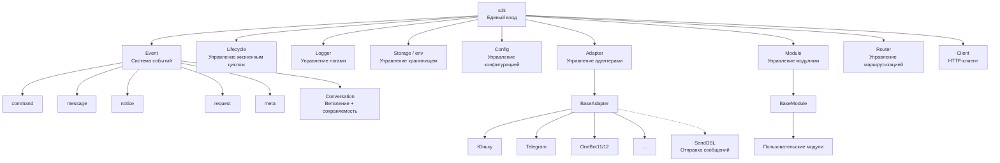

### Описание основных модулей

| Модуль | Описание |
|------|------|
| **Event** | Система событий, предоставляет обработку пяти типов событий: command / message / notice / request / meta, а также Conversation для многоразовых диалогов |
| **Adapter** | Менеджер адаптеров, управляет регистрацией, запуском и остановкой адаптеров для различных платформ |
| **Module** | Менеджер модулей, управляет регистрацией, загрузкой и выгрузкой плагинов, поддерживает объявление зависимостей и топологическую сортировку |
| **Lifecycle** | Менеджер жизненного цикла, предоставляет обработчики жизненного цикла, основанные на событиях |
| **Storage** | Система хранения на основе SQLite, поддерживает общие SQL-запросы с цепочечной синтаксической разработкой |
| **Config** | Управление конфигурационными файлами в формате TOML |
| **Logger** | Модульная система логирования, поддерживает под-логгеры |
| **Router** | Управление маршрутизацией HTTP/WebSocket, абстрактный слой для нижележащих бэкендов (в настоящее время FastAPI + Uvicorn), поддерживает маршрутизацию с помощью декораторов, промежуточные обработчики, группировку, ограничение скорости, CORS |
| **Client** | Единый HTTP/WS-клиент (до версии 2.8.0 это был `HttpClient`, сохраняется совместимость), абстрактный слой для нижележащих библиотек запросов (в настоящее время aiohttp), предоставляет статистику запросов, повторные попытки, логирование, WebSocket-клиент, систему исключений ErisPulse. WebSocket-клиент и сервер разделяют базовый класс `WebSocketConnectionBase` |

## Процесс инициализации

На следующей диаграмме показан полный процесс инициализации `sdk.init()`:


### Подробное описание этапов инициализации

> Полная цепочка инициализации с разбивкой на Finder / Loader / Manager / Router, базовые точки входа (`init()` / `init_task()` / `init_sync()`) и ручной полный запуск см. в [Процесс запуска и ручное управление](advanced/startup.md).

## Процесс обработки событий

На следующей диаграмме показан полный путь сообщения от платформы до обработчика:


### Подробное описание цепочки обработки событий

На приведенной выше диаграмме показан результат; ниже раскрывается, что происходит за кулисами после `adapter.emit()` — это трехуровневая цепочка рассылки:

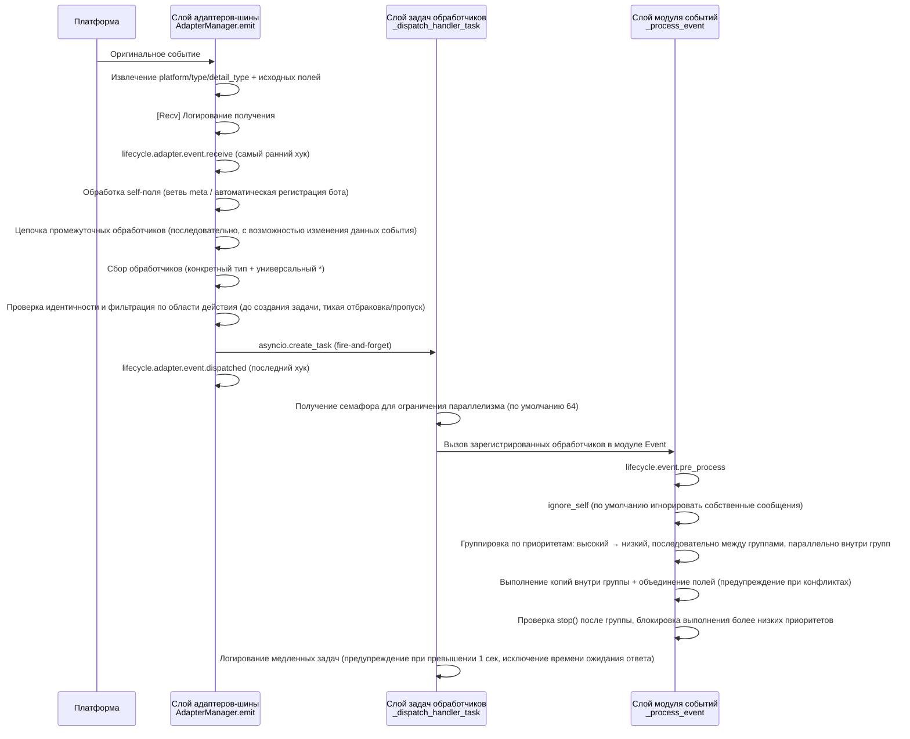

**Что делает фреймворк на каждом этапе и что вы можете изменить:**

| Этап | Что делает фреймворк | Что вы можете изменить |
|------|-------------|-----------|
| Получение | Извлекает стандартные поля, сохраняет `{platform}_raw` исходные данные; записывает лог `[Recv]` | Наблюдение за `adapter.event.receive` для получения самого раннего события |
| self-поле | Мета-события идут по ветвям connect/disconnect/heartbeat; обычные события автоматически регистрируют бота и вызывают `adapter.bot.online` | Наблюдение за `adapter.bot.online` / `bot.offline` |
| Промежуточные обработчики | **Последовательно** выполняются, если возвращаемое значение не None, оно заменяет данные события | Регистрация промежуточных обработчиков для изменения/перехвата событий |
| Сбор рассылки | Сначала берутся обработчики конкретного типа, затем `*` универсальные обработчики | — |
| Идентичность | Определяет, принимать ли событие по пользователю>сессии>боту>адаптеру (`scope.is_identity_allowed`), **отбраковка означает полное удаление события** | `ErisPulse.scope.identity` для привязки |
| Фильтрация по области | Определяется по владельцу модуля (`scope.is_allowed`), с уровнем сессии>бота>платформы, **не прошедшие — тихо пропускаются** | Настройка белого/черного списка областей |
| Планирование | Каждый соответствующий обработчик создает отдельную `asyncio.Task`, `emit()` **не ждет завершения обработчиков** | — |
| Приоритет | Высокоприоритетные группы обрабатываются первыми; **между группами последовательно, внутри групп параллельно** (каждая группа имеет копию события, изменения объединяются, конфликты вызывают WARNING) | `@command(..., priority=N)` / указание при регистрации приоритета |
| Прерывание | После обработки каждой группы проверяется `event.is_stopped()`, если сработало, **выполнение более низких приоритетов прерывается** | `event.mark_processed(stop=True)` / `event.done()` |

> **Частые заблуждения**:
> 1. **Фильтрация по области действия тихая** — обработчики, отфильтрованные таким образом, не генерируют ошибки и не отвечают, видны только в трассировочном логе (уровень TRACE, `core.scope.denied`). Если "мой модуль не получил сообщение", сначала проверьте привязку области.
> 2. **Обработчики обрабатываются параллельно** — фреймворк уже создает отдельную задачу для каждого обработчика, вам **не нужно** дополнительно оборачивать в `asyncio.create_task`.
> 3. **Внутри группы одинакового приоритета не прерывается** — `mark_processed(stop=True)` блокирует только более низкие группы, обработчики в одной группе не прерываются досрочно.
> 4. **Порог медленных логов фиксирован в 1 секунду** — обработчики, выполняющиеся дольше 1 сек, записываются в лог с предупреждением (время ожидания ответа `wait_reply` исключается из времени выполнения), но не прерывают выполнение.

> Подробности привязки областей и приоритетов см. в [Системе областей](advanced/scope.md); полную семантику claim/прерывания см. в [Введение в обработку событий](getting-started/event-handling.md); настройки ограничения параллелизма см. в [Руководстве по конфигурации](user-guide/configuration.md#настройки фреймворка).

## События жизненного цикла

На следующей диаграмме показан порядок срабатывания событий жизненного цикла компонентов фреймворка:

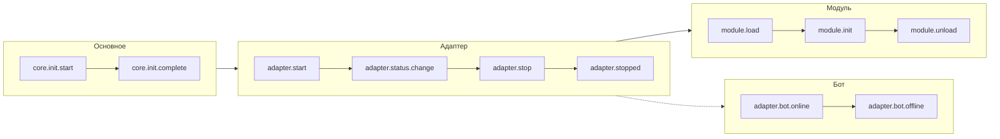

### Наблюдение за событиями жизненного цикла

> Полные методы наблюдения за событиями (`lifecycle.on()` / `once()` / `has_handlers()`), полный список событий жизненного цикла и формат данных см. в [Управление жизненным циклом](advanced/lifecycle.md).

## Стратегии загрузки модулей

ErisPulse поддерживает три стратегии загрузки модулей, которые объявляются возвращаемым значением `get_load_strategy()` в `ModuleLoadStrategy`:

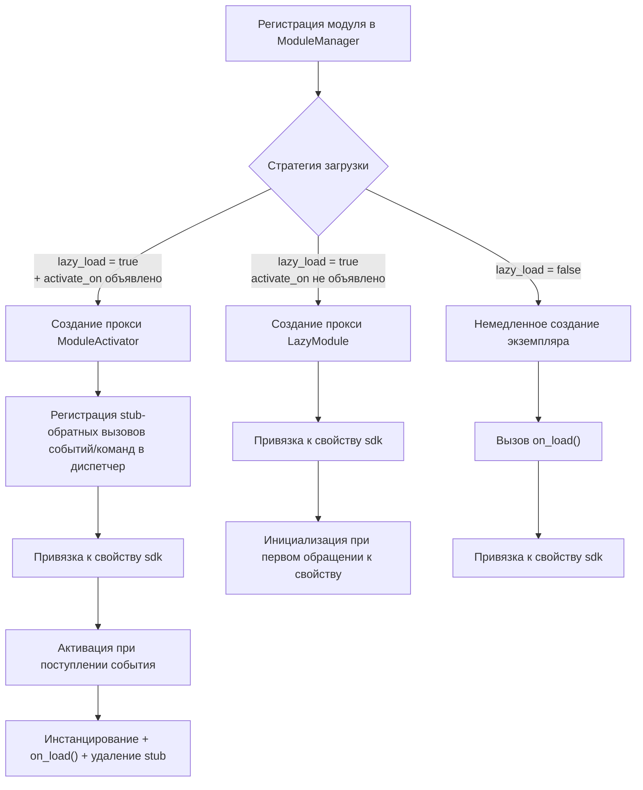

> Подробнее см. в [Системе ленивой загрузки](advanced/lazy-loading.md), [Управление жизненным циклом](advanced/lifecycle.md) и документации модулей.

### Архитектура ленивой активации по событиям (`activate_on`)

> [!NOTE]
> Эта функция доступна в ErisPulse **2.8.0+**.

`activate_on` позволяет модулю загружаться **при первом поступлении соответствующего события/команды**, что предотвращает постоянное использование памяти и гарантирует, что события не теряются:


**Основные моменты семантики срабатывания:**

> Полный синтаксис `activate_on` (str / dict / list), объявление команды dict, цепочка возврата help для заглушек, фильтрация по области действия и семантика сбоя см. в [Системе ленивой загрузки](advanced/lazy-loading.md#ленивая-активация-по-событиям-activate_on).

## Архитектура локальной папки плагинов

> [!NOTE]
> Эта функция доступна в ErisPulse **2.8.0+**.

Локальные плагины (папка `plugins/`) не требуют упаковки и публикации, фреймворк автоматически обнаруживает и загружает их при запуске:

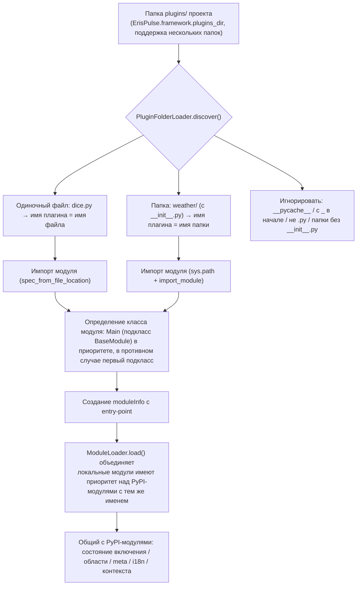

**Соглашения и особенности:**

- Имя плагина: для одиночного файла — имя файла, для папки — имя папки
- Локальный плагин `moduleInfo.meta.source == "plugin_folder"`, совместим с модулями из PyPI
- При совпадении имен локальный имеет приоритет (удобно для отладки), при отключении удаляется и entry-point

## Архитектура горячей перезагрузки локальных плагинов

Горячая перезагрузка отслеживает изменения файлов плагинов и автоматически перезагружает соответствующие плагины:

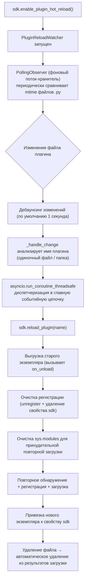


====
快速上手
====


### 快速开始

# Быстрый старт

> **Это ваш первый шаг.** Запустите робота ErisPulse за 5 минут.

## Установка ErisPulse

### Сценарий установки с одним нажатием (рекомендуется)

Сценарий установки автоматически определит вашу среду (Docker, Python, uv) и предложит выбрать наиболее подходящий способ установки.

Windows (PowerShell):
```powershell
irm https://get.erisdev.com/install.ps1 -OutFile install.ps1; powershell -ExecutionPolicy Bypass -File install.ps1
```

macOS / Linux:
```bash
curl -fsSL https://get.erisdev.com/install.sh -o install.sh && chmod +x install.sh && ./install.sh
```

Сценарий проведёт вас через:

- **Установка Docker** (рекомендуется, если Docker обнаружен): выбор источника образа (Docker Hub / GHCR), канал версий (стабильный / предварительный), настройка панели управления Dashboard, настройка портов
- **Традиционная установка**: автоматическое создание виртуальной среды, выбор версии ErisPulse, опциональная установка модуля панели управления Dashboard

### Использование Docker

Docker-образ уже включает в себя фреймворк ErisPulse и панель управления Dashboard.

```bash
# Скачать docker-compose.yml
curl -O https://raw.githubusercontent.com/ErisPulse/ErisPulse/main/docker-compose.yml

# Установить токен Dashboard и запустить
ERISPULSE_DASHBOARD_TOKEN=your-token docker compose up -d
```

<details>
<summary>Не доступен Docker Hub?</summary>

Используйте образ из GitHub Container Registry, изменив `image` в `docker-compose.yml`:

```yaml
image: ghcr.io/erispulse/erispulse:latest
```

</details>

После запуска перейдите по адресу `http://<host>:8000/Dashboard` и войдите, используя установленный токен.

### Установка с помощью pip

Убедитесь, что ваша версия Python >= 3.10, затем установите с помощью pip:

```bash
pip install ErisPulse
```

Если у вас установлен [uv](https://github.com/astral-sh/uv), вы также можете использовать `uv pip install ErisPulse`, установка будет быстрее.

## Инициализация проекта

### Интерактивная инициализация (рекомендуется)

```bash
epsdk init
```

Это запустит интерактивное руководство, которое проведёт вас через:
- Настройку имени проекта
- Конфигурацию уровня логирования
- Настройку сервера (хост и порт)
- Выбор и настройку адаптера
- Создание структуры проекта

### Быстрая инициализация

```bash
# Быстрый режим с указанием имени проекта
epsdk init -q -n my_bot

# Или просто с указанием имени проекта
epsdk init -n my_bot
```

### Ручное создание проекта

Если вы предпочитаете создавать проект вручную:

```bash
mkdir my_bot && cd my_bot
epsdk init
```

## Установка модулей

### Установка через CLI

```bash
epsdk install Yunhu AIChat
```

### Просмотр доступных модулей

```bash
epsdk list-remote
```

### Интерактивная установка

Если не указать имя пакета, откроется интерактивное окно установки:

```bash
epsdk install
```

## Запуск проекта

```bash
# Обычный запуск
epsdk run main.py

# Режим горячей перезагрузки (рекомендуется при разработке)
epsdk run main.py --reload
```

## Включение автодополнения IDE (необязательно)

ErisPulse динамически обнаруживает модули/адаптеры, но IDE по умолчанию не может дополнять методы, специфичные для платформы. Запустите следующую команду для генерации типовых заглушек:

```bash
epsdk types
```

После генерации используйте импортированные типы для аннотации переменных, чтобы получить точное автодополнение (подробнее в [Руководстве по автодополнению IDE](./getting-started/ide-completion.md)):

```python
from _ep_types import Yunhu
from ErisPulse import sdk

adapter: Yunhu = sdk.adapter.get("yunhu")
await adapter.Send.To("group", "123").Board(...)  # Дополнение специфичных методов платформы
```

## Структура проекта

Структура проекта после инициализации:

```
my_bot/
├── config/
│   └── config.toml          # Файл конфигурации
└── main.py                  # Точка входа

```

## Файл конфигурации

Базовый файл `config.toml`:

```toml
[ErisPulse.server]
host = "0.0.0.0"
port = 8000

[ErisPulse.logger]
level = "INFO"

[Yunhu_Adapter]
# Конфигурация адаптера
```

## Дальнейшие действия

После запуска робота, вы можете продолжить по своему усмотрению:

**Хотите узнать, как работает фреймворк?**
- [Основные понятия](getting-started/basic-concepts.md) — Архитектура адаптеров / модулей / событий
- [Обзор архитектуры](architecture.md) — Визуальная схема архитектуры

**Хотите реализовать больше функций?**
- [Примеры распространённых задач](getting-started/common-tasks.md) — Хранение данных, планирование задач, контроль доступа
- [Введение в обработку событий](getting-started/event-handling.md) — Обработка сообщений, уведомлений, запросов

**Хотите разработать свой собственный модуль / адаптер?**
- [Введение в разработку модулей](developer-guide/modules/getting-started.md)
- [Введение в разработку адаптеров](developer-guide/adapters/getting-started.md)

**Дополнительная справка:**
- [Описание файла конфигурации](user-guide/configuration.md) · [Справочник команд CLI](user-guide/cli-reference.md) · [Руководство по развертыванию](user-guide/deployment.md)


### 创建第一个机器人

# Создание первого бота

Это руководство основано на [5-минутном быстром старте](../quick-start.md) и поможет вам написать первый обработчик команд и понять механизм работы.

> Если вы еще не установили ErisPulse или не инициализировали проект, сначала выполните [быстрый старт](../quick-start.md) в разделах «Установка», «Инициализация проекта» и «Запуск проекта».

## Шаг первый: Написание первой команды

Откройте файл `main.py` и напишите простой обработчик команд:

```python
from ErisPulse import sdk
from ErisPulse.Core.Event import command

@command("hello", help="Отправить приветственное сообщение")
async def hello_handler(event):
    """Обработка команды hello"""
    user_name = event.get_user_nickname() or "друг"
    await event.reply(f"Привет, {user_name}! Я бот ErisPulse.")

@command("ping", help="Проверить, онлайн ли бот")
async def ping_handler(event):
    """Обработка команды ping"""
    await event.reply("Pong! Бот работает нормально.")

async def main():
    """Основная точка входа"""
    print("Запуск ErisPulse...")
    
    # keep_running=True (по умолчанию): фреймворк блокирует выполнение, пока не получит сигнал о завершении (например, Ctrl+C)
    await sdk.run(keep_running=True)

if __name__ == "__main__":
    import asyncio
    asyncio.run(main())
```

### Параметр `keep_running`

`sdk.run(keep_running)` управляет тем, будет ли фреймворк блокировать выполнение:

- **`keep_running=True` (по умолчанию)**: `run()` будет блокировать выполнение до получения сигнала о завершении (например, Ctrl+C), подходит для чистых ботов.
- **`keep_running=False`**: `run()` немедленно вернёт управление после инициализации, **фреймворк не будет отключаться** — запущенные адаптеры/модули продолжат обрабатывать события сообщений в фоновом режиме, вы можете выполнять свою логику, пока цикл событий не завершится и фреймворк не закроется. Например:

```python
async def main():
    await sdk.run(keep_running=False)   # Немедленно вернуться после инициализации
    # Фреймворк уже работает в фоне, здесь можно делать другие вещи
    while True:
        await asyncio.sleep(3600)
        print("Проверка каждый час")
```

> Помимо двух режимов `run()`, есть `init()`/`uninit()` для ручного управления жизненным циклом, а также более тонкие способы отдельного запуска/остановки адаптеров/маршрутизаторов, см. [Процесс запуска и ручное управление](../advanced/startup.md).

## Шаг второй: Запуск бота

```bash
# Обычный запуск
epsdk run main.py

# Режим разработки (поддержка горячей перезагрузки)
epsdk run main.py --reload
```

## Шаг третий: Тестирование бота

Отправьте команду в вашей чат-платформе:

```
/hello
```

Вы должны получить ответ от бота.

## Объяснение кода

### Декоратор команды

```python
@command("hello", help="Отправить приветственное сообщение")
```

- `hello`: имя команды, которую пользователь вызывает с помощью `/hello`
- `help`: описание команды, отображается при выполнении `/help`

### Параметры события

```python
async def hello_handler(event):
```

Параметр `event` — это объект Event, содержащий:
- Текст сообщения: `event.get_text()`
- Информацию об отправителе: `event.get_user_id()`, `event.get_user_nickname()`
- Информацию о платформе: `event.get_platform()`
- Информацию о группе: `event.get_group_id()`
- Оригинальные данные: `event.get_raw()`

> Полный список методов объекта Event см. в [подробном руководстве по Event-обёртке](../developer-guide/modules/event-wrapper.md).

### Отправка ответа

```python
await event.reply("Содержание ответа")
```

`event.reply()` — это удобный метод для отправки сообщения отправителю.

## Расширение: Добавление дополнительных функций

ErisPulse предоставляет богатые возможности для обработки событий и данных:

- **Слушание сообщений**: используйте `@message.on_message()` для прослушивания различных сообщений → [Введение в обработку событий](event-handling.md)
- **Слушание уведомлений**: используйте `@notice.on_friend_add()` и другие для прослушивания системных уведомлений → [Введение в обработку событий](event-handling.md)
- **Хранение данных**: используйте `sdk.storage.get/set` для сохранения данных → [Примеры распространённых задач](common-tasks.md)

## Часто задаваемые вопросы

### Команда не отвечает?

1. Проверьте правильность настройки адаптера, убедитесь, что в `config/config.toml` статус адаптера установлен в `true`
2. Проверьте вывод логов в терминале, убедитесь, что нет ошибок (особенно в логах уровня `ERROR`)
3. Убедитесь, что префикс команды указан правильно (по умолчанию это `/`), проверьте раздел `[ErisPulse.event.command]` в конфигурационном файле
4. Убедитесь, что имя команды написано правильно, обратите внимание на настройки чувствительности к регистру

### Как изменить префикс команды?

Добавьте в `config.toml`:

```toml
[ErisPulse.event.command]
prefix = "!"
case_sensitive = false
```

### Как поддержать несколько платформ?

ErisPulse использует стандарт OneBot12 для унификации формата событий на разных платформах, обработчики, зарегистрированные с помощью `@command` и `@message`, автоматически получают события со всех платформ. С помощью `event.get_platform()` можно определить источник платформы:

```python
@command("hello")
async def hello_handler(event):
    platform = event.get_platform()
    
    if platform == "yunhu":
        await event.reply("Привет! Из Юньху")
    elif platform == "telegram":
        await event.reply("Hello! Из Telegram")
    else:
        await event.reply("Привет!")
```

> Подробнее о многоуровневой адаптации платформ см. в [Примерах распространённых задач](common-tasks.md#многоуровневая-адаптация-платформ).


### 基础概念

# Основные концепции

В этом руководстве представлены основные концепции ErisPulse, которые помогут вам понять дизайн-мышление и базовую архитектуру фреймворка.

## Архитектура на основе событий

ErisPulse использует архитектуру на основе событий, где все взаимодействия передаются и обрабатываются через события.

### Поток событий

```
Пользователь отправляет сообщение
      │
      ▼
Платформа получает
      │
      ▼
Адаптер получает нативное событие платформы
      │
      ▼
Преобразуется в стандартное событие OneBot12
      │
      ▼
Отправляется в систему событий
      │
      ▼
Распределяется зарегистрированным обработчикам
      │
      ▼
Модуль обрабатывает событие
      │
      ▼
Адаптер отправляет ответ
      │
      ▼
Платформа отображает пользователю
```

### Стандарт OneBot12

ErisPulse использует OneBot12 в качестве стандартного события. OneBot12 — это стандарт универсального интерфейса чат-бота, определяющий унифицированный формат событий.

Все адаптеры преобразуют событие, специфичное для платформы, в формат OneBot12, обеспечивая согласованность кода.

## Основные компоненты

### 1. Объект SDK

SDK является точкой входа для всех функций и предоставляет доступ к основным компонентам.

```python
from ErisPulse import sdk

# Доступ к основным модулям
sdk.storage    # Система хранения
sdk.config     # Система конфигурации
sdk.logger     # Система логирования
sdk.adapter    # Система адаптеров
sdk.module     # Система модулей
sdk.router     # Система маршрутизации
sdk.client     # HTTP клиент
sdk.lifecycle  # Система жизненного цикла
```

### 2. Объект Event

Объект Event инкапсулирует данные о событии и предоставляет удобные методы доступа.

```python
@command("info")
async def info_handler(event):
    # Получение информации о событии
    event_id = event.get_id()
    user_id = event.get_user_id()
    platform = event.get_platform()
    text = event.get_text()
    
    # Отправка ответа
    await event.reply(f"Пользователь: {user_id}, Платформа: {platform}")
```

### 3. Адаптер

Адаптер — это мост между ErisPulse и внешними платформами.

**Обязанности:**
- Получение нативных событий платформы
- Преобразование в стандартный формат OneBot12
- Отправка стандартных событий платформе

**Примеры адаптеров:**
- Адаптер Yunhu: общение с платформой Yunhu
- Адаптер Telegram: общение с Telegram Bot API
- Адаптер OneBot11: общение с приложениями, совместимыми с OneBot11
- Адаптер Email: обработка почтовых сообщений

### 4. Модуль

Модуль — это базовая единица расширения функциональности, которая может:

- Регистрировать обработчики событий
- Реализовывать бизнес-логику
- Вызывать адаптеры для отправки сообщений
- Использовать службы, предоставляемые основными модулями

#### Механизм обнаружения модулей

ErisPulse обнаруживает установленные модули через Python `importlib.metadata.entry_points`. Модули объявляют точки входа в `pyproject.toml`:

```toml
[project.entry-points."erispulse.module"]
MyModule = "my_package:Main"
```

При инициализации SDK сканируются все точки входа группы `erispulse.module`, классы модулей регистрируются в `ModuleManager`, а затем последовательно инициализируются после топологической сортировки по зависимостям.

#### Минимально рабочий модуль

```python
from ErisPulse.Core.Bases import BaseModule
from ErisPulse import sdk

class Main(BaseModule):
    def __init__(self):
        self.sdk = sdk
        self.logger = sdk.logger.get_child("MyModule")

    async def on_load(self, event):
        self.logger.info("Модуль загружен")

    async def on_unload(self, event):
        self.logger.info("Модуль выгружен")
```

#### Жизненный цикл модуля

- **Регистрация**: SDK обнаруживает класс модуля и регистрирует его в менеджере
- **Загрузка**: Создается экземпляр модуля, вызывается `on_load(event)` (`event = {"module_name": "MyModule"}`)
- **Выгрузка**: Вызывается `on_unload(event)`, ресурсы очищаются

#### Стратегия загрузки

Загрузочное поведение модуля определяется через `get_load_strategy()`:

```python
from ErisPulse.loaders import ModuleLoadStrategy

class Main(BaseModule):
    @staticmethod
    def get_load_strategy():
        return ModuleLoadStrategy(
            lazy_load=True,   # Ленивая загрузка (по умолчанию True)
            priority=0        # Приоритет загрузки, чем больше значение, тем раньше инициализация
        )
```

- **`lazy_load=True` (по умолчанию)**: Модуль инициализируется только при первом обращении к `sdk.MyModule`, что снижает время запуска
- **`lazy_load=False`**: Модуль инициализируется сразу при запуске SDK, подходит для модулей, которым нужно прослушивать события жизненного цикла или выполнять фоновые задачи
- **`priority`**: Модули с одинаковым приоритетом загружаются в порядке регистрации; чем больше значение, тем раньше инициализация

> Подробное описание механизма ленивой загрузки см. в разделе [Система ленивой загрузки](../advanced/lazy-loading.md).

## Типы событий

ErisPulse поддерживает 5 типов событий:

| Тип события | Декоратор | Описание |
|------------|-----------|---------|
| Событие сообщения | `@message.on_message()` | Любое сообщение, отправленное пользователем (личные сообщения, чаты) |
| Событие команды | `@command("name")` | Сообщения, начинающиеся с префикса команды (например, `/hello`) |
| Событие уведомления | `@notice.on_friend_add()` и т.д. | Системные уведомления (добавление друга, изменения состава группы и т.д.) |
| Событие запроса | `@request.on_friend_request()` и т.д. | Запросы пользователей (запросы на добавление в друзья, приглашения в группу) |
| Метасобытие | `@meta.on_connect()` и т.д. | Системные события (подключение, отключение, пульс) |

> Подробное использование и примеры кода для каждого типа событий см. в разделе [Введение в обработку событий](event-handling.md).

## Описание основных модулей

### Storage (Хранилище)

Базирующаяся на SQLite система хранения пар ключ-значение для персистентного хранения данных.

```python
# Установка значения
sdk.storage.set("key", "value")

# Получение значения
value = sdk.storage.get("key", "default_value")

# Массовые операции
sdk.storage.set_multi({
    "key1": "value1",
    "key2": "value2"
})

# Транзакция
with sdk.storage.transaction():
    sdk.storage.set("key1", "value1")
    sdk.storage.set("key2", "value2")
```

### Config (Конфигурация)

Управление файлами конфигурации в формате TOML.

```python
# Получение конфигурации
config = sdk.config.getConfig("MyModule", {})

# Установка конфигурации
sdk.config.setConfig("MyModule", {"key": "value"})

# Чтение вложенной конфигурации
value = sdk.config.getConfig("MyModule.subkey", "default")
```

### Logger (Логирование)

Модульная система логирования.

```python
# Запись логов
sdk.logger.info("Это информационное сообщение")
sdk.logger.warning("Это предупреждение")
sdk.logger.error("Это ошибка")

# Получение дочернего логгера
child_logger = sdk.logger.get_child("submodule")
child_logger.info("Лог дочернего модуля")
```

**Синтаксический сахар для доступа к свойствам**

Помимо использования метода `get_child()`, вы также можете создавать дочерние логгеры через **доступ к свойствам**, что является более кратким способом записи **синтаксического сахара**:

```python
# Создание дочернего логгера через доступ к свойствам
sdk.logger.mymodule.info("Сообщение модуля")

# Поддержка вложенного доступа
sdk.logger.mymodule.database.info("Сообщение базы данных")
```

### Router (Маршрутизация)

Управление HTTP и WebSocket маршрутизацией на базе FastAPI + Uvicorn. Поддерживает декораторную маршрутизацию, middleware, группирование, лимитирование запросов, CORS.

```python
from ErisPulse.Core import HttpRequest

@sdk.router.get("MyModule", "/api")
async def handler(request: HttpRequest):
    data = await request.json()
    return {"status": "ok"}
```

> Полный API маршрутизации (WebSocket, middleware, лимитирование запросов, CORS и т.д.) см. в разделе [Менеджер маршрутизации](../advanced/router.md).

### Client (Сетевой клиент)

Единый сетевой клиент, объединяющий HTTP-запросы, WebSocket-соединения, управление пулом соединений, автоматическую перезагрузку, контроль тайм-аута, статистику запросов и интеграцию событий жизненного цикла.

```python
from ErisPulse.Core import client

# HTTP запрос
resp = await client.get("https://api.example.com/users")
data = await resp.json()

# С перезагрузкой и тайм-аутом
resp = await client.get(url, timeout=30, max_retries=3)

# WebSocket соединение
ws = await client.ws_connect("wss://example.com/ws")
async for text in ws.iter_text():
    await ws.send_text(f"Эхо: {text}")
```

> Полный API сетевого клиента см. в разделе [Сетевой клиент](../advanced/http-client.md).

## Отправка сообщений SendDSL

Адаптеры предоставляют интерфейс для отправки сообщений с цепочечными вызовами.

### Базовая отправка

```python
# Получение экземпляра адаптера
yunhu = sdk.adapter.get("yunhu")

# Отправка сообщения
await yunhu.Send.To("user", "U1001").Text("Hello")

# Указание аккаунта отправки
await yunhu.Send.Using("bot1").To("group", "G1001").Text("Сообщение группы")
```

### Цепочечные модификаторы

```python
# @Пользователь
await yunhu.Send.To("group", "G1001").At("U2001").Text("@сообщение")

# Ответ на сообщение
await yunhu.Send.To("group", "G1001").Reply("msg123").Text("ответ")

# @Всех
await yunhu.Send.To("group", "G1001").AtAll().Text("объявление")
```

### Методы ответа через Event

Объект Event предоставляет удобные методы для ответов:

```python
@command("test")
async def test_handler(event):
    # Простой текстовый ответ
    await event.reply("Текст ответа")
    
    # Отправка изображения
    await event.reply("http://example.com/image.jpg", method="Image")
    
    # Отправка голосового
    await event.reply("http://example.com/voice.mp3", method="Voice")
```

## Система ленивой загрузки

По умолчанию ErisPulse включает ленивую загрузку модулей; модули инициализируются только при первом обращении (например, `sdk.MyModule`), что значительно ускоряет запуск.

```python
from ErisPulse.loaders import ModuleLoadStrategy

class Main(BaseModule):
    @staticmethod
    def get_load_strategy():
        return ModuleLoadStrategy(
            lazy_load=True,   # Включить ленивую загрузку (по умолчанию)
            priority=0        # Приоритет загрузки, чем больше значение, тем раньше инициализация
        )
```

**Сценарии, когда необходимо отключить ленивую загрузку (`lazy_load=False`):**
- Модули, прослушивающие события жизненного цикла (например, `core.init.complete`)
- Модули, запускающие периодические задачи или фоновые службы
- Модули, которым необходимо завершить инициализацию до загрузки других модулей

> Подробное описание механизма ленивой загрузки и рекомендации см. в разделе [Система ленивой загрузки](../advanced/lazy-loading.md).

## Дальнейшие шаги

- [Введение в обработку событий](event-handling.md) — изучите, как обрабатывать различные типы событий
- [Примеры типичных задач](common-tasks.md) — освоите реализацию распространенных функций


### 事件处理入门

# Введение в обработку событий

В этом руководстве рассказывается о том, как обрабатывать различные типы событий в ErisPulse.

## Обзор типов событий

ErisPulse поддерживает следующие типы событий:

| Тип события | Описание | Применение |
|---------|------|---------|
| Событие сообщения | Любое сообщение, отправленное пользователем | Чат-боты, фильтрация контента |
| Событие команды | Сообщение, начинающееся с префикса команды | Обработка команд, точка входа |
| Событие уведомления | Системные уведомления (добавление в друзья, изменения участников группы и т.д.) | Приветствия, уведомления о состоянии |
| Событие запроса | Запросы пользователей (запросы на добавление в друзья, приглашения в группы) | Автоматическая обработка запросов |
| Событие мета | Системные события (подключение, сердцебиение) | Мониторинг подключения, проверка состояния |

## Обработка событий сообщений

> **Примечание**: Рекомендуется использовать аннотацию типа `Event` в обработчиках событий, чтобы получить поддержку автодополнения и проверки типов в IDE.

```python
from ErisPulse.Core.Event import Event  # Импорт типа события для аннотации
```

### Отслеживание всех сообщений

```python
from ErisPulse.Core.Event import message, Event

@message.on_message()
async def message_handler(event: Event):
    text = event.get_text()
    user_id = event.get_user_id()
    sdk.logger.info(f"Получено сообщение от {user_id}: {text}")
```

### Отслеживание личных сообщений

```python
@message.on_private_message()
async def private_handler(event: Event):
    user_id = event.get_user_id()
    await event.reply(f"Привет, {user_id}! Это личное сообщение.")
```

### Отслеживание групповых сообщений

```python
@message.on_group_message()
async def group_handler(event: Event):
    group_id = event.get_group_id()
    user_id = event.get_user_id()
    sdk.logger.info(f"Пользователь {user_id} отправил сообщение в группу {group_id}")
```

### Отслеживание сообщений с упоминанием

```python
@message.on_at_message()
async def at_handler(event: Event):
    # Получение списка упомянутых пользователей
    mentions = event.get_mentions()
    await event.reply(f"Вы упомянули следующих пользователей: {mentions}")
```

### Отслеживание с помощью подстановок и регулярных выражений

Четыре декоратора сообщений (`on_message` / `on_private_message` / `on_group_message` /
`on_at_message`) поддерживают `pattern` (подстановочные знаки glob) и `regex` (регулярные выражения), сообщения, которые не соответствуют этим условиям, **не будут запускать** обработчики:

```python
# Подстановочные знаки glob: * - любая последовательность, ? - один символ, [seq] - набор символов
@message.on_message(pattern="签到*")
async def signin_handler(event: Event):
    await event.reply("Успешная регистрация")

# Регулярное выражение: соответствует сумме
@message.on_message(regex=r"\d+\s*元")
async def price_handler(event: Event):
    await event.reply(f"Получена сумма: {event.get_text()}")

# Оба параметра pattern и regex заданы → оба должны совпадать
@message.on_message(pattern="*元", regex=r"\d+\s*元")
async def combined_handler(event: Event):
    pass
```

`wait_reply` также поддерживает эти два параметра (см. [Функция ожидания ответа](../developer-guide/modules/event-wrapper.md#ожидание-ответа)).

## Обработка событий команд

### Базовые команды

```python
from ErisPulse.Core.Event import command

@command("help", help="Отображает справочную информацию")
async def help_handler(event):
    help_text = """
Доступные команды:
/help - Отображает справку
/ping - Тест подключения
/info - Просмотр информации
    """
    await event.reply(help_text)
```

### Синонимы команд

```python
@command(["help", "h"], aliases=["帮助"], help="Отображает справочную информацию")
async def help_handler(event):
    await event.reply("Справочная информация...")
```

Пользователь может вызвать команду любым из следующих способов:
- `/help`
- `/h`
- `/帮助`

### Параметры команд

```python
@command("echo", help="Возвращает сообщение")
async def echo_handler(event):
    # Получение параметров команды
    args = event.get_command_args()
    
    if not args:
        await event.reply("Введите сообщение для повторения")
    else:
        await event.reply(f"Вы сказали: {' '.join(args)}")
```

### Группы команд

```python
@command("admin.reload", group="admin", help="Перезагрузить модуль")
async def reload_handler(event):
    await event.reply("Модуль перезагружен")

@command("admin.stop", group="admin", help="Остановить бота")
async def stop_handler(event):
    await event.reply("Бот остановлен")
```

### Права доступа и управление доступом

Права доступа к командам разделены на три уровня, проверка происходит по уровням сверху вниз (если верхний уровень отклоняет, нижние уровни не проверяются):

```python
# ① ACL команды (настройка со стороны пользователя): по белому и черному списку пользователей, при отклонении возвращается "Недостаточно прав"
# ② master=True — только владелец фреймворка может выполнять (фреймворк автоматически проверяет, при отклонении возвращается "Недостаточно прав")
@command("restart", master=True, help="Перезапустить модуль")
async def restart_handler(event):
    await event.reply("Модуль перезапущен")

# ③ permission=функция вызова — логика управления доступом к команде (возвращает True для выполнения)
def is_admin(event):
    return event.get_user_id() in {"user123", "user456"}

@command("panel", permission=is_admin, help="Панель управления")
async def panel_handler(event):
    await event.reply("Добро пожаловать на панель управления")
```

**ACL команды** (в интерфейсе управления `ErisPulse.scope.commands`): пользователь может настроить белый и черный список для любой команды, имя команды поддерживает точное и подстановочные совпадения (например, `"roll*"`), при отклонении возвращается "Недостаточно прав":

```toml
# config.toml — разрешить выполнение restart только для 123456; 666 всегда отклонять
[ErisPulse.scope.commands.restart]
allow = ["onebot11:123456"]
deny = ["onebot11:666"]
```

Порядок проверки: если `deny` совпадает → отклонить; если `allow` не пуст и не совпадает → отклонить; в противном случае передать разработчику по умолчанию (`master=True` / `permission`). Интерфейс управления во время выполнения (поддержка подстановок по имени команды):

```python
from ErisPulse import sdk
sdk.scope.allow_user("restart", "onebot11", "123456")   # белый список
sdk.scope.deny_user("restart", "onebot11", "666")       # черный список
sdk.scope.remove_acl("restart")                          # очистить белый и черный список
sdk.scope.get_acl("restart")                             # получить текущий список
```

**Уровень доступа на уровне событий** (для конкретного человека / группы / бота, получает ли сообщение) — идет через **уровень идентификации** интерфейса управления (`scope.identity`); **уровень доступности модуля** (какие модули могут использоваться) — идет через **уровень модуля** интерфейса управления (`scope.platforms / bots / sessions`). Подробнее см. [Единый интерфейс управления](../advanced/scope.md).

> Рекомендуется: использовать `master=True` / `permission` для команд, требующих взаимодействия с бизнес-логикой; использовать уровень идентификации интерфейса управления для доступа по пользователю / группе; использовать уровень модуля интерфейса управления для контроля доступности модуля.

### Приоритет команд

```python
# Чем больше значение приоритета, тем раньше выполняется
@message.on_message(priority=10)
async def high_priority_handler(event):
    await event.reply("Обработчик с высоким приоритетом")

@message.on_message(priority=1)
async def low_priority_handler(event):
    await event.reply("Обработчик с низким приоритетом")
```

### Параллельная обработка событий

Система событий ErisPulse использует модель **параллельной обработки с одинаковым приоритетом и последовательной обработки с разным приоритетом**:

```
Событие приходит
    ↓
Группа с приоритетом 10: [Обработчик C || Обработчик D] параллельно → объединить результаты
    ↓ (если не прервано)
Группа с приоритетом 0: [Обработчик A || Обработчик B] параллельно → объединить результаты
    ↓
...
```

- **Параллельная обработка с одинаковым приоритетом**: обработчики с одинаковым приоритетом выполняются одновременно, повышая пропускную способность
- **Последовательная обработка с разным приоритетом**: группы с разным приоритетом выполняются последовательно (чем больше значение приоритета, тем раньше выполняется), обеспечивая выполнение обработчиков с высоким приоритетом первыми
- **Copy-On-Write**: обработчики не создают копию, если не изменяют данные, обеспечивая нулевые накладные расходы
- **Обработка конфликтов**: при изменении одного и того же поля несколькими обработчиками с одинаковым приоритетом используется последнее значение и записывается предупреждение в лог
- **Механизм прерывания**: после вызова `event.done()` (по умолчанию) или `event.done(claim=False)` любым обработчиком, пропускаются последующие группы с более низким приоритетом. Разница между присвоением и блокировкой описана ниже в разделе [Управление цепочкой: присвоение и блокировка](#управление-цепочкой-присвоение-и-блокировка)

```python
# Пример: параллельное выполнение обработчиков с одинаковым приоритетом
@message.on_message(priority=0)
async def handler_a(event):
    # Обработка задачи A
    event['result_a'] = process_a()

@message.on_message(priority=0)
async def handler_b(event):
    # Выполняется параллельно с handler_a
    event['result_b'] = process_b()

# Последовательное выполнение с разным приоритетом
@message.on_message(priority=10)
async def handler_c(event):
    # Приоритет самый высокий, выполняется первым
    pass
```

> **Ограничение параллелизма**: все соответствующие обработчики задач немедленно создаются, но ограничиваются сигналом, ограничивающим **количество одновременно выполняемых задач** по умолчанию **64** (`ErisPulse.framework.handler_max_concurrency`, поддерживает горячую перезагрузку). Задачи, превышающие лимит, ждут в очереди на сигнале, пока предыдущие не завершатся. Во время пиковых нагрузок это ваш "сброс давления".
>
> **Медленные логи**: если одиночный обработчик занимает более **1 секунды**, фреймворк записывает предупреждение в лог (`handler_slow`). Время ожидания `wait_reply` исключается из времени выполнения, чтобы не ошибаться в "ожидании ответа".

## Фильтрация через интерфейс управления: почему мой модуль не получает сообщения

После поступления события есть две **тихие** фильтрации (ни один не отвечает, не генерирует ошибку):

1. **Уровень идентификации** (`ErisPulse.scope.identity`): при входе события в точку распределения, определяется, получит ли событие пользователь > группа > бот > адаптер. Отклоненные **все события** просто отбрасываются, и никакие обработчики (включая диспетчер команд) не запускаются.
2. **Уровень модуля** (`ErisPulse.scope`): когда событие достигает обработчика или команды модуля, определяется, доступен ли этот модуль, по сессии > боту > платформе, **если не проходит, тихо пропускается**.

```toml
# Пример 1: все сообщения в определенной группе не распространяются
[ErisPulse.scope.identity.sessions.onebot11."group_123"]
deny = true

# Пример 2: отключить MyModule для определенного бота
[ErisPulse.scope.bots.onebot11."123456"]
blocked = ["MyModule"]
```

В этом случае, когда сообщение из этой группы поступает, обработчики команд и событий `MyModule` **не будут вызваны**. Это не ошибка, а механизм фильтрации — при диагностике "модуль не реагирует" сначала проверьте привязку идентификации и модуля в интерфейсе управления.

- Логи фильтрации видны только на уровне **TRACE** (`core.scope.identity_denied` / `core.scope.denied`), по умолчанию на уровне INFO ничего не видно
- Обработчики на уровне фреймворка (например, диспетчер команд `scope_exempt=True`) не подвержены влиянию **уровня модуля**, но подвержены влиянию **уровня идентификации** (все событие уже отброшено)
- Перед выполнением команды есть еще один фильтр: ACL команды (при отклонении возвращается "Недостаточно прав", см. предыдущий раздел)

> Пять уровней конфигурации, синтаксис совпадения, API во время выполнения см. в [Едином интерфейсе управления](../../advanced/scope.md).

## Управление цепочкой: присвоение и блокировка

> **Примечание**
> Параметры `claim=` / `stop=` в `event.done()` / `event.mark_processed()` требуют ErisPulse **2.7.1+**.

ErisPulse разделяет два семантически ортогональных понятия: "присвоение" и "блокировка", объединяя их через `event.done()`, что удобно для добавления слоев наблюдения, таких как логирование, аудит, права доступа, вокруг обработки команд.

**Точное определение двух понятий:**

- **Присвоение (claim)**: пометка события как обработанного данным обработчиком (запись в `_processed`). Диспетчер команд, увидевший уже присвоенное событие, **пропустит** повторную обработку — предотвращая повторное выполнение одного и того же сообщения несколькими обработчиками команд. Типичный сценарий: после успешного сопоставления команды присвоить, чтобы диспетчер команд больше не вмешивался.
- **Блокировка (stop)**: предотвращение распространения события **на обработчики с более низким приоритетом** (запись в `_propagation_stopped`). Обработчики с более низким приоритетом (например, `on_message`) больше не увидят это событие. Типичный сценарий: высокоприоритетный обработчик полностью обработал событие, и не хочет, чтобы низкоприоритетные обработчики выполнялись снова.

| `event.done(...)` | Присвоение | Блокировка | Сценарий |
|-------------------|------------|------------|----------|
| `event.done()` | ✔ | ✔ | Стандартная практика для завершения обработки команды / обработчика |
| `event.done(stop=False)` | ✔ | ✘ | Только присвоение: низкоприоритетные обработчики (логирование / статистика) по-прежнему увидят |
| `event.done(claim=False)` | ✘ | ✔ | Только блокировка (например, брандмауэр / ограничение скорости), но без удаления повторной обработки |

`event.done(claim=, stop=)` — это псевдоним `event.mark_processed(claim=, stop=)`, параметры и поведение полностью эквивалентны.

```python
@command("help")
async def help_cmd(event):
    event.done()            # Присвоение + блокировка (стандартная практика для завершения обработки команды)

@message.on_message(priority=50)
async def observer(event):
    event.done(stop=False)  # Только присвоение: низкоприоритетные обработчики по-прежнему будут выполняться (логирование / статистика)

@message.on_message(priority=100)
async def firewall(event):
    if denied(event):
        event.done(claim=False)  # Только блокировка: низкоприоритетные обработчики не выполняются, но без удаления повторной обработки
```

### Конфигурация block для команд и ответов

После успешного сопоставления команды или после `wait_reply` блокируется распространение (для обратной совместимости). Можно разрешить низкоприоритетным обработчикам (логирование / аудит / права) наблюдать эти сообщения:

```toml
[ErisPulse.event.command]
block = false   # Сообщения команд продолжают распространяться на низкоприоритетные обработчики

[ErisPulse.event.wait_reply]
block = false   # Ответы, потребленные wait_reply, продолжают распространяться на низкоприоритетные обработчики
```

## Обработка событий уведомлений

### Добавление в друзья

```python
from ErisPulse.Core.Event import notice

@notice.on_friend_add()
async def friend_add_handler(event):
    user_id = event.get_user_id()
    nickname = event.get_user_nickname() or "Новый друг"
    await event.reply(f"Добро пожаловать, {nickname}! Добавьте меня в друзья.")
```

### Увеличение участников группы

```python
@notice.on_group_increase()
async def member_increase_handler(event):
    group_id = event.get_group_id()
    user_id = event.get_user_id()
    await event.reply(f"Добро пожаловать, {user_id}! Добро пожаловать в группу {group_id}.")
```

### Уменьшение участников группы

```python
@notice.on_group_decrease()
async def member_decrease_handler(event):
    group_id = event.get_group_id()
    user_id = event.get_user_id()
    await event.reply(f"{user_id} покинул группу {group_id}.")
```

## Обработка событий запросов

### Запрос на добавление в друзья

```python
from ErisPulse.Core.Event import request

@request.on_friend_request()
async def friend_request_handler(event):
    user_id = event.get_user_id()
    comment = event.get_comment()
    
    sdk.logger.info(f"Получен запрос на добавление в друзья: {user_id}, комментарий: {comment}")
    
    # Можно обработать запрос через API адаптера
    # Конкретная реализация см. в документации адаптеров
```

### Запрос на приглашение в группу

```python
@request.on_group_request()
async def group_request_handler(event):
    group_id = event.get_group_id()
    user_id = event.get_user_id()
    
    await event.reply(f"Получено приглашение в группу {group_id} от {user_id}.")
```

## Обработка мета-событий

### События подключения

```python
from ErisPulse.Core.Event import meta

@meta.on_connect()
async def connect_handler(event):
    platform = event.get_platform()
    sdk.logger.info(f"Подключение к платформе {platform}")

@meta.on_disconnect()
async def disconnect_handler(event):
    platform = event.get_platform()
    sdk.logger.warning(f"Отключение от платформы {platform}")
```

### События сердцебиения

```python
@meta.on_heartbeat()
async def heartbeat_handler(event):
    platform = event.get_platform()
    sdk.logger.debug(f"Проверка сердцебиения для платформы {platform}")
```

### Запрос состояния бота

После отправки мета-события адаптером, фреймворк автоматически отслеживает состояние бота, и вы можете в любое время проверить:

```python
from ErisPulse import sdk

# Проверка, онлайн ли бот
if sdk.adapter.is_bot_online("telegram", "123456"):
    telegram = sdk.adapter.get("telegram")
    await telegram.Send.To("user", "123456").Text("Бот онлайн")

# Получение списка всех онлайн ботов
bots = sdk.adapter.list_bots()
for platform, bot_list in bots.items():
    for bot_id, info in bot_list.items():
        print(f"{platform}/{bot_id}: {info['status']}")

# Получение полного сводного состояния
summary = sdk.adapter.get_status_summary()
```

## Интерактивная обработка

### Использование метода reply для отправки ответов

Метод `event.reply()` поддерживает различные параметры, удобные для отправки сообщений с упоминанием, ответом и т.д.:

```python
# Простой ответ
await event.reply("Привет")

# Отправка различных типов сообщений
await event.reply("http://example.com/image.jpg", method="Image")  # Изображение
await event.reply("http://example.com/voice.mp3", method="Voice")  # Голосовое сообщение

# Упоминание одного пользователя
await event.reply("Привет", at_users=["user123"])

# Упоминание нескольких пользователей
await event.reply("Всем привет", at_users=["user1", "user2", "user3"])

# Ответ на сообщение
await event.reply("Содержание ответа", reply_to="msg_id")

# Упоминание всех участников
await event.reply("Объявление", at_all=True)

# Комбинированное использование: упоминание пользователей + ответ на сообщение
await event.reply("Содержание", at_users=["user1"], reply_to="msg_id")
```

### Ожидание ответа пользователя

```python
@command("ask", help="Запросить у пользователя")
async def ask_handler(event):
    await event.reply("Введите ваше имя:")
    
    # Ожидание ответа пользователя, таймаут 30 секунд
    reply = await event.wait_reply(timeout=30)
    
    if reply:
        name = reply.get_text()
        await event.reply(f"Привет, {name}!")
    else:
        await event.reply("Таймаут ожидания, пожалуйста, повторите ввод.")
```

### Ожидание ответа с проверкой

```python
@command("age", help="Запросить возраст")
async def age_handler(event):
    def validate_age(event_data):
        """Проверка корректности возраста"""
        try:
            age = int(event_data.get_text())
            return 0 <= age <= 150
        except ValueError:
            return False
    
    await event.reply("Введите ваш возраст (0-150):")
    
    reply = await event.wait_reply(
        timeout=60,
        validator=validate_age
    )
    
    if reply:
        age = int(reply.get_text())
        await event.reply(f"Ваш возраст: {age} лет")
    else:
        await event.reply("Некорректный ввод или таймаут")
```

### Ожидание ответа с обратным вызовом

```python
@command("confirm", help="Подтвердить действие")
async def confirm_handler(event):
    async def handle_confirmation(reply_event):
        text = reply_event.get_text().lower()
        
        if text in ["yes", "y", "是", "确认"]:
            await event.reply("Действие подтверждено!")
        else:
            await event.reply("Действие отменено.")
    
    await event.reply("Подтвердите выполнение этого действия? (да/нет)")
    
    await event.wait_reply(
        timeout=30,
        callback=handle_confirmation
    )
```

### Подтверждение диалога (confirm)

Ожидание подтверждения или отрицания пользователя, автоматически распознаются встроенные подтверждения на китайском и английском языках:

```python
@command("confirm", help="Подтвердить действие")
async def confirm_handler(event):
    if await event.confirm("Вы уверены, что хотите выполнить это действие?"):
        await event.reply("Подтверждено, выполняется...")
    else:
        await event.reply("Отменено")

# Пользовательские подтверждения
if await event.confirm("Продолжить?", yes_words={"go", "继续"}, no_words={"stop", "停止"}):
    pass
```

### Выбор меню (choose)

Пользователь может ответить номером или текстом опции:

```python
@command("choose", help="Выбор")
async def choose_handler(event):
    choice = await event.choose(
        "Выберите цвет:",
        ["красный", "зеленый", "синий"]
    )
    
    if choice is not None:
        colors = ["красный", "зеленый", "синий"]
        await event.reply(f"Вы выбрали: {colors[choice]}")
    else:
        await event.reply("Таймаут выбора")
```

**Режим объединения:** `merge_prompt=True` объединяет опции в текст сообщения и отправляет все одним сообщением с указанным `method`:

```python
# Отправка объединенного сообщения в формате Markdown
choice = await event.choose(
    "## Выберите цвет\n{options}\nПожалуйста, введите номер",
    ["красный", "зеленый", "синий"],
    method="Markdown",
    merge_prompt=True,
)
```

> Заполнитель `{options}` контролирует положение вставки опций; если не указан, опции добавляются в конец текста. Можно использовать параметр `placeholder` для настройки заполнителя (например, `placeholder="[выборы]"`). `options_format="auto"` (по умолчанию) автоматически выбирает стиль в зависимости от метода: Markdown → маркированный список, Html → нумерованный список, остальные → текстовый список. Для текстовых методов (Text/Markdown/Html и др.) по умолчанию опции объединяются в конец; для не-текстовых методов (Image и др.) по умолчанию опции отправляются раздельно.

### Сбор формы (collect)

Многошаговый сбор данных от пользователя:

```python
@command("register", help="Регистрация")
async def register_handler(event):
    data = await event.collect([
        {"key": "name", "prompt": "Введите имя:"},
        {"key": "age", "prompt": "Введите возраст:", 
         "validator": lambda e: e.get_text().isdigit()},
        {"key": "email", "prompt": "Введите email:"}
    ])
    
    if data:
        await event.reply(f"Регистрация успешна!\nИмя: {data['name']}\nВозраст: {data['age']}\nEmail: {data['email']}")
    else:
        await event.reply("Регистрация завершилась таймаутом или некорректным вводом")
```

### Ожидание произвольного события (wait_for)

Ожидание события, соответствующего заданным условиям, не ограничиваясь одним пользователем:

```python
@command("wait_member", help="Ожидание нового участника")
async def wait_member_handler(event):
    await event.reply("Ожидание нового участника...")
    
    evt = await event.wait_for(
        event_type="notice",
        condition=lambda e: e.get_detail_type() == "group_member_increase",
        timeout=120
    )
    
    if evt:
        await event.reply(f"Добро пожаловать, {evt.get_user_id()}!")
    else:
        await event.reply("Таймаут ожидания")
```

### Многошаговый диалог (conversation)

Создание интерактивного многошагового диалога:

```python
@command("survey", help="Опрос")
async def survey_handler(event):
    conv = event.conversation(timeout=60)
    
    await conv.say("Добро пожаловать в опрос!")
    
    while conv.is_active:
        reply = await conv.wait()
        
        if reply is None:
            await conv.say("Диалог завершен по таймауту, до свидания!")
            break
        
        text = reply.get_text()
        
        if text == "выход":
            await conv.say("До свидания!")
            break
        
        await conv.say(f"Вы сказали: {text}, продолжайте или введите 'выход' для завершения")
```

### Встроенные подтверждения

ErisPulse включает в себя набор встроенных подтверждений на китайском и английском языках:

- **Подтверждения** (`CONFIRM_YES_WORDS`): да, yes, y, подтвердить, определить, хорошо, хорошо, ok, true, правильно, м-м, хорошо, согласиться, нет проблем...
- **Отрицания** (`CONFIRM_NO_WORDS`): нет, no, n, отменить, не, не нужно, нет, отменить, false, неправильно, отказать, нельзя...

## Доступ к данным события

### Часто используемые методы объекта Event

```python
@command("info")
async def info_handler(event):
    # Основная информация
    event_id = event.get_id()
    event_time = event.get_time()
    event_type = event.get_type()
    detail_type = event.get_detail_type()
    
    # Информация о отправителе
    user_id = event.get_user_id()
    nickname = event.get_user_nickname()
    
    # Содержание сообщения
    message_segments = event.get_message()
    alt_message = event.get_alt_message()
    text = event.get_text()
    
    # Информация о группе
    group_id = event.get_group_id()
    
    # Информация о боте
    self_id = event.get_self_user_id()
    self_platform = event.get_self_platform()
    
    # Исходные данные
    raw_data = event.get_raw()
    raw_type = event.get_raw_type()
    
    # Платформа
    platform = event.get_platform()
    
    # Тип сообщения
    is_private = event.is_private_message()
    is_group = event.is_group_message()
    is_at = event.is_at_message()
    
    # Информация о команде
    if event.is_command():
        cmd_name = event.get_command_name()
        cmd_args = event.get_command_args()
        cmd_raw = event.get_command_raw()
```

### Методы расширения платформы

Помимо встроенных методов, адаптеры платформы также регистрируют платформенно-специфические методы, что позволяет вам получать доступ к специфическим данным платформы.

```python
from ErisPulse.Core.Event import message

@message.on_message()
async def handle_message(event):
    platform = event.get_platform()

    # Вызов платформенно-специфических методов в зависимости от платформы
    if platform == "telegram":
        chat_type = event.get_chat_type()      # Telegram специфический метод
    elif platform == "email":
        subject = event.get_subject()           # Email специфический метод
```

Если вы не уверены, зарегистрирован ли метод для определенной платформы, вы можете проверить, какие методы зарегистрированы для платформы:

```python
from ErisPulse.Core.Event import get_platform_event_methods

methods = get_platform_event_methods("telegram")
# ["get_chat_type", "is_bot_message", ...]
```

> Платформенно-специфические методы см. в соответствующей [документации платформы](../platform-guide/).

## Лучшие практики обработки событий

### 1. Обработка исключений

```python
@command("process")
async def process_handler(event):
    try:
        # бизнес-логика
        result = await do_some_work()
        await event.reply(f"Результат: {result}")
    except ValueError as e:
        # ожидаемая бизнес-ошибка
        await event.reply(f"Ошибка параметра: {e}")
    except Exception as e:
        # неожиданная ошибка
        sdk.logger.error(f"Обработка не удалась: {e}")
        await event.reply("Обработка не удалась, попробуйте позже")
```

### 2. Логирование

```python
@message.on_message()
async def message_handler(event):
    user_id = event.get_user_id()
    text = event.get_text()
    
    sdk.logger.info(f"Обработка сообщения: {user_id} - {text}")
    
    # Использование логгера модуля
    from ErisPulse import sdk
    logger = sdk.logger.get_child("MyHandler")
    logger.debug(f"Подробная отладочная информация")
```

### 3. Условная обработка

```python
@message.on_message(priority=0)
async def conditional_handler(event):
    """Условная обработка — внутри обработчика"""
    # Обрабатывать только сообщения определенных пользователей
    if event.get_user_id() in ["bot1", "bot2"]:
        return
    
    # Обрабатывать только сообщения, содержащие определенные ключевые слова
    if "ключевое слово" not in event.get_text():
        return
    
    await event.reply("Условие выполнено, обработка сообщения")
```


### IDE 补全

# Генерация типовых заглушек (автодополнение в IDE)

ErisPulse использует entry-points для динамического обнаружения модулей/адаптеров, и типы пользовательских классов не могут быть известны на статическом уровне.
Команда `epsdk types` сканирует установленные модули/адаптеры и генерирует файл с типовыми заглушками, позволяя использовать эти типы для аннотации переменных и получать автодополнение в IDE.

## Основные принципы проектирования

Заглушечный файл **экспортирует только типы**, не предоставляя никаких экземпляров во время выполнения:

- Все импорты находятся внутри ``TYPE_CHECKING``, **без дополнительных накладных расходов во время выполнения, без изменения поведения**
- Имена типов используются в формате PascalCase, основанном на имени entry-point (например, ``yunhu`` → ``Yunhu``), что соответствует именам, передаваемым в ``sdk.adapter.get()`` / ``sdk.module.get()``
- Пользователи по-прежнему используют ``sdk.module.get(...)`` / ``sdk.adapter.get(...)`` для получения экземпляров, просто используя импортированные типы для **аннотации переменных**

## Основное использование

Запустите в корневой директории проекта:

```bash
epsdk types
```

В текущей директории будет создан файл `_ep_types.py`, содержащий типы всех установленных модулей/адаптеров.

## Использование в коде

```python
from _ep_types import MyModule, Yunhu
from ErisPulse import sdk

# Используя импортированные типы для аннотации переменных, можно получить автодополнение методов этого класса
my_mod: MyModule = sdk.module.get("MyModule")
my_mod.hello()                  # ← Автодополнение hello

my_adapter: Yunhu = sdk.adapter.get("yunhu")
await my_adapter.Send.To("group", "123").Board(...)   # ← Автодополнение методов, специфичных для платформы
```

## Рабочий процесс

1. Сканирование entry-points `erispulse.adapter` / `erispulse.module`
2. Инспекция с помощью подпроцесса в целевой среде Python для сбора фактической информации о классах каждого адаптера/модуля (включая путь к модулю и полное имя)
3. Генерация `.py` файла, в котором:
   - Все ``from xxx import Yyy as Zzz`` находятся внутри ``TYPE_CHECKING``
   - ``Zzz`` — это имя entry-point в формате PascalCase
4. IDE читает раздел ``TYPE_CHECKING`` для предоставления автодополнения; во время выполнения никакой код не выполняется

Пример сгенерированной заглушки:

```python
# _ep_types.py (сгенерирован автоматически)
from typing import TYPE_CHECKING

if TYPE_CHECKING:
    # Адаптеры
    from MyAdapter.Core import MyAdapter as MyAdapter
    from YunhuAdapter.Core import YunhuAdapter as Yunhu

    # Модули
    from MyModule.Core import Main as MyModule

    __all__ = ['MyAdapter', 'Yunhu', 'MyModule']
```

## Опции команды

| Опция | Описание |
|------|------|
| `-o, --output PATH` | Указывает путь к выходному файлу (по умолчанию `./_ep_types.py`) |
| `--force` | Перезаписывает существующий файл с заглушками |
| `--adapters-only` | Сканирует только адаптеры |
| `--modules-only` | Сканирует только модули |

## Когда перегенерировать

- После установки/удаления новых модулей или адаптеров
- После обновления публичного API модуля/адаптера
- Когда автодополнение в IDE перестает работать или типы устарели

## Связь с методами SendDSL

Базовый класс `SendDSL` уже содержит стандартные методы отправки (Text/Image/Voice/Video/File), и любой экземпляр SendDSL, полученный любым способом, может использовать эти методы. Команда `types` используется для автодополнения **методов, специфичных для платформы** (например, `Board` в Yunhu, `Dice` в Sandbox) и **методов, специфичных для модуля**.


====
模块开发
====


### 模块开发入门

# Начало работы с разработкой модулей

В этом руководстве вы научитесь создавать модуль ErisPulse с нуля.

## Структура проекта

Стандартная структура модуля:

```
MyModule/
├── pyproject.toml
├── README.md
├── LICENSE
└── MyModule/
    ├── __init__.py
    └── Core.py
```

## Настройка pyproject.toml

```toml
[project]
name = "ErisPulse-MyModule"
version = "1.0.0"
description = "Описание функционала модуля"
readme = "README.md"
requires-python = ">=3.10"
license = { file = "LICENSE" }
authors = [ { name = "yourname", email = "your@mail.com" } ]
dependencies = []

[project.urls]
"homepage" = "https://github.com/yourname/MyModule"

[project.entry-points."erispulse.module"]
"MyModule" = "MyModule:Main"
```

## __init__.py

```python
from .Core import Main
```

## Core.py - Основной модуль

```python
from ErisPulse import sdk
from ErisPulse.Core.Bases import BaseModule
from ErisPulse.Core.Event import command

class Main(BaseModule):
    def __init__(self, sdk):
        self.sdk = sdk
        self.logger = sdk.logger.get_child("MyModule")
        self.storage = sdk.storage
    
    @staticmethod
    def get_load_strategy():
        """Возвращает стратегию загрузки модуля"""
        from ErisPulse.loaders import ModuleLoadStrategy
        return ModuleLoadStrategy(
            lazy_load=True,
            priority=0,
            depends=[],  # Опционально: список других модулей, от которых зависит
            # Опционально: ленивая активация по событию — объявите триггер, модуль загрузится при первом совпадении события/команды
            # activate_on=[{"command": {"name": "hello", "help": "Отправить приветствие"}}],
        )
    
    async def on_load(self, event):
        """Вызывается при загрузке модуля"""
        @command("hello", help="Отправить приветствие")
        async def hello_command(event):
            name = event.get_user_nickname() or "друг"
            await event.reply(f"Привет, {name}!")
        
        self.logger.info("Модуль загружен")
    
    async def on_unload(self, event):
        """Вызывается при выгрузке модуля"""
        self.logger.info("Модуль выгружен")
```

> **Чтение конфигурации**: В приведённом базовом примере конфигурация не используется. При необходимости чтения конфигурации рекомендуется объявить вложенный класс `ConfigClass` и получать доступ к настройкам через `self.cfg` в режиме реального времени (см. [Основные концепции модуля](docs/ru/core-concepts.md#рекомендуемая-декларативная-конфигурация)). Устаревший способ с ручным вызовом `_load_config()` больше не поддерживается.

## Тестирование модуля

### Локальное тестирование

```bash
# Установка модуля в директории проекта
epsdk install ./MyModule

# Запуск проекта
epsdk run main.py --reload
```

### Команды тестирования

Отправка тестовой команды:

```
/hello
```

## Основные понятия

### Базовый класс BaseModule

Все модули должны наследоваться от `BaseModule` и предоставлять следующие методы:

| Метод | Описание | Обязательно |
|------|------|------|
| `__init__(self, sdk)` | Конструктор (фреймворк передаёт экземпляр `sdk`) | Нет |
| `get_load_strategy()` | Возвращает стратегию загрузки | Нет |
| `get_meta()` | Возвращает мета-информацию о модуле (необязательно) | Нет |
| `on_load(self, event)` | Вызывается при загрузке модуля | Да |
| `on_unload(self, event)` | Вызывается при выгрузке модуля | Да |

### Мета-информация модуля

> [!NOTE]
> Эта функция доступна начиная с ErisPulse **2.8.0+**.

С помощью `get_meta()` объявляется мета-информация о модуле (для чего он предназначен, к какой категории относится и т.д.).  
Мета-информация — это **общие сведения о модуле**, которые могут использоваться различными интерфейсами и экосистемными модулями, такими как модуль help, список модулей в Dashboard, модуль магазина и т.д.

Как и в случае с `get_load_strategy()`, возвращая `ModuleLoadStrategy`, **рекомендуется возвращать экземпляр класса `ModuleMeta`** (с типизацией атрибутов и автодополнением в IDE), но допускается также возвращать словарь:

```python
class MyModule(BaseModule):
    @staticmethod
    def get_meta() -> ModuleMeta:
        return ModuleMeta(
            name="Погода",             # Отображаемое имя (по умолчанию имя регистрации)
            description="Получение погоды в городе",  # Краткое описание модуля
            version="1.0.0",
            author="ErisDev",
            group="Инструменты",        # Группа функций
            tags=["Погода", "Поиск"],
        )
```

Альтернативный способ (возвращение словаря):

```python
class MyModule(BaseModule):
    @staticmethod
    def get_meta() -> dict:
        return {
            "name": "Погода",
            "description": "Получение погоды в городе",
            "version": "1.0.0",
            "author": "ErisDev",
            "group": "Инструменты",
            "tags": ["Погода", "Поиск"],
        }
```

- `module.get_meta("MyModule")` читает уже разобранные мета-данные (приоритет класса > регистрационной информации, автоматически дополняется имя команды модуля).
- `module.get_commands_overview()` объединяет «мета-информацию модуля + зарегистрированные команды (псевдонимы/группы/помощь)», организуя обзор команд по модулям.
- Модуль, к которому принадлежит команда, можно получить через `cmd_info["owner"]` (автоматически вставляется в контекст при регистрации).

#### Поддержка i18n для полей мета-информации

Значения полей мета-информации могут быть обычной строкой или словарём i18n `{"i18n": "key.path", "default": "текст по умолчанию"}` (в соответствии с соглашением для `description` в конфигурации).  
Ключи перевода объявляются через `I18nClass`, а `module.get_meta()` при чтении автоматически преобразует их в текст текущего языка:

```python
class MyModule(BaseModule):
    class I18nClass(BaseI18n):
        meta_description: I18nKey = I18nKey(
            default="Weather lookup",
            zh_CN="查询城市天气",
            en="Weather lookup",
        )

    @staticmethod
    def get_meta() -> ModuleMeta:
        return ModuleMeta(
            name="Погода",
            description={"i18n": "MyModule.meta_description", "default": "Weather lookup"},
        )
```

### Объект SDK

Для доступа к основным функциям используется объект `sdk`:

```python
from ErisPulse import sdk

sdk.storage    # Система хранения
sdk.config     # Система конфигурации
sdk.logger     # Система логирования
sdk.adapter    # Система адаптеров
sdk.router     # Система маршрутизации
sdk.lifecycle  # Система жизненного цикла
```


### 模块核心概念

# Основные концепции модуля

Понимание основных концепций модуля ErisPulse является основой для разработки высококачественных модулей.

## Жизненный цикл модуля

### Стратегия загрузки

```python
from ErisPulse.Core.Bases import BaseModule
from ErisPulse.loaders import ModuleLoadStrategy

class MyModule(BaseModule):
    @staticmethod
    def get_load_strategy():
        """Возвращает стратегию загрузки модуля"""
        return ModuleLoadStrategy(
            lazy_load=True,   # Загрузка "ленивая" или немедленная
            priority=0,       # Приоритет загрузки (чем больше число, тем раньше загрузка)
            depends=["OtherModule"]  # Необязательно: объявить зависимости от других модулей
        )
```

> Модули, объявленные в `depends`, будут пропущены и в лог будет записано предупреждение, если они не зарегистрированы. Порядок загрузки определяется топологической сортировкой, а на одном уровне сортировка идет по убыванию `priority`.

> [!NOTE]
> **Каскадное выгрузка / перезагрузка** (ErisPulse **2.8.0+**): При выгрузке модуля, от которого зависят другие модули, модули, зависящие от него, будут **сначала каскадно выгружены** (в логе будет указан цепочка каскада); при горячей перезагрузке локальных плагинов, плагины, зависящие от него, также будут **каскадно перезагружены**, чтобы избежать использования устаревших ссылок на экземпляры. Объявление циклических зависимостей будет отклонено с `RuntimeError` при загрузке.

### Метод on_load

Вызывается при загрузке модуля, используется для инициализации ресурсов и регистрации обработчиков событий:

```python
async def on_load(self, event):
    # Регистрация обработчика события
    @command("hello", help="Команда приветствия")
    async def hello_handler(event):
        await event.reply("Привет!")

    # Использование встроенного HTTP-клиента SDK (автоматически управляет пулом соединений, не нужно создавать сессию вручную)
    # Отправлять запросы можно через sdk.client
```

### Метод on_unload

Вызывается при выгрузке модуля, используется для очистки ресурсов:

```python
async def on_unload(self, event):
    # Очистка пользовательских ресурсов
    # sdk.client управляется фреймворком, закрывать вручную не нужно

    # Отмена обработчиков событий (фреймворк обрабатывает автоматически)
    self.logger.info("Модуль был выгружен")
```

> Создание и очистка фоновых задач (`self.spawn()` / автоматическая отмена фреймворком) подробно описаны в [управлении жизненным циклом](../../advanced/lifecycle.md#задачи-фонового-исполнения-и-автоматическая-отмена).

### Выгрузка и полная выгрузка (purge)

> [!NOTE]
> Эта функция доступна в ErisPulse **2.8.0+**.

`unload()` по умолчанию только **отменяет загрузку** (выгружает экземпляр и ресурсы), но сохраняет метаданные регистрации (класс модуля и метаинформация) — модуль всё ещё может быть обнаружен и перезагружен с помощью `load()`, без необходимости повторной `register()`.

Если требуется **полная выгрузка** (освобождение ссылки на класс модуля, очистка `sys.modules`, чтобы плагин и его уникальные зависимости могли быть собраны сборщиком мусора), передайте `purge=True`:

```python
# Только отмена загрузки: сохраняются метаданные регистрации, можно перезагрузить в любое время
await sdk.module.unload("MyModule")

# Полная выгрузка: удаляются метаданные регистрации + очистка sys.modules (только для плагинов из папки)
await sdk.module.unload("MyModule", purge=True)
```

| Смысл | `unload()` по умолчанию | `unload(purge=True)` |
|------|-----------------|----------------------|
| Выгрузка экземпляра и ресурсов (события/task/маршруты/lifecycle/i18n) | ✅ | ✅ |
| Сохранение метаданных регистрации (класс модуля и метаинформация) | ✅ | ❌ Удалить |
| Очистка `sys.modules` (только для плагинов из папки) | ❌ | ✅ |
| Класс модуля может быть собран сборщиком мусора | ❌ | ✅ |
| Перезагрузка | `load()` можно использовать напрямую | Сначала нужно `register()` + `load()` |

> При `purge=True` зависимые модули, которые были каскадно выгружены, также будут purged; после выгрузки фреймворк выполнит `gc.collect()` и проверит, можно ли собрать класс/экземпляр модуля, остаточные ссылки будут предупреждены в логе (с указанием источника, уровень DEBUG).

### Жизненный цикл в целом

Если объединить все методы, то фреймворк делает следующее при загрузке и выгрузке модуля, **всё это происходит за кулисами**:

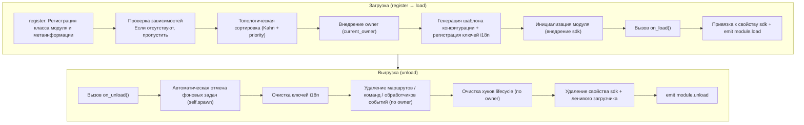

**Что делает фреймворк при загрузке** (вам нужно только написать `on_load`, всё остальное делается автоматически):

| Этап | Что делает фреймворк автоматически |
|------|-------------|
| Внедрение owner | При инициализации модуль обёртывается в `owner_scope`, чтобы все зарегистрированные в `on_load` команды/события/хуки/фоновые задачи **автоматически принадлежали этому модулю**, при выгрузке всё удаляется по owner |
| Шаблон конфигурации | Модули, объявившие `ConfigClass`, получают автоматически сгенерированный/заполненный фреймворком раздел конфигурации `ErisPulse.<ModuleName>` |
| Ключи i18n | Модули, объявившие `I18nClass`, получают автоматическую регистрацию ключей перевода (автоматически удаляются при выгрузке) |
| Топологическая зависимость | Модули сортируются по `depends`, чтобы модули, от которых зависят, загружались первыми; циклические зависимости отклоняются с `RuntimeError` |
| Привязка к SDK | После инициализации модуль привязывается к `sdk.<ModuleName>`, чтобы вы могли обращаться к `sdk.MyModule.xxx` |

**Что делает фреймворк при выгрузке** (соответствует шагам U1→U7): После выполнения `on_unload` происходит дополнительная очистка — фоновые задачи, созданные через `self.spawn`, принудительно отменяются (для корректного завершения сделайте это в `on_unload`), ключи i18n, маршруты, команды/обработчики событий, хуки lifecycle, затем удаляется свойство sdk. При `purge=True` дополнительно удаляются метаданные регистрации + очищается `sys.modules`.

> Эта автоматическая очистка — основа того, что «вам нужно только написать `on_load`/`on_unload`, не нужно вручную unregister» — фреймворк использует принадлежность owner, чтобы сделать «кто зарегистрировал, тот и очищает» одно-клик-процедурой.

## Объект SDK

### Доступ к основным модулям

```python
from ErisPulse import sdk

# Доступ ко всем основным модулям через объект sdk
sdk.logger.info("Лог")
sdk.storage.set("key", "value")
config = sdk.config.getConfig("MyModule")
```

### Взаимодействие между модулями

```python
# Доступ к другим модулям
other_module = sdk.OtherModule
result = await other_module.some_method()

## Запрос методов отправки адаптера

В связи с тем, что новые стандартные спецификации требуют использования переопределения метода `__getattr__` для реализации механизма резервной отправки, использование метода `hasattr` для проверки существования метода становится невозможным. Начиная с версии `2.3.5`, добавлена функция для запроса методов отправки.

### Список поддерживаемых методов отправки

```python
# Список всех методов отправки, поддерживаемых платформой
methods = sdk.adapter.list_sends("onebot11")
# Возвращает: ["Text", "Image", "Voice", "Markdown", ...]
```

### Получение подробной информации о методе

```python
# Получение подробной информации о конкретном методе
info = sdk.adapter.send_info("onebot11", "Text")
# Возвращает:
# {
#     "name": "Text",
#     "parameters": [
#         {"name": "text", "type": "str", "default": null, "annotation": "str"}
#     ],
#     "return_type": "Awaitable[Any]",
#     "docstring": "Отправка текстового сообщения..."
# }

## Управление конфигурацией

### Декларативная конфигурация (рекомендуется)

Начиная с версии 2.5.2, модули могут объявлять класс конфигурации через `ConfigClass`, используя ту же систему схем конфигурации, что и адаптеры. Конфигурация считывается в реальном времени через `self.cfg` и вступает в силу немедленно после изменений:

```python
from dataclasses import dataclass, field
from ErisPulse.Core.Bases import BaseModule
from ErisPulse.Core.Bases import BaseConfig

@dataclass
class MyModuleConfig(BaseConfig):
    api_key: str = field(
        default="",
        metadata={
            "description": {"i18n": "my_module.api_key", "default": "API Ключ"},
            "required": True,
            "secret": True,
            "ui": {"widget": "password", "group": "basic", "order": 1},
        },
    )
    timeout: int = field(
        default=30,
        metadata={
            "description": {"i18n": "my_module.timeout", "default": "Тайм-аут (сек)"},
            "ui": {"widget": "number", "group": "advanced", "order": 2},
        },
    )

class MyModule(BaseModule):
    ConfigClass = MyModuleConfig

    def __init__(self, sdk):
        self.sdk = sdk
        self.logger = sdk.logger.get_child("MyModule")

    async def on_load(self, event):
        self.logger.info("Модуль загружен")

    async def on_unload(self, event):
        pass

    async def do_something(self):
        cfg = self.cfg  # Считывание в реальном времени, типобезопасность
        api_key = cfg.api_key
        timeout = cfg.timeout
```

`BaseConfig` — это базовый класс конфигурации общего назначения, подходящий для любых сценариев, включая адаптеры, модули и внешние проекты. Поля конфигурации поддерживают многоязычные описания i18n (см. подробнее в [документации i18n](../../advanced/i18n.md#поля-конфигурации-многоязычные)).

### Декларативные ключи перевода (v2.7.0+)

Начиная с версии 2.7.0, модули могут централизованно объявлять ключи перевода, как объявляют `ConfigClass`, через вложенный класс `I18nClass`. Фреймворк будет автоматически регистрировать все объявленные ключи перевода при загрузке, без необходимости вручную вызывать `i18n.register()`, и регистрация происходит до генерации шаблона конфигурации, что гарантирует доступность ключей i18n, на которые ссылаются описания конфигурации.

```python
from ErisPulse.Core.Bases import BaseConfig, BaseI18n, I18nKey

class MyModule(BaseModule):
    # Класс конфигурации (необязательно)
    @dataclass
    class ConfigClass(BaseConfig):
        welcome_msg: str = field(
            default="Добро пожаловать",
            metadata={
                "description": {"i18n": "mymodule.welcome_msg", "default": "Приветственное сообщение"},
            },
        )

    # Класс набора ключей перевода (необязательно)
    class I18nClass(BaseI18n):
        # Имена свойств автоматически объединяются в полный путь ключа: <имя_модуля>.<имя_свойства>
        welcome_msg: I18nKey = I18nKey(
            default="Welcome Message",   # Языконезависимый запасной вариант
            zh_CN="Приветственное сообщение",
            zh_TW="Приветственное сообщение",
            en="Welcome Message",
            ja="ウェルカムメッセージ",
            ru="Приветственное сообщение",
        )
        hello: I18nKey = I18nKey(
            default="Hello, {name}!",
            zh_CN="Привет, {name}!",
            zh_TW="Привет, {name}!",
            en="Hello, {name}!",
            ja="こんにちは、{name}!",
            ru="Привет, {name}!",
        )
```

Подробнее см. [Рекомендуемый способ написания i18n](../../advanced/i18n.md#рекомендуемый-способ-через-i18nclass-объявить-ключи-перевода-v270).

### Ручное чтение конфигурации (не рекомендуется)

> **Устарело**: Пожалуйста, используйте вместо этого [декларативную конфигурацию](#декларативная-конфигурация-рекомендуется) + чтение через `self.cfg` в реальном времени.

```python
class MyModule(BaseModule):
    def __init__(self, sdk):
        self.sdk = sdk

    def _load_config(self):
        config = self.sdk.config.getConfig("MyModule")
        if not config:
            self.sdk.config.setConfig("MyModule", {"api_key": "", "timeout": 30})
            return {"api_key": "", "timeout": 30}
        return config

## Система хранения

### Основное использование

```python
# Сохранение данных
sdk.storage.set("user:123", {"name": "Чжан Сань"})

# Получение данных
user = sdk.storage.get("user:123", {})

# Удаление данных
sdk.storage.delete("user:123")
```

### Использование транзакций

```python
# Использование транзакции для обеспечения целостности данных
with sdk.storage.transaction():
    sdk.storage.set("key1", "value1")
    sdk.storage.set("key2", "value2")
    # Если какая-либо операция завершится неудачей, все изменения будут откачены

## Обработка событий

### Регистрация обработчиков событий

```python
from ErisPulse.Core.Event import command, message

# Регистрация команды
@command("info", help="Получить информацию")
async def info_handler(event):
    await event.reply("Это информация")

# Регистрация обработчика сообщений
@message.on_group_message()
async def group_handler(event):
    sdk.logger.info(f"Получено групповое сообщение: {event.get_text()}")
```

### Жизненный цикл обработчика событий

Фреймворк автоматически управляет регистрацией и отменой регистрации обработчиков событий; вам нужно зарегистрировать их только в `on_load`.

## Механизм ленивой загрузки

### Принцип работы

```python
# Инициализация модуля происходит только при первом обращении к нему
result = await sdk.my_module.some_method()
# ↑ Здесь срабатывает инициализация модуля
```

### Мгновенная загрузка

Для модулей, которые должны быть инициализированы немедленно (например, слушатели событий, таймеры):

```python
@staticmethod
def get_load_strategy():
    return ModuleLoadStrategy(
        lazy_load=False,  # Мгновенная загрузка
        priority=100
    )

## Обработка ошибок

### Перехват исключений

```python
async def handle_event(self, event):
    try:
        # Бизнес-логика
        await self.process_event(event)
    except ValueError as e:
        self.logger.warning(f"Ошибка параметров: {e}")
        await event.reply(f"Ошибка параметров: {e}")
    except Exception as e:
        self.logger.error(f"Сбой обработки: {e}")
        raise
```

### Логирование

```python
# Использование различных уровней логирования
self.logger.debug("Информация отладки")    # Детальная информация для отладки
self.logger.info("Статус работы")          # Информация о нормальном запуске
self.logger.warning("Предупреждение")     # Предупреждение
self.logger.error("Сообщение об ошибке")  # Сообщение об ошибке
self.logger.critical("Критическая ошибка") # Критическая ошибка

## Документация

- [Введение в разработку модулей](getting-started.md) — Создание первого модуля
- [Класс-обертка событий](event-wrapper.md) — Подробное описание обработки событий
- [Лучшие практики](best-practices.md) — Создание модулей высокого качества


### Event 包装类详解

# Подробное объяснение класса-обертки Event

Модуль Event предоставляет мощный класс-обертку Event, упрощающий обработку событий.

Пожалуйста, верните сразу переведенный полный Markdown-контент, не добавляя никаких других слов.

Еще раз напоминаю: если документ содержит строку с переключением языка (где названия языков разделены символом `` | ``), строго соблюдайте вышеуказанные правила форматирования, не создавайте ошибочных форматов вида ``[**Label**](file)``.

## Добавление аннотаций типов для параметра event

Параметр `event` обработчика событий является **обёрткой Event** (подкласс dict). Рекомендуется добавлять для него аннотации типов:

```python
from ErisPulse.Core.Event import Event

@message.on_private_message()
async def handler(event: Event):
    text = event.get_text()   # IDE автоматически подсказывает все удобные методы
    await event.reply(text)   # Опечатки обнаруживаются на этапе статической проверки
```

Без аннотаций IDE не может распознавать методы Event (`get_text()` / `reply()` / `wait_reply()` / методы расширения платформы не подсказываются), и приходится полагаться на память при написании.

> **Важно различать**: `event` в обратном вызове обработчика событий — это **обёртка Event** (аннотация `Event`); `event` в методах жизненного цикла модуля `on_load` / `on_unload` — это обычный **dict** (аннотация `dict`), не следует их путать.

[**中文**](docs/ru/quick-start.md)

## Основные возможности

- **Полная совместимость со словарем**: Event наследуется от dict
- **Удобные методы**: Предоставляются много удобных методов
- **Доступ через точку**: Поддерживается доступ к полям события через точку
- **Обратная совместимость**: Все методы являются необязательными

- [Справочник](docs/ru/reference.md)
- [Руководство по быстрому старту](docs/ru/quick-start.md)
- [Руководство по установке](docs/ru/installation.md)
- [Примеры](docs/ru/examples.md)
- [Заметки о версиях](docs/ru/changelog.md)

## Основные методы полей

```python
from ErisPulse.Core.Event import command

@command("info")
async def info_command(event: Event):
    event_id = event.get_id()
    platform = event.get_platform()
    time = event.get_time()
    print(f"ID: {event_id}, Платформа: {platform}, Время: {time}")
```

[**English**](docs/ru/quick-start.md)

## Методы событий сообщений

```python
from ErisPulse.Core.Event import message

@message.on_private_message()
async def private_handler(event: Event):
    text = event.get_text()
    user_id = event.get_user_id()
    nickname = event.get_user_nickname()
    await event.reply(f"Привет, {nickname}!")
```

[**English**](docs/ru/quick-start.md)

## Определение типа сообщения

```python
from ErisPulse.Core.Event import message

@message.on_group_message()
async def group_handler(event: Event):
    is_private = event.is_private_message()
    is_group = event.is_group_message()
    is_at = event.is_at_message()
    await event.reply(f"Тип: {'Личное сообщение' if is_private else 'Группа'}")
```

[**中文**](docs/ru/message-type-detection.md) | [**English**](docs/en/message-type-detection.md) | [**Русский**](docs/ru/message-type-detection.md)

## Функция ответа

```python
from ErisPulse.Core.Event import command

@command("ask")
async def ask_command(event: Event):
    await event.reply("Пожалуйста, введите ваше имя:")
    reply = await event.wait_reply(timeout=30)
    if reply:
        name = reply.get_text()
        await event.reply(f"Привет, {name}!")

@command("price")
async def price_command(event: Event):
    await event.reply("Пожалуйста, введите сумму (например: 5元):")
    # Ответ должен соответствовать регулярному выражению, в противном случае ожидание продолжается до истечения таймаута
    reply = await event.wait_reply(timeout=30, regex=r"\d+\s*元")
    if reply:
        await event.reply(f"Получено значение: {reply.get_text()}")
```

## Получение информации о команде

```python
from ErisPulse.Core.Event import command

@command("cmdinfo")
async def cmdinfo_command(event: Event):
    cmd_name = event.get_command_name()
    cmd_args = event.get_command_args()
    await event.reply(f"Команда: {cmd_name}, аргументы: {cmd_args}")
```

[**English**](docs/ru/quick-start.md) | [**Русский**](docs/ru/quick-start.md)

## Метод уведомления событий

```python
from ErisPulse.Core.Event import notice

@notice.on_friend_add()
async def friend_add_handler(event: Event):
    await event.reply("Добро пожаловать, добавьте меня в друзья!")
```

[**English**](docs/ru/quick-start.md)

## Справочник методов

### Основные методы

#### Базовая информация о событии
- `get_id()` - Получить идентификатор события
- `get_time()` - Получить метку времени события (Unix, секунды)
- `get_type()` - Получить тип события (message/notice/request/meta)
- `get_detail_type()` - Получить подробный тип события (private/group/friend и т.д.)
- `get_platform()` - Получить название платформы

#### Информация о боте
- `get_self_platform()` - Получить название платформы бота
- `get_self_user_id()` - Получить идентификатор пользователя бота
- `get_self_account_id()` - Получить идентификатор аккаунта бота (режим множества ботов)
- `get_self_info()` - Получить полную информацию о боте в виде словаря

#### Идентификаторы сессии
- `get_target_id()` - Получить единый идентификатор цели (для групповых чатов возвращает `group_id`, для каналов `channel_id`, для личных сообщений `user_id`, возвращает первое непустое значение в порядке group → channel → guild → thread → user)
- `get_session_id()` - Получить уникальный идентификатор сессии, формат `{platform}:{detail_type}:{target_id}`

### Методы событий сообщений

#### Содержимое сообщения
- `get_message()` - Получить массив сообщений в формате OneBot12
- `get_alt_message()` - Получить альтернативный текст сообщения
- `get_text()` - Получить чистый текст (альтернативное имя `get_alt_message()`)
- `get_message_text()` - Получить чистый текст (альтернативное имя `get_alt_message()`)

#### Информация о отправителе
- `get_user_id()` - Получить идентификатор пользователя-отправителя
- `get_user_nickname()` - Получить никнейм отправителя
- `get_sender()` - Получить полную информацию об отправителе в виде словаря

#### Информация о группе/канале
- `get_group_id()` - Получить идентификатор группы (сообщения в группе)
- `get_channel_id()` - Получить идентификатор канала (сообщения в канале)
- `get_guild_id()` - Получить идентификатор сервера (сообщения на сервере)
- `get_thread_id()` - Получить идентификатор темы/подканала (сообщения в теме)

#### Связанные с @ сообщениями
- `has_mention()` - Содержит ли сообщение упоминание бота
- `get_mentions()` - Получить список всех упомянутых пользователей

### Определение типа сообщения

#### Основные проверки
- `is_message()` - Является ли событием сообщения
- `is_private_message()` - Является ли личным сообщением
- `is_group_message()` - Является ли групповым сообщением
- `is_at_message()` - Является ли сообщением с упоминанием (`has_mention()`)

### Методы событий уведомлений

#### Информация об операторе
- `get_operator_id()` - Получить идентификатор оператора
- `get_operator_nickname()` - Получить никнейм оператора

#### Определение типа уведомления
- `is_notice()` - Является ли событием уведомления
- `is_group_member_increase()` - Событие добавления участника в группу
- `is_group_member_decrease()` - Событие удаления участника из группы
- `is_friend_add()` - Событие добавления друга (соответствует `detail_type == "friend_increase"`)
- `is_friend_delete()` - Событие удаления друга (соответствует `detail_type == "friend_decrease"`)

### Методы событий запросов

#### Информация о запросе
- `get_comment()` - Получить комментарий к запросу

#### Определение типа запроса
- `is_request()` - Является ли событием запроса
- `is_friend_request()` - Является ли запросом на добавление друга
- `is_group_request()` - Является ли запросом на вступление в группу

### Функции ответа

#### Основной ответ
- `reply(content, method="Text", at_sender=False, quote=False, at_users=None, reply_to=None, at_all=False, via=None, **kwargs)` - Общий метод ответа
  - `content`: Содержимое отправки (текст, URL и т.д.)
  - `method`: Метод отправки, по умолчанию "Text", возможные значения "Image"/"Voice"/"Video"/"File" и т.д.
  - `at_sender`: Упоминать ли отправителя (автоматически извлекает user_id)
  - `quote`: Цитировать ли текущее сообщение (автоматически извлекает message_id)
  - `at_users`: Список упомянутых пользователей, например `["user1", "user2"]`
  - `reply_to`: Ручное указание ID сообщения для ответа
  - `at_all`: Упоминать ли всех участников
  - `**kwargs`: Дополнительные параметры (например, user_id для метода Mention)

- `reply_ob12(message)` - Ответ в формате OneBot12
  - `message`: Список или словарь сообщений OneBot12, можно использовать MessageBuilder для построения

#### Проверка поддержки платформой
- `supports(method)` - Проверить, поддерживает ли платформа метод отправки (например, `"Image"`), возвращает `bool`
- `available_methods()` - Получить список всех доступных методов отправки на текущей платформе, возвращает список названий методов

#### Пересылка сообщений

> **Важно**: Функция пересылки должна реализовываться через DSL отправки адаптера, Event-обёртка не предоставляет прямого метода пересылки.

```python
# Переслать сообщение в группу
adapter = sdk.adapter.get(event.get_platform())
target_id = event.get_group_id()  # или указать другой идентификатор группы
await adapter.Send.To("group", target_id).Text(event.get_text())
```

### Функция ожидания ответа

- `wait_reply(prompt=None, timeout=60.0, callback=None, validator=None, method="Text", pattern=None, regex=None)` - Ожидание ответа пользователя
  - `prompt`: Текст подсказки, если указан, будет отправлен пользователю
  - `timeout`: Время ожидания в секундах, по умолчанию 60
  - `callback`: Функция-коллбэк, выполняется при получении ответа
  - `validator`: Функция-валидатор, проверяет корректность ответа
  - `method`: Метод отправки подсказки, по умолчанию "Text"
  - `pattern`: Шаблон glob (`*` / `?` / `[seq]`), текст ответа должен соответствовать, иначе ожидание продолжается
  - `regex`: Регулярное выражение, текст ответа должен соответствовать (выбирается один из `pattern` или `regex`), иначе ожидание продолжается
  - Возвращает объект Event с ответом пользователя, при таймауте возвращает None

#### Интерактивные методы

- `confirm(prompt=None, timeout=60.0, yes_words=None, no_words=None, method="Text", hint=False)` - Подтверждение диалога
  - Возвращает `True` (подтверждение) / `False` (отказ) / `None` (таймаут)
  - Автоматически распознаются встроенные английские и китайские слова подтверждения, можно задать собственные наборы слов
  - `method`: Метод отправки, по умолчанию "Text"; поддерживает "Image"/"Markdown" и другие не-текстовые методы
  - `hint`: Вставлять ли автоматически подсказку с вариантами ответа в конец подсказки (например, "（是/否）"), по умолчанию False

- `choose(prompt, options, timeout=60.0, method="Text", options_format="auto", merge_prompt=False, placeholder="{options}")` - Выбор из меню
  - `options`: Список текстовых вариантов
  - Возвращает индекс выбранного варианта (начиная с 0), при таймауте возвращает `None`
  - `method`: Метод отправки, по умолчанию "Text"; текстовые методы (Text/Markdown/md/Html/h5) по умолчанию объединяют варианты в конец
  - `options_format`: Формат вариантов (по умолчанию: "auto", автоматически выбирается в зависимости от method)
    - `"auto"`: Markdown→нумерованный список (`- 1. вариант`), Html→упорядоченный список (`<ol>`), иначе→простой текстовый список
    - `"list"`: Каждый вариант на отдельной строке, например ``1. ВариантA\n2. ВариантB``
    - `"inline"`: Варианты в одной строке, например ``1.ВариантA | 2.ВариантB``
    - `"md"`: Markdown нумерованный список
    - `"html"`: Html упорядоченный список
    - `callable`: Пользовательская функция, принимает ``list[str]`` и возвращает ``str``
  - `merge_prompt`: Принудительно объединять ли сообщения, по умолчанию False
    - `False` (по умолчанию): Текстовые методы объединяют автоматически; не-текстовые методы отправляют сначала prompt, затем Text-варианты
    - `True`: Независимо от method объединяются в одно сообщение, отправляются указанным method
  - `placeholder`: Заменяемый маркер для вставки вариантов, по умолчанию `{options}`; при наличии маркера в prompt он заменяется на варианты, если пустая строка, варианты всегда добавляются в конец

- `collect(fields, timeout_per_field=60.0)` - Сбор данных в форме
  - `fields`: Список полей, каждое содержит `key`, `prompt`, необязательный `validator`, необязательный `method`
  - Возвращает словарь `{key: value}`, при таймауте любого поля возвращает `None`
  - Каждое поле может иметь ключ `method` для указания метода отправки, например для сбора изображения `{"key": "avatar", "prompt": "Пожалуйста, отправьте аватар", "method": "Image"}`
  - Каждое поле может иметь ключ `options` (список), при наличии становится выбором (автоматически вызывается choose)
  - Каждое поле может иметь ключи `options_format`, `merge_prompt`, `placeholder` для управления форматом вариантов, поведением объединения сообщений и маркером

- `wait_for(event_type="message", condition=None, timeout=60.0)` - Ожидание произвольного события
  - `condition`: Функция-фильтр, возвращает `True` при совпадении
  - Возвращает соответствующий Event, при таймауте возвращает None

- `conversation(timeout=60.0)` - Создать контекст многошагового диалога
  - Возвращает объект `Conversation`, поддерживающий `say()`/`wait()`/`confirm()`/`choose()`/`collect()`/`stop()`
  - Свойство `is_active` указывает, активен ли диалог

#### Примеры интерактивных методов

**confirm() - Подтверждение диалога:**

```python
@command("delete", help="Удалить данные")
async def delete_handler(event: Event):
    if await event.confirm("Вы уверены, что хотите удалить все данные?"):
        sdk.storage.delete("all_data")
        await event.reply("Данные удалены")
    else:
        await event.reply("Отменено")
```

**confirm() - С подсказкой:**

```python
# hint=True добавляет в конец подсказки "（是/否）"
if await event.confirm("Продолжить?", hint=True):
    await event.reply("Продолжено")
# Пользователь видит: Продолжить?（是/否）
```

**choose() - Меню выбора:**

```python
@command("color", help="Выбрать цвет")
async def color_handler(event: Event):
    choice = await event.choose("Выберите цвет:", ["красный", "зелёный", "синий"])
    if choice is not None:
        colors = ["красный", "зелёный", "синий"]
        await event.reply(f"Вы выбрали: {colors[choice]}")
```

**choose() - Форматирование и объединение сообщений:**

```python
# inline формат: варианты в одной строке
choice = await event.choose("Выберите:", ["A", "B", "C"], options_format="inline")
# Вывод: 1.A | 2.B | 3.C

# Пользовательская функция форматирования
choice = await event.choose("Выберите:", ["кот", "собака"],
    options_format=lambda opts: " / ".join(opts))
# Вывод: кот / собака

# options_format="auto" (по умолчанию): автоматически выбирается в зависимости от method
# Markdown → нумерованный список
choice = await event.choose(
    "## Выберите", ["кот", "собака"],
    method="Markdown",  # auto автоматически распознаёт как md список
)
# Вывод:
# ## Выберите
# - 1. кот
# - 2. собака

# Html → упорядоченный список
choice = await event.choose(
    "<h2>Выберите</h2>", ["кот", "собака"],
    method="Html", merge_prompt=True,  # auto автоматически распознаёт как html список
)
# Вывод:
# <h2>Выберите</h2>
# <ol><li>1. кот</li><li>2. собака</li></ol>

# Объединённый режим + маркер
choice = await event.choose(
    "## Выберите\n{options}\nОтветьте номером",
    ["кот", "собака"],
    method="Markdown", merge_prompt=True,
)

# Пользовательский маркер
choice = await event.choose(
    "Выберите: [choices]",
    ["кот", "собака"],
    placeholder="[choices]",
)
```

**collect() - Сбор формы:**

```python
@command("register", help="Зарегистрироваться")
async def register_handler(event: Event):
    data = await event.collect([
        {"key": "name", "prompt": "Введите имя:"},
        {"key": "age", "prompt": "Введите возраст:",
         "validator": lambda e: e.get_text().isdigit()},
    ])
    if data:
        await event.reply(f"Успешно зарегистрировано! {data['name']}, {data['age']} лет")
```

**reply с не-Text методами:**

```python
await event.reply("http://example.com/img.jpg", method="Image")
await event.reply("http://example.com/audio.mp3", method="Voice")

from ErisPulse.Core.Event import MessageBuilder
segments = MessageBuilder.text("Смотри на это изображение:").image("http://example.com/img.jpg").build()
await event.reply_ob12(segments)
```

> Полное использование многошагового диалога через Conversation см. в [Многошаговый диалог](../../advanced/conversation.md).

### Информация о командах

#### Основы команд
- `get_command_name()` - Получить имя команды
- `get_command_args()` - Получить список аргументов команды
- `get_command_raw()` - Получить исходный текст команды
- `get_command_info()` - Получить полную информацию о команде в виде словаря
- `is_command()` - Является ли событием команды

### Исходные данные

- `get_raw()` - Получить исходные данные события платформы
- `get_raw_type()` - Получить тип исходного события платформы

### Платформенные расширения

Адаптеры могут зарегистрировать платформо-специфические методы для Event-обёртки. Методы доступны только в экземплярах Event соответствующей платформы, попытка доступа к другим платформам вызывает `AttributeError`.

Платформенные методы через `Event.__getattribute__` имеют приоритет над встроенными методами, поэтому можно переопределить встроенные методы `confirm`、`choose`、`collect`、`wait_reply` и др., предоставляя специфичные реализации (например, кнопки, карточки). Встроенная реализация экспортируется как `_builtin_*` функции для переопределения.

```python
# Почтовое событие - только почтовые методы
event = Event({"platform": "email", "email_raw": {"subject": "Hello"}})
event.get_subject()      # ✅ Возвращает "Hello"
event.get_chat_type()    # ❌ AttributeError

# Telegram событие - только Telegram методы
event = Event({"platform": "telegram", "telegram_raw": {"chat": {"type": "private"}}})
event.get_chat_type()    # ✅ Возвращает "private"
event.get_subject()      # ❌ AttributeError

# Встроенные методы доступны всегда
event.get_text()         # ✅ В любой платформе
event.reply("hi")        # ✅ В любой платформе
```

### Проверка зарегистрированных методов

```python
from ErisPulse.Core.Event import get_platform_event_methods

methods = get_platform_event_methods("email")
# ["get_subject", "get_from", ...]
```

### Поддержка `hasattr` и `dir`

```python
hasattr(event, "get_subject")   # Возвращает True только при platform="email"
"get_subject" in dir(event)     # То же самое
```

### Расширение для всех платформ (шаблон)

`register_event_method` и `register_event_mixin` поддерживают передачу `"*"` в качестве названия платформы, регистрируя методы, доступные во всех платформах. Подходит для функций, требующих переносимости, таких как AI-диалоги, управление контекстом и т.д.

```python
from ErisPulse.Core.Event.wrapper import register_event_method

@register_event_method("*")
async def ai_chat(self, prompt: str):
    # self - экземпляр Event, доступен к событию и встроенным методам
    await self.reply(f"AI: {prompt}")
```

После регистрации метод `event.ai_chat(...)` доступен в обработчиках событий любой платформы.

Приоритет методов (от высшего к низшему): платформо-специфичный метод → шаблонный метод → встроенный метод → доступ по ключу словаря.

> Способ регистрации расширений адаптерами см. в [API системы событий - Расширения для всех платформ](../../api-reference/event-system.md#Расширения-для-всех-платформ).


### 模块开发最佳实践

# Лучшие практики разработки модулей

Данный документ предоставляет рекомендации по лучшим практикам разработки модулей ErisPulse.

## Дизайн модуля

### 1. Принцип единственной ответственности

Каждый модуль должен отвечать только за одну основную функцию:

```python
# Хороший дизайн: каждый модуль отвечает за одну функцию
class WeatherModule(BaseModule):
    """Модуль для получения погоды"""
    pass

class NewsModule(BaseModule):
    """Модуль для получения новостей"""
    pass

# Плохой дизайн: один модуль отвечает за несколько несвязанных функций
class UtilityModule(BaseModule):
    """Содержит погоду, новости, анекдоты и другие функции"""
    pass
```

### 2. Стандарты именования модулей

```toml
[project]
name = "ErisPulse-ModuleName"  # Использование префикса ErisPulse-
```

### 3. Четкое управление конфигурацией

Рекомендуется использовать декларативную конфигурацию (`ConfigClass` + `BaseConfig`), чтобы получить типобезопасность, автоматическое создание шаблонов, поддержку веб-интерфейса и т.д.:

```python
from dataclasses import dataclass, field
from ErisPulse.Core.Bases import BaseConfig

@dataclass
class MyModuleConfig(BaseConfig):
    api_url: str = field(default="https://api.example.com", metadata={
        "description": {"i18n": "my_module.api_url", "default": "Адрес API"},
    })
    timeout: int = field(default=30, metadata={
        "description": {"i18n": "my_module.timeout", "default": "Время ожидания (секунды)"},
    })
    cache_ttl: int = field(default=3600, metadata={
        "description": {"i18n": "my_module.cache_ttl", "default": "Время жизни кэша (секунды)"},
    })

class MyModule(BaseModule):
    ConfigClass = MyModuleConfig

    async def do_something(self):
        cfg = self.cfg  # Типобезопасность, реальное чтение
        await self._fetch(cfg.api_url, timeout=cfg.timeout)
```

Также можно продолжить использовать ручной способ чтения и записи конфигурации (см. [основные понятия модуля](core-concepts.md#управление-конфигурацией)).

### Декларативные ключи перевода (v2.7.0+)

Модуль может объявлять ключи перевода через `I18nClass`, и фреймворк автоматически зарегистрирует их в системе перевода, без необходимости вызывать `i18n.register()` вручную.

```python
from ErisPulse.Core.Bases import BaseI18n, I18nKey

class MyModule(BaseModule):
    class I18nClass(BaseI18n):
        # Ключ перевода с плейсхолдером
        welcome: I18nKey = I18nKey(
            default="Welcome, {name}!",
            zh_CN="欢迎你，{name}！",
            zh_TW="歡迎你，{name}！",
            en="Welcome, {name}!",
            ja="ようこそ、{name}！",
            ru="Добро пожаловать, {name}!",
        )
        # Описание поля конфигурации
        api_url: I18nKey = I18nKey(
            default="API URL",
            zh_CN="API 地址",
            zh_TW="API 位址",
            en="API URL",
            ja="API URL",
            ru="Адрес API",
        )
```

Детальное использование см. в [документации по i18n](../../advanced/i18n.md#рекомендуемый-способ-объявления-ключей-перевода-через-i18nclass-v270).

## Асинхронное программирование

### 1. Использование асинхронных библиотек

```python
# Рекомендуется использовать встроенный HTTP-клиент SDK (асинхронный, автоматические логи и статистика)
from ErisPulse.Core import client

class MyModule(BaseModule):
    async def fetch_data(self, url):
        resp = await client.get(url)
        return await resp.json()

# Также можно использовать sdk.client (результат тот же)
from ErisPulse import sdk

class MyModule(BaseModule):
    async def fetch_data(self, url):
        resp = await sdk.client.get(url)
        return await resp.json()

# Не рекомендуется использовать aiohttp напрямую (неудобно для унифицированного управления фреймворком)
import aiohttp

class MyModule(BaseModule):
    async def fetch_data(self, url):
        async with aiohttp.ClientSession() as session:
            async with session.get(url) as response:
                return await response.json()

# Не рекомендуется использовать requests (синхронный, блокирует цикл событий)
import requests

class MyModule(BaseModule):
    def fetch_data(self, url):
        return requests.get(url).json()  # Блокирует цикл событий
```

### 2. Правильные асинхронные операции

```python
from ErisPulse.Core.Event import Event  # 注解 event: Event для получения автодополнения в IDE

async def handle_command(self, event: Event):
    # Длительные операции, результат которых нужно ожидать: просто await (жизненный цикл понятен)
    result = await self._long_operation()

async def on_load(self, event: dict):
    # Фоновые задачи (опрос, таймер, fire-and-forget): используйте self.spawn(),
    # при выгрузке модуля фреймворк автоматически отменяет их после on_unload, предотвращая утечки
    self.spawn(self._poll())
```

> [!NOTE]
> Для фоновых задач рекомендуется использовать `self.spawn()` (ErisPulse **2.8.0+**), а не `asyncio.create_task` — последний создает "голые" задачи, не принадлежащие модулю, и при выгрузке модуля они не будут автоматически отменены, что приведет к удержанию ссылки на `self` и невозможности сборки мусора (утечка при горячей перезагрузке). Подробнее см. [Управление жизненным циклом](../../advanced/lifecycle.md#фоновые-задачи-принадлежность-и-автоматическая-отмена).

### 3. Управление ресурсами

```python
async def on_load(self, event):
    # Клиент SDK автоматически управляет пулы соединений, не нужно создавать session вручную
    pass
    
async def on_unload(self, event):
    # Если нужно использовать пользовательский клиент, не забудьте освободить ресурсы
    pass
```

## Обработка событий

### 1. Использование обёртки Event

```python
# Удобный способ использования обёртки Event
@command("info")
async def info_command(event: Event):
    user_id = event.get_user_id()
    nickname = event.get_user_nickname()
    await event.reply(f"Привет, {nickname}!")

# Вместо прямого доступа к словарю
@command("info")
async def info_command(event: Event):
    user_id = event["user_id"]  # Менее ясно, легко допустить ошибку
```

### 2. Разумное использование ленивой загрузки

```python
# Модуль с редко используемыми командами: объявите триггер activate_on, модуль активируется автоматически при первом совпадении команды (сохраняется ленивая загрузка)
class CommandModule(BaseModule):
    @staticmethod
    def get_load_strategy():
        return ModuleLoadStrategy(lazy_load=True, activate_on=[
            {"command": {"name": "dice", "help": "Бросить кубик", "aliases": ["d"]}},
        ])

# Модуль с редко используемыми триггерами: объявите триггер события, модуль активируется автоматически при наступлении события
class ListenerModule(BaseModule):
    @staticmethod
    def get_load_strategy():
        return ModuleLoadStrategy(lazy_load=True, activate_on=[
            {"notice": "group_member_increase"},
        ])

# Модули с высокой частотой триггеров (обрабатываются каждое сообщение) или модули, которые должны быть готовы при запуске: загружаются немедленно
class HotListenerModule(BaseModule):
    @staticmethod
    def get_load_strategy():
        return ModuleLoadStrategy(lazy_load=False)

# Утилитарные модули подходят для ленивой загрузки
class UtilityModule(BaseModule):
    @staticmethod
    def get_load_strategy():
        return ModuleLoadStrategy(lazy_load=True)
```

> Полный синтаксис activate_on (три формы событий / сокращённые объявления команд и dict / цепочка возврата help) см. в [Системе модулей с ленивой загрузкой](../../advanced/lazy-loading.md#активация-по-событию-activate-on).

### 3. Регистрация обработчиков событий

```python
async def on_load(self, event):
    # Регистрация обработчиков событий в on_load
    @command("hello")
    async def hello_handler(event: Event):
        await event.reply("Привет!")
    
    @message.on_group_message()
    async def group_handler(event: Event):
        self.logger.info("Получено сообщение в группе")
    
    # Не нужно вручную отписываться, фреймворк будет обрабатывать это автоматически
```

## Обработка ошибок

### 1. Обработка исключений по категориям

```python
async def handle_event(self, event: Event):
    try:
        result = await self._process(event)
    except ValueError as e:
        # Ожидаемая бизнес-ошибка
        self.logger.warning(f"Предупреждение бизнеса: {e}")
        await event.reply(f"Ошибка параметра: {e}")
    except aiohttp.ClientError as e:
        # Ошибка сети (рекомендуется использовать sdk.client + ClientError вместо этого)
        # Старый код, использующий aiohttp напрямую, по-прежнему работает, но в новом коде рекомендуется использовать систему исключений ErisPulse
        self.logger.error(f"Ошибка сети: {e}")
        await event.reply("Ошибка сетевого запроса, попробуйте позже")
    except Exception as e:
        # Неожиданная ошибка
        self.logger.error(f"Неизвестная ошибка: {e}", exc_info=True)
        await event.reply("Обработка не удалась, свяжитесь с администратором")
        raise
```

### 2. Обработка тайм-аутов

```python
# Рекомендуется использовать встроенный клиент SDK (включает тайм-аут и повторные попытки)
from ErisPulse.Core import client
from ErisPulse.Core.Bases.errors import ClientTimeoutError

async def fetch_with_timeout(self, url, timeout=30):
    try:
        resp = await client.get(url, timeout=timeout)
        return await resp.json()
    except ClientTimeoutError:
        self.logger.warning(f"Тайм-аут запроса: {url}")
        raise
```

## Система хранения

### 1. Использование транзакций

```python
# Использование транзакции для обеспечения согласованности данных
async def update_user(self, user_id, data):
    with self.sdk.storage.transaction():
        self.sdk.storage.set(f"user:{user_id}:profile", data["profile"])
        self.sdk.storage.set(f"user:{user_id}:settings", data["settings"])

# ❌ Без использования транзакции может возникнуть несогласованность данных
async def update_user(self, user_id, data):
    self.sdk.storage.set(f"user:{user_id}:profile", data["profile"])
    # Если здесь произойдет ошибка, предыдущая операция не может быть отменена
    self.sdk.storage.set(f"user:{user_id}:settings", data["settings"])
```

### 2. Пакетные операции

```python
# Использование пакетных операций для повышения производительности
def cache_multiple_items(self, items):
    self.sdk.storage.set_multi({
        f"item:{k}": v for k, v in items.items()
    })

# ❌ Многократное вызывание менее эффективно
def cache_multiple_items(self, items):
    for k, v in items.items():
        self.sdk.storage.set(f"item:{k}", v)
```

## Логирование

### 1. Разумное использование уровней логирования

```python
# DEBUG: Подробная информация для отладки (только в разработке)
self.logger.debug(f"Входные параметры: {params}")

# INFO: Информация о нормальной работе
self.logger.info("Модуль загружен")
self.logger.info(f"Обработка запроса: {request_id}")

# WARNING: Предупреждения, не влияющие на основную функциональность
self.logger.warning(f"Параметр конфигурации {key} не задан, используется значение по умолчанию")
self.logger.warning("API отвечает медленно, возможно, требуется оптимизация")

# ERROR: Ошибки
self.logger.error(f"Запрос к API не удался: {e}")
self.logger.error(f"Ошибка обработки события: {e}", exc_info=True)

# CRITICAL: Критические ошибки, требующие немедленного вмешательства
self.logger.critical("Не удалось подключиться к базе данных, бот не может нормально работать")
```

### 2. Структурированное логирование

```python
# Использование структурированного логирования, облегчает анализ
self.logger.info(f"Обработка запроса: request_id={request_id}, user_id={user_id}, duration={duration}ms")

# ❌ Использование неструктурированного логирования
self.logger.info(f"Обработка запроса, от пользователя {user_id}, затрачено {duration} миллисекунд")
```

## Оптимизация производительности

### 1. Использование кэширования

```python
class MyModule(BaseModule):
    def __init__(self):
        self._cache = {}
        self._cache_lock = asyncio.Lock()
    
    async def get_data(self, key):
        async with self._cache_lock:
            if key in self._cache:
                return self._cache[key]
            
            # Получение из базы данных
            data = await self._fetch_from_db(key)
            
            # Кэширование данных
            self._cache[key] = data
            return data
```

### 2. Избегание блокирующих операций

```python
# Использование асинхронных операций
async def process_message(self, event: Event):
    # Асинхронная обработка
    await self._async_process(event)

# ❌ Блокирующая операция
async def process_message(self, event: Event):
    # Синхронная операция, блокирует цикл событий
    result = self._sync_process(event)
```

## Безопасность

### 1. Защита конфиденциальных данных

```python
# Конфиденциальные данные хранятся в конфигурации (декларативный ConfigClass, поля secret не попадают в логи/экспорт)
from dataclasses import dataclass, field
from ErisPulse.Core.Bases import BaseModule, BaseConfig

@dataclass
class MyModuleConfig(BaseConfig):
    api_key: str = field(
        default="",
        metadata={"description": "Ключ API", "secret": True},
    )

class MyModule(BaseModule):
    ConfigClass = MyModuleConfig

    def check_api_key(self):
        if not self.cfg.api_key or self.cfg.api_key == "YOUR_API_KEY_HERE":
            raise ValueError("Пожалуйста, настройте действительный ключ API в config.toml")

# ❌ Конфиденциальные данные жестко закодированы
class MyModule(BaseModule):
    API_KEY = "sk-1234567890"  # Не делайте так!
```

### 2. Проверка входных данных

```python
# Проверка пользовательского ввода
async def process_command(self, event: Event):
    user_input = event.get_text()
    
    # Проверка длины ввода
    if len(user_input) > 1000:
        await event.reply("Слишком длинный ввод, пожалуйста, повторите")
        return
    
    # Проверка формата ввода
    if not re.match(r'^[a-zA-Z0-9]+$', user_input):
        await event.reply("Неверный формат ввода")
        return
```

## Тестирование

### 1. Модульные тесты

```python
import pytest
from ErisPulse.Core.Bases import BaseModule

class TestMyModule:
    def test_config_defaults(self):
        """Тестирование значений по умолчанию конфигурации"""
        config = MyModule.ConfigClass()
        assert config.timeout == 30
```

### 2. Интеграционные тесты

```python
@pytest.mark.asyncio
async def test_command_handling():
    """Тестирование обработки команд"""
    module = MyModule()
    await module.on_load({})
    
    # Эмуляция события команды
    event = create_test_command_event("hello")
    await module.handle_command(event)
```

## Развертывание

### 1. Управление версиями

```toml
[project]
name = "ErisPulse-MyModule"
version = "1.0.0"
```

Следуйте семантическому управлению версиями:
- MAJOR.MINOR.PATCH
- Главная версия: несовместимые изменения API
- Второстепенная версия: добавление функций, совместимых с предыдущими
- Исправление: исправление проблем, совместимых с предыдущими

### 2. Заголовок README

README, сгенерированный с помощью `epsdk create`, уже содержит заголовок ErisPulse (логотип + строки значков). Два рекомендуемых режима:

**Режим A — только логотип ErisPulse (по умолчанию):**

```markdown
<div align="center">


# MyModule

**Однострочное описание**

<p>
  <a href="https://pypi.org/project/ErisPulse-MyModule/"></a>
  <a href="https://pypi.org/project/ErisPulse-MyModule/"></a>
  <a href="./LICENSE"></a>
  <a href="https://github.com/ErisPulse/ErisPulse"></a>
</p>

</div>
```

**Режим B — значок модуля × логотип ErisPulse (если есть пользовательский значок):**

```markdown
<div align="center">


<span style="font-size:44px;color:#c8c8c8;margin:0 18px;vertical-align:middle;">×</span>


# MyModule
(Строки значков аналогичны предыдущей)
</div>
```

Вы можете по желанию добавить значки GitHub Stars, Downloads и т.д. Логотип также можно загрузить в локальную папку проекта (`.github/assets/ErisPulseLogo.png`) и изменить ссылку на относительный путь.


=====
发布与工具
=====


### 发布模块到模块商店

# Руководство по публикации и магазину модулей

Опубликуйте свой модуль или адаптер в магазине модулей ErisPulse, чтобы другие пользователи могли легко находить и устанавливать его.

## Обзор магазина модулей

Магазин модулей ErisPulse представляет собой централизованный реестр модулей, через который пользователи могут просматривать, искать и устанавливать модули и адаптеры, предоставленные сообществом, с помощью инструментов командной строки.

### Просмотр и обнаружение

```bash
# Вывести список всех доступных удалённых пакетов
epsdk list-remote

# Показать только модули
epsdk list-remote -t modules

# Показать только адаптеры
epsdk list-remote -t adapters

# Принудительно обновить список удалённых пакетов
epsdk list-remote -r
```

Вы также можете посетить [официальный сайт ErisPulse](https://www.erisdev.com/#market), чтобы просматривать магазин модулей онлайн.

### Поддерживаемые типы публикаций

| Тип | Описание | Группа entry-point |
|------|------|----------------|
| Модуль (Module) | Расширение функциональности бота, реализация бизнес-логики | `erispulse.module` |
| Адаптер (Adapter) | Подключение к новым платформам сообщений | `erispulse.adapter` |

## Быстрая публикация

Весь процесс состоит всего из трёх шагов: настройка проекта → публикация на PyPI → отправка в магазин модулей.

### 1. Настройка pyproject.toml

Убедитесь, что в каталоге проекта присутствуют `pyproject.toml` и `README.md`, а также настройте entry-points в зависимости от типа:

#### Модуль

```toml
[project]
name = "ErisPulse-MyModule"
version = "1.0.0"
description = "Описание функциональности модуля"
requires-python = ">=3.10"
license = { text = "MIT" }
authors = [ { name = "yourname" } ]
dependencies = [
    "ErisPulse>=2.0.0",
]

[project.entry-points."erispulse.module"]
"MyModule" = "MyModule:Main"
```

#### Адаптер

```toml
[project]
name = "ErisPulse-MyAdapter"
version = "1.0.0"
description = "Описание функциональности адаптера"
requires-python = ">=3.10"

[project.entry-points."erispulse.adapter"]
"myplatform" = "MyAdapter:MyAdapter"
```

> **Примечание**: Рекомендуется начинать имя пакета с `ErisPulse-`, чтобы пользователи могли легко его идентифицировать. Ключ entry-point (например, `"MyModule"`) будет использоваться как имя модуля в SDK.

### 2. Публикация на PyPI

```bash
# Сборка и публикация (требуется аккаунт на PyPI)
pip install build twine
python -m build
python -m twine upload dist/*
```

После успешной публикации проверьте установку:

```bash
pip install ErisPulse-MyModule
```

### 3. Отправка в магазин модулей

Перейдите на [ErisPulse Магазин модулей](https://www.erisdev.com/#market), нажмите «Отправить модуль», войдите в систему и заполните информацию о модуле.

Поддерживаемые способы входа: **GitHub**, **Codeberg**, **Yunhu**, можно выбрать любой.

Важные моменты для заполнения:
- Название модуля, описание, адрес репозитория
- Минимальная версия SDK: если не уверены, укажите версию [последнего релиза ErisPulse](https://pypi.org/project/ErisPulse/)

После отправки изменения вступают в силу немедленно, пользователи могут установить модуль через источник. Модуль будет помечен как «Не проверено», после проверки разработчиком он изменится на «Проверено».

> **О статусе проверки**:
> - «Не проверено» означает, что модуль ещё не прошёл официальную проверку, но не говорит о его проблемах
> - При установке не проверенного модуля через `epsdk install` пользователи получат предупреждение о риске, которое нужно подтвердить для продолжения установки

### 4. Управление опубликованными модулями

После входа в систему на вкладке «Отправить модуль» в магазине модулей, перейдите на вкладку «Мои модули», где можно:

- **Редактировать** — изменить описание модуля, адрес репозитория, теги и т.д., номер версии будет автоматически синхронизирован с PyPI
- **Удалить** — удалить модуль из магазина модулей (необратимо)

> Новые модули могут отображаться в списке «Мои модули» через несколько минут после отправки.

## Обновление опубликованных модулей

1. Обновите `version` в `pyproject.toml`
2. Пересоберите и перезагрузите: `python -m build && python -m twine upload dist/*`
3. Магазин модулей автоматически синхронизирует последнюю версию с PyPI

Пользователи могут обновить модуль с помощью `epsdk upgrade MyModule`.

## Список проверок перед публикацией

Перед отправкой на PyPI, пожалуйста, проверьте следующие пункты:

### Качество кода

- [ ] Все публичные API имеют аннотации типов (подписи функций и возвращаемые значения)
- [ ] Все публичные методы имеют строки документации (`"""..."""` формат, включая `:param` / `:return` / `:raises`)
- [ ] Проходит проверку `ruff check` (без предупреждений)
- [ ] Код покрыт тестами на ≥ 80%
- [ ] Проходят все тесты `pytest`

### Совместимость

- [ ] `pyproject.toml` объявляет минимальную версию SDK: `dependencies = ["ErisPulse>=x.y.z"]`
- [ ] Тестировано на Python 3.10 / 3.11 / 3.12 / 3.13
- [ ] Тестировано на целевых операционных системах (Windows / Linux / macOS, если применимо)
- [ ] Нет циклических зависимостей

### Конфигурация

- [ ] Если используется декларативная конфигурация (`ConfigClass` + `BaseConfig` / `BotAccountConfig`), поля конфигурации имеют `description` (рекомендуется в формате i18n) и метаданные `ui`
- [ ] Если зарегистрированы ключи переводов i18n, они покрывают все 5 языков (zh-CN / zh-TW / en / ja / ru)
- [ ] Чувствительные поля помечены `secret=True`

### Документация

- [ ] `README.md` содержит инструкции по установке и примеры использования
- [ ] `README.md` объясняет способ конфигурации (примеры конфигурационных файлов + переменные окружения)
- [ ] `CHANGELOG.md` содержит все изменения
- [ ] Адаптер обновил документацию по функциональности платформы (поддерживаемые типы Send, типы событий и т.д.)

### Публикация

- [ ] Номер версии в `pyproject.toml` обновлён
- [ ] Сборка прошла успешно: `python -m build`
- [ ] Отправлено на PyPI: `python -m twine upload dist/*`
- [ ] Установка проверена: `pip install ErisPulse-xxx && epsdk run`

## Тестирование в режиме разработки

Перед официальной публикацией можно протестировать локально в режиме редактирования:

```bash
epsdk install -e /path/to/MyModule
# или
pip install -e /path/to/MyModule
```

## Часто задаваемые вопросы

### Обязательно ли имя пакета должно начинаться с `ErisPulse-`?

Нет, это не обязательно, но настоятельно рекомендуется. Это помогает пользователям легко идентифицировать пакеты экосистемы ErisPulse на PyPI.

### Можно ли зарегистрировать несколько модулей в одном пакете?

Да. Просто добавьте несколько пар ключ-значение в `entry-points`:

```toml
[project.entry-points."erispulse.module"]
"ModuleA" = "MyPackage:ModuleA"
"ModuleB" = "MyPackage:ModuleB"
```

### Сколько времени занимает проверка?

Обычно проверка занимает 1–3 рабочих дня. Вы можете проверить статус проверки на вкладке «Мои модули» в магазине модулей.

## Распространение приложений через Docker-образы

Если ваше приложение не подходит для публикации на PyPI (например, содержит приватные зависимости или требует предварительной настройки среды), вы можете опубликовать Docker-образ через **GitHub Container Registry (GHCR)**, чтобы другие пользователи могли запускать его с помощью `docker pull`.

### Сценарии использования

- У вас есть **полное приложение-бот** (модуль + конфигурация + скрипт запуска), которое вы хотите распространить одним кликом
- Модуль/адаптер зависит от **приватных пакетов** или имеет специальный процесс установки, который не подходит для PyPI
- Вы хотите предоставить **готовое решение**, чтобы снизить порог входа для пользователей

### 1. Создание Dockerfile

Создайте Dockerfile на основе официального образа ErisPulse, просто добавив ваш модуль:

```dockerfile
FROM erispulse/erispulse:latest

LABEL org.opencontainers.image.title="ErisPulse-MyModule" \
      org.opencontainers.image.description="Описание модуля" \
      org.opencontainers.image.url="https://github.com/yourname/ErisPulse-MyModule" \
      org.opencontainers.image.source="https://github.com/yourname/ErisPulse-MyModule"

COPY pyproject.toml README.md ./
COPY MyModule/ ./MyModule/

RUN uv pip install --system -e .
```

Если модулю требуются дополнительные системные зависимости (например, клиент SSH и т.д.), добавьте их после `RUN uv pip install`:

```dockerfile
RUN apt-get update && apt-get install -y --no-install-recommends \
    openssh-client \
    && rm -rf /var/lib/apt/lists/*
```

> `erispulse/erispulse:latest` уже включает ErisPulse, ErisPulse-Dashboard, Python-интерпретатор и uv, дополнительная установка не требуется.

### 2. Создание рабочего потока GitHub Actions

Создайте файл `.github/workflows/docker-publish.yml`:

```yaml
name: Публикация Docker-образа

on:
  workflow_dispatch:
  push:
    branches:
      - main
    tags:
      - "v*"

permissions:
  contents: read
  packages: write

env:
  REGISTRY: ghcr.io
  IMAGE_NAME: ${{ github.repository_owner }}/my-bot

jobs:
  docker-publish:
    runs-on: ubuntu-latest

    steps:
      - name: Клонирование кода
        uses: actions/checkout@v4

      - name: Настройка QEMU (поддержка нескольких архитектур)
        uses: docker/setup-qemu-action@v3

      - name: Настройка Docker Buildx
        uses: docker/setup-buildx-action@v3

      - name: Вход в GitHub Container Registry
        uses: docker/login-action@v3
        with:
          registry: ${{ env.REGISTRY }}
          username: ${{ github.actor }}
          password: ${{ secrets.GITHUB_TOKEN }}

      - name: Извлечение метаданных Docker
        id: meta
        uses: docker/metadata-action@v5
        with:
          images: ${{ env.REGISTRY }}/${{ env.IMAGE_NAME }}
          tags: |
            type=semver,pattern={{version}}
            type=semver,pattern={{major}}.{{minor}}
            type=raw,value=latest

      - name: Сборка и отправка Docker-образа
        uses: docker/build-push-action@v6
        with:
          context: .
          file: ./Dockerfile
          platforms: linux/amd64,linux/arm64
          push: true
          tags: ${{ steps.meta.outputs.tags }}
          labels: ${{ steps.meta.outputs.labels }}
          cache-from: type=gha
          cache-to: type=gha,mode=max
```

> `GITHUB_TOKEN` предоставляется автоматически GitHub Actions, не нужно создавать ключи вручную.

### 3. Запуск сборки

Сборка будет автоматически запускаться при отправке кода или создании тега:

```bash
# Отправка на ветку main запускает сборку
git push origin main

# Или создание тега запускает сборку
git tag v1.0.0
git push origin v1.0.0
```

Также можно запустить вручную на вкладке **Actions** репозитория.

### 4. Настройка образа как публичного

Образы GHCR по умолчанию **приватные**, необходимо изменить на **Public** в настройках GitHub, чтобы другие пользователи могли получать образ без авторизации:

1. Перейдите в репозиторий → **Packages** → нажмите на соответствующий пакет
2. **Package settings** → **Danger Zone** → **Change visibility** → **Public**

### 5. Использование пользователем

После завершения сборки пользователь может запустить его одной командой `docker run`:

```bash
docker run -d \
  --name my-bot \
  -p 8000:8000 \
  -v $(pwd)/config:/app/config \
  -e TZ=Asia/Shanghai \
  -e ERISPULSE_DASHBOARD_TOKEN=your-token \
  --restart unless-stopped \
  ghcr.io/<your-username>/my-bot:latest
```

Или с использованием `docker-compose.yml`:

```yaml
services:
  my-bot:
    image: ghcr.io/<your-username>/my-bot:latest
    container_name: my-bot
    ports:
      - "8000:8000"
    volumes:
      - ./config:/app/config
    environment:
      - TZ=Asia/Shanghai
      - ERISPULSE_DASHBOARD_TOKEN=${ERISPULSE_DASHBOARD_TOKEN:-}
    restart: unless-stopped
```

### Одновременная публикация в Docker Hub

Расширьте рабочий поток, добавив вход в Docker Hub перед шагом входа в GHCR, и добавьте адрес Docker Hub в `images`:

```yaml
      - name: Вход в Docker Hub
        uses: docker/login-action@v3
        with:
          registry: docker.io
          username: ${{ secrets.DOCKERHUB_USERNAME }}
          password: ${{ secrets.DOCKERHUB_TOKEN }}

      - name: Извлечение Docker-метаданных
        id: meta
        uses: docker/metadata-action@v5
        with:
          images: |
            docker.io/<your-dockerhub-username>/my-bot
            ghcr.io/${{ github.repository_owner }}/my-bot
```

> Необходимо добавить `DOCKERHUB_USERNAME` и `DOCKERHUB_TOKEN` в настройках секретов репозитория.

### Docker-образ (GHCR) vs PyPI

| Характеристика | Docker-образ (GHCR) | PyPI |
|------|---------------------|-----------|
| Способ распространения | `docker pull` — однострочное запуск | `pip install` + ручная настройка |
| Область применения | Полное приложение/решение | Отдельный модуль/адаптер |
| Приватные зависимости | Встроенная поддержка | Требуется приватный PyPI-репозиторий |
| Магазин модулей | Не поддерживается | Можно отправить в магазин модулей |
| Многоплатформенность | Поддерживает amd64/arm64 | Независим от архитектуры |

Оба способа не исключают друг друга — вы можете одновременно публиковать модуль в магазине модулей через PyPI и предоставлять готовый Docker-образ через GHCR.


### CLI 命令参考

# Справочник команд CLI

Инструмент командной строки ErisPulse (`epsdk`) предоставляет функции управления проектами и пакетами.

> **Примечание:** Все команды можно просмотреть с подробным описанием параметров с помощью `epsdk <команда> --help`.

---

## Команды управления пакетами

| Команда | Алиас | Параметры | Описание |
|------|------|------|------|
| `install` | `i`, `add` | `[пакет]... [--upgrade/-U] [--pre] [-e ПУТЬ] [--user] [--no-deps] [-t ДИР] [--index-url URL] [--extra-index-url URL] [--no-cache-dir] [-r ФАЙЛ] [-c ФАЙЛ] [--force-reinstall] [--ignore-installed] [--compile/--no-compile] [--prefix ДИР] [--src ДИР] [--config-settings НАСТРОЙКИ] [--no-binary ФОРМАТ] [--only-binary ФОРМАТ] [--prefer-binary] [--build-isolation/--no-build-isolation] [--upgrade-strategy {eager,only-if-needed,to-satisfy-only}] [--break-system-packages] [--no-uv]` | Установка модуля/адаптера |
| `uninstall` | `rm`, `remove` | `<пакет>... [--no-uv]` | Удаление модуля/адаптера |
| `upgrade` | `up` | `[пакет]... [--force/-f] [--pre] [--no-uv]` | Обновление указанного модуля или всех модулей |
| `self-update` | `su`, `update` | `[версия] [--pre] [--force/-f] [--no-uv]` | Обновление самого SDK |

## Команды диагностики

| Команда | Алиас | Параметры | Описание |
|------|------|------|------|
| `doctor` | `diag` | `[--verbose]` | Диагностика окружения и вывод отчета о состоянии |

### install

Установка пакета модуля или адаптера ErisPulse. Если не указано имя пакета, запускается интерактивный режим установки.

**Алиасы:** `i`, `add`

**Параметры:**

| Параметр | Короткий параметр | Описание |
|------|--------|------|
| `[пакет]...` | | Имя пакета для установки, можно указать несколько |
| `--upgrade` | `-U` | Обновить до последней версии при установке |
| `--pre` | | Разрешить установку предварительных версий |
| `--editable` | `-e` | Установка в режиме редактирования (требуется указать путь) |
| `--user` | | Установка в каталог site-packages пользователя |
| `--no-deps` | | Не устанавливать зависимости |
| `--target` | `-t` | Установка в указанную директорию |
| `--index-url` | | Указать URL зеркала PyPI |
| `--extra-index-url` | | Дополнительный URL зеркала PyPI (можно указать несколько раз) |
| `--no-cache-dir` | | Отключить кэш |
| `--requirement` | `-r` | Установка из файла requirements |
| `--constraint` | `-c` | Установка из файла ограничений |
| `--force-reinstall` | | Принудительная переустановка |
| `--ignore-installed` | | Игнорировать уже установленные пакеты |
| `--compile` | | Компиляция .pyc файлов после установки |
| `--no-compile` | | Не компилировать .pyc файлы после установки |
| `--prefix` | | Установка в указанную префиксную директорию |
| `--src` | | Используемая директория исходного кода при установке в режиме редактирования |
| `--config-settings` | | Передача настроек сборочному бэкенду (можно указать несколько раз) |
| `--no-binary` | | Ограничение использования бинарных пакетов (например, `:all:`) |
| `--only-binary` | | Ограничение использования только бинарных пакетов (например, `:all:`) |
| `--prefer-binary` | | Предпочтительное использование бинарных пакетов |
| `--build-isolation` | | Включение изоляции сборки |
| `--no-build-isolation` | | Отключение изоляции сборки |
| `--upgrade-strategy` | | Стратегия обновления: `eager`, `only-if-needed`, `to-satisfy-only` |
| `--break-system-packages` | | Разрешить изменение системных пакетов, управляемых менеджером пакетов |
| `--no-uv` | | Использование pip вместо uv |

**Примеры:**

```bash
# Установка одного модуля
epsdk install Weather

# Установка нескольких модулей
epsdk install Yunhu Weather

# Установка с обновлением из зеркала
epsdk install Weather -U --index-url https://pypi.tuna.tsinghua.edu.cn/simple

# Установка в режиме редактирования (режим разработки)
epsdk install -e ./my-adapter
```

### uninstall

Удаление установленного модуля или адаптера ErisPulse. Если не указано имя пакета, запускается интерактивный режим удаления.

**Алиасы:** `rm`, `remove`

**Параметры:**

| Параметр | Описание |
|------|------|
| `<пакет>...` | Имя пакета для удаления, можно указать несколько |
| `--no-uv` | Использование pip вместо uv |

**Примеры:**

```bash
# Удаление одного модуля
epsdk uninstall Weather

# Удаление нескольких модулей
epsdk uninstall Yunhu Weather
```

### upgrade

Обновление установленных компонентов ErisPulse. Если не указано имя пакета, запускается интерактивное обновление всех.

**Алиасы:** `up`

**Параметры:**

| Параметр | Короткий параметр | Описание |
|------|--------|------|
| `[пакет]...` | | Имя пакета для обновления, можно указать несколько |
| `--force` | `-f` | Принудительное обновление, без подтверждения |
| `--pre` | | Разрешить обновление до предварительных версий |
| `--no-uv` | | Использование pip вместо uv |

**Примеры:**

```bash
# Обновление всех пакетов
epsdk upgrade

# Обновление указанного пакета
epsdk upgrade Weather

# Принудительное обновление (без подтверждения)
epsdk upgrade -f
```

### self-update

Обновление самого SDK ErisPulse до последней версии.

**Алиасы:** `su`, `update`

**Параметры:**

| Параметр | Короткий параметр | Описание |
|------|--------|------|
| `[версия]` | | Указать целевую версию для обновления |
| `--pre` | | Разрешить обновление до предварительных версий |
| `--force` | `-f` | Принудительное обновление, без подтверждения |
| `--no-uv` | | Использование pip вместо uv |

**Примеры:**

```bash
# Обновление до последней стабильной версии
epsdk self-update

# Обновление до указанной версии
epsdk self-update 1.2.3

# Разрешить предварительные версии
epsdk self-update --pre

# Принудительное обновление
epsdk self-update -f
```

---

## Команды для получения информации

| Команда | Алиас | Параметры | Описание |
|------|------|------|------|
| `list` | `l`, `ls` | `[--type/-t {modules,adapters,all}] [--outdated/-o]` | Вывод списка установленных компонентов |
| `list-remote` | `lsr` | `[--type/-t {modules,adapters,all}] [--refresh/-r]` | Вывод списка доступных компонентов в удалённом репозитории |

### list

Вывод списка установленных модулей и адаптеров ErisPulse.

**Алиасы:** `l`, `ls`

**Параметры:**

| Параметр | Короткий параметр | Описание |
|------|--------|------|
| `--type` | `-t` | Указать тип: `modules`, `adapters`, `all` (по умолчанию) |
| `--outdated` | `-o` | Вывести только обновляемые пакеты |

**Примеры:**

```bash
# Вывод всех установленных компонентов
epsdk list

# Вывод только модулей
epsdk list -t modules

# Вывод только адаптеров
epsdk list -t adapters

# Вывод только обновляемых пакетов
epsdk list -o
```

### list-remote

Вывод списка доступных компонентов в удалённом репозитории.

**Алиасы:** `lsr`

**Параметры:**

| Параметр | Короткий параметр | Описание |
|------|--------|------|
| `--type` | `-t` | Указать тип: `modules`, `adapters`, `all` (по умолчанию) |
| `--refresh` | `-r` | Принудительное обновление кэша списка удалённых пакетов |

**Примеры:**

```bash
# Вывод всех доступных компонентов
epsdk list-remote

# Вывод только удалённых модулей
epsdk list-remote -t modules

# Принудительное обновление кэша и вывод
epsdk list-remote -r
```

---

## Команды настройки

| Команда | Алиас | Параметры | Описание |
|------|------|------|------|
| `config` | `cfg`, `conf` | `[имя] [--list/-l]` | Интерактивная настройка декларативных параметров адаптера/модуля |

### config

Интерактивное заполнение декларативных параметров конфигурации адаптера/модуля. Визуальный интерфейс генерируется на основе класса конфигурации (`ConfigClass` / `AccountConfigClass`), объявленного адаптером/модулем, с автоматической валидацией. Не требуется ручное редактирование файла `config.toml`.

Адаптеры дополнительно поддерживают управление несколькими аккаунтами (бот-аккаунтами): добавление/редактирование/удаление аккаунтов, а также включение/отключение.

**Алиасы:** `cfg`, `conf`

**Параметры:**

| Параметр | Короткий параметр | Описание |
|------|--------|------|
| `[имя]` | | Имя цели (название платформы адаптера или имени модуля), оставьте пустым для выбора в интерактивном режиме |
| `--list` | `-l` | Вывести только список состояний конфигурации всех целей, не запуская интерфейс |

**Примеры:**

```bash
# Вывод состояния конфигурации всех адаптеров/модулей
epsdk config --list

# Интерактивный выбор цели для настройки
epsdk config

# Непосредственная настройка указанного адаптера
epsdk config yunhu

# Непосредственная настройка указанного модуля
epsdk config MyModule
```

**Описание:**

- Состояние конфигурации делится на четыре категории: `Готово` (валидация пройдена), `Незавершено` (отсутствуют обязательные поля или ошибка валидации), `Не настроено` (никогда не генерировался), `Нет конфигурации` (цель не объявляет класс конфигурации)
- Значения полей снабжены пометками источника: уже настроенные отображаются как `（Текущее: значение）`, ненастроенные — как `（По умолчанию: значение）` при первичной установке; нажатие Enter сохраняет текущее значение
- Ввод значений секретных полей (объявленных как `secret`) не отображается, нажатие Enter сохраняет установленное значение
- В режиме интерактивного выбора после завершения одного интерфейса возвращается в меню выбора (состояние обновлено), можно настроить несколько целей подряд, пустой ввод завершает
- При неудачной валидации формы и отказе от повторного заполнения текущий интерфейс прерывается, и никакая конфигурация не сохраняется (избегается состояние "включено, но конфигурация не завершена")
- После сохранения конфигурация немедленно записывается в `config/config.toml`, доступна в Dashboard и запущенном SDK; для применения новых настроек аккаунта запущенному адаптеру требуется перезапуск процесса
- `epsdk install` (интерактивная установка) и `epsdk init` после успешной установки адаптера автоматически запускают этот интерфейс, если обнаружено объявление конфигурации; при установке через командную строку с указанием имени пакета выводится только подсказка о конфигурации

---

## Команды управления запуском

| Команда | Алиас | Параметры | Описание |
|------|------|------|------|
| `run` | `r` | `[скрипт] [--reload]` | Запуск указанного скрипта или SDK |

### run

Запуск скрипта проекта ErisPulse или прямой запуск SDK. Поддерживается режим горячей перезагрузки.

**Алиасы:** `r`

**Параметры:**

| Параметр | Описание |
|------|------|
| `[скрипт]` | Имя файла скрипта для запуска, если не указано, запускается SDK |
| `--reload` | Включить горячую перезагрузку, отслеживать изменения файлов и автоматически перезапускать |

**Примеры:**

```bash
# Прямой запуск SDK
epsdk run

# Запуск указанного файла скрипта
epsdk run main.py

# Горячая перезагрузка (автоматический перезапуск при изменении файлов)
epsdk run main.py --reload

# Горячая перезагрузка SDK
epsdk run --reload
```

---

## Команды управления проектом

| Команда | Алиас | Параметры | Описание |
|------|------|------|------|
| `init` | — | `[--project-name/-n <имя>] [--quick/-q] [--force/-f] [--here] [--no-uv]` | Инициализация проекта ErisPulse |
| `create` | — | `{module,adapter} [--name/-n <имя>] [--description/-d <описание>] [--author/-a <автор>] [--email/-e <почта>] [--homepage <сайт>] [--output/-o <директория>] [--force/-f]` | Создание шаблона модуля/адаптера |

### init

Инициализация нового проекта ErisPulse. Поддерживается интерактивный и быстрый режим.

**Параметры:**

| Параметр | Короткий параметр | Описание |
|------|--------|------|
| `--project-name` | `-n` | Имя проекта |
| `--quick` | `-q` | Быстрый режим, пропуск интерактивного мастера |
| `--force` | `-f` | Принудительная замена существующих файлов конфигурации |
| `--here` | | Инициализация в текущей директории, без создания поддиректории |
| `--no-uv` | | Использование pip вместо uv |

**Примеры:**

```bash
# Интерактивная инициализация
epsdk init

# Быстрая инициализация
epsdk init -q -n my_bot

# Принудительная замена конфигурации
epsdk init -f

# Инициализация в текущей директории
epsdk init --here -n my_bot
```

### create

Создание шаблона проекта модуля или адаптера ErisPulse.

**Параметры:**

| Параметр | Короткий параметр | Описание |
|------|--------|------|
| `{module,adapter}` | | Тип создаваемого проекта: `module` или `adapter` |
| `--name` | `-n` | Имя проекта (в стиле PascalCase) |
| `--description` | `-d` | Описание проекта |
| `--author` | `-a` | Имя автора |
| `--email` | `-e` | Электронная почта автора |
| `--homepage` | | URL сайта проекта |
| `--output` | `-o` | Директория вывода (по умолчанию текущая директория) |
| `--force` | `-f` | Принудительная замена существующей директории |
| `--local` | | Создание локального плагина (доступно только для `module`): генерация структуры `plugins/<имя>/`, установка без упаковки |

**Примеры:**

```bash
# Интерактивное создание (мастер выбора типа и заполнения информации)
epsdk create

# Непосредственное создание проекта модуля
epsdk create module -n MyModule

# Создание локального плагина (в директорию `plugins/`, автоматически обнаруживается при запуске, поддержка горячей перезагрузки)
epsdk create module -n MyModule --local

# Непосредственное создание проекта адаптера
epsdk create adapter -n MyAdapter

# Полные параметры
epsdk create module -n MyModule -d "Описание модуля" -a "Автор" -e "mail@example.com"

# Указание директории вывода
epsdk create module -n MyModule -o ./projects

# Принудительная замена существующей директории
epsdk create module -n MyModule -f
```

---

## Команды языка

| Команда | Алиас | Параметры | Описание |
|------|------|------|------|
| `i18n` | `language`, `lang` | `[язык] [--list/-l]` | Просмотр или смена языка отображения CLI |

### i18n

Просмотр текущего языка CLI, вывод списка поддерживаемых языков, смена языка отображения. Если параметр не указан, запускается интерактивный выбор.

**Алиасы:** `language`, `lang`

**Параметры:**

| Параметр | Короткий параметр | Описание |
|------|--------|------|
| `[язык]` | | Код языка для смены (например, `zh-CN`, `en`, `ja`, `ru`) |
| `--list` | `-l` | Вывод списка всех поддерживаемых языков |

**Примеры:**

```bash
# Интерактивный выбор языка
epsdk i18n

# Смена на английский
epsdk i18n en

# Смена на японский
epsdk i18n ja

# Вывод списка поддерживаемых языков
epsdk i18n --list
```

---

## Команды генерации типовых файлов

| Команда | Алиас | Параметры | Описание |
|------|------|------|------|
| `types` | `t`, `stub` | `[--output/-o <путь>] [--force] [--adapters-only] [--modules-only]` | Генерация файлов типовых аннотаций для поддержки автодополнения в IDE |

### types

Сканирование установленных модулей и адаптеров ErisPulse и генерация файлов `.pyi` с типовыми аннотациями, что обеспечивает точное автодополнение и проверку типов в IDE.

**Алиасы:** `t`, `stub`

**Параметры:**

| Параметр | Короткий параметр | Описание |
|------|--------|------|
| `--output` | `-o` | Путь вывода (по умолчанию `ep-stubs/` в текущей директории) |
| `--force` | | Принудительная замена существующих файлов |
| `--adapters-only` | | Генерация только для адаптеров |
| `--modules-only` | | Генерация только для модулей |

> **Примечание:** Параметры `--adapters-only` и `--modules-only` взаимоисключительны, при одновременном указании применяется последний.

**Примеры:**

```bash
# Генерация типовых файлов для всех установленных модулей и адаптеров
epsdk types

# Генерация только для адаптеров
epsdk types --adapters-only

# Вывод в указанную директорию
epsdk types -o ./typings

# Принудительная замена существующих файлов
epsdk types --force
```

---

## Глобальные параметры

Следующие параметры применимы ко всем командам:

| Параметр | Короткий параметр | Описание |
|------|--------|------|
| `--help` | `-h` | Показать справку |
| `--version` | `-V` | Показать версию |
| `--verbose` | `-v` | Показать подробный вывод (можно использовать `-vv`/`-vvv`) |
| `--no-color` | | Отключить цветной вывод (подходит для CI / сбора логов) |
| `--yes` | `-y` | Автоматическое подтверждение всех интерактивных подсказок (для непереговорного режима) |

---

## Диагностика окружения

### doctor

> **Примечание:** Эта команда доступна в ErisPulse **2.7.0+**.

Диагностика текущей среды CLI, вывод отчета о состоянии. Используется для выявления проблем "почему не устанавливается / не подключается".

| Параметр | Описание |
|------|------|
| `--verbose` | Показать подробную информацию диагностики |

**Проверяемые элементы:**
- **Python**: версия и путь интерпретатора
- **Инсталляционный бэкенд**: использование `uv` или `pip`
- **Целевой интерпретатор**: среда Python, куда установлены пакеты
- **Файл конфигурации**: существует ли `config/config.toml`
- **Доступность PyPI**: доступен ли PyPI (и количество обнаруженных компонентов)
- **Системный прокси**: обнаружен ли прокси

```bash
# Диагностика среды
epsdk doctor

# Использование алиаса
epsdk diag
```

---

## Интерактивная установка

Запуск `epsdk install` без указания имени пакета запускает интерактивный режим установки:

```bash
epsdk install
```

Интерактивное меню предоставляет:
1. Выбор адаптера
2. Выбор модуля
3. Настройку установки

## Распространённые сценарии использования

### Установка модуля

```bash
# Установка одного модуля
epsdk install Weather

# Установка нескольких модулей
epsdk install Yunhu Weather

# Обновление модуля
epsdk install Weather -U
```

### Вывод списка компонентов

```bash
# Вывод всех компонентов
epsdk list

# Вывод только адаптеров
epsdk list -t adapters

# Вывод только обновляемых компонентов
epsdk list -o

# Просмотр удалённых компонентов
epsdk list-remote
```

### Удаление компонентов

```bash
# Удаление одного компонента
epsdk uninstall Weather

# Удаление нескольких компонентов
epsdk uninstall Yunhu Weather
```

### Настройка компонентов

```bash
# Просмотр состояния конфигурации
epsdk config --list

# Интерактивный выбор цели для настройки
epsdk config

# Настройка указанного адаптера
epsdk config yunhu
```

### Обновление компонентов

```bash
# Обновление всех компонентов
epsdk upgrade

# Обновление указанного компонента
epsdk upgrade Weather

# Принудительное обновление
epsdk upgrade -f
```

### Запуск проекта

```bash
# Обычный запуск
epsdk run main.py

# Горячая перезагрузка
epsdk run main.py --reload
```

### Смена языка

```bash
# Интерактивный выбор языка
epsdk i18n

# Непосредственная смена на английский
epsdk i18n en

# Вывод списка поддерживаемых языков
epsdk i18n --list
```

### Генерация типовых файлов

```bash
# Генерация всех типовых файлов
epsdk types

# Генерация только для модулей
epsdk types --modules-only
```

### Инициализация проекта

```bash
# Интерактивная инициализация
epsdk init

# Быстрая инициализация
epsdk init -q -n my_bot
```

### Создание шаблона

```bash
# Интерактивное создание (мастер выбора типа и заполнения информации)
epsdk create

# Непосредственное создание проекта модуля
epsdk create module -n MyModule

# Непосредственное создание проекта адаптера
epsdk create adapter -n MyAdapter

# Полные параметры
epsdk create module -n MyModule -d "Описание модуля" -a "Автор" -e "mail@example.com"

# Принудительная замена существующей директории
epsdk create module -n MyModule -f
```


======
API 参考
======


### 核心模块 API

# API основных модулей

Документация предоставляет краткое руководство по API основных модулей ErisPulse, включая сигнатуры методов и краткое описание. Подробное использование и примеры можно найти по ссылкам "Полная документация" для каждого модуля.

## Модуль Storage

Система хранения ключ-значение на основе SQLite, поддерживающая универсальный SQL-чейн-запрос.

### Основные операции

```python
from ErisPulse import sdk

sdk.storage.set("key", "value")
value = sdk.storage.get("key", default_value)
keys = sdk.storage.keys()
sdk.storage.delete("key")
```

### Пакетные операции

```python
sdk.storage.set_multi({"key1": "val1", "key2": "val2"})
values = sdk.storage.get_multi(["key1", "key2"])
sdk.storage.delete_multi(["key1", "key2"])
```

### Транзакции

```python
with sdk.storage.transaction():
    sdk.storage.set("key1", "value1")
    sdk.storage.set("key2", "value2")
```

### Доступ к свойствам

```python
sdk.storage.my_key          # эквивалентно sdk.storage.get("my_key")
sdk.storage.my_key = "val"  # эквивалентно sdk.storage.set("my_key", "val")
```

### SQL-чейн-запросы

Модуль Storage предоставляет универсальный SQL-чейн-запрос-билдер с поддержкой CRUD-операций для пользовательских таблиц.

```python
sdk.storage.CreateTable("users", {
    "id": "INTEGER PRIMARY KEY AUTOINCREMENT",
    "name": "TEXT NOT NULL",
})

sdk.storage.Table("users").Insert({"name": "Alice"}).Execute()
rows = sdk.storage.Table("users").Select("name").Where("id > ?", 0).Execute()
```

> Полный API чейн-запросов (Select/Insert/Update/Delete/Where/OrderBy/Limit, AlterTable, транзакции и т.д.) см. в [SQL-запрос-билдере](../advanced/sql-builder.md).

### Абстракция хранилища

`StorageManager` наследуется от абстрактного базового класса `BaseStorage`, поддерживает расширение другими хранилищами (Redis, MySQL и т.д.).

```python
from ErisPulse.Core.Bases.storage import BaseStorage, BaseQueryBuilder
```

### Асинхронные интерфейсы

Модули Storage и Config предоставляют асинхронные методы (префикс `a`), которые можно безопасно использовать в асинхронных обработчиках. Синхронные методы сохраняются, без необходимости изменять существующий код.

```python
# Асинхронное хранение
value = await sdk.storage.aget("key")
await sdk.storage.aset("key", "value")
await sdk.storage.adelete("key")
keys = await sdk.storage.aget_all_keys()
await sdk.storage.aclear()

# Асинхронные пакетные операции
values = await sdk.storage.aget_multi(["k1", "k2"])
await sdk.storage.aset_multi({"k1": "v1", "k2": "v2"})
await sdk.storage.adelete_multi(["k1", "k2"])

# Асинхронная конфигурация
value = await sdk.config.agetConfig("MyModule.key")
await sdk.config.asetConfig("MyModule.key", "value")
await sdk.config.aforce_save()
await sdk.config.areload()
```

## Модуль Config

Управление конфигурационными файлами в формате TOML, поддержка ключей с разделителями в виде точек.

### Обзор API

| Метод | Описание |
|------|------|
| `getConfig(key, default)` | Чтение конфигурации, поддержка точечных путей, например `"MyModule.subkey"` |
| `setConfig(key, value, immediate=False)` | Запись конфигурации. `immediate=True` немедленно сохраняет в файл |
| `force_save()` | Принудительное сохранение конфигурации из памяти в файл |
| `reload()` | Перезагрузка конфигурации из файла |
| `agetConfig(key, default)` | Асинхронное чтение конфигурации |
| `asetConfig(key, value, immediate)` | Асинхронная запись конфигурации |
| `aforce_save()` | Асинхронное принудительное сохранение |
| `areload()` | Асинхронная перезагрузка |

### Примеры

```python
config = sdk.config.getConfig("MyModule", {})
value = sdk.config.getConfig("MyModule.timeout", 30)

sdk.config.setConfig("MyModule", {"key": "value"})
sdk.config.setConfig("MyModule.timeout", 60, immediate=True)
```

> `setConfig` по умолчанию использует отложенную запись (сохранение каждые 5 секунд), установка `immediate=True` немедленно сохраняет в конфигурационный файл. Изменения конфигурации запускают событие `config.set` в жизненном цикле.

## Модуль Logger

Модульная система логирования, основанная на Rich, поддерживает под-логгеры и контроль на уровне модуля.

### Основное использование

```python
sdk.logger.debug("Отладочная информация")
sdk.logger.info("Информация о работе")
sdk.logger.warning("Предупреждение")
sdk.logger.error("Ошибка")
sdk.logger.critical("Критическая ошибка")
```

### Под-логгеры

```python
child_logger = sdk.logger.get_child("MyModule")
child_logger.info("Журнал подмодуля")

child_logger.get_child("utils")  # Поддержка вложенности
```

### Уровни логирования

```python
sdk.logger.set_level("DEBUG")                          # Общий уровень
sdk.logger.set_module_level("MyModule", "DEBUG")       # Уровень модуля

# Поддерживаемые уровни (от низкого к высокому):
# TRACE, DEBUG, INFO, WARNING, ERROR, CRITICAL
# TRACE — самый низкий уровень, выводит подробную отладочную информацию о фреймворке (распределение событий, регистрация маршрутов и т.д.)
sdk.logger.set_level("TRACE")                          # Включить все логи
```

### Подписка на логи (режим push)

Для модулей, таких как Dashboard, обеспечивают получение структурированных логов в реальном времени, поддержка фильтрации по уровню и исторических сообщений.

> **Явная подписка на низкие уровни логов**: `min_level` подписчика может быть ниже общего уровня логирования. В этом случае низкие уровни логов **поступают только подписчикам**, не выводятся в консоль и не записываются в память, чтобы избежать загрязнения основного потока логов.
>
> ```python
> # Общий уровень INFO, но можно отдельно подписаться на DEBUG логи
> @sdk.logger.handler("debug-tracer", min_level="DEBUG")
> def on_debug(log_data: dict): ...
> ```

```python
# Способ с декоратором
@sdk.logger.handler("my-handler", min_level="INFO")
def on_log(log_data: dict):
    # log_data = {
    #     "timestamp": "2026-06-29T22:00:00.123456",
    #     "level": "WARNING", "level_num": 30,
    #     "module": "ErisPulse.Core.adapter",
    #     "message": "Строгий режим:...",
    # }
    pass

# Прямой вызов
sdk.logger.handler("my-handler", min_level="INFO")(on_log)
sdk.logger.remove_handler("my-handler")
```

| Метод | Описание |
|------|------|
| `handler(id, *, min_level)(func)` | Декоратор/прямой вызов. `id` пустой — имя функции. `min_level` может быть ниже общего уровня (низкие уровни логов только для подписчиков, не в консоль/память). Регистрация автоматически отправляет исторические логи |
| `remove_handler(id)` | Удалить подписчика |

### Управление выводом

```python
sdk.logger.set_output_file("app.log")
sdk.logger.save_logs("log.txt")
sdk.logger.get_logs("MyModule")
sdk.logger.set_memory_limit(1000)
```

## Модуль Adapter

Менеджер адаптеров, управляет регистрацией, запуском и остановкой адаптеров для различных платформ.

### Обзор API

| Метод | Описание |
|------|------|
| `get(platform)` | Получить экземпляр адаптера |
| `exists(platform)` | Проверить, зарегистрирован ли адаптер |
| `enable(platform)` / `disable(platform)` | Включить/отключить адаптер |
| `is_enabled(platform)` | Проверить, включен ли |
| `startup(platforms)` / `shutdown(platforms)` | Запустить/остановить адаптер |
| `is_running(platform)` | Проверить, запущен ли адаптер |
| `list_running()` | Перечислить все запущенные адаптеры |
| `platforms` | Получить список всех платформ |

### События адаптера

```python
@sdk.adapter.on("message")
async def handle_message(event):
    pass

@sdk.adapter.on("message", platform="yunhu")
async def handle_yunhu_message(event):
    pass
```

### Состояние бота

```python
sdk.adapter.get_bot_info("telegram", "123456")
sdk.adapter.list_bots("telegram")
sdk.adapter.is_bot_online("telegram", "123456")
sdk.adapter.get_status_summary()
```

> Полный API управления адаптерами см. в [API системы адаптеров](adapter-system.md).

## Модуль Module

Менеджер модулей, управляет регистрацией, загрузкой и выгрузкой плагинов.

### Обзор API

| Метод | Описание |
|------|------|
| `get(name)` | Получить экземпляр модуля или ленивый прокси (возвращается прокси, если зарегистрирован, но не загружен) |
| `exists(name)` | Проверить, зарегистрирован ли |
| `is_loaded(name)` | Проверить, загружен ли |
| `is_enabled(name)` | Проверить, включен ли |
| `enable(name)` / `disable(name)` | Включить/отключить модуль |
| `load(name)` / `unload(name)` | Загрузить/выгрузить модуль |
| `list_registered()` | Перечислить зарегистрированные модули |
| `list_loaded()` | Перечислить загруженные модули |
| `get_info(name)` | Получить информацию о модуле |
| `get_status_summary()` | Получить сводку состояния модуля |

### Доступ к свойствам

```python
module = sdk.module.get("ModuleName")
module = sdk.module.ModuleName
module = sdk.ModuleName  # Эквивалентный краткий способ
```

## Модуль Lifecycle

Менеджер жизненного цикла на основе событий, предоставляет функции отправки и прослушивания событий.

### Обзор API

| Метод | Описание |
|------|------|
| `on(event, priority=0)` | Декоратор для регистрации обработчика события, поддержка точечного сопоставления и подстановочного знака `*` |
| `register(event, handler, priority=0)` | Регистрация обработчика в функциональном стиле |
| `unregister(event, handler=None)` | Удалить обработчик |
| `emit(event, data)` | Асинхронно запустить событие |
| `emit_sync(event, data)` | Синхронно запустить событие |
| `submit_event(event_type, msg, data, source)` | Отправить стандартное событие (совместимость со старыми версиями) |
| `start_timer(id)` / `stop_timer(id)` | Таймер производительности |

### Примеры

```python
@sdk.lifecycle.on("module.init")
async def handle_module_init(event_data):
    print(f"Инициализация модуля: {event_data}")

@sdk.lifecycle.on("module")
async def handle_any_module_event(event_data):
    print(f"Событие модуля: {event_data}")

await sdk.lifecycle.emit("custom.event", {"key": "value"})
```

> Полный список стандартных событий и подробное использование см. в [Управлении жизненным циклом](../advanced/lifecycle.md).

## Модуль Router

Менеджер маршрутизации HTTP/WebSocket, на основе FastAPI + Uvicorn, поддерживает маршрутизацию с декораторами, промежуточные обработчики, группы, ограничение скорости, CORS.

> Полная документация API маршрутизации (декораторы маршрутов, WebSocket, промежуточные обработчики, ограничение скорости, CORS, заголовки безопасности и т.д.) см. в [Менеджере маршрутизации](../advanced/router.md).

### Краткий обзор

```python
# HTTP-маршрутизация
@sdk.router.get("MyModule", "/api")
async def handler(request: HttpRequest):
    return {"status": "ok"}

# WebSocket-маршрутизация
@sdk.router.ws("MyModule", "/ws")
async def ws_handler(ws: WebSocketConnection):
    async for text in ws.iter_text():
        await ws.send_text(f"Echo: {text}")

# Группировка маршрутов
group = sdk.router.group("MyModule", prefix="/v1")
@group.get("/users")
async def list_users(request: HttpRequest):
    return {"users": []}
```

## Модуль HTTP Client

Единый сетевой клиент, объединяет HTTP-запросы, WebSocket-соединения, управление пула соединений, автоматические повторы, статистику запросов и интеграцию событий жизненного цикла.

> Полная документация сетевого клиента (методы запросов, объекты ответов, WebSocket-клиент, система исключений и т.д.) см. в [Сетевом клиенте](../advanced/http-client.md).

### Краткий обзор

```python
from ErisPulse.Core import client

# HTTP-запрос
resp = await client.get("https://api.example.com/users")
data = await resp.json()

# WebSocket
ws = await client.ws_connect("wss://example.com/ws")
async for text in ws.iter_text():
    await ws.send_text(f"Echo: {text}")
```

## SDK отладка

### dump_state()

Экспорт текущего состояния работы фреймворка для отладки и диагностики.

```python
import json
state = sdk.dump_state()
print(json.dumps(state, indent=2, ensure_ascii=False, default=str))
```

Возвращаемая структура содержит состояние следующих подсистем:

| Поле | Описание |
|------|------|
| `sdk` | Состояние инициализации SDK, версия Python, платформа, временная метка |
| `adapters` | Список зарегистрированных/запущенных адаптеров, состояние онлайн ботов на каждой платформе |
| `modules` | Список зарегистрированных/включенных/отключенных/лениво загруженных модулей |
| `events` | Количество обработчиков событий различных типов (message/notice/request/meta/commands) |
| `router` | Состояние сервера, количество HTTP/WebSocket-маршрутов |

> Добавлено в версии 2.5.2


### 事件系统 API

# API системы событий

В настоящем документе подробно описывается API системы событий ErisPulse.

Система событий распределяет платформенные события по типу на пять категорий обработчиков:


## Модуль Command (Команды)

### Регистрация команд

```python
from ErisPulse.Core.Event import command

# Базовая команда
@command("hello", help="Отправить приветствие")
async def hello_handler(event):
    await event.reply("Привет!")

# Команда с алиасами
@command(["help", "h"], aliases=["помощь"], help="Показать справку")
async def help_handler(event):
    pass

# Команда с правами
def is_admin(event):
    return event.get("user_id") in admin_ids

@command("admin", permission=is_admin, help="Команда администратора")
async def admin_handler(event):
    pass

# Скрытая команда
@command("secret", hidden=True, help="Секретная команда")
async def secret_handler(event):
    pass

# Группа команд
@command("admin.reload", group="admin", help="Перезагрузить модуль")
async def reload_handler(event):
    pass
```

### Информация о командах

```python
# Получить справку по команде
help_text = command.help()

# Получить конкретную команду
cmd_info = command.get_command("admin")

# Получить все команды в группе
admin_commands = command.get_group_commands("admin")

# Получить все видимые команды
visible_commands = command.get_visible_commands()
```

### Ожидание ответа

```python
# Ожидание ответа пользователя
@command("ask", help="Спросить информацию у пользователя")
async def ask_command(event):
    reply = await command.wait_reply(
        event,
        prompt="Введите ваше имя:",  # уже отправлено выше
        timeout=30.0
    )
    
    if reply:
        name = reply.get_text()
        await event.reply(f"Привет, {name}!")

# Ожидание ответа с валидацией
def validate_age(event_data):
    try:
        age = int(event_data.get_text())
        return 0 <= age <= 150
    except ValueError:
        return False

@command("age", help="Спросить возраст пользователя")
async def age_command(event):
    await event.reply("Введите ваш возраст:")
    
    reply = await command.wait_reply(
        event,
        timeout=60,
        validator=validate_age
    )
    
    if reply:
        age = int(reply.get_text())
        await event.reply(f"Ваш возраст {age} лет")

# Ожидание ответа с обратным вызовом
async def handle_confirmation(reply_event):
    text = reply_event.get_text().lower()
    if text in ["да", "yes", "y"]:
        await event.reply("Операция подтверждена!")
    else:
        await event.reply("Операция отменена.")

@command("confirm", help="Подтвердить операцию")
async def confirm_command(event):
    await command.wait_reply(
        event,
        prompt="Введите 'да' или 'нет':",
        callback=handle_confirmation
    )
```

## Модуль Message (Сообщения)

### События сообщений

```python
from ErisPulse.Core.Event import message

# Слушать все сообщения
@message.on_message()
async def message_handler(event):
    sdk.logger.info(f"Получено сообщение: {event.get_text()}")

# Слушать личные сообщения
@message.on_private_message()
async def private_handler(event):
    user_id = event.get_user_id()
    sdk.logger.info(f"Личное сообщение от: {user_id}")

# Слушать групповые сообщения
@message.on_group_message()
async def group_handler(event):
    group_id = event.get_group_id()
    sdk.logger.info(f"Групповое сообщение от: {group_id}")

# Слушать сообщения с упоминанием
@message.on_at_message()
async def at_handler(event):
    mentions = event.get_mentions()
    sdk.logger.info(f"Упомянутые пользователи: {mentions}")
```

### Условные слушатели

```python
# Использовать приоритет для управления порядком выполнения
@message.on_message(priority=10)  # Чем больше значение, тем выше приоритет
async def high_priority_handler(event):
    pass

# Реализовать фильтрацию условий внутри обработчика
@message.on_message()
async def filtered_handler(event):
    if "ключевое слово" not in event.get_text():
        return
    # Обработка сообщений, содержащих ключевое слово
    pass
```

## Модуль Notice (Уведомления)

### События уведомлений

```python
from ErisPulse.Core.Event import notice

# Добавление друга
@notice.on_friend_add()
async def friend_add_handler(event):
    user_id = event.get_user_id()
    await event.reply("Добро пожаловать в друзья!")

# Удаление друга
@notice.on_friend_remove()
async def friend_remove_handler(event):
    user_id = event.get_user_id()
    sdk.logger.info(f"Удаление друга: {user_id}")

# Увеличение участников группы
@notice.on_group_increase()
async def member_increase_handler(event):
    user_id = event.get_user_id()
    await event.reply("Добро пожаловать, новый участник!")

# Уменьшение участников группы
@notice.on_group_decrease()
async def member_decrease_handler(event):
    user_id = event.get_user_id()
    sdk.logger.info(f"Уход участника: {user_id}")
```

## Модуль Request (Запросы)

### События запросов

```python
from ErisPulse.Core.Event import request

# Запрос на добавление друга
@request.on_friend_request()
async def friend_request_handler(event):
    user_id = event.get_user_id()
    comment = event.get_comment()
    sdk.logger.info(f"Запрос на добавление друга: {user_id}, комментарий: {comment}")

# Запрос на приглашение в группу
@request.on_group_request()
async def group_request_handler(event):
    group_id = event.get_group_id()
    user_id = event.get_user_id()
    sdk.logger.info(f"Приглашение в группу: {group_id}, от: {user_id}")
```

## Модуль Meta (Мета-события)

### Мета-события

```python
from ErisPulse.Core.Event import meta

# Событие подключения
@meta.on_connect()
async def connect_handler(event):
    platform = event.get_platform()
    sdk.logger.info(f"Успешное подключение к платформе {platform}")

# Событие отключения
@meta.on_disconnect()
async def disconnect_handler(event):
    platform = event.get_platform()
    sdk.logger.info(f"Отключение от платформы {platform}")

# Событиеheartbeat
@meta.on_heartbeat()
async def heartbeat_handler(event):
    sdk.logger.debug("Получено heartbeat")
```

### Состояние бота

После того как адаптер отправляет мета-события, фреймворк автоматически отслеживает состояние бота. API для запроса и слушатели событий жизненного цикла описаны в [API системы адаптеров - Управление состоянием бота](adapter-system.md#bot-状态管理).

## Обёртка события

Модуль событий обрабатывает события, получая экземпляр Event, который наследуется от dict и предоставляет удобные методы.

### Основные методы

```python
# Получить информацию о событии
event_id = event.get_id()
event_time = event.get_time()
event_type = event.get_type()
detail_type = event.get_detail_type()
platform = event.get_platform()

# Получить информацию о боте
self_platform = event.get_self_platform()
self_user_id = event.get_self_user_id()
self_info = event.get_self_info()
```

### Идентификаторы сессии

```python
# Единый идентификатор цели: возвращает group_id для групповых сообщений, user_id для личных и т.д.
target_id = event.get_target_id()

# Уникальный идентификатор сессии, формат: {platform}:{detail_type}:{target_id}
session_id = event.get_session_id()
# Пример: "telegram:private:12345", "qq:group:67890"
```

`get_target_id()` возвращает первое ненулевое значение в следующем порядке: `group_id` → `channel_id` → `guild_id` → `thread_id` → `user_id`. Используется для управления контекстом, хранения состояний и других сценариев, требующих единый идентификатор сессии.

### Методы сообщений

```python
# Получить содержимое сообщения
message_segments = event.get_message()
alt_message = event.get_alt_message()
text = event.get_text()

# Получить информацию об отправителе
user_id = event.get_user_id()
nickname = event.get_user_nickname()
sender = event.get_sender()

# Получить информацию о группе
group_id = event.get_group_id()

# Определить тип сообщения
is_msg = event.is_message()
is_private = event.is_private_message()
is_group = event.is_group_message()

# Связанные с упоминаниями
is_at = event.is_at_message()
has_mention = event.has_mention()
mentions = event.get_mentions()
```

### Информация о командах

```python
# Получить информацию о команде
cmd_name = event.get_command_name()
cmd_args = event.get_command_args()
cmd_raw = event.get_command_raw()

# Определить, является ли событие командой
is_cmd = event.is_command()
```

### Функции ответа

```python
# Базовый ответ
await event.reply("Это сообщение")

# Указать способ отправки
await event.reply("http://example.com/image.jpg", method="Image")

# Ответить и упомянуть пользователя, а также ответить на сообщение
await event.reply("Привет", at_users=["user1"], reply_to="msg_id")

# Упомянуть всех
await event.reply("Анонс", at_all=True)

# Использовать специфичные для платформы методы (параметр via)
await event.reply("Доска", method="Board",
                  via=[("Expire", 3600), ("ForMember", "114514")])

# Получить цепочку отправки, свободно добавлять модификаторы и методы отправки (подходит для нескольких модификаторов/действий)
await event.send_chain().Expire(3600).Board("Доска")
await event.send_chain().DismissBoard()

# Использовать сегменты OneBot12 для ответа
from ErisPulse.Core.Event import MessageBuilder
msg = MessageBuilder().text("Hello").image("url").build()
await event.reply_ob12(msg)

# Ожидание ответа
reply = await event.wait_reply(timeout=30)
```

### Проверка возможностей платформы

```python
# Проверить, поддерживает ли текущая платформа метод отправки
if event.supports("Image"):
    await event.reply(url, method="Image")

# Получить список всех доступных методов отправки на текущей платформе
methods = event.available_methods()
# ["Text", "Image", "Voice", "Video", "File", ...]
```

### Методы ответа

Метод `reply()` поддерживает параметр `method` для указания типа отправки, а также два удобных булевых параметра:

```python
# Простой текстовый ответ
await event.reply("Привет")

# Ответить и упомянуть отправителя (автоматически извлекает user_id)
await event.reply("Привет", at_sender=True)

# Ответить и цитировать текущее сообщение (автоматически извлекает message_id)
await event.reply("Получено", quote=True)

# Комбинированный вариант
await event.reply("Получено", at_sender=True, quote=True)

# Отправить изображение (используя параметр method)
if event.supports("Image"):
    await event.reply("http://example.com/img.jpg", method="Image")
else:
    await event.reply("[Изображение] http://example.com/img.jpg")
```

**Описание параметров**:

| Параметр | Тип | Описание |
|----------|-----|----------|
| `content` | str | Содержимое отправки |
| `method` | str | Метод отправки, по умолчанию "Text", доступны "Image"/"Voice"/"Video"/"File" и др. |
| `at_sender` | bool | Упоминать ли отправителя (автоматически извлекает user_id) |
| `quote` | bool | Цитировать ли текущее сообщение (автоматически извлекает message_id) |
| `at_users` | list[str] | Список пользователей для упоминания |
| `reply_to` | str | ID сообщения, на которое нужно ответить |
| `at_all` | bool | Упоминать ли всех |

### Интерактивные методы

```python
# confirm — подтверждение диалога (возвращает True/False/None)
if await event.confirm("Вы уверены, что хотите выполнить это действие?"):
    await event.reply("Подтверждено")

# Использовать не текстовый способ отправки подтверждения
if await event.confirm("http://example.com/image.jpg", method="Image"):
    await event.reply("Подтверждение отправлено")

# choose — выбор из меню (возвращает индекс выбранного варианта или None)
choice = await event.choose("Выберите цвет:", ["красный", "зелёный", "синий"])

# options_format="auto" (по умолчанию) автоматически выбирает стиль в зависимости от method:
# Markdown→неупорядоченный список (- 1.вариант), Html→упорядоченный список (<ol>), иначе→простой текстовый список
# Для текстовых методов (Markdown/Html и др.) по умолчанию опции добавляются в конец
# merge_prompt=True может принудительно объединять с любым method; placeholder позволяет настроить подставку
choice = await event.choose(
    "## Выберите\n{options}", ["A", "B"],
    method="Markdown", merge_prompt=True,
)

# collect — сбор анкеты (возвращает словарь {ключ: значение} или None)
data = await event.collect([
    {"key": "name", "prompt": "Введите имя:"},
    {"key": "age", "prompt": "Введите возраст:",
     "validator": lambda e: e.get_text().isdigit()},
    {"key": "avatar", "prompt": "Отправьте аватар:", "method": "Image"},
])

# wait_for — ожидание события, удовлетворяющего условию
evt = await event.wait_for(event_type="notice", condition=lambda e: ..., timeout=120)

# conversation — контекст многошагового диалога
conv = event.conversation(timeout=60)
await conv.say("Добро пожаловать!")
```

> Полное описание параметров интерактивных методов и дополнительные примеры см. в [Документации по Event-обёртке](../developer-guide/modules/event-wrapper.md) и [Многошаговый диалог (Conversation)](../advanced/conversation.md).

### Вспомогательные методы

```python
# Преобразовать в словарь (фильтруя ключи, начинающиеся с _)
event_dict = event.to_dict()

# Получить исходные данные
raw = event.get_raw()
raw_type = event.get_raw_type()
```

### Управление цепочкой

`event.done(claim=, stop=)` обеспечивает единое управление «признанием» и «блокировкой» двух ортогональных семантик:

- **Признание (claim)**: помечает событие как обработанное (`_processed`), и командный диспетчер игнорирует его при повторной отправке
- **Блокировка (stop)**: предотвращает распространение события до низкоприоритетных обработчиков (`_propagation_stopped`)

```python
# Признание + блокировка (по умолчанию)
event.done()

# Только признание, без блокировки (низкоприоритетные наблюдатели всё ещё видят событие)
event.done(stop=False)

# Только блокировка, без признания (например, для брандмауэра / ограничения скорости)
event.done(claim=False)

# mark_processed — основной метод, done — его псевдоним
event.mark_processed()             # эквивалент event.done()
event.mark_processed(stop=False)   # эквивалент event.done(stop=False)

# Проверка состояния
event.is_processed()  # признано ли событие
event.is_stopped()    # остановлено ли распространение
```

### Платформенные расширения

Адаптеры могут регистрировать платформенно-специфичные методы для Event, доступные только на экземплярах соответствующей платформы.

#### Использование платформенных методов

После регистрации платформенно-специфичных методов адаптером вы можете вызывать их непосредственно в обработчиках событий. Методы различаются в зависимости от платформы, подробности см. в соответствующей [документации платформы](../platform-guide/).

```python
from ErisPulse.Core.Event import message

@message.on_message()
async def handle_message(event):
    platform = event.get_platform()

    # Вызов платформенно-специфичного метода в зависимости от платформы
    if platform == "email":
        subject = event.get_subject()           # специфично для email
        attachments = event.get_attachments()   # специфично для email
```

#### Проверка зарегистрированных методов платформы

```python
from ErisPulse.Core.Event import get_platform_event_methods

# Получить список зарегистрированных методов для платформы
methods = get_platform_event_methods("email")
# ["get_subject", "get_from", "get_attachments", ...]

# Динамическая проверка и вызов метода
for method_name in get_platform_event_methods(event.get_platform()):
    method = getattr(event, method_name)
    print(f"{method_name}: {method()}")
```

#### Изоляция платформенных методов

Методы, зарегистрированные для разных платформ, не влияют друг на друга:

```python
# Email событие - только email методы
event = Event({"platform": "email", "email_raw": {"subject": "Hello"}})
event.get_subject()      # ✅ "Hello"
event.get_chat_type()    # ❌ AttributeError

# Telegram событие - только Telegram методы
event = Event({"platform": "telegram", "telegram_raw": {"chat": {"type": "private"}}})
event.get_chat_type()    # ✅ "private"
event.get_subject()      # ❌ AttributeError
```

#### Поддержка hasattr / dir

```python
hasattr(event, "get_subject")   # возвращает True только если platform="email"
"get_subject" in dir(event)     # аналогично
```

#### Регистрация платформенных методов адаптером

Адаптер может зарегистрировать платформенно-специфичные методы для Event с помощью декоратора, первый аргумент метода — это self (экземпляр Event), который может свободно обращаться к данным события.

##### Регистрация одного метода

```python
from ErisPulse.Core.Event import register_event_method

@register_event_method("email")
def get_subject(self):
    """Получить тему письма"""
    return self.get("email_raw", {}).get("subject", "")

@register_event_method("email")
def get_from(self):
    """Получить отправителя"""
    return self.get("email_raw", {}).get("from", {})
```

##### Массовая регистрация (через Mixin)

При большом количестве методов рекомендуется использовать Mixin для массовой регистрации:

```python
from ErisPulse.Core.Event import register_event_mixin

class EmailEventMixin:
    def get_subject(self):
        return self.get("email_raw", {}).get("subject", "")

    def get_from(self):
        return self.get("email_raw", {}).get("from", {})

    def get_attachments(self):
        return self.get("email_raw", {}).get("attachments", [])

# Регистрация всех методов за один раз
register_event_mixin("email", EmailEventMixin)
```

##### Правила возвращаемых значений

| Сценарий | Возвращаемое значение | Способ использования |
|----------|------------------------|----------------------|
| Возврат данных (текст, словарь и т.д.) | Просто возвращаемое значение | `subject = event.get_subject()` |
| Выполнение операции (отправка сообщения и т.д.) | Возвращается `asyncio.Task` | `task = event.do_something()` (необязательно `await`) |

> **Рекомендация**: методы, не возвращающие данные, должны возвращать `asyncio.Task`, чтобы пользователь мог решить, нужно ли `await`, даже если не `await`, операция будет выполнена.

```python
@register_event_method("email")
def forward_email(self, to_address: str):
    """Переслать письмо — возвращает Task, пользователь может решить, нужно ли await"""
    import asyncio
    return asyncio.create_task(
        self._do_forward(to_address)
    )

# Пользователь может await для ожидания результата
await event.forward_email("user@example.com")

# Или не await, операция выполнится в фоне
event.forward_email("user@example.com")
```

##### Отмена регистрации методов

```python
from ErisPulse.Core.Event import unregister_event_method, unregister_platform_event_methods

# Отменить регистрацию одного метода
unregister_event_method("email", "get_subject")

# Отменить регистрацию всех методов платформы (вызывается при завершении адаптера)
unregister_platform_event_methods("email")
```

##### Переопределение встроенных методов

`register_event_mixin` / `register_event_method` поддерживают переопределение встроенных методов Event (например, `confirm`, `choose`, `collect`, `wait_reply`, `reply` и т.д.). Регистрируемые платформенно-специфичные методы имеют приоритет над встроенными методами через `Event.__getattribute__`, таким образом адаптер может предоставить платформенно-специфичную реализацию интерактивных функций.

Встроенные реализации экспортируются как `_builtin_*` функции, переопределяющая реализация может вызывать их как резервную:

```python
from ErisPulse.Core.Event import register_event_mixin, _builtin_choose

class YunhuEventMixin:
    async def choose(self, prompt, options, timeout=60, method="Text"):
        # Платформа Yunhu использует компонент кнопок
        buttons = [[{"text": opt} for opt in options]]
        await self.reply(prompt)
        # ...ожидание ответа по кнопке или текста...
        # Резервная реализация
        return await _builtin_choose(self, None, options, timeout, "Text")

register_event_mixin("yunhu", YunhuEventMixin)
```

## Расширение для кросс-платформенности (шаблоны)

`register_event_method` и `register_event_mixin` поддерживают передачу `"*"` в качестве названия платформы, что делает методы доступными на **всех платформах**. Подходит для функций, требующих повторного использования на разных платформах, таких как AI-диалоги, управление контекстом и т.д.

### Регистрация кросс-платформенных методов

```python
from ErisPulse.Core.Event.wrapper import register_event_method

@register_event_method("*")
async def ai_chat(self, prompt: str):
    """self — это экземпляр Event, можно свободно обращаться к данным события и встроенным методам"""
    await self.reply(f"AI: {prompt}")
```

После регистрации все платформы могут использовать:

```python
from ErisPulse.Core.Event import message

@message.on_message()
async def handler(event):
    await event.ai_chat(event.get_text())
```

### Приоритет методов

При доступе к методам Event через атрибуты порядок разрешения:

1. **Платформенно-специфичные методы** (переопределение текущей платформы)
2. **Методы с шаблоном** (`"*"` — кросс-платформенные методы)
3. **Встроенные методы** (`reply`, `confirm` и т.д.)
4. **Доступ по ключу словаря**

> Таким образом, методы с шаблоном могут переопределять встроенные методы (например, `reply`), но могут быть переопределены платформенно-специфичными методами.

## Система приоритетов

Обработчики событий поддерживают приоритет, чем больше значение, тем выше приоритет:

```python
# Обработчик с высоким приоритетом выполняется первым
@message.on_message(priority=10)
async def high_priority_handler(event):
    pass

# Обработчик с низким приоритетом выполняется последним
@message.on_message(priority=0)
async def low_priority_handler(event):
    pass
```


====
高级主题
====


### Conversation 多轮对话

# Conversation 多轮对话

Класс `Conversation` предоставляет удобные методы для многократного взаимодействия в рамках одного диалога, что подходит для реализации навигационных операций, сбора информации, диалоговых опросов и т.д.

## Создание диалога

Создайте диалог с помощью метода `conversation()` объекта `Event`:

```python
from ErisPulse.Core.Event import command

@command("quiz")
async def quiz_handler(event):
    conv = event.conversation(timeout=30)

    await conv.say("🎮 Добро пожаловать в викторину! (知识问答!)")

    answer = await conv.choose("Вопрос 1: Кто создатель Python? (Python 的创造者是谁？)", [
        "Guido van Rossum",
        "James Gosling",
        "Dennis Ritchie",
    ])

    if answer is None:
        await conv.say("Время вышло, приходите в другой раз! (超时了，下次再来吧！)")
        return

    if answer == 0:
        await conv.say("Правильно! (正确！)")
    else:
        await conv.say("Неправильно, правильный ответ — Guido van Rossum (错误了，正确答案是 Guido van Rossum)")

    conv.stop()
```

## Основные API

### say(content, **kwargs)

Отправить сообщение, вернуть `self` для цепочки вызовов:

```python
await conv.say("Первая строка").say("Вторая строка").say("Третья строка")
```

Также можно указать способ отправки:

```python
await conv.say("https://example.com/image.jpg", method="Image")
```

### wait(prompt=None, timeout=None)

Ожидать ответ от пользователя, вернуть объект `Event` или `None` (если таймаут):

```python
# Простое ожидание
resp = await conv.wait()
if resp:
    text = resp.get_text()

# Ожидание с отправкой подсказки
resp = await conv.wait(prompt="Пожалуйста, введите ваше имя")

# Использование пользовательского таймаута (переопределяет таймаут диалога)
resp = await conv.wait(prompt="Пожалуйста, введите ваш возраст", timeout=10)
```

### confirm(prompt=None, **kwargs)

Ожидать подтверждения пользователя (да/нет), вернуть `True` / `False` / `None` (таймаут):

```python
result = await conv.confirm("У вас есть машина? (да/нет)")
if result is True:
    await conv.say("已删除")
elif result is False:
    await conv.say("已取消")
else:
    await conv.say("超时未回复")

Встроенные слова-подтверждения: `是/yes/y/确认/确定/好/ok/true/对/嗯/行/同意/没问题/可以/当然...`

Встроенные слова-отрицания: `否/no/n/取消/不/不要/不行/cancel/false/错/不对/别/拒绝...`
```

### choose(prompt, options, **kwargs)

Ожидать выбора из списка, вернуть индекс (начиная с 0) или `None`:

```python
choice = await conv.choose("Пожалуйста, выберите цвет:", ["красный", "зелёный", "синий"])
if choice is not None:
    colors = ["красный", "зелёный", "синий"]
    await conv.say(f"Вы выбрали {colors[choice]}")
```

Пользователь может выбрать, введя номер (`1`/`2`/`3`) или текст опции (`красный`).

`options_format="auto"` (по умолчанию) автоматически выбирает стиль в зависимости от метода: Markdown → маркированный список, Html → нумерованный список, другие → текстовый список.
Также поддерживаются `"list"`、`"inline"`、`"md"`、`"html"` или пользовательская функция.

Поддержка `merge_prompt=True` для объединения в одно сообщение и использование подстановочных знаков для контроля положения списка (по умолчанию `{options}`, можно изменить с помощью `placeholder`):

```python
choice = await conv.choose(
    "## Выберите\n{options}",
    ["Опция A", "Опция B"],
    method="Markdown",
    merge_prompt=True,
)

# Пользовательский подстановочный знак
choice = await conv.choose(
    "Выберите: [choices]",
    ["Опция A", "Опция B"],
    placeholder="[choices]",
)
```

### collect(fields, **kwargs)

Сбор информации в несколько шагов, вернуть словарь данных или `None`:

```python
data = await conv.collect([
    {"key": "name", "prompt": "Пожалуйста, введите ваше имя"},
    {"key": "age", "prompt": "Пожалуйста, введите ваш возраст",
     "validator": lambda e: e.get("alt_message", "").strip().isdigit(),
     "retry_prompt": "Возраст должен быть числом, пожалуйста, введите снова"},
    {"key": "city", "prompt": "Пожалуйста, введите ваш город"},
])

if data:
    await conv.say(f"Регистрация успешна!\nИмя: {data['name']}\nВозраст: {data['age']}\nГород: {data['city']}")
else:
    await conv.say("Регистрация прервана")
```

Конфигурация полей:

| Параметр | Описание | Значение по умолчанию |
|----------|----------|------------------------|
| `key` | Ключ поля (обязательно) | - |
| `prompt` | Подсказка | `"Пожалуйста, введите {key}"` |
| `validator` | Функция проверки, принимает Event, возвращает bool | Нет |
| `retry_prompt` | Подсказка при неудачной проверке | `"Ввод неверен, пожалуйста, введите снова"` |
| `max_retries` | Максимальное количество попыток | 3 |
| `condition` | Функция условия, принимает словарь собранных данных, возвращает bool | Нет |

**Условные поля**: Использование `condition` позволяет реализовать динамическую форму, поле собирается только при выполнении условия:

```python
data = await conv.collect([
    {"key": "has_car", "prompt": "У вас есть машина? (да/否)"},
    {"key": "car_brand", "prompt": "Пожалуйста, введите марку автомобиля",
     "condition": lambda d: d.get("has_car", "").lower() in ("是", "yes", "y")},
])
```

### stop()

Вручную завершить диалог, установить `is_active` в `False`:

```python
conv.stop()
```

### is_active

Активно ли диалог:

```python
if conv.is_active:
    await conv.say("对话还在进行中")
```

## Управление активным состоянием

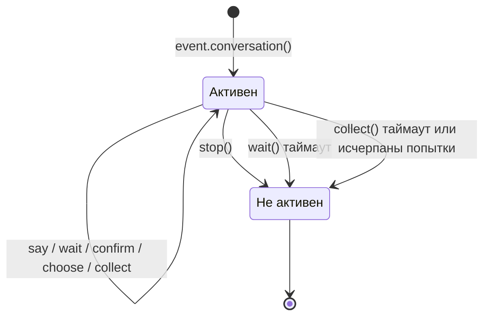

Диалог автоматически становится неактивным в следующих случаях:

1. Вызов метода `stop()`
2. `wait()` возвращает `None` по таймауту
3. `collect()` возвращает `None` из-за таймаута или исчерпания попыток

После перехода в неактивное состояние все методы взаимодействия (`wait`/`confirm`/`choose`/`collect`) немедленно возвращают `None`, не ожидая ввода от пользователя.

## Ветвление и переходы

### @conv.branch(name) декоратор

Используйте `branch()` для регистрации ветвей диалога, переход между ними с помощью `goto()`:

```python
@command("menu")
async def menu_handler(event):
    conv = event.conversation(timeout=60)

    @conv.branch("main")
    async def main_menu():
        await conv.say("=== Главное меню ===\n1. Личная информация\n2. Настройки\n3. Выход")
        resp = await conv.wait()
        if resp is None:
            return
        text = resp.get_text().strip()
        if text == "1":
            await conv.goto("profile")
        elif text == "2":
            await conv.goto("settings")
        elif text == "3":
            await conv.say("До свидания!")
            conv.stop()

    @conv.branch("profile")
    async def profile():
        await conv.say("=== Личная информация ===\nИмя: Alice\n0. Назад")
        resp = await conv.wait()
        if resp and resp.get_text().strip() == "0":
            await conv.goto("main")

    @conv.branch("settings")
    async def settings():
        await conv.say("=== Настройки ===\n1. Переключатель уведомлений\n0. Назад")
        resp = await conv.wait()
        if resp and resp.get_text().strip() == "0":
            await conv.goto("main")

    await conv.start()  # Начинаем с первой зарегистрированной ветви
```

### conv.start(name=None)

Запустить диалог, по умолчанию с первой зарегистрированной ветви:

```python
await conv.start()          # Начинаем с первой ветви
await conv.start("settings") # Начинаем с указанной ветви
```

## Контекст и сохранение

### conv.context

Внутренний словарь `context` каждого экземпляра диалога используется для обмена состоянием между ветвями:

```python
@conv.branch("step1")
async def step1():
    conv.context["username"] = resp.get_text().strip()
    await conv.goto("step2")

@conv.branch("step2")
async def step2():
    name = conv.context.get("username", "未知")
    await conv.say(f"你好，{name}！")
```

### save() / resume() / clear_saved()

Диалог поддерживает сохранение, можно восстановить после таймаута или прерывания:

```python
# Сохранить состояние диалога
conv_id = conv.save()
# conv_id = "user_123_group_456"  # Генерируется автоматически на основе пользователя и группы

# ... позже в том же сеансе восстановить ...
conv2 = event.conversation()
if conv2.resume():
    await conv2.say("欢迎回来！继续之前的对话")
else:
    await conv2.say("没有找到之前的对话")

# Очистить сохраненный диалог
conv.clear_saved()
```

## Типичные сценарии

### Регистрация с навигацией

```python
@command("register")
async def register_handler(event):
    conv = event.conversation(timeout=60)

    await conv.say("欢迎注册！")

    data = await conv.collect([
        {"key": "username", "prompt": "请输入用户名（3-20个字符）",
         "validator": lambda e: 3 <= len(e.get_text().strip()) <= 20},
        {"key": "email", "prompt": "请输入邮箱地址",
         "validator": lambda e: "@" in e.get_text() and "." in e.get_text(),
         "retry_prompt": "邮箱格式不正确，请重新输入"},
    ])

    if not data:
        await event.reply("注册已取消")
        return

    confirmed = await conv.confirm(
        f"确认注册信息？\n用户名: {data['username']}\n邮箱: {data['email']}"
    )

    if confirmed:
        await conv.say("✅ 注册成功！")
    else:
        await conv.say("❌ 已取消注册")
```

### Циклический диалог

```python
@command("chat")
async def chat_handler(event):
    conv = event.conversation(timeout=120)
    await conv.say("进入对话模式，输入「退出」结束")

    while conv.is_active:
        resp = await conv.wait()
        if resp is None:
            await conv.say("超时，对话结束")
            break

        text = resp.get_text().strip()

        if text == "退出":
            await conv.say("再见！")
            conv.stop()
        elif text == "帮助":
            await conv.say("可用命令：退出、帮助、状态")
        elif text == "状态":
            await conv.say("对话活跃中")
        else:
            await conv.say(f"你说的是：{text}")
```


### MessageBuilder 详解

# Подробное руководство по MessageBuilder

`MessageBuilder` — это инструмент для построения структурированных сообщений, соответствующих стандарту OneBot12, предоставленный ErisPulse. Он используется для построения структурированного содержания сообщений и работает в связке с `Send.Raw_ob12()`.

## Способы импорта

`MessageBuilder` поддерживает два способа импорта (результат одинаковый, рекомендуется использовать первый):

```python
from ErisPulse.Core.Event import MessageBuilder        # Рекомендуемый способ, импорт через пакет
from ErisPulse.Core.Event.message_builder import MessageBuilder  # Прямой импорт модуля
```

## Двухрежимная система

MessageBuilder предоставляет два режима использования, реализованных с помощью механизма описателей Python (`__get__`), чтобы обеспечить различное поведение на уровне класса и экземпляра: при вызове метода через класс, `__get__` возвращает результат выполнения статического метода; при вызове через экземпляр возвращается `self` для поддержки цепочки вызовов.

### Режим цепочечных вызовов (экземпляр)

Используется путем создания экземпляра `MessageBuilder()`. Каждый метод возвращает `self`, что позволяет использовать цепочку вызовов, и для получения списка сообщений используется `.build()`:

```python
from ErisPulse.Core.Event.message_builder import MessageBuilder

segments = (
    MessageBuilder()
    .text("Привет!")
    .image("https://example.com/photo.jpg")
    .build()
)
# [
#     {"type": "text", "data": {"text": "Привет!"}},
#     {"type": "image", "data": {"file": "https://example.com/photo.jpg"}}
# ]
```

### Режим быстрого построения (статический)

Методы вызываются напрямую через класс, каждый метод возвращает список сообщений, что подходит для построения одиночных сообщений:

```python
# Непосредственно возвращается list[dict], без .build()
segments = MessageBuilder.text("Привет!")
# [{"type": "text", "data": {"text": "Привет!"}}]
```

## Типы сообщений

| Метод | Тип | Параметры данных | Описание |
|------|------|---------|------|
| `text(text)` | text | `text` | Текстовое сообщение |
| `image(file)` | image | `file` | Сообщение с изображением |
| `audio(file)` | audio | `file` | Аудиосообщение |
| `video(file)` | video | `file` | Видеосообщение |
| `file(file, filename?)` | file | `file`, `filename` | Сообщение с файлом |
| `mention(user_id, user_name?)` | mention | `user_id`, `user_name` | Упоминание пользователя |
| `at(user_id, user_name?)` | mention | `user_id`, `user_name` | Алиас для `mention` |
| `reply(message_id)` | reply | `message_id` | Ответ на сообщение |
| `at_all()` | mention_all | - | Упоминание всех участников |
| `custom(type, data)` | пользовательский | пользовательский | Пользовательский тип сообщения |

## Использование в связке с Send

Построенный список сообщений отправляется через `Send.Raw_ob12()`:

```python
from ErisPulse import sdk
from ErisPulse.Core.Event.message_builder import MessageBuilder

# Построение сообщений в цепочке и отправка
segments = (
    MessageBuilder()
    .mention("user123", "张三")
    .text(" Пожалуйста, посмотрите на это изображение")
    .image("https://example.com/photo.jpg")
    .build()
)
await sdk.adapter.myplatform.Send.To("group", "group456").Raw_ob12(segments)
```

### Использование в ответ на событие

```python
from ErisPulse.Core.Event import command

@command("report")
async def report_handler(event):
    await event.reply_ob12(
        MessageBuilder()
        .text("📊 Сводка ежедневного отчета\n")
        .text("Выполненные задачи сегодня: 5\n")
        .text("Задачи в процессе: 3")
        .build()
    )
```

## Вспомогательные методы

### copy()

Копирует текущий билдер, что позволяет создавать несколько вариантов сообщений на основе одного и того же содержания:

```python
base = MessageBuilder().text("Базовое содержание").mention("admin")

# Создание различных сообщений на основе одного и того же префикса
msg1 = base.copy().text(" Вариант A").build()
msg2 = base.copy().text(" Вариант B").image("img.jpg").build()
```

### clear()

Очищает добавленные сообщения, что позволяет повторно использовать один и тот же билдер:

```python
builder = MessageBuilder()

for user_id in ["user1", "user2", "user3"]:
    builder.clear()
    msg = builder.mention(user_id).text(" Привет!").build()
    await adapter.Send.To("user", user_id).Raw_ob12(msg)
```

### len() / bool()

```python
builder = MessageBuilder()
print(bool(builder))   # False

builder.text("Hello")
print(len(builder))    # 1
print(bool(builder))   # True
```

## Пользовательские сообщения

Метод `custom()` используется для добавления расширенных сообщений, специфичных для платформы:

```python
# Добавление специфичного для платформы сообщения
segments = (
    MessageBuilder()
    .text("Пожалуйста, заполните форму:")
    .custom("yunhu_form", {"form_id": "12345"})
    .build()
)
```

> Пользовательские сообщения действительны только в адаптерах соответствующей платформы, другие адаптеры игнорируют неизвестные типы сообщений.

## Полный пример

### Сообщение с несколькими элементами

```python
segments = (
    MessageBuilder()
    .reply(event.get_id())                    # Ответ на исходное сообщение
    .mention(event.get_user_id())             # Упоминание отправителя
    .text(" Это результат вашего запроса:\n")             # Текстовое сообщение
    .image("https://example.com/chart.png")   # Изображение
    .text("\nПодробные данные см. в приложении:")
    .file("https://example.com/data.csv", filename="data.csv")
    .build()
)
await event.reply_ob12(segments)
```

### Смешанное использование статического фабрика и цепочки вызовов

```python
# Быстрое построение простого сообщения
simple_msg = MessageBuilder.text("Простой текст")

# Цепочечное построение сложного сообщения
complex_msg = (
    MessageBuilder()
    .at_all()
    .text(" 📢 Объявление:")
    .text("Сегодня в 15:00 состоится собрание")
    .build()
)
```


### HTTP 客户端

# Сетевой клиент

ErisPulse предоставляет единый сетевой клиент, объединяющий HTTP-запросы, WebSocket-соединения и управление пулы соединений. Модули и адаптеры **должны использовать** этот клиент, а не импортировать сторонние библиотеки, такие как `aiohttp`, `httpx` или `requests`.

## Обзор

Основные функции сетевого клиента:

- **Единый интерфейс**: предоставляет методы `get` / `post` / `put` / `delete` / `patch` / `request`
- **WebSocket-клиент**: через `ws_connect` устанавливает WebSocket-соединение
- **Автоматическая журналирование**: все запросы автоматически записываются в лог и собираются статистика
- **Интеграция жизненного цикла**: каждый запрос вызывает событие `client.request`, а соединение WebSocket — событие `client.ws.connect`
- **Поддержка повторных попыток**: можно настроить количество и интервал повторных попыток
- **Управление тайм-аутами**: отдельные тайм-ауты для подключения и запроса
- **Повторное использование соединений**: управление пулы соединений на основе aiohttp.ClientSession
- **Система исключений**: исключения aiohttp автоматически преобразуются в исключения ErisPulse (система исключений ClientError)

## Быстрый старт

### HTTP-запросы

```python
from ErisPulse.Core import client

# GET-запрос
resp = await client.get("https://httpbin.org/get")
data = await resp.json()
print(resp.status)  # 200

# POST-запрос
resp = await client.post(
    "https://httpbin.org/post",
    json={"key": "value"},
)
data = await resp.json()
```

### WebSocket-соединение

```python
from ErisPulse.Core import client

ws = await client.ws_connect("wss://example.com/ws")

async for text in ws.iter_text():
    await ws.send_text(f"Echo: {text}")
```

## HttpResponse

Все методы запросов возвращают объект `HttpResponse`:

```python
from ErisPulse.Core import client

resp = await client.get("https://httpbin.org/get")

resp.status       # int - HTTP-код состояния (например, 200, 404)
resp.reason       # str | None - описание состояния (например, "OK")
resp.headers      # заголовки ответа (без учета регистра)
resp.content_type # str | None - Content-Type
resp.url          # конечный URL (может измениться из-за перенаправления)
resp.raw          # базовый объект ответа (в настоящее время aiohttp.ClientResponse)

# Чтение тела ответа
body = await resp.read()       # bytes
text = await resp.text()       # str
data = await resp.json()       # разбор JSON
text = await resp.text("gbk")  # указать кодировку
```

## Методы запросов

### GET

```python
from ErisPulse.Core import client

resp = await client.get(
    "https://api.example.com/users",
    params={"page": "1", "limit": "10"},
    headers={"Authorization": "Bearer token"},
)
```

### POST

```python
from ErisPulse.Core import client

# JSON-тело запроса
resp = await client.post(
    "https://api.example.com/users",
    json={"name": "Alice", "age": 30},
)

# Тело запроса в формате формы
resp = await client.post(
    "https://api.example.com/login",
    data={"username": "admin", "password": "123"},
)

# Сырые данные
resp = await client.post(
    "https://api.example.com/upload",
    data=b"raw bytes",
    headers={"Content-Type": "application/octet-stream"},
)

# Загрузка файлов (используя параметр files, без импорта aiohttp)
# Формат: {имя_поля: объект_файла/bytes/(имя_файла, файл)/(имя_файла, файл, тип_контента)}
resp = await client.post(
    "https://api.example.com/upload",
    data={"description": "аватарка"},            # необязательно: одновременно передать обычные поля формы
    files={
        "file": ("photo.png", open("photo.png", "rb"), "image/png"),
    },
)

# Упрощенная запись: передача объекта файла напрямую
resp = await client.post(
    "https://api.example.com/upload",
    files={"file": open("photo.png", "rb")},
)

# Загрузка данных из памяти (без сохранения на диск)
import io

resp = await client.post(
    "https://api.example.com/upload",
    files={"file": ("data.txt", io.BytesIO(b"file content"), "text/plain")},
)
```

### PUT / DELETE / PATCH

```python
from ErisPulse.Core import client

resp = await client.put("https://api.example.com/users/1", json={"name": "Bob"})
resp = await client.delete("https://api.example.com/users/1")
resp = await client.patch("https://api.example.com/users/1", json={"age": 31})
```

### Общий запрос

```python
from ErisPulse.Core import client

resp = await client.request(
    "OPTIONS",
    "https://api.example.com/resource",
    headers={"Origin": "https://example.com"},
)
```

## Параметры

### Параметры HTTP-запроса

| Параметр | Тип | Описание |
|------|------|------|
| `url` | `str` | URL запроса |
| `params` | `dict[str, str]` | Параметры запроса (необязательно) |
| `headers` | `dict[str, str]` | Дополнительные заголовки запроса (необязательно) |
| `data` | `Any` | Тело запроса (форма или сырые данные) (необязательно) |
| `json` | `Any` | JSON-тело запроса (необязательно) |
| `files` | `dict[str, Any]` | Поля загрузки файлов (необязательно, автоматически формируется multipart/form-data) |
| `timeout` | `float` | Тайм-аут запроса (секунды) (необязательно, переопределяет значение по умолчанию) |
| `max_retries` | `int` | Максимальное количество повторных попыток (необязательно, переопределяет значение по умолчанию) |

### Параметры ws_connect

| Параметр | Тип | Описание |
|------|------|------|
| `url` | `str` | URL WebSocket-сервера |
| `headers` | `dict[str, str]` | Дополнительные заголовки запроса (необязательно) |
| `heartbeat` | `float` | Интервал心跳秒数 (необязательно) |

## Тайм-ауты и повторные попытки

```python
from ErisPulse.Core import Client

# Создание клиента с пользовательскими тайм-аутами
client = Client(
    timeout=60,           # Общий тайм-аут запроса 60 секунд
    connect_timeout=5,    # Тайм-аут подключения 5 секунд
    max_retries=3,        # Автоматические повторные попытки 3 раза
    retry_delay=2,        # Интервал повторных попыток 2 секунды
)

# Переопределение тайм-аута для одного запроса
resp = await client.get("https://slow-api.example.com/data", timeout=120)
```

> [!NOTE]
> Класс клиента с версии 2.8.0 переименован в `Client` (имя свойства `sdk.client` не изменилось); старое имя `HttpClient` сохранено как совместимый псевдоним, старый код не требует изменений.

## Настройка заголовков по умолчанию

```python
client = Client(
    headers={
        "Authorization": "Bearer token",
        "X-App-Id": "my-app",
    },
    user_agent="MyBot/1.0",
)
```

## Статистика запросов

```python
from ErisPulse.Core import client

# Просмотр статистики
stats = client.stats
# {"total_requests": 42, "total_errors": 1, "total_bytes_sent": 0, "total_bytes_received": 0}

# Сброс статистики
client.reset_stats()
```

## Жизненные циклы событий

### События HTTP-запросов

Каждый запрос после завершения вызывает событие `client.request`, которое можно использовать для мониторинга:

```python
from ErisPulse.Core import lifecycle

@lifecycle.on("client.request")
async def on_request(event_data):
    print(f"{event_data['method']} {event_data['url']} -> {event_data['status']} ({event_data['elapsed']}s)")
```

### События WebSocket-соединений

После установления каждого WebSocket-соединения вызывается событие `client.ws.connect`:

```python
from ErisPulse.Core import lifecycle

@lifecycle.on("client.ws.connect")
async def on_ws_connect(event_data):
    print(f"WS-соединение: {event_data['url']}")
```

## Контекстный менеджер

```python
# Использование как контекстный менеджер, автоматически закрывает сессию
async with Client(timeout=30) as client:
    resp = await client.get("https://httpbin.org/get")
    data = await resp.json()
```

## WebSocket-клиент

С помощью `client.ws_connect()` устанавливается WebSocket-клиентское соединение, возвращается объект `ClientWebSocket`. Клиент и сервер WebSocket используют один и тот же базовый класс `WebSocketConnectionBase`, интерфейсы send/receive/iter полностью совпадают.

### Основное использование

```python
from ErisPulse.Core import client

ws = await client.ws_connect("wss://example.com/ws", heartbeat=30)

await ws.send_text("Hello")
await ws.send_bytes(b"\x00\x01\x02")
await ws.send_json({"type": "ping"})
```

### Получение сообщений

#### Высокоуровневые методы (рекомендуется)

Автоматически фильтруют типы сообщений, при разрыве соединения выбрасывает `WebSocketDisconnect`:

```python
from ErisPulse.Core import client
from ErisPulse.Core.Bases.errors import WebSocketDisconnect

ws = await client.ws_connect("wss://example.com/ws")

# Получение одного сообщения
text = await ws.receive_text()    # str
data = await ws.receive_bytes()   # bytes
obj = await ws.receive_json()     # dict / list

# Итерация сообщений (автоматически останавливается при разрыве соединения)
async for text in ws.iter_text():
    print(text)

async for data in ws.iter_bytes():
    print(data)

async for obj in ws.iter_json():
    print(obj)
```

#### Низкоуровневые методы

Использование `receive()` и `iter_messages()` для обработки необработанных типов сообщений, можно различать TEXT / BINARY / CLOSE / ERROR:

```python
from ErisPulse.Core import client
from ErisPulse.Core.Bases.websocket import WSMessage

ws = await client.ws_connect("wss://example.com/ws")

# Получение одного необработанного сообщения
msg = await ws.receive()
# msg.type  -> WSMessage.TEXT / WSMessage.BINARY / WSMessage.CLOSE / WSMessage.ERROR
# msg.data  -> str | bytes | None

# Итерация необработанных сообщений (автоматически останавливается при CLOSE/ERROR)
async for msg in ws.iter_messages():
    if msg.type == WSMessage.TEXT:
        print(f"Текст: {msg.data}")
    elif msg.type == WSMessage.BINARY:
        print(f"Двоичные данные: {len(msg.data)} байт")
```

### WSMessage

`WSMessage` — это единый тип WebSocket-сообщения, не зависящий от底层 библиотеки:

| Свойство | Тип | Описание |
|------|------|------|
| `type` | `str` | Тип сообщения: `WSMessage.TEXT` / `WSMessage.BINARY` / `WSMessage.CLOSE` / `WSMessage.ERROR` |
| `data` | `Any` | Данные сообщения |

### Атрибуты ClientWebSocket

| Свойство | Тип | Описание |
|------|------|------|
| `url` | `URL` | URL соединения |
| `headers` | `Headers` | Заголовки ответа |
| `closed` | `bool` | Закрыто ли соединение |
| `raw` | `object` | Базовый объект (aiohttp.ClientWebSocketResponse) |

### Жизненные циклы хуки

Аналогично `WebSocketConnection` сервера, поддерживаются обратные вызовы `on_disconnect` и `on_error`:

```python
from ErisPulse.Core import client

ws = await client.ws_connect("wss://example.com/ws")

@ws.on_disconnect
async def handle_disconnect(ws, reason="unknown"):
    print(f"Соединение разорвано: {reason}")

@ws.on_error
async def handle_error(ws, error=""):
    print(f"Ошибка соединения: {error}")
```

### Закрытие соединения

```python
await ws.close(code=1000, reason="Normal closure")
```

## Система исключений

ErisPulse определяет единый иерархический уровень исключений, при запросах, инициированных через `sdk.client`, исключения aiohttp автоматически преобразуются в исключения ErisPulse.

> **Обратная совместимость**: старые модули/адаптеры, использующие напрямую `aiohttp.ClientSession`, полностью не затронуты. Преобразование исключений происходит только при запросах, инициированных через `sdk.client`, код, использующий напрямую aiohttp, по-прежнему перехватывает исключения `aiohttp.ClientError` и другие оригинальные исключения. Оба способа могут сосуществовать.

### Иерархия исключений

```
ErisPulseError
├── ClientError                  # Базовый класс для всех исключений HTTP/WS клиентских запросов
│   ├── ClientConnectionError    # Ошибка подключения (неудачное разрешение DNS, отказ в подключении, недоступность сети)
│   ├── ClientTimeoutError       # Ошибка тайм-аута подключения или запроса
│   └── HTTPStatusError          # Ошибка HTTP-статуса 4xx/5xx
└── WebSocketError               # Базовый класс исключений WebSocket
    └── WebSocketDisconnect      # Исключение разрыва WebSocket-соединения (общее для клиента и сервера)
```

### Обработка исключений

```python
from ErisPulse.Core import client
from ErisPulse.Core.Bases.errors import (
    ClientError,
    ClientConnectionError,
    ClientTimeoutError,
    HTTPStatusError,
    WebSocketDisconnect,
    WebSocketError,
)

# Обработка исключений HTTP-запроса
try:
    resp = await client.get("https://api.example.com/data")
    data = await resp.json()
except ClientConnectionError:
    print("Невозможно подключиться к серверу")
except ClientTimeoutError:
    print("Тайм-аут запроса")
except ClientError as e:
    print(f"Запрос не удался: {e}")

# Обработка исключений WebSocket
try:
    ws = await client.ws_connect("wss://example.com/ws")
    async for text in ws.iter_text():
        await ws.send_text(f"Echo: {text}")
except WebSocketDisconnect as e:
    print(f"Соединение разорвано: code={e.code}, reason={e.reason}")
except WebSocketError as e:
    print(f"Ошибка WebSocket: {e}")
```

### Общая обработка

Использование `ClientError` для общей обработки всех исключений HTTP/WS клиентских запросов:

```python
from ErisPulse.Core.Bases.errors import ClientError

try:
    resp = await client.get("https://api.example.com/data")
except ClientError as e:
    print(f"Ошибка клиента: {e}")
```

### HTTPStatusError

Когда нужно проверить статус-код и выбросить исключение после запроса, можно использовать `HTTPStatusError` вручную:

```python
from ErisPulse.Core.Bases.errors import HTTPStatusError

resp = await client.get("https://api.example.com/data")
if resp.status >= 400:
    raise HTTPStatusError(resp.status, await resp.text())
```

## Использование в адаптере

Адаптер может использовать глобальный клиент или создавать экземпляр клиента для отправки платформенных API-запросов:

```python
from ErisPulse.Core import client
from ErisPulse.Core.Bases import BaseAdapter
from ErisPulse.Core.Bases.errors import ClientError

class MyAdapter(BaseAdapter):
    async def call_api(self, endpoint, **params):
        try:
            resp = await client.post(
                f"https://api.platform.com/{endpoint}",
                json=params,
                headers={"Authorization": f"Bearer {self.token}"},
            )
            return await resp.json()
        except ClientError as e:
            self.logger.error(f"Ошибка вызова API: {e}")
            raise
```

> Также можно использовать `from ErisPulse import sdk` и `sdk.client`, результат будет таким же.

## Рекомендации

1. **Предпочтение глобального клиента**: получение глобального синглтона через `from ErisPulse.Core import client` упрощает управление и мониторинг фреймворком
2. **Избегайте прямого импорта aiohttp**: использование `client` вместо `aiohttp.ClientSession` позволит в будущем заменить底层 реализацию без изменения кода. Старый код, использующий напрямую aiohttp, по-прежнему будет работать, оба способа могут сосуществовать
3. **Использование системы исключений ErisPulse**: при запросах через `sdk.client` перехватывайте `ClientError`, а не `aiohttp.ClientError`, чтобы код не зависел от конкретной библиотеки HTTP. Код, использующий напрямую aiohttp, не затронут
4. **Разумная настройка тайм-аутов**: установка разумных тайм-аутов в зависимости от скорости ответа API, чтобы избежать длительных блокировок
5. **Использование механизма повторных попыток**: включение повторных попыток для нестабильных API для повышения надежности
6. **Мониторинг статистики запросов**: использование `sdk.client.stats` или события `client.request` для мониторинга запросов
7. **Использование высокоуровневых методов WebSocket**: предпочтение `iter_text` / `iter_json` и другим высокоуровневым методам, использование `iter_messages` только при необходимости различать типы сообщений


### SQL 查询构建器

# SQL Query Builder

Модуль хранения (Storage) в ErisPulse предоставляет универсальный конструктор SQL-запросов в стиле цепочки вызовов (chain-style), поддерживающий создание пользовательских таблиц, а также операции выборки, обновления и удаления.

## Архитектура

```
Bases/storage.py                    Core/storage.py
┌─────────────────────┐             ┌──────────────────────────┐
│  BaseStorage (ABC)  │◄────────────│  StorageManager          │
│  BaseQueryBuilder   │             │  (конкретная реализация  │
│    (ABC)            │             │   на базе SQLite)        │
└─────────────────────┘             │                          │
                                    │  SQLiteQueryBuilder      │
                                    │  AlterTableBuilder       │
                                    └──────────────────────────┘
```

- `BaseStorage` / `BaseQueryBuilder` — это абстрактные базовые классы, определяющие единый интерфейс, который поддерживает расширение для других носителей хранения (Redis, MySQL и т. д.)
- `StorageManager` — текущая конкретная реализация на базе SQLite, полностью сохраняющая обратную совместимость

## Импорт

```python
from ErisPulse import sdk
# или
from ErisPulse.Core import storage

# Базовые классы ABC (для типизации или пользовательской реализации)
from ErisPulse.Core.Bases.storage import BaseStorage, BaseQueryBuilder
```

## Управление таблицами

### Создание таблицы

```python
sdk.storage.CreateTable("users", {
    "id": "INTEGER PRIMARY KEY AUTOINCREMENT",
    "name": "TEXT NOT NULL",
    "age": "INTEGER DEFAULT 0",
    "email": "TEXT"
})
```

### Проверка существования таблицы

```python
if sdk.storage.HasTable("users"):
    print("Таблица users существует")
```

### Удаление таблицы

```python
sdk.storage.DropTable("users")
```

### Изменение структуры таблицы

```python
# Добавление столбца
sdk.storage.AlterTable("users").AddColumn("email", "TEXT").Execute()

# Переименование таблицы
sdk.storage.AlterTable("users").RenameTo("members").Execute()

# Цепочка нескольких операций
sdk.storage.AlterTable("users") \
    .AddColumn("phone", "TEXT") \
    .AddColumn("address", "TEXT") \
    .Execute()
```

## Запросы в стиле цепочки (Chain Queries)

### Вставка данных

```python
# Вставка одной строки (передача словаря)
sdk.storage.Table("users").Insert({"name": "Alice", "age": 30}).Execute()

# Массовая вставка (передача списка словарей)
sdk.storage.Table("users").InsertMulti([
    {"name": "Bob", "age": 25},
    {"name": "Charlie", "age": 35},
    {"name": "Dave", "age": 40}
]).Execute()
```

### Запрос данных

> **Важно**: `Select()` возвращает `list[tuple]` (список кортежей), а не словарь. Вам необходимо получать значения, обращаясь по индексу в порядке следования столбцов.

```python
# Запрос всех столбцов
rows = sdk.storage.Table("users").Select().Execute()
# rows: [(1, "Alice", 30), (2, "Bob", 25), ...]

# Запрос указанных столбцов
rows = sdk.storage.Table("users").Select("name", "age").Execute()
# rows: [("Alice", 30), ("Bob", 25), ...]

# Получение значения по индексу
for row in rows:
    name = row[0]   # "Alice"
    age = row[1]    # 30
```

#### Преобразование кортежей в словари

```python
columns = ["id", "name", "age"]
rows = sdk.storage.Table("users").Select(*columns).Execute()

# Способ 1: zip внутри цикла
for row in rows:
    record = dict(zip(columns, row))
    print(record["name"], record["age"])

# Способ 2: преобразование списка кортежей в список словарей за один раз
records = [dict(zip(columns, row)) for row in rows]
```

#### Получение одной записи

```python
row = sdk.storage.Table("users").Select("name", "age") \
    .Where("id = ?", 1) \
    .ExecuteOne()

# row — это кортеж или None
if row is not None:
    name = row[0]  # "Alice"
    age = row[1]   # 30
```

### Фильтрация по условиям

> `Where(condition, *params)` поддерживает передачу нескольких параметров, соответствующих нескольким заполнителям `?`.

```python
# Одно условие (один заполнитель, один параметр)
rows = sdk.storage.Table("users").Select("name") \
    .Where("age > ?", 18) \
    .Execute()

# Использование нескольких заполнителей в одном Where
rows = sdk.storage.Table("users").Select("name") \
    .Where("age > ? AND age < ?", 20, 40) \
    .Execute()

# Многократный вызов Where (связано оператором AND)
rows = sdk.storage.Table("users").Select("name") \
    .Where("age > ?", 20) \
    .Where("age < ?", 40) \
    .Execute()
```

### Сортировка, пагинация

```python
# По возрастанию
rows = sdk.storage.Table("users").Select("name", "age") \
    .OrderBy("name") \
    .Execute()

# По убыванию
rows = sdk.storage.Table("users").Select("name") \
    .OrderBy("age", desc=True) \
    .Execute()

# Пагинация
rows = sdk.storage.Table("users").Select("name") \
    .OrderBy("id") \
    .Limit(10) \
    .Offset(20) \
    .Execute()
```

### Обновление данных

```python
# Обновление по условию
sdk.storage.Table("users") \
    .Update({"age": 31}) \
    .Where("name = ?", "Alice") \
    .Execute()

# Полное обновление
sdk.storage.Table("users") \
    .Update({"status": "active"}) \
    .Execute()
```

### Удаление данных

```python
# Удаление по условию
sdk.storage.Table("users") \
    .Delete() \
    .Where("name = ?", "Bob") \
    .Execute()

# Полное удаление
sdk.storage.Table("users").Delete().Execute()
```

### Подсчет и проверка существования

```python
# Подсчет
count = sdk.storage.Table("users").Count()
count = sdk.storage.Table("users").Where("age > ?", 18).Count()

# Проверка существования
exists = sdk.storage.Table("users").Where("name = ?", "Alice").Exists()
```

## Повторное использование условий запроса

Используйте `copy()` для глубокого копирования конструктора для повторного использования базовых условий:

```python
base = sdk.storage.Table("users").Where("age > ?", 20)

# Запрос на основе тех же условий
rows = base.copy().Select("name").OrderBy("name").Limit(5).Execute()

# Подсчет на основе тех же условий
count = base.copy().Count()

# Проверка существования на основе тех же условий
exists = base.copy().Where("name = ?", "Alice").Exists()
```

## Сброс конструктора

```python
builder = sdk.storage.Table("users").Select("name").Where("age > ?", 18)
builder.clear()

# Перестроение запроса
builder.Select("name", "age").Where("name = ?", "Alice")
rows = builder.Execute()
```

## Использование в транзакциях

Операции в стиле цепочки полностью поддерживают транзакции:

```python
# Подтверждение транзакции
with sdk.storage.transaction():
    sdk.storage.Table("users").Insert({"name": "Eve", "age": 22}).Execute()
    sdk.storage.Table("users").Update({"age": 23}).Where("name = ?", "Eve").Execute()

# Пример отката
try:
    with sdk.storage.transaction():
        sdk.storage.Table("users").Delete().Where("name = ?", "Alice").Execute()
        raise Exception("force rollback")
except Exception:
    pass
# Запись Alice все еще существует
```

## Описание возвращаемых значений

| Операция | Тип возвращаемого значения | Описание |
|------|---------|------|
| `Select().Execute()` | `list[tuple]` | Список кортежей, упорядоченных по столбцам |
| `Select().ExecuteOne()` | `tuple \| None` | Один кортеж или None |
| `Insert().Execute()` | `int` | Количество затронутых строк |
| `InsertMulti().Execute()` | `int` | Количество вставленных строк |
| `Update().Execute()` | `int` | Количество затронутых строк |
| `Delete().Execute()` | `int` | Количество затронутых строк |
| `Count()` | `int` | Количество совпавших строк |
| `Exists()` | `bool` | Наличие записи |

### Примеры обработки возвращаемых значений

```python
# Select возвращает кортежи, берем значения по индексу
rows = sdk.storage.Table("users").Select("name", "age").Execute()
first_name = rows[0][0]  # Имя в первой строке, первом столбце
first_age = rows[0][1]   # Возраст в первой строке, втором столбце

# Рекомендуется: преобразование в словарь с помощью списка имен столбцов + zip, код более читаем
cols = ["name", "age"]
rows = sdk.storage.Table("users").Select(*cols).Execute()
for row in rows:
    d = dict(zip(cols, row))
    print(d["name"], d["age"])

# ExecuteOne возвращает один кортеж или None
row = sdk.storage.Table("users").Select("name").Where("id = ?", 1).ExecuteOne()
name = row[0] if row else None

# Insert/Update/Delete возвращают количество затронутых строк
affected = sdk.storage.Table("users").Delete().Where("age < ?", 18).Execute()
print(f"Удалено записей: {affected}")
```

## Параметризованные запросы

Все параметры WHERE используют заполнитель `?`, параметры передаются как последовательные аргументы метода `Where()` (**не** как кортеж или список):

```python
# Верно ✓ — передача нескольких параметров по отдельности
sdk.storage.Table("users").Where("age > ? AND name = ?", 18, "Alice").Execute()

# Верно ✓ — многократный вызов Where
sdk.storage.Table("users").Where("age > ?", 18).Where("name = ?", "Alice").Execute()

# Ошибочно ✗ — не передавайте кортеж
sdk.storage.Table("users").Where("age > ? AND name = ?", (18, "Alice")).Execute()
# Это превратит весь кортеж в значение для первого заполнителя

# Ошибочно ✗ — существует риск SQL-инъекции
sdk.storage.Table("users").Where(f"name = '{user_input}'").Execute()
```

### Правила передачи параметров Where

```python
# Where(condition: str, *params: Any)
# params — переменное число аргументов, передаются по одному

# Один параметр
.Where("name = ?", "Alice")

# Несколько параметров
.Where("age > ? AND age < ?", 18, 60)

# Запрос LIKE
.Where("name LIKE ?", "A%")

# Запрос IN (требуется вручную построить заполнители)
.Where("name IN (?, ?, ?)", "Alice", "Bob", "Charlie")
```

## Пользовательский бэкенд (хранилище)

Наследуйте `BaseStorage` и `BaseQueryBuilder` для реализации пользовательского бэкенда:

```python
from ErisPulse.Core.Bases.storage import BaseStorage, BaseQueryBuilder

class MyQueryBuilder(BaseQueryBuilder):
    def Execute(self):
        # Реализация конкретной логики выполнения
        ...

    def ExecuteOne(self):
        ...

    def Count(self):
        ...

    def Exists(self):
        ...


class MyStorage(BaseStorage):
    def get(self, key, default=None):
        ...

    def set(self, key, value):
        ...

    # Реализация других абстрактных методов...
    def Table(self, table_name):
        return MyQueryBuilder(self, table_name)
```


### 路由系统

# Маршрутизатор

Маршрутизатор ErisPulse обеспечивает единое управление HTTP и WebSocket маршрутизацией, поддерживает регистрацию маршрутов и управление жизненным циклом с несколькими адаптерами. В основе лежит абстрактный уровень, реализованный (в настоящее время FastAPI + Uvicorn).

## Обзор

Основные функции маршрутизатора:

- **Декораторы маршрутов**: поддержка быстрой регистрации с помощью декораторов `@http` / `@get` / `@post` / `@put` / `@delete` / `@ws`
- **Автоматическая инъекция**: обработчики маршрутов не требуют импорта типов FastAPI, фреймворк автоматически инжектирует абстрактные объекты
- **Группировка маршрутов**: поддержка `RouteGroup` с префиксом и номером версии
- **Маршрутизация промежуточного ПО**: поддержка шаблонного сопоставления запросов с помощью glob
- **Ограничение скорости**: встроенная система ограничения скорости с использованием скользящего окна
- **Поддержка CORS**: включение кросс-доменных ресурсов одним нажатием
- **Безопасные заголовки**: автоматическое добавление безопасных заголовков ответа
- **Автоматическая документация**: интерактивная документация на основе OpenAPI
- **Поддержка WebSocket**: полное управление подключениями WebSocket, пользовательская аутентификация и хуки жизненного цикла
- **Интеграция жизненного цикла**: глубокая интеграция с системой жизненного цикла ErisPulse
- **Поддержка SSL/TLS**: поддержка безопасных соединений HTTPS и WSS
- **Главная страница**: поддержка регистрации быстрых кнопок модулей на корневом маршруте `/`, поддержка локализации

## Абстрактные типы

ErisPulse предоставляет абстрактные типы для сервера, позволяющие модулям не зависеть напрямую от FastAPI:

| Абстрактный тип | Соответствие FastAPI | Описание |
|---------|-------------|------|
| `HttpRequest` | `fastapi.Request` | Обертка для HTTP-запроса, полная совместимость по интерфейсу |
| `WebSocketConnection` | `fastapi.WebSocket` | Обертка для WebSocket-подключения, дополнительно предоставляет хуки жизненного цикла |
| `WebSocketDisconnect` | `fastapi.WebSocketDisconnect` | Исключение разрыва WebSocket-соединения |

> `WebSocketConnection` наследуется от `WebSocketConnectionBase`, разделяя с клиентским WebSocket (`ClientWebSocket`) одинаковые интерфейсы send/receive/iter/close. Клиентский и серверный WebSocket могут использовать одинаковый бизнес-логический код.
>
> Через свойство `.raw` можно получить доступ к базовому объекту FastAPI. Код, использующий типы FastAPI напрямую, также полностью совместим.

## Декораторы маршрутов (рекомендуется)

### HTTP-декораторы

```python
from ErisPulse.Core import router
@router.get("my_module", "/info")
async def get_info(request):
    return {"method": request.method, "path": str(request.url)}

# Также можно явно указать абстрактный тип
from ErisPulse.Core import HttpRequest

@router.post("my_module", "/data")
async def post_data(request: HttpRequest):
    data = await request.json()
    return {"received": data}

@router.put("my_module", "/data/{item_id}")
async def update_data(request):
    return {"updated": True}

@router.delete("my_module", "/data/{item_id}")
async def delete_data(request):
    return {"deleted": True}
```

> **Правило автоматической инъекции**: когда первый параметр обработчика имеет имя `request` или `req` и не имеет аннотации типа FastAPI, фреймворк автоматически инжектирует `HttpRequest`. Обработчики без параметров или с параметрами, не являющимися именем запроса, не затрагиваются.

### WebSocket-декораторы

```python
from ErisPulse.Core import WebSocketConnection, WebSocketDisconnect

# Базовый WebSocket
@router.ws("my_module", "/ws")
async def websocket_handler(ws):
    async for msg in ws.iter_text():
        await ws.send_text(f"Echo: {msg}")

# WebSocket с хуками жизненного цикла
@router.ws("my_module", "/ws/chat")
async def chat(ws: WebSocketConnection):
    @ws.on_disconnect
    async def on_disconnect(ws, reason="unknown"):
        print(f"Пользователь отключился: {reason}")

    @ws.on_error
    async def on_error(ws, error=""):
        print(f"Ошибка соединения: {error}")

    async for msg in ws.iter_text():
        await ws.send_text(f"Echo: {msg}")

# WebSocket с аутентификацией
async def ws_auth(ws: WebSocketConnection) -> bool:
    token = ws.query_params.get("token")
    return token == "secret"

@router.ws("my_module", "/secure_ws", auth_handler=ws_auth)
async def secure_ws_handler(ws):
    while True:
        data = await ws.receive_text()
        await ws.send_text(f"Echo: {data}")
```

> **Примечание**: WebSocket-обработчики и обработчики аутентификации также поддерживают автоматическую инъекцию. Без аннотации параметров можно получить `WebSocketConnection`. Указание `fastapi.WebSocket` также позволяет передавать оригинальный объект, но рекомендуется использовать абстрактные типы.

## Традиционный способ регистрации

```python
async def hello_handler(request):
    return {"message": "Hello World"}

# Базовая регистрация
router.register_http_route(
    module_name="my_module",
    path="/hello",
    handler=hello_handler,
    methods=["GET"],
)

# Регистрация с ограничением скорости и информацией о документации
router.register_http_route(
    module_name="my_module",
    path="/api/data",
    handler=data_handler,
    methods=["POST"],
    rate_limit="10/minute",
    summary="Интерфейс данных",
    tags=["API"],
)
```

### WebSocket-регистрация

```python
from ErisPulse.Core import WebSocketConnection

async def websocket_handler(ws: WebSocketConnection):
    async for msg in ws.iter_text():
        await ws.send_text(f"Echo: {msg}")

# Базовая регистрация
router.register_websocket(
    module_name="my_module",
    path="/ws",
    handler=websocket_handler,
)

# Регистрация с аутентификацией (рекомендуется)
async def auth_handler(ws: WebSocketConnection) -> bool:
    token = ws.query_params.get("token")
    return token == "secret"

router.register_websocket(
    module_name="my_module",
    path="/secure_ws",
    handler=websocket_handler,
    auth_handler=auth_handler,
)
```

**Описание параметров:**

| Параметр | Описание | Значение по умолчанию |
|------|------|--------|
| `module_name` | Имя модуля (обязательно) | - |
| `path` | Путь WebSocket | - |
| `handler` | Функция обработки | - |
| `auth_handler` | Функция аутентификации, возвращающая `False` автоматически закрывает соединение | `None` |
| `auto_accept` | Автоматически ли вызывать `accept()` | `True` |

> **Рекомендуется**: использовать `auth_handler` для подтверждения соединения, а не отключать `auto_accept`. Установите `auto_accept=False` только в том случае, если вам нужно полностью контролировать процесс соединения.

## Хуки жизненного цикла WebSocket

`WebSocketConnection` предоставляет обратные вызовы для отключения и ошибок, без необходимости вручную использовать try/catch:

```python
from ErisPulse.Core import WebSocketConnection

@router.ws("my_module", "/ws")
async def my_ws(ws: WebSocketConnection):
    # Регистрация с помощью декоратора
    @ws.on_disconnect
    async def on_close(ws, reason="unknown"):
        print(f"Причина отключения: {reason}")

    # Также можно вызывать напрямую
    async def on_err(ws, error=""):
        print(f"Ошибка: {error}")
    ws.on_error(on_err)

    # Обычная бизнес-логика
    async for msg in ws.iter_text():
        await ws.send_text(f"Echo: {msg}")
```

## Группировка маршрутов

```python
# Создание маршрутизатора с префиксом
group = router.group("my_module", prefix="/v1")

@group.get("/users")
async def list_users(request):
    return {"users": []}

@group.post("/users")
async def create_user(request):
    return {"created": True}

# Фактический путь: /my_module/v1/users
```

## Промежуточное ПО маршрутов

Промежуточное ПО поддерживает шаблоны glob для сопоставления путей:

```python
@router.middleware("/my_module/*")
async def auth_middleware(request, call_next):
    token = request.headers.get("Authorization")
    if not token:
        return {"error": "Unauthorized"}
    return await call_next(request)

@router.middleware("/my_module/admin/*")
async def admin_middleware(request, call_next):
    return await call_next(request)
```

## Идентификатор запроса (X-Request-ID)

Начиная с версии 2.7.0, каждый HTTP-запрос будет содержать идентификатор `X-Request-ID`, используемый для логирования и трассировки связей:

- **Правило генерации**: приоритетно используется заголовок `X-Request-ID`, переданный клиентом (для распределенных трассировок); в противном случае генерируется UUID
- **Ответный заголовок**: ответ будет возвращать `X-Request-ID`, что позволяет клиенту сопоставлять запросы с логами
- **События жизненного цикла**: к данным событий `server.request` и `server.response` добавляется поле `request_id`

```python
# В модуле отслеживание событий запроса, сопоставление запросов-ответов по request_id
@sdk.lifecycle.on("server.request")
async def on_request(data):
    print(f"[{data['request_id']}] {data['method']} {data['path']}")

@sdk.lifecycle.on("server.response")
async def on_response(data):
    print(f"[{data['request_id']}] -> {data['status_code']}")
```

Клиент может использовать собственный идентификатор для трассировки между сервисами:

```bash
curl -H "X-Request-ID: my-trace-id" http://localhost:8080/my_module/health
```

## Ограничение скорости

Использование алгоритма скользящего окна для ограничения скорости маршрутов:

```python
@router.get("my_module", "/limited", rate_limit="10/minute")
async def limited_endpoint(request):
    return {"ok": True}

@router.post("my_module", "/submit", rate_limit="5/minute")
async def submit_data(request):
    return {"submitted": True}
```

Формат ограничения скорости: `{количество}/{временной интервал}`, например `10/minute`, `100/hour`.

## Конфигурация CORS

```python
router.setup_cors(
    allow_origins=["https://example.com"],
    allow_methods=["GET", "POST"],
    allow_headers=["*"],
)
```

Также можно настроить через `config.toml`:

```toml
[router.cors]
allow_origins = ["https://example.com"]
allow_methods = ["GET", "POST"]
allow_headers = ["*"]
```

## Безопасные заголовки

```python
router.setup_security_headers()
```

Автоматически добавляются безопасные заголовки, такие как `X-Content-Type-Options`, `X-Frame-Options`, `X-XSS-Protection` и др.

Также можно настроить через `config.toml`:

```toml
[router.security]
enabled = true
```

## Автоматическая документация

Router по умолчанию включает интерактивную документацию OpenAPI:

```python
# Отключение документации
router.disable_docs()

# Настройка информации документации
router.set_docs_info(
    title="My API",
    description="API документация",
    version="1.0.0"
)
```

## Обработка путей

Маршруты автоматически добавляют имя модуля как префикс, чтобы избежать конфликтов:

```python
# Регистрация пути "/api" для модуля "my_module"
# Фактический доступный путь: "/my_module/api"
router.register_http_route("my_module", "/api", handler)
```

## Системные маршруты

Маршрутизатор автоматически предоставляет следующие системные маршруты:

### Проверка здоровья

```
GET /health
# Возвращает:
{"status": "ok", "service": "ErisPulse Router"}
```

### Главная страница

```
GET /
# Возвращает страницу бренда ErisPulse
```

На корневом маршруте `/` отображается страница бренда ErisPulse, автоматически проверяется доступность Dashboard и добавляются кнопки входа.

## Главная кнопка

Маршрутизатор позволяет внешним модулям регистрировать кнопки быстрого доступа на корневом маршруте `/`, что облегчает пользователям быстрый доступ к страницам управления модулями.

### Регистрация кнопки

```python
# Простая регистрация
router.register_home_entry(
    name="Моя панель",
    url="/mymodule/admin",
)

# Регистрация с иконкой (SVG)
router.register_home_entry(
    name="Консоль",
    url="/console",
    icon_svg='<svg width="18" height="18" viewBox="0 0 24 24" fill="none" stroke="currentColor" stroke-width="1.8"><path d="M4 17l6-6-6-6"/><path d="M12 19h8"/></svg>',
)

# Регистрация с поддержкой локализации (формат словаря i18n проекта)
router.register_home_entry(
    name={"i18n": "mymodule.home.entry", "default": "Моя панель"},
    url="/mymodule/admin",
)
```

**Описание параметров:**

| Параметр | Тип | Описание | Обязательно |
|------|------|------|------|
| `name` | `str` / `dict` | Текст отображения кнопки; при передаче словаря `{"i18n": "key", "default": "текст"}` используется локализация | Да |
| `url` | `str` | Ссылка кнопки | Да |
| `icon_svg` | `str` | Необязательный SVG-иконный маркер | Нет |

### Автоматическая регистрация Dashboard

При обнаружении доступности `sdk.Dashboard`, маршрутизатор автоматически добавляет кнопку Dashboard в начало списка входов, без необходимости ручной регистрации.

## Интеграция жизненного цикла

```python
from ErisPulse.Core import lifecycle

@lifecycle.on("server.start")
async def on_server_start(event):
    print(f"Сервер запущен: {event['data']['base_url']}")

@lifecycle.on("server.stop")
async def on_server_stop(event):
    print("Сервер останавливается...")
```

## Лучшие практики

1. **Предпочтение абстрактных типов**: использование `HttpRequest` / `WebSocketConnection` вместо `fastapi.Request` / `fastapi.WebSocket`, избегание жесткой зависимости
2. **Использование автоматической инъекции**: первый параметр обработчика должен называться `request` или `req`, без аннотации типа можно получить `HttpRequest`
3. **Явный передача module_name**: первый параметр декоратора должен быть именем модуля, не может быть опущен
4. **Использование группировки маршрутов**: использование `group()` для организации нескольких маршрутов одного модуля
5. **Рассмотрение безопасности**: реализация механизмов аутентификации и безопасных заголовков для чувствительных операций
6. **Разумное ограничение скорости**: установка ограничения скорости для высокочастотных интерфейсов
7. **Использование хуков жизненного цикла**: обработка исключений WebSocket с помощью `@ws.on_disconnect` / `@ws.on_error`, избегание ручного try/catch


### 生命周期管理

# Управление жизненным циклом

ErisPulse предоставляет единый систему хуков/жизненного цикла, предназначенную для мониторинга состояния работы компонентов системы, а также реализации расширенных функций, таких как аудит, статистика и пользовательская логика.

Система поддерживает три способа триггеризации:
- `await lifecycle.emit("event", data)` — упрощённая версия, передача произвольных данных
- `lifecycle.emit_sync("event", data)` — синхронная версия (для не-асинхронных контекстов)
- `await lifecycle.submit_event("event", ...)` — совместимая со старой версией, автоматическое построение стандартного формата событий

## Механизм обработки событий

### Регистрация обработчиков

```python
from ErisPulse import sdk

# Декораторный стиль
@sdk.lifecycle.on("module.load")
async def on_module_load(data):
    print(f"Модуль загружен: {data}")

# Программная регистрация
sdk.lifecycle.register("module.load", on_module_load, priority=10)

# Отмена регистрации
sdk.lifecycle.unregister("module.load", on_module_load)

# Массовая отмена регистрации по владельцу (автоматически вызывается при выгрузке модуля/адаптера)
removed = sdk.lifecycle.unregister_by_owner("MyModule")
print(f"Удалено {removed} обработчиков жизненного цикла")
```

### Приоритеты

Обработчики поддерживают параметр `priority`, чем больше значение, тем раньше выполняется обработчик (аналогично загрузчику модулей):

```python
@sdk.lifecycle.on("adapter.event.receive", priority=10)  # Выполняется первым
async def first_handler(data):
    pass

@sdk.lifecycle.on("adapter.event.receive", priority=0)  # Выполняется позже
async def second_handler(data):
    pass
```

### События с точечной структурой

При срабатывании конкретного события также срабатывают и его родительские события:
- При срабатывании `module.load` также срабатывает `module`
- При срабатывании `adapter.event.receive` также срабатывают `adapter.event` и `adapter`

### Подстановочные знаки

Регистрация `*` позволяет перехватывать все события:

```python
@sdk.lifecycle.on("*")
async def on_anything(data):
    print(f"Получено событие: {data}")
```

### Однократная регистрация (once)

Начиная с версии 2.7.0, обработчики, зарегистрированные через `lifecycle.once()`, автоматически отписываются после одного срабатывания, что подходит для одноразовых хуков типа "первичная готовность":

```python
@sdk.lifecycle.once("core.init.complete")
async def on_first_ready(data):
    print("Первичная готовность, дальнейшие срабатывания не будут")
```

- Имеет ту же семантику параметра приоритета `priority` (чем больше значение, тем раньше выполняется)
- Автоматически отписывается, ручная отписка `unregister` не требуется
- Поддерживает как синхронные, так и асинхронные обработчики

### Проверка наличия слушателей (has_handlers)

В сценариях, где важна производительность, можно использовать `has_handlers()` для проверки наличия обработчиков, чтобы избежать ненужного перебора событий и планирования задач:

```python
if sdk.lifecycle.has_handlers("message.sending"):
    await sdk.lifecycle.emit("message.sending", send_ctx)
```

- Проверяет **точное имя события, подстановочный знак `*`, родительские события**
- Возвращает `False`, если обработчиков нет, что позволяет безопасно пропустить `emit`

## Обзор точек останова хука

Типичный порядок событий жизненного цикла сообщения от входа на платформу до завершения обработки:

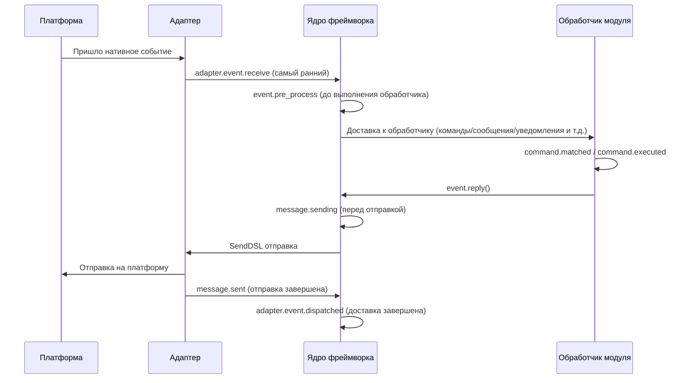

Фреймворк содержит следующие точки останова хука, которые пользователь может прослушивать с помощью `@sdk.lifecycle.on()` для реализации пользовательской логики.

### Основная инициализация

| Имя хука | Время срабатывания | Данные |
|---------|---------|------|
| `core.init.start` | Начало инициализации SDK | `{}` |
| `core.init.complete` | Завершение инициализации SDK | `{"duration": float, "success": bool, "adapters": {"enabled": [str], "disabled": [str]}, "modules": {"enabled": [str], "disabled": [str]}, "error": str (только при сбое)}` |
| `core.uninit.complete` | Завершение обратной инициализации SDK | `{"duration": float, "success": bool, "adapters_closed": int, "modules_unloaded": int, "module_properties_cleared": int, "module_properties_to_clear": [str], "error": str (только при сбое)}` |

### Изменение конфигурации

| Имя хука | Время срабатывания | Данные |
|---------|---------|------|
| `config.set` | Изменение конфигурационного параметра | `{"key": str, "old_value": Any, "new_value": Any}` |
| `config.updated` | Обнаружено изменение всей конфигурации после редактирования config.toml | `{"old_config": dict, "new_config": dict, "config_file": str}` |

**Пример: аудит конфигурации**

```python
@sdk.lifecycle.on("config.set")
def audit_config(data):
    print(f"[Аудит] {data['key']}: {data['old_value']} -> {data['new_value']}")
```

### Жизненный цикл модуля

| Имя хука | Время срабатывания | Данные |
|---------|---------|------|
| `module.register` | Регистрация класса модуля в менеджере | `{"module_name": str, "success": bool}` |
| `module.load` | Завершение загрузки модуля (успешное инстанцирование) | `{"module_name": str, "success": bool}` |
| `module.init` | Завершение инициализации модуля (включая ленивую загрузку) | `{"module_name": str, "success": bool}` |
| `module.unload` | Выгрузка модуля | `{"module_name": str, "success": bool}` |

### Жизненный цикл адаптера

| Имя хука | Время срабатывания | Данные |
|---------|---------|------|
| `adapter.load` | Завершение регистрации адаптера | `{"platform": str, "success": bool}` |
| `adapter.start` | Запуск адаптера | `{"platforms": [str]}` |
| `adapter.status.change` | Изменение состояния адаптера | `{"platform": str, "status": str, "retry_count": int, "error": str (только при сбое)}` |
| `adapter.stop` | Остановка адаптера | `{"platforms": [str]}` |
| `adapter.stopped` | Завершение остановки адаптера | `{"platforms": [str]}` |
| `adapter.bot.online` | Онлайн бот | `{"platform": str, "bot_id": str, "info": dict, "status": str}` |
| `adapter.bot.offline` | Оффлайн бот | `{"platform": str, "bot_id": str, "status": str}` |

### Прием и обработка событий

| Имя хука | Время срабатывания | Данные |
|---------|---------|------|
| `adapter.event.receive` | Получено событие с внешней платформы (самый ранний) | `{"platform": str, "event_type": str, "raw_event_type": str}` |
| `adapter.event.dispatched` | Завершение доставки события | `{"platform": str, "event_type": str, "raw_event_type": str, "onebot_handlers_count": int}` |
| `event.pre_process` | Начало выполнения обработчика события | `{"event_type": str, "platform": str, "detail_type": str}` |

**Пример: статистика событий**

```python
event_counter = {}

@sdk.lifecycle.on("adapter.event.receive")
def count_events(data):
    platform = data["platform"]
    event_counter[platform] = event_counter.get(platform, 0) + 1

@sdk.lifecycle.on("adapter.event.dispatched")
def log_unhandled(data):
    if data["onebot_handlers_count"] == 0:
        print(f"[Необработано] {data['platform']}/{data['event_type']}")
```

### Отправка сообщений

| Имя хука | Время срабатывания | Данные |
|---------|---------|------|
| `message.sending` | Сообщение готовится к отправке | `{"platform": str, "method": str, "detail_type": str, "target_id": str, "bot_id": str}` |
| `message.sent` | Сообщение отправлено | `{"platform": str, "method": str, "detail_type": str, "target_id": str, "bot_id": str}` |

**Пример: аудит отправки сообщений**

```python
@sdk.lifecycle.on("message.sending")
def log_sending(data):
    print(f"[Отправка] -> {data['platform']}/{data['detail_type']}/{data['target_id']} через {data['method']}")
```

### Командная система

| Имя хука | Время срабатывания | Данные |
|---------|---------|------|
| `command.matched` | Команда найдена и готова к выполнению | `{"command": str, "args": list[str], "platform": str, "user_id": str}` |
| `command.executed` | Команда выполнена | `{"command": str, "args": list[str], "platform": str, "user_id": str, "success": bool, "error": str (только при сбое)}` |

**Пример: статистика команд**

```python
@sdk.lifecycle.on("command.matched")
def count_commands(data):
    print(f"[Команда] /{data['command']} от {data['user_id']}@{data['platform']}")
```

### HTTP-маршрутизация

| Имя хука | Время срабатывания | Данные |
|---------|---------|------|
| `server.request` | Получен HTTP-запрос | `{"method": str, "path": str, "client_ip": str}` |
| `server.response` | Отправлен HTTP-ответ | `{"method": str, "path": str, "status_code": int, "client_ip": str}` |

**Пример: логирование HTTP-запросов**

```python
@sdk.lifecycle.on("server.response")
def log_http(data):
    print(f"[HTTP] {data['method']} {data['path']} -> {data['status_code']}")
```

### WebSocket

| Имя хука | Время срабатывания | Данные |
|---------|---------|------|
| `server.start` | Запуск маршрутизирующего сервера | `{"base_url": str, "host": str, "port": int}` |
| `server.stop` | Остановка маршрутизирующего сервера | `{}` |
| `server.websocket.connect` | Установлено WebSocket-соединение | `{"path": str, "module_name": str, "client_ip": str}` |
| `server.websocket.disconnect` | Отключено WebSocket-соединение | `{"path": str, "module_name": str, "reason": str, "error": str (только при аномалии)}` |

**Пример: мониторинг WebSocket-соединений**

```python
@sdk.lifecycle.on("server.websocket.connect")
def on_ws_connect(data):
    print(f"[WS] Подключение: {data['path']} от {data['client_ip']}")

@sdk.lifecycle.on("server.websocket.disconnect")
def on_ws_disconnect(data):
    print(f"[WS] Отключение: {data['path']} ({data['reason']})")
```

## Стандартные определения событий

```python
STANDARD_EVENTS = {
    "core": ["init.start", "init.complete", "uninit.complete"],
    "module": ["load", "init", "unload", "register"],
    "adapter": [
        "load", "start", "status.change", "stop", "stopped",
        "event.receive", "event.dispatched",
        "bot.online", "bot.offline",
    ],
    "server": [
        "start", "stop",
        "request", "response",
        "websocket.connect", "websocket.disconnect",
    ],
    "event": ["pre_process"],
    "message": ["sending", "sent"],
    "command": ["matched", "executed"],
    "config": ["set"],
}
```

## Полная справочная документация API

### Регистрация и отмена

| Метод | Описание |
|------|------|
| `@lifecycle.on(event, *, priority=0)` | Декоратор для регистрации обработчика |
| `lifecycle.register(event, handler, *, priority=0)` | Программная регистрация |
| `lifecycle.unregister(event, handler=None)` | Отмена регистрации (если handler=None, отменяются все обработчики этого события) |

### Срабатывание

| Метод | Описание |
|------|------|
| `await lifecycle.emit(event, data=None)` | Асинхронное срабатывание, обработчики могут изменить data, возвращая непустое значение |
| `lifecycle.emit_sync(event, data=None)` | Синхронное срабатывание, асинхронные обработчики запускаются с помощью create_task |
| `await lifecycle.submit_event(event_type, *, source, msg, data)` | Совместимость со старыми версиями, автоматически формируется стандартный формат события |

### Инструменты

| Метод | Описание |
|------|------|
| `lifecycle.start_timer(timer_id)` | Начать отсчёт времени |
| `lifecycle.get_duration(timer_id)` | Получить продолжительность прошедшего времени (в секундах) |
| `lifecycle.stop_timer(timer_id)` | Остановить отсчёт времени и вернуть продолжительность |
| `lifecycle.list_hooks()` | Вывести список всех зарегистрированных хуков и количество обработчиков |
| `lifecycle.clear()` | Очистить все обработчики и таймеры |

## Пример использования в модуле

```python
from ErisPulse.Core.Bases import BaseModule
from ErisPulse import sdk

class Main(BaseModule):
    async def on_load(self, event):
        # Реализация простой статистики сообщений
        self.msg_count = 0
        
        @sdk.lifecycle.on("adapter.event.receive")
        async def count(data):
            if data["event_type"] == "message":
                self.msg_count += 1
        
        # Мониторинг всех команд
        @sdk.lifecycle.on("command.matched")
        async def log_cmd(data):
            sdk.logger.info(f"Выполнение команды: /{data['command']} от {data['user_id']}")
        
        # Аудит изменений конфигурации
        @sdk.lifecycle.on("config.set")
        def audit(data):
            sdk.logger.info(f"Изменение конфигурации: {data['key']} = {data['new_value']}")
```

## Принадлежность и автоматическое отмена фоновых задач

> [!NOTE]
> Эта функция доступна начиная с ErisPulse **2.8.0+**.

Фоновые задачи asyncio, созданные модулем, если они не отменены в `on_unload`, будут хранить ссылку на `self`, что приведёт к невозможности сборки мусора для экземпляра модуля (остатки старых экземпляров после горячей перезагрузки). Рамка предоставляет следующие механизмы по умолчанию:

- **`self.spawn(coro)`** (рекомендуется внутри модуля): задача автоматически привязывается к имени модуля, и при выгрузке модуля рамка в `on_unload` **после** автоматически отменяет незавершённые задачи и записывает предупреждение
- **`spawn_background(coro)`** (`ErisPulse.runtime`): автоматически захватывает текущий контекст `owner_scope`; `cancel_owner_tasks(owner)` отменяет задачи по принадлежности, `cancel_all_background_tasks()` используется для `sdk.uninit()` по умолчанию
- **Адаптеры**: при закрытии также автоматически отменяются фоновые задачи, связанные с именем платформы

```python
async def on_load(self, event):
    # Рекомендуется: фоновые задачи использовать через self.spawn(), при выгрузке рамка автоматически отменяет их по умолчанию
    self.spawn(self._poll())

async def on_unload(self, event):
    # В сценариях, требующих точного контроля, по-прежнему рекомендуется отменять и ждать завершения вручную
    if self._poll_task:
        self._poll_task.cancel()
        await asyncio.gather(self._poll_task, return_exceptions=True)

async def _poll(self):
    while True:
        await asyncio.sleep(60)
        ...
```

> [!IMPORTANT]
> Рамка по умолчанию — это **принудительная отмена** (`cancel_owner_tasks`), которая происходит после возврата из `on_unload`. Поэтому задачи, требующие корректного завершения (очистка буфера, сохранение состояния, закрытие соединения), **обязательно** должны быть отменены и завершены вручную в `on_unload` — не рассчитывайте, что по умолчанию сохранится логика завершения. Рамка гарантирует только «отсутствие задач, удерживающих ссылку на `self`», но не гарантирует «корректного завершения». Задачи, ожидающие результата, следует вызывать напрямую с `await`, а не передавать их в фоновые задачи.

## Примечания

1. **Обработчик может быть синхронным или асинхронным**: система автоматически распознаёт и правильно вызывает
2. **Передача данных**: в режиме `emit()` возвращаемое обработчиком значение, отличное от None, изменяет данные, передаваемые последующим обработчикам
3. **Норма именования событий**: рекомендуется использовать точечную структуру для именования событий, что облегчает использование родительского监听
4. **Изоляция ошибок**: исключение в одном обработчике не влияет на выполнение других обработчиков
5. **Ограничение синхронного триггера**: в `emit_sync()` асинхронные обработчики запускаются в режиме fire-and-forget, возвращаемые значения не могут быть переданы обратно
6. **Очистка жизненного цикла**: при вызове `sdk.uninit()` все зарегистрированные обработчики и таймеры будут очищены
7. **Приоритет загрузки**: если необходимо слушать события на этапе инициализации фреймворка, рекомендуется установить высокий приоритет и отключить ленивую загрузку


### 懶加载系统

# Система ленивой загрузки модулей

ErisPulse SDK предоставляет мощную систему ленивой загрузки модулей, которая позволяет инициализировать модули только тогда, когда они действительно необходимы, значительно улучшая скорость запуска приложения и эффективность использования памяти.

## Обзор

Система ленивой загрузки модулей является одним из ключевых функциональных возможностей ErisPulse, которая работает следующим образом:

- **Отложенная инициализация**: Модуль загружается и инициализируется только при первом обращении к нему
- **Прозрачное использование**: Для разработчика ленивые модули практически не отличаются от обычных модулей
- **Автоматическое управление зависимостями**: Зависимости модуля автоматически инициализируются при использовании
- **Поддержка жизненного цикла**: Для модулей, унаследованных от `BaseModule`, автоматически вызываются методы жизненного цикла

## Принцип работы

### Класс LazyModule

Основой системы ленивой загрузки является класс `LazyModule`, который является обёрткой, которая фактически инициализирует модуль только при первом обращении.

### Процесс инициализации

При первом обращении к модулю `LazyModule` выполняет следующие действия:

1. Получает информацию о параметрах `__init__` класса модуля
2. Определяет, нужно ли передавать ссылку на `sdk`
3. Устанавливает свойство `moduleInfo` модуля
4. Для модулей, унаследованных от `BaseModule`, вызывает метод `on_load`
5. Запускает событие жизненного цикла `module.init`

## Событийно-ориентированная активация модуля (activate_on)

> [!NOTE]
> Эта функция доступна начиная с ErisPulse **2.8.0+**.

Модули с `lazy_load=True` по умолчанию загружаются только при **первом обращении к атрибуту**. Если модуль регистрирует обработчики команд/событий, традиционный подход требует `lazy_load=False` для немедленной загрузки. `activate_on` предоставляет третий вариант: **объявление триггеров, при поступлении первого соответствующего события/команды модуль автоматически активируется** — он не будет постоянно в памяти, но при этом не потеряет входную точку.

```python
from ErisPulse.loaders import ModuleLoadStrategy

class MyModule(BaseModule):
    @staticmethod
    def get_load_strategy():
        return ModuleLoadStrategy(
            lazy_load=True,
            activate_on=[
                # ---- Событие (пассивное, без участия пользователя)----
                "message",                                    # Тип события: любое сообщение
                {"notice": "group_member_increase"},          # Тип + detail_type
                {"message": ["private", "group"]},            # Тип + несколько detail_type

                # ---- Команда (активное, пользователь вводит)----
                {"command": "roll"},                          # Сокращённая форма: имя команды
                {"command": ["roll", "dice"]},                # Список имён команд
                {"command": {                                 # Форма dict (name обязательна)
                    "name": "dice",
                    "help": "Бросить кубик",
                    "usage": "/dice",
                    "group": "Развлечения",
                    "aliases": ["d"],
                    "hidden": False,
                }},
            ],
        )
```

### Параметры команды в формате dict

Формат dict отражает пользовательские параметры декоратора `@command()`, используется для регистрации заглушки команды до загрузки модуля:

| Параметр | Тип | По умолчанию | Описание |
|------|------|------|------|
| `name` | `str` | **Обязательный** | Имя команды; должно совпадать с `@command(name)` в `on_load`, иначе после активации заглушка будет удалена, команда не будет доступна |
| `help` | `str` | Возвратная цепочка | Описание команды в Help; если не указано, берётся из цепочки возврата (см. ниже) |
| `usage` | `str` | Автоматически | Строка использования, по умолчанию `{prefix}{name}` |
| `group` | `str` | `None` | Группа команды |
| `aliases` | `list[str]` | `[]` | Список псевдонимов, которые также активируют модуль |
| `hidden` | `bool` | `False` | `True` — заглушка будет скрыта (в соответствии с семантикой скрытых команд после активации); пользователь, знающий имя команды, всё равно может активировать |

**Не поддерживаются** `priority` / `permission` / `master`: заглушка команды предназначена только для активации, проверка прав осуществляется после активации реальной команды (блокировка прав на этапе заглушки приведёт к потере возможности активации).

### Цепочка возврата для Help заглушки команды

Описание команды, отображаемое в Help при отсутствии загрузки модуля, берётся по следующему порядку (первое найденное значение):

1. `help` в команде dict (наиболее точное)
2. `description` из `get_meta()`
3. `__description__` атрибут модуля
4. `Summary` из метаданных пакета (краткое описание в PyPI)
5. Общее сообщение: «Эта команда из лениво загружаемого модуля X, первый вызов активирует загрузку модуля»

### Семантика триггеров

- **Заглушка события**: Регистрируется с очень низким приоритетом (`ACTIVATION_STUB_PRIORITY`) в соответствующий менеджер событий, срабатывает как резервный обработчик после всех обычных; после активации событие пересылается к настоящему обработчику модуля
- **Заглушка команды**: Регистрируется как заглушка; после активации заглушка удаляется, настоящая команда обрабатывает текущий вызов
- **Защита от повторного запуска**: `asyncio.Lock` гарантирует, что при одновременном срабатывании триггеров модуль активируется только один раз
- **Фильтрация по области действия**: Заглушка содержит идентификатор владельца модуля, модуль не активируется, если он не включён для данного бота/сессии/платформы
- **Семантика ошибок**: При неудачной активации повторная попытка не производится, заглушка также удаляется
- **Удаление дубликатов**: При смешанном объявлении команды (сокращённо + dict) дубликаты удаляются (dict имеет приоритет); при отсутствии `name` в dict или ошибке `detail_type` в dict выводится предупреждение и объявление игнорируется

> Архитектурная схема и полная семантика см. в [Обзоре архитектуры](../architecture.md#архитектура-событийно-ориентированной-активации-activate_on).

## Конфигурация ленивой загрузки

### Глобальная конфигурация

В конфигурационном файле включите/отключите глобальную ленивую загрузку:

```toml
[ErisPulse.framework]
enable_lazy_loading = true  # true=включить ленивую загрузку (по умолчанию), false=отключить ленивую загрузку
```

### Контроль на уровне модуля

Модуль может контролировать стратегию загрузки, реализовав статический метод `get_load_strategy()`:

```python
from ErisPulse.Core.Bases import BaseModule
from ErisPulse.loaders import ModuleLoadStrategy

class MyModule(BaseModule):
    @staticmethod
    def get_load_strategy():
        """Возвращает стратегию загрузки модуля"""
        return ModuleLoadStrategy(
            lazy_load=False,  # Возвращает False для немедленной загрузки
            priority=100      # Приоритет загрузки, чем больше, тем выше приоритет
        )
```

## Использование лениво загружаемых модулей

### Базовое использование

Для разработчика ленивые модули практически не отличаются от обычных:

```python
# Через SDK обращение к лениво загружаемому модулю
from ErisPulse import sdk

# Следующее обращение вызовет ленивую загрузку модуля
result = await sdk.my_module.my_method()
```

### Единый вход для получения модуля

Независимо от способа получения модуля (через свойство SDK, через менеджер модулей или через `module.get()`), для "зарегистрированного, но не загруженного" лениво загружаемого модуля будет возвращаться один и тот же прокси-объект, инициализация модуля произойдёт только при обращении к его свойствам:

```python
# Все три способа возвращают один и тот же прокси-объект (если модуль не загружен), поведение одинаковое, для пользователя прозрачно
sdk.my_module          # Точка входа для ленивой загрузки
sdk.module.my_module   # Также возвращает прокси-объект
sdk.module.get("my_module")  # Также возвращает прокси-объект, сам по себе не вызывает загрузку

# Только при обращении к свойству прокси-объекта происходит инициализация модуля
result = await sdk.my_module.my_method()
```

`module.get()` — это **интерфейс для поиска**, сам по себе не вызывает загрузку:
- Модуль загружен → возвращается реальный экземпляр
- Модуль зарегистрирован, но не загружен → возвращается прокси-объект (инициализация при обращении к свойству)
- Модуль не зарегистрирован → возвращается `None`

Если необходимо явно вызвать загрузку, используйте `await sdk.load_module("my_module")`.

### Асинхронная инициализация

Для модулей, требующих асинхронной инициализации, рекомендуется сначала явно загрузить модуль:

```python
# Сначала явно загрузите модуль
await sdk.load_module("my_module")

# Затем используйте модуль
result = await sdk.my_module.my_method()
```

### Синхронная инициализация

Для модулей, не требующих асинхронной инициализации, можно обращаться напрямую:

```python
# Прямое обращение автоматически инициализирует модуль синхронно
result = sdk.my_module.some_sync_method()
```

## Рекомендуемые практики

При выборе стратегии загрузки можно использовать следующий алгоритм:

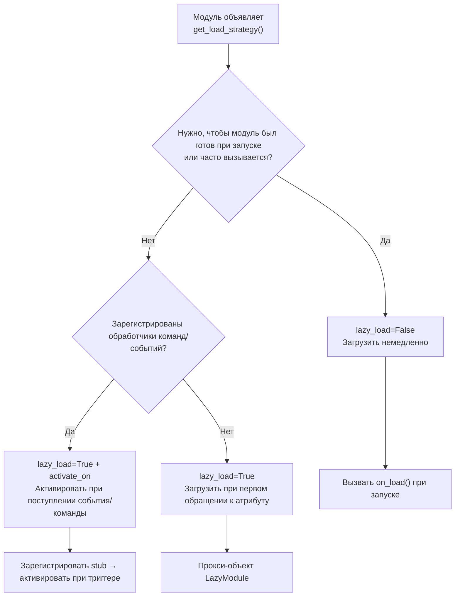

### Рекомендуемые сценарии использования ленивой загрузки (lazy_load=True)

- Инструментальные модули, вызываемые косвенно (например, модули для запроса данных, форматтеры, только при вызове другими модулями)
- Модули, зарегистрировавшие обработчики команд/событий, но не часто используемые — в сочетании с `activate_on`, модуль автоматически активируется при первом соответствующем событии/команде, без отказа от ленивой загрузки

### Рекомендуемые сценарии отключения ленивой загрузки (lazy_load=False)

- Модули, которые должны быть готовы при запуске (например, модули, предоставляющие базовые сервисы другим модулям)
- Обработчики, вызываемые часто (например, обработка каждого сообщения) — `activate_on` имеет небольшую нагрузку при активации, для частых сценариев предпочтительнее немедленная загрузка
- Модули с планировщиком задач
- Модули, которые должны быть инициализированы при запуске приложения

> Параметр `priority` управляет порядком инициализации модулей, загружаемых немедленно. Чем больше значение, тем раньше модуль будет инициализирован. Модули с одинаковым приоритетом загружаются в порядке регистрации.

## Примечания

1. Если ваш модуль использует ленивую загрузку и другие модули никогда не обращались к нему внутри ErisPulse, модуль никогда не будет инициализирован.
2. Если ваш модуль содержит модули, слушающие события, или другие модули, активно слушающие, есть два варианта: объявить триггеры `activate_on` (сохранить ленивую загрузку, модуль активируется при поступлении события), или объявить, что модуль должен быть загружен немедленно (`lazy_load=False`), иначе это повлияет на нормальную работу модуля.
3. Мы не рекомендуем отключать ленивую загрузку, если нет специальных потребностей, иначе это может привести к проблемам с управлением зависимостями и событиями жизненного цикла.
4. В объявлении команды в формате dict для `activate_on`, параметр `name` должен совпадать с именем реальной команды, зарегистрированной в `on_load` с помощью `@command()` — иначе модуль будет активирован, но заглушка будет удалена, и команда с несовпадающим именем не будет доступна.


### 国际化（i18n）系统

# Система международной локализации (i18n)

В ErisPulse начиная с версии 2.5.0 встроен полный набор средств для международной локализации. Ядро фреймворка и интерфейс CLI могут автоматически переключать отображаемый текст в зависимости от языка вашей системы, а также поддерживают регистрацию собственных переводов внешними модулями.

## Поддерживаемые языки

| Язык | Код | Описание |
|------|------|------|
| 简体中文 | `zh-CN` | Язык по умолчанию (оригинальный язык фреймворка) |
| 繁體中文 | `zh-TW` | Традиционный китайский (Гонконг/Макао/Тайвань) |
| English | `en` | Английский (универсальный язык по умолчанию) |
| 日本語 | `ja` | Японский |
| Русский | `ru` | Русский |

## Быстрый опыт использования

### Переключение через переменные окружения

```bash
# Windows PowerShell
$env:ERISPULSE_LANG = "en"
epsdk run

# macOS / Linux
ERISPULSE_LANG=ja epsdk run
```

### Переключение через конфигурационный файл

Добавьте в `config/config.toml`:

```toml
[ErisPulse.i18n]
language = "zh-TW"
```

Установка значения `"auto"` (значение по умолчанию) включает автоматическое определение языка системы.

### Ручное переключение в коде

```python
from ErisPulse import i18n

# Ручная установка языка
i18n.set_language("en")
print(i18n.get_language())  # "en"

# Сброс на автоматическое определение
i18n.reset_language()
```

---

## Механизм определения языка

Фреймворк определяет язык пользователя по следующему приоритету:

1. **Переменная окружения `ERISPULSE_LANG`** — наивысший приоритет, используется для тестирования и временного переключения
2. **Windows API** — `GetUserDefaultLocaleName` (только Windows, не затрагивается переменными окружения в таких инструментах, как Git Bash)
3. **Переменные окружения** — `LANGUAGE` > `LC_ALL` > `LC_MESSAGES` > `LANG` (стандарт Unix/macOS)
4. **Системная локаль** — `locale.getlocale()` / `locale.getdefaultlocale()`
5. **Резервный вариант** — en (английский)

### Принцип ближайшего соответствия

При обнаружении языка, не соответствующего точно, используется принцип ближайшего соответствия:

- `zh-TW`, `zh-HK`, `zh-MO`, `zh-Hant` → **Традиционный китайский**
- Все остальные `zh-*` (например, `zh-CN`, `zh-SG`) → **Упрощённый китайский**
- `en-US`, `en-GB`, `en-AU` и др. → **Английский**
- `ja-JP` → **Японский**
- `ru-RU` → **Русский**
- Все остальные неизвестные языки → **Упрощённый китайский (резервный вариант)**

---

## Использование i18n в модулях

Вы можете зарегистрировать переводы для своего модуля, чтобы сделать его также поддерживающим несколько языков.

### Рекомендуемый способ: объявление ключей перевода через I18nClass (v2.7.0+)

Начиная с v2.7.0, модули/адаптеры могут объявлять ключи перевода, как и `ConfigClass`, через вложенный класс `I18nClass`. Фреймворк автоматически зарегистрирует все объявленные ключи перевода без необходимости вызывать `i18n.register()` вручную.

```python
from dataclasses import dataclass, field

from ErisPulse.Core.Bases import BaseConfig, BaseI18n, BaseModule, I18nKey


class MyModule(BaseModule):
    # Класс конфигурации (необязательно)
    @dataclass
    class ConfigClass(BaseConfig):
        welcome_msg: str = field(
            default="欢迎",
            metadata={
                # Здесь используется ключ i18n mymodule.welcome_msg
                "description": {"i18n": "mymodule.welcome_msg", "default": "欢迎消息"},
            },
        )

    # Класс набора ключей перевода (необязательно)
    # Объявленные ключи будут автоматически зарегистрированы фреймворком, с приоритетом выше, чем генерация конфигурации по умолчанию ConfigClass
    class I18nClass(BaseI18n):
        # Имя атрибута автоматически объединяется в полный путь ключа: <имя_модуля>.<имя_атрибута>
        welcome_msg: I18nKey = I18nKey(
            default="Welcome Message",   # Языко-независимый резервный вариант, не регистрируется ни в один язык
            zh_CN="欢迎消息",
            en="Welcome Message",
            ja="ウェルカムメッセージ",
            ru="Приветственное сообщение",
            zh_TW="歡迎訊息",
        )
        # Другие ключи перевода, используемые в бизнес-логике
        hello: I18nKey = I18nKey(
            default="Hello, {name}!",
            zh_CN="你好，{name}！",
            zh_TW="你好，{name}！",
            en="Hello, {name}!",
            ja="こんにちは、{name}！",
            ru="Привет, {name}!",
        )

        # Можно явно указать полный путь ключа (не используя объединение имени атрибута)
        custom: I18nKey = I18nKey(
            key="mymodule.deep.nested.key",
            default="Default text",
            zh_CN="默认文本",
            zh_TW="預設文本",
            en="Default text",
            ja="デフォルトテキスト",
            ru="Текст по умолчанию",
        )
```

#### Почему рекомендуется использовать I18nClass?

| Сценарий | Ручная i18n.register() | Декларативный I18nClass |
|------|-----------------------|------------------|
| Ключи перевода, используемые в описании конфигурации | Требуется ручная регистрация, и нужно успеть до генерации конфигурации | Фреймворк автоматически регистрирует до генерации конфигурации |
| Декларация многоязычных переводов | Распространены по on_load() | Сконцентрированы в классе, легко читаются |
| Согласованность имен ключей | Легко допустить опечатки | Имя атрибута используется как суффикс ключа, IDE может подсказывать |
| Очистка при выгрузке | Требуется ручная unregister_domain() | Фреймворк использует единый domain для регистрации |

#### Правила формирования пути ключей в I18nClass

- **По умолчанию**: используется ``<имя_регистрации_модуля>.<имя_атрибута>`` как полный путь ключа
  - Пример: модуль с именем ``MyModule``, атрибут ``welcome`` → путь ключа ``MyModule.welcome``
- **Явно**: через параметр ``I18nKey(key="...")`` можно указать любой путь с точками
  - Подходит для глубоко вложенных ключей (например, ``mymodule.config.basic.token``)

#### Использование в адаптерах

Адаптеры также поддерживают `I18nClass`, и способ использования полностью идентичен:

```python
from ErisPulse.Core import BaseAdapter
from ErisPulse.Core.Bases import BaseConfig, BaseI18n, I18nKey


class MyAdapter(BaseAdapter):
    @dataclass
    class ConfigClass(BaseConfig):
        endpoint: str = field(
            default="",
            metadata={
                # Описание конфигурации ссылается на ключ adapter.MyAdapter.endpoint
                "description": {"i18n": "MyAdapter.endpoint", "default": "API 地址"},
            },
        )

    class I18nClass(BaseI18n):
        # Централизованное объявление ключей перевода, используемых в описании конфигурации, и других бизнес-ключей
        endpoint: I18nKey = I18nKey(
            default="API Endpoint",
            zh_CN="API 地址",
            zh_TW="API 位址",
            en="API Endpoint",
            ja="APIアドレス",
            ru="API адрес",
        )
```

`I18nClass` адаптера будет автоматически зарегистрирован на этапе `__init__` (то есть до генерации шаблона конфигурации), что гарантирует доступность ключей перевода, используемых в описании конфигурации.

### Ручная регистрация пользовательских переводов (старый способ)

Если вы не используете `I18nClass`, можно напрямую вызвать `i18n.register()` для регистрации текстов переводов.

```python
from ErisPulse import i18n

# Регистрация китайского перевода
i18n.register("zh-CN", {
    "my_module.welcome": "欢迎使用我的模块！",
    "my_module.goodbye": "再见！",
    "my_module.hello": "你好，{name}！",
}, domain="my_module")

# Регистрация английского перевода
i18n.register("en", {
    "my_module.welcome": "Welcome to my module!",
    "my_module.goodbye": "Goodbye!",
    "my_module.hello": "Hello, {name}!",
}, domain="my_module")
```

### Использование переводов

```python
from ErisPulse import i18n

# Простой перевод
i18n.t("my_module.welcome")  # Автоматически использует текущий язык

# С форматированием параметров
i18n.t("my_module.hello", name="Alice")

# Указание значения по умолчанию (возвращается, если ключ перевода не найден)
i18n.t("my_module.unknown_key", default="默认文本")
```

### Использование в классе модуля

```python
from dataclasses import dataclass, field
from ErisPulse import i18n
from ErisPulse.Core.Bases import BaseConfig, BaseModule

@dataclass
class MyModuleConfig(BaseConfig):
    welcome_msg: str = field(
        default="欢迎",
        metadata={
            "description": {"i18n": "my_module.welcome_msg", "default": "欢迎消息"},
            "ui": {"widget": "text", "group": "basic", "order": 1},
        },
    )

class MyModule(BaseModule):
    ConfigClass = MyModuleConfig

    async def on_load(self, event):
        # Динамическое получение конфигурации (каждый раз отражает последнее значение)
        self.logger.info(self.cfg.welcome_msg)
        self.logger.info(i18n.t("my_module.welcome"))

    @command("hello")
    async def hello_handler(self, event):
        name = event.get_user_nickname() or "friend"
        await event.reply(i18n.t("my_module.hello", name=name))

    async def on_unload(self, event):
        pass
```

### Удаление переводов

```python
# Удаление всех переводов домена
i18n.unregister_domain("my_module")
```

---

## Многоязычные поля конфигурации

Начиная с версии 2.5.2, схема конфигурации полностью поддерживает i18n. Все видимые пользователю текстовые поля могут ссылаться на ключи i18n, и WebUI и другие потребители автоматически будут использовать соответствующий текст в зависимости от текущего языка.

### Поддерживаемые i18n-поля

| Поле | Расположение | Описание |
|------|------|------|
| `description` | metadata поля | Описание поля |
| `options[].label` | `ui.options` | Метки опций для контрола select |
| `placeholder` | `ui.placeholder` | Заполнитель для поля ввода |
| `group_labels` | `_schema_meta` | Названия групп (заголовки разделов Dashboard) |

Все поля используют формат `{"i18n": "key", "default": "текст"}`, строки без этого формата будут переданы без изменений (для обратной совместимости).

### Объявление i18n-полей

Все видимые пользователю текстовые поля поддерживают i18n:

```python
from dataclasses import dataclass, field
from ErisPulse.Core.Bases import BaseConfig

@dataclass
class MyAdapterConfig(BaseConfig):
    # i18n для description
    token: str = field(
        default="",
        metadata={
            "description": {"i18n": "my_adapter.token", "default": "平台 Token"},
            "required": True,
            "secret": True,
            "ui": {
                "widget": "password",
                "group": "basic",
                "order": 1,
                # i18n для placeholder
                "placeholder": {"i18n": "my_adapter.token.ph", "default": "请输入 Token"},
            },
        },
    )
    # i18n для label опций
    mode: str = field(
        default="a",
        metadata={
            "description": {"i18n": "my_adapter.mode", "default": "运行模式"},
            "ui": {
                "widget": "select",
                "group": "basic",
                "order": 2,
                "options": [
                    {"label": {"i18n": "my_adapter.mode.a", "default": "模式A"}, "value": "a"},
                    {"label": {"i18n": "my_adapter.mode.b", "default": "模式B"}, "value": "b"},
                ],
            },
        },
    )

    # i18n для group_labels (названия групп)
    _schema_meta = {
        "group_labels": {
            "basic": {"i18n": "my_adapter.group.basic", "default": "基本设置"},
        }
    }
```

`default` — это резервный текст, который отображается, если перевод не зарегистрирован или поиск не удался.

### Скрытие секретных данных и проверка конфигурации

Поля, помеченные как `"secret": True`, автоматически получают **защиту от раскрытия** (начиная с версии 2.7.0):

- **Скрытие в шаблоне**: при генерации шаблона конфигурации `dataclass_to_toml_with_comments()` скрывает реальное значение секретных полей (отображается пустой заполнитель), предотвращая попадание чувствительной информации на диск
- **Общий инструмент скрытия**: `redact_secret(value)` заменяет непустое значение на `***`, а пустое значение возвращает без изменений, используется, например, для вывода в логи

```python
from ErisPulse.Core.Bases.config_schema import redact_secret

redact_secret("sk-xxxxxx")  # '***'
redact_secret("")           # ''
```

**Проверка конфигурации** (`validate_config()`) помимо проверки обязательных полей на непустоту, начиная с версии 2.7.0, поддерживает:

| Проверка | Метаданные | Пример |
|--------|--------|------|
| Соответствие типу | Тип поля | `int` поле получает строку — ошибка |
| Ограничение по перечислению | `ui.options` или顶层 `options` | Значение должно быть в разрешённом перечне |
| Диапазон значений |顶层 `min` / `max` | `metadata={"min": 1, "max": 65535}` |

```python
from ErisPulse.Core.Bases.config_schema import validate_config

@dataclass
class C(BaseConfig):
    mode: str = field(default="a", metadata={"ui": {"widget": "select", "options": ["a", "b"]}})
    port: int = field(default=80, metadata={"min": 1, "max": 65535})

errors = validate_config(C(mode="x", port=70000))  # Две ошибки: перечисление + диапазон
```

### Регистрация переводов конфигурации

Ключи перевода для полей конфигурации, как и обычные ключи перевода, регистрируются с помощью `i18n.register()`:

```python
from ErisPulse import i18n

# Регистрация китайского (совпадает с default, но может отличаться)
i18n.register("zh-CN", {
    "my_adapter.token": "平台 Token",
}, domain="my_adapter")

# Регистрация английского
i18n.register("en", {
    "my_adapter.token": "Platform Token",
}, domain="my_adapter")
```
> **Рекомендуемый способ**: использование `I18nClass` для объявления ключей перевода, фреймворк автоматически регистрирует (см. раздел «Рекомендуемый способ» выше),
> нет необходимости вызывать `i18n.register()` или `register_config_i18n()` вручную.

Также доступна удобная функция `register_config_i18n()`, которая автоматически извлекает ключи и регистрирует их:

```python
from ErisPulse.Core.Bases.config_schema import register_config_i18n

# Автоматически извлекает description.default как перевод для zh-CN
register_config_i18n(MyAdapterConfig, "zh-CN")

# Явно предоставить английский перевод
register_config_i18n(MyAdapterConfig, "en", {
    "my_adapter.token": "Platform Token",
})
```

### Как WebUI потребляет

`get_config_schema()` возвращает схему, в которой словарь i18n передается без изменений. WebUI на фронтенде может использовать `i18n.t()` для разрешения в зависимости от текущего языка.

Если требуется, чтобы серверная часть напрямую разрешила в строку (например, для передачи на фронтенд, не поддерживающий i18n), используйте `resolve_config_schema()`, который разрешит все поля i18n в текущий язык:

```python
from ErisPulse.Core.Bases.config_schema import resolve_config_schema

# Все поля i18n разрешены в текущий язык
schema = resolve_config_schema(MyAdapterConfig)
print(schema["fields"]["token"]["description"])    # "平台 Token" или "Platform Token"
print(schema["fields"]["token"]["placeholder"])   # "请输入 Token" или "Enter Token"
print(schema["fields"]["mode"]["options"][0]["label"])  # "模式A" или "Mode A"
print(schema["group_labels"]["basic"])             # "基本设置" или "Basic"
```

> `BaseConfig`, `BotAccountConfig`, `register_config_i18n()`, `resolve_config_schema()`
> и другие типы и инструменты находятся в `ErisPulse.Core.Bases.config_schema`.
> `ErisPulse.runtime.config_schema` сохраняется как совместимый shim,
> **рекомендуется импортировать из `ErisPulse.Core.Bases`** (за исключением ключей перевода, которые находятся в `ErisPulse.Core.Bases.i18n_schema`).

## Справочник API

### I18nManager

#### Основные методы

| Метод | Описание |
|------|------|
| `t(key, default=None, **kwargs)` | Получить переведённый текст (`gettext()` — псевдоним) |
| `set_language(lang)` | Ручная установка языка |
| `get_language()` | Получить текущий язык |
| `reset_language()` | Сброс на автоматическое определение (и повторное определение среды) |
| `get_supported_languages()` | Получить список всех поддерживаемых языков |
| `has_translation(key, lang=None)` | Проверить существование перевода ключа |
| `register(lang, translations, domain)` | Зарегистрировать пользовательские переводы |
| `unregister_domain(domain)` | Удалить все переводы указанного домена |
| `reload()` | Перезагрузить встроенные переводы и повторно определить язык |

#### Детали метода `t()`

```python
def t(self, key, /, default=None, **kwargs):
```

- `key` — ключ перевода (только позиционный аргумент, не конфликтует с `**kwargs` под `key=`)
- `default` — значение по умолчанию, возвращаемое, если перевод не найден, по умолчанию `None` (возвращается сам ключ)
- `**kwargs` — параметры форматирования, для заполнения `{placeholder}` в переведённом тексте

Пример:

```python
# Перевод: "greeting": "你好，{name}！欢迎来到{place}。"
i18n.t("greeting", name="Alice", place="ErisPulse")
# Возвращает: "你好，Alice！欢迎来到ErisPulse。"
```

### BaseI18n / I18nKey (декларативные ключи перевода)

Начиная с v2.7.0, `ErisPulse.Core.Bases` предоставляет инструменты для объявления ключей перевода через атрибуты класса (рекомендуется импортировать из `ErisPulse.Core.Bases`):

> ``I18nKey.default`` — это **языко-независимый резервный текст**, не регистрируется ни в один язык.
> Чтобы перевод стал активным, необходимо явно передать хотя бы один параметр языка (``zh_CN=`` / ``en=`` / ``ja=`` и т.д.).
> Таким образом, разработчики из разных стран могут свободно использовать свой родной язык для заполнения ``default``, фреймворк не делает никаких предположений.

| Название | Описание |
|------|------|
| `I18nKey(default, *, key=None, zh_CN, zh_TW, en, ja, ru)` | Объявление одного ключа перевода, `default` — резервный текст, не привязанный к языку |
| `BaseI18n` | Базовый класс для набора ключей перевода (согласован с `BaseConfig`), подклассы объявляют несколько `I18nKey` через атрибуты класса |
| `BaseI18n.register(prefix="", domain="app")` | Метод класса: регистрирует все объявленные ключи в систему i18n |
| `key` | Алиас для `I18nKey` (более краткое написание)

Пример использования:

```python
from ErisPulse.Core.Bases import BaseI18n, key

class MyKeys(BaseI18n):
    # Краткий синтаксис
    hello = key(
        default="Hello",
        zh_CN="你好",
        zh_TW="你好",
        en="Hello",
        ja="こんにちは",
        ru="Привет",
    )
    bye = key(
        default="Bye",
        zh_CN="再见",
        zh_TW="再見",
        en="Bye",
        ja="さようなら",
        ru="До свидания",
    )

# Отдельное использование (ручная регистрация)
MyKeys.register(prefix="myapp.", domain="myapp")
```

### Доступ к i18n через экземпляр SDK

```python
from ErisPulse import sdk

# sdk.i18n и i18n из прямого импорта — это один и тот же объект
sdk.i18n.set_language("en")
print(sdk.i18n.t("core.sdk.init.starting"))
```

---

## Конфигурация во время выполнения

### Чтение i18n-конфигурации через API

```python
from ErisPulse.Core.Bases import I18nConfig
from ErisPulse.runtime import get_i18n_config

config = get_i18n_config()
print(config["language"])  # "auto" или код языка

# I18nConfig — это dataclass, может использоваться для генерации шаблона конфигурации
schema = I18nConfig.__dataclass_fields__
```

### Описание конфигурационных параметров

В разделе `[ErisPulse.i18n]` файла `config/config.toml`:

```toml
[ErisPulse.i18n]
# Язык отображения, возможные значения:
# - "auto"      — автоматическое определение языка системы (по умолчанию)
# - "zh-CN"     — упрощённый китайский
# - "zh-TW"     — традиционный китайский
# - "en"        — английский
# - "ja"        — японский
# - "ru"        — русский
language = "auto"
```

---

## Рекомендуемые практики

### Именование ключей перевода

Рекомендуется использовать формат с разделением точками:

```
<имя_модуля>.<категория>.<описание>
```

Например: `my_module.command.hello_desc`, `core.adapter.start_failed`

### Перекрытие многоязычных переводов

Не обязательно предоставлять переводы для всех языков сразу, отсутствующие языки будут автоматически возвращаться на английский, если английского тоже нет, отображается сам ключ.

### Динамический контент

Для динамически генерируемого контента (например, имен пользователей, количества и т.д.), используйте формат `{placeholder}`:

```python
# Определение перевода
"user_count": "当前在线用户：{count} 人"

# Использование
i18n.t("user_count", count=len(users))
```

### Сообщения в логах

Если ваш модуль использует логгер фреймворка, эти сообщения также будут автоматически использовать текущий язык:

```python
self.logger.info(i18n.t("my_module.startup"))
```

---

## Отношения между i18n в CLI и ядром

CLI имеет **независимый** модуль международной локализации (`ErisPulse.CLI.i18n`), полностью отделённый от модуля международной локализации ядра.

- **Core i18n** — используется ядром фреймворка, внешние модули могут регистрировать переводы
- **CLI i18n** — используется внутри командной строки, не делится данными перевода с Core

Такая архитектура гарантирует, что изменения в переводах CLI не повлияют на стабильность ядра фреймворка.


### 统一控制面（scope）

# Unified Control Plane (scope)

> [!NOTE]
> This feature requires ErisPulse **2.8.0+**.

The unified control plane answers five questions: **which modules are available, whether events from whom are received, who can execute a certain command, which text a certain module processes, and which implementation parameters are overridden**. Control is entirely given to the user: at the **upper layer** of module / adapter / command / processor registration (configured via `ErisPulse.scope` or runtime `sdk.scope`), the event pipeline automatically reads and executes at each level.

The control plane consolidates the original multiple permission systems and serves as the **sole** entry point for permission/access control in version 2.8.0:

| Dimension | What is controlled | Rejection behavior | Configuration path |
|------|---------|---------|---------|
| **① Module** | Which modules are available (platform / Bot / session three levels) | Silent ignore (no reply, no claim) | `scope.platforms / bots / sessions` |
| **② Identity** | Whether events from whom are received (adapter / Bot / session / user four levels) | Complete discard at entry (silent) | `scope.identity.*` |
| **③ Command** | Who can execute a certain command (command name supports glob) | Reply with "insufficient permissions" (explicit) | `scope.commands` |
| **④ Handler** | Which text a certain module's event handler processes | Not triggered (silent) | `scope.handlers` |
| **⑤ Override** | Override module/command implementation parameters (master/hidden/aliases/prefix) | —— (only change parameters) | `scope.overrides` |

{!--< tips >!--}
1. Import the singleton via `from ErisPulse.Core import scope` (`sdk.scope` is the same object)
2. `scope.is_allowed(platform, bot_id, module, session_id)` determines if the module is available
3. `scope.is_identity_allowed(platform, bot_id, session_id, user_id)` determines if the event is allowed
4. `scope.allow_user("roll*", platform, uid)` / `deny_user(...)` command ACL (supports glob)
5. `scope.override("MyModule", "restart", master=True)` overrides implementation parameters
6. `scope.get_stats()` checks filtering statistics; `scope.get_topology()` checks the five-dimensional topology
{!--< /tips >!--}

## Matching Entry Syntax (Unified Across the System)

All "name lists" in the control plane (module names, identity keys, command names) share the same matching syntax (`ErisPulse.Core.text_match`):

| Syntax | Example | Description |
|------|------|------|
| Exact name | `"Chat"` | Full value comparison, **case-insensitive** |
| Glob | `"Tool*"`、`"spam_*"` | `*` matches any string / `?` matches a single character / `[seq]` matches a character set, case-insensitive |
| Regular Expression | `"re:^Danger.*"` | Declared with `re:` prefix, matches via regular expression `search`, default case-insensitive |

- Invalid regular expressions **silently degrade** to "no match" (no error thrown, no crash)
- Decorator parameters (`pattern=` / `regex=`) have fixed semantics: `pattern` is glob, `regex` is the raw regular expression (no `re:` prefix); regular expression entries in control plane configurations **must** have the `re:` prefix

## Global Fallback: `default_allow`

`default_allow` is the **global** fallback switch (default `true`), which uniformly affects three decision dimensions:

- **Module dimension**: If no binding is matched → `default_allow` determines allow / deny
- **Identity dimension**: If no strategy is matched → `default_allow` determines allow / deny
- **Command dimension**: If no ACL is configured → `default_allow=true` passes to the developer's default permission chain; `false` (strict mode) denies unconfigured commands

Setting it to `false` enables "implicit deny" strict mode: white-list management, **all unexplicitly allowed are denied**.

## Configuration File

```toml
[ErisPulse.scope]
default_allow = true        # Global fallback (false = implicit deny strict mode)
cache_size = 1024           # LRU cache size

# ── ① Module dimension (priority: session > Bot > platform) ──
[ErisPulse.scope.platforms.onebot11]
modules = ["Chat", "Tool*"]   # Whitelist: exact name / glob / re: regex
blocked = ["re:^Danger"]
[ErisPulse.scope.bots.onebot11."123456"]
modules = ["Chat"]
[ErisPulse.scope.sessions.onebot11."789012345"]
modules = ["Chat"]

# ── ② Identity dimension (priority: user > session > Bot > adapter) ──
[ErisPulse.scope.identity.adapters.onebot11]
deny = true                   # Discard all events from this adapter
[ErisPulse.scope.identity.bots.onebot11."123456"]
deny = true
[ErisPulse.scope.identity.sessions.onebot11."g_blocked"]
deny = true
[ErisPulse.scope.identity.users.onebot11]
allow = ["u_admin"]           # User keys support glob / re: regex
deny = ["u_bad", "spam_*"]

# ── ③ Command dimension (command names support glob) ──
[ErisPulse.scope.commands."roll*"]
allow = ["onebot11:u_vip"]    # User identifier "platform:user_id"
deny = ["onebot11:u_bad"]

# ── ④ Handler/Text dimension ──
[ErisPulse.scope.handlers.MyModule]
pattern = "签到*"             # AND with code-level pattern/regex conditions
regex = "re:\\d+\\s*元"

# ── ⑤ Implementation Parameter Override ──
[ErisPulse.scope.overrides.MyModule.restart]
master = true                 # Only framework owner can use
hidden = true                 # Hidden in help
aliases = ["rs"]              # Additional alias
prefix = "!"                  # Additional trigger prefix
```

## ① Module Dimension

Answers the question: "In a certain context, which modules are available." By default, all are open; filtering starts only after binding is configured. **No changes are needed for modules and adapters**.

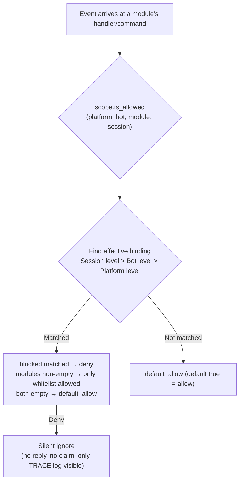

- **Resolution priority: session level > Bot level > platform level**, with higher priority bindings **completely overriding** lower ones
- **Silent semantics**: Commands and handlers of filtered modules do not trigger, reply, or claim (prevents cross-command mis-matches), visible only in TRACE-level logs (`core.scope.denied`)
- **Framework-level handlers** (`scope_exempt=True` or owner is empty) are unaffected; modules with empty names (framework-level resources) are always allowed

## ② Identity Dimension (Event Admission)

Answers the question: "Whose events are received." Events denied at the **admission entry** are completely discarded—they do not enter middleware or any handler (including framework-level), visible only in TRACE-level logs (`core.scope.identity_denied`).

- **Resolution priority: user > session > Bot > adapter**, taking the most specific configured strategy; deny takes precedence over allow
- Each level binding is a binary strategy: `{ allow = true }` or `{ deny = true }`
- User keys support glob / regex (e.g., `"spam_*"` to block a group of spam users)
- Typical usage—上级 deny, personal allow for "exceptional allowance":

```toml
[ErisPulse.scope.identity.adapters.onebot11]
deny = true
[ErisPulse.scope.identity.users.onebot11]
allow = ["u_admin"]   # Even if adapter-level denied, u_admin's events are still allowed
```

## ③ Command Dimension (Command ACL)

Answers the question: "Who can execute a certain command." The decision order: **deny matched → deny; allow whitelist non-empty and not matched → deny; neither configured → follow `default_allow`** (`true` passes to the developer's default permission chain). Denied commands will explicitly reply with "insufficient permissions."

- Command names support glob: `"roll*"` covers a group of commands like `roll`, `roll_dice`, etc.
- Exact keys take precedence over glob keys (`commands.roll` matched does not check `commands."roll*"`)
- User identifier format `"platform:user_id"` (consistent with the framework owner system)
- This dimension is **only an additional gate on the user side**, connected with the command's `master` / `permission` parameters: After ACL passes, the default permission chain declared by the developer is still followed

## ④ Handler/Text Dimension

Filters "which text a module processes": After configuring `pattern` / `regex` for a module, all event handlers of that module only trigger when the text matches (AND with code-level conditions, both must be satisfied). Suitable for narrowing the trigger range without modifying module code.

```toml
[ErisPulse.scope.handlers.ChatModule]
pattern = "闲聊*"     # ChatModule's handlers only respond to messages starting with "闲聊"
```

## ⑤ Implementation Parameter Override

Overrides implementation parameters at the **upper level** of module/command registration, without modifying module code:

```toml
[ErisPulse.scope.overrides.MyModule.restart]
master = true      # Override to only framework owner
hidden = true      # Hidden in help list
aliases = ["rs"]   #生效别名
```

> Overriding only changes **implementation parameters** (master / hidden / aliases / prefix / help / usage, etc.). **Disabling a command is not done here**—use the command dimension deny (`scope.commands` or `scope.deny_user()`), to avoid conflicting semantics of "disable."

## Runtime API

### Module Dimension

```python
from ErisPulse import sdk

# Check
sdk.scope.is_allowed("onebot11", "123456", "Chat")
sdk.scope.is_allowed("onebot11", "123456", "Chat", "789012345")
sdk.scope.is_allowed("onebot11", "123456", None)      # Framework-level resource -> True

# Bind / Unbind
sdk.scope.bind_module("onebot11", "123456", modules=["Chat", "Tool*"])
sdk.scope.bind_module("onebot11", blocked=["Danger"])             # Platform-level
sdk.scope.bind_module("onebot11", "123456", "789012345", modules=["Chat"])  # Session-level
sdk.scope.bind_module("onebot11", "123456", modules=["Music"], merge=True)  # Merge
sdk.scope.bind_module("onebot11", "123456", modules=["Chat"], persist=False)  # Runtime only
sdk.scope.unbind_module("onebot11", "123456")

# Query
sdk.scope.get("onebot11", "123456")   # {"modules": ["Chat"], "blocked": []}
```

### Identity Dimension

```python
# Check if event is allowed
sdk.scope.is_identity_allowed("onebot11", "123456", "group_9", "u1")

# Bind strategy (hierarchy determined by parameters: user > session > bot > adapter)
sdk.scope.bind_identity("onebot11", user_id="u_bad", deny=True)
sdk.scope.bind_identity("onebot11", user_id="spam_*", deny=True)   # glob
sdk.scope.bind_identity("onebot11", "123456", "group_9", allow=True)
sdk.scope.unbind_identity("onebot11", user_id="u_bad")

# Blacklist convenience API
sdk.scope.block_user("onebot11", "u_bad")
sdk.scope.is_user_blocked("onebot11", "u_bad")
sdk.scope.get_blocked_users()        # {"onebot11": ["u_bad"]}
sdk.scope.unblock_user("onebot11", "u_bad")
```

### Command Dimension

```python
sdk.scope.is_command_allowed("roll", "onebot11", "u1")
sdk.scope.allow_user("roll*", "onebot11", "u_vip")   # Command name supports glob
sdk.scope.deny_user("roll*", "onebot11", "u_bad")
sdk.scope.get_acl("roll*")
sdk.scope.remove_acl("roll*")

# Can also use command system facade (equivalent delegation)
from ErisPulse.Core.Event import command
command.allow_user("restart", "onebot11", "123456")
```

### Handler and Override Dimensions

```python
sdk.scope.bind_handler("MyModule", pattern="签到*", regex=r"\d+号")
sdk.scope.unbind_handler("MyModule")

sdk.scope.override("MyModule", "restart", master=True, hidden=True)
sdk.scope.get_override("MyModule", "restart")
sdk.scope.remove_override("MyModule", "restart")
```

### General

```python
sdk.scope.list_bindings()   # Full five-dimensional bindings
sdk.scope.get_topology()    # Five-dimensional topology (for Dashboard)
sdk.scope.get_stats()
# {"module_calls": .., "module_filtered": .., "identity_checks": .., "identity_denied": ..,
#  "command_checks": .., "command_denied": .., "cache_hits": .., "cache_misses": ..}
sdk.scope.reset_stats()
sdk.scope.clear()           # Clear all bindings (in-memory only)
```

## Cache and Hot Update

- `is_allowed` / `is_identity_allowed` results are cached with **LRU cache** (`scope.cache_size` is adjustable), invalidated automatically by `bind_*` / `unbind_*` / configuration hot update (`config.updated` / `config.set`)
- All dimension configurations take effect **immediately**, no restart needed
- The control plane makes **event-by-event** decisions, without cross-event memory: configuration changes take effect on the next event

## Common Issues and Notes

### 1. Configuration Hierarchy and Overriding

- Module dimension: session level > Bot level > platform level, **completely overrides**. To "allow Chat at platform level, and add Music at Bot level," both must be listed at the Bot level
- Identity dimension: user > session > Bot > adapter, taking the **most specific** configured strategy (can be used for exceptional allowance)
- Command dimension: exact command name takes precedence over glob key

### 2. Prefer Control Plane Over Module Code Changes

Module declarations are "developer defaults" (`master=True`, `permission=...`, `pattern=...`); control plane declarations are "user final decisions." When conflicts occur, the **more restrictive control plane takes precedence** (e.g., if the developer did not set master, the user can override `master = true` to tighten; the user cannot loosen the developer's explicit restrictions via override—control over enable/disable goes through command deny / identity allow).

### 3. Module/Command Not Responding

First suspect the control plane rather than the module itself:

```python
from ErisPulse import sdk

print(sdk.scope.is_allowed(event.get_platform(), bot_id, "MyModule", session_id))
print(sdk.scope.is_identity_allowed(event.get_platform(), bot_id, session_id, user_id))
print(sdk.scope.get_stats())   # module_filtered / identity_denied > 0 indicates silent filtering
```

Filtered results are **silent** (no reply for module and identity dimensions, to avoid exposing rules), but statistics are accumulated; command dimension denied by ACL will explicitly reply with "insufficient permissions."

### 4. Session Identifier Isolation Across Platforms

The combination of `(platform, session_id)` is the unique identifier. `scope.sessions.onebot11."789"` only applies to onebot11, not affecting the session with the same `789` on telegram. The same applies to identity dimension user keys.

## Topology Tree API

`ModuleManager.get_topology()` and `AdapterManager.get_topology()` provide module/adapter ownership relationship data, and `sdk.get_topology()` aggregates all (including control plane `scope` five dimensions):

```python
from ErisPulse import sdk

topology = sdk.get_topology()
# {
#   "modules": {                                   # Module → owned resources
#     "Chat": {
#       "loaded": True, "enabled": True,
#       "commands": ["chat", "translate"],
#       "handlers": {"message": 2, "notice": 1},
#       "routes": {"http": ["/Chat/api"], "ws": [], "sse": []},
#       "lifecycle_hooks": 3,
#     }
#   },
#   "adapters": {                                  # Adapter → Bot → scope
#     "onebot11": {
#       "status": "started", "enabled": True,
#       "bots": {"123456": {"status": "online", "scope": {...}}},
#       "scope": {"modules": [...], "blocked": [...]},
#     }
#   },
#   "scope": {                                     # Unified control plane (five dimensions)
#     "platforms": {...}, "bots": {...}, "sessions": {...},
#     "identity": {"adapters": {...}, "bots": {...}, "sessions": {...}, "users": {...}},
#     "commands": {...}, "handlers": {...}, "overrides": {...},
#   },
# }
```

- Module topology aggregates commands, event handlers, HTTP/WS/SSE routes, and lifecycle hooks registered by the module, useful for drawing module resource trees.
- Adapter topology aggregates the status of each adapter, the status of subordinate Bots, and platform-level/Bot-level scope bindings.


### 启动流程与手动控制

# Процесс запуска и ручное управление

Метод `sdk.run()` / `sdk.init()` в ErisPulse инкапсулирует всю цепочку запуска в виде "одной строки кода". Однако, когда вам нужно полностью настроить процесс запуска (например, частичная загрузка, динамическая регистрация, горячая замена, внедрение пользовательской стратегии загрузки), необходимо понимать, что происходит внутри этой цепочки и как управлять каждым шагом вручную.

В этой статье мы разбиваем цепочку запуска на отдельные этапы, объясняем их обязанности, порядок вызова и приводим пример ручного полного запуска.

> В этой статье предполагается, что вы уже запустили [первого робота](../getting-started/first-bot.md) и знакомы с двумя режимами `sdk.run(keep_running=True/False)`. В этой статье мы сосредоточимся на внутренней цепочке `init()` и более низкоуровневых входных точках, таких как `init()` / `init_task()` / `init_sync()`.

## Обзор верхнего уровня SDK

Помимо двух режимов `run()` с параметром `keep_running`, SDK предоставляет несколько более низкоуровневых точек входа, отличающихся **асинхронностью, возвращаемым значением и обработкой исключений**:

| Точка входа | Асинхронность | Возвращаемое значение | Обработка исключений | Сценарии использования |
|-------------|---------------|------------------------|----------------------|--------------------------|
| `await sdk.run(True)` | async, блокирует и поддерживает | `None` (автоматически `uninit` при остановке) | Ошибки модулей/адаптеров перехватываются, не приводят к сбою процесса | Приложения-боты |
| `await sdk.run(False)` | async, не блокирует | `None` (не автоматически удаляется) | То же, что и выше | После инициализации выполнить пользовательскую логику |
| `await sdk.init()` | async, требует await | `bool` | Внутренние исключения компонентов перехватываются, в случае неудачи возвращается `False` | Ручное управление жизненным циклом (в паре с `uninit()`) |
| `sdk.init_task()` | async, возвращает Task без блокировки | `asyncio.Task` | То же, что и `init()` | Параллельное выполнение другой инициализации или когда цикл событий еще не запущен |
| `sdk.init_sync()` | **Синхронный**, блокирует текущий поток | `bool` | То же, что и `init()` | Сценарии командной строки, синхронные входные точки без цикла событий |

> **Частое заблуждение**: `await sdk.init()` **не эквивалентно** `await sdk.run(keep_running=False)`. Есть два различия: ① `init()` возвращает `bool` (в случае неудачи возвращает `False`), `run()` возвращает `None`; ② `init()` делает только инициализацию, **не автоматически удаляет**, `run()` при завершении цикла событий автоматически вызывает `uninit()`. Поэтому, если нужно вручную управлять жизненным циклом, используйте `init()` + `uninit()`.

## Обзор цепочки запуска

`sdk.init()` (точнее, его внутренний `Initializer.init()`) запускает всю систему в следующем порядке:

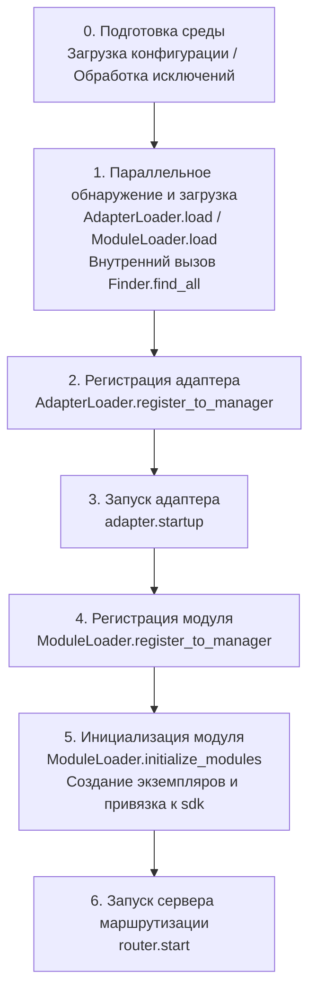

Соответствующие основные компоненты:

| Уровень | Компонент | Обязанности |
|---------|-----------|-------------|
| Обнаружение | `AdapterFinder` / `ModuleFinder` | **Обнаружение** адаптеров/модулей из entry-points установленных пакетов |
| Загрузка | `AdapterLoader` / `ModuleLoader` | Обнаружение + импорт + чтение метаданных + определение включения/отключения, возвращает список объектов |
| Регистрация | `*Loader.register_to_manager` | Регистрация объектов в соответствующих менеджерах |
| Управление | `sdk.adapter` / `sdk.module` | Хранение экземпляров адаптеров/модулей, предоставление интерфейсов запуска/остановки |
| Инициализация | `ModuleLoader.initialize_modules` | Создание экземпляров модулей и привязка к `sdk` (обработка топологической сортировки зависимостей) |
| Маршрутизация | `sdk.router` | HTTP / WebSocket сервер |

> **Важно**: `Finder` и `Loader` — это два уровня. `Loader` уже содержит `Finder` (например, `AdapterLoader` содержит `AdapterFinder`, `ModuleLoader` содержит `ModuleFinder`). В большинстве случаев вам нужно использовать только `Loader`, только в случае, когда нужно "перечислить, но не импортировать", следует использовать `Finder` отдельно.

## Подробное объяснение каждого этапа

### 1. Уровень обнаружения: Finder

Finder только обнаруживает, какие пакеты предоставляют адаптеры/модули, не импортируя и не создавая экземпляры.

```python
from ErisPulse.finders import AdapterFinder, ModuleFinder

adapter_finder = AdapterFinder()
module_finder = ModuleFinder()

# Найти все установленные entry-points для адаптеров/модулей
adapter_entries = adapter_finder.find_all()    # list[EntryPoint]
module_entries = module_finder.find_all()      # list[EntryPoint]

# Найти по имени
entry = module_finder.find_by_name("MyModule")  # EntryPoint | None
```

Каждый `EntryPoint` можно загрузить с помощью `.load()`, чтобы получить соответствующий класс, но обычно это делает `Loader`.

### 2. Уровень загрузки: Loader

Loader делает "импорт + чтение метаданных + определение включения/отключения" поверх Finder.

```python
from ErisPulse.loaders import AdapterLoader, ModuleLoader
from ErisPulse import sdk

adapter_loader = AdapterLoader()
module_loader = ModuleLoader()

# load() внутри: вызывает finder.find_all() → обрабатывает entry-point по одному → возвращает кортеж
adapter_objs, enabled_adapters, disabled_adapters = await adapter_loader.load(sdk.adapter)
module_objs, enabled_modules, disabled_modules = await module_loader.load(sdk.module)
```

Возвращаемые три кортежа `load()`:

| Возвращаемое значение | Значение |
|-----------------------|----------|
| `objs` (`dict`) | Имя → объект (класс адаптера / обёртка модуля) |
| `enabled` (`list[str]`) | Имена, которые включены (не отключены в конфигурации) |
| `disabled` (`list[str]`) | Имена, которые отключены |

#### Диагностика при сбое загрузки

Когда модуль/адаптер выбрасывает исключение при загрузке или инициализации, фреймворк пропускает этот компонент и продолжает загрузку других компонентов, выводя **сводку пользовательского кода**, чтобы вы могли определить местоположение ошибки на уровне INFO, без необходимости включать DEBUG:

```
[ERROR] [ModuleLoader] Ошибка при загрузке модуля MyModule из entry-point, пропущен: 'NoneType' object has no attribute 'platform'
  → MyModule/Core.py:42 in on_load
      adapter = sdk.platform
  → AttributeError: 'NoneType' object has no attribute 'platform'
  → Подсказка: Повысьте уровень логирования до DEBUG для просмотра полного стека; проверьте реализацию модуля MyModule
```

Диагностическая информация генерируется модулем `ErisPulse.runtime.diagnostics`, который автоматически фильтрует внутренние кадры фреймворка, оставляя только кадры вашего кода. Если вам нужно использовать это в пользовательской логике загрузки:

```python
from ErisPulse.runtime import log_diagnostic

try:
    risky_init()
except Exception as e:
    log_diagnostic(e)  # Автоматически извлекает кадры пользовательского кода и записывает в лог ERROR
```

Модуль также предоставляет две базовые функции: `extract_user_frame()` (возвращает структурированную информацию о кадре) и `format_diagnostic_block()` (возвращает многострочную текстовую строку).

### 3. Уровень регистрации: register_to_manager

Регистрация объектов, полученных от Loader, в менеджерах, чтобы `sdk.adapter` / `sdk.module` могли их распознавать.

```python
# Регистрация адаптера (возвращает bool, означающий, все ли успешно)
await adapter_loader.register_to_manager(enabled_adapters, adapter_objs, sdk.adapter)

# Регистрация модуля
await module_loader.register_to_manager(enabled_modules, module_objs, sdk.module)
```

После регистрации адаптеры зарегистрированы в менеджере адаптеров, модули — в менеджере модулей, но **ни один из них не запущен/инициализирован**.

### 4. Запуск адаптера

```python
# Запуск всех зарегистрированных адаптеров
await sdk.adapter.startup()
# Или указать платформу
await sdk.adapter.startup("yunhu")
await sdk.adapter.startup(["yunhu", "telegram"])
```

> Регистрация ≠ запуск. `register_to_manager` только регистрирует; `startup` вызывает `start()` адаптера, устанавливая соединение с платформой.

### 5. Инициализация модуля

Модули имеют дополнительный шаг — **инициализация** и привязка к `sdk` (чтобы вы могли обращаться к `sdk.MyModule.xxx`). Этот шаг также обрабатывает зависимости между модулями и топологическую сортировку.

```python
success = await module_loader.initialize_modules(
    enabled_modules, module_objs, sdk.module, sdk
)
```

После успешной инициализации модуль появляется в `sdk.<ModuleName>`.

### 6. Запуск сервера маршрутизации

```python
await sdk.router.start(
    host="0.0.0.0",
    port=8000,
    ssl_certfile=None,
    ssl_keyfile=None,
)
```

Сервер маршрутизации отвечает за прием обратных вызовов (webhook / websocket) от адаптеров. Без запуска этого сервера, адаптеры в режиме сервера не смогут получать сообщения.

## Полный пример ручного запуска

Ниже приведён код, который **эквивалентен** основному процессу `await sdk.init()`, но каждый шаг доступен для ручного управления, что позволяет вставить пользовательскую логику в любой момент:

```python
import asyncio
from ErisPulse import sdk
from ErisPulse.loaders import AdapterLoader, ModuleLoader

async def manual_startup():
    # 0. Подготовка среды (загрузка конфигурации, регистрация обработки исключений)
    #    _prepare_environment — это внутренний шаг init(), который также должен быть вызван в ручном процессе,
    #    иначе Loader не сможет прочитать конфигурацию и посчитает все адаптеры/модули отключенными.
    if not await sdk._prepare_environment():
        print("Подготовка среды не удалась")
        return False

    # 1. Создание загрузчиков (внутри каждый содержит Finder)
    adapter_loader = AdapterLoader()
    module_loader = ModuleLoader()

    # 2. Параллельное обнаружение и загрузка (как в init(), используем gather)
    (adapter_objs, enabled_adapters, disabled_adapters), \
    (module_objs, enabled_modules, disabled_modules) = await asyncio.gather(
        adapter_loader.load(sdk.adapter),
        module_loader.load(sdk.module),
    )

    # 3. Регистрация адаптеров
    await adapter_loader.register_to_manager(
        enabled_adapters, adapter_objs, sdk.adapter
    )

    # 4. Запуск адаптеров
    if enabled_adapters:
        await sdk.adapter.startup()

    # 5. Регистрация модулей
    await module_loader.register_to_manager(
        enabled_modules, module_objs, sdk.module
    )

    # 6. Инициализация модулей (создание экземпляров и привязка к sdk)
    if enabled_modules:
        await module_loader.initialize_modules(
            enabled_modules, module_objs, sdk.module, sdk
        )

    # 7. Запуск сервера маршрутизации
    await sdk.router.start(host="0.0.0.0", port=8000)

    print("Ручной запуск завершен")
    return True

async def main():
    ok = await manual_startup()
    if ok:
        # Блокирующее ожидание (ручной процесс не блокирует автоматически)
        await asyncio.Event().wait()

if __name__ == "__main__":
    asyncio.run(main())
```

### Когда использовать ручной запуск?

В большинстве случаев **не нужно** использовать ручной запуск, так как `await sdk.run()` уже делает всё это. Ручной запуск имеет ценность только в следующих сценариях:

- **Частичная загрузка**: загрузка только определённых адаптеров/модулей, пропуск других
- **Динамическая регистрация**: регистрация новых адаптеров/модулей во время выполнения по условиям
- **Собственный порядок**: изменение стандартного порядка загрузки (например, сначала запустить модуль, затем адаптер)
- **Внедрение стратегий**: внедрение пользовательских стратегий управления, строгих режимов и т.д. в Loader
- **Отладка/диагностика**: при сбое на каком-то этапе, ручное управление для локализации проблемы

## Тонкое управление во время выполнения

Даже если вы использовали `sdk.run()` для запуска, вы всё ещё можете управлять отдельными подсистемами во время выполнения, без необходимости перезапуска всего SDK:

### Горячий перезапуск адаптера

```python
# Горячий перезапуск адаптера (восстановление соединения, без влияния на другие платформы)
await sdk.adapter.shutdown("yunhu")
await sdk.adapter.startup("yunhu")

# Запуск новой платформы во время выполнения
await sdk.adapter.startup("telegram")

# Временная отключка платформы
await sdk.adapter.shutdown("telegram")
```

> `adapter.startup()` требует, чтобы адаптер **был зарегистрирован** в менеджере. Регистрация происходит внутри `init()`/`run()`, поэтому это управление происходит **после** запуска.

### Сервер маршрутизации

```python
# Временная отключка webhook-сервера
await sdk.router.stop()

# Перезапуск (например, после смены порта)
await sdk.router.start(host="0.0.0.0", port=9000)
```

### Модули по требованию

```python
# Ручная загрузка модуля (возможно, ленивая загрузка)
await sdk.load_module("MyModule")
```

## Элегантное завершение

Начиная с версии 2.7.0, `sdk.shutdown()` предоставляет **программное элегантное завершение**: установка события завершения, которое заставляет висящий `await sdk.run(keep_running=True)` вернуться, что ведёт к автоматическому вызову `uninit()` и очистке ресурсов.

```python
# В любом корутине вызвать, чтобы запустить элегантное завершение (run() висит и автоматически uninit)
sdk.shutdown()
```

Типичное использование:

```python
async def shutdown_after_idle():
    await asyncio.sleep(3600)
    sdk.shutdown()  # Элегантное завершение после 1 часа бездействия
```

**Обработка сигналов**: `run()` внутри регистрирует обработчики `SIGTERM` / `SIGHUP`, преобразуя системные сигналы в элегантное завершение — при остановке контейнера (Docker `docker stop`) или остановке службы systemd процесс пройдёт через `uninit()` для очистки, а не будет принудительно убит.

- На Windows `loop.add_signal_handler` не поддерживается, обработчик сигналов будет пропущен (можно использовать `sdk.shutdown()` или Ctrl+C для завершения)
- Повторный вызов `sdk.shutdown()` безопасен (второй вызов без действия, если событие уже установлено)

## Процесс выгрузки

Обратной операцией к запуску является `await sdk.uninit()`, который очищает в обратном порядке:

1. Закрыть все адаптеры (`adapter.shutdown()`)
2. Выгрузить все модули
3. Очистить все обработчики событий
4. Очистить менеджеры и свойства модулей в SDK

В сценариях ручного запуска не забудьте вызвать `uninit()` при выходе, чтобы обеспечить элегантное завершение:

```python
try:
    await asyncio.Event().wait()   # Поддерживать выполнение
finally:
    await sdk.uninit()
```

## Перезапуск

SDK предоставляет два способа перезапуска, без необходимости вручную выгружать — фреймворк сам обрабатывает:

| Способ | Вызов | Поведение | Сценарии использования |
|-------|-------|-----------|--------------------------|
| Горячий перезапуск | `await sdk.restart()` | В том же процессе `uninit()` и повторная `init()`, перезагрузка адаптеров/модулей | Перезагрузка конфигурации, горячая замена модулей |
| Жёсткий перезапуск | `await sdk.hard_restart()` | `uninit()` и выход с кодом 42, внешний супервайзер запускает новый процесс | Подозрение на утечку памяти/ресурсов, полная очистка и перезапуск |

```python
# Горячий перезапуск: перезагрузка в том же процессе (наиболее часто используемый)
await sdk.restart()

# Жёсткий перезапуск: выход с кодом 42, внешний супервайзер запускает новый процесс (см. руководство супервайзеров ниже)
await sdk.hard_restart()
```

> **Два важных замечания**:
> 1. Эти методы выполняют перезапуск в фоновой задаче, **немедленно возвращают `True`**, означая, что "задача перезапуска запланирована", а не "перезапуск завершён". Фактический перезапуск происходит в фоне, чтобы избежать прерывания текущей цепочки событий.
> 2. `hard_restart()` работает так: после очистки и сохранения конфигурации, процесс завершается с **кодом 42** (`HARD_RESTART_EXIT_CODE`) — **он сам не запускает новый процесс**. Новый процесс должен быть запущен внешним супервайзером после обнаружения кода 42. Если запустить напрямую `python main.py` без супервайзера, процесс завершится с кодом 42 и **не перезапустится автоматически** (фреймворк выдаст предупреждение).

### Когда использовать жёсткий перезапуск?

Жёсткий перезапуск — это не просто "более полный перезапуск", он более подходит и даже эффективнее в следующих сценариях:

- **Побочные эффекты двоичных библиотек (C-расширения)**: горячий перезапуск происходит в том же процессе, не освобождая ресурсы процесса, такие как C-расширения, открытые файловые дескрипторы, потоки; жёсткий перезапуск запускает новый процесс, полностью устраняя эти побочные эффекты.
- **Выявление утечек ресурсов**: при подозрении на утечку памяти или дескрипторов, жёсткий перезапуск даёт чистую среду.
- **Частые перезапуски, чувствительные к производительности**: жёсткий перезапуск исключает затраты на выгрузку и повторную загрузку в том же процессе, фактически более эффективен, чем горячий перезапуск.

> Функция "перезапуск фреймворка" в панели управления Dashboard вызывает `hard_restart()`.

### Контракт выходного кода 42

Жёсткий перезапуск — это кооперация между процессами: **SDK отвечает за выход (код 42), супервайзер за запуск**.

| Роль | Действие |
|------|----------|
| SDK (при жёстком перезапуске) | `uninit()` → сохранение конфигурации → `os._exit(42)` |
| Супервайзер | Обнаруживает код выхода 42 → перезапуск той же команды |

> `sdk.is_supervised()` позволяет проверить, запущен ли текущий процесс супервайзером (проверка переменной окружения `ERISPULSE_SUPERVISED`). Команда CLI `run` автоматически вставляет этот маркер при запуске подпроцесса; внешние супервайзеры, такие как systemd / Docker, не вставляют его, поэтому `is_supervised()` возвращает `False`, и при жёстком перезапуске фреймворк выдаёт предупреждение "не обнаружен супервайзер".

### Руководство по супервайзерам

Выберите подходящий супервайзер, чтобы жёсткий перезапуск действительно сработал:

#### 1. Команда CLI run (разработка/простое развертывание, рекомендуется)

`epsdk run main.py` включает цикл наблюдения: обнаруживает код выхода подпроцесса, при 42 немедленно перезапускает; при других кодах выхода с экспоненциальной задержкой автоматически перезапускает; `Ctrl+C` сначала элегантно завершает подпроцесс (код 0 считается нормальным выходом, перезапуск не происходит).

```bash
epsdk run main.py
```

#### 2. systemd (серверы Linux)

`RestartForceExitStatus=42` заставляет перезапуск при коде выхода 42 (по умолчанию `on-failure` срабатывает только при ненулевом коде):

```ini
[Service]
ExecStart=/usr/bin/python3 /opt/mybot/main.py
Restart=on-failure
RestartForceExitStatus=42
RestartSec=2
User=mybot
```

#### 3. Docker / docker-compose

Процесс с PID 1 внутри контейнера — это приложение, при коде выхода 42 контейнер завершается — используйте стратегию `restart`, чтобы он автоматически перезапускался:

```yaml
services:
  bot:
    build: .
    restart: unless-stopped   # Перезапуск при любом выходе (включая 42)
```

#### 4. PM2 (экосистема Node.js)

```bash
pm2 start main.py --name mybot --interpreter python3
# 42 считается кодом выхода, PM2 по умолчанию перезапускает; настройте restart_delay для защиты от дребезга
pm2 set mybot.restart_delay 2000
```

#### 5. supervisord

```ini
[program:mybot]
command=python3 /opt/mybot/main.py
autorestart=true
exitcodes=0,2,42    # 42 также считается "нормальным выходом, требующим перезапуска"
```

#### 6. Супервайзер на чистом Python

```python
import subprocess, sys, time

while True:
    p = subprocess.Popen([sys.executable, "main.py"])
    code = p.wait()
    if code == 42:          # Запрос на жёсткий перезапуск
        time.sleep(0.5)
        continue
    if code == 0:           # Нормальный выход
        break
    time.sleep(3)           # Аномальный выход, экспоненциальная задержка и повторный запуск
```

> **Поведение при отсутствии супервайзера**: запуск напрямую `python main.py`, вызов `hard_restart()` завершает процесс с кодом 42 и не перезапускает. В этом случае необходимо подключить один из перечисленных супервайзеров.


====
技术标准
====


### 会话类型标准

# Стандарт типов сессий ErisPulse

В данном документе определяются стандартные типы сессий, поддерживаемые ErisPulse, включая типы событий приема и типы целей отправки.

## 1. Основные понятия

### 1.1 Типы получения и отправки

ErisPulse различает два типа сессий:

- **Тип получения (Receive Type)**: поле `detail_type` события, используемое для получения
- **Тип отправки (Send Type)**: тип получателя метода `Send.To()` при отправке сообщений

### 1.2 Соответствие типов

```
Тип получения (detail_type)     Тип отправки (Send.To)
─────────────────        ────────────────
private                 →        user
group                   →        group
channel                 →        channel
guild                   →        guild
thread                  →        thread
user                    →        user
```

**Ключевые моменты**:
- `private` — это тип получения, при отправке необходимо использовать `user`
- `group`, `channel`, `guild`, `thread` — типы одинаковы при получении и отправке
- Система автоматически выполняет преобразование типов, без необходимости ручного управления (это означает, что вы можете напрямую использовать полученный тип для отправки), на самом деле, вам не нужно беспокоиться об этом, так как наличие обёрток событий позволяет использовать метод `event.reply()` без необходимости учитывать преобразование типов

## 2. Стандартные типы сессий

### 2.1 Стандартные типы OneBot12

#### private
- **Тип получения**: `private`
- **Тип отправки**: `user`
- **Описание**: Личное сообщение в прямом чате
- **Поле ID**: `user_id`
- **Поддерживаемые платформы**: Все платформы, поддерживающие личные чаты

#### group
- **Тип получения**: `group`
- **Тип отправки**: `group`
- **Описание**: Сообщение в групповом чате, включая различные формы групп (например, супергруппа в Telegram)
- **Поле ID**: `group_id`
- **Поддерживаемые платформы**: Все платформы, поддерживающие групповые чаты

#### user
- **Тип получения**: `user`
- **Тип отправки**: `user`
- **Описание**: Тип пользователя, некоторые платформы (например, Telegram) представляют личные чаты как `user`, а не `private`
- **Поле ID**: `user_id`
- **Поддерживаемые платформы**: Telegram и другие платформы

### 2.2 Расширенные типы ErisPulse

#### channel
- **Тип получения**: `channel`
- **Тип отправки**: `channel`
- **Описание**: Сообщение в канале, поддерживает широковещательные сообщения для нескольких пользователей
- **Поле ID**: `channel_id`
- **Поддерживаемые платформы**: Discord, Telegram, Line и другие

#### guild
- **Тип получения**: `guild`
- **Тип отправки**: `guild`
- **Описание**: Сообщение в сервере/сообществе, обычно используется для событий уровня Discord Guild
- **Поле ID**: `guild_id`
- **Поддерживаемые платформы**: Discord и другие

#### thread
- **Тип получения**: `thread`
- **Тип отправки**: `thread`
- **Описание**: Сообщение в теме/подканале, используется для подобсуждений внутри сообщества
- **Поле ID**: `thread_id`
- **Поддерживаемые платформы**: Discord Threads, Telegram Topics и другие

## 3. Типы платформ

### 3.1 Принципы отображения

Адаптер отвечает за преобразование нативных типов платформ в стандартные типы ErisPulse:

```
Нативный тип платформы → Стандартный тип ErisPulse → Тип отправки
```

### 3.2 Примеры отображения распространённых платформ

#### Telegram
```
Тип Telegram         Тип получения ErisPulse    Тип отправки
─────────────────      ────────────────       ───────────
private                private                 user
group                  group                   group
supergroup             group                   group  # Отображается в group
channel                channel                 channel
```

#### Discord
```
Тип Discord          Тип получения ErisPulse    Тип отправки
─────────────────      ────────────────       ───────────
Direct Message         private                user
Text Channel           channel                channel
Guild                  guild                  guild
Thread                 thread                 thread
```

#### OneBot11
```
Тип OneBot11         Тип получения ErisPulse    Тип отправки
─────────────────      ────────────────       ───────────
private                private                user
group                  group                  group
discuss                group                  group  # Отображается в group
```

## 4. Расширение пользовательских типов

### 4.1 Регистрация пользовательского типа

Адаптер может зарегистрировать пользовательский тип сеанса:

```python
from ErisPulse.Core.Event import register_custom_type

# Регистрация пользовательского типа
register_custom_type(
    receive_type="my_custom_type",
    send_type="custom",
    id_field="custom_id",
    platform="MyPlatform"
)
```

### 4.2 Использование пользовательского типа

После регистрации система будет автоматически обрабатывать преобразование и вывод этого типа:

```python
# Автоматический вывод
receive_type = infer_receive_type(event, platform="MyPlatform")
# Возвращает: "my_custom_type"

# Преобразование в тип отправки
send_type = convert_to_send_type(receive_type, platform="MyPlatform")
# Возвращает: "custom"

# Получение соответствующего ID
target_id = get_target_id(event, platform="MyPlatform")
# Возвращает: event["custom_id"]
```

### 4.3 Отмена регистрации пользовательского типа

```python
from ErisPulse.Core.Event import unregister_custom_type

unregister_custom_type("my_custom_type", platform="MyPlatform")
```

## 5. Автоматическое определение типа

Когда событие не имеет явного поля `detail_type`, система автоматически определяет тип на основе существующих полей ID:

> [!NOTE]
> **Изменение поведения в 2.7.0+**: `detail_type` принимается напрямую, только если это **известный тип сессии** (стандартный или пользовательский). `detail_type` событий notice/request (например, `group_member_increase`, `friend_increase`) является **семантическим подтипом**, а не типом сессии, и в этом случае тип сессии будет определён на основе полей ID.

### 5.1 Приоритет определения

```
Приоритет (от высокого к низкому):
1. group_id     → group
2. channel_id   → channel
3. guild_id     → guild
4. thread_id    → thread
5. user_id      → private
```

### 5.2 Примеры использования

```python
# В событии есть только group_id
event = {"group_id": "123", "user_id": "456"}
receive_type = infer_receive_type(event)
# Возвращает: "group" (group_id имеет приоритет)

# В событии есть только user_id
event = {"user_id": "123"}
receive_type = infer_receive_type(event)
# Возвращает: "private"

# detail_type в событии notice является семантическим подтипом, начиная с 2.7.0 будет определён тип сессии на основе полей ID
event = {"type": "notice", "detail_type": "group_member_increase", "group_id": "123"}
receive_type = infer_receive_type(event)
# Возвращает: "group" (а не "group_member_increase")
```

## 6. Примеры использования API

### 6.1 Отправка сообщений

```python
from ErisPulse import adapter

# Отправка пользователю
await adapter.myplatform.Send.To("user", "123").Text("Hello")

# Отправка группе
await adapter.myplatform.Send.To("group", "456").Text("Hello")

# Автоматическая конвертация private → user (не рекомендуется, может вызвать проблемы совместимости)
await adapter.myplatform.Send.To("private", "789").Text("Hello")
# Внутренне автоматически преобразуется в: Send.To("user", "789") # Использование user в качестве типа сессии является более предпочтительным выбором
```

### 6.2 Ответ на событие

```python
from ErisPulse.Core.Event import Event

# Event.reply() автоматически обрабатывает преобразование типа
await event.reply("Содержимое ответа")
# Внутренне автоматически используется правильный тип отправки
```

### 6.3 Обработка команд

```python
from ErisPulse.Core.Event import command

@command(name="test")
async def handle_test(event):
    # Система автоматически обрабатывает тип сессии
    # Не нужно вручную проверять group_id или user_id
    await event.reply("Команда выполнена успешно")
```

## 7. Справочник основного API

### 7.1 Преобразование типов

```python
from ErisPulse.Core.Event import convert_to_send_type, convert_to_receive_type

# Тип получения → Тип отправки
convert_to_send_type("private")  # → "user"
convert_to_send_type("group")    # → "group"

# Тип отправки → Тип получения
convert_to_receive_type("user")   # → "private"
convert_to_receive_type("group")  # → "group"
```

### 7.2 Запрос полей ID

```python
from ErisPulse.Core.Event import get_id_field, get_receive_type

get_id_field("group")    # → "group_id"
get_id_field("private")  # → "user_id"

get_receive_type("group_id")  # → "group"
get_receive_type("user_id")   # → "private"
```

### 7.3 Получение информации для отправки за один шаг

```python
from ErisPulse.Core.Event import get_send_type_and_target_id

event = {"detail_type": "private", "user_id": "123"}
send_type, target_id = get_send_type_and_target_id(event)
# send_type = "user", target_id = "123"

# Непосредственно для Send.To()
await adapter.Send.To(send_type, target_id).Text("Hello")
```

### 7.4 Получение целевого ID

```python
from ErisPulse.Core.Event import get_target_id

event = {"detail_type": "group", "group_id": "456"}
get_target_id(event)  # → "456"
```

## 8. Вспомогательные методы

```python
from ErisPulse.Core.Event import (
    is_standard_type,
    is_valid_send_type,
    get_standard_types,
    get_send_types,
    clear_custom_types,
)

is_standard_type("private")     # True
is_standard_type("custom_type") # False

is_valid_send_type("user")      # True
is_valid_send_type("invalid")   # False

get_standard_types()  # {"private", "group", "channel", "guild", "thread", "user"}
get_send_types()      # {"user", "group", "channel", "guild", "thread"}

clear_custom_types()                # Очистить все
clear_custom_types(platform="discord")  # Очистить только для указанной платформы
```

## 9. Лучшие практики

### 7.1 Разработчики адаптеров

1. **Использование стандартных маппингов**: по возможности маппите на стандартные типы, а не создавайте новые типы
2. **Правильное преобразование**: убедитесь, что отношения между типами приема и отправки корректны
3. **Сохранение исходных данных**: сохраняйте исходный тип события в `{platform}_raw`
4. **Документирование**: в документации адаптера укажите отношения маппинга типов

### 7.2 Разработчики модулей

1. **Использование вспомогательных методов**: используйте вспомогательные методы, такие как `get_send_type_and_target_id()`
2. **Избегайте жесткой привязки**: не пишите код вида `if group_id else "private"`
3. **Учет всех типов**: код должен поддерживать все стандартные типы, а не только private/group
4. **Гибкое проектирование**: используйте методы обертки событий, а не прямой доступ к полям

### 9. Вывод типов

- **Приоритет использования detail_type**: если есть четкое поле, не используйте вывод
- **Разумное использование вывода**: используйте вывод только тогда, когда нет явного типа
- **Внимание к приоритетам**: знайте приоритеты вывода, чтобы избежать неожиданных результатов

## 10. Часто задаваемые вопросы

### В1: Почему при отправке private нужно преобразовывать в user?

О: Это требование стандарта OneBot12. `private` — это понятие при получении, при отправке использование `user` более соответствует семантике.

### В2: Как поддержать новые типы сессий?

О: Зарегистрируйте пользовательский тип с помощью `register_custom_type()`, или используйте стандартные типы, такие как `channel`, `guild` и т.д.

### В3: Что делать, если у события нет detail_type?

О: Система автоматически определит тип на основе доступных полей ID. Приоритет: group > channel > guild > thread > user.

### В4: Как адаптер отображает Telegram supergroup?

О: В логике преобразования адаптера `supergroup` отображается в стандартный тип `group`.

### В5: Как обрабатывать специальные платформы, такие как электронная почта?

О: Для неуниверсальных или платформенно-специфических типов используйте `{platform}_raw` и `{platform}_raw_type` для сохранения исходных данных, а адаптер самостоятельно обрабатывает их.

## 11. Связанные документы

- [Стандарт преобразования событий](event-conversion.md) - Полная спецификация преобразования событий
- [Спецификация метода отправки](send-method-spec.md) - Нормы именования и параметров методов класса Send
- [Руководство по разработке адаптеров](../developer-guide/adapters/) - Полное руководство по разработке адаптеров


====
生态模块
====


### ErisPulse-App 安装与使用

# ErisPulse-App

[ErisPulse-App](https://github.com/ErisPulse/ErisPulse-App) — это официально поддерживаемый **многоплатформенный клиент** (доступен для Android, Windows, Linux и macOS), который напрямую поддерживается командой ErisDev.

Он предоставляет полностью нативный графический интерфейс для управления: создание, запуск и управление несколькими экземплярами ботов на телефоне или компьютере. Вам не потребуется терминал или отдельная среда Python.

> [!IMPORTANT]
> ErisPulse-App — это **самостоятельное клиентское приложение**, а не модуль, установленный через `epsdk install`.
> Внутри уже есть встроенный Python runtime и ErisPulse SDK — просто установите и пользуйтесь. **Приложение можно запустить напрямую на телефоне.**


## Краткий обзор функций

- **Управление несколькими экземплярами**: создание / запуск / остановка / удаление нескольких экземпляров, автоматическое назначение портов и токенов доступа, поддержка полностью новых окружений или клонирования существующих
- **Панель управления**: статистика адаптеров / модулей / онлайн-ботов / общее количество событий, изменение цвета предупреждений для использования ЦП / памяти
- **Магазин модулей**: поиск и фильтрация по тегам, одном кликовая установка / обновление / удаление, установка конкретной версии, поддержка зеркал pip и пакетов Git
- **Поток событий + Конструктор событий**: просмотр событий в реальном времени, визуальное создание тестовых событий и отправка в адаптер
- **Мониторинг**: единый обзор для журналов / жизненного цикла / аудита
- **Управление командами**: глобальные настройки, такие как префикс и псевдонимы, запуск и остановка, а также белые и черные списки платформ
- **Обзор / Настройка / Управление файлами бота**: прямое управление экземплярами через нативный интерфейс
- **Фоновый режим**: поддержка Android с помощью foreground-сервиса, Windows — сворачивание в системный трей, закрытие окна не прерывает работу экземпляра
- **Динамические окна модулей**: зарегистрированные модули автоматически появляются в боковой навигации (в той же группе, что и Dashboard), с быстрым доступом по клику

## Поддерживаемые платформы

Пакеты установки для всех платформ можно скачать с [GitHub Releases](https://github.com/ErisPulse/ErisPulse-App/releases); выберите нужный вариант:

| Платформа | Пакет установки | Описание |
|-----------|----------------|----------|
| Android | `online-*.apk` / `offline-*.apk` | **Запуск на телефоне** — компьютер не требуется |
| Windows | `windows-x64-setup.exe` / `windows-x64.zip` | Установщик / портативная версия |
| Linux | `linux-x64.tar.gz` | Распаковать и запустить |
| macOS | `macos-arm64.zip` | Apple Silicon (arm64) |

Единый репозиторий Flutter поддерживает все платформы.

---

## Способ установки (Android / запустить на телефоне)

Скачайте и установите APK из [GitHub Releases](https://github.com/ErisPulse/ErisPulse-App/releases); доступно два типа сборки:

| Сборка | Образ для времени выполнения | Применение |
|--------|-----------------------------|-----------|
| `erispulse-app-online-*.apk` | Скачивается при первом запуске | Меньший размер установочного файла, подходит при хорошем интернете |
| `erispulse-app-offline-*.apk` | Упакован в APK | Оффлайн-самодостаточный, после установки не требуется подключение к сети |

Пошаговая инструкция для обоих типов сборки одинакова:

1. Скачайте и установите APK. При запуске разрешите уведомления (нужно для работы службы в фоне)
2. При появлении на главной странице баннера инициализации нажмите «Запустить первую инициализацию» (содержит панель прогресса и просмотра логов)
3. Создайте экземпляр и запустите его
4. В встроенном в App интерфейсе управления настройте адаптер и API Key модели

> Офлайн-пакет является самодостаточным — после установки не нужен интернет. Если скачивание при первом запуске медленное или нестабильное,
> в настройках можно переключить источник загрузки на зеркало (ghfast / gh-proxy).

### Способ установки (настольная версия: Windows / Linux / macOS)

1. Скачайте установочный пакет для нужной платформы из [GitHub Releases](https://github.com/ErisPulse/ErisPulse-App/releases)
   (Windows — `setup.exe` или без установки `zip`; Linux — `tar.gz`; macOS — `zip`)
2. Установите и запустите
3. На странице приветствия выберите версию ErisPulse SDK для установки (по умолчанию самая свежая) и выполните установку
4. Создайте экземпляр и запустите

---

## Принцип работы

```
┌────────────────────────────────────────────────────┐
│  ErisPulse-App (Flutter)                            │
│                                                    │
│  Native UI ── Dashboard REST / WS API              │
│       │                                            │
│       ├── Android: foreground service + proot + Ubuntu rootfs │
│       │        + Python + ErisPulse instance       │
│       └── Desktop: built-in Python + direct process management │
└────────────────────────────────────────────────────┘
```

- **Android**: экземпляр запускается в `proot` (пользовательский chroot), под управлением foreground service (background isolate). После закрытия UI бот продолжает работать; при сбое происходит автоматическая перезагрузка
- **Desktop**: экземпляр работает как прямой дочерний процесс приложения. В Windows поддерживается сворачивание в трей для постоянной работы в фоне (закрытие окна не останавливает экземпляр). После перезапуска приложения автоматически восстанавливается управление над работающими экземплярами; при выходе все экземпляры останавливаются единообразно
- Нативный UI на всех платформах communicates с экземплярами через REST / WebSocket API по адресу `127.0.0.1:<port>/Dashboard/*`; используется та же самая API, что и в [ErisPulse-Dashboard](dashboard.md)

---

## Отношения с SDK

- Встраиваемый в приложение SDK ErisPulse: для Android упакован в образ Ubuntu, для настольных ПК — устанавливается через PyPI
  (экран приветствия доступен для выбора версии, по умолчанию используется последняя)
- Экземпляры, используемые в приложении, эквивалентны экземплярам, созданным командной строкой `epsdk`, и могут использовать одинаковые модули / адаптеры
- Разработчики модулей могут регистрировать пользовательские страницы через [Dashboard Window API Registration](dashboard.md):
  Окно автоматически появится в боковой панели навигации приложения (группировка аналогична Dashboard), при нажатии происходит переход на соответствующую страницу


### Dashboard 使用与视窗注册

# ErisPulse-Dashboard

[ErisPulse-Dashboard](https://pypi.org/project/ErisPulse-Dashboard/) — это модуль **Web-панели управления**, поддерживаемый напрямую ErisDev, предоставляющий ErisPulse визуальный интерфейс управления во время выполнения: запуск и остановка модулей, редактирование конфигурации, просмотр логов, мониторинг потока событий и многое другое.

> [!IMPORTANT]
> Dashboard **не является** встроенной функцией фреймворка ErisPulse и требует отдельной установки:
>
> ```bash
> epsdk install Dashboard
> ```

Dashboard также поддерживает регистрацию пользовательских страниц управления другими модулями ErisPulse в боковой панели. После регистрации пользователи могут переключиться на собственную страницу окна модуля прямо в Dashboard без необходимости дополнительной разработки отдельного интерфейса.

> [!NOTE]
> Регистрация окон является **необязательной функцией**.
>
> - Если модуль Dashboard **не установлен** или **не загружен**, вызов `sdk.Dashboard.register_view()` вызовет исключение
> - Обязательно обертывайте код регистрации в `try/except`, чтобы убедиться, что другие функции модуля не затронуты
> - Рекомендуется проверить доступность Dashboard перед регистрацией: `hasattr(sdk, 'Dashboard') and sdk.Dashboard`

---

## Принцип работы

```
Модуль on_load()
  → Вызов sdk.Dashboard.register_view(...)
  → Бэкенд Dashboard сохраняет информацию о окне
  → WebSocket уведомляет фронтенд
  → Фронтенд динамически создает элемент навигации боковой панели + контейнер страницы
  → Пользователь нажимает для просмотра окна модуля
```

---

## API регистрации

```python
sdk.Dashboard.register_view(
    id="MyModule",                    # Обязательно, уникальный идентификатор
    title="Мой модуль",                  # Отображаемое название (китайский язык)
    title_en="My Module",             # Отображаемое название (английский язык)
    icon_svg='<svg>...</svg>',        # SVG-иконка для боковой панели
    html_content='<div>...</div>',     # HTML-содержимое страницы
    js_content='function xxx() {}',    # Логика JavaScript страницы
    css_content='.my-style {}',        # Дополнительный пользовательский CSS
    iframe_url='',                     # URL для режима iframe (выбирается либо html_content)
    loader="loadMyModuleView",         # Имя функции JS, вызываемой при переключении
    group="group_extensions",          # Группа в боковой панели
    group_title="",                    # Название группы на китайском языке
    group_title_en="",                 # Название группы на английском языке
)
```

### Описание параметров

| Параметр | Тип | Обязательно | Описание |
|------|------|------|------|
| `id` | `str` | Да | Уникальный идентификатор окна, рекомендуется использовать имя модуля |
| `title` | `str` | Нет | Отображаемое имя на китайском языке, по умолчанию используется `id` |
| `title_en` | `str` | Нет | Отображаемое имя на английском языке, по умолчанию используется `title` |
| `icon_svg` | `str` | Нет | Полная строка SVG для иконки боковой панели |
| `html_content` | `str` | Нет* | Содержимое HTML страницы в режиме внедрения |
| `js_content` | `str` | Нет | Код JavaScript страницы |
| `css_content` | `str` | Нет | Пользовательские CSS-стили страницы |
| `iframe_url` | `str` | Нет* | URL для режима iframe, после установки html_content игнорируется |
| `loader` | `str` | Нет | Имя функции JS, автоматически вызываемой при активации страницы |
| `group` | `str` | Нет | Идентификатор группы боковой панели, по умолчанию `group_extensions` |
| `group_title` | `str` | Нет | Название группы на китайском языке |
| `group_title_en` | `str` | Нет | Название группы на английском языке |

> *`html_content` и `iframe_url` должны быть предоставлены хотя бы один, иначе страница будет пустой.

---

## Два режима внедрения

### Режим 1: HTML/JS внедрение (рекомендуется)

Прямая передача строк HTML, JS и CSS, Dashboard внедряет содержимое в страницу. Этот режим полностью соответствует стилю Dashboard, рекомендуется использовать предоставленные CSS-классы.

```python
sdk.Dashboard.register_view(
    id="HelloPage",
    title="Приветствие", title_en="Hello",
    icon_svg='<svg viewBox="0 0 24 24" fill="none" stroke="currentColor" stroke-width="2"><circle cx="12" cy="12" r="10"/></svg>',
    html_content='<h1 class="page-title">Hello World</h1><div class="card"><div class="card-body">Это пример страницы</div></div>',
    group="group_tools",
)
```

> Полный пример погодного модуля (включая API-роуты, JS-взаимодействие и т.д.) см. ниже [Полный пример модуля](#полный-пример-модуля).

### Режим 2: Внедрение iframe

Модуль предоставляет свой URL страницы HTML (необходимо самостоятельно зарегистрировать маршрут), Dashboard внедряет его через iframe. Подходит для сценариев, требующих полностью независимого UI или сложного взаимодействия.

```python
sdk.Dashboard.register_view(
    id="MyVisualizer",
    title="Визуализация данных", title_en="Data Visualizer",
    iframe_url="/MyVisualizer/view",
    group="group_tools",
)
```

> Режим iframe автоматически добавляет параметр `token` в конец URL для аутентификации.

---

## Группы боковой панели

Модуль может указать, в какой группе боковой панели находится окно. В Dashboard встроены следующие группы:

| Идентификатор группы | Китайское название | Позиция |
|---------|--------|------|
| `group_overview` | Обзор | 1-я группа |
| `group_events` | События | 2-я группа |
| `group_extensions` | Расширения | 3-я группа (по умолчанию) |
| `group_system` | Система | 4-я группа |
| `group_tools` | Инструменты | 5-я группа |

Указывая встроенное имя группы, окно модуля будет добавлено в конец этой группы:

```python
group="group_tools"  # Добавить в группу "Инструменты"
```

Также можно использовать пользовательское имя группы (не начинается с `group_`), Dashboard автоматически создаст новую группу:

```python
group="my_group",
group_title="Моя группа",
group_title_en="My Group",
```

---

## Часто используемые CSS-классы

При использовании HTML-режима внедрения для окна модуля можно напрямую использовать уже существующие CSS-классы Dashboard для сохранения визуальной согласованности:

| Класс | Назначение |
|------|------|
| `page-title` | Заголовок страницы, например `<h1 class="page-title">Заголовок</h1>` |
| `card` | Контейнер карточки |
| `card-header` | Заголовок карточки |
| `card-body` | Область содержимого карточки |
| `grid-2` | Сетка из двух колонок |
| `grid-3` | Сетка из трех колонок |
| `btn` | Базовая кнопка |
| `btn-primary` | Основная кнопка (синяя) |
| `btn-secondary` | Второстепенная кнопка |
| `btn-icon` | Кнопка с иконкой |
| `btn-danger` | Кнопка опасного действия |

Dashboard использует CSS-переменные для управления цветами темы, вы можете ссылаться на них напрямую в окне модуля:

| CSS-переменная | Назначение |
|----------|------|
| `var(--bg-p)` | Основной цвет фона |
| `var(--bg-s)` | Вторичный цвет фона |
| `var(--bg-t)` | Третичный цвет фона (карточки и т.д.) |
| `var(--tx-p)` | Основной цвет текста |
| `var(--tx-s)` | Вторичный цвет текста |
| `var(--tx-t)` | Дополнительный цвет текста |
| `var(--bd)` | Цвет границ |
| `var(--accent)` | Цвет акцента |
| `var(--ok-c)` | Цвет успеха |
| `var(--er-c)` | Цвет ошибки |

Эти переменные автоматически переключаются в зависимости от светлой/темной темы Dashboard, дополнительная обработка в модуле не требуется.

---

## Аутентификация и вызовы API

При вызове собственного API модуля в JS окна модуля необходимо пройти аутентификацию, используя токен Dashboard:

```javascript
var token = localStorage.getItem('__ep_tk__');
var resp = await fetch('/YourModule/api/data', {
    headers: { 'Authorization': 'Bearer ' + token }
});
var data = await resp.json();
```

Точка API модуля может самостоятельно решать, проверять ли токен. Если требуется проверка, ее можно извлечь из заголовка запроса:

```python
async def _api_data(self, request):
    token = request.headers.get("Authorization", "").replace("Bearer ", "")
    if not token:
        return {"error": "Unauthorized"}, 401
    return {"data": "hello"}
```

---

## Полный пример модуля

Ниже приведен полный пример погодного модуля, показывающий, как зарегистрировать окно, предоставить API-данные и очистить ресурсы при卸ождении:

```python
from ErisPulse import sdk
from ErisPulse.Core.Bases import BaseModule
from ErisPulse.Core.Event import command


class Main(BaseModule):
    def __init__(self):
        self.sdk = sdk
        self.logger = sdk.logger.get_child("Weather")
        self.config = self._load_config()

    @staticmethod
    def get_load_strategy():
        from ErisPulse.loaders import ModuleLoadStrategy
        return ModuleLoadStrategy(lazy_load=False, priority=50)

    async def on_load(self, event):
        self._register_routes()
        self._register_dashboard_view()
        self.logger.info("Погодный модуль загружен")

    async def on_unload(self, event):
        self._unregister_routes()
        if hasattr(self.sdk, 'Dashboard') and self.sdk.Dashboard:
            self.sdk.Dashboard.unregister_view("Weather")
        self.logger.info("Погодный модуль выгружен")

    def _load_config(self):
        config = self.sdk.config.getConfig("Weather")
        if not config:
            default = {"city": "Пекин", "api_key": ""}
            self.sdk.config.setConfig("Weather", default)
            return default
        return config

    def _register_routes(self):
        r = self.sdk.router
        r.register_http_route("Weather", "/api/current",
                              handler=self._api_current, methods=["GET"])

    def _unregister_routes(self):
        r = self.sdk.router
        try:
            r.unregister_http_route("Weather", "/api/current")
        except Exception:
            pass

    async def _api_current(self, request):
        return {
            "city": self.config.get("city", "Пекин"),
            "temp": 25,
            "humidity": 60,
        }

    def _register_dashboard_view(self):
        try:
            dashboard = self.sdk.Dashboard
            dashboard.register_view(
                id="Weather",
                title="Погода", title_en="Weather",
                icon_svg='<svg viewBox="0 0 24 24" fill="none" stroke="currentColor" stroke-width="2"><circle cx="12" cy="12" r="5"/><line x1="12" y1="1" x2="12" y2="3"/><line x1="12" y1="21" x2="12" y2="23"/><line x1="4.22" y1="4.22" x2="5.64" y2="5.64"/><line x1="18.36" y1="18.36" x2="19.78" y2="19.78"/><line x1="1" y1="12" x2="3" y2="12"/><line x1="21" y1="12" x2="23" y2="12"/><line x1="4.22" y1="19.78" x2="5.64" y2="18.36"/><line x1="18.36" y1="5.64" x2="19.78" y2="4.22"/></svg>',
                html_content='''
                    <h1 class="page-title">Запрос погоды</h1>
                    <p style="color:var(--tx-s);margin-bottom:16px">Просмотр текущей информации о погоде</p>
                    <div class="grid-2">
                        <div class="card">
                            <div class="card-header">Текущая погода</div>
                            <div class="card-body">
                                <div id="weather-info" style="font-size:14px;color:var(--tx-s)">Нажмите обновить для загрузки</div>
                            </div>
                        </div>
                        <div class="card">
                            <div class="card-header">Действия</div>
                            <div class="card-body">
                                <button class="btn btn-primary" onclick="refreshWeather()">Обновить</button>
                            </div>
                        </div>
                    </div>
                ''',
                js_content='''
                    async function loadWeatherView() { await refreshWeather(); }
                    async function refreshWeather() {
                        var el = document.getElementById('weather-info');
                        if (!el) return;
                        el.textContent = 'Загрузка...';
                        try {
                            var resp = await fetch('/Weather/api/current', {
                                headers: { 'Authorization': 'Bearer ' + localStorage.getItem('__ep_tk__') }
                            });
                            var data = await resp.json();
                            el.innerHTML = '<p>Город: ' + (data.city || '--') + '</p>' +
                                           '<p>Температура: ' + (data.temp || '--') + '°C</p>' +
                                           '<p>Влажность: ' + (data.humidity || '--') + '%</p>';
                        } catch (e) {
                            el.textContent = 'Ошибка загрузки: ' + e.message;
                        }
                    }
                ''',
                loader="loadWeatherView",
                group="group_tools",
            )
        except Exception as e:
            self.logger.warning(f"Не удалось зарегистрировать окно Dashboard: {e}")
```

---

## Отмена регистрации окна

При выгрузке модуля следует вызывать `unregister_view()` для очистки зарегистрированного окна:

```python
async def on_unload(self, event):
    if hasattr(self.sdk, 'Dashboard') and self.sdk.Dashboard:
        self.sdk.Dashboard.unregister_view("Weather")
```

После отмены регистрации фронтенд Dashboard через WebSocket в реальном времени удаляет элементы навигации боковой панели и содержимое страницы, обновление страницы пользователем не требуется.

---

## Важные замечания

1. **Порядок загрузки** — Приоритет загрузки Dashboard — `99999` (высокий), приоритет вашего модуля должен быть ниже этого значения (например, `50`), чтобы убедиться, что Dashboard загружен первым
2. **Защищенное программирование** — При регистрации окна используйте `try/except`, так как модуль Dashboard может не быть установлен или загружен
3. **Очистка ресурсов** — Вызывайте `unregister_view()` в `on_unload` для удаления зарегистрированного окна
4. **Уникальность ID** — Параметр `id` должен быть уникальным во всем Dashboard, рекомендуется использовать имя модуля напрямую
5. **SVG-иконки** — `icon_svg` должно быть полным тегом `<svg>`, рекомендуется использовать размер `viewBox="0 0 24 24"` и `stroke="currentColor"` для наследования цвета темы Dashboard
6. **Имена функций JS** — Имена функций в `js_content` должны быть уникальными (например, `loadWeatherView`), чтобы избежать конфликтов с другими модулями
7. **Динамическое обновление** — После регистрации/отмены регистрации окна фронтенд Dashboard через WebSocket в реальном времени обновляет боковую панель, обновление страницы пользователя не требуется


### Takumi 图片渲染

# ErisPulse-Takumi

[ErisPulse-Takumi](https://pypi.org/project/ErisPulse-Takumi/) — это **третья сторона модуль рендеринга изображений**, поддерживаемый ccd2s, основанный на [takumi-py](https://github.com/BalconyJH/takumi-py), который позволяет боту рендерить HTML, деревья узлов, шаблоны Jinja, SVG и анимации в изображения. Модуль **включает шрифты на китайском и английском языках** (Noto Sans SC / Roboto / Source Code Pro), не требуя дополнительной настройки.

> [!IMPORTANT]
> Takumi **не является** встроенной функцией фреймворка ErisPulse, его необходимо устанавливать отдельно:
>
> ```bash
> epsdk install Takumi
> ```

Применение:

- Рендеринг данных/статистики в карточечные изображения
- Рендеринг Markdown / длинного текста в стабильно отформатированные изображения, чтобы избежать различий в стилях платформы
- Создание SVG / анимаций для реализации динамических визуальных эффектов
- Смешанная текстово-графическая компоновка на китайском и английском языках (встроенные шрифты готовы к использованию)

---

## Установка и включение

```bash
epsdk install Takumi
```

После установки модуль автоматически загружается, и в конфигурации необходимо убедиться, что он включен:

```toml
[Takumi]
enabled = true
```

---

## Быстрый старт

После автоматической загрузки модуля, его можно получить через менеджер модулей или использовать сокращённый `sdk`:

```python
from ErisPulse import sdk

takumi = sdk.module.get("Takumi")
# Альтернативная запись: takumi = sdk.Takumi
```

### Рендеринг HTML

```python
png = takumi.render_html(
    """
    <div class="card">
      <h1>Привет, ErisPulse</h1>
      <p>Рендерится Takumi</p>
    </div>
    """,
    stylesheets=["""
    .card {
      width: 800px;
      padding: 48px;
      color: white;
      background: #111827;
      font-family: "Noto Sans SC";
    }
    """],
    width=800,
    height=None,   # Автоматически подгоняется под содержимое
    lang="zh-CN",
)
```

### Рендеринг дерева узлов

```python
png = takumi.render_node(
    {
        "type": "text",
        "text": "Китайский и English можно рендерить напрямую",
        "style": {"fontSize": 48, "color": "#111827"},
    },
    width=800,
    height=None,
    lang="zh-CN",
)
```

`png` — это `bytes`, который можно отправить с помощью `event.reply(png, method="Image")` (см. [Отправка рендеринга](#отправка-рендеринга)).

---

## API рендеринга

`sdk.Takumi` делегирует все возможности底层 `takumi_py.Renderer`: все методы рендеринга, измерения, SVG, анимации и шаблонов можно вызывать непосредственно через `sdk.Takumi`. Модуль автоматически **вставляет встроенный стек шрифтов** (`takumi.families`) при вызове; если явно передать `font_families`, то будет использоваться настройка вызывающей стороны.

### Список методов

| Категория | Метод | Возвращает | Описание |
|------|------|------|------|
| Статический рендеринг | `render_html(html, ...)` | `bytes` | Рендеринг HTML-строки |
| | `render_node(node, ...)` | `bytes` | Рендеринг дерева узлов (dict) |
| | `render_template(name, ctx, ...)` | `bytes` | Рендеринг Jinja-шаблона |
| | `render_compiled(node, ...)` | `bytes` | Рендеринг предварительно скомпилированного узла |
| SVG-вывод | `render_svg_html(html, ...)` | `str` | Вывод SVG (вход HTML) |
| | `render_svg_node(node, ...)` | `str` | Вывод SVG (вход дерево узлов) |
| | `render_svg_template(name, ctx, ...)` | `str` | Вывод SVG (вход шаблон) |
| | `render_svg_compiled(node, ...)` | `str` | Вывод SVG (вход предварительно скомпилированный) |
| Анимация | `render_animation(scenes, ...)` | `bytes` | Кодирование анимации из нескольких кадров |
| | `render_sequence_at_time(scenes, time_ms, ...)` | `bytes` | Получение кадра из последовательности в определённое время |
| Измерение | `measure_node(node, ...)` | `dict` | Измерение макета дерева узлов |
| | `measure_html(html, ...)` | `dict` | Измерение макета HTML |
| | `measure_compiled(node, ...)` | `dict` | Измерение предварительно скомпилированного узла |
| Компиляция | `compile_node(node)` | `CompiledNode` | Компиляция дерева узлов |
| | `compile_html(html, ...)` | `CompiledNode` | Компиляция HTML |
| Шрифты | `register_font(font)` | `list[str]` | Регистрация пользовательского шрифта, возвращает список family |
| | `register_fonts(fonts)` | `list[str]` | Массовая регистрация |

> `CompiledNode` предоставляет метод `resource_urls()`, который позволяет заранее обнаружить ссылки на HTTP(S) изображения, что полезно для предварительной подготовки ресурсов.

### Общие параметры

Следующие параметры применимы к статическим и SVG-методам (методы анимации имеют дополнительные параметры, такие как `fps`, см. соответствующие примеры):

| Параметр | Тип | Значение по умолчанию | Описание |
|------|------|--------|------|
| `stylesheets` | `list[str]` | `None` | Список CSS-строк для документа; инлайновые `style` всё ещё анализируются вместе с HTML |
| `width` | `int \| None` | `1200` | Ширина области просмотра (пиксели); `None` означает автоматическое определение по макету |
| `height` | `int \| None` | `630` | Высота холста (пиксели); `None` означает автоматическое подстраивание под содержимое (см. [Размеры и формат вывода](#размеры-и-формат-вывода)) |
| `lang` | `str \| None` | `None` | Тег языка по BCP-47 (например, `zh-CN`), влияет на форматирование и перенос текста |
| `font_families` | `list[str]` | Автоматически вставляется | Стек шрифтов; методы по умолчанию вставляют встроенные шрифты |
| `format` | `str` | `"png"` | Формат вывода (см. [Размеры и формат вывода](#размеры-и-формат-вывода)) |
| `device_pixel_ratio` | `float` | `1.0` | Соотношение пикселей устройства, контролирует разрешение вывода |
| `time_ms` | `int` | `0` | Время в миллисекундах для выборки кадра анимации |
| `dithering` | `str` | `"none"` | Алгоритм дithering: `none` / `ordered-bayer` / `floyd-steinberg` |
| `quality` | `int \| None` | `None` | Качество сжатия с потерями |
| `lossless` | `bool \| None` | `None` | Без потерь |
| `images` | `list` | `None` | Список изображений для рендеринга (объект `ImageResource` или кортеж `(src, bytes)`) |
| `keyframes` | `Mapping` | `None` | Структурированные ключевые кадры, не требуют записи `@keyframes` |
| `options` | `RenderOptions` | — | Группировка параметров через `RenderOptions(...)`, поля совпадают с таблицей выше |

Полное описание полей см. в `takumi_py.RenderOptions`.

### Пример дерева узлов

```python
png = takumi.render_node(
    {
        "type": "container",
        "style": {"padding": "32px", "backgroundColor": "#111827"},
        "children": [
            {"type": "text", "text": "Заголовок", "style": {"fontSize": 32, "color": "white"}},
            {"type": "text", "text": "Основной текст", "style": {"fontSize": 18, "color": "#9ca3af"}},
        ],
    },
    width=800,
    height=None,
    lang="zh-CN",
)
```

### Пример Jinja-шаблона

```python
png = takumi.render_template(
    "card.html.jinja",
    {"title": "Takumi", "subtitle": "Jinja to image"},
    stylesheets=["""
    .card {
      width: 800px;
      padding: 48px;
      color: white;
      background: #111827;
    }
    """],
    width=800,
    height=None,
    lang="zh-CN",
)
```

> Можно через `filters={...}` добавить пользовательские фильтры Jinja или через `environment=...` передать полный `jinja2.Environment`. Конфигурация шаблонов и окружения см. в [документации по шаблонам takumi-py](https://github.com/BalconyJH/takumi-py/blob/main/docs/guides/templates.md).

### Пример SVG-вывода

```python
svg = takumi.render_svg_html(
    '<div class="card">Hello</div>',
    stylesheets=[".card { width: 800px; color: black; }"],
    width=800,
    height=None,
)
```

### Пример анимации

```python
from takumi_py import AnimationScene

webp = takumi.render_animation(
    [
        AnimationScene(
            {"type": "container", "style": {"width": "100%", "height": "100%", "backgroundColor": "black"}},
            duration_ms=100,
        ),
        AnimationScene(
            {"type": "container", "style": {"width": "100%", "height": "100%", "backgroundColor": "white"}},
            duration_ms=100,
        ),
    ],
    width=64,
    height=64,
    fps=20,
    format="webp",
)
```

> Каждый кадр состоит из `AnimationScene(node, duration_ms=...)`, `duration_ms` должен быть положительным.

---

## Размеры и формат вывода

### Форматы вывода

| Сценарий | Значение `format` |
|------|---------------|
| Статическое изображение | `png` (по умолчанию) / `jpeg` / `jpg` / `webp` / `ico` / `raw` |
| Анимация | `webp` (по умолчанию) / `apng` / `gif` |

`format="raw"` возвращает байтовый поток RGBA в порядке строк, что полезно для обработки пикселей.

### О ширинах и высотах

`width` и `height` имеют разные роли:

- `width` — **ширина области просмотра**, текст и макет переносятся по ней. **Должна быть фиксированной** (например, `800`), иначе холст будет растягиваться по содержимому, текст не будет переноситься, и размеры будут неконтролируемыми.
- `height` — **высота холста**, автоматически увеличивается по содержимому. Значение по умолчанию `630`; при `height=None` Takumi **автоматически подгоняет высоту холста** (auto viewport).

> [!TIP]
> **Рекомендуемая комбинация: фиксированная `width` + `height=None`.** Только при необходимости фиксированного размера холста или эффекта обрезки следует указывать конкретное значение `height`.

> [!NOTE]
> `width` / `height` может быть передан как `None`, чтобы определить по макету (например, если узел уже имеет размер); при указании обоих параметров размер вывода будет определённым.

---

## Шрифты

### Встроенные шрифты

| Шрифт | family | Категория |
|------|--------|------|
| Noto Sans SC | `Noto Sans SC` | sans-serif |
| Roboto | `Roboto` | sans-serif |
| Roboto Italic | `Roboto` | sans-serif (italic) |
| Source Code Pro | `Source Code Pro` | monospace |
| Source Code Pro Italic | `Source Code Pro` | monospace (italic) |

Свойства модуля:

| Свойство | Описание |
|------|------|
| `takumi.fonts` | Список имен встроенных шрифтов |
| `takumi.families` | Список зарегистрированных family шрифтов |

### Автоматическая вставка

Все методы рендеринга, измерения, SVG, анимации и шаблонов в `sdk.Takumi` автоматически вставляют `takumi.families` в качестве стека шрифтов. При прямом вызове `takumi.renderer` (оригинальный экземпляр) или при создании независимого экземпляра через `create_renderer()`, необходимо вручную передать `font_families=takumi.families`.

### Пользовательские шрифты

```python
from takumi_py import FontResource

families = takumi.renderer.register_font(
    FontResource(
        font_bytes,
        name="MyFont",
        weight=400,
        style="normal",
        generic_family="sans-serif",
    )
)
```

`register_font` возвращает список зарегистрированных family, которые можно использовать в последующих рендерингах через `font_families`.

---

## Экземпляры рендерера

### Оригинальный рендерер

`takumi.renderer` — это оригинальный экземпляр `takumi_py.Renderer`. При прямом вызове необходимо вручную передавать `font_families`:

```python
png = takumi.renderer.render_html(
    "<div>Привет</div>",
    font_families=takumi.families,
    lang="zh-CN",
)
```

### Независимый рендерер

Для изоляции шрифтов / изображений / кэша ресурсов (долгоживущие процессы, сценарии с несколькими пользователями) можно создать независимый `Renderer`, в который автоматически будут зарегистрированы встроенные шрифты:

```python
renderer = takumi.create_renderer(cache_max_bytes=64 * 1024 * 1024)

png = renderer.render_html(
    "<div>Независимый рендерер</div>",
    font_families=takumi.families,
    width=800,
    height=None,
    lang="zh-CN",
)
```

`create_renderer()` принимает параметры конструктора `takumi_py.Renderer`:

| Параметр | Тип | Значение по умолчанию | Описание |
|------|------|--------|------|
| `load_default_fonts` | `bool` | `False` | Загружать ли встроенные шрифты takumi-py (встроенные шрифты всегда загружаются) |
| `fonts` | `list[FontResource]` | `None` | Дополнительные зарегистрированные пользовательские шрифты |
| `cache_max_bytes` | `int \| None` | `None` | Максимальный размер кэша ресурсов (байты); `0` отключает кэш |
| `persistent_images` | `list` | `None` | Постоянные изображения |

> Независимые экземпляры не проходят через модульный прокси, поэтому для сохранения общего встроенного стека шрифтов необходимо явно передавать `font_families=takumi.families`. Если явно передать `font_families`, модуль будет уважать настройки вызывающей стороны и не будет вставлять стек по умолчанию; `RenderOptions(font_families=...)` также будет действовать.

---

## Отправка рендеринга

Результат рендеринга — это `bytes`, который можно отправить через ответ события:

```python
from ErisPulse import sdk

takumi = sdk.Takumi
png = takumi.render_html("<div>hello</div>", lang="zh-CN")

# Способ 1: Ответ в виде Image
await event.reply(png, method="Image")

# Способ 2: Ответ через OneBot12
from ErisPulse.Core.Event import MessageBuilder
await event.reply_ob12(
    MessageBuilder().image(png).build()
)
```

> Разные платформы обрабатывают изображения через адаптеры. Подробнее см. в [разделе MessageBuilder](../advanced/message-builder.md) и [спецификации методов отправки](../standards/send-method-spec.md).

---

## Конфигурация

```toml
[Takumi]
enabled = true
```

---


====
平台概览
====


### 平台特性与 SendDSL 通用语法

# Документация по функциям платформы ErisPulse

> Базовый протокол: [OneBot12](https://12.onebot.dev/) 
> 
> Данный документ является **гидом по платформенным функциям**, который включает:
> - Примеры цепочечного вызова методов отправки, поддерживаемых различными адаптерами
> - Описание специфических событий/форматов сообщений платформы
> 
> Общие методы использования см. в:
> - [Основные понятия](../getting-started/basic-concepts.md)
> - [Стандарт преобразования событий](../standards/event-conversion.md)  
> - [Спецификация ответов API](../standards/api-response.md)

---

## Платформенные функции

Эта часть поддерживается разработчиками адаптеров и предназначена для описания отличий и расширений, внесённых в адаптер по сравнению со стандартом OneBot12. Для получения подробной информации см. документацию по каждой платформе:

- [Заметки по поддержке](maintain-notes.md)

- [Особенности платформы Yunhu](docs/ru/yunhu.md)
- [Особенности платформы Yunhu User](docs/ru/yunhu_user.md)
- [Особенности платформы Telegram](docs/ru/telegram.md)
- [Особенности платформы OneBot11](docs/ru/onebot11.md)
- [Особенности платформы OneBot12](docs/ru/onebot12.md)
- [Особенности платформы Email](docs/ru/email.md)
- [Особенности платформы Kook(开黑啦)](docs/ru/kook.md)
- [Особенности платформы Matrix](docs/ru/matrix.md)
- [Особенности платформы QQ официального бота](docs/ru/qqbot.md)
- [Особенности платформы Huafen Coffeehouse](docs/ru/ideaura.md)
- [Особенности платформы Discord](docs/ru/discord.md)
- [Особенности протокола моста Webhook](docs/ru/webhook.md)
- [Особенности платформы WeChat Official Account](docs/ru/wechatmp.md)

> Кроме того, есть адаптер `sandbox`, но для него не требуется документация по платформенным функциям

---

## Общие интерфейсы

### Цепочечный вызов метода Send
Все адаптеры поддерживают следующий стандартный способ вызова:

> **Важно:** `{AdapterName}` в документации нужно заменить на фактическое имя адаптера (например, `yunhu`, `telegram`, `onebot11`, `email` и т.д.).

1. Указание типа и ID: `To(type,id).Func()`
   ```python
   # Получение экземпляра адаптера
   my_adapter = adapter.get("{AdapterName}")
   
   # Отправка сообщения
   await my_adapter.Send.To("user", "U1001").Text("Hello")
   
   # Например:
   yunhu = adapter.get("yunhu")
   await yunhu.Send.To("user", "U1001").Text("Hello")
   ```
2. Только указание ID: `To(id).Func()`
   ```python
   my_adapter = adapter.get("{AdapterName}")
   await my_adapter.Send.To("U1001").Text("Hello")
   
   # Например:
   telegram = adapter.get("telegram")
   await telegram.Send.To("U1001").Text("Hello")
   ```
3. Указание отправляющего аккаунта: `Using(account_id)`
   ```python
   my_adapter = adapter.get("{AdapterName}")
   await my_adapter.Send.Using("bot1").To("U1001").Text("Hello")
   
   # Например:
   onebot11 = adapter.get("onebot11")
   await onebot11.Send.Using("bot1").To("U1001").Text("Hello")
   ```
4. Прямой вызов: `Func()`
   ```python
   my_adapter = adapter.get("{AdapterName}")
   await my_adapter.Send.Text("Broadcast message")
   
   # Например:
   email = adapter.get("email")
   await email.Send.Text("Broadcast message")
   ```

#### Асинхронная отправка и обработка результатов

Методы Send DSL возвращают объект `asyncio.Task`, что означает, что вы можете выбрать, будете ли вы немедленно ожидать результат:

```python
# Получение экземпляра адаптера
my_adapter = adapter.get("{AdapterName}")

# Не ожидание результата, сообщение отправляется в фоновом режиме
task = my_adapter.Send.To("user", "123").Text("Hello")

# Если нужно получить результат отправки, можно подождать позже
result = await task
```

#### Декораторы правил отправки

В реальном разработке часто требуется: выполнение последующей логики только после успешной отправки, автоматическая повторная попытка при сбое, отмена при таймауте, мониторинг прогресса отправки и т.д. DSL Send содержит набор встроенных декораторов правил отправки, которые можно добавлять цепочечным способом:

| Метод | Описание |
|--------|------|
| `.Hook(callback)` | Вызов обратного вызова при успешной отправке (можно вызывать несколько раз) |
| `.Retry(times=1)` | Автоматическая повторная попытка N раз (включая первую, всего N+1 попыток) |
| `.Timeout(seconds)` | Таймаут единичной отправки, отмена при истечении времени (можно использовать вместе с Retry) |
| `.Defer(seconds)` | Отложенная отправка (внутрипроцессное таймерное ожидание, не сохраняется) |
| `.OnProgress(callback)` | Обратный вызов прогресса на каждом этапе, передаёт SendContext |
| `.OnError(callback)` | Обратный вызов при окончательном сбое (вызывается только один раз) |

```python
yunhu = adapter.get("yunhu")

# Вычитание очков только после успешной отправки
await (yunhu.Send.To("user", "123")
       .Hook(lambda r: deduct_points("123"))
       .Text("消费成功"))

# Повторная попытка + таймаут + мониторинг прогресса
def on_progress(ctx):
    print(f"Этап: {ctx.stage}, попытка: {ctx.attempt + 1}/{ctx.max_attempts}")

task = (yunhu.Send.To("user", "123")
        .Retry(3)              # Максимум 3 повторные попытки
        .Timeout(10)           # Таймаут 10 секунд на каждую попытку
        .OnProgress(on_progress)
        .OnError(lambda ctx: notify_admin(ctx.error))
        .Text("重要通知"))
```

Методы правил возвращают `self`, и их необходимо вызывать до методов отправки (Text/Image и т.д.). `SendContext` содержит поля `stage` (pending/sending/retrying/success/failed/timeout), `attempt`, `elapsed`, `error`, `result` и другие, что помогает в мониторинге.

#### Режим построения пакетов (Build)

Построение нескольких методов отправки в одной цепочке, с последующим единым выполнением. Подходит для сценариев "отправка нескольких сообщений за один раз":

```python
yunhu = adapter.get("yunhu")

# Построение нескольких сообщений, отправка в едином порядке
results = await (yunhu.Send.To("user", "123")
                .Build()                     # Переход в режим построения
                .Text("通知一")
                .Image("pic.jpg")
                .Text("通知二")
                .send_all())                 # Единое выполнение
# results = [результат Text, результат Image, результат Text]
```

`.send_all()` по умолчанию выполняется **параллельно** (высокая эффективность). При необходимости сохранения порядка сообщений вызовите `.Sequential()` для последовательного выполнения:

```python
# Последовательное выполнение (сохранение порядка) + повторная попытка при сбое
await (yunhu.Send.To("group", "456")
       .Build()
       .Sequential()                # Последовательная отправка
       .Retry(2)                     # Каждая неудачная отправка повторяется
       .Text("第一条").Text("第二条")
       .send_all())
```

Пакетное выполнение использует стратегию "продолжение при сбое": если одна отправка не удалась, это не прерывает другие, и неудачные отправки автоматически повторяются. Пакетная отправка также поддерживает `Hook` для всей группы (вызывается при успешной отправке всех сообщений), `OnError` (вызывается при наличии сбоев), и `OnProgress` (обратный вызов прогресса).

> Более подробное описание правил и построения пакетов см. в [Подробном разборе SendDSL](../developer-guide/adapters/send-dsl.md).

### Обработка событий
Существует три способа прослушивания событий:

1. Прослушивание оригинальных событий платформы:
   ```python
   from ErisPulse.Core import adapter, logger
   
   @adapter.on("event_type", raw=True, platform="{AdapterName}")
   async def handler(data):
       logger.info(f"Получено оригинальное событие {AdapterName}: {data}")
   ```

2. Прослушивание стандартных событий OneBot12:
   ```python
   from ErisPulse.Core import adapter, logger

   # Прослушивание стандартного события OneBot12
   @adapter.on("event_type")
   async def handler(data):
       logger.info(f"Получено стандартное событие: {data}")

   # Прослушивание стандартного события конкретной платформы
   @adapter.on("event_type", platform="{AdapterName}")
   async def handler(data):
       logger.info(f"Получено стандартное событие {AdapterName}: {data}")
   ```

3. Прослушивание через модуль Event:
    События в модуле `Event` основаны на функции `adapter.on()`, поэтому формат событий, предоставляемый `Event`, является стандартным событием OneBot12

    ```python
    from ErisPulse.Core.Event import message, notice, request, command

    message.on_message()(message_handler)
    notice.on_notice()(notice_handler)
    request.on_request()(request_handler)
    command("hello", help="发送问候消息", usage="hello")(command_handler)

    async def message_handler(event):
        logger.info(f"Получено сообщение: {event}")
    async def notice_handler(event):
        logger.info(f"Получено уведомление: {event}")
    async def request_handler(event):
        logger.info(f"Получен запрос: {event}")
    async def command_handler(event):
        logger.info(f"Получена команда: {event}")
    ```

Наиболее рекомендуемым способом является использование модуля `Event` для обработки событий, поскольку модуль `Event` предоставляет богатый набор типов событий и методов обработки событий.

---

## Стандартные форматы
Для удобства приведены простые форматы событий. Для получения подробной информации см. ссылки выше.

> **Важно:** Ниже приведён базовый стандартный формат OneBot12, каждый адаптер может расширять его дополнительными полями. Для получения конкретной информации см. описание специфических функций каждого адаптера.

### Стандартный формат событий
Все адаптеры должны реализовывать формат преобразования событий:
```json
{
  "id": "event_123",
  "time": 1752241220,
  "type": "message",
  "detail_type": "group",
  "platform": "example_platform",
  "self": {"platform": "example_platform", "user_id": "bot_123"},
  "message_id": "msg_abc",
  "message": [
    {"type": "text", "data": {"text": "你好"}}
  ],
  "alt_message": "你好",
  "user_id": "user_456",
  "user_nickname": "ExampleUser",
  "group_id": "group_789"
}
```

### Стандартный формат ответа
#### Успешная отправка сообщения
```json
{
  "status": "ok",
  "retcode": 0,
  "data": {
    "message_id": "1234",
    "time": 1632847927.599013
  },
  "message_id": "1234",
  "message": "",
  "echo": "1234",
  "{platform}_raw": {...}
}
```

#### Неудачная отправка сообщения
```json
{
  "status": "failed",
  "retcode": 10003,
  "data": null,
  "message_id": "",
  "message": "缺少必要参数",
  "echo": "1234",
  "{platform}_raw": {...}
}
```

---

## Ссылки

Проект ErisPulse:
- [Основной репозиторий](https://github.com/ErisPulse/ErisPulse/)
- [Репозиторий адаптера Yunhu](https://github.com/ErisPulse/ErisPulse-YunhuAdapter)
- [Репозиторий адаптера Telegram](https://github.com/ErisPulse/ErisPulse-TelegramAdapter)
- [Репозиторий адаптера OneBot](https://github.com/ErisPulse/ErisPulse-OneBotAdapter)

Связанные официальные документации:
- [Официальная документация протокола OneBot V11](https://github.com/botuniverse/onebot-11)
- [Официальная документация Telegram Bot API](https://core.telegram.org/bots/api)
- [Официальная документация Yunhu](https://www.yhchat.com/document/1-3)

## Участие в разработке

Мы приветствуем больше разработчиков, участвующих в написании и поддержке документации адаптеров! Пожалуйста, следуйте следующим шагам для внесения вклада:
1. Fork [ErisPuls](https://github.com/ErisPulse/ErisPulse) репозитория.
2. Создайте Markdown файл в каталоге `docs/platform-features/` и назовите его в формате `<имя платформы>.md`.
3. Добавьте ссылку на ваш вклад в адаптер и соответствующую официальную документацию в этот файл `README.md`.
4. Отправьте Pull Request.

Спасибо за вашу поддержку!

