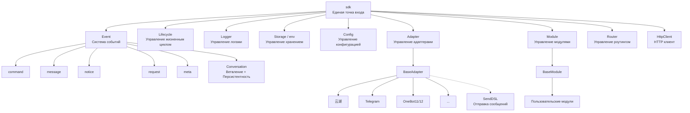
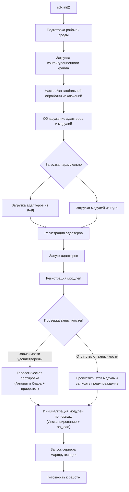
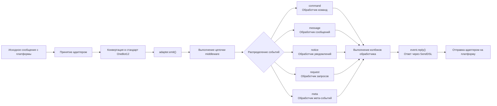
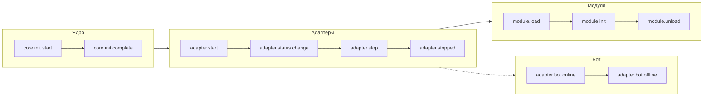
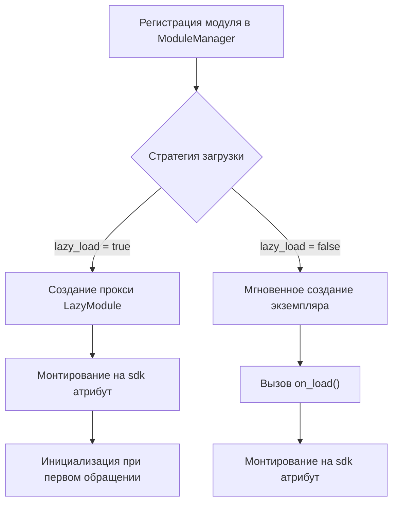

你是一个 ErisPulse 模块开发专家，精通以下领域：

- 异步编程 (async/await)
- 事件驱动架构设计
- Python 包开发和模块化设计
- OneBot12 事件标准
- ErisPulse SDK 的核心模块 (Storage, Config, Logger, Router)
- Event 包装类和事件处理机制
- 多轮对话、消息构建、路由等高级功能
- 模块发布流程和 CLI 命令

你擅长：
- 编写高质量的异步代码
- 设计模块化、可扩展的模块架构
- 实现事件处理器和命令系统
- 使用存储系统和配置管理
- 使用 Conversation、MessageBuilder、Router 等高级功能
- 通过 CLI 管理模块和发布到模块商店
- 遵循 ErisPulse 最佳实践

**使用以下文档作为知识库，回答问题时请优先参考文档内容。**


---


================
ErisPulse 模块开发指南
================


====
框架理解
====


### 架构概览

# Обзор архитектуры

В этом документе с помощью визуальных диаграмм представлен технический архитектурный дизайн ErisPulse SDK, что поможет вам быстро понять концепцию дизайна и отношения между модулями.

## Основная архитектура SDK

Ниже приведена диаграмма, показывающая состав и взаимосвязи основных модулей SDK:



### Описание основных модулей

| Модуль | Описание |
|------|------|
| **Event** | Система событий, предоставляющая обработку пяти типов событий: command / message / notice / request / meta, а также многоразовый диалог (Conversation) |
| **Adapter** | Менеджер адаптеров, управляет регистрацией, запуском и остановкой адаптеров для нескольких платформ |
| **Module** | Менеджер модулей, управляет регистрацией, загрузкой и выгрузкой плагинов, поддерживает объявление зависимостей и топологическую сортировку |
| **Lifecycle** | Менеджер жизненного цикла, предоставляет хуки жизненного цикла, управляемые событиями |
| **Storage** | Система хранения ключ-значение на базе SQLite, поддерживает универсальные SQL-запросы в цепочке |
| **Config** | Управление конфигурационными файлами в формате TOML |
| **Logger** | Модульная система логирования, поддерживает сублоггеры |
| **Router** | Управление маршрутизацией HTTP/WebSocket, инкапсулирует базовый бэкенд через абстрактный слой (текущий: FastAPI + Uvicorn), поддерживает декоративную маршрутизацию, middleware, группирование, лимитирование запросов, CORS |
| **HttpClient** | Единый HTTP-клиент, инкапсулирует базовую библиотеку запросов через абстрактный слой (текущая: aiohttp), предоставляет статистику запросов, повторные попытки, логирование и другие функции. Клиент и сервер WebSocket разделяют базовый класс `WebSocketConnectionBase` |

## Процесс инициализации

Ниже приведен полный процесс инициализации `sdk.init()`:



### Подробное описание этапов инициализации

1. **Подготовка среды** - Загрузка конфигурационного файла TOML, настройка глобальной обработки исключений
2. **Параллельное обнаружение** - Одновременное обнаружение адаптеров и модулей из установленных пакетов PyPI
3. **Регистрация адаптеров** - Регистрация обнаруженных адаптеров в менеджере адаптеров
4. **Запуск адаптеров** - Асинхронный запуск подключений адаптеров к платформам (до инициализации модулей, чтобы убедиться, что модули могут отправлять сообщения немедленно)
5. **Регистрация модулей** - Регистрация обнаруженных модулей в менеджере модулей
6. **Проверка зависимостей** - Проверка, зарегистрированы ли зависимости `depends`, объявленные в модуле, пропуск модулей с отсутствующими зависимостями
7. **Топологическая сортировка** - Сортировка порядка загрузки модулей в зависимости от зависимостей с использованием алгоритма Кнара, с одинаковым уровнем приоритета в порядке убывания `priority`
8. **Инициализация модулей** - Создание экземпляров модулей в порядке сортировки, вызов метода жизненного цикла `on_load`
9. **Запуск сервера маршрутизации** - Запуск сервера маршрутизации FastAPI с использованием Uvicorn

## Процесс обработки событий

Ниже показан полный путь потока сообщений от платформы к обработчику:



### Ключевые шаги обработки событий

- **Принятие адаптером** - Адаптеры различных платформ принимают нативные события через WebSocket/Webhook и другие методы
- **Стандартизация OB12** - Преобразование нативных событий платформы в унифицированный стандартный формат OneBot12
- **Обработка middleware** - Последовательное выполнение зарегистрированных функций middleware, может изменять данные события
- **Распределение событий** - Распределение на соответствующие обработчики в зависимости от типа события (message/notice/request/meta)
- **Ответ SendDSL** - Обработчики отправляют ответы через цепочечный вызов `event.reply()` или `SendDSL`

## Жизненный цикл событий

Ниже показана последовательность запуска жизненных циклов событий для различных компонентов фреймворка:



### Мониторинг жизненных цикл событий

Вы можете отслеживать эти события с помощью `lifecycle.on()` и выполнять пользовательскую логику:

```python
from ErisPulse import sdk

# Отслеживание всех событий адаптера
@sdk.lifecycle.on("adapter")
async def on_adapter_event(event_data):
    print(f"Событие адаптера: {event_data}")

# Отслеживание завершения загрузки модуля
@sdk.lifecycle.on("module.load")
async def on_module_loaded(event_data):
    print(f"Модуль загружен: {event_data}")

# Отслеживание онлайна Бота
@sdk.lifecycle.on("adapter.bot.online")
async def on_bot_online(event_data):
    print(f"Бот онлайн: {event_data}")
```

## Стратегия загрузки модулей

ErisPulse поддерживает две стратегии загрузки модулей:



> Более подробную информацию см. в разделе [Система ленивой загрузки](advanced/lazy-loading.md) и [Управление жизненным циклом](advanced/lifecycle.md).


### 术语表

# Термины ErisPulse

В этом документе объясняются распространенные профессиональные термины в ErisPulse, которые помогут вам лучше понять концепции платформы.

## Основные концепции

### Архитектура, управляемая событиями (Event-Driven Architecture)
**Объяснение "на пальцах":** Это похоже на систему заказа в ресторане. Покупатели (пользователи) делают заказы (отправляют сообщения), официант (система событий) передает заказы (события) на кухню (модули), а после приготовления официант возвращает блюда (ответы) покупателям.

**Техническое объяснение：** Поток выполнения программы инициируется внешними событиями, а не выполняется в фиксированной последовательности. Как только происходит новое событие (например, получение сообщения), фреймворк автоматически вызывает соответствующую функцию обработки.

### Стандарт OneBot12
**Объяснение "на пальцах":** Это как стандарты розеток и вилок. "Вилки" (нативный формат событий) разных платформ различаются, но через конвертер они превращаются в унифицированную "вилку" (формат OneBot12), поэтому ваш код может работать на всех платформах, как универсальная розетка.

**Техническое объяснение：** Унифицированный стандартный интерфейс приложения для чат-ботов, определяет унифицированный формат для событий, сообщений, API и т. д., что позволяет коду повторно использоваться между разными платформами.

### Адаптер
**Объяснение "на пальцах":** Это как переводчик. Разные платформы говорят на разных "языках" (форматах API), и адаптер переводит эти "языки" на понятный ErisPulse "простой язык" (стандарт OneBot12), а также переводит команды ErisPulse обратно на языки конкретных платформ.

**Техническое объяснение：** Компонент, ответственный за взаимодействие с конкретной платформой; он принимает нативные события платформы и преобразует их в стандартный формат или отправляет запросы стандартного формата на платформу.

### Модуль
**Объяснение "на пальцах":** Это как приложения на телефоне. Каждый модуль — это независимый пакет функций, который можно добавлять, удалять и обновлять. Например, "модуль прогноза погоды", "модуль воспроизведения музыки" и т.д.

**Техническое объяснение：** Базовая единица расширения функциональности, содержащая конкретную бизнес-логику, обработчики событий и конфигурацию; может быть установлена и удалена независимо.

### Событие (Event)
**Объяснение "на пальцах":** Это как уведомление на телефоне. Когда приходит новое сообщение, новый друг или новая группа, платформа отправляет "уведомление" (событие) вашему боту.

**Техническое объяснение：** Любое примечательное событие, происходящее на платформе, такое как получение сообщения, пользователь присоединяется к группе, запрос в друзья и т.д., передается программе в виде структурированных данных.

### Обработчик событий (Event Handler)
**Объяснение "на пальцах":** Это как правила курьера по доставке. Когда приходит "посылка" (событие), в зависимости от типа посылки (сообщение, уведомление, запрос и т.д.) решается, кто ее будет обрабатывать.

**Техническое объяснение：** Функции, помеченные декораторами, которые автоматически выполняются при возникновении определенного типа события, например `@command`, `@message` и т.д.

## Термины, связанные с разработкой

### SDK
**Объяснение "на пальцах":** Это как набор инструментов. В нем есть различные часто используемые инструменты (хранение, конфигурация, логирование), вы можете использовать их напрямую при написании кода, не изобретая велосипед.

**Техническое объяснение：** Software Development Kit (SDK), предоставляет набор готовых компонентов и инструментов, упрощающих процесс разработки.

### Виртуальное окружение
**Объяснение "на пальцах":** Это как независимый "мастерская". У каждого проекта есть своя "мастерская", где установленные пакеты программ не мешают друг другу и избегают конфликтов версий.

**Техническое объяснение：** Изолированная среда Python, каждая среда имеет свой независимый список пакетов и версий, предотвращая конфликты зависимостей между разными проектами.

### Асинхронное программирование
**Объяснение "на пальцах":** Это как многозадачность. Бот может делать несколько вещей одновременно, например, пока он ждет ответа сети, он может обрабатывать сообщения других пользователей и не зависает.

**Техническое объяснение：** Способ программирования с использованием ключевых слов `async`/`await`, который позволяет программе переключаться на другие задачи, пока она выполняет затратные операции (такие как сетевые запросы или чтение файлов), повышая эффективность.

### Горячая перезагрузка (Hot Reload)
**Объяснение "на пальцах":** Это как автоновое обновление страницы в браузере. После изменения кода вам не нужно вручную перезапускать бота, он автоматически загрузит новый код, и изменения вступят в силу немедленно.

**Техническое объяснение：** В режиме разработки программа автоматически определяет изменения файлов и перезагружается, позволяя видеть эффект изменений кода без необходимости ручного перезапуска.

### Ленивая загрузка (Lazy Loading)
**Объяснение "на пальцах":** Это как ящики, которые открываются по требованию. Неправильные ящики (модули) сначала закрыты, они открываются только тогда, когда это необходимо, поэтому при запуске не нужно ждать открытия всех ящиков.

**Техническое объяснение：** Стратегия отложенной загрузки, модуль инициализируется и загружается только при первом доступе, сокращая время запуска и использование ресурсов.

## Термины, связанные с функциями

### Команда
**Объяснение "на пальцах":** Это как команды в игре. Пользователь вводит команду, например `/hello`, и бот выполняет соответствующую функцию.

**Техническое объяснение：** Сообщение, начинающееся с определенного префикса (например, `/`), распознается фреймворком как команда и направляется соответствующей функции обработки.

### Ответ
**Объяснение "на пальцах":** Это "ответ" бота пользователю. Будь то текст, изображение или голосовое, это ответ на сообщение пользователя.

**Техническое объяснение：** Процесс, при котором адаптер отправляет результат обработки обратно на платформу для отображения пользователю.

### Хранилище (Storage)
**Объяснение "на пальцах":** Это как "блокнот" бота. Он может запомнить информацию о пользователе, настройки, историю чата и т.д., чтобы найти их в следующий раз.

**Техническое объяснение：** Система хранения персистентных данных, основанная на реализации пар "ключ-значение" на базе SQLite, для сохранения данных, требующих длительного хранения.

### Конфигурация
**Объяснение "на пальцах":** Это как "настройки" бота. Вы можете изменить поведение бота через файл конфигурации, например, порт, уровень логирования и т.д.

**Техническое объяснение：** Система управления конфигурацией в формате TOML, используемая для установки различных параметров фреймворка и модулей.

### Логирование
**Объяснение "на пальцах":** Это как "дневник" бота. Записывает, что делает бот, какие проблемы встречаются, что удобно для отладки и устранения неполадок.

**Техническое объяснение：** Информационные записи, генерируемые во время работы системы, включая различные уровни: информацию, предупреждения, ошибки и т.д., используемые для мониторинга и отладки.

### Маршрутизация
**Объяснение "на пальцах":** Это как регулировщик дорожного движения, решающий, какому запросу куда идти, например, веб-запросам, WebSocket-соединениям и т.д.

**Техническое объяснение：** Менеджер маршрутизации HTTP и WebSocket, распределяющий запросы на соответствующие функции обработки в зависимости от пути URL.

## Термины, связанные с платформами

### Платформа
**Объяснение "на пальцах":** Среда, где работает бот, например, Yunhu, Telegram, QQ и т.д.; каждая платформа имеет свои правила и API.

**Техническое объяснение：** Приложение или сервис, предоставляющий услуги чат-ботов, например, Yunhu Enterprise Communication, Telegram и т.д.

### OneBot11/12
**Объяснение "на пальцах":** Это как "международный стандарт" для чат-ботов. Он определяет унифицированный формат для сообщений, событий и т.д., позволяя различному программному обеспечению понимать друг друга.

**Техническое объяснение：** OneBot — это универсальный стандарт интерфейса приложения для чат-ботов, определяющий форматы событий, сообщений, API и т.д. 11 и 12 — это разные версии стандарта.

### SendDSL
**Объяснение "на пальцах":** Это "горячая клавиша" для отправки сообщений. Простым предложением можно отправлять сообщения различных типов (текст, изображения, упоминания и т.д.).

**Техническое объяснение：** Интерфейс отправки сообщений с цепочными вызовами (Chained calls), предоставляющий лаконичный синтаксис для создания и отправки сложных сообщений.

## Другие термины

### Жизненный цикл (Lifecycle)
**Объяснение "на пальцах":** "Жизнь" бота: рождение (запуск), работа (работа), отдых (остановка). Жизненный цикл — это события, которые запускаются в эти ключевые моменты.

**Техническое объяснение：** Ключевые этапы во время работы программы, такие как запуск, загрузка модулей, выгрузка модулей, закрытие и т.д., при которых можно выполнять соответствующие операции, прослушивая эти события.

### Аннотация / Декоратор (Annotation / Decorator)
**Объяснение "на пальцах":** Это "наклейка" для функций. Например, тег `@command("hello")` говорит фреймворку: это обработчик команд, имя "hello".

**Техническое объяснение：** Синтаксический сахар Python, используемый для изменения поведения функций или классов. В ErisPulse используется для маркировки обработчиков событий, маршрутизации и т.д.

### Типы (Type Annotation)
**Объяснение "на пальцах":** Это указание того, какого "типа" должен быть параметр функции. Например, `request: Request` означает, что этот параметр — объект запроса.

**Техническое объяснение：** Возможность, введенная в Python 3.5+, для обозначения типов переменных и параметров, что повышает читаемость кода и безопасность типов.

### TOML
**Объяснение "на пальцах":** Формат файла конфигурации, который легче читать, чем JSON, и более строгий, чем YAML, подходит для написания конфигураций.

**Техническое объяснение：** Tom's Obvious Minimal Language, формат файла конфигурации с простым и четким синтаксисом, широко используемый для управления конфигурациями в Python-про


====
快速开始
====


### 入门指南总览

# Руководство по началу работы

Добро пожаловать в руководство по началу работы с ErisPulse. Если вы впервые используете ErisPulse, этот гид проведет вас с нуля, шаг за шагом раскрывая ключевые концепции и основы использования фреймворка.

## Путь к обучению

Этот гид организован в следующем порядке, рекомендуется читать последовательно:

| Шаг | Тема | Описание |
|------|------|------|
| 1 | [Создание первого бота](first-bot.md) | От инициализации проекта до запуска первой команды |
| 2 | [Базовые концепции](basic-concepts.md) | Понимание архитектуры и модульного дизайна ErisPulse |
| 3 | [Основы обработки событий](event-handling.md) | Изучение того, как обрабатывать сообщения, команды, уведомления и другие типы событий |
| 4 | [Примеры распространенных задач](common-tasks.md) | Освоение функций, таких как сохранение данных, периодические задачи и контроль прав доступа |

## Выбор способа разработки

ErisPulse поддерживает два способа разработки:

| Способ | Подходящие сценарии | Описание |
|------|---------|------|
| **Встраиваемая разработка** | Быстрые прототипы, функции внутри проекта | Написание обработчиков непосредственно в `main.py`, без создания отдельных модулей |
| **Модульная разработка** (рекомендуется) | Производственная среда, распространение функций | Создание независимых Python-пакетов с использованием `epsdk install` для установки и использования |

> Для подробного сравнения и примеров обоих способов обратитесь к разделам [Создание первого бота](first-bot.md) и [Основы модульной разработки](../developer-guide/modules/getting-started.md).

## Обзор архитектуры

ErisPulse использует архитектуру с управлением событиями, состоящую из следующих систем:

- **Система адаптеров** — взаимодействие с различными платформами, преобразование событий платформы в единый стандартный формат OneBot12
- **Система событий** — обработка пяти классов событий: сообщения, команды, уведомления, запросы и метасобытия
- **Система модулей** — расширение функциональности через независимые модули, поддержка управления зависимостями и отложенной загрузки
- **Основные модули** — предоставление базовых возможностей, таких как Storage (хранение), Config (конфигурация), Logger (логирование) и Router (маршрутизация)

> Для подробной диаграммы архитектуры и процесса инициализации обратитесь к разделу [Обзор архитектуры](../architecture.md).

## Начало обучения

Готовы начать?

- [Создание первого бота](first-bot.md) — погружение за 5 минут


### 创建第一个模块

# Создание первого бота

Это руководство проведет вас от нуля к созданию простого бота ErisPulse.

## Шаг 1: Создание проекта

Используйте инструмент CLI для инициализации проекта:

```bash
# Интерактивная инициализация
epsdk init

# Или быстрая инициализация
epsdk init -q -n my_first_bot
```

Следуйте подсказкам для завершения настройки. Рекомендуется выбрать:
- Имя проекта: my_first_bot
- Уровень логов: INFO
- Сервер: конфигурация по умолчанию
- Адаптер: выберите нужную платформу (например, Yunhu)

## Шаг 2: Просмотр структуры проекта

Структура проекта после инициализации:

```
my_first_bot/
├── config/
│   └── config.toml
├── main.py
└── requirements.txt
```

## Шаг 3: Написание первой команды

Откройте `main.py` и напишите простой обработчик команд:

```python
from ErisPulse import sdk
from ErisPulse.Core.Event import command

@command("hello", help="Отправить приветственное сообщение")
async def hello_handler(event):
    """Обработка команды hello"""
    user_name = event.get_user_nickname() or "Друг"
    await event.reply(f"Привет, {user_name}! Я бот ErisPulse.")

@command("ping", help="Проверка доступности бота")
async def ping_handler(event):
    """Обработка команды ping"""
    await event.reply("Pong! Бот работает нормально.")

async def main():
    """Главная функция входа"""
    print("Инициализация ErisPulse...")
    # Запуск SDK и удержание запущенным
    await sdk.run(keep_running=True)

    # Или
    # await sdk.run(keep_running=False)
    # ...Сделайте что-нибудь
    # Можно делать все, что угодно
    # Использование await sdk.init() эквивалентно `sdk.run(keep_running=False)`

    print("ErisPulse инициализирован успешно!")

if __name__ == "__main__":
    import asyncio
    asyncio.run(main())
```

## Шаг 4: Запуск бота

```bash
# Обычный запуск
epsdk run main.py

# Режим разработчика (поддержка горячего перезагрузки)
epsdk run main.py --reload
```

## Шаг 5: Тестирование бота

Отправьте команду в вашем мессенджере:

```
/hello
```

Вы должны получить ответ от бота.

## Объяснение кода

### Декоратор команды

```python
@command("hello", help="Отправить приветственное сообщение")
```

- `hello` : имя команды, пользователь вызывает через `/hello`
- `help` : справка по команде, отображается в команде `/help`

### Параметры события

```python
async def hello_handler(event):
```

Параметр `event` — это объект Event, содержащий:
- Содержимое сообщения
- Информацию об отправителе
- Информацию о платформе
- И так далее...

> Полная документация по методам Event-объекта находится по ссылке [Подробное описание класса Event Wrapper](../developer-guide/modules/event-wrapper.md).

### Отправка ответа

```python
await event.reply("Текст ответа")
```

Метод `event.reply()` — это удобный способ отправить сообщение отправителю.

## Расширение: добавление дополнительных функций

ErisPulse предоставляет богатые возможности для обработки событий и данных:

- **Прослушивание сообщений** : используйте `@message.on_message()` для прослушивания различных сообщений → [Основы обработки событий](event-handling.md)
- **Прослушивание уведомлений** : используйте `@notice.on_friend_add()` для отслеживания системных уведомлений → [Основы обработки событий](event-handling.md)
- **Хранилище данных** : используйте `sdk.storage.get/set` для персистентного хранения данных → [Примеры распространенных задач](common-tasks.md)

## Часто задаваемые вопросы

### Бот не отвечает на команду?

1. Убедитесь, что адаптер настроен правильно, и проверьте, что `status` адаптера в `config/config.toml` равно `true`.
2. Просмотрите логи вывода в терминале, чтобы убедиться в отсутствии ошибок (особенно логи уровня `ERROR`).
3. Убедитесь, что префикс команды верен (по умолчанию это `/`), и посмотрите на секцию `[ErisPulse.event.command]` в файле конфигурации.
4. Убедитесь, что название команды написано правильно, и обратите внимание на настройки чувствительности к регистру.

### Как изменить префикс команды?

Добавьте в `config.toml`:

```toml
[ErisPulse.event.command]
prefix = "!"
case_sensitive = false
```

### Как поддерживать несколько платформ?

ErisPulse использует стандарт OneBot12 для унификации формата событий разных платформ, поэтому обработчики, зарегистрированные через `@command` и `@message`, автоматически получают события со всех платформ. С помощью `event.get_platform()` можно определить источник платформы:

```python
@command("hello")
async def hello_handler(event):
    platform = event.get_platform()
    
    if platform == "yunhu":
        await event.reply("Привет! От Yunhu")
    elif platform == "telegram":
        await event.reply("Hello! From Telegram")
    else:
        await event.reply("Привет!")
```

> Более подробные советы по адаптации для нескольких платформ смотрите в разделе [Примеры распространенных задач](common-tasks.md#многоплатформенная-адаптация).

## Далее

- [Основные понятия](basic-concepts.md) — глубокое понимание концепций ErisPulse
- [Основы обработки событий](event-handling.md) — изучение обработки различных событий
- [Примеры распространенных задач](common-tasks.md) — освоение дополнительных полезных функций


### 基础概念

# Основные концепции

В этом руководстве представлены основные концепции ErisPulse, которые помогут вам понять дизайн-мышление и базовую архитектуру фреймворка.

## Архитектура на основе событий

ErisPulse использует архитектуру на основе событий, где все взаимодействия передаются и обрабатываются через события.

### Поток событий

```
Пользователь отправляет сообщение
      │
      ▼
Платформа получает
      │
      ▼
Адаптер получает нативное событие платформы
      │
      ▼
Преобразуется в стандартное событие OneBot12
      │
      ▼
Отправляется в систему событий
      │
      ▼
Распределяется зарегистрированным обработчикам
      │
      ▼
Модуль обрабатывает событие
      │
      ▼
Адаптер отправляет ответ
      │
      ▼
Платформа отображает пользователю
```

### Стандарт OneBot12

ErisPulse использует OneBot12 в качестве стандартного события. OneBot12 — это стандарт универсального интерфейса чат-бота, определяющий унифицированный формат событий.

Все адаптеры преобразуют событие, специфичное для платформы, в формат OneBot12, обеспечивая согласованность кода.

## Основные компоненты

### 1. Объект SDK

SDK является точкой входа для всех функций и предоставляет доступ к основным компонентам.

```python
from ErisPulse import sdk

# Доступ к основным модулям
sdk.storage    # Система хранения
sdk.config     # Система конфигурации
sdk.logger     # Система логирования
sdk.adapter    # Система адаптеров
sdk.module     # Система модулей
sdk.router     # Система маршрутизации
sdk.client     # HTTP клиент
sdk.lifecycle  # Система жизненного цикла
```

### 2. Объект Event

Объект Event инкапсулирует данные о событии и предоставляет удобные методы доступа.

```python
@command("info")
async def info_handler(event):
    # Получение информации о событии
    event_id = event.get_id()
    user_id = event.get_user_id()
    platform = event.get_platform()
    text = event.get_text()
    
    # Отправка ответа
    await event.reply(f"Пользователь: {user_id}, Платформа: {platform}")
```

### 3. Адаптер

Адаптер — это мост между ErisPulse и внешними платформами.

**Обязанности:**
- Получение нативных событий платформы
- Преобразование в стандартный формат OneBot12
- Отправка стандартных событий платформе

**Примеры адаптеров:**
- Адаптер Yunhu: общение с платформой Yunhu
- Адаптер Telegram: общение с Telegram Bot API
- Адаптер OneBot11: общение с приложениями, совместимыми с OneBot11
- Адаптер Email: обработка почтовых сообщений

### 4. Модуль

Модуль — это базовая единица расширения функциональности, которая может:

- Регистрировать обработчики событий
- Реализовывать бизнес-логику
- Вызывать адаптеры для отправки сообщений
- Использовать службы, предоставляемые основными модулями

#### Механизм обнаружения модулей

ErisPulse обнаруживает установленные модули через Python `importlib.metadata.entry_points`. Модули объявляют точки входа в `pyproject.toml`:

```toml
[project.entry-points."erispulse.module"]
MyModule = "my_package:Main"
```

При инициализации SDK сканируются все точки входа группы `erispulse.module`, классы модулей регистрируются в `ModuleManager`, а затем последовательно инициализируются после топологической сортировки по зависимостям.

#### Минимально рабочий модуль

```python
from ErisPulse.Core.Bases import BaseModule
from ErisPulse import sdk

class Main(BaseModule):
    def __init__(self):
        self.sdk = sdk
        self.logger = sdk.logger.get_child("MyModule")

    async def on_load(self, event):
        self.logger.info("Модуль загружен")

    async def on_unload(self, event):
        self.logger.info("Модуль выгружен")
```

#### Жизненный цикл модуля

- **Регистрация**: SDK обнаруживает класс модуля и регистрирует его в менеджере
- **Загрузка**: Создается экземпляр модуля, вызывается `on_load(event)` (`event = {"module_name": "MyModule"}`)
- **Выгрузка**: Вызывается `on_unload(event)`, ресурсы очищаются

#### Стратегия загрузки

Загрузочное поведение модуля определяется через `get_load_strategy()`:

```python
from ErisPulse.loaders import ModuleLoadStrategy

class Main(BaseModule):
    @staticmethod
    def get_load_strategy():
        return ModuleLoadStrategy(
            lazy_load=True,   # Ленивая загрузка (по умолчанию True)
            priority=0        # Приоритет загрузки, чем больше значение, тем раньше инициализация
        )
```

- **`lazy_load=True` (по умолчанию)**: Модуль инициализируется только при первом обращении к `sdk.MyModule`, что снижает время запуска
- **`lazy_load=False`**: Модуль инициализируется сразу при запуске SDK, подходит для модулей, которым нужно прослушивать события жизненного цикла или выполнять фоновые задачи
- **`priority`**: Модули с одинаковым приоритетом загружаются в порядке регистрации; чем больше значение, тем раньше инициализация

> Подробное описание механизма ленивой загрузки см. в разделе [Система ленивой загрузки](../advanced/lazy-loading.md).

## Типы событий

ErisPulse поддерживает 5 типов событий:

| Тип события | Декоратор | Описание |
|------------|-----------|---------|
| Событие сообщения | `@message.on_message()` | Любое сообщение, отправленное пользователем (личные сообщения, чаты) |
| Событие команды | `@command("name")` | Сообщения, начинающиеся с префикса команды (например, `/hello`) |
| Событие уведомления | `@notice.on_friend_add()` и т.д. | Системные уведомления (добавление друга, изменения состава группы и т.д.) |
| Событие запроса | `@request.on_friend_request()` и т.д. | Запросы пользователей (запросы на добавление в друзья, приглашения в группу) |
| Метасобытие | `@meta.on_connect()` и т.д. | Системные события (подключение, отключение, пульс) |

> Подробное использование и примеры кода для каждого типа событий см. в разделе [Введение в обработку событий](event-handling.md).

## Описание основных модулей

### Storage (Хранилище)

Базирующаяся на SQLite система хранения пар ключ-значение для персистентного хранения данных.

```python
# Установка значения
sdk.storage.set("key", "value")

# Получение значения
value = sdk.storage.get("key", "default_value")

# Массовые операции
sdk.storage.set_multi({
    "key1": "value1",
    "key2": "value2"
})

# Транзакция
with sdk.storage.transaction():
    sdk.storage.set("key1", "value1")
    sdk.storage.set("key2", "value2")
```

### Config (Конфигурация)

Управление файлами конфигурации в формате TOML.

```python
# Получение конфигурации
config = sdk.config.getConfig("MyModule", {})

# Установка конфигурации
sdk.config.setConfig("MyModule", {"key": "value"})

# Чтение вложенной конфигурации
value = sdk.config.getConfig("MyModule.subkey", "default")
```

### Logger (Логирование)

Модульная система логирования.

```python
# Запись логов
sdk.logger.info("Это информационное сообщение")
sdk.logger.warning("Это предупреждение")
sdk.logger.error("Это ошибка")

# Получение дочернего логгера
child_logger = sdk.logger.get_child("submodule")
child_logger.info("Лог дочернего модуля")
```

**Синтаксический сахар для доступа к свойствам**

Помимо использования метода `get_child()`, вы также можете создавать дочерние логгеры через **доступ к свойствам**, что является более кратким способом записи **синтаксического сахара**:

```python
# Создание дочернего логгера через доступ к свойствам
sdk.logger.mymodule.info("Сообщение модуля")

# Поддержка вложенного доступа
sdk.logger.mymodule.database.info("Сообщение базы данных")
```

### Router (Маршрутизация)

Управление HTTP и WebSocket маршрутизацией на базе FastAPI + Uvicorn. Поддерживает декораторную маршрутизацию, middleware, группирование, лимитирование запросов, CORS.

```python
from ErisPulse.Core import HttpRequest

@sdk.router.get("MyModule", "/api")
async def handler(request: HttpRequest):
    data = await request.json()
    return {"status": "ok"}
```

> Полный API маршрутизации (WebSocket, middleware, лимитирование запросов, CORS и т.д.) см. в разделе [Менеджер маршрутизации](../advanced/router.md).

### Client (Сетевой клиент)

Единый сетевой клиент, объединяющий HTTP-запросы, WebSocket-соединения, управление пулом соединений, автоматическую перезагрузку, контроль тайм-аута, статистику запросов и интеграцию событий жизненного цикла.

```python
from ErisPulse.Core import client

# HTTP запрос
resp = await client.get("https://api.example.com/users")
data = await resp.json()

# С перезагрузкой и тайм-аутом
resp = await client.get(url, timeout=30, max_retries=3)

# WebSocket соединение
ws = await client.ws_connect("wss://example.com/ws")
async for text in ws.iter_text():
    await ws.send_text(f"Эхо: {text}")
```

> Полный API сетевого клиента см. в разделе [Сетевой клиент](../advanced/http-client.md).

## Отправка сообщений SendDSL

Адаптеры предоставляют интерфейс для отправки сообщений с цепочечными вызовами.

### Базовая отправка

```python
# Получение экземпляра адаптера
yunhu = sdk.adapter.get("yunhu")

# Отправка сообщения
await yunhu.Send.To("user", "U1001").Text("Hello")

# Указание аккаунта отправки
await yunhu.Send.Using("bot1").To("group", "G1001").Text("Сообщение группы")
```

### Цепочечные модификаторы

```python
# @Пользователь
await yunhu.Send.To("group", "G1001").At("U2001").Text("@сообщение")

# Ответ на сообщение
await yunhu.Send.To("group", "G1001").Reply("msg123").Text("ответ")

# @Всех
await yunhu.Send.To("group", "G1001").AtAll().Text("объявление")
```

### Методы ответа через Event

Объект Event предоставляет удобные методы для ответов:

```python
@command("test")
async def test_handler(event):
    # Простой текстовый ответ
    await event.reply("Текст ответа")
    
    # Отправка изображения
    await event.reply("http://example.com/image.jpg", method="Image")
    
    # Отправка голосового
    await event.reply("http://example.com/voice.mp3", method="Voice")
```

## Система ленивой загрузки

По умолчанию ErisPulse включает ленивую загрузку модулей; модули инициализируются только при первом обращении (например, `sdk.MyModule`), что значительно ускоряет запуск.

```python
from ErisPulse.loaders import ModuleLoadStrategy

class Main(BaseModule):
    @staticmethod
    def get_load_strategy():
        return ModuleLoadStrategy(
            lazy_load=True,   # Включить ленивую загрузку (по умолчанию)
            priority=0        # Приоритет загрузки, чем больше значение, тем раньше инициализация
        )
```

**Сценарии, когда необходимо отключить ленивую загрузку (`lazy_load=False`):**
- Модули, прослушивающие события жизненного цикла (например, `core.init.complete`)
- Модули, запускающие периодические задачи или фоновые службы
- Модули, которым необходимо завершить инициализацию до загрузки других модулей

> Подробное описание механизма ленивой загрузки и рекомендации см. в разделе [Система ленивой загрузки](../advanced/lazy-loading.md).

## Дальнейшие шаги

- [Введение в обработку событий](event-handling.md) — изучите, как обрабатывать различные типы событий
- [Примеры типичных задач](common-tasks.md) — освоите реализацию распространенных функций


### 事件处理入门

# Введение в обработку событий

Этот гид объясняет, как обрабатывать различные события в ErisPulse.

## Обзор типов событий

ErisPulse поддерживает следующие типы событий:

| Тип события | Описание | Сценарии использования |
|---------|------|---------|
| Событие сообщения | Любое сообщение, отправленное пользователем | Чат-боты, фильтрация контента |
| Событие команды | Сообщение, начинающееся с префикса команды | Обработка команд, входные точки функций |
| Событие уведомления | Системные уведомления (добавление в друзья, изменение участников группы и т.д.) | Приветственные сообщения, уведомления о статусе |
| Событие запроса | Запросы от пользователей (запрос на добавление в друзья, приглашение в группу) | Автоматическая обработка запросов |
| Мета-событие | Системные события (подключение, сердцебиение) | Мониторинг соединения, проверка статуса |

## Обработка событий сообщений

> **Совет**: Рекомендуется использовать аннотацию типа `Event` в обработчиках событий для получения поддержки автодополнения в IDE и проверки типов.

```python
from ErisPulse.Core.Event import Event  # Импорт типа события для аннотаций
```

### Слушать все сообщения

```python
from ErisPulse.Core.Event import message, Event

@message.on_message()
async def message_handler(event: Event):
    text = event.get_text()
    user_id = event.get_user_id()
    sdk.logger.info(f"Получено сообщение от {user_id}: {text}")
```

### Слушать личные сообщения

```python
@message.on_private_message()
async def private_handler(event: Event):
    user_id = event.get_user_id()
    await event.reply(f"Привет, {user_id}! Это личное сообщение.")
```

### Слушать групповые сообщения

```python
@message.on_group_message()
async def group_handler(event: Event):
    group_id = event.get_group_id()
    user_id = event.get_user_id()
    sdk.logger.info(f"Пользователь {user_id} отправил сообщение в группу {group_id}")
```

### Слушать сообщения с упоминанием @

```python
@message.on_at_message()
async def at_handler(event: Event):
    # Получение списка пользователей, которым было отправлено @
    mentions = event.get_mentions()
    await event.reply(f"Вы упомянули этих пользователей: {mentions}")
```

## Обработка событий команд

### Базовые команды

```python
from ErisPulse.Core.Event import command

@command("help", help="Отображает справочную информацию")
async def help_handler(event):
    help_text = """
Доступные команды:
/help - Показать справку
/ping - Проверить соединение
/info - Показать информацию
    """
    await event.reply(help_text)
```

### Алиасы команд

```python
@command(["help", "h"], aliases=["帮助"], help="Отображает справочную информацию")
async def help_handler(event):
    await event.reply("Справочная информация...")
```

Пользователи могут вызвать команду одним из следующих способов:
- `/help`
- `/h`
- `/帮助`

### Аргументы команд

```python
@command("echo", help="Эхо-сообщение")
async def echo_handler(event):
    # Получение аргументов команды
    args = event.get_command_args()
    
    if not args:
        await event.reply("Пожалуйста, введите сообщение для эхо")
    else:
        await event.reply(f"Вы сказали: {' '.join(args)}")
```

### Группы команд

```python
@command("admin.reload", group="admin", help="Перезагрузить модуль")
async def reload_handler(event):
    await event.reply("Модуль перезагружен")

@command("admin.stop", group="admin", help="Остановить бота")
async def stop_handler(event):
    await event.reply("Бот остановлен")
```

### Права доступа к командам

```python
def is_admin(event):
    """Проверяет, является ли пользователь администратором"""
    admin_list = ["user123", "user456"]
    return event.get_user_id() in admin_list

@command("admin", permission=is_admin, help="Админ-команда")
async def admin_handler(event):
    await event.reply("Это админ-команда")
```

### Приоритет команд

```python
# Чем выше числовое значение, тем раньше выполняется
@message.on_message(priority=10)
async def high_priority_handler(event):
    await event.reply("Обработчик с высоким приоритетом")

@message.on_message(priority=1)
async def low_priority_handler(event):
    await event.reply("Обработчик с низким приоритетом")
```

### Параллельная обработка событий

Система событий ErisPulse использует модель планирования **параллельную на одном уровне приоритета, последовательную между уровнями**:

```
Получение события
    ↓
Группа priority=10: [ОбработчикC || ОбработчикD] параллельно → объединенный результат
    ↓ (если не прервано)
Группа priority=0: [ОбработчикA || ОбработчикB] параллельно → объединенный результат
    ↓
...
```

- **Параллельное выполнение на одном уровне приоритета**: Несколько обработчиков с одинаковым приоритетом выполняются одновременно, увеличивая пропускную способность.
- **Последовательное выполнение между уровнями**: Группы с разным приоритетом выполняются по порядку (число больше означает выполнение раньше), чтобы убедиться, что обработчики с высоким приоритетом запускаются первыми.
- **Copy-On-Write**: Копии не создаются, если обработчики не изменяют данные, что обеспечивает нулевую накладную нагрузку.
- **Обработка конфликтов**: Если несколько обработчиков с одинаковым приоритетом изменяют одно и то же поле, используется значение, измененное последним, с записью предупреждения в лог.
- **Механизм прерывания**: После того как любой обработчик вызовет `event.mark_processed()`, выполнение пропускается для последующих групп с низким приоритетом.

```python
# Пример: параллельное выполнение обработчиков на одном уровне приоритета
@message.on_message(priority=0)
async def handler_a(event):
    # Обработка задачи A
    event['result_a'] = process_a()

@message.on_message(priority=0)
async def handler_b(event):
    # Выполняется параллельно с handler_a
    event['result_b'] = process_b()

# Последовательное выполнение на разных уровнях приоритета
@message.on_message(priority=10)
async def handler_c(event):
    # Наивысший приоритет, выполняется первым
    pass
```

## Обработка событий уведомлений

### Добавление в друзья

```python
from ErisPulse.Core.Event import notice

@notice.on_friend_add()
async def friend_add_handler(event):
    user_id = event.get_user_id()
    nickname = event.get_user_nickname() or "Новый друг"
    await event.reply(f"Добро пожаловать в друзья, {nickname}!")
```

### Увеличение участников группы

```python
@notice.on_group_increase()
async def member_increase_handler(event):
    group_id = event.get_group_id()
    user_id = event.get_user_id()
    await event.reply(f"Добро пожаловать, новый участник {user_id}, в группу {group_id}")
```

### Уменьшение участников группы

```python
@notice.on_group_decrease()
async def member_decrease_handler(event):
    group_id = event.get_group_id()
    user_id = event.get_user_id()
    await event.reply(f"Участник {user_id} вышел из группы {group_id}")
```

## Обработка событий запросов

### Запрос на добавление в друзья

```python
from ErisPulse.Core.Event import request

@request.on_friend_request()
async def friend_request_handler(event):
    user_id = event.get_user_id()
    comment = event.get_comment()
    
    sdk.logger.info(f"Получен запрос на добавление в друзья: {user_id}, комментарий: {comment}")
    
    # Запрос можно обработать через API адаптера
    # Конкретную реализацию см. в документации каждого адаптера
```

### Запрос в группу

```python
@request.on_group_request()
async def group_request_handler(event):
    group_id = event.get_group_id()
    user_id = event.get_user_id()
    
    await event.reply(f"Получено приглашение в группу {group_id} от {user_id}")
```

## Обработка мета-событий

### События подключения

```python
from ErisPulse.Core.Event import meta

@meta.on_connect()
async def connect_handler(event):
    platform = event.get_platform()
    sdk.logger.info(f"Платформа {platform} подключена")

@meta.on_disconnect()
async def disconnect_handler(event):
    platform = event.get_platform()
    sdk.logger.warning(f"Платформа {platform} отключена")
```

### События пульса (Heartbeat)

```python
@meta.on_heartbeat()
async def heartbeat_handler(event):
    platform = event.get_platform()
    sdk.logger.debug(f"Проверка пульса для платформы {platform}")
```

### Запрос состояния бота

После того как адаптер отправляет мета-событие, фреймворк автоматически отслеживает статус бота, вы можете запрашивать его в любое время:

```python
from ErisPulse import sdk

# Проверка, находится ли конкретный бот онлайн
if sdk.adapter.is_bot_online("telegram", "123456"):
    await adapter.Send.To("user", "123456").Text("Бот онлайн")

# Список всех онлайн ботов на данный момент
bots = sdk.adapter.list_bots()
for platform, bot_list in bots.items():
    for bot_id, info in bot_list.items():
        print(f"{platform}/{bot_id}: {info['status']}")

# Получение сводки полного статуса
summary = sdk.adapter.get_status_summary()
```

## Интерактивная обработка

### Отправка ответов с использованием метода reply

Метод `event.reply()` поддерживает множество модификаторов, что удобно для отправки сообщений с упоминаниями (@), ответами и т.д.:

```python
# Простое сообщение
await event.reply("Привет")

# Отправка сообщений разных типов
await event.reply("http://example.com/image.jpg", method="Image")  # Картинка
await event.reply("http://example.com/voice.mp3", method="Voice")  # Голосовое сообщение

# Упоминание одного пользователя
await event.reply("Привет", at_users=["user123"])

# Упоминание нескольких пользователей
await event.reply("Всем привет", at_users=["user1", "user2", "user3"])

# Ответ на сообщение
await event.reply("Содержание ответа", reply_to="msg_id")

# Упоминание всех участников
await event.reply("Объявление", at_all=True)

# Комбинированное использование: упоминание пользователей + ответ на сообщение
await event.reply("Содержание", at_users=["user1"], reply_to="msg_id")
```

### Ожидание ответа от пользователя

```python
@command("ask", help="Спросить пользователя")
async def ask_handler(event):
    await event.reply("Пожалуйста, введите ваше имя:")
    
    # Ожидание ответа от пользователя, таймаут 30 секунд
    reply = await event.wait_reply(timeout=30)
    
    if reply:
        name = reply.get_text()
        await event.reply(f"Привет, {name}!")
    else:
        await event.reply("Время ожидания истекло, пожалуйста, повторите ввод.")
```

### Ожидание ответа с валидацией

```python
@command("age", help="Спросить о возрасте")
async def age_handler(event):
    def validate_age(event_data):
        """Проверка валидности возраста"""
        try:
            age = int(event_data.get_text())
            return 0 <= age <= 150
        except ValueError:
            return False
    
    await event.reply("Пожалуйста, введите ваш возраст (0-150):")
    
    reply = await event.wait_reply(
        timeout=60,
        validator=validate_age
    )
    
    if reply:
        age = int(reply.get_text())
        await event.reply(f"Ваш возраст — {age} лет")
    else:
        await event.reply("Ввод недействителен или истекло время ожидания")
```

### Ожидание ответа с обратным вызовом

```python
@command("confirm", help="Подтвердить операцию")
async def confirm_handler(event):
    async def handle_confirmation(reply_event):
        text = reply_event.get_text().lower()
        
        if text in ["是", "yes", "y"]:
            await event.reply("Операция подтверждена!")
        else:
            await event.reply("Операция отменена.")
    
    await event.reply("Подтвердить выполнение этой операции? (Да/Нет)")
    
    await event.wait_reply(
        timeout=30,
        callback=handle_confirmation
    )
```

### Подтверждение диалога (confirm)

Ожидание подтверждения или отрицания от пользователя, автоматическое распознавание встроенных слов подтверждения (китайских и английских):

```python
@command("confirm", help="Подтвердить операцию")
async def confirm_handler(event):
    if await event.confirm("Вы уверены, что хотите выполнить эту операцию?"):
        await event.reply("Подтверждено, выполняем...")
    else:
        await event.reply("Отменено")

# Пользовательские слова подтверждения
if await event.confirm("Продолжить?", yes_words={"go", "继续"}, no_words={"stop", "停止"}):
    pass
```

### Выбор из меню (choose)

Пользователь может ввести номер варианта или текст варианта:

```python
@command("choose", help="Выбор")
async def choose_handler(event):
    choice = await event.choose(
        "Пожалуйста, выберите цвет:",
        ["Красный", "Зеленый", "Синий"]
    )
    
    if choice is not None:
        colors = ["Красный", "Зеленый", "Синий"]
        await event.reply(f"Вы выбрали: {colors[choice]}")
    else:
        await event.reply("Выбор не сделан (истекло время)")
```

### Сбор формы (collect)

Многократный сбор ввода пользователя в несколько шагов:

```python
@command("register", help="Регистрация")
async def register_handler(event):
    data = await event.collect([
        {"key": "name", "prompt": "Пожалуйста, введите имя:"},
        {"key": "age", "prompt": "Пожалуйста, введите возраст:", 
         "validator": lambda e: e.get_text().isdigit()},
        {"key": "email", "prompt": "Пожалуйста, введите email:"}
    ])
    
    if data:
        await event.reply(f"Регистрация успешна!\nИмя: {data['name']}\nВозраст: {data['age']}\nEmail: {data['email']}")
    else:
        await event.reply("Время ожидания истекло или ввод недействителен")
```

### Ожидание любого события (wait_for)

Ожидание произвольного события, удовлетворяющего условию, не ограниченное тем же пользователем:

```python
@command("wait_member", help="Ожидание нового участника")
async def wait_member_handler(event):
    await event.reply("Ожидание добавления новых участников в группу...")
    
    evt = await event.wait_for(
        event_type="notice",
        condition=lambda e: e.get_detail_type() == "group_member_increase",
        timeout=120
    )
    
    if evt:
        await event.reply(f"Добро пожаловать, новый участник: {evt.get_user_id()}")
    else:
        await event.reply("Время ожидания истекло")
```

### Многократный диалог (conversation)

Создание контекста интерактивного многократного диалога:

```python
@command("survey", help="Опрос")
async def survey_handler(event):
    conv = event.conversation(timeout=60)
    
    await conv.say("Добро пожаловать в опрос!")
    
    while conv.is_active:
        reply = await conv.wait()
        
        if reply is None:
            await conv.say("Время ожидания диалога истекло, пока!")
            break
        
        text = reply.get_text()
        
        if text == "退出":
            await conv.say("Пока!")
            break
        
        await conv.say(f"Вы сказали: {text}, продолжайте ввод или напишите '退出' для выхода")
```

### Встроенные слова подтверждения

ErisPulse содержит набор встроенных слов подтверждения (китайских и английских):

- **Слова подтверждения** (`CONFIRM_YES_WORDS`): 是、yes、y、确认、确定、好、好的、ok、true、对、嗯、行、同意、没问题...
- **Слова отрицания** (`CONFIRM_NO_WORDS`): 否、no、n、取消、不、不要、不行、cancel、false、错、拒绝、不可以...

## Доступ к данным события

### Общие методы объекта Event

```python
@command("info")
async def info_handler(event):
    # Базовая информация
    event_id = event.get_id()
    event_time = event.get_time()
    event_type = event.get_type()
    detail_type = event.get_detail_type()
    
    # Информация отправителя
    user_id = event.get_user_id()
    nickname = event.get_user_nickname()
    
    # Контент сообщения
    message_segments = event.get_message()
    alt_message = event.get_alt_message()
    text = event.get_text()
    
    # Информация о группе
    group_id = event.get_group_id()
    
    # Информация о боте
    self_id = event.get_self_user_id()
    self_platform = event.get_self_platform()
    
    # Необработанные данные
    raw_data = event.get_raw()
    raw_type = event.get_raw_type()
    
    # Информация о платформе
    platform = event.get_platform()
    
    # Проверка типа сообщения
    is_private = event.is_private_message()
    is_group = event.is_group_message()
    is_at = event.is_at_message()
    
    # Информация о команде
    if event.is_command():
        cmd_name = event.get_command_name()
        cmd_args = event.get_command_args()
        cmd_raw = event.get_command_raw()
```

### Расширенные методы платформ

Помимо встроенных методов, платформенные адаптеры регистрируют методы, специфичные для платформы, для удобства доступа к платформенным данным.

```python
from ErisPulse.Core.Event import message

@message.on_message()
async def handle_message(event):
    platform = event.get_platform()

    # Вызов специфичных методов в зависимости от платформы
    if platform == "telegram":
        chat_type = event.get_chat_type()      # Специфичный метод для Telegram
    elif platform == "email":
        subject = event.get_subject()           # Специфичный метод для почты
```

Если вы не уверены, какие методы зарегистрированы для платформы, можно проверить список зарегистрированных методов:

```python
from ErisPulse.Core.Event import get_platform_event_methods

methods = get_platform_event_methods("telegram")
# ["get_chat_type", "is_bot_message", ...]
```

> Специфичные методы, зарегистрированные каждой платформой, см. в соответствующей [документации платформы](../platform-guide/).

## Лучшие практики обработки событий

### 1. Обработка исключений

```python
@command("process")
async def process_handler(event):
    try:
        # Бизнес-логика
        result = await do_some_work()
        await event.reply(f"Результат: {result}")
    except ValueError as e:
        # Предусмотренные бизнес-ошибки
        await event.reply(f"Ошибка параметров: {e}")
    except Exception as e:
        # Неожиданные ошибки
        sdk.logger.error(f"Сбой обработки: {e}")
        await event.reply("Сбой обработки, повторите попытку позже")
```

### 2. Логирование

```python
@message.on_message()
async def message_handler(event):
    user_id = event.get_user_id()
    text = event.get_text()
    
    sdk.logger.info(f"Обработка сообщения: {user_id} - {text}")
    
    # Использование собственного логгера модуля
    from ErisPulse import sdk
    logger = sdk.logger.get_child("MyHandler")
    logger.debug(f"Подробная отладочная информация")
```

### 3. Условная обработка

```python
@message.on_message(priority=0)
async def conditional_handler(event):
    """Условная обработка - проверка внутри обработчика"""
    # Обработка только сообщений от конкретных пользователей
    if event.get_user_id() in ["bot1", "bot2"]:
        return
    
    # Обработка только сообщений, содержащих определенные ключевые слова
    if "关键词" not in event.get_text():
        return
    
    await event.reply("Условие выполнено, сообщение обработано")
```

## Далее

- [Примеры распространенных задач](common-tasks.md) - Изучение реализации распространенных функций
- [Подробное описание класса Event Wrapper](../developer-guide/modules/event-wrapper.md) - Глубокое понимание объекта Event
- [Руководство для пользователей](../user-guide/) - Настройка и управление модулями


### 常见任务示例

# Примеры распространённых задач

Этот гайд предоставляет примеры реализации распространённых функций, чтобы помочь вам быстро достичь типичных задач.

## Содержание

1. Персистентность данных
2. Плановые задачи
3. Фильтрация сообщений
4. Адаптация для нескольких платформ
5. Управление правами доступа
6. Статистика сообщений
7. Функция поиска
8. Обработка изображений

## Персистентность данных

### Простой счётчик

```python
from ErisPulse import sdk
from ErisPulse.Core.Event import command

@command("count", help="Просмотреть количество вызовов команды")
async def count_handler(event):
    # Получить счётчик
    count = sdk.storage.get("command_count", 0)
    
    # Увеличить счётчик
    count += 1
    sdk.storage.set("command_count", count)
    
    await event.reply(f"Это {count}-й вызов этой команды")
```

### Хранение данных пользователя

```python
@command("profile", help="Просмотреть профиль")
async def profile_handler(event):
    user_id = event.get_user_id()
    
    # Получить данные пользователя
    user_data = sdk.storage.get(f"user:{user_id}", {
        "nickname": "",
        "join_date": None,
        "message_count": 0
    })
    
    profile_text = f"""
Никнейм: {user_data['nickname']}
Дата присоединения: {user_data['join_date']}
Количество сообщений: {user_data['message_count']}
    """
    
    await event.reply(profile_text.strip())

@command("setnick", help="Установить никнейм")
async def setnick_handler(event):
    user_id = event.get_user_id()
    args = event.get_command_args()
    
    if not args:
        await event.reply("Пожалуйста, введите никнейм")
        return
    
    # Обновить данные пользователя
    user_data = sdk.storage.get(f"user:{user_id}", {})
    user_data["nickname"] = " ".join(args)
    sdk.storage.set(f"user:{user_id}", user_data)
    
    await event.reply(f"Никнейм установлен на: {' '.join(args)}")
```

## Плановые задачи

### Простой таймер

```python
from ErisPulse import sdk
from ErisPulse.Core.Event import command
import asyncio

class TimerModule:
    def __init__(self):
        self.sdk = sdk
        self._tasks = []
    
    async def on_load(self, event):
        """Запуск запланированных задач при загрузке модуля"""
        self._start_timers()
        
        @command("timer", help="Управление таймером")
        async def timer_handler(event):
            await event.reply("Таймер работает...")
    
    def _start_timers(self):
        """Запуск запланированных задач"""
        # Выполнять каждые 60 секунд
        task = asyncio.create_task(self._every_minute())
        self._tasks.append(task)
        
        # Выполнять в полночь
        task = asyncio.create_task(self._daily_task())
        self._tasks.append(task)
    
    async def _every_minute(self):
        """Задача, выполняемая каждую минуту"""
        self.sdk.logger.info("Задача выполняется каждую минуту")
        # Ваша логика...
    
    async def _daily_task(self):
        """Задача, выполняемая в полночь"""
        import time
        
        while True:
            # Вычисление времени до полуночи
            now = time.time()
            midnight = now + (86400 - now % 86400)
            
            await asyncio.sleep(midnight - now)
            
            # Выполнение задачи
            self.sdk.logger.info("Ежедневная задача выполняется")
            # Ваша логика...
```

### Использование событий жизненного цикла

```python
@sdk.lifecycle.on("core.init.complete")
async def init_complete_handler(event_data):
    """Запуск запланированных задач после завершения инициализации SDK"""
    import asyncio
    
    async def daily_reminder():
        """Ежедневное напоминание"""
        await asyncio.sleep(86400)  # 24 часа
        self.sdk.logger.info("Выполнение ежедневной задачи")
    
    # Запуск фоновых задач
    asyncio.create_task(daily_reminder())
```

## Фильтрация сообщений

### Фильтрация по ключевым словам

```python
from ErisPulse.Core.Event import message

blocked_words = ["мусор", "реклама", "фишинг"]

@message.on_message()
async def filter_handler(event):
    text = event.get_text()
    
    # Проверка на наличие чувствительных слов
    for word in blocked_words:
        if word in text:
            sdk.logger.warning(f"Заблокировано чувствительное сообщение: {word}")
            return  # Не обрабатывать это сообщение
    
    # Обработка сообщения в обычном режиме
    await event.reply(f"Получено: {text}")
```

### Фильтрация по черному списку

```python
# Загрузка черного списка из конфигурации или хранилища
blacklist = sdk.storage.get("user_blacklist", [])

@message.on_message()
async def blacklist_handler(event):
    user_id = event.get_user_id()
    
    if user_id in blacklist:
        sdk.logger.info(f"Пользователь в черном списке: {user_id}")
        return  # Не обрабатывать
    
    # Обработка в обычном режиме
    await event.reply(f"Привет, {user_id}")
```

## Адаптация для нескольких платформ

### Ответы, специфичные для платформы

```python
@command("help", help="Показать справку")
async def help_handler(event):
    platform = event.get_platform()
    
    if platform == "yunhu":
        await event.reply("Справка по платформе YUNHU...")
    elif platform == "telegram":
        await event.reply("Справка по платформе Telegram...")
    elif platform == "onebot11":
        await event.reply("Справка OneBot11...")
    else:
        await event.reply("Общая справочная информация")
```

### Определение возможностей платформы

```python
@command("rich", help="Отправить форматированное сообщение")
async def rich_handler(event):
    platform = event.get_platform()
    
    if platform == "yunhu":
        # YUNHU поддерживает HTML
        yunhu = sdk.adapter.get("yunhu")
        await yunhu.Send.To("user", event.get_user_id()).Html(
            "<b>Жирный текст</b><i>Курсивный текст</i>"
        )
    elif platform == "telegram":
        # Telegram поддерживает Markdown
        telegram = sdk.adapter.get("telegram")
        await telegram.Send.To("user", event.get_user_id()).Markdown(
            "**Жирный текст** *Курсивный текст*"
        )
    else:
        # Для других платформ используется обычный текст
        await event.reply("Жирный текст Курсивный текст")
```

## Управление правами доступа

### Проверка администратора

```python
# Настройка списка администраторов
ADMINS = ["user123", "user456"]

def is_admin(user_id):
    """Проверка, является ли пользователь администратором"""
    return user_id in ADMINS

@command("admin", help="Команда администратора")
async def admin_handler(event):
    user_id = event.get_user_id()
    
    if not is_admin(user_id):
        await event.reply("Недостаточно прав, эта команда доступна только администраторам")
        return
    
    await event.reply("Команда администратора выполнена успешно")

@command("addadmin", help="Добавить администратора")
async def addadmin_handler(event):
    if not is_admin(event.get_user_id()):
        return
    
    args = event.get_command_args()
    if not args:
        await event.reply("Введите ID администратора, которого нужно добавить")
        return
    
    new_admin = args[0]
    ADMINS.append(new_admin)
    await event.reply(f"Администратор добавлен: {new_admin}")
```

### Права групп

```python
@command("groupinfo", help="Просмотреть информацию о группе")
async def groupinfo_handler(event):
    if not event.is_group_message():
        await event.reply("Эта команда доступна только в групповых чатах")
        return
    
    group_id = event.get_group_id()
    user_id = event.get_user_id()
    
    await event.reply(f"ID группы: {group_id}, ваш ID: {user_id}")
```

## Статистика сообщений

### Подсчет сообщений

```python
@message.on_message()
async def count_handler(event):
    # Получить статистику
    stats = sdk.storage.get("message_stats", {
        "total": 0,
        "by_user": {},
        "by_day": {}
    })
    
    # Обновить статистику
    stats["total"] += 1
    
    user_id = event.get_user_id()
    stats["by_user"][user_id] = stats["by_user"].get(user_id, 0) + 1
    
    # Сохранить
    sdk.storage.set("message_stats", stats)

@command("stats", help="Просмотреть статистику сообщений")
async def stats_handler(event):
    stats = sdk.storage.get("message_stats", {
        "total": 0,
        "by_user": {},
        "by_day": {}
    })
    
    top_users = sorted(
        stats["by_user"].items(),
        key=lambda x: x[1],
        reverse=True
    )[:5]
    
    top_text = "\n".join(
        f"{uid}: {count} сообщений" for uid, count in top_users
    )
    
    await event.reply(f"Общее количество сообщений: {stats['total']}\n\nАктивные пользователи:\n{top_text}")
```

## Функция поиска

### Простой поиск

```python
from ErisPulse.Core.Event import command, message

# Хранение истории сообщений
message_history = []

@message.on_message()
async def store_handler(event):
    """Сохранить сообщения для поиска"""
    user_id = event.get_user_id()
    text = event.get_text()
    
    message_history.append({
        "user_id": user_id,
        "text": text,
        "time": event.get_time()
    })
    
    # Ограничить количество записей истории
    if len(message_history) > 1000:
        message_history.pop(0)

@command("search", help="Поиск сообщений")
async def search_handler(event):
    args = event.get_command_args()
    
    if not args:
        await event.reply("Пожалуйста, введите ключевое слово для поиска")
        return
    
    keyword = " ".join(args)
    results = []
    
    # Поиск в истории сообщений
    for msg in message_history:
        if keyword in msg["text"]:
            results.append(msg)
    
    if not results:
        await event.reply("Совпадающие сообщения не найдены")
        return
    
    # Отображение результатов
    result_text = f"Найдено {len(results)} сообщений, соответствующих запросу:\n\n"
    for i, msg in enumerate(results[:10], 1):  # Отображать не более 10
        result_text += f"{i}. {msg['text']}\n"
    
    await event.reply(result_text)
```

## Обработка изображений

### Скачивание и хранение изображений

```python
from ErisPulse.Core import client

@message.on_message()
async def image_handler(event):
    """Обработка сообщений с изображениями"""
    message_segments = event.get_message()
    
    for segment in message_segments:
        if segment.get("type") == "image":
            file_url = segment.get("data", {}).get("file")
            
            if file_url:
                # Рекомендуется использовать встроенный клиент SDK для загрузки изображений
                resp = await client.get(file_url)
                if resp.status == 200:
                    image_data = await resp.read()
                    
                    # Сохранить в файл
                    filename = f"images/{event.get_time()}.jpg"
                    with open(filename, "wb") as f:
                        f.write(image_data)
                    
                    sdk.logger.info(f"Изображение сохранено: {filename}")
                    await event.reply("Изображение сохранено")
```

### Пример распознавания изображений

```python
from ErisPulse.Core import client

@command("identify", help="Распознать изображение")
async def identify_handler(event):
    """Распознать изображение в сообщении"""
    message_segments = event.get_message()
    
    for segment in message_segments:
        if segment.get("type") == "image":
            file_url = segment.get("data", {}).get("file")
            
            # Вызов API распознавания изображений
            result = await _identify_image(file_url)
            
            await event.reply(f"Результат распознавания: {result}")
            return
    
    await event.reply("Изображение не найдено")

async def _identify_image(url):
    """Вызов API распознавания изображений (пример) - использование встроенного клиента SDK"""
    resp = await client.post(
        "https://api.example.com/identify",
        json={"url": url}
    )
    data = await resp.json()
    return data.get("description", "Распознавание не удалось")
```

## Далее

- [Руководство для пользователей](../user-guide/) - Узнайте о конфигурации и управлении модулями
- [Руководство для разработчиков](../developer-guide/) - Изучите разработку модулей и адаптеров
- [Расширенные темы](../advanced/) - Глубокое понимание возможностей фреймворка


====
模块开发
====


### 模块开发入门

# Основы разработки модулей

Это руководство проведет вас через процесс создания модуля ErisPulse с нуля.

## Структура проекта

Стандартная структура модуля:

```
MyModule/
├── pyproject.toml
├── README.md
├── LICENSE
└── MyModule/
    ├── __init__.py
    └── Core.py
```

## Конфигурация pyproject.toml

```toml
[project]
name = "ErisPulse-MyModule"
version = "1.0.0"
description = "Описание функций модуля"
readme = "README.md"
requires-python = ">=3.10"
license = { file = "LICENSE" }
authors = [ { name = "yourname", email = "your@mail.com" } ]
dependencies = []

[project.urls]
"homepage" = "https://github.com/yourname/MyModule"

[project.entry-points."erispulse.module"]
"MyModule" = "MyModule:Main"
```

## __init__.py

```python
from .Core import Main
```

## Core.py - Основной модуль

```python
from ErisPulse import sdk
from ErisPulse.Core.Bases import BaseModule
from ErisPulse.Core.Event import command

class Main(BaseModule):
    def __init__(self):
        self.sdk = sdk
        self.logger = sdk.logger.get_child("MyModule")
        self.storage = sdk.storage
        self.config = self._load_config()
    
    @staticmethod
    def get_load_strategy():
        """Возвращает стратегию загрузки модуля"""
        from ErisPulse.loaders import ModuleLoadStrategy
        return ModuleLoadStrategy(
            lazy_load=True,
            priority=0,
            depends=[]  # Необязательно: список зависимых модулей
        )
    
    async def on_load(self, event):
        """Вызывается при загрузке модуля"""
        @command("hello", help="Отправляет приветствие")
        async def hello_command(event):
            name = event.get_user_nickname() or "друг"
            await event.reply(f"Привет, {name}!")
        
        self.logger.info("Модуль загружен")
    
    async def on_unload(self, event):
        """Вызывается при выгрузке модуля"""
        self.logger.info("Модуль выгружен")
    
    def _load_config(self):
        """Загружает конфигурацию модуля"""
        config = self.sdk.config.getConfig("MyModule")
        if not config:
            default_config = {
                "api_url": "https://api.example.com",
                "timeout": 30
            }
            self.sdk.config.setConfig("MyModule", default_config)
            return default_config
        return config
```

## Тестирование модуля

### Локальное тестирование

```bash
# Установить модуль в текущую директорию проекта
epsdk install ./MyModule

# Запустить проект
epsdk run main.py --reload
```

### Тестовая команда

Отправьте команду для тестирования:

```
/hello
```

## Основные понятия

### Базовый класс BaseModule

Все модули должны наследовать `BaseModule`, предоставляя следующие методы:

| Метод | Описание | Обязательно |
|------|------|------|
| `__init__(self)` | Конструктор | Нет |
| `get_load_strategy()` | Возвращает стратегию загрузки | Нет |
| `on_load(self, event)` | Вызывается при загрузке модуля | Да |
| `on_unload(self, event)` | Вызывается при выгрузке модуля | Да |

### Объект SDK

Доступ к основным функциям через объект `sdk`:

```python
from ErisPulse import sdk

sdk.storage    # Система хранения
sdk.config     # Система конфигурации
sdk.logger     # Система логирования
sdk.adapter    # Система адаптеров
sdk.router     # Система маршрутизации
sdk.lifecycle  # Система жизненного цикла
```

## Дальнейшие действия

- [Основные концепции модуля](core-concepts.md) - Глубокое погружение в архитектуру модуля
- [Подробное описание оберток событий](event-wrapper.md) - Изучение объектов Event
- [Лучшие практики разработки модулей](best-practices.md) - Разработка качественных модулей


### 模块核心概念

# Основные концепции модуля

Понимание основных концепций модуля ErisPulse является основой для разработки высококачественных модулей.

## Жизненный цикл модуля

### Стратегия загрузки

```python
from ErisPulse.Core.Bases import BaseModule
from ErisPulse.loaders import ModuleLoadStrategy

class MyModule(BaseModule):
    @staticmethod
    def get_load_strategy():
        """Возвращает стратегию загрузки модуля"""
        return ModuleLoadStrategy(
            lazy_load=True,   # Ленивая загрузка или немедленная загрузка
            priority=0,       # Приоритет загрузки (чем больше значение, тем раньше загрузка)
            depends=["OtherModule"]  # Опционально: объявление зависимостей от других модулей
        )
```

> Если модули, объявленные в `depends`, не зарегистрированы, текущий модуль будет пропущен и будет записано предупреждение. Порядок загрузки определяется топологической сортировкой, а на одном уровне сортировка происходит по убыванию `priority`.

### Метод on_load

Вызывается при загрузке модуля, используется для инициализации ресурсов и регистрации обработчиков событий:

```python
async def on_load(self, event):
    # Регистрация обработчика события
    @command("hello", help="Команда приветствия")
    async def hello_handler(event):
        await event.reply("Привет!")
    
    # Использование встроенного HTTP-клиента SDK (автоматически управляет пулом соединений, не нужно создавать session вручную)
    # Отправлять запросы можно через sdk.client
```

### Метод on_unload

Вызывается при выгрузке модуля, используется для очистки ресурсов:

```python
async def on_unload(self, event):
    # Очистка пользовательских ресурсов
    # sdk.client управляется фреймворком, закрывать вручную не нужно
    
    # Отмена обработчика события (фреймворк обрабатывает автоматически)
    self.logger.info("Модуль выгружен")
```

## Объект SDK

### Доступ к основным модулям

```python
from ErisPulse import sdk

# Доступ ко всем основным модулям через объект sdk
sdk.logger.info("Логирование")
sdk.storage.set("key", "value")
config = sdk.config.getConfig("MyModule")
```

### Коммуникация между модулями

```python
# Доступ к другим модулям
other_module = sdk.OtherModule
result = await other_module.some_method()
```

## Запрос методов отправки адаптера

Из-за нового стандарта, требующего использования перегрузки метода `__getattr__` для реализации механизма отправки по умолчанию, невозможно использовать метод `hasattr` для проверки существования метода. Начиная с версии `2.3.5`, добавлена функция для запроса методов отправки.

### Перечисление поддерживаемых методов отправки

```python
# Перечисление всех методов отправки, поддерживаемых платформой
methods = sdk.adapter.list_sends("onebot11")
# Возвращает: ["Text", "Image", "Voice", "Markdown", ...]
```

### Получение подробной информации о методе

```python
# Получение подробной информации о методе
info = sdk.adapter.send_info("onebot11", "Text")
# Возвращает:
# {
#     "name": "Text",
#     "parameters": [
#         {"name": "text", "type": "str", "default": null, "annotation": "str"}
#     ],
#     "return_type": "Awaitable[Any]",
#     "docstring": "Отправка текстового сообщения..."
# }
```

## Управление конфигурацией

### Декларативная конфигурация (рекомендуется)

Начиная с версии v2.5.2, модули могут объявлять класс конфигурации с помощью `ConfigClass`, используя ту же систему схемы конфигурации, что и адаптеры. Конфигурация читается в реальном времени через `self.cfg`, и изменения применяются немедленно:

```python
from dataclasses import dataclass, field
from ErisPulse.Core.Bases import BaseModule
from ErisPulse.runtime.config_schema import BaseConfig

@dataclass
class MyModuleConfig(BaseConfig):
    api_key: str = field(
        default="",
        metadata={
            "description": {"i18n": "my_module.api_key", "default": "Ключ API"},
            "required": True,
            "secret": True,
            "ui": {"widget": "password", "group": "basic", "order": 1},
        },
    )
    timeout: int = field(
        default=30,
        metadata={
            "description": {"i18n": "my_module.timeout", "default": "Время ожидания (секунды)"},
            "ui": {"widget": "number", "group": "advanced", "order": 2},
        },
    )

class MyModule(BaseModule):
    ConfigClass = MyModuleConfig

    async def on_load(self, event):
        self.logger.info("Модуль загружен")

    async def on_unload(self, event):
        pass

    async def do_something(self):
        cfg = self.cfg  # Чтение в реальном времени, типобезопасно
        api_key = cfg.api_key
        timeout = cfg.timeout
```

`BaseConfig` — это базовый класс конфигурации, подходящий для адаптеров, модулей, внешних проектов и любых других сценариев. Поля конфигурации поддерживают многоязычные описания i18n (см. [документацию по i18n](../../advanced/i18n.md#многоязычные-описания-полей-конфигурации)).

### Ручное чтение конфигурации (совместимый способ)

Если декларативная конфигурация не используется, можно напрямую читать и записывать конфигурацию:

```python
def _load_config(self):
    config = self.sdk.config.getConfig("MyModule")
    if not config:
        default_config = {
            "api_key": "",
            "timeout": 30
        }
        self.sdk.config.setConfig("MyModule", default_config)
        return default_config
    return config
```

> **Внимание:** при использовании ручного способа избегайте использования `self.config` в качестве имени атрибута, рекомендуется использовать `self.cfg` или другое имя, чтобы избежать конфликтов с будущими атрибутами фреймворка.

## Система хранения

### Основное использование

```python
# Сохранение данных
sdk.storage.set("user:123", {"name": "Чжан Сань"})

# Получение данных
user = sdk.storage.get("user:123", {})

# Удаление данных
sdk.storage.delete("user:123")
```

### Использование транзакций

```python
# Использование транзакции для обеспечения согласованности данных
with sdk.storage.transaction():
    sdk.storage.set("key1", "value1")
    sdk.storage.set("key2", "value2")
    # Если любая операция не удалась, все изменения будут отменены
```

## Обработка событий

### Регистрация обработчиков событий

```python
from ErisPulse.Core.Event import command, message

# Регистрация команды
@command("info", help="Получить информацию")
async def info_handler(event):
    await event.reply("Это информация")

# Регистрация обработчика сообщений
@message.on_group_message()
async def group_handler(event):
    sdk.logger.info(f"Получено групповое сообщение: {event.get_text()}")
```

### Жизненный цикл обработчиков событий

Фреймворк автоматически управляет регистрацией и отменой обработчиков событий, вам нужно только зарегистрировать их в `on_load`.

## Механизм ленивой загрузки

### Принцип работы

```python
# Модуль инициализируется только при первом обращении
result = await sdk.my_module.some_method()
# ↑ Здесь происходит инициализация модуля
```

### Немедленная загрузка

Для модулей, которые необходимо инициализировать немедленно (например, слушатели, таймеры):

```python
@staticmethod
def get_load_strategy():
    return ModuleLoadStrategy(
        lazy_load=False,  # Немедленная загрузка
        priority=100
    )
```

## Обработка ошибок

### Перехват исключений

```python
async def handle_event(self, event):
    try:
        # Бизнес-логика
        await self.process_event(event)
    except ValueError as e:
        self.logger.warning(f"Неверный параметр: {e}")
        await event.reply(f"Неверный параметр: {e}")
    except Exception as e:
        self.logger.error(f"Обработка не удалась: {e}")
        raise
```

### Запись в лог

```python
# Использование разных уровней логирования
self.logger.debug("Отладочная информация")    # Подробная отладочная информация
self.logger.info("Состояние работы")      # Информация о нормальной работе
self.logger.warning("Предупреждение")  # Предупреждение
self.logger.error("Ошибка")    # Ошибка
self.logger.critical("Критическая ошибка") # Критическая ошибка
```

## Связанные документы

- [Введение в разработку модулей](getting-started.md) - Создание первого модуля
- [Объект Event](event-wrapper.md) - Подробное описание обработки событий
- [Лучшие практики](best-practices.md) - Разработка высококачественных модулей


### Event 包装类详解

# Подробное объяснение класса-обертки Event

Модуль Event предоставляет мощный класс-обертку Event, упрощающий обработку событий.

## Основные характеристики

- **Полная совместимость с dict**: Event наследуется от dict
- **Удобные методы**: Предоставляется множество удобных методов
- **Доступ через точку**: Поддерживается доступ к полям события через точку
- **Обратная совместимость**: Все методы являются необязательными

## Основные поля и методы

```python
from ErisPulse.Core.Event import command

@command("info")
async def info_command(event):
    event_id = event.get_id()
    platform = event.get_platform()
    time = event.get_time()
    print(f"ID: {event_id}, Платформа: {platform}, Время: {time}")
```

## Методы событий сообщений

```python
from ErisPulse.Core.Event import message

@message.on_private_message()
async def private_handler(event):
    text = event.get_text()
    user_id = event.get_user_id()
    nickname = event.get_user_nickname()
    await event.reply(f"Привет, {nickname}!")
```

## Определение типа сообщения

```python
from ErisPulse.Core.Event import message

@message.on_group_message()
async def group_handler(event):
    is_private = event.is_private_message()
    is_group = event.is_group_message()
    is_at = event.is_at_message()
    await event.reply(f"Тип: {'Личное сообщение' if is_private else 'Группа'}")
```

## Функция ответа

```python
from ErisPulse.Core.Event import command

@command("ask")
async def ask_command(event):
    await event.reply("Пожалуйста, введите ваше имя:")
    reply = await event.wait_reply(timeout=30)
    if reply:
        name = reply.get_text()
        await event.reply(f"Привет, {name}!")
```

## Получение информации о команде

```python
from ErisPulse.Core.Event import command

@command("cmdinfo")
async def cmdinfo_command(event):
    cmd_name = event.get_command_name()
    cmd_args = event.get_command_args()
    await event.reply(f"Команда: {cmd_name}, Параметры: {cmd_args}")
```

## Методы событий уведомлений

```python
from ErisPulse.Core.Event import notice

@notice.on_friend_add()
async def friend_add_handler(event):
    await event.reply("Добро пожаловать, добавьте меня в друзья!")
```

## Справочник методов

### Основные методы

#### Основная информация о событии
- `get_id()` - Получить ID события
- `get_time()` - Получить метку времени события (Unix в секундах)
- `get_type()` - Получить тип события (message/notice/request/meta)
- `get_detail_type()` - Получить подробный тип события (private/group/friend и т.д.)
- `get_platform()` - Получить название платформы

#### Информация о боте
- `get_self_platform()` - Получить название платформы бота
- `get_self_user_id()` - Получить ID пользователя бота
- `get_self_account_id()` - Получить ID аккаунта бота (режим с несколькими ботами)
- `get_self_info()` - Получить полную информацию о боте в виде словаря

#### Идентификатор сессии
- `get_target_id()` - Получить единый ID цели (для групповых сообщений возвращает `group_id`, для каналов возвращает `channel_id`, для личных сообщений возвращает `user_id`, возвращает первое непустое значение в порядке group → channel → guild → thread → user)
- `get_session_id()` - Получить уникальный идентификатор сессии, формат: `{platform}:{detail_type}:{target_id}`

### Методы событий сообщений

#### Содержание сообщения
- `get_message()` - Получить массив сегментов сообщения (формат OneBot12)
- `get_alt_message()` - Получить альтернативный текст сообщения
- `get_text()` - Получить чистый текст (псевдоним `get_alt_message()`)
- `get_message_text()` - Получить чистый текст (псевдоним `get_alt_message()`)

#### Информация о отправителе
- `get_user_id()` - Получить ID пользователя-отправителя
- `get_user_nickname()` - Получить никнейм отправителя
- `get_sender()` - Получить полную информацию об отправителе в виде словаря

#### Информация о группе/канале
- `get_group_id()` - Получить ID группы (сообщения в группе)
- `get_channel_id()` - Получить ID канала (сообщения в канале)
- `get_guild_id()` - Получить ID сервера (сообщения на сервере)
- `get_thread_id()` - Получить ID темы/подканала (сообщения в теме)

#### Связанные с @ сообщениями
- `has_mention()` - Содержит ли сообщение упоминание бота
- `get_mentions()` - Получить список всех упомянутых пользователей

### Определение типа сообщения

#### Основные проверки
- `is_message()` - Является ли событием сообщения
- `is_private_message()` - Является ли личным сообщением
- `is_group_message()` - Является ли групповым сообщением
- `is_at_message()` - Является ли сообщением с упоминанием (`has_mention()` псевдоним)

### Методы событий уведомлений

#### Информация об операторе
- `get_operator_id()` - Получить ID оператора
- `get_operator_nickname()` - Получить никнейм оператора

#### Определение типа уведомления
- `is_notice()` - Является ли событием уведомления
- `is_group_member_increase()` - Событие увеличения участников группы
- `is_group_member_decrease()` - Событие уменьшения участников группы
- `is_friend_add()` - Событие добавления в друзья (соответствует `detail_type == "friend_increase"`)
- `is_friend_delete()` - Событие удаления из друзей (соответствует `detail_type == "friend_decrease"`)

### Методы событий запросов

#### Информация о запросе
- `get_comment()` - Получить комментарий к запросу

#### Определение типа запроса
- `is_request()` - Является ли событием запроса
- `is_friend_request()` - Является ли запросом на добавление в друзья
- `is_group_request()` - Является ли запросом на добавление в группу

### Функция ответа

#### Основной ответ
- `reply(content, method="Text", at_sender=False, reply_to_message=False, at_users=None, reply_to=None, at_all=False, **kwargs)` - Общий метод ответа
  - `content`: Содержимое отправки (текст, URL и т.д.)
  - `method`: Метод отправки, по умолчанию "Text", доступны "Image"/"Voice"/"Video"/"File" и т.д.
  - `at_sender`: Упоминать ли отправителя (автоматически извлекает user_id)
  - `quote`: Цитировать ли текущее сообщение (автоматически извлекает message_id)
  - `at_users`: Список пользователей для упоминания, например `["user1", "user2"]`
  - `reply_to`: Ручное указание ID сообщения для ответа
  - `at_all`: Упоминать ли всех участников
  - `**kwargs`: Дополнительные параметры (например, user_id для метода Mention)

- `reply_ob12(message)` - Ответ с использованием OneBot12 сегментов сообщения
  - `message`: Список или словарь сегментов OneBot12, можно использовать MessageBuilder для построения

#### Проверка поддержки платформой
- `supports(method)` - Проверить, поддерживает ли текущая платформа метод отправки (например, `"Image"`, `"Voice"`), возвращает `bool`
- `available_methods()` - Список всех доступных методов отправки на текущей платформе, возвращает список названий методов

#### Функция пересылки

> **Внимание**: Функция пересылки должна реализовываться через DSL отправки адаптера, Event-обертка сама не предоставляет прямого метода пересылки.

```python
# Переслать сообщение в группу
adapter = sdk.adapter.get(event.get_platform())
target_id = event.get_group_id()  # или указать другой ID группы
await adapter.Send.To("group", target_id).Text(event.get_text())
```

### Функция ожидания ответа

- `wait_reply(prompt=None, timeout=60.0, callback=None, validator=None, method="Text")` - Ожидание ответа пользователя
  - `prompt`: Сообщение-подсказка, если указано, будет отправлено пользователю
  - `timeout`: Время ожидания (секунды), по умолчанию 60 секунд
  - `callback`: Функция обратного вызова, выполняется при получении ответа
  - `validator`: Функция проверки, для проверки валидности ответа
  - `method`: Метод отправки подсказки, по умолчанию "Text"
  - Возвращает объект Event с ответом пользователя, при таймауте возвращает None

#### Интерактивные методы

- `confirm(prompt=None, timeout=60.0, yes_words=None, no_words=None, method="Text")` - Подтверждение диалога
  - Возвращает `True` (подтверждение) / `False` (отказ) / `None` (таймаут)
  - Встроенные английские и китайские слова подтверждения автоматически распознаются, можно настроить собственные наборы слов
  - `method`: Метод отправки, по умолчанию "Text"; поддерживает "Image"/"Markdown" и другие не-текстовые способы отправки подсказки

- `choose(prompt, options, timeout=60.0, method="Text")` - Выбор из меню
  - `options`: Список текстов вариантов
  - Возвращает индекс варианта (0-based), при таймауте возвращает `None`
  - `method`: Метод отправки; текстовые методы (Text/Markdown/Html) объединяют варианты в одно сообщение с prompt; методы с мультимедиа сначала отправляют мультимедиа, затем Text список вариантов

- `collect(fields, timeout_per_field=60.0)` - Сбор формы
  - `fields`: Список полей, каждое поле содержит `key`, `prompt`, необязательный `validator`, необязательный `method`
  - Возвращает словарь `{key: value}`, при таймауте любого поля возвращает `None`
  - Каждое поле поддерживает ключ `method` для указания метода отправки, например, для сбора изображения: `{"key": "avatar", "prompt": "Пожалуйста, отправьте аватар", "method": "Image"}`

- `wait_for(event_type="message", condition=None, timeout=60.0)` - Ожидание произвольного события
  - `condition`: Фильтрующая функция, возвращает `True` при совпадении
  - Возвращает соответствующий объект Event, при таймауте возвращает None

- `conversation(timeout=60.0)` - Создание контекста многократного диалога
  - Возвращает объект `Conversation`, поддерживающий `say()`/`wait()`/`confirm()`/`choose()`/`collect()`/`stop()`
  - Свойство `is_active` указывает, активен ли диалог

#### Примеры интерактивных методов

**confirm() - Подтверждение диалога:**

```python
@command("delete", help="Удалить данные")
async def delete_handler(event):
    if await event.confirm("Вы действительно хотите удалить все данные?"):
        sdk.storage.delete("all_data")
        await event.reply("Данные удалены")
    else:
        await event.reply("Отменено")
```

**choose() - Выбор из меню:**

```python
@command("color", help="Выбрать цвет")
async def color_handler(event):
    choice = await event.choose("Пожалуйста, выберите цвет:", ["Красный", "Зеленый", "Синий"])
    if choice is not None:
        colors = ["Красный", "Зеленый", "Синий"]
        await event.reply(f"Вы выбрали: {colors[choice]}")
```

**collect() - Сбор формы:**

```python
@command("register", help="Регистрация")
async def register_handler(event):
    data = await event.collect([
        {"key": "name", "prompt": "Пожалуйста, введите имя:"},
        {"key": "age", "prompt": "Пожалуйста, введите возраст:",
         "validator": lambda e: e.get_text().isdigit()},
    ])
    if data:
        await event.reply(f"Успешная регистрация! {data['name']}, {data['age']} лет")
```

**reply с не-Text методами:**

```python
await event.reply("http://example.com/img.jpg", method="Image")
await event.reply("http://example.com/audio.mp3", method="Voice")

from ErisPulse.Core.Event import MessageBuilder
segments = MessageBuilder.text("Посмотрите на это изображение:").image("http://example.com/img.jpg").build()
await event.reply_ob12(segments)
```

> Полное использование многократного диалога с помощью Conversation см. в [Многократный диалог с Conversation](../../advanced/conversation.md).

### Информация о команде

#### Основы команды
- `get_command_name()` - Получить название команды
- `get_command_args()` - Получить список аргументов команды
- `get_command_raw()` - Получить исходный текст команды
- `get_command_info()` - Получить полную информацию о команде в виде словаря
- `is_command()` - Является ли событием команды

### Оригинальные данные

- `get_raw()` - Получить оригинальные данные события платформы
- `get_raw_type()` - Получить тип оригинального события платформы

### Платформенные расширения

Адаптеры могут регистрировать платформенно-специфичные методы для класса-обертки Event. Методы доступны только на экземплярах Event соответствующей платформы, попытка доступа с других платформ вызывает `AttributeError`.

Платформенные методы имеют приоритет над встроенными методами через `Event.__getattribute__`, поэтому можно переопределить встроенные интерактивные методы, такие как `confirm`, `choose`, `collect`, `wait_reply`, предоставляя специфичную реализацию для платформы (например, кнопки, карточки). Встроенная реализация экспортируется как `_builtin_*` функции для переопределения.

```python
# Событие электронной почты - только методы электронной почты
event = Event({"platform": "email", "email_raw": {"subject": "Hello"}})
event.get_subject()      # ✅ Возвращает "Hello"
event.get_chat_type()    # ❌ AttributeError

# Событие Telegram - только методы Telegram
event = Event({"platform": "telegram", "telegram_raw": {"chat": {"type": "private"}}})
event.get_chat_type()    # ✅ Возвращает "private"
event.get_subject()      # ❌ AttributeError

# Встроенные методы всегда доступны
event.get_text()         # ✅ На любой платформе
event.reply("hi")        # ✅ На любой платформе
```

### Проверка зарегистрированных методов

```python
from ErisPulse.Core.Event import get_platform_event_methods

methods = get_platform_event_methods("email")
# ["get_subject", "get_from", ...]
```

### Поддержка hasattr и dir

```python
hasattr(event, "get_subject")   # Возвращает True только при platform="email"
"get_subject" in dir(event)     # То же самое
```

### Кросс-платформенное расширение (шаблон)

`register_event_method` и `register_event_mixin` поддерживают передачу `"*"` в качестве названия платформы, регистрируя методы, доступные на **всех** экземплярах Event. Подходит для функций, требующих кросс-платформенного повторного использования, таких как AI-диалоги, управление контекстом и т.д.

```python
from ErisPulse.Core.Event.wrapper import register_event_method

@register_event_method("*")
async def ai_chat(self, prompt: str):
    # self - экземпляр Event, доступен к событию и встроенным методам
    await self.reply(f"AI: {prompt}")
```

После регистрации, любой обработчик события на любой платформе может вызывать `event.ai_chat(...)`.

Приоритет разрешения методов (от высшего к низшему): платформенно-специфичные методы → методы с шаблоном → встроенные методы → доступ по ключу словаря.

> Способ регистрации расширений адаптерами см. в [API системы событий - кросс-платформенное расширение (шаблон)](../../api-reference/event-system.md#кросс-платформенное-расширение-шаблон).

## Связанные документы

- [Введение в разработку модулей](getting-started.md) - Создание первого модуля
- [Лучшие практики](best-practices.md) - Разработка качественных модулей


### 模块开发最佳实践

# Рекомендации по разработке модулей

В этом документе содержатся рекомендации по разработке модулей ErisPulse.

## Разработка модулей

### 1. Принцип единственной ответственности

Каждый модуль должен отвечать только за одну основную функцию:

```python
# Хорошее проектирование: каждый модуль отвечает только за одну функцию
class WeatherModule(BaseModule):
    """Модуль запроса погоды"""
    pass

class NewsModule(BaseModule):
    """Модуль запроса новостей"""
    pass

# Плохое проектирование: модуль отвечает за несколько несвязанных функций
class UtilityModule(BaseModule):
    """Содержит погоду, новости, шутки и другие функции"""
    pass
```

### 2. Нейминг модулей

```toml
[project]
name = "ErisPulse-ModuleName"  # Использовать префикс ErisPulse-
```

### 3. Четкое управление конфигурацией

Рекомендуется использовать декларативную конфигурацию (`ConfigClass` + `BaseConfig`), что обеспечивает типобезопасность, автоматическое создание шаблонов, поддержку форм WebUI и другие возможности:

```python
from dataclasses import dataclass, field
from ErisPulse.runtime.config_schema import BaseConfig

@dataclass
class MyModuleConfig(BaseConfig):
    api_url: str = field(default="https://api.example.com", metadata={
        "description": {"i18n": "my_module.api_url", "default": "Адрес API"},
    })
    timeout: int = field(default=30, metadata={
        "description": {"i18n": "my_module.timeout", "default": "Время ожидания (сек)"},
    })
    cache_ttl: int = field(default=3600, metadata={
        "description": {"i18n": "my_module.cache_ttl", "default": "Время жизни кэша (сек)"},
    })

class MyModule(BaseModule):
    ConfigClass = MyModuleConfig

    async def do_something(self):
        cfg = self.cfg  # Типобезопасность, чтение в реальном времени
        await self._fetch(cfg.api_url, timeout=cfg.timeout)
```

Также можно продолжить использовать ручной способ чтения и записи конфигурации (см. [Основные концепции модулей](core-concepts.md#управление-конфигурацией)).

## Асинхронное программирование

### 1. Использование асинхронных библиотек

```python
# Рекомендуется использовать встроенный HTTP-клиент SDK (асинхронный, автоматическое логирование и статистика)
from ErisPulse.Core import client

class MyModule(BaseModule):
    async def fetch_data(self, url):
        resp = await client.get(url)
        return await resp.json()

# Также можно использовать sdk.client (эффект аналогичный)
from ErisPulse import sdk

class MyModule(BaseModule):
    async def fetch_data(self, url):
        resp = await sdk.client.get(url)
        return await resp.json()

# Не импортируйте aiohttp напрямую (неудобно для унифицированного управления фреймворком)
import aiohttp

class MyModule(BaseModule):
    async def fetch_data(self, url):
        async with aiohttp.ClientSession() as session:
            async with session.get(url) as response:
                return await response.json()

# Не используйте requests (синхронный, блокирует цикл событий)
import requests

class MyModule(BaseModule):
    def fetch_data(self, url):
        return requests.get(url).json()  # Блокирует цикл событий
```

### 2. Корректная асинхронная операция

```python
async def handle_command(self, event):
    # Используйте create_task для выполнения трудоемких операций в фоновом режиме
    task = asyncio.create_task(self._long_operation())
    
    # Если необходимо получить результат
    result = await task
```

### 3. Управление ресурсами

```python
async def on_load(self, event):
    # Клиент SDK автоматически управляет пулом соединений, создание сессии вручную не требуется
    pass
    
async def on_unload(self, event):
    # Если требуется настройка клиента, не забудьте освободить ресурсы
    pass
```

## Обработка событий

### 1. Использование обертки для событий

```python
# Удобные методы с использованием обертки события
@command("info")
async def info_command(event):
    user_id = event.get_user_id()
    nickname = event.get_user_nickname()
    await event.reply(f"Привет, {nickname}!")

# В отличие от прямого доступа к словарю
@command("info")
async def info_command(event):
    user_id = event["user_id"]  # Менее явно,容易出现 ошибок
```

### 2. Рациональное использование ленивой загрузки

```python
# Модули обработки команд должны загружаться немедленно
class CommandModule(BaseModule):
    @staticmethod
    def get_load_strategy():
        return ModuleLoadStrategy(lazy_load=False)

# Модули прослушивателей должны загружаться немедленно
class ListenerModule(BaseModule):
    @staticmethod
    def get_load_strategy():
        return ModuleLoadStrategy(lazy_load=False)

# Утилитные модули подходят для ленивой загрузки
class UtilityModule(BaseModule):
    @staticmethod
    def get_load_strategy():
        return ModuleLoadStrategy(lazy_load=True)
```

### 3. Регистрация обработчиков событий

```python
async def on_load(self, event):
    # Регистрируем обработчики событий в on_load
    @command("hello")
    async def hello_handler(event):
        await event.reply("Привет!")
    
    @message.on_group_message()
    async def group_handler(event):
        self.logger.info("Получено сообщение из группы")
    
    # Регистрация вручную не требуется, фреймворк обрабатывает это автоматически
```

## Обработка ошибок

### 1. Классификация обработки исключений

```python
async def handle_event(self, event):
    try:
        result = await self._process(event)
    except ValueError as e:
        # Предполагаемые ошибки бизнес-логики
        self.logger.warning(f"Предупреждение бизнес-логики: {e}")
        await event.reply(f"Ошибка параметра: {e}")
    except aiohttp.ClientError as e:
        # Сетевая ошибка (рекомендуется использовать sdk.client + ClientError)
        # Старый код, использующий aiohttp напрямую, все еще может работать, но в новом коде рекомендуется использовать систему исключений ErisPulse
        self.logger.error(f"Сетевая ошибка: {e}")
        await event.reply("Сетевой запрос не удался, попробуйте позже")
    except Exception as e:
        # Непредвиденные ошибки
        self.logger.error(f"Неизвестная ошибка: {e}", exc_info=True)
        await event.reply("Обработка не удалась, обратитесь к администратору")
        raise
```

### 2. Обработка тайм-аутов

```python
# Рекомендуется использовать встроенный клиент SDK (встроенный тайм-аут и повторные попытки)
from ErisPulse.Core import client
from ErisPulse.Core.Bases.errors import ClientTimeoutError

async def fetch_with_timeout(self, url, timeout=30):
    try:
        resp = await client.get(url, timeout=timeout)
        return await resp.json()
    except ClientTimeoutError:
        self.logger.warning(f"Превышение времени ожидания запроса: {url}")
        raise
```

## Система хранения

### 1. Использование транзакций

```python
# Использование транзакций для обеспечения целостности данных
async def update_user(self, user_id, data):
    with self.sdk.storage.transaction():
        self.sdk.storage.set(f"user:{user_id}:profile", data["profile"])
        self.sdk.storage.set(f"user:{user_id}:settings", data["settings"])

# ❌ Отсутствие транзакций может привести к несогласованности данных
async def update_user(self, user_id, data):
    self.sdk.storage.set(f"user:{user_id}:profile", data["profile"])
    # Если здесь произойдет ошибка, предыдущее изменение не будет откачено
    self.sdk.storage.set(f"user:{user_id}:settings", data["settings"])
```

### 2. Массовые операции

```python
# Использование массовых операций для повышения производительности
def cache_multiple_items(self, items):
    self.sdk.storage.set_multi({
        f"item:{k}": v for k, v in items.items()
    })

# ❌ Низкая эффективность при многократных вызовах
def cache_multiple_items(self, items):
    for k, v in items.items():
        self.sdk.storage.set(f"item:{k}", v)
```

## Логирование

### 1. Рациональное использование уровней логирования

```python
# DEBUG: Подробная информация отладки (только для разработки)
self.logger.debug(f"Входные параметры: {params}")

# INFO: Информация о нормальной работе
self.logger.info("Модуль загружен")
self.logger.info(f"Обработка запроса: {request_id}")

# WARNING: Предупреждающая информация, не влияющая на основную функциональность
self.logger.warning(f"Параметр конфигурации {key} не установлен, используется значение по умолчанию")
self.logger.warning("API-ответ медленный, возможно, требуется оптимизация")

# ERROR: Информация об ошибках
self.logger.error(f"Не удалось выполнить запрос API: {e}")
self.logger.error(f"Не удалось обработать событие: {e}", exc_info=True)

# CRITICAL: Критические ошибки, требующие немедленного вмешательства
self.logger.critical("Не удалось подключиться к базе данных, робот не может работать нормально")
```

### 2. Структурированное логирование

```python
# Использование структурированного логирования для облегчения анализа
self.logger.info(f"Обработка запроса: request_id={request_id}, user_id={user_id}, duration={duration}ms")

# ❌ Использование неструктурированного логирования
self.logger.info(f"Запрос обработан, от пользователя {user_id}, затрачено {duration} миллисекунд")
```

## Оптимизация производительности

### 1. Использование кэша

```python
class MyModule(BaseModule):
    def __init__(self):
        self._cache = {}
        self._cache_lock = asyncio.Lock()
    
    async def get_data(self, key):
        async with self._cache_lock:
            if key in self._cache:
                return self._cache[key]
            
            # Получение из базы данных
            data = await self._fetch_from_db(key)
            
            # Кэширование данных
            self._cache[key] = data
            return data
```

### 2. Избегание блокирующих операций

```python
# Использование асинхронных операций
async def process_message(self, event):
    # Асинхронная обработка
    await self._async_process(event)

# ❌ Блокирующие операции
async def process_message(self, event):
    # Синхронная операция, блокирующая цикл событий
    result = self._sync_process(event)
```

## Безопасность

### 1. Защита чувствительных данных

```python
# Чувствительные данные хранятся в конфигурации
class MyModule(BaseModule):
    def _load_config(self):
        config = self.sdk.config.getConfig("MyModule")
        self.api_key = config.get("api_key")
        
        if not self.api_key or self.api_key == "YOUR_API_KEY_HERE":
            raise ValueError("Укажите действительный API-ключ в config.toml")

# ❌ Жестко заданный API-ключ
class MyModule(BaseModule):
    API_KEY = "sk-1234567890"  # Не делайте так!
```

### 2. Валидация входных данных

```python
# Валидация ввода пользователя
async def process_command(self, event):
    user_input = event.get_text()
    
    # Проверка длины ввода
    if len(user_input) > 1000:
        await event.reply("Слишком длинный ввод, пожалуйста, введите заново")
        return
    
    # Проверка формата ввода
    if not re.match(r'^[a-zA-Z0-9]+$', user_input):
        await event.reply("Неверный формат ввода")
        return
```

## Тестирование

### 1. Модульное тестирование

```python
import pytest
from ErisPulse.Core.Bases import BaseModule

class TestMyModule:
    def test_load_config(self):
        """Тестирование загрузки конфигурации"""
        module = MyModule()
        config = module._load_config()
        assert config is not None
        assert "api_url" in config
```

### 2. Интеграционное тестирование

```python
@pytest.mark.asyncio
async def test_command_handling():
    """Тестирование обработки команд"""
    module = MyModule()
    await module.on_load({})
    
    # Моделирование события команды
    event = create_test_command_event("hello")
    await module.handle_command(event)
```

## Развертывание

### 1. Управление версиями

```toml
[project]
name = "ErisPulse-MyModule"
version = "1.0.0"
```

Соблюдение семантического версионирования:
- MAJOR.MINOR.PATCH
- Основная версия: несовместимые изменения API
- Младшая версия: новые функции, обратная совместимость
- Редакция: исправление ошибок, обратная совместимость

### 2. Улучшение документации

```markdown
# README.md

- Введение в модуль
- Инструкция по установке
- Инструкция по конфигурации
- Примеры использования
- Документация по API
- Руководство по вкладу
```

## Смежные документы

- [Введение в разработку модулей](getting-started.md) - Создание первого модуля
- [Основные концепции модулей](core-concepts.md) - Понимание архитектуры модулей
- [Класс обертки событий](event-wrapper.md) - Подробности обработки событий


=====
发布与工具
=====


### 发布模块到模块商店

# Руководство по публикации и модулю магазина

Опубликуйте разработанные вами модули или адаптеры в магазине модулей ErisPulse, чтобы другие пользователи могли легко обнаружить и установить их.

## Обзор модуля магазина

Магазин модулей ErisPulse — это централизованный реестр модулей, через который пользователи могут просматривать, искать и устанавливать модули и адаптеры, внесенные сообществом, с помощью инструмента CLI.

### Просмотр и поиск

```bash
# Вывести список всех доступных удаленных пакетов
epsdk list-remote

# Показать только модули
epsdk list-remote -t modules

# Показать только адаптеры
epsdk list-remote -t adapters

# Принудительно обновить список удаленных пакетов
epsdk list-remote -r
```

Вы также можете посетить [Сайт ErisPulse](https://www.erisdev.com/#market), чтобы просмотреть магазин модулей онлайн.

### Поддерживаемые типы (Submission types)

| Тип (Type) | Описание | Группа Entry-point |
|------------|----------|-------------------|
| Модуль (Module) | Расширение функционала бота, реализация бизнес-логики | `erispulse.module` |
| Адаптер (Adapter) | Подключение новых платформ обмена сообщениями | `erispulse.adapter` |

## Быстрая публикация

Весь процесс занимает всего три шага: настройка проекта → публикация на PyPI → отправка в магазин модулей.

### 1. Настройка pyproject.toml

Убедитесь, что в каталоге проекта есть файлы `pyproject.toml` и `README.md`, и настройте entry-points в соответствии с типом:

#### Модуль (Module)

```toml
[project]
name = "ErisPulse-MyModule"
version = "1.0.0"
description = "Описание функционала модуля"
requires-python = ">=3.10"
license = { text = "MIT" }
authors = [ { name = "yourname" } ]
dependencies = [
    "ErisPulse>=2.0.0",
]

[project.entry-points."erispulse.module"]
"MyModule" = "MyModule:Main"
```

#### Адаптер (Adapter)

```toml
[project]
name = "ErisPulse-MyAdapter"
version = "1.0.0"
description = "Описание функционала адаптера"
requires-python = ">=3.10"

[project.entry-points."erispulse.adapter"]
"myplatform" = "MyAdapter:MyAdapter"
```

> **Примечание**: Рекомендуется, чтобы имя пакета начиналось с `ErisPulse-`, чтобы пользователи могли легко его идентифицировать. Имя ключа точки входа (например, `"MyModule"`) будет использоваться как имя модуля для доступа к нему в SDK.

### 2. Публикация на PyPI

```bash
# Сборка + публикация (требуется аккаунт PyPI)
pip install build twine
python -m build
python -m twine upload dist/*
```

Проверьте установку после успешной публикации:

```bash
pip install ErisPulse-MyModule
```

### 3. Отправка в магазин модулей

Перейдите в [Магазин модулей ErisPulse](https://www.erisdev.com/#market), нажмите «Отправить модуль», введите информацию о модуле после входа в систему.

Доступные методы входа: **GitHub**, **Codeberg**, **Cloud Lake** (выберите один).

Основные моменты:
- Имя модуля, описание, адрес репозитория
- Минимальная версия SDK: если не уверены, введите номер версии [последнего релиза ErisPulse](https://pypi.org/project/ErisPulse/) 

Действует сразу после отправки; пользователи могут установить через источник модулей. Модуль помечается как «Неверифицированный», и статус меняется на «Верифицированный» после утверждения модератором.

> **О статусе верификации**:
> - «Неверифицированный» означает только, что он еще не прошел официальную проверку, это не означает, что в модуле есть проблемы
> - Пользователи будут получать предупреждение о рисках при установке неверифицированного модуля через `epsdk install`, и только после подтверждения смогут продолжить установку

### 4. Управление опубликованными модулями

В магазине модулей нажмите «Отправить модуль» и войдите в систему, чтобы перейти на вкладку «Мои модули», где вы можете:

- **Редактировать** — изменить описание модуля, адрес репозитория, теги и другую информацию; номер версии будет синхронизироваться с PyPI автоматически
- **Удалить** — удалить модуль из магазина модулей (необратимо)

> Только что отправленный модуль может потребоваться несколько минут для отображения в списке «Мои модули».

## Обновление опубликованных модулей

1. Обновите `version` в `pyproject.toml`
2. Повторно соберите и загрузите: `python -m build && python -m twine upload dist/*`
3. Магазин модулей автоматически синхронизирует последнюю версию с PyPI

Пользователи могут обновить модуль через `epsdk upgrade MyModule`.

## Тестирование в режиме разработки

Перед официальным релизом вы можете протестировать в локальной среде в режиме редактирования (editable mode):

```bash
epsdk install -e /path/to/MyModule
# или
pip install -e /path/to/MyModule
```

## Часто задаваемые вопросы

### Имя пакола должно начинаться с `ErisPulse-`?

Не обязательно, но настоятельно рекомендуется. Это помогает пользователям идентифицировать пакеты экосистемы ErisPulse на PyPI.

### Можно ли зарегистрировать несколько модулей в одном пакете?

Да. Просто настройте несколько пар ключ-значение в `entry-points`:

```toml
[project.entry-points."erispulse.module"]
"ModuleA" = "MyPackage:ModuleA"
"ModuleB" = "MyPackage:ModuleB"
```

### Как долго длится проверка?

Обычно занимает 1-3 рабочих дня. Вы можете проверить статус верификации в разделе «Мои модули» магазина модулей.

## Распространение приложений через образ Docker

Если ваше приложение не подходит для публикации на PyPI (например, содержит частные зависимости или требует предварительной настройки окружения), вы можете опубликовать образ Docker через **GitHub Container Registry (GHCR)**, чтобы другие пользователи могли выполнить `docker pull` для быстрого запуска.

### Сценарии использования

- У вас есть **полноценное приложение бота** (модуль + конфигурация + скрипт запуска), которое вы хотите распространить одним нажатием
- Модули/адаптеры зависят от **частных пакетов** или имеют особый процесс установки, что неудобно для PyPI
- Вы хотите предоставить решение **«готовое к запуску»**, чтобы снизить порог входа для пользователей

### 1. Создание Dockerfile

Создайте на основе официального образа ErisPulse, просто добавив ваш модуль:

```dockerfile
FROM erispulse/erispulse:latest

LABEL org.opencontainers.image.title="ErisPulse-MyModule" \
      org.opencontainers.image.description="Описание модуля" \
      org.opencontainers.image.url="https://github.com/yourname/ErisPulse-MyModule" \
      org.opencontainers.image.source="https://github.com/yourname/ErisPulse-MyModule"

COPY pyproject.toml README.md ./
COPY MyModule/ ./MyModule/

RUN uv pip install --system -e .
```

Если модулю требуются дополнительные системные зависимости (например, SSH-клиент и т.д.), добавьте их после `RUN uv pip install`:

```dockerfile
RUN apt-get update && apt-get install -y --no-install-recommends \
    openssh-client \
    && rm -rf /var/lib/apt/lists/*
```

> `erispulse/erispulse:latest` уже включает ErisPulse, ErisPulse-Dashboard, Python runtime и uv, повторная установка не требуется.

### 2. Создание workflow в GitHub Actions

Создайте файл `.github/workflows/docker-publish.yml`:

```yaml
name: Публикация образа Docker

on:
  workflow_dispatch:
  push:
    branches:
      - main
    tags:
      - "v*"

permissions:
  contents: read
  packages: write

env:
  REGISTRY: ghcr.io
  IMAGE_NAME: ${{ github.repository_owner }}/my-bot

jobs:
  docker-publish:
    runs-on: ubuntu-latest

    steps:
      - name: Проверка кода
        uses: actions/checkout@v4

      - name: Настройка QEMU (поддержка нескольких архитектур)
        uses: docker/setup-qemu-action@v3

      - name: Настройка Docker Buildx
        uses: docker/setup-buildx-action@v3

      - name: Вход в GitHub Container Registry
        uses: docker/login-action@v3
        with:
          registry: ${{ env.REGISTRY }}
          username: ${{ github.actor }}
          password: ${{ secrets.GITHUB_TOKEN }}

      - name: Извлечение метаданных Docker
        id: meta
        uses: docker/metadata-action@v5
        with:
          images: ${{ env.REGISTRY }}/${{ env.IMAGE_NAME }}
          tags: |
            type=semver,pattern={{version}}
            type=semver,pattern={{major}}.{{minor}}
            type=raw,value=latest

      - name: Сборка и публикация образа Docker
        uses: docker/build-push-action@v6
        with:
          context: .
          file: ./Dockerfile
          platforms: linux/amd64,linux/arm64
          push: true
          tags: ${{ steps.meta.outputs.tags }}
          labels: ${{ steps.meta.outputs.labels }}
          cache-from: type=gha
          cache-to: type=gha,mode=max
```

> `GITHUB_TOKEN` автоматически предоставляется GitHub Actions, создавать секрет вручную не требуется.

### 3. Запуск сборки

Успешная отправка кода или тегов автоматически запустит сборку:

```bash
# Отправить в main для запуска
git push origin main

# Или создать тег для запуска
git tag v1.0.0
git push origin v1.0.0
```

Также можно запустить сборку вручную на странице **Actions** репозитория GitHub.

### 4. Сделание образа публичным

Образы GHCR по умолчанию имеют статус **private**, чтобы другие пользователи могли скачивать их без входа в систему, нужно сделать их **Public** в настройках GitHub:

1. Перейдите в репозиторий → **Packages** → нажмите на соответствующий Package
2. **Package settings** → **Danger Zone** → **Change visibility** → **Public**

### 5. Использование пользователем

После сборки пользователь может запустить все в одну строку с помощью `docker run`:

```bash
docker run -d \
  --name my-bot \
  -p 8000:8000 \
  -v $(pwd)/config:/app/config \
  -e TZ=Asia/Shanghai \
  -e ERISPULSE_DASHBOARD_TOKEN=your-token \
  --restart unless-stopped \
  ghcr.io/<your-username>/my-bot:latest
```

Или использовать `docker-compose.yml`:

```yaml
services:
  my-bot:
    image: ghcr.io/<your-username>/my-bot:latest
    container_name: my-bot
    ports:
      - "8000:8000"
    volumes:
      - ./config:/app/config
    environment:
      - TZ=Asia/Shanghai
      - ERISPULSE_DASHBOARD_TOKEN=${ERISPULSE_DASHBOARD_TOKEN:-}
    restart: unless-stopped
```

### Публикация одновременно в Docker Hub

Расширьте workflow, добавив вход в Docker Hub перед шагом входа, и добавьте адрес Docker Hub в секцию `images`:

```yaml
      - name: Вход в Docker Hub
        uses: docker/login-action@v3
        with:
          registry: docker.io
          username: ${{ secrets.DOCKERHUB_USERNAME }}
          password: ${{ secrets.DOCKERHUB_TOKEN }}

      - name: Извлечение метаданных Docker
        id: meta
        uses: docker/metadata-action@v5
        with:
          images: |
            docker.io/<your-dockerhub-username>/my-bot
            ghcr.io/${{ github


### CLI 命令参考

# Справочник по командам CLI

Инструмент командной строки ErisPulse предоставляет функции управления проектами и управления пакетами.

## Команды управления пакетами

| Команда | Аргументы | Описание | Пример |
|-------|------|------|------|
| `install` | `[package]... [--upgrade/-U] [--pre]` | Установить модуль/адаптер | `epsdk install Yunhu` |
| `uninstall` | `<package>...` | Удалить модуль/адаптер | `epsdk uninstall old-module` |
| `upgrade` | `[package]... [--force/-f] [--pre]` | Обновить указанный модуль или все | `epsdk upgrade --force` |
| `self-update` | `[version] [--pre] [--force/-f]` | Обновить сам SDK | `epsdk self-update` |

## Команды запроса информации

| Команда | Аргументы | Описание | Пример |
|-------|------|------|------|
| `list` | `[--type/-t <type>]` | Вывести список установленных модулей/адаптеров | `epsdk list -t modules` |
| | `[--outdated/-o]` | Отображать только пакеты, требующие обновления | `epsdk list -o` |
| `list-remote` | `[--type/-t <type>]` | Вывести список доступных пакетов в удаленном репозитории | `epsdk list-remote` |
| | `[--refresh/-r]` | Принудительно обновить список пакетов | `epsdk list-remote -r` |

## Команды управления выполнением

| Команда | Аргументы | Описание | Пример |
|-------|------|------|------|
| `run` | `<script> [--reload]` | Запустить указанный скрипт | `epsdk run main.py --reload` |

## Команды управления проектами

| Команда | Аргументы | Описание | Пример |
|-------|------|------|------|
| `init` | `[--project-name/-n <name>]` | Интерактивная инициализация проекта | `epsdk init -n my_bot` |
| | `[--quick/-q]` | Быстрый режим, пропуск интерактивных шагов | `epsdk init -q -n bot` |
| | `[--force/-f]` | Принудительная перезапись существующей конфигурации | `epsdk init -f` |
| `create` | `[module | adapter]` | Создать проект-каркас (scaffolding) | `epsdk create` |
| | `[--name/-n <name>]` | Название проекта (PascalCase) | `epsdk create module -n MyModule` |
| | `[--description/-d <desc>]` | Описание проекта | `epsdk create adapter -d "адаптер xx"` |
| | `[--author/-a <name>]` | Имя автора | `epsdk create -a yourname` |
| | `[--email/-e <mail>]` | Email автора | `epsdk create -e you@mail.com` |
| | `[--homepage <url>]` | URL домашней страницы проекта | |
| | `[--output/-o <dir>]` | Каталог для вывода (по умолчанию текущая директория) | `epsdk create -o ./projects` |
| | `[--force/-f]` | Принудительная перезапись существующей директории | `epsdk create -f` |

## Описание параметров

### Общие параметры

| Параметр | Краткий параметр | Описание |
|------|---------|------|
| `--help` | `-h` | Показать справку |
| `--verbose` | `-v` | Показать подробный вывод |

### Параметры install

| Параметр | Описание |
|------|------|
| `[package]` | Имя пакета для установки, можно указать несколько |
| `--upgrade` | `-U` | Обновить до последней версии при установке |
| `--pre` | Разрешить установку pre-release версий |

### Параметры list

| Параметр | Описание |
|------|------|
| `--type` | `-t` | Указать тип: `modules`, `adapters`, `all` |
| `--outdated` | `-o` | Отображать только пакеты, требующие обновления |

### Параметры run

| Параметр | Описание |
|------|------|
| `--reload` | Включить режим горячего перезапуска (hot reload), отслеживать изменения файлов |
| `--no-reload` | Отключить режим горячего перезапуска |

## Интерактивная установка

Запуск `epsdk install` без указания имени пакета запускает интерактивный режим установки:

```bash
epsdk install
```

 Интерфейс взаимодействия предлагает:
1. Выбор адаптера
2. Выбор модуля
3. Кастомная установка

## Примеры использования

### Установка модулей

```bash
# Установить один модуль
epsdk install Weather

# Установить несколько модулей
epsdk install Yunhu Weather

# Обновить модуль
epsdk install Weather -U
```

### Перечисление модулей

```bash
# Вывести все модули
epsdk list

# Вывести только адаптеры
epsdk list -t adapters

# Вывести только модули, требующие обновления
epsdk list -o
```

### Удаление модулей

```bash
# Удалить один модуль
epsdk uninstall Weather

# Удалить несколько модулей
epsdk uninstall Yunhu Weather
```

### Обновление модулей

```bash
# Обновить все модули
epsdk upgrade

# Обновить указанный модуль
epsdk upgrade Weather

# Принудительное обновление
epsdk upgrade -f
```

### Запуск проекта

```bash
# Обычный запуск
epsdk run main.py

# Режим горячего перезапуска (hot reload)
epsdk run main.py --reload
```

### Инициализация проекта

```bash
# Интерактивная инициализация
epsdk init

# Быстрая инициализация
epsdk init -q -n my_bot
```

### Создание каркаса (scaffolding)

```bash
# Интерактивное создание (по шагам выбрать тип и заполнить информацию)
epsdk create

# Прямое создание проекта типа Module
epsdk create module -n MyModule

# Прямое создание проекта типа Adapter
epsdk create adapter -n MyAdapter

# С полным набором параметров
epsdk create module -n MyModule -d "Описание модуля" -a "Автор" -e "mail@example.com"

# Принудительная перезапись существующей директории
epsdk create module -n MyModule -f


======
API 参考
======


### 核心模块 API

# API ядра

Документация предоставляет быструю справку по API ядра ErisPulse, включая сигнатуры методов и краткие описания. Подробное использование и примеры можно найти по ссылкам "Полная документация" для каждого модуля.

## Модуль Storage

Система хранения пар ключ-значение на основе SQLite, поддерживающая общие SQL-цепочные запросы.

### Основные операции

```python
from ErisPulse import sdk

sdk.storage.set("key", "value")
value = sdk.storage.get("key", default_value)
keys = sdk.storage.keys()
sdk.storage.delete("key")
```

### Пакетные операции

```python
sdk.storage.set_multi({"key1": "val1", "key2": "val2"})
values = sdk.storage.get_multi(["key1", "key2"])
sdk.storage.delete_multi(["key1", "key2"])
```

### Транзакционные операции

```python
with sdk.storage.transaction():
    sdk.storage.set("key1", "value1")
    sdk.storage.set("key2", "value2")
```

### Доступ по атрибутам

```python
sdk.storage.my_key          # эквивалентно sdk.storage.get("my_key")
sdk.storage.my_key = "val"  # эквивалентно sdk.storage.set("my_key", "val")
```

### SQL-цепочные запросы

Модуль Storage предоставляет гибкий SQL-конструктор запросов с поддержкой CRUD-операций для пользовательских таблиц.

```python
sdk.storage.CreateTable("users", {
    "id": "INTEGER PRIMARY KEY AUTOINCREMENT",
    "name": "TEXT NOT NULL",
})

sdk.storage.Table("users").Insert({"name": "Alice"}).Execute()
rows = sdk.storage.Table("users").Select("name").Where("id > ?", 0).Execute()
```

> Полный API цепочных запросов (Select/Insert/Update/Delete/Where/OrderBy/Limit, AlterTable, транзакции и др.) см. в [SQL-конструкторе](../advanced/sql-builder.md).

### Абстракция хранилища

`StorageManager` наследуется от абстрактного базового класса `BaseStorage`, поддерживает расширение для других хранилищ (Redis, MySQL и др.).

```python
from ErisPulse.Core.Bases.storage import BaseStorage, BaseQueryBuilder
```

### Асинхронный интерфейс

Модули Storage и Config предоставляют асинхронные методы (префикс `a`), которые можно безопасно вызывать в асинхронных обработчиках. Синхронные методы сохраняются без изменений.

```python
# Асинхронное хранение
value = await sdk.storage.aget("key")
await sdk.storage.aset("key", "value")
await sdk.storage.adelete("key")
keys = await sdk.storage.aget_all_keys()
await sdk.storage.aclear()

# Асинхронные пакетные операции
values = await sdk.storage.aget_multi(["k1", "k2"])
await sdk.storage.aset_multi({"k1": "v1", "k2": "v2"})
await sdk.storage.adelete_multi(["k1", "k2"])

# Асинхронная конфигурация
value = await sdk.config.agetConfig("MyModule.key")
await sdk.config.asetConfig("MyModule.key", "value")
await sdk.config.aforce_save()
await sdk.config.areload()
```

## Модуль Config

Управление конфигурационными файлами в формате TOML, поддержка ключей через точку.

### Обзор API

| Метод | Описание |
|------|------|
| `getConfig(key, default)` | Чтение конфигурации, поддержка точечных путей вроде `"MyModule.subkey"` |
| `setConfig(key, value, immediate=False)` | Запись конфигурации. `immediate=True` — немедленное сохранение в файл |
| `force_save()` | Принудительное сохранение конфигурации из памяти в файл |
| `reload()` | Перезагрузка конфигурации из файла |
| `agetConfig(key, default)` | Асинхронное чтение конфигурации |
| `asetConfig(key, value, immediate)` | Асинхронная запись конфигурации |
| `aforce_save()` | Асинхронное принудительное сохранение |
| `areload()` | Асинхронная перезагрузка |

### Примеры

```python
config = sdk.config.getConfig("MyModule", {})
value = sdk.config.getConfig("MyModule.timeout", 30)

sdk.config.setConfig("MyModule", {"key": "value"})
sdk.config.setConfig("MyModule.timeout", 60, immediate=True)
```

> `setConfig` по умолчанию использует отложенную запись (каждые 5 секунд пакетное сохранение), `immediate=True` — немедленное сохранение в файл. Изменения конфигурации вызывают событие `config.set` в жизненном цикле.

## Модуль Logger

Модульная система логирования на основе Rich, поддержка под-логгеров и модульного управления уровнем.

### Основное использование

```python
sdk.logger.debug("Отладочная информация")
sdk.logger.info("Информационное сообщение")
sdk.logger.warning("Предупреждение")
sdk.logger.error("Ошибка")
sdk.logger.critical("Критическая ошибка")
```

### Под-логгеры

```python
child_logger = sdk.logger.get_child("MyModule")
child_logger.info("Лог подмодуля")

child_logger.get_child("utils")  # Поддержка вложенности
```

### Управление уровнем логирования

```python
sdk.logger.set_level("DEBUG")                          # Общий уровень
sdk.logger.set_module_level("MyModule", "DEBUG")       # Уровень для модуля

# Поддерживаемые уровни (от низкого к высокому):
# TRACE, DEBUG, INFO, WARNING, ERROR, CRITICAL
# TRACE — самый низкий уровень, выводит подробную отладочную информацию (распространение событий, регистрация маршрутов и т.д.)
sdk.logger.set_level("TRACE")                          # Включить все логи
```

### Подписка на логи (режим push)

Для модулей, таких как Dashboard, получение структурированных логов в реальном времени, поддержка фильтрации по уровню и исторических данных.

```python
# Через декоратор
@sdk.logger.handler("my-handler", min_level="INFO")
def on_log(log_data: dict):
    # log_data = {
    #     "timestamp": "2026-06-29T22:00:00.123456",
    #     "level": "WARNING", "level_num": 30,
    #     "module": "ErisPulse.Core.adapter",
    #     "message": "Строгий режим:...",
    # }
    pass

# Прямой вызов
sdk.logger.handler("my-handler", min_level="INFO")(on_log)
sdk.logger.remove_handler("my-handler")
```

| Метод | Описание |
|------|------|
| `handler(id, *, min_level)(func)` | Декоратор/прямой вызов. Если `id` пуст, используется имя функции. При регистрации автоматически отправляются исторические логи |
| `remove_handler(id)` | Удалить подписчика |

### Управление выводом

```python
sdk.logger.set_output_file("app.log")
sdk.logger.save_logs("log.txt")
sdk.logger.get_logs("MyModule")
sdk.logger.set_memory_limit(1000)
```

## Модуль Adapter

Менеджер адаптеров, управление регистрацией, запуском и остановкой адаптеров для разных платформ.

### Обзор API

| Метод | Описание |
|------|------|
| `get(platform)` | Получить экземпляр адаптера |
| `exists(platform)` | Проверить наличие зарегистрированного адаптера |
| `enable(platform)` / `disable(platform)` | Включить/отключить адаптер |
| `is_enabled(platform)` | Проверить статус |
| `startup(platforms)` / `shutdown(platforms)` | Запустить/остановить адаптер |
| `is_running(platform)` | Проверить статус запуска |
| `list_running()` | Список запущенных адаптеров |
| `platforms` | Список всех платформ |

### События адаптера

```python
@sdk.adapter.on("message")
async def handle_message(event):
    pass

@sdk.adapter.on("message", platform="yunhu")
async def handle_yunhu_message(event):
    pass
```

### Запрос статуса бота

```python
sdk.adapter.get_bot_info("telegram", "123456")
sdk.adapter.list_bots("telegram")
sdk.adapter.is_bot_online("telegram", "123456")
sdk.adapter.get_status_summary()
```

> Полный API управления адаптерами см. в [API системы адаптеров](adapter-system.md).

## Модуль Module

Менеджер модулей, управление регистрацией, загрузкой и выгрузкой плагинов.

### Обзор API

| Метод | Описание |
|------|------|
| `get(name)` | Получить экземпляр модуля |
| `exists(name)` | Проверить наличие зарегистрированного модуля |
| `is_loaded(name)` | Проверить загрузку |
| `is_enabled(name)` | Проверить включение |
| `enable(name)` / `disable(name)` | Включить/отключить модуль |
| `load(name)` / `unload(name)` | Загрузить/выгрузить модуль |
| `list_registered()` | Список зарегистрированных модулей |
| `list_loaded()` | Список загруженных модулей |
| `get_info(name)` | Получить информацию о модуле |
| `get_status_summary()` | Получить краткий статус модуля |

### Доступ по атрибутам

```python
module = sdk.module.get("ModuleName")
module = sdk.module.ModuleName
module = sdk.ModuleName  # Удобный синоним
```

## Модуль Lifecycle

Менеджер жизненного цикла на основе событий, предоставляет функции отправки и прослушивания событий.

### Обзор API

| Метод | Описание |
|------|------|
| `on(event, priority=0)` | Декоратор для регистрации обработчика событий, поддержка точечного совпадения и шаблонов `*` |
| `register(event, handler, priority=0)` | Функциональная регистрация обработчика |
| `unregister(event, handler=None)` | Удалить обработчик |
| `emit(event, data)` | Асинхронно запустить событие |
| `emit_sync(event, data)` | Синхронно запустить событие |
| `submit_event(event_type, msg, data, source)` | Отправить событие в стандартном формате (для совместимости со старыми версиями) |
| `start_timer(id)` / `stop_timer(id)` | Таймер производительности |

### Пример

```python
@sdk.lifecycle.on("module.init")
async def handle_module_init(event_data):
    print(f"Инициализация модуля: {event_data}")

@sdk.lifecycle.on("module")
async def handle_any_module_event(event_data):
    print(f"Событие модуля: {event_data}")

await sdk.lifecycle.emit("custom.event", {"key": "value"})
```

> Полный список стандартных событий и подробное использование см. в [Жизненном цикле](../advanced/lifecycle.md).

## Модуль Router

Менеджер маршрутизации HTTP/WebSocket, на основе FastAPI + Uvicorn, поддержка декораторов, промежуточных обработчиков, группировки, ограничения скорости, CORS.

> Полная документация по API маршрутизатора (декораторы, WebSocket, промежуточные обработчики, ограничение скорости, CORS, заголовки безопасности и др.) см. в [Менеджере маршрутизации](../advanced/router.md).

### Быстрый обзор

```python
# HTTP-маршруты
@sdk.router.get("MyModule", "/api")
async def handler(request: HttpRequest):
    return {"status": "ok"}

# WebSocket-маршруты
@sdk.router.ws("MyModule", "/ws")
async def ws_handler(ws: WebSocketConnection):
    async for text in ws.iter_text():
        await ws.send_text(f"Echo: {text}")

# Группировка маршрутов
group = sdk.router.group("MyModule", prefix="/v1")
@group.get("/users")
async def list_users(request: HttpRequest):
    return {"users": []}
```

## Модуль HTTP Client

Единый клиент для сетевых операций, объединение HTTP-запросов, WebSocket-соединений, управления пулы соединений, автоматических повторов, статистики запросов и интеграции событий жизненного цикла.

> Полная документация по сетевому клиенту (методы запросов, объекты ответов, WebSocket-клиент, система исключений и др.) см. в [Сетевом клиенте](../advanced/http-client.md).

### Быстрый обзор

```python
from ErisPulse.Core import client

# HTTP-запрос
resp = await client.get("https://api.example.com/users")
data = await resp.json()

# WebSocket
ws = await client.ws_connect("wss://example.com/ws")
async for text in ws.iter_text():
    await ws.send_text(f"Echo: {text}")
```

## SDK отладка

### dump_state()

Создание снимка текущего состояния работы фреймворка для отладки и диагностики.

```python
import json
state = sdk.dump_state()
print(json.dumps(state, indent=2, ensure_ascii=False, default=str))
```

Возвращаемая структура содержит состояние следующих подсистем:

| Поле | Описание |
|------|------|
| `sdk` | Состояние инициализации SDK, версия Python, платформа, временная метка |
| `adapters` | Список зарегистрированных/запущенных адаптеров, статус онлайн ботов на платформах |
| `modules` | Список зарегистрированных/включенных/отключенных/лениво загружаемых модулей |
| `events` | Количество обработчиков событий (message/notice/request/meta/commands) |
| `router` | Статус работы сервера, количество HTTP/WebSocket маршрутов |

> Добавлено в 2.5.2

## Связанная документация

- [API системы событий](event-system.md) - API модуля Event
- [API системы адаптеров](adapter-system.md) - API управления адаптерами
- [SQL-конструктор](../advanced/sql-builder.md) - Полная документация по цепочным SQL-запросам
- [Менеджер маршрутизации](../advanced/router.md) - Полная документация по маршрутизатору
- [Сетевой клиент](../advanced/http-client.md) - Полная документация по сетевому клиенту
- [Жизненный цикл](../advanced/lifecycle.md) - Полная документация по жизненному циклу


### 事件系统 API

# API системы событий

В этой документации подробно описан API системы событий ErisPulse.

## Command Модуль команд

### Регистрация команд

```python
from ErisPulse.Core.Event import command

# Базовая команда
@command("hello", help="Отправляет приветствие")
async def hello_handler(event):
    await event.reply("Привет!")

# Команда с псевдонимами
@command(["help", "h"], aliases=["помощь"], help="Показывает справку")
async def help_handler(event):
    pass

# Команда с правами доступа
def is_admin(event):
    return event.get("user_id") in admin_ids

@command("admin", permission=is_admin, help="Команда администратора")
async def admin_handler(event):
    pass

# Скрытая команда
@command("secret", hidden=True, help="Секретная команда")
async def secret_handler(event):
    pass

# Группа команд
@command("admin.reload", group="admin", help="Перезагружает модуль")
async def reload_handler(event):
    pass
```

### Информация о командах

```python
# Получение справки по команде
help_text = command.help()

# Получение конкретной команды
cmd_info = command.get_command("admin")

# Получение всех команд из группы
admin_commands = command.get_group_commands("admin")

# Получение всех видимых команд
visible_commands = command.get_visible_commands()
```

### Ожидание ответа

```python
# Ожидание ответа пользователя
@command("ask", help="Запрашивает информацию у пользователя")
async def ask_command(event):
    reply = await command.wait_reply(
        event,
        prompt="Пожалуйста, введите ваше имя:",  # Отправлено выше
        timeout=30.0
    )
    
    if reply:
        name = reply.get_text()
        await event.reply(f"Привет, {name}!")

# Ожидание ответа с валидацией
def validate_age(event_data):
    try:
        age = int(event_data.get_text())
        return 0 <= age <= 150
    except ValueError:
        return False

@command("age", help="Запрашивает возраст пользователя")
async def age_command(event):
    await event.reply("Пожалуйста, введите ваш возраст:")
    
    reply = await command.wait_reply(
        event,
        timeout=60,
        validator=validate_age
    )
    
    if reply:
        age = int(reply.get_text())
        await event.reply(f"Ваш возраст: {age} лет")

# Ожидание ответа с обратным вызовом
async def handle_confirmation(reply_event):
    text = reply_event.get_text().lower()
    if text in ["да", "yes", "y"]:
        await event.reply("Операция подтверждена!")
    else:
        await event.reply("Операция отменена.")

@command("confirm", help="Подтверждает операцию")
async def confirm_command(event):
    await command.wait_reply(
        event,
        prompt="Пожалуйста, введите 'Да' или 'Нет':",
        callback=handle_confirmation
    )
```

## Message Модуль сообщений

### Событие сообщения

```python
from ErisPulse.Core.Event import message

# Мониторинг всех сообщений
@message.on_message()
async def message_handler(event):
    sdk.logger.info(f"Получено сообщение: {event.get_text()}")

# Мониторинг личных сообщений
@message.on_private_message()
async def private_handler(event):
    user_id = event.get_user_id()
    sdk.logger.info(f"Личное сообщение от: {user_id}")

# Мониторинг групповых сообщений
@message.on_group_message()
async def group_handler(event):
    group_id = event.get_group_id()
    sdk.logger.info(f"Групповое сообщение от: {group_id}")

# Мониторинг сообщений с упоминанием (@)
@message.on_at_message()
async def at_handler(event):
    mentions = event.get_mentions()
    sdk.logger.info(f"Упомянутый пользователь: {mentions}")
```

### Условный мониторинг

```python
# Использование приоритета для управления порядком выполнения
@message.on_message(priority=10)  # Чем больше значение, тем выше приоритет
async def high_priority_handler(event):
    pass

# Внутри обработчика реализована фильтрация по условию
@message.on_message()
async def filtered_handler(event):
    if "ключевое_слово" not in event.get_text():
        return
    # Обработка сообщений, содержащих ключевое слово
    pass
```

## Notice Модуль уведомлений

### Событие уведомлений

```python
from ErisPulse.Core.Event import notice

# Добавление в друзья
@notice.on_friend_add()
async def friend_add_handler(event):
    user_id = event.get_user_id()
    await event.reply("Добро пожаловать в друзья!")

# Удаление из друзей
@notice.on_friend_remove()
async def friend_remove_handler(event):
    user_id = event.get_user_id()
    sdk.logger.info(f"Удален из друзей: {user_id}")

# Увеличение количества участников группы
@notice.on_group_increase()
async def member_increase_handler(event):
    user_id = event.get_user_id()
    await event.reply(f"Добро пожаловать нового участника!")

# Уменьшение количества участников группы
@notice.on_group_decrease()
async def member_decrease_handler(event):
    user_id = event.get_user_id()
    sdk.logger.info(f"Участник покинул группу: {user_id}")
```

## Request Модуль запросов

### Событие запроса

```python
from ErisPulse.Core.Event import request

# Запрос на добавление в друзья
@request.on_friend_request()
async def friend_request_handler(event):
    user_id = event.get_user_id()
    comment = event.get_comment()
    sdk.logger.info(f"Запрос на добавление в друзья: {user_id}, примечание: {comment}")

# Запрос на вступление в группу
@request.on_group_request()
async def group_request_handler(event):
    group_id = event.get_group_id()
    user_id = event.get_user_id()
    sdk.logger.info(f"Запрос на вступление в группу: {group_id}, от: {user_id}")
```

## Meta Модуль мета-событий

### Мета-событие

```python
from ErisPulse.Core.Event import meta

# Событие подключения
@meta.on_connect()
async def connect_handler(event):
    platform = event.get_platform()
    sdk.logger.info(f"Успешное подключение платформы {platform}")

# Событие отключения
@meta.on_disconnect()
async def disconnect_handler(event):
    platform = event.get_platform()
    sdk.logger.info(f"Отключение платформы {platform}")

# Событие сердцебиения
@meta.on_heartbeat()
async def heartbeat_handler(event):
    sdk.logger.debug("Получено сердцебиение")
```

### Запрос статуса бота

После того как адаптер отправляет мета-событие, фреймворк автоматически отслеживает статус бота. Ссылайтесь на [API системы адаптеров - Управление статусом бота](adapter-system.md#bot-状态管理), чтобы узнать о API запросов и прослушивании событий жизненного цикла.

## Объект Event (обертка)

Обработчики событий модуля Event принимают экземпляр класса-обертки Event, который наследуется от dict и предоставляет удобные методы.

### Основные методы

```python
# Получение информации о событии
event_id = event.get_id()
event_time = event.get_time()
event_type = event.get_type()
detail_type = event.get_detail_type()
platform = event.get_platform()

# Получение информации о боте
self_platform = event.get_self_platform()
self_user_id = event.get_self_user_id()
self_info = event.get_self_info()
```

### Идентификатор сессии

```python
# Универсальный ID цели: для групп возвращает group_id, для личных — user_id и т.д.
target_id = event.get_target_id()

# Уникальный идентификатор сессии, формат: {platform}:{detail_type}:{target_id}
session_id = event.get_session_id()
# Пример: "telegram:private:12345", "qq:group:67890"
```

`get_target_id()` возвращает первое непустое значение в следующем порядке: `group_id` → `channel_id` → `guild_id` → `thread_id` → `user_id`. Подходит для сценариев, где требуется унифицированная идентификация сессии, например, управление контекстом или хранение состояния.

### Методы сообщений

```python
# Получение содержимого сообщения
message_segments = event.get_message()
alt_message = event.get_alt_message()
text = event.get_text()

# Получение информации об отправителе
user_id = event.get_user_id()
nickname = event.get_user_nickname()
sender = event.get_sender()

# Получение информации о группе
group_id = event.get_group_id()

# Определение типа сообщения
is_msg = event.is_message()
is_private = event.is_private_message()
is_group = event.is_group_message()

# Сообщения с упоминанием (@)
is_at = event.is_at_message()
has_mention = event.has_mention()
mentions = event.get_mentions()
```

### Информация о командах

```python
# Получение информации о команде
cmd_name = event.get_command_name()
cmd_args = event.get_command_args()
cmd_raw = event.get_command_raw()

# Проверка, является ли событие командой
is_cmd = event.is_command()
```

### Функционал ответа

```python
# Базовый ответ
await event.reply("Это сообщение")

# Указание метода отправки
await event.reply("http://example.com/image.jpg", method="Image")

# Ответ с @пользователем и на сообщение
await event.reply("Привет", at_users=["user1"], reply_to="msg_id")

# @ всех участников
await event.reply("Объявление", at_all=True)

# Ответ с использованием сегментов сообщений OneBot12
from ErisPulse.Core.Event import MessageBuilder
msg = MessageBuilder().text("Hello").image("url").build()
await event.reply_ob12(msg)

# Ожидание ответа
reply = await event.wait_reply(timeout=30)
```

### Запрос возможностей платформы

```python
# Проверка, поддерживает ли текущая платформа определенный метод отправки
if event.supports("Image"):
    await event.reply(url, method="Image")

# Вывод всех доступных методов отправки для текущей платформы
methods = event.available_methods()
# ["Text", "Image", "Voice", ...]
```

### Методы ответа

Метод `reply()` поддерживает указание типа отправки через параметр `method`, а также два удобных логических параметра:

```python
# Простое текстовое сообщение
await event.reply("Привет")

# Ответ и упоминание отправителя
await event.reply("Привет", at_sender=True)

# Ответ с цитированием текущего сообщения
await event.reply("Получено", reply_to_message=True)

# Комбинированное использование
await event.reply("Получено", at_sender=True, reply_to_message=True)

# Отправка изображения (с использованием параметра method)
if event.supports("Image"):
    await event.reply("http://example.com/img.jpg", method="Image")
else:
    await event.reply("[Изображение] http://example.com/img.jpg")
```

**Описание параметров**:

| Параметр | Тип | Описание |
|------|------|------|
| `content` | str | Содержимое для отправки |
| `method` | str | Метод отправки, по умолчанию "Text", допустимые значения: "Image"/"Voice"/"Video"/"File" и т.д. |
| `at_sender` | bool | Упомянуть отправителя (автоматически извлекается user_id) |
| `quote` | bool | Цитировать и ответить на текущее сообщение (автоматически извлекается message_id) |
| `at_users` | list[str] | Список пользователей для упоминания |
| `reply_to` | str | Ручное указание ID сообщения для ответа |
| `at_all` | bool | Упомянуть всех участников |

### Интерактивные методы

```python
# confirm — подтверждение диалога (возвращает True/False/None)
if await event.confirm("Вы уверены, что хотите выполнить эту операцию?"):
    await event.reply("Подтверждено")

# Отправка подсказки подтверждения непо средственно методом (не Text)
if await event.confirm("http://example.com/image.jpg", method="Image"):
    await event.reply("Подтверждено изображение")

# choose — меню выбора (возвращает индекс опции или None)
choice = await event.choose("Пожалуйста, выберите цвет:", ["Красный", "Зеленый", "Синий"])

# choose поддерживает указание метода отправки, для расширенных методов будут отправлены два сообщения
choice = await event.choose("Пожалуйста, выберите:", ["A", "B"], method="Markdown")

# collect — сбор формы (возвращает словарь {key: value} или None)
data = await event.collect([
    {"key": "name", "prompt": "Пожалуйста, введите имя:"},
    {"key": "age", "prompt": "Пожалуйста, введите возраст:",
     "validator": lambda e: e.get_text().isdigit()},
    {"key": "avatar", "prompt": "Пожалуйста, отправьте аватар:", "method": "Image"},
])

# wait_for — ожидание любого события, удовлетворяющего условию
evt = await event.wait_for(event_type="notice", condition=lambda e: ..., timeout=120)

# conversation — контекст многоэтапного диалога
conv = event.conversation(timeout=60)
await conv.say("Привет!")
```

> Более подробное описание параметров интерактивных методов и дополнительные примеры см. в [Подробное описание обертки Event](../developer-guide/modules/event-wrapper.md) и [Conversation — многоэтапный диалог](../advanced/conversation.md).

### Утилитарные методы

```python
# Преобразование в словарь
event_dict = event.to_dict()

# Проверка, обработано ли событие
if not event.is_processed():
    event.mark_processed()

# Получение сырых данных
raw = event.get_raw()
raw_type = event.get_raw_type()
```

### Расширения платформы (платформенные методы)

Адаптер может регистрировать платформенно-специфичные методы для Event, которые доступны только на экземплярах соответствующей платформы.

#### Пользователь: использование платформенных методов

После того как адаптер зарегистрировал платформенные методы, вы можете вызывать их непосредственно внутри обработчика событий. Методы для разных платформ различаются, обратитесь к соответствующей [документации платформы](../platform-guide/).

```python
from ErisPulse.Core.Event import message

@message.on_message()
async def handle_message(event):
    platform = event.get_platform()

    # Вызов платформенного метода в зависимости от платформы
    if platform == "email":
        subject = event.get_subject()           # Специфично для почты
        attachments = event.get_attachments()   # Специфично для почты
```

#### Запрос зарегистрированных методов платформы

```python
from ErisPulse.Core.Event import get_platform_event_methods

# Просмотр методов, зарегистрированных для определенной платформы
methods = get_platform_event_methods("email")
# ["get_subject", "get_from", "get_attachments", ...]

# Динамическое определение и вызов
for method_name in get_platform_event_methods(event.get_platform()):
    method = getattr(event, method_name)
    print(f"{method_name}: {method()}")
```

#### Изоляция платформенных методов

Методы, зарегистрированные для разных платформ, не мешают друг другу:

```python
# Событие электронной почты — доступны только почтовые методы
event = Event({"platform": "email", "email_raw": {"subject": "Привет"}})
event.get_subject()      # ✅ "Привет"
event.get_chat_type()    # ❌ AttributeError

# Событие Telegram — доступны только методы Telegram
event = Event({"platform": "telegram", "telegram_raw": {"chat": {"type": "private"}}})
event.get_chat_type()    # ✅ "private"
event.get_subject()      # ❌ AttributeError
```

#### Поддержка `hasattr` / `dir`

```python
hasattr(event, "get_subject")   # Возвращает True только если platform="email"
"get_subject" in dir(event)     # То же самое
```

### Адаптер: регистрация платформенных методов

Адаптер может регистрировать платформенно-специфичные методы для Event через декораторы. Первый параметр метода — `self` (экземпляр Event), к которому можно свободно обращаться к данным события.

#### Регистрация отдельного метода

```python
from ErisPulse.Core.Event import register_event_method

@register_event_method("email")
def get_subject(self):
    """Получает тему письма"""
    return self.get("email_raw", {}).get("subject", "")

@register_event_method("email")
def get_from(self):
    """Получает отправителя"""
    return self.get("email_raw", {}).get("from", {})
```

#### Пакетная регистрация (класс Mixin)

При большом количестве методов рекомендуется использовать класс Mixin для пакетной регистрации:

```python
from ErisPulse.Core.Event import register_event_mixin

class EmailEventMixin:
    def get_subject(self):
        return self.get("email_raw", {}).get("subject", "")

    def get_from(self):
        return self.get("email_raw", {}).get("from", {})

    def get_attachments(self):
        return self.get("email_raw", {}).get("attachments", [])

# Регистрация всех методов за один раз
register_event_mixin("email", EmailEventMixin)
```

#### Спецификации возвращаемых значений

| Сценарий | Возвращаемое значение | Способ использования пользователем |
|------|--------|------------|
| Возврат данных (текст, словари и т.д.) | Прямое возвращаемое значение | `subject = event.get_subject()` |
| Выполнение операции (отправка сообщений и т.д.) | Возвращает `asyncio.Task` | `task = event.do_something()` (await опционально) |

> **Рекомендация**: для методов, которые не возвращают данные, рекомендуется возвращать `asyncio.Task`, чтобы пользователь мог сам решить, нужно ли использовать `await`; при этом операция выполнится успешно даже без `await`.

```python
@register_event_method("email")
def forward_email(self, to_address: str):
    """Пересылка письма — возвращает Task, пользователь решает, нужен ли await"""
    import asyncio
    return asyncio.create_task(
        self._do_forward(to_address)
    )

# Пользователь может использовать await для ожидания результата
await event.forward_email("user@example.com")

# Или не использовать await, операция будет выполнена в фоне
event.forward_email("user@example.com")
```

#### Отмена регистрации методов

```python
from ErisPulse.Core.Event import unregister_event_method, unregister_platform_event_methods

# Отмена регистрации отдельного метода
unregister_event_method("email", "get_subject")

# Отмена регистрации всех методов платформы (вызывается при shutdown адаптера)
unregister_platform_event_methods("email")
```

#### Переопределение встроенных методов

`register_event_mixin` / `register_event_method` поддерживают переопределение встроенных методов Event (таких как `confirm`、`choose`、`collect`、`wait_reply`、`reply` и т.д.). Зарегистрированные платформенные методы имеют приоритет над встроенными методами благодаря `Event.__getattribute__`, поэтому адаптер может предоставлять платформенно-специфичную реализацию взаимодействия.

Встроенная реализация экспортируется как функции `_builtin_*`; стороны, осуществляющие переопределение, могут вызывать их в качестве откатной последовательности:

```python
from ErisPulse.Core.Event import register_event_mixin, _builtin_choose

class YunhuEventMixin:
    async def choose(self, prompt, options, timeout=60, method="Text"):
        # Платформа Yunhu использует кнопки
        buttons = [[{"text": opt} for opt in options]]
        await self.reply(prompt)
        # ...ожидание обратного вызова кнопки или текстового ответа...
        # Откат к встроенной логике
        return await _builtin_choose(self, None, options, timeout, "Text")

register_event_mixin("yunhu", YunhuEventMixin)
```

## Расширения для разных платформ (Wildcard)

`register_event_method` и `register_event_mixin` поддерживают передачу `"*"` в качестве названия платформы. Регистрируемые методы становятся доступными на экземплярах Event для **всех платформ**. Подходит для модулей функциональности, требующих переиспользования для разных платформ, например, для AI-диалогов или управления контекстом.

### Регистрация методов для всех платформ

```python
from ErisPulse.Core.Event.wrapper import register_event_method

@register_event_method("*")
async def ai_chat(self, prompt: str):
    """self — экземпляр Event, к которому можно свободно обращаться к данным события и встроенным методам"""
    await self.reply(f"AI: {prompt}")
```

После регистрации все обработчики событий на всех платформах могут вызывать:

```python
from ErisPulse.Core.Event import message

@message.on_message()
async def handler(event):
    await event.ai_chat(event.get_text())
```

### Приоритет разрешения методов

При доступе к методам Event через атрибуты порядок разрешения следующий:

1. **Платформенно-специфичные методы** (переопределение для текущей платформы)
2. **Методы Wildcard** (методы, зарегистрированные для `"*"`)
3. **Встроенные методы** (`reply`、`confirm` и т.д.)
4. **Доступ по ключам словаря**

> Следовательно, методы Wildcard могут переопределять встроенные методы (например, `reply`), но могут быть далее переопределены одноименными платформенно-специфичными методами.

## Система приоритетов

Обработчики событий поддерживают приоритеты: чем больше значение, тем выше приоритет:

```python
# Обработчик с высоким приоритетом выполняется первым
@message.on_message(priority=10)
async def high_priority_handler(event):
    pass

# Обработчик с низким приоритетом выполняется последним
@message.on_message(priority=0)
async def low_priority_handler(event):
    pass
```

## Связанные документы

- [API основных модулей](core-modules.md) - API основных модулей
- [API системы адаптеров](adapter-system.md) - API управления адаптерами
- [Руководство по разработке модулей](../developer-guide/modules/) - Руководство по разработке пользовательских модулей


====
高级主题
====


### Conversation 多轮对话

# Многопроходный диалог (Conversation)

Класс `Conversation` предоставляет удобные методы для многоходовых взаимодействий в рамках одного сеанса, подходящие для реализации операций по шагам (guided operations), сбора информации, диалоговых вопросов-ответов и других сценариев.

## Создание диалога

Создается через метод `conversation()` объекта `Event`:

```python
from ErisPulse.Core.Event import command

@command("quiz")
async def quiz_handler(event):
    conv = event.conversation(timeout=30)

    await conv.say("🎮 Добро пожаловать на викторину по знаниям!")

    answer = await conv.choose("Первый вопрос: Кто создатель Python?", [
        "Guido van Rossum",
        "James Gosling",
        "Dennis Ritchie",
    ])

    if answer is None:
        await conv.say("Истекло время, попробуйте снова!")
        return

    if answer == 0:
        await conv.say("Верно!")
    else:
        await conv.say("Неверно, верный ответ: Guido van Rossum")

    conv.stop()
```

## Основной API

### say(content, **kwargs)

Отправляет сообщение, возвращает `self` для поддержки цепных вызовов:

```python
await conv.say("Первая строка").say("Вторая строка").say("Третья строка")
```

Также можно указать метод отправки:

```python
await conv.say("https://example.com/image.jpg", method="Image")
```

### wait(prompt=None, timeout=None)

Ожидает ответ пользователя, возвращает объект `Event` или `None` (если истек таймаут):

```python
# Простое ожидание
resp = await conv.wait()
if resp:
    text = resp.get_text()

# Ожидание после отправки сообщения
resp = await conv.wait(prompt="Пожалуйста, введите ваше имя:")

# Использование пользовательского таймаута (переопределяет таймаут по умолчанию для диалога)
resp = await conv.wait(prompt="Пожалуйста, ответьте в течение 10 секунд:", timeout=10)
```

### confirm(prompt=None, **kwargs)

Ожидает подтверждения пользователя (да/нет), возвращает `True` / `False` / `None` (если таймаут):

```python
result = await conv.confirm("Вы уверены, что хотите удалить все данные?")
if result is True:
    await conv.say("Удалено")
elif result is False:
    await conv.say("Отмена")
else:
    await conv.say("Тайм-аут, ответ не получен")
```

Встроенные распознаваемые слова подтверждения: `Да/yes/y/подтверждено/ок/хорошо/true/правда/угу/согласен/без проблем/можно/конечно...`

Встроенные распознаваемые слова отрицания: `Нет/no/n/отмена/нет/не надо/нельзя/cancel/false/неправильно/неверно/не/отказ...`

### choose(prompt, options, **kwargs)

Ожидает выбора пользователя из опций, возвращает индекс опции (0-based) или `None`:

```python
choice = await conv.choose("Выберите цвет:", ["Красный", "Зеленый", "Синий"])
if choice is not None:
    colors = ["Красный", "Зеленый", "Синий"]
    await conv.say(f"Вы выбрали {colors[choice]}")
```

Пользователь может выбрать, введя номер (например, `1`/`2`/`3`) или текст опции (например, "Красный").

### collect(fields, **kwargs)

Многошаговый сбор информации, возвращает словарь с данными или `None`:

```python
data = await conv.collect([
    {"key": "name", "prompt": "Пожалуйста, введите имя"},
    {"key": "age", "prompt": "Пожалуйста, введите возраст",
     "validator": lambda e: e.get("alt_message", "").strip().isdigit(),
     "retry_prompt": "Возраст должен быть числом, попробуйте снова"},
    {"key": "city", "prompt": "Пожалуйста, введите город"},
])

if data:
    await conv.say(f"Регистрация успешна!\nИмя: {data['name']}\nВозраст: {data['age']}\nГород: {data['city']}")
else:
    await conv.say("Процесс сбора информации прерван")
```

Конфигурация полей:

| Параметр | Описание | Значение по умолчанию |
|------|------|--------|
| `key` | Ключ поля (обязательно) | - |
| `prompt` | Текст приглашения | `"Пожалуйста, введите {key}"` |
| `validator` | Функция валидации, принимает Event, возвращает bool | Нет |
| `retry_prompt` | Текст сообщения при неудаче повторного ввода | `"Некорректный ввод, попробуйте снова"` |
| `max_retries` | Максимальное количество попыток | 3 |
| `condition` | Условная функция, принимает собранный словарь данных, возвращает bool | Нет |

**Условные поля** (condition fields): Использование `condition` позволяет реализовать динамические формы, где поле собирается только при выполнении условия:

```python
data = await conv.collect([
    {"key": "has_car", "prompt": "У вас есть автомобиль? (да/нет)"},
    {"key": "car_brand", "prompt": "Пожалуйста, введите марку",
     "condition": lambda d: d.get("has_car", "").lower() in ("да", "yes", "y")},
])
```

### stop()

Ручное завершение диалога, устанавливает `is_active` в `False`:

```python
conv.stop()
```

### is_active

Свойство, указывающее, находится ли диалог в активном состоянии:

```python
if conv.is_active:
    await conv.say("Диалог всё еще идет")
```

## Управление активным состоянием

Диалог автоматически переходит в неактивное состояние в следующих случаях:

1. Вызов метода `stop()`
2. Метод `wait()` возвращает `None` (истек таймаут)
3. Метод `collect()` возвращает `None` из-за таймаута или исчерпания попыток повторного ввода

После перехода в неактивное состояние все методы взаимодействия (например, `wait`/`confirm`/`choose`/`collect`) будут возвращать `None` без ожидания ввода пользователя.

## Ветвление и переходы

### Декоратор `@conv.branch(name)`

Использует `branch()` для регистрации веток диалога, переходы между ветками осуществляются через `goto()`:

```python
@command("menu")
async def menu_handler(event):
    conv = event.conversation(timeout=60)

    @conv.branch("main")
    async def main_menu():
        await conv.say("=== Главное меню ===\n1. Личная информация\n2. Настройки\n3. Выход")
        resp = await conv.wait()
        if resp is None:
            return
        text = resp.get_text().strip()
        if text == "1":
            await conv.goto("profile")
        elif text == "2":
            await conv.goto("settings")
        elif text == "3":
            await conv.say("До свидания!")
            conv.stop()

    @conv.branch("profile")
    async def profile():
        await conv.say("=== Личная информация ===\nИмя: Alice\n0. Вернуться")
        resp = await conv.wait()
        if resp and resp.get_text().strip() == "0":
            await conv.goto("main")

    @conv.branch("settings")
    async def settings():
        await conv.say("=== Настройки ===\n1. Переключатель уведомлений\n0. Вернуться")
        resp = await conv.wait()
        if resp and resp.get_text().strip() == "0":
            await conv.goto("main")

    await conv.start()  # Начинается с первого зарегистрированного ветки
```

### conv.start(name=None)

Запускает диалог, по умолчанию начиная с первой зарегистрированной ветки:

```python
await conv.start()          # Начать с первой ветки
await conv.start("settings") # Начать с указанной ветки
```

## Контекст и персистентность

### conv.context

Каждый экземпляр диалога имеет встроенный словарь `context` для общего состояния между ветками:

```python
@conv.branch("step1")
async def step1():
    conv.context["username"] = resp.get_text().strip()
    await conv.goto("step2")

@conv.branch("step2")
async def step2():
    name = conv.context.get("username", "Неизвестно")
    await conv.say(f"Привет, {name}!")
```

### save() / resume() / clear_saved()

Диалог поддерживает персистентность (сохранение состояния), которое можно восстановить после тайм-аута или прерывания:

```python
# Сохранение состояния диалога
conv_id = conv.save()
# conv_id = "user_123_group_456"  # Автоматически генерируется на основе пользователя и группы

# ... затем восстановить в том же сеансе ...
conv2 = event.conversation()
if conv2.resume():
    await conv2.say("Добро пожаловать обратно! Продолжим предыдущий диалог")
else:
    await conv2.say("Предыдущий диалог не найден")

# Очистка сохраненного диалога
conv.clear_saved()
```

## Типовые паттерны потоков

### Регистрация по шагам (Guided Registration)

```python
@command("register")
async def register_handler(event):
    conv = event.conversation(timeout=60)

    await conv.say("Добро пожаловать к регистрации!")

    data = await conv.collect([
        {"key": "username", "prompt": "Пожалуйста, введите имя пользователя (3-20 символов)",
         "validator": lambda e: 3 <= len(e.get_text().strip()) <= 20},
        {"key": "email", "prompt": "Пожалуйста, введите адрес электронной почты",
         "validator": lambda e: "@" in e.get_text() and "." in e.get_text(),
         "retry_prompt": "Неверный формат электронной почты, попробуйте снова"},
    ])

    if not data:
        await event.reply("Регистрация отменена")
        return

    confirmed = await conv.confirm(
        f"Подтвердить регистрационные данные?\nИмя пользователя: {data['username']}\nEmail: {data['email']}"
    )

    if confirmed:
        await conv.say("✅ Регистрация успешна!")
    else:
        await conv.say("❌ Регистрация отменена")
```

### Циклический диалог

```python
@command("chat")
async def chat_handler(event):
    conv = event.conversation(timeout=120)
    await conv.say("Режим диалога активирован, введите «выход» для завершения")

    while conv.is_active:
        resp = await conv.wait()
        if resp is None:
            await conv.say("Тайм-аут, диалог завершен")
            break

        text = resp.get_text().strip()

        if text == "выход":
            await conv.say("До свидания!")
            conv.stop()
        elif text == "помощь":
            await conv.say("Доступные команды: выход, помощь, статус")
        elif text == "статус":
            await conv.say("Диалог активен")
        else:
            await conv.say(f"Вы сказали: {text}")
```

## Связанные документы

- [Класс-обертка Event](../developer-guide/modules/event-wrapper.md) - Все методы объекта Event
- [Основы обработки событий](../getting-started/event-handling.md) - Основы обработки событий


### MessageBuilder 详解

# Подробное описание MessageBuilder

`MessageBuilder` — это инструмент для построения сегментов сообщений по стандарту OneBot12, предоставляемый ErisPulse, предназначенный для создания структурированного контента сообщений, используется в сочетании с `Send.Raw_ob12()`.

## Импорт

`MessageBuilder` поддерживает два способа импорта (результат одинаковый, рекомендуется первый):

```python
from ErisPulse.Core.Event import MessageBuilder        # Рекомендуется, через пакет
from ErisPulse.Core.Event.message_builder import MessageBuilder  # Прямой импорт модуля
```

## Двойной механизм

MessageBuilder предоставляет два режима использования, реализуемые через механизм Python descriptors (`__get__`): при вызове метода через класс `__get__` возвращает результат выполнения статического метода; при вызове через экземпляр возвращает `self` для поддержки цепных вызовов.

### Режим цепочки вызовов (экземпляр)

Используйте путем создания экземпляра `MessageBuilder()`. Каждый метод возвращает `self`, поддерживая цепные вызовы; в конце вызовите `.build()` для получения списка сегментов сообщения:

```python
from ErisPulse.Core.Event.message_builder import MessageBuilder

segments = (
    MessageBuilder()
    .text("Привет!")
    .image("https://example.com/photo.jpg")
    .build()
)
# [
#     {"type": "text", "data": {"text": "Привет!"}},
#     {"type": "image", "data": {"file": "https://example.com/photo.jpg"}}
# ]
```

### Режим быстрого построения (статический)

Вызывайте методы напрямую через класс. Каждый метод сразу возвращает список сегментов сообщения, подходит для одиночных сообщений:

```python
# Возвращает list[dict] напрямую, без .build()
segments = MessageBuilder.text("Привет!")
# [{"type": "text", "data": {"text": "Привет!"}}]
```

## Типы сегментов сообщений

| Метод | Тип | Параметры данных | Описание |
|------|------|---------|------|
| `text(text)` | text | `text` | Текстовое сообщение |
| `image(file)` | image | `file` | Изображение |
| `audio(file)` | audio | `file` | Аудио |
| `video(file)` | video | `file` | Видео |
| `file(file, filename?)` | file | `file`, `filename` | Файл |
| `mention(user_id, user_name?)` | mention | `user_id`, `user_name` | Упоминание пользователя (@) |
| `at(user_id, user_name?)` | mention | `user_id`, `user_name` | Псевдоним для `mention` |
| `reply(message_id)` | reply | `message_id` | Ответ на сообщение |
| `at_all()` | mention_all | - | Упомянуть всех |
| `custom(type, data)` | 自定义 | 自定义 | Пользовательский сегмент сообщения |

## Использование с Send

Списки сегментов сообщений собираются с помощью `Send.Raw_ob12()`:

```python
from ErisPulse import sdk
from ErisPulse.Core.Event.message_builder import MessageBuilder

# Построение + отправка (цепочкой)
segments = (
    MessageBuilder()
    .mention("user123", "Чжан Сань")
    .text(" Пожалуйста, посмотрите на эту картинку")
    .image("https://example.com/photo.jpg")
    .build()
)
await sdk.adapter.myplatform.Send.To("group", "group456").Raw_ob12(segments)
```

### Ответ на событие

```python
from ErisPulse.Core.Event import command

@command("report")
async def report_handler(event):
    await event.reply_ob12(
        MessageBuilder()
        .text("📊 Сводка ежедневного отчета\n")
        .text("Выполненные задачи сегодня: 5\n")
        .text("Задачи в процессе: 3")
        .build()
    )
```

## Утилиты

### copy()

Копирует текущий билдер, используется для создания множества вариантов сообщений на основе одного базового содержимого:

```python
base = MessageBuilder().text("Базовое содержание").mention("admin")

# Создание различных сообщений на основе одного префикса
msg1 = base.copy().text(" Вариант A").build()
msg2 = base.copy().text(" Вариант B").image("img.jpg").build()
```

### clear()

Очищает добавленные сегменты сообщения, переиспользуя тот же билдер:

```python
builder = MessageBuilder()

for user_id in ["user1", "user2", "user3"]:
    builder.clear()
    msg = builder.mention(user_id).text(" Привет!").build()
    await adapter.Send.To("user", user_id).Raw_ob12(msg)
```

### len() / bool()

```python
builder = MessageBuilder()
print(bool(builder))   # False

builder.text("Hello")
print(len(builder))    # 1
print(bool(builder))   # True
```

## Пользовательские сегменты сообщений

Используйте метод `custom()` для добавления сегментов сообщений с расширениями платформы:

```python
# Добавление специфичных для платформы сегментов сообщений
segments = (
    MessageBuilder()
    .text("Пожалуйста, заполните форму：")
    .custom("yunhu_form", {"form_id": "12345"})
    .build()
)
```

> Пользовательские сегменты сообщений действительны только в адаптерах соответствующих платформ, другие адаптеры проигнорируют непонятные сегменты.

## Полный пример

### Сообщение с несколькими элементами

```python
segments = (
    MessageBuilder()
    .reply(event.get_id())                    # Ответ на исходное сообщение
    .mention(event.get_user_id())             # Упоминание отправителя
    .text(" Это результат вашего запроса：\n")             # Текст
    .image("https://example.com/chart.png")   # Изображение
    .text("\nПодробные данные см. в приложении：")
    .file("https://example.com/data.csv", filename="data.csv")
    .build()
)
await event.reply_ob12(segments)
```

### Смешанное использование: статический + цепной

```python
# Быстрое создание сообщения из одного сегмента
simple_msg = MessageBuilder.text("Простой текст")

# Построение сложного сообщения цепочкой
complex_msg = (
    MessageBuilder()
    .at_all()
    .text(" 📢 Объявление：")
    .text("Сегодня в 15:00 состоится собрание")
    .build()
)
```

## Связанные документы

- [Подробное описание SendDSL адаптера](../developer-guide/adapters/send-dsl.md) - Интерфейс цепочечной отправки Send
- [Стандарты конвертации событий](../standards/event-conversion.md) - Спецификация преобразования сегментов сообщений
- [Классы обертки событий](../developer-guide/modules/event-wrapper.md) - Метод event.reply_ob12()


### HTTP 客户端

# Сетевой клиент

ErisPulse предоставляет единый сетевой клиент, объединяющий HTTP-запросы, WebSocket-соединения и управление пулы соединений. Модули и адаптеры **должны использовать** этот клиент, а не импортировать сторонние библиотеки, такие как `aiohttp` / `httpx` / `requests`.

## Обзор

Основные функции сетевого клиента:

- **Единый интерфейс**: предоставляет методы `get` / `post` / `put` / `delete` / `patch` / `request`
- **WebSocket клиент**: через `ws_connect` устанавливает WebSocket-соединение
- **Автоматическое логирование**: все запросы автоматически записываются в логи и собираются статистические данные
- **Интеграция жизненного цикла**: каждый запрос вызывает событие `client.request`, а подключение WebSocket — событие `client.ws.connect`
- **Поддержка повторных попыток**: можно настроить количество и интервал автоматических повторных попыток
- **Управление таймаутами**: отдельные таймауты для подключения и запроса
- **Восстановление соединений**: управление пулы соединений на основе aiohttp.ClientSession
- **Система исключений**: исключения aiohttp автоматически преобразуются в исключения ErisPulse (система ClientError)

## Быстрый старт

### HTTP-запросы

```python
from ErisPulse.Core import client

# GET-запрос
resp = await client.get("https://httpbin.org/get")
data = await resp.json()
print(resp.status)  # 200

# POST-запрос
resp = await client.post(
    "https://httpbin.org/post",
    json={"key": "value"},
)
data = await resp.json()
```

### WebSocket-соединение

```python
from ErisPulse.Core import client

ws = await client.ws_connect("wss://example.com/ws")

async for text in ws.iter_text():
    await ws.send_text(f"Echo: {text}")
```

## HttpResponse

Все методы запроса возвращают объект `HttpResponse`:

```python
from ErisPulse.Core import client

resp = await client.get("https://httpbin.org/get")

resp.status       # int - HTTP-код состояния (например, 200, 404)
resp.reason       # str | None - описание состояния (например, "OK")
resp.headers      # Заголовки ответа (без учета регистра)
resp.content_type # str | None - Content-Type
resp.url          # Конечный URL (может измениться из-за перенаправления)
resp.raw          # Низкоуровневый оригинальный объект ответа (в настоящее время aiohttp.ClientResponse)

# Чтение тела ответа
body = await resp.read()       # bytes
text = await resp.text()       # str
data = await resp.json()       # JSON-разбор
text = await resp.text("gbk")  # Указание кодировки
```

## Методы запроса

### GET

```python
from ErisPulse.Core import client

resp = await client.get(
    "https://api.example.com/users",
    params={"page": "1", "limit": "10"},
    headers={"Authorization": "Bearer token"},
)
```

### POST

```python
from ErisPulse.Core import client

# JSON-тело запроса
resp = await client.post(
    "https://api.example.com/users",
    json={"name": "Alice", "age": 30},
)

# Форма запроса
resp = await client.post(
    "https://api.example.com/login",
    data={"username": "admin", "password": "123"},
)

# Сырые данные
resp = await client.post(
    "https://api.example.com/upload",
    data=b"raw bytes",
    headers={"Content-Type": "application/octet-stream"},
)
```

### PUT / DELETE / PATCH

```python
from ErisPulse.Core import client

resp = await client.put("https://api.example.com/users/1", json={"name": "Bob"})
resp = await client.delete("https://api.example.com/users/1")
resp = await client.patch("https://api.example.com/users/1", json={"age": 31})
```

### Общий request

```python
from ErisPulse.Core import client

resp = await client.request(
    "OPTIONS",
    "https://api.example.com/resource",
    headers={"Origin": "https://example.com"},
)
```

## Параметры

### Параметры HTTP-запроса

| Параметр | Тип | Описание |
|------|------|------|
| `url` | `str` | URL запроса |
| `params` | `dict[str, str]` | Параметры запроса (необязательно) |
| `headers` | `dict[str, str]` | Дополнительные заголовки запроса (необязательно) |
| `data` | `Any` | Тело запроса (форма или сырые данные) (необязательно) |
| `json` | `Any` | JSON-тело запроса (необязательно) |
| `timeout` | `float` | Таймаут запроса (секунды) (необязательно, переопределяет значение по умолчанию) |
| `max_retries` | `int` | Максимальное количество повторных попыток (необязательно, переопределяет значение по умолчанию) |

### Параметры ws_connect

| Параметр | Тип | Описание |
|------|------|------|
| `url` | `str` | URL WebSocket-сервера |
| `headers` | `dict[str, str]` | Дополнительные заголовки запроса (необязательно) |
| `heartbeat` | `float` | Интервал между пингами (секунды) (необязательно) |

## Таймауты и повторные попытки

```python
from ErisPulse.Core import HttpClient

# Создание клиента с пользовательскими таймаутами
client = HttpClient(
    timeout=60,           # Общий таймаут запроса 60с
    connect_timeout=5,    # Таймаут подключения 5с
    max_retries=3,        # Автоматические повторные попытки 3 раза
    retry_delay=2,        # Интервал повторных попыток 2с
)

# Переопределение таймаута для одного запроса
resp = await client.get("https://slow-api.example.com/data", timeout=120)
```

## Пользовательские заголовки по умолчанию

```python
client = HttpClient(
    headers={
        "Authorization": "Bearer token",
        "X-App-Id": "my-app",
    },
    user_agent="MyBot/1.0",
)
```

## Статистика запросов

```python
from ErisPulse.Core import client

# Просмотр статистики
stats = client.stats
# {"total_requests": 42, "total_errors": 1, "total_bytes_sent": 0, "total_bytes_received": 0}

# Сброс статистики
client.reset_stats()
```

## Жизненный цикл событий

### События HTTP-запросов

Событие `client.request` вызывается после каждого запроса, может использоваться для мониторинга:

```python
from ErisPulse.Core import lifecycle

@lifecycle.on("client.request")
async def on_request(event_data):
    print(f"{event_data['method']} {event_data['url']} -> {event_data['status']} ({event_data['elapsed']}s)")
```

### События WebSocket-соединений

Событие `client.ws.connect` вызывается после установления WebSocket-соединения:

```python
from ErisPulse.Core import lifecycle

@lifecycle.on("client.ws.connect")
async def on_ws_connect(event_data):
    print(f"WS-соединение: {event_data['url']}")
```

## Контекстный менеджер

```python
# Использование как контекстный менеджер, автоматическое закрытие сессии
async with HttpClient(timeout=30) as client:
    resp = await client.get("https://httpbin.org/get")
    data = await resp.json()
```

## WebSocket-клиент

С помощью `client.ws_connect()` устанавливается WebSocket-клиентское соединение, возвращается объект `ClientWebSocket`. WebSocket-клиент и серверная часть WebSocket используют один и тот же базовый класс `WebSocketConnectionBase`, интерфейсы send/receive/iter полностью совпадают.

### Основное использование

```python
from ErisPulse.Core import client

ws = await client.ws_connect("wss://example.com/ws", heartbeat=30)

await ws.send_text("Hello")
await ws.send_bytes(b"\x00\x01\x02")
await ws.send_json({"type": "ping"})
```

### Прием сообщений

#### Высокоуровневые методы (рекомендуется)

Автоматически фильтруют типы сообщений, при разрыве соединения выбрасывают `WebSocketDisconnect`:

```python
from ErisPulse.Core import client
from ErisPulse.Core.Bases.errors import WebSocketDisconnect

ws = await client.ws_connect("wss://example.com/ws")

# Одно сообщение
text = await ws.receive_text()    # str
data = await ws.receive_bytes()   # bytes
obj = await ws.receive_json()     # dict / list

# Итерация сообщений (автоматически останавливается при разрыве)
async for text in ws.iter_text():
    print(text)

async for data in ws.iter_bytes():
    print(data)

async for obj in ws.iter_json():
    print(obj)
```

#### Низкоуровневые методы

Использование `receive()` и `iter_messages()` для обработки сообщений, можно различать типы TEXT / BINARY / CLOSE / ERROR:

```python
from ErisPulse.Core import client
from ErisPulse.Core.Bases.websocket import WSMessage

ws = await client.ws_connect("wss://example.com/ws")

# Одно сообщение
msg = await ws.receive()
# msg.type  -> WSMessage.TEXT / WSMessage.BINARY / WSMessage.CLOSE / WSMessage.ERROR
# msg.data  -> str | bytes | None

# Итерация сообщений (автоматически останавливается при CLOSE/ERROR)
async for msg in ws.iter_messages():
    if msg.type == WSMessage.TEXT:
        print(f"Текст: {msg.data}")
    elif msg.type == WSMessage.BINARY:
        print(f"Бинарные данные: {len(msg.data)} байт")
```

### WSMessage

`WSMessage` — это единый тип WebSocket-сообщения, не зависит от底层 библиотеки:

| Свойство | Тип | Описание |
|------|------|------|
| `type` | `str` | Тип сообщения: `WSMessage.TEXT` / `WSMessage.BINARY` / `WSMessage.CLOSE` / `WSMessage.ERROR` |
| `data` | `Any` | Данные сообщения |

### Свойства ClientWebSocket

| Свойство | Тип | Описание |
|------|------|------|
| `url` | `URL` | URL соединения |
| `headers` | `Headers` | Заголовки ответа |
| `closed` | `bool` | Закрыто ли соединение |
| `raw` | `object` | Низкоуровневый оригинальный объект (aiohttp.ClientWebSocketResponse) |

### Жизненный цикл хуки

Аналогично `серверному WebSocketConnection`, поддерживаются обратные вызовы `on_disconnect` и `on_error`:

```python
from ErisPulse.Core import client

ws = await client.ws_connect("wss://example.com/ws")

@ws.on_disconnect
async def handle_disconnect(ws, reason="unknown"):
    print(f"Соединение разорвано: {reason}")

@ws.on_error
async def handle_error(ws, error=""):
    print(f"Ошибка соединения: {error}")
```

### Закрытие соединения

```python
await ws.close(code=1000, reason="Нормальное закрытие")
```

## Система исключений

ErisPulse определяет единый иерархический уровень исключений, запросы, инициированные через `sdk.client`, автоматически преобразуют исключения aiohttp в исключения ErisPulse.

> **Обратная совместимость**: старые модули/адаптеры, использующие напрямую `aiohttp.ClientSession`, не затронуты. Преобразование исключений происходит только при использовании `sdk.client`. Код, использующий напрямую aiohttp, продолжает ловить исключения `aiohttp.ClientError` и т.д. Оба способа могут сосуществовать.

### Иерархия исключений

```
ErisPulseError
├── ClientError                  # Базовый класс для всех исключений HTTP/WS-клиентских запросов
│   ├── ClientConnectionError    # Ошибка подключения (DNS-ошибка, отказ в подключении, недоступность сети)
│   ├── ClientTimeoutError       # Ошибка таймаута подключения или запроса
│   └── HTTPStatusError          # Ошибка HTTP-кода 4xx/5xx
└── WebSocketError               # Базовый класс WebSocket-исключений
    └── WebSocketDisconnect      # Разрыв WebSocket-соединения (общий для клиента и сервера)
```

### Обработка исключений

```python
from ErisPulse.Core import client
from ErisPulse.Core.Bases.errors import (
    ClientError,
    ClientConnectionError,
    ClientTimeoutError,
    HTTPStatusError,
    WebSocketDisconnect,
    WebSocketError,
)

# Обработка исключений HTTP-запросов
try:
    resp = await client.get("https://api.example.com/data")
    data = await resp.json()
except ClientConnectionError:
    print("Невозможно подключиться к серверу")
except ClientTimeoutError:
    print("Запрос превысил таймаут")
except ClientError as e:
    print(f"Запрос не удался: {e}")

# Обработка исключений WebSocket
try:
    ws = await client.ws_connect("wss://example.com/ws")
    async for text in ws.iter_text():
        await ws.send_text(f"Echo: {text}")
except WebSocketDisconnect as e:
    print(f"Соединение разорвано: code={e.code}, reason={e.reason}")
except WebSocketError as e:
    print(f"Ошибка WebSocket: {e}")
```

### Общая обработка

Использование `ClientError` для общего перехвата всех исключений HTTP/WS-клиентских запросов:

```python
from ErisPulse.Core.Bases.errors import ClientError

try:
    resp = await client.get("https://api.example.com/data")
except ClientError as e:
    print(f"Клиентская ошибка: {e}")
```

### HTTPStatusError

Если необходимо проверить код состояния и выбросить исключение вручную:

```python
from ErisPulse.Core.Bases.errors import HTTPStatusError

resp = await client.get("https://api.example.com/data")
if resp.status >= 400:
    raise HTTPStatusError(resp.status, await resp.text())
```

## Использование в адаптерах

Адаптеры могут использовать глобальный клиент или создавать экземпляр клиента для отправки платформенных API-запросов:

```python
from ErisPulse.Core import client
from ErisPulse.Core.Bases import BaseAdapter
from ErisPulse.Core.Bases.errors import ClientError

class MyAdapter(BaseAdapter):
    async def call_api(self, endpoint, **params):
        try:
            resp = await client.post(
                f"https://api.platform.com/{endpoint}",
                json=params,
                headers={"Authorization": f"Bearer {self.token}"},
            )
            return await resp.json()
        except ClientError as e:
            self.logger.error(f"Ошибка вызова API: {e}")
            raise
```

> Также можно использовать `from ErisPulse import sdk` и `sdk.client`, результат будет идентичен.

## Рекомендации

1. **Используйте глобальный клиент**: получите глобальный синглтон через `from ErisPulse.Core import client`, что упрощает управление и мониторинг
2. **Избегайте прямого импорта aiohttp**: используйте `client` вместо `aiohttp.ClientSession`, чтобы при смене底层 реализации код не требовал изменений. Старый код, использующий напрямую aiohttp, продолжает работать, оба способа могут сосуществовать
3. **Используйте систему исключений ErisPulse**: при использовании `sdk.client` ловите `ClientError`, а не `aiohttp.ClientError`, чтобы код не зависел от конкретной HTTP-библиотеки. Код, использующий напрямую aiohttp, остается неизменным
4. **Разумно настройте таймауты**: установите разумные значения таймаутов в зависимости от скорости ответа API, чтобы избежать длительных блокировок
5. **Используйте механизм повторных попыток**: включите повторные попытки для нестабильных API, чтобы повысить надежность
6. **Мониторинг статистики запросов**: используйте `sdk.client.stats` или события `client.request` для мониторинга запросов
7. **Используйте высокоуровневые методы WebSocket**: приоритетно используйте `iter_text` / `iter_json` и т.д., используйте `iter_messages` только при необходимости различать типы сообщений

## Связанные документы

- [Менеджер маршрутов](router.md) - HTTP/WebSocket маршрутизация (серверный WebSocketConnection и клиент разделяют один и тот же базовый класс)
- [Руководство по разработке адаптеров](../developer-guide/adapters/getting-started.md) - Использование HTTP-клиента в адаптерах
- [Управление жизненным циклом](lifecycle.md) - Наблюдение за событиями запросов


### SQL 查询构建器

# SQL Query Builder

Модуль хранения (Storage) в ErisPulse предоставляет универсальный конструктор SQL-запросов в стиле цепочки вызовов (chain-style), поддерживающий создание пользовательских таблиц, а также операции выборки, обновления и удаления.

## Архитектура

```
Bases/storage.py                    Core/storage.py
┌─────────────────────┐             ┌──────────────────────────┐
│  BaseStorage (ABC)  │◄────────────│  StorageManager          │
│  BaseQueryBuilder   │             │  (конкретная реализация  │
│    (ABC)            │             │   на базе SQLite)        │
└─────────────────────┘             │                          │
                                    │  SQLiteQueryBuilder      │
                                    │  AlterTableBuilder       │
                                    └──────────────────────────┘
```

- `BaseStorage` / `BaseQueryBuilder` — это абстрактные базовые классы, определяющие единый интерфейс, который поддерживает расширение для других носителей хранения (Redis, MySQL и т. д.)
- `StorageManager` — текущая конкретная реализация на базе SQLite, полностью сохраняющая обратную совместимость

## Импорт

```python
from ErisPulse import sdk
# или
from ErisPulse.Core import storage

# Базовые классы ABC (для типизации или пользовательской реализации)
from ErisPulse.Core.Bases.storage import BaseStorage, BaseQueryBuilder
```

## Управление таблицами

### Создание таблицы

```python
sdk.storage.CreateTable("users", {
    "id": "INTEGER PRIMARY KEY AUTOINCREMENT",
    "name": "TEXT NOT NULL",
    "age": "INTEGER DEFAULT 0",
    "email": "TEXT"
})
```

### Проверка существования таблицы

```python
if sdk.storage.HasTable("users"):
    print("Таблица users существует")
```

### Удаление таблицы

```python
sdk.storage.DropTable("users")
```

### Изменение структуры таблицы

```python
# Добавление столбца
sdk.storage.AlterTable("users").AddColumn("email", "TEXT").Execute()

# Переименование таблицы
sdk.storage.AlterTable("users").RenameTo("members").Execute()

# Цепочка нескольких операций
sdk.storage.AlterTable("users") \
    .AddColumn("phone", "TEXT") \
    .AddColumn("address", "TEXT") \
    .Execute()
```

## Запросы в стиле цепочки (Chain Queries)

### Вставка данных

```python
# Вставка одной строки (передача словаря)
sdk.storage.Table("users").Insert({"name": "Alice", "age": 30}).Execute()

# Массовая вставка (передача списка словарей)
sdk.storage.Table("users").InsertMulti([
    {"name": "Bob", "age": 25},
    {"name": "Charlie", "age": 35},
    {"name": "Dave", "age": 40}
]).Execute()
```

### Запрос данных

> **Важно**: `Select()` возвращает `list[tuple]` (список кортежей), а не словарь. Вам необходимо получать значения, обращаясь по индексу в порядке следования столбцов.

```python
# Запрос всех столбцов
rows = sdk.storage.Table("users").Select().Execute()
# rows: [(1, "Alice", 30), (2, "Bob", 25), ...]

# Запрос указанных столбцов
rows = sdk.storage.Table("users").Select("name", "age").Execute()
# rows: [("Alice", 30), ("Bob", 25), ...]

# Получение значения по индексу
for row in rows:
    name = row[0]   # "Alice"
    age = row[1]    # 30
```

#### Преобразование кортежей в словари

```python
columns = ["id", "name", "age"]
rows = sdk.storage.Table("users").Select(*columns).Execute()

# Способ 1: zip внутри цикла
for row in rows:
    record = dict(zip(columns, row))
    print(record["name"], record["age"])

# Способ 2: преобразование списка кортежей в список словарей за один раз
records = [dict(zip(columns, row)) for row in rows]
```

#### Получение одной записи

```python
row = sdk.storage.Table("users").Select("name", "age") \
    .Where("id = ?", 1) \
    .ExecuteOne()

# row — это кортеж или None
if row is not None:
    name = row[0]  # "Alice"
    age = row[1]   # 30
```

### Фильтрация по условиям

> `Where(condition, *params)` поддерживает передачу нескольких параметров, соответствующих нескольким заполнителям `?`.

```python
# Одно условие (один заполнитель, один параметр)
rows = sdk.storage.Table("users").Select("name") \
    .Where("age > ?", 18) \
    .Execute()

# Использование нескольких заполнителей в одном Where
rows = sdk.storage.Table("users").Select("name") \
    .Where("age > ? AND age < ?", 20, 40) \
    .Execute()

# Многократный вызов Where (связано оператором AND)
rows = sdk.storage.Table("users").Select("name") \
    .Where("age > ?", 20) \
    .Where("age < ?", 40) \
    .Execute()
```

### Сортировка, пагинация

```python
# По возрастанию
rows = sdk.storage.Table("users").Select("name", "age") \
    .OrderBy("name") \
    .Execute()

# По убыванию
rows = sdk.storage.Table("users").Select("name") \
    .OrderBy("age", desc=True) \
    .Execute()

# Пагинация
rows = sdk.storage.Table("users").Select("name") \
    .OrderBy("id") \
    .Limit(10) \
    .Offset(20) \
    .Execute()
```

### Обновление данных

```python
# Обновление по условию
sdk.storage.Table("users") \
    .Update({"age": 31}) \
    .Where("name = ?", "Alice") \
    .Execute()

# Полное обновление
sdk.storage.Table("users") \
    .Update({"status": "active"}) \
    .Execute()
```

### Удаление данных

```python
# Удаление по условию
sdk.storage.Table("users") \
    .Delete() \
    .Where("name = ?", "Bob") \
    .Execute()

# Полное удаление
sdk.storage.Table("users").Delete().Execute()
```

### Подсчет и проверка существования

```python
# Подсчет
count = sdk.storage.Table("users").Count()
count = sdk.storage.Table("users").Where("age > ?", 18).Count()

# Проверка существования
exists = sdk.storage.Table("users").Where("name = ?", "Alice").Exists()
```

## Повторное использование условий запроса

Используйте `copy()` для глубокого копирования конструктора для повторного использования базовых условий:

```python
base = sdk.storage.Table("users").Where("age > ?", 20)

# Запрос на основе тех же условий
rows = base.copy().Select("name").OrderBy("name").Limit(5).Execute()

# Подсчет на основе тех же условий
count = base.copy().Count()

# Проверка существования на основе тех же условий
exists = base.copy().Where("name = ?", "Alice").Exists()
```

## Сброс конструктора

```python
builder = sdk.storage.Table("users").Select("name").Where("age > ?", 18)
builder.clear()

# Перестроение запроса
builder.Select("name", "age").Where("name = ?", "Alice")
rows = builder.Execute()
```

## Использование в транзакциях

Операции в стиле цепочки полностью поддерживают транзакции:

```python
# Подтверждение транзакции
with sdk.storage.transaction():
    sdk.storage.Table("users").Insert({"name": "Eve", "age": 22}).Execute()
    sdk.storage.Table("users").Update({"age": 23}).Where("name = ?", "Eve").Execute()

# Пример отката
try:
    with sdk.storage.transaction():
        sdk.storage.Table("users").Delete().Where("name = ?", "Alice").Execute()
        raise Exception("force rollback")
except Exception:
    pass
# Запись Alice все еще существует
```

## Описание возвращаемых значений

| Операция | Тип возвращаемого значения | Описание |
|------|---------|------|
| `Select().Execute()` | `list[tuple]` | Список кортежей, упорядоченных по столбцам |
| `Select().ExecuteOne()` | `tuple \| None` | Один кортеж или None |
| `Insert().Execute()` | `int` | Количество затронутых строк |
| `InsertMulti().Execute()` | `int` | Количество вставленных строк |
| `Update().Execute()` | `int` | Количество затронутых строк |
| `Delete().Execute()` | `int` | Количество затронутых строк |
| `Count()` | `int` | Количество совпавших строк |
| `Exists()` | `bool` | Наличие записи |

### Примеры обработки возвращаемых значений

```python
# Select возвращает кортежи, берем значения по индексу
rows = sdk.storage.Table("users").Select("name", "age").Execute()
first_name = rows[0][0]  # Имя в первой строке, первом столбце
first_age = rows[0][1]   # Возраст в первой строке, втором столбце

# Рекомендуется: преобразование в словарь с помощью списка имен столбцов + zip, код более читаем
cols = ["name", "age"]
rows = sdk.storage.Table("users").Select(*cols).Execute()
for row in rows:
    d = dict(zip(cols, row))
    print(d["name"], d["age"])

# ExecuteOne возвращает один кортеж или None
row = sdk.storage.Table("users").Select("name").Where("id = ?", 1).ExecuteOne()
name = row[0] if row else None

# Insert/Update/Delete возвращают количество затронутых строк
affected = sdk.storage.Table("users").Delete().Where("age < ?", 18).Execute()
print(f"Удалено записей: {affected}")
```

## Параметризованные запросы

Все параметры WHERE используют заполнитель `?`, параметры передаются как последовательные аргументы метода `Where()` (**не** как кортеж или список):

```python
# Верно ✓ — передача нескольких параметров по отдельности
sdk.storage.Table("users").Where("age > ? AND name = ?", 18, "Alice").Execute()

# Верно ✓ — многократный вызов Where
sdk.storage.Table("users").Where("age > ?", 18).Where("name = ?", "Alice").Execute()

# Ошибочно ✗ — не передавайте кортеж
sdk.storage.Table("users").Where("age > ? AND name = ?", (18, "Alice")).Execute()
# Это превратит весь кортеж в значение для первого заполнителя

# Ошибочно ✗ — существует риск SQL-инъекции
sdk.storage.Table("users").Where(f"name = '{user_input}'").Execute()
```

### Правила передачи параметров Where

```python
# Where(condition: str, *params: Any)
# params — переменное число аргументов, передаются по одному

# Один параметр
.Where("name = ?", "Alice")

# Несколько параметров
.Where("age > ? AND age < ?", 18, 60)

# Запрос LIKE
.Where("name LIKE ?", "A%")

# Запрос IN (требуется вручную построить заполнители)
.Where("name IN (?, ?, ?)", "Alice", "Bob", "Charlie")
```

## Пользовательский бэкенд (хранилище)

Наследуйте `BaseStorage` и `BaseQueryBuilder` для реализации пользовательского бэкенда:

```python
from ErisPulse.Core.Bases.storage import BaseStorage, BaseQueryBuilder

class MyQueryBuilder(BaseQueryBuilder):
    def Execute(self):
        # Реализация конкретной логики выполнения
        ...

    def ExecuteOne(self):
        ...

    def Count(self):
        ...

    def Exists(self):
        ...


class MyStorage(BaseStorage):
    def get(self, key, default=None):
        ...

    def set(self, key, value):
        ...

    # Реализация других абстрактных методов...
    def Table(self, table_name):
        return MyQueryBuilder(self, table_name)
```

## Связанные документы

- [Ядро модулей API](../api-reference/core-modules.md) - Полный API модуля Storage
- [API базовых классов хранилища](../api-reference/auto_api/ErisPulse/Core/Bases/storage.md) - Абстрактные интерфейсы BaseStorage/BaseQueryBuilder
- [Конструктор сообщений](message-builder.md) - Ссылка на стиль цепочки вызовов MessageBuilder


### 路由系统

# Менеджер маршрутизации

Менеджер маршрутизации ErisPulse предоставляет централизованное управление HTTP и WebSocket маршрутизацией, поддерживает регистрацию маршрутов через несколько адаптеров и управление жизненным циклом. В основе лежит абстрактный слой (в данный момент реализован на базе FastAPI + Uvicorn).

## Обзор

Основные функции менеджера маршрутизации:

- **Декораторные маршруты**: Поддержка быстрой регистрации через декораторы `@http` / `@get` / `@post` / `@put` / `@delete` / `@ws`
- **Автоматическая инъекция**: Обработчики маршрутов не требуют импорта типов FastAPI, фреймворк автоматически инъектирует абстрактные объекты
- **Группировка маршрутов**: Поддержка `RouteGroup` с префиксом и номером версии
- **Middleware маршрутов**: Поддержка перехвата запросов с использованием глобальных шаблонов (glob patterns)
- **Ограничение скорости**: Встроенный алгоритм скользящего окна (sliding window rate limiting)
- **Поддержка CORS**: Включение资源共享 между источниками (Cross-Origin Resource Sharing) в один клик
- **Заголовки безопасности**: Автоматическое добавление безопасных заголовков ответа
- **Автоматическая документация**: Интерактивная документация на основе OpenAPI
- **Поддержка WebSocket**: Полное управление подключениями WebSocket, пользовательская аутентификация и хуки жизненного цикла
- **Интеграция жизненного цикла**: Глубокая интеграция с системой жизненного цикла ErisPulse
- **Поддержка SSL/TLS**: Поддержка защищенных подключений HTTPS и WSS

## Абстрактные типы

ErisPulse предоставляет абстрактные типы для серверной части, что позволяет модулям не зависеть напрямую от FastAPI:

| Абстрактный тип | Аналог FastAPI | Описание |
|---------|-------------|------|
| `HttpRequest` | `fastapi.Request` | Обертка HTTP-запроса, интерфейс полностью совместим |
| `WebSocketConnection` | `fastapi.WebSocket` | Обертка WebSocket-соединения, дополнительно предоставляет хуки жизненного цикла |
| `WebSocketDisconnect` | `fastapi.WebSocketDisconnect` | Исключение при отключении WebSocket |

> `WebSocketConnection` наследуется от `WebSocketConnectionBase` и совместно использует те же интерфейсы send/receive/iter/close с клиентским WebSocket (`ClientWebSocket`). Клиентские и серверные WebSocket могут использовать один и тот же бизнес-логика код.
>
> Доступ к базовому нативному объекту FastAPI осуществляется через свойство `.raw`. Код, использующий типы FastAPI напрямую, также полностью совместим.

## Декораторные маршруты (Рекомендуется)

### HTTP декораторы

```python
from ErisPulse.Core import router
@router.get("my_module", "/info")
async def get_info(request):
    return {"method": request.method, "path": str(request.url)}

# Можно явно указать абстрактный тип
from ErisPulse.Core import HttpRequest

@router.post("my_module", "/data")
async def post_data(request: HttpRequest):
    data = await request.json()
    return {"received": data}

@router.put("my_module", "/data/{item_id}")
async def update_data(request):
    return {"updated": True}

@router.delete("my_module", "/data/{item_id}")
async def delete_data(request):
    return {"deleted": True}
```

> **Правило автоматической инъекции**: Когда первый параметр обработчика называется `request` или `req` и отсутствует аннотация типа FastAPI, фреймворк автоматически инъектирует `HttpRequest`. Обработчики без параметров или с параметрами, не являющимися запросами, не затрагиваются.

### WebSocket декораторы

```python
from ErisPulse.Core import WebSocketConnection, WebSocketDisconnect

# Базовый WebSocket
@router.ws("my_module", "/ws")
async def websocket_handler(ws):
    async for msg in ws.iter_text():
        await ws.send_text(f"Echo: {msg}")

# WebSocket с хуками жизненного цикла
@router.ws("my_module", "/ws/chat")
async def chat(ws: WebSocketConnection):
    @ws.on_disconnect
    async def on_disconnect(ws, reason="unknown"):
        print(f"Пользователь отключен: {reason}")

    @ws.on_error
    async def on_error(ws, error=""):
        print(f"Ошибка подключения: {error}")

    async for msg in ws.iter_text():
        await ws.send_text(f"Echo: {msg}")

# WebSocket с аутентификацией
async def ws_auth(ws: WebSocketConnection) -> bool:
    token = ws.query_params.get("token")
    return token == "secret"

@router.ws("my_module", "/secure_ws", auth_handler=ws_auth)
async def secure_ws_handler(ws):
    while True:
        data = await ws.receive_text()
        await ws.send_text(f"Echo: {data}")
```

> **Примечание**: WebSocket-обработчики и обработчики аутентификации также поддерживают автоматическую инъекцию. Если аннотация параметра — `fastapi.WebSocket`, передается нативный объект; в противном случае передается `WebSocketConnection`.

## Классический способ регистрации

```python
async def hello_handler(request):
    return {"message": "Hello World"}

# Базовая регистрация
router.register_http_route(
    module_name="my_module",
    path="/hello",
    handler=hello_handler,
    methods=["GET"],
)

# Регистрация с ограничением скорости и информацией о документации
router.register_http_route(
    module_name="my_module",
    path="/api/data",
    handler=data_handler,
    methods=["POST"],
    rate_limit="10/minute",
    summary="Интерфейс данных",
    tags=["API"],
)
```

### Регистрация WebSocket

```python
from ErisPulse.Core import WebSocketConnection

async def websocket_handler(ws: WebSocketConnection):
    async for msg in ws.iter_text():
        await ws.send_text(f"Echo: {msg}")

# Базовая регистрация
router.register_websocket(
    module_name="my_module",
    path="/ws",
    handler=websocket_handler,
)

# Регистрация с аутентификацией (рекомендуется)
async def auth_handler(ws: WebSocketConnection) -> bool:
    token = ws.query_params.get("token")
    return token == "secret"

router.register_websocket(
    module_name="my_module",
    path="/secure_ws",
    handler=websocket_handler,
    auth_handler=auth_handler,
)
```

**Описание параметров:**

| Параметр | Описание | Значение по умолчанию |
|------|------|--------|
| `module_name` | Имя модуля (обязательно) | - |
| `path` | Путь WebSocket | - |
| `handler` | Функция-обработчик | - |
| `auth_handler` | Функция аутентификации, возвращает `False`, чтобы автоматически закрыть соединение | `None` |
| `auto_accept` | Автоматически ли вызывать `accept()` | `True` |

> **Рекомендация**: Используйте `auth_handler` для подтверждения подключения, вместо отключения `auto_accept`. Устанавливайте `auto_accept=False` только тогда, когда вам нужно полностью контролировать процесс подключения.

## Хуки жизненного цикла WebSocket

`WebSocketConnection` предоставляет регистрацию обратных вызовов для отключения и ошибок, без необходимости вручную использовать try/catch:

```python
from ErisPulse.Core import WebSocketConnection

@router.ws("my_module", "/ws")
async def my_ws(ws: WebSocketConnection):
    # Регистрация через декоратор
    @ws.on_disconnect
    async def on_close(ws, reason="unknown"):
        print(f"Причина отключения: {reason}")

    # Можно вызвать напрямую
    async def on_err(ws, error=""):
        print(f"Ошибка: {error}")
    ws.on_error(on_err)

    # Бизнес-логика
    async for msg in ws.iter_text():
        await ws.send_text(f"Echo: {msg}")
```

## Группировка маршрутов

```python
# Создание группы маршрутов с префиксом
group = router.group("my_module", prefix="/v1")

@group.get("/users")
async def list_users(request):
    return {"users": []}

@group.post("/users")
async def create_user(request):
    return {"created": True}

# Фактический путь: /my_module/v1/users
```

## Middleware маршрутов

Middleware поддерживает сопоставление путей с использованием глобальных шаблонов (glob patterns):

```python
@router.middleware("/my_module/*")
async def auth_middleware(request, call_next):
    token = request.headers.get("Authorization")
    if not token:
        return {"error": "Unauthorized"}
    return await call_next(request)

@router.middleware("/my_module/admin/*")
async def admin_middleware(request, call_next):
    return await call_next(request)
```

## Ограничение скорости (Rate Limiting)

Использование алгоритма скользящего окна (sliding window) для ограничения маршрутов:

```python
@router.get("my_module", "/limited", rate_limit="10/minute")
async def limited_endpoint(request):
    return {"ok": True}

@router.post("my_module", "/submit", rate_limit="5/minute")
async def submit_data(request):
    return {"submitted": True}
```

Формат ограничения скорости: `{количество}/{интервал времени}`, например, `10/minute`, `100/hour`.

## Конфигурация CORS

```python
router.setup_cors(
    allow_origins=["https://example.com"],
    allow_methods=["GET", "POST"],
    allow_headers=["*"],
)
```

Также можно настроить через `config.toml`:

```toml
[router.cors]
allow_origins = ["https://example.com"]
allow_methods = ["GET", "POST"]
allow_headers = ["*"]
```

## Заголовки безопасности

```python
router.setup_security_headers()
```

Автоматическое добавление безопасных заголовков, таких как `X-Content-Type-Options`, `X-Frame-Options`, `X-XSS-Protection`.

Также можно настроить через `config.toml`:

```toml
[router.security]
enabled = true
```

## Автоматическая документация

Router по умолчанию включает интерактивную документацию OpenAPI:

```python
# Отключить документацию
router.disable_docs()

# Настроить информацию о документации
router.set_docs_info(
    title="My API",
    description="API документация",
    version="1.0.0"
)
```

## Обработка путей

Путь к маршруту автоматически добавляет имя модуля в качестве префикса, чтобы избежать конфликтов:

```python
# Регистрация пути "/api" в модуль "my_module"
# Фактический путь для доступа: "/my_module/api"
router.register_http_route("my_module", "/api", handler)
```

## Механизм аутентификации

Рекомендуется использовать `auth_handler` для контроля доступа к подключению:

```python
from ErisPulse.Core import WebSocketConnection

async def auth_handler(ws: WebSocketConnection) -> bool:
    token = ws.query_params.get("token")
    return token == "secret"

# Декораторный способ
@router.ws("my_module", "/secure_ws", auth_handler=auth_handler)
async def secure_handler(ws):
    while True:
        data = await ws.receive_text()
        await ws.send_text(f"Echo: {data}")

# Классический способ регистрации
router.register_websocket(
    module_name="my_module",
    path="/secure_ws",
    handler=websocket_handler,
    auth_handler=auth_handler,
)
```

Функция `auth_handler` выполняется после установления соединения. Возврат `False` автоматически закрывает соединение (код статуса 1008).

> Устанавливайте `auto_accept=False` только тогда, когда вам нужно полностью контролировать процесс соединения (например, собственный протокол рукопожатия).

## Системные маршруты

Менеджер маршрутизации автоматически предоставляет два системных маршрута:

### Проверка работоспособности

```python
GET /health
# Возвращает:
{"status": "ok", "service": "ErisPulse Router"}
```

### Список маршрутов

```python
GET /routes
# Возвращает информацию обо всех зарегистрированных маршрутах
```

## Интеграция жизненного цикла

```python
from ErisPulse.Core import lifecycle

@lifecycle.on("server.start")
async def on_server_start(event):
    print(f"Сервер запущен: {event['data']['base_url']}")

@lifecycle.on("server.stop")
async def on_server_stop(event):
    print("Сервер остановлен...")
```

## Рекомендации по использованию

1. **Приоритет абстрактным типам**: Используйте `HttpRequest` / `WebSocketConnection` вместо `fastapi.Request` / `fastapi.WebSocket`, чтобы избежать жестких зависимостей
2. **Используйте автоматическую инъекцию**: Если имя первого параметра обработчика — `request` или `req`, `HttpRequest` будет передан без необходимости в аннотациях типов
3. **Явно передавайте module_name**: Первый параметр декоратора должен быть именем модуля, его нельзя опускать
4. **Используйте группировку маршрутов**: Используйте `group()` для организации нескольких маршрутов одного модуля
5. **Безопасность**: Реализуйте механизмы аутентификации и заголовки безопасности для чувствительных операций
6. **Рациональное ограничение скорости**: Установите лимиты для часто используемых интерфейсов
7. **Используйте хуки жизненного цикла**: Обрабатывайте исключения WebSocket через `@ws.on_disconnect` / `@ws.on_error`, избегая ручного try/catch

## Связанные документы

- [HTTP Клиент](http-client.md) - Отправка запросов с использованием встроенного HTTP-клиента
- [Руководство по разработке модулей](../developer-guide/modules/getting-started.md) - Узнайте о регистрации маршрутов модулей
- [Рекомендации по использованию](../developer-guide/modules/best-practices.md) - Советы по использованию маршрутов


### 生命周期管理

# Управление жизненным циклом

ErisPulse предоставляет унифицированную систему хуков/управления жизненным циклом для мониторинга состояния работы различных компонентов системы, а также реализации расширенных функций, таких как аудит, статистика и пользовательская логика.

Система поддерживает три способа вызова:
- `await lifecycle.emit("event", data)` — упрощенная версия, передает произвольные данные
- `lifecycle.emit_sync("event", data)` — синхронная версия (для неасинхронных контекстов)
- `await lifecycle.submit_event("event", ...)` — совместима со старыми версиями, автоматически формирует стандартный формат события

## Механизм обработки событий

### Регистрация обработчиков

```python
from ErisPulse import sdk

# Декораторный паттерн
@sdk.lifecycle.on("module.load")
async def on_module_load(data):
    print(f"Модуль загружен: {data}")

# Программная регистрация
sdk.lifecycle.register("module.load", on_module_load, priority=10)

# Отмена регистрации
sdk.lifecycle.unregister("module.load", on_module_load)
```

### Приоритет

Обработчики поддерживают параметр `priority`, чем больше значение, тем раньше выполняется (аналогично загрузчику модулей):

```python
@sdk.lifecycle.on("adapter.event.receive", priority=10)  # выполняется первым
async def first_handler(data):
    pass

@sdk.lifecycle.on("adapter.event.receive", priority=0)  # выполняется позже
async def second_handler(data):
    pass
```

### События с точечной структурой

При срабатывании конкретного события также срабатывают его родительские события:
- При срабатывании `module.load` также срабатывает `module`
- При срабатывании `adapter.event.receive` также срабатывают `adapter.event` и `adapter`

### Шаблоны (Wildcard)

Регистрация `*` захватывает все события:

```python
@sdk.lifecycle.on("*")
async def on_anything(data):
    print(f"Получено событие: {data}")
```

## Обзор доступных точек хуков

Фреймворк включает в себя следующие точки расширения для хуков, пользователи могут прослушивать любые точки через `@sdk.lifecycle.on()` для реализации пользовательской логики.

### Инициализация ядра

| Имя хука | Время срабатывания | Данные |
|---------|-------------------|--------|
| `core.init.start` | Начало инициализации SDK | `{}` |
| `core.init.complete` | Завершение инициализации SDK | `{"duration": float, "success": bool, "adapters": {"enabled": [str], "disabled": [str]}, "modules": {"enabled": [str], "disabled": [str]}, "error": str(только при ошибке)}` |
| `core.uninit.complete` | Завершение деинициализации SDK | `{"duration": float, "success": bool, "adapters_closed": int, "modules_unloaded": int, "module_properties_cleared": int, "module_properties_to_clear": [str], "error": str(только при ошибке)}` |

### Изменения конфигурации

| Имя хука | Время срабатывания | Данные |
|---------|-------------------|--------|
| `config.set` | Параметр конфигурации изменен | `{"key": str, "old_value": Any, "new_value": Any}` |

**Пример: аудит конфигурации**

```python
@sdk.lifecycle.on("config.set")
def audit_config(data):
    print(f"[Аудит] {data['key']}: {data['old_value']} -> {data['new_value']}")
```

### Жизненный цикл модулей

| Имя хука | Время срабатывания | Данные |
|---------|-------------------|--------|
| `module.register` | Класс модуля зарегистрирован в менеджере | `{"module_name": str, "success": bool}` |
| `module.load` | Модуль загружен (экземпляр создан успешно) | `{"module_name": str, "success": bool}` |
| `module.init` | Модуль инициализирован (включая ленивую загрузку) | `{"module_name": str, "success": bool}` |
| `module.unload` | Модуль выгружен | `{"module_name": str, "success": bool}` |

### Жизненный цикл адаптеров

| Имя хука | Время срабатывания | Данные |
|---------|-------------------|--------|
| `adapter.load` | Зарегистрирование адаптера завершено | `{"platform": str, "success": bool}` |
| `adapter.start` | Адаптер запущен | `{"platforms": [str]}` |
| `adapter.status.change` | Изменение состояния адаптера | `{"platform": str, "status": str, "retry_count": int, "error": str(только при ошибке)}` |
| `adapter.stop` | Адаптер остановлен | `{"platforms": [str]}` |
| `adapter.stopped` | Остановка адаптера завершена | `{"platforms": [str]}` |
| `adapter.bot.online` | Бот вышел в сеть | `{"platform": str, "bot_id": str, "info": dict, "status": str}` |
| `adapter.bot.offline` | Бот вышел из сети | `{"platform": str, "bot_id": str, "status": str}` |

### Получение и обработка событий

| Имя хука | Время срабатывания | Данные |
|---------|-------------------|--------|
| `adapter.event.receive` | Получено внешнее событие платформы (самое раннее) | `{"platform": str, "event_type": str, "raw_event_type": str}` |
| `adapter.event.dispatched` | Распределение события завершено | `{"platform": str, "event_type": str, "raw_event_type": str, "onebot_handlers_count": int}` |
| `event.pre_process` | Перед началом выполнения обработчика событий | `{"event_type": str, "platform": str, "detail_type": str}` |

**Пример: подсчет событий**

```python
event_counter = {}

@sdk.lifecycle.on("adapter.event.receive")
def count_events(data):
    platform = data["platform"]
    event_counter[platform] = event_counter.get(platform, 0) + 1

@sdk.lifecycle.on("adapter.event.dispatched")
def log_unhandled(data):
    if data["onebot_handlers_count"] == 0:
        print(f"[Необработано] {data['platform']}/{data['event_type']}")
```

### Отправка сообщений

| Имя хука | Время срабатывания | Данные |
|---------|-------------------|--------|
| `message.sending` | Сообщение скоро будет отправлено | `{"platform": str, "method": str, "detail_type": str, "target_id": str, "bot_id": str}` |
| `message.sent` | Отправка сообщения завершена | `{"platform": str, "method": str, "detail_type": str, "target_id": str, "bot_id": str}` |

**Пример: аудит отправки сообщений**

```python
@sdk.lifecycle.on("message.sending")
def log_sending(data):
    print(f"[Отправка] -> {data['platform']}/{data['detail_type']}/{data['target_id']} через {data['method']}")
```

### Система команд

| Имя хука | Время срабатывания | Данные |
|---------|-------------------|--------|
| `command.matched` | Команда сопоставлена и скоро будет выполнена | `{"command": str, "args": list[str], "platform": str, "user_id": str}` |
| `command.executed` | Выполнение команды завершено | `{"command": str, "args": list[str], "platform": str, "user_id": str, "success": bool, "error": str(только при ошибке)}` |

**Пример: подсчет команд**

```python
@sdk.lifecycle.on("command.matched")
def count_commands(data):
    print(f"[Команда] /{data['command']} от {data['user_id']}@{data['platform']}")
```

### HTTP маршруты

| Имя хука | Время срабатывания | Данные |
|---------|-------------------|--------|
| `server.request` | Получение HTTP-запроса | `{"method": str, "path": str, "client_ip": str}` |
| `server.response` | Отправка HTTP-ответа | `{"method": str, "path": str, "status_code": int, "client_ip": str}` |

**Пример: лог запроса**

```python
@sdk.lifecycle.on("server.response")
def log_http(data):
    print(f"[HTTP] {data['method']} {data['path']} -> {data['status_code']}")
```

### WebSocket

| Имя хука | Время срабатывания | Данные |
|---------|-------------------|--------|
| `server.start` | Запуск маршрутизатора сервера | `{"base_url": str, "host": str, "port": int}` |
| `server.stop` | Остановка маршрутизатора сервера | `{}` |
| `server.websocket.connect` | Установление соединения WebSocket | `{"path": str, "module_name": str, "client_ip": str}` |
| `server.websocket.disconnect` | Разрыв соединения WebSocket | `{"path": str, "module_name": str, "reason": str, "error": str(только при исключении)}` |

**Пример: мониторинг подключения WebSocket**

```python
@sdk.lifecycle.on("server.websocket.connect")
def on_ws_connect(data):
    print(f"[WS] Соединение: {data['path']} от {data['client_ip']}")

@sdk.lifecycle.on("server.websocket.disconnect")
def on_ws_disconnect(data):
    print(f"[WS] Отключение: {data['path']} ({data['reason']})")
```

## Определение стандартных событий

```python
STANDARD_EVENTS = {
    "core": ["init.start", "init.complete", "uninit.complete"],
    "module": ["load", "init", "unload", "register"],
    "adapter": [
        "load", "start", "status.change", "stop", "stopped",
        "event.receive", "event.dispatched",
        "bot.online", "bot.offline",
    ],
    "server": [
        "start", "stop",
        "request", "response",
        "websocket.connect", "websocket.disconnect",
    ],
    "event": ["pre_process"],
    "message": ["sending", "sent"],
    "command": ["matched", "executed"],
    "config": ["set"],
}
```

## Полный справочник API

### Регистрация и отмена

| Метод | Описание |
|------|---------|
| `@lifecycle.on(event, *, priority=0)` | Декоратор для регистрации обработчика |
| `lifecycle.register(event, handler, *, priority=0)` | Программная регистрация |
| `lifecycle.unregister(event, handler=None)` | Отмена регистрации (если handler=None, отменяются все обработчики данного события) |

### Вызов

| Метод | Описание |
|------|---------|
| `await lifecycle.emit(event, data=None)` | Асинхронный вызов, если обработчик возвращает не None, значение модифицирует данные, передаваемые далее |
| `lifecycle.emit_sync(event, data=None)` | Синхронный вызов, асинхронные обработчики вызываются через create_task |
| `await lifecycle.submit_event(event_type, *, source, msg, data)` | Совместимо со старыми версиями, автоматически формирует стандартный формат события |

### Инструменты

| Метод | Описание |
|------|---------|
| `lifecycle.start_timer(timer_id)` | Запуск таймера |
| `lifecycle.get_duration(timer_id)` | Получение затраченного времени (в секундах) |
| `lifecycle.stop_timer(timer_id)` | Остановка таймера и возвращение затраченного времени |
| `lifecycle.list_hooks()` | Вывод списка всех зарегистрированных хуков и количества обработчиков |
| `lifecycle.clear()` | Очистка всех обработчиков и таймеров |

## Пример использования в модуле

```python
from ErisPulse.Core.Bases import BaseModule
from ErisPulse import sdk

class Main(BaseModule):
    async def on_load(self, event):
        # Реализация простого подсчета сообщений
        self.msg_count = 0
        
        @sdk.lifecycle.on("adapter.event.receive")
        async def count(data):
            if data["event_type"] == "message":
                self.msg_count += 1
        
        # Мониторинг всех команд
        @sdk.lifecycle.on("command.matched")
        async def log_cmd(data):
            sdk.logger.info(f"Выполнение команды: /{data['command']} от {data['user_id']}")
        
        # Аудит изменений конфигурации
        @sdk.lifecycle.on("config.set")
        def audit(data):
            sdk.logger.info(f"Изменение конфигурации: {data['key']} = {data['new_value']}")
```

## Важные примечания

1. **Хэндлеры могут быть синхронными или асинхронными**: Система автоматически определяет тип и корректно вызывает их.
2. **Передача данных**: В режиме `emit()`, если обработчик возвращает не None, это значение изменяет данные, передаваемые следующим обработчикам.
3. **Соглашение об именовании событий**: Рекомендуется использовать точечную структуру именования событий для удобства родительского прослушивания.
4. **Изоляция ошибок**: Ошибки в одном обработчике не влияют на выполнение других обработчиков.
5. **Ограничения синхронного вызова**: В `emit_sync()` асинхронные обработчики вызываются методом fire-and-forget, значение возврата невозможно вернуть обратно.
6. **Очистка жизненного цикла**: При вызове `sdk.uninit()` все зарегистрированные обработчики и таймеры будут очищены.
7. **Приоритет загрузки**: Если требуется прослушивать события на этапе инициализации фреймворка, рекомендуется установить высокий приоритет и отключить ленивую загрузку.

## Связанные документы

- [Руководство по разработке модулей](../developer-guide/modules/getting-started.md) — Узнать о методах жизненного цикла модулей
- [Лучшие практики](../developer-guide/modules/best-practices.md) — Рекомендации по использованию событий жизненного цикла


### 懒加载系统

# Система модулей с отложенной загрузкой

SDK ErisPulse предоставляет мощную систему модулей с отложенной загрузкой (lazy loading), которая позволяет инициализировать модули только тогда, когда они реально необходимы, что значительно повышает скорость запуска приложения и эффективность использования памяти.

## Обзор

Система модулей с отложенной загрузкой является одной из ключевых особенностей ErisPulse. Она работает следующим образом:

- **Отложенная инициализация** (Delayed initialization): Модуль фактически загружается и инициализируется только при первом доступе к нему.
- **Прозрачное использование** (Transparent usage): Для разработчиков модули с отложенной загрузкой практически не отличаются от обычных модулей при использовании.
- **Автоматическое управление зависимостями** (Automatic dependency management): Зависимости модулей инициализируются автоматически, когда они используются.
- **Поддержка жизненного цикла** (Lifecycle support): Для модулей, наследующих `BaseModule`, методы жизненного цикла вызываются автоматически.

## Как это работает

### Класс LazyModule

Ядром системы отложенной загрузки является класс `LazyModule`, который представляет собой обертку, инициализирующую модуль только при первом доступе к ней.

### Процесс инициализации

Когда модуль впервые доступен, `LazyModule` выполняет следующие действия:

1. Получает информацию о параметрах `__init__` класса модуля.
2. На основе параметров решает, передавать ли ссылку на `sdk`.
3. Устанавливает свойство `moduleInfo` модуля.
4. Для модулей, наследующих `BaseModule`, вызывает метод `on_load`.
5. Инициирует событие жизненного цикла `module.init`.

## Настройка отложенной загрузки

### Глобальная настройка

Включение или отключение глобальной отложенной загрузки в файле конфигурации:

```toml
[ErisPulse.framework]
enable_lazy_loading = true  # true = включить отложенную загрузку (по умолчанию), false = отключить отложенную загрузку
```

### Управление на уровне модулей

Модули могут управлять стратегией загрузки, реализовав статический метод `get_load_strategy()`:

```python
from ErisPulse.Core.Bases import BaseModule
from ErisPulse.loaders import ModuleLoadStrategy

class MyModule(BaseModule):
    @staticmethod
    def get_load_strategy():
        """Возвращает стратегию загрузки модуля"""
        return ModuleLoadStrategy(
            lazy_load=False,  # Возвращение False означает немедленную загрузку
            priority=100      # Приоритет загрузки: чем выше число, тем выше приоритет
        )
```

## Использование модулей с отложенной загрузкой

### Базовое использование

Для разработчиков модули с отложенной загрузкой практически не отличаются от обычных модулей при использовании:

```python
# Доступ к модулю с отложенной загрузкой через SDK
from ErisPulse import sdk

# Следующий доступ вызовет ленивую загрузку модуля
result = await sdk.my_module.my_method()
```

### Асинхронная инициализация

Для модулей, требующих асинхронной инициализации, рекомендуется сначала явно загрузить их:

```python
# Сначала явно загрузить модуль
await sdk.load_module("my_module")

# Затем использовать модуль
result = await sdk.my_module.my_method()
```

### Синхронная инициализация

Для модулей, не требующих асинхронной инициализации, можно обращаться напрямую:

```python
# Прямой доступ автоматически выполнит синхронную инициализацию
result = sdk.my_module.some_sync_method()
```

## Лучшие практики

### Рекомендуемые сценарии использования отложенной загрузки (lazy_load=True)

- Инструментальные классы, используемые в пассивном режиме
- Модули пассивного типа

### Рекомендуемые сценарии для отключения отложенной загрузки (lazy_load=False)

- Модули, регистрирующие триггеры (например: обработчики команд, обработчики сообщений)
- Слушатели жизненного цикла событий
- Модули периодических задач
- Модули, которые необходимо инициализировать при запуске приложения

> `priority` параметр управляет порядком инициализации модулей с немедленной загрузкой. Чем больше значение, тем выше приоритет. Модули с одинаковым приоритетом загружаются в порядке регистрации.

## Важные замечания

1. Если ваш модуль использует отложенную загрузку и другие модули никогда не вызывались внутри ErisPulse, то ваш модуль никогда не будет инициализирован.
2. Если ваш модуль включает в себя регистрацию событий (например, прослушивание событий) или другие подобные модули с активным прослушиванием, обязательно объявите, что он должен быть загружен немедленно, иначе это повлияет на нормальное функционирование вашего модуля.
3. Мы не рекомендуем отключать отложенную загрузку, если только нет специальной потребности, так как это может привести к проблемам с управлением зависимостями и жизненным циклом событий.

## Связанные документы

- [Руководство по разработке модулей](../developer-guide/modules/getting-started.md) - Изучение разработки модулей
- [Лучшие практики](../developer-guide/modules/best-practices.md) - Узнайте больше о лучших практиках


### 会话类型系统

# Система типов сессий

Система типов сессий ErisPulse отвечает за определение и управление типами сессий сообщений (личный чат, групповой чат, каналы и т.д.), а также предоставляет автоматическое преобразование между типами получения и типами отправки.

## Определение типов

### Типы получения (ReceiveType)

Типы получения берутся из поля `detail_type` событий OneBot12 и описывают сцену сессии события:

| Тип | Описание | Поле ID |
|------|----------|---------|
| `private` | Сообщение личного чата | `user_id` |
| `group` | Сообщение группового чата | `group_id` |
| `channel` | Сообщение канала | `channel_id` |
| `guild` | Сообщение сервера | `guild_id` |
| `thread` | Сообщение темы / подканала | `thread_id` |
| `user` | Сообщение пользователя (расширенное) | `user_id` |

### Типы отправки (SendType)

Типы отправки используются для указания цели отправки в `Send.To(type, id)`:

| Тип | Описание |
|------|----------|
| `user` | Отправить пользователю |
| `group` | Отправить в группу |
| `channel` | Отправить в канал |
| `guild` | Отправить на сервер |
| `thread` | Отправить в тему |

## Картирование типов

Существует стандартное отношение отображения между типами получения и типами отправки:

```
Получение (Receive)          Отправка (Send)
─────────────          ──────────
private        ──→     user
group          ──→     group
channel        ──→     channel
guild          ──→     guild
thread         ──→     thread
user           ──→     user
```

Ключевое различие: **используйте "private" при получении и "user" при отправке**. Это стандартный дизайн OneBot12 — событие описывает "сценарий личного чата", а отправка описывает "цель пользователя".

## Автоматическое определение

Когда у события нет четкого поля `detail_type`, система автоматически определит тип сессии на основе полей ID, присутствующих в событии:

**Приоритет**: `group_id` > `channel_id` > `guild_id` > `thread_id` > `user_id`

```python
from ErisPulse.Core.Event.session_type import infer_receive_type

# Есть group_id → определяется как group
event1 = {"group_id": "123", "user_id": "456"}
print(infer_receive_type(event1))  # "group"

# Есть только user_id → определяется как private
event2 = {"user_id": "456"}
print(infer_receive_type(event2))  # "private"
```

## Основные API

### Преобразование типов

```python
from ErisPulse.Core.Event.session_type import (
    convert_to_send_type,
    convert_to_receive_type,
)

# Тип получения → Тип отправки
convert_to_send_type("private")  # → "user"
convert_to_send_type("group")    # → "group"

# Тип отправки → Тип получения
convert_to_receive_type("user")   # → "private"
convert_to_receive_type("group")  # → "group"
```

### Запрос полей ID

```python
from ErisPulse.Core.Event.session_type import get_id_field, get_receive_type

# Получить имя поля ID по типу
get_id_field("group")    # → "group_id"
get_id_field("private")  # → "user_id"

# Получить тип по полю ID
get_receive_type("group_id")  # → "group"
get_receive_type("user_id")   # → "private"
```

### Получение информации об отправке за один шаг

```python
from ErisPulse.Core.Event.session_type import get_send_type_and_target_id

event = {"detail_type": "private", "user_id": "123"}
send_type, target_id = get_send_type_and_target_id(event)
# send_type = "user", target_id = "123"

# Использовать прямо в Send.To()
await adapter.Send.To(send_type, target_id).Text("Hello")
```

### Получение целевого ID

```python
from ErisPulse.Core.Event.session_type import get_target_id

event = {"detail_type": "group", "group_id": "456"}
get_target_id(event)  # → "456"
```

## Регистрация пользовательских типов

Адаптер может регистрировать пользовательские сопоставления для типов сессий, специфичных для платформы:

```python
from ErisPulse.Core.Event.session_type import register_custom_type, unregister_custom_type

# Регистрация пользовательского типа
register_custom_type(
    receive_type="thread_reply",     # Имя типа получения
    send_type="thread",              # Соответствующий тип отправки
    id_field="thread_reply_id",      # Соответствующее поле ID
    platform="discord"               # Имя платформы (необязательно)
)

# Использование пользовательского типа
convert_to_send_type("thread_reply", platform="discord")  # → "thread"
get_id_field("thread_reply", platform="discord")          # → "thread_reply_id"

# Отмена регистрации пользовательского типа
unregister_custom_type("thread_reply", platform="discord")
```

> **При указании `platform`** зарегистрированные типы получения будут иметь префикс платформы (например, `discord_thread_reply`), чтобы избежать конфликтов типов между разными платформами.

## Утилиты

```python
from ErisPulse.Core.Event.session_type import (
    is_standard_type,
    is_valid_send_type,
    get_standard_types,
    get_send_types,
    clear_custom_types,
)

# Проверка, является ли это стандартным типом
is_standard_type("private")  # True
is_standard_type("custom_type")  # False

# Проверка, является ли тип отправки допустимым
is_valid_send_type("user")  # True
is_valid_send_type("invalid")  # False

# Получение всех стандартных типов
get_standard_types()  # {"private", "group", "channel", "guild", "thread", "user"}
get_send_types()      # {"user", "group", "channel", "guild", "thread"}

# Очистка пользовательских типов
clear_custom_types()                # очистить все
clear_custom_types(platform="discord")  # очистить только для указанной платформы
```

## Связанные документы

- [Стандарты преобразования событий](../standards/event-conversion.md) - спецификации преобразования событий
- [Стандарты типов сессий](../standards/session-types.md) - официальное определение типов сессий
- [Реализация преобразователей событий](../developer-guide/adapters/getting-started.md) - руководство по разработке адаптеров


### 国际化（i18n）系统

# Система интернационализации (i18n)

Начиная с ErisPulse v2.5.0, в систему встроена полная поддержка интернационализации. Ядро фреймворка и интерфейс CLI могут автоматически переключать отображаемый текст в зависимости от системного языка, а также поддерживают регистрацию переводов внешними модулями.

## Поддерживаемые языки

| Язык | Код | Описание |
|------|------|------|
| Упрощённый китайский | `zh-CN` | Язык по умолчанию (родной язык фреймворка) |
| Традиционный китайский | `zh-TW` | Традиционный китайский (Гонконг, Макао, Тайвань) |
| English | `en` | Английский (универсальный язык по умолчанию) |
| 日本語 | `ja` | Японский |
| Русский | `ru` | Русский |

## Быстрый старт

### Переключение через переменную среды

```bash
# Windows PowerShell
$env:ERISPULSE_LANG = "en"
epsdk run

# macOS / Linux
ERISPULSE_LANG=ja epsdk run
```

### Переключение через файл конфигурации

Добавьте в `config/config.toml`:

```toml
[ErisPulse.i18n]
language = "zh-TW"
```

Если установить значение `"auto"` (по умолчанию), будет автоматически определен системный язык.

### Ручное переключение в коде

```python
from ErisPulse import i18n

# Установка языка вручную
i18n.set_language("en")
print(i18n.get_language())  # "en"

# Сброс до автоматического определения
i18n.reset_language()
```

---

## Механизм определения языка

Фреймворк определяет язык пользователя по следующему приоритету:

1. **Переменная окружения `ERISPULSE_LANG`** — максимальный приоритет, используется для тестирования и временного переключения
2. **Windows API** — `GetUserDefaultLocaleName` (только Windows, не затрагивается инструментами вроде Git Bash, меняющими `LANG`)
3. **Переменная окружения** — `LANGUAGE` > `LC_ALL` > `LC_MESSAGES` > `LANG` (стандарт Unix/macOS)
4. **Системный Locale** — `locale.getlocale()` / `locale.getdefaultlocale()`
5. **Универсальный язык** — en (английский)

### Принцип ближайшего соответствия

Когда определённый язык не является точным совпадением, он сопоставляется с поддерживаемыми языками по принципу ближайшего соответствия:

- `zh-TW`, `zh-HK`, `zh-MO`, `zh-Hant` → **Традиционный китайский**
- Все остальные `zh-*` (например, `zh-CN`, `zh-SG`) → **Упрощённый китайский**
- `en-US`, `en-GB`, `en-AU` и др. → **Английский**
- `ja-JP` → **Японский**
- `ru-RU` → **Русский**
- Неизвестные языки → **Упрощённый китайский (универсальный язык)**

---

## Использование i18n в модулях

Вы можете регистрировать тексты переводов для своих модулей, чтобы ваш модуль также поддерживал несколько языков.

### Регистрация пользовательских переводов

```python
from ErisPulse import i18n

# Регистрация перевода на китайский
i18n.register("zh-CN", {
    "my_module.welcome": "Добро пожаловать в мой модуль!",
    "my_module.goodbye": "До свидания!",
    "my_module.hello": "Привет, {name}!",
}, domain="my_module")

# Регистрация перевода на английский
i18n.register("en", {
    "my_module.welcome": "Welcome to my module!",
    "my_module.goodbye": "Goodbye!",
    "my_module.hello": "Hello, {name}!",
}, domain="my_module")
```

### Использование переводов

```python
from ErisPulse import i18n

# Простой перевод
i18n.t("my_module.welcome")  # Автоматически используется текущий язык

# Перевод с параметрами форматирования
i18n.t("my_module.hello", name="Alice")

# Указание значения по умолчанию (возвращается, если ключ перевода не найден)
i18n.t("my_module.unknown_key", default="Значение по умолчанию")
```

### Использование в классе модуля

```python
from dataclasses import dataclass, field
from ErisPulse import i18n
from ErisPulse.Core.Bases import BaseModule
from ErisPulse.runtime.config_schema import BaseConfig

@dataclass
class MyModuleConfig(BaseConfig):
    welcome_msg: str = field(
        default="Добро пожаловать",
        metadata={
            "description": {"i18n": "my_module.welcome_msg", "default": "Сообщение приветствия"},
            "ui": {"widget": "text", "group": "basic", "order": 1},
        },
    )

class MyModule(BaseModule):
    ConfigClass = MyModuleConfig

    async def on_load(self, event):
        # Чтение конфигурации в реальном времени (отражает самые свежие значения при каждом доступе)
        self.logger.info(self.cfg.welcome_msg)
        self.logger.info(i18n.t("my_module.welcome"))

    @command("hello")
    async def hello_handler(self, event):
        name = event.get_user_nickname() or "друг"
        await event.reply(i18n.t("my_module.hello", name=name))

    async def on_unload(self, event):
        pass
```

### Отмена регистрации переводов

```python
# Отмена регистрации всех переводов для домена
i18n.unregister_domain("my_module")
```

---

## Мультиязычные описания полей конфигурации

Начиная с v2.5.2, схема конфигурации поддерживает i18n. Описание полей конфигурации адаптеров/модулей (атрибут `description`) может ссылаться на ключи i18n, а WebUI и другие потребители автоматически преобразуют их в соответствующий текст в зависимости от текущего языка.

### Объявление i18n описания

В `field(metadata=...)` свойство `description` может быть:

- **Обычная строка** (обратная совместимость): `"Токен платформы"`
- **Словарь i18n** (рекомендуется): `{"i18n": "my_adapter.token", "default": "Токен платформы"}`

```python
from dataclasses import dataclass, field
from ErisPulse.runtime.config_schema import BaseConfig

@dataclass
class MyAdapterConfig(BaseConfig):
    token: str = field(
        default="",
        metadata={
            "description": {"i18n": "my_adapter.token", "default": "Токен платформы"},
            "required": True,
            "secret": True,
            "ui": {"widget": "password", "group": "basic", "order": 1},
        },
    )
```

`default` — универсальный текст, который отображается, когда перевод не зарегистрирован или не найден.

### Регистрация переводов конфигурации

Ключи i18n для полей конфигурации регистрируются так же, как и обычные ключи, с помощью `i18n.register()`:

```python
from ErisPulse import i18n

# Регистрация перевода на китайский (совпадает с default, также может быть разным)
i18n.register("zh-CN", {
    "my_adapter.token": "Токен платформы",
}, domain="my_adapter")

# Регистрация перевода на английский
i18n.register("en", {
    "my_adapter.token": "Platform Token",
}, domain="my_adapter")
```

Также предоставляется удобная функция `register_config_i18n()`, которая автоматически извлекает ключи из класса конфигурации и регистрирует их:

```python
from ErisPulse.runtime.config_schema import register_config_i18n

# Автоматическое извлечение description.default в качестве перевода на китайский
register_config_i18n(MyAdapterConfig, "zh-CN")

# Ручная регистрация перевода на английский
register_config_i18n(MyAdapterConfig, "en", {
    "my_adapter.token": "Platform Token",
})
```

### Как потребляет WebUI

В схеме, возвращаемой методом `get_config_schema()`, поле `description` прозрачно передает словарь i18n. Клиентская часть WebUI может вызывать `i18n.t()` для解析 в зависимости от текущего языка.

Если необходимо, чтобы сервер сразу преобразовывал в строку (например, для передачи фронту, который не поддерживает i18n), используйте `resolve_config_schema()`:

```python
from ErisPulse.runtime.config_schema import resolve_config_schema

# description преобразовано в строку текущего языка
schema = resolve_config_schema(MyAdapterConfig)
print(schema["fields"]["token"]["description"])  # "Токен платформы" или "Platform Token"
```

## Справочник API

### I18nManager

#### Основные методы

| Метод | Описание |
|------|------|
| `t(key, default=None, **kwargs)` | Получение текста перевода (аналог `gettext()`) |
| `set_language(lang)` | Ручная установка языка |
| `get_language()` | Получение текущего языка |
| `reset_language()` | Сброс до автоматического определения (с повторной проверкой окружения) |
| `get_supported_languages()` | Получение списка всех поддерживаемых языков |
| `has_translation(key, lang=None)` | Проверка существования ключа перевода |
| `register(lang, translations, domain)` | Регистрация пользовательских переводов |
| `unregister_domain(domain)` | Удаление всех переводов для указанного домена |
| `reload()` | Перезагрузка встроенных переводов и повторное определение языка |

#### Подробно о методе `t()`

```python
def t(self, key, /, default=None, **kwargs):
```

- `key` — ключ перевода (только позиционный параметр, не конфликтует с `key=` внутри `**kwargs`)
- `default` — значение, возвращаемое при отсутствии перевода, по умолчанию `None` (возвращается сам ключ)
- `**kwargs` — параметры форматирования, используются для заполнения `{placeholder}` в значении перевода

Пример:

```python
# Определение перевода: "greeting": "Привет, {name}! Добро пожаловать в{place}."
i18n.t("greeting", name="Alice", place="ErisPulse")
# Возвращает: "Привет, Alice! Добро пожаловать вErisPulse."
```

### Доступ к экземпляру SDK

```python
from ErisPulse import sdk

# sdk.i18n — тот же объект, что и импортированный напрямую i18n
sdk.i18n.set_language("en")
print(sdk.i18n.t("core.sdk.init.starting"))
```

---

## Конфигурация времени выполнения

### Чтение конфигурации i18n через API конфигурации

```python
from ErisPulse.runtime import get_i18n_config, I18nConfig

config = get_i18n_config()
print(config["language"])  # "auto" или конкретный код языка

# I18nConfig — это dataclass, может быть использован для генерации шаблона конфигурации
schema = I18nConfig.__dataclass_fields__
```

### Описание параметров конфигурации

В разделе `[ErisPulse.i18n]` файла `config/config.toml`:

```toml
[ErisPulse.i18n]
# Язык отображения, возможные значения:
# - "auto"      — автоматическое определение системного языка (по умолчанию)
# - "zh-CN"     — упрощённый китайский
# - "zh-TW"     — традиционный китайский
# - "en"        — английский
# - "ja"        — японский
# - "ru"        — русский
language = "auto"
```

---

## Best Practices

### Нейминг ключей переводов

Рекомендуется использовать формат с точкой для разделения пространств имён:

```
<Имя модуля>.<Категория>.<Описание>
```

Пример: `my_module.command.hello_desc`, `core.adapter.start_failed`

### Перекрытие переводов

Нет необходимости предоставлять переводы на все языки сразу. Отсутствующие языки автоматически используют английский как запасной вариант, а если английского нет, отображается сам ключ.

### Динамический контент

Для динамически генерируемого контента (например, имя пользователя, количество и т.д.) используйте форматирование с `{placeholder}`:

```python
# Определение перевода
"user_count": "Текущих пользователей онлайн: {count}"

# Использование
i18n.t("user_count", count=len(users))
```

### Логирование

Если ваш модуль использует Logger фреймворка, эти сообщения также автоматически будут на текущем языке:

```python
self.logger.info(i18n.t("my_module.startup"))
```

---

## Связь с CLI i18n

CLI имеет **независимый** модуль интернационализации (`ErisPulse.CLI.i18n`), полностью развязанный с модулем интернационализации ядра фреймворка.

- **Core i18n** — используется ядром фреймворка, внешние модули могут регистрировать переводы
- **CLI i18n** — используется внутри командной строки, не использует общие с Core данные переводов

Такая архитектура гарантирует, что изменения переводов в CLI не влияют на стабильность ядра фреймворка.


### Dashboard 视窗注册

# Регистрация представлений Dashboard

Dashboard поддерживает, чтобы другие модули ErisPulse регистрировали пользовательские страницы управления в боковой панели Dashboard. После регистрации пользователи могут напрямую переключаться на страницу, эксклюзивную для этого модуля в Dashboard, без необходимости разработки отдельного интерфейса для frontend.

> **Предварительные требования**
>
> Регистрация представлений Dashboard — это **необязательная функция**, требующая установки и загрузки модуля [ErisPulse-Dashboard](https://pypi.org/project/ErisPulse-Dashboard/).
>
> *   Если модуль Dashboard **не установлен** или **не загружен**, вызов `sdk.Dashboard.register_view()` вызовет исключение
> *   Обязательно оберните код регистрации в конструкцию `try/except`, чтобы убедиться, что другие функции самого модуля не затронуты
> *   Рекомендуется проверить доступность Dashboard перед регистрацией: `hasattr(sdk, 'Dashboard') and sdk.Dashboard`

---

## Принцип работы

```
Модуль on_load()
  → Вызов sdk.Dashboard.register_view(...)
  → Backend Dashboard сохраняет информацию о представлении
  → WebSocket уведомляет frontend
  → Frontend динамически создает пункт навигации в боковой панели + контейнер страницы
  → Пользователь нажимает для просмотра модульного представления
```

---

## API регистрации

```python
sdk.Dashboard.register_view(
    id="MyModule",                    # Обязательно, уникальный идентификатор
    title="Мой модуль",                # Название на китайском
    title_en="My Module",             # Название на английском
    icon_svg='<svg>...</svg>',        # SVG-иконка боковой панели
    html_content='<div>...</div>',     # HTML-содержимое страницы
    js_content='function xxx() {}',    # Логика JavaScript страницы
    css_content='.my-style {}',        # Пользовательский CSS (опционально)
    iframe_url='',                     # URL в режиме iframe (выберите одно из html_content или iframe_url)
    loader="loadMyModuleView",         # Имя JS-функции, вызываемой при переключении на эту страницу
    group="group_extensions",          # Группа в боковой панели
    group_title="",                    # Китайское название пользовательской группы
    group_title_en="",                 # Английское название пользовательской группы
)
```

### Описание параметров

| Параметр | Тип | Обязательно | Описание |
|------|------|------|------|
| `id` | `str` | Да | Уникальный идентификатор представления, рекомендуется использовать название модуля |
| `title` | `str` | Нет | Название на китайском языке, по умолчанию используется `id` |
| `title_en` | `str` | Нет | Название на английском языке, по умолчанию используется `title` |
| `icon_svg` | `str` | Нет | Полный SVG-строка иконки боковой панели |
| `html_content` | `str` | Нет* | Содержимое HTML страницы в режиме инъекции |
| `js_content` | `str` | Нет | Код JavaScript страницы |
| `css_content` | `str` | Нет | Пользовательские CSS-стили страницы |
| `iframe_url` | `str` | Нет* | URL в режиме iframe, при установке параметра `html_content` будет проигнорирован |
| `loader` | `str` | Нет | Имя JS-функции, автоматически вызываемой при активации страницы |
| `group` | `str` | Нет | Идентификатор группы в боковой панели, по умолчанию `group_extensions` |
| `group_title` | `str` | Нет | Китайское название пользовательской группы |
| `group_title_en` | `str` | Нет | Английское название пользовательской группы |

> *`html_content` и `iframe_url` должны быть указаны хотя бы один, иначе страница будет пустой.

---

## Два режима инъекции

### Режим 1: HTML/JS инъекция (рекомендуется)

Прямое предоставление строк HTML, JS и CSS; Dashboard вставит содержимое в страницу. Этот режим полностью соответствует стилю Dashboard; рекомендуется использовать предоставленные Dashboard CSS-имена классов.

```python
sdk.Dashboard.register_view(
    id="Weather",
    title="Погода", title_en="Weather",
    icon_svg='<svg viewBox="0 0 24 24" fill="none" stroke="currentColor" stroke-width="2"><circle cx="12" cy="12" r="5"/><line x1="12" y1="1" x2="12" y2="3"/><line x1="12" y1="21" x2="12" y2="23"/><line x1="4.22" y1="4.22" x2="5.64" y2="5.64"/><line x1="18.36" y1="18.36" x2="19.78" y2="19.78"/><line x1="1" y1="12" x2="3" y2="12"/><line x1="21" y1="12" x2="23" y2="12"/><line x1="4.22" y1="19.78" x2="5.64" y2="18.36"/><line x1="18.36" y1="5.64" x2="19.78" y2="4.22"/></svg>',
    html_content='''
        <h1 class="page-title">Запрос погоды</h1>
        <div class="grid-2">
            <div class="card">
                <div class="card-header">Текущая погода</div>
                <div class="card-body">
                    <div id="weather-info">Загрузка...</div>
                </div>
            </div>
            <div class="card">
                <div class="card-header">Действия</div>
                <div class="card-body">
                    <button class="btn btn-primary" onclick="refreshWeather()">Обновить</button>
                </div>
            </div>
        </div>
    ''',
    js_content='''
        async function loadWeatherView() {
            await refreshWeather();
        }
        async function refreshWeather() {
            var el = document.getElementById('weather-info');
            if (!el) return;
            try {
                var token = localStorage.getItem('__ep_tk__');
                var resp = await fetch('/Weather/api/current', {
                    headers: { 'Authorization': 'Bearer ' + token }
                });
                var data = await resp.json();
                el.innerHTML = '<p>Температура: ' + (data.temp || '--') + '°C</p>' +
                               '<p>Влажность: ' + (data.humidity || '--') + '%</p>';
            } catch (e) {
                el.textContent = 'Ошибка загрузки: ' + e.message;
            }
        }
    ''',
    loader="loadWeatherView",
    group="group_tools",
)
```

### Режим 2: Встраивание iframe

Модуль предоставляет собственный URL страницы HTML (требуется самостоятельная регистрация маршрута), а Dashboard встраивает его в iframe. Подходит для сценариев, требующих полностью независимого UI или сложного взаимодействия.

```python
sdk.Dashboard.register_view(
    id="MyVisualizer",
    title="Визуализация данных", title_en="Data Visualizer",
    iframe_url="/MyVisualizer/view",
    group="group_tools",
)
```

> Режим iframe автоматически добавляет параметр `token` в конец URL для аутентификации.

---

## Группы боковой панели

Модули могут указать, в какую группу боковой панели помещается их представление. Dashboard поддерживает следующие встроенные группы:

| Идентификатор группы | Название (кит.) | Позиция |
|---------|--------|------|
| `group_overview` | Обзор | 1-я группа |
| `group_events` | События | 2-я группа |
| `group_extensions` | Расширения | 3-я группа (по умолчанию) |
| `group_system` | Система | 4-я группа |
| `group_tools` | Инструменты | 5-я группа |

При указании встроенного имени группы (`group_...`) представление модуля будет добавлено в конец этой группы:

```python
group="group_tools"  # Добавить в группу "Инструменты"
```

Также можно использовать пользовательское имя группы (не начинающееся с `group_`); Dashboard автоматически создаст новую группу:

```python
group="my_group",
group_title="Моя группа",
group_title_en="My Group",
```

---

## Часто используемые имена CSS-классов

При использовании режима инъекции HTML модуль может напрямую использовать существующие CSS-имена классов Dashboard для сохранения визуального согласования:

| Имя класса | Назначение |
|------|------|
| `page-title` | Название страницы, например `<h1 class="page-title">Заголовок</h1>` |
| `card` | Контейнер карточки |
| `card-header` | Заголовок карточки |
| `card-body` | Область содержимого карточки |
| `grid-2` | Сетка с двумя колонками |
| `grid-3` | Сетка с тремя колонками |
| `btn` | Базовая кнопка |
| `btn-primary` | Основная кнопка (синяя) |
| `btn-secondary` | Второстепенная кнопка |
| `btn-icon` | Кнопка с иконкой |
| `btn-danger` | Кнопка опасного действия |

Dashboard использует CSS-переменные для управления цветовыми схемами тем; вы можете напрямую ссылаться на них в представлении модуля:

| CSS переменная | Назначение |
|----------|------|
| `var(--bg-p)` | Основной цвет фона |
| `var(--bg-s)` | Вторичный цвет фона |
| `var(--bg-t)` | Третичный цвет фона (карточки и т.д.) |
| `var(--tx-p)` | Основной цвет текста |
| `var(--tx-s)` | Вторичный цвет текста |
| `var(--tx-t)` | Дополнительный цвет текста |
| `var(--bd)` | Цвет границы |
| `var(--accent)` | Цвет акцента |
| `var(--ok-c)` | Цвет успеха |
| `var(--er-c)` | Цвет ошибки |

Эти переменные автоматически переключаются в зависимости от светлой/темной темы Dashboard, дополнительных действий от модуля не требуется.

---

## Аутентификация и вызовы API

При вызове собственного API модуля из JS в представлении модуля необходимо передать токен Dashboard для аутентификации:

```javascript
var token = localStorage.getItem('__ep_tk__');
var resp = await fetch('/YourModule/api/data', {
    headers: { 'Authorization': 'Bearer ' + token }
});
var data = await resp.json();
```

Конечные точки API модуля могут самостоятельно решать, требуется ли проверка токена. Если проверка необходима, токен можно извлечь из заголовков запроса:

```python
from fastapi.responses import JSONResponse

async def _api_data(self, request):
    token = request.headers.get("Authorization", "").replace("Bearer ", "")
    if not token:
        return JSONResponse({"error": "Unauthorized"}, status_code=401)
    return JSONResponse({"data": "hello"})
```

---

## Полный пример модуля

Ниже приведен полный пример модуля погоды, демонстрирующий, как регистрировать представление, предоставлять API-данные и очищать ресурсы при卸ождении:

```python
from ErisPulse import sdk
from ErisPulse.Core.Bases import BaseModule
from ErisPulse.Core.Event import command


class Main(BaseModule):
    def __init__(self):
        self.sdk = sdk
        self.logger = sdk.logger.get_child("Weather")
        self.config = self._load_config()

    @staticmethod
    def get_load_strategy():
        from ErisPulse.loaders import ModuleLoadStrategy
        return ModuleLoadStrategy(lazy_load=False, priority=50)

    async def on_load(self, event):
        self._register_routes()
        self._register_dashboard_view()
        self.logger.info("Модуль погоды загружен")

    async def on_unload(self, event):
        self._unregister_routes()
        if hasattr(self.sdk, 'Dashboard') and self.sdk.Dashboard:
            self.sdk.Dashboard.unregister_view("Weather")
        self.logger.info("Модуль погоды отключен")

    def _load_config(self):
        config = self.sdk.config.getConfig("Weather")
        if not config:
            default = {"city": "Пекин", "api_key": ""}
            self.sdk.config.setConfig("Weather", default)
            return default
        return config

    def _register_routes(self):
        r = self.sdk.router
        r.register_http_route("Weather", "/api/current",
                              handler=self._api_current, methods=["GET"])

    def _unregister_routes(self):
        r = self.sdk.router
        try:
            r.unregister_http_route("Weather", "/api/current")
        except Exception:
            pass

    async def _api_current(self, request):
        from fastapi.responses import JSONResponse
        return JSONResponse({
            "city": self.config.get("city", "Пекин"),
            "temp": 25,
            "humidity": 60,
        })

    def _register_dashboard_view(self):
        try:
            dashboard = self.sdk.Dashboard
            dashboard.register_view(
                id="Weather",
                title="Погода", title_en="Weather",
                icon_svg='<svg viewBox="0 0 24 24" fill="none" stroke="currentColor" stroke-width="2"><circle cx="12" cy="12" r="5"/><line x1="12" y1="1" x2="12" y2="3"/><line x1="12" y1="21" x2="12" y2="23"/><line x1="4.22" y1="4.22" x2="5.64" y2="5.64"/><line x1="18.36" y1="18.36" x2="19.78" y2="19.78"/><line x1="1" y1="12" x2="3" y2="12"/><line x1="21" y1="12" x2="23" y2="12"/><line x1="4.22" y1="19.78" x2="5.64" y2="18.36"/><line x1="18.36" y1="5.64" x2="19.78" y2="4.22"/></svg>',
                html_content='''
                    <h1 class="page-title">Запрос погоды</h1>
                    <p style="color:var(--tx-s);margin-bottom:16px">Просмотр текущей информации о погоде</p>
                    <div class="grid-2">
                        <div class="card">
                            <div class="card-header">Текущая погода</div>
                            <div class="card-body">
                                <div id="weather-info" style="font-size:14px;color:var(--tx-s)">Нажмите обновить для загрузки</div>
                            </div>
                        </div>
                        <div class="card">
                            <div class="card-header">Действия</div>
                            <div class="card-body">
                                <button class="btn btn-primary" onclick="refreshWeather()">Обновить</button>
                            </div>
                        </div>
                    </div>
                ''',
                js_content='''
                    async function loadWeatherView() { await refreshWeather(); }
                    async function refreshWeather() {
                        var el = document.getElementById('weather-info');
                        if (!el) return;
                        el.textContent = 'Загрузка...';
                        try {
                            var resp = await fetch('/Weather/api/current', {
                                headers: { 'Authorization': 'Bearer ' + localStorage.getItem('__ep_tk__') }
                            });
                            var data = await resp.json();
                            el.innerHTML = '<p>Город: ' + (data.city || '--') + '</p>' +
                                           '<p>Температура: ' + (data.temp || '--') + '°C</p>' +
                                           '<p>Влажность: ' + (data.humidity || '--') + '%</p>';
                        } catch (e) {
                            el.textContent = 'Ошибка загрузки: ' + e.message;
                        }
                    }
                ''',
                loader="loadWeatherView",
                group="group_tools",
            )
        except Exception as e:
            self.logger.warning(f"Не удалось зарегистрировать представление Dashboard: {e}")
```

---

## Отмена регистрации (Unregister View)

При отключении модуля следует вызвать `unregister_view()` для очистки зарегистрированного представления:

```python
async def on_unload(self, event):
    if hasattr(self.sdk, 'Dashboard') and self.sdk.Dashboard:
        self.sdk.Dashboard.unregister_view("Weather")
```

После отмены регистрации интерфейс Dashboard удалит пункты навигации в боковой панели и содержимое страницы через WebSocket в реальном времени; перезагрузка страницы пользователем не требуется.

---

## Важные замечания

1. **Порядок загрузки** — Приоритет загрузки Dashboard равен `99999` (высокий приоритет); приоритет вашего модуля должен быть ниже этого значения (например, `50`), чтобы убедиться, что Dashboard загружен первым
2. **Защитное программирование** — При регистрации представления оберните вызов в `try/except`, так как модуль Dashboard может быть не установлен или не загружен
3. **Очистка ресурсов** — Вызывайте `unregister_view()` в `on_unload` для удаления зарегистрированного представления
4. **Уникальность ID** — Параметр `id` должен быть уникальным во всем Dashboard; рекомендуется использовать название модуля
5. **SVG иконки** — `icon_svg` должен быть полным тегом `<svg>`; рекомендуется использовать `viewBox="0 0 24 24"` и `stroke="currentColor"` для наследования цветовой схемы Dashboard
6. **Именование JS-функций** — Имена функций в `js_content` должны быть уникальными (например, `loadWeatherView`), чтобы избежать конфликтов с другими модулями
7. **Динамическое обновление** — После регистрации/отмены регистрации представления интерфейс Dashboard будет обновлять боковую панель в реальном времени через WebSocket; перезагрузка страницы не требуется


====
技术标准
====


### 会话类型标准

# Стандарт типов сессий ErisPulse

Этот документ определяет стандарты типов сессий, поддерживаемых ErisPulse, включая типы событий для получения и целевые типы для отправки.

## 1. Основные концепции

### 1.1 Тип получения && Тип отправки

ErisPulse различает два типа сессий:

- **Тип получения (Receive Type)**: поле `detail_type` для получаемых событий
- **Тип отправки (Send Type)**: целевой тип для метода `Send.To()` при отправке сообщений

### 1.2 Карта соответствия типов

```
Тип получения (detail_type)     Тип отправки (Send.To)
─────────────────        ────────────────
private                 →        user
group                   →        group
channel                 →        channel
guild                   →        guild
thread                  →        thread
user                    →        user
```

**Ключевые моменты**:
- `private` — это тип при получении, при отправке необходимо использовать `user`
- `group`、`channel`、`guild`、`thread` имеют одинаковые типы для получения и отправки
- Система автоматически выполняет преобразование типов, ручная обработка не требуется (это означает, что вы можете использовать полученный тип получения для отправки напрямую), но на практике вам не нужно об этом думать. Существование класса-обертки Event позволяет вам использовать метод `event.reply()` напрямую, не задумываясь о преобразовании типов

## 2. Стандартные типы сессий

### 2.1 Стандарт OneBot12

#### private
- **Тип получения**: `private`
- **Тип отправки**: `user`
- **Описание**: Сообщения личного чата (1 на 1)
- **Поля ID**: `user_id`
- **Поддерживаемые платформы**: Все платформы, поддерживающие личные чаты

#### group
- **Тип получения**: `group`
- **Тип отправки**: `group`
- **Описание**: Сообщения группового чата, включая различные формы групп (например, Telegram supergroup)
- **Поля ID**: `group_id`
- **Поддерживаемые платформы**: Все платформы, поддерживающие групповые чаты

#### user
- **Тип получения**: `user`
- **Тип отправки**: `user`
- **Описание**: Тип пользователя, некоторые платформы (например, Telegram) используют `user` для обозначения личных чатов, а не `private`
- **Поля ID**: `user_id`
- **Поддерживаемые платформы**: Telegram и другие платформы

### 2.2 Расширенные типы ErisPulse

#### channel
- **Тип получения**: `channel`
- **Тип отправки**: `channel`
- **Описание**: Сообщения канала, поддерживают широковещательные сообщения для нескольких пользователей
- **Поля ID**: `channel_id`
- **Поддерживаемые платформы**: Discord, Telegram, Line и другие

#### guild
- **Тип получения**: `guild`
- **Тип отправки**: `guild`
- **Описание**: Сообщения сервера / сообщества, обычно используются для событий уровня Discord Guild
- **Поля ID**: `guild_id`
- **Поддерживаемые платформы**: Discord и другие

#### thread
- **Тип получения**: `thread`
- **Тип отправки**: `thread`
- **Описание**: Сообщения тредов / тем, используются для подфорумов в сообществах
- **Поля ID**: `thread_id`
- **Поддерживаемые платформы**: Discord Threads, Telegram Topics и другие

## 3. Карта соответствия типов платформ

### 3.1 Принципы сопоставления

Адаптеры отвечают за сопоставление нативных типов платформ со стандартными типами ErisPulse:

```
Нативный тип платформы → Стандартный тип ErisPulse → Тип отправки
```

### 3.2 Примеры сопоставления для популярных платформ

#### Telegram
```
Тип Telegram          Тип получения ErisPulse    Тип отправки
─────────────────      ────────────────       ───────────
private                private                 user
group                  group                   group
supergroup             group                   group  # сопоставляется с group
channel                channel                 channel
```

#### Discord
```
Тип Discord          Тип получения ErisPulse    Тип отправки
─────────────────      ────────────────       ───────────
Direct Message         private                user
Text Channel           channel                channel
Guild                  guild                  guild
Thread                 thread                 thread
```

#### OneBot11
```
Тип OneBot11        Тип получения ErisPulse    Тип отправки
─────────────────      ────────────────       ───────────
private                private                user
group                  group                  group
discuss                group                  group  # сопоставляется с group
```

## 4. Расширение пользовательских типов

### 4.1 Регистрация пользовательского типа

Адаптеры могут регистрировать пользовательские типы сессий:

```python
from ErisPulse.Core.Event import register_custom_type

# Регистрация пользовательского типа
register_custom_type(
    receive_type="my_custom_type",
    send_type="custom",
    id_field="custom_id",
    platform="MyPlatform"
)
```

### 4.2 Использование пользовательского типа

После регистрации система автоматически обрабатывает преобразование и вывод типа:

```python
# Автоматический вывод
receive_type = infer_receive_type(event, platform="MyPlatform")
# Возврат: "my_custom_type"

# Преобразование в тип отправки
send_type = convert_to_send_type(receive_type, platform="MyPlatform")
# Возврат: "custom"

# Получение соответствующего ID
target_id = get_target_id(event, platform="MyPlatform")
# Возврат: event["custom_id"]
```

### 4.3 Отмена регистрации пользовательского типа

```python
from ErisPulse.Core.Event import unregister_custom_type

unregister_custom_type("my_custom_type", platform="MyPlatform")
```

## 5. Автоматическое определение типа

Когда у события отсутствует явное поле `detail_type`, система автоматически определяет тип на основе существующих полей ID:

### 5.1 Приоритет определения

```
Приоритет (от высокого к низкому):
1. group_id     → group
2. channel_id   → channel
3. guild_id     → guild
4. thread_id    → thread
5. user_id      → private
```

### 5.2 Пример использования

```python
# У события есть только group_id
event = {"group_id": "123", "user_id": "456"}
receive_type = infer_receive_type(event)
# Возврат: "group" (используется group_id)

# У события есть только user_id
event = {"user_id": "123"}
receive_type = infer_receive_type(event)
# Возврат: "private"
```

## 6. Примеры использования API

### 6.1 Отправка сообщений

```python
from ErisPulse import adapter

# Отправка пользователю
await adapter.myplatform.Send.To("user", "123").Text("Привет")

# Отправка в группу
await adapter.myplatform.Send.To("group", "456").Text("Привет")

# Автоматическое преобразование private → user (не рекомендуется, могут быть проблемы совместимости)
await adapter.myplatform.Send.To("private", "789").Text("Привет")
# Внутренне автоматически преобразуется в: Send.To("user", "789") # Прямое использование "user" как типа сессии — более оптимальный выбор
```

### 6.2 Ответ на событие

```python
from ErisPulse.Core.Event import Event

# Метод Event.reply() автоматически обрабатывает преобразование типа
await event.reply("Содержание ответа")
# Внутренне автоматически используется правильный тип отправки
```

### 6.3 Обработка команд

```python
from ErisPulse.Core.Event import command

@command(name="test")
async def handle_test(event):
    # Система автоматически обрабатывает тип сессии
    # Не нужно вручную проверять group_id или user_id
    await event.reply("Команда выполнена успешно")
```

## 7. Рекомендации по лучшим практикам

### 7.1 Разработчики адаптеров

1. **Используйте стандартные соответствия**: По возможности сопоставляйте со стандартными типами, а не создавайте новые
2. **Правильное преобразование**: Убедитесь, что соответствие между типом получения и типом отправки верное
3. **Сохранение исходных данных**: Храните исходный тип события в `{platform}_raw`
4. **Документация**: Описывайте соответствия типов в документации адаптера

### 7.2 Разработчики модулей

1. **Используйте вспомогательные методы**: Используйте такие методы, как `get_send_type_and_target_id()`
2. **Избегайте жесткого кодирования**: Не пишите код типа `if group_id else "private"`
3. **Учитывайте все типы**: Код должен поддерживать все стандартные типы, а не только private/group
4. **Гибкий дизайн**: Используйте методы объекта-обертки событий, а не прямой доступ к полям

### 7.3 Определение типа

- **Приоритет у detail_type**: Если есть явное поле, определение не выполняется
- **Используйте определение осмысленно**: Используйте только при отсутствии явного типа
- **Учитывайте приоритет**: Знайте приоритет определения, чтобы избежать неожиданных результатов

## 8. Часто задаваемые вопросы

### Q1: Почему при отправке `private` преобразуется в `user`?

A: Это требование стандарта OneBot12. `private` — это понятие при получении, а использование `user` при отправке более семантически верно.

### Q2: Как поддерживать новые типы сессий?

A: Зарегистрируйте пользовательский тип через `register_custom_type()` или используйте стандартные типы, такие как `channel` или `guild`.

### Q3: Что делать, если у события нет detail_type?

A: Система автоматически определит тип на основе существующих полей ID. Приоритет: group > channel > guild > thread > user.

### Q4: Как адаптер сопоставляет Telegram supergroup?

A: В логике преобразования адаптера сопоставьте `supergroup` со стандартным типом `group`.

### Q5: Как обрабатывать специальные платформы, такие как электронная почта?

A: Для не универсальных или специфичных для платформы типов используйте `{platform}_raw` и `{platform}_raw_type` для сохранения исходных данных, адаптер сам обрабатывает это.

## 9. Связанные документы

- [Стандарт преобразования событий](event-conversion.md) - Полная спецификация преобразования событий
- [Спецификация методов отправки](send-method-spec.md) - Правила именования и параметров методов класса Send
- [Руководство по разработке адаптеров](../developer-guide/adapters/) - Полное руководство по разработке адаптеров


====
平台概览
====


### 平台特性与 SendDSL 通用语法

# Документация по функциональности ErisPulse PlatformFeatures

> Базовый протокол: [OneBot12](https://12.onebot.dev/)
> 
> Этот документ представляет собой **руководство по функциональности платформы**, которое включает:
> - Примеры цепочки вызовов методов Send, поддерживаемые каждым адаптером
> - Описание форматов событий и сообщений, специфичных для платформ
> 
> Общее использование методов смотрите в следующих разделах:
> - [Базовые понятия](../getting-started/basic-concepts.md)
> - [Стандарт конвертации событий](../standards/event-conversion.md)
> - [Спецификация ответов API](../standards/api-response.md)

---

## Функциональность, специфичная для платформы

Этот раздел поддерживается разработчиками каждого адаптера и предназначен для описания различий между этим адаптером и стандартом OneBot12, а также его расширенных функций. Пожалуйста, обратитесь к подробной документации по каждой из следующих платформ:

- [Инструкции по поддержке](maintain-notes.md)

- [Особенности платформы Yunhu](yunhu.md)
- [Особенности платформы Yunhu User](yunhu_user.md)
- [Особенности платформы Telegram](telegram.md)
- [Особенности платформы OneBot11](onebot11.md)
- [Особенности платформы OneBot12](onebot12.md)
- [Особенности платформы Email](email.md)
- [Особенности платформы Kook (开黑啦)](kook.md)
- [Особенности платформы Matrix](matrix.md)
- [Особенности платформы QQ Official Bot](qqbot.md)
- [Ideaura](ideaura.md)
- [Discord](discord.md)
- [Webhook协议桥](webhook.md)
- [微信公众号](wechatmp.md)

> Кроме того, существует адаптер `sandbox`, но для этого адаптера не требуется поддерживать документацию по функциональности платформы.

---

## Общий интерфейс

### Цепочка вызовов Send

Все адаптеры поддерживают следующий стандартный способ вызова:

> **Примечание:** В документации `{AdapterName}` необходимо заменить на фактическое название адаптера (например, `yunhu`, `telegram`, `onebot11`, `email` и т. д.).

1. Указание типа и ID: `To(type, id).Func()`
   ```python
   # Получение экземпляра адаптера
   my_adapter = adapter.get("{AdapterName}")
   
   # Отправка сообщения
   await my_adapter.Send.To("user", "U1001").Text("Hello")
   
   # Например:
   yunhu = adapter.get("yunhu")
   await yunhu.Send.To("user", "U1001").Text("Hello")
   ```
2. Указание только ID: `To(id).Func()`
   ```python
   my_adapter = adapter.get("{AdapterName}")
   await my_adapter.Send.To("U1001").Text("Hello")
   
   # Например:
   telegram = adapter.get("telegram")
   await telegram.Send.To("U1001").Text("Hello")
   ```
3. Указание аккаунта отправки: `Using(account_id)`
   ```python
   my_adapter = adapter.get("{AdapterName}")
   await my_adapter.Send.Using("bot1").To("U1001").Text("Hello")
   
   # Например:
   onebot11 = adapter.get("onebot11")
   await onebot11.Send.Using("bot1").To("U1001").Text("Hello")
   ```
4. Прямой вызов: `Func()`
   ```python
   my_adapter = adapter.get("{AdapterName}")
   await my_adapter.Send.Text("Broadcast message")
   
   # Например:
   email = adapter.get("email")
   await email.Send.Text("Broadcast message")
   ```

#### Асинхронная отправка и обработка результатов

Методы Send DSL возвращают объект `asyncio.Task`, что означает, что вы можете выбрать, нужно ли ждать результата сразу:

```python
# Получение экземпляра адаптера
my_adapter = adapter.get("{AdapterName}")

# Не ждем результат, сообщение отправляется в фоновом режиме
task = my_adapter.Send.To("user", "123").Text("Hello")

# Если необходимо получить результат отправки, можно дождаться его позже
result = await task
```

### Слушатель событий

Существует три способа слушать события:

1. Слушатель нативных событий платформы:
   ```python
   from ErisPulse.Core import adapter, logger
   
   @adapter.on("event_type", raw=True, platform="{AdapterName}")
   async def handler(data):
       logger.info(f"Получено нативное событие {AdapterName}: {data}")
   ```

2. Слушатель стандартных событий OneBot12:
   ```python
   from ErisPulse.Core import adapter, logger

   # Слушание стандартного события OneBot12
   @adapter.on("event_type")
   async def handler(data):
       logger.info(f"Получено стандартное событие: {data}")

   # Слушание стандартного события для определенной платформы
   @adapter.on("event_type", platform="{AdapterName}")
   async def handler(data):
       logger.info(f"Получено стандартное событие {AdapterName}: {data}")
   ```

3. Слушатель через модуль Event:
    События модуля Event основаны на функции `adapter.on()`, поэтому формат событий, предоставляемый `Event`, представляет собой стандартное событие OneBot12.

    ```python
    from ErisPulse.Core.Event import message, notice, request, command

    message.on_message()(message_handler)
    notice.on_notice()(notice_handler)
    request.on_request()(request_handler)
    command("hello", help="Отправка приветственного сообщения", usage="hello")(command_handler)

    async def message_handler(event):
        logger.info(f"Получено сообщение: {event}")
    async def notice_handler(event):
        logger.info(f"Получено уведомление: {event}")
    async def request_handler(event):
        logger.info(f"Получен запрос: {event}")
    async def command_handler(event):
        logger.info(f"Получена команда: {event}")
    ```

В целом, наиболее рекомендуется использовать модуль `Event` для обработки событий, так как `Event` предоставляет богатый набор типов событий, а также множество методов обработки событий.

---

## Стандартный формат

Для удобства справки ниже приведен простой формат событий. Если требуется подробная информация, пожалуйста, обратитесь к ссылкам выше.

> **Примечание:** Ниже приведен базовый стандартный формат OneBot12. Адаптеры могут иметь дополнительные расширенные поля на основе этого. За подробностями обратитесь к описанию функциональности конкретного адаптера.

### Стандартный формат событий

Формат конвертации событий, который должны реализовать все адаптеры:
```json
{
  "id": "event_123",
  "time": 1752241220,
  "type": "message",
  "detail_type": "group",
  "platform": "example_platform",
  "self": {"platform": "example_platform", "user_id": "bot_123"},
  "message_id": "msg_abc",
  "message": [
    {"type": "text", "data": {"text": "你好"}}
  ],
  "alt_message": "你好",
  "user_id": "user_456",
  "user_nickname": "ExampleUser",
  "group_id": "group_789"
}
```

### Стандартный формат ответов

#### Успешная отправка сообщения
```json
{
  "status": "ok",
  "retcode": 0,
  "data": {
    "message_id": "1234",
    "time": 1632847927.599013
  },
  "message_id": "1234",
  "message": "",
  "echo": "1234",
  "{platform}_raw": {...}
}
```

#### Неудачная отправка сообщения
```json
{
  "status": "failed",
  "retcode": 10003,
  "data": null,
  "message_id": "",
  "message": "缺少必要参数",
  "echo": "1234",
  "{platform}_raw": {...}
}
```

---

## Ссылки

Проект ErisPulse:
- [Главный репозиторий](https://github.com/ErisPulse/ErisPulse/)
- [Библиотека адаптера Yunhu](https://github.com/ErisPulse/ErisPulse-YunhuAdapter)
- [Библиотека адаптера Telegram](https://github.com/ErisPulse/ErisPulse-TelegramAdapter)
- [Библиотека адаптера OneBot](https://github.com/ErisPulse/ErisPulse-OneBotAdapter)

Официальная документация:
- [Документация протокола OneBot V11](https://github.com/botuniverse/onebot-11)
- [Официальная документация Telegram Bot API](https://core.telegram.org/bots/api)
- [Официальная документация Yunhu](https://www.yhchat.com/document/1-3)

## Участие в разработке

Мы приветствуем участие большего числа разработчиков в написании и поддержке документации адаптеров! Пожалуйста, следуйте следующим шагам для отправки вклада:
1. Fork [ErisPulse](https://github.com/ErisPulse/ErisPulse) репозиторий.
2. Создайте Markdown файл в директории `docs/platform-features/` с именем `<PlatformName>.md`.
3. Добавьте ссылку на ваш адаптер и соответствующую официальную документацию в этом файле `README.md`.
4. Отправьте Pull Request.

Спасибо за вашу поддержку!
