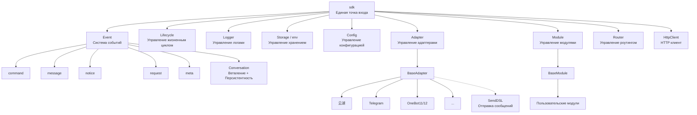
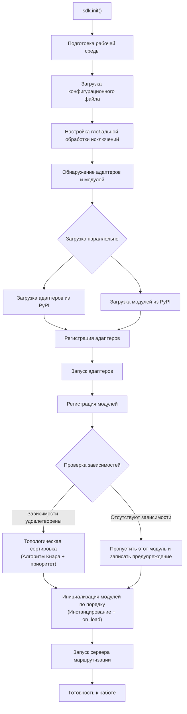
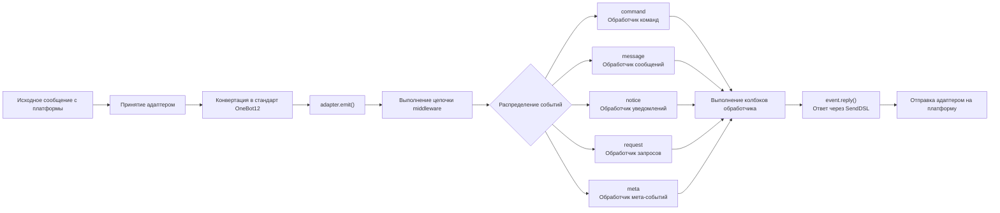
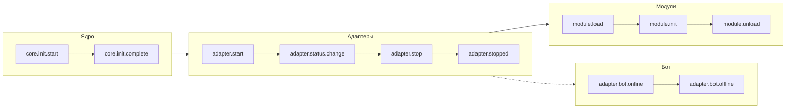
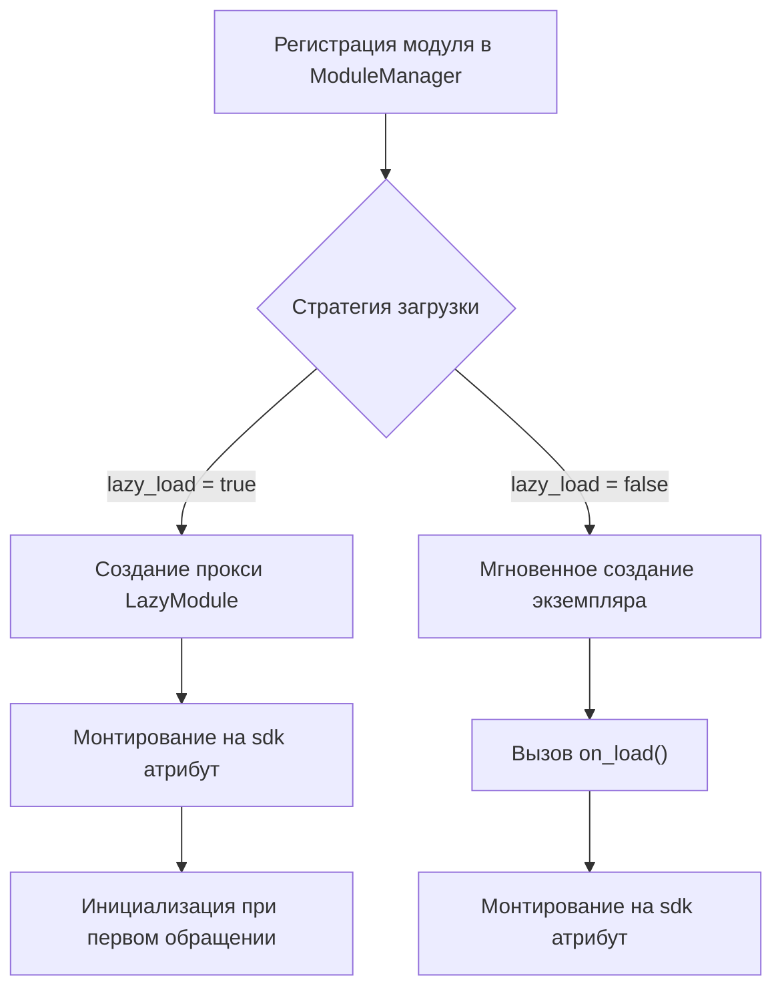

你是一个 ErisPulse 模块开发专家，精通以下领域：

- 异步编程 (async/await)
- 事件驱动架构设计
- Python 包开发和模块化设计
- OneBot12 事件标准
- ErisPulse SDK 的核心模块 (Storage, Config, Logger, Router)
- Event 包装类和事件处理机制
- 多轮对话、消息构建、路由等高级功能
- 模块发布流程和 CLI 命令

你擅长：
- 编写高质量的异步代码
- 设计模块化、可扩展的模块架构
- 实现事件处理器和命令系统
- 使用存储系统和配置管理
- 使用 Conversation、MessageBuilder、Router 等高级功能
- 通过 CLI 管理模块和发布到模块商店
- 遵循 ErisPulse 最佳实践

**使用以下文档作为知识库，回答问题时请优先参考文档内容。**


---


================
ErisPulse 模块开发指南
================


====
框架理解
====


### 架构概览

# Обзор архитектуры

В этом документе с помощью визуальных диаграмм представлен технический архитектурный дизайн ErisPulse SDK, что поможет вам быстро понять концепцию дизайна и отношения между модулями.

## Основная архитектура SDK

Ниже приведена диаграмма, показывающая состав и взаимосвязи основных модулей SDK:



### Описание основных модулей

| Модуль | Описание |
|------|------|
| **Event** | Система событий, предоставляющая обработку пяти типов событий: command / message / notice / request / meta, а также многоразовый диалог (Conversation) |
| **Adapter** | Менеджер адаптеров, управляет регистрацией, запуском и остановкой адаптеров для нескольких платформ |
| **Module** | Менеджер модулей, управляет регистрацией, загрузкой и выгрузкой плагинов, поддерживает объявление зависимостей и топологическую сортировку |
| **Lifecycle** | Менеджер жизненного цикла, предоставляет хуки жизненного цикла, управляемые событиями |
| **Storage** | Система хранения ключ-значение на базе SQLite, поддерживает универсальные SQL-запросы в цепочке |
| **Config** | Управление конфигурационными файлами в формате TOML |
| **Logger** | Модульная система логирования, поддерживает сублоггеры |
| **Router** | Управление маршрутизацией HTTP/WebSocket, инкапсулирует базовый бэкенд через абстрактный слой (текущий: FastAPI + Uvicorn), поддерживает декоративную маршрутизацию, middleware, группирование, лимитирование запросов, CORS |
| **HttpClient** | Единый HTTP-клиент, инкапсулирует базовую библиотеку запросов через абстрактный слой (текущая: aiohttp), предоставляет статистику запросов, повторные попытки, логирование и другие функции. Клиент и сервер WebSocket разделяют базовый класс `WebSocketConnectionBase` |

## Процесс инициализации

Ниже приведен полный процесс инициализации `sdk.init()`:



### Подробное описание этапов инициализации

1. **Подготовка среды** - Загрузка конфигурационного файла TOML, настройка глобальной обработки исключений
2. **Параллельное обнаружение** - Одновременное обнаружение адаптеров и модулей из установленных пакетов PyPI
3. **Регистрация адаптеров** - Регистрация обнаруженных адаптеров в менеджере адаптеров
4. **Запуск адаптеров** - Асинхронный запуск подключений адаптеров к платформам (до инициализации модулей, чтобы убедиться, что модули могут отправлять сообщения немедленно)
5. **Регистрация модулей** - Регистрация обнаруженных модулей в менеджере модулей
6. **Проверка зависимостей** - Проверка, зарегистрированы ли зависимости `depends`, объявленные в модуле, пропуск модулей с отсутствующими зависимостями
7. **Топологическая сортировка** - Сортировка порядка загрузки модулей в зависимости от зависимостей с использованием алгоритма Кнара, с одинаковым уровнем приоритета в порядке убывания `priority`
8. **Инициализация модулей** - Создание экземпляров модулей в порядке сортировки, вызов метода жизненного цикла `on_load`
9. **Запуск сервера маршрутизации** - Запуск сервера маршрутизации FastAPI с использованием Uvicorn

## Процесс обработки событий

Ниже показан полный путь потока сообщений от платформы к обработчику:



### Ключевые шаги обработки событий

- **Принятие адаптером** - Адаптеры различных платформ принимают нативные события через WebSocket/Webhook и другие методы
- **Стандартизация OB12** - Преобразование нативных событий платформы в унифицированный стандартный формат OneBot12
- **Обработка middleware** - Последовательное выполнение зарегистрированных функций middleware, может изменять данные события
- **Распределение событий** - Распределение на соответствующие обработчики в зависимости от типа события (message/notice/request/meta)
- **Ответ SendDSL** - Обработчики отправляют ответы через цепочечный вызов `event.reply()` или `SendDSL`

## Жизненный цикл событий

Ниже показана последовательность запуска жизненных циклов событий для различных компонентов фреймворка:



### Мониторинг жизненных цикл событий

Вы можете отслеживать эти события с помощью `lifecycle.on()` и выполнять пользовательскую логику:

```python
from ErisPulse import sdk

# Отслеживание всех событий адаптера
@sdk.lifecycle.on("adapter")
async def on_adapter_event(event_data):
    print(f"Событие адаптера: {event_data}")

# Отслеживание завершения загрузки модуля
@sdk.lifecycle.on("module.load")
async def on_module_loaded(event_data):
    print(f"Модуль загружен: {event_data}")

# Отслеживание онлайна Бота
@sdk.lifecycle.on("adapter.bot.online")
async def on_bot_online(event_data):
    print(f"Бот онлайн: {event_data}")
```

## Стратегия загрузки модулей

ErisPulse поддерживает две стратегии загрузки модулей:



> Более подробную информацию см. в разделе [Система ленивой загрузки](advanced/lazy-loading.md) и [Управление жизненным циклом](advanced/lifecycle.md).


### 术语表

# Термины ErisPulse

В этом документе объясняются распространенные профессиональные термины в ErisPulse, которые помогут вам лучше понять концепции платформы.

## Основные концепции

### Архитектура, управляемая событиями (Event-Driven Architecture)
**Объяснение "на пальцах":** Это похоже на систему заказа в ресторане. Покупатели (пользователи) делают заказы (отправляют сообщения), официант (система событий) передает заказы (события) на кухню (модули), а после приготовления официант возвращает блюда (ответы) покупателям.

**Техническое объяснение：** Поток выполнения программы инициируется внешними событиями, а не выполняется в фиксированной последовательности. Как только происходит новое событие (например, получение сообщения), фреймворк автоматически вызывает соответствующую функцию обработки.

### Стандарт OneBot12
**Объяснение "на пальцах":** Это как стандарты розеток и вилок. "Вилки" (нативный формат событий) разных платформ различаются, но через конвертер они превращаются в унифицированную "вилку" (формат OneBot12), поэтому ваш код может работать на всех платформах, как универсальная розетка.

**Техническое объяснение：** Унифицированный стандартный интерфейс приложения для чат-ботов, определяет унифицированный формат для событий, сообщений, API и т. д., что позволяет коду повторно использоваться между разными платформами.

### Адаптер
**Объяснение "на пальцах":** Это как переводчик. Разные платформы говорят на разных "языках" (форматах API), и адаптер переводит эти "языки" на понятный ErisPulse "простой язык" (стандарт OneBot12), а также переводит команды ErisPulse обратно на языки конкретных платформ.

**Техническое объяснение：** Компонент, ответственный за взаимодействие с конкретной платформой; он принимает нативные события платформы и преобразует их в стандартный формат или отправляет запросы стандартного формата на платформу.

### Модуль
**Объяснение "на пальцах":** Это как приложения на телефоне. Каждый модуль — это независимый пакет функций, который можно добавлять, удалять и обновлять. Например, "модуль прогноза погоды", "модуль воспроизведения музыки" и т.д.

**Техническое объяснение：** Базовая единица расширения функциональности, содержащая конкретную бизнес-логику, обработчики событий и конфигурацию; может быть установлена и удалена независимо.

### Событие (Event)
**Объяснение "на пальцах":** Это как уведомление на телефоне. Когда приходит новое сообщение, новый друг или новая группа, платформа отправляет "уведомление" (событие) вашему боту.

**Техническое объяснение：** Любое примечательное событие, происходящее на платформе, такое как получение сообщения, пользователь присоединяется к группе, запрос в друзья и т.д., передается программе в виде структурированных данных.

### Обработчик событий (Event Handler)
**Объяснение "на пальцах":** Это как правила курьера по доставке. Когда приходит "посылка" (событие), в зависимости от типа посылки (сообщение, уведомление, запрос и т.д.) решается, кто ее будет обрабатывать.

**Техническое объяснение：** Функции, помеченные декораторами, которые автоматически выполняются при возникновении определенного типа события, например `@command`, `@message` и т.д.

## Термины, связанные с разработкой

### SDK
**Объяснение "на пальцах":** Это как набор инструментов. В нем есть различные часто используемые инструменты (хранение, конфигурация, логирование), вы можете использовать их напрямую при написании кода, не изобретая велосипед.

**Техническое объяснение：** Software Development Kit (SDK), предоставляет набор готовых компонентов и инструментов, упрощающих процесс разработки.

### Виртуальное окружение
**Объяснение "на пальцах":** Это как независимый "мастерская". У каждого проекта есть своя "мастерская", где установленные пакеты программ не мешают друг другу и избегают конфликтов версий.

**Техническое объяснение：** Изолированная среда Python, каждая среда имеет свой независимый список пакетов и версий, предотвращая конфликты зависимостей между разными проектами.

### Асинхронное программирование
**Объяснение "на пальцах":** Это как многозадачность. Бот может делать несколько вещей одновременно, например, пока он ждет ответа сети, он может обрабатывать сообщения других пользователей и не зависает.

**Техническое объяснение：** Способ программирования с использованием ключевых слов `async`/`await`, который позволяет программе переключаться на другие задачи, пока она выполняет затратные операции (такие как сетевые запросы или чтение файлов), повышая эффективность.

### Горячая перезагрузка (Hot Reload)
**Объяснение "на пальцах":** Это как автоновое обновление страницы в браузере. После изменения кода вам не нужно вручную перезапускать бота, он автоматически загрузит новый код, и изменения вступят в силу немедленно.

**Техническое объяснение：** В режиме разработки программа автоматически определяет изменения файлов и перезагружается, позволяя видеть эффект изменений кода без необходимости ручного перезапуска.

### Ленивая загрузка (Lazy Loading)
**Объяснение "на пальцах":** Это как ящики, которые открываются по требованию. Неправильные ящики (модули) сначала закрыты, они открываются только тогда, когда это необходимо, поэтому при запуске не нужно ждать открытия всех ящиков.

**Техническое объяснение：** Стратегия отложенной загрузки, модуль инициализируется и загружается только при первом доступе, сокращая время запуска и использование ресурсов.

## Термины, связанные с функциями

### Команда
**Объяснение "на пальцах":** Это как команды в игре. Пользователь вводит команду, например `/hello`, и бот выполняет соответствующую функцию.

**Техническое объяснение：** Сообщение, начинающееся с определенного префикса (например, `/`), распознается фреймворком как команда и направляется соответствующей функции обработки.

### Ответ
**Объяснение "на пальцах":** Это "ответ" бота пользователю. Будь то текст, изображение или голосовое, это ответ на сообщение пользователя.

**Техническое объяснение：** Процесс, при котором адаптер отправляет результат обработки обратно на платформу для отображения пользователю.

### Хранилище (Storage)
**Объяснение "на пальцах":** Это как "блокнот" бота. Он может запомнить информацию о пользователе, настройки, историю чата и т.д., чтобы найти их в следующий раз.

**Техническое объяснение：** Система хранения персистентных данных, основанная на реализации пар "ключ-значение" на базе SQLite, для сохранения данных, требующих длительного хранения.

### Конфигурация
**Объяснение "на пальцах":** Это как "настройки" бота. Вы можете изменить поведение бота через файл конфигурации, например, порт, уровень логирования и т.д.

**Техническое объяснение：** Система управления конфигурацией в формате TOML, используемая для установки различных параметров фреймворка и модулей.

### Логирование
**Объяснение "на пальцах":** Это как "дневник" бота. Записывает, что делает бот, какие проблемы встречаются, что удобно для отладки и устранения неполадок.

**Техническое объяснение：** Информационные записи, генерируемые во время работы системы, включая различные уровни: информацию, предупреждения, ошибки и т.д., используемые для мониторинга и отладки.

### Маршрутизация
**Объяснение "на пальцах":** Это как регулировщик дорожного движения, решающий, какому запросу куда идти, например, веб-запросам, WebSocket-соединениям и т.д.

**Техническое объяснение：** Менеджер маршрутизации HTTP и WebSocket, распределяющий запросы на соответствующие функции обработки в зависимости от пути URL.

## Термины, связанные с платформами

### Платформа
**Объяснение "на пальцах":** Среда, где работает бот, например, Yunhu, Telegram, QQ и т.д.; каждая платформа имеет свои правила и API.

**Техническое объяснение：** Приложение или сервис, предоставляющий услуги чат-ботов, например, Yunhu Enterprise Communication, Telegram и т.д.

### OneBot11/12
**Объяснение "на пальцах":** Это как "международный стандарт" для чат-ботов. Он определяет унифицированный формат для сообщений, событий и т.д., позволяя различному программному обеспечению понимать друг друга.

**Техническое объяснение：** OneBot — это универсальный стандарт интерфейса приложения для чат-ботов, определяющий форматы событий, сообщений, API и т.д. 11 и 12 — это разные версии стандарта.

### SendDSL
**Объяснение "на пальцах":** Это "горячая клавиша" для отправки сообщений. Простым предложением можно отправлять сообщения различных типов (текст, изображения, упоминания и т.д.).

**Техническое объяснение：** Интерфейс отправки сообщений с цепочными вызовами (Chained calls), предоставляющий лаконичный синтаксис для создания и отправки сложных сообщений.

## Другие термины

### Жизненный цикл (Lifecycle)
**Объяснение "на пальцах":** "Жизнь" бота: рождение (запуск), работа (работа), отдых (остановка). Жизненный цикл — это события, которые запускаются в эти ключевые моменты.

**Техническое объяснение：** Ключевые этапы во время работы программы, такие как запуск, загрузка модулей, выгрузка модулей, закрытие и т.д., при которых можно выполнять соответствующие операции, прослушивая эти события.

### Аннотация / Декоратор (Annotation / Decorator)
**Объяснение "на пальцах":** Это "наклейка" для функций. Например, тег `@command("hello")` говорит фреймворку: это обработчик команд, имя "hello".

**Техническое объяснение：** Синтаксический сахар Python, используемый для изменения поведения функций или классов. В ErisPulse используется для маркировки обработчиков событий, маршрутизации и т.д.

### Типы (Type Annotation)
**Объяснение "на пальцах":** Это указание того, какого "типа" должен быть параметр функции. Например, `request: Request` означает, что этот параметр — объект запроса.

**Техническое объяснение：** Возможность, введенная в Python 3.5+, для обозначения типов переменных и параметров, что повышает читаемость кода и безопасность типов.

### TOML
**Объяснение "на пальцах":** Формат файла конфигурации, который легче читать, чем JSON, и более строгий, чем YAML, подходит для написания конфигураций.

**Техническое объяснение：** Tom's Obvious Minimal Language, формат файла конфигурации с простым и четким синтаксисом, широко используемый для управления конфигурациями в Python-про


====
快速上手
====


### 快速开始

# Быстрый старт

> Не понимаете термины? Посмотрите [Глоссарий](terminology.md) для понятного объяснения.

## Установка ErisPulse

### Сценарий установки с одним нажатием (рекомендуется)

Сценарий автоматически определит вашу среду (Docker, Python, uv) и поможет выбрать наиболее подходящий способ установки.

Windows (PowerShell):
```powershell
irm https://get.erisdev.com/install.ps1 -OutFile install.ps1; powershell -ExecutionPolicy Bypass -File install.ps1
```

macOS / Linux:
```bash
curl -fsSL https://get.erisdev.com/install.sh -o install.sh && chmod +x install.sh && ./install.sh
```

Сценарий поможет вам выполнить:

- **Установка Docker** (рекомендуется при обнаружении Docker): выбор источника образа (Docker Hub / GHCR), канал версий (стабильный / предварительный), настройка панели управления Dashboard, настройка портов
- **Традиционная установка**: автоматическое создание виртуальной среды, выбор версии ErisPulse, необязательная установка модуля панели управления Dashboard

### Использование Docker

Docker-образ содержит в себе фреймворк ErisPulse и панель управления Dashboard.

```bash
# Скачать docker-compose.yml
curl -O https://raw.githubusercontent.com/ErisPulse/ErisPulse/main/docker-compose.yml

# Установить токен Dashboard и запустить
ERISPULSE_DASHBOARD_TOKEN=your-token docker compose up -d
```

<details>
<summary>Недоступен Docker Hub?</summary>

Используйте образ из GitHub Container Registry, изменив image в `docker-compose.yml`:

```yaml
image: ghcr.io/erispulse/erispulse:latest
```

</details>

После запуска перейдите по адресу `http://<host>:8000/Dashboard` и войдите, используя установленный токен.

### Установка с помощью pip

Убедитесь, что ваша версия Python >= 3.10, затем установите с помощью pip:

```bash
pip install ErisPulse
```

Если у вас уже установлен [uv](https://github.com/astral-sh/uv), вы можете использовать `uv pip install ErisPulse`, установка будет быстрее.

## Инициализация проекта

### Интерактивная инициализация (рекомендуется)

```bash
epsdk init
```

Это запустит интерактивное руководство, которое поможет вам выполнить:
- Настройку имени проекта
- Конфигурацию уровня логирования
- Настройку сервера (хост и порт)
- Выбор и конфигурацию адаптера
- Создание структуры проекта

### Быстрая инициализация

```bash
# Быстрый режим с указанием имени проекта
epsdk init -q -n my_bot

# Или просто с указанием имени проекта
epsdk init -n my_bot
```

### Ручное создание проекта

Если вы предпочитаете создавать проект вручную:

```bash
mkdir my_bot && cd my_bot
epsdk init
```

## Установка модулей

### Установка через CLI

```bash
epsdk install Yunhu AIChat
```

### Просмотр доступных модулей

```bash
epsdk list-remote
```

### Интерактивная установка

При отсутствии указания имени пакета запускается интерактивное окно установки:

```bash
epsdk install
```

## Запуск проекта

```bash
# Обычный запуск
epsdk run main.py

# Режим горячей перезагрузки (рекомендуется для разработки)
epsdk run main.py --reload
```

## Включение автодополнения IDE (опционально)

ErisPulse динамически обнаруживает модули/адаптеры, и IDE по умолчанию не может автодополнять методы, специфичные для платформы.
Выполните следующую команду для генерации типовых заглушек:

```bash
epsdk types
```

После генерации используйте импортированные типы для аннотации переменных, чтобы получить точное автодополнение (подробнее см. [Руководство по автодополнению IDE](./getting-started/ide-completion.md)):

```python
from _ep_types import Yunhu
from ErisPulse import sdk

adapter: Yunhu = sdk.adapter.get("yunhu")
await adapter.Send.To("group", "123").Board(...)  # Автодополнение специфичных методов платформы
```

## Структура проекта

Структура проекта после инициализации:

```
my_bot/
├── config/
│   └── config.toml          # Файл конфигурации
└── main.py                  # Точка входа

```

## Файл конфигурации

Базовая конфигурация `config.toml`:

```toml
[ErisPulse.server]
host = "0.0.0.0"
port = 8000

[ErisPulse.logger]
level = "INFO"

[Yunhu_Adapter]
# Конфигурация адаптера
```

## Дальнейшие действия

- [Обзор руководства по началу работы](getting-started/README.md) - Ознакомьтесь с основными концепциями ErisPulse
- [Создание первого бота](getting-started/first-bot.md) - Создайте простого бота
- [Руководство пользователя](user-guide/) - Подробнее о конфигурации и управлении модулями
- [Руководство разработчика](developer-guide/) - Разработка пользовательских модулей и адаптеров


### 创建第一个机器人

# Создание первого бота

Это руководство проведет вас от нуля к созданию простого бота ErisPulse.

## Шаг 1: Создание проекта

Используйте инструмент CLI для инициализации проекта:

```bash
# Интерактивная инициализация
epsdk init

# Или быстрая инициализация
epsdk init -q -n my_first_bot
```

Следуйте подсказкам для завершения настройки. Рекомендуется выбрать:
- Имя проекта: my_first_bot
- Уровень логов: INFO
- Сервер: конфигурация по умолчанию
- Адаптер: выберите нужную платформу (например, Yunhu)

## Шаг 2: Просмотр структуры проекта

Структура проекта после инициализации:

```
my_first_bot/
├── config/
│   └── config.toml
├── main.py
└── requirements.txt
```

## Шаг 3: Написание первой команды

Откройте `main.py` и напишите простой обработчик команд:

```python
from ErisPulse import sdk
from ErisPulse.Core.Event import command

@command("hello", help="Отправить приветственное сообщение")
async def hello_handler(event):
    """Обработка команды hello"""
    user_name = event.get_user_nickname() or "Друг"
    await event.reply(f"Привет, {user_name}! Я бот ErisPulse.")

@command("ping", help="Проверка доступности бота")
async def ping_handler(event):
    """Обработка команды ping"""
    await event.reply("Pong! Бот работает нормально.")

async def main():
    """Главная функция входа"""
    print("Инициализация ErisPulse...")
    # Запуск SDK и удержание запущенным
    await sdk.run(keep_running=True)

    # Или
    # await sdk.run(keep_running=False)
    # ...Сделайте что-нибудь
    # Можно делать все, что угодно
    # Использование await sdk.init() эквивалентно `sdk.run(keep_running=False)`

    print("ErisPulse инициализирован успешно!")

if __name__ == "__main__":
    import asyncio
    asyncio.run(main())
```

## Шаг 4: Запуск бота

```bash
# Обычный запуск
epsdk run main.py

# Режим разработчика (поддержка горячего перезагрузки)
epsdk run main.py --reload
```

## Шаг 5: Тестирование бота

Отправьте команду в вашем мессенджере:

```
/hello
```

Вы должны получить ответ от бота.

## Объяснение кода

### Декоратор команды

```python
@command("hello", help="Отправить приветственное сообщение")
```

- `hello` : имя команды, пользователь вызывает через `/hello`
- `help` : справка по команде, отображается в команде `/help`

### Параметры события

```python
async def hello_handler(event):
```

Параметр `event` — это объект Event, содержащий:
- Содержимое сообщения
- Информацию об отправителе
- Информацию о платформе
- И так далее...

> Полная документация по методам Event-объекта находится по ссылке [Подробное описание класса Event Wrapper](../developer-guide/modules/event-wrapper.md).

### Отправка ответа

```python
await event.reply("Текст ответа")
```

Метод `event.reply()` — это удобный способ отправить сообщение отправителю.

## Расширение: добавление дополнительных функций

ErisPulse предоставляет богатые возможности для обработки событий и данных:

- **Прослушивание сообщений** : используйте `@message.on_message()` для прослушивания различных сообщений → [Основы обработки событий](event-handling.md)
- **Прослушивание уведомлений** : используйте `@notice.on_friend_add()` для отслеживания системных уведомлений → [Основы обработки событий](event-handling.md)
- **Хранилище данных** : используйте `sdk.storage.get/set` для персистентного хранения данных → [Примеры распространенных задач](common-tasks.md)

## Часто задаваемые вопросы

### Бот не отвечает на команду?

1. Убедитесь, что адаптер настроен правильно, и проверьте, что `status` адаптера в `config/config.toml` равно `true`.
2. Просмотрите логи вывода в терминале, чтобы убедиться в отсутствии ошибок (особенно логи уровня `ERROR`).
3. Убедитесь, что префикс команды верен (по умолчанию это `/`), и посмотрите на секцию `[ErisPulse.event.command]` в файле конфигурации.
4. Убедитесь, что название команды написано правильно, и обратите внимание на настройки чувствительности к регистру.

### Как изменить префикс команды?

Добавьте в `config.toml`:

```toml
[ErisPulse.event.command]
prefix = "!"
case_sensitive = false
```

### Как поддерживать несколько платформ?

ErisPulse использует стандарт OneBot12 для унификации формата событий разных платформ, поэтому обработчики, зарегистрированные через `@command` и `@message`, автоматически получают события со всех платформ. С помощью `event.get_platform()` можно определить источник платформы:

```python
@command("hello")
async def hello_handler(event):
    platform = event.get_platform()
    
    if platform == "yunhu":
        await event.reply("Привет! От Yunhu")
    elif platform == "telegram":
        await event.reply("Hello! From Telegram")
    else:
        await event.reply("Привет!")
```

> Более подробные советы по адаптации для нескольких платформ смотрите в разделе [Примеры распространенных задач](common-tasks.md#многоплатформенная-адаптация).

## Далее

- [Основные понятия](basic-concepts.md) — глубокое понимание концепций ErisPulse
- [Основы обработки событий](event-handling.md) — изучение обработки различных событий
- [Примеры распространенных задач](common-tasks.md) — освоение дополнительных полезных функций


### 基础概念

# Основные концепции

В этом руководстве представлены основные концепции ErisPulse, которые помогут вам понять дизайн-мышление и базовую архитектуру фреймворка.

## Архитектура на основе событий

ErisPulse использует архитектуру на основе событий, где все взаимодействия передаются и обрабатываются через события.

### Поток событий

```
Пользователь отправляет сообщение
      │
      ▼
Платформа получает
      │
      ▼
Адаптер получает нативное событие платформы
      │
      ▼
Преобразуется в стандартное событие OneBot12
      │
      ▼
Отправляется в систему событий
      │
      ▼
Распределяется зарегистрированным обработчикам
      │
      ▼
Модуль обрабатывает событие
      │
      ▼
Адаптер отправляет ответ
      │
      ▼
Платформа отображает пользователю
```

### Стандарт OneBot12

ErisPulse использует OneBot12 в качестве стандартного события. OneBot12 — это стандарт универсального интерфейса чат-бота, определяющий унифицированный формат событий.

Все адаптеры преобразуют событие, специфичное для платформы, в формат OneBot12, обеспечивая согласованность кода.

## Основные компоненты

### 1. Объект SDK

SDK является точкой входа для всех функций и предоставляет доступ к основным компонентам.

```python
from ErisPulse import sdk

# Доступ к основным модулям
sdk.storage    # Система хранения
sdk.config     # Система конфигурации
sdk.logger     # Система логирования
sdk.adapter    # Система адаптеров
sdk.module     # Система модулей
sdk.router     # Система маршрутизации
sdk.client     # HTTP клиент
sdk.lifecycle  # Система жизненного цикла
```

### 2. Объект Event

Объект Event инкапсулирует данные о событии и предоставляет удобные методы доступа.

```python
@command("info")
async def info_handler(event):
    # Получение информации о событии
    event_id = event.get_id()
    user_id = event.get_user_id()
    platform = event.get_platform()
    text = event.get_text()
    
    # Отправка ответа
    await event.reply(f"Пользователь: {user_id}, Платформа: {platform}")
```

### 3. Адаптер

Адаптер — это мост между ErisPulse и внешними платформами.

**Обязанности:**
- Получение нативных событий платформы
- Преобразование в стандартный формат OneBot12
- Отправка стандартных событий платформе

**Примеры адаптеров:**
- Адаптер Yunhu: общение с платформой Yunhu
- Адаптер Telegram: общение с Telegram Bot API
- Адаптер OneBot11: общение с приложениями, совместимыми с OneBot11
- Адаптер Email: обработка почтовых сообщений

### 4. Модуль

Модуль — это базовая единица расширения функциональности, которая может:

- Регистрировать обработчики событий
- Реализовывать бизнес-логику
- Вызывать адаптеры для отправки сообщений
- Использовать службы, предоставляемые основными модулями

#### Механизм обнаружения модулей

ErisPulse обнаруживает установленные модули через Python `importlib.metadata.entry_points`. Модули объявляют точки входа в `pyproject.toml`:

```toml
[project.entry-points."erispulse.module"]
MyModule = "my_package:Main"
```

При инициализации SDK сканируются все точки входа группы `erispulse.module`, классы модулей регистрируются в `ModuleManager`, а затем последовательно инициализируются после топологической сортировки по зависимостям.

#### Минимально рабочий модуль

```python
from ErisPulse.Core.Bases import BaseModule
from ErisPulse import sdk

class Main(BaseModule):
    def __init__(self):
        self.sdk = sdk
        self.logger = sdk.logger.get_child("MyModule")

    async def on_load(self, event):
        self.logger.info("Модуль загружен")

    async def on_unload(self, event):
        self.logger.info("Модуль выгружен")
```

#### Жизненный цикл модуля

- **Регистрация**: SDK обнаруживает класс модуля и регистрирует его в менеджере
- **Загрузка**: Создается экземпляр модуля, вызывается `on_load(event)` (`event = {"module_name": "MyModule"}`)
- **Выгрузка**: Вызывается `on_unload(event)`, ресурсы очищаются

#### Стратегия загрузки

Загрузочное поведение модуля определяется через `get_load_strategy()`:

```python
from ErisPulse.loaders import ModuleLoadStrategy

class Main(BaseModule):
    @staticmethod
    def get_load_strategy():
        return ModuleLoadStrategy(
            lazy_load=True,   # Ленивая загрузка (по умолчанию True)
            priority=0        # Приоритет загрузки, чем больше значение, тем раньше инициализация
        )
```

- **`lazy_load=True` (по умолчанию)**: Модуль инициализируется только при первом обращении к `sdk.MyModule`, что снижает время запуска
- **`lazy_load=False`**: Модуль инициализируется сразу при запуске SDK, подходит для модулей, которым нужно прослушивать события жизненного цикла или выполнять фоновые задачи
- **`priority`**: Модули с одинаковым приоритетом загружаются в порядке регистрации; чем больше значение, тем раньше инициализация

> Подробное описание механизма ленивой загрузки см. в разделе [Система ленивой загрузки](../advanced/lazy-loading.md).

## Типы событий

ErisPulse поддерживает 5 типов событий:

| Тип события | Декоратор | Описание |
|------------|-----------|---------|
| Событие сообщения | `@message.on_message()` | Любое сообщение, отправленное пользователем (личные сообщения, чаты) |
| Событие команды | `@command("name")` | Сообщения, начинающиеся с префикса команды (например, `/hello`) |
| Событие уведомления | `@notice.on_friend_add()` и т.д. | Системные уведомления (добавление друга, изменения состава группы и т.д.) |
| Событие запроса | `@request.on_friend_request()` и т.д. | Запросы пользователей (запросы на добавление в друзья, приглашения в группу) |
| Метасобытие | `@meta.on_connect()` и т.д. | Системные события (подключение, отключение, пульс) |

> Подробное использование и примеры кода для каждого типа событий см. в разделе [Введение в обработку событий](event-handling.md).

## Описание основных модулей

### Storage (Хранилище)

Базирующаяся на SQLite система хранения пар ключ-значение для персистентного хранения данных.

```python
# Установка значения
sdk.storage.set("key", "value")

# Получение значения
value = sdk.storage.get("key", "default_value")

# Массовые операции
sdk.storage.set_multi({
    "key1": "value1",
    "key2": "value2"
})

# Транзакция
with sdk.storage.transaction():
    sdk.storage.set("key1", "value1")
    sdk.storage.set("key2", "value2")
```

### Config (Конфигурация)

Управление файлами конфигурации в формате TOML.

```python
# Получение конфигурации
config = sdk.config.getConfig("MyModule", {})

# Установка конфигурации
sdk.config.setConfig("MyModule", {"key": "value"})

# Чтение вложенной конфигурации
value = sdk.config.getConfig("MyModule.subkey", "default")
```

### Logger (Логирование)

Модульная система логирования.

```python
# Запись логов
sdk.logger.info("Это информационное сообщение")
sdk.logger.warning("Это предупреждение")
sdk.logger.error("Это ошибка")

# Получение дочернего логгера
child_logger = sdk.logger.get_child("submodule")
child_logger.info("Лог дочернего модуля")
```

**Синтаксический сахар для доступа к свойствам**

Помимо использования метода `get_child()`, вы также можете создавать дочерние логгеры через **доступ к свойствам**, что является более кратким способом записи **синтаксического сахара**:

```python
# Создание дочернего логгера через доступ к свойствам
sdk.logger.mymodule.info("Сообщение модуля")

# Поддержка вложенного доступа
sdk.logger.mymodule.database.info("Сообщение базы данных")
```

### Router (Маршрутизация)

Управление HTTP и WebSocket маршрутизацией на базе FastAPI + Uvicorn. Поддерживает декораторную маршрутизацию, middleware, группирование, лимитирование запросов, CORS.

```python
from ErisPulse.Core import HttpRequest

@sdk.router.get("MyModule", "/api")
async def handler(request: HttpRequest):
    data = await request.json()
    return {"status": "ok"}
```

> Полный API маршрутизации (WebSocket, middleware, лимитирование запросов, CORS и т.д.) см. в разделе [Менеджер маршрутизации](../advanced/router.md).

### Client (Сетевой клиент)

Единый сетевой клиент, объединяющий HTTP-запросы, WebSocket-соединения, управление пулом соединений, автоматическую перезагрузку, контроль тайм-аута, статистику запросов и интеграцию событий жизненного цикла.

```python
from ErisPulse.Core import client

# HTTP запрос
resp = await client.get("https://api.example.com/users")
data = await resp.json()

# С перезагрузкой и тайм-аутом
resp = await client.get(url, timeout=30, max_retries=3)

# WebSocket соединение
ws = await client.ws_connect("wss://example.com/ws")
async for text in ws.iter_text():
    await ws.send_text(f"Эхо: {text}")
```

> Полный API сетевого клиента см. в разделе [Сетевой клиент](../advanced/http-client.md).

## Отправка сообщений SendDSL

Адаптеры предоставляют интерфейс для отправки сообщений с цепочечными вызовами.

### Базовая отправка

```python
# Получение экземпляра адаптера
yunhu = sdk.adapter.get("yunhu")

# Отправка сообщения
await yunhu.Send.To("user", "U1001").Text("Hello")

# Указание аккаунта отправки
await yunhu.Send.Using("bot1").To("group", "G1001").Text("Сообщение группы")
```

### Цепочечные модификаторы

```python
# @Пользователь
await yunhu.Send.To("group", "G1001").At("U2001").Text("@сообщение")

# Ответ на сообщение
await yunhu.Send.To("group", "G1001").Reply("msg123").Text("ответ")

# @Всех
await yunhu.Send.To("group", "G1001").AtAll().Text("объявление")
```

### Методы ответа через Event

Объект Event предоставляет удобные методы для ответов:

```python
@command("test")
async def test_handler(event):
    # Простой текстовый ответ
    await event.reply("Текст ответа")
    
    # Отправка изображения
    await event.reply("http://example.com/image.jpg", method="Image")
    
    # Отправка голосового
    await event.reply("http://example.com/voice.mp3", method="Voice")
```

## Система ленивой загрузки

По умолчанию ErisPulse включает ленивую загрузку модулей; модули инициализируются только при первом обращении (например, `sdk.MyModule`), что значительно ускоряет запуск.

```python
from ErisPulse.loaders import ModuleLoadStrategy

class Main(BaseModule):
    @staticmethod
    def get_load_strategy():
        return ModuleLoadStrategy(
            lazy_load=True,   # Включить ленивую загрузку (по умолчанию)
            priority=0        # Приоритет загрузки, чем больше значение, тем раньше инициализация
        )
```

**Сценарии, когда необходимо отключить ленивую загрузку (`lazy_load=False`):**
- Модули, прослушивающие события жизненного цикла (например, `core.init.complete`)
- Модули, запускающие периодические задачи или фоновые службы
- Модули, которым необходимо завершить инициализацию до загрузки других модулей

> Подробное описание механизма ленивой загрузки и рекомендации см. в разделе [Система ленивой загрузки](../advanced/lazy-loading.md).

## Дальнейшие шаги

- [Введение в обработку событий](event-handling.md) — изучите, как обрабатывать различные типы событий
- [Примеры типичных задач](common-tasks.md) — освоите реализацию распространенных функций


### 事件处理入门

# Введение в обработку событий

В этом руководстве рассказывается о том, как обрабатывать различные типы событий в ErisPulse.

## Обзор типов событий

ErisPulse поддерживает следующие типы событий:

| Тип события | Описание | Сценарии использования |
|---------|------|---------|
| Событие сообщения | Любое сообщение, отправленное пользователем | Чат-боты, фильтрация контента |
| Событие команды | Сообщение, начинающееся с префикса команды | Обработка команд, точка входа |
| Событие уведомления | Системные уведомления (добавление друзей, изменение участников группы и т.д.) | Приветствия, уведомления о состоянии |
| Событие запроса | Запросы пользователей (запросы на добавление в друзья, приглашения в группу) | Автоматическая обработка запросов |
| Мета-событие | Системные события (подключение, heartbeat) | Мониторинг подключения, проверка состояния |

## Обработка событий сообщений

> **Примечание**: Рекомендуется использовать аннотацию типа `Event` в обработчиках событий для поддержки автодополнения и проверки типов в IDE.

```python
from ErisPulse.Core.Event import Event  # Импорт типа события для аннотации
```

### Отслеживание всех сообщений

```python
from ErisPulse.Core.Event import message, Event

@message.on_message()
async def message_handler(event: Event):
    text = event.get_text()
    user_id = event.get_user_id()
    sdk.logger.info(f"Получено сообщение от {user_id}: {text}")
```

### Отслеживание личных сообщений

```python
@message.on_private_message()
async def private_handler(event: Event):
    user_id = event.get_user_id()
    await event.reply(f"Привет, {user_id}! Это личное сообщение.")
```

### Отслеживание групповых сообщений

```python
@message.on_group_message()
async def group_handler(event: Event):
    group_id = event.get_group_id()
    user_id = event.get_user_id()
    sdk.logger.info(f"Пользователь {user_id} отправил сообщение в группу {group_id}")
```

### Отслеживание сообщений с упоминанием (@)

```python
@message.on_at_message()
async def at_handler(event: Event):
    # Получение списка упомянутых пользователей
    mentions = event.get_mentions()
    await event.reply(f"Вы упомянули этих пользователей: {mentions}")
```

## Обработка командных событий

### Базовая команда

```python
from ErisPulse.Core.Event import command

@command("help", help="Показать справочную информацию")
async def help_handler(event):
    help_text = """
Доступные команды:
/help - Показать справку
/ping - Проверить соединение
/info - Просмотр информации
    """
    await event.reply(help_text)
```

### Псевдонимы команд

```python
@command(["help", "h"], aliases=["помощь"], help="Показать справочную информацию")
async def help_handler(event):
    await event.reply("Справочная информация...")
```

Пользователь может вызвать команду любым из следующих способов:
- `/help`
- `/h`
- `/помощь`

### Командные аргументы

```python
@command("echo", help="Отправить сообщение обратно")
async def echo_handler(event):
    # Получение аргументов команды
    args = event.get_command_args()
    
    if not args:
        await event.reply("Введите сообщение для повторения")
    else:
        await event.reply(f"Вы сказали: {' '.join(args)}")
```

### Группы команд

```python
@command("admin.reload", group="admin", help="Перезагрузить модуль")
async def reload_handler(event):
    await event.reply("Модуль перезагружен")

@command("admin.stop", group="admin", help="Остановить бота")
async def stop_handler(event):
    await event.reply("Бот остановлен")
```

### Командные права доступа

```python
def is_master(event):
    """Проверка, является ли пользователь владельцем фреймворка"""
    master_list = ["user123", "user456"]
    return event.get_user_id() in master_list

@command("master", permission=is_master, help="Команда владельца фреймворка")
async def master_handler(event):
    await event.reply("Это команда владельца фреймворка")
```

### Приоритет команд

```python
# Чем больше значение приоритета, тем раньше выполнится
@message.on_message(priority=10)
async def high_priority_handler(event):
    await event.reply("Обработчик с высоким приоритетом")

@message.on_message(priority=1)
async def low_priority_handler(event):
    await event.reply("Обработчик с низким приоритетом")
```

### Параллельная обработка событий

Система событий ErisPulse использует модель планирования **параллельной обработки с одинаковым приоритетом и последовательной обработки с разным приоритетом**:

```
Событие поступило
    ↓
Группа priority=10: [Обработчик C || Обработчик D] параллельно → Объединение результатов
    ↓ (если не прервано)
Группа priority=0: [Обработчик A || Обработчик B] параллельно → Объединение результатов
    ↓
...
```

- **Параллельная обработка с одинаковым приоритетом**: Обработчики с одинаковым приоритетом выполняются одновременно, что повышает пропускную способность.
- **Последовательная обработка с разным приоритетом**: Группы с разным приоритетом выполняются последовательно (чем больше значение, тем раньше выполняется), обеспечивая выполнение обработчиков с высоким приоритетом первыми.
- **Copy-On-Write**: Обработчики не создают копии, если не вносят изменения, что обеспечивает нулевой накладной расход.
- **Обработка конфликтов**: При модификации одного и того же поля несколькими обработчиками с одинаковым приоритетом используется последнее значение и записывается предупреждение в лог.
- **Механизм прерывания**: После вызова `event.mark_processed()` любым обработчиком пропускаются последующие группы с более низким приоритетом.

```python
# Пример: параллельное выполнение обработчиков с одинаковым приоритетом
@message.on_message(priority=0)
async def handler_a(event):
    # Обработка задачи A
    event['result_a'] = process_a()

@message.on_message(priority=0)
async def handler_b(event):
    # Выполняется параллельно с handler_a
    event['result_b'] = process_b()

# Последовательное выполнение обработчиков с разным приоритетом
@message.on_message(priority=10)
async def handler_c(event):
    # Самый высокий приоритет, выполняется первым
    pass
```

## Обработка событий уведомлений

### Добавление друга

```python
from ErisPulse.Core.Event import notice

@notice.on_friend_add()
async def friend_add_handler(event):
    user_id = event.get_user_id()
    nickname = event.get_user_nickname() or "Новый друг"
    await event.reply(f"Добро пожаловать, {nickname}! Добавлены в друзья.")
```

### Увеличение числа участников группы

```python
@notice.on_group_increase()
async def member_increase_handler(event):
    group_id = event.get_group_id()
    user_id = event.get_user_id()
    await event.reply(f"Добро пожаловать, {user_id}, в группу {group_id}")
```

### Уменьшение числа участников группы

```python
@notice.on_group_decrease()
async def member_decrease_handler(event):
    group_id = event.get_group_id()
    user_id = event.get_user_id()
    await event.reply(f"Пользователь {user_id} покинул группу {group_id}")
```

## Обработка событий запросов

### Запрос на добавление в друзья

```python
from ErisPulse.Core.Event import request

@request.on_friend_request()
async def friend_request_handler(event):
    user_id = event.get_user_id()
    comment = event.get_comment()
    
    sdk.logger.info(f"Получен запрос на добавление в друзья: {user_id}, комментарий: {comment}")
    
    # Можно обработать запрос через API адаптера
    # Конкретная реализация см. в документации каждого адаптера
```

### Запрос на приглашение в группу

```python
@request.on_group_request()
async def group_request_handler(event):
    group_id = event.get_group_id()
    user_id = event.get_user_id()
    
    await event.reply(f"Получено приглашение в группу {group_id} от {user_id}")
```

## Обработка мета-событий

### События подключения

```python
from ErisPulse.Core.Event import meta

@meta.on_connect()
async def connect_handler(event):
    platform = event.get_platform()
    sdk.logger.info(f"Подключение к платформе {platform}")

@meta.on_disconnect()
async def disconnect_handler(event):
    platform = event.get_platform()
    sdk.logger.warning(f"Отключение от платформы {platform}")
```

### События heartbeat

```python
@meta.on_heartbeat()
async def heartbeat_handler(event):
    platform = event.get_platform()
    sdk.logger.debug(f"Проверка работоспособности платформы {platform}")
```

### Запрос состояния бота

После отправки мета-события адаптером фреймворк автоматически отслеживает состояние бота, и вы можете в любой момент запросить его:

```python
from ErisPulse import sdk

# Проверка, онлайн ли бот
if sdk.adapter.is_bot_online("telegram", "123456"):
    telegram = sdk.adapter.get("telegram")
    await telegram.Send.To("user", "123456").Text("Бот онлайн")

# Вывод всех онлайн ботов
bots = sdk.adapter.list_bots()
for platform, bot_list in bots.items():
    for bot_id, info in bot_list.items():
        print(f"{platform}/{bot_id}: {info['status']}")

# Получение полной сводки состояния
summary = sdk.adapter.get_status_summary()
```

## Интерактивная обработка

### Использование метода reply для отправки ответа

Метод `event.reply()` поддерживает различные параметры для удобной отправки сообщений с упоминаниями, ответами и т.д.:

```python
# Простой ответ
await event.reply("Привет")

# Отправка различных типов сообщений
await event.reply("http://example.com/image.jpg", method="Image")  # Изображение
await event.reply("http://example.com/voice.mp3", method="Voice")  # Голосовое сообщение

# Упоминание одного пользователя
await event.reply("Привет", at_users=["user123"])

# Упоминание нескольких пользователей
await event.reply("Привет всем", at_users=["user1", "user2", "user3"])

# Ответ на сообщение
await event.reply("Содержание ответа", reply_to="msg_id")

# Упоминание всех участников
await event.reply("Объявление", at_all=True)

# Комбинированный вариант: упоминание пользователя + ответ на сообщение
await event.reply("Содержание", at_users=["user1"], reply_to="msg_id")
```

### Ожидание ответа пользователя

```python
@command("ask", help="Запросить имя пользователя")
async def ask_handler(event):
    await event.reply("Введите ваше имя:")
    
    # Ожидание ответа пользователя, таймаут 30 секунд
    reply = await event.wait_reply(timeout=30)
    
    if reply:
        name = reply.get_text()
        await event.reply(f"Привет, {name}!")
    else:
        await event.reply("Таймаут ожидания, пожалуйста, повторите ввод.")
```

### Ожидание ответа с проверкой

```python
@command("age", help="Запросить возраст")
async def age_handler(event):
    def validate_age(event_data):
        """Проверка корректности возраста"""
        try:
            age = int(event_data.get_text())
            return 0 <= age <= 150
        except ValueError:
            return False
    
    await event.reply("Введите ваш возраст (0-150):")
    
    reply = await event.wait_reply(
        timeout=60,
        validator=validate_age
    )
    
    if reply:
        age = int(reply.get_text())
        await event.reply(f"Ваш возраст: {age} лет")
    else:
        await event.reply("Некорректный ввод или превышен таймаут")
```

### Ожидание ответа с обратным вызовом

```python
@command("confirm", help="Подтвердить действие")
async def confirm_handler(event):
    async def handle_confirmation(reply_event):
        text = reply_event.get_text().lower()
        
        if text in ["yes", "y", "да", "д"]:
            await event.reply("Действие подтверждено!")
        else:
            await event.reply("Действие отменено.")
    
    await event.reply("Подтвердите выполнение действия? (да/нет)")
    
    await event.wait_reply(
        timeout=30,
        callback=handle_confirmation
    )
```

### Подтверждение диалога (confirm)

Ожидание подтверждения или отрицания от пользователя, автоматически распознаются встроенные слова подтверждения на китайском и английском языках:

```python
@command("confirm", help="Подтвердить действие")
async def confirm_handler(event):
    if await event.confirm("Вы уверены, что хотите выполнить это действие?"):
        await event.reply("Подтверждено, выполняется...")
    else:
        await event.reply("Отменено")

# Пользовательские слова подтверждения
if await event.confirm("Продолжить?", yes_words={"go", "продолжить"}, no_words={"stop", "остановить"}):
    pass
```

### Выбор из меню (choose)

Пользователь может ответить номером или текстом опции:

```python
@command("choose", help="Выбор цвета")
async def choose_handler(event):
    choice = await event.choose(
        "Выберите цвет:",
        ["красный", "зеленый", "синий"]
    )
    
    if choice is not None:
        colors = ["красный", "зеленый", "синий"]
        await event.reply(f"Вы выбрали: {colors[choice]}")
    else:
        await event.reply("Таймаут выбора")
```

**Режим объединения**: При `merge_prompt=True` опции добавляются в текст сообщения и отправляются одним сообщением с указанным `method`:

```python
# Отправка объединенного сообщения в формате Markdown
choice = await event.choose(
    "## Выберите цвет\n{options}\nОтветьте номером",
    ["красный", "зеленый", "синий"],
    method="Markdown",
    merge_prompt=True,
)
```

> Заполнитель `{options}` управляет позицией вставки опций; если не указан, опции добавляются в конец текста.  
> Позицию можно изменить с помощью параметра `placeholder` (например, `placeholder="[выборы]"`).  
> Параметр `options_format="auto"` (по умолчанию) автоматически выбирает стиль в зависимости от `method`: Markdown→неупорядоченный список, Html→упорядоченный список, другие→простой текстовый список.  
> Для текстовых методов (Text/Markdown/Html и т.д.) опции по умолчанию добавляются в конец сообщения; для не-текстовых методов (Image и т.д.) по умолчанию отправляются два сообщения.

### Сбор формы (collect)

Сбор данных пользователя по шагам:

```python
@command("register", help="Регистрация")
async def register_handler(event):
    data = await event.collect([
        {"key": "name", "prompt": "Введите имя:"},
        {"key": "age", "prompt": "Введите возраст:", 
         "validator": lambda e: e.get_text().isdigit()},
        {"key": "email", "prompt": "Введите email:"}
    ])
    
    if data:
        await event.reply(f"Регистрация успешна!\nИмя: {data['name']}\nВозраст: {data['age']}\nEmail: {data['email']}")
    else:
        await event.reply("Таймаут регистрации или некорректный ввод")
```

### Ожидание произвольного события (wait_for)

Ожидание события, соответствующего заданным условиям, независимо от пользователя:

```python
@command("wait_member", help="Ожидание нового участника")
async def wait_member_handler(event):
    await event.reply("Ожидание участника в группу...")
    
    evt = await event.wait_for(
        event_type="notice",
        condition=lambda e: e.get_detail_type() == "group_member_increase",
        timeout=120
    )
    
    if evt:
        await event.reply(f"Добро пожаловать, {evt.get_user_id()}!")
    else:
        await event.reply("Таймаут ожидания")
```

### Многошаговый диалог (conversation)

Создание интерактивного многошагового диалога:

```python
@command("survey", help="Опрос")
async def survey_handler(event):
    conv = event.conversation(timeout=60)
    
    await conv.say("Добро пожаловать в опрос!")
    
    while conv.is_active:
        reply = await conv.wait()
        
        if reply is None:
            await conv.say("Диалог завершен по таймауту, до свидания!")
            break
        
        text = reply.get_text()
        
        if text == "выход":
            await conv.say("До свидания!")
            break
        
        await conv.say(f"Вы сказали: {text}, продолжайте ввод или ответьте 'выход' для завершения")
```

### Встроенные слова подтверждения

ErisPulse включает в себя набор встроенных слов подтверждения на китайском и английском языках:

- **Слова подтверждения** (`CONFIRM_YES_WORDS`): да, yes, y, подтвердить, согласиться, хорошо, ok, true, верно, хорошо, согласен, нормально, и т.д.
- **Слова отрицания** (`CONFIRM_NO_WORDS`): нет, no, n, отменить, не, не надо, не могу, cancel, false, неверно, отказать, нельзя, и т.д.

## Доступ к данным события

### Часто используемые методы объекта Event

```python
@command("info")
async def info_handler(event):
    # Основная информация
    event_id = event.get_id()
    event_time = event.get_time()
    event_type = event.get_type()
    detail_type = event.get_detail_type()
    
    # Информация об отправителе
    user_id = event.get_user_id()
    nickname = event.get_user_nickname()
    
    # Содержание сообщения
    message_segments = event.get_message()
    alt_message = event.get_alt_message()
    text = event.get_text()
    
    # Информация о группе
    group_id = event.get_group_id()
    
    # Информация о боте
    self_id = event.get_self_user_id()
    self_platform = event.get_self_platform()
    
    # Исходные данные
    raw_data = event.get_raw()
    raw_type = event.get_raw_type()
    
    # Информация о платформе
    platform = event.get_platform()
    
    # Проверка типа сообщения
    is_private = event.is_private_message()
    is_group = event.is_group_message()
    is_at = event.is_at_message()
    
    # Информация о команде
    if event.is_command():
        cmd_name = event.get_command_name()
        cmd_args = event.get_command_args()
        cmd_raw = event.get_command_raw()
```

### Платформенные расширения

Помимо встроенных методов, адаптеры платформ также регистрируют платформенно-специфические методы, что позволяет получить доступ к платформенно-специфическим данным.

```python
from ErisPulse.Core.Event import message

@message.on_message()
async def handle_message(event):
    platform = event.get_platform()

    # Вызов платформенно-специфических методов
    if platform == "telegram":
        chat_type = event.get_chat_type()      # Специфичный для Telegram метод
    elif platform == "email":
        subject = event.get_subject()           # Специфичный для email метод
```

Если вы не уверены, зарегистрирован ли метод для платформы, вы можете запросить список зарегистрированных методов:

```python
from ErisPulse.Core.Event import get_platform_event_methods

methods = get_platform_event_methods("telegram")
# ["get_chat_type", "is_bot_message", ...]
```

> Список платформенно-специфических методов см. в соответствующей [документации платформы](../platform-guide/).

## Лучшие практики обработки событий

### 1. Обработка исключений

```python
@command("process")
async def process_handler(event):
    try:
        # бизнес-логика
        result = await do_some_work()
        await event.reply(f"Результат: {result}")
    except ValueError as e:
        # ожидаемые ошибки бизнес-логики
        await event.reply(f"Ошибка параметра: {e}")
    except Exception as e:
        # неожиданные ошибки
        sdk.logger.error(f"Обработка не удалась: {e}")
        await event.reply("Обработка не удалась, попробуйте позже")
```

### 2. Запись логов

```python
@message.on_message()
async def message_handler(event):
    user_id = event.get_user_id()
    text = event.get_text()
    
    sdk.logger.info(f"Обработка сообщения: {user_id} - {text}")
    
    # Использование логгера модуля
    from ErisPulse import sdk
    logger = sdk.logger.get_child("MyHandler")
    logger.debug(f"Детальная отладочная информация")
```

### 3. Условная обработка

```python
@message.on_message(priority=0)
async def conditional_handler(event):
    """Условная обработка - проверка внутри обработчика"""
    # Обрабатываем только сообщения от определенных пользователей
    if event.get_user_id() in ["bot1", "bot2"]:
        return
    
    # Обрабатываем только сообщения с определенным ключевым словом
    if "ключевое_слово" not in event.get_text():
        return
    
    await event.reply("Условие выполнено, обработка сообщения")
```

## Далее

- [Примеры распространенных задач](common-tasks.md) - Изучите реализацию часто используемых функций (включая продвинутую отправку сообщений: повторы/таймауты/пакетную отправку)
- [Руководство по особенностям платформ](../platform-guide/README.md) - Полное описание Send DSL, правил отправки, пакетного построения
- [Подробное объяснение Event-обертки](../developer-guide/modules/event-wrapper.md) - Глубокое понимание объекта Event
- [Руководство для пользователей](../user-guide/) - Ознакомьтесь с конфигурацией и управлением модулями


### IDE 补全

# Генерация типовых заглушек (автодополнение в IDE)

ErisPulse использует entry-points для динамического обнаружения модулей/адаптеров, и типы пользовательских классов не могут быть известны на статическом уровне.
Команда `epsdk types` сканирует установленные модули/адаптеры и генерирует файл с типовыми заглушками, позволяя использовать эти типы для аннотации переменных и получать автодополнение в IDE.

## Основные принципы проектирования

Заглушечный файл **экспортирует только типы**, не предоставляя никаких экземпляров во время выполнения:

- Все импорты находятся внутри ``TYPE_CHECKING``, **без дополнительных накладных расходов во время выполнения, без изменения поведения**
- Имена типов используются в формате PascalCase, основанном на имени entry-point (например, ``yunhu`` → ``Yunhu``), что соответствует именам, передаваемым в ``sdk.adapter.get()`` / ``sdk.module.get()``
- Пользователи по-прежнему используют ``sdk.module.get(...)`` / ``sdk.adapter.get(...)`` для получения экземпляров, просто используя импортированные типы для **аннотации переменных**

## Основное использование

Запустите в корневой директории проекта:

```bash
epsdk types
```

В текущей директории будет создан файл `_ep_types.py`, содержащий типы всех установленных модулей/адаптеров.

## Использование в коде

```python
from _ep_types import MyModule, Yunhu
from ErisPulse import sdk

# Используя импортированные типы для аннотации переменных, можно получить автодополнение методов этого класса
my_mod: MyModule = sdk.module.get("MyModule")
my_mod.hello()                  # ← Автодополнение hello

my_adapter: Yunhu = sdk.adapter.get("yunhu")
await my_adapter.Send.To("group", "123").Board(...)   # ← Автодополнение методов, специфичных для платформы
```

## Рабочий процесс

1. Сканирование entry-points `erispulse.adapter` / `erispulse.module`
2. Инспекция с помощью подпроцесса в целевой среде Python для сбора фактической информации о классах каждого адаптера/модуля (включая путь к модулю и полное имя)
3. Генерация `.py` файла, в котором:
   - Все ``from xxx import Yyy as Zzz`` находятся внутри ``TYPE_CHECKING``
   - ``Zzz`` — это имя entry-point в формате PascalCase
4. IDE читает раздел ``TYPE_CHECKING`` для предоставления автодополнения; во время выполнения никакой код не выполняется

Пример сгенерированной заглушки:

```python
# _ep_types.py (сгенерирован автоматически)
from typing import TYPE_CHECKING

if TYPE_CHECKING:
    # Адаптеры
    from MyAdapter.Core import MyAdapter as MyAdapter
    from YunhuAdapter.Core import YunhuAdapter as Yunhu

    # Модули
    from MyModule.Core import Main as MyModule

    __all__ = ['MyAdapter', 'Yunhu', 'MyModule']
```

## Опции команды

| Опция | Описание |
|------|------|
| `-o, --output PATH` | Указывает путь к выходному файлу (по умолчанию `./_ep_types.py`) |
| `--force` | Перезаписывает существующий файл с заглушками |
| `--adapters-only` | Сканирует только адаптеры |
| `--modules-only` | Сканирует только модули |

## Когда перегенерировать

- После установки/удаления новых модулей или адаптеров
- После обновления публичного API модуля/адаптера
- Когда автодополнение в IDE перестает работать или типы устарели

## Связь с методами SendDSL

Базовый класс `SendDSL` уже содержит стандартные методы отправки (Text/Image/Voice/Video/File), и любой экземпляр SendDSL, полученный любым способом, может использовать эти методы. Команда `types` используется для автодополнения **методов, специфичных для платформы** (например, `Board` в Yunhu, `Dice` в Sandbox) и **методов, специфичных для модуля**.

## Связанные документы

- [Подробное описание SendDSL](../developer-guide/adapters/send-dsl.md) - описание стандартных методов отправки
- [Введение в разработку адаптеров](../developer-guide/adapters/getting-started.md) - создание адаптеров


====
模块开发
====


### 模块开发入门

# Основы разработки модулей

Это руководство проведет вас через процесс создания модуля ErisPulse с нуля.

## Структура проекта

Стандартная структура модуля:

```
MyModule/
├── pyproject.toml
├── README.md
├── LICENSE
└── MyModule/
    ├── __init__.py
    └── Core.py
```

## Конфигурация pyproject.toml

```toml
[project]
name = "ErisPulse-MyModule"
version = "1.0.0"
description = "Описание функций модуля"
readme = "README.md"
requires-python = ">=3.10"
license = { file = "LICENSE" }
authors = [ { name = "yourname", email = "your@mail.com" } ]
dependencies = []

[project.urls]
"homepage" = "https://github.com/yourname/MyModule"

[project.entry-points."erispulse.module"]
"MyModule" = "MyModule:Main"
```

## __init__.py

```python
from .Core import Main
```

## Core.py - Основной модуль

```python
from ErisPulse import sdk
from ErisPulse.Core.Bases import BaseModule
from ErisPulse.Core.Event import command

class Main(BaseModule):
    def __init__(self):
        self.sdk = sdk
        self.logger = sdk.logger.get_child("MyModule")
        self.storage = sdk.storage
        self.config = self._load_config()
    
    @staticmethod
    def get_load_strategy():
        """Возвращает стратегию загрузки модуля"""
        from ErisPulse.loaders import ModuleLoadStrategy
        return ModuleLoadStrategy(
            lazy_load=True,
            priority=0,
            depends=[]  # Необязательно: список зависимых модулей
        )
    
    async def on_load(self, event):
        """Вызывается при загрузке модуля"""
        @command("hello", help="Отправляет приветствие")
        async def hello_command(event):
            name = event.get_user_nickname() or "друг"
            await event.reply(f"Привет, {name}!")
        
        self.logger.info("Модуль загружен")
    
    async def on_unload(self, event):
        """Вызывается при выгрузке модуля"""
        self.logger.info("Модуль выгружен")
    
    def _load_config(self):
        """Загружает конфигурацию модуля"""
        config = self.sdk.config.getConfig("MyModule")
        if not config:
            default_config = {
                "api_url": "https://api.example.com",
                "timeout": 30
            }
            self.sdk.config.setConfig("MyModule", default_config)
            return default_config
        return config
```

## Тестирование модуля

### Локальное тестирование

```bash
# Установить модуль в текущую директорию проекта
epsdk install ./MyModule

# Запустить проект
epsdk run main.py --reload
```

### Тестовая команда

Отправьте команду для тестирования:

```
/hello
```

## Основные понятия

### Базовый класс BaseModule

Все модули должны наследовать `BaseModule`, предоставляя следующие методы:

| Метод | Описание | Обязательно |
|------|------|------|
| `__init__(self)` | Конструктор | Нет |
| `get_load_strategy()` | Возвращает стратегию загрузки | Нет |
| `on_load(self, event)` | Вызывается при загрузке модуля | Да |
| `on_unload(self, event)` | Вызывается при выгрузке модуля | Да |

### Объект SDK

Доступ к основным функциям через объект `sdk`:

```python
from ErisPulse import sdk

sdk.storage    # Система хранения
sdk.config     # Система конфигурации
sdk.logger     # Система логирования
sdk.adapter    # Система адаптеров
sdk.router     # Система маршрутизации
sdk.lifecycle  # Система жизненного цикла
```

## Дальнейшие действия

- [Основные концепции модуля](core-concepts.md) - Глубокое погружение в архитектуру модуля
- [Подробное описание оберток событий](event-wrapper.md) - Изучение объектов Event
- [Лучшие практики разработки модулей](best-practices.md) - Разработка качественных модулей


### 模块核心概念

# Основные концепции модуля

Понимание основных концепций модуля ErisPulse является основой для разработки высококачественных модулей.

## Жизненный цикл модуля

### Стратегия загрузки

```python
from ErisPulse.Core.Bases import BaseModule
from ErisPulse.loaders import ModuleLoadStrategy

class MyModule(BaseModule):
    @staticmethod
    def get_load_strategy():
        """Возвращает стратегию загрузки модуля"""
        return ModuleLoadStrategy(
            lazy_load=True,   # Ленивая загрузка или немедленная загрузка
            priority=0,       # Приоритет загрузки (чем больше значение, тем раньше загрузка)
            depends=["OtherModule"]  # Опционально: объявление зависимостей от других модулей
        )
```

> Если модули, объявленные в `depends`, не зарегистрированы, текущий модуль будет пропущен и будет записано предупреждение. Порядок загрузки определяется топологической сортировкой, а на одном уровне сортировка происходит по убыванию `priority`.

### Метод on_load

Вызывается при загрузке модуля, используется для инициализации ресурсов и регистрации обработчиков событий:

```python
async def on_load(self, event):
    # Регистрация обработчика события
    @command("hello", help="Команда приветствия")
    async def hello_handler(event):
        await event.reply("Привет!")
    
    # Использование встроенного HTTP-клиента SDK (автоматически управляет пулом соединений, не нужно создавать session вручную)
    # Отправлять запросы можно через sdk.client
```

### Метод on_unload

Вызывается при выгрузке модуля, используется для очистки ресурсов:

```python
async def on_unload(self, event):
    # Очистка пользовательских ресурсов
    # sdk.client управляется фреймворком, закрывать вручную не нужно
    
    # Отмена обработчика события (фреймворк обрабатывает автоматически)
    self.logger.info("Модуль выгружен")
```

## Объект SDK

### Доступ к основным модулям

```python
from ErisPulse import sdk

# Доступ ко всем основным модулям через объект sdk
sdk.logger.info("Логирование")
sdk.storage.set("key", "value")
config = sdk.config.getConfig("MyModule")
```

### Коммуникация между модулями

```python
# Доступ к другим модулям
other_module = sdk.OtherModule
result = await other_module.some_method()
```

## Запрос методов отправки адаптера

Из-за нового стандарта, требующего использования перегрузки метода `__getattr__` для реализации механизма отправки по умолчанию, невозможно использовать метод `hasattr` для проверки существования метода. Начиная с версии `2.3.5`, добавлена функция для запроса методов отправки.

### Перечисление поддерживаемых методов отправки

```python
# Перечисление всех методов отправки, поддерживаемых платформой
methods = sdk.adapter.list_sends("onebot11")
# Возвращает: ["Text", "Image", "Voice", "Markdown", ...]
```

### Получение подробной информации о методе

```python
# Получение подробной информации о методе
info = sdk.adapter.send_info("onebot11", "Text")
# Возвращает:
# {
#     "name": "Text",
#     "parameters": [
#         {"name": "text", "type": "str", "default": null, "annotation": "str"}
#     ],
#     "return_type": "Awaitable[Any]",
#     "docstring": "Отправка текстового сообщения..."
# }
```

## Управление конфигурацией

### Декларативная конфигурация (рекомендуется)

Начиная с версии v2.5.2, модули могут объявлять класс конфигурации с помощью `ConfigClass`, используя ту же систему схемы конфигурации, что и адаптеры. Конфигурация читается в реальном времени через `self.cfg`, и изменения применяются немедленно:

```python
from dataclasses import dataclass, field
from ErisPulse.Core.Bases import BaseModule
from ErisPulse.runtime.config_schema import BaseConfig

@dataclass
class MyModuleConfig(BaseConfig):
    api_key: str = field(
        default="",
        metadata={
            "description": {"i18n": "my_module.api_key", "default": "Ключ API"},
            "required": True,
            "secret": True,
            "ui": {"widget": "password", "group": "basic", "order": 1},
        },
    )
    timeout: int = field(
        default=30,
        metadata={
            "description": {"i18n": "my_module.timeout", "default": "Время ожидания (секунды)"},
            "ui": {"widget": "number", "group": "advanced", "order": 2},
        },
    )

class MyModule(BaseModule):
    ConfigClass = MyModuleConfig

    async def on_load(self, event):
        self.logger.info("Модуль загружен")

    async def on_unload(self, event):
        pass

    async def do_something(self):
        cfg = self.cfg  # Чтение в реальном времени, типобезопасно
        api_key = cfg.api_key
        timeout = cfg.timeout
```

`BaseConfig` — это базовый класс конфигурации, подходящий для адаптеров, модулей, внешних проектов и любых других сценариев. Поля конфигурации поддерживают многоязычные описания i18n (см. [документацию по i18n](../../advanced/i18n.md#многоязычные-описания-полей-конфигурации)).

### Ручное чтение конфигурации (совместимый способ)

Если декларативная конфигурация не используется, можно напрямую читать и записывать конфигурацию:

```python
def _load_config(self):
    config = self.sdk.config.getConfig("MyModule")
    if not config:
        default_config = {
            "api_key": "",
            "timeout": 30
        }
        self.sdk.config.setConfig("MyModule", default_config)
        return default_config
    return config
```

> **Внимание:** при использовании ручного способа избегайте использования `self.config` в качестве имени атрибута, рекомендуется использовать `self.cfg` или другое имя, чтобы избежать конфликтов с будущими атрибутами фреймворка.

## Система хранения

### Основное использование

```python
# Сохранение данных
sdk.storage.set("user:123", {"name": "Чжан Сань"})

# Получение данных
user = sdk.storage.get("user:123", {})

# Удаление данных
sdk.storage.delete("user:123")
```

### Использование транзакций

```python
# Использование транзакции для обеспечения согласованности данных
with sdk.storage.transaction():
    sdk.storage.set("key1", "value1")
    sdk.storage.set("key2", "value2")
    # Если любая операция не удалась, все изменения будут отменены
```

## Обработка событий

### Регистрация обработчиков событий

```python
from ErisPulse.Core.Event import command, message

# Регистрация команды
@command("info", help="Получить информацию")
async def info_handler(event):
    await event.reply("Это информация")

# Регистрация обработчика сообщений
@message.on_group_message()
async def group_handler(event):
    sdk.logger.info(f"Получено групповое сообщение: {event.get_text()}")
```

### Жизненный цикл обработчиков событий

Фреймворк автоматически управляет регистрацией и отменой обработчиков событий, вам нужно только зарегистрировать их в `on_load`.

## Механизм ленивой загрузки

### Принцип работы

```python
# Модуль инициализируется только при первом обращении
result = await sdk.my_module.some_method()
# ↑ Здесь происходит инициализация модуля
```

### Немедленная загрузка

Для модулей, которые необходимо инициализировать немедленно (например, слушатели, таймеры):

```python
@staticmethod
def get_load_strategy():
    return ModuleLoadStrategy(
        lazy_load=False,  # Немедленная загрузка
        priority=100
    )
```

## Обработка ошибок

### Перехват исключений

```python
async def handle_event(self, event):
    try:
        # Бизнес-логика
        await self.process_event(event)
    except ValueError as e:
        self.logger.warning(f"Неверный параметр: {e}")
        await event.reply(f"Неверный параметр: {e}")
    except Exception as e:
        self.logger.error(f"Обработка не удалась: {e}")
        raise
```

### Запись в лог

```python
# Использование разных уровней логирования
self.logger.debug("Отладочная информация")    # Подробная отладочная информация
self.logger.info("Состояние работы")      # Информация о нормальной работе
self.logger.warning("Предупреждение")  # Предупреждение
self.logger.error("Ошибка")    # Ошибка
self.logger.critical("Критическая ошибка") # Критическая ошибка
```

## Связанные документы

- [Введение в разработку модулей](getting-started.md) - Создание первого модуля
- [Объект Event](event-wrapper.md) - Подробное описание обработки событий
- [Лучшие практики](best-practices.md) - Разработка высококачественных модулей


### Event 包装类详解

# Подробное руководство по Event-обертке

Модуль Event предоставляет мощный Event-обертку, упрощающую обработку событий.

## Основные особенности

- **Полная совместимость с dict**: Event наследуется от dict
- **Удобные методы**: Предоставляется множество удобных методов
- **Доступ через точку**: Поддерживается доступ к полям события через точку
- **Обратная совместимость**: Все методы являются необязательными

## Основные методы полей

```python
from ErisPulse.Core.Event import command

@command("info")
async def info_command(event):
    event_id = event.get_id()
    platform = event.get_platform()
    time = event.get_time()
    print(f"ID: {event_id}, платформа: {platform}, время: {time}")
```

## Методы событий сообщений

```python
from ErisPulse.Core.Event import message

@message.on_private_message()
async def private_handler(event):
    text = event.get_text()
    user_id = event.get_user_id()
    nickname = event.get_user_nickname()
    await event.reply(f"Привет, {nickname}!")
```

## Определение типа сообщения

```python
from ErisPulse.Core.Event import message

@message.on_group_message()
async def group_handler(event):
    is_private = event.is_private_message()
    is_group = event.is_group_message()
    is_at = event.is_at_message()
    await event.reply(f"Тип: {'личное сообщение' if is_private else 'группа'}")
```

## Функция ответа

```python
from ErisPulse.Core.Event import command

@command("ask")
async def ask_command(event):
    await event.reply("Пожалуйста, введите ваше имя:")
    reply = await event.wait_reply(timeout=30)
    if reply:
        name = reply.get_text()
        await event.reply(f"Привет, {name}!")
```

## Получение информации о команде

```python
from ErisPulse.Core.Event import command

@command("cmdinfo")
async def cmdinfo_command(event):
    cmd_name = event.get_command_name()
    cmd_args = event.get_command_args()
    await event.reply(f"Команда: {cmd_name}, параметры: {cmd_args}")
```

## Методы событий уведомлений

```python
from ErisPulse.Core.Event import notice

@notice.on_friend_add()
async def friend_add_handler(event):
    await event.reply("Добро пожаловать в друзья!")
```

## Справочник методов

### Основные методы

#### Основная информация о событии
- `get_id()` - Получить ID события
- `get_time()` - Получить метку времени события (Unix, секунды)
- `get_type()` - Получить тип события (message/notice/request/meta)
- `get_detail_type()` - Получить подробный тип события (private/group/friend и т.д.)
- `get_platform()` - Получить название платформы

#### Информация о боте
- `get_self_platform()` - Получить название платформы бота
- `get_self_user_id()` - Получить ID пользователя бота
- `get_self_account_id()` - Получить ID аккаунта бота (режим с несколькими ботами)
- `get_self_info()` - Получить полную информацию о боте в виде словаря

#### Идентификатор сессии
- `get_target_id()` - Получить единый ID цели (для групповых сообщений возвращает `group_id`, для каналов `channel_id`, для личных сообщений `user_id`, возвращает первый непустой элемент в порядке group → channel → guild → thread → user)
- `get_session_id()` - Получить уникальный идентификатор сессии, формат: `{platform}:{detail_type}:{target_id}`

### Методы событий сообщений

#### Содержимое сообщения
- `get_message()` - Получить массив сегментов сообщения (формат OneBot12)
- `get_alt_message()` - Получить запасной текст сообщения
- `get_text()` - Получить чистый текст (псевдоним `get_alt_message()`)
- `get_message_text()` - Получить чистый текст (псевдоним `get_alt_message()`)

#### Информация об отправителе
- `get_user_id()` - Получить ID пользователя-отправителя
- `get_user_nickname()` - Получить никнейм отправителя
- `get_sender()` - Получить полную информацию об отправителе в виде словаря

#### Информация о группе/канале
- `get_group_id()` - Получить ID группы (для групповых сообщений)
- `get_channel_id()` - Получить ID канала (для сообщений канала)
- `get_guild_id()` - Получить ID сервера (для сообщений сервера)
- `get_thread_id()` - Получить ID темы/подканала (для сообщений темы)

#### Связанные с упоминаниями
- `has_mention()` - Содержит ли сообщение упоминание бота
- `get_mentions()` - Получить список ID всех упомянутых пользователей

### Определение типа сообщения

#### Основные проверки
- `is_message()` - Является ли событием сообщения
- `is_private_message()` - Является ли личным сообщением
- `is_group_message()` - Является ли групповым сообщением
- `is_at_message()` - Является ли сообщением с упоминанием (`has_mention()` псевдоним)

### Методы событий уведомлений

#### Информация об операторе
- `get_operator_id()` - Получить ID оператора
- `get_operator_nickname()` - Получить никнейм оператора

#### Определение типа уведомления
- `is_notice()` - Является ли событием уведомления
- `is_group_member_increase()` - Событие увеличения участников группы
- `is_group_member_decrease()` - Событие уменьшения участников группы
- `is_friend_add()` - Событие добавления друга (соответствует `detail_type == "friend_increase"`)
- `is_friend_delete()` - Событие удаления друга (соответствует `detail_type == "friend_decrease"`)

### Методы событий запросов

#### Информация о запросе
- `get_comment()` - Получить комментарий к запросу

#### Определение типа запроса
- `is_request()` - Является ли событием запроса
- `is_friend_request()` - Является ли запросом дружбы
- `is_group_request()` - Является ли запросом группы

### Функции ответа

#### Базовый ответ
- `reply(content, method="Text", at_sender=False, reply_to_message=False, at_users=None, reply_to=None, at_all=False, **kwargs)` - Общий метод ответа
  - `content`: Содержимое отправки (текст, URL и т.д.)
  - `method`: Метод отправки, по умолчанию "Text", можно выбрать "Image"/"Voice"/"Video"/"File" и т.д.
  - `at_sender`: Упоминать ли отправителя (автоматически извлекает user_id)
  - `quote`: Цитировать ли текущее сообщение (автоматически извлекает message_id)
  - `at_users`: Список упомянутых пользователей, например `["user1", "user2"]`
  - `reply_to`: Ручное указание ID сообщения для ответа
  - `at_all`: Упоминать ли всех участников
  - `**kwargs`: Дополнительные параметры (например, user_id для метода Mention)

- `reply_ob12(message)` - Ответ с использованием OneBot12 сегментов сообщения
  - `message`: Список или словарь сегментов OneBot12, можно использовать MessageBuilder для построения

#### Проверка поддержки платформой
- `supports(method)` - Проверить, поддерживает ли текущая платформа метод отправки (например, `"Image"`, `"Voice"`), возвращает `bool`
- `available_methods()` - Перечислить все доступные методы отправки на текущей платформе, возвращает список названий методов

#### Функция пересылки

> **Важно**: Функция пересылки должна реализовываться через DSL отправки адаптера, Event-обертка сама не предоставляет прямого метода пересылки.

```python
# Переслать сообщение в группу
adapter = sdk.adapter.get(event.get_platform())
target_id = event.get_group_id()  # или указать другой ID группы
await adapter.Send.To("group", target_id).Text(event.get_text())
```

### Функция ожидания ответа

- `wait_reply(prompt=None, timeout=60.0, callback=None, validator=None, method="Text")` - Ожидать ответа пользователя
  - `prompt`: Подсказка, если указана, будет отправлена пользователю
  - `timeout`: Время ожидания (секунды), по умолчанию 60 секунд
  - `callback`: Функция-обратный вызов, выполняется при получении ответа
  - `validator`: Функция проверки, используется для проверки валидности ответа
  - `method`: Метод отправки подсказки, по умолчанию "Text"
  - Возвращает Event объект с ответом пользователя, при таймауте возвращает None

#### Интерактивные методы

- `confirm(prompt=None, timeout=60.0, yes_words=None, no_words=None, method="Text", hint=False)` - Подтверждение диалога
  - Возвращает `True` (подтверждение) / `False` (отрицание) / `None` (таймаут)
  - Встроенные слова подтверждения на китайском и английском автоматически распознаются, можно настроить собственные наборы слов
  - `method`: Метод отправки, по умолчанию "Text"; поддерживает "Image"/"Markdown" и другие не-текстовые методы отправки подсказки
  - `hint`: Добавлять ли автоматически подсказку с словами подтверждения в конец подсказки (например, "（是/否）" ), по умолчанию False

- `choose(prompt, options, timeout=60.0, method="Text", options_format="auto", merge_prompt=False, placeholder="{options}")` - Меню выбора
  - `options`: Список текстов вариантов
  - Возвращает индекс варианта (0-based), при таймауте возвращает `None`
  - `method`: Метод отправки, по умолчанию "Text"; текстовые методы (Text/Markdown/md/Html/h5) по умолчанию объединяют варианты в конец
  - `options_format`: Формат вариантов (по умолчанию: "auto", автоматически выбирается встроенный стиль в зависимости от method)
    - `"auto"`: Markdown→неупорядоченный список (`- 1. вариант`), Html→упорядоченный список (`<ol>`), другие→простой текстовый список
    - `"list"`: Каждый вариант на отдельной строке, например ``1. ВариантA\n2. ВариантB``
    - `"inline"`: Варианты отображаются в одной строке, например ``1.A | 2.B``
    - `"md"`: Markdown неупорядоченный список
    - `"html"`: Html упорядоченный список
    - `callable`: Пользовательская функция, принимает ``list[str]`` и возвращает ``str``
  - `merge_prompt`: Принудительно объединять ли все в одно сообщение, по умолчанию False
    - `False` (по умолчанию): Текстовые методы объединяют автоматически; не-текстовые методы сначала отправляют prompt, затем Text варианты
    - `True`: Независимо от method объединяются в одно сообщение, отправляется с указанным method
  - `placeholder`: Заполнитель для вставки вариантов, по умолчанию `{options}`; текст с этим маркером заменяется на варианты, если установить пустую строку, варианты всегда добавляются в конец

- `collect(fields, timeout_per_field=60.0)` - Сбор формы
  - `fields`: Список полей, каждое поле содержит `key`, `prompt`, необязательный `validator`, необязательный `method`
  - Возвращает словарь `{key: value}`, при таймауте любого поля возвращает `None`
  - Каждое поле может иметь ключ `method`, указывающий метод отправки, например, при сборе изображения: `{"key": "avatar", "prompt": "Пожалуйста, отправьте аватарку", "method": "Image"}`
  - Каждое поле может иметь ключ `options` (список), при наличии этот пункт становится вопросом с выбором (автоматически вызывается choose логика)
  - Каждое поле может иметь ключи `options_format`, `merge_prompt`, `placeholder`, управляющие форматом вариантов, поведением объединения сообщений и заполнителем

- `wait_for(event_type="message", condition=None, timeout=60.0)` - Ожидать произвольного события
  - `condition`: Фильтрующая функция, возвращает `True` при совпадении
  - Возвращает Event объект с совпадающим событием, при таймауте возвращает `None`

- `conversation(timeout=60.0)` - Создать контекст многошагового диалога
  - Возвращает `Conversation` объект, поддерживающий `say()`/`wait()`/`confirm()`/`choose()`/`collect()`/`stop()`
  - Свойство `is_active` указывает, активен ли диалог

#### Примеры интерактивных методов

**confirm() - Подтверждение диалога:**

```python
@command("delete", help="Удалить данные")
async def delete_handler(event):
    if await event.confirm("Вы уверены, что хотите удалить все данные?"):
        sdk.storage.delete("all_data")
        await event.reply("Данные удалены")
    else:
        await event.reply("Отменено")
```

**confirm() - С подсказкой:**

```python
# hint=True добавит в конец подсказки "（是/否）"
if await event.confirm("Продолжить?", hint=True):
    await event.reply("Продолжено")
# Пользователь увидит: Продолжить?（是/否）
```

**choose() - Меню выбора:**

```python
@command("color", help="Выберите цвет")
async def color_handler(event):
    choice = await event.choose("Выберите цвет:", ["красный", "зеленый", "синий"])
    if choice is not None:
        colors = ["красный", "зеленый", "синий"]
        await event.reply(f"Вы выбрали: {colors[choice]}")
```

**choose() - Форматирование вариантов и объединение сообщений:**

```python
# inline формат: варианты отображаются в одной строке
choice = await event.choose("Выберите:", ["A", "B", "C"], options_format="inline")
# Вывод: 1.A | 2.B | 3.C

# Пользовательская функция форматирования
choice = await event.choose("Выберите:", ["кот", "собака"],
    options_format=lambda opts: " / ".join(opts))
# Вывод: кот / собака

# options_format="auto" (по умолчанию): автоматически выбирается встроенный стиль в зависимости от method
# Markdown → неупорядоченный список
choice = await event.choose(
    "## Выберите", ["кот", "собака"],
    method="Markdown",  # auto автоматически распознает как md список
)
# Вывод:
# ## Выберите
# - 1. кот
# - 2. собака

# Html → упорядоченный список
choice = await event.choose(
    "<h2>Выберите</h2>", ["кот", "собака"],
    method="Html", merge_prompt=True,  # auto автоматически распознает как html список
)
# Вывод:
# <h2>Выберите</h2>
# <ol><li>1. кот</li><li>2. собака</li></ol>

# Режим объединения + заполнитель
choice = await event.choose(
    "## Выберите\n{options}\nПожалуйста, ответьте номером",
    ["кот", "собака"],
    method="Markdown", merge_prompt=True,
)

# Пользовательский заполнитель
choice = await event.choose(
    "Выберите: [choices]",
    ["кот", "собака"],
    placeholder="[choices]",
)
```

**collect() - Сбор формы:**

```python
@command("register", help="Регистрация")
async def register_handler(event):
    data = await event.collect([
        {"key": "name", "prompt": "Введите имя:"},
        {"key": "age", "prompt": "Введите возраст:",
         "validator": lambda e: e.get_text().isdigit()},
    ])
    if data:
        await event.reply(f"Регистрация успешна! {data['name']}, {data['age']} лет")
```

**reply с не-Text методами:**

```python
await event.reply("http://example.com/img.jpg", method="Image")
await event.reply("http://example.com/audio.mp3", method="Voice")

from ErisPulse.Core.Event import MessageBuilder
segments = MessageBuilder.text("Посмотрите на это изображение:").image("http://example.com/img.jpg").build()
await event.reply_ob12(segments)
```

> Полное использование многошагового диалога с помощью Conversation см. в [Conversation многошаговый диалог](../../advanced/conversation.md).

### Информация о команде

#### Основа команды
- `get_command_name()` - Получить имя команды
- `get_command_args()` - Получить список аргументов команды
- `get_command_raw()` - Получить исходный текст команды
- `get_command_info()` - Получить полную информацию о команде в виде словаря
- `is_command()` - Является ли событием команды

### Исходные данные

- `get_raw()` - Получить исходные данные события платформы
- `get_raw_type()` - Получить тип исходного события платформы

### Платформенные расширения

Адаптеры могут зарегистрировать платформенно-специфические методы для Event-обертки. Методы доступны только на Event-экземплярах соответствующей платформы, попытка доступа с других платформ вызывает `AttributeError`.

Платформенные методы через `Event.__getattribute__` имеют приоритет над встроенными методами, поэтому можно переопределить встроенные интерактивные методы, такие как `confirm`, `choose`, `collect`, `wait_reply`, предоставляя платформенно-специфические реализации (например, кнопки, карточки). Встроенная реализация экспортируется как `_builtin_*` функции для переопределения.

```python
# Почтовое событие - только почтовые методы
event = Event({"platform": "email", "email_raw": {"subject": "Hello"}})
event.get_subject()      # ✅ Возвращает "Hello"
event.get_chat_type()    # ❌ AttributeError

# Telegram событие - только Telegram методы
event = Event({"platform": "telegram", "telegram_raw": {"chat": {"type": "private"}}})
event.get_chat_type()    # ✅ Возвращает "private"
event.get_subject()      # ❌ AttributeError

# Встроенные методы всегда доступны
event.get_text()         # ✅ Любая платформа
event.reply("hi")        # ✅ Любая платформа
```

### Проверка зарегистрированных методов

```python
from ErisPulse.Core.Event import get_platform_event_methods

methods = get_platform_event_methods("email")
# ["get_subject", "get_from", ...]
```

### Поддержка hasattr и dir

```python
hasattr(event, "get_subject")   # Возвращает True только если platform="email"
"get_subject" in dir(event)     # То же самое
```

### Кросс-платформенное расширение (шаблон)

`register_event_method` и `register_event_mixin` поддерживают передачу `"*"` в качестве названия платформы, зарегистрированные методы доступны на Event-экземплярах **всех платформ**. Подходит для функций, требующих кросс-платформенного повторного использования, таких как AI-диалоги, управление контекстом и т.д.

```python
from ErisPulse.Core.Event.wrapper import register_event_method

@register_event_method("*")
async def ai_chat(self, prompt: str):
    # self - экземпляр Event, можно получить доступ к данным события и встроенным методам
    await self.reply(f"AI: {prompt}")
```

После регистрации, любой обработчик событий на любой платформе может вызывать `event.ai_chat(...)`.

Приоритет методов (от высшего к низшему): платформенно-специфические методы → методы шаблона → встроенные методы → доступ через ключ словаря.

> Способ регистрации расширений адаптерами см. в [API системы событий - кросс-платформенное расширение шаблоном](../../api-reference/event-system.md#кросс-платформенное-расширение-шаблоном).

## Связанные документы

- [Введение в разработку модулей](getting-started.md) - Создание первого модуля
- [Лучшие практики](best-practices.md) - Разработка качественных модулей


### 模块开发最佳实践

# Рекомендации по разработке модулей

В этом документе содержатся рекомендации по разработке модулей ErisPulse.

## Разработка модулей

### 1. Принцип единственной ответственности

Каждый модуль должен отвечать только за одну основную функцию:

```python
# Хорошее проектирование: каждый модуль отвечает только за одну функцию
class WeatherModule(BaseModule):
    """Модуль запроса погоды"""
    pass

class NewsModule(BaseModule):
    """Модуль запроса новостей"""
    pass

# Плохое проектирование: модуль отвечает за несколько несвязанных функций
class UtilityModule(BaseModule):
    """Содержит погоду, новости, шутки и другие функции"""
    pass
```

### 2. Нейминг модулей

```toml
[project]
name = "ErisPulse-ModuleName"  # Использовать префикс ErisPulse-
```

### 3. Четкое управление конфигурацией

Рекомендуется использовать декларативную конфигурацию (`ConfigClass` + `BaseConfig`), что обеспечивает типобезопасность, автоматическое создание шаблонов, поддержку форм WebUI и другие возможности:

```python
from dataclasses import dataclass, field
from ErisPulse.runtime.config_schema import BaseConfig

@dataclass
class MyModuleConfig(BaseConfig):
    api_url: str = field(default="https://api.example.com", metadata={
        "description": {"i18n": "my_module.api_url", "default": "Адрес API"},
    })
    timeout: int = field(default=30, metadata={
        "description": {"i18n": "my_module.timeout", "default": "Время ожидания (сек)"},
    })
    cache_ttl: int = field(default=3600, metadata={
        "description": {"i18n": "my_module.cache_ttl", "default": "Время жизни кэша (сек)"},
    })

class MyModule(BaseModule):
    ConfigClass = MyModuleConfig

    async def do_something(self):
        cfg = self.cfg  # Типобезопасность, чтение в реальном времени
        await self._fetch(cfg.api_url, timeout=cfg.timeout)
```

Также можно продолжить использовать ручной способ чтения и записи конфигурации (см. [Основные концепции модулей](core-concepts.md#управление-конфигурацией)).

## Асинхронное программирование

### 1. Использование асинхронных библиотек

```python
# Рекомендуется использовать встроенный HTTP-клиент SDK (асинхронный, автоматическое логирование и статистика)
from ErisPulse.Core import client

class MyModule(BaseModule):
    async def fetch_data(self, url):
        resp = await client.get(url)
        return await resp.json()

# Также можно использовать sdk.client (эффект аналогичный)
from ErisPulse import sdk

class MyModule(BaseModule):
    async def fetch_data(self, url):
        resp = await sdk.client.get(url)
        return await resp.json()

# Не импортируйте aiohttp напрямую (неудобно для унифицированного управления фреймворком)
import aiohttp

class MyModule(BaseModule):
    async def fetch_data(self, url):
        async with aiohttp.ClientSession() as session:
            async with session.get(url) as response:
                return await response.json()

# Не используйте requests (синхронный, блокирует цикл событий)
import requests

class MyModule(BaseModule):
    def fetch_data(self, url):
        return requests.get(url).json()  # Блокирует цикл событий
```

### 2. Корректная асинхронная операция

```python
async def handle_command(self, event):
    # Используйте create_task для выполнения трудоемких операций в фоновом режиме
    task = asyncio.create_task(self._long_operation())
    
    # Если необходимо получить результат
    result = await task
```

### 3. Управление ресурсами

```python
async def on_load(self, event):
    # Клиент SDK автоматически управляет пулом соединений, создание сессии вручную не требуется
    pass
    
async def on_unload(self, event):
    # Если требуется настройка клиента, не забудьте освободить ресурсы
    pass
```

## Обработка событий

### 1. Использование обертки для событий

```python
# Удобные методы с использованием обертки события
@command("info")
async def info_command(event):
    user_id = event.get_user_id()
    nickname = event.get_user_nickname()
    await event.reply(f"Привет, {nickname}!")

# В отличие от прямого доступа к словарю
@command("info")
async def info_command(event):
    user_id = event["user_id"]  # Менее явно,容易出现 ошибок
```

### 2. Рациональное использование ленивой загрузки

```python
# Модули обработки команд должны загружаться немедленно
class CommandModule(BaseModule):
    @staticmethod
    def get_load_strategy():
        return ModuleLoadStrategy(lazy_load=False)

# Модули прослушивателей должны загружаться немедленно
class ListenerModule(BaseModule):
    @staticmethod
    def get_load_strategy():
        return ModuleLoadStrategy(lazy_load=False)

# Утилитные модули подходят для ленивой загрузки
class UtilityModule(BaseModule):
    @staticmethod
    def get_load_strategy():
        return ModuleLoadStrategy(lazy_load=True)
```

### 3. Регистрация обработчиков событий

```python
async def on_load(self, event):
    # Регистрируем обработчики событий в on_load
    @command("hello")
    async def hello_handler(event):
        await event.reply("Привет!")
    
    @message.on_group_message()
    async def group_handler(event):
        self.logger.info("Получено сообщение из группы")
    
    # Регистрация вручную не требуется, фреймворк обрабатывает это автоматически
```

## Обработка ошибок

### 1. Классификация обработки исключений

```python
async def handle_event(self, event):
    try:
        result = await self._process(event)
    except ValueError as e:
        # Предполагаемые ошибки бизнес-логики
        self.logger.warning(f"Предупреждение бизнес-логики: {e}")
        await event.reply(f"Ошибка параметра: {e}")
    except aiohttp.ClientError as e:
        # Сетевая ошибка (рекомендуется использовать sdk.client + ClientError)
        # Старый код, использующий aiohttp напрямую, все еще может работать, но в новом коде рекомендуется использовать систему исключений ErisPulse
        self.logger.error(f"Сетевая ошибка: {e}")
        await event.reply("Сетевой запрос не удался, попробуйте позже")
    except Exception as e:
        # Непредвиденные ошибки
        self.logger.error(f"Неизвестная ошибка: {e}", exc_info=True)
        await event.reply("Обработка не удалась, обратитесь к администратору")
        raise
```

### 2. Обработка тайм-аутов

```python
# Рекомендуется использовать встроенный клиент SDK (встроенный тайм-аут и повторные попытки)
from ErisPulse.Core import client
from ErisPulse.Core.Bases.errors import ClientTimeoutError

async def fetch_with_timeout(self, url, timeout=30):
    try:
        resp = await client.get(url, timeout=timeout)
        return await resp.json()
    except ClientTimeoutError:
        self.logger.warning(f"Превышение времени ожидания запроса: {url}")
        raise
```

## Система хранения

### 1. Использование транзакций

```python
# Использование транзакций для обеспечения целостности данных
async def update_user(self, user_id, data):
    with self.sdk.storage.transaction():
        self.sdk.storage.set(f"user:{user_id}:profile", data["profile"])
        self.sdk.storage.set(f"user:{user_id}:settings", data["settings"])

# ❌ Отсутствие транзакций может привести к несогласованности данных
async def update_user(self, user_id, data):
    self.sdk.storage.set(f"user:{user_id}:profile", data["profile"])
    # Если здесь произойдет ошибка, предыдущее изменение не будет откачено
    self.sdk.storage.set(f"user:{user_id}:settings", data["settings"])
```

### 2. Массовые операции

```python
# Использование массовых операций для повышения производительности
def cache_multiple_items(self, items):
    self.sdk.storage.set_multi({
        f"item:{k}": v for k, v in items.items()
    })

# ❌ Низкая эффективность при многократных вызовах
def cache_multiple_items(self, items):
    for k, v in items.items():
        self.sdk.storage.set(f"item:{k}", v)
```

## Логирование

### 1. Рациональное использование уровней логирования

```python
# DEBUG: Подробная информация отладки (только для разработки)
self.logger.debug(f"Входные параметры: {params}")

# INFO: Информация о нормальной работе
self.logger.info("Модуль загружен")
self.logger.info(f"Обработка запроса: {request_id}")

# WARNING: Предупреждающая информация, не влияющая на основную функциональность
self.logger.warning(f"Параметр конфигурации {key} не установлен, используется значение по умолчанию")
self.logger.warning("API-ответ медленный, возможно, требуется оптимизация")

# ERROR: Информация об ошибках
self.logger.error(f"Не удалось выполнить запрос API: {e}")
self.logger.error(f"Не удалось обработать событие: {e}", exc_info=True)

# CRITICAL: Критические ошибки, требующие немедленного вмешательства
self.logger.critical("Не удалось подключиться к базе данных, робот не может работать нормально")
```

### 2. Структурированное логирование

```python
# Использование структурированного логирования для облегчения анализа
self.logger.info(f"Обработка запроса: request_id={request_id}, user_id={user_id}, duration={duration}ms")

# ❌ Использование неструктурированного логирования
self.logger.info(f"Запрос обработан, от пользователя {user_id}, затрачено {duration} миллисекунд")
```

## Оптимизация производительности

### 1. Использование кэша

```python
class MyModule(BaseModule):
    def __init__(self):
        self._cache = {}
        self._cache_lock = asyncio.Lock()
    
    async def get_data(self, key):
        async with self._cache_lock:
            if key in self._cache:
                return self._cache[key]
            
            # Получение из базы данных
            data = await self._fetch_from_db(key)
            
            # Кэширование данных
            self._cache[key] = data
            return data
```

### 2. Избегание блокирующих операций

```python
# Использование асинхронных операций
async def process_message(self, event):
    # Асинхронная обработка
    await self._async_process(event)

# ❌ Блокирующие операции
async def process_message(self, event):
    # Синхронная операция, блокирующая цикл событий
    result = self._sync_process(event)
```

## Безопасность

### 1. Защита чувствительных данных

```python
# Чувствительные данные хранятся в конфигурации
class MyModule(BaseModule):
    def _load_config(self):
        config = self.sdk.config.getConfig("MyModule")
        self.api_key = config.get("api_key")
        
        if not self.api_key or self.api_key == "YOUR_API_KEY_HERE":
            raise ValueError("Укажите действительный API-ключ в config.toml")

# ❌ Жестко заданный API-ключ
class MyModule(BaseModule):
    API_KEY = "sk-1234567890"  # Не делайте так!
```

### 2. Валидация входных данных

```python
# Валидация ввода пользователя
async def process_command(self, event):
    user_input = event.get_text()
    
    # Проверка длины ввода
    if len(user_input) > 1000:
        await event.reply("Слишком длинный ввод, пожалуйста, введите заново")
        return
    
    # Проверка формата ввода
    if not re.match(r'^[a-zA-Z0-9]+$', user_input):
        await event.reply("Неверный формат ввода")
        return
```

## Тестирование

### 1. Модульное тестирование

```python
import pytest
from ErisPulse.Core.Bases import BaseModule

class TestMyModule:
    def test_load_config(self):
        """Тестирование загрузки конфигурации"""
        module = MyModule()
        config = module._load_config()
        assert config is not None
        assert "api_url" in config
```

### 2. Интеграционное тестирование

```python
@pytest.mark.asyncio
async def test_command_handling():
    """Тестирование обработки команд"""
    module = MyModule()
    await module.on_load({})
    
    # Моделирование события команды
    event = create_test_command_event("hello")
    await module.handle_command(event)
```

## Развертывание

### 1. Управление версиями

```toml
[project]
name = "ErisPulse-MyModule"
version = "1.0.0"
```

Соблюдение семантического версионирования:
- MAJOR.MINOR.PATCH
- Основная версия: несовместимые изменения API
- Младшая версия: новые функции, обратная совместимость
- Редакция: исправление ошибок, обратная совместимость

### 2. Улучшение документации

```markdown
# README.md

- Введение в модуль
- Инструкция по установке
- Инструкция по конфигурации
- Примеры использования
- Документация по API
- Руководство по вкладу
```

## Смежные документы

- [Введение в разработку модулей](getting-started.md) - Создание первого модуля
- [Основные концепции модулей](core-concepts.md) - Понимание архитектуры модулей
- [Класс обертки событий](event-wrapper.md) - Подробности обработки событий


=====
发布与工具
=====


### 发布模块到模块商店

# Руководство по публикации и магазину модулей

Опубликуйте свой модуль или адаптер в магазине модулей ErisPulse, чтобы другие пользователи могли легко находить и устанавливать его.

## Обзор магазина модулей

Магазин модулей ErisPulse представляет собой централизованный реестр модулей, через который пользователи могут просматривать, искать и устанавливать модули и адаптеры, предоставленные сообществом, с помощью инструментов командной строки.

### Просмотр и обнаружение

```bash
# Вывести список всех доступных удалённых пакетов
epsdk list-remote

# Показать только модули
epsdk list-remote -t modules

# Показать только адаптеры
epsdk list-remote -t adapters

# Принудительно обновить список удалённых пакетов
epsdk list-remote -r
```

Вы также можете посетить [официальный сайт ErisPulse](https://www.erisdev.com/#market), чтобы просматривать магазин модулей онлайн.

### Поддерживаемые типы публикаций

| Тип | Описание | Группа entry-point |
|------|------|----------------|
| Модуль (Module) | Расширение функциональности бота, реализация бизнес-логики | `erispulse.module` |
| Адаптер (Adapter) | Подключение к новым платформам сообщений | `erispulse.adapter` |

## Быстрая публикация

Весь процесс состоит всего из трёх шагов: настройка проекта → публикация на PyPI → отправка в магазин модулей.

### 1. Настройка pyproject.toml

Убедитесь, что в каталоге проекта присутствуют `pyproject.toml` и `README.md`, а также настройте entry-points в зависимости от типа:

#### Модуль

```toml
[project]
name = "ErisPulse-MyModule"
version = "1.0.0"
description = "Описание функциональности модуля"
requires-python = ">=3.10"
license = { text = "MIT" }
authors = [ { name = "yourname" } ]
dependencies = [
    "ErisPulse>=2.0.0",
]

[project.entry-points."erispulse.module"]
"MyModule" = "MyModule:Main"
```

#### Адаптер

```toml
[project]
name = "ErisPulse-MyAdapter"
version = "1.0.0"
description = "Описание функциональности адаптера"
requires-python = ">=3.10"

[project.entry-points."erispulse.adapter"]
"myplatform" = "MyAdapter:MyAdapter"
```

> **Примечание**: Рекомендуется начинать имя пакета с `ErisPulse-`, чтобы пользователи могли легко его идентифицировать. Ключ entry-point (например, `"MyModule"`) будет использоваться как имя модуля в SDK.

### 2. Публикация на PyPI

```bash
# Сборка и публикация (требуется аккаунт на PyPI)
pip install build twine
python -m build
python -m twine upload dist/*
```

После успешной публикации проверьте установку:

```bash
pip install ErisPulse-MyModule
```

### 3. Отправка в магазин модулей

Перейдите на [ErisPulse Магазин модулей](https://www.erisdev.com/#market), нажмите «Отправить модуль», войдите в систему и заполните информацию о модуле.

Поддерживаемые способы входа: **GitHub**, **Codeberg**, **Yunhu**, можно выбрать любой.

Важные моменты для заполнения:
- Название модуля, описание, адрес репозитория
- Минимальная версия SDK: если не уверены, укажите версию [последнего релиза ErisPulse](https://pypi.org/project/ErisPulse/)

После отправки изменения вступают в силу немедленно, пользователи могут установить модуль через источник. Модуль будет помечен как «Не проверено», после проверки разработчиком он изменится на «Проверено».

> **О статусе проверки**:
> - «Не проверено» означает, что модуль ещё не прошёл официальную проверку, но не говорит о его проблемах
> - При установке не проверенного модуля через `epsdk install` пользователи получат предупреждение о риске, которое нужно подтвердить для продолжения установки

### 4. Управление опубликованными модулями

После входа в систему на вкладке «Отправить модуль» в магазине модулей, перейдите на вкладку «Мои модули», где можно:

- **Редактировать** — изменить описание модуля, адрес репозитория, теги и т.д., номер версии будет автоматически синхронизирован с PyPI
- **Удалить** — удалить модуль из магазина модулей (необратимо)

> Новые модули могут отображаться в списке «Мои модули» через несколько минут после отправки.

## Обновление опубликованных модулей

1. Обновите `version` в `pyproject.toml`
2. Пересоберите и перезагрузите: `python -m build && python -m twine upload dist/*`
3. Магазин модулей автоматически синхронизирует последнюю версию с PyPI

Пользователи могут обновить модуль с помощью `epsdk upgrade MyModule`.

## Список проверок перед публикацией

Перед отправкой на PyPI, пожалуйста, проверьте следующие пункты:

### Качество кода

- [ ] Все публичные API имеют аннотации типов (подписи функций и возвращаемые значения)
- [ ] Все публичные методы имеют строки документации (`"""..."""` формат, включая `:param` / `:return` / `:raises`)
- [ ] Проходит проверку `ruff check` (без предупреждений)
- [ ] Код покрыт тестами на ≥ 80%
- [ ] Проходят все тесты `pytest`

### Совместимость

- [ ] `pyproject.toml` объявляет минимальную версию SDK: `dependencies = ["ErisPulse>=x.y.z"]`
- [ ] Тестировано на Python 3.10 / 3.11 / 3.12 / 3.13
- [ ] Тестировано на целевых операционных системах (Windows / Linux / macOS, если применимо)
- [ ] Нет циклических зависимостей

### Конфигурация

- [ ] Если используется декларативная конфигурация (`ConfigClass` + `BaseConfig` / `BotAccountConfig`), поля конфигурации имеют `description` (рекомендуется в формате i18n) и метаданные `ui`
- [ ] Если зарегистрированы ключи переводов i18n, они покрывают все 5 языков (zh-CN / zh-TW / en / ja / ru)
- [ ] Чувствительные поля помечены `secret=True`

### Документация

- [ ] `README.md` содержит инструкции по установке и примеры использования
- [ ] `README.md` объясняет способ конфигурации (примеры конфигурационных файлов + переменные окружения)
- [ ] `CHANGELOG.md` содержит все изменения
- [ ] Адаптер обновил документацию по функциональности платформы (поддерживаемые типы Send, типы событий и т.д.)

### Публикация

- [ ] Номер версии в `pyproject.toml` обновлён
- [ ] Сборка прошла успешно: `python -m build`
- [ ] Отправлено на PyPI: `python -m twine upload dist/*`
- [ ] Установка проверена: `pip install ErisPulse-xxx && epsdk run`

## Тестирование в режиме разработки

Перед официальной публикацией можно протестировать локально в режиме редактирования:

```bash
epsdk install -e /path/to/MyModule
# или
pip install -e /path/to/MyModule
```

## Часто задаваемые вопросы

### Обязательно ли имя пакета должно начинаться с `ErisPulse-`?

Нет, это не обязательно, но настоятельно рекомендуется. Это помогает пользователям легко идентифицировать пакеты экосистемы ErisPulse на PyPI.

### Можно ли зарегистрировать несколько модулей в одном пакете?

Да. Просто добавьте несколько пар ключ-значение в `entry-points`:

```toml
[project.entry-points."erispulse.module"]
"ModuleA" = "MyPackage:ModuleA"
"ModuleB" = "MyPackage:ModuleB"
```

### Сколько времени занимает проверка?

Обычно проверка занимает 1–3 рабочих дня. Вы можете проверить статус проверки на вкладке «Мои модули» в магазине модулей.

## Распространение приложений через Docker-образы

Если ваше приложение не подходит для публикации на PyPI (например, содержит приватные зависимости или требует предварительной настройки среды), вы можете опубликовать Docker-образ через **GitHub Container Registry (GHCR)**, чтобы другие пользователи могли запускать его с помощью `docker pull`.

### Сценарии использования

- У вас есть **полное приложение-бот** (модуль + конфигурация + скрипт запуска), которое вы хотите распространить одним кликом
- Модуль/адаптер зависит от **приватных пакетов** или имеет специальный процесс установки, который не подходит для PyPI
- Вы хотите предоставить **готовое решение**, чтобы снизить порог входа для пользователей

### 1. Создание Dockerfile

Создайте Dockerfile на основе официального образа ErisPulse, просто добавив ваш модуль:

```dockerfile
FROM erispulse/erispulse:latest

LABEL org.opencontainers.image.title="ErisPulse-MyModule" \
      org.opencontainers.image.description="Описание модуля" \
      org.opencontainers.image.url="https://github.com/yourname/ErisPulse-MyModule" \
      org.opencontainers.image.source="https://github.com/yourname/ErisPulse-MyModule"

COPY pyproject.toml README.md ./
COPY MyModule/ ./MyModule/

RUN uv pip install --system -e .
```

Если модулю требуются дополнительные системные зависимости (например, клиент SSH и т.д.), добавьте их после `RUN uv pip install`:

```dockerfile
RUN apt-get update && apt-get install -y --no-install-recommends \
    openssh-client \
    && rm -rf /var/lib/apt/lists/*
```

> `erispulse/erispulse:latest` уже включает ErisPulse, ErisPulse-Dashboard, Python-интерпретатор и uv, дополнительная установка не требуется.

### 2. Создание рабочего потока GitHub Actions

Создайте файл `.github/workflows/docker-publish.yml`:

```yaml
name: Публикация Docker-образа

on:
  workflow_dispatch:
  push:
    branches:
      - main
    tags:
      - "v*"

permissions:
  contents: read
  packages: write

env:
  REGISTRY: ghcr.io
  IMAGE_NAME: ${{ github.repository_owner }}/my-bot

jobs:
  docker-publish:
    runs-on: ubuntu-latest

    steps:
      - name: Клонирование кода
        uses: actions/checkout@v4

      - name: Настройка QEMU (поддержка нескольких архитектур)
        uses: docker/setup-qemu-action@v3

      - name: Настройка Docker Buildx
        uses: docker/setup-buildx-action@v3

      - name: Вход в GitHub Container Registry
        uses: docker/login-action@v3
        with:
          registry: ${{ env.REGISTRY }}
          username: ${{ github.actor }}
          password: ${{ secrets.GITHUB_TOKEN }}

      - name: Извлечение метаданных Docker
        id: meta
        uses: docker/metadata-action@v5
        with:
          images: ${{ env.REGISTRY }}/${{ env.IMAGE_NAME }}
          tags: |
            type=semver,pattern={{version}}
            type=semver,pattern={{major}}.{{minor}}
            type=raw,value=latest

      - name: Сборка и отправка Docker-образа
        uses: docker/build-push-action@v6
        with:
          context: .
          file: ./Dockerfile
          platforms: linux/amd64,linux/arm64
          push: true
          tags: ${{ steps.meta.outputs.tags }}
          labels: ${{ steps.meta.outputs.labels }}
          cache-from: type=gha
          cache-to: type=gha,mode=max
```

> `GITHUB_TOKEN` предоставляется автоматически GitHub Actions, не нужно создавать ключи вручную.

### 3. Запуск сборки

Сборка будет автоматически запускаться при отправке кода или создании тега:

```bash
# Отправка на ветку main запускает сборку
git push origin main

# Или создание тега запускает сборку
git tag v1.0.0
git push origin v1.0.0
```

Также можно запустить вручную на вкладке **Actions** репозитория.

### 4. Настройка образа как публичного

Образы GHCR по умолчанию **приватные**, необходимо изменить на **Public** в настройках GitHub, чтобы другие пользователи могли получать образ без авторизации:

1. Перейдите в репозиторий → **Packages** → нажмите на соответствующий пакет
2. **Package settings** → **Danger Zone** → **Change visibility** → **Public**

### 5. Использование пользователем

После завершения сборки пользователь может запустить его одной командой `docker run`:

```bash
docker run -d \
  --name my-bot \
  -p 8000:8000 \
  -v $(pwd)/config:/app/config \
  -e TZ=Asia/Shanghai \
  -e ERISPULSE_DASHBOARD_TOKEN=your-token \
  --restart unless-stopped \
  ghcr.io/<your-username>/my-bot:latest
```

Или с использованием `docker-compose.yml`:

```yaml
services:
  my-bot:
    image: ghcr.io/<your-username>/my-bot:latest
    container_name: my-bot
    ports:
      - "8000:8000"
    volumes:
      - ./config:/app/config
    environment:
      - TZ=Asia/Shanghai
      - ERISPULSE_DASHBOARD_TOKEN=${ERISPULSE_DASHBOARD_TOKEN:-}
    restart: unless-stopped
```

### Одновременная публикация в Docker Hub

Расширьте рабочий поток, добавив вход в Docker Hub перед шагом входа в GHCR, и добавьте адрес Docker Hub в `images`:

```yaml
      - name: Вход в Docker Hub
        uses: docker/login-action@v3
        with:
          registry: docker.io
          username: ${{ secrets.DOCKERHUB_USERNAME }}
          password: ${{ secrets.DOCKERHUB_TOKEN }}

      - name: Извлечение Docker-метаданных
        id: meta
        uses: docker/metadata-action@v5
        with:
          images: |
            docker.io/<your-dockerhub-username>/my-bot
            ghcr.io/${{ github.repository_owner }}/my-bot
```

> Необходимо добавить `DOCKERHUB_USERNAME` и `DOCKERHUB_TOKEN` в настройках секретов репозитория.

### Docker-образ (GHCR) vs PyPI

| Характеристика | Docker-образ (GHCR) | PyPI |
|------|---------------------|-----------|
| Способ распространения | `docker pull` — однострочное запуск | `pip install` + ручная настройка |
| Область применения | Полное приложение/решение | Отдельный модуль/адаптер |
| Приватные зависимости | Встроенная поддержка | Требуется приватный PyPI-репозиторий |
| Магазин модулей | Не поддерживается | Можно отправить в магазин модулей |
| Многоплатформенность | Поддерживает amd64/arm64 | Независим от архитектуры |

Оба способа не исключают друг друга — вы можете одновременно публиковать модуль в магазине модулей через PyPI и предоставлять готовый Docker-образ через GHCR.


### CLI 命令参考

# Справочник команд CLI

Инструмент командной строки ErisPulse (`epsdk`) предоставляет функции управления проектами и пакетами.

> **Совет:** Параметры каждой команды можно посмотреть с помощью `epsdk <команда> --help`.

---

## Команды управления пакетами

| Команда | Алиас | Параметры | Описание |
|------|------|------|------|
| `install` | `i`, `add` | `[пакет]... [--upgrade/-U] [--pre] [-e ПУТЬ] [--user] [--no-deps] [-t КАТАЛОГ] [--index-url URL] [--extra-index-url URL] [--no-cache-dir] [-r ФАЙЛ] [-c ФАЙЛ] [--force-reinstall] [--ignore-installed] [--compile/--no-compile] [--prefix КАТАЛОГ] [--src КАТАЛОГ] [--config-settings НАСТРОЙКИ] [--no-binary ФОРМАТ] [--only-binary ФОРМАТ] [--prefer-binary] [--build-isolation/--no-build-isolation] [--upgrade-strategy {eager,only-if-needed,to-satisfy-only}] [--break-system-packages] [--no-uv]` | Установка модуля/адаптера |
| `uninstall` | `rm`, `remove` | `<пакет>... [--no-uv]` | Удаление модуля/адаптера |
| `upgrade` | `up` | `[пакет]... [--force/-f] [--pre] [--no-uv]` | Обновление указанного модуля или всех |
| `self-update` | `su`, `update` | `[версия] [--pre] [--force/-f] [--no-uv]` | Обновление самого SDK |

### install

Установка пакета модуля или адаптера ErisPulse. Если имя пакета не указано, запускается интерактивный режим установки.

**Алиас:** `i`, `add`

**Параметры:**

| Параметр | Короткий | Описание |
|------|--------|------|
| `[пакет]...` | | Имя пакета для установки, можно указать несколько |
| `--upgrade` | `-U` | Обновление до последней версии при установке |
| `--pre` | | Разрешить установку предварительных версий |
| `--editable` | `-e` | Установка в режиме редактирования (требуется указать путь) |
| `--user` | | Установка в каталог site-packages пользователя |
| `--no-deps` | | Не устанавливать зависимости |
| `--target` | `-t` | Установка в указанный каталог |
| `--index-url` | | Указание URL-адреса зеркала PyPI |
| `--extra-index-url` | | Дополнительные URL-адреса зеркал PyPI (можно указать несколько) |
| `--no-cache-dir` | | Отключение кэша |
| `--requirement` | `-r` | Установка из файла requirements |
| `--constraint` | `-c` | Установка из файла ограничений |
| `--force-reinstall` | | Принудительная переустановка |
| `--ignore-installed` | | Игнорировать уже установленные пакеты |
| `--compile` | | Компиляция файлов .pyc после установки |
| `--no-compile` | | Не компилировать файлы .pyc после установки |
| `--prefix` | | Установка в указанный каталог префикса |
| `--src` | | Каталог исходного кода для установки в режиме редактирования |
| `--config-settings` | | Передача настроек сборочному бэкенду (можно указать несколько) |
| `--no-binary` | | Ограничение использования бинарных пакетов (формат как `:all:`) |
| `--only-binary` | | Ограничение использования только бинарных пакетов (формат как `:all:`) |
| `--prefer-binary` | | Предпочтительное использование бинарных пакетов |
| `--build-isolation` | | Включение изоляции сборки |
| `--no-build-isolation` | | Отключение изоляции сборки |
| `--upgrade-strategy` | | Стратегия обновления: `eager`, `only-if-needed`, `to-satisfy-only` |
| `--break-system-packages` | | Разрешить изменение пакетов Python, управляемых системным менеджером пакетов |
| `--no-uv` | | Использование pip вместо uv |

**Примеры:**

```bash
# Установка одного модуля
epsdk install Weather

# Установка нескольких модулей
epsdk install Yunhu Weather

# Установка из зеркала и обновление
epsdk install Weather -U --index-url https://pypi.tuna.tsinghua.edu.cn/simple

# Установка в режиме редактирования (режим разработки)
epsdk install -e ./my-adapter
```

### uninstall

Удаление установленного пакета модуля или адаптера ErisPulse. Если имя пакета не указано, запускается интерактивный режим удаления.

**Алиас:** `rm`, `remove`

**Параметры:**

| Параметр | Описание |
|------|------|
| `<пакет>...` | Имя пакета для удаления, можно указать несколько |
| `--no-uv` | Использование pip вместо uv |

**Примеры:**

```bash
# Удаление одного модуля
epsdk uninstall Weather

# Удаление нескольких модулей
epsdk uninstall Yunhu Weather
```

### upgrade

Обновление установленных компонентов ErisPulse. Если имя пакета не указано, запускается интерактивное обновление всех.

**Алиас:** `up`

**Параметры:**

| Параметр | Короткий | Описание |
|------|--------|------|
| `[пакет]...` | | Имя пакета для обновления, можно указать несколько |
| `--force` | `-f` | Принудительное обновление, без подтверждения |
| `--pre` | | Разрешить обновление до предварительных версий |
| `--no-uv` | | Использование pip вместо uv |

**Примеры:**

```bash
# Обновление всех пакетов
epsdk upgrade

# Обновление указанного пакета
epsdk upgrade Weather

# Принудительное обновление (без подтверждения)
epsdk upgrade -f
```

### self-update

Обновление самого ErisPulse SDK до последней версии.

**Алиас:** `su`, `update`

**Параметры:**

| Параметр | Короткий | Описание |
|------|--------|------|
| `[версия]` | | Указание целевой версии для обновления |
| `--pre` | | Разрешить обновление до предварительных версий |
| `--force` | `-f` | Принудительное обновление, без подтверждения |
| `--no-uv` | | Использование pip вместо uv |

**Примеры:**

```bash
# Обновление до последней стабильной версии
epsdk self-update

# Обновление до указанной версии
epsdk self-update 1.2.3

# Разрешить предварительные версии
epsdk self-update --pre

# Принудительное обновление
epsdk self-update -f
```

---

## Команды просмотра информации

| Команда | Алиас | Параметры | Описание |
|------|------|------|------|
| `list` | `l`, `ls` | `[--type/-t {modules,adapters,all}] [--outdated/-o]` | Вывод списка установленных компонентов |
| `list-remote` | `lsr` | `[--type/-t {modules,adapters,all}] [--refresh/-r]` | Вывод списка доступных удалённых компонентов |

### list

Вывод списка установленных модулей и адаптеров ErisPulse.

**Алиас:** `l`, `ls`

**Параметры:**

| Параметр | Короткий | Описание |
|------|--------|------|
| `--type` | `-t` | Указание типа: `modules`, `adapters`, `all` (по умолчанию) |
| `--outdated` | `-o` | Вывод только обновляемых пакетов |

**Примеры:**

```bash
# Вывод всех установленных компонентов
epsdk list

# Только модули
epsdk list -t modules

# Только адаптеры
epsdk list -t adapters

# Только обновляемые пакеты
epsdk list -o
```

### list-remote

Вывод списка доступных удалённых модулей и адаптеров ErisPulse.

**Алиас:** `lsr`

**Параметры:**

| Параметр | Короткий | Описание |
|------|--------|------|
| `--type` | `-t` | Указание типа: `modules`, `adapters`, `all` (по умолчанию) |
| `--refresh` | `-r` | Принудительное обновление кэша списка удалённых пакетов |

**Примеры:**

```bash
# Вывод всех удалённых компонентов
epsdk list-remote

# Только удалённые модули
epsdk list-remote -t modules

# Обновление кэша и вывод
epsdk list-remote -r
```

---

## Команды управления выполнением

| Команда | Алиас | Параметры | Описание |
|------|------|------|------|
| `run` | `r` | `[скрипт] [--reload]` | Запуск указанного скрипта или SDK |

### run

Запуск скрипта проекта ErisPulse или прямой запуск SDK. Поддерживается режим горячей перезагрузки.

**Алиас:** `r`

**Параметры:**

| Параметр | Описание |
|------|------|
| `[скрипт]` | Файл скрипта для запуска, если не указан, запускается SDK |
| `--reload` | Включение режима горячей перезагрузки, автоматический перезапуск при изменении файлов |

**Примеры:**

```bash
# Прямой запуск SDK
epsdk run

# Запуск указанного файла скрипта
epsdk run main.py

# Запуск в режиме горячей перезагрузки (перезапуск при изменениях файлов)
epsdk run main.py --reload

# Запуск SDK в режиме горячей перезагрузки
epsdk run --reload
```

---

## Команды управления проектами

| Команда | Алиас | Параметры | Описание |
|------|------|------|------|
| `init` | — | `[--project-name/-n <имя>] [--quick/-q] [--force/-f] [--here] [--no-uv]` | Инициализация проекта ErisPulse |
| `create` | — | `{module,adapter} [--name/-n <имя>] [--description/-d <описание>] [--author/-a <имя>] [--email/-e <почта>] [--homepage <url>] [--output/-o <каталог>] [--force/-f]` | Создание шаблона модуля/адаптера |

### init

Инициализация нового проекта ErisPulse. Поддерживается интерактивный и быстрый режим.

**Параметры:**

| Параметр | Короткий | Описание |
|------|--------|------|
| `--project-name` | `-n` | Название проекта |
| `--quick` | `-q` | Быстрый режим, пропуск интерактивного мастера |
| `--force` | `-f` | Принудительное перезаписывание существующих файлов конфигурации |
| `--here` | | Инициализация в текущем каталоге, без создания подкаталога |
| `--no-uv` | | Использование pip вместо uv |

**Примеры:**

```bash
# Интерактивная инициализация
epsdk init

# Быстрая инициализация
epsdk init -q -n my_bot

# Принудительное перезаписывание конфигурации
epsdk init -f

# Инициализация в текущем каталоге
epsdk init --here -n my_bot
```

### create

Создание шаблона проекта модуля или адаптера ErisPulse.

**Параметры:**

| Параметр | Короткий | Описание |
|------|--------|------|
| `{module,adapter}` | | Тип создаваемого проекта: `module` или `adapter` |
| `--name` | `-n` | Название проекта (в стиле PascalCase) |
| `--description` | `-d` | Описание проекта |
| `--author` | `-a` | Имя автора |
| `--email` | `-e` | Email автора |
| `--homepage` | | URL-адрес домашней страницы проекта |
| `--output` | `-o` | Каталог вывода (по умолчанию текущий каталог) |
| `--force` | `-f` | Принудительное перезаписывание существующего каталога |

**Примеры:**

```bash
# Интерактивное создание (выбор типа и заполнение информации)
epsdk create

# Прямое создание проекта модуля
epsdk create module -n MyModule

# Прямое создание проекта адаптера
epsdk create adapter -n MyAdapter

# Полные параметры
epsdk create module -n MyModule -d "Описание модуля" -a "Автор" -e "mail@example.com"

# Указание каталога вывода
epsdk create module -n MyModule -o ./projects

# Принудительное перезаписывание каталога
epsdk create module -n MyModule -f
```

---

## Команды языка

| Команда | Алиас | Параметры | Описание |
|------|------|------|------|
| `i18n` | `language`, `lang` | `[язык] [--list/-l]` | Просмотр или смена языка отображения CLI |

### i18n

Просмотр текущего языка CLI, вывод списка поддерживаемых языков, смена языка отображения. Если параметры не указаны, запускается интерактивный выбор.

**Алиас:** `language`, `lang`

**Параметры:**

| Параметр | Короткий | Описание |
|------|--------|------|
| `[язык]` | | Код языка для смены (например, `zh-CN`, `en`, `ja`, `ru`) |
| `--list` | `-l` | Вывод списка всех поддерживаемых языков |

**Примеры:**

```bash
# Интерактивный выбор языка
epsdk i18n

# Смена на английский
epsdk i18n en

# Смена на японский
epsdk i18n ja

# Вывод всех поддерживаемых языков
epsdk i18n --list
```

---

## Команды типовых stub-файлов

| Команда | Алиас | Параметры | Описание |
|------|------|------|------|
| `types` | `t`, `stub` | `[--output/-o <путь>] [--force] [--adapters-only] [--modules-only]` | Генерация stub-файлов для поддержки автодополнения IDE |

### types

Сканирование установленных модулей и адаптеров ErisPulse для генерации файлов stub-файлов `.pyi`, которые обеспечивают точное автодополнение и проверку типов в IDE.

**Алиас:** `t`, `stub`

**Параметры:**

| Параметр | Короткий | Описание |
|------|--------|------|
| `--output` | `-o` | Путь вывода (по умолчанию `ep-stubs/` в текущем каталоге) |
| `--force` | | Принудительная перезапись существующих stub-файлов |
| `--adapters-only` | | Генерация только stub-файлов для адаптеров |
| `--modules-only` | | Генерация только stub-файлов для модулей |

> **Примечание:** `--adapters-only` и `--modules-only` взаимоисключаются, при одновременном указании применяется последний.

**Примеры:**

```bash
# Генерация stub-файлов для всех установленных модулей и адаптеров
epsdk types

# Только для адаптеров
epsdk types --adapters-only

# Вывод в указанный каталог
epsdk types -o ./typings

# Принудительная перезапись существующих файлов
epsdk types --force
```

---

## Глобальные параметры

Следующие параметры применимы ко всем командам:

| Параметр | Короткий | Описание |
|------|--------|------|
| `--help` | `-h` | Показать справку |
| `--verbose` | `-v` | Показывать подробный вывод |

---

## Интерактивная установка

При запуске `epsdk install` без указания пакета запускается интерактивный режим установки:

```bash
epsdk install
```

Интерактивное меню предоставляет:
1. Выбор адаптера
2. Выбор модуля
3. Пользовательская установка

## Распространённые случаи использования

### Установка модуля

```bash
# Установка одного модуля
epsdk install Weather

# Установка нескольких модулей
epsdk install Yunhu Weather

# Обновление модуля
epsdk install Weather -U
```

### Вывод компонентов

```bash
# Вывод всех компонентов
epsdk list

# Только адаптеры
epsdk list -t adapters

# Только обновляемые компоненты
epsdk list -o

# Просмотр удалённых доступных компонентов
epsdk list-remote
```

### Удаление компонентов

```bash
# Удаление одного компонента
epsdk uninstall Weather

# Удаление нескольких компонентов
epsdk uninstall Yunhu Weather
```

### Обновление компонентов

```bash
# Обновление всех компонентов
epsdk upgrade

# Обновление указанного компонента
epsdk upgrade Weather

# Принудительное обновление
epsdk upgrade -f
```

### Запуск проекта

```bash
# Обычный запуск
epsdk run main.py

# Режим горячей перезагрузки
epsdk run main.py --reload
```

### Смена языка

```bash
# Интерактивный выбор языка
epsdk i18n

# Прямая смена на английский
epsdk i18n en

# Вывод поддерживаемых языков
epsdk i18n --list
```

### Генерация типовых stub-файлов

```bash
# Генерация всех типовых stub-файлов
epsdk types

# Только для модулей
epsdk types --modules-only
```

### Инициализация проекта

```bash
# Интерактивная инициализация
epsdk init

# Быстрая инициализация
epsdk init -q -n my_bot
```

### Создание шаблона

```bash
# Интерактивное создание (выбор типа и заполнение информации)
epsdk create

# Прямое создание проекта модуля
epsdk create module -n MyModule

# Прямое создание проекта адаптера
epsdk create adapter -n MyAdapter

# Полные параметры
epsdk create module -n MyModule -d "Описание модуля" -a "Автор" -e "mail@example.com"

# Принудительное перезаписывание каталога
epsdk create module -n MyModule -f


======
API 参考
======


### 核心模块 API

# API ядра модуля

Документация предоставляет быструю справку по API ядра ErisPulse, включая сигнатуры методов и краткие описания. Подробное использование и примеры доступны по ссылкам "Полная документация" для каждого модуля.

## Модуль Storage

Система хранилища ключ-значение на основе SQLite, поддерживающая общие SQL-цепочные запросы.

### Основные операции

```python
from ErisPulse import sdk

sdk.storage.set("key", "value")
value = sdk.storage.get("key", default_value)
keys = sdk.storage.keys()
sdk.storage.delete("key")
```

### Пакетные операции

```python
sdk.storage.set_multi({"key1": "val1", "key2": "val2"})
values = sdk.storage.get_multi(["key1", "key2"])
sdk.storage.delete_multi(["key1", "key2"])
```

### Транзакционные операции

```python
with sdk.storage.transaction():
    sdk.storage.set("key1", "value1")
    sdk.storage.set("key2", "value2")
```

### Доступ к свойствам

```python
sdk.storage.my_key          # эквивалентно sdk.storage.get("my_key")
sdk.storage.my_key = "val"  # эквивалентно sdk.storage.set("my_key", "val")
```

### SQL-цепочные запросы

Модуль Storage предоставляет гибкий построитель SQL-запросов с поддержкой CRUD-операций для пользовательских таблиц.

```python
sdk.storage.CreateTable("users", {
    "id": "INTEGER PRIMARY KEY AUTOINCREMENT",
    "name": "TEXT NOT NULL",
})

sdk.storage.Table("users").Insert({"name": "Alice"}).Execute()
rows = sdk.storage.Table("users").Select("name").Where("id > ?", 0).Execute()
```

> Полный API цепочечного построителя запросов (Select/Insert/Update/Delete/Where/OrderBy/Limit, AlterTable, транзакции и т.д.) см. в [SQL-построителе запросов](../advanced/sql-builder.md).

### Абстракция хранилища

`StorageManager` наследуется от абстрактного базового класса `BaseStorage`, поддерживает расширение на другие хранилища (Redis, MySQL и т.д.).

```python
from ErisPulse.Core.Bases.storage import BaseStorage, BaseQueryBuilder
```

### Асинхронные интерфейсы

Модули Storage и Config предоставляют асинхронные методы (префикс `a`), которые можно безопасно вызывать в асинхронных обработчиках. Синхронные методы сохраняются без изменений.

```python
# Асинхронное хранилище
value = await sdk.storage.aget("key")
await sdk.storage.aset("key", "value")
await sdk.storage.adelete("key")
keys = await sdk.storage.aget_all_keys()
await sdk.storage.aclear()

# Асинхронные пакетные операции
values = await sdk.storage.aget_multi(["k1", "k2"])
await sdk.storage.aset_multi({"k1": "v1", "k2": "v2"})
await sdk.storage.adelete_multi(["k1", "k2"])

# Асинхронная конфигурация
value = await sdk.config.agetConfig("MyModule.key")
await sdk.config.asetConfig("MyModule.key", "value")
await sdk.config.aforce_save()
await sdk.config.areload()
```

## Модуль Config

Управление конфигурационными файлами в формате TOML, поддержка точечных путей ключей.

### Обзор API

| Метод | Описание |
|------|------|
| `getConfig(key, default)` | Чтение конфигурации, поддержка точечных путей вида `"MyModule.subkey"` |
| `setConfig(key, value, immediate=False)` | Запись конфигурации. `immediate=True` — немедленное сохранение в файл |
| `force_save()` | Принудительная запись конфигурации из памяти в файл |
| `reload()` | Перезагрузка конфигурации из файла |
| `agetConfig(key, default)` | Асинхронное чтение конфигурации |
| `asetConfig(key, value, immediate)` | Асинхронная запись конфигурации |
| `aforce_save()` | Асинхронное принудительное сохранение |
| `areload()` | Асинхронная перезагрузка |

### Примеры

```python
config = sdk.config.getConfig("MyModule", {})
value = sdk.config.getConfig("MyModule.timeout", 30)

sdk.config.setConfig("MyModule", {"key": "value"})
sdk.config.setConfig("MyModule.timeout", 60, immediate=True)
```

> `setConfig` по умолчанию использует отложенную запись (каждые 5 секунд пакетное сохранение), установка `immediate=True` немедленно сохраняет в файл. Изменения конфигурации вызывают событие `config.set` в жизненном цикле.

## Модуль Logger

Модульная система логирования на основе Rich, поддержка под-логгеров и управления на уровне модулей.

### Основное использование

```python
sdk.logger.debug("Отладочная информация")
sdk.logger.info("Информационное сообщение")
sdk.logger.warning("Предупреждение")
sdk.logger.error("Ошибка")
sdk.logger.critical("Критическая ошибка")
```

### Под-логгеры

```python
child_logger = sdk.logger.get_child("MyModule")
child_logger.info("Лог подмодуля")

child_logger.get_child("utils")  # поддержка вложенности
```

### Управление уровнем логирования

```python
sdk.logger.set_level("DEBUG")                          # глобальный уровень
sdk.logger.set_module_level("MyModule", "DEBUG")       # уровень для модуля

# Поддерживаемые уровни (от низкого к высокому):
# TRACE, DEBUG, INFO, WARNING, ERROR, CRITICAL
# TRACE — самый низкий уровень, подробная отладка (распространение событий, регистрация маршрутов и т.д.)
sdk.logger.set_level("TRACE")                          # включает все логи
```

### Подписка на логи (режим push)

Для модулей, таких как Dashboard, в реальном времени получает структурированные логи, поддержка фильтрации уровней и исторических сообщений.

```python
# Способ с декоратором
@sdk.logger.handler("my-handler", min_level="INFO")
def on_log(log_data: dict):
    # log_data = {
    #     "timestamp": "2026-06-29T22:00:00.123456",
    #     "level": "WARNING", "level_num": 30,
    #     "module": "ErisPulse.Core.adapter",
    #     "message": "Строгий режим:...",
    # }
    pass

# Прямой вызов
sdk.logger.handler("my-handler", min_level="INFO")(on_log)
sdk.logger.remove_handler("my-handler")
```

| Метод | Описание |
|------|------|
| `handler(id, *, min_level)(func)` | Декоратор/прямой вызов. Если `id` пуст, используется имя функции. При регистрации автоматически отправляются исторические логи |
| `remove_handler(id)` | Удаление подписчика |

### Управление выводом

```python
sdk.logger.set_output_file("app.log")
sdk.logger.save_logs("log.txt")
sdk.logger.get_logs("MyModule")
sdk.logger.set_memory_limit(1000)
```

## Модуль Adapter

Менеджер адаптеров, управление регистрацией, запуском и остановкой адаптеров для различных платформ.

### Обзор API

| Метод | Описание |
|------|------|
| `get(platform)` | Получение экземпляра адаптера |
| `exists(platform)` | Проверка регистрации адаптера |
| `enable(platform)` / `disable(platform)` | Включение/отключение адаптера |
| `is_enabled(platform)` | Проверка включения |
| `startup(platforms)` / `shutdown(platforms)` | Запуск/остановка адаптеров |
| `is_running(platform)` | Проверка запущенности адаптера |
| `list_running()` | Список запущенных адаптеров |
| `platforms` | Получение списка всех платформ |

### События адаптеров

```python
@sdk.adapter.on("message")
async def handle_message(event):
    pass

@sdk.adapter.on("message", platform="yunhu")
async def handle_yunhu_message(event):
    pass
```

### Запрос состояния бота

```python
sdk.adapter.get_bot_info("telegram", "123456")
sdk.adapter.list_bots("telegram")
sdk.adapter.is_bot_online("telegram", "123456")
sdk.adapter.get_status_summary()
```

> Полный API управления адаптерами см. в [API системы адаптеров](adapter-system.md).

## Модуль Module

Менеджер модулей, управление регистрацией, загрузкой и выгрузкой плагинов.

### Обзор API

| Метод | Описание |
|------|------|
| `get(name)` | Получение экземпляра модуля или ленивого прокси (возвращает прокси, если модуль зарегистрирован, но не загружен) |
| `exists(name)` | Проверка регистрации |
| `is_loaded(name)` | Проверка загрузки |
| `is_enabled(name)` | Проверка включения |
| `enable(name)` / `disable(name)` | Включение/отключение модуля |
| `load(name)` / `unload(name)` | Загрузка/выгрузка модуля |
| `list_registered()` | Список зарегистрированных модулей |
| `list_loaded()` | Список загруженных модулей |
| `get_info(name)` | Получение информации о модуле |
| `get_status_summary()` | Получение сводки о состоянии модуля |

### Доступ к свойствам

```python
module = sdk.module.get("ModuleName")
module = sdk.module.ModuleName
module = sdk.ModuleName  # эквивалентный короткий способ
```

## Модуль Lifecycle

Система управления жизненным циклом на основе событий, предоставляет функции отправки и прослушивания событий.

### Обзор API

| Метод | Описание |
|------|------|
| `on(event, priority=0)` | Декоратор для регистрации обработчика события, поддержка точечного сопоставления и шаблона `*` |
| `register(event, handler, priority=0)` | Функциональная регистрация обработчика |
| `unregister(event, handler=None)` | Удаление обработчика |
| `emit(event, data)` | Асинхронная отправка события |
| `emit_sync(event, data)` | Синхронная отправка события |
| `submit_event(event_type, msg, data, source)` | Отправка события в стандартном формате (совместимость с устаревшими версиями) |
| `start_timer(id)` / `stop_timer(id)` | Таймер производительности |

### Примеры

```python
@sdk.lifecycle.on("module.init")
async def handle_module_init(event_data):
    print(f"Инициализация модуля: {event_data}")

@sdk.lifecycle.on("module")
async def handle_any_module_event(event_data):
    print(f"Событие модуля: {event_data}")

await sdk.lifecycle.emit("custom.event", {"key": "value"})
```

> Полный список стандартных событий и подробное использование см. в [Управление жизненным циклом](../advanced/lifecycle.md).

## Модуль Router

Менеджер маршрутизации HTTP/WebSocket, на основе FastAPI + Uvicorn, поддержка маршрутизации декораторами, промежуточных слоев, группировки, ограничения скорости, CORS.

> Полная документация по API маршрутизации (маршрутизация декораторами, WebSocket, промежуточные слои, ограничение скорости, CORS, заголовки безопасности и т.д.) см. в [Менеджере маршрутизации](../advanced/router.md).

### Быстрый справочник

```python
# HTTP-маршрутизация
@sdk.router.get("MyModule", "/api")
async def handler(request: HttpRequest):
    return {"status": "ok"}

# WebSocket-маршрутизация
@sdk.router.ws("MyModule", "/ws")
async def ws_handler(ws: WebSocketConnection):
    async for text in ws.iter_text():
        await ws.send_text(f"Echo: {text}")

# Группировка маршрутов
group = sdk.router.group("MyModule", prefix="/v1")
@group.get("/users")
async def list_users(request: HttpRequest):
    return {"users": []}
```

## Модуль HTTP-клиента

Единый сетевой клиент, объединяющий HTTP-запросы, WebSocket-соединения, управление пула соединений, автоматические повторные попытки, статистику запросов и интеграцию событий жизненного цикла.

> Полная документация по сетевому клиенту (методы запросов, объекты ответов, WebSocket-клиент, система исключений и т.д.) см. в [Сетевом клиенте](../advanced/http-client.md).

### Быстрый справочник

```python
from ErisPulse.Core import client

# HTTP-запрос
resp = await client.get("https://api.example.com/users")
data = await resp.json()

# WebSocket
ws = await client.ws_connect("wss://example.com/ws")
async for text in ws.iter_text():
    await ws.send_text(f"Echo: {text}")
```

## SDK: Отладка

### dump_state()

Экспорт текущего состояния работы фреймворка для отладки и диагностики.

```python
import json
state = sdk.dump_state()
print(json.dumps(state, indent=2, ensure_ascii=False, default=str))
```

Возвращаемая структура содержит состояние следующих подсистем:

| Поле | Описание |
|------|------|
| `sdk` | Состояние инициализации SDK, версия Python, платформа, метка времени |
| `adapters` | Список зарегистрированных/запущенных адаптеров, статус онлайн ботов на платформах |
| `modules` | Список зарегистрированных/включенных/отключенных/лениво загружаемых модулей |
| `events` | Количество обработчиков событий различных типов (message/notice/request/meta/commands) |
| `router` | Состояние сервера, количество HTTP/WebSocket маршрутов |

> Добавлено в версии 2.5.2

## Связанная документация

- [API системы событий](event-system.md) - API модуля Event
- [API системы адаптеров](adapter-system.md) - API управления адаптерами
- [SQL-построитель запросов](../advanced/sql-builder.md) - Полная документация по цепочечным SQL-запросам
- [Менеджер маршрутизации](../advanced/router.md) - Полная документация по менеджеру маршрутизации
- [Сетевой клиент](../advanced/http-client.md) - Полная документация по сетевому клиенту
- [Управление жизненным циклом](../advanced/lifecycle.md) - Полная документация по управлению жизненным циклом


### 事件系统 API

# API системы событий

Документ подробно описывает API системы событий ErisPulse.

## Модуль Command (Команды)

### Регистрация команд

```python
from ErisPulse.Core.Event import command

# Базовая команда
@command("hello", help="Отправить приветствие")
async def hello_handler(event):
    await event.reply("Привет!")

# Команда с псевдонимами
@command(["help", "h"], aliases=["помощь"], help="Показать помощь")
async def help_handler(event):
    pass

# Команда с правами доступа
def is_admin(event):
    return event.get("user_id") in admin_ids

@command("admin", permission=is_admin, help="Команда администратора")
async def admin_handler(event):
    pass

# Скрытая команда
@command("secret", hidden=True, help="Секретная команда")
async def secret_handler(event):
    pass

# Группа команд
@command("admin.reload", group="admin", help="Перезагрузить модуль")
async def reload_handler(event):
    pass
```

### Информация о командах

```python
# Получение справки по команде
help_text = command.help()

# Получение конкретной команды
cmd_info = command.get_command("admin")

# Получение всех команд из группы
admin_commands = command.get_group_commands("admin")

# Получение всех видимых команд
visible_commands = command.get_visible_commands()
```

### Ожидание ответа

```python
# Ожидание ответа от пользователя
@command("ask", help="Запросить информацию у пользователя")
async def ask_command(event):
    reply = await command.wait_reply(
        event,
        prompt="Пожалуйста, введите ваше имя:",  # уже отправлено выше
        timeout=30.0
    )
    
    if reply:
        name = reply.get_text()
        await event.reply(f"Привет, {name}!")

# Ожидание ответа с проверкой
def validate_age(event_data):
    try:
        age = int(event_data.get_text())
        return 0 <= age <= 150
    except ValueError:
        return False

@command("age", help="Запросить возраст пользователя")
async def age_command(event):
    await event.reply("Пожалуйста, введите ваш возраст:")
    
    reply = await command.wait_reply(
        event,
        timeout=60,
        validator=validate_age
    )
    
    if reply:
        age = int(reply.get_text())
        await event.reply(f"Ваш возраст {age} лет")

# Ожидание ответа с обратным вызовом
async def handle_confirmation(reply_event):
    text = reply_event.get_text().lower()
    if text in ["да", "yes", "y"]:
        await event.reply("Операция подтверждена!")
    else:
        await event.reply("Операция отменена.")

@command("confirm", help="Подтвердить операцию")
async def confirm_command(event):
    await command.wait_reply(
        event,
        prompt="Пожалуйста, введите 'да' или 'нет':",
        callback=handle_confirmation
    )
```

## Модуль Message (Сообщения)

### События сообщений

```python
from ErisPulse.Core.Event import message

# Отслеживание всех сообщений
@message.on_message()
async def message_handler(event):
    sdk.logger.info(f"Получено сообщение: {event.get_text()}")

# Отслеживание личных сообщений
@message.on_private_message()
async def private_handler(event):
    user_id = event.get_user_id()
    sdk.logger.info(f"Личное сообщение от: {user_id}")

# Отслеживание групповых сообщений
@message.on_group_message()
async def group_handler(event):
    group_id = event.get_group_id()
    sdk.logger.info(f"Групповое сообщение от: {group_id}")

# Отслеживание сообщений с упоминанием
@message.on_at_message()
async def at_handler(event):
    mentions = event.get_mentions()
    sdk.logger.info(f"Упомянутые пользователи: {mentions}")
```

### Условное отслеживание

```python
# Использование приоритета для управления последовательностью выполнения
@message.on_message(priority=10)  # Чем больше значение, тем выше приоритет
async def high_priority_handler(event):
    pass

# Условная фильтрация внутри обработчика
@message.on_message()
async def filtered_handler(event):
    if "ключевое слово" not in event.get_text():
        return
    # Обработка сообщений, содержащих ключевое слово
    pass
```

## Модуль Notice (Уведомления)

### События уведомлений

```python
from ErisPulse.Core.Event import notice

# Добавление друга
@notice.on_friend_add()
async def friend_add_handler(event):
    user_id = event.get_user_id()
    await event.reply("Спасибо за добавление меня в друзья!")

# Удаление друга
@notice.on_friend_remove()
async def friend_remove_handler(event):
    user_id = event.get_user_id()
    sdk.logger.info(f"Друг удален: {user_id}")

# Увеличение числа участников группы
@notice.on_group_increase()
async def member_increase_handler(event):
    user_id = event.get_user_id()
    await event.reply(f"Добро пожаловать, новый участник!")

# Уменьшение числа участников группы
@notice.on_group_decrease()
async def member_decrease_handler(event):
    user_id = event.get_user_id()
    sdk.logger.info(f"Участник покинул группу: {user_id}")
```

## Модуль Request (Запросы)

### События запросов

```python
from ErisPulse.Core.Event import request

# Запрос на добавление друга
@request.on_friend_request()
async def friend_request_handler(event):
    user_id = event.get_user_id()
    comment = event.get_comment()
    sdk.logger.info(f"Запрос на добавление друга: {user_id}, комментарий: {comment}")

# Запрос на приглашение в группу
@request.on_group_request()
async def group_request_handler(event):
    group_id = event.get_group_id()
    user_id = event.get_user_id()
    sdk.logger.info(f"Приглашение в группу: {group_id}, от: {user_id}")
```

## Модуль Meta (Мета-события)

### Мета-события

```python
from ErisPulse.Core.Event import meta

# Событие подключения
@meta.on_connect()
async def connect_handler(event):
    platform = event.get_platform()
    sdk.logger.info(f"Подключение к платформе {platform} успешно")

# Событие отключения
@meta.on_disconnect()
async def disconnect_handler(event):
    platform = event.get_platform()
    sdk.logger.info(f"Отключение от платформы {platform}")

# Событиеheartbeat
@meta.on_heartbeat()
async def heartbeat_handler(event):
    sdk.logger.debug("Получено heartbeat")
```

### Запрос состояния Bot

После отправки мета-события адаптером, фреймворк автоматически отслеживает состояние Bot. API для запроса и прослушивания событий жизненного цикла см. в [API системы адаптеров - управление состоянием Bot](adapter-system.md#bot-状态管理).

## Оберточный класс Event

Обработчики событий модуля Event получают экземпляр оберточного класса Event, который наследуется от dict и предоставляет удобные методы.

### Основные методы

```python
# Получение информации о событии
event_id = event.get_id()
event_time = event.get_time()
event_type = event.get_type()
detail_type = event.get_detail_type()
platform = event.get_platform()

# Получение информации о боте
self_platform = event.get_self_platform()
self_user_id = event.get_self_user_id()
self_info = event.get_self_info()
```

### Идентификатор сессии

```python
# Единый идентификатор цели: возвращает group_id для групповых сообщений, user_id для личных и т.д.
target_id = event.get_target_id()

# Уникальный идентификатор сессии, формат: {platform}:{detail_type}:{target_id}
session_id = event.get_session_id()
# Примеры: "telegram:private:12345", "qq:group:67890"
```

`get_target_id()` возвращает первое непустое значение в следующем порядке: `group_id` → `channel_id` → `guild_id` → `thread_id` → `user_id`. Подходит для управления контекстом, хранения состояний и других сценариев, требующих единообразной идентификации сессии.

### Методы сообщений

```python
# Получение содержимого сообщения
message_segments = event.get_message()
alt_message = event.get_alt_message()
text = event.get_text()

# Получение информации об отправителе
user_id = event.get_user_id()
nickname = event.get_user_nickname()
sender = event.get_sender()

# Получение информации о группе
group_id = event.get_group_id()

# Определение типа сообщения
is_msg = event.is_message()
is_private = event.is_private_message()
is_group = event.is_group_message()

# Связанные с упоминаниями методы
is_at = event.is_at_message()
has_mention = event.has_mention()
mentions = event.get_mentions()
```

### Информация о командах

```python
# Получение информации о команде
cmd_name = event.get_command_name()
cmd_args = event.get_command_args()
cmd_raw = event.get_command_raw()

# Определение, является ли событие командой
is_cmd = event.is_command()
```

### Функции ответа

```python
# Базовый ответ
await event.reply("Это сообщение")

# Указание метода отправки
await event.reply("http://example.com/image.jpg", method="Image")

# Ответ с упоминанием и цитированием
await event.reply("Привет", at_users=["user1"], reply_to="msg_id")

# Упоминание всех участников
await event.reply("Анонс", at_all=True)

# Ответ с использованием OneBot12 сообщений
from ErisPulse.Core.Event import MessageBuilder
msg = MessageBuilder().text("Hello").image("url").build()
await event.reply_ob12(msg)

# Ожидание ответа
reply = await event.wait_reply(timeout=30)
```

### Запрос возможностей платформы

```python
# Проверка поддержки текущей платформой метода отправки
if event.supports("Image"):
    await event.reply(url, method="Image")

# Получение списка доступных методов отправки
methods = event.available_methods()
# ["Text", "Image", "Voice", "Video", ...]
```

### Методы ответа

Метод `reply()` поддерживает указание типа отправки через параметр `method`, а также два удобных булевых параметра:

```python
# Простой текстовый ответ
await event.reply("Привет")

# Ответ с упоминанием отправителя (автоматически извлекает user_id)
await event.reply("Привет", at_sender=True)

# Ответ с цитированием текущего сообщения (автоматически извлекает message_id)
await event.reply("Получено", reply_to_message=True)

# Комбинированный ответ
await event.reply("Получено", at_sender=True, reply_to_message=True)

# Отправка изображения (используя параметр method)
if event.supports("Image"):
    await event.reply("http://example.com/img.jpg", method="Image")
else:
    await event.reply("[Изображение] http://example.com/img.jpg")
```

**Описание параметров**:

| Параметр | Тип | Описание |
|----------|-----|----------|
| `content` | str | Содержимое отправки |
| `method` | str | Метод отправки, по умолчанию "Text", доступны "Image"/"Voice"/"Video"/"File" и др. |
| `at_sender` | bool | Упоминать ли отправителя (автоматически извлекает user_id) |
| `quote` | bool | Цитировать ли текущее сообщение (автоматически извлекает message_id) |
| `at_users` | list[str] | Список упоминаемых пользователей |
| `reply_to` | str | Ручное указание ID сообщения для ответа |
| `at_all` | bool | Упоминать ли всех участников |

### Интерактивные методы

```python
# confirm — подтверждение диалога (возвращает True/False/None)
if await event.confirm("Вы уверены, что хотите выполнить это действие?"):
    await event.reply("Подтверждено")

# Использование не-Text метода для отправки подтверждения
if await event.confirm("http://example.com/image.jpg", method="Image"):
    await event.reply("Подтверждение подтверждено для изображения")

# choose — выбор меню (возвращает индекс опции или None)
choice = await event.choose("Выберите цвет:", ["красный", "зеленый", "синий"])

# options_format="auto" (по умолчанию) автоматически выбирает стиль в зависимости от метода:
# Markdown→непорядковый список (- 1.опция), Html→упорядоченный список (<ol>), иначе→простой текстовый список
# Методы текста (Markdown/Html и др.) по умолчанию объединяют опции в конец
# merge_prompt=True может принудительно объединять для любого метода; placeholder позволяет настроить заглушку
choice = await event.choose(
    "## Выберите\n{options}", ["A", "B"],
    method="Markdown", merge_prompt=True,
)

# collect — сбор формы (возвращает словарь {key: value} или None)
data = await event.collect([
    {"key": "name", "prompt": "Введите имя:"},
    {"key": "age", "prompt": "Введите возраст:",
     "validator": lambda e: e.get_text().isdigit()},
    {"key": "avatar", "prompt": "Отправьте аватар:", "method": "Image"},
])

# wait_for — ожидание события, удовлетворяющего условию
evt = await event.wait_for(event_type="notice", condition=lambda e: ..., timeout=120)

# conversation — контекст многошагового диалога
conv = event.conversation(timeout=60)
await conv.say("Добро пожаловать!")
```

> Полное описание параметров интерактивных методов и больше примеров см. в [Подробное описание оберточного класса Event](../developer-guide/modules/event-wrapper.md) и [Многошаговый диалог Conversation](../advanced/conversation.md).

### Вспомогательные методы

```python
# Преобразование в словарь
event_dict = event.to_dict()

# Проверка, обработано ли событие
if not event.is_processed():
    event.mark_processed()

# Получение исходных данных
raw = event.get_raw()
raw_type = event.get_raw_type()
```

### Платформенные расширения

Адаптеры могут зарегистрировать платформенно-специфичные методы для Event, доступные только на экземплярах соответствующей платформы.

#### Пользователь: использование платформенно-специфичных методов

После регистрации адаптером платформенно-специфичных методов, вы можете напрямую вызывать их в обработчиках событий. Методы различаются для каждой платформы, см. соответствующую [документацию платформы](../platform-guide/).

```python
from ErisPulse.Core.Event import message

@message.on_message()
async def handle_message(event):
    platform = event.get_platform()

    # Вызов специфичных методов в зависимости от платформы
    if platform == "email":
        subject = event.get_subject()           # специфичный для почты
        attachments = event.get_attachments()   # специфичный для почты
```

#### Запрос зарегистрированных методов платформы

```python
from ErisPulse.Core.Event import get_platform_event_methods

# Получение списка зарегистрированных методов для платформы
methods = get_platform_event_methods("email")
# ["get_subject", "get_from", "get_attachments", ...]

# Динамическая проверка и вызов метода
for method_name in get_platform_event_methods(event.get_platform()):
    method = getattr(event, method_name)
    print(f"{method_name}: {method()}")
```

#### Изоляция методов платформы

Методы, зарегистрированные для разных платформ, не влияют друг на друга:

```python
# Почтовое событие - только почтовые методы
event = Event({"platform": "email", "email_raw": {"subject": "Hello"}})
event.get_subject()      # ✅ "Hello"
event.get_chat_type()    # ❌ AttributeError

# Telegram событие - только Telegram методы
event = Event({"platform": "telegram", "telegram_raw": {"chat": {"type": "private"}}})
event.get_chat_type()    # ✅ "private"
event.get_subject()      # ❌ AttributeError
```

#### Поддержка hasattr / dir

```python
hasattr(event, "get_subject")   # возвращает True только если platform="email"
"get_subject" in dir(event)     # аналогично
```

### Адаптер: регистрация платформенно-специфичных методов

Адаптеры могут регистрировать платформенно-специфичные методы для Event с помощью декоратора. Методы получают в качестве первого параметра `self` (экземпляр Event), что позволяет свободно обращаться к данным события.

#### Регистрация отдельного метода

```python
from ErisPulse.Core.Event import register_event_method

@register_event_method("email")
def get_subject(self):
    """Получение темы письма"""
    return self.get("email_raw", {}).get("subject", "")

@register_event_method("email")
def get_from(self):
    """Получение отправителя"""
    return self.get("email_raw", {}).get("from", {})
```

#### Массовая регистрация (через Mixin)

При большом количестве методов рекомендуется использовать Mixin для массовой регистрации:

```python
from ErisPulse.Core.Event import register_event_mixin

class EmailEventMixin:
    def get_subject(self):
        return self.get("email_raw", {}).get("subject", "")

    def get_from(self):
        return self.get("email_raw", {}).get("from", {})

    def get_attachments(self):
        return self.get("email_raw", {}).get("attachments", [])

# Регистрация всех методов за один раз
register_event_mixin("email", EmailEventMixin)
```

#### Правила возврата значений

| Сценарий | Возвращаемое значение | Способ использования пользователем |
|----------|------------------------|-------------------------------------|
| Возврат данных (текст, словарь и т.д.) | Прямое возвращаемое значение | `subject = event.get_subject()` |
| Выполнение операции (отправка сообщения и т.д.) | Возвращается `asyncio.Task` | `task = event.do_something()` (необязательно await) |

> **Рекомендация**: методы, не возвращающие данные, должны возвращать `asyncio.Task`, чтобы пользователь мог самостоятельно решить, следует ли `await`, даже если не `await`, операция будет выполнена.

```python
@register_event_method("email")
def forward_email(self, to_address: str):
    """Пересылка письма — возвращает Task, пользователь может решить, следует ли await"""
    import asyncio
    return asyncio.create_task(
        self._do_forward(to_address)
    )

# Пользователь может await для ожидания результата
await event.forward_email("user@example.com")

# Или не await, операция будет выполнена в фоне
event.forward_email("user@example.com")
```

#### Отмена регистрации метода

```python
from ErisPulse.Core.Event import unregister_event_method, unregister_platform_event_methods

# Отмена регистрации отдельного метода
unregister_event_method("email", "get_subject")

# Отмена регистрации всех методов платформы (вызывается при завершении адаптера)
unregister_platform_event_methods("email")
```

#### Переопределение встроенных методов

`register_event_mixin` / `register_event_method` поддерживают переопределение встроенных методов Event (например `confirm`, `choose`, `collect`, `wait_reply`, `reply` и т.д.). Регистрируемые платформенные методы через `Event.__getattribute__` имеют приоритет над встроенными методами, поэтому адаптеры могут предоставлять платформенно-специфичные реализации интерактивных функций.

Встроенные реализации экспортируются как `_builtin_*` функции, и переопределяющие методы могут вызывать их как резервный вариант:

```python
from ErisPulse.Core.Event import register_event_mixin, _builtin_choose

class YunhuEventMixin:
    async def choose(self, prompt, options, timeout=60, method="Text"):
        # Платформа Yunhu использует компоненты кнопок
        buttons = [[{"text": opt} for opt in options]]
        await self.reply(prompt)
        # ...ожидание обратного вызова кнопки или текстового ответа...
        # Резервная логика по умолчанию
        return await _builtin_choose(self, None, options, timeout, "Text")

register_event_mixin("yunhu", YunhuEventMixin)
```

## Кросс-платформенные расширения (шаблоны)

`register_event_method` и `register_event_mixin` поддерживают использование `"*"` в качестве имени платформы, что делает методы доступными на **всех** платформах. Подходит для модулей функций, требующих кросс-платформенного повторного использования, таких как диалог с ИИ, управление контекстом и т.д.

### Регистрация кросс-платформенных методов

```python
from ErisPulse.Core.Event.wrapper import register_event_method

@register_event_method("*")
async def ai_chat(self, prompt: str):
    """self — экземпляр Event, можно свободно обращаться к данным события и встроенным методам"""
    await self.reply(f"AI: {prompt}")
```

После регистрации, все обработчики событий на всех платформах могут вызывать:

```python
from ErisPulse.Core.Event import message

@message.on_message()
async def handler(event):
    await event.ai_chat(event.get_text())
```

### Приоритет методов

При доступе к методам Event через атрибуты, порядок разрешения следующий:

1. **Платформенно-специфичные методы** (переопределения текущей платформы)
2. **Методы шаблона** (`"*"` — кросс-платформенные методы)
3. **Встроенные методы** (`reply`, `confirm` и др.)
4. **Доступ по ключу словаря**

> Таким образом, методы шаблона могут переопределять встроенные методы (например `reply`), но будут переопределены платформенно-специфичными методами с тем же именем.

## Система приоритетов

Обработчики событий поддерживают приоритет, чем больше значение, тем выше приоритет:

```python
# Обработчик с высоким приоритетом выполняется первым
@message.on_message(priority=10)
async def high_priority_handler(event):
    pass

# Обработчик с низким приоритетом выполняется последним
@message.on_message(priority=0)
async def low_priority_handler(event):
    pass
```

## Связанные документы

- [API основных модулей](core-modules.md) - API основных модулей
- [API системы адаптеров](adapter-system.md) - API управления адаптерами
- [Руководство по разработке модулей](../developer-guide/modules/) - Разработка пользовательских модулей


====
高级主题
====


### Conversation 多轮对话

# Conversation Многошаговый диалог

Класс `Conversation` предоставляет удобные методы для многошагового взаимодействия в рамках одной сессии, что подходит для реализации навигационных действий, сбора информации, диалоговых вопросов и ответов и т.д.

## Создание диалога

Создание диалога через метод `conversation()` объекта `Event`:

```python
from ErisPulse.Core.Event import command

@command("quiz")
async def quiz_handler(event):
    conv = event.conversation(timeout=30)

    await conv.say("🎮 Добро пожаловать на викторину!")

    answer = await conv.choose("Вопрос 1: Кто создатель Python?", [
        "Guido van Rossum",
        "James Gosling",
        "Dennis Ritchie",
    ])

    if answer is None:
        await conv.say("Время вышло, попробуйте снова!")
        return

    if answer == 0:
        await conv.say("Правильно!")
    else:
        await conv.say("Неверно, правильный ответ — Guido van Rossum")

    conv.stop()
```

## Основные API

### say(content, **kwargs)

Отправка сообщения, возвращает `self` для цепочки вызовов:

```python
await conv.say("Первая строка").say("Вторая строка").say("Третья строка")
```

Также можно указать способ отправки:

```python
await conv.say("https://example.com/image.jpg", method="Image")
```

### wait(prompt=None, timeout=None)

Ожидание ответа пользователя, возвращает объект `Event` или `None` (при таймауте):

```python
# Простое ожидание
resp = await conv.wait()
if resp:
    text = resp.get_text()

# Ожидание с подсказкой
resp = await conv.wait(prompt="Введите ваше имя:")

# Использование пользовательского таймаута (переопределяет таймаут по умолчанию)
resp = await conv.wait(prompt="Ответьте в течение 10 секунд:", timeout=10)
```

### confirm(prompt=None, **kwargs)

Ожидание подтверждения пользователя (да/нет), возвращает `True` / `False` / `None` (при таймауте):

```python
result = await conv.confirm("Удалить все данные?")
if result is True:
    await conv.say("Удалено")
elif result is False:
    await conv.say("Отменено")
else:
    await conv.say("Таймаут, ответ не получен")
```

Встроенные слова для подтверждения: `是/yes/y/确认/确定/好/ok/true/对/嗯/行/同意/没问题/可以/当然...`

Встроенные слова для отрицания: `否/no/n/取消/不/不要/不行/cancel/false/错/不对/别/拒绝...`

### choose(prompt, options, **kwargs)

Ожидание выбора пользователя из списка, возвращает индекс (0-based) или `None`:

```python
choice = await conv.choose("Выберите цвет:", ["красный", "зеленый", "синий"])
if choice is not None:
    colors = ["красный", "зеленый", "синий"]
    await conv.say(f"Вы выбрали {colors[choice]}")
```

Пользователь может выбрать по номеру (`1`/`2`/`3`) или по тексту (`красный`).

`options_format="auto"` (по умолчанию) автоматически выбирает стиль в зависимости от метода: Markdown → маркированный список, Html → нумерованный список, другие → текстовый список.
Также поддерживаются `"list"`、`"inline"`、`"md"`、`"html"` или пользовательская функция.

Поддержка `merge_prompt=True` для объединения в одно сообщение, а также позиционные плейсхолдеры для определения места вставки опций (по умолчанию `{options}`, можно изменить через `placeholder`):

```python
choice = await conv.choose(
    "## Выберите\n{options}",
    ["Опция A", "Опция B"],
    method="Markdown",
    merge_prompt=True,
)

# Пользовательский плейсхолдер
choice = await conv.choose(
    "Выберите: [choices]",
    ["Опция A", "Опция B"],
    placeholder="[choices]",
)
```

### collect(fields, **kwargs)

Сбор информации в несколько шагов, возвращает словарь данных или `None`:

```python
data = await conv.collect([
    {"key": "name", "prompt": "Введите имя"},
    {"key": "age", "prompt": "Введите возраст",
     "validator": lambda e: e.get("alt_message", "").strip().isdigit(),
     "retry_prompt": "Возраст должен быть числом, повторите ввод"},
    {"key": "city", "prompt": "Введите город"},
])

if data:
    await conv.say(f"Регистрация успешна!\nИмя: {data['name']}\nВозраст: {data['age']}\nГород: {data['city']}")
else:
    await conv.say("Регистрация прервана")
```

Конфигурация полей:

| Параметр | Описание | Значение по умолчанию |
|------|------|--------|
| `key` | Ключ поля (обязательно) | - |
| `prompt` | Подсказка | `"Введите {key}"` |
| `validator` | Функция валидации, принимает Event, возвращает bool | Нет |
| `retry_prompt` | Подсказка при неудачной валидации | `"Некорректный ввод, повторите"` |
| `max_retries` | Максимальное количество попыток | 3 |
| `condition` | Условная функция, принимает словарь уже собранных данных, возвращает bool | Нет |

**Условные поля**: с помощью `condition` можно реализовать динамическую форму, только при выполнении условия поле будет запрашиваться:

```python
data = await conv.collect([
    {"key": "has_car", "prompt": "Есть ли у вас машина? (да/нет)"},
    {"key": "car_brand", "prompt": "Введите марку автомобиля",
     "condition": lambda d: d.get("has_car", "").lower() in ("да", "yes", "y")},
])
```

### stop()

Ручное завершение диалога, устанавливает `is_active` в `False`:

```python
conv.stop()
```

### is_active

Проверка активности диалога:

```python
if conv.is_active:
    await conv.say("Диалог активен")
```

## Управление активностью

Диалог автоматически становится неактивным в следующих случаях:

1. Вызов метода `stop()`
2. `wait()` возвращает `None` из-за таймаута
3. `collect()` возвращает `None` из-за таймаута или исчерпания попыток повтора

После неактивации все методы взаимодействия (`wait`/`confirm`/`choose`/`collect`) немедленно возвращают `None`, без ожидания ввода пользователя.

## Ветвления и переходы

### @conv.branch(name) декоратор

Использование `branch()` для регистрации ветвей диалога, переход между ветвями через `goto()`:

```python
@command("menu")
async def menu_handler(event):
    conv = event.conversation(timeout=60)

    @conv.branch("main")
    async def main_menu():
        await conv.say("=== Главное меню ===\n1. Личная информация\n2. Настройки\n3. Выйти")
        resp = await conv.wait()
        if resp is None:
            return
        text = resp.get_text().strip()
        if text == "1":
            await conv.goto("profile")
        elif text == "2":
            await conv.goto("settings")
        elif text == "3":
            await conv.say("До свидания!")
            conv.stop()

    @conv.branch("profile")
    async def profile():
        await conv.say("=== Личная информация ===\nИмя: Alice\n0. Назад")
        resp = await conv.wait()
        if resp and resp.get_text().strip() == "0":
            await conv.goto("main")

    @conv.branch("settings")
    async def settings():
        await conv.say("=== Настройки ===\n1. Переключатель уведомлений\n0. Назад")
        resp = await conv.wait()
        if resp and resp.get_text().strip() == "0":
            await conv.goto("main")

    await conv.start()  # Начинаем с первой зарегистрированной ветви
```

### conv.start(name=None)

Запуск диалога, по умолчанию с первой зарегистрированной ветви:

```python
await conv.start()          # С первой ветви
await conv.start("settings") # С указанной ветви
```

## Контекст и сохранение состояния

### conv.context

Внутренний словарь `context` для сохранения состояния между ветвями:

```python
@conv.branch("step1")
async def step1():
    conv.context["username"] = resp.get_text().strip()
    await conv.goto("step2")

@conv.branch("step2")
async def step2():
    name = conv.context.get("username", "неизвестен")
    await conv.say(f"Привет, {name}!")
```

### save() / resume() / clear_saved()

Поддержка сохранения состояния диалога, возможность восстановления после таймаута или прерывания:

```python
# Сохранение состояния диалога
conv_id = conv.save()
# conv_id = "user_123_group_456"  # Генерируется на основе пользователя и группы

# ... позже в том же сеансе ...
conv2 = event.conversation()
if conv2.resume():
    await conv2.say("Добро пожаловать обратно! Продолжим предыдущий диалог")
else:
    await conv2.say("Предыдущий диалог не найден")

# Очистка сохраненного диалога
conv.clear_saved()
```

## Типичные сценарии

### Регистрация с подсказками

```python
@command("register")
async def register_handler(event):
    conv = event.conversation(timeout=60)

    await conv.say("Добро пожаловать на регистрацию!")

    data = await conv.collect([
        {"key": "username", "prompt": "Введите имя пользователя (3-20 символов)",
         "validator": lambda e: 3 <= len(e.get_text().strip()) <= 20},
        {"key": "email", "prompt": "Введите адрес электронной почты",
         "validator": lambda e: "@" in e.get_text() and "." in e.get_text(),
         "retry_prompt": "Некорректный формат почты, повторите ввод"},
    ])

    if not data:
        await event.reply("Регистрация отменена")
        return

    confirmed = await conv.confirm(
        f"Подтвердите регистрационные данные?\nИмя: {data['username']}\nПочта: {data['email']}"
    )

    if confirmed:
        await conv.say("✅ Регистрация успешна!")
    else:
        await conv.say("❌ Регистрация отменена")
```

### Циклический диалог

```python
@command("chat")
async def chat_handler(event):
    conv = event.conversation(timeout=120)
    await conv.say("Вход в диалоговый режим, введите «выход» для завершения")

    while conv.is_active:
        resp = await conv.wait()
        if resp is None:
            await conv.say("Таймаут, диалог завершен")
            break

        text = resp.get_text().strip()

        if text == "выход":
            await conv.say("До свидания!")
            conv.stop()
        elif text == "помощь":
            await conv.say("Доступные команды: выход, помощь, статус")
        elif text == "статус":
            await conv.say("Диалог активен")
        else:
            await conv.say(f"Вы сказали: {text}")
```

## Связанные документы

- [Event 包装类](../developer-guide/modules/event-wrapper.md) - Все методы объекта Event
- [事件处理入门](../getting-started/event-handling.md) - Основы обработки событий


### MessageBuilder 详解

# Подробное руководство по MessageBuilder

`MessageBuilder` — это инструмент для построения структурированных сообщений, соответствующих стандарту OneBot12, предоставленный ErisPulse. Он используется для построения структурированного содержания сообщений и работает в связке с `Send.Raw_ob12()`.

## Способы импорта

`MessageBuilder` поддерживает два способа импорта (результат одинаковый, рекомендуется использовать первый):

```python
from ErisPulse.Core.Event import MessageBuilder        # Рекомендуемый способ, импорт через пакет
from ErisPulse.Core.Event.message_builder import MessageBuilder  # Прямой импорт модуля
```

## Двухрежимная система

MessageBuilder предоставляет два режима использования, реализованных с помощью механизма описателей Python (`__get__`), чтобы обеспечить различное поведение на уровне класса и экземпляра: при вызове метода через класс, `__get__` возвращает результат выполнения статического метода; при вызове через экземпляр возвращается `self` для поддержки цепочки вызовов.

### Режим цепочечных вызовов (экземпляр)

Используется путем создания экземпляра `MessageBuilder()`. Каждый метод возвращает `self`, что позволяет использовать цепочку вызовов, и для получения списка сообщений используется `.build()`:

```python
from ErisPulse.Core.Event.message_builder import MessageBuilder

segments = (
    MessageBuilder()
    .text("Привет!")
    .image("https://example.com/photo.jpg")
    .build()
)
# [
#     {"type": "text", "data": {"text": "Привет!"}},
#     {"type": "image", "data": {"file": "https://example.com/photo.jpg"}}
# ]
```

### Режим быстрого построения (статический)

Методы вызываются напрямую через класс, каждый метод возвращает список сообщений, что подходит для построения одиночных сообщений:

```python
# Непосредственно возвращается list[dict], без .build()
segments = MessageBuilder.text("Привет!")
# [{"type": "text", "data": {"text": "Привет!"}}]
```

## Типы сообщений

| Метод | Тип | Параметры данных | Описание |
|------|------|---------|------|
| `text(text)` | text | `text` | Текстовое сообщение |
| `image(file)` | image | `file` | Сообщение с изображением |
| `audio(file)` | audio | `file` | Аудиосообщение |
| `video(file)` | video | `file` | Видеосообщение |
| `file(file, filename?)` | file | `file`, `filename` | Сообщение с файлом |
| `mention(user_id, user_name?)` | mention | `user_id`, `user_name` | Упоминание пользователя |
| `at(user_id, user_name?)` | mention | `user_id`, `user_name` | Алиас для `mention` |
| `reply(message_id)` | reply | `message_id` | Ответ на сообщение |
| `at_all()` | mention_all | - | Упоминание всех участников |
| `custom(type, data)` | пользовательский | пользовательский | Пользовательский тип сообщения |

## Использование в связке с Send

Построенный список сообщений отправляется через `Send.Raw_ob12()`:

```python
from ErisPulse import sdk
from ErisPulse.Core.Event.message_builder import MessageBuilder

# Построение сообщений в цепочке и отправка
segments = (
    MessageBuilder()
    .mention("user123", "张三")
    .text(" Пожалуйста, посмотрите на это изображение")
    .image("https://example.com/photo.jpg")
    .build()
)
await sdk.adapter.myplatform.Send.To("group", "group456").Raw_ob12(segments)
```

### Использование в ответ на событие

```python
from ErisPulse.Core.Event import command

@command("report")
async def report_handler(event):
    await event.reply_ob12(
        MessageBuilder()
        .text("📊 Сводка ежедневного отчета\n")
        .text("Выполненные задачи сегодня: 5\n")
        .text("Задачи в процессе: 3")
        .build()
    )
```

## Вспомогательные методы

### copy()

Копирует текущий билдер, что позволяет создавать несколько вариантов сообщений на основе одного и того же содержания:

```python
base = MessageBuilder().text("Базовое содержание").mention("admin")

# Создание различных сообщений на основе одного и того же префикса
msg1 = base.copy().text(" Вариант A").build()
msg2 = base.copy().text(" Вариант B").image("img.jpg").build()
```

### clear()

Очищает добавленные сообщения, что позволяет повторно использовать один и тот же билдер:

```python
builder = MessageBuilder()

for user_id in ["user1", "user2", "user3"]:
    builder.clear()
    msg = builder.mention(user_id).text(" Привет!").build()
    await adapter.Send.To("user", user_id).Raw_ob12(msg)
```

### len() / bool()

```python
builder = MessageBuilder()
print(bool(builder))   # False

builder.text("Hello")
print(len(builder))    # 1
print(bool(builder))   # True
```

## Пользовательские сообщения

Метод `custom()` используется для добавления расширенных сообщений, специфичных для платформы:

```python
# Добавление специфичного для платформы сообщения
segments = (
    MessageBuilder()
    .text("Пожалуйста, заполните форму:")
    .custom("yunhu_form", {"form_id": "12345"})
    .build()
)
```

> Пользовательские сообщения действительны только в адаптерах соответствующей платформы, другие адаптеры игнорируют неизвестные типы сообщений.

## Полный пример

### Сообщение с несколькими элементами

```python
segments = (
    MessageBuilder()
    .reply(event.get_id())                    # Ответ на исходное сообщение
    .mention(event.get_user_id())             # Упоминание отправителя
    .text(" Это результат вашего запроса:\n")             # Текстовое сообщение
    .image("https://example.com/chart.png")   # Изображение
    .text("\nПодробные данные см. в приложении:")
    .file("https://example.com/data.csv", filename="data.csv")
    .build()
)
await event.reply_ob12(segments)
```

### Смешанное использование статического фабрика и цепочки вызовов

```python
# Быстрое построение простого сообщения
simple_msg = MessageBuilder.text("Простой текст")

# Цепочечное построение сложного сообщения
complex_msg = (
    MessageBuilder()
    .at_all()
    .text(" 📢 Объявление:")
    .text("Сегодня в 15:00 состоится собрание")
    .build()
)
```

## Связанные документы

- [Подробное руководство по SendDSL адаптера](../developer-guide/adapters/send-dsl.md) - интерфейс Send для цепочечной отправки
- [Стандарт преобразования событий](../standards/event-conversion.md) - стандарт преобразования сообщений
- [Обертка Event](../developer-guide/modules/event-wrapper.md) - метод Event.reply_ob12()


### HTTP 客户端

# Сетевой клиент

ErisPulse предоставляет единый сетевой клиент, объединяющий HTTP-запросы, WebSocket-соединения и управление пулом соединений. Модули и адаптеры **должны** использовать этот клиент, а не импортировать сторонние библиотеки, такие как `aiohttp` / `httpx` / `requests`.

## Обзор

Основные функции сетевого клиента:

- **Единый интерфейс**: предоставляет методы `get` / `post` / `put` / `delete` / `patch` / `request`
- **WebSocket-клиент**: через `ws_connect` устанавливает WebSocket-соединение
- **Автоматическое логирование**: все запросы автоматически записываются в лог и статистику
- **Интеграция с жизненным циклом**: каждый запрос вызывает событие `client.request`, а WebSocket-соединение — `client.ws.connect`
- **Поддержка повторных попыток**: настраиваемое количество автоматических повторов и интервал
- **Управление таймаутами**: независимые таймауты подключения и запроса
- **Повторное использование соединений**: управление пулом соединений на основе aiohttp.ClientSession
- **Система исключений**: aiohttp-исключения автоматически преобразуются в исключения ErisPulse (система ClientError)

## Быстрый старт

### HTTP-запросы

```python
from ErisPulse.Core import client

# GET-запрос
resp = await client.get("https://httpbin.org/get")
data = await resp.json()
print(resp.status)  # 200

# POST-запрос
resp = await client.post(
    "https://httpbin.org/post",
    json={"key": "value"},
)
data = await resp.json()
```

### WebSocket-соединение

```python
from ErisPulse.Core import client

ws = await client.ws_connect("wss://example.com/ws")

async for text in ws.iter_text():
    await ws.send_text(f"Echo: {text}")
```

## HttpResponse

Все методы запросов возвращают объект `HttpResponse`:

```python
from ErisPulse.Core import client

resp = await client.get("https://httpbin.org/get")

resp.status       # int - HTTP-статус (например, 200, 404)
resp.reason       # str | None - описание статуса (например, "OK")
resp.headers      # Заголовки ответа (регистронезависимые)
resp.content_type # str | None - Content-Type
resp.url          # Окончательный URL (может измениться из-за редиректов)
resp.raw          # Оригинальный ответ (aiohttp.ClientResponse)

# Чтение тела ответа
body = await resp.read()       # bytes
text = await resp.text()       # str
data = await resp.json()       # Парсинг JSON
text = await resp.text("gbk")  # Указание кодировки
```

## Методы запросов

### GET

```python
from ErisPulse.Core import client

resp = await client.get(
    "https://api.example.com/users",
    params={"page": "1", "limit": "10"},
    headers={"Authorization": "Bearer token"},
)
```

### POST

```python
from ErisPulse.Core import client

# JSON-тело запроса
resp = await client.post(
    "https://api.example.com/users",
    json={"name": "Alice", "age": 30},
)

# Тело запроса в формате формы
resp = await client.post(
    "https://api.example.com/login",
    data={"username": "admin", "password": "123"},
)

# Сырые данные
resp = await client.post(
    "https://api.example.com/upload",
    data=b"raw bytes",
    headers={"Content-Type": "application/octet-stream"},
)

# Загрузка файлов (используя параметр files, без импорта aiohttp)
# Формат: {имя_поля: объект_файла/bytes/(имя_файла, файл)/(имя_файла, файл, тип_контента)}
resp = await client.post(
    "https://api.example.com/upload",
    data={"description": "Аватар"},            # Опционально: одновременно с обычными полями формы
    files={
        "file": ("photo.png", open("photo.png", "rb"), "image/png"),
    },
)

# Упрощённый синтаксис: передача объекта файла напрямую
resp = await client.post(
    "https://api.example.com/upload",
    files={"file": open("photo.png", "rb")},
)

# Загрузка данных из памяти (без сохранения на диск)
import io

resp = await client.post(
    "https://api.example.com/upload",
    files={"file": ("data.txt", io.BytesIO(b"file content"), "text/plain")},
)
```

### PUT / DELETE / PATCH

```python
from ErisPulse.Core import client

resp = await client.put("https://api.example.com/users/1", json={"name": "Bob"})
resp = await client.delete("https://api.example.com/users/1")
resp = await client.patch("https://api.example.com/users/1", json={"age": 31})
```

### Общий запрос

```python
from ErisPulse.Core import client

resp = await client.request(
    "OPTIONS",
    "https://api.example.com/resource",
    headers={"Origin": "https://example.com"},
)
```

## Параметры запроса

### Параметры HTTP-запроса

| Параметр | Тип | Описание |
|------|------|------|
| `url` | `str` | URL запроса |
| `params` | `dict[str, str]` | Параметры запроса (опционально) |
| `headers` | `dict[str, str]` | Дополнительные заголовки (опционально) |
| `data` | `Any` | Тело запроса (форма или сырые данные) (опционально) |
| `json` | `Any` | Тело запроса в формате JSON (опционально) |
| `files` | `dict[str, Any]` | Поля для загрузки файлов (опционально, автоматически формирует multipart/form-data) |
| `timeout` | `float` | Таймаут запроса (секунды) (опционально, переопределяет значение по умолчанию) |
| `max_retries` | `int` | Максимальное количество повторных попыток (опционально, переопределяет значение по умолчанию) |

### Параметры ws_connect

| Параметр | Тип | Описание |
|------|------|------|
| `url` | `str` | URL WebSocket-сервера |
| `headers` | `dict[str, str]` | Дополнительные заголовки (опционально) |
| `heartbeat` | `float` | Интервал в секундах для пингов (опционально) |

## Таймауты и повторные попытки

```python
from ErisPulse.Core import HttpClient

# Создание клиента с пользовательскими таймаутами
client = HttpClient(
    timeout=60,           # Общий таймаут запроса 60 секунд
    connect_timeout=5,    # Таймаут подключения 5 секунд
    max_retries=3,        # Автоматические повторные попытки 3 раза
    retry_delay=2,        # Интервал между повторами 2 секунды
)

# Переопределение таймаута для одного запроса
resp = await client.get("https://slow-api.example.com/data", timeout=120)
```

## Настройка заголовков по умолчанию

```python
client = HttpClient(
    headers={
        "Authorization": "Bearer token",
        "X-App-Id": "my-app",
    },
    user_agent="MyBot/1.0",
)
```

## Статистика запросов

```python
from ErisPulse.Core import client

# Просмотр статистики
stats = client.stats
# {"total_requests": 42, "total_errors": 1, "total_bytes_sent": 0, "total_bytes_received": 0}

# Сброс статистики
client.reset_stats()
```

## События жизненного цикла

### События HTTP-запросов

Событие `client.request` вызывается после завершения каждого запроса, используется для мониторинга:

```python
from ErisPulse.Core import lifecycle

@lifecycle.on("client.request")
async def on_request(event_data):
    print(f"{event_data['method']} {event_data['url']} -> {event_data['status']} ({event_data['elapsed']}s)")
```

### События WebSocket-соединений

Событие `client.ws.connect` вызывается после установления каждого WebSocket-соединения:

```python
from ErisPulse.Core import lifecycle

@lifecycle.on("client.ws.connect")
async def on_ws_connect(event_data):
    print(f"WS-соединение: {event_data['url']}")
```

## Контекстный менеджер

```python
# Использование как контекстный менеджер, автоматическое закрытие сессии
async with HttpClient(timeout=30) as client:
    resp = await client.get("https://httpbin.org/get")
    data = await resp.json()
```

## WebSocket-клиент

WebSocket-клиент создается через `client.ws_connect()`, возвращается объект `ClientWebSocket`. Клиент и серверная часть WebSocket разделяют один и тот же базовый класс `WebSocketConnectionBase`, интерфейсы send/receive/iter полностью идентичны.

### Основное использование

```python
from ErisPulse.Core import client

ws = await client.ws_connect("wss://example.com/ws", heartbeat=30)

await ws.send_text("Hello")
await ws.send_bytes(b"\x00\x01\x02")
await ws.send_json({"type": "ping"})
```

### Прием сообщений

#### Рекомендуемые методы (уровень выше)

Автоматически фильтруют типы сообщений, при разрыве соединения выбрасывают `WebSocketDisconnect`:

```python
from ErisPulse.Core import client
from ErisPulse.Core.Bases.errors import WebSocketDisconnect

ws = await client.ws_connect("wss://example.com/ws")

# Получение одного сообщения
text = await ws.receive_text()    # str
data = await ws.receive_bytes()   # bytes
obj = await ws.receive_json()     # dict / list

# Итерация по сообщениям (автоматически останавливается при разрыве)
async for text in ws.iter_text():
    print(text)

async for data in ws.iter_bytes():
    print(data)

async for obj in ws.iter_json():
    print(obj)
```

#### Низкоуровневые методы

Использование `receive()` и `iter_messages()` для обработки сообщений в их исходном виде, можно различать типы TEXT / BINARY / CLOSE / ERROR:

```python
from ErisPulse.Core import client
from ErisPulse.Core.Bases.websocket import WSMessage

ws = await client.ws_connect("wss://example.com/ws")

# Получение одного сообщения
msg = await ws.receive()
# msg.type  -> WSMessage.TEXT / WSMessage.BINARY / WSMessage.CLOSE / WSMessage.ERROR
# msg.data  -> str | bytes | None

# Итерация по сообщениям (автоматически останавливается при CLOSE/ERROR)
async for msg in ws.iter_messages():
    if msg.type == WSMessage.TEXT:
        print(f"Текст: {msg.data}")
    elif msg.type == WSMessage.BINARY:
        print(f"Двоичные данные: {len(msg.data)} bytes")
```

### WSMessage

`WSMessage` — единый тип WebSocket-сообщения, не зависит от底层 библиотеки:

| Свойство | Тип | Описание |
|------|------|------|
| `type` | `str` | Тип сообщения: `WSMessage.TEXT` / `WSMessage.BINARY` / `WSMessage.CLOSE` / `WSMessage.ERROR` |
| `data` | `Any` | Данные сообщения |

### Свойства ClientWebSocket

| Свойство | Тип | Описание |
|------|------|------|
| `url` | `URL` | URL соединения |
| `headers` | `Headers` | Заголовки ответа |
| `closed` | `bool` | Закрыто ли соединение |
| `raw` | `object` | Оригинальный объект (aiohttp.ClientWebSocketResponse) |

### Хуки жизненного цикла

Аналогично `WebSocketConnection` сервера, поддерживаются обратные вызовы `on_disconnect` и `on_error`:

```python
from ErisPulse.Core import client

ws = await client.ws_connect("wss://example.com/ws")

@ws.on_disconnect
async def handle_disconnect(ws, reason="unknown"):
    print(f"Соединение разорвано: {reason}")

@ws.on_error
async def handle_error(ws, error=""):
    print(f"Ошибка соединения: {error}")
```

### Закрытие соединения

```python
await ws.close(code=1000, reason="Normal closure")
```

## Система исключений

ErisPulse определяет единый иерархический уровень исключений, запросы, инициированные через `sdk.client`, автоматически преобразуют исключения aiohttp в исключения ErisPulse.

> **Обратная совместимость**: старые модули/адаптеры, использующие напрямую `aiohttp.ClientSession`, не затронуты. Преобразование исключений происходит только при использовании `sdk.client`, код, использующий напрямую aiohttp, по-прежнему ловит исключения `aiohttp.ClientError` и другие оригинальные исключения. Оба способа могут сосуществовать.

### Иерархия исключений

```
ErisPulseError
├── ClientError                  # Базовый класс для всех исключений HTTP/WS-клиента
│   ├── ClientConnectionError    # Ошибка подключения (DNS, соединение отклонено, недоступность сети)
│   ├── ClientTimeoutError       # Таймаут подключения или запроса
│   └── HTTPStatusError          # Ошибки HTTP 4xx/5xx
└── WebSocketError               # Базовый класс WebSocket-исключений
    └── WebSocketDisconnect      # Отключение WebSocket (общий для клиента и сервера)
```

### Обработка исключений

```python
from ErisPulse.Core import client
from ErisPulse.Core.Bases.errors import (
    ClientError,
    ClientConnectionError,
    ClientTimeoutError,
    HTTPStatusError,
    WebSocketDisconnect,
    WebSocketError,
)

# Обработка исключений HTTP-запросов
try:
    resp = await client.get("https://api.example.com/data")
    data = await resp.json()
except ClientConnectionError:
    print("Невозможно подключиться к серверу")
except ClientTimeoutError:
    print("Запрос превысил таймаут")
except ClientError as e:
    print(f"Запрос не удался: {e}")

# Обработка исключений WebSocket
try:
    ws = await client.ws_connect("wss://example.com/ws")
    async for text in ws.iter_text():
        await ws.send_text(f"Echo: {text}")
except WebSocketDisconnect as e:
    print(f"Соединение разорвано: code={e.code}, reason={e.reason}")
except WebSocketError as e:
    print(f"Ошибка WebSocket: {e}")
```

### Единое перехватывание

Использование `ClientError` для перехвата всех исключений HTTP/WS-клиента:

```python
from ErisPulse.Core.Bases.errors import ClientError

try:
    resp = await client.get("https://api.example.com/data")
except ClientError as e:
    print(f"Ошибка клиента: {e}")
```

### HTTPStatusError

Когда нужно проверить статус-код после запроса и выбросить исключение, можно использовать `HTTPStatusError`:

```python
from ErisPulse.Core.Bases.errors import HTTPStatusError

resp = await client.get("https://api.example.com/data")
if resp.status >= 400:
    raise HTTPStatusError(resp.status, await resp.text())
```

## Использование в адаптерах

Адаптеры могут использовать глобальный клиент или создавать экземпляр клиента для отправки платформенных API-запросов:

```python
from ErisPulse.Core import client
from ErisPulse.Core.Bases import BaseAdapter
from ErisPulse.Core.Bases.errors import ClientError

class MyAdapter(BaseAdapter):
    async def call_api(self, endpoint, **params):
        try:
            resp = await client.post(
                f"https://api.platform.com/{endpoint}",
                json=params,
                headers={"Authorization": f"Bearer {self.token}"},
            )
            return await resp.json()
        except ClientError as e:
            self.logger.error(f"Ошибка вызова API: {e}")
            raise
```

> Также можно использовать `from ErisPulse import sdk` и `sdk.client`, результат будет идентичен.

## Лучшие практики

1. **Предпочтительное использование глобального клиента**: получение глобального синглтона через `from ErisPulse.Core import client` для упрощения управления и мониторинга фреймворком
2. **Избегайте прямого импорта aiohttp**: использование `client` вместо `aiohttp.ClientSession`, при замене底层 реализации код не потребует изменений. Старый код, использующий напрямую aiohttp, по-прежнему работает, оба способа могут сосуществовать
3. **Использование системы исключений ErisPulse**: при запросах через `sdk.client` ловите `ClientError`, а не `aiohttp.ClientError`, чтобы код не зависел от конкретной HTTP-библиотеки. Код, использующий напрямую aiohttp, не затронут
4. **Разумная настройка таймаутов**: установка разумных таймаутов в зависимости от скорости ответа API, чтобы избежать длительных блокировок
5. **Использование механизма повторных попыток**: включение повторов для нестабильных API, повышение надежности
6. **Мониторинг статистики запросов**: использование `sdk.client.stats` или событий жизненного цикла `client.request` для мониторинга запросов
7. **Использование высокого уровня методов WebSocket**: предпочтительное использование `iter_text` / `iter_json` и других высокого уровня методов, использование `iter_messages` только при необходимости различать типы сообщений

## Связанная документация

- [Менеджер маршрутов](router.md) - HTTP/WebSocket маршруты (WebSocketConnection сервера и клиент разделяют один базовый класс)
- [Руководство по разработке адаптеров](../developer-guide/adapters/getting-started.md) - использование HTTP-клиента в адаптерах
- [Управление жизненным циклом](lifecycle.md) - прослушивание событий запросов


### SQL 查询构建器

# SQL Query Builder

Модуль хранения (Storage) в ErisPulse предоставляет универсальный конструктор SQL-запросов в стиле цепочки вызовов (chain-style), поддерживающий создание пользовательских таблиц, а также операции выборки, обновления и удаления.

## Архитектура

```
Bases/storage.py                    Core/storage.py
┌─────────────────────┐             ┌──────────────────────────┐
│  BaseStorage (ABC)  │◄────────────│  StorageManager          │
│  BaseQueryBuilder   │             │  (конкретная реализация  │
│    (ABC)            │             │   на базе SQLite)        │
└─────────────────────┘             │                          │
                                    │  SQLiteQueryBuilder      │
                                    │  AlterTableBuilder       │
                                    └──────────────────────────┘
```

- `BaseStorage` / `BaseQueryBuilder` — это абстрактные базовые классы, определяющие единый интерфейс, который поддерживает расширение для других носителей хранения (Redis, MySQL и т. д.)
- `StorageManager` — текущая конкретная реализация на базе SQLite, полностью сохраняющая обратную совместимость

## Импорт

```python
from ErisPulse import sdk
# или
from ErisPulse.Core import storage

# Базовые классы ABC (для типизации или пользовательской реализации)
from ErisPulse.Core.Bases.storage import BaseStorage, BaseQueryBuilder
```

## Управление таблицами

### Создание таблицы

```python
sdk.storage.CreateTable("users", {
    "id": "INTEGER PRIMARY KEY AUTOINCREMENT",
    "name": "TEXT NOT NULL",
    "age": "INTEGER DEFAULT 0",
    "email": "TEXT"
})
```

### Проверка существования таблицы

```python
if sdk.storage.HasTable("users"):
    print("Таблица users существует")
```

### Удаление таблицы

```python
sdk.storage.DropTable("users")
```

### Изменение структуры таблицы

```python
# Добавление столбца
sdk.storage.AlterTable("users").AddColumn("email", "TEXT").Execute()

# Переименование таблицы
sdk.storage.AlterTable("users").RenameTo("members").Execute()

# Цепочка нескольких операций
sdk.storage.AlterTable("users") \
    .AddColumn("phone", "TEXT") \
    .AddColumn("address", "TEXT") \
    .Execute()
```

## Запросы в стиле цепочки (Chain Queries)

### Вставка данных

```python
# Вставка одной строки (передача словаря)
sdk.storage.Table("users").Insert({"name": "Alice", "age": 30}).Execute()

# Массовая вставка (передача списка словарей)
sdk.storage.Table("users").InsertMulti([
    {"name": "Bob", "age": 25},
    {"name": "Charlie", "age": 35},
    {"name": "Dave", "age": 40}
]).Execute()
```

### Запрос данных

> **Важно**: `Select()` возвращает `list[tuple]` (список кортежей), а не словарь. Вам необходимо получать значения, обращаясь по индексу в порядке следования столбцов.

```python
# Запрос всех столбцов
rows = sdk.storage.Table("users").Select().Execute()
# rows: [(1, "Alice", 30), (2, "Bob", 25), ...]

# Запрос указанных столбцов
rows = sdk.storage.Table("users").Select("name", "age").Execute()
# rows: [("Alice", 30), ("Bob", 25), ...]

# Получение значения по индексу
for row in rows:
    name = row[0]   # "Alice"
    age = row[1]    # 30
```

#### Преобразование кортежей в словари

```python
columns = ["id", "name", "age"]
rows = sdk.storage.Table("users").Select(*columns).Execute()

# Способ 1: zip внутри цикла
for row in rows:
    record = dict(zip(columns, row))
    print(record["name"], record["age"])

# Способ 2: преобразование списка кортежей в список словарей за один раз
records = [dict(zip(columns, row)) for row in rows]
```

#### Получение одной записи

```python
row = sdk.storage.Table("users").Select("name", "age") \
    .Where("id = ?", 1) \
    .ExecuteOne()

# row — это кортеж или None
if row is not None:
    name = row[0]  # "Alice"
    age = row[1]   # 30
```

### Фильтрация по условиям

> `Where(condition, *params)` поддерживает передачу нескольких параметров, соответствующих нескольким заполнителям `?`.

```python
# Одно условие (один заполнитель, один параметр)
rows = sdk.storage.Table("users").Select("name") \
    .Where("age > ?", 18) \
    .Execute()

# Использование нескольких заполнителей в одном Where
rows = sdk.storage.Table("users").Select("name") \
    .Where("age > ? AND age < ?", 20, 40) \
    .Execute()

# Многократный вызов Where (связано оператором AND)
rows = sdk.storage.Table("users").Select("name") \
    .Where("age > ?", 20) \
    .Where("age < ?", 40) \
    .Execute()
```

### Сортировка, пагинация

```python
# По возрастанию
rows = sdk.storage.Table("users").Select("name", "age") \
    .OrderBy("name") \
    .Execute()

# По убыванию
rows = sdk.storage.Table("users").Select("name") \
    .OrderBy("age", desc=True) \
    .Execute()

# Пагинация
rows = sdk.storage.Table("users").Select("name") \
    .OrderBy("id") \
    .Limit(10) \
    .Offset(20) \
    .Execute()
```

### Обновление данных

```python
# Обновление по условию
sdk.storage.Table("users") \
    .Update({"age": 31}) \
    .Where("name = ?", "Alice") \
    .Execute()

# Полное обновление
sdk.storage.Table("users") \
    .Update({"status": "active"}) \
    .Execute()
```

### Удаление данных

```python
# Удаление по условию
sdk.storage.Table("users") \
    .Delete() \
    .Where("name = ?", "Bob") \
    .Execute()

# Полное удаление
sdk.storage.Table("users").Delete().Execute()
```

### Подсчет и проверка существования

```python
# Подсчет
count = sdk.storage.Table("users").Count()
count = sdk.storage.Table("users").Where("age > ?", 18).Count()

# Проверка существования
exists = sdk.storage.Table("users").Where("name = ?", "Alice").Exists()
```

## Повторное использование условий запроса

Используйте `copy()` для глубокого копирования конструктора для повторного использования базовых условий:

```python
base = sdk.storage.Table("users").Where("age > ?", 20)

# Запрос на основе тех же условий
rows = base.copy().Select("name").OrderBy("name").Limit(5).Execute()

# Подсчет на основе тех же условий
count = base.copy().Count()

# Проверка существования на основе тех же условий
exists = base.copy().Where("name = ?", "Alice").Exists()
```

## Сброс конструктора

```python
builder = sdk.storage.Table("users").Select("name").Where("age > ?", 18)
builder.clear()

# Перестроение запроса
builder.Select("name", "age").Where("name = ?", "Alice")
rows = builder.Execute()
```

## Использование в транзакциях

Операции в стиле цепочки полностью поддерживают транзакции:

```python
# Подтверждение транзакции
with sdk.storage.transaction():
    sdk.storage.Table("users").Insert({"name": "Eve", "age": 22}).Execute()
    sdk.storage.Table("users").Update({"age": 23}).Where("name = ?", "Eve").Execute()

# Пример отката
try:
    with sdk.storage.transaction():
        sdk.storage.Table("users").Delete().Where("name = ?", "Alice").Execute()
        raise Exception("force rollback")
except Exception:
    pass
# Запись Alice все еще существует
```

## Описание возвращаемых значений

| Операция | Тип возвращаемого значения | Описание |
|------|---------|------|
| `Select().Execute()` | `list[tuple]` | Список кортежей, упорядоченных по столбцам |
| `Select().ExecuteOne()` | `tuple \| None` | Один кортеж или None |
| `Insert().Execute()` | `int` | Количество затронутых строк |
| `InsertMulti().Execute()` | `int` | Количество вставленных строк |
| `Update().Execute()` | `int` | Количество затронутых строк |
| `Delete().Execute()` | `int` | Количество затронутых строк |
| `Count()` | `int` | Количество совпавших строк |
| `Exists()` | `bool` | Наличие записи |

### Примеры обработки возвращаемых значений

```python
# Select возвращает кортежи, берем значения по индексу
rows = sdk.storage.Table("users").Select("name", "age").Execute()
first_name = rows[0][0]  # Имя в первой строке, первом столбце
first_age = rows[0][1]   # Возраст в первой строке, втором столбце

# Рекомендуется: преобразование в словарь с помощью списка имен столбцов + zip, код более читаем
cols = ["name", "age"]
rows = sdk.storage.Table("users").Select(*cols).Execute()
for row in rows:
    d = dict(zip(cols, row))
    print(d["name"], d["age"])

# ExecuteOne возвращает один кортеж или None
row = sdk.storage.Table("users").Select("name").Where("id = ?", 1).ExecuteOne()
name = row[0] if row else None

# Insert/Update/Delete возвращают количество затронутых строк
affected = sdk.storage.Table("users").Delete().Where("age < ?", 18).Execute()
print(f"Удалено записей: {affected}")
```

## Параметризованные запросы

Все параметры WHERE используют заполнитель `?`, параметры передаются как последовательные аргументы метода `Where()` (**не** как кортеж или список):

```python
# Верно ✓ — передача нескольких параметров по отдельности
sdk.storage.Table("users").Where("age > ? AND name = ?", 18, "Alice").Execute()

# Верно ✓ — многократный вызов Where
sdk.storage.Table("users").Where("age > ?", 18).Where("name = ?", "Alice").Execute()

# Ошибочно ✗ — не передавайте кортеж
sdk.storage.Table("users").Where("age > ? AND name = ?", (18, "Alice")).Execute()
# Это превратит весь кортеж в значение для первого заполнителя

# Ошибочно ✗ — существует риск SQL-инъекции
sdk.storage.Table("users").Where(f"name = '{user_input}'").Execute()
```

### Правила передачи параметров Where

```python
# Where(condition: str, *params: Any)
# params — переменное число аргументов, передаются по одному

# Один параметр
.Where("name = ?", "Alice")

# Несколько параметров
.Where("age > ? AND age < ?", 18, 60)

# Запрос LIKE
.Where("name LIKE ?", "A%")

# Запрос IN (требуется вручную построить заполнители)
.Where("name IN (?, ?, ?)", "Alice", "Bob", "Charlie")
```

## Пользовательский бэкенд (хранилище)

Наследуйте `BaseStorage` и `BaseQueryBuilder` для реализации пользовательского бэкенда:

```python
from ErisPulse.Core.Bases.storage import BaseStorage, BaseQueryBuilder

class MyQueryBuilder(BaseQueryBuilder):
    def Execute(self):
        # Реализация конкретной логики выполнения
        ...

    def ExecuteOne(self):
        ...

    def Count(self):
        ...

    def Exists(self):
        ...


class MyStorage(BaseStorage):
    def get(self, key, default=None):
        ...

    def set(self, key, value):
        ...

    # Реализация других абстрактных методов...
    def Table(self, table_name):
        return MyQueryBuilder(self, table_name)
```

## Связанные документы

- [Ядро модулей API](../api-reference/core-modules.md) - Полный API модуля Storage
- [API базовых классов хранилища](../api-reference/auto_api/ErisPulse/Core/Bases/storage.md) - Абстрактные интерфейсы BaseStorage/BaseQueryBuilder
- [Конструктор сообщений](message-builder.md) - Ссылка на стиль цепочки вызовов MessageBuilder


### 路由系统

# Маршрутизатор

Маршрутизатор ErisPulse предоставляет единое управление HTTP и WebSocket маршрутизацией, поддерживает регистрацию маршрутов и управление жизненным циклом через несколько адаптеров. В основе лежит абстрактный слой (в настоящее время FastAPI + Uvicorn).

## Обзор

Основные функции маршрутизатора:

- **Декораторы маршрутизации**: поддержка быстрой регистрации с помощью декораторов `@http` / `@get` / `@post` / `@put` / `@delete` / `@ws`
- **Автоматическая инъекция**: обработчики маршрутов не требуют импорта типов FastAPI, фреймворк автоматически инжектирует абстрактные объекты
- **Группировка маршрутов**: поддержка `RouteGroup` с префиксом и версией
- **Маршрутизация промежуточного ПО**: поддержка шаблонного сопоставления запросов
- **Ограничение скорости**: встроенный алгоритм скользящего окна
- **Поддержка CORS**: включение кросс-доменного资源共享 одним нажатием
- **Безопасные заголовки**: автоматическое добавление безопасных заголовков ответа
- **Автоматическая документация**: интерактивная документация на основе OpenAPI
- **Поддержка WebSocket**: полное управление соединениями WebSocket, пользовательская аутентификация и хуки жизненного цикла
- **Интеграция жизненного цикла**: глубокая интеграция с системой жизненного цикла ErisPulse
- **Поддержка SSL/TLS**: поддержка безопасных соединений HTTPS и WSS
- **Главная страница**: поддержка регистрации быстрых кнопок входа модулей по корневому маршруту `/`, поддержка локализации

## Абстрактные типы

ErisPulse предоставляет абстрактные типы для серверной части, позволяя модулям не зависеть напрямую от FastAPI:

| Абстрактный тип | Соответствие FastAPI | Описание |
|----------------|----------------------|----------|
| `HttpRequest` | `fastapi.Request` | Обертка для HTTP-запроса, полная совместимость |
| `WebSocketConnection` | `fastapi.WebSocket` | Обертка для WebSocket-соединения, дополнительные хуки жизненного цикла |
| `WebSocketDisconnect` | `fastapi.WebSocketDisconnect` | Исключение разрыва WebSocket-соединения |

> `WebSocketConnection` наследуется от `WebSocketConnectionBase` и использует те же интерфейсы send/receive/iter/close, что и клиентский WebSocket (`ClientWebSocket`). Клиентская и серверная части WebSocket могут использовать одинаковый бизнес-логический код.
>
> Через свойство `.raw` можно получить доступ к базовому объекту FastAPI. Код, использующий типы FastAPI напрямую, полностью совместим.

## Декораторы маршрутизации (рекомендуется)

### HTTP-декораторы

```python
from ErisPulse.Core import router
@router.get("my_module", "/info")
async def get_info(request):
    return {"method": request.method, "path": str(request.url)}

# Также можно явно указать абстрактный тип
from ErisPulse.Core import HttpRequest

@router.post("my_module", "/data")
async def post_data(request: HttpRequest):
    data = await request.json()
    return {"received": data}

@router.put("my_module", "/data/{item_id}")
async def update_data(request):
    return {"updated": True}

@router.delete("my_module", "/data/{item_id}")
async def delete_data(request):
    return {"deleted": True}
```

> **Правила автоматической инъекции**: когда первый параметр обработчика имеет имя `request` или `req` и не имеет аннотации типа FastAPI, фреймворк автоматически инжектирует `HttpRequest`. Обработчики без параметров или с параметрами, не являющимися именем запроса, не затрагиваются.

### WebSocket-декораторы

```python
from ErisPulse.Core import WebSocketConnection, WebSocketDisconnect

# Базовый WebSocket
@router.ws("my_module", "/ws")
async def websocket_handler(ws):
    async for msg in ws.iter_text():
        await ws.send_text(f"Echo: {msg}")

# WebSocket с хуками жизненного цикла
@router.ws("my_module", "/ws/chat")
async def chat(ws: WebSocketConnection):
    @ws.on_disconnect
    async def on_disconnect(ws, reason="unknown"):
        print(f"Пользователь отключился: {reason}")

    @ws.on_error
    async def on_error(ws, error=""):
        print(f"Ошибка соединения: {error}")

    async for msg in ws.iter_text():
        await ws.send_text(f"Echo: {msg}")

# WebSocket с аутентификацией
async def ws_auth(ws: WebSocketConnection) -> bool:
    token = ws.query_params.get("token")
    return token == "secret"

@router.ws("my_module", "/secure_ws", auth_handler=ws_auth)
async def secure_ws_handler(ws):
    while True:
        data = await ws.receive_text()
        await ws.send_text(f"Echo: {data}")
```

> **Важно**: обработчики WebSocket и функции аутентификации также поддерживают автоматическую инъекцию. Без аннотации параметров можно получить `WebSocketConnection`. Указание `fastapi.WebSocket` также передаст оригинальный объект, но рекомендуется использовать абстрактные типы.

## Традиционный способ регистрации

```python
async def hello_handler(request):
    return {"message": "Hello World"}

# Базовая регистрация
router.register_http_route(
    module_name="my_module",
    path="/hello",
    handler=hello_handler,
    methods=["GET"],
)

# С ограничением скорости и информацией о документации
router.register_http_route(
    module_name="my_module",
    path="/api/data",
    handler=data_handler,
    methods=["POST"],
    rate_limit="10/minute",
    summary="Данные интерфейс",
    tags=["API"],
)
```

### Регистрация WebSocket

```python
from ErisPulse.Core import WebSocketConnection

async def websocket_handler(ws: WebSocketConnection):
    async for msg in ws.iter_text():
        await ws.send_text(f"Echo: {msg}")

# Базовая регистрация
router.register_websocket(
    module_name="my_module",
    path="/ws",
    handler=websocket_handler,
)

# Регистрация с аутентификацией (рекомендуется)
async def auth_handler(ws: WebSocketConnection) -> bool:
    token = ws.query_params.get("token")
    return token == "secret"

router.register_websocket(
    module_name="my_module",
    path="/secure_ws",
    handler=websocket_handler,
    auth_handler=auth_handler,
)
```

**Описание параметров:**

| Параметр | Описание | Значение по умолчанию |
|----------|----------|-----------------------|
| `module_name` | Имя модуля (обязательно) | - |
| `path` | Путь WebSocket | - |
| `handler` | Обработчик | - |
| `auth_handler` | Функция аутентификации, возвращает `False` для автоматического закрытия соединения | `None` |
| `auto_accept` | Автоматически вызывать `accept()` | `True` |

> **Рекомендуется**: использовать `auth_handler` для подтверждения соединения, а не отключать `auto_accept`. Установите `auto_accept=False` только если вам нужно полностью контролировать процесс соединения.

## Хуки жизненного цикла WebSocket

`WebSocketConnection` предоставляет обратные вызовы для обработки разрыва соединения и ошибок, без необходимости ручного try/catch:

```python
from ErisPulse.Core import WebSocketConnection

@router.ws("my_module", "/ws")
async def my_ws(ws: WebSocketConnection):
    # Регистрация через декоратор
    @ws.on_disconnect
    async def on_close(ws, reason="unknown"):
        print(f"Причина отключения: {reason}")

    # Также можно вызывать напрямую
    async def on_err(ws, error=""):
        print(f"Ошибка: {error}")
    ws.on_error(on_err)

    # Обычная бизнес-логика
    async for msg in ws.iter_text():
        await ws.send_text(f"Echo: {msg}")
```

## Группировка маршрутов

```python
# Создание маршрутов с префиксом
group = router.group("my_module", prefix="/v1")

@group.get("/users")
async def list_users(request):
    return {"users": []}

@group.post("/users")
async def create_user(request):
    return {"created": True}

# Фактический путь: /my_module/v1/users
```

## Промежуточное ПО маршрутизации

Промежуточное ПО поддерживает шаблоны glob для сопоставления путей:

```python
@router.middleware("/my_module/*")
async def auth_middleware(request, call_next):
    token = request.headers.get("Authorization")
    if not token:
        return {"error": "Unauthorized"}
    return await call_next(request)

@router.middleware("/my_module/admin/*")
async def admin_middleware(request, call_next):
    return await call_next(request)
```

## Ограничение скорости

Использование алгоритма скользящего окна для ограничения скорости маршрутов:

```python
@router.get("my_module", "/limited", rate_limit="10/minute")
async def limited_endpoint(request):
    return {"ok": True}

@router.post("my_module", "/submit", rate_limit="5/minute")
async def submit_data(request):
    return {"submitted": True}
```

Формат ограничения скорости: `{количество}/{временной интервал}`, например `10/minute`, `100/hour`.

## Настройка CORS

```python
router.setup_cors(
    allow_origins=["https://example.com"],
    allow_methods=["GET", "POST"],
    allow_headers=["*"],
)
```

Также можно настроить через `config.toml`:

```toml
[router.cors]
allow_origins = ["https://example.com"]
allow_methods = ["GET", "POST"]
allow_headers = ["*"]
```

## Безопасные заголовки

```python
router.setup_security_headers()
```

Автоматически добавляет безопасные заголовки, такие как `X-Content-Type-Options`, `X-Frame-Options`, `X-XSS-Protection` и др.

Также можно настроить через `config.toml`:

```toml
[router.security]
enabled = true
```

## Автоматическая документация

Маршрутизатор по умолчанию включает интерактивную документацию OpenAPI:

```python
# Отключение документации
router.disable_docs()

# Настройка информации о документации
router.set_docs_info(
    title="My API",
    description="API 文档",
    version="1.0.0"
)
```

## Обработка путей

Маршруты автоматически добавляют имя модуля в качестве префикса, чтобы избежать конфликтов:

```python
# Регистрация пути "/api" для модуля "my_module"
# Фактический путь: "/my_module/api"
router.register_http_route("my_module", "/api", handler)
```

## Системные маршруты

Маршрутизатор автоматически предоставляет следующие системные маршруты:

### Проверка работоспособности

```
GET /health
# Возвращает:
{"status": "ok", "service": "ErisPulse Router"}
```

### Главная страница

```
GET /
# Возвращает страницу бренда ErisPulse
```

Корневой маршрут `/` отображает страницу бренда ErisPulse, автоматически определяет доступность Dashboard и добавляет кнопку входа.

## Главная кнопка входа

Маршрутизатор позволяет внешним модулям регистрировать кнопки быстрого входа на корневом маршруте `/`, что облегчает доступ пользователей к страницам управления модулями.

### Регистрация кнопки

```python
# Простая регистрация
router.register_home_entry(
    name="Моя панель",
    url="/mymodule/admin",
)

# Регистрация с иконкой (SVG)
router.register_home_entry(
    name="Консоль",
    url="/console",
    icon_svg='<svg width="18" height="18" viewBox="0 0 24 24" fill="none" stroke="currentColor" stroke-width="1.8"><path d="M4 17l6-6-6-6"/><path d="M12 19h8"/></svg>',
)

# Регистрация с поддержкой локализации (формат словаря i18n проекта)
router.register_home_entry(
    name={"i18n": "mymodule.home.entry", "default": "Моя панель"},
    url="/mymodule/admin",
)
```

**Описание параметров:**

| Параметр | Тип | Описание | Обязательно |
|----------|------|----------|------------|
| `name` | `str` / `dict` | Текст кнопки; при передаче словаря `{"i18n": "key", "default": "текст"}` используется локализация | Да |
| `url` | `str` | Адрес ссылки кнопки | Да |
| `icon_svg` | `str` | Необязательный SVG-иконка | Нет |

### Автоматическая регистрация Dashboard

При обнаружении доступности `sdk.Dashboard`, маршрутизатор автоматически добавляет кнопку Dashboard в начало списка входов без необходимости ручной регистрации.

## Интеграция жизненного цикла

```python
from ErisPulse.Core import lifecycle

@lifecycle.on("server.start")
async def on_server_start(event):
    print(f"Сервер запущен: {event['data']['base_url']}")

@lifecycle.on("server.stop")
async def on_server_stop(event):
    print("Сервер останавливается...")
```

## Лучшие практики

1. **Предпочтение абстрактных типов**: использовать `HttpRequest` / `WebSocketConnection` вместо `fastapi.Request` / `fastapi.WebSocket`, чтобы избежать жесткой зависимости
2. **Использование автоматической инъекции**: первый параметр обработчика должен называться `request` или `req`, без аннотации типа, чтобы получить `HttpRequest`
3. **Явный передача module_name**: первый аргумент декоратора должен быть именем модуля, нельзя опускать
4. **Использование группировки маршрутов**: использовать `group()` для организации нескольких маршрутов одного модуля
5. **Рассмотрение безопасности**: реализовать механизмы аутентификации и безопасные заголовки для чувствительных операций
6. **Разумное ограничение скорости**: установить ограничение скорости для высокочастотных интерфейсов
7. **Использование хуков жизненного цикла**: обрабатывать исключения WebSocket с помощью `@ws.on_disconnect` / `@ws.on_error`, избегая ручного try/catch

## Связанные документы

- [HTTP клиент](http-client.md) - использование встроенного HTTP клиента для отправки запросов
- [Руководство по разработке модулей](../developer-guide/modules/getting-started.md) - информация о регистрации маршрутов модулей
- [Лучшие практики](../developer-guide/modules/best-practices.md) - рекомендации по использованию маршрутов


### 生命周期管理

# Управление жизненным циклом

ErisPulse предоставляет унифицированную систему хуков/жизненного цикла для мониторинга работоспособности различных компонентов системы, а также реализации таких расширяемых функций, как аудит, статистика, пользовательская логика и др.

Система поддерживает три способа триггера:
- `await lifecycle.emit("event", data)` — усеченная версия, передает произвольные данные
- `lifecycle.emit_sync("event", data)` — синхронная версия (для неасинхронных контекстов)
- `await lifecycle.submit_event("event", ...)` — совместима со старыми версиями, автоматически формирует стандартный формат события

## Механизм обработки событий

### Регистрация обработчиков

```python
from ErisPulse import sdk

# Декораторный режим
@sdk.lifecycle.on("module.load")
async def on_module_load(data):
    print(f"Загрузка модуля: {data}")

# Программная регистрация
sdk.lifecycle.register("module.load", on_module_load, priority=10)

# Отмена регистрации
sdk.lifecycle.unregister("module.load", on_module_load)

# Массовая отмена регистрации по владельцу (вызывается автоматически при выгрузке модуля/адаптера)
removed = sdk.lifecycle.unregister_by_owner("MyModule")
print(f"Очищено {removed} хуков жизненного цикла")
```

### Приоритет

Обработчики поддерживают параметр `priority`, чем больше значение, тем раньше выполняется (согласовано с загрузчиком модулей):

```python
@sdk.lifecycle.on("adapter.event.receive", priority=10)  # Выполняется первым
async def first_handler(data):
    pass

@sdk.lifecycle.on("adapter.event.receive", priority=0)  # Выполняется позже
async def second_handler(data):
    pass
```

### Иерархическая структура событий

При срабатывании конкретного события также срабатывает его родительское событие:
- При срабатывании `module.load` также срабатывает `module`
- При срабатывании `adapter.event.receive` также срабатывают `adapter.event` и `adapter`

### Шаблонная звезда (*)

Регистрация `*` перехватывает все события:

```python
@sdk.lifecycle.on("*")
async def on_anything(data):
    print(f"Получено событие: {data}")
```

## Обзор контрольных точек хуков

Внутри фреймворка реализованы следующие контрольные точки хуков, пользователи могут прослушивать любые точки через `@sdk.lifecycle.on()` для реализации пользовательской логики.

### Основная инициализация

| Название хука | Момент триггера | Данные |
|---------|---------|------|
| `core.init.start` | Начало инициализации SDK | `{}` |
| `core.init.complete` | Завершение инициализации SDK | `{"duration": float, "success": bool, "adapters": {"enabled": [str], "disabled": [str]}, "modules": {"enabled": [str], "disabled": [str]}, "error": str(только при ошибке)}` |
| `core.uninit.complete` | Завершение деинициализации SDK | `{"duration": float, "success": bool, "adapters_closed": int, "modules_unloaded": int, "module_properties_cleared": int, "module_properties_to_clear": [str], "error": str(только при ошибке)}` |

### Изменение конфигурации

| Название хука | Момент триггера | Данные |
|---------|---------|------|
| `config.set` | Конфигурация изменена | `{"key": str, "old_value": Any, "new_value": Any}` |

**Пример: аудит конфигурации**

```python
@sdk.lifecycle.on("config.set")
def audit_config(data):
    print(f"[Аудит] {data['key']}: {data['old_value']} -> {data['new_value']}")
```

### Жизненный цикл модулей

| Название хука | Момент триггера | Данные |
|---------|---------|------|
| `module.register` | Регистрация класса модуля в менеджере | `{"module_name": str, "success": bool}` |
| `module.load` | Модуль загружен (успешный инстанцирование) | `{"module_name": str, "success": bool}` |
| `module.init` | Модуль инициализирован (включая ленивую загрузку) | `{"module_name": str, "success": bool}` |
| `module.unload` | Модуль выгружен | `{"module_name": str, "success": bool}` |

### Жизненный цикл адаптеров

| Название хука | Момент триггера | Данные |
|---------|---------|------|
| `adapter.load` | Адаптер зарегистрирован | `{"platform": str, "success": bool}` |
| `adapter.start` | Адаптер запущен | `{"platforms": [str]}` |
| `adapter.status.change` | Состояние адаптера изменилось | `{"platform": str, "status": str, "retry_count": int, "error": str(только при ошибке)}` |
| `adapter.stop` | Адаптер остановлен | `{"platforms": [str]}` |
| `adapter.stopped` | Остановка адаптера завершена | `{"platforms": [str]}` |
| `adapter.bot.online` | Бот в сети | `{"platform": str, "bot_id": str, "info": dict, "status": str}` |
| `adapter.bot.offline` | Бот офлайн | `{"platform": str, "bot_id": str, "status": str}` |

### Получение и обработка событий

| Название хука | Момент триггера | Данные |
|---------|---------|------|
| `adapter.event.receive` | Получено внешнее событие платформы (самое раннее) | `{"platform": str, "event_type": str, "raw_event_type": str}` |
| `adapter.event.dispatched` | Распределение события завершено | `{"platform": str, "event_type": str, "raw_event_type": str, "onebot_handlers_count": int}` |
| `event.pre_process` | Перед началом выполнения обработчика событий | `{"event_type": str, "platform": str, "detail_type": str}` |

**Пример: статистика событий**

```python
event_counter = {}

@sdk.lifecycle.on("adapter.event.receive")
def count_events(data):
    platform = data["platform"]
    event_counter[platform] = event_counter.get(platform, 0) + 1

@sdk.lifecycle.on("adapter.event.dispatched")
def log_unhandled(data):
    if data["onebot_handlers_count"] == 0:
        print(f"[Не обработано] {data['platform']}/{data['event_type']}")
```

### Отправка сообщений

| Название хука | Момент триггера | Данные |
|---------|---------|------|
| `message.sending` | Сообщение отправляется | `{"platform": str, "method": str, "detail_type": str, "target_id": str, "bot_id": str}` |
| `message.sent` | Отправка сообщения завершена | `{"platform": str, "method": str, "detail_type": str, "target_id": str, "bot_id": str}` |

**Пример: аудит отправки сообщений**

```python
@sdk.lifecycle.on("message.sending")
def log_sending(data):
    print(f"[Отправка] -> {data['platform']}/{data['detail_type']}/{data['target_id']} через {data['method']}")
```

### Командная система

| Название хука | Момент триггера | Данные |
|---------|---------|------|
| `command.matched` | Команда сопоставлена и будет выполнена | `{"command": str, "args": list[str], "platform": str, "user_id": str}` |
| `command.executed` | Выполнение команды завершено | `{"command": str, "args": list[str], "platform": str, "user_id": str, "success": bool, "error": str(только при ошибке)}` |

**Пример: статистика команд**

```python
@sdk.lifecycle.on("command.matched")
def count_commands(data):
    print(f"[Команда] /{data['command']} от {data['user_id']}@{data['platform']}")
```

### HTTP маршрутизация

| Название хука | Момент триггера | Данные |
|---------|---------|------|
| `server.request` | Получен HTTP запрос | `{"method": str, "path": str, "client_ip": str}` |
| `server.response` | Отправлен HTTP ответ | `{"method": str, "path": str, "status_code": int, "client_ip": str}` |

**Пример: лог запроса**

```python
@sdk.lifecycle.on("server.response")
def log_http(data):
    print(f"[HTTP] {data['method']} {data['path']} -> {data['status_code']}")
```

### WebSocket

| Название хука | Момент триггера | Данные |
|---------|---------|------|
| `server.start` | Запущен сервер маршрутизации | `{"base_url": str, "host": str, "port": int}` |
| `server.stop` | Сервер маршрутизации остановлен | `{}` |
| `server.websocket.connect` | Установлено WebSocket соединение | `{"path": str, "module_name": str, "client_ip": str}` |
| `server.websocket.disconnect` | WebSocket соединение разорвано | `{"path": str, "module_name": str, "reason": str, "error": str(только при исключении)}` |

**Пример: мониторинг WebSocket соединений**

```python
@sdk.lifecycle.on("server.websocket.connect")
def on_ws_connect(data):
    print(f"[WS] Соединение: {data['path']} от {data['client_ip']}")

@sdk.lifecycle.on("server.websocket.disconnect")
def on_ws_disconnect(data):
    print(f"[WS] Разрыв: {data['path']} ({data['reason']})")
```

## Определение стандартных событий

```python
STANDARD_EVENTS = {
    "core": ["init.start", "init.complete", "uninit.complete"],
    "module": ["load", "init", "unload", "register"],
    "adapter": [
        "load", "start", "status.change", "stop", "stopped",
        "event.receive", "event.dispatched",
        "bot.online", "bot.offline",
    ],
    "server": [
        "start", "stop",
        "request", "response",
        "websocket.connect", "websocket.disconnect",
    ],
    "event": ["pre_process"],
    "message": ["sending", "sent"],
    "command": ["matched", "executed"],
    "config": ["set"],
}
```

## Полная справка по API

### Регистрация и отмена

| Метод | Описание |
|------|------|
| `@lifecycle.on(event, *, priority=0)` | Декоратор для регистрации обработчика |
| `lifecycle.register(event, handler, *, priority=0)` | Программная регистрация |
| `lifecycle.unregister(event, handler=None)` | Отмена регистрации (если handler=None, отменяются все обработчики для данного события) |

### Триггер

| Метод | Описание |
|------|------|
| `await lifecycle.emit(event, data=None)` | Асинхронный триггер, возвращаемое обработчиком значение, отличное от None, изменяет data |
| `lifecycle.emit_sync(event, data=None)` | Синхронный триггер, асинхронные обработчики запускаются через create_task |
| `await lifecycle.submit_event(event_type, *, source, msg, data)` | Совместимо со старыми версиями, автоматически формирует стандартный формат события |

### Инструменты

| Метод | Описание |
|------|------|
| `lifecycle.start_timer(timer_id)` | Запуск отсчета времени |
| `lifecycle.get_duration(timer_id)` | Получение прошедшего времени (в секундах) |
| `lifecycle.stop_timer(timer_id)` | Остановка отсчета и возвращение прошедшего времени |
| `lifecycle.list_hooks()` | Вывод списка всех зарегистрированных хуков и количества обработчиков |
| `lifecycle.clear()` | Очистка всех обработчиков и таймеров |

## Пример использования в модуле

```python
from ErisPulse.Core.Bases import BaseModule
from ErisPulse import sdk

class Main(BaseModule):
    async def on_load(self, event):
        # Реализация простой статистики сообщений
        self.msg_count = 0
        
        @sdk.lifecycle.on("adapter.event.receive")
        async def count(data):
            if data["event_type"] == "message":
                self.msg_count += 1
        
        # Мониторинг всех команд
        @sdk.lifecycle.on("command.matched")
        async def log_cmd(data):
            sdk.logger.info(f"Выполнение команды: /{data['command']} от {data['user_id']}")
        
        # Аудит изменений конфигурации
        @sdk.lifecycle.on("config.set")
        def audit(data):
            sdk.logger.info(f"Изменение конфигурации: {data['key']} = {data['new_value']}")
```

## Важные примечания

1. **Обработчики могут быть синхронными или асинхронными**: система автоматически определяет и корректно вызывает их
2. **Передача данных**: в режиме `emit()`, возвращаемое обработчиком значение, отличное от None, изменяет data, передаваемое последующим обработчикам
3. **Правила именования событий**: рекомендуется использовать иерархические (точечные) имена для событий для удобства использования прослушивания родительских событий
4. **Изоляция ошибок**: исключение в одном обработчике не влияет на выполнение других обработчиков
5. **Ограничения синхронного триггера**: в `emit_sync()` асинхронные обработчики запускаются в режиме fire-and-forget, возвращаемое значение невозможно вернуть обратно
6. **Очистка жизненного цикла**: при вызове `sdk.uninit()` будут очищены все зарегистрированные обработчики и таймеры
7. **Приоритет загрузки**: если необходимо отслеживать события на этапе инициализации фреймворка, рекомендуется установить высокий приоритет и отключить ленивую загрузку

## Связанные документы

- [Руководство разработчика модулей](../developer-guide/modules/getting-started.md) — ознакомьтесь с методами жизненного цикла модулей
- [Рекомендации по лучшим практикам](../developer-guide/modules/best-practices.md) — рекомендации по использованию событий жизненного цикла


### 懒加载系统

# Система ленивой загрузки модулей

ErisPulse SDK предоставляет мощную систему ленивой загрузки модулей, которая позволяет инициализировать модули только тогда, когда они действительно требуются, значительно повышая скорость запуска приложения и эффективность использования памяти.

## Обзор

Система ленивой загрузки модулей является одной из ключевых особенностей ErisPulse. Она работает следующим образом:

- **Отложенная инициализация**: Модули загружаются и инициализируются только при первом обращении к ним
- **Прозрачное использование**: Для разработчиков ленивые модули практически не отличаются от обычных модулей
- **Автоматическое управление зависимостями**: Зависимости модулей автоматически инициализируются при их использовании
- **Поддержка жизненного цикла**: Для модулей, унаследованных от `BaseModule`, автоматически вызываются методы жизненного цикла

## Принцип работы

### Класс LazyModule

Основой системы ленивой загрузки является класс `LazyModule`, который является обёрткой, инициализирующей модуль только при первом обращении.

### Процесс инициализации

При первом обращении к модулю `LazyModule` выполняет следующие действия:

1. Получает информацию о параметрах `__init__` класса модуля
2. Определяет, следует ли передавать ссылку на `sdk`
3. Устанавливает атрибут `moduleInfo` модуля
4. Для модулей, унаследованных от `BaseModule`, вызывает метод `on_load`
5. Запускает событие жизненного цикла `module.init`

## Конфигурация ленивой загрузки

### Глобальная конфигурация

В файле конфигурации включите/отключите глобальную ленивую загрузку:

```toml
[ErisPulse.framework]
enable_lazy_loading = true  # true=включить ленивую загрузку(по умолчанию), false=отключить ленивую загрузку
```

### Управление на уровне модуля

Модуль может контролировать стратегию загрузки, реализовав статический метод `get_load_strategy()`:

```python
from ErisPulse.Core.Bases import BaseModule
from ErisPulse.loaders import ModuleLoadStrategy

class MyModule(BaseModule):
    @staticmethod
    def get_load_strategy():
        """Возвращает стратегию загрузки модуля"""
        return ModuleLoadStrategy(
            lazy_load=False,  # Возвращает False для немедленной загрузки
            priority=100      # Приоритет загрузки, чем больше значение, тем выше приоритет
        )
```

## Использование ленивых модулей

### Базовое использование

Для разработчиков ленивые модули практически не отличаются от обычных модулей:

```python
# Доступ к ленивому модулю через SDK
from ErisPulse import sdk

# Следующее обращение вызовет ленивую загрузку модуля
result = await sdk.my_module.my_method()
```

### Единый вход для получения модуля

Независимо от того, получаете ли вы модуль через свойство SDK, свойство менеджера модулей или через `module.get()`, для "зарегистрированных, но ещё не загруженных" ленивых модулей будет возвращаться один и тот же прокси-объект ленивой загрузки, и инициализация будет происходить только при обращении к его свойствам:

```python
# Все три способа возвращают один и тот же прокси-объект ленивой загрузки (если модуль не загружен), поведение одинаковое и прозрачно для пользователя
sdk.my_module          # Точка входа, вызывающая загрузку
sdk.module.my_module   # Также возвращает прокси-объект ленивой загрузки
sdk.module.get("my_module")  # Также возвращает прокси-объект ленивой загрузки, сам вызов не запускает загрузку

# Инициализация модуля происходит только при обращении к любому свойству прокси-объекта
result = await sdk.my_module.my_method()
```

`module.get()` — это **интерфейс запроса**, сам по себе не запускает загрузку:
- Если модуль уже загружен → возвращается реальный экземпляр
- Если модуль зарегистрирован, но не загружен → возвращается прокси-объект ленивой загрузки (инициализация происходит при обращении к свойствам)
- Если модуль не зарегистрирован → возвращается `None`

Для явной загрузки используйте `await sdk.load_module("my_module")`.

### Асинхронная инициализация

Для модулей, требующих асинхронной инициализации, рекомендуется сначала явно загрузить модуль:

```python
# Сначала явно загрузите модуль
await sdk.load_module("my_module")

# Затем используйте модуль
result = await sdk.my_module.my_method()
```

### Синхронная инициализация

Для модулей, не требующих асинхронной инициализации, можно обращаться напрямую:

```python
# Прямое обращение автоматически инициализирует модуль синхронно
result = sdk.my_module.some_sync_method()
```

## Рекомендуемые практики

### Рекомендуемые сценарии для ленивой загрузки (lazy_load=True)

- Пассивные утилитарные классы (например, модули для запросов данных, преобразователи форматов и т.д., которые требуются только при вызове из других модулей)

### Рекомендуемые сценарии для отключения ленивой загрузки (lazy_load=False)

- Модули, регистрирующие триггеры (например, обработчики команд, обработчики сообщений)
- Слушатели событий жизненного цикла
- Модули для планирования задач
- Модули, которые должны инициализироваться при запуске приложения

> Параметр `priority` управляет порядком инициализации модулей, загружаемых немедленно. Чем больше значение, тем раньше модуль будет инициализирован. Модули с одинаковым приоритетом загружаются в порядке регистрации.

## Примечания

1. Если ваш модуль использует ленивую загрузку и другие модули никогда не обращались к нему в ErisPulse, ваш модуль никогда не будет инициализирован.
2. Если ваш модуль содержит такие компоненты, как слушатели событий или другие активно отслеживающие модули, обязательно укажите, что он должен загружаться немедленно, иначе это может повлиять на нормальную работу вашего модуля.
3. Мы не рекомендуем отключать ленивую загрузку, если у вас нет особых потребностей, поскольку это может привести к проблемам с управлением зависимостями и событиями жизненного цикла.

## Связанные документы

- [Руководство по разработке модулей](../developer-guide/modules/getting-started.md) - Узнайте, как разрабатывать модули
- [Рекомендуемые практики](../developer-guide/modules/best-practices.md) - Узнайте больше о рекомендуемых практиках


### 会话类型系统

# Система типов сессий

Система типов сессий ErisPulse отвечает за определение и управление типами сессий сообщений (личный чат, групповой чат, каналы и т.д.), а также предоставляет автоматическое преобразование между типами получения и типами отправки.

## Определение типов

### Типы получения (ReceiveType)

Типы получения берутся из поля `detail_type` событий OneBot12 и описывают сцену сессии события:

| Тип | Описание | Поле ID |
|------|----------|---------|
| `private` | Сообщение личного чата | `user_id` |
| `group` | Сообщение группового чата | `group_id` |
| `channel` | Сообщение канала | `channel_id` |
| `guild` | Сообщение сервера | `guild_id` |
| `thread` | Сообщение темы / подканала | `thread_id` |
| `user` | Сообщение пользователя (расширенное) | `user_id` |

### Типы отправки (SendType)

Типы отправки используются для указания цели отправки в `Send.To(type, id)`:

| Тип | Описание |
|------|----------|
| `user` | Отправить пользователю |
| `group` | Отправить в группу |
| `channel` | Отправить в канал |
| `guild` | Отправить на сервер |
| `thread` | Отправить в тему |

## Картирование типов

Существует стандартное отношение отображения между типами получения и типами отправки:

```
Получение (Receive)          Отправка (Send)
─────────────          ──────────
private        ──→     user
group          ──→     group
channel        ──→     channel
guild          ──→     guild
thread         ──→     thread
user           ──→     user
```

Ключевое различие: **используйте "private" при получении и "user" при отправке**. Это стандартный дизайн OneBot12 — событие описывает "сценарий личного чата", а отправка описывает "цель пользователя".

## Автоматическое определение

Когда у события нет четкого поля `detail_type`, система автоматически определит тип сессии на основе полей ID, присутствующих в событии:

**Приоритет**: `group_id` > `channel_id` > `guild_id` > `thread_id` > `user_id`

```python
from ErisPulse.Core.Event.session_type import infer_receive_type

# Есть group_id → определяется как group
event1 = {"group_id": "123", "user_id": "456"}
print(infer_receive_type(event1))  # "group"

# Есть только user_id → определяется как private
event2 = {"user_id": "456"}
print(infer_receive_type(event2))  # "private"
```

## Основные API

### Преобразование типов

```python
from ErisPulse.Core.Event.session_type import (
    convert_to_send_type,
    convert_to_receive_type,
)

# Тип получения → Тип отправки
convert_to_send_type("private")  # → "user"
convert_to_send_type("group")    # → "group"

# Тип отправки → Тип получения
convert_to_receive_type("user")   # → "private"
convert_to_receive_type("group")  # → "group"
```

### Запрос полей ID

```python
from ErisPulse.Core.Event.session_type import get_id_field, get_receive_type

# Получить имя поля ID по типу
get_id_field("group")    # → "group_id"
get_id_field("private")  # → "user_id"

# Получить тип по полю ID
get_receive_type("group_id")  # → "group"
get_receive_type("user_id")   # → "private"
```

### Получение информации об отправке за один шаг

```python
from ErisPulse.Core.Event.session_type import get_send_type_and_target_id

event = {"detail_type": "private", "user_id": "123"}
send_type, target_id = get_send_type_and_target_id(event)
# send_type = "user", target_id = "123"

# Использовать прямо в Send.To()
await adapter.Send.To(send_type, target_id).Text("Hello")
```

### Получение целевого ID

```python
from ErisPulse.Core.Event.session_type import get_target_id

event = {"detail_type": "group", "group_id": "456"}
get_target_id(event)  # → "456"
```

## Регистрация пользовательских типов

Адаптер может регистрировать пользовательские сопоставления для типов сессий, специфичных для платформы:

```python
from ErisPulse.Core.Event.session_type import register_custom_type, unregister_custom_type

# Регистрация пользовательского типа
register_custom_type(
    receive_type="thread_reply",     # Имя типа получения
    send_type="thread",              # Соответствующий тип отправки
    id_field="thread_reply_id",      # Соответствующее поле ID
    platform="discord"               # Имя платформы (необязательно)
)

# Использование пользовательского типа
convert_to_send_type("thread_reply", platform="discord")  # → "thread"
get_id_field("thread_reply", platform="discord")          # → "thread_reply_id"

# Отмена регистрации пользовательского типа
unregister_custom_type("thread_reply", platform="discord")
```

> **При указании `platform`** зарегистрированные типы получения будут иметь префикс платформы (например, `discord_thread_reply`), чтобы избежать конфликтов типов между разными платформами.

## Утилиты

```python
from ErisPulse.Core.Event.session_type import (
    is_standard_type,
    is_valid_send_type,
    get_standard_types,
    get_send_types,
    clear_custom_types,
)

# Проверка, является ли это стандартным типом
is_standard_type("private")  # True
is_standard_type("custom_type")  # False

# Проверка, является ли тип отправки допустимым
is_valid_send_type("user")  # True
is_valid_send_type("invalid")  # False

# Получение всех стандартных типов
get_standard_types()  # {"private", "group", "channel", "guild", "thread", "user"}
get_send_types()      # {"user", "group", "channel", "guild", "thread"}

# Очистка пользовательских типов
clear_custom_types()                # очистить все
clear_custom_types(platform="discord")  # очистить только для указанной платформы
```

## Связанные документы

- [Стандарты преобразования событий](../standards/event-conversion.md) - спецификации преобразования событий
- [Стандарты типов сессий](../standards/session-types.md) - официальное определение типов сессий
- [Реализация преобразователей событий](../developer-guide/adapters/getting-started.md) - руководство по разработке адаптеров


### 国际化（i18n）系统

# Система международной локализации (i18n)

ErisPulse v2.5.0 включает в себя полную поддержку международной локализации. Ядро фреймворка и интерфейс CLI могут автоматически переключать отображаемый текст в соответствии с языком вашей системы, а также поддерживают регистрацию собственных переводов внешними модулями.

## Поддерживаемые языки

| Язык | Код | Описание |
|------|------|------|
| 简体中文 | `zh-CN` | Язык по умолчанию (оригинальный язык фреймворка) |
| 繁體中文 | `zh-TW` | Традиционный китайский (Гонконг/Макао/Тайвань) |
| English | `en` | Английский (универсальный язык по умолчанию) |
| 日本語 | `ja` | Японский |
| Русский | `ru` | Русский |

## Быстрый опыт

### Переключение через переменные окружения

```bash
# Windows PowerShell
$env:ERISPULSE_LANG = "en"
epsdk run

# macOS / Linux
ERISPULSE_LANG=ja epsdk run
```

### Переключение через конфигурационный файл

В файле `config/config.toml` добавьте:

```toml
[ErisPulse.i18n]
language = "zh-TW"
```

Установка значения `"auto"` (значение по умолчанию) включает автоматическое определение языка системы.

### Ручное переключение в коде

```python
from ErisPulse import i18n

# Ручная установка языка
i18n.set_language("en")
print(i18n.get_language())  # "en"

# Сброс на автоматическое определение
i18n.reset_language()
```

---

## Механизм определения языка

Фреймворк определяет язык пользователя по следующему приоритету:

1. **Переменная окружения `ERISPULSE_LANG`** — наивысший приоритет, используется для тестирования и временного переключения
2. **Windows API** — `GetUserDefaultLocaleName` (только Windows, не подвержен влиянию переменных `LANG` в таких инструментах, как Git Bash)
3. **Переменные окружения** — `LANGUAGE` > `LC_ALL` > `LC_MESSAGES` > `LANG` (стандарт Unix/macOS)
4. **Системный Locale** — `locale.getlocale()` / `locale.getdefaultlocale()`
5. **Язык по умолчанию** — en (английский)

### Принцип ближайшего соответствия

При обнаружении языка, не соответствующего точно поддерживаемому, применяется принцип ближайшего соответствия:

- `zh-TW`, `zh-HK`, `zh-MO`, `zh-Hant` → **Традиционный китайский**
- Все остальные `zh-*` (например, `zh-CN`, `zh-SG`) → **Упрощенный китайский**
- `en-US`, `en-GB`, `en-AU` и др. → **Английский**
- `ja-JP` → **Японский**
- `ru-RU` → **Русский**
- Все остальные неизвестные языки → **Упрощенный китайский (язык по умолчанию)**

---

## Использование i18n в модулях

Вы можете зарегистрировать переводы для своего модуля, чтобы сделать ваш модуль поддерживаемым для нескольких языков.

### Регистрация пользовательских переводов

```python
from ErisPulse import i18n

# Регистрация китайского перевода
i18n.register("zh-CN", {
    "my_module.welcome": "欢迎使用我的模块！",  # "Добро пожаловать в мой модуль!"
    "my_module.goodbye": "再见！",  # "До свидания!"
    "my_module.hello": "你好，{name}！",  # "Привет, {name}!"
}, domain="my_module")

# Регистрация английского перевода
i18n.register("en", {
    "my_module.welcome": "Welcome to my module!",  # "Добро пожаловать в мой модуль!"
    "my_module.goodbye": "Goodbye!",  # "До свидания!"
    "my_module.hello": "Hello, {name}!",  # "Привет, {name}!"
}, domain="my_module")
```

### Использование переводов

```python
from ErisPulse import i18n

# Простой перевод
i18n.t("my_module.welcome")  # Использует текущий язык автоматически

# С параметрами форматирования
i18n.t("my_module.hello", name="Alice")

# Указание значения по умолчанию (возвращается, если ключ не найден)
i18n.t("my_module.unknown_key", default="默认文本")  # "Default text"
```

### Использование в классе модуля

```python
from dataclasses import dataclass, field
from ErisPulse import i18n
from ErisPulse.Core.Bases import BaseModule
from ErisPulse.runtime.config_schema import BaseConfig

@dataclass
class MyModuleConfig(BaseConfig):
    welcome_msg: str = field(
        default="欢迎",  # "Добро пожаловать"
        metadata={
            "description": {"i18n": "my_module.welcome_msg", "default": "欢迎消息"},  # "Добро пожаловать"
            "ui": {"widget": "text", "group": "basic", "order": 1},
        },
    )

class MyModule(BaseModule):
    ConfigClass = MyModuleConfig

    async def on_load(self, event):
        # Динамическое чтение конфигурации (каждый вызов отражает последнее значение)
        self.logger.info(self.cfg.welcome_msg)
        self.logger.info(i18n.t("my_module.welcome"))

    @command("hello")
    async def hello_handler(self, event):
        name = event.get_user_nickname() or "friend"
        await event.reply(i18n.t("my_module.hello", name=name))

    async def on_unload(self, event):
        pass
```

### Удаление переводов

```python
# Удаление всех переводов из домена
i18n.unregister_domain("my_module")
```

---

## Многоязычные поля конфигурации

Начиная с v2.5.2, схема конфигурации полностью поддерживает i18n. Все видимые пользователю текстовые поля могут ссылаться на ключи i18n, и WebUI и другие потребители автоматически будут использовать соответствующий текст в зависимости от текущего языка.

### Поддерживаемые поля i18n

| Поле | Расположение | Описание |
|------|------|------|
| `description` | метаданные поля | Описание поля |
| `options[].label` | `ui.options` | Метки опций для контрола select |
| `placeholder` | `ui.placeholder` | Подсказка в поле ввода |
| `group_labels` | `_schema_meta` | Названия групп (заголовки разделов Dashboard) |

Все поля используют формат `{"i18n": "key", "default": "текст"}`. Если значение — чистая строка, оно передается без изменений (для обратной совместимости).

### Объявление полей i18n

Все видимые пользователю текстовые поля поддерживают i18n:

```python
from dataclasses import dataclass, field
from ErisPulse.runtime.config_schema import BaseConfig

@dataclass
class MyAdapterConfig(BaseConfig):
    # i18n для description
    token: str = field(
        default="",
        metadata={
            "description": {"i18n": "my_adapter.token", "default": "平台 Token"},  # "Платформенный токен"
            "required": True,
            "secret": True,
            "ui": {
                "widget": "password",
                "group": "basic",
                "order": 1,
                # i18n для placeholder
                "placeholder": {"i18n": "my_adapter.token.ph", "default": "请输入 Token"},  # "Введите токен"
            },
        },
    )
    # i18n для меток опций
    mode: str = field(
        default="a",
        metadata={
            "description": {"i18n": "my_adapter.mode", "default": "运行模式"},  # "Режим работы"
            "ui": {
                "widget": "select",
                "group": "basic",
                "order": 2,
                "options": [
                    {"label": {"i18n": "my_adapter.mode.a", "default": "模式A"}, "value": "a"},  # "Режим A"
                    {"label": {"i18n": "my_adapter.mode.b", "default": "模式B"}, "value": "b"},  # "Режим B"
                ],
            },
        },
    )

    # i18n для group_labels (названия групп)
    _schema_meta = {
        "group_labels": {
            "basic": {"i18n": "my_adapter.group.basic", "default": "基本设置"},  # "Основные настройки"
        }
    }
```

`default` — это текст по умолчанию, который будет отображаться, если перевод не зарегистрирован или поиск не удался.

### Регистрация переводов конфигурации

Ключи i18n для полей конфигурации такие же, как и для обычных переводов, и регистрируются с помощью `i18n.register()`:

```python
from ErisPulse import i18n

# Регистрация китайского (совпадает с default, но может отличаться)
i18n.register("zh-CN", {
    "my_adapter.token": "平台 Token",  # "Платформенный токен"
}, domain="my_adapter")

# Регистрация английского
i18n.register("en", {
    "my_adapter.token": "Platform Token",  # "Платформенный токен"
}, domain="my_adapter")
```

Также предоставляется удобная функция `register_config_i18n()`, которая автоматически извлекает ключи из класса конфигурации и регистрирует их:

```python
from ErisPulse.runtime.config_schema import register_config_i18n

# Автоматически извлекает description.default как перевод для zh-CN
register_config_i18n(MyAdapterConfig, "zh-CN")

# Вручную предоставляет английский перевод
register_config_i18n(MyAdapterConfig, "en", {
    "my_adapter.token": "Platform Token",  # "Платформенный токен"
})
```

### Как WebUI использует переводы

`get_config_schema()` возвращает схему, в которой словарь i18n передается без изменений. Frontend WebUI может использовать `i18n.t()` для получения перевода в зависимости от текущего языка.

Если нужно, чтобы сервер напрямую преобразовал поля в строки (например, для отправки клиенту, не поддерживающему i18n), используйте `resolve_config_schema()`, которая преобразует `description`, `options[].label`, `placeholder`, `group_labels` в строки текущего языка:

```python
from ErisPulse.runtime.config_schema import resolve_config_schema

# Все поля i18n преобразованы в строки текущего языка
schema = resolve_config_schema(MyAdapterConfig)
print(schema["fields"]["token"]["description"])    # "平台 Token" или "Platform Token"
print(schema["fields"]["token"]["placeholder"])   # "请输入 Token" или "Enter Token"
print(schema["fields"]["mode"]["options"][0]["label"])  # "模式A" или "Mode A"
print(schema["group_labels"]["basic"])             # "基本设置" или "Basic"
```

## Справочник API

### I18nManager

#### Основные методы

| Метод | Описание |
|------|------|
| `t(key, default=None, **kwargs)` | Получение переведенного текста (`gettext()` — псевдоним) |
| `set_language(lang)` | Ручная установка языка |
| `get_language()` | Получение текущего языка |
| `reset_language()` | Сброс на автоматическое определение (и повторное определение среды) |
| `get_supported_languages()` | Получение списка поддерживаемых языков |
| `has_translation(key, lang=None)` | Проверка наличия перевода для ключа |
| `register(lang, translations, domain)` | Регистрация пользовательских переводов |
| `unregister_domain(domain)` | Удаление всех переводов из домена |
| `reload()` | Перезагрузка встроенных переводов и повторное определение языка |

#### Подробное описание метода `t()`

```python
def t(self, key, /, default=None, **kwargs):
```

- `key` — ключ перевода (только позиционный аргумент, не конфликтует с `**kwargs`)
- `default` — значение по умолчанию, возвращаемое, если перевод не найден, по умолчанию `None` (возвращается сам ключ)
- `**kwargs` — параметры форматирования для заполнения `{placeholder}` в переводе

Пример:

```python
# Определение перевода: "greeting": "你好，{name}！欢迎来到{place}。"
i18n.t("greeting", name="Alice", place="ErisPulse")
# Возвращает: "你好，Alice！欢迎来到ErisPulse。"
```

### Доступ к i18n через экземпляр SDK

```python
from ErisPulse import sdk

# sdk.i18n и i18n из прямого импорта — один и тот же объект
sdk.i18n.set_language("en")
print(sdk.i18n.t("core.sdk.init.starting"))
```

---

## Конфигурация в процессе выполнения

### Чтение конфигурации i18n через API

```python
from ErisPulse.runtime import get_i18n_config, I18nConfig

config = get_i18n_config()
print(config["language"])  # "auto" или код языка

# I18nConfig — dataclass, может использоваться для создания шаблона конфигурации
schema = I18nConfig.__dataclass_fields__
```

### Описание конфигурационных параметров

В разделе `[ErisPulse.i18n]` файла `config/config.toml`:

```toml
[ErisPulse.i18n]
# Язык отображения, возможные значения:
# - "auto"      — автоматическое определение языка системы (по умолчанию)
# - "zh-CN"     — упрощенный китайский
# - "zh-TW"     — традиционный китайский
# - "en"        — английский
# - "ja"        — японский
# - "ru"        — русский
language = "auto"
```

---

## Рекомендуемые практики

### Назначение ключей перевода

Рекомендуется использовать формат с разделением точками:

```
<имя_модуля>.<категория>.<описание>
```

Например: `my_module.command.hello_desc`, `core.adapter.start_failed`

### Покрытие языков

Не нужно предоставлять переводы для всех языков сразу. Отсутствующие языки будут автоматически возвращаться к английскому, если английский тоже отсутствует, будет отображаться сам ключ.

### Динамический контент

Для динамически генерируемого контента (например, имен пользователей, количество и т.д.) используйте формат `{placeholder}`:

```python
# Определение перевода
"user_count": "当前在线用户：{count} 人"  # "Текущее количество пользователей онлайн: {count} человек"

# Использование
i18n.t("user_count", count=len(users))
```

### Сообщения в логах

Если ваш модуль использует логгер фреймворка, эти сообщения также будут автоматически использоваться в текущем языке:

```python
self.logger.info(i18n.t("my_module.startup"))
```

---

## Отношение между i18n CLI и ядром

CLI имеет **отдельный** модуль международной локализации (`ErisPulse.CLI.i18n`), который полностью развязан от модуля международной локализации ядра.

- **Core i18n** — используется ядром, внешние модули могут регистрировать переводы
- **CLI i18n** — используется внутри командной строки, не делит данные с Core

Такая структура гарантирует, что изменения в переводах CLI не повлияют на стабильность ядра фреймворка.


### Dashboard 视窗注册

# Регистрация окон Dashboard

Dashboard поддерживает регистрацию пользовательских административных страниц другими модулями ErisPulse в боковой панели Dashboard. После регистрации пользователь может напрямую переключаться на специальное окно модуля в Dashboard, без необходимости разработки отдельного интерфейса.

> **Предварительные условия**
>
> Регистрация окон Dashboard является **необязательной функцией**, требует установки и загрузки модуля [ErisPulse-Dashboard](https://pypi.org/project/ErisPulse-Dashboard/).
>
> - Если модуль Dashboard **не установлен** или **не загружен**, вызов `sdk.Dashboard.register_view()` вызовет исключение
> - Обязательно используйте `try/except` для обёртки кода регистрации, чтобы другие функции модуля не были затронуты
> - Рекомендуется проверять доступность Dashboard перед регистрацией: `hasattr(sdk, 'Dashboard') and sdk.Dashboard`

---

## Принцип работы

```
Модуль on_load()
  → вызов sdk.Dashboard.register_view(...)
  → бэкенд Dashboard сохраняет информацию об окне
  → WebSocket уведомляет фронтенд
  → фронтенд динамически создает навигационную ссылку в боковой панели + контейнер страницы
  → пользователь может переключаться на окно модуля
```

---

## API регистрации

```python
sdk.Dashboard.register_view(
    id="MyModule",                    # Обязательный, уникальный идентификатор
    title="Мой модуль",                  # Название на китайском
    title_en="My Module",             # Название на английском
    icon_svg='<svg>...</svg>',        # SVG-иконка для боковой панели
    html_content='<div>...</div>',     # HTML-контент страницы
    js_content='function xxx() {}',    # JavaScript-логика страницы
    css_content='.my-style {}',        # Необязательный пользовательский CSS
    iframe_url='',                     # URL для режима iframe (один из двух вариантов)
    loader="loadMyModuleView",         # Имя JS-функции, вызываемой при переключении на страницу
    group="group_extensions",          # Группа боковой панели
    group_title="",                    # Название пользовательской группы на китайском
    group_title_en="",                 # Название пользовательской группы на английском
)
```

### Описание параметров

| Параметр | Тип | Обязательный | Описание |
|------|------|------|------|
| `id` | `str` | Да | Уникальный идентификатор окна, рекомендуется использовать имя модуля |
| `title` | `str` | Нет | Название для отображения на китайском, по умолчанию используется `id` |
| `title_en` | `str` | Нет | Название для отображения на английском, по умолчанию используется `title` |
| `icon_svg` | `str` | Нет | Полный SVG-код иконки для боковой панели |
| `html_content` | `str` | Нет* | HTML-контент для встраивания |
| `js_content` | `str` | Нет | JavaScript-код страницы |
| `css_content` | `str` | Нет | Пользовательский CSS-стиль страницы |
| `iframe_url` | `str` | Нет* | URL для режима iframe, при указании игнорируется `html_content` |
| `loader` | `str` | Нет | Имя JS-функции, вызываемой при активации страницы |
| `group` | `str` | Нет | Идентификатор группы боковой панели, по умолчанию `group_extensions` |
| `group_title` | `str` | Нет | Название пользовательской группы на китайском |
| `group_title_en` | `str` | Нет | Название пользовательской группы на английском |

> *Необходимо предоставить хотя бы один из `html_content` или `iframe_url`, иначе страница будет пустой.

---

## Два режима встраивания

### Режим 1: Встраивание HTML/JS (рекомендуется)

Непосредственно предоставьте строки HTML, JS, CSS, Dashboard вставит содержимое на страницу. Этот режим полностью соответствует стилю Dashboard, рекомендуется использовать классы CSS, предоставленные Dashboard.

```python
sdk.Dashboard.register_view(
    id="HelloPage",
    title="Страница приветствия", title_en="Hello",
    icon_svg='<svg viewBox="0 0 24 24" fill="none" stroke="currentColor" stroke-width="2"><circle cx="12" cy="12" r="10"/></svg>',
    html_content='<h1 class="page-title">Hello World</h1><div class="card"><div class="card-body">Это пример страницы</div></div>',
    group="group_tools",
)
```

> Полный пример модуля погоды (включая маршрутизацию API, взаимодействие JS и т.д.) см. ниже в разделе [Полный пример модуля](#Полный-пример-модуля).

### Режим 2: Встраивание iframe

Модуль предоставляет собственный URL HTML-страницы (необходимо зарегистрировать маршрут), Dashboard встраивает его в iframe. Подходит для случаев, когда требуется полностью независимый UI или сложное взаимодействие.

```python
sdk.Dashboard.register_view(
    id="MyVisualizer",
    title="Визуализация данных", title_en="Data Visualizer",
    iframe_url="/MyVisualizer/view",
    group="group_tools",
)
```

> В режиме iframe автоматически добавляется параметр `token` в URL для аутентификации.

---

## Группировка в боковой панели

Модуль может указать группу боковой панели, в которой будет отображаться окно. Dashboard содержит следующие встроенные группы:

| Идентификатор группы | Название на китайском | Позиция |
|---------|--------|------|
| `group_overview` | Обзор | 1-я группа |
| `group_events` | События | 2-я группа |
| `group_extensions` | Расширения | 3-я группа (по умолчанию) |
| `group_system` | Система | 4-я группа |
| `group_tools` | Инструменты | 5-я группа |

Указав идентификатор встроенной группы, окно модуля будет добавлено в конец этой группы:

```python
group="group_tools"  # Добавление в группу "Инструменты"
```

Также можно использовать пользовательский идентификатор группы (не начинающийся с `group_`), Dashboard автоматически создаст новую группу:

```python
group="my_group",
group_title="Моя группа",
group_title_en="My Group",
```

---

## Распространённые CSS-классы

При использовании режима встраивания HTML, модуль может использовать CSS-классы Dashboard для обеспечения визуального соответствия:

| Класс | Назначение |
|------|------|
| `page-title` | Заголовок страницы, например `<h1 class="page-title">Заголовок</h1>` |
| `card` | Контейнер карточки |
| `card-header` | Заголовок карточки |
| `card-body` | Тело карточки |
| `grid-2` | Двухколоночный макет |
| `grid-3` | Трёхколоночный макет |
| `btn` | Базовая кнопка |
| `btn-primary` | Основная кнопка (синяя) |
| `btn-secondary` | Второстепенная кнопка |
| `btn-icon` | Кнопка с иконкой |
| `btn-danger` | Кнопка опасного действия |

Dashboard использует CSS-переменные для управления темой, вы можете напрямую использовать их в окне модуля:

| CSS-переменная | Назначение |
|----------|------|
| `var(--bg-p)` | Основной фон |
| `var(--bg-s)` | Вторичный фон |
| `var(--bg-t)` | Третичный фон (карточки и т.д.) |
| `var(--tx-p)` | Основной цвет текста |
| `var(--tx-s)` | Вторичный цвет текста |
| `var(--tx-t)` | Вспомогательный цвет текста |
| `var(--bd)` | Цвет границы |
| `var(--accent)` | Акцентный цвет |
| `var(--ok-c)` | Цвет успеха |
| `var(--er-c)` | Цвет ошибки |

Эти переменные автоматически переключаются в зависимости от темы Dashboard (светлая/тёмная), модулю не нужно дополнительно обрабатывать.

---

## Аутентификация и вызов API

При вызове API модуля из JavaScript окна модуля необходимо передавать токен Dashboard для аутентификации:

```javascript
var token = localStorage.getItem('__ep_tk__');
var resp = await fetch('/YourModule/api/data', {
    headers: { 'Authorization': 'Bearer ' + token }
});
var data = await resp.json();
```

API-точки модуля могут самостоятельно решать, проверять ли токен. Если нужна проверка, можно извлечь токен из заголовка запроса:

```python
async def _api_data(self, request):
    token = request.headers.get("Authorization", "").replace("Bearer ", "")
    if not token:
        return {"error": "Unauthorized"}, 401
    return {"data": "hello"}
```

---

## Полный пример модуля

Ниже приведён полный пример модуля погоды, демонстрирующий регистрацию окна, предоставление данных API и очистку ресурсов при отключении:

```python
from ErisPulse import sdk
from ErisPulse.Core.Bases import BaseModule
from ErisPulse.Core.Event import command


class Main(BaseModule):
    def __init__(self):
        self.sdk = sdk
        self.logger = sdk.logger.get_child("Weather")
        self.config = self._load_config()

    @staticmethod
    def get_load_strategy():
        from ErisPulse.loaders import ModuleLoadStrategy
        return ModuleLoadStrategy(lazy_load=False, priority=50)

    async def on_load(self, event):
        self._register_routes()
        self._register_dashboard_view()
        self.logger.info("Модуль погоды загружен")

    async def on_unload(self, event):
        self._unregister_routes()
        if hasattr(self.sdk, 'Dashboard') and self.sdk.Dashboard:
            self.sdk.Dashboard.unregister_view("Weather")
        self.logger.info("Модуль погоды отключён")

    def _load_config(self):
        config = self.sdk.config.getConfig("Weather")
        if not config:
            default = {"city": "Пекин", "api_key": ""}
            self.sdk.config.setConfig("Weather", default)
            return default
        return config

    def _register_routes(self):
        r = self.sdk.router
        r.register_http_route("Weather", "/api/current",
                              handler=self._api_current, methods=["GET"])

    def _unregister_routes(self):
        r = self.sdk.router
        try:
            r.unregister_http_route("Weather", "/api/current")
        except Exception:
            pass

    async def _api_current(self, request):
        return {
            "city": self.config.get("city", "Пекин"),
            "temp": 25,
            "humidity": 60,
        }

    def _register_dashboard_view(self):
        try:
            dashboard = self.sdk.Dashboard
            dashboard.register_view(
                id="Weather",
                title="Погода", title_en="Weather",
                icon_svg='<svg viewBox="0 0 24 24" fill="none" stroke="currentColor" stroke-width="2"><circle cx="12" cy="12" r="5"/><line x1="12" y1="1" x2="12" y2="3"/><line x1="12" y1="21" x2="12" y2="23"/><line x1="4.22" y1="4.22" x2="5.64" y2="5.64"/><line x1="18.36" y1="18.36" x2="19.78" y2="19.78"/><line x1="1" y1="12" x2="3" y2="12"/><line x1="21" y1="12" x2="23" y2="12"/><line x1="4.22" y1="19.78" x2="5.64" y2="18.36"/><line x1="18.36" y1="5.64" x2="19.78" y2="4.22"/></svg>',
                html_content='''
                    <h1 class="page-title">Погодный запрос</h1>
                    <p style="color:var(--tx-s);margin-bottom:16px">Просмотр текущей погодной информации</p>
                    <div class="grid-2">
                        <div class="card">
                            <div class="card-header">Текущая погода</div>
                            <div class="card-body">
                                <div id="weather-info" style="font-size:14px;color:var(--tx-s)">Нажмите, чтобы обновить</div>
                            </div>
                        </div>
                        <div class="card">
                            <div class="card-header">Действия</div>
                            <div class="card-body">
                                <button class="btn btn-primary" onclick="refreshWeather()">Обновить</button>
                            </div>
                        </div>
                    </div>
                ''',
                js_content='''
                    async function loadWeatherView() { await refreshWeather(); }
                    async function refreshWeather() {
                        var el = document.getElementById('weather-info');
                        if (!el) return;
                        el.textContent = 'Загрузка...';
                        try {
                            var resp = await fetch('/Weather/api/current', {
                                headers: { 'Authorization': 'Bearer ' + localStorage.getItem('__ep_tk__') }
                            });
                            var data = await resp.json();
                            el.innerHTML = '<p>Город: ' + (data.city || '--') + '</p>' +
                                           '<p>Температура: ' + (data.temp || '--') + '°C</p>' +
                                           '<p>Влажность: ' + (data.humidity || '--') + '%</p>';
                        } catch (e) {
                            el.textContent = 'Ошибка загрузки: ' + e.message;
                        }
                    }
                ''',
                loader="loadWeatherView",
                group="group_tools",
            )
        except Exception as e:
            self.logger.warning(f"Ошибка регистрации окна Dashboard: {e}")
```

---

## Удаление окна

При отключении модуля следует вызвать `unregister_view()` для очистки зарегистрированного окна:

```python
async def on_unload(self, event):
    if hasattr(self.sdk, 'Dashboard') and self.sdk.Dashboard:
        self.sdk.Dashboard.unregister_view("Weather")
```

После удаления окна Dashboard обновит боковую панель и контент в реальном времени через WebSocket, без необходимости перезагрузки страницы.

---

## Примечания

1. **Порядок загрузки** — Приоритет загрузки Dashboard составляет `99999` (высокий приоритет), приоритет вашего модуля должен быть ниже этого значения (например, `50`), чтобы убедиться, что Dashboard загрузится первым
2. **Защитное программирование** — Используйте `try/except` при регистрации окна, так как модуль Dashboard может быть не установлен или не загружен
3. **Очистка ресурсов** — В `on_unload` вызывайте `unregister_view()` для удаления зарегистрированного окна
4. **Уникальность ID** — Параметр `id` должен быть уникальным в Dashboard, рекомендуется использовать имя модуля
5. **SVG-иконка** — `icon_svg` должен быть полным тегом `<svg>`, рекомендуется использовать размер `viewBox="0 0 24 24"`, используйте `stroke="currentColor"` для наследования темы Dashboard
6. **Именование функций JS** — Имена функций в `js_content` должны быть уникальными (например, `loadWeatherView`), чтобы избежать конфликтов с другими модулями
7. **Динамическое обновление** — После регистрации/удаления окна Dashboard обновит боковую панель в реальном времени через WebSocket, без необходимости перезагрузки страницы


====
技术标准
====


### 会话类型标准

# Стандарт типов сессий ErisPulse

Этот документ определяет стандарты типов сессий, поддерживаемых ErisPulse, включая типы событий для получения и целевые типы для отправки.

## 1. Основные концепции

### 1.1 Тип получения && Тип отправки

ErisPulse различает два типа сессий:

- **Тип получения (Receive Type)**: поле `detail_type` для получаемых событий
- **Тип отправки (Send Type)**: целевой тип для метода `Send.To()` при отправке сообщений

### 1.2 Карта соответствия типов

```
Тип получения (detail_type)     Тип отправки (Send.To)
─────────────────        ────────────────
private                 →        user
group                   →        group
channel                 →        channel
guild                   →        guild
thread                  →        thread
user                    →        user
```

**Ключевые моменты**:
- `private` — это тип при получении, при отправке необходимо использовать `user`
- `group`、`channel`、`guild`、`thread` имеют одинаковые типы для получения и отправки
- Система автоматически выполняет преобразование типов, ручная обработка не требуется (это означает, что вы можете использовать полученный тип получения для отправки напрямую), но на практике вам не нужно об этом думать. Существование класса-обертки Event позволяет вам использовать метод `event.reply()` напрямую, не задумываясь о преобразовании типов

## 2. Стандартные типы сессий

### 2.1 Стандарт OneBot12

#### private
- **Тип получения**: `private`
- **Тип отправки**: `user`
- **Описание**: Сообщения личного чата (1 на 1)
- **Поля ID**: `user_id`
- **Поддерживаемые платформы**: Все платформы, поддерживающие личные чаты

#### group
- **Тип получения**: `group`
- **Тип отправки**: `group`
- **Описание**: Сообщения группового чата, включая различные формы групп (например, Telegram supergroup)
- **Поля ID**: `group_id`
- **Поддерживаемые платформы**: Все платформы, поддерживающие групповые чаты

#### user
- **Тип получения**: `user`
- **Тип отправки**: `user`
- **Описание**: Тип пользователя, некоторые платформы (например, Telegram) используют `user` для обозначения личных чатов, а не `private`
- **Поля ID**: `user_id`
- **Поддерживаемые платформы**: Telegram и другие платформы

### 2.2 Расширенные типы ErisPulse

#### channel
- **Тип получения**: `channel`
- **Тип отправки**: `channel`
- **Описание**: Сообщения канала, поддерживают широковещательные сообщения для нескольких пользователей
- **Поля ID**: `channel_id`
- **Поддерживаемые платформы**: Discord, Telegram, Line и другие

#### guild
- **Тип получения**: `guild`
- **Тип отправки**: `guild`
- **Описание**: Сообщения сервера / сообщества, обычно используются для событий уровня Discord Guild
- **Поля ID**: `guild_id`
- **Поддерживаемые платформы**: Discord и другие

#### thread
- **Тип получения**: `thread`
- **Тип отправки**: `thread`
- **Описание**: Сообщения тредов / тем, используются для подфорумов в сообществах
- **Поля ID**: `thread_id`
- **Поддерживаемые платформы**: Discord Threads, Telegram Topics и другие

## 3. Карта соответствия типов платформ

### 3.1 Принципы сопоставления

Адаптеры отвечают за сопоставление нативных типов платформ со стандартными типами ErisPulse:

```
Нативный тип платформы → Стандартный тип ErisPulse → Тип отправки
```

### 3.2 Примеры сопоставления для популярных платформ

#### Telegram
```
Тип Telegram          Тип получения ErisPulse    Тип отправки
─────────────────      ────────────────       ───────────
private                private                 user
group                  group                   group
supergroup             group                   group  # сопоставляется с group
channel                channel                 channel
```

#### Discord
```
Тип Discord          Тип получения ErisPulse    Тип отправки
─────────────────      ────────────────       ───────────
Direct Message         private                user
Text Channel           channel                channel
Guild                  guild                  guild
Thread                 thread                 thread
```

#### OneBot11
```
Тип OneBot11        Тип получения ErisPulse    Тип отправки
─────────────────      ────────────────       ───────────
private                private                user
group                  group                  group
discuss                group                  group  # сопоставляется с group
```

## 4. Расширение пользовательских типов

### 4.1 Регистрация пользовательского типа

Адаптеры могут регистрировать пользовательские типы сессий:

```python
from ErisPulse.Core.Event import register_custom_type

# Регистрация пользовательского типа
register_custom_type(
    receive_type="my_custom_type",
    send_type="custom",
    id_field="custom_id",
    platform="MyPlatform"
)
```

### 4.2 Использование пользовательского типа

После регистрации система автоматически обрабатывает преобразование и вывод типа:

```python
# Автоматический вывод
receive_type = infer_receive_type(event, platform="MyPlatform")
# Возврат: "my_custom_type"

# Преобразование в тип отправки
send_type = convert_to_send_type(receive_type, platform="MyPlatform")
# Возврат: "custom"

# Получение соответствующего ID
target_id = get_target_id(event, platform="MyPlatform")
# Возврат: event["custom_id"]
```

### 4.3 Отмена регистрации пользовательского типа

```python
from ErisPulse.Core.Event import unregister_custom_type

unregister_custom_type("my_custom_type", platform="MyPlatform")
```

## 5. Автоматическое определение типа

Когда у события отсутствует явное поле `detail_type`, система автоматически определяет тип на основе существующих полей ID:

### 5.1 Приоритет определения

```
Приоритет (от высокого к низкому):
1. group_id     → group
2. channel_id   → channel
3. guild_id     → guild
4. thread_id    → thread
5. user_id      → private
```

### 5.2 Пример использования

```python
# У события есть только group_id
event = {"group_id": "123", "user_id": "456"}
receive_type = infer_receive_type(event)
# Возврат: "group" (используется group_id)

# У события есть только user_id
event = {"user_id": "123"}
receive_type = infer_receive_type(event)
# Возврат: "private"
```

## 6. Примеры использования API

### 6.1 Отправка сообщений

```python
from ErisPulse import adapter

# Отправка пользователю
await adapter.myplatform.Send.To("user", "123").Text("Привет")

# Отправка в группу
await adapter.myplatform.Send.To("group", "456").Text("Привет")

# Автоматическое преобразование private → user (не рекомендуется, могут быть проблемы совместимости)
await adapter.myplatform.Send.To("private", "789").Text("Привет")
# Внутренне автоматически преобразуется в: Send.To("user", "789") # Прямое использование "user" как типа сессии — более оптимальный выбор
```

### 6.2 Ответ на событие

```python
from ErisPulse.Core.Event import Event

# Метод Event.reply() автоматически обрабатывает преобразование типа
await event.reply("Содержание ответа")
# Внутренне автоматически используется правильный тип отправки
```

### 6.3 Обработка команд

```python
from ErisPulse.Core.Event import command

@command(name="test")
async def handle_test(event):
    # Система автоматически обрабатывает тип сессии
    # Не нужно вручную проверять group_id или user_id
    await event.reply("Команда выполнена успешно")
```

## 7. Рекомендации по лучшим практикам

### 7.1 Разработчики адаптеров

1. **Используйте стандартные соответствия**: По возможности сопоставляйте со стандартными типами, а не создавайте новые
2. **Правильное преобразование**: Убедитесь, что соответствие между типом получения и типом отправки верное
3. **Сохранение исходных данных**: Храните исходный тип события в `{platform}_raw`
4. **Документация**: Описывайте соответствия типов в документации адаптера

### 7.2 Разработчики модулей

1. **Используйте вспомогательные методы**: Используйте такие методы, как `get_send_type_and_target_id()`
2. **Избегайте жесткого кодирования**: Не пишите код типа `if group_id else "private"`
3. **Учитывайте все типы**: Код должен поддерживать все стандартные типы, а не только private/group
4. **Гибкий дизайн**: Используйте методы объекта-обертки событий, а не прямой доступ к полям

### 7.3 Определение типа

- **Приоритет у detail_type**: Если есть явное поле, определение не выполняется
- **Используйте определение осмысленно**: Используйте только при отсутствии явного типа
- **Учитывайте приоритет**: Знайте приоритет определения, чтобы избежать неожиданных результатов

## 8. Часто задаваемые вопросы

### Q1: Почему при отправке `private` преобразуется в `user`?

A: Это требование стандарта OneBot12. `private` — это понятие при получении, а использование `user` при отправке более семантически верно.

### Q2: Как поддерживать новые типы сессий?

A: Зарегистрируйте пользовательский тип через `register_custom_type()` или используйте стандартные типы, такие как `channel` или `guild`.

### Q3: Что делать, если у события нет detail_type?

A: Система автоматически определит тип на основе существующих полей ID. Приоритет: group > channel > guild > thread > user.

### Q4: Как адаптер сопоставляет Telegram supergroup?

A: В логике преобразования адаптера сопоставьте `supergroup` со стандартным типом `group`.

### Q5: Как обрабатывать специальные платформы, такие как электронная почта?

A: Для не универсальных или специфичных для платформы типов используйте `{platform}_raw` и `{platform}_raw_type` для сохранения исходных данных, адаптер сам обрабатывает это.

## 9. Связанные документы

- [Стандарт преобразования событий](event-conversion.md) - Полная спецификация преобразования событий
- [Спецификация методов отправки](send-method-spec.md) - Правила именования и параметров методов класса Send
- [Руководство по разработке адаптеров](../developer-guide/adapters/) - Полное руководство по разработке адаптеров


====
平台概览
====


### 平台特性与 SendDSL 通用语法

# Документация по функциям платформы ErisPulse

> Базовый протокол: [OneBot12](https://12.onebot.dev/) 
> 
> Данный документ является **гидом по платформенным функциям**, который включает:
> - Примеры цепочечного вызова методов отправки, поддерживаемых различными адаптерами
> - Описание специфических событий/форматов сообщений платформы
> 
> Общие методы использования см. в:
> - [Основные понятия](../getting-started/basic-concepts.md)
> - [Стандарт преобразования событий](../standards/event-conversion.md)  
> - [Спецификация ответов API](../standards/api-response.md)

---

## Платформенные функции

Эта часть поддерживается разработчиками адаптеров и предназначена для описания отличий и расширений, внесённых в адаптер по сравнению со стандартом OneBot12. Для получения подробной информации см. документацию по каждой платформе:

- [Заметки по поддержке](maintain-notes.md)

- [Особенности платформы Yunhu](docs/ru/yunhu.md)
- [Особенности платформы Yunhu User](docs/ru/yunhu_user.md)
- [Особенности платформы Telegram](docs/ru/telegram.md)
- [Особенности платформы OneBot11](docs/ru/onebot11.md)
- [Особенности платформы OneBot12](docs/ru/onebot12.md)
- [Особенности платформы Email](docs/ru/email.md)
- [Особенности платформы Kook(开黑啦)](docs/ru/kook.md)
- [Особенности платформы Matrix](docs/ru/matrix.md)
- [Особенности платформы QQ официального бота](docs/ru/qqbot.md)
- [Особенности платформы Huafen Coffeehouse](docs/ru/ideaura.md)
- [Особенности платформы Discord](docs/ru/discord.md)
- [Особенности протокола моста Webhook](docs/ru/webhook.md)
- [Особенности платформы WeChat Official Account](docs/ru/wechatmp.md)

> Кроме того, есть адаптер `sandbox`, но для него не требуется документация по платформенным функциям

---

## Общие интерфейсы

### Цепочечный вызов метода Send
Все адаптеры поддерживают следующий стандартный способ вызова:

> **Важно:** `{AdapterName}` в документации нужно заменить на фактическое имя адаптера (например, `yunhu`, `telegram`, `onebot11`, `email` и т.д.).

1. Указание типа и ID: `To(type,id).Func()`
   ```python
   # Получение экземпляра адаптера
   my_adapter = adapter.get("{AdapterName}")
   
   # Отправка сообщения
   await my_adapter.Send.To("user", "U1001").Text("Hello")
   
   # Например:
   yunhu = adapter.get("yunhu")
   await yunhu.Send.To("user", "U1001").Text("Hello")
   ```
2. Только указание ID: `To(id).Func()`
   ```python
   my_adapter = adapter.get("{AdapterName}")
   await my_adapter.Send.To("U1001").Text("Hello")
   
   # Например:
   telegram = adapter.get("telegram")
   await telegram.Send.To("U1001").Text("Hello")
   ```
3. Указание отправляющего аккаунта: `Using(account_id)`
   ```python
   my_adapter = adapter.get("{AdapterName}")
   await my_adapter.Send.Using("bot1").To("U1001").Text("Hello")
   
   # Например:
   onebot11 = adapter.get("onebot11")
   await onebot11.Send.Using("bot1").To("U1001").Text("Hello")
   ```
4. Прямой вызов: `Func()`
   ```python
   my_adapter = adapter.get("{AdapterName}")
   await my_adapter.Send.Text("Broadcast message")
   
   # Например:
   email = adapter.get("email")
   await email.Send.Text("Broadcast message")
   ```

#### Асинхронная отправка и обработка результатов

Методы Send DSL возвращают объект `asyncio.Task`, что означает, что вы можете выбрать, будете ли вы немедленно ожидать результат:

```python
# Получение экземпляра адаптера
my_adapter = adapter.get("{AdapterName}")

# Не ожидание результата, сообщение отправляется в фоновом режиме
task = my_adapter.Send.To("user", "123").Text("Hello")

# Если нужно получить результат отправки, можно подождать позже
result = await task
```

#### Декораторы правил отправки

В реальном разработке часто требуется: выполнение последующей логики только после успешной отправки, автоматическая повторная попытка при сбое, отмена при таймауте, мониторинг прогресса отправки и т.д. DSL Send содержит набор встроенных декораторов правил отправки, которые можно добавлять цепочечным способом:

| Метод | Описание |
|--------|------|
| `.Hook(callback)` | Вызов обратного вызова при успешной отправке (можно вызывать несколько раз) |
| `.Retry(times=1)` | Автоматическая повторная попытка N раз (включая первую, всего N+1 попыток) |
| `.Timeout(seconds)` | Таймаут единичной отправки, отмена при истечении времени (можно использовать вместе с Retry) |
| `.Defer(seconds)` | Отложенная отправка (внутрипроцессное таймерное ожидание, не сохраняется) |
| `.OnProgress(callback)` | Обратный вызов прогресса на каждом этапе, передаёт SendContext |
| `.OnError(callback)` | Обратный вызов при окончательном сбое (вызывается только один раз) |

```python
yunhu = adapter.get("yunhu")

# Вычитание очков только после успешной отправки
await (yunhu.Send.To("user", "123")
       .Hook(lambda r: deduct_points("123"))
       .Text("消费成功"))

# Повторная попытка + таймаут + мониторинг прогресса
def on_progress(ctx):
    print(f"Этап: {ctx.stage}, попытка: {ctx.attempt + 1}/{ctx.max_attempts}")

task = (yunhu.Send.To("user", "123")
        .Retry(3)              # Максимум 3 повторные попытки
        .Timeout(10)           # Таймаут 10 секунд на каждую попытку
        .OnProgress(on_progress)
        .OnError(lambda ctx: notify_admin(ctx.error))
        .Text("重要通知"))
```

Методы правил возвращают `self`, и их необходимо вызывать до методов отправки (Text/Image и т.д.). `SendContext` содержит поля `stage` (pending/sending/retrying/success/failed/timeout), `attempt`, `elapsed`, `error`, `result` и другие, что помогает в мониторинге.

#### Режим построения пакетов (Build)

Построение нескольких методов отправки в одной цепочке, с последующим единым выполнением. Подходит для сценариев "отправка нескольких сообщений за один раз":

```python
yunhu = adapter.get("yunhu")

# Построение нескольких сообщений, отправка в едином порядке
results = await (yunhu.Send.To("user", "123")
                .Build()                     # Переход в режим построения
                .Text("通知一")
                .Image("pic.jpg")
                .Text("通知二")
                .send_all())                 # Единое выполнение
# results = [результат Text, результат Image, результат Text]
```

`.send_all()` по умолчанию выполняется **параллельно** (высокая эффективность). При необходимости сохранения порядка сообщений вызовите `.Sequential()` для последовательного выполнения:

```python
# Последовательное выполнение (сохранение порядка) + повторная попытка при сбое
await (yunhu.Send.To("group", "456")
       .Build()
       .Sequential()                # Последовательная отправка
       .Retry(2)                     # Каждая неудачная отправка повторяется
       .Text("第一条").Text("第二条")
       .send_all())
```

Пакетное выполнение использует стратегию "продолжение при сбое": если одна отправка не удалась, это не прерывает другие, и неудачные отправки автоматически повторяются. Пакетная отправка также поддерживает `Hook` для всей группы (вызывается при успешной отправке всех сообщений), `OnError` (вызывается при наличии сбоев), и `OnProgress` (обратный вызов прогресса).

> Более подробное описание правил и построения пакетов см. в [Подробном разборе SendDSL](../developer-guide/adapters/send-dsl.md).

### Обработка событий
Существует три способа прослушивания событий:

1. Прослушивание оригинальных событий платформы:
   ```python
   from ErisPulse.Core import adapter, logger
   
   @adapter.on("event_type", raw=True, platform="{AdapterName}")
   async def handler(data):
       logger.info(f"Получено оригинальное событие {AdapterName}: {data}")
   ```

2. Прослушивание стандартных событий OneBot12:
   ```python
   from ErisPulse.Core import adapter, logger

   # Прослушивание стандартного события OneBot12
   @adapter.on("event_type")
   async def handler(data):
       logger.info(f"Получено стандартное событие: {data}")

   # Прослушивание стандартного события конкретной платформы
   @adapter.on("event_type", platform="{AdapterName}")
   async def handler(data):
       logger.info(f"Получено стандартное событие {AdapterName}: {data}")
   ```

3. Прослушивание через модуль Event:
    События в модуле `Event` основаны на функции `adapter.on()`, поэтому формат событий, предоставляемый `Event`, является стандартным событием OneBot12

    ```python
    from ErisPulse.Core.Event import message, notice, request, command

    message.on_message()(message_handler)
    notice.on_notice()(notice_handler)
    request.on_request()(request_handler)
    command("hello", help="发送问候消息", usage="hello")(command_handler)

    async def message_handler(event):
        logger.info(f"Получено сообщение: {event}")
    async def notice_handler(event):
        logger.info(f"Получено уведомление: {event}")
    async def request_handler(event):
        logger.info(f"Получен запрос: {event}")
    async def command_handler(event):
        logger.info(f"Получена команда: {event}")
    ```

Наиболее рекомендуемым способом является использование модуля `Event` для обработки событий, поскольку модуль `Event` предоставляет богатый набор типов событий и методов обработки событий.

---

## Стандартные форматы
Для удобства приведены простые форматы событий. Для получения подробной информации см. ссылки выше.

> **Важно:** Ниже приведён базовый стандартный формат OneBot12, каждый адаптер может расширять его дополнительными полями. Для получения конкретной информации см. описание специфических функций каждого адаптера.

### Стандартный формат событий
Все адаптеры должны реализовывать формат преобразования событий:
```json
{
  "id": "event_123",
  "time": 1752241220,
  "type": "message",
  "detail_type": "group",
  "platform": "example_platform",
  "self": {"platform": "example_platform", "user_id": "bot_123"},
  "message_id": "msg_abc",
  "message": [
    {"type": "text", "data": {"text": "你好"}}
  ],
  "alt_message": "你好",
  "user_id": "user_456",
  "user_nickname": "ExampleUser",
  "group_id": "group_789"
}
```

### Стандартный формат ответа
#### Успешная отправка сообщения
```json
{
  "status": "ok",
  "retcode": 0,
  "data": {
    "message_id": "1234",
    "time": 1632847927.599013
  },
  "message_id": "1234",
  "message": "",
  "echo": "1234",
  "{platform}_raw": {...}
}
```

#### Неудачная отправка сообщения
```json
{
  "status": "failed",
  "retcode": 10003,
  "data": null,
  "message_id": "",
  "message": "缺少必要参数",
  "echo": "1234",
  "{platform}_raw": {...}
}
```

---

## Ссылки

Проект ErisPulse:
- [Основной репозиторий](https://github.com/ErisPulse/ErisPulse/)
- [Репозиторий адаптера Yunhu](https://github.com/ErisPulse/ErisPulse-YunhuAdapter)
- [Репозиторий адаптера Telegram](https://github.com/ErisPulse/ErisPulse-TelegramAdapter)
- [Репозиторий адаптера OneBot](https://github.com/ErisPulse/ErisPulse-OneBotAdapter)

Связанные официальные документации:
- [Официальная документация протокола OneBot V11](https://github.com/botuniverse/onebot-11)
- [Официальная документация Telegram Bot API](https://core.telegram.org/bots/api)
- [Официальная документация Yunhu](https://www.yhchat.com/document/1-3)

## Участие в разработке

Мы приветствуем больше разработчиков, участвующих в написании и поддержке документации адаптеров! Пожалуйста, следуйте следующим шагам для внесения вклада:
1. Fork [ErisPuls](https://github.com/ErisPulse/ErisPulse) репозитория.
2. Создайте Markdown файл в каталоге `docs/platform-features/` и назовите его в формате `<имя платформы>.md`.
3. Добавьте ссылку на ваш вклад в адаптер и соответствующую официальную документацию в этот файл `README.md`.
4. Отправьте Pull Request.

Спасибо за вашу поддержку!
