你是一个 ErisPulse 模块开发专家，精通以下领域：

- 异步编程 (async/await)
- 事件驱动架构设计
- Python 包开发和模块化设计
- OneBot12 事件标准
- ErisPulse SDK 的核心模块 (Storage, Config, Logger, Router)
- Event 包装类和事件处理机制
- 多轮对话、消息构建、路由等高级功能
- 模块发布流程和 CLI 命令

你擅长：
- 编写高质量的异步代码
- 设计模块化、可扩展的模块架构
- 实现事件处理器和命令系统
- 使用存储系统和配置管理
- 使用 Conversation、MessageBuilder、Router 等高级功能
- 通过 CLI 管理模块和发布到模块商店
- 遵循 ErisPulse 最佳实践

**使用以下文档作为知识库，回答问题时请优先参考文档内容。**


---


================
ErisPulse 模块开发指南
================


====
框架理解
====


### 架构概览

# Обзор архитектуры

В этом документе с помощью визуальных диаграмм представлен технический архитектурный обзор ErisPulse SDK, который поможет вам быстро понять концепцию проектирования и модульные взаимосвязи фреймворка.

Пожалуйста, возвращайте сразу переведённый полный Markdown-контент, не включая никаких других текстов.

Ещё раз напоминаем: если документ содержит строку переключения языка (где названия языков разделены символом ` | `), строго соблюдайте формат из пункта 8 выше, не пишите ошибочный формат вида `[**Label**](file)`.

## Основная архитектура SDK

На следующей схеме показаны основные модули SDK и их взаимосвязи:

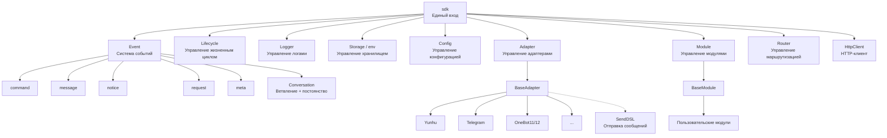

### Описание основных модулей

| Модуль | Описание |
|------|------|
| **Event** | Система событий, предоставляет обработку пяти типов событий: command / message / notice / request / meta, а также Conversation для многошаговых диалогов |
| **Adapter** | Менеджер адаптеров, управляет регистрацией, запуском и остановкой адаптеров для различных платформ |
| **Module** | Менеджер модулей, управляет регистрацией, загрузкой и выгрузкой плагинов, поддерживает объявление зависимостей и топологическую сортировку |
| **Lifecycle** | Менеджер жизненного цикла, предоставляет хуки, управляемые событиями |
| **Storage** | Система хранения на основе SQLite, поддерживающая общие SQL-цепочные запросы |
| **Config** | Управление конфигурационными файлами в формате TOML |
| **Logger** | Модульная система логирования, поддерживающая под-логгеры |
| **Router** | Управление маршрутизацией HTTP/WebSocket, через абстрактный слой обертывает нижележащие бэкенды (в настоящее время FastAPI + Uvicorn), поддерживает маршрутизацию через декораторы, промежуточные обработчики, группировку, ограничение скорости, CORS |
| **HttpClient** | Единый HTTP/WS-клиент, через абстрактный слой обертывает нижележащие библиотеки запросов (в настоящее время aiohttp), предоставляет статистику запросов, повторные попытки, логирование, WebSocket-клиент, систему исключений ErisPulse. Клиент и сервер WebSocket разделяют базовый класс `WebSocketConnectionBase` |

## Процесс инициализации

На следующей диаграмме показан полный процесс инициализации `sdk.init()`:

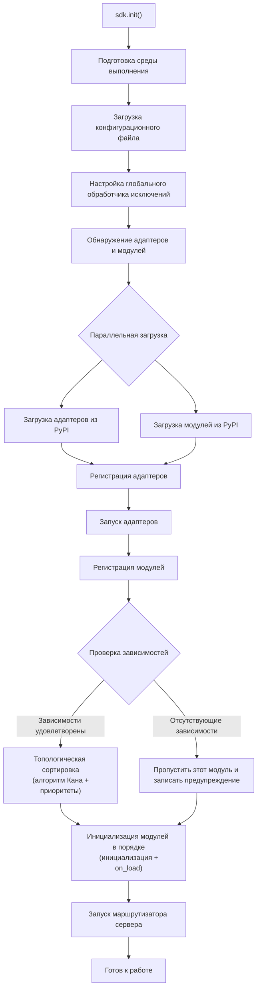

### Подробное описание этапов инициализации

> Полная цепочка инициализации разбита на этапы (Finder / Loader / Manager / Router), базовые точки входа (`init()` / `init_task()` / `init_sync()`) и ручной полный запуск описаны в [Процесс запуска и ручное управление](advanced/startup.md).

## Процесс обработки событий

На следующей схеме показан полный путь передачи сообщений от платформы к обработчикам:

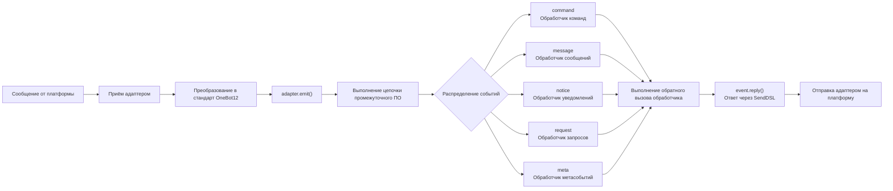

### Подробное описание цепочки обработки событий

Схема выше показывает "результат"; ниже разобрана работа `adapter.emit()` — это трёхуровневая цепочка распределения, которая реализуется фреймворком:

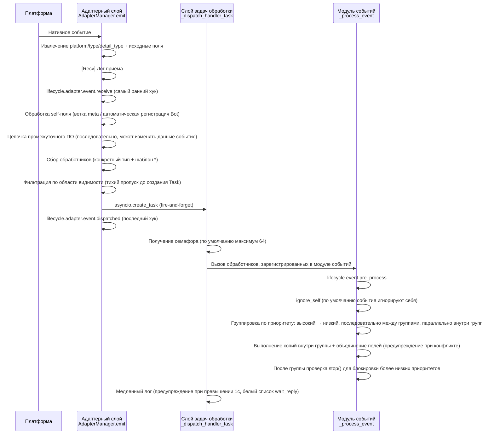

**Что делает фреймворк на каждом этапе и что вы можете изменить:**

| Этап | Что делает фреймворк | Что вы можете изменить |
|------|----------------------|------------------------|
| Приём | Извлекает стандартные поля, сохраняет `{platform}_raw` исходные данные; записывает `[Recv]` лог | Подписка на `adapter.event.receive` для получения самого раннего события |
| self-поле | Для метасобытий ветвление connect/disconnect/heartbeat; для обычных событий автоматическая регистрация Bot и запуск `adapter.bot.online` | Подписка на `adapter.bot.online` / `bot.offline` |
| Промежуточное ПО | **Последовательно** выполняется, если возвращает не None, то заменяет данные события | Регистрация промежуточного ПО для изменения/перехвата события |
| Сбор обработчиков | Сначала берутся обработчики конкретного типа, затем `*` шаблон | — |
| Фильтрация области видимости | По owner проверяется `scope.is_allowed` (сессия > Bot > платформа), **если не проходит, то тихо пропускается** | Настройка белого/чёрного списка областей видимости |
| Расписание | Каждый соответствующий обработчик запускается в отдельной `asyncio.Task`, `emit()` **не ждёт завершения обработчиков** | — |
| Приоритет | Высокоприоритетные группы выполняются первыми; **между группами последовательно, внутри групп параллельно** (каждая группа получает копию события, изменения объединяются, конфликты предупреждаются) | `@command(..., priority=N)` / указание при регистрации priority |
| Блокировка | После обработки каждой группы проверяется `event.is_stopped()`, если true, то **не выполняются более низкие приоритеты** | `event.mark_processed(stop=True)` / `event.done()` |

> **Частые заблуждения**:
> 1. **Фильтрация области видимости — тихая** — отфильтрованные обработчики не генерируют ошибок и не реагируют, видны только в TRACE-логах (`core.scope.denied`). Если "мой модуль не получил сообщение", сначала проверьте привязку области видимости.
> 2. **Обработчики работают параллельно** — фреймворк уже создал отдельную задачу для каждого обработчика, вам **не нужно** вручную оборачивать в `asyncio.create_task`.
> 3. **Обработчики одной группы не блокируют друг друга** — `mark_processed(stop=True)` блокирует только более низкие группы, обработчики внутри одной группы не прерываются.
> 4. **Порог медленного лога фиксирован в 1 секунду** — обработчики, затратившие более 1с, генерируют предупреждение в логе (`wait_reply` время исключено из расчёта), но выполнение не прерывается.

> Подробности о трёхуровневой привязке области видимости и приоритетах см. в [Системе области видимости](advanced/scope.md); полную семантику claim/блокировки см. в [Введение в обработку событий](getting-started/event-handling.md); настройку лимита параллелизма см. в [Руководстве по конфигурации](user-guide/configuration.md#framework-configuration).

## Жизненный цикл

На следующей диаграмме показан порядок срабатывания событий жизненного цикла компонентов фреймворка:

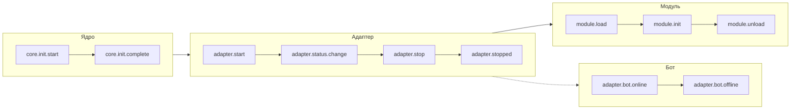

### Наблюдение за событиями жизненного цикла

> Полный список методов наблюдения за событиями (lifecycle.on() / once() / has_handlers()), полный список событий жизненного цикла и формат данных см. в разделе [Управление жизненным циклом](advanced/lifecycle.md).

## Стратегии загрузки модулей

ErisPulse поддерживает три стратегии загрузки модулей, объявленные `ModuleLoadStrategy`, возвращаемые `get_load_strategy()`:

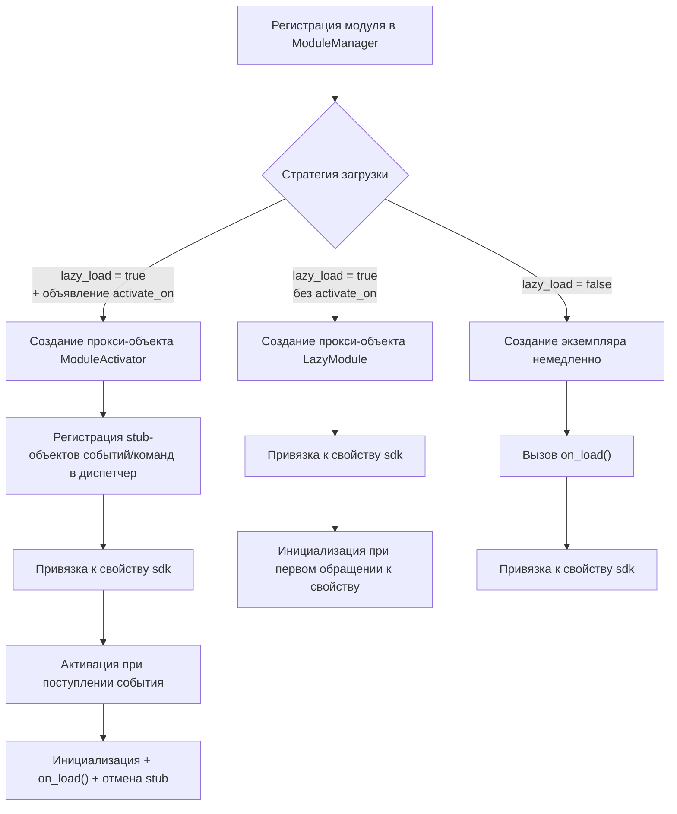

> Подробнее см. в разделах [Система ленивой загрузки](advanced/lazy-loading.md), [Управление жизненным циклом](advanced/lifecycle.md) и документации модуля.

### Архитектура триггерной ленивой активации (trigger architecture с `activate_on`)

> [!NOTE]
> Эта функция доступна в ErisPulse **2.8.0+**.

`activate_on` позволяет загружать модуль только при поступлении **первого соответствующего события/команды**, что предотвращает постоянное удержание в памяти и гарантирует отсутствие потери событий:

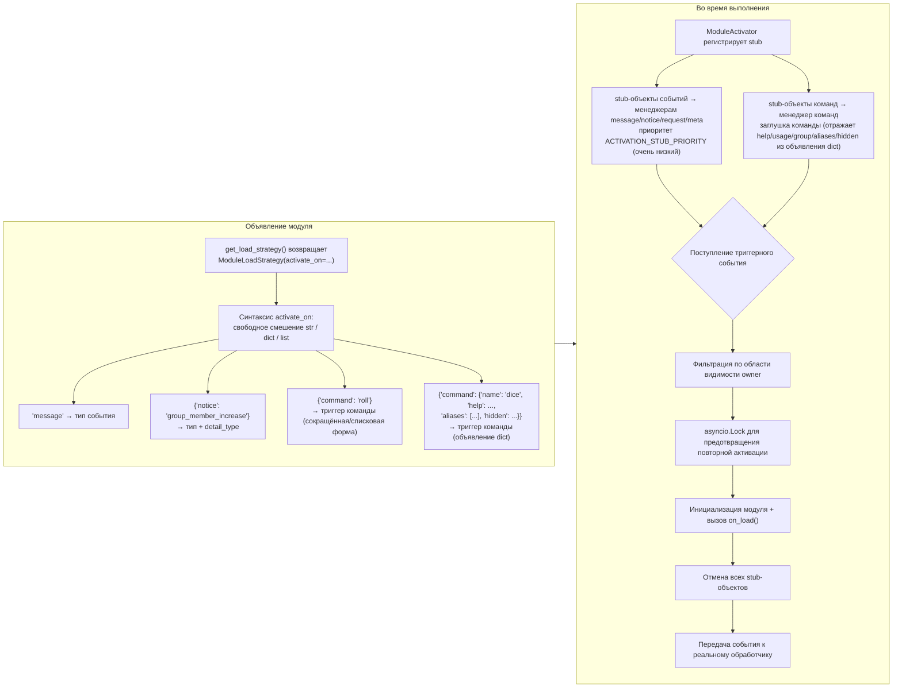

**Ключевые моменты семантики триггеров:**

> Полный синтаксис `activate_on` (str / dict / list), объявление команды dict, цепочка отката help для заглушек команд, фильтрация области видимости и семантика ошибок описаны в [Системе ленивой загрузки](advanced/lazy-loading.md#триггерная-леневая-активация-activate_on).

## Архитектура локальной папки плагинов

> [!NOTE]
> Эта функция требует ErisPulse **2.8.0+**.

Локальные плагины (папка `plugins/`) не требуют упаковки и публикации, фреймворк автоматически обнаруживает и загружает их при запуске:

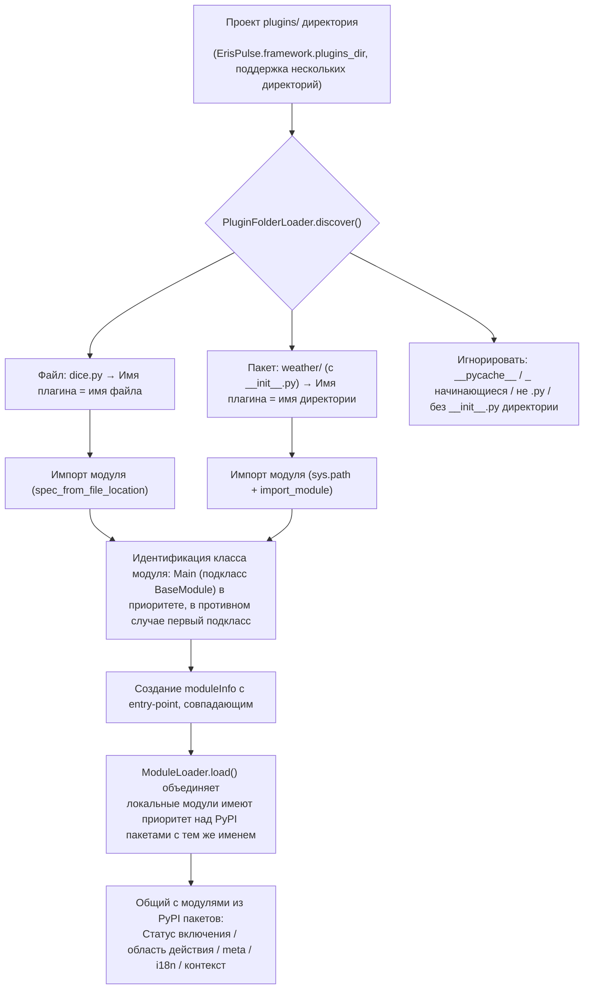

**Соглашения и особенности:**

- Имя плагина: для одиночного файла — имя файла, для пакета — имя директории
- Локальные плагины `moduleInfo.meta.source == "plugin_folder"`, они бесшовно совместимы с модулями из PyPI пакетов
- При совпадении имен приоритет отдаётся локальным (удобно для отладки), при отключении удаляются и соответствующие entry-point записи

[**中文**](docs/ru/quick-start.md)

## Архитектура горячей перезагрузки локальных плагинов

Горячая перезагрузка отслеживает изменения файлов плагинов и автоматически перезагружает соответствующие плагины:

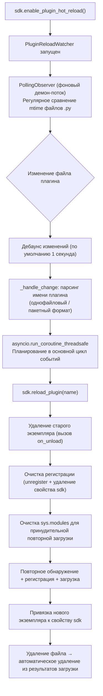

[**English**](docs/ru/quick-start.md)


====
快速上手
====


### 快速开始

# Быстрый старт

> **Это ваш первый шаг.** Запустите бота ErisPulse с нуля всего за 5 минут.

## Установка ErisPulse

### Скрипт для одного клика (рекомендуется)

Скрипт автоматически определит ваше окружение (Docker, Python, uv) и предложит выбрать наиболее подходящий способ установки.

Windows (PowerShell):
```powershell
irm https://get.erisdev.com/install.ps1 -OutFile install.ps1; powershell -ExecutionPolicy Bypass -File install.ps1
```

macOS / Linux:
```bash
curl -fsSL https://get.erisdev.com/install.sh -o install.sh && chmod +x install.sh && ./install.sh
```

Скрипт проведет вас через следующие шаги:

- **Docker** (рекомендуется, если Docker обнаружен): выбор зеркала (Docker Hub / GHCR), канал версий (стабильная / pre-release), настройка панели управления Dashboard, настройка портов
- **Классическая установка**: автоматическое создание виртуального окружения, выбор версии ErisPulse, опциональная установка модуля панели управления Dashboard

### Использование Docker

Docker-образ уже включает в себя фреймворк ErisPulse и панель управления Dashboard.

```bash
# Загрузка docker-compose.yml
curl -O https://raw.githubusercontent.com/ErisPulse/ErisPulse/main/docker-compose.yml

# Настройка токена Dashboard и запуск
ERISPULSE_DASHBOARD_TOKEN=your-token docker compose up -d
```

<details>
<summary>Docker Hub недоступен?</summary>

Используйте зеркало GitHub Container Registry, измените `image` в `docker-compose.yml`:

```yaml
image: ghcr.io/erispulse/erispulse:latest
```

</details>

После запуска перейдите по адресу `http://<host>:8000/Dashboard` и войдите, используя заданный токен.

### Установка с помощью pip

Убедитесь, что ваша версия Python >= 3.10, и установите через pip:

```bash
pip install ErisPulse
```

Если вы уже установили [uv](https://github.com/astral-sh/uv), вы также можете использовать `uv pip install ErisPulse` — это будет быстрее.

请直接返回翻译后的完整Markdown内容，不要包含任何其他文字。

再次提醒：如果文档包含语言切换行（各语言名称用 `` | `` 分隔的行），务必严格遵守上方第8条的格式要求，不要写出 ``[**Label**](file)`` 这类错误格式。

## Инициализация проекта

### Интерактивная инициализация (рекомендуется)

```bash
epsdk init
```

Это запустит интерактивного мастера, который поможет вам выполнить:
- Настройку имени проекта
- Конфигурацию уровня логирования
- Настройку сервера (хост и порт)
- Выбор и конфигурацию адаптера
- Создание структуры проекта

### Быстрая инициализация

```bash
# Быстрая инициализация с указанием имени проекта
epsdk init -q -n my_bot

# Или только указание имени проекта
epsdk init -n my_bot
```

### Создание проекта вручную

Если вы предпочитаете создать проект вручную:

```bash
mkdir my_bot && cd my_bot
epsdk init

## Установка модулей

### Установка через CLI

```bash
epsdk install Yunhu AIChat
```

### Просмотр доступных модулей

```bash
epsdk list-remote
```

### Интерактивная установка

При отсутствии указания имени пакета запускается интерфейс интерактивной установки:

```bash
epsdk install

## Запуск проекта

```bash
# Запуск в обычном режиме
epsdk run main.py

# Режим перезагрузки (рекомендуется во время разработки)
epsdk run main.py --reload

## Включение автодополнения в IDE (необязательно)

Модуль/адаптер динамического обнаружения ErisPulse не может предоставлять автодополнение методов, зависящих от платформы, по умолчанию в IDE.

Выполните следующую команду для генерации типов stub:

```bash
epsdk types
```

После генерации используйте импортированные типы для аннотации переменных, чтобы получить точное автодополнение (см. [Руководство по автодополнению в IDE](docs/ru/getting-started/ide-completion.md)):

```python
from _ep_types import Yunhu
from ErisPulse import sdk

adapter: Yunhu = sdk.adapter.get("yunhu")
await adapter.Send.To("group", "123").Board(...)  # автодополнение методов, зависящих от платформы

## Структура проекта

Структура проекта после инициализации:

```
my_bot/
├── config/
│   └── config.toml          # Файл конфигурации
└── main.py                  # Файл входа

## Файл конфигурации

Базовая конфигурация `config.toml`:

```toml
[ErisPulse.server]
host = "0.0.0.0"
port = 8000

[ErisPulse.logger]
level = "INFO"

[Yunhu_Adapter]
# Настройки адаптера


### 创建第一个机器人

# Создание первого бота

Это руководство основано на [5-минутном быстром старте](../quick-start.md) и поможет вам написать первый обработчик команд и понять механизм работы.

> Если вы еще не установили ErisPulse или не инициализировали проект, сначала выполните [быстрый старт](../quick-start.md) в разделах «Установка», «Инициализация проекта» и «Запуск проекта».

## Шаг первый: Написание первой команды

Откройте файл `main.py` и напишите простой обработчик команд:

```python
from ErisPulse import sdk
from ErisPulse.Core.Event import command

@command("hello", help="Отправить приветственное сообщение")
async def hello_handler(event):
    """Обработка команды hello"""
    user_name = event.get_user_nickname() or "друг"
    await event.reply(f"Привет, {user_name}! Я бот ErisPulse.")

@command("ping", help="Проверить, онлайн ли бот")
async def ping_handler(event):
    """Обработка команды ping"""
    await event.reply("Pong! Бот работает нормально.")

async def main():
    """Основная точка входа"""
    print("Запуск ErisPulse...")
    
    # keep_running=True (по умолчанию): фреймворк блокирует выполнение, пока не получит сигнал о завершении (например, Ctrl+C)
    await sdk.run(keep_running=True)

if __name__ == "__main__":
    import asyncio
    asyncio.run(main())
```

### Параметр `keep_running`

`sdk.run(keep_running)` управляет тем, будет ли фреймворк блокировать выполнение:

- **`keep_running=True` (по умолчанию)**: `run()` будет блокировать выполнение до получения сигнала о завершении (например, Ctrl+C), подходит для чистых ботов.
- **`keep_running=False`**: `run()` немедленно вернёт управление после инициализации, **фреймворк не будет отключаться** — запущенные адаптеры/модули продолжат обрабатывать события сообщений в фоновом режиме, вы можете выполнять свою логику, пока цикл событий не завершится и фреймворк не закроется. Например:

```python
async def main():
    await sdk.run(keep_running=False)   # Немедленно вернуться после инициализации
    # Фреймворк уже работает в фоне, здесь можно делать другие вещи
    while True:
        await asyncio.sleep(3600)
        print("Проверка каждый час")
```

> Помимо двух режимов `run()`, есть `init()`/`uninit()` для ручного управления жизненным циклом, а также более тонкие способы отдельного запуска/остановки адаптеров/маршрутизаторов, см. [Процесс запуска и ручное управление](../advanced/startup.md).

## Шаг второй: Запуск бота

```bash
# Обычный запуск
epsdk run main.py

# Режим разработки (поддержка горячей перезагрузки)
epsdk run main.py --reload
```

## Шаг третий: Тестирование бота

Отправьте команду в вашей чат-платформе:

```
/hello
```

Вы должны получить ответ от бота.

## Объяснение кода

### Декоратор команды

```python
@command("hello", help="Отправить приветственное сообщение")
```

- `hello`: имя команды, которую пользователь вызывает с помощью `/hello`
- `help`: описание команды, отображается при выполнении `/help`

### Параметры события

```python
async def hello_handler(event):
```

Параметр `event` — это объект Event, содержащий:
- Текст сообщения: `event.get_text()`
- Информацию об отправителе: `event.get_user_id()`, `event.get_user_nickname()`
- Информацию о платформе: `event.get_platform()`
- Информацию о группе: `event.get_group_id()`
- Оригинальные данные: `event.get_raw()`

> Полный список методов объекта Event см. в [подробном руководстве по Event-обёртке](../developer-guide/modules/event-wrapper.md).

### Отправка ответа

```python
await event.reply("Содержание ответа")
```

`event.reply()` — это удобный метод для отправки сообщения отправителю.

## Расширение: Добавление дополнительных функций

ErisPulse предоставляет богатые возможности для обработки событий и данных:

- **Слушание сообщений**: используйте `@message.on_message()` для прослушивания различных сообщений → [Введение в обработку событий](event-handling.md)
- **Слушание уведомлений**: используйте `@notice.on_friend_add()` и другие для прослушивания системных уведомлений → [Введение в обработку событий](event-handling.md)
- **Хранение данных**: используйте `sdk.storage.get/set` для сохранения данных → [Примеры распространённых задач](common-tasks.md)

## Часто задаваемые вопросы

### Команда не отвечает?

1. Проверьте правильность настройки адаптера, убедитесь, что в `config/config.toml` статус адаптера установлен в `true`
2. Проверьте вывод логов в терминале, убедитесь, что нет ошибок (особенно в логах уровня `ERROR`)
3. Убедитесь, что префикс команды указан правильно (по умолчанию это `/`), проверьте раздел `[ErisPulse.event.command]` в конфигурационном файле
4. Убедитесь, что имя команды написано правильно, обратите внимание на настройки чувствительности к регистру

### Как изменить префикс команды?

Добавьте в `config.toml`:

```toml
[ErisPulse.event.command]
prefix = "!"
case_sensitive = false
```

### Как поддержать несколько платформ?

ErisPulse использует стандарт OneBot12 для унификации формата событий на разных платформах, обработчики, зарегистрированные с помощью `@command` и `@message`, автоматически получают события со всех платформ. С помощью `event.get_platform()` можно определить источник платформы:

```python
@command("hello")
async def hello_handler(event):
    platform = event.get_platform()
    
    if platform == "yunhu":
        await event.reply("Привет! Из Юньху")
    elif platform == "telegram":
        await event.reply("Hello! Из Telegram")
    else:
        await event.reply("Привет!")
```

> Подробнее о многоуровневой адаптации платформ см. в [Примерах распространённых задач](common-tasks.md#многоуровневая-адаптация-платформ).


### 基础概念

# Основные концепции

В этом руководстве представлены основные концепции ErisPulse, которые помогут вам понять дизайн-мышление и базовую архитектуру фреймворка.

## Архитектура на основе событий

ErisPulse использует архитектуру на основе событий, где все взаимодействия передаются и обрабатываются через события.

### Поток событий

```
Пользователь отправляет сообщение
      │
      ▼
Платформа получает
      │
      ▼
Адаптер получает нативное событие платформы
      │
      ▼
Преобразуется в стандартное событие OneBot12
      │
      ▼
Отправляется в систему событий
      │
      ▼
Распределяется зарегистрированным обработчикам
      │
      ▼
Модуль обрабатывает событие
      │
      ▼
Адаптер отправляет ответ
      │
      ▼
Платформа отображает пользователю
```

### Стандарт OneBot12

ErisPulse использует OneBot12 в качестве стандартного события. OneBot12 — это стандарт универсального интерфейса чат-бота, определяющий унифицированный формат событий.

Все адаптеры преобразуют событие, специфичное для платформы, в формат OneBot12, обеспечивая согласованность кода.

## Основные компоненты

### 1. Объект SDK

SDK является точкой входа для всех функций и предоставляет доступ к основным компонентам.

```python
from ErisPulse import sdk

# Доступ к основным модулям
sdk.storage    # Система хранения
sdk.config     # Система конфигурации
sdk.logger     # Система логирования
sdk.adapter    # Система адаптеров
sdk.module     # Система модулей
sdk.router     # Система маршрутизации
sdk.client     # HTTP клиент
sdk.lifecycle  # Система жизненного цикла
```

### 2. Объект Event

Объект Event инкапсулирует данные о событии и предоставляет удобные методы доступа.

```python
@command("info")
async def info_handler(event):
    # Получение информации о событии
    event_id = event.get_id()
    user_id = event.get_user_id()
    platform = event.get_platform()
    text = event.get_text()
    
    # Отправка ответа
    await event.reply(f"Пользователь: {user_id}, Платформа: {platform}")
```

### 3. Адаптер

Адаптер — это мост между ErisPulse и внешними платформами.

**Обязанности:**
- Получение нативных событий платформы
- Преобразование в стандартный формат OneBot12
- Отправка стандартных событий платформе

**Примеры адаптеров:**
- Адаптер Yunhu: общение с платформой Yunhu
- Адаптер Telegram: общение с Telegram Bot API
- Адаптер OneBot11: общение с приложениями, совместимыми с OneBot11
- Адаптер Email: обработка почтовых сообщений

### 4. Модуль

Модуль — это базовая единица расширения функциональности, которая может:

- Регистрировать обработчики событий
- Реализовывать бизнес-логику
- Вызывать адаптеры для отправки сообщений
- Использовать службы, предоставляемые основными модулями

#### Механизм обнаружения модулей

ErisPulse обнаруживает установленные модули через Python `importlib.metadata.entry_points`. Модули объявляют точки входа в `pyproject.toml`:

```toml
[project.entry-points."erispulse.module"]
MyModule = "my_package:Main"
```

При инициализации SDK сканируются все точки входа группы `erispulse.module`, классы модулей регистрируются в `ModuleManager`, а затем последовательно инициализируются после топологической сортировки по зависимостям.

#### Минимально рабочий модуль

```python
from ErisPulse.Core.Bases import BaseModule
from ErisPulse import sdk

class Main(BaseModule):
    def __init__(self):
        self.sdk = sdk
        self.logger = sdk.logger.get_child("MyModule")

    async def on_load(self, event):
        self.logger.info("Модуль загружен")

    async def on_unload(self, event):
        self.logger.info("Модуль выгружен")
```

#### Жизненный цикл модуля

- **Регистрация**: SDK обнаруживает класс модуля и регистрирует его в менеджере
- **Загрузка**: Создается экземпляр модуля, вызывается `on_load(event)` (`event = {"module_name": "MyModule"}`)
- **Выгрузка**: Вызывается `on_unload(event)`, ресурсы очищаются

#### Стратегия загрузки

Загрузочное поведение модуля определяется через `get_load_strategy()`:

```python
from ErisPulse.loaders import ModuleLoadStrategy

class Main(BaseModule):
    @staticmethod
    def get_load_strategy():
        return ModuleLoadStrategy(
            lazy_load=True,   # Ленивая загрузка (по умолчанию True)
            priority=0        # Приоритет загрузки, чем больше значение, тем раньше инициализация
        )
```

- **`lazy_load=True` (по умолчанию)**: Модуль инициализируется только при первом обращении к `sdk.MyModule`, что снижает время запуска
- **`lazy_load=False`**: Модуль инициализируется сразу при запуске SDK, подходит для модулей, которым нужно прослушивать события жизненного цикла или выполнять фоновые задачи
- **`priority`**: Модули с одинаковым приоритетом загружаются в порядке регистрации; чем больше значение, тем раньше инициализация

> Подробное описание механизма ленивой загрузки см. в разделе [Система ленивой загрузки](../advanced/lazy-loading.md).

## Типы событий

ErisPulse поддерживает 5 типов событий:

| Тип события | Декоратор | Описание |
|------------|-----------|---------|
| Событие сообщения | `@message.on_message()` | Любое сообщение, отправленное пользователем (личные сообщения, чаты) |
| Событие команды | `@command("name")` | Сообщения, начинающиеся с префикса команды (например, `/hello`) |
| Событие уведомления | `@notice.on_friend_add()` и т.д. | Системные уведомления (добавление друга, изменения состава группы и т.д.) |
| Событие запроса | `@request.on_friend_request()` и т.д. | Запросы пользователей (запросы на добавление в друзья, приглашения в группу) |
| Метасобытие | `@meta.on_connect()` и т.д. | Системные события (подключение, отключение, пульс) |

> Подробное использование и примеры кода для каждого типа событий см. в разделе [Введение в обработку событий](event-handling.md).

## Описание основных модулей

### Storage (Хранилище)

Базирующаяся на SQLite система хранения пар ключ-значение для персистентного хранения данных.

```python
# Установка значения
sdk.storage.set("key", "value")

# Получение значения
value = sdk.storage.get("key", "default_value")

# Массовые операции
sdk.storage.set_multi({
    "key1": "value1",
    "key2": "value2"
})

# Транзакция
with sdk.storage.transaction():
    sdk.storage.set("key1", "value1")
    sdk.storage.set("key2", "value2")
```

### Config (Конфигурация)

Управление файлами конфигурации в формате TOML.

```python
# Получение конфигурации
config = sdk.config.getConfig("MyModule", {})

# Установка конфигурации
sdk.config.setConfig("MyModule", {"key": "value"})

# Чтение вложенной конфигурации
value = sdk.config.getConfig("MyModule.subkey", "default")
```

### Logger (Логирование)

Модульная система логирования.

```python
# Запись логов
sdk.logger.info("Это информационное сообщение")
sdk.logger.warning("Это предупреждение")
sdk.logger.error("Это ошибка")

# Получение дочернего логгера
child_logger = sdk.logger.get_child("submodule")
child_logger.info("Лог дочернего модуля")
```

**Синтаксический сахар для доступа к свойствам**

Помимо использования метода `get_child()`, вы также можете создавать дочерние логгеры через **доступ к свойствам**, что является более кратким способом записи **синтаксического сахара**:

```python
# Создание дочернего логгера через доступ к свойствам
sdk.logger.mymodule.info("Сообщение модуля")

# Поддержка вложенного доступа
sdk.logger.mymodule.database.info("Сообщение базы данных")
```

### Router (Маршрутизация)

Управление HTTP и WebSocket маршрутизацией на базе FastAPI + Uvicorn. Поддерживает декораторную маршрутизацию, middleware, группирование, лимитирование запросов, CORS.

```python
from ErisPulse.Core import HttpRequest

@sdk.router.get("MyModule", "/api")
async def handler(request: HttpRequest):
    data = await request.json()
    return {"status": "ok"}
```

> Полный API маршрутизации (WebSocket, middleware, лимитирование запросов, CORS и т.д.) см. в разделе [Менеджер маршрутизации](../advanced/router.md).

### Client (Сетевой клиент)

Единый сетевой клиент, объединяющий HTTP-запросы, WebSocket-соединения, управление пулом соединений, автоматическую перезагрузку, контроль тайм-аута, статистику запросов и интеграцию событий жизненного цикла.

```python
from ErisPulse.Core import client

# HTTP запрос
resp = await client.get("https://api.example.com/users")
data = await resp.json()

# С перезагрузкой и тайм-аутом
resp = await client.get(url, timeout=30, max_retries=3)

# WebSocket соединение
ws = await client.ws_connect("wss://example.com/ws")
async for text in ws.iter_text():
    await ws.send_text(f"Эхо: {text}")
```

> Полный API сетевого клиента см. в разделе [Сетевой клиент](../advanced/http-client.md).

## Отправка сообщений SendDSL

Адаптеры предоставляют интерфейс для отправки сообщений с цепочечными вызовами.

### Базовая отправка

```python
# Получение экземпляра адаптера
yunhu = sdk.adapter.get("yunhu")

# Отправка сообщения
await yunhu.Send.To("user", "U1001").Text("Hello")

# Указание аккаунта отправки
await yunhu.Send.Using("bot1").To("group", "G1001").Text("Сообщение группы")
```

### Цепочечные модификаторы

```python
# @Пользователь
await yunhu.Send.To("group", "G1001").At("U2001").Text("@сообщение")

# Ответ на сообщение
await yunhu.Send.To("group", "G1001").Reply("msg123").Text("ответ")

# @Всех
await yunhu.Send.To("group", "G1001").AtAll().Text("объявление")
```

### Методы ответа через Event

Объект Event предоставляет удобные методы для ответов:

```python
@command("test")
async def test_handler(event):
    # Простой текстовый ответ
    await event.reply("Текст ответа")
    
    # Отправка изображения
    await event.reply("http://example.com/image.jpg", method="Image")
    
    # Отправка голосового
    await event.reply("http://example.com/voice.mp3", method="Voice")
```

## Система ленивой загрузки

По умолчанию ErisPulse включает ленивую загрузку модулей; модули инициализируются только при первом обращении (например, `sdk.MyModule`), что значительно ускоряет запуск.

```python
from ErisPulse.loaders import ModuleLoadStrategy

class Main(BaseModule):
    @staticmethod
    def get_load_strategy():
        return ModuleLoadStrategy(
            lazy_load=True,   # Включить ленивую загрузку (по умолчанию)
            priority=0        # Приоритет загрузки, чем больше значение, тем раньше инициализация
        )
```

**Сценарии, когда необходимо отключить ленивую загрузку (`lazy_load=False`):**
- Модули, прослушивающие события жизненного цикла (например, `core.init.complete`)
- Модули, запускающие периодические задачи или фоновые службы
- Модули, которым необходимо завершить инициализацию до загрузки других модулей

> Подробное описание механизма ленивой загрузки и рекомендации см. в разделе [Система ленивой загрузки](../advanced/lazy-loading.md).

## Дальнейшие шаги

- [Введение в обработку событий](event-handling.md) — изучите, как обрабатывать различные типы событий
- [Примеры типичных задач](common-tasks.md) — освоите реализацию распространенных функций


### 事件处理入门

# Введение в обработку событий

В этом руководстве описывается, как обрабатывать различные типы событий в ErisPulse.

Пожалуйста, верните полный перевод Markdown без дополнительных слов.

Еще раз напоминаю: если документ содержит строки переключения языков (строки с названиями языков, разделенными символом `` | ``), строго соблюдайте требования пункта 8 выше и не используйте неправильный формат вида ``[**Label**](file)``.

## Обзор типов событий

ErisPulse поддерживает следующие типы событий:

| Тип события | Описание | 适用场景 |
|---------|------|---------|
| Событие сообщения | Любое сообщение, отправленное пользователем | Чат-боты, фильтрация контента |
| Событие команды | Сообщение, начинающееся с префикса команды | Обработка команд, точка входа функций |
| Событие уведомления | Системные уведомления (добавление друга, изменения в группе и т. д.) | Приветственные сообщения, уведомления о статусе |
| Событие запроса | Запросы пользователей (запрос на добавление в друзья, приглашение в группу) | Автоматическая обработка запросов |
| Метасобытие | Системные события (подключение, сердцебиение) | Мониторинг соединения, проверка статуса |

## Обзор типов событий

ErisPulse поддерживает следующие типы событий:

| Тип события | Описание | 适用场景 |
|---------|------|---------|
| Событие сообщения | Любое сообщение, отправленное пользователем | Чат-боты, фильтрация контента |
| Событие команды | Сообщение, начинающееся с префикса команды | Обработка команд, точка входа функций |
| Событие уведомления | Системные уведомления (добавление друга, изменения в группе и т. д.) | Приветственные сообщения, уведомления о статусе |
| Событие запроса | Запросы пользователей (запрос на добавление в друзья, приглашение в группу) | Автоматическая обработка запросов |
| Метасобытие | Системные события (подключение, сердцебиение) | Мониторинг соединения, проверка статуса |

## Обработка сообщений о событиях

> **Примечание**: Рекомендуется использовать аннотацию типа `Event` в обработчиках событий для получения поддержки автодополнения в IDE и проверки типов.

```python
from ErisPulse.Core.Event import Event  # Импорт типа события для аннотации
```

### Отслеживание всех сообщений

```python
from ErisPulse.Core.Event import message, Event

@message.on_message()
async def message_handler(event: Event):
    text = event.get_text()
    user_id = event.get_user_id()
    sdk.logger.info(f"Получено сообщение от {user_id}: {text}")
```

### Отслеживание личных сообщений

```python
@message.on_private_message()
async def private_handler(event: Event):
    user_id = event.get_user_id()
    await event.reply(f"Привет, {user_id}! Это личное сообщение.")
```

### Отслеживание сообщений в группах

```python
@message.on_group_message()
async def group_handler(event: Event):
    group_id = event.get_group_id()
    user_id = event.get_user_id()
    sdk.logger.info(f"Пользователь {user_id} отправил сообщение в группе {group_id}")
```

### Отслеживание сообщений с упоминаниями (@)

```python
@message.on_at_message()
async def at_handler(event: Event):
    # Получение списка пользователей, которых упомянули
    mentions = event.get_mentions()
    await event.reply(f"Вы упомянули этих пользователей: {mentions}")

## Обработка событий команд

### Базовые команды

```python
from ErisPulse.Core.Event import command

@command("help", help="Отображает справочную информацию")
async def help_handler(event):
    help_text = """
Доступные команды:
/help - Отображает справку
/ping - Тест подключения
/info - Просмотр информации
    """
    await event.reply(help_text)
```

### Псевдонимы команд

```python
@command(["help", "h"], aliases=["帮助"], help="Отображает справочную информацию")
async def help_handler(event):
    await event.reply("Справочная информация...")
```

Пользователи могут вызывать команду следующими способами:
- `/help`
- `/h`
- `/帮助`

### Параметры команд

```python
@command("echo", help="Повторяет сообщение")
async def echo_handler(event):
    # Получение параметров команды
    args = event.get_command_args()
    
    if not args:
        await event.reply("Введите сообщение для повтора")
    else:
        await event.reply(f"Вы сказали: {' '.join(args)}")
```

### Группы команд

```python
@command("admin.reload", group="admin", help="Перезагрузить модуль")
async def reload_handler(event):
    await event.reply("Модуль перезагружен")

@command("admin.stop", group="admin", help="Остановить бота")
async def stop_handler(event):
    await event.reply("Бот остановлен")
```

### Права доступа к командам

```python
def is_master(event):
    """Проверяет, является ли пользователь владельцем фреймворка"""
    master_list = ["user123", "user456"]
    return event.get_user_id() in master_list

@command("master", permission=is_master, help="Команда владельца фреймворка")
async def master_handler(event):
    await event.reply("Это команда владельца фреймворка")
```

### Приоритеты команд

```python
# Чем больше значение приоритета, тем раньше выполняется
@message.on_message(priority=10)
async def high_priority_handler(event):
    await event.reply("Обработчик высокого приоритета")

@message.on_message(priority=1)
async def low_priority_handler(event):
    await event.reply("Обработчик низкого приоритета")
```

### Параллельная обработка событий

Система событий ErisPulse использует модель планирования **параллельной обработки с одинаковым приоритетом и последовательной обработки с разным приоритетом**:

```
Событие поступило
    ↓
Группа priority=10: [Обработчик C || Обработчик D] параллельно → объединить результаты
    ↓ (если не прервано)
Группа priority=0: [Обработчик A || Обработчик B] параллельно → объединить результаты
    ↓
...
```

- **Параллельная обработка с одинаковым приоритетом**: Несколько обработчиков с одинаковым приоритетом выполняются одновременно, что увеличивает пропускную способность
- **Последовательная обработка с разным приоритетом**: Группы с разным приоритетом выполняются последовательно (чем выше значение, тем раньше выполняется), обеспечивая выполнение обработчиков высокого приоритета первыми
- **Copy-On-Write**: Обработчики не создают копии, если не вносят изменения, что обеспечивает нулевые накладные расходы
- **Обработка конфликтов**: При изменении одного и того же поля несколькими обработчиками с одинаковым приоритетом используется последнее значение и записывается предупреждающее сообщение в лог
- **Механизм прерывания**: После вызова любого обработчиком `event.done()` (по умолчанию) или `event.done(claim=False)` пропускаются последующие группы с более низким приоритетом. Разница между "признанием" и "блокировкой" описана в разделе [**Управление цепочкой: признание и блокировка**](#управление-цепочкой-признание-и-блокировка)

```python
# Пример: параллельное выполнение обработчиков с одинаковым приоритетом
@message.on_message(priority=0)
async def handler_a(event):
    # Обработка задачи A
    event['result_a'] = process_a()

@message.on_message(priority=0)
async def handler_b(event):
    # Выполняется параллельно с handler_a
    event['result_b'] = process_b()

# Последовательное выполнение с разным приоритетом
@message.on_message(priority=10)
async def handler_c(event):
    # Самый высокий приоритет, выполняется первым
    pass
```

> **Ограничение параллелизма**: Все соответствующие handler-ы немедленно создают задачи, но ограничиваются сигналом, ограничивающим **количество одновременно выполняемых задач** по умолчанию **64** (`ErisPulse.framework.handler_max_concurrency`, поддерживает горячее обновление). Задачи, превышающие лимит, ожидают в очереди на сигнале, пока предыдущие не завершатся. Во время пиковых нагрузок это ваш «сброс давления».
>
> **Медленные логи**: Если один обработчик выполняется более **1 секунды**, фреймворк записывает предупреждение в лог (`handler_slow`). Время ожидания ответа (`wait_reply`) исключается из времени выполнения, чтобы не ошибочно помечать ожидание ответа как медленное.

## Фильтрация области видимости: почему мой модуль не получает сообщения

Рассылка событий выполняется **до создания задачи обработчика** — сначала производится фильтрация области видимости, определяется `scope.is_allowed` на основе владельца модуля (уровень сессии > уровень бота > уровень платформы), **если проверка не пройдена, обработка происходит молча**, без ошибок и ответа.

```python
# Предположим, в config.toml MyModule был заблокирован в определённой группе:
[ErisPulse.scope]
block = { yunhu = { group_123 = ["MyModule"] } }
```

В этом случае, когда сообщения приходят из этой группы, **ни команды, ни обработчики событий MyModule не будут запущены**. Это не ошибка, а работа механизма области видимости — при диагностике "модуль не реагирует" сначала проверяйте привязку области видимости.

- Три уровня фильтрации: уровень шины адаптера (до создания задачи), уровень модуля события (внутри каждой группы приоритетов), уровень команды (до проверки прав)
- Журнал фильтрации доступен только на уровне **TRACE** (`core.scope.denied`), на уровне INFO по умолчанию никаких следов не видно
- Обработчики на уровне фреймворка (например, диспетчер команд с `scope_exempt=True`) не подвержены влиянию области видимости

> Подробнее о трёх уровнях привязки области видимости, белом и чёрном списках, приоритетах перекрытия и скрытом механизме отклонения по умолчанию см. в [Системе области видимости](../../advanced/scope.md).

[**中文**](docs/ru/quick-start.md)

## Управление цепочкой: присвоение и блокировка

> [!NOTE]
> Параметры `claim=` / `stop=` для `event.done()` / `event.mark_processed()` требуют ErisPulse **2.7.1+**.

ErisPulse разделяет два ортогональных семантических понятия — «присвоение» и «блокировка» — и объединяет их управление через `event.done()`, что позволяет добавлять слои наблюдения (например, логирование, аудит, права доступа) вокруг обработки команд.

**Точные определения двух понятий:**

- **Присвоение (claim)**: пометка того, что событие было обработано данным обработчиком (запись в `_processed`). Командный диспетчер, увидев присвоенное событие, **пропускает его повторную обработку** — предотвращая повторную обработку одного и того же сообщения несколькими обработчиками команд. Типичный сценарий: после успешного сопоставления команды присвоить событие, чтобы диспетчер команд больше не вмешивался.
- **Блокировка (stop)**: предотвращение распространения события к обработчикам с **меньшим приоритетом** (запись в `_propagation_stopped`). Обработчики с низким приоритетом (например, `on_message`) больше не увидят это событие. Типичный сценарий: высокоприоритетный обработчик уже полностью обработал событие, и не хочет, чтобы низкоприоритетные обработчики выполнялись.

| `event.done(...)` | Присвоение | Блокировка | Сценарий |
|-------------------|-----------|------------|----------|
| `event.done()` | ✔ | ✔ | Стандартная практика после обработки команды / обработчика |
| `event.done(stop=False)` | ✔ | ✘ | Только присвоение: низкоприоритетные наблюдатели (логирование / статистика) продолжают видеть событие |
| `event.done(claim=False)` | ✘ | ✔ | Только блокировка (например, фаервол / ограничение скорости), но без дедупликации команд |

`event.done(claim=, stop=)` — это псевдоним `event.mark_processed(claim=, stop=)`, и параметры и поведение у них полностью идентичны.

```python
@command("help")
async def help_cmd(event):
    event.done()            # Присвоение + блокировка (стандартная практика после обработки команды)

@message.on_message(priority=50)
async def observer(event):
    event.done(stop=False)  # Только присвоение: низкоприоритетный обработчик все еще будет выполняться (логирование / статистика)

@message.on_message(priority=100)
async def firewall(event):
    if denied(event):
        event.done(claim=False)  # Только блокировка: низкоприоритетный обработчик не будет выполняться, но дедупликация не происходит
```

### Конфигурация block для команд и ответов

После успешного сопоставления команды или после сопоставления ответа в `wait_reply` по умолчанию распространение блокируется (для обратной совместимости). Можно настроить разрешение, чтобы низкоприоритетные обработчики (логирование / аудит / права доступа) также могли наблюдать эти сообщения:

```toml
[ErisPulse.event.command]
block = false   # Сообщения команд продолжают поступать к обработчикам с низким приоритетом

[ErisPulse.event.wait_reply]
block = false   # Ответы, потребленные wait_reply, продолжают поступать к обработчикам с низким приоритетом

## Обработка событий уведомлений

### Добавление в друзья

```python
from ErisPulse.Core.Event import notice

@notice.on_friend_add()
async def friend_add_handler(event):
    user_id = event.get_user_id()
    nickname = event.get_user_nickname() or "Новый друг"
    await event.reply(f"Добро пожаловать в друзья, {nickname}!")
```

### Приглашение участника в группу

```python
@notice.on_group_increase()
async def member_increase_handler(event):
    group_id = event.get_group_id()
    user_id = event.get_user_id()
    await event.reply(f"Добро пожаловать, новый участник {user_id}, в группу {group_id}")
```

### Покидание участником группы

```python
@notice.on_group_decrease()
async def member_decrease_handler(event):
    group_id = event.get_group_id()
    user_id = event.get_user_id()
    await event.reply(f"Участник {user_id} покинул группу {group_id}")

## Обработка событий запроса

### Запросы на добавление в друзья

```python
from ErisPulse.Core.Event import request

@request.on_friend_request()
async def friend_request_handler(event):
    user_id = event.get_user_id()
    comment = event.get_comment()
    
    sdk.logger.info(f"Получен запрос на добавление в друзья: {user_id}, Комментарий: {comment}")
    
    # Запрос можно обработать через адаптер API
    # Смотрите документацию по конкретным адаптерам для деталей реализации
```

### Запросы на вступление в группу

```python
@request.on_group_request()
async def group_request_handler(event):
    group_id = event.get_group_id()
    user_id = event.get_user_id()
    
    await event.reply(f"Получен запрос на вступление в группу {group_id} от пользователя {user_id}")

## Обработка мета-событий

### События подключения

```python
from ErisPulse.Core.Event import meta

@meta.on_connect()
async def connect_handler(event):
    platform = event.get_platform()
    sdk.logger.info(f"Платформа {platform} подключена")

@meta.on_disconnect()
async def disconnect_handler(event):
    platform = event.get_platform()
    sdk.logger.warning(f"Платформа {platform} отключена")
```

### Событие сердечного импульса

```python
@meta.on_heartbeat()
async def heartbeat_handler(event):
    platform = event.get_platform()
    sdk.logger.debug(f"{platform} проверка сердечного импульса")
```

### Запрос статуса бота

После того как адаптер отправляет мета-событие, фреймворк автоматически отслеживает статус бота, вы можете проверить его в любое время:

```python
from ErisPulse import sdk

# Проверить, работает ли определенный бот
if sdk.adapter.is_bot_online("telegram", "123456"):
    telegram = sdk.adapter.get("telegram")
    await telegram.Send.To("user", "123456").Text("Бот онлайн")

# Вывести список всех текущих активных ботов
bots = sdk.adapter.list_bots()
for platform, bot_list in bots.items():
    for bot_id, info in bot_list.items():
        print(f"{platform}/{bot_id}: {info['status']}")

# Получить сводку полного статуса
summary = sdk.adapter.get_status_summary()

## Интерактивная обработка

### Отправка ответа с использованием метода reply

Метод `event.reply()` поддерживает множество модификаторов, удобных для отправки сообщений с упоминаниями (@), ответами на другие сообщения и другими функциями:

```python
# Простой ответ
await event.reply("Привет")

# Отправка сообщений разных типов
await event.reply("http://example.com/image.jpg", method="Image")  # Изображение
await event.reply("http://example.com/voice.mp3", method="Voice")  # Голосовое сообщение

# Упоминание одного пользователя
await event.reply("Привет", at_users=["user123"])

# Упоминание нескольких пользователей
await event.reply("Всем привет", at_users=["user1", "user2", "user3"])

# Ответ на сообщение
await event.reply("Текст ответа", reply_to="msg_id")

# Упоминание всех участников группы
await event.reply("Уведомление", at_all=True)

# Комбинированное использование: упоминание пользователя + ответ на сообщение
await event.reply("Текст сообщения", at_users=["user1"], reply_to="msg_id")
```

### Ожидание ответа пользователя

```python
@command("ask", help="Спросить пользователя")
async def ask_handler(event):
    await event.reply("Введите ваше имя:")
    
    # Ожидание ответа пользователя, таймаут 30 секунд
    reply = await event.wait_reply(timeout=30)
    
    if reply:
        name = reply.get_text()
        await event.reply(f"Привет, {name}!")
    else:
        await event.reply("Время ожидания истекло, пожалуйста, введите еще раз.")
```

### Ожидание ответа с проверкой (validation)

```python
@command("age", help="Запросить возраст")
async def age_handler(event):
    def validate_age(event_data):
        """Проверка, что возраст корректный"""
        try:
            age = int(event_data.get_text())
            return 0 <= age <= 150
        except ValueError:
            return False
    
    await event.reply("Введите ваш возраст (0-150):")
    
    reply = await event.wait_reply(
        timeout=60,
        validator=validate_age
    )
    
    if reply:
        age = int(reply.get_text())
        await event.reply(f"Ваш возраст {age} лет")
    else:
        await event.reply("Ввод недействителен или истек таймаут")
```

### Ожидание ответа с обратным вызовом (callback)

```python
@command("confirm", help="Подтвердить действие")
async def confirm_handler(event):
    async def handle_confirmation(reply_event):
        text = reply_event.get_text().lower()
        
        if text in ["Да", "yes", "y"]:
            await event.reply("Действие подтверждено!")
        else:
            await event.reply("Действие отменено.")
    
    await event.reply("Подтвердить выполнение этой операции? (Да/Нет)")
    
    await event.wait_reply(
        timeout=30,
        callback=handle_confirmation
    )
```

### Подтверждение диалога (confirm)

Ожидание подтверждения или отказа от пользователем, автоматическое распознавание встроенных слов подтверждения на китайском и английском языках:

```python
@command("confirm", help="Подтвердить действие")
async def confirm_handler(event):
    if await event.confirm("Вы уверены, что хотите выполнить это действие?"):
        await event.reply("Подтверждено, выполняем...")
    else:
        await event.reply("Отменено")

# Пользовательские слова подтверждения
if await event.confirm("Продолжить?", yes_words={"go", "继续"}, no_words={"stop", "停止"}):
    pass
```

### Меню выбора (choose)

Пользователь может ответить номером опции или текстом опции:

```python
@command("choose", help="Выбор")
async def choose_handler(event):
    choice = await event.choose(
        "Пожалуйста, выберите цвет:",
        ["Красный", "Зеленый", "Синий"]
    )
    
    if choice is not None:
        colors = ["Красный", "Зеленый", "Синий"]
        await event.reply(f"Вы выбрали: {colors[choice]}")
    else:
        await event.reply("Время ожидания истекло, выбор не сделан")
```

**Режим объединения**: при `merge_prompt=True` опции объединяются в сообщение приглашения и отправляются одним сообщением с использованием указанного пользователем метода `method`:

```python
# Отправка объединенного приглашения + опций с использованием Markdown
choice = await event.choose(
    "## Пожалуйста, выберите цвет\n{options}\nПожалуйста, ответьте номером",
    ["Красный", "Зеленый", "Синий"],
    method="Markdown",
    merge_prompt=True,
)
```

> Заполнитель `{options}` управляет положением вставки опций; если не указан, они добавляются в конец приглашения.
> Можно настроить заполнитель через параметр `placeholder` (например, `placeholder="[choices]"`).
> `options_format="auto"` (по умолчанию) автоматически выбирает стиль в зависимости от метода: Markdown→неупорядоченный список, Html→упорядоченный список, остальные→простой текстовый список.
> Текстовые методы (Text/Markdown/Html и т.д.) по умолчанию объединяют опции в конец; не текстовые методы (Image и т.д.) по умолчанию разбивают их на два сообщения.

### Сбор формы (collect)

Многошаговый сбор ввода пользователя:

```python
@command("register", help="Регистрация")
async def register_handler(event):
    data = await event.collect([
        {"key": "name", "prompt": "Введите имя:"},
        {"key": "age", "prompt": "Введите возраст:", 
         "validator": lambda e: e.get_text().isdigit()},
        {"key": "email", "prompt": "Введите email:"}
    ])
    
    if data:
        await event.reply(f"Регистрация успешна!\nИмя: {data['name']}\nВозраст: {data['age']}\nEmail: {data['email']}")
    else:
        await event.reply("Время ожидания истекло или ввод недействителен")
```

### Ожидание любого события (wait_for)

Ожидание произвольного события, удовлетворяющего условию, не ограничиваясь одним и тем же пользователем:

```python
@command("wait_member", help="Ожидание нового участника")
async def wait_member_handler(event):
    await event.reply("Ожидание вступления новых участников группы...")
    
    evt = await event.wait_for(
        event_type="notice",
        condition=lambda e: e.get_detail_type() == "group_member_increase",
        timeout=120
    )
    
    if evt:
        await event.reply(f"Добро пожаловать новому участнику: {evt.get_user_id()}")
    else:
        await event.reply("Время ожидания истекло")
```

### Многоразовый диалог (conversation)

Создание контекста интерактивного многоразового диалога:

```python
@command("survey", help="Анкетирование")
async def survey_handler(event):
    conv = event.conversation(timeout=60)
    
    await conv.say("Добро пожаловать в опрос!")
    
    while conv.is_active:
        reply = await conv.wait()
        
        if reply is None:
            await conv.say("Время ожидания истекло, пока!")
            break
        
        text = reply.get_text()
        
        if text == "Выйти":
            await conv.say("До свидания!")
            break
        
        await conv.say(f"Вы сказали: {text}, продолжайте ввод или ответьте 'Выйти', чтобы закончить")
```

### Встроенные слова подтверждения

ErisPulse содержит наборы слов подтверждения на китайском и английском языках:

- **Слова подтверждения** (`CONFIRM_YES_WORDS`): Да, yes, y, подтверждено, точно, хорошо, ок, true, да, м, хорошо, согласен, без проблем...
- **Слова отрицания** (`CONFIRM_NO_WORDS`): Нет, no, n, отменено, не, не нужно, нельзя, cancel, false, ошибка, отказ, нельзя...

## Доступ к событийным данным

### Общие методы объекта Event

```python
@command("info")
async def info_handler(event):
    # Базовая информация
    event_id = event.get_id()
    event_time = event.get_time()
    event_type = event.get_type()
    detail_type = event.get_detail_type()
    
    # Информация об отправителе
    user_id = event.get_user_id()
    nickname = event.get_user_nickname()
    
    # Контекст сообщения
    message_segments = event.get_message()
    alt_message = event.get_alt_message()
    text = event.get_text()
    
    # Информация о группе
    group_id = event.get_group_id()
    
    # Информация о боте
    self_id = event.get_self_user_id()
    self_platform = event.get_self_platform()
    
    # Исходные данные
    raw_data = event.get_raw()
    raw_type = event.get_raw_type()
    
    # Информация о платформе
    platform = event.get_platform()
    
    # Определение типа сообщения
    is_private = event.is_private_message()
    is_group = event.is_group_message()
    is_at = event.is_at_message()
    
    # Информация о команде
    if event.is_command():
        cmd_name = event.get_command_name()
        cmd_args = event.get_command_args()
        cmd_raw = event.get_command_raw()
```

### Расширенные методы платформ

Помимо встроенных методов, адаптеры различных платформ также регистрируют методы, уникальные для каждой платформы, чтобы упростить доступ к специфичным данным платформ.

```python
from ErisPulse.Core.Event import message

@message.on_message()
async def handle_message(event):
    platform = event.get_platform()

    # Вызов специфичных методов в зависимости от платформы
    if platform == "telegram":
        chat_type = event.get_chat_type()      # Метод, уникальный для Telegram
    elif platform == "email":
        subject = event.get_subject()           # Метод, уникальный для электронной почты
```

Если вы не уверены, какие методы были зарегистрированы определенной платформой, вы можете проверить список зарегистрированных методов для конкретной платформы:

```python
from ErisPulse.Core.Event import get_platform_event_methods

methods = get_platform_event_methods("telegram")
# ["get_chat_type", "is_bot_message", ...]
```

> За дополнительной информацией о методах, специфичных для платформ, обратитесь к соответствующей [документации платформы](../platform-guide/).

## Лучшие практики обработки событий

### 1. Обработка исключений

```python
@command("process")
async def process_handler(event):
    try:
        # Бизнес-логика
        result = await do_some_work()
        await event.reply(f"Результат: {result}")
    except ValueError as e:
        # Ожидаемая бизнес-ошибка
        await event.reply(f"Ошибка параметров: {e}")
    except Exception as e:
        # Неожиданная ошибка
        sdk.logger.error(f"Сбой обработки: {e}")
        await event.reply("Ошибка обработки, попробуйте позже")
```

### 2. Логирование

```python
@message.on_message()
async def message_handler(event):
    user_id = event.get_user_id()
    text = event.get_text()
    
    sdk.logger.info(f"Обработка сообщения: {user_id} - {text}")
    
    # Использовать собственный логгер модуля
    from ErisPulse import sdk
    logger = sdk.logger.get_child("MyHandler")
    logger.debug(f"Подробная информация для отладки")
```

### 3. Условная обработка

```python
@message.on_message(priority=0)
async def conditional_handler(event):
    """Условная обработка - определение внутри обработчика"""
    # Обрабатывать только сообщения от определенных пользователей
    if event.get_user_id() in ["bot1", "bot2"]:
        return
    
    # Обрабатывать только сообщения, содержащие определенные ключевые слова
    if "ключевое слово" not in event.get_text():
        return
    
    await event.reply("Условие выполнено, сообщение обработано")

## Следующие шаги

- [Примеры типовых задач](common-tasks.md) - Изучение реализации распространенных функций (включая расширенную отправку сообщений: повторные попытки/тайм-ауты/пачки)
- [Руководство по возможностям платформы](../platform-guide/README.md) - Полное описание Send DSL цепочной отправки, правил отправки и построения пакетов
- [Подробное описание класса-обертки Event](../developer-guide/modules/event-wrapper.md) - Глубокое понимание объекта Event
- [Руководство пользователя](../user-guide/) - Узнайте о настройке и управлении модулями


### IDE 补全

# Генерация типовых заглушек (автодополнение в IDE)

ErisPulse использует entry-points для динамического обнаружения модулей/адаптеров, и типы пользовательских классов не могут быть известны на статическом уровне.
Команда `epsdk types` сканирует установленные модули/адаптеры и генерирует файл с типовыми заглушками, позволяя использовать эти типы для аннотации переменных и получать автодополнение в IDE.

## Основные принципы проектирования

Заглушечный файл **экспортирует только типы**, не предоставляя никаких экземпляров во время выполнения:

- Все импорты находятся внутри ``TYPE_CHECKING``, **без дополнительных накладных расходов во время выполнения, без изменения поведения**
- Имена типов используются в формате PascalCase, основанном на имени entry-point (например, ``yunhu`` → ``Yunhu``), что соответствует именам, передаваемым в ``sdk.adapter.get()`` / ``sdk.module.get()``
- Пользователи по-прежнему используют ``sdk.module.get(...)`` / ``sdk.adapter.get(...)`` для получения экземпляров, просто используя импортированные типы для **аннотации переменных**

## Основное использование

Запустите в корневой директории проекта:

```bash
epsdk types
```

В текущей директории будет создан файл `_ep_types.py`, содержащий типы всех установленных модулей/адаптеров.

## Использование в коде

```python
from _ep_types import MyModule, Yunhu
from ErisPulse import sdk

# Используя импортированные типы для аннотации переменных, можно получить автодополнение методов этого класса
my_mod: MyModule = sdk.module.get("MyModule")
my_mod.hello()                  # ← Автодополнение hello

my_adapter: Yunhu = sdk.adapter.get("yunhu")
await my_adapter.Send.To("group", "123").Board(...)   # ← Автодополнение методов, специфичных для платформы
```

## Рабочий процесс

1. Сканирование entry-points `erispulse.adapter` / `erispulse.module`
2. Инспекция с помощью подпроцесса в целевой среде Python для сбора фактической информации о классах каждого адаптера/модуля (включая путь к модулю и полное имя)
3. Генерация `.py` файла, в котором:
   - Все ``from xxx import Yyy as Zzz`` находятся внутри ``TYPE_CHECKING``
   - ``Zzz`` — это имя entry-point в формате PascalCase
4. IDE читает раздел ``TYPE_CHECKING`` для предоставления автодополнения; во время выполнения никакой код не выполняется

Пример сгенерированной заглушки:

```python
# _ep_types.py (сгенерирован автоматически)
from typing import TYPE_CHECKING

if TYPE_CHECKING:
    # Адаптеры
    from MyAdapter.Core import MyAdapter as MyAdapter
    from YunhuAdapter.Core import YunhuAdapter as Yunhu

    # Модули
    from MyModule.Core import Main as MyModule

    __all__ = ['MyAdapter', 'Yunhu', 'MyModule']
```

## Опции команды

| Опция | Описание |
|------|------|
| `-o, --output PATH` | Указывает путь к выходному файлу (по умолчанию `./_ep_types.py`) |
| `--force` | Перезаписывает существующий файл с заглушками |
| `--adapters-only` | Сканирует только адаптеры |
| `--modules-only` | Сканирует только модули |

## Когда перегенерировать

- После установки/удаления новых модулей или адаптеров
- После обновления публичного API модуля/адаптера
- Когда автодополнение в IDE перестает работать или типы устарели

## Связь с методами SendDSL

Базовый класс `SendDSL` уже содержит стандартные методы отправки (Text/Image/Voice/Video/File), и любой экземпляр SendDSL, полученный любым способом, может использовать эти методы. Команда `types` используется для автодополнения **методов, специфичных для платформы** (например, `Board` в Yunhu, `Dice` в Sandbox) и **методов, специфичных для модуля**.


====
模块开发
====


### 模块开发入门

# Начало работы с разработкой модулей

В этом руководстве мы расскажем, как создать модуль ErisPulse с нуля.

Документация о модулях ErisPulse

Дополнительные ресурсы

Ресурсы и документация для разработчиков модулей ErisPulse

Документация по API

Как подключить модуль к боту

Документация по API для разработчиков

Документация по API

Справочник по API

Создание нового модуля

Прежде чем писать код, убедитесь, что у вас установлена и настроена переменная среды.

Создайте новую папку для вашего модуля. Выберите любое имя, но обязательно назовите её `MyModule`. Вы можете также назвать её `mysimplemodule`, если предпочитаете.

Теперь перейдите к настройке параметров модуля. Откройте файл конфигурации, который генерируется в папке вашего модуля.

```javascript
// Документация о модулях ErisPulse
module.exports = {
    // Справочник по API
    config: {
        // Создание нового модуля
        name: 'MyModule', // Здесь используйте ваше имя
    },
    // Ресурсы и документация для разработчиков модулей ErisPulse
    run: (context) => {
        // Документация по API для разработчиков
        const { message, args } = context;
        // Документация по API
        if (args[0] === 'docs') {
            message.channel.send('https://docs.erispulse.com/api');
        }
    }
};
```

[Документация по API для разработчиков](docs/ru/api-reference.md)

```javascript
module.exports = {
    config: {
        // Справочник по API
        name: 'MyModule',
        // Ресурсы и документация для разработчиков модулей ErisPulse
        version: '1.0.0',
        description: 'Пример простого модуля для ErisPulse',
        // Дополнительные ресурсы
        usage: '/mymodule [docs]',
        // Документация по API
        cooldown: 0
    },
    // Документация по API для разработчиков
    run: (context) => {
        // Документация по API
        const { message, args } = context;
        if (args[0] === 'docs') {
            // Ресурсы и документация для разработчиков модулей ErisPulse
            message.channel.send('Документация по API: https://docs.erispulse.com/api');
        }
    }
};
```

[Справочник по API](docs/ru/api-reference.md)

```javascript
module.exports = {
    config: {
        name: 'MyModule',
        version: '1.0.0',
        description: 'Пример простого модуля для ErisPulse',
        usage: '/mymodule [docs]',
        cooldown: 0
    },
    run: (context) => {
        const { message, args } = context;
        if (args[0] === 'docs') {
            message.channel.send('Документация по API: https://docs.erispulse.com/api');
        }
    }
};
```

[Ресурсы и документация для разработчиков модулей ErisPulse](docs/ru/contributing.md)

Проверьте настройки в файле конфигурации модуля.

Запустите бота.

Введите команду в Discord.

Вы увидите сообщение, которое мы отправляем в канал.

Теперь вы знаете, как создать модуль для ErisPulse. Вы можете пойти дальше и изучить документацию API, чтобы понять, как использовать контекст и аргументы для создания более сложных команд.

## Структура проекта

Стандартная структура модуля:

```
MyModule/
├── pyproject.toml
├── README.md
├── LICENSE
└── MyModule/
    ├── __init__.py
    └── Core.py

## pyproject.toml

```toml
[project]
name = "ErisPulse-MyModule"
version = "1.0.0"
description = "Описание функционала модуля"
readme = "README.md"
requires-python = ">=3.10"
license = { file = "LICENSE" }
authors = [ { name = "yourname", email = "your@mail.com" } ]
dependencies = []

[project.urls]
"homepage" = "https://github.com/yourname/MyModule"

[project.entry-points."erispulse.module"]
"MyModule" = "MyModule:Main"

## __init__.py

```python
from .Core import Main

## Core.py - Базовый модуль

```python
from ErisPulse import sdk
from ErisPulse.Core.Bases import BaseModule
from ErisPulse.Core.Event import command

class Main(BaseModule):
    def __init__(self, sdk):
        self.sdk = sdk
        self.logger = sdk.logger.get_child("MyModule")
        self.storage = sdk.storage
    
    @staticmethod
    def get_load_strategy():
        """Возвращает стратегию загрузки модуля"""
        from ErisPulse.loaders import ModuleLoadStrategy
        return ModuleLoadStrategy(
            lazy_load=True,
            priority=0,
            depends=[],  # Опционально: список зависимых других модулей
            # Опционально: ленивая активация на основе событий — объявление триггеров, автоматическая загрузка при первом совпадении события/команды
            # activate_on=[{"command": {"name": "hello", "help": "Отправить приветствие"}}],
        )
    
    async def on_load(self, event):
        """Вызывается при загрузке модуля"""
        @command("hello", help="Отправить приветствие")
        async def hello_command(event):
            name = event.get_user_nickname() or "друг"
            await event.reply(f"Привет, {name}!")
        
        self.logger.info("Модуль загружен")
    
    async def on_unload(self, event):
        """Вызывается при выгрузке модуля"""
        self.logger.info("Модуль выгружен")
```

> **Чтение конфигурации**: приведённый выше базовый пример не использует конфигурацию. При необходимости чтения конфигурации рекомендуется объявить вложенный класс `ConfigClass` и получать доступ к ней через `self.cfg` в режиме реального времени (см. [Основные концепции модулей](core-concepts.md#рекомендуемая-декларативная-конфигурация)). Устаревший способ с ручным вызовом `_load_config()` больше не поддерживается.

## Модуль тестирования

### Локальный тест

```bash
# Установка модуля в каталог проекта
epsdk install ./MyModule

# Запуск проекта
epsdk run main.py --reload
```

### Команда тестирования

Отправка команды на тестирование:

```
/hello

## Основные понятия

### Базовый класс BaseModule

Все модули должны наследовать `BaseModule`, предоставляя следующие методы:

| Метод | Описание | Обязательно |
|------|------|------|
| `__init__(self, sdk)` | Конструктор (фреймворк передает экземпляр `sdk`) | Нет |
| `get_load_strategy()` | Возвращает стратегию загрузки | Нет |
| `get_meta()` | Возвращает метаданные о модуле (необязательно) | Нет |
| `on_load(self, event)` | Вызывается при загрузке модуля | Да |
| `on_unload(self, event)` | Вызывается при выгрузке модуля | Да |

### Мета-информация о модуле

> [!NOTE]
> Эта функция доступна начиная с ErisPulse **2.8.0+**.

Мета-информация о модуле объявляется через `get_meta()`. Она описывает, что делает данный модуль, к какой категории он относится и т.д. Мета-данные являются **общей информацией о модуле**, которую могут использовать различные интерфейсы и экосистемные модули, такие как модуль help, список модулей в Dashboard, магазин модулей и т.д.

Возвращаемое значение `get_load_strategy()` должно быть экземпляром `ModuleLoadStrategy`. **Рекомендуется возвращать экземпляр класса `ModuleMeta`** (поддержка типизации, автодополнение в IDE), но также поддерживается возврат словаря:

```python
class MyModule(BaseModule):
    @staticmethod
    def get_meta() -> ModuleMeta:
        return ModuleMeta(
            name="Погода",               # Отображаемое имя (по умолчанию имя регистрации)
            description="Получение погоды в городе",  # Краткое описание модуля
            version="1.0.0",
            author="ErisDev",
            group="Инструменты",               # Группа функций
            tags=["Погода", "Поиск"],
        )
```

Альтернативный способ (возврат словаря):

```python
class MyModule(BaseModule):
    @staticmethod
    def get_meta() -> dict:
        return {
            "name": "Погода",
            "description": "Получение погоды в городе",
            "version": "1.0.0",
            "author": "ErisDev",
            "group": "Инструменты",
            "tags": ["Погода", "Поиск"],
        }
```

- `module.get_meta("MyModule")` читает уже разобранные метаданные (сначала класс, затем информация о регистрации, автоматически дополняется имя команды модуля).
- `module.get_commands_overview()` объединяет «метаданные модуля + зарегистрированные команды (псевдонимы/группы/помощь)», и представляет общий обзор команд, организованных по модулям.
- Модуль, к которому принадлежит команда, можно получить через `cmd_info["owner"]` (автоматически вставляется системой контекста при регистрации).

#### Поддержка i18n для полей мета-информации

Значения полей мета-информации могут быть простыми строками или словарями i18n `{"i18n": "key.path", "default": "текст по умолчанию"}` (согласно соглашению для поля `description`).
Ключи для перевода объявляются через `I18nClass`, а `module.get_meta()` автоматически разбирает их в текст текущего языка:

```python
class MyModule(BaseModule):
    class I18nClass(BaseI18n):
        meta_description: I18nKey = I18nKey(
            default="Weather lookup",
            zh_CN="Получение погоды в городе",
            en="Weather lookup",
        )

    @staticmethod
    def get_meta() -> ModuleMeta:
        return ModuleMeta(
            name="Погода",
            description={"i18n": "MyModule.meta_description", "default": "Weather lookup"},
        )
```

### Объект SDK

Доступ к основным функциям осуществляется через объект `sdk`:

```python
from ErisPulse import sdk

sdk.storage    # Система хранения
sdk.config     # Система конфигурации
sdk.logger     # Система логирования
sdk.adapter    # Система адаптеров
sdk.router     # Система маршрутизации
sdk.lifecycle  # Система жизненного цикла
```

docs/ru/quick-start.md

## Следующие шаги

- [Основные концепции модулей](core-concepts.md) — подробное понимание архитектуры модулей
- [Подробное описание класса Event Wrapper](event-wrapper.md) — изучение объекта Event
- [Рекомендации по разработке модулей](best-practices.md) — разработка качественных модулей


### 模块核心概念

# Основные концепции модуля

Понимание основных концепций модуля ErisPulse является основой для разработки высококачественных модулей.

## Жизненный цикл модуля

### Стратегия загрузки

```python
from ErisPulse.Core.Bases import BaseModule
from ErisPulse.loaders import ModuleLoadStrategy

class MyModule(BaseModule):
    @staticmethod
    def get_load_strategy():
        """Возвращает стратегию загрузки модуля"""
        return ModuleLoadStrategy(
            lazy_load=True,   # Загрузка "ленивая" или немедленная
            priority=0,       # Приоритет загрузки (чем больше число, тем раньше загрузка)
            depends=["OtherModule"]  # Необязательно: объявить зависимости от других модулей
        )
```

> Модули, объявленные в `depends`, будут пропущены и в лог будет записано предупреждение, если они не зарегистрированы. Порядок загрузки определяется топологической сортировкой, а на одном уровне сортировка идет по убыванию `priority`.

> [!NOTE]
> **Каскадное выгрузка / перезагрузка** (ErisPulse **2.8.0+**): При выгрузке модуля, от которого зависят другие модули, модули, зависящие от него, будут **сначала каскадно выгружены** (в логе будет указан цепочка каскада); при горячей перезагрузке локальных плагинов, плагины, зависящие от него, также будут **каскадно перезагружены**, чтобы избежать использования устаревших ссылок на экземпляры. Объявление циклических зависимостей будет отклонено с `RuntimeError` при загрузке.

### Метод on_load

Вызывается при загрузке модуля, используется для инициализации ресурсов и регистрации обработчиков событий:

```python
async def on_load(self, event):
    # Регистрация обработчика события
    @command("hello", help="Команда приветствия")
    async def hello_handler(event):
        await event.reply("Привет!")

    # Использование встроенного HTTP-клиента SDK (автоматически управляет пулом соединений, не нужно создавать сессию вручную)
    # Отправлять запросы можно через sdk.client
```

### Метод on_unload

Вызывается при выгрузке модуля, используется для очистки ресурсов:

```python
async def on_unload(self, event):
    # Очистка пользовательских ресурсов
    # sdk.client управляется фреймворком, закрывать вручную не нужно

    # Отмена обработчиков событий (фреймворк обрабатывает автоматически)
    self.logger.info("Модуль был выгружен")
```

> Создание и очистка фоновых задач (`self.spawn()` / автоматическая отмена фреймворком) подробно описаны в [управлении жизненным циклом](../../advanced/lifecycle.md#задачи-фонового-исполнения-и-автоматическая-отмена).

### Выгрузка и полная выгрузка (purge)

> [!NOTE]
> Эта функция доступна в ErisPulse **2.8.0+**.

`unload()` по умолчанию только **отменяет загрузку** (выгружает экземпляр и ресурсы), но сохраняет метаданные регистрации (класс модуля и метаинформация) — модуль всё ещё может быть обнаружен и перезагружен с помощью `load()`, без необходимости повторной `register()`.

Если требуется **полная выгрузка** (освобождение ссылки на класс модуля, очистка `sys.modules`, чтобы плагин и его уникальные зависимости могли быть собраны сборщиком мусора), передайте `purge=True`:

```python
# Только отмена загрузки: сохраняются метаданные регистрации, можно перезагрузить в любое время
await sdk.module.unload("MyModule")

# Полная выгрузка: удаляются метаданные регистрации + очистка sys.modules (только для плагинов из папки)
await sdk.module.unload("MyModule", purge=True)
```

| Смысл | `unload()` по умолчанию | `unload(purge=True)` |
|------|-----------------|----------------------|
| Выгрузка экземпляра и ресурсов (события/task/маршруты/lifecycle/i18n) | ✅ | ✅ |
| Сохранение метаданных регистрации (класс модуля и метаинформация) | ✅ | ❌ Удалить |
| Очистка `sys.modules` (только для плагинов из папки) | ❌ | ✅ |
| Класс модуля может быть собран сборщиком мусора | ❌ | ✅ |
| Перезагрузка | `load()` можно использовать напрямую | Сначала нужно `register()` + `load()` |

> При `purge=True` зависимые модули, которые были каскадно выгружены, также будут purged; после выгрузки фреймворк выполнит `gc.collect()` и проверит, можно ли собрать класс/экземпляр модуля, остаточные ссылки будут предупреждены в логе (с указанием источника, уровень DEBUG).

### Жизненный цикл в целом

Если объединить все методы, то фреймворк делает следующее при загрузке и выгрузке модуля, **всё это происходит за кулисами**:

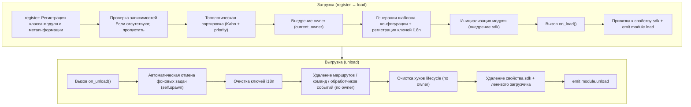

**Что делает фреймворк при загрузке** (вам нужно только написать `on_load`, всё остальное делается автоматически):

| Этап | Что делает фреймворк автоматически |
|------|-------------|
| Внедрение owner | При инициализации модуль обёртывается в `owner_scope`, чтобы все зарегистрированные в `on_load` команды/события/хуки/фоновые задачи **автоматически принадлежали этому модулю**, при выгрузке всё удаляется по owner |
| Шаблон конфигурации | Модули, объявившие `ConfigClass`, получают автоматически сгенерированный/заполненный фреймворком раздел конфигурации `ErisPulse.<ModuleName>` |
| Ключи i18n | Модули, объявившие `I18nClass`, получают автоматическую регистрацию ключей перевода (автоматически удаляются при выгрузке) |
| Топологическая зависимость | Модули сортируются по `depends`, чтобы модули, от которых зависят, загружались первыми; циклические зависимости отклоняются с `RuntimeError` |
| Привязка к SDK | После инициализации модуль привязывается к `sdk.<ModuleName>`, чтобы вы могли обращаться к `sdk.MyModule.xxx` |

**Что делает фреймворк при выгрузке** (соответствует шагам U1→U7): После выполнения `on_unload` происходит дополнительная очистка — фоновые задачи, созданные через `self.spawn`, принудительно отменяются (для корректного завершения сделайте это в `on_unload`), ключи i18n, маршруты, команды/обработчики событий, хуки lifecycle, затем удаляется свойство sdk. При `purge=True` дополнительно удаляются метаданные регистрации + очищается `sys.modules`.

> Эта автоматическая очистка — основа того, что «вам нужно только написать `on_load`/`on_unload`, не нужно вручную unregister» — фреймворк использует принадлежность owner, чтобы сделать «кто зарегистрировал, тот и очищает» одно-клик-процедурой.

## Объект SDK

### Доступ к основным модулям

```python
from ErisPulse import sdk

# Доступ ко всем основным модулям через объект sdk
sdk.logger.info("Лог")
sdk.storage.set("key", "value")
config = sdk.config.getConfig("MyModule")
```

### Взаимодействие между модулями

```python
# Доступ к другим модулям
other_module = sdk.OtherModule
result = await other_module.some_method()

## Запрос методов отправки адаптера

В связи с тем, что новые стандартные спецификации требуют использования переопределения метода `__getattr__` для реализации механизма резервной отправки, использование метода `hasattr` для проверки существования метода становится невозможным. Начиная с версии `2.3.5`, добавлена функция для запроса методов отправки.

### Список поддерживаемых методов отправки

```python
# Список всех методов отправки, поддерживаемых платформой
methods = sdk.adapter.list_sends("onebot11")
# Возвращает: ["Text", "Image", "Voice", "Markdown", ...]
```

### Получение подробной информации о методе

```python
# Получение подробной информации о конкретном методе
info = sdk.adapter.send_info("onebot11", "Text")
# Возвращает:
# {
#     "name": "Text",
#     "parameters": [
#         {"name": "text", "type": "str", "default": null, "annotation": "str"}
#     ],
#     "return_type": "Awaitable[Any]",
#     "docstring": "Отправка текстового сообщения..."
# }

## Управление конфигурацией

### Декларативная конфигурация (рекомендуется)

Начиная с версии 2.5.2, модули могут объявлять класс конфигурации через `ConfigClass`, используя ту же систему схем конфигурации, что и адаптеры. Конфигурация считывается в реальном времени через `self.cfg` и вступает в силу немедленно после изменений:

```python
from dataclasses import dataclass, field
from ErisPulse.Core.Bases import BaseModule
from ErisPulse.Core.Bases import BaseConfig

@dataclass
class MyModuleConfig(BaseConfig):
    api_key: str = field(
        default="",
        metadata={
            "description": {"i18n": "my_module.api_key", "default": "API Ключ"},
            "required": True,
            "secret": True,
            "ui": {"widget": "password", "group": "basic", "order": 1},
        },
    )
    timeout: int = field(
        default=30,
        metadata={
            "description": {"i18n": "my_module.timeout", "default": "Тайм-аут (сек)"},
            "ui": {"widget": "number", "group": "advanced", "order": 2},
        },
    )

class MyModule(BaseModule):
    ConfigClass = MyModuleConfig

    def __init__(self, sdk):
        self.sdk = sdk
        self.logger = sdk.logger.get_child("MyModule")

    async def on_load(self, event):
        self.logger.info("Модуль загружен")

    async def on_unload(self, event):
        pass

    async def do_something(self):
        cfg = self.cfg  # Считывание в реальном времени, типобезопасность
        api_key = cfg.api_key
        timeout = cfg.timeout
```

`BaseConfig` — это базовый класс конфигурации общего назначения, подходящий для любых сценариев, включая адаптеры, модули и внешние проекты. Поля конфигурации поддерживают многоязычные описания i18n (см. подробнее в [документации i18n](../../advanced/i18n.md#поля-конфигурации-многоязычные)).

### Декларативные ключи перевода (v2.7.0+)

Начиная с версии 2.7.0, модули могут централизованно объявлять ключи перевода, как объявляют `ConfigClass`, через вложенный класс `I18nClass`. Фреймворк будет автоматически регистрировать все объявленные ключи перевода при загрузке, без необходимости вручную вызывать `i18n.register()`, и регистрация происходит до генерации шаблона конфигурации, что гарантирует доступность ключей i18n, на которые ссылаются описания конфигурации.

```python
from ErisPulse.Core.Bases import BaseConfig, BaseI18n, I18nKey

class MyModule(BaseModule):
    # Класс конфигурации (необязательно)
    @dataclass
    class ConfigClass(BaseConfig):
        welcome_msg: str = field(
            default="Добро пожаловать",
            metadata={
                "description": {"i18n": "mymodule.welcome_msg", "default": "Приветственное сообщение"},
            },
        )

    # Класс набора ключей перевода (необязательно)
    class I18nClass(BaseI18n):
        # Имена свойств автоматически объединяются в полный путь ключа: <имя_модуля>.<имя_свойства>
        welcome_msg: I18nKey = I18nKey(
            default="Welcome Message",   # Языконезависимый запасной вариант
            zh_CN="Приветственное сообщение",
            zh_TW="Приветственное сообщение",
            en="Welcome Message",
            ja="ウェルカムメッセージ",
            ru="Приветственное сообщение",
        )
        hello: I18nKey = I18nKey(
            default="Hello, {name}!",
            zh_CN="Привет, {name}!",
            zh_TW="Привет, {name}!",
            en="Hello, {name}!",
            ja="こんにちは、{name}!",
            ru="Привет, {name}!",
        )
```

Подробнее см. [Рекомендуемый способ написания i18n](../../advanced/i18n.md#рекомендуемый-способ-через-i18nclass-объявить-ключи-перевода-v270).

### Ручное чтение конфигурации (не рекомендуется)

> **Устарело**: Пожалуйста, используйте вместо этого [декларативную конфигурацию](#декларативная-конфигурация-рекомендуется) + чтение через `self.cfg` в реальном времени.

```python
class MyModule(BaseModule):
    def __init__(self, sdk):
        self.sdk = sdk

    def _load_config(self):
        config = self.sdk.config.getConfig("MyModule")
        if not config:
            self.sdk.config.setConfig("MyModule", {"api_key": "", "timeout": 30})
            return {"api_key": "", "timeout": 30}
        return config

## Система хранения

### Основное использование

```python
# Сохранение данных
sdk.storage.set("user:123", {"name": "Чжан Сань"})

# Получение данных
user = sdk.storage.get("user:123", {})

# Удаление данных
sdk.storage.delete("user:123")
```

### Использование транзакций

```python
# Использование транзакции для обеспечения целостности данных
with sdk.storage.transaction():
    sdk.storage.set("key1", "value1")
    sdk.storage.set("key2", "value2")
    # Если какая-либо операция завершится неудачей, все изменения будут откачены

## Обработка событий

### Регистрация обработчиков событий

```python
from ErisPulse.Core.Event import command, message

# Регистрация команды
@command("info", help="Получить информацию")
async def info_handler(event):
    await event.reply("Это информация")

# Регистрация обработчика сообщений
@message.on_group_message()
async def group_handler(event):
    sdk.logger.info(f"Получено групповое сообщение: {event.get_text()}")
```

### Жизненный цикл обработчика событий

Фреймворк автоматически управляет регистрацией и отменой регистрации обработчиков событий; вам нужно зарегистрировать их только в `on_load`.

## Механизм ленивой загрузки

### Принцип работы

```python
# Инициализация модуля происходит только при первом обращении к нему
result = await sdk.my_module.some_method()
# ↑ Здесь срабатывает инициализация модуля
```

### Мгновенная загрузка

Для модулей, которые должны быть инициализированы немедленно (например, слушатели событий, таймеры):

```python
@staticmethod
def get_load_strategy():
    return ModuleLoadStrategy(
        lazy_load=False,  # Мгновенная загрузка
        priority=100
    )

## Обработка ошибок

### Перехват исключений

```python
async def handle_event(self, event):
    try:
        # Бизнес-логика
        await self.process_event(event)
    except ValueError as e:
        self.logger.warning(f"Ошибка параметров: {e}")
        await event.reply(f"Ошибка параметров: {e}")
    except Exception as e:
        self.logger.error(f"Сбой обработки: {e}")
        raise
```

### Логирование

```python
# Использование различных уровней логирования
self.logger.debug("Информация отладки")    # Детальная информация для отладки
self.logger.info("Статус работы")          # Информация о нормальном запуске
self.logger.warning("Предупреждение")     # Предупреждение
self.logger.error("Сообщение об ошибке")  # Сообщение об ошибке
self.logger.critical("Критическая ошибка") # Критическая ошибка

## Документация

- [Введение в разработку модулей](getting-started.md) — Создание первого модуля
- [Класс-обертка событий](event-wrapper.md) — Подробное описание обработки событий
- [Лучшие практики](best-practices.md) — Создание модулей высокого качества


### Event 包装类详解

# Подробное объяснение класса-обертки Event

Модуль Event предоставляет мощный класс-обертку Event, упрощающий обработку событий.

Пожалуйста, верните сразу переведенный полный Markdown-контент, не добавляя никаких других слов.

Еще раз напоминаю: если документ содержит строку с переключением языка (где названия языков разделены символом `` | ``), строго соблюдайте вышеуказанные правила форматирования, не создавайте ошибочных форматов вида ``[**Label**](file)``.

## Основные возможности

- **Полная совместимость со словарем**: Event наследуется от dict
- **Удобные методы**: Предоставляются много удобных методов
- **Доступ через точку**: Поддерживается доступ к полям события через точку
- **Обратная совместимость**: Все методы являются необязательными

- [Справочник](docs/ru/reference.md)
- [Руководство по быстрому старту](docs/ru/quick-start.md)
- [Руководство по установке](docs/ru/installation.md)
- [Примеры](docs/ru/examples.md)
- [Заметки о версиях](docs/ru/changelog.md)

## Основные методы полей

```python
from ErisPulse.Core.Event import command

@command("info")
async def info_command(event):
    event_id = event.get_id()
    platform = event.get_platform()
    time = event.get_time()
    print(f"ID: {event_id}, Платформа: {platform}, Время: {time}")
```

[**English**](docs/ru/quick-start.md)

## Методы событий сообщений

```python
from ErisPulse.Core.Event import message

@message.on_private_message()
async def private_handler(event):
    text = event.get_text()
    user_id = event.get_user_id()
    nickname = event.get_user_nickname()
    await event.reply(f"Привет, {nickname}!")
```

[**中文**](docs/ru/message-event.md) | [**English**](docs/en/message-event.md) | [**Русский**](docs/ru/message-event.md)

## Типы сообщений

```python
from ErisPulse.Core.Event import message

@message.on_group_message()
async def group_handler(event):
    is_private = event.is_private_message()
    is_group = event.is_group_message()
    is_at = event.is_at_message()
    await event.reply(f"Тип: {'Личное сообщение' if is_private else 'Группа'}")
```

[**English**](docs/ru/quick-start.md) | [**Русский**](docs/ru/quick-start.md)

## Функция ответа

```python
from ErisPulse.Core.Event import command

@command("ask")
async def ask_command(event):
    await event.reply("Пожалуйста, введите ваше имя:")
    reply = await event.wait_reply(timeout=30)
    if reply:
        name = reply.get_text()
        await event.reply(f"Привет, {name}!")
```

[**English**](docs/ru/quick-start.md) | [**中文**](docs/ru/quick-start.md)

## Получение информации о команде

```python
from ErisPulse.Core.Event import command

@command("cmdinfo")
async def cmdinfo_command(event):
    cmd_name = event.get_command_name()
    cmd_args = event.get_command_args()
    await event.reply(f"Команда: {cmd_name}, аргументы: {cmd_args}")
```

[**Переключить язык**](docs/ru/quick-start.md)

## Метод уведомления события

```python
from ErisPulse.Core.Event import notice

@notice.on_friend_add()
async def friend_add_handler(event):
    await event.reply("Добро пожаловать, добавьте меня в друзья!")
```

[**语言切换**](README.ru.md)

## Справочник методов

### Основные методы

#### Базовая информация о событии
- `get_id()` - Получить ID события
- `get_time()` - Получить метку времени события (Unix в секундах)
- `get_type()` - Получить тип события (message/notice/request/meta)
- `get_detail_type()` - Получить подробный тип события (private/group/friend и т.д.)
- `get_platform()` - Получить название платформы

#### Информация о боте
- `get_self_platform()` - Получить название платформы бота
- `get_self_user_id()` - Получить ID пользователя бота
- `get_self_account_id()` - Получить ID аккаунта бота (режим с несколькими ботами)
- `get_self_info()` - Получить полную информацию о боте в виде словаря

#### Идентификаторы сессии
- `get_target_id()` - Получить единый идентификатор цели (для групповых чатов возвращает `group_id`, для каналов `channel_id`, для личных сообщений `user_id`, возвращается первый непустой элемент в порядке group → channel → guild → thread → user)
- `get_session_id()` - Получить уникальный идентификатор сессии, формат: `{platform}:{detail_type}:{target_id}`

### Методы событий сообщений

#### Содержимое сообщения
- `get_message()` - Получить массив сегментов сообщения (формат OneBot12)
- `get_alt_message()` - Получить альтернативный текст сообщения
- `get_text()` - Получить чистый текст (псевдоним `get_alt_message()`)
- `get_message_text()` - Получить чистый текст (псевдоним `get_alt_message()`)

#### Информация об отправителе
- `get_user_id()` - Получить ID пользователя-отправителя
- `get_user_nickname()` - Получить никнейм отправителя
- `get_sender()` - Получить полную информацию об отправителе в виде словаря

#### Информация о группе/канале
- `get_group_id()` - Получить ID группы (сообщения в группе)
- `get_channel_id()` - Получить ID канала (сообщения в канале)
- `get_guild_id()` - Получить ID сервера (сообщения на сервере)
- `get_thread_id()` - Получить ID темы/подканала (сообщения в теме)

#### Связанные с @ сообщениями
- `has_mention()` - Содержит ли сообщение упоминание бота
- `get_mentions()` - Получить список всех ID упомянутых пользователей

### Определение типа сообщения

#### Основные проверки
- `is_message()` - Является ли событием сообщения
- `is_private_message()` - Является ли личным сообщением
- `is_group_message()` - Является ли групповым сообщением
- `is_at_message()` - Является ли упоминающим сообщением (`has_mention()` псевдоним)

### Методы событий уведомлений

#### Информация об операторе
- `get_operator_id()` - Получить ID оператора
- `get_operator_nickname()` - Получить никнейм оператора

#### Определение типа уведомления
- `is_notice()` - Является ли событием уведомления
- `is_group_member_increase()` - Событие добавления участника в группу
- `is_group_member_decrease()` - Событие удаления участника из группы
- `is_friend_add()` - Событие добавления друга (соответствует `detail_type == "friend_increase"`)
- `is_friend_delete()` - Событие удаления друга (соответствует `detail_type == "friend_decrease"`)

### Методы событий запросов

#### Информация о запросе
- `get_comment()` - Получить комментарий к запросу

#### Определение типа запроса
- `is_request()` - Является ли событием запроса
- `is_friend_request()` - Является ли запросом добавления друга
- `is_group_request()` - Является ли запросом добавления в группу

### Функции ответа

#### Основной ответ
- `reply(content, method="Text", at_sender=False, quote=False, at_users=None, reply_to=None, at_all=False, via=None, **kwargs)` - Общий метод ответа
  - `content`: Содержимое отправки (текст, URL и т.д.)
  - `method`: Метод отправки, по умолчанию "Text", доступны "Image"/"Voice"/"Video"/"File" и т.д.
  - `at_sender`: Упоминать ли отправителя (автоматически извлекает user_id)
  - `quote`: Ссылаться ли на текущее сообщение (автоматически извлекает message_id)
  - `at_users`: Список упоминаемых пользователей, например `["user1", "user2"]`
  - `reply_to`: Ручное указание ID сообщения для ответа
  - `at_all`: Упоминать ли всех участников
  - `**kwargs`: Дополнительные параметры (например, user_id для метода Mention)

- `reply_ob12(message)` - Ответ с использованием OneBot12 сегментов сообщения
  - `message`: Список или словарь сегментов OneBot12, можно использовать MessageBuilder для построения

#### Проверка поддержки платформой
- `supports(method)` - Проверить, поддерживает ли текущая платформа метод отправки (например, `"Image"`, `"Voice"`), возвращает `bool`
- `available_methods()` - Получить список всех доступных методов отправки на текущей платформе, возвращает список названий методов

#### Пересылка сообщений

> **Важно**: Функция пересылки должна реализовываться через DSL отправки адаптера, Event обёртка сама не предоставляет прямого метода пересылки.

```python
# Переслать сообщение в группу
adapter = sdk.adapter.get(event.get_platform())
target_id = event.get_group_id()  # или указать другой ID группы
await adapter.Send.To("group", target_id).Text(event.get_text())
```

### Функция ожидания ответа

- `wait_reply(prompt=None, timeout=60.0, callback=None, validator=None, method="Text")` - Ожидание ответа пользователя
  - `prompt`: Подсказка, если указана, будет отправлена пользователю
  - `timeout`: Время ожидания (секунды), по умолчанию 60 секунд
  - `callback`: Функция обратного вызова, выполняется при получении ответа
  - `validator`: Функция проверки, используется для валидации ответа
  - `method`: Метод отправки подсказки, по умолчанию "Text"
  - Возвращает объект Event с ответом пользователя, при таймауте возвращает None

#### Интерактивные методы

- `confirm(prompt=None, timeout=60.0, yes_words=None, no_words=None, method="Text", hint=False)` - Подтверждение диалога
  - Возвращает `True` (подтверждение) / `False` (отрицание) / `None` (таймаут)
  - Встроенные слова подтверждения на китайском и английском автоматически распознаются, можно задать собственные наборы слов
  - `method`: Метод отправки, по умолчанию "Text"; поддерживает "Image"/"Markdown" и другие не текстовые способы отправки подсказки
  - `hint`: Добавлять ли автоматически подсказку с вариантами ответа в конец подсказки (например, "（是/否）"), по умолчанию False

- `choose(prompt, options, timeout=60.0, method="Text", options_format="auto", merge_prompt=False, placeholder="{options}")` - Меню выбора
  - `options`: Список текстовых вариантов
  - Возвращает индекс выбранного варианта (начиная с 0), при таймауте возвращает `None`
  - `method`: Метод отправки, по умолчанию "Text"; текстовые методы (Text/Markdown/md/Html/h5) по умолчанию объединяют варианты в конец
  - `options_format`: Формат вариантов (по умолчанию: "auto", автоматически выбирается встроенный стиль в зависимости от method)
    - `"auto"`: Markdown→нумерованный список (`- 1. Вариант`), Html→упорядоченный список (`<ol>`), иные→простой текстовый список
    - `"list"`: Каждый вариант на отдельной строке, например ``1. ВариантA\n2. ВариантB``
    - `"inline"`: Варианты отображаются в одной строке, например ``1.ВариантA | 2.ВариантB``
    - `"md"`: Markdown нумерованный список
    - `"html"`: Html упорядоченный список
    - `callable`: Пользовательская функция, принимает ``list[str]`` и возвращает ``str``
  - `merge_prompt`: Принудительно объединять ли в одно сообщение, по умолчанию False
    - `False` (по умолчанию): Текстовые методы объединяют автоматически; не текстовые методы сначала отправляют prompt, затем Text варианты
    - `True`: Независимо от method объединяются в одно сообщение, отправляется с указанным method
  - `placeholder`: Заполнитель для вставки вариантов, по умолчанию `{options}`; текст с этим маркером заменяется на варианты, если пустая строка, варианты всегда добавляются в конец

- `collect(fields, timeout_per_field=60.0)` - Сбор формы
  - `fields`: Список полей, каждое содержит `key`, `prompt`, необязательный `validator`, необязательный `method`
  - Возвращает словарь `{key: value}`, при таймауте любого поля возвращает `None`
  - Каждое поле поддерживает ключ `method` для указания метода отправки, например при сборе изображения: `{"key": "avatar", "prompt": "Пожалуйста, отправьте аватар", "method": "Image"}`
  - Каждое поле может иметь ключ `options` (список), при наличии становится выбором (автоматически вызывается choose логика)
  - Каждое поле может иметь ключи `options_format`, `merge_prompt`, `placeholder` для управления форматом вариантов, поведением объединения сообщений и заполнителем

- `wait_for(event_type="message", condition=None, timeout=60.0)` - Ожидание произвольного события
  - `condition`: Фильтрующая функция, возвращает `True` при совпадении
  - Возвращает соответствующий Event объект, при таймауте возвращает None

- `conversation(timeout=60.0)` - Создание контекста многошагового диалога
  - Возвращает `Conversation` объект, поддерживающий `say()`/`wait()`/`confirm()`/`choose()`/`collect()`/`stop()`
  - Свойство `is_active` указывает, активен ли диалог

#### Примеры интерактивных методов

**confirm() - Подтверждение диалога:**

```python
@command("delete", help="Удалить данные")
async def delete_handler(event):
    if await event.confirm("Вы уверены, что хотите удалить все данные?"):
        sdk.storage.delete("all_data")
        await event.reply("Данные удалены")
    else:
        await event.reply("Отменено")
```

**confirm() - С подсказкой:**

```python
# hint=True добавит "（是/否）" в конец подсказки
if await event.confirm("Продолжить?", hint=True):
    await event.reply("Продолжено")
# Пользователь увидит: Продолжить?（是/否）
```

**choose() - Меню выбора:**

```python
@command("color", help="Выбрать цвет")
async def color_handler(event):
    choice = await event.choose("Выберите цвет:", ["красный", "зелёный", "синий"])
    if choice is not None:
        colors = ["красный", "зелёный", "синий"]
        await event.reply(f"Вы выбрали: {colors[choice]}")
```

**choose() - Форматирование вариантов и объединение сообщений:**

```python
# inline формат: варианты отображаются в одной строке
choice = await event.choose("Выберите:", ["A", "B", "C"], options_format="inline")
# Вывод: 1.A | 2.B | 3.C

# Пользовательская функция форматирования
choice = await event.choose("Выберите:", ["кот", "собака"],
    options_format=lambda opts: " / ".join(opts))
# Вывод: кот / собака

# options_format="auto" (по умолчанию): автоматически выбирается встроенный стиль в зависимости от method
# Markdown → нумерованный список
choice = await event.choose(
    "## Выберите", ["кот", "собака"],
    method="Markdown",  # auto автоматически распознаёт как md список
)
# Вывод:
# ## Выберите
# - 1. кот
# - 2. собака

# Html → упорядоченный список
choice = await event.choose(
    "<h2>Выберите</h2>", ["кот", "собака"],
    method="Html", merge_prompt=True,  # auto автоматически распознаёт как html список
)
# Вывод:
# <h2>Выберите</h2>
# <ol><li>1. кот</li><li>2. собака</li></ol>

# Режим объединения + заполнитель
choice = await event.choose(
    "## Выберите\n{options}\nПожалуйста, ответьте номером",
    ["кот", "собака"],
    method="Markdown", merge_prompt=True,
)

# Пользовательский заполнитель
choice = await event.choose(
    "Выберите: [choices]",
    ["кот", "собака"],
    placeholder="[choices]",
)
```

**collect() - Сбор формы:**

```python
@command("register", help="Регистрация")
async def register_handler(event):
    data = await event.collect([
        {"key": "name", "prompt": "Введите имя:"},
        {"key": "age", "prompt": "Введите возраст:",
         "validator": lambda e: e.get_text().isdigit()},
    ])
    if data:
        await event.reply(f"Регистрация успешна! {data['name']}, {data['age']} лет")
```

**reply с не Text методами:**

```python
await event.reply("http://example.com/img.jpg", method="Image")
await event.reply("http://example.com/audio.mp3", method="Voice")

from ErisPulse.Core.Event import MessageBuilder
segments = MessageBuilder.text("Посмотрите на эту картинку:").image("http://example.com/img.jpg").build()
await event.reply_ob12(segments)
```

> Полное использование многошагового диалога через Conversation см. в [Многошаговый диалог](../../advanced/conversation.md).

### Информация о команде

#### Основы команды
- `get_command_name()` - Получить имя команды
- `get_command_args()` - Получить список аргументов команды
- `get_command_raw()` - Получить исходный текст команды
- `get_command_info()` - Получить полную информацию о команде в виде словаря
- `is_command()` - Является ли событием команды

### Исходные данные

- `get_raw()` - Получить исходные данные события платформы
- `get_raw_type()` - Получить тип исходного события платформы

### Платформенные расширения

Адаптеры могут регистрировать платформенно-специфичные методы для Event обёртки. Методы доступны только в экземплярах Event соответствующей платформы, при попытке доступа с других платформ будет выброшено исключение `AttributeError`.

Платформенные методы через `Event.__getattribute__` имеют приоритет над встроенными методами, поэтому можно переопределить встроенные интерактивные методы (`confirm`, `choose`, `collect`, `wait_reply`), предоставив специфичную реализацию платформы (например, кнопки, карточки). Встроенная реализация экспортируется в `_builtin_*` функциях для переопределения.

```python
# Почтовое событие - только почтовые методы
event = Event({"platform": "email", "email_raw": {"subject": "Hello"}})
event.get_subject()      # ✅ Возвращает "Hello"
event.get_chat_type()    # ❌ AttributeError

# Telegram событие - только Telegram методы
event = Event({"platform": "telegram", "telegram_raw": {"chat": {"type": "private"}}})
event.get_chat_type()    # ✅ Возвращает "private"
event.get_subject()      # ❌ AttributeError

# Встроенные методы всегда доступны
event.get_text()         # ✅ Любая платформа
event.reply("hi")        # ✅ Любая платформа
```

### 查询已注册方法

```python
from ErisPulse.Core.Event import get_platform_event_methods

methods = get_platform_event_methods("email")
# ["get_subject", "get_from", ...]
```

### `hasattr` и `dir` поддержка

```python
hasattr(event, "get_subject")   # Только если platform="email", возвращает True
"get_subject" in dir(event)     # То же самое
```

### Кросс-платформенное расширение (шаблон)

`register_event_method` и `register_event_mixin` поддерживают передачу `"*"` в качестве названия платформы, регистрируя методы, доступные на **всех платформах** в экземплярах Event. Подходит для функций, требующих кросс-платформенного повторного использования, таких как AI-диалоги, управление контекстом и т.д.

```python
from ErisPulse.Core.Event.wrapper import register_event_method

@register_event_method("*")
async def ai_chat(self, prompt: str):
    # self — экземпляр Event, доступен к событию и встроенным методам
    await self.reply(f"AI: {prompt}")
```

После регистрации любой обработчик событий на любой платформе может вызывать `event.ai_chat(...)`.

Приоритет разрешения методов (от высшего к низшему): платформенно-специфичные методы → шаблонные методы → встроенные методы → доступ по ключу словаря.

> Способ регистрации расширений адаптерами см. в [API системы событий - Кросс-платформенное расширение (шаблон)](../../api-reference/event-system.md#跨平台扩展通配符).


### 模块开发最佳实践

# Лучшие практики разработки модулей

В этом документе представлены рекомендации по разработке модулей ErisPulse.

请直接返回翻译后的完整Markdown内容，不要包含任何其他文字。

再次提醒：如果文档包含语言切换行（各语言名称用 `` | `` 分隔的行），务必严格遵守上方第8条的格式要求，不要写出 ``[**Label**](file)`` 这类错误格式。

## Модульная архитектура

### 1. Принцип единой ответственности

Каждый модуль должен отвечать только за одну основную функцию:

```python
# Хороший дизайн: каждый модуль отвечает только за одну функцию
class WeatherModule(BaseModule):
    """Модуль запроса погоды"""
    pass

class NewsModule(BaseModule):
    """Модуль запроса новостей"""
    pass

# Плохой дизайн: один модуль отвечает за несколько несвязанных функций
class UtilityModule(BaseModule):
    """Содержит несколько функций: погода, новости, шутки и т.д."""
    pass
```

### 2. Правила именования модулей

```toml
[project]
name = "ErisPulse-ModuleName"  # Использовать префикс ErisPulse-
```

### 3. Четкое управление конфигурацией

Рекомендуется использовать декларативную конфигурацию (объект `ConfigClass` + базовый класс `BaseConfig`), что дает возможности, такие как безопасность типов, автоматическое создание шаблонов, поддержку форм на WebUI и др.:

```python
from dataclasses import dataclass, field
from ErisPulse.Core.Bases import BaseConfig

@dataclass
class MyModuleConfig(BaseConfig):
    api_url: str = field(default="https://api.example.com", metadata={
        "description": {"i18n": "my_module.api_url", "default": "API адрес"},
    })
    timeout: int = field(default=30, metadata={
        "description": {"i18n": "my_module.timeout", "default": "Время ожидания (сек)"},
    })
    cache_ttl: int = field(default=3600, metadata={
        "description": {"i18n": "my_module.cache_ttl", "default": "Время жизни кэша (сек)"},
    })

class MyModule(BaseModule):
    ConfigClass = MyModuleConfig

    async def do_something(self):
        cfg = self.cfg  # Безопасно для типов, чтение в реальном времени
        await self._fetch(cfg.api_url, timeout=cfg.timeout)
```

Также можно продолжать использовать ручное управление чтением и записью конфигурации (см. [Основные концепции модуля](core-concepts.md#конфигурация) ).

### Декларативные ключи перевода (v2.7.0+)

Модуль может централизованно объявлять ключи перевода через класс `I18nClass`. Фреймворк автоматически регистрирует их в системе i18n, без необходимости вручную вызывать `i18n.register()`.

```python
from ErisPulse.Core.Bases import BaseI18n, I18nKey

class MyModule(BaseModule):
    class I18nClass(BaseI18n):
        # Ключи перевода бизнес-логики с плейсхолдерами
        welcome: I18nKey = I18nKey(
            default="Welcome, {name}!",
            zh_CN="欢迎你，{name}！",
            zh_TW="歡迎你，{name}！",
            en="Welcome, {name}!",
            ja="ようこそ、{name}！",
            ru="Добро пожаловать, {name}!",
        )
        # Переводы описаний полей конфигурации
        api_url: I18nKey = I18nKey(
            default="API URL",
            zh_CN="API 地址",
            zh_TW="API 位址",
            en="API URL",
            ja="API URL",
            ru="API URL",
        )
```

Подробное описание см. в [документации i18n](../../advanced/i18n.md#рекомендуемый подход через-i18nclass-декларировать-ключи-перевода-v270).

## Асинхронное программирование

### 1. Использование асинхронной библиотеки

```python
# Рекомендуется использовать встроенный HTTP-клиент SDK (асинхронный, автоматическая логгирование и статистика)
from ErisPulse.Core import client

class MyModule(BaseModule):
    async def fetch_data(self, url):
        resp = await client.get(url)
        return await resp.json()

# Также можно использовать sdk.client (результат тот же)
from ErisPulse import sdk

class MyModule(BaseModule):
    async def fetch_data(self, url):
        resp = await sdk.client.get(url)
        return await resp.json()

# Не используйте aiohttp напрямую (неудобно для унифицированного управления фреймворком)
import aiohttp

class MyModule(BaseModule):
    async def fetch_data(self, url):
        async with aiohttp.ClientSession() as session:
            async with session.get(url) as response:
                return await response.json()

# Не используйте requests (синхронный, блокирует событийный цикл)
import requests

class MyModule(BaseModule):
    def fetch_data(self, url):
        return requests.get(url).json()  # Блокирует событийный цикл
```

### 2. Правильные асинхронные операции

```python
async def handle_command(self, event):
    # Длительные операции, результат которых нужно ждать: просто await (жизненный цикл ясен)
    result = await self._long_operation()

async def on_load(self, event):
    # Задачи в фоне (опрос/таймер/fire-and-forget): используйте self.spawn(),
    # при выгрузке модуля фреймворк отменяет их в on_unload, предотвращая утечку
    self.spawn(self._poll())
```

> [!NOTE]
> Для фоновых задач рекомендуется использовать `self.spawn()` (ErisPulse **2.8.0+**), а не `asyncio.create_task` — последний создает "голые" задачи, не принадлежащие модулю, и при выгрузке не будет автоматической отмены, что приведет к утечке ссылки на `self` и невозможности сборки мусора модуля (утечка при горячей перезагрузке). Подробнее см. [Управление жизненным циклом](../../advanced/lifecycle.md#фоновые-задачи-принадлежность-и-автоматическая-отмена).

### 3. Управление ресурсами

```python
async def on_load(self, event):
    # SDK-клиент автоматически управляет пулом соединений, не нужно создавать session вручную
    pass
    
async def on_unload(self, event):
    # Если нужен пользовательский клиент, не забудьте очистить ресурсы
    pass

## Обработка событий

### 1. Использование обёртки Event

```python
# Удобный способ использования обёртки Event
@command("info")
async def info_command(event):
    user_id = event.get_user_id()
    nickname = event.get_user_nickname()
    await event.reply(f"Привет, {nickname}!")

# Вместо прямого доступа к словарю
@command("info")
async def info_command(event):
    user_id = event["user_id"]  # Неочевидно и может привести к ошибкам
```

### 2. Разумное использование ленивой загрузки

```python
# Модуль с редко используемыми командами: объявите триггер activate_on, автоматически активируется при первом совпадении команды (сохраняется ленивая загрузка)
class CommandModule(BaseModule):
    @staticmethod
    def get_load_strategy():
        return ModuleLoadStrategy(lazy_load=True, activate_on=[
            {"command": {"name": "dice", "help": "Бросить кубик", "aliases": ["d"]}},
        ])

# Модуль с редко используемыми слушателями: объявите триггер события, автоматически активируется при поступлении события
class ListenerModule(BaseModule):
    @staticmethod
    def get_load_strategy():
        return ModuleLoadStrategy(lazy_load=True, activate_on=[
            {"notice": "group_member_increase"},
        ])

# Модуль с высокой частотой срабатывания (обрабатывается каждое сообщение) или модуль, который должен быть готов при запуске: немедленная загрузка
class HotListenerModule(BaseModule):
    @staticmethod
    def get_load_strategy():
        return ModuleLoadStrategy(lazy_load=False)

# Инструментальные модули подходят для ленивой загрузки
class UtilityModule(BaseModule):
    @staticmethod
    def get_load_strategy():
        return ModuleLoadStrategy(lazy_load=True)
```

> Полный синтаксис activate_on (три формы событий / сокращённое объявление команды и dict / цепочка help возврата) см. в
> [системе модулей с ленивой загрузкой](../../advanced/lazy-loading.md#event-driven-lazy-activation-activate-on).

### 3. Регистрация обработчиков событий

```python
async def on_load(self, event):
    # Регистрация обработчиков событий в on_load
    @command("hello")
    async def hello_handler(event):
        await event.reply("Привет!")
    
    @message.on_group_message()
    async def group_handler(event):
        self.logger.info("Получено сообщение в группе")
    
    # Не нужно вручную отписываться, фреймворк сделает это автоматически
```

> `activate_on` 的完整语法（事件三形式 / 命令简写与 dict 声明 / help 回退链）见
> [懒加载模块系统](../../advanced/lazy-loading.md#事件驱动懒激活activate_on)。

## Обработка ошибок

### 1. Классификация и обработка исключений

```python
async def handle_event(self, event):
    try:
        result = await self._process(event)
    except ValueError as e:
        # Ожидаемые бизнес-ошибки
        self.logger.warning(f"Бизнес-предупреждение: {e}")
        await event.reply(f"Ошибка параметров: {e}")
    except aiohttp.ClientError as e:
        # Сетевая ошибка (рекомендуется использовать sdk.client + ClientError)
        # Старый код, использующий напрямую aiohttp, по-прежнему будет работать,
        # но в новом коде рекомендуется использовать систему исключений ErisPulse.
        self.logger.error(f"Сетевая ошибка: {e}")
        await event.reply("Не удалось выполнить сетевой запрос, повторите попытку позже")
    except Exception as e:
        # Неожиданные ошибки
        self.logger.error(f"Неизвестная ошибка: {e}", exc_info=True)
        await event.reply("Ошибка обработки, свяжитесь с администратором")
        raise
```

### 2. Обработка таймаутов

```python
# Рекомендуется использовать встроенный клиент SDK (включает таймауты и перезапросы)
from ErisPulse.Core import client
from ErisPulse.Core.Bases.errors import ClientTimeoutError

async def fetch_with_timeout(self, url, timeout=30):
    try:
        resp = await client.get(url, timeout=timeout)
        return await resp.json()
    except ClientTimeoutError:
        self.logger.warning(f"Таймаут запроса: {url}")
        raise

## Система хранения

### 1. Использование транзакций

```python
# Использование транзакций для обеспечения согласованности данных
async def update_user(self, user_id, data):
    with self.sdk.storage.transaction():
        self.sdk.storage.set(f"user:{user_id}:profile", data["profile"])
        self.sdk.storage.set(f"user:{user_id}:settings", data["settings"])

# ❌ Использование без транзакций может привести к несогласованности данных
async def update_user(self, user_id, data):
    self.sdk.storage.set(f"user:{user_id}:profile", data["profile"])
    # Если здесь произойдет ошибка, вышеустановленные данные не смогут быть откачены
    self.sdk.storage.set(f"user:{user_id}:settings", data["settings"])
```

### 2. Пакетные операции

```python
# Использование пакетных операций для повышения производительности
def cache_multiple_items(self, items):
    self.sdk.storage.set_multi({
        f"item:{k}": v for k, v in items.items()
    })

# ❌ Несколько вызовов неэффективны
def cache_multiple_items(self, items):
    for k, v in items.items():
        self.sdk.storage.set(f"item:{k}", v)

## Логирование

### 1. Рациональное использование уровней логирования

```python
# DEBUG: Подробная информация для отладки (только для разработки)
self.logger.debug(f"Входные параметры: {params}")

# INFO: Информация о нормальном функционировании
self.logger.info("Модуль загружен")
self.logger.info(f"Обработка запроса: {request_id}")

# WARNING: Предупреждения, не влияющие на основную функциональность
self.logger.warning(f"Параметр конфигурации {key} не задан, используется значение по умолчанию")
self.logger.warning("Медленный ответ API, возможно, требуется оптимизация")

# ERROR: Сообщения об ошибках
self.logger.error(f"Не удалось выполнить запрос API: {e}")
self.logger.error(f"Не удалось обработать событие: {e}", exc_info=True)

# CRITICAL: Критические ошибки, требующие немедленной обработки
self.logger.critical("Ошибка подключения к базе данных, бот не может работать корректно")
```

### 2. Структурированное логирование

```python
# Использование структурированного логирования для облегчения анализа
self.logger.info(f"Обработка запроса: request_id={request_id}, user_id={user_id}, duration={duration}ms")

# ❌ Использование неструктурированного логирования
self.logger.info(f"Запрос обработан, от пользователя {user_id}, время: {duration} мс")

## Оптимизация производительности

### 1. Использование кэша

```python
class MyModule(BaseModule):
    def __init__(self):
        self._cache = {}
        self._cache_lock = asyncio.Lock()
    
    async def get_data(self, key):
        async with self._cache_lock:
            if key in self._cache:
                return self._cache[key]
            
            # Получение данных из базы данных
            data = await self._fetch_from_db(key)
            
            # Кэширование данных
            self._cache[key] = data
            return data
```

### 2. Избегание блокирующих операций

```python
# Использование асинхронных операций
async def process_message(self, event):
    # Асинхронная обработка
    await self._async_process(event)

# ❌ Блокирующая операция
async def process_message(self, event):
    # Синхронная операция, блокирует цикл событий
    result = self._sync_process(event)

## Безопасность

### 1. Защита конфиденциальных данных

```python
# Конфиденциальные данные хранятся в конфигурации (декларативный ConfigClass, поле secret не попадает в логи/экспорт)
from dataclasses import dataclass, field
from ErisPulse.Core.Bases import BaseModule, BaseConfig

@dataclass
class MyModuleConfig(BaseConfig):
    api_key: str = field(
        default="",
        metadata={"description": "Ключ API", "secret": True},
    )

class MyModule(BaseModule):
    ConfigClass = MyModuleConfig

    def check_api_key(self):
        if not self.cfg.api_key or self.cfg.api_key == "YOUR_API_KEY_HERE":
            raise ValueError("Пожалуйста, настройте действительный ключ API в config.toml")

# ❌ Конфиденциальные данные жестко закодированы
class MyModule(BaseModule):
    API_KEY = "sk-1234567890"  # Не делайте так!
```

### 2. Валидация ввода

```python
# Валидация пользовательского ввода
async def process_command(self, event):
    user_input = event.get_text()
    
    # Валидация длины ввода
    if len(user_input) > 1000:
        await event.reply("Слишком длинный ввод, пожалуйста, повторите")
        return
    
    # Валидация формата ввода
    if not re.match(r'^[a-zA-Z0-9]+$', user_input):
        await event.reply("Неверный формат ввода")
        return

## Тестирование

### 1. Юнит-тесты

```python
import pytest
from ErisPulse.Core.Bases import BaseModule

class TestMyModule:
    def test_config_defaults(self):
        """Тестирование значений по умолчанию конфигурации"""
        config = MyModule.ConfigClass()
        assert config.timeout == 30
```

### 2. Интеграционные тесты

```python
@pytest.mark.asyncio
async def test_command_handling():
    """Тестирование обработки команд"""
    module = MyModule()
    await module.on_load({})
    
    # Симуляция события команды
    event = create_test_command_event("hello")
    await module.handle_command(event)

## Развертывание

### 1. Управление версиями

```toml
[project]
name = "ErisPulse-MyModule"
version = "1.0.0"
```

Следуйте семантическому управлению версиями:
- MAJOR.MINOR.PATCH
- Главная версия: несовместимые изменения API
- Второстепенная версия: добавление функций, совместимых с предыдущими версиями
- Ревизия: исправления проблем, совместимые с предыдущими версиями

### 2. Заголовок README

README, созданный с помощью `epsdk create`, уже содержит встроенный заголовок ErisPulse (логотип + строка значков). Рекомендуется использовать два режима:

**Режим A — только логотип ErisPulse (по умолчанию):**

```markdown
<div align="center">


# MyModule

**Описание в одной строке**

<p>
  <a href="docs/ru/quick-start.md"></a>
  <a href="docs/ru/quick-start.md"></a>
  <a href="./LICENSE"></a>
  <a href="docs/ru/quick-start.md"></a>
</p>

</div>
```

**Режим B — значок модуля × логотип ErisPulse (при наличии пользовательского значка):**

```markdown
<div align="center">


<span style="font-size:44px;color:#c8c8c8;margin:0 18px;vertical-align:middle;">×</span>


# MyModule
(Строка значков аналогична предыдущей)
</div>
```

Вы можете добавить дополнительные значки, такие как GitHub Stars, Downloads и т.д. Логотип также можно загрузить в локальную папку проекта (`.github/assets/ErisPulseLogo.png`) и изменить ссылку на относительный путь.


=====
发布与工具
=====


### 发布模块到模块商店

# Руководство по публикации и магазину модулей

Опубликуйте свой модуль или адаптер в магазине модулей ErisPulse, чтобы другие пользователи могли легко находить и устанавливать его.

## Обзор магазина модулей

Магазин модулей ErisPulse представляет собой централизованный реестр модулей, через который пользователи могут просматривать, искать и устанавливать модули и адаптеры, предоставленные сообществом, с помощью инструментов командной строки.

### Просмотр и обнаружение

```bash
# Вывести список всех доступных удалённых пакетов
epsdk list-remote

# Показать только модули
epsdk list-remote -t modules

# Показать только адаптеры
epsdk list-remote -t adapters

# Принудительно обновить список удалённых пакетов
epsdk list-remote -r
```

Вы также можете посетить [официальный сайт ErisPulse](https://www.erisdev.com/#market), чтобы просматривать магазин модулей онлайн.

### Поддерживаемые типы публикаций

| Тип | Описание | Группа entry-point |
|------|------|----------------|
| Модуль (Module) | Расширение функциональности бота, реализация бизнес-логики | `erispulse.module` |
| Адаптер (Adapter) | Подключение к новым платформам сообщений | `erispulse.adapter` |

## Быстрая публикация

Весь процесс состоит всего из трёх шагов: настройка проекта → публикация на PyPI → отправка в магазин модулей.

### 1. Настройка pyproject.toml

Убедитесь, что в каталоге проекта присутствуют `pyproject.toml` и `README.md`, а также настройте entry-points в зависимости от типа:

#### Модуль

```toml
[project]
name = "ErisPulse-MyModule"
version = "1.0.0"
description = "Описание функциональности модуля"
requires-python = ">=3.10"
license = { text = "MIT" }
authors = [ { name = "yourname" } ]
dependencies = [
    "ErisPulse>=2.0.0",
]

[project.entry-points."erispulse.module"]
"MyModule" = "MyModule:Main"
```

#### Адаптер

```toml
[project]
name = "ErisPulse-MyAdapter"
version = "1.0.0"
description = "Описание функциональности адаптера"
requires-python = ">=3.10"

[project.entry-points."erispulse.adapter"]
"myplatform" = "MyAdapter:MyAdapter"
```

> **Примечание**: Рекомендуется начинать имя пакета с `ErisPulse-`, чтобы пользователи могли легко его идентифицировать. Ключ entry-point (например, `"MyModule"`) будет использоваться как имя модуля в SDK.

### 2. Публикация на PyPI

```bash
# Сборка и публикация (требуется аккаунт на PyPI)
pip install build twine
python -m build
python -m twine upload dist/*
```

После успешной публикации проверьте установку:

```bash
pip install ErisPulse-MyModule
```

### 3. Отправка в магазин модулей

Перейдите на [ErisPulse Магазин модулей](https://www.erisdev.com/#market), нажмите «Отправить модуль», войдите в систему и заполните информацию о модуле.

Поддерживаемые способы входа: **GitHub**, **Codeberg**, **Yunhu**, можно выбрать любой.

Важные моменты для заполнения:
- Название модуля, описание, адрес репозитория
- Минимальная версия SDK: если не уверены, укажите версию [последнего релиза ErisPulse](https://pypi.org/project/ErisPulse/)

После отправки изменения вступают в силу немедленно, пользователи могут установить модуль через источник. Модуль будет помечен как «Не проверено», после проверки разработчиком он изменится на «Проверено».

> **О статусе проверки**:
> - «Не проверено» означает, что модуль ещё не прошёл официальную проверку, но не говорит о его проблемах
> - При установке не проверенного модуля через `epsdk install` пользователи получат предупреждение о риске, которое нужно подтвердить для продолжения установки

### 4. Управление опубликованными модулями

После входа в систему на вкладке «Отправить модуль» в магазине модулей, перейдите на вкладку «Мои модули», где можно:

- **Редактировать** — изменить описание модуля, адрес репозитория, теги и т.д., номер версии будет автоматически синхронизирован с PyPI
- **Удалить** — удалить модуль из магазина модулей (необратимо)

> Новые модули могут отображаться в списке «Мои модули» через несколько минут после отправки.

## Обновление опубликованных модулей

1. Обновите `version` в `pyproject.toml`
2. Пересоберите и перезагрузите: `python -m build && python -m twine upload dist/*`
3. Магазин модулей автоматически синхронизирует последнюю версию с PyPI

Пользователи могут обновить модуль с помощью `epsdk upgrade MyModule`.

## Список проверок перед публикацией

Перед отправкой на PyPI, пожалуйста, проверьте следующие пункты:

### Качество кода

- [ ] Все публичные API имеют аннотации типов (подписи функций и возвращаемые значения)
- [ ] Все публичные методы имеют строки документации (`"""..."""` формат, включая `:param` / `:return` / `:raises`)
- [ ] Проходит проверку `ruff check` (без предупреждений)
- [ ] Код покрыт тестами на ≥ 80%
- [ ] Проходят все тесты `pytest`

### Совместимость

- [ ] `pyproject.toml` объявляет минимальную версию SDK: `dependencies = ["ErisPulse>=x.y.z"]`
- [ ] Тестировано на Python 3.10 / 3.11 / 3.12 / 3.13
- [ ] Тестировано на целевых операционных системах (Windows / Linux / macOS, если применимо)
- [ ] Нет циклических зависимостей

### Конфигурация

- [ ] Если используется декларативная конфигурация (`ConfigClass` + `BaseConfig` / `BotAccountConfig`), поля конфигурации имеют `description` (рекомендуется в формате i18n) и метаданные `ui`
- [ ] Если зарегистрированы ключи переводов i18n, они покрывают все 5 языков (zh-CN / zh-TW / en / ja / ru)
- [ ] Чувствительные поля помечены `secret=True`

### Документация

- [ ] `README.md` содержит инструкции по установке и примеры использования
- [ ] `README.md` объясняет способ конфигурации (примеры конфигурационных файлов + переменные окружения)
- [ ] `CHANGELOG.md` содержит все изменения
- [ ] Адаптер обновил документацию по функциональности платформы (поддерживаемые типы Send, типы событий и т.д.)

### Публикация

- [ ] Номер версии в `pyproject.toml` обновлён
- [ ] Сборка прошла успешно: `python -m build`
- [ ] Отправлено на PyPI: `python -m twine upload dist/*`
- [ ] Установка проверена: `pip install ErisPulse-xxx && epsdk run`

## Тестирование в режиме разработки

Перед официальной публикацией можно протестировать локально в режиме редактирования:

```bash
epsdk install -e /path/to/MyModule
# или
pip install -e /path/to/MyModule
```

## Часто задаваемые вопросы

### Обязательно ли имя пакета должно начинаться с `ErisPulse-`?

Нет, это не обязательно, но настоятельно рекомендуется. Это помогает пользователям легко идентифицировать пакеты экосистемы ErisPulse на PyPI.

### Можно ли зарегистрировать несколько модулей в одном пакете?

Да. Просто добавьте несколько пар ключ-значение в `entry-points`:

```toml
[project.entry-points."erispulse.module"]
"ModuleA" = "MyPackage:ModuleA"
"ModuleB" = "MyPackage:ModuleB"
```

### Сколько времени занимает проверка?

Обычно проверка занимает 1–3 рабочих дня. Вы можете проверить статус проверки на вкладке «Мои модули» в магазине модулей.

## Распространение приложений через Docker-образы

Если ваше приложение не подходит для публикации на PyPI (например, содержит приватные зависимости или требует предварительной настройки среды), вы можете опубликовать Docker-образ через **GitHub Container Registry (GHCR)**, чтобы другие пользователи могли запускать его с помощью `docker pull`.

### Сценарии использования

- У вас есть **полное приложение-бот** (модуль + конфигурация + скрипт запуска), которое вы хотите распространить одним кликом
- Модуль/адаптер зависит от **приватных пакетов** или имеет специальный процесс установки, который не подходит для PyPI
- Вы хотите предоставить **готовое решение**, чтобы снизить порог входа для пользователей

### 1. Создание Dockerfile

Создайте Dockerfile на основе официального образа ErisPulse, просто добавив ваш модуль:

```dockerfile
FROM erispulse/erispulse:latest

LABEL org.opencontainers.image.title="ErisPulse-MyModule" \
      org.opencontainers.image.description="Описание модуля" \
      org.opencontainers.image.url="https://github.com/yourname/ErisPulse-MyModule" \
      org.opencontainers.image.source="https://github.com/yourname/ErisPulse-MyModule"

COPY pyproject.toml README.md ./
COPY MyModule/ ./MyModule/

RUN uv pip install --system -e .
```

Если модулю требуются дополнительные системные зависимости (например, клиент SSH и т.д.), добавьте их после `RUN uv pip install`:

```dockerfile
RUN apt-get update && apt-get install -y --no-install-recommends \
    openssh-client \
    && rm -rf /var/lib/apt/lists/*
```

> `erispulse/erispulse:latest` уже включает ErisPulse, ErisPulse-Dashboard, Python-интерпретатор и uv, дополнительная установка не требуется.

### 2. Создание рабочего потока GitHub Actions

Создайте файл `.github/workflows/docker-publish.yml`:

```yaml
name: Публикация Docker-образа

on:
  workflow_dispatch:
  push:
    branches:
      - main
    tags:
      - "v*"

permissions:
  contents: read
  packages: write

env:
  REGISTRY: ghcr.io
  IMAGE_NAME: ${{ github.repository_owner }}/my-bot

jobs:
  docker-publish:
    runs-on: ubuntu-latest

    steps:
      - name: Клонирование кода
        uses: actions/checkout@v4

      - name: Настройка QEMU (поддержка нескольких архитектур)
        uses: docker/setup-qemu-action@v3

      - name: Настройка Docker Buildx
        uses: docker/setup-buildx-action@v3

      - name: Вход в GitHub Container Registry
        uses: docker/login-action@v3
        with:
          registry: ${{ env.REGISTRY }}
          username: ${{ github.actor }}
          password: ${{ secrets.GITHUB_TOKEN }}

      - name: Извлечение метаданных Docker
        id: meta
        uses: docker/metadata-action@v5
        with:
          images: ${{ env.REGISTRY }}/${{ env.IMAGE_NAME }}
          tags: |
            type=semver,pattern={{version}}
            type=semver,pattern={{major}}.{{minor}}
            type=raw,value=latest

      - name: Сборка и отправка Docker-образа
        uses: docker/build-push-action@v6
        with:
          context: .
          file: ./Dockerfile
          platforms: linux/amd64,linux/arm64
          push: true
          tags: ${{ steps.meta.outputs.tags }}
          labels: ${{ steps.meta.outputs.labels }}
          cache-from: type=gha
          cache-to: type=gha,mode=max
```

> `GITHUB_TOKEN` предоставляется автоматически GitHub Actions, не нужно создавать ключи вручную.

### 3. Запуск сборки

Сборка будет автоматически запускаться при отправке кода или создании тега:

```bash
# Отправка на ветку main запускает сборку
git push origin main

# Или создание тега запускает сборку
git tag v1.0.0
git push origin v1.0.0
```

Также можно запустить вручную на вкладке **Actions** репозитория.

### 4. Настройка образа как публичного

Образы GHCR по умолчанию **приватные**, необходимо изменить на **Public** в настройках GitHub, чтобы другие пользователи могли получать образ без авторизации:

1. Перейдите в репозиторий → **Packages** → нажмите на соответствующий пакет
2. **Package settings** → **Danger Zone** → **Change visibility** → **Public**

### 5. Использование пользователем

После завершения сборки пользователь может запустить его одной командой `docker run`:

```bash
docker run -d \
  --name my-bot \
  -p 8000:8000 \
  -v $(pwd)/config:/app/config \
  -e TZ=Asia/Shanghai \
  -e ERISPULSE_DASHBOARD_TOKEN=your-token \
  --restart unless-stopped \
  ghcr.io/<your-username>/my-bot:latest
```

Или с использованием `docker-compose.yml`:

```yaml
services:
  my-bot:
    image: ghcr.io/<your-username>/my-bot:latest
    container_name: my-bot
    ports:
      - "8000:8000"
    volumes:
      - ./config:/app/config
    environment:
      - TZ=Asia/Shanghai
      - ERISPULSE_DASHBOARD_TOKEN=${ERISPULSE_DASHBOARD_TOKEN:-}
    restart: unless-stopped
```

### Одновременная публикация в Docker Hub

Расширьте рабочий поток, добавив вход в Docker Hub перед шагом входа в GHCR, и добавьте адрес Docker Hub в `images`:

```yaml
      - name: Вход в Docker Hub
        uses: docker/login-action@v3
        with:
          registry: docker.io
          username: ${{ secrets.DOCKERHUB_USERNAME }}
          password: ${{ secrets.DOCKERHUB_TOKEN }}

      - name: Извлечение Docker-метаданных
        id: meta
        uses: docker/metadata-action@v5
        with:
          images: |
            docker.io/<your-dockerhub-username>/my-bot
            ghcr.io/${{ github.repository_owner }}/my-bot
```

> Необходимо добавить `DOCKERHUB_USERNAME` и `DOCKERHUB_TOKEN` в настройках секретов репозитория.

### Docker-образ (GHCR) vs PyPI

| Характеристика | Docker-образ (GHCR) | PyPI |
|------|---------------------|-----------|
| Способ распространения | `docker pull` — однострочное запуск | `pip install` + ручная настройка |
| Область применения | Полное приложение/решение | Отдельный модуль/адаптер |
| Приватные зависимости | Встроенная поддержка | Требуется приватный PyPI-репозиторий |
| Магазин модулей | Не поддерживается | Можно отправить в магазин модулей |
| Многоплатформенность | Поддерживает amd64/arm64 | Независим от архитектуры |

Оба способа не исключают друг друга — вы можете одновременно публиковать модуль в магазине модулей через PyPI и предоставлять готовый Docker-образ через GHCR.


### CLI 命令参考

# Справочник команд CLI

Командная строка ErisPulse (`epsdk`) предоставляет функции управления проектами и пакетами.

> **Совет**: Параметры всех команд можно посмотреть с помощью `epsdk <команда> --help`.

---

Пожалуйста, верните непосредственно переведенный полный Markdown-документ, не добавляя никаких других текстов.

Еще раз напоминаем: если документ содержит строки переключения языка (строки с названиями языков, разделенными `` | ``), строго соблюдайте формат, указанный в пункте 8 выше, и не пишите ошибочный формат вида ``[**Label**](file)``.

## Команды управления пакетами

| Команда | Алиас | Параметры | Описание |
|------|------|------|------|
| `install` | `i`, `add` | `[package]... [--upgrade/-U] [--pre] [-e PATH] [--user] [--no-deps] [-t DIR] [--index-url URL] [--extra-index-url URL] [--no-cache-dir] [-r FILE] [-c FILE] [--force-reinstall] [--ignore-installed] [--compile/--no-compile] [--prefix DIR] [--src DIR] [--config-settings SETTINGS] [--no-binary FORMAT] [--only-binary FORMAT] [--prefer-binary] [--build-isolation/--no-build-isolation] [--upgrade-strategy {eager,only-if-needed,to-satisfy-only}] [--break-system-packages] [--no-uv]` | Установка модуля/адаптера |
| `uninstall` | `rm`, `remove` | `<package>... [--no-uv]` | Удаление модуля/адаптера |
| `upgrade` | `up` | `[package]... [--force/-f] [--pre] [--no-uv]` | Обновление указанного модуля или всех |
| `self-update` | `su`, `update` | `[version] [--pre] [--force/-f] [--no-uv]` | Обновление самого SDK |

Пожалуйста, замените в ссылках `docs/ru/` на `docs/ru/`, например, `docs/ru/quick-start.md` должно быть заменено на `docs/ru/quick-start.md`. Ссылки, указывающие на файлы не текущего языка (в формате `README.xx.md`), оставьте без изменений, чтобы ссылки указывали на правильную версию документации.

## Команды диагностики

| Команда | Алиас | Параметры | Описание |
|------|------|------|------|
| `doctor` | `diag` | `[--verbose]` | Диагностика среды и вывод отчета о состоянии |

### install

Установка модуля или пакета адаптера ErisPulse. При отсутствии имени пакета открывается интерактивное окно установки.

**Алиас:** `i`, `add`

**Параметры:**

| Параметр | Краткий параметр | Описание |
|------|--------|------|
| `[package]...` | | Имя пакета для установки, можно указать несколько |
| `--upgrade` | `-U` | При установке обновить до последней версии |
| `--pre` | | Разрешить установку предварительных версий |
| `--editable` | `-e` | Установить в режиме редактирования (требуется указать путь) |
| `--user` | | Установить в каталог site-packages пользователя |
| `--no-deps` | | Не устанавливать зависимости |
| `--target` | `-t` | Установить в указанный каталог |
| `--index-url` | | Указать URL PyPI зеркала |
| `--extra-index-url` | | Дополнительный URL PyPI зеркала (можно указывать несколько раз) |
| `--no-cache-dir` | | Отключить кэш |
| `--requirement` | `-r` | Установить из файла requirements |
| `--constraint` | `-c` | Установить из файла ограничений |
| `--force-reinstall` | | Принудительно переустановить |
| `--ignore-installed` | | Игнорировать уже установленные пакеты |
| `--compile` | | После установки скомпилировать файлы .pyc |
| `--no-compile` | | После установки не компилировать файлы .pyc |
| `--prefix` | | Установить в указанный каталог префикса |
| `--src` | | Каталог исходного кода для установки в режиме редактирования |
| `--config-settings` | | Передать настройки сборочному бэкенду (можно указывать несколько раз) |
| `--no-binary` | | Ограничить использование бинарных пакетов (формат `:all:`) |
| `--only-binary` | | Ограничить использование только бинарных пакетов (формат `:all:`) |
| `--prefer-binary` | | Предпочтительно использовать бинарные пакеты |
| `--build-isolation` | | Включить изоляцию сборки |
| `--no-build-isolation` | | Отключить изоляцию сборки |
| `--upgrade-strategy` | | Стратегия обновления: `eager`, `only-if-needed`, `to-satisfy-only` |
| `--break-system-packages` | | Разрешить изменение системных пакетов, управляемых менеджером пакетов Python |
| `--no-uv` | | Использовать pip вместо uv |

**Примеры:**

```bash
# Установка одного модуля
epsdk install Weather

# Установка нескольких модулей
epsdk install Yunhu Weather

# Установка из зеркала и обновление
epsdk install Weather -U --index-url https://pypi.tuna.tsinghua.edu.cn/simple

# Установка в режиме редактирования (для разработки)
epsdk install -e ./my-adapter
```

### uninstall

Удаление установленного модуля или пакета адаптера ErisPulse. При отсутствии имени пакета открывается интерактивное окно удаления.

**Алиас:** `rm`, `remove`

**Параметры:**

| Параметр | Описание |
|------|------|
| `<package>...` | Имя пакета для удаления, можно указать несколько |
| `--no-uv` | Использовать pip вместо uv |

**Примеры:**

```bash
# Удаление одного модуля
epsdk uninstall Weather

# Удаление нескольких модулей
epsdk uninstall Yunhu Weather
```

### upgrade

Обновление установленных компонентов ErisPulse. При отсутствии имени пакета открывается интерактивное окно обновления всех пакетов.

**Алиас:** `up`

**Параметры:**

| Параметр | Краткий параметр | Описание |
|------|--------|------|
| `[package]...` | | Имя пакета для обновления, можно указать несколько |
| `--force` | `-f` | Принудительное обновление, без подтверждения |
| `--pre` | | Разрешить обновление до предварительных версий |
| `--no-uv` | | Использовать pip вместо uv |

**Примеры:**

```bash
# Обновление всех пакетов
epsdk upgrade

# Обновление указанного пакета
epsdk upgrade Weather

# Принудительное обновление (без подтверждения)
epsdk upgrade -f
```

### self-update

Обновление самого ErisPulse SDK до последней версии.

**Алиас:** `su`, `update`

**Параметры:**

| Параметр | Краткий параметр | Описание |
|------|--------|------|
| `[version]` | | Указать номер целевой версии обновления |
| `--pre` | | Разрешить обновление до предварительных версий |
| `--force` | `-f` | Принудительное обновление, без подтверждения |
| `--no-uv` | | Использовать pip вместо uv |

**Примеры:**

```bash
# Обновление до последней стабильной версии
epsdk self-update

# Обновление до указанной версии
epsdk self-update 1.2.3

# Разрешить предварительные версии
epsdk self-update --pre

# Принудительное обновление
epsdk self-update -f
```

---

docs/ru/quick-start.md

## Команды запроса информации

| Команда | Алиас | Параметры | Описание |
|------|------|------|------|
| `list` | `l`, `ls` | `[--type/-t {modules,adapters,all}] [--outdated/-o]` | Вывод установленных компонентов |
| `list-remote` | `lsr` | `[--type/-t {modules,adapters,all}] [--refresh/-r]` | Вывод доступных удалённых компонентов |

### list

Вывод установленных модулей и адаптеров ErisPulse.

**Алиас:** `l`, `ls`

**Параметры:**

| Параметр | Короткий параметр | Описание |
|------|--------|------|
| `--type` | `-t` | Указывает тип: `modules` (модули), `adapters` (адаптеры), `all` (все, по умолчанию) |
| `--outdated` | `-o` | Выводить только пакеты, доступные для обновления |

**Примеры:**

```bash
# Вывод всех установленных компонентов
epsdk list

# Вывод только модулей
epsdk list -t modules

# Вывод только адаптеров
epsdk list -t adapters

# Вывод только доступных для обновления пакетов
epsdk list -o
```

### list-remote

Вывод доступных удалённых модулей и адаптеров ErisPulse из удалённого репозитория.

**Алиас:** `lsr`

**Параметры:**

| Параметр | Короткий параметр | Описание |
|------|--------|------|
| `--type` | `-t` | Указывает тип: `modules` (модули), `adapters` (адаптеры), `all` (все, по умолчанию) |
| `--refresh` | `-r` | Принудительное обновление кэша списка удалённых пакетов |

**Примеры:**

```bash
# Вывод всех доступных удалённых компонентов
epsdk list-remote

# Вывод только удалённых модулей
epsdk list-remote -t modules

# Вывод после принудительного обновления кэша
epsdk list-remote -r

## Управление выполнением команд

| Команда | Алиас | Параметры | Описание |
|------|------|------|------|
| `run` | `r` | `[script] [--reload]` | Запуск указанного скрипта или SDK |

### run

Запуск проекта ErisPulse или прямой запуск SDK. Поддерживается режим горячей перезагрузки.

**Алиас:** `r`

**Параметры:**

| Параметр | Описание |
|------|------|
| `[script]` | Файл скрипта для запуска, если не указан, запускается SDK |
| `--reload` | Включение режима горячей перезагрузки, автоматический перезапуск при изменении файлов |

**Примеры:**

```bash
# Прямой запуск SDK
epsdk run

# Запуск указанного файла скрипта
epsdk run main.py

# Горячая перезагрузка (автоматический перезапуск при изменении файлов)
epsdk run main.py --reload

# Горячая перезагрузка SDK
epsdk run --reload

## Команды управления проектом

| Команда | Алиас | Параметры | Описание |
|------|------|------|------|
| `init` | — | `[--project-name/-n <name>] [--quick/-q] [--force/-f] [--here] [--no-uv]` | Инициализация проекта ErisPulse |
| `create` | — | `{module,adapter} [--name/-n <name>] [--description/-d <desc>] [--author/-a <name>] [--email/-e <mail>] [--homepage <url>] [--output/-o <dir>] [--force/-f]` | Создание структуры модуля/адаптера |

### init

Инициализация нового проекта ErisPulse. Поддерживает интерактивный и быстрый режимы.

**Параметры:**

| Параметр | Краткий | Описание |
|------|--------|------|
| `--project-name` | `-n` | Название проекта |
| `--quick` | `-q` | Быстрый режим, пропуск интерактивного мастера |
| `--force` | `-f` | Принудительное перезаписывание существующих конфигурационных файлов |
| `--here` | | Инициализация в текущей директории, без создания поддиректории |
| `--no-uv` | | Использование pip вместо uv |

**Примеры:**

```bash
# Интерактивная инициализация
epsdk init

# Быстрая инициализация
epsdk init -q -n my_bot

# Принудительная перезапись существующей конфигурации
epsdk init -f

# Инициализация в текущей директории
epsdk init --here -n my_bot
```

### create

Создание структуры проекта модуля или адаптера ErisPulse.

**Параметры:**

| Параметр | Краткий | Описание |
|------|--------|------|
| `{module,adapter}` | | Тип создаваемого проекта: `module` или `adapter` |
| `--name` | `-n` | Название проекта (PascalCase) |
| `--description` | `-d` | Описание проекта |
| `--author` | `-a` | Имя автора |
| `--email` | `-e` | Email автора |
| `--homepage` | | URL-адрес домашней страницы проекта |
| `--output` | `-o` | Директория вывода (по умолчанию текущая директория) |
| `--force` | `-f` | Принудительное перезаписывание существующей директории |
| `--local` | | Создание локального плагина (доступно только для `module`): генерация структуры пакета `plugins/<name>/`, установка без пакетирования |

**Примеры:**

```bash
# Интерактивное создание (мастер выбора типа и заполнения информации)
epsdk create

# Прямое создание проекта Module
epsdk create module -n MyModule

# Создание локального плагина (размещение в директории plugins/ проекта, автоматическое обнаружение при запуске, поддержка горячей перезагрузки)
epsdk create module -n MyModule --local

# Прямое создание проекта Adapter
epsdk create adapter -n MyAdapter

# Полный набор параметров
epsdk create module -n MyModule -d "Описание модуля" -a "Автор" -e "mail@example.com"

# Указание директории вывода
epsdk create module -n MyModule -o ./projects

# Принудительная перезапись существующей директории
epsdk create module -n MyModule -f

## Языковые команды

| Команда | Алиасы | Параметры | Описание |
|------|------|------|------|
| `i18n` | `language`, `lang` | `[lang] [--list/-l]` | Просмотр или смена языка отображения CLI |

### i18n

Просмотр текущего языка CLI, список поддерживаемых языков, смена языка отображения. Если параметр не указан, открывается интерактивное окно выбора языка.

**Алиасы:** `language`, `lang`

**Параметры:**

| Параметр | Короткий параметр | Описание |
|------|--------|------|
| `[lang]` | | Код языка для переключения (например `zh-CN`, `en`, `ja`, `ru`) |
| `--list` | `-l` | Вывод списка всех поддерживаемых языков |

**Примеры:**

```bash
# Интерактивный выбор языка
epsdk i18n

# Переключение на английский
epsdk i18n en

# Переключение на японский
epsdk i18n ja

# Вывод списка всех поддерживаемых языков
epsdk i18n --list
```

---

**Важно:** Для ссылок на документацию замените `docs/ru/` на `docs/ru/`. Например, `docs/ru/quick-start.md` должно быть изменено на `docs/ru/quick-start.md`. Ссылки на файлы других языков (в формате `README.xx.md`) оставьте без изменений, чтобы ссылки указывали на соответствующие языковые версии документации.

## Команда типовых заглушек

| Команда | Алиас | Параметры | Описание |
|------|------|------|------|
| `types` | `t`, `stub` | `[--output/-o <path>] [--force] [--adapters-only] [--modules-only]` | Генерация файлов типовых заглушек для включения автодополнения в IDE |

### types

Сканирует установленные модули и адаптеры ErisPulse, генерируя для них файлы типовых заглушек `.pyi`, чтобы обеспечить точное автодополнение кода и поддержку проверки типов в IDE.

**Алиас:** `t`, `stub`

**Параметры:**

| Параметр | Короткий параметр | Описание |
|------|--------|------|
| `--output` | `-o` | Путь вывода (по умолчанию `ep-stubs/` в текущей директории) |
| `--force` | | Принудительная перезапись существующих файлов заглушек |
| `--adapters-only` | | Генерация только типовых заглушек для адаптеров |
| `--modules-only` | | Генерация только типовых заглушек для модулей |

> **Примечание:** `--adapters-only` и `--modules-only` взаимоисключают друг друга, при одновременном указании применяется последний.

**Примеры:**

```bash
# Генерация типовых заглушек для всех установленных модулей и адаптеров
epsdk types

# Генерация только заглушек для адаптеров
epsdk types --adapters-only

# Вывод в указанную директорию
epsdk types -o ./typings

# Принудительная перезапись существующих файлов
epsdk types --force
```

---

docs/ru/quick-start.md

## Глобальные параметры

Следующие параметры применимы ко всем командам:

| Параметр | Короткий параметр | Описание |
|------|--------|------|
| `--help` | `-h` | Показать справочную информацию |
| `--version` | `-V` | Показать информацию о версии |
| `--verbose` | `-v` | Показать подробный вывод (можно повторять `-vv`/`-vvv`) |
| `--no-color` | | Отключить цветной вывод (подходит для CI / сбора логов) |
| `--yes` | `-y` | Автоматически подтверждать все интерактивные запросы (нереактивный режим работы) |

---

docs/ru/quick-start.md

## Диагностика среды

### doctor

> [!NOTE]
> Эта команда требует ErisPulse **2.7.0+**.

Диагностика текущей среды выполнения CLI, вывод отчета о состоянии. Используется для устранения проблем типа "почему не устанавливается / не подключается".

| Параметр | Описание |
|------|------|
| `--verbose` | Показать подробную информацию о диагностике |

**Проверяемые элементы**:
- **Python** : версия и путь к интерпретатору
- **Бэкенд установки** : используется ли `uv` или `pip`
- **Целевой интерпретатор** : фактическая среда Python, куда установлены пакеты
- **Файл конфигурации** : существует ли `config/config.toml`
- **Доступность PyPI** : можно ли подключиться к PyPI (и показать количество обнаруженных компонентов)
- **Системный прокси** : обнаружен ли прокси

```bash
# Диагностика среды выполнения
epsdk doctor

# Использование алиаса
epsdk diag
```

---

docs/ru/quick-start.md

## Интерактивная установка

Запуск `epsdk install` без указания имени пакета приводит к интерактивной установке:

```bash
epsdk install
```

Интерактивный интерфейс предоставляет:
1. Выбор адаптера
2. Выбор модуля
3. Пользовательская установка

[**Переключить язык**](docs/ru/quick-start.md)

## Общее использование

### Установка модуля

```bash
# Установка одного модуля
epsdk install Weather

# Установка нескольких модулей
epsdk install Yunhu Weather

# Обновление модуля
epsdk install Weather -U
```

### Список компонентов

```bash
# Вывести список всех компонентов
epsdk list

# Вывести только адаптеры
epsdk list -t adapters

# Вывести только обновляемые компоненты
epsdk list -o

# Просмотр удалённых доступных компонентов
epsdk list-remote
```

### Удаление компонентов

```bash
# Удалить один компонент
epsdk uninstall Weather

# Удалить несколько компонентов
epsdk uninstall Yunhu Weather
```

### Обновление компонентов

```bash
# Обновить все компоненты
epsdk upgrade

# Обновить указанный компонент
epsdk upgrade Weather

# Принудительное обновление
epsdk upgrade -f
```

### Запуск проекта

```bash
# Обычный запуск
epsdk run main.py

# Режим горячей перезагрузки
epsdk run main.py --reload
```

### Смена языка

```bash
# Интерактивный выбор языка
epsdk i18n

# Непосредственная смена на английский
epsdk i18n en

# Вывести список поддерживаемых языков
epsdk i18n --list
```

### Генерация stub-файлов типов

```bash
# Генерация всех stub-файлов типов
epsdk types

# Генерация только stub-файлов модуля
epsdk types --modules-only
```

### Инициализация проекта

```bash
# Интерактивная инициализация
epsdk init

# Быстрая инициализация
epsdk init -q -n my_bot
```

### Создание шаблона проекта

```bash
# Интерактивное создание (пошаговый выбор типа и заполнение информации)
epsdk create

# Прямое создание проекта модуля
epsdk create module -n MyModule

# Прямое создание проекта адаптера
epsdk create adapter -n MyAdapter

# Полные параметры
epsdk create module -n MyModule -d "Описание модуля" -a "Автор" -e "mail@example.com"

# Принудительное перезаписывание существующей директории
epsdk create module -n MyModule -f


======
API 参考
======


### 核心模块 API

# API Ядерного модуля

Этот документ предоставляет краткий справочник по API модуля ядра ErisPulse, включая сигнатуры методов и краткое описание. Дополнительные сведения о деталях использования и примерах можно найти по ссылкам «Полная документация» в каждом модуле.

请直接返回翻译后的完整Markdown内容，不要包含任何其他文字。

再次提醒：如果文档包含语言切换行（各语言名称用 `` | `` 分隔的行），务必严格遵守上方第8条的格式要求，不要写出 ``[**Label**](file)`` 这类错误格式。
```markdown
# Ядерный модуль

ErisPulse использует модульную архитектуру. Основные компоненты системы включают в себя: **ErisPulse**, **Кластер**, **Токен**, **Шина событий**, **Менеджер подключений** и **Утилиты**. Обратите внимание, что токен и другие секретные данные не должны быть видны в коде.

*   **ErisPulse**: Основная библиотека, содержащая все инструменты, необходимые для запуска и управления приложением.
*   **Кластер**: Управляет распределением соединений между узлами.
*   **Токен**: Секретный ключ, связанный с приложением (входит в состав секрета для проверки JWT).
*   **Шина событий**: Система для реализации общих событий и обработчиков.
*   **Менеджер подключений**: Обеспечивает общие подключения к базе данных и другую сетевую инфраструктуру.
*   **Утилиты**: Набор вспомогательных функций для унифицированной обработки данных, системных сообщений, логирования и обработки ошибок.

> **Примечание**:
> 1. Убедитесь, что вы правильно настроили [распределение соединений](docs/ru/configuration/connection-distribution.md).
> 2. Не передавайте и не храните секретные данные в открытом тексте.

## Методы

В этом разделе описаны общие методы, которые можно вызвать из любого места.

| Метод | Описание |
| :--- | :--- |
| `process_request(request_id)` | Принимает `request_id` (идентификатор запроса), определяет тип запроса и соответствующий обработчик. Затем вызывает этот обработчик. |
| `init()` | Инициализирует подключение к базе данных (если оно настроено). Возвращает `Promise<void>`. |
| `start()` | Запускает приложение ErisPulse. Возвращает `Promise<void>`. |
| `stop()` | Останавливает приложение ErisPulse. Возвращает `Promise<void>`. |

## Конфигурация

```typescript
// Доступ к глобальному экземпляру ErisPulse
const pulse = ErisPulse;

// Доступ к конкретным экземплярам модуля
const cluster = pulse.Cluster;
const bus = pulse.Bus;
const token = pulse.Token;
const connectionManager = pulse.ConnectionManager;
```

## Примеры

### Логирование

Этот пример показывает, как вести журнал `INFO` при получении события `token_created`.

```typescript
// Подписка на событие token_created
token.on('token_created', async (payload) => {
    console.log('Токен успешно создан', payload);
    // Логирование в формате INFO
    pulse.Util.logInfo('Токен успешно создан', payload);
});
```

### Запуск приложения

Этот пример демонстрирует базовый сценарий запуска приложения.

```typescript
// Проверяем, загружен ли ErisPulse
if (!ErisPulse) {
    console.error('ErisPulse не найден. Пожалуйста, установите его, запустив `npm install erispulse`.');
    process.exit(1);
}

// Инициализация подключения к базе данных
await pulse.init();

// Запуск приложения
await pulse.start();
```

### Создание токена

Этот пример показывает, как создать новый токен.

```typescript
// Создаем новый токен с именем пользователя
const userToken = await token.create({
    name: 'Имя пользователя',
    permission: 'user',
});

// Создаем токен администратора
const adminToken = await token.create({
    name: 'Администратор',
    permission: 'admin',
});

// Создаем токен с ограниченным доступом
const limitedToken = await token.create({
    name: 'Ограниченный',
    permission: 'limited',
});

// Пример: Создание токена с явным сроком действия
const expiredToken = await token.create({
    name: 'Одноразовый',
    permission: 'single-use',
    expiration: new Date('2023-12-31'), // Срок действия истекает в конце 2023 года
});
```

## Модуль хранилища

База данных на основе SQLite, поддерживающая универсальные SQL-запросы в стиле цепочек вызовов.

### Базовые операции

```python
from ErisPulse import sdk

sdk.storage.set("key", "value")
value = sdk.storage.get("key", default_value)
keys = sdk.storage.keys()
sdk.storage.delete("key")
```

### Массовые операции

```python
sdk.storage.set_multi({"key1": "val1", "key2": "val2"})
values = sdk.storage.get_multi(["key1", "key2"])
sdk.storage.delete_multi(["key1", "key2"])
```

### Транзакционные операции

```python
with sdk.storage.transaction():
    sdk.storage.set("key1", "value1")
    sdk.storage.set("key2", "value2")
```

### Доступ к свойствам

```python
sdk.storage.my_key          # эквивалентно sdk.storage.get("my_key")
sdk.storage.my_key = "val"  # эквивалентно sdk.storage.set("my_key", "val")
```

### SQL-запросы в стиле цепочек вызовов

Модуль хранилища предоставляет универсальный конструктор SQL-запросов в стиле цепочек вызовов, поддерживающий операции CRUD для пользовательских таблиц.

```python
sdk.storage.CreateTable("users", {
    "id": "INTEGER PRIMARY KEY AUTOINCREMENT",
    "name": "TEXT NOT NULL",
})

sdk.storage.Table("users").Insert({"name": "Alice"}).Execute()
rows = sdk.storage.Table("users").Select("name").Where("id > ?", 0).Execute()
```

> Полная документация по API для запросов в стиле цепочек (Select/Insert/Update/Delete/Where/OrderBy/Limit, AlterTable, транзакции и др.) доступна по ссылке [SQL-запросы в стиле цепочек](../ru/advanced/sql-builder.md).

### Абстракция хранилища

`StorageManager` наследуется от абстрактного базового класса `BaseStorage`, что позволяет расширять функциональность для других хранилищ (Redis, MySQL и т.д.).

```python
from ErisPulse.Core.Bases.storage import BaseStorage, BaseQueryBuilder
```

### Асинхронный интерфейс

Модули Storage и Config предоставляют асинхронные методы (с префиксом `a`), которые можно безопасно вызывать в асинхронных обработчиках. Синхронные методы остаются доступными, изменения в существующем коде не требуются.

```python
# Асинхронное хранилище
value = await sdk.storage.aget("key")
await sdk.storage.aset("key", "value")
await sdk.storage.adelete("key")
keys = await sdk.storage.aget_all_keys()
await sdk.storage.aclear()

# Асинхронные массовые операции
values = await sdk.storage.aget_multi(["k1", "k2"])
await sdk.storage.aset_multi({"k1": "v1", "k2": "v2"})
await sdk.storage.adelete_multi(["k1", "k2"])

# Асинхронная конфигурация
value = await sdk.config.agetConfig("MyModule.key")
await sdk.config.asetConfig("MyModule.key", "value")
await sdk.config.aforce_save()
await sdk.config.areload()

## Модуль Config

Управление конфигурационными файлами в формате TOML, поддерживает пути с разделением точками.

### Обзор API

| Метод | Описание |
|------|------|
| `getConfig(key, default)` | Чтение конфигурации, поддерживает пути с точками, например `"MyModule.subkey"` |
| `setConfig(key, value, immediate=False)` | Запись конфигурации. При `immediate=True` сохранение происходит немедленно в файл |
| `force_save()` | Принудительная запись конфигурации из памяти в файл |
| `reload()` | Перезагрузка конфигурации из файла |
| `agetConfig(key, default)` | Асинхронное чтение конфигурации |
| `asetConfig(key, value, immediate)` | Асинхронная запись конфигурации |
| `aforce_save()` | Асинхронная принудительная сохранение |
| `areload()` | Асинхронная перезагрузка |

### Пример

```python
config = sdk.config.getConfig("MyModule", {})
value = sdk.config.getConfig("MyModule.timeout", 30)

sdk.config.setConfig("MyModule", {"key": "value"})
sdk.config.setConfig("MyModule.timeout", 60, immediate=True)
```

> `setConfig` по умолчанию использует отложенную запись (групповое сохранение каждые 5 секунд). Установка `immediate=True` позволяет немедленно сохранить конфигурацию в файл. Изменения конфигурации вызывают событие жизненного цикла `config.set`.

## Модуль логирования

Модульная система логирования на основе вывода библиотеки Rich, поддерживающая дочерние логгеры и управление на уровне модулей.

### Базовое использование

```python
sdk.logger.debug("Отладочная информация")
sdk.logger.info("Информация о запуске")
sdk.logger.warning("Предупреждение")
sdk.logger.error("Сообщение об ошибке")
sdk.logger.critical("Критическая ошибка")
```

### Дочерние логгеры

```python
child_logger = sdk.logger.get_child("MyModule")
child_logger.info("Лог дочернего модуля")

child_logger.get_child("utils")  # Поддержка вложенности
```

### Управление уровнем логирования

```python
sdk.logger.set_level("DEBUG")                          # Глобальный уровень
sdk.logger.set_module_level("MyModule", "DEBUG")       # Уровень модуля

# Поддерживаемые уровни (от низкого к высокому):
# TRACE, DEBUG, INFO, WARNING, ERROR, CRITICAL
# TRACE — самый низкий уровень, выводит подробные отладочные сообщения изнутри фреймворка (распределение событий, регистрация маршрутов и т.д.)
sdk.logger.set_level("TRACE")                          # Включить все логи
```

### Подписка на логи (Push-режим)

Обеспечивает прием структурированных логов модулями, такими как Dashboard, в реальном времени, с поддержкой фильтрации по уровню и повторной отправки истории.

> **Явная подписка на низкоуровневые логи**: `min_level` подписчика может быть ниже глобального уровня логирования. В этом случае низкоуровневые логи **передаются только соответствующим подписчикам**, они не выводятся в консоль и не записываются в память, что предотвращает загрязнение основного потока логов.
>
> ```python
> # Глобальный уровень — INFO, но можно отдельно подписаться на DEBUG логи
> @sdk.logger.handler("debug-tracer", min_level="DEBUG")
> def on_debug(log_data: dict): ...
> ```

```python
# Способ через декоратор
@sdk.logger.handler("my-handler", min_level="INFO")
def on_log(log_data: dict):
    # log_data = {
    #     "timestamp": "2026-06-29T22:00:00.123456",
    #     "level": "WARNING", "level_num": 30,
    #     "module": "ErisPulse.Core.adapter",
    #     "message": "Строгий режим: ...",
    # }
    pass

# Способ прямого вызова
sdk.logger.handler("my-handler", min_level="INFO")(on_log)
sdk.logger.remove_handler("my-handler")
```

| Метод | Описание |
|------|------|
| `handler(id, *, min_level)(func)` | Универсальный способ: работает и как декоратор, и при прямом вызове. Если `id` не указан, используется имя функции. Параметр `min_level` может быть ниже глобального уровня (низкоуровневые логи отправляются только подписчикам, не попадая в консоль или память). При регистрации автоматически отправляются исторические логи |
| `remove_handler(id)` | Удаляет подписчика |

### Управление выводом

```python
sdk.logger.set_output_file("app.log")
sdk.logger.save_logs("log.txt")
sdk.logger.get_logs("MyModule")
sdk.logger.set_memory_limit(1000)

## Модуль адаптера

Менеджер адаптера, управляющий регистрацией, запуском и остановкой адаптеров для нескольких платформ.

### Обзор API

| Метод | Описание |
|------|------|
| `get(platform)` | Получение экземпляра адаптера |
| `exists(platform)` | Проверка, зарегистрирован ли адаптер |
| `enable(platform)` / `disable(platform)` | Включение / отключение адаптера |
| `is_enabled(platform)` | Проверка, включен ли адаптер |
| `startup(platforms)` / `shutdown(platforms)` | Запуск / остановка адаптера |
| `is_running(platform)` | Проверка, выполняется ли адаптер |
| `list_running()` | Список всех выполняющихся адаптеров |
| `platforms` | Получение списка названий всех платформ |

### События адаптера

```python
@sdk.adapter.on("message")
async def handle_message(event):
    pass

@sdk.adapter.on("message", platform="yunhu")
async def handle_yunhu_message(event):
    pass
```

### Запрос состояния бота

```python
sdk.adapter.get_bot_info("telegram", "123456")
sdk.adapter.list_bots("telegram")
sdk.adapter.is_bot_online("telegram", "123456")
sdk.adapter.get_status_summary()
```

> Полный API управления адаптерами см. в [Системе API адаптера](adapter-system.md).

## Модуль

Менеджер модулей управляет регистрацией, загрузкой и выгрузкой плагинов.

### Обзор API

| Метод | Описание |
|------|------|
| `get(name)` | Получает экземпляр модуля или прокси-объект с отложенной загрузкой (возвращает прокси, если модуль зарегистрирован, но не загружен) |
| `exists(name)` | Проверяет, зарегистрирован ли модуль |
| `is_loaded(name)` | Проверяет, загружен ли модуль |
| `is_enabled(name)` | Проверяет, включен ли модуль |
| `enable(name)` / `disable(name)` | Включает/выключает модуль |
| `load(name)` / `unload(name)` | Загружает/выгружает модуль |
| `list_registered()` | Выводит список зарегистрированных модулей |
| `list_loaded()` | Выводит список загруженных модулей |
| `get_info(name)` | Получает информацию о модуле |
| `get_status_summary()` | Получает сводку по состоянию модулей |

### Доступ к свойствам

```python
module = sdk.module.get("ИмяМодуля")
module = sdk.module.ИмяМодуля
module = sdk.ИмяМодуля  # эквивалентное сокращение

## Модуль Lifecycle

Управление жизненным циклом на основе событий с функциями отправки и прослушивания событий.

### Обзор API

| Метод | Описание |
|------|------|
| `on(event, priority=0)` | Регистрация обработчика событий через декоратор, поддерживает сопоставление с точкой и подстановочный символ `*` |
| `register(event, handler, priority=0)` | Функциональная регистрация обработчика |
| `unregister(event, handler=None)` | Удаление обработчика |
| `emit(event, data)` | Асинхронный запуск события |
| `emit_sync(event, data)` | Синхронный запуск события |
| `submit_event(event_type, msg, data, source)` | Отправка события в стандартном формате (совместимо со старыми версиями) |
| `start_timer(id)` / `stop_timer(id)` | Счётчик производительности |

### Пример

```python
@sdk.lifecycle.on("module.init")
async def handle_module_init(event_data):
    print(f"Инициализация модуля: {event_data}")

@sdk.lifecycle.on("module")
async def handle_any_module_event(event_data):
    print(f"Событие модуля: {event_data}")

await sdk.lifecycle.emit("custom.event", {"key": "value"})
```

> Полный список стандартных событий и подробное описание использования см. в разделе [Управление жизненным циклом](../advanced/lifecycle.md).

## Модуль Router

Менеджер маршрутизации HTTP/WebSocket на базе FastAPI + Uvicorn, поддерживающий декораторы маршрутизации, middleware, группировку, лимитирование частоты запросов (rate limiting), CORS.

> Более подробную документацию по API маршрутизации (декораторные маршруты, WebSocket, middleware, ограничение скорости запросов, CORS, безопасные заголовки и др.) см. в разделе [Менеджер маршрутизации](../advanced/router.md).

### Краткий обзор

```python
# HTTP маршруты
@sdk.router.get("MyModule", "/api")
async def handler(request: HttpRequest):
    return {"status": "ok"}

# WebSocket маршруты
@sdk.router.ws("MyModule", "/ws")
async def ws_handler(ws: WebSocketConnection):
    async for text in ws.iter_text():
        await ws.send_text(f"Echo: {text}")

# Группировка маршрутов
group = sdk.router.group("MyModule", prefix="/v1")
@group.get("/users")
async def list_users(request: HttpRequest):
    return {"users": []}

## HTTP-клиент

Единый сетевой клиент, объединяющий HTTP-запросы, WebSocket-соединения, управление пулом соединений, автоматические повторы попыток, статистику запросов и интеграцию событий жизненного цикла.

> Подробную документацию по сетевому клиенту (методы запроса, объекты ответа, клиент WebSocket, иерархия исключений и др.) см. в разделе [Сетевой клиент](../ru/advanced/http-client.md).

### Быстрый справочник

```python
from ErisPulse.Core import client

# HTTP-запрос
resp = await client.get("https://api.example.com/users")
data = await resp.json()

# WebSocket
ws = await client.ws_connect("wss://example.com/ws")
async for text in ws.iter_text():
    await ws.send_text(f"Эхо: {text}")

## Отладка SDK

### dump_state()

Экспорт снимка текущего состояния работы фреймворка для целей отладки и диагностики.

```python
import json
state = sdk.dump_state()
print(json.dumps(state, indent=2, ensure_ascii=False, default=str))
```

Структура возврата содержит состояние следующих подсистем:

| Поля | Описание |
|------|------|
| `sdk` | Статус инициализации SDK, версия Python, платформа выполнения, метка времени |
| `adapters` | Список зарегистрированных/запущенных адаптеров, статус онлайн-ботов по каждой платформе |
| `modules` | Список зарегистрированных/включенных/отключенных/лениво загруженных модулей |
| `events` | Количество обработчиков различных типов событий (сообщения/уведомления/запросы/мета/команды) |
| `router` | Статус работы сервера, количество маршрутов HTTP/WebSocket |

> Добавлено в 2.5.2

## Документация

- [API системы событий](event-system.md) - API модуля Event
- [API системы адаптеров](adapter-system.md) - API управления адаптерами
- [Конструктор SQL-запросов](../advanced/sql-builder.md) - Полная документация по SQL-запросам в цепочке
- [Менеджер маршрутов](../advanced/router.md) - Полная документация менеджера маршрутов
- [Сетевой клиент](../advanced/http-client.md) - Полная документация сетевого клиента
- [Управление жизненным циклом](../advanced/lifecycle.md) - Полная документация жизненного цикла


### 事件系统 API

# API системы событий

Документ подробно описывает API системы событий ErisPulse.

Система событий распределяет платформенные события по типам на пять классов обработчиков:

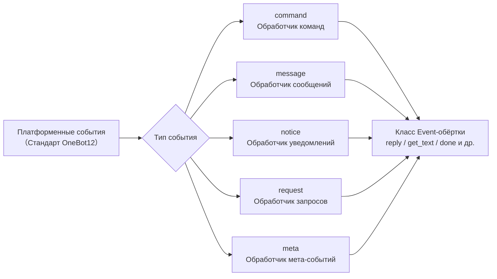

docs/ru/quick-start.md

## Модуль команд

### Регистрация команд

```python
from ErisPulse.Core.Event import command

# Базовая команда
@command("hello", help="Отправляет приветствие")
async def hello_handler(event):
    await event.reply("Привет!")

# Команда с псевдонимами
@command(["help", "h"], aliases=["помощь"], help="Показывает справку")
async def help_handler(event):
    pass

# Команда с правами доступа
def is_admin(event):
    return event.get("user_id") in admin_ids

@command("admin", permission=is_admin, help="Команда администратора")
async def admin_handler(event):
    pass

# Скрытая команда
@command("secret", hidden=True, help="Секретная команда")
async def secret_handler(event):
    pass

# Группа команд
@command("admin.reload", group="admin", help="Перезагружает модули")
async def reload_handler(event):
    pass
```

### Информация о команде

```python
# Получение справки по команде
help_text = command.help()

# Получение информации о конкретной команде
cmd_info = command.get_command("admin")

# Получение всех команд из группы
admin_commands = command.get_group_commands("admin")

# Получение всех видимых команд
visible_commands = command.get_visible_commands()
```

### Ожидание ответа

```python
# Ожидание ответа пользователя
@command("ask", help="Запрашивает информацию у пользователя")
async def ask_command(event):
    reply = await command.wait_reply(
        event,
        prompt="Пожалуйста, введите ваше имя:",  # Отправлено выше
        timeout=30.0
    )
    
    if reply:
        name = reply.get_text()
        await event.reply(f"Привет, {name}!")

# Ожидание ответа с валидацией
def validate_age(event_data):
    try:
        age = int(event_data.get_text())
        return 0 <= age <= 150
    except ValueError:
        return False

@command("age", help="Запрашивает возраст пользователя")
async def age_command(event):
    await event.reply("Пожалуйста, введите ваш возраст:")
    
    reply = await command.wait_reply(
        event,
        timeout=60,
        validator=validate_age
    )
    
    if reply:
        age = int(reply.get_text())
        await event.reply(f"Ваш возраст — {age} лет")

# Ожидание ответа с колбэком
async def handle_confirmation(reply_event):
    text = reply_event.get_text().lower()
    if text in ["да", "yes", "y"]:
        await event.reply("Операция подтверждена!")
    else:
        await event.reply("Операция отменена.")

@command("confirm", help="Подтверждает операцию")
async def confirm_command(event):
    await command.wait_reply(
        event,
        prompt="Пожалуйста, введите 'да' или 'нет':",
        callback=handle_confirmation
    )

## Модуль сообщений

### События сообщений

```python
from ErisPulse.Core.Event import message

# Слушаем все сообщения
@message.on_message()
async def message_handler(event):
    sdk.logger.info(f"Получено сообщение: {event.get_text()}")

# Слушаем личные сообщения
@message.on_private_message()
async def private_handler(event):
    user_id = event.get_user_id()
    sdk.logger.info(f"Личное сообщение от: {user_id}")

# Слушаем групповые сообщения
@message.on_group_message()
async def group_handler(event):
    group_id = event.get_group_id()
    sdk.logger.info(f"Групповое сообщение от: {group_id}")

# Слушаем сообщения с упоминанием (ат)
@message.on_at_message()
async def at_handler(event):
    mentions = event.get_mentions()
    sdk.logger.info(f"Упомянутый пользователь: {mentions}")
```

### Условные прослушивания

```python
# Используем приоритет для управления порядком выполнения
@message.on_message(priority=10)  # Чем больше число, тем выше приоритет
async def high_priority_handler(event):
    pass

# Реализуем фильтрацию условий внутри обработчика
@message.on_message()
async def filtered_handler(event):
    if "ключевое слово" not in event.get_text():
        return
    # Обработка сообщений, содержащих ключевое слово
    pass

## Модуль уведомлений

### События уведомлений

```python
from ErisPulse.Core.Event import notice

# Добавление друга
@notice.on_friend_add()
async def friend_add_handler(event):
    user_id = event.get_user_id()
    await event.reply("Добро пожаловать в друзья!")

# Удаление друга
@notice.on_friend_remove()
async def friend_remove_handler(event):
    user_id = event.get_user_id()
    sdk.logger.info(f"Удаление друга: {user_id}")

# Увеличение участников группы
@notice.on_group_increase()
async def member_increase_handler(event):
    user_id = event.get_user_id()
    await event.reply(f"Добро пожаловать нового участника!")

# Уменьшение участников группы
@notice.on_group_decrease()
async def member_decrease_handler(event):
    user_id = event.get_user_id()
    sdk.logger.info(f"Участник покинул группу: {user_id}")

## Request модуль запросов

### События запроса

```python
from ErisPulse.Core.Event import request

# Запрос от друга
@request.on_friend_request()
async def friend_request_handler(event):
    user_id = event.get_user_id()
    comment = event.get_comment()
    sdk.logger.info(f"Запрос от друга: {user_id}, Примечание: {comment}")

# Запрос на вступление в группу
@request.on_group_request()
async def group_request_handler(event):
    group_id = event.get_group_id()
    user_id = event.get_user_id()
    sdk.logger.info(f"Приглашение в группу: {group_id}, От: {user_id}")

## Модуль Meta событий

### Meta события

```python
from ErisPulse.Core.Event import meta

# Событие подключения
@meta.on_connect()
async def connect_handler(event):
    platform = event.get_platform()
    sdk.logger.info(f"Платформа {platform} успешно подключена")

# Событие отключения
@meta.on_disconnect()
async def disconnect_handler(event):
    platform = event.get_platform()
    sdk.logger.info(f"Платформа {platform} отключена")

# Событие сердцебиения
@meta.on_heartbeat()
async def heartbeat_handler(event):
    sdk.logger.debug("Получен сигнал сердцебиения")
```

### Запрос состояния бота

После того как адаптер отправляет событие meta, фреймворк автоматически отслеживает состояние бота. Ссылки на API для запроса статуса и прослушивания событий жизненного цикла см. в разделе [Система адаптеров - Управление состоянием бота](adapter-system.md#bot-状态管理).

请直接返回翻译后的完整Markdown内容，不要包含任何其他文字。

## Event �обертыватель

Модуль Event обработчик событий принимает экземпляр обертки Event, которая наследуется от dict и предоставляет удобные методы.

### Основные методы

```python
# Получение информации о событии
event_id = event.get_id()
event_time = event.get_time()
event_type = event.get_type()
detail_type = event.get_detail_type()
platform = event.get_platform()

# Получение информации о боте
self_platform = event.get_self_platform()
self_user_id = event.get_self_user_id()
self_info = event.get_self_info()
```

### Идентификатор сессии

```python
# Единый идентификатор цели: для групповых чатов возвращает group_id, для личных чатов возвращает user_id и т.д.
target_id = event.get_target_id()

# Уникальный идентификатор сессии, формат: {platform}:{detail_type}:{target_id}
session_id = event.get_session_id()
# Пример: "telegram:private:12345", "qq:group:67890"
```

`get_target_id()` возвращает первое ненулевое значение в следующем порядке: `group_id` → `channel_id` → `guild_id` → `thread_id` → `user_id`. Подходит для сценариев, требующих единообразной идентификации сессии, таких как управление контекстом и хранение состояний.

### Методы сообщений

```python
# Получение содержимого сообщения
message_segments = event.get_message()
alt_message = event.get_alt_message()
text = event.get_text()

# Получение информации об отправителе
user_id = event.get_user_id()
nickname = event.get_user_nickname()
sender = event.get_sender()

# Получение информации о группе
group_id = event.get_group_id()

# Определение типа сообщения
is_msg = event.is_message()
is_private = event.is_private_message()
is_group = event.is_group_message()

# Связанные с упоминаниями
is_at = event.is_at_message()
has_mention = event.has_mention()
mentions = event.get_mentions()
```

### Командная информация

```python
# Получение информации о команде
cmd_name = event.get_command_name()
cmd_args = event.get_command_args()
cmd_raw = event.get_command_raw()

# Определение, является ли событие командой
is_cmd = event.is_command()
```

### Функция ответа

```python
# Базовый ответ
await event.reply("Это сообщение")

# Указание метода отправки
await event.reply("http://example.com/image.jpg", method="Image")

# Ответ с @пользователем и упоминанием сообщения
await event.reply("Привет", at_users=["user1"], reply_to="msg_id")

# @всех участников
await event.reply("Анонс", at_all=True)

# Использование платформо-специфических методов (через параметр via)
await event.reply("Содержимое доски", method="Board",
                  via=[("Expire", 3600), ("ForMember", "114514")])

# Получение цепочки отправки, свободное добавление модификаторов и методов отправки (подходит для последовательных модификаторов/действий)
await event.send_chain().Expire(3600).Board("Содержимое доски")
await event.send_chain().DismissBoard()

# Использование OneBot12 сообщений для ответа
from ErisPulse.Core.Event import MessageBuilder
msg = MessageBuilder().text("Hello").image("url").build()
await event.reply_ob12(msg)

# Ожидание ответа
reply = await event.wait_reply(timeout=30)
```

### Проверка возможностей платформы

```python
# Проверка, поддерживает ли текущая платформа определенный метод отправки
if event.supports("Image"):
    await event.reply(url, method="Image")

# Получение списка всех доступных методов отправки на текущей платформе
methods = event.available_methods()
# ["Text", "Image", "Voice", ...]
```

### Методы ответа

Метод `reply()` поддерживает указание типа отправки через параметр `method` и два удобных булевых параметра:

```python
# Простой текстовый ответ
await event.reply("Привет")

# Ответ с упоминанием отправителя
await event.reply("Привет", at_sender=True)

# Ответ с цитированием текущего сообщения
await event.reply("Принято", quote=True)

# Комбинированный вариант
await event.reply("Принято", at_sender=True, quote=True)

# Отправка изображения (используя параметр method)
if event.supports("Image"):
    await event.reply("http://example.com/img.jpg", method="Image")
else:
    await event.reply("[Изображение] http://example.com/img.jpg")
```

**Описание параметров**:

| Параметр | Тип | Описание |
|------|------|------|
| `content` | str | Содержимое отправки |
| `method` | str | Метод отправки, по умолчанию "Text", опционально "Image"/"Voice"/"Video"/"File" и т.д. |
| `at_sender` | bool | Упоминать ли отправителя (автоматически извлекает user_id) |
| `quote` | bool | Цитировать ли текущее сообщение (автоматически извлекает message_id) |
| `at_users` | list[str] | Список упоминаемых пользователей |
| `reply_to` | str | Ручное указание ID сообщения для ответа |
| `at_all` | bool | Упоминать ли всех участников |

### Интерактивные методы

```python
# confirm — подтверждение диалога (возвращает True/False/None)
if await event.confirm("Вы уверены, что хотите выполнить это действие?"):
    await event.reply("Подтверждено")

# Использование не-Text метода для отправки подтверждения
if await event.confirm("http://example.com/image.jpg", method="Image"):
    await event.reply("Подтверждение по изображению")

# choose — выбор из меню (возвращает индекс опции или None)
choice = await event.choose("Выберите цвет:", ["красный", "зеленый", "синий"])

# options_format="auto" (по умолчанию) автоматически выбирает стиль в зависимости от метода:
# Markdown→непорядковый список (- 1.опция), Html→упорядоченный список (<ol>), иначе→простой текстовый список
# Для текстовых методов (Markdown/Html и т.д.) опции по умолчанию объединяются в конец
# merge_prompt=True принудительно объединяет для любого метода; placeholder позволяет настроить подставку
choice = await event.choose(
    "## Выберите\n{options}", ["A", "B"],
    method="Markdown", merge_prompt=True,
)

# collect — сбор формы (возвращает словарь {key: value} или None)
data = await event.collect([
    {"key": "name", "prompt": "Введите имя:"},
    {"key": "age", "prompt": "Введите возраст:",
     "validator": lambda e: e.get_text().isdigit()},
    {"key": "avatar", "prompt": "Отправьте аватар:", "method": "Image"},
])

# wait_for — ожидание события, удовлетворяющего условиям
evt = await event.wait_for(event_type="notice", condition=lambda e: ..., timeout=120)

# conversation — контекст многошагового диалога
conv = event.conversation(timeout=60)
await conv.say("Добро пожаловать!")
```

> Полное описание параметров интерактивных методов и дополнительные примеры см. в [Подробном описании Event обертывателя](../developer-guide/modules/event-wrapper.md) и [Многошаговый диалог Conversation](../advanced/conversation.md).

### Утилитные методы

```python
# Преобразование в словарь (фильтрует ключи, начинающиеся с _)
event_dict = event.to_dict()

# Получение исходных данных
raw = event.get_raw()
raw_type = event.get_raw_type()
```

### Управление цепочкой

`event.done(claim=, stop=)` унифицирует управление двумя ортогональными семантиками: «признание» и «блокировка»:

- **Признание (claim)**: помечает событие как обработанное (`_processed`), диспетчер команд использует это для пропуска дублирования
- **Блокировка (stop)**: предотвращает распространение на обработчики с более низким приоритетом (`_propagation_stopped`)

```python
# Признание + блокировка (по умолчанию)
event.done()

# Только признание, без блокировки (наблюдатели с низким приоритетом все еще видят)
event.done(stop=False)

# Только блокировка, без признания (например, брандмауэр / ограничение скорости)
event.done(claim=False)

# mark_processed — основной метод, done — его псевдоним
event.mark_processed()             # эквивалент event.done()
event.mark_processed(stop=False)   # эквивалент event.done(stop=False)

# Проверка состояния
event.is_processed()  # признано ли событие
event.is_stopped()    # остановлено ли распространение
```

### Платформо-специфические методы

Адаптеры могут регистрировать платформо-специфические методы для Event, доступные только на экземплярах соответствующей платформы.

#### Пользователь: использование платформо-специфических методов

После регистрации адаптером платформо-специфических методов вы можете напрямую вызывать их в обработчике событий. Методы для разных платформ отличаются, см. соответствующую [документацию платформы](../platform-guide/).

```python
from ErisPulse.Core.Event import message

@message.on_message()
async def handle_message(event):
    platform = event.get_platform()

    # Вызов специфичного метода в зависимости от платформы
    if platform == "email":
        subject = event.get_subject()           # специфичный для email
        attachments = event.get_attachments()   # специфичный для email
```

#### Проверка зарегистрированных методов платформы

```python
from ErisPulse.Core.Event import get_platform_event_methods

# Получение списка зарегистрированных методов для платформы
methods = get_platform_event_methods("email")
# ["get_subject", "get_from", "get_attachments", ...]

# Динамическая проверка и вызов
for method_name in get_platform_event_methods(event.get_platform()):
    method = getattr(event, method_name)
    print(f"{method_name}: {method()}")
```

#### Изоляция методов платформы

Методы, зарегистрированные для разных платформ, не влияют друг на друга:

```python
# Email событие - только email методы
event = Event({"platform": "email", "email_raw": {"subject": "Hello"}})
event.get_subject()      # ✅ "Hello"
event.get_chat_type()    # ❌ AttributeError

# Telegram событие - только Telegram методы
event = Event({"platform": "telegram", "telegram_raw": {"chat": {"type": "private"}}})
event.get_chat_type()    # ✅ "private"
event.get_subject()      # ❌ AttributeError
```

#### Поддержка `hasattr` / `dir`

```python
hasattr(event, "get_subject")   # возвращает True только при platform="email"
"get_subject" in dir(event)     # аналогично
```

### Адаптер: регистрация платформо-специфических методов

Адаптеры могут регистрировать платформо-специфические методы для Event с помощью декоратора, первый параметр метода — `self` (экземпляр Event), можно свободно обращаться к данным события.

#### Регистрация одного метода

```python
from ErisPulse.Core.Event import register_event_method

@register_event_method("email")
def get_subject(self):
    """Получение темы письма"""
    return self.get("email_raw", {}).get("subject", "")

@register_event_method("email")
def get_from(self):
    """Получение отправителя"""
    return self.get("email_raw", {}).get("from", {})
```

#### Массовая регистрация (через Mixin класс)

При большом количестве методов рекомендуется использовать Mixin класс для массовой регистрации:

```python
from ErisPulse.Core.Event import register_event_mixin

class EmailEventMixin:
    def get_subject(self):
        return self.get("email_raw", {}).get("subject", "")

    def get_from(self):
        return self.get("email_raw", {}).get("from", {})

    def get_attachments(self):
        return self.get("email_raw", {}).get("attachments", [])

# Регистрация всех методов за один раз
register_event_mixin("email", EmailEventMixin)
```

#### Правила возвращаемых значений

| Сценарий | Возвращаемое значение | Способ использования пользователем |
|------|--------|------------|
| Возвращение данных (текст, словарь и т.д.) | Просто возвращаемое значение | `subject = event.get_subject()` |
| Выполнение операции (отправка сообщения и т.д.) | Возвращаемый asyncio.Task | `task = event.do_something()` (опционально `await`) |

> **Рекомендация**: методы, возвращающие не данные, должны возвращать `asyncio.Task`, чтобы пользователь мог сам решить, следует ли `await`, даже если не `await`, операция будет выполнена.

```python
@register_event_method("email")
def forward_email(self, to_address: str):
    """Пересылка письма — возвращает Task, пользователь сам решает, следует ли await"""
    import asyncio
    return asyncio.create_task(
        self._do_forward(to_address)
    )

# Пользователь может await и ждать результата
await event.forward_email("user@example.com")

# Также можно не await, операция выполнится в фоне
event.forward_email("user@example.com")
```

#### Отмена регистрации метода

```python
from ErisPulse.Core.Event import unregister_event_method, unregister_platform_event_methods

# Отмена регистрации одного метода
unregister_event_method("email", "get_subject")

# Отмена регистрации всех методов платформы (вызывается при остановке адаптера)
unregister_platform_event_methods("email")
```

#### Переопределение встроенных методов

`register_event_mixin` / `register_event_method` поддерживает переопределение встроенных методов Event (например, `confirm`, `choose`, `collect`, `wait_reply`, `reply` и т.д.). Регистрируемые платформо-специфические методы через `Event.__getattribute__` имеют приоритет над встроенными, поэтому адаптеры могут предоставлять платформо-специфические реализации интерактивных функций.

Встроенные реализации экспортируются как `_builtin_*` функции, переопределяющие методы могут вызывать их в качестве резервных:

```python
from ErisPulse.Core.Event import register_event_mixin, _builtin_choose

class YunhuEventMixin:
    async def choose(self, prompt, options, timeout=60, method="Text"):
        # Платформа Yunhu использует кнопки
        buttons = [[{"text": opt} for opt in options]]
        await self.reply(prompt)
        # ...ожидание обратного вызова кнопки или текстового ответа...
        # Возврат к встроенной логике
        return await _builtin_choose(self, None, options, timeout, "Text")

register_event_mixin("yunhu", YunhuEventMixin)

## Кроссплатформенное расширение (шаблоны)

`register_event_method` и `register_event_mixin` поддерживают передачу `"*"` в качестве названия платформы, зарегистрированные методы будут доступны на **всех** платформах экземпляров Event. Подходит для модулей функциональности, требующих повторного использования кроссплатформенно, таких как AI-диалог и управление контекстом.

### Регистрация кроссплатформенного метода

```python
from ErisPulse.Core.Event.wrapper import register_event_method

@register_event_method("*")
async def ai_chat(self, prompt: str):
    """self - это экземпляр Event, вы можете свободно обращаться к данным события и встроенным методам"""
    await self.reply(f"AI: {prompt}")
```

После регистрации все обработчики событий всех платформ могут вызывать его:

```python
from ErisPulse.Core.Event import message

@message.on_message()
async def handler(event):
    await event.ai_chat(event.get_text())
```

### Приоритет разрешения методов

При доступе к методам Event через атрибуты, порядок разрешения следующий:

1. **Платформо-специфичные методы** (переопределения для текущей платформы)
2. **Методы шаблонов** (кроссплатформенные методы, зарегистрированные `"*"`)
3. **Встроенные методы** (`reply`, `confirm` и др.)
4. **Доступ по ключам словаря**

> Таким образом, методы шаблонов могут переопределять встроенные методы (например, `reply`), но могут быть дополнительно переопределены одноименными платформо-специфичными методами.

## Система приоритетов

Обработчики событий поддерживают приоритеты: чем выше значение, тем выше приоритет:

```python
# Обработчик с высоким приоритетом выполняется первым
@message.on_message(priority=10)
async def high_priority_handler(event):
    pass

# Обработчик с низким приоритетом выполняется последним
@message.on_message(priority=0)
async def low_priority_handler(event):
    pass

## Документация

- [API ядерных модулей](../core-modules.md) - API ядерных модулей
- [API системы адаптеров](../adapter-system.md) - API управления адаптерами
- [Руководство по разработке модулей](../developer-guide/modules/) - Разработка пользовательских модулей


====
高级主题
====


### Conversation 多轮对话

# Conversation многократный диалог

Класс `Conversation` предоставляет удобные методы для многократного взаимодействия в рамках одной сессии, подходит для реализации сценариев, таких как навигационные действия, сбор информации, диалоговые вопросы и ответы.

docs/ru/quick-start.md

## Создание диалога

Создание с помощью метода `conversation()` объекта `Event`:

```python
from ErisPulse.Core.Event import command

@command("quiz")
async def quiz_handler(event):
    conv = event.conversation(timeout=30)

    await conv.say("🎮 Добро пожаловать в викторину!")

    answer = await conv.choose("Первый вопрос: Кто является создателем Python?", [
        "Guido van Rossum",
        "James Gosling",
        "Dennis Ritchie",
    ])

    if answer is None:
        await conv.say("Время вышло, попробуйте в следующий раз!")
        return

    if answer == 0:
        await conv.say("Правильно!")
    else:
        await conv.say("Неверно, правильный ответ - Guido van Rossum")

    conv.stop()
```

[**中文**](docs/ru/create-conversation.md) | [**English**](docs/en/create-conversation.md) | [**Русский**](docs/ru/create-conversation.md)

## Основной API

### say(content, **kwargs)

Отправка сообщения, возвращает `self` для цепочки вызовов:

```python
await conv.say("Первая строка").say("Вторая строка").say("Третья строка")
```

Также можно указать способ отправки:

```python
await conv.say("https://example.com/image.jpg", method="Image")
```

### wait(prompt=None, timeout=None)

Ожидание ответа пользователя, возвращает объект `Event` или `None` (при таймауте):

```python
# Простое ожидание
resp = await conv.wait()
if resp:
    text = resp.get_text()

# Ожидание после отправки подсказки
resp = await conv.wait(prompt="Пожалуйста, введите ваше имя:")

# Использование пользовательского таймаута (переопределяет таймаут по умолчанию)
resp = await conv.wait(prompt="Пожалуйста, ответьте в течение 10 секунд:", timeout=10)
```

### confirm(prompt=None, **kwargs)

Ожидание подтверждения пользователя (да/нет), возвращает `True` / `False` / `None` (при таймауте):

```python
result = await conv.confirm("Вы уверены, что хотите удалить все данные?")
if result is True:
    await conv.say("Удалено")
elif result is False:
    await conv.say("Отменено")
else:
    await conv.say("Таймаут, ответ не получен")
```

Встроенные слова, распознаваемые как подтверждение: `да/yes/y/подтвердить/уверен/хорошо/ok/true/правильно/угу/ладно/согласен/нет проблем/можно/конечно...`

Встроенные слова, распознаваемые как отрицание: `нет/no/n/отменить/не/не надо/нельзя/cancel/false/ошибка/неправильно/не надо/отказать...`

### choose(prompt, options, **kwargs)

Ожидание выбора пользователя из списка, возвращает индекс выбранного элемента (начиная с 0) или `None`:

```python
choice = await conv.choose("Пожалуйста, выберите цвет:", ["красный", "зеленый", "синий"])
if choice is not None:
    colors = ["красный", "зеленый", "синий"]
    await conv.say(f"Вы выбрали {colors[choice]}")
```

Пользователь может выбрать, введя номер (`1`/`2`/`3`) или текст опции (`красный`).

`options_format="auto"` (по умолчанию) автоматически выбирает встроенный стиль в зависимости от метода: Markdown→неупорядоченный список, Html→упорядоченный список, другие→простой текстовый список.
Также поддерживаются `"list"`、`"inline"`、`"md"`、`"html"` или пользовательская функция.

Поддерживается `merge_prompt=True` для объединения в одно сообщение, а также поддержка плейсхолдера для указания позиции вставки опций (по умолчанию `{options}`, можно изменить через `placeholder`):

```python
choice = await conv.choose(
    "## Пожалуйста, выберите\n{options}",
    ["Опция A", "Опция B"],
    method="Markdown",
    merge_prompt=True,
)

# Пользовательский плейсхолдер
choice = await conv.choose(
    "Выберите: [choices]",
    ["Опция A", "Опция B"],
    placeholder="[choices]",
)
```

### collect(fields, **kwargs)

Сбор информации в несколько шагов, возвращает словарь данных или `None`:

```python
data = await conv.collect([
    {"key": "name", "prompt": "Пожалуйста, введите имя"},
    {"key": "age", "prompt": "Пожалуйста, введите возраст",
     "validator": lambda e: e.get("alt_message", "").strip().isdigit(),
     "retry_prompt": "Возраст должен быть числом, пожалуйста, повторите ввод"},
    {"key": "city", "prompt": "Пожалуйста, введите город"},
])

if data:
    await conv.say(f"Регистрация успешна!\nИмя: {data['name']}\nВозраст: {data['age']}\nГород: {data['city']}")
else:
    await conv.say("Регистрация прервана")
```

Конфигурация полей:

| Параметр | Описание | Значение по умолчанию |
|------|------|--------|
| `key` | Ключ поля (обязательно) | - |
| `prompt` | Подсказка | `"Пожалуйста, введите {key}"` |
| `validator` | Функция проверки, принимает Event, возвращает bool | Нет |
| `retry_prompt` | Подсказка при неудачной проверке | `"Ввод неверен, пожалуйста, повторите"` |
| `max_retries` | Максимальное количество попыток | 3 |
| `condition` | Функция условия, принимает собранные данные dict, возвращает bool | Нет |

**Условные поля**: с помощью `condition` можно реализовать динамическую форму, поле собирается только если условие выполнено:

```python
data = await conv.collect([
    {"key": "has_car", "prompt": "У вас есть машина? (да/нет)"},
    {"key": "car_brand", "prompt": "Пожалуйста, введите марку автомобиля",
     "condition": lambda d: d.get("has_car", "").lower() in ("да", "yes", "y")},
])
```

### stop()

Ручное завершение диалога, устанавливает `is_active` в `False`:

```python
conv.stop()
```

### is_active

Активно ли диалог:

```python
if conv.is_active:
    await conv.say("Диалог все еще активен")

## Управление активным состоянием

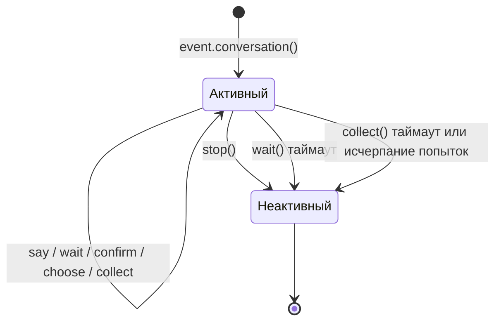

Диалог автоматически переходит в неактивное состояние в следующих случаях:

1. Вызов метода `stop()`
2. `wait()` возвращает `None` по таймауту
3. `collect()` возвращает `None` из-за таймаута на любом шаге или исчерпания попыток

После перехода в неактивное состояние все интерактивные методы (`wait`/`confirm`/`choose`/`collect`) немедленно возвращают `None`, не ожидая ввода пользователя.

[**English**](docs/ru/quick-start.md)

## Ветвление и переходы

### Декоратор `@conv.branch(name)`

Используйте `branch()` для регистрации ветвей диалога и `goto()` для перехода между ветвями:

```python
@command("menu")
async def menu_handler(event):
    conv = event.conversation(timeout=60)

    @conv.branch("main")
    async def main_menu():
        await conv.say("=== Главное меню ===\n1. Личная информация\n2. Настройки\n3. Выход")
        resp = await conv.wait()
        if resp is None:
            return
        text = resp.get_text().strip()
        if text == "1":
            await conv.goto("profile")
        elif text == "2":
            await conv.goto("settings")
        elif text == "3":
            await conv.say("До свидания!")
            conv.stop()

    @conv.branch("profile")
    async def profile():
        await conv.say("=== Личная информация ===\nИмя: Alice\n0. Вернуться")
        resp = await conv.wait()
        if resp and resp.get_text().strip() == "0":
            await conv.goto("main")

    @conv.branch("settings")
    async def settings():
        await conv.say("=== Настройки ===\n1. Переключатель уведомлений\n0. Вернуться")
        resp = await conv.wait()
        if resp and resp.get_text().strip() == "0":
            await conv.goto("main")

    await conv.start()  # Начинаем с первой зарегистрированной ветви
```

### conv.start(name=None)

Запускает диалог, по умолчанию с первой зарегистрированной ветви:

```python
await conv.start()          # Начинаем с первой ветви
await conv.start("settings") # Начинаем с указанной ветви

## Контекст и сохранение

### conv.context

Каждый экземпляр диалога содержит встроенный словарь `context`, используемый для совместного использования состояния между ветвями:

```python
@conv.branch("step1")
async def step1():
    conv.context["username"] = resp.get_text().strip()
    await conv.goto("step2")

@conv.branch("step2")
async def step2():
    name = conv.context.get("username", "неизвестный")
    await conv.say(f"Привет, {name}!")
```

### save() / resume() / clear_saved()

Диалоги поддерживают сохранение состояния, что позволяет восстановить диалог после тайм-аута или прерывания:

```python
# Сохранение состояния диалога
conv_id = conv.save()
# conv_id = "user_123_group_456"  # Генерируется автоматически на основе пользователя и группы

# ... позже в том же сеансе восстановление ...
conv2 = event.conversation()
if conv2.resume():
    await conv2.say("Добро пожаловать обратно! Продолжим предыдущий диалог")
else:
    await conv2.say("Не удалось найти предыдущий диалог")

# Очистка сохраненного диалога
conv.clear_saved()
```

[**中文**](docs/ru/quick-start.md) | [**English**](docs/ru/quick-start.md)

## Типичные сценарии

### Регистрация по шагам

```python
@command("register")
async def register_handler(event):
    conv = event.conversation(timeout=60)

    await conv.say("Добро пожаловать! Регистрация началась.")

    data = await conv.collect([
        {"key": "username", "prompt": "Введите имя пользователя (от 3 до 20 символов)",
         "validator": lambda e: 3 <= len(e.get_text().strip()) <= 20},
        {"key": "email", "prompt": "Введите адрес электронной почты",
         "validator": lambda e: "@" in e.get_text() and "." in e.get_text(),
         "retry_prompt": "Неверный формат электронной почты, пожалуйста, повторите ввод"},
    ])

    if not data:
        await event.reply("Регистрация отменена.")
        return

    confirmed = await conv.confirm(
        f"Подтвердите информацию для регистрации?\nИмя пользователя: {data['username']}\nЭлектронная почта: {data['email']}"
    )

    if confirmed:
        await conv.say("✅ Регистрация завершена успешно!")
    else:
        await conv.say("❌ Регистрация отменена.")
```

### Циклический диалог

```python
@command("chat")
async def chat_handler(event):
    conv = event.conversation(timeout=120)
    await conv.say("Вход в режим диалога. Введите «выход» для завершения.")

    while conv.is_active:
        resp = await conv.wait()
        if resp is None:
            await conv.say("Тайм-аут, диалог завершен.")
            break

        text = resp.get_text().strip()

        if text == "выход":
            await conv.say("До свидания!")
            conv.stop()
        elif text == "помощь":
            await conv.say("Доступные команды: выход, помощь, статус")
        elif text == "статус":
            await conv.say("Диалог активен.")
        else:
            await conv.say(f"Вы сказали: {text}")
```

[**中文**](docs/ru/quick-start.md)


### MessageBuilder 详解

# Подробное руководство по MessageBuilder

`MessageBuilder` — это инструмент для построения структурированных сообщений, соответствующих стандарту OneBot12, предоставленный ErisPulse. Он используется для построения структурированного содержания сообщений и работает в связке с `Send.Raw_ob12()`.

## Способы импорта

`MessageBuilder` поддерживает два способа импорта (результат одинаковый, рекомендуется использовать первый):

```python
from ErisPulse.Core.Event import MessageBuilder        # Рекомендуемый способ, импорт через пакет
from ErisPulse.Core.Event.message_builder import MessageBuilder  # Прямой импорт модуля
```

## Двухрежимная система

MessageBuilder предоставляет два режима использования, реализованных с помощью механизма описателей Python (`__get__`), чтобы обеспечить различное поведение на уровне класса и экземпляра: при вызове метода через класс, `__get__` возвращает результат выполнения статического метода; при вызове через экземпляр возвращается `self` для поддержки цепочки вызовов.

### Режим цепочечных вызовов (экземпляр)

Используется путем создания экземпляра `MessageBuilder()`. Каждый метод возвращает `self`, что позволяет использовать цепочку вызовов, и для получения списка сообщений используется `.build()`:

```python
from ErisPulse.Core.Event.message_builder import MessageBuilder

segments = (
    MessageBuilder()
    .text("Привет!")
    .image("https://example.com/photo.jpg")
    .build()
)
# [
#     {"type": "text", "data": {"text": "Привет!"}},
#     {"type": "image", "data": {"file": "https://example.com/photo.jpg"}}
# ]
```

### Режим быстрого построения (статический)

Методы вызываются напрямую через класс, каждый метод возвращает список сообщений, что подходит для построения одиночных сообщений:

```python
# Непосредственно возвращается list[dict], без .build()
segments = MessageBuilder.text("Привет!")
# [{"type": "text", "data": {"text": "Привет!"}}]
```

## Типы сообщений

| Метод | Тип | Параметры данных | Описание |
|------|------|---------|------|
| `text(text)` | text | `text` | Текстовое сообщение |
| `image(file)` | image | `file` | Сообщение с изображением |
| `audio(file)` | audio | `file` | Аудиосообщение |
| `video(file)` | video | `file` | Видеосообщение |
| `file(file, filename?)` | file | `file`, `filename` | Сообщение с файлом |
| `mention(user_id, user_name?)` | mention | `user_id`, `user_name` | Упоминание пользователя |
| `at(user_id, user_name?)` | mention | `user_id`, `user_name` | Алиас для `mention` |
| `reply(message_id)` | reply | `message_id` | Ответ на сообщение |
| `at_all()` | mention_all | - | Упоминание всех участников |
| `custom(type, data)` | пользовательский | пользовательский | Пользовательский тип сообщения |

## Использование в связке с Send

Построенный список сообщений отправляется через `Send.Raw_ob12()`:

```python
from ErisPulse import sdk
from ErisPulse.Core.Event.message_builder import MessageBuilder

# Построение сообщений в цепочке и отправка
segments = (
    MessageBuilder()
    .mention("user123", "张三")
    .text(" Пожалуйста, посмотрите на это изображение")
    .image("https://example.com/photo.jpg")
    .build()
)
await sdk.adapter.myplatform.Send.To("group", "group456").Raw_ob12(segments)
```

### Использование в ответ на событие

```python
from ErisPulse.Core.Event import command

@command("report")
async def report_handler(event):
    await event.reply_ob12(
        MessageBuilder()
        .text("📊 Сводка ежедневного отчета\n")
        .text("Выполненные задачи сегодня: 5\n")
        .text("Задачи в процессе: 3")
        .build()
    )
```

## Вспомогательные методы

### copy()

Копирует текущий билдер, что позволяет создавать несколько вариантов сообщений на основе одного и того же содержания:

```python
base = MessageBuilder().text("Базовое содержание").mention("admin")

# Создание различных сообщений на основе одного и того же префикса
msg1 = base.copy().text(" Вариант A").build()
msg2 = base.copy().text(" Вариант B").image("img.jpg").build()
```

### clear()

Очищает добавленные сообщения, что позволяет повторно использовать один и тот же билдер:

```python
builder = MessageBuilder()

for user_id in ["user1", "user2", "user3"]:
    builder.clear()
    msg = builder.mention(user_id).text(" Привет!").build()
    await adapter.Send.To("user", user_id).Raw_ob12(msg)
```

### len() / bool()

```python
builder = MessageBuilder()
print(bool(builder))   # False

builder.text("Hello")
print(len(builder))    # 1
print(bool(builder))   # True
```

## Пользовательские сообщения

Метод `custom()` используется для добавления расширенных сообщений, специфичных для платформы:

```python
# Добавление специфичного для платформы сообщения
segments = (
    MessageBuilder()
    .text("Пожалуйста, заполните форму:")
    .custom("yunhu_form", {"form_id": "12345"})
    .build()
)
```

> Пользовательские сообщения действительны только в адаптерах соответствующей платформы, другие адаптеры игнорируют неизвестные типы сообщений.

## Полный пример

### Сообщение с несколькими элементами

```python
segments = (
    MessageBuilder()
    .reply(event.get_id())                    # Ответ на исходное сообщение
    .mention(event.get_user_id())             # Упоминание отправителя
    .text(" Это результат вашего запроса:\n")             # Текстовое сообщение
    .image("https://example.com/chart.png")   # Изображение
    .text("\nПодробные данные см. в приложении:")
    .file("https://example.com/data.csv", filename="data.csv")
    .build()
)
await event.reply_ob12(segments)
```

### Смешанное использование статического фабрика и цепочки вызовов

```python
# Быстрое построение простого сообщения
simple_msg = MessageBuilder.text("Простой текст")

# Цепочечное построение сложного сообщения
complex_msg = (
    MessageBuilder()
    .at_all()
    .text(" 📢 Объявление:")
    .text("Сегодня в 15:00 состоится собрание")
    .build()
)
```


### HTTP 客户端

# Сетевой клиент

ErisPulse предоставляет единый сетевой клиент, объединяющий HTTP-запросы, WebSocket-соединения и управление пулом соединений. Модули и адаптеры **должны** использовать этот клиент, а не импортировать сторонние библиотеки, такие как `aiohttp` / `httpx` / `requests`.

## Обзор

Основные функции сетевого клиента:

- **Единый интерфейс**: предоставляет методы `get` / `post` / `put` / `delete` / `patch` / `request`
- **WebSocket-клиент**: через `ws_connect` устанавливает WebSocket-соединение
- **Автоматическое логирование**: все запросы автоматически записываются в лог и статистику
- **Интеграция с жизненным циклом**: каждый запрос вызывает событие `client.request`, а WebSocket-соединение — `client.ws.connect`
- **Поддержка повторных попыток**: настраиваемое количество автоматических повторов и интервал
- **Управление таймаутами**: независимые таймауты подключения и запроса
- **Повторное использование соединений**: управление пулом соединений на основе aiohttp.ClientSession
- **Система исключений**: aiohttp-исключения автоматически преобразуются в исключения ErisPulse (система ClientError)

## Быстрый старт

### HTTP-запросы

```python
from ErisPulse.Core import client

# GET-запрос
resp = await client.get("https://httpbin.org/get")
data = await resp.json()
print(resp.status)  # 200

# POST-запрос
resp = await client.post(
    "https://httpbin.org/post",
    json={"key": "value"},
)
data = await resp.json()
```

### WebSocket-соединение

```python
from ErisPulse.Core import client

ws = await client.ws_connect("wss://example.com/ws")

async for text in ws.iter_text():
    await ws.send_text(f"Echo: {text}")
```

## HttpResponse

Все методы запросов возвращают объект `HttpResponse`:

```python
from ErisPulse.Core import client

resp = await client.get("https://httpbin.org/get")

resp.status       # int - HTTP-статус (например, 200, 404)
resp.reason       # str | None - описание статуса (например, "OK")
resp.headers      # Заголовки ответа (регистронезависимые)
resp.content_type # str | None - Content-Type
resp.url          # Окончательный URL (может измениться из-за редиректов)
resp.raw          # Оригинальный ответ (aiohttp.ClientResponse)

# Чтение тела ответа
body = await resp.read()       # bytes
text = await resp.text()       # str
data = await resp.json()       # Парсинг JSON
text = await resp.text("gbk")  # Указание кодировки
```

## Методы запросов

### GET

```python
from ErisPulse.Core import client

resp = await client.get(
    "https://api.example.com/users",
    params={"page": "1", "limit": "10"},
    headers={"Authorization": "Bearer token"},
)
```

### POST

```python
from ErisPulse.Core import client

# JSON-тело запроса
resp = await client.post(
    "https://api.example.com/users",
    json={"name": "Alice", "age": 30},
)

# Тело запроса в формате формы
resp = await client.post(
    "https://api.example.com/login",
    data={"username": "admin", "password": "123"},
)

# Сырые данные
resp = await client.post(
    "https://api.example.com/upload",
    data=b"raw bytes",
    headers={"Content-Type": "application/octet-stream"},
)

# Загрузка файлов (используя параметр files, без импорта aiohttp)
# Формат: {имя_поля: объект_файла/bytes/(имя_файла, файл)/(имя_файла, файл, тип_контента)}
resp = await client.post(
    "https://api.example.com/upload",
    data={"description": "Аватар"},            # Опционально: одновременно с обычными полями формы
    files={
        "file": ("photo.png", open("photo.png", "rb"), "image/png"),
    },
)

# Упрощённый синтаксис: передача объекта файла напрямую
resp = await client.post(
    "https://api.example.com/upload",
    files={"file": open("photo.png", "rb")},
)

# Загрузка данных из памяти (без сохранения на диск)
import io

resp = await client.post(
    "https://api.example.com/upload",
    files={"file": ("data.txt", io.BytesIO(b"file content"), "text/plain")},
)
```

### PUT / DELETE / PATCH

```python
from ErisPulse.Core import client

resp = await client.put("https://api.example.com/users/1", json={"name": "Bob"})
resp = await client.delete("https://api.example.com/users/1")
resp = await client.patch("https://api.example.com/users/1", json={"age": 31})
```

### Общий запрос

```python
from ErisPulse.Core import client

resp = await client.request(
    "OPTIONS",
    "https://api.example.com/resource",
    headers={"Origin": "https://example.com"},
)
```

## Параметры запроса

### Параметры HTTP-запроса

| Параметр | Тип | Описание |
|------|------|------|
| `url` | `str` | URL запроса |
| `params` | `dict[str, str]` | Параметры запроса (опционально) |
| `headers` | `dict[str, str]` | Дополнительные заголовки (опционально) |
| `data` | `Any` | Тело запроса (форма или сырые данные) (опционально) |
| `json` | `Any` | Тело запроса в формате JSON (опционально) |
| `files` | `dict[str, Any]` | Поля для загрузки файлов (опционально, автоматически формирует multipart/form-data) |
| `timeout` | `float` | Таймаут запроса (секунды) (опционально, переопределяет значение по умолчанию) |
| `max_retries` | `int` | Максимальное количество повторных попыток (опционально, переопределяет значение по умолчанию) |

### Параметры ws_connect

| Параметр | Тип | Описание |
|------|------|------|
| `url` | `str` | URL WebSocket-сервера |
| `headers` | `dict[str, str]` | Дополнительные заголовки (опционально) |
| `heartbeat` | `float` | Интервал в секундах для пингов (опционально) |

## Таймауты и повторные попытки

```python
from ErisPulse.Core import HttpClient

# Создание клиента с пользовательскими таймаутами
client = HttpClient(
    timeout=60,           # Общий таймаут запроса 60 секунд
    connect_timeout=5,    # Таймаут подключения 5 секунд
    max_retries=3,        # Автоматические повторные попытки 3 раза
    retry_delay=2,        # Интервал между повторами 2 секунды
)

# Переопределение таймаута для одного запроса
resp = await client.get("https://slow-api.example.com/data", timeout=120)
```

## Настройка заголовков по умолчанию

```python
client = HttpClient(
    headers={
        "Authorization": "Bearer token",
        "X-App-Id": "my-app",
    },
    user_agent="MyBot/1.0",
)
```

## Статистика запросов

```python
from ErisPulse.Core import client

# Просмотр статистики
stats = client.stats
# {"total_requests": 42, "total_errors": 1, "total_bytes_sent": 0, "total_bytes_received": 0}

# Сброс статистики
client.reset_stats()
```

## События жизненного цикла

### События HTTP-запросов

Событие `client.request` вызывается после завершения каждого запроса, используется для мониторинга:

```python
from ErisPulse.Core import lifecycle

@lifecycle.on("client.request")
async def on_request(event_data):
    print(f"{event_data['method']} {event_data['url']} -> {event_data['status']} ({event_data['elapsed']}s)")
```

### События WebSocket-соединений

Событие `client.ws.connect` вызывается после установления каждого WebSocket-соединения:

```python
from ErisPulse.Core import lifecycle

@lifecycle.on("client.ws.connect")
async def on_ws_connect(event_data):
    print(f"WS-соединение: {event_data['url']}")
```

## Контекстный менеджер

```python
# Использование как контекстный менеджер, автоматическое закрытие сессии
async with HttpClient(timeout=30) as client:
    resp = await client.get("https://httpbin.org/get")
    data = await resp.json()
```

## WebSocket-клиент

WebSocket-клиент создается через `client.ws_connect()`, возвращается объект `ClientWebSocket`. Клиент и серверная часть WebSocket разделяют один и тот же базовый класс `WebSocketConnectionBase`, интерфейсы send/receive/iter полностью идентичны.

### Основное использование

```python
from ErisPulse.Core import client

ws = await client.ws_connect("wss://example.com/ws", heartbeat=30)

await ws.send_text("Hello")
await ws.send_bytes(b"\x00\x01\x02")
await ws.send_json({"type": "ping"})
```

### Прием сообщений

#### Рекомендуемые методы (уровень выше)

Автоматически фильтруют типы сообщений, при разрыве соединения выбрасывают `WebSocketDisconnect`:

```python
from ErisPulse.Core import client
from ErisPulse.Core.Bases.errors import WebSocketDisconnect

ws = await client.ws_connect("wss://example.com/ws")

# Получение одного сообщения
text = await ws.receive_text()    # str
data = await ws.receive_bytes()   # bytes
obj = await ws.receive_json()     # dict / list

# Итерация по сообщениям (автоматически останавливается при разрыве)
async for text in ws.iter_text():
    print(text)

async for data in ws.iter_bytes():
    print(data)

async for obj in ws.iter_json():
    print(obj)
```

#### Низкоуровневые методы

Использование `receive()` и `iter_messages()` для обработки сообщений в их исходном виде, можно различать типы TEXT / BINARY / CLOSE / ERROR:

```python
from ErisPulse.Core import client
from ErisPulse.Core.Bases.websocket import WSMessage

ws = await client.ws_connect("wss://example.com/ws")

# Получение одного сообщения
msg = await ws.receive()
# msg.type  -> WSMessage.TEXT / WSMessage.BINARY / WSMessage.CLOSE / WSMessage.ERROR
# msg.data  -> str | bytes | None

# Итерация по сообщениям (автоматически останавливается при CLOSE/ERROR)
async for msg in ws.iter_messages():
    if msg.type == WSMessage.TEXT:
        print(f"Текст: {msg.data}")
    elif msg.type == WSMessage.BINARY:
        print(f"Двоичные данные: {len(msg.data)} bytes")
```

### WSMessage

`WSMessage` — единый тип WebSocket-сообщения, не зависит от底层 библиотеки:

| Свойство | Тип | Описание |
|------|------|------|
| `type` | `str` | Тип сообщения: `WSMessage.TEXT` / `WSMessage.BINARY` / `WSMessage.CLOSE` / `WSMessage.ERROR` |
| `data` | `Any` | Данные сообщения |

### Свойства ClientWebSocket

| Свойство | Тип | Описание |
|------|------|------|
| `url` | `URL` | URL соединения |
| `headers` | `Headers` | Заголовки ответа |
| `closed` | `bool` | Закрыто ли соединение |
| `raw` | `object` | Оригинальный объект (aiohttp.ClientWebSocketResponse) |

### Хуки жизненного цикла

Аналогично `WebSocketConnection` сервера, поддерживаются обратные вызовы `on_disconnect` и `on_error`:

```python
from ErisPulse.Core import client

ws = await client.ws_connect("wss://example.com/ws")

@ws.on_disconnect
async def handle_disconnect(ws, reason="unknown"):
    print(f"Соединение разорвано: {reason}")

@ws.on_error
async def handle_error(ws, error=""):
    print(f"Ошибка соединения: {error}")
```

### Закрытие соединения

```python
await ws.close(code=1000, reason="Normal closure")
```

## Система исключений

ErisPulse определяет единый иерархический уровень исключений, запросы, инициированные через `sdk.client`, автоматически преобразуют исключения aiohttp в исключения ErisPulse.

> **Обратная совместимость**: старые модули/адаптеры, использующие напрямую `aiohttp.ClientSession`, не затронуты. Преобразование исключений происходит только при использовании `sdk.client`, код, использующий напрямую aiohttp, по-прежнему ловит исключения `aiohttp.ClientError` и другие оригинальные исключения. Оба способа могут сосуществовать.

### Иерархия исключений

```
ErisPulseError
├── ClientError                  # Базовый класс для всех исключений HTTP/WS-клиента
│   ├── ClientConnectionError    # Ошибка подключения (DNS, соединение отклонено, недоступность сети)
│   ├── ClientTimeoutError       # Таймаут подключения или запроса
│   └── HTTPStatusError          # Ошибки HTTP 4xx/5xx
└── WebSocketError               # Базовый класс WebSocket-исключений
    └── WebSocketDisconnect      # Отключение WebSocket (общий для клиента и сервера)
```

### Обработка исключений

```python
from ErisPulse.Core import client
from ErisPulse.Core.Bases.errors import (
    ClientError,
    ClientConnectionError,
    ClientTimeoutError,
    HTTPStatusError,
    WebSocketDisconnect,
    WebSocketError,
)

# Обработка исключений HTTP-запросов
try:
    resp = await client.get("https://api.example.com/data")
    data = await resp.json()
except ClientConnectionError:
    print("Невозможно подключиться к серверу")
except ClientTimeoutError:
    print("Запрос превысил таймаут")
except ClientError as e:
    print(f"Запрос не удался: {e}")

# Обработка исключений WebSocket
try:
    ws = await client.ws_connect("wss://example.com/ws")
    async for text in ws.iter_text():
        await ws.send_text(f"Echo: {text}")
except WebSocketDisconnect as e:
    print(f"Соединение разорвано: code={e.code}, reason={e.reason}")
except WebSocketError as e:
    print(f"Ошибка WebSocket: {e}")
```

### Единое перехватывание

Использование `ClientError` для перехвата всех исключений HTTP/WS-клиента:

```python
from ErisPulse.Core.Bases.errors import ClientError

try:
    resp = await client.get("https://api.example.com/data")
except ClientError as e:
    print(f"Ошибка клиента: {e}")
```

### HTTPStatusError

Когда нужно проверить статус-код после запроса и выбросить исключение, можно использовать `HTTPStatusError`:

```python
from ErisPulse.Core.Bases.errors import HTTPStatusError

resp = await client.get("https://api.example.com/data")
if resp.status >= 400:
    raise HTTPStatusError(resp.status, await resp.text())
```

## Использование в адаптерах

Адаптеры могут использовать глобальный клиент или создавать экземпляр клиента для отправки платформенных API-запросов:

```python
from ErisPulse.Core import client
from ErisPulse.Core.Bases import BaseAdapter
from ErisPulse.Core.Bases.errors import ClientError

class MyAdapter(BaseAdapter):
    async def call_api(self, endpoint, **params):
        try:
            resp = await client.post(
                f"https://api.platform.com/{endpoint}",
                json=params,
                headers={"Authorization": f"Bearer {self.token}"},
            )
            return await resp.json()
        except ClientError as e:
            self.logger.error(f"Ошибка вызова API: {e}")
            raise
```

> Также можно использовать `from ErisPulse import sdk` и `sdk.client`, результат будет идентичен.

## Лучшие практики

1. **Предпочтительное использование глобального клиента**: получение глобального синглтона через `from ErisPulse.Core import client` для упрощения управления и мониторинга фреймворком
2. **Избегайте прямого импорта aiohttp**: использование `client` вместо `aiohttp.ClientSession`, при замене底层 реализации код не потребует изменений. Старый код, использующий напрямую aiohttp, по-прежнему работает, оба способа могут сосуществовать
3. **Использование системы исключений ErisPulse**: при запросах через `sdk.client` ловите `ClientError`, а не `aiohttp.ClientError`, чтобы код не зависел от конкретной HTTP-библиотеки. Код, использующий напрямую aiohttp, не затронут
4. **Разумная настройка таймаутов**: установка разумных таймаутов в зависимости от скорости ответа API, чтобы избежать длительных блокировок
5. **Использование механизма повторных попыток**: включение повторов для нестабильных API, повышение надежности
6. **Мониторинг статистики запросов**: использование `sdk.client.stats` или событий жизненного цикла `client.request` для мониторинга запросов
7. **Использование высокого уровня методов WebSocket**: предпочтительное использование `iter_text` / `iter_json` и других высокого уровня методов, использование `iter_messages` только при необходимости различать типы сообщений


### SQL 查询构建器

# SQL Query Builder

Модуль хранения (Storage) в ErisPulse предоставляет универсальный конструктор SQL-запросов в стиле цепочки вызовов (chain-style), поддерживающий создание пользовательских таблиц, а также операции выборки, обновления и удаления.

## Архитектура

```
Bases/storage.py                    Core/storage.py
┌─────────────────────┐             ┌──────────────────────────┐
│  BaseStorage (ABC)  │◄────────────│  StorageManager          │
│  BaseQueryBuilder   │             │  (конкретная реализация  │
│    (ABC)            │             │   на базе SQLite)        │
└─────────────────────┘             │                          │
                                    │  SQLiteQueryBuilder      │
                                    │  AlterTableBuilder       │
                                    └──────────────────────────┘
```

- `BaseStorage` / `BaseQueryBuilder` — это абстрактные базовые классы, определяющие единый интерфейс, который поддерживает расширение для других носителей хранения (Redis, MySQL и т. д.)
- `StorageManager` — текущая конкретная реализация на базе SQLite, полностью сохраняющая обратную совместимость

## Импорт

```python
from ErisPulse import sdk
# или
from ErisPulse.Core import storage

# Базовые классы ABC (для типизации или пользовательской реализации)
from ErisPulse.Core.Bases.storage import BaseStorage, BaseQueryBuilder
```

## Управление таблицами

### Создание таблицы

```python
sdk.storage.CreateTable("users", {
    "id": "INTEGER PRIMARY KEY AUTOINCREMENT",
    "name": "TEXT NOT NULL",
    "age": "INTEGER DEFAULT 0",
    "email": "TEXT"
})
```

### Проверка существования таблицы

```python
if sdk.storage.HasTable("users"):
    print("Таблица users существует")
```

### Удаление таблицы

```python
sdk.storage.DropTable("users")
```

### Изменение структуры таблицы

```python
# Добавление столбца
sdk.storage.AlterTable("users").AddColumn("email", "TEXT").Execute()

# Переименование таблицы
sdk.storage.AlterTable("users").RenameTo("members").Execute()

# Цепочка нескольких операций
sdk.storage.AlterTable("users") \
    .AddColumn("phone", "TEXT") \
    .AddColumn("address", "TEXT") \
    .Execute()
```

## Запросы в стиле цепочки (Chain Queries)

### Вставка данных

```python
# Вставка одной строки (передача словаря)
sdk.storage.Table("users").Insert({"name": "Alice", "age": 30}).Execute()

# Массовая вставка (передача списка словарей)
sdk.storage.Table("users").InsertMulti([
    {"name": "Bob", "age": 25},
    {"name": "Charlie", "age": 35},
    {"name": "Dave", "age": 40}
]).Execute()
```

### Запрос данных

> **Важно**: `Select()` возвращает `list[tuple]` (список кортежей), а не словарь. Вам необходимо получать значения, обращаясь по индексу в порядке следования столбцов.

```python
# Запрос всех столбцов
rows = sdk.storage.Table("users").Select().Execute()
# rows: [(1, "Alice", 30), (2, "Bob", 25), ...]

# Запрос указанных столбцов
rows = sdk.storage.Table("users").Select("name", "age").Execute()
# rows: [("Alice", 30), ("Bob", 25), ...]

# Получение значения по индексу
for row in rows:
    name = row[0]   # "Alice"
    age = row[1]    # 30
```

#### Преобразование кортежей в словари

```python
columns = ["id", "name", "age"]
rows = sdk.storage.Table("users").Select(*columns).Execute()

# Способ 1: zip внутри цикла
for row in rows:
    record = dict(zip(columns, row))
    print(record["name"], record["age"])

# Способ 2: преобразование списка кортежей в список словарей за один раз
records = [dict(zip(columns, row)) for row in rows]
```

#### Получение одной записи

```python
row = sdk.storage.Table("users").Select("name", "age") \
    .Where("id = ?", 1) \
    .ExecuteOne()

# row — это кортеж или None
if row is not None:
    name = row[0]  # "Alice"
    age = row[1]   # 30
```

### Фильтрация по условиям

> `Where(condition, *params)` поддерживает передачу нескольких параметров, соответствующих нескольким заполнителям `?`.

```python
# Одно условие (один заполнитель, один параметр)
rows = sdk.storage.Table("users").Select("name") \
    .Where("age > ?", 18) \
    .Execute()

# Использование нескольких заполнителей в одном Where
rows = sdk.storage.Table("users").Select("name") \
    .Where("age > ? AND age < ?", 20, 40) \
    .Execute()

# Многократный вызов Where (связано оператором AND)
rows = sdk.storage.Table("users").Select("name") \
    .Where("age > ?", 20) \
    .Where("age < ?", 40) \
    .Execute()
```

### Сортировка, пагинация

```python
# По возрастанию
rows = sdk.storage.Table("users").Select("name", "age") \
    .OrderBy("name") \
    .Execute()

# По убыванию
rows = sdk.storage.Table("users").Select("name") \
    .OrderBy("age", desc=True) \
    .Execute()

# Пагинация
rows = sdk.storage.Table("users").Select("name") \
    .OrderBy("id") \
    .Limit(10) \
    .Offset(20) \
    .Execute()
```

### Обновление данных

```python
# Обновление по условию
sdk.storage.Table("users") \
    .Update({"age": 31}) \
    .Where("name = ?", "Alice") \
    .Execute()

# Полное обновление
sdk.storage.Table("users") \
    .Update({"status": "active"}) \
    .Execute()
```

### Удаление данных

```python
# Удаление по условию
sdk.storage.Table("users") \
    .Delete() \
    .Where("name = ?", "Bob") \
    .Execute()

# Полное удаление
sdk.storage.Table("users").Delete().Execute()
```

### Подсчет и проверка существования

```python
# Подсчет
count = sdk.storage.Table("users").Count()
count = sdk.storage.Table("users").Where("age > ?", 18).Count()

# Проверка существования
exists = sdk.storage.Table("users").Where("name = ?", "Alice").Exists()
```

## Повторное использование условий запроса

Используйте `copy()` для глубокого копирования конструктора для повторного использования базовых условий:

```python
base = sdk.storage.Table("users").Where("age > ?", 20)

# Запрос на основе тех же условий
rows = base.copy().Select("name").OrderBy("name").Limit(5).Execute()

# Подсчет на основе тех же условий
count = base.copy().Count()

# Проверка существования на основе тех же условий
exists = base.copy().Where("name = ?", "Alice").Exists()
```

## Сброс конструктора

```python
builder = sdk.storage.Table("users").Select("name").Where("age > ?", 18)
builder.clear()

# Перестроение запроса
builder.Select("name", "age").Where("name = ?", "Alice")
rows = builder.Execute()
```

## Использование в транзакциях

Операции в стиле цепочки полностью поддерживают транзакции:

```python
# Подтверждение транзакции
with sdk.storage.transaction():
    sdk.storage.Table("users").Insert({"name": "Eve", "age": 22}).Execute()
    sdk.storage.Table("users").Update({"age": 23}).Where("name = ?", "Eve").Execute()

# Пример отката
try:
    with sdk.storage.transaction():
        sdk.storage.Table("users").Delete().Where("name = ?", "Alice").Execute()
        raise Exception("force rollback")
except Exception:
    pass
# Запись Alice все еще существует
```

## Описание возвращаемых значений

| Операция | Тип возвращаемого значения | Описание |
|------|---------|------|
| `Select().Execute()` | `list[tuple]` | Список кортежей, упорядоченных по столбцам |
| `Select().ExecuteOne()` | `tuple \| None` | Один кортеж или None |
| `Insert().Execute()` | `int` | Количество затронутых строк |
| `InsertMulti().Execute()` | `int` | Количество вставленных строк |
| `Update().Execute()` | `int` | Количество затронутых строк |
| `Delete().Execute()` | `int` | Количество затронутых строк |
| `Count()` | `int` | Количество совпавших строк |
| `Exists()` | `bool` | Наличие записи |

### Примеры обработки возвращаемых значений

```python
# Select возвращает кортежи, берем значения по индексу
rows = sdk.storage.Table("users").Select("name", "age").Execute()
first_name = rows[0][0]  # Имя в первой строке, первом столбце
first_age = rows[0][1]   # Возраст в первой строке, втором столбце

# Рекомендуется: преобразование в словарь с помощью списка имен столбцов + zip, код более читаем
cols = ["name", "age"]
rows = sdk.storage.Table("users").Select(*cols).Execute()
for row in rows:
    d = dict(zip(cols, row))
    print(d["name"], d["age"])

# ExecuteOne возвращает один кортеж или None
row = sdk.storage.Table("users").Select("name").Where("id = ?", 1).ExecuteOne()
name = row[0] if row else None

# Insert/Update/Delete возвращают количество затронутых строк
affected = sdk.storage.Table("users").Delete().Where("age < ?", 18).Execute()
print(f"Удалено записей: {affected}")
```

## Параметризованные запросы

Все параметры WHERE используют заполнитель `?`, параметры передаются как последовательные аргументы метода `Where()` (**не** как кортеж или список):

```python
# Верно ✓ — передача нескольких параметров по отдельности
sdk.storage.Table("users").Where("age > ? AND name = ?", 18, "Alice").Execute()

# Верно ✓ — многократный вызов Where
sdk.storage.Table("users").Where("age > ?", 18).Where("name = ?", "Alice").Execute()

# Ошибочно ✗ — не передавайте кортеж
sdk.storage.Table("users").Where("age > ? AND name = ?", (18, "Alice")).Execute()
# Это превратит весь кортеж в значение для первого заполнителя

# Ошибочно ✗ — существует риск SQL-инъекции
sdk.storage.Table("users").Where(f"name = '{user_input}'").Execute()
```

### Правила передачи параметров Where

```python
# Where(condition: str, *params: Any)
# params — переменное число аргументов, передаются по одному

# Один параметр
.Where("name = ?", "Alice")

# Несколько параметров
.Where("age > ? AND age < ?", 18, 60)

# Запрос LIKE
.Where("name LIKE ?", "A%")

# Запрос IN (требуется вручную построить заполнители)
.Where("name IN (?, ?, ?)", "Alice", "Bob", "Charlie")
```

## Пользовательский бэкенд (хранилище)

Наследуйте `BaseStorage` и `BaseQueryBuilder` для реализации пользовательского бэкенда:

```python
from ErisPulse.Core.Bases.storage import BaseStorage, BaseQueryBuilder

class MyQueryBuilder(BaseQueryBuilder):
    def Execute(self):
        # Реализация конкретной логики выполнения
        ...

    def ExecuteOne(self):
        ...

    def Count(self):
        ...

    def Exists(self):
        ...


class MyStorage(BaseStorage):
    def get(self, key, default=None):
        ...

    def set(self, key, value):
        ...

    # Реализация других абстрактных методов...
    def Table(self, table_name):
        return MyQueryBuilder(self, table_name)
```


### 路由系统

# Маршрутизатор

Маршрутизатор ErisPulse обеспечивает единое управление HTTP и WebSocket маршрутизацией, поддерживает регистрацию маршрутов и управление жизненным циклом с несколькими адаптерами. В основе лежит абстрактный уровень, реализованный (в настоящее время FastAPI + Uvicorn).

## Обзор

Основные функции маршрутизатора:

- **Декораторы маршрутов**: поддержка быстрой регистрации с помощью декораторов `@http` / `@get` / `@post` / `@put` / `@delete` / `@ws`
- **Автоматическая инъекция**: обработчики маршрутов не требуют импорта типов FastAPI, фреймворк автоматически инжектирует абстрактные объекты
- **Группировка маршрутов**: поддержка `RouteGroup` с префиксом и номером версии
- **Маршрутизация промежуточного ПО**: поддержка шаблонного сопоставления запросов с помощью glob
- **Ограничение скорости**: встроенная система ограничения скорости с использованием скользящего окна
- **Поддержка CORS**: включение кросс-доменных ресурсов одним нажатием
- **Безопасные заголовки**: автоматическое добавление безопасных заголовков ответа
- **Автоматическая документация**: интерактивная документация на основе OpenAPI
- **Поддержка WebSocket**: полное управление подключениями WebSocket, пользовательская аутентификация и хуки жизненного цикла
- **Интеграция жизненного цикла**: глубокая интеграция с системой жизненного цикла ErisPulse
- **Поддержка SSL/TLS**: поддержка безопасных соединений HTTPS и WSS
- **Главная страница**: поддержка регистрации быстрых кнопок модулей на корневом маршруте `/`, поддержка локализации

## Абстрактные типы

ErisPulse предоставляет абстрактные типы для сервера, позволяющие модулям не зависеть напрямую от FastAPI:

| Абстрактный тип | Соответствие FastAPI | Описание |
|---------|-------------|------|
| `HttpRequest` | `fastapi.Request` | Обертка для HTTP-запроса, полная совместимость по интерфейсу |
| `WebSocketConnection` | `fastapi.WebSocket` | Обертка для WebSocket-подключения, дополнительно предоставляет хуки жизненного цикла |
| `WebSocketDisconnect` | `fastapi.WebSocketDisconnect` | Исключение разрыва WebSocket-соединения |

> `WebSocketConnection` наследуется от `WebSocketConnectionBase`, разделяя с клиентским WebSocket (`ClientWebSocket`) одинаковые интерфейсы send/receive/iter/close. Клиентский и серверный WebSocket могут использовать одинаковый бизнес-логический код.
>
> Через свойство `.raw` можно получить доступ к базовому объекту FastAPI. Код, использующий типы FastAPI напрямую, также полностью совместим.

## Декораторы маршрутов (рекомендуется)

### HTTP-декораторы

```python
from ErisPulse.Core import router
@router.get("my_module", "/info")
async def get_info(request):
    return {"method": request.method, "path": str(request.url)}

# Также можно явно указать абстрактный тип
from ErisPulse.Core import HttpRequest

@router.post("my_module", "/data")
async def post_data(request: HttpRequest):
    data = await request.json()
    return {"received": data}

@router.put("my_module", "/data/{item_id}")
async def update_data(request):
    return {"updated": True}

@router.delete("my_module", "/data/{item_id}")
async def delete_data(request):
    return {"deleted": True}
```

> **Правило автоматической инъекции**: когда первый параметр обработчика имеет имя `request` или `req` и не имеет аннотации типа FastAPI, фреймворк автоматически инжектирует `HttpRequest`. Обработчики без параметров или с параметрами, не являющимися именем запроса, не затрагиваются.

### WebSocket-декораторы

```python
from ErisPulse.Core import WebSocketConnection, WebSocketDisconnect

# Базовый WebSocket
@router.ws("my_module", "/ws")
async def websocket_handler(ws):
    async for msg in ws.iter_text():
        await ws.send_text(f"Echo: {msg}")

# WebSocket с хуками жизненного цикла
@router.ws("my_module", "/ws/chat")
async def chat(ws: WebSocketConnection):
    @ws.on_disconnect
    async def on_disconnect(ws, reason="unknown"):
        print(f"Пользователь отключился: {reason}")

    @ws.on_error
    async def on_error(ws, error=""):
        print(f"Ошибка соединения: {error}")

    async for msg in ws.iter_text():
        await ws.send_text(f"Echo: {msg}")

# WebSocket с аутентификацией
async def ws_auth(ws: WebSocketConnection) -> bool:
    token = ws.query_params.get("token")
    return token == "secret"

@router.ws("my_module", "/secure_ws", auth_handler=ws_auth)
async def secure_ws_handler(ws):
    while True:
        data = await ws.receive_text()
        await ws.send_text(f"Echo: {data}")
```

> **Примечание**: WebSocket-обработчики и обработчики аутентификации также поддерживают автоматическую инъекцию. Без аннотации параметров можно получить `WebSocketConnection`. Указание `fastapi.WebSocket` также позволяет передавать оригинальный объект, но рекомендуется использовать абстрактные типы.

## Традиционный способ регистрации

```python
async def hello_handler(request):
    return {"message": "Hello World"}

# Базовая регистрация
router.register_http_route(
    module_name="my_module",
    path="/hello",
    handler=hello_handler,
    methods=["GET"],
)

# Регистрация с ограничением скорости и информацией о документации
router.register_http_route(
    module_name="my_module",
    path="/api/data",
    handler=data_handler,
    methods=["POST"],
    rate_limit="10/minute",
    summary="Интерфейс данных",
    tags=["API"],
)
```

### WebSocket-регистрация

```python
from ErisPulse.Core import WebSocketConnection

async def websocket_handler(ws: WebSocketConnection):
    async for msg in ws.iter_text():
        await ws.send_text(f"Echo: {msg}")

# Базовая регистрация
router.register_websocket(
    module_name="my_module",
    path="/ws",
    handler=websocket_handler,
)

# Регистрация с аутентификацией (рекомендуется)
async def auth_handler(ws: WebSocketConnection) -> bool:
    token = ws.query_params.get("token")
    return token == "secret"

router.register_websocket(
    module_name="my_module",
    path="/secure_ws",
    handler=websocket_handler,
    auth_handler=auth_handler,
)
```

**Описание параметров:**

| Параметр | Описание | Значение по умолчанию |
|------|------|--------|
| `module_name` | Имя модуля (обязательно) | - |
| `path` | Путь WebSocket | - |
| `handler` | Функция обработки | - |
| `auth_handler` | Функция аутентификации, возвращающая `False` автоматически закрывает соединение | `None` |
| `auto_accept` | Автоматически ли вызывать `accept()` | `True` |

> **Рекомендуется**: использовать `auth_handler` для подтверждения соединения, а не отключать `auto_accept`. Установите `auto_accept=False` только в том случае, если вам нужно полностью контролировать процесс соединения.

## Хуки жизненного цикла WebSocket

`WebSocketConnection` предоставляет обратные вызовы для отключения и ошибок, без необходимости вручную использовать try/catch:

```python
from ErisPulse.Core import WebSocketConnection

@router.ws("my_module", "/ws")
async def my_ws(ws: WebSocketConnection):
    # Регистрация с помощью декоратора
    @ws.on_disconnect
    async def on_close(ws, reason="unknown"):
        print(f"Причина отключения: {reason}")

    # Также можно вызывать напрямую
    async def on_err(ws, error=""):
        print(f"Ошибка: {error}")
    ws.on_error(on_err)

    # Обычная бизнес-логика
    async for msg in ws.iter_text():
        await ws.send_text(f"Echo: {msg}")
```

## Группировка маршрутов

```python
# Создание маршрутизатора с префиксом
group = router.group("my_module", prefix="/v1")

@group.get("/users")
async def list_users(request):
    return {"users": []}

@group.post("/users")
async def create_user(request):
    return {"created": True}

# Фактический путь: /my_module/v1/users
```

## Промежуточное ПО маршрутов

Промежуточное ПО поддерживает шаблоны glob для сопоставления путей:

```python
@router.middleware("/my_module/*")
async def auth_middleware(request, call_next):
    token = request.headers.get("Authorization")
    if not token:
        return {"error": "Unauthorized"}
    return await call_next(request)

@router.middleware("/my_module/admin/*")
async def admin_middleware(request, call_next):
    return await call_next(request)
```

## Идентификатор запроса (X-Request-ID)

Начиная с версии 2.7.0, каждый HTTP-запрос будет содержать идентификатор `X-Request-ID`, используемый для логирования и трассировки связей:

- **Правило генерации**: приоритетно используется заголовок `X-Request-ID`, переданный клиентом (для распределенных трассировок); в противном случае генерируется UUID
- **Ответный заголовок**: ответ будет возвращать `X-Request-ID`, что позволяет клиенту сопоставлять запросы с логами
- **События жизненного цикла**: к данным событий `server.request` и `server.response` добавляется поле `request_id`

```python
# В модуле отслеживание событий запроса, сопоставление запросов-ответов по request_id
@sdk.lifecycle.on("server.request")
async def on_request(data):
    print(f"[{data['request_id']}] {data['method']} {data['path']}")

@sdk.lifecycle.on("server.response")
async def on_response(data):
    print(f"[{data['request_id']}] -> {data['status_code']}")
```

Клиент может использовать собственный идентификатор для трассировки между сервисами:

```bash
curl -H "X-Request-ID: my-trace-id" http://localhost:8080/my_module/health
```

## Ограничение скорости

Использование алгоритма скользящего окна для ограничения скорости маршрутов:

```python
@router.get("my_module", "/limited", rate_limit="10/minute")
async def limited_endpoint(request):
    return {"ok": True}

@router.post("my_module", "/submit", rate_limit="5/minute")
async def submit_data(request):
    return {"submitted": True}
```

Формат ограничения скорости: `{количество}/{временной интервал}`, например `10/minute`, `100/hour`.

## Конфигурация CORS

```python
router.setup_cors(
    allow_origins=["https://example.com"],
    allow_methods=["GET", "POST"],
    allow_headers=["*"],
)
```

Также можно настроить через `config.toml`:

```toml
[router.cors]
allow_origins = ["https://example.com"]
allow_methods = ["GET", "POST"]
allow_headers = ["*"]
```

## Безопасные заголовки

```python
router.setup_security_headers()
```

Автоматически добавляются безопасные заголовки, такие как `X-Content-Type-Options`, `X-Frame-Options`, `X-XSS-Protection` и др.

Также можно настроить через `config.toml`:

```toml
[router.security]
enabled = true
```

## Автоматическая документация

Router по умолчанию включает интерактивную документацию OpenAPI:

```python
# Отключение документации
router.disable_docs()

# Настройка информации документации
router.set_docs_info(
    title="My API",
    description="API документация",
    version="1.0.0"
)
```

## Обработка путей

Маршруты автоматически добавляют имя модуля как префикс, чтобы избежать конфликтов:

```python
# Регистрация пути "/api" для модуля "my_module"
# Фактический доступный путь: "/my_module/api"
router.register_http_route("my_module", "/api", handler)
```

## Системные маршруты

Маршрутизатор автоматически предоставляет следующие системные маршруты:

### Проверка здоровья

```
GET /health
# Возвращает:
{"status": "ok", "service": "ErisPulse Router"}
```

### Главная страница

```
GET /
# Возвращает страницу бренда ErisPulse
```

На корневом маршруте `/` отображается страница бренда ErisPulse, автоматически проверяется доступность Dashboard и добавляются кнопки входа.

## Главная кнопка

Маршрутизатор позволяет внешним модулям регистрировать кнопки быстрого доступа на корневом маршруте `/`, что облегчает пользователям быстрый доступ к страницам управления модулями.

### Регистрация кнопки

```python
# Простая регистрация
router.register_home_entry(
    name="Моя панель",
    url="/mymodule/admin",
)

# Регистрация с иконкой (SVG)
router.register_home_entry(
    name="Консоль",
    url="/console",
    icon_svg='<svg width="18" height="18" viewBox="0 0 24 24" fill="none" stroke="currentColor" stroke-width="1.8"><path d="M4 17l6-6-6-6"/><path d="M12 19h8"/></svg>',
)

# Регистрация с поддержкой локализации (формат словаря i18n проекта)
router.register_home_entry(
    name={"i18n": "mymodule.home.entry", "default": "Моя панель"},
    url="/mymodule/admin",
)
```

**Описание параметров:**

| Параметр | Тип | Описание | Обязательно |
|------|------|------|------|
| `name` | `str` / `dict` | Текст отображения кнопки; при передаче словаря `{"i18n": "key", "default": "текст"}` используется локализация | Да |
| `url` | `str` | Ссылка кнопки | Да |
| `icon_svg` | `str` | Необязательный SVG-иконный маркер | Нет |

### Автоматическая регистрация Dashboard

При обнаружении доступности `sdk.Dashboard`, маршрутизатор автоматически добавляет кнопку Dashboard в начало списка входов, без необходимости ручной регистрации.

## Интеграция жизненного цикла

```python
from ErisPulse.Core import lifecycle

@lifecycle.on("server.start")
async def on_server_start(event):
    print(f"Сервер запущен: {event['data']['base_url']}")

@lifecycle.on("server.stop")
async def on_server_stop(event):
    print("Сервер останавливается...")
```

## Лучшие практики

1. **Предпочтение абстрактных типов**: использование `HttpRequest` / `WebSocketConnection` вместо `fastapi.Request` / `fastapi.WebSocket`, избегание жесткой зависимости
2. **Использование автоматической инъекции**: первый параметр обработчика должен называться `request` или `req`, без аннотации типа можно получить `HttpRequest`
3. **Явный передача module_name**: первый параметр декоратора должен быть именем модуля, не может быть опущен
4. **Использование группировки маршрутов**: использование `group()` для организации нескольких маршрутов одного модуля
5. **Рассмотрение безопасности**: реализация механизмов аутентификации и безопасных заголовков для чувствительных операций
6. **Разумное ограничение скорости**: установка ограничения скорости для высокочастотных интерфейсов
7. **Использование хуков жизненного цикла**: обработка исключений WebSocket с помощью `@ws.on_disconnect` / `@ws.on_error`, избегание ручного try/catch


### 生命周期管理

# Управление жизненным циклом

ErisPulse предоставляет единый систему хуков/жизненного цикла для мониторинга состояния работы компонентов системы, а также реализации расширенных функций, таких как аудит, статистика и пользовательская логика.

Система поддерживает три способа триггеризации:
- `await lifecycle.emit("event", data)` — упрощённая версия, передача произвольных данных
- `lifecycle.emit_sync("event", data)` — синхронная версия (для контекстов без асинхронности)
- `await lifecycle.submit_event("event", ...)` — совместимость со старой версией, автоматическое построение стандартного формата событий

Пожалуйста, замените в ссылках `docs/ru/` на `docs/ru/`. Например, `docs/ru/quick-start.md` должно быть заменено на `docs/ru/quick-start.md`. Ссылки на файлы других языков (в формате `README.xx.md`) оставьте без изменений, чтобы гарантировать корректное направление на нужную версию документации.

## Механизм обработки событий

### Регистрация обработчиков

```python
from ErisPulse import sdk

# Декораторный стиль
@sdk.lifecycle.on("module.load")
async def on_module_load(data):
    print(f"Загрузка модуля: {data}")

# Программная регистрация
sdk.lifecycle.register("module.load", on_module_load, priority=10)

# Отмена регистрации
sdk.lifecycle.unregister("module.load", on_module_load)

# Массовая отмена регистрации по владельцу (автоматически вызывается фреймворком при выгрузке модуля/адаптера)
removed = sdk.lifecycle.unregister_by_owner("MyModule")
print(f"Очищено {removed} хуков жизненного цикла")
```

### Приоритет

Обработчики поддерживают параметр `priority`, чем больше значение, тем раньше выполняется (аналогично загрузчику модулей):

```python
@sdk.lifecycle.on("adapter.event.receive", priority=10)  # Выполняется первым
async def first_handler(data):
    pass

@sdk.lifecycle.on("adapter.event.receive", priority=0)  # Выполняется позже
async def second_handler(data):
    pass
```

### События с точечной структурой

При срабатывании конкретного события также срабатывают и его родительские события:
- При срабатывании `module.load` также срабатывает `module`
- При срабатывании `adapter.event.receive` также срабатывают `adapter.event` и `adapter`

### Шаблоны (wildcards)

Регистрация `*` для захвата всех событий:

```python
@sdk.lifecycle.on("*")
async def on_anything(data):
    print(f"Получено событие: {data}")
```

### Однократная регистрация (once)

Начиная с версии 2.7.0, обработчики, зарегистрированные через `lifecycle.once()`, автоматически отписываются после **одного срабатывания**, что подходит для одноразовых хуков типа "первичной готовности":

```python
@sdk.lifecycle.once("core.init.complete")
async def on_first_ready(data):
    print("Первичная готовность, дальнейшие события не будут обрабатываться")
```

- Имеет ту же семантику параметра приоритета `priority`, что и `on()` (чем больше значение, тем раньше выполняется)
- Автоматическая отписка, без необходимости ручной `unregister`
- Поддерживает как синхронные, так и асинхронные обработчики

### Проверка наличия слушателей (has_handlers)

Для сценариев с частыми проверками можно использовать `has_handlers()` для определения наличия слушателей, чтобы избежать бесполезного перебора событий и планирования задач:

```python
if sdk.lifecycle.has_handlers("message.sending"):
    await sdk.lifecycle.emit("message.sending", send_ctx)
```

- Проверяет **точное имя события, шаблон `*`, родительские события**
- Возвращает `False`, если нет слушателей, что позволяет безопасно пропустить `emit`

## Обзор точек останова хуков

Типичная последовательность событий жизненного цикла сообщения от входа в платформу до завершения обработки:

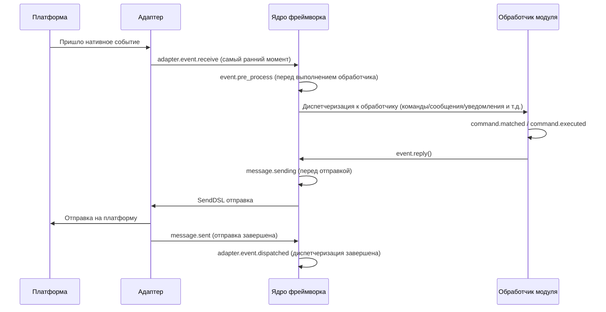

В фреймворке встроены следующие точки останова хуков, пользователь может прослушивать любую точку останова с помощью `@sdk.lifecycle.on()` для реализации пользовательской логики.

### Ядро инициализации

| Имя хука | Время срабатывания | Данные |
|---------|---------|------|
| `core.init.start` | Начало инициализации SDK | `{}` |
| `core.init.complete` | Завершение инициализации SDK | `{"duration": float, "success": bool, "adapters": {"enabled": [str], "disabled": [str]}, "modules": {"enabled": [str], "disabled": [str]}, "error": str (только при неудаче)}` |
| `core.uninit.complete` | Завершение обратной инициализации SDK | `{"duration": float, "success": bool, "adapters_closed": int, "modules_unloaded": int, "module_properties_cleared": int, "module_properties_to_clear": [str], "error": str (только при неудаче)}` |

### Изменение конфигурации

| Имя хука | Время срабатывания | Данные |
|---------|---------|------|
| `config.set` | Изменение параметра конфигурации | `{"key": str, "old_value": Any, "new_value": Any}` |
| `config.updated` | Обнаружено изменение всей конфигурации после редактирования config.toml | `{"old_config": dict, "new_config": dict, "config_file": str}` |

**Пример: аудит конфигурации**

```python
@sdk.lifecycle.on("config.set")
def audit_config(data):
    print(f"[Аудит] {data['key']}: {data['old_value']} -> {data['new_value']}")
```

### Жизненный цикл модуля

| Имя хука | Время срабатывания | Данные |
|---------|---------|------|
| `module.register` | Регистрация класса модуля в менеджере | `{"module_name": str, "success": bool}` |
| `module.load` | Завершение загрузки модуля (успешное инстанцирование) | `{"module_name": str, "success": bool}` |
| `module.init` | Завершение инициализации модуля (включая ленивую загрузку) | `{"module_name": str, "success": bool}` |
| `module.unload` | Удаление модуля | `{"module_name": str, "success": bool}` |

### Жизненный цикл адаптера

| Имя хука | Время срабатывания | Данные |
|---------|---------|------|
| `adapter.load` | Завершение регистрации адаптера | `{"platform": str, "success": bool}` |
| `adapter.start` | Запуск адаптера | `{"platforms": [str]}` |
| `adapter.status.change` | Изменение состояния адаптера | `{"platform": str, "status": str, "retry_count": int, "error": str (только при неудаче)}` |
| `adapter.stop` | Остановка адаптера | `{"platforms": [str]}` |
| `adapter.stopped` | Завершение остановки адаптера | `{"platforms": [str]}` |
| `adapter.bot.online` | Онлайн бота | `{"platform": str, "bot_id": str, "info": dict, "status": str}` |
| `adapter.bot.offline` | Оффлайн бота | `{"platform": str, "bot_id": str, "status": str}` |

### Прием и обработка событий

| Имя хука | Время срабатывания | Данные |
|---------|---------|------|
| `adapter.event.receive` | Получено событие с внешней платформы (самый ранний момент) | `{"platform": str, "event_type": str, "raw_event_type": str}` |
| `adapter.event.dispatched` | Завершена диспетчеризация события | `{"platform": str, "event_type": str, "raw_event_type": str, "onebot_handlers_count": int}` |
| `event.pre_process` | Перед началом выполнения обработчика события | `{"event_type": str, "platform": str, "detail_type": str}` |

**Пример: статистика событий**

```python
event_counter = {}

@sdk.lifecycle.on("adapter.event.receive")
def count_events(data):
    platform = data["platform"]
    event_counter[platform] = event_counter.get(platform, 0) + 1

@sdk.lifecycle.on("adapter.event.dispatched")
def log_unhandled(data):
    if data["onebot_handlers_count"] == 0:
        print(f"[Необработано] {data['platform']}/{data['event_type']}")
```

### Отправка сообщений

| Имя хука | Время срабатывания | Данные |
|---------|---------|------|
| `message.sending` | Сообщение готовится к отправке | `{"platform": str, "method": str, "detail_type": str, "target_id": str, "bot_id": str}` |
| `message.sent` | Завершена отправка сообщения | `{"platform": str, "method": str, "detail_type": str, "target_id": str, "bot_id": str}` |

**Пример: аудит отправки сообщений**

```python
@sdk.lifecycle.on("message.sending")
def log_sending(data):
    print(f"[Отправка] -> {data['platform']}/{data['detail_type']}/{data['target_id']} через {data['method']}")
```

### Система команд

| Имя хука | Время срабатывания | Данные |
|---------|---------|------|
| `command.matched` | Команда найдена и готовится к выполнению | `{"command": str, "args": list[str], "platform": str, "user_id": str}` |
| `command.executed` | Завершено выполнение команды | `{"command": str, "args": list[str], "platform": str, "user_id": str, "success": bool, "error": str (только при неудаче)}` |

**Пример: статистика команд**

```python
@sdk.lifecycle.on("command.matched")
def count_commands(data):
    print(f"[Команда] /{data['command']} от {data['user_id']}@{data['platform']}")
```

### HTTP-маршрутизация

| Имя хука | Время срабатывания | Данные |
|---------|---------|------|
| `server.request` | Получен HTTP-запрос | `{"method": str, "path": str, "client_ip": str}` |
| `server.response` | Отправлен HTTP-ответ | `{"method": str, "path": str, "status_code": int, "client_ip": str}` |

**Пример: логирование запросов**

```python
@sdk.lifecycle.on("server.response")
def log_http(data):
    print(f"[HTTP] {data['method']} {data['path']} -> {data['status_code']}")
```

### WebSocket

| Имя хука | Время срабатывания | Данные |
|---------|---------|------|
| `server.start` | Запуск сервера маршрутизации | `{"base_url": str, "host": str, "port": int}` |
| `server.stop` | Остановка сервера маршрутизации | `{}` |
| `server.websocket.connect` | Установлено WebSocket-соединение | `{"path": str, "module_name": str, "client_ip": str}` |
| `server.websocket.disconnect` | Разорвано WebSocket-соединение | `{"path": str, "module_name": str, "reason": str, "error": str (только при аномалии)}` |

**Пример: мониторинг WebSocket-соединений**

```python
@sdk.lifecycle.on("server.websocket.connect")
def on_ws_connect(data):
    print(f"[WS] Подключение: {data['path']} от {data['client_ip']}")

@sdk.lifecycle.on("server.websocket.disconnect")
def on_ws_disconnect(data):
    print(f"[WS] Отключение: {data['path']} ({data['reason']})")

## Стандартное определение событий

```python
СТАНДАРТНЫЕ_СОБЫТИЯ = {
    "core": ["init.start", "init.complete", "uninit.complete"],
    "module": ["load", "init", "unload", "register"],
    "adapter": [
        "load", "start", "status.change", "stop", "stopped",
        "event.receive", "event.dispatched",
        "bot.online", "bot.offline",
    ],
    "server": [
        "start", "stop",
        "request", "response",
        "websocket.connect", "websocket.disconnect",
    ],
    "event": ["pre_process"],
    "message": ["sending", "sent"],
    "command": ["matched", "executed"],
    "config": ["set"],
}

## Полный справочник API

### Регистрация и отмена

| Метод | Описание |
|------|------|
| `@lifecycle.on(event, *, priority=0)` | Декоратор для регистрации обработчика |
| `lifecycle.register(event, handler, *, priority=0)` | Программная регистрация |
| `lifecycle.unregister(event, handler=None)` | Отмена регистрации (при handler=None отменяются все обработчики события) |

### Запуск

| Метод | Описание |
|------|------|
| `await lifecycle.emit(event, data=None)` | Асинхронный запуск, обработчики могут изменить data, возвращая ненулевое значение |
| `lifecycle.emit_sync(event, data=None)` | Синхронный запуск, асинхронные обработчики запускаются через create_task |
| `await lifecycle.submit_event(event_type, *, source, msg, data)` | Совместимость со старыми версиями, автоматически формируется стандартный формат события |

### Инструменты

| Метод | Описание |
|------|------|
| `lifecycle.start_timer(timer_id)` | Начать таймер |
| `lifecycle.get_duration(timer_id)` | Получить прошедшее время (в секундах) |
| `lifecycle.stop_timer(timer_id)` | Остановить таймер и вернуть прошедшее время |
| `lifecycle.list_hooks()` | Вывести список всех зарегистрированных хуков и количество обработчиков |
| `lifecycle.clear()` | Очистить все обработчики и таймеры |

## Пример использования в модуле

```python
from ErisPulse.Core.Bases import BaseModule
from ErisPulse import sdk

class Main(BaseModule):
    async def on_load(self, event):
        # Реализация простой статистики сообщений
        self.msg_count = 0
        
        @sdk.lifecycle.on("adapter.event.receive")
        async def count(data):
            if data["event_type"] == "message":
                self.msg_count += 1
        
        # Мониторинг всех команд
        @sdk.lifecycle.on("command.matched")
        async def log_cmd(data):
            sdk.logger.info(f"Команда выполнена: /{data['command']} от {data['user_id']}")
        
        # Аудит изменений конфигурации
        @sdk.lifecycle.on("config.set")
        def audit(data):
            sdk.logger.info(f"Изменение конфигурации: {data['key']} = {data['new_value']}")
```

[**中文**](docs/ru/quick-start.md)

## Принадлежность фоновых задач и автоматическое отмена

> [!NOTE]
> Эта функция требует ErisPulse **2.8.0+**.

Если фоновые задачи asyncio, созданные модулем, не отменяются в `on_unload`, они будут удерживать ссылку на `self`, что приведёт к невозможности сборки мусора для экземпляра модуля (остатки старых экземпляров после горячей перезагрузки). Фреймворк предоставляет следующие механизмы по умолчанию:

- **`self.spawn(coro)`** (рекомендуется внутри модуля): задача автоматически присваивается имени модуля, и при выгрузке модуля фреймворк в `on_unload` **после** отменяет не завершённые задачи и записывает предупреждение
- **`spawn_background(coro)`** (`ErisPulse.runtime`): автоматически захватывает текущий контекст `owner_scope`; `cancel_owner_tasks(owner)` отменяет задачи по принадлежности, `cancel_all_background_tasks()` используется как резервный механизм для `sdk.uninit()`
- **Адаптеры**: при закрытии также отменяются фоновые задачи, привязанные к имени платформы

```python
async def on_load(self, event):
    # Рекомендуется: фоновые задачи используйте через self.spawn(), фреймворк автоматически отменяет их при выгрузке
    self.spawn(self._poll())

async def on_unload(self, event):
    # В сценариях, требующих точного контроля, по-прежнему рекомендуется отменять и ждать завершения самостоятельно
    if self._poll_task:
        self._poll_task.cancel()
        await asyncio.gather(self._poll_task, return_exceptions=True)

async def _poll(self):
    while True:
        await asyncio.sleep(60)
        ...
```

> [!IMPORTANT]
> Механизм по умолчанию фреймворка — это **принудительная отмена** (`cancel_owner_tasks`), которая происходит после возврата из `on_unload`. Поэтому задачи, требующие аккуратного завершения (очистка буфера, сохранение состояния, закрытие соединения), **обязательно** должны быть отменены и завершены вручную в `on_unload` — не полагайтесь на механизм по умолчанию для сохранения логики завершения. Фреймворк гарантирует только «отсутствие задач, удерживающих ссылку на `self`», но не гарантирует «аккуратное завершение». Задачи, требующие ожидания результата, следует напрямую `await`, а не передавать в фоновые задачи.

docs/ru/quick-start.md

## Примечания

1. **Обработчики могут быть синхронными или асинхронными**: система автоматически распознает и правильно вызывает их
2. **Передача данных**: в режиме `emit()`, если обработчик возвращает непустое значение, это изменяет данные, передаваемые последующим обработчикам
3. **Нормы именования событий**: рекомендуется использовать точечную структуру для именования событий, что упрощает использование родительских слушателей
4. **Изоляция ошибок**: исключение в одном обработчике не влияет на выполнение других обработчиков
5. **Ограничение синхронного триггера**: в `emit_sync()` асинхронные обработчики запускаются в режиме fire-and-forget, возвращаемые значения не могут быть переданы обратно
6. **Очистка жизненного цикла**: при вызове `sdk.uninit()` все зарегистрированные обработчики и таймеры будут очищены
7. **Приоритет загрузки**: если необходимо слушать события на этапе инициализации фреймворка, рекомендуется установить высокий приоритет и отключить ленивую загрузку

[**中文**](docs/ru/quick-start.md)


### 懶加载系统

# Система ленивой загрузки модулей

ErisPulse SDK предоставляет мощную систему ленивой загрузки модулей, позволяющую инициализировать модули только тогда, когда они действительно необходимы, что значительно повышает скорость запуска приложения и эффективность использования памяти.

docs/ru/quick-start.md

## Обзор

Система модулей с ленивой загрузкой является одной из ключевых особенностей ErisPulse. Она работает следующим образом:

- **Отложенная инициализация**: Модули фактически загружаются и инициализируются только при первом обращении к ним
- **Прозрачное использование**: Для разработчиков модули с ленивой загрузкой практически не отличаются от обычных модулей в использовании
- **Автоматическое управление зависимостями**: Зависимости модуля автоматически инициализируются при их использовании
- **Поддержка жизненного цикла**: Для модулей, унаследованных от `BaseModule`, автоматически вызываются методы жизненного цикла

Ссылки на документацию должны быть заменены согласно правилу:
- Замените `docs/ru/` на `docs/ru/` в путях к документации
- Например: `docs/ru/quick-start.md` должно быть заменено на `docs/ru/quick-start.md`
- Ссылки на файлы не текущего языка версии (в формате `README.xx.md`) оставляются без изменений

## Принцип работы

### Класс LazyModule

Ядром системы ленивой загрузки является класс `LazyModule`, который является обёрткой, фактически инициализирующей модуль только при первом обращении.

### Процесс инициализации

Когда модуль впервые обращается, `LazyModule` выполняет следующие действия:

1. Получает информацию о параметрах `__init__` класса модуля
2. Определяет, следует ли передавать ссылку на `sdk` в зависимости от параметров
3. Устанавливает свойство `moduleInfo` модуля
4. Для модулей, унаследованных от `BaseModule`, вызывает метод `on_load`
5. Запускает событие жизненного цикла `module.init`

[**中文**](docs/ru/quick-start.md) | [**English**](docs/ru/quick-start.md)

## Активация по событию (activate_on)

> [!NOTE]
> Эта функция требует ErisPulse **2.8.0+**.

Модули с `lazy_load=True` по умолчанию загружаются только при **первом доступе к атрибуту**. Если модуль зарегистрировал обработчики команд/событий, традиционный подход требует `lazy_load=False` для немедленной загрузки. `activate_on` предоставляет третий вариант: **объявить триггер, при первом совпадении события/команды модуль автоматически активируется** — он не будет постоянно в памяти, но при этом не потеряет точку входа по триггеру.

```python
from ErisPulse.loaders import ModuleLoadStrategy

class MyModule(BaseModule):
    @staticmethod
    def get_load_strategy():
        return ModuleLoadStrategy(
            lazy_load=True,
            activate_on=[
                # ---- Триггеры по событию (пассивное поступление, без участия пользователя)----
                "message",                                    # Тип события: любое сообщение
                {"notice": "group_member_increase"},          # Тип + один detail_type
                {"message": ["private", "group"]},            # Тип + несколько detail_type

                # ---- Триггеры по команде (активный ввод, заглушка команды видна в Help)----
                {"command": "roll"},                          # Сокращённая форма: имя команды
                {"command": ["roll", "dice"]},                # Список имён команд
                {"command": {                                 # Форма dict (name обязательный)
                    "name": "dice",
                    "help": "Бросить кубик",
                    "usage": "/dice",
                    "group": "Развлечения",
                    "aliases": ["d"],
                    "hidden": False,
                }},
            ],
        )
```

### Параметры команды в формате dict

Форма dict отражает пользовательские параметры декоратора `@command()`, позволяя зарегистрировать заглушку команды до загрузки модуля:

| Параметр | Тип | По умолчанию | Описание |
|------|------|------|------|
| `name` | `str` | **Обязательный** | Имя команды; должно совпадать с `name` в `@command(name)` в `on_load`, иначе после активации заглушка будет удалена, и команда не будет существовать |
| `help` | `str` | Цепочка возврата | Описание, отображаемое в Help; если не указано, берётся из цепочки возврата (см. ниже) |
| `usage` | `str` | Автоматически | Пример использования, по умолчанию `{prefix}{name}` |
| `group` | `str` | `None` | Группа команды |
| `aliases` | `list[str]` | `[]` | Алиасы, которые также регистрируются, **ввод алиаса также активирует модуль** |
| `hidden` | `bool` | `False` | Если `True`, заглушка команды будет скрыта (согласовано с семантикой скрытия после активации); пользователи, знающие имя команды, всё равно могут её активировать |

**Не поддерживается** `priority` / `permission` / `master`: заглушка команды предназначена только для активации, проверка прав осуществляется после активации настоящей командой (блокировка прав на этапе заглушки приведёт к невозможности активации по команде).

### Цепочка возврата для Help заглушки команды

Описание команды, отображаемое в Help до загрузки модуля, берётся по следующему порядку (первое найденное значение используется):

1. `help` на уровне команды в dict (наиболее точное)
2. `description` из `get_meta()` модуля
3. Атрибут `__description__` модуля
4. `Summary` из метаданных пакета (краткое описание пакета PyPI)
5. Общее сообщение: «Эта команда из модуля с ленивой загрузкой X, при первом использовании модуль будет автоматически загружен»

### Семантика триггеров

- **Событийный stub**: регистрируется с очень низким приоритетом (`ACTIVATION_STUB_PRIORITY`) в соответствующий менеджер событий, срабатывает в качестве резервного обработчика после всех обычных обработчиков; после активации текущее событие пересылается настоящему обработчику модуля
- **Командный stub**: регистрируется заглушка команды; после активации заглушка удаляется, настоящая команда берёт на себя текущий триггер
- **Защита от повторного входа**: `asyncio.Lock` гарантирует, что модуль активируется только один раз при одновременных триггерах
- **Фильтрация по области действия**: stub содержит идентификатор владельца модуля, модуль не активируется, если он не включён для данного бота / сессии / платформы
- **Семантика ошибки**: при неудачной активации повторная попытка не предпринимается, stub также удаляется
- **Удаление дубликатов**: при смешанном объявлении сокращённых и dict-форм имен команды дубликаты удаляются (dict имеет приоритет); при отсутствии `name` в dict или ошибке в `detail_type` события, формируется предупреждение и игнорируется

> Схема архитектуры и полная семантика см. в [Обзоре архитектуры](../architecture.md#архитектура-активации-по-событию-activate_on-триггерная-архитектура).

## Конфигурация ленивой загрузки

### Глобальная конфигурация

В файле конфигурации включите/отключите ленивую загрузку глобально:

```toml
[ErisPulse.framework]
enable_lazy_loading = true  # true=включить ленивую загрузку(по умолчанию), false=отключить ленивую загрузку
```

### Управление на уровне модуля

Модуль может управлять стратегией загрузки, реализовав статический метод `get_load_strategy()`:

```python
from ErisPulse.Core.Bases import BaseModule
from ErisPulse.loaders import ModuleLoadStrategy

class MyModule(BaseModule):
    @staticmethod
    def get_load_strategy():
        """Возвращает стратегию загрузки модуля"""
        return ModuleLoadStrategy(
            lazy_load=False,  # Возвращает False для немедленной загрузки
            priority=100      # Приоритет загрузки, чем больше значение, тем выше приоритет
        )
```

[**中文**](docs/ru/configuration.md) | [**English**](docs/ru/configuration.md)

## Использование модулей с отложенной загрузкой

### Основное использование

Для разработчиков модули с отложенной загрузкой практически не отличаются от обычных модулей:

```python
# Доступ к модулю с отложенной загрузкой через SDK
from ErisPulse import sdk

# Следующий вызов запустит отложенную загрузку модуля
result = await sdk.my_module.my_method()
```

### Единый вход для получения модуля

Независимо от того, получаете ли вы модуль через свойство SDK, свойство менеджера модулей или через `module.get()`, для "зарегистрированных, но еще не загруженных" модулей с отложенной загрузкой будет возвращаться один и тот же прокси-объект отложенной загрузки. Инициализация происходит только при обращении к его свойствам:

```python
# Все три способа возвращают прокси-объект отложенной загрузки (если модуль не загружен), поведение одинаковое и для пользователя прозрачно
sdk.my_module          # Точка входа для запуска загрузки
sdk.module.my_module   # Также возвращает прокси-объект отложенной загрузки
sdk.module.get("my_module")  # Также возвращает прокси-объект отложенной загрузки, сам вызов не запускает загрузку

# Инициализация модуля происходит только при обращении к любому свойству прокси-объекта
result = await sdk.my_module.my_method()
```

`module.get()` — это **интерфейс для запроса**, сам вызов не запускает загрузку:
- Модуль уже загружен → возвращается реальный экземпляр
- Модуль зарегистрирован, но не загружен → возвращается прокси-объект отложенной загрузки (инициализация происходит при обращении к свойствам)
- Модуль не зарегистрирован → возвращается `None`

Если необходимо явно запустить загрузку, используйте `await sdk.load_module("my_module")`.

### Асинхронная инициализация

Для модулей, требующих асинхронной инициализации, рекомендуется сначала явно загрузить модуль:

```python
# Сначала явно загрузите модуль
await sdk.load_module("my_module")

# Затем используйте модуль
result = await sdk.my_module.my_method()
```

### Синхронная инициализация

Для модулей, не требующих асинхронной инициализации, можно обращаться напрямую:

```python
# Прямое обращение автоматически синхронно инициализирует модуль
result = sdk.my_module.some_sync_method()

## Лучшие практики

При выборе стратегии загрузки можно использовать следующий алгоритм принятия решений:

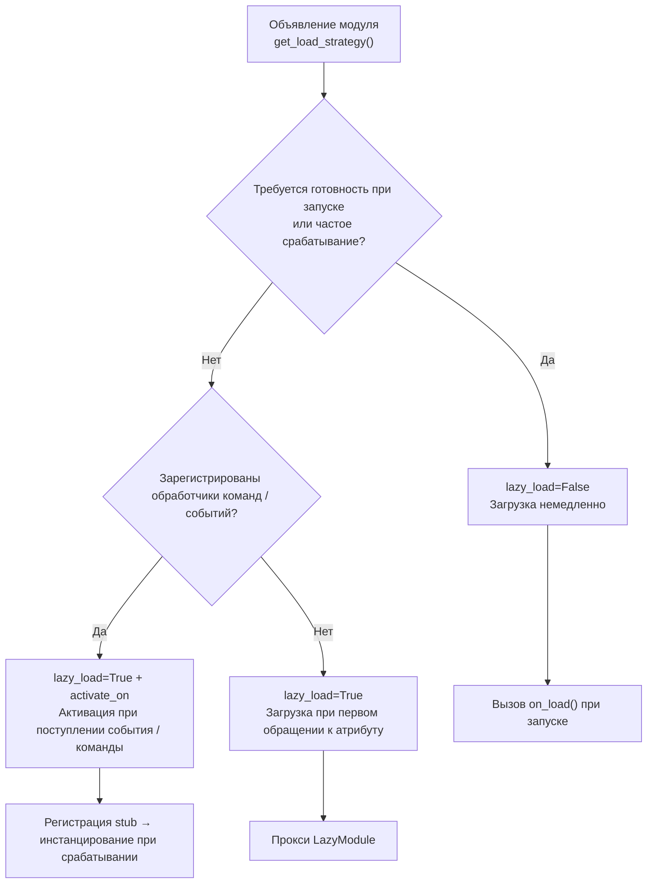

### Рекомендуемые случаи использования ленивой загрузки (lazy_load=True)

- Пассивно вызываемые утилитарные классы (например, модули для запросов данных, конвертеры форматов и т.д., которые требуются только при вызове из других модулей)
- Модули, зарегистрировавшие обработчики команд / событий, но используемые нечасто — в сочетании с объявлением `activate_on`, автоматическая активация происходит при поступлении первого совпадающего события / команды, без отказа от ленивой загрузки

### Рекомендуемые случаи отключения ленивой загрузки (lazy_load=False)

- Модули, которые должны быть готовы при запуске (например, основные модули, предоставляющие базовые сервисы другим модулям)
- Часто срабатывающие слушатели (каждое сообщение должно обрабатываться) — `activate_on` имеет накладные расходы на активацию, в сценариях с частым срабатыванием более целесообразно немедленная загрузка
- Модули с планировщиком задач
- Модули, которые должны инициализироваться при запуске приложения

> Параметр `priority` управляет порядком инициализации модулей, загруженных немедленно. Чем больше значение, тем раньше инициализация. Модули с одинаковым приоритетом загружаются в порядке их регистрации.

## Примечания

1. Если ваш модуль использует ленивую загрузку, и если другие модули никогда не вызывались внутри ErisPulse, ваш модуль никогда не будет инициализирован.
2. Если ваш модуль содержит, например, модули, слушающие события, или другие модули, активно слушающие подобные события, есть два варианта: объявить триггер `activate_on` (сохранить ленивую загрузку, автоматически активировать при поступлении события) или объявить, что он должен быть загружен немедленно (`lazy_load=False`), иначе это повлияет на нормальную работу вашего модуля.
3. Мы не рекомендуем вам отключать ленивую загрузку, если у вас нет особых потребностей, иначе это может привести к проблемам с управлением зависимостями и событиями жизненного цикла.
4. В командном словаре `activate_on` имя `name` должно совпадать с реальным именем команды, зарегистрированной в модуле `on_load` с помощью `@command()` — иначе после активации модуля заполнительная команда будет отменена, и команда с несоответствующим объявленным и реализованным именем не будет существовать.

[**English**](docs/ru/quick-start.md)


### 国际化（i18n）系统

# Система интернационализации (i18n)

В ErisPulse версии 2.5.0 встроена полная поддержка интернационализации. Интерфейс ядра фреймворка и CLI автоматически переключают отображаемый текст в зависимости от системного языка, а также поддерживают регистрацию внешними модулями собственных переводов.

> Пример: [English](docs/ru/index.md) | [Русский](docs/ru/ru.md) | [Español](docs/ru/es.md) | [Français](docs/ru/fr.md) | [日本語](docs/ru/ja.md)
>
> [English](docs/ru/en.md) | [Русский](docs/ru/ru.md) | [Español](docs/ru/es.md) | [Français](docs/ru/fr.md) | [日本語](docs/ru/ja.md)

## Поддерживаемые языки

| Язык | Код | Описание |
|------|------|------|
| Упрощенный китайский | `zh-CN` | Язык по умолчанию (родной язык фреймворка) |
| Традиционный китайский | `zh-TW` | Традиционный китайский (Гонконг/Макао/Тайвань) |
| English | `en` | Английский (универсальный язык по умолчанию) |
| 日本語 | `ja` | Японский |
| Русский | `ru` | Русский |

## Быстрое знакомство

### Переключение через переменные окружения

```bash
# Windows PowerShell
$env:ERISPULSE_LANG = "en"
epsdk run

# macOS / Linux
ERISPULSE_LANG=ja epsdk run
```

### Переключение через файл конфигурации

Добавьте в `config/config.toml`:

```toml
[ErisPulse.i18n]
language = "zh-TW"
```

Установка значения `"auto"` (по умолчанию) включает автоматическое определение системного языка.

### Ручное переключение в коде

```python
from ErisPulse import i18n

# Ручное установка языка
i18n.set_language("en")
print(i18n.get_language())  # "en"

# Сброс до автоматического определения
i18n.reset_language()
```

---

## Механизм определения языка

Фреймворк определяет язык пользователя с следующими приоритетами:

1. **Переменная среды `ERISPULSE_LANG`** — самый высокий приоритет, используется для тестирования и временного переключения
2. **Windows API** — `GetUserDefaultLocaleName` (только для Windows, не затрагивается `LANG` от инструментов вроде Git Bash)
3. **Переменные среды** — `LANGUAGE` > `LC_ALL` > `LC_MESSAGES` > `LANG` (стандарт Unix/macOS)
4. **Системная локаль** — `locale.getlocale()` / `locale.getdefaultlocale()`
5. **Fallback** — en (английский)

### Принцип ближайшего соответствия

Когда определенный язык не является точным совпадением, он сопоставляется с поддерживаемым языком по принципу ближайшего соответствия:

- `zh-TW`, `zh-HK`, `zh-MO`, `zh-Hant` → **Традиционный китайский**
- Все остальные `zh-*` (например, `zh-CN`, `zh-SG`) → **Упрощенный китайский**
- `en-US`, `en-GB`, `en-AU` и т. д. → **Английский**
- `ja-JP` → **Японский**
- `ru-RU` → **Русский**
- Все остальные неопознанные языки → **Упрощенный китайский (fallback)**

---

Пожалуйста, верните только полностью переведенный Markdown-контент без дополнительных комментариев.

## Использование i18n в модуле

Вы можете зарегистрировать тексты переводов для своего модуля, чтобы ваш модуль также поддерживал несколько языков.

### Рекомендуемый способ: Объявление ключей переводов через I18nClass (v2.7.0+)

Начиная с версии v2.7.0, модули/адаптеры могут объявлять ключи переводов, используя вложенный класс `I18nClass`, так же, как это делается для `ConfigClass`. Фреймворк автоматически **регистрирует** все объявленные ключи переводов во время загрузки, без необходимости вручную вызывать `i18n.register()`.

```python
from dataclasses import dataclass, field

from ErisPulse.Core.Bases import BaseConfig, BaseI18n, BaseModule, I18nKey


class MyModule(BaseModule):
    # Класс конфигурации (необязательно)
    @dataclass
    class ConfigClass(BaseConfig):
        welcome_msg: str = field(
            default="Welcome",
            metadata={
                # Здесь ссылается ключ i18n mymodule.welcome_msg
                "description": {"i18n": "mymodule.welcome_msg", "default": "Welcome Message"},
            },
        )

    # Класс коллекции ключей переводов (необязательно)
    # Объявленные ключи автоматически регистрируются фреймворком, приоритет раньше генерации конфигурации ConfigClass
    class I18nClass(BaseI18n):
        # Имена атрибутов автоматически объединяются в полный путь ключа: <имя_модуля>.<имя_атрибута>
        welcome_msg: I18nKey = I18nKey(
            default="Welcome Message",   # Независимый от языка запасной вариант, не регистрируется ни в одном языке
            zh_CN="Добро пожаловать",
            en="Welcome Message",
            ja="ウェルカムメッセージ",
            ru="Приветственное сообщение",
            zh_TW="歡迎訊息",
        )
        # Другие ключи переводов для бизнес-логики
        hello: I18nKey = I18nKey(
            default="Hello, {name}!",
            zh_CN="Привет, {name}!",
            zh_TW="你好，{name}！",
            en="Hello, {name}!",
            ja="こんにちは、{name}！",
            ru="Привет, {name}!",
        )

        # Можно явно указать полный путь ключа (не использовать объединение имен атрибутов)
        custom: I18nKey = I18nKey(
            key="mymodule.deep.nested.key",
            default="Default text",
            zh_CN="Дефолтный текст",
            zh_TW="預設文本",
            en="Default text",
            ja="デフォルトテキスト",
            ru="Текст по умолчанию",
        )
```

#### Почему рекомендован I18nClass?

| Сценарий | Ручной i18n.register() | Объявление I18nClass |
|------|-----------------------|------------------|
| i18n ключ, ссылаемый в описании конфигурации | Нужно вручную зарегистрировать и сделать это до генерации конфигурации | Фреймворк автоматически регистрирует перед генерацией конфигурации |
| Объявление переводов для нескольких языков | Распределено по различным on_load() | Сосредоточено в классе, видно сразу |
| Согласованность имен ключей | Легко допустить опечатку | Имена атрибутов используются как суффиксы ключей, IDE может предлагать автодополнение |
| Очистка при卸рузке | Нужно вручную unregister_domain() | Фреймворк использует единый домен для регистрации |

#### Правила путей ключей I18nClass

- **По умолчанию**: Используйте ``<имя_регистрации_модуля>.<имя_атрибута>`` как полный путь ключа
  - Пример: имя модуля ``MyModule``, атрибут ``welcome`` → путь ключа ``MyModule.welcome``
- **Явно**: Укажите любой путь через точку с помощью параметра ``I18nKey(key="...")``
  - Подходит для ключей с глубокой вложенностью (например, ``mymodule.config.basic.token``)

#### Использование в адаптере

Адаптеры также поддерживают `I18nClass`, использование полностью аналогично:

```python
from ErisPulse.Core import BaseAdapter
from ErisPulse.Core.Bases import BaseConfig, BaseI18n, I18nKey


class MyAdapter(BaseAdapter):
    @dataclass
    class ConfigClass(BaseConfig):
        endpoint: str = field(
            default="",
            metadata={
                # Описание конфигурации ссылается на ключ adapter.MyAdapter.endpoint
                "description": {"i18n": "MyAdapter.endpoint", "default": "API адрес"},
            },
        )

    class I18nClass(BaseI18n):
        # Централизованное объявление ключей, на которые ссылается описание конфигурации, и других бизнес-ключей
        endpoint: I18nKey = I18nKey(
            default="API Endpoint",
            zh_CN="API адрес",
            zh_TW="API 位址",
            en="API Endpoint",
            ja="APIアドレス",
            ru="API адрес",
        )
```

`I18nClass` адаптера автоматически регистрируется на этапе `__init__` (то есть до создания шаблона конфигурации), что гарантирует, что i18n ключи, используемые в описаниях конфигурации, уже доступны.

### Ручная регистрация пользовательских переводов (старый способ)

Если не использовать `I18nClass`, вы также можете напрямую вызывать `i18n.register()` для регистрации текстов переводов.

```python
from ErisPulse import i18n

# Регистрация китайского перевода
i18n.register("zh-CN", {
    "my_module.welcome": "Добро пожаловать в мой модуль!",
    "my_module.goodbye": "До свидания!",
    "my_module.hello": "Привет, {name}!",
}, domain="my_module")

# Регистрация английского перевода
i18n.register("en", {
    "my_module.welcome": "Welcome to my module!",
    "my_module.goodbye": "Goodbye!",
    "my_module.hello": "Hello, {name}!",
}, domain="my_module")
```

### Использование переводов

```python
from ErisPulse import i18n

# Простой перевод
i18n.t("my_module.welcome")  # Автоматически использует текущий язык

# С параметрами форматирования
i18n.t("my_module.hello", name="Alice")

# Указание значения по умолчанию (возвращается, если ключ перевода не существует)
i18n.t("my_module.unknown_key", default="Значение по умолчанию")
```

### Использование в классе модуля

```python
from dataclasses import dataclass, field
from ErisPulse import i18n
from ErisPulse.Core.Bases import BaseConfig, BaseModule

@dataclass
class MyModuleConfig(BaseConfig):
    welcome_msg: str = field(
        default="Welcome",
        metadata={
            "description": {"i18n": "my_module.welcome_msg", "default": "Добро пожаловать"},
            "ui": {"widget": "text", "group": "basic", "order": 1},
        },
    )

class MyModule(BaseModule):
    ConfigClass = MyModuleConfig

    async def on_load(self, event):
        # Чтение конфигурации в реальном времени (отражает последнее значение при каждом доступе)
        self.logger.info(self.cfg.welcome_msg)
        self.logger.info(i18n.t("my_module.welcome"))

    @command("hello")
    async def hello_handler(self, event):
        name = event.get_user_nickname() or "друг"
        await event.reply(i18n.t("my_module.hello", name=name))

    async def on_unload(self, event):
        pass
```

###卸载 переводов

```python
# Отвязка переводов для всего домена
i18n.unregister_domain("my_module")
```

---

Пожалуйста, верните переведенный полный Markdown-контент без дополнительных слов.

## Полиграфические настройки полей

С версии 2.5.2 схема конфигурации полностью поддерживает i18n. Все текстовые поля, видимые пользователям, могут ссылаться на ключи i18n. WebUI и другие потребители автоматически разрешают их в соответствующий текст в зависимости от текущего языка.

### Поддерживаемые поля i18n

| Поле | Позиция | Описание |
|------|---------|----------|
| `description` | метаданные поля | Описание поля |
| `options[].label` | `ui.options` | Метки опций элемента select |
| `placeholder` | `ui.placeholder` | Подсказка ввода |
| `group_labels` | `_schema_meta` | Отображаемое имя группы (Заголовок раздела Dashboard) |

Единый формат: `{"i18n": "ключ", "default": "текст"}`, простые строки передаются без изменений (для обратной совместимости).

### Объявление полей i18n

Все текстовые поля, видимые пользователям, поддерживают i18n:

```python
from dataclasses import dataclass, field
from ErisPulse.Core.Bases import BaseConfig

@dataclass
class MyAdapterConfig(BaseConfig):
    # описание i18n
    token: str = field(
        default="",
        metadata={
            "description": {"i18n": "my_adapter.token", "default": "Токен платформы"},
            "required": True,
            "secret": True,
            "ui": {
                "widget": "password",
                "group": "basic",
                "order": 1,
                # подсказка i18n
                "placeholder": {"i18n": "my_adapter.token.ph", "default": "Введите Token"},
            },
        },
    )
    # метки i18n
    mode: str = field(
        default="a",
        metadata={
            "description": {"i18n": "my_adapter.mode", "default": "Режим работы"},
            "ui": {
                "widget": "select",
                "group": "basic",
                "order": 2,
                "options": [
                    {"label": {"i18n": "my_adapter.mode.a", "default": "Режим A"}, "value": "a"},
                    {"label": {"i18n": "my_adapter.mode.b", "default": "Режим B"}, "value": "b"},
                ],
            },
        },
    )

    # group_labels i18n (отображаемое имя группы)
    _schema_meta = {
        "group_labels": {
            "basic": {"i18n": "my_adapter.group.basic", "default": "Основные настройки"},
        }
    }
```

`default` — это текст-заполнитель (fallback) — отображается, когда перевод не зарегистрирован или не найден.

### Скрытие секретов и проверка конфигурации

Поля с тегом `"secret": True` автоматически получают **защиту от засекречивания** (начиная с 2.7.0):

- **Шаблон с засекречиванием**: функция `dataclass_to_toml_with_comments()` при генерации шаблона конфигурации не записывает реальные значения secret-полей в файл (они отображаются как пустые плейсхолдеры), чтобы избежать попадания чувствительных данных на диск
- **Утилита общего засекречивания**: `redact_secret(value)` заменяет непустое значение на `***`, пустое возвращает как есть, может использоваться для вывода в логи и т.д.

```python
from ErisPulse.Core.Bases.config_schema import redact_secret

redact_secret("sk-xxxxxx")  # '***'
redact_secret("")           # ''
```

**Проверка конфигурации** (`validate_config()`) кроме проверки на непустоту `required` поддерживает начиная с 2.7.0:

| Тип проверки | Метаданные | Пример |
|--------------|------------|--------|
| Соответствие типа | Объявленный тип поля | передача строки в поле `int` вызывает ошибку |
| Ограничения перечисления | `ui.options` или глобальное `options` | значение должно принадлежать разрешенным опциям |
| Числовые диапазоны | Глобальные `min` / `max` | `metadata={"min": 1, "max": 65535}` |

```python
from ErisPulse.Core.Bases.config_schema import validate_config

@dataclass
class C(BaseConfig):
    mode: str = field(default="a", metadata={"ui": {"widget": "select", "options": ["a", "b"]}})
    port: int = field(default=80, metadata={"min": 1, "max": 65535})

errors = validate_config(C(mode="x", port=70000))  # две ошибки: перечисление + диапазон
```

### Регистрация перевода конфигурации

Ключи i18n для полей конфигурации такие же, как и обычные ключи перевода; их регистрация выполняется через `i18n.register()`:

```python
from ErisPulse import i18n

# Регистрация китайского (совпадает с default, можно и другим)
i18n.register("zh-CN", {
    "my_adapter.token": "Токен платформы",
}, domain="my_adapter")

# Регистрация английского
i18n.register("en", {
    "my_adapter.token": "Platform Token",
}, domain="my_adapter")
```
> **Рекомендуемый способ**: используйте `I18nClass` для объявления ключей перевода, фреймворк автоматически зарегистрирует их (см. раздел «Рекомендуемый способ» выше),
> вручную вызывать `i18n.register()` или `register_config_i18n()` не требуется.

Также предоставлена удобная функция `register_config_i18n()`, которая может автоматически извлекать ключи из класса конфигурации и регистрировать их:

```python
from ErisPulse.Core.Bases.config_schema import register_config_i18n

# Автоматическое извлечение description.default как перевода на китайский
register_config_i18n(MyAdapterConfig, "zh-CN")

# Ручное предоставление английского перевода
register_config_i18n(MyAdapterConfig, "en", {
    "my_adapter.token": "Platform Token",
})
```

### Как WebUI потребляет i18n

Словарь i18n в схеме, возвращаемой `get_config_schema()`, передается без изменений. Frontend WebUI может разрешать ключи в текст с помощью `i18n.t()` в зависимости от текущего языка.

Если необходимо, чтобы сервер разрешал их в строки напрямую (например, возвращал переднему модулю, который не поддерживает i18n), используйте `resolve_config_schema()`. Она разрешит `description`、`options[].label`、`placeholder` и `group_labels` в текст текущего языка:

```python
from ErisPulse.Core.Bases.config_schema import resolve_config_schema

# Все поля i18n разрешены в строки текущего языка
schema = resolve_config_schema(MyAdapterConfig)
print(schema["fields"]["token"]["description"])    # "Токен платформы" или "Platform Token"
print(schema["fields"]["token"]["placeholder"])   # "Введите Token" или "Enter Token"
print(schema["fields"]["mode"]["options"][0]["label"])  # "Режим A" или "Mode A"
print(schema["group_labels"]["basic"])             # "Основные настройки" или "Basic"
```

> Типы и утилиты, такие как `BaseConfig`、`BotAccountConfig`、`register_config_i18n()`、`resolve_config_schema()`,
> имеют фактическое определение в `ErisPulse.Core.Bases.config_schema`.
> `ErisPulse.runtime.config_schema` сохранен для совместимости shim,
> **рекомендуется импортировать из `ErisPulse.Core.Bases` единообразно** (кроме типов, связанных с ключами переводов i18n,
> они находятся в `ErisPulse.Core.Bases.i18n_schema`).

## API Справка

### I18nManager

#### Основные методы

| Метод | Описание |
|------|------|
| `t(key, default=None, **kwargs)` | Получить текст перевода (`gettext()` является псевдонимом) |
| `set_language(lang)` | Вручную задать язык |
| `get_language()` | Получить текущий язык |
| `reset_language()` | Сбросить до автоопределения (и переопределить окружение) |
| `get_supported_languages()` | Получить список всех поддерживаемых языков |
| `has_translation(key, lang=None)` | Проверить, существует ли ключ перевода |
| `register(lang, translations, domain)` | Зарегистрировать пользовательские переводы |
| `unregister_domain(domain)` | Отключить все переводы указанного домена |
| `reload()` | Перезагрузить встроенные переводы и переопределить язык |

#### Подробно о методе `t()`

```python
def t(self, key, /, default=None, **kwargs):
```

- `key` — ключ перевода (только позиционный аргумент, не должен конфликтовать с `key=` в `**kwargs`)
- `default` — значение по умолчанию, возвращаемое, если перевод не найден; по умолчанию `None` (возвращает сам ключ)
- `**kwargs` — аргументы форматирования, используются для заполнения `{placeholder}` в переводе

Пример:

```python
# Определение перевода: "greeting": "Привет, {name}! Добро пожаловать в {place}."
i18n.t("greeting", name="Alice", place="ErisPulse")
# Возвращает: "Привет, Alice! Добро пожаловать в ErisPulse."
```

### BaseI18n / I18nKey (Декларативные ключи перевода)

Начиная с версии v2.7.0, `ErisPulse.Core.Bases` предоставляет инструменты декларации ключей перевода на основе свойств класса (рекомендуется импортировать из `ErisPulse.Core.Bases`):

> ``I18nKey.default`` является **языковым независимым фоллбэком**, он не регистрируется ни для одного языка.
> Чтобы переводы вступили в силу, необходимо явно передать хотя бы один языковой параметр (``zh_CN=`` / ``en=`` / ``ja=`` и т.д.).
> Это позволяет разработчикам из разных стран свободно использовать свой родной язык для заполнения ``default``; фреймворк не делает никаких предположений.

| Название | Описание |
|------|------|
| `I18nKey(default, *, key=None, zh_CN, zh_TW, en, ja, ru)` | Объявление одного ключа перевода; `default` — языковая независимая fallback |
| `BaseI18n` | Базовый класс коллекции ключей перевода (наименование соответствует `BaseConfig`), подклассы объявляют несколько `I18nKey` как свойства класса |
| `BaseI18n.register(prefix="", domain="app")` | Статический метод: зарегистрировать все объявленные ключи в систему i18n |
| `key` | Псевдоним для `I18nKey` (более краткая запись) |

Пример использования:

```python
from ErisPulse.Core.Bases import BaseI18n, key

class MyKeys(BaseI18n):
    # Краткая запись с псевдонимом
    hello = key(
        default="Hello",
        zh_CN="你好",
        zh_TW="你好",
        en="Hello",
        ja="こんにちは",
        ru="Привет",
    )
    bye = key(
        default="Bye",
        zh_CN="再见",
        zh_TW="再見",
        en="Bye",
        ja="さようなら",
        ru="До свидания",
    )

# Независимое использование (ручная регистрация)
MyKeys.register(prefix="myapp.", domain="myapp")
```

### Доступ к SDK инстансу

```python
from ErisPulse import sdk

# sdk.i18n и импортированный напрямую i18n — это один и тот же объект
sdk.i18n.set_language("ru")
print(sdk.i18n.t("core.sdk.init.starting"))
```

---

> **[**Русский**](docs/ru/api-reference.md)** | [**English**](api-reference.md)** | [**日本語**](api-reference.md)**

## Конфигурация во время выполнения

### Чтение конфигурации i18n через API конфигурации

```python
from ErisPulse.Core.Bases import I18nConfig
from ErisPulse.runtime import get_i18n_config

config = get_i18n_config()
print(config["language"])  # "auto" или конкретный код языка

# I18nConfig — это dataclass, его можно использовать для создания шаблона конфигурации
schema = I18nConfig.__dataclass_fields__
```

### Описание параметров конфигурации

В разделе `[ErisPulse.i18n]` файла `config/config.toml`:

```toml
[ErisPulse.i18n]
# Отображаемый язык, доступные значения:
# - "auto"      — автоопределение языка системы (по умолчанию)
# - "zh-CN"     — упрощенный китайский
# - "zh-TW"     — традиционный китайский
# - "en"        — английский
# - "ja"        — японский
# - "ru"        — русский
language = "auto"
```

---

## Best Practices

### Нейминг ключей перевода

Рекомендуется использовать формат именования с разделением точками:

```
<Module Name>.<Category>.<Description>
```

Например: `my_module.command.hello_desc`, `core.adapter.start_failed`

### Глобальное покрытие переводов

Не обязательно предоставлять переводы для всех языков сразу. Если для языка нет перевода, он автоматически переключится на английский; если и английского перевода нет, будет отображаться само имя ключа.

### Динамический контент

Для динамически генерируемого контента (такого как имя пользователя, количество и т.д.), используйте форматирование `{placeholder}`:

```python
# Определение перевода
"user_count": "Текущих онлайн пользователей: {count}"

# Использование
i18n.t("user_count", count=len(users))
```

### Логируемые сообщения

Если ваш модуль использует фреймворк Logger, эти сообщения также автоматически будут использовать текущий язык:

```python
self.logger.info(i18n.t("my_module.startup"))

## Связь с CLI i18n

CLI имеет **отдельный** модуль интернационализации (`ErisPulse.CLI.i18n`), который полностью декouple'd от модуля интернационализации ядра фреймворка.

- **Core i18n** — используется модулем ядра фреймворка, внешние модули могут регистрировать переводы
- **CLI i18n** — используется внутри командной строки, не использует общие данные переводов с Core

Такой дизайн гарантирует, что изменения переводов CLI не повлияют на стабильность ядра фреймворка.


### 模块作用域系统

# Система модульных областей

> [!NOTE]
> Эта функция требует ErisPulse **2.8.0+**.

Система модульных областей используется для управления тем, какие модули может использовать конкретный Bot, обеспечивая изоляцию модулей в сценариях с несколькими Bots. По умолчанию все модули открыты для всех Bots; фильтрация начинается только после привязки конфигурации, **модули и адаптеры могут быть адаптированы без каких-либо изменений**.

{!--< tips >!--}
1. Область привязывается к модулю по измерениям «платформа адаптера + идентификатор Bot + идентификатор сессии»
2. Поддерживает два способа: белый список (`modules`) и черный список (`blocked`)
3. Запрещенные в области модули при получении сообщений молча игнорируют его, не отвечая предупреждением
4. Поддерживает динамическое добавление и удаление в режиме выполнения с помощью `sdk.scope.bind()` / `unbind()`, может быть сохранено
{!--< /tips >!--}

docs/ru/quick-start.md

## Принцип работы

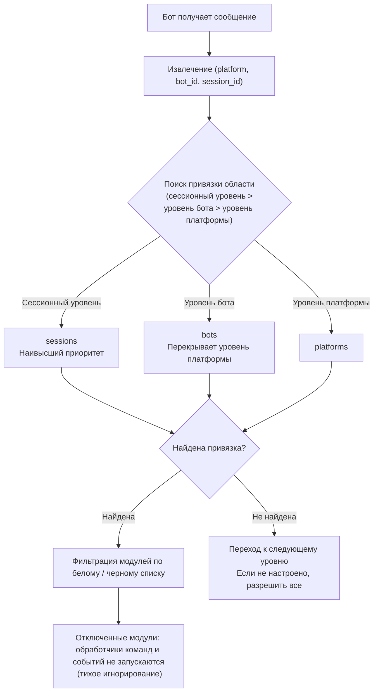

- **Приоритет анализа: сессионный уровень > уровень бота > уровень платформы**, если правила на более высоком уровне не заданы, происходит переход к следующему уровню; если ни один уровень не настроен, разрешаются все модули.
- При отсутствии данных события `self` (невозможно идентифицировать бота), пропускается уровень бота и происходит проверка по сессионному / платформенному уровню.
- Ресурсы слоя фреймворка (обработчики без owner, диспетчер команд, шина событий) всегда разрешаются, не подвергаясь влиянию области действия.

| **Русский** | **简体中文** |

## Файл конфигурации

```toml
[ErisPulse.scope]
default_allow = true        # По умолчанию разрешить всё (false = строгий режим с явным отказом)
cache_size = 1024           # Размер кэша LRU для is_allowed

# Уровень платформы (действует для всех Bots / сессий этой платформы)
[ErisPulse.scope.platforms.onebot11]
modules = ["Chat", "Translate"]   # Белый список: модули, доступные для Bot'а на этой платформе
blocked = ["Danger"]              # Черный список: модули, отключённые на этой платформе

# Уровень Bot'а (действует для всех сессий этого Bot'а, переопределяет уровень платформы)
[ErisPulse.scope.bots.onebot11."123456"]
modules = ["Chat"]
blocked = []

# Уровень сессии (действует для определённой группы / канала / личного чата, наиболее специфично)
[ErisPulse.scope.sessions.onebot11."789012345"]
modules = ["Chat"]                # В этой группе доступны только модуль Chat
blocked = []
```

Семантика (имена модулей совпадают **без учёта регистра**):

| Конфигурация | Эффект |
|------|------|
| Только `modules` (белый список) | Доступны только перечисленные модули |
| Только `blocked` (чёрный список) | Указанные модули отключены, остальные разрешены |
| Оба параметра настроены | Белый список задаёт диапазон, из которого исключаются элементы чёрного списка |
| Оба пусты / не настроены | Соблюдение `default_allow`: `true` (по умолчанию) разрешает всё; `false` подразумевает отказ |

> Параметры `modules` и `blocked` поддерживают строки или списки строк. Имена модулей не чувствительны к регистру (`"Chat"` и `"chat"` эквивалентны).
> Идентификатор сессии — это ID группы (`group_id`), ID канала (`channel_id`) или ID пользователя (`user_id`).
> **Изоляция идентификаторов сессий на разных платформах**: комбинация `(platform, session_id)` однозначно определяет сессию; например, `789` для `onebot11` и `789` для `telegram` не влияют друг на друга.

## Runtime API

### Определение того, разрешен ли модуль

```python
from ErisPulse import sdk

# Разрешено ли какому-либо Bot использовать определенный модуль
allowed = sdk.scope.is_allowed("onebot11", "123456", "Chat")

# Проверка с указанием сессии (группа / канал / личка)
allowed = sdk.scope.is_allowed("onebot11", "123456", "Chat", "789012345")
```

### Динамическое привязывание / отвязывание

```python
# Привязывание уровня Bot (белый список, сохраняется в конфигурации)
sdk.scope.bind("onebot11", "123456", modules=["Chat", "Translate"])

# Привязывание уровня сессии (третий параметр — session_id)
sdk.scope.bind("onebot11", "123456", "789012345", modules=["Chat"])

# Привязывание уровня платформы (черный список)
sdk.scope.bind("onebot11", blocked=["Danger"])

# Дейстует только во время выполнения (не сохраняется после перезапуска)
sdk.scope.bind("onebot11", "123456", modules=["Chat"], persist=False)

# Слияние, а не замена: добавляет Music в существующий белый список (по умолчанию bind заменяет)
sdk.scope.bind("onebot11", "123456", modules=["Music"], merge=True)

# Удаление привязки (снимает ограничения, разрешает всё); можно указать session_id для удаления привязки уровня сессии
sdk.scope.unbind("onebot11", "123456")
sdk.scope.unbind("onebot11", "123456", "789012345")
```

> `bind()` по умолчанию **полностью заменяет** привязку этой цели; при `merge=True` новые модули/отключения добавляются к существующим привязкам.

### Запрос привязок

```python
# Получение активных привязок (можно указать сессию)
sdk.scope.get("onebot11", "123456")              # {"modules": ["Chat"], "blocked": []}
sdk.scope.get("onebot11", "123456", "789012345") # привязка уровня сессии
sdk.scope.get("onebot11")                        # привязка уровня платформы, None если не задана

# Вывод всех привязок (platforms / bots / sessions)
sdk.scope.list_bindings()
```

### Статистика фильтрации (отладка)

```python
# Просмотр количества случаев, когда область действия тихо фильтровала, и попаданий в кэш
sdk.scope.get_stats()
# {"is_allowed_calls": 10, "filtered_count": 3, "cache_hits": 5, "cache_misses": 5}

sdk.scope.reset_stats()
```

### Данные топологии дерева

```python
# Часть области действия (для отображения на Dashboard)
sdk.scope.get_topology()

## Часто задаваемые вопросы и примечания

### 1. Уровни конфигурации

Приоритет разрешения: **Сессионный уровень > Уровень бота > Уровень платформы**. Привязка с высоким приоритетом **полностью перекрывает** привязку с низким приоритетом.

```toml
# На уровне платформы разрешен только Chat
[ErisPulse.scope.platforms.onebot11]
modules = ["Chat"]

# Но на уровне бота разрешен только Music → этот Bot в итоге может использовать только Music, а не Chat!
[ErisPulse.scope.bots.onebot11."123456"]
modules = ["Music"]
```

- Чтобы «на уровне платформы разрешить Chat, а на уровне бота добавить ещё и Music», нужно обязательно **в уровне бота перечислить оба**: `modules = ["Chat", "Music"]`.
- Аналогично, нижестоящий черный список перекрывается верхностным белым списком: платформенный `blocked=["Danger"]` + ботовый `modules=["Danger"]` → ботовый уровень полностью перекрывает, Danger доступен. Чем выше уровень и чем он конкретнее, тем он имеет приоритет.

### 2. Это «проверка по событию», она не «липнет»

Проверка области видимости относится **только к текущему событию**, она не сохраняет состояние между событиями:
- Сессия g1 отключила модуль A → в **этом** сообщении g1 модуль A не сработает; в **следующем** сообщении будет независимая проверка, если привязка не изменилась, срабатывание не произойдёт, а при изменении привязки действие вступит в силу (кэш LRU автоматически устареет).
- У сессии g2 нет привязки → откат на уровень бота / платформы; если ничего нет, используется `default_allow`.

### 3. Модуль не реагирует

Если вы отправили сообщение, а модуль не отреагировал, сначала подозревайте область видимости, а не сам модуль / адаптер:

```python
# Добавьте одну строку в код модуля или во временный скрипт для отладки
from ErisPulse import sdk
print(sdk.scope.is_allowed(event.get_platform(), <bot_id>, "MyModule", <session_id>))
print(sdk.scope.get_stats())          # Если filtered_count > 0, это значит, событие действительно отфильтровано
```

Фильтрация происходит **тихо** (без ответа, чтобы не раскрывать правила области видимости пользователю), но `filtered_count` накапливается.

### 4. Изоляция идентификаторов сессий между платформами

Уникальным идентификатором является комбинация `(platform, session_id)`. `[ErisPulse.scope.sessions.onebot11."789"]` действует только на платформе onebot11 и не влияет на сессию в telegram с тем же `789`.

### 5. Производительность

Результат `is_allowed()` кэшируется с использованием **LRU-кэша** (по умолчанию 1024 записи, настраивается через `scope.cache_size`),
изменения конфигурации / вызовы `bind()` / `unbind()` автоматически инвалидируют кэш, поэтому накладные расходы на высокочастотных путях событий минимальны.

## API топологии

`ModuleManager.get_topology()` и `AdapterManager.get_topology()` предоставляют данные об иерархии модулей/адаптеров.
`sdk.get_topology()` объединяет их в одно целое:

```python
from ErisPulse import sdk

topology = sdk.get_topology()
# {
#   "modules": {                                   # модуль → ресурсы, которыми он владеет
#     "Chat": {
#       "loaded": True, "enabled": True,
#       "load_strategy": {"lazy": False, "priority": 50},
#       "info": {...},
#       "commands": ["chat", "translate"],
#       "handlers": {"message": 2, "notice": 1},
#       "routes": {"http": ["/Chat/api"], "ws": [], "sse": []},
#       "lifecycle_hooks": 3,
#       "scope_applies": True,
#     }
#   },
#   "adapters": {                                  # адаптер → Bot → область видимости
#     "onebot11": {
#       "status": "started", "enabled": True,
#       "bots": {"123456": {"status": "online", "last_active": ..., "info": {...}, "scope": {...}}},
#       "scope": {"modules": [...], "blocked": [...]},
#     }
#   },
#   "scope": {"platforms": {...}, "bots": {...}, "sessions": {...}}   # все области видимости
# }
```

- Модульная топология объединяет зарегистрированные командой модуля, обработчики событий, маршруты HTTP/WS/SSE и жизненные циклы (lifecycle hooks), что упрощает построение дерева ресурсов модулей.
- Топология адаптеров объединяет состояния адаптеров, статусы подчиненных ботов, а также привязку платформенного и ботового уровней областей видимости.


### 启动流程与手动控制

# Запуск и ручное управление

В ErisPulse `await sdk.run()` / `await sdk.init()` обернули всю цепочку запуска в "одну строку кода". Но когда вам нужно полностью настроить процесс запуска (например, частичная загрузка, динамическая регистрация, горячая замена, внедрение пользовательских стратегий загрузки), вам нужно понимать, что происходит внутри этой цепочки и как управлять каждым шагом вручную.

В этой статье мы разобьем цепочку запуска на отдельные этапы, объясним их обязанности, порядок вызова и приведем пример полного ручного запуска.

> В этой статье предполагается, что вы уже запустили [первого робота](../getting-started/first-bot.md) и знакомы с двумя режимами `sdk.run(keep_running=True/False)`. В этой статье мы сосредоточимся на разборе цепочки внутри `init()` и более низкоуровневых входных точек, таких как `init()`/`init_task()`/`init_sync()`.

## Запуск и ручное управление

В ErisPulse `await sdk.run()` / `await sdk.init()` обернули всю цепочку запуска в "одну строку кода". Но когда вам нужно полностью настроить процесс запуска (например, частичная загрузка, динамическая регистрация, горячая замена, внедрение пользовательских стратегий загрузки), вам нужно понимать, что происходит внутри этой цепочки и как управлять каждым шагом вручную.

В этой статье мы разобьем цепочку запуска на отдельные этапы, объясним их обязанности, порядок вызова и приведем пример полного ручного запуска.

> В этой статье предполагается, что вы уже запустили [первого робота](../getting-started/first-bot.md) и знакомы с двумя режимами `sdk.run(keep_running=True/False)`. В этой статье мы сосредоточимся на разборе цепочки внутри `init()` и более низкоуровневых входных точек, таких как `init()`/`init_task()`/`init_sync()`.

## Запуск и ручное управление

В ErisPulse `await sdk.run()` / `await sdk.init()` обернули всю цепочку запуска в "одну строку кода". Но когда вам нужно полностью настроить процесс запуска (например, частичная загрузка, динамическая регистрация, горячая замена, внедрение пользовательских стратегий загрузки), вам нужно понимать, что происходит внутри этой цепочки и как управлять каждым шагом вручную.

В этой статье мы разобьем цепочку запуска на отдельные этапы, объясним их обязанности, порядок вызова и приведем пример полного ручного запуска.

> В этой статье предполагается, что вы уже запустили [первого робота](../getting-started/first-bot.md) и знакомы с двумя режимами `sdk.run(keep_running=True/False)`. В этой статье мы сосредоточимся на разборе цепочки внутри `init()` и более низкоуровневых входных точек, таких как `init()`/`init_task()`/`init_sync()`.

## Запуск и ручное управление

В ErisPulse `await sdk.run()` / `await sdk.init()` обернули всю цепочку запуска в "одну строку кода". Но когда вам нужно полностью настроить процесс запуска (например, частичная загрузка, динамическая регистрация, горячая замена, внедрение пользовательских стратегий загрузки), вам нужно понимать, что происходит внутри этой цепочки и как управлять каждым шагом вручную.

В этой статье мы разобьем цепочку запуска на отдельные этапы, объясним их обязанности, порядок вызова и приведем пример полного ручного запуска.

> В этой статье предполагается, что вы уже запустили [первого робота](../getting-started/first-bot.md) и знакомы с двумя режимами `sdk.run(keep_running=True/False)`. В этой статье мы сосредоточимся на разборе цепочки внутри `init()` и более низкоуровневых входных точек, таких как `init()`/`init_task()`/`init_sync()`.

## Запуск и ручное управление

В ErisPulse `await sdk.run()` / `await sdk.init()` обернули всю цепочку запуска в "одну строку кода". Но когда вам нужно полностью настроить процесс запуска (например, частичная загрузка, динамическая регистрация, горячая замена, внедрение пользовательских стратегий загрузки), вам нужно понимать, что происходит внутри этой цепочки и как управлять каждым шагом вручную.

В этой статье мы разобьем цепочку запуска на отдельные этапы, объясним их обязанности, порядок вызова и приведем пример полного ручного запуска.

> В этой статье предполагается, что вы уже запустили [первого робота](../getting-started/first-bot.md) и знакомы с двумя режимами `sdk.run(keep_running=True/False)`. В этой статье мы сосредоточимся на разборе цепочки внутри `init()` и более низкоуровневых входных точек, таких как `init()`/`init_task()`/`init_sync()`.

## Запуск и ручное управление

В ErisPulse `await sdk.run()` / `await sdk.init()` обернули всю цепочку запуска в "одну строку кода". Но когда вам нужно полностью настроить процесс запуска (например, частичная загрузка, динамическая регистрация, горячая замена, внедрение пользовательских стратегий загрузки), вам нужно понимать, что происходит внутри этой цепочки и как управлять каждым шагом вручную.

В этой статье мы разобьем цепочку запуска на отдельные этапы, объясним их обязанности, порядок вызова и приведем пример полного ручного запуска.

> В этой статье предполагается, что вы уже запустили [первого робота](../getting-started/first-bot.md) и знакомы с двумя режимами `sdk.run(keep_running=True/False)`. В этой статье мы сосредоточимся на разборе цепочки внутри `init()` и более низкоуровневых входных точек, таких как `init()`/`init_task()`/`init_sync()`.

## Запуск и ручное управление

В ErisPulse `await sdk.run()` / `await sdk.init()` обернули всю цепочку запуска в "одну строку кода". Но когда вам нужно полностью настроить процесс запуска (например, частичная загрузка, динамическая регистрация, горячая замена, внедрение пользовательских стратегий загрузки), вам нужно понимать, что происходит внутри этой цепочки и как управлять каждым шагом вручную.

В этой статье мы разобьем цепочку запуска на отдельные этапы, объясним их обязанности, порядок вызова и приведем пример полного ручного запуска.

> В этой статье предполагается, что вы уже запустили [первого робота](../getting-started/first-bot.md) и знакомы с двумя режимами `sdk.run(keep_running=True/False)`. В этой статье мы сосредоточимся на разборе цепочки внутри `init()` и более низкоуровневых входных точек, таких как `init()`/`init_task()`/`init_sync()`.

## Запуск и ручное управление

В ErisPulse `await sdk.run()` / `await sdk.init()` обернули всю цепочку запуска в "одну строку кода". Но когда вам нужно полностью настроить процесс запуска (например, частичная загрузка, динамическая регистрация, горячая замена, внедрение пользовательских стратегий загрузки), вам нужно понимать, что происходит внутри этой цепочки и как управлять каждым шагом вручную.

В этой статье мы разобьем цепочку запуска на отдельные этапы, объясним их обязанности, порядок вызова и приведем пример полного ручного запуска.

> В этой статье предполагается, что вы уже запустили [первого робота](../getting-started/first-bot.md) и знакомы с двумя режимами `sdk.run(keep_running=True/False)`. В этой статье мы сосредоточимся на разборе цепочки внутри `init()` и более низкоуровневых входных точек, таких как `init()`/`init_task()`/`init_sync()`.

## Запуск и ручное управление

В ErisPulse `await sdk.run()` / `await sdk.init()` обернули всю цепочку запуска в "одну строку кода". Но когда вам нужно полностью настроить процесс запуска (например, частичная загрузка, динамическая регистрация, горячая замена, внедрение пользовательских стратегий загрузки), вам нужно понимать, что происходит внутри этой цепочки и как управлять каждым шагом вручную.

В этой статье мы разобьем цепочку запуска на отдельные этапы, объясним их обязанности, порядок вызова и приведем пример полного ручного запуска.

> В этой статье предполагается, что вы уже запустили [первого робота](../getting-started/first-bot.md) и знакомы с двумя режимами `sdk.run(keep_running=True/False)`. В этой статье мы сосредоточимся на разборе цепочки внутри `init()` и более низкоуровневых входных точек, таких как `init()`/`init_task()`/`init_sync()`.

## Запуск и ручное управление

В ErisPulse `await sdk.run()` / `await sdk.init()` обернули всю цепочку запуска в "одну строку кода". Но когда вам нужно полностью настроить процесс запуска (например, частичная загрузка, динамическая регистрация, горячая замена, внедрение пользовательских стратегий загрузки), вам нужно понимать, что происходит внутри этой цепочки и как управлять каждым шагом вручную.

В этой статье мы разобьем цепочку запуска на отдельные этапы, объясним их обязанности, порядок вызова и приведем пример полного ручного запуска.

> В этой статье предполагается, что вы уже запустили [первого робота](../getting-started/first-bot.md) и знакомы с двумя режимами `sdk.run(keep_running=True/False)`. В этой статье мы сосредоточимся на разборе цепочки внутри `init()` и более низкоуровневых входных точек, таких как `init()`/`init_task()`/`init_sync()`.

## Запуск и ручное управление

В ErisPulse `await sdk.run()` / `await sdk.init()` обернули всю цепочку запуска в "одну строку кода". Но когда вам нужно полностью настроить процесс запуска (например, частичная загрузка, динамическая регистрация, горячая замена, внедрение пользовательских стратегий загрузки), вам нужно понимать, что происходит внутри этой цепочки и как управлять каждым шагом вручную.

В этой статье мы разобьем цепочку запуска на отдельные этапы, объясним их обязанности, порядок вызова и приведем пример полного ручного запуска.

> В этой статье предполагается, что вы уже запустили [первого робота](../getting-started/first-bot.md) и знакомы с двумя режимами `sdk.run(keep_running=True/False)`. В этой статье мы сосредоточимся на разборе цепочки внутри `init()` и более низкоуровневых входных точек, таких как `init()`/`init_task()`/`init_sync()`.

## Запуск и ручное управление

В ErisPulse `await sdk.run()` / `await sdk.init()` обернули всю цепочку запуска в "одну строку кода". Но когда вам нужно полностью настроить процесс запуска (например, частичная загрузка, динамическая регистрация, горячая замена, внедрение пользовательских стратегий загрузки), вам нужно понимать, что происходит внутри этой цепочки и как управлять каждым шагом вручную.

В этой статье мы разобьем цепочку запуска на отдельные этапы, объясним их обязанности, порядок вызова и приведем пример полного ручного запуска.

> В этой статье предполагается, что вы уже запустили [первого робота](../getting-started/first-bot.md) и знакомы с двумя режимами `sdk.run(keep_running=True/False)`. В этой статье мы сосредоточимся на разборе цепочки внутри `init()` и более низкоуровневых входных точек, таких как `init()`/`init_task()`/`init_sync()`.

## Запуск и ручное управление

В ErisPulse `await sdk.run()` / `await sdk.init()` обернули всю цепочку запуска в "одну строку кода". Но когда вам нужно полностью настроить процесс запуска (например, частичная загрузка, динамическая регистрация, горячая замена, внедрение пользовательских стратегий загрузки), вам нужно понимать, что происходит внутри этой цепочки и как управлять каждым шагом вручную.

В этой статье мы разобьем цепочку запуска на отдельные этапы, объясним их обязанности, порядок вызова и приведем пример полного ручного запуска.

> В этой статье предполагается, что вы уже запустили [первого робота](../getting-started/first-bot.md) и знакомы с двумя режимами `sdk.run(keep_running=True/False)`. В этой статье мы сосредоточимся на разборе цепочки внутри `init()` и более низкоуровневых входных точек, таких как `init()`/`init_task()`/`init_sync()`.

## Запуск и ручное управление

В ErisPulse `await sdk.run()` / `await sdk.init()` обернули всю цепочку запуска в "одну строку кода". Но когда вам нужно полностью настроить процесс запуска (например, частичная загрузка, динамическая регистрация, горячая замена, внедрение пользовательских стратегий загрузки), вам нужно понимать, что происходит внутри этой цепочки и как управлять каждым шагом вручную.

В этой статье мы разобьем цепочку запуска на отдельные этапы, объясним их обязанности, порядок вызова и приведем пример полного ручного запуска.

> В этой статье предполагается, что вы уже запустили [первого робота](../getting-started/first-bot.md) и знакомы с двумя режимами `sdk.run(keep_running=True/False)`. В этой статье мы сосредоточимся на разборе цепочки внутри `init()` и более низкоуровневых входных точек, таких как `init()`/`init_task()`/`init_sync()`.

## Запуск и ручное управление

В ErisPulse `await sdk.run()` / `await sdk.init()` обернули всю цепочку запуска в "одну строку кода". Но когда вам нужно полностью настроить процесс запуска (например, частичная загрузка, динамическая регистрация, горячая замена, внедрение пользовательских стратегий загрузки), вам нужно понимать, что происходит внутри этой цепочки и как управлять каждым шагом вручную.

В этой статье мы разобьем цепочку запуска на отдельные этапы, объясним их обязанности, порядок вызова и приведем пример полного ручного запуска.

> В этой статье предполагается, что вы уже запустили [первого робота](../getting-started/first-bot.md) и знакомы с двумя режимами `sdk.run(keep_running=True/False)`. В этой статье мы сосредоточимся на разборе цепочки внутри `init()` и более низкоуровневых входных точек, таких как `init()`/`init_task()`/`init_sync()`.

## Запуск и ручное управление

В ErisPulse `await sdk.run()` / `await sdk.init()` обернули всю цепочку запуска в "одну строку кода". Но когда вам нужно полностью настроить процесс запуска (например, частичная загрузка, динамическая регистрация, горячая замена, внедрение пользовательских стратегий загрузки), вам нужно понимать, что происходит внутри этой цепочки и как управлять каждым шагом вручную.

В этой статье мы разобьем цепочку запуска на отдельные этапы, объясним их обязанности, порядок вызова и приведем пример полного ручного запуска.

> В этой статье предполагается, что вы уже запустили [первого робота](../getting-started/first-bot.md) и знакомы с двумя режимами `sdk.run(keep_running=True/False)`. В этой статье мы сосредоточимся на разборе цепочки внутри `init()` и более низкоуровневых входных точек, таких как `init()`/`init_task()`/`init_sync()`.

## Запуск и ручное управление

В ErisPulse `await sdk.run()` / `await sdk.init()` обернули всю цепочку запуска в "одну строку кода". Но когда вам нужно полностью настроить процесс запуска (например, частичная загрузка, динамическая регистрация, горячая замена, внедрение пользовательских стратегий загрузки), вам нужно понимать, что происходит внутри этой цепочки и как управлять каждым шагом вручную.

В этой статье мы разобьем цепочку запуска на отдельные этапы, объясним их обязанности, порядок вызова и приведем пример полного ручного запуска.

> В этой статье предполагается, что вы уже запустили [первого робота](../getting-started/first-bot.md) и знакомы с двумя режимами `sdk.run(keep_running=True/False)`. В этой статье мы сосредоточимся на разборе цепочки внутри `init()` и более низкоуровневых входных точек, таких как `init()`/`init_task()`/`init_sync()`.

## Запуск и ручное управление

В ErisPulse `await sdk.run()` / `await sdk.init()` обернули всю цепочку запуска в "одну строку кода". Но когда вам нужно полностью настроить процесс запуска (например, частичная загрузка, динамическая регистрация, горячая замена, внедрение пользовательских стратегий загрузки), вам нужно понимать, что происходит внутри этой цепочки и как управлять каждым шагом вручную.

В этой статье мы разобьем цепочку запуска на отдельные этапы, объясним их обязанности, порядок вызова и приведем пример полного ручного запуска.

> В этой статье предполагается, что вы уже запустили [первого робота](../getting-started/first-bot.md) и знакомы с двумя режимами `sdk.run(keep_running=True/False)`. В этой статье мы сосредоточимся на разборе цепочки внутри `init()` и более низкоуровневых входных точек, таких как `init()`/`init_task()`/`init_sync()`.

## Запуск и ручное управление

В ErisPulse `await sdk.run()` / `await sdk.init()` обернули всю цепочку запуска в "одну строку кода". Но когда вам нужно полностью настроить процесс запуска (например, частичная загрузка, динамическая регистрация, горячая замена, внедрение пользовательских стратегий загрузки), вам нужно понимать, что происходит внутри этой цепочки и как управлять каждым шагом вручную.

В этой статье мы разобьем цепочку запуска на отдельные этапы, объясним их обязанности, порядок вызова и приведем пример полного ручного запуска.

> В этой статье предполагается, что вы уже запустили [первого робота](../getting-started/first-bot.md) и знакомы с двумя режимами `sdk.run(keep_running=True/False)`. В этой статье мы сосредоточимся на разборе цепочки внутри `init()` и более низкоуровневых входных точек, таких как `init()`/`init_task()`/`init_sync()`.

## Запуск и ручное управление

В ErisPulse `await sdk.run()` / `await sdk.init()` обернули всю цепочку запуска в "одну строку кода". Но когда вам нужно полностью настроить процесс запуска (например, частичная загрузка, динамическая регистрация, горячая замена, внедрение пользовательских стратегий загрузки), вам нужно понимать, что происходит внутри этой цепочки и как управлять каждым шагом вручную.

В этой статье мы разобьем цепочку запуска на отдельные этапы, объясним их обязанности, порядок вызова и приведем пример полного ручного запуска.

> В этой статье предполагается, что вы уже запустили [первого робота](../getting-started/first-bot.md) и знакомы с двумя режимами `sdk.run(keep_running=True/False)`. В этой статье мы сосредоточимся на разборе цепочки внутри `init()` и более низкоуровневых входных точек, таких как `init()`/`init_task()`/`init_sync()`.

## Запуск и ручное управление

В ErisPulse `await sdk.run()` / `await sdk.init()` обернули всю цепочку запуска в "одну строку кода". Но когда вам нужно полностью настроить процесс запуска (например, частичная загрузка, динамическая регистрация, горячая замена, внедрение пользовательских стратегий загрузки), вам нужно понимать, что происходит внутри этой цепочки и как управлять каждым шагом вручную.

В этой статье мы разобьем цепочку запуска на отдельные этапы, объясним их обязанности, порядок вызова и приведем пример полного ручного запуска.

> В этой статье предполагается, что вы уже запустили [первого робота](../getting-started/first-bot.md) и знакомы с двумя режимами `sdk.run(keep_running=True/False)`. В этой статье мы сосредоточимся на разборе цепочки внутри `init()` и более низкоуровневых входных точек, таких как `init()`/`init_task()`/`init_sync()`.

## Запуск и ручное управление

В ErisPulse `await sdk.run()` / `await sdk.init()` обернули всю цепочку запуска в "одну строку кода". Но когда вам нужно полностью настроить процесс запуска (например, частичная загрузка, динамическая регистрация, горячая замена, внедрение пользовательских стратегий загрузки), вам нужно понимать, что происходит внутри этой цепочки и как управлять каждым шагом вручную.

В этой статье мы разобьем цепочку запуска на отдельные этапы, объясним их обязанности, порядок вызова и приведем пример полного ручного запуска.

> В этой статье предполагается, что вы уже запустили [первого робота](../getting-started/first-bot.md) и знакомы с двумя режимами `sdk.run(keep_running=True/False)`. В этой статье мы сосредоточимся на разборе цепочки внутри `init()` и более низкоуровневых входных точек, таких как `init()`/`init_task()`/`init_sync()`.

## Запуск и ручное управление

В ErisPulse `await sdk.run()` / `await sdk.init()` обернули всю цепочку запуска в "одну строку кода". Но когда вам нужно полностью настроить процесс запуска (например, частичная загрузка, динамическая регистрация, горячая замена, внедрение пользовательских стратегий загрузки), вам нужно понимать, что происходит внутри этой цепочки и как управлять каждым шагом вручную.

В этой статье мы разобьем цепочку запуска на отдельные этапы, объясним их обязанности, порядок вызова и приведем пример полного ручного запуска.

> В этой статье предполагается, что вы уже запустили [первого робота](../getting-started/first-bot.md) и знакомы с двумя режимами `sdk.run(keep_running=True/False)`. В этой статье мы сосредоточимся на разборе цепочки внутри `init()` и более низкоуровневых входных точек, таких как `init()`/`init_task()`/`init_sync()`.

## Запуск и ручное управление

В ErisPulse `await sdk.run()` / `await sdk.init()` обернули всю цепочку запуска в "одну строку кода". Но когда вам нужно полностью настроить процесс запуска (например, частичная загрузка, динамическая регистрация, горячая замена, внедрение пользовательских стратегий загрузки), вам нужно понимать, что происходит внутри этой цепочки и как управлять каждым шагом вручную.

В этой статье мы разобьем цепочку запуска на отдельные этапы, объясним их обязанности, порядок вызова и приведем пример полного ручного запуска.

> В этой статье предполагается, что вы уже запустили [первого робота](../getting-started/first-bot.md) и знакомы с двумя режимами `sdk.run(keep_running=True/False)`. В этой статье мы сосредоточимся на разборе цепочки внутри `init()` и более низкоуровневых входных точек, таких как `init()`/`init_task()`/`init_sync()`.

## Запуск и ручное управление

В ErisPulse `await sdk.run()` / `await sdk.init()` обернули всю цепочку запуска в "одну строку кода". Но когда вам нужно полностью настроить процесс запуска (например, частичная загрузка, динамическая регистрация, горячая замена, внедрение пользовательских стратегий загрузки), вам нужно понимать, что происходит внутри этой цепочки и как управлять каждым шагом вручную.

В этой статье мы разобьем цепочку запуска на отдельные этапы, объясним их обязанности, порядок вызова и приведем пример полного ручного запуска.

> В этой статье предполагается, что вы уже запустили [первого робота](../getting-started/first-bot.md) и знакомы с двумя режимами `sdk.run(keep_running=True/False)`. В этой статье мы сосредоточимся на разборе цепочки внутри `init()` и более низкоуровневых входных точек, таких как `init()`/`init_task()`/`init_sync()`.

## Запуск и ручное управление

В ErisPulse `await sdk.run()` / `await sdk.init()` обернули всю цепочку запуска в "одну строку кода". Но когда вам нужно полностью настроить процесс запуска (например, частичная загрузка, динамическая регистрация, горячая замена, внедрение пользовательских стратегий загрузки), вам нужно понимать, что происходит внутри этой цепочки и как управлять каждым шагом вручную.

В этой статье мы разобьем цепочку запуска на отдельные этапы, объясним их обязанности, порядок вызова и приведем пример полного ручного запуска.

> В этой статье предполагается, что вы уже запустили [первого робота](../getting-started/first-bot.md) и знакомы с двумя режимами `sdk.run(keep_running=True/False)`. В этой статье мы сосредоточимся на разборе цепочки внутри `init()` и более низкоуровневых входных точек, таких как `init()`/`init_task()`/`init_sync()`.

## Запуск и ручное управление

В ErisPulse `await sdk.run()` / `await sdk.init()` обернули всю цепочку запуска в "одну строку кода". Но когда вам нужно полностью настроить процесс запуска (например, частичная загрузка, динамическая регистрация, горячая замена, внедрение пользовательских стратегий загрузки), вам нужно понимать, что происходит внутри этой цепочки и как управлять каждым шагом вручную.

В этой статье мы разобьем цепочку запуска на отдельные этапы, объясним их обязанности, порядок вызова и приведем пример полного ручного запуска.

> В этой статье предполагается, что вы уже запустили [первого робота](../getting-started/first-bot.md) и знакомы с двумя режимами `sdk.run(keep_running=True/False)`. В этой статье мы сосредоточимся на разборе цепочки внутри `init()` и более низкоуровневых входных точек, таких как `init()`/`init_task()`/`init_sync()`.

## Запуск и ручное управление

В ErisPulse `await sdk.run()` / `await sdk.init()` обернули всю цепочку запуска в "одну строку кода". Но когда вам нужно полностью настроить процесс запуска (например, частичная загрузка, динамическая регистрация, горячая замена, внедрение пользовательских стратегий загрузки), вам нужно понимать, что происходит внутри этой цепочки и как управлять каждым шагом вручную.

В этой статье мы разобьем цепочку запуска на отдельные этапы, объясним их обязанности, порядок вызова и приведем пример полного ручного запуска.

> В этой статье предполагается, что вы уже запустили [первого робота](../getting-started/first-bot.md) и знакомы с двумя режимами `sdk.run(keep_running=True/False)`. В этой статье мы сосредоточимся на разборе цепочки внутри `init()` и более низкоуровневых входных точек, таких как `init()`/`init_task()`/`init_sync()`.

## Запуск и ручное управление

В ErisPulse `await sdk.run()` / `await sdk.init()` обернули всю цепочку запуска в "одну строку кода". Но когда вам нужно полностью настроить процесс запуска (например, частичная загрузка, динамическая регистрация, горячая замена, внедрение пользовательских стратегий загрузки), вам нужно понимать, что происходит внутри этой цепочки и как управлять каждым шагом вручную.

В этой статье мы разобьем цепочку запуска на отдельные этапы, объясним их обязанности, порядок вызова и приведем пример полного ручного запуска.

> В этой статье предполагается, что вы уже запустили [первого робота](../getting-started/first-bot.md) и знакомы с двумя режимами `sdk.run(keep_running=True/False)`. В этой статье мы сосредоточимся на разборе цепочки внутри `init()` и более низкоуровневых входных точек, таких как `init()`/`init_task()`/`init_sync()`.

## Запуск и ручное управление

В ErisPulse `await sdk.run()` / `await sdk.init()` обернули всю цепочку запуска в "одну строку кода". Но когда вам нужно полностью настроить процесс запуска (например, частичная загрузка, динамическая регистрация, горячая замена, внедрение пользовательских стратегий загрузки), вам нужно понимать, что происходит внутри этой цепочки и как управлять каждым шагом вручную.

В этой статье мы разобьем цепочку запуска на отдельные этапы, объясним их обязанности, порядок вызова и приведем пример полного ручного запуска.

> В этой статье предполагается, что вы уже запустили [первого робота](../getting-started/first-bot.md) и знакомы с двумя режимами `sdk.run(keep_running=True/False)`. В этой статье мы сосредоточимся на разборе цепочки внутри `init()` и более низкоуровневых входных точек, таких как `init()`/`init_task()`/`init_sync()`.

## Запуск и ручное управление

В ErisPulse `await sdk.run()` / `await sdk.init()` обернули всю цепочку запуска в "одну строку кода". Но когда вам нужно полностью настроить процесс запуска (например, частичная загрузка, динамическая регистрация, горячая замена, внедрение пользовательских стратегий загрузки), вам нужно понимать, что происходит внутри этой цепочки и как управлять каждым шагом вручную.

В этой статье мы разобьем цепочку запуска на отдельные этапы, объясним их обязанности, порядок вызова и приведем пример полного ручного запуска.

> В этой статье предполагается, что вы уже запустили [первого робота](../getting-started/first-bot.md) и знакомы с двумя режимами `sdk.run(keep_running=True/False)`. В этой статье мы сосредоточимся на разборе цепочки внутри `init()` и более низкоуровневых входных точек, таких как `init()`/`init_task()`/`init_sync()`.

## Запуск и ручное управление

В ErisPulse `await sdk.run()` / `await sdk.init()` обернули всю цепочку запуска в "одну строку кода". Но когда вам нужно полностью настроить процесс запуска (например, частичная загрузка, динамическая регистрация, горячая замена, внедрение пользовательских стратегий загрузки), вам нужно понимать, что происходит внутри этой цепочки и как управлять каждым шагом вручную.

В этой статье мы разобьем цепочку запуска на отдельные этапы, объясним их обязанности, порядок вызова и приведем пример полного ручного запуска.

> В этой статье предполагается, что вы уже запустили [первого робота](../getting-started/first-bot.md) и знакомы с двумя режимами `sdk.run(keep_running=True/False)`. В этой статье мы сосредоточимся на разборе цепочки внутри `init()` и более низкоуровневых входных точек, таких как `init()`/`init_task()`/`init_sync()`.

## Запуск и ручное управление

В ErisPulse `await sdk.run()` / `await sdk.init()` обернули всю цепочку запуска в "одну строку кода". Но когда вам нужно полностью настроить процесс запуска (например, частичная загрузка, динамическая регистрация, горячая замена, внедрение пользовательских стратегий загрузки), вам нужно понимать, что происходит внутри этой цепочки и как управлять каждым шагом вручную.

В этой статье мы разобьем цепочку запуска на отдельные этапы, объясним их обязанности, порядок вызова и приведем пример полного ручного запуска.

> В этой статье предполагается, что вы уже запустили [первого робота](../getting-started/first-bot.md) и знакомы с двумя режимами `sdk.run(keep_running=True/False)`. В этой статье мы сосредоточимся на разборе цепочки внутри `init()` и более низкоуровневых входных точек, таких как `init()`/`init_task()`/`init_sync()`.

## Запуск и ручное управление

В ErisPulse `await sdk.run()` / `await sdk.init()` обернули всю цепочку запуска в "одну строку кода". Но когда вам нужно полностью настроить процесс запуска (например, частичная загрузка, динамическая регистрация, горячая замена, внедрение пользовательских стратегий загрузки), вам нужно понимать, что происходит внутри этой цепочки и как управлять каждым шагом вручную.

В этой статье мы разобьем цепочку запуска на отдельные этапы, объясним их обязанности, порядок вызова и приведем пример полного ручного запуска.

> В этой статье предполагается, что вы уже запустили [первого робота](../getting-started/first-bot.md) и знакомы с двумя режимами `sdk.run(keep_running=True/False)`. В этой статье мы сосредоточимся на разборе цепочки внутри `init()` и более низкоуровневых входных точек, таких как `init()`/`init_task()`/`init_sync()`.

## Запуск и ручное управление

В ErisPulse `await sdk.run()` / `await sdk.init()` обернули всю цепочку запуска в "одну строку кода". Но когда вам нужно полностью настроить процесс запуска (например, частичная загрузка, динамическая регистрация, горячая замена, внедрение пользовательских стратегий загрузки), вам нужно понимать, что происходит внутри этой цепочки и как управлять каждым шагом вручную.

В этой статье мы разобьем цепочку запуска на отдельные этапы, объясним их обязанности, порядок вызова и приведем пример полного ручного запуска.

> В этой статье предполагается, что вы уже запустили [первого робота](../getting-started/first-bot.md) и знакомы с двумя режимами `sdk.run(keep_running=True/False)`. В этой статье мы сосредоточимся на разборе цепочки внутри `init()` и более низкоуровневых входных точек, таких как `init()`/`init_task()`/`init_sync()`.

## Запуск и ручное управление

В ErisPulse `await sdk.run()` / `await sdk.init()` обернули всю цепочку запуска в "одну строку кода". Но когда вам нужно полностью настроить процесс запуска (например, частичная загрузка, динамическая регистрация, горячая замена, внедрение пользовательских стратегий загрузки), вам нужно понимать, что происходит внутри этой цепочки и как управлять каждым шагом вручную.

В этой статье мы разобьем цепочку запуска на отдельные этапы, объясним их обязанности, порядок вызова и приведем пример полного ручного запуска.

> В этой статье предполагается, что вы уже запустили [первого робота](../getting-started/first-bot.md) и знакомы с двумя режимами `sdk.run(keep_running=True/False)`. В этой статье мы сосредоточимся на разборе цепочки внутри `init()` и более низкоуровневых входных точек, таких как `init()`/`init_task()`/`init_sync()`.

## Запуск и ручное управление

В ErisPulse `await sdk.run()` / `await sdk.init()` обернули всю цепочку запуска в "одну строку кода". Но когда вам нужно полностью настроить процесс запуска (например, частичная загрузка, динамическая регистрация, горячая замена, внедрение пользовательских стратегий загрузки), вам нужно понимать, что происходит внутри этой цепочки и как управлять каждым шагом вручную.

В этой статье мы разобьем цепочку запуска на отдельные этапы, объясним их обязанности, порядок вызова и приведем пример полного ручного запуска.

> В этой статье предполагается, что вы уже запустили [первого робота](../getting-started/first-bot.md) и знакомы с двумя режимами `sdk.run(keep_running=True/False)`. В этой статье мы сосредоточимся на разборе цепочки внутри `init()` и более низкоуровневых входных точек, таких как `init()`/`init_task()`/`init_sync()`.

## Запуск и ручное управление

В ErisPulse `await sdk.run()` / `await sdk.init()` обернули всю цепочку запуска в "одну строку кода". Но когда вам нужно полностью настроить процесс запуска (например, частичная загрузка, динамическая регистрация, горячая замена, внедрение пользовательских стратегий загрузки), вам нужно понимать, что происходит внутри этой цепочки и как управлять каждым шагом вручную.

В этой статье мы разобьем цепочку запуска на отдельные этапы, объясним их обязанности, порядок вызова и приведем пример полного ручного запуска.

> В этой статье предполагается, что вы уже запустили [первого робота](../getting-started/first-bot.md) и знакомы с двумя режимами `sdk.run(keep_running=True/False)`. В этой статье мы сосредоточимся на разборе цепочки внутри `init()` и более низкоуровневых входных точек, таких как `init()`/`init_task()`/`init_sync()`.

## Запуск и ручное управление

В ErisPulse `await sdk.run()` / `await sdk.init()` обернули всю цепочку запуска в "одну строку кода". Но когда вам нужно полностью настроить процесс запуска (например, частичная загрузка, динамическая регистрация, горячая замена, внедрение пользовательских стратегий загрузки), вам нужно понимать, что происходит внутри этой цепочки и как управлять каждым шагом вручную.

В этой статье мы разобьем цепочку запуска на отдельные этапы, объясним их обязанности, порядок вызова и приведем пример полного ручного запуска.

> В этой статье предполагается, что вы уже запустили [первого робота](../getting-started/first-bot.md) и знакомы с двумя режимами `sdk.run(keep_running=True/False)`. В этой статье мы сосредоточимся на разборе цепочки внутри `init()` и более низкоуровневых входных точек, таких как `init()`/`init_task()`/`init_sync()`.

## Запуск и ручное управление

В ErisPulse `await sdk.run()` / `await sdk.init()` обернули всю цепочку запуска в "одну строку кода". Но когда вам нужно полностью настроить процесс запуска (например, частичная загрузка, динамическая регистрация, горячая замена, внедрение пользовательских стратегий загрузки), вам нужно понимать, что происходит внутри этой цепочки и как управлять каждым шагом вручную.

В этой статье мы разобьем цепочку запуска на отдельные этапы, объясним их обязанности, порядок вызова и приведем пример полного ручного запуска.

> В этой статье предполагается, что вы уже запустили [первого робота](../getting-started/first-bot.md) и знакомы с двумя режимами `sdk.run(keep_running=True/False)`. В этой статье мы сосредоточимся на разборе цепочки внутри `init()` и более низкоуровневых входных точек, таких как `init()`/`init_task()`/`init_sync()`.

## Запуск и ручное управление

В ErisPulse `await sdk.run()` / `await sdk.init()` обернули всю цепочку запуска в "одну строку кода". Но когда вам нужно полностью настроить процесс запуска (например, частичная загрузка, динамическая регистрация, горячая замена, внедрение пользовательских стратегий загрузки), вам нужно понимать, что происходит внутри этой цепочки и как управлять каждым шагом вручную.

В этой статье мы разобьем цепочку запуска на отдельные этапы, объясним их обязанности, порядок вызова и приведем пример полного ручного запуска.

> В этой статье предполагается, что вы уже запустили [первого робота](../getting-started/first-bot.md) и знакомы с двумя режимами `sdk.run(keep_running=True/False)`. В этой статье мы сосредоточимся на разборе цепочки внутри `init()` и более низкоуровневых входных точек, таких как `init()`/`init_task()`/`init_sync()`.

## Запуск и ручное управление

В ErisPulse `await sdk.run()` / `await sdk.init()` обернули всю цепочку запуска в "одну строку кода". Но когда вам нужно полностью настроить процесс запуска (например, частичная загрузка, динамическая регистрация, горячая замена, внедрение пользовательских стратегий загрузки), вам нужно понимать, что происходит внутри этой цепочки и как управлять каждым шагом вручную.

В этой статье мы разобьем цепочку запуска на отдельные этапы, объясним их обязанности, порядок вызова и приведем пример полного ручного запуска.

> В этой статье предполагается, что вы уже запустили [первого робота](../getting-started/first-bot.md) и знакомы с двумя режимами `sdk.run(keep_running=True/False)`. В этой статье мы сосредоточимся на разборе цепочки внутри `init()` и более низкоуровневых входных точек, таких как `init()`/`init_task()`/`init_sync()`.

## Запуск и ручное управление

В ErisPulse `await sdk.run()` / `await sdk.init()` обернули всю цепочку запуска в "одну строку кода". Но когда вам нужно полностью настроить процесс запуска (например, частичная загрузка, динамическая регистрация, горячая замена, внедрение пользовательских стратегий загрузки), вам нужно понимать, что происходит внутри этой цепочки и как управлять каждым шагом вручную.

В этой статье мы разобьем цепочку запуска на отдельные этапы, объясним их обязанности, порядок вызова и приведем пример полного ручного запуска.

> В этой статье предполагается, что вы уже запустили [первого робота](../getting-started/first-bot.md) и знакомы с двумя режимами `sdk.run(keep_running=True/False)`. В этой статье мы сосредоточимся на разборе цепочки внутри `init()` и более низкоуровневых входных точек, таких как `init()`/`init_task()`/`init_sync()`.

## Запуск и ручное управление

В ErisPulse `await sdk.run()` / `await sdk.init()` обернули всю цепочку запуска в "одну строку кода". Но когда вам нужно полностью настроить процесс запуска (например, частичная заг load

## Обзор верхнего уровня SDK

Помимо двух режимов `keep_running` для `run()`, SDK предоставляет несколько более низкоуровневых точек входа. Они отличаются **асинхронностью, возвращаемым значением и обработкой исключений**:

| Точка входа | Асинхронность | Возвращаемое значение | Обработка исключений | Сценарии использования |
|-------------|---------------|-----------------------|----------------------|-------------------------|
| `await sdk.run(True)` | async, блокирующий режим | `None` (автоматически `uninit` при остановке) | Ошибки модулей/адаптеров перехватываются, не приводят к сбою процесса | Простое приложение-бот |
| `await sdk.run(False)` | async, не блокирующий | `None` (не автоматически выгружается) | То же самое | Выполнение пользовательской логики после инициализации |
| `await sdk.init()` | async, требует `await` | `bool` | Внутренние исключения компонентов перехватываются, в случае неудачи возвращается `False` | Ручное управление жизненным циклом (в сочетании с `uninit()`) |
| `sdk.init_task()` | async, возвращает `Task` и не блокирует | `asyncio.Task` | То же, что и `init()` | Параллельное выполнение других инициализаций или когда цикл событий еще не запущен |
| `sdk.init_sync()` | **Синхронный**, блокирует текущий поток | `bool` | То же, что и `init()` | Сценарии командной строки, синхронный вход без цикла событий |

> **Распространённое заблуждение**: `await sdk.init()` **не эквивалентно** `await sdk.run(keep_running=False)`. Различия следующие: ① `init()` возвращает `bool` (в случае неудачи возвращает `False`), `run()` возвращает `None`; ② `init()` выполняет только инициализацию и **не выполняет автоматическую выгрузку**, `run()` автоматически вызывает `uninit()` при завершении цикла событий. Поэтому при необходимости ручного управления выгрузкой или пользовательского жизненного цикла следует использовать `init()` + `uninit()`.

[**中文**](docs/ru/quick-start.md)

## Обзор запуска

`sdk.init()` (точнее, его внутренний `Initializer.init()`) запускает всю систему в следующем порядке:

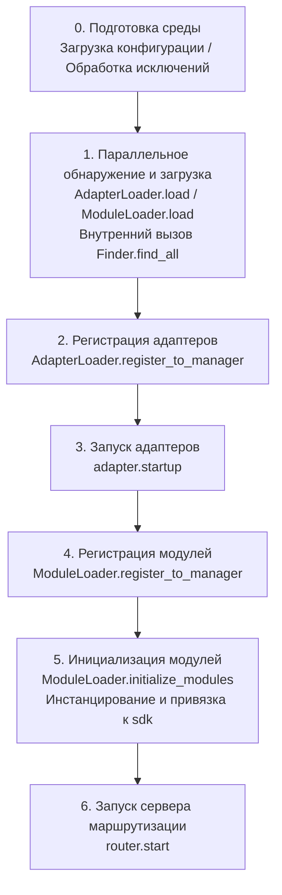

Соответствующие основные компоненты:

| Уровень | Компонент | Ответственность |
|----|------|------|
| Обнаружение | `AdapterFinder` / `ModuleFinder` | **Обнаружение** адаптеров/модулей из entry-points установленных пакетов |
| Загрузка | `AdapterLoader` / `ModuleLoader` | Обнаружение + импорт + чтение метаданных + определение включения/отключения, возвращает список объектов |
| Регистрация | `*Loader.register_to_manager` | Регистрация объектов в соответствующих менеджерах |
| Управление | `sdk.adapter` / `sdk.module` | Хранение экземпляров адаптеров/модулей, предоставление интерфейсов запуска/остановки |
| Инициализация | `ModuleLoader.initialize_modules` | Создание экземпляров модулей и привязка к `sdk` (обработка топологической сортировки зависимостей) |
| Маршрутизация | `sdk.router` | HTTP / WebSocket сервер |

> **Важно**: `Finder` и `Loader` — это два уровня. Внутри `Loader` **уже содержится** `Finder` (у `AdapterLoader` есть `AdapterFinder`, у `ModuleLoader` есть `ModuleFinder`). В большинстве сценариев вам нужно использовать только `Loader`, а `Finder` используется только тогда, когда нужно "просто перечислить, не импортируя".

[**English**](docs/ru/quick-start.md) | [**简体中文**](docs/ru/quick-start.md)

## Подробное объяснение каждого этапа

### 1. Слой обнаружения: Finder

Finder отвечает только за "поиск пакетов, предоставляющих адаптеры/модули", не импортирует и не создает экземпляры.

```python
from ErisPulse.finders import AdapterFinder, ModuleFinder

adapter_finder = AdapterFinder()
module_finder = ModuleFinder()

# Поиск всех установленных entry-points адаптеров/модулей
adapter_entries = adapter_finder.find_all()    # list[EntryPoint]
module_entries = module_finder.find_all()      # list[EntryPoint]

# Поиск по имени
entry = module_finder.find_by_name("MyModule")  # EntryPoint | None
```

Каждый `EntryPoint` можно загрузить с помощью `.load()`, чтобы получить соответствующий класс, но обычно вам не нужно вызывать это вручную — Loader сделает это за вас.

### 2. Слой загрузки: Loader

Loader добавляет к Finder'у функциональность "импорта + чтения метаданных + определения включения/отключения".

```python
from ErisPulse.loaders import AdapterLoader, ModuleLoader
from ErisPulse import sdk

adapter_loader = AdapterLoader()
module_loader = ModuleLoader()

# Внутри load(): вызывается finder.find_all() → обработка entry-point по одному → возвращение тройки значений
adapter_objs, enabled_adapters, disabled_adapters = await adapter_loader.load(sdk.adapter)
module_objs, enabled_modules, disabled_modules = await module_loader.load(sdk.module)
```

Тройка значений, возвращаемая `load()`:

| Возвращаемое значение | Значение |
|-----------------------|----------|
| `objs` (`dict`)       | Имя → объект (класс адаптера / обертка модуля) |
| `enabled` (`list[str]`) | Имена, которые были включены (не отключены в конфигурации) |
| `disabled` (`list[str]`) | Имена, которые были отключены |

#### Информация для диагностики при неудачной загрузке

Когда модуль/адаптер выбрасывает исключение на этапе загрузки или инициализации, фреймворк пропускает этот компонент и продолжает загрузку остальных, одновременно выводя **резюме фреймов пользовательского кода**, чтобы вы могли определить местоположение ошибки на уровне INFO, без необходимости вручную включать DEBUG:

```
[ERROR] [ModuleLoader] Загрузка модуля MyModule из entry-point не удалась, пропущен: 'NoneType' object has no attribute 'platform'
  → MyModule/Core.py:42 in on_load
      adapter = sdk.platform
  → AttributeError: 'NoneType' object has no attribute 'platform'
  → Подсказка: Увеличьте уровень логирования до DEBUG, чтобы увидеть полный стек; проверьте реализацию модуля MyModule
```

Информация для диагностики генерируется с помощью модуля `ErisPulse.runtime.diagnostics`, который автоматически фильтрует внутренние фреймы фреймворка, оставляя только фреймы вашего кода. Если вам нужно повторно использовать это в пользовательской логике загрузки:

```python
from ErisPulse.runtime import log_diagnostic

try:
    risky_init()
except Exception as e:
    log_diagnostic(e)  # Автоматически извлекает фреймы пользовательского кода и записывает в лог ERROR
```

Этот модуль также предоставляет два низкоуровневых функции: `extract_user_frame()` (возвращает структурированную информацию о фрейме) и `format_diagnostic_block()` (возвращает многострочный текст).

### 3. Слой регистрации: register_to_manager

Регистрация объектов, созданных Loader'ом, в менеджере, чтобы `sdk.adapter` / `sdk.module` могли их распознавать.

```python
# Регистрация адаптера (возвращает bool, указывающий, успешно ли все завершилось)
await adapter_loader.register_to_manager(enabled_adapters, adapter_objs, sdk.adapter)

# Регистрация модуля
await module_loader.register_to_manager(enabled_modules, module_objs, sdk.module)
```

После регистрации адаптеры зарегистрированы в менеджере адаптеров, а модули — в менеджере модулей, но **ни один из них еще не запущен/не создан**.

### 4. Запуск адаптеров

```python
# Запуск всех зарегистрированных адаптеров
await sdk.adapter.startup()
# Или указать платформу
await sdk.adapter.startup("yunhu")
await sdk.adapter.startup(["yunhu", "telegram"])
```

> Регистрация ≠ Запуск. `register_to_manager` просто регистрирует; `startup` вызывает метод `start()` адаптера и устанавливает соединение с платформой.

### 5. Инициализация модуля

Модули имеют дополнительный шаг — они должны быть **инициализированы** и подключены к `sdk` (чтобы вы могли вызывать `sdk.MyModule.xxx`). Этот шаг также обрабатывает объявления зависимостей между модулями и топологическую сортировку.

```python
success = await module_loader.initialize_modules(
    enabled_modules, module_objs, sdk.module, sdk
)
```

После успешной инициализации модуль появится в `sdk.<ModuleName>`.

### 6. Запуск сервера маршрутизации

```python
await sdk.router.start(
    host="0.0.0.0",
    port=8000,
    ssl_certfile=None,
    ssl_keyfile=None,
)
```

Сервер маршрутизации отвечает за прием обратных вызовов Webhook / WebSocket от адаптеров. Если он не запущен, адаптеры в режиме сервера не смогут получать сообщения.

[**English**](docs/ru/quick-start.md)

## Полный пример ручного запуска

Следующий код **эквивалентен** основному процессу `await sdk.init()`, но каждая его часть доступна для ручного управления, что позволяет вставить пользовательскую логику в любой момент:

```python
import asyncio
from ErisPulse import sdk
from ErisPulse.loaders import AdapterLoader, ModuleLoader

async def manual_startup():
    # 0. Подготовка среды (загрузка конфигурации, регистрация обработчика глобальных исключений)
    #    _prepare_environment — это предварительный шаг внутри init(); при ручном процессе его также нужно вызывать в первую очередь,
    #    иначе Loader не сможет прочитать конфигурацию и посчитает все адаптеры/модули отключенными.
    if not await sdk._prepare_environment():
        print("Ошибка при подготовке среды")
        return False

    # 1. Создание загрузчиков (внутри каждый из них содержит Finder)
    adapter_loader = AdapterLoader()
    module_loader = ModuleLoader()

    # 2. Параллельное обнаружение и загрузка (аналогично внутренней реализации gather в init())
    (adapter_objs, enabled_adapters, disabled_adapters), \
    (module_objs, enabled_modules, disabled_modules) = await asyncio.gather(
        adapter_loader.load(sdk.adapter),
        module_loader.load(sdk.module),
    )

    # 3. Регистрация адаптеров
    await adapter_loader.register_to_manager(
        enabled_adapters, adapter_objs, sdk.adapter
    )

    # 4. Запуск адаптеров
    if enabled_adapters:
        await sdk.adapter.startup()

    # 5. Регистрация модулей
    await module_loader.register_to_manager(
        enabled_modules, module_objs, sdk.module
    )

    # 6. Инициализация модулей (инстанцирование + привязка к sdk)
    if enabled_modules:
        await module_loader.initialize_modules(
            enabled_modules, module_objs, sdk.module, sdk
        )

    # 7. Запуск сервера маршрутизации
    await sdk.router.start(host="0.0.0.0", port=8000)

    print("Ручной запуск завершен")
    return True

async def main():
    ok = await manual_startup()
    if ok:
        # Блокировка для поддержания работы (ручной процесс не блокируется автоматически)
        await asyncio.Event().wait()

if __name__ == "__main__":
    asyncio.run(main())
```

### Когда использовать ручной запуск?

В большинстве случаев **ручной запуск не требуется**, так как `await sdk.run()` уже выполняет все вышеуказанные шаги. Ручной запуск имеет смысл только в следующих случаях:

- **Частичная загрузка**: загрузка только указанных адаптеров/модулей, пропуск остальных
- **Динамическая регистрация**: регистрация новых адаптеров/модулей во время выполнения в зависимости от условий
- **Пользовательский порядок**: необходимость изменить стандартный порядок загрузки (например, запустить модуль до запуска адаптера)
- **Внедрение стратегий**: внедрение в Loader пользовательских менеджеров строгого режима, стратегий загрузки и т.д.
- **Отладка/диагностика**: ручное управление выполнением для выявления ошибок на конкретных этапах

## Контроль на уровне выполнения

Даже если вы использовали `sdk.run()` для запуска, вы по-прежнему можете управлять отдельными подсистемами во время выполнения, не перезапуская весь SDK:

### Горячее включение/выключение адаптеров

```python
# Горячая перезагрузка адаптера (исправление соединения, не влияет на другие платформы)
await sdk.adapter.shutdown("yunhu")
await sdk.adapter.startup("yunhu")

# Запуск новой платформы во время выполнения
await sdk.adapter.startup("telegram")

# Временное отключение платформы
await sdk.adapter.shutdown("telegram")
```

> `adapter.startup()` требует, чтобы адаптер **был зарегистрирован** в менеджере. Регистрация происходит внутри `init()`/`run()`, поэтому это тонкий контроль **после** запуска.

### Сервер маршрутизации

```python
# Временное отключение webhook-сервера
await sdk.router.stop()

# Перезапуск (например, при смене порта)
await sdk.router.start(host="0.0.0.0", port=9000)
```

### Загрузка модулей по требованию

```python
# Ручная загрузка модуля (возможно, ленивая загрузка)
await sdk.load_module("MyModule")
```

[**Русский**](docs/ru/quick-start.md)

## Грациозное завершение

Начиная с версии 2.7.0, `sdk.shutdown()` предоставляет **программное грациозное завершение**: установка события завершения, которое позволяет главному циклу, зависшему в `await sdk.run(keep_running=True)`, вернуться и, в свою очередь, запустить `uninit()` для завершения очистки ресурсов.

```python
# Вызывается в любой корутине, вызывает грациозное завершение (run() возвращается и автоматически вызывает uninit)
sdk.shutdown()
```

Типичное применение:

```python
async def shutdown_after_idle():
    await asyncio.sleep(3600)
    sdk.shutdown()  # Грациозное завершение после 1 часа бездействия
```

**Обработка сигналов**: `run()` внутренне регистрирует обработчики `SIGTERM` / `SIGHUP`, преобразуя системные сигналы в грациозное завершение — при остановке контейнеров (Docker `docker stop`) или остановке службы `systemd` процесс будет завершаться через `uninit()` для очистки, а не будет принудительно убит.

- Windows не поддерживает `loop.add_signal_handler`, обработчики сигналов будут автоматически пропущены (можно по-прежнему использовать `sdk.shutdown()` или Ctrl+C для запуска завершения)
- Повторный вызов `sdk.shutdown()` безопасен (при повторном вызове после установки события не будет никаких действий)

[**English**](docs/ru/quick-start.md)

## Процесс удаления

Обратная операция запуска — это `await sdk.uninit()`, которая очищает в обратном порядке:

1. Закрытие всех адаптеров (`adapter.shutdown()`)
2. Удаление всех модулей
3. Очистка всех обработчиков событий
4. Очистка свойств модулей в менеджере и SDK

В сценариях с ручным запуском не забудьте вызвать `uninit()` перед выходом, чтобы обеспечить корректное завершение:

```python
try:
    await asyncio.Event().wait()   # Поддержка работы
finally:
    await sdk.uninit()

## Перезапуск

SDK предоставляет два способа перезапуска, при этом вам не нужно самостоятельно сначала удалять — фреймворк сам обработает:

| Способ | Вызов | Поведение | Сценарий использования |
|------|------|------|----------|
| Горячий перезапуск | `await sdk.restart()` | В том же процессе после `uninit()` повторно вызывается `init()`, перезагружаются адаптеры/модули | Перезагрузка конфигурации, горячая замена модулей |
| Жесткий перезапуск | `await sdk.hard_restart()` | После `uninit()` завершается весь процесс, и родительский процесс (`epsdk run`) запускает новый процесс | Подозрение на утечку памяти/ресурсов, требуется полный и чистый перезапуск |

```python
# Горячий перезапуск: перезагрузка в том же процессе (наиболее часто используемый способ)
await sdk.restart()

# Жесткий перезапуск: завершение процесса, действует только при запуске через epsdk run
await sdk.hard_restart()
```

> **Два важных замечания**:
> 1. Оба этих метода выполняют перезапуск в фоновой задаче, **немедленно возвращая `True` означает «задача перезапуска запланирована»**, а не «перезапуск завершен». Фактический перезапуск происходит в фоне, чтобы не прерывать текущую цепочку событий.
> 2. `hard_restart()` **должен быть вызван при запуске через `epsdk run main.py`**, чтобы сработал. Его принцип работы: после удаления он завершает процесс с кодом выхода 42, и родительский процесс `epsdk run` обнаружив этот код, запускает новый процесс; если же запуск происходит напрямую через `python main.py`, процесс завершится с кодом 42 и просто завершится, без автоматического перезапуска.

### Когда следует использовать жесткий перезапуск?

Жесткий перезапуск — это не просто «более полный перезапуск», он в следующих сценариях более подходит и даже эффективнее, чем горячий перезапуск:

- **Побочные эффекты двоичных библиотек (C-расширений)**: Горячий перезапуск происходит в том же процессе, не позволяя освободить ресурсы, такие как C-расширения, открытые файловые дескрипторы, потоки и т.д.; жесткий перезапуск запускает новый процесс, полностью очищая эти побочные эффекты.
- **Выявление утечек ресурсов**: При подозрении на утечку памяти или дескрипторов жесткий перезапуск обеспечивает чистую среду.
- **Частые перезапуски с чувствительностью к производительности**: Жесткий перезапуск избегает накладных расходов на удаление и повторную загрузку в том же процессе, фактически более эффективен, чем горячий перезапуск.

> Функция «Перезапуск фреймворка» в панели управления Dashboard на нижнем уровне вызывает именно `hard_restart()`.
> Кроме того, жесткий перезапуск требует обязательного использования команды запуска `epsdk`, иначе программа просто завершится с кодом 42, потому что команда `run` проверяет код выхода 42 и перезапускает процесс. Об этом нужно помнить!


====
技术标准
====


### 会话类型标准

# Стандарт типов сессий ErisPulse

В этом документе определяются стандартные типы сессий, поддерживаемые ErisPulse, включая типы событий приема и типы целей отправки.

Пожалуйста, верните непосредственно переведенный полный Markdown-контент, не добавляя никаких других текстов.

Еще раз напоминаем: если документ содержит строки переключения языка (строки, в которых названия языков разделены `` | ``), необходимо строго соблюдать вышеуказанные правила форматирования, не записывая ошибочного формата, такого как ``[**Label**](file)``.

## 1. Основные понятия

### 1.1 Типы получения && Типы отправки

ErisPulse различает два типа сессий:

- **Тип получения (Receive Type)**: поле `detail_type` события, используемое для получения
- **Тип отправки (Send Type)**: тип назначения метода `Send.To()` при отправке сообщений

### 1.2 Отношение типов

```
Тип получения (detail_type)     Тип отправки (Send.To)
─────────────────        ────────────────
private                 →        user
group                   →        group
channel                 →        channel
guild                   →        guild
thread                  →        thread
user                    →        user
```

**Ключевые моменты**:
- `private` является типом получения, при отправке необходимо использовать `user`
- `group`, `channel`, `guild`, `thread` имеют одинаковые типы при получении и отправке
- Система автоматически выполняет преобразование типов, без необходимости ручного управления (это означает, что вы можете напрямую использовать полученный тип получения для отправки), на самом деле, вам не нужно беспокоиться об этом, наличие обёрточного класса Event позволяет вам напрямую использовать метод event.reply(), не заботясь о преобразовании типов

## 2. Стандартные типы сессий

### 2.1 Стандартные типы OneBot12

#### private
- **Тип получения**: `private`
- **Тип отправки**: `user`
- **Описание**: Личное сообщение в прямом чате
- **Поле ID**: `user_id`
- **Поддерживаемые платформы**: Все платформы, поддерживающие личные чаты

#### group
- **Тип получения**: `group`
- **Тип отправки**: `group`
- **Описание**: Сообщения в групповом чате, включая различные формы групп (например, супергруппы в Telegram)
- **Поле ID**: `group_id`
- **Поддерживаемые платформы**: Все платформы, поддерживающие групповые чаты

#### user
- **Тип получения**: `user`
- **Тип отправки**: `user`
- **Описание**: Тип пользователя, некоторые платформы (например, Telegram) представляют личные чаты как `user`, а не `private`
- **Поле ID**: `user_id`
- **Поддерживаемые платформы**: Telegram и другие платформы

### 2.2 Расширенные типы ErisPulse

#### channel
- **Тип получения**: `channel`
- **Тип отправки**: `channel`
- **Описание**: Сообщения в канале, поддерживают широковещательные сообщения для нескольких пользователей
- **Поле ID**: `channel_id`
- **Поддерживаемые платформы**: Discord, Telegram, Line и другие

#### guild
- **Тип получения**: `guild`
- **Тип отправки**: `guild`
- **Описание**: Сообщения сервера/сообщества, обычно используются для событий уровня Discord Guild
- **Поле ID**: `guild_id`
- **Поддерживаемые платформы**: Discord и другие

#### thread
- **Тип получения**: `thread`
- **Тип отправки**: `thread`
- **Описание**: Сообщения темы/подканала, используются для подобсуждений внутри сообщества
- **Поле ID**: `thread_id`
- **Поддерживаемые платформы**: Discord Threads, Telegram Topics и другие

## 3. Сопоставление типов платформ

### 3.1 Принцип сопоставления

Адаптер отвечает за сопоставление нативных типов платформ с типами ErisPulse:

```
Нативный тип платформы → Стандартный тип ErisPulse → Тип отправки
```

### 3.2 Примеры сопоставления распространённых платформ

#### Telegram
```
Тип Telegram         Тип ErisPulse (приём)    Тип отправки
─────────────────      ────────────────       ───────────
private                private                 user
group                  group                   group
supergroup             group                   group  # Сопоставляется с group
channel                channel                 channel
```

#### Discord
```
Тип Discord          Тип ErisPulse (приём)    Тип отправки
─────────────────      ────────────────       ───────────
Direct Message         private                user
Text Channel           channel                channel
Guild                  guild                  guild
Thread                 thread                 thread
```

#### OneBot11
```
Тип OneBot11         Тип ErisPulse (приём)    Тип отправки
─────────────────      ────────────────       ───────────
private                private                user
group                  group                  group
discuss                group                  group  # Сопоставляется с group

## 4. Расширение пользовательских типов

### 4.1 Регистрация пользовательского типа

Адаптер может зарегистрировать пользовательский тип сеанса:

```python
from ErisPulse.Core.Event import register_custom_type

# Регистрация пользовательского типа
register_custom_type(
    receive_type="my_custom_type",
    send_type="custom",
    id_field="custom_id",
    platform="MyPlatform"
)
```

### 4.2 Использование пользовательского типа

После регистрации система автоматически обрабатывает преобразование и вывод этого типа:

```python
# Автоматический вывод
receive_type = infer_receive_type(event, platform="MyPlatform")
# Возвращает: "my_custom_type"

# Преобразование в тип отправки
send_type = convert_to_send_type(receive_type, platform="MyPlatform")
# Возвращает: "custom"

# Получение соответствующего ID
target_id = get_target_id(event, platform="MyPlatform")
# Возвращает: event["custom_id"]
```

### 4.3 Удаление пользовательского типа

```python
from ErisPulse.Core.Event import unregister_custom_type

unregister_custom_type("my_custom_type", platform="MyPlatform")

## 5. Автоматическое определение типа

Когда у события отсутствует явное поле `detail_type`, система автоматически определяет тип на основе существующих полей ID:

> [!NOTE]
> **Изменение поведения в 2.7.0+**: `detail_type` используется напрямую только в том случае, если это **известный тип сессии** (стандартный или пользовательский). У событий notice/request `detail_type` (например, `group_member_increase`, `friend_increase`) является **семантическим подтипом**, а не типом сессии, и система будет вместо этого определять правильный тип сессии на основе полей ID.

### 5.1 Приоритет определения

```
Приоритет (от высокого к низкому):
1. group_id     → group
2. channel_id   → channel
3. guild_id     → guild
4. thread_id    → thread
5. user_id      → private
```

### 5.2 Примеры использования

```python
# У события есть только group_id
event = {"group_id": "123", "user_id": "456"}
receive_type = infer_receive_type(event)
# Возвращает: "group" (group_id имеет наивысший приоритет)

# У события есть только user_id
event = {"user_id": "123"}
receive_type = infer_receive_type(event)
# Возвращает: "private"

# У события notice detail_type является семантическим подтипом, начиная с 2.7.0 будет определяться по ID-полю
event = {"type": "notice", "detail_type": "group_member_increase", "group_id": "123"}
receive_type = infer_receive_type(event)
# Возвращает: "group" (а не "group_member_increase")

## 6. Примеры использования API

### 6.1 Отправка сообщений

```python
from ErisPulse import adapter

# Отправка пользователю
await adapter.myplatform.Send.To("user", "123").Text("Hello")

# Отправка в группу
await adapter.myplatform.Send.To("group", "456").Text("Hello")

# Автоматическое преобразование private → user (не рекомендуется, может быть проблема совместимости)
await adapter.myplatform.Send.To("private", "789").Text("Hello")
# Внутренне автоматически преобразуется в: Send.To("user", "789") # предпочтительнее использовать user как тип сессии напрямую
```

### 6.2 Ответ на событие

```python
from ErisPulse.Core.Event import Event

# Event.reply() автоматически обрабатывает преобразование типа
await event.reply("Содержимое ответа")
# Внутренне автоматически используется правильный тип отправки
```

### 6.3 Обработка команд

```python
from ErisPulse.Core.Event import command

@command(name="test")
async def handle_test(event):
    # Система автоматически обрабатывает тип сессии
    # Не нужно вручную проверять group_id или user_id
    await event.reply("Команда выполнена успешно")

## 7. Справочник основного API

### 7.1 Преобразование типов

```python
from ErisPulse.Core.Event import convert_to_send_type, convert_to_receive_type

# Тип получения → Тип отправки
convert_to_send_type("private")  # → "user"
convert_to_send_type("group")    # → "group"

# Тип отправки → Тип получения
convert_to_receive_type("user")   # → "private"
convert_to_receive_type("group")  # → "group"
```

### 7.2 Запрос полей ID

```python
from ErisPulse.Core.Event import get_id_field, get_receive_type

get_id_field("group")    # → "group_id"
get_id_field("private")  # → "user_id"

get_receive_type("group_id")  # → "group"
get_receive_type("user_id")   # → "private"
```

### 7.3 Получение информации для отправки за один шаг

```python
from ErisPulse.Core.Event import get_send_type_and_target_id

event = {"detail_type": "private", "user_id": "123"}
send_type, target_id = get_send_type_and_target_id(event)
# send_type = "user", target_id = "123"

# Непосредственно используется в Send.To()
await adapter.Send.To(send_type, target_id).Text("Hello")
```

### 7.4 Получение целевого ID

```python
from ErisPulse.Core.Event import get_target_id

event = {"detail_type": "group", "group_id": "456"}
get_target_id(event)  # → "456"

## 8. Утилитарные методы

```python
from ErisPulse.Core.Event import (
    is_standard_type,
    is_valid_send_type,
    get_standard_types,
    get_send_types,
    clear_custom_types,
)

is_standard_type("private")     # True
is_standard_type("custom_type") # False

is_valid_send_type("user")      # True
is_valid_send_type("invalid")   # False

get_standard_types()  # {"private", "group", "channel", "guild", "thread", "user"}
get_send_types()      # {"user", "group", "channel", "guild", "thread"}

clear_custom_types()                # Очистить все
clear_custom_types(platform="discord")  # Очистить только указанный платформы
```

[**English**](docs/ru/quick-start.md) | [**Русский**](docs/ru/quick-start.md)

## 9. Лучшие практики

### 7.1 Разработчики адаптеров

1. **Использование стандартных маппингов**: по возможности маппите на стандартные типы, а не создавайте новые типы
2. **Правильное преобразование**: убедитесь, что отношения маппинга между типами получения и отправки корректны
3. **Сохранение исходных данных**: сохраняйте исходный тип события в `{platform}_raw`
4. **Описание в документации**: в документации адаптера укажите отношения маппинга типов

### 7.2 Разработчики модулей

1. **Использование вспомогательных методов**: используйте вспомогательные методы, такие как `get_send_type_and_target_id()`
2. **Избегайте жесткой привязки**: не пишите код вида `if group_id else "private"`
3. **Учет всех типов**: код должен поддерживать все стандартные типы, а не только private/group
4. **Гибкий дизайн**: используйте методы обертки событий, а не прямой доступ к полям

### 7.3 Вывод типов

- **Приоритет использования detail_type**: если есть явное поле, не делайте вывод
- **Разумное использование вывода**: используйте вывод только тогда, когда нет явного типа
- **Обратите внимание на приоритет**: знайте приоритет вывода, чтобы избежать неожиданных результатов

## 10. Часто задаваемые вопросы

### Q1: Почему при отправке private нужно преобразовывать в user?

A: Это требование стандарта OneBot12. `private` — это концепция при получении, при отправке использование `user` более соответствует семантике.

### Q2: Как поддержать новые типы сессий?

A: Зарегистрируйте пользовательский тип с помощью `register_custom_type()` или используйте стандартные типы, такие как `channel`, `guild` и т.д.

### Q3: Что делать, если у события нет detail_type?

A: Система автоматически выводит тип на основе существующих полей ID. Приоритет: group > channel > guild > thread > user.

### Q4: Как адаптер отображает Telegram supergroup?

A: В логике преобразования адаптера `supergroup` отображается в стандартный тип `group`.

### Q5: Как обрабатывать специальные платформы, такие как электронная почта?

A: Для неуниверсальных или платформенно-специфических типов используйте `{platform}_raw` и `{platform}_raw_type` для сохранения исходных данных, адаптер должен самостоятельно обрабатывать их.

docs/ru/quick-start.md

## 11. Связанные документы

- [Стандарт преобразования событий](event-conversion.md) - Полный стандарт преобразования событий
- [Спецификация методов отправки](send-method-spec.md) - Назначение и параметры методов класса Send
- [Руководство по разработке адаптеров](../developer-guide/adapters/) - Полное руководство по разработке адаптеров


====
生态模块
====


### ErisPulse-App 安装与使用

# ErisPulse-App

[ErisPulse-App](https://github.com/ErisPulse/ErisPulse-App) — это официально поддерживаемый **многоплатформенный клиент** (доступен для Android, Windows, Linux и macOS), который напрямую поддерживается командой ErisDev.

Он предоставляет полностью нативный графический интерфейс для управления: создание, запуск и управление несколькими экземплярами ботов на телефоне или компьютере. Вам не потребуется терминал или отдельная среда Python.

> [!IMPORTANT]
> ErisPulse-App — это **самостоятельное клиентское приложение**, а не модуль, установленный через `epsdk install`.
> Внутри уже есть встроенный Python runtime и ErisPulse SDK — просто установите и пользуйтесь. **Приложение можно запустить напрямую на телефоне.**

请直接返回翻译后的完整Markdown内容，不要包含任何其他文字。

再次提醒：如果文档包含语言切换行（各语言名称用 `` | `` 分隔的行），务必严格遵守上方第8条的格式要求，不要写出 ``[**Label**](file)`` 这类错误格式。

## Краткий обзор функций

- **Управление несколькими экземплярами**: создание / запуск / остановка / удаление нескольких экземпляров, автоматическое назначение портов и токенов доступа, поддержка полностью новых окружений или клонирования существующих
- **Панель управления**: статистика адаптеров / модулей / онлайн-ботов / общее количество событий, изменение цвета предупреждений для использования ЦП / памяти
- **Магазин модулей**: поиск и фильтрация по тегам, одном кликовая установка / обновление / удаление, установка конкретной версии, поддержка зеркал pip и пакетов Git
- **Поток событий + Конструктор событий**: просмотр событий в реальном времени, визуальное создание тестовых событий и отправка в адаптер
- **Мониторинг**: единый обзор для журналов / жизненного цикла / аудита
- **Управление командами**: глобальные настройки, такие как префикс и псевдонимы, запуск и остановка, а также белые и черные списки платформ
- **Обзор / Настройка / Управление файлами бота**: прямое управление экземплярами через нативный интерфейс
- **Фоновый режим**: поддержка Android с помощью foreground-сервиса, Windows — сворачивание в системный трей, закрытие окна не прерывает работу экземпляра
- **Динамические окна модулей**: зарегистрированные модули автоматически появляются в боковой навигации (в той же группе, что и Dashboard), с быстрым доступом по клику

## Поддерживаемые платформы

Пакеты установки для всех платформ можно скачать с [GitHub Releases](https://github.com/ErisPulse/ErisPulse-App/releases); выберите нужный вариант:

| Платформа | Пакет установки | Описание |
|-----------|----------------|----------|
| Android | `online-*.apk` / `offline-*.apk` | **Запуск на телефоне** — компьютер не требуется |
| Windows | `windows-x64-setup.exe` / `windows-x64.zip` | Установщик / портативная версия |
| Linux | `linux-x64.tar.gz` | Распаковать и запустить |
| macOS | `macos-arm64.zip` | Apple Silicon (arm64) |

Единый репозиторий Flutter поддерживает все платформы.

---

## Способ установки (Android / запустить на телефоне)

Скачайте и установите APK из [GitHub Releases](https://github.com/ErisPulse/ErisPulse-App/releases); доступно два типа сборки:

| Сборка | Образ для времени выполнения | Применение |
|--------|-----------------------------|-----------|
| `erispulse-app-online-*.apk` | Скачивается при первом запуске | Меньший размер установочного файла, подходит при хорошем интернете |
| `erispulse-app-offline-*.apk` | Упакован в APK | Оффлайн-самодостаточный, после установки не требуется подключение к сети |

Пошаговая инструкция для обоих типов сборки одинакова:

1. Скачайте и установите APK. При запуске разрешите уведомления (нужно для работы службы в фоне)
2. При появлении на главной странице баннера инициализации нажмите «Запустить первую инициализацию» (содержит панель прогресса и просмотра логов)
3. Создайте экземпляр и запустите его
4. В встроенном в App интерфейсе управления настройте адаптер и API Key модели

> Офлайн-пакет является самодостаточным — после установки не нужен интернет. Если скачивание при первом запуске медленное или нестабильное,
> в настройках можно переключить источник загрузки на зеркало (ghfast / gh-proxy).

### Способ установки (настольная версия: Windows / Linux / macOS)

1. Скачайте установочный пакет для нужной платформы из [GitHub Releases](https://github.com/ErisPulse/ErisPulse-App/releases)
   (Windows — `setup.exe` или без установки `zip`; Linux — `tar.gz`; macOS — `zip`)
2. Установите и запустите
3. На странице приветствия выберите версию ErisPulse SDK для установки (по умолчанию самая свежая) и выполните установку
4. Создайте экземпляр и запустите

---

## Принцип работы

```
┌────────────────────────────────────────────────────┐
│  ErisPulse-App (Flutter)                            │
│                                                    │
│  Native UI ── Dashboard REST / WS API              │
│       │                                            │
│       ├── Android: foreground service + proot + Ubuntu rootfs │
│       │        + Python + ErisPulse instance       │
│       └── Desktop: built-in Python + direct process management │
└────────────────────────────────────────────────────┘
```

- **Android**: экземпляр запускается в `proot` (пользовательский chroot), под управлением foreground service (background isolate). После закрытия UI бот продолжает работать; при сбое происходит автоматическая перезагрузка
- **Desktop**: экземпляр работает как прямой дочерний процесс приложения. В Windows поддерживается сворачивание в трей для постоянной работы в фоне (закрытие окна не останавливает экземпляр). После перезапуска приложения автоматически восстанавливается управление над работающими экземплярами; при выходе все экземпляры останавливаются единообразно
- Нативный UI на всех платформах communicates с экземплярами через REST / WebSocket API по адресу `127.0.0.1:<port>/Dashboard/*`; используется та же самая API, что и в [ErisPulse-Dashboard](dashboard.md)

---

## Отношения с SDK

- Встраиваемый в приложение SDK ErisPulse: для Android упакован в образ Ubuntu, для настольных ПК — устанавливается через PyPI
  (экран приветствия доступен для выбора версии, по умолчанию используется последняя)
- Экземпляры, используемые в приложении, эквивалентны экземплярам, созданным командной строкой `epsdk`, и могут использовать одинаковые модули / адаптеры
- Разработчики модулей могут регистрировать пользовательские страницы через [Dashboard Window API Registration](dashboard.md):
  Окно автоматически появится в боковой панели навигации приложения (группировка аналогична Dashboard), при нажатии происходит переход на соответствующую страницу


### Dashboard 使用与视窗注册

# ErisPulse-Dashboard

[ErisPulse-Dashboard](https://pypi.org/project/ErisPulse-Dashboard/) — это модуль **Web-панели управления**, поддерживаемый напрямую ErisDev, предоставляющий ErisPulse визуальный интерфейс управления во время выполнения: запуск и остановка модулей, редактирование конфигурации, просмотр логов, мониторинг потока событий и многое другое.

> [!IMPORTANT]
> Dashboard **не является** встроенной функцией фреймворка ErisPulse и требует отдельной установки:
>
> ```bash
> epsdk install Dashboard
> ```

Dashboard также поддерживает регистрацию пользовательских страниц управления другими модулями ErisPulse в боковой панели. После регистрации пользователи могут переключиться на собственную страницу окна модуля прямо в Dashboard без необходимости дополнительной разработки отдельного интерфейса.

> [!NOTE]
> Регистрация окон является **необязательной функцией**.
>
> - Если модуль Dashboard **не установлен** или **не загружен**, вызов `sdk.Dashboard.register_view()` вызовет исключение
> - Обязательно обертывайте код регистрации в `try/except`, чтобы убедиться, что другие функции модуля не затронуты
> - Рекомендуется проверить доступность Dashboard перед регистрацией: `hasattr(sdk, 'Dashboard') and sdk.Dashboard`

---

## Принцип работы

```
Модуль on_load()
  → Вызов sdk.Dashboard.register_view(...)
  → Бэкенд Dashboard сохраняет информацию о окне
  → WebSocket уведомляет фронтенд
  → Фронтенд динамически создает элемент навигации боковой панели + контейнер страницы
  → Пользователь нажимает для просмотра окна модуля
```

---

## API регистрации

```python
sdk.Dashboard.register_view(
    id="MyModule",                    # Обязательно, уникальный идентификатор
    title="Мой модуль",                  # Отображаемое название (китайский язык)
    title_en="My Module",             # Отображаемое название (английский язык)
    icon_svg='<svg>...</svg>',        # SVG-иконка для боковой панели
    html_content='<div>...</div>',     # HTML-содержимое страницы
    js_content='function xxx() {}',    # Логика JavaScript страницы
    css_content='.my-style {}',        # Дополнительный пользовательский CSS
    iframe_url='',                     # URL для режима iframe (выбирается либо html_content)
    loader="loadMyModuleView",         # Имя функции JS, вызываемой при переключении
    group="group_extensions",          # Группа в боковой панели
    group_title="",                    # Название группы на китайском языке
    group_title_en="",                 # Название группы на английском языке
)
```

### Описание параметров

| Параметр | Тип | Обязательно | Описание |
|------|------|------|------|
| `id` | `str` | Да | Уникальный идентификатор окна, рекомендуется использовать имя модуля |
| `title` | `str` | Нет | Отображаемое имя на китайском языке, по умолчанию используется `id` |
| `title_en` | `str` | Нет | Отображаемое имя на английском языке, по умолчанию используется `title` |
| `icon_svg` | `str` | Нет | Полная строка SVG для иконки боковой панели |
| `html_content` | `str` | Нет* | Содержимое HTML страницы в режиме внедрения |
| `js_content` | `str` | Нет | Код JavaScript страницы |
| `css_content` | `str` | Нет | Пользовательские CSS-стили страницы |
| `iframe_url` | `str` | Нет* | URL для режима iframe, после установки html_content игнорируется |
| `loader` | `str` | Нет | Имя функции JS, автоматически вызываемой при активации страницы |
| `group` | `str` | Нет | Идентификатор группы боковой панели, по умолчанию `group_extensions` |
| `group_title` | `str` | Нет | Название группы на китайском языке |
| `group_title_en` | `str` | Нет | Название группы на английском языке |

> *`html_content` и `iframe_url` должны быть предоставлены хотя бы один, иначе страница будет пустой.

---

## Два режима внедрения

### Режим 1: HTML/JS внедрение (рекомендуется)

Прямая передача строк HTML, JS и CSS, Dashboard внедряет содержимое в страницу. Этот режим полностью соответствует стилю Dashboard, рекомендуется использовать предоставленные CSS-классы.

```python
sdk.Dashboard.register_view(
    id="HelloPage",
    title="Приветствие", title_en="Hello",
    icon_svg='<svg viewBox="0 0 24 24" fill="none" stroke="currentColor" stroke-width="2"><circle cx="12" cy="12" r="10"/></svg>',
    html_content='<h1 class="page-title">Hello World</h1><div class="card"><div class="card-body">Это пример страницы</div></div>',
    group="group_tools",
)
```

> Полный пример погодного модуля (включая API-роуты, JS-взаимодействие и т.д.) см. ниже [Полный пример модуля](#полный-пример-модуля).

### Режим 2: Внедрение iframe

Модуль предоставляет свой URL страницы HTML (необходимо самостоятельно зарегистрировать маршрут), Dashboard внедряет его через iframe. Подходит для сценариев, требующих полностью независимого UI или сложного взаимодействия.

```python
sdk.Dashboard.register_view(
    id="MyVisualizer",
    title="Визуализация данных", title_en="Data Visualizer",
    iframe_url="/MyVisualizer/view",
    group="group_tools",
)
```

> Режим iframe автоматически добавляет параметр `token` в конец URL для аутентификации.

---

## Группы боковой панели

Модуль может указать, в какой группе боковой панели находится окно. В Dashboard встроены следующие группы:

| Идентификатор группы | Китайское название | Позиция |
|---------|--------|------|
| `group_overview` | Обзор | 1-я группа |
| `group_events` | События | 2-я группа |
| `group_extensions` | Расширения | 3-я группа (по умолчанию) |
| `group_system` | Система | 4-я группа |
| `group_tools` | Инструменты | 5-я группа |

Указывая встроенное имя группы, окно модуля будет добавлено в конец этой группы:

```python
group="group_tools"  # Добавить в группу "Инструменты"
```

Также можно использовать пользовательское имя группы (не начинается с `group_`), Dashboard автоматически создаст новую группу:

```python
group="my_group",
group_title="Моя группа",
group_title_en="My Group",
```

---

## Часто используемые CSS-классы

При использовании HTML-режима внедрения для окна модуля можно напрямую использовать уже существующие CSS-классы Dashboard для сохранения визуальной согласованности:

| Класс | Назначение |
|------|------|
| `page-title` | Заголовок страницы, например `<h1 class="page-title">Заголовок</h1>` |
| `card` | Контейнер карточки |
| `card-header` | Заголовок карточки |
| `card-body` | Область содержимого карточки |
| `grid-2` | Сетка из двух колонок |
| `grid-3` | Сетка из трех колонок |
| `btn` | Базовая кнопка |
| `btn-primary` | Основная кнопка (синяя) |
| `btn-secondary` | Второстепенная кнопка |
| `btn-icon` | Кнопка с иконкой |
| `btn-danger` | Кнопка опасного действия |

Dashboard использует CSS-переменные для управления цветами темы, вы можете ссылаться на них напрямую в окне модуля:

| CSS-переменная | Назначение |
|----------|------|
| `var(--bg-p)` | Основной цвет фона |
| `var(--bg-s)` | Вторичный цвет фона |
| `var(--bg-t)` | Третичный цвет фона (карточки и т.д.) |
| `var(--tx-p)` | Основной цвет текста |
| `var(--tx-s)` | Вторичный цвет текста |
| `var(--tx-t)` | Дополнительный цвет текста |
| `var(--bd)` | Цвет границ |
| `var(--accent)` | Цвет акцента |
| `var(--ok-c)` | Цвет успеха |
| `var(--er-c)` | Цвет ошибки |

Эти переменные автоматически переключаются в зависимости от светлой/темной темы Dashboard, дополнительная обработка в модуле не требуется.

---

## Аутентификация и вызовы API

При вызове собственного API модуля в JS окна модуля необходимо пройти аутентификацию, используя токен Dashboard:

```javascript
var token = localStorage.getItem('__ep_tk__');
var resp = await fetch('/YourModule/api/data', {
    headers: { 'Authorization': 'Bearer ' + token }
});
var data = await resp.json();
```

Точка API модуля может самостоятельно решать, проверять ли токен. Если требуется проверка, ее можно извлечь из заголовка запроса:

```python
async def _api_data(self, request):
    token = request.headers.get("Authorization", "").replace("Bearer ", "")
    if not token:
        return {"error": "Unauthorized"}, 401
    return {"data": "hello"}
```

---

## Полный пример модуля

Ниже приведен полный пример погодного модуля, показывающий, как зарегистрировать окно, предоставить API-данные и очистить ресурсы при卸ождении:

```python
from ErisPulse import sdk
from ErisPulse.Core.Bases import BaseModule
from ErisPulse.Core.Event import command


class Main(BaseModule):
    def __init__(self):
        self.sdk = sdk
        self.logger = sdk.logger.get_child("Weather")
        self.config = self._load_config()

    @staticmethod
    def get_load_strategy():
        from ErisPulse.loaders import ModuleLoadStrategy
        return ModuleLoadStrategy(lazy_load=False, priority=50)

    async def on_load(self, event):
        self._register_routes()
        self._register_dashboard_view()
        self.logger.info("Погодный модуль загружен")

    async def on_unload(self, event):
        self._unregister_routes()
        if hasattr(self.sdk, 'Dashboard') and self.sdk.Dashboard:
            self.sdk.Dashboard.unregister_view("Weather")
        self.logger.info("Погодный модуль выгружен")

    def _load_config(self):
        config = self.sdk.config.getConfig("Weather")
        if not config:
            default = {"city": "Пекин", "api_key": ""}
            self.sdk.config.setConfig("Weather", default)
            return default
        return config

    def _register_routes(self):
        r = self.sdk.router
        r.register_http_route("Weather", "/api/current",
                              handler=self._api_current, methods=["GET"])

    def _unregister_routes(self):
        r = self.sdk.router
        try:
            r.unregister_http_route("Weather", "/api/current")
        except Exception:
            pass

    async def _api_current(self, request):
        return {
            "city": self.config.get("city", "Пекин"),
            "temp": 25,
            "humidity": 60,
        }

    def _register_dashboard_view(self):
        try:
            dashboard = self.sdk.Dashboard
            dashboard.register_view(
                id="Weather",
                title="Погода", title_en="Weather",
                icon_svg='<svg viewBox="0 0 24 24" fill="none" stroke="currentColor" stroke-width="2"><circle cx="12" cy="12" r="5"/><line x1="12" y1="1" x2="12" y2="3"/><line x1="12" y1="21" x2="12" y2="23"/><line x1="4.22" y1="4.22" x2="5.64" y2="5.64"/><line x1="18.36" y1="18.36" x2="19.78" y2="19.78"/><line x1="1" y1="12" x2="3" y2="12"/><line x1="21" y1="12" x2="23" y2="12"/><line x1="4.22" y1="19.78" x2="5.64" y2="18.36"/><line x1="18.36" y1="5.64" x2="19.78" y2="4.22"/></svg>',
                html_content='''
                    <h1 class="page-title">Запрос погоды</h1>
                    <p style="color:var(--tx-s);margin-bottom:16px">Просмотр текущей информации о погоде</p>
                    <div class="grid-2">
                        <div class="card">
                            <div class="card-header">Текущая погода</div>
                            <div class="card-body">
                                <div id="weather-info" style="font-size:14px;color:var(--tx-s)">Нажмите обновить для загрузки</div>
                            </div>
                        </div>
                        <div class="card">
                            <div class="card-header">Действия</div>
                            <div class="card-body">
                                <button class="btn btn-primary" onclick="refreshWeather()">Обновить</button>
                            </div>
                        </div>
                    </div>
                ''',
                js_content='''
                    async function loadWeatherView() { await refreshWeather(); }
                    async function refreshWeather() {
                        var el = document.getElementById('weather-info');
                        if (!el) return;
                        el.textContent = 'Загрузка...';
                        try {
                            var resp = await fetch('/Weather/api/current', {
                                headers: { 'Authorization': 'Bearer ' + localStorage.getItem('__ep_tk__') }
                            });
                            var data = await resp.json();
                            el.innerHTML = '<p>Город: ' + (data.city || '--') + '</p>' +
                                           '<p>Температура: ' + (data.temp || '--') + '°C</p>' +
                                           '<p>Влажность: ' + (data.humidity || '--') + '%</p>';
                        } catch (e) {
                            el.textContent = 'Ошибка загрузки: ' + e.message;
                        }
                    }
                ''',
                loader="loadWeatherView",
                group="group_tools",
            )
        except Exception as e:
            self.logger.warning(f"Не удалось зарегистрировать окно Dashboard: {e}")
```

---

## Отмена регистрации окна

При выгрузке модуля следует вызывать `unregister_view()` для очистки зарегистрированного окна:

```python
async def on_unload(self, event):
    if hasattr(self.sdk, 'Dashboard') and self.sdk.Dashboard:
        self.sdk.Dashboard.unregister_view("Weather")
```

После отмены регистрации фронтенд Dashboard через WebSocket в реальном времени удаляет элементы навигации боковой панели и содержимое страницы, обновление страницы пользователем не требуется.

---

## Важные замечания

1. **Порядок загрузки** — Приоритет загрузки Dashboard — `99999` (высокий), приоритет вашего модуля должен быть ниже этого значения (например, `50`), чтобы убедиться, что Dashboard загружен первым
2. **Защищенное программирование** — При регистрации окна используйте `try/except`, так как модуль Dashboard может не быть установлен или загружен
3. **Очистка ресурсов** — Вызывайте `unregister_view()` в `on_unload` для удаления зарегистрированного окна
4. **Уникальность ID** — Параметр `id` должен быть уникальным во всем Dashboard, рекомендуется использовать имя модуля напрямую
5. **SVG-иконки** — `icon_svg` должно быть полным тегом `<svg>`, рекомендуется использовать размер `viewBox="0 0 24 24"` и `stroke="currentColor"` для наследования цвета темы Dashboard
6. **Имена функций JS** — Имена функций в `js_content` должны быть уникальными (например, `loadWeatherView`), чтобы избежать конфликтов с другими модулями
7. **Динамическое обновление** — После регистрации/отмены регистрации окна фронтенд Dashboard через WebSocket в реальном времени обновляет боковую панель, обновление страницы пользователя не требуется


### Takumi 图片渲染

# ErisPulse-Takumi

[ErisPulse-Takumi](https://pypi.org/project/ErisPulse-Takumi/) — это модуль для рендеринга изображений от **ccd2s**, основанный на [takumi-py](https://github.com/BalconyJH/takumi-py), который позволяет ботам конвертировать HTML, узловые деревья, шаблоны Jinja, SVG и анимации в изображения. Модуль **встроен шрифты китайского и английского языков** (Noto Sans SC / Roboto / Source Code Pro), дополнительные настройки не требуются.

> [!IMPORTANT]
> Takumi **не** является встроенной функцией фреймворка ErisPulse, его необходимо установить отдельно:
>
> ```bash
> epsdk install Takumi
> ```

Используемые сценарии:

- Рендеринг данных / статистики в виде карточек изображений
- Конвертация Markdown / длинного текста в изображения с гарантированной типографикой, чтобы избежать различий в стилях платформ
- Генерация SVG / анимаций для создания динамических визуальных эффектов
- Смешанные китайско-английские иллюстрации (встроенные шрифты готовы к использованию)

---

## Установка и активация

```bash
epsdk install Takumi
```

После установки модуль загружается автоматически. Подтвердите включение в конфигурации:

```toml
[Takumi]
enabled = true

## Быстрый старт

После автоматической загрузки модулей их можно получить через менеджер модулей или с помощью сокращённого способа `sdk`:

```python
from ErisPulse import sdk

takumi = sdk.module.get("Takumi")
# Эквивалентная запись: takumi = sdk.Takumi
```

### Рендеринг HTML

```python
png = takumi.render_html(
    """
    <div class="card">
      <h1>Привет, ErisPulse</h1>
      <p>Сгенерировано с помощью Takumi</p>
    </div>
    """,
    stylesheets=["""
    .card {
      width: 800px;
      padding: 48px;
      color: white;
      background: #111827;
      font-family: "Noto Sans SC";
    }
    """],
    width=800,
    height=None,   # Автоматическое расширение по содержимому
    lang="zh-CN",
)
```

### Рендеринг дерева узлов

```python
png = takumi.render_node(
    {
        "type": "text",
        "text": "Китайский и English можно рендерить напрямую",
        "style": {"fontSize": 48, "color": "#111827"},
    },
    width=800,
    height=None,
    lang="zh-CN",
)
```

`png` — это `bytes`, которые можно отправить через `event.reply(png, method="Image")` (см. [Отправка результата рендеринга](#отправка-результата-рендеринга)).

---

## API Rendering

`sdk.Takumi` проксирует все возможности базового `takumi_py.Renderer`: все операции рендеринга, измерения, SVG, анимации и методы шаблонов можно вызывать напрямую через `sdk.Takumi`. Для этих методов модуль автоматически внедряет стек встроенных шрифтов-запасных (`takumi.families`) при вызове, без необходимости вручную передавать `font_families`; если значение явно передано, оно переопределяет настройки вызывающего объекта.

### Обзор методов

| Категория | Метод | Возврат | Описание |
|-----------|-------|---------|----------|
| Статический рендеринг | `render_html(html, ...)` | `bytes` | Рендеринг строки HTML |
| | `render_node(node, ...)` | `bytes` | Рендеринг дерева узлов (dict) |
| | `render_template(name, ctx, ...)` | `bytes` | Рендеринг шаблона Jinja |
| | `render_compiled(node, ...)` | `bytes` | Рендеринг предварительно скомпилированного узла |
| SVG вывод | `render_svg_html(html, ...)` | `str` | Вывод SVG (вход: HTML) |
| | `render_svg_node(node, ...)` | `str` | Вывод SVG (вход: дерево узлов) |
| | `render_svg_template(name, ctx, ...)` | `str` | Вывод SVG (вход: шаблон) |
| | `render_svg_compiled(node, ...)` | `str` | Вывод SVG (вход: предварительно скомпилированный) |
| Анимация | `render_animation(scenes, ...)` | `bytes` | Кодирование многокадровой анимации |
| | `render_sequence_at_time(scenes, time_ms, ...)` | `bytes` | Получение кадра последовательности в заданный момент времени |
| Измерение | `measure_node(node, ...)` | `dict` | Измерение верстки дерева узлов |
| | `measure_html(html, ...)` | `dict` | Измерение верстки HTML |
| | `measure_compiled(node, ...)` | `dict` | Измерение предварительно скомпилированного узла |
| Компиляция | `compile_node(node)` | `CompiledNode` | Компиляция дерева узлов |
| | `compile_html(html, ...)` | `CompiledNode` | Компиляция HTML |
| Шрифты | `register_font(font)` | `list[str]` | Регистрация пользовательского шрифта, возвращает список семейств |
| | `register_fonts(fonts)` | `list[str]` | Массовая регистрация |

> `CompiledNode` предоставляет метод `resource_urls()`, позволяющий заранее обнаружить ссылки на HTTP(S) изображения, подлежащие загрузке, что упрощает подготовку ресурсов.

### Общие параметры

Следующие параметры применяются к методам статического рендеринга и SVG (для методов анимации предусмотрены дополнительные параметры, такие как `fps`, см. соответствующие примеры):

| Параметр | Тип | Значение по умолчанию | Описание |
|----------|-----|----------------------|----------|
| `stylesheets` | `list[str]` | `None` | Список строк CSS на уровне документа; встроенные `style` всё равно анализируются вместе с HTML |
| `width` | `int \| None` | `1200` | Ширина области просмотра (пиксели); `None` — определить из верстки |
| `height` | `int \| None` | `630` | Высота холста (пиксели); `None` — автоматически растянуть по содержимому (см. [Viewport and Output Format](#viewport-and-output-format)) |
| `lang` | `str \| None` | `None` | Языковая метка BCP-47 (например, `zh-CN`), влияет на текстовую верстку и переносы строк |
| `font_families` | `list[str]` | Автоматическое внедрение | Стек шрифтов-запасных; в удобных методах по умолчанию внедряются встроенные шрифты |
| `format` | `str` | `"png"` | Формат вывода (см. [Viewport and Output Format](#viewport-and-output-format)) |
| `device_pixel_ratio` | `float` | `1.0` | Коэффициент пикселей устройства, управляет разрешением вывода |
| `time_ms` | `int` | `0` | Момент выборки анимации (в миллисекундах) |
| `dithering` | `str` | `"none"` | Алгоритм дизеринга: `none` / `ordered-bayer` / `floyd-steinberg` |
| `quality` | `int \| None` | `None` | Качество кодирования с потерями |
| `lossless` | `bool \| None` | `None` | Кодирование без потерь |
| `images` | `list` | `None` | Ресурсы изображений для текущего рендеринга (`ImageResource` или кортеж `(src, bytes)`) |
| `keyframes` | `Mapping` | `None` | Структурированные ключевые кадры, не требуют записи `@keyframes` |
| `options` | `RenderOptions` | — | Группировка аргументов через `RenderOptions(...)`; поля соответствуют таблице выше |

Полное определение полей см. в `takumi_py.RenderOptions`.

### Пример дерева узлов

```python
png = takumi.render_node(
    {
        "type": "container",
        "style": {"padding": "32px", "backgroundColor": "#111827"},
        "children": [
            {"type": "text", "text": "Заголовок", "style": {"fontSize": 32, "color": "white"}},
            {"type": "text", "text": "Основной текст", "style": {"fontSize": 18, "color": "#9ca3af"}},
        ],
    },
    width=800,
    height=None,
    lang="zh-CN",
)
```

### Пример шаблона Jinja

```python
png = takumi.render_template(
    "card.html.jinja",
    {"title": "Takumi", "subtitle": "Jinja to image"},
    stylesheets=["""
    .card {
      width: 800px;
      padding: 48px;
      color: white;
      background: #111827;
    }
    """],
    width=800,
    height=None,
    lang="zh-CN",
)
```

> Пользовательские фильтры Jinja можно внедрить через `filters={...}` или передать полный `jinja2.Environment` через `environment=...`. Подробности о каталоге шаблонов и настройках среды см. в [документации шаблонов takumi-py](https://github.com/BalconyJH/takumi-py/blob/main/docs/guides/templates.md).

### Пример вывода SVG

```python
svg = takumi.render_svg_html(
    '<div class="card">Hello</div>',
    stylesheets=[".card { width: 800px; color: black; }"],
    width=800,
    height=None,
)
```

### Пример анимации

```python
from takumi_py import AnimationScene

webp = takumi.render_animation(
    [
        AnimationScene(
            {"type": "container", "style": {"width": "100%", "height": "100%", "backgroundColor": "black"}},
            duration_ms=100,
        ),
        AnimationScene(
            {"type": "container", "style": {"width": "100%", "height": "100%", "backgroundColor": "white"}},
            duration_ms=100,
        ),
    ],
    width=64,
    height=64,
    fps=20,
    format="webp",
)
```

> Каждый кадр составлен через `AnimationScene(node, duration_ms=...)`, где `duration_ms` должно быть положительным числом.

---

## Viewport и формат вывода

### Формат вывода

| Сценарий | Значение `format` |
|------|---------------|
| Статичное изображение | `png` (по умолчанию) / `jpeg` / `jpg` / `webp` / `ico` / `raw` |
| Анимация | `webp` (по умолчанию) / `apng` / `gif` |

`format="raw"` возвращает поток байтов RGBA в формате строка-первый (row-major) для кастомной обработки на уровне пикселей.

### О width и height

Роли `width` и `height` не симметричны:

- `width` — это**ширина области просмотра (viewport width)**, текст и макет перестраиваются с учетом ширины. Должен быть**фиксированным** конкретным значением (например, `800`), иначе холст будет растягиваться до естественной ширины содержимого, текст не будет переноситься, а размер будет неконтролируемым.
- `height` — это**высота холста**, она растет по мере наполнения контентом. Значение по умолчанию для `height` равно `630`; при передаче `height=None` Takumi **автоматически увеличит высоту области просмотра в соответствии с содержимым** (auto viewport).

> [!TIP]
> **Рекомендуемая комбинация: фиксированный `width` + `height=None`.** Передавайте конкретное значение `height` только тогда, когда вам нужен холст фиксированного размера или эффект обрезки.

> [!NOTE]
> Технически значение `width` / `height` можно передать как `None`, чтобы разрешить выводу определять его на основе макета (например, когда узел сам объявляет свой размер); если оба значения заданы, размер вывода определен однозначно.

---

## Шрифты

### Встроенные шрифты

| Шрифт | family | Категория |
|------|--------|------|
| Noto Sans SC | `Noto Sans SC` | sans-serif |
| Roboto | `Roboto` | sans-serif |
| Roboto Italic | `Roboto` | sans-serif（italic） |
| Source Code Pro | `Source Code Pro` | monospace |
| Source Code Pro Italic | `Source Code Pro` | monospace（italic） |

Свойства модуля:

| Свойство | Описание |
|------|------|
| `takumi.fonts` | Список имен файлов встроенных шрифтов |
| `takumi.families` | Список зарегистрированных шрифтов `family` |

### Автоматическая инъекция

Все методы рендеринга, измерения, SVG, анимации и шаблонов на `sdk.Takumi` автоматически внедряют `takumi.families` как стек отложенных шрифтов. Если вы напрямую вызываете `takumi.renderer` (нативный экземпляр) или создаете независимый экземпляр через `create_renderer()`, необходимо вручную передать `font_families=takumi.families`.

### Пользовательские шрифты

```python
from takumi_py import FontResource

families = takumi.renderer.register_font(
    FontResource(
        font_bytes,
        name="MyFont",
        weight=400,
        style="normal",
        generic_family="sans-serif",
    )
)
```

`register_font` возвращает список имен зарегистрированных `family`, которые можно передать как `font_families` при последующем рендеринге.

---

## Экземпляр рендерера

### Встроенный Renderer

`takumi.renderer` — это оригинальный экземпляр `takumi_py.Renderer`. При прямом вызове необходимо вручную передать `font_families`:

```python
png = takumi.renderer.render_html(
    "<div>Привет</div>",
    font_families=takumi.families,
    lang="zh-CN",
)
```

### Отдельный Renderer

При необходимости изолировать кэш шрифтов / изображений / ресурсов (долговременные процессы, сценарии мульти-аренды) можно создать отдельный `Renderer`, встроенные шрифты будут автоматически зарегистрированы:

```python
renderer = takumi.create_renderer(cache_max_bytes=64 * 1024 * 1024)

png = renderer.render_html(
    "<div>Отдельный Renderer</div>",
    font_families=takumi.families,
    width=800,
    height=None,
    lang="zh-CN",
)
```

`create_renderer()` принимает конструкторные аргументы `takumi_py.Renderer`:

| Параметр | Тип | Значение по умолчанию | Описание |
|------|------|--------|------|
| `load_default_fonts` | `bool` | `False` | Загружать ли шрифты, входящие в состав takumi-py (встроенные шрифты всегда загружаются) |
| `fonts` | `list[FontResource]` | `None` | Дополнительные зарегистрированные пользовательские шрифты |
| `cache_max_bytes` | `int \| None` | `None` | Лимит размера кэша ресурсов (байты); `0` отключает |
| `persistent_images` | `list` | `None` | Персистентные ресурсы изображений |

> Отдельный экземпляр не проходит через модульный прокси, поэтому для сохранения унифицированного стека отступов встроенных шрифтов необходимо явно передать `font_families=takumi.families`. Если явно передать `font_families`, модуль будет уважать настройки вызывающей стороны и не внедрять стек отступов по умолчанию; эквивалентно этому работает и `RenderOptions(font_families=...)`.

---

## Отправка результатов рендеринга

Полученное изображение — это `bytes`, которое можно отправить напрямую через ответ на событие:

```python
from ErisPulse import sdk

takumi = sdk.Takumi
png = takumi.render_html("<div>hello</div>", lang="ru-RU")

# Способ 1: ответ через метод Image
await event.reply(png, method="Image")

# Способ 2: ответ через сегмент сообщения OneBot12
from ErisPulse.Core.Event import MessageBuilder
await event.reply_ob12(
    MessageBuilder().image(png).build()
)
```

> Обработка инкапсуляции изображений для разных платформ выполняется адаптером. Подробнее см. [MessageBuilder 详解](../ru/advanced/message-builder.md) и [发送方法规范](../ru/standards/send-method-spec.md).

---

## Настройка

```toml
[Takumi]
enabled = true
```

---

## Ссылки

- PyPI: <https://pypi.org/project/ErisPulse-Takumi/>
- Репозиторий: <https://github.com/ccd2s/ErisPulse-Takumi> (автор [@ccd2s](https://github.com/ccd2s))
- Движок: <https://github.com/BalconyJH/takumi-py>
- Документация takumi-py: <https://github.com/BalconyJH/takumi-py/blob/main/docs/index.md>


====
平台概览
====


### 平台特性与 SendDSL 通用语法

# Документация по функциям платформы ErisPulse

> Базовый протокол: [OneBot12](https://12.onebot.dev/) 
> 
> Данный документ является **гидом по платформенным функциям**, который включает:
> - Примеры цепочечного вызова методов отправки, поддерживаемых различными адаптерами
> - Описание специфических событий/форматов сообщений платформы
> 
> Общие методы использования см. в:
> - [Основные понятия](../getting-started/basic-concepts.md)
> - [Стандарт преобразования событий](../standards/event-conversion.md)  
> - [Спецификация ответов API](../standards/api-response.md)

---

## Платформенные функции

Эта часть поддерживается разработчиками адаптеров и предназначена для описания отличий и расширений, внесённых в адаптер по сравнению со стандартом OneBot12. Для получения подробной информации см. документацию по каждой платформе:

- [Заметки по поддержке](maintain-notes.md)

- [Особенности платформы Yunhu](docs/ru/yunhu.md)
- [Особенности платформы Yunhu User](docs/ru/yunhu_user.md)
- [Особенности платформы Telegram](docs/ru/telegram.md)
- [Особенности платформы OneBot11](docs/ru/onebot11.md)
- [Особенности платформы OneBot12](docs/ru/onebot12.md)
- [Особенности платформы Email](docs/ru/email.md)
- [Особенности платформы Kook(开黑啦)](docs/ru/kook.md)
- [Особенности платформы Matrix](docs/ru/matrix.md)
- [Особенности платформы QQ официального бота](docs/ru/qqbot.md)
- [Особенности платформы Huafen Coffeehouse](docs/ru/ideaura.md)
- [Особенности платформы Discord](docs/ru/discord.md)
- [Особенности протокола моста Webhook](docs/ru/webhook.md)
- [Особенности платформы WeChat Official Account](docs/ru/wechatmp.md)

> Кроме того, есть адаптер `sandbox`, но для него не требуется документация по платформенным функциям

---

## Общие интерфейсы

### Цепочечный вызов метода Send
Все адаптеры поддерживают следующий стандартный способ вызова:

> **Важно:** `{AdapterName}` в документации нужно заменить на фактическое имя адаптера (например, `yunhu`, `telegram`, `onebot11`, `email` и т.д.).

1. Указание типа и ID: `To(type,id).Func()`
   ```python
   # Получение экземпляра адаптера
   my_adapter = adapter.get("{AdapterName}")
   
   # Отправка сообщения
   await my_adapter.Send.To("user", "U1001").Text("Hello")
   
   # Например:
   yunhu = adapter.get("yunhu")
   await yunhu.Send.To("user", "U1001").Text("Hello")
   ```
2. Только указание ID: `To(id).Func()`
   ```python
   my_adapter = adapter.get("{AdapterName}")
   await my_adapter.Send.To("U1001").Text("Hello")
   
   # Например:
   telegram = adapter.get("telegram")
   await telegram.Send.To("U1001").Text("Hello")
   ```
3. Указание отправляющего аккаунта: `Using(account_id)`
   ```python
   my_adapter = adapter.get("{AdapterName}")
   await my_adapter.Send.Using("bot1").To("U1001").Text("Hello")
   
   # Например:
   onebot11 = adapter.get("onebot11")
   await onebot11.Send.Using("bot1").To("U1001").Text("Hello")
   ```
4. Прямой вызов: `Func()`
   ```python
   my_adapter = adapter.get("{AdapterName}")
   await my_adapter.Send.Text("Broadcast message")
   
   # Например:
   email = adapter.get("email")
   await email.Send.Text("Broadcast message")
   ```

#### Асинхронная отправка и обработка результатов

Методы Send DSL возвращают объект `asyncio.Task`, что означает, что вы можете выбрать, будете ли вы немедленно ожидать результат:

```python
# Получение экземпляра адаптера
my_adapter = adapter.get("{AdapterName}")

# Не ожидание результата, сообщение отправляется в фоновом режиме
task = my_adapter.Send.To("user", "123").Text("Hello")

# Если нужно получить результат отправки, можно подождать позже
result = await task
```

#### Декораторы правил отправки

В реальном разработке часто требуется: выполнение последующей логики только после успешной отправки, автоматическая повторная попытка при сбое, отмена при таймауте, мониторинг прогресса отправки и т.д. DSL Send содержит набор встроенных декораторов правил отправки, которые можно добавлять цепочечным способом:

| Метод | Описание |
|--------|------|
| `.Hook(callback)` | Вызов обратного вызова при успешной отправке (можно вызывать несколько раз) |
| `.Retry(times=1)` | Автоматическая повторная попытка N раз (включая первую, всего N+1 попыток) |
| `.Timeout(seconds)` | Таймаут единичной отправки, отмена при истечении времени (можно использовать вместе с Retry) |
| `.Defer(seconds)` | Отложенная отправка (внутрипроцессное таймерное ожидание, не сохраняется) |
| `.OnProgress(callback)` | Обратный вызов прогресса на каждом этапе, передаёт SendContext |
| `.OnError(callback)` | Обратный вызов при окончательном сбое (вызывается только один раз) |

```python
yunhu = adapter.get("yunhu")

# Вычитание очков только после успешной отправки
await (yunhu.Send.To("user", "123")
       .Hook(lambda r: deduct_points("123"))
       .Text("消费成功"))

# Повторная попытка + таймаут + мониторинг прогресса
def on_progress(ctx):
    print(f"Этап: {ctx.stage}, попытка: {ctx.attempt + 1}/{ctx.max_attempts}")

task = (yunhu.Send.To("user", "123")
        .Retry(3)              # Максимум 3 повторные попытки
        .Timeout(10)           # Таймаут 10 секунд на каждую попытку
        .OnProgress(on_progress)
        .OnError(lambda ctx: notify_admin(ctx.error))
        .Text("重要通知"))
```

Методы правил возвращают `self`, и их необходимо вызывать до методов отправки (Text/Image и т.д.). `SendContext` содержит поля `stage` (pending/sending/retrying/success/failed/timeout), `attempt`, `elapsed`, `error`, `result` и другие, что помогает в мониторинге.

#### Режим построения пакетов (Build)

Построение нескольких методов отправки в одной цепочке, с последующим единым выполнением. Подходит для сценариев "отправка нескольких сообщений за один раз":

```python
yunhu = adapter.get("yunhu")

# Построение нескольких сообщений, отправка в едином порядке
results = await (yunhu.Send.To("user", "123")
                .Build()                     # Переход в режим построения
                .Text("通知一")
                .Image("pic.jpg")
                .Text("通知二")
                .send_all())                 # Единое выполнение
# results = [результат Text, результат Image, результат Text]
```

`.send_all()` по умолчанию выполняется **параллельно** (высокая эффективность). При необходимости сохранения порядка сообщений вызовите `.Sequential()` для последовательного выполнения:

```python
# Последовательное выполнение (сохранение порядка) + повторная попытка при сбое
await (yunhu.Send.To("group", "456")
       .Build()
       .Sequential()                # Последовательная отправка
       .Retry(2)                     # Каждая неудачная отправка повторяется
       .Text("第一条").Text("第二条")
       .send_all())
```

Пакетное выполнение использует стратегию "продолжение при сбое": если одна отправка не удалась, это не прерывает другие, и неудачные отправки автоматически повторяются. Пакетная отправка также поддерживает `Hook` для всей группы (вызывается при успешной отправке всех сообщений), `OnError` (вызывается при наличии сбоев), и `OnProgress` (обратный вызов прогресса).

> Более подробное описание правил и построения пакетов см. в [Подробном разборе SendDSL](../developer-guide/adapters/send-dsl.md).

### Обработка событий
Существует три способа прослушивания событий:

1. Прослушивание оригинальных событий платформы:
   ```python
   from ErisPulse.Core import adapter, logger
   
   @adapter.on("event_type", raw=True, platform="{AdapterName}")
   async def handler(data):
       logger.info(f"Получено оригинальное событие {AdapterName}: {data}")
   ```

2. Прослушивание стандартных событий OneBot12:
   ```python
   from ErisPulse.Core import adapter, logger

   # Прослушивание стандартного события OneBot12
   @adapter.on("event_type")
   async def handler(data):
       logger.info(f"Получено стандартное событие: {data}")

   # Прослушивание стандартного события конкретной платформы
   @adapter.on("event_type", platform="{AdapterName}")
   async def handler(data):
       logger.info(f"Получено стандартное событие {AdapterName}: {data}")
   ```

3. Прослушивание через модуль Event:
    События в модуле `Event` основаны на функции `adapter.on()`, поэтому формат событий, предоставляемый `Event`, является стандартным событием OneBot12

    ```python
    from ErisPulse.Core.Event import message, notice, request, command

    message.on_message()(message_handler)
    notice.on_notice()(notice_handler)
    request.on_request()(request_handler)
    command("hello", help="发送问候消息", usage="hello")(command_handler)

    async def message_handler(event):
        logger.info(f"Получено сообщение: {event}")
    async def notice_handler(event):
        logger.info(f"Получено уведомление: {event}")
    async def request_handler(event):
        logger.info(f"Получен запрос: {event}")
    async def command_handler(event):
        logger.info(f"Получена команда: {event}")
    ```

Наиболее рекомендуемым способом является использование модуля `Event` для обработки событий, поскольку модуль `Event` предоставляет богатый набор типов событий и методов обработки событий.

---

## Стандартные форматы
Для удобства приведены простые форматы событий. Для получения подробной информации см. ссылки выше.

> **Важно:** Ниже приведён базовый стандартный формат OneBot12, каждый адаптер может расширять его дополнительными полями. Для получения конкретной информации см. описание специфических функций каждого адаптера.

### Стандартный формат событий
Все адаптеры должны реализовывать формат преобразования событий:
```json
{
  "id": "event_123",
  "time": 1752241220,
  "type": "message",
  "detail_type": "group",
  "platform": "example_platform",
  "self": {"platform": "example_platform", "user_id": "bot_123"},
  "message_id": "msg_abc",
  "message": [
    {"type": "text", "data": {"text": "你好"}}
  ],
  "alt_message": "你好",
  "user_id": "user_456",
  "user_nickname": "ExampleUser",
  "group_id": "group_789"
}
```

### Стандартный формат ответа
#### Успешная отправка сообщения
```json
{
  "status": "ok",
  "retcode": 0,
  "data": {
    "message_id": "1234",
    "time": 1632847927.599013
  },
  "message_id": "1234",
  "message": "",
  "echo": "1234",
  "{platform}_raw": {...}
}
```

#### Неудачная отправка сообщения
```json
{
  "status": "failed",
  "retcode": 10003,
  "data": null,
  "message_id": "",
  "message": "缺少必要参数",
  "echo": "1234",
  "{platform}_raw": {...}
}
```

---

## Ссылки

Проект ErisPulse:
- [Основной репозиторий](https://github.com/ErisPulse/ErisPulse/)
- [Репозиторий адаптера Yunhu](https://github.com/ErisPulse/ErisPulse-YunhuAdapter)
- [Репозиторий адаптера Telegram](https://github.com/ErisPulse/ErisPulse-TelegramAdapter)
- [Репозиторий адаптера OneBot](https://github.com/ErisPulse/ErisPulse-OneBotAdapter)

Связанные официальные документации:
- [Официальная документация протокола OneBot V11](https://github.com/botuniverse/onebot-11)
- [Официальная документация Telegram Bot API](https://core.telegram.org/bots/api)
- [Официальная документация Yunhu](https://www.yhchat.com/document/1-3)

## Участие в разработке

Мы приветствуем больше разработчиков, участвующих в написании и поддержке документации адаптеров! Пожалуйста, следуйте следующим шагам для внесения вклада:
1. Fork [ErisPuls](https://github.com/ErisPulse/ErisPulse) репозитория.
2. Создайте Markdown файл в каталоге `docs/platform-features/` и назовите его в формате `<имя платформы>.md`.
3. Добавьте ссылку на ваш вклад в адаптер и соответствующую официальную документацию в этот файл `README.md`.
4. Отправьте Pull Request.

Спасибо за вашу поддержку!

