你是一个 ErisPulse 模块开发专家，精通以下领域：

- 异步编程 (async/await)
- 事件驱动架构设计
- Python 包开发和模块化设计
- OneBot12 事件标准
- ErisPulse SDK 的核心模块 (Storage, Config, Logger, Router)
- Event 包装类和事件处理机制
- 多轮对话、消息构建、路由等高级功能
- 模块发布流程和 CLI 命令

你擅长：
- 编写高质量的异步代码
- 设计模块化、可扩展的模块架构
- 实现事件处理器和命令系统
- 使用存储系统和配置管理
- 使用 Conversation、MessageBuilder、Router 等高级功能
- 通过 CLI 管理模块和发布到模块商店
- 遵循 ErisPulse 最佳实践

**使用以下文档作为知识库，回答问题时请优先参考文档内容。**


---


================
ErisPulse 模块开发指南
================


====
框架理解
====


### 架构概览

# Архитектурный обзор

Данный документ с помощью визуальных диаграмм представляет техническую архитектуру ErisPulse SDK, помогая вам быстро понять идеи проектирования и модульные связи фреймворка.

## Основная архитектура SDK

На следующей диаграмме показаны основные модули SDK и их взаимосвязи:


### Описание основных модулей

| Модуль | Описание |
|------|------|
| **Event** | Система событий, предоставляет обработку пяти типов событий: command / message / notice / request / meta, а также поддерживает Conversation для многошагового диалога |
| **Adapter** | Менеджер адаптеров, управляет регистрацией, запуском и остановкой адаптеров для различных платформ |
| **Module** | Менеджер модулей, управляет регистрацией, загрузкой и выгрузкой плагинов, поддерживает объявление зависимостей и топологическую сортировку |
| **Lifecycle** | Менеджер жизненного цикла, предоставляет хуки, управляемые событиями |
| **Storage** | Система хранилища на основе SQLite, поддерживает общие SQL-цепочки запросов |
| **Config** | Управление конфигурационными файлами в формате TOML |
| **Logger** | Модульная система логирования, поддерживает под-логгеры |
| **Router** | Управление маршрутизацией HTTP/WebSocket, через абстрактный слой инкапсулирует底层后端（当前为 FastAPI + Uvicorn），支持 декораторы маршрутизации, промежуточные обработчики, группировку, ограничение скорости, CORS |
| **Client** | Единый HTTP/WS-клиент (до 2.8.0 был `HttpClient`, оставлен как совместимое псевдоним), через абстрактный слой инкапсулирует底层请求库（当前为 aiohttp），предоставляет статистику запросов, повторные попытки, логирование, WebSocket-клиент, систему исключений ErisPulse. WebSocket-клиент и серверный WebSocket используют общий базовый класс `WebSocketConnectionBase` |

## Процесс инициализации

На следующей диаграмме показан полный процесс инициализации `sdk.init()`:

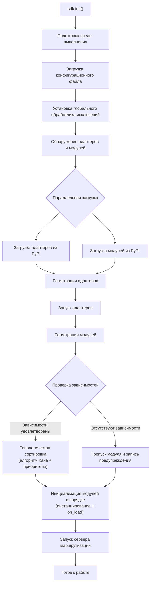

### Подробное описание этапов инициализации

> Полная цепочка инициализации с разбивкой на Finder / Loader / Manager / Router, базовые точки входа (`init()` / `init_task()` / `init_sync()`) и полный ручной запуск см. в [Процесс запуска и ручное управление](advanced/startup.md).

## Процесс обработки событий

На следующей диаграмме показан полный путь сообщения от платформы до обработчика:

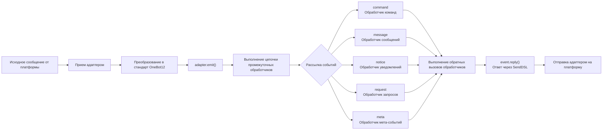

### Подробное описание цепочки обработки событий

На приведенной выше диаграмме показан результат; ниже разобрана цепочка, которая происходит "за кадром" после `adapter.emit()` — это трехуровневая цепочка рассылки:

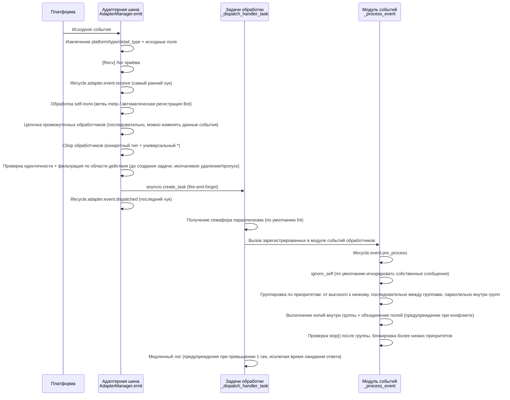

**Что делает фреймворк на каждом этапе и что вы можете изменить:**

| Этап | Что делает фреймворк | Что вы можете изменить |
|------|-------------|-----------|
| Приём | Извлекает стандартные поля, сохраняет `{platform}_raw` исходные данные; пишет лог `[Recv]` | Слушайте `adapter.event.receive`, чтобы получить событие на раннем этапе |
| self-поле | Мета-события идут по ветвям connect/disconnect/heartbeat; обычные события автоматически регистрируют Bot и запускают `adapter.bot.online` | Слушайте `adapter.bot.online` / `bot.offline` |
| Промежуточные обработчики | **Последовательно** выполняются, возвращаемое значение, отличное от None, заменяет данные события | Регистрируйте промежуточные обработчики для изменения/перехвата событий |
| Сбор обработчиков | Сначала берутся обработчики конкретного типа, затем `*` универсальные обработчики | — |
| Идентичность | Определение, принимать ли событие по уровню: пользователь > сессия > Bot > адаптер (`scope.is_identity_allowed`), **отклонение приводит к полному удалению события** | Привяжите `ErisPulse.scope.identity` |
| Фильтрация по области | Определяется по владельцу модуля (`scope.is_allowed`), сессионный уровень > Bot-уровень > платформенный уровень, **не прошедшие фильтр молча пропускаются** | Настройте белый/чёрный списки области |
| Планирование | Каждый соответствующий обработчик получает отдельную `asyncio.Task`, `emit()` **не ждёт завершения обработчика** | — |
| Приоритет | Группы высокого приоритета выполняются первыми; **группы выполняются последовательно, внутри группы — параллельно** (внутри группы каждая задача получает копию события, изменения объединяются в оригинальное событие, конфликты вызывают предупреждение) | `@command(..., priority=N)` / задайте приоритет при регистрации |
| Блокировка | После обработки группы проверяется `event.is_stopped()`, если условие выполнено, **выполняются только более высокие приоритеты** | `event.mark_processed(stop=True)` / `event.done()` |

> **Частые заблуждения**:
> 1. **Фильтрация области — молчаливая** — отфильтрованные обработчики не генерируют ошибок и не отвечают, видны только в логах TRACE уровня (`core.scope.denied`). При "модуль не получает сообщение" сначала проверьте привязку области.
> 2. **Обработчики обрабатываются параллельно** — фреймворк уже создал отдельную задачу для каждого обработчика, вам **не нужно** дополнительно оборачивать в `asyncio.create_task`.
> 3. **Группы с одинаковым приоритетом не блокируются** — `mark_processed(stop=True)` блокирует только более низкие группы, обработчики в одной группе не прерываются досрочно.
> 4. **Порог медленного лога фиксирован в 1 секунду** — если обработчик выполняется дольше 1 сек, в логе появляется предупреждение (время ожидания ответа `wait_reply` исключено из измерения времени выполнения), но выполнение не прерывается.

> Подробности о привязке области (scope) на уровне модуля, проверке идентичности и ограничениях действий см. в [Область (scope)](advanced/scope.md); фильтрация текста событий и ACL пользователя команд см. в [Введение в обработку событий](getting-started/event-handling.md); настройка ограничения параллелизма см. в [Руководство по конфигурации](user-guide/configuration.md#framework-configuration).

## Жизненные циклы событий

На следующей диаграмме показан порядок срабатывания событий жизненного цикла компонентов фреймворка:

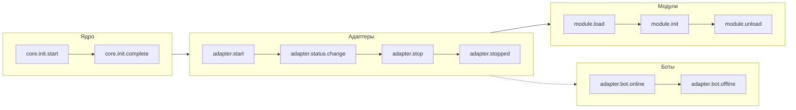

### Подключение к событиям жизненного цикла

> Полный список методов подключения к событиям (`lifecycle.on()` / `once()` / `has_handlers()`), список всех событий жизненного цикла и формат данных см. в [Управление жизненным циклом](advanced/lifecycle.md).

## Стратегии загрузки модулей

ErisPulse поддерживает три стратегии загрузки модулей, объявленные функцией `get_load_strategy()` возвращающей `ModuleLoadStrategy`:

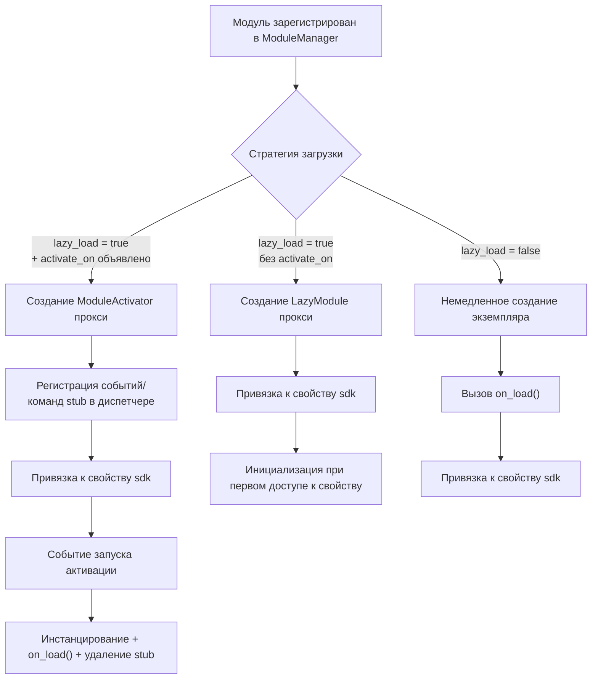

> Подробнее см. в [Система ленивой загрузки](advanced/lazy-loading.md), [Управление жизненным циклом](advanced/lifecycle.md) и документации модулей.

### Архитектура ленивой активации по событию (`activate_on`)

> [!NOTE]
> Эта функция доступна в ErisPulse **2.8.0+**.

`activate_on` позволяет модулю загружаться только при поступлении **первого соответствующего события/команды**, избегая постоянной загрузки в память и гарантируя, что события не теряются:

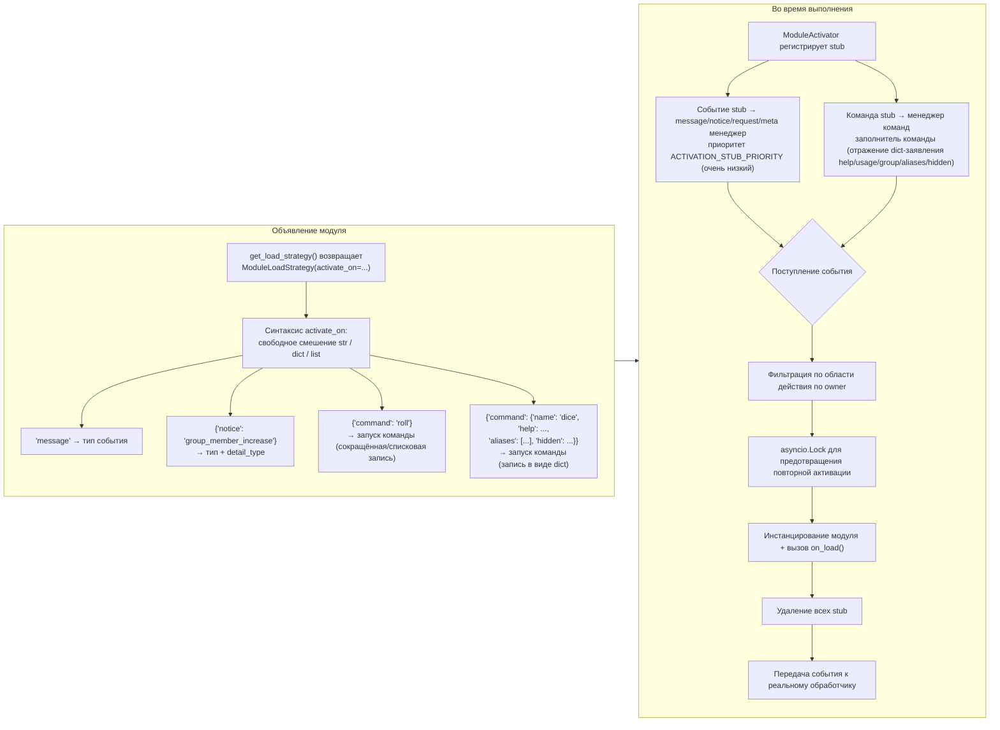

**Семантические особенности триггера:**

> Полный синтаксис `activate_on` (str / dict / list), объявление команды в виде dict, цепочка возвратов help для заполнителя команды, фильтрация по области и семантика ошибок см. в [Система ленивой загрузки](advanced/lazy-loading.md#event-driven-lazy-activation-activate_on).

## Архитектура локальной папки плагинов

> [!NOTE]
> Эта функция доступна в ErisPulse **2.8.0+**.

Локальные плагины (папка `plugins/`) не требуют упаковки и публикации, фреймворк автоматически обнаруживает и загружает их при запуске:

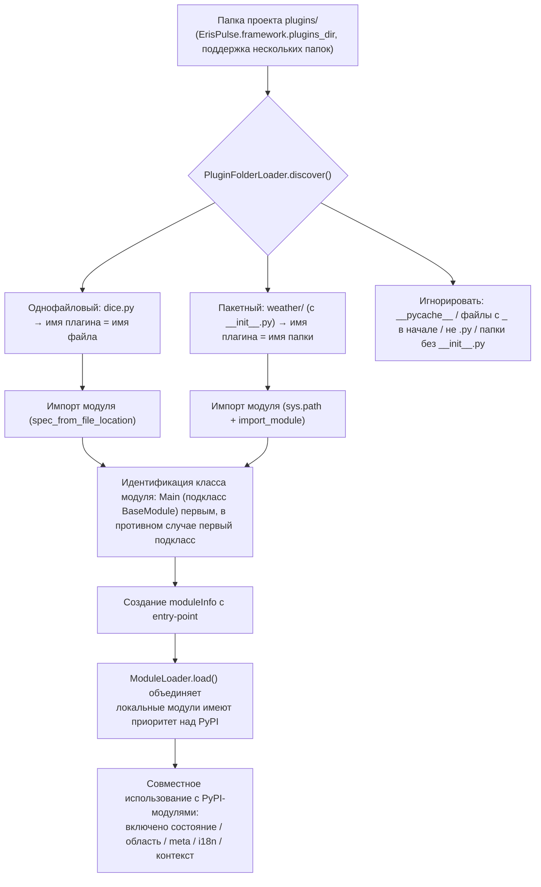

**Соглашения и особенности:**

- Имя плагина берётся из имени файла (однофайловый) или имени папки (пакетный)
- Локальные плагины имеют `moduleInfo.meta.source == "plugin_folder"`, совместимы с модулями PyPI
- При совпадении имен приоритет у локальных модулей (удобно для отладки), при отключении удаляются и соответствующие entry-point

## Архитектура горячей перезагрузки модулей

Горячая перезагрузка одинакова для **всех источников модулей**: локальные плагины могут автоматически перезагружаться при изменении файлов, любой модуль можно перезагрузить вручную через `sdk.reload_module()` / `sdk.module.reload()` (модули PyPI перезагружаются после обновления через pip):

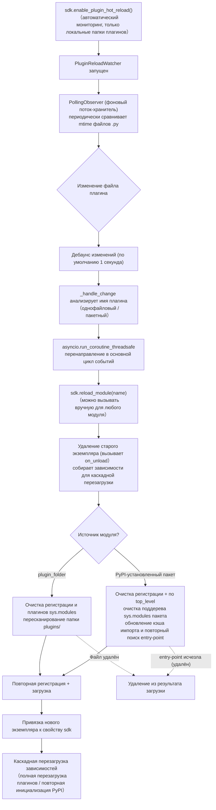

**Различия между двумя источниками есть только на этапе обнаружения**, регистрация, загрузка и каскадная перезагрузка идентичны:

- **Локальные плагины** (`moduleInfo.meta.source == "plugin_folder"`): после очистки соответствующего `sys.modules` пересканируется папка `plugins/`; если файл удалён, он удаляется из результата загрузки
- **PyPI-установленные пакеты**: по `meta.top_level` очищается поддерево `sys.modules` пакета, обновляется кэш импорта (преодолевая 60-секундный кэш entry-point) и повторно ищется и импортируется; если entry-point исчезла (pip удалён), она удаляется из результата загрузки


====
快速上手
====


### 快速开始

# Быстрый старт

> **Это ваш первый шаг.** Запустите робота ErisPulse за 5 минут, начиная с нуля.

## Установка ErisPulse

### Сценарий установки с одним нажатием (рекомендуется)

Сценарий автоматически определяет вашу среду (Docker, Python, uv) и предлагает вам выбрать наиболее подходящий способ установки.

Windows (PowerShell):
```powershell
irm https://get.erisdev.com/install.ps1 -OutFile install.ps1; powershell -ExecutionPolicy Bypass -File install.ps1
```

macOS / Linux:
```bash
curl -fsSL https://get.erisdev.com/install.sh -o install.sh && chmod +x install.sh && ./install.sh
```

Сценарий поможет вам выполнить следующие действия:

- **Установка с помощью Docker** (рекомендуется, если Docker обнаружен): выбор источника образа (Docker Hub / GHCR), канал версий (стабильная / предварительная), настройка панели управления Dashboard, настройка портов
- **Традиционная установка**: автоматическое создание виртуальной среды, выбор версии ErisPulse, необязательная установка модуля панели управления Dashboard

### Использование Docker

В образе Docker уже включены фреймворк ErisPulse и панель управления Dashboard.

```bash
# Загрузка docker-compose.yml
curl -O https://raw.githubusercontent.com/ErisPulse/ErisPulse/main/docker-compose.yml

# Установка токена Dashboard и запуск
ERISPULSE_DASHBOARD_TOKEN=your-token docker compose up -d
```

<details>
<summary>Не удается получить доступ к Docker Hub?</summary>

Используйте образ из GitHub Container Registry, изменив параметр image в файле `docker-compose.yml`:

```yaml
image: ghcr.io/erispulse/erispulse:latest
```

</details>

После запуска перейдите по адресу `http://<host>:8000/Dashboard` и войдите, используя установленный токен.

### Установка с помощью pip

Убедитесь, что у вас установлен Python версии >= 3.10, затем выполните установку с помощью pip:

```bash
pip install ErisPulse
```

Если у вас уже установлен [uv](https://github.com/astral-sh/uv), вы также можете использовать `uv pip install ErisPulse`, что обеспечит более быструю установку.

## Инициализация проекта

### Интерактивная инициализация (рекомендуется)

```bash
epsdk init
```

Это запустит интерактивное руководство, которое поможет вам выполнить следующие шаги:
- Настройка имени проекта
- Настройка уровня логирования
- Настройка сервера (хост и порт)
- Выбор и настройка адаптера
- Создание структуры проекта

### Быстрая инициализация

```bash
# Быстрый режим с указанием имени проекта
epsdk init -q -n my_bot

# Или просто указание имени проекта
epsdk init -n my_bot
```

### Создание проекта вручную

Если вы предпочитаете создавать проект вручную:

```bash
mkdir my_bot && cd my_bot
epsdk init
```

## Установка модуля

### Установка через CLI

```bash
epsdk install Yunhu AIChat
```

### Просмотр доступных модулей

```bash
epsdk list-remote
```

### Интерактивная установка

При отсутствии имени пакета открывается интерактивный интерфейс установки:

```bash
epsdk install
```

## Запуск проекта

```bash
# Обычный запуск
epsdk run main.py

# Режим горячей перезагрузки (рекомендуется при разработке)
epsdk run main.py --reload
```

## Включение автодополнения в IDE (по желанию)

Динамически обнаруживаемые модули/адаптеры ErisPulse не поддерживаются автодополнением в IDE по умолчанию.
Запустите следующую команду для генерации типовых заглушек:

```bash
epsdk types
```

После генерации, используйте импортированные типы для аннотации переменных, чтобы получить точное автодополнение (подробнее см. [Руководство по автодополнению в IDE](./getting-started/ide-completion.md)):

```python
from _ep_types import Yunhu
from ErisPulse import sdk

adapter: Yunhu = sdk.adapter.get("yunhu")
await adapter.Send.To("group", "123").Board(...)  # Автодополнение методов, специфичных для платформы
```

## Структура проекта

Структура проекта после инициализации:

```
my_bot/
├── config/
│   └── config.toml          # Файл конфигурации
└── main.py                  # Точка входа

```

## Конфигурационный файл

Базовый конфигурационный файл `config.toml`:

```toml
[ErisPulse.server]
host = "0.0.0.0"
port = 8000

[ErisPulse.logger]
level = "INFO"

[Yunhu_Adapter]
# Конфигурация адаптера
```


### 创建第一个机器人

# Создание первого бота

Это руководство продолжает [5-минутное краткое руководство](../quick-start.md), помогая вам написать первый обработчик команд и понять механизм работы.

> Если вы еще не установили ErisPulse и не инициализировали проект, пожалуйста, сначала завершите три шага в [Кратком руководстве](../quick-start.md): «Установка», «Инициализация проекта», «Запуск проекта».

## Шаг первый: написание первой команды

Откройте `main.py` и напишите простой обработчик команды:

```python
from ErisPulse import sdk
from ErisPulse.Core.Event import command

@command("hello", help="Отправить приветственное сообщение")
async def hello_handler(event):
    """Обработка команды hello"""
    user_name = event.get_user_nickname() or "друг"
    await event.reply(f"Привет, {user_name}! Я бот ErisPulse.")

@command("ping", help="Проверить, работает ли бот")
async def ping_handler(event):
    """Обработка команды ping"""
    await event.reply("Pong! Бот работает нормально.")

async def main():
    """Основная точка входа"""
    print("Запуск ErisPulse...")
    
    # keep_running=True (по умолчанию): фреймворк блокируется и продолжает работу, пока не получит сигнал о завершении (например, Ctrl+C)
    await sdk.run(keep_running=True)

if __name__ == "__main__":
    import asyncio
    asyncio.run(main())
```

### Параметр `keep_running`

Параметр `sdk.run(keep_running)` управляет тем, блокируется ли фреймворк для поддержания работы:

- **`keep_running=True` (по умолчанию)**: `run()` будет блокироваться до тех пор, пока не получит сигнал о завершении (например, Ctrl+C), подходит для чистых ботов.
- **`keep_running=False`**: `run()` завершит инициализацию и немедленно вернёт управление. **Фреймворк не будет остановлен** — запущенные адаптеры/модули продолжат обрабатывать события сообщений в фоновом режиме, вы можете продолжить выполнять собственную логику, пока цикл событий не завершится и фреймворк не закроется. Например:

```python
async def main():
    await sdk.run(keep_running=False)   # Инициализация завершена, немедленно возвращаем управление
    # Фреймворк уже работает в фоне, здесь можно делать что-то ещё
    while True:
        await asyncio.sleep(3600)
        print("Проверка каждый час")
```

> Помимо двух режимов `run()`, существуют более тонкие способы управления жизненным циклом, такие как `init()`/`uninit()` для ручного управления, а также отдельный запуск и остановка адаптеров/маршрутизации. Подробнее см. [Жизненный цикл и ручное управление](../advanced/startup.md).

## Шаг второй: Запуск робота

```bash
# Обычный запуск
epsdk run main.py

# Режим разработки (поддержка горячей перезагрузки)
epsdk run main.py --reload
```

## Шаг 3: Тестирование бота

Отправьте команду в вашей системе общения:

```
/hello
```

Вы должны получить ответ от бота.

## Описание кода

### Декоратор команды

```python
@command("hello", help="Отправить приветственное сообщение")
```

- `hello`: имя команды, вызывается пользователем с помощью `/hello`
- `help`: описание команды, отображается в команде `/help`

### Параметры события

```python
async def hello_handler(event):
```

Параметр `event` представляет собой объект Event, содержащий:
- Текст сообщения: `event.get_text()`
- Информация о отправителе: `event.get_user_id()`, `event.get_user_nickname()`
- Информация о платформе: `event.get_platform()`
- Информация о группе: `event.get_group_id()`
- Исходные данные: `event.get_raw()`

> Полный список методов объекта Event см. в разделе [Подробное описание Event-объекта](../developer-guide/modules/event-wrapper.md).

### Отправка ответа

```python
await event.reply("Содержимое ответа")
```

Метод `event.reply()` — это удобный способ отправки сообщения отправителю.

## Расширение: добавление дополнительных функций

ErisPulse предоставляет богатые возможности для обработки событий и данных:

- **Прослушивание сообщений**: используйте `@message.on_message()` для прослушивания различных сообщений → [Введение в обработку событий](event-handling.md)
- **Прослушивание уведомлений**: используйте `@notice.on_friend_add()` и другие для прослушивания системных уведомлений → [Введение в обработку событий](event-handling.md)
- **Хранение данных**: используйте `sdk.storage.get/set` для постоянного хранения данных → [Примеры распространенных задач](common-tasks.md)

## Часто задаваемые вопросы

### Команда не отвечает?

1. Проверьте, правильно ли настроен адаптер, убедитесь, что `status` адаптера в файле `config/config.toml` установлен в `true`
2. Проверьте вывод логов в терминале, убедитесь, что нет ошибок (особенно сообщений уровня `ERROR`)
3. Убедитесь, что префикс команды верный (по умолчанию это `/`), можно проверить в разделе `[ErisPulse.event.command]` файла конфигурации
4. Убедитесь, что имя команды написано правильно, обратите внимание на настройки чувствительности к регистру

### Как изменить префикс команды?

Добавьте в `config.toml` следующее:

```toml
[ErisPulse.event.command]
prefix = "!"
case_sensitive = false
```

### Как поддерживать несколько платформ?

ErisPulse использует стандарт OneBot12 для унификации формата событий на разных платформах. Обработчики, зарегистрированные с помощью `@command` и `@message`, автоматически получают события со всех платформ. С помощью `event.get_platform()` можно определить источник платформы:

```python
@command("hello")
async def hello_handler(event):
    platform = event.get_platform()
    
    if platform == "yunhu":
        await event.reply("Привет! От Юньху")
    elif platform == "telegram":
        await event.reply("Hello! От Telegram")
    else:
        await event.reply("Привет!")
```

> Дополнительные советы по адаптации под несколько платформ можно найти в разделе [Примеры типичных задач](common-tasks.md#многоплатформенная-адаптация).


### 基础概念

# Основные понятия

В этом руководстве представлены основные концепции ErisPulse, которые помогут вам понять философию и архитектуру фреймворка.

## Архитектура на основе событий

ErisPulse использует архитектуру на основе событий, где все взаимодействия передаются и обрабатываются через события.

### Процесс событий

```
Пользователь отправляет сообщение
      │
      ▼
Платформа получает
      │
      ▼
Адаптер получает нативное событие платформы
      │
      ▼
Преобразуется в стандартное событие OneBot12
      │
      ▼
Отправляется в систему событий
      │
      ▼
Распределяется по зарегистрированным обработчикам
      │
      ▼
Модуль обрабатывает событие
      │
      ▼
Ответ отправляется через адаптер
      │
      ▼
Платформа отображает пользователю
```

### Стандарт OneBot12

ErisPulse использует OneBot12 как основной стандарт событий. OneBot12 — это универсальный стандарт интерфейса для чат-ботов, определяющий единый формат событий.

Все адаптеры преобразуют платформенно-специфичные события в формат OneBot12, обеспечивая согласованность кода.

## Основные компоненты

### 1. Объект SDK

SDK является единым точкой входа для всех функций, предоставляя доступ к основным компонентам.

```python
from ErisPulse import sdk

# Доступ к основным модулям
sdk.storage    # Система хранения
sdk.config     # Система конфигурации
sdk.logger     # Система логирования
sdk.adapter    # Система адаптеров
sdk.module     # Система модулей
sdk.router     # Система маршрутизации
sdk.client     # HTTP-клиент
sdk.lifecycle  # Система жизненного цикла
```

### 2. Объект Event

Объект Event封装ует данные события и предоставляет удобные методы доступа.

```python
@command("info")
async def info_handler(event):
    # Получение информации о событии
    event_id = event.get_id()
    user_id = event.get_user_id()
    platform = event.get_platform()
    text = event.get_text()
    
    # Отправка ответа
    await event.reply(f"Пользователь: {user_id}, Платформа: {platform}")
```

### 3. Адаптеры

Адаптеры являются мостом между ErisPulse и внешними платформами.

**Задачи:**
- Получение нативных событий платформы
- Преобразование в формат OneBot12
- Отправка событий в формате OneBot12 на платформу

**Примеры адаптеров:**
- Адаптер Yunhu: коммуникация с платформой Yunhu
- Адаптер Telegram: коммуникация с Telegram Bot API
- Адаптер OneBot11: совместимость с OneBot11
- Адаптер Email: обработка отправки и получения электронной почты

### 4. Модули

Модули являются базовыми единицами расширения функциональности, позволяя:

- Регистрировать обработчики событий
- Реализовывать бизнес-логику
- Вызывать адаптеры для отправки сообщений
- Использовать сервисы, предоставляемые основными модулями

#### Механизм обнаружения модулей

ErisPulse использует `importlib.metadata.entry_points` для обнаружения установленных модулей. Модули объявляются в `pyproject.toml` с помощью entry points:

```toml
[project.entry-points."erispulse.module"]
MyModule = "my_package:Main"
```

При инициализации SDK происходит сканирование всех entry points группы `erispulse.module`, классы модулей регистрируются в `ModuleManager`, после чего они инициализируются в соответствии с зависимостями.

#### Минимально рабочий модуль

```python
from ErisPulse.Core.Bases import BaseModule
from ErisPulse import sdk

class Main(BaseModule):
    def __init__(self):
        self.sdk = sdk
        self.logger = sdk.logger.get_child("MyModule")

    async def on_load(self, event):
        self.logger.info("Модуль загружен")

    async def on_unload(self, event):
        self.logger.info("Модуль выгружен")
```

#### Жизненный цикл модуля

- **Регистрация:** SDK обнаруживает класс модуля и регистрирует его в менеджере
- **Загрузка:** Создается экземпляр модуля, вызывается `on_load(event)` (`event = {"module_name": "MyModule"}`)
- **Выгрузка:** Вызывается `on_unload(event)`, очищаются ресурсы

#### Стратегия загрузки

С помощью `get_load_strategy()` объявляется поведение загрузки модуля:

```python
from ErisPulse.loaders import ModuleLoadStrategy

class Main(BaseModule):
    @staticmethod
    def get_load_strategy():
        return ModuleLoadStrategy(
            lazy_load=True,   # Ленивая загрузка (по умолчанию True)
            priority=0        # Приоритет загрузки, чем больше, тем раньше инициализируется
        )
```

- **`lazy_load=True` (по умолчанию):** Модуль инициализируется при первом обращении к `sdk.MyModule`, снижая время запуска
- **`lazy_load=False`:** Модуль инициализируется при запуске SDK, подходит для модулей, обрабатывающих события жизненного цикла или выполняющих фоновые задачи
- **`priority`:** Модули с одинаковым приоритетом загружаются в порядке регистрации; чем больше значение, тем раньше инициализируется

> Подробнее о механизме ленивой загрузки см. в [Системе ленивой загрузки](../advanced/lazy-loading.md).

## Типы событий

ErisPulse поддерживает 5 типов событий:

| Тип события | Декоратор | Описание |
|---------|--------|------|
| Событие сообщения | `@message.on_message()` | Любое сообщение, отправленное пользователем (личные сообщения, группы) |
| Событие команды | `@command("name")` | Сообщение, начинающееся с префикса команды (например, `/hello`) |
| Уведомление | `@notice.on_friend_add()` и др. | Системные уведомления (добавление друзей, изменения в группе) |
| Запрос | `@request.on_friend_request()` и др. | Запросы от пользователей (запросы на добавление в друзья, приглашения в группы) |
| Мета-событие | `@meta.on_connect()` и др. | Системные события (подключение, отключение, heartbeat) |

> Подробное описание и примеры использования каждого типа событий см. в [Введение в обработку событий](event-handling.md).

## Описание основных модулей

### Storage (Хранилище)

Хранилище на основе SQLite для постоянного хранения данных.

```python
# Установка значения
sdk.storage.set("key", "value")

# Получение значения
value = sdk.storage.get("key", "default_value")

# Массовые операции
sdk.storage.set_multi({
    "key1": "value1",
    "key2": "value2"
})

# Транзакции
with sdk.storage.transaction():
    sdk.storage.set("key1", "value1")
    sdk.storage.set("key2", "value2")
```

### Config (Конфигурация)

Управление конфигурационными файлами в формате TOML.

```python
# Получение конфигурации
config = sdk.config.getConfig("MyModule", {})

# Установка конфигурации
sdk.config.setConfig("MyModule", {"key": "value"})

# Чтение вложенной конфигурации
value = sdk.config.getConfig("MyModule.subkey", "default")
```

### Logger (Журнал)

Модульная система журналирования.

```python
# Запись в журнал
sdk.logger.info("Это информационное сообщение")
sdk.logger.warning("Это предупреждение")
sdk.logger.error("Это ошибка")

# Получение дочернего логгера
child_logger = sdk.logger.get_child("submodule")
child_logger.info("Журнал подмодуля")
```

**Синтаксис доступа по атрибутам**

Помимо метода `get_child()`, можно использовать **доступ по атрибутам** для создания дочернего логгера, что является более компактным **синтаксическим сахаром**:

```python
# Создание дочернего логгера через доступ по атрибутам
sdk.logger.mymodule.info("Сообщение модуля")

# Поддержка вложенного доступа
sdk.logger.mymodule.database.info("Сообщение базы данных")
```

### Router (Маршрутизация)

Управление маршрутизацией HTTP и WebSocket, основано на FastAPI + Uvicorn. Поддерживает маршрутизацию с помощью декораторов, промежуточные слои, группы, ограничение скорости, CORS.

```python
from ErisPulse.Core import HttpRequest

@sdk.router.get("MyModule", "/api")
async def handler(request: HttpRequest):
    data = await request.json()
    return {"status": "ok"}
```

> Полный API маршрутизатора (WebSocket, промежуточные слои, ограничение скорости, CORS и др.) см. в [Маршрутизаторе](../advanced/router.md).

### Client (Сетевой клиент)

Единый сетевой клиент, объединяющий HTTP-запросы, WebSocket-соединения, управление пулов, автоматические повторы, таймауты, статистику запросов и интеграцию с событиями жизненного цикла.

```python
from ErisPulse.Core import client

# HTTP-запрос
resp = await client.get("https://api.example.com/users")
data = await resp.json()

# Запрос с повторами и таймаутом
resp = await client.get(url, timeout=30, max_retries=3)

# WebSocket-соединение
ws = await client.ws_connect("wss://example.com/ws")
async for text in ws.iter_text():
    await ws.send_text(f"Эхо: {text}")
```

> Полный API сетевого клиента см. в [Сетевом клиенте](../advanced/http-client.md).

## DSL для отправки сообщений SendDSL

Адаптеры предоставляют интерфейс для отправки сообщений с цепочечным вызовом.

### Базовая отправка

```python
# Получение экземпляра адаптера
yunhu = sdk.adapter.get("yunhu")

# Отправка сообщения
await yunhu.Send.To("user", "U1001").Text("Привет")

# Указание отправляющего аккаунта
await yunhu.Send.Using("bot1").To("group", "G1001").Text("Сообщение в группе")
```

### Цепочки модификаторов

```python
# @пользователя
await yunhu.Send.To("group", "G1001").At("U2001").Text("@сообщение")

# Ответ на сообщение
await yunhu.Send.To("group", "G1001").Reply("msg123").Text("Ответ")

# @всех
await yunhu.Send.To("group", "G1001").AtAll().Text("Объявление")
```

### Методы ответа в Event

Объект Event предоставляет удобные методы для отправки ответа:

```python
@command("test")
async def test_handler(event):
    # Простой текстовый ответ
    await event.reply("Содержимое ответа")
    
    # Отправка изображения
    await event.reply("http://example.com/image.jpg", method="Image")
    
    # Отправка голосового сообщения
    await event.reply("http://example.com/voice.mp3", method="Voice")
```

## Система ленивой загрузки

ErisPulse по умолчанию включает ленивую загрузку модулей, при которой модуль инициализируется только при первом обращении (например, `sdk.MyModule`), что значительно ускоряет запуск.

```python
from ErisPulse.loaders import ModuleLoadStrategy

class Main(BaseModule):
    @staticmethod
    def get_load_strategy():
        return ModuleLoadStrategy(
            lazy_load=True,   # Включить ленивую загрузку (по умолчанию)
            priority=0        # Приоритет загрузки, чем больше, тем раньше инициализируется
        )
```

**Сценарии, требующие отключения ленивой загрузки (`lazy_load=False`):**
- Модули, обрабатывающие события жизненного цикла (например, `core.init.complete`)
- Модули, запускающие фоновые задачи или сервисы
- Модули, требующие инициализации до других модулей

> Подробнее о механизме ленивой загрузки и рекомендациях см. в [Системе ленивой загрузки](../advanced/lazy-loading.md).


### 事件处理入门

# Введение в обработку событий

В этом руководстве описано, как обрабатывать различные события в ErisPulse.

## Обзор типов событий

ErisPulse поддерживает следующие типы событий:

| Тип события | Описание | Сценарии использования |
|---------|------|---------|
| Событие сообщения | Любое сообщение, отправленное пользователем | Чат-боты, фильтрация контента |
| Событие команды | Сообщение, начинающееся с префикса команды | Обработка команд, вход в функции |
| Событие уведомления | Системные уведомления (добавление в друзья, изменения участников группы и т.д.) | Приветствия, уведомления о статусе |
| Событие запроса | Запросы пользователей (запросы на добавление в друзья, приглашения в группу) | Автоматическая обработка запросов |
| Системное событие | Системные события (подключение, пинг) | Мониторинг подключения, проверка состояния |

## Обработка событий сообщений

> **Примечание**: Рекомендуется использовать аннотацию типа `Event` в обработчиках событий, чтобы получить поддержку автодополнения и проверки типов в IDE.

```python
from ErisPulse.Core.Event import Event  # Импорт типа события для аннотации
```

### Подписка на все сообщения

```python
from ErisPulse.Core.Event import message, Event

@message.on_message()
async def message_handler(event: Event):
    text = event.get_text()
    user_id = event.get_user_id()
    sdk.logger.info(f"Получено сообщение от {user_id}: {text}")
```

### Подписка на личные сообщения

```python
@message.on_private_message()
async def private_handler(event: Event):
    user_id = event.get_user_id()
    await event.reply(f"Привет, {user_id}! Это личное сообщение.")
```

### Подписка на сообщения в группе

```python
@message.on_group_message()
async def group_handler(event: Event):
    group_id = event.get_group_id()
    user_id = event.get_user_id()
    sdk.logger.info(f"Сообщение отправлено в группу {group_id} пользователем {user_id}")
```

### Подписка на сообщения с упоминанием

```python
@message.on_at_message()
async def at_handler(event: Event):
    # Получение списка упомянутых пользователей
    mentions = event.get_mentions()
    await event.reply(f"Вы упомянули следующих пользователей: {mentions}")
```

### Слушание с помощью подстановочных знаков и регулярных выражений

Четыре декоратора сообщений (`on_message` / `on_private_message` / `on_group_message` /
`on_at_message`) поддерживают параметры `pattern` (подстановочные знаки glob) и `regex` (регулярные выражения). Сообщения, не соответствующие этим условиям, **не вызывают** обработчик:

```python
# Подстановочные знаки glob: * - любая последовательность, ? - один символ, [seq] - набор символов
@message.on_message(pattern="签到*")
async def signin_handler(event: Event):
    await event.reply("Успешно зарегистрированы")

# Регулярное выражение: соответствует сумме
@message.on_message(regex=r"\d+\s*元")
async def price_handler(event: Event):
    await event.reply(f"Получена сумма: {event.get_text()}")

# pattern и regex одновременно → оба условия должны совпадать
@message.on_message(pattern="*元", regex=r"\d+\s*元")
async def combined_handler(event: Event):
    pass
```

Параметры `wait_reply` также поддерживают эти два параметра (см. [Функция ожидания ответа](../developer-guide/modules/event-wrapper.md#ожидание-ответа)).

## Обработка событий команд

### Базовые команды

```python
from ErisPulse.Core.Event import command

@command("help", help="Показать справочную информацию")
async def help_handler(event):
    help_text = """
Доступные команды:
/help - Показать справку
/ping - Проверить соединение
/info - Посмотреть информацию
    """
    await event.reply(help_text)
```

### Псевдонимы команд

```python
@command(["help", "h"], aliases=["帮助"], help="Показать справочную информацию")
async def help_handler(event):
    await event.reply("Справочная информация...")
```

Пользователи могут вызывать команду следующими способами:
- `/help`
- `/h`
- `/帮助`

### Параметры команд

```python
@command("echo", help="Повторить сообщение")
async def echo_handler(event):
    # Получить параметры команды
    args = event.get_command_args()
    
    if not args:
        await event.reply("Введите сообщение, которое нужно повторить")
    else:
        await event.reply(f"Вы сказали: {' '.join(args)}")
```

### Группировка команд

```python
@command("admin.reload", group="admin", help="Перезагрузить модуль")
async def reload_handler(event):
    await event.reply("Модуль перезагружен")

@command("admin.stop", group="admin", help="Остановить бота")
async def stop_handler(event):
    await event.reply("Бот остановлен")
```

### Права доступа и контроль доступа к командам

Права доступа к командам определяются на трёх уровнях, с верхнего по нижний (если доступ запрещён на верхнем уровне, нижние уровни не проверяются):

```python
# ① ACL доступа к командам (конфигурация со стороны пользователя): по белому и чёрному списку пользователей команды, при запрете возвращается "Недостаточно прав"
# ② master=True — только владелец фреймворка может выполнить (фреймворк автоматически проверяет, при запрете возвращает "Недостаточно прав")
@command("restart", master=True, help="Перезапустить модуль")
async def restart_handler(event):
    await event.reply("Модуль перезапущен")

# ③ permission=функция — собственная логика контроля доступа к команде (выполняется только при возврате True)
def is_admin(event):
    return event.get_user_id() in {"user123", "user456"}

@command("panel", permission=is_admin, help="Панель управления")
async def panel_handler(event):
    await event.reply("Добро пожаловать на панель управления")
```

**ACL пользователя команд** (`ErisPulse.event.command.acl`): пользователь может настроить белый и чёрный списки для любой команды, имена команд поддерживают точное и шаблонное сопоставление (например, `"roll*"`), при запрете возвращается "Недостаточно прав":

```toml
# config.toml — разрешить только 123456 выполнять restart; 666 всегда запрещено
[ErisPulse.event.command.acl.restart]
allow = ["onebot11:123456"]
deny = ["onebot11:666"]
```

Порядок проверки: если есть совпадение в `deny` → запрет; если `allow` не пуст и совпадений нет → запрет; если ACL не настроен, применяется `event.command.default_allow` (`false` = строгий режим, без ACL запрет; `true` → передаётся на отдельную проверку `master=True` / `permission`). API для работы с ACL во время выполнения (поддержка шаблонов в имени команды):

```python
from ErisPulse.Core.Event import command

command.allow_user("restart", "onebot11", "123456")   # добавить в белый список
command.deny_user("restart", "onebot11", "666")       # добавить в чёрный список
command.remove_acl("restart")                          # удалить белый и чёрный списки
command.get_acl("restart")                             # получить текущий список
```

> Обработчики команд импортируются из пакета событий: `from ErisPulse.Core.Event import command`;
> также можно получить через пакет SDK: `sdk.Event.command` (оба являются одним и тем же синглтоном).
> В модулях обычно уже импортируются вместе с декоратором команды (`from ErisPulse.Core.Event import command`).

Контроль доступа на уровне событий (кто / какая группа / какой бот может получать сообщения) — через измерение идентичности в области действия (`scope.identity`); доступность на уровне модуля (какие модули можно использовать) — через измерение модуля в области действия (`scope.platforms / bots / sessions`).
См. [Область действия (scope)](../advanced/scope.md).

> Рекомендация: если внутри команды нужно взаимодействовать с бизнес-логикой, используйте `master=True` / `permission`; если нужно контролировать доступ по пользователю / группе, используйте измерение идентичности области действия; если нужно контролировать доступность модуля, используйте измерение модуля области действия.

### Приоритет команд

```python
# Чем больше значение приоритета, тем раньше выполнение
@message.on_message(priority=10)
async def high_priority_handler(event):
    await event.reply("Обработчик высокого приоритета")

@message.on_message(priority=1)
async def low_priority_handler(event):
    await event.reply("Обработчик низкого приоритета")
```

### Параллельная обработка событий

Система событий ErisPulse использует модель распределения задач с **параллельным выполнением на одном уровне приоритета и последовательным выполнением между уровнями приоритета**:

```
Событие пришло
    ↓
Группа priority=10: [Обработчик C || Обработчик D] параллельно → объединить результаты
    ↓ (если не прервано)
Группа priority=0: [Обработчик A || Обработчик B] параллельно → объединить результаты
    ↓
...
```

- **Параллельное выполнение на одном уровне приоритета**: обработчики с одинаковым приоритетом выполняются одновременно, повышая пропускную способность
- **Последовательное выполнение между уровнями приоритета**: группы с разными приоритетами выполняются последовательно (чем выше значение приоритета, тем раньше выполнение), гарантируя, что обработчики с высоким приоритетом выполняются первыми
- **Copy-On-Write**: обработчики не создают копию, если не вносят изменения, обеспечивая нулевой накладной расход
- **Обработка конфликтов**: при одновременном изменении одного и того же поля несколькими обработчиками одного уровня приоритета используется последнее значение с записью предупреждения в лог
- **Механизм прерывания**: после вызова `event.done()` (по умолчанию) или `event.done(claim=False)` любым обработчиком пропускаются последующие группы с более низким приоритетом. Разница между присвоением и блокировкой описана в разделе [Контроль маршрута: присвоение и блокировка](#контроль-маршрута-присвоение-и-блокировка)

```python
# Пример: параллельное выполнение обработчиков одного уровня приоритета
@message.on_message(priority=0)
async def handler_a(event):
    # Обработать задачу A
    event['result_a'] = process_a()

@message.on_message(priority=0)
async def handler_b(event):
    # Выполняется параллельно с handler_a
    event['result_b'] = process_b()

# Последовательное выполнение обработчиков разных уровней приоритета
@message.on_message(priority=10)
async def handler_c(event):
    # Наивысший приоритет, выполняется первым
    pass
```

> **Ограничение параллелизма**: все соответствующие обработчики сразу создаются в виде задач, но ограничиваются сигналом, ограничивающим количество одновременно выполняемых задач, по умолчанию 64 (настройка `ErisPulse.framework.handler_max_concurrency`, поддерживает горячую перезагрузку). Задачи, превышающие лимит, ждут в очереди на сигнале, пока предыдущие не завершатся. В моменты пикового трафика это как ваш "сброс давления".
>
> **Медленные логи**: если один обработчик выполняется дольше 1 секунды, фреймворк записывает предупреждение в лог (`handler_slow`). Время ожидания `wait_reply` исключается из времени выполнения, чтобы не ошибочно считать "ожидание ответа" медленным выполнением.

## Scope filtering: Why didn't my module receive the message

After the event arrives, there are two **silent** filters (neither reply nor error):

1. **Identity dimension** (`ErisPulse.scope.identity`): When an event enters the distribution entry point, it is determined whether to receive it based on User > Group > Bot > Adapter.
   The rejected **entire event** is directly discarded, and no handler (including the command dispatcher) will be triggered.
2. **Module dimension** (`ErisPulse.scope`): When an event reaches a module's handler/command, it is determined based on Session > Bot > Platform whether this module is available; if it **fails the check, it is silently skipped**.

```toml
# Example 1: Do not propagate all messages from a certain group
[ErisPulse.scope.identity.sessions.onebot11."group_123"]
deny = true

# Example 2: Block MyModule from a certain Bot
[ErisPulse.scope.bots.onebot11."123456"]
blocked = ["MyModule"]
```

At this point, when messages from this group arrive, the `MyModule` command and event handler **will not be scheduled**. This is not a bug, but a filtering mechanism—when troubleshooting "module not responding," prioritize checking the identity and module binding of the scope.

- Filter logs are only visible at the **TRACE** level (`core.scope.identity_denied` / `core.scope.denied`); by default, nothing is visible at the INFO level
- Framework-level handlers (such as the command dispatcher `scope_exempt=True`) are not affected by the **module dimension**, but are affected by the **identity dimension** (the entire event has already been discarded)
- There is a third filter before command execution: command user ACL (replies "insufficient permissions" when denied, see the previous section)
- The fourth is **event overwriting** (see the next section)

> For scope configuration, matching syntax, and runtime API, see [Scope](../../advanced/scope.md).

## Переопределение событий: изменение поведения любого типа событий без изменения кода модуля

> [!NOTE]
> Эта функция доступна начиная с ErisPulse **2.8.0+**.

Параметры обработчиков событий, объявленные при регистрации (`pattern` / `regex` / `master` / `hidden` и т.д.), являются **по умолчанию для разработчиков**.  
Система универсального переопределения позволяет пользователю переопределять поведение любого модуля по **типу события** — стандартные типы OneBot12 (`meta` / `message` / `notice` / `request`) и расширенные типы ErisPulse (`command`) имеют свои собственные переопределяемые параметры:

| Тип события | Переопределяемые параметры | Действие |
|---------|-----------|------|
| `message` | `pattern` / `regex` / `detail_types` | Условия триггера текста + белый список подтипов сообщений |
| `notice` | `detail_types` / `pattern` / `regex` | Белый список подтипов уведомлений + текстовое условие |
| `request` | `detail_types` / `pattern` / `regex` | Белый список подтипов запросов + текстовое условие |
| `meta` | `detail_types` | Белый список подтипов мета-событий (connect / heartbeat и т.д.) |
| `command` | `master` / `hidden` / `aliases` / `prefix` / `help` / `usage` | Параметры реализации команды (приоритет пользователя) |
| `acl` (специфично для `command`) | `allow` / `deny` | Белый и чёрный списки пользователей команды (по шаблону команды) |

```toml
# message: переопределение условия триггера текста (AND с условиями в коде)
[ErisPulse.event.overrides.message.ChatModule]
pattern = "闲聊*"

# notice: только определённые подтипы уведомлений
[ErisPulse.event.overrides.notice.MyModule]
detail_types = ["group_increase"]

# command: переопределение параметров реализации (приоритет пользователя — можно ужесточить или ослабить по умолчанию разработчика)
[ErisPulse.event.overrides.command.MyModule.restart]
master = true
hidden = true

# acl: чёрный и белый списки пользователей команды (глобально по шаблону команды)
[ErisPulse.event.overrides.acl."roll*"]
allow = ["onebot11:u_vip"]

# ACL по умолчанию (false = строгий режим: без ACL — запрет)
acl_default_allow = true
```

API во время выполнения (`from ErisPulse.Core.Event import overrides` или `sdk.Event.overrides`, **пространства имён по типам** — симметричные три метода `set` / `get` / `delete` для каждого типа):

```python
from ErisPulse.Core.Event import overrides

overrides.message.set("ChatModule", pattern="闲聊*")   # Условие текста для message
overrides.notice.set("MyModule", detail_types=["group_increase"])
overrides.command.set("MyModule", "restart", master=True)  # Параметры команды
overrides.acl.set("roll*", deny=["onebot11:u_bad"])    # Чёрный список пользователей команды

overrides.message.get("ChatModule")     # {"pattern": "闲聊*"}
overrides.message.delete("ChatModule")  # Восстановление по умолчанию разработчика
```

- Переопределённые условия и условия в коде обработчика **действуют одновременно** (логическое AND); параметры `command` и объявления разработчика **глубоко сливаются** (приоритет переопределения)
- `detail_types`: события без `detail_type` пропускаются (не блокируются неизвестные события)
- `pattern` / `regex`: события без текста (connect / heartbeat и т.д.) не подпадают под ограничения, пропускаются напрямую
- Переопределённый ключ `master` для `command` синхронно отображается в хранилище ключа `must_master`; запрет команды проходит через `acl deny`
- Изменения конфигурации вступают в силу немедленно (горячая перезагрузка), формат проверяется и выводятся предупреждения (неизвестные параметры / некорректные элементы игнорируются)

## Управление цепочкой: присвоение и блокировка

> [!NOTE]
> Параметры `claim=` / `stop=` для `event.done()` / `event.mark_processed()` требуют ErisPulse **2.7.1+**.

ErisPulse разделяет два ортогональных семантических понятия — "присвоение" и "блокировка" — и объединяет их управление через `event.done()`, что позволяет добавлять слои наблюдения (например, логирование, аудит, права доступа) вокруг обработки команд.

**Точное определение двух понятий:**

- **Присвоение (claim)**: Пометка события как обработанного данным обработчиком (запись в `_processed`). Диспетчер команд видя уже присвоенное событие, **пропускает его** — избегая повторной обработки одного и того же сообщения несколькими обработчиками команд. Типичный сценарий: после успешного сопоставления команды, присвоить событие, чтобы диспетчер команд больше не вмешивался.
- **Блокировка (stop)**: Предотвращение распространения события **ниже по приоритету** (запись в `_propagation_stopped`). Обработчики с более низким приоритетом (например, `on_message`) больше не увидят это событие. Типичный сценарий: высокоприоритетный обработчик уже полностью обработал событие, и не желает, чтобы более низкоприоритетные обработчики его обрабатывали.

| `event.done(...)` | Присвоение | Блокировка | Сценарий |
|-------------------|-----------|------------|---------|
| `event.done()` | ✔ | ✔ | Стандартная практика после завершения обработки команды / обработчиком |
| `event.done(stop=False)` | ✔ | ✘ | Только присвоение: низкоприоритетные наблюдатели (логирование / статистика) продолжают видеть |
| `event.done(claim=False)` | ✘ | ✔ | Только блокировка (например, брандмауэр / ограничение частоты), но без удаления дубликатов команд |

`event.done(claim=, stop=)` — это псевдоним `event.mark_processed(claim=, stop=)`, параметры и поведение у них полностью идентичны.

```python
@command("help")
async def help_cmd(event):
    event.done()            # Присвоение + блокировка (стандартная практика после обработки команды)

@message.on_message(priority=50)
async def observer(event):
    event.done(stop=False)  # Только присвоение: низкоприоритетный обработчик все еще будет выполнен (логирование / статистика)

@message.on_message(priority=100)
async def firewall(event):
    if denied(event):
        event.done(claim=False)  # Только блокировка: низкоприоритетный обработчик не будет выполнен, но без удаления дубликатов
```

### Конфигурация `block` для команд и ответов

После успешного сопоставления команды / после того, как `wait_reply` сопоставил ответ, по умолчанию распространение блокируется (для обратной совместимости). Можно изменить конфигурацию, чтобы разрешить низкоприоритетным обработчикам (логирование / аудит / права доступа) продолжать наблюдать за этими сообщениями:

```toml
[ErisPulse.event.command]
block = false   # Сообщения команд продолжают поступать в низкоприоритетные обработчики

[ErisPulse.event.wait_reply]
block = false   # Ответы, потребленные wait_reply, продолжают поступать в низкоприоритетные обработчики
```

## Обработка уведомительных событий

### Добавление в друзья

```python
from ErisPulse.Core.Event import notice

@notice.on_friend_add()
async def friend_add_handler(event):
    user_id = event.get_user_id()
    nickname = event.get_user_nickname() or "Новый друг"
    await event.reply(f"Добро пожаловать, {nickname}, в друзья!")
```

### Увеличение числа участников в группе

```python
@notice.on_group_increase()
async def member_increase_handler(event):
    group_id = event.get_group_id()
    user_id = event.get_user_id()
    await event.reply(f"Добро пожаловать, {user_id}, в группу {group_id}")
```

### Уменьшение числа участников в группе

```python
@notice.on_group_decrease()
async def member_decrease_handler(event):
    group_id = event.get_group_id()
    user_id = event.get_user_id()
    await event.reply(f"Пользователь {user_id} покинул группу {group_id}")
```

## Обработка событий запросов

### Запросы на добавление в друзья

```python
from ErisPulse.Core.Event import request

@request.on_friend_request()
async def friend_request_handler(event):
    user_id = event.get_user_id()
    comment = event.get_comment()
    
    sdk.logger.info(f"Получен запрос в друзья: {user_id}, комментарий: {comment}")
    
    # Можно обработать запрос через API адаптера
    # Подробнее смотрите документацию по каждому адаптеру
```

### Запросы на приглашение в группу

```python
@request.on_group_request()
async def group_request_handler(event):
    group_id = event.get_group_id()
    user_id = event.get_user_id()
    
    await event.reply(f"Получено приглашение в группу {group_id}, от пользователя {user_id}")
```

## Обработка метасобытий

### События подключения

```python
from ErisPulse.Core.Event import meta

@meta.on_connect()
async def connect_handler(event):
    platform = event.get_platform()
    sdk.logger.info(f"{platform} платформа подключена")

@meta.on_disconnect()
async def disconnect_handler(event):
    platform = event.get_platform()
    sdk.logger.warning(f"{platform} платформа отключена")
```

### События пинга

```python
@meta.on_heartbeat()
async def heartbeat_handler(event):
    platform = event.get_platform()
    sdk.logger.debug(f"{platform} пинг")
```

### Запрос статуса бота

После отправки метасобытия адаптером, фреймворк автоматически отслеживает статус бота, и вы можете в любой момент запросить его:

```python
from ErisPulse import sdk

# Проверка, онлайн ли конкретный бот
if sdk.adapter.is_bot_online("telegram", "123456"):
    telegram = sdk.adapter.get("telegram")
    await telegram.Send.To("user", "123456").Text("Бот в сети")

# Получение списка всех текущих онлайн-ботов
bots = sdk.adapter.list_bots()
for platform, bot_list in bots.items():
    for bot_id, info in bot_list.items():
        print(f"{platform}/{bot_id}: {info['status']}")

# Получение полной сводки статуса
summary = sdk.adapter.get_status_summary()
```

## Взаимодействие

### Отправка ответа с помощью метода reply

Метод `event.reply()` поддерживает различные параметры, облегчающие отправку сообщений с упоминаниями, ответами и т.д.:

```python
# Простой ответ
await event.reply("Привет")

# Отправка сообщений разных типов
await event.reply("http://example.com/image.jpg", method="Image")  # изображение
await event.reply("http://example.com/voice.mp3", method="Voice")  # голосовое сообщение

# Упоминание одного пользователя
await event.reply("Привет", at_users=["user123"])

# Упоминание нескольких пользователей
await event.reply("Всем привет", at_users=["user1", "user2", "user3"])

# Ответ на сообщение
await event.reply("Содержание ответа", reply_to="msg_id")

# Упоминание всех участников
await event.reply("Объявление", at_all=True)

# Комбинирование: упоминание пользователей + ответ на сообщение
await event.reply("Содержание", at_users=["user1"], reply_to="msg_id")
```

### Ожидание ответа от пользователя

```python
@command("ask", help="Запросить у пользователя")
async def ask_handler(event):
    await event.reply("Введите ваше имя:")
    
    # Ожидание ответа от пользователя, таймаут 30 секунд
    reply = await event.wait_reply(timeout=30)
    
    if reply:
        name = reply.get_text()
        await event.reply(f"Привет, {name}!")
    else:
        await event.reply("Таймаут ожидания, пожалуйста, введите снова.")
```

### Ожидание ответа с проверкой

```python
@command("age", help="Запросить возраст")
async def age_handler(event):
    def validate_age(event_data):
        """Проверка корректности возраста"""
        try:
            age = int(event_data.get_text())
            return 0 <= age <= 150
        except ValueError:
            return False
    
    await event.reply("Введите ваш возраст (0-150):")
    
    reply = await event.wait_reply(
        timeout=60,
        validator=validate_age
    )
    
    if reply:
        age = int(reply.get_text())
        await event.reply(f"Ваш возраст: {age} лет")
    else:
        await event.reply("Ввод некорректен или истек таймаут")
```

### Ожидание ответа с обратным вызовом

```python
@command("confirm", help="Подтвердить действие")
async def confirm_handler(event):
    async def handle_confirmation(reply_event):
        text = reply_event.get_text().lower()
        
        if text in ["yes", "y", "да", "д"]:
            await event.reply("Действие подтверждено!")
        else:
            await event.reply("Действие отменено.")
    
    await event.reply("Подтвердите выполнение этого действия? (да/нет)")
    
    await event.wait_reply(
        timeout=30,
        callback=handle_confirmation
    )
```

### Подтверждение диалога (confirm)

Ожидание подтверждения или отрицания от пользователя, автоматически распознаются встроенные слова подтверждения на китайском и английском языках:

```python
@command("confirm", help="Подтвердить действие")
async def confirm_handler(event):
    if await event.confirm("Вы действительно хотите выполнить это действие?"):
        await event.reply("Подтверждено, выполняется...")
    else:
        await event.reply("Отменено")

# Пользовательские слова подтверждения
if await event.confirm("Продолжить?", yes_words={"go", "продолжить"}, no_words={"stop", "остановить"}):
    pass
```

### Выбор из меню (choose)

Пользователь может ответить номером опции или текстом:

```python
@command("choose", help="Выбор")
async def choose_handler(event):
    choice = await event.choose(
        "Выберите цвет:",
        ["красный", "зеленый", "синий"]
    )
    
    if choice is not None:
        colors = ["красный", "зеленый", "синий"]
        await event.reply(f"Вы выбрали: {colors[choice]}")
    else:
        await event.reply("Таймаут выбора")
```

**Режим объединения**: `merge_prompt=True` объединяет опции в сообщение и отправляет одним сообщением с указанным `method`:

```python
# Отправка объединенного сообщения с опциями в формате Markdown
choice = await event.choose(
    "## Выберите цвет\n{options}\nОтветьте номером",
    ["красный", "зеленый", "синий"],
    method="Markdown",
    merge_prompt=True,
)
```

> Заполнитель `{options}` определяет место вставки опций; если не указан, опции добавляются в конец сообщения.
> Можно изменить заполнитель с помощью параметра `placeholder` (например, `placeholder="[choices]"`).
> `options_format="auto"` (по умолчанию) автоматически выбирает стиль в зависимости от `method`: Markdown → маркированный список, Html → нумерованный список, остальные → простой текстовый список.
> Для текстовых методов (Text/Markdown/Html и т.д.) опции по умолчанию объединяются в конец сообщения; для не-текстовых методов (Image и т.д.) опции по умолчанию отправляются отдельным сообщением.

### Сбор формы (collect)

Сбор информации от пользователя пошагово:

```python
@command("register", help="Регистрация")
async def register_handler(event):
    data = await event.collect([
        {"key": "name", "prompt": "Введите имя:"},
        {"key": "age", "prompt": "Введите возраст:",
         "validator": lambda e: e.get_text().isdigit()},
        {"key": "email", "prompt": "Введите email:"}
    ])
    
    if data:
        await event.reply(f"Регистрация успешна!\nИмя: {data['name']}\nВозраст: {data['age']}\nEmail: {data['email']}")
    else:
        await event.reply("Таймаут регистрации или некорректный ввод")
```

### Ожидание произвольного события (wait_for)

Ожидание события, соответствующего заданным условиям, не обязательно от того же пользователя:

```python
@command("wait_member", help="Ожидание нового участника")
async def wait_member_handler(event):
    await event.reply("Ожидание нового участника...")
    
    evt = await event.wait_for(
        event_type="notice",
        condition=lambda e: e.get_detail_type() == "group_member_increase",
        timeout=120
    )
    
    if evt:
        await event.reply(f"Добро пожаловать, новый участник: {evt.get_user_id()}")
    else:
        await event.reply("Таймаут ожидания")
```

### Многошаговый диалог (conversation)

Создание интерактивного многошагового диалога:

```python
@command("survey", help="Опрос")
async def survey_handler(event):
    conv = event.conversation(timeout=60)
    
    await conv.say("Добро пожаловать в опрос!")
    
    while conv.is_active:
        reply = await conv.wait()
        
        if reply is None:
            await conv.say("Диалог завершен по таймауту, до свидания!")
            break
        
        text = reply.get_text()
        
        if text == "выход":
            await conv.say("До свидания!")
            break
        
        await conv.say(f"Вы сказали: {text}, продолжайте или ответьте 'выход' для завершения")
```

### Встроенные слова подтверждения

ErisPulse содержит встроенные наборы слов подтверждения на китайском и английском языках:

- **Слова подтверждения** (`CONFIRM_YES_WORDS`): да, yes, y, подтверждение, определенно, хорошо, ok, true, правильно, да, хорошо, согласен, отлично, ...
- **Слова отрицания** (`CONFIRM_NO_WORDS`): нет, no, n, отмена, не, не надо, не получится, cancel, false, неправильно, отклонить, нельзя, ...

## Доступ к данным события

### Распространённые методы объекта Event

```python
@command("info")
async def info_handler(event):
    # Основная информация
    event_id = event.get_id()
    event_time = event.get_time()
    event_type = event.get_type()
    detail_type = event.get_detail_type()
    
    # Информация об отправителе
    user_id = event.get_user_id()
    nickname = event.get_user_nickname()
    
    # Содержимое сообщения
    message_segments = event.get_message()
    alt_message = event.get_alt_message()
    text = event.get_text()
    
    # Информация о группе
    group_id = event.get_group_id()
    
    # Информация о боте
    self_id = event.get_self_user_id()
    self_platform = event.get_self_platform()
    
    # Исходные данные
    raw_data = event.get_raw()
    raw_type = event.get_raw_type()
    
    # Информация о платформе
    platform = event.get_platform()
    
    # Определение типа сообщения
    is_private = event.is_private_message()
    is_group = event.is_group_message()
    is_at = event.is_at_message()
    
    # Информация о команде
    if event.is_command():
        cmd_name = event.get_command_name()
        cmd_args = event.get_command_args()
        cmd_raw = event.get_command_raw()
```

### Методы расширения платформы

Помимо встроенных методов, адаптеры для каждой платформы также регистрируют специфичные для платформы методы, что позволяет вам легко получить доступ к платформенно-специфичным данным.

```python
from ErisPulse.Core.Event import message

@message.on_message()
async def handle_message(event):
    platform = event.get_platform()

    # Вызов специфичных методов в зависимости от платформы
    if platform == "telegram":
        chat_type = event.get_chat_type()      # Специфичный метод Telegram
    elif platform == "email":
        subject = event.get_subject()           # Специфичный метод электронной почты
```

Если вы не уверены, зарегистрирован ли для платформы определённый метод, вы можете проверить, какие методы зарегистрированы для конкретной платформы:

```python
from ErisPulse.Core.Event import get_platform_event_methods

methods = get_platform_event_methods("telegram")
# ["get_chat_type", "is_bot_message", ...]
```

> Список специфичных методов для каждой платформы можно найти в соответствующем [документе по платформе](../platform-guide/).

## Лучшие практики обработки событий

### 1. Обработка исключений

```python
@command("process")
async def process_handler(event):
    try:
        # Бизнес-логика
        result = await do_some_work()
        await event.reply(f"Результат: {result}")
    except ValueError as e:
        # Ожидаемая бизнес-ошибка
        await event.reply(f"Ошибка параметра: {e}")
    except Exception as e:
        # Неожиданная ошибка
        sdk.logger.error(f"Обработка не удалась: {e}")
        await event.reply("Обработка не удалась, попробуйте позже")
```

### 2. Запись в журнал

```python
@message.on_message()
async def message_handler(event):
    user_id = event.get_user_id()
    text = event.get_text()
    
    sdk.logger.info(f"Обработка сообщения: {user_id} - {text}")
    
    # Использование логгера модуля
    from ErisPulse import sdk
    logger = sdk.logger.get_child("MyHandler")
    logger.debug(f"Подробная отладочная информация")
```

### 3. Условная обработка

```python
@message.on_message(priority=0)
async def conditional_handler(event):
    """Условная обработка - проверка внутри обработчика"""
    # Обрабатывать только сообщения определённых пользователей
    if event.get_user_id() in ["bot1", "bot2"]:
        return
    
    # Обрабатывать только сообщения с определёнными ключевыми словами
    if "ключевое слово" not in event.get_text():
        return
    
    await event.reply("Условие выполнено, обработка сообщения")
```


### IDE 补全

# Генерация типовых заглушек (автодополнение в IDE)

ErisPulse использует entry-points для динамического обнаружения модулей/адаптеров, и типы пользовательских классов не могут быть определены на статическом уровне.  
Команда `epsdk types` сканирует установленные модули/адаптеры и генерирует файл типовых заглушек, позволяя использовать эти типы в аннотациях переменных и получать автодополнение в IDE.

## Основные принципы проектирования

Заглушечные файлы **экспортируют только типы**, не предоставляя каких-либо экземпляров во время выполнения:

- Все импорты находятся внутри ``TYPE_CHECKING``, **без накладных расходов во время выполнения, без изменения поведения**
- Имена типов используют PascalCase, соответствующий названию entry-point (например, ``yunhu`` → ``Yunhu``), что соответствует названию, передаваемому в ``sdk.adapter.get()`` / ``sdk.module.get()``
- Пользователи в коде по-прежнему используют ``sdk.module.get(...)`` / ``sdk.adapter.get(...)`` для получения экземпляров, просто используя импортированные типы для **аннотации переменных**

## Основное использование

Запустите в корневом каталоге проекта:

```bash
epsdk types
```

В текущем каталоге будет создан файл `_ep_types.py`, содержащий типы всех установленных модулей/адаптеров.

## Использование в коде

```python
from _ep_types import MyModule, Yunhu
from ErisPulse import sdk

# Используя импортированные типы для аннотации переменных, IDE будет предлагать методы этого класса
my_mod: MyModule = sdk.module.get("MyModule")
my_mod.hello()                  # ← IDE предлагает hello

my_adapter: Yunhu = sdk.adapter.get("yunhu")
await my_adapter.Send.To("group", "123").Board(...)   # ← Предложения специфичных методов платформы
```

## Работа

1. Сканирование entry-points `erispulse.adapter` / `erispulse.module`
2. Инспекция в целевой среде Python через дочерний процесс для сбора информации о фактических классах каждого адаптера/модуля (включая путь модуля и полное имя)
3. Генерация `.py` файла, в котором:
   - Все ``from xxx import Yyy as Zzz`` находятся в ``TYPE_CHECKING``
   - ``Zzz`` представляет собой имя entry-point в формате PascalCase
4. IDE читает часть ``TYPE_CHECKING`` для предоставления автодополнения; во время выполнения никакой код не выполняется

Пример сгенерированных заглушек:

```python
# _ep_types.py (автоматически сгенерировано)
from typing import TYPE_CHECKING

if TYPE_CHECKING:
    # Адаптеры
    from MyAdapter.Core import MyAdapter as MyAdapter
    from YunhuAdapter.Core import YunhuAdapter as Yunhu

    # Модули
    from MyModule.Core import Main as MyModule

    __all__ = ['MyAdapter', 'Yunhu', 'MyModule']
```

## Параметры командной строки

| Параметр | Описание |
|------|------|
| `-o, --output PATH` | Указывает путь к выходному файлу (по умолчанию `./_ep_types.py`) |
| `--force` | Перезаписывает существующие файлы-заглушки |
| `--adapters-only` | Сканирует только адаптеры |
| `--modules-only` | Сканирует только модули |

## Когда перегенерировать

- После установки или удаления новых модулей или адаптеров
- После обновления публичного API модуля/адаптера
- Когда автодополнение IDE перестаёт работать или типы устаревают

## Отношение к стандартным методам SendDSL

Базовый класс `SendDSL` уже содержит стандартные методы отправки (Text/Image/Voice/Video/File), и любой полученный экземпляр SendDSL может дополнить эти методы.
Команда `types` в основном используется для дополнения **методов, специфичных для платформы** (например, `Board` для Yunhu, `Dice` для Sandbox) и **методов, специфичных для модуля**.


====
模块开发
====


### 模块开发入门

# Введение в разработку модулей

Это руководство проведёт вас через создание модуля ErisPulse с нуля.

## Структура проекта

Стандартная структура модуля:

```
MyModule/
├── pyproject.toml
├── README.md
├── LICENSE
└── MyModule/
    ├── __init__.py
    └── Core.py
```

## Конфигурация pyproject.toml

```toml
[project]
name = "ErisPulse-MyModule"
version = "1.0.0"
description = "Описание функционала модуля"
readme = "README.md"
requires-python = ">=3.10"
license = { file = "LICENSE" }
authors = [ { name = "yourname", email = "your@mail.com" } ]
dependencies = []

[project.urls]
"homepage" = "https://github.com/yourname/MyModule"

[project.entry-points."erispulse.module"]
"MyModule" = "MyModule:Main"
```

## __init__.py

```python
from .Core import Main
```

## Core.py - Базовый модуль

```python
from ErisPulse import sdk
from ErisPulse.Core.Bases import BaseModule
from ErisPulse.Core.Event import command

class Main(BaseModule):
    def __init__(self, sdk):
        self.sdk = sdk
        self.logger = sdk.logger.get_child("MyModule")
        self.storage = sdk.storage
    
    @staticmethod
    def get_load_strategy():
        """Возвращает стратегию загрузки модуля"""
        from ErisPulse.loaders import ModuleLoadStrategy
        return ModuleLoadStrategy(
            lazy_load=True,
            priority=0,
            depends=[],  # Опционально: список зависимых других модулей
            # Опционально: ленивая активация по событиям — объявите триггеры, модуль загрузится при первом совпадении события/команды
            # activate_on=[{"command": {"name": "hello", "help": "Отправить приветствие"}}],
        )
    
    async def on_load(self, event):
        """Вызывается при загрузке модуля"""
        @command("hello", help="Отправить приветствие")
        async def hello_command(event):
            name = event.get_user_nickname() or "друг"
            await event.reply(f"Привет, {name}!")
        
        self.logger.info("Модуль загружен")
    
    async def on_unload(self, event):
        """Вызывается при выгрузке модуля"""
        self.logger.info("Модуль выгружен")
```

> **Чтение конфигурации**: в приведённом базовом примере конфигурация не используется. При необходимости чтения конфигурации рекомендуется объявить вложенный класс `ConfigClass` и читать его через `self.cfg` в реальном времени (см. [Основные концепции модуля](docs/ru/core-concepts.md#рекомендуемая-декларативная-конфигурация)). Старый способ — ручной вызов `_load_config()` — устарел.

## Тестирование модуля

### Локальное тестирование

```bash
# Установка модуля в проекте
epsdk install ./MyModule

# Запуск проекта
epsdk run main.py --reload
```

### Тестовые команды

Отправьте команду для тестирования:

```
/hello
```

## Основные концепции

### Базовый класс BaseModule

Все модули должны наследоваться от `BaseModule`, предоставляя следующие методы:

| Метод | Описание | Обязательно |
|------|------|------|
| `__init__(self, sdk)` | Конструктор (в `sdk` передаётся экземпляр фреймворка) | Нет |
| `get_load_strategy()` | Возвращает стратегию загрузки | Нет |
| `get_meta()` | Возвращает метаинформацию о модуле (опционально) | Нет |
| `on_load(self, event)` | Вызывается при загрузке модуля | Да |
| `on_unload(self, event)` | Вызывается при выгрузке модуля | Да |

### Метаинформация о модуле

> **ВАЖНО**
> Эта функция доступна в ErisPulse **2.8.0+**.

Метаинформация о модуле может быть объявлена через `get_meta()`, описывая, для чего модуль предназначен и к какой категории относится. Метаинформация — это **общие сведения о модуле**, которые могут использоваться различными интерфейсами и экосистемными модулями, такими как help, Dashboard, список модулей, магазин модулей и т.д.

Как и в случае с `get_load_strategy()`, **рекомендуется возвращать экземпляр конфигурационного класса `ModuleMeta`** (с ключами типизации, автодополнение IDE), но также допускается возвращать dict:

```python
class MyModule(BaseModule):
    @staticmethod
    def get_meta() -> ModuleMeta:
        return ModuleMeta(
            name="Погода",               # Отображаемое имя (по умолчанию имя регистрации)
            description="Получение погоды города",  # Описание модуля
            version="1.0.0",
            author="ErisDev",
            group="Инструменты",               # Категория функционала
            tags=["Погода", "Поиск"],
        )
```

Альтернативный способ (dict):

```python
class MyModule(BaseModule):
    @staticmethod
    def get_meta() -> dict:
        return {
            "name": "Погода",
            "description": "Получение погоды города",
            "version": "1.0.0",
            "author": "ErisDev",
            "group": "Инструменты",
            "tags": ["Погода", "Поиск"],
        }
```

- `module.get_meta("MyModule")` читает уже разобранные метаданные (сначала класс, затем info, автоматически дополняет имена команд этого модуля).
- `module.get_commands_overview()` объединяет «метаданные модуля + зарегистрированные команды (алиасы/группы/помощь)», формируя обзор команд по модулям.
- Модуль, к которому принадлежит команда, можно получить через `cmd_info["owner"]` (автоматически вставляется контекстной системой при регистрации).

#### Поддержка i18n для полей метаинформации

Значения полей метаинформации могут быть простыми строками или словарями i18n `{"i18n": "key.path", "default": "текст по умолчанию"}` (в соответствии с соглашением для `description` конфигурации).
Ключи перевода объявляются через `I18nClass`, а при чтении `module.get_meta()` автоматически разрешаются в текст текущего языка:

```python
class MyModule(BaseModule):
    class I18nClass(BaseI18n):
        meta_description: I18nKey = I18nKey(
            default="Weather lookup",
            zh_CN="Получение погоды города",
            en="Weather lookup",
        )

    @staticmethod
    def get_meta() -> ModuleMeta:
        return ModuleMeta(
            name="Погода",
            description={"i18n": "MyModule.meta_description", "default": "Weather lookup"},
        )
```

### Объект SDK

Через объект `sdk` можно получить доступ к основным функциям:

```python
from ErisPulse import sdk

sdk.storage    # Система хранения
sdk.config     # Система конфигурации
sdk.logger     # Система логирования
sdk.adapter    # Система адаптеров
sdk.router     # Система маршрутизации
sdk.lifecycle  # Система жизненного цикла
```


### 模块核心概念

# Основные концепции модуля

Понимание основных концепций модуля ErisPulse — это основа для разработки высококачественных модулей.

## Жизненный цикл модуля

### Стратегия загрузки

```python
from ErisPulse.Core.Bases import BaseModule
from ErisPulse.loaders import ModuleLoadStrategy

class MyModule(BaseModule):
    @staticmethod
    def get_load_strategy():
        """Возвращает стратегию загрузки модуля"""
        return ModuleLoadStrategy(
            lazy_load=True,   # Ленивая загрузка или немедленная загрузка
            priority=0,       # Приоритет загрузки (чем больше, тем раньше загрузка)
            depends=["OtherModule"]  # Опционально: объявляет зависимости от других модулей
        )
```

> Модули, перечисленные в `depends`, если не зарегистрированы, приведут к пропуску текущего модуля и записи предупреждения. Порядок загрузки определяется топологической сортировкой, а модули с одинаковым приоритетом сортируются по убывающему приоритету.

> [!NOTE]
> **Каскадное выгрузка / каскадное перезагрузка** (ErisPulse **2.8.0+**): При выгрузке модуля, от которого зависят другие модули, зависимые модули будут **сначала выгружены каскадно** (в логе указан цепочка каскадного выгрузки); при горячей перезагрузке любого модуля (локальный плагин / пакет PyPI), зависимые модули также **каскадно перезагружаются**, чтобы избежать использования устаревших экземпляров. Объявление циклических зависимостей приведет к отказу в загрузке с `RuntimeError`.

### Метод on_load

Вызывается при загрузке модуля, используется для инициализации ресурсов и регистрации обработчиков событий:

```python
async def on_load(self, event):
    # Регистрация обработчиков событий
    @command("hello", help="Команда приветствия")
    async def hello_handler(event):
        await event.reply("Привет!")

    # Использование встроенного HTTP-клиента SDK (автоматически управляет пулом соединений, не нужно создавать session вручную)
    # Через sdk.client можно отправлять запросы
```

### Метод on_unload

Вызывается при выгрузке модуля, используется для очистки ресурсов:

```python
async def on_unload(self, event):
    # Очистка пользовательских ресурсов
    # sdk.client управляется фреймворком, не нужно закрывать вручную

    # Отмена обработчиков событий (фреймворк обрабатывает автоматически)
    self.logger.info("Модуль выгружен")
```

> Создание и очистка фоновых задач (через `self.spawn()` / автоматическая отмена фреймворком) подробно описано в [управлении жизненным циклом](../../advanced/lifecycle.md#фоновые-задачи-принадлежность-и-автоматическая-отмена).

### Выгрузка и полная выгрузка (purge)

> [!NOTE]
> Эта функция доступна в ErisPulse **2.8.0+**.

Метод `unload()` по умолчанию **отменяет загрузку** (выгружает экземпляр и ресурсы), но сохраняет метаданные (класс модуля и метаинформацию) — модуль по-прежнему может быть обнаружен и перезагружен с помощью `load()`, без необходимости повторной `register()`.

Если требуется **полная выгрузка** (освобождение ссылки на класс модуля, очистка `sys.modules`, чтобы плагин и его уникальные зависимости могли быть собраны сборщиком мусора), передайте `purge=True`:

```python
# Только отмена загрузки: сохраняются метаданные, можно перезагрузить в любое время
await sdk.module.unload("MyModule")

# Полная выгрузка: удаляются метаданные + очистка sys.modules (только для плагинов из папки)
await sdk.module.unload("MyModule", purge=True)
```

| Смысл | `unload()` по умолчанию | `unload(purge=True)` |
|------|-----------------|----------------------|
| Выгрузка экземпляра и ресурсов (события/task/маршруты/lifecycle/i18n) | ✅ | ✅ |
| Сохранение метаданных (класс модуля и метаинформация) | ✅ | ❌ Удалено |
| Очистка `sys.modules` (только для плагинов из папки) | ❌ | ✅ |
| Класс модуля может быть собран сборщиком мусора | ❌ | ✅ |
| Перезагрузка | `load()` можно использовать напрямую | Нужно сначала `register()` + `load()` |

> При `purge=True` зависимые модули также будут полностью выгружены. После выгрузки фреймворк выполнит `gc.collect()` и проверит, доступен ли класс модуля для сборки мусора, остаточные ссылки будут предупреждены в логах (с указанием источника, уровень DEBUG).

### Жизненный цикл в целом

Если объединить все методы, то **все, что фреймворк делает за вас** при загрузке и выгрузке модуля:

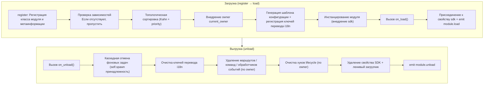

**Что фреймворк делает за вас при загрузке** (вам нужно только написать `on_load`, остальное делается автоматически):

| Этап | Что делает фреймворк |
|------|-------------|
| Внедрение owner | Во время инстанцирования модуль оборачивается в `owner_scope` — все зарегистрированные вами команды/события/钩ки/фоновые задачи в `on_load` **автоматически принадлежат этому модулю**, при выгрузке они удаляются по owner |
| Шаблон конфигурации | Модули, объявившие `ConfigClass`, получают автоматически сгенерированный/заполненный конфигурационный сегмент `ErisPulse.<ModuleName>` |
| Ключи перевода i18n | Модули, объявившие `I18nClass`, автоматически регистрируют ключи перевода (удаляются при выгрузке) |
| Зависимости | Модули сортируются по `depends`, гарантируя, что зависимые модули загружаются первыми; циклические зависимости отклоняются с `RuntimeError` |
| Присоединение к SDK | После инстанцирования модуль присоединяется к `sdk.<ModuleName>`, благодаря чему вы можете обращаться к `sdk.MyModule.xxx` |

**Что фреймворк очищает при выгрузке** (соответствует U1→U7 выше): после выполнения `on_unload` происходит дополнительная очистка — фоновые задачи, созданные через `self.spawn`, принудительно отменяются (для аккуратного завершения задачи в `on_unload` нужно сделать это вручную), ключи перевода i18n, маршруты, команды/обработчики событий, хуки lifecycle, затем удаляется свойство SDK. При `purge=True` дополнительно удаляются метаданные и очищается `sys.modules`.

> Эта автоматическая очистка — основа того, что «вам нужно только написать `on_load`/`on_unload`, не нужно вручную unregister» — фреймворк использует принадлежность owner, чтобы сделать «кто зарегистрировал, тот и очищает» одним нажатием.

## Объект SDK

### Доступ к основным модулям

```python
from ErisPulse import sdk

# Доступ к всем основным модулям через объект sdk
sdk.logger.info("Лог")
sdk.storage.set("key", "value")
config = sdk.config.getConfig("MyModule")
```

### Коммуникация между модулями

```python
# Доступ к другим модулям
other_module = sdk.OtherModule
result = await other_module.some_method()
```

## Запрос методов отправки адаптера

Из-за нового стандарта, требующего перезаписи метода `__getattr__` для реализации механизма отправки по умолчанию, невозможно использовать `hasattr` для проверки существования метода. Начиная с версии `2.3.5`, добавлена функция для запроса методов отправки.

### Список поддерживаемых методов отправки

```python
# Получение списка всех методов отправки, поддерживаемых платформой
methods = sdk.adapter.list_sends("onebot11")
# Возвращает: ["Text", "Image", "Voice", "Markdown", ...]
```

### Получение подробной информации о методе

```python
# Получение подробной информации о методе
info = sdk.adapter.send_info("onebot11", "Text")
# Возвращает:
# {
#     "name": "Text",
#     "parameters": [
#         {"name": "text", "type": "str", "default": null, "annotation": "str"}
#     ],
#     "return_type": "Awaitable[Any]",
#     "docstring": "Отправка текстового сообщения..."
# }
```

## Управление конфигурацией

### Декларативная конфигурация (рекомендуется)

Начиная с версии v2.5.2, модули могут объявлять класс конфигурации через `ConfigClass`, используя ту же систему схемы конфигурации, что и адаптеры. Конфигурация доступна через `self.cfg` в режиме реального времени, изменения немедленно применяются:

```python
from dataclasses import dataclass, field
from ErisPulse.Core.Bases import BaseModule
from ErisPulse.Core.Bases import BaseConfig

@dataclass
class MyModuleConfig(BaseConfig):
    api_key: str = field(
        default="",
        metadata={
            "description": {"i18n": "my_module.api_key", "default": "Ключ API"},
            "required": True,
            "secret": True,
            "ui": {"widget": "password", "group": "basic", "order": 1},
        },
    )
    timeout: int = field(
        default=30,
        metadata={
            "description": {"i18n": "my_module.timeout", "default": "Время ожидания (секунды)"},
            "ui": {"widget": "number", "group": "advanced", "order": 2},
        },
    )

class MyModule(BaseModule):
    ConfigClass = MyModuleConfig

    def __init__(self, sdk):
        self.sdk = sdk
        self.logger = sdk.logger.get_child("MyModule")

    async def on_load(self, event):
        self.logger.info("Модуль загружен")

    async def on_unload(self, event):
        pass

    async def do_something(self):
        cfg = self.cfg  # Чтение в режиме реального времени, типобезопасно
        api_key = cfg.api_key
        timeout = cfg.timeout
```

`BaseConfig` — универсальный базовый класс конфигурации, применимый ко всем сценариям: адаптеры, модули, внешние проекты. Поля конфигурации поддерживают многоязычные описания i18n (см. [документацию i18n](../../advanced/i18n.md#многоязычные-описания-полей-конфигурации)).

Система схемы конфигурации также поддерживает (с v2.8.0, см. [основные концепты адаптера](../adapters/core-concepts.md#约定-metadata)):

- **Автоматическая генерация описания полей из docstring**: если не объявлено `metadata description`, автоматически извлекается из docstring `:ivar поле: описание` или из раздела `Attributes:`
- **Вложенные dataclass конфигурации**: при типе поля вложенный dataclass, схема/шаблон/валидация обрабатываются рекурсивно, WebUI отображает вложенные группы
- **Поле `example`, не сохраняющееся в файл**: поле с `metadata={"example": True}` не записывается в `config.toml`, сохраняется только в `config.full.example` (подходит для сложных и редко используемых расширенных настроек), после ручной настройки пользователем сохраняется как обычно

### Декларативные ключи перевода (v2.7.0+)

Начиная с v2.7.0, модули могут объявлять ключи перевода, как и `ConfigClass`, через вложенный класс `I18nClass`, объединяя все ключи перевода в одном месте. Фреймворк при загрузке **автоматически регистрирует** все объявленные ключи перевода, без необходимости вручную вызывать `i18n.register()`, и регистрация происходит раньше, чем генерация шаблона конфигурации, гарантируя, что ключи перевода, используемые в описаниях конфигурации, уже доступны.

```python
from ErisPulse.Core.Bases import BaseConfig, BaseI18n, I18nKey

class MyModule(BaseModule):
    # Класс конфигурации (необязательно)
    @dataclass
    class ConfigClass(BaseConfig):
        welcome_msg: str = field(
            default="Добро пожаловать",
            metadata={
                "description": {"i18n": "mymodule.welcome_msg", "default": "Сообщение приветствия"},
            },
        )

    # Класс ключей перевода (необязательно)
    class I18nClass(BaseI18n):
        # Имя свойства автоматически объединяется в полный путь ключа: <имя модуля>.<имя свойства>
        welcome_msg: I18nKey = I18nKey(
            default="Welcome Message",   # Безязыковой резервный вариант
            zh_CN="欢迎消息",
            zh_TW="歡迎訊息",
            en="Welcome Message",
            ja="ウェルカムメッセージ",
            ru="Приветственное сообщение",
        )
        hello: I18nKey = I18nKey(
            default="Hello, {name}!",
            zh_CN="你好，{name}！",
            zh_TW="你好，{name}！",
            en="Hello, {name}!",
            ja="こんにちは、{name}！",
            ru="Привет, {name}!",
        )
```

Подробнее смотри [рекомендуемый способ i18n](../../advanced/i18n.md#рекомендуемый-способ-объявления-ключей-перевода-через-i18nclass-v270).

### Ручное чтение конфигурации (устарело)

> **Устарело**: используйте [декларативную конфигурацию](#декларативная-конфигурация-рекомендуется) + `self.cfg` для чтения в режиме реального времени.

```python
class MyModule(BaseModule):
    def __init__(self, sdk):
        self.sdk = sdk

    def _load_config(self):
        config = self.sdk.config.getConfig("MyModule")
        if not config:
            self.sdk.config.setConfig("MyModule", {"api_key": "", "timeout": 30})
            return {"api_key": "", "timeout": 30}
        return config
```

## Система хранения

### Основное использование

```python
# Сохранение данных
sdk.storage.set("user:123", {"name": "张三"})

# Получение данных
user = sdk.storage.get("user:123", {})

# Удаление данных
sdk.storage.delete("user:123")
```

### Использование транзакций

```python
# Использование транзакции для обеспечения согласованности данных
with sdk.storage.transaction():
    sdk.storage.set("key1", "value1")
    sdk.storage.set("key2", "value2")
    # Если какая-либо операция не удалась, все изменения будут откатываться
```

## Обработка событий

### Регистрация обработчиков событий

```python
from ErisPulse.Core.Event import command, message

# Регистрация команды
@command("info", help="Получить информацию")
async def info_handler(event):
    await event.reply("Это информация")

# Регистрация обработчика сообщений
@message.on_group_message()
async def group_handler(event):
    sdk.logger.info(f"Получено групповое сообщение: {event.get_text()}")
```

### Жизненный цикл обработчиков событий

Фреймворк автоматически управляет регистрацией и удалением обработчиков событий, вам нужно только зарегистрировать их в `on_load`.

## Механизм ленивой загрузки

### Принцип работы

```python
# Модуль будет инициализирован только при первом обращении
result = await sdk.my_module.some_method()
# ↑ Здесь будет вызвана инициализация модуля
```

### Немедленная загрузка

Для модулей, требующих немедленной инициализации (например, триггеров, таймеров):

```python
@staticmethod
def get_load_strategy():
    return ModuleLoadStrategy(
        lazy_load=False,  # Немедленная загрузка
        priority=100
    )
```

## Обработка ошибок

### Перехват исключений

```python
async def handle_event(self, event):
    try:
        # Бизнес-логика
        await self.process_event(event)
    except ValueError as e:
        self.logger.warning(f"Ошибка параметра: {e}")
        await event.reply(f"Ошибка параметра: {e}")
    except Exception as e:
        self.logger.error(f"Обработка не удалась: {e}")
        raise
```

### Запись в лог

```python
# Использование разных уровней логирования
self.logger.debug("Отладочная информация")    # Подробная информация для отладки
self.logger.info("Состояние работы")      # Информация о нормальной работе
self.logger.warning("Предупреждение")  # Предупреждающая информация
self.logger.error("Ошибка")    # Ошибка
self.logger.critical("Критическая ошибка") # Критическая ошибка
```


### Event 包装类详解

# Подробное описание обёртки событий

Модуль Event предоставляет мощный класс обёртки событий, который упрощает обработку событий.

## Добавление аннотаций типов для параметра event

Параметр `event` обработчика событий является **обёрткой Event** (подкласс dict). Рекомендуется добавлять аннотации типов для него:

```python
from ErisPulse.Core.Event import Event

@message.on_private_message()
async def handler(event: Event):
    text = event.get_text()   # IDE автоматически подсказывает все удобные методы
    await event.reply(text)   # Опечатки будут обнаружены при статической проверке
```

Без аннотаций IDE не сможет распознать методы Event (`get_text()` / `reply()` / `wait_reply()` / методы расширения платформы не будут подсвечиваться), и приходится полагаться на память при написании.

> **Обратите внимание на различие**: `event` в обратном вызове обработчика событий является **обёрткой Event** (аннотация типа `Event`); `event` в методах жизненного цикла модуля `on_load` / `on_unload` является обычным **dict** (аннотация типа `dict`), не следует их путать.

## Основные возможности

- **Полная совместимость со словарём**: Event наследуется от dict
- **Удобные методы**: Предоставляются много удобных методов
- **Доступ через точку**: Поддерживается доступ к полям события через точку
- **Обратная совместимость**: Все методы являются необязательными

## Основные методы полей

```python
from ErisPulse.Core.Event import command

@command("info")
async def info_command(event: Event):
    event_id = event.get_id()
    platform = event.get_platform()
    time = event.get_time()
    print(f"ID: {event_id}, Платформа: {platform}, Время: {time}")
```

## Методы событий сообщений

```python
from ErisPulse.Core.Event import message

@message.on_private_message()
async def private_handler(event: Event):
    text = event.get_text()
    user_id = event.get_user_id()
    nickname = event.get_user_nickname()
    await event.reply(f"Привет, {nickname}!")
```

## Типы сообщений

```python
from ErisPulse.Core.Event import message

@message.on_group_message()
async def group_handler(event: Event):
    is_private = event.is_private_message()
    is_group = event.is_group_message()
    is_at = event.is_at_message()
    await event.reply(f"Тип: {'Личное сообщение' if is_private else 'Групповое сообщение'}")
```

## Функция ответа

```python
from ErisPulse.Core.Event import command

@command("ask")
async def ask_command(event: Event):
    await event.reply("Пожалуйста, введите ваше имя:")
    reply = await event.wait_reply(timeout=30)
    if reply:
        name = reply.get_text()
        await event.reply(f"Привет, {name}!")

@command("price")
async def price_command(event: Event):
    await event.reply("Пожалуйста, введите сумму (например: 5元):")
    # Ответ должен соответствовать регулярному выражению, иначе продолжаем ожидать до истечения таймаута
    reply = await event.wait_reply(timeout=30, regex=r"\d+\s*元")
    if reply:
        await event.reply(f"Получена сумма: {reply.get_text()}")
```

## Расширенные возможности интерактивных диалогов

> [!NOTE]
> Для использования этих функций требуется ErisPulse **2.8.0+**.

```python
# Повторное напоминание: если в течение 5 минут нет ответа, отправить напоминание, при ответе отменить автоматически
reminder = event.remind(300, "Ещё здесь? Чтобы прекратить общение, напишите «Выход»")
reminder.cancel()  # Также можно отменить вручную

# Продление тайм-аута: обязательное достижение срока (не отменяется ответом), например, для уведомления владельца, если задача не обработана в течение длительного времени
event.escalate(1800, lambda e: notify_master("Задача просрочена"))

# Ожидание нескольких путей: одновременно ждём "одобрить" и "отклонить", срабатывает первый поступивший ответ
which, reply = await event.select(
    event.expect(pattern="одобрить*", user="10001"),
    event.expect(pattern="отклонить*", user="10002"),
    timeout=60,
)
if which is None:
    await event.reply("Тайм-аут, ответа на запрос не получено")

# Ожидание на уровне сессии: ответ любого участника в группе может быть принят (для совместной работы в группе)
reply = await event.wait_reply(session=True, prompt="Кто-нибудь, помогите ответить?")

# Ящик сообщений сессии: последние 20 сообщений текущей сессии (включая сообщения бота, контекст ИИ / база для предотвращения повторения)
messages = await event.history(20)

# Транзакция сообщений: при возникновении ошибки автоматически отменяются отправленные сообщения в рамках транзакции
async with event.message_tx():
    await event.reply("Обработка, пожалуйста, подождите...")
    result = await do_something()
    await event.reply(f"Завершено: {result}")
```

## Получение информации о команде

```python
from ErisPulse.Core.Event import command

@command("cmdinfo")
async def cmdinfo_command(event: Event):
    cmd_name = event.get_command_name()
    cmd_args = event.get_command_args()
    await event.reply(f"Команда: {cmd_name}, аргументы: {cmd_args}")
```

## Метод уведомления события

```python
from ErisPulse.Core.Event import notice

@notice.on_friend_add()
async def friend_add_handler(event: Event):
    await event.reply("Добро пожаловать, добавьте меня в друзья!")
```

## Справочник методов

### Основные методы

#### Базовая информация о событии
- `get_id()` - Получить ID события
- `get_time()` - Получить метку времени события (Unix, секунды)
- `get_type()` - Получить тип события (message/notice/request/meta)
- `get_detail_type()` - Получить подробный тип события (private/group/friend и т.д.)
- `get_platform()` - Получить название платформы

#### Информация о боте
- `get_self_platform()` - Получить название платформы бота
- `get_self_user_id()` - Получить ID пользователя бота
- `get_self_account_id()` - Получить ID аккаунта бота (режим с несколькими ботами)
- `get_self_info()` - Получить полную информацию о боте в виде словаря

#### Идентификаторы сессии
- `get_target_id()` - Получить единый идентификатор цели (для групповых чатов возвращает `group_id`, для каналов `channel_id`, для личных сообщений `user_id`, возвращает первое непустое значение в порядке group → channel → guild → thread → user)
- `get_session_id()` - Получить уникальный идентификатор сессии, формат: `{platform}:{detail_type}:{target_id}`

### Методы событий сообщений

#### Текст сообщения
- `get_message()` - Получить массив сообщений (формат OneBot12)
- `get_alt_message()` - Получить альтернативный текст сообщения
- `get_text()` - Получить чистый текст (псевдоним `get_alt_message()`)
- `get_message_text()` - Получить чистый текст (псевдоним `get_alt_message()`)

#### Информация об отправителе
- `get_user_id()` - Получить ID пользователя-отправителя
- `get_user_nickname()` - Получить никнейм отправителя
- `get_sender()` - Получить полную информацию об отправителе в виде словаря

#### Информация о группе/канале
- `get_group_id()` - Получить ID группы (для сообщений в группе)
- `get_channel_id()` - Получить ID канала (для сообщений в канале)
- `get_guild_id()` - Получить ID сервера (для сообщений на сервере)
- `get_thread_id()` - Получить ID темы/подканала (для сообщений в теме)

#### Упоминания
- `has_mention()` - Содержит ли сообщение упоминание бота
- `get_mentions()` - Получить список ID всех упомянутых пользователей

### Типы сообщений

#### Базовые проверки
- `is_message()` - Является ли событие сообщением
- `is_private_message()` - Является ли сообщение личным
- `is_group_message()` - Является ли сообщение групповым
- `is_at_message()` - Является ли сообщение упоминанием (псевдоним `has_mention()`)

### Методы уведомлений

#### Информация об операторе
- `get_operator_id()` - Получить ID оператора
- `get_operator_nickname()` - Получить никнейм оператора

#### Типы уведомлений
- `is_notice()` - Является ли событие уведомлением
- `is_group_member_increase()` - Событие добавления участника в группу
- `is_group_member_decrease()` - Событие удаления участника из группы
- `is_friend_add()` - Событие добавления друга (соответствует `detail_type == "friend_increase"`)
- `is_friend_delete()` - Событие удаления друга (соответствует `detail_type == "friend_decrease"`)

### Методы запросов

#### Информация о запросе
- `get_comment()` - Получить комментарий к запросу

#### Типы запросов
- `is_request()` - Является ли событие запросом
- `is_friend_request()` - Является ли запросом добавления друга
- `is_group_request()` - Является ли запросом добавления в группу

### Ответы

#### Основные ответы
- `reply(content, method="Text", at_sender=False, quote=False, at_users=None, reply_to=None, at_all=False, via=None, **kwargs)` - Общий метод ответа
  - `content`: Содержимое отправки (текст, URL и т.д.)
  - `method`: Метод отправки, по умолчанию "Text", возможные значения: "Image"/"Voice"/"Video"/"File" и т.д.
  - `at_sender`: Упоминать ли отправителя (автоматически извлекает user_id)
  - `quote`: Цитировать ли текущее сообщение (автоматически извлекает message_id)
  - `at_users`: Список пользователей для упоминания, например `["user1", "user2"]`
  - `reply_to`: Ручное указание ID сообщения для ответа
  - `at_all`: Упоминать ли всех участников
  - `**kwargs`: Дополнительные параметры (например, user_id для метода Mention)

- `reply_ob12(message)` - Ответ с использованием OneBot12-сегментов сообщения
  - `message`: Список или словарь OneBot12-сегментов, можно использовать MessageBuilder для построения

#### Проверка поддержки платформой
- `supports(method)` - Проверить, поддерживает ли текущая платформа метод отправки (например, `"Image"`, `"Voice"`), возвращает `bool`
- `available_methods()` - Получить список всех доступных методов отправки на текущей платформе, возвращает список названий методов

#### Пересылка сообщений

> **Важно**: Функция пересылки реализуется через DSL отправки адаптера, Event-обёртка не предоставляет прямого метода пересылки.

```python
# Пересылка сообщения в группу
adapter = sdk.adapter.get(event.get_platform())
target_id = event.get_group_id()  # или указать другой ID группы
await adapter.Send.To("group", target_id).Text(event.get_text())
```

### Ожидание ответа

- `wait_reply(prompt=None, timeout=60.0, callback=None, validator=None, method="Text", pattern=None, regex=None)` - Ожидание ответа пользователя
  - `prompt`: Текст подсказки, если указан, будет отправлен пользователю
  - `timeout`: Время ожидания (секунды), по умолчанию 60 секунд
  - `callback`: Функция обратного вызова, выполняется при получении ответа
  - `validator`: Функция валидации, проверяет корректность ответа
  - `method`: Метод отправки подсказки, по умолчанию "Text"
  - `pattern`: Шаблон glob (`*` / `?` / `[seq]`), текст ответа должен соответствовать, иначе ожидание продолжается
  - `regex`: Регулярное выражение, текст ответа должен соответствовать (только один из `pattern` или `regex` может быть указан), иначе ожидание продолжается
  - Возвращает объект Event с ответом пользователя, при таймауте возвращает None

#### Интерактивные методы

- `confirm(prompt=None, timeout=60.0, yes_words=None, no_words=None, method="Text", hint=False)` - Подтверждение
  - Возвращает `True` (подтверждение) / `False` (отказ) / `None` (таймаут)
  - Встроенные английские и китайские слова подтверждения автоматически распознаются, можно задать собственные наборы слов
  - `method`: Метод отправки, по умолчанию "Text", поддерживает "Image"/"Markdown" и другие не-текстовые способы отправки подсказки
  - `hint`: Добавлять ли автоматически подсказку с вариантами ответа в конец подсказки (например, "（是/否）"), по умолчанию False

- `choose(prompt, options, timeout=60.0, method="Text", options_format="auto", merge_prompt=False, placeholder="{options}")` - Меню выбора
  - `options`: Список текстовых вариантов
  - Возвращает индекс выбранного варианта (начиная с 0), при таймауте возвращает `None`
  - `method`: Метод отправки, по умолчанию "Text", текстовые методы (Text/Markdown/md/Html/h5) по умолчанию объединяют варианты в конец
  - `options_format`: Формат вариантов (по умолчанию: "auto", автоматически выбирается встроенный стиль в зависимости от метода)
    - `"auto"`: Markdown→неупорядоченный список (`- 1.选项`), Html→упорядоченный список (`<ol>`), другие→простой текстовый список
    - `"list"`: Каждый вариант на отдельной строке, например ``1. 选项A\n2. 选项B``
    - `"inline"`: Варианты отображаются в одной строке, например ``1.A | 2.B``
    - `"md"`: Markdown неупорядоченный список
    - `"html"`: Html упорядоченный список
    - `callable`: Пользовательская функция, принимает ``list[str]`` и возвращает ``str``
  - `merge_prompt`: Принудительно объединять в одно сообщение, по умолчанию False
    - `False` (по умолчанию): Текстовые методы объединяют автоматически; для не-текстовых методов сначала отправляется подсказка, затем текстовые варианты
    - `True`: Независимо от метода объединяются в одно сообщение, отправляется с указанным методом
  - `placeholder`: Заполнитель для вставки вариантов, по умолчанию `{options}`; текст подсказки с этим маркером заменяется на варианты, если установить пустую строку, варианты всегда добавляются в конец

- `collect(fields, timeout_per_field=60.0)` - Сбор формы
  - `fields`: Список полей, каждое поле содержит `key`, `prompt`, необязательный `validator`, необязательный `method`
  - Возвращает словарь `{key: value}`, при таймауте любого поля возвращает `None`
  - Каждое поле может иметь ключ `method` для указания метода отправки, например при сборе изображения: `{"key": "avatar", "prompt": "请发送头像", "method": "Image"}`
  - Каждое поле может иметь ключ `options` (список), при наличии этого ключа поле становится выборочным (автоматически вызывается choose)
  - Каждое поле может иметь ключи `options_format`, `merge_prompt`, `placeholder` для управления форматом вариантов, поведением объединения сообщений и заполнителем

- `wait_for(event_type="message", condition=None, timeout=60.0)` - Ожидание произвольного события
  - `condition`: Функция фильтрации, возвращает `True` при совпадении
  - Возвращает соответствующий объект Event, при таймауте возвращает `None`

- `conversation(timeout=60.0)` - Создание контекста многошагового диалога
  - Возвращает объект `Conversation`, поддерживающий `say()`/`wait()`/`confirm()`/`choose()`/`collect()`/`stop()`
  - Свойство `is_active` указывает, активен ли диалог

#### Примеры интерактивных методов

**confirm() - Подтверждение:**

```python
@command("delete", help="删除数据")
async def delete_handler(event: Event):
    if await event.confirm("确定要删除所有数据吗？"):
        sdk.storage.delete("all_data")
        await event.reply("数据已删除")
    else:
        await event.reply("已取消")
```

**confirm() - С подсказкой:**

```python
# hint=True добавит "（是/否）" в конец подсказки
if await event.confirm("确定继续？", hint=True):
    await event.reply("已继续")
# Пользователь увидит: 确定继续？（是/否）
```

**choose() - Меню выбора:**

```python
@command("color", help="选择颜色")
async def color_handler(event: Event):
    choice = await event.choose("请选择颜色：", ["红色", "绿色", "蓝色"])
    if choice is not None:
        colors = ["红色", "绿色", "蓝色"]
        await event.reply(f"你选择了：{colors[choice]}")
```

**choose() - Форматирование и объединение:**

```python
# inline формат: варианты отображаются в одной строке
choice = await event.choose("请选择：", ["A", "B", "C"], options_format="inline")
# Вывод: 1.A | 2.B | 3.C

# Пользовательская функция
choice = await event.choose("请选择：", ["猫", "狗"],
    options_format=lambda opts: " / ".join(opts))
# Вывод: 猫 / 狗

# options_format="auto" (по умолчанию): автоматически выбирается встроенный стиль в зависимости от метода
# Markdown → неупорядоченный список
choice = await event.choose(
    "## 请选择", ["猫", "狗"],
    method="Markdown",  # auto автоматически распознает как md список
)
# Вывод:
# ## 请选择
# - 1. 猫
# - 2. 狗

# Html → упорядоченный список
choice = await event.choose(
    "<h2>请选择</h2>", ["猫", "狗"],
    method="Html", merge_prompt=True,  # auto автоматически распознает как html список
)
# Вывод:
# <h2>请选择</h2>
# <ol><li>1. 猫</li><li>2. 狗</li></ol>

# Режим объединения + заполнитель
choice = await event.choose(
    "## 请选择\n{options}\n请回复编号",
    ["猫", "狗"],
    method="Markdown", merge_prompt=True,
)

# Пользовательский заполнитель
choice = await event.choose(
    "请选择: [choices]",
    ["猫", "狗"],
    placeholder="[choices]",
)
```

**collect() - Сбор формы:**

```python
@command("register", help="注册")
async def register_handler(event: Event):
    data = await event.collect([
        {"key": "name", "prompt": "请输入姓名："},
        {"key": "age", "prompt": "请输入年龄：",
         "validator": lambda e: e.get_text().isdigit()},
    ])
    if data:
        await event.reply(f"注册成功！{data['name']}，{data['age']}岁")
```

**reply с не-Text методами:**

```python
await event.reply("http://example.com/img.jpg", method="Image")
await event.reply("http://example.com/audio.mp3", method="Voice")

from ErisPulse.Core.Event import MessageBuilder
segments = MessageBuilder.text("看这张图：").image("http://example.com/img.jpg").build()
await event.reply_ob12(segments)
```

> Полное использование многошагового диалога через Conversation см. в [Conversation: Многошаговый диалог](../../advanced/conversation.md).

### Информация о команде

#### Основы команд
- `get_command_name()` - Получить имя команды
- `get_command_args()` - Получить список аргументов команды
- `get_command_raw()` - Получить исходный текст команды
- `get_command_info()` - Получить полную информацию о команде в виде словаря
- `is_command()` - Является ли событие командой

### Исходные данные

- `get_raw()` - Получить исходные данные события платформы
- `get_raw_type()` - Получить тип исходного события платформы

### Платформенные расширения

Адаптеры могут регистрировать платформенно-специфичные методы для Event-обёртки. Методы доступны только на Event-экземплярах соответствующей платформы, при доступе с других платформ выбрасывается `AttributeError`.

Платформенные методы через `Event.__getattribute__` имеют приоритет над встроенными методами, поэтому можно переопределить встроенные интерактивные методы, такие как `confirm`、`choose`、`collect`、`wait_reply`, предоставляя специфичные реализации для платформы (например, кнопки, карточки). Встроенная реализация экспортируется как `_builtin_*` функции для переопределения.

```python
# Почтовое событие - только почтовые методы
event = Event({"platform": "email", "email_raw": {"subject": "Hello"}})
event.get_subject()      # ✅ Возвращает "Hello"
event.get_chat_type()    # ❌ AttributeError

# Telegram событие - только Telegram методы
event = Event({"platform": "telegram", "telegram_raw": {"chat": {"type": "private"}}})
event.get_chat_type()    # ✅ Возвращает "private"
event.get_subject()      # ❌ AttributeError

# Встроенные методы всегда доступны
event.get_text()         # ✅ В любой платформе
event.reply("hi")        # ✅ В любой платформе
```

### Проверка зарегистрированных методов

```python
from ErisPulse.Core.Event import get_platform_event_methods

methods = get_platform_event_methods("email")
# ["get_subject", "get_from", ...]
```

### Поддержка hasattr и dir

```python
hasattr(event, "get_subject")   # Только при platform="email" возвращает True
"get_subject" in dir(event)     # То же самое
```

### Расширение для всех платформ (шаблон "*")

`register_event_method` и `register_event_mixin` поддерживают передачу `"*"` в качестве названия платформы, регистрируя методы, доступные на **всех** платформах Event-экземпляров. Подходит для функций, требующих кросс-платформенного повторного использования, таких как AI-диалоги, управление контекстом и т.д.

```python
from ErisPulse.Core.Event.wrapper import register_event_method

@register_event_method("*")
async def ai_chat(self, prompt: str):
    # self - экземпляр Event, доступен к данным события и встроенным методам
    await self.reply(f"AI: {prompt}")
```

После регистрации, `event.ai_chat(...)` можно вызывать из любого обработчика событий на любой платформе.

Приоритет разрешения методов (от высшего к низшему): платформенно-специфичные методы → методы шаблона → встроенные методы → доступ через ключ словаря.

> Способы регистрации расширений адаптерами см. в [API системы событий - Расширение для всех платформ (шаблон)](../../api-reference/event-system.md#跨平台扩展通配符).


### 模块开发最佳实践

# Лучшие практики разработки модулей

В этом документе представлены рекомендации по лучшим практикам разработки модулей ErisPulse.

## Проектирование модулей

### 1. Принцип единственной ответственности

Каждый модуль должен отвечать только за одну основную функцию:

```python
# Хорошее проектирование: каждый модуль отвечает за одну функцию
class WeatherModule(BaseModule):
    """Модуль получения погоды"""
    pass

class NewsModule(BaseModule):
    """Модуль получения новостей"""
    pass

# Плохое проектирование: один модуль отвечает за несколько несвязанных функций
class UtilityModule(BaseModule):
    """Содержит погоду, новости, анекдоты и другие функции"""
    pass
```

### 2. Правила именования модулей

```toml
[project]
name = "ErisPulse-ModuleName"  # Использование префикса ErisPulse-
```

### 3. Четкое управление конфигурацией

Рекомендуется использовать декларативную конфигурацию (`ConfigClass` + `BaseConfig`), чтобы получить такие возможности, как типобезопасность, автоматическое создание шаблонов, поддержка веб-интерфейса и т.д.:

```python
from dataclasses import dataclass, field
from ErisPulse.Core.Bases import BaseConfig

@dataclass
class MyModuleConfig(BaseConfig):
    api_url: str = field(default="https://api.example.com", metadata={
        "description": {"i18n": "my_module.api_url", "default": "Адрес API"},
    })
    timeout: int = field(default=30, metadata={
        "description": {"i18n": "my_module.timeout", "default": "Время ожидания (секунды)"},
    })
    cache_ttl: int = field(default=3600, metadata={
        "description": {"i18n": "my_module.cache_ttl", "default": "Время жизни кэша (секунды)"},
    })

class MyModule(BaseModule):
    ConfigClass = MyModuleConfig

    async def do_something(self):
        cfg = self.cfg  # Типобезопасно, считывается в реальном времени
        await self._fetch(cfg.api_url, timeout=cfg.timeout)
```

Также можно продолжать использовать ручной способ чтения и записи конфигурации (см. [Основные понятия модуля](core-concepts.md#управление-конфигурацией)).

### Декларативные ключи перевода (v2.7.0+)

Модуль может объявлять ключи перевода через `I18nClass`, фреймворк автоматически зарегистрирует их в системе перевода, без необходимости вызывать `i18n.register()` вручную.

```python
from ErisPulse.Core.Bases import BaseI18n, I18nKey

class MyModule(BaseModule):
    class I18nClass(BaseI18n):
        # Ключ перевода с подстановочными значениями
        welcome: I18nKey = I18nKey(
            default="Welcome, {name}!",
            zh_CN="Добро пожаловать, {name}!",
            zh_TW="歡迎你，{name}！",
            en="Welcome, {name}!",
            ja="ようこそ、{name}！",
            ru="Добро пожаловать, {name}!",
        )
        # Описание поля конфигурации
        api_url: I18nKey = I18nKey(
            default="API URL",
            zh_CN="Адрес API",
            zh_TW="API 位址",
            en="API URL",
            ja="API URL",
            ru="API URL",
        )
```

Более подробная информация доступна в [документации по i18n](../../advanced/i18n.md#рекомендуемый-способ-объявления-ключей-перевода-через-i18nclass-v270).

## Асинхронное программирование

### 1. Использование асинхронных библиотек

```python
# Рекомендуется использовать встроенный HTTP-клиент SDK (асинхронный, с автоматической логированием и статистикой)
from ErisPulse.Core import client

class MyModule(BaseModule):
    async def fetch_data(self, url):
        resp = await client.get(url)
        return await resp.json()

# Также можно использовать sdk.client (результат тот же)
from ErisPulse import sdk

class MyModule(BaseModule):
    async def fetch_data(self, url):
        resp = await sdk.client.get(url)
        return await resp.json()

# Не используйте aiohttp напрямую (трудно управлять в рамках фреймворка)
import aiohttp

class MyModule(BaseModule):
    async def fetch_data(self, url):
        async with aiohttp.ClientSession() as session:
            async with session.get(url) as response:
                return await response.json()

# Не используйте requests (синхронный, заблокирует цикл событий)
import requests

class MyModule(BaseModule):
    def fetch_data(self, url):
        return requests.get(url).json()  # заблокирует цикл событий
```

### 2. Правильное выполнение асинхронных операций

```python
from ErisPulse.Core.Event import Event  # аннотация event: Event обеспечивает автодополнение в IDE

async def handle_command(self, event: Event):
    # Длительные операции, результат которых нужно ожидать: используйте await (жизненный цикл ясен)
    result = await self._long_operation()

async def on_load(self, event: dict):
    # Фоновые задачи (опрос/таймеры/fire-and-forget): используйте self.spawn(),
    # при выгрузке модуля фреймворк отменяет задачу после on_unload, предотвращая утечку
    self.spawn(self._poll())
```

> [!NOTE]
> Рекомендуется использовать `self.spawn()` (ErisPulse **2.8.0+**), а не `asyncio.create_task` — задачи, созданные через `asyncio.create_task`, не принадлежат модулю, и при выгрузке модуля не будут автоматически отменены, что приведёт к удержанию ссылки на `self` и невозможности сборки мусора (утечка при горячей перезагрузке). Подробнее см. [Управление жизненным циклом](../../advanced/lifecycle.md#фоновые-задачи-принадлежность-и-автоматическая-отмена).

### 3. Управление ресурсами

```python
async def on_load(self, event):
    # Клиент SDK уже управляет пулом соединений, не нужно создавать session вручную
    pass
    
async def on_unload(self, event):
    # Если требуется кастомный клиент, не забудьте очистить ресурсы
    pass
```

## Обработка событий

### 1. Использование обёртки Event

```python
# Удобный способ использования обёртки Event
@command("info")
async def info_command(event: Event):
    user_id = event.get_user_id()
    nickname = event.get_user_nickname()
    await event.reply(f"Привет, {nickname}!")

# Вместо прямого доступа к словарю
@command("info")
async def info_command(event: Event):
    user_id = event["user_id"]  # Менее понятно, легко ошибиться
```

### 2. Разумное использование ленивой загрузки

```python
# Модуль с редко используемыми командами: объявите триггер activate_on, модуль активируется при первом совпадении команды (сохраняется ленивая загрузка)
class CommandModule(BaseModule):
    @staticmethod
    def get_load_strategy():
        return ModuleLoadStrategy(lazy_load=True, activate_on=[
            {"command": {"name": "dice", "help": "Бросить кубик", "aliases": ["d"]}},
        ])

# Модуль с редко используемыми слушателями: объявите триггер события, модуль активируется при поступлении события
class ListenerModule(BaseModule):
    @staticmethod
    def get_load_strategy():
        return ModuleLoadStrategy(lazy_load=True, activate_on=[
            {"notice": "group_member_increase"},
        ])

# Модули с частым срабатыванием (обрабатываются каждое сообщение) или модули, которые должны быть готовы при запуске: загрузка немедленная
class HotListenerModule(BaseModule):
    @staticmethod
    def get_load_strategy():
        return ModuleLoadStrategy(lazy_load=False)

# Инструментальные модули подходят для ленивой загрузки
class UtilityModule(BaseModule):
    @staticmethod
    def get_load_strategy():
        return ModuleLoadStrategy(lazy_load=True)
```

> Полный синтаксис activate_on (три формы событий / сокращённое объявление команды и dict / цепочка возврата help) см. в
> [Системе ленивой загрузки модулей](../../advanced/lazy-loading.md#event-driven-lazy-activation-activate-on).

### 3. Регистрация обработчика событий

```python
async def on_load(self, event):
    # Регистрация обработчиков событий в on_load
    @command("hello")
    async def hello_handler(event: Event):
        await event.reply("Привет!")
    
    @message.on_group_message()
    async def group_handler(event: Event):
        self.logger.info("Получено групповое сообщение")
    
    # Не нужно вручную отписываться, фреймворк обработает это автоматически
```

## Обработка ошибок

### 1. Обработка исключений по категориям

```python
async def handle_event(self, event: Event):
    try:
        result = await self._process(event)
    except ValueError as e:
        # Ожидаемая бизнес-ошибка
        self.logger.warning(f"Предупреждение бизнес-логики: {e}")
        await event.reply(f"Ошибка параметра: {e}")
    except aiohttp.ClientError as e:
        # Ошибка сети (рекомендуется использовать sdk.client + ClientError вместо этого)
        # Старый код, использующий напрямую aiohttp, по-прежнему работает, но в новом коде рекомендуется использовать систему исключений ErisPulse
        self.logger.error(f"Ошибка сети: {e}")
        await event.reply("Ошибка сетевого запроса, попробуйте позже")
    except Exception as e:
        # Неожиданная ошибка
        self.logger.error(f"Неизвестная ошибка: {e}", exc_info=True)
        await event.reply("Обработка не удалась, свяжитесь с администратором")
        raise
```

### 2. Обработка тайм-аутов

```python
# Рекомендуется использовать встроенный клиент SDK (имеет встроенные тайм-ауты и повторные попытки)
from ErisPulse.Core import client
from ErisPulse.Core.Bases.errors import ClientTimeoutError

async def fetch_with_timeout(self, url, timeout=30):
    try:
        resp = await client.get(url, timeout=timeout)
        return await resp.json()
    except ClientTimeoutError:
        self.logger.warning(f"Тайм-аут запроса: {url}")
        raise
```

## Система хранения

### 1. Использование транзакций

```python
# Использование транзакции для обеспечения согласованности данных
async def update_user(self, user_id, data):
    with self.sdk.storage.transaction():
        self.sdk.storage.set(f"user:{user_id}:profile", data["profile"])
        self.sdk.storage.set(f"user:{user_id}:settings", data["settings"])

# ❌ Без транзакции может возникнуть несогласованность данных
async def update_user(self, user_id, data):
    self.sdk.storage.set(f"user:{user_id}:profile", data["profile"])
    # Если здесь произойдет ошибка, предыдущая операция не может быть отменена
    self.sdk.storage.set(f"user:{user_id}:settings", data["settings"])
```

### 2. Пакетные операции

```python
# Использование пакетных операций для повышения производительности
def cache_multiple_items(self, items):
    self.sdk.storage.set_multi({
        f"item:{k}": v for k, v in items.items()
    })

# ❌ Вызовы по одному снижают эффективность
def cache_multiple_items(self, items):
    for k, v in items.items():
        self.sdk.storage.set(f"item:{k}", v)
```

## Логирование

### 1. Разумное использование уровней логирования

```python
# DEBUG: Подробная отладочная информация (только в режиме разработки)
self.logger.debug(f"Входные параметры: {params}")

# INFO: Информация о нормальной работе
self.logger.info("Модуль загружен")
self.logger.info(f"Обработка запроса: {request_id}")

# WARNING: Предупреждения, не влияющие на основную функциональность
self.logger.warning(f"Параметр конфигурации {key} не задан, используется значение по умолчанию")
self.logger.warning("API-ответ медленный, возможно, требуется оптимизация")

# ERROR: Ошибки
self.logger.error(f"Ошибка запроса API: {e}")
self.logger.error(f"Ошибка обработки события: {e}", exc_info=True)

# CRITICAL: Критические ошибки, требующие немедленного вмешательства
self.logger.critical("Не удалось подключиться к базе данных, бот не может нормально работать")
```

### 2. Структурированное логирование

```python
# Использование структурированного логирования для удобства анализа
self.logger.info(f"Обработка запроса: request_id={request_id}, user_id={user_id}, duration={duration}ms")

# ❌ Использование неструктурированного логирования
self.logger.info(f"Запрос обработан, от пользователя {user_id}, затрачено {duration} миллисекунд")
```

## Оптимизация производительности

### 1. Использование кэширования

```python
class MyModule(BaseModule):
    def __init__(self):
        self._cache = {}
        self._cache_lock = asyncio.Lock()
    
    async def get_data(self, key):
        async with self._cache_lock:
            if key in self._cache:
                return self._cache[key]
            
            # Получение данных из базы данных
            data = await self._fetch_from_db(key)
            
            # Кэширование данных
            self._cache[key] = data
            return data
```

### 2. Избегание блокирующих операций

```python
# Использование асинхронных операций
async def process_message(self, event: Event):
    # Асинхронная обработка
    await self._async_process(event)

# ❌ Блокирующая операция
async def process_message(self, event: Event):
    # Синхронная операция, блокирует цикл событий
    result = self._sync_process(event)
```

## Безопасность

### 1. Защита конфиденциальных данных

```python
# Конфиденциальные данные хранятся в конфигурации (декларативный ConfigClass, поле secret не попадает в логи/экспорт)
from dataclasses import dataclass, field
from ErisPulse.Core.Bases import BaseModule, BaseConfig

@dataclass
class MyModuleConfig(BaseConfig):
    api_key: str = field(
        default="",
        metadata={"description": "API-ключ", "secret": True},
    )

class MyModule(BaseModule):
    ConfigClass = MyModuleConfig

    def check_api_key(self):
        if not self.cfg.api_key or self.cfg.api_key == "YOUR_API_KEY_HERE":
            raise ValueError("Пожалуйста, настройте действительный API-ключ в config.toml")

# ❌ Конфиденциальные данные жестко закодированы
class MyModule(BaseModule):
    API_KEY = "sk-1234567890"  # Не делайте так!
```

### 2. Валидация входных данных

```python
# Валидация пользовательского ввода
async def process_command(self, event: Event):
    user_input = event.get_text()
    
    # Проверка длины ввода
    if len(user_input) > 1000:
        await event.reply("Слишком длинный ввод, пожалуйста, введите снова")
        return
    
    # Проверка формата ввода
    if not re.match(r'^[a-zA-Z0-9]+$', user_input):
        await event.reply("Неверный формат ввода")
        return
```

## Тестирование

### 1. Юнит-тесты

```python
import pytest
from ErisPulse.Core.Bases import BaseModule

class TestMyModule:
    def test_config_defaults(self):
        """Тестирование значений по умолчанию конфигурации"""
        config = MyModule.ConfigClass()
        assert config.timeout == 30
```

### 2. Интеграционные тесты

```python
@pytest.mark.asyncio
async def test_command_handling():
    """Тестирование обработки команд"""
    module = MyModule()
    await module.on_load({})
    
    # Симуляция события команды
    event = create_test_command_event("hello")
    await module.handle_command(event)
```

## Развертывание

### 1. Управление версиями

```toml
[project]
name = "ErisPulse-MyModule"
version = "1.0.0"
```

Следуйте семантической версиировке:
- MAJOR.MINOR.PATCH
- Главная версия: несовместимые изменения API
- Подверсия: добавление функций, совместимых с предыдущими версиями
- Ревизия: исправления, совместимые с предыдущими версиями

### 2. Заголовок README

README, созданный с помощью `epsdk create`, уже содержит логотип и шапку ErisPulse. Рекомендуется использовать два режима:

**Режим A — только логотип ErisPulse (по умолчанию):**

```markdown
<div align="center">


# MyModule

**Однострочное описание**

<p>
  <a href="https://pypi.org/project/ErisPulse-MyModule/"></a>
  <a href="https://pypi.org/project/ErisPulse-MyModule/"></a>
  <a href="./LICENSE"></a>
  <a href="https://github.com/ErisPulse/ErisPulse"></a>
</p>

</div>
```

**Режим B — иконка модуля × логотип ErisPulse (если есть пользовательская иконка):**

```markdown
<div align="center">


<span style="font-size:44px;color:#c8c8c8;margin:0 18px;vertical-align:middle;">×</span>


# MyModule
(Строки с бейджами аналогичны выше)
</div>
```

Можно дополнительно добавить бейджи для GitHub Stars, Downloads и т.д. Логотип также можно загрузить в проект локально (`.github/assets/ErisPulseLogo.png`) и использовать относительный путь для ссылки.


=====
发布与工具
=====


### 发布模块到模块商店

# Руководство по публикации и магазину модулей

Опубликуйте свой разработанный модуль или адаптер в магазине модулей ErisPulse, чтобы другие пользователи могли легко находить и устанавливать его.

## Обзор магазина модулей

Магазин модулей ErisPulse — это централизованный реестр модулей, где пользователи могут просматривать, искать и устанавливать модули и адаптеры, предоставленные сообществом, с помощью инструментов командной строки.

### Просмотр и обнаружение

```bash
# Вывести список всех доступных удалённых пакетов
epsdk list-remote

# Показать только модули
epsdk list-remote -t modules

# Показать только адаптеры
epsdk list-remote -t adapters

# Принудительно обновить список удалённых пакетов
epsdk list-remote -r
```

Вы также можете посетить [официальный сайт ErisPulse](https://www.erisdev.com/#market), чтобы просматривать магазин модулей онлайн.

### Поддерживаемые типы отправки

| Тип | Описание | Группа entry-point |
|------|------|----------------|
| Модуль (Module) | Расширение функциональности бота, реализация бизнес-логики | `erispulse.module` |
| Адаптер (Adapter) | Подключение к новым платформам сообщений | `erispulse.adapter` |

## Быстрая публикация

Весь процесс состоит из трёх шагов: настройка проекта → публикация на PyPI → отправка в магазин модулей.

### 1. Настройка pyproject.toml

Убедитесь, что в директории проекта присутствуют `pyproject.toml` и `README.md`, и настройте entry-points в зависимости от типа:

#### Модуль

```toml
[project]
name = "ErisPulse-MyModule"
version = "1.0.0"
description = "Описание модуля"
requires-python = ">=3.10"
license = { text = "MIT" }
authors = [ { name = "yourname" } ]
dependencies = [
    "ErisPulse>=2.0.0",
]

[project.entry-points."erispulse.module"]
"MyModule" = "MyModule:Main"
```

#### Адаптер

```toml
[project]
name = "ErisPulse-MyAdapter"
version = "1.0.0"
description = "Описание адаптера"
requires-python = ">=3.10"

[project.entry-points."erispulse.adapter"]
"myplatform" = "MyAdapter:MyAdapter"
```

> **Примечание**: Рекомендуется начинать имя пакета с `ErisPulse-`, чтобы пользователи могли легко идентифицировать пакеты экосистемы ErisPulse. Имя ключа entry-point (например, `"MyModule"`) будет использоваться как имя модуля в SDK.

### 2. Публикация на PyPI

```bash
# Сборка и публикация (требуется аккаунт PyPI)
pip install build twine
python -m build
python -m twine upload dist/*
```

После успешной публикации проверьте установку:

```bash
pip install ErisPulse-MyModule
```

### 3. Отправка в магазин модулей

Перейдите на [ErisPulse Marketplace](https://www.erisdev.com/#market), нажмите «Submit Module», войдите в систему и заполните информацию о модуле.

Поддерживаемые способы входа: **GitHub**, **Codeberg**, **Yunhu**, выберите любой из них.

Основные пункты заполнения:
- Название модуля, описание, адрес репозитория
- Минимальная версия SDK: если не уверены, укажите версию [последнего релиза ErisPulse](https://pypi.org/project/ErisPulse/)

После отправки модуль сразу появится в источнике, и пользователи смогут установить его через модульный источник. Модуль будет помечен как «не проверен», после проверки администратором он станет «проверенным».

> **О статусе проверки**:
> - «Не проверен» означает, что модуль ещё не прошёл официальную проверку, но не обязательно, что в нём есть проблемы
> - При установке не проверенного модуля через `epsdk install` пользователь получит предупреждение о риске, и установку можно будет продолжить только после подтверждения

### 4. Управление опубликованным модулем

После входа в систему на вкладке «Submit Module» перейдите на вкладку «Мои модули», где можно:

- **Редактировать** — изменить описание модуля, адрес репозитория, теги и т.д., версия будет автоматически синхронизирована с PyPI
- **Удалить** — удалить модуль из магазина модулей (необратимо)

> После отправки модуль может потребоваться несколько минут, чтобы появиться в списке «Мои модули».

## Обновление опубликованного модуля

1. Обновите `version` в `pyproject.toml`
2. Пересоберите и перезагрузите: `python -m build && python -m twine upload dist/*`
3. Магазин модулей автоматически синхронизирует последнюю версию с PyPI

Пользователи могут обновить модуль через `epsdk upgrade MyModule`.

## Проверочный список перед публикацией

Перед отправкой на PyPI, пожалуйста, проверьте следующее:

### Качество кода

- [ ] Все публичные API имеют аннотации типов (подписи функций и возвращаемые значения)
- [ ] Все публичные методы имеют строку документации (`"""..."""` формат, включая `:param` / `:return` / `:raises`)
- [ ] Прошёл проверку `ruff check` (без предупреждений)
- [ ] Код покрыт тестами на 80% и выше
- [ ] Пройдены все тесты `pytest`

### Совместимость

- [ ] В `pyproject.toml` указана минимальная версия SDK: `dependencies = ["ErisPulse>=x.y.z"]`
- [ ] Протестировано на Python 3.10 / 3.11 / 3.12 / 3.13
- [ ] Протестировано на целевой операционной системе (Windows / Linux / macOS, если применимо)
- [ ] Нет циклических зависимостей

### Конфигурация

- [ ] Если используется декларативная конфигурация (`ConfigClass` + `BaseConfig` / `BotAccountConfig`), поля конфигурации имеют `description` (рекомендуется в формате i18n) и `ui` метаданные
- [ ] Если зарегистрированы ключи перевода i18n, они покрывают все 5 языков (zh-CN / zh-TW / en / ja / ru)
- [ ] Чувствительные поля помечены `secret=True`

### Документация

- [ ] `README.md` содержит инструкции по установке и примеры использования
- [ ] `README.md` объясняет способ конфигурации (пример файла конфигурации + переменные окружения)
- [ ] `CHANGELOG.md` содержит все изменения
- [ ] Адаптер обновил документацию о характеристиках платформы (поддерживаемые типы Send, типы событий и т.д.)

### Публикация

- [ ] Версия в `pyproject.toml` обновлена
- [ ] Сборка прошла успешно: `python -m build`
- [ ] Загружен на PyPI: `python -m twine upload dist/*`
- [ ] Установка проверена: `pip install ErisPulse-xxx && epsdk run`

## Тестирование в режиме разработки

Перед публикацией можно протестировать локально в режиме редактирования:

```bash
epsdk install -e /path/to/MyModule
# или
pip install -e /path/to/MyModule
```

## Часто задаваемые вопросы

### Обязательно ли имя пакета должно начинаться с `ErisPulse-`?

Нет, это не обязательно, но настоятельно рекомендуется. Это помогает пользователям легко идентифицировать пакеты экосистемы ErisPulse на PyPI.

### Можно ли зарегистрировать несколько модулей в одном пакете?

Да. Просто добавьте несколько пар ключ-значение в `entry-points`:

```toml
[project.entry-points."erispulse.module"]
"ModuleA" = "MyPackage:ModuleA"
"ModuleB" = "MyPackage:ModuleB"
```

### Сколько времени занимает проверка?

Обычно от 1 до 3 рабочих дней. Вы можете проверить статус проверки в разделе «Мои модули» на сайте магазина модулей.

## Распространение приложений через Docker-образы

Если ваше приложение не подходит для публикации на PyPI (например, содержит частные зависимости или требует предварительной настройки среды), вы можете опубликовать Docker-образ через **GitHub Container Registry (GHCR)**, чтобы другие пользователи могли запускать его одним `docker pull`.

### Сценарии применения

- У вас есть **полное приложение бота** (модуль + конфигурация + скрипт запуска), которое вы хотите распространять одним кликом
- Модуль/адаптер зависит от **приватных пакетов** или имеет специальный процесс установки, неподходящий для PyPI
- Вы хотите предоставить **готовое к использованию** решение, чтобы снизить порог входа для пользователей

### 1. Создание Dockerfile

Создайте Dockerfile на основе официального образа ErisPulse, добавив только ваш модуль:

```dockerfile
FROM erispulse/erispulse:latest

LABEL org.opencontainers.image.title="ErisPulse-MyModule" \
      org.opencontainers.image.description="Описание модуля" \
      org.opencontainers.image.url="https://github.com/yourname/ErisPulse-MyModule" \
      org.opencontainers.image.source="https://github.com/yourname/ErisPulse-MyModule"

COPY pyproject.toml README.md ./
COPY MyModule/ ./MyModule/

RUN uv pip install --system -e .
```

Если модулю требуются дополнительные системные зависимости (например, SSH-клиент), добавьте их после `RUN uv pip install`:

```dockerfile
RUN apt-get update && apt-get install -y --no-install-recommends \
    openssh-client \
    && rm -rf /var/lib/apt/lists/*
```

> `erispulse/erispulse:latest` уже содержит ErisPulse, ErisPulse-Dashboard, Python-интерпретатор и uv, их не нужно устанавливать повторно.

### 2. Создание рабочего потока GitHub Actions

Создайте файл `.github/workflows/docker-publish.yml`:

```yaml
name: Публикация Docker-образа

on:
  workflow_dispatch:
  push:
    branches:
      - main
    tags:
      - "v*"

permissions:
  contents: read
  packages: write

env:
  REGISTRY: ghcr.io
  IMAGE_NAME: ${{ github.repository_owner }}/my-bot

jobs:
  docker-publish:
    runs-on: ubuntu-latest

    steps:
      - name: Клонирование кода
        uses: actions/checkout@v4

      - name: Настройка QEMU (поддержка нескольких архитектур)
        uses: docker/setup-qemu-action@v3

      - name: Настройка Docker Buildx
        uses: docker/setup-buildx-action@v3

      - name: Вход в GitHub Container Registry
        uses: docker/login-action@v3
        with:
          registry: ${{ env.REGISTRY }}
          username: ${{ github.actor }}
          password: ${{ secrets.GITHUB_TOKEN }}

      - name: Извлечение метаданных Docker
        id: meta
        uses: docker/metadata-action@v5
        with:
          images: ${{ env.REGISTRY }}/${{ env.IMAGE_NAME }}
          tags: |
            type=semver,pattern={{version}}
            type=semver,pattern={{major}}.{{minor}}
            type=raw,value=latest

      - name: Сборка и отправка Docker-образа
        uses: docker/build-push-action@v6
        with:
          context: .
          file: ./Dockerfile
          platforms: linux/amd64,linux/arm64
          push: true
          tags: ${{ steps.meta.outputs.tags }}
          labels: ${{ steps.meta.outputs.labels }}
          cache-from: type=gha
          cache-to: type=gha,mode=max
```

> `GITHUB_TOKEN` предоставляется автоматически GitHub Actions, не нужно создавать ключи вручную.

### 3. Запуск сборки

Сборка запускается автоматически при отправке кода или создании тега:

```bash
# Отправка в ветку main запускает сборку
git push origin main

# Или создание тега запускает сборку
git tag v1.0.0
git push origin v1.0.0
```

Также можно запустить вручную на странице **Actions** репозитория.

### 4. Настройка образа на публичный доступ

Образы GHCR по умолчанию **private**, чтобы другие пользователи могли получать доступ без входа, необходимо изменить на **public**:

1. Перейдите в репозиторий → **Packages** → нажмите на соответствующий пакет
2. **Package settings** → **Danger Zone** → **Change visibility** → **Public**

### 5. Использование пользователем

После завершения сборки пользователь может запустить образ одной командой `docker run`:

```bash
docker run -d \
  --name my-bot \
  -p 8000:8000 \
  -v $(pwd)/config:/app/config \
  -e TZ=Asia/Shanghai \
  -e ERISPULSE_DASHBOARD_TOKEN=your-token \
  --restart unless-stopped \
  ghcr.io/<your-username>/my-bot:latest
```

Или с помощью `docker-compose.yml`:

```yaml
services:
  my-bot:
    image: ghcr.io/<your-username>/my-bot:latest
    container_name: my-bot
    ports:
      - "8000:8000"
    volumes:
      - ./config:/app/config
    environment:
      - TZ=Asia/Shanghai
      - ERISPULSE_DASHBOARD_TOKEN=${ERISPULSE_DASHBOARD_TOKEN:-}
    restart: unless-stopped
```

### Публикация одновременно в Docker Hub

Расширьте рабочий поток, добавив вход в Docker Hub перед входом в GHCR, и укажите Docker Hub в списке `images`:

```yaml
      - name: Вход в Docker Hub
        uses: docker/login-action@v3
        with:
          registry: docker.io
          username: ${{ secrets.DOCKERHUB_USERNAME }}
          password: ${{ secrets.DOCKERHUB_TOKEN }}

      - name: Извлечение Docker-метаданных
        id: meta
        uses: docker/metadata-action@v5
        with:
          images: |
            docker.io/<your-dockerhub-username>/my-bot
            ghcr.io/${{ github.repository_owner }}/my-bot
```

> Необходимо добавить `DOCKERHUB_USERNAME` и `DOCKERHUB_TOKEN` в **Settings → Secrets** репозитория.

### Docker-образ vs PyPI публикация

| Характеристика | Docker-образ (GHCR) | PyPI публикация |
|------|---------------------|-----------|
| Способ распространения | `docker pull` для немедленного запуска | `pip install` + ручная настройка |
| Область применения | Полное приложение/решение | Отдельный модуль/адаптер |
| Частные зависимости | Встроенно поддерживается | Требует частного PyPI-источника |
| Магазин модулей | Не применимо | Можно отправить в магазин модулей |
| Поддержка архитектур | Поддерживает amd64/arm64 | Независим от архитектуры |

Оба способа не исключают друг друга — вы можете одновременно публиковать модуль на PyPI и предоставлять готовый Docker-образ через GHCR.


### CLI 命令参考

# Справочник команд CLI

Инструмент командной строки ErisPulse (`epsdk`) предоставляет функции управления проектами и пакетами.

> **Примечание:** Параметры всех команд можно посмотреть с помощью `epsdk <команда> --help`.

---

## Команды управления пакетами

| Команда | Алиас | Параметры | Описание |
|------|------|------|------|
| `install` | `i`, `add` | `[пакет]... [--upgrade/-U] [--pre] [-e ПУТЬ] [--user] [--no-deps] [-t КАТАЛОГ] [--index-url URL] [--extra-index-url URL] [--no-cache-dir] [-r ФАЙЛ] [-c ФАЙЛ] [--force-reinstall] [--ignore-installed] [--compile/--no-compile] [--prefix КАТАЛОГ] [--src КАТАЛОГ] [--config-settings НАСТРОЙКИ] [--no-binary ФОРМАТ] [--only-binary ФОРМАТ] [--prefer-binary] [--build-isolation/--no-build-isolation] [--upgrade-strategy {eager,only-if-needed,to-satisfy-only}] [--break-system-packages] [--no-uv]` | Установка модуля/адаптера |
| `uninstall` | `rm`, `remove` | `<пакет>... [--no-uv]` | Удаление модуля/адаптера |
| `upgrade` | `up` | `[пакет]... [--force/-f] [--pre] [--no-uv]` | Обновление указанного модуля или всех |
| `self-update` | `su`, `update` | `[версия] [--pre] [--force/-f] [--no-uv]` | Обновление самого SDK |

## Команды диагностики

| Команда | Алиас | Параметры | Описание |
|------|------|------|------|
| `doctor` | `diag` | `[--verbose]` | Диагностика окружения и вывод отчета о состоянии |

### install

Установка пакета модуля или адаптера ErisPulse. Если имя пакета не указано, запускается интерактивный режим установки.

**Алиас:** `i`, `add`

**Параметры:**

| Параметр | Краткий | Описание |
|------|--------|------|
| `[пакет]...` | | Имя пакета для установки, можно указать несколько |
| `--upgrade` | `-U` | Обновление до последней версии при установке |
| `--pre` | | Разрешить установку предварительных версий |
| `--editable` | `-e` | Установка в режиме редактирования (требуется указать путь) |
| `--user` | | Установка в каталог site-packages пользователя |
| `--no-deps` | | Не устанавливать зависимости |
| `--target` | `-t` | Установка в указанный каталог |
| `--index-url` | | Указать URL-адрес зеркала PyPI |
| `--extra-index-url` | | Дополнительный URL-адрес зеркала PyPI (можно указать несколько) |
| `--no-cache-dir` | | Отключить кэш |
| `--requirement` | `-r` | Установка из файла requirements |
| `--constraint` | `-c` | Установка из файла ограничений |
| `--force-reinstall` | | Принудительная переустановка |
| `--ignore-installed` | | Игнорировать уже установленные пакеты |
| `--compile` | | Компиляция .pyc файлов после установки |
| `--no-compile` | | Не компилировать .pyc файлы после установки |
| `--prefix` | | Установка в указанный префикс каталога |
| `--src` | | Используемый каталог исходного кода при установке в режиме редактирования |
| `--config-settings` | | Передача настроек конфигурации сборочному бэкенду (можно указать несколько) |
| `--no-binary` | | Ограничение использования бинарных пакетов (формат: `:all:`) |
| `--only-binary` | | Ограничение использования только бинарных пакетов (формат: `:all:`) |
| `--prefer-binary` | | Предпочтительное использование бинарных пакетов |
| `--build-isolation` | | Включение изоляции сборки |
| `--no-build-isolation` | | Отключение изоляции сборки |
| `--upgrade-strategy` | | Стратегия обновления: `eager`, `only-if-needed`, `to-satisfy-only` |
| `--break-system-packages` | | Разрешить изменение системных пакетов Python |
| `--no-uv` | | Использование pip вместо uv |

**Примеры:**

```bash
# Установка одного модуля
epsdk install Weather

# Установка нескольких модулей
epsdk install Yunhu Weather

# Установка с использованием зеркала и обновление
epsdk install Weather -U --index-url https://pypi.tuna.tsinghua.edu.cn/simple

# Установка в режиме редактирования (режим разработки)
epsdk install -e ./my-adapter
```

### uninstall

Удаление установленного модуля или адаптера ErisPulse. Если имя пакета не указано, запускается интерактивный режим удаления.

**Алиас:** `rm`, `remove`

**Параметры:**

| Параметр | Описание |
|------|------|
| `<пакет>...` | Имя пакета для удаления, можно указать несколько |
| `--no-uv` | Использование pip вместо uv |

**Примеры:**

```bash
# Удаление одного модуля
epsdk uninstall Weather

# Удаление нескольких модулей
epsdk uninstall Yunhu Weather
```

### upgrade

Обновление установленного компонента ErisPulse. Если имя пакета не указано, запускается интерактивное обновление всех.

**Алиас:** `up`

**Параметры:**

| Параметр | Краткий | Описание |
|------|--------|------|
| `[пакет]...` | | Имя пакета для обновления, можно указать несколько |
| `--force` | `-f` | Принудительное обновление, без подтверждения |
| `--pre` | | Разрешить обновление до предварительных версий |
| `--no-uv` | | Использование pip вместо uv |

**Примеры:**

```bash
# Обновление всех пакетов
epsdk upgrade

# Обновление указанного пакета
epsdk upgrade Weather

# Принудительное обновление (без подтверждения)
epsdk upgrade -f
```

### self-update

Обновление самого SDK ErisPulse до последней версии.

**Алиас:** `su`, `update`

**Параметры:**

| Параметр | Краткий | Описание |
|------|--------|------|
| `[версия]` | | Указание целевой версии для обновления |
| `--pre` | | Разрешить обновление до предварительных версий |
| `--force` | `-f` | Принудительное обновление, без подтверждения |
| `--no-uv` | | Использование pip вместо uv |

**Примеры:**

```bash
# Обновление до последней стабильной версии
epsdk self-update

# Обновление до указанной версии
epsdk self-update 1.2.3

# Разрешить предварительные версии
epsdk self-update --pre

# Принудительное обновление
epsdk self-update -f
```

---

## Команды для информации

| Команда | Алиас | Параметры | Описание |
|------|------|------|------|
| `list` | `l`, `ls` | `[--type/-t {modules,adapters,all}] [--outdated/-o]` | Вывод списка установленных компонентов |
| `list-remote` | `lsr` | `[--type/-t {modules,adapters,all}] [--refresh/-r]` | Вывод списка доступных удаленных компонентов |

### list

Вывод списка установленных модулей и адаптеров ErisPulse.

**Алиас:** `l`, `ls`

**Параметры:**

| Параметр | Краткий | Описание |
|------|--------|------|
| `--type` | `-t` | Тип: `modules`, `adapters`, `all` (по умолчанию) |
| `--outdated` | `-o` | Выводить только обновляемые пакеты |

**Примеры:**

```bash
# Вывод всех установленных компонентов
epsdk list

# Вывод только модулей
epsdk list -t modules

# Вывод только адаптеров
epsdk list -t adapters

# Вывод только обновляемых пакетов
epsdk list -o
```

### list-remote

Вывод списка доступных удаленных модулей и адаптеров ErisPulse.

**Алиас:** `lsr`

**Параметры:**

| Параметр | Краткий | Описание |
|------|--------|------|
| `--type` | `-t` | Тип: `modules`, `adapters`, `all` (по умолчанию) |
| `--refresh` | `-r` | Принудительное обновление кэша удаленных пакетов |

**Примеры:**

```bash
# Вывод всех удаленных компонентов
epsdk list-remote

# Вывод только удаленных модулей
epsdk list-remote -t modules

# Принудительное обновление кэша и вывод
epsdk list-remote -r
```

---

## Команды конфигурации

| Команда | Алиас | Параметры | Описание |
|------|------|------|------|
| `config` | `cfg`, `conf` | `[имя] [--list/-l]` | Интерактивная конфигурация адаптера/модуля |

### config

Интерактивное заполнение конфигурации адаптера/модуля с помощью декларативных настроек. Визуальный интерфейс генерируется на основе класса конфигурации (`ConfigClass` / `AccountConfigClass`), автоматически проверяется и не требует ручного редактирования `config.toml`.

Дополнительно адаптер поддерживает управление несколькими аккаунтами (бот-аккаунтами): добавление/редактирование/удаление аккаунтов, а также включение/отключение.

**Алиас:** `cfg`, `conf`

**Параметры:**

| Параметр | Краткий | Описание |
|------|--------|------|
| `[имя]` | | Имя цели (название платформы адаптера или модуля), оставить пустым для выбора |
| `--list` | `-l` | Вывод только состояния конфигурации, без входа в интерфейс |

**Примеры:**

```bash
# Вывод состояния конфигурации всех адаптеров/модулей
epsdk config --list

# Выбор цели для конфигурации
epsdk config

# Конфигурация указанного адаптера
epsdk config yunhu

# Конфигурация указанного модуля
epsdk config MyModule
```

**Описание:**

- Состояние конфигурации делится на четыре категории: `Готово` (валидация пройдена), `Незавершено` (отсутствуют обязательные поля или ошибка валидации), `Не настроено` (никогда не генерировалось), `Нет конфигурации` (цель не декларирует класс конфигурации)
- Значения полей снабжены пометками источника: существующие значения отображаются как `（Текущее:значение）`, отсутствующие — как `（По умолчанию:значение）`; нажатие Enter сохраняет значение
- Ввод значений в поля, помеченные как `secret`, не отображается, нажатие Enter сохраняет установленное значение
- В режиме выбора цели, после завершения одного интерфейса состояние обновляется, можно продолжить конфигурацию других целей, оставив пустым для выхода
- При неудачной валидации формы и отказе от повторного заполнения, текущий интерфейс прерывается, и никакие изменения не сохраняются (избегается создание "активированного, но незавершенного" состояния)
- После сохранения конфигурация сразу записывается в `config/config.toml`, доступна в Dashboard и запущенном SDK; для применения новых аккаунтов в запущенном адаптере требуется перезапуск процесса
- При установке адаптера с помощью `epsdk install` (интерактивная установка) или `epsdk init`, если обнаружена декларация конфигурации, автоматически запускается интерфейс конфигурации; при установке по имени в командной строке выводится только подсказка о конфигурации

---

## Команды управления запуском

| Команда | Алиас | Параметры | Описание |
|------|------|------|------|
| `run` | `r` | `[скрипт] [--reload]` | Запуск указанного скрипта или SDK |

### run

Запуск скрипта проекта ErisPulse или прямой запуск SDK. Поддерживает режим горячей перезагрузки.

**Алиас:** `r`

**Параметры:**

| Параметр | Описание |
|------|------|
| `[скрипт]` | Имя файла скрипта для запуска, если не указано, запускается SDK |
| `--reload` | Включение режима горячей перезагрузки, автоматический перезапуск при изменении файлов |

**Примеры:**

```bash
# Прямой запуск SDK
epsdk run

# Запуск указанного скрипта
epsdk run main.py

# Горячая перезагрузка (автоматический перезапуск при изменении файлов)
epsdk run main.py --reload

# Горячая перезагрузка SDK
epsdk run --reload
```

---

## Команды управления проектом

| Команда | Алиас | Параметры | Описание |
|------|------|------|------|
| `init` | — | `[--project-name/-n <имя>] [--quick/-q] [--force/-f] [--here] [--no-uv]` | Инициализация проекта ErisPulse |
| `create` | — | `{module,adapter} [--name/-n <имя>] [--description/-d <описание>] [--author/-a <имя>] [--email/-e <почта>] [--homepage <сайт>] [--output/-o <каталог>] [--force/-f]` | Создание шаблона модуля/адаптера |

### init

Инициализация нового проекта ErisPulse. Поддерживает интерактивный и быстрый режимы.

**Параметры:**

| Параметр | Краткий | Описание |
|------|--------|------|
| `--project-name` | `-n` | Название проекта |
| `--quick` | `-q` | Быстрый режим, пропуск интерактивного ввода |
| `--force` | `-f` | Принудительное перезапись существующих файлов конфигурации |
| `--here` | | Инициализация в текущем каталоге, без создания подкаталога |
| `--no-uv` | | Использование pip вместо uv |

**Примеры:**

```bash
# Интерактивная инициализация
epsdk init

# Быстрая инициализация
epsdk init -q -n my_bot

# Принудительная перезапись конфигурации
epsdk init -f

# Инициализация в текущем каталоге
epsdk init --here -n my_bot
```

### create

Создание шаблона проекта модуля или адаптера ErisPulse.

**Параметры:**

| Параметр | Краткий | Описание |
|------|--------|------|
| `{module,adapter}` | | Тип: `module` или `adapter` |
| `--name` | `-n` | Название проекта (в стиле PascalCase) |
| `--description` | `-d` | Описание проекта |
| `--author` | `-a` | Имя автора |
| `--email` | `-e` | Email автора |
| `--homepage` | | URL-адрес сайта проекта |
| `--output` | `-o` | Каталог вывода (по умолчанию текущий каталог) |
| `--force` | `-f` | Принудительная перезапись существующего каталога |
| `--local` | | Создание локального плагина (доступно только для `module`): генерация структуры `plugins/<имя>/`, установка без сборки |

**Примеры:**

```bash
# Интерактивное создание (выбор типа и заполнение информации)
epsdk create

# Прямое создание проекта Module
epsdk create module -n MyModule

# Создание локального плагина (в каталоге `plugins/` проекта, автоматически обнаруживается при запуске, поддержка горячей перезагрузки)
epsdk create module -n MyModule --local

# Прямое создание проекта Adapter
epsdk create adapter -n MyAdapter

# Полные параметры
epsdk create module -n MyModule -d "Описание модуля" -a "Автор" -e "mail@example.com"

# Указание каталога вывода
epsdk create module -n MyModule -o ./projects

# Принудительная перезапись существующего каталога
epsdk create module -n MyModule -f
```

---

## Команды языка интерфейса

| Команда | Алиас | Параметры | Описание |
|------|------|------|------|
| `i18n` | `language`, `lang` | `[язык] [--list/-l]` | Просмотр или переключение языка интерфейса CLI |

### i18n

Просмотр текущего языка CLI, вывод списка поддерживаемых языков, переключение языка интерфейса. Если параметр не указан, запускается интерактивный выбор.

**Алиас:** `language`, `lang`

**Параметры:**

| Параметр | Краткий | Описание |
|------|--------|------|
| `[язык]` | | Код языка для переключения (например, `zh-CN`, `en`, `ja`, `ru`) |
| `--list` | `-l` | Вывод списка поддерживаемых языков |

**Примеры:**

```bash
# Интерактивный выбор языка
epsdk i18n

# Переключение на английский
epsdk i18n en

# Переключение на японский
epsdk i18n ja

# Вывод списка поддерживаемых языков
epsdk i18n --list
```

---

## Команды генерации типовых файлов

| Команда | Алиас | Параметры | Описание |
|------|------|------|------|
| `types` | `t`, `stub` | `[--output/-o <путь>] [--force] [--adapters-only] [--modules-only]` | Генерация файлов типов для поддержки автодополнения в IDE |

### types

Сканирование установленных модулей и адаптеров ErisPulse, генерация файлов `.pyi` с типами, для получения точного автодополнения и проверки типов в IDE.

**Алиас:** `t`, `stub`

**Параметры:**

| Параметр | Краткий | Описание |
|------|--------|------|
| `--output` | `-o` | Путь вывода (по умолчанию `ep-stubs/` в текущем каталоге) |
| `--force` | | Принудительная перезапись существующих файлов типов |
| `--adapters-only` | | Генерация только типов адаптеров |
| `--modules-only` | | Генерация только типов модулей |

> **Примечание:** `--adapters-only` и `--modules-only` взаимоисключаются, при одновременном указании применяется последний.

**Примеры:**

```bash
# Генерация типов для всех установленных модулей и адаптеров
epsdk types

# Генерация типов только для адаптеров
epsdk types --adapters-only

# Вывод в указанный каталог
epsdk types -o ./typings

# Принудительная перезапись файлов
epsdk types --force
```

---

## Глобальные параметры

Следующие параметры применимы ко всем командам:

| Параметр | Краткий | Описание |
|------|--------|------|
| `--help` | `-h` | Показать справку |
| `--version` | `-V` | Показать версию |
| `--verbose` | `-v` | Показать подробный вывод (можно использовать `-vv`/`-vvv`) |
| `--no-color` | | Отключить цветной вывод (подходит для CI / сбора логов) |
| `--yes` | `-y` | Автоматическое подтверждение всех интерактивных запросов (непересказываемый режим) |

---

## Диагностика окружения

### doctor

> [!NOTE]
> Эта команда требует ErisPulse **2.7.0+**.

Диагностика текущей среды CLI, вывод отчета о состоянии. Используется для устранения проблем типа "не устанавливается / не подключается".

| Параметр | Описание |
|------|------|
| `--verbose` | Показать подробную информацию диагностики |

**Проверяемые элементы:**
- **Python**: версия и путь интерпретатора
- **Установщик**: используется `uv` или `pip`
- **Целевой интерпретатор**: среда Python, куда установлены пакеты
- **Конфигурационный файл**: существует ли `config/config.toml`
- **Доступность PyPI**: доступен ли PyPI (и количество обнаруженных компонентов)
- **Системный прокси**: обнаружен ли прокси-сервер

```bash
# Диагностика среды
epsdk doctor

# Использование алиаса
epsdk diag
```

---

## Интерактивная установка

При запуске `epsdk install` без указания пакета запускается интерактивный режим установки:

```bash
epsdk install
```

Интерфейс предоставляет:
1. Выбор адаптера
2. Выбор модуля
3. Пользовательская установка

## Распространённые сценарии

### Установка модуля

```bash
# Установка одного модуля
epsdk install Weather

# Установка нескольких модулей
epsdk install Yunhu Weather

# Обновление модуля
epsdk install Weather -U
```

### Вывод списка компонентов

```bash
# Вывод всех компонентов
epsdk list

# Вывод только адаптеров
epsdk list -t adapters

# Вывод только обновляемых компонентов
epsdk list -o

# Просмотр удалённых компонентов
epsdk list-remote
```

### Удаление компонентов

```bash
# Удаление одного компонента
epsdk uninstall Weather

# Удаление нескольких компонентов
epsdk uninstall Yunhu Weather
```

### Конфигурация компонентов

```bash
# Просмотр состояния конфигурации
epsdk config --list

# Выбор цели для конфигурации
epsdk config

# Конфигурация указанного адаптера
epsdk config yunhu
```

### Обновление компонентов

```bash
# Обновление всех компонентов
epsdk upgrade

# Обновление указанного компонента
epsdk upgrade Weather

# Принудительное обновление
epsdk upgrade -f
```

### Запуск проекта

```bash
# Обычный запуск
epsdk run main.py

# Горячая перезагрузка
epsdk run main.py --reload
```

### Смена языка

```bash
# Интерактивный выбор языка
epsdk i18n

# Прямая смена на английский
epsdk i18n en

# Вывод списка поддерживаемых языков
epsdk i18n --list
```

### Генерация файлов типов

```bash
# Генерация всех файлов типов
epsdk types

# Генерация файлов типов только для модулей
epsdk types --modules-only
```

### Инициализация проекта

```bash
# Интерактивная инициализация
epsdk init

# Быстрая инициализация
epsdk init -q -n my_bot
```

### Создание шаблона

```bash
# Интерактивное создание (выбор типа и заполнение информации)
epsdk create

# Прямое создание проекта Module
epsdk create module -n MyModule

# Прямое создание проекта Adapter
epsdk create adapter -n MyAdapter

# Полные параметры
epsdk create module -n MyModule -d "Описание модуля" -a "Автор" -e "mail@example.com"

# Принудительная перезапись существующего каталога
epsdk create module -n MyModule -f
```


======
API 参考
======


### 核心模块 API

# API основных модулей

Данный документ предоставляет краткое руководство по API основных модулей ErisPulse, включая сигнатуры методов и краткие описания. Подробное использование и примеры можно найти, нажав на ссылку "Полная документация" для каждого модуля.

## Модуль Storage

Система хранения ключ-значение на базе SQLite, поддерживающая универсальные SQL-цепочечные запросы.

### Основные операции

```python
from ErisPulse import sdk

sdk.storage.set("key", "value")
value = sdk.storage.get("key", default_value)
keys = sdk.storage.keys()
sdk.storage.delete("key")
```

### Массовые операции

```python
sdk.storage.set_multi({"key1": "val1", "key2": "val2"})
values = sdk.storage.get_multi(["key1", "key2"])
sdk.storage.delete_multi(["key1", "key2"])
```

### Транзакционные операции

```python
with sdk.storage.transaction():
    sdk.storage.set("key1", "value1")
    sdk.storage.set("key2", "value2")
```

### Доступ к свойствам

```python
sdk.storage.my_key          # эквивалентно sdk.storage.get("my_key")
sdk.storage.my_key = "val"  # эквивалентно sdk.storage.set("my_key", "val")
```

### SQL-цепочечные запросы

Модуль Storage предоставляет гибкий SQL-конструктор запросов в стиле цепочек вызовов, поддерживающий CRUD-операции для пользовательских таблиц.

```python
sdk.storage.CreateTable("users", {
    "id": "INTEGER PRIMARY KEY AUTOINCREMENT",
    "name": "TEXT NOT NULL",
})

sdk.storage.Table("users").Insert({"name": "Alice"}).Execute()
rows = sdk.storage.Table("users").Select("name").Where("id > ?", 0).Execute()
```

> Полный API цепочечных запросов (Select/Insert/Update/Delete/Where/OrderBy/Limit, AlterTable, транзакции и др.) см. в разделе [SQL-конструктор запросов](../advanced/sql-builder.md).

### Абстракция хранилища

`StorageManager` наследуется от абстрактного базового класса `BaseStorage`, что позволяет расширять поддержку других хранилищ (Redis, MySQL и др.).

```python
from ErisPulse.Core.Bases.storage import BaseStorage, BaseQueryBuilder
```

### Асинхронные интерфейсы

Модули Storage и Config предоставляют асинхронные методы (с префиксом `a`), которые можно безопасно вызывать в асинхронных обработчиках. Синхронные методы сохраняются без изменений, что не требует модификации существующего кода.

```python
# Асинхронное хранение
value = await sdk.storage.aget("key")
await sdk.storage.aset("key", "value")
await sdk.storage.adelete("key")
keys = await sdk.storage.aget_all_keys()
await sdk.storage.aclear()

# Асинхронные массовые операции
values = await sdk.storage.aget_multi(["k1", "k2"])
await sdk.storage.aset_multi({"k1": "v1", "k2": "v2"})
await sdk.storage.adelete_multi(["k1", "k2"])

# Асинхронная конфигурация
value = await sdk.config.agetConfig("MyModule.key")
await sdk.config.asetConfig("MyModule.key", "value")
await sdk.config.aforce_save()
await sdk.config.areload()
```

## Модуль Config

Управление конфигурационными файлами в формате TOML, поддержка ключевых путей, разделённых точками.

### Обзор API

| Метод | Описание |
|------|------|
| `getConfig(key, default)` | Чтение конфигурации, поддержка точечных путей, например `"MyModule.subkey"` |
| `setConfig(key, value, immediate=False)` | Запись конфигурации. При `immediate=True` немедленно сохраняется в файл |
| `force_save()` | Принудительная запись конфигурации из памяти в файл |
| `reload()` | Перезагрузка конфигурации из файла |
| `agetConfig(key, default)` | Асинхронное чтение конфигурации |
| `asetConfig(key, value, immediate)` | Асинхронная запись конфигурации |
| `aforce_save()` | Асинхронное принудительное сохранение |
| `areload()` | Асинхронная перезагрузка |

### Примеры

```python
config = sdk.config.getConfig("MyModule", {})
value = sdk.config.getConfig("MyModule.timeout", 30)

sdk.config.setConfig("MyModule", {"key": "value"})
sdk.config.setConfig("MyModule.timeout", 60, immediate=True)
```

> `setConfig` по умолчанию использует отложенную запись (каждые 5 секунд происходит пакетное сохранение), установка `immediate=True` немедленно сохраняет изменения в конфигурационный файл. Изменения конфигурации запускают событие жизненного цикла `config.set`.

## Модуль Logger

Модульная система логирования, основанная на Rich, поддерживает под-логгеры и контроль на уровне модуля.

### Основное использование

```python
sdk.logger.debug("Отладочная информация")
sdk.logger.info("Информация о работе")
sdk.logger.warning("Предупреждение")
sdk.logger.error("Ошибка")
sdk.logger.critical("Критическая ошибка")
```

### Под-логгеры

```python
child_logger = sdk.logger.get_child("MyModule")
child_logger.info("Лог подмодуля")

child_logger.get_child("utils")  # Поддержка вложенных логгеров
```

### Контроль уровня логирования

```python
sdk.logger.set_level("DEBUG")                          # Глобальный уровень
sdk.logger.set_module_level("MyModule", "DEBUG")       # Уровень на уровне модуля

# Поддерживаемые уровни (от низкого к высокому):
# TRACE, DEBUG, INFO, WARNING, ERROR, CRITICAL
# TRACE - самый низкий уровень, выводит подробную отладочную информацию (распространение событий, регистрация маршрутов и т.д.)
sdk.logger.set_level("TRACE")                          # Включить все логи
```

### Подписка на логи (режим push)

Для модулей, таких как Dashboard, для получения структурированных логов в реальном времени, поддерживается фильтрация по уровню и отправка истории.

> **Явная подписка на логи низкого уровня**: Уровень `min_level` подписчика может быть ниже глобального уровня логирования. В этом случае логи низкого уровня **отправляются только соответствующему подписчику**, не выводятся в консоль и не записываются в память, тем самым предотвращая загрязнение основного потока логов.
>
> ```python
> # Глобальный уровень INFO, но можно отдельно подписаться на DEBUG логи
> @sdk.logger.handler("debug-tracer", min_level="DEBUG")
> def on_debug(log_data: dict): ...
> ```

```python
# Способ с декоратором
@sdk.logger.handler("my-handler", min_level="INFO")
def on_log(log_data: dict):
    # log_data = {
    #     "timestamp": "2026-06-29T22:00:00.123456",
    #     "level": "WARNING", "level_num": 30,
    #     "module": "ErisPulse.Core.adapter",
    #     "message": "Строгий режим:...",
    # }
    pass

# Прямой вызов
sdk.logger.handler("my-handler", min_level="INFO")(on_log)
sdk.logger.remove_handler("my-handler")
```

| Метод | Описание |
|------|------|
| `handler(id, *, min_level)(func)` | Декоратор/прямой вызов. Если `id` пуст, используется имя функции. `min_level` может быть ниже глобального уровня (логи низкого уровня отправляются только подписчикам, не выводятся в консоль/память). При регистрации автоматически отправляются исторические логи |
| `remove_handler(id)` | Удалить подписчика |

### Контроль вывода

```python
sdk.logger.set_output_file("app.log")
sdk.logger.save_logs("log.txt")
sdk.logger.get_logs("MyModule")
sdk.logger.set_memory_limit(1000)
```

## Модуль адаптера

Менеджер адаптеров, отвечающий за регистрацию, запуск и остановку адаптеров для различных платформ.

### Обзор API

| Метод | Описание |
|------|------|
| `get(platform)` | Получить экземпляр адаптера |
| `exists(platform)` | Проверить, зарегистрирован ли адаптер |
| `enable(platform)` / `disable(platform)` | Включить/выключить адаптер |
| `is_enabled(platform)` | Проверить, включен ли адаптер |
| `startup(platforms)` / `shutdown(platforms)` | Запустить/остановить адаптер |
| `is_running(platform)` | Проверить, запущен ли адаптер |
| `list_running()` | Вывести список всех запущенных адаптеров |
| `platforms` | Получить список всех названий платформ |

### События адаптера

```python
@sdk.adapter.on("message")
async def handle_message(event):
    pass

@sdk.adapter.on("message", platform="yunhu")
async def handle_yunhu_message(event):
    pass
```

### Запрос состояния бота

```python
sdk.adapter.get_bot_info("telegram", "123456")
sdk.adapter.list_bots("telegram")
sdk.adapter.is_bot_online("telegram", "123456")
sdk.adapter.get_status_summary()
```

> Полный список API управления адаптерами см. в [API системы адаптеров](adapter-system.md).

## Модуль

Менеджер модулей, отвечающий за регистрацию, загрузку и выгрузку плагинов.

### Обзор API

| Метод | Описание |
|------|------|
| `get(name)` | Получить экземпляр модуля или ленивый прокси (возвращает прокси, если модуль зарегистрирован, но не загружен) |
| `exists(name)` | Проверить, зарегистрирован ли модуль |
| `is_loaded(name)` | Проверить, загружен ли модуль |
| `is_enabled(name)` | Проверить, включен ли модуль |
| `enable(name)` / `disable(name)` | Включить/отключить модуль |
| `load(name)` / `unload(name)` | Загрузить/выгрузить модуль |
| `call(module, method, *args, timeout=None, **kwargs)` | Вызов метода сервиса в другом модуле (протоколизированный RPC) |
| `emit_to(module, event, data)` | Отправить событие в определённый модуль |
| `list_registered()` | Получить список зарегистрированных модулей |
| `list_loaded()` | Получить список загруженных модулей |
| `get_info(name)` | Получить информацию о модуле |
| `get_status_summary()` | Получить сводку о статусе модуля |

### Доступ к свойствам

```python
module = sdk.module.get("ModuleName")
module = sdk.module.ModuleName
module = sdk.ModuleName  # эквивалентный короткий способ
```

### Вызовы между модулями (RPC)

```python
# Протоколизированный вызов: типизированные ошибки / автоматическое пробуждение ленивых модулей / отслеживание owner / семантика таймаута
result = await sdk.module.call("Chat", "get_history", session_id, n=20)
```

Различия между `module.call()` и прямым доступом к атрибуту `sdk.module.Chat.get_history(...)`:

| | `module.call()` | Прямой доступ к атрибуту |
|---|---|---|
| Целевой модуль не зарегистрирован/не включен | Выбрасывает `ModuleNotAvailableError` | Выбрасывает `AttributeError` |
| Ленивый модуль | Автоматически пробуждается | Асинхронная инициализация модуля выбрасывает RuntimeError |
| `current_owner` | Присваивается целевому модулю | Сохраняется вызывающий модуль |
| Таймаут | По умолчанию 30 секунд, может быть изменён | Нет |
| Аудит scope | `actions.<вызывающий>.call` | Нет |

### Сервисный контракт (meta.services)

Сервисный модуль объявляет в `get_meta()` поле `services`, содержащее белый список доступных методов (аналогично `commands`), после чего доступ к вызовам сужается:

```python
class ChatModule(BaseModule):
    @staticmethod
    def get_meta() -> ModuleMeta:
        return ModuleMeta(services=["get_history", "translate"])

    async def get_history(self, session_id, n=20): ...
```

- **По умолчанию = разработчик не замечает** : если `services` не объявлен, доступны любые **публичные** методы (для обратной совместимости), методы с подчёркиванием всегда запрещены; основной контроль ограничений осуществляется на стороне пользователя через настройки scope
- После объявления: доступны только методы из белого списка, при попытке вызова метода за пределами списка выбрасывается `ServiceNotProvidedError`
- Ограничения для вызывающего модуля: `scope.set_action("CallerModule", "call", deny="Chat.get_history")`

**Описание сервиса (description)**: `services` поддерживает формат словаря для описания каждого сервиса (поддерживается как простая строка, так и словарь i18n), используется для каталога сервисов / описания точек вызова для ИИ:

```python
return ModuleMeta(
    services=[
        "get_history",                              # Простой формат: описание берётся из первой строки docstring метода
        {"name": "translate", "description": "Перевести текст на указанный язык"},
        {"name": "summarize", "description": {"i18n": "Chat.meta.svc.summarize", "default": "Суммаризировать диалог"}},
    ],
)
```

Приоритет анализа описания: **явное описание (перевод i18n в текущий язык) > первая строка docstring > пустая строка**.

### Каталог сервисов (services)

```python
sdk.module.services()
# {'Chat': [{'name': 'get_history', 'signature': '(session_id, n=20)',
#            'description': 'Получить историю сессии'}]}

sdk.module.services("Chat")  # получить сервисы только для указанного модуля
```

В каталоге перечисляются только модули, явно объявившие `meta.services`. Каждый сервис сопровождается строкой сигнатуры метода и описанием, что обеспечивает данные для MCP (экспозиция точек вызова для ИИ).

### Направленные события (emit_to)

```python
# Отправитель: после проверки включения целевого модуля отправляет событие в module.<имя>.<событие>
await sdk.module.emit_to("Chat", "message_received", {"text": "hi"})

# Подписчик (внутри модуля Chat): регистрирует обработчик в пространстве имён
lifecycle.on("module.Chat.message_received", handler)
lifecycle.on("module.Chat", handler)  # или получать все направленные события этого модуля
```

> [!NOTE]
> Эта функциональность добавлена в ErisPulse начиная с версии **2.8.0+**

## Модуль Lifecycle

Диспетчер жизненного цикла, основанный на событиях, предоставляющий функции отправки и прослушивания событий.

### Обзор API

| Метод | Описание |
|------|------|
| `on(event, priority=0)` | Декоратор для регистрации обработчика событий, поддерживает сопоставление по точке и подстановочный символ `*` |
| `register(event, handler, priority=0)` | Функциональная регистрация обработчика |
| `unregister(event, handler=None)` | Удаление обработчика |
| `emit(event, data)` | Асинхронное триггерное событие |
| `emit_sync(event, data)` | Синхронное триггерное событие |
| `submit_event(event_type, msg, data, source)` | Отправка события в стандартном формате (совместимость со старыми версиями) |
| `start_timer(id)` / `stop_timer(id)` | Таймер производительности |

### Пример

```python
@sdk.lifecycle.on("module.init")
async def handle_module_init(event_data):
    print(f"Инициализация модуля: {event_data}")

@sdk.lifecycle.on("module")
async def handle_any_module_event(event_data):
    print(f"Событие модуля: {event_data}")

await sdk.lifecycle.emit("custom.event", {"key": "value"})
```

> Полный список стандартных событий и подробное использование см. в разделе [Управление жизненным циклом](../advanced/lifecycle.md).

## Модуль Router

Менеджер маршрутизации HTTP/WebSocket, основанный на FastAPI + Uvicorn, поддерживает маршрутизацию с помощью декораторов, промежуточные слои, группировку, ограничение скорости, CORS.

> Полная документация API маршрутизатора (декораторы маршрутов, WebSocket, промежуточные слои, ограничение скорости, CORS, заголовки безопасности и т.д.) доступна в разделе [Маршрутизатор](../advanced/router.md).

### Краткий справочник

```python
# HTTP маршрутизация
@sdk.router.get("MyModule", "/api")
async def handler(request: HttpRequest):
    return {"status": "ok"}

# WebSocket маршрутизация
@sdk.router.ws("MyModule", "/ws")
async def ws_handler(ws: WebSocketConnection):
    async for text in ws.iter_text():
        await ws.send_text(f"Echo: {text}")

# Группировка маршрутов
group = sdk.router.group("MyModule", prefix="/v1")
@group.get("/users")
async def list_users(request: HttpRequest):
    return {"users": []}
```

## Модуль HTTP-клиента

Единый сетевой клиент, объединяющий HTTP-запросы, подключения WebSocket, управление пулом соединений, автоматическую повторную отправку, статистику запросов и интеграцию событий жизненного цикла.

> Полная документация сетевого клиента (методы запросов, объекты ответов, клиент WebSocket, система исключений и т.д.) доступна в разделе [Сетевой клиент](../advanced/http-client.md).

### Быстрая справка

```python
from ErisPulse.Core import client

# HTTP-запрос
resp = await client.get("https://api.example.com/users")
data = await resp.json()

# WebSocket
ws = await client.ws_connect("wss://example.com/ws")
async for text in ws.iter_text():
    await ws.send_text(f"Echo: {text}")
```

## SDK отладка

### dump_state()

Экспорт текущего состояния работы фреймворка в виде снимка, используется для отладки и диагностики.

```python
import json
state = sdk.dump_state()
print(json.dumps(state, indent=2, ensure_ascii=False, default=str))
```

Возвращаемая структура содержит состояние следующих подсистем:

| Поле | Описание |
|------|------|
| `sdk` | Состояние инициализации SDK, версия Python, платформа, временная метка |
| `adapters` | Список зарегистрированных/запущенных адаптеров, статус онлайн ботов на каждой платформе |
| `modules` | Список зарегистрированных/включенных/отключенных/лениво загружаемых модулей |
| `events` | Количество обработчиков различных типов событий (message/notice/request/meta/commands) |
| `router` | Состояние работы сервера, количество HTTP/WebSocket маршрутов |

> [!NOTE]
> Добавлено в ErisPulse **2.5.2+**

## Взаимодействие (Interaction)

Управление `wait_reply` (ожидание ответа) и сеансовыми взаимоисключающими арендами (`sdk.interaction`).

### Часто используемые методы

```python
# Напоминание сессии: если ответа нет в течение 5 минут, отправить напоминание, автоматически отменяется при ответе пользователя
reminder = event.remind(300, "Есть кто-нибудь?") 
reminder.cancel()  # ручная отмена

# Превышение времени: срабатывает по истечении срока (не отменяется при ответе)
event.escalate(1800, lambda e: notify_master("30 минут не обработано"))

# Ожидание нескольких путей: первый пришедший ответ имеет приоритет
which, reply = await event.select(
    event.expect(pattern="подтверждаю*", user="A"),
    event.expect(pattern="отказываюсь*", user="B"),
    timeout=60,
)

# Ожидание на уровне сессии: любой ответ в группе может быть принят
reply = await event.wait_reply(session=True, prompt="Кто-нибудь может помочь ответить?")

# Получение текущего владельца сессии (кто взаимодействует с пользователем)
owner = sdk.interaction.get_owner_of(event)

# Заявка на сеансовую взаимоисключающую аренду (возвращает None, если занят)
lease = sdk.interaction.acquire(event)
if lease:
    try:
        ...  # эксклюзивное взаимодействие
    finally:
        lease.release()

# Форма контекстного менеджера (выбрасывает SessionOccupiedError, если занят)
with sdk.interaction.hold(event) as lease:
    ...

# Статистика ожидания сессий
sdk.interaction.counts()  # {'waits': 2, 'leases': 1, 'timers': 3, 'owners': {'Chat': 3}}
```

При отключении модуля или адаптера все ожидания и таймеры автоматически отменяются (ожидающие немедленно получают `None`), а при совпадении ответа автоматически проверяется права доступа `scope` (если пользователь заблокирован или модуль отключен, ожидание завершается).

> [!NOTE]
> Эта функциональность была добавлена в ErisPulse **2.8.0+**

## Система хранения переписки

Автоматическая запись и запрос потока последних сообщений для каждой сессии (`sdk.transcript`), служащий базой для модулей с памятью контекста, таких как AI-диалоги и предотвращение повторений.

### Основные методы

```python
# Удобный запрос (рекомендуется): последние 20 сообщений текущей сессии (включая пользователя и робота, по возрастанию времени)
messages = await event.history(20)
for m in messages:
    print(m["role"], ":", m["text"])

# API менеджера
sdk.transcript.append(event, "user", "текст")
sdk.transcript.get(event, n=20)
sdk.transcript.clear(event)
```

Конфигурация (`ErisPulse.transcript`): `enabled` (по умолчанию включено), `max_per_session` (максимум на сессию, по умолчанию 50), `ttl_hours` (время жизни по умолчанию, по умолчанию 168 часов). Данные хранятся в отдельной таблице SQLite, избыток или просроченные данные удаляются лениво.

> [!NOTE]
> Эта функция была добавлена в ErisPulse **2.8.0+**
>


### 事件系统 API

# API системы событий

В этом документе подробно описывается API системы событий ErisPulse.

Система событий распределяет платформенные события по типам в пять категорий обработчиков:

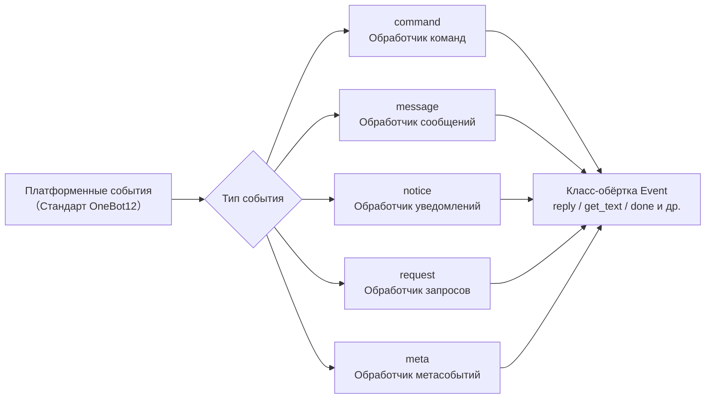

## Command Командный модуль

### Регистрация команды

```python
from ErisPulse.Core.Event import command

# Базовая команда
@command("hello", help="Отправить приветствие")
async def hello_handler(event):
    await event.reply("Привет!")

# Команда с псевдонимами
@command(["help", "h"], aliases=["帮助"], help="Отобразить справку")
async def help_handler(event):
    pass

# Команда с правами доступа
def is_admin(event):
    return event.get("user_id") in admin_ids

@command("admin", permission=is_admin, help="Команда администратора")
async def admin_handler(event):
    pass

# Скрытая команда
@command("secret", hidden=True, help="Секретная команда")
async def secret_handler(event):
    pass

# Группа команд
@command("admin.reload", group="admin", help="Перезагрузить модуль")
async def reload_handler(event):
    pass
```

### Информация о командах

Все API-запросы к информации о командах поддерживают необязательный **контекст сессии**: передача `event=` (Event или dict) или явное указание `platform=` / `bot_id=` / `session_id=` (явные параметры имеют приоритет над event), т.е. фильтрация команд по модулям с учетом области действия, недоступных в текущей сессии (см. advanced/scope.md); все параметры являются необязательными, при отсутствии параметров поведение остается прежним.

```python
# Получить справку по командам
help_text = command.help()

# Сессионно-осознанная справка: отображаются только доступные в текущей сессии команды
help_text = command.help(event=event)

# Получить конкретную команду (возвращается объединенная и перезаписанная активная конфигурация; возвращает None, если команда недоступна в сессии)
cmd_info = command.get_command("admin")
cmd_info = command.get_command("admin", event=event)

# Получить все команды (при сессионной фильтрации исключаются недоступные в сессии модули)
all_commands = command.get_commands()
all_commands = command.get_commands(event=event)

# Получить все команды из группы (поддерживает фильтрацию по сессии)
admin_commands = command.get_group_commands("admin")
admin_commands = command.get_group_commands("admin", event=event)

# Получить все видимые команды
visible_commands = command.get_visible_commands()

# Сессионно-осознанные видимые команды (достаточно передать event или явные ключевые параметры)
visible_commands = command.get_visible_commands(event=event)
visible_commands = command.get_visible_commands(
    platform=event.get("platform"),
    bot_id=event.get_self_account_id(),
    session_id=event.get_session_id(),
)
```

### Ожидание ответа

```python
# Ожидание ответа от пользователя
@command("ask", help="Запросить информацию у пользователя")
async def ask_command(event):
    reply = await command.wait_reply(
        event,
        prompt="Пожалуйста, введите ваше имя:",  # Уже отправлено выше
        timeout=30.0
    )
    
    if reply:
        name = reply.get_text()
        await event.reply(f"Привет, {name}!")

# Ожидание ответа с проверкой
def validate_age(event_data):
    try:
        age = int(event_data.get_text())
        return 0 <= age <= 150
    except ValueError:
        return False

@command("age", help="Запросить возраст пользователя")
async def age_command(event):
    await event.reply("Пожалуйста, введите ваш возраст:")
    
    reply = await command.wait_reply(
        event,
        timeout=60,
        validator=validate_age
    )
    
    if reply:
        age = int(reply.get_text())
        await event.reply(f"Ваш возраст {age} лет")

# Ожидание ответа с обратным вызовом
async def handle_confirmation(reply_event):
    text = reply_event.get_text().lower()
    if text in ["是", "yes", "y"]:
        await event.reply("Операция подтверждена!")
    else:
        await event.reply("Операция отменена.")

@command("confirm", help="Подтвердить операцию")
async def confirm_command(event):
    await command.wait_reply(
        event,
        prompt="Пожалуйста, введите '是' или '否':",
        callback=handle_confirmation
    )
```

## Message Модуль сообщений

### События сообщений

```python
from ErisPulse.Core.Event import message

# Регистрация на все сообщения
@message.on_message()
async def message_handler(event):
    sdk.logger.info(f"Получено сообщение: {event.get_text()}")

# Регистрация на личные сообщения
@message.on_private_message()
async def private_handler(event):
    user_id = event.get_user_id()
    sdk.logger.info(f"Личное сообщение от: {user_id}")

# Регистрация на сообщения в группах
@message.on_group_message()
async def group_handler(event):
    group_id = event.get_group_id()
    sdk.logger.info(f"Сообщение в группе от: {group_id}")

# Регистрация на сообщения с упоминанием
@message.on_at_message()
async def at_handler(event):
    mentions = event.get_mentions()
    sdk.logger.info(f"Упомянутые пользователи: {mentions}")
```

### Условная регистрация

```python
# Использование приоритета для контроля порядка выполнения
@message.on_message(priority=10)  # Чем больше значение, тем выше приоритет
async def high_priority_handler(event):
    pass

# Условная фильтрация внутри обработчика
@message.on_message()
async def filtered_handler(event):
    if "ключевое слово" not in event.get_text():
        return
    # Обработка сообщений, содержащих ключевое слово
    pass
```

## Уведомления

### События уведомлений

```python
from ErisPulse.Core.Event import notice

# Добавление в друзья
@notice.on_friend_add()
async def friend_add_handler(event):
    user_id = event.get_user_id()
    await event.reply("Добро пожаловать в друзья!")

# Удаление из друзей
@notice.on_friend_remove()
async def friend_remove_handler(event):
    user_id = event.get_user_id()
    sdk.logger.info(f"Удаление из друзей: {user_id}")

# Увеличение числа участников группы
@notice.on_group_increase()
async def member_increase_handler(event):
    user_id = event.get_user_id()
    await event.reply(f"Добро пожаловать, новый участник!")

# Уменьшение числа участников группы
@notice.on_group_decrease()
async def member_decrease_handler(event):
    user_id = event.get_user_id()
    sdk.logger.info(f"Участник покинул группу: {user_id}")
```

## Модуль запросов

### События запросов

```python
from ErisPulse.Core.Event import request

# Запрос от друга
@request.on_friend_request()
async def friend_request_handler(event):
    user_id = event.get_user_id()
    comment = event.get_comment()
    sdk.logger.info(f"Запрос в друзья: {user_id}, комментарий: {comment}")

# Запрос на вступление в группу
@request.on_group_request()
async def group_request_handler(event):
    group_id = event.get_group_id()
    user_id = event.get_user_id()
    sdk.logger.info(f"Запрос в группу: {group_id}, от: {user_id}")
```

## Модуль метасобытий Meta

### Метасобытия

```python
from ErisPulse.Core.Event import meta

# Событие подключения
@meta.on_connect()
async def connect_handler(event):
    platform = event.get_platform()
    sdk.logger.info(f"Подключение к платформе {platform} успешно")

# Событие отключения
@meta.on_disconnect()
async def disconnect_handler(event):
    platform = event.get_platform()
    sdk.logger.info(f"Отключение от платформы {platform}")

# Событие тиканья (heartbeat)
@meta.on_heartbeat()
async def heartbeat_handler(event):
    sdk.logger.debug("Получено тиканье")
```

### Запрос статуса бота

После того как адаптер отправляет метасобытие, фреймворк автоматически отслеживает статус бота. API-запросы и слушатели событий жизненного цикла описаны в разделе [API системы адаптеров - Управление статусом бота](adapter-system.md#bot-状态管理).

## Event 包 wrapping 类

Обработчик событий модуля Event принимает экземпляр обёртки Event, которая наследуется от dict и предоставляет удобные методы.

### Основные методы

```python
# Получение информации о событии
event_id = event.get_id()
event_time = event.get_time()
event_type = event.get_type()
detail_type = event.get_detail_type()
platform = event.get_platform()

# Получение информации о боте
self_platform = event.get_self_platform()
self_user_id = event.get_self_user_id()
self_info = event.get_self_info()
```

### Идентификатор сессии

```python
# Единый идентификатор цели: в группе возвращает group_id, в личных сообщениях — user_id и т.д.
target_id = event.get_target_id()

# Уникальный идентификатор сессии, формат: {platform}:{detail_type}:{target_id}
session_id = event.get_session_id()
# Пример: "telegram:private:12345", "qq:group:67890"
```

Метод `get_target_id()` возвращает первый непустой идентификатор в следующем порядке: `group_id` → `channel_id` → `guild_id` → `thread_id` → `user_id`. Подходит для сценариев, где требуется единый идентификатор сессии, например, для управления контекстом или хранения состояния.

### Методы сообщений

```python
# Получение содержимого сообщения
message_segments = event.get_message()
alt_message = event.get_alt_message()
text = event.get_text()

# Получение информации о отправителе
user_id = event.get_user_id()
nickname = event.get_user_nickname()
sender = event.get_sender()

# Получение информации о группе
group_id = event.get_group_id()

# Определение типа сообщения
is_msg = event.is_message()
is_private = event.is_private_message()
is_group = event.is_group_message()

# @-сообщения
is_at = event.is_at_message()
has_mention = event.has_mention()
mentions = event.get_mentions()
```

### Командная информация

```python
# Получение информации о команде
cmd_name = event.get_command_name()
cmd_args = event.get_command_args()
cmd_raw = event.get_command_raw()

# Определение, является ли событие командой
is_cmd = event.is_command()
```

### Функции ответа

```python
# Простой ответ
await event.reply("Это сообщение")

# Указание метода отправки
await event.reply("http://example.com/image.jpg", method="Image")

# Ответ с упоминанием пользователя и цитированием сообщения
await event.reply("Привет", at_users=["user1"], reply_to="msg_id")

# @-все участники
await event.reply("Анонс", at_all=True)

# Использование специфичных методов платформы (через параметр via)
await event.reply("Доска", method="Board",
                  via=[("Expire", 3600), ("ForMember", "114514")])

# Получение цепочки отправки, свободное добавление модификаторов и методов отправки (подходит для нескольких модификаторов / методов действий)
await event.send_chain().Expire(3600).Board("Доска")
await event.send_chain().DismissBoard()

# Ответ с использованием OneBot12 сообщений
from ErisPulse.Core.Event import MessageBuilder
msg = MessageBuilder().text("Hello").image("url").build()
await event.reply_ob12(msg)

# Ожидание ответа
reply = await event.wait_reply(timeout=30)
```

### Проверка возможностей платформы

```python
# Проверка, поддерживает ли текущая платформа метод отправки
if event.supports("Image"):
    await event.reply(url, method="Image")

# Получение списка доступных методов отправки
methods = event.available_methods()
# ["Text", "Image", "Voice", ...]
```

### Методы ответа

Метод `reply()` поддерживает указание метода отправки через параметр `method` и два удобных булевых параметра:

```python
# Простой текстовый ответ
await event.reply("Привет")

# Ответ с упоминанием отправителя
await event.reply("Привет", at_sender=True)

# Ответ с цитированием текущего сообщения
await event.reply("Принято", quote=True)

# Комбинированный ответ
await event.reply("Принято", at_sender=True, quote=True)

# Отправка изображения (с помощью параметра method)
if event.supports("Image"):
    await event.reply("http://example.com/img.jpg", method="Image")
else:
    await event.reply("[Изображение] http://example.com/img.jpg")
```

**Описание параметров**:

| Параметр | Тип | Описание |
|------|------|------|
| `content` | str | Содержимое отправки |
| `method` | str | Метод отправки, по умолчанию "Text", доступны "Image"/"Voice"/"Video"/"File" и др. |
| `at_sender` | bool | Упомянуть отправителя (автоматически извлекает user_id) |
| `quote` | bool | Цитировать текущее сообщение (автоматически извлекает message_id) |
| `at_users` | list[str] | Список упоминаемых пользователей |
| `reply_to` | str | Указать ID сообщения, на которое отвечать |
| `at_all` | bool | Упомянуть всех участников |

### Интерактивные методы

```python
# confirm — подтверждение диалога (возвращает True/False/None)
if await event.confirm("Вы уверены, что хотите выполнить это действие?"):
    await event.reply("Подтверждено")

# Использование не-текстовых методов для подтверждения
if await event.confirm("http://example.com/image.jpg", method="Image"):
    await event.reply("Подтверждение изображением")

# choose — выбор из меню (возвращает индекс или None)
choice = await event.choose("Выберите цвет:", ["красный", "зелёный", "синий"])

# options_format="auto" (по умолчанию) — автоматический выбор стиля в зависимости от method:
# Markdown → маркированный список (- 1. вариант), Html → нумерованный список (<ol>), иначе → простой текстовый список
# Методы текстового типа (Markdown/Html и др.) по умолчанию объединяют опции в конец
# merge_prompt=True — принудительное объединение для любого method; placeholder — пользовательский плейсхолдер
choice = await event.choose(
    "## Выберите\n{options}", ["A", "B"],
    method="Markdown", merge_prompt=True,
)

# collect — сбор данных формы (возвращает словарь {key: value} или None)
data = await event.collect([
    {"key": "name", "prompt": "Введите имя:"},
    {"key": "age", "prompt": "Введите возраст:",
     "validator": lambda e: e.get_text().isdigit()},
    {"key": "avatar", "prompt": "Отправьте аватар:", "method": "Image"},
])

# wait_for — ожидание события, удовлетворяющего условию
evt = await event.wait_for(event_type="notice", condition=lambda e: ..., timeout=120)

# conversation — контекст многошагового диалога
conv = event.conversation(timeout=60)
await conv.say("Добро пожаловать!")
```

> Подробное описание параметров интерактивных методов и дополнительные примеры см. в [Event обёртке](../developer-guide/modules/event-wrapper.md) и [Многошаговом диалоге](../advanced/conversation.md).

### Вспомогательные методы

```python
# Преобразование в словарь (фильтрует ключи, начинающиеся с _)
event_dict = event.to_dict()

# Получение исходных данных
raw = event.get_raw()
raw_type = event.get_raw_type()
```

### Управление цепочкой

Метод `event.done(claim=, stop=)` обеспечивает единое управление двумя независимыми семантиками: «признание» и «блокировка»:

- **Признание (claim)**: помечает событие как обработанное (`_processed`), благодаря чему диспетчер команд пропускает его повторную обработку
- **Блокировка (stop)**: предотвращает распространение события до низкоприоритетных обработчиков (`_propagation_stopped`)

```python
# Признание + блокировка (по умолчанию)
event.done()

# Только признание, без блокировки (низкоприоритетные наблюдатели всё ещё видят событие)
event.done(stop=False)

# Только блокировка, без признания (например, брандмауэр / ограничение частоты)
event.done(claim=False)

# mark_processed — основной метод, done — его псевдоним
event.mark_processed()             # эквивалент event.done()
event.mark_processed(stop=False)   # эквивалент event.done(stop=False)

# Проверка состояния
event.is_processed()  # признано ли событие
event.is_stopped()    # заблокировано ли распространение
```

### Платформенные расширения

Адаптеры могут регистрировать платформенно-специфичные методы для Event, доступные только на экземплярах соответствующей платформы.

#### Пользователь: использование платформенных методов

После регистрации платформенно-специфичных методов адаптером, вы можете напрямую вызывать их в обработчике событий. Методы каждой платформы отличаются, см. соответствующую [документацию платформы](../platform-guide/).

```python
from ErisPulse.Core.Event import message

@message.on_message()
async def handle_message(event):
    platform = event.get_platform()

    # Вызов специфичных методов в зависимости от платформы
    if platform == "email":
        subject = event.get_subject()           # специфичный для email
        attachments = event.get_attachments()   # специфичный для email
```

#### Проверка зарегистрированных методов платформы

```python
from ErisPulse.Core.Event import get_platform_event_methods

# Получение списка зарегистрированных методов для платформы
methods = get_platform_event_methods("email")
# ["get_subject", "get_from", "get_attachments", ...]

# Динамическая проверка и вызов метода
for method_name in get_platform_event_methods(event.get_platform()):
    method = getattr(event, method_name)
    print(f"{method_name}: {method()}")
```

#### Изоляция методов платформ

Методы, зарегистрированные для разных платформ, не пересекаются:

```python
# Email событие — только методы для email
event = Event({"platform": "email", "email_raw": {"subject": "Hello"}})
event.get_subject()      # ✅ "Hello"
event.get_chat_type()    # ❌ AttributeError

# Telegram событие — только методы для Telegram
event = Event({"platform": "telegram", "telegram_raw": {"chat": {"type": "private"}}})
event.get_chat_type()    # ✅ "private"
event.get_subject()      # ❌ AttributeError
```

#### Поддержка hasattr / dir

```python
hasattr(event, "get_subject")   # True только при platform="email"
"get_subject" in dir(event)     # То же самое
```

### Адаптер: регистрация платформенных методов

Адаптер может зарегистрировать платформенно-специфичные методы для Event с помощью декоратора, первый параметр метода — self (экземпляр Event), можно свободно обращаться к данным события.

#### Регистрация отдельного метода

```python
from ErisPulse.Core.Event import register_event_method

@register_event_method("email")
def get_subject(self):
    """Получить тему письма"""
    return self.get("email_raw", {}).get("subject", "")

@register_event_method("email")
def get_from(self):
    """Получить отправителя"""
    return self.get("email_raw", {}).get("from", {})
```

#### Массовая регистрация (через Mixin класс)

Для большого количества методов рекомендуется использовать Mixin класс:

```python
from ErisPulse.Core.Event import register_event_mixin

class EmailEventMixin:
    def get_subject(self):
        return self.get("email_raw", {}).get("subject", "")

    def get_from(self):
        return self.get("email_raw", {}).get("from", {})

    def get_attachments(self):
        return self.get("email_raw", {}).get("attachments", [])

# Регистрация всех методов сразу
register_event_mixin("email", EmailEventMixin)
```

#### Правила возвращаемых значений

| Сценарий | Возвращаемое значение | Способ использования пользователем |
|------|--------|------------|
| Возврат данных (текст, словарь и т.д.) | Непосредственно значение | `subject = event.get_subject()` |
| Выполнение операции (отправка сообщения и т.д.) | Возвращает `asyncio.Task` | `task = event.do_something()` (необязательно await) |

> **Рекомендация**: методы, возвращающие не данные, должны возвращать `asyncio.Task`, чтобы пользователь мог сам решить, нужно ли `await`, даже если не `await`, операция будет выполнена.

```python
@register_event_method("email")
def forward_email(self, to_address: str):
    """Пересылка письма — возвращает Task, пользователь может сам решить, нужно ли await"""
    import asyncio
    return asyncio.create_task(
        self._do_forward(to_address)
    )

# Пользователь может await и дождаться результата
await event.forward_email("user@example.com")

# Или не await, операция будет выполнена в фоне
event.forward_email("user@example.com")
```

#### Удаление методов

```python
from ErisPulse.Core.Event import unregister_event_method, unregister_platform_event_methods

# Удаление отдельного метода
unregister_event_method("email", "get_subject")

# Удаление всех методов платформы (вызывается при завершении адаптера)
unregister_platform_event_methods("email")
```

#### Переопределение встроенных методов

`register_event_mixin` / `register_event_method` поддерживают переопределение встроенных методов Event (например, `confirm`, `choose`, `collect`, `wait_reply`, `reply` и др.). Регистрируемые платформенные методы через `Event.__getattribute__` имеют приоритет над встроенными, поэтому адаптер может предоставлять платформенно-специфичные реализации интерактивных функций.

Встроенные реализации экспортируются как `_builtin_*` функции, переопределяющие методы могут вызывать их в качестве резервной реализации:

```python
from ErisPulse.Core.Event import register_event_mixin, _builtin_choose

class YunhuEventMixin:
    async def choose(self, prompt, options, timeout=60, method="Text"):
        # Платформа Yunhu использует компоненты кнопок
        buttons = [[{"text": opt} for opt in options]]
        await self.reply(prompt)
        # ...ожидание обратного вызова кнопки или текстового ответа...
        # Возврат к встроенной логике
        return await _builtin_choose(self, None, options, timeout, "Text")

register_event_mixin("yunhu", YunhuEventMixin)
```

## Расширение для кроссплатформенности (подстановочные знаки)

`register_event_method` и `register_event_mixin` поддерживают передачу `"*"` в качестве имени платформы, что делает зарегистрированные методы доступными на **всех платформах** в экземплярах Event. Подходит для модулей функций, таких как диалог с ИИ и управление контекстом, которые требуют повторного использования на разных платформах.

### Регистрация метода для кроссплатформенности

```python
from ErisPulse.Core.Event.wrapper import register_event_method

@register_event_method("*")
async def ai_chat(self, prompt: str):
    """self - это экземпляр Event, можно свободно обращаться к данным события и встроенным методам"""
    await self.reply(f"AI: {prompt}")
```

После регистрации метод доступен для всех обработчиков событий на всех платформах:

```python
from ErisPulse.Core.Event import message

@message.on_message()
async def handler(event):
    await event.ai_chat(event.get_text())
```

### Приоритет анализа методов

При доступе к методам Event через атрибуты порядок анализа следующий:

1. **Методы, специфичные для платформы** (переопределения для текущей платформы)
2. **Методы с подстановочным знаком** (методы, зарегистрированные с `"*"` для кроссплатформенности)
3. **Встроенные методы** (`reply`, `confirm` и др.)
4. **Доступ по ключу словаря**

> Таким образом, методы с подстановочным знаком могут переопределять встроенные методы (например, `reply`), но могут быть переопределены методами с тем же именем, специфичными для платформы.

## Система приоритетов

Обработчики событий поддерживают приоритет, чем больше значение, тем выше приоритет:

```python
# Обработчик с высоким приоритетом выполняется первым
@message.on_message(priority=10)
async def high_priority_handler(event):
    pass

# Обработчик с низким приоритетом выполняется позже
@message.on_message(priority=0)
async def low_priority_handler(event):
    pass
```


====
高级主题
====


### Conversation 多轮对话

# Conversation Многошаговый диалог

Класс `Conversation` предоставляет удобные методы для многошагового взаимодействия в рамках одного сеанса, что подходит для реализации навигационных операций, сбора информации, диалоговых вопросов и ответов и т.д.

## Создание диалога

Создание с помощью метода `conversation()` объекта `Event`:

```python
from ErisPulse.Core.Event import command

@command("quiz")
async def quiz_handler(event):
    conv = event.conversation(timeout=30)

    await conv.say("🎮 Добро пожаловать в викторину!")

    answer = await conv.choose("Первый вопрос: Кто создатель Python?", [
        "Guido van Rossum",
        "James Gosling",
        "Dennis Ritchie",
    ])

    if answer is None:
        await conv.say("Время вышло, попробуйте в другой раз!")
        return

    if answer == 0:
        await conv.say("Правильно!")
    else:
        await conv.say("Неверно, правильный ответ — Guido van Rossum")

    conv.stop()
```

## Основные API

### say(content, **kwargs)

Отправка сообщения, возвращает `self` для цепочечного вызова:

```python
await conv.say("Первая строка").say("Вторая строка").say("Третья строка")
```

Также можно указать метод отправки:

```python
await conv.say("https://example.com/image.jpg", method="Image")
```

### wait(prompt=None, timeout=None)

Ожидание ответа пользователя, возвращает объект `Event` или `None` (при таймауте):

```python
# Простое ожидание
resp = await conv.wait()
if resp:
    text = resp.get_text()

# Ожидание с отправкой подсказки
resp = await conv.wait(prompt="Пожалуйста, введите ваше имя:")

# Использование пользовательского таймаута (переопределяет таймаут диалога)
resp = await conv.wait(prompt="Пожалуйста, ответьте в течение 10 секунд:", timeout=10)
```

### confirm(prompt=None, **kwargs)

Ожидание подтверждения пользователя (да/нет), возвращает `True` / `False` / `None` (при таймауте):

```python
result = await conv.confirm("Вы уверены, что хотите удалить все данные?")
if result is True:
    await conv.say("Удалено")
elif result is False:
    await conv.say("Отменено")
else:
    await conv.say("Таймаут, ответ не получен")
```

Встроенные слова для подтверждения: `да/yes/y/confirm/confirm/ok/true/правильно/да/хорошо/конечно/можно/согласен/нет проблем/в порядке...`

Встроенные слова для отрицания: `нет/no/n/cancel/отменить/не надо/нельзя/отказаться/не правильно/откажись/отказ...`

### choose(prompt, options, **kwargs)

Ожидание выбора пользователя из списка опций, возвращает индекс (начиная с 0) или `None`:

```python
choice = await conv.choose("Пожалуйста, выберите цвет:", ["красный", "зеленый", "синий"])
if choice is not None:
    colors = ["красный", "зеленый", "синий"]
    await conv.say(f"Вы выбрали {colors[choice]}")
```

Пользователь может выбрать, введя номер (`1`/`2`/`3`) или текст опции (`красный`).

`options_format="auto"` (по умолчанию) автоматически выбирает стиль в зависимости от метода: Markdown→ненумерованный список, Html→нумерованный список, иначе→простой текстовый список.
Также поддерживаются `"list"`、`"inline"`、`"md"`、`"html"` или пользовательская функция.

Поддержка `merge_prompt=True` для объединения в одно сообщение, а также поддержка плейсхолдера для позиционирования списка опций (по умолчанию `{options}`, можно изменить с помощью `placeholder`):

```python
choice = await conv.choose(
    "## Пожалуйста, выберите\n{options}",
    ["Вариант A", "Вариант B"],
    method="Markdown",
    merge_prompt=True,
)

# Пользовательский плейсхолдер
choice = await conv.choose(
    "Выберите: [choices]",
    ["Вариант A", "Вариант B"],
    placeholder="[choices]",
)
```

### collect(fields, **kwargs)

Сбор информации в несколько шагов, возвращает словарь данных или `None`:

```python
data = await conv.collect([
    {"key": "name", "prompt": "Пожалуйста, введите имя"},
    {"key": "age", "prompt": "Пожалуйста, введите возраст",
     "validator": lambda e: e.get("alt_message", "").strip().isdigit(),
     "retry_prompt": "Возраст должен быть числом, пожалуйста, повторите ввод"},
    {"key": "city", "prompt": "Пожалуйста, введите город"},
])

if data:
    await conv.say(f"Регистрация успешна!\nИмя: {data['name']}\nВозраст: {data['age']}\nГород: {data['city']}")
else:
    await conv.say("Процесс регистрации прерван")
```

Конфигурация полей:

| Параметр | Описание | Значение по умолчанию |
|----------|----------|------------------------|
| `key` | Ключ поля (обязательно) | - |
| `prompt` | Подсказка | `"Пожалуйста, введите {key}"` |
| `validator` | Функция валидации, принимает Event, возвращает bool | Нет |
| `retry_prompt` | Подсказка при ошибке валидации | `"Ввод неверен, пожалуйста, повторите ввод"` |
| `max_retries` | Максимальное количество попыток | 3 |
| `condition` | Функция условия, принимает словарь уже собранных данных, возвращает bool | Нет |

**Условные поля**: Использование `condition` позволяет реализовать динамическую форму, поле собирается только при выполнении условия:

```python
data = await conv.collect([
    {"key": "has_car", "prompt": "У вас есть машина? (да/нет)"},
    {"key": "car_brand", "prompt": "Пожалуйста, введите марку автомобиля",
     "condition": lambda d: d.get("has_car", "").lower() in ("да", "yes", "y")},
])
```

### stop()

Ручное завершение диалога, устанавливает `is_active` в `False`:

```python
conv.stop()
```

### is_active

Является ли диалог активным:

```python
if conv.is_active:
    await conv.say("Диалог продолжается")
```

## Управление активным состоянием

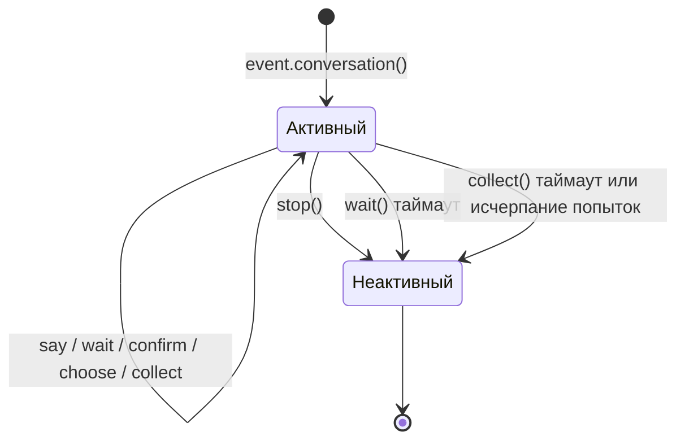

Диалог автоматически становится неактивным в следующих случаях:

1. Вызов метода `stop()`
2. `wait()` возвращает `None` по таймауту
3. `collect()` возвращает `None` из-за таймаута или исчерпания попыток

После перехода в неактивное состояние все методы взаимодействия (`wait`/`confirm`/`choose`/`collect`) немедленно возвращают `None`, не ожидая ответа пользователя.

## Ветвление и переходы

### @conv.branch(name) декоратор

Использование `branch()` для регистрации ветви диалога, переход между ветвями с помощью `goto()`:

```python
@command("menu")
async def menu_handler(event):
    conv = event.conversation(timeout=60)

    @conv.branch("main")
    async def main_menu():
        await conv.say("=== Главное меню ===\n1. Личная информация\n2. Настройки\n3. Выход")
        resp = await conv.wait()
        if resp is None:
            return
        text = resp.get_text().strip()
        if text == "1":
            await conv.goto("profile")
        elif text == "2":
            await conv.goto("settings")
        elif text == "3":
            await conv.say("До свидания!")
            conv.stop()

    @conv.branch("profile")
    async def profile():
        await conv.say("=== Личная информация ===\nИмя: Alice\n0. Вернуться")
        resp = await conv.wait()
        if resp and resp.get_text().strip() == "0":
            await conv.goto("main")

    @conv.branch("settings")
    async def settings():
        await conv.say("=== Настройки ===\n1. Переключатель уведомлений\n0. Вернуться")
        resp = await conv.wait()
        if resp and resp.get_text().strip() == "0":
            await conv.goto("main")

    await conv.start()  # Начинаем с первой зарегистрированной ветви
```

### conv.start(name=None)

Запуск диалога, по умолчанию с первой зарегистрированной ветви:

```python
await conv.start()          # Начинаем с первой ветви
await conv.start("settings") # Начинаем с указанной ветви
```

## Контекст и сохранение

### conv.context

Внутренний словарь `context` каждого экземпляра диалога используется для обмена состоянием между ветвями:

```python
@conv.branch("step1")
async def step1():
    conv.context["username"] = resp.get_text().strip()
    await conv.goto("step2")

@conv.branch("step2")
async def step2():
    name = conv.context.get("username", "неизвестный")
    await conv.say(f"Привет, {name}!")
```

### save() / resume() / clear_saved()

Диалог поддерживает сохранение, что позволяет возобновить его после таймаута или прерывания:

```python
# Сохранение состояния диалога (обычно не нужно вызывать вручную, см. "Автоматические контрольные точки")
await conv.save()

# ... позже в том же сеансе ...
conv2 = event.conversation()
if await conv2.resume():
    await conv2.say("Добро пожаловать обратно! Продолжим предыдущий диалог")
else:
    await conv2.say("Нет сохраненного диалога")

# Очистка сохраненного диалога
await conv.clear_saved()
```

Ключ сохранения содержит измерение `target` (`conversation:{platform}:{user_id}:{target_id}`), диалоги одного пользователя в разных сессиях не перезаписываются друг друга; старые архивы без `target` автоматически мигрируются при `resume()`.

## Автоматические контрольные точки и восстановление после перезапуска

### Автоматическое сохранение

Контрольные точки автоматически обновляются в следующих случаях, обычно не нужно вызывать `save()` вручную:

| Случай | Действие |
|--------|----------|
| `goto()` / `start()` переход между ветвями | Автоматически сохранить (текущая ветвь + context) |
| `stop()` / `wait()` таймаут / `collect()` сбой | Автоматически очистить (конечное состояние диалога) |

### TTL контрольных точек

Архивы снабжены временной меткой, архивы, просрочившие `ErisPulse.interaction.checkpoint_ttl` (по умолчанию 24 часа), автоматически удаляются при восстановлении:

```toml
[ErisPulse.interaction]
checkpoint_ttl = 86400  # секунды
```

### Автоматическое восстановление после перезапуска

После перезапуска фреймворка активные диалоги (в ожидании корутины в памяти) теряются, но контрольные точки остаются. Регистрация **фабрики восстановления** с помощью `register_resume_handler` позволяет фреймворку автоматически возобновлять диалог при получении первого сообщения от пользователя:

```python
from ErisPulse.Core.Event.wrapper import Conversation

@Conversation.register_resume_handler()  # Можно указать platform="onebot11" для ограничения платформой
def make_conversation(event) -> Conversation:
    # Фабрика: восстановление диалога и повторная регистрация всех ветвей
    conv = event.conversation(timeout=60)

    @conv.branch("menu")
    async def menu(conv, event):
        ...

    return conv
```

После регистрации, при перезапуске и получении первого сообщения от пользователя, находящегося в ветви `menu`, фреймворк автоматически: восстановит context → примет это сообщение → продолжит диалог из сохраненной ветви. Без регистрации фабрики механизм не влияет на производительность.

### Восстановление — это принятие управления

При успешном `resume()` фреймворк автоматически выполняет две вещи:

1. **Принятие управления сессией**: автоматически захватывает арендный токен сессии — другие модули могут использовать `sdk.interaction.get_owner_of(event)` для определения "этот пользователь занят диалогом"; если сессия уже занята другим модулем, восстановление отменяется (возвращается False), предотвращая конфликт диалогов
2. **Восстановление истории**: из почтового ящика сессии извлекает последние 10 сообщений в `conv.recent_history` (для модулей ИИ восстановление контекста LLM не прерывается); `resume(with_history=0)` отключает это

```python
if await conv.resume(with_history=20):
    for m in conv.recent_history:
        print(m["role"], ":", m["text"])
```

### Ручное восстановление (без автоматического механизма)

```python
@command("continue")
async def continue_handler(event):
    conv = event.conversation()
    # ... регистрация ветвей ...
    if await conv.resume():
        conv.goto(conv.get_current_branch())
```

## Типичные сценарии диалога

### Навигационная регистрация

```python
@command("register")
async def register_handler(event):
    conv = event.conversation(timeout=60)

    await conv.say("Добро пожаловать на регистрацию!")

    data = await conv.collect([
        {"key": "username", "prompt": "Пожалуйста, введите имя пользователя (от 3 до 20 символов)",
         "validator": lambda e: 3 <= len(e.get_text().strip()) <= 20},
        {"key": "email", "prompt": "Пожалуйста, введите адрес электронной почты",
         "validator": lambda e: "@" in e.get_text() and "." in e.get_text(),
         "retry_prompt": "Неверный формат электронной почты, повторите ввод"},
    ])

    if not data:
        await event.reply("Регистрация отменена")
        return

    confirmed = await conv.confirm(
        f"Подтвердите регистрационную информацию?\nИмя пользователя: {data['username']}\nЭлектронная почта: {data['email']}"
    )

    if confirmed:
        await conv.say("✅ Регистрация успешна!")
    else:
        await conv.say("❌ Регистрация отменена")
```

### Циклический диалог

```python
@command("chat")
async def chat_handler(event):
    conv = event.conversation(timeout=120)
    await conv.say("Вход в диалоговый режим, введите «выход» для завершения")

    while conv.is_active:
        resp = await conv.wait()
        if resp is None:
            await conv.say("Таймаут, диалог завершен")
            break

        text = resp.get_text().strip()

        if text == "выход":
            await conv.say("До свидания!")
            conv.stop()
        elif text == "помощь":
            await conv.say("Доступные команды: выход, помощь, статус")
        elif text == "статус":
            await conv.say("Диалог активен")
        else:
            await conv.say(f"Вы сказали: {text}")
```


### 交互会话系统

# Система интерактивных сессий

> [!NOTE]
> В этой главе требуется ErisPulse **2.8.0+**.

ErisPulse реализует "постоянное взаимодействие с пользователями" как инфраструктуру на уровне фреймворка: от одной `wait_reply` до периодических напоминаний, ожидания нескольких путей, взаимоисключения сессий, восстановления после перезапуска — всё это управляется единым **менеджером интерактивных сессий** (`Core/Event/interaction.py`, `sdk.interaction`).

{!--< tips >!--}
Каждая функция, описанная в этой статье, имеет **владельца (owner)**: ожидание взаимодействия, аренды, таймеры — все они регистрируются с указанием имени модуля. При отключении модуля или адаптера фреймворк автоматически очищает эти данные, и ожидание немедленно завершается, а не ждёт истечения тайм-аута — это расширение системы владения на интерактивный уровень (см. [Система владения](ownership.md)).
{!--< /tips >!--}

## Ожидание ответа: wait_reply

`wait_reply` — основа интерактивных сессий: приостановка текущей корутины и ожидание ответа от пользователя в следующем сообщении.

```python
from ErisPulse.Core.Event import command

@command("ask")
async def ask_command(event):
    reply = await event.wait_reply(prompt="Пожалуйста, введите ваше имя:", timeout=30)
    if reply is None:
        await event.reply("Тайм-аут")
        return
    await event.reply(f"Привет, {reply.get_text()}!")
```

### Полный список параметров

| Параметр | Описание | Значение по умолчанию |
|----------|----------|-----------------------|
| `prompt` | Сообщение-подсказка, отправляемое перед приостановкой | None |
| `timeout` | Время ожидания (секунды) | 60 |
| `pattern` | Фильтр по шаблону (glob: `*` / `?` / `[seq]`), если не совпадает — продолжать ожидание | None |
| `regex` | Фильтр по регулярному выражению (совмещается с pattern, оба должны совпадать), если не совпадает — продолжать ожидание | None |
| `validator` | Функция проверки (принимает Event, возвращает bool), если не проходит — продолжать ожидание | None |
| `callback` | Колбэк при получении ответа (альтернативный способ вместо возврата значения) | None |
| `method` | Метод отправки подсказки | "Text" |
| `session` | **Ожидание на уровне сессии**: любой ответ в той же сессии (чате/канале) может быть признан | False |

```python
# Принимать только числовые суммы, иначе продолжать ожидание
reply = await event.wait_reply("Введите сумму:", regex=r"\d+\s*元", timeout=30)

# Ожидание на уровне сессии: в чате могут ответить любые участники
reply = await event.wait_reply(session=True, prompt="Кто-нибудь может помочь ответить?")
```

### Когда ожидание может быть отменено

Ожидание больше не "только до тайм-аута" — следующие условия немедленно приводят к **отмене** (возврат `None` из `wait_reply`), а не к ожиданию до истечения тайм-аута:

| Причина | Причина отмены (InteractionCancelled.reason) | Описание |
|---------|---------------------------------------------|----------|
| Модуль-владелец отключен / отключен | `owner_unload` | Очистка владельца: если кто-то зарегистрировал ожидание, при исчезновении владельца оно автоматически удаляется |
| Адаптер остановлен / перезапущен | `platform_stop` | Все ожидания на платформе отменяются |
| В той же сессии зарегистрировано новое ожидание / аренда | `conflict` | См. "Арбитраж сессий" ниже |
| Ответивший пользователь заблокирован / модуль-владелец откреплён | `revoked` | Проверка прав: идентификация по scope + модулю |
| Ответ от пользователя получен | — | Нормальный путь, возвращается событие ответа |

Внутреннее исключение — `InteractionCancelled` (входит в систему исключений `InteractionError`), `wait_reply` уже преобразует его в возврат `None`; если вызывающий код нуждается в причине, он может использовать низкоуровневый API `sdk.interaction.register()`.

### Полная цепочка проверки при получении ответа

Когда сообщение от пользователя поступает, менеджер интерактивных сессий проверяет его в следующем порядке (выполняется **до** командной обработки, приоритет сохраняется — даже если сообщение уже обработано другим процессором, приостановленный диалог может быть завершён):

```
Соответствие ключу сессии (точный пользователь → возврат на уровень сессии)
  → Фильтрация по pattern / regex (если не совпадает — продолжать ожидание)
  → Проверка validator (если не проходит — продолжать ожидание)
  → Проверка прав (по scope и владельцу модуля, если не проходит — завершить ожидание)
  → Пробуждение ожидающего кода + признание события (mark_processed)
```

## Таймеры сессии: remind / escalate

Превращение "тайм-аута" из возвращаемого значения в управляемый примитив. Таймеры привязаны к интерактивной сессии, автоматически отменяются при отключении модуля или остановке адаптера, максимум 5 активных remind на сессию.

### remind: напоминание при отсутствии ответа

```python
@command("ticket")
async def ticket_command(event):
    await event.reply("Заявка отправлена, результат будет здесь")
    # Если ответа нет в течение 5 минут, мягко напомнить; любой ответ от пользователя автоматически отменит напоминание
    event.remind(300, "Есть ли новости? Скоро сообщим")
    reply = await event.wait_reply(timeout=3600)
    ...
```

- `event.remind(delay, text=None, *, callback=None)`: при истечении времени отправить `text` (или выполнить `callback(event)`, синхронный или асинхронный)
- Возвращает объект `Reminder`: `reminder.cancel()` для ручной отмены, `reminder.expired` для проверки состояния
- Автоматически отменяется при любом ответе пользователя из этой сессии — это и есть смысл "напоминания": напоминание появляется только при молчании пользователя
- Аналогично можно использовать в `Conversation`: `conv.remind(120, "Ещё думаете?")`

### escalate: обязательное уведомление по истечении времени

```python
event.escalate(1800, lambda e: notify_master(f"Заявка не обработана 30 минут: {event.get_command_args()}"))
```

Единственное отличие от `remind`: **не отменяется ответом пользователя** — уведомление (уведомление администратора, передача в ручную) — это обязательное действие при истечении времени, отменяется только вручную `cancel()` / при отключении модуля / остановке адаптера.

| | `remind` | `escalate` |
|---|---|---|
| Действие по истечению | Отправка текста / выполнение callback | Выполнение callback |
| Ответ пользователя | **Автоматически отменяется** | Не влияет |
| Очистка при отключении | Отменяется | Отменяется |
| Максимум на сессию | 5 | Не ограничен (очищается при отключении) |

## Многопоточное ожидание: expect + select

Одновременно приостанавливает несколько ожиданий, **первое поступившее сообщение** — первое обслуживается — типичный сценарий: ожидание одобрения администратором и одновременно ожидание отмены пользователя, голосование между участниками.

```python
which, reply = await event.select(
    event.expect(pattern="同意*", user="10001"),
    event.expect(pattern="拒绝*", user="10002"),
    event.expect(validator=lambda e: e.get_text() == "搁置", session=True),
    timeout=60,
)
if which is None:
    await event.reply("В течение 60 секунд не получено ни одного результата")
elif which == 0:
    await event.reply("Одобрено")
elif which == 1:
    await event.reply("Отклонено")
```

- `event.expect(...)` создает **описание ожидания** (не регистрирует ожидание): поддерживает `pattern` / `regex` / `validator` / `user` (ограничение пользователя) / `session` (ответ может быть от любого участника)
- `event.select(*expectations, timeout=60)`: регистрирует все ожидания → при первом совпадении возвращает `(индекс, событие ответа)` → несовпавшие ожидания автоматически отменяются; при истечении тайм-аута возвращается `(None, None)`
- Полученное событие уже признано фреймворком (mark_processed), не будет повторно обработано другими процессорами

{!--< tips >!--}
`select` по сравнению с ручным управлением `asyncio.wait`: автоматическая очистка несовпавших ожиданий, автоматическое признание события, автоматическая проверка прав и очистка владельца — не нужно самостоятельно управлять Future.
{!--< /tips >!--}

## Взаимоисключение сессий: acquire / hold / get_owner_of

Владение переходит от "ресурсов" к "сессиям" — "кто сейчас взаимодействует с пользователем" становится первостепенным.

```python
# Запрос: кто сейчас взаимодействует с этой сессией? (если свободно, возвращает None)
owner = sdk.interaction.get_owner_of(event)
if owner and owner != "MyModule":
    return  # Другой модуль уже взаимодействует, избегаем конфликта

# Взаимоисключение: однократная аренда сессии (стратегия deny, если занято возвращает None)
lease = sdk.interaction.acquire(event)          # По умолчанию TTL 1 час, можно передать ttl=
if lease is None:
    return  # Уже занято
try:
    ...  # Однократное взаимодействие
finally:
    lease.release()
```

Форма контекстного менеджера (при неудаче выбрасывает `SessionOccupiedError`):

```python
with sdk.interaction.hold(event) as lease:
    ...  # При выходе автоматически освобождается
```

Аренда поддерживает продление `renew(ttl)`; TTL лениво удаляет просроченные аренды — просроченные аренды автоматически удаляются при следующем обращении.

`Conversation.resume()` при восстановлении диалога автоматически приобретает аренду (см. [Многошаговые диалоги](conversation.md) "Восстановление = захват") — восстановленный диалог автоматически владеет сессией, другие модули не могут вмешаться.

## Почтовый ящик сессии: event.history

Общий журнал последних сообщений в сессии (от пользователя и бота), используется как контекст для ИИ, предотвращение дублирования, анализ поведения — **единая база данных** для модулей, не нужно сохранять историю отдельно.

```python
messages = await event.history(20)   # Последние 20 сообщений в сессии, по возрастанию времени
for m in messages:
    print(m["role"], ":", m["text"])  # role: "user" / "bot"
```

- Автоматическая запись: входящие сообщения (role=user) + исходящие сообщения бота (role=bot)
- Хранение: отдельная таблица SQLite, политика хранения = лимит на сессию (по умолчанию 50) + глобальный TTL (по умолчанию 7 дней)
- Настройка: `ErisPulse.transcript = {enabled = true, max_per_session = 50, ttl_hours = 168}`
- API менеджера: `sdk.transcript.append() / get() / clear()`

## Транзакции сообщений: message_tx

Все исходящие сообщения в транзакции автоматически записываются в журнал; **при исключении автоматически отменяются отправленные сообщения** (если адаптер не реализует `delete_message`, отмена пропускается, журнал сохраняется).

```python
async with event.message_tx():
    await event.reply("Обрабатываю, подождите")
    result = await do_something()          # Здесь выбрасывается исключение →
    await event.reply(f"Готово: {result}")   # Предыдущее "обработка" автоматически отменяется
```

Вне транзакции отправка не записывается (нулевая нагрузка); `get_send_receipts()` позволяет просмотреть отправленные в текущей транзакции сообщения.

## Трассировка цепочки: trace-id

Каждому входящему событию автоматически присваивается идентификатор трассировки (используется `event["id"], если отсутствует — генерируется), который проходит через:

- Контекст обработчика (`get_current_trace_id()` для чтения)
- Исходящие сообщения (`[Send]` лог-строки с `[trace:...]`, `message.sending/sent` хуки с `trace_id` полем)
- Данные жизненного цикла (dict автоматически дополняется `_trace_id`)
- Направленные события (`emit_to`) и транзакционные подтверждения

Одно сообщение, обработанное несколькими модулями, можно проследить по одному идентификатору (журнал / медленные запросы / аудит).

## Связь с другими системами

- **Владение**: ожидание / аренда / таймеры все регистрируются с указанием владельца, при отключении модуля — автоматическая очистка (см. [Система владения](ownership.md))
- **Область видимости (scope)**: проверка прав и владения при получении ответа; аудит вызовов между модулями (см. [Область видимости (scope)](scope.md))
- **Conversation**: многошаговые диалоги — это конечный автомат на уровне сессии (см. [Conversation](conversation.md)), ожидания также имеют отмену / проверку прав / владение


### 模块间通信

# Коммуникация между модулями

> [!NOTE]
> В этой главе требуется ErisPulse **2.8.0+**.

Модули ErisPulse взаимодействуют друг с другом по **трехуровневой модели коммуникации**, расположенной в порядке "точка-точка → направленный → широковещательный":

| Уровень | API | Семантика | Типичные сценарии |
|---|---|---|---|
| **RPC** | `await sdk.module.call("Chat", "get_history", ...)` | Точечно-точечный запрос-ответ с контрактом / аудитом / таймаутом | Вызов функционала другого модуля (получение истории, перевод, возврат средств) |
| **Направленные события** | `await sdk.module.emit_to("Chat", "message_received", {...})` | Уведомление, отправленное в конкретный модуль | Уведомление нижестоящих модулей об изменениях состояния верхестоящего ("получено новое сообщение") |
| **Широковещательные события** | `await lifecycle.emit("config.updated", {...})` | События жизненного цикла, видимые всему фреймворку | Горячее обновление конфигурации, подключение/отключение модулей |

{!--< tips >!--}
Правило выбора: **используйте `call`, если нужно получить результат; `emit_to`, если нужно уведомить только один модуль; `lifecycle`, если нужно уведомить всех**.
{!--< /tips >!--}

## RPC: module.call

```python
result = await sdk.module.call("Chat", "get_history", session_id, n=20)
```

Различия между `module.call()` и прямым доступом к атрибуту `sdk.module.Chat.get_history(...)` (неизменным):

| | `module.call()` | Прямой доступ к атрибуту |
|---|---|---|
| Целевой модуль не зарегистрирован / не активен | Выбрасывает `ModuleNotAvailableError` | Выбрасывает `AttributeError` |
| Ленивые модули | **Автоматически пробуждаются** (модули, управляемые событиями, проходят блокировку активации) | Асинхронная инициализация модуля выбрасывает RuntimeError |
| `current_owner` | Привязывается к **целевому модулю** (его внутренние wait_reply / отправка / логи корректно привязаны) | Сохраняется вызывающий модуль |
| Таймаут | По умолчанию 30 секунд (настраивается через `timeout=`; `None` означает неограниченное время) | Нет |
| Аудит по scope | Вызывается через брандмауэр `actions.<вызывающий модуль>.call` | Нет |
| Проверка контракта | Белый список `meta.services` | Нет |

Все исключения входят в иерархию `ErisPulseError`, их можно поймать через `from ErisPulse.Core import ModuleCallError`.

### Иерархия исключений

```
ModuleError                      # Базовый класс исключений модульной системы
└── ModuleCallError              # Базовый класс для вызовов между модулями (содержит атрибуты module / method)
    ├── ModuleNotAvailableError  # Целевой модуль не зарегистрирован / не активен / не удалось пробудить
    ├── ServiceNotProvidedError  # Метод не входит в белый список `services` / приватный метод / не существует
    └── ModuleCallTimeoutError   # Таймаут асинхронного метода
```

## Контракт сервисов: meta.services

Поставщик сервиса объявляет белый список предоставляемых методов в `get_meta()` (симметрично `commands`):

```python
from ErisPulse.Core.Bases import BaseModule, ModuleMeta

class ChatModule(BaseModule):
    @staticmethod
    def get_meta() -> ModuleMeta:
        return ModuleMeta(
            name="Чат",
            services=[
                "get_history",                                       # Простая форма
                {"name": "translate", "description": "Перевести текст на указанный язык"},  # С описанием
            ],
        )

    async def get_history(self, session_id, n=20): ...
    async def translate(self, text, target_lang): ...
    def _internal_helper(self): ...   # Методы с подчеркиванием всегда запрещены для внешнего вызова
```

**Разработчику неважно, что по умолчанию**:

- Если `services` не объявлен → все **публичные** методы по умолчанию доступны для вызова `module.call()` (так же, как и прямой доступ к атрибуту),
  без каких-либо объявлений
- После объявления → доступ сужается до белого списка, вызов за пределами списка выбрасывает `ServiceNotProvidedError` — используется для обозначения "эти методы — те, что публично доступны"
- Основной контроль за ограничениями находится у пользователя: `scope.actions` определяет "кто может вызывать кого" (см. аудит ниже),
  `services` модуля автора — лишь объявление публичного интерфейса, два уровня не заменяют друг друга

**Описание сервисов**: добавьте человекопонятное / машинопонятное описание каждому сервису — если не нужно, просто ничего не пишите,
описание автоматически берется из **первой строки docstring** (фреймворк уже требует стиля docstring):

```python
async def translate(self, text, target_lang):
    """Перевести текст на указанный язык"""    # ← Эта строка автоматически становится описанием сервиса
    ...
```

Для тонкой настройки (переопределение docstring / многоязычность) используйте формат dict для описания `description` (поддержка i18n-словарей):

```python
services=[
    {"name": "translate", "description": "Перевести текст на указанный язык"},
    {"name": "summarize", "description": {"i18n": "Chat.meta.svc.summarize", "default": "Суммаризировать диалог"}},
]
```

## Служебный каталог: services()

```python
sdk.module.services()
# {'Chat': [{'name': 'get_history', 'signature': '(session_id, n=20)',
#            'description': 'Перевести текст на указанный язык'}]}

sdk.module.services("Chat")   # Только для запроса указанного модуля
```

- В каталоге перечислены **явно объявленные** `meta.services` модули (модули без объявления `services` не попадают в каталог)
- Каждый сервис снабжен строкой сигнатуры метода (извлекается через `inspect.signature`) и описанием
- Также включены в топологию: `sdk.module.get_topology()` содержит поле `services` для каждого модуля

{!--< tips >!--}
**Путь к MCP**: Служебный каталог (имя + сигнатура + описание) — это форма инструмента MCP —
каждый сервис естественным образом имеет вид ``{"name", "description", "parameters"}``.
В будущем фреймворк может напрямую экспортировать ``services()`` в качестве конечной точки MCP-сервера, позволяя ИИ обнаруживать и вызывать возможности модулей;
``scope.actions.call`` аудит естественным образом становится безопасным брандмауэром для вызовов ИИ.
{!--< /tips >!--}

## Аудит исходящих вызовов: кто может вызывать кого

Каждый вызов `module.call()` проходит через брандмауэр исходящих вызовов **вызывающего модуля**:

```toml
[ErisPulse.scope.actions.CallerModule.call]
deny = ["Chat.get_history"]        # Запретить CallerModule вызывать get_history модуля Chat
# allow = ["Chat.get_*"]           # Или белый список: разрешить только вызовы get-сервисов модуля Chat
```

- Формат `name` — `<目标模块>.<方法名>`, поддерживает точные совпадения / шаблоны / `re:` регулярные выражения
- Вызовы из фреймворка (без контекста owner, например, запуск скриптов) не подвергаются аудиту
- Отказ в вызове выбрасывает `ModuleCallError` (в логах TRACE `core.module.call_denied`)

Способы конфигурирования подробно описаны в [Scope](docs/ru/scope.md) на разделе исходящих вызовов.

## Направленные события: emit_to

```python
# Отправитель: после проверки активности цели, событие попадает в пространство имен module.<имя>.<событие>
await sdk.module.emit_to("Chat", "message_received", {"text": "hi", "from": "u1"})

# Подписчик (внутри модуля Chat): регистрирует хуки по пространствам имен
from ErisPulse.Core.lifecycle import lifecycle

@lifecycle.on("module.Chat.message_received")
async def on_message_received(data): ...

@lifecycle.on("module.Chat")          # Или получать все направленные события этого модуля
async def on_any(data): ...
```

Детали семантики:

- Целевой модуль не зарегистрирован / не активен → `ModuleNotAvailableError` (события не отправляются в несуществующие места)
- Целевой модуль — ленивый → **сначала пробуждается, затем событие отправляется** (направленные события — источник активации, семантика совпадает с `activate_on`)
- Если `data` — словарь, автоматически добавляется `_trace_id` (не перезаписывает уже существующие значения), интегрируется с трассировкой цепочки

## Ленивая загрузка и вызовы

`module.call()` и `emit_to()` прозрачно пробуждают ленивые модули:

- Модули, управляемые событиями (`activate_on`) → проходят блокировку активации `_activate()`, после активации триггеры stub автоматически удаляются
- Обычные ленивые модули → синхронная инициализация или обычный путь загрузки (идемпотентность)
- Неудача пробуждения → `ModuleNotAvailableError` (для `call`) / ошибка активации (для `emit_to`)

То есть: **вызывающий модуль не должен заботиться о том, загружен ли целевой модуль**, и не должен ждать, пока он будет активирован.

## Восстановление при холодном запуске

Новый / перезапущенный модуль пропустил часть чата — `get_load_strategy(replay=...)` позволяет фреймворку после готовности модуля
отправить ему **воспроизведение последних сообщений из ящика диалога**:

```python
from ErisPulse.loaders import ModuleLoadStrategy

class MyAIModule(BaseModule):
    @staticmethod
    def get_load_strategy():
        return ModuleLoadStrategy(
            lazy_load=False,
            priority=100,
            replay="5m",        # Воспроизвести последние 5 минут (можно также "1h" / "300" секунд)
        )

    async def on_load(self, event):
        @message.on_message()
        async def handle(e):
            if e.get("replayed"):
                # Синтезированное событие: только восстановление контекста, без побочных эффектов, таких как отправка
                ...
```

Детали семантики:

- Источник данных — [ящик диалога](docs/ru/interaction.md#ящик-диалога-eventhistory) (`sdk.transcript.recent()`),
  модуль загружается и воспроизведение выполняется в фоне, не блокируя запуск
- Синтезированные события снабжаются флагом `replayed: True`, полным `platform / detail_type / user_id / alt_message`,
  **рассылаются только обработчикам этого модуля** — другие модули не затрагиваются восстановлением
- При отсутствии ящика диалога / отсутствии записей / неправильном формате `replay` (предупреждение `replay_invalid`) восстановление пропускается

## Идемпотентность и дедупликация событий

При повторном подключении websocket-платформы часто повторно отправляются одни и те же события (с одинаковым `event["id"]`) — на уровне диспетчеризации используется LRU-дедупликация (емкость 4096), одинаковые события отправляются только один раз.

```toml
[ErisPulse.framework]
event_dedupe = true   # По умолчанию включено; для тестирования можно отключить с фиксированным id
```

Кэш дедупликации автоматически сбрасывается при регистрации адаптера (начало жизненного цикла нового подключения).


### MessageBuilder 详解

# MessageBuilder — подробное руководство

`MessageBuilder` — это инструмент для построения сообщений стандарта OneBot12, предоставляемый ErisPulse. Он предназначен для построения структурированного содержимого сообщений и используется в сочетании с `Send.Raw_ob12()`.

## Способы импорта

`MessageBuilder` поддерживает два способа импорта (результат одинаковый, рекомендуется использовать первый):

```python
from ErisPulse.Core.Event import MessageBuilder        # Рекомендуется, через пакет
from ErisPulse.Core.Event.message_builder import MessageBuilder  # Прямой импорт модуля
```

## Двухрежимная система

MessageBuilder предоставляет два режима использования, реализованных с помощью механизма описателей Python (`__get__`), обеспечивающих различное поведение на уровне класса и экземпляра: при вызове метода через класс `__get__` возвращает результат выполнения статического метода; при вызове через экземпляр возвращает `self`, что поддерживает цепочечный вызов.

### Режим цепочечного вызова (экземпляр)

Используется путем создания экземпляра `MessageBuilder()`. Каждый метод возвращает `self`, что поддерживает цепочечный вызов, и в конце `.build()` используется для получения списка сообщений:

```python
from ErisPulse.Core.Event.message_builder import MessageBuilder

segments = (
    MessageBuilder()
    .text("Привет!")
    .image("https://example.com/photo.jpg")
    .build()
)
# [
#     {"type": "text", "data": {"text": "Привет!"}},
#     {"type": "image", "data": {"file": "https://example.com/photo.jpg"}}
# ]
```

### Режим быстрого построения (статический)

Методы вызываются напрямую через класс, каждый метод возвращает список сообщений напрямую, что подходит для одиночных сообщений:

```python
# Возвращает list[dict] напрямую, без необходимости использовать .build()
segments = MessageBuilder.text("Привет!")
# [{"type": "text", "data": {"text": "Привет!"}}]
```

## Типы сегментов сообщений

| Метод | Тип | Параметры данных | Описание |
|------|------|---------|------|
| `text(text)` | text | `text` | Текстовое сообщение |
| `image(file)` | image | `file` | Сообщение с изображением |
| `audio(file)` | audio | `file` | Аудиосообщение |
| `video(file)` | video | `file` | Видеосообщение |
| `file(file, filename?)` | file | `file`, `filename` | Сообщение с файлом |
| `mention(user_id, user_name?)` | mention | `user_id`, `user_name` | Упоминание пользователя |
| `at(user_id, user_name?)` | mention | `user_id`, `user_name` | Синоним `mention` |
| `reply(message_id)` | reply | `message_id` | Ответ на сообщение |
| `at_all()` | mention_all | - | Упоминание всех участников |
| `custom(type, data)` | пользовательский | пользовательский | Пользовательский сегмент сообщения |

## Использование с Send

Построенный список сообщений отправляется с помощью `Send.Raw_ob12()`:

```python
from ErisPulse import sdk
from ErisPulse.Core.Event.message_builder import MessageBuilder

# Построение и отправка сообщения с использованием цепочки вызовов
segments = (
    MessageBuilder()
    .mention("user123", "张三")
    .text(" Пожалуйста, посмотрите на это изображение")
    .image("https://example.com/photo.jpg")
    .build()
)
await sdk.adapter.myplatform.Send.To("group", "group456").Raw_ob12(segments)
```

### Использование с Event для ответа

```python
from ErisPulse.Core.Event import command

@command("report")
async def report_handler(event):
    await event.reply_ob12(
        MessageBuilder()
        .text("📊 Сводка ежедневного отчёта\n")
        .text("Задачи, выполненные сегодня: 5\n")
        .text("Задачи, находящиеся в процессе: 3")
        .build()
    )
```

## Утилитные методы

### copy()

Копирует текущий билдер, используется для создания нескольких вариантов сообщений на основе одного и того же базового содержания:

```python
base = MessageBuilder().text("Базовое содержание").mention("admin")

# Создание разных сообщений на основе одного и того же префикса
msg1 = base.copy().text(" Вариант A").build()
msg2 = base.copy().text(" Вариант B").image("img.jpg").build()
```

### clear()

Очищает добавленные части сообщения, позволяет повторно использовать один и тот же билдер:

```python
builder = MessageBuilder()

for user_id in ["user1", "user2", "user3"]:
    builder.clear()
    msg = builder.mention(user_id).text(" Привет!").build()
    await adapter.Send.To("user", user_id).Raw_ob12(msg)
```

### len() / bool()

```python
builder = MessageBuilder()
print(bool(builder))   # False

builder.text("Hello")
print(len(builder))    # 1
print(bool(builder))   # True
```

## Пользовательские сообщения

Используйте метод `custom()`, чтобы добавить расширенный сегмент сообщения для конкретной платформы:

```python
# Добавление сегмента сообщения, специфичного для платформы
segments = (
    MessageBuilder()
    .text("Пожалуйста, заполните форму:")
    .custom("yunhu_form", {"form_id": "12345"})
    .build()
)
```

> Пользовательские сегменты сообщений действительны только в адаптерах соответствующих платформ, другие адаптеры игнорируют неизвестные сегменты сообщений.

## Полный пример

### Многоэлементное сообщение

```python
segments = (
    MessageBuilder()
    .reply(event.get_id())                    # Ответить на оригинальное сообщение
    .mention(event.get_user_id())             # Упомянуть отправителя
    .text(" Это результат вашего запроса:\n") # Текст
    .image("https://example.com/chart.png")   # Изображение
    .text("\nПодробные данные см. во вложении:")
    .file("https://example.com/data.csv", filename="data.csv")
    .build()
)
await event.reply_ob12(segments)
```

### Статический фабричный метод + цепочечная смесь

```python
# Быстрое создание односегментного сообщения
simple_msg = MessageBuilder.text("Простой текст")

# Цепочечное создание сложного сообщения
complex_msg = (
    MessageBuilder()
    .at_all()
    .text(" 📢 Объявление:")
    .text("Сегодня в 15:00 собрание")
    .build()
)
```


### HTTP 客户端

# Сетевой клиент

ErisPulse предоставляет единый сетевой клиент, объединяющий HTTP-запросы, WebSocket-соединения и управление пулы соединений. Модули и адаптеры **должны использовать** этот клиент, а не импортировать сторонние библиотеки, такие как `aiohttp`, `httpx` или `requests`.

## Обзор

Основные функции сетевого клиента:

- **Единый интерфейс**: предоставляет методы `get` / `post` / `put` / `delete` / `patch` / `request`
- **WebSocket-клиент**: установление WebSocket-соединения с помощью `ws_connect`
- **Автоматическая запись логов**: все запросы автоматически записываются в логи и статистику
- **Интеграция с жизненным циклом**: каждый запрос вызывает событие жизненного цикла `client.request`, а подключение WebSocket — событие `client.ws.connect`
- **Поддержка повторных попыток**: можно настроить количество и интервал автоматических повторных попыток
- **Управление тайм-аутами**: независимые тайм-ауты подключения и запроса
- **Повторное использование пула соединений**: управление пулом соединений на основе aiohttp.ClientSession
- **Система исключений**: исключения aiohttp автоматически преобразуются в исключения ErisPulse (система ClientError)

## Быстрый старт

### HTTP-запросы

```python
from ErisPulse.Core import client

# GET-запрос
resp = await client.get("https://httpbin.org/get")
data = await resp.json()
print(resp.status)  # 200

# POST-запрос
resp = await client.post(
    "https://httpbin.org/post",
    json={"key": "value"},
)
data = await resp.json()
```

### WebSocket-соединение

```python
from ErisPulse.Core import client

ws = await client.ws_connect("wss://example.com/ws")

async for text in ws.iter_text():
    await ws.send_text(f"Echo: {text}")
```

## HttpResponse

Все методы запроса возвращают объект `HttpResponse`:

```python
from ErisPulse.Core import client

resp = await client.get("https://httpbin.org/get")

resp.status       # int - HTTP-код состояния (например, 200, 404)
resp.reason       # str | None - описание состояния (например, "OK")
resp.headers      # заголовки ответа (без учета регистра)
resp.content_type # str | None - Content-Type
resp.url          # окончательный URL (может измениться из-за перенаправления)
resp.raw          # базовый необработанный объект ответа (в настоящее время aiohttp.ClientResponse)

# Чтение тела ответа
body = await resp.read()       # bytes
text = await resp.text()       # str
data = await resp.json()       # разбор JSON
text = await resp.text("gbk")  # указать кодировку
```

## Методы запроса

### GET

```python
from ErisPulse.Core import client

resp = await client.get(
    "https://api.example.com/users",
    params={"page": "1", "limit": "10"},
    headers={"Authorization": "Bearer token"},
)
```

### POST

```python
from ErisPulse.Core import client

# Тело запроса в формате JSON
resp = await client.post(
    "https://api.example.com/users",
    json={"name": "Alice", "age": 30},
)

# Тело запроса в формате формы
resp = await client.post(
    "https://api.example.com/login",
    data={"username": "admin", "password": "123"},
)

# Сырые данные
resp = await client.post(
    "https://api.example.com/upload",
    data=b"raw bytes",
    headers={"Content-Type": "application/octet-stream"},
)

# Загрузка файлов (используя параметр files, без необходимости импортировать aiohttp)
# Формат: {имя_поля: файл/bytes/(имя_файла, файл)/(имя_файла, файл, тип_содержимого)}
resp = await client.post(
    "https://api.example.com/upload",
    data={"description": "Аватар"},            # Необязательно: можно передавать обычные поля формы
    files={
        "file": ("photo.png", open("photo.png", "rb"), "image/png"),
    },
)

# Упрощённый синтаксис: передача объекта файла напрямую
resp = await client.post(
    "https://api.example.com/upload",
    files={"file": open("photo.png", "rb")},
)

# Загрузка данных из памяти (без сохранения на диск)
import io

resp = await client.post(
    "https://api.example.com/upload",
    files={"file": ("data.txt", io.BytesIO(b"file content"), "text/plain")},
)
```

### PUT / DELETE / PATCH

```python
from ErisPulse.Core import client

resp = await client.put("https://api.example.com/users/1", json={"name": "Bob"})
resp = await client.delete("https://api.example.com/users/1")
resp = await client.patch("https://api.example.com/users/1", json={"age": 31})
```

### Общий request

```python
from ErisPulse.Core import client

resp = await client.request(
    "OPTIONS",
    "https://api.example.com/resource",
    headers={"Origin": "https://example.com"},
)
```

## Параметры

### Параметры HTTP-запроса

| Параметр | Тип | Описание |
|------|------|------|
| `url` | `str` | URL-адрес запроса |
| `params` | `dict[str, str]` | Параметры запроса (необязательно) |
| `headers` | `dict[str, str]` | Дополнительные заголовки запроса (необязательно) |
| `data` | `Any` | Тело запроса (форма или необработанные данные) (необязательно) |
| `json` | `Any` | Тело запроса в формате JSON (необязательно) |
| `files` | `dict[str, Any]` | Поля для загрузки файлов (необязательно, автоматически создает multipart/form-data) |
| `timeout` | `float` | Таймаут запроса (секунды) (необязательно, переопределяет значение по умолчанию) |
| `max_retries` | `int` | Максимальное количество повторных попыток запроса (необязательно, переопределяет значение по умолчанию) |

### Параметры ws_connect

| Параметр | Тип | Описание |
|------|------|------|
| `url` | `str` | URL-адрес WebSocket-сервера |
| `headers` | `dict[str, str]` | Дополнительные заголовки запроса (необязательно) |
| `heartbeat` | `float` | Интервал в секундах для отправки心跳 (необязательно) |

## Тайм-ауты и повторные попытки

```python
from ErisPulse.Core import Client

# Создание клиента с пользовательскими тайм-аутами
client = Client(
    timeout=60,           # Общий тайм-аут запроса 60 секунд
    connect_timeout=5,    # Тайм-аут подключения 5 секунд
    max_retries=3,        # Автоматические повторные попытки при сбое 3 раза
    retry_delay=2,        # Интервал между повторными попытками 2 секунды
)

# Переопределение тайм-аута для одного запроса
resp = await client.get("https://slow-api.example.com/data", timeout=120)
```

> [!NOTE]
> Класс клиента с версии 2.8.0 переименован в `Client` (имя свойства `sdk.client` остается неизменным); старое имя `HttpClient` сохранено как совместимый псевдоним, поэтому старый код не требует изменений.

## Пользовательские заголовки по умолчанию

```python
client = Client(
    headers={
        "Authorization": "Bearer token",
        "X-App-Id": "my-app",
    },
    user_agent="MyBot/1.0",
)
```

## Статистика запросов

```python
from ErisPulse.Core import client

# Просмотр статистики
stats = client.stats
# {"total_requests": 42, "total_errors": 1, "total_bytes_sent": 0, "total_bytes_received": 0}

# Сброс статистики
client.reset_stats()
```

## Жизненный цикл событий

### События HTTP-запросов

Событие `client.request` срабатывает после завершения каждого запроса и может использоваться для мониторинга:

```python
from ErisPulse.Core import lifecycle

@lifecycle.on("client.request")
async def on_request(event_data):
    print(f"{event_data['method']} {event_data['url']} -> {event_data['status']} ({event_data['elapsed']}s)")
```

### События WebSocket-соединений

Событие `client.ws.connect` срабатывает после установления каждого WebSocket-соединения:

```python
from ErisPulse.Core import lifecycle

@lifecycle.on("client.ws.connect")
async def on_ws_connect(event_data):
    print(f"WS соединение: {event_data['url']}")
```

## Управление контекстом

```python
# Использование как контекстный менеджер для автоматического закрытия сессии
async with Client(timeout=30) as client:
    resp = await client.get("https://httpbin.org/get")
    data = await resp.json()
```

## WebSocket клиент

Создайте WebSocket-клиентское соединение с помощью `client.ws_connect()`, возвращается объект `ClientWebSocket`. Клиентские и серверные WebSocket-соединения используют один и тот же базовый класс `WebSocketConnectionBase`, интерфейсы send/receive/iter полностью совпадают.

### Основное использование

```python
from ErisPulse.Core import client

ws = await client.ws_connect("wss://example.com/ws", heartbeat=30)

await ws.send_text("Hello")
await ws.send_bytes(b"\x00\x01\x02")
await ws.send_json({"type": "ping"})
```

### Получение сообщений

#### Высокоуровневые методы (рекомендуется)

Автоматически фильтрует типы сообщений и при разрыве соединения выбрасывает `WebSocketDisconnect`:

```python
from ErisPulse.Core import client
from ErisPulse.Core.Bases.errors import WebSocketDisconnect

ws = await client.ws_connect("wss://example.com/ws")

# Получение одного сообщения
text = await ws.receive_text()    # str
data = await ws.receive_bytes()   # bytes
obj = await ws.receive_json()     # dict / list

# Итерация по сообщениям (автоматически останавливается при разрыве соединения)
async for text in ws.iter_text():
    print(text)

async for data in ws.iter_bytes():
    print(data)

async for obj in ws.iter_json():
    print(obj)
```

#### Низкоуровневые методы

Используйте `receive()` и `iter_messages()` для обработки необработанных типов сообщений, можно различать TEXT / BINARY / CLOSE / ERROR:

```python
from ErisPulse.Core import client
from ErisPulse.Core.Bases.websocket import WSMessage

ws = await client.ws_connect("wss://example.com/ws")

# Получение одного необработанного сообщения
msg = await ws.receive()
# msg.type  -> WSMessage.TEXT / WSMessage.BINARY / WSMessage.CLOSE / WSMessage.ERROR
# msg.data  -> str | bytes | None

# Итерация по необработанным сообщениям (автоматически останавливается при CLOSE/ERROR)
async for msg in ws.iter_messages():
    if msg.type == WSMessage.TEXT:
        print(f"Текст: {msg.data}")
    elif msg.type == WSMessage.BINARY:
        print(f"Двоичные данные: {len(msg.data)} байт")
```

### WSMessage

`WSMessage` — это единый тип WebSocket-сообщения, не зависящий от базовой библиотеки:

| Свойство | Тип | Описание |
|------|------|------|
| `type` | `str` | Тип сообщения: `WSMessage.TEXT` / `WSMessage.BINARY` / `WSMessage.CLOSE` / `WSMessage.ERROR` |
| `data` | `Any` | Данные сообщения |

### Свойства ClientWebSocket

| Свойство | Тип | Описание |
|------|------|------|
| `url` | `URL` | URL соединения |
| `headers` | `Headers` | Заголовки ответа |
| `closed` | `bool` | Закрыто ли соединение |
| `raw` | `object` | Низкоуровневый объект (aiohttp.ClientWebSocketResponse) |

### Жизненный цикл

Поддерживает такие же хуки, как и `серверное WebSocketConnection`, включая `on_disconnect` и `on_error`:

```python
from ErisPulse.Core import client

ws = await client.ws_connect("wss://example.com/ws")

@ws.on_disconnect
async def handle_disconnect(ws, reason="unknown"):
    print(f"Соединение разорвано: {reason}")

@ws.on_error
async def handle_error(ws, error=""):
    print(f"Ошибка соединения: {error}")
```

### Закрытие соединения

```python
await ws.close(code=1000, reason="Нормальное закрытие")
```

## Система исключений

ErisPulse определяет единый иерархический уровень исключений, при этом запросы, инициированные через `sdk.client`, автоматически преобразуют исключения aiohttp в исключения ErisPulse.

> **Обратная совместимость**: Старые модули/адаптеры, использующие напрямую `aiohttp.ClientSession`, остаются неизменными. Преобразование исключений действует только при запросах через `sdk.client`, при прямом использовании aiohttp код по-прежнему будет перехватывать исключения, такие как `aiohttp.ClientError`. Оба способа могут сосуществовать.

### Иерархия исключений

```
ErisPulseError
├── ClientError                  # Базовый класс для всех исключений HTTP/WS клиентских запросов
│   ├── ClientConnectionError    # Ошибка подключения (неудачное разрешение DNS, отказ в подключении, недоступность сети)
│   ├── ClientTimeoutError       # Ошибка таймаута подключения или запроса
│   └── HTTPStatusError          # Ошибка HTTP 4xx/5xx кода состояния
└── WebSocketError               # Базовый класс исключений WebSocket
    └── WebSocketDisconnect      # Отключение WebSocket (общее для клиента и сервера)
```

### Обработка исключений

```python
from ErisPulse.Core import client
from ErisPulse.Core.Bases.errors import (
    ClientError,
    ClientConnectionError,
    ClientTimeoutError,
    HTTPStatusError,
    WebSocketDisconnect,
    WebSocketError,
)

# Обработка исключений при HTTP-запросах
try:
    resp = await client.get("https://api.example.com/data")
    data = await resp.json()
except ClientConnectionError:
    print("Невозможно подключиться к серверу")
except ClientTimeoutError:
    print("Запрос превысил лимит времени")
except ClientError as e:
    print(f"Запрос не удался: {e}")

# Обработка исключений при WebSocket
try:
    ws = await client.ws_connect("wss://example.com/ws")
    async for text in ws.iter_text():
        await ws.send_text(f"Echo: {text}")
except WebSocketDisconnect as e:
    print(f"Соединение разорвано: code={e.code}, reason={e.reason}")
except WebSocketError as e:
    print(f"Ошибка WebSocket: {e}")
```

### Общее перехватывание

Для общего перехвата всех исключений HTTP/WS клиентских запросов можно использовать `ClientError`:

```python
from ErisPulse.Core.Bases.errors import ClientError

try:
    resp = await client.get("https://api.example.com/data")
except ClientError as e:
    print(f"Ошибка клиента: {e}")
```

### HTTPStatusError

Если нужно вручную проверить код состояния после запроса и выбросить исключение, можно использовать `HTTPStatusError`:

```python
from ErisPulse.Core.Bases.errors import HTTPStatusError

resp = await client.get("https://api.example.com/data")
if resp.status >= 400:
    raise HTTPStatusError(resp.status, await resp.text())
```

## Использование в адаптере

Адаптер может использовать глобальный клиент или создать экземпляр клиента для отправки запросов к API платформы:

```python
from ErisPulse.Core import client
from ErisPulse.Core.Bases import BaseAdapter
from ErisPulse.Core.Bases.errors import ClientError

class MyAdapter(BaseAdapter):
    async def call_api(self, endpoint, **params):
        try:
            resp = await client.post(
                f"https://api.platform.com/{endpoint}",
                json=params,
                headers={"Authorization": f"Bearer {self.token}"},
            )
            return await resp.json()
        except ClientError as e:
            self.logger.error(f"Ошибка вызова API: {e}")
            raise
```

> Также можно использовать `sdk.client` через `from ErisPulse import sdk`, результат будет таким же.

## Рекомендации по лучшим практикам

1. **Предпочтение глобального клиента**: Используйте `from ErisPulse.Core import client` для получения глобального синглтона, что облегчает единое управление и мониторинг в рамках фреймворка
2. **Избегайте прямого импорта aiohttp**: Используйте `client` вместо `aiohttp.ClientSession`, чтобы в будущем, при смене базовой реализации, не пришлось изменять код. Старый код, использующий напрямую aiohttp, будет продолжать работать корректно, и оба способа могут сосуществовать
3. **Использование исключений ErisPulse**: При использовании `sdk.client` перехватывайте `ClientError`, а не `aiohttp.ClientError`, чтобы код не зависел от конкретной библиотеки HTTP. Старый код, использующий напрямую aiohttp, не будет затронут
4. **Разумная установка таймаутов**: Устанавливайте разумные значения таймаутов в зависимости от скорости ответа API, чтобы избежать длительных блокировок
5. **Использование механизма повтора запросов**: Включайте повтор запросов для нестабильных API, чтобы повысить надежность
6. **Мониторинг статистики запросов**: Мониторинг состояния запросов осуществляется через `sdk.client.stats` или события жизненного цикла `client.request`
7. **Использование WebSocket с помощью высоконадежных методов**: Предпочтение следует отдавать высоконадежным методам, таким как `iter_text` / `iter_json`, и использовать `iter_messages` только в том случае, если требуется различать типы сообщений


### SQL 查询构建器

# SQL 查询构建器

Модуль Storage в ErisPulse предоставляет универсальный SQL-конструктор запросов с цепочечным стилем вызова, поддерживающий создание, запрос, обновление и удаление пользовательских таблиц.

## Архитектурное проектирование

```
Bases/storage.py                    Core/storage.py
┌─────────────────────┐             ┌──────────────────────────┐
│  BaseStorage (ABC)  │◄────────────│  StorageManager          │
│  BaseQueryBuilder   │             │  (реализация SQLite)     │
│    (ABC)            │             │                          │
└─────────────────────┘             │  SQLiteQueryBuilder      │
                                    │  AlterTableBuilder       │
                                    └──────────────────────────┘
```

- `BaseStorage` / `BaseQueryBuilder` — абстрактные базовые классы, определяющие единый интерфейс и поддерживающие расширение на другие хранилища (Redis, MySQL и т.д.)
- `StorageManager` — текущая конкретная реализация SQLite, полностью обратно совместима

## Импорт

```python
from ErisPulse import sdk
# или
from ErisPulse.Core import storage

# ABC базовые классы (для аннотации типов или пользовательской реализации)
from ErisPulse.Core.Bases.storage import BaseStorage, BaseQueryBuilder
```

## Управление таблицами

### Создание таблицы

```python
sdk.storage.CreateTable("users", {
    "id": "INTEGER PRIMARY KEY AUTOINCREMENT",
    "name": "TEXT NOT NULL",
    "age": "INTEGER DEFAULT 0",
    "email": "TEXT"
})
```

### Проверка существования таблицы

```python
if sdk.storage.HasTable("users"):
    print("Таблица users уже существует")
```

### Удаление таблицы

```python
sdk.storage.DropTable("users")
```

### Изменение структуры таблицы

```python
# Добавление столбца
sdk.storage.AlterTable("users").AddColumn("email", "TEXT").Execute()

# Переименование таблицы
sdk.storage.AlterTable("users").RenameTo("members").Execute()

# Цепочка нескольких операций
sdk.storage.AlterTable("users") \
    .AddColumn("phone", "TEXT") \
    .AddColumn("address", "TEXT") \
    .Execute()
```

## Цепочечный запрос

### Вставка данных

```python
# Вставка одной строки (словарь)
sdk.storage.Table("users").Insert({"name": "Alice", "age": 30}).Execute()

# Массовая вставка (список словарей)
sdk.storage.Table("users").InsertMulti([
    {"name": "Bob", "age": 25},
    {"name": "Charlie", "age": 35},
    {"name": "Dave", "age": 40}
]).Execute()
```

### Запрос данных

> **Важно**: `Select()` возвращает `list[tuple]` (список кортежей), а не словарь. Вам нужно использовать индексацию по порядку столбцов.

```python
# Запрос всех столбцов
rows = sdk.storage.Table("users").Select().Execute()
# rows: [(1, "Alice", 30), (2, "Bob", 25), ...]

# Запрос определённых столбцов
rows = sdk.storage.Table("users").Select("name", "age").Execute()
# rows: [("Alice", 30), ("Bob", 25), ...]

# Доступ по индексу
for row in rows:
    name = row[0]   # "Alice"
    age = row[1]    # 30
```

#### Преобразование кортежа в словарь

Рекомендуется использовать `ToDict()` в цепочке, чтобы результат SELECT автоматически возвращался в виде словаря (имя столбца → значение):

```python
# ToDict в цепочке: результат — list[dict], имена столбцов автоматически берутся из метаданных запроса (SELECT * также поддерживается)
rows = sdk.storage.Table("users").Select("name", "age").ToDict().Execute()
# rows: [{"name": "Alice", "age": 30}, {"name": "Bob", "age": 25}, ...]

for row in rows:
    print(row["name"], row["age"])

# ExecuteOne также работает
row = sdk.storage.Table("users").Select("name", "age") \
    .Where("id = ?", 1) \
    .ToDict() \
    .ExecuteOne()
# row: {"name": "Alice", "age": 30} или None
```

> `ToDict()` — это метка в цепочке (возвращает self): цепочка без вызова ToDict сохраняет поведение list[tuple], полностью обратно совместима; `copy()` сохраняет этот флаг.

Ручной способ zip (эквивалент ToDict, подходит для случаев, когда нельзя изменить цепочку):

```python
columns = ["id", "name", "age"]
rows = sdk.storage.Table("users").Select(*columns).Execute()

# Способ 1: zip в цикле
for row in rows:
    record = dict(zip(columns, row))
    print(record["name"], record["age"])

# Способ 2: однократное преобразование в список словарей
records = [dict(zip(columns, row)) for row in rows]
```

#### Получение одной записи

```python
row = sdk.storage.Table("users").Select("name", "age") \
    .Where("id = ?", 1) \
    .ExecuteOne()

# row — tuple или None
if row is not None:
    name = row[0]  # "Alice"
    age = row[1]   # 30
```

### Условия фильтрации

> `Where(condition, *params)` поддерживает передачу нескольких параметров, соответствующих нескольким знакам `?`.

```python
# Одно условие (один знак вопроса, один параметр)
rows = sdk.storage.Table("users").Select("name") \
    .Where("age > ?", 18) \
    .Execute()

# Один Where с несколькими знаками вопроса
rows = sdk.storage.Table("users").Select("name") \
    .Where("age > ? AND age < ?", 20, 40) \
    .Execute()

# Несколько вызовов Where (AND соединение)
rows = sdk.storage.Table("users").Select("name") \
    .Where("age > ?", 20) \
    .Where("age < ?", 40) \
    .Execute()
```

### Сортировка, пагинация

```python
# По возрастанию
rows = sdk.storage.Table("users").Select("name", "age") \
    .OrderBy("name") \
    .Execute()

# По убыванию
rows = sdk.storage.Table("users").Select("name") \
    .OrderBy("age", desc=True) \
    .Execute()

# Пагинация
rows = sdk.storage.Table("users").Select("name") \
    .OrderBy("id") \
    .Limit(10) \
    .Offset(20) \
    .Execute()
```

### Обновление данных

```python
# Условное обновление
sdk.storage.Table("users") \
    .Update({"age": 31}) \
    .Where("name = ?", "Alice") \
    .Execute()

# Полное обновление
sdk.storage.Table("users") \
    .Update({"status": "active"}) \
    .Execute()
```

### Удаление данных

```python
# Условное удаление
sdk.storage.Table("users") \
    .Delete() \
    .Where("name = ?", "Bob") \
    .Execute()

# Полное удаление
sdk.storage.Table("users").Delete().Execute()
```

### Подсчёт и проверка существования

```python
# Подсчёт
count = sdk.storage.Table("users").Count()
count = sdk.storage.Table("users").Where("age > ?", 18).Count()

# Проверка существования
exists = sdk.storage.Table("users").Where("name = ?", "Alice").Exists()
```

## Повторное использование условий запроса

Используйте `copy()` для глубокого копирования конструктора и повторного использования базовых условий:

```python
base = sdk.storage.Table("users").Where("age > ?", 20)

# Запрос на основе одинаковых условий
rows = base.copy().Select("name").OrderBy("name").Limit(5).Execute()

# Подсчёт на основе одинаковых условий
count = base.copy().Count()

# Проверка существования на основе одинаковых условий
exists = base.copy().Where("name = ?", "Alice").Exists()
```

## Сброс конструктора

```python
builder = sdk.storage.Table("users").Select("name").Where("age > ?", 18)
builder.clear()

# Перестроение запроса
builder.Select("name", "age").Where("name = ?", "Alice")
rows = builder.Execute()
```

## Использование в транзакции

Цепочечные операции полностью поддерживают транзакции:

```python
# Подтверждение транзакции
with sdk.storage.transaction():
    sdk.storage.Table("users").Insert({"name": "Eve", "age": 22}).Execute()
    sdk.storage.Table("users").Update({"age": 23}).Where("name = ?", "Eve").Execute()

# Пример отката
try:
    with sdk.storage.transaction():
        sdk.storage.Table("users").Delete().Where("name = ?", "Alice").Execute()
        raise Exception("force rollback")
except Exception:
    pass
# Запись Alice по-прежнему существует
```

## Асинхронный оригинальный API

Начиная с версии 2.8.0, слой хранилища использует асинхронный интерфейс как основной, все методы, завершающие запрос, имеют соответствующие асинхронные версии с префиксом `a`, рекомендуется использовать в асинхронных обработчиках (чтобы избежать кратковременного блокирования цикла событий синхронной совместимостью):

```python
# Асинхронная транзакция
async with sdk.storage.atransaction():
    await sdk.storage.aset("key1", "value1")
    await sdk.storage.aset("key2", {"nested": True})

# Асинхронный цепочечный запрос
rows = await sdk.storage.Table("users").Select("name", "age").ToDict().aExecute()
row = await sdk.storage.Table("users").Select("*").Where("id = ?", 1).aExecuteOne()
total = await sdk.storage.Table("users").Where("age > ?", 18).aCount()
exists = await sdk.storage.Table("users").Where("name = ?", "Alice").aExists()

# Асинхронный KV
await sdk.storage.aset("app.name", "MyApp")
value = await sdk.storage.aget("app.name")
keys = await sdk.storage.aget_all_keys()
```

| Синхронный (совместимость) | Асинхронный оригинальный |
|------|------|
| `get` / `set` / `delete` | `aget` / `aset` / `adelete` |
| `get_all_keys` / `clear` | `aget_all_keys` / `aclear` |
| `get_multi` / `set_multi` / `delete_multi` | `aget_multi` / `aset_multi` / `adelete_multi` |
| `transaction()` | `atransaction()` |
| `CreateTable` / `DropTable` / `HasTable` | `aCreateTable` / `aDropTable` / `aHasTable` |
| `Execute` / `ExecuteOne` / `Count` / `Exists` | `aExecute` / `aExecuteOne` / `aCount` / `aExists` |

## Описание возвращаемых значений

| Операция | Тип возвращаемого значения | Описание |
|------|---------|------|
| `Select().Execute()` | `list[tuple]` | Список кортежей, отсортированных по порядку столбцов |
| `Select().ExecuteOne()` | `tuple \| None` | Одна строка в виде кортежа или None |
| `Insert().Execute()` | `int` | Количество затронутых строк |
| `InsertMulti().Execute()` | `int` | Количество вставленных строк |
| `Update().Execute()` | `int` | Количество затронутых строк |
| `Delete().Execute()` | `int` | Количество удалённых строк |
| `Count()` | `int` | Количество соответствующих строк |
| `Exists()` | `bool` | Существует ли запись |

### Пример обработки возвращаемых значений

```python
# Select возвращает кортежи, доступ по индексу
rows = sdk.storage.Table("users").Select("name", "age").Execute()
first_name = rows[0][0]  # Первая строка, первый столбец name
first_age = rows[0][1]   # Первая строка, второй столбец age

# Рекомендуется: использовать список имён столбцов + zip для преобразования в словарь, код становится более читаемым
cols = ["name", "age"]
rows = sdk.storage.Table("users").Select(*cols).Execute()
for row in rows:
    d = dict(zip(cols, row))
    print(d["name"], d["age"])

# ExecuteOne возвращает одну строку в виде кортежа или None
row = sdk.storage.Table("users").Select("name").Where("id = ?", 1).ExecuteOne()
name = row[0] if row else None

# Insert/Update/Delete возвращает количество затронутых строк
affected = sdk.storage.Table("users").Delete().Where("age < ?", 18).Execute()
print(f"Удалено {affected} записей")
```

## Параметризованные запросы

Все параметры WHERE используют знак `?` как заполнитель, параметры передаются как последующие аргументы в `Where()` (а **не** как кортеж или список):

```python
# Правильно ✓ — несколько параметров передаются по отдельности
sdk.storage.Table("users").Where("age > ? AND name = ?", 18, "Alice").Execute()

# Правильно ✓ — несколько вызовов Where
sdk.storage.Table("users").Where("age > ?", 18).Where("name = ?", "Alice").Execute()

# Неправильно ✗ — не передавайте кортеж
sdk.storage.Table("users").Where("age > ? AND name = ?", (18, "Alice")).Execute()
# Это приведёт к тому, что весь кортеж будет использован как значение первого заполнителя

# Неправильно ✗ — существует риск SQL-инъекций
sdk.storage.Table("users").Where(f"name = '{user_input}'").Execute()
```

### Правила передачи параметров Where

```python
# Where(condition: str, *params: Any)
# params — переменное количество аргументов, передаётся по отдельности

# Один параметр
.Where("name = ?", "Alice")

# Несколько параметров
.Where("age > ? AND age < ?", 18, 60)

# LIKE-запрос
.Where("name LIKE ?", "A%")

# IN-запрос (требуется ручная генерация заполнителей)
.Where("name IN (?, ?, ?)", "Alice", "Bob", "Charlie")
```

## Пользовательский бэкенд хранилища

Начиная с версии 2.8.0, абстрактный слой использует **асинхронные методы как основной контракт**: наследуйте `BaseStorage` и реализуйте асинхронные абстрактные методы, синхронные `get/set/Execute` и т.д. предоставляются автоматически базовым классом:

```python
from ErisPulse.Core.Bases.storage import BaseStorage, BaseQueryBuilder

class MyQueryBuilder(BaseQueryBuilder):
    async def aExecute(self):
        # Реализация конкретной логики выполнения
        ...

    async def aExecuteOne(self):
        ...

    async def aCount(self):
        ...

    async def aExists(self):
        ...


class MyStorage(BaseStorage):
    async def aget(self, key, default=None):
        ...

    async def aset(self, key, value):
        ...

    # Реализация других асинхронных абстрактных методов и хуков транзакций ...
    def Table(self, table_name):
        return MyQueryBuilder(self, table_name)
```

> [!TIP]
> Если вы не хотите реализовывать маршрутизацию транзакций по подключению (`conn` ключевой параметр), оставьте атрибут класса `_SUPPORTS_CONN_ROUTING = False` (по умолчанию), транзакционные функции всё равно будут доступны (ограничение изоляции). Для чисто SQL-бэкендов можно напрямую наследовать `Core/Bases/sql_base.py` классы `SQLStorageBase` + `SQLQueryBuilder`, достаточно лишь предоставить управление подключениями и исполнительную воронку для диалекта, подробнее см. в [Backend хранилища](storage-backends.md).


### 路由系统

# Маршрутизатор

Маршрутизатор ErisPulse обеспечивает единое управление HTTP и WebSocket маршрутизацией, поддерживает регистрацию маршрутов с несколькими адаптерами и управление их жизненным циклом. В основе лежит абстрактный слой (в настоящее время FastAPI + Uvicorn).

## Обзор

Основные функции маршрутизатора:

- **Декоратор маршрутов**: поддержка быстрой регистрации маршрутов с помощью декораторов `@http` / `@get` / `@post` / `@put` / `@delete` / `@ws`
- **Автоматическая инъекция**: обработчики маршрутов не требуют импорта типов FastAPI, фреймворк автоматически инжектирует абстрактные объекты
- **Группировка маршрутов**: поддержка `RouteGroup` с префиксом и номером версии
- **Маршрутизатор промежуточного ПО**: поддержка глобального режима сопоставления для перехвата запросов
- **Ограничение скорости**: встроенный скользящий оконный режим ограничения
- **Поддержка CORS**: включение кросс-доменного资源共享 одним кликом
- **Безопасные заголовки**: автоматическое добавление безопасных заголовков ответа
- **Автоматическая документация**: интерактивная документация на основе OpenAPI
- **Поддержка WebSocket**: полное управление подключениями WebSocket, пользовательская аутентификация и жизненный цикл
- **Интеграция жизненного цикла**: глубокая интеграция с системой жизненного цикла ErisPulse
- **Поддержка SSL/TLS**: поддержка безопасных соединений HTTPS и WSS
- **Главная точка входа**: поддержка модуля с быстрой регистрацией кнопки входа по корневому маршруту `/`, поддержка локализации

## Абстрактные типы

ErisPulse предоставляет абстрактные типы сервера, которые позволяют модулям не зависеть напрямую от FastAPI:

| Абстрактный тип | Соответствие FastAPI | Описание |
|----------------|----------------------|----------|
| `HttpRequest` | `fastapi.Request` | Обёртка над HTTP-запросом, полная совместимость интерфейса |
| `WebSocketConnection` | `fastapi.WebSocket` | Обёртка над WebSocket-соединением, дополнительные хуки жизненного цикла |
| `WebSocketDisconnect` | `fastapi.WebSocketDisconnect` | Исключение при разрыве WebSocket-соединения |

> `WebSocketConnection` наследуется от `WebSocketConnectionBase` и разделяет с клиентским WebSocket (`ClientWebSocket`) одинаковые интерфейсы send/receive/iter/close. Бизнес-логика может быть одинаковой как для клиента, так и для сервера.
>
> С помощью свойства `.raw` можно получить доступ к базовому объекту FastAPI. Код, использующий типы FastAPI, также полностью совместим.

## Декораторы маршрутов (рекомендуется)

### HTTP декораторы

```python
from ErisPulse.Core import router
@router.get("my_module", "/info")
async def get_info(request):
    return {"method": request.method, "path": str(request.url)}

# Также можно явно указать абстрактный тип
from ErisPulse.Core import HttpRequest

@router.post("my_module", "/data")
async def post_data(request: HttpRequest):
    data = await request.json()
    return {"received": data}

@router.put("my_module", "/data/{item_id}")
async def update_data(request):
    return {"updated": True}

@router.delete("my_module", "/data/{item_id}")
async def delete_data(request):
    return {"deleted": True}
```

> **Правила автоматической инъекции**: если первый параметр обработчика имеет имя `request` или `req` и не имеет аннотации типа FastAPI, фреймворк автоматически инжектирует `HttpRequest`. Обработчики без параметров или с параметрами, не являющимися именем запроса, не затрагиваются.

### WebSocket декораторы

```python
from ErisPulse.Core import WebSocketConnection, WebSocketDisconnect

# Базовый WebSocket
@router.ws("my_module", "/ws")
async def websocket_handler(ws):
    async for msg in ws.iter_text():
        await ws.send_text(f"Echo: {msg}")

# WebSocket с хуками жизненного цикла
@router.ws("my_module", "/ws/chat")
async def chat(ws: WebSocketConnection):
    @ws.on_disconnect
    async def on_disconnect(ws, reason="unknown"):
        print(f"Пользователь отключился: {reason}")

    @ws.on_error
    async def on_error(ws, error=""):
        print(f"Ошибка соединения: {error}")

    async for msg in ws.iter_text():
        await ws.send_text(f"Echo: {msg}")

# WebSocket с аутентификацией
async def ws_auth(ws: WebSocketConnection) -> bool:
    token = ws.query_params.get("token")
    return token == "secret"

@router.ws("my_module", "/secure_ws", auth_handler=ws_auth)
async def secure_ws_handler(ws):
    while True:
        data = await ws.receive_text()
        await ws.send_text(f"Echo: {data}")
```

> **Примечание**: WebSocket обработчики и обработчики аутентификации также поддерживают автоматическую инъекцию. `WebSocketConnection` можно получить без аннотации параметра. Использование аннотации `fastapi.WebSocket` также передаст оригинальный объект, но рекомендуется использовать абстрактный тип.

## Традиционный способ регистрации

```python
async def hello_handler(request):
    return {"message": "Hello World"}

# Базовая регистрация
router.register_http_route(
    module_name="my_module",
    path="/hello",
    handler=hello_handler,
    methods=["GET"],
)

# С ограничением частоты и документацией
router.register_http_route(
    module_name="my_module",
    path="/api/data",
    handler=data_handler,
    methods=["POST"],
    rate_limit="10/minute",
    summary="Интерфейс данных",
    tags=["API"],
)
```

### Регистрация WebSocket

```python
from ErisPulse.Core import WebSocketConnection

async def websocket_handler(ws: WebSocketConnection):
    async for msg in ws.iter_text():
        await ws.send_text(f"Echo: {msg}")

# Базовая регистрация
router.register_websocket(
    module_name="my_module",
    path="/ws",
    handler=websocket_handler,
)

# Регистрация с аутентификацией (рекомендуется)
async def auth_handler(ws: WebSocketConnection) -> bool:
    token = ws.query_params.get("token")
    return token == "secret"

router.register_websocket(
    module_name="my_module",
    path="/secure_ws",
    handler=websocket_handler,
    auth_handler=auth_handler,
)
```

**Описание параметров:**

| Параметр | Описание | Значение по умолчанию |
|----------|----------|-----------------------|
| `module_name` | Имя модуля (обязательно) | - |
| `path` | Путь WebSocket | - |
| `handler` | Обработчик | - |
| `auth_handler` | Функция аутентификации, возвращает `False` для автоматического закрытия соединения | `None` |
| `auto_accept` | Автоматически вызывать `accept()` | `True` |

> **Рекомендуется** использовать `auth_handler` для подтверждения соединения, а не отключать `auto_accept`. Установите `auto_accept=False` только в том случае, если вам нужно полностью контролировать процесс подключения.

## WebSocket 生命周期钩子

`WebSocketConnection` позволяет зарегистрировать обратные вызовы при отключении и ошибках, без необходимости использовать try/catch вручную:

```python
from ErisPulse.Core import WebSocketConnection

@router.ws("my_module", "/ws")
async def my_ws(ws: WebSocketConnection):
    # Регистрация через декоратор
    @ws.on_disconnect
    async def on_close(ws, reason="unknown"):
        print(f"Причина отключения: {reason}")

    # Также можно вызвать напрямую
    async def on_err(ws, error=""):
        print(f"Ошибка: {error}")
    ws.on_error(on_err)

    # Основная бизнес-логика
    async for msg in ws.iter_text():
        await ws.send_text(f"Эхо: {msg}")
```

## Группировка маршрутов

```python
# Создание группы маршрутов с префиксом
group = router.group("my_module", prefix="/v1")

@group.get("/users")
async def list_users(request):
    return {"users": []}

@group.post("/users")
async def create_user(request):
    return {"created": True}

# Фактический путь: /my_module/v1/users
```

## Маршрутизация промежуточного программного обеспечения

Промежуточное программное обеспечение поддерживает сопоставление с помощью шаблонов glob:

```python
@router.middleware("/my_module/*")
async def auth_middleware(request, call_next):
    token = request.headers.get("Authorization")
    if not token:
        return {"error": "Unauthorized"}
    return await call_next(request)

@router.middleware("/my_module/admin/*")
async def admin_middleware(request, call_next):
    return await call_next(request)
```

## Идентификатор запроса (X-Request-ID)

Начиная с версии 2.7.0, каждый HTTP-запрос содержит идентификатор `X-Request-ID`, используемый для логирования и трассировки цепочек:

- **Правила генерации**: приоритетно используется заголовок `X-Request-ID`, переданный клиентом (для распределённой трассировки); в противном случае генерируется UUID
- **Заголовок ответа**: ответ также содержит `X-Request-ID`, что позволяет клиенту сопоставить запрос с логами
- **События жизненного цикла**: в данных событий `server.request` и `server.response` добавлено поле `request_id`

```python
# В модуле отслеживайте события запроса, используя request_id для сопоставления запроса и ответа
@sdk.lifecycle.on("server.request")
async def on_request(data):
    print(f"[{data['request_id']}] {data['method']} {data['path']}")

@sdk.lifecycle.on("server.response")
async def on_response(data):
    print(f"[{data['request_id']}] -> {data['status_code']}")
```

Клиент может задать собственный ID для трассировки между сервисами:

```bash
curl -H "X-Request-ID: my-trace-id" http://localhost:8080/my_module/health
```

## Ограничение скорости

Ограничение скорости маршрутов осуществляется с использованием алгоритма скользящего окна:

```python
@router.get("my_module", "/limited", rate_limit="10/minute")
async def limited_endpoint(request):
    return {"ok": True}

@router.post("my_module", "/submit", rate_limit="5/minute")
async def submit_data(request):
    return {"submitted": True}
```

Формат ограничения скорости: `{количество}/{временной интервал}`, например `10/minute`, `100/hour`.

## CORS Configuration

```python
router.setup_cors(
    allow_origins=["https://example.com"],
    allow_methods=["GET", "POST"],
    allow_headers=["*"],
)
```

CORS can also be configured via `config.toml`:

```toml
[router.cors]
allow_origins = ["https://example.com"]
allow_methods = ["GET", "POST"]
allow_headers = ["*"]
```

## Заголовки безопасности

```python
router.setup_security_headers()
```

Автоматически добавляются заголовки безопасности, такие как `X-Content-Type-Options`, `X-Frame-Options`, `X-XSS-Protection` и другие.

Также можно настроить через `config.toml`:

```toml
[router.security]
enabled = true
```

## Автоматическая документация

Router по умолчанию включает интерактивную документацию OpenAPI:

```python
# Отключить документацию
router.disable_docs()

# Настроить информацию о документации
router.set_docs_info(
    title="Мой API",
    description="Документация API",
    version="1.0.0"
)
```

## Обработка путей

Пути маршрутизации автоматически добавляют имя модуля в качестве префикса, чтобы избежать конфликтов:

```python
# Регистрация пути "/api" для модуля "my_module"
# Фактический доступный путь: "/my_module/api"
router.register_http_route("my_module", "/api", handler)
```

## Системные маршруты

Менеджер маршрутизации автоматически предоставляет следующие системные маршруты:

### Проверка работоспособности

```
GET /health
# Возвращает:
{"status": "ok", "service": "ErisPulse Router"}
```

### Главная страница

```
GET /
# Возвращает страницу бренда ErisPulse
```

Корневой маршрут `/` отображает страницу бренда ErisPulse, автоматически определяет доступность Dashboard и добавляет кнопку входа.

## Главная точка входа

Менеджер маршрутизации позволяет внешним модулям регистрировать кнопки быстрого доступа на корневом маршруте `/`, что упрощает пользователям быстрый переход на страницы управления соответствующих модулей.

### Регистрация входа

```python
# Простая регистрация
router.register_home_entry(
    name="Моя панель",
    url="/mymodule/admin",
)

# Регистрация с иконкой (SVG)
router.register_home_entry(
    name="Консоль",
    url="/console",
    icon_svg='<svg width="18" height="18" viewBox="0 0 24 24" fill="none" stroke="currentColor" stroke-width="1.8"><path d="M4 17l6-6-6-6"/><path d="M12 19h8"/></svg>',
)

# Регистрация с поддержкой международизации (формат словаря i18n проекта)
router.register_home_entry(
    name={"i18n": "mymodule.home.entry", "default": "Моя панель"},
    url="/mymodule/admin",
)
```

**Описание параметров:**

| Параметр | Тип | Описание | Обязателен |
|----------|------|----------|-----------|
| `name` | `str` / `dict` | Текст отображения кнопки; при передаче словаря `{"i18n": "key", "default": "текст"}` используется международизация | Да |
| `url` | `str` | Адрес ссылки кнопки | Да |
| `icon_svg` | `str` | Необязательный SVG-код иконки | Нет |

### Автоматическая регистрация Dashboard

При обнаружении доступности `sdk.Dashboard`, менеджер маршрутизации автоматически добавляет кнопку Dashboard в начало списка входов, без необходимости ручной регистрации.

## Интеграция жизненного цикла

```python
from ErisPulse.Core import lifecycle

@lifecycle.on("server.start")
async def on_server_start(event):
    print(f"Сервер запущен: {event['data']['base_url']}")

@lifecycle.on("server.stop")
async def on_server_stop(event):
    print("Сервер останавливается...")
```

## Рекомендуемые практики

1. **Предпочтение абстрактным типам**: Используйте `HttpRequest` / `WebSocketConnection` вместо `fastapi.Request` / `fastapi.WebSocket`, чтобы избежать жесткой привязки
2. **Использование автоматической инъекции**: Первый параметр обработчика должен называться `request` или `req`, чтобы получить `HttpRequest` без каких-либо аннотаций типов
3. **Явное передача module_name**: Первый аргумент декоратора должен быть именем модуля, его нельзя опускать
4. **Использование группировки маршрутов**: Для нескольких маршрутов одного модуля используйте `group()` для организации
5. **Рассмотрение безопасности**: Реализуйте механизмы аутентификации и безопасные заголовки для чувствительных операций
6. **Разумное ограничение скорости**: Установите ограничение скорости для интерфейсов с высокой частотой вызовов
7. **Использование циклов жизненного цикла**: Используйте `@ws.on_disconnect` / `@ws.on_error` для обработки исключений WebSocket, избегая ручного try/catch


### 生命周期管理

# Управление жизненным циклом

ErisPulse предоставляет единый механизм хуков/жизненного цикла для мониторинга состояния работы компонентов системы, а также реализации расширенных функций, таких как аудит, статистика и пользовательская логика.

Система поддерживает три способа вызова:
- `await lifecycle.emit("event", data)` — упрощённая версия, передача произвольных данных
- `lifecycle.emit_sync("event", data)` — синхронная версия (используется в не-асинхронных контекстах)
- `await lifecycle.submit_event("event", ...)` — совместимая со старой версией, автоматическое построение стандартного формата события

## Механизм обработки событий

### Регистрация обработчиков

```python
from ErisPulse import sdk

# Декораторный стиль
@sdk.lifecycle.on("module.load")
async def on_module_load(data):
    print(f"Загрузка модуля: {data}")

# Программная регистрация
sdk.lifecycle.register("module.load", on_module_load, priority=10)

# Отмена регистрации
sdk.lifecycle.unregister("module.load", on_module_load)

# Массовая отмена по владельцу (автоматически вызывается при выгрузке модуля/адаптера)
removed = sdk.lifecycle.unregister_by_owner("MyModule")
print(f"Удалено {removed} обработчиков жизненного цикла")
```

### Приоритеты

Обработчики поддерживают параметр `priority`, чем больше значение, тем раньше выполняется (аналогично загрузчику модулей):

```python
@sdk.lifecycle.on("adapter.event.receive", priority=10)  # Выполняется первым
async def first_handler(data):
    pass

@sdk.lifecycle.on("adapter.event.receive", priority=0)  # Выполняется позже
async def second_handler(data):
    pass
```

### События с точечной структурой

При срабатывании конкретного события также срабатывают его родительские события:
- При срабатывании `module.load` также срабатывает `module`
- При срабатывании `adapter.event.receive` также срабатывают `adapter.event` и `adapter`

### Подстановочные знаки

Регистрация `*` позволяет перехватывать все события:

```python
@sdk.lifecycle.on("*")
async def on_anything(data):
    print(f"Получено событие: {data}")
```

### Однократная регистрация (once)

Начиная с версии 2.7.0, обработчики, зарегистрированные через `lifecycle.once()`, автоматически отписываются после **одного срабатывания**, что подходит для "одноразовых" триггеров типа "первичной готовности":

```python
@sdk.lifecycle.once("core.init.complete")
async def on_first_ready(data):
    print("Первичная готовность, дальнейшие срабатывания не произойдут")
```

- Имеет ту же семантику параметра приоритета `priority` (чем больше значение, тем раньше выполняется)
- Автоматически отписывается, ручная отмена не требуется
- Поддерживает как синхронные, так и асинхронные обработчики

### Проверка наличия слушателей (has_handlers)

В сценариях с частыми проверками можно использовать `has_handlers()` для определения наличия слушателей, избегая ненужного перебора событий и планирования задач:

```python
if sdk.lifecycle.has_handlers("message.sending"):
    await sdk.lifecycle.emit("message.sending", send_ctx)
```

- Проверяет **точное имя события, подстановочные знаки `*` и родительские события**
- Возвращает `False`, если слушателей нет, что позволяет безопасно пропускать `emit`

## Список точек останова хуков

Типичный цикл событий жизненного цикла сообщения от платформы до завершения обработки:

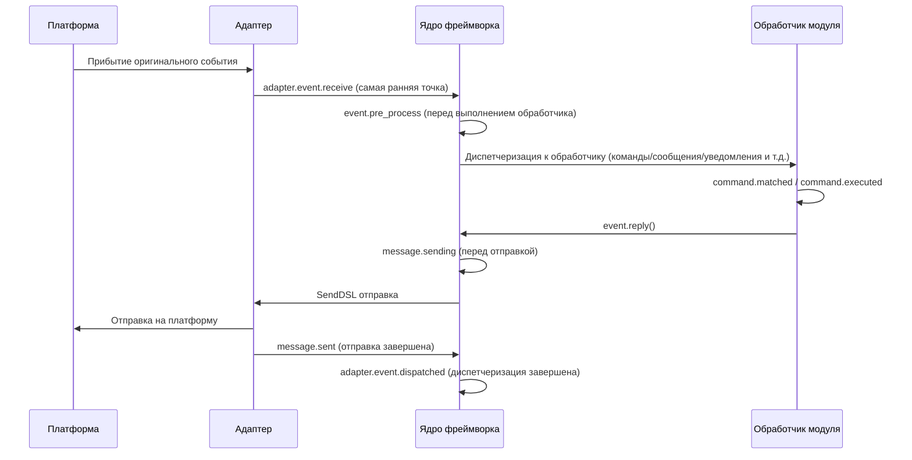

Фреймворк содержит следующие встроенные точки останова хуков, пользователь может прослушивать любую точку останова с помощью `@sdk.lifecycle.on()` для реализации пользовательской логики.

### Основная инициализация

| Имя хука | Точка срабатывания | Данные |
|---------|---------|------|
| `core.init.start` | Начало инициализации SDK | `{}` |
| `core.init.complete` | Завершение инициализации SDK | `{"duration": float, "success": bool, "adapters": {"enabled": [str], "disabled": [str]}, "modules": {"enabled": [str], "disabled": [str]}, "error": str (только при сбое)}` |
| `core.uninit.complete` | Завершение обратной инициализации SDK | `{"duration": float, "success": bool, "adapters_closed": int, "modules_unloaded": int, "module_properties_cleared": int, "module_properties_to_clear": [str], "error": str (только при сбое)}` |

### Изменения конфигурации

| Имя хука | Точка срабатывания | Данные |
|---------|---------|------|
| `config.set` | Изменение конфигурационного параметра | `{"key": str, "old_value": Any, "new_value": Any}` |
| `config.updated` | Обнаружено изменение всей конфигурации после внешнего редактирования config.toml | `{"old_config": dict, "new_config": dict, "config_file": str}` |

**Пример: аудит конфигурации**

```python
@sdk.lifecycle.on("config.set")
def audit_config(data):
    print(f"[Аудит] {data['key']}: {data['old_value']} -> {data['new_value']}")
```

### Жизненный цикл модуля

| Имя хука | Точка срабатывания | Данные |
|---------|---------|------|
| `module.register` | Регистрация класса модуля в менеджере | `{"module_name": str, "success": bool}` |
| `module.load` | Завершение загрузки модуля (успешное инстанцирование) | `{"module_name": str, "success": bool}` |
| `module.init` | Завершение инициализации модуля (включая ленивую загрузку) | `{"module_name": str, "success": bool}` |
| `module.unload` | Выгрузка модуля | `{"module_name": str, "success": bool}` |

### Жизненный цикл адаптера

| Имя хука | Точка срабатывания | Данные |
|---------|---------|------|
| `adapter.load` | Завершение регистрации адаптера | `{"platform": str, "success": bool}` |
| `adapter.start` | Запуск адаптера | `{"platforms": [str]}` |
| `adapter.status.change` | Изменение статуса адаптера | `{"platform": str, "status": str, "retry_count": int, "error": str (только при сбое)}` |
| `adapter.stop` | Остановка адаптера | `{"platforms": [str]}` |
| `adapter.stopped` | Завершение остановки адаптера | `{"platforms": [str]}` |
| `adapter.bot.online` | Онлайн бота | `{"platform": str, "bot_id": str, "info": dict, "status": str}` |
| `adapter.bot.offline` | Оффлайн бота | `{"platform": str, "bot_id": str, "status": str}` |

### Прием и обработка событий

| Имя хука | Точка срабатывания | Данные |
|---------|---------|------|
| `adapter.event.receive` | Получение события с внешней платформы (самая ранняя точка) | `{"platform": str, "event_type": str, "raw_event_type": str}` |
| `adapter.event.dispatched` | Завершение диспетчеризации события | `{"platform": str, "event_type": str, "raw_event_type": str, "onebot_handlers_count": int}` |
| `event.pre_process` | Начало выполнения обработчика события | `{"event_type": str, "platform": str, "detail_type": str}` |

**Пример: статистика событий**

```python
event_counter = {}

@sdk.lifecycle.on("adapter.event.receive")
def count_events(data):
    platform = data["platform"]
    event_counter[platform] = event_counter.get(platform, 0) + 1

@sdk.lifecycle.on("adapter.event.dispatched")
def log_unhandled(data):
    if data["onebot_handlers_count"] == 0:
        print(f"[Необработано] {data['platform']}/{data['event_type']}")
```

### Отправка сообщений

| Имя хука | Точка срабатывания | Данные |
|---------|---------|------|
| `message.sending` | Сообщение отправляется | `{"platform": str, "method": str, "detail_type": str, "target_id": str, "bot_id": str}` |
| `message.sent` | Сообщение отправлено | `{"platform": str, "method": str, "detail_type": str, "target_id": str, "bot_id": str}` |

**Пример: аудит отправки сообщений**

```python
@sdk.lifecycle.on("message.sending")
def log_sending(data):
    print(f"[Отправка] -> {data['platform']}/{data['detail_type']}/{data['target_id']} через {data['method']}")
```

### Командная система

| Имя хука | Точка срабатывания | Данные |
|---------|---------|------|
| `command.matched` | Команда совпала и готова к исполнению | `{"command": str, "args": list[str], "platform": str, "user_id": str}` |
| `command.executed` | Команда выполнена | `{"command": str, "args": list[str], "platform": str, "user_id": str, "success": bool, "error": str (только при сбое)}` |

**Пример: статистика команд**

```python
@sdk.lifecycle.on("command.matched")
def count_commands(data):
    print(f"[Команда] /{data['command']} от {data['user_id']}@{data['platform']}")
```

### HTTP маршрутизация

| Имя хука | Точка срабатывания | Данные |
|---------|---------|------|
| `server.request` | Получение HTTP-запроса | `{"method": str, "path": str, "client_ip": str}` |
| `server.response` | Отправка HTTP-ответа | `{"method": str, "path": str, "status_code": int, "client_ip": str}` |

**Пример: логирование HTTP-запросов**

```python
@sdk.lifecycle.on("server.response")
def log_http(data):
    print(f"[HTTP] {data['method']} {data['path']} -> {data['status_code']}")
```

### WebSocket

| Имя хука | Точка срабатывания | Данные |
|---------|---------|------|
| `server.start` | Запуск сервера маршрутизации | `{"base_url": str, "host": str, "port": int}` |
| `server.stop` | Остановка сервера маршрутизации | `{}` |
| `server.websocket.connect` | Установление WebSocket-соединения | `{"path": str, "module_name": str, "client_ip": str}` |
| `server.websocket.disconnect` | Разрыв WebSocket-соединения | `{"path": str, "module_name": str, "reason": str, "error": str (только при аномалии)}` |

**Пример: мониторинг WebSocket-соединений**

```python
@sdk.lifecycle.on("server.websocket.connect")
def on_ws_connect(data):
    print(f"[WS] Подключение: {data['path']} от {data['client_ip']}")

@sdk.lifecycle.on("server.websocket.disconnect")
def on_ws_disconnect(data):
    print(f"[WS] Отключение: {data['path']} ({data['reason']})")
```

## Стандартные определения событий

```python
STANDARD_EVENTS = {
    "core": ["init.start", "init.complete", "uninit.complete"],
    "module": ["load", "init", "unload", "register"],
    "adapter": [
        "load", "start", "status.change", "stop", "stopped",
        "event.receive", "event.dispatched",
        "bot.online", "bot.offline",
    ],
    "server": [
        "start", "stop",
        "request", "response",
        "websocket.connect", "websocket.disconnect",
    ],
    "event": ["pre_process"],
    "message": ["sending", "sent"],
    "command": ["matched", "executed"],
    "config": ["set"],
}
```

## Полная справочная документация API

### Регистрация и отмена

| Метод | Описание |
|------|------|
| `@lifecycle.on(event, *, priority=0)` | Декоратор для регистрации обработчика |
| `lifecycle.register(event, handler, *, priority=0)` | Программная регистрация |
| `lifecycle.unregister(event, handler=None)` | Отмена регистрации (при handler=None отменяются все обработчики для данного события) |

### Срабатывание

| Метод | Описание |
|------|------|
| `await lifecycle.emit(event, data=None)` | Асинхронное срабатывание, обработчики могут изменить data, возвращая ненулевое значение |
| `lifecycle.emit_sync(event, data=None)` | Синхронное срабатывание, асинхронные обработчики запускаются с помощью create_task |
| `await lifecycle.submit_event(event_type, *, source, msg, data)` | Совместимость со старыми версиями, автоматическое построение стандартного формата события |

### Инструменты

| Метод | Описание |
|------|------|
| `lifecycle.start_timer(timer_id)` | Начать отсчёт времени |
| `lifecycle.get_duration(timer_id)` | Получить прошедшее время (в секундах) |
| `lifecycle.stop_timer(timer_id)` | Остановить отсчёт времени и вернуть прошедшее время |
| `lifecycle.list_hooks()` | Вывести список всех зарегистрированных хуков и количество обработчиков |
| `lifecycle.clear()` | Очистить все обработчики и таймеры |

## Пример использования в модуле

```python
from ErisPulse.Core.Bases import BaseModule
from ErisPulse import sdk

class Main(BaseModule):
    async def on_load(self, event):
        # Реализация простой статистики сообщений
        self.msg_count = 0
        
        @sdk.lifecycle.on("adapter.event.receive")
        async def count(data):
            if data["event_type"] == "message":
                self.msg_count += 1
        
        # Мониторинг всех команд
        @sdk.lifecycle.on("command.matched")
        async def log_cmd(data):
            sdk.logger.info(f"Команда выполнена: /{data['command']} от {data['user_id']}")
        
        # Аудит изменений конфигурации
        @sdk.lifecycle.on("config.set")
        def audit(data):
            sdk.logger.info(f"Изменение конфигурации: {data['key']} = {data['new_value']}")
```

## Принадлежность и автоматическое отмена фоновых задач

> [!NOTE]
> Эта функция доступна в ErisPulse **2.8.0+**.

Фоновые задачи asyncio, созданные модулем, если не отменены в `on_unload`, будут удерживать ссылку на `self`, что мешает сборке мусора для экземпляра модуля (старые экземпляры остаются после горячей перезагрузки). Рамка предоставляет следующие механизмы по умолчанию:

- **`self.spawn(coro)`** (рекомендуется в модуле): задача автоматически присваивается имени модуля, и при выгрузке модуля рамка в `on_unload` **после** отменяет неоконченные задачи и записывает предупреждение
- **`spawn_background(coro)`** (`ErisPulse.runtime`): автоматически захватывает текущий контекст `owner_scope`; `cancel_owner_tasks(owner)` отменяет задачи по принадлежности, `cancel_all_background_tasks()` используется для `sdk.uninit()` по умолчанию
- **Адаптеры**: при закрытии адаптера также отменяются фоновые задачи, принадлежащие имени платформы

```python
async def on_load(self, event):
    # Рекомендуется: фоновые задачи использовать self.spawn(), при выгрузке рамка автоматически отменяет
    self.spawn(self._poll())

async def on_unload(self, event):
    # В сценариях с тонкой настройкой по-прежнему рекомендуется отменить и дождаться завершения
    if self._poll_task:
        self._poll_task.cancel()
        await asyncio.gather(self._poll_task, return_exceptions=True)

async def _poll(self):
    while True:
        await asyncio.sleep(60)
        ...
```

> [!IMPORTANT]
> Рамка по умолчанию **принудительно отменяет** задачи (`cancel_owner_tasks`), это происходит после возврата из `on_unload`. Поэтому задачи, требующие аккуратного завершения (очистка буфера, сохранение состояния, закрытие соединений), **обязательно** должны быть отменены и завершены в `on_unload` — не рассчитывайте, что по умолчанию сохранится логика завершения. Рамка гарантирует только «отсутствие задач, удерживающих `self»`, но не «аккуратное» завершение. Задачи, требующие `await` результата, следует вызывать напрямую `await`, а не передавать в фоновую задачу.

## Примечания

1. **Обработчики могут быть синхронными или асинхронными**: система автоматически определяет и правильно вызывает их
2. **Передача данных**: в режиме `emit()`, если обработчик возвращает значение, отличное от None, это изменит данные, передаваемые следующим обработчикам
3. **Нормы именования событий**: рекомендуется использовать точечную структуру для именования событий, что упрощает использование родительских слушателей
4. **Изоляция ошибок**: исключение в одном обработчике не влияет на выполнение других обработчиков
5. **Ограничения синхронного триггера**: в `emit_sync()` асинхронные обработчики запускаются в режиме fire-and-forget, и возвращаемые значения не могут быть переданы обратно
6. **Очистка жизненного цикла**: при вызове `sdk.uninit()` все зарегистрированные обработчики и таймеры будут очищены
7. **Приоритет загрузки**: если необходимо слушать события на этапе инициализации фреймворка, рекомендуется установить высокий приоритет и отключить ленивую загрузку


### 懶加载系统

# Система ленивой загрузки модулей

ErisPulse SDK предоставляет мощную систему ленивой загрузки модулей, которая позволяет инициализировать модули только тогда, когда они действительно необходимы, значительно повышая скорость запуска приложения и эффективность использования памяти.

## Обзор

Система ленивого загрузки модулей является одной из ключевых особенностей ErisPulse. Она работает следующим образом:

- **Отложенная инициализация**: модуль загружается и инициализируется только при первом обращении
- **Прозрачное использование**: для разработчиков ленивые модули практически не отличаются от обычных модулей
- **Автоматическое управление зависимостями**: зависимости модуля автоматически инициализируются при использовании
- **Поддержка жизненного цикла**: для модулей, унаследованных от `BaseModule`, автоматически вызываются методы жизненного цикла

## Принцип работы

### Класс LazyModule

Основой системы ленивой загрузки является класс `LazyModule`, который является обёрткой, фактически инициализирующей модуль только при первом обращении.

### Процесс инициализации

При первом обращении к модулю `LazyModule` выполняет следующие действия:

1. Получает информацию о параметрах `__init__` класса модуля
2. Определяет, следует ли передавать ссылку на `sdk`
3. Устанавливает атрибут `moduleInfo` модуля
4. Для модулей, унаследованных от `BaseModule`, вызывает метод `on_load`
5. Запускает событие жизненного цикла `module.init`

## Событийное ленивое активирование (activate_on)

> [!NOTE]
> Эта функция требует ErisPulse **2.8.0+**.

Модули с `lazy_load=True` по умолчанию загружаются только при **первом обращении к атрибуту**. Если модуль зарегистрировал обработчики команд или событий, традиционный подход предполагает полную загрузку (`lazy_load=False`). `activate_on` предоставляет третий вариант: **объявить триггер, и при первом совпадающем событии/команде модуль будет автоматически активирован** — он не будет постоянно в памяти, но при этом не упустит входной триггер.

```python
from ErisPulse.loaders import ModuleLoadStrategy

class MyModule(BaseModule):
    @staticmethod
    def get_load_strategy():
        return ModuleLoadStrategy(
            lazy_load=True,
            activate_on=[
                # ---- События (пассивные, не требуют участия пользователя)----
                "message",                                    # Тип события: любое сообщение
                {"notice": "group_member_increase"},          # Тип + detail_type
                {"message": ["private", "group"]},            # Тип + несколько detail_type

                # ---- Команды (активные, ввод пользователя, отображаются в Help)----
                {"command": "roll"},                          # Сокращённая форма: имя команды
                {"command": ["roll", "dice"]},                # Список имён команд
                {"command": {                                 # Форма dict (обязательно name)
                    "name": "dice",
                    "help": "Бросить кубик",
                    "usage": "/dice",
                    "group": "Развлечения",
                    "aliases": ["d"],
                    "hidden": False,
                }},
            ],
        )
```

### Параметры команды в формате dict

Формат dict отражает пользовательские параметры декоратора `@command()`, и используется для регистрации временной команды до загрузки модуля:

| Параметр | Тип | Значение по умолчанию | Описание |
|----------|------|----------------------|----------|
| `name` | `str` | **Обязательно** | Имя команды; должно совпадать с `@command(name)` в `on_load`, иначе временная команда будет удалена при активации, и команда не будет доступна |
| `help` | `str` | Цепочка возврата | Описание команды в Help; если не указано, используется цепочка возврата (см. ниже) |
| `usage` | `str` | Автоматически | Пример использования, по умолчанию `{prefix}{name}` |
| `group` | `str` | `None` | Группа команды |
| `aliases` | `list[str]` | `[]` | Список алиасов, также регистрируется, **ввод алиаса также активирует модуль** |
| `hidden` | `bool` | `False` | Если `True`, временная команда будет скрыта (семантика скрытости совпадает с активированной командой); пользователи, знающие имя команды, могут активировать её |

**Не поддерживается** `priority` / `permission` / `master`: временная команда предназначена только для активации, проверка прав осуществляется активированной командой (в момент активации проверка прав прерывает активацию).

### Цепочка возврата для Help временной команды

Описание команды в Help, отображаемое до загрузки модуля, берётся по следующему порядку (первое найденное значение):

1. `help` в команде dict (наиболее точное)
2. `description` из `get_meta()`
3. `__description__` из модуля
4. `Summary` из метаданных пакета (краткое описание пакета на PyPI)
5. Общее сообщение: «Эта команда из лениво загружаемого модуля X, при первом использовании модуль будет автоматически загружен»

### Семантика триггеров

- **Событийный stub**: регистрируется с низким приоритетом (`ACTIVATION_STUB_PRIORITY`) в соответствующий обработчик событий, и срабатывает в конце, после всех обычных обработчиков; при активации событие пересылается в настоящий обработчик модуля
- **Командный stub**: регистрируется временная команда; при активации временная команда удаляется, настоящая команда принимает на себя текущее срабатывание
- **Предотвращение повторного запуска**: `asyncio.Lock` гарантирует, что при одновременных срабатываниях модуль активируется только один раз
- **Фильтрация по области видимости**: stub содержит идентификатор владельца модуля, модуль не активируется, если не включен для данного бота / сессии / платформы
- **Семантика ошибки**: при неудачной активации повторная попытка не предпринимается, stub также удаляется
- **Удаление дубликатов**: при смешанном объявлении сокращённых и dict-имён команд дубликаты удаляются (dict имеет приоритет); если dict не содержит `name` или `detail_type` события указан как dict, выводится предупреждение и игнорируется

> Архитектурная диаграмма и полная семантика см. в [Обзоре архитектуры](../architecture.md#архитектура-событийного-леневого-активирования-activate_on).

## Конфигурация ленивой загрузки

### Глобальная конфигурация

В файле конфигурации включите/отключите глобальную ленивую загрузку:

```toml
[ErisPulse.framework]
enable_lazy_loading = true  # true=включить ленивую загрузку (по умолчанию), false=отключить ленивую загрузку
```

### Управление на уровне модуля

Модуль может контролировать стратегию загрузки, реализовав статический метод `get_load_strategy()`:

```python
from ErisPulse.Core.Bases import BaseModule
from ErisPulse.loaders import ModuleLoadStrategy

class MyModule(BaseModule):
    @staticmethod
    def get_load_strategy():
        """Возвращает стратегию загрузки модуля"""
        return ModuleLoadStrategy(
            lazy_load=False,  # Возвращает False для немедленной загрузки
            priority=100      # Приоритет загрузки, чем больше значение, тем выше приоритет
        )
```

## Использование модулей с ленивой загрузкой

### Основное использование

Для разработчиков использование модулей с ленивой загрузкой практически не отличается от обычных модулей:

```python
# Доступ к модулю с ленивой загрузкой через SDK
from ErisPulse import sdk

# Следующий вызов инициирует ленивую загрузку модуля
result = await sdk.my_module.my_method()
```

### Единый вход для получения модуля

Независимо от того, получаете ли вы модуль через свойство SDK, свойство менеджера модулей или с помощью `module.get()`, для "зарегистрированных, но еще не загруженных" модулей с ленивой загрузкой будет возвращаться один и тот же прокси-объект ленивой загрузки. Инициализация происходит только при обращении к его свойствам:

```python
# Все три способа возвращают один и тот же прокси-объект ленивой загрузки (когда модуль еще не загружен), поведение одинаково и для пользователя прозрачно
sdk.my_module          # Точка входа для инициации загрузки
sdk.module.my_module   # Также возвращает прокси-объект ленивой загрузки
sdk.module.get("my_module")  # Также возвращает прокси-объект ленивой загрузки, сам вызов не инициирует загрузку

# Инициализация модуля происходит только при обращении к свойству прокси-объекта
result = await sdk.my_module.my_method()
```

`module.get()` — это **интерфейс для запроса**, сам вызов не инициирует загрузку:
- Если модуль уже загружен → возвращается реальный экземпляр
- Если модуль зарегистрирован, но не загружен → возвращается прокси-объект ленивой загрузки (инициализация происходит при обращении к свойству)
- Если модуль не зарегистрирован → возвращается `None`

Если необходимо явно инициировать загрузку, используйте `await sdk.load_module("my_module")`.

### Асинхронная инициализация

Для модулей, требующих асинхронной инициализации, рекомендуется сначала явно загрузить модуль:

```python
# Сначала явно загрузите модуль
await sdk.load_module("my_module")

# Затем используйте модуль
result = await sdk.my_module.my_method()
```

### Синхронная инициализация

Для модулей, не требующих асинхронной инициализации, можно обращаться напрямую:

```python
# Прямое обращение автоматически инициирует синхронную инициализацию
result = sdk.my_module.some_sync_method()
```

## Рекомендуемые практики

При выборе стратегии загрузки можно использовать следующий процесс принятия решений:


### Рекомендованные сценарии использования ленивой загрузки (lazy_load=True)

- Инструментальные классы, вызываемые пассивно (например, модуль запросов данных, преобразователи форматов и т.д., которые нужны только при вызове из других модулей)
- Модули, зарегистрировавшие обработчики команд / событий, но используемые нечасто — в сочетании с `activate_on` можно объявить триггер, автоматически активирующий модуль при поступлении первого соответствующего события / команды, без отказа от ленивой загрузки

### Рекомендованные сценарии отключения ленивой загрузки (lazy_load=False)

- Модули, требующие готовности при запуске (например, основные модули, предоставляющие базовые сервисы другим модулям)
- Часто вызываемые слушатели (каждое сообщение должно обрабатываться) — `activate_on` имеет небольшую стоимость активации, поэтому для сценариев с высокой частотой вызовов прямая загрузка предпочтительнее
- Модули с планировщиком задач
- Модули, требующие инициализации при запуске приложения

> Параметр `priority` управляет порядком инициализации модулей, загруженных немедленно: чем больше значение, тем раньше модуль будет инициализирован. Модули с одинаковым приоритетом загружаются в порядке их регистрации.

## Примечания

1. Если ваш модуль использует ленивую загрузку, и если другие модули никогда не вызывались внутри ErisPulse, ваш модуль никогда не будет инициализирован.
2. Если ваш модуль содержит такие компоненты, как модули, слушающие события, или другие активно слушающие модули, у вас есть два варианта: объявить триггер `activate_on` (сохранить ленивую загрузку, автоматически активировать при поступлении события) или объявить, что он должен быть загружен немедленно (`lazy_load=False`), иначе это повлияет на нормальное функционирование вашего модуля.
3. Мы не рекомендуем отключать ленивую загрузку, если только у вас нет особых потребностей, иначе это может привести к проблемам с зависимостями и событиями жизненного цикла.
4. В командном словаре `activate_on` объявления, `name` должен совпадать с реальным именем команды, зарегистрированной в модуле `on_load` с помощью `@command()` — в противном случае, после активации модуля, команда-заполнитель будет отменена, и команда, объявленная не соответствующая реализации, не будет существовать.


### 国际化（i18n）系统

# Система международной локализации (i18n)

Начиная с ErisPulse v2.5.0, встроен полный функционал поддержки международной локализации. Ядро фреймворка и интерфейс CLI могут автоматически переключать отображаемый текст в зависимости от языка вашей системы, а также поддерживают регистрацию собственных переводов внешними модулями.

## Поддерживаемые языки

| Язык | Код | Описание |
|------|------|------|
| 简体中文 | `zh-CN` | Язык по умолчанию (оригинальный язык фреймворка) |
| 繁體中文 | `zh-TW` | Традиционный китайский (Гонконг/Макао/Тайвань) |
| English | `en` | Английский (общий язык по умолчанию) |
| 日本語 | `ja` | Японский |
| Русский | `ru` | Русский |

## Быстрый опыт

### Переключение через переменные среды

```bash
# Windows PowerShell
$env:ERISPULSE_LANG = "en"
epsdk run

# macOS / Linux
ERISPULSE_LANG=ja epsdk run
```

### Переключение через конфигурационный файл

Добавьте в `config/config.toml`:

```toml
[ErisPulse.i18n]
language = "zh-TW"
```

Если установить значение `"auto"` (значение по умолчанию), язык будет определяться автоматически на основе языка системы.

### Ручное переключение в коде

```python
from ErisPulse import i18n

# Ручная установка языка
i18n.set_language("en")
print(i18n.get_language())  # "en"

# Возврат к автоматическому определению
i18n.reset_language()
```

---

## Механизм определения языка

Фреймворк определяет язык пользователя в следующем порядке приоритетов:

1. **Переменная среды `ERISPULSE_LANG`** — наивысший приоритет, используется для тестирования и временного переключения
2. **Windows API** — `GetUserDefaultLocaleName` (только Windows, не подвержен влиянию переменных, таких как `LANG`, установленных в Git Bash и других инструментах)
3. **Переменные среды** — `LANGUAGE` > `LC_ALL` > `LC_MESSAGES` > `LANG` (стандарт Unix/macOS)
4. **Системная локаль** — `locale.getlocale()` / `locale.getdefaultlocale()`
5. **Резервное значение** — en (английский язык)

### Принцип ближайшего соответствия

При обнаружении языка, не соответствующего точно поддерживаемым, применяется принцип ближайшего соответствия:

- `zh-TW`, `zh-HK`, `zh-MO`, `zh-Hant` → **Традиционный китайский**
- Все остальные `zh-*` (например, `zh-CN`, `zh-SG`) → **Упрощённый китайский**
- `en-US`, `en-GB`, `en-AU` и другие → **Английский**
- `ja-JP` → **Японский**
- `ru-RU` → **Русский**
- Все остальные неизвестные языки → **Упрощённый китайский (резервное значение)**

---

## Использование i18n в модулях

Вы можете зарегистрировать тексты перевода для своего модуля, чтобы ваш модуль также поддерживал множественные языки.

### Рекомендуемый способ: объявление ключей перевода через I18nClass (v2.7.0+)

Начиная с версии v2.7.0, модули/адаптеры могут объявлять ключи перевода, подобно тому, как они объявляют `ConfigClass`, с помощью вложенного класса `I18nClass`. Фреймворк автоматически зарегистрирует все объявленные ключи перевода при загрузке, без необходимости вручную вызывать `i18n.register()`.

```python
from dataclasses import dataclass, field

from ErisPulse.Core.Bases import BaseConfig, BaseI18n, BaseModule, I18nKey


class MyModule(BaseModule):
    # Класс конфигурации (необязательно)
    @dataclass
    class ConfigClass(BaseConfig):
        welcome_msg: str = field(
            default="欢迎",
            metadata={
                # Здесь используется ключ перевода mymodule.welcome_msg
                "description": {"i18n": "mymodule.welcome_msg", "default": "Сообщение приветствия"},
            },
        )

    # Класс коллекции ключей перевода (необязательно)
    # Объявленные ключи будут автоматически зарегистрированы фреймворком, с приоритетом над генерацией значений по умолчанию ConfigClass
    class I18nClass(BaseI18n):
        # Имя атрибута автоматически объединяется в полный путь ключа: <имя_модуля>.<имя_атрибута>
        welcome_msg: I18nKey = I18nKey(
            default="Welcome Message",   # Языко-независимое значение по умолчанию, не регистрируется ни для какого языка
            zh_CN="欢迎消息",
            en="Welcome Message",
            ja="ウェルカムメッセージ",
            ru="Приветственное сообщение",
            zh_TW="歡迎訊息",
        )
        # Другие ключи перевода, используемые в бизнес-логике
        hello: I18nKey = I18nKey(
            default="Hello, {name}!",
            zh_CN="你好，{name}！",
            zh_TW="你好，{name}！",
            en="Hello, {name}!",
            ja="こんにちは、{name}！",
            ru="Привет, {name}!",
        )

        # Можно также явно указать полный путь ключа (не используя объединение по имени атрибута)
        custom: I18nKey = I18nKey(
            key="mymodule.deep.nested.key",
            default="Default text",
            zh_CN="默认文本",
            zh_TW="預設文本",
            en="Default text",
            ja="デフォルトテキスト",
            ru="Текст по умолчанию",
        )
```

#### Почему рекомендуется использовать I18nClass?

| Сценарий | Ручная регистрация i18n.register() | Объявление через I18nClass |
|------|-----------------------|------------------|
| Ключи перевода, используемые в описании конфигурации | Требуется ручная регистрация, и нужно успеть до генерации конфигурации | Фреймворк автоматически регистрирует до генерации конфигурации |
| Объявление многоязычных переводов | Распространены по разным on_load() | Собраны в одном классе, легко читаемы |
| Согласованность именования ключей | Легко допускать ошибки при написании | Имя атрибута используется как суффикс ключа, IDE может подсказывать |
| Очистка при выгрузке | Требуется ручной unregister_domain() | Фреймворк использует единый domain для регистрации |

#### Правила формирования пути ключей в I18nClass

- **По умолчанию**: используется путь `<имя_регистрации_модуля>.<имя_атрибута>` в качестве полного пути ключа
  - Пример: имя модуля ``MyModule``, атрибут ``welcome`` → путь ключа ``MyModule.welcome``
- **Явно**: с помощью параметра ``I18nKey(key="...")`` можно указать любой путь с разделителем точек
  - Подходит для глубоко вложенных ключей (например, ``mymodule.config.basic.token``)

#### Использование в адаптере

Адаптеры также поддерживают `I18nClass`, и способ использования полностью идентичен:

```python
from ErisPulse import BaseAdapter
from ErisPulse.Core.Bases import BaseConfig, BaseI18n, I18nKey


class MyAdapter(BaseAdapter):
    @dataclass
    class ConfigClass(BaseConfig):
        endpoint: str = field(
            default="",
            metadata={
                # Описание конфигурации ссылается на ключ adapter.MyAdapter.endpoint
                "description": {"i18n": "MyAdapter.endpoint", "default": "Адрес API"},
            },
        )

    class I18nClass(BaseI18n):
        # Собранное объявление ключей перевода, используемых в описании конфигурации и других бизнес-ключей
        endpoint: I18nKey = I18nKey(
            default="API Endpoint",
            zh_CN="API 地址",
            zh_TW="API 位址",
            en="API Endpoint",
            ja="APIアドレス",
            ru="API адрес",
        )
```

I18nClass адаптера будет автоматически зарегистрирован на этапе `__init__` (до генерации шаблона конфигурации), обеспечивая доступность ключей перевода, используемых в описании конфигурации.

### Ручная регистрация пользовательских переводов (старый способ)

Если вы не используете `I18nClass`, вы можете напрямую вызвать `i18n.register()` для регистрации текстов перевода.

```python
from ErisPulse import i18n

# Регистрация китайского перевода
i18n.register("zh-CN", {
    "my_module.welcome": "欢迎使用我的模块！",
    "my_module.goodbye": "再见！",
    "my_module.hello": "你好，{name}！",
}, domain="my_module")

# Регистрация английского перевода
i18n.register("en", {
    "my_module.welcome": "Welcome to my module!",
    "my_module.goodbye": "Goodbye!",
    "my_module.hello": "Hello, {name}!",
}, domain="my_module")
```

### Использование перевода

```python
from ErisPulse import i18n

# Простой перевод
i18n.t("my_module.welcome")  # Автоматически используется текущий язык

# С параметрами форматирования
i18n.t("my_module.hello", name="Alice")

# Указание значения по умолчанию (возвращается, если ключ перевода не найден)
i18n.t("my_module.unknown_key", default="默认文本")
```

### Использование в классе модуля

```python
from dataclasses import dataclass, field
from ErisPulse import i18n
from ErisPulse.Core.Bases import BaseConfig, BaseModule

@dataclass
class MyModuleConfig(BaseConfig):
    welcome_msg: str = field(
        default="欢迎",
        metadata={
            "description": {"i18n": "my_module.welcome_msg", "default": "Сообщение приветствия"},
            "ui": {"widget": "text", "group": "basic", "order": 1},
        },
    )

class MyModule(BaseModule):
    ConfigClass = MyModuleConfig

    async def on_load(self, event):
        # Динамическое чтение конфигурации (каждый раз отражает последнее значение)
        self.logger.info(self.cfg.welcome_msg)
        self.logger.info(i18n.t("my_module.welcome"))

    @command("hello")
    async def hello_handler(self, event):
        name = event.get_user_nickname() or "friend"
        await event.reply(i18n.t("my_module.hello", name=name))

    async def on_unload(self, event):
        pass
```

### Удаление перевода

```python
# Удаление перевода всего домена
i18n.unregister_domain("my_module")
```

---

## Многоязычные поля конфигурации

Начиная с версии v2.5.2, схема конфигурации полностью поддерживает i18n. Все видимые пользователю текстовые поля могут ссылаться на ключи i18n, и WebUI и другие потребители автоматически будут преобразовывать их в соответствующий текст в зависимости от текущего языка.

### Поддерживаемые поля i18n

| Поле | Расположение | Описание |
|------|--------------|----------|
| `description` | метаданные поля | Описание поля |
| `options[].label` | `ui.options` | Метки опций для контрола select |
| `placeholder` | `ui.placeholder` | Заполнитель для поля ввода |
| `group_labels` | `_schema_meta` | Названия групп (заголовки разделов Dashboard) |

Используется единый формат `{"i18n": "key", "default": "текст"}`, а строки без i18n будут передаваться без изменений (для обратной совместимости).

### Объявление полей i18n

Все видимые пользователю текстовые поля поддерживают i18n:

```python
from dataclasses import dataclass, field
from ErisPulse.Core.Bases import BaseConfig

@dataclass
class MyAdapterConfig(BaseConfig):
    # i18n для description
    token: str = field(
        default="",
        metadata={
            "description": {"i18n": "my_adapter.token", "default": "Токен платформы"},
            "required": True,
            "secret": True,
            "ui": {
                "widget": "password",
                "group": "basic",
                "order": 1,
                # i18n для placeholder
                "placeholder": {"i18n": "my_adapter.token.ph", "default": "Введите токен"},
            },
        },
    )
    # i18n для label опций
    mode: str = field(
        default="a",
        metadata={
            "description": {"i18n": "my_adapter.mode", "default": "Режим работы"},
            "ui": {
                "widget": "select",
                "group": "basic",
                "order": 2,
                "options": [
                    {"label": {"i18n": "my_adapter.mode.a", "default": "Режим A"}, "value": "a"},
                    {"label": {"i18n": "my_adapter.mode.b", "default": "Режим B"}, "value": "b"},
                ],
            },
        },
    )

    # i18n для group_labels (название группы)
    _schema_meta = {
        "group_labels": {
            "basic": {"i18n": "my_adapter.group.basic", "default": "Основные настройки"},
        }
    }
```

`default` — это резервный текст, который будет отображаться, если перевод не зарегистрирован или поиск не удался.

### Секретная обработка и проверка конфигурации

Поля, помеченные как `"secret": True`, автоматически получают **защиту от раскрытия** (начиная с версии 2.7.0):

- **Обработка шаблона**: при генерации шаблона конфигурации `dataclass_to_toml_with_comments()` настоящее значение секретного поля не будет записано в файл (вместо него будет пустой заполнитель), чтобы избежать попадания чувствительной информации на диск.
- **Универсальный инструмент для обработки секретов**: `redact_secret(value)` заменяет непустое значение на `***`, а пустое значение возвращает без изменений. Используется, например, при выводе в логи.

```python
from ErisPulse.Core.Bases.config_schema import redact_secret

redact_secret("sk-xxxxxx")  # '***'
redact_secret("")           # ''
```

**Проверка конфигурации** (`validate_config()`) помимо проверки обязательных полей на непустоту, начиная с версии 2.7.0, поддерживает:

| Проверка | Метаданные | Пример |
|----------|------------|--------|
| Соответствие типа | Объявление типа поля | Если для поля типа `int` передано строковое значение, будет ошибка |
| Ограничение по перечислению | `ui.options` или `options` на уровне верхнего уровня | Значение должно принадлежать разрешённым опциям |
| Диапазон значений | `min` / `max` на уровне верхнего уровня | `metadata={"min": 1, "max": 65535}` |

```python
from ErisPulse.Core.Bases.config_schema import validate_config

@dataclass
class C(BaseConfig):
    mode: str = field(default="a", metadata={"ui": {"widget": "select", "options": ["a", "b"]}})
    port: int = field(default=80, metadata={"min": 1, "max": 65535})

errors = validate_config(C(mode="x", port=70000))  # Две ошибки: перечисление + диапазон
```

### Регистрация переводов для конфигурации

Ключи i18n для полей конфигурации регистрируются так же, как и обычные ключи перевода, с помощью `i18n.register()`:

```python
from ErisPulse import i18n

# Регистрация китайского (согласуется с default, но может отличаться)
i18n.register("zh-CN", {
    "my_adapter.token": "Токен платформы",
}, domain="my_adapter")

# Регистрация английского
i18n.register("en", {
    "my_adapter.token": "Platform Token",
}, domain="my_adapter")
```
> **Рекомендуемый способ**: использование `I18nClass` для объявления ключей перевода, фреймворк автоматически зарегистрирует их (см. раздел «Рекомендуемый способ» выше), без необходимости вызывать `i18n.register()` или `register_config_i18n()`.

Также доступна удобная функция `register_config_i18n()`, которая автоматически извлекает ключи из класса конфигурации и регистрирует их:

```python
from ErisPulse.Core.Bases.config_schema import register_config_i18n

# Автоматически извлекает description.default как перевод для zh-CN
register_config_i18n(MyAdapterConfig, "zh-CN")

# Ручная передача английского перевода
register_config_i18n(MyAdapterConfig, "en", {
    "my_adapter.token": "Platform Token",
})
```

### Как WebUI потребляет i18n

Функция `get_config_schema()` возвращает схему, в которой словарь i18n будет передан без изменений. Frontend WebUI может использовать `i18n.t()` для получения перевода в зависимости от текущего языка.

Если требуется серверная сторона для преобразования i18n в строки (например, для передачи на фронтенд, который не поддерживает i18n), используется `resolve_config_schema()`, который преобразует `description`, `options[].label`, `placeholder` и `group_labels` в текст текущего языка:

```python
from ErisPulse.Core.Bases.config_schema import resolve_config_schema

# Все поля i18n преобразованы в текст текущего языка
schema = resolve_config_schema(MyAdapterConfig)
print(schema["fields"]["token"]["description"])    # "Токен платформы" или "Platform Token"
print(schema["fields"]["token"]["placeholder"])   # "Введите токен" или "Enter Token"
print(schema["fields"]["mode"]["options"][0]["label"])  # "Режим A" или "Mode A"
print(schema["group_labels"]["basic"])             # "Основные настройки" или "Basic"
```

> Типы и инструменты `BaseConfig`, `BotAccountConfig`, `register_config_i18n()`, `resolve_config_schema()` и другие определены в `ErisPulse.Core.Bases.config_schema`. `ErisPulse.runtime.config_schema` сохранён для обратной совместимости, **рекомендуется импортировать из `ErisPulse.Core.Bases`** (за исключением типов, связанных с ключами i18n, которые находятся в `ErisPulse.Core.Bases.i18n_schema`).

## API-справочник

### I18nManager

#### Основные методы

| Метод | Описание |
|------|------|
| `t(key, default=None, **kwargs)` | Получение переведённого текста (`gettext()` — это псевдоним) |
| `set_language(lang)` | Ручная установка языка |
| `get_language()` | Получение текущего языка |
| `reset_language()` | Сброс на автоматическое определение (и повторное определение среды) |
| `get_supported_languages()` | Получение списка всех поддерживаемых языков |
| `has_translation(key, lang=None)` | Проверка существования ключа перевода |
| `register(lang, translations, domain)` | Регистрация пользовательских переводов |
| `unregister_domain(domain)` | Удаление всех переводов указанной области |
| `reload()` | Перезагрузка встроенных переводов и повторное определение языка |

#### Подробности метода `t()`

```python
def t(self, key, /, default=None, **kwargs):
```

- `key` — ключ перевода (только позиционный аргумент, не конфликтует с `key=` в `**kwargs`)
- `default` — значение по умолчанию, возвращаемое при отсутствии перевода, по умолчанию `None` (возвращается сам ключ)
- `**kwargs` — параметры форматирования, используются для заполнения `{placeholder}` в переводе

Пример:

```python
# Определение перевода: "greeting": "你好，{name}！欢迎来到{place}。"
i18n.t("greeting", name="Alice", place="ErisPulse")
# Возвращает: "你好，Alice！欢迎来到ErisPulse。"
```

### BaseI18n / I18nKey (объявления ключей перевода)

Начиная с v2.7.0, `ErisPulse.Core.Bases` предоставляет инструмент объявления ключей перевода на основе атрибутов класса (рекомендуется импортировать из `ErisPulse.Core.Bases`):

> ``I18nKey.default`` — это **текст по умолчанию, независимый от языка**, не регистрируется ни в один язык.
> Для того чтобы перевод заработал, необходимо явно передать хотя бы один параметр языка (``zh_CN=`` / ``en=`` / ``ja=`` и т.д.).
> Таким образом, разработчики из разных стран могут свободно использовать родной язык для заполнения ``default``, фреймворк не делает никаких предположений.

| Название | Описание |
|------|------|
| `I18nKey(default, *, key=None, zh_CN, zh_TW, en, ja, ru)` | Объявление одного ключа перевода, `default` — текст по умолчанию, независимый от языка |
| `BaseI18n` | Базовый класс для объявления набора ключей перевода (имена соответствуют `BaseConfig`), подклассы объявляют несколько `I18nKey` в атрибутах класса |
| `BaseI18n.register(prefix="", domain="app")` | Классовый метод: регистрация всех объявленных ключей в систему перевода |
| `key` | Псевдоним `I18nKey` (более лаконичная запись) |

Пример использования:

```python
from ErisPulse.Core.Bases import BaseI18n, key

class MyKeys(BaseI18n):
    # Упрощённая запись с псевдонимом
    hello = key(
        default="Hello",
        zh_CN="你好",
        zh_TW="你好",
        en="Hello",
        ja="こんにちは",
        ru="Привет",
    )
    bye = key(
        default="Bye",
        zh_CN="再见",
        zh_TW="再見",
        en="Bye",
        ja="さようなら",
        ru="До свидания",
    )

# Независимое использование (ручная регистрация)
MyKeys.register(prefix="myapp.", domain="myapp")
```

### Доступ к i18n через экземпляр SDK

```python
from ErisPulse import sdk

# sdk.i18n и импортированный i18n — это один и тот же объект
sdk.i18n.set_language("en")
print(sdk.i18n.t("core.sdk.init.starting"))
```

## Конфигурация во время выполнения

### Чтение конфигурации i18n через API-конфигурации

```python
from ErisPulse.Core.Bases import I18nConfig
from ErisPulse.runtime import get_i18n_config

config = get_i18n_config()
print(config["language"])  # "auto" или код конкретного языка

# I18nConfig — это dataclass, который можно использовать для генерации шаблона конфигурации
schema = I18nConfig.__dataclass_fields__
```

### Описание параметров конфигурации

В разделе `[ErisPulse.i18n]` файла `config/config.toml`:

```toml
[ErisPulse.i18n]
# Язык отображения, возможные значения:
# - "auto"      — автоматическое определение языка системы (по умолчанию)
# - "zh-CN"     — упрощённый китайский
# - "zh-TW"     — традиционный китайский
# - "en"        — английский
# - "ja"        — японский
# - "ru"        — русский
language = "auto"
```

---

## Лучшие практики

### Именование ключей перевода

Рекомендуется использовать формат именования с разделением точками:

```
<имя_модуля>.<категория>.<описание>
```

Например: `my_module.command.hello_desc`, `core.adapter.start_failed`

### Многоязычная поддержка

Не обязательно предоставлять переводы сразу для всех языков. Отсутствующие языки будут автоматически возвращаться к английскому. Если английский также отсутствует, будет отображаться сам ключ.

### Динамические данные

Для динамически генерируемых данных (например, имен пользователей, количества и т.д.) используйте формат `{placeholder}`:

```python
# Определение перевода
"user_count": "Текущее количество пользователей онлайн: {count} человек"

# Использование
i18n.t("user_count", count=len(users))
```

### Сообщения в логах

Если ваш модуль использует логгер фреймворка, эти сообщения также будут автоматически отображаться на текущем языке:

```python
self.logger.info(i18n.t("my_module.startup"))
```

## Отношение к i18n CLI

CLI имеет **независимый** модуль международной локализации (`ErisPulse.CLI.i18n`), который полностью отделен от основного модуля международной локализации фреймворка.

- **Core i18n** — используется основным модулем фреймворка, внешние модули могут регистрировать переводы
- **CLI i18n** — используется внутри интерфейса командной строки, не делит данные перевода с Core

Такая архитектура гарантирует, что изменения в переводах CLI не повлияют на стабильность основного ядра фреймворка.


### 统一控制面（scope）

# Scope

> [!NOTE]
> This feature requires ErisPulse **2.8.0+**.

Scope answers four questions: **which modules are available, whether events from whom are received, what text is processed by a module, and what a module can do externally**. Control is fully handed over to the user: the **upper layer** (configured via `ErisPulse.scope` or runtime `sdk.scope`) where modules / adapters / processors / outbound calls are registered, declares these uniformly. The event pipeline automatically reads and executes these at entry, processor filtering, and outbound gateways.

| Dimension | What is controlled | Rejection behavior | Configuration path |
|------|---------|---------|---------|
| **① Module** | Which modules are available (platform / Bot / session three levels) | Silently ignored (no reply, no claim) | `scope.platforms / bots / sessions` |
| **② Identity** | Whether to receive events (adapter / Bot / session / user four levels) | Completely discarded at entry (silent) | `scope.identity.*` |
| **③ Outbound** | Which outbound calls a module can initiate (messages / API / requests, method-level whitelists and blacklists) | Failed response (`retcode=34601`) | `scope.actions` |

> **Related system**: Commands are special message event processors, their user allow/deny lists (ACL) and implementation parameter overrides are self-contained by the command system (`ErisPulse.event.command`), see [Introduction to Event Handling](../getting-started/event-handling.md) and [Configuration Guide](../user-guide/configuration.md).

{!--< tips >!--}
1. Import the singleton via `from ErisPulse.Core import scope` (same object as `sdk.scope`)
2. Check: `scope.is_allowed(...)` / `scope.is_identity_allowed(...)` /
   `scope.is_action_allowed(...)` correspond to the three gates ①②③
3. Read/write: dimension-specific parameter methods (IDE can auto-complete) —
   `scope.set_module(...)` / `scope.set_identity(...)` / `scope.set_action(...)`;
   There are also dictionary-style fallback methods `scope.get(path)` / `scope.set(path, v)` / `scope.delete(path)`
4. Event processor text condition overrides are found in
   [Introduction to Event Handling · Event Overriding](../getting-started/event-handling.md#event-overriding-overwrite-the-behavior-of-any-event-type-without-modifying-the-module-code);
   Command ACL / parameter overrides are found in [Introduction to Event Handling](../getting-started/event-handling.md)
{!--< /tips >!--}

## Matching Entry Syntax (Unified Across the System)

All "name lists" in scope (module names, identity keys, outbound entries) share the same matching syntax (via `ErisPulse.Core.text_match`):

| Syntax | Example | Description |
|------|------|------|
| Exact name | `"Chat"` | Full value comparison, **case-insensitive** |
| glob | `"Tool*"`、`"spam_*"` | `*` for any string / `?` for a single character / `[seq]` for character set, case-insensitive |
| Regular expression | `"re:^Danger.*"` | Declared with `re:` prefix, matches using regular expression `search`, default case-insensitive |

- Invalid regular expressions **silently degrade** to "no match" (no error thrown, no crash)
- Decorator parameters (`pattern=` / `regex=`) have fixed semantics: `pattern` is glob, `regex` is the raw regular expression (without `re:` prefix); regular expression entries in scope configuration **must** have the `re:` prefix

## Global Fallback: `default_allow`

`default_allow` is the **single global** fallback switch (default `true`), affecting two decision dimensions:

- **Module dimension**: If no binding is matched → `default_allow` decides allow/deny
- **Identity dimension**: If no policy is matched → `default_allow` decides allow/deny

Setting it to `false` enables "implicit deny" strict mode: whitelist-style management,
**everything not explicitly allowed is denied**.

> **Exception**: The outbound dimension is **not affected** by `default_allow`—it is an independent tightening switch,
> defaulting to full allow, with restrictions only via explicit rules (framework-level owner-empty calls are always allowed).
> This strict global mode won't accidentally cut off all module message replies.
> Command ACL has a separate `ErisPulse.event.command.default_allow` fallback, independent of others.

## Configuration File

```toml
[ErisPulse.scope]
default_allow = true        # Global fallback (false = implicit deny strict mode)
cache_size = 1024           # LRU cache size

# ── ① Module dimension (priority: session > Bot > platform) ──
[ErisPulse.scope.platforms.onebot11]
modules = ["Chat", "Tool*"]   # Whitelist: exact name / glob / re: regex
blocked = ["re:^Danger"]
[ErisPulse.scope.bots.onebot11."123456"]
modules = ["Chat"]
merge = true                  # Append on top of platform-level binding (default is full override)
[ErisPulse.scope.sessions.onebot11."789012345"]
modules = ["Chat"]

# ── ② Identity dimension (priority: user > session > Bot > adapter) ──
[ErisPulse.scope.identity.adapters.onebot11]
deny = true                   # Discard all events from this adapter
[ErisPulse.scope.identity.bots.onebot11."123456"]
deny = true
[ErisPulse.scope.identity.sessions.onebot11."g_blocked"]
deny = true
[ErisPulse.scope.identity.users.onebot11]
allow = ["u_admin"]           # User keys support glob / re: regex
deny = ["u_bad", "spam_*"]

# ── ③ Outbound dimension (default allow all, restrict only via explicit rules) ──
[ErisPulse.scope.actions.MyModule]
send = { deny = true }                                    # Disable all sending
api = { allow = ["get_*"] }                               # Allow only query-type standard APIs
request = { deny = true }                                 # Disable request handling
```

## ① Module Dimension

Answers "which modules are available in a given context." By default, all are open; filtering starts only after configuration binding,
**no changes are needed for modules or adapters**.

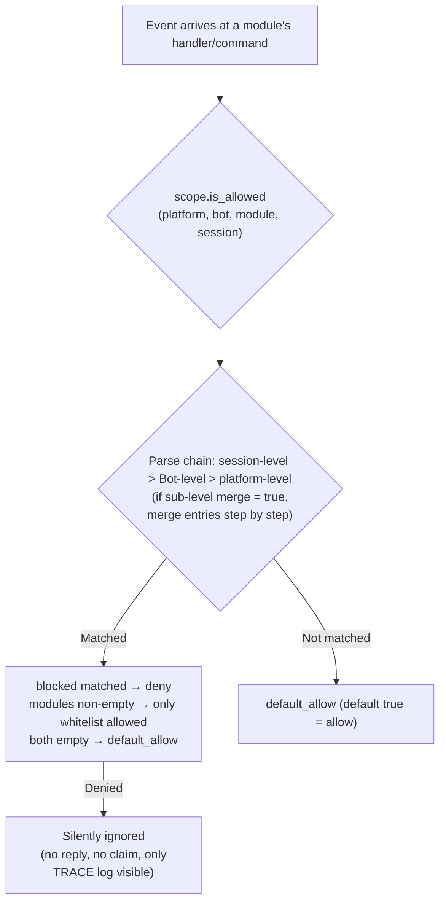

- **Parse priority: session-level > Bot-level > platform-level**, higher priority bindings **fully override** lower ones;
  if a sub-level binding sets `merge = true`, it instead performs a **per-entry union** with lower levels (both `modules` and `blocked` are merged separately,
  `merge` itself is a control key and not counted as an entry)
- **Silent semantics**: Commands and processors of filtered modules do not trigger, reply, or claim (to prevent cross-command mis-matches),
  only TRACE-level logs are visible (`core.scope.denied`)
- **Framework-level processors** (`scope_exempt=True` or owner is empty) are unaffected; modules with empty names (framework-level resources) are always allowed
- **Session-aware help and command queries**: Command query APIs (`command.help` /
  `get_command` / `get_commands` / `get_group_commands` / `get_visible_commands`,
  and `module.get_commands_overview`) all support optional `event=` or explicit
  `platform=` / `bot_id=` / `session_id=` keywords—commands from modules unavailable in the current session
  no longer appear in the results (`get_command` returns None, single command help is treated as "not registered",
  consistent with silent semantics); if no context is provided, full behavior is maintained

### Binding Inheritance (merge)

The default full override semantics are clear and predictable; when you need to **append** to an upper-level binding, set `merge = true` in the sub-level:

```toml
[ErisPulse.scope.platforms.onebot11]
modules = ["Chat", "Tool"]      # Platform-level: allow Chat, Tool

[ErisPulse.scope.bots.onebot11."123456"]
modules = ["Music"]
merge = true                    # The actual effect for this Bot = ["Chat", "Tool", "Music"]
```

- **Merge rules**: `modules` and `blocked` each take a **union**; within a binding, `blocked` still takes precedence over `modules`
- **Chained merging**: Platform → Bot → Session are layered step by step, each level independently decides `merge` or override

## ② Identity Dimension (Event Admission)

Answers "whose events are received." Events that are denied are **completely discarded at the distribution entry**—
they do not enter middleware or any processor (including framework-level), with only TRACE-level logs visible (`core.scope.identity_denied`).

- **Parse priority: user > session > Bot > adapter**, take the most specific configured policy; deny takes precedence over allow
- Each level of binding is a binary policy: `{ allow = true }` or `{ deny = true }`
- User keys support glob / regular expressions (e.g. `"spam_*"` to block a batch of spam users)
- Typical use case—上级 deny, individual allow for "exception allow":

```toml
[ErisPulse.scope.identity.adapters.onebot11]
deny = true
[ErisPulse.scope.identity.users.onebot11]
allow = ["u_admin"]   # Even if adapter-level denied, events from u_admin are still allowed
```

## ③ Outbound Dimension (Limiting Module Outbound Calls)

Constraints on modules **initiating outbound actions**: message sending / standard API actions / request operations.
Three types of actions correspond to the underlying DSL: `Event.reply` and `Send` (send), `Api` / `call_api` (api), and
`Request`'s accept/reject (request). Outbound calls initiated by modules during event handler execution
carry the module owner, and are uniformly judged by this dimension.

### Rule Forms (Inline Tables)

Each action's rule is an inline table: `{ allow = [...], deny = true|[...] }`.
Only one rule per action is allowed (TOML keys cannot repeat, choose between full deny and fine-grained):

```toml
[ErisPulse.scope.actions.MyModule]
send = { deny = true }                                  # Disable all sending (Event.reply / Send DSL)
# Or fine-grained method-level: send = { allow = ["Text", "Image*"], deny = ["File"] }
api = { allow = ["get_*"] }                             # Allow only query-type standard APIs
# Or action-level blacklist: api = { deny = ["set_*", "leave_*"] }
request = { deny = true }                               # Disable request handling accept/reject
```

- `send` entries match **send method names** (`Text` / `Image` / `File` ...),
  `api` entries match **standard action names** (`get_group_info` / `set_group_name` ...)
- Entries support exact names / glob / `re:` regex (consistent with the unified system syntax, case-insensitive)
- Writing a single string in `allow` is equivalent to a single-item list: `send = { allow = "Text" }`

### Decision Semantics

**Default is full allow**—unconfigured, or owner is empty (internal framework calls) are allowed.
After configuration, rules are evaluated in the following order:

1. `deny = true` → deny
2. `deny` list matches call name → deny
3. `allow` list is non-empty and call name is not matched (or call has no name) → deny
4. Otherwise, allow

Denied calls do not initiate any network requests, directly returning a standard failure response
(`retcode = 34601`, see [api-response §5.3](../standards/api-response.md#53-framework-extended-return-codes-34xxx-custom-platform-error-segment-lower-three-digits)).

```python
# Runtime API
sdk.scope.set_action("MyModule", "send", deny=True)              # Disable all message sending
sdk.scope.set_action("MyModule", "send", allow=["Text"])         # Allow only text sending
sdk.scope.is_action_allowed("MyModule", "send", name="Image")    # False
sdk.scope.is_action_allowed("MyModule", "api", name="get_user_info")  # Evaluate by rules
sdk.scope.delete_action("MyModule", "send")                      # Re-enable
sdk.scope.get_action("MyModule", "send")                         # Current rule for this action
```

## Runtime API

The runtime API for scope is divided into three layers: **decision** (three questions), **dimension-specific read/write** (per dimension `set` / `get` / `delete` parameterized methods, fully type-annotated, IDE can auto-complete), and **dictionary-style fallback** (dot-separated path to reach any section).

```python
from ErisPulse import sdk

scope = sdk.scope
```

### Decision (Three Questions)

```python
scope.is_allowed("onebot11", "123456", "Chat")                 # ① Module dimension
scope.is_allowed("onebot11", "123456", "Chat", "789012345")    # With session-level
scope.is_allowed("onebot11", "123456", None)                   # Framework-level resource -> True

scope.is_identity_allowed("onebot11", "123456", "group_9", "u1")   # ② Identity dimension

scope.is_action_allowed("MyModule", "send")                    # ④ Outbound dimension
scope.is_action_allowed("MyModule", "send", name="Image")      # Fine-grained method-level
```

### ① Module Dimension

```python
# Binding (hierarchy determined by parameters: session_id > bot_id > platform-level)
scope.set_module("onebot11", bot_id="123456", modules=["Chat", "Tool*"])
scope.set_module("onebot11", blocked=["re:^Danger"])                       # Platform-level
scope.set_module("onebot11", bot_id="123456", session_id="g9", modules=["Chat"])  # Session-level
scope.set_module("onebot11", bot_id="123456", modules=["Music"], merge=True)      # Union with existing entries
scope.set_module("onebot11", bot_id="123456", modules=["Chat"], persist=False)    # Runtime only

# Read / Delete
scope.get_module("onebot11", bot_id="123456")   # {"modules": ["Chat"], "blocked": []}
scope.delete_module("onebot11", bot_id="123456")
```

> `merge=True` is **write-time union** (merges entries with existing bindings at this level); `merge = true` configuration keys at parse time across levels are described above in [Binding Inheritance](#binding inheritance-merge)—these are independent mechanisms.

> **Runtime binding (persist=False) semantics**: Runtime bindings are saved in a separate overlay layer,
> **any subsequent configuration writes / hot reloads of configuration files will not overwrite them** (the configuration tree is rebuilt and automatically reapplied in order, including runtime deletions). They are not persisted, and are lost after process restart; when a module is unloaded, runtime bindings written by that module are cleaned up. Subsequent `persist=True` writes (user-persistent semantics) to the same path will replace runtime rules.

### ② Identity Dimension

```python
# Binding policies (hierarchy determined by parameters: user > session > bot > adapter; allow / deny are mutually exclusive)
scope.set_identity("onebot11", user_id="u_bad", deny=True)
scope.set_identity("onebot11", user_id="spam_*", deny=True)    # Key supports glob / re: regex
scope.set_identity("onebot11", bot_id="123456", session_id="g9", allow=True)

# Read / Delete
scope.get_identity("onebot11", user_id="u_bad")   # {"deny": True}
scope.delete_identity("onebot11", user_id="u_bad")
```

### ③ Outbound Dimension

```python
# Set restriction rules (allow: str|list; deny: bool|str|list; whole rule replacement semantics)
scope.set_action("MyModule", "send", deny=True)                    # Disable all sending
scope.set_action("MyModule", "send", allow=["Text"])               # Allow only text sending
scope.set_action("MyModule", "api", deny=["set_*", "leave_*"])     # Disable management-type APIs

# Read / Delete
scope.get_action("MyModule", "send")       # {"allow": ["Text"]} original rule
scope.delete_action("MyModule", "send")    # Remove single action
scope.delete_action("MyModule")            # Remove all action restrictions for this module
```

### General

```python
scope.get("platforms")   # Dictionary-style fallback: dot-separated path to read any section
scope.topology()         # Full configuration tree (for Dashboard)
scope.stats()
# {"module_calls": .., "module_filtered": .., "identity_checks": .., "identity_denied": ..,
#  "action_checks": .., "action_denied": .., "cache_hits": .., "cache_misses": ..}
scope.reset_stats()
scope.clear()           # Clear all configurations (memory only)
```

### Advanced: Dictionary-style Dot-Path Fallback

Dimension-specific methods cover daily scenarios; when you need to directly access any node (or future added dimensions),
use the dictionary-style API—`get` / `set` / `delete` accepts dot-separated paths (deep dict merge, immediate read after write),
and provides `scope[path]` / `scope[path] = v` / `del scope[path]` / `path in scope` protocols:

```python
scope.set("bots.onebot11.123456", {"modules": ["Chat"], "blocked": []})
scope.set("identity.users.onebot11.u_bad", {"deny": True})
scope.get("actions.MyModule.send")

scope["platforms.onebot11"]        # Read (raises KeyError if not exists)
scope["platforms.onebot11"] = {...}  # Write
del scope["platforms.onebot11"]      # Delete
"actions.MyModule" in scope          # Existence check
```

## Cache and Hot Reload

- `is_allowed` / `is_identity_allowed` / `is_action_allowed` results are cached with **LRU** (configurable via `scope.cache_size`),
  invalidated automatically by `set` / `delete` /
  configuration hot reload (`config.updated` / `config.set`)
- All dimension configurations take effect **immediately** without restart
- Scope is evaluated **per event**, with no cross-event memory: configuration changes take effect on the next event

## Configuration Format Validation

During loading / hot reload, configuration format is validated per section: type errors (e.g. `platforms` written as a string), invalid outbound rules (e.g. `allow` written as a number), unknown action names, unknown top-level keys (e.g. `alow` with a typo) will output **WARNING** and ignore the corresponding section / entry, while other valid configurations remain effective—incorrect writing no longer silently fails.

## Common Issues and Notes

### 1. Configuration Hierarchy and Overriding

- Module dimension: session-level > Bot-level > platform-level, **full override** (sub-level `merge = true` means per-entry union).
  If you want "platform allows Chat, Bot adds Music," you can set `merge = true` in the Bot-level binding, or list both
- Identity dimension: user > session > Bot > adapter, take the **most specific** configured policy (can be used for exception allow)
- Command user allow/deny lists: exact command names take precedence over glob keys (see `event.command.acl`)

### 2. Module/Command Not Responding

First suspect scope rather than the module itself:

```python
from ErisPulse import sdk

print(sdk.scope.is_allowed(event.get_platform(), bot_id, "MyModule", session_id))
print(sdk.scope.is_identity_allowed(event.get_platform(), bot_id, session_id, user_id))
print(sdk.scope.stats())   # module_filtered / identity_denied > 0 indicates silent filtering
```

Filtered is **silent** (module and identity dimensions do not reply, to avoid exposing rules), but statistics are accumulated;
commands denied by ACL reply "insufficient permissions."

### 3. Outbound Action Denied When Troubleshooting

```python
from ErisPulse import sdk

print(sdk.scope.get("actions.MyModule"))
print(sdk.scope.stats())   # action_denied > 0 indicates some calls were blocked
```

Blocking is **explicit**: denied calls return a standard failure response (`retcode = 34601`, no network request initiated).

### 4. Session Identifier Isolation Across Platforms

The `(platform, session_id)` combination is the unique identifier. `scope.sessions.onebot11."789"` only applies to onebot11, not affecting the session with `789` on Telegram. The same applies to identity dimension user keys.

## Topology Tree API

`ModuleManager.get_topology()` and `AdapterManager.get_topology()` provide module/adapter ownership relationship data,
`sdk.get_topology()` aggregates them (including scope):

```python
from ErisPulse import sdk

topology = sdk.get_topology()
# {
#   "modules": {                                   # Module → owned resources
#     "Chat": {
#       "loaded": True, "enabled": True,
#       "commands": ["chat", "translate"],
#       "handlers": {"message": 2, "notice": 1},
#       "routes": {"http": ["/Chat/api"], "ws": [], "sse": []},
#       "lifecycle_hooks": 3,
#     }
#   },
#   "adapters": {                                  # Adapter → Bot → scope
#     "onebot11": {
#       "status": "started", "enabled": True,
#       "bots": {"123456": {"status": "online", "scope": {...}}},
#       "scope": {"modules": [...], "blocked": [...]},
#     }
#   },
#   "scope": {                                     # Scope (module / identity / outbound actions)
#     "platforms": {...}, "bots": {...}, "sessions": {...},
#     "identity": {"adapters": {...}, "bots": {...}, "sessions": {...}, "users": {...}},
#     "actions": {...},
#   },
# }
```

- Module topology aggregates commands, event handlers, HTTP/WS/SSE routes, and lifecycle hooks registered by the module, useful for drawing module resource trees.
- Adapter topology aggregates status of each adapter, status of subordinate Bots, and platform-level/Bot-level scope bindings (module dimension).

commands


### 归属权（owner）系统

# Система принадлежности (owner)

Принадлежность является основой "Plug-and-Play" модулей: все ресурсы, зарегистрированные в рамках фреймворка во время загрузки, автоматически привязываются к модулю и при его выгрузке/отключении — возвращаются обратно владельцу. Автор модуля должен лишь объявить ресурсы, а не писать вручную логику очистки.

> **Связанные системы**: область видимости (scope) определяет "действует ли ресурс" при отправке событий, а принадлежность определяет "кому принадлежит ресурс и кто его освобождает при выгрузке". Область видимости описана в [Единая управляющая поверхность (scope)](scope.md), фоновые задачи — в [Управление жизненным циклом](lifecycle.md#Фоновые_задачи_принадлежность_и_автоматическое_отмена).

{!--< tips >!--}
1. Принадлежность регистрируется **в момент регистрации** по `current_owner`, без изменений в коде модуля
2. Выгрузка/отключение используют одну цепочку очистки (`_cleanup_module_registrations`), каждое неудачное действие вызывает только предупреждение, не прерывая процесс
3. Ресурсы, определённые пользовательской конфигурацией (постоянное переопределение / правила scope / ACL команд) **не** удаляются при выгрузке модуля
{!--< /tips >!--}

## Механизм контекста owner

Принадлежность передаётся через контекстную переменную `current_owner` (`ErisPulse.runtime.context`):

```python
from ErisPulse.runtime import owner_scope, get_current_owner

with owner_scope("MyModule"):
    # Все ресурсы, зарегистрированные в этом блоке, автоматически привязываются к MyModule
    assert get_current_owner() == "MyModule"
```

Фреймворк автоматически вставляет owner в следующие моменты (код модуля/адаптера не требует ручного обёртывания):

| Момент | Значение owner | Позиция |
|------|----------|------|
| Модуль `load()` | Имя модуля | При инстанцировании + на протяжении `on_load` |
| Адаптер `start()` / `restart()` | Имя платформы | На протяжении запуска адаптера |
| Регистрация stub для ленивой активации `activate_on` | Имя модуля | При регистрации заглушек команд/обработчиков |
| Выполнение обработчика события | Имя модуля, к которому принадлежит обработчик | При повторной инъекции в точку входа handler / command |

Повторная инъекция во время выполнения означает: обработчики команд, объявленные в `on_load`, при вызове API регистрации (например, `sdk.adapter.on()` или `overrides.*.set(persist=False)`) во время выполнения, также автоматически привязываются к этому модулю.

## Обзор ресурсов, подлежащих принадлежности

Все ресурсы, зарегистрированные в контексте загрузки модуля, записываются с привязкой к владельцу и автоматически удаляются при выгрузке/отключении:

| Ресурс | Способ регистрации | Вызов очистки |
|------|----------|----------|
| Команды | `@command()` / объявление через dict команд | `command.unregister_by_owner()` |
| Обработчики событий | `@message` / `@notice` / `@request` / `@meta` | `handler.unregister_by_owner()` |
| Слушатели событий адаптера | `sdk.adapter.on()` / `raw=True` | `adapter.unregister_handlers_by_owner()` |
| Промежуточные обработчики адаптера | `@sdk.adapter.middleware` | То же |
| Маршруты (HTTP/WS/SSE) | `router.http()` / `websocket()` / `sse()` | Двойная очистка по пространству имён и по владельцу |
| Промежуточные обработчики маршрутов | `@router.middleware()` / `add_middleware()` | `router.unregister_all_by_owner()` |
| Вход на главную панели | `router.register_home_entry()` | `unregister_home_entries_by_owner()` |
| Пользовательские типы сессий | `register_custom_type()` | `unregister_custom_types_by_owner()` |
| Фоновые задачи | `self.spawn()` | `cancel_owner_tasks()` |
| Хуки жизненного цикла | `lifecycle.register()` | `lifecycle.unregister_by_owner()` |
| Источник правил владения | `master.provider` | `master.unregister_by_owner()` |
| Переводы i18n | Объявление `I18nClass` (domain=имя модуля) | `i18n.unregister_domain()` |
| Переопределения событий (временные) | `overrides.*.set(persist=False)` | `overrides.unregister_by_owner()` |
| Взаимодействующие сессии (ожидание reply / лизинг) | `event.wait_reply()` / `sdk.interaction.acquire()` | `interaction.cancel_by_owner()` (ожидаемый получатель немедленно получает отмену) |
| Контекстные данные | Запись в `runtime/context` по owner | Точная очистка по модулю |

Ресурсы, зарегистрированные на стороне адаптера (с owner = имя платформы), удаляются при `shutdown()` / `restart()` адаптера функцией `_cleanup_adapter_resources`. Включает:

| Ресурс | Вызов очистки |
|------|----------|
| Собственные `on()` обработчики и промежуточные обработчики адаптера | `adapter.unregister_handlers_by_owner(platform)` |
| Расширения методов платформенных событий (`EventMixin`) | `unregister_platform_event_methods(platform)` |
| Пользовательские типы сессий | `unregister_custom_types_by_owner(platform)` |
| Взаимодействующие сессии (ожидание reply / лизинг на платформе) | `interaction.cancel_by_platform(platform)` |
| Переводы i18n (domain=ключ конфигурации) | `i18n.unregister_domain(ключ_конфигурации)` |
| Маршруты с точечными пространствами имён | `router.unregister_all_by_owner(platform)` |

## Последовательность очистки при выгрузке/отключении

`unload()` и `disable()` используют одну цепочку очистки (каждый шаг независим, с try/except, при сбое — только лог, **не прерывается**):

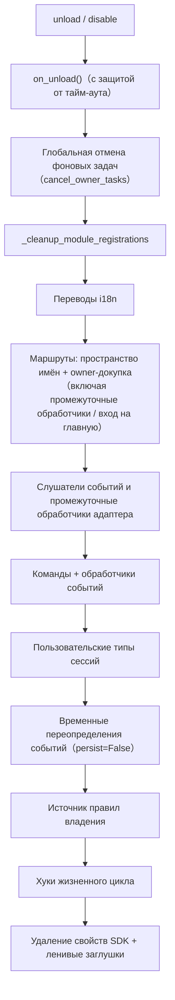

При завершении `sdk.uninit()` также происходит глобальная очистка: все адаптеры shutdown → все модули unload → `router.stop()` (очистка маршрутов/промежуточных обработчиков/входа на главную) → `cancel_all_background_tasks()` → очистка обработчиков событий и хуков.

## Пределы принадлежности: какие ресурсы не удаляются при выгрузке

Принадлежность удаляет **только ресурсы, зарегистрированные кодом модуля**. Следующие ресурсы относятся к **семантике пользовательской конфигурации** (управление в руках пользователя, возможно, специально настроено), и остаются после выгрузки модуля:

| Ресурс | Семантика | Описание |
|------|------|------|
| `overrides.*.set(persist=True)` | Постоянное переопределение | Записывается в конфиг, действует при перезапуске; модуль при выгрузке не удаляет (явно настроен пользователем) |
| `scope.set_action()` и другие правила области видимости | Правила управления доступом | Управляются пользователем/Dashboard, не удаляются при выгрузке модуля |
| `overrides.acl.set(persist=True)` | ACL команд | То же |
| `Conversation.save()` | Сохранение многошаговых диалогов | Данные сохраняются и не удаляются |

Ресурсы, записанные временно (`persist=False`), удаляются вместе с owner — **разница между "активным состоянием модуля" и "активным состоянием пользователя" — это именно persist**.

## Руководство для авторов модулей

### Рекомендуемый стиль

```python
from ErisPulse import sdk
from ErisPulse.Core.Event import command
from ErisPulse.runtime import owner_scope, spawn_background

class MyModule(BaseModule):
    async def on_load(self, event):
        # Ресурсы фреймворка: автоматически привязываются, не требуют ручной очистки
        self.task = self.spawn(self.polling())      # Фоновая задача
        sdk.router.register_home_entry("Мой модуль", "/my")  # Вход на главную

        # Собственные ресурсы модуля: включаются в систему принадлежности через owner_scope
        with owner_scope("MyModule"):
            self.client.on_event(self._handle)      # Пример пользовательской регистрации

    async def on_unload(self, event):
        # Ресурсы фреймворка уже автоматически удалены, осталось только очистить ресурсы вне owner_scope
        await self.client.close()
```

### Важные замечания

- **Регистрация в момент импорта не имеет принадлежности**: обработчики/хуки, зарегистрированные на уровне модуля (в момент импорта), происходят до `owner_scope` и привязываются к фреймворку (owner=None), поэтому **не удаляются**. Всегда регистрируйте в `on_load()`.
- **Регистрация i18n с пользовательским domain**: `i18n.register(domain=...)` с domain, отличным от имени модуля, не будет автоматически удалён. Держите domain=имя модуля.
- **Фоновые задачи должны использовать `self.spawn()`**: простое `asyncio.create_task` не привязывается к модулю и не отменяется при выгрузке (см. [Управление жизненным циклом](lifecycle.md#Фоновые_задачи_принадлежность_и_автоматическое_отмена)).
- **Очистка "сбоит только с предупреждением"**: ошибка при очистке одного шага не блокирует остальные, в логах видны на уровнях DEBUG/WARNING, для отладки можно включить TRACE.


### 启动流程与手动控制

# Процесс запуска и ручное управление

Методы `await sdk.run()` / `await sdk.init()` ErisPulse объединяют весь процесс запуска в одну строку кода. Однако, если вам нужно полностью настроить процесс запуска (например, частичная загрузка, динамическая регистрация, горячая замена, встраивание пользовательской стратегии загрузки), вам нужно понимать, что происходит внутри этой цепочки, а также как вручную управлять каждым шагом.

В этой статье мы разбиваем процесс запуска на отдельные этапы, объясняем их назначение и порядок вызова, а также приводим пример ручного полного запуска.

> В этой статье предполагается, что вы уже запустили [первого робота](../getting-started/first-bot.md) и знакомы с двумя режимами `sdk.run(keep_running=True/False)`. В этой статье мы сосредоточимся на разборе внутренней цепочки `init()`, а также на более низкоуровневых входных точках, таких как `init()`/`init_task()`/`init_sync()`.

## Обзор верхнего уровня SDK

Помимо двух режимов `keep_running` для `run()`, SDK предоставляет несколько более низкоуровневых точек входа, которые отличаются **асинхронностью, возвращаемым значением и обработкой исключений**:

| Точка входа | Асинхронность | Возвращаемое значение | Обработка исключений | Сценарий использования |
|-------------|---------------|------------------------|----------------------|-------------------------|
| `await sdk.run(True)` | async, блокирующий | `None` (автоматически `uninit` при остановке) | Ошибки модулей/адаптеров перехватываются, не приводят к сбою процесса | Простое приложение-бот |
| `await sdk.run(False)` | async, не блокирующий | `None` (не автоматически выгружается) | То же самое | Инициализация, затем выполнение пользовательской логики |
| `await sdk.init()` | async, требует `await` | `bool` | Внутренние исключения компонентов перехватываются, в случае неудачи возвращается `False` | Ручное управление жизненным циклом (с `uninit()`) |
| `sdk.init_task()` | async, возвращает `Task` без блокировки | `asyncio.Task` | То же, что и `init()` | Параллельное выполнение других инициализаций или когда цикл событий еще не запущен |
| `sdk.init_sync()` | **Синхронный**, блокирует текущий поток | `bool` | То же, что и `init()` | Сценарии командной строки, синхронный вход без цикла событий |

> **Распространённое заблуждение**: `await sdk.init()` **не эквивалентно** `await sdk.run(keep_running=False)`. Есть два различия: ① `init()` возвращает `bool` (в случае неудачи возвращает `False`), `run()` возвращает `None`; ② `init()` выполняет только инициализацию и **не производит автоматическую выгрузку**, `run()` автоматически вызывает `uninit()` при завершении цикла событий. Поэтому, если требуется ручное управление жизненным циклом или выгрузкой, используйте `init()` + `uninit()`.

## Обзор запуска

`sdk.init()` (точнее, его внутренний `Initializer.init()`) запускает всю систему в следующем порядке:


Соответствующие основные компоненты:

| Уровень | Компонент | Ответственность |
|----|------|------|
| Обнаружение | `AdapterFinder` / `ModuleFinder` | **Обнаружение** адаптеров/модулей из entry-points установленных пакетов |
| Загрузка | `AdapterLoader` / `ModuleLoader` | Обнаружение + импорт + чтение метаданных + проверка включения/отключения, возвращает список объектов |
| Регистрация | `*Loader.register_to_manager` | Запись объектов в соответствующий менеджер |
| Управление | `sdk.adapter` / `sdk.module` | Хранение экземпляров адаптеров/модулей, предоставление интерфейсов запуска/остановки |
| Инициализация | `ModuleLoader.initialize_modules` | Создание экземпляров модулей и привязка к `sdk` (обработка топологической сортировки зависимостей) |
| Маршрутизация | `sdk.router` | HTTP / WebSocket сервер |

> **Важно**: `Finder` и `Loader` — это два уровня. `Loader` внутри **уже содержит** `Finder` (`AdapterLoader` содержит `AdapterFinder`, `ModuleLoader` содержит `ModuleFinder`). В большинстве случаев вам достаточно использовать `Loader`, а `Finder` применяется только тогда, когда нужно "только перечислить, но не импортировать".

[Документация на русском языке](docs/ru/quick-start.md)

## Подробное описание каждого этапа

### 1. Уровень обнаружения: Finder

Finder отвечает только за "поиск пакетов, предоставляющих адаптеры/модули", не импортирует и не создает экземпляры.

```python
from ErisPulse.finders import AdapterFinder, ModuleFinder

adapter_finder = AdapterFinder()
module_finder = ModuleFinder()

# Поиск всех установленных entry-points для адаптеров/модулей
adapter_entries = adapter_finder.find_all()    # list[EntryPoint]
module_entries = module_finder.find_all()      # list[EntryPoint]

# Поиск по имени
entry = module_finder.find_by_name("MyModule")  # EntryPoint | None
```

Каждый `EntryPoint` можно загрузить через `.load()`, чтобы получить соответствующий класс, но обычно это делает Loader автоматически.

### 2. Уровень загрузки: Loader

Loader на основе Finder выполняет "импорт + чтение метаданных + проверку включения/отключения".

```python
from ErisPulse.loaders import AdapterLoader, ModuleLoader
from ErisPulse import sdk

adapter_loader = AdapterLoader()
module_loader = ModuleLoader()

# Внутри load(): вызывается finder.find_all() → обработка entry-point → возврат тройки
adapter_objs, enabled_adapters, disabled_adapters = await adapter_loader.load(sdk.adapter)
module_objs, enabled_modules, disabled_modules = await module_loader.load(sdk.module)
```

Тройка, возвращаемая `load()`:

| Возвращаемое значение | Значение |
|-----------------------|----------|
| `objs` (`dict`)       | Сопоставление названия → объекта (класс адаптера / обёртка модуля) |
| `enabled` (`list[str]`) | Названия, включённые (не отключены в конфигурации) |
| `disabled` (`list[str]`) | Названия, отключённые |

#### Информация о диагностике при сбое загрузки

Если при загрузке или инициализации модуля/адаптера возникает исключение, фреймворк пропускает этот компонент и продолжает загрузку остальных, выводя **сводку пользовательских фреймов кода**, чтобы вы могли локализовать проблему на уровне INFO, без необходимости вручную включать DEBUG:

```
[ERROR] [ModuleLoader] Загрузка модуля MyModule из entry-point не удалась, пропущено: 'NoneType' object has no attribute 'platform'
  → MyModule/Core.py:42 in on_load
      adapter = sdk.platform
  → AttributeError: 'NoneType' object has no attribute 'platform'
  → Подсказка: Увеличьте уровень логирования до DEBUG для просмотра полного стека; проверьте реализацию модуля MyModule
```

Диагностическая информация генерируется через модуль `ErisPulse.runtime.diagnostics` и автоматически фильтрует внутренние фреймы фреймворка, оставляя только фреймы вашего кода. При необходимости можно повторно использовать это в пользовательской логике загрузки:

```python
from ErisPulse.runtime import log_diagnostic

try:
    risky_init()
except Exception as e:
    log_diagnostic(e)  # Автоматически извлекает фреймы пользовательского кода и записывает в ERROR-лог
```

Модуль также предоставляет два вспомогательных метода: `extract_user_frame()` (возвращает структурированную информацию о фрейме) и `format_diagnostic_block()` (возвращает многострочную текстовую строку).

### 3. Регистрация: register_to_manager

Регистрация объектов, созданных Loader, в менеджере, чтобы `sdk.adapter` / `sdk.module` могли их распознавать.

```python
# Регистрация адаптеров (возвращает bool, означающий, успешно ли все прошли)
await adapter_loader.register_to_manager(enabled_adapters, adapter_objs, sdk.adapter)

# Регистрация модулей
await module_loader.register_to_manager(enabled_modules, module_objs, sdk.module)
```

После регистрации адаптеры зарегистрированы в менеджере адаптеров, а модули — в менеджере модулей, но **ни один из них ещё не запущен/не создан экземпляр**.

### 4. Запуск адаптеров

```python
# Запуск всех зарегистрированных адаптеров
await sdk.adapter.startup()
# Или указать платформу
await sdk.adapter.startup("yunhu")
await sdk.adapter.startup(["yunhu", "telegram"])
```

> Регистрация ≠ Запуск. `register_to_manager` — это просто регистрация; `startup` вызывает метод `start()` адаптера и устанавливает соединение с платформой.

### 5. Инициализация модулей

Модули требуют дополнительного шага — **инициализацию** и привязку к `sdk` (чтобы вы могли обращаться к `sdk.MyModule.xxx`). Этот шаг также обрабатывает зависимости между модулями и сортирует их в топологическом порядке.

```python
success = await module_loader.initialize_modules(
    enabled_modules, module_objs, sdk.module, sdk
)
```

После успешной инициализации модуль появится в `sdk.<ModuleName>`.

### 6. Запуск сервера маршрутизации

```python
await sdk.router.start(
    host="0.0.0.0",
    port=8000,
    ssl_certfile=None,
    ssl_keyfile=None,
)
```

Сервер маршрутизации отвечает за получение обратных вызовов Webhook / WebSocket от адаптеров. Без запуска сервера, адаптеры в режиме сервера не смогут получать сообщения.

## Полный пример ручного запуска

Следующий код **эквивалентен** основному процессу `await sdk.init()`, но каждая его часть доступна для ручного управления, что позволяет вставить пользовательскую логику в любой момент:

```python
import asyncio
from ErisPulse import sdk
from ErisPulse.loaders import AdapterLoader, ModuleLoader

async def manual_startup():
    # 0. Подготовка окружения (загрузка конфигурации, регистрация обработки исключений)
    #    _prepare_environment — это внутренний шаг init(); если использовать ручной процесс,
    #    его необходимо вызвать до Loader, иначе Loader не сможет прочитать конфигурацию,
    #    и все адаптеры/модули будут ошибочно признаны отключенными.
    if not await sdk._prepare_environment():
        print("Ошибка при подготовке окружения")
        return False

    # 1. Создание загрузчиков (внутри каждый загрузчик содержит Finder)
    adapter_loader = AdapterLoader()
    module_loader = ModuleLoader()

    # 2. Параллельное обнаружение и загрузка (аналогично внутреннему gather в init())
    (adapter_objs, enabled_adapters, disabled_adapters), \
    (module_objs, enabled_modules, disabled_modules) = await asyncio.gather(
        adapter_loader.load(sdk.adapter),
        module_loader.load(sdk.module),
    )

    # 3. Регистрация адаптеров
    await adapter_loader.register_to_manager(
        enabled_adapters, adapter_objs, sdk.adapter
    )

    # 4. Запуск адаптеров
    if enabled_adapters:
        await sdk.adapter.startup()

    # 5. Регистрация модулей
    await module_loader.register_to_manager(
        enabled_modules, module_objs, sdk.module
    )

    # 6. Инициализация модулей (инстанцирование + привязка к sdk)
    if enabled_modules:
        await module_loader.initialize_modules(
            enabled_modules, module_objs, sdk.module, sdk
        )

    # 7. Запуск сервера маршрутизации
    await sdk.router.start(host="0.0.0.0", port=8000)

    print("Ручной запуск завершен")
    return True

async def main():
    ok = await manual_startup()
    if ok:
        # Блокировка для поддержания работы (ручной процесс не блокирует автоматически)
        await asyncio.Event().wait()

if __name__ == "__main__":
    asyncio.run(main())
```

### Когда использовать ручной запуск?

В большинстве случаев **ручной запуск не требуется**, так как `await sdk.run()` уже выполняет все вышеперечисленные шаги. Ручной запуск имеет смысл только в следующих сценариях:

- **Частичная загрузка**: загрузить только указанные адаптеры/модули, пропустив остальные
- **Динамическая регистрация**: регистрировать новые адаптеры/модули во время выполнения в зависимости от условий
- **Собственный порядок**: изменить стандартный порядок загрузки (например, запустить модуль до запуска адаптера)
- **Внедрение стратегий**: внедрить в Loader пользовательские менеджеры строгого режима, стратегии загрузки и т. д.
- **Отладка/диагностика**: при сбое на каком-либо этапе, ручной запуск позволяет локализовать проблему

## Контроль на уровне выполнения

Даже после использования `sdk.run()` для запуска, вы всё ещё можете управлять отдельными подсистемами в процессе выполнения, без необходимости перезапуска всего SDK:

### Горячая перезагрузка адаптеров

```python
# Горячая перезагрузка одного из адаптеров (исправление подключения, не влияет на другие платформы)
await sdk.adapter.shutdown("yunhu")
await sdk.adapter.startup("yunhu")

# Запуск новой платформы в процессе выполнения
await sdk.adapter.startup("telegram")

# Временное отключение определённой платформы
await sdk.adapter.shutdown("telegram")
```

> `adapter.startup()` требует, чтобы адаптер **был зарегистрирован** в менеджере. Регистрация происходит внутри `init()`/`run()`, поэтому это и есть тонкое управление, которое возможно **после** запуска.

### Сервер маршрутизации

```python
# Временное отключение сервера webhook
await sdk.router.stop()

# Перезапуск (например, при смене порта)
await sdk.router.start(host="0.0.0.0", port=9000)
```

### Загрузка модулей по требованию

```python
# Ручная загрузка модуля (возможно, ленивой загрузки)
await sdk.load_module("MyModule")
```

## Грациозное завершение

Начиная с версии 2.7.0, `sdk.shutdown()` обеспечивает **программное грациозное завершение**: установка события завершения, которое заставляет основной цикл, зависший в `await sdk.run(keep_running=True)`, вернуться, что приводит к запуску `uninit()` и завершению очистки ресурсов.

```python
# Вызывается в любой корутине, вызывает грациозный выход (run() зависший возвращает и автоматически выполняет uninit)
sdk.shutdown()
```

Типичное применение:

```python
async def shutdown_after_idle():
    await asyncio.sleep(3600)
    sdk.shutdown()  # Грациозное завершение после 1 часа бездействия
```

**Обработка сигналов**: `run()` внутри регистрирует обработчики `SIGTERM` / `SIGHUP`, преобразуя системные сигналы в грациозное завершение — при остановке контейнеров (Docker `docker stop`) или остановке службы `systemd` процесс будет выполнять `uninit()` для очистки, а не будет принудительно убит.

- На Windows не поддерживается `loop.add_signal_handler`, обработчик сигналов будет автоматически пропущен (можно использовать `sdk.shutdown()` или Ctrl+C для вызова завершения)
- Повторный вызов `sdk.shutdown()` безопасен (при уже установленном событии повторные вызовы не выполняют никаких действий)

## Процесс удаления

Обратной операцией запуска является `await sdk.uninit()`, которая очищает в обратном порядке:

1. Закрытие всех адаптеров (`adapter.shutdown()`)
2. Удаление всех модулей
3. Очистка всех обработчиков событий
4. Очистка модульных свойств менеджеров и SDK

В ручных сценариях запуска не забудьте вызвать `uninit()` перед выходом для обеспечения корректного завершения:

```python
try:
    await asyncio.Event().wait()   # Поддержание работы
finally:
    await sdk.uninit()
```

## Перезапуск

SDK предоставляет два способа перезапуска, и вам не нужно самостоятельно сначала удалять — фреймворк сам обрабатывает:

| Способ | Вызов | Поведение | Сценарии использования |
|------|------|------|----------|
| Горячий перезапуск | `await sdk.restart()` | Внутри одного процесса `uninit()` и повторный `init()`, повторная загрузка адаптеров/модулей | Перезагрузка конфигурации, горячая замена модулей |
| Жесткий перезапуск | `await sdk.hard_restart()` | `uninit()` и выход из процесса с **кодом 42**, запуск нового процесса внешним наблюдателем | Подозрение на утечку памяти/ресурсов, полный чистый перезапуск |

```python
# Горячий перезапуск: повторная загрузка в том же процессе (наиболее часто используемый)
await sdk.restart()

# Жесткий перезапуск: выход из процесса, передача управления внешнему наблюдателю (см. руководство по наблюдателям ниже)
await sdk.hard_restart()
```

> **Два важных замечания**:
> 1. Оба этих метода выполняются в фоновой задаче, **немедленно возвращают `True`, означая, что задача перезапуска запланирована**, а не что перезапуск уже завершен. Фактический перезапуск происходит в фоне, чтобы не прерывать текущую цепочку событий.
> 2. `hard_restart()` работает следующим образом: после отключения и сохранения конфигурации, процесс завершается с **кодом 42** (`HARD_RESTART_EXIT_CODE`) — **он сам не запускает новый процесс**, необходимо, чтобы внешний наблюдатель обнаружил код 42 и перезапустил процесс. Если процесс завершается с кодом 42 и не запущен никаким наблюдателем, например, при запуске напрямую через `python main.py`, процесс завершится и **не будет автоматически перезапущен** (фреймворк выдаст предупреждение).

### Когда использовать жесткий перезапуск?

Жесткий перезапуск — это не просто "более полный перезапуск", он более подходит и даже эффективнее в следующих случаях:

- **Побочные эффекты двоичных библиотек (C-расширений)**: Горячий перезапуск происходит в одном процессе, не позволяя освободить ресурсы, такие как C-расширения, открытые файловые дескрипторы, потоки и т.д. Жесткий перезапуск создает новый процесс, полностью устраняя эти побочные эффекты.
- **Выявление утечек ресурсов**: При подозрении на утечку памяти или дескрипторов, жесткий перезапуск дает чистую среду.
- **Частые перезапуски, чувствительные к производительности**: Жесткий перезапуск исключает накладные расходы на отключение и повторную загрузку в одном процессе, фактически более эффективен, чем горячий перезапуск.

> Функция "Перезапуск фреймворка" в панели управления Dashboard вызывает `hard_restart()`.

### Контракт с кодом выхода 42

Жесткий перезапуск — это сотрудничество между процессами: **SDK отвечает за выход (код 42), наблюдатель за запуск**.

| Роль | Поведение |
|------|------|
| SDK (при жестком перезапуске) | `uninit()` → сохранение конфигурации → `os._exit(42)` |
| Наблюдатель | Обнаружение кода выхода подпроцесса 42 → перезапуск той же команды |

> `sdk.is_supervised()` позволяет проверить, был ли текущий процесс запущен наблюдателем (проверка переменной окружения `ERISPULSE_SUPERVISED`). Команда CLI `run` автоматически вставляет этот маркер при запуске подпроцесса; внешние наблюдатели, такие как systemd или Docker, не вставляют его, и `is_supervised()` возвращает `False`, в этом случае после жесткого перезапуска фреймворк выдаст предупреждение "Наблюдатель не обнаружен".

### Руководство по наблюдателям

Выберите подходящего наблюдателя, чтобы жесткий перезапуск действительно сработал:

#### 1. Команда CLI run (для разработки/простых развертываний, рекомендуется)

`epsdk run main.py` содержит встроенную циклическую проверку: обнаружение кода выхода подпроцесса, перезапуск при коде 42; при других аномальных кодах выхода происходит автоматическая повторная попытка с экспоненциальной задержкой; `Ctrl+C` сначала корректно завершает подпроцесс (код 0 считается нормальным выходом, перезапуск не происходит).

```bash
epsdk run main.py
```

#### 2. systemd (Linux-сервера)

`RestartForceExitStatus=42` позволяет перезапускать при коде выхода 42 (по умолчанию `on-failure` срабатывает только при ненулевом коде):

```ini
[Service]
ExecStart=/usr/bin/python3 /opt/mybot/main.py
Restart=on-failure
RestartForceExitStatus=42
RestartSec=2
User=mybot
```

#### 3. Docker / docker-compose

Внутри контейнера PID 1 — это процесс приложения, после кода выхода 42 контейнер завершается — используйте стратегию `restart`, чтобы он автоматически перезапускался:

```yaml
services:
  bot:
    build: .
    restart: unless-stopped   # перезапуск при любом выходе (включая 42)
```

#### 4. PM2 (экосистема Node.js для администрирования)

```bash
pm2 start main.py --name mybot --interpreter python3
# 42 считается кодом выхода, PM2 по умолчанию перезапускает; установите restart_delay для предотвращения дребезга
pm2 set mybot.restart_delay 2000
```

#### 5. supervisord

```ini
[program:mybot]
command=python3 /opt/mybot/main.py
autorestart=true
exitcodes=0,2,42    # 42 также считается "нормальным выходом, требующим перезапуска"
```

#### 6. Собственный наблюдатель на чистом Python

```python
import subprocess, sys, time

while True:
    p = subprocess.Popen([sys.executable, "main.py"])
    code = p.wait()
    if code == 42:          # Запрос на жесткий перезапуск
        time.sleep(0.5)
        continue
    if code == 0:           # Нормальный выход
        break
    time.sleep(3)           # Аномальный выход, задержка перед повторной попыткой
```

> **Поведение без наблюдателя**: При запуске напрямую через `python main.py`, вызов `hard_restart()` приведет к завершению процесса с кодом 42 и **не будет автоматического перезапуска**. В этом случае необходимо подключить один из вышеперечисленных наблюдателей.


====
技术标准
====


### 会话类型标准

# Стандарт типов сессий ErisPulse

Данный документ определяет стандарты типов сессий, поддерживаемых ErisPulse, включая типы событий приема и типы целей отправки.

## 1. Основные понятия

### 1.1 Типы получения и отправки

ErisPulse различает два типа сессий:

- **Тип получения (Receive Type)**: поле `detail_type` события, используемое для получения
- **Тип отправки (Send Type)**: тип назначения метода `Send.To()` при отправке сообщения

### 1.2 Соответствие типов

```
Тип получения (detail_type)     Тип отправки (Send.To)
─────────────────        ────────────────
private                 →        user
group                   →        group
channel                 →        channel
guild                   →        guild
thread                  →        thread
user                    →        user
```

**Ключевые моменты**:
- `private` — это тип получения, при отправке необходимо использовать `user`
- `group`, `channel`, `guild`, `thread` — типы одинаковы при получении и отправке
- Система автоматически выполняет преобразование типов, без необходимости ручного вмешательства (это означает, что вы можете напрямую использовать полученный тип получения для отправки), на самом деле, вам не нужно беспокоиться об этом, поскольку существует обёртка события, и вы можете напрямую использовать метод `event.reply()`, не задумываясь о преобразовании типов

## 2. Стандартные типы сессий

### 2.1 Стандартные типы OneBot12

#### private
- **Тип получения**: `private`
- **Тип отправки**: `user`
- **Описание**: Личное сообщение в один на один
- **Поле ID**: `user_id`
- **Поддерживаемые платформы**: Все платформы, поддерживающие личные сообщения

#### group
- **Тип получения**: `group`
- **Тип отправки**: `group`
- **Описание**: Сообщение в группе, включая различные формы групп (например, супергруппы в Telegram)
- **Поле ID**: `group_id`
- **Поддерживаемые платформы**: Все платформы, поддерживающие групповые сообщения

#### user
- **Тип получения**: `user`
- **Тип отправки**: `user`
- **Описание**: Тип пользователя, некоторые платформы (например, Telegram) представляют личные сообщения как `user`, а не `private`
- **Поле ID**: `user_id`
- **Поддерживаемые платформы**: Telegram и другие платформы

### 2.2 Расширенные типы ErisPulse

#### channel
- **Тип получения**: `channel`
- **Тип отправки**: `channel`
- **Описание**: Сообщение в канале, поддерживает широковещательные сообщения для нескольких пользователей
- **Поле ID**: `channel_id`
- **Поддерживаемые платформы**: Discord, Telegram, Line и другие

#### guild
- **Тип получения**: `guild`
- **Тип отправки**: `guild`
- **Описание**: Сообщение в сервере/сообществе, обычно используется для событий уровня Discord Guild
- **Поле ID**: `guild_id`
- **Поддерживаемые платформы**: Discord и другие

#### thread
- **Тип получения**: `thread`
- **Тип отправки**: `thread`
- **Описание**: Сообщение в теме/подканале, используется для подразделов обсуждений в сообществах
- **Поле ID**: `thread_id`
- **Поддерживаемые платформы**: Подканалы Discord, темы Telegram и другие

## 3. Типы платформ

### 3.1 Принципы отображения

Адаптер отвечает за сопоставление нативных типов платформ с типами стандарта ErisPulse:

```
Нативный тип платформы → Тип стандарта ErisPulse → Тип отправки
```

### 3.2 Примеры распространённых платформ

#### Telegram
```
Тип Telegram           Тип приёма ErisPulse    Тип отправки
─────────────────      ────────────────       ───────────
private                private                 user
group                  group                   group
supergroup             group                   group  # Сопоставлено с group
channel                channel                 channel
```

#### Discord
```
Тип Discord            Тип приёма ErisPulse    Тип отправки
─────────────────      ────────────────       ───────────
Direct Message         private                user
Text Channel           channel                channel
Guild                  guild                  guild
Thread                 thread                 thread
```

#### OneBot11
```
Тип OneBot11           Тип приёма ErisPulse    Тип отправки
─────────────────      ────────────────       ───────────
private                private                user
group                  group                  group
discuss                group                  group  # Сопоставлено с group
```

## 4. Расширение пользовательских типов

### 4.1 Регистрация пользовательского типа

Адаптер может зарегистрировать пользовательский тип сессии:

```python
from ErisPulse.Core.Event import register_custom_type

# Регистрация пользовательского типа
register_custom_type(
    receive_type="my_custom_type",
    send_type="custom",
    id_field="custom_id",
    platform="MyPlatform"
)
```

### 4.2 Использование пользовательского типа

После регистрации система будет автоматически обрабатывать преобразование и определение этого типа:

```python
# Автоматическое определение
receive_type = infer_receive_type(event, platform="MyPlatform")
# Возвращает: "my_custom_type"

# Преобразование в тип отправки
send_type = convert_to_send_type(receive_type, platform="MyPlatform")
# Возвращает: "custom"

# Получение соответствующего ID
target_id = get_target_id(event, platform="MyPlatform")
# Возвращает: event["custom_id"]
```

### 4.3 Отмена регистрации пользовательского типа

```python
from ErisPulse.Core.Event import unregister_custom_type

unregister_custom_type("my_custom_type", platform="MyPlatform")
```

## 5. Автоматическое определение типа

Когда у события отсутствует явное поле `detail_type`, система автоматически определяет тип по наличию идентификатора:

> [!NOTE]
> **Изменение поведения в 2.7.0+**: `detail_type` используется напрямую только в том случае, если он представляет собой **известный тип сессии** (стандартный или пользовательский). У событий `notice` и `request` `detail_type` (например, `group_member_increase`, `friend_increase`) является **семантическим подтипом**, а не типом сессии, и в этом случае тип сессии определяется по идентификатору.

### 5.1 Приоритет определения

```
Приоритет (от высокого к низкому):
1. group_id     → group
2. channel_id   → channel
3. guild_id     → guild
4. thread_id    → thread
5. user_id      → private
```

### 5.2 Примеры использования

```python
# У события есть только group_id
event = {"group_id": "123", "user_id": "456"}
receive_type = infer_receive_type(event)
# Возвращает: "group" (group_id используется с приоритетом)

# У события есть только user_id
event = {"user_id": "123"}
receive_type = infer_receive_type(event)
# Возвращает: "private"

# У события notice detail_type является семантическим подтипом, начиная с 2.7.0 будет использоваться определение по идентификатору
event = {"type": "notice", "detail_type": "group_member_increase", "group_id": "123"}
receive_type = infer_receive_type(event)
# Возвращает: "group" (а не "group_member_increase")
```

## 6. Примеры использования API

### 6.1 Отправка сообщений

```python
from ErisPulse import adapter

# Отправка пользователю
await adapter.myplatform.Send.To("user", "123").Text("Hello")

# Отправка в группу
await adapter.myplatform.Send.To("group", "456").Text("Hello")

# Автоматическое преобразование private → user (не рекомендуется, может вызвать проблемы совместимости)
await adapter.myplatform.Send.To("private", "789").Text("Hello")
# Внутри автоматически преобразуется в: Send.To("user", "789") # Использование user в качестве типа сессии является более предпочтительным выбором
```

### 6.2 Ответ на событие

```python
from ErisPulse.Core.Event import Event

# Event.reply() автоматически обрабатывает преобразование типа
await event.reply("Содержание ответа")
# Внутри автоматически используется правильный тип отправки
```

### 6.3 Обработка команд

```python
from ErisPulse.Core.Event import command

@command(name="test")
async def handle_test(event):
    # Система автоматически обрабатывает тип сессии
    # Не нужно вручную проверять group_id или user_id
    await event.reply("Команда выполнена успешно")
```

## 7. Основная API-справка

### 7.1 Преобразование типов

```python
from ErisPulse.Core.Event import convert_to_send_type, convert_to_receive_type

# Тип получения → Тип отправки
convert_to_send_type("private")  # → "user"
convert_to_send_type("group")    # → "group"

# Тип отправки → Тип получения
convert_to_receive_type("user")   # → "private"
convert_to_receive_type("group")  # → "group"
```

### 7.2 Запрос полей ID

```python
from ErisPulse.Core.Event import get_id_field, get_receive_type

get_id_field("group")    # → "group_id"
get_id_field("private")  # → "user_id"

get_receive_type("group_id")  # → "group"
get_receive_type("user_id")   # → "private"
```

### 7.3 Получение информации для отправки одним шагом

```python
from ErisPulse.Core.Event import get_send_type_and_target_id

event = {"detail_type": "private", "user_id": "123"}
send_type, target_id = get_send_type_and_target_id(event)
# send_type = "user", target_id = "123"

# Непосредственно используется в Send.To()
await adapter.Send.To(send_type, target_id).Text("Hello")
```

### 7.4 Получение идентификатора цели

```python
from ErisPulse.Core.Event import get_target_id

event = {"detail_type": "group", "group_id": "456"}
get_target_id(event)  # → "456"
```

## 8. Утилитарные методы

```python
from ErisPulse.Core.Event import (
    is_standard_type,
    is_valid_send_type,
    get_standard_types,
    get_send_types,
    clear_custom_types,
)

is_standard_type("private")     # True
is_standard_type("custom_type") # False

is_valid_send_type("user")      # True
is_valid_send_type("invalid")   # False

get_standard_types()  # {"private", "group", "channel", "guild", "thread", "user"}
get_send_types()      # {"user", "group", "channel", "guild", "thread"}

clear_custom_types()                # Очистить все
clear_custom_types(platform="discord")  # Очистить только для указанной платформы
```

## 9. Лучшие практики

### 7.1 Разработчики адаптеров

1. **Использование стандартных маппингов**: по возможности маппите на стандартные типы, а не создавайте новые типы
2. **Правильное преобразование**: убедитесь, что маппинг между типами приема и отправки корректен
3. **Сохранение исходных данных**: сохраняйте исходный тип события в `{platform}_raw`
4. **Описание в документации**: в документации адаптера укажите отношения между типами

### 7.2 Разработчики модулей

1. **Использование вспомогательных методов**: используйте вспомогательные методы, такие как `get_send_type_and_target_id()`
2. **Избегайте жесткого кодирования**: не пишите код вида `if group_id else "private"`
3. **Учет всех типов**: код должен поддерживать все стандартные типы, а не только private/group
4. **Гибкое проектирование**: используйте методы оберток событий, а не прямой доступ к полям

### 9.3 Вывод типов

- **Предпочтение detail_type**: если есть четкое поле, не проводите вывод
- **Разумное использование вывода**: используйте вывод только в отсутствие явного типа
- **Внимание к приоритетам**: знайте приоритеты вывода, чтобы избежать неожиданных результатов

## 10. Часто задаваемые вопросы

### В1: Почему при отправке `private` нужно преобразовывать в `user`?

О: Это требование стандарта OneBot12. `private` — это понятие, относящееся к получению, при отправке использование `user` более соответствует семантике.

### В2: Как поддержать новые типы сессий?

О: Зарегистрируйте пользовательский тип с помощью `register_custom_type()` или используйте стандартные типы, такие как `channel`, `guild` и т.д.

### В3: Что делать, если у события нет `detail_type`?

О: Система автоматически определит тип на основе существующих полей ID. Приоритет определяется следующим образом: group > channel > guild > thread > user.

### В4: Как адаптер отображает Telegram supergroup?

О: В логике преобразования адаптера `supergroup` отображается в стандартный тип `group`.

### В5: Как обрабатывать специальные платформы, такие как электронная почта?

О: Для неуниверсальных или платформенно-специфичных типов используйте `{platform}_raw` и `{platform}_raw_type` для сохранения исходных данных, а адаптер будет обрабатывать их самостоятельно.

## 11. Связанные документы

- [Стандарт преобразования событий](event-conversion.md) - Полное описание стандарта преобразования событий
- [Спецификация методов отправки](send-method-spec.md) - Назначение и параметры методов класса Send
- [Руководство по разработке адаптеров](../developer-guide/adapters/) - Полное руководство по разработке адаптеров


====
生态模块
====


### ErisPulse-App 安装与使用

# ErisPulse-App

[ErisPulse-App](https://github.com/ErisPulse/ErisPulse-App) — это **официальный многоплатформенный клиент**, поддерживаемый напрямую ErisDev (выпущены версии для Android / Windows / Linux / macOS),  
предоставляющий полностью нативный графический интерфейс управления: создание, запуск и управление несколькими экземплярами ботов на телефоне или компьютере,  
без необходимости использования терминала и отдельной установки среды Python.

> [!IMPORTANT]  
> ErisPulse-App — это **независимо устанавливаемая клиентская программа**, а не модуль, установленный с помощью `epsdk install`.  
> Он включает в себя встроенную среду выполнения Python и ErisPulse SDK, установка и использование — сразу: **на телефоне можно запускать напрямую**.

## Функциональные возможности

- **Управление несколькими экземплярами**: создание/запуск/остановка/удаление нескольких экземпляров, автоматическое распределение портов и токенов доступа, поддержка новых сред или клонирование существующих
- **Панель инструментов**: статистика адаптеров/модулей/онлайн-роботов/общего количества событий, изменение цвета индикаторов при превышении использования CPU/памяти
- **Магазин модулей**: поиск и фильтрация по тегам, установка/обновление/удаление одним нажатием, установка определённой версии, поддержка pip-реестров и Git-пакетов
- **Поток событий + конструктор событий**: просмотр событий в реальном времени, визуальное построение тестовых событий и отправка их адаптеру
- **Мониторинг**: объединённый вид логов/жизненного цикла/аудита
- **Управление командами**: глобальные настройки префиксов и псевдонимов, включение/отключение и чёрные/белые списки платформ
- **Обзор роботов/конфигурация/управление файлами**: прямое управление экземплярами через родной интерфейс
- **Работа в фоновом режиме**: фоновый сервис для Android для поддержания активности; Windows минимизируется в системный трей, закрытие окна не прерывает экземпляр
- **Динамическое окно модуля**: автоматическое появление страниц, зарегистрированных модулем, в боковом навигационном меню (в той же группе, что и Dashboard), переход по клику

## Поддерживаемые платформы

Все установочные пакеты можно скачать на [GitHub Releases](https://github.com/ErisPulse/ErisPulse-App/releases), выберите нужный по своему усмотрению:

| Платформа | Установочный пакет | Описание |
|-----------|--------------------|----------|
| Android | `online-*.apk` / `offline-*.apk` | **Запуск непосредственно на телефоне**, без компьютера |
| Windows | `windows-x64-setup.exe` / `windows-x64.zip` | Установочный / портативный вариант |
| Linux | `linux-x64.tar.gz` | Распаковать и использовать |
| macOS | `macos-arm64.zip` | Apple Silicon (arm64) |

Один код Flutter-приложения поддерживает все платформы.

## Способы установки (Android / запуск напрямую с телефона)

Скачайте APK-файл с [GitHub Releases](https://github.com/ErisPulse/ErisPulse-App/releases) и установите его. Существует два варианта сборки:

| Сборка | Образ среды выполнения | Сценарий использования |
|------|-----------|---------|
| `erispulse-app-online-*.apk` | Скачивается при первом запуске | Установочный пакет меньше по размеру, подходит для хорошего интернет-соединения |
| `erispulse-app-offline-*.apk` | Упакован в APK | Полностью автономный, после установки не требуется подключение к интернету |

Оба варианта имеют одинаковые шаги установки:

1. Скачайте и установите APK-файл, при запуске разрешите разрешение на уведомления (необходимо для поддержания работы фоновых сервисов)
2. После появления на главной странице баннера инициализации нажмите "Запустить" для выполнения первой инициализации (с прогресс-баром и логами)
3. Создайте экземпляр и запустите его
4. Настройте адаптеры и API-ключ модели в встроенном интерфейсе управления приложения

> Оффлайн-пакет автономный — после установки не требуется подключение к интернету. Если при первом запуске загрузка медленная или ненадежная, можно переключить источник загрузки на зеркало (ghfast / gh-proxy) в настройках.

### Способы установки (десктоп: Windows / Linux / macOS)

1. Скачайте установочный пакет для соответствующей платформы с [GitHub Releases](https://github.com/ErisPulse/ErisPulse-App/releases)
   (Windows `setup.exe` или безустановочный `zip`, Linux `tar.gz`, macOS `zip`)
2. Установите и запустите
3. На странице приветствия выберите версию ErisPulse SDK для установки (по умолчанию последняя) и установите её
4. Создайте экземпляр и запустите его

---

## Принцип работы

```
┌────────────────────────────────────────────────────┐
│  ErisPulse-App (Flutter)                            │
│                                                    │
│  Нативный интерфейс ── REST / WebSocket API панели │
│       │                                            │
│       ├── Android: фоновый сервис + proot + Ubuntu rootfs│
│       │        + Python + экземпляр ErisPulse       │
│       └── Десктоп: встроенный Python + прямое управление процессами │
└────────────────────────────────────────────────────┘
```

- **Android**: экземпляр запускается в фоновом сервисе (background isolate), обёрнутом в proot (chroot в пользовательском режиме)
  после закрытия интерфейса бот продолжает работать, при падении автоматически перезапускается
- **Десктоп**: экземпляр запускается как прямой дочерний процесс приложения; поддержка Windows в минимизированном состоянии в системной панели (закрытие окна не прерывает экземпляр), при перезапуске приложения автоматически восстанавливает управление экземплярами, которые продолжают работать, при выходе из приложения останавливает все экземпляры
- Нативный интерфейс на всех платформах взаимодействует с экземпляром через REST / WebSocket API по адресу `127.0.0.1:<port>/Dashboard/*`, используя тот же API, что и [ErisPulse-Dashboard](docs/ru/dashboard.md)

## Отношение к SDK

- Встроенный в приложение ErisPulse SDK: Android-версия упакована в образ Ubuntu, десктопная версия устанавливается из PyPI  
  (при выборе версии на начальном экране, по умолчанию — последняя)
- Экземпляры в приложении эквивалентны экземплярам, созданным с помощью командной строки `epsdk`, можно использовать одинаковые модули / адаптеры
- Разработчики модулей могут зарегистрировать собственные страницы через [окно Dashboard](dashboard.md):  
  Окно автоматически появится в боковой навигации приложения (группировка соответствует Dashboard), при нажатии происходит переход на соответствующую страницу и рендеринг

---


### Dashboard 使用与视窗注册

# ErisPulse-Dashboard

[ErisPulse-Dashboard](https://pypi.org/project/ErisPulse-Dashboard/) — это **веб-панель управления**, поддерживаемая напрямую ErisDev, которая предоставляет визуальный интерфейс для управления ErisPulse в режиме выполнения: запуск и остановка модулей, редактирование конфигурации, просмотр логов, мониторинг событий и т.д.

> [!IMPORTANT]
> Dashboard **не является** встроенной функцией ErisPulse, его необходимо устанавливать отдельно:
>
> ```bash
> epsdk install Dashboard
> ```

Dashboard также поддерживает регистрацию пользовательских страниц управления другими модулями ErisPulse в боковом меню. После регистрации пользователь может переключаться на специальные окна модуля прямо в Dashboard, без необходимости разработки отдельного пользовательского интерфейса.

> [!NOTE]
> Регистрация окон является **необязательной функцией**.
>
> - Если модуль Dashboard **не установлен** или **не загружен**, вызов `sdk.Dashboard.register_view()` приведет к исключению
> - Обязательно используйте `try/except` для обработки кода регистрации, чтобы другие функции модуля не были затронуты
> - Рекомендуется проверять доступность Dashboard перед регистрацией: `hasattr(sdk, 'Dashboard') and sdk.Dashboard`

---

## Принцип работы

```
Модуль on_load()
  → Вызов sdk.Dashboard.register_view(...)
  → Dashboard сохраняет информацию о окне на бэкенде
  → WebSocket уведомляет фронтенд
  → Фронтенд динамически создает элемент навигации в боковом меню + контейнер страницы
  → Пользователь может переключиться на окно модуля, нажав на элемент
```

---

## API регистрации

```python
sdk.Dashboard.register_view(
    id="MyModule",                    # Обязательный параметр, уникальный идентификатор
    title="Мой модуль",               # Название на китайском
    title_en="My Module",             # Название на английском
    icon_svg='<svg>...</svg>',        # SVG-иконка для бокового меню
    html_content='<div>...</div>',    # HTML-контент страницы (режим встраивания)
    js_content='function xxx() {}',   # JavaScript-логика страницы
    css_content='.my-style {}',        # Необязательный пользовательский CSS
    iframe_url='',                    # URL для режима iframe (выбирается один из html_content или iframe_url)
    loader="loadMyModuleView",        # Имя JS-функции, вызываемой при переключении на эту страницу
    group="group_extensions",         # Идентификатор группы бокового меню
    group_title="",                   # Название группы на китайском (необязательно)
    group_title_en="",                # Название группы на английском (необязательно)
)
```

### Описание параметров

| Параметр | Тип | Обязательный | Описание |
|------|------|------|------|
| `id` | `str` | Да | Уникальный идентификатор окна, рекомендуется использовать название модуля |
| `title` | `str` | Нет | Название для отображения на китайском, по умолчанию используется `id` |
| `title_en` | `str` | Нет | Название для отображения на английском, по умолчанию используется `title` |
| `icon_svg` | `str` | Нет | Полный SVG-код иконки для бокового меню |
| `html_content` | `str` | Нет* | HTML-контент страницы (режим встраивания) |
| `js_content` | `str` | Нет | JavaScript-код страницы |
| `css_content` | `str` | Нет | Пользовательский CSS-стиль страницы |
| `iframe_url` | `str` | Нет* | URL для режима iframe (если задан, html_content игнорируется) |
| `loader` | `str` | Нет | Имя JS-функции, вызываемой при активации страницы |
| `group` | `str` | Нет | Идентификатор группы бокового меню, по умолчанию `group_extensions` |
| `group_title` | `str` | Нет | Название группы на китайском (необязательно) |
| `group_title_en` | `str` | Нет | Название группы на английском (необязательно) |

> *Должен быть предоставлен хотя бы один из параметров `html_content` или `iframe_url`, иначе страница будет пустой.

---

## Два режима встраивания

### Режим 1: Встраивание HTML/JS (рекомендуется)

Непосредственно предоставьте строки HTML, JS и CSS, Dashboard вставит их в страницу. Этот режим полностью соответствует стилям Dashboard, рекомендуется использовать классы CSS, предоставленные Dashboard.

```python
sdk.Dashboard.register_view(
    id="HelloPage",
    title="Приветствие", title_en="Hello",
    icon_svg='<svg viewBox="0 0 24 24" fill="none" stroke="currentColor" stroke-width="2"><circle cx="12" cy="12" r="10"/></svg>',
    html_content='<h1 class="page-title">Hello World</h1><div class="card"><div class="card-body">Это пример страницы</div></div>',
    group="group_tools",
)
```

> Полный пример модуля погоды (включая API-маршруты, взаимодействие JS и т.д.) см. ниже [Полный пример модуля](#полный-пример-модуля).

### Режим 2: Встраивание iframe

Модуль предоставляет собственный URL HTML-страницы (необходимо зарегистрировать маршрут), Dashboard встраивает его в iframe. Подходит для случаев, когда требуется полностью независимый UI или сложные взаимодействия.

```python
sdk.Dashboard.register_view(
    id="MyVisualizer",
    title="Визуализация данных", title_en="Data Visualizer",
    iframe_url="/MyVisualizer/view",
    group="group_tools",
)
```

> В режиме iframe автоматически добавляется параметр `token` в URL для аутентификации.

---

## Группы бокового меню

Модуль может указать группу, в которую будет добавлено окно. Dashboard содержит следующие встроенные группы:

| Идентификатор группы | Название на китайском | Позиция |
|---------|--------|------|
| `group_overview` | Обзор | 1-я группа |
| `group_events` | События | 2-я группа |
| `group_extensions` | Расширения | 3-я группа (по умолчанию) |
| `group_system` | Система | 4-я группа |
| `group_tools` | Инструменты | 5-я группа |

Использование встроенных названий групп добавит окно в конец соответствующей группы:

```python
group="group_tools"  # Добавление в группу "Инструменты"
```

Также можно использовать пользовательские группы (не начинающиеся с `group_`), Dashboard создаст новую группу:

```python
group="my_group",
group_title="Моя группа",
group_title_en="My Group",
```

---

## Общие CSS-классы

При использовании режима встраивания HTML модуль может использовать уже существующие CSS-классы Dashboard для обеспечения визуальной согласованности:

| Класс | Назначение |
|------|------|
| `page-title` | Заголовок страницы, например `<h1 class="page-title">Заголовок</h1>` |
| `card` | Контейнер карточки |
| `card-header` | Заголовок карточки |
| `card-body` | Тело карточки |
| `grid-2` | Двухколоночное сеточное расположение |
| `grid-3` | Трехколоночное сеточное расположение |
| `btn` | Базовая кнопка |
| `btn-primary` | Основная кнопка (синяя) |
| `btn-secondary` | Второстепенная кнопка |
| `btn-icon` | Кнопка с иконкой |
| `btn-danger` | Кнопка опасного действия |

Dashboard использует CSS-переменные для управления темой, которые можно использовать в модуле:

| CSS-переменная | Назначение |
|----------|------|
| `var(--bg-p)` | Основной цвет фона |
| `var(--bg-s)` | Вторичный цвет фона |
| `var(--bg-t)` | Третичный цвет фона (карточки и т.д.) |
| `var(--tx-p)` | Основной цвет текста |
| `var(--tx-s)` | Вторичный цвет текста |
| `var(--tx-t)` | Вспомогательный цвет текста |
| `var(--bd)` | Цвет границ |
| `var(--accent)` | Подчеркивающий цвет |
| `var(--ok-c)` | Цвет успеха |
| `var(--er-c)` | Цвет ошибки |

Эти переменные автоматически переключаются в зависимости от темы Dashboard (светлая/темная), модулю не нужно их дополнительно обрабатывать.

---

## Аутентификация и вызов API

При вызове API модуля из JavaScript в окне Dashboard необходимо передавать токен Dashboard для аутентификации:

```javascript
var token = localStorage.getItem('__ep_tk__');
var resp = await fetch('/YourModule/api/data', {
    headers: { 'Authorization': 'Bearer ' + token }
});
var data = await resp.json();
```

Модуль может самостоятельно решить, проверять ли токен. При необходимости проверки можно извлечь его из заголовка:

```python
async def _api_data(self, request):
    token = request.headers.get("Authorization", "").replace("Bearer ", "")
    if not token:
        return {"error": "Unauthorized"}, 401
    return {"data": "hello"}
```

---

## Полный пример модуля

Ниже приведен полный пример модуля погоды, демонстрирующий регистрацию окна, предоставление данных API, а также очистку ресурсов при выгрузке:

```python
from ErisPulse import sdk
from ErisPulse.Core.Bases import BaseModule
from ErisPulse.Core.Event import command


class Main(BaseModule):
    def __init__(self):
        self.sdk = sdk
        self.logger = sdk.logger.get_child("Weather")
        self.config = self._load_config()

    @staticmethod
    def get_load_strategy():
        from ErisPulse.loaders import ModuleLoadStrategy
        return ModuleLoadStrategy(lazy_load=False, priority=50)

    async def on_load(self, event):
        self._register_routes()
        self._register_dashboard_view()
        self.logger.info("Модуль погоды загружен")

    async def on_unload(self, event):
        self._unregister_routes()
        if hasattr(self.sdk, 'Dashboard') and self.sdk.Dashboard:
            self.sdk.Dashboard.unregister_view("Weather")
        self.logger.info("Модуль погоды выгружен")

    def _load_config(self):
        config = self.sdk.config.getConfig("Weather")
        if not config:
            default = {"city": "Пекин", "api_key": ""}
            self.sdk.config.setConfig("Weather", default)
            return default
        return config

    def _register_routes(self):
        r = self.sdk.router
        r.register_http_route("Weather", "/api/current",
                              handler=self._api_current, methods=["GET"])

    def _unregister_routes(self):
        r = self.sdk.router
        try:
            r.unregister_http_route("Weather", "/api/current")
        except Exception:
            pass

    async def _api_current(self, request):
        return {
            "city": self.config.get("city", "Пекин"),
            "temp": 25,
            "humidity": 60,
        }

    def _register_dashboard_view(self):
        try:
            dashboard = self.sdk.Dashboard
            dashboard.register_view(
                id="Weather",
                title="Погода", title_en="Weather",
                icon_svg='<svg viewBox="0 0 24 24" fill="none" stroke="currentColor" stroke-width="2"><circle cx="12" cy="12" r="5"/><line x1="12" y1="1" x2="12" y2="3"/><line x1="12" y1="21" x2="12" y2="23"/><line x1="4.22" y1="4.22" x2="5.64" y2="5.64"/><line x1="18.36" y1="18.36" x2="19.78" y2="19.78"/><line x1="1" y1="12" x2="3" y2="12"/><line x1="21" y1="12" x2="23" y2="12"/><line x1="4.22" y1="19.78" x2="5.64" y2="18.36"/><line x1="18.36" y1="5.64" x2="19.78" y2="4.22"/></svg>',
                html_content='''
                    <h1 class="page-title">Погода</h1>
                    <p style="color:var(--tx-s);margin-bottom:16px">Просмотр текущей информации о погоде</p>
                    <div class="grid-2">
                        <div class="card">
                            <div class="card-header">Текущая погода</div>
                            <div class="card-body">
                                <div id="weather-info" style="font-size:14px;color:var(--tx-s)">Нажмите, чтобы обновить</div>
                            </div>
                        </div>
                        <div class="card">
                            <div class="card-header">Действия</div>
                            <div class="card-body">
                                <button class="btn btn-primary" onclick="refreshWeather()">Обновить</button>
                            </div>
                        </div>
                    </div>
                ''',
                js_content='''
                    async function loadWeatherView() { await refreshWeather(); }
                    async function refreshWeather() {
                        var el = document.getElementById('weather-info');
                        if (!el) return;
                        el.textContent = 'Загрузка...';
                        try {
                            var resp = await fetch('/Weather/api/current', {
                                headers: { 'Authorization': 'Bearer ' + localStorage.getItem('__ep_tk__') }
                            });
                            var data = await resp.json();
                            el.innerHTML = '<p>Город: ' + (data.city || '--') + '</p>' +
                                           '<p>Температура: ' + (data.temp || '--') + '°C</p>' +
                                           '<p>Влажность: ' + (data.humidity || '--') + '%</p>';
                        } catch (e) {
                            el.textContent = 'Загрузка не удалась: ' + e.message;
                        }
                    }
                ''',
                loader="loadWeatherView",
                group="group_tools",
            )
        except Exception as e:
            self.logger.warning(f"Ошибка регистрации окна Dashboard: {e}")
```

---

## Удаление окна

При выгрузке модуля следует вызвать `unregister_view()` для очистки зарегистрированного окна:

```python
async def on_unload(self, event):
    if hasattr(self.sdk, 'Dashboard') and self.sdk.Dashboard:
        self.sdk.Dashboard.unregister_view("Weather")
```

После удаления окно будет удалено из бокового меню и контента фронтенда Dashboard через WebSocket в реальном времени, без необходимости обновления страницы.

---

## Примечания

1. **Порядок загрузки** — Приоритет загрузки Dashboard установлен на `99999` (высокий приоритет), приоритет вашего модуля должен быть ниже этого значения (например, `50`), чтобы убедиться, что Dashboard загружен первым
2. **Защитное программирование** — Используйте `try/except` при регистрации окна, так как модуль Dashboard может быть не установлен или не загружен
3. **Очистка ресурсов** — В `on_unload` вызывайте `unregister_view()`, чтобы удалить зарегистрированное окно
4. **Уникальность ID** — Параметр `id` должен быть уникальным во всем Dashboard, рекомендуется использовать имя модуля
5. **SVG-иконка** — `icon_svg` должен быть полным тегом `<svg>`, рекомендуется использовать размер `viewBox="0 0 24 24"`, и использовать `stroke="currentColor"`, чтобы унаследовать тему Dashboard
6. **Имя функции JS** — Имя функции в `js_content` должно быть уникальным (например, `loadWeatherView`), чтобы избежать конфликта с другими модулями
7. **Динамическое обновление** — После регистрации или удаления окна Dashboard обновит боковое меню в реальном времени через WebSocket, без необходимости обновления страницы


### Takumi 图片渲染

# ErisPulse-Takumi

[ErisPulse-Takumi](https://pypi.org/project/ErisPulse-Takumi/) — это **пользовательский модуль рендеринга изображений**, поддерживаемый ccd2s, основанный на [takumi-py](https://github.com/BalconyJH/takumi-py). Он позволяет боту преобразовывать HTML, дерево узлов, шаблоны Jinja, SVG и анимации в изображения. Модуль **включает в себя шрифты на китайском и английском языках** (Noto Sans SC / Roboto / Source Code Pro), поэтому дополнительная настройка не требуется.

> [!IMPORTANT]
> Takumi **не входит** в состав фреймворка ErisPulse и требует отдельной установки:
>
> ```bash
> epsdk install Takumi
> ```

Применение:

- Преобразование данных/статистики в изображения карточек
- Преобразование Markdown / длинного текста в изображения с устойчивым форматированием, чтобы избежать различий в стилях платформы
- Генерация SVG / анимаций для реализации динамических визуальных эффектов
- Генерация изображений с текстом на китайском и английском языках (встроенные шрифты готовы к использованию без дополнительной настройки)

## Установка и включение

```bash
epsdk install Takumi
```

После установки модуль будет автоматически загружен. Убедитесь, что он включен в конфигурации:

```toml
[Takumi]
enabled = true
```

---

## Быстрый старт

После автоматической загрузки модуля, получите его через менеджер модулей или используйте сокращение `sdk`:

```python
from ErisPulse import sdk

takumi = sdk.module.get("Takumi")
# Эквивалентная запись: takumi = sdk.Takumi
```

### Отображение HTML

```python
png = takumi.render_html(
    """
    <div class="card">
      <h1>Привет, ErisPulse</h1>
      <p>Отрендерено Takumi</p>
    </div>
    """,
    stylesheets=["""
    .card {
      width: 800px;
      padding: 48px;
      color: white;
      background: #111827;
      font-family: "Noto Sans SC";
    }
    """],
    width=800,
    height=None,   # Автоматически подстраивается по содержимому
    lang="zh-CN",
)
```

### Отображение узлового дерева

```python
png = takumi.render_node(
    {
        "type": "text",
        "text": "Можно отображать как китайский, так и английский текст напрямую",
        "style": {"fontSize": 48, "color": "#111827"},
    },
    width=800,
    height=None,
    lang="zh-CN",
)
```

`png` является `bytes`, который можно отправить с помощью `event.reply(png, method="Image")` (см. [Отправка результата рендеринга](#отправка-результата-рендеринга)).

---

## API рендеринга

`sdk.Takumi` делегирует все возможности базового `takumi_py.Renderer`: все методы рендеринга, измерения, SVG, анимации и шаблонов доступны напрямую в `sdk.Takumi`. При вызове этих методов модуль автоматически вставляет встроенный стек шрифтов по умолчанию (`takumi.families`), без необходимости явного передачи `font_families`; если шрифты переданы явно, то приоритет отдается настройкам вызывающей стороны.

### Обзор методов

| Категория | Метод | Возвращаемое значение | Описание |
|------|------|------|------|
| Статический рендеринг | `render_html(html, ...)` | `bytes` | Рендеринг строки HTML |
| | `render_node(node, ...)` | `bytes` | Рендеринг дерева узлов (dict) |
| | `render_template(name, ctx, ...)` | `bytes` | Рендеринг шаблона Jinja |
| | `render_compiled(node, ...)` | `bytes` | Рендеринг предварительно скомпилированного узла |
| SVG-вывод | `render_svg_html(html, ...)` | `str` | Вывод SVG (вход HTML) |
| | `render_svg_node(node, ...)` | `str` | Вывод SVG (вход дерево узлов) |
| | `render_svg_template(name, ctx, ...)` | `str` | Вывод SVG (вход шаблон) |
| | `render_svg_compiled(node, ...)` | `str` | Вывод SVG (вход предварительно скомпилированный) |
| Анимация | `render_animation(scenes, ...)` | `bytes` | Кодирование многокадровой анимации |
| | `render_sequence_at_time(scenes, time_ms, ...)` | `bytes` | Получение кадра последовательности в определённый момент времени |
| Измерение | `measure_node(node, ...)` | `dict` | Измерение макета дерева узлов |
| | `measure_html(html, ...)` | `dict` | Измерение макета HTML |
| | `measure_compiled(node, ...)` | `dict` | Измерение предварительно скомпилированного узла |
| Компиляция | `compile_node(node)` | `CompiledNode` | Компиляция дерева узлов |
| | `compile_html(html, ...)` | `CompiledNode` | Компиляция HTML |
| Шрифты | `register_font(font)` | `list[str]` | Регистрация пользовательского шрифта, возвращает список family |
| | `register_fonts(fonts)` | `list[str]` | Массовая регистрация шрифтов |

> `CompiledNode` предоставляет метод `resource_urls()`, который позволяет заранее обнаружить ссылки на HTTP(S) изображения, что полезно для предварительной подготовки ресурсов.

### Общие параметры

Следующие параметры применимы к статическим методам рендеринга и SVG (методы анимации имеют свои параметры, такие как `fps`, см. соответствующие примеры):

| Параметр | Тип | Значение по умолчанию | Описание |
|------|------|--------|------|
| `stylesheets` | `list[str]` | `None` | Список строк CSS для документа; встроенные `style` всё ещё анализируются вместе с HTML |
| `width` | `int \| None` | `1200` | Ширина области просмотра (пиксели); `None` означает автоматическое определение по макету |
| `height` | `int \| None` | `630` | Высота холста (пиксели); `None` означает автоматическое растягивание по содержимому (см. [Размеры области просмотра и формат вывода](#Размеры-области-просмотра-и-формат-вывода)) |
| `lang` | `str \| None` | `None` | Языковой тег BCP-47 (например, `zh-CN`), влияет на форматирование текста и перенос строк |
| `font_families` | `list[str]` | Автоматически вставляется | Стек шрифтов по умолчанию; в удобных методах автоматически вставляется встроенный шрифт |
| `format` | `str` | `"png"` | Формат вывода (см. [Размеры области просмотра и формат вывода](#Размеры-области-просмотра-и-формат-вывода)) |
| `device_pixel_ratio` | `float` | `1.0` | Соотношение физических пикселей, контролирует разрешение вывода |
| `time_ms` | `int` | `0` | Время выборки для анимации (миллисекунды) |
| `dithering` | `str` | `"none"` | Алгоритм дithering: `none` / `ordered-bayer` / `floyd-steinberg` |
| `quality` | `int \| None` | `None` | Качество кодирования с потерями |
| `lossless` | `bool \| None` | `None` | Использовать ли без потерь кодирование |
| `images` | `list` | `None` | Ресурсы изображений для текущего рендеринга (объекты `ImageResource` или кортежи `(src, bytes)`) |
| `keyframes` | `Mapping` | `None` | Структурированные ключевые кадры, не требует записи в `@keyframes` |
| `options` | `RenderOptions` | — | Агрегация параметров в виде `RenderOptions(...)`, поля соответствуют таблице выше |

Полное определение полей доступно в `takumi_py.RenderOptions`.

### Пример дерева узлов

```python
png = takumi.render_node(
    {
        "type": "container",
        "style": {"padding": "32px", "backgroundColor": "#111827"},
        "children": [
            {"type": "text", "text": "Заголовок", "style": {"fontSize": 32, "color": "white"}},
            {"type": "text", "text": "Основной текст", "style": {"fontSize": 18, "color": "#9ca3af"}},
        ],
    },
    width=800,
    height=None,
    lang="zh-CN",
)
```

### Пример Jinja-шаблона

```python
png = takumi.render_template(
    "card.html.jinja",
    {"title": "Takumi", "subtitle": "Jinja to image"},
    stylesheets=["""
    .card {
      width: 800px;
      padding: 48px;
      color: white;
      background: #111827;
    }
    """],
    width=800,
    height=None,
    lang="zh-CN",
)
```

> Можно добавить пользовательские фильтры Jinja через `filters={...}` или передать полный `jinja2.Environment` через `environment=...`. Дополнительные сведения о настройке шаблонов см. в [документации по шаблонам takumi-py](https://github.com/BalconyJH/takumi-py/blob/main/docs/guides/templates.md).

### Пример SVG-вывода

```python
svg = takumi.render_svg_html(
    '<div class="card">Hello</div>',
    stylesheets=[".card { width: 800px; color: black; }"],
    width=800,
    height=None,
)
```

### Пример анимации

```python
from takumi_py import AnimationScene

webp = takumi.render_animation(
    [
        AnimationScene(
            {"type": "container", "style": {"width": "100%", "height": "100%", "backgroundColor": "black"}},
            duration_ms=100,
        ),
        AnimationScene(
            {"type": "container", "style": {"width": "100%", "height": "100%", "backgroundColor": "white"}},
            duration_ms=100,
        ),
    ],
    width=64,
    height=64,
    fps=20,
    format="webp",
)
```

> Каждый кадр состоит из `AnimationScene(node, duration_ms=...)`, где `duration_ms` должен быть положительным числом.

## Видимая область и формат вывода

### Формат вывода

| Сценарий | Значение `format` |
|---------|-------------------|
| Статичные изображения | `png` (по умолчанию) / `jpeg` / `jpg` / `webp` / `ico` / `raw` |
| Анимация | `webp` (по умолчанию) / `apng` / `gif` |

`format="raw"` возвращает байтовый поток RGBA в порядке строк, для пользовательской обработки пикселей.

### О ширинах и высотах

Роли `width` и `height` несимметричны:

- `width` — это **ширина области просмотра**, по ней происходит перенос и перерасчет текста и макета. **Должна быть фиксированной** (например, `800`), иначе холст будет растягиваться по ширине содержимого, текст не будет переноситься, и размеры станут неконтролируемыми.
- `height` — это **высота холста**, она увеличивается по мере роста содержимого. Значение по умолчанию для `height` — `630`; при передаче `height=None` Takumi **автоматически растянет холст** (автоматическая видимая область).

> [!TIP]
> **Рекомендуемое сочетание: фиксированная `width` + `height=None`.** Только в случае необходимости фиксированного размера холста или эффекта обрезки следует указывать конкретное значение `height`.

> [!NOTE]
> Технически, `width` / `height` может быть передано как `None`, чтобы их размеры определялись по макету (например, если размеры узлов уже указаны); если заданы оба значения, размеры вывода будут определенными.

## Шрифты

### Встроенные шрифты

| Шрифт | Семейство | Категория |
|------|--------|------|
| Noto Sans SC | `Noto Sans SC` | sans-serif |
| Roboto | `Roboto` | sans-serif |
| Roboto Italic | `Roboto` | sans-serif (курсив) |
| Source Code Pro | `Source Code Pro` | monospace |
| Source Code Pro Italic | `Source Code Pro` | monospace (курсив) |

Модульные свойства:

| Свойство | Описание |
|------|------|
| `takumi.fonts` | Список имен встроенных шрифтов |
| `takumi.families` | Список зарегистрированных семейств шрифтов |

### Автоматическая вставка

Все методы рендеринга, измерения, SVG, анимации и шаблонов на `sdk.Takumi` автоматически вставляют `takumi.families` в качестве стека резервных шрифтов. Если напрямую вызывать `takumi.renderer` (оригинальный экземпляр) или создавать независимый экземпляр с помощью `create_renderer()`, необходимо вручную передавать `font_families=takumi.families`.

### Пользовательские шрифты

```python
from takumi_py import FontResource

families = takumi.renderer.register_font(
    FontResource(
        font_bytes,
        name="MyFont",
        weight=400,
        style="normal",
        generic_family="sans-serif",
    )
)
```

Метод `register_font` возвращает список зарегистрированных имен семейств шрифтов, которые можно передавать в качестве `font_families` при последующем рендеринге.

## Экземпляр рендерера

### Оригинальный рендерер

`takumi.renderer` — это оригинальный экземпляр `takumi_py.Renderer`. При прямом вызове необходимо вручную передавать `font_families`:

```python
png = takumi.renderer.render_html(
    "<div>你好</div>",
    font_families=takumi.families,
    lang="zh-CN",
)
```

### Независимый рендерер

Для изоляции кэша шрифтов / изображений / ресурсов (длинные жизненные циклы процессов, сценарии с несколькими пользователями) можно создать независимый `Renderer`, встроенные шрифты которого автоматически регистрируются:

```python
renderer = takumi.create_renderer(cache_max_bytes=64 * 1024 * 1024)

png = renderer.render_html(
    "<div>Независимый рендерер</div>",
    font_families=takumi.families,
    width=800,
    height=None,
    lang="zh-CN",
)
```

`create_renderer()` принимает параметры конструктора `takumi_py.Renderer`:

| Параметр | Тип | Значение по умолчанию | Описание |
|---------|------|----------------|----------|
| `load_default_fonts` | `bool` | `False` | Загружать ли встроенные шрифты takumi-py (встроенные шрифты всегда загружаются) |
| `fonts` | `list[FontResource]` | `None` | Дополнительно зарегистрированные пользовательские шрифты |
| `cache_max_bytes` | `int \| None` | `None` | Верхний предел кэша ресурсов (в байтах); `0` отключает кэширование |
| `persistent_images` | `list` | `None` | Ресурсы изображений, сохраняемые в постоянном хранилище |

> Независимые экземпляры не проходят через модульный прокси, поэтому для сохранения единой стековой обратной связи встроенных шрифтов необходимо явно передавать `font_families=takumi.families`. Если явно передать `font_families`, модуль будет уважать настройки вызывающей стороны и не будет вставлять стек по умолчанию; то же самое касается `RenderOptions(font_families=...)`.

## Отправка результата рендеринга

Изображения, полученные в результате рендеринга, представляют собой `bytes`, и их можно отправить напрямую с помощью ответа на событие:

```python
from ErisPulse import sdk

takumi = sdk.Takumi
png = takumi.render_html("<div>hello</div>", lang="zh-CN")

# Способ 1: Отправка с помощью метода Image
await event.reply(png, method="Image")

# Способ 2: Отправка с помощью сегмента сообщения OneBot12
from ErisPulse.Core.Event import MessageBuilder
await event.reply_ob12(
    MessageBuilder().image(png).build()
)
```

> Разные платформы обрабатывают изображения через адаптеры. Подробнее см. [Разбор MessageBuilder](../advanced/message-builder.md) и [Спецификация методов отправки](../standards/send-method-spec.md).

---

## Конфигурация

```toml
[Takumi]
enabled = true
```

---


====
平台概览
====


### 平台特性与 SendDSL 通用语法

# Документация по функциям платформы ErisPulse

> Базовый протокол: [OneBot12](https://12.onebot.dev/) 
> 
> В этом документе содержится **руководство по платформенно-специфичным функциям**, включающее:
> - Примеры цепочки вызовов метода Send для каждого адаптера
> - Объяснение платформенно-специфичных форматов событий/сообщений
> 
> Общие методы использования см. в:
> - [Основные концепции](../getting-started/basic-concepts.md)
> - [Стандарт преобразования событий](../standards/event-conversion.md)  
> - [Спецификация ответов API](../standards/api-response.md)

---

## Платформенно-специфические функции

Эта секция поддерживается разработчиками адаптеров и предназначена для описания отличий и расширений адаптера от стандарта OneBot12. Пожалуйста, обратитесь к подробной документации для каждой платформы:

- [Заметки по поддержке](maintain-notes.md)

- [Особенности платформы Yunhu](yunhu.md)
- [Особенности платформы пользователей Yunhu](yunhu_user.md)
- [Особенности платформы Telegram](telegram.md)
- [Особенности платформы OneBot11](onebot11.md)
- [Особенности платформы OneBot12](onebot12.md)
- [Особенности платформы электронной почты](email.md)
- [Особенности платформы Kook (开黑啦)](kook.md)
- [Особенности платформы Matrix](matrix.md)
- [Особенности платформы официального бота QQ](qqbot.md)
- [HuaFeng Coffee House](ideaura.md)
- [Discord](discord.md)
- [Webhook-мост протокола](webhook.md)
- [Особенности платформы WeChat Public Account](wechatmp.md)

> Кроме того, существует адаптер `sandbox`, но для него не требуется документация по платформенно-специфическим функциям.

---

## Общие интерфейсы

### Chain-вызов Send
Все адаптеры поддерживают следующий стандартный способ вызова:

> **Важно:** `{AdapterName}` в документации нужно заменить на фактическое имя адаптера (например, `yunhu`, `telegram`, `onebot11`, `email` и т.д.).

1. Указание типа и идентификатора: `To(type,id).Func()`
   ```python
   # Получение экземпляра адаптера
   my_adapter = adapter.get("{AdapterName}")
   
   # Отправка сообщения
   await my_adapter.Send.To("user", "U1001").Text("Hello")
   
   # Например:
   yunhu = adapter.get("yunhu")
   await yunhu.Send.To("user", "U1001").Text("Hello")
   ```
2. Только указание идентификатора: `To(id).Func()`
   ```python
   my_adapter = adapter.get("{AdapterName}")
   await my_adapter.Send.To("U1001").Text("Hello")
   
   # Например:
   telegram = adapter.get("telegram")
   await telegram.Send.To("U1001").Text("Hello")
   ```
3. Указание отправляющего аккаунта: `Using(account_id)`
   ```python
   my_adapter = adapter.get("{AdapterName}")
   await my_adapter.Send.Using("bot1").To("U1001").Text("Hello")
   
   # Например:
   onebot11 = adapter.get("onebot11")
   await onebot11.Send.Using("bot1").To("U1001").Text("Hello")
   ```
4. Прямой вызов: `Func()`
   ```python
   my_adapter = adapter.get("{AdapterName}")
   await my_adapter.Send.Text("Broadcast message")
   
   # Например:
   email = adapter.get("email")
   await email.Send.Text("Broadcast message")
   ```

#### Асинхронная отправка и обработка результатов

Методы Send DSL возвращают объект `asyncio.Task`, что означает, что вы можете выбрать, нужно ли немедленно ожидать результат:

```python
# Получение экземпляра адаптера
my_adapter = adapter.get("{AdapterName}")

# Не ждать результата, сообщение отправляется в фоне
task = my_adapter.Send.To("user", "123").Text("Hello")

# Если нужно получить результат отправки, можно ожидать позже
result = await task
```

#### Декораторы правил отправки

В реальном разработке часто требуется: выполнять последующую логику только после успешной отправки, автоматически повторять отправку при сбое, отменять при таймауте, отслеживать прогресс отправки и т.д. В Send DSL встроена система декораторов правил отправки, которые можно добавлять цепочкой методов:

| Метод | Описание |
|--------|------|
| `.Hook(callback)` | Выполняется после успешной отправки (можно вызывать несколько раз) |
| `.Retry(times=1)` | Автоматически повторяет отправку N раз (включая первую, всего N+1 раз) |
| `.Timeout(seconds)` | Останавливает отправку при превышении времени (можно использовать вместе с Retry) |
| `.Defer(seconds)` | Откладывает отправку (внутрипроцессное таймерное ожидание, не сохраняется) |
| `.OnProgress(callback)` | Вызывает обратный вызов на каждом этапе, передаёт SendContext |
| `.OnError(callback)` | Вызывается при окончательном сбое (вызывается только один раз) |

```python
yunhu = adapter.get("yunhu")

# Вычитание баллов только после успешной отправки
await (yunhu.Send.To("user", "123")
       .Hook(lambda r: deduct_points("123"))
       .Text("Успешная покупка"))

# Повтор отправки + отмена при таймауте + отслеживание прогресса
def on_progress(ctx):
    print(f"Этап: {ctx.stage}, Попытка: {ctx.attempt + 1}/{ctx.max_attempts}")

task = (yunhu.Send.To("user", "123")
        .Retry(3)              # Повторяет до 3 раз
        .Timeout(10)           # Каждая отправка имеет таймаут 10 секунд
        .OnProgress(on_progress)
        .OnError(lambda ctx: notify_admin(ctx.error))
        .Text("Важное уведомление"))
```

Методы правил возвращают `self`, и их необходимо вызывать до отправки методов (Text/Image и т.д.). `SendContext` содержит поля `stage` (pending/sending/retrying/success/failed/timeout), `attempt`, `elapsed`, `error`, `result` и т.д., что полезно для отслеживания.

#### Режим построения пакетов (Build)

В одной цепочке можно построить несколько методов отправки, а затем выполнить их все сразу. Подходит для сценариев "отправить несколько сообщений за один раз":

```python
yunhu = adapter.get("yunhu")

# Строим несколько сообщений и отправляем их одновременно
results = await (yunhu.Send.To("user", "123")
                .Build()                     # Переходим в режим построения
                .Text("Уведомление 1")
                .Image("pic.jpg")
                .Text("Уведомление 2")
                .send_all())                 # Выполняем все сообщения
# results = [результат Text, результат Image, результат Text]
```

`.send_all()` по умолчанию выполняется **параллельно** (параллельная отправка, высокая эффективность). Если нужно гарантировать порядок доставки, вызовите `.Sequential()` для последовательного выполнения:

```python
# Последовательное выполнение (гарантирует порядок) + повтор при сбое
await (yunhu.Send.To("group", "456")
       .Build()
       .Sequential()                # Отправка по порядку
       .Retry(2)                     # Каждая неудачная отправка будет повторена
       .Text("Первое сообщение").Text("Второе сообщение")
       .send_all())
```

Пакетная отправка использует стратегию "продолжать при сбое": если одна отправка не удалась, это не прерывает другие, и неудачные сообщения автоматически повторяются. Пакетная отправка также поддерживает `Hook` для всех успешных отправок, `OnError` при наличии ошибок и `OnProgress` для обратного вызова о прогрессе.

> Подробное описание правил и построения пакетов см. в разделе [SendDSL详解](../developer-guide/adapters/send-dsl.md).

### Обработка событий
Существует три способа обработки событий:

1. Обработка событий на уровне платформы:
   ```python
   from ErisPulse.Core import adapter, logger
   
   @adapter.on("event_type", raw=True, platform="{AdapterName}")
   async def handler(data):
       logger.info(f"Получено событие от {AdapterName}: {data}")
   ```

2. Обработка стандартных событий OneBot12:
   ```python
   from ErisPulse.Core import adapter, logger

   # Обработка стандартного события OneBot12
   @adapter.on("event_type")
   async def handler(data):
       logger.info(f"Получено стандартное событие: {data}")

   # Обработка стандартного события для конкретной платформы
   @adapter.on("event_type", platform="{AdapterName}")
   async def handler(data):
       logger.info(f"Получено событие от {AdapterName}: {data}")
   ```

3. Обработка событий через модуль `Event`:
    События в модуле `Event` основаны на функции `adapter.on()`, поэтому формат событий, предоставляемых `Event`, соответствует стандарту OneBot12.

    ```python
    from ErisPulse.Core.Event import message, notice, request, command

    message.on_message()(message_handler)
    notice.on_notice()(notice_handler)
    request.on_request()(request_handler)
    command("hello", help="Отправить приветственное сообщение", usage="hello")(command_handler)

    async def message_handler(event):
        logger.info(f"Получено сообщение: {event}")
    async def notice_handler(event):
        logger.info(f"Получено уведомление: {event}")
    async def request_handler(event):
        logger.info(f"Получен запрос: {event}")
    async def command_handler(event):
        logger.info(f"Получена команда: {event}")
    ```

Наиболее рекомендуемый способ обработки событий — использование модуля `Event`, поскольку он предоставляет богатый набор типов событий и методов обработки.

## Стандартный формат
Для удобства справки здесь приведён простой формат событий. Для получения подробной информации, пожалуйста, обратитесь к ссылкам выше.

> **Примечание:** Ниже представлен базовый стандартный формат OneBot12, который может быть дополнен адаптерами. Для получения подробной информации, пожалуйста, обратитесь к описанию специфических функций каждого адаптера.

### Стандартный формат событий
Формат преобразования событий, который должен реализовать каждый адаптер:
```json
{
  "id": "event_123",
  "time": 1752241220,
  "type": "message",
  "detail_type": "group",
  "platform": "example_platform",
  "self": {"platform": "example_platform", "user_id": "bot_123"},
  "message_id": "msg_abc",
  "message": [
    {"type": "text", "data": {"text": "Привет"}}
  ],
  "alt_message": "Привет",
  "user_id": "user_456",
  "user_nickname": "ExampleUser",
  "group_id": "group_789"
}
```

### Стандартный формат ответа
#### Успешная отправка сообщения
```json
{
  "status": "ok",
  "retcode": 0,
  "data": {
    "message_id": "1234",
    "time": 1632847927.599013
  },
  "message_id": "1234",
  "message": "",
  "echo": "1234",
  "{platform}_raw": {...}
}
```

#### Неудачная отправка сообщения
```json
{
  "status": "failed",
  "retcode": 10003,
  "data": null,
  "message_id": "",
  "message": "Отсутствуют необходимые параметры",
  "echo": "1234",
  "{platform}_raw": {...}
}
```

## Ссылки
Проект ErisPulse:
- [Основной репозиторий](https://github.com/ErisPulse/ErisPulse/)
- [Библиотека адаптера Yunhu](https://github.com/ErisPulse/ErisPulse-YunhuAdapter)
- [Библиотека адаптера Telegram](https://github.com/ErisPulse/ErisPulse-TelegramAdapter)
- [Библиотека адаптера OneBot](https://github.com/ErisPulse/ErisPulse-OneBotAdapter)

Связанная официальная документация:
- [Официальная документация протокола OneBot V11](https://github.com/botuniverse/onebot-11)
- [Официальная документация Telegram Bot API](https://core.telegram.org/bots/api)
- [Официальная документация Yunhu](https://www.yhchat.com/document/1-3)

## Участие в разработке

Мы приветствуем больше разработчиков, желающих участвовать в написании и поддержке документации адаптеров! Пожалуйста, выполните следующие шаги, чтобы отправить свой вклад:
1. Сделайте форк репозитория [ErisPuls](https://github.com/ErisPulse/ErisPulse).
2. Создайте файл Markdown в каталоге `docs/platform-features/` и назовите его в формате `<platform-name>.md`.
3. Добавьте ссылку на ваш вклад в адаптер и соответствующую официальную документацию в этот файл `README.md`.
4. Отправьте Pull Request.

Благодарим за вашу поддержку!

