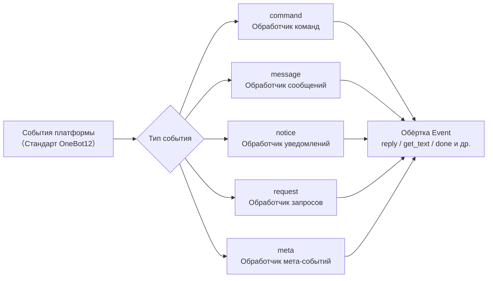

# API системы событий

Документ подробно описывает API системы событий ErisPulse.

Система событий распределяет платформенные события по типам на пять классов обработчиков:



## Модуль Command (Команды)

### Регистрация команд

```python
from ErisPulse.Core.Event import command

# Базовая команда
@command("hello", help="Отправить приветствие")
async def hello_handler(event):
    await event.reply("Привет!")

# Команда с алиасами
@command(["help", "h"], aliases=["помощь"], help="Показать помощь")
async def help_handler(event):
    pass

# Команда с правами доступа
def is_admin(event):
    return event.get("user_id") in admin_ids

@command("admin", permission=is_admin, help="Команда администратора")
async def admin_handler(event):
    pass

# Скрытая команда
@command("secret", hidden=True, help="Секретная команда")
async def secret_handler(event):
    pass

# Группа команд
@command("admin.reload", group="admin", help="Перезагрузить модуль")
async def reload_handler(event):
    pass

# Подкоманды (команды с разделёнными пробелом токенами)
# Совпадение происходит по самому длинному префиксу: /admin add x сначала попадает в admin add (args = ["x"]);
# Подкоманды без объявленного permission наследуют право доступа от ближайшего предка, где оно объявлено
@command("admin add", help="Добавить администратора")
async def admin_add_handler(event):
    pass
```

### Информация о команде

Все API-запросы к командам поддерживают необязательный **контекст сессии**: передача `event=` (Event или dict) или явные `platform=` / `bot_id=` / `session_id=` (при совпадении с event, явные параметры имеют приоритет), т.е. фильтрация по области действия модуля (см. advanced/scope.md); все параметры необязательны, при отсутствии возвращается полный список команд.

```python
# Получить справку по команде
help_text = command.help()

# Сессионная справка: показать только доступные в текущей сессии команды
help_text = command.help(event=event)

# Получить конкретную команду (возвращает объединённые параметры; возвращает None, если недоступна)
cmd_info = command.get_command("admin")
cmd_info = command.get_command("admin", event=event)

# Получить все команды (при сессионной фильтрации исключаются недоступные модули)
all_commands = command.get_commands()
all_commands = command.get_commands(event=event)

# Получить все команды в группе (поддерживает фильтрацию по сессии)
admin_commands = command.get_group_commands("admin")
admin_commands = command.get_group_commands("admin", event=event)

# Получить все видимые команды
visible_commands = command.get_visible_commands()

# Сессионные видимые команды (достаточно event или явных параметров)
visible_commands = command.get_visible_commands(event=event)
visible_commands = command.get_visible_commands(
    platform=event.get("platform"),
    bot_id=event.get_self_account_id(),
    session_id=event.get_session_id(),
)
```

### Ожидание ответа

```python
# Ожидание ответа пользователя
@command("ask", help="Запросить информацию у пользователя")
async def ask_command(event):
    reply = await command.wait_reply(
        event,
        prompt="Пожалуйста, введите ваше имя:",  # уже отправлено выше
        timeout=30.0
    )
    
    if reply:
        name = reply.get_text()
        await event.reply(f"Привет, {name}!")

# Ожидание ответа с валидацией
def validate_age(event_data):
    try:
        age = int(event_data.get_text())
        return 0 <= age <= 150
    except ValueError:
        return False

@command("age", help="Запросить возраст пользователя")
async def age_command(event):
    await event.reply("Пожалуйста, введите ваш возраст:")
    
    reply = await command.wait_reply(
        event,
        timeout=60,
        validator=validate_age
    )
    
    if reply:
        age = int(reply.get_text())
        await event.reply(f"Ваш возраст: {age} лет")

# Ожидание ответа с колбэком
async def handle_confirmation(reply_event):
    text = reply_event.get_text().lower()
    if text in ["да", "yes", "y"]:
        await event.reply("Операция подтверждена!")
    else:
        await event.reply("Операция отменена.")

@command("confirm", help="Подтвердить операцию")
async def confirm_command(event):
    await command.wait_reply(
        event,
        prompt="Введите 'да' или 'нет':",
        callback=handle_confirmation
    )
```

## Модуль Message (Сообщения)

### События сообщений

```python
from ErisPulse.Core.Event import message

# Слушать все сообщения
@message.on_message()
async def message_handler(event):
    sdk.logger.info(f"Получено сообщение: {event.get_text()}")

# Слушать личные сообщения
@message.on_private_message()
async def private_handler(event):
    user_id = event.get_user_id()
    sdk.logger.info(f"Личное сообщение от: {user_id}")

# Слушать сообщения в группе
@message.on_group_message()
async def group_handler(event):
    group_id = event.get_group_id()
    sdk.logger.info(f"Сообщение из группы: {group_id}")

# Слушать сообщения с упоминанием
@message.on_at_message()
async def at_handler(event):
    mentions = event.get_mentions()
    sdk.logger.info(f"Упомянутые пользователи: {mentions}")
```

### Условное слушание

```python
# Использование приоритета для управления порядком выполнения
@message.on_message(priority=10)  # Чем больше значение, тем выше приоритет
async def high_priority_handler(event):
    pass

# Условная фильтрация внутри обработчика
@message.on_message()
async def filtered_handler(event):
    if "ключевое_слово" not in event.get_text():
        return
    # Обработка сообщений, содержащих ключевое слово
    pass
```

## Модуль Notice (Уведомления)

### События уведомлений

```python
from ErisPulse.Core.Event import notice

# Добавление друга
@notice.on_friend_add()
async def friend_add_handler(event):
    user_id = event.get_user_id()
    await event.reply("Спасибо за добавление в друзья!")

# Удаление друга
@notice.on_friend_remove()
async def friend_remove_handler(event):
    user_id = event.get_user_id()
    sdk.logger.info(f"Друг удален: {user_id}")

# Увеличение числа участников группы
@notice.on_group_increase()
async def member_increase_handler(event):
    user_id = event.get_user_id()
    await event.reply(f"Добро пожаловать, новый участник!")

# Уменьшение числа участников группы
@notice.on_group_decrease()
async def member_decrease_handler(event):
    user_id = event.get_user_id()
    sdk.logger.info(f"Участник покинул группу: {user_id}")
```

## Модуль Request (Запросы)

### События запросов

```python
from ErisPulse.Core.Event import request

# Запрос на добавление друга
@request.on_friend_request()
async def friend_request_handler(event):
    user_id = event.get_user_id()
    comment = event.get_comment()
    sdk.logger.info(f"Запрос на добавление друга: {user_id}, комментарий: {comment}")

# Запрос на приглашение в группу
@request.on_group_request()
async def group_request_handler(event):
    group_id = event.get_group_id()
    user_id = event.get_user_id()
    sdk.logger.info(f"Приглашение в группу: {group_id}, от: {user_id}")
```

## Модуль Meta (Мета-события)

### Мета-события

```python
from ErisPulse.Core.Event import meta

# Событие подключения
@meta.on_connect()
async def connect_handler(event):
    platform = event.get_platform()
    sdk.logger.info(f"Успешное подключение к платформе {platform}")

# Событие отключения
@meta.on_disconnect()
async def disconnect_handler(event):
    platform = event.get_platform()
    sdk.logger.info(f"Отключение от платформы {platform}")

# Событие приветствия
@meta.on_heartbeat()
async def heartbeat_handler(event):
    sdk.logger.debug("Получено приветствие")
```

### Состояние бота

После отправки мета-событий адаптером, фреймворк автоматически отслеживает состояние бота. API-запросы и события жизненного цикла см. в [API системы адаптеров - Управление состоянием бота](adapter-system.md#bot-状态管理).

## Обёртка Event

Обработчики событий модуля Event получают экземпляр обёртки Event, которая наследуется от dict и предоставляет удобные методы.

### Основные методы

```python
# Получить информацию о событии
event_id = event.get_id()
event_time = event.get_time()
event_type = event.get_type()
detail_type = event.get_detail_type()
platform = event.get_platform()

# Получить информацию о боте
self_platform = event.get_self_platform()
self_user_id = event.get_self_user_id()
self_info = event.get_self_info()
```

### Идентификаторы сессии

```python
# Единый идентификатор цели: для групповых чатов возвращает group_id, для личных чатов user_id и т.д.
target_id = event.get_target_id()

# Уникальный идентификатор сессии, формат: {platform}:{detail_type}:{target_id}
session_id = event.get_session_id()
# Примеры: "telegram:private:12345", "qq:group:67890"
```

`get_target_id()` возвращает первое непустое значение в следующем порядке: `group_id` → `channel_id` → `guild_id` → `thread_id` → `user_id`. Подходит для управления контекстом, хранения состояния и других сценариев, требующих единообразной идентификации сессии.

### Методы сообщений

```python
# Получить содержимое сообщения
message_segments = event.get_message()
alt_message = event.get_alt_message()
text = event.get_text()

# Получить информацию об отправителе
user_id = event.get_user_id()
nickname = event.get_user_nickname()
sender = event.get_sender()

# Получить информацию о группе
group_id = event.get_group_id()

# Определить тип сообщения
is_msg = event.is_message()
is_private = event.is_private_message()
is_group = event.is_group_message()

# Связанные с упоминаниями
is_at = event.is_at_message()
has_mention = event.has_mention()
mentions = event.get_mentions()
```

### Информация о команде

```python
# Получить информацию о команде
cmd_name = event.get_command_name()
cmd_args = event.get_command_args()
cmd_raw = event.get_command_raw()

# Определить, является ли событие командой
is_cmd = event.is_command()
```

### Функции ответа

```python
# Базовая отправка ответа
await event.reply("Это сообщение")

# Указать способ отправки
await event.reply("http://example.com/image.jpg", method="Image")

# Ответ с @пользователем и упоминанием
await event.reply("Привет", at_users=["user1"], reply_to="msg_id")

# Ответ с @всех
await event.reply("Анонс", at_all=True)

# Использовать специфичные для платформы методы (через параметр via)
await event.reply("Доска", method="Board",
                  via=[("Expire", 3600), ("ForMember", "114514")])

# Получить цепочку отправки, свободно добавлять модификаторы и методы отправки (подходит для последовательных модификаторов / действий)
await event.send_chain().Expire(3600).Board("Доска")
await event.send_chain().DismissBoard()

# Ответ с использованием сегментов OneBot12
from ErisPulse.Core.Event import MessageBuilder
msg = MessageBuilder().text("Hello").image("url").build()
await event.reply_ob12(msg)

# Ожидание ответа
reply = await event.wait_reply(timeout=30)
```

### Проверка возможностей платформы

```python
# Проверить, поддерживает ли платформа метод отправки
if event.supports("Image"):
    await event.reply(url, method="Image")

# Получить список всех доступных методов отправки
methods = event.available_methods()
# ["Text", "Image", "Voice", ...]
```

### Методы ответа

Метод `reply()` поддерживает параметр `method` для указания типа отправки, а также два удобных булевых параметра:

```python
# Простой текстовый ответ
await event.reply("Привет")

# Ответ с @отправителя (автоматически извлекает user_id)
await event.reply("Привет", at_sender=True)

# Ответ с упоминанием текущего сообщения (автоматически извлекает message_id)
await event.reply("Получено", quote=True)

# Комбинированный ответ
await event.reply("Получено", at_sender=True, quote=True)

# Отправка изображения (с помощью параметра method)
if event.supports("Image"):
    await event.reply("http://example.com/img.jpg", method="Image")
else:
    await event.reply("[Изображение] http://example.com/img.jpg")
```

**Описание параметров**:

| Параметр | Тип | Описание |
|------|------|------|
| `content` | str | Отправляемое содержимое |
| `method` | str | Метод отправки, по умолчанию "Text", можно использовать "Image"/"Voice"/"Video"/"File" и др. |
| `at_sender` | bool | Отправить @отправителя (автоматически извлекает user_id) |
| `quote` | bool | Отправить упоминание текущего сообщения (автоматически извлекает message_id) |
| `at_users` | list[str] | Список пользователей для @ |
| `reply_to` | str | Ручное указание ID сообщения для ответа |
| `at_all` | bool | Отправить @всех |

### Интерактивные методы

```python
# confirm — подтверждение диалога (возвращает True/False/None)
if await event.confirm("Вы уверены, что хотите выполнить эту операцию?"):
    await event.reply("Операция подтверждена")

# Использование не-Text метода для отправки подтверждения
if await event.confirm("http://example.com/image.jpg", method="Image"):
    await event.reply("Подтверждение подано")

# choose — выбор из меню (возвращает индекс выбранного пункта или None)
choice = await event.choose("Выберите цвет:", ["красный", "зелёный", "синий"])

# options_format="auto" (по умолчанию) автоматически выбирает стиль в зависимости от method:
# Markdown→непорядковый список (- 1.пункт), Html→упорядоченный список (<ol>), иначе→простой текстовый список
# Для текстовых методов (Markdown/Html и др.) опции по умолчанию добавляются в конец
# merge_prompt=True можно принудительно объединить; placeholder можно настроить
choice = await event.choose(
    "## Выберите\n{options}", ["A", "B"],
    method="Markdown", merge_prompt=True,
)

# collect — сбор формы (возвращает словарь {key: value} или None)
data = await event.collect([
    {"key": "name", "prompt": "Введите имя:"},
    {"key": "age", "prompt": "Введите возраст:",
     "validator": lambda e: e.get_text().isdigit()},
    {"key": "avatar", "prompt": "Отправьте аватар:", "method": "Image"},
])

# wait_for — ожидание события с заданным типом
evt = await event.wait_for(event_type="notice", condition=lambda e: ..., timeout=120)

# conversation — контекст многошагового диалога
conv = event.conversation(timeout=60)
await conv.say("Добро пожаловать!")
```

> Полное описание параметров интерактивных методов и дополнительные примеры см. в [Документации по Event обёртке](../developer-guide/modules/event-wrapper.md) и [Многошаговый диалог](../advanced/conversation.md).

### Вспомогательные методы

```python
# Преобразование в словарь (фильтруются ключи, начинающиеся с _)
event_dict = event.to_dict()

# Получить исходные данные
raw = event.get_raw()
raw_type = event.get_raw_type()
```

### Контроль цепочки

`event.done(claim=, stop=)` объединяет два семантических понятия: "принятие" и "блокировка":

- **Принятие (claim)**: пометка события как обработанного (`_processed`), обработчик команды пропускает его при повторной отправке
- **Блокировка (stop)**: предотвращение распространения события к обработчикам с более низким приоритетом (`_propagation_stopped`)

```python
# Принятие + блокировка (по умолчанию)
event.done()

# Только принятие, без блокировки (низкоприоритетные наблюдатели всё ещё видят событие)
event.done(stop=False)

# Только блокировка, без принятия (например, для брандмауэра / лимитирования)
event.done(claim=False)

# mark_processed — основной метод, done — его алиас
event.mark_processed()             # эквивалент event.done()
event.mark_processed(stop=False)   # эквивалент event.done(stop=False)

# Проверка состояния
event.is_processed()  # был ли принят
event.is_stopped()    # была ли остановлена передача
```

### Платформенные расширения

Адаптеры могут регистрировать платформенные методы для Event, доступные только на экземплярах соответствующей платформы.

#### Пользователь: использование платформенных методов

После регистрации платформенных методов адаптером, вы можете вызывать их непосредственно в обработчиках событий. Методы для каждой платформы различаются, см. соответствующую [документацию платформы](../platform-guide/).

```python
from ErisPulse.Core.Event import message

@message.on_message()
async def handle_message(event):
    platform = event.get_platform()

    # Вызов платформенного метода в зависимости от платформы
    if platform == "email":
        subject = event.get_subject()           # специфичный для электронной почты
        attachments = event.get_attachments()   # специфичный для электронной почты
```

#### Проверка зарегистрированных методов платформы

```python
from ErisPulse.Core.Event import get_platform_event_methods

# Получить список зарегистрированных методов для платформы
methods = get_platform_event_methods("email")
# ["get_subject", "get_from", "get_attachments", ...]

# Динамическая проверка и вызов метода
for method_name in get_platform_event_methods(event.get_platform()):
    method = getattr(event, method_name)
    print(f"{method_name}: {method()}")
```

#### Изоляция платформенных методов

Регистрация методов для разных платформ не влияет друг на друга:

```python
# Почтовое событие - только почтовые методы
event = Event({"platform": "email", "email_raw": {"subject": "Hello"}})
event.get_subject()      # ✅ "Hello"
event.get_chat_type()    # ❌ AttributeError

# Telegram событие - только Telegram методы
event = Event({"platform": "telegram", "telegram_raw": {"chat": {"type": "private"}}})
event.get_chat_type()    # ✅ "private"
event.get_subject()      # ❌ AttributeError
```

#### Поддержка hasattr / dir

```python
hasattr(event, "get_subject")   # возвращает True только при platform="email"
"get_subject" in dir(event)     # аналогично
```

#### Адаптер: регистрация платформенных методов

Адаптер может зарегистрировать платформенные методы для Event с помощью декоратора, первый параметр метода — это self (экземпляр Event), можно свободно обращаться к данным события.

#### Регистрация отдельного метода

```python
from ErisPulse.Core.Event import register_event_method

@register_event_method("email")
def get_subject(self):
    """Получить тему письма"""
    return self.get("email_raw", {}).get("subject", "")

@register_event_method("email")
def get_from(self):
    """Получить отправителя"""
    return self.get("email_raw", {}).get("from", {})
```

#### Массовая регистрация (через Mixin-класс)

При большом количестве методов рекомендуется использовать Mixin-класс для массовой регистрации:

```python
from ErisPulse.Core.Event import register_event_mixin

class EmailEventMixin:
    def get_subject(self):
        return self.get("email_raw", {}).get("subject", "")

    def get_from(self):
        return self.get("email_raw", {}).get("from", {})

    def get_attachments(self):
        return self.get("email_raw", {}).get("attachments", [])

# Регистрация всех методов за один раз
register_event_mixin("email", EmailEventMixin)
```

#### Правила возврата значений

| Сценарий | Возвращаемое значение | Способ использования пользователем |
|------|--------|------------|
| Возврат данных (текст, словарь и т.д.) | Прямое значение | `subject = event.get_subject()` |
| Выполнение операции (отправка сообщения и т.д.) | Возвращает `asyncio.Task` | `task = event.do_something()` (необязательно await) |

> **Рекомендация**: методы, возвращающие не данные, должны возвращать `asyncio.Task`, чтобы пользователь мог решить, следует ли ждать завершения, даже если не await.

```python
@register_event_method("email")
def forward_email(self, to_address: str):
    """Переслать письмо — возвращает Task, пользователь может решить, следует ли await"""
    import asyncio
    return asyncio.create_task(
        self._do_forward(to_address)
    )

# Пользователь может await дождаться результата
await event.forward_email("user@example.com")

# Также можно не await, операция выполнится в фоне
event.forward_email("user@example.com")
```

#### Удаление методов

```python
from ErisPulse.Core.Event import unregister_event_method, unregister_platform_event_methods

# Удаление отдельного метода
unregister_event_method("email", "get_subject")

# Удаление всех методов для платформы (вызывается при завершении адаптера)
unregister_platform_event_methods("email")
```

#### Переопределение встроенных методов

`register_event_mixin` / `register_event_method` поддерживают переопределение встроенных методов Event (например, `confirm`, `choose`, `collect`, `wait_reply`, `reply` и др.). Зарегистрированные платформенные методы имеют приоритет над встроенными, поэтому адаптер может предоставить платформенно-специфичные реализации интерактивных функций.

Встроенные реализации экспортируются как `_builtin_*` функции, переопределяющие методы могут вызывать их как резерв:

```python
from ErisPulse.Core.Event import register_event_mixin, _builtin_choose

class YunhuEventMixin:
    async def choose(self, prompt, options, timeout=60, method="Text"):
        # Платформа Yunhu использует кнопки
        buttons = [[{"text": opt} for opt in options]]
        await self.reply(prompt)
        # ...ожидание нажатия кнопки или текстового ответа...
        # Возврат к встроенной логике
        return await _builtin_choose(self, None, options, timeout, "Text")

register_event_mixin("yunhu", YunhuEventMixin)
```

## Расширение для кросс-платформ (шаблоны)

`register_event_method` и `register_event_mixin` поддерживают передачу `"*"` в качестве имени платформы, регистрируя методы, доступные на **всех платформах**. Подходит для модулей, требующих кросс-платформенного воспроизводства, например, AI-диалогов, управления контекстом и т.д.

### Регистрация кросс-платформенного метода

```python
from ErisPulse.Core.Event.wrapper import register_event_method

@register_event_method("*")
async def ai_chat(self, prompt: str):
    """self — это экземпляр Event, можно свободно обращаться к данным и встроенным методам"""
    await self.reply(f"AI: {prompt}")
```

После регистрации, все платформы могут использовать:

```python
from ErisPulse.Core.Event import message

@message.on_message()
async def handler(event):
    await event.ai_chat(event.get_text())
```

### Приоритет методов

При доступе к методам Event через атрибуты, порядок разрешения:

1. **Платформенно-специфичные методы** (переопределение текущей платформы)
2. **Методы шаблона** (`"*"` — кросс-платформенные методы)
3. **Встроенные методы** (`reply`, `confirm` и др.)
4. **Доступ по ключу словаря**

> Таким образом, методы шаблона могут переопределять встроенные методы (например, `reply`), но будут переопределены платформенно-специфичными методами.

## Система приоритетов

Обработчики событий поддерживают приоритет, чем больше значение, тем выше приоритет:

```python
# Обработчик с высоким приоритетом выполняется первым
@message.on_message(priority=10)
async def high_priority_handler(event):
    pass

# Обработчик с низким приоритетом выполняется последним
@message.on_message(priority=0)
async def low_priority_handler(event):
    pass
```

## Связанные документы

- [API ядра модулей](core-modules.md) - API ядра модулей
- [API системы адаптеров](adapter-system.md) - API управления адаптерами
- [Руководство по разработке модулей](../developer-guide/modules/) - Разработка пользовательских модулей