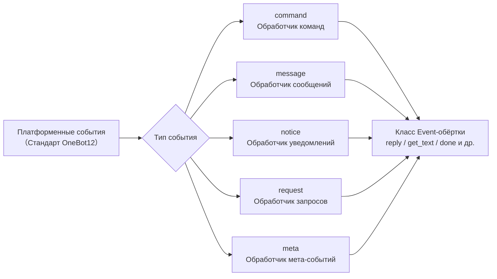

# API системы событий

Документ подробно описывает API системы событий ErisPulse.

Система событий распределяет платформенные события по типам на пять классов обработчиков:



docs/ru/quick-start.md

## Модуль команд

### Регистрация команд

```python
from ErisPulse.Core.Event import command

# Базовая команда
@command("hello", help="Отправляет приветствие")
async def hello_handler(event):
    await event.reply("Привет!")

# Команда с псевдонимами
@command(["help", "h"], aliases=["помощь"], help="Показывает справку")
async def help_handler(event):
    pass

# Команда с правами доступа
def is_admin(event):
    return event.get("user_id") in admin_ids

@command("admin", permission=is_admin, help="Команда администратора")
async def admin_handler(event):
    pass

# Скрытая команда
@command("secret", hidden=True, help="Секретная команда")
async def secret_handler(event):
    pass

# Группа команд
@command("admin.reload", group="admin", help="Перезагружает модули")
async def reload_handler(event):
    pass
```

### Информация о команде

```python
# Получение справки по команде
help_text = command.help()

# Получение информации о конкретной команде
cmd_info = command.get_command("admin")

# Получение всех команд из группы
admin_commands = command.get_group_commands("admin")

# Получение всех видимых команд
visible_commands = command.get_visible_commands()
```

### Ожидание ответа

```python
# Ожидание ответа пользователя
@command("ask", help="Запрашивает информацию у пользователя")
async def ask_command(event):
    reply = await command.wait_reply(
        event,
        prompt="Пожалуйста, введите ваше имя:",  # Отправлено выше
        timeout=30.0
    )
    
    if reply:
        name = reply.get_text()
        await event.reply(f"Привет, {name}!")

# Ожидание ответа с валидацией
def validate_age(event_data):
    try:
        age = int(event_data.get_text())
        return 0 <= age <= 150
    except ValueError:
        return False

@command("age", help="Запрашивает возраст пользователя")
async def age_command(event):
    await event.reply("Пожалуйста, введите ваш возраст:")
    
    reply = await command.wait_reply(
        event,
        timeout=60,
        validator=validate_age
    )
    
    if reply:
        age = int(reply.get_text())
        await event.reply(f"Ваш возраст — {age} лет")

# Ожидание ответа с колбэком
async def handle_confirmation(reply_event):
    text = reply_event.get_text().lower()
    if text in ["да", "yes", "y"]:
        await event.reply("Операция подтверждена!")
    else:
        await event.reply("Операция отменена.")

@command("confirm", help="Подтверждает операцию")
async def confirm_command(event):
    await command.wait_reply(
        event,
        prompt="Пожалуйста, введите 'да' или 'нет':",
        callback=handle_confirmation
    )

## Модуль сообщений

### События сообщений

```python
from ErisPulse.Core.Event import message

# Слушаем все сообщения
@message.on_message()
async def message_handler(event):
    sdk.logger.info(f"Получено сообщение: {event.get_text()}")

# Слушаем личные сообщения
@message.on_private_message()
async def private_handler(event):
    user_id = event.get_user_id()
    sdk.logger.info(f"Личное сообщение от: {user_id}")

# Слушаем групповые сообщения
@message.on_group_message()
async def group_handler(event):
    group_id = event.get_group_id()
    sdk.logger.info(f"Групповое сообщение от: {group_id}")

# Слушаем сообщения с упоминанием (ат)
@message.on_at_message()
async def at_handler(event):
    mentions = event.get_mentions()
    sdk.logger.info(f"Упомянутый пользователь: {mentions}")
```

### Условные прослушивания

```python
# Используем приоритет для управления порядком выполнения
@message.on_message(priority=10)  # Чем больше число, тем выше приоритет
async def high_priority_handler(event):
    pass

# Реализуем фильтрацию условий внутри обработчика
@message.on_message()
async def filtered_handler(event):
    if "ключевое слово" not in event.get_text():
        return
    # Обработка сообщений, содержащих ключевое слово
    pass

## Модуль уведомлений

### События уведомлений

```python
from ErisPulse.Core.Event import notice

# Добавление друга
@notice.on_friend_add()
async def friend_add_handler(event):
    user_id = event.get_user_id()
    await event.reply("Добро пожаловать в друзья!")

# Удаление друга
@notice.on_friend_remove()
async def friend_remove_handler(event):
    user_id = event.get_user_id()
    sdk.logger.info(f"Удаление друга: {user_id}")

# Увеличение участников группы
@notice.on_group_increase()
async def member_increase_handler(event):
    user_id = event.get_user_id()
    await event.reply(f"Добро пожаловать нового участника!")

# Уменьшение участников группы
@notice.on_group_decrease()
async def member_decrease_handler(event):
    user_id = event.get_user_id()
    sdk.logger.info(f"Участник покинул группу: {user_id}")

## Request модуль запросов

### События запроса

```python
from ErisPulse.Core.Event import request

# Запрос от друга
@request.on_friend_request()
async def friend_request_handler(event):
    user_id = event.get_user_id()
    comment = event.get_comment()
    sdk.logger.info(f"Запрос от друга: {user_id}, Примечание: {comment}")

# Запрос на вступление в группу
@request.on_group_request()
async def group_request_handler(event):
    group_id = event.get_group_id()
    user_id = event.get_user_id()
    sdk.logger.info(f"Приглашение в группу: {group_id}, От: {user_id}")

## Модуль Meta событий

### Meta события

```python
from ErisPulse.Core.Event import meta

# Событие подключения
@meta.on_connect()
async def connect_handler(event):
    platform = event.get_platform()
    sdk.logger.info(f"Платформа {platform} успешно подключена")

# Событие отключения
@meta.on_disconnect()
async def disconnect_handler(event):
    platform = event.get_platform()
    sdk.logger.info(f"Платформа {platform} отключена")

# Событие сердцебиения
@meta.on_heartbeat()
async def heartbeat_handler(event):
    sdk.logger.debug("Получен сигнал сердцебиения")
```

### Запрос состояния бота

После того как адаптер отправляет событие meta, фреймворк автоматически отслеживает состояние бота. Ссылки на API для запроса статуса и прослушивания событий жизненного цикла см. в разделе [Система адаптеров - Управление состоянием бота](adapter-system.md#bot-状态管理).

请直接返回翻译后的完整Markdown内容，不要包含任何其他文字。

## Event �обертыватель

Модуль Event обработчик событий принимает экземпляр обертки Event, которая наследуется от dict и предоставляет удобные методы.

### Основные методы

```python
# Получение информации о событии
event_id = event.get_id()
event_time = event.get_time()
event_type = event.get_type()
detail_type = event.get_detail_type()
platform = event.get_platform()

# Получение информации о боте
self_platform = event.get_self_platform()
self_user_id = event.get_self_user_id()
self_info = event.get_self_info()
```

### Идентификатор сессии

```python
# Единый идентификатор цели: для групповых чатов возвращает group_id, для личных чатов возвращает user_id и т.д.
target_id = event.get_target_id()

# Уникальный идентификатор сессии, формат: {platform}:{detail_type}:{target_id}
session_id = event.get_session_id()
# Пример: "telegram:private:12345", "qq:group:67890"
```

`get_target_id()` возвращает первое ненулевое значение в следующем порядке: `group_id` → `channel_id` → `guild_id` → `thread_id` → `user_id`. Подходит для сценариев, требующих единообразной идентификации сессии, таких как управление контекстом и хранение состояний.

### Методы сообщений

```python
# Получение содержимого сообщения
message_segments = event.get_message()
alt_message = event.get_alt_message()
text = event.get_text()

# Получение информации об отправителе
user_id = event.get_user_id()
nickname = event.get_user_nickname()
sender = event.get_sender()

# Получение информации о группе
group_id = event.get_group_id()

# Определение типа сообщения
is_msg = event.is_message()
is_private = event.is_private_message()
is_group = event.is_group_message()

# Связанные с упоминаниями
is_at = event.is_at_message()
has_mention = event.has_mention()
mentions = event.get_mentions()
```

### Командная информация

```python
# Получение информации о команде
cmd_name = event.get_command_name()
cmd_args = event.get_command_args()
cmd_raw = event.get_command_raw()

# Определение, является ли событие командой
is_cmd = event.is_command()
```

### Функция ответа

```python
# Базовый ответ
await event.reply("Это сообщение")

# Указание метода отправки
await event.reply("http://example.com/image.jpg", method="Image")

# Ответ с @пользователем и упоминанием сообщения
await event.reply("Привет", at_users=["user1"], reply_to="msg_id")

# @всех участников
await event.reply("Анонс", at_all=True)

# Использование платформо-специфических методов (через параметр via)
await event.reply("Содержимое доски", method="Board",
                  via=[("Expire", 3600), ("ForMember", "114514")])

# Получение цепочки отправки, свободное добавление модификаторов и методов отправки (подходит для последовательных модификаторов/действий)
await event.send_chain().Expire(3600).Board("Содержимое доски")
await event.send_chain().DismissBoard()

# Использование OneBot12 сообщений для ответа
from ErisPulse.Core.Event import MessageBuilder
msg = MessageBuilder().text("Hello").image("url").build()
await event.reply_ob12(msg)

# Ожидание ответа
reply = await event.wait_reply(timeout=30)
```

### Проверка возможностей платформы

```python
# Проверка, поддерживает ли текущая платформа определенный метод отправки
if event.supports("Image"):
    await event.reply(url, method="Image")

# Получение списка всех доступных методов отправки на текущей платформе
methods = event.available_methods()
# ["Text", "Image", "Voice", ...]
```

### Методы ответа

Метод `reply()` поддерживает указание типа отправки через параметр `method` и два удобных булевых параметра:

```python
# Простой текстовый ответ
await event.reply("Привет")

# Ответ с упоминанием отправителя
await event.reply("Привет", at_sender=True)

# Ответ с цитированием текущего сообщения
await event.reply("Принято", quote=True)

# Комбинированный вариант
await event.reply("Принято", at_sender=True, quote=True)

# Отправка изображения (используя параметр method)
if event.supports("Image"):
    await event.reply("http://example.com/img.jpg", method="Image")
else:
    await event.reply("[Изображение] http://example.com/img.jpg")
```

**Описание параметров**:

| Параметр | Тип | Описание |
|------|------|------|
| `content` | str | Содержимое отправки |
| `method` | str | Метод отправки, по умолчанию "Text", опционально "Image"/"Voice"/"Video"/"File" и т.д. |
| `at_sender` | bool | Упоминать ли отправителя (автоматически извлекает user_id) |
| `quote` | bool | Цитировать ли текущее сообщение (автоматически извлекает message_id) |
| `at_users` | list[str] | Список упоминаемых пользователей |
| `reply_to` | str | Ручное указание ID сообщения для ответа |
| `at_all` | bool | Упоминать ли всех участников |

### Интерактивные методы

```python
# confirm — подтверждение диалога (возвращает True/False/None)
if await event.confirm("Вы уверены, что хотите выполнить это действие?"):
    await event.reply("Подтверждено")

# Использование не-Text метода для отправки подтверждения
if await event.confirm("http://example.com/image.jpg", method="Image"):
    await event.reply("Подтверждение по изображению")

# choose — выбор из меню (возвращает индекс опции или None)
choice = await event.choose("Выберите цвет:", ["красный", "зеленый", "синий"])

# options_format="auto" (по умолчанию) автоматически выбирает стиль в зависимости от метода:
# Markdown→непорядковый список (- 1.опция), Html→упорядоченный список (<ol>), иначе→простой текстовый список
# Для текстовых методов (Markdown/Html и т.д.) опции по умолчанию объединяются в конец
# merge_prompt=True принудительно объединяет для любого метода; placeholder позволяет настроить подставку
choice = await event.choose(
    "## Выберите\n{options}", ["A", "B"],
    method="Markdown", merge_prompt=True,
)

# collect — сбор формы (возвращает словарь {key: value} или None)
data = await event.collect([
    {"key": "name", "prompt": "Введите имя:"},
    {"key": "age", "prompt": "Введите возраст:",
     "validator": lambda e: e.get_text().isdigit()},
    {"key": "avatar", "prompt": "Отправьте аватар:", "method": "Image"},
])

# wait_for — ожидание события, удовлетворяющего условиям
evt = await event.wait_for(event_type="notice", condition=lambda e: ..., timeout=120)

# conversation — контекст многошагового диалога
conv = event.conversation(timeout=60)
await conv.say("Добро пожаловать!")
```

> Полное описание параметров интерактивных методов и дополнительные примеры см. в [Подробном описании Event обертывателя](../developer-guide/modules/event-wrapper.md) и [Многошаговый диалог Conversation](../advanced/conversation.md).

### Утилитные методы

```python
# Преобразование в словарь (фильтрует ключи, начинающиеся с _)
event_dict = event.to_dict()

# Получение исходных данных
raw = event.get_raw()
raw_type = event.get_raw_type()
```

### Управление цепочкой

`event.done(claim=, stop=)` унифицирует управление двумя ортогональными семантиками: «признание» и «блокировка»:

- **Признание (claim)**: помечает событие как обработанное (`_processed`), диспетчер команд использует это для пропуска дублирования
- **Блокировка (stop)**: предотвращает распространение на обработчики с более низким приоритетом (`_propagation_stopped`)

```python
# Признание + блокировка (по умолчанию)
event.done()

# Только признание, без блокировки (наблюдатели с низким приоритетом все еще видят)
event.done(stop=False)

# Только блокировка, без признания (например, брандмауэр / ограничение скорости)
event.done(claim=False)

# mark_processed — основной метод, done — его псевдоним
event.mark_processed()             # эквивалент event.done()
event.mark_processed(stop=False)   # эквивалент event.done(stop=False)

# Проверка состояния
event.is_processed()  # признано ли событие
event.is_stopped()    # остановлено ли распространение
```

### Платформо-специфические методы

Адаптеры могут регистрировать платформо-специфические методы для Event, доступные только на экземплярах соответствующей платформы.

#### Пользователь: использование платформо-специфических методов

После регистрации адаптером платформо-специфических методов вы можете напрямую вызывать их в обработчике событий. Методы для разных платформ отличаются, см. соответствующую [документацию платформы](../platform-guide/).

```python
from ErisPulse.Core.Event import message

@message.on_message()
async def handle_message(event):
    platform = event.get_platform()

    # Вызов специфичного метода в зависимости от платформы
    if platform == "email":
        subject = event.get_subject()           # специфичный для email
        attachments = event.get_attachments()   # специфичный для email
```

#### Проверка зарегистрированных методов платформы

```python
from ErisPulse.Core.Event import get_platform_event_methods

# Получение списка зарегистрированных методов для платформы
methods = get_platform_event_methods("email")
# ["get_subject", "get_from", "get_attachments", ...]

# Динамическая проверка и вызов
for method_name in get_platform_event_methods(event.get_platform()):
    method = getattr(event, method_name)
    print(f"{method_name}: {method()}")
```

#### Изоляция методов платформы

Методы, зарегистрированные для разных платформ, не влияют друг на друга:

```python
# Email событие - только email методы
event = Event({"platform": "email", "email_raw": {"subject": "Hello"}})
event.get_subject()      # ✅ "Hello"
event.get_chat_type()    # ❌ AttributeError

# Telegram событие - только Telegram методы
event = Event({"platform": "telegram", "telegram_raw": {"chat": {"type": "private"}}})
event.get_chat_type()    # ✅ "private"
event.get_subject()      # ❌ AttributeError
```

#### Поддержка `hasattr` / `dir`

```python
hasattr(event, "get_subject")   # возвращает True только при platform="email"
"get_subject" in dir(event)     # аналогично
```

### Адаптер: регистрация платформо-специфических методов

Адаптеры могут регистрировать платформо-специфические методы для Event с помощью декоратора, первый параметр метода — `self` (экземпляр Event), можно свободно обращаться к данным события.

#### Регистрация одного метода

```python
from ErisPulse.Core.Event import register_event_method

@register_event_method("email")
def get_subject(self):
    """Получение темы письма"""
    return self.get("email_raw", {}).get("subject", "")

@register_event_method("email")
def get_from(self):
    """Получение отправителя"""
    return self.get("email_raw", {}).get("from", {})
```

#### Массовая регистрация (через Mixin класс)

При большом количестве методов рекомендуется использовать Mixin класс для массовой регистрации:

```python
from ErisPulse.Core.Event import register_event_mixin

class EmailEventMixin:
    def get_subject(self):
        return self.get("email_raw", {}).get("subject", "")

    def get_from(self):
        return self.get("email_raw", {}).get("from", {})

    def get_attachments(self):
        return self.get("email_raw", {}).get("attachments", [])

# Регистрация всех методов за один раз
register_event_mixin("email", EmailEventMixin)
```

#### Правила возвращаемых значений

| Сценарий | Возвращаемое значение | Способ использования пользователем |
|------|--------|------------|
| Возвращение данных (текст, словарь и т.д.) | Просто возвращаемое значение | `subject = event.get_subject()` |
| Выполнение операции (отправка сообщения и т.д.) | Возвращаемый asyncio.Task | `task = event.do_something()` (опционально `await`) |

> **Рекомендация**: методы, возвращающие не данные, должны возвращать `asyncio.Task`, чтобы пользователь мог сам решить, следует ли `await`, даже если не `await`, операция будет выполнена.

```python
@register_event_method("email")
def forward_email(self, to_address: str):
    """Пересылка письма — возвращает Task, пользователь сам решает, следует ли await"""
    import asyncio
    return asyncio.create_task(
        self._do_forward(to_address)
    )

# Пользователь может await и ждать результата
await event.forward_email("user@example.com")

# Также можно не await, операция выполнится в фоне
event.forward_email("user@example.com")
```

#### Отмена регистрации метода

```python
from ErisPulse.Core.Event import unregister_event_method, unregister_platform_event_methods

# Отмена регистрации одного метода
unregister_event_method("email", "get_subject")

# Отмена регистрации всех методов платформы (вызывается при остановке адаптера)
unregister_platform_event_methods("email")
```

#### Переопределение встроенных методов

`register_event_mixin` / `register_event_method` поддерживает переопределение встроенных методов Event (например, `confirm`, `choose`, `collect`, `wait_reply`, `reply` и т.д.). Регистрируемые платформо-специфические методы через `Event.__getattribute__` имеют приоритет над встроенными, поэтому адаптеры могут предоставлять платформо-специфические реализации интерактивных функций.

Встроенные реализации экспортируются как `_builtin_*` функции, переопределяющие методы могут вызывать их в качестве резервных:

```python
from ErisPulse.Core.Event import register_event_mixin, _builtin_choose

class YunhuEventMixin:
    async def choose(self, prompt, options, timeout=60, method="Text"):
        # Платформа Yunhu использует кнопки
        buttons = [[{"text": opt} for opt in options]]
        await self.reply(prompt)
        # ...ожидание обратного вызова кнопки или текстового ответа...
        # Возврат к встроенной логике
        return await _builtin_choose(self, None, options, timeout, "Text")

register_event_mixin("yunhu", YunhuEventMixin)

## Кроссплатформенное расширение (шаблоны)

`register_event_method` и `register_event_mixin` поддерживают передачу `"*"` в качестве названия платформы, зарегистрированные методы будут доступны на **всех** платформах экземпляров Event. Подходит для модулей функциональности, требующих повторного использования кроссплатформенно, таких как AI-диалог и управление контекстом.

### Регистрация кроссплатформенного метода

```python
from ErisPulse.Core.Event.wrapper import register_event_method

@register_event_method("*")
async def ai_chat(self, prompt: str):
    """self - это экземпляр Event, вы можете свободно обращаться к данным события и встроенным методам"""
    await self.reply(f"AI: {prompt}")
```

После регистрации все обработчики событий всех платформ могут вызывать его:

```python
from ErisPulse.Core.Event import message

@message.on_message()
async def handler(event):
    await event.ai_chat(event.get_text())
```

### Приоритет разрешения методов

При доступе к методам Event через атрибуты, порядок разрешения следующий:

1. **Платформо-специфичные методы** (переопределения для текущей платформы)
2. **Методы шаблонов** (кроссплатформенные методы, зарегистрированные `"*"`)
3. **Встроенные методы** (`reply`, `confirm` и др.)
4. **Доступ по ключам словаря**

> Таким образом, методы шаблонов могут переопределять встроенные методы (например, `reply`), но могут быть дополнительно переопределены одноименными платформо-специфичными методами.

## Система приоритетов

Обработчики событий поддерживают приоритеты: чем выше значение, тем выше приоритет:

```python
# Обработчик с высоким приоритетом выполняется первым
@message.on_message(priority=10)
async def high_priority_handler(event):
    pass

# Обработчик с низким приоритетом выполняется последним
@message.on_message(priority=0)
async def low_priority_handler(event):
    pass

## Документация

- [API ядерных модулей](../core-modules.md) - API ядерных модулей
- [API системы адаптеров](../adapter-system.md) - API управления адаптерами
- [Руководство по разработке модулей](../developer-guide/modules/) - Разработка пользовательских модулей