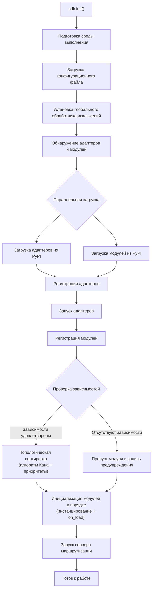
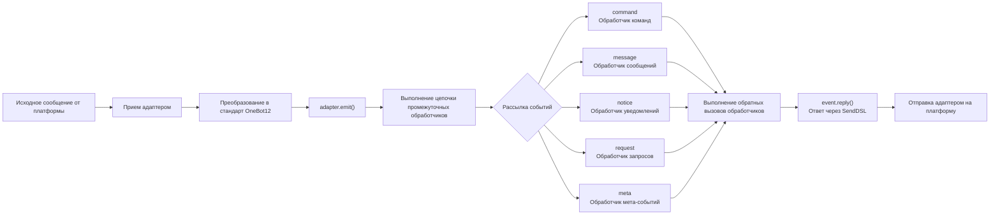
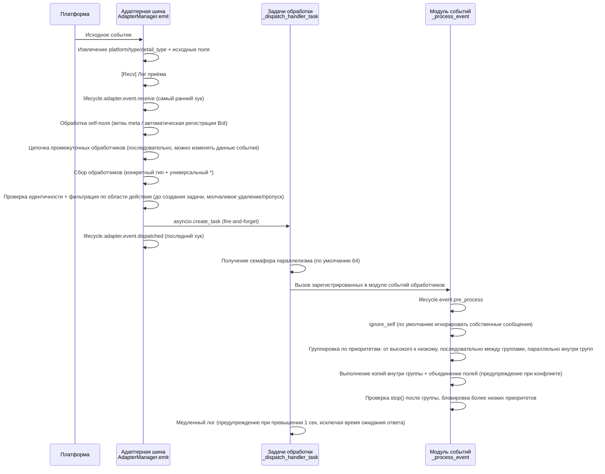
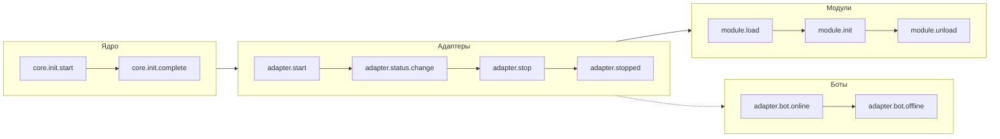
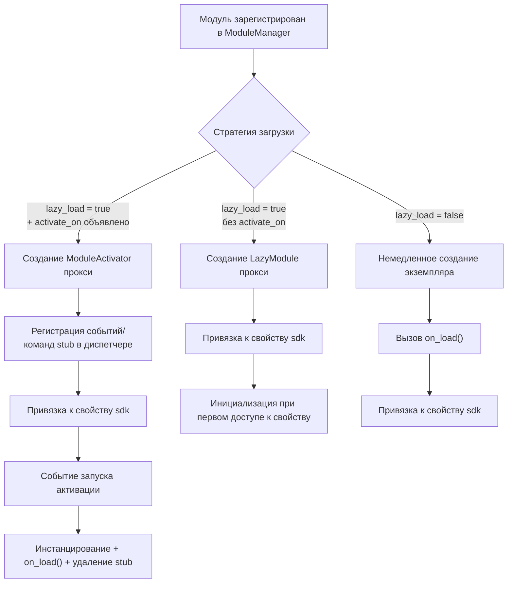
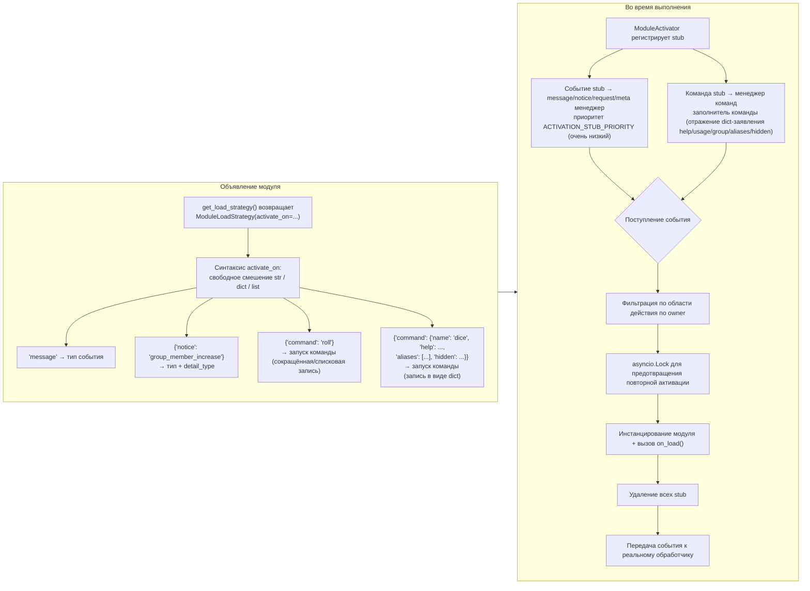
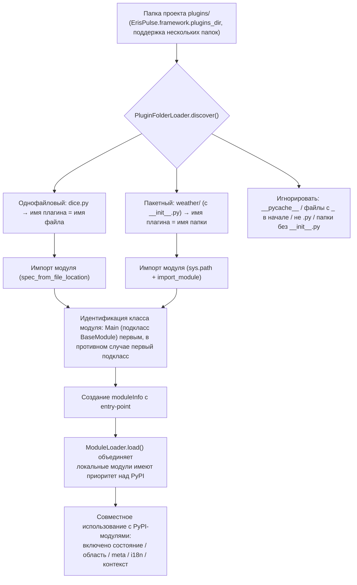
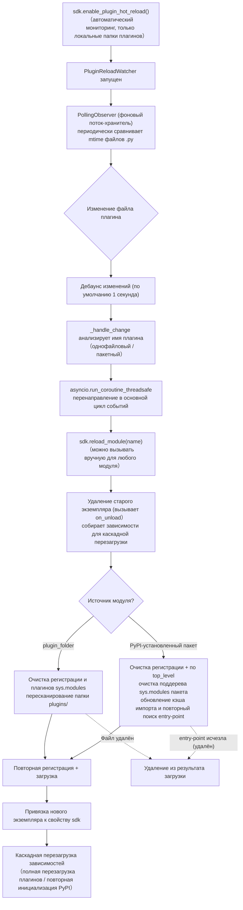

# Архитектурный обзор

Данный документ с помощью визуальных диаграмм представляет техническую архитектуру ErisPulse SDK, помогая вам быстро понять идеи проектирования и модульные связи фреймворка.

## Основная архитектура SDK

На следующей диаграмме показаны основные модули SDK и их взаимосвязи:

### Описание основных модулей

| Модуль | Описание |
|------|------|
| **Event** | Система событий, предоставляет обработку пяти типов событий: command / message / notice / request / meta, а также поддерживает Conversation для многошагового диалога |
| **Adapter** | Менеджер адаптеров, управляет регистрацией, запуском и остановкой адаптеров для различных платформ |
| **Module** | Менеджер модулей, управляет регистрацией, загрузкой и выгрузкой плагинов, поддерживает объявление зависимостей и топологическую сортировку |
| **Lifecycle** | Менеджер жизненного цикла, предоставляет хуки, управляемые событиями |
| **Storage** | Система хранилища на основе SQLite, поддерживает общие SQL-цепочки запросов |
| **Config** | Управление конфигурационными файлами в формате TOML |
| **Logger** | Модульная система логирования, поддерживает под-логгеры |
| **Router** | Управление маршрутизацией HTTP/WebSocket, через абстрактный слой инкапсулирует底层后端（当前为 FastAPI + Uvicorn），支持 декораторы маршрутизации, промежуточные обработчики, группировку, ограничение скорости, CORS |
| **Client** | Единый HTTP/WS-клиент (до 2.8.0 был `HttpClient`, оставлен как совместимое псевдоним), через абстрактный слой инкапсулирует底层请求库（当前为 aiohttp），предоставляет статистику запросов, повторные попытки, логирование, WebSocket-клиент, систему исключений ErisPulse. WebSocket-клиент и серверный WebSocket используют общий базовый класс `WebSocketConnectionBase` |

## Процесс инициализации

На следующей диаграмме показан полный процесс инициализации `sdk.init()`:

### Подробное описание этапов инициализации

> Полная цепочка инициализации с разбивкой на Finder / Loader / Manager / Router, базовые точки входа (`init()` / `init_task()` / `init_sync()`) и полный ручной запуск см. в [Процесс запуска и ручное управление](advanced/startup.md).

## Процесс обработки событий

На следующей диаграмме показан полный путь сообщения от платформы до обработчика:

### Подробное описание цепочки обработки событий

На приведенной выше диаграмме показан результат; ниже разобрана цепочка, которая происходит "за кадром" после `adapter.emit()` — это трехуровневая цепочка рассылки:

**Что делает фреймворк на каждом этапе и что вы можете изменить:**

| Этап | Что делает фреймворк | Что вы можете изменить |
|------|-------------|-----------|
| Приём | Извлекает стандартные поля, сохраняет `{platform}_raw` исходные данные; пишет лог `[Recv]` | Слушайте `adapter.event.receive`, чтобы получить событие на раннем этапе |
| self-поле | Мета-события идут по ветвям connect/disconnect/heartbeat; обычные события автоматически регистрируют Bot и запускают `adapter.bot.online` | Слушайте `adapter.bot.online` / `bot.offline` |
| Промежуточные обработчики | **Последовательно** выполняются, возвращаемое значение, отличное от None, заменяет данные события | Регистрируйте промежуточные обработчики для изменения/перехвата событий |
| Сбор обработчиков | Сначала берутся обработчики конкретного типа, затем `*` универсальные обработчики | — |
| Идентичность | Определение, принимать ли событие по уровню: пользователь > сессия > Bot > адаптер (`scope.is_identity_allowed`), **отклонение приводит к полному удалению события** | Привяжите `ErisPulse.scope.identity` |
| Фильтрация по области | Определяется по владельцу модуля (`scope.is_allowed`), сессионный уровень > Bot-уровень > платформенный уровень, **не прошедшие фильтр молча пропускаются** | Настройте белый/чёрный списки области |
| Планирование | Каждый соответствующий обработчик получает отдельную `asyncio.Task`, `emit()` **не ждёт завершения обработчика** | — |
| Приоритет | Группы высокого приоритета выполняются первыми; **группы выполняются последовательно, внутри группы — параллельно** (внутри группы каждая задача получает копию события, изменения объединяются в оригинальное событие, конфликты вызывают предупреждение) | `@command(..., priority=N)` / задайте приоритет при регистрации |
| Блокировка | После обработки группы проверяется `event.is_stopped()`, если условие выполнено, **выполняются только более высокие приоритеты** | `event.mark_processed(stop=True)` / `event.done()` |

> **Частые заблуждения**:
> 1. **Фильтрация области — молчаливая** — отфильтрованные обработчики не генерируют ошибок и не отвечают, видны только в логах TRACE уровня (`core.scope.denied`). При "модуль не получает сообщение" сначала проверьте привязку области.
> 2. **Обработчики обрабатываются параллельно** — фреймворк уже создал отдельную задачу для каждого обработчика, вам **не нужно** дополнительно оборачивать в `asyncio.create_task`.
> 3. **Группы с одинаковым приоритетом не блокируются** — `mark_processed(stop=True)` блокирует только более низкие группы, обработчики в одной группе не прерываются досрочно.
> 4. **Порог медленного лога фиксирован в 1 секунду** — если обработчик выполняется дольше 1 сек, в логе появляется предупреждение (время ожидания ответа `wait_reply` исключено из измерения времени выполнения), но выполнение не прерывается.

> Подробности о привязке области (scope) на уровне модуля, проверке идентичности и ограничениях действий см. в [Область (scope)](advanced/scope.md); фильтрация текста событий и ACL пользователя команд см. в [Введение в обработку событий](getting-started/event-handling.md); настройка ограничения параллелизма см. в [Руководство по конфигурации](user-guide/configuration.md#framework-configuration).

## Жизненные циклы событий

На следующей диаграмме показан порядок срабатывания событий жизненного цикла компонентов фреймворка:

### Подключение к событиям жизненного цикла

> Полный список методов подключения к событиям (`lifecycle.on()` / `once()` / `has_handlers()`), список всех событий жизненного цикла и формат данных см. в [Управление жизненным циклом](advanced/lifecycle.md).

## Стратегии загрузки модулей

ErisPulse поддерживает три стратегии загрузки модулей, объявленные функцией `get_load_strategy()` возвращающей `ModuleLoadStrategy`:

> Подробнее см. в [Система ленивой загрузки](advanced/lazy-loading.md), [Управление жизненным циклом](advanced/lifecycle.md) и документации модулей.

### Архитектура ленивой активации по событию (`activate_on`)

> [!NOTE]
> Эта функция доступна в ErisPulse **2.8.0+**.

`activate_on` позволяет модулю загружаться только при поступлении **первого соответствующего события/команды**, избегая постоянной загрузки в память и гарантируя, что события не теряются:

**Семантические особенности триггера:**

> Полный синтаксис `activate_on` (str / dict / list), объявление команды в виде dict, цепочка возвратов help для заполнителя команды, фильтрация по области и семантика ошибок см. в [Система ленивой загрузки](advanced/lazy-loading.md#event-driven-lazy-activation-activate_on).

## Архитектура локальной папки плагинов

> [!NOTE]
> Эта функция доступна в ErisPulse **2.8.0+**.

Локальные плагины (папка `plugins/`) не требуют упаковки и публикации, фреймворк автоматически обнаруживает и загружает их при запуске:

**Соглашения и особенности:**

- Имя плагина берётся из имени файла (однофайловый) или имени папки (пакетный)
- Локальные плагины имеют `moduleInfo.meta.source == "plugin_folder"`, совместимы с модулями PyPI
- При совпадении имен приоритет у локальных модулей (удобно для отладки), при отключении удаляются и соответствующие entry-point

## Архитектура горячей перезагрузки модулей

Горячая перезагрузка одинакова для **всех источников модулей**: локальные плагины могут автоматически перезагружаться при изменении файлов, любой модуль можно перезагрузить вручную через `sdk.reload_module()` / `sdk.module.reload()` (модули PyPI перезагружаются после обновления через pip):

**Различия между двумя источниками есть только на этапе обнаружения**, регистрация, загрузка и каскадная перезагрузка идентичны:

- **Локальные плагины** (`moduleInfo.meta.source == "plugin_folder"`): после очистки соответствующего `sys.modules` пересканируется папка `plugins/`; если файл удалён, он удаляется из результата загрузки
- **PyPI-установленные пакеты**: по `meta.top_level` очищается поддерево `sys.modules` пакета, обновляется кэш импорта (преодолевая 60-секундный кэш entry-point) и повторно ищется и импортируется; если entry-point исчезла (pip удалён), она удаляется из результата загрузки