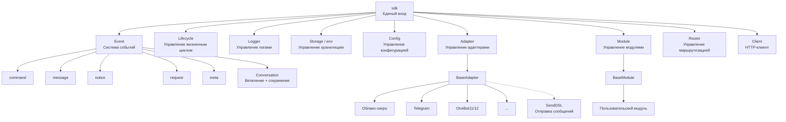
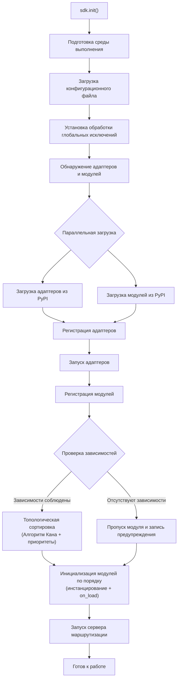
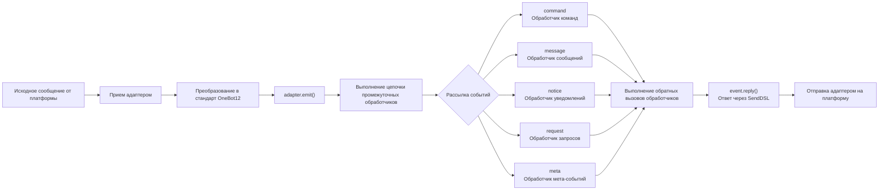
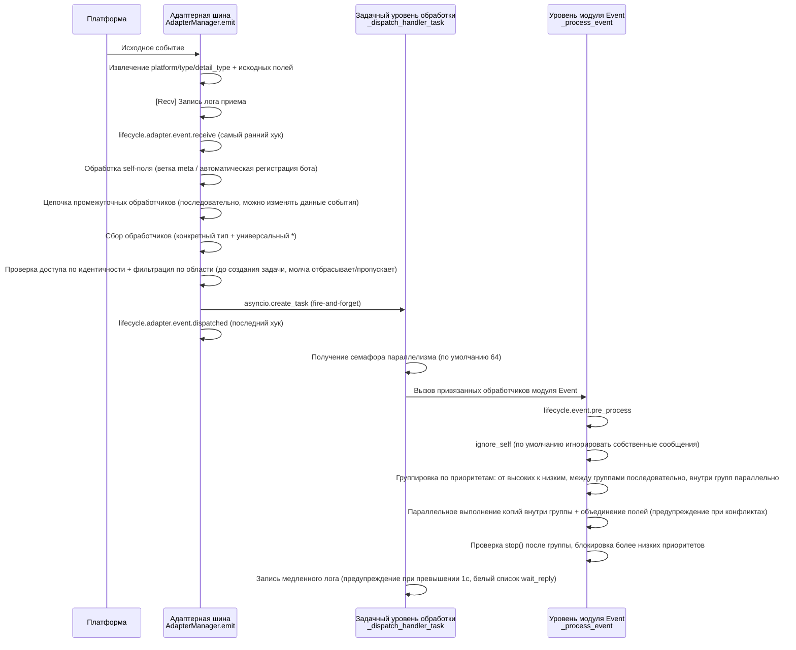
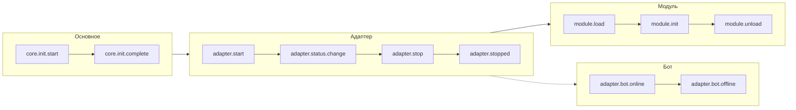
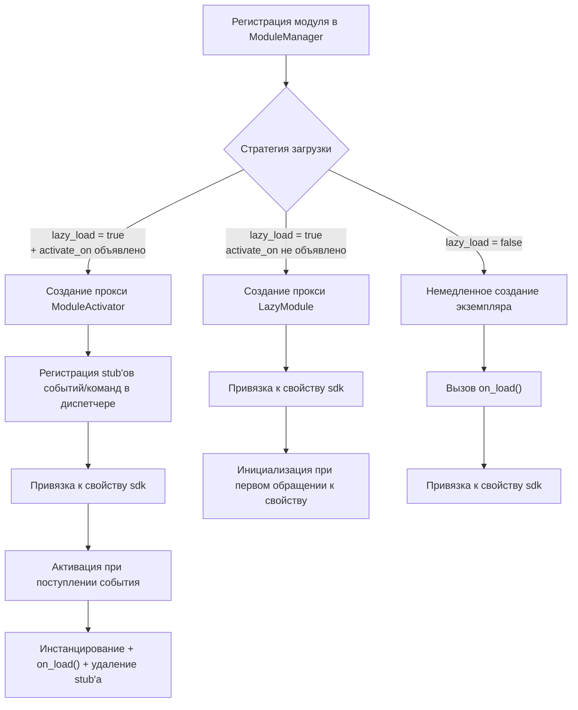
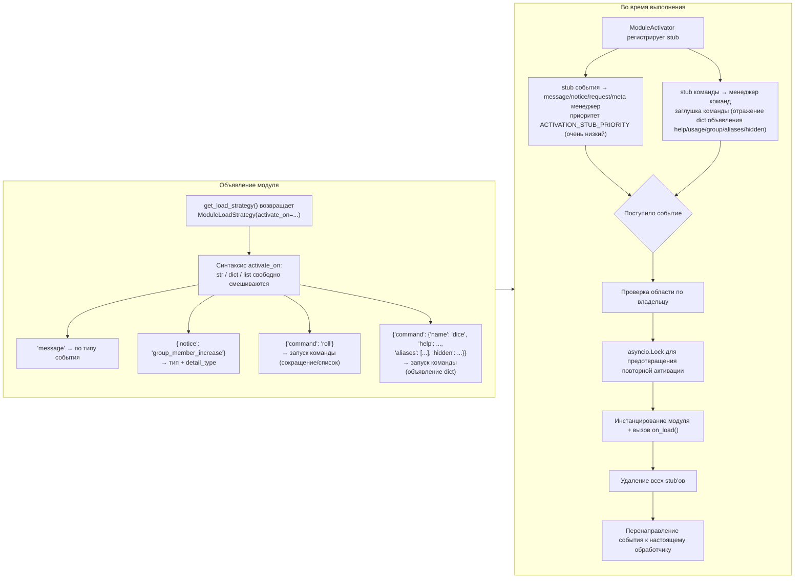

# Обзор архитектуры

Данный документ с помощью визуальных диаграмм знакомит вас с технической архитектурой ErisPulse SDK, помогая быстро понять идеи проектирования и модульные отношения.

## Основная архитектура SDK

На следующей диаграмме показаны основные модули SDK и их взаимосвязи:



### Описание основных модулей

| Модуль | Описание |
|------|------|
| **Event** | Система событий, предоставляет обработку пяти типов событий: command / message / notice / request / meta, а также Conversation для многошаговых диалогов |
| **Adapter** | Менеджер адаптеров, управляет регистрацией, запуском и остановкой адаптеров для различных платформ |
| **Module** | Менеджер модулей, управляет регистрацией, загрузкой и выгрузкой плагинов, поддерживает объявление зависимостей и топологическую сортировку |
| **Lifecycle** | Менеджер жизненного цикла, предоставляет хуки жизненного цикла на основе событий |
| **Storage** | Система хранилища на базе SQLite, поддерживает общие SQL-запросы в цепочке |
| **Config** | Управление конфигурационными файлами в формате TOML |
| **Logger** | Модульная система логирования, поддерживает под-логгеры |
| **Router** | Управление маршрутизацией HTTP/WebSocket, через абстрактный слой обертывает нижележащие бэкенды (в настоящее время FastAPI + Uvicorn), поддерживает маршрутизацию декораторами, промежуточные обработчики, группировку, ограничение частоты, CORS |
| **Client** | Единый HTTP/WS-клиент (до версии 2.8.0 был `HttpClient`, сохранен совместимый псевдоним), через абстрактный слой обертывает нижележащие библиотеки запросов (в настоящее время aiohttp), предоставляет статистику запросов, повторные попытки, логирование, WebSocket-клиент, систему исключений ErisPulse. WebSocket-клиент и сервер разделяют базовый класс `WebSocketConnectionBase` |

## Процесс инициализации

На следующей диаграмме показан полный процесс инициализации `sdk.init()`:



### Подробное описание этапов инициализации

> Полная цепочка инициализации с разбивкой на Finder / Loader / Manager / Router, базовые точки входа (`init()` / `init_task()` / `init_sync()`) и ручной полный запуск см. в [Процесс запуска и ручное управление](docs/ru/advanced/startup.md).

## Процесс обработки событий

На следующей диаграмме показан полный путь прохождения сообщения от платформы до обработчика:



### Подробное описание цепочки обработки событий

Выше приведена схема "результата"; ниже разобрана внутренняя работа `adapter.emit()` — это трехуровневая цепочка рассылки:



**Что делает фреймворк на каждом этапе и что вы можете изменить:**

| Этап | Что делает фреймворк | Что вы можете изменить |
|------|-------------|-----------|
| Прием | Извлекает стандартные поля, сохраняет `{platform}_raw` исходные данные; записывает `[Recv]` лог | Слушайте `adapter.event.receive`, чтобы получить событие на раннем этапе |
| self-поле | Ветка meta для connect/disconnect/heartbeat; обычные события автоматически регистрируют бота и вызывают `adapter.bot.online` | Слушайте `adapter.bot.online` / `bot.offline` |
| Промежуточные обработчики | **Последовательно** выполняются, если возвращаемое значение не None, то заменяется данные события | Регистрируйте промежуточные обработчики для изменения/блокировки событий |
| Сбор рассылки | Сначала берутся обработчики конкретного типа, затем `*` универсальные обработчики | — |
| Идентичность | Проверка входа по пользователю>сессии>боту>адаптеру (`scope.is_identity_allowed`), **если отклонено, событие отбрасывается** | `ErisPulse.scope.identity` привязывается |
| Фильтрация области | Проверка по владельцу модуля (`scope.is_allowed`), сессионный>ботовый>платформенный уровень, **если не пройдено, молча пропускается** | Настройка белого/черного списка областей |
| Расписание | Каждый совпадающий обработчик запускается в отдельной `asyncio.Task`, `emit()` **не ожидает завершения обработчика** | — |
| Приоритет | Высокоприоритетные группы выполняются первыми; **между группами последовательно, внутри групп параллельно** (каждая группа получает копию события, изменяет поля и объединяет обратно, конфликты предупреждаются) | `@command(..., priority=N)` / указание при регистрации приоритета |
| Блокировка | После обработки группы проверяется `event.is_stopped()`, если сработало, **выполнение ниже приоритетов прерывается** | `event.mark_processed(stop=True)` / `event.done()` |

> **Распространенные заблуждения**:
> 1. **Фильтрация области молчалива** — отфильтрованные обработчики не генерируют ошибки и не отвечают, только в TRACE-логах видно (`core.scope.denied`). При "мой модуль не получил сообщение" сначала проверьте привязку области.
> 2. **Обработчики естественно параллельны** — фреймворк уже создает отдельную задачу для каждого обработчика, вам **не нужно** дополнительно оборачивать в `asyncio.create_task`.
> 3. **Внутри группы с одинаковым приоритетом нет блокировки** — `mark_processed(stop=True)` блокирует только более низкие группы, обработчики в одной группе не прерываются.
> 4. **Порог медленного лога фиксирован в 1 секунду** — обработчики, выполняющиеся дольше 1с, помечаются WARNING в логах (время `wait_reply` исключено из времени выполнения), но не прерывают выполнение.

> Подробности о привязке области (scope) по модулям, проверке доступа и ограничении действий при отправке см. в [Область (scope)](advanced/scope.md); текстовый фильтр событий и ACL пользователей команд см. в [Введение в обработку событий](getting-started/event-handling.md); настройка лимита параллелизма см. в [Руководство по конфигурации](user-guide/configuration.md#framework-configuration).

## Жизненные циклы событий

На следующей диаграмме показан порядок срабатывания жизненных циклов компонентов:



### Подписка на события жизненного цикла

> Полный список методов подписки (`lifecycle.on()` / `once()` / `has_handlers()`), полный список событий жизненного цикла и формат данных см. в [Управление жизненным циклом](advanced/lifecycle.md).

## Стратегии загрузки модулей

ErisPulse поддерживает три стратегии загрузки модулей, объявленные возвращаемым значением `get_load_strategy()` в виде `ModuleLoadStrategy`:



> Подробнее см. в [Система ленивой загрузки](advanced/lazy-loading.md), [Управление жизненным циклом](advanced/lifecycle.md) и документации по модулям.

### Архитектура ленивой активации на основе событий (`activate_on`)

> [!NOTE]
> Эта функция доступна в ErisPulse **2.8.0+**.

`activate_on` позволяет модулю загружаться **при первом поступлении соответствующего события/команды**, что предотвращает постоянное присутствие в памяти и гарантирует, что события не теряются:



**Семантика активации:**

> Полный синтаксис `activate_on` (str / dict / list), объявление команды dict, цепочка отката help для заглушки, фильтрация области и семантика сбоя см. в [Система ленивой загрузки](advanced/lazy-loading.md#event-driven-lazy-activation-activate_on).

## Архитектура локальной папки плагинов

> [!NOTE]
> Эта функция доступна в ErisPulse **2.8.0+**.

Локальные плагины (в папке `plugins/`) не требуют упаковки для публикации, фреймворк автоматически обнаруживает и загружает их при запуске:


**Соглашения и особенности:**

- Имя плагина: для одиночного файла — имя файла, для папки — имя папки
- Локальный плагин `moduleInfo.meta.source == "plugin_folder"`, без проблем совместим с модулями из PyPI
- При совпадении имен локальный модуль имеет приоритет (удобно для отладки), при отключении удаляется и entry-point

## Архитектура горячей перезагрузки модулей

Горячая перезагрузка работает одинаково для **всех источников модулей**: локальные плагины могут мониторить изменения файлов и автоматически перезагружаться, любой модуль можно перезагрузить вручную через `sdk.reload_module()` / `sdk.module.reload()` (модули из PyPI перезагружаются после обновления через pip):

```mermaid
flowchart TD
    A["sdk.enable_plugin_hot_reload()<br/>（автоматический мониторинг, только локальные плагины）"] --> B["Запуск PluginReloadWatcher"]
    B --> C["PollingObserver (фоновый поток守护线程)<br/>периодическое сравнение mtime файлов .py"]
    C --> D{"Изменение файла плагина"}
    D --> E["Дебаунсинг изменений (по умолчанию 1 секунда)"]
    E --> F["_handle_change анализирует имя плагина<br/>（одиночный файл / папка）"]
    F --> G["asyncio.run_coroutine_threadsafe<br/>перенаправление в основной цикл событий"]
    G --> H["sdk.reload_module(name)<br/>（также можно вручную перезагрузить любой модуль）"]
    H --> I["Выгрузка старого экземпляра (вызывает on_unload）<br/>собираются зависимости для каскадной перезагрузки"]
    I --> J{"Источник модуля?"}
    J -->|"plugin_folder"| K["Очистка регистрации и sys.modules плагина<br/>пересканирование папки plugins/"]
    J -->|"PyPI 安装包"| L["Очистка регистрации + по top_level<br/>очистка поддерева sys.modules пакета<br/>обновление кэша импорта и повторный поиск entry-point"]
    K --> M["Повторная регистрация + загрузка"]
    L --> M
    M --> N["Привязка нового экземпляра к свойству sdk"]
    N --> O["Каскадная перезагрузка зависимостей<br/>（полная перезагрузка плагина / повторная инициализация PyPI）"]
    K -.->|"Файл удален"| P["Удаление из результатов загрузки"]
    L -.->|"entry-point исчез (удален)| P
```

**Различия между двумя источниками только на этапе обнаружения**, регистрация, загрузка и каскадная перезагрузка полностью идентичны:

- **Локальные плагины** (`moduleInfo.meta.source == "plugin_folder"`): после очистки соответствующего `sys.modules` пересканировать папку `plugins/`; если файл удален, удалить из результатов загрузки
- **PyPI-пакеты**: по `meta.top_level` очистить поддерево `sys.modules` пакета, обновить кэш импорта (преодолеть 60-секундный кэш entry-point) и повторно найти и импортировать; если entry-point исчез (pip удаление), удалить из результатов загрузки