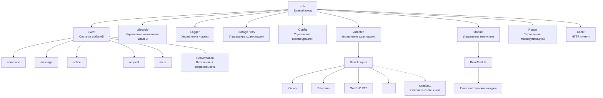
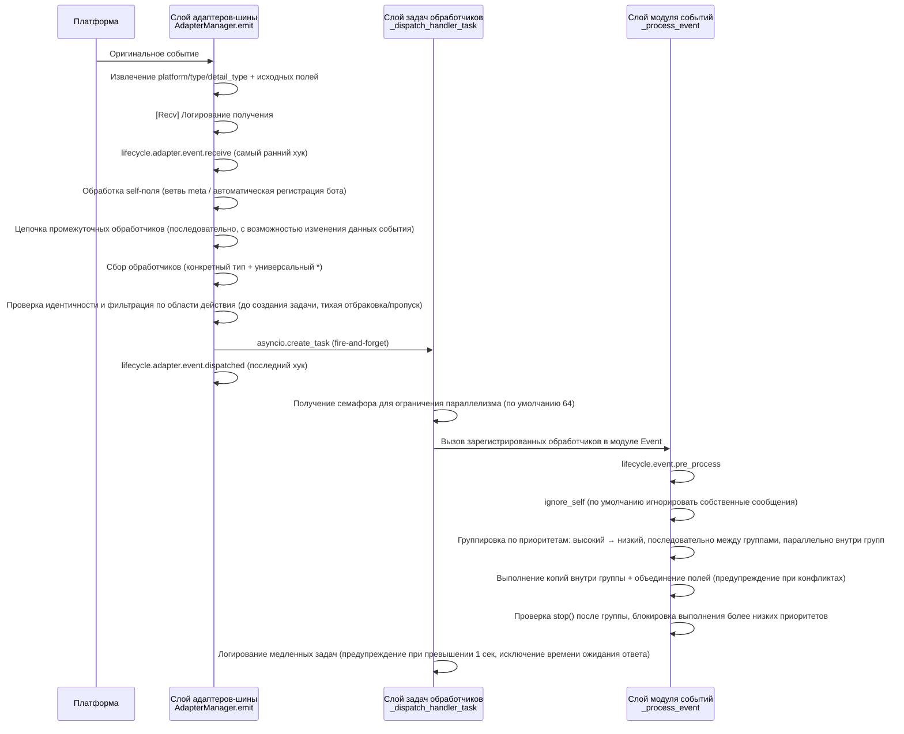
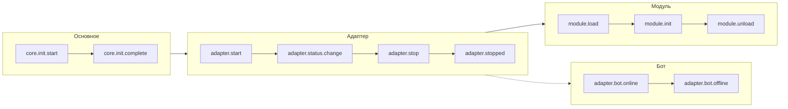
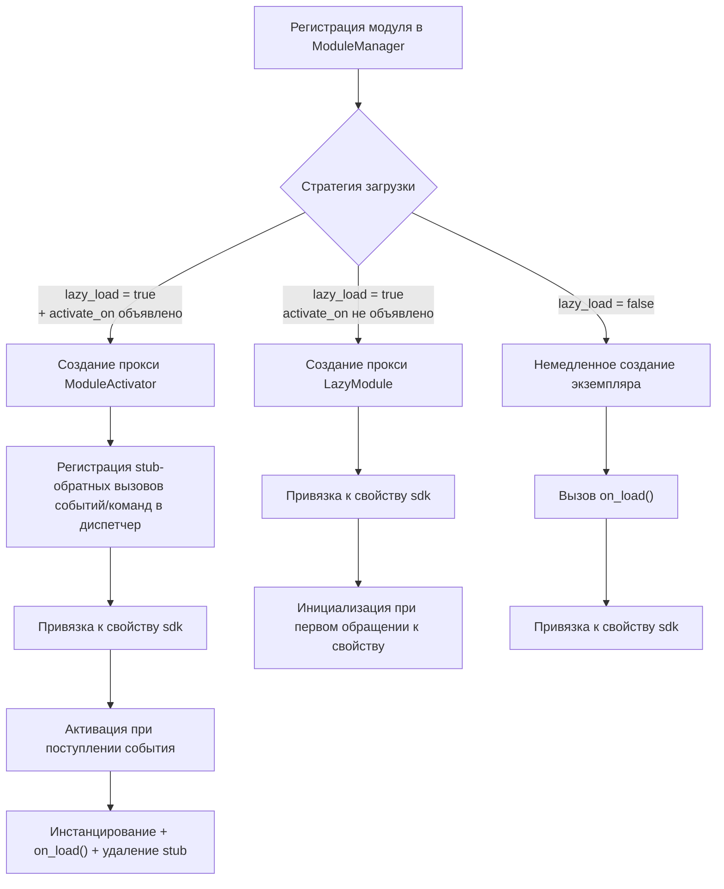
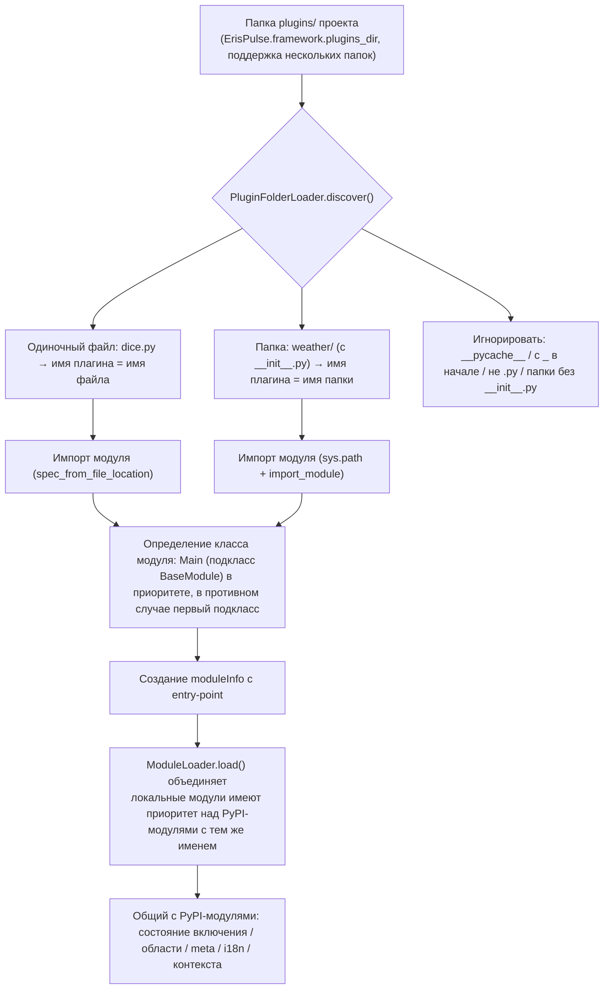
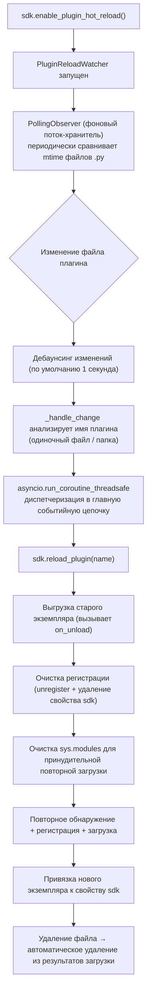

# Обзор архитектуры

Документация представляет визуальную диаграмму архитектуры ErisPulse SDK, которая помогает быстро понять идеи проектирования и отношения между модулями.

## Основная архитектура SDK

На следующей диаграмме показаны основные модули SDK и их взаимосвязи:

### Описание основных модулей

| Модуль | Описание |
|------|------|
| **Event** | Система событий, предоставляет обработку пяти типов событий: command / message / notice / request / meta, а также Conversation для многоразовых диалогов |
| **Adapter** | Менеджер адаптеров, управляет регистрацией, запуском и остановкой адаптеров для различных платформ |
| **Module** | Менеджер модулей, управляет регистрацией, загрузкой и выгрузкой плагинов, поддерживает объявление зависимостей и топологическую сортировку |
| **Lifecycle** | Менеджер жизненного цикла, предоставляет обработчики жизненного цикла, основанные на событиях |
| **Storage** | Система хранения на основе SQLite, поддерживает общие SQL-запросы с цепочечной синтаксической разработкой |
| **Config** | Управление конфигурационными файлами в формате TOML |
| **Logger** | Модульная система логирования, поддерживает под-логгеры |
| **Router** | Управление маршрутизацией HTTP/WebSocket, абстрактный слой для нижележащих бэкендов (в настоящее время FastAPI + Uvicorn), поддерживает маршрутизацию с помощью декораторов, промежуточные обработчики, группировку, ограничение скорости, CORS |
| **Client** | Единый HTTP/WS-клиент (до версии 2.8.0 это был `HttpClient`, сохраняется совместимость), абстрактный слой для нижележащих библиотек запросов (в настоящее время aiohttp), предоставляет статистику запросов, повторные попытки, логирование, WebSocket-клиент, систему исключений ErisPulse. WebSocket-клиент и сервер разделяют базовый класс `WebSocketConnectionBase` |

## Процесс инициализации

На следующей диаграмме показан полный процесс инициализации `sdk.init()`:

### Подробное описание этапов инициализации

> Полная цепочка инициализации с разбивкой на Finder / Loader / Manager / Router, базовые точки входа (`init()` / `init_task()` / `init_sync()`) и ручной полный запуск см. в [Процесс запуска и ручное управление](advanced/startup.md).

## Процесс обработки событий

На следующей диаграмме показан полный путь сообщения от платформы до обработчика:

### Подробное описание цепочки обработки событий

На приведенной выше диаграмме показан результат; ниже раскрывается, что происходит за кулисами после `adapter.emit()` — это трехуровневая цепочка рассылки:

**Что делает фреймворк на каждом этапе и что вы можете изменить:**

| Этап | Что делает фреймворк | Что вы можете изменить |
|------|-------------|-----------|
| Получение | Извлекает стандартные поля, сохраняет `{platform}_raw` исходные данные; записывает лог `[Recv]` | Наблюдение за `adapter.event.receive` для получения самого раннего события |
| self-поле | Мета-события идут по ветвям connect/disconnect/heartbeat; обычные события автоматически регистрируют бота и вызывают `adapter.bot.online` | Наблюдение за `adapter.bot.online` / `bot.offline` |
| Промежуточные обработчики | **Последовательно** выполняются, если возвращаемое значение не None, оно заменяет данные события | Регистрация промежуточных обработчиков для изменения/перехвата событий |
| Сбор рассылки | Сначала берутся обработчики конкретного типа, затем `*` универсальные обработчики | — |
| Идентичность | Определяет, принимать ли событие по пользователю>сессии>боту>адаптеру (`scope.is_identity_allowed`), **отбраковка означает полное удаление события** | `ErisPulse.scope.identity` для привязки |
| Фильтрация по области | Определяется по владельцу модуля (`scope.is_allowed`), с уровнем сессии>бота>платформы, **не прошедшие — тихо пропускаются** | Настройка белого/черного списка областей |
| Планирование | Каждый соответствующий обработчик создает отдельную `asyncio.Task`, `emit()` **не ждет завершения обработчиков** | — |
| Приоритет | Высокоприоритетные группы обрабатываются первыми; **между группами последовательно, внутри групп параллельно** (каждая группа имеет копию события, изменения объединяются, конфликты вызывают WARNING) | `@command(..., priority=N)` / указание при регистрации приоритета |
| Прерывание | После обработки каждой группы проверяется `event.is_stopped()`, если сработало, **выполнение более низких приоритетов прерывается** | `event.mark_processed(stop=True)` / `event.done()` |

> **Частые заблуждения**:
> 1. **Фильтрация по области действия тихая** — обработчики, отфильтрованные таким образом, не генерируют ошибки и не отвечают, видны только в трассировочном логе (уровень TRACE, `core.scope.denied`). Если "мой модуль не получил сообщение", сначала проверьте привязку области.
> 2. **Обработчики обрабатываются параллельно** — фреймворк уже создает отдельную задачу для каждого обработчика, вам **не нужно** дополнительно оборачивать в `asyncio.create_task`.
> 3. **Внутри группы одинакового приоритета не прерывается** — `mark_processed(stop=True)` блокирует только более низкие группы, обработчики в одной группе не прерываются досрочно.
> 4. **Порог медленных логов фиксирован в 1 секунду** — обработчики, выполняющиеся дольше 1 сек, записываются в лог с предупреждением (время ожидания ответа `wait_reply` исключается из времени выполнения), но не прерывают выполнение.

> Подробности привязки областей и приоритетов см. в [Системе областей](advanced/scope.md); полную семантику claim/прерывания см. в [Введение в обработку событий](getting-started/event-handling.md); настройки ограничения параллелизма см. в [Руководстве по конфигурации](user-guide/configuration.md#настройки фреймворка).

## События жизненного цикла

На следующей диаграмме показан порядок срабатывания событий жизненного цикла компонентов фреймворка:

### Наблюдение за событиями жизненного цикла

> Полные методы наблюдения за событиями (`lifecycle.on()` / `once()` / `has_handlers()`), полный список событий жизненного цикла и формат данных см. в [Управление жизненным циклом](advanced/lifecycle.md).

## Стратегии загрузки модулей

ErisPulse поддерживает три стратегии загрузки модулей, которые объявляются возвращаемым значением `get_load_strategy()` в `ModuleLoadStrategy`:

> Подробнее см. в [Системе ленивой загрузки](advanced/lazy-loading.md), [Управление жизненным циклом](advanced/lifecycle.md) и документации модулей.

### Архитектура ленивой активации по событиям (`activate_on`)

> [!NOTE]
> Эта функция доступна в ErisPulse **2.8.0+**.

`activate_on` позволяет модулю загружаться **при первом поступлении соответствующего события/команды**, что предотвращает постоянное использование памяти и гарантирует, что события не теряются:

**Основные моменты семантики срабатывания:**

> Полный синтаксис `activate_on` (str / dict / list), объявление команды dict, цепочка возврата help для заглушек, фильтрация по области действия и семантика сбоя см. в [Системе ленивой загрузки](advanced/lazy-loading.md#ленивая-активация-по-событиям-activate_on).

## Архитектура локальной папки плагинов

> [!NOTE]
> Эта функция доступна в ErisPulse **2.8.0+**.

Локальные плагины (папка `plugins/`) не требуют упаковки и публикации, фреймворк автоматически обнаруживает и загружает их при запуске:

**Соглашения и особенности:**

- Имя плагина: для одиночного файла — имя файла, для папки — имя папки
- Локальный плагин `moduleInfo.meta.source == "plugin_folder"`, совместим с модулями из PyPI
- При совпадении имен локальный имеет приоритет (удобно для отладки), при отключении удаляется и entry-point

## Архитектура горячей перезагрузки локальных плагинов

Горячая перезагрузка отслеживает изменения файлов плагинов и автоматически перезагружает соответствующие плагины:

