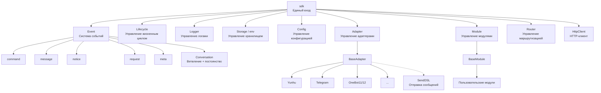
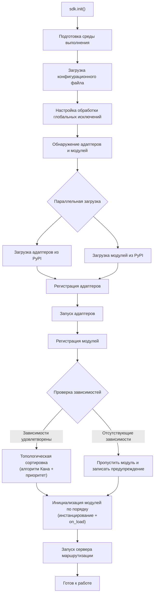
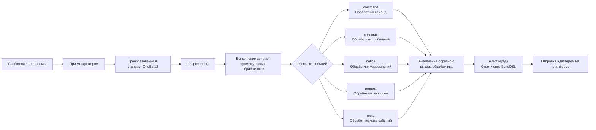
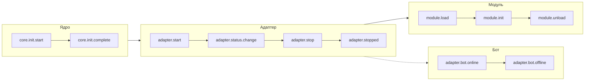
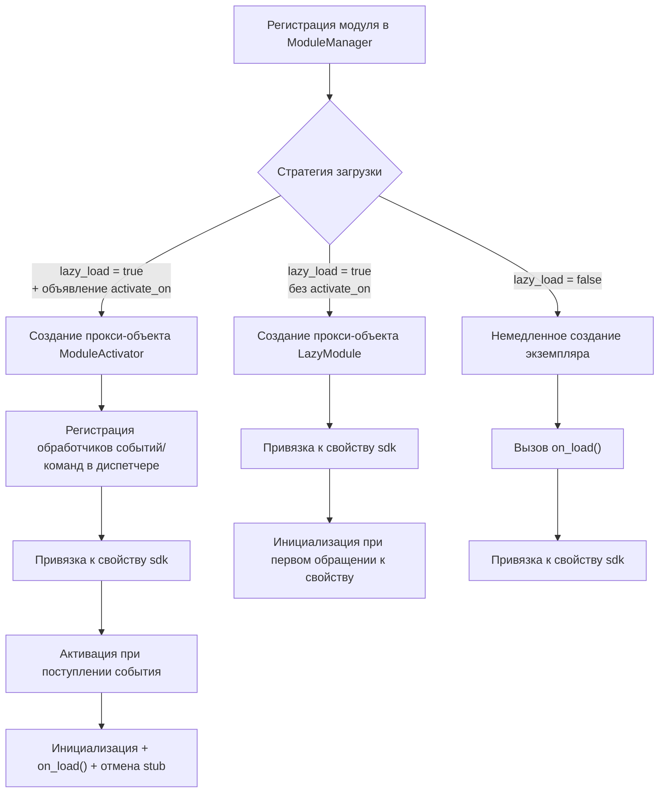
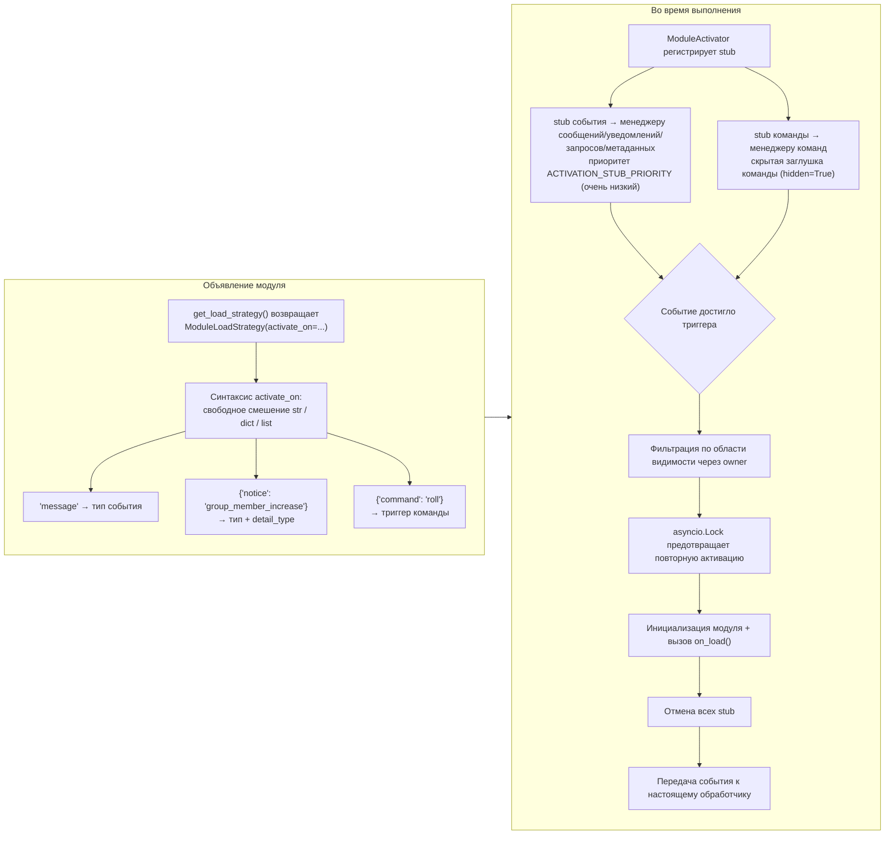
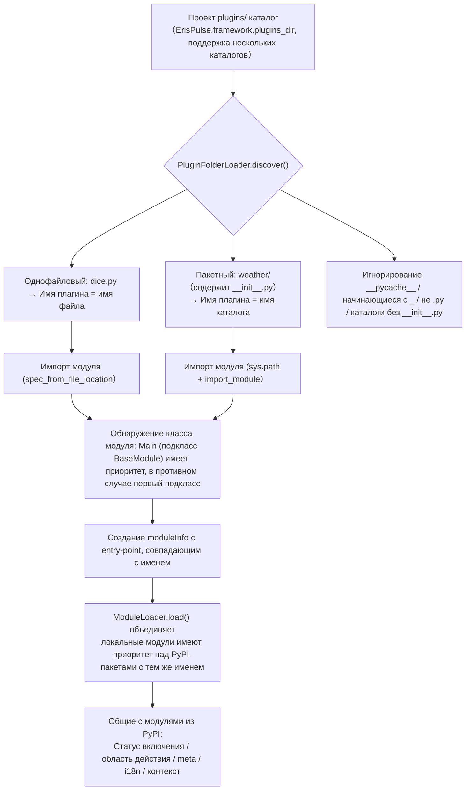
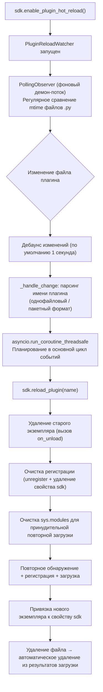

# Обзор архитектуры

В этом документе с помощью визуальных диаграмм представлен технический архитектурный обзор ErisPulse SDK, который поможет вам быстро понять концепцию проектирования и модульные взаимосвязи фреймворка.

Пожалуйста, возвращайте сразу переведённый полный Markdown-контент, не включая никаких других текстов.

Ещё раз напоминаем: если документ содержит строку переключения языка (где названия языков разделены символом ` | `), строго соблюдайте формат из пункта 8 выше, не пишите ошибочный формат вида `[**Label**](file)`.

## Основная архитектура SDK

На следующей схеме показаны основные модули SDK и их взаимосвязи:



### Описание основных модулей

| Модуль | Описание |
|------|------|
| **Event** | Система событий, предоставляет обработку пяти типов событий: command / message / notice / request / meta, а также Conversation для многошаговых диалогов |
| **Adapter** | Менеджер адаптеров, управляет регистрацией, запуском и остановкой адаптеров для различных платформ |
| **Module** | Менеджер модулей, управляет регистрацией, загрузкой и выгрузкой плагинов, поддерживает объявление зависимостей и топологическую сортировку |
| **Lifecycle** | Менеджер жизненного цикла, предоставляет хуки, управляемые событиями |
| **Storage** | Система хранения на основе SQLite, поддерживающая общие SQL-цепочные запросы |
| **Config** | Управление конфигурационными файлами в формате TOML |
| **Logger** | Модульная система логирования, поддерживающая под-логгеры |
| **Router** | Управление маршрутизацией HTTP/WebSocket, через абстрактный слой обертывает нижележащие бэкенды (в настоящее время FastAPI + Uvicorn), поддерживает маршрутизацию через декораторы, промежуточные обработчики, группировку, ограничение скорости, CORS |
| **HttpClient** | Единый HTTP/WS-клиент, через абстрактный слой обертывает нижележащие библиотеки запросов (в настоящее время aiohttp), предоставляет статистику запросов, повторные попытки, логирование, WebSocket-клиент, систему исключений ErisPulse. Клиент и сервер WebSocket разделяют базовый класс `WebSocketConnectionBase` |

## Процесс инициализации

На следующей схеме показан полный процесс инициализации `sdk.init()`:



### Подробное описание этапов инициализации

1. **Подготовка среды** - загрузка конфигурационного файла в формате TOML, настройка обработки глобальных исключений
2. **Параллельное обнаружение** - одновременное обнаружение адаптеров и модулей из установленных пакетов PyPI
3. **Регистрация адаптеров** - регистрация обнаруженных адаптеров в менеджере адаптеров
4. **Запуск адаптеров** - асинхронный запуск подключений адаптеров к различным платформам (до инициализации модулей, чтобы модули могли немедленно отправлять сообщения)
5. **Регистрация модулей** - регистрация обнаруженных модулей в менеджере модулей
6. **Проверка зависимостей** - проверка, зарегистрированы ли заявленные модулем зависимости `depends`, пропуск модулей с отсутствующими зависимостями
7. **Топологическая сортировка** - использование алгоритма Кана для сортировки порядка загрузки модулей по зависимостям, модули с одинаковым уровнем зависимостей сортируются по убывающему приоритету `priority`
8. **Инициализация модулей** - создание экземпляров модулей в соответствии с порядком сортировки, вызов метода жизненного цикла `on_load`
9. **Запуск сервера маршрутизации** - запуск сервера маршрутизации на базе Uvicorn с использованием FastAPI

## Обработка событий

На следующей схеме показан полный путь прохождения сообщений от платформы до обработчика:



### Ключевые шаги обработки событий

- **Прием адаптером** - Адаптеры платформ через WebSocket/Webhook и другие методы получают нативные события
- **Стандартизация OB12** - Преобразование нативных событий платформы в единый формат стандарта OneBot12
- **Обработка промежуточными обработчиками** - Последовательное выполнение зарегистрированных промежуточных функций, которые могут изменять данные события
- **Рассылка событий** - Доставка событий в соответствующие обработчики в зависимости от типа события (message/notice/request/meta)
- **Ответ через SendDSL** - Обработчики отправляют ответы с помощью `event.reply()` или цепочки вызовов SendDSL

## Жизненный цикл

На следующей диаграмме показан порядок срабатывания событий жизненного цикла компонентов фреймворка:



### Подписка на события жизненного цикла

Вы можете использовать `lifecycle.on()` для подписки на эти события и выполнения пользовательской логики:

```python
from ErisPulse import sdk

# Подписка на все события адаптера
@sdk.lifecycle.on("adapter")
async def on_adapter_event(event_data):
    print(f"Событие адаптера: {event_data}")

# Подписка на событие завершения загрузки модуля
@sdk.lifecycle.on("module.load")
async def on_module_loaded(event_data):
    print(f"Модуль загружен: {event_data}")

# Подписка на событие выхода бота в онлайн
@sdk.lifecycle.on("adapter.bot.online")
async def on_bot_online(event_data):
    print(f"Бот вышел в онлайн: {event_data}")

## Стратегии загрузки модулей

ErisPulse поддерживает три стратегии загрузки модулей, объявленных `ModuleLoadStrategy`, возвращаемого `get_load_strategy()`:



> Подробнее см. [Система ленивой загрузки](advanced/lazy-loading.md), [Управление жизненным циклом](advanced/lifecycle.md) и документацию модуля.

### Архитектура триггерной ленивой активации (`activate_on`)

`activate_on` позволяет модулю загружаться только при поступлении **первого подходящего события/команды**, избегая постоянного размещения в памяти и гарантируя, что события не теряются:



**Основные особенности триггерной семантики:**

1. **Регистрация stub**: stub события регистрируется в соответствующем менеджере событий с очень низким приоритетом (`ACTIVATION_STUB_PRIORITY`), гарантируя выполнение после всех обычных обработчиков события; stub команды регистрируется как скрытая заглушка команды, не загрязняя список команд
2. **Фильтрация по области видимости**: stub содержит идентификатор владельца модуля, модуль не активируется, если он не включен для данного бота / сессии / платформы
3. **Предотвращение повторного входа**: `asyncio.Lock` гарантирует, что модуль активируется только один раз при одновременных событиях
4. **Передача события**: после активации текущее событие пересылается к настоящему обработчику (внешний цикл группировки уже проверил, что обработчики, зарегистрированные после stub, не будут обрабатываться повторно)
5. **Семантика ошибки**: при неудачной активации повторная попытка не предпринимается, stub также отменяется, избегая повторных попыток при каждом событии

## Архитектура локальной папки плагинов

Локальные плагины (каталог `plugins/`) не требуют упаковки и публикации. Фреймворк автоматически обнаруживает и загружает их при запуске:



**Соглашения и особенности:**

- Имя плагина: для однофайлового — имя файла, для пакетного — имя каталога
- Локальные плагины `moduleInfo.meta.source == "plugin_folder"`, без проблем совместно с модулями из PyPI
- При совпадении имен приоритет у локальных (удобно для отладки), при отключении удаляются и entry-point с тем же именем

## Архитектура горячей перезагрузки локальных плагинов

Горячая перезагрузка отслеживает изменения файлов плагинов и автоматически перезагружает соответствующие плагины:



[**English**](docs/ru/quick-start.md)