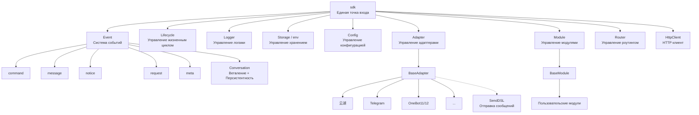
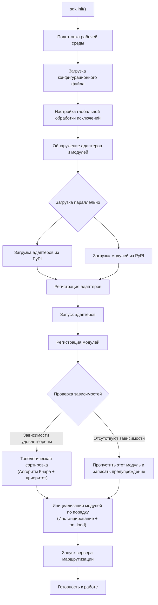
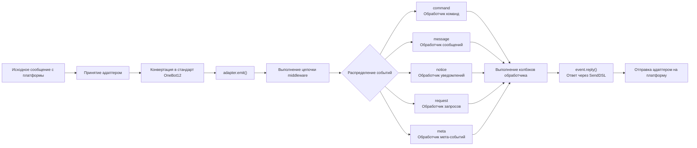
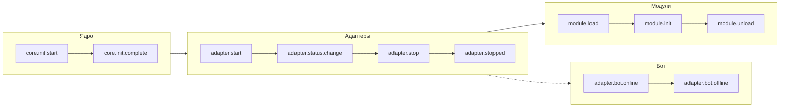
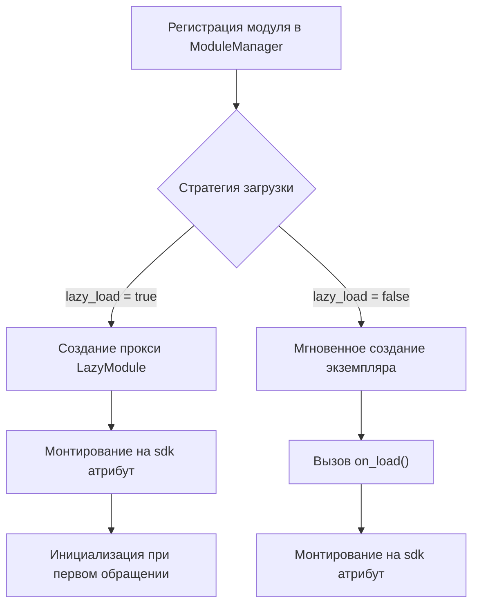

# Обзор архитектуры

В этом документе с помощью визуальных диаграмм представлен технический архитектурный дизайн ErisPulse SDK, что поможет вам быстро понять концепцию дизайна и отношения между модулями.

## Основная архитектура SDK

Ниже приведена диаграмма, показывающая состав и взаимосвязи основных модулей SDK:



### Описание основных модулей

| Модуль | Описание |
|------|------|
| **Event** | Система событий, предоставляющая обработку пяти типов событий: command / message / notice / request / meta, а также многоразовый диалог (Conversation) |
| **Adapter** | Менеджер адаптеров, управляет регистрацией, запуском и остановкой адаптеров для нескольких платформ |
| **Module** | Менеджер модулей, управляет регистрацией, загрузкой и выгрузкой плагинов, поддерживает объявление зависимостей и топологическую сортировку |
| **Lifecycle** | Менеджер жизненного цикла, предоставляет хуки жизненного цикла, управляемые событиями |
| **Storage** | Система хранения ключ-значение на базе SQLite, поддерживает универсальные SQL-запросы в цепочке |
| **Config** | Управление конфигурационными файлами в формате TOML |
| **Logger** | Модульная система логирования, поддерживает сублоггеры |
| **Router** | Управление маршрутизацией HTTP/WebSocket, инкапсулирует базовый бэкенд через абстрактный слой (текущий: FastAPI + Uvicorn), поддерживает декоративную маршрутизацию, middleware, группирование, лимитирование запросов, CORS |
| **HttpClient** | Единый HTTP-клиент, инкапсулирует базовую библиотеку запросов через абстрактный слой (текущая: aiohttp), предоставляет статистику запросов, повторные попытки, логирование и другие функции. Клиент и сервер WebSocket разделяют базовый класс `WebSocketConnectionBase` |

## Процесс инициализации

Ниже приведен полный процесс инициализации `sdk.init()`:



### Подробное описание этапов инициализации

1. **Подготовка среды** - Загрузка конфигурационного файла TOML, настройка глобальной обработки исключений
2. **Параллельное обнаружение** - Одновременное обнаружение адаптеров и модулей из установленных пакетов PyPI
3. **Регистрация адаптеров** - Регистрация обнаруженных адаптеров в менеджере адаптеров
4. **Запуск адаптеров** - Асинхронный запуск подключений адаптеров к платформам (до инициализации модулей, чтобы убедиться, что модули могут отправлять сообщения немедленно)
5. **Регистрация модулей** - Регистрация обнаруженных модулей в менеджере модулей
6. **Проверка зависимостей** - Проверка, зарегистрированы ли зависимости `depends`, объявленные в модуле, пропуск модулей с отсутствующими зависимостями
7. **Топологическая сортировка** - Сортировка порядка загрузки модулей в зависимости от зависимостей с использованием алгоритма Кнара, с одинаковым уровнем приоритета в порядке убывания `priority`
8. **Инициализация модулей** - Создание экземпляров модулей в порядке сортировки, вызов метода жизненного цикла `on_load`
9. **Запуск сервера маршрутизации** - Запуск сервера маршрутизации FastAPI с использованием Uvicorn

## Процесс обработки событий

Ниже показан полный путь потока сообщений от платформы к обработчику:



### Ключевые шаги обработки событий

- **Принятие адаптером** - Адаптеры различных платформ принимают нативные события через WebSocket/Webhook и другие методы
- **Стандартизация OB12** - Преобразование нативных событий платформы в унифицированный стандартный формат OneBot12
- **Обработка middleware** - Последовательное выполнение зарегистрированных функций middleware, может изменять данные события
- **Распределение событий** - Распределение на соответствующие обработчики в зависимости от типа события (message/notice/request/meta)
- **Ответ SendDSL** - Обработчики отправляют ответы через цепочечный вызов `event.reply()` или `SendDSL`

## Жизненный цикл событий

Ниже показана последовательность запуска жизненных циклов событий для различных компонентов фреймворка:



### Мониторинг жизненных цикл событий

Вы можете отслеживать эти события с помощью `lifecycle.on()` и выполнять пользовательскую логику:

```python
from ErisPulse import sdk

# Отслеживание всех событий адаптера
@sdk.lifecycle.on("adapter")
async def on_adapter_event(event_data):
    print(f"Событие адаптера: {event_data}")

# Отслеживание завершения загрузки модуля
@sdk.lifecycle.on("module.load")
async def on_module_loaded(event_data):
    print(f"Модуль загружен: {event_data}")

# Отслеживание онлайна Бота
@sdk.lifecycle.on("adapter.bot.online")
async def on_bot_online(event_data):
    print(f"Бот онлайн: {event_data}")
```

## Стратегия загрузки модулей

ErisPulse поддерживает две стратегии загрузки модулей:



> Более подробную информацию см. в разделе [Система ленивой загрузки](advanced/lazy-loading.md) и [Управление жизненным циклом](advanced/lifecycle.md).