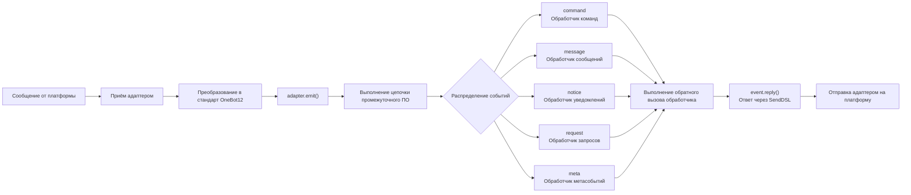
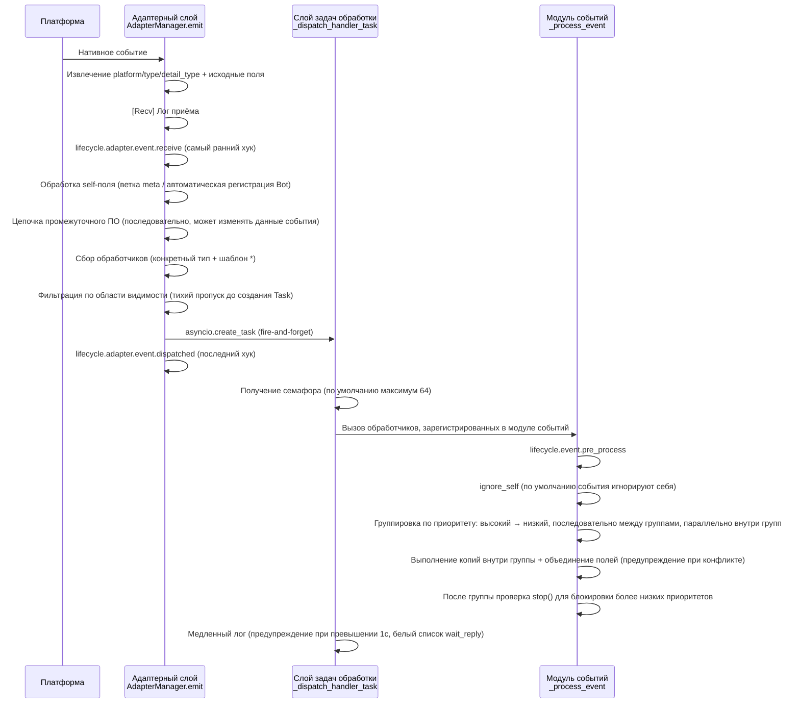
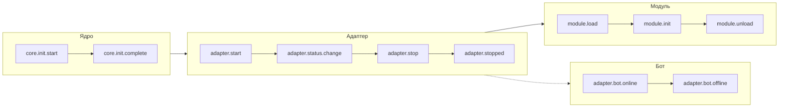
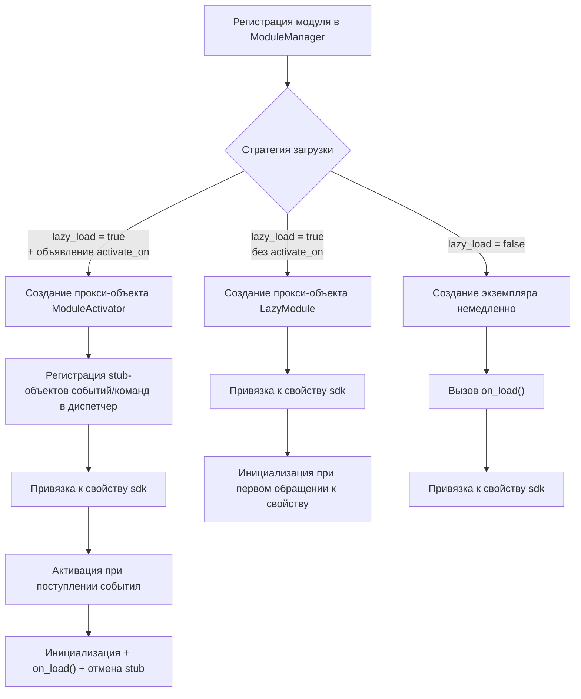
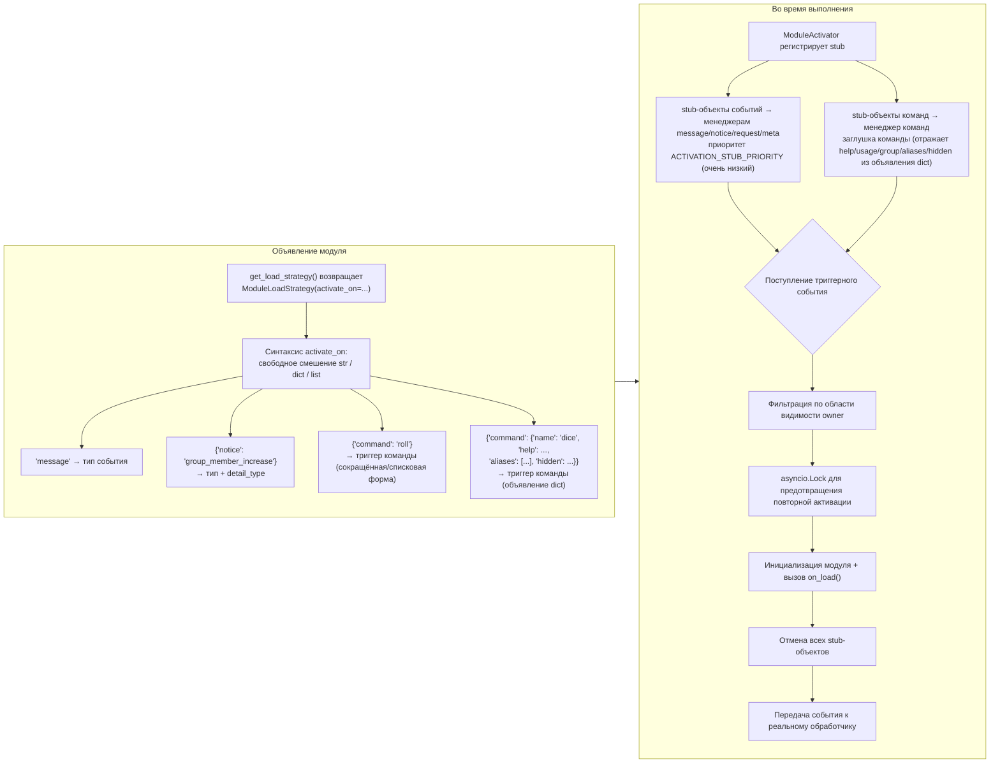
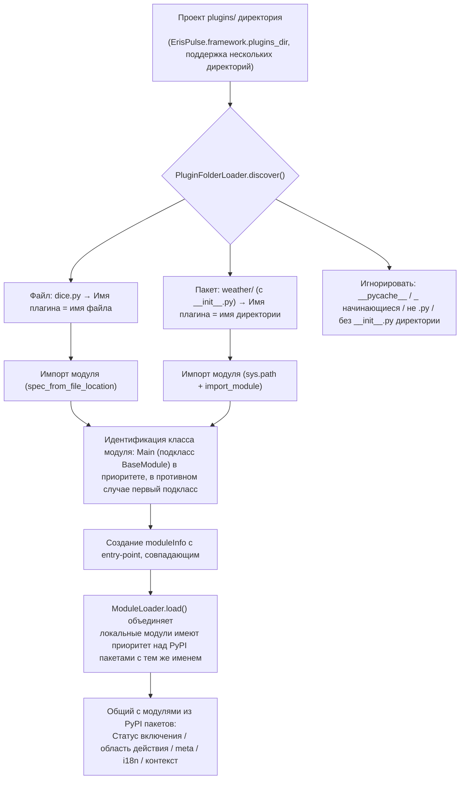
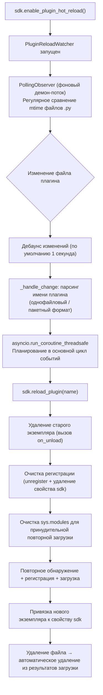

# Обзор архитектуры

В этом документе с помощью визуальных диаграмм представлен технический архитектурный обзор ErisPulse SDK, который поможет вам быстро понять концепцию проектирования и модульные взаимосвязи фреймворка.

Пожалуйста, возвращайте сразу переведённый полный Markdown-контент, не включая никаких других текстов.

Ещё раз напоминаем: если документ содержит строку переключения языка (где названия языков разделены символом ` | `), строго соблюдайте формат из пункта 8 выше, не пишите ошибочный формат вида `[**Label**](file)`.

## Основная архитектура SDK

На следующей диаграмме показаны основные модули SDK и их взаимосвязи:

### Описание основных модулей

| Модуль | Описание |
|------|------|
| **Event** | Система событий, предоставляет обработку пяти типов событий: command / message / notice / request / meta, а также поддерживает Conversation для многошагового диалога |
| **Adapter** | Менеджер адаптеров, управляет регистрацией, запуском и остановкой адаптеров для различных платформ |
| **Module** | Менеджер модулей, управляет регистрацией, загрузкой и выгрузкой плагинов, поддерживает объявление зависимостей и топологическую сортировку |
| **Lifecycle** | Менеджер жизненного цикла, предоставляет обработчики событий для жизненного цикла |
| **Storage** | Система хранения ключ-значение на базе SQLite, поддерживает общие SQL-цепочечные запросы |
| **Config** | Управление конфигурационными файлами в формате TOML |
| **Logger** | Модульная система логирования, поддерживает под-логгеры |
| **Router** | Управление маршрутизацией HTTP/WebSocket, через абстрактный слой обертывает нижележащие бэкенды (в настоящее время FastAPI + Uvicorn), поддерживает маршрутизацию через декораторы, промежуточные слои, группы, ограничение скорости, CORS |
| **Client** | Единый HTTP/WS клиент (до версии 2.8.0 назывался `HttpClient`, сохраняется совместимость с псевдонимом), через абстрактный слой обертывает нижележащие библиотеки запросов (в настоящее время aiohttp), предоставляет статистику запросов, повторные попытки, логирование, WebSocket-клиент, систему исключений ErisPulse. WebSocket-клиент и серверная часть WebSocket разделяют базовый класс `WebSocketConnectionBase` |

## Процесс инициализации

На следующей диаграмме показан полный процесс инициализации `sdk.init()`:

### Подробное описание этапов инициализации

> Полная цепочка инициализации разбита на этапы (Finder / Loader / Manager / Router), базовые точки входа (`init()` / `init_task()` / `init_sync()`) и ручной полный запуск описаны в [Процесс запуска и ручное управление](advanced/startup.md).

## Процесс обработки событий

На следующей схеме показан полный путь передачи сообщений от платформы к обработчикам:

### Подробное описание цепочки обработки событий

Схема выше показывает "результат"; ниже разобрана работа `adapter.emit()` — это трёхуровневая цепочка распределения, которая реализуется фреймворком:

**Что делает фреймворк на каждом этапе и что вы можете изменить:**

| Этап | Что делает фреймворк | Что вы можете изменить |
|------|----------------------|------------------------|
| Приём | Извлекает стандартные поля, сохраняет `{platform}_raw` исходные данные; записывает `[Recv]` лог | Подписка на `adapter.event.receive` для получения самого раннего события |
| self-поле | Для метасобытий ветвление connect/disconnect/heartbeat; для обычных событий автоматическая регистрация Bot и запуск `adapter.bot.online` | Подписка на `adapter.bot.online` / `bot.offline` |
| Промежуточное ПО | **Последовательно** выполняется, если возвращает не None, то заменяет данные события | Регистрация промежуточного ПО для изменения/перехвата события |
| Сбор обработчиков | Сначала берутся обработчики конкретного типа, затем `*` шаблон | — |
| Фильтрация области видимости | По owner проверяется `scope.is_allowed` (сессия > Bot > платформа), **если не проходит, то тихо пропускается** | Настройка белого/чёрного списка областей видимости |
| Расписание | Каждый соответствующий обработчик запускается в отдельной `asyncio.Task`, `emit()` **не ждёт завершения обработчиков** | — |
| Приоритет | Высокоприоритетные группы выполняются первыми; **между группами последовательно, внутри групп параллельно** (каждая группа получает копию события, изменения объединяются, конфликты предупреждаются) | `@command(..., priority=N)` / указание при регистрации priority |
| Блокировка | После обработки каждой группы проверяется `event.is_stopped()`, если true, то **не выполняются более низкие приоритеты** | `event.mark_processed(stop=True)` / `event.done()` |

> **Частые заблуждения**:
> 1. **Фильтрация области видимости — тихая** — отфильтрованные обработчики не генерируют ошибок и не реагируют, видны только в TRACE-логах (`core.scope.denied`). Если "мой модуль не получил сообщение", сначала проверьте привязку области видимости.
> 2. **Обработчики работают параллельно** — фреймворк уже создал отдельную задачу для каждого обработчика, вам **не нужно** вручную оборачивать в `asyncio.create_task`.
> 3. **Обработчики одной группы не блокируют друг друга** — `mark_processed(stop=True)` блокирует только более низкие группы, обработчики внутри одной группы не прерываются.
> 4. **Порог медленного лога фиксирован в 1 секунду** — обработчики, затратившие более 1с, генерируют предупреждение в логе (`wait_reply` время исключено из расчёта), но выполнение не прерывается.

> Подробности о трёхуровневой привязке области видимости и приоритетах см. в [Системе области видимости](advanced/scope.md); полную семантику claim/блокировки см. в [Введение в обработку событий](getting-started/event-handling.md); настройку лимита параллелизма см. в [Руководстве по конфигурации](user-guide/configuration.md#framework-configuration).

## Жизненный цикл

На следующей диаграмме показан порядок срабатывания событий жизненного цикла компонентов фреймворка:

### Наблюдение за событиями жизненного цикла

> Полный список методов наблюдения за событиями (lifecycle.on() / once() / has_handlers()), полный список событий жизненного цикла и формат данных см. в разделе [Управление жизненным циклом](advanced/lifecycle.md).

## Стратегии загрузки модулей

ErisPulse поддерживает три стратегии загрузки модулей, объявленные `ModuleLoadStrategy`, возвращаемые `get_load_strategy()`:

> Подробнее см. в разделах [Система ленивой загрузки](advanced/lazy-loading.md), [Управление жизненным циклом](advanced/lifecycle.md) и документации модуля.

### Архитектура триггерной ленивой активации (trigger architecture с `activate_on`)

> [!NOTE]
> Эта функция доступна в ErisPulse **2.8.0+**.

`activate_on` позволяет загружать модуль только при поступлении **первого соответствующего события/команды**, что предотвращает постоянное удержание в памяти и гарантирует отсутствие потери событий:

**Ключевые моменты семантики триггеров:**

> Полный синтаксис `activate_on` (str / dict / list), объявление команды dict, цепочка отката help для заглушек команд, фильтрация области видимости и семантика ошибок описаны в [Системе ленивой загрузки](advanced/lazy-loading.md#триггерная-леневая-активация-activate_on).

## Архитектура локальной папки плагинов

> [!NOTE]
> Эта функция требует ErisPulse **2.8.0+**.

Локальные плагины (папка `plugins/`) не требуют упаковки и публикации, фреймворк автоматически обнаруживает и загружает их при запуске:

**Соглашения и особенности:**

- Имя плагина: для одиночного файла — имя файла, для пакета — имя директории
- Локальные плагины `moduleInfo.meta.source == "plugin_folder"`, они бесшовно совместимы с модулями из PyPI пакетов
- При совпадении имен приоритет отдаётся локальным (удобно для отладки), при отключении удаляются и соответствующие entry-point записи

[**中文**](docs/ru/quick-start.md)

## Архитектура горячей перезагрузки локальных плагинов

Горячая перезагрузка отслеживает изменения файлов плагинов и автоматически перезагружает соответствующие плагины:

[**English**](docs/ru/quick-start.md)