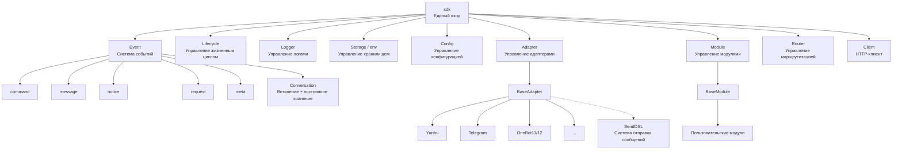
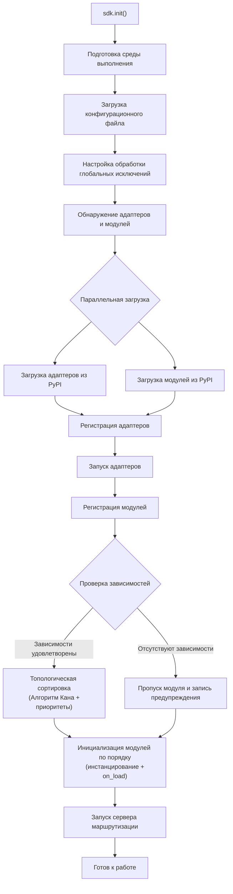
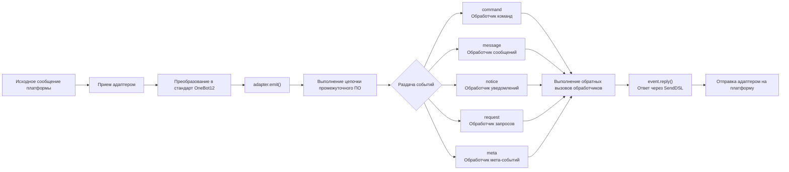
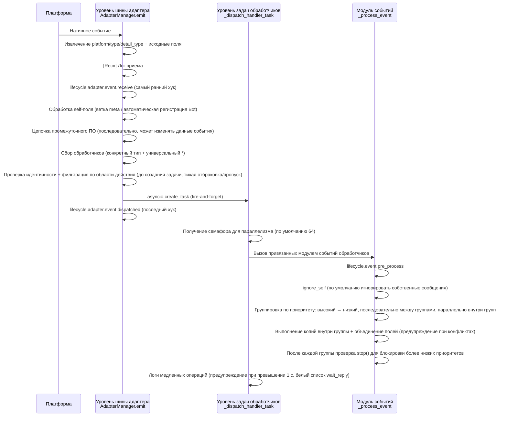
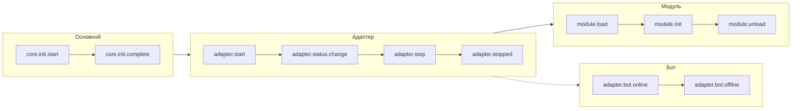
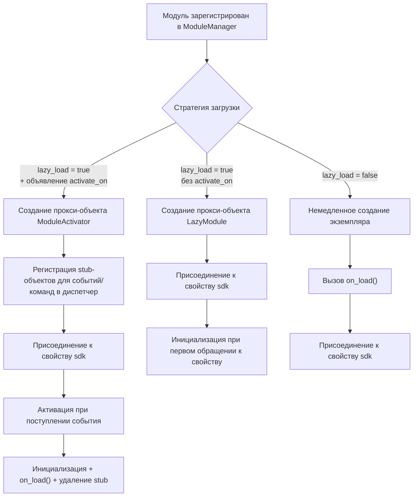
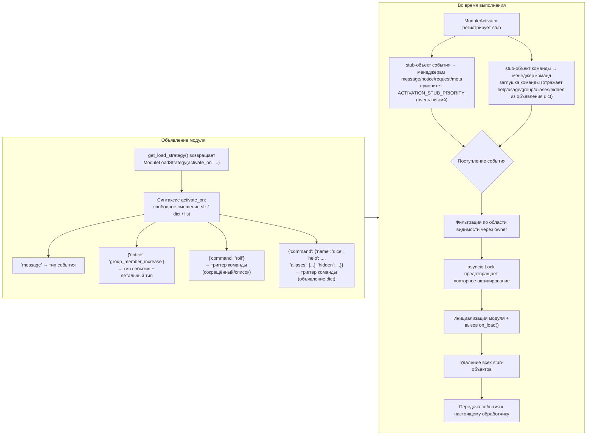
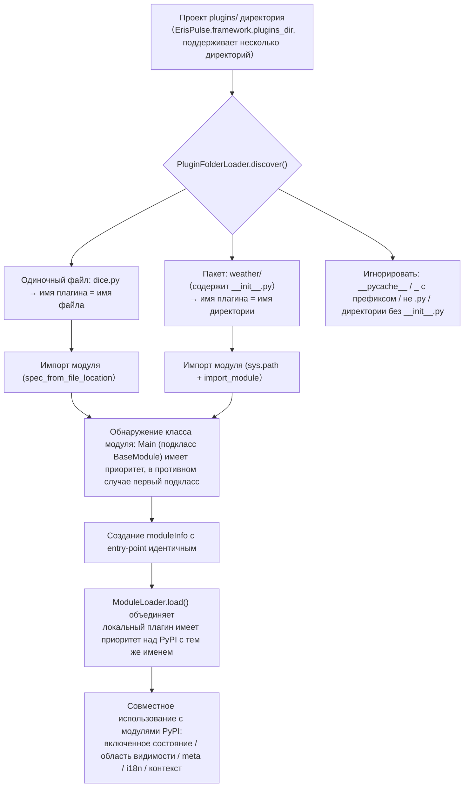

# Обзор архитектуры

Данный документ представляет визуальные диаграммы, описывающие техническую архитектуру ErisPulse SDK, чтобы помочь вам быстро понять идеи проектирования и модульные зависимости.

## Основная архитектура SDK

На следующей схеме показаны основные модули SDK и их взаимосвязи:

```mermaid
graph TB
    SDK["sdk<br/>Единый вход"]
    SDK --> Event["Event<br/>Система событий"]
    SDK --> Lifecycle["Lifecycle<br/>Управление жизненным циклом"]
    SDK --> Logger["Logger<br/>Управление логами"]
    SDK --> Storage["Storage / env<br/>Управление хранилищем"]
    SDK --> Config["Config<br/>Управление конфигурацией"]
    SDK --> AdapterMgr["Adapter<br/>Управление адаптерами"]
    SDK --> ModuleMgr["Module<br/>Управление модулями"]
    SDK --> Router["Router<br/>Управление маршрутизацией"]
    SDK --> Client["Client<br/>HTTP-клиент"]
    Event --> Command["command"]
    Event --> Message["message"]
    Event --> Notice["notice"]
    Event --> Request["request"]
    Event --> Meta["meta"]
    Event --> Conversation["Conversation<br/>Ветвление + постоянное хранение"]

    AdapterMgr --> BaseAdapter["BaseAdapter"]
    BaseAdapter --> P1["Yunhu"]
    BaseAdapter --> P2["Telegram"]
    BaseAdapter --> P3["OneBot11/12"]
    BaseAdapter --> PN["..."]

    ModuleMgr --> BaseModule["BaseModule"]
    BaseModule --> CM["Пользовательские модули"]

    BaseAdapter -.-> SendDSL["SendDSL<br/>Система отправки сообщений"]
```

### Описание основных модулей

| Модуль | Описание |
|------|------|
| **Event** | Система событий, обеспечивающая обработку пяти типов событий: command / message / notice / request / meta, а также поддерживает многократные диалоги через Conversation |
| **Adapter** | Менеджер адаптеров, отвечающий за регистрацию, запуск и остановку адаптеров для различных платформ |
| **Module** | Менеджер модулей, отвечающий за регистрацию, загрузку и выгрузку плагинов, поддерживает объявление зависимостей и топологическую сортировку |
| **Lifecycle** | Менеджер жизненного цикла, предоставляющий систему событий для жизненных циклов |
| **Storage** | Система хранилища на основе SQLite, поддерживающая общие SQL-запросы в цепочке |
| **Config** | Управление конфигурационными файлами в формате TOML |
| **Logger** | Модульная система логирования, поддерживающая под-логгеры |
| **Router** | Управление маршрутизацией HTTP/WebSocket, через абстрактный слой обертывает базовые бэкенды (в настоящее время FastAPI + Uvicorn), поддерживает маршрутизацию с помощью декораторов, промежуточные обработчики, группировку, ограничение скорости, CORS |
| **Client** | Единый HTTP/WS-клиент (до версии 2.8.0 назывался `HttpClient`, сохраняется совместимость с псевдонимом), через абстрактный слой обертывает базовые библиотеки запросов (в настоящее время aiohttp), предоставляет функции статистики запросов, повторных попыток, логирования, WebSocket-клиент, систему исключений ErisPulse. Клиент и сервер WebSocket разделяют базовый класс `WebSocketConnectionBase` |

## Процесс инициализации

На следующей схеме показан полный процесс инициализации `sdk.init()`:

```mermaid
flowchart TD
    A["sdk.init()"] --> B["Подготовка среды выполнения"]
    B --> B1["Загрузка конфигурационного файла"]
    B1 --> B2["Настройка обработки глобальных исключений"]
    B2 --> C["Обнаружение адаптеров и модулей"]
    C --> D{"Параллельная загрузка"}
    D --> D1["Загрузка адаптеров из PyPI"]
    D --> D2["Загрузка модулей из PyPI"]
    D1 & D2 --> E["Регистрация адаптеров"]
    E --> E1["Запуск адаптеров"]
    E1 --> F["Регистрация модулей"]
    F --> F1{"Проверка зависимостей"}
    F1 -->|"Отсутствуют зависимости"| F2["Пропуск модуля и запись предупреждения"]
    F1 -->|"Зависимости удовлетворены"| F3["Топологическая сортировка<br/> (Алгоритм Кана + приоритеты)"]
    F3 --> G["Инициализация модулей по порядку<br/> (инстанцирование + on_load)"]
    F2 --> G
    G --> H["Запуск сервера маршрутизации"]
    H --> K["Готов к работе"]
```

### Подробное описание этапов инициализации

> Полная цепочка инициализации с разбивкой на Finder / Loader / Manager / Router, а также базовые точки входа (`init()` / `init_task()` / `init_sync()`) и ручной полный запуск описаны в [Процесс запуска и ручное управление](docs/ru/advanced/startup.md).

## Процесс обработки событий

На следующей схеме показан полный путь сообщения от платформы до обработчика:

```mermaid
flowchart LR
    A["Исходное сообщение платформы"] --> B["Прием адаптером"]
    B --> C["Преобразование в стандарт OneBot12"]
    C --> D["adapter.emit()"]
    D --> E["Выполнение цепочки промежуточного ПО"]
    E --> F{"Раздача событий"}
    F --> G1["command<br/>Обработчик команд"]
    F --> G2["message<br/>Обработчик сообщений"]
    F --> G3["notice<br/>Обработчик уведомлений"]
    F --> G4["request<br/>Обработчик запросов"]
    F --> G5["meta<br/>Обработчик мета-событий"]
    G1 & G2 & G3 & G4 & G5 --> H["Выполнение обратных вызовов обработчиков"]
    H --> I["event.reply()<br/>Ответ через SendDSL"]
    I --> J["Отправка адаптером на платформу"]
```

### Подробное описание цепочки обработки событий

Схема выше показывает "результат"; ниже разобрано, что делает фреймворк "за кулисами" после вызова `adapter.emit()` — это трехуровневая цепочка раздачи событий:

```mermaid
sequenceDiagram
    participant P as Платформа
    participant A as Уровень шины адаптера<br/>AdapterManager.emit
    participant T as Уровень задач обработчиков<br/>_dispatch_handler_task
    participant E as Модуль событий<br/>_process_event

    P->>A: Нативное событие
    A->>A: Извлечение platform/type/detail_type + исходные поля
    A->>A: [Recv] Лог приема
    A->>A: lifecycle.adapter.event.receive (самый ранний хук)
    A->>A: Обработка self-поля (ветка meta / автоматическая регистрация Bot)
    A->>A: Цепочка промежуточного ПО (последовательно, может изменять данные события)
    A->>A: Сбор обработчиков (конкретный тип + универсальный *)
    A->>A: Проверка идентичности + фильтрация по области действия (до создания задачи, тихая отбраковка/пропуск)
    A->>T: asyncio.create_task (fire-and-forget)
    A->>A: lifecycle.adapter.event.dispatched (последний хук)
    T->>T: Получение семафора для параллелизма (по умолчанию 64)
    T->>E: Вызов привязанных модулем событий обработчиков
    E->>E: lifecycle.event.pre_process
    E->>E: ignore_self (по умолчанию игнорировать собственные сообщения)
    E->>E: Группировка по приоритету: высокий → низкий, последовательно между группами, параллельно внутри групп
    E->>E: Выполнение копий внутри группы + объединение полей (предупреждение при конфликтах)
    E->>E: После каждой группы проверка stop() для блокировки более низких приоритетов
    T->>T: Логи медленных операций (предупреждение при превышении 1 с, белый список wait_reply)
```

**Что делает фреймворк на каждом этапе и что вы можете изменить:**

| Этап | Что делает фреймворк | Что вы можете изменить |
|------|---------------------|------------------------|
| Прием | Извлекает стандартные поля, сохраняет `{platform}_raw` исходные данные; пишет `[Recv]` лог | Наблюдение за `adapter.event.receive` для раннего доступа к событию |
| self-поле | Мета-события обрабатываются ветвями connect/disconnect/heartbeat; обычные события автоматически регистрируют Bot и вызывают `adapter.bot.online` | Наблюдение за `adapter.bot.online` / `bot.offline` |
| Промежуточное ПО | **Последовательно** выполняется, если возвращается не None, то заменяет данные события | Регистрация промежуточного ПО для изменения/блокировки события |
| Сбор обработчиков | Сначала собираются обработчики конкретного типа, затем универсальные `*` | — |
| Идентификация | Определяет, принимать ли событие по пользователю>сессии>Bot>адаптеру (`scope.is_identity_allowed`), **если отклонено — событие удаляется** | Привязка `ErisPulse.scope.identity` |
| Фильтрация по области | Определяет `scope.is_allowed` по владельцу модуля (сессия>Bot>платформа), **если не проходит — тихо пропускается** | Настройка белого/черного списка областей |
| Планирование | Каждый подходящий обработчик запускается в отдельной `asyncio.Task`, `emit()` **не ждет завершения обработчиков** | — |
| Приоритет | Высокоприоритетные группы обрабатываются первыми; **между группами последовательно, внутри групп параллельно** (каждая группа имеет свою копию события, изменения объединяются в оригинальное событие, конфликты предупреждаются) | `@command(..., priority=N)` / указание при регистрации |
| Прерывание | После обработки каждой группы проверяется `event.is_stopped()`, если True — **не выполняются более низкие приоритеты** | `event.mark_processed(stop=True)` / `event.done()` |

> **Распространенные заблуждения**:
> 1. **Фильтрация по области тихая** — отфильтрованные обработчики не генерируют ошибок и не отвечают, видны только в логах TRACE (`core.scope.denied`). Если "мой модуль не получил сообщение" — сначала проверьте привязку областей.
> 2. **Обработчики обрабатываются параллельно по умолчанию** — фреймворк уже создает отдельные задачи для каждого обработчика, вам **не нужно** дополнительно оборачивать в `asyncio.create_task`.
> 3. **Внутри одной группы приоритетов нет прерывания** — `mark_processed(stop=True)` блокирует только более низкие группы, уже запущенные обработчики в той же группе не прерываются.
> 4. **Порог медленных логов фиксирован в 1 секунду** — если обработчик выполняется дольше 1 с, в логах появляется предупреждение (`wait_reply` время исключается из времени выполнения), но выполнение не прерывается.

> Подробности о привязке областей (scope) по модулям, проверке идентичности и ограничениях отправки см. в [Область (scope)](advanced/scope.md); текстовую фильтрацию событий и ACL пользователя команд см. в [Введение в обработку событий](getting-started/event-handling.md); настройку лимита параллелизма см. в [Руководство по конфигурации](user-guide/configuration.md#framework-config).

## Жизненный цикл

На следующей схеме показан порядок срабатывания событий жизненного цикла компонентов фреймворка:

```mermaid
flowchart LR
    subgraph Core["Основной"]
        direction LR
        C1["core.init.start"] --> C2["core.init.complete"]
    end

    subgraph AdapterLife["Адаптер"]
        direction LR
        A1["adapter.start"] --> A2["adapter.status.change"] --> A3["adapter.stop"] --> A4["adapter.stopped"]
    end

    subgraph ModuleLife["Модуль"]
        direction LR
        M1["module.load"] --> M2["module.init"] --> M3["module.unload"]
    end

    subgraph BotLife["Бот"]
        direction LR
        B1["adapter.bot.online"] --> B2["adapter.bot.offline"]
    end

    Core --> AdapterLife
    AdapterLife --> ModuleLife
    AdapterLife -.-> BotLife
```

### Подписка на события жизненного цикла

> Полный список методов для прослушивания событий (lifecycle.on() / once() / has_handlers()), полный список событий жизненного цикла и формат данных см. в разделе [Управление жизненным циклом](advanced/lifecycle.md).

## Стратегии загрузки модулей

ErisPulse поддерживает три стратегии загрузки модулей, которые определяются `ModuleLoadStrategy`, возвращаемым функцией `get_load_strategy()`:

```mermaid
flowchart TD
    A["Модуль зарегистрирован в ModuleManager"] --> B{"Стратегия загрузки"}
    B -->|"lazy_load = true<br/>+ объявление activate_on"| C["Создание прокси-объекта ModuleActivator"]
    B -->|"lazy_load = true<br/>без activate_on"| D["Создание прокси-объекта LazyModule"]
    B -->|"lazy_load = false"| E["Немедленное создание экземпляра"]
    C --> F["Регистрация stub-объектов для событий/команд в диспетчер"]
    F --> G["Присоединение к свойству sdk"]
    G --> H["Активация при поступлении события"]
    H --> I["Инициализация + on_load() + удаление stub"]
    D --> J["Присоединение к свойству sdk"]
    J --> K["Инициализация при первом обращении к свойству"]
    E --> L["Вызов on_load()"]
    L --> M["Присоединение к свойству sdk"]
```

> Подробнее см. [Система ленивой загрузки](advanced/lazy-loading.md), [Управление жизненным циклом](advanced/lifecycle.md) и документацию модуля.

### Архитектура триггерного ленивого активирования (trigger architecture с `activate_on`)

> [!NOTE]
> Эта функция доступна в ErisPulse **2.8.0+**.

`activate_on` позволяет загружать модуль только при поступлении **первого подходящего события/команды**, предотвращая постоянное присутствие в памяти, при этом события не теряются:

```mermaid
flowchart LR
    subgraph Declare["Объявление модуля"]
        S1["get_load_strategy() возвращает<br/>ModuleLoadStrategy(activate_on=...)"] --> S2["Синтаксис activate_on:<br/>свободное смешение str / dict / list"]
        S2 --> S2a["'message' → тип события"]
        S2 --> S2b["{'notice': 'group_member_increase'}<br/>→ тип события + детальный тип"]
        S2 --> S2c["{'command': 'roll'}<br/>→ триггер команды (сокращённый/список)"]
        S2 --> S2d["{'command': {'name': 'dice', 'help': ...,<br/>'aliases': [...], 'hidden': ...}}<br/>→ триггер команды (объявление dict)"]
    end

    subgraph Runtime["Во время выполнения"]
        R1["ModuleActivator регистрирует stub"] --> R1a["stub-объект события → менеджерам message/notice/request/meta<br/>приоритет ACTIVATION_STUB_PRIORITY (очень низкий)"]
        R1 --> R1b["stub-объект команды → менеджер команд<br/>заглушка команды (отражает help/usage/group/aliases/hidden из объявления dict)"]
        R1a --> R2{"Поступление события"}
        R1b --> R2
        R2 --> R3["Фильтрация по области видимости через owner"]
        R3 --> R4["asyncio.Lock предотвращает повторное активирование"]
        R4 --> R5["Инициализация модуля + вызов on_load()"]
        R5 --> R6["Удаление всех stub-объектов"]
        R6 --> R7["Передача события к настоящему обработчику"]
    end

    Declare --> Runtime
```

**Ключевые моменты семантики триггеров:**

> Полный синтаксис `activate_on` (str / dict / list), объявление команды через dict, цепочка возврата help для заглушек, фильтрация по области видимости и семантика ошибок см. в [Системе ленивой загрузки](advanced/lazy-loading.md#триггерное-ЛенивоеАктивированиеActivateOn).

## Архитектура локальной папки плагинов

> [!NOTE]
> Эта функция требует ErisPulse **2.8.0+**.

Локальные плагины (в директории `plugins/`) не требуют пакетирования для публикации, и фреймворк автоматически обнаруживает и загружает их при запуске:

```mermaid
flowchart TD
    A["Проект plugins/ директория<br/>（ErisPulse.framework.plugins_dir, поддерживает несколько директорий）"] --> B{"PluginFolderLoader.discover()"}
    B --> C["Одиночный файл: dice.py → имя плагина = имя файла"]
    B --> D["Пакет: weather/（содержит __init__.py）→ имя плагина = имя директории"]
    B --> E["Игнорировать: __pycache__ / _ с префиксом / не .py / директории без __init__.py"]
    C --> F["Импорт модуля (spec_from_file_location）"]
    D --> G["Импорт модуля (sys.path + import_module）"]
    F --> H["Обнаружение класса модуля: Main (подкласс BaseModule) имеет приоритет, в противном случае первый подкласс"]
    G --> H
    H --> I["Создание moduleInfo с entry-point идентичным"]
    I --> J["ModuleLoader.load() объединяет<br/>локальный плагин имеет приоритет над PyPI с тем же именем"]
    J --> K["Совместное использование с модулями PyPI:<br/>включенное состояние / область видимости / meta / i18n / контекст"]
```

**Соглашения и особенности:**

- Имя плагина берется из имени файла для одиночного файла, и из имени директории для пакета
- Локальный плагин имеет `moduleInfo.meta.source == "plugin_folder"`, и может совместно использоваться с модулями, установленными из PyPI
- При совпадении имен приоритет отдается локальному плагину (удобно для отладки), при отключении удаляется также соответствующий entry-point

## Архитектура горячей перезагрузки модулей

Горячая перезагрузка работает одинаково для **всех источников модулей**: локальные плагины могут автоматически перезагружаться при изменении файлов, а любой модуль может быть перезагружен вручную с помощью `sdk.reload_module()` / `sdk.module.reload()` (пакеты PyPI будут перезагружены после обновления через pip); `sdk.reload_all_modules()` / `sdk.module.reload_all()` позволяет одновременно перезагрузить все зарегистрированные модули (пакеты PyPI будут перезагружены после пакетного обновления pip):

```mermaid
flowchart TD
    A["sdk.enable_plugin_hot_reload()<br/>（автоматический мониторинг, только для локальных плагинов）"] --> B["PluginReloadWatcher запущен"]
    B --> C["PollingObserver（фоновый守护-поток）<br/>периодически сравнивает mtime файлов .py"]
    C --> D{"Изменение файла плагина"}
    D --> E["Устранение дребезга изменений (по умолчанию 1 секунда)"]
    E --> F["_handle_change анализирует имя плагина<br/>（однофайловый / пакетный формат）"]
    F --> G["asyncio.run_coroutine_threadsafe<br/>запуск в главном цикле событий"]
    G --> H["sdk.reload_module(name, full=…)<br/>（также может быть вызван вручную для любого модуля）"]
    H --> I["Удаление старого экземпляра (вызывает on_unload)<br/>собирает зависимости для каскадной перезагрузки"]
    I --> J{"Источник модуля?"}
    J -->|"plugin_folder"| K["Очистка регистрации и sys.modules плагина<br/>повторный сканирование каталога plugins/"]
    J -->|"PyPI пакет"| L["Очистка регистрации + по top_level очистка поддерева sys.modules пакета (при full=True дополнительно<br/>очищается верхний уровень старого объекта модуля)<br/>обновление кэша импорта и повторный поиск entry-point"]
    K --> M["Повторная регистрация + загрузка"]
    L --> M
    M --> N["Новый экземпляр присоединяется к свойству sdk"]
    N --> O["Каскадная перезагрузка зависимостей<br/>（полная перезагрузка плагина / повторная инициализация PyPI; при full=True зависимости также перезагружаются с кодом）"]
    K -.->|"Файл удален"| P["Удаление из результата загрузки"]
    L -.->|"entry-point отсутствует (удален pip)| P
```

**Различия между двумя источниками есть только на этапе обнаружения**, а регистрация, загрузка и каскадная перезагрузка полностью идентичны:

- **Локальные плагины** (`moduleInfo.meta.source == "plugin_folder"`): после очистки соответствующего `sys.modules` пересканируется каталог `plugins/`; если файл удален, он удаляется из результата загрузки
- **Пакеты PyPI**: по `meta.top_level` очищается поддерево `sys.modules` пакета, обновляется кэш импорта (сброс 60-секундного кэша entry-point) и повторно выполняется импорт; если entry-point исчез (pip удаление), он удаляется из результата загрузки

**Полная перезагрузка (`full=True`) и общая перезагрузка (`reload_all_modules`)**:

- При отсутствии метаданных `top_level` и невозможности их вывести, по умолчанию перезагрузка **не очищает** кэш импорта (переимпорт использует старый объект модуля, т.е. "ложная перезагрузка"), фреймворк выдает явное предупреждение и предлагает использовать `full=True` — полная перезагрузка дополнительно очищает верхний уровень старого объекта модуля, гарантируя, что после перезагрузки будет запущен актуальный код
- При `full=True` PyPI-зависимости перезагружаются полностью (переимпорт кода), в обычном режиме перезагрузка ограничивается повторной инициализацией (существующая семантика)
- Перезагрузка заставляет модули, которые изначально загружались лениво, активироваться (без предупреждения, разница теперь отображается в логах); `reload_all_modules()` сохраняет стратегию ленивой загрузки и активирует только модули, которые были уже загружены до перезагрузки
- `reload_all_modules()` перезагружает модули в порядке зависимости, при сбое одного модуля он записывает диагностическое сообщение и пропускает его (без отката — побочные эффекты on_unload необратимы, что соответствует семантике "стараться, но не гарантировать" для перезагрузки одного модуля); в случае сбоя перезагрузки и частичного отката ситуация аналогична, логи четко указывают, что старый экземпляр находится в состоянии завершения