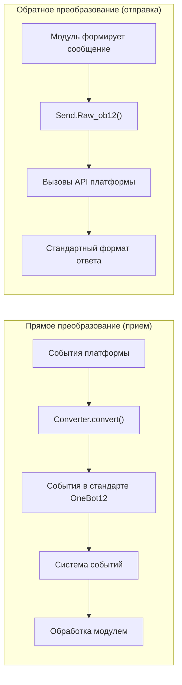

# Введение в разработку адаптеров

Это руководство поможет вам начать разработку адаптеров ErisPulse для подключения новых платформ сообщений.

## Адаптеры

### Что такое адаптер

Адаптеры служат мостом между ErisPulse и различными платформами мессенджеров и отвечают за:

1. **Прямое преобразование**: получение событий платформы и преобразование их в стандартный формат OneBot12 (Converter)
2. **Обратное преобразование**: преобразование сегментов сообщений OneBot12 в вызовы API платформы (`Raw_ob12`)
3. управление подключением к платформе (WebSocket/WebHook)
4. предоставление унифицированного интерфейса отправки сообщений SendDSL

### Архитектура адаптера


```mermaid
flowchart LR
    subgraph receive["Прямое преобразование (прием)"]
        direction TB
        P1["События платформы"] --> C1["Converter.convert()"] --> O1["События в стандарте OneBot12"] --> S1["Система событий"] --> M1["Обработка модулем"]
    end
    subgraph send["Обратное преобразование (отправка)"]
        direction TB
        M2["Модуль формирует сообщение"] --> R1["Send.Raw_ob12()"] --> N1["Вызовы API платформы"] --> R2["Стандартный формат ответа"]
    end
```

## Структура каталогов

Стандартная структура пакета адаптера:

```
MyAdapter/
├── pyproject.toml          # Конфигурация проекта
├── README.md               # Описание проекта
├── LICENSE                 # Лицензия
└── MyAdapter/
    ├── __init__.py          # Точка входа пакета
    ├── Core.py               # Основной класс адаптера
    └── Converter.py          # Конвертер событий
```

## Быстрый старт

### 1. Создание проекта

```bash
mkdir MyAdapter && cd MyAdapter
```

### 2. Создание pyproject.toml

```toml
[project]
name = "ErisPulse-MyAdapter"
version = "1.0.0"
description = "Платформенный адаптер MyAdapter"
readme = "README.md"
requires-python = ">=3.10"
license = { file = "LICENSE" }
authors = [ { name = "yourname", email = "your@mail.com" } ]

dependencies = [
    "ErisPulse>=2.4.0"  # aiohttp встроен в ErisPulse, обычно отдельная зависимость не нужна
]

[project.urls]
"homepage" = "https://github.com/yourname/MyAdapter"

[project.entry-points."erispulse.adapter"]
"MyAdapter" = "MyAdapter:MyAdapter"
```

### 3. Создание основного класса адаптера

Рамка предоставляет декларативное управление конфигурацией с помощью `ConfigClass` / `AccountConfigClass`, адаптеру нужно лишь объявить класс конфигурации, чтобы автоматически загружать, проверять и генерировать шаблон конфигурации.

```python
# MyAdapter/Core.py
from dataclasses import dataclass, field
# Рекомендуется корневой импорт (2.10+): часто используемые символы импортируются напрямую из корневого пакета, глубокие пути по-прежнему совместимы
from ErisPulse import BaseAdapter, BaseConfig

@dataclass
class MyAdapterConfig(BaseConfig):
    """Конфигурация MyAdapter"""
    api_endpoint: str = field(
        default="https://api.example.com",
        metadata={
            "description": {"i18n": "my_adapter.api_endpoint", "default": "Адрес API"},
            "required": False,
            "ui": {"widget": "text", "group": "connection", "order": 1},
        },
    )
    token: str = field(
        default="",
        metadata={
            "description": {"i18n": "my_adapter.token", "default": "Токен платформы"},
            "required": True,
            "secret": True,
            "ui": {"widget": "password", "group": "basic", "order": 2},
        },
    )

class MyAdapter(BaseAdapter):
    ConfigClass = MyAdapterConfig  # Объявление класса конфигурации, рамка автоматически управляет
    
    # Не нужно переопределять __init__! Рамка автоматически обрабатывает:
    # - self.sdk / self.logger автоматически устанавливаются
    # - self.cfg читается в реальном времени
    # - self.Send / self.Request автоматически инициализируются
    
    def _setup_converter(self):
        from .Converter import MyPlatformConverter
        return MyPlatformConverter()
```

> ⚠️ **О `__init__`**: В новой версии `BaseAdapter.__init__(self, sdk=None)` автоматически обрабатывает ссылку на SDK, инициализацию логирования и загрузку конфигурации. Большинству адаптеров **не нужно переопределять `__init__`**. Подробнее см. [Примечания по __init__](#init-注意事项).

> ⚠️ **О `super().__init__()`**: `BaseAdapter.__init__()` отвечает за создание экземпляров фабрик `Send` и `Request`. Если забыть вызвать, все операции отправки сообщений и запросов будут вызывать `AttributeError`. Подробнее см. [Примечания по __init__](#init-注意事项).

### 4. Реализация обязательных методов

```python
class MyAdapter(BaseAdapter):
    # ... код __init__ ...
    
    async def start(self):
        """Запуск адаптера (обязательно реализовать)"""
        # Регистрация WebSocket или WebHook маршрута
        router.register_websocket(
            module_name="myplatform",
            path="/ws",
            handler=self._ws_handler
        )
        self.logger.info("Адаптер запущен")
    
    async def shutdown(self):
        """Остановка адаптера (обязательно реализовать)"""
        router.unregister_websocket(
            module_name="myplatform",
            path="/ws"
        )
        # Очистка соединений и ресурсов
        self.logger.info("Адаптер остановлен")
    
    async def call_api(self, endpoint: str, **params):
        """Вызов API платформы (обязательно реализовать)"""
        raise NotImplementedError("Необходимо реализовать call_api")
```

#### Активная отправка мета-событий

Адаптер должен активно отправлять мета-события, чтобы рамка отслеживала состояние онлайн-бота. Использование `emit_meta()` позволяет выполнить это одной строкой:

```python
class MyAdapter(BaseAdapter):
    async def _ws_handler(self, websocket):
        bot_id = self._get_bot_id()

        # Бот в сети
        await self.emit_meta("connect", bot_id, user_name="MyBot")

        try:
            while True:
                data = await websocket.receive_text()
                event = self.convert(data)
                if event:
                    await self.adapter.emit(event)
        except WebSocketDisconnect:
            pass
        finally:
            # Бот отключен
            await self.emit_meta("disconnect", bot_id)
```

> Подробное руководство по управлению состоянием бота и мета-событиям см. в [Рекомендациях по лучшим практикам адаптера - Управление состоянием бота и мета-события](best-practices.md#bot-状态管理与-meta-事件).

### 5. Реализация класса Send

Модификаторы `At`/`AtAll`/`Reply` уже реализованы в базовом классе SendDSL, адаптеру нужно лишь реализовать `Raw_ob12` и конкретные методы отправки.

Рамка предоставляет два ключевых вспомогательных метода:
- `self._apply_modifiers(message)` — автоматически объединяет модификаторы At/AtAll/Reply в сегменты сообщения
- `self.send_context` — получает словарь контекста отправки (`target_type`, `target_id`, `account_id`)

```python
import asyncio

class MyAdapter(BaseAdapter):
    # ... другие код ...

    class Send(BaseAdapter.Send):

        def Raw_ob12(self, message, **kwargs):
            """
            Отправка сообщения в формате OneBot12 (обязательно реализовать)

            Использование _apply_modifiers автоматически объединяет состояние модификаторов,
            использование send_context получает контекст отправки.
            """
            async def _do_send():
                segments = self._apply_modifiers(message)
                return await self._adapter.call_api(
                    endpoint="/send_message",
                    message=segments,
                    **self.send_context,
                    **kwargs
                )
            return asyncio.create_task(_do_send())

        # Text/Image/Voice/Video/File унаследованы от базового класса SendDSL,
        # по умолчанию делегируются в Raw_ob12, повторная реализация не нужна.
        # Если нужна платформенно-специфическая логика, можно переопределить отдельные методы:
        # def Text(self, text: str):
        #     return self.Raw_ob12([{"type": "text", "data": {"text": text}}])
```

**Особенности реализации методов отправки медиа (Image/Video/File):**

- Стандартная реализация базового класса封装ирует параметр `file` в сегмент OneBot12 и передает в `Raw_ob12`, адаптер должен обработать загрузку/загрузку в `Raw_ob12`
- Параметр `file` должен поддерживать как двоичные данные `bytes`, так и URL `str`
- При передаче URL необходимо сначала загрузить файл, а затем загрузить его на платформу
- Платформа обычно требует сначала вызвать интерфейс загрузки для получения идентификатора файла, а затем вызвать интерфейс отправки

**Метод `__getattr__` магии:**

- Реализация методов без учета регистра (Text, text, TEXT могут быть вызваны)
- Неопределенные методы должны возвращать информационное сообщение, а не вызывать ошибку

**Метод `Raw_ob12`:**

- Преобразует стандартный формат OneBot12 в формат платформы для отправки
- Использует `self._apply_modifiers(message)` для автоматической обработки модификаторов At/AtAll/Reply
- Использует `**self.send_context` для передачи информации о цели отправки и учетной записи

### 6. Реализация конвертера

```python
# MyAdapter/Converter.py
import time
import uuid

class MyPlatformConverter:
    def convert(self, raw_event):
        """Преобразование оригинального события платформы в стандартный формат OneBot12"""
        if not isinstance(raw_event, dict):
            return None
        
        onebot_event = {
            "id": str(raw_event.get("event_id", uuid.uuid4())),
            "time": int(time.time()),
            "type": self._convert_event_type(raw_event.get("type")),
            "detail_type": self._convert_detail_type(raw_event),
            "platform": "myplatform",
            "self": {
                "platform": "myplatform",
                "user_id": str(raw_event.get("bot_id", ""))
            },
            "myplatform_raw": raw_event,
            "myplatform_raw_type": raw_event.get("type", "")
        }
        
        return onebot_event
    
    def _convert_event_type(self, event_type):
        """Преобразование типа события"""
        type_map = {
            "message": "message",
            "notice": "notice"
        }
        return type_map.get(event_type, "unknown")
    
    def _convert_detail_type(self, raw_event):
        """Преобразование подробного типа"""
        return "private"  # Упрощенный пример
```

### 7. Реализация класса Request (операции запроса)

Если ваша платформа поддерживает запросы от друзей, приглашения в группы и т.д., требующие принятия решения ботом, можно реализовать внутренний класс `Request`:

```python
from ErisPulse import BaseAdapter, RequestDSL

class MyAdapter(BaseAdapter):
    # ... код Send и другие код ...

    class Request(RequestDSL):
        """Реализация операций запроса (запросы от друзей, приглашения в группы и т.д.)"""

        def accept(self, **kwargs):
            """Согласие с запросом"""
            async def _do():
                result = await self._adapter.call_api(
                    endpoint="/set_request",
                    request_id=self._request_id,
                    approve=True,
                    **kwargs,
                )
                return {
                    "status": "ok" if result.get("code") == 0 else "failed",
                    "retcode": result.get("code", 0),
                    "data": None,
                    "message_id": "",
                    "message": result.get("message", ""),
                }
            return self._create_task(_do())

        def reject(self, **kwargs):
            """Отказ от запроса"""
            async def _do():
                result = await self._adapter.call_api(
                    endpoint="/set_request",
                    request_id=self._request_id,
                    approve=False,
                    **kwargs,
                )
                return {
                    "status": "ok" if result.get("code") == 0 else "failed",
                    "retcode": result.get("code", 0),
                    "data": None,
                    "message_id": "",
                    "message": result.get("message", ""),
                }
            return self._create_task(_do())
```

Способ использования для разработчиков модулей:

```python
from ErisPulse import request

@request.on_friend_request()
async def handle_friend_request(event):
    # Через удобный метод Event
    await event.approve()
    # Или через адаптер напрямую
    await adapter.myplatform.Request("req_id").accept()
```

> Если платформа не поддерживает операции запроса, можно не реализовывать внутренний класс `Request`. Базовый класс по умолчанию возвращает `retcode=10002` (операция не поддерживается). Подробнее см. [Спецификация операций запроса](../../standards/request-action-spec.md).

### 8. Создание входной точки пакета

```python
# MyAdapter/__init__.py
from .Core import MyAdapter
```

## Зависимости (необязательно, 2.8.0+)

Адаптеры могут объявлять зависимости от других адаптеров или модулей, чтобы обеспечить взаимодействие между адаптерами и опциональные функции:

```python
from typing import ClassVar

class MyAdapter(BaseAdapter):
    # Жёсткая зависимость: запуск пропускается при отсутствии (предупреждение + событие status=skipped-dependency)
    depends: ClassVar[dict] = {
        "adapters": ["onebot11"],   # Зависимые адаптеры (по названию платформы)
        "modules": ["TranslateEngine"],  # Зависимые модули (по зарегистрированному имени)
    }
    # Опциональная зависимость: отсутствие не влияет на запуск; при загрузке/выгрузке модуля вызывается обратный вызов (режим опциональной функции)
    optional_modules: ClassVar[list] = ["TranslateEngine"]
```

- **Порядок запуска**: адаптеры, объявившие жёсткую зависимость от модуля, будут **запущены после инициализации модуля**
- **Уведомления об опциональной зависимости**: при загрузке модуля из `optional_modules` (или жёсткой зависимости) вызывается `on_dependency_ready(module_name)`, при выгрузке — `on_dependency_lost(module_name)` (по умолчанию пустая реализация, можно переопределить) — для сценариев поздней загрузки и горячей перезагрузки:

```python
async def on_dependency_ready(self, module_name):
    """Опциональный модуль готов: включить соответствующую опциональную функцию"""
    if module_name == "TranslateEngine":
        self._translate = self.sdk.TranslateEngine

async def on_dependency_lost(self, module_name):
    """Опциональный модуль отсутствует: понизить функциональность"""
    if module_name == "TranslateEngine":
        self._translate = None
```

> [!NOTE]
> Эта функция доступна начиная с ErisPulse **2.8.0+**.

## Примечания по `__init__`

При разработке адаптеров могут потребоваться перезаписи `__init__` на трех уровнях. Ниже приведены правильные подходы для каждого уровня.

### 1. Уровень BaseAdapter (в большинстве случаев не нужно перезаписывать)

`BaseAdapter.__init__(self, sdk=None)` отвечает за создание фабрики `Send` / `Request` и автоматически выполняет следующие задачи:

- Принимает параметр `sdk` и устанавливает `self.sdk`, `self.logger`
- Если объявлен `ConfigClass`, можно получить доступ к глобальной конфигурации через `self.cfg`
- Если объявлен `AccountConfigClass`, можно получить доступ к конфигурации нескольких аккаунтов через `self.accounts`

**В большинстве случаев не нужно переопределять `__init__`** — достаточно просто объявить `ConfigClass`:

```python
class MyAdapter(BaseAdapter):
    ConfigClass = MyAdapterConfig  # После объявления конфигурация будет автоматически управляться фреймворком
    
    async def start(self):
        cfg = self.cfg  # Типобезопасное получение, доступ к конфигурации в реальном времени
        ...
```

Если действительно требуется пользовательская инициализация, вызовите `super().__init__(sdk)`:

```python
class MyAdapter(BaseAdapter):
    ConfigClass = MyAdapterConfig
    
    def __init__(self, sdk=None):
        super().__init__(sdk)  # Передача параметра sdk
        self.converter = self._setup_converter()
        self.convert = self.converter.convert
```

### 2. Внутренний класс Send (в большинстве случаев не нужно перезаписывать)

`SendDSL.__init__` отвечает за передачу состояния при цепочечных вызовах (тип цели, ID цели, аккаунт и т.д.). **В большинстве случаев вам нужно переопределять только методы** (`Raw_ob12`, `Text` и т.д.), а не `__init__`.

Если действительно необходимо (например, для инициализации платформо-специфического состояния), **необходимо передать все параметры**:

```python
class MyAdapter(BaseAdapter):
    class Send(BaseAdapter.Send):
        # Параметры: adapter, target_type, target_id, account_id
        def __init__(self, adapter, target_type=None, target_id=None, account_id=None):
            super().__init__(adapter, target_type, target_id, account_id)  # ← Обязательно передать
            self._my_state = None  # Инициализация платформо-специфического состояния
```

**Почему необходимо передавать?** Каждый шаг цепочечного вызова создает новый экземпляр через `self.__class__(...)`:

```python
adapter.Send.To("user", "123")               # → Send(adapter, "user", "123", None)
adapter.Send.To("user", "123").Using("bot1")  # → Send(adapter, "user", "123", "bot1")
```

Если сигнатура `__init__` не совпадает или не вызван `super()`, цепочечный вызов прервется.

### 3. Внутренний класс Request (в большинстве случаев не нужно перезаписывать)

Аналогично Send. Параметры: `adapter`, `request_id`, `account_id`:

```python
class MyAdapter(BaseAdapter):
    class Request(RequestDSL):
        # Параметры: adapter, request_id, account_id
        def __init__(self, adapter, request_id=None, account_id=None):
            super().__init__(adapter, request_id, account_id)  # ← Обязательно передать
            self._my_state = None  # Инициализация платформо-специфического состояния
```

### Сводка

| Уровень | Когда перезаписывать | Обязательные действия |
|------|------------|-----------|
| **BaseAdapter** | При необходимости пользовательской логики инициализации | `super().__init__(sdk)` (передача параметра sdk) |
| **Send внутренний класс** | При необходимости инициализации состояния отправки | `super().__init__(adapter, target_type, target_id, account_id)` |
| **Request внутренний класс** | При необходимости инициализации состояния запроса | `super().__init__(adapter, request_id, account_id)` |
| Все три уровня | В большинстве случаев | **Объявите ConfigClass, не трогайте `__init__`** |

### 9. Информация о подключении и обнаружение маршрутов

После регистрации маршрутов адаптером фреймворк будет записывать всю информацию о маршрутах. Пользователь может использовать следующие API для просмотра информации о подключении адаптера:

```python
from ErisPulse import sdk

# Получение полной информации о подключении адаптера
info = sdk.adapter.get_connection_info("myplatform")
# {
#   "platform": "myplatform",
#   "status": "started",
#   "connection": {
#     "base_url": "http://localhost:8080",
#     "http_routes": [
#       {"path": "/myplatform/webhook", "method": "POST",
#        "url": "http://localhost:8080/myplatform/webhook"}
#     ],
#     "websocket_routes": [
#       {"path": "/myplatform/ws",
#        "url": "ws://localhost:8080/myplatform/ws"}
#     ]
#   }
# }

# Перечисление всех пространств имен (адаптеров/модулей) маршрутов
namespaces = sdk.router.list_namespaces()
# {"myplatform": {"http": ["/myplatform/webhook"], "websocket": ["/myplatform/ws"]}}

# Получение полных URL-адресов подключения для пространства имен
urls = sdk.router.get_module_urls("myplatform")
# {"base_url": "http://localhost:8080", "http": [...], "websocket": [...]}

# Получение подробной информации о маршрутах пространства имен
routes = sdk.router.get_module_routes("myplatform")
# {"http": [{"path": "/myplatform/webhook", "methods": ["POST"]}],
#  "websocket": [{"path": "/myplatform/ws", "auth": false}]}
```

> **Подсказка:** Возвращаемая информация `get_connection_info()` подходит для отображения пользователю (например, в WebUI), чтобы помочь настроить URL-адреса обратных вызовов или подключения WebSocket на стороне платформы. `module_name`, указанный при регистрации маршрута, должен полностью совпадать с именем `platform`, зарегистрированным в ErisPulse, иначе обнаружение маршрутов не будет правильно сопоставлено.

### 10. Поддержка SSE (Server-Sent Events)

ErisPulse имеет встроенную поддержку SSE, независимую от сервера. Модули и адаптеры могут зарегистрировать конечные точки SSE с помощью `@sdk.router.sse()`.

#### Основное использование

```python
import asyncio
from ErisPulse import sdk

@sdk.router.sse("MyModule", "/events")
async def event_stream(sse):
    """Отправка событий SSE"""
    count = 0
    while not sse.closed:
        await sse.send({"count": count}, event="update")
        count += 1
        await asyncio.sleep(1)
```

#### Использование параметров запроса

Обработчик может объявить параметр `request`, чтобы получить доступ к информации о клиентском запросе:

```python
@sdk.router.sse("MyModule", "/events")
async def event_stream(request, sse):
    token = request.query_params.get("token")
    if not validate_token(token):
        await sse.close()
        return

    while not sse.closed:
        data = await fetch_data(token)
        await sse.send(data)
        await asyncio.sleep(5)
```

#### API SseEmitter

| Метод | Описание |
|------|------|
| `sse.send(data, event=None, id=None, retry=None)` | Отправка события SSE. Не-строковые данные автоматически сериализуются в JSON |
| `sse.close()` | Элегантное закрытие соединения SSE (безопасный вызов, можно несколько раз) |
| `sse.closed` | Закрыто ли соединение |
| `sse.request` | Объект базового запроса (можно использовать для чтения query params, headers) |

#### Использование в RouteGroup

```python
api = sdk.router.group("MyModule", "/api", version="1")

@api.sse("/events")
async def events(sse):
    await sse.send({"msg": "hello"})
```

#### Обнаружение маршрутов

Маршруты SSE автоматически появляются в API обнаружения маршрутов:

```python
# list_namespaces будет содержать ключ "sse"
sdk.router.list_namespaces()
# {"MyModule": {"http": [...], "websocket": [...], "sse": ["/MyModule/events"]}}

# get_module_routes будет помечать streaming: true
sdk.router.get_module_routes("MyModule")
# {"http": [...], "websocket": [...], "sse": [{"path": "/MyModule/events", "streaming": true}]}

# get_module_urls будет генерировать полный URL
sdk.router.get_module_urls("MyModule")
# {"sse": [{"path": "/MyModule/events", "url": "http://localhost:8080/MyModule/events"}]}
```

> **Дизайн, независимый от сервера:** `SseEmitter` использует обратные вызовы для декомпозиции от базового HTTP-фреймворка. Фреймворк предоставляет `register_sse()` и декоратор `@sse` как единый вход для регистрации, адаптер не должен напрямую зависеть от какого-либо базового HTTP-фреймворка, чтобы реализовать конечную точку SSE.

## Далее

- [Основные концепции адаптера](core-concepts.md) - Ознакомьтесь с архитектурой адаптера
- [Подробное руководство по SendDSL](send-dsl.md) - Научитесь отправлять сообщения
- [Реализация конвертера](converter.md) - Ознакомьтесь с преобразованием событий
- [Рекомендации по адаптерам](best-practices.md) - Создание качественных адаптеров