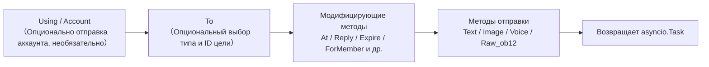
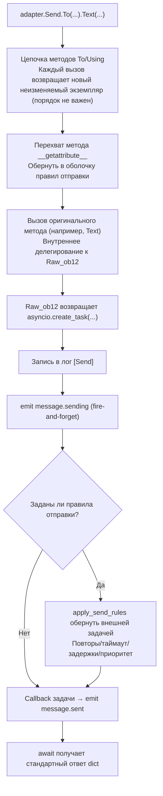

# Подробное руководство SendDSL

SendDSL — это интерфейс отправки сообщений в стиле цепочки вызовов, предоставляемый адаптером ErisPulse.

Пожалуйста, верните полный перевод Markdown-документа, не добавляя никаких других текстов.

Еще раз напоминаем: если документ содержит строки переключения языка (названия языков разделены `` | ``), строго соблюдайте формат, указанный в пункте 8 выше, не пишите ошибочный формат вида ``[**Label**](file)``.

## Основные способы вызова

### 1. Указание типа и ID

```python
await adapter.Send.To("group", "123").Text("Привет")
```

### 2. Указание только ID

```python
await adapter.Send.To("123").Text("Привет")
```

### 3. Указание учетной записи отправки

```python
await adapter.Send.Using("bot1").Text("Привет")
```

### 4. Комбинированное использование

```python
await adapter.Send.Using("bot1").To("group", "123").Text("Привет")
```

[**English**](docs/ru/quick-start.md)

## Методы цепочек



[**中文**](docs/ru/quick-start.md)

## Методы отправки

Все методы отправки возвращают объект `asyncio.Task`.

### Основные методы (встроенные в базовый класс)

Следующие стандартные методы уже реализованы в базовом классе `SendDSL`, **по умолчанию делегируются на `Raw_ob12`**, подклассы адаптеров могут использовать их напрямую, не повторяя реализацию, и IDE будет подсказывать их:

| Название метода | Описание | Возвращаемое значение |
|-----------------|----------|-----------------------|
| `Text(text: str)` | Отправка текстового сообщения | `asyncio.Task` |
| `Image(file: bytes \| str)` | Отправка изображения | `asyncio.Task` |
| `Voice(file: bytes \| str)` | Отправка аудио (OneBot12 `audio` сегмент) | `asyncio.Task` |
| `Video(file: bytes \| str)` | Отправка видео | `asyncio.Task` |
| `File(file: bytes \| str, filename: str = None)` | Отправка файла | `asyncio.Task` |

Адаптер может переопределить отдельные стандартные методы для предоставления логики, специфичной для платформы:

```python
class Send(SendDSL):
    def Raw_ob12(self, message, **kwargs):
        # Должно быть реализовано
        ...

    # Опционально: переопределение Text для предоставления логики, специфичной для платформы
    # def Text(self, text: str):
    #     return self.Raw_ob12([{"type": "text", "data": {"text": text}}])
```

### Методы протокола

| Название метода | Описание | Возвращаемое значение | Обязательно ли реализовать? |
|-----------------|----------|-----------------------|-----------------------------|
| `Raw_ob12(message)` | Отправка сообщения в формате OneBot12 | `asyncio.Task` | **Обязательно реализовать** |

> **Важно**: `Raw_ob12` — основной метод адаптера, **должен быть реализован**. Это единый входной пункт для обратного преобразования (OneBot12 → платформа). Если он не реализован, базовый класс будет записывать в журнал ошибок и возвращать стандартный ответ об ошибке (`status: "failed"`, `retcode: 10002`). Стандартные методы (`Text`, `Image` и т.д.) по умолчанию делегируются на `Raw_ob12`.

### Методы, специфичные для платформы

Адаптер может добавлять в подкласс `Send` методы отправки, специфичные для платформы (они будут распознаваться `event.supports()` / `event.available_methods()`):

```python
class Send(SendDSL):
    def Raw_ob12(self, message, **kwargs): ...

    # Метод, специфичный для платформы
    def Sticker(self, sticker_id: str):
        return self.Raw_ob12([{"type": "sticker", "data": {"id": sticker_id}}])
```

[**中文**](docs/ru/quick-start.md) | [**English**](docs/ru/quick-start.md)

## Модификаторы методов

Модификаторы методов возвращают `self`, чтобы поддерживать цепочечные вызовы.

### Метод At

```python
# @одного пользователя
await adapter.Send.To("group", "123").At("456").Text("Привет")

# @нескольких пользователей
await adapter.Send.To("group", "123").At("456").At("789").Text("Приветствую вас")
```

### Метод AtAll

```python
# @всех участников
await adapter.Send.To("group", "123").AtAll().Text("Всем привет")
```

### Метод Reply

```python
# Ответ на сообщение
await adapter.Send.To("group", "123").Reply("msg_id").Text("Содержимое ответа")
```

### Комбинированные модификаторы

```python
await adapter.Send.To("group", "123").At("456").Reply("msg_id").Text("Ответ на сообщение с @")
```

### Платформенно-специфические методы-модификаторы

Помимо встроенных `At`/`AtAll`/`Reply`, адаптер может определить **платформенно-специфические методы-модификаторы**. Эти методы **должны просто возвращать `self`** и не требуют никаких декораторов — фреймворк автоматически их распознает:

- Возвращает `self` (экземпляр SendDSL) → метод-модификатор, не запускает отправку или события жизненного цикла, цепочка продолжается
- Возвращает `Task`/`Awaitable` → метод отправки

```python
class Send(SendDSL):
    def Raw_ob12(self, message, **kwargs): ...

    # Метод-модификатор: возвращает self, не отправляет
    def Expire(self, seconds: int):
        self._expire = seconds
        return self

    def ForMember(self, user_id: str):
        self._member = user_id
        return self

    # Метод отправки: возвращает Task, зависит от состояния, установленного методами-модификаторами
    def Board(self, content: str, **kwargs):
        return self.Raw_ob12([{"type": "board", "data": {"text": content}}])
```

Использование:

```python
# Методы-модификаторы можно последовательно применять
await adapter.Send.To("group", "big").Expire(3600).ForMember("114").Board("Содержимое доски")

## Использование модифицирующих методов в классе Event

> [!NOTE]
> Функция `reply(via=)` и `event.send_chain()` требуют ErisPulse **2.7.0+**.

Метод `event.reply()` по умолчанию предоставляет только встроенные параметры модификаторов, такие как `at_sender`/`at_users`/`at_all`/`quote`. Для использования платформенно-специфичных модифицирующих методов есть два способа:

### Способ 1: Параметр via в reply()

Подходит для небольшого количества, известных модифицирующих методов:

```python
await event.reply("Содержимое доски", method="Board",
                  via=[("Expire", 3600), ("ForMember", "114514")])
```

`via` представляет собой список, каждый элемент которого может быть в следующих форматах:

| Формат | Эквивалентная цепочка вызовов |
|------|-------------|
| `"Name"` | `.Name()` |
| `("Name", arg1, arg2)` | `.Name(arg1, arg2)` |
| `("Name", (arg1,), {kw: val})` | `.Name(arg1, kw=val)` |

### Способ 2: event.send_chain()

Подходит для **нескольких последовательных модифицирующих методов** или **действий без параметров содержимого** (например, отмена, удаление). Метод `send_chain()` возвращает отправочную цепочку с уже настроенными параметрами `To`/`Using`, к которой можно свободно добавлять любые модифицирующие методы и отправочные методы:

```python
# Платформенно-специфичный модифицирующий метод + отправка на доску
await event.send_chain().Expire(3600).Board("Содержимое доски, которое истечет через час")

# Последовательные модифицирующие методы
await (event.send_chain()
       .Expire(3600)
       .ForMember("114514")
       .Board("Содержимое доски", content_type="markdown"))

# Встроенные модифицирующие методы также доступны
await event.send_chain().At("123").Reply("msg_id").Text("hi")

# Действия без параметров содержимого
await event.send_chain().DismissBoard()
```

> `send_chain()` возвращает полный экземпляр SendDSL, поэтому **доступны все цепочные возможности** — не только модифицирующие методы, но и правила отправки и пакетное построение:

```python
# Правила отправки: повторы + таймаут + успешный обратный вызов
await (event.send_chain()
       .Retry(3).Timeout(10)
       .Hook(lambda r: print("Отправка успешна"))
       .Text("Надежная отправка"))

# Отложенная отправка + платформенно-специфичный модификатор + доска
await event.send_chain().Defer(5).Expire(3600).Board("Отложенная доска")

# Режим пакетного построения
results = await (event.send_chain()
                 .Build()
                 .Text("Первое сообщение").Image("pic.jpg").Text("Второе сообщение")
                 .send_all())

## Управление аккаунтами

### Метод Using

Метод `Using()` используется для указания аккаунта, через который будет отправлено сообщение. Переданный идентификатор будет сопоставляться с помощью `_resolve_account()` в следующем порядке приоритета:

1. **Имя аккаунта** — ключ в конфигурации (например, `"default"`, `"bot1"`)
2. **bot_id, вставленный во время выполнения** — идентификатор, автоматически вставляемый при преобразовании события
3. **Любое поле str** — другие строковые поля в конфигурации
4. **Резервный вариант** — первый включенный аккаунт

```python
# Использование имени аккаунта
await adapter.Send.Using("account1").To("user", "123").Text("Привет")

# Использование bot_id (self.user_id из события)
await adapter.Send.Using("bot_123").To("user", "123").Text("Привет")
```

### Метод Account

Метод `Account` эквивалентен `Using`:

```python
await adapter.Send.Account("account1").To("user", "123").Text("Привет")

## Асинхронная обработка

### Не ожидать результат

```python
# Сообщение отправляется в фоновом режиме
task = adapter.Send.To("user", "123").Text("Hello")

# Продолжить выполнение других операций
# ...
```

### Ожидать результат

```python
# Непосредственно await для получения результата
result = await adapter.Send.To("user", "123").Text("Hello")
print(f"Результат отправки: {result}")

# Сохранить Task и подождать позже
task = adapter.Send.To("user", "123").Text("Hello")
# ... другие операции ...
result = await task

## Система правил отправки

SendDSL содержит в себе набор декораторов правил отправки, которые можно добавлять с помощью цепочки методов и применять единым образом при отправке. Правила охватывают распространённые сценарии использования: контроль таймаута, повторные попытки при сбое, успешные обратные вызовы, отложенная отправка, приоритет и отбрасывание, мониторинг прогресса.

Методы правил **возвращают self** (как и At/AtAll/Reply), и их необходимо вызывать до отправки метода (Text/Image и т.д.). Правила распространяются вместе с новыми экземплярами, созданными с помощью `To`/`Using`/`Account`.

### Список методов правил

| Метод | Описание |
|--------|------|
| `.Hook(callback)` | Обратный вызов, выполняемый после успешной отправки (можно вызывать несколько раз, выполняются по порядку) |
| `.Retry(times=1)` | Автоматически повторить отправку N раз (включая первую, всего N+1 попыток) |
| `.Timeout(seconds)` | Таймаут при отправке, отмена текущей попытки при истечении времени (можно комбинировать с Retry) |
| `.Defer(seconds=1.0)` | Отложить отправку (внутрипроцессное таймерное планирование, не сохраняется) |
| `.Priority(level, drop_if_busy=False)` | Установить приоритет; можно отбрасывать при перегрузке |
| `.OnProgress(callback)` | Обратный вызов для этапов отправки (передаётся `SendContext`) |
| `.OnError(callback)` | Обратный вызов при окончательном сбое (вызывается только один раз) |

### Выполнение логики после успешной отправки (Hook)

```python
# Синхронный обратный вызов
await (adapter.Send.To("user", "123")
       .Hook(lambda r: print(f"Успешная отправка, ID сообщения: {r['message_id']}"))
       .Text("Привет"))

# Асинхронный обратный вызов
async def deduct_points(result):
    await db.update(user_id="123", points=-1)

await adapter.Send.To("user", "123").Hook(deduct_points).Text("Снять баллы")
```

Hook выполняется только при окончательной успешной отправке (включая успешные повторные попытки); при сбое, таймауте, отмене не вызывается.

### Автоматическая повторная попытка при сбое (Retry)

```python
# После первого сбоя повторить 2 раза, всего 3 попытки
result = await adapter.Send.To("user", "123").Retry(2).Text("С повтором")
```

Условия для повтора: отправка выбрасывает исключение, отправка превышает таймаут, отправка возвращает ответ с `status == "failed"`.

### Автоматическая отмена при таймауте (Timeout)

```python
# Если отправка занимает более 10 секунд, отменить
await adapter.Send.To("user", "123").Timeout(10).Text("С таймаутом")

# Таймаут + повтор: каждая попытка длится 10 секунд, максимум 3 попытки
await adapter.Send.To("user", "123").Timeout(10).Retry(2).Text("Таймаут с повтором")
```

### Мониторинг прогресса (OnProgress / OnError)

```python
def on_progress(ctx):
    print(f"Этап: {ctx.stage}, Попытка: {ctx.attempt + 1}/{ctx.max_attempts}, Время: {ctx.elapsed:.2f}s")
    if ctx.stage == "failed":
        print(f"  Ошибка: {ctx.error!r}")

async def on_error(ctx):
    await notify_admin(f"Отправка для {ctx.target_id} не удалась: {ctx.error!r}")

await (adapter.Send.To("user", "123")
       .Retry(3).Timeout(10)
       .OnProgress(on_progress)
       .OnError(on_error)
       .Text("Мониторинг"))
```

`SendContext` содержит следующие поля: `task_id`, `platform`, `method`, `target_type`, `target_id`, `bot_id`, `stage`, `attempt`, `max_attempts`, `started_at`, `finished_at`, `elapsed`, `error`, `result`, `extra`.

Возможные значения `stage`: `pending`, `sending`, `retrying`, `success`, `failed`, `timeout`, `cancelled`, `dropped`.

### Отложенная отправка (Defer)

```python
# Отправить через 5 секунд
await adapter.Send.To("user", "123").Defer(5).Text("Позднее сообщение")
```

> Обратите внимание: задержка реализована внутрипроцессным таймером, при перезапуске процесса теряется, не сохраняется.

### Приоритет и отбрасывание при перегрузке (Priority)

```python
# Сообщение низкого приоритета, автоматически отбрасывается при перегрузке очереди
result = await (adapter.Send.To("user", "123")
               .Priority(-1, drop_if_busy=True)
               .Text("Уведомление, которое можно отбросить"))
# Если отброшено, result["status"] == "failed"
```

При включении `drop_if_busy`, если количество отправляемых задач превышает порог (по умолчанию 64), отправка текущего сообщения прерывается. Порог можно изменить с помощью `.PriorityThreshold(n)`.

### Комбинация правил и фоновая отправка

```python
# Не блокировать основной поток, правила всё равно применяются
task = (adapter.Send.To("user", "123")
        .Hook(lambda r: print("Успешная отправка!"))
        .Retry(3)
        .Timeout(10)
        .OnProgress(on_progress)
        .Text("Привет"))

# Продолжить выполнение других действий
await handle_next_action()
```

### Распространение правил

Правила распространяются вместе с новыми экземплярами, созданными с помощью `To`/`Using`/`Account`, чтобы избежать потери правил при цепочечном вызове:

```python
# Правила, установленные до To, также распространяются на созданный экземпляр
builder = adapter.Send.Retry(3).Timeout(10)
send = builder.To("user", "123")  # send по-прежнему содержит Retry(3) и Timeout(10)
await send.Text("hi")
```

Правила для разных экземпляров независимы (списки hooks глубоко копируются).

## Режим пакетного построения (Build)

Помимо одиночного режима, SendDSL поддерживает режим пакетного построения: в одной цепочке можно записать несколько методов отправки, а затем выполнить их все вместе. Этот режим подходит для сценариев, когда нужно "отправить сразу несколько сообщений".

### Вход в режим построения

Перед вызовом метода отправки нужно вызвать `.Build()`, который возвращает `SendBuilder`. После этого методы отправки (Text/Image и т.д.) не будут немедленно выполнены, а будут накапливаться в виде намерений отправки:

```python
results = await (adapter.Send.To("user", "123")
                 .Build()                    # Вход в режим построения
                 .Text("Первое предложение")
                 .Image("pic.jpg")
                 .Text("Второе предложение")
                 .send_all())                 # Единое выполнение
# results = [результат текста, результат изображения, результат текста]
```

`.send_all()` возвращает `asyncio.Task`, после await получаем список результатов (в порядке намерений).

### Параллельное и последовательное выполнение

По умолчанию выполнение происходит **параллельно** (параллельная отправка, общее время примерно равно самому медленному сообщению). Если нужно сохранить порядок доставки сообщений, вызовите `.Sequential()`:

```python
# Последовательно: отправлять по очереди
await (adapter.Send.To("group", "456")
       .Build()
       .Sequential()
       .Text("Отправить сначала это").Text("Затем отправить это")
       .send_all())

# Параллельно (по умолчанию, можно вызывать явно)
await (adapter.Send.To("group", "456")
       .Build()
       .Parallel()
       .Text("Параллельное 1").Text("Параллельное 2")
       .send_all())
```

### Продолжение при ошибках и повторные попытки

При пакетном выполнении применяется стратегия **продолжения при ошибках**: если какое-то сообщение не отправлено, это не прерывает отправку остальных. При использовании `.Retry()` неудачные сообщения будут автоматически повторно отправлены (повторные попытки применяются к каждому сообщению отдельно, а не к всей пачке):

```python
await (adapter.Send.To("user", "123")
       .Build()
       .Retry(2)                       # Каждое сообщение повторяет попытку 2 раза
       .Text("Возможно неудачное").Image("Тоже может не отправиться")
       .send_all())
```

### Правила и обратные вызовы для всей пачки

Правила применяются ко всей пачке:

| Метод | Описание |
|--------|------|
| `.Timeout(seconds)` | Время ожидания для каждой отправки |
| `.Retry(times)` | Каждая отправка повторяется при неудаче (продолжение при ошибках) |
| `.Defer(seconds)` | Задержка всей пачки отправки |
| `.Hook(callback)` | Вызывается после успешного завершения всей пачки, получает список `results` |
| `.OnError(callback)` | Вызывается, если в пачке есть ошибки, получает `BatchContext` |
| `.OnProgress(callback)` | Вызывается при завершении каждой отправки, получает `BatchContext` |

```python
def on_progress(ctx):
    print(f"Прогресс: {ctx.completed}/{ctx.total}, успешно {ctx.succeeded}, ошибки {ctx.failed}")

async def on_error(ctx):
    print(f"В пачке {ctx.failed} сообщений не отправлено")

results = await (adapter.Send.To("user", "123")
               .Build()
               .Retry(2).Timeout(10)
               .OnProgress(on_progress)
               .OnError(on_error)
               .Hook(lambda rs: print("Пачка отправлена"))
               .Text("a").Text("b").Text("c")
               .send_all())
```

`BatchContext` содержит: `task_id`, `total`, `completed`, `succeeded`, `failed`, `stage`, `results`, `errors`, `elapsed`, `extra`.

Значения `stage` могут быть: `pending` (ожидание), `sending` (отправка), `success` (все успешно), `partial` (часть успешно), `failed` (все неудачно).

### Модификаторы и наследование правил

Модификаторы и правила, применённые до `.Build()`, наследуются всей пачкой и применяются к каждому сообщению:

```python
await (adapter.Send.To("group", "456")
       .At("789")                        # Наследуется: каждое сообщение упоминает 789
       .Build()
       .Retry(2)                         # Наследуется + добавляется: каждое сообщение повторяет попытку
       .Text("@уведомление для тебя")
       .Image("изображение объявления")
       .send_all())
```

После входа в режим Build можно добавлять модификаторы (они будут действовать на всю пачку):

```python
await (adapter.Send.To("group", "456")
       .Build()
       .At("111").At("222")             # Добавляются упоминания, действуют на всю пачку
       .Text("@многим")
       .send_all())
```

### Выполнение в фоне

Как и в одиночном режиме, `.send_all()` возвращает Task, который можно выполнить в фоне, не ожидая его завершения:

```python
task = (adapter.Send.To("user", "123")
        .Build()
        .Hook(lambda rs: print("Пакетная отправка завершена"))
        .Text("a").Text("b")
        .send_all())

# Основной поток не блокируется
await do_something_else()

## Нормы именования

### Нормы именования в стиле PascalCase

Все методы отправки используют стиль именования с заглавной буквы:

```python
# ✅ Правильно
def Text(self, text: str):
    pass

def Image(self, file: bytes):
    pass

# ❌ Неправильно
def text(self, text: str):
    pass

def send_image(self, file: bytes):
    pass
```

### Методы, специфичные для платформы

Не рекомендуется добавлять методы с префиксом платформы:

```python
# ✅ Рекомендуется
def Sticker(self, sticker_id: str):
    pass

# ❌ Не рекомендуется
def TelegramSticker(self, sticker_id: str):
    pass
```

Вместо этого используйте метод `Raw`:

```python
# ✅ Рекомендуется
await adapter.Send.Raw_ob12([{"type": "sticker", ...}])

# ❌ Не рекомендуется
def TelegramSticker(self, ...):
    pass

## Внутренняя разбивка отправки

За кулисами `await adapter.Send.To("group", "123").Text("x")` фреймворк выполняет следующие действия:



**Что делает фреймворк на каждом этапе:**

| Этап | Что делает фреймворк |
|------|-------------|
| Цепочка объединения | `To`/`Using`/`Account` при каждом вызове **создают новый неизменяемый экземпляр** и наследуют уже установленные поля, поэтому `To(...).Using(...)` и `Using(...).To(...)` **эквивалентны**, порядок не имеет значения |
| Обертка методов | Методы отправки (`Text` и др.) перехвачены `__getattribute__` и обернуты; методы-修饰аторы (`To`/`Using`/`At`/`Retry` и др.) **не обернуты**. Вложенные вызовы `Raw_ob12` предотвращают повторную обертку с помощью `_in_rule_wrap` |
| Создание задачи | `Raw_ob12` внутри `asyncio.create_task()` — это точка создания задачи; `Text()` просто синхронно возвращает эту задачу, **не блокируя** |
| Лог отправки | Запись в лог `[Send] platform/method -> target` (можно отключить с помощью `exclude_levels=["EVENT"]`) |
| `message.sending` | Метод отправки вызывается **немедленно** с fire-and-forget (только если есть слушатели, сначала short-circuit через `has_handlers`) |
| `message.sent` | Привязан к `done_callback` задачи — **результат завершения всего процесса повторов при наличии правил**, в противном случае — завершение исходной задачи |

### Цепочка разрешения аккаунта

Когда адаптер вызывает `_resolve_account(account_id)` внутренне, разрешение конкретного аккаунта происходит в следующем порядке:

1. Адаптер с одним аккаунтом (без `AccountConfigClass`) → возвращает напрямую
2. Точный матч по имени аккаунта `account_id`
3. Сопоставление по полю `bot_id` каждого аккаунта
4. Сопоставление по любому строковому значению поля аккаунта (исключая `enabled`/`name`)
5. Возврат первого включенного аккаунта по умолчанию
6. Если все попытки неудачны → выбрасывается `ValueError`

> `account_id`, который вы передаете, берется из: явного указания в `Using()` > поля `self` события (`account_id` имеет приоритет над `user_id`, автоматически вставляется через `event.reply()` > не указано (адаптер возвращает первый включенный аккаунт по умолчанию).

### Двигатель правил отправки (повторы/таймауты/задержки)

Правила оборачиваются в новую внешнюю задачу **после** возврата задачи из `Raw_ob12`, не влияя на основной процесс. Ключевые факты:

| Правило | Описание |
|------|------|
| `Retry(n)` | Общее количество попыток `n+1`; **повторяется немедленно при неудаче, без экспоненциальной задержки** |
| `Timeout(s)` | Отмена отправки при таймауте (с помощью `asyncio.wait_for`), повторяется, если время не истекло |
| `Defer(s)` | Задержка перед отправкой с помощью `sleep` |
| `Priority(level, drop_if_busy)` | При превышении порога накопления возврат `{status:"failed", retcode:10002, message:"dropped_low_priority"}` |
| `Hook(fn)` | Выполняется только при успешном завершении |
| `on_progress` / `on_error` | Коллбэки на каждом этапе / при окончательной ошибке |

> **Внимание**: повторы — это «немедленная повторная отправка», без интервала задержки; если платформа требует задержки, необходимо вручную вызывать `sleep` в `on_error` и затем повторно отправлять. Успешность правила определяется по `status == "ok"` в возвращаемом словаре (также `retcode == 0`).

> Полный формат стандартного ответа и семантика `retcode` см. в [спецификации API-ответа](../../standards/api-response.md).

## Возвращаемое значение

### Объект Task

Все методы отправки возвращают `asyncio.Task`. Адаптеру нужно реализовать только `Raw_ob12`, стандартные методы (Text/Image и т.д.) по умолчанию делегируются ему:

```python
import asyncio

def Raw_ob12(self, message, **kwargs):
    async def _do_send():
        segments = self._apply_modifiers(message)
        return await self._adapter.call_api(
            endpoint="/send_message",
            message=segments,
            **self.send_context,
            **kwargs,
        )
    return asyncio.create_task(_do_send())

# Text/Image/Voice/Video/File унаследованы от базового класса и автоматически делегируют Raw_ob12
# Если нужно переопределить стандартный метод, просто верните asyncio.Task:
# def Text(self, text: str):
#     return self.Raw_ob12([{"type": "text", "data": {"text": text}}])
```

### Стандартизированный ответ

`call_api` должен возвращать стандартизированный ответ. Рекомендуется использовать методы `make_response()` / `make_error()`:

```python
async def call_api(self, endpoint: str, **params):
    try:
        result = await self._do_api_call(endpoint, **params)
        return self.make_response(
            data=result.get("data"),
            message_id=result.get("message_id", ""),
            raw=result,
        )
    except Exception as e:
        return self.make_error(message=str(e))
```

Также поддерживается ручная конструкция (старый способ по-прежнему совместим):

```python
async def call_api(self, endpoint: str, **params):
    return {
        "status": "ok" или "failed",
        "retcode": 0 или код_ошибки,
        "data": {...},
        "message_id": "msg_id" или "",
        "message": "",
        "{platform}_raw": raw_response
    }
```

Пожалуйста, возвращайте непосредственно полный переведённый Markdown-контент, без каких-либо дополнительных текстов.

## Полный пример

### Основное использование

```python
from ErisPulse.Core import adapter

my_adapter = adapter.get("myplatform")

# Отправка текста
await my_adapter.Send.To("user", "123").Text("Hello World!")

# Отправка изображения
await my_adapter.Send.To("group", "456").Image("https://example.com/image.jpg")

# Отправка файла
with open("document.pdf", "rb") as f:
    await my_adapter.Send.To("user", "123").File(f.read())
```

### Цепочка вызовов

```python
# @пользователь + ответ
await my_adapter.Send.To("group", "456").At("789").Reply("msg123").Text("Ответ на сообщение с @")

# @всех + несколько модификаторов
await my_adapter.Send.Using("bot1").To("group", "456").AtAll().Text("Анонс")
```

### Сырые сообщения и построение сообщений

`Raw_ob12` является основным входом для обратного преобразования (преобразование сообщений OB12 → вызов API платформы), а `MessageBuilder` — это инструмент построения цепочки сообщений, используемый совместно с ним.

> Полное описание реализации `Raw_ob12`, использование `MessageBuilder` и примеры кода см. в:
> - [Спецификация метода отправки §6 Спецификация обратного преобразования (OneBot12 → Платформа)](../../standards/send-method-spec.md#6-反向转换规范onebot12--平台)
> - [Спецификация метода отправки §11 Построитель сообщений (MessageBuilder)](../../standards/send-method-spec.md#11-消息构建器-messagebuilder)

## Связанные документы

- [Введение в разработку адаптеров](getting-started.md) - Создание адаптера
- [Основные концепции адаптера](core-concepts.md) - Ознакомьтесь с архитектурой адаптера
- [Лучшие практики разработки адаптеров](best-practices.md) - Разработка высококачественных адаптеров
- [Спецификация метода отправки](../../standards/send-method-spec.md) - Полная спецификация метода отправки