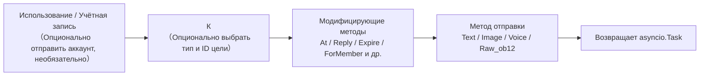
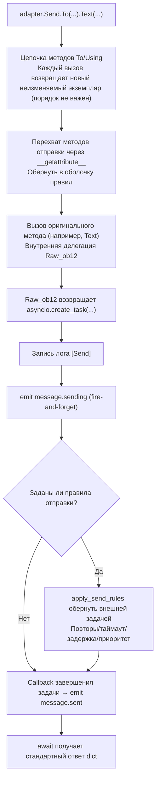

# SendDSL подробно

SendDSL — это интерфейс отправки сообщений в стиле цепочки вызовов, предоставленный адаптером ErisPulse.

## Основные способы вызова

### 1. Указание типа и ID

```python
await adapter.Send.To("group", "123").Text("Hello")
```

### 2. Указание только ID

```python
await adapter.Send.To("123").Text("Hello")
```

### 3. Указание аккаунта отправки

```python
await adapter.Send.Using("bot1").Text("Hello")
```

### 4. Комбинированное использование

```python
await adapter.Send.Using("bot1").To("group", "123").Text("Hello")
```

## Методические цепочки



## Методы отправки

Все методы отправки возвращают объект `asyncio.Task`.

### Основные методы (встроенные в базовый класс)

Следующие стандартные методы уже реализованы в базовом классе `SendDSL`, **по умолчанию делегируются на `Raw_ob12`**. Подклассы адаптеров не обязаны повторно реализовывать их, чтобы использовать напрямую, и IDE будет предлагать автодополнение:

| Название метода | Описание | Возвращаемое значение |
|-----------------|----------|------------------------|
| `Text(text: str)` | Отправка текстового сообщения | `asyncio.Task` |
| `Image(file: bytes \| str)` | Отправка изображения | `asyncio.Task` |
| `Voice(file: bytes \| str)` | Отправка голосового сообщения (сегмент `audio` OneBot12) | `asyncio.Task` |
| `Video(file: bytes \| str)` | Отправка видео | `asyncio.Task` |
| `File(file: bytes \| str, filename: str = None)` | Отправка файла | `asyncio.Task` |

Адаптер может переопределить отдельные стандартные методы для предоставления логики, специфичной для платформы:

```python
class Send(SendDSL):
    def Raw_ob12(self, message, **kwargs):
        # Обязательно реализовать
        ...

    # Опционально: переопределить Text для предоставления платформенно-специфичной логики
    # def Text(self, text: str):
    #     return self.Raw_ob12([{"type": "text", "data": {"text": text}}])
```

### Методы протокола

| Название метода | Описание | Возвращаемое значение | Обязательно ли реализовать |
|-----------------|----------|------------------------|-----------------------------|
| `Raw_ob12(message)` | Отправка сообщения в формате OneBot12 | `asyncio.Task` | **Обязательно реализовать** |

> **Важно**: `Raw_ob12` — основной метод адаптера, **обязательно реализовать**. Это единый входной порт для обратного преобразования (OneBot12 → платформа). При отсутствии реализации базовый класс будет записывать сообщение об ошибке и возвращать стандартный ответ об ошибке (`status: "failed"`, `retcode: 10002`). Стандартные методы (`Text`, `Image` и др.) по умолчанию делегируются на `Raw_ob12`.

### Методы, специфичные для платформы

Адаптер может добавить методы отправки, специфичные для платформы, в подкласс `Send` (они будут распознаваться `event.supports()` / `event.available_methods()`):

```python
class Send(SendDSL):
    def Raw_ob12(self, message, **kwargs): ...

    # Методы, специфичные для платформы
    def Sticker(self, sticker_id: str):
        return self.Raw_ob12([{"type": "sticker", "data": {"id": sticker_id}}])
```

## Модифицирующие методы

Модифицирующие методы возвращают `self`, чтобы поддерживать цепочечные вызовы.

### Метод At

```python
# @одного пользователя
await adapter.Send.To("group", "123").At("456").Text("Привет")

# @нескольких пользователей
await adapter.Send.To("group", "123").At("456").At("789").Text("Приветствую вас")
```

### Метод AtAll

```python
# @всех участников
await adapter.Send.To("group", "123").AtAll().Text("Здравствуйте все")
```

### Метод Reply

```python
# Ответ на сообщение
await adapter.Send.To("group", "123").Reply("msg_id").Text("Содержимое ответа")
```

### Комбинированные модифицирующие методы

```python
await adapter.Send.To("group", "123").At("456").Reply("msg_id").Text("Ответ на сообщение с @")
```

### Платформенно-специфические модифицирующие методы

Помимо встроенных `At`/`AtAll`/`Reply`, адаптер может определять **платформенно-специфические модифицирующие методы**. Такие методы **должны возвращать `self`** и не требуют никаких декораторов — фреймворк автоматически распознает их:

- Возвращение `self` (экземпляр SendDSL) → модифицирующий метод, не вызывает отправку/обёртку/события жизненного цикла, цепочка продолжается
- Возвращение `Task`/`Awaitable` → метод отправки

```python
class Send(SendDSL):
    def Raw_ob12(self, message, **kwargs): ...

    # Модифицирующий метод: возвращает self, не отправляет
    def Expire(self, seconds: int):
        self._expire = seconds
        return self

    def ForMember(self, user_id: str):
        self._member = user_id
        return self

    # Метод отправки: возвращает Task, зависит от состояния, установленного модифицирующими методами
    def Board(self, content: str, **kwargs):
        return self.Raw_ob12([{"type": "board", "data": {"text": content}}])
```

Использование:

```python
# Модифицирующие методы можно последовательно цепочечно добавлять
await adapter.Send.To("group", "big").Expire(3600).ForMember("114").Board("Содержимое доски")
```

## Использование методов модификации в обертке события

> [!NOTE]
> Для использования `reply(via=)` и `event.send_chain()` требуется ErisPulse **2.7.0+**.

`event.reply()` по умолчанию предоставляет только встроенные параметры модификации, такие как `at_sender`/`at_users`/`at_all`/`quote`. Для использования платформенно-специфических методов модификации есть два способа:

### Способ первый: параметр via в reply()

Подходит для небольшого количества, заранее известных методов модификации:

```python
await event.reply("Доска содержания", method="Board",
                  via=[("Expire", 3600), ("ForMember", "114514")])
```

`via` — это список, каждый элемент которого может иметь следующие формы:

| Форма | Эквивалентная цепочка вызовов |
|------|-------------|
| `"Name"` | `.Name()` |
| `("Name", arg1, arg2)` | `.Name(arg1, arg2)` |
| `("Name", (arg1,), {kw: val})` | `.Name(arg1, kw=val)` |

### Способ второй: event.send_chain()

Подходит для **нескольких последовательных методов модификации** или **действий без параметров содержания** (например, удаление, отмена). `send_chain()` возвращает настроенный SendDSL-объект с заданными `To`/`Using`, который можно свободно дополнять любыми методами модификации и методами отправки:

```python
# Платформенно-специфические методы модификации + отправка на доску
await event.send_chain().Expire(3600).Board("Доска с истечением через час")

# Последовательные методы модификации
await (event.send_chain()
       .Expire(3600)
       .ForMember("114514")
       .Board("Содержание доски", content_type="markdown"))

# Встроенные методы модификации также доступны
await event.send_chain().At("123").Reply("msg_id").Text("hi")

# Действия без параметров содержания
await event.send_chain().DismissBoard()
```

> `send_chain()` возвращает полный экземпляр SendDSL, поэтому **доступны все цепочные возможности** — не только методы модификации, но и правила отправки и пакетное построение:

```python
# Правила отправки: повторы + тайм-аут + обратный вызов при успехе
await (event.send_chain()
       .Retry(3).Timeout(10)
       .Hook(lambda r: print("Отправка успешна"))
       .Text("Надежная отправка"))

# Отложенная отправка + платформенно-специфическая модификация + доска
await event.send_chain().Defer(5).Expire(3600).Board("Отложенная доска")

# Режим пакетного построения
results = await (event.send_chain()
                 .Build()
                 .Text("Первое сообщение").Image("pic.jpg").Text("Второе сообщение")
                 .send_all())
```

## Управление аккаунтами

### Метод Using

Метод `Using()` используется для указания аккаунта, с которого будет отправлено сообщение. Переданный идентификатор будет сопоставлен через `_resolve_account()` по следующему приоритету:

1. **Имя аккаунта** — ключ из конфигурации (например, `"default"`, `"bot1"`)
2. **bot_id, вставленный во время выполнения** — идентификатор, автоматически вставляемый при преобразовании события
3. **Любое поле str** — другие строковые поля из конфигурации
4. **Резервный вариант** — первый включенный аккаунт

```python
# Использование имени аккаунта
await adapter.Send.Using("account1").To("user", "123").Text("Привет")

# Использование bot_id (self.user_id из события)
await adapter.Send.Using("bot_123").To("user", "123").Text("Привет")
```

### Метод Account

Метод `Account` эквивалентен методу `Using`:

```python
await adapter.Send.Account("account1").To("user", "123").Text("Привет")
```

## Асинхронная обработка

### Не ожидать результат

```python
# Сообщение отправляется в фоновом режиме
task = adapter.Send.To("user", "123").Text("Hello")

# Продолжить выполнение других операций
# ...
```

### Ожидание результата

```python
# Непосредственно await для получения результата
result = await adapter.Send.To("user", "123").Text("Hello")
print(f"Результат отправки: {result}")

# Сохранить Task и подождать позже
task = adapter.Send.To("user", "123").Text("Hello")
# ... другие операции ...
result = await task
```

## Система правил отправки

В SendDSL встроена система декораторов правил отправки, которые можно добавлять цепочкой методов и применять единым образом при отправке. Правила охватывают распространенные сценарии: контроль таймаута, автоматическая повторная попытка при сбое, выполнение обратного вызова при успехе, отложенная отправка, приоритет и отбрасывание сообщений, мониторинг прогресса.

Методы правил **возвращают self** (как и At/AtAll/Reply), и их необходимо вызывать до отправки метода (Text/Image и т.д.). Правила распространяются на новые экземпляры, созданные с помощью `To`/`Using`/`Account`.

### Список методов правил

| Метод | Описание |
|--------|------|
| `.Hook(callback)` | Выполняется после успешной отправки (можно вызывать несколько раз, выполняется по порядку) |
| `.Retry(times=1)` | Автоматически повторяет отправку N раз (включая первую, всего N+1 попыток) |
| `.Timeout(seconds)` | Устанавливает таймаут на одну попытку отправки; при превышении отменяет текущую попытку (можно использовать вместе с Retry) |
| `.Defer(seconds=1.0)` | Откладывает отправку (внутрипроцессное таймерное ожидание, не сохраняется) |
| `.Priority(level, drop_if_busy=False)` | Устанавливает приоритет; при перегрузке очередь можно отбрасывать |
| `.OnProgress(callback)` | Вызывает обратный вызов на каждой стадии (передаёт SendContext) |
| `.OnError(callback)` | Вызывается при окончательном сбое (вызывается только один раз) |

### Логика выполнения после успешной отправки (Hook)

```python
# Синхронный обратный вызов
await (adapter.Send.To("user", "123")
       .Hook(lambda r: print(f"Сообщение отправлено успешно, ID: {r['message_id']}"))
       .Text("Привет"))

# Асинхронный обратный вызов
async def deduct_points(result):
    await db.update(user_id="123", points=-1)

await adapter.Send.To("user", "123").Hook(deduct_points).Text("Вычесть баллы")
```

Hook выполняется только при окончательном успехе отправки (включая успешную повторную попытку); при сбое, таймауте или отмене не вызывается.

### Автоматическая повторная попытка при сбое (Retry)

```python
# При первом сбое повторить 2 раза, всего 3 попытки
result = await adapter.Send.To("user", "123").Retry(2).Text("С повтором")
```

Условия для повторной попытки: исключение при отправке, таймаут отправки, отправка возвращает ответ с `status == "failed"`.

### Автоматическая отмена при превышении таймаута (Timeout)

```python
# Если одна отправка занимает более 10 секунд, отменить
await adapter.Send.To("user", "123").Timeout(10).Text("С таймаутом")

# Таймаут + повтор: каждая попытка длится 10 секунд, максимум 3 попытки
await adapter.Send.To("user", "123").Timeout(10).Retry(2).Text("Таймаут и повтор")
```

### Мониторинг прогресса (OnProgress / OnError)

```python
def on_progress(ctx):
    print(f"Стадия: {ctx.stage}, Попытка: {ctx.attempt + 1}/{ctx.max_attempts}, Время: {ctx.elapsed:.2f}s")
    if ctx.stage == "failed":
        print(f"  Ошибка: {ctx.error!r}")

async def on_error(ctx):
    await notify_admin(f"Не удалось отправить сообщение пользователю {ctx.target_id}: {ctx.error!r}")

await (adapter.Send.To("user", "123")
       .Retry(3).Timeout(10)
       .OnProgress(on_progress)
       .OnError(on_error)
       .Text("Мониторинг"))
```

`SendContext` содержит следующие поля: `task_id`, `platform`, `method`, `target_type`, `target_id`, `bot_id`, `stage`, `attempt`, `max_attempts`, `started_at`, `finished_at`, `elapsed`, `error`, `result`, `extra`.

Возможные значения `stage`: `pending`, `sending`, `retrying`, `success`, `failed`, `timeout`, `cancelled`, `dropped`.

### Отложенная отправка (Defer)

```python
# Отправить через 5 секунд
await adapter.Send.To("user", "123").Defer(5).Text("Отложенное сообщение")
```

> Внимание: задержка осуществляется внутрипроцессным таймером, при перезапуске процесса теряется, не сохраняется.

### Приоритет и отбрасывание при перегрузке (Priority)

```python
# Сообщение низкого приоритета, при перегрузке очереди автоматически отбрасывается
result = await (adapter.Send.To("user", "123")
               .Priority(-1, drop_if_busy=True)
               .Text("Уведомление, которое можно отбросить"))
# Если сообщение было отброшено, result["status"] == "failed"
```

При включении `drop_if_busy` отправка прерывается, если количество активных задач превышает порог (по умолчанию 64). Порог можно изменить с помощью `.PriorityThreshold(n)`.

### Комбинация правил и фоновое выполнение

```python
# Не блокирует основной поток, правила всё равно применяются
task = (adapter.Send.To("user", "123")
        .Hook(lambda r: print("Сообщение отправлено!"))
        .Retry(3)
        .Timeout(10)
        .OnProgress(on_progress)
        .Text("Привет"))

# Продолжить выполнение других действий
await handle_next_action()
```

### Распространение правил

Правила распространяются при создании новых экземпляров с помощью `To`/`Using`/`Account`, чтобы избежать потери правил при цепочечном вызове:

```python
# Правила, установленные до To, также распространяются на созданный экземпляр
builder = adapter.Send.Retry(3).Timeout(10)
send = builder.To("user", "123")  # send по-прежнему содержит Retry(3) и Timeout(10)
await send.Text("Привет")
```

Правила у разных экземпляров независимы (списки hooks глубоко копируются).

## Режим пакетного построения (Build)

Помимо режима однократной отправки, SendDSL поддерживает режим пакетного построения: в одной цепочке можно записать несколько методов отправки, которые будут выполнены в конце. Этот режим подходит для сценариев, когда нужно "отправить сразу несколько сообщений".

### Вход в режим построения

Перед вызовом метода отправки нужно вызвать `.Build()`, который вернёт `SendBuilder`. После этого методы отправки (Text/Image и т.д.) не будут выполняться немедленно, а будут накапливаться как намерения отправки:

```python
results = await (adapter.Send.To("user", "123")
                 .Build()                    # Вход в режим построения
                 .Text("Первое сообщение")
                 .Image("pic.jpg")
                 .Text("Второе сообщение")
                 .send_all())                 # Единое выполнение
# results = [Результат текста, Результат изображения, Результат текста]
```

`.send_all()` возвращает `asyncio.Task`, после await получим список результатов (в порядке намерений).

### Параллельное и последовательное выполнение

По умолчанию используется **параллельное** выполнение (параллельная отправка, общее время приблизительно равно времени самой медленной отправки). При необходимости сохранения порядка доставки сообщений вызовите `.Sequential()`:

```python
# Последовательно: отправка по очереди
await (adapter.Send.To("group", "456")
       .Build()
       .Sequential()
       .Text("Сначала это").Text("Потом это")
       .send_all())

# Параллельно (по умолчанию, можно явно указать)
await (adapter.Send.To("group", "456")
       .Build()
       .Parallel()
       .Text("Параллельное 1").Text("Параллельное 2")
       .send_all())
```

### Продолжение при ошибках и повторные попытки

Пакетное выполнение использует стратегию **продолжения при ошибках**: если одна из отправок не удалась, это не прерывает отправку остальных. При использовании `.Retry()` неудачные элементы будут автоматически повторно отправлены (повторные попытки применяются к каждой отдельной отправке, а не к всей пачке целиком):

```python
await (adapter.Send.To("user", "123")
       .Build()
       .Retry(2)                       # Каждая отправка повторяется 2 раза
       .Text("Возможно неудачное").Image("Тоже возможно неудачное")
       .send_all())
```

### Правила и обратные вызовы для всей пачки

Правила применяются ко всей пачке:

| Метод | Описание |
|--------|------|
| `.Timeout(seconds)` | Время ожидания для каждой отправки |
| `.Retry(times)` | Каждая отправка повторяется (продолжение при ошибках) |
| `.Defer(seconds)` | Задержка отправки всей пачки |
| `.Hook(callback)` | Вызывается после успешного завершения всей пачки, получает список `results` |
| `.OnError(callback)` | Вызывается, если в пачке есть неудачные отправки, получает `BatchContext` |
| `.OnProgress(callback)` | Вызывается при завершении каждой отправки, получает `BatchContext` |

```python
def on_progress(ctx):
    print(f"Прогресс: {ctx.completed}/{ctx.total}, Успешно {ctx.succeeded}, Неудачно {ctx.failed}")

async def on_error(ctx):
    print(f"В пачке {ctx.failed} неудачных отправок")

results = await (adapter.Send.To("user", "123")
               .Build()
               .Retry(2).Timeout(10)
               .OnProgress(on_progress)
               .OnError(on_error)
               .Hook(lambda rs: print("Пачка отправлена"))
               .Text("a").Text("b").Text("c")
               .send_all())
```

`BatchContext` содержит: `task_id`、`total`、`completed`、`succeeded`、`failed`、`stage`、`results`、`errors`、`elapsed`、`extra`.

Значения `stage`: `pending`、`sending`、`success` (все успешно), `partial` (часть успешно), `failed` (все неудачно).

### Декораторы и наследование правил

Декораторы и правила, применённые до `.Build()`, наследуются всей пачкой и применяются к каждому сообщению:

```python
await (adapter.Send.To("group", "456")
       .At("789")                        # Наследуется: каждое сообщение упоминает 789
       .Build()
       .Retry(2)                         # Наследуется + добавляется: каждая отправка повторяется
       .Text("@Уведомление для тебя")
       .Image("Изображение объявления")
       .send_all())
```

После входа в режим Build можно добавить новые декораторы (они будут применяться ко всей пачке):

```python
await (adapter.Send.To("group", "456")
       .Build()
       .At("111").At("222")             # Добавляются упоминания, применяются ко всей пачке
       .Text("@Несколько людей")
       .send_all())
```

### Выполнение в фоне

Как и в режиме однократной отправки, `.send_all()` возвращает `Task`, который можно запустить в фоне, не ожидая завершения:

```python
task = (adapter.Send.To("user", "123")
        .Build()
        .Hook(lambda rs: print("Пакетная отправка завершена"))
        .Text("a").Text("b")
        .send_all())

# Не блокирует основной поток выполнения
await do_something_else()
```

## Правила именования

### Именование в стиле PascalCase

Все методы отправки используют стиль написания с большой буквы:

```python
# ✅ Правильно
def Text(self, text: str):
    pass

def Image(self, file: bytes):
    pass

# ❌ Неправильно
def text(self, text: str):
    pass

def send_image(self, file: bytes):
    pass
```

### Методы, специфичные для платформы

Не рекомендуется добавлять методы с префиксом платформы:

```python
# ✅ Рекомендуется
def Sticker(self, sticker_id: str):
    pass

# ❌ Не рекомендуется
def TelegramSticker(self, sticker_id: str):
    pass
```

Используйте метод `Raw` вместо этого:

```python
# ✅ Рекомендуется
await adapter.Send.Raw_ob12([{"type": "sticker", ...}])

# ❌ Не рекомендуется
def TelegramSticker(self, ...):
    pass
```

## Внутреннее разбиение цепочки отправки

За кулисами выполнения `await adapter.Send.To("group", "123").Text("x")` фреймворк делает следующее:



**Что делает фреймворк на каждом этапе:**

| Этап | Что делает фреймворк |
|------|-------------|
| Цепочка объединения | `To`/`Using`/`Account` при каждом вызове **создает новый неизменяемый экземпляр** и наследует уже установленные поля, поэтому `To(...).Using(...)` и `Using(...).To(...)` **эквивалентны**, порядок не важен |
| Обёртка методов | Методы отправки (`Text` и др.) перехватываются через `__getattribute__` и оборачиваются; методы-修饰аторы (`To`/`Using`/`At`/`Retry` и др.) **не оборачиваются**. Вложенные вызовы `Raw_ob12` предотвращают повторную обёртку с помощью метки `_in_rule_wrap` |
| Создание задачи | `Raw_ob12` внутри использует `asyncio.create_task()` для создания задачи; `Text()` просто синхронно возвращает эту задачу, **не блокируя** |
| Лог отправки | Запись события лога `[Send] platform/method -> target` (для отключения можно использовать `exclude_levels=["EVENT"]`) |
| `message.sending` | Метод отправки вызывается **немедленно** с использованием fire-and-forget (только если есть слушатели, сначала short-circuit через `has_handlers`) |
| `message.sent` | Привязывается к `done_callback` задачи — **в случае с правилами, результат завершения всей цепочки повторов**, без правил — это просто завершение исходной задачи |

### Цепочка разрешения аккаунта

Когда внутри адаптера вызывается `_resolve_account(account_id)`, аккаунт разрешается по следующему порядку:

1. Адаптер с единственным аккаунтом (без `AccountConfigClass`) → возвращается сразу
2. Точное совпадение имени аккаунта `account_id`
3. Совпадение по полю `bot_id` каждого аккаунта
4. Совпадение по любому строковому значению поля аккаунта (исключая `enabled`/`name`)
5. Возврат первого включённого аккаунта по умолчанию
6. Если всё не удалось → выбрасывается `ValueError`

> `account_id`, который вы передаёте, берётся из: явного указания в `Using()` > поля `self` события (`account_id` имеет приоритет над `user_id`, автоматически вставляется `event.reply()` > не указано (в этом случае адаптер берёт первый включённый аккаунт по умолчанию).

### Двигатель правил отправки (повторы/таймаут/задержка)

Правила оборачиваются в новую внешнюю задачу **после** возврата задачи `Raw_ob12`, не влияя на основной процесс. Ключевые факты:

| Правило | Описание |
|------|------|
| `Retry(n)` | Всего попыток `n+1`; **повторяется немедленно после неудачи, без экспоненциальной задержки** |
| `Timeout(s)` | Один раз отправка отменяется по таймауту (`asyncio.wait_for`), если не исчерпаны попытки, повторяется |
| `Defer(s)` | Задержка отправки перед выполнением sleep |
| `Priority(level, drop_if_busy)` | Если накоплено больше порога, возвращает `{status:"failed", retcode:10002, message:"dropped_low_priority"}` |
| `Hook(fn)` | Выполняется только при успешном завершении в порядке очереди |
| `on_progress` / `on_error` | Обратные вызовы на каждом этапе / при финальной ошибке |

> **Внимание**: повторы — это «немедленное повторное отправление», без задержки; если платформа ограничивает частоту, необходимо в `on_error` вручную добавить sleep и повторить отправку. Успешное завершение определяется по `status == "ok"` в ответе dict (также `retcode == 0`).

> Полный формат стандартного ответа и семантика `retcode` см. в [спецификации API-ответов](../../standards/api-response.md).

## Возвращаемое значение

### Объект Task

Все методы отправки возвращают `asyncio.Task`. Адаптер должен реализовать только `Raw_ob12`, стандартные методы (Text/Image и т.д.) по умолчанию делегируются ему:

```python
import asyncio

def Raw_ob12(self, message, **kwargs):
    async def _do_send():
        segments = self._apply_modifiers(message)
        return await self._adapter.call_api(
            endpoint="/send_message",
            message=segments,
            **self.send_context,
            **kwargs,
        )
    return asyncio.create_task(_do_send())

# Методы Text/Image/Voice/Video/File унаследованы из базового класса и автоматически делегируются на Raw_ob12
# Если нужно переопределить стандартные методы, просто верните asyncio.Task:
# def Text(self, text: str):
#     return self.Raw_ob12([{"type": "text", "data": {"text": text}}])
```

### Стандартизированный ответ

`call_api` должен возвращать стандартизированный ответ. Рекомендуется использовать методы `make_response()` / `make_error()`:

```python
async def call_api(self, endpoint: str, **params):
    try:
        result = await self._do_api_call(endpoint, **params)
        return self.make_response(
            data=result.get("data"),
            message_id=result.get("message_id", ""),
            raw=result,
        )
    except Exception as e:
        return self.make_error(message=str(e))
```

Также поддерживается ручная конструкция (старый способ по-прежнему совместим):

```python
async def call_api(self, endpoint: str, **params):
    return {
        "status": "ok" или "failed",
        "retcode": 0 или error_code,
        "data": {...},
        "message_id": "msg_id" или "",
        "message": "",
        "{platform}_raw": raw_response
    }
```

## Полный пример

### Базовое использование

```python
from ErisPulse.Core import adapter

my_adapter = adapter.get("myplatform")

# Отправка текста
await my_adapter.Send.To("user", "123").Text("Hello World!")

# Отправка изображения
await my_adapter.Send.To("group", "456").Image("https://example.com/image.jpg")

# Отправка файла
with open("document.pdf", "rb") as f:
    await my_adapter.Send.To("user", "123").File(f.read())
```

### Цепочка вызовов

```python
# @пользователь + ответ
await my_adapter.Send.To("group", "456").At("789").Reply("msg123").Text("Ответ на сообщение с @")

# @всех + несколько модификаторов
await my_adapter.Send.Using("bot1").To("group", "456").AtAll().Text("Сообщение-анонс")
```

### Сырые сообщения и построитель сообщений

`Raw_ob12` — это основной вход для обратного преобразования (перевод сообщений OB12 → вызовы API платформы), а `MessageBuilder` — это инструмент для построения цепочки сообщений, используемый в сочетании с ним.

> Полный стандарт реализации `Raw_ob12`, использование `MessageBuilder` и примеры кода см. по ссылкам:
> - [Спецификация методов отправки §6 Стандарт обратного преобразования (OneBot 12 → платформа)](../../standards/send-method-spec.md#6-обратное-преобразование-onebot-12--платформа)
> - [Спецификация методов отправки §11 Построитель сообщений](../../standards/send-method-spec.md#11-построитель-сообщений-messagebuilder)

## Связанные документы

- [Введение в разработку адаптеров](getting-started.md) - Создание адаптера
- [Основные концепции адаптера](core-concepts.md) - Ознакомьтесь с архитектурой адаптера
- [Рекомендуемые практики разработки адаптеров](best-practices.md) - Разработка высококачественных адаптеров
- [Спецификация метода отправки](../../standards/send-method-spec.md) - Полная спецификация метода отправки