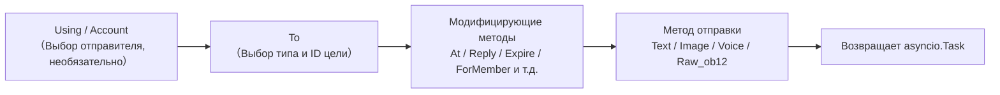
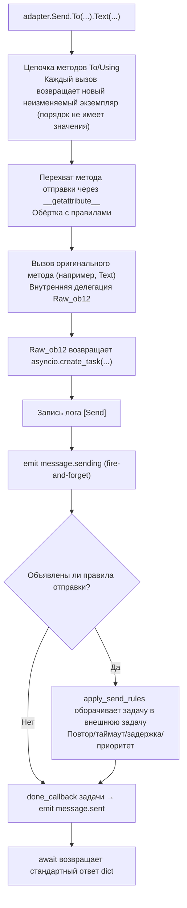

# SendDSL подробно

SendDSL — это интерфейс отправки сообщений, предоставленный адаптером ErisPulse в стиле цепных вызовов.

## Основные способы вызова

### 1. Указание типа и идентификатора

```python
await adapter.Send.To("group", "123").Text("Hello")
```

### 2. Указание только идентификатора

```python
await adapter.Send.To("123").Text("Hello")
```

### 3. Указание аккаунта отправки

```python
await adapter.Send.Using("bot1").Text("Hello")
```

### 4. Комбинированное использование

```python
await adapter.Send.Using("bot1").To("group", "123").Text("Hello")
```

## Методы цепочки



## Методы отправки

Все методы отправки возвращают объект `asyncio.Task`.

### Основные методы (встроенные в базовый класс)

Следующие стандартные методы уже реализованы в базовом классе `SendDSL`, **по умолчанию делегируются на `Raw_ob12`**, подклассы адаптера не обязаны повторно реализовывать их, чтобы использовать напрямую, и IDE сможет автодополнение:

| Название метода | Описание | Возвращаемое значение |
|-----------------|----------|------------------------|
| `Text(text: str)` | Отправка текстового сообщения | `asyncio.Task` |
| `Image(file: bytes \| str)` | Отправка изображения | `asyncio.Task` |
| `Voice(file: bytes \| str)` | Отправка голосового сообщения (OneBot12 `audio` сегмент) | `asyncio.Task` |
| `Video(file: bytes \| str)` | Отправка видео | `asyncio.Task` |
| `File(file: bytes \| str, filename: str = None)` | Отправка файла | `asyncio.Task` |

Адаптеры могут переопределить отдельные стандартные методы, чтобы предоставить платформенно-специфичную логику:

```python
class Send(SendDSL):
    def Raw_ob12(self, message, **kwargs):
        # Обязательно реализовать
        ...

    # Необязательно: переопределить Text для предоставления платформенно-специфичной логики
    # def Text(self, text: str):
    #     return self.Raw_ob12([{"type": "text", "data": {"text": text}}])
```

### Методы протокола

| Название метода | Описание | Возвращаемое значение | Обязательно ли реализовать |
|-----------------|----------|------------------------|-----------------------------|
| `Raw_ob12(message)` | Отправка сообщения в формате OneBot12 | `asyncio.Task` | **Обязательно реализовать** |

> **Важно**: `Raw_ob12` — это основной метод адаптера, **обязательно реализовать**. Это единый вход для обратного преобразования (OneBot12 → платформа). При отсутствии реализации базовый класс будет записывать ошибку в лог и возвращать стандартный ответ об ошибке (`status: "failed"`, `retcode: 10002`). Стандартные методы (`Text`, `Image` и т. д.) по умолчанию делегируются на `Raw_ob12`.

### Платформенно-специфичные методы

Адаптеры могут добавлять платформенно-специфичные методы отправки в подкласс `Send` (они будут распознаваться `event.supports()` / `event.available_methods()`):

```python
class Send(SendDSL):
    def Raw_ob12(self, message, **kwargs): ...

    # Платформенно-специфичный метод
    def Sticker(self, sticker_id: str):
        return self.Raw_ob12([{"type": "sticker", "data": {"id": sticker_id}}])
```

## Модификаторы методов

Модификаторы методов возвращают `self`, чтобы поддерживать цепочечные вызовы.

### Метод At

```python
# @одного пользователя
await adapter.Send.To("group", "123").At("456").Text("Привет")

# @нескольких пользователей
await adapter.Send.To("group", "123").At("456").At("789").Text("Здравствуйте")
```

### Метод AtAll

```python
# @всех участников
await adapter.Send.To("group", "123").AtAll().Text("Всем привет")
```

### Метод Reply

```python
# Ответ на сообщение
await adapter.Send.To("group", "123").Reply("msg_id").Text("Содержание ответа")
```

### Комбинированные модификаторы

```python
await adapter.Send.To("group", "123").At("456").Reply("msg_id").Text("Ответ на сообщение с @")
```

### Платформенно-специфичные модификаторы

Помимо встроенных `At`/`AtAll`/`Reply`, адаптер может определять **платформенно-специфичные модификаторы**. Эти методы **должны возвращать `self`** и **не требуют декораторов** — фреймворк распознает их автоматически:

- Возвращение `self` (экземпляр SendDSL) → модификатор, не вызывает отправку или цепочку событий, продолжает цепочку
- Возвращение `Task`/`Awaitable` → отправляющий метод

```python
class Send(SendDSL):
    def Raw_ob12(self, message, **kwargs): ...

    # Модификатор: возвращает self, не отправляет
    def Expire(self, seconds: int):
        self._expire = seconds
        return self

    def ForMember(self, user_id: str):
        self._member = user_id
        return self

    # Отправляющий метод: возвращает Task, зависит от состояния, установленного модификаторами
    def Board(self, content: str, **kwargs):
        return self.Raw_ob12([{"type": "board", "data": {"text": content}}])
```

Использование:

```python
# Модификаторы можно последовательно цепочечно добавлять
await adapter.Send.To("group", "big").Expire(3600).ForMember("114").Board("Содержание доски")
```

## Использование методов модификации в обёртке события

> [!NOTE]
> Функция `reply(via=)` и `event.send_chain()` требуют ErisPulse **2.7.0+**.

По умолчанию `event.reply()` предоставляет только встроенные параметры модификации, такие как `at_sender`/`at_users`/`at_all`/`quote`. Для использования платформо-специфических методов модификации есть два способа:

### Способ первый: параметр `via` в `reply()`

Подходит для небольшого количества, заранее известных методов модификации:

```python
await event.reply("Содержимое доски", method="Board",
                  via=[("Expire", 3600), ("ForMember", "114514")])
```

Параметр `via` представляет собой список, каждый элемент которого может иметь следующие формы:

| Форма | Эквивалентная цепочка вызовов |
|------|-------------|
| `"Name"` | `.Name()` |
| `("Name", arg1, arg2)` | `.Name(arg1, arg2)` |
| `("Name", (arg1,), {kw: val})` | `.Name(arg1, kw=val)` |

### Способ второй: `event.send_chain()`

Подходит для **нескольких последовательных методов модификации** или **действий без параметров содержимого** (например, удаление, отмена). `send_chain()` возвращает уже настроенную цепочку отправки с параметрами `To`/`Using`, к которой можно свободно добавлять любые методы модификации и методы отправки:

```python
# Платформо-специфические методы модификации + отправка на доску
await event.send_chain().Expire(3600).Board("Содержимое доски, которое истечёт через час")

# Последовательные методы модификации
await (event.send_chain()
       .Expire(3600)
       .ForMember("114514")
       .Board("Содержимое доски", content_type="markdown"))

# Встроенные методы модификации также доступны
await event.send_chain().At("123").Reply("msg_id").Text("hi")

# Действия без параметров содержимого
await event.send_chain().DismissBoard()
```

> `send_chain()` возвращает полный экземпляр SendDSL, поэтому **все цепочные возможности доступны** — не только методы модификации, но и правила отправки и пакетное построение:

```python
# Правила отправки: повторы + таймаут + успешный обратный вызов
await (event.send_chain()
       .Retry(3).Timeout(10)
       .Hook(lambda r: print("Отправка успешна"))
       .Text("Надёжная отправка"))

# Отложенная отправка + платформо-специфические методы + доска
await event.send_chain().Defer(5).Expire(3600).Board("Отложенная доска")

# Режим пакетного построения
results = await (event.send_chain()
                 .Build()
                 .Text("Первое сообщение").Image("pic.jpg").Text("Второе сообщение")
                 .send_all())
```

## Управление аккаунтами

### Метод `Using`

Метод `Using()` используется для указания аккаунта, от которого будут отправляться сообщения. Переданный идентификатор будет сопоставляться через `_resolve_account()` по следующему приоритету:

1. **Имя аккаунта** — ключ из конфигурации (например, `"default"`, `"bot1"`)
2. **bot_id, вставленный во время выполнения** — идентификатор, автоматически вставляемый при преобразовании события
3. **Любое строковое поле** — другие строковые поля в конфигурации
4. **Резервный вариант** — первый активный аккаунт

```python
# Использование имени аккаунта
await adapter.Send.Using("account1").To("user", "123").Text("Hello")

# Использование bot_id (т.е. self.user_id из события)
await adapter.Send.Using("bot_123").To("user", "123").Text("Hello")
```

### Метод `Account`

Метод `Account` эквивалентен методу `Using`:

```python
await adapter.Send.Account("account1").To("user", "123").Text("Hello")
```

## Асинхронная обработка

### Не ждать результата

```python
# Сообщение отправляется в фоновом режиме
task = adapter.Send.To("user", "123").Text("Hello")

# Продолжение выполнения других операций
# ...
```

### Ждать результат

```python
# Непосредственно await для получения результата
result = await adapter.Send.To("user", "123").Text("Hello")
print(f"Результат отправки: {result}")

# Сохранить Task и подождать позже
task = adapter.Send.To("user", "123").Text("Hello")
# ... другие операции ...
result = await task
```

## Система правил отправки

SendDSL содержит встроенную систему декораторов правил отправки, которые можно добавлять цепочкой методов и применять единым образом при окончательной отправке. Правила охватывают распространённые сценарии производства: управление тайм-аутами, автоматические повторные попытки при неудаче, обратные вызовы при успехе, отложенная отправка, приоритеты и отбрасывание сообщений, а также мониторинг прогресса.

Методы правил **возвращают self** (как и At/AtAll/Reply), и их необходимо вызывать до отправки методов (Text/Image и т.д.). Правила распространяются вместе с новыми экземплярами, созданными методами `To`/`Using`/`Account`.

### Список методов правил

| Метод | Описание |
|--------|------|
| `.Hook(callback)` | Вызывается после успешной отправки (можно вызывать несколько раз, выполняется по порядку) |
| `.Retry(times=1)` | Автоматически повторяет отправку N раз (включая первую попытку, всего N+1 попыток) |
| `.Timeout(seconds)` | Устанавливает тайм-аут для одной отправки, при истечении отменяет текущую попытку (можно комбинировать с Retry) |
| `.Defer(seconds=1.0)` | Откладывает отправку (внутрипроцессное таймерное ожидание, не сохраняется) |
| `.Priority(level, drop_if_busy=False)` | Устанавливает приоритет; при перегрузке можно отбрасывать |
| `.OnProgress(callback)` | Обратный вызов на каждом этапе (передаёт SendContext) |
| `.OnError(callback)` | Обратный вызов при окончательной неудаче (вызывается только один раз) |

### Логика выполнения после успешной отправки (Hook)

```python
# Синхронный обратный вызов
await (adapter.Send.To("user", "123")
       .Hook(lambda r: print(f"Отправка успешна, ID сообщения: {r['message_id']}"))
       .Text("Привет"))

# Асинхронный обратный вызов
async def deduct_points(result):
    await db.update(user_id="123", points=-1)

await adapter.Send.To("user", "123").Hook(deduct_points).Text("Списать очки")
```

Hook вызывается только при окончательном успехе отправки (включая успешные повторные попытки); при неудаче, тайм-ауте или отмене он не срабатывает.

### Автоматические повторные попытки при неудаче (Retry)

```python
# При первой неудаче повторяет отправку 2 раза, всего 3 попытки
result = await adapter.Send.To("user", "123").Retry(2).Text("С повтором")
```

Повторная отправка запускается при следующих условиях: выброс исключения при отправке, тайм-аут отправки или возврат ответа с `status == "failed"`.

### Автоматическая отмена при тайм-ауте (Timeout)

```python
# Если одна отправка занимает более 10 секунд, она отменяется
await adapter.Send.To("user", "123").Timeout(10).Text("С тайм-аутом")

# Тайм-аут + повтор: каждая попытка длится 10 секунд, максимум 3 попытки
await adapter.Send.To("user", "123").Timeout(10).Retry(2).Text("Тайм-аут с повтором")
```

### Мониторинг прогресса (OnProgress / OnError)

```python
def on_progress(ctx):
    print(f"Этап: {ctx.stage}, попытка: {ctx.attempt + 1}/{ctx.max_attempts}, затрачено времени: {ctx.elapsed:.2f}s")
    if ctx.stage == "failed":
        print(f"  Ошибка: {ctx.error!r}")

async def on_error(ctx):
    await notify_admin(f"Отправка для {ctx.target_id} не удалась: {ctx.error!r}")

await (adapter.Send.To("user", "123")
       .Retry(3).Timeout(10)
       .OnProgress(on_progress)
       .OnError(on_error)
       .Text("Мониторинг"))
```

`SendContext` содержит следующие поля: `task_id`, `platform`, `method`, `target_type`, `target_id`, `bot_id`, `stage`, `attempt`, `max_attempts`, `started_at`, `finished_at`, `elapsed`, `error`, `result`, `extra`.

Возможные значения `stage`: `pending`, `sending`, `retrying`, `success`, `failed`, `timeout`, `cancelled`, `dropped`.

### Отложенная отправка (Defer)

```python
# Отправка через 5 секунд
await adapter.Send.To("user", "123").Defer(5).Text("Отложенное сообщение")
```

> Примечание: задержка — это внутреннее таймерное ожидание в рамках процесса, при перезапуске процесса задержка теряется, сохранение не поддерживается.

### Приоритет и отбрасывание при перегрузке (Priority)

```python
# Низкоприоритетное сообщение, при перегрузке очереди автоматически отбрасывается
result = await (adapter.Send.To("user", "123")
               .Priority(-1, drop_if_busy=True)
               .Text("Уведомление, которое можно отбросить"))
# Если сообщение отброшено, result["status"] == "failed"
```

При включении `drop_if_busy`, если количество активных отправок превышает порог (по умолчанию 64), текущая отправка отменяется. Порог можно изменить с помощью `.PriorityThreshold(n)`.

### Комбинация правил и фоновое выполнение

```python
# Не блокирует основной поток, правила по-прежнему действуют
task = (adapter.Send.To("user", "123")
        .Hook(lambda r: print("Отправка успешна!"))
        .Retry(3)
        .Timeout(10)
        .OnProgress(on_progress)
        .Text("Привет"))

# Продолжение выполнения других операций
await handle_next_action()
```

### Распространение правил

Правила распространяются вместе с новыми экземплярами, созданными методами `To`/`Using`/`Account`, чтобы избежать потери правил при цепочечном вызове:

```python
# Правила, установленные до вызова To, также распространяются на созданный экземпляр
builder = adapter.Send.Retry(3).Timeout(10)
send = builder.To("user", "123")  # send по-прежнему содержит Retry(3) и Timeout(10)
await send.Text("hi")
```

Правила для разных экземпляров независимы (списки hooks копируются глубоким копированием).

## Режим пакетного построения (Build)

Помимо одиночного режима, SendDSL поддерживает режим пакетного построения: несколько методов отправки записываются в одной цепочке, а затем выполняются все сразу. Подходит для сценариев, когда нужно "отправить сразу несколько сообщений".

### Вход в режим построения

Перед вызовом метода отправки вызовите `.Build()`, который вернёт `SendBuilder`. После этого методы отправки (Text/Image и т.д.) не будут выполняться немедленно, а будут накапливаться как отправляемые намерения:

```python
results = await (adapter.Send.To("user", "123")
                 .Build()                    # Вход в режим построения
                 .Text("Первое сообщение")
                 .Image("pic.jpg")
                 .Text("Второе сообщение")
                 .send_all())                 # Выполнение всех намерений
# results = [Результат текста, Результат изображения, Результат текста]
```

`.send_all()` возвращает `asyncio.Task`, await-ом которого можно получить список результатов (в порядке намерений).

### Параллельное и последовательное выполнение

По умолчанию используется **параллельное** выполнение (одновременная отправка, общее время примерно равно самому медленному сообщению). Если нужно гарантировать порядок доставки сообщений, вызовите `.Sequential()`:

```python
# Последовательное выполнение: отправка поочередно
await (adapter.Send.To("group", "456")
       .Build()
       .Sequential()
       .Text("Сначала это").Text("Затем это")
       .send_all())

# Параллельное выполнение (по умолчанию, можно явно указать)
await (adapter.Send.To("group", "456")
       .Build()
       .Parallel()
       .Text("Параллельное 1").Text("Параллельное 2")
       .send_all())
```

### Продолжение при ошибках и повторная отправка

При пакетном выполнении используется стратегия **продолжения при ошибках**: ошибка одной отправки не прерывает отправку других. При использовании `.Retry()` неудачные сообщения будут автоматически повторно отправлены (повторная отправка применяется к каждой отдельной отправке, а не ко всей пачке):

```python
await (adapter.Send.To("user", "123")
       .Build()
       .Retry(2)                       # Каждая отправка повторяется 2 раза
       .Text("Может не пройти").Image("Тоже может не пройти")
       .send_all())
```

### Общие правила и обратные вызовы для пачки

Правила применяются ко всей пачке:

| Метод | Описание |
|--------|------|
| `.Timeout(seconds)` | Время ожидания для каждой отправки |
| `.Retry(times)` | Каждая отправка повторяется при ошибке (продолжение при ошибках) |
| `.Defer(seconds)` | Задержка отправки всей пачки |
| `.Hook(callback)` | Вызывается после успешного завершения пачки, получает список `results` |
| `.OnError(callback)` | Вызывается, если в пачке есть ошибки, получает `BatchContext` |
| `.OnProgress(callback)` | Вызывается при завершении каждой отправки, получает `BatchContext` |

```python
def on_progress(ctx):
    print(f"Прогресс: {ctx.completed}/{ctx.total}, Успешно {ctx.succeeded}, Ошибок {ctx.failed}")

async def on_error(ctx):
    print(f"В пачке {ctx.failed} ошибок")

results = await (adapter.Send.To("user", "123")
               .Build()
               .Retry(2).Timeout(10)
               .OnProgress(on_progress)
               .OnError(on_error)
               .Hook(lambda rs: print("Пачка завершена"))
               .Text("a").Text("b").Text("c")
               .send_all())
```

`BatchContext` содержит: `task_id`, `total`, `completed`, `succeeded`, `failed`, `stage`, `results`, `errors`, `elapsed`, `extra`.

Значения `stage` могут быть: `pending` (ожидание), `sending` (отправка), `success` (все успешно), `partial` (часть успешно), `failed` (все неудачно).

### Модификаторы и наследование правил

Модификаторы и правила, применённые до `.Build()`, наследуются всей пачкой и применяются к каждому сообщению:

```python
await (adapter.Send.To("group", "456")
       .At("789")                        # Наследуется: каждое сообщение упоминает 789
       .Build()
       .Retry(2)                         # Наследуется + добавляется: каждое сообщение повторяется
       .Text("@тебя уведомление")
       .Image("изображение-объявление")
       .send_all())
```

После входа в режим построения можно добавить модификаторы (они будут применяться ко всей пачке):

```python
await (adapter.Send.To("group", "456")
       .Build()
       .At("111").At("222")             # Добавляются упоминания, применяются ко всей пачке
       .Text("@нескольких")
       .send_all())
```

### Выполнение в фоне

Как и в одиночном режиме, `.send_all()` возвращает Task, который можно выполнить в фоне, не ожидая завершения:

```python
task = (adapter.Send.To("user", "123")
        .Build()
        .Hook(lambda rs: print("Пакетная отправка завершена"))
        .Text("a").Text("b")
        .send_all())

# Основной процесс не блокируется
await do_something_else()
```

## Нормы именования

### Именование в стиле PascalCase

Все методы отправки используют стиль PascalCase:

```python
# ✅ Правильно
def Text(self, text: str):
    pass

def Image(self, file: bytes):
    pass

# ❌ Неправильно
def text(self, text: str):
    pass

def send_image(self, file: bytes):
    pass
```

### Методы, специфичные для платформы

Не рекомендуется добавлять методы с префиксом платформы:

```python
# ✅ Рекомендуется
def Sticker(self, sticker_id: str):
    pass

# ❌ Не рекомендуется
def TelegramSticker(self, sticker_id: str):
    pass
```

Вместо этого используйте метод `Raw`:

```python
# ✅ Рекомендуется
await adapter.Send.Raw_ob12([{"type": "sticker", ...}])

# ❌ Не рекомендуется
def TelegramSticker(self, ...):
    pass
```

## Разбор внутреннего процесса отправки

За кулисами вызова `await adapter.Send.To("group", "123").Text("x")` фреймворк выполняет следующие действия:



**Что делает фреймворк на каждом этапе:**

| Этап | Что делает фреймворк |
|------|---------------------|
| Цепочка объединения | `To`/`Using`/`Account` каждый вызов **создаёт новый неизменяемый экземпляр** и наследует уже установленные поля, поэтому `To(...).Using(...)` и `Using(...).To(...)` **эквивалентны**, порядок не имеет значения |
| Оборачивание методов | Методы отправки (`Text` и др.) перехватываются `__getattribute__` и оборачиваются; методы-修饰器 (`To`/`Using`/`At`/`Retry` и др.) **не оборачиваются**. Вложенные вызовы `Raw_ob12` предотвращают повторную обёртку с помощью маркера `_in_rule_wrap` |
| Создание задачи | `Raw_ob12` внутри `asyncio.create_task()` — это точка создания задачи; `Text()` просто синхронно возвращает эту задачу, **не блокируя** |
| Лог отправки | Запись события `[Send] platform/method -> target` в лог (можно отключить с помощью `exclude_levels=["EVENT"]`) |
| `message.sending` | Метод отправки вызывается **немедленно** с использованием fire-and-forget (только если существуют слушатели, сначала short-circuit через `has_handlers`) |
| `message.sent` | Привязывается к `done_callback` задачи — **результат последней попытки при наличии правил**, в противном случае — завершение исходной задачи |

### Цепочка разрешения учётной записи

При внутреннем вызове `_resolve_account(account_id)` фреймворк ищет учётную запись по следующему порядку:

1. Одноаккаунтный адаптер (без `AccountConfigClass`) → возвращает сразу
2. Точное совпадение имени учётной записи `account_id`
3. Совпадение `bot_id` для каждой учётной записи
4. Совпадение любого `str` поля учётной записи (исключая `enabled`/`name`)
5. По умолчанию — первая активная учётная запись
6. Если всё не сработало → выбрасывается `ValueError`

> `account_id`, который вы передаёте, берётся из: `Using()` (явное указание) > поля `self` события (`account_id` имеет приоритет над `user_id`, автоматически вставляется `event.reply()`) > не указано (адаптер использует первую активную учётную запись по умолчанию).

### Двигатель правил отправки (повтор/таймаут/задержка)

Правила оборачиваются в задачу **после** того, как `Raw_ob12` возвращает задачу, и не влияют на основной процесс. Ключевые факты:

| Правило | Описание |
|---------|----------|
| `Retry(n)` | Общее количество попыток — `n+1`; **повторяется сразу после сбоя, без экспоненциальной задержки** |
| `Timeout(s)` | Один сеанс отправки отменяется по таймауту (`asyncio.wait_for`), если не исчерпаны попытки |
| `Defer(s)` | Задержка перед отправкой с помощью `sleep` |
| `Priority(level, drop_if_busy)` | Если очередь превышает порог, возвращается `{status:"failed", retcode:10002, message:"dropped_low_priority"}` |
| `Hook(fn)` | Выполняется только при успешном завершении |
| `on_progress` / `on_error` | Колбэки на каждом этапе / при финальном сбое |

> **Важно**: повтор — это «немедленная повторная отправка», без задержки; если платформа требует задержки из-за лимитов, необходимо вручную вызывать повтор в `on_error`, добавив `sleep`. Успешное завершение определяется по `status == "ok"` в ответе dict (также `retcode == 0`).

> Полный формат ответа API и семантику `retcode` см. в [спецификации API](../../standards/api-response.md).

## Возвращаемые значения

### Объект Task

Все методы отправки возвращают `asyncio.Task`. Адаптер должен реализовать только `Raw_ob12`, стандартные методы (Text/Image и т.д.) по умолчанию делегируются ему:

```python
import asyncio

def Raw_ob12(self, message, **kwargs):
    async def _do_send():
        segments = self._apply_modifiers(message)
        return await self._adapter.call_api(
            endpoint="/send_message",
            message=segments,
            **self.send_context,
            **kwargs,
        )
    return asyncio.create_task(_do_send())

# Методы Text/Image/Voice/Video/File унаследованы от базового класса и автоматически делегированы Raw_ob12
# Если нужно переопределить стандартный метод, просто верните asyncio.Task:
# def Text(self, text: str):
#     return self.Raw_ob12([{"type": "text", "data": {"text": text}}])
```

### Стандартизированный ответ

Метод `call_api` должен возвращать стандартизированный ответ. Рекомендуется использовать методы `make_response()` / `make_error()`:

```python
async def call_api(self, endpoint: str, **params):
    try:
        result = await self._do_api_call(endpoint, **params)
        return self.make_response(
            data=result.get("data"),
            message_id=result.get("message_id", ""),
            raw=result,
        )
    except Exception as e:
        return self.make_error(message=str(e))
```

Также поддерживается ручное построение (старый способ по-прежнему совместим):

```python
async def call_api(self, endpoint: str, **params):
    return {
        "status": "ok" или "failed",
        "retcode": 0 или код_ошибки,
        "data": {...},
        "message_id": "msg_id" или "",
        "message": "",
        "{platform}_raw": raw_response
    }
```

## Полный пример

### Базовое использование

```python
from ErisPulse.Core import adapter

my_adapter = adapter.get("myplatform")

# Отправка текста
await my_adapter.Send.To("user", "123").Text("Hello World!")

# Отправка изображения
await my_adapter.Send.To("group", "456").Image("https://example.com/image.jpg")

# Отправка файла
with open("document.pdf", "rb") as f:
    await my_adapter.Send.To("user", "123").File(f.read())
```

### Цепочки вызовов

```python
# @пользователя + ответ
await my_adapter.Send.To("group", "456").At("789").Reply("msg123").Text("Ответ на сообщение с упоминанием")

# @всех + несколько модификаторов
await my_adapter.Send.Using("bot1").To("group", "456").AtAll().Text("Сообщение-анонс")
```

### Сырые сообщения и построение сообщений

`Raw_ob12` — это основной вход для обратного преобразования (перевод сообщений OB12 → вызовы API платформы), а `MessageBuilder` — это инструмент построения цепочки сообщений, используемый совместно с ним.

> Полное описание реализации `Raw_ob12`, использование `MessageBuilder` и примеры кода см. в:
> - [Спецификация метода отправки §6 Спецификация обратного преобразования OneBot 12 → Платформа](../../standards/send-method-spec.md#6-обратное-преобразование-onebot12--platform)
> - [Спецификация метода отправки §11 Построитель сообщений](../../standards/send-method-spec.md#11-построитель-сообщений-messagebuilder)

## Связанные документы

- [Введение в разработку адаптеров](getting-started.md) - Создание адаптера
- [Основные концепции адаптера](core-concepts.md) - Ознакомьтесь с архитектурой адаптера
- [Рекомендации по разработке адаптеров](best-practices.md) - Разработка высококачественных адаптеров
- [Спецификация метода отправки](../../standards/send-method-spec.md) - Полная спецификация метода отправки