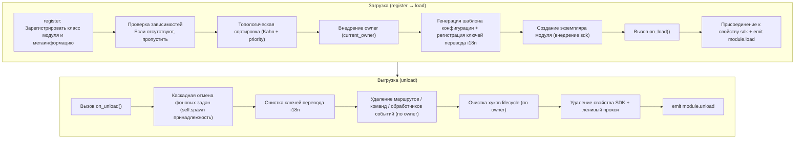

# Основные концепции модуля

Понимание основных концепций модуля ErisPulse является основой для разработки качественных модулей.

## Жизненный цикл модуля

### Стратегия загрузки

```python
from ErisPulse.Core.Bases import BaseModule
from ErisPulse.loaders import ModuleLoadStrategy

class MyModule(BaseModule):
    @staticmethod
    def get_load_strategy():
        """Возвращает стратегию загрузки модуля"""
        return ModuleLoadStrategy(
            lazy_load=True,   # Загружать лениво или немедленно
            priority=0,       # Приоритет загрузки (чем больше, тем раньше загружается)
            depends=["OtherModule"]  # Необязательно: объявить зависимости от других модулей
        )
```

> Если модули, объявленные в `depends`, не зарегистрированы, текущий модуль будет пропущен и в логе будет записано предупреждение. Порядок загрузки определяется топологической сортировкой, модули с одинаковым приоритетом сортируются по убыванию `priority`.

> [!NOTE]
> **Каскадное выгрузка / каскадное перезагрузка** (ErisPulse **2.8.0+**): при выгрузке модуля, на который ссылаются другие модули, эти модули сначала будут **выгружены каскадно** (в логе будет указан цепочка). При горячей перезагрузке любого модуля (локальный плагин / пакет PyPI), модули, зависящие от него, также будут **перезагружены каскадно**, чтобы избежать использования устаревших ссылок на экземпляры. Циклические зависимости будут отклонены с `RuntimeError` при загрузке.

### Метод on_load

Вызывается при загрузке модуля, используется для инициализации ресурсов и регистрации обработчиков событий:

```python
async def on_load(self, event):
    # Регистрация обработчика события
    @command("hello", help="Команда приветствия")
    async def hello_handler(event):
        await event.reply("Привет!")

    # Использование встроенного HTTP-клиента SDK (автоматически управляет пулом соединений, не нужно создавать session вручную)
    # Отправлять запросы можно через sdk.client
```

### Метод on_unload

Вызывается при выгрузке модуля, используется для очистки ресурсов:

```python
async def on_unload(self, event):
    # Очистка пользовательских ресурсов
    # sdk.client управляется фреймворком, не нужно закрывать вручную

    # Отмена обработчика события (фреймворк автоматически обрабатывает)
    self.logger.info("Модуль выгружен")
```

> Создание и очистка фоновых задач (через `self.spawn()` / автоматическая отмена фреймворком) см. в [управлении жизненным циклом](../../advanced/lifecycle.md#фоновые-задачи-принадлежность-и-автоматическая-отмена).

### Выгрузка и полная выгрузка (purge)

> [!NOTE]
> Эта функция доступна в ErisPulse **2.8.0+**.

`unload()` по умолчанию только **отменяет загрузку** (выгружает экземпляр и ресурсы), но сохраняет метаданные модуля (класс модуля и метаинформацию) — модуль можно снова обнаружить и перезагрузить с помощью `load()` без повторной `register()`.

Если требуется **полная выгрузка** (освобождение ссылки на класс модуля, очистка `sys.modules`, чтобы плагин и его уникальные зависимости могли быть собраны сборщиком мусора), передайте `purge=True`:

```python
# Только отмена загрузки: сохраняются метаданные, можно перезагрузить в любое время
await sdk.module.unload("MyModule")

# Полная выгрузка: удаляются метаданные + очистка sys.modules (только для плагинов из папки)
await sdk.module.unload("MyModule", purge=True)
```

| Семантика | unload() по умолчанию | unload(purge=True) |
|------|-----------------|----------------------|
| Выгрузка экземпляра и ресурсов (события/задачи/маршруты/lifecycle/i18n) | ✅ | ✅ |
| Сохранение метаданных (класс модуля и метаинформация) | ✅ | ❌ Удалить |
| Очистка `sys.modules` (только для плагинов из папки) | ❌ | ✅ |
| Класс модуля может быть собран сборщиком мусора | ❌ | ✅ |
| Перезагрузка | `load()` доступен напрямую | Требуется сначала `register()` + `load()` |

> При `purge=True` зависимые модули также будут выгружены каскадно; после выгрузки фреймворк выполнит `gc.collect()` и проверит, можно ли собрать класс модуля/экземпляр, оставшиеся ссылки будут предупреждены в логе (с указанием источника, уровень DEBUG).

### Жизненный цикл в целом

Собрав все методы воедино, фреймворк делает **все, что нужно**, при загрузке и выгрузке модуля:



**Что делает фреймворк при загрузке** (вам нужно только писать `on_load()`, остальное делается автоматически):

| Этап | Что делает фреймворк автоматически |
|------|-------------|
| Внедрение owner | Во время создания экземпляра модуля используется `owner_scope`, чтобы все зарегистрированные вами команды/события/хуки/фоновые задачи **автоматически принадлежали текущему модулю** и были автоматически очищены при выгрузке |
| Шаблон конфигурации | Модули, объявившие `ConfigClass`, получают автоматически сгенерированный/заполненный конфигурационный раздел `ErisPulse.<ModuleName>` |
| Ключи перевода i18n | Модули, объявившие `I18nClass`, регистрируют ключи перевода (автоматически удаляются при выгрузке) |
| Зависимости | Модули сортируются по `depends`, чтобы модули, от которых зависят, загружались первыми; циклические зависимости отклоняются с `RuntimeError` |
| Присоединение к SDK | После создания экземпляра модуль присоединяется к `sdk.<ModuleName>`, чтобы вы могли обращаться к `sdk.MyModule.xxx` |

**Что очищает фреймворк при выгрузке** (соответствует U1→U7 выше): после выполнения `on_unload()` происходит каскадная очистка — фоновые задачи, созданные через `self.spawn`, будут принудительно отменены (для аккуратного завершения задачи в `on_unload` нужно сделать это вручную), ключи перевода i18n, маршруты, команды/обработчики событий, хуки lifecycle, затем удаляется свойство SDK. При `purge=True` дополнительно удаляются метаданные + очищаются `sys.modules`.

> Именно эта автоматическая очистка обеспечивает то, что вам нужно писать только `on_load`/`on_unload`, а не вручную unregister — фреймворк использует принадлежность owner, чтобы "кто зарегистрировал, тот и очищает" стало одно-клик-операцией.

## Объект SDK

### Доступ к основным модулям

```python
from ErisPulse import sdk

# Доступ к основным модулям через объект sdk
sdk.logger.info("Логирование")
sdk.storage.set("key", "value")
config = sdk.config.getConfig("MyModule")
```

### Коммуникация между модулями

```python
# Доступ к другим модулям
other_module = sdk.OtherModule
result = await other_module.some_method()
```

## Методы отправки адаптера

Из-за новых требований стандарта, для реализации механизма отправки по умолчанию используется перегрузка метода `__getattr__`, что делает невозможным использование `hasattr` для проверки наличия метода. Начиная с версии `2.3.5`, добавлена функция для получения информации о методах отправки.

### Список поддерживаемых методов отправки

```python
# Получить список всех поддерживаемых методов отправки платформы
methods = sdk.adapter.list_sends("onebot11")
# Возвращает: ["Text", "Image", "Voice", "Markdown", ...]
```

### Получение подробной информации о методе

```python
# Получить подробную информацию о методе
info = sdk.adapter.send_info("onebot11", "Text")
# Возвращает:
# {
#     "name": "Text",
#     "parameters": [
#         {"name": "text", "type": "str", "default": null, "annotation": "str"}
#     ],
#     "return_type": "Awaitable[Any]",
#     "docstring": "Отправить текстовое сообщение..."
# }
```

## Управление конфигурацией

### Объявленная конфигурация (рекомендуется)

Начиная с версии v2.5.2, модули могут объявлять класс конфигурации через `ConfigClass`, используя ту же систему схемы конфигурации, что и адаптеры. Конфигурация читается в реальном времени через `self.cfg`, и изменения немедленно применяются:

```python
from dataclasses import dataclass, field
from ErisPulse.Core.Bases import BaseModule
from ErisPulse.Core.Bases import BaseConfig

@dataclass
class MyModuleConfig(BaseConfig):
    api_key: str = field(
        default="",
        metadata={
            "description": {"i18n": "my_module.api_key", "default": "Ключ API"},
            "required": True,
            "secret": True,
            "ui": {"widget": "password", "group": "basic", "order": 1},
        },
    )
    timeout: int = field(
        default=30,
        metadata={
            "description": {"i18n": "my_module.timeout", "default": "Время ожидания (секунды)"},
            "ui": {"widget": "number", "group": "advanced", "order": 2},
        },
    )

class MyModule(BaseModule):
    ConfigClass = MyModuleConfig

    def __init__(self, sdk):
        self.sdk = sdk
        self.logger = sdk.logger.get_child("MyModule")

    async def on_load(self, event):
        self.logger.info("Модуль загружен")

    async def on_unload(self, event):
        pass

    async def do_something(self):
        cfg = self.cfg  # Чтение в реальном времени, безопасно по типу
        api_key = cfg.api_key
        timeout = cfg.timeout
```

`BaseConfig` — базовый класс конфигурации, применимый ко всем сценариям: адаптеры, модули, внешние проекты и т.д. Поля конфигурации поддерживают многоязычные описания (см. [документацию по i18n](../../advanced/i18n.md#многоязычные-описания-полей-конфигурации)).

### Объявленные ключи перевода (v2.7.0+)

Начиная с v2.7.0, модули могут объявлять ключи перевода, как и `ConfigClass`, с помощью вложенного класса `I18nClass`. Фреймворк **автоматически регистрирует** все объявленные ключи перевода при загрузке, без необходимости вызывать `i18n.register()` вручную, и регистрация происходит до генерации шаблона конфигурации, обеспечивая доступность ключей перевода, используемых в описаниях конфигурации.

```python
from ErisPulse.Core.Bases import BaseConfig, BaseI18n, I18nKey

class MyModule(BaseModule):
    # Класс конфигурации (необязательно)
    @dataclass
    class ConfigClass(BaseConfig):
        welcome_msg: str = field(
            default="Добро пожаловать",
            metadata={
                "description": {"i18n": "mymodule.welcome_msg", "default": "Сообщение приветствия"},
            },
        )

    # Класс набора ключей перевода (необязательно)
    class I18nClass(BaseI18n):
        # Имя атрибута автоматически объединяется в полный ключ: <имя модуля>.<имя атрибута>
        welcome_msg: I18nKey = I18nKey(
            default="Welcome Message",   # Языковонезависимый резервный текст
            zh_CN="欢迎消息",
            zh_TW="歡迎訊息",
            en="Welcome Message",
            ja="ウェルカムメッセージ",
            ru="Приветственное сообщение",
        )
        hello: I18nKey = I18nKey(
            default="Hello, {name}!",
            zh_CN="你好，{name}！",
            zh_TW="你好，{name}！",
            en="Hello, {name}!",
            ja="こんにちは、{name}！",
            ru="Привет, {name}!",
        )
```

Детали см. в [рекомендуемом способе написания i18n](../../advanced/i18n.md#рекомендуемый-способ-объявления-ключей-перевода-через-i18nclass-v270).

### Ручное чтение конфигурации (устарело)

> **Устарело**: используйте [объявленную конфигурацию](#объявленная-конфигурация-рекомендуется) + `self.cfg` для чтения в реальном времени.

```python
class MyModule(BaseModule):
    def __init__(self, sdk):
        self.sdk = sdk

    def _load_config(self):
        config = self.sdk.config.getConfig("MyModule")
        if not config:
            self.sdk.config.setConfig("MyModule", {"api_key": "", "timeout": 30})
            return {"api_key": "", "timeout": 30}
        return config
```

## Система хранения

### Основное использование

```python
# Сохранение данных
sdk.storage.set("user:123", {"name": "张三"})

# Получение данных
user = sdk.storage.get("user:123", {})

# Удаление данных
sdk.storage.delete("user:123")
```

### Использование транзакций

```python
# Использование транзакции для обеспечения целостности данных
with sdk.storage.transaction():
    sdk.storage.set("key1", "value1")
    sdk.storage.set("key2", "value2")
    # Если любая операция не удалась, все изменения будут отменены
```

## Обработка событий

### Регистрация обработчиков событий

```python
from ErisPulse.Core.Event import command, message

# Регистрация команды
@command("info", help="Получить информацию")
async def info_handler(event):
    await event.reply("Это информация")

# Регистрация обработчика сообщений
@message.on_group_message()
async def group_handler(event):
    sdk.logger.info(f"Получено групповое сообщение: {event.get_text()}")
```

### Жизненный цикл обработчиков событий

Фреймворк автоматически управляет регистрацией и удалением обработчиков событий, вам нужно только зарегистрировать их в `on_load()`.

## Механизм ленивой загрузки

### Принцип работы

```python
# Модуль будет инициализирован при первом обращении
result = await sdk.my_module.some_method()
# ↑ Здесь будет инициирована инициализация модуля
```

### Немедленная загрузка

Для модулей, которые требуют немедленной инициализации (например, слушатели, таймеры):

```python
@staticmethod
def get_load_strategy():
    return ModuleLoadStrategy(
        lazy_load=False,  # Немедленная загрузка
        priority=100
    )
```

## Обработка ошибок

### Поймать исключение

```python
async def handle_event(self, event):
    try:
        # Бизнес-логика
        await self.process_event(event)
    except ValueError as e:
        self.logger.warning(f"Ошибка параметра: {e}")
        await event.reply(f"Ошибка параметра: {e}")
    except Exception as e:
        self.logger.error(f"Обработка не удалась: {e}")
        raise
```

### Запись в лог

```python
# Использование разных уровней логирования
self.logger.debug("Отладочная информация")    # Подробная отладочная информация
self.logger.info("Состояние работы")      # Информация о нормальной работе
self.logger.warning("Предупреждающая информация")  # Предупреждающая информация
self.logger.error("Ошибка")    # Ошибка
self.logger.critical("Критическая ошибка") # Критическая ошибка
```

## Связанные документы

- [Начало разработки модулей](getting-started.md) - Создание первого модуля
- [Объект события](event-wrapper.md) - Подробности обработки событий
- [Лучшие практики](best-practices.md) - Разработка качественных модулей