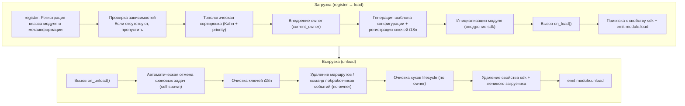

# Основные концепции модуля

Понимание основных концепций модуля ErisPulse является основой для разработки высококачественных модулей.

## Жизненный цикл модуля

### Стратегия загрузки

```python
from ErisPulse.Core.Bases import BaseModule
from ErisPulse.loaders import ModuleLoadStrategy

class MyModule(BaseModule):
    @staticmethod
    def get_load_strategy():
        """Возвращает стратегию загрузки модуля"""
        return ModuleLoadStrategy(
            lazy_load=True,   # Загрузка "ленивая" или немедленная
            priority=0,       # Приоритет загрузки (чем больше число, тем раньше загрузка)
            depends=["OtherModule"]  # Необязательно: объявить зависимости от других модулей
        )
```

> Модули, объявленные в `depends`, будут пропущены и в лог будет записано предупреждение, если они не зарегистрированы. Порядок загрузки определяется топологической сортировкой, а на одном уровне сортировка идет по убыванию `priority`.

> [!NOTE]
> **Каскадное выгрузка / перезагрузка** (ErisPulse **2.8.0+**): При выгрузке модуля, от которого зависят другие модули, модули, зависящие от него, будут **сначала каскадно выгружены** (в логе будет указан цепочка каскада); при горячей перезагрузке локальных плагинов, плагины, зависящие от него, также будут **каскадно перезагружены**, чтобы избежать использования устаревших ссылок на экземпляры. Объявление циклических зависимостей будет отклонено с `RuntimeError` при загрузке.

### Метод on_load

Вызывается при загрузке модуля, используется для инициализации ресурсов и регистрации обработчиков событий:

```python
async def on_load(self, event):
    # Регистрация обработчика события
    @command("hello", help="Команда приветствия")
    async def hello_handler(event):
        await event.reply("Привет!")

    # Использование встроенного HTTP-клиента SDK (автоматически управляет пулом соединений, не нужно создавать сессию вручную)
    # Отправлять запросы можно через sdk.client
```

### Метод on_unload

Вызывается при выгрузке модуля, используется для очистки ресурсов:

```python
async def on_unload(self, event):
    # Очистка пользовательских ресурсов
    # sdk.client управляется фреймворком, закрывать вручную не нужно

    # Отмена обработчиков событий (фреймворк обрабатывает автоматически)
    self.logger.info("Модуль был выгружен")
```

> Создание и очистка фоновых задач (`self.spawn()` / автоматическая отмена фреймворком) подробно описаны в [управлении жизненным циклом](../../advanced/lifecycle.md#задачи-фонового-исполнения-и-автоматическая-отмена).

### Выгрузка и полная выгрузка (purge)

> [!NOTE]
> Эта функция доступна в ErisPulse **2.8.0+**.

`unload()` по умолчанию только **отменяет загрузку** (выгружает экземпляр и ресурсы), но сохраняет метаданные регистрации (класс модуля и метаинформация) — модуль всё ещё может быть обнаружен и перезагружен с помощью `load()`, без необходимости повторной `register()`.

Если требуется **полная выгрузка** (освобождение ссылки на класс модуля, очистка `sys.modules`, чтобы плагин и его уникальные зависимости могли быть собраны сборщиком мусора), передайте `purge=True`:

```python
# Только отмена загрузки: сохраняются метаданные регистрации, можно перезагрузить в любое время
await sdk.module.unload("MyModule")

# Полная выгрузка: удаляются метаданные регистрации + очистка sys.modules (только для плагинов из папки)
await sdk.module.unload("MyModule", purge=True)
```

| Смысл | `unload()` по умолчанию | `unload(purge=True)` |
|------|-----------------|----------------------|
| Выгрузка экземпляра и ресурсов (события/task/маршруты/lifecycle/i18n) | ✅ | ✅ |
| Сохранение метаданных регистрации (класс модуля и метаинформация) | ✅ | ❌ Удалить |
| Очистка `sys.modules` (только для плагинов из папки) | ❌ | ✅ |
| Класс модуля может быть собран сборщиком мусора | ❌ | ✅ |
| Перезагрузка | `load()` можно использовать напрямую | Сначала нужно `register()` + `load()` |

> При `purge=True` зависимые модули, которые были каскадно выгружены, также будут purged; после выгрузки фреймворк выполнит `gc.collect()` и проверит, можно ли собрать класс/экземпляр модуля, остаточные ссылки будут предупреждены в логе (с указанием источника, уровень DEBUG).

### Жизненный цикл в целом

Если объединить все методы, то фреймворк делает следующее при загрузке и выгрузке модуля, **всё это происходит за кулисами**:



**Что делает фреймворк при загрузке** (вам нужно только написать `on_load`, всё остальное делается автоматически):

| Этап | Что делает фреймворк автоматически |
|------|-------------|
| Внедрение owner | При инициализации модуль обёртывается в `owner_scope`, чтобы все зарегистрированные в `on_load` команды/события/хуки/фоновые задачи **автоматически принадлежали этому модулю**, при выгрузке всё удаляется по owner |
| Шаблон конфигурации | Модули, объявившие `ConfigClass`, получают автоматически сгенерированный/заполненный фреймворком раздел конфигурации `ErisPulse.<ModuleName>` |
| Ключи i18n | Модули, объявившие `I18nClass`, получают автоматическую регистрацию ключей перевода (автоматически удаляются при выгрузке) |
| Топологическая зависимость | Модули сортируются по `depends`, чтобы модули, от которых зависят, загружались первыми; циклические зависимости отклоняются с `RuntimeError` |
| Привязка к SDK | После инициализации модуль привязывается к `sdk.<ModuleName>`, чтобы вы могли обращаться к `sdk.MyModule.xxx` |

**Что делает фреймворк при выгрузке** (соответствует шагам U1→U7): После выполнения `on_unload` происходит дополнительная очистка — фоновые задачи, созданные через `self.spawn`, принудительно отменяются (для корректного завершения сделайте это в `on_unload`), ключи i18n, маршруты, команды/обработчики событий, хуки lifecycle, затем удаляется свойство sdk. При `purge=True` дополнительно удаляются метаданные регистрации + очищается `sys.modules`.

> Эта автоматическая очистка — основа того, что «вам нужно только написать `on_load`/`on_unload`, не нужно вручную unregister» — фреймворк использует принадлежность owner, чтобы сделать «кто зарегистрировал, тот и очищает» одно-клик-процедурой.

## Объект SDK

### Доступ к основным модулям

```python
from ErisPulse import sdk

# Доступ ко всем основным модулям через объект sdk
sdk.logger.info("Лог")
sdk.storage.set("key", "value")
config = sdk.config.getConfig("MyModule")
```

### Взаимодействие между модулями

```python
# Доступ к другим модулям
other_module = sdk.OtherModule
result = await other_module.some_method()

## Запрос методов отправки адаптера

В связи с тем, что новые стандартные спецификации требуют использования переопределения метода `__getattr__` для реализации механизма резервной отправки, использование метода `hasattr` для проверки существования метода становится невозможным. Начиная с версии `2.3.5`, добавлена функция для запроса методов отправки.

### Список поддерживаемых методов отправки

```python
# Список всех методов отправки, поддерживаемых платформой
methods = sdk.adapter.list_sends("onebot11")
# Возвращает: ["Text", "Image", "Voice", "Markdown", ...]
```

### Получение подробной информации о методе

```python
# Получение подробной информации о конкретном методе
info = sdk.adapter.send_info("onebot11", "Text")
# Возвращает:
# {
#     "name": "Text",
#     "parameters": [
#         {"name": "text", "type": "str", "default": null, "annotation": "str"}
#     ],
#     "return_type": "Awaitable[Any]",
#     "docstring": "Отправка текстового сообщения..."
# }

## Управление конфигурацией

### Декларативная конфигурация (рекомендуется)

Начиная с версии 2.5.2, модули могут объявлять класс конфигурации через `ConfigClass`, используя ту же систему схем конфигурации, что и адаптеры. Конфигурация считывается в реальном времени через `self.cfg` и вступает в силу немедленно после изменений:

```python
from dataclasses import dataclass, field
from ErisPulse.Core.Bases import BaseModule
from ErisPulse.Core.Bases import BaseConfig

@dataclass
class MyModuleConfig(BaseConfig):
    api_key: str = field(
        default="",
        metadata={
            "description": {"i18n": "my_module.api_key", "default": "API Ключ"},
            "required": True,
            "secret": True,
            "ui": {"widget": "password", "group": "basic", "order": 1},
        },
    )
    timeout: int = field(
        default=30,
        metadata={
            "description": {"i18n": "my_module.timeout", "default": "Тайм-аут (сек)"},
            "ui": {"widget": "number", "group": "advanced", "order": 2},
        },
    )

class MyModule(BaseModule):
    ConfigClass = MyModuleConfig

    def __init__(self, sdk):
        self.sdk = sdk
        self.logger = sdk.logger.get_child("MyModule")

    async def on_load(self, event):
        self.logger.info("Модуль загружен")

    async def on_unload(self, event):
        pass

    async def do_something(self):
        cfg = self.cfg  # Считывание в реальном времени, типобезопасность
        api_key = cfg.api_key
        timeout = cfg.timeout
```

`BaseConfig` — это базовый класс конфигурации общего назначения, подходящий для любых сценариев, включая адаптеры, модули и внешние проекты. Поля конфигурации поддерживают многоязычные описания i18n (см. подробнее в [документации i18n](../../advanced/i18n.md#поля-конфигурации-многоязычные)).

### Декларативные ключи перевода (v2.7.0+)

Начиная с версии 2.7.0, модули могут централизованно объявлять ключи перевода, как объявляют `ConfigClass`, через вложенный класс `I18nClass`. Фреймворк будет автоматически регистрировать все объявленные ключи перевода при загрузке, без необходимости вручную вызывать `i18n.register()`, и регистрация происходит до генерации шаблона конфигурации, что гарантирует доступность ключей i18n, на которые ссылаются описания конфигурации.

```python
from ErisPulse.Core.Bases import BaseConfig, BaseI18n, I18nKey

class MyModule(BaseModule):
    # Класс конфигурации (необязательно)
    @dataclass
    class ConfigClass(BaseConfig):
        welcome_msg: str = field(
            default="Добро пожаловать",
            metadata={
                "description": {"i18n": "mymodule.welcome_msg", "default": "Приветственное сообщение"},
            },
        )

    # Класс набора ключей перевода (необязательно)
    class I18nClass(BaseI18n):
        # Имена свойств автоматически объединяются в полный путь ключа: <имя_модуля>.<имя_свойства>
        welcome_msg: I18nKey = I18nKey(
            default="Welcome Message",   # Языконезависимый запасной вариант
            zh_CN="Приветственное сообщение",
            zh_TW="Приветственное сообщение",
            en="Welcome Message",
            ja="ウェルカムメッセージ",
            ru="Приветственное сообщение",
        )
        hello: I18nKey = I18nKey(
            default="Hello, {name}!",
            zh_CN="Привет, {name}!",
            zh_TW="Привет, {name}!",
            en="Hello, {name}!",
            ja="こんにちは、{name}!",
            ru="Привет, {name}!",
        )
```

Подробнее см. [Рекомендуемый способ написания i18n](../../advanced/i18n.md#рекомендуемый-способ-через-i18nclass-объявить-ключи-перевода-v270).

### Ручное чтение конфигурации (не рекомендуется)

> **Устарело**: Пожалуйста, используйте вместо этого [декларативную конфигурацию](#декларативная-конфигурация-рекомендуется) + чтение через `self.cfg` в реальном времени.

```python
class MyModule(BaseModule):
    def __init__(self, sdk):
        self.sdk = sdk

    def _load_config(self):
        config = self.sdk.config.getConfig("MyModule")
        if not config:
            self.sdk.config.setConfig("MyModule", {"api_key": "", "timeout": 30})
            return {"api_key": "", "timeout": 30}
        return config

## Система хранения

### Основное использование

```python
# Сохранение данных
sdk.storage.set("user:123", {"name": "Чжан Сань"})

# Получение данных
user = sdk.storage.get("user:123", {})

# Удаление данных
sdk.storage.delete("user:123")
```

### Использование транзакций

```python
# Использование транзакции для обеспечения целостности данных
with sdk.storage.transaction():
    sdk.storage.set("key1", "value1")
    sdk.storage.set("key2", "value2")
    # Если какая-либо операция завершится неудачей, все изменения будут откачены

## Обработка событий

### Регистрация обработчиков событий

```python
from ErisPulse.Core.Event import command, message

# Регистрация команды
@command("info", help="Получить информацию")
async def info_handler(event):
    await event.reply("Это информация")

# Регистрация обработчика сообщений
@message.on_group_message()
async def group_handler(event):
    sdk.logger.info(f"Получено групповое сообщение: {event.get_text()}")
```

### Жизненный цикл обработчика событий

Фреймворк автоматически управляет регистрацией и отменой регистрации обработчиков событий; вам нужно зарегистрировать их только в `on_load`.

## Механизм ленивой загрузки

### Принцип работы

```python
# Инициализация модуля происходит только при первом обращении к нему
result = await sdk.my_module.some_method()
# ↑ Здесь срабатывает инициализация модуля
```

### Мгновенная загрузка

Для модулей, которые должны быть инициализированы немедленно (например, слушатели событий, таймеры):

```python
@staticmethod
def get_load_strategy():
    return ModuleLoadStrategy(
        lazy_load=False,  # Мгновенная загрузка
        priority=100
    )

## Обработка ошибок

### Перехват исключений

```python
async def handle_event(self, event):
    try:
        # Бизнес-логика
        await self.process_event(event)
    except ValueError as e:
        self.logger.warning(f"Ошибка параметров: {e}")
        await event.reply(f"Ошибка параметров: {e}")
    except Exception as e:
        self.logger.error(f"Сбой обработки: {e}")
        raise
```

### Логирование

```python
# Использование различных уровней логирования
self.logger.debug("Информация отладки")    # Детальная информация для отладки
self.logger.info("Статус работы")          # Информация о нормальном запуске
self.logger.warning("Предупреждение")     # Предупреждение
self.logger.error("Сообщение об ошибке")  # Сообщение об ошибке
self.logger.critical("Критическая ошибка") # Критическая ошибка

## Документация

- [Введение в разработку модулей](getting-started.md) — Создание первого модуля
- [Класс-обертка событий](event-wrapper.md) — Подробное описание обработки событий
- [Лучшие практики](best-practices.md) — Создание модулей высокого качества

## Связанные документы

- [Начало работы с модулем](getting-started.md) — Создание первого модуля
- [Класс-обертка событий](event-wrapper.md) — Подробное описание обработки событий
- [Рекомендации по разработке](best-practices.md) — Создание модулей высокого качества