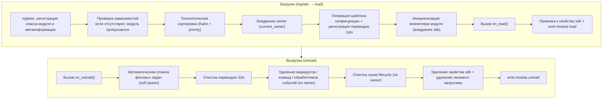

# Основные концепции модуля

Понимание основных концепций модуля ErisPulse является основой для разработки высококачественных модулей.

## Жизненный цикл модуля

### Стратегия загрузки

```python
from ErisPulse.Core.Bases import BaseModule
from ErisPulse.loaders import ModuleLoadStrategy

class MyModule(BaseModule):
    @staticmethod
    def get_load_strategy():
        """Возвращает стратегию загрузки модуля"""
        return ModuleLoadStrategy(
            lazy_load=True,   # Загрузка "ленивая" или немедленная
            priority=0,       # Приоритет загрузки (чем больше значение, тем раньше загрузка)
            depends=["OtherModule"]  # Опционально: объявить зависимости от других модулей
        )
```

> Модули, перечисленные в `depends`, будут пропущены и в лог будет выведено предупреждение, если они не зарегистрированы. Порядок загрузки определяется топологической сортировкой, а при одинаковом уровне — по убыванию `priority`.

> [!NOTE]
> **Каскадное выгрузка / каскадное перезагрузка** (ErisPulse **2.8.0+**): при выгрузке модуля, на который ссылаются другие модули, сначала **выгружаются зависимые модули** (в логе указывается цепочка каскада); при горячей перезагрузке локальных плагинов, плагины, на которые ссылаются, также **перезагружаются каскадно**, чтобы избежать использования устаревших ссылок на экземпляры. Циклические зависимости будут отклонены с `RuntimeError` при загрузке.

### Метод on_load

Вызывается при загрузке модуля, используется для инициализации ресурсов и регистрации обработчиков событий:

```python
async def on_load(self, event):
    # Регистрация обработчика события
    @command("hello", help="Команда приветствия")
    async def hello_handler(event):
        await event.reply("Привет!")

    # Использование встроенного HTTP-клиента SDK (автоматически управляет пулом соединений, не нужно создавать session вручную)
    # Отправлять запросы можно через sdk.client
```

### Метод on_unload

Вызывается при выгрузке модуля, используется для очистки ресурсов:

```python
async def on_unload(self, event):
    # Очистка пользовательских ресурсов
    # sdk.client управляется фреймворком, не нужно закрывать вручную

    # Отмена обработчиков событий (фреймворк обрабатывает автоматически)
    self.logger.info("Модуль выгружен")
```

> Создание и очистка фоновых задач (через `self.spawn()` / автоматическая отмена фреймворком) подробно описаны в разделе [Управление жизненным циклом](../../advanced/lifecycle.md#фоновые-задачи-и-автоматическая-отмена).

### Выгрузка и полная выгрузка (purge)

> [!NOTE]
> Эта функция доступна в ErisPulse **2.8.0+**.

Метод `unload()` по умолчанию **отменяет только загрузку** (выгружает экземпляр и ресурсы), но сохраняет метаданные модуля (класс и метаинформацию) — модуль по-прежнему может быть обнаружен через discover и перезагружен с помощью `load()`, без необходимости повторной `register()`.

Если требуется **полная выгрузка** (освобождение ссылок на класс модуля, очистка `sys.modules`, чтобы плагин и его уникальные зависимости могли быть собраны сборщиком мусора), нужно передать параметр `purge=True`:

```python
# Текущая выгрузка: сохраняются метаданные, модуль можно перезагрузить в любое время
await sdk.module.unload("MyModule")

# Полная выгрузка: удаляются метаданные + очистка sys.modules (только для плагинов из папки)
await sdk.module.unload("MyModule", purge=True)
```

| Семантика | `unload()` по умолчанию | `unload(purge=True)` |
|----------|-------------------------|----------------------|
| Выгрузка экземпляра и ресурсов (события/task/маршруты/lifecycle/i18n) | ✅ | ✅ |
| Сохранение метаданных (класс и метаинформация) | ✅ | ❌ Удалено |
| Очистка `sys.modules` (только для плагинов из папки) | ❌ | ✅ |
| Класс модуля может быть собран сборщиком мусора | ❌ | ✅ |
| Перезагрузка | `load()` доступен напрямую | Требуется сначала `register()` + `load()` |

> При `purge=True` зависимые модули, которые были выгружены каскадно, тоже будут полностью выгружены; после выгрузки фреймворк вызывает `gc.collect()` и проверяет, можно ли собрать класс модуля/экземпляр, при наличии остаточных ссылок в логе будет выведено предупреждение (с указанием источника ссылки, уровень DEBUG).

### Жизненный цикл в целом

Соединяя все методы, фреймворк делает за вас следующее при загрузке и выгрузке модуля:



**Что делает фреймворк при загрузке** (вам нужно только реализовать `on_load()`, остальное происходит автоматически):

| Этап | Что делает фреймворк автоматически |
|------|----------------------------------|
| Внедрение owner | Во время инициализации модуль оборачивается в `owner_scope` — все зарегистрированные вами команды/события/хуки/фоновые задачи **автоматически привязываются к модулю**, и при выгрузке удаляются по owner |
| Шаблон конфигурации | Модули, объявившие `ConfigClass`, получают автоматически сгенерированный/заполненный фреймворком раздел конфигурации `ErisPulse.<ModuleName>` |
| Переводы i18n | Модули, объявившие `I18nClass`, получают автоматически зарегистрированные переводы (удаляются при выгрузке) |
| Топология зависимостей | Модули сортируются по `depends`, чтобы модули, от которых зависят, загружались первыми; циклические зависимости отклоняются с `RuntimeError` |
| Привязка к SDK | После инициализации модуль привязывается к `sdk.<ModuleName>`, что позволяет обращаться к нему через `sdk.MyModule.xxx` |

**Что делает фреймворк при выгрузке** (соответствует U1→U7 выше): после выполнения `on_unload()` фреймворк дополнительно очищает — фоновые задачи принудительно отменяются (созданные через `self.spawn`, для корректного завершения можно реализовать в `on_unload`), переводы i18n, маршруты, команды/обработчики событий, хуки lifecycle, затем удаляется свойство в SDK. При `purge=True` дополнительно удаляются метаданные и очищается `sys.modules`.

> Именно эта автоматическая очистка является основой для утверждения «вам нужно только реализовать `on_load`/`on_unload`, не нужно вручную unregister» — фреймворк использует принадлежность owner, чтобы сделать «кто зарегистрировал, тот и очищает» полностью автоматическим.

## Объект SDK

### Доступ к основным модулям

```python
from ErisPulse import sdk

# Доступ ко всем основным модулям через объект sdk
sdk.logger.info("Журнал")
sdk.storage.set("key", "value")
config = sdk.config.getConfig("MyModule")
```

### Коммуникация между модулями

```python
# Доступ к другим модулям
other_module = sdk.OtherModule
result = await other_module.some_method()
```

## 查询适配器发送方法

В связи с новыми требованиями стандартного протокола, которые требуют переопределения метода `__getattr__` для реализации механизма передачи по умолчанию, невозможно использовать метод `hasattr` для проверки существования метода. Начиная с версии `2.3.5`, добавлена функция для проверки доступных методов отправки.

### Перечисление поддерживаемых методов отправки

```python
# Получить список всех методов отправки, поддерживаемых платформой
methods = sdk.adapter.list_sends("onebot11")
# Возвращает: ["Text", "Image", "Voice", "Markdown", ...]
```

### Получение подробной информации о методе

```python
# Получить подробную информацию о конкретном методе
info = sdk.adapter.send_info("onebot11", "Text")
# Возвращает:
# {
#     "name": "Text",
#     "parameters": [
#         {"name": "text", "type": "str", "default": null, "annotation": "str"}
#     ],
#     "return_type": "Awaitable[Any]",
#     "docstring": "Отправить текстовое сообщение..."
# }
```

## Управление конфигурацией

### Декларативная конфигурация (рекомендуется)

Начиная с версии v2.5.2, модули могут объявлять класс конфигурации с помощью `ConfigClass`, используя ту же систему схемы конфигурации, что и адаптеры. Конфигурация читается в реальном времени через `self.cfg`, и любые изменения немедленно применяются:

```python
from dataclasses import dataclass, field
from ErisPulse.Core.Bases import BaseModule
from ErisPulse.Core.Bases import BaseConfig

@dataclass
class MyModuleConfig(BaseConfig):
    api_key: str = field(
        default="",
        metadata={
            "description": {"i18n": "my_module.api_key", "default": "Ключ API"},
            "required": True,
            "secret": True,
            "ui": {"widget": "password", "group": "basic", "order": 1},
        },
    )
    timeout: int = field(
        default=30,
        metadata={
            "description": {"i18n": "my_module.timeout", "default": "Время ожидания (секунды)"},
            "ui": {"widget": "number", "group": "advanced", "order": 2},
        },
    )

class MyModule(BaseModule):
    ConfigClass = MyModuleConfig

    def __init__(self, sdk):
        self.sdk = sdk
        self.logger = sdk.logger.get_child("MyModule")

    async def on_load(self, event):
        self.logger.info("Модуль загружен")

    async def on_unload(self, event):
        pass

    async def do_something(self):
        cfg = self.cfg  # Чтение в реальном времени, безопасное по типу
        api_key = cfg.api_key
        timeout = cfg.timeout
```

`BaseConfig` — это универсальный базовый класс конфигурации, подходящий для адаптеров, модулей и внешних проектов. Поля конфигурации поддерживают многоязычные описания i18n (см. [документацию по i18n](../../advanced/i18n.md#многоязычные-описания-полей-конфигурации)).

### Декларативные ключи перевода (v2.7.0+)

Начиная с версии v2.7.0, модули могут объявлять ключи перевода, аналогично объявлению `ConfigClass`, с помощью вложенного класса `I18nClass`. Фреймворк автоматически зарегистрирует все объявленные ключи перевода во время загрузки, без необходимости ручного вызова `i18n.register()`, и регистрация происходит раньше создания шаблона конфигурации, обеспечивая доступность ключей i18n в описаниях конфигурации.

```python
from ErisPulse.Core.Bases import BaseConfig, BaseI18n, I18nKey

class MyModule(BaseModule):
    # Класс конфигурации (необязательный)
    @dataclass
    class ConfigClass(BaseConfig):
        welcome_msg: str = field(
            default="Добро пожаловать",
            metadata={
                "description": {"i18n": "mymodule.welcome_msg", "default": "Сообщение приветствия"},
            },
        )

    # Класс набора ключей перевода (необязательный)
    class I18nClass(BaseI18n):
        # Имя атрибута автоматически объединяется в полный путь ключа: <имя_модуля>.<имя_атрибута>
        welcome_msg: I18nKey = I18nKey(
            default="Welcome Message",   # Безопасный запасной вариант, не зависящий от языка
            zh_CN="欢迎消息",
            zh_TW="歡迎訊息",
            en="Welcome Message",
            ja="ウェルカムメッセージ",
            ru="Приветственное сообщение",
        )
        hello: I18nKey = I18nKey(
            default="Hello, {name}!",
            zh_CN="你好，{name}！",
            zh_TW="你好，{name}！",
            en="Hello, {name}!",
            ja="こんにちは、{name}！",
            ru="Привет, {name}!",
        )
```

Дополнительная информация в разделе [Рекомендуемый способ i18n](../../advanced/i18n.md#рекомендуемый-способ-объявление-ключей-перевода-через-i18nclass-v270).

### Ручное чтение конфигурации (устарело)

> **Устарело**: используйте [декларативную конфигурацию](#декларативная-конфигурация-рекомендуется) + `self.cfg` для чтения в реальном времени.

```python
class MyModule(BaseModule):
    def __init__(self, sdk):
        self.sdk = sdk

    def _load_config(self):
        config = self.sdk.config.getConfig("MyModule")
        if not config:
            self.sdk.config.setConfig("MyModule", {"api_key": "", "timeout": 30})
            return {"api_key": "", "timeout": 30}
        return config
```

## Система хранения

### Основное использование

```python
# Сохранение данных
sdk.storage.set("user:123", {"name": "张三"})

# Получение данных
user = sdk.storage.get("user:123", {})

# Удаление данных
sdk.storage.delete("user:123")
```

### Использование транзакций

```python
# Использование транзакции для обеспечения согласованности данных
with sdk.storage.transaction():
    sdk.storage.set("key1", "value1")
    sdk.storage.set("key2", "value2")
    # Если любая операция завершится неудачей, все изменения будут отменены
```

## Обработка событий

### Регистрация обработчиков событий

```python
from ErisPulse.Core.Event import command, message

# Регистрация команды
@command("info", help="Получить информацию")
async def info_handler(event):
    await event.reply("Это информация")

# Регистрация обработчика сообщений
@message.on_group_message()
async def group_handler(event):
    sdk.logger.info(f"Получено сообщение в группе: {event.get_text()}")
```

### Жизненный цикл обработчиков событий

Фреймворк автоматически управляет регистрацией и отменой регистрации обработчиков событий, вам нужно только зарегистрировать их в `on_load`.

## Жадная загрузка

### Принцип работы

```python
# Модуль инициализируется только при первом обращении
result = await sdk.my_module.some_method()
# ↑ Здесь происходит инициализация модуля
```

### Немедленная загрузка

Для модулей, которые необходимо инициализировать немедленно (например, слушатели, таймеры):

```python
@staticmethod
def get_load_strategy():
    return ModuleLoadStrategy(
        lazy_load=False,  # Немедленная загрузка
        priority=100
    )
```

## Обработка ошибок

### Обработка исключений

```python
async def handle_event(self, event):
    try:
        # бизнес-логика
        await self.process_event(event)
    except ValueError as e:
        self.logger.warning(f"Ошибка параметра: {e}")
        await event.reply(f"Ошибка параметра: {e}")
    except Exception as e:
        self.logger.error(f"Обработка не удалась: {e}")
        raise
```

### Запись в лог

```python
# Использование разных уровней логирования
self.logger.debug("Отладочная информация")    # Подробная отладочная информация
self.logger.info("Состояние работы")      # Информация о нормальной работе
self.logger.warning("Предупреждение")  # Предупреждающая информация
self.logger.error("Ошибка")    # Ошибка
self.logger.critical("Критическая ошибка") # Критическая ошибка
```

## Связанные документы

- [Введение в разработку модулей](docs/ru/getting-started.md) - Создание первого модуля
- [Event 包 wrapper](docs/ru/event-wrapper.md) - Подробное руководство по обработке событий
- [Лучшие практики](docs/ru/best-practices.md) - Разработка качественных модулей