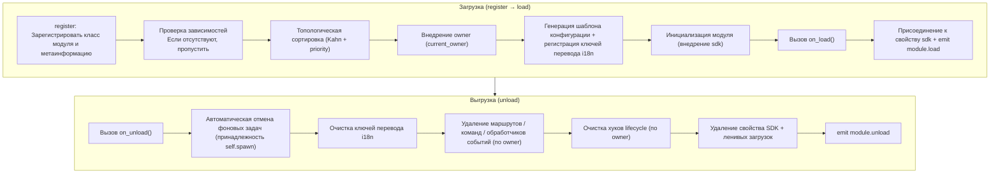

# Основные концепты модуля

Понимание основных концептов модуля ErisPulse является основой для разработки качественных модулей.

## Жизненный цикл модуля

### Стратегия загрузки

```python
from ErisPulse.Core.Bases import BaseModule
from ErisPulse.loaders import ModuleLoadStrategy

class MyModule(BaseModule):
    @staticmethod
    def get_load_strategy():
        """Возвращает стратегию загрузки модуля"""
        return ModuleLoadStrategy(
            lazy_load=True,   # Ленивая загрузка или немедленная загрузка
            priority=0,       # Приоритет загрузки (чем больше, тем раньше загрузка)
            depends=["OtherModule"]  # Опционально: объявить зависимости от других модулей
        )
```

> Модули, объявленные в `depends`, будут пропущены и записано предупреждение, если они не зарегистрированы. Порядок загрузки определяется топологической сортировкой, а при равных приоритетах по убыванию `priority`.

> [!NOTE]
> **Каскадное выгрузка / каскадное перезагрузка** (ErisPulse **2.8.0+**): При выгрузке модуля, от которого зависят другие модули, сначала будут **каскадно выгружены** модули, от него зависящие (в логе указывается цепочка каскада); при горячей перезагрузке любого модуля (локальный плагин / пакет из PyPI), модули, от него зависящие, также **каскадно перезагружаются**, предотвращая использование устаревших экземпляров. Циклические зависимости будут отклонены с `RuntimeError` при загрузке.

### Метод on_load

Вызывается при загрузке модуля, используется для инициализации ресурсов и регистрации обработчиков событий:

```python
async def on_load(self, event):
    # Регистрация обработчика события
    @command("hello", help="Команда приветствия")
    async def hello_handler(event):
        await event.reply("Привет!")

    # Использование встроенного HTTP-клиента SDK (автоматически управляет пулы соединений, не нужно создавать session вручную)
    # Через sdk.client можно отправлять запросы
```

### Метод on_unload

Вызывается при выгрузке модуля, используется для очистки ресурсов:

```python
async def on_unload(self, event):
    # Очистка пользовательских ресурсов
    # sdk.client управляется фреймворком, не нужно закрывать вручную

    # Отмена обработчика события (фреймворк автоматически обрабатывает)
    self.logger.info("Модуль выгружен")
```

> Создание и очистка фоновых задач (с помощью `self.spawn()` / автоматическая отмена фреймворком) см. в [управлении жизненным циклом](../../advanced/lifecycle.md#фоновые-задачи-принадлежность-и-автоматическая-отмена).

### Выгрузка и полная выгрузка (purge)

> [!NOTE]
> Эта функция доступна в ErisPulse **2.8.0+**.

`unload()` по умолчанию только **отменяет загрузку** (выгружает экземпляр и ресурсы), но сохраняет метаданные модуля (класс модуля и метаинформация) — модуль все еще может быть обнаружен с помощью `discover` и перезагружен с помощью `load()`, без необходимости повторно `register()`.

Если требуется **полная выгрузка** (освобождение ссылки на класс модуля, очистка `sys.modules`, чтобы плагин и его уникальные зависимости могли быть собраны сборщиком мусора), передайте `purge=True`:

```python
# Только отмена загрузки: сохраняются метаданные, можно перезагрузить в любое время
await sdk.module.unload("MyModule")

# Полная выгрузка: удаляются метаданные + очистка sys.modules (только для модулей из папки плагинов)
await sdk.module.unload("MyModule", purge=True)
```

| Семантика | unload() по умолчанию | unload(purge=True) |
|------|-----------------|----------------------|
| Выгрузка экземпляра и ресурсов (события/task/маршруты/lifecycle/i18n) | ✅ | ✅ |
| Сохранение метаданных (класс модуля и метаинформация) | ✅ | ❌ Удалено |
| Очистка `sys.modules` (только для модулей из папки плагинов) | ❌ | ✅ |
| Класс модуля может быть собран сборщиком мусора | ❌ | ✅ |
| Перезагрузка | `load()` можно использовать напрямую | Сначала нужно `register()` + `load()` |

> При `purge=True` модули, от которых зависят, также будут выгружены; после выгрузки фреймворк выполнит `gc.collect()` и проверит, можно ли собрать класс и экземпляр модуля, оставшиеся ссылки будут предупреждены в логах (с указанием источника, уровень DEBUG).

### Жизненный цикл в целом

Собрав все методы вместе, вот что фреймворк делает за вас при загрузке и выгрузке модуля:


```mermaid
flowchart TD
    subgraph Load["Загрузка (register → load)"]
        L1["register: Зарегистрировать класс модуля и метаинформацию"] --> L2["Проверка зависимостей<br/>Если отсутствуют, пропустить"]
        L2 --> L3["Топологическая сортировка (Kahn + priority)"]
        L3 --> L4["Внедрение owner (current_owner)"]
        L4 --> L5["Генерация шаблона конфигурации + регистрация ключей перевода i18n"]
        L5 --> L6["Инициализация модуля (внедрение sdk)"]
        L6 --> L7["Вызов on_load()"]
        L7 --> L8["Присоединение к свойству sdk + emit module.load"]
    end

    subgraph Unload["Выгрузка (unload)"]
        U1["Вызов on_unload()"] --> U2["Автоматическая отмена фоновых задач (принадлежность self.spawn)"]
        U2 --> U3["Очистка ключей перевода i18n"]
        U3 --> U4["Удаление маршрутов / команд / обработчиков событий (по owner)"]
        U4 --> U5["Очистка хуков lifecycle (по owner)"]
        U5 --> U6["Удаление свойства SDK + ленивых загрузок"]
        U6 --> U7["emit module.unload"]
    end

    Load --> Unload
```

**Что фреймворк делает за вас при загрузке** (вам нужно только написать `on_load`, остальное делается автоматически):

| Этап | Что делает фреймворк автоматически |
|------|-------------|
| Внедрение owner | При инициализации модуля с помощью `owner_scope`, все зарегистрированные вами команды/события/хуки/фоновые задачи **автоматически присваиваются этому модулю**, при выгрузке они очищаются одним нажатием по owner |
| Шаблон конфигурации | Модули, объявившие `ConfigClass`, получают автоматически сгенерированный/заполненный раздел конфигурации `ErisPulse.<ModuleName>` |
| Ключи перевода i18n | Модули, объявившие `I18nClass`, регистрируют ключи перевода (автоматически удаляются при выгрузке) |
| Зависимости | Сортируются по `depends`, гарантируя, что модули, от которых зависят, загружаются первыми; циклические зависимости отклоняются с `RuntimeError` |
| Присоединение к SDK | После инициализации модуль присоединяется к `sdk.<ModuleName>`, благодаря чему вы можете обращаться к `sdk.MyModule.xxx` |

**Что фреймворк очищает за вас при выгрузке** (соответствует U1→U7 выше): после выполнения `on_unload` происходит дополнительная очистка — фоновые задачи принудительно отменяются (созданные с помощью `self.spawn`, для корректного завершения нужно сделать в `on_unload`), ключи перевода i18n, маршруты, команды/обработчики событий, хуки lifecycle, затем удаляется свойство SDK. `purge=True` дополнительно удаляет метаданные и очищает `sys.modules`.

> Именно эта автоматическая очистка и является основой для того, что вам нужно только писать `on_load`/`on_unload`, а не вручную unregister — фреймворк использует принадлежность owner, чтобы "кто зарегистрировал, тот и очищает" стало однокнопочным.

## Объект SDK

### Доступ к основным модулям

```python
from ErisPulse import sdk

# Доступ к основным модулям через объект sdk
sdk.logger.info("Лог")
sdk.storage.set("key", "value")
config = sdk.config.getConfig("MyModule")
```

### Коммуникация между модулями

```python
# Доступ к другим модулям
other_module = sdk.OtherModule
result = await other_module.some_method()
```

## Методы отправки адаптера

Из-за нового стандарта, требующего переопределения метода `__getattr__` для реализации механизма по умолчанию отправки, невозможно использовать `hasattr` для проверки наличия метода. Начиная с версии `2.3.5`, добавлена функция для запроса методов отправки.

### Перечисление поддерживаемых методов отправки

```python
# Перечисление всех методов отправки, поддерживаемых платформой
methods = sdk.adapter.list_sends("onebot11")
# Возвращает: ["Text", "Image", "Voice", "Markdown", ...]
```

### Получение подробной информации о методе

```python
# Получение подробной информации о методе
info = sdk.adapter.send_info("onebot11", "Text")
# Возвращает:
# {
#     "name": "Text",
#     "parameters": [
#         {"name": "text", "type": "str", "default": null, "annotation": "str"}
#     ],
#     "return_type": "Awaitable[Any]",
#     "docstring": "Отправка текстового сообщения..."
# }
```

## Управление конфигурацией

### Декларативная конфигурация (рекомендуется)

Начиная с версии v2.5.2, модули могут объявлять класс конфигурации через `ConfigClass`, используя ту же систему схемы конфигурации, что и адаптеры. Конфигурация читается в реальном времени через `self.cfg`, изменения применяются немедленно:

```python
from dataclasses import dataclass, field
from ErisPulse.Core.Bases import BaseModule
from ErisPulse.Core.Bases import BaseConfig

@dataclass
class MyModuleConfig(BaseConfig):
    api_key: str = field(
        default="",
        metadata={
            "description": {"i18n": "my_module.api_key", "default": "Ключ API"},
            "required": True,
            "secret": True,
            "ui": {"widget": "password", "group": "basic", "order": 1},
        },
    )
    timeout: int = field(
        default=30,
        metadata={
            "description": {"i18n": "my_module.timeout", "default": "Время ожидания (секунды)"},
            "ui": {"widget": "number", "group": "advanced", "order": 2},
        },
    )

class MyModule(BaseModule):
    ConfigClass = MyModuleConfig

    def __init__(self, sdk):
        self.sdk = sdk
        self.logger = sdk.logger.get_child("MyModule")

    async def on_load(self, event):
        self.logger.info("Модуль загружен")

    async def on_unload(self, event):
        pass

    async def do_something(self):
        cfg = self.cfg  # Чтение в реальном времени, безопасно по типу
        api_key = cfg.api_key
        timeout = cfg.timeout
```

`BaseConfig` — универсальный базовый класс конфигурации, подходит для адаптеров, модулей, внешних проектов и любых сценариев. Поля конфигурации поддерживают многоязычные описания i18n (см. [документацию по i18n](../../advanced/i18n.md#многоязычные-описания-поля-конфигурации)).

> [!NOTE]
> Жизненный цикл модуля (включая загрузку, выгрузку, запуск и остановку) управляется фреймворком (с помощью `module manager` / `scope` предоставляются API для запроса и управления). `ConfigClass` должен содержать только бизнес-параметры, модули не должны вкладывать внутрь логику "запускать себя или нет".

Система схем конфигурации также поддерживает (v2.8.0+, см. [основные концепты адаптера](../adapters/core-concepts.md#约定-metadata)):

- **Автоматическое создание описания полей из docstring**: при отсутствии метаданных `description` автоматически извлекаются из docstring `:ivar 字段: 说明` или раздела `Attributes:`
- **Вложенные dataclass конфигурации**: при типе поля вложенный dataclass, схема/шаблон/валидация обрабатываются рекурсивно, WebUI отображает вложенные группы
- **Поле `example`, не сохраняющееся в файле**: поля с `metadata={"example": True}` не записываются в config.toml, а только в `config.full.example` (подходит для сложных и редко используемых расширенных настроек), пользователь вручную настраивает, а затем сохраняется нормально

### Декларативные ключи перевода (v2.7.0+)

Начиная с версии v2.7.0, модули могут объявлять ключи перевода, подобно `ConfigClass`, через вложенный класс `I18nClass`, объявляя ключи перевода в одном месте. Фреймворк автоматически регистрирует все объявленные ключи перевода при загрузке, без необходимости вызывать `i18n.register()` вручную, и регистрация происходит до генерации шаблона конфигурации, гарантируя, что ключи перевода, используемые в описании конфигурации, уже доступны.

```python
from ErisPulse.Core.Bases import BaseConfig, BaseI18n, I18nKey

class MyModule(BaseModule):
    # Класс конфигурации (опционально)
    @dataclass
    class ConfigClass(BaseConfig):
        welcome_msg: str = field(
            default="Добро пожаловать",
            metadata={
                "description": {"i18n": "mymodule.welcome_msg", "default": "Сообщение приветствия"},
            },
        )

    # Класс набора ключей перевода (опционально)
    class I18nClass(BaseI18n):
        # Название атрибута автоматически объединяется в полный ключ: <имя модуля>.<название атрибута>
        welcome_msg: I18nKey = I18nKey(
            default="Welcome Message",   # Безопасный запасной вариант, не зависящий от языка
            zh_CN="欢迎消息",
            zh_TW="歡迎訊息",
            en="Welcome Message",
            ja="ウェルカムメッセージ",
            ru="Приветственное сообщение",
        )
        hello: I18nKey = I18nKey(
            default="Hello, {name}!",
            zh_CN="你好，{name}！",
            zh_TW="你好，{name}！",
            en="Hello, {name}!",
            ja="こんにちは、{name}！",
            ru="Привет, {name}!",
        )
```

Подробнее см. [рекомендуемый способ написания i18n](../../advanced/i18n.md#рекомендуемый-способ-объявления-ключей-перевода-через-i18nclass-v270).

### Ручное чтение конфигурации (устарело)

> **Устарело**: используйте [декларативную конфигурацию](#декларативная-конфигурация-рекомендуется) + `self.cfg` для чтения в реальном времени.

```python
class MyModule(BaseModule):
    def __init__(self, sdk):
        self.sdk = sdk

    def _load_config(self):
        config = self.sdk.config.getConfig("MyModule")
        if not config:
            self.sdk.config.setConfig("MyModule", {"api_key": "", "timeout": 30})
            return {"api_key": "", "timeout": 30}
        return config
```

## Система хранения

### Базовое использование

```python
# Сохранение данных
sdk.storage.set("user:123", {"name": "张三"})

# Получение данных
user = sdk.storage.get("user:123", {})

# Удаление данных
sdk.storage.delete("user:123")
```

### Использование транзакций

```python
# Использование транзакции для обеспечения согласованности данных
with sdk.storage.transaction():
    sdk.storage.set("key1", "value1")
    sdk.storage.set("key2", "value2")
    # Если любая операция не удалась, все изменения будут отменены
```

## Обработка событий

### Регистрация обработчиков событий

```python
from ErisPulse.Core.Event import command, message

# Регистрация команды
@command("info", help="Получить информацию")
async def info_handler(event):
    await event.reply("Это информация")

# Регистрация обработчика сообщений
@message.on_group_message()
async def group_handler(event):
    sdk.logger.info(f"Получено групповое сообщение: {event.get_text()}")
```

### Жизненный цикл обработчиков событий

Фреймворк автоматически управляет регистрацией и удалением обработчиков событий, вам нужно только зарегистрировать их в `on_load`.

## Механизм ленивой загрузки

### Принцип работы

```python
# Модуль будет инициализирован при первом обращении
result = await sdk.my_module.some_method()
# ↑ Здесь будет вызвана инициализация модуля
```

### Немедленная загрузка

Для модулей, которые должны быть инициализированы немедленно (например, слушатели, таймеры):

```python
@staticmethod
def get_load_strategy():
    return ModuleLoadStrategy(
        lazy_load=False,  # Немедленная загрузка
        priority=100
    )
```

## Обработка ошибок

### Обработка исключений

```python
async def handle_event(self, event):
    try:
        # Бизнес-логика
        await self.process_event(event)
    except ValueError as e:
        self.logger.warning(f"Ошибка параметра: {e}")
        await event.reply(f"Ошибка параметра: {e}")
    except Exception as e:
        self.logger.error(f"Обработка не удалась: {e}")
        raise
```

### Запись в лог

```python
# Использование различных уровней логирования
self.logger.debug("Дебаг информация")    # Подробная дебаг информация
self.logger.info("Статус выполнения")      # Информация о нормальном выполнении
self.logger.warning("Предупреждение")  # Предупреждение
self.logger.error("Ошибка")    # Ошибка
self.logger.critical("Критическая ошибка") # Критическая ошибка
```

## Связанные документы

- [Введение в разработку модулей](getting-started.md) - Создание первого модуля
- [Объект события](event-wrapper.md) - Подробности обработки событий
- [Лучшие практики](best-practices.md) - Разработка качественных модулей