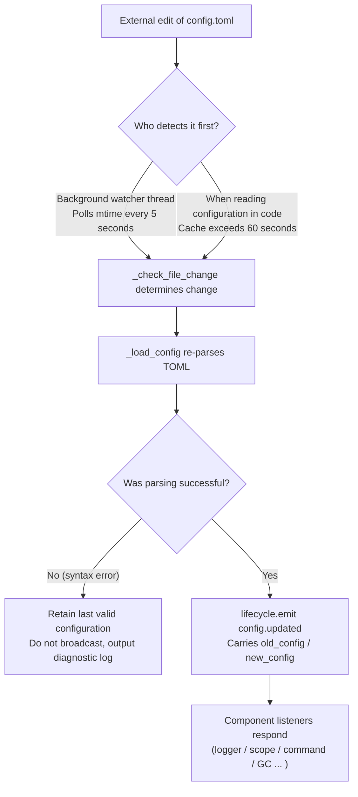

# Описание конфигурационного файла
> Этот документ расскажет о конфигурационном файле фреймворка. Если стороннему модулю требуется настройка, обратитесь к документации модуля.

ErisPulse использует конфигурационный файл в формате TOML `config/config.toml` для управления настройками проекта.

docs/ru/quick-start.md

## Расположение конфигурационного файла

Конфигурационный файл находится в папке `config/` в корне проекта:

```
project/
├── config/
│   └── config.toml
├── main.py
```

docs/ru/quick-start.md

## Обработка ошибок загрузки конфигурации

Фреймворк различает три состояния ошибок при загрузке `config.toml` и предоставляет **действенные диагностические сообщения**, а не просто переключается на настройки по умолчанию:

| Состояние ошибки | Условия срабатывания | Поведение фреймворка |
|------------------|----------------------|----------------------|
| Файл отсутствует | `config.toml` не существует | При первом запуске нормально, используется пустая конфигурация без предупреждений |
| Ошибка синтаксиса TOML | Файл существует, но формат некорректен (например, отсутствуют кавычки, не закрыты скобки) | Выводится **номер строки/столбца и причина ошибки**, а также сообщение о возврате к настройкам по умолчанию |
| Ошибка прав/другие ошибки | Нет прав на чтение, ошибки ввода-вывода и т.д. | Выводится **ясная причина**, а также сообщение о возврате к настройкам по умолчанию |

Например, если вы случайно написали конфигурацию как `port = 8000` (строка без кавычек), в логах будет выведено примерно следующее:

```
[ERROR] [Config] Синтаксическая ошибка в конфигурационном файле config/config.toml (строка 3, столбец 1): ...
[WARNING] [Config] Не удалось прочитать конфигурационный файл. Продолжаем работу с предыдущей корректной конфигурацией, изменения в файле не были применены — пожалуйста, исправьте и перезагрузите или перезапустите
```

Таким образом, вы можете сразу определить проблему на уровне **INFO**, а не задаваться вопросом "почему мои изменения не применяются".

> **Изменение конфигурационного файла во время работы?** Если вы вручную отредактируете `config.toml` во время работы робота и внесёте синтаксическую ошибку, фреймворк при следующей попытке записи (объединения конфигурации) выведет сообщение "Конфигурационный файл повреждён (ошибка синтаксиса, строка X), невозможно объединить и записать — пожалуйста, сначала исправьте конфигурационный файл и перезапустите", а не запутанное "ошибка записи". Новые значения конфигурации будут сохранены и не потеряются.

[**English**](docs/ru/quick-start.md) | [**简体中文**](docs/ru/quick-start.md)

## Переменные окружения

Фреймворк поддерживает **переопределение** конфигурационных параметров `ErisPulse.*` с помощью переменных окружения (подходит для Docker / контейнеризации / CI-развертывания, без необходимости изменять `config.toml`).

Правило именования: преобразуйте точечный путь `ErisPulse.<section>.<key>` в верхний регистр, замените `.` на `_` и добавьте префикс `ERISPULSE_`:

| Параметр конфигурации | Переменная окружения | Пример значения |
|----------------------|---------------------|-----------------|
| `ErisPulse.server.port` | `ERISPULSE_SERVER_PORT` | `9000` |
| `ErisPulse.server.host` | `ERISPULSE_SERVER_HOST` | `0.0.0.0` |
| `ErisPulse.logger.level` | `ERISPULSE_LOGGER_LEVEL` | `DEBUG` |
| `ErisPulse.framework.strict_mode` | `ERISPULSE_FRAMEWORK_STRICT_MODE` | `false` |

Описание поведения:
- **Наивысший приоритет**: переменные окружения переопределяют значения из «конфигурационного файла» и «значений по умолчанию», автоматически преобразуя типы (bool / int / float / список, разделённый запятыми / строка)
- **Непостоянное хранение**: переопределение действует только во время выполнения, не сохраняется в `config.toml`
- **Поддержка горячей перезагрузки**: изменение переменных окружения во время работы, в сочетании с перезагрузкой конфигурации при прослушивании, вступает в силу

```bash
# Пример развертывания в Docker: без изменения config.toml, просто переопределяем порт
ERISPULSE_SERVER_PORT=9000 docker compose up -d
```

> Примечание: такие параметры фреймворка, как `ErisPulse.server.port`, читаются через API, такие как `get_server_config()`, и подвержены влиянию переменных окружения.

[**English**](docs/ru/quick-start.md)

## Hot Configuration Reload

Starting from version 2.7.0, the framework provides **systematic support** for hot configuration reload. After an external modification of `config.toml` (background watcher checks every 5 seconds) or a code call to `setConfig()`, components automatically respond:

| Component | Configurations Supporting Hot Reload | Behavior |
|-----------|--------------------------------------|----------|
| **Logger** | `logger.level` / `log_files` / `log_dir` (including segment parameters) / `memory_limit` / `format` / `exclude_levels` | Automatically reapplied (with change detection) |
| **Command System CommandHandler** | `event.command.prefix` / `case_sensitive` / `allow_space_prefix` / `must_at_bot` | Takes effect on the next message |
| **Adapter Concurrency** | `framework.handler_max_concurrency` | Invalidates cached semaphore, recreates with new value |
| **Proactive GC** | `framework.proactive_gc_*` | Configuration change immediately restarts GC task, supports runtime adjustment/disable/re-enable |
| **Master System Master** | `master.users` | Each `is_master()` check reads in real time, no restart required |
| **Module/Adapter Configurations** | Individual configuration items | Triggers `on_config_update(old, new)` callback |

**Configurations Requiring Restart** (cannot be safely hot-switched, warning "Process restart required" is output on change):

| Configuration | Reason |
|---------------|--------|
| `router.cors.*` / `router.security.*` | Middleware is written into FastAPI at service startup, cannot be safely hot-switched at runtime |
| `storage.use_global_db` | SQLite file handle is already open at runtime, switching paths is unsafe |

> **Error during mid-edit save?** If a transient syntax error occurs while editing `config.toml`, the framework will **retain the last valid configuration** and output diagnostic logs, and will not broadcast an empty configuration to components (to avoid `on_config_update` receiving null values and incorrectly reverting to defaults).

### Internal Breakdown of Hot Reload Chain

"How do components know when the configuration changes?" — Behind this is a chain of detection → reload → broadcast:



**Two Detection Paths** (either one suffices, both serve as fallback):

| Path | Mechanism | Trigger Timing |
|------|-----------|----------------|
| Background watcher | Daemon thread `config-watcher` polls file `mtime` every **5 seconds** | External file change detected within up to 5 seconds |
| Lazy detection | Any `getConfig()` read, if cache exceeds **60 seconds**, checks file first | Next time configuration is read |

> **Framework does not self-harm**: When `setConfig()` writes to disk, it records the "mtime written by itself," and the watcher excludes it during comparison, treating only **external edits** as changes.

**Two Types of Configuration Change Events:**

| Event | Trigger | Data | Typical Scenario |
|-------|---------|------|------------------|
| `config.set` | Code / Dashboard calls `setConfig()` | `{key, old_value, new_value}` | Single key write (template generation, status recording, runtime config change) |
| `config.updated` | Captured by watcher/lazy detection after external edit | `{old_config, new_config, config_file}` | Manual edit of `config.toml` |

> `setConfig()` defaults to **delayed disk write for 5 seconds** (combines multiple writes), `immediate=True` writes immediately. After the watcher detects an external modification, it only updates the in-memory cache and **does not** write the external change back to the file.

**List of Automatic Responders** (both event types are typically subscribed, responses are consistent):

| Component | Listener | Response |
|-----------|----------|----------|
| Logger | `config.set` + `config.updated` | Reapplies level/file/directory segments/memory limit/format/level exclusion (with change detection, no change means no action) |
| Scope | `config.updated` | Recreates cached scope binding |
| Command System | `config.updated` | Refreshes prefix/case sensitivity/space prefix/must_at_bot parsing parameters, takes effect on next message |
| Adapter Concurrency | `config.set` + `config.updated` | Invalidates and recreates semaphore for `handler_max_concurrency` |
| Proactive GC | `config.set` + `config.updated` | Immediately restarts GC background task for `proactive_gc_*` |
| Adapter | Routes to `on_config_update` | Each adapter's `on_config_update(old, new)` callback |
| Module | Routes to `on_config_update` | Each module's `on_config_update(old, new)` callback |
| Storage | `config.updated` | Change of `use_global_db` only **logs warning** (requires restart) |
| Router | `config.updated` | Change of `cors.*` / `security.*` only **logs warning** (requires restart) |

docs/ru/quick-start.md

## Полный пример конфигурации

```toml
[ErisPulse.server]
host = "0.0.0.0"
port = 8000
auto_start = true
ssl_certfile = ""
ssl_keyfile = ""

[ErisPulse.master]
# users поддерживает два способа записи (выберите один из двух):
#   Глобальный владелец (действует на всех платформах): users = ["123456", "789012"]
#   Владелец, указанный по платформам: users = { yunhu = ["123456"], telegram = ["789012"] }
users = {}

[ErisPulse.logger]
level = "INFO"
format = "rich"
log_files = []
log_dir = ""
log_rotation = "size"
log_max_size_mb = 10
log_backup_count = 5
log_rotation_when = "midnight"
memory_limit = 1000
exclude_levels = []

[ErisPulse.framework]
enable_lazy_loading = true
uninit_timeout = 30
strict_mode = 0

[ErisPulse.framework.strict_mode_exceptions]
modules = []
adapters = []

[ErisPulse.storage]
use_global_db = false

[ErisPulse.event.command]
prefix = "/"
case_sensitive = true
allow_space_prefix = false
must_at_bot = false

[ErisPulse.event.message]
ignore_self = true

[ErisPulse.i18n]
language = "auto"

## Конфигурация сервера

```toml
[ErisPulse.server]
host = "0.0.0.0"
port = 8000
auto_start = true
ssl_certfile = "/path/to/cert.pem"
ssl_keyfile = "/path/to/key.pem"
```

| Параметр | Тип | Значение по умолчанию | Описание |
|---------|------|---------|------|
| host | string | 0.0.0.0 | Адрес прослушивания, 0.0.0.0 означает все интерфейсы |
| port | integer | 8000 | Порт прослушивания |
| auto_start | boolean | true | Автоматически запускать сервер маршрутизации при вызове `sdk.init()`. Установка в `false` пропустит запуск сервера маршрутизации (режим только событий/без WebUI) |
| ssl_certfile | string | пусто | Путь к файлу SSL-сертификата |
| ssl_keyfile | string | пусто | Путь к файлу SSL-ключа |

Пожалуйста, замените `docs/ru/` на `docs/ru/` в ссылках документации. Например, `docs/ru/quick-start.md` должно быть изменено на `docs/ru/quick-start.md`. Ссылки на файлы других языков (например, в формате `README.xx.md`) должны оставаться без изменений. Это гарантирует, что ссылки указывают на правильную версию документации на нужном языке.

## Конфигурация главной системы

Главная система используется для распознавания аккаунтов "владельца фреймворка" (например, администраторов бота). `master.users` поддерживает два способа написания:

```toml
[ErisPulse.master]
# Способ 1: Глобальный владелец (действует на всех платформах)
users = ["123456", "789012"]

# Способ 2: Владелец по платформе (dict)
# users = { yunhu = ["123456"], telegram = ["789012"] }
```

| Параметр конфигурации | Тип | Значение по умолчанию | Описание |
|-----------------------|-----|------------------------|----------|
| users | array / object | пустой | Список аккаунтов владельцев. Формат `list` означает глобального владельца (действует на всех платформах); формат `dict` означает владельца по платформе (ключ - имя платформы, значение - список аккаунтов владельца для этой платформы) |

В коде проверка осуществляется через `master.is_master(event)` или `master.is_master(platform, user_id)`, при каждом вызове конфигурация читается в реальном времени (поддерживается горячая перезагрузка, перезапуск не требуется):

```python
from ErisPulse.Core import master

if master.is_master(event):
    await event.reply("Привет, хозяин")
```

[**English**](docs/ru/quick-start.md)

## Конфигурация журнала

```toml
[ErisPulse.logger]
level = "INFO"
log_files = []                # Явный список файлов журнала (взаимоисключается с log_dir, имеет более высокий приоритет)
log_dir = ""                  # Директория журнала (после установки автоматически сегментируется и ротируется)
log_rotation = "size"         # Способ сегментации: "size" / "date" / "none"
log_max_size_mb = 10          # Максимальный размер файла в режиме "size" (МБ)
log_backup_count = 5          # Количество сохраняемых файлов журнала
log_rotation_when = "midnight"  # Период ротации в режиме "date": S/M/H/D/midnight
memory_limit = 1000
exclude_levels = ["EVENT"]
```

| Параметр | Тип | Значение по умолчанию | Описание |
|---------|------|---------|------|
| level | string | INFO | Уровень журнала: TRACE, DEBUG, INFO, WARNING, ERROR, CRITICAL (TRACE - самый низкий уровень, выводит подробную отладочную информацию внутренней структуры) |
| format | string | rich | Формат вывода журнала: `rich` (цветной, по умолчанию), `plain` (чистый текст без цвета, подходит для сбора журнала/перенаправления в поток), `json` (структурированный JSON, подходит для ELK и т.д.) |
| log_files | array | пустой | Список файлов журнала (явные пути, без сегментации) |
| log_dir | string | пустой | Директория журнала (автоматически создается). После установки запись в файл `erispulse.log` в указанной директории с автоматической сегментацией по `log_rotation`; взаимоисключается с `log_files`, `log_files` имеет приоритет |
| log_rotation | string | size | Способ сегментации: `size` (по размеру) / `date` (по времени) / `none` (без сегментации) |
| log_max_size_mb | float | 10 | Максимальный размер файла в режиме "size" (МБ), при превышении создается резервная копия с расширением .1/.2 |
| log_backup_count | integer | 5 | Количество сохраняемых файлов журнала, старые резервные копии автоматически удаляются |
| log_rotation_when | string | midnight | Период ротации в режиме "date": `S`/`M`/`H`/`D`/`midnight` (по умолчанию ротация каждый день в полночь) |
| memory_limit | integer | 1000 | Количество записей журнала, сохраняемых в памяти |
| exclude_levels | array | пустой | Уровни журнала, которые нужно отключить. Журналы с отключенными уровнями **полностью отбрасываются** (не записываются в память, не передаются на панель Dashboard и другие подписчики, не выводятся, не записываются в файл). Поддерживается горячая перезагрузка |

Также можно динамически переключать в коде:

```python
from ErisPulse.Core import logger

# Сегментация по размеру: файл 10 МБ, сохранять 5 копий
logger.set_output_dir("logs", rotation="size", max_size_mb=10, backup_count=5)

# Сегментация по времени: ротация каждый день в полночь, сохранять 7 копий
logger.set_output_dir("logs", rotation="date", backup_count=7)
```

> [!NOTE]
> Настройки `log_dir` и связанные с сегментацией параметры требуют ErisPulse **2.8.0+**.

> **Защита конфиденциальности**: Содержимое сообщений записывается с уровнем **EVENT** (значение 21). Установка `exclude_levels = ["EVENT"]` позволяет скрыть содержимое сообщений в группах/личных чатах от фоновых процессов (например, панели журнала Dashboard), при этом не влияя на другие уровни журнала.

> [!NOTE]
> Функция `exclude_levels` требует ErisPulse **2.8.0+**.

## Конфигурация фреймворка

```toml
[ErisPulse.framework]
enable_lazy_loading = true
uninit_timeout = 30
strict_mode = 0

[ErisPulse.framework.strict_mode_exceptions]
modules = []
adapters = []
```

| Параметр | Тип | Значение по умолчанию | Описание |
|---------|------|---------|------|
| enable_lazy_loading | boolean | true | Включать ли ленивую загрузку модулей |
| uninit_timeout | integer | 30 | Общее время ожидания при корректном завершении (секунды), после которого происходит принудительное завершение. 0 означает отсутствие таймаута |
| strict_mode | integer | 0 | Уровень строгого режима, см. раздел «Строгий режим» |
| handler_max_concurrency | integer | 64 | Максимальное количество одновременных задач обработчиков событий, увеличение значения повышает пропускную способность, но увеличивает потребление памяти |
| offline_bot_expiry | integer | 3600 | Автоматическое время истечения срока действия записи о неактивном боте (секунды), 0 означает отсутствие истечения срока |

### Конфигурация активного сборщика мусора

После инициализации SDK запускается фоновая задача активного сборщика мусора, которая периодически выполняет сборку мусора Python и внутреннее освобождение ресурсов (очистка неактивных ботов и т.д.). Все параметры поддерживают горячую перезагрузку, изменение параметров немедленно перезапускает задачу.

| Параметр | Тип | Значение по умолчанию | Описание |
|---------|------|---------|------|
| proactive_gc_interval | number | 300 | Интервал сборки (секунды), поддерживает дробные значения. 0 означает отключение активного сборщика мусора |
| proactive_gc_generation | integer | 0 | Поколение для обычных циклов сборки мусора (0/1/2, ограничено 0..2). Обратите внимание, что `gc.collect(2)` эквивалентен полной сборке мусора, по умолчанию 0 сохраняет легкость; глубокая сборка мусора запускается периодически с помощью `proactive_gc_full_every` |
| proactive_gc_full_every | integer | 20 | Полная сборка мусора выполняется каждые N циклов, 0 означает отключение периодической полной сборки. Полная сборка мусора ограничена порогом `proactive_gc_memory_growth_mb` |
| proactive_gc_memory_growth_mb | integer | 32 | Порог роста памяти для полной сборки мусора (МБ): сравнивается с базовой памятью после последней полной сборки мусора (в первую очередь tracemalloc, затем RSS), полная сборка мусора выполняется только при достижении этого значения. 0 означает отсутствие порога |
| proactive_gc_idle_only | boolean | false | При включении сборка мусора Python пропускается в цикле, когда происходит пик событий (присутствуют незавершенные обработчики pending), чтобы избежать пауз и конкуренции с обработкой сообщений; внутреннее освобождение ресурсов не затрагивается |
| proactive_gc_gen0_min | integer | 500 | Минимальное количество мусора в поколении gen0 для запуска обычной сборки мусора: если `gc.get_count()[0]` ниже этого значения, сборка мусора пропускается (цикл с нулевой нагрузкой почти не требует ресурсов). 0 означает, что сборка мусора всегда выполняется |

> **Изменение 2.7.1**: значение по умолчанию `proactive_gc_generation` изменено с `2` на `0`, значение по умолчанию `proactive_gc_full_every` изменено с `0` на `20`. Ранее `generation=2` означало, что каждый цикл выполняется наиболее тяжелая полная сборка мусора; новое значение по умолчанию сохраняет охват сборки, но значительно снижает нагрузку на пустые циклы. Явно заданные старые значения по-прежнему действуют в соответствии с их смыслом.

### Строгий режим

Строгий режим управляет стратегией обработки компонентов/адаптеров, которые не соответствуют требованиям или не могут быть загружены на этапе загрузки. Современные модули/адаптеры должны наследовать соответствующие базовые классы (`BaseModule`/`BaseAdapter`), компоненты, не наследующие базовые классы, влияют на контекстную систему фреймворка и на резервное очищение, что может привести к утечке ресурсов.

> **Изменение 2.5.2**: уровень по умолчанию изменен с `1` (пропуск) на `0` (снисходительный), чтобы уменьшить проблемы с загрузкой при первом использовании новыми пользователями. Компоненты, не наследующие базовые классы, будут предупреждаться и попытка загрузки будет предпринята, а не отклонена напрямую. Чтобы восстановить прежнее поведение, явно установите `strict_mode = 1`.

| Уровень | Название | Поведение |
|------|------|------|
| 0 | Снисходительный (по умолчанию) | Нарушения только предупреждаются, компоненты, не наследующие базовые классы, все равно будут загружаться (для совместимости со старыми компонентами) |
| 1 | Строгий-пропуск | Компоненты, не наследующие базовые классы, будут отклонены и пропущены, остальные будут запускаться нормально |
| 2 | Строгий-фатальный | Все нарушения (не наследование базовых классов, сбой загрузки, сбой регистрации, сбой инициализации и т.д.) будут считаться фатальными, и все нарушения будут собраны и выведены в одном списке после точки проверки запуска, после чего запуск будет прерван |

На всех уровнях, ошибки, возникающие на этапах загрузки/регистрации/инициализации, которые приводят к сбою компонентов, всегда будут пропущены; различие заключается в следующем:

- **0 → 1**: единственное изменение поведения заключается в том, что «не наследование базового класса» из «все еще загрузка» изменяется на «пропуск».
- **1 → 2**: все нарушения (не наследование базового класса, сбой загрузки, сбой регистрации, сбой инициализации и т.д.) повышаются до фатальных, и после сбора на точке проверки запуска будет выведен список нарушений и запуск будет прерван.

#### Список исключений

Если некоторые компоненты действительно временно не могут быть обновлены (например, из-за зависимости от старых модулей), их можно добавить в список исключений, и компоненты, перечисленные в этом списке, будут обрабатываться в соответствии с снисходительным режимом, даже если они не соответствуют требованиям, и будут продолжать загружаться:

```toml
[ErisPulse.framework.strict_mode_exceptions]
modules = ["SeTu", "SomeLegacyModule"]
adapters = ["OldAdapter"]
```

> Когда компонент отклоняется строгим режимом, в журнале будет четко указано, как восстановить загрузку (добавление в список исключений или снижение уровня).

[**English**](docs/ru/quick-start.md)

## Конфигурация хранилища

```toml
[ErisPulse.storage]
use_global_db = false
```

| Параметр | Тип | Значение по умолчанию | Описание |
|---------|------|---------|------|
| use_global_db | boolean | false | Использовать ли глобальную базу данных (внутри пакета) вместо базы данных проекта. При `true` все проекты будут использовать общую базу данных SQLite внутри пакета ErisPulse; при `false` (по умолчанию) каждый проект будет использовать свою независимую базу данных в каталоге `config/` |

[**English**](docs/ru/quick-start.md)

## Конфигурация событий

### Конфигурация команд

```toml
[ErisPulse.event.command]
prefix = "/"
case_sensitive = true
allow_space_prefix = false
```

| Параметр | Тип | Значение по умолчанию | Описание |
|---------|------|---------|------|
| prefix | string | / | Префикс команды |
| case_sensitive | boolean | true | Регистрозависимость (различаются ли команды `/Help` и `/help`) |
| allow_space_prefix | boolean | false | Разрешить пробел в качестве префикса |
| must_at_bot | boolean | false | Требуется упоминание бота для активации команды (для личных сообщений не применяется) |

### Конфигурация сообщений

```toml
[ErisPulse.event.message]
ignore_self = true
```

| Параметр | Тип | Значение по умолчанию | Описание |
|---------|------|---------|------|
| ignore_self | boolean | true | Игнорировать собственные сообщения бота |

## Международная локализация

```toml
[ErisPulse.i18n]
language = "auto"
```

| Параметр | Тип | Значение по умолчанию | Описание |
|---------|------|---------|------|
| language | string | auto | Язык отображения встроенных текстов фреймворка. Установите `auto` для автоматического определения языка системы, или укажите конкретный код языка: `zh-CN`、`zh-TW`、`en`、`ja`、`ru` |

[**Следующая страница**](docs/ru/quick-start.md)

## Конфигурация модуля

Каждый модуль может определить свою собственную конфигурацию в файле конфигурации:

```toml
[MyModule]
api_url = "https://api.example.com"
timeout = 30
enabled = true
```

Чтение и запись конфигурации в модуле:

```python
from ErisPulse import sdk

# Чтение конфигурации
config = sdk.config.getConfig("MyModule", {})
api_url = config.get("api_url", "https://default.api.com")

# Запись конфигурации во время выполнения (отложенное сохранение)
sdk.config.setConfig("MyModule.timeout", 60)

# Немедленное сохранение в файл
sdk.config.setConfig("MyModule.timeout", 60, immediate=True)
```

> `setConfig` по умолчанию использует отложенную запись (примерно каждые 5 секунд пакетное сохранение в файл), установка `immediate=True` приводит к немедленной постоянной записи. Изменение конфигурации запускает событие жизненного цикла `config.set`.

[**中文**](docs/ru/quick-start.md)

## Конфигурация области видимости

> [!NOTE]
> Эта функция требует ErisPulse **2.8.0+**.

Система области видимости модуля используется для контроля "какие модули может использовать конкретный Bot". По умолчанию все модули доступны для всех Bots, фильтрация начинается только после привязки конфигурации, модули и адаптеры **не требуют никаких изменений** для адаптации.

```toml
[ErisPulse.scope]
default_allow = true        # По умолчанию разрешить все (false = строгий режим с неявным запретом)
cache_size = 1024           # Размер кэша LRU для is_allowed
```

| Параметр | Тип | Описание |
|---------|------|------|
| `scope.default_allow` | boolean | По умолчанию разрешить все модули (`true`). `false` = строгий режим с неявным запретом, доступны только модули из белого списка |
| `scope.cache_size` | integer | Размер кэша LRU для `is_allowed` (по умолчанию 1024) |
| `scope.platforms.<platform>.modules` | array | Белый список на уровне платформы: разрешены только перечисленные модули (пустой список = без ограничений) |
| `scope.platforms.<platform>.blocked` | array | Чёрный список на уровне платформы: запрещены перечисленные модули (пустой список = без ограничений) |
| `scope.bots.<platform>.<bot_id>.modules` | array | Белый список на уровне Bot, переопределяет платформенный |
| `scope.bots.<platform>.<bot_id>.blocked` | array | Чёрный список на уровне Bot, переопределяет платформенный |
| `scope.sessions.<platform>.<session_id>.modules` | array | Белый список на уровне сессии (группа/канал/личный чат), имеет наивысший приоритет |
| `scope.sessions.<platform>.<session_id>.blocked` | array | Чёрный список на уровне сессии, имеет наивысший приоритет |

> Приоритет анализа: **Сессия > Bot > Платформа**. Полный пример TOML с привязкой на трёх уровнях, нечувствительность к регистру названий модулей, изоляция идентификаторов сессий между платформами, динамическое добавление/удаление во время выполнения с помощью `sdk.scope.bind()` / `unbind()` (с `merge=True` можно объединять) и т.д. см. в разделе [Система области видимости](../advanced/scope.md).

docs/ru/quick-start.md | docs/ru/configuration.md | docs/ru/plugins.md | docs/ru/advanced/scope.md

## Далее

- [Справочник команд CLI](cli-reference.md) - Узнайте все команды командной строки
- [Руководство для разработчиков](../developer-guide/) - Изучите разработку пользовательских модулей

Пожалуйста, возвращайте непосредственно переведенный полный Markdown-контент, не включая никаких других текстов.